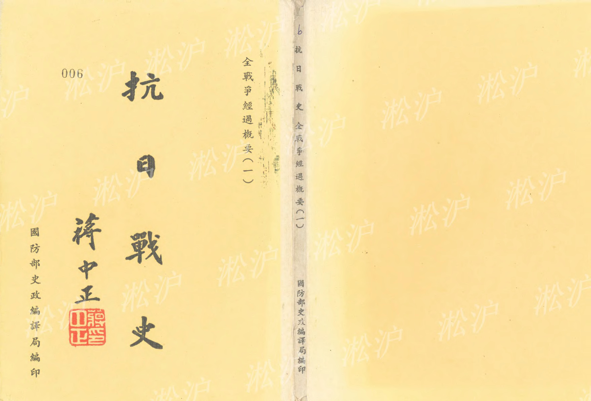

第一章

緒戰（自「九一八」起至七月七日蘆溝橋啟釁止）第一節

九一八事變及遼吉黑三省之淪陷第二節

「一二八」淞滬抗戰

### 第三節 榆關熱河失陷及長城抗戰

### 第四節 製造華北自治運動

### 第五節 策動內蒙獨立進攻察綏

## 第二章 中日兩國宣言

## 第三章 中日兩國之統帥機構

### 第一節 中國之統帥機構

### 第二節 日本之統帥機構

## 第四章 戰爭指導方案及作戰計畫

第一節

敵我兩軍之狀況（敘述兩國直前態勢及兩軍兵力比）第二節

戰爭指導方案及作戰計畫

目

錄

一

第五章 政治作戰　一〇一

第一節 戰時政治機構　一〇一

第二節 戰時政略之運用　一〇四

第一款 內政　一　二

第二款 外交　一　三

第六章 經濟作戰　一五三

第一節 戰時經濟體系　一五三

第一款 國民經濟建設方案之確立　一五三

第二款 戰時經濟方案之訂定　一六一

第二節 戰時生產與資源　一七三

第一款 農產之增加　一七三

第二款 資源開發　一七五

第三節 戰時經建概況　一七七

第一款 廠礦西遷　一七七

第二款 戰時工業　一七八

第三款 交通狀況　一八三

第四節 戰時財政與金融　一九二

第一款 戰時財政措施　一九二

第二款 戰時金融措施　一九六

第三款 調整物資供應

一○一

第四款 對敵經濟鬥爭

一○三

第七章 文化作戰

一○五

第一節 戰時教育

一○五

第一款 教育政策之確立

一○五

第二款 學校教育

一○五

第三款 社會教育

一○

第四款 邊疆教育　一五

第五款 童訓與軍訓

一○

第六款 青年運動　一五

第七款 青年輔導　一八

第二節 戰時文化　一三八

第一款 文化運動　一三八

第二款 學術研究　一三八

第三款 新聞與出版事業

一四○　一四五

第八章 第一期第一階段之作戰經過

自民國二十六年七月上旬

起至同年十二月中旬止

目

錄　三

第二節 我國作戰指導　二五一

第三節 作戰經過　二五五

第一款 陸軍之作戰　二五五

第二款 海軍之作戰　二八一

第三款 空軍之作戰　二八三

第四款 後方勤務之設施　二八七

第九章 第一期第二階段之作戰經過

(自民國二十六年十二月下旬起

至民國二十七年六月上旬止)

第一節 一般情勢　二九一

第二節 我國作戰指導　二九三

第三節 作戰經過

三○五

第一款 陸軍之作戰

三○五

第二款 海軍之作戰　三一五

第三款 空軍之作戰　三一六

第四款 後方勤務之設施　三一九

第十章 第一期第三階段之作戰經過

(自民國二十七年六月上旬

起至同年十一月下旬止)

第一節 一般情勢　三二一

### 第二節 我國作戰指導

### 第三節 作戰經過

#### 第一款 陸軍之作戰

#### 第二款 海軍之作戰

#### 第三款 空軍之作戰

#### 第四款 後方勤務之設施

#### 第五款 動員計畫及實施

## 第十一章 第二期第一階段之作戰經過

至民國二十七年十二月上旬起

至民國二十九年四月下旬止

### 第一節 一般情勢

### 第二節 我國作戰指導

### 第三節 作戰經過

#### 第一款 陸軍之作戰

#### 第二款 海軍之作戰

#### 第三款 空軍之作戰

#### 第四款 後方勤務之設施

## 第十二章 第二期第二階段之作戰經過

至民國二十九年五月上旬起

至民國三十年十二月下旬止

### 第一節 一般情勢

目

錄

五

三九五

### 第二節 我國作戰指導

### 第三節 作戰經過

#### 第一款 陸軍之作戰

#### 第二款 海軍之作戰

#### 第三款 空軍之作戰

#### 第四款 後方勤務之設施

#### 第五款 動員計畫及實施

## 第十一章 第二期第一階段之作戰經過

(自民國二十七年十二月上旬起

至民國二十九年四月下旬止)

### 第一節 一般情勢

### 第二節 我國作戰指導

### 第三節 作戰經過

#### 第一款 陸軍之作戰

#### 第二款 海軍之作戰

#### 第三款 空軍之作戰

#### 第四款 後方勤務之設施

## 第十二章 第二期第二階段之作戰經過

(自民國二十九年五月上旬起

至民國三十年十二月下旬止)

### 第一節 一般情勢

目

錄

五

三九五

我國作戰指導　三九六

第三節 作戰經過　三九七

第一款 陸軍之作戰　三九七

第二款 海軍之作戰　四一八

第三款 空軍之作戰　四二二

第四款 後方勤務之設施　四二四

第十三章 第二期第三階段之作戰經過

自民國三十一年元月上旬起

至民國三十四年九月勝利止

第一節 一般情勢　四二五

第二節 我國作戰指導　四六一

第三節 作戰經過　四六二

第一款 陸軍之作戰（含與盟軍協同）　四六二

第二款 海軍之作戰

五○二

第三款

空軍之作戰（含與盟軍協同及防空）

五○四

第四款 後方勤務之設施　五一

第五款 動員計畫與實施　五一二

第四節 中美合作

五二○

第一款 中美外交關係

五二○

第二款 軍事合作　五二一

# 第三篇 全戰爭經過概要（一）目錄

## 第一章 緒戰（自「九一八」起至七月七日蘆溝橋啟釁止）第一節

九一八事變及遼吉黑三省之淪陷第二節

「一二八」淞滬抗戰

### 第三節 榆關熱河失陷及長城抗戰

### 第四節 製造華北自治運動

### 第五節 策動內蒙獨立進攻察綏

## 第二章 中日兩國宣言

## 第三章 中日兩國之統帥機構

五七

### 第一節 中國之統帥機構

### 第二節 日本之統帥機構

六

## 第四章 戰爭指導方案及作戰計畫

七一

第一節

敵我兩軍之狀況（敘述兩國直前態勢及兩軍兵力比）七二

### 第二節 戰爭指導方案及作戰計畫

八一

日

錄

一

# 第三篇 全戰爭經過概要

## 第一章 緒

戰

### 第一節 九一八事變及遼吉黑三省之淪陷

#### 第一款 兵誌概要

我東北三省介於日俄之間，東北境隔黑龍江及烏蘇里江與西伯利亞爲鄰，西與外蒙古及察、熱接壤，東南隔圖們江及鴨綠江與韓國毗連，西南在長城外附近與河北省相接，南臨黄海及渤海。東自東經一百三十五度二十分之撫遠起西至東經一百十五度二十分之巴爾虎左翼旗止，南自北緯三十八度四十分之旅順方家屯起，北至北緯五十三度五十分之漠河止，週界共八千四百餘公里，面積一百三十餘萬平方公里，約相當於日本之三倍。境內有大小興安嶺及長白山諸大山脈及黑龍江、松花江、嫩江、圖們江、鴨綠江、遼河等諸大河流，並有廣漠之平原與良好之海港，凡農礦林畜水產等，無一不備，其中尤以鐵煤森林、大豆及電力資源，均冠於全國，爲我國防經濟所必需，亦敵國覬覦之根由。

東北之地形，長白山脈，大、小興安嶺，環峙東、西、北三面，松遼平原，沃野千里，乃國防之奧區。

東北海疆，自東海濱割讓後，瀕海之區，僅西南一部份而已，遼東半島與登州半島隔海相望，扼渤海之門戶，惜旅順、大連已先後租與俄、日，營口尙稱繁盛，葫蘆島甫經開港，連山灣、大孤山、金州灣、小凌河口，釣魚臺等處，皆扼要之所也。

東北邊塞，以黑龍江省之西部，額爾古訥河各岸地區，東據內興安嶺，西臨額爾古訥河，北抵黑龍江，南至索岳爾濟山，其間山河交錯，形勢險要，爲東北及西北兩方面之要地。其扼要之處有五：一曰臚濱（滿洲里），爲黑省邊界之第一門戶；二曰根河口，爲單人入境之孔道，水路之要衝；三曰吉拉林，爲金廠之所在；四曰珠爾干，爲西北一帶之重鎮；五曰額爾古訥河口，當倫邊之終點，俄輪往來之要道。

黑龍江左岸地區之瓊瑋、呼瑪、漠河等地，外控黑龍江，內倚興安嶺，其間山川錯雜，金礦最著，且據黑龍江之中樞，爲黑龍江省東北兩邊之屏障。

圖們江左岸地區，包含延吉、瑋春、和龍、汪清等地，位於吉林省之南部，與日俄兩國水陸接壤，並跨有長白山之東部。又圖們江爲中、韓兩國之天然國界，因韓民越界私墾，嘗引起中、日兩國之交涉，而日本謀築吉會路，又爲此區域內之重大問題，亦邊防上一大關鍵。

烏蘇里江左岸地區，包含密山、虎林、饒河、撫遠、同江等地，位於吉林省之東北隅，三面臨俄，以興凱湖、烏蘇里江、混同江劃分爲國界，而兩江之航行權，惜已喪失。

洮兒河流域及迤南之藿勒河流域，包括洮南、洮安、開通、安廣、突泉、鎮東等地，位於哲里木盟中部，爲遼寧省北部之重要區域。南下遼源，東通松、嫩，西北接壤外蒙，控制大漠，乃遼、吉、黑三省邊境之屏障也。

鴨綠江上游右岸區域，包括長白、臨江、安圖、撫松等地，地當中、韓國界之中樞，憑山阻海，頗具建瓴之勢，與韓國劃江而守，江狹水淺，可以徒涉，韓民常來侵犯，交涉頻仍。

鴨綠江下游右岸之安東，扼中韓交通孔道，爲東邊之一大重鎮，與韓國新義州隔江相望，形勢險要，爲中韓間之第一門戶。

東北公、鐵路密如蛛網，中東鐵路（原爲寬軌，出賣於日後改爲單軌）隸於俄，南滿及安瀋鐵路隸於日，以長春爲界，乃俄日侵略我國之動脈，自我東北當局修築大鄭、洮昂及瀋吉諸鐵路與南滿鐵路平行，予敵運輸業一大打擊，爲日本軍閥發動暴力侵略重要原因之一，嗣蘇俄於民國二十四年三月出賣中東鐵路於日僞，則爲其鼓勵日本軍閥侵華陰謀之具體表現。

#### 第二款 東北之軍事與政務

東北軍，原係前張作霖氏一手編成，其編制爲三三制，卽三連爲營，三營爲團，三團爲旅，自民國十九年以來，其陸、海、空軍兵力概況如左：

一、陸軍：

(一)國防軍：

1. 步兵二十七旅。

2. 騎兵六旅。

3. 砲兵八團。

4. 工兵六營。

6. 憲兵六隊。

省防軍：

1. 遼寧：步兵三團，騎兵四團。

2. 黑龍江：步兵三旅，騎兵四團。

3. 吉林：步兵三旅，騎兵二團。

二、海軍：

(一) 東北海防第一艦隊，轄海圻、海琛、肇和、鎮海、同安、華甲等軍艦。

(二) 東北海防第二艦隊，轄威海、定海、永翔、楚豫、江利等軍艦，海鵠、海鷗、澄海、海蓬、海燕、海駿等砲艦。

(三) 東北江防艦隊及附屬機構，轄有江亨、利綏、利捷、江平、利濟、江泰、江通等軍艦，及飛鷹、飛鵠、飛燕等汽艇，與海軍船塢、煤柴棧等。

三、空軍：飛機三百餘架。

此外，並在瀋陽設有大規模之兵工廠，每月可造各種砲彈六百顆、槍彈五萬粒、步槍一百五十枝，另有迫擊砲場及大、小營房數百棟。

東北之政務，自張學良易幟後，隸屬於國民政府，而爲地方政府之一，然中央爲適應東北之特殊環境，乃有東北政務委員會之設，爲指導並監督東北各省區之最高級地方政府機關，該會設委員十三人，以東北各省區資望最深富有政治經驗者充之，另設主席一人，則由委員互選之，又該會對於中央未經明白或詳細決定事項，可於不抵觸範圍內，得爲因地制宜之處理，若遇非常事變時，並得依委員出席三分之二以上之決議，作緊急之處置。

由此觀之，東北雖爲地方政府之一，但在實質上仍不離昔日之特殊勢力現象，因東北政務委員會之權力極大，由張學良兼任政務委員會主席及東北邊防司令長官。

#### 第三款 事變經過

事變原因，日本軍閥自日、俄戰爭之後，着着推行其大陸政策，不特將蘇俄在南滿之權益，全部攫爲己有（南滿鐵路所有權及其附帶之駐兵權），並且積極向我東三省內部伸展其侵略勢力，妄圖貫澈其滿蒙積極政策。蓋日本軍閥之侵略東北，蓄意已久，遂乘機於民國二十年九月十八日發動震撼世界之「九一八」事變，綜其原因，約有下列數端：

一、中國方面：我國自民國十七年以後，救亡圖存之思想，已隨三民主義之感召，通過軍事形式，由廣東一隅普及全國，當時掌握東北軍政大權之張學良氏，受此思想之啓發與感召，復痛其父慘死於日本軍閥之手，乃幡然改圖，不顧日人之阻撓，於民國十八年元旦，取消獨立，服從中央，從此全國統一，使日本製造中國分裂以圖漁利之詭計，已難施展。且近年來，東北當局更積極從事於東三省鐵路之修建、礦山之開採及葫蘆島港口之關築工作，日人對此，咸視爲威脅其旣得之權益，阻礙其大陸政策之發展。同時我國雖積極自強，但因湘、贛地區共匪作亂，國民政府正集中兵力圍勦，而長江流域又復發生水災，值此天災人禍交相煎迫之際，日本軍閥遂認爲乃其進佔東北之大好機會。二、國際方面：日本軍閥侵略滿蒙蠶食中國之計劃，已見於田中奏摺，但終以其力有未逮，加以顧慮國際關係，尤以感受美、英牽制甚大，因而躊躇徘徊，不敢放膽妄爲。自一九二九年（民國十八年）以來，美國經濟恐慌，遍及全世界，美、英兩國方爲此一問題所苦，無力顧及東亞，遂予日本軍閥向大陸發展之機會。

三、日本方面：一九二七年（民國十六年），日本金融恐慌，一九三一年（民國二十年），日本農業大凶年，於是素以侵略中國爲職志之軍人、政客，乃在財閥支持之下，發動其對華冒險之侵略行動。蓋此一行動，旣可滿足財閥掠奪原料與獨佔市場之慾望，復可對於失業而陷於饑餓中之大衆，起一種揚威國外之麻醉作用，藉對外以緩和其內在矛盾，並推動其大陸政策，向前再進一步。

綜上所述，均爲日本軍閥發動「九一八」事變之因素，亦正所謂爲其侵華千載一時之良機也。

日本旣已決心乘機侵華，乃於民國二十年中開始製造各種事件，藉爲啓釁之口實。諸如民國二十年三月，日本滿鐵理事木村與我談判鐵路交涉問題，以及前述之萬寶山慘案，唆使韓僑，強行掘河引水，更以軍警殺害我當地農民，反而捏造謠言，指責我欺壓韓人，以及中村失踪事件，藉口搜查，以爲侵略我土地之手段。

事變爆發與遼吉之淪陷：當上述各事件相繼發生後，日本卽不斷向南滿鐵路沿線增兵，準備有所行動，並於九月六日在瀋陽召集其駐東北之各領事，舉行會議，以造成特殊嚴重之局勢。九月十四日，日本關東軍司令官本莊繁（日本保護南滿鐵路之陸軍部隊總稱爲關東軍，其基幹部隊，爲平時編制的第二師團主力和一個獨立守備隊，總計約一萬人。事變當時主要人物，司令官爲本莊繁中將，參謀長三宅治中將，高級參謀板垣征四郎上校，作戰主任參謀石原莞爾中校。以檢閱爲名，赴南滿鐵路視察，並向士兵訓話，實乃指示其部屬之軍事準備，同時日本獨立守備隊司令部亦有同樣之文件發表，爲其事前準備佔領東北之預示。九月十七日，土肥原亦抵東北，迨其一切準備完成後，乃於九月十八日二十三時十五分，自行炸斷柳條溝鐵路，開始其侵略行動，震撼世界之東北巨變，因以爆發，而日人反捏造口實，揚言係中國軍隊所爲者，並稱中國軍隊向日本軍隊進攻，不經任何通知方式，大舉襲擊我瀋陽北大營，我軍退避，北大營遂爲日軍佔領，旋東大營亦被圍攻，我方人員死傷，軍械損失，爲數甚鉅。

我東北當局對於事件之發生，最初猶認係出於偶然，故不惜委曲求全，仍冀用和平方式，以謀解決，故嚴令守軍不予抵抗，我軍在此命令之下，遂完全處於被攻擊地位，節節退讓，未作任何抵抗措施而退出。日軍於佔領瀋陽後，除佔據我軍政機關，刼去瀋陽兵工廠所有機械武器及飛機外，並逮捕囚禁遼寧省主席臧式毅等，勒令其簽立供狀，承認對事變挑釁之責任。

當事變發生時，日本關東軍之全部及朝鮮軍司令官林鐵十郎之部隊，幾同時於民國二十年九月十八日夜，於南滿鐵路自長春至旅順之全部地區，開始行動。十九日，佔領鞍山、海城、開原、鐵岑、撫順、四平街、長春、寬城子、營口、安東、本溪湖等重要城市。二十日至二十五日，繼續擴大其軍事行動範圍，復佔領我熊岳、昌圖、遼源、通遼、洮南、吉林、蛟河、皇姑屯、新民等重要城市，至是我遼吉兩省要地，竟全被日軍佔領。

黑省之淪陷，日軍旣佔遼、吉，乃又北圖黑省。緣黑省當日軍佔領遼吉之初，已陷於僅可維持之局面，因黑省主席萬福麟另有使命，離省已久，萬國賓雖代父職，然不能料理省政，且黑省勁旅多已開往關內，省境頓覺空虛，軍政人員惶恐異常，洮遼鎮守使張海鵬又於是時與日軍勾結，宣稱獨立，有進犯黑省之企圖，嗣經查明屬實，張學良、萬福麟乃電勸其坐鎮洮南，防敵北犯，勿爲日人利用，張初不悅，後經人苦勸，意稍動，但其爲人利慾念重，初以爲黑省代主席，自必屬彼，後聞黑河警備司令馬占山代理黑龍江省政府主席，頗滋不悅，嗣以日人極力從旁煽動，並允供槍二萬枝，遂又轉變態度，乃於十月十三日派兵兩團，由通遼經洮昂路進攻黑省，黑省省防軍參謀長謝珂當令將洮昂路之江橋破壞一部，以阻張逆軍北進，十月十五日奉北平綏署抵抗之電令後，遂以衛隊徐團及砲兵樸團協力于兆麟旅扼守洮昂路江橋，步兵第二旅蘇炳文部之一團，在昂昂溪附近沿東鐵佈防，騎兵第一旅吳松山部之一團，在富拉爾基一帶佈防，其餘部隊於景星、泰來等處，與屯墾軍取犄角之勢，是日張逆所部抵泰來，欲一鼓而下龍江，經我徐、樸兩團迎頭痛擊，張部死傷甚衆，不支退去。

馬占山在黑河奉代理黑省主席之電後，聞張海鵬逆部北侵，一面電省令慎重防禦，並令附近駐軍南下增援，一面親率一團於十月十九日夜抵省，翌日卽通電就代理主席職，並任樸炳珊爲黑龍江省城警備司令，更致電前方，激勵將士，並佈告懸賞購買張海鵬首級，而張雖電北平辯護，但仍與日軍，蒙匪勾結，作死灰復燃之計。於是日軍乃乘機採取直接軍事行動，於十月二十六日以第二十九聯隊，藉口匪患，進佔四洮全線，二十七日，日軍向馬代主席提出要求書，限於十一月三日前將洮昂路嫩江大橋修竣，否則日方將以實力掩護自行修理，未待答覆，二十九日又致代修江橋之通牒，十月三十日，張逆海鵬在洮南蒙邊督辦公署開軍事會議，日軍勒令其採取積極行動，十一月二日，日軍再向馬代主席致哀的美敦書式之通牒後，十一月四日午卽向橋南我軍轟擊，我軍被迫採取自衛行動，於是嫩江血戰以起。十一月五日晨，日軍藉砲火掩護向我陣地進迫，激戰至夜，日軍並不斷增加，旣而以渡船載兵強渡，被我擊退，十一月六日三時，日軍由四洮線增援千餘，藉飛機、大砲、鐵甲車之掩護，搭架浮橋，再向江橋猛攻，大隊日軍衝過橋北，我軍不得已退守大興車站，同時並以吳松山旅及新編第一旅併力反攻，敵被包圍，幾悉被殲，馬代主席鑒於情勢之危急，親至前線視察，並召集旅團長訓話，勉以大義，爲國效忠，各部奮勇應戰，卒將日軍擊退。十一月七日，敵再度進攻，我軍退守三間房、紅旗營子，增加張殿九旅，協力夾擊過江之敵，敵不支，狼狽渡江而逃，我遂恢復江橋，計斃敵一百六十七人，傷敵六百餘人，我亦陣亡營長以下三百餘人。至此，我爲防敵再犯，乃行調整部署，以吳松山旅及步兵第一旅之兩團駐守江橋，以張殿九旅及步兵第一旅之一團駐守大興站及三間房，以蘇炳文旅之步兵兩團及程志遠旅之騎兵一團駐守葫蘆溪及小新屯。

迨十一月十二日，敵六千餘分三路復行向三間房、新立屯、大興站陣地進襲，我乃集中兵力於第一線迎戰，並將前線總指揮部移設於昂昂溪。同日，日關東軍司令本莊繁致牒馬代主席，要求：(一)馬氏下野。(二)撤退齊齊哈爾黑軍。(三)日軍一部向昂昂溪車站前進，並限當日午夜前答覆。馬代主席奉命嚴詞拒絕，準備死力抵抗。十一月十四日晨，正面之敵攻擊甚烈，其迂迴部隊復繞擊吳旅，陣地瀕危，適滿洲里程旅之一團到達參戰，日軍始退，但以飛機及毒彈向我大小新立屯及三間房一帶陣地猛攻，馬代主席親往督戰，湯池、蘑姑溪間，戰鬥尤烈，至十五日二時，日騎兵一隊衝向柽馬等處，馬代主席衛隊團首先衝殺，並以騎兵兩團迂迴包圍，敵倉皇無措，乃相率潰退。

此時，敵以鏖戰經旬，尚未達到目的，乃退而謀戰事範圍之擴大，除令調其本國濱松及朝鮮平壤等地航空隊，星夜開赴嫩江橋前線外，並訓令本莊繁對馬占山作戰，對於必要之緊急處置，得以便宜行事。先是敵於十一月十五日晨，電告馬代主席，提出要求三項：「(一)馬軍向北撤至齊齊哈爾，凡此次集中於齊齊哈爾及昂昂溪兵隊，須退回原駐地。(二)馬軍不得駐紮中東路以南。(三)洮昂路管理，馬不得妨礙，否則日軍卽時採取必要而有效之手段，並限十日內實行」。馬代主席奉張學良令，當卽予以一一駁覆謂：「一、齊齊哈爾與昂昂溪乃完全爲中國領土，馬占山軍隊爲中國政府軍隊，其在本國領土以內駐紮，日本政府係根據何種理由，橫加干涉。二、中東路南北均爲中國領土，駁覆意旨與第一條同。三、洮昂路雖係借款築成，但借款合同內，明白規定該路主權完全屬於我國，所有管理支配，均非債權者單方所能擅專，此乃世界各國所公認，毫無理由之要求，礙難予以接受」。同時我以日軍圖我甚亟，大戰勢難避免，乃積極從事備戰。十一月十六日，敵步砲千餘、騎兵三百餘，進逼三間、房新立屯、三家子我軍右翼陣地，適大風甚劇，沙塵蔽空，敵乘勢猛撲，與守軍發生肉搏戰鬥，旋我派隊由左右包圍，敵始退去。

民國二十年十一月十七日，我國民政府以馬占山指揮有方，乃升任馬氏爲黑龍江省政府委員兼主席，馬氏權力至此較大，雖補給極不充實，但並不氣餒，仍積極應戰。十八日拂曉，敵約四千餘人，藉飛機、大砲及戰車之掩護，向湯池、蘑菇溪我右翼防線猛攻，我騎兵兩團死力抵禦，是時三間房、大興間陣地亦遭天野旅團之圍攻，戰鬥激烈，而敵多門師團復以二千人來援，激戰至七時許，我軍傷亡達兩營以上，右翼乃退至昂昂溪、東鐵路軌東，敵則乘勢以三聯隊兵力，自蘑菇溪、湯池間迂迴與正面之長谷旅團全力夾擊我軍，我軍腹背受敵，陷於苦戰，被迫退至烏黑馬，昂昂溪遂陷。是晚，敵自紅旗營子向省城推進，馬主席令省府遷往克山，並親率隊千餘扼守龍沙。十一月十九日九時，敵前進至榆樹屯，旋向烏黑馬我軍攻擊，一部迂迴至齊克路，敵機亦臨空助戰，並飛往省城投彈二十餘枚，炸燬軍民房屋各一所，馬主席不得已率部沿齊克線轉進，於十一月二十一日晚抵海倫，即在該地設立省府，整理部隊，準備反攻。

馬主席在海倫設立臨時黑龍江省政府後，卽積極從事整理軍務與政務，而當時日軍以行將侵略遼西，對黑軍事遂趨緩和，是故海倫一隅，暫時得以偏安焉。當此時也，日關東軍司令忽派其參謀長板垣赴海倫游說，勸誘馬氏參加僞政權，而馬氏爲權計一時，遂飛往長春，與敵虛與委蛇，一面設法破日僞禍國之陰謀，一面竭力蒐集重要證據，及至民國二十一年春，國聯派遣東案調查團來中國後，馬氏認爲時機已至，乃於四月七日輕騎過返海倫，通電再起抗日，內述日方組織「僞滿洲國」之內幕及再起抗日之決心，並致電國聯調查團說明日人之侵略情形，及三千萬同胞之反抗精神等，於是黑省抗日之師，又奮起殺敵矣。

旋馬再至黑河，將呼海、齊克兩路沿線之部隊，集中訥河、嫩江一帶，待命行動，又與丁超、李杜等代表會商軍事，決定：一、由丁超、李杜負責肅清哈綏路日軍，另由馬派金希均團進攻哈爾濱爲中路軍。二、派吳松林率部助李海青進攻長春爲南路軍。三、以程志遠旅爲內應，掃滅齊齊哈爾日軍，並令徐寶珍團向嫩江橋出動，截斷日軍歸路爲北路軍，馬氏自以黑河爲大本營、海倫爲軍事中心。初其兵力約四、五萬人，後經改編黑省北部民團，則達十餘萬衆。敵酋本莊繁以馬勢大，五月親自到哈策畫，由呼海、齊克、中東三線對馬部施行大包圍，馬氏則以主力突出呼海線，與興隆鎮、本蘭、通河之黑軍會合，隔松花江與吉林自衛軍相呼應，迄六月底本莊繁之計劃遂告完全失敗。海倫方面，雙方爭奪數月，旋失旋得，至八月底，海倫卒告失守，但馬氏整理部屬，又於九月上旬先後克復慶城、拜泉。時蘇炳文已在滿洲里舉義，馬迅與彼取得連絡，迄十一月，馬氏整理舊部，收編義軍，集結拜泉、明水、靑岡、巴彥、訥河等地，預定於十二月初總攻黑龍江，詎爲日軍探悉，先我於十一月十四日以萬三千餘人、僞軍萬餘，在飛機與戰車掩護下，分七路向拜泉進攻，我軍以缺乏彈藥，且無後援，不得已放棄拜泉、明水，向德都、通北轉進，日軍乘勢追擊，各部以窮途被迫，失却連絡，傷亡甚重，加以天寒衣薄，補給不濟，爲狀至慘。後馬氏至興安嶺謀與蘇炳文連絡，時日軍正大舉攻擊蘇部，蘇軍敗退，馬因歸路截斷，被迫隨同蘇部退入俄境，黑省遂告陷落。

錦州撤退：日軍於民國二十年十一月中旬，又圖西進謀攻錦州、蓋錦州位於天津、瀋陽之間，扼北寧、錦朝兩路之交點，爲遼省第三大城，遼西之重鎮，榆關之屏藩，地位至爲重要，故日軍必須佔領該地，以完成其統一東北政策，並向關內對我作有力之威脅。

溯自「九一八」日軍以暴力強佔瀋陽後，我遼寧省政府卽不能行使職權，張學良乃於九月二十三日令暫在錦州設立臨時省府，並派米春霖代理遼省主席，嗣經國府核准，於十月一日正式成立。

遼寧臨時省府成立後，日軍卽積極設法破壞，勾結胡匪潰兵，肆行擾亂北寧路沿線，並藉口進攻遼西各縣，以壓迫遼寧省府。據報當時日軍已糾集土匪四千餘於新民，準備由鐵路正面前進，另以鈴木旅團八千人跟進，俟抵饒陽河後，卽由營口日軍五千橫趨溝鬻子，然後會攻錦州，並以海軍由榆關、秦皇島登陸，截斷我軍歸路，使遼寧省府自行瓦解。迄十一月二十四日，日軍開至新民車站，向我保安警察尋釁，日軍司令官本莊繁則一面向錦州致送限期撤退通牒，一面宣稱非關外華軍，悉行撤退長城以內。十一月二十五日，新民失守，同時由營、溝支線急進之日軍，亦陷盤山，翌晨復趨溝鬻子。十一月二十七日，日軍向饒陽河馳進，與我護路鐵甲車遭遇，發生激戰，旋敵機砲向我猛擊，我軍乃退守打虎山。十一月二十八日，日軍旣已進抵打虎山，但因國聯有在錦州設立中立區之議，旋卽向東退去。

迄民國二十年十二月中旬，錦州情勢復趨緊張，日軍本莊繁一面向我提出警告，要求我軍退入關內，一面抽調部隊集中於北寧線一帶，準備大舉對我發動攻勢。十二月二十一日，卽以其所謂「勦匪」爲藉口，分三路向我前進，一路由瀋陽沿北寧幹線攻擊我軍正面，一路由通遼沿打通支線攻擊我軍左翼，一路由營口沿營、溝支線攻擊我軍右翼。十二月二十三日午，由營口西進之敵，開始向我攻擊，我軍節節抵抗，至十二月二十九日盤山失守，我軍退守胡家窩堡及溝幫子，十二月三十日打虎山亦陷，十二月三十一日，三路之敵同時向我進攻，我軍不堪其飛機及砲火之壓迫，乃撤至錦州，溝幫子遂陷，而錦州情勢益趨危急矣。

敵陷溝幫子後，於民國二十一年一月一日分三面包圍錦州。先是二十年十二月二十九日，錦州我軍開始向關內撤退，第十二旅撤往灤縣、昌黎、開平一帶，第二十旅撤往唐山、雷莊一帶，第十九旅於十二月三十日退出大凌河，輜重教導隊退唐山，邊防公署及特種部隊退灤州，至是錦州城內僅留義勇軍及警察保安隊維持秩序，前方各部隊受敵壓迫，卽橫越錦朝線經暖池塘退至北寧線之連山站，於是錦州遂告陷落，一月三日，敵始大隊入城。

日軍旣佔錦州，乃又積極準進攻遼西各地，一月十二日，其室師團主力向義縣我軍猛攻，我騎兵第三旅及步兵第十九旅之一部與義勇軍等竭力抵抗，經激戰後我軍退守朝陽寺，義縣陷落，嗣日軍多門師團與室師團再向錦西及其他各縣之義軍進攻，亦均爲其所敗，至此遼西遂盡入敵手。

義軍紛起抗日：自遼吉兩省失陷後，我東北民衆抗日救國會隨卽成立，並暗派軍事幹員，分赴遼寧各地編練民團，初以防匪爲名，避免日人注意，及至日軍進犯錦州，乃又改稱爲東北民衆自衛義勇軍，該軍初組織時，僅區分爲二十二路，約六、七萬人，分佈於黑山、新民、遼中、昌圖、瀋陽、遼源、綏中、錦縣、錦西、撫順等地，迨日軍進犯遼西時，人民激於義憤請纓殺敵者日增，迄二十一年三月，已達五十四路約十餘萬人，四月二十一日，唐聚五就任遼寧自衛軍總司令，誓師殺敵，遼東十四縣盡歸其節制，爾後逐漸發展，數近二十萬人，乃劃分全省爲五大軍區，每區設一總指揮，負責指揮抗日，旋又增加第五十五、第五十六兩路，嗣爲統一指揮，復於八月間成立義勇軍總部。

我遼省義勇軍自編組成立後，卽採取游擊戰術，到處襲擊敵人，破壞交通，以破壞日人之統治東北。甚具戰績，其中尤以堅守錦西紅羅山、克復新賓及撫順、圍攻瀋陽與僞奉山路抗戰諸役，表現尤爲動人。

至吉林省方面，亦在東鐵護路軍長綏司令丁超及依蘭鎮守使李杜領導之下，糾合同志，於民國二十一年一月下旬，組織吉林自衛軍，由李杜任總司令，丁超任吉林治安維持會委員長，從事抗日工作，當與馬占山連絡，共禦外侮，並盼國軍能由山海關方面出擊，藉資策應，當時敵爲打擊我吉林自衛軍，乃於二月四日晨，沿鐵路向哈爾濱進攻，我丁超之第二十八旅，宋文俊之第二十六旅，馬憲章之第二十四旅及宮長海、馮占海兩旅，共約一萬五千人，奮起迎戰，然受敵猛烈砲火之威脅，遂漸後退，午後又撤至哈爾濱以西地區，馬占山聞訊後，卽派范崇穀旅來援。二月五日，敵開始向我猛攻，范旅在何家溝被圍，旋敵若松及濱本聯隊先後侵據馬家溝及哈爾濱總站，哈爾濱遂陷，我自衛軍大部退往呼海路，一部由丁超率往雙城，一部由李杜率往依蘭、賓縣及巴彦一帶整理，兩部共約三千餘人。二月二十日，吉林僞長官公署召集政治會議，李杜乘機襲佔珠河，並以二千人向一面坡攻擊，迄二月二十七日，佔領一面坡至綏芬河間中東鐵路一段，逆軍劉作賓團向我投降。三月初，賓縣失陷，李杜軍東退方正，三月十九、二十兩日，丁超部兩攻哈爾濱均未奏功，乃退向方正與李杜部會合。三月二十七日晨，我自衛軍宮長海部與敵在哈東激戰，馮占海與熙洽逆部及日軍在賓縣附近激戰，時哈綏線上之石頭河子，已被我軍包圍，下城子經我收復。三月二十八日，我自衛軍又克農安縣城，於是敵太起恐慌，長春、瀋陽之敵紛紛北調應援，並以長谷、天野兩旅團，反攻農安，同時于逆瑞徵部及李文炳、劉寶麟、李毓九等旅，並附騎砲兵及大隊日兵，進迫方正以西之會發恆一帶，經兩晝夜之激戰，于逆部慘敗，大部向我投降。

四月一日，敵以農安之得失關係重大，且于逆瑞徵部復在方正遭受慘敗，乃將調返朝鮮之混成旅團調回，協同天野、長谷兩部及張海鵬、熙洽等逆部，藉飛機多架之掩護，開始對農安發動總攻，我李海青部與敵在農安以南地區激戰至三日晨，卒以遭敵飛機及戰車之壓迫，不得已向扶餘方向轉進，農安再陷。

當敵向農安進攻之際，于逆瑞徵部再向方正攻擊，仍未得逞，退向賓縣，我馮占海部跟踪追擊，于部多數投降，李逆文炳部，則爲我宮長海部擊潰，同時，吉林救國軍王德霖部千餘，亦向延吉進攻，致敵疲於奔命，大有應接不暇之勢。

四月五日晨，敵以飛機、重砲、戰車再向方正猛攻，該地附近要隘盡爲敵砲所毀，直薄南門，我自衛軍雖奮勇應戰，卒以敵一部迂迴至後方，致腹背受敵，乃向依蘭轉進，方正遂陷。七日，李杜、丁超退集江濱、大羅勒祕後，重行調整防線，準備與敵週旋到底。

此外，我中國國民黨中央執行委員朱霽青氏，亦於東北失陷後，號召愛國志士，組織東北國民救國軍，遼省民衆參加者約十萬人，吉、黑兩省約五萬人，該部組成後，初則傾注全力，破壞敵之交通，其最著者爲民國二十一年八月上旬，襲擊僞奉山路及吉敦、吉海路各站與狙擊安東路列車，均有斬獲，繼則攻擊遼陽興隆店，迫近遼陽城，與襲擊營口、海城等地，每使敵軍一夕數驚，窮於應付，但自敵消滅中東路蘇炳文部後，施行各個擊破政策，包圍遼西一帶義軍，於是我救國軍被迫退入熱境。

蘇炳文舉義：「九一八」事變時，蘇炳文駐防邊陲，其所部第二旅與張殿九之第一旅爲黑省勁旅，於是敵乃以利誘威脅手段，促使其歸順「僞滿」，先後由敵及僞省長程志遠派員與蘇接洽，蘇迫於情勢，一面虛與委蛇，一面暗中準備，迨時機成熟，乃於民國二十一年十月一日通電抗日，於是北滿民衆重見青天白日旗幟，異常歡躍。當時盤據北滿之敵原爲鈴木旅團，嗣以兵力不敷，乃調第十四師團松本部代之，十月八日，敵以一部千餘，由松花江上游，進迫富拉爾基，我義勇軍當予迎擊，戰鬥三晝夜，終以敵火猛烈，被迫退出該地，敵一聯隊長被我擊斃，迨十一月下旬，江已封凍，馬占山率騎兵至扎蘭屯，而敵則於二十七日向我進攻，激戰三日，我以糧彈斷絕，敵復由兩翼對我施行夾擊，迄三十日，扎蘭屯遂告失守，蘇炳文與馬占山被迫於十二月五日退入俄境，所留擔任掩護之一營，全部壯烈殉國。

李杜、丁超率部退入俄境：自蘇炳文、馬占山退入俄境後，敵除在熱河邊境增調重兵準備侵熱外，並集中兵力，擬擊滅李杜、丁超及延邊之王德林等部，使北滿完全隸屬於僞組織之下，乃以各個擊破戰法，於十二月上旬以于逆瑞徵部爲前鋒侵陷寶清，時敵除以主力壓迫丁、李兩部外，另以一部由海林東進掃蕩王德林部，王部不支，向東寧轉進，敵遂於民國二十二年一月一日進佔綏芬河，一月十一日進迫虎林，時李杜已率部越境至烏蘇里鐵道之驛馬站，十四日，王德林亦率部由東寧以南退入俄境，武裝均被解除。

#### 第四款 僞國之製造

吞併東北，爲日本大陸政策之遂行，其步驟約可分爲三：一曰維護所謂「旣得權利」，此過去三十年來日人種種侵略行爲之藉口。二曰樹立日本監視指揮下之傀儡政權，此九一八事變後日人之慘淡經營者。三曰實行吞併，直隸日人統治，此吞併東北之最後階段也。藩陽事變以後，日人卽在東北於其武力掩護下，積極從事政治統治之企圖，先後奪佔遼寧、吉林、黑龍江及藩陽、哈爾濱等省市之政權，並刼管司法、交通權，以統治整個之東北，不寧惟是，更進而製造僞「滿洲國」，以「以華制華」並蒙蔽世人耳目，掩護其侵略行爲，其經過情形如左：

日人在製造僞國之前，首先利用地方維持會作爲試驗操縱政權機關，嗣始謀建立傀儡國之運動，乃拉攏漢奸，組織四民維持會、東北紳民時局解決方策討論會、中滿獨立自治會及滿蒙建設座談會等，並以清廢帝溥儀爲四民會會長，以復辟相號召，延聘日人爲顧問，以爲成立僞國之準備，此種運動，固爲製造僞國之試驗，而究非公開之活動，至民國二十年十一月初，日關東軍統帥部，乃假政權有歸，施行善政，完成自治爲名，成立自治指揮部，十一月十一日，卽向其佔領各縣發出僞令，公佈自治大綱，迫使各縣遵照完全改組，以進行其縣自治會，民國二十年（一九三一）十二月十三日，犬養內閣成立，軍部又於二十一年一月二十八日，製造上海事變，五月十五日事件，政黨政治告終，民國二十一年二月十六日，又在日人操縱下召開所謂「建國會議」，嗣又由該會中產生「最高行政委員會」，由張景惠任委員長，旋告停頓，再組「建國委員會」，決定建立僞滿三原則，並於十一月二十五日，通過僞滿組織法。

先是民國二十年十一月初，土肥原偕叛逆金梁、鄭孝胥父子到津，懲滬恐嚇溥儀，於十一月九日將其騙登日艦駛至大連，民國二十一年二月二十六日，漢奸傀儡等復開奉戴會議，派張逆景惠親迎溥儀登場，二月三十日，自治指導部發出訓令謂新國家之名稱定爲「滿洲國」，元首稱執政，年號定爲大同，國旗用新五色旗，首都爲長春，三月一日，更假借「滿洲國政府」名義發表宣言，聲明「滿洲國」獨立，三月六日，溥儀在日軍監視下，由旅順乘南滿車北上，於三月七日十五時至長春，三月九日就任僞執政，於是僞「滿洲國」宣告成立，嗣於民國二十三年三月一日正式稱帝，改國號爲康德。

自東北傀儡組織僞「滿洲國」成立後，我國民政府特於三月十一日發表宣言，聲明該叛亂機關之一切非法行爲，中央概不承認，其原文如左：

自上年九月十八日以後，日軍非法侵佔東北各地，威脅中國人民，利用少數叛徒，爲非法之組織，復將廢清帝溥儀挾持赴東北，竟令其就僞職，成立傀儡政府，中國政府及人民概不承認，業經政府發表宣言，認爲叛亂機關，並迭向日使嚴提抗議，聲明日本政府應負其全責。查溥儀等之甘爲傀儡，固應依照國法處以叛逆之罪，惟在日本以武力侵略東北各地所造成之狀態之下，所有一切僞政府之組織，皆爲日本方面威脅而成，其實權則操諸所謂日本顧問、諮議及其他日人之手，是以此種非法行爲，完全出於日本之主動，此爲舉世皆知，不容掩飾之事實，其爲破壞中國領土主權之完整，違反國際盟約、九國公約及國聯行政院迭次決議案，實屬毫無疑義，故在日本軍隊非法佔領東三省期間所有該處政治組織，中國政府始終認爲叛亂機關，同時並認爲日本政府之變相的附屬機關，對於其一切非法行爲，絕對不能承認，並應由日本政府負其全責。

同時我外交部除已發表正式宣言外，並先後於二月二十四日、三月十日照會日使，此種非法行動，破壞中國領土與行政權之完整，中國政府絕對不能承認，迫使中國人民參加此種傀儡組織，日本應負完全責任，並予以嚴厲之駁斥，與提出嚴重抗議。

至日本政府於僞國成立後，卽促使僞外交部長謝介石，於三月十二日對英、美、法、日、意等十七國，發出其所謂「建國宣言」，欲藉此以試探各國對僞國之態度，以便乘勢要求承認，而英、美等國對此均置之不理，日本政府無奈，竟飭由長春領事照會僞國政府，對僞國所提各點表示歡迎，八月八日，日皇又派陸軍大將武藤信義爲關東軍司令兼任駐滿特派全權大使及關東總督，以解決必要事件，八月十五日並將此舉函致國聯祕書長轉呈行政院，八月二十六日，武藤到瀋，卽與謝介石開始扮演承認爲滿之事，九月八日，坂垣又攜密件赴東北，親交武藤，九月十五日，日本卽正式承認「滿洲國」。

九月十五日午後，我國民政府獲悉日本承認僞組織並締結日僞議定書後，當令我外交部於當晚製就抗議書，電駐東京蔣公使，向日本政府提出抗議，同時以日方此舉顯係破壞九國公約，乃又照會九國公約當事國，俾喚起各該國政府之注意，請其採取正當及有效之應付辦法。

#### 第五款 國際聯盟之處理經過

「九一八」事變發生後，我國民政府，除一面嚴令守軍不予抵抗，一面與日軍交涉促其撤退佔據東北各地之日軍，同時並將此事訴諸國聯及九國公約簽字國，籲請主持公道，其間雖經國聯迭次決議令日軍撤退，並通知中、日兩國政府各自阻止足以擴大事態之行動，以及研究中、日雙方撤兵之妥善辦法，而美國亦一再援用九國公約照會日本，請其注意九國公約之義務，但日本一面聲明對東北無領土野心，不使事態擴大，並謂日軍已逐漸撤退，一面又由陸軍當局非正式聲明，謂國際公法已不適用，表示不接受國聯調停與制裁，而同時傾其全力於預定侵略計劃之實施，將其部隊繼續北上攻略黑龍江省，南下佔領錦州，另又令其浪人擾亂天津，特務人員製造上海事件，並利用遜清廢帝溥儀組織僞「滿洲國」，一意孤行，莫此爲甚，國聯爲覓取解決途徑，曾於民國二十一年春，派遣李頓調查團來遠東調查並於十月間發表調查報告書，宣告日軍應負事變之責任，僞國之成立，亦非出於人民之公意，茲將國聯之處理經過簡述如左：

民國二十年九月十九日，國聯理事會開幕，我國出席代表施肇基公使卽提出日軍在南滿之暴行事件，九月二十二日，我國代表團對國際聯合會祕書長提出書面聲明，國聯理事會應施公使之特請，遂召集特別理事會，會中我施公使詳述日軍侵略情形，希望國聯仗義執言，出而干涉，恢復戰前狀態，而保證中國所受日軍軍事行動之全部損失，獲得賠償，日本代表芳澤堅稱，衝突起於華兵之挑釁，並認爲係地方事件，主張兩國直接交涉。

此後，國際理事會經多次開會商討，嗣又召開特別大會決議，派遣調查團來遠東調查，由英國李頓爵士爲團長，率領二十一人於民國二十一年（一九三二）二月二日由歐出發，二月二十九日抵達日本，此正滿洲軍事延及東南淞滬血戰之時也，三月十四日抵滬，三月十五日滬案和平談判，協商停止軍事行動，三月二十七日抵京，連日在京集會，作非正式之討論並交換意見，四月一日至漢口，四月七日由漢返京，四月九日抵達北平，卽以全力進行調查工作，四月十九日晚離平赴東北實地調查，二十一日到達瀋陽，經旬餘之調查後，於四月三十日作初步報告書於瀋陽，電達國聯，五月二日赴長春，我代表顧維鈞隨行，五月五日與傀儡溥儀會晤，並訪問日領田代及鄭孝胥等，午後又會晤多門師團長等，迄六月四日始離瀋返平，在平與我行政院長汪兆銘、外交部長羅文幹、財政部長宋子文等，於六月十九、二十兩日數度會晤，二十八日再赴東京，七月十二日，調查團與日外相內田會晤時，表示滿洲獨立，實等於割裂中國領土，而違反九國公約，內田答以「滿洲國」既有成立之事實，而承認其爲獨立國家之事，乃日本政府之自由，故擬從速予以承認，況「滿洲國」之成立，係由中國領土之自行分裂，而在九國公約效力之外，並未與之抵觸，七月十四日，雙方再度會晤，言語衝突情形，打破已往外交之紀錄，七月十七日，該團離日返華後，卽在北平埋首寫作報告書，並於九月四日簽字，正本交付國聯，副本兩份，分交中、日兩國，十月二日二十時，在日內瓦、東京、南京三地同時發表（參照附錄第一）。

李頓調查報告書發表後，國聯理事會於十一月二十一日開會討論，日本代表強詞奪理，請予修改，該會未予允准，卽行退席，迨至民國二十二年（一九三三）二月成立之十九國特別委員會再度進行調解，結果仍然失敗，縱然如此，但在精神上對於我國則有莫大之助力，而道義上之制裁日本，則已盡其口誅筆伐之責任矣。

### 第二節 「二二八」淞滬抗戰

日本軍閥自侵佔我東三省之後，爲迫我國訂城下之盟，承認其旣成事實，爲轉移世界視線，以遂其吞併陰謀，並爲威脅國聯，以爲外交上討價還價之運用，爲對英、美、法、蘇各強國示威，暗示各國如強硬干涉其侵略東北，日本有對其作戰之決心與準備，乃復於民國二十一年一月間在上海製造事件，擴大事變範圍。

民國二十一年一月二十日，日本派遣喬裝僧侶之間謀一批，在上海門毆滋事，日本浪人旋卽縱火焚燒我三友實業社總廠，並殺傷到廠維持秩序之華籍巡捕數人。同日下午，復聯合日僑大隊闖入北四川路與聞北虹江路一帶，遊行示威，沿途搗毀中國人商店十餘家，日人兩名受傷，於是駐上海日本領事，乃向我上海市政府提出強硬要求：「一、市長正式道歉。二、立即逮捕擊斃日僧之兇犯。三、償付撫卹金及醫藥費。四、適當處置抗日運動。五、立即解散所有敵視日本及抗日之各團體」。

日人旣然製造此兩事件，實爲該事件之首犯，理應負其騷擾與破壞之責任，乃竟反向我提出種種無理要求，實屬荒謬之至，而我政府爲免事態之擴大，忍讓以謀和平，仍不惜委曲求全，對日人之無理要求作退讓之處理，詎料正在交涉期中，日人突然向滬增兵，積極備戰。

一月二十七日，日本總領事通知我上海市長，謂其所提要求，如於一月二十八日十八時，尙無滿意答覆，日本卽將採取行動，以求其實現。翌晨七時，日海軍司令又以同樣語氣，通知上海租界當局。局勢至此，戰爭爆發殆已間不容髮，上海市政當局乃秉承中央意旨，不惜作最大讓步，於是日下午應允完全接受其要求，日方亦頗表示滿意。

我政府旣已採取上述容忍退讓態度，方期消彌戰禍於無形，乃日本仍圖實現其預定之侵略計劃，着着向我進逼，又於當日十九時，以保僑爲藉口，要求我撤退閘北駐軍，防務交由日軍接替，並不待我國答覆，竟於一月二十八日，開始軍事行動，突然向我駐軍襲擊，至此我全國人民及政府，以忍無可忍，乃不得不起而抵抗，淞滬血戰因以爆發。

日本軍閥於製造事件之初，以爲憑藉其優勢裝備與訓練，可一舉佔領淞滬，進逼南京，以迫我訂城下之盟。蓋當時我淞滬守軍僅爲第十九路軍及爾後增到之第五軍，無論在兵力數量或裝備上，均較日軍爲劣，然彼殊未料及我軍激於愛國與守土有責之義憤，竟作英勇無比之抵抗，故於三十餘日之戰鬥過程中，日軍不僅屢遭失敗，且四易統帥，數次增援，而均未得逞，尤在閘北、蘊藻濱、曹家橋、廟行、吳淞等處，遭受重創，銳氣大損，此後日軍雖大舉增援，改變戰略，於二月二十九日以陸海空軍聯合由正面開始對我發動總攻，另以有力師團於瀏河強行登陸，致我軍腹背受敵，被迫於三月一日轉移至第二道防線，繼續抵抗，然其國際聲譽與軍威，則已遭受嚴重打擊而一落千丈矣。

當淞滬戰事爆發時，我國仍以外交方式，籲請國聯制止日軍侵略暴行，日軍初則以勝算可操，不肯就範，後因屢遭挫敗，始漸軟化，故三月四日國聯決議，請中日雙方停戰之舉，乃得實現。三月二十四日，停戰會議舉行於上海，經國聯及中立國之數度調停與會商，復因向我第二道防線攻擊頓挫，至五月五日，始簽訂淞滬協定及日本撤兵協定（參照附錄第二）。此次戰事雖告結束，但淞滬地區則遍遭蹂躪，公私損失，均極慘重。

### 第三節 榆關熱河失陷及長城抗戰

榆關失陷：民國二十一年四月初，日軍於榆關、綏中間增駐重兵，與榆關日軍取得連絡，當時日軍以尋釁無由，乃令其駐榆憲兵隊長，向我榆關軍事當局迭作無理要求，均遭拒絕。五月五日，朝鮮人二百名及日軍警八十餘名，至榆關附近舉行實彈射擊及擲手榴彈，向我尋釁，並砲擊山海關，迄五月十五日止，均未得逞。七月七日，榆關日軍換防，並由瀋陽增來千人，時我北平綏署以何柱國爲臨永警備司令，負責榆關及瀟東間之警備責任，迨至十二月初，復由錦州增派日軍，砲擊榆關，我方頗有損失。

民國二十二年一月一日，日軍兒玉中尉率兵一連，強佔榆關車站，並於午夜向我提出南關歸日方警戒及我撤退南關駐軍、警察與保安隊之無理要求，並限立即答覆，否則卽開始向我攻擊。當時我方除嚴予拒絕外，更嚴加戒備。翌晨，兒玉卽率七十餘人侵佔南關，並親挾扶梯攀登城垣，我軍爲自衛計，當將其射殺。此時，敵第八師團三千餘來援，業已到達，佔領石河橋與我對峙，並以砲兵向我城內轟擊。三日，敵集中兵力於榆關東南兩面開始向我猛攻，其海空軍亦同時出動助戰，南城房屋多被炸燬，城牆亦被炸塌一處，敵曾一度侵入南門，旋經我軍奮勇將其擊退，迄晚，東南城牆盡爲敵砲火所毀，敵戰車乃掩護其步兵衝入城內，於是發生激烈巷戰，我守軍除安德馨營全部壯烈殉國外，其餘部隊由西門衝出，山海關遂陷。此後，敵復於一月十三日陸空聯合侵陷山海關以北之九門口。

當日軍在榆關製造事件挑撥尋事後，其駐天津之日軍司令，竟反誣爲我軍所挑釁，向我北平軍委會提出警告，謂其責任概由我方負之，我方正擬派員調查，而山海關已爲敵陷，我外交部遂於一月四日深夜照會日使，提出嚴重抗議，謂此次事件之發生，乃爲日軍之預謀，實屬有意擴大事態，違反日本代表屢次在國際聯合會之諾言，而誣指爲中國軍隊所開釁，尤屬無稽，請轉電貴國政府，迅飭該處日軍退出榆關，嗣後不得再有此種舉動及懲辦肇事者，同時我並向中外發表宣言。一月十日，我國聯總代表顏惠慶，將關於榆關事件我國致日本之抗議照會及各電通知國聯，而日方亦製作榆變聲明書，電國聯及其駐外各主要國之大使及公使，以求獲得各國之諒解，並倡言爲地方事件，企圖與我直接交涉，以遂其侵略陰謀。

民國二十一年（一九三二）五月二十六日，日本成立齋藤內閣，內田康哉任外相，海相岡田啓介，相荒木貞夫，政黨本身不能再發生對政局的決定作用，軍部隱然成爲推動時局的原動力。

民國二十二年（一九三三）一月上旬，日軍侵佔榆關後，其外相內田康哉曾於一月二十一日在貴族院發表其有關政府外交方針之演說，其中涉及熱河者謂：「關於熱河問題，余所欲加一言者，爲滿、蒙、中國以長城爲境界，此事考察歷史，則無詳論餘地，且熱河省爲「滿洲國」一部份，徵之「滿洲國」建國宣言，亦可明白矣，然最近熱河省內非獨有擾亂治安者，又有張學良麾下之正規軍越過國境，侵入省內，「日滿議定書」規定「滿洲國」領土，由兩國共同維持治安，故所謂熱河問題，爲「滿洲國」內部問題，同時日本因有條約上之義務，對此極爲關心」。此種言論，實爲其侵略政策之本來面目，而從其對外各國之聲明，亦莫不以「日滿議定書」爲詞，謂其有條約上之義務，以進攻熱河，縱然內田康哉大放厥詞，豈能以一手掩蓋天下人耳目，國際間固無以實力制裁侵略者之可能，而道義究未完全泯沒也。二月十二日，我代理行政院長宋子文赴平，對新聞記者談話中有謂：「此次來平與熱河時局有關，中央政府對日人之謀攻熱河，極爲注重，熱河爲中國整個一部份，正如廣東與江蘇等省然，攻擊熱河，不啻攻擊首都，日人若實行攻擊，則吾人將以全國之力對付之」。宋在北平與張學良等將領會商後，又發表告前方將士書，有「生在一塊，死在一塊，一心一德，守土自衛」之語。二月十八日，復偕張學良至熱河鼓勵士氣，並對外發表宣言，至對財政方面，亦籌有辦法，意在與敵一戰，勝負雖未可預卜，然亦其職責中所應有之決心也。十九日，華北各將領聯合通電誓師抗日，內有「舍奮鬥無以求生，舍犧牲無以救死，但有一兵一卒，亦必再接再厲，幸而成，固可復我山河，雪莫大之恥，倘不幸而不成，亦可振我軍譽，揚我民族之精神」等壯語。

當時日軍之部署：第一線右翼爲張逆海鵬部之五個支隊及騎兵兩旅，左翼爲靖安游擊隊，中央爲于逆芷山部。第二線爲新編之僞國軍李際春、程國瑞等五軍。第三線始爲日軍：錦、朝路爲第八師團步砲兵共約二萬三千餘人，飛機四大隊。綏凌路爲第十四混成旅團約一萬餘人，飛機二大隊。通開路爲騎兵第四旅團及第六師團一部約一萬餘人。另由其本國抽調三個師團爲預備隊。

我軍方面，熱河主席湯玉麟拒絕其他部隊入境，湯部配置如左：

一、魯北、開魯、綏東方面，由騎兵第九旅崔興武部約四千五百人及義勇軍馮占海、李海青等部協力防守，並派孫殿英部增援。

二、朝陽方面，由湯玉麟及董福亭、湯玉書、趙國慶等部擔任之。

三、凌源方面，由萬福麟及張從雲、劉香久等部擔任之。

二月二十三日，日外務省突向我提備忘錄，要求劃長城內外爲中立區，我外交部當予駁斥。是晚日使館又向我外交部面交節略一件，要求我撤退熱河軍隊，其內容如左：

一、熱河省內張學良軍及其他反滿軍之存在，不但與「滿洲國」之主權抵觸，且與熱河省治安之恢復不能兩立，故此次「滿洲國」實行肅清該省內之匪賊及兵匪餘黨，日軍乃在日滿議定書之關係上，應與該國軍隊協力之立場，而「滿洲國」常向上述張學良軍等要求撤退關內，未能容納其要求，故因實行熱河省肅清事業之結果，而引起與「滿洲國」軍協力之我軍與張學良及其他反滿軍之衝突，此乃因張學良軍等留駐熱河省內不得已而出此，且其責任應由不接受上述「滿洲國」要求之中國方面負擔之。

二、惟以肅清上述熱河省爲目的，而與「滿洲國」軍協力之日本軍，在熱河省之行動，其目的在於確保該省之治安，此外並無他意，原則上僅留駐「滿洲國」領城內，惟張學良軍以及其他反「滿」軍隊，如欲出於積極之行動時，則難保戰局不及於華北方面，若因此發生任何事態時，其責任悉在中國方面。

三、至「滿洲國」對於反滿軍之歸順，向以寬大之態度待遇，湯玉麟軍等若於此時歸順，則仍將照從來之方針，予以寬大辦理。我政府接此節略後，卽於是夜送出復文如左：

一、自民國二十年九月十八日以來，日本以其武力侵佔東三省，設立僞組織，茲又不顧一切，調集大批軍隊，進攻熱河，熱河爲中國之領土，與東三省之爲中國領土相同，中國政府派兵往熱，防禦外國之武力侵略，乃係行使其固有之主權，日本政府竟要求中國軍隊退出熱河，顯係擴大侵略範圍，破壞中國領土主權，日本政府自應絕對負攻熱之全責，至東三省僞組織爲日本一手造成之傀儡，爲舉世皆知之事實，其所爲之一切非法行爲，日本政府尤應負其全責，中國政府因東三省僞組織成立後所謂「日滿議定書」業經迭向日本方面嚴提抗議，概不承認，茲不復贅。

二、日本應負攻熱全責，已如上述，乃日本不惟欲攻奪熱河，並稱日本軍隊之行動，或將及於華北，足證日方蓄意侵略，毫無覺悟，中國軍隊在熱河抗禦日本及受日本指揮之軍隊，或在中國領土其他部份內爲必要之防禦，均屬正當，如果日本軍事行動侵及華北，中國軍隊自必行其自衛守土之權，其因此發生之事態，應由日本政府負其全責。

三、熱河省政府主席湯玉麟，爲中國地方軍事長官，在熱河指揮軍隊，自有守土之責，日本政府對湯主席所稱各節，殊屬有意侮辱，中國政府特予抗議。

日本政府旣向我致送節略，要求撤退熱河軍隊，同時更通知其他各國，謂倘非被迫，不擬使軍事展至長城以内，由此觀之，日本進攻熱河乃爲其預定計劃，而其爾後進犯冀、察，則亦早具決心也。

至此，雙方旣不能循外交途徑解決熱河問題，惟有訴諸武力，戰事勢將不免，於是我北平軍委分會乃劃朝陽、建平以南爲第一集團軍作戰區，以北爲第二集團軍作戰區，以軍委分會代委員長張學良兼任第一集團軍總司令，而由萬福麟率第四軍團之于兆麟師及王永勝、孫德荃旅，分駐凌源、平泉一帶，擔任防務。以張作相爲第二集團軍總司令，湯玉麟副之，其所屬部隊，除湯部熱軍外，爲孫殿英之第四十一軍及張延樞旅與在開魯一帶之義勇軍。

熱河之淪陷：二月二十三日，日軍在通遼、錦州、綏中集中完了，分三路向熱河進犯，北路攻開魯中路侵朝陽，南路犯凌源。是時我在熱河方面之作戰部隊，系統龐雜，將領腐化，士氣不振，紀律敗壞，未作充分抵抗卽行敗潰，守備開魯之湯玉麟部崔興武旅，已暗中降敵，與日僞軍合流經林東退往赤峯，守備朝陽之湯部董福亭旅，聞風卽向凌源逐次退却，僅在葉柏壽被迫一度與敵接觸，雙方互有傷亡。日軍見我不戰而退，乃乘機以陸空聯合向我猛攻，致我全線發生動搖，迄三月二日，凌源亦告失陷，守備該地之于兆麟師向平泉轉移，敵遂長驅直入，進逼承德，情形至爲惡劣，於是萬福麟、張作相等將領，分別率部向喜峯口及古北口轉移，熱主席兼軍團總指揮湯玉麟不戰而棄承德，承德遂於三月四日陷敵。當時入城之敵僅一百二十八人耳。此時，我第四十一軍孫殿英部正在赤峯附近與敵激戰，嗣聞承德失守，乃退入熱西北山區，與敵週旋，苦戰至三月下旬，始奉令退入察境，防守察東長城各要隘，至此熱河遂全部陷於敵手。

長城抗戰：日軍於侵陷熱河後，卽乘勝向我長城各口進攻，我軍在古北口、喜峯口、冷口等處與敵苦戰，尤以在古北口之第十七軍徐庭瑤部，喜峯口作戰之第二十九軍宋哲元部，表現最爲英勇。我軍與敵對戰兩月有餘，殺敵甚多，卒以武器裝備優劣懸殊，終作戰略之撤退，自是冀北長城要隘盡失。五月下旬，我軍退守白河之線，準備再戰，日軍進抵豐潤、玉田、懷柔等縣，威脅平津，日軍突提議停戰，此際，我因共匪肆擾，整軍未畢，爰本攘外必先安內之決策，復經英使藍博森之斡旋，與日軍和談，議定以延慶、昌平、順義、通州、香河、寶坻等縣以東地區，爲非武裝地帶，我國不駐軍隊，由警察維持治安，日軍以侵佔熱河之目的已達，且我軍之主力健在，而戰場擴大，其兵力已感不足，第二步侵略計劃尙待準備，遂於五月三十一日與我簽訂塘沽協定（參照附錄第三）。於是日本遂將華北要地熱河併入僞滿版圖，從此華北多事，冀、察、綏爲其次一侵略目標矣。

當日軍進攻熱河窺伺關內之際，我國民政府以抗議無效，曾將眞象電告國聯，要求迅予制裁，國聯初尙思由特別推定之十九國委員會調停，繼知日本已不接受調停，乃於是年二月間宣告調解失敗，日本亦因此退出國聯。

### 第四節 製造華北自治運動

民國二十三年（一九三四）四月十七日，日本外務省發言人天羽英二發表荒謬聲明，主張日本在華之特殊地位，須完成在東亞之特殊使命，反對列強對中國之任何聯合行動，以至各國派遣軍事教練員及供給政治借款等。七月三日，齋藤內閣因貪污案總辭，海軍大將岡田啓介繼任首相，軍部跋扈日甚一日，對中國侵略，較前內閣更變本加厲。

民國二十四年（一九三五）五月二十九日，日本爲實現其割裂華北蠶食冀東之陰謀，其天津駐屯軍參謀長酒井，偕日使舘武官高橋向我平津當局提出強硬要求如左：

一、于學忠下野，河北省政府遷保定。

二、中央軍全部撤退。

三、天津市長張廷諤及公安局長李俊襄應立即更換，憲兵第三團長蔣孝先，政治訓練處長曾擴情，予以免職。

四、河北省市黨部及軍分會政治處停止活動，並解散反日團體。

五、逮捕並嚴辦暗殺親日新聞社長份子及賠償被害者之損失。

六、取締排日書籍。

當時我政府希望循外交途徑解決此事，曾令駐日大使向日本政府交涉，但日本外相廣田竟不能負責承辦交涉，僅允將我方所提意見轉達其軍部；因而未獲要領，於是我北平軍分會代委員長與日本駐屯軍代表幾經折衝，然終未能滿足日本軍閥之慾壑，日軍乃卽以換防爲藉口，以大規模增兵相威脅，並聲明如不接受其全部要求，卽將採取斷然之行動，此時我國民政府猶不願輕啓戰端，乃忍辱接受其全部要求，雙方正式簽字，此卽輿論所稱之「何梅協定」也。

「何梅協定」成立後，日軍反派遣其特務機關長土肥原至平津活動，嗾使漢奸殷汝耕於十一月十一日在通州成立所謂「冀東防共自治委員會」，強據冀東二十二縣，準備成立冀東傀儡組織，以作其進一步蠶食我冀省之步驟。

### 第五節策動內蒙獨立進攻察綏

「九一八」事變之第二年，日軍爲完成其佔領滿蒙之計劃，煽動內蒙錫盟副盟長德王，向我政府要求高級自治，企圖脫離中央而獨立，嗣復唆使德王成立僞「蒙古自治軍政府」，一切悉由日本軍人策劃主持，殆與「冀東防共自治委員會」如出一轍。

民國二十五年（一九三六）二月二十六日，日本兵變，岡田內閣倒臺，岡田內閣之外相廣田弘毅繼全成經終過概要

民國二十五年春，日軍開始向我察、綏進攻，首先進據我察東六縣，以爲侵綏走廊，積極計劃進攻綏遠，遂一面裝備匪僞軍，一面在歸綏、包頭、寧夏、阿拉善旗及太原、大同等處設立特務機關，準備擾亂我軍後方，爲匪聲援。十一月初，日軍召集匪首王英、李守信等在天津開會，決定進攻策略，旋以飛機飛臨綏遠上空，偵察我軍行動。十一月十六日，開始西侵，以王英、李守信等匪部爲先驅，分四路進攻，一路向紅格爾圖進擾平地泉（集寧），一路由興和攻豐鎮，一路由百靈廟向武川迫歸綏，一路以商都爲根據地窺陶林，聲勢浩大，然各路均遭我軍傳作義部之堅強抵抗，未能得逞。未幾，其主要根據地百靈廟亦被我軍克復，其攻綏計劃遂遭嚴重之打擊，於是匪僞軍軍心渙散，士氣消沉，日軍雖仍助以械彈，鼓勵其再圖掙扎，然終爲我中華民族精神潛力之所屈，乃紛紛反正，遂無法挽回其頹勢矣。

日軍於侵犯綏遠之時，並曾以外交方式向我提出所謂「共同防共」與「華北特殊化」之無理要求。

當是時，日本正與德國締結反共協定，已獲得共同行動之諒解，而此時我正值西安事變之後，蔣委員長崇高之德威，深受全國一致之熱烈擁戴，團結禦侮之聲浪，高入雲霄，遂拒絕日本之要求。

我國政府雖拒絕日本之無理要求，然爲保持世界和平，避免中、日兩國全面戰爭之慘禍，仍運用委曲求全之和平政策，蔣委員長本忍辱負重之苦心，當發表宣言：「和平未至絕望時期，決不放棄和平，犧牲未至最後關頭，決不輕言犧牲」，冀能獲得和平。然日軍在迷信武力、推崇強權、蔑視公理之軍國民教育下，造成侵略思想，譽戰爭爲人類文明之母，視侵略戰爭爲聖戰，積數十年蠶食我國之成就，日本軍閥狂妄自大，飛揚跋扈，遂逐漸形成其征服中國之野心與準備，得寸進尺，貪婪無饜。我愈隱忍退讓，彼愈加緊進迫，侵略陰謀與事件，遂層出不窮，誠所謂一波未平，一波又起，非鯨吞我國家，奴役我人民，決不罷休。民國二十六年（一九三七）一月二日日因衆議院內政兩會的議長濱田國朽，攻擊軍人干政，廣田首相掛冠而去，陸軍大將林銑十郎組閣，二月二日成立，不幸短命，不到四個月，於五附錄第一

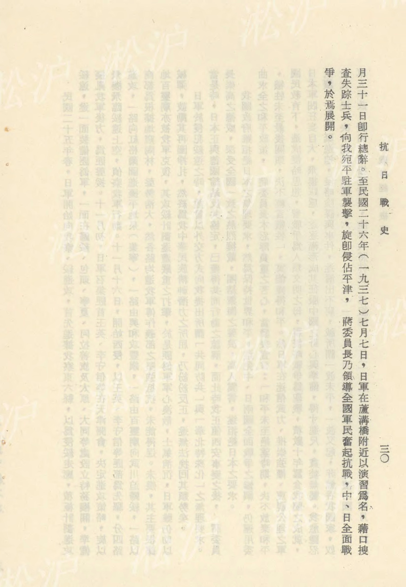

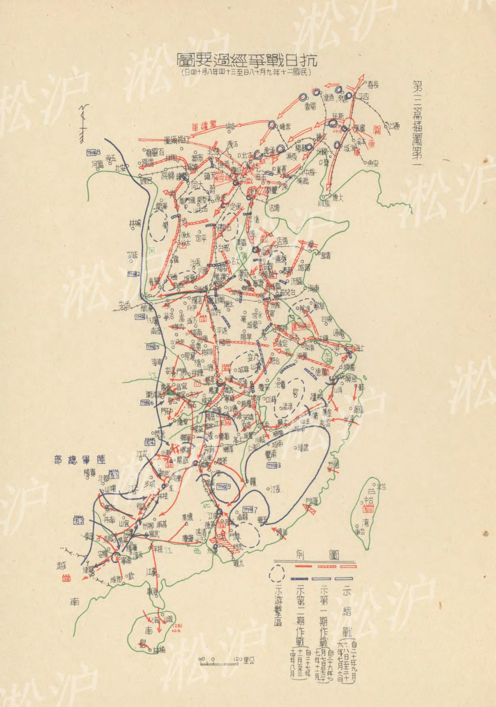

1 全战争经过概要

9 版

李頓調查報告書摘要

一、敘述部份（報告書一至八章）。

(一)中國變遷概況（略）。

(二)滿洲狀況。

1. 滿洲過去數次之獨立，並非有與中國分離之意義。2. 東三省中國當局對建設之努力。

3. 東三省之爲中國東三省，直與其大部份移民所自來之鄰省河北、山東無異。(三)中、日在「滿洲」之爭執。

1. 中日在滿洲根本利益衝突。

2. 鐵道爭執與並行線問題。

3. 二十一條及朝鮮人民問題。

4一切衝突均由雙方根本政策之不相容。

四九一八事變及其後之敘述。

1. 九一八事變不能認爲日本合法之自衛手段。

2. 天津變亂，土肥原與廢帝出走。

3. 上海事件。

(五)「滿洲國」。

1. 現在政體不能認爲由真正的及自然的獨立運動所產生。2. 日本軍隊及文武官吏之在場，爲新國家成立之原因。3. 當地中國人心目中，認滿洲國爲日人之工具。

(六)中日經濟。

1. 中日經濟關係之重要。

2. 中國抵制日貨運動，爲中日關係惡劣原因之一，並認爲不法舉動。3. 滿洲爲日本經濟生命之分析。

4. 門戶開放之維持。

二、建議部份。

(二)解決辦法。

1. 恢復九一八前原狀不能解決。

2. 維持滿洲國現狀不能解決。

3. 適當解決原則：

(1)中國抑制民族主義及抵貨運動，日本不求單獨解決。(2)先須中國具有強有力之中央政府。

(3)十原則之分析：

甲、關於日方利益者五項。

乙、關於滿洲國者二項（自治及中日撤兵）。

丙、關於國際者二項（慮及蘇俄利益及遵守多方面條約）。丁、共管（國際合作）中國者一項。

(二)解決方式及程序（如另表）。

1. 中日雙方接受報告書之綱領。

2. 顧問會議。

3. 中國政府宣言（有國際協定的約束性質）。

4. 關於日本利益之中日條約的締結。

5. 和解公斷不侵犯互助等條約及中日商約。

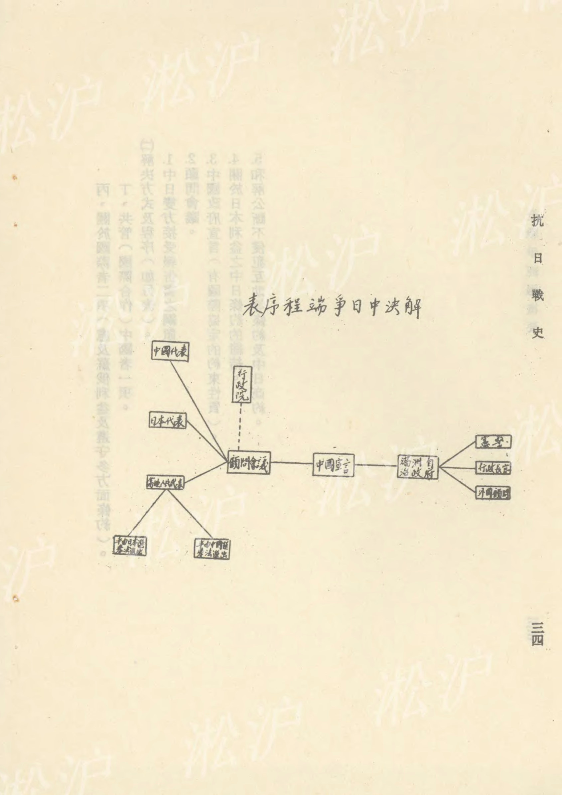

附錄第二

淞滬停戰協定

第一條：中國及日本當局，既經下令停戰，茲經雙方協定，自中華民國三十一年五月五日起，確定停戰雙方軍隊盡其力之所及，在上海週圍停止一切及各種戰鬥行爲，關於停戰情形遇有疑問發生時，由與會友邦代表查明之。

第二條：中國軍隊，在本協定所涉及區域內之常態恢復未經決定辦法以前，留駐其現在位置，此項地位，在本協定附件第一號列明之。

第三條：日本軍隊，應撤退至公共租界及虹口方面之越界築路，一如中華民國二十一年一月二十八日事變以前之原狀，但鑒於須待容納之日本軍隊人數，有若干部隊，可暫時駐紮於上述地區之毗連地點，此項地點，在本協定附件第二號內列明之。

第四條：爲證明雙方撤退起見，設立共同委員會，列入與會友邦代表爲委員，該委員會並協助佈置撤退之日本軍隊，與接管之中國警察間之移交事宜，以便日本軍隊撤退，中國警察立即接管，該委員會之組織及其辦事程序，在本協定附件第三號內列明之。

第五條：本協定自簽字之日起，發生效力，本協定用中、日、英三國文字繕成，如意義發生疑義時，應以英文本爲準。

其協定附件如左：

附件第一號：本協定第二條所規定之中國軍隊地區如下：查明附連上海區郵政地圖（比例尺十五萬分之一），由安亭鎮正南蘇州河北岸之一點起，向北延長，沿安亭鎮東最近小濱之西岸至望仙橋，由此北過小濱至沙頭東四基羅米突之一點，再由此西北上，至揚子江邊之滸浦口，並包括滸浦口在內，關於此項地區，遇有疑問發生時，經共同委員會之請求，由該委員會之與會友邦代表查明之。

附件第二號：本協定第三條所規定之地點如下：此項地點參照附圖甲、乙、丙、丁四個區域，但於甲地區內，吳淞鎮不得駐兵，日方不得干涉淞滬鐵路及該路工廠之運用。在乙區內，美國體育場東北約一英里許之上海公墓，不在日軍暫駐地點之內。在丙區內，曹家寨及三友織布廠不得駐兵。丁區包括日人公墓在內。關於此項地點，遇有疑問發生時，經共同委員會之請求，由該委員會之與會友邦代表查明之。日本軍隊向上列地點撤退，於本協定生效後一星期開始，並於開始撤退起，四星期內撤完，依照第四條所設之共同委員會，對於撤退時，不能移去之殘疾病人，或受傷牲畜，採取必要辦法，以資照料，並辦理其日後之撤退事宜，此項人畜，連同必要之醫藥人員，得遺留原地，由中國當局給予保護。

附件第三號：共同委員會，以委員十二人組成之，中日兩政府依據國際聯合會大會三月四日決議案，協助談判之與會友邦代表，卽英、美、法、義各駐華外交代表，各派文武官吏代表各一人爲委員，該委員會依照委員會之決定，得隨時任用認爲必要數之助理員，所有關於程序事宜，由委員會斟酌辦理，該委員之決定，以過半數行之，主席有投票取決權，主席由委員會內與會友邦代表選舉之，委員會依照其決定，以其認爲最善之方法，監視本協定第一、第二、第三各條之履行，並對於履行上述各條之規定，有任何疏懈時，有促使注意之權。

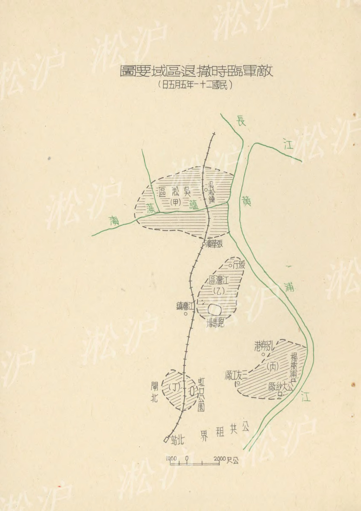

附錄第三

塘沽停戰協定

一、中國軍隊卽撤至延慶、昌平、高麗營、順義、通州、香河、寶坻、林亭鎮、寧河、蘆臺所連之線以西、以南地區，爾後不越該線前進，亦不行一切挑戰擾戰之行爲。

二、日本軍爲確悉第一項實行之情形，可用飛機或其他方法以行視察，中國方面應予以保護及便利。三、日本軍確認中國軍已撤至第一項規定之線時，不再超越該線追擊，且自動歸還於長城之線。

四、長城線以南及第一項所規定之線以北及以東地域內治安之維持，由中國警察機關任之。

五、本協定簽字後卽發生效力。

## 第二章 中日兩國宣言

民國二十六年（一九三七）七月八日，我政府得悉蘆溝橋事變經過後，當由外交部派員至日本大使舘提出口頭抗議，要求制止軍事行動，同時冀、察當局亦與日軍折衝。是日深夜，雙方口頭約定：「一、雙方立即停止射擊。二、日軍撤退豐台，我軍撤退蘆溝橋迤西地帶。三、城內防務由保安隊擔任，人數爲二百至三百名，九日九時接防」。此外，雙方並派監視撤兵委員，分組實行監視撤兵。方謂此案從此解決，不意日方不履行諾言，旣未依約撤兵，復於七月十日晚，突向我蘆溝橋駐軍猛烈進攻，以致事態復趨嚴重。

七月十一日，我冀、察當局，又與日軍在平成立蘆溝橋事件解決協定（卽日方所謂之現地協定）

參照附錄第一）。本案至此似又現曙光，乃日閣決議：「進軍華北」，並發表聲明，致形勢復趨惡化，其聲明如左：

「對於中國方面之不斷之侮日行爲，均在我支那駐屯軍隱忍靜觀中，卽從來與我提攜並任北支治安之第二十九軍，竟於七月七日夜半，在蘆溝橋附近，開始不法射擊，我軍不得已，遂至與該軍衝突。爲因平津方面之情勢逼迫，我在該地之居留民，雖正瀕於危殆，然我方仍不捨棄和平解決之望，基於事件不擴大之方針，努力以求局地解決。惟我方一旦拘於第二十九軍方面已承認的和平解決，乃彼竟於七月十日夜，突如其來更向我不法攻擊，再使我軍發生相當死傷，而且頻頻增加兵力於第一線，更使西苑之部隊南進，及命中央軍出動等，遂使武力準備與和平交涉不相應之無誠意，終至於將北平交涉全面的拒絕否認也。茲鑒於以上事實，今次事件全爲支那方面有計劃之武力抗日行爲，最初卽無可疑之餘地，須知北支治安之維持，乃爲帝國及滿洲國緊急之事，固無待贅言，而支那方面之不法行爲，無論排日、侮日行爲之謝罪，及今後挑釁行爲之提出適當保障等，均與東亞和平維持上極爲重要，因之日本政府本日之閣議，其重大之決議，關於北支派兵，政府決心採取所要之處置，然而東亞之和平，亦爲帝國所經常顧念者，政府今後仍以不擴大局面之行爲，及不放棄和平之希望，以期待支那方面之迅速反省，俾事態圓滿解決，又列國權益之保全，固曾充分考慮及之也」。

觀上述聲明，既可判明日本欲以武力壓迫華北，以遂行其既定政策，和平解決之希望殆已甚微，但我方切盼其反省，不使事態擴大之意圖，並未放棄，故中央與地方當局，仍不斷與之交涉。

同日，我冀察政務委員會委員長宋哲元由樂陵返津。七月十二日，新任日華北駐屯軍司令官香月清司亦抵津，於是雙方在平郊各地兩軍不斷衝突中，又於七月十五日在津賡續談判。

七月十六日，我政府致送備忘錄（參照附錄第二）於九國公約簽字國及德、蘇兩國，申述中國準備以國際及條約所有之和平方法，與日本解決爭端。

七月十七日，蔣委員長在廬山發表談話，說明對蘆案之四點立場，希望和平解決，甚爲明顯，乃日方竟予漠視，殊堪遺憾，茲誌蔣委員長之談話內容如左：

各位先生：中國正在外求和平內求統一的時候，突然發生了蘆溝橋事變，不但我舉國民衆怨憤不置，世界輿論也都異常震驚，此事發展結果，不僅是中國的存亡問題，而將是世界人類禍福之所繫，諸位關心國難，對此事件當然特別關切，茲將關於此事之幾點要義，爲諸君坦白說明之。

第一、中國民族是酷愛和平，國民政府的外交政策，向來主張對內求自存，對外求共存，本（二十六）年二月三中全會宣言，於此更有明確宣示。近兩年來的對日外交，一秉此旨，向前努力，希望把過卅各種軌外的亂態，統統納入外交的正軌，去謀正當解決，這種苦心得我們要應付國難，首先要認識自己國家的地位，我們是弱國，對自己國家力量，要有忠實估計，國家爲進行建設，絕對的需要和平，過去數年中，不惜委曲忍痛，對外保持和平，卽係此理。前年五全大會，本人外交報告所謂「和平未到根本絕望時期，決不放棄和平，犧牲未到最後關頭，決不輕言犧牲」，跟着今年二月三中全會，對於最後關頭的解釋，充分表示我們對於和平的愛護。我們既是一個弱國，如果臨到最後關頭，便只有拚全民族的生命，以求國家生存，那時節，再不容許我們中途妥協，須知中途妥協的條件，便是整國投降，整個滅亡的條件，全國國民最要認清所謂最後關頭的意義，最後關頭一到，我們只有犧牲到底，抗戰到底，惟有犧牲的決心，才能博得最後的勝利，若是徬徨不定，妄想苟安，便會陷全民族於萬劫不復之地。

第二、這次蘆溝橋事件發生以後，或有人以爲是偶然突發的，但一月來對方輿論與外交上直接間接的表示，都使我們覺到事變發生的徵兆，而且在事變發生的前夜，還傳播着種種的新聞，說是什麼要擴大塘沽協定的範圍，要擴大冀東僞組織，要驅逐第二十九軍，要逼迫宋哲元離開，諸如此類的傳聞，不勝枚舉，可想見這一次事件並不是偶然的。從這次事變的經過，知道人家處心積慮的謀我之亟，和平已非輕易可以求得，眼前如果要求平安無事，祇有讓人家的軍隊無限制的入我們的國土，而我們本國軍隊反要任受限制，不能在本國土地內自由駐紮，或是人家向中國軍隊開槍，而我們不能還槍，換言之，就是人爲刀俎，我爲魚肉，我們已快要臨到這個人世悲慘的境地，這在世界上稍有人格的民族，都無法忍受的。我們的東四省失陷，已有六年之久，繼之以塘沽協定，現在衝突地點已到了北平的蘆溝橋，如果蘆溝橋可以受人壓迫強佔，那麼我們五百年故鄉，北方政治文化的中心，與軍事重鎮的北平，就要變成瀋陽第二，今日的北平，若果變成昔日的瀋陽，今日的冀察，亦將成爲昔日的東北四省，北平若可變成瀋陽，南京又何嘗不可變成北平，所以蘆溝橋事變的推演，是關係中國國家整個的問題，此事能否結束就是最後關頭的境界。

第三、萬一眞到了無可避免的最後關頭，我們當然只有犧牲，只有抗戰，但我們的態度，祇是應戰，而不是求戰，應戰是應付最後關頭必不得已的辦法，我們全國國民，必能信任政府，已在整個的準備中。因爲我們是弱國，又因爲擁護和平是我國的國策，所以不可求戰，我們固然是一個弱國，但不能不保持我們民族的生命，不能不負起祖宗先民所遺留給我們歷史上的責任，所以到了必不得已時，我們不能不應戰。至於戰端旣開之後，則因爲我們是弱國，再沒有妥協的機會，如果放棄尺寸土地與主權，便是中華民族的千古罪人，那時候便只有拚民族的生命，求我國最後的勝利。

第四、蘆溝橋事件能否不擴大爲中日戰爭，全繫日本政府的態度，和平希望絕續之關係，全繫日本軍隊之行動，在和平根本絕望之前一秒鐘，我們還是希望由和平的外交方法，求得蘆事的解決。

我們的立場有極明顯的四點：一、任何解決，不得侵害中國主權與領土之完整。第二、冀察行政改組，不容任何不合法之改變。三、中央政府所派地方官吏，如冀察政務委員會委員長宋哲元等，不能任人要求撤換。四、第二十九軍現在所駐地區，不能受任何約束。這四點立場，是弱國外交最低限度，如果對方猶能設身處地，爲東亞民族作一遠大打算，不想促成兩國關係達於最後關頭，不願製成中日兩國世代永遠的仇恨，對於我們這最低限度之立場，應該不至於漠視。總之，政府對於蘆溝橋事件，已確定始終一貫的方針和立場，且必以全力固守這個立場。

我們希望和平，而不求苟安，準備應戰，而決不求戰，我們知道全國應戰之局勢，就祇有犧牲到底，無絲毫僥倖求免之理，如果戰端一開，就是地無分南北，年無分老幼，無論何人，皆有守土抗戰之責任，皆應抱定犧牲一切之決心，所以政府必特別謹慎以臨此大事，全國國民，亦必須嚴肅沉着，準備自衛，在此安危絕續之交，惟賴舉國一致，服從紀律，嚴守秩序，希望各位回到各地，將此意轉達於社會，俾咸能明瞭局勢，效忠國家，這是兄弟所懇切希望的」。

七月十九日，我政府致送備忘錄於日使館，再向日本政府提議，兩方約定確定日期，雙方同時停止軍事調動，並將已派武裝隊伍撤回原防，其原文如左：

「自蘆溝橋事件發生後，我國始終不欲擴大事態，始終無挑戰之意，且屢曾表示願以和平方法謀得解決。乃日本政府雖亦曾宣示不擴大事態之方針，而同時調遣大批軍隊開入我國河北省內，迄今未止，顯欲使用武力，我國政府於此情形之下，固不能不作自衛之適當準備，然仍努力於和平之維持。本月十二日外交部長接見日本大使館日高參事，曾提議雙方停止軍事調動，並將軍隊撤回原地，日方對此提議，迄無表示，不勝遺憾。現在我國政府願重申不擴大事態與和平解決本事件之意，再向日本政府提議，雙方約定一確定之日期，雙方同時停止軍事調動，並將已派武裝隊伍撤回原地。日方既抱和平折衝之希望，想必願意接受此項提議。至本事件解決之道，我國政府願經由外交途徑與日本政府立即商議，俾得適當之解決，倘有地方性質可就地解決者，亦必經我國中央政府之許可。總之，我國政府極願盡各種方法，以維持東亞之和平，故凡國際公法或國際條約對於處理國際紛爭所公認之任何和平方法，如兩方直接交涉斡旋調解公斷等，我國政府無不樂於接受也。

不幸此項提議，竟又遭日政府拒絕。

至我冀察當局與日軍在津談判，於七月十九日獲致協議（即日方所謂之現地細目協定）（參照附錄第三）我政府於七月二十二日得報後，審其內容，與我既定方針，尚無重大出入，爲貫澈和平初衷，不予反對，我方極度容忍維護和平之苦衷，應爲中外人士所共鑒，我方遂於七月二十一日，先行撤兵，以示大信。乃日軍不特不撤，反而日日增兵，處處尋衅，並於七月二十五日晚，猛襲我廊房駐軍，繼以飛機轟炸，使我蒙受極大損失，二十六日，香月竟致最後通牒（參照附錄第四）於我地方長官，要求第二十九軍撤離北平，開往保定方面，並襲廣安門，二十七日，又圍攻我通州及南北苑駐軍，進逼北平，其蓄意擴大事態，毫無和平誠意，實已昭然若揭。至此，宋哲元遂不得不停止一切折衝，盡力自衛，在日軍侵襲壓迫已久之形勢下，混戰兩日後，終於被迫離平。七月三十一日，我軍又撤出天津，於是華北兩重鎮，遂非我有矣。

日軍旣佔平津，猶以爲未足，仍節節前進，八月四、五日，沿津浦路進抵良王莊、獨流鎮附近，沿平漢路進抵良鄉附近，平綏路則向南口攻擊。我政府鑒於日軍之進逼不已，乃於八月七日，召集全國文武高級長官，在京舉行國防會議，協商國家大計，並決議決心抗戰，但在未正式宣戰以前，繼續與彼交涉，仍不輕棄和平。

當此之時，久滯華北之日駐華大使川越，已由津返滬，中日兩國關係，雖甚險惡，然和戰之分，乃瞬息間事，彼方果能以最大之決心與努力，挽回危局，則尚未爲晚也。乃八月九日晚，虹橋事件發生，日方向我提出撤退保安隊及拆除保安隊所築防禦工事之無理要求，正交涉間，詎八月十三日晨，日駐滬陸戰隊突向我聞北保安隊攻擊，黃浦江內之軍艦，則以重砲轟擊我市中心區。至此，我政府深悉和平已經絕望，祇有應戰以圖存，爰於八月十四日發表抗暴自衛之聲明如左：

中國爲日本無止境之侵略所逼迫，茲已不得不實行自衛，抵抗暴力。近年以來，中國政府及人民所一致努力者，在完成現代國家之建設，以期獲得自由平等之地位，以是之故，對內致力於經濟文化之復興，對外則尊重和平與正義，凡「國際聯盟」、「九國公約」、「非戰公約」爲中國曾參加簽訂者，莫不忠實履行其義務，蓋認爲獨立與共存二者，實相待而相成也。乃自「九一八」以泮，日本侵奪我東四省，淞滬之役，中國東南重要商鎮，淪於兵燹，繼以熱河失守，以及長城各口之役，屠殺焚燬之禍，擴而及於河北，又繼之冀東僞組織之設立，察北匪軍之養成，中國領土主權，橫被侵削，其他如縱使各項飛機在中國領空之內不法飛行，協助大規模走私，使中國財政與各國商業同受鉅大損失，以及種種毒辣手段，如公然販賣嗎啡、海洛英，私販槍械，接濟匪盜，使我中國社會與人種陷入非人道之慘境。此外無理之要求與片面之自由行動，不可勝數。有一於此，已足危害國家之獨立與民族之生存，吾人敢信此爲任何國家任何人民所不能忍受者，然中國則一再忍受，以迄於今，吾人敢言中國之所以出此，期於盡可能之努力，以期日本最後之覺悟而已，及至蘆溝橋事件爆發，遂使中國幾微之希望，歸於斷絕。蘆溝橋事件之起因，由於日本大舉擴張天津駐屯軍，且屢於辛丑條約未經允許之地點施行演習，日本此種行動，已足隨時隨地引起事變而有餘，而本年七月七日深夜，日本軍隊竟於鄰近北平之蘆溝橋施行不法之演習，繼之以突然攻擊宛平縣城，我守土有責之駐軍，迫而爲正當防衛，我無辜之人民，於不意之中，生命財產燬於日本砲火之下，凡此事實，已爲天下所共見。蘆溝橋事件發生以後，日本之行動有深足注意者，卽其口頭常用就地解決及不欲擴大事態之語調，而其實際，則大批軍隊暨飛機坦克以及種種最新戰爭利器，由其本國及朝鮮與我東北源源輸送至河北境內，實行武力侵略，向我各地節節進攻之事實，絕不能聽其所用之語調，卽可掩蔽於萬一。中國政府於蘆溝橋事件發生後，猶以誠意與日本協商，冀圖事件之和平解決，七月十二日，我外交部曾向日本大使舘提議雙方卽時停止軍事行動，而日本未予置答，七月十九日我外交部長復正式以書面重提原議，雙方約定一確定日期，同時停止軍事動作，同時將軍隊撤回原駐地點，並曾聲明，中國政府爲和平解決此次不幸事件起見，準備接受國際公法或條約所公認之任何處理國際糾紛之和平方法，如雙方直接交涉斡旋調解公斷等等，然而以上種種表示，均未得日本之置答。於此之際，中國地方當局爲維持和平計，業已接受日本方面所提議之解決辦法，中央政府亦以最大容忍，對於此項辦法，未予反對，乃日本軍隊於無可藉口之中，突然在蘆溝橋、廊房等處，再行攻擊中國軍隊，並於本年七月二十六日致哀的美敦書，要求中國軍隊撤出北平，此則於雙方約定解決辦法以外橫生枝節，且爲吾人萬萬不能接受者，日本軍隊更不待答覆於期限未到之前，以猛力進撲中國文化中心之北平與中外商業要樞之天津，南苑附近我駐軍，爲日本轟炸機及坦克車所圍攻，死亡極烈，天津方面人民生命，橫遭屠戮，公共建築，文化機關，以及商戶住宅，悉付一炬。自此以後，進兵不已，侵入冀省南部，並進攻南口，使戰禍及於察省，凡此種種，其肆起釁端，擴大戰域，均於就地解決及不擴大事態語調之下，掩護其軍事進行。當此華北戰禍蔓延猖獗之際，中國政府以上海爲東方重要都會，中外商業及其他各種利益，深當顧及，屢命上海市當局及保安隊加意維持，以避免任何不祥事件之發生。乃八月九日傍晚，日軍官兵竟圖侵入我虹橋軍用飛機場，不服警戒法令之制止，乃致發生事故，死中國保安隊守衛機場之衛兵一名。日軍官兵二名，上海市當局於事件發生後，立即提議以外交途徑，謀和平解決，而日本則竟派遣大批戰艦、陸軍以及其他武裝隊伍來滬，並提出種種要求，以圖解除或減少中國武裝力量，日本空軍，並在上海、杭州、寧波以及其他蘇浙沿海口岸，任意飛行威脅，其爲軍事發動已無疑義。迨至十三日以來，日軍竟向我市中心區猛攻，此等行爲，在蘆溝橋事件發生以後，向河北運輸大批軍隊，均爲日本實施其傳統的侵略大陸政策整個之計畫，實顯而易見者也。日本今猶欲以淞滬停戰協定爲藉口，將使中國於危急存亡之際，尙不能採用正當之防衛手段，須知此等停戰協定，其精神目的，卽欲於某地點內雙方各自抑制，以期避免衝突，不妨礙和平解決之進行，若一方違背約言自由進兵，而同時復拘束他方使之坐而聽受侵略，此爲任何法理任何人情所不能曲解者。中國今日鄭重聲明，中國之領土主權已橫受日本之侵略，「國聯盟約」「九國公約」「非戰公約」，已爲日本所破壞無餘，此等條約，其最大目的，在維持正義與和平，中國以責任所在，自應盡其能力，以維護其領土主權及維護上述各種條約之尊嚴，中國決不放棄領土之任何部份，遇有侵略，惟有實行天賦之自衛權以應之，日本苟非對於中國懷有野心實行領土之侵略，則當於兩國國交謀合理之解決，同時制止其在華一切武力侵略之行動，如是則中國仍當本其和平素志，以期挽救東亞與世界之危局。要之，吾人此次非僅爲中國，實爲世界而奮鬥，非僅爲領土與主權，實爲公法與正義而奮鬥，吾人深信，凡我友邦旣與吾人以同情，又必能在其鄭重簽訂之國際條約下，各盡其所負之義務也」。

先是，八月十二日夜，日本最高當局討論上海事件，並已決定日本應以嚴厲之形式，行使其自衛權，乃於十三日晨閣議後，以內閣書記官長名義，發表談話，十五日（下達全國總動員令）更正式發表其所謂膺懲華軍之聲明如左：

「帝國夙以東亞永遠之和平爲懷，俾日支兩國親善提攜之效力及於久遠，然以南京政府之排日、抗日激昂輿論政策，以供其強化政權之具，又以過信自國國力輕視實力之風潮，相激相盪，更與赤化勢力苟且結合，反日、侮日愈益加甚，終至釀成與帝國敵對之氣運，亦卽近年來幾度惹起不祥事件無可逃避之因由。今次事變之發端，亦此氣勢之所轉捩，不過其爆發點，偶爾選在永定河畔耳，又於通州人神共怒之殘虐事件，亦由此發生，且更爲中南支支那方面挑戰行爲之起因，致使帝國臣民之生命財產，概瀕於危殆，而我居留民多年經營建設安宅之地，遂以吞聲忍淚不得不暫時撤退也。

顧自事變發生以來，如屢次所聲明，帝國隱忍至再，均重在事件不擴大之方針，努力企圖爲和平的且局地的處理。關於平津地方對支那軍屢次之挑戰及不法行爲，而我駐屯軍爲使交通線之確保及我居留民之保護起見，始不得已亦不過出於自衛行動而已。然帝國政府夙狃於對南京政府挑戰言動之卽時停止，猶不妨害現地解決，以喚起其注意，殊南京政府不僅不聽我之勸告，且對我方益整戰備，並不顧破壞已往森嚴之軍事協定，提軍北上，威脅我支那駐屯軍，又於上海、漢口及其他等處，發兵雲集，其挑戰之態度，愈益露骨，竟敢於在上海方面向我開砲，並對帝國軍艦加以爆擊。

在支那方面，如此輕侮帝國，不法暴虐，竟至亘於全支，我居留民之生命財產，概陷於危殆，帝國最初隱忍之衷心，已達最大限度，爲膺懲支那軍之暴戾，以促南京政府之反省，今決採取斷然處置。

但因顧念東洋和平及翹望日支共存共榮之關係，帝國衷心不無遺憾，然而帝國如此存心，對於日支之提攜，庶幾尚在，今亦不過爲根絕支那排外抗日運動之再舉，同時芟除如今次事變不祥事件發生之根因，及建立日滿支三國間融和提攜之實外，並無他意，且固毫無領土的意圖者也，又爲促使支那國民抗日模樣與南京政府及國民黨之覺醒外，對無辜之一般大衆，實無何等敵意，且因尊重列國之權益，不惜爲最最善之努力，此固無待言者也」。

上述中日兩國政府聲明發表後，中、日兩國已不宣而戰，兵連禍結，其責任固全由日本負之也。

附錄第一

蘆溝橋事件中日兩軍現地協定

一、第二十九軍代表，對日本軍表示遺憾之意，且處分責任者，以責任聲明，防止將來再惹起如斯事件二、因中國軍與駐豐台日本軍過於接近，容易惹起事件，故在蘆溝橋城廓及龍王廟不駐軍，以保安隊維持治安。

三、鑒於本事件多胚胎於所謂藍衣社，共產黨及其他排日系各種團體之指導，設法取締之。

附錄第二

我政府致九國公約簽字國(德蘇原非簽字國)備忘錄內容大要此次紛擾發生之際，係在七月七日夜間，其時日軍正在舉行演習，最初發生衝突之地點，係在蘆溝橋一帶，日軍在該處毫無權利足以根據。蓋一九零一年辛丑條約第九條規定，外國軍隊駐在地點，並未將蘆溝橋、宛平縣城及豐臺包括在內，日本根據此項條約而提出要求，原已不合時宜，絕無根據，且卽就辛丑條約條文而論，日本在各該地方駐紮軍隊，舉行演習，亦絕無理由，足證日軍藉詞要求在中國軍隊防地內搜尋失去之日兵一名，竟圖以強力於夜間侵入中國軍隊所駐防之宛平縣城，明知中國軍隊必加拒絕，乃故意出此，藉以發動對於華北更進一步之侵略行爲，此固對顯而易見者……現有日本飛機百餘架、陸軍約二萬名，集中平、津附近，中國當局竭盡一切方法，甚至允許雙方互相撤兵，以冀停止敵對狀態，無如每次獲得解決辦法後，類因日軍重行進攻，以致立即成爲無效……中國政府認爲此項侵略行爲，實屬破壞九國公約所規定之中國領土主權完整，倘任其發生，則足以在亞洲及全世界產生重大後果，此在中國方面現仍準備談判任何種榮譽之協定，惟中國國民政對於談判解決之基本條件，不得不加以密切控制，蓋恐嚇地方當局，促成華北分裂，原爲日本人慣用之策略，而爲世人所熟知也。

附錄第三

蘆溝橋事件中日兩軍現地細目協定

日本陸軍當局，於七月二十三日午後八時二十分，發表日本與冀察當局所訂現地細目協定之內容：

據華北駐屯軍之報告，關於此次華北事變，冀察當局，除承認責任者之道歉處罰外，並鑒於此次事變之原因，多胚胎於所謂藍衣社共產黨及其他抗日各種團體之指導，故已與日方協定，將來對之嚴加取締，並採取澈底對策，卽冀察方面爲實行起見，已於七月十九日，自動用書面提出左記之具體事項：

一、排除阻害中、日國交之人物。

二、澈底彈壓共產黨。

三、取締排日之各機關、各團體及其他各種運動，並認爲其原因之排日教育。

此外，冀察當局並通知日方：「此次與日軍衝突者，主要爲第三十七師，茲爲避免將來雙方間發生意外事件起見，決將該師移駐他處，昨（二十二）日午後五時以後，卽用列車逐次向南移動中」云，現駐屯軍正嚴重監視其實行。

附錄第四

敵軍司令官香月清司致宋哲元之最後通牒

日本駐屯軍自七月七日蘆溝橋事件發生以來，與第二十九軍訂結協定，嚴重監視實行，本日（七月二十六日）下午三時半，飭駐北平特務機關長松井，向第二十九軍宋軍長交如下之最後通告：「昨（二十五日）晚在廊房惹起兩軍衝突，實堪遺憾，倘貴軍仍抱有事態不擴大之意志，首應從速令佈置於蘆溝橋及八寶山附近之第三十七師，截至明（二十七）日正午止，後退於長辛店，又駐紮北平城內之第三十七師，須由北平城內撤退，迄本月二十八日正午爲止，與在西苑之第三十七師之部隊，同時由平漢路以北之地區，而移於永定河以西之地區，以後並應將是等軍隊，賡續輸送於保定方面，如未能見以上諸項之實行，則認定貴軍無誠意，屆時本軍將不得已而執行自由之行動，其因此所發生之一切責任，應由貴軍負擔矣」。

## 第三章 中日兩國之統帥機構

各國之統帥機構，均有平時與戰時之分，但因政體、軍制、軍備及預想敵國等之不同，故其在構成上亦鮮有相同者，茲將中日兩國之統帥機構概況，分述如左。

### 第一節 中國之統帥機構

#### 第一款 平時

我國統帥機構，係依據國民政府組織法，於國民政府之下，設置軍事委員會，爲中央之最高軍事機關，代表國民政府，統率陸海空軍，執行最高統帥權。

此種最高統帥權之建立，又係根據我國訓政時期約法第六十六條：「國民政府統率陸海空軍」及國民黨第三次全國代表大會對於軍事報告之決議案規定：「國軍之最高統帥權，依國民政府組織法之規定，完全統屬於國民政府，所以全國陸海空軍之建設、保持、運用及關於一切軍政與軍令之權，皆完全屬於中央最高軍事機關掌握，務求軍事絕對統一」之規定，故軍事委員會有指揮三軍之權，其組織系統如插表第一。

我國軍令、軍政、教育三者，雖然分立，但統屬於軍事委員會，而參謀本部爲陸海空軍之軍令機關，軍政部與訓練總監部爲陸軍之軍政與教育機關，海軍之軍政及教育由海軍部任之，空軍則由航空委員會任之，至參謀本部之組織系統及職掌如插表第二。

嗣以我國土地廣大，交通不便，軍隊散駐各地，爲指揮監督便利起見，爰於廣州、重慶、西安等地，設置軍事委員會委員長行營，承委員長之意旨，分任轄區內各部隊之整編、訓練、綏靖等事宜，以爲委員長之臂助。

此外，國軍各級司令部，陸軍以軍司令部爲最高單位，下轄師（或獨立旅）司令部二至三個，師下爲旅司令部，另又設有各路總指揮部，其編組大體與軍司令部相同，惟所轄部隊之多寡，則各有不同，陸軍各部隊有因地方上之特殊情形，而受各地綏靖公署（或邊區公署）之節制指揮者。海軍以噸位無多，僅設艦隊司令部數個，直轄各艦艇。空軍則以建設伊始，僅有大隊部，下轄各中隊。

#### 第二款 戰時

民國二十六年七月七日，日本軍閥實施武力侵華，全民奮起應戰，我政府並於八月十四日，發表實行自衛抵抗暴力之聲明，旋爲求政略與戰略之配合，乃於八月二十日，頒令成立大本營，爲最高統帥部，其下設置總機要室及第一至第六等部，分掌軍令、政略、財政、金融、經濟、宣傳、訓練等事宜，並設後方勤務部、管理部及軍法執行總監部等機構，其組織系統如插表第三。

同時最高統帥爲期作戰指揮靈活便利起見，特設戰區司令長官部數個，直隸大本營，司令長官承大元帥之命，統轄戰區內之一切軍事、政治、黨務事宜，其組織系統如插表第四，戰區司令長官部之下，又設集團軍總司令部數個，總司令承司令長官之命，僅負作戰指揮之責，其組織系統如插表第五。

至海軍各艦隊及空軍各大隊，分歸海空軍總司令部統轄，以協力陸軍之作戰，各該總司令，均直屬於大元帥。

當時，因

蔣委員長未正式就大元帥職，是以指揮作戰仍用軍事委員會名義行之，故於十月間，復將大本營改爲軍事委員會，並予擴大，增設祕書廳、衛生勤務部、禁烟總會等機構，其組織系統如插表第六。

淞滬會戰中，我政府西遷，爲謀持久抗戰及適應作戰需要起見，乃於民國二十七年初，復將軍事委員會之組織，予以調整，將第一至第六等部，改爲軍令、軍政、軍訓、政治等部，並改海軍部爲海軍總司令部，另增設銓敘廳，以掌理陸海空軍之人事事宜，其修正後之組織大綱如附錄第一，組織系統如插表第七。

武漢淪陷後，重慶行都初奠，設備未周，交通通訊，至爲困難，且南北各戰區，廣袤數千里，作戰指揮，難免遲滯，最高統帥部，爲便利指揮，適應戰機，乃於民國二十七年二月中旬，設立桂林、天水兩行營，承蔣委員長之意旨，分任西南與西北方面各戰區之作戰指導，並監督其實施。計桂林行營轄第三、第四、第九各戰區，天水行營轄第一、第二、第五、第八、第十、魯蘇及冀察各戰區，至民國二十九年五月，又改爲桂林、西安兩辦公廳。是時，爲適應作戰需要，軍事委員會亦依當時狀況重加調整，除原有各部外，復增設運輸統制局、戰地黨政委員會、撫卹委員會及考核委員會等單位，各部所掌業務，間亦有改隸或擴充者，其組織大綱如附錄第二，組織系統如插表第八。

自此以後，以迄抗戰勝利止，其間我因與盟軍聯合作戰，故軍事委員會之組織依據頒行之組織大綱第二十二條規定及配合戰況之演變，迭有變更，各機構之存廢咸視實際需要而定，然其組織則較前更爲健全完備。

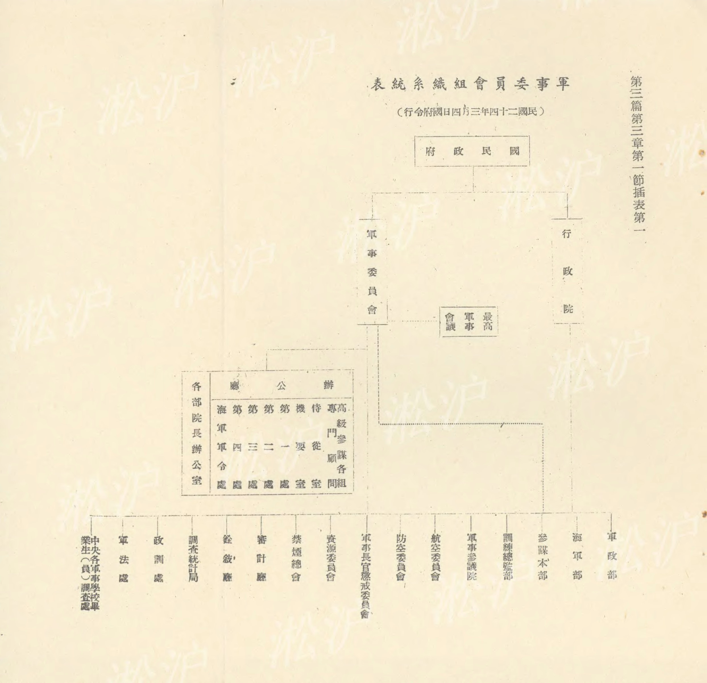

# 第三篇第三章第一節插表第二

組部本謀參

參副

各各各

級級級

副祕參

官書謀

第一處（人事考績）

第二處（文書章制）

第三處（會計庶務）

第一處（作戰動員）

第二處（軍隊組織及教育）

第三處（鐵道交通及兵站）

第一處（作戰動員）

第二處（軍隊組織及教育）

第三處（鐵道交通及兵站）

第四處（軍機局之備各文書方票）

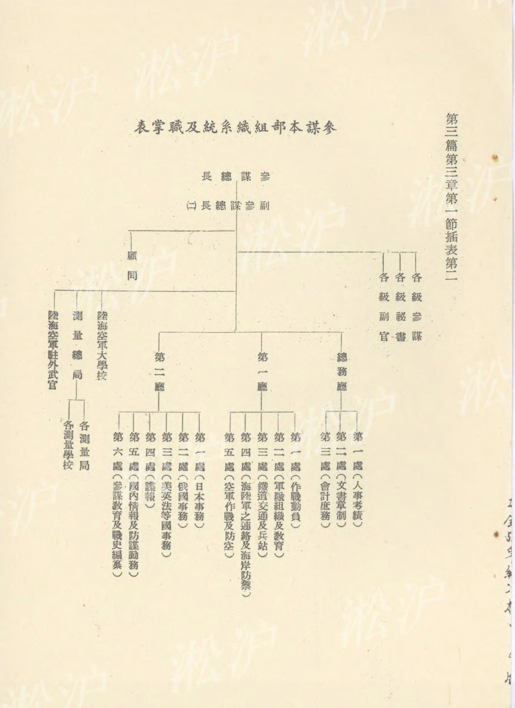

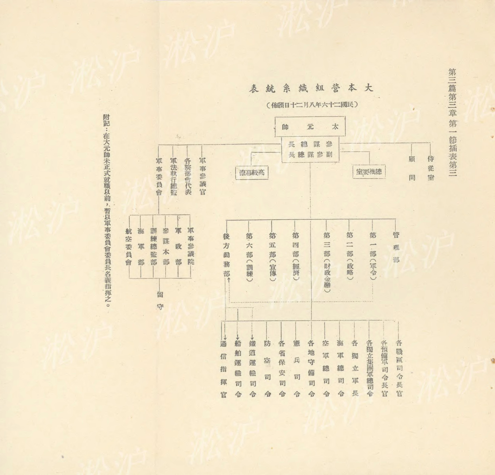

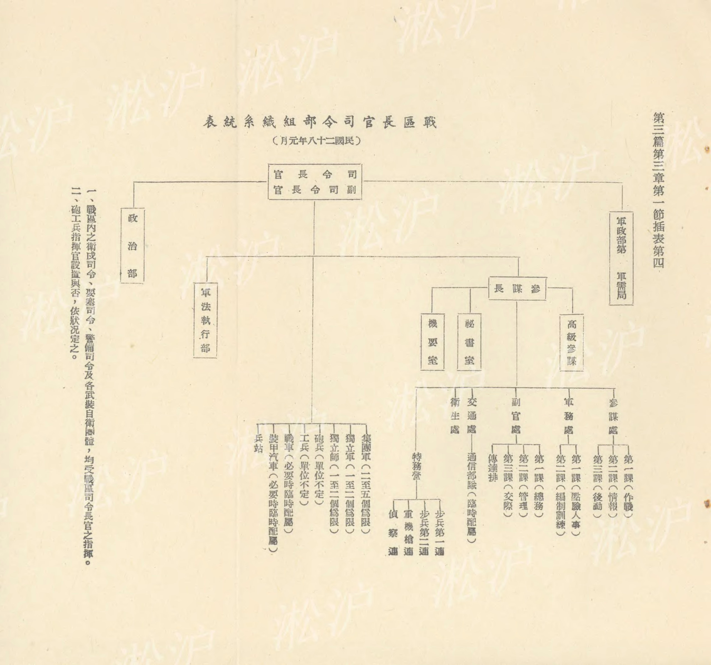

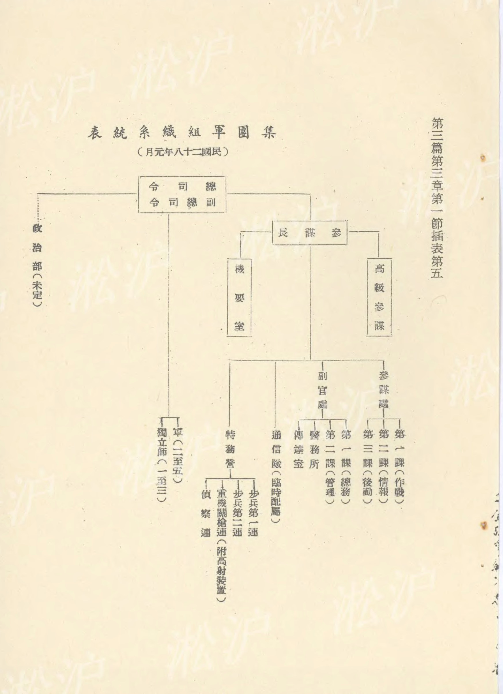

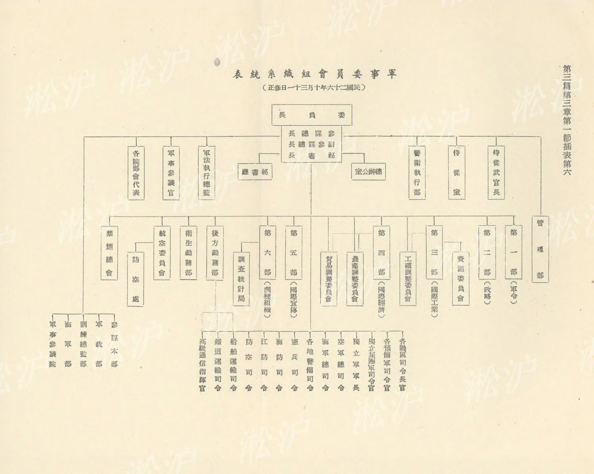

表

參

事

室

軍法執行總監

航空委員會

銓

敍

廳

軍事參議院

按

術

委

會

各戰區司令長官

海軍總司令

空軍總指揮

後方勤務部

各江防司令

各防空司令

各衛戍司令

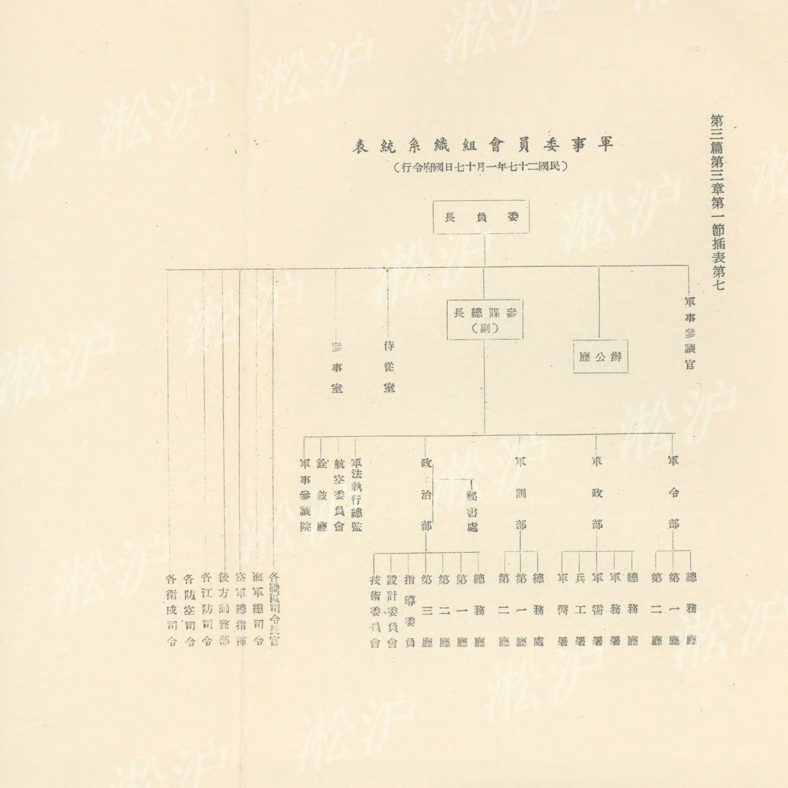

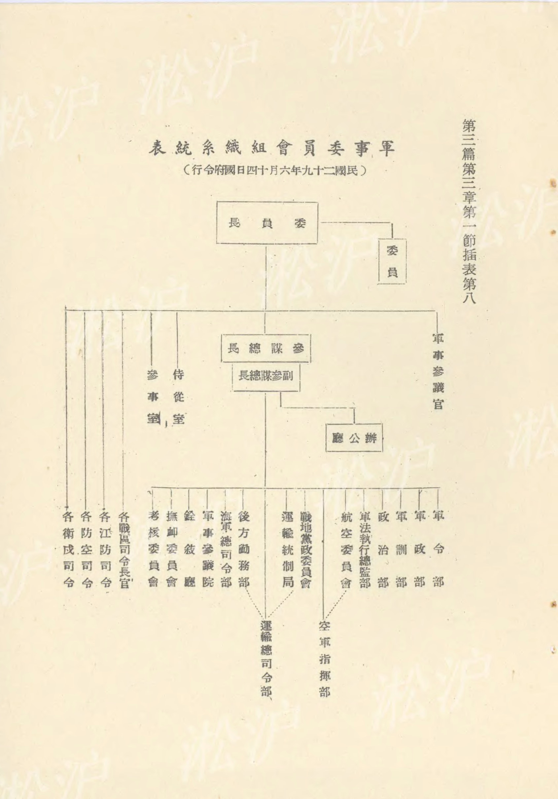

### 第二節 日本之統帥機構

#### 第一款 平時

日本爲君主立憲國，天皇爲國家之元首，其憲法第十一條規定：「天皇統率陸海空軍」，第十二條規定：「天皇釐定陸海空軍之編制及常備兵額」。由第十一條言，則統帥大權屬於天皇，除輔佐機關參與帷幄外，行政及立法機關，均不得干預。由第十二條言，編制大權，亦屬於天皇，而以陸海軍大臣任其輔弼之責。蓋編制權與統帥權之施行，稍有不同，卽編制權須受議會預算議決權之限制，統帥權則完全獨立也。

日本陸軍軍令、軍政、教育三權，由天皇統制，而以參謀總長、陸軍大臣、教育總監三者，獨立掌理職務，故有陸軍三長官之稱，陸軍人事之銓衡，尤以高級官員之去取，例由三長官會議，始能成立，但自「二二六」事變後，實行肅軍，陸軍省遂得統制人事權。

參謀本部，爲陸軍軍令機關，平時輔佐天皇，參劃軍機要務，掌理國防及用兵事宜，戰時爲構成最高統帥部幕僚之主體，其組織系統及職掌如插表第九。

日本陸海軍對立，故海軍軍令，屬於軍令部總長，軍政與教育，則屬於海軍省。

海軍軍令部在國防上之職權，與參謀本部無異，但因海陸已分，故其組織較爲簡單，其組織系統及職掌如插表第十。

空軍，則分屬於陸海軍，故在中央並無獨立之軍令機關。

日本天皇統率陸海空軍，嗣因軍事之進步與軍之擴大，故以元帥府爲其最高軍事顧問機關，以軍事參議院爲其諮詢機關及陸海軍協調與高級將領之儲備機關。

日本平時軍事機關之組織系統及其職掌如插表第十一。

此外，凡屬統帥軍機事項，不經閣議，由中央各軍事機關，直接上奏天皇者，謂之「帷幄上奏」，卽陸軍參謀總長與海軍軍令部總長等所行之上奏，如國防用兵或軍隊、艦隊之指揮命令事項，而與一般國務全然無關，亦卽陸海軍大臣，原隸屬於內閣總理大臣者，但除國務事項，如預算案及軍事報告外，其他如軍隊、艦隊之編制、管區衛戍、動員準備等，亦均直接上奏，其內閣官制第七條謂：「凡上奏之軍機、軍令事項，除以御旨交與內閣者外，其餘由陸海軍大臣向內閣總理大臣報告」。此種顯示陸海軍大臣地位之特殊，與其他大臣之不同，爲日本獨有之內閣制度。故所謂帷幄上奏，實卽賦予軍部以特權也，軍部旣有此種特權，在政治上已立於不敗之地位，故常能操縱內閣，以軍事領導政治，以致養成侵略無鑒之軍閥。

#### 第二款 戰時

日本在戰爭初期，因未對我宣戰，故未設置大本營，天皇統帥權之施行，悉依平時之程序，迨民國二十六年十一月佔領淞滬後，鑒於我抗戰到底決心之堅定，深知戰爭非短期內所能解決，乃於十一月十七日制定公佈大本營令，設置大本營，主持侵略戰爭，其大本營令如左：

第一條：在天皇大纛之下，置最高統帥部，稱之爲大本營。

第二條：參謀總長及軍令部總長各爲其幕僚之首長，任帷幄機務之奉仕，作戰之參劃，稽於最終之目的，以圖陸海兩軍之策應與協調。

大本營專爲處理統帥事項之機構，與國務無直接關係，故內閣總理大臣以下之國務大臣，均不得爲大本營之構成員，惟陸海軍大臣以軍事行政機關長官之資格，得帶同隨員，列席大本營會議。

就觀念而言，大本營乃爲以大元帥爲首腦之一個機構，而實際上則完全爲兩個機構，蓋其大本營分爲以參謀總長爲幕僚長之陸軍部，及軍令部長爲幕僚長之海軍部等組織而成，而陸軍部與參謀本部，海軍部與軍令部，則各爲二位一體之存在，參謀本部與軍令部在平時之對立，依舊形成爲大本營內陸軍與海軍之對立，大本營並未具有綜合運用此兩部之上級機構，故其陸海軍在作戰時，僅能實施協同作戰，是以其中央統帥部每次均須釐訂陸海軍中央協定，藉以規律其策應與協同。

此外，日本在我國戰場之統帥機構，初分設華北、華中派遣軍及第二十一軍。二十八年九月十二日設中國派遣軍總司令部，以西尾壽造上將爲總司令、板垣征四郎中將爲總參謀長，並撤銷華中派遣軍，統一指揮作戰，直隸於大元帥，並監督所屬之經理及衛生事務，除大本營有特別之指示及一般作戰方略之訓令外，凡作戰計畫及其實施等，在所受方略之範圍內，完全獨立，不受其他任何之牽制，至其組織系統如插表條十二。

迨戰爭之後期，卽小磯任總理大臣時期，因政略與戰略之失調，及軍事上之失利，乃成立最高戰爭指導會議，以陸海軍首長、總理大臣及有關之國務大臣組成之，用以決定最高之政略與戰略，內閣及大本營依據其決定，予以執行，該會議遂成爲一越級機構，至民國三十四年三月，復將總理大臣列入大本營內，益求政略、戰略之協調，以挽救其日趨嚴重之危機，但已無補於事矣。

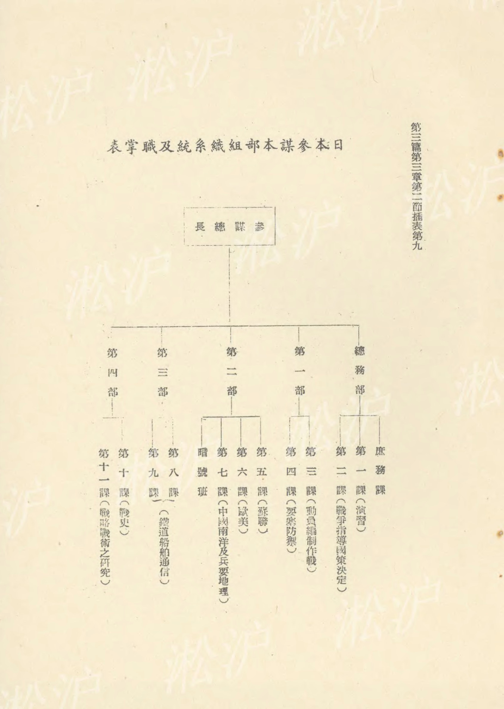

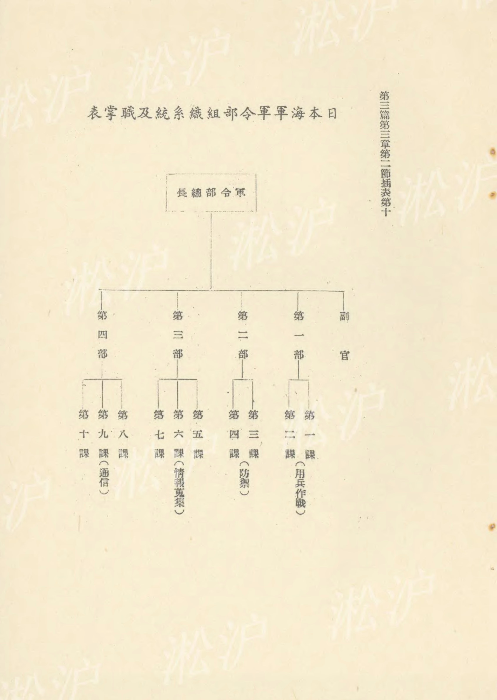

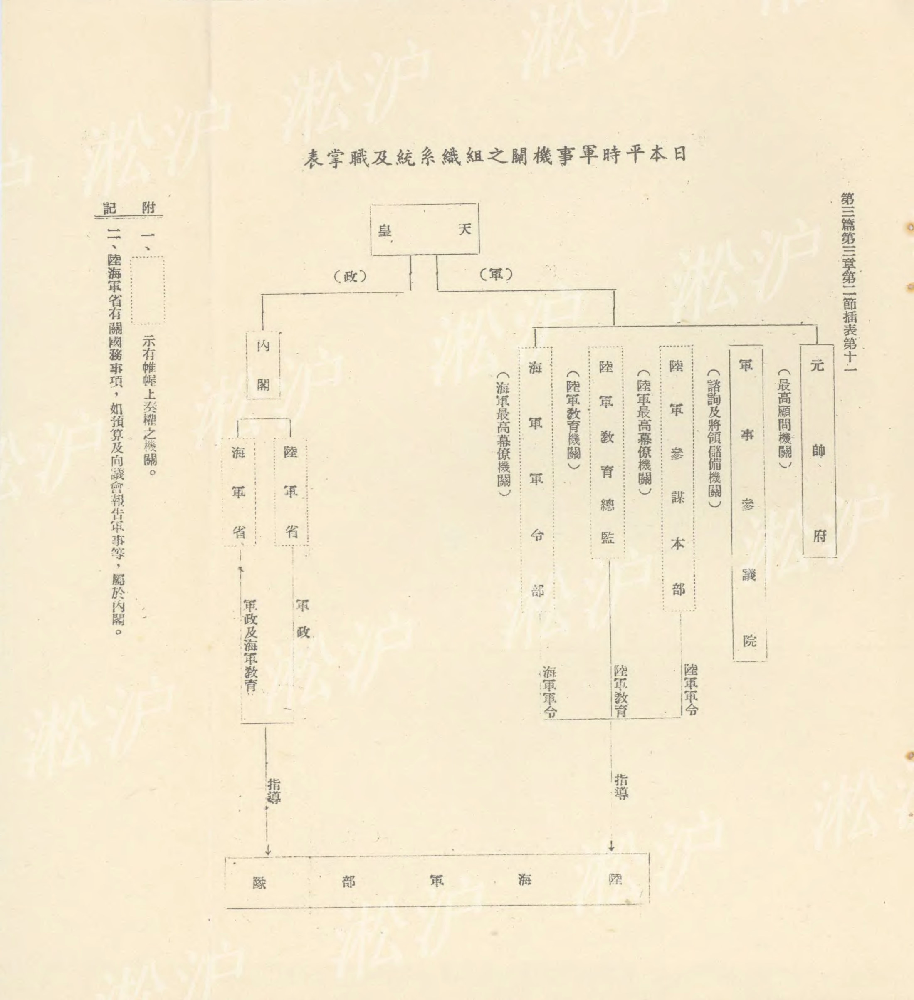

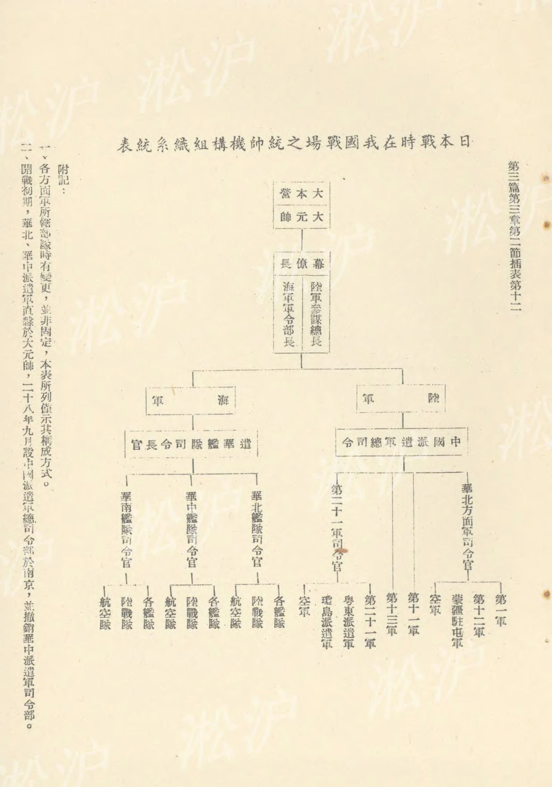

附錄第一

修正軍事委員會組織大綱民國二十七年一月十七日公佈第一條：國民政府爲戰時統轄全國軍民作戰便利起見，特設軍事委員會，直隸國民政府，並授權委員長執行國民政府組織法第三條所規定職權。

第二條：本會設委員長一人、委員七至九人，由中央政治委員會選定，由國民政府特任之。此外參謀總長、副參謀總長、軍令部、軍政部、軍訓部、政治部四部長及軍事參議院長爲當然委員。

第三條：本會之組織系統如另表。

第四條：委員長統率全國陸海空軍，並指揮全民，負國防之全責，各委員襄贊委員長，籌劃國防用兵之大計。

第五條：參謀總長爲委員長之幕僚長，指導本會所屬各部會廳，襄助委員長處理本會一切業務。

副參謀總長，輔助參謀總長處理本會一切業務。

第六條：軍事參議官，備委員長之諮詢。

軍事參議院爲軍事研究及建議之機關。

第七條：辦公廳掌管命令、文書之呈遞傳達及總務、警衛諸事宜。

第八條：軍令部設總務廳及第一、第二兩廳，管理左列事務：

一、國防建設、地方綏靖及陸海空軍之動員作戰。

二、後方勤務之籌畫運用。

三、情報及國際政情之蒐集整理。

四、參謀人員、陸軍大學、測量總局及駐外武官之統轄與運用。

第九條：軍政部設總務廳及軍務、軍需、兵工、軍醫等署，授理左列事項：

一、陸海軍之建設改進，人馬之維持補充，交通通訊之整備及全國總動員之籌畫。二、陸海軍軍費、糧秣、被服、裝具、營繕及其他軍需品之籌辦分配，場廠倉庫之建設管理及民間有關工業資源之利用。

三、軍械彈藥之籌辦分配，場廠倉庫之建設管理，及民間有關工業資源之利用。四、陸海軍之衛生保健，及衛生機關之籌畫運用。

第十條：軍訓部設總務廳及第一、第二兩廳，掌理左列事項：

一、陸海軍之訓練整理，及陸海空軍之校閱。

二、軍事學校之建設改進。

第十一條：政治部設總務廳、秘書處、第一、第二、第三廳、指導委員及設計技術兩委員會，掌理左列事項：

一、陸海空軍之政治訓練。

二、國民兵軍事訓練。

三、戰地服務及民衆之組織與宣傳。

第十二條：軍法執行總監部，掌理軍隊之維持，與軍法執行事務。

第十三條：航空委員會，掌理空軍之建設、保育、訓練與指揮事務。

第十四條：銓敘廳掌理陸海空軍人事之銓衡考績與卹賞事務。

第十五條：本會各部會院廳之組織條例及內部編制另定之。

附錄第二：

修正軍事委員會組織大綱

民國二十九年六月十四日

國府令行

第一條：國民政府爲鞏固全國國防，統轄全國軍民作戰，特設軍事委員會，直隸國民政府，授權委員長執行國民政府組織法第三條所規定之職權。

第二條：本會設委員長一人、委員七至九人，由國民政府特任之，此外參謀總長、副參謀總長、軍令、軍政、軍訓、政治四部長及軍事參議院長爲當然委員。

第三條：本會之組織系統如附表。（參照插表第八）

第四條：委員長統率全國陸海空軍，並指揮全國國民負國防之全責，各委員襄贊委員長籌劃國防用兵之大計。

第五條：參謀總長爲委員長之幕僚長，指導本會所屬各部會廳，襄助委員長處理本會一切事務。副參謀總長，輔助參謀總長處理本會一切事務。

第六條：軍事參議官備委員長之諮詢

第七條：辦公廳職掌如左：

一、命令文電之承轉及總務、警衛事項。

二、各部院會廳主管業務之連繫及會議會報事項。

三、章制之審核承辦及顧問之延聘分配事項。

四、不屬於各部院會廳之軍事攸關事項。

第八條：軍令部職掌如左：

一、國防建設，國軍作戰指揮及陸海空軍之動員指導暨戰史之編纂。

二、後方勤務之籌劃運用指導。

三、情報及國際政情之蒐集整理。

四、參謀人員、陸軍大學、測量局及駐外武官、砲、工、通信各指揮部之統轄與運用。第九條：軍政部之職掌如左：

一、陸海空軍之建設改進，人馬之維持補充，交通通信之整備及全國總動員之籌劃。二、管區之設置，兵員之徵募編練，國民兵組織管理及役政攸關事項。

三、陸海軍軍費、糧秣、被服、裝具、營繕及其他軍需品之籌辦分配，場廠倉庫之建設管理及民間有關工業資源之利用。

四、軍械彈藥之製造籌辦分配，場廠倉庫之建設管理及民間有關工業資源之利用。

五、陸海軍之衛生、保健及衛生機關之籌劃運用。

第十條：軍訓部職掌如左：

一、全國陸軍之訓練整理校閱。

二、軍事學校之教育、建設、改進。

三、國民兵之教育、規劃、改進。

第十一條：政治部職掌如左：

一、陸海空軍之政治訓練。

二、國民兵之政治訓練及精神教育。

三、戰地服務及民衆組織之指導與宣傳。

第十二條：軍法執行總監部，掌理軍隊紀律之維持與軍法之執行事務。第十三條：軍事參議院，掌理軍事研究及建議事項。

第十四條：航空委員會，掌理空軍之建設、保育、訓練與指揮事務，必要時得另設空軍指揮部，專任空軍作戰之指揮。

第十五條：戰地黨政委員會，掌理戰地黨政工作之設計、指導監督及考核事宜。第十六條：運輸統制局職掌如左：

一、國內外各項公私運輸機關與運輸工具之調遣分配。

二、支配進出口貨及物資運輸之數量及程序。

三、審定有關運輸之一般設施。

四、解決有關運輸之爭議。

五、各線路工程之考核與督察。

運輸總司令部，掌管各項軍事交通運輸之實施。

第十七條：後方勤務部職掌如左：

一、關於兵站之設施。

二、關於糧彈油料等之補給運輸。

三、關於衛生之設備管理。

第十八條：海軍總司令部，掌理海軍建設、訓練與指揮事宜。

第十九條：銓敘廳掌理全國陸海空軍人事之銓衡考績與獎懲事務。

第二十條：撫卹委員會職掌如左：

一、關於傷亡官兵褒揚撫卹事宜。

二、關於傷亡官兵遺族之救濟事宜。

第二十一條：本會各部院會廳組織條例及編制另定之。第二十二條：本會得設各種委員會及戰時所需之各種機關。第二十三條：本大綱自核准之日施行。

七〇

## 第四章 戰爭指導方案及作戰計畫

日軍自五一五（民國二十一年）及二二六（民國二十五年）兵變以來，其政府不能約束軍部，軍部不能約束部隊，海陸軍互爭雄長，南北併進，同時蘇俄以其第五縱隊朱毛匪幫積極顛覆我內部，並策動日軍侵華。我國在革命建國進程中，受俄日內外之夾攻，情勢危急，不可終日，而民族意識革命精神因此亦進入高潮。當時日軍已能控制其政府，而匪幫尚未與蘇俄取得直接連繫，遂以攘外必先安內之決策，積極勦匪，對日軍則暫行忍讓，並加緊建設，增進國力，實施法幣政策、徵兵制度普及國民軍訓，整編國軍，發展軍需工業，並發起新生活運動，以鼓舞民心士氣。迄民國二十五年末，救平共匪，大政統一，國防軍備飛躍進步，一日千里，作戰資料日有改進，故未能擬定具體作戰計畫。爰本持久消耗戰方針及作戰指導腹案，在京滬間、隴海路東段及太行山各關隘，構築國防工事，整備交通通信，對於三軍之部署亦完成基本之配置。民國二十六年「七七」以後，全面抗戰爆發，八月二十日，大本營始策定「抗日戰爭指導方案」及「作戰指導計畫」頒佈實施，惟因此項方案與計畫均係臨時策定，自難期其周密，加以當時國內政情與工業能力等種種關係，凡作戰軍之編組、統御、經理、衛生系統之確定，部隊之集中輸送，後勤支援能力，均受相當之限制，故雖在我國境內作戰，並未能完全收到地利人和之效，而其他種種之牽制，對大本營之意圖，每多不能貫澈，致作戰初期，一切措施，不能盡如理想，影響爾後之作戰，實深且鉅，此未臻真正澈底統一與戰備尚未完成之我國，固無容諱言，而應引以爲戒者也。茲將作戰前後敵我兩軍狀況及我國之戰爭指導方案與作戰計畫，概述如左。

### 第一節 敵我兩軍之狀況

#### 第一款 戰爭直前之敵我兵力比較

##### 第一項 敵軍

關於敵之兵力，因其實行徵兵制度已久，凡其國內年滿十七歲至四十五歲之男子，均已早經軍事訓練。故其全國人口（含臺灣、朝鮮）雖僅一億零五百萬人，而至戰時則可動員二千七百餘萬人，當「七七」事變時，其全國兵力計有常備兵三十八萬人、預備兵七十三萬九千人、後備兵八十七萬九千人、第一補充兵一百五十七萬九千人、第二補充兵九十萬零五千人，共計四百四十八萬一千人，且皆訓練有素，技術優良，但其戰鬥兵僅有一百九十九萬七千人，茲再將其陸海空軍兵力，分述如左：

一、陸軍：敵陸軍計有十七個常備師團，在戰爭初起時之裝備及編制，一個師團之兵力，約爲二萬二千人、馬五千八百匹、步騎槍約九千五百枝、輕重機槍六百餘挺、各式火砲一百零八門、戰車二十四輛，並能適應機宜，隨時裝備特種部隊，以配合作戰需要，故其陸軍已達到現代化之標準。

二、海軍：敵海軍僅次於英、美而居世界之第三位，擁有排水量一百九十餘萬噸。

三、空軍：敵之空軍共有飛機二千七百架，可用於對我作戰者，其中計有陸軍飛機一千四百八十架，海軍飛機一千二百二十架。

##### 第二項 我軍

我國向採募兵制度，直至民國二十一年兵役法公佈後，始確立徵兵制度，但因事屬初創，戶口未清，實施上每多困難，故在兵役法頒佈後之三年內，乃採用徵募併行制度，迨至民國二十五年三月，始正式實行徵兵制度。當開戰之初，我僅有陸軍現役兵一百七十餘萬人，及訓練完成之壯丁約五十餘萬人，正在訓練中之壯丁約百萬人，此外，學校實施軍訓，合格爲預備軍士者一萬七千四百九十人，爲候補軍官者八百八十人，茲將我陸海空軍之兵力分述如左：

一、陸軍：計有步兵一百八十二個師又四十六個獨立旅、九個騎兵師又六個獨立旅、砲兵四個旅又二十個獨立團及其他特種部隊等。然因我國幅員廣大，需要多數部隊維持地方治安，在當時預計可以參加作戰之陸軍部隊，僅及總兵力百分之四十強，約爲步兵八十個師又九個獨立旅，騎兵九個師、砲兵二個旅又十六個獨立團。我陸軍之裝備，至民國二十五年止，以充實輕兵器爲主，民國二十五、六年間，曾經將二十個步兵師之編制加以調整（預定調整六十個師整理六十個師），每師之兵力約一萬一千人、步騎槍三千八百餘枝、輕重機槍三百二十八挺、各式火砲及迫擊砲四十六門、擲彈筒二百四十三具，約相當於日軍一個步兵旅團，整理師則約相當一步兵聯隊，其餘則參差不齊。

二、海軍：我國海軍於開戰之初，新建及舊有艦艇共有七十餘艘，其中噸位最大者爲三千噸，最小者爲三百噸，排水量之總數，僅爲五萬九千零十五噸，至其詳細編組如左：

(一)第一艦隊：轄海容、海籌、寧海、逸仙、大同、自強、永健、永績、中山、建康、定安、克安等十二艦，共一萬七千四百八十四噸。

(二)第二艦隊：轄楚有、楚泰、楚同、楚觀、楚謙、江元、江貞、永綏、民生、民權、咸寧、德勝、江鯤、江犀、湖鵬、湖鷹、湖鶚、湖隼等十九艦艇，共九千三百五十九噸。

(三)第三艦隊：轄定海、永翔、楚豫、江利、鎮海、同安、海鷗、海鶴、海清、海燕、海駿、海蓬、澄海等十三艦艇，共一萬四千七百一十七噸。

四練習艦隊：轄應瑞、通濟兩艦，共四千三百六十噸。

(五)巡防艦：轄順勝、義勝、勇勝、仁勝、海寧、江寧、撫寧、綏寧、肅寧、威寧、崇寧、義寧、正寧、長寧等十四艘，共四千二百七十噸。

六測量隊：轄甘露、暾日、青天、誠勝、公勝、景星、慶雲等七艦、共三千噸。

七直轄艦艇：計有平海、普安、武勝、辰字、宿字魚雷艇等五艘共五千八百二十五噸。

三、空軍：我空軍於戰爭開始時，僅有各式飛機六百架，編組爲九個大隊又四個中隊，能參加作戰者，僅三百餘架，其餘則爲教練機及運輸機，均不適於作戰。

#### 第二款 戰爭開始後敵我兩軍之狀況

##### 第一項 華北戰場

參照插圖第

一插表第一

敵軍：「七七」以前，敵在平津及冀東一帶之駐屯軍爲河邊混成旅團一萬餘人，在察省多倫、張北、化德、商都等地者，爲關東派遣軍約三千人，且多爲幹部，以從事僞蒙軍之組訓。自「七七」後至八月中旬，先後由熱河、東三省、朝鮮及其本土調至華北者，共計五個師團（全部或一部）、三個混成旅團、兩個騎兵旅團、兩個野戰重砲兵旅團（主力）及獨立重砲兵、山砲兵、鐵道兵、戰車兵聯隊各一，與其他特種兵部隊等，總兵力約爲十一萬人，其分佈情形概略如左：

一、冀省方面爲第五、第六、第十、第十四、第二十師團、酒井、鈴木混成旅團及河邊混成旅團。

二、察省方面爲關東軍之獨立第一旅團及混成第十二、第十五旅團。

此外，其繼續動員增調華北之敵，爲第十六、第一零八、第一零九師團，與僞滿軍、僞蒙軍共約八萬人，僞冀東保安隊一萬七千人未計算在內，另有飛機約三百架。

根據當時情報及敵軍動態，判斷其企圖「爲迅速佔領滄縣、保定、張家口等地，先以一部固守永定河左岸及平津附近要點，掩護其主力集中，同時抽出有力部隊與察北之關東軍協力，攻略平綏路東段，然後以主力沿津浦及平漢線攻略滄、保，完成其初期之作戰目的」，因此，津浦沿線之敵先頭部隊，雖於八月十一日卽已進抵獨流鎮附近，而迄無積極行動，僅在永清迄固安迤西之永定河左岸，構築防禦工事，入夜則以小部隊偷渡右岸，潛行偵察。平漢沿線之敵，則據良鄉、坨里之線，不時向我寶店前哨陣地擾亂。平綏沿線之敵，於八月上、中旬對我南口發動攻擊未逞，嗣後乃向我右翼麻黃峪、鎮邊城、橫嶺城、黃老院等地猛攻，直指懷來，圖切斷我軍退路，戰鬥之烈，傷亡之慘，殊屬罕見。熱西方面之敵，向我察東永寧城、寧遠堡、赤城前進，似係牽制性之助攻。察北方面之敵，聯合僞滿與僞蒙軍，由張北向張家口突進。

我軍：自敵於民國二十六年七月末襲佔平津前後，我軍委會爲阻止敵人，卽向冀、察增兵，至八月中旬止，我軍各部隊位置及行動概況如左：

八月十二日，蔣委員長電令華北各軍作如左之部署：

一、靜海、文安、馬廠、大城、任邱、青縣、河間、肅寧，由第二十九軍固守；雄縣、霸縣、由第五十三軍固守，以上屬津浦線，歸宋哲元指揮，馮治安暫代（永清、固安由第九十一師及騎兵第九師之一部駐守）。

二、涿縣、定興、徐水、新城，由第二十六路軍孫連仲部固守（該路第三十師及獨立第四十四旅，預定八月十四、十五日，由徐州開始向保定輸送）。涞水、易縣、由第八十五師固守；高陽、保定、滿城、完縣由關麟徵軍（第五十二軍）之第二、第二十五師固守；定縣、新樂、曲陽由第三軍固守，以上屬平漢線，歸劉峙指揮。

三、正定、藁城、石家莊、獲鹿由李默庵軍（第十四軍）第十、第八十三兩師固守；饒陽、安平、深縣、武強由第三十二軍固守；深澤、晉縣由第十七師固守；獻縣、劉各莊、呂公堡由第六十七軍固守；與濟鎮、滄縣由第四十軍固守，以上屬滄石線，歸石家莊行營直接指揮，第十五軍（現在順德、新鄉間）及第十八軍（現在武漢附近）爲總預備隊，控置於滄石線以南地區。

是日，並令駐許昌之騎兵第十師，開赴滄縣，歸宋哲元指揮，擔任岐口海岸之警戒。

平綏線方面，湯恩伯（第十三軍）部第四、第二十一、第八十四、第八十九、第九十四等五個師，佔領麻黃峪、鎮邊城、南口、永寧城、寧遠堡、赤城之線，與敵對戰。張家口方面劉汝明部第一四三師及獨立第四十旅，與騎兵第一軍協力向察北之敵進攻。晉綏軍主力正向平綏線大同、天鎮、張家口等地集中。

八月十三日，蔣委員長以敵猛攻南口，乃令第十四集團軍總司令衛立煌率李默庵軍及第八十五師，由涿縣、房山以西山地，增援南口，並限十日內到達。翌日，閻錫山主任，電呈蔣委員長，決以晉綏軍全力，集中察省，收復察北。

一句以來，敵逐次增兵，猛攻南口及居庸關，迄八月十七日，敵迫近長城線，繼續猛攻中，戰鬥激烈，雙方傷亡極重。閻主任當令第七集團軍總司令傅作義迅速應援，並電保定行營，促衛立煌部速進，拊敵側背。此時，我第二十六路軍之第三十一師主力則經房山以西向坨里之敵攻襲，一部由王平口、千君臺，繞攻南口方面之敵，並掩護衛立煌部之進出。察北方面，我騎兵第一軍連日已攻佔商都、南壕塹、化德、尙義等地，並向張北挺進中，同時，我劉汝明部克崇禮。

八月十八、十九日，居庸關以西陣地，激戰甚烈，湯部反攻無大進展。此時，傅作義率晉綏軍步兵十個團、砲兵兩個團，抵達張垣以南地區，一面增援南口，一面圖規復察北。衛立煌部，正向鎮邊城方面急進，惟仍未與湯軍取得連絡，蔣委員長乃令衛部速向平西進擊，平漢線部隊，向良鄉、坨里、門頭溝攻襲，津浦線部隊，向正面攻襲，騎兵第九師進襲平津間鐵路，牽制敵人。

##### 第二項華東戰場參照插圖第二第三

敵軍：淞滬爲長江鎖鑰，屏障首都，又爲我國經濟之中心，惟受不平等條約之束縛，對所謂「租界」內日軍之行動，不能過問，致其得以「租界」爲護符，形成侵略我國中部之堅強根據地，臥榻之旁，他人鼾睡，租界爲害之烈，誠無待煩言矣。

自「一二八」之戰後，日軍侵略野心益形顯著，其駐滬陸戰隊兵力，恣意增加，廣建兵營操場，擴展租界範圍，凡日人所居之地，均藉軍政機關或商業機構之掩護，暗中構築堅強防禦工事（如陸戰隊司令部及公大紗廠等），儲存武器彈藥及各種軍需品等，此種特殊情形，實予我軍以極大之不利，我旣無法制止，列強亦熟視無睹。

民國二十六年七月七日以後，日軍侵略準備更趨積極，每日均有其軍艦及運輸艦到滬，迄「八一三」前夕，其在滬兵力，判斷約爲一萬二千人至二萬人，各種火砲及戰車、裝甲汽車等，亦均有大量之增加。又日本遣華海軍，原爲第三艦隊，計轄艦艇二十餘艘，約三萬噸，最大者爲九千噸之一等巡洋艦出雲號旗艦，次爲二等巡洋艦天龍號等三艘，此外則爲驅逐艦及砲艇，以上海爲中心，分佈於長江沿江各埠及長江以南沿海一帶。在虹橋事件發生前後，其在長江內之各艦艇，已悉數駛抵淞滬，一部載運僑民及領舘人員回國，同時又由臺灣、佐世保等地增調軍艦來滬，合計共達三十餘艘之多。

八月十三日，敵艦十三艘集中黃浦江內，十九艘集中瀏河方面。是日晨九時，虹口之敵，藉端突由天通庵及橫濱路方面向我保安隊射擊，午後公大紗廠之敵，復以戰車向虬江橋我軍攻擊，同時黃浦江內敵艦，亦向上海市中心區猛烈砲擊，我軍當予還擊，滬戰遂告爆發。

敵所以向我淞滬進犯者，判斷其企圖有三：一爲牽制我軍兵力，使我不能增援華北。二爲摧毀我經濟中心，以打擊我抗戰力量。三爲威脅我首都，震撼人心，以打擊我抗戰意志，而達其速戰速決之目的自八月十四日至十九日，連日鏖戰，戰況慘烈空前，然我軍士氣極爲旺盛，屢挫兇鋒，迫敵以租界爲根據地，利用各種堅固建築物，在其陸海空軍密切協同下，極力抵抗，我軍逐屋推進，終以爆破器材不足及街市戰之特性，傷亡特大，進展遲緩，迄十九日夜，雖曾一度攻至匯山碼頭，切斷敵之連繫，而佔優勢，旋又被迫後撤，敵亦無力繼續攻擊，全線呈膠着狀態，此後敵援軍逐次到達，準備再興攻勢。我軍：受淞滬停戰協定之限制，上海市區內不能駐紮軍隊，「八一三」前，淞滬區域內我僅駐有淞滬警備司令部所指揮之上海市保安總團、上海市警察總隊及上海市保衛團等非戰列部隊而已。京滬警備軍之第八十七、第八十八兩師，分駐京滬鐵路沿線，此外，接近滬市之駐軍，在松江者爲獨立第二十旅之一個團，在嘉興、平湖、乍浦者爲第五十七師，在吳淞、太倉、劉河者爲江蘇省之保安團。

自日軍對「虹橋事件」提出無理要求後，我政府爲鞏固首都門戶，保全經濟樞紐，遂主動投入主力於本戰場，奮起應戰，迄八月十三日止，我軍之兵力及位置如左：

一、第八十八師主力，在上海北站迄江灣鎮之線，警戒部隊夾橫濱港與敵對峙。

二、第八十七師主力，在江灣鎮迄引翔港鎮之線，一部在吳淞迄劉河之線。

三、第五十六師由太倉向寶山、劉河之線推進，擔任沿江警戒。

四、上海市警察總隊，在虬江碼頭至張華濱間警戒。

五、上海市保安總團，在暨南新村附近集結。

六、第五十七師之一旅，已到龍華，向徐家匯推進。

七、獨立第二十旅之一團向虹橋機場集結，一團在南翔。

八、第九十八師在南翔。

九、砲兵第二旅旅長蔡忠笏，率第五十七師之一團附砲兵一營，至浦東掃蕩日軍。

十、第十八軍（第十一、第十四、第六十七師）由南京方面，陸續向吳縣集結，第三十六師由西安向南京集結。

十一、我海軍艦艇共八十餘艘，除肇和等三十餘艘留駐廣東、永翔等三艘留駐青島及楚泰等四艘留駐福州外，餘悉調至長江內，但以船齡過高、備砲陳舊、速率低、噸位小等關係，未能積極協力陸軍之作戰，僅在長江內及沿海要地，擔任各水道之阻絕與佈雷等消極任務。

十二、我空軍各種飛機約計二百架，以廣德、南京爲基地，杭州、蘇州等地爲前進飛行場。

八月十九日，軍事委員會令京滬警備軍改爲第九集團軍，任張治中爲總司令，任圍攻淞滬之責。蘇浙邊區公署改爲第八集團軍，任張發奎爲總司令，任杭州灣北岸之守備。兩集團軍之作戰地境，爲由蘇州河經北新涇、諸翟鎮至青浦之線，線上屬第九集團軍。（參照插圖第二）

同日，我圍攻部隊，進至閘北、虹鎮、楊樹浦北端亘春江路之線，大本營電令張治中總司令，須不顧一切，攻取虹口及楊樹浦一帶敵人根據地，並派陳誠爲該區前敵總指揮。

此後，我軍除一面向淞滬集結外，並繼續施行攻擊。

全戰爭

第

六

第

第

### 第二節 戰爭指導方案及作戰計畫

依據上節所述之狀況，我大本營於八月二十日，頒佈國軍戰爭指導方案、作戰指導計畫及第一、第三、第四等戰區之作戰指導計畫。

#### 第一款 戰爭指導方案

一、本大元帥受全體國民與全黨同志之付託，統率陸海空軍及指導全民，爲求我中華民族之永久生存及國家主權領土之完整，對於侵犯我主權領土與企圖毀滅我民族生存之敵國倭寇，決以武力解決之。

二、大本營之組織如系統表（參照插表第二）。

大本營設參謀總長、副參謀總長各一員，參謀總長指揮大本營各部，輔佐大元帥策畫全局，副參謀總長襄助參謀總長，指揮幕僚，達成全任務。

三、大本營對於作戰指導，以達成持久戰爲基本主旨，因此將軍令、政略、財政、經濟、宣傳、訓練，劃爲六部，分擔任務，各部應本主旨，適切運用，緊密連繫，俾獲最後之勝利，爲共同一致最高之原則。

四、爲統帥指揮之便利計，將全軍區分爲五戰區（戰區區分及戰鬥序列另令規定如插表第三），主戰場之正面，在第一戰區，主戰場之側背，在第二戰區。

五、國軍對敵第一期作戰，預期至民國二十六年十月下旬爲止，各部在此期間内，應達成如左之任務，以確立我第二期對敵作戰之基礎。

(一)第一部。

1. 第一戰區：

對近迫該戰區當面之敵，實行柔性之攻擊，以吸引其主力，俾我第二、第三戰區之作戰，得從容展布，但如敵軍企圖眞面目與我決戰時，則應毅然盡全力以防制之。

2. 第二戰區：

打破敵軍慣用包圍行動之企圖，使其對我第一戰區，不敢放膽施行正面之攻擊，同時牽制熱河以東之敵軍，使其對青島、淞滬之作戰，不得轉用兵力。

3. 第三戰區：

迅將目下侵入淞滬之敵陸海軍及其空軍陸上根據地，掃蕩撲滅，以預備敵軍再來時之應戰，同時對於浙江沿海敵可能登陸之地區，迅速構成據點式之陣地，阻止敵人登陸，或乘機殲滅之。4. 第四戰區：

除對敵海空軍之擾亂完成戰備態勢外，應充分準備參加第二期之作戰。

5. 第五戰區：

本戰區作戰之特性，爲對敵強行登陸之作戰，故以立於主動地位，確保先制之利，根本打破敵軍登陸之企圖，此爲作戰指導上之第一要義。縱使敵軍一部先行登陸，務必迅速圍攻而殲滅之，不使後續兵團藉此以爲安全登陸之掩護，此爲作戰指導上之第二要義。必要時，在指定地區之範圍下，扼要固守，絕對限制敵軍之進展，運用機動部隊而殲滅之，以確保我國軍南北兩戰場作戰連繫之中樞。

6.

海軍：

淞滬方面實行戰爭之同時，以閉塞吳淞口，擊滅在吳淞口以內之敵艦，並絕對防制其通過江陰

全

軍

軍

軍

軍

以西爲主，以一部協力於各要塞及陸地部隊之作戰。

7. 空軍：

空軍應集中主力，協同陸軍先殲滅淞滬之敵（以敵艦及砲兵爲主目標），爾後任務另行指定。8. 第一至第四預備軍：

除命令所示者外，各依所指定之地區迅速集中完畢後，根據各戰區前方會戰之經驗，各自實施（必要時可與中央各軍事學校連絡）適當之戰時教育，並保有隨時應戰之機動性。

9. 直屬諸部隊：

與預備軍同。

後方勤務部：

直接受第一部之指導，適應各戰區作戰之要求，完成通信交通諸設備，充實彈藥器材諸項補充，對集積運輸之要領，卽務必分散配置，顧慮對空遮蔽，以避免敵空軍及砲兵之轟炸，且能不失時機，補充前方，並考慮第二期作戰之物資充足方法爲要。

(二)第二部：

內求社會內部之安定，以樹立長期抗戰之基礎，外謀國際輿論之同情，使敵國受孤立無援之壓迫(三)第三部：

安定金融，整理稅務，緊縮支出，籌發公債及募集外債。

四第四部：

擴張產業，廣闢資源，以極力講求自給自足之方法，縱使國際間之交通被敵國遮斷，我國軍與民衆戰時生活上必需之資源，不因此而受重大之威脅。

第五部：

永保精神動員之團結鞏固，並將國軍爲自衛而應戰之決心與事實，昭告國際朝野，免爲敵人反宣傳所蒙蔽。

第六部：

以軍事化之目的，組織及訓練民衆，使人人皆有爲國犧牲之決心與技能，並防制漢奸間諜之暗中活動與蔓延。

六、爲達成上項任務起見，如何策定方案，預定實施步驟，參謀總長督令第一部與各戰區司令長官、海軍司令、空軍司令、各預備軍司令長官、各直屬部隊長等，分別詳細擬定候核，其餘各部，卽自行酌定之。

至命令及通報受領單位，如插表第四、第五。

大元帥蔣中正

#### 第二款作戰計畫

##### 第一項·大本營作戰指導計畫

、方略：

(一)大本營受全體國民與全黨同志之付託，統率陸海空軍及指導全民，爲求我中華民族之永久生存及國家主權領土之完整，對於侵犯我主權領土與企圖毀滅我民族生存之敵國倭寇，決以武力解決之。

(二)國軍部隊之運用，以達成持久戰爲作戰指導之基本主旨，各戰區應本此主旨，酌定攻守計畫，以完成其任務。

(三)爲統御指揮之便利計，將全軍區分爲五戰區（戰區區分及戰鬥序列另令規定參照表插第三），主戰場之正面在第一戰區，主戰場之側背在第二戰區。

二、敵情判斷：

綜合所得諸情報及依據歷次戰役之經驗判斷：

(一)敵國爲使現在平津一帶敵之作戰便利起見，將以有力之一部，先行進佔平綏線之張家口、南口等要點，爾後或深入山西，以威脅我第一戰區之側背，或轉進於正定、保定方面，以直接協力其在平津部隊之攻擊。

(二)敵國爲牽制我國軍兵力之轉用，及從政略上威脅我國軍根據地起見，將以一部攻我淞滬，窺伺我首都。

(三)敵國爲使其在平津方面之部隊進展容易起見，將以一部攻我膠東，進出濟南。

四敵軍在淞滬及靑島與我對陣期間，或以一部由海州登陸，窺伺徐州，亦爲其應有之行動。

五閩粤方面，敵軍以海空軍施行擾亂，或在所難免，如用陸軍實行眞面目之作戰，則無此能力。三、指導要領：

(一)第一戰區：

對北正面（平津），爲限制敵軍之自由轉移兵力於平綏路及使我第二戰區在平綏路方面之作戰便利起見，應卽派有力之一部（約兩個軍），近迫當面之敵，實行柔性之攻擊，同時抽調在平漢路之北端部隊（機動性大而富於游擊經驗者）約三個師（能多更好），歸第二戰區司令長官指揮，向懷來、萬全方面轉進，對東北正面（山東半島），極力縮小靑島之圍攻線，使敵軍爾後展佈困難，可能時，則以有力之一部，襲取而佔領之。

(二)第二戰區：

該戰區爲華北惟一之屏障，務須永久固守，以爲國軍爾後進出之軸心。

平綏路爲第二戰區之生命線，亦爲中蘇連絡之生命線，更爲我國軍旋迴作戰能否實施之中樞線，應以南口附近爲旋迴之軸，以萬全、張北、康保等地爲外翼，要固守南口、萬全，國軍作戰方有生機，要攻略張北、赤城、沽源，國軍方能展佈，如國軍能始終保有南口、赤城、沽源之線，則平津方面之敵，決不敢冒險南下，故該區之作戰：

第一步、應以該戰區現有之兵力，最低限度，必須固守南口、萬全之線，以俟第一戰區轉移兵力之到達。

第二步、第一戰區轉移兵力到達後，向赤城、沽源之線轉移攻勢。

第三步、依戰況之推移，對於山西東北方面，厚集兵力，以期永久固守。

(三)第三戰區：

對於侵入淞滬之敵，應迅速將其掃蕩，以確保京、滬政治、經濟重心。

同時對於浙江沿海敵可能登陸之地區，迅速構成據點式之陣地，阻止敵人登陸，或乘機殲滅之。四第四戰區：

對敵海空軍之擾亂，完成戰備。

(五)海軍任務：

於淞滬方面實行戰爭之同時，以閉塞吳淞口，擊滅在吳淞口以內之敵艦，並絕對防止其通過江陰以西爲主，另以一部協力要塞及陸地部隊之作戰。

(六)空軍任務：

空軍應集中主力，協同陸軍先殲滅淞滬之敵（以敵艦及砲兵爲主目標），爾後任務，另行規定。(七)各預備軍及兵站通信等部隊之行動：

1. 第一至第四預備軍：

除命令所示者外，各依指定之地區，迅速集中完畢後，根據各戰區前方會戰之經驗，各自實施（必要時可與中央各軍事學校連絡）適當之戰時教育，並保有適時應命之機動性。

2. 直屬部隊與預備軍同。

3. 後方勤務部：

直接受第一部之指導，適應各戰區作戰之要求，完成交通通信設備充實彈藥器材諸補充，對集積運輸要領務採分散配置，顧慮對空遮蔽，以避免敵空軍及砲兵之轟炸，且能不失時機補充前方，並考慮第二期作戰之物資充足法爲要。

各戰區之作戰指導計畫

一、第一戰區北正面作戰指導計畫：

(一)敵情判斷：

平漢線方面之敵，旬日以來，對於南侵行動頗爲遲緩，而對於南口方面之攻擊，則極爲活躍，依此判斷，敵軍之企圖，概可分爲三案：

1. 敵積極攻略南口後，進迫萬全，以壟斷平綏線，再威脅大同，窺伺太原，以期不攻而摧破我全正面之作戰。

2. 敵攻略南口後，卽以此爲大旋迴之軸心，以津浦線之運動爲外翼，以主力由平漢路、有力之一部由津浦路，互相向我側面壓迫，逐次收側面攻擊之效果。

3. 敵如攻擊南口失敗時，則以昌平、密雲爲據點，以掩護其右側背之安全，再用2項所述之方法，向我進攻。

根據右述之判斷，本戰區正面之作戰，惟有以重兵扼守南口，方足以摧破敵之企圖，故本戰區正面作戰之部署，應側重於平漢線北段之西北側。

(二)指導方針：

本戰區北正面目前之主要任務，爲拒止敵人沿津浦、平漢兩鐵路南下，同時側擊攻擊南口之敵，鞏固南口、萬全之線，以爲爾後轉移攻勢收復失地之基礎。

(三)指導要領：

爲達成方針前項之目的，應以平漢津、浦兩鐵路爲軸心以防守部隊採用縱深疏散據點式之防禦配置，以機動部隊控置於側翼，如敵向我進攻，則協力防守部隊，向其側背圍攻而殲滅之，同時在前線之部隊，應組織便衣隊、游擊隊，渡過永定河，深入平津鐵路以東地區，組織民衆，破壞交通，以牽制敵之行動。

爲達成方針後項之目的，應以強有力之機動部隊，向南口、懷來、萬全之西南地區挺進，直接或間接援助南口、萬全一帶之守軍。

四軍隊區分及其位置與任務：

1. 右地區隊：

指揮官第一集團軍總司令宋哲元。

第六十七軍之一師，位置於同居、大王莊（岐河口與馬廠間）附近。

第二十九軍之一師位置於東灣頭（小站與馬廠間）附近。

第二十九軍之其餘部隊，位置於靜海、王家口附近。

第五十三軍之一師位置於霸縣附近。

第五十三軍之其餘部隊，位置於雄縣附近。

第九十一師，位置於固安附近。

河北省保安隊（兵力約等於一師），位置於任邱、河間附近。

以上各部隊，各對當面之敵確實佔領堅強之防禦陣地，絕對拒止敵人之前進爲主要任務。

第六十七軍之其餘部隊，位置於馬廠附近，取疏散配置之態勢，敵軍進攻時，以由側面策應當面友軍之作戰爲主。

2. 左地區隊：

指揮官第二集團軍總司令劉峙。

第二十六路軍之一師及一旅，位置於琉璃河鎮、涿縣、高碑店附近。

第十七師，位置於保定附近。

以上各部隊，各對當面之敵，確實佔領堅強之防禦陣地，絕對拒止敵人之前進爲主要任務。第二十六路軍之其餘部隊，位置於房山、張坊附近。

第三軍，位置於涞水、易縣附近。

第二師，位置於徐水附近。

第二十五師，位置於滿城附近。

以上各部隊，各在指定地點及其附近，取疏散配置之態勢，敵軍進攻時，以由側面策應各該當面友軍之作戰爲主，同時保持其機動性，準備隨時對北平、南口方面採取攻勢。

3. 第一總機動部隊：

指揮官前敵總司令衛立煌。

指揮第十師、第八十三師、第八十五師，以齋堂、大龍門一帶爲活動根據地，以策應昌平、南口、懷來方面之作戰，截擊敵人之側面爲主要任務。

4. 第二總機動部隊：

指揮官第八路總指揮朱德。

指揮新編第一一五師、第一二零師、第一二九師，以陽原、蔚縣、涞源爲活動根據地，以策應下花園、宣化、萬全方面之作戰，截擊敵人之側背，並須以便衣隊深入冀東、熱河地區，施行游擊戰，襲擊敵軍後方，爲主要任務。

(五)作戰地境：

1. 右

左

地區隊間爲順義——固安——雄縣——河間各西側相連之線，線上屬右地區隊。

2. 左

地區隊

間爲昌平——紫荊關——阜平相連之線。

總機動部隊

(六)總預備隊：

第四十軍之第三十九師，位置於滄州，在杜笙堡、滄州以東之線構築陣地。

第三十二軍，位置於饒陽、武強、束鹿、安平、深澤一帶，在晉縣、獻縣之間構築陣地。

第十一路軍，位置於石家莊，在藁城、正定、石家莊地區構築陣地。

第二十三師，位置於德州，在德州及其附近構築陣地。

第四十七師，在石家莊待命。

(七)部隊配置與工事構築：

各部隊無論其任務爲防守或機動，務採疏散配置，並須利用地形地物，構築工事，以達到步步爲營能守能攻之要求，而增加國軍作戰之輟強性。

(八)後方勤務部隊之任務：

後方勤務部隊，應依照本計劃所定區分，從新規劃各種設施，務能適應各地區各部隊作戰上之要求，完成交通、通信、衛生諸設備，充實彈藥器材諸補充，對於集積運輸之要領，務採分散配置，顧慮對空遮蔽，以避免敵空軍及砲兵之轟炸，且能不失時機，補充前方，應本此旨，妥擬方案，繪圖具報。

(九)其他：

各地區各部隊團以上之配置，及機動部隊預定概略行動與工事構築之情形，應繪圖具報。

第三戰區作戰指導計劃：

(一)敵情判斷：

本戰區當面之敵，其企圖可分爲消極與積極兩種行動：

1. 消極行動：在上海方面暫取守勢，以海軍輸送有力之一部，由瀏河、楊林、七了各口，強行登陸，俟登陸成功，再由正面轉移攻勢，進出於瀏河、太倉、崑山之線。

2. 積極行動：其海軍之行動，將益擴大，除由前述各口登陸外，更將取大包圍之態勢，分由澣浦、瀏海沙方面，強行登陸，向我吳江至福山線之既設陣地側背攻擊，一面積極增派陸軍，以期摧毀我全正面，威脅我首都。

(二)指導方針：

本戰區以掃蕩上海敵軍根據地，並粉碎在沿江沿海登陸向我取包圍行動之敵，以達成鞏固首都及經濟策源地，爲作戰指導之基本原則。

(三)軍隊區分：

1. 淞滬圍攻區：

指揮官第九集團軍總司令張治中。

第三十六師

第五十六師

第八十七師

第八十八師

第九十八師

教導總隊之一部

第二十旅

軍政部學兵隊

淞滬警備部隊

重砲兵第十團

砲兵第三團

砲兵第八團

重迫擊砲兩營

戰車防禦砲二連

戰車一營

太湖聯防部隊

2.

江南岸守備區：

指揮官第五十四軍軍長霍揆彰。

第十一師（在圍攻期內暫歸張治中總司令指揮）第十四師

第六十七師（暫控置於南京附近）。

砲兵第十六團（在圍攻期內暫歸張治中總司令指揮）3.

江北岸守備區：

指揮官第一一一師師長常恩多

師（已電繆激流酌派俟復再補入）

江蘇保安團隊

砲兵

4. 杭州灣北岸守備區：

指揮官第八集團軍總司令張發奎。

第六十二師

第六十一師

第五十五師

第五十七師

獨立第四十五旅

砲兵第二團

5. 浙東守備區：

指揮官第十集團軍總司令劉建緒

第十六師

第第六十三師

第十九師

第五十二師

新編第三十四師

獨立第三十七旅

浙東守備區。爲寧波、紹興、溫州、台州沿海。

田作戰任務：

1. 淞滬圍攻區：

就目前佔領之要點，改修工事，並加強而確保之，爾後本此要旨，逐步攻擊，以縮小敵之防守範圍，使其增援部隊無法展佈，以達成掃數殲滅之目的，同時加築眞茹、大場、廟行、蘊漢濱至吳淞等處工事，以鞏固圍攻基礎。

2. 江南岸守備區：

以積極行動，徹底殲滅登陸之敵，爲其作戰之主要任務，第十四師主力位置於常熟附近，以一部在鹿苑鎮、福山鎮、白茆口向沿江警戒，並與瀏河之第五十六師切取連絡。

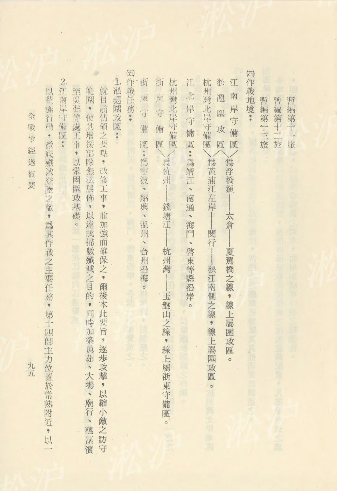

第六十七師暫控置於南京附近。

第十一師位置於吳縣、崑山附近，並派一部在江陰向江邊警戒。

第十四師、第十一師，對於國防工事陣地，務必認真查察，妥爲考慮戰術、戰鬥上之運用，並修補增強之。

3.

江北岸守備區：

主力位置於南通附近，並於靖江、海門、啓東沿岸，各派一小部警戒之。

遇敵艦企圖由江南岸強行登陸，或通過江面，如爲射程所許，則制壓之。

4.

杭州灣北岸守備區：

以積極行動，澈底殲滅登陸之敵，爲其作戰之主要任務，主力位置於嘉興、乍浦附近，一部在沿海要點警戒，並派步砲兵各一部在浦東沿江向敵側射擊，以策應淞滬區之作戰。

5.

浙東守備區：

主力位置於杭州、蕭山、寧波附近，除以一部直接警戒浙東沿海外，如敵軍由杭州灣北岸地區登陸時，有援助該地區殲滅敵軍之任務。

(六)預備隊之控置及運用：

各地區指揮官，應各控置適當兵力爲預備隊，俾隨時得應鄰近地區及其他需要而調遣之。

(七)部隊配置與工事構築：

各地區指揮官，無論施行攻擊或防禦，務使各部隊取縱深橫廣之疏散遮蔽配置，凡部隊所到之處，卽須注意構築工事，以達步步爲營之要求，而增加國軍作戰之輟強性。

(八)空軍行動：

除續行前任務外，對於企圖登陸之敵，應盡力轟炸，尤以對敵之航空母艦，應不顧一切犧牲，強行炸沉之。

(九)海軍行動：

敵艦進入長江下游，企圖強行登陸，或轉用兵力時，應盡全力攻擊之，以協同陸軍作戰，縱有犧牲，亦在所不惜。(十)後方勤務部之任務：

爲適應各地區作戰之要求，應完成交通、通信諸設備，充實彈藥器材諸補充，其集積運輸，務必分散配置，顧慮對空遮蔽，以避免敵空軍及砲兵之轟炸，達成補充圓滑之任務，並應本此要旨，妥擬方案，附圖具報。

(十)其他：

各地區團以上之配置，應以要圖具報。

三、第四戰區作戰指導計劃大綱：

(一)敵情判斷：

1. 敵陸軍主力，將使用於我隴海路以北，敵海軍主力，將使用於我膠東與淞滬之間，敵空軍主力，將協力其陸軍之奪取要地及強行登陸之作戰，故敵軍對我北正面與東正面之作戰，未能獲得相當地位以前，決無能力向我南正面實行眞面目之作戰，因此在國軍對敵第一期作戰中，敵人在本戰區內，無論任何行動，均不過欲達成其擾亂與牽制之目的而已。

2. 敵爲達成上述之目的，將以空軍之一部，轟炸本戰區內各重要都市，並以海軍（若干之陸戰隊)襲擊沿海各要點及瓊州島，同時利用浪人製造漢奸，破壞我民心動員之團結，此爲其必然之手段。

3. 敵空軍及海軍可能擾亂之要點，判定如左：

(1)福州、廣州。

(2)廈門、汕頭、瓊州島。

(3)虎門、粵漢鐵路重要橋樑及其他。

(二)作戰方針：

1. 以最低限度之兵力，直接配備於預想敵海軍陸戰隊登陸之各要點，使負就地死守之任務，以相當兵力之地區預備隊，控置於避免敵海軍砲火直接危害之後方，使負有策應前方防守部隊殲滅登陸敵軍之任務。

2. 控置強大之總預備隊於粵漢鐵路線附近地區，準備參加東正面或北正面國軍主力之決戰。3. 對於瓊州島之戰備，應付有獨立抗戰之能力及長期作戰之資源。

(三)軍隊區分及其位置：

1. 福建區：

指揮官蔣鼎文。

第三師李玉堂（主力位置於福州）。

第八十師陳琪（主力位置於廈門）。

第一五七師黃濤

爲區預備隊控置於龍溪、連江附近。

獨立第六旅

3.

瓊州島：

指揮官張達。

第一五二師陳章。

第九旅。

當地之民團、警察、保安隊。

4.

總預備隊：

第一五三師張瑞貴

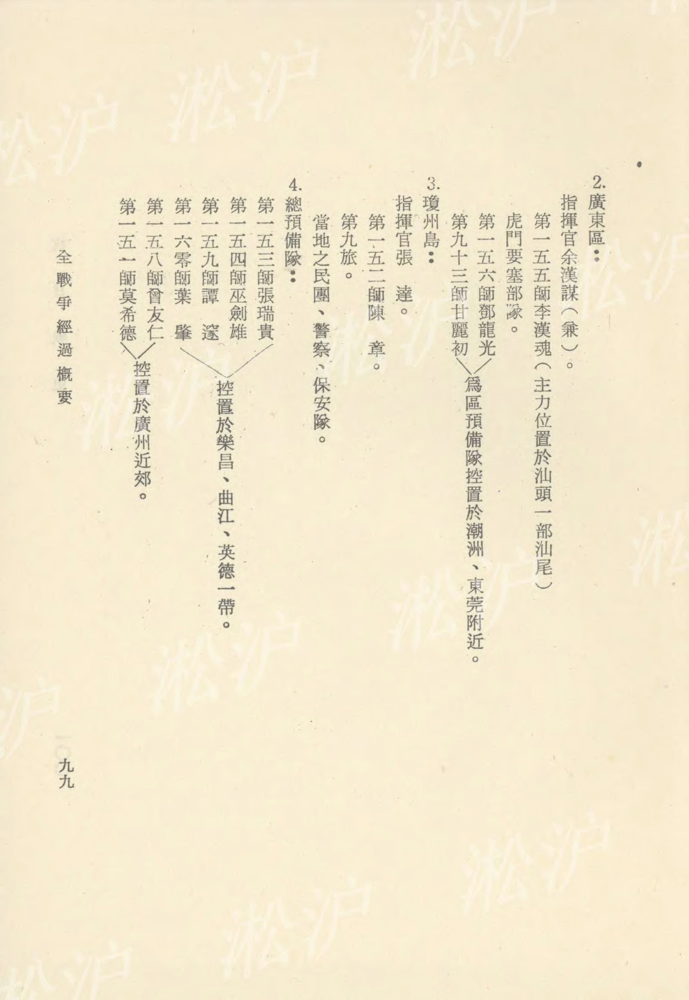

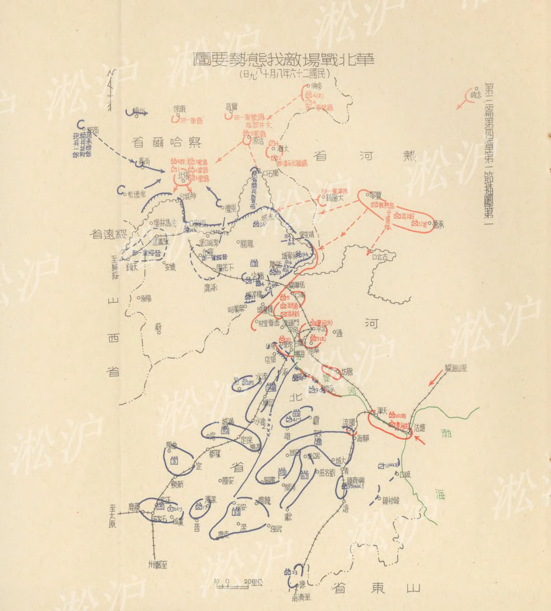

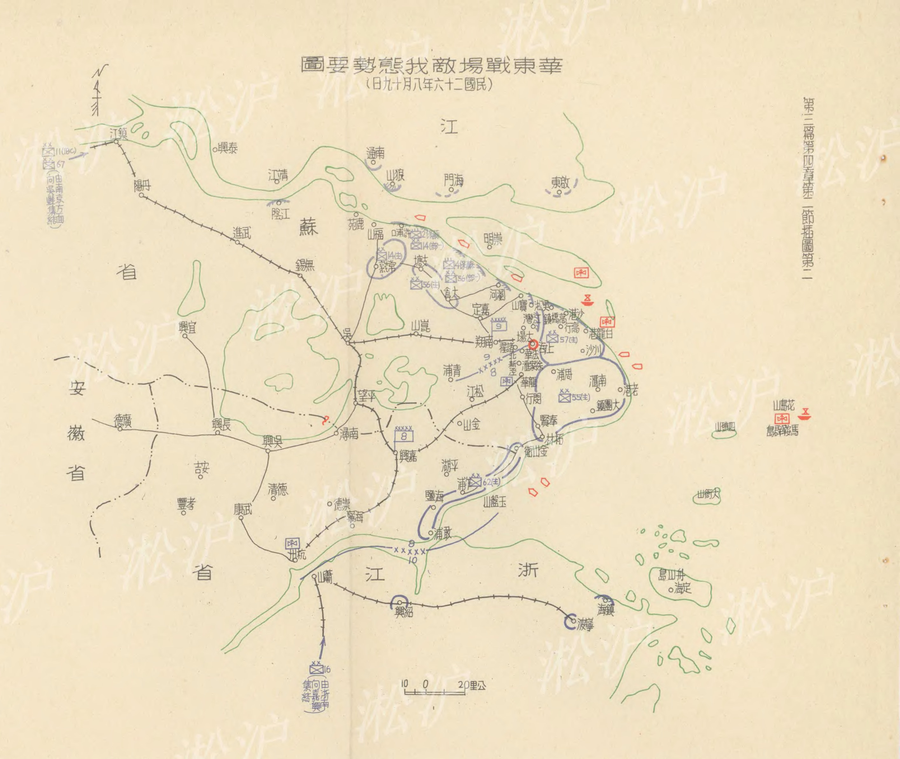

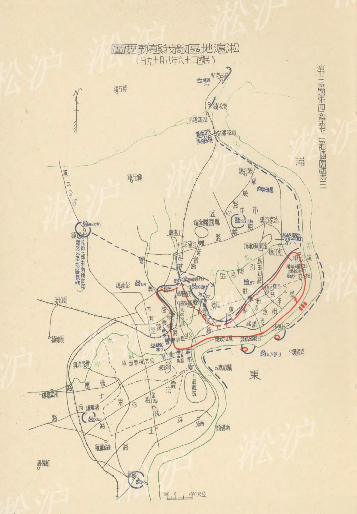

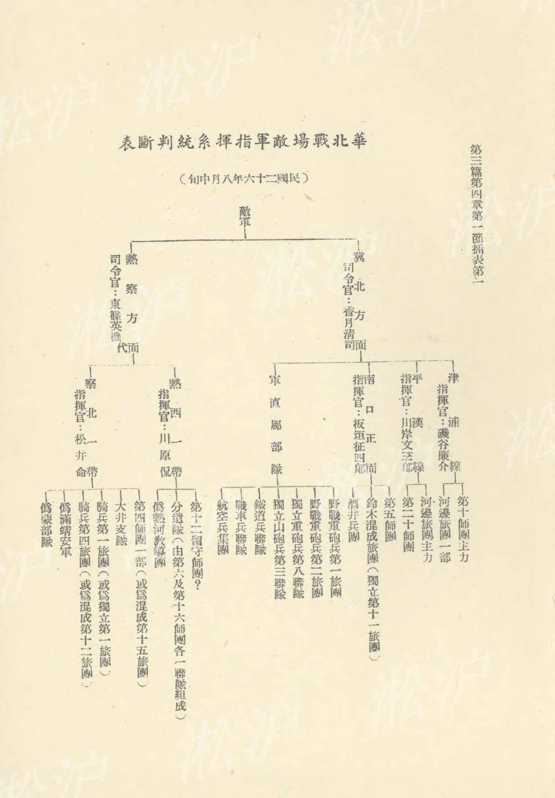

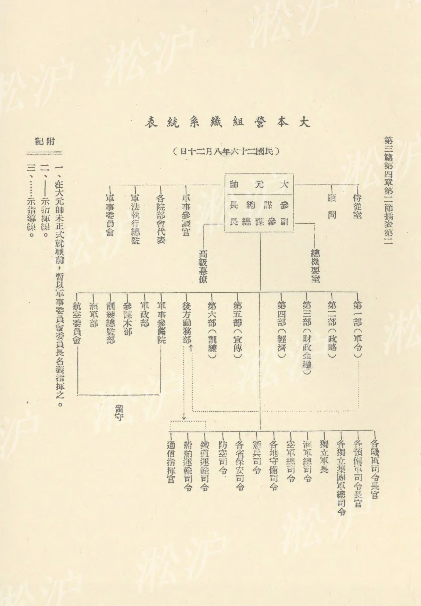

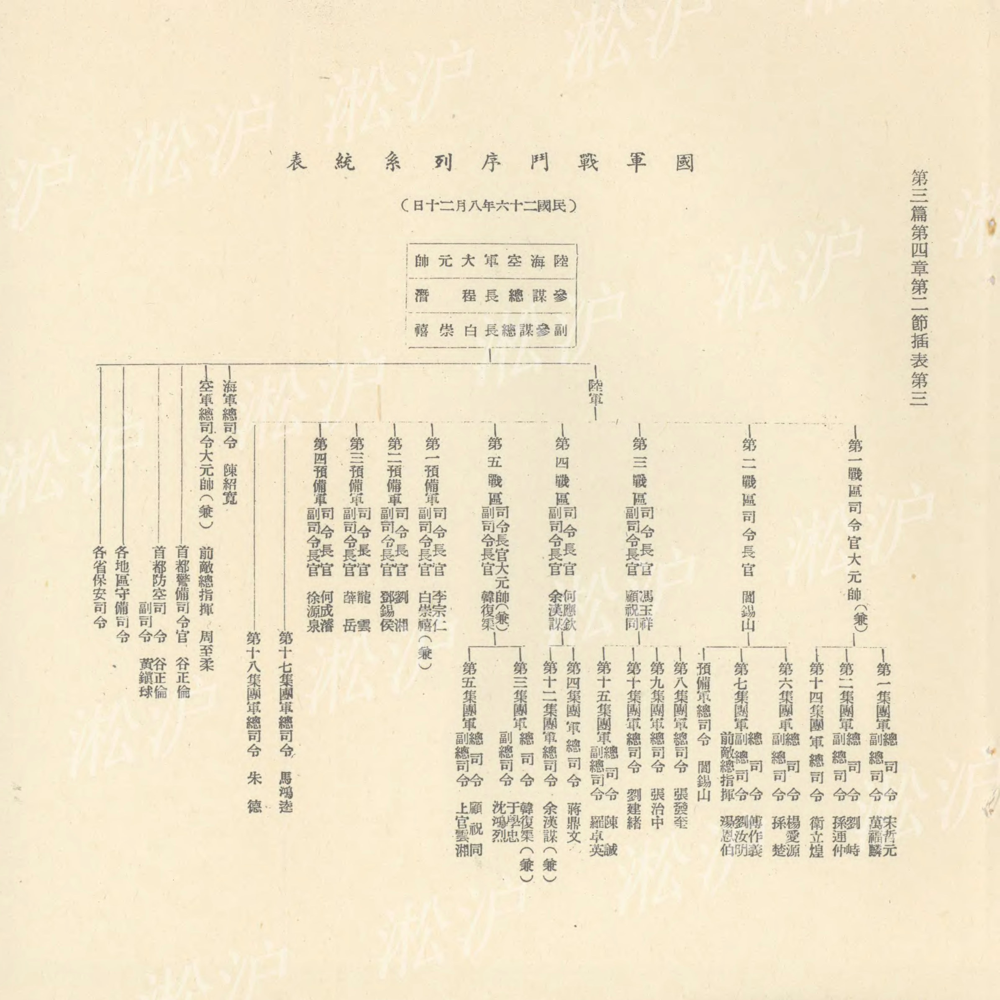

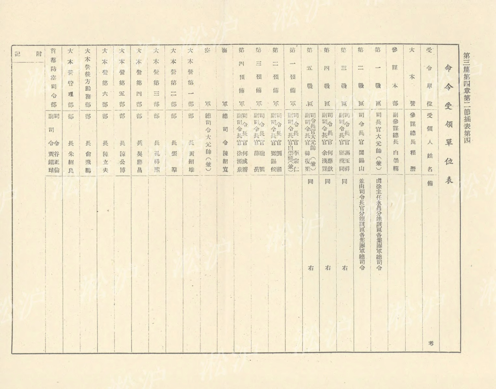

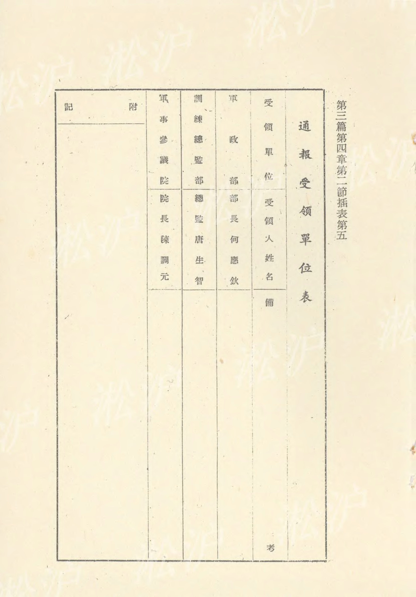
