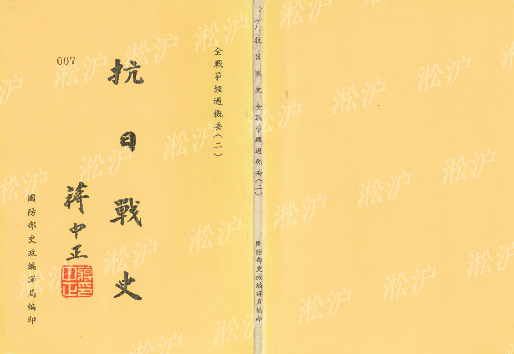
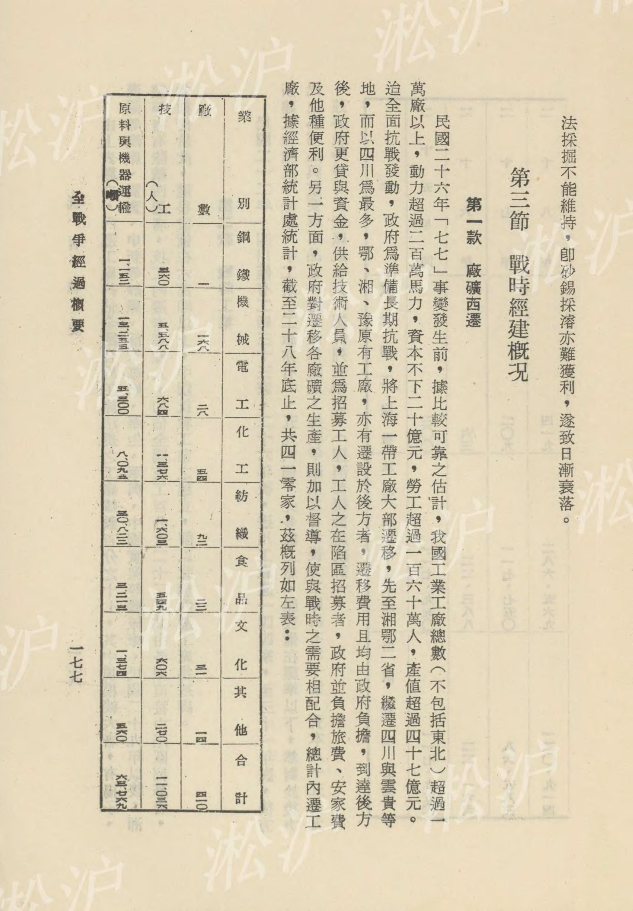
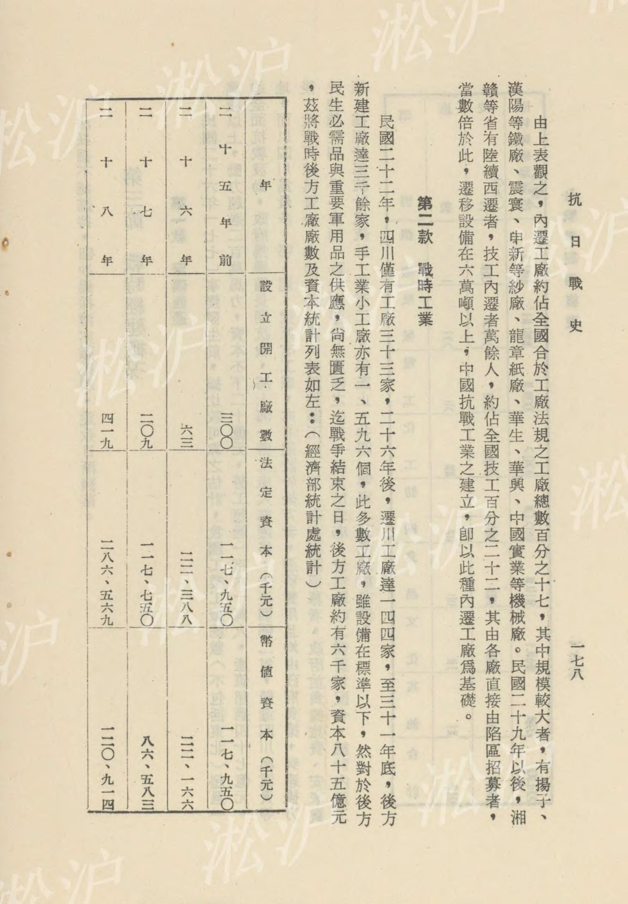
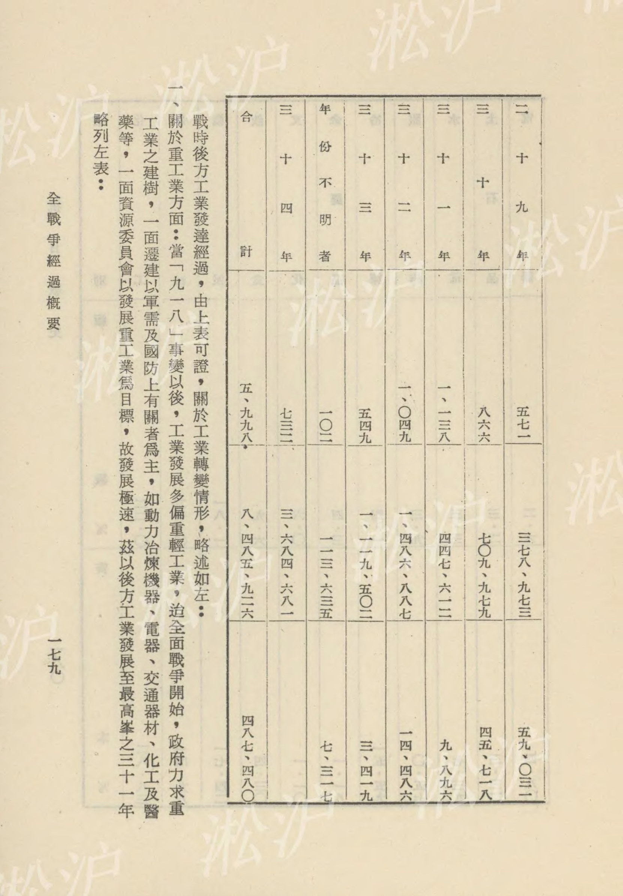
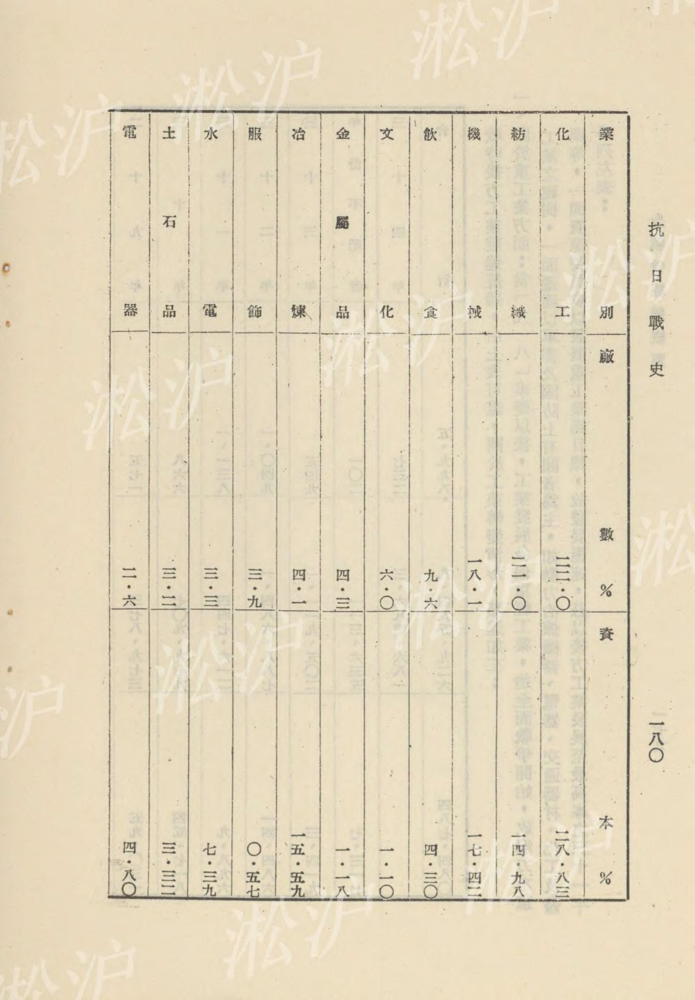
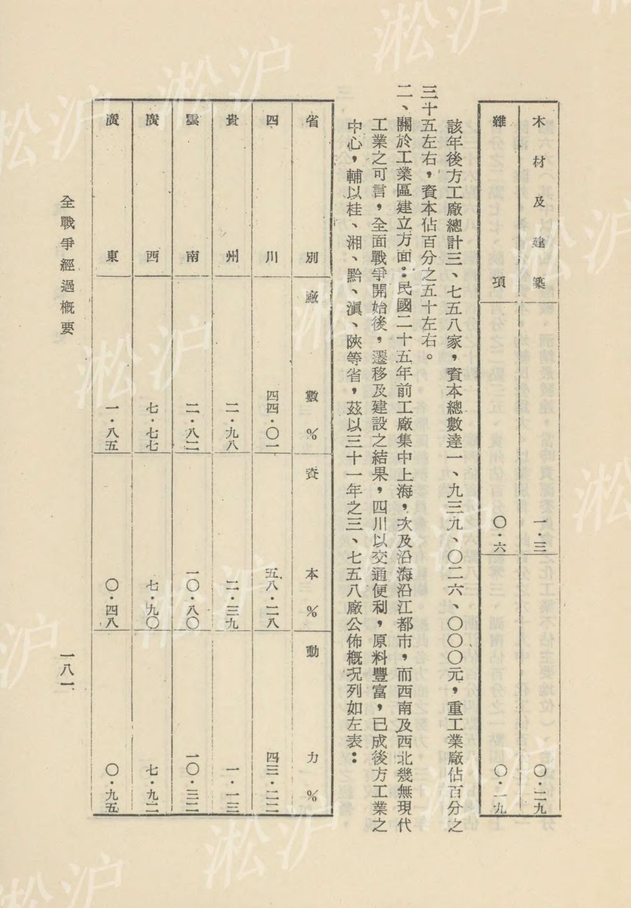
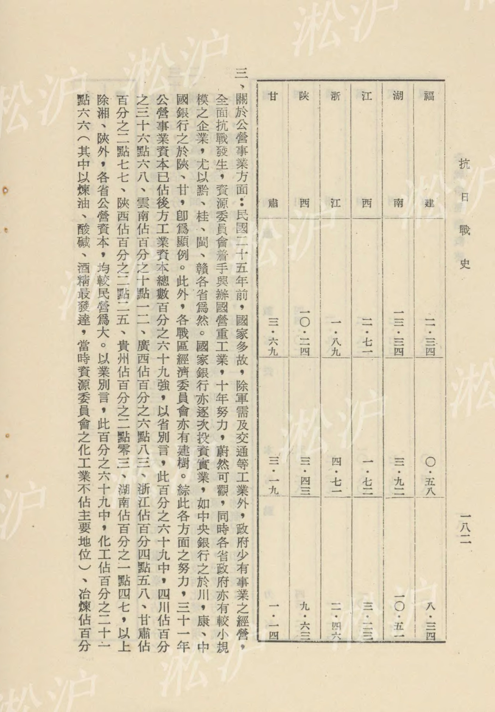



# 第三篇 全戰爭經過概要（二）目錄

第五章 政治作戰　一〇一

第一節 戰時政治機構　一〇一

第二節 戰時政略之運用　一〇四

第一款 内政　一二

第二款 外交　一二

第六章 經濟作戰　一五三

第一節 戰時經濟體系　一五三

第一款 國民經濟建設方案之確立　一五三

第二款 戰時經濟方案之訂定　一六一

第二節 戰時生產與資源　一七三

第一款 農產之增加　一七三

第二款 資源開發　一七五

第三節 戰時經建概況　一七七

第一款 廠礦西遷　一七七

第二款 戰時工業　一七八

目

錄　一

## 扰

日

戰

史　二

第三款 交通狀況

第四節 戰時財政與金融

第一款 戰時財政措施

第二款 戰時金融措施

第三款 調整物資供應

第四款

對敵經濟鬥爭　一八三　一九二　一九二　一九六　一　一　三

## 第五章 政治作戰

### 第一節 戰時政治機構

#### 第一款 國民政府組織法之修改

民國二十年五月十二日國民會議通過訓政時期約法，內容分爲八章，關於人民權利義務、訓政綱領、國計民生、國民教育，中央與地方之權限、政府之組織，均有明確切實之規定。同年六月一日，國民政府公佈施行。詎料數月後，「九一八」事變突起，日本侵我東北，國家步入國難嚴重之非常時期。同年十二月，中央爲求適應當時情況，以便於在政略上運用自如，特修改國民政府組織法，並改組國民政府，其組織法要點如左：

一、國民政府主席爲中華民國元首，對內對外代表國家，但不負實際政治責任，並不兼其他官職，任期二年，得連任一次，但於憲法頒佈時，應依法改選之。

二、國民政府委員會，設委員二十四至三十六人，各院部長不得兼國府委員。

三、在憲法未頒佈前，五院獨立行使職權，各自對中國國民黨中央執行委員會負責。

四、行政院院長負實際行政責任。

五、司法行政改隸行政院，設部管理。

六、國府主席、國府委員、五院院長、副院長，均由中國國民黨中央執行委員會選任之。

自此以後，國民政府組織法未曾再改。

當時中央方面特設中央政治會議，代管關於政治事項，指導與監督國民政府重大國務之進行。二十四年十二月，中央政治會議改組爲中央政治委員會，設委員十九人至二十五人，由不兼政府院部會長官充任，廢除常務委員，改設正副主席。其職權爲議决立法原則、施政方針、軍政與財政大計，特任特派官吏及政務員之人選，直接交國府執行。

#### 第二款 中央政治機構之調整

民國二十六年七月七日全面抗戰爆發後，中央爲適應政略與戰略配合上之需要，乃決議設置國防最高會議，其職權爲：

一、國防最高會議主席，在作戰時期，關於黨政軍一切事項，得不依平時程序，以命令爲便利之措施。二、凡應交立法院之案件，該會認爲有實行緊急處置之必要時，亦得爲便宜之處置，於事後按照立法程序，送交立法院追認。

三、立法院所議各案，凡與戰時有關者，應先送國防最高會議核議。

上項職權，與中央政治委員會無異，於是中政會停開，由國防最高會議代行。

同年十一月，中央頒佈非常時期中央黨政軍機構調整辦法，並以軍事委員會爲抗戰最高統帥部，軍事委員會因之擴大編制，設置祕書廳，另設第一至第六部，分掌軍令、軍政、經濟、政略、宣傳、組訓等事宜。

二十七年一月一日，中央頒佈調整中央行政機構命令，其要點如左：

一、海軍部暫行撤銷，其經管事務，併歸海軍總司令部辦理。

二、實業部改爲經濟部，建設委員會及全國經濟委員會之水利部份，與軍事委員會之第三部、第四部，一律併入經濟部。

三、鐵道部及全國經濟委員會之公路部份，併入交通部，鐵道部着卽裁撤。農產、工礦、貿易三個調整委員會所設之聯合運輸辦事處改隸交通部。

四、全國經濟委員會之衛生部份，併入衛生署，改隸內政部。

嗣後行政院又將賬務委員會與難民救濟總會合併成爲賬濟委員會，並將內政部所管關於救濟部份，劃歸賬濟委員會管轄。

一月十四日，國府公佈修正行政院組織法，釐訂行政院除直隸其他特種機關外，管轄內政、外交、軍政、財政、經濟、教育、交通七部及蒙藏、僑務、賬濟三個委員會。十七日，修正公佈軍事委員會爲戰時最高統帥部組織系統。軍事委員會直隸國民政府，設委員長一人，委員七至九人，以上各人員，由中央政治委員會選定，由國民政府特任之，此外參謀總長、副參謀總長、軍令部、軍政部、軍訓部、政治部四部長及軍事參議院院長爲當然委員，軍事委員會改設軍令、軍政、軍訓、政治四部、軍法執行總監、航空委員會、後方勤務部及辦公廳均仍舊。

民國二十八年一月，中央爲應抗日總體作戰之需要，基於「組織黨政軍統一指揮之機構，使全國黨政工作，得與軍事相配合，以收共同行動之效」的認識，特設置國防最高委員會，以統一黨政軍之指揮，並代行中央政治委員會之職權，國防最高會議當經撤銷。

國防最高委員會主席，以中國國民黨總裁擔任，下設常務委員十一人，由五院院長、外交部長、軍事委員會參謀總長、副參謀總長及推定之中央常委三人擔任，中央執監委員會常務委員、中央執行委員會祕書長及行政院祕書長均得列席國防最高委員會常務會議，此機構對政略與戰略之統合運用上，較前更爲靈便，領導抗戰建國，貢獻甚偉，至三十六年始行撤銷。

同年軍事委員會添置戰地黨政委員會，行政院添設農林部，原屬中央黨部之社會部，亦劃歸其隸屬民國二十九年七月，中央將經濟部改爲工商部，專管工商及礦業事宜，此外添設經濟作戰部與戰時經濟會議，同時爲實施行政三聯制，使設計、執行及考核工作打成一片，藉以健全政治，提高效率起見，並決議在國防最高委員會之下，設置中央設計局，該局組織大綱，經於九月中央常務會議通過，三十年二月正式成立，每一年度開始前，中央設計局擬定施政方針，經由國防最高委員會議決後，發交各級政府，各級政府按照所指示之方針，分交主管部門擬訂詳細施政計劃及執行此次計劃所需經費之概算，逐層呈報，逐層審核，而後再由中央設計局作全盤之審查與整理，製成全國之整個施政計劃，一面呈由國防最高委員會發交執行，一面送黨政工作考核委員會以爲考核之依據。

中央設計局總裁，由國防最高委員會委員長兼任，審議委員七至九人，設計委員若干人，由總裁遴派或聘任，審議會開會時，由總裁擔任主席，審議事項如下：（一）政治、經濟建設計劃及預算，（二）黨政制度機構及重要法規之調整，（三）重要政策之建議，設計委員會議則由祕書長召集之，並設有預算委員會，以便審定預算。

### 第二節 戰時政略之運用

民國二十年「九一八」事變突起，國民政府呼籲團結抗敵，中國國民黨亦以「精誠團結，共赴國難」相號召，進行黨內大團結，而共產匪黨卻於九月三十日發表宣言，痛斥「統一陣線，抵禦外侮」言論，爲荒謬欺騙性之謊言，並宣稱：「中國共產黨仍將爲與帝國主義者及國民黨誓不兩立的死敵」，俄寇莫斯科共產國際執行委員會決議，中國共產黨必須致力於推翻國民黨。

二十一年「一二八」事變發生，國軍在淞滬杭抗戰正烈，共產匪黨一面發動紅軍佔領贛州、南雄、漳州等地，並計畫進攻南昌、武漢，一面在上海公開號召罷工，煽動羣衆，反對政府。此時政府當局，痛定思痛，立下決心，確定「攘外必先安內」總方針，一面努力國防建設，一面對匪區進剿，於是，二十一年冬肅清豫鄂皖邊區，二十三年肅清贛湘，共匪西逃，深入黔、滇、川、康，二十四年其殘部竄入陝北地區。在此剿匪期間，除改革幣制、整建國軍、開辦廬山軍官訓練團、峨嵋訓練團、發起新生活運動、倡導國民經濟建設運動，整理國防工事、整建交通、建設空軍等而外，並於二十一年八月設置區行政督察專員制度，實施保甲制度，二十二年公佈兵役法，至二十五年實行兵役法，開始試行征兵，二十三年七月創行省府合署辦公，二十五年提前制定憲法草案。

二十六年七月全面抗戰發生後，各黨各派均一致承認三民主義爲抗戰建國之中心原則。八月，中國共產黨宣言，取銷蘇維埃政府，改編紅軍爲國民革命軍，誓爲實現革命之三民主義而奮鬥。二十七年四月，國家社會黨與中國青年黨先後致書中國國民黨蔣總裁，申言願在國民黨領導之下，共同抗戰，國民參政會中有各黨派代表參加。其次全中華國族，從漢滿蒙回藏邊疆民族，以致苗猺等少數民族，均一致擁護政府，積極參加抗戰。此時我整個中華民族，不分黨派，不分種族，不分地域，在中央政府領導下，精誠團結，共赴國難，全國政治上與軍事上之統一，實民國建立以來所未曾有，此項成就，卽爲政略運用上之效果。

二十七年三月二十九日，中國國民黨臨時全國代表大會開幕，歷時十日，重要決議有四：

一、制定抗戰建國綱領，爲全國一致信守準則。

二、推舉蔣委員長爲本黨總裁，在制度上明確規定全黨之領袖，俾此革命集團有一穩固之重心。

三、決定將國防參議會結束，另設國民參政會，爲戰時最高民意機關。

四、決議設立三民主義青年團，本黨應以執行政黨之地位，訓練全國青年，使人人信仰三民主義，故設立青年團，將預備黨員制取消。

抗戰建國綱領爲戰時施政之方針，亦爲政略與戰略統合運用之依據，深受國民參政會所擁護，茲錄其原文如左：

中國國民黨抗戰建國綱領。

中國國民黨領導全國從事於抗戰建國之大業，欲求抗戰必勝、建國必成，固有賴於本黨同志之努力，尤須全國，民戮力同心，共同擔負，因此本黨有請求全國人民捐棄成見、破除畛域、集中意志，統一行動之必要，特於臨時全國代表大會製定外交、軍事、政治、經濟、民衆運動、教育各綱領，議決公佈，使全國力量得以集中團結，而實現總動員之效能，綱領如左：

一、總則：

(一)確立三民主義，暨總理遺教，爲一般抗戰行動及建國之最高準繩。

(二)全國抗戰力量，應在本黨及蔣委員長領導之下，集中全力，奮勵邁進。

二、外交：

(一)本獨立自主之精神，聯合世界上同情於我之國家及民族，爲世界之和平與正義共同奮鬥。

(二)對於國際和平機構及保障國際和平之公約，盡力維護，並充實其權威。

(三)聯合一切反對日本帝國主義侵略之勢力，制止日本侵略，樹立並保障東亞之永久和平。

四對於世界各國現存之友誼，當益求增進，以擴大對我之同情。

(五)否認及取消日本在中國領土內以武力造成之一切僞政治組織及其對內對外之行爲。

三、軍事：

(一)加緊軍隊之政治訓練，使全國官兵明瞭抗戰建國之意義，一致爲國効命。

(二)訓練全國壯丁，充實民衆武力，補充抗戰部隊，對於華僑回國效力疆場者，則按照其技能，施以特殊訓練，使之保衛祖國。

(三)指導及援助各地武裝人民，在各戰區司令長官指揮之下，與正式軍隊配合作戰，以充分發揮保衛鄉土捍禦外侮之技能，並在敵人後方，發動普遍的游擊戰，以破壞及牽制敵之兵力。

四撫慰傷亡官兵，安置殘廢，並優待抗戰人員之家屬，以增高士氣，而爲全國動員之鼓勵。

四、政治：

(一)組織國民參政機關，團結全國力量，集中全國之思慮與識見，以利國策之決定與推行。

(二)實行以縣爲單位，改善並健全民衆之自衛組織，加以訓練，加強其能力，並加速完成地方自治條件，以鞏固抗戰之政治的社會的基礎，並爲憲法實施之準備。

(三)改善各級政治機構，使之簡單化、合理化，並增高行政效率，以適應戰時需要。

四整飭綱紀，責成各級官吏忠勇奮鬥，爲國犧牲，並嚴守紀律，服從命令，爲民衆倡導，其有不忠職守貽誤抗戰者，以軍法處治。

(五)嚴懲貪官污吏，並沒收其財產。

五、經濟：

(一)經濟建設應以軍事爲中心，同時注意改善人民生活。本此目的，以實行計劃經濟，獎勵海內外人民投資，擴大戰時生產。

(二)以全力發展農村經濟，獎勵合作，調節糧食，並開懇荒地，疏通水利。

(三)開發礦產，樹立重工業的基礎，獎勵輕工業的經營，並發展各地之手工業。

四推行戰時稅制，澈底改革財務行政。

(五)統制銀行業務，從而調整工商業之活動。

六鞏固法幣，統制外匯，管理進出口，以安定金融。

(七)整理交通系統，舉辦水陸空聯運，增築鐵路、公路，加關航線。

(八)嚴禁奸商壟斷、居奇、投機、操縱、實施物品平價制度。

六、民衆運動：

(一)發動全國民衆、組織農工商學各職業團體，改善而充實之，使有錢者出錢，有力者出力，爲爭取民族生存之抗戰而動員。

(二)在抗戰期間，於不違反三民主義最高原則及法令範圍內，對於言論、出版、集會、結社，當與以合法之充分保障。

(三)救濟戰區難民及失業民衆，施以組織及訓練，以加強抗戰力量。

四加強民衆之國家意識，使能輔助政府，肅清反動，對於漢奸嚴行懲辦，並依法沒收其財產。

七、教育：

(一)改訂教育制度及教材，推行戰時課程，注重於國民道德之修養，提高科學的研究與擴充其設備。(二)訓練各種專門技術人員，與以適當之分配，以應戰時之需要。

(三)訓練青年，俾能服務於戰區及農村。

四訓練婦女，俾能服務於社會事業，以增加其抗戰力量。

國民參政會於二十七年四月十二日公佈組織條例，置參政員總額一百五十名，其分配如左：

一、由曾在各縣、市（指行政院直轄市而言）公私機關團體服務年以上，著有信望之人員中，共選八十八名。

二、由曾在蒙古、西藏地方公私機關團體服務，著有信望，或熟諳各該地方政治社會情形，信望久著之人員中，選任六名（蒙古四名、西藏二名）。

三、由曾在海外僑民居留地工作三年以上，著有信望，或熟諳僑民生活情形，信望久著之人員中，選任六名。

四、由曾任各重要文化團體，或經濟團體服務三年以上，著有信望，或努力國事信望久著之人員中，選任五十名。

第一屆第一次大會在漢口舉行，任期於二十九年屆期。同年九月，中央第一五八次常務會議決議繼續召集，並參酌兩年以來之經驗，與社會人士之期望，將參政員產生方法，予以改進，國民參政員之名額，酌予增加，國民參政會之職權，加以擴充，並將議長制改爲主席團制，總期推行盡利，並收集思廣益之效，其修正後之組織、職權、會期及主席團之規定，述之如左：

一、組織：

國民參政會置參政員二百二十人，凡具有中華民國國籍之男子或女子，年滿三十歲，非現任官吏，而具有規定資格者，得爲參政員，參政員之分配及其產生方法如下：

(一)各省市代表九十名，由各省市議會用無記名速記投票法選出，在參議會尚未成立之省、市，由各該省、市政府會同各該市、省黨部加倍提出候選人，由中央執行委員會選定。

(二)蒙古代表四名，西藏代表二名。

(三)華僑代表六名。

(二)、(三)兩項參政員，分別由蒙藏委員會、僑務委員會加倍提出候選人，送中央執行委員會選定。(四)各重要文化經濟團體及各黨派之代表一百八十人，由國防最高委員會加倍提出候選人，提請中央執行委員會選定，國民參政員之任期爲一年，政府得延長之。

二、職權：

(一)決議權：在抗戰期間，政府對內對外之重要方針，於實施前應提交國民參政會議決，前項決議案，經國防最高委員會通過後，依其性質交主管機關規定法律或頒佈命令行之，遇有緊急特殊情形，國防最高委員會委員長得命令爲便宜之處置。

(二)建議權：參政會得提出建議案於政府。

(三)詢問權：參政會有聽取政府施政報告，暨向政府提出詢問之權。

四調查權：參政會組織調查委員會，調查政府委託考察事項，前項調查結果，得由參政會提出政府核辦。

三、會期：

參政會每六個月開會一次，會期十日，政府得延長其會期，或召開臨時參政會，休會期間設置駐會委員會，由參政會主席團及參政員互選二十五人組織之，其任務有三：

(一)聽取政府各種報告。

(二)促進業經成立決議案之實施，隨時考核其實施之狀況。

(三)在不違反大會決議案之範圍內，得隨時執行本會建議權及調查權。

四、主席團：

第一屆參政會，於參政員以外，原設議長、副議長各一人，由中央執行委員會選定，第二屆改爲主席團，由參政會選舉五人組織之，其人選不以參政員爲限，國民參政會及駐會委員會開會時，由主席團互推一人爲主席。

國民參政會自成立以後，至三十六年五月憲政實施方始結束，參政員名額增至三百六十名，先後歷經四屆，開會達十三次之多，在抗戰建國基本國策上貢獻甚大。該會參加者，有青年黨、國家社會黨、共產黨及無黨無派之社會賢達。在抗戰期中，參政會代表民意，多所建議，擁護「抗戰建國綱領」，堅持持久抗戰，確立民主制度法案，聲討汪逆兆銘，擬討五五憲章，糾彈官吏，同時組織「川康視察團」、「軍紀巡查團」、「憲政期成會」、「川康經濟建設期成會」各種團體，均有裨於實際。在抗日大前提下，除共產黨另有其一貫之陰謀外，其他各黨派無不樂於趨向共同目標，以「抗建綱領」爲範圍，以驅逐日寇爲職志，雖經汪兆銘之叛國降敵，日人在南京製造傀儡政權，而各黨派聯合抗日陣線屹然不爲稍動，堅持抗戰到底，終於獲得最後勝利。

同時，各省、市臨時參議會，亦已先後成立，若干省份且已成立縣參議會，華北敵後游擊區，已實行民選縣長、區、村長。

政府遷至重慶後，對於邊務問題更加重視，二十八年一月西康正式建省，僵持七年之康藏糾紛，得以圓滿解決。二十九年二月，第十四輩達賴喇嘛舉行坐床典禮，中央特派蒙藏委員會委員長吳忠信前往西藏主持。

二十九年七月三十日，行政院決議成立全國糧食管理局，以統籌全國糧食之產銷、儲運、調節其供求關係。同月中旬，重慶舉行驛運會議，決定擬訂驛運組織綱要及經費概算，呈交中央核准，由交通部設立全國驛站運輸管理處，各省設置分處。

二十九年九月六日，國府頒佈命令，其原文如左：

「四川古稱天府，山川雄偉，民物豐殷，而重慶綰穀西南，控扼江漢，尤以國家重建政府於抗戰之始，首定大計，移駐辦公，未兩綢繆，瞬經三載，川省人民，同仇敵愾，縉誠紓難，矢志不渝，樹抗戰之基礎，熒建國之大業，今行都形勢，益增鞏固，戰時蔚成軍事政治經濟之樞紐，戰後自更爲西南建設之中心，恢闊建置，民意僉同，茲特明定重慶爲陪都，着由行政院督飭主管機關，參酌西京之體制，妥籌遠久之規模，藉慰輿情，而新懋典」。

陪都之成立，全國各地紛紛慶祝。

國民政府主席林森，自民國二十一年就任後，因軍民愛戴，連任達十二年之久，平日慈和沖淡，公忠體國，抗戰中率同國府文武百僚西遷陪都，共渡艱危，使抗戰建國同時並進，但因主席已屆高齡，努力從公，遂至沉疴不起，於三十二年八月一日在渝逝世，普海同悲，下旗哀悼。

民國三十二年九月三十日，中央一致推選蔣委員長爲國民政府主席兼陸海空軍大元帥，蔣主席於是年十月十日就職。

除以上所述外，戰時政略之運用重要者尚多，茲就內政及外交兩方面敘之於后。

#### 第一款 內政

中央與地方之關係，爲中國數千年來政治上根本問題，凡歷史上統一強盛之世，中央與地方之間，均能確保政治上之平衡，而使內外相維，國基鞏固，歷代傾覆由於此種關係之失調，歷次外患均由此種關係而孳生，偏於中央集權者，其弊爲內重外輕，而有分崩離析之患，偏於地方分權者，其弊爲外重內輕，而有尾大不掉之勢。國父鑒於中國歷史上之教訓，倡導均權制度，於集權分權二者，折衷至當，不以擁護中央之故，而忽視眞正之地方自治，脫胎於歷史上之均權思想，而以時代思潮洗鍊之，乃穎脫而出，煥然爲建國時期嶄新之政制。蔣委員長繼承遺志，悉心籌劃，二十一年制定區行政督察專員制度，二十三年創行省府合署辦公制度，並制定「劃分中央與地方權責案」，此案用意，期於中央與各省之間，調劑得宜，中央有充分之權威，地方復有自動之能力，庶幾內外均衡，而無輕重之偏，二十八年復有「縣各級組織綱要」之頒佈，卽所謂新縣制，此爲地方行政之重大改革，亦爲實施憲政之基本工作。新縣制實施之目的，在於使管教養衛各方面之措施，同時並舉，對人民行政權之訓練、兵役之推進、經濟之動員以及土地政策之實行、國民教育之普及，均曾悉力以赴，加速完成，加之戰時縣級及省級民意機關之成立，又能發揮相當效力，縣參議會代表民意，監督縣以下之組織，輔助地方自治之進行，其於民權主義之實現，自爲根本之設施。政府在抗戰建國相輔並進之時，對於各地基層行政機構，力求健全而有效，一方面以求合於戰時政治體制之需要，一方面在求貫徹民主政治之精神，茲將內政設施擇其要者，分別述之如左：

一、中央與地方權責之劃分：民國二十三年，國民政府本於國父均權制度之遺教，通電全國劃定中央與地方之權責，該案係由蔣委員長於中國國民黨四屆五中全會所提出，於是年十二月十二日通過施行。本案宗旨，在於中央與地方徹底樹立互信共信之基礎，推誠抉掖，同循政治正軌，實爲達到和平統一之惟一途徑，茲將該案原文節錄如下：

「吾人果堅定和平統一之信念，而爲分工合作之努力，則挽救國難，復興民族，當可操勞而得。顧數年以來，所以未能收分工合作之實效者，蓋因中央與地方之權責劃分未清之故爲多也。其最顯著之弊害，則在地方上之責任未明，中央之運用不靈，以致行政效能趨於低落，各項建設艱於發展，故重釐訂中央與地方之權責，力謀政治設施之適宜，實爲當前之急務。然欲達此目的，必須中央對於地方免除其掣肘之慮，消失其疑難之端，同時地方對於中央亦應本休戚與共之眞誠，遵國家整個之國策，懔當前嚴重之國難，守法奉令，一掃過去割據及形同對立之形勢，一致努力，以期蛻變中古時期封建之遺習，而創造三民主義新時代整個之國家，倘中央與地方之負責者，皆同心一德，本此而行，不僅所以救黨國，抑亦所以自救也」。

「查國父建國大綱所垂示者，乃劃分中央與地方權責之最高原則，惟此於過渡時期，不能不有所斟酌損益，以爲應時應地權宜之變通，期臻於統一正軌之大道，茲本上述之要旨，特擬中央與地方之權責劃分綱要如左：

(一)關於官吏之保薦與任命問題：國家庶政殷繁，需才孔急，用人大權雖操之於中央，而保薦人選則不妨屬於地方。現行各級官吏之任用法規，已多採行此項精神，然舉賢與能，因才任使，必須負責者有辟薦之實效，而後能便利指揮，專一責任，謂宜重申此旨，一切文武官吏，應由各地方之主管長官，就有法定資格者，自由選擇，薦於中央，由中央任命之，務使適應事實，登進才能，於統一中央命令權之中，更充分發揮地方主管長官之權責，此對全國官吏之保薦任命法規，必須本此旨重行增訂，切實施行者一也。

(二)關於官吏之任期與保障問題：凡百庶政，責專始舉，若存五日京兆之心，必有苟且因循之弊，各地文武官吏，宜確實規定其任期，師古人三載考績之遺意，以三年一任爲原則，並須規定保障，切實執行，無故不得撤職，其成績優良者，任滿之時，仍由中央重加任命，予以連任，俾得人於其位，假以時日，課以考成，使才智之士，感國家任使之重，無設施不竟之憂，各展懷抱，獻替國家，此對全國官吏之任期與保障法，必須分別增訂，切實施行者二也。

(三)關於地方行政及經濟問題：欲謀地方事業之發展，必須加強地方主管長官之責任，而欲各地之事業，皆在國家整個政策之下進行，得免彼此衝突或畸形發展之弊，則必須中央有統籌兼顧指揮監督之權，故各地方行政方針，與夫經濟建設，應由各地方斟酌實情，擬定計畫，編整預算，呈請中央核定施行，中央旣經核定之後，只須按其期程，考其成績，而不必遇事干涉，輒令紛更，其他各項要政，凡具有地方性質者，亦概可依此原則，責令地方因勢利導行之，則事半功倍矣，此對地方事業必須責成地方政府自由發展者三也。

四關於中央與地方之財政問題：中央與地方財政，亟應根據現行辦法，明確劃分，凡屬於全國性之國家財政，應歸中央統收統支，例如對外之關稅等稅則與收支，尤應絕對由中央管理，地方固不得越權干涉，其他各稅亦應遵守中央所頒佈之規則及稅法辦理，但在此過渡時期中，各地方經費確有不足者，自可由中央核准補助，使內外相維，以爲調劑，此對於中央於地方之關係應急謀解決者四也。

五關於國防軍及地方兵警之問題：國防軍爲捍衛國家之武力，故關於國家之正規軍，自需中央統一管轄指揮，但在目前過渡時期，得依平時之統屬關係，對於統屬官佐之任免，准由其最高主管長官呈保中央任命，至屬於地方之兵警，各保安隊、保衛團、警察隊等，除編制數額須由中央核定，不得自由增減外，概准由地方行政長官訓練調遣，無論國防軍或地方兵警，若必須向外國購買武器時，可由中央統一訂購，以免品類龐雜，減少效用，此對全國軍事必須劃清中央與地方之權責者五也。

六關於法制之制定問題：吾國幅員廣大，各地習俗懸殊，國民程度不齊，經濟產業狀況均互有差異，不但因自然地理之關係，在行政設施上應有輕重緩急之別，且因文化程度之不同，更應有因時因地與因人制宜之必要，若概由中央頒佈整齊劃一詳密繁雜之法制，強行一體施行，是無異是削足適履，扞格難通，故今日我國之法制，欲使全國推行無阻，必須中央核定原則大綱，務使寄於伸縮力，其一切實施辦法與詳密條理，應由各省市根據原則大綱，因地制宜，而自訂草行法規，並呈請中央備案，以期切於實用，此對全國法規必須因應事實者六也」。

二、省政府合署辦公制度：民國二十三年，蔣委員長主持南昌行營時，鑒於省政府各廳駢肩而立，各成系統，權則相爭，過則互諉，一切設施多以本廳處之立場爲觀點，缺乏抑己伸人，共維全局之精神，乃創辦省府合署辦公制度，通令當時剿匪區內之贛、鄂、豫、皖、閩等五省尅期實施，至二十五年五月，行政院召開地方高級行政人員會議，決定通令全國一致施行，至此合署辦公制度，乃正式成爲一確定之制度。

合署辦公制度，規定省政府之祕書處、民政廳、教育廳、建設廳、保安處等機構，應一律併入省政府公署內合署辦公，一切直屬省政府之機關，應分別裁併或量爲縮小，改隸於主管廳處。合署辦公後，所有文書應以省政府名義行之，並由省政府祕書處總收總發，同時各廳處及其所轄機關，均應徹底改革，厲行裁併，各廳處之經費應集中管理，材料物品應集中購辦，惟祕書處因事務繁忙，除設科分掌文書、會計、庶務等事項外，並得酌設技術、法制、統計等室，至合署辦公後之節餘經費，應悉數撥增各縣行政費。

三、行政督察專員制度：民國二十年，軍事委員會南昌行營鑒於地方行政之層級，採省、縣兩級制，但省之幅員遼闊，以一省而統轄數十縣乃至百餘縣，監督既難周到，而上下隔閡，流弊滋多，乃於行營內成立黨政委員會，卽以總司令兼任委員長，並將江西全省劃爲若干區，每區設一黨政委員分會，秉承委員長之命，管轄區內各縣，復以分層委員長兼任駐在地之縣長，集中黨政軍權於一處，使負督促區內各縣黨務行政及治安之全責，此制試辦頗有成效，其後各省亦多採取分區制，惟分區及長官之名稱多不相同。

二十一年，豫、鄂、皖三省剿匪總司令部制定剿匪區內各省行政督察專員公署組織條例，在三省內實施，同時內政部爲統一各省制度起見，亦制定各省行政督察專員暫行條例，分令各省施行。當時法令規定，行政督察專員以兼任駐在地之縣長爲原則，嗣以專員職責繁重，全面抗戰期間，更兼任保安司令之職務，無法兼顧縣政，乃由行政院通令各省，行政督察專員一律免兼縣長。

督察區並無名稱，僅以數字定之，並以設立之先後爲次序，對於專員人選，任用之先，由行政院組織專員審查資格委員會審查資格，專員之職權，規定爲審核轄區內各縣市行政計畫、中心工作、預算、決算與單行法規，巡視及指導地方行政及自治，考核行政人員工作成績，處理各縣市間之爭議，召集全區行政會議等，但專員公署在法律上雖有相當隆重之職權，形式上亦頗似三級制中層組織，實際上却僅爲省政府之輔助機關，並非省與縣間之一個層級，正與縣與鄉鎮間之區署性質相同，故斯制所採關於地方行政組織之層級，仍爲省縣二級制，如果將來省區縮小，自無須再有專員制度。

四、實驗縣之推行：國父遺教中早定地方自治爲訓政時期最重要之中心工作，民國二十二年，政府當局及社會人士咸覺縣行政尚有若干問題亟待解決，而究以採用何種方式將其解決爲最合宜，殊無確切之把握，故發爲一種縣政之實驗運動，期用具體方法探究各種改革方案之實際效用，當時社會方面，亦正有若干人士，從事鄉村及縣政建設之研究改良，分別擇地實驗，其中最負時譽者，爲山東之鄒平與菏澤，及河北之定縣，其他從事鄉村建設之社會團體亦頗多，此爲實驗縣制之由來。

實驗縣之設置，內政部規定應具備下列五條件：

(一)該區情形可代表本省一般情形者。

(二)交通便利地位適中者。

(三)從前辦理地方自治較有成績者。

(四)地方有領導人才，且能出力贊助者。

(五)實驗場所有相當設備者。

另從事實驗縣建設之人員，多爲專門人才，經費多有專款，權限比較擴大，因之，實驗縣之一般條件，均較普通縣爲優。

實驗縣實施成績，以江蘇之江寧、浙江之蘭谿二縣爲最優。蔣委員長以爲政治人才之訓練，應以學術與實驗並重，二十二年二月，江寧實驗縣成立之時，曾致訓詞謂：「江寧爲京畿首善之區，自治爲實行憲政之本，該縣長首膺斯任，四方其瞻，務宜實事求是，樹是風聲，爲郡縣倡，是所深望」。江寧與蘭谿改爲實驗縣後，以中央政治學校畢業生分任工作，縣政推行頗爲順利，辦事效率均見增加，在制度方面，二縣均徹底裁局改科，同時並將行政及自治層級減少，裁撤區公所，廢除閭鄰，分爲鄉鎮及村里二級，此二點對於日後之改革均甚有影響，至於在業務上之表現，各方面亦頗有進步，尤以辦理土地行政（江寧之土地呈報，蘭谿之土地清查）最有意義。

五、新縣制之創辦：新縣制之實施，在促成地方自治我國自清季卽倡言自治，而成效未著。民國十六年國民政府建都南京，根據國父遺教，推行地方自治，先後頒佈縣市組織法、區鄉鎮自治法等各種法規，於地方自治之改善，裨益甚多，然亦尚未能推行盡利。

二十四年冬，爲切實推行地方自治，以完成訓政工作，中國國民黨中央黨部成立「地方自治計劃委員會」，重新釐定「地方自治法規原則」，簡化縣級組織，而將保甲制度容納於自治組織之中，規定地方自治之組織系統，縣以下僅爲鄉鎮一級，鄉鎮內之編制爲保甲，按保甲制度，原僅爲民國二十一年剿匪地區之一種變通權宜辦法，其作用偏重於自衛功能，經此次自治法規之修訂，而將該項制度容納於自治組織之中，自此以後，保甲遂正式成爲自治之基層組織。

二十七年四月八日，中國國民黨五屆四中全會，蔣總裁演講「改進黨務與調整黨政關係」，其中附有「縣以下黨政機構關係草圖」，並加「圖例釋要」以說明之，其後中央訓練團成立黨政人員訓練班，蔣總裁於二十八年六月復有「確定縣各級組織問題」之講演，將原草案草圖，加以訂正補充，其要點有三，列舉如左：

(一)黨的方面，將區分部與鄉（鎮）組織配合，而於保甲之下分設小組，以便與行政層級相配合。

(二)縣爲地方自治單位，按其面積、人口、經濟、文化、交通等狀況，分爲三等至六等，一方受省政府之監督，辦理全縣自治事務，一方受省政府之指揮，執行中央及省委辦事項，至地方下層組織，則確定鄉、鎮（市集曰鎮）爲縣以下基本的單位，保（或村街）爲鄉（鎮）的細胞組織，縣與鄉（鎮）之間，則爲較有彈性之規定，因地制宜，於必要時，可分設區署，以爲上下聯繫的機構，如無此需要，則鄉（鎮）可直轄於縣政府，鄉（鎮）與保之間，亦審度地勢爲較有彈性之規定，在人口稠密之處，如一村或一街爲自然單位，無法劃分時，不必強爲離析，儘可以二保或三保爲一細胞組織，設置首席保長，統管事務，以免生硬割裂之弊。爲解決最重要的經費與人才問題，所有鄉（鎮）及保（或村街）的幹事，均由學校教師分別擔任，所有鄉（鎮）保學校校長及壯丁隊長，均暫由一人兼任，以收管教養衛合一之效，但經濟教育發達的區域，自治事務紛繁，鄉（鎮）中心學校校長及保的國民學校校長，仍以專任爲原則，期集中責職，而免兼顧困難，並將民衆分別組織，使能擔負各項工作，以適應實際之需要。

(三)民意機關方面，遞級設置保民大會、鄉（鎮）民代表會、縣參議會，並各賦予相當權力，以增加人民參政興趣及能力，藉可發揮民衆力量，造成民治國家。

是項演講，經集合專家詳加研討後，乃制定縣各級組織綱要，於二十八年九月十九日經國民政府公佈，此卽爲新縣制，亦卽現在推行地方自治所依據之法規。

縣各級組織綱要，卽縣之下爲鄉（鎮），鄉（鎮）內之編制曰保甲。甲之編制，以十戶爲原則，不得少於六戶，多於十五戶。保之編制，以十甲爲原則，不得少於六甲，多於十五甲，鄉（鎮）之劃分，以十保爲原則，不得少於六保，多於十五保。縣之面積過大或有特殊情形者，得分區設署。區之劃分，以十五鄉（鎮）至三十鄉（鎮）爲原則。縣與鄉（鎮）均爲法人，凡中華民國人民，無論男女，在縣區域內居住六個月以上，或有住所達一年以上，年滿二十歲者，爲縣公民，有依法行使選舉、罷免、創制、複決之權。

上述綱要公佈後，行政院又制定實施原則三項，並令各省擬具實施計劃呈核施行，內政部復遵奉國防最高委員會及行政院之命，擬訂地方自治實施方案及縣各級組織綱要之各種補充法規，以爲實施之依據，並通令於二十九年起開始實行。

至於縣各級民意機關，尤爲樹立地方自治之基礎，在實施新縣制已達二年以上之縣份，省政府認爲可召集鄉（鎮）民代表會及縣參議會者，得呈請行政院核准成立，青年議會法規亦於民國三十一年十一月間公佈，以便與縣參議會相互銜接，其要點爲每縣產生省參議員一人，由縣參議會選舉，此外酌加各職業團體之代表，人數不得超過十分之三。

六、人事行政之改進：人事行政，賅括公務人員之任用、考績、升遷、保障、懲戒、以及待遇等問題。欲使此等問題均有合理之解決，則與行政、考試、監察之制度均有關係，而地方官吏之任免及成績考覈事項，皆屬於內政職掌，故內政部對於吏治之澄清，隨時加以深切之注意，數年以來，按照縣長任用法、縣長任用資格標準辦法、公務員任用資格暫行條例、縣行政人員任用條例、地方行政人員訓練辦法大綱，各級省市政績考成暫行條例，縣長考績百分比率標準辦法、戰地守土獎勵條例、文官懲戒法、懲戒貪污暫行條例，隨時督飭各省市嚴切執行，而二十九年度擬訂地方人事行政改革計畫綱要，對於各級地方行政人員之任用、保障、訓練、考績、獎懲、撫卹等作具體之計畫，經呈奉行政院令核定施行。

七、地方治安之維持：國家有大政二：一曰安內、一曰攘外，攘外之責任在軍隊，安內之責任在警察。警察在平時，所以維持地方之秩序，與增進地方之安寧，於內務行政中，職責至爲重要，而在戰時，則領導民衆，協助軍隊，以加強自衛力量，維護地方治安，於國家安危，尤有極大關係。然抗戰以後，各地方皆能安堵如常，厥惟警察是賴。數年以來，內政部對於警政切實整理，如加強警官教育，推廣警察訓練，改善警察素質，調整警員生活，增進警察技術，充實警察數量，以力謀警察制度之健全，而最高領袖蔣委員長，對於警政尤爲重視，兼任中央警官學校校長，時時蒞該校訓示。二十六年五月九日中央警官訓練班開學典禮訓詞中有謂：「警察的責任，在於保護人民，訓練人民，便能得民心，只有知民心，得民心，才能完成你們的使命，至於要怎樣才能知民心、得民心，那就要每個警察同志與民衆親近，瞭解民衆的心理，解決民衆的困難，如父兄提攜子弟，如導師教導學生，指導他們，保護他們，使社會上無論男女老幼，都能遵守秩序，各務正業，在我們管轄範圍內，不僅一切偷盜奸宄作奸犯科的事情，完全絕跡，而且人民的知識、道德、體格，一天天進步，社會經濟、文化的建設，一天天發展，這才算盡到了我們警察的責任」。因之，迥來警察幹部人員均能邁步前進，以達其領導人民與捍衛國家之使命，惟我國地方遼闊，鄉村警察尚未能普遍設施，故內政部特制訂警察保甲與國民兵團聯繫辦法、加強警衛力量維持治安辦法與加強縣長維持治安辦法，期於力量集中，能收協同一致之效，並發揮其清剿土匪，防止奸僞之效能。

八、土地政策之實行：國父民生主義，以平均地權爲一大政策之一，欲平均地權，首應清查土地之確實面積及實行土地增價之歸公，既可平均人民負擔，亦可增加國家收入。內政部年來依照第二期戰

時行政計劃，辦理實施後方各省土地測量，先從省會及重要縣市入手，三十年中國國民黨八中全會議決，由內政部設立中央地價申報處，負責規劃辦理全國地價申報事宜。

#### 第二款 外 交

我國對日本之全面抗戰，其目的原爲抵抗暴日侵略，維護民族生存，保障國際法紀，並謀樹立世界永久和平。是以抗戰期間，外交上之努力，亦以此爲歸趨。抗戰期中之外交，頭緒紛繁，經過複雜，而綜其大要，區分爲抗戰初期外交上之努力，爭取友邦援我制敵，與盟邦聯合作戰後外交上之成就，以及勝利前夕之外交活動等四項，茲分別述之於后：

一、抗戰初期外交上努力

當民國二十九年「九一八」事變發生時，我國除先後向日本政府提出抗議三次，並促其將佔據東三省各地之敵撤退外，同時並以此事申訴國際聯盟會及非戰公約簽字國，請其主持公道。雖經國際聯盟迭次會議令其撤兵，美國亦一再援用九國公約照會敵國，促其注意國際公約之義務，敵人一面謂軍隊已漸次撤退，一面又非正式聲明國際公約不能適用，不受國聯之調停及裁判，而注其全力於其預定計畫之實現。東三省被佔後，敵又一面在上海挑起「二八」事變，一面利用前清廢帝溥儀組織僞政府，二十一年三月九日，敵人一手製造之傀儡組織僞滿洲國遂告成立，同時並將東三省所有稅收與電政、路政均藉僞組織之手，攫奪無遺，東北事件至此遂益趨複雜，而淞滬戰事，因英、美、法諸國竭力調停，於二十一年五月五日簽訂上海停戰及日方撤退協定而結束。

國際聯盟爲覓求解決東北事件途徑，乃於二十一年春派遣調查團至東三省，以英國李頓勳爵爲委員長，率領英、美、德、法、義五國委員。該調查團於二月二十九日抵東京，日本代表參加，並謁見日皇及日首相犬養毅暨外、陸、海相等開會討論，三月十四日到上海，我國代表卽加入，二十日抵京，將委員長於當晚設宴歡迎，懇切說明我國擁護國際公法、公約及世界人道正義之素志，奮鬥到底，始終勿懈云。

二十一年四月至六月間，該調查團在東三省實地考察約六週，並聘請專家多人協助其工作，七月二十日將調查結果起草報告書一冊，九月四日在北平簽字，該報告書由我國外交部譯印，名爲「國際聯合會調查團報告書」，其內容凡十章、十八萬言，各章之要點如下：（一）敘述中國的現狀，認爲較華盛頓會議時已有良好的進步。（二）報告書認定滿洲與中國之關係，不僅是名義之宗主權，乃至現在依然是屬於中國領土。（三）斷定一九三一年九月十八日之夜，日本在滿洲之軍事行動，不能認爲正當手段。（四）滿洲國之產生，乃是日本軍與日本文武官員活動之結果，「故現在之滿洲政權，不能認爲純眞且自發之獨立運動而出現者」。（五）日本「九一八」後在滿洲之行動，「雖無宣戰布告，而無疑的中國之廣闊地域，已被日軍武力侵奪占領，以此行動結果，該地域從中國其他部份分離，則爲事實」。（六）「滿洲國」之存續，實違背國際義務根本原則，亦爲遠東和平之一障礙，不獨與中國利益背馳，而且亦無視滿洲人之願望，復與日本人之利益亦不適合。根據以上六點，調查團提出十項解決原則及條件，建議於國際聯盟行政院，惟因遷就事實，顧慮太多，致前後矛盾，不能自圓其說，當調查團赴東三省時，我國曾派顧維鈞爲參加委員，並公佈說帖多種，凡關於中日兩國之土地、移民、貿易、投資等各種交涉情形，均有詳細說明，其後合刊爲「參與國際聯合調查委員會中國代表處說帖」一書，亦爲一部重要文獻。

日本政府對於調查團，始終以挑戰之態度待之，外相內田康哉竟謂「縱然國家化爲焦土，也是據守這日本的生命線——滿洲」，新聞界亦與政府相呼應，對調查團極冷淡。李頓勳爵返國過孟買時，曾與人言：「滿洲狀況至爲嚴重，以三千萬華人而置於二十萬日人管轄之下，其事至爲艱鉅，日本固能以武力佔有該地，然天下從此多事矣」。二十二年二月二十四日，李頓向國際聯盟提出報告書，結果國聯以四十二對一表決接受。於是，日代表以孤立無援，惱羞成怒，當場宣告退出國聯，並於二月二十七日正式向大會送達退盟通知，至此，中日糾紛在國際之調解下，卽告一段落。

追二十六年「七七」事變發生後，我將爭端訴諸國聯，蓋在使各大國能認識日本侵華之舉，爲對於整個世界和平及集體安全之直接威脅，因而知所應付，並進而對日實施經濟及其他制裁，七月三十日我向國聯遞送第一次聲明書，九月十二日除援引盟約第十、第十一條外，尚援引盟約第十七條，並向國聯行政院訴請對於上述各條款所規定之情勢，建議適宜及必要之辦法，並採取適宜必要之行動。行政院將此案交由遠東諮詢委員會審核，該會審核後，提出第一、第二報告書，均經國聯大會十月六日會議通過採納。第一報告書之結論，爲日本在華之軍事行動，係違背日本在九國公約及非戰公約下所負之義務。第二報告書則係建議中日問題之處理方法，其要點爲：（一）中國目前之局勢，不僅衝突之兩國，且對於一切國家均有多少關係。（二）遠東目前之爭議，牽涉日本之違反條約義務，故不能認爲僅能由中日兩國以直接方法解決。（三）現應取第一步驟，似爲邀請國聯會員國中之同時爲九國公約之締約國者於最短期間從事商討。（四）請求大會對於中國表示精神上之援助，並建議各會員國，勿採取足以減弱中國抵抗能力，以致增加其在此次衝突之困難之任何行動，並應就各該國個別援助中國，究能達如何程度一節，予以考慮。二十七年九月，國聯行政院開會，日本拒絕邀請，當卽決議通過十月六日之報告書，並稱：日本現拒絕邀請，依照第十七條第三項之規定，聯合國各會員國自得個別採取第十六條所規定之各項辦法，中國因此英勇抵抗侵略，實有要求各會員國同情及援助之權，雖在世界另一區域內已發生嚴重之國際政局，亦不能使各會員國忘却中國人民所受之痛苦，或其不得減弱中國抵抗力之義務，或其考量個別所能援助中國之義務。

二十八年一月十七日，國聯行政院開會時，我國復提出申請：(一)請各會員國根據前屆行政院決議案，從速實行盟約第十六條所規定之經濟制裁辦法。(二)請各會員國對於援華方法速謀切實有效之措施。(三請國聯設法保證輸入中國軍火在運輸上之便利。四請國聯組織調整委員會，以便推動援華之具體辦法。

惜國聯行政院對我上項申請，未有實際之解決辦法，僅作空泛議論而已。

至於九國公約會議，亦因日本拒絕參加，無疾而終。

除上述官方外交外，各國人民紛紛發起道義援華，抵制日貨及國際反侵略運動，尤以後者影響爲最大。

國際反侵略大會，爲國際反侵略運動之勁旅，亦爲援華運動之急先鋒，該會擁有三十五個會員國，每國均有分會，我國抗戰以來，曾開過四次著名大會，一爲一九三八年（民國二十七年）二月於倫敦所開之「救中國救和平世界大會」，一爲同年七月於巴黎所開「反轟炸大會」。救中國救和平世界大會分工會、合作社、消費、宣傳、技術、國會、宗教、倫理、援華等八組，中心工作爲抵制日貨，與籌款救濟中國之傷兵、難民，並請各國紅十字會援助中國。反轟炸大會決議：（一）凡按九國公約、國聯盟約、非戰公約及國聯大會通過之決議，所應給與中國之援助，本會决動員世界輿論，以贊成中國對國聯大會所有之正當要求。（二）反對一切欲妨害中國獨立與領土完整之處置。（三）要求直接貸款與中國政府，以資援助，加強援華運動，以具體表現吾人對中國有國際休戚相關之深厚同情。（四）重申一九三八年二月本會在倫敦召集之援華大會所通過各項決議。（五）關於請求愛好和平各國，勿供應軍用品與日本，前已進行，茲復與各國重提舊案。

以上所述，雖多未實行，然於人類正義之存在，與世界上對中國之抗戰，均有深切之認識與眞摯之同情，故各國援華運動，竟如雨後春筍，此種外交上之成就，皆有助對日抗戰之進行。

二、爭取友邦援我制敵

我國抗戰，除爲民族之生存外，並以維持國際條約及國際信義爲始終不變之立場，外交之進展雖不免受國際形勢之影響，亦有賴於外交政策之運用，我國根據抗戰建國綱領有關外交之條款，一面從促進國際團體之動作，一面促進有關各國個別之動作，以期達到國際間援我制敵之目的，此皆爲外交戰戰略上之基本原則。所謂國際團體動作，卽聯合各國作共同之行動，如國際聯盟、九國公約會議等，第一項經已敘述，所謂各國個別動作者，卽各國單獨之行動，茲將對英、美、蘇、法等四國外交情形，分述如左：

一、對英外交：當我抗戰開始，英首相張伯倫爲維持英國在遠東之利益，對日本採取妥協政策，國聯及九國公約之無實際結果，張伯倫之現實主義實爲厲階，然我政府始終本中英傳統之友誼精神，以嚴正之態度與之折衝，加之國際關係不斷變化，卒使其對我之協助，由消極變爲積極，對日之態度由敷衍變爲強硬，迨三十年十二月八日太平洋大戰爆發，世界愛好和平之國家，羣起打擊侵略，中英兩國更於同盟大纛下攜手邁進，茲列舉數事於后，以明中英外交之演變。

二十七年五月三日，英日雙方在東京成立關於中國海關稅收及外債本息償付問題之諒解，此諒解最要點，厥爲凡在日軍控制區域以內之海關稅收，均應存放橫濱正金銀行，此種擅自處置我國關稅之協定，不僅妨礙我海關行政，抑且損害我國主權，當由我外交部向英方提出照會，聲明中國不受其拘束，並保留對於海關之一切權利與行動自由。

二十六年六月，日寇以要求引渡程錫庚案四嫌疑犯未遂，乃實行封鎖天津英租界，復以藉口向英方擴大要求，英政府初本表示該案願就地解決，嗣又對日讓步，遂於七月二十五日成立「初步協定」，我外交部卽發表嚴正聲明，並希望英方以行動表明其對於日本在華侵略造成之局勢，決不變更其固有之政策。八月，英方復決定將程案四嫌疑犯引渡於天津僞組織，英方此舉旣屬違背國際公法，且有承認僞組織之嫌，此事曾由我外交部及我駐英大使館分別向英駐華大使館及英外交部提出嚴重抗議。

二十九年六月中旬，歐戰局勢逆轉，法國敗降，英國地位徒增困難，日寇乃利用此種機會，對英施以壓迫，終於七月中旬與英方成立封閉滇緬路運輸之協定，我外交部當於七月十六日發表聲明，除指出英國接受日寇無理要求，不但違法而且給予侵略者以鉅大便利外，同時蔣委員長發表嚴正聲明，堅稱中國抗戰，決非任何第三國脅迫而能撲滅。

上述各案，均屬對我不利，然以下列事實比證英國政府因我方不斷之努力，究有正確之認識。

二十七年十一月三日及十一月二十二日，敵首相發表兩項荒謬聲明，英國政府於二十八年一月十七日向日寇提出照會，對該聲明加以嚴厲之駁斥，並鄭重聲明任何性質之變更，凡係由武力所造成者，英國政府無意加以接受，末後，對於九國公約各條款，則以極嚴正而明朗之詞句加以擁護。二十九年三月底，汪逆僞組織產生後，英國嚴正表示，對於中國合法政府之態度並未變更，迨敵與汪逆簽訂僞約，英方復表示其繼續承認現在重慶之國民政府，爲中國合法政府之態度。

二十九年十月八日，英首相邱吉爾在下院宣稱：「自十月十七日起重行開放滇緬路」於我精神上及物質上之援助，自屬鉅大，其主要原因，蓋在滇緬路封鎖後，日本在中國各地逮捕英僑，侵犯越南，復與德、義締結軍事協定，致使英方之綏靖政策，在東亞不能收獲效果，加之英國在歐戰中地位較前穩定故也。

三十年八月二十六日，英首相邱吉爾繼與羅斯福總統發表聯合宣言八項原則後，又演說謂美國正與日本開始重大交涉與解決遠東問題有關，如交涉失敗，則英國將毫不猶疑，置身於美國陣線至若英方三次信用貸款二千三百萬磅及平衡基金，資助緬甸政府興築緬甸鐵路，以及中加、中澳之換使，中英間平等條約之訂立，均足證中英外交關係日趨協調，中英友誼亦日趨密切。

二、對美外交，中美邦交素稱敦睦，當「九一八」事變發生時，美國卽大聲疾呼主張公道，史汀生之不承認主義，卽曾爲國聯大會所採納，成爲各國對華應行遵守義務之一。迨二十六年全面抗戰開始，美國務卿赫爾於七月十四日發表演說，主張國際正義、國際和平，避免以武力爲推行國策之工具，遵循和平途徑解決各國糾紛，尊重條約尊嚴，裁減軍備，取消貿易壁壘，以爲建立各國間良好諒解之基礎。十月五日，美總統羅斯福在芝加哥發表防疫隔離侵略者之有名演說。二十七年十二月，日本首相近衛發表所謂「建立東亞新秩序」荒謬聲明，同月三十一日，美國對日提出通牒，不承認其破壞九國公約及反對東亞新秩序，措詞甚爲堅決。二十八年七月間，英國與日寇在東京成立所謂初步協定後，美國則於七月二十六日宣布廢除美日商約。二十九年六月間，美參衆兩院通過國防法案，授權總統，實施出口統制，我方卽努力策動促其早日實施，七月二日，美總統宣布四十六種物品須受出口統制，七月二十五日、三十一日、九月二十六日、十二月一日，又先後宣布應受出口統制物資，軍用品爲大宗。凡此種種，均足表明美國政府對侵略行動與世界和平之態度，更足表明對日寇打擊，而予我精神上之援助。

至於經濟上之援助，遠在珍港事變以前，對我財政上有所支援。二十六年七月十四日，美國與中國簽定穩定貨幣協定，三十年四月一日訂立第二次協定，並成立平準基金委員會，其目的均在協助中國穩定通貨之努力，使美元與國幣之匯兌比率得以照常維持。此外，美國復由其進出口銀行對我予以信用貸款，前後四次，第一次款額爲二千五百萬美元，係在二十七年十二月武漢會戰之後，第二次款額爲二千萬美元，係在二十九年三月，亦卽在汪逆僞組織成立之後，第三次款額二千五百萬美元，係在二十九年九月，亦卽在日德義三國同盟之後，第四次款額除五千萬美元平衡基金、六千萬購買華貸墊款外，尚有五千萬美元，係在二十九年十二月，亦卽在日寇與汪逆訂立僞約之後。迨三十年十二月，太平洋大戰發生後，美國羅斯福總統因我之請求，要求國會對中國再予以財政援助，三十一年一月三十一日向國會提出，規定對華貸款五億美元，此項決議，迅獲國會通過，羅斯福總統於電我蔣委員長文中有：「此案在兩院得以空前之迅速，獲全體一致之通過……等語」

。三十一年六月二日我宋子文外長代表政府與美方簽訂中美抵抗侵略互助協定。

三、對蘇外交：民國二十六年我國全面抗戰後，蘇俄卽以僞善姿態，與我締結互不侵犯條約，規定除消極方面不侵略外，締約國之一方受第三國侵略時，他方不得對於侵略國予以任何援助。簡言之，在中日戰爭期間，蘇方不得援助敵人，事實上蘇俄亦無能力予敵人任何援助。

二十八年六月，中蘇兩國所簽訂之平等互惠商約，在物質上雖對我有若干之援助，但多數均爲易貨性質。

三十年四月十三日，蘇俄竟與日方締結中立協定，並發表宣言，互相承認僞滿洲國與僞外蒙國，實妨害我領土與行政權之完整。我外交部於十四日發表鄭重聲明稱：「查東北四省及外蒙其爲我中華民國之一部，而爲我中華民國之領土，無待贅言，中國政府及人民對於第三國間所爲妨害中國領土與行政完整之任何協定，決不承認，並鄭重聲明，蘇日兩國公布之共同宣言，對於中國絕對無效，蘇日中之條約第二條之規定：「倘締約國之一方成爲一個或數個第三國軍事行動之國家時，則締約國之他方，在衝突期間，卽應遵守中立」。從此蘇聯對我僞示友誼之假面目，暴露無遺。

四、對法外交：法國之遠東外交政策，素唯英國馬首是瞻，其始對我抗戰極表同情，並不斷與英美採取同樣行動，以譴責日寇之侵略，而對我亦有物資之援助，及法國在歐戰中敗降，其對遠東方面，卽無力維持其原來立場，日寇卽乘機壓迫，威脅利誘，層出不窮，毫無能力之維琪政府，自惟遵辦而已，其大者如二十九年停止我假道越南運輸、三十年九月允許敵軍假道越南攻我、三十年十一月允許日寇接收上海法租界內我國法院、三十一年七月與日寇簽訂越南聯防公約、三十二年內則縱敵佔領廣州灣並將北平使館租界、上海公共租界、廈門公共租界行政權及天津、漢口、廣州等處法租界交歸南京僞組織。以上種種，均足證明維琪政府對敵屈服至何種程度。然我政府對於法國，固已無所企求，但其違背條約，妨害我國主權之行動，我政府每次必以嚴正之聲明，予以否認，並表明我固有之立場，我外交部亦對維琪政府提出嚴重抗議，鄭重聲明所有法國依照中法間不平等條約取得之特權，已因法政府非法之行爲而歸於消滅，遂與維琪政府斷絕外交關係，同年因軍事上之需要，對於滇越路在我國境內之一段予以接管。

三十二年秋，我國因與同盟並肩作戰，且爲繼續中法人民傳統之友誼起見，經與美蘇協商之後，於八月二十七日發表宣言，正式承認北非之法民族解放委員會。三十三年秋，法國光復，九月十一日新政府成立，十月二十五日得我國與美、英、蘇之承認，於是在中法外交史上乃展開新頁。

三、與盟邦聯合作戰後外交上之成就

自太平洋戰爭爆發，我國對日本與德義兩國同時宣戰後，三十年十二月二十三日，中、英、美三國軍事代表會議在重慶正式成立，美國軍事總代表爲勃蘭達、英代表爲印度軍總司令魏菲爾，協議反侵略各國軍事之合作問題，是爲我國外交史上空前創舉。臨別時，蔣委員長對英代表贈詞謂：「中英兩國不可有一國失敗，如中國失敗，則英國之印度必危而不保矣」。對美國代表贈言謂：「遠東對日作戰，端賴中國之陸軍與英美之空軍協同一致爲主體，務望美國有一中美聯合作戰計劃，尤望美國在遠東與中國所用空軍之數量以及可到之時間，必有一整個具體之方案」。當時由美租借法案運到仰光之援華物資，竟被英政府扣留搶用，事先並未通知我政府，其不講信義，對我侮蟻殊不可忍。十二月二十九日，蔣委員長兼代外交部長之職（部長宋子文時留美公幹）。

三十一年元旦，中、美、英、蘇等二十六國在美京華府發表反侵略共同宣言，表示對軸心國聯合作戰及不單獨媾和，此項共同宣言，以中、英、美、蘇四國爲中心，於是我國列爲世界四強之一。一月四日，華府發表蔣委員長爲二十六國聯軍在中國戰區之最高統帥，蔣委員長電復允就斯職。越南、泰國亦劃入中國戰區之內，凡屬本戰區各國軍隊，皆歸蔣委員長指揮，同盟國在東亞大陸戰略上之執行機構，於是正式成立。英美輿論對蔣委員長推崇備至，認爲中國瓦古未有之領袖，剛毅果敢，又復豁達大度，允爲蓋世之人傑云。

自與盟邦聯合作戰後，外交上所發生之事件固多，茲將最富有意義最值得記述者，分別敘之如后一、蔣委員長訪印：太平洋戰爭發生後，蔣委員長爲勸英國允許印度自治，同時勸印度參加反侵略陣線，在大戰中貢獻其人力與物力，乃於三十一年一月間曾託羅斯福總統向邱吉爾首相轉達此意，英政府表示歡迎，並希望蔣委員長於離印時發表勸告印度人民全面合作之宣言。

三十一年二月四日，蔣委員長夫婦偕王寵惠、張道藩等由重慶起飛，五日至加爾各答，九日抵印京新德里，當時印度政府，除發表公報稱：「蔣委員長此行目的，乃欲與印度政府，尤其印度英軍司令，商談中英兩國有關之一切問題，並將乘機會晤各界名流」，並與人民一致歡迎。英政界人士更認「整個遠東戰局之嚴重，與萬衆矚目之蔣委員長訪印行動，適成史所未有之對照，使倫敦佈滿憂鬱之情緒，發生一線曙光」。

蔣委員長當日十五時三十分訪印總督林里資哥，十日，林總督偕夫人親來拜會，下午與總督討論政治問題。蔣委員長告以英人應立即自動宣佈印度爲一自治邦，而此時印人暫時放棄完全獨立之要求，方爲合理。隨之，接見前國民會議主席尼赫魯，談一小時而去。

二月十一日，蔣委員長上午前往總督府前廣場閱兵，下午會見印度各地土王，並晤見尼赫魯與國民會議現任主席阿柴德。十二日，尼赫魯三次拜會蔣委員長，而後發表公開演說：「余代表全國人民，向中國蔣委員長表示熱烈歡迎，印度決不接受任何統治，不論其爲日本或德國，印度僅能接受印度大衆之統治……」。

二月十四日午夜，蔣委員長接甘地函電各一件，讀之悲愴不能成眠，更覺亡國者失却自由之苦痛。十五日晨，召見英駐華大使卡爾，告以必須與甘地晤面之意，並擇定加爾各答爲會晤地點。二月十八日，甘地到加爾各答，蔣委員長偕夫人親自往訪，對其態度不覺失望。

二月二十日，蔣委員長與尼赫魯會談三小時，並告以中印兩大民族共同奮鬥之意，但尼氏對於外交仍不重視，尼氏發表談話謂：「蔣委員長赴印之行，具有歷史意義，此行將爲中印關係入於新時期之開始，中國之抗戰，乃今日全世界爭取自由之大戰中之一部，全世界或世界上之若干部份，在此爭取自由之大戰中，已獲得勝利者，亦有在將來必獲勝利者」。

二月二十一日，蔣委員長訪印已畢，特發表告印度人民書，希望中印兩大國，同爲人類自由而努力。對於英國致誠摯之期待，深信必能從速賦予印度以政治上之實權，此是中印關係史上重要文獻，茲錄原文如左：

「余夫婦此次訪印，留駐半月，得與印度軍政當局，以及一般友好開誠商討吾人之反侵略計畫

，與彼此共同奮鬥之目的，幸獲一致之同情，與全力之贊助，殊覺愉快。余今任務已畢，即將返國，而與我全印友好作別矣，祇因留印日淺，對印度國民未能盡我所言，故於此臨別之時，一傾我懇摯嚮往之心，藉申生平之積愫。

余所欲首先提及者，自余到印後，得悉印度全國對於反侵略戰爭，皆有一致之決心，此實爲余所引以爲深慰者也。

我中國與印度合佔全世界二分之一人口，兩國毗連之國境達三千公里之長，其文化經濟相互交流之歷史有二千餘年之久，然而兩國間從未有一次武力之衝突，此種悠久之和平邦交，實爲世界上其他各國間所未有，此足證明吾兩大民族爲世界真正和平之民族。時至今日，世界和平已爲野蠻之侵略勢力所威脅，我中印兩國不僅利害攸關，實亦命運相同，因此我兩大民族，惟有共同一致積極參加反侵略陣線，並肩作戰，以實現世界真正和平，竭盡吾人應盡之職責。

抑中印兩國民之德性，有一共同之特點，卽兩國均以舍生取義、殺身成仁相崇尙，吾人傳統之精神，厥爲不惜犧牲自己，以達其救人救世之目的，我中國對於此次戰爭，亦卽爲此犧牲精神之表現，故毅然參加反侵略陣線，此非僅爲爭取中華民族之自由，實爲保全人類之正義，爭取整個人類之自由也。

余敢向我兄弟之邦印度建議，吾人在此人類文明存亡絕續之交，惟有各盡其能，以取得世界人類整個之自由，蓋祇有在世界人類整個自由中，乃能獲得我中印兩民族之自由，無論中國與印度，其中有任何一民族不能得到自由，則世界卽無真正和平之可言。

至於現在世界大局之情勢，只有兩個壁壘，凡爲國家與人類求自由者，皆必毅然站在反侵略陣線，其間決無中立旁觀之可能。蓋此時實爲我全體人類禍福之總關鍵，決非一國一人之爭，亦非某一國與某一國間各別之利害關係，凡參加反侵略陣線之同盟者，無論何國皆係整個反侵略民主陣線之中，共同合作，而非單獨與某一國合作之問題也。吾人於此憬悞民族主義之意義，在太平洋戰爭開始以後，已應乎時代而有一甚大之轉變，各民族求得自由之方式，今昔實亦有所不同，現在各反侵略國家，無不要求印度國民在此新時代中，盡其應盡之責任，以求自由世界之生存，印度之將來，實爲此自由世界整個之重要部份，同時世界大多數人士皆已同情印度之自由，此種寶貴難得之同情，決非任何有形物質力量之代價所可取得者，余以爲應特加珍重而使之勿失也。

誠以此次戰爭，實爲全體人類自由與奴隸之戰，光明與黑暗之戰，換言之，卽是與非、善與惡之戰，亦卽世界被侵略者與侵略暴力之戰。倘此次反侵略陣線失敗，則世界文明必須倒退百年，而不止全體人類之慘劇，將不知伊於胡底矣。姑就吾亞洲而言，日本軍閥之暴虐，有非言語所能形容者，高麗、台灣自日人併吞以後，人民所受壓迫與痛苦，旣鉅且深，固已足資吾人之借鏡，祇述我中國此次抗戰所受日軍之殘暴行爲，在一九三七年十二月南京被陷時之一例言之，一週以內，全城人民被屠殺者，多至二十餘萬人，此五年以來，全國人民幾無日不受其飛機大砲之轟炸，凡暴日鐵蹄所到之地，無論男女老幼，非被污辱，卽受荼毒，尤以智識份子與青年學生所遭之慘刼爲甚，殘暴之日寇，決不使稍有智識與思想者，容留一人於社會之中，故對於學術機關與其稍有文化歷史關係之建置，無不澈底摧殘，舉凡日常生活必需之工具，如炊具之銅、耕具之鐵與手藝工具之類，無不搜括擄掠，毀滅無遺，其在軍事佔領區域內，除姦淫、洗刼、焚燒、殘殺不計者外，更復藉其暴力，到處開設烟館、賭場與妓館，不僅腐化吾人之生活與體質，且圖滅絕吾人之心靈，此種慘無人道暗無天日之醜行，實非全世界文明人類與我仁慈高尚之印度國民所能想像，然余茲所述者，猶不過爲中外人士所共聞者之一端，尚不足以暴其黑暗於萬一也。

當此野蠻暴力橫行黑暗籠罩於全球之時，吾人爲世界文明及民族自由計，我兄弟之邦印度國民與我中國國民皆宜共同一致擁護大西洋憲章及二十六國反侵略共同宣言，積極的參加此次反侵略陣線，聯合中、英、美、蘇等各同盟國一至奮鬥，攜手同登此爭取自由世界之戰場，以求獲得最後勝利之完成，此爲吾人在此一時代中無可推諉之使命。

最後，余對盟邦英國政府致熱摯之期待，余且深信我盟邦之英國，將不待人民有任何之要求，而能從速賦予印度國民以政治上之實權，使更能發揮其精神與物質無限之偉力。印度此次參戰，固爲求取反侵略民主陣線之勝利，實亦與其本身自由之得失有莫大之關係，余以客觀地位，認此乃爲於大英帝國有益無損最賢明之政策也」。

此書發表後，印度各報一律表示歡迎與尊重，全印各黨派亦均熱烈歡迎，得未曾有，認爲蔣委員長有此權利與義務，提出解決印度政治問題之卓見。二月二十六日，宋子文部長自華府來電，轉達羅斯福總統對蔣委員長觀察印度之意見，具有同感，惜英國當局不肯早下決心爲憾。

中、英、美互聘：太平洋大戰爆發以前，我國單獨對日作戰，舉世對侵略者之行徑猶欠認識，三十一年冬，蔣夫人有訪美之行，美國政界人士極表重視，相信能藉其高超人格，加強中美合作及盟國之各項作戰努力。三十二年二月十七日，蔣夫人赴華府訪問白宮，羅斯福總統予以隆重款待，十八日應美國國會之邀請，出席演說，先至參議院，繼至衆議院，是時全國靜候蔣夫人在國會發表演說，其演詞由四個主要廣播電台同時播發，過去僅有極重之事件發生時，始採取此種方式。

蔣夫人在美國參議院演詞要點有二：一、中美兩國人民言語雖有不同，實具有相同之理想，爲同一目的而戰。二、吾人之理想，不能徒事空談，應以行動求其實現。繼在衆議院致詞，首謂：「爲向貴國國會演說，實際上卽係向美國人民演說，貴國第七十七屆國會於一九四一年以代表美國人民資格對侵略者宣戰，已盡其人民所信託之義務與責任，諸君當前之要務，乃係協助爭取勝利，並創立與維護一種永久之和平，俾此次遭受侵略者之一切犧牲與痛苦，具有意義」。次述美國士兵在世界各地奮鬥情形，繼又謂「擊敗日本非爲次要之事，誠以日本爲一頑強之民族，而現時在其佔領區內所得資源，遠較德國所得者更爲豐富，爲時愈久，其力量愈大，故多遷延一日，卽將多犧牲若干中美人之生命，必須及早澈底摧毀其武力，始可解除文明之威脅」。

中國人士在美國國會演說者，以蔣夫人爲第一人，美國國會邀請以私人名義來美之外賓，正式致詞者，亦以此爲空前之創舉，美國輿論稱蔣夫人之訪美係代表一民族，而此民族爲美國所愛好而尊敬者，此種尊敬心，乃以該民族過去五年中英勇抵抗日本之侵略爲根據。

蔣夫人在美七月之久，遍歷紐約、威爾斯來大學、芝加哥、舊金山、洛杉磯等地，最後應加拿大政府之邀請，訪問其首都渥太華，於國家地位及外交形勢裨益至大。同年十二月，美國取消排華法案（卽限制我國移民法），卽爲其重要收穫之一。

美國爲促進中美邦交，羅斯福總統曾邀請共和黨領袖威爾基及副總統華萊士先後訪問中國，復派遣赫爾利與納爾遜二氏來華商洽重要政務，此等要員之赴華聘訪，均極有意義，而足以表示美國對華之堅定友誼。茲將威爾基及華萊士二氏來華訪問，述之於后：

三十一年十月二日，美總統代表威爾基氏蒞臨重慶，歡迎者萬人空巷。四日，蔣委員長與威氏談話要點有三：(一)美國過去之孤立政策及其傳統觀念，能否澈底改變。(二)美國在華文武官吏對華之誤解及其態度，將爲兩國間招致不幸之癥結。(三)中美兩國如無特別合作，或同盟關係，太平洋即失其永久和平之保障，此當爲中美政治家共同之責任。六日，續談太平洋大勢，謂東北四省（包括旅順、大連租借地）與台灣失地必須歸還中國，惟旅順軍港可由中美共同建設與使用，而由中國負實際防守之責，如此或可實現兩國共同防禦之理想。

三十二年五月二十一日，羅斯福總統宣佈派華萊士副總統爲代表前往中國，並稱將來世界史上東亞將佔一重要地位。六月二十一日華氏蒞臨重慶，是晚，蔣委員長設宴款待，二十一日至二十四日，蔣委員長與華萊士先後談話共五次，約計十餘小時，舉其重點如左：

(一)中俄改善國交，俄願美國從中疏解，但不願其居仲裁地位。

(二)美國政府對俄表示，中美邦交爲其遠東政策之基石，而且援助蔣委員長所領導之惟一政府到底。

(三)俄國對美駐俄大使說明大略：

1. 對我國民政府表示不滿之意。

2. 對中共明言無理論之立場，並非真正共產主義者，且與俄無甚關係。

3. 俄希望中國內部團結抗戰，其意卽指我政府應收容共黨力量，共同抗戰。

四華氏勸我對中共問題應有一從速解決方法。

(五)彼述羅斯福之意稱：

1. 美國對中國共產黨決不願偏袒。

2. 如中國允其從中調解，彼當不惜一試，惟彼以公正態度，對中國各方，皆無所好惡。(六)蔣委員長總答如下：

1. 中國人民之心理，看共黨爲國際化之第五縱隊，而非眞正本國之軍民。

2. 中共無信義，惟欺人以達其目的，對羅氏調解之利害關係，皆剖釋無遺。

3. 我政府必委曲求全，對中共達成政治解決之方針。

4. 甚願美國不爲共黨之宣傳所迷，借美國輿論及政府力量，以壓迫我政府對共黨遷就或屈服之陰謀。

5. 我政府對中俄關係之調整，甚願美國從中斡旋，如能促成中俄或俄美會議，自所希望。

英國方面，亦於民國三十一年十月組織「議會訪問團」來華訪問，十一月十日抵達重慶，對促進中英兩國之友誼與加強兩國之了解，貢獻甚多。三十二年十一月，由於英國之正式邀請，我國政府派遣訪英團赴英報聘，以王世杰爲團長，團員有王雲五諸人，該團於十二月三日抵達英倫後，備受英國各界熱烈歡迎，訪英團此行，更加強中英兩國在共同作戰時之聯繫。

三、平等新約之訂立：東西戰場合而爲一以後，中國外交之最大成就，厥爲不平等條約之取消與平等新約之成立。二十六年七月十六日，美國政府發表聲明，表示重視世界法律秩序、國際待遇平等、國際貿易自由、文化大規模交流之原則。八月二十三日，美國務卿赫爾又發表聲明，闡述美國遠東外交政策，將於美國一般外交政策所遵守之原則外，兼含九國公約與非戰公約之精神。民國三十年五月三十一日，赫爾宣布一俟中國境內和平恢復，美國願與中國政府協商取消美國在華治外法權。七月四日，英國駐華大使卡爾，以照會送達我外交部，表示英國政府願於遠東戰事平定後，協商廢除在華領事裁判權及交還租界，並修改不平等條約。嗣經我國不斷之努力，英、美兩國政府於民國三十一年我國國慶日宣佈廢除在華治外法權，並準備與我訂立新約，後即分別對我提出新約約稿，其中規定取消領事權及租界，並廢止一九○一年北京議定書，當經我外交部詳細研究，以英美所提約稿，尚未能包括其所有在華特權，乃另擬對策，於條約外復添一換文，將通商口岸制度、公共租界之特別法院、外籍引水人員之雇用、外國軍艦之任意出入我領水、外人之經營內河航行及沿海貿易等特權，亦一併廢止，幾經磋商，始獲美英兩方同意，中美中英新約，遂於三十二年一月十一日分別於華盛頓及重慶簽字。同年五月二十日，我與美英復在上述兩地互換批准書，該兩約自互換批准書之日起生效。

繼此以後，又簽訂中古（古巴）友好條約，中巴（巴西）、中比（比利時）新約，而荷蘭、挪威、委內瑞拉、墨西哥、祕魯、哥倫比亞及英屬自治領加拿大、澳洲、南非聯邦諸國，亦先後聲明放棄在華特權，我外交部分別與之進行談判，訂立新約。

四、四強普遍安全宣言：民國三十二年十月三十日莫斯科會議後，美英蘇及我國政府共同遵照一九四二年一月一日聯合國家宣言，及後歷次宣言中各該國對其現與作戰之軸心國家，繼續敵對軍事行動，值至此等軸心國，根據無條件投降放下武器爲止之決定，鑒於各該國負有責任，確保自身及同盟各國人民，擺脫侵略威脅，而獲得解放，認清必須保證迅速而有秩序地從戰爭過渡至和平，且須確立並維持國際和平與安全，以便全世界人類和經濟資源受軍備之牽制，達到最小限度，特發表聯合宣言，卽世所稱四強普遍安全宣言，其要點如左：

(一)彼等爲對各該國敵人進行戰爭，而約定之聯合行動，當爲和平與安全之組織和維繫，而繼續保持下去。

(二)彼等中對一共同敵人作戰之國家，對敵人投降和解除武裝有關之一切事項，當共同行動。

(三)彼等當採取認爲必要之一切措施，以防止對於迫使敵人接受之條款發生任何違背行爲。

四彼等承認必須在可能實行之最早時期，確立一種普通國際組織，以所有一切愛好和平之國家主權平等之原則爲基礎，此等國家不論大小，都可以加入爲會員，以維繫國際之和平與安全。

(四)爲保持國際和平與安全起見，在重建法律與秩序以及普遍安全制度創始以前，彼等當互相商議，在必要時，並當和聯合國家其他份子商議，以便代表國家共同體，採取共同行動。

戰爭終止以後，除爲實現本宣言並經過共同商議，不得在他國之領土內使用彼等各該國之軍事力量。

(七)彼等當互相並與聯合國家其他份子磋商，而且合作，以便能就戰後時期軍備規定，獲得一實際可行之普遍協定。

簽字者爲：莫洛托夫、赫爾、艾登及我駐蘇大使傅秉常。本宣言公布後，舉世愛好和平之國家，莫不深感欣慰。

五、開羅會議：中國領袖被邀參加國際最大強國之巨頭會議，聽取中國領袖對遠東問題與中國問題之意見，而發生決定性之作用，開羅會議實爲首次。民國三十二年七月美羅斯福總統向我蔣委員長表示在渠與蘇聯史達林會議之前，急欲與蔣委員長會晤，蔣委員長贊成秋季相會，會晤後應發表宣言，其要目有七：

(一)大西洋憲章適用於全世界各國各民族。

(二)必須獲得無條件之勝利。

(三)東北與台灣必須歸還中國。

四朝鮮獨立與中南半島各國之地位。

(五)建立戰後有力之國際和平機構。

(六)成立太平洋對日作戰聯合參謀部，分設於重慶與華府。

(七)中美戰時金融之互助與戰後經濟建設之合作。

十月，羅斯福總統連來三電邀請，措辭懇摯，十一月十二日派赫爾利爲其私人代表來渝說明，旨在聆聽中英兩國領袖之政策後，以第三者地位從事調解之意。蔣委員長允其請。十一月十八日蔣委員長夫婦及王寵惠等由重慶出發，道經印度，二十一日抵達開羅，首與邱吉爾首相相酬酢，羅斯福總統於翌日蒞臨，卽約蔣委員長相晤，蔣委員長獲悉原提議程，係由英美參謀團擬定，並未計及中國之地位與提案，將此意通知羅斯福，乃卽改變方式，爲中英美會議，此爲蔣委員長在會議前之成功。

會議自二十三日開始，二十六日結束。羅斯福總統對中國之熱誠與其偉大眼光，剛毅精神，邱吉爾首相之深謀遠慮，老誠持重，蔣委員長均獲深刻之印象。羅斯福亦於返國後之首次廣播中，述其對我蔣委員長之印象云：「蔣委員長有偉大之眼光及剛毅之精神，且對於今日及未來之各項問題，均有犀利之見解」。

會議中獲得協議各點，具見於三領袖之宣言中，該宣言於三十二年十二月三日正式發表，全文如左：

羅斯福總統、蔣委員長、邱吉爾首相偕同各該國軍事與外交顧問人員，在北非舉行會議，業已完畢，並發表概括之聲明如下：

三國軍事方面人員，關於今後對日作戰計畫，已獲得一致意見，我三大盟國決心以不鬆弛之壓力，經海陸空各方面加諸殘暴之敵人，此項壓力，已經在增長之中。

我三大盟國此次進行戰爭之目的，在於制止及懲罰日本之侵略。三國決不爲自己圖利，亦無展拓領土之意思，三國之宗旨，在剝奪日本自從一九一四年第一次世界大戰開始後在太平洋上所奪得或佔領之一切島嶼，在使日本所竊取於中國之領土，例如東北四省，台灣、澎湖羣島等歸還中國，其他日本以武力或貪慾所攫取之土地，亦務將日本驅逐出境，我三大同盟國知朝鮮人民所受之奴隸待遇，決定在相當時期使朝鮮自由與獨立。

根據以上所認定之各項目標，並與其他對日作戰之聯合國目標一致，我三大盟國將堅忍進行其重大而長期之戰爭，以獲得日本之無條件投降」。

開羅會議宣言中，蔣委員長籌劃之要點，大部份已獲適當之解決。會議中，羅斯福總統對我蔣委員長推崇備至，如關於日本國體問題，羅斯福徵詢，蔣委員長說：「這次日本戰爭禍首，實在是他們幾個軍閥，我們先把幾個軍閥打倒再說。至於日本國體問題，我以爲應該等到戰後讓日本人民自己去解決，我們在此次大戰之中，總不要造成民族間永久的錯誤」。宣言草案，由美國起草以後，先徵詢蔣委員長意見，而後送交邱吉爾，宣言中列有廢除日本天皇制度之意見。

蔣委員長認爲不必提出，羅斯福卽爲刪去。此等事例，均足說明羅斯福對我蔣委員長之如何尊重也。

四、勝利前夕之外交活動

聯合國之發起：民國三十年十二月太平洋戰爭發生後，我國國際地位之提高，可於聯合國之發起爲組織中證明之。先是，民國三十年八月十四日，羅斯福與邱吉爾發表聯合宣言，此項宣言，不單與歐洲，而包括世界，雖只言八項原則，而未列遠東具體問題，然無形中對於日本已視同德國之一點，實於遠東形勢之影響甚大，此爲英美對日政策放棄妥協方針，改取積極政策之表示，因該宣言爲一歷史性之文獻，茲錄之如左：

「美國大總統羅斯福、英帝國政府代表首相邱吉爾會晤之結果，咸認爲有將兩國之國策共同之點加以宣布之必要，因彼等認爲根據此項政策，世界的司勢可有改善之希望。

一、我們兩國不企圖領土之擴張或其他之擴張。

二、凡未經有關民族自由意志同意之領土改變，兩國不願其實現。

三、尊重各民族有決定其賴以生存之政體之權利，各民族中此項權利有橫遭剝奪者，兩國俱欲使其恢復原有主權與自主政府。

四、力使世界各國，不論大小，亦不論其爲戰勝或戰敗者，對於貿易及原料之取得，均享受平等待遇，兩國對各國現有之組織，亦當尊重。

五、希望促成世界各國在經濟方面之全面合作，以提高勞力標準、經濟進步與社會安全。

六、待納粹專制宣告最後之消滅後，希望可以重建和平，使各國俱能在其疆土以內安居樂業，並使全世界人類悉有自由生活，無所恐懼，亦不虞匱乏之保證。

七、所有各民族應可在公海及太平洋自由往來，不受阻礙。

八、兩國相信，全球各國無論爲實際原因或精神上之原因，必須放棄使用武力，因爲國際間倘仍有國家繼續使用海陸空軍軍備，在其本國邊境以外實施侵略威脅，或有此可能，則和平勢難保持。兩國相信，在廣泛永久之普遍安全制度未建立以前，此等國家軍備之解除，實屬必要，同時兩國當試行一切切實之措施，以減少愛好和平各民族因軍備關係所忍受之重大負擔」。

此項宣言。卽世所著稱之大西洋憲章，卽爲聯合國組織之原則。當時羅斯福總統卽建議以國家爲單位，組織新國際和平機關，稱之爲聯合國。三十一年一月一日，中、美、英、蘇等二十六國對軸心國作戰之國家所發表宣言，卽以發起聯合國組織爲目標之一，稱之爲聯合國宣言，故中國卽爲聯合國發起國之一。

此後，以聯合國名義之活動甚多，我國均居重要地位，如三十二年五、六月舉行之糧食會議，同年十一月成立之救濟善後總署協定，三十三年七月舉行於美國勃來頓森林之貨幣財政會議等，均以聯合國名義召集，我國均以首要身份參加會議。三十三年八月一日至十月七日，美國邀集中、英、蘇三國共同舉行會議於頓巴敦橡園，商討聯合國憲章。三十四年三月五日，中、美、英、蘇四國以聯合國創導者之地位，聯名邀請經已表示願意加入聯合國組織之國家（計四十六國），於是年四月二十五日舉行會議於舊金山，至六月二十日結束，歷時六十二日，會中通過聯合國憲章，在聯合國組織中，以安全理事會爲最重要，由五個常任理事國與六個非常任理事國組成，此五個常任理事國，皆具有否決權，雖否決權後以蘇俄帝國主義之濫用，而被視爲不榮譽，但當時常任理事國之設立，與常任理事國具有否決權之規定，以及被規定爲具有否決權之常任理事國，均爲國際上佔有重要地位之象徵，我國旣爲聯合國發起國，復爲具有否決權之常任理事國，其時我國地位之崇高，於此可知。

二、波茨坦會議：民國三十四年五月，盟軍在西歐戰場宣告勝利結束，納粹德國與法西斯意大利瓦解，美、英、蘇三國領袖於七月十七日集會於德國柏林附近波茨坦，會中除討論德國問題及軸心國附庸問題外，中、美、英三國並議定對日作戰以及日本無條件投降之辦法，七月二十六日，由中、美、英三國領袖共同簽署發表公告，並指出日本軍閥必將完全潰滅，警告日本應卽無條件投降，此次公佈，後被稱爲「波茨坦宣言」（見第九章第一節），內容共分十三條，但屬於無條件投降之條款只有七條。

三、中蘇關係：民國三十年六月二十二日德蘇戰爭爆發後，蘇俄節節敗退，無暇東顧，新疆省主席盛世才於三十一年七月間完全內向，並將歷次與蘇俄所訂之條約呈報中央。該等條約內容之狠毒，比之日本強迫袁世凱簽訂二十一條者爲尤甚，俄軍被迫撤退，蘇俄隨卽與新疆斷絕關係。三十二年五月，蘇俄策動哈薩克人烏思滿在蒙古支持之下發動叛變於阿山，蒙軍在蘇俄飛機掩護下攻入新境，是爲阿山事變，雖烏思滿於發覺被操縱利用而歸向中央，而阿山事變大有不可收拾之勢。三十三年九月，蘇俄嗾使俄籍塔塔爾人法哈提潛入伊寧，蠱惑暴民，發動叛變，陷我伊寧，是爲伊寧事變。總之，蘇俄對我國之侵略，始終未曾放鬆，及戰敗德國後，其侵略行動，乃益爲積極。

我國對蘇政策，以忍讓與顧全抗日大局爲基本原則，三十四年六月二十七日。我行政院長兼外交部長宋子文訪問莫斯科，進行談判，雙方會談多日，已就所有有關問題交換意見，七月十五日返國請示，八月五日宋子文偕同新任外交部長王世杰再度飛蘇，重開談判，十四日中蘇友好同盟條約簽約成立，八月二十七日公佈。

該項條約，共包含六個文件：

一、盟約本文。

二、關於共同經營長春鐵路的協定。

三、四、關於共同使用旅順、大連的協定。

五、關於蘇軍進入東三省後，與中國行政當局關係的協定。

六、照會二件，關於承認外蒙獨立及不干涉新疆問題的換文。

此外並附紀錄一件，史太林保證蘇軍於對日作戰勝利後三月，完全撤出東三省。

#### 第三款 對敵外交戰及心理戰

當九一八事變發生時，我外交當局迭次向日政府嚴重抗議外，並向國際聯盟提出申訴，聽候仲裁，而日政府尙諉爲此係當地駐軍之自由行動，並非政府意志，除一面訓令關東軍防止事變擴大外，並於九月二十四日通告國聯，謂大多數軍隊均已撤退至鐵路地帶，日本政府决意於最短期間，將撤退之事辦理完竣，然而其軍隊仍按預定計畫行動，未滿三月，整個東北被其佔領。

二十一年「一二八」事變發生，我國仍以外交方式，一面與之交涉，一面籲請國聯制止。初日本自以爲勝利在握，表示不允，後因屢遭慘敗，態度軟化，至三月四日，國聯決議「中日雙方，經各關係國海陸代表之協助，實行停戰，並洽商日軍撤退辦法」。此後經英美法等竭力調停，於五月五日簽訂上海停戰及日方撤軍協定。

二十二年春，敵一面着手製造滿洲國，一面又藉口熱河爲僞國之一部，開始窺取熱河及長城以內土地，二月間國聯調解宣告失敗。三月，敵一面成立僞滿洲國，一面退出國聯後更肆無憚忌，積極向熱河長城進攻，濼東亦遭蹂躪，平津危急，後由英公使幹旋，於是五月三十一日簽訂塘沽協定，六月七日，國聯通過於不承認僞滿洲國辦法之通告。至是，我國雖在外交上獲得勝利，而敵國則已窺破國聯之無能自是以後，日本對我國之壓迫日趨嚴重，而我國爲減輕自身之威脅與壓迫計，不得不與其虛與委蛇，於是日本卽以外交上之策略，來保障其軍事之成果。

民國二十三年四月十七日，日天羽發表狂妄荒謬聲明，主旨有二：一一是表明在中國特殊地位與特殊責任」。所謂特殊地位，是指政治上之領導與經經濟上之獨佔；所謂特殊責任，是以武力強制中國服從其意志與指揮，以保持其所謂東亞和平與秩序之目的。爲完成此目的，日本對中國是「天然的必須行動」。一是「反對中國利用他國勢力以圖抗拒日本之任何舉動」，其所能當時中國所利用他國勢力，或技術或金融之援用外，尤重要是軍用品之供給與軍事訓練官之派遣，或款項借貸，此均是意圖破壞東亞秩序，而爲日本所應斷然之反對。

四月二十五日，我外交部發表一篇嚴正聲明，其詞有云：「中國之主權與其獨立之國格，斷不容任何國家以任何藉口稍予損害，中國與他國或與國聯之一切關係，無不合於法律，無不以中國自身之發展與安全爲基礎，斷不容任何國家以任何藉口稍加干涉」。同時，英國泰晤士報亦於四月九日、二十五日先後著論駁斥。此際日本鑒於國際形勢不利，始改稱此乃其外交部一部份人之意見，不能代表全體，嗣復謂「正式不存在」，於是此事件方告結束。

二十四年一月間，廣田宣佈所謂對華和平外交方針後，察北事件、河北事件、張北事件等問題相繼發生。六月八日，駐南京日副領事藏本英明忽告失踪，日本竟認定係我國某有力者之殺害，乃以砲艦多艘駛至下關，並將上海之陸戰隊及警察概調南京外，復準備佔據下關，再行談判。數日後，藏本在孝陵衛出現，據云係圖自殺，數日來匿居山中，未得自戕之方，因飢餓難忍，故復下山求食云，當經當地民衆送至外交部，通知日本當局領回。至九月，廣田又向我駐日大使蔣作賓提出所謂對華三原則：（一）中國須承認滿洲國。（二）中國須根絕排日運動。（三）中國須與日本簽訂防共協定。旋日本派有吉大使來華，與我外交部交涉，我外交部窺其來意，當即提出五條對案，卽（一）取消上海、塘沽兩協定。（二）取消冀東僞組織。（三）取締華北走私。（四）禁止日機在華北自由飛行。（五）緩遠剿匪工作，日軍不加干涉，有吉自動返回，會議無結果而散。

有吉回國後，川越繼任駐華六使，九月十六日，川越與我外交部討論成都事件，先後舉行三次，以敵方提出條件過苛，未獲結果。至十月八日，川越晉謁蔣委員長，希望與委員長直接談判中日外交委員長除說明我對日之主要態度，是根據平等互惠原則，以保障領土主權完整外，囑與外交部長張羣繼續商談。十月十九日舉行第四次談判，所談範圍計有七項：（一）日本要求華北自治。（二）訂立中日防共協定。（三）禁絕排日。（四）對日減輕關稅。（五）福岡與上海間開關飛行航線。（六）取締朝鮮獨立黨。（七）中國須承認僞滿洲國。談判無結果而告停頓，而日本以武力解決中國問題之言論，橫蠻無理，高唱入雲，全面戰爭之危機，大有間不容髮之勢。

二十六年六月，近衛文蘑出任日本內閣總理，七月七日即發生蘆溝橋事變，近衛聲明不擴大方針，但無法控制陸軍部、其陸軍在華北挑起戰端，其海軍亦於八月十三日在上海發動戰爭，我國政府在忍無可忍之情況下，遂奮起而全面抵抗，並將我抗戰到底之決心昭示於世界，而日本帝國主義者仍冥頑如故，不放棄其預定陰謀，近衛內閣仍再三宣佈所謂不擴大方針，乘我首都危機時，利用德國調停，達到速和速決之目的。

二十六年十二月終，德國駐華大使陶德曼自稱奉其政府訓令，願以雙方傳言人資格斡旋中日和平，並轉述日方與駐東京德使談話接洽之概略，其基本議和條件四項：（一）中國政府放棄其抗日反滿政策，須與日本共同防共。（二）必要地區劃不駐兵區，並成立特殊組織。（三）中國與日滿成立經濟合作。（四）相當賠款。此外另附二件：（甲）談判進行時不停戰。（乙）須由我派員到指定地點直接交涉。我國以其所提出條件與方式，苛刻廣泛，拒絕考慮，日寇惱羞成怒，遂於二十七年一月十六日發表「不以國民政府爲對手」之聲明，大意謂：「日本政府於南京陷落後，對於中國國民政府予以反省其態度之最後機會，而至今日，國民政府依然不了解日本之眞意，策動抗戰，對於東亞全局和平毫無顧慮，因此日本政府今後不以國民政府爲對手，期望眞能與日本提攜之新政府成立與發展，而擬與此新政府調整兩國國交，並協助「建設新中國」。時日本召回其駐華大使，我亦命駐日大使許世英返國。十八日，我國民政府發表宣言，以嚴正立場昭告於世界，其宣言原文如左：

「自上年七月蘆溝橋事變發生以來，中國政府再表示願以國際公法所承認之任何和平方面，圖謀適當之解決，乃日本不顧一切，調遣大批陸海空軍，攻擊中國之領土，屠殺中國之人民，中國迫不得已，起而自衛，抵抗侵略，抵抗暴力，數月以來，中國未有一兵一卒侵入日本領土以內，而中國若干城市尙在日軍非法佔領之中，人民生命財產皆被其任意摧殘，解除武裝之兵士，非戰鬥之人民，甚至無辜之老弱婦孺，皆被其任意慘殺，至產業之毀掠，文化之隳壞，更難殫述。日本之行動，爲違反國際公法及非戰公約與九國公約，早經世界各國之確認，是破壞國際和平之責任，願在日本而不在中國，日本於此猶云尊重中國之領土與主權，尊重各國在中國之利益，抑知所謂尊重中國之領土與主權者，不過以其武力在中國領土以內成立種種非法組織，以分裂中國之領土，且卽利用此種非法組織，以掠奪中國之主權而已。所謂尊重各國在中國之權利利益者，不過欲憑藉其優越之勢力，以遂其獨佔壟斷之企圖而已。中國抗戰目的，爲求國家之生存，爲維持國際條約之尊重，中國和平之願望，雖始終未變，而領土主權與行政之完整，旣爲我獨立國家應有之要素，又經有關各國以神聖之條約，允予尊重，自不能容許任何國家之侵犯，中國政府於任何情形之下，必竭全力以維持中國領土主權與行政之完整，任何恢復和平辦法，不以此原則爲基礎，決非中國所能忍受，同時任何在日軍佔領區域內，如有任何非法組織僭竊政權者，不論對內對外，當然絕對無效」。

同年十二月二十二日，敵首相近衛文膺發表所謂「更生中國」調整外交之聲明。蔣委員長當於二十六日對該項聲明嚴加痛斥，稱之爲「敵人整個吞滅中國，獨霸京亞，進而企圖征服世界的一切妄想陰謀總自白，敵人整個亡我國家，滅我民族的一切計畫內容的總暴露」。

二十九年三月三十日，汪逆兆銘在南京成立僞組織，我政府下令通緝其爲首者七十名，以正中外視聽，我外交部亦卽向各國駐華使節分送照會，鄭重聲明我國立場。十一月三十日，日寇正式承認汪逆僞組織，並簽訂祕密協定，其內容爲割裂中國爲東北、蒙古、華北、華中諸部，以便分而制之。我外交部當發表聲明，該聲明末段稱：「茲再鄭重聲明，汪賊兆銘爲中華民國之罪魁，其僞組織全屬非法機關，爲中外所共知，倘有任何國家承認該僞組織者，我政府與人民當認爲最不友誼行爲，不得不與該國斷絕通常關係。日寇無論其在中國或太平洋之企圖如何，中國決心抗戰至最後勝利，中國自信必獲勝利，蓋自由及法律與正義必能戰勝一切也」。

三十年七月一日，德義兩國爲求取日寇之歡心，正式承認汪逆僞組織。次日，我國毅然決斷宣佈對德義絕交。羅馬尼亞及丹麥復步德義後塵，分別承認南京僞組織及僞滿，我遂對該二國實行絕交。三十年十二月八日，日寇偷襲珍珠港，掀起太平洋大戰，我國民政府爲伸張正義，保持人類文明，於十二月九日十九時對日本與德義同時宣戰之文告，正式宣佈，其原文如左：

一、國民政府對日宣戰文：

日本軍閥夙以征服亞洲，並獨霸太平洋爲其國策，數年來，中國不顧一切犧牲，繼續抗戰，其目的不僅所以保衛中國之獨立生存，實欲打破日本之侵略野心，維護國際公法正義，及人類福利與世界和平，此中國政府屢經聲明者。

中國爲酷愛和平之民族，過去四年餘之神聖抗戰，原期侵略者之日本，於遭受實際之懲創後，終能反省。在此時期，各友邦亦極端忍耐，冀其悔禍，俾全太平洋之和平，得以維持，不料殘暴成性之日本，執迷不悟，且更悍然向我英美諸友邦開釁，擴大其戰爭侵略行動，甘爲破壞全人類和平與正義之戎首，逞其侵略無厭之野心，舉凡尊重信義之國家，咸屬忍無可忍，茲特正式對日宣戰，昭告中外，所有一切條約、協定、合同，有涉及中日間之關係者，一律廢止，特此佈告。

二、國民政府對德義宣告立於戰爭地位文：

中華民國三十年十二月九日

主席林森

自去年九月德意志、義大利與日本訂立三國同盟以來，同惡共濟，顯已成一侵略集團，德、義兩國始則承認僞滿，繼續承認南京僞組織，中國政府業經正式宣佈，與該兩國斷絕外交關係，最近德、義與日本竟擴大其侵略行動，破壞全太平洋之和平，此實爲國際正義之蟊賊，人類文明之公敵，中國政府與人民對此礙難再予容忍，茲正式宣佈，自中華民國三十年十二月九日午夜十二時起，中國對德意志、義大利兩國立於戰爭地位，所有一切條約、協定、合同，有涉及中德或中義間之關係者，一律廢止，特此佈告。

中華民國三十年十二月九日

主席林森

德、義既爲敵國，我外交部會同有關機關擬具敵國人民處理條例及敵產處理條例，該兩條例由國府於三十一年元月一日公佈，嗣外交部又會同各有關機關擬定敵國人民檢查登記移居辦法及收容所管理章程，敵國國籍教士集中及保護監督辦法，敵產登記、管理、清理辦法及敵產委員會組織規程，由行政院於三十一年一月十一日公佈施行。

## 第六章 經濟作戰

### 第一節 戰時經濟體系

#### 第一款 國民經濟建設方案之確立

中國地大物博，資源蘊藏豐富，最具經濟建設條件，惜以國家積弱既久，內遭兵災之連結，外受列強之侵凌，直至民國二十年五月，國民會議通過訓政時期約法，六月一日國民政府公佈後，始依據第四章國民生計一十四條銳意進行，尤其自是年「九一八」事變發生後，更積極向現代化途徑邁進，九月二十五日成立全國經濟委員會。當時因我國爲發展產業上最重要之基本工業，如鋼、鐵、銅、煤、石油及機械製造等重工業，未能確立基礎，乃不得不先謀國民經濟之發展，以裕民生，而厚國基，故於十一月十七日特制定國民生計建設六大方針如左：

一、現代世界之經濟關係，至極密切，一切經濟生產之組織，已超過純正國民經濟之時代，而入於世界經濟之時代，國民經濟之意義，在政治上與經濟上，均漸次成爲世界經濟中之組織成分。中國爲生產落後之國家，欲迅速發展其國民經濟及一切生產事業之建設，須謀利用國內與僑胞之資本，然尤非充分利用外國之資金與技能不可。國父之建國方略及實行其方略之方針，實爲中國經濟政策上不易之原則。其最要之根本要件，卽爲政治上完全無缺之主權。法律上之管轄權與經濟上之管理權，所謂操之自我則存，操之於人卽亡是也。

二、水利爲中國最大之問題，此次水災偏於三河兩江，今後之危險更難逆料。自南京建都以後，治河治淮雖已建立機關，而因軍事未停，辦法未著成效，政府應專設統籌機關，迅卽切實進行各項水利工程，尤宜以促進造林事業爲治水工程之主要助力。

三、關係永久之建設計畫，國父之建國方略，已經詳細規劃，現在所應決定者，乃在此數年間之工作方針，而非龐大之方略。國父在建國方略中，以鐵道網之完成，爲一切經濟事業之根本，就目前實際情況，認爲今後之鐵道政策，第一應整理現有之鐵道，第二應迅速完成已經成就及半之粵漢、隴海兩鐵道，第三應迅速進行由廣東至雲南、由雲南至四川、由四川到陝西與隴海聯絡之鐵道，此三線爲最宜急切進行之工作，其餘線路，應由國民政府就實際情形從事規劃。

四、中國爲農業國家，今後固須盡力於基本工業之建設，而尤不能不注意於農業之發展，合作事業之提倡，以及國民黨土地政策之實施。一切水陸交通、運輸事業、金融事業之建設方針，均須以便利農業之發展與農民之生計爲要件。

五、邊地開發、屯墾與移民實邊，爲發展國民經濟之重要方針，必須訂立方案，積極進行，並予以財政及其必要之援助，而對於邊地土著人民生計之籌劃，尤爲緊要，故開發邊地，必須特重邊地土著人民之生計。

六、一切國民經濟事業，均須在三民主義民生主義節制資本原則之下，以法律爲之保障。現在各種稅法及實業法規缺陷尙多，應以切實保障發展民營事業，及增進勞工與社會利益爲目的。於各種法規未備者，迅速制定，有缺陷者，切實改良，而治安之維持，尤爲切要。

民國二十一年三月，蔣委員長兼任參謀本部參謀總長，網羅專家，成立國防設計委員會，特別注重國防經濟與經濟之關係，此卽資源委員會之前身。

民國二十三年一月二十三日，復制定「確立今後物質建設根本方針案」，其主要目的卽在使國防中心與經濟中心相配合，其原文如左：

一、確定國民經濟之中心，於富有自然蓄積並不受外國商業金融支配之內地，以下列步驟達到之。

(一)統一於中央政府之下。

(二)國家及私人大工業，今後避免其集中於海口。

(三)以各種合作社籌劃農業金融，並以政府之力推銷其農產物，使經濟中心區之農業復興。

四改訂賦稅捐納制度，以保工商事業之發達。

五道路航路之開闢，以此地爲線網之中心，尤須首先完成西向之幹線，使吾國於海口外，尙有不受海上敵國封鎖之出入口。

二、於經濟中心區附近不受外國兵力威脅之區域，確立國防軍事中心地。

三、全國大工廠、鐵路及電線等項之建設，均應以國防軍事計畫及國民經濟計劃爲綱領，由政府審定其地點及設備方法。

國民經濟建設推行以來，建設途徑已多方拓展，蔣委員長以加速鞏固我國防經濟基本條件，適應戰時要求，亟須多方激勵，擴大影響，乃於民國二十四年雙十節發起「國民經濟建設運動」，在談話中曾鄭重昭示：「此國民經濟建設運動，乃以振興農業。改良農產、保護礦產、扶助工商、調節勞資、開發道路、發展交通、調整金融、流通資金、促進實業爲宗旨」。十二月四日，復制定「確立國民經濟建設實施計畫大綱」其中實施計畫原則凡二十八條，列舉如左：

一、生產之要素，爲「人力」「地力」「資力」及「組織力」，今欲謀原有生產事業之持續及未來生產行動之發展，必須人力、地力、資力、組織力予以配合與運用，使成爲有系統、有組織、有意識、有計畫之活動，顧生產要素之合理配置，非一蹴可幾，國民經濟之計畫發展，非咄嗟可辦，故入手辦法，惟有將原有經濟組織及生產單位予以切實之調整結合，使成爲有機之組織體，然後始得爲有目的、有計畫之統制與推動。

二、各種經濟活動，錯綜繁複，交相結合，殊難爲截然之區劃，故建設國民經濟，必須爲全盤之統制，若強爲割裂，局部施行，斷難收切實之效果，例如通貨管理，亟應與物價統制、對外貿易統制等同時並進，方能獲預期之成效。

三、國民經濟之設建，應以整個民族爲目標，在目前國際情況之下，尤應審度各地交通地理之形勢，凡基本工業之創辦、重大工程之建築，均須擇國防後方之安全地帶而設置之。

四、爲適應目前之國際形勢，應以縣爲國民經濟組織之基本地域單位，凡一縣以內之生產、交換、消費、運輸等經濟行爲，務使其組織之機構，極爲靈活完整，俾便利於國防經濟之動員。同時又復適合於個別之圖存，縱使一旦交通隔絕，或暴力侵襲，社會經濟生活仍得持續，而不致立時潰亂。

五、地方防衛組織暨教育事業，應與經濟建設打成一片，使其在整個目標之下互相助長。

六、「人力」爲生產之重要因素，建設國民經濟，應將社會全部「人力」爲有計畫之動員，凡壯年男女（假定爲十八歲至四十五歲），均有服務勞動之義務，並視各地實際需要，規定應行服務之時期。

七、一縣之內，壯年男女之口數及其能力之性質，如適於工作、作農、服兵役、充任醫師、看護或教師等，均應爲詳細調查，並分別登記，以便隨時動員。

八、爲便利「人力」之動員與統制，應就登記之「人力」予以嚴密之組織與適當之訓練。「人力」之訓練，除培養其生產技能及集團工作之精神外，尤須教練其自衛能力（即適當之軍事訓練），俾得在可能範圍之內，各以自衛之力量，保障其經建事業之安全。

九、土地爲生產必須之工具，各縣應將境內土地之面積與種類分別測丈，或調查估計，並統制其利用，調整其所有關係。

十、積極進行灌溉、疏導、填築等水利工事，以增加可耕之面積。

十一、無地農民，應儘量設法給與土地，俾盡「人力」，而增「地利」。

十二、各地應酌量創立模範農場，應用適當之方法及機械，以提高產率，增加產量。

十三、以模範農場之優越生產能力，鼓勵農民，使其自動採用新式耕種技術，或組織合作田莊，以謀農業經濟之改善，及農業生產之增進，政府對合作田莊，須酌予特惠（如公有機械之使用、技術之指導、運輸之便利、經濟上之協助以及文化保衛事業之設備等），以促進農民從事於集體生產。

十四、副業爲農民消納賸餘勞動之尾間，其影響於農民之收入者甚大，政府需按各地副業分佈情形切實指導，改良其出品，並增加其產量。

十五、設立健全之農村信用組織，調劑農村金融，以扶植新興之合作田莊，及資助一般農業之發展。

十六、凡各種大規模及基本工業，由政府經營或監督之，並以適當之條件和租營之辦法，獎勵國內外資本家之投資。

十七、各種手工業之具有特殊效用者，政府按照各該手工業營業情形，予以鼓勵改進，以備救目前機械生產之不足。

十八、依政府之財力與需要，逐漸佈「原動力網」於各地，供給居住、製造、運輸等事業所需之光、熱、電等動力。

十九、經工業廠之建設，須合於下列原則：

(一)凡附近原材出產之地，儘量集中其相聯之各種工業品之製造，俾生產成本可以減少，出品標準便於統一。

(二)在可能範圍內，廣設小規模工廠於各農業中心區域，便於農民參加製造工作。如是，則鄉村不至因人口減少而呈蕭條之狀態，城市不至因工廠過多而人口擁擠，烟霧瀰漫，有害於社會衛生，及製造社會惡劣之環境，而戶口之分佈，亦得以均衡，各地富源得以普遍開發，卽遇暴力摧毀，亦得不致全部被毀。

二十、在保障投資安全及維護勞動福利之原則下，竭力調整勞資關係，使協力謀整個國民經濟之發展。二十一、商品之交換，應予以適當之統制，務使生產者與消費者及原料供給者與製造者之間，縮短其行程。

二十二、每一個地方商品之進出口，須予適度之統制，藉以平衡供需，便利運銷。其法由各該地方商業同業公會聯合組織進口貿易總樞紐，凡商品之進口、出口，必須經由該總樞紐辦理之，其有單獨行動者，由同業協力制裁之。

二十三、各地消費品之種類、數量與來源，以及本地生產品之種類、數量及行銷區域，應詳爲調查統計，使商品之交換，漸臻合理化，凡非必需之消費品，而又非本國製造者，應儘量限制之。

二十四、物品價格，應予合理之統制，以保障生產者適當限制之利潤，同時平衡販買者之盈虛。

二十五、各地金融機關，應使其集中在整個經濟建設計畫之下，充分運用其功能。

二十六、交通運輸之建設，應使其適合經濟建設及國防形勢之需要，由中央及省縣各就事業之範圍設計進行。

二十七、經濟建設之進行，須賴有巨量之專門人才，或曾受適當教育人員之參加，在開始時，可征調中央及地方現有黨政機關服務人員，各據其能力之性質，分發各地，擔任各項適當之工作。

二十八、關於各級學校教育之方針，務須盡量切合經濟建設需要，同時各種文化團體之活動，應集中力量，爲經濟建設作普遍之宣傳與鼓勵。

民國二十五年三月，蔣委員長提出「中國經濟建設方案」，期於五年之內完成各種必要之建設，爲民生國計樹立堅實之基礎，據此以確定五年計畫，切實執行，該案原文分爲五項，節錄如左：

一、目標：中國之經濟建設有二：一爲充實國防需要，一爲提高民衆生活，前者所以完成民族主義，後者所以完成民生主義。

二、政策：中國經濟建設之政策，應爲計畫經濟，卽政府根據國情與需要，將整個國家經濟如生產、交易、分配、消費諸方面，製成彼此互相聯繫之精密計畫，以爲一切經濟建設進行之方針，在此政策下，全國人力與資源，得不分界域，爲全盤適當之配置，以發揮最大之效率，生產之結果，得共同利用，爲公平適當之分配，以提高大衆之福利。

三、內容：經濟建設，中央及地方政府與人民應打通一氣，在整個系統下及整個計畫中進行，目下亟應推進者，有下列六項：

(一)確立金融制度。

(二)釐定預算政策。

(三)準備土地改革。

四發展交通事業。

四修治全國水利。

(六)促進實業建設。

四、經費：經濟建設之經費，應分爲兩部份：

(一)經常經費，凡經濟建設行政經費（包括保息及各種獎勵與補助費在內）、技術經費（包括各種常設之技術的試驗、研究、推廣、調查、設計機關在內)，統名之曰經常經費。此種經費爲間接生產性質，中央的應由中央政府在經常預算內，地方的由地方政府在經常預算內充實籌足，技術部份並得獎勵中外公私團體個人補助。

(二)事業基金，凡帶投資生利性質者，卽直接生產之資金，均名爲事業基金，可別爲五類：

1. 中央事業基金，應在中央經常預算外籌劃，設立中央建設資金委員會保管之。

2. 地方事業基金，應在地方經常預算外籌劃，設立地方建設資金委員會保管之。

3. 人民資金，政府當然應充分利用，凡一般經政府允許民營之工業及各地方大小輕工業，各種農業加工事業及農村漁牧各種營利事業，均獎勵人民投資經營。

4. 流通事業資金，此種投資，完全爲長期或短期借貸性質，應分別種類，由中央金融機關聯合各商業銀行及地方金融機關接濟週轉之。

5. 國際借貸資金，凡購買各種機器，無論公營或民營，在可能範圍內，均用長年分期付款辦法，以加強資金運用之效力，待國際信用加增，能直接借用外資時，更以種種方式，增加外資輸入之便利。

經費籌措之方法如下：自二十六年起五年內，中國之交通水利及實業建設，共需資金二十億元，其中由中央政府籌措者共六億，由地方政府籌措者約一億元，其餘十三億元，可由國內外金融市場吸收而得。中央政府籌措之六億元內鐵道建設資金二億元、公路建設五千萬元，須由國庫支出，餘數可由中央政府於五年內，每年發行建設公債一億元，以供實業與水利建設之用。

五、組織：中央經濟建設之實施工作，如重工業、基本化學工業、鐵道交通及大規模水利建設等，應由中央各主管機關分別擔任執行，各經濟區之大小輕工業，得由中央政府、地方政府與人民合力推進，照公司組織經營。至地方經濟建設實施工作，如地方局部之公用交通事業、農工建設、地方合作事業等，則由地方政府舉辦，或地方官民合力舉辦。但爲統籌建設經費及集中設計與考成起見，中央應有一最高之經濟建設機構，舉凡有關全國經濟建設之政策與計畫，統歸其釐定而發佈之，中央各種建設進展之程度，辦理之成績，亦統歸其監督與考核，地方經濟建設，技術上得受中央之指導，至其工作成績，則應由地方政府依時呈報中央，中央組設最高經濟建設機關時，對於中央現在如經濟主管之職掌，須有相當之調整，以免事業重複，而增工作效率。

當時全國上下，均本此一貫政策，邁向建設目標，成效極爲顯著，此種飛躍之進展，獲致國際間不少之讚譽，亦因此加速日本帝國主義者之侵略，發動「七七」蘆溝橋事變，自是中國國防經濟與國民經濟建設，兩皆受其影響。

#### 第二款 戰時經濟方案之訂定

民國二十六年秋全面抗戰發生，我將各港口物資內移，及是年底，京滬淪陷，二十七年三月，復決定長期抗戰之國策，尤注重於戰時經濟之措施，爰有非常時期經濟方案之訂定，茲將該案要點節錄如左一經濟政策應適應時代之需要，是以在非常時期一切經濟措施，應以助長抗戰力量，求取最後勝利爲目標，凡對於抗戰有關之工作，悉應儘先舉辦，努力進行，以期集中物力、財力，早獲成功。

目前之生產事業，應以供給前方作戰之物資爲其第一任務：作戰所必需之物資，其得由國內生產者，務宜積極生產，以求自給，因製造設備不足，而須向國外購買者，則應輸出國內貨品，以爲交易，故爲前方物資計，亟應提倡生產。

在抗戰時期，前方將士之一切需要，固應充分接濟，而後方民衆日常生活所必需，亦應由國內設法供給。

爲實行促進生產起見，自須金融鞏固，運用靈活，然後農工礦各業得以發榮滋長，並應發展交通機構，俾各種物資之運輸得以通暢，更進而改進對外貿易，增加國產之出口，減少奢侈及非必要品入口，庶國際收支得以平衡，而促進生產及抗戰必需之工具，亦可藉以輸入，故金融、交通以及對外貿易，亦爲經濟計畫中之要端，必須同時注意。

爲應抗戰需要，務使地盡其利、物盡其用、貨暢其流，一切事業充分發揮其效能。

茲依據上述目標，決定目前應取方針及辦法大綱，分項說明，由政府交由主管機關，擬具詳細辦法，分別實行。

一、推進農業以增生產

(一)農民生活應使安定：農民爲直接生產者，必先使其生活安定，庶可提高生產之效率，是以各地農村之秩序，必須盡力維持。且爲培養農村毋害農村起見，各地方辦理征兵、征工，均當力避苛擾，使安耕植，要以前方作戰與後方生產相輔並進不相妨害爲主旨。至厲行保甲、肅清盜匪，嚴禁騷擾；灌輸戰時常識等各項工作，尤須盡力以赴。

(二)有用作物之生產應使增加：目前對於增進農產之主要方法，計分三種：(1)禁止有害作物之種植，限制不急需作物之過分生產，以期有益作物之增加，例如各省禁種煙土，業已限期舉行，茲更宜加緊督促，以期從早斷絕毒物。(2)勸導農民努力推廣米麥雜糧，並就急需提倡植棉之省份，加種棉花，使軍民衣食益有所取給。(3)特種產物如桐油、茶葉、蠶絲等，亦應積極提倡。至於種植方法，皆由政府機關分別指導，例如改良種子、推廣施肥、引水灌溉、防除獸疫等事，皆當由專管人員分赴各地切實協助，善爲推行。

(三)大宗農產品應設法積儲調劑：農業生產之數量，與各地需要之數量，往往因天時地利關係，並不相侔，故產量特多之區域，應選定地點，設立倉庫，妥爲積儲，更設法調劑，使甲地之賸餘，得以補乙地之不足，例如粵省米產不足，當由政府督促湘贛米南運，以減少米入口之數量，而節省外匯之流出。川省新設紗廠，當由政府收購陝西棉花以濟目前之急需，並當使辦理規模更爲加大、凡本國農業特產，如食糧、棉花、桐油、茶葉、蠶絲、羊毛等類，政府當促進運銷，內以濟各地之用途，外以分銷於歐美。

四農村經濟應使活動：農民向感資金缺乏，發展爲難，而生產效能不免受其影響。政府對於農村金融之需要，極爲重視，救濟方法，尤重在健全農村合作之組織，以利農產品之生產抵押及保證，並在農業中心區域，多設合作金庫，舉辦農業生產貸款，由政府責成主管機關，運用政府所搜資金，積極進行，並利用各地倉庫，爲農產之儲押，使農村經濟益形活動。

(五)土地分配應逐步改進：農村土地問題之根本解決，當依照國父平均地權政策，使耕者有其田，勞者得食，在此抗戰時期，固不宜操之過急，亦須積極施行，穩健推進。

此外如整頓水利、開闢荒地、填塞池沼、取締墳田、推廣造林、增加副產等，均宜由政府規定辦法切實施行。

二、發展工礦以應供需

(一)固有工礦設備，應設法保存，以充實內地生產能力。吾國大部份之工礦業，前此皆集中於沿海各地，抗戰軍興，不免遭受敵人之摧殘，自宜設法保全，俾能繼續生產，以應供需，業經政府撥款協助遷入內地之工廠達一百四十家、機器材料共達二萬噸。對於足以補助國防之鋼鐵、造船、化學、電機、橡膠及機械等工廠，尤爲重視，均已分別性質遷至四川、湖南、雲南、鄂西等處。河北、山東、安徽等省之煤礦設備，亦已擇要內移，以爲開採湖南、四川等省新礦之用。其與人民衣被有關之紡織工廠，現亦擇要內移，遷入四川省，計有八、九萬錠，其他各處亦正籌劃促進。(二)國防急需之工廠，應積極籌設：政府除保全原有生產力之外，更應創造新生產能力。吾國重工業及基本礦業之創造，抗戰以來，未常停頓，此後計畫進展，較前應愈爲積極，例如鋼鐵廠、鎢鐵廠、電工器材廠、煉銅廠等。現在四川、雲南、湖南、河南、贛南等地進行者，應尅期完成。至於民生日用所必需之輕工業，如造紙、火柴、水泥、酒精及製藥等等，亦爲軍事上所必需者，亟應在西南、西北相當地點迅速籌設。

(三)燃料及動力應妥爲籌設：政府在內地名省，就原料供給及運輸便利之標準，選定工業中心，使各工廠得以開辦，而各工廠須有電力及煤炭之供給，以爲動力來源，亦應由政府設立電廠，開發煤礦，以資供給，例如設立四川自流井電廠，以助化學工業，開採湖南湘潭煤礦，以供湘鄂之用。四農村手工業應提倡促進：內地生產應使大多數人民皆能各盡其力，新式工業，因動力及運輸之必要，不能不集中於若干區域，且因管理之便利，工人工作勢須有一定之時間，農村手工業，則可利用農業餘閒，且可分在各地，對於工作方法，政府當妥爲指導，促其改良，例如在新式紡織尙未發達之地，亟宜提倡手工紡織，並改良工具，以增效率。

五民營事業應扶植獎導：建設事業，非政府單獨力量所能完成，政府除對於與國防有密切關係之工礦業率先創辦外，其他多數事業，應提倡人民自力經營，或利用友邦資金辦理。凡我國民有願盡力於經濟事業者，政府必予以最大的協助，使其計畫得以成功，利益得有保障，其國外僑胞有能投資祖國者，尤應予以獎勵，至協助獎勵方法，計有：(1)保息及補助。(2)押借資金，供給材料。(3)加入官股。(4)協助運輸。政府對於國營民營事業之間，應不分厚薄，共同促進，而對於國營民營事業凡關係全國經濟之推進者，政府務當爲整個計畫，努力促其發展。

(六)資本與勞工之利益應兼重並顧：中國工業創辦伊始，擘劃經營，極非易易，欲求成功，必須效率提高，成本不致太重。另一方面，勞力爲生產之根本，其應有之待遇及保障，未可忽視，政府自應雙方並顧，妥定規章，使資勞合作，事業繁榮。

三、籌辦工墾以安難民

抗戰以來，凡戰區民衆之避至後方者，政府當妥爲撫輔，更當使彼等從事於生產工作，以增加抗戰力量，彼等對於生產工作，可以用力之處甚多，其最要者厥爲墾荒，後方各省可耕之荒地甚多，而以西北之甘、寧、陝、青爲最，卽西南之川、黔、滇、桂、以及湘鄂西部亦尚多可墾之地，卽如陝西黃龍山一處，東西長二百餘里，南北長三百餘里，可墾地達四百萬畝至五百萬畝之多，可容墾民二十萬之衆，現查該墾區業經政府計畫經營，並製定難民墾殖實施辦法大綱，指定專管機關，統籌其事，督促各省政府切實辦理，最短期內卽將勘定各省荒地，辦理難民移墾登記，並擬定各項墾殖辦法，次第施行。在各墾區內各種手工、運輸、貿易及教育事業亦當同時促進，難民中能從事此種工作者，自應協助遷徙，俾有此自效。

此外開礦築路以及工廠等，政府亦應積極提倡照辦，使熟練之工人及能耐勞苦者從事工作，得以自食其力，於增加生產及地方治安均有裨益，至興辦工墾所需經費，應由政府籌款以助實行。

四、發展交通便利運輸

(一)國內交通線路應加速添設：(1)鐵路方面，應加速修築湘桂鐵路，期於一年半中全線告成，並速籌築川滇鐵路，四川之成渝鐵路，亦宜繼續修築，俾西南之交通網早日完成。西北各省內，擬自咸陽向西經甘肅修築鐵路。(2)公路方面，亦應積極進行者，在西北爲自蘭州經天水、南鄭以達老河口各路段之興修，以及改善陝、甘、新、寧、青與此間各幹線之聯運。在西南爲川、湘路之改善，川滇路之興築，與西南各路線之改善與聯絡運輸，並增加汽車以提高運輸能力。(3)水道方面，應就原有水道加以改善，並多關內河航線，使之與鐵路公路互相聯絡，並推廣水陸聯運以便商民，而利運輸；對於造船事業，並應設法獎勵，俾運輸工具得充分之供給。

(二)國際交通路線應開闢擴充：(1)鐵路方面，湘桂路告成後，可由粵漢路經鎮南關而通至安南。川滇路告成後，可以四川物產經由昆明而向安南輸出。西北鐵路，如能經由新疆以通中亞，亦甚有裨益。(2)公路方面，在西北應將甘新公路切實改善，在西南應趕築昆明至緬甸之公路，務於兩個月通車，並應擴充國際公路運輸之設備。(3)電信方面，應在重慶、成都、昆明各地設立強大之電台，俾在國際間有密切之通信聯絡。(4)航空方面，在西北應開闢由蘭州經迪化以達邊境之航線，俾與蘇俄之歐亞航空相聯絡，在西南應開闢自昆明以達緬甸仰光之航線，俾與英國歐亞航線相銜接。

五、分別地區調劑金融

自施行法幣以來，金融鞏固，生產增加，國際貿易亦漸躋平衡，不意強鄰侵略，戰事突興，對於安定金融、穩定外匯、工商貼放、調劑農村等，既已分別實施，自應本既定方針，切實策進。最近敵人指示北平僞組織，設立所謂聯合準備銀行，發行無擔保不兌換之紙幣，吸我人民之脂膏，供彼侵略之費用，自非預爲防範不可，政府不得不臨機策應，因地制宜，俾金融機構遵循有自，今後措施，應以各種規定辦法爲經，而以分區施行爲緯，切實推行，期收良效（分爲四區處置，卽（陷敵區域。（二接近敵區。（三距敵較遠區。四復興根據區域，茲從略）。

六、管理貿易以裕外匯

國際收入平衡最關重要，政府應限制進口及增加出口，以求達此目的。關於限制進口者，應用輸入申請、舉辦消費等方法，以減少或阻止非必需品與奢侈品之輸入，至於增加出口之方法，應注意下列各端：

(一)責成水陸運輸機關，對於出口貨品特予便利。

(二)辦理兵險，以資保障。

(三)責成貿易專管機關，對於重要外銷貨品，改良品質，擴充數量，並促成國內買價及國外買價之合理化。

四對於中外出品商行，當充分協助，使各發揮其本能。

(五)政府備款購買大宗貨品，推銷國外。

現時後方各地每年可以採購外輸之貨品，有桐油、猪鬃、生絲、茶、牛皮、羊毛、羊皮、腸衣、鎢、錦、錫、芝蔴、五倍子、麻等物，其總值約在二萬萬元，約折合英金一千二百萬磅，平均每月爲一百萬磅。但求運輸機構不因軍事關係而受影響，粵漢鐵路之武昌、長沙等站，每日平均運出口貨至一千噸以上，再加以廣州、梧州至香港之水運，繼續維持，重慶至昆明之公路運輸，設法擴充，則上述貨品，不難源源輸出。此外，復應設法於敵人暫佔區域內，採用種種方法，收購貨品，運輸歐美，以期多得外匯，而達國際貸借平衡之目的。至在出口貨之重要輸出地點，在漢口、長沙、重慶、昆明、廣州、梧州、海防、香港等地，均應分別派員管理貨運，使所得外匯得以集中，庶可鞏固戰時金融，而貨物暢銷於國內，生產事業亦甚有益焉。

七、厲行節約以省物力

現值非常時期，政府領導人民厲行節約，緊縮開支，其在公共財政者，凡政府機關不必要之開支及不能即生效果之建設費用，均宜切實核減，以維財力。至私人經濟，應儘量節約物力財力，貢獻國家，用於抗戰。現在國內情形，浪費奢侈，所在皆是，爲保存物力財力計，應使全國民衆對於個人之生活習慣加以考察檢討，革除有損無益的消耗，應由國民經濟建設運動委員會及新生活運動委員會廣事宣傳，喚醒民衆，務使普遍注意，身體力行」。

民國三十年三月，敵人軍事頓挫，乃加緊對我經濟封鎖，我爲打破經濟困頓苦境，達到經濟戰鬥勝利之目的，特製定戰時經濟體系基本綱領十則如左：

一、確認當前對敵經濟鬥爭爲勝利之主要關鍵，放棄一切不合時代之經濟觀念，而代之以軍事第一與經濟國防化之基本信念，確立戰時經濟體系努力之方針。

二、吾大應深切瞭解新時代國國防經濟政策之重要，領導全國國民，不避任何艱苦與代價，全力推行。三、決定統一步驟，限定最短期間充實並調整各級經濟機構，特別注重基層組織，如金融及稅務機關、合作機關、運輸機關、鹽糧機關及倉儲機關等，務須建立健全之經濟有機體，以爲實行全面經濟統制之據點。

四、動員全國專門人才，分配於各級經濟機構中，使之擔任管理及技術工作，確定其權責，保障其地位，使成爲經濟抗戰之幹部。

五、動員全國優秀青年，施行短期訓練，充任經濟抗戰之戰鬥員，應認定其重要性，等於前線浴血苦戰之將士，國家當予以前方將士同樣之優遇與獎進。

六、動員全國工人、農民及婦女，分別加以組訓，積極從事生產事業。

七、經濟機構，均依軍事部門與科學管理統一指揮，分層負責，簡化手續，以達軍令式之迅速切實化，並確定效率標準，厲行定期考核，對各級人員之待遇，應加調整，使其合理化，必要時以實物支付之。

八、對於人民經濟活動，從生產過程以及最後消費，應作有體系之計劃，並逐漸加強，使能全盤控制，以配合軍事之運用。

九、對於金融、貿易、運輸、生產等關鍵事業，以擴大國營、聯合民營，加強聯繫等手段，使成爲整個經濟抗戰集體，並運用公營方式及財政手段，力求分配之公允，對於過分利得及不勞收益，實行收歸國有，同時發動民衆，厲行節約，並逐漸養成集體生活之習慣。

十、厲行對敵經濟鬥爭，凡軍事及後方迫切需要之物資，鼓勵愛國商人，透過敵人封銷線，售交公營貿易機關，不需要之奢侈品或敵貨，應由緝私機關絕對嚴格予以查禁。

同年十二月，太平洋戰爭爆發，國際形勢驟變，我爲與各友邦並肩戮力，共赴反侵略之聖戰，以充分發揮我潛蘊之國力，確保我國家民族獨立生存，達到使每一國民皆能更盡其對戰鬥之任務，每一物質咸能更發揮其對戰鬥之效用，更進一步研訂「確定當前戰時經濟基本方針案」，其原文如左：

自太平洋戰事爆發，我國經濟形勢爲之一變，貿易政策與金融政策均須重新檢討，轉移重心，確立自足自給之方略，並奠定戰後經濟復興之基礎，特提示綱領如次：

(一)對國民經濟之活動，應樹立全盤計劃，加強管制，並使生產部門之相互間及生產與消費間趨於平衡，以消除戰時經濟之畸形現象。

(二)加強對敵經濟戰，嚴密防止走私，並加緊搶購及搶運淪陷區物資，爲達成此項目的，應裁併駢枝機關，統一事權，人力財力配合運用，一掃過去重複牽掣之弊。

(三)嚴格實施管理銀行辦法，使絕對不能經營投機事業，以免助長物價，商業銀行尤應切實管理。四澈底管理投資，集中運用於必要而有效之生產事業，對於國防及民生有關之生產事業，由政府多方獎助。

(五)非戰時必需之工業建設，未辦者暫時一律停止舉辦，已辦者應設法將其資金與設備，轄移應國防及民生必需生產之用途。

(六)扶助小工業之發展，應督促政府，照歷次決議，加緊切實遵行。

(七)因國際運輸之困難，對外貿易之業務應加調整，其不能輸出之產品，應推廣內銷，以實國用。(八)指定負責機關設法招致淪陷區及其他口岸之技術人員與熟練工人，從事後方生產事業。

民國三十二年六月，召集全國第二次生產會議，第一次會議係於二十八年舉行，期以生產能配合軍事及民生迫切需要，並能於戰後樹立經濟與國防合一之規模，當決議五項重點如左：

(一)戰時戰後統籌並顧。

1. 農工礦互濟供需，互相依存。

2. 扶持現有產業、器材、技術以及原料，儘可能集中管制，儲備分配。

3. 鼓勵並控制新興事業，新辦事業。

4. 預籌戰後產業之復員。

(二)產業合理化與科學管理。

1. 科學管理普及各個部門。

2. 產業組織必需有妥適之配合。

3. 倡導效率水準，鼓勵工作競賽。

4. 提倡製造之專一化及成品之標準化。

5. 加強同業組織。

(三)調整礦業，統籌運銷。

四糧棉增產與農田水利。

1. 糧食增產，應着重缺糧區域。

2. 棉產管制與推廣併行，貸款與運輸兼重，並劃定川、陝、湘、豫、鄂等五省爲增產區域。3. 農田水利，應遵照非常時期強制修築塘壩水井法令切實實施。

(五)人力動員與人力節約。

同年九月，我爲保持戰時經濟基礎與戰後經濟建設之途徑，特製定戰後經濟建設方針，以作戰後統籌規劃逐步實施之準則。

民國三十三年十二月，國防最高委員會通過經濟建設的重要原則，原案要點如左：

、中國實業之開發，應分兩路進行。

(一)民營企業。

(二)國家經營。

二、在經濟建設計劃下，爲便利分工合作起見，對於經濟事業應作下列規定：

(一)應由政府獨營之經濟事業，其種類不宜過多，此類事業包括：(1)郵政、電信。(2)兵工廠。(3)鑄幣廠。(4)主要鐵路。(5)大規模水力發電廠等。

(二)未經指定政府獨營之事業，均可由人民經營。

(三)凡人力有所未勝或政府認爲須特別重視之事業，如大規模石油礦、鋼鐵廠及航運事業，政府仍得單獨經營或與民資、外資合辦。

四政府與民資、外資合辦之事業，應按公司制度，政府除依法行使行政監督權外，對於公司業務及人事之管理權，應以股東地位行使之。

(五)政府所經營之事業，除(一)項獨營者外，無論單獨經營或與民資外資合辦，其具有商業性質者，均與同類民營事業之權利義務同一待遇。

三、民營重要事業之創設，須依法經政府按照建設總計劃予以審核（注重設廠地點、生產能力、數量、種類等項），民營工業合乎工業建設計劃之規定者，政府應特別獎掖資助之，並予以技術上及運輸上之便利，使之依照計畫如期發展。

四、中外合資事業，其外人投資數額之比例，應不加固定拘束，公司組織除董事長外，其總經理人選，亦不限定爲本國人。

五、經政府按照建設總計劃審核後，國營事業得由主管機關洽向國外借款，或由國外投資，民營事業亦得自行洽商，呈請主管機關核准備案之。

六、外人在中國直接投資單獨經營之事業，應依照中國法令辦理，其特種事業須特許方得經營者，應先呈經我國政府審核後特許之。

七、政府人員不得參加經營其主管或監督範圍以內之事業，我國現行有關法令，與上列原則互相抵觸之處，事所難免，應交由立法院整理修訂，以求適應。

此方案，着重下列四個原則：

一、計劃經濟與自由經濟之調和與聯合運用。

二、國營與民營之具體決定。

三、外人投資之歡迎。

四、有關限制外人投資之規定，酌予刪改廢止。

### 第二節 戰時生產與資源

#### 第一款 農產之增加

民國二十二年，中央研究院社會科學研究所統計我國人口總數爲四萬萬三千萬人，全國土地面積共計四百三十萬方英里，人口密度每方英里適爲一百人，如以方公里計，共一千一百一十萬方公里，人口密度每方公里三十八人，但我國已耕土地面積，共計十三億華畝，尚不及全國面積百分之八，全國農民佔全國人口總數百分之七十五，每一農夫僅可均攤四畝，農產品大別爲食糧與經濟作物，我國食糧以米、麥、高粱、小米、玉米五種爲主，經濟作物以棉花爲最重要，大豆性質介於兩者之間。

各種食糧產量統計（二十一至二十三年平均數），稻米爲十億二千萬擔（市擔）、小麥爲五億二千萬擔、高粱爲三億七千萬擔、小米爲二億五千萬擔、玉米爲一億七千萬擔。但因我國農民人數衆多，進口貨物常以糧食居第一位，民國二十四年進口米、麥、麵粉及其其雜糧合計共一億三千六百萬元，約當同年入超額三億四千三百萬元五分之二。

棉花產量，年約一千三百萬擔（二十二至二十四年），平均供國內消費，常虞不足，入超之平均數，比之全國產量之平均數約爲百分之十五。

絲、茶與大豆，向爲我國出口大宗，東三省大豆輸出，向賴以抵償我國食糧入超之大部份，生絲於二十四年總產額九萬五千擔，出口與國內消費約各居其半，茶葉產額約五百萬擔，每年輸出約在百萬擔左右，價值約三千萬元。

桐油於二十四年輸出達四千萬元之鉅，居出口貨第一位，灰絲卽柞蠶絲，織綢而外，爲飛機羽翼之材料，年產約三萬擔，出口額曾達二千萬元。

我國西北各省區，年產羊毛約六十萬擔，駱駝毛十萬擔，二十四年統計，羊毛、駝毛、皮貨、地毯四項出口共值四千萬元。

我國工業既不發達，農業亦落後列強，政府對農業改進工作之實施，不遺餘力，從增加耕種面積、推廣改良品種，減少病蟲害、改良施肥，改善水利、調劃運輸等方面，分頭進行，因之各種糧食如稻米、小麥、玉米、甘諸等產量無不大增。其他如棉花、生絲、苧麻等衣料之增產，花生、大豆、菜子、碗豆等重重油類作物之增產，桐油、猪鬃等出口物資之增產等，均獲顯著之成效。民國二十六年農產物輸出價值對輸出總值比例，爲百分之七十五點六，就輸出之重要商品分析，桐油佔第一位，輸出值爲八九、八四五、○○○元。絲佔第二位，輸出值爲五三、一七一、○○○元。蛋品佔第三位，輸出值爲五二、八一二、○○○元。鎢砂佔第四位，輸出值爲四○、七五八、○○○元。錫錠佔第五位，輸出值爲三九、七一九、○○○元。棉花佔第六位，輸出值爲三一、三○○、○○○元。茶佔第七位，輸出值爲二七、九二一、○○○元。猪鬃佔第八位，輸出值爲二七、九二一、○○○元。挑花及非絲製繡品佔第九位，輸出值爲二○、六五四、○○○元。羊毛佔第十位，輸出值爲一七、四二七、○○○元。由上可知，除鎢砂、錫錠、挑花及非絲製繡品外，其重要輸出物，均爲農產品，對於外匯結算上甚爲重要，其有功於抗戰自不待言。

迨第二次世界大戰爆發後，友邦需我國之猪鬃以製槍砲及機械刷子，二十九年出口三五、五六七關擔，值九四、一八四、○○○元。三十年出口一六、九二一關擔，值六八、九八六、三一二元。製造保險傘之絲，原取於義大利者，亦轉求於我國，專以川絲統計，二十六年僅爲二十關擔，三十二年則增至一千二百關擔。桐油之出口及煉製代汽油亦創新紀錄，除償債易貨換取外匯之經濟價值外，於整個反侵略戰爭，我國農產品實有巨大之貢獻。同時因事實需要及專家內移，內地農業技術亦獲得若干改進，尤以改良品種、防蟲、畜產、保育等成績特爲優異。

#### 第二款 資源開發

戰時除注重農產增產外，對於作戰資源之開發尤爲努力，茲概述之如左：

一、煤——我國煤礦儲量，據地質調查所估計爲二千四百六十億噸，居世界第三位。民國二十二年煤產總量爲二千八百萬噸，居世界第八位。及二十六年全面戰爭開始，生產量仍以冀、魯爲主，後方各省則以川、湘爲主，總產量高達六百萬噸，其中四川二百七十萬噸、湖南一百四十萬噸，其次河南、陝西各四五十萬噸。

二、石油——我國儲量，戰前估計爲三十六億桶（每桶四十二加侖），其中撫順含油頁岩約有十九億桶，已佔全國總儲量百分之五十三。戰時日本除積極經營等煤礦提煤原油外，台灣之深藏油田亦經開發，並建立大規模煉油廠提煉原油。我國後方則除四川天然氣外，甘肅油礦成爲西北液體燃料供應之主源，年產可達六百萬加侖，唯以運輸能力不足，實產僅四百萬加侖，爲數雖非鉅大，然對戰爭供應，已屬偉大貢獻。

三、鋼鐵——我國鋼鐵殊爲貧乏，據戰前估計，全國儲量十一億三千萬噸，遼寧一省獨佔全國鐵礦儲量百分之七十七、察哈爾佔百分之九。戰時日本在東北大事擴充，年產生鐵及鋼數字驚人，我國除遷建後方大渡日鋼鐵廠，開發綦江鐵礦外，重慶附近已成冶鍊中心，雲南易門、安寧亦經開發，年產生鐵高達八萬四千噸、鋼一萬五千噸，此區區之數，雖不能望東北之項背，然在資源貧瘠、設備窳劣之西南，供應戰爭需要，亦屬可貴。

四、銅——我國儲量不豐，戰前亦鮮少開採，但銅爲電器材料，有關軍事切要，戰時銅之生產，我國後方仍以東川爲中心，川康亦有零星生產，重慶、昆明皆有精鍊廠，並收購銅元化煉，年產最高曾達一千五百公噸，然在原料限制下，通常均不及七、八百公噸。

五、鎢——鎢之產額全世界爲一萬四千萬噸，我國出產佔五分之二強，在戰爭期內，鋏、鎢、錫、汞爲對美蘇償債易貨之物資，政府加強生產，最高年達一萬二千五百餘公噸，產地以贛南爲主，湘、粤、桂、滇次之。雖當海口封鎖緬越隔絕之時，我國出口礦產，猶空運印度，陸運蘇俄，政府債信始終維持，造成國際良好之聲譽，且品質優良，鎢淨砂含酸百分之七十以上，超國際標準。

六、鋏——鋏礦湖南特別豐富，戰前鋏之產額全世界爲一萬六千噸，我國出產四分之三，戰時純鋏生產仍以湖南爲主，桂、黔、滇爲數極微，最高產量爲民國二十六年，達一萬四千六百公噸，雖亦爲償債易貨物資，然世界需要不若鎢、錫之亟，且單位價格較低，在運輸艱難之狀況下，輸出頗不經濟，因是之故，限產益烈，迄民國三十三年，祇產二百噸，猶存貨尚多，至於品質方面，政府管理之後，自九九·三提高至九九·八，適合英美標準。

七、錫——錫礦全國年產約九千噸，大多來自雲南箇舊。戰時錫僅次於鎢之償債易貨，礦品生產最盛時達一萬五千噸，除廣西富賀鍾、贛、粵、湘各產數百噸外，餘均爲箇舊所產，精錫品質高達九九、九五，超過英國，而與美國齊驅，惜箇舊新法探拓未竣，在物資缺乏與人工昂貴之情況下，非但舊法採掘不能維持，卽砂錫採濬亦難獲利，遂致日漸衰落。

### 第三節 戰時經建概況

#### 第一款 廠礦西遷

民國二十六年「七七」事變發生前，據比較可靠之估計，我國工業工廠總數（不包括東北）超過一萬廠以上，動力超過二百萬馬力，資本不下二十億元，勞工超過一百六十萬人，產值超過四十七億元。迨全面抗戰發動，政府爲準備長期抗戰，將上海一帶工廠大部遷移，先至湘鄂二省，繼遷四川與雲貴等地，而以四川爲最多，鄂、湘、豫原有工廠，亦有遷設於後方者，遷移費用且均由政府負擔，到達後方後，政府更貸與資金，供給技術人員，並爲招募工人，工人之在陷區招募者，政府並負擔旅費、安家費及他種便利。另一方面，政府對遷移各廠礦之生產，則加以督導，使與戰時之需要相配合，總計內遷工廠，據經濟部統計處統計，截至二十八年底止，共四一零家，茲概列如左表：

由上表觀之，內遷工廠約佔全國合於工廠法規之工廠總數百分之十七，其中規模較大者，有揚子、漢陽等鐵廠、震寰、申新等紗廠、龍章紙廠、華生、華興、中國實業等機械廠。民國二十九年以後，湘贛等省有陸續西遷者，技工內遷者萬餘人，約佔全國技工百分之二十二，其由各廠直接由陷區招募者，當數倍於此，遷移設備在六萬噸以上，中國抗戰工業之建立，卽以此種內遷工廠爲基礎。

#### 第二款 戰時工業

民國二十二年，四川僅有工廠三十三家，二十六年後，遷川工廠達一四四家，至三十一年底，後方新建工廠達三千餘家，手工業小工廠亦有一、五九六個，此多數工廠，雖設備在標準以下，然對於後方民生必需品與重要軍用品之供應，尚無匱乏，迄戰爭結束之日，後方工廠約有六千家，資本八十五億元，茲將戰時後方工廠廠數及資本統計列表如左：（經濟部統計處統計）

戰時後方工業發達經過，由上表可證，關於工業轉變情形，略述如左：

一、關於重工業方面：當「九一八」事變以後，工業發展多偏重輕工業，迫全面戰爭開始，政府力求重工業之建樹，一面遷建以軍需及國防上有關者爲主，如動力冶煉機器、電器、交通器材、化工及醫藥等，一面資源委員會以發展重工業爲目標，故發展極速，茲以後方工業發展至最高峯之三十一年略列左表：

三、關於公營事業方面：民國二十五年前，國家多故，除軍需及交通等工業外，政府少有事業之經營，全面抗戰發生，資源委員會着手與辦國營重工業，十年努力，蔚然可觀，同時各省政府亦有較小規模之企業，尤以黔、桂、閩、贛各省爲然。國家銀行亦逐次投資實業，如中央銀行之於川，康、中國銀行之於陝、甘，卽爲顯例。此外，各戰區經濟委員會亦有建樹。綜此各方面之努力，三十一年公營事業資本已佔後方工業資本總數百分之六十九強，以省別言，此百分之六十九中，四川佔百分之三十六點六八、雲南佔百分之十點一二、廣西佔百分之六點八三、浙江佔百分四點五八、甘肅佔百分之二點七七、陝西佔百分之二點二五、貴州佔百分之二點零三、湖南佔百分之一點四七，以上除湘、陝外，各省公營資本，均較民營爲大。以業別言，此百分之六十九中，化工佔百分之二十一點六六（其中以煉油、酸碱、酒精最發達，當時資源委員會之化工業不佔主要地位）、冶煉佔百分之十四點一八、機械佔百分之十二點一七、紡織佔百分之七點三五、水電佔百分之六點五八、電器佔百分之四點二一，土石佔百分之一點六四，由此可見公營資本大多數集中基本工業領域。

四、關於公營與民營工業規模方面：以民國三十一年之三、七五八工廠爲例，公營祇六五六家，民營到達三一○二家，數量上民營佔絕對多數，但資本上民營較小，公營則較大。公營公廠資本在十萬元以下者約佔百分之四十，而民營則在百分之七十以上。再平均資本公營爲二百萬元，民營則不及二十萬元，公營工廠工人平均百餘名，民營五十餘人。平均動力設備，公營工廠約一百馬力，民營則三十馬力。公營工廠之中，若專以國營爲限，不計省營小工業，則與民營之差異更爲顯著。

#### 第三款 交通狀況

政府爲實行

國父實業計劃，從事於交通建設，早於民國二十年製定「實業建設程序案」，對於交通事業積極推行，茲分別敘述如次：

一、鐵路：據民國二十三年統計，全國已成鐵路尚不過一萬八千公里，其中國有鐵路約長一萬二千餘公里，佔全國鐵路長度三分之二以上，民營鐵路約爲二千四百公里，外人承辦之鐵路約爲三千三百餘公里，合佔全國鐵路長度百分之三十。然在抗戰期間，新修築之鐵路，迄三十四年勝利止，共約五、二○○公里，其進程如下：

(一)浙贛鐵路：自杭州經江西玉山、南昌至湖南株州與粵漢鐵路接軌，全長九二九公里，於二十六年完成，此路橫亘於長江與東海之間，爲東南鐵道網之主要幹線。

(二)粵漢鐵路：該路貫通粵、湘、鄂三省，連接平漢鐵路，成爲縱貫北平、武漢、廣州之大幹線，惟該路之株（州）、韶（曲江）段四五六公里，停頓多年，自二十二年七月起開始修築，於二十五年四月接軌，七月全路通車。此段建築完成，在抗戰初期，對於運輸軍隊、疏散難民及物資貢獻甚大。黃埔支線於二十五年興工，二十六年竣工，並與廣九鐵路接軌。

(三)隴海鐵路：該路西通陝甘，東接海口，橫貫四省，因受內戰影響，全線僅完成東自海州之大浦，西至河南靈寶，計長八一八公里，其餘各段久告停頓，至二十年十二月始行修築，通車至潼關，二十三年通至西安。同年修通台兒莊至趙墩支線，與津浦路臨棗支線相接。西安至寶鷄段，於二十六年通車。東段大浦至連雲港段，二十四年完成。爲應戰時需要，西展工程必須加速進行，自寶鷄至甘肅天水計長一五四公里，路基沿渭河北岸，山嶺重疊，險阻異常，隧道凡一二五座，其長二十二公里大小橋涵五二○座，工程之艱巨，爲全國鐵路所僅見，自二十八年五月興工，至三十四年底始克通車。該路咸（咸陽）同（同官）支線，計長一三五公里，於二十八年五月動工。二十九年底完成。

四新隴綏鐵路：計劃由包頭經寧夏、蘭州西通哈密，曾經勘測，未及動工。

五蘇嘉鐵路（京滬路支線）：我國爲增強國防運輸，興築由嘉興至蘇州鐵路（七十四公里），二十四年開工，翌年完成，由南京至杭州之運輸，可不須繞經上海，戰時爲日人拆除。

六江南鐵路：二十二年自南京興工，二十四年築至安徽孫家埠（一七五公里）。二十五年又自南京中華門總站築支線至堯化門（十六公里），與京滬路相接。此線原定至蕪湖後，通至乍浦，後又改爲京粵線之一段（蕪湖至灣沚爲寧湘鐵路舊基）。

(七)京贛鐵路：首段利用江南線，再以宣城至江西貴溪與浙贛路相接，二十六年十一月間，孫家埠至歙縣（一五五公里）及貴溪至景德鎮（約五十餘公里）本已鋪軌可通車，但因抗戰而停頓。

(八)同蒲鐵路：是線北起大同，南迄風陵渡口，縱貫山西全境，山西省政府利用兵工修築，爲軌距一公尺之窄軌輕便鐵路，二十二年十二月，自太原起分向南北逐段興工，南段太原至風陵渡五一四公里，北段太原至大同三百餘公里，二十六年南段完成，同年北段大體完成，未及全線通車，因戰事停頓。

九道清鐵路延長線（平漢路支線）：由道口至楚旺（內黃縣）段（六十六公里），於二十五年開工，翌年四月通車。

(1)滬杭甬鐵路：杭州至曹娥江北岸（八十公里），二十六年完成。

(2)淮南鐵路：北起淮河南岸田家庵，南至長江北岸裕溪口，長二一五公里，二十三年三月開工，二十四年六月全線通車。

(3)湘桂鐵路：自衡陽經桂林、柳州、南寧、鎮南關，以接越南，自衡陽至鎮南關全長一、○三○公里，二十六年九月興工，以應軍事與物資之運輸，工程至爲迅速，衡陽至桂林段全長三六○公里，二十七年十月卽行通車。桂林至柳州、柳州至南寧、南寧至鎮南關三段，同時開工，桂林段於二十八年底通車，柳南段修至黎塘後，適敵寇登陸北海，工程中斷，旋我軍反攻，敵人敗退，遂繼續修築，三十年九月通車至來賓（柳州至來賓七十二公里，三十一年後又築大灣支線二十公里），與江水河運相連。南鎮段係中法合辦，以敵寇侵入桂南而停頓。

(4)黔桂鐵路：二十八年自柳州向西修築，二十九年十月通至宜山，三十年二月通至金城江，三十二年五月修至貴州獨山，至三十三年冬更修至都勻，全線僅都勻至貴陽段猶未完成。

(5)湘黔鐵路：浙贛路爲長江以南橫貫大動脈之東段，湘黔路則爲其西段，該線自株州向貴陽開築，全長均一千公里，二十八年株州至湘潭（二十八公里）修通，續進工程由湘潭已鋪軌至藍田（一七五公里），後以戰事停工，軌道亦經拆卸，移用於黔桂路。

川滇鐵路：該路爲長江上流與西南邊境之重要交通路線，起自四川敘府（宜賓）經威寧、宜盛、霑益、曲靖至昆明、與滇越、滇緬相接，全長七四四公里，亦採用一公尺軌距，於二十七年與滇緬路同時興工，惟以所訂材料，因戰事未能如期運到，致進展甚緩。嗣敵寇侵入越南，卽移用滇越路，拆除路軌，三十二年二月通車至曲靖，三十三年六月通車霑益（一七五公里）。

(四)滇緬鐵路：二十七年十二月開工，分東西兩段同時進行，而以祥雲爲界。二十八年秋，路局移祿豐，由昆明至滇緬邊境劃分二十個工務總段，全線工程進展迅速，但以二十九年夏滇緬路封鎖，築路材料不繼而停頓，三十年三月復工，分設四個工程處，晝夜趕工，預期西段約十五個月，東段兩年全線完成，但以三十一年四月緬邊戰事急轉，價值已失，遂停止結束。

(四)綦江鐵路：該路主要目的，在輸送綦江鐵礦，三十一年四月動工，三十四年八月通至五岔，三十六年八月全線始告竣工。

公路：民國十七年，交通部早經擬訂全國國道計劃，以蘭州爲國道中心，分全國道路爲國道、省道、縣道三種，總長四一、五五○公里，預計十年完成。二十年「九一八」事變後，全國經濟委員會組設公路處，負責督造各省聯絡公路，並在財政與技術上協助各省進行，於是統籌規劃路線與工程標準。

經濟委員會首先督造蘇、浙、皖三省聯絡公路，選定京杭、滬杭、京蕪、蘇嘉、宜長、杭徽等六路爲聯絡公路，旋擴大至贛、鄂、湘、豫四省，於兩年間，在七省連同七省自築之路聯絡通車，里程共一三、六七六公里。

經濟委員會復於二十三年直接興築西北公路，計西蘭、西漢等線，督造之範圍，遠及甘、晉、新、綏、川、滇等省，故有綏新、綏晉、甘新、川滇等路之建築，共二萬餘公里。

此外，廣東、廣西、福建、山東、河北等省亦紛自築路，惟其中有未能合所定之工程標準，雨時交通，尚形阻滯，迄全面抗戰前夕，全國公路有路面者，四三、五二一公里、土路六五、九七九公里，共長一○九、五○○公里。

民國二十六年八月，因軍事需要趕築之緊急路線，遍及蘇、浙、皖、贛、鄂、閩、豫、冀、晉、陝等十一省，共長三千六百餘公里。其中最急要者，在北戰場爲搶修石德、石滄、石保、石柳四軍用路，由軍事委員會直接設立工程處辦理，於二十天內便道通車。在南戰場爲蘇、浙兩省公路橋樑破壞之搶修，每於敵機炸毀後，隨卽搶修通車。

民國二十七年夏，改善汴洛、廣韶、武長、漢宜等路，搶修鄂省東北東南通達贛、皖各地支線，以及武漢爲中心之幅射交通網，其中尤以武漢退出前五日完成武長、漢宜搶修工程，使武漢物資得以及時運出。

迨廣州、漢口撤守以後，公路運輸居主要地位，茲分國內公路、國際公路述之如左。

(一)國內公路：

1. 昆筑渝線：以貴陽爲中心，北通重慶，西通昆明，東通芷江、沅陵、南通柳州、桂林。在此區擔任運輸者，除西南運輸處外，最大者爲中國運輸公司。

2. 川滇東路：係昆筑渝線之輔助線，物資由雲南到達瀘州後，由水運至重慶，兵工器材及油料多採用此線。

3. 川滇西路：係由四川樂山至西昌，經會理，大姚至祥雲，以接滇緬公路，共一、一三公里，滇緬路撤守以後，此線金沙江以南路段，予以破壞。

4. 青藏線：自青海之西寧迄玉樹，全長七九七公里，三十二年興築，翌年完成。

5.康青路：自西康之康定迄青海之歇武，與青藏路銜接，長七九二公里，三十一年興築，三十三年完成。

6.南疆路：自甘肅敦煌至新疆諾羌，長七三公里，三十四年興築，三十五年完成。

(二)國際公路：

1. 滇緬公路：該路起自昆明，止於畹町，全長九六○公里，其中下關（大理附近）至畹町（滇緬邊境）五四七公里，沿線峽谷幽深，人力物力極度缺乏，竟能發動民工十五萬人，於七個月內全部築通，中外爲之震驚。

2. 中印公路：一名雷多公路，自印度之雷多起，貫通緬甸北部，與滇緬公路銜接，全長三八六公里，沿途懸崖峭壁，異常險峻，又經森林地區，山深樹密，渺無人烟，於三十三年底全線通車，其艱鉅爲任何公路所不及。

3. 油管：中印油管之修築，與中印公路同時，自印度加爾各答起，經丁江、雷多、密支那以達昆明，長三千餘公里。昆明至畹町間管線總長六九○公里，三十四年四月爲便利昆明以東各機場之油運，復將油管展至曲靖、霑益、陸良、呈貢等地，計長二八○公里，該油管每月輸入油類五萬四千噸。

三、航空：民國十九年八月，交通部與美商中國飛運公司合作成立中國航空公司，以貫通國內之主要空運幹線爲主。二十年二月，交通部與德商漢沙航空公司合作成立歐亞航空公司，以橫貫歐亞洲國際空運幹線爲主。同時政府爲積極發展此項新興事業，協助地方及民營航空事業，二十三年西南航空公司成立，以經營兩廣航線爲主。

中國空運里程，民國二十年爲三、九三一公里，二十五年爲一一、八四一公里。

民國二十六年全面抗戰爆發，中國、歐亞兩公司依預定計劃，分別遷至漢口與西安，及首都淪陷，歐亞航空公司漢口——長沙——廣州——香港線，與中國航空公司重慶——桂林——廣州——香港線迭遭敵空軍襲擊，當武漢緊張時期，兩公司爲軍事需要，於最後數日，臨時盡調各線飛機，飛行渝漢與桂漢之間，疏運政府人員撤離武漢，日夜飛運，直至敵騎進入武漢，其最後一架飛機，尚自該處起飛西運，此種員工之服務精神，誠堪深念不已。

武漢、廣州淪陷，抗戰中心遷至重慶，因以重慶爲中心籌劃建立一航空網，復以其時中俄關係甚爲密切，故由交通部與蘇俄中央民用航空總管理局訂定合約，合資組織中蘇航空公司，設於迪化，專管自新疆哈密經迪化、伊犁以至蘇境阿拉木圖一線空運業務，於二十八年十二月正式開航，惟歐亞航空公司則於三十年中德絕交後，改由交通部接收，改爲國營。

當時我國海岸悉被封鎖，急要物資已逐漸自香港飛航內運，迨敵軍侵佔越南，滇越鐵路無法利用，英國又一度封閉滇緬公路，故外來物資，唯賴空運入境，交通部爲適應此種緊急情勢，特令中國與歐亞兩公司於廣東南雄與香港之間開設短程航班，專運物資進出，收效甚宏。

太平洋戰事爆發後，中國、歐亞兩公司對香港航線停開，同時仰光機場受敵空襲，中國航空公司重慶——仰光線亦陷停頓，加以日軍空襲香港時，兩公司停於該機場巨型飛機多架被炸全燬，歐亞航空公司損失尤大。三十二年三月，交通部與航空委員會合作，將該公司改組爲中央航空運輸公司，先後撥給該公司大小軍用飛機數架，加以修理使用。

中印空運，由政府委託中國航空公司辦理，開設自昆明、宜賓及瀘縣至印度、丁江之三條航線，專任政府物資內外運輸，所用飛機，係美國在租借法案下撥借各式運輸機，性能均甚優良，初期數量甚少，至三十四年該項飛機最多共達五十架，政府所需外來物資，得以勉維供應，對於支持抗戰，貢獻甚鉅。中航亦擔任中印空中運輸，由印度輸入大量軍用品，由昆明輸出鎢砂、豬鬃和生絲，運量最高時，輸入物資月達二千四百噸，代替滇緬公路之任務，並予國際航空界留下飛越駝峯一段佳話。

四、電信：電信部份，內分電話、電報、電相三大類，電相包括傳真、電視、雷達。我國曾於民國三十三年開放中美電報傳真，業務不多，電視、雷達均在籌創之中，茲將電報、電話兩項分述如下：

(一)電報：分有線電報與無線電報兩種，有線電報在民國十六年全國共有九萬餘公里，但大部年久失修，十七年以後，積極整理並添置，迄二十六年六月，報線已增至十萬零五千公里，局所共一、二七○處。但自全面抗戰開始後，機料維護艱困，且補充不易，乃於三十二年利用電話電路，於電話業務清閒時，開放成音電報，一面試用打字機電報機，用此克難方式通報，對於服務之疏通，頗著成效。至無線電報，交通部於十六年籌辦短波通信，十七年在上海成立短波電台，繼在重慶、宜昌、崇明、安慶、天津等地置台，同年，建設委員會設置全國短波無線電網，十八年亦統移交通部主管。另在川、康、寧、綏等地設台、江岸海岸亦分別設台，二十四年滬、漢、粤各地始設無線電台。

(二)電話：分爲市內電話及長途電話，市內電話，民國十六年交通部辦市內電話局共二十處，總容量四萬餘號，省營民營合計亦近萬號。至二十六年，交通部辦市內電話局已增至五十餘處，將舊設備予以更換，並在南京、上海、武漢、青島各大城市改善自動式，總容量七萬六千餘號。省營民營者，亦分在杭州、汕頭、桂林、福州、常熟等地採用自動式，總容量亦增至三千餘號。至長途電話，民國十六年時，交通部辦長途電話線僅四千餘對公里，各省所辦者爲數有限，且多單程鐵線，聲音不清晰。國府奠都南京之初，交通部首建京滬新線，繼展至杭州。浙江省府於十八年建成全省長話網，江蘇、山東、安徽、湖南、河北各省相繼開始建設，交通部愛卽決定全國通信網計劃，於二十三年成立九省長途電話工程處，計爲蘇、皖、鄂、湘、粵、魯、晉、冀、豫九省，至二十六年六月完成長途雙銅話線，計五二二○○對公里，技術標準，建築規程，悉依當時最新標準。廣東省府與香港分段所築地下電纜，長一六○餘公里，爲我國最早者，地點其增至七百餘處。全面抗戰開始後，爲應戰時需要，實施長途電話中心制，自三十二年起，以重慶、衡陽、西安三處爲中心，敷設直達電話，並完成載波電話，逐次增設調整全國載波機件，形成幅射之通信電路，全部工程於三十三年初完成，是爲我國有中心制長途電話之始。

總之，就業務情形比較其進展，國內電報字數，在民國二十五年共計二○○、○九二、七○八字至三十二年增爲三五九、七四五、九○二字，國內長途電話，二十五年爲二、七八○、七一三次至三十三年爲五、四六六、三七六次。

(三)國際電話、電報：國際電報，民國十七年在上海創設國際電台，十八年與馬尼剌及香港通報，十九年與美國舊金山及巴達維亞通報，二十年與德國、法國及西貢通報，二十三年與日本及英國通報，二十四年與羅馬直達通報，二十六年與蘇俄伯力通報。同時天津、夏門、昆明、廣州等地可與部份國外地區通報，以減輕上海地區轉發之繁重負擔。全面抗戰開始後，後方建有國際電台，先設成都，後遷重慶，自此重慶與各國通報。至國際電話，民國二十五年中日無線通話，二十六年中美通話。

五、軍郵之創建：民國二十六年全面抗戰開始時，開始籌辦軍郵，由郵政總局爲其管理機關，調用郵局原有員工，加以特殊訓練，由郵局供應設備及費用，次第在各主要部隊內配設軍郵局所，在軍事交通要衝設置軍郵收集所，同時在接近前線地帶增派原有軍郵訓練之員工，加強當地原有郵局之工能，又參酌各郵區與各戰區之劃分及其需要情形，在各該郵政管理局局長指揮之下，設置若干軍郵總視察段，及每總段之若干分段，分層督導，各軍郵及普郵局於軍事郵件（公私均在內）另行處理，優先寄遞，並另發行軍郵郵票，減費郵件及免費匯兌之種種優待辦法，嗣後陸續開放，師部以上均有軍郵局或軍郵派出所，團部以下之單位，則配屬軍郵聯絡站，遠及國外印度、緬甸、越南等，依據三十四年八月底之統計，共有總視察段十三、軍郵收集所十二、軍郵局二九二、軍郵派出所一七三，兼辦軍郵局二○三五、軍郵聯絡站二二三、軍郵局員工二、六七九人。

### 第四節 戰時財政與金融

#### 第一款 戰時財政措施

我國幣制紊亂，爲日已久，清末以來，倡言改革，卒未實行。自民國二十年「九一八」以後數年間，世界不景氣潮流波及我國，市面蕭條，工商凋蔽，國際市場銀價高騰，國內白銀流出甚鉅（民國二十三年七月至十月中旬，三個半月之間，白銀流出達二萬萬元以上），金融遂益呈恐慌，財政部於二十三年十月十五日施行征收白銀出口稅，兼課平衡稅，此法雖收效一時，究非根本辦法。但爲澈底限制白銀外溢，整理幣制，安定市面金融，調劑社會資金起見，毅然將貨幣制度籌議改革，於二十四年十一月四日公佈停用現銀統一發行辦法，卽日施行，其規定辦法，卽自本年十一月四日起，以中央、中國、交通三銀行所發行鈔票定爲法幣，所有完糧納稅及一切公私款項之支付，概以法幣爲限，不得行使現金，違者全數沒收，以防白銀之偷漏，如有故意隱匿，意圖偷漏者，應准照危害民國緊急治罪法處治。法幣準備金之保管及其發行收換事宜，設發行準備管理委員會辦理，以昭確實而固信用，爲使法幣對外匯價按照目前價格穩定起見，由中央、中國、交通三銀行無限制買賣外匯。自此案頒佈後，全國安然奉行，於是法幣信用樹立卓著，復以二十五、二十六年兩年國內農產豐收，稅收增多，法幣益臻鞏固。

民國二十六年全面抗戰發生後，軍費浩繁，則依照政府既定方針，建國與抗戰同時並重，所有經濟建設，如興辦鐵路、公路、電信、水力礦業、工業等各項事業，以及調整物資所需經費，復次第增加，依戰時財政之先例，自應以增稅及募債兩種並重，以爲彌補，惟我國收入向以關稅、鹽、統稅三者爲主，全面抗戰以來，沿海沿江各商埠及各大省市大半夷爲戰區，三稅收入，大部份已無着落，財政當局仍本增稅與募債兩者併重之原則，一面積極整頓稅收，創設新稅，舉辦專賣，以補充舊稅收之損失，並以鞏固公債基金，一面調整舊債，以彌補國庫收支之虧短，同時並舉辦各種收集捐款、獻金辦法，茲述之如左：

一、整頓稅收與推行專賣

民國二十五年財政部開辦所得稅，二十六年次第創辦利得稅、遺產稅等，歷史雖短，直接稅新體系已樹立基礎，收入亦大有增加。三十一年，財政部復改進收支系統，接管各省營業稅，統一征收，加意清釐，並將西北各省之牲畜稅取銷，至於各省貨物稅，提高非民生必需品之稅率（對民生必需品如麵粉、棉紗等反爲減低），改採從價征收辦法，每年分兩次將完稅貨品，詳定其完稅價格，作爲依率征計之標準，於三十年九月起實行，三十一年三月一日及七月一日修訂兩次。關於推廣統稅範圍，除對茶類開辦統稅，更加辦皮毛、竹木、瓷陶、紙箔四種產品統稅，並自三十二年三月起，在全國各產區開征。三十二年度爲掌握物資以便控制物價起見，舉辦棉紗、麵粉統稅征實。十月一日起，國防最高委員會決議開征食鹽附加稅，鹽專賣撤銷後，鹽稅再調整，三十四年收入計一、三二三、二八九、○一九元正，增加極爲迅速。

戰時經濟，首重物資，財政部於三十年將各省田賦暫行收歸中央，並開始籌備改征實物，同時，是年八月成立各級田賦管理機構，九月卽行開征，全國除遼、吉、黑、熱、冀、察及新疆七省暫緩辦理外，計征實者二十一省，一千二百餘縣，至三十一年十一月上旬，全國各省共已征起之實物及法幣，較原核定數均超收百分之七強，與已往各省田賦征收，每年平均僅能征達七八成者迥不相同。三十一年征實征購兩事，由財政、糧食兩部會呈主席核定，由各級田賦管理機關統一辦理，並隨賦帶征縣級公學糧，以期簡化征收手續，至征實征購數額，較之三十年增加甚鉅。

自全面抗戰發生後，各省爲調節物資供應，復舉辦類似釐金之過境稅，對運輸貨物重疊征收，層層檢察，形成省與省間之經濟壁壘，阻滯貨運，影響物價，經第三次全國財政會議及與各省代表詳加研討，決定將各省市原有之貨物產銷稅，專稅餉捐管理費及其他對物征收，具有通過稅性質之一切稅捐，悉予裁廢，由財政部舉辦戰時消費稅，不再重征，擬具條例於三十一年四月一日呈經明令公佈施行，當飭海關於四月十五日開征，規定棉花、生絲、夏布等十九種爲征課貨品，其向由海關征收之國貨轉口稅，亦一併廢除，三十二年度復經擴充征稅品目，於五月十一日實施。

財政部以戰時租稅政策，一方面因當注意稅收，他方面尤當注重調劑社會供求，制止囤積居奇，乃籌辦專賣，以增進稅收而平抑物價，擬先從捲菸、糖類、火柴、酒、茶葉、食鹽數種試辦，以樹立戰時經濟政策，實現民生主義，並奠定戰後財政之基礎，因特設國家專賣事業設計委員會，從事研究籌劃，以便推進，嗣經中國國民黨八中全會決議通過實施專賣政策後，卽實行鹽、糖、菸類、火柴四種專賣，並採核定價格辦法，專賣利益收入，亦頗旺盛，對於戰時財政極有裨益，三十三年至三十四年稅制漸恢復平時狀況，三十四年二月各專賣機構全部撤銷。

二、舉借內外債與整理省公債

戰時舉借外債，在從第三國換取資源，以供應作戰之需要，既能減輕人民之物資負擔，復可減少國庫之課貨支出。我國抗戰以來，如英、美、蘇之易貨借款、信用借款、幣制借款，均能通應我戰時需要。當太平洋風雲緊張時，美復以單大租借法案，供我作戰所需物資，所獲助力實多。自日美戰爭爆發以後，中、英、美同盟，美復一次貸我五億元之鉅款，英國亦貸我五千萬鎊，而美國借款無利息、無擔保、無償期，在我國外債史上，實爲空前之舉。用途除撥用二億元作同盟勝利公債及美金儲蓄券之基金外，其餘大部份均擬撥作法幣發行準備基金。三十一年六月間，與美國簽訂租借協定，以儘量購進抗戰所需之物資，嗣更於美貸中易撥黃金作穩定法幣進一步之措施，於勝利前之幣值物價，亦曾收控制之效戰時內債之籌募，我國自抗戰以來，除發行短期庫券五萬萬元外，復於二十六年九月發行救國公債五萬萬元，二十七年五月發行國防公債五萬萬元，全公債約合國庫五萬萬五千餘萬元，七月發行賑濟公債三千萬元，二十八年八月發行建設公債六萬萬元，十月發行軍需公債六萬萬元，二十九年五、十一月發行建設金公債一千萬鎊及五千萬美元，三、九月發行軍需公債二十二億元，三十年復發行建設金及軍需公債各若干。三十一年美國借款成立，先後發行建國同盟勝利美金公債及美金儲券各一億元，並發行同盟勝利國幣公債十億元，同時並將公債勸募委員會，由財政部改組爲公債籌募委員會，負責辦理籌募事宜。對於商人、房屋管業人及自由職業之收入豐厚者，爲公平之派募，對於鄉村農人、工人及其他各界人民，仍勸導自由認購。

省地方公債，財政部依照中國國民黨五屆八中全會改進財政收支系統之決議，於第三次全國財政會議中提議接收省公債，並訂定接收省債辦法，呈奉核准施行，其實施步驟可分兩方面：一方面停止省新公債之發行，規定自三十一年度起，各省不再發新債，卽已經呈准尚未發行之公債，亦一律停止發行，如因事業上確切需要，則另行核辦，計停發之公債，有如江西省三十年度建設公債第二期債票一千五百萬元、四川省興業公債第二期售票四千萬元、甘肅省三十年建設公債第二期債票四百萬元，所有截至三十年底止，尚未發出之餘剩債票，並須悉數繳存國庫保管，以資清理。另一方面接收整理舊公債，自三十一年度起，所有公債到期應付本息，均由國庫按期核實撥付，以固政府之信用，同時派員分赴各省辦理調查接收，財政部接收之省區，計有川、湘，桂、粤、浙、贛、陝、甘、晉、豫、鄂、皖、蘇、康、閩等十五省。

三、改訂收支系統

民國三十年第三次全國財政會議，議決財政收支系統分爲二類：一爲國家系統，包括中央及省，一爲自治系統，以縣爲單位。民國三十一年起，省預算編入國家預算之中，省主要收入田賦，亦歸中央接管。此次財政系統之改革，使中央權力顯然加強，蓋省級財政劃歸國庫統一辦理，中央得有統籌力量，以渡過戰時財政困難，在省政府與縣政府之間，亦因新縣制之推行（其中有關於縣及鄉鎮財政極明晰之規定）與財政收支系統之改革，而使縣之地位增高。

#### 第二款 戰時金融措施

金融方面，經緯萬端，先就政策而論，我國金融措施，一向抱定下述方針，即以財政之力量，控制金融，方可導入正軌，以金融之力量，扶助經濟，方可促其發展，更以經濟發展之力量，充裕財政，方可鞏固其基礎，蓋財政、金融、經濟三者，必須呵成一氣，方可收相互爲用之功。抗戰發生後，我卽於民國二十四年改革幣制，實施未久，全面抗戰接踵而來，政府立飭中、中、交、農四行組織聯合辦事處，以堅實中央金融樞紐，同時就各地成立聯合辦事分處，二十八年九月，復頒佈戰時健全中央金融機構辦法綱要，於中、中、交、農四行聯合辦事處總處設理事會，由政府特派之主席，綜攬一切事務，將中央金融機構，益加充實健全，茲將戰時金融措施實施情形，分述如左：

一、調劑金融

我國當抗戰發生之初，政府一面頒行「安定金融辦法」，一面卽在全國十二城市成立四行聯合貼放委員會，頒行「內地貼放辦法」，辦理貼現放款事宜，以應農礦工商事業之需要。更進一步使貸金深入農村發展生產起見，復頒行「改善地方金融機構辦法綱要」，規定各地方金融機關，得按照該辦法，向四川領用一元券及輔幣券，其準備金只須納二成法幣，其餘可以生產事業、票據資金證券等充之。對於維持平民生計，則令飭中國農民銀行貸款典當業，予以資金上之援助，並會同農本局及各省合作金庫辦理合作農貸。

財政部並利用金融機構，推展儲蓄事業，如各項儲蓄存款之開辦，各種儲券之推銷，均積極辦理。

此外，復提倡捐獻，以發揚人民愛國之精神，而補助財政，吸收通貨。

二、管理外匯穩定法幣基礎

我國法幣，施行未久，卽全面抗戰發生，內有資金之逃避，外有敵僞之套取，外匯情形特殊，關於外匯管理，因應變遷，約可分爲四個階段，述之如左：

(一)第一階段：自二十七年三月起，此時敵人正準備僞聯合準備銀行於平津，企圖以僞鈔票換取我外匯。我政府爲粉碎其陰謀，頒佈購買外匯請核規則六條，對於外匯之購買加以限制，並指定中央銀行總行，設立外匯審核處，專負進口外匯請核管理之責，對於商民之請匯，則斟酌情形，分別准駁。二十七年四月，令飭貿易委員會，於促進出口貿易增加外匯收入外，兼辦售結外匯出口貨物管理事項，凡外銷貨品，依照商人運貨出口外匯辦法之規定，概須將售貨所得之外匯，售於中國銀行或交通銀行，以法定匯率換取法幣，政府並暫規定二十四種貨物，嗣改爲十三種，規定凡出口貨物均須結匯，但對於農民小販肩挑零星日用品轉達港澳等處者，及抽紗刺繡等手工製品，仍准免結外匯，應結外匯以桐油、茶葉、生絲及豬鬃爲大宗，自此對於進出口外匯同時加以管理。

(二)第二階段，自二十八年三月起，當時敵人一方面加緊對於東北法幣之摧殘，禁止法幣流通，一方面於上海設立僞華興銀行，企圖以虛擬資本發行空頭僞鈔，與我法幣同樣價值行使於長江一帶，藉達擾亂我金融破壞我幣制之目的。政府乃與英國商洽幣制穩定借款，以期在國際援助之下，外匯準備得以益見充實，外匯機構得以愈見加強，於是遂有外匯平衡基金委員會之設立，由匯豐銀行與麥加利銀行擔任五百萬磅，由中國與交通銀行擔任五百萬磅，共計一千萬磅作爲平準外匯基金，對於我國外匯之安定與幣信之鞏固，頗有裨益。

(三)第三階段：自二十八年六月初旬起，是時上海金融發生變動，一方面因外匯平準基金委員會對於平衡匯市辦法，堅採自由買賣原則，進口數量較鉅，而淪陷區出口物資多爲敵僞劫持強取，不能抵付外匯要求，加以敵人竭力奪取我外匯，遂致平衡基金感受威脅，他方面因上海已爲敵人侵略根據地，故爲應付緊急情勢計，該會乃不得不變更政策，遂有六月七日及二十一日兩次匯價變更，政府並施行下列對策：

1. 改定出口外匯結售辦法，出口商人完成外匯結售手續後，並得領取法價與中交兩銀行掛牌價格之差額，以獎勵出口。

2. 進口貨物，亦須按照此項差額，加課平衡費，以期待遇公允。

3. 將奢侈品及非必需品完全禁止出口，以節外匯之支出。

4. 過去政府各機關之請匯，雖由財政部直接負審核之責，但商民之請匯，則由中央銀行總行擔任審核事宜，爲加強審核機構起見，乃將全部審核事宜，集中於財政部外匯審核委員會，以期管理確實，手續靈便。

5. 將中交兩行外匯價格之掛牌地址，由香港移至政府所在地重慶。

四第四階段：自三十年一月起，政府以敵人將行南進，上海爲我金融重心，如太平洋戰事爆發，上海岌岌可危，乃將上海市場移轉內地，以爲萬一之準備，經分別實施下列對策：

1. 中央銀行開始在重慶按時出售外匯，以期建立內地分匯市場，俾內地正當進口需要，獲得充分供應，以減少對於上海外匯市場之依賴性。

2. 向美國成立幣制借款美金五千萬元，並由英國擔任英金五百萬磅，連同本國政府銀行所出美金二千萬元，充實外匯平準基金，並將原來之外匯平準基金委員會改組爲平準基金委員會，並改進其運用方法，務將以發展本國整個經濟利益爲前題。

3. 商請英美政府，宣佈封存國人在外資金，俾置於政府控制之下，而免遭敵人之侵奪利用。

4. 爲加強外匯管理，就原有外匯機構加以調整，並充實其人選，提高其職權，改設外匯管理委員會隸屬於行政院，以健全管理機構，貫澈管理政策。

外匯牌價自三十一年七月後，至三十四年均未有變動，但市場中則外幣與金價漲跌保持一定比例，三十四年勝利後，八月二十日美鈔較勝利前跌落百分之五十一，後以物價高漲乃復上揚。

三、統一發行四行專業化

統一發行，爲近代國家重要之金融政策，欲其中央銀行完成其使命，尤須賦以發行特權，始能控制金融，因適應我國法幣發行權，於民國二十四年起規定屬於中、中、交、農四行，三十一年規定統一發行辦法，七月一日起實行，將法幣發行由中央銀行集中辦理，各省地方銀行鈔券，亦由中央銀行接收，同時確定中國銀行爲發展與扶助國際貿易之銀行，交通銀行爲發展工礦交通及生產事業之銀行，中國農民銀行爲發展農業生產及辦理農業金融、土地金融、合作金融之銀行，經此改革以後，金融系統秩然劃分，遂各就任務向前邁進。

四、管理銀行收縮信用

自太平洋戰事發生，國際交通受阻，敵人封鎖益加嚴密，商貨來源頓缺，物價波動更劇，於是管制金融尤屬重要，爰將非常時期管理銀行暫行辦法，分別加以修正補充，除對存款準備金之提繳，存款之運用，放款之限制，兼營商業之取締，以及稽核表報檢查業務，作更密切之規定外，並規定檢查銀行規則，設置稽核，負責辦理銀行檢查。

五、提倡儲蓄舉辦貼放

儲蓄爲戰時金融應有之政策，財政部歷年以來均在利用金融機構提倡儲蓄，如開辦各項儲蓄存款，推銷各種儲蓄券，均在積極辦理之中，三十一年美借款成立，並發行美金儲蓄券一億元，爲強制推行儲蓄起見，擬定收購物資價款，搭付儲蓄辦法，現經商定者，爲本年度購糧時，搭付儲蓄五億元，購鹽時搭付儲券一億元，因此六行局之儲蓄數字逐月增加，在三十一年十月儲蓄總數爲十億二千七百餘萬元，三十二年十月卽達二十一億五千餘萬元，一年之間，除收購物資價款搭銷儲券不計外，增益已達一倍，故吸收游資與提倡節約已收相當成效。又金融之目的，一面在吸收社會無用之游資，一面將其轉投於生產建設，藉促經濟發展，財政部自全面抗戰以後，卽責由四川辦理貼放，以應農礦工商各生產事業之需求，嗣由於管理銀行緊縮信用期中，仍鼓勵其對生產建設投資，一面則繼續辦理貼放，務使社會資金盡納於生產之途，此項措施，其有裨益於社會經濟之發展，良非淺鮮。

#### 第三款調整物資供應

現在戰爭，恆視物資之多寡而決其勝負，戰時物資之調整尤非政府致其最大之努力不爲功，茲就太平洋戰事發生之前後，分別說明如左：

、自民國二十六年「八一三」滬戰發生後，交通梗阻，貨物停滯，商旅觀望，物資不調，政府一方面安定金融，一方面辦理貼放，同時更設立農產、工礦、貿易三個調整委員會，撥給六千萬元，以爲營運資金，分別辦理調整物資事宜，使生產激進，輸出增加，實爲當時之重要措施。嗣因調整行政機構，將農產、工礦兩委員會改隸經濟部，貿易委員會仍歸財政部管轄。又爲減輕土貨成本，促進外銷，增加外匯來源，特頒維護生產促進外銷辦法，於調整存絲，則補助運費墊付價款，運港代銷，並提價收購，以資救濟，於改進土絲，則輔導絲商，組織生產合作機構，及貸款添置新式製絲設備，以改良其品質，並承購其合作外銷之蠶絲。於促進茶葉生產，則訂立管理全國茶葉產銷計劃及管理全國茶葉出口貿易辦法，組織各省茶葉管理機關，俾與各產茶省密切合作，爲大規模有計劃之產製，並加強控制力，以應付易貨及外銷，穩定國際市場。於改進桐油，則協助桐農推廣植桐，並協助桐商創設機器榨油廠及儲藏製煉等設備，嗣貿易委員會復與四川省政府合作管理桐油，由全省油商組織合作機構，設置公棧，布告各地收買價格，公開買賣，以穩定桐油市場，維護農商利益。於改良皮毛產銷，則協助西北各省創設洗毛廠，並協助華西大學銷製羊毛。對於貿易方面，如蘇聯之易貨借款，美國之桐油借款、錫借款、鎢借款、金屬借款，美國之出口保證信用貸款等，則提高價格，盡量收購本國農礦產品，分別輸出，以便交換我國國防交通及經濟建設必需之機械器材。對戰區及接近戰區之物資，亦提價加緊收購，以防資敵。至調整物資所需之運輸工具，則多方設法，力予協助增進，如渝昆路之貸款購車，滬昆公路之撥用車輛，設置運輸處，以備大量輸出等。以平衡國際收支而充實法幣準備，二十九年秋季更調整貿易委員會，將行政與業務劃分，關於行政方面，由貿易委員會統一管理，並將財政部之物資處併入貿易委員會，將該會機構加強，以資執行政策法令，關於業務方面，由該會管轄之復興（桐油）、中茶（茶葉）及富華（其他物資）公司，分別辦理出口物資產製運銷等項事宜，三十一年復將復興、富華兩公司合併，凡外銷物資，由國家統購統銷者，各省營、民營公司不得經營，非國家統購統銷之外銷物資，則國營、省營、民營均可自由經營，但所得外匯，均須交與政府。此外，如實行禁止非必需品進口，以統制進口貿易，改善出口外匯結匯辦法，給予商人匯價差額，以刺激生產，鼓勵輸出，及對禁止進口物品，如有正當原因，確屬需要，得核發許可證，斟酌購用，隨時開誠宣導，以利推行。

自太平洋戰事發生以後，我政府因應當前環境，改採爭取物資之經濟戰略，財政部循此方針，策劃如左：

(一)關於進口方面：舉凡抗戰建國必需物品，仍就可通路線增加運量，設法內輸，一年來除租借法案及蘇聯借款所供軍品，仍循西北陸路及中印航運陸續輸入外，並一面利用英美借款辦理購料值美金三千萬元以上，其中主業器材佔百分之三十五、交通器材佔百分之二十、航空器材佔百分之十八、軍用器材佔百分之十二，其他雜項器材佔百分之十五，總噸量約爲八萬餘噸，陸續運抵國內，並一面洽商英美添加航機，加強運力，以應需要。

(二)關於出口方面：國產外銷物資，以往係謀儘量外銷，換取外匯，嗣則依照政府新定方針，儘先供給國內軍需民用，以求充實物力，其爲盟國所需，或屬國內有餘物品，則仍設法利用陸空運力分別輸送，一面則向淪陷區儘量搶購，以期充實供應。三十二年將農本局改爲花紗布管制局，歸財政部管轄，對於棉花、棉紗、布疋、更施生產消費之分配及控制。

#### 第四款 對敵經濟鬥爭

現代戰爭，不但須在軍事方面打擊敵人，在經濟方面亦當盡其能力破壞敵人之各種企圖，我對於敵之經濟鬥爭，述之如左：

一、禁運資敵：

根據國際聯盟所發表統計，在七十三種原料與食料中，敵人能自給者僅二十種，其資源之缺乏可知，敵人提出「以戰養戰」之口號，欲在我國境內取得必需之資源。我政府於民國二十七年十月公佈禁運資敵物品條例，凡國內物品足以增加敵人實力者，一律禁止運往敵國，敵人之殖民地或委任統治地及已被敵人暴力控制之區域，其最重要者，一爲與軍備有關之資料，如鎢、錦、錫、汞之類，一爲可以換取外匯之貨品，如桐油、豬鬃、茶葉、羊毛之類。

二、摧毀敵僞經濟設施：

破壞敵人以戰養戰之陰謀，不但須在禁運資敵上努力，並須摧毀敵人在淪陷區內之經濟建設，使其不能得到收穫。鐵砂爲製造鋼鐵主要原料之一，在民國二十四年敵人國內鐵砂產量，不過五十萬噸，其從國外輸入者，則有三百四十萬噸，由我國輸入者約一百三十餘萬噸，在撤退以前，湖北大冶、安徽當塗、繁昌之鐵礦，均施以相當之破壞，以免資敵，南京鳳凰山附近之礦，本有開採準備，我亦在撤退前予以破壞。又敵國最大之輕工業爲棉紡織業，而其原料均經國外輸入，戰爭開始以後，敵人以外匯短少，購棉不易，在我國北部搜括棉花，使生產量增至一千萬公擔，不依英美之接濟，而我爲破壞其計劃起見，第一使陷區少種棉花，多種敵人所不覲覷之農作物，如玉米、高粱之類；第二將當地剩餘棉花，儘量搶運於後方。

三、查禁敵貨：

我國政府於二十七年十月公佈「查禁敵貨條例」，凡屬敵國與其殖民地及在敵人控制下有敵人資本或供敵人利用之工廠所生產之貨物，皆在查禁之列，其作用：一在防止敵人以彼貨物套我法幣，換取貨品，一在減少敵人之市場，使其國內工商業發生困難。但自二十九年八月以後，敵人以禁止輸入，對我經濟作戰，旨在減少我方物資來源，使後方民衆生活發生困難，爲應付此種新局面起見，對於糧食、棉花、棉紗、棉布、鋼鐵等物品，爲後方迫切需要者，不問其來自何地，一律准予進口。

四、打破敵僞金融侵略：

自太平洋戰事發生，敵人控制港滬以後，更出其破壞法幣價值手段，抑低法幣與兌換僞鈔之比例，影響所及，難免使淪陷區法幣倒流，後方物資外流。財政部卽針對事實，妥訂應付方案，一面將攜法幣外出之限制，予以取銷，以求法幣之暢通，藉得盡量購取物資，一面更積極設法增加前方法幣用途而穩定人民信心。此外，復以戰時後方物資爲重，故由財政部令飭接近戰區各省地方銀行，搶購淪陷區物資，由省銀行於事前擬具收購物資計劃，專案呈請，經部核准辦理。收購物資，以日用最重要品及有關軍用物資爲限，日用重要物資並應隨時銷售。總之，凡可藉金融力量應付者，均已妥定計劃，慎密實施，以杜敵僞奸謀，並增裕後方物資之供應。
