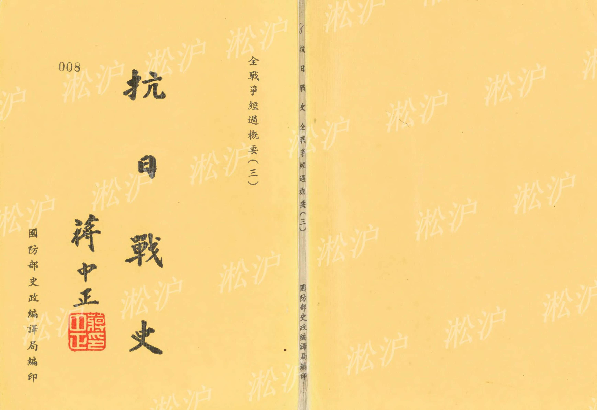
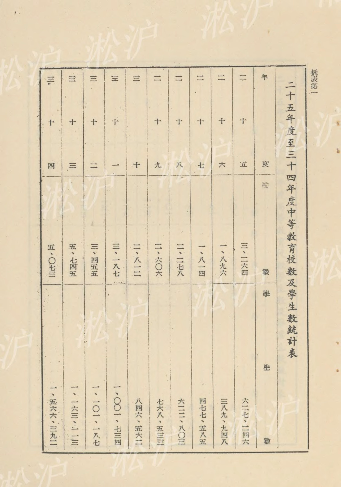
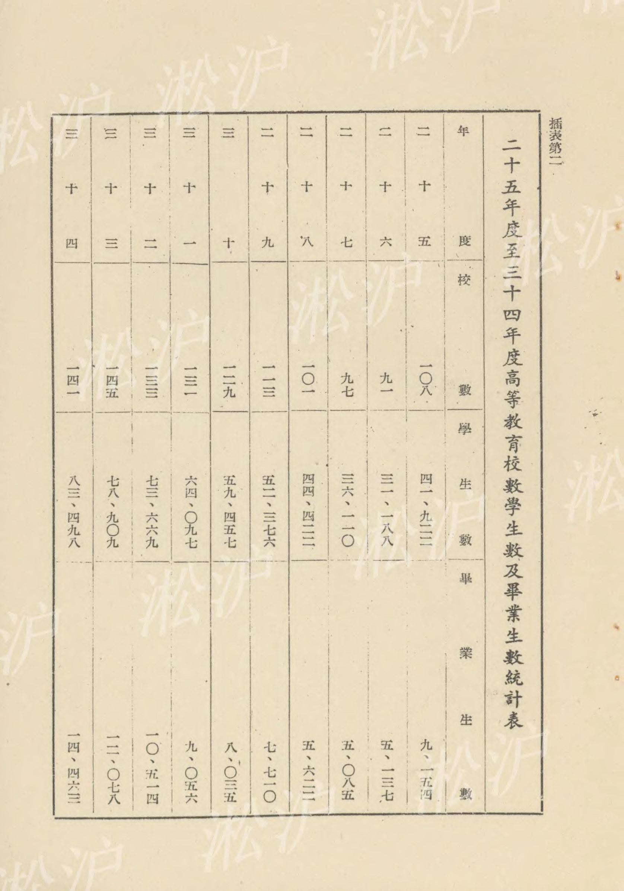
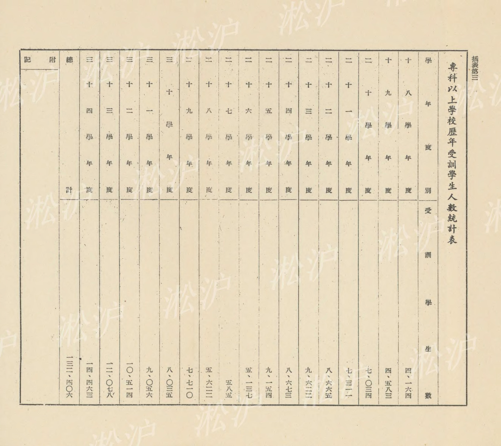
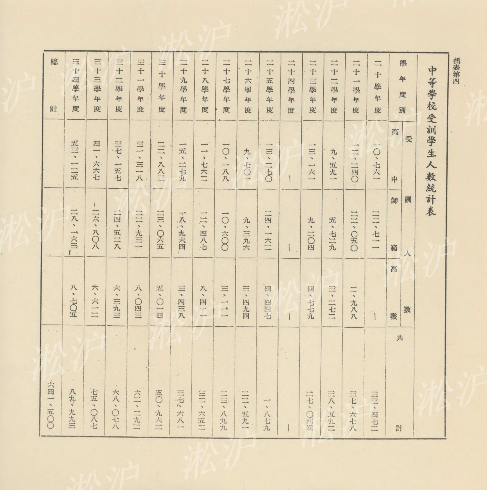
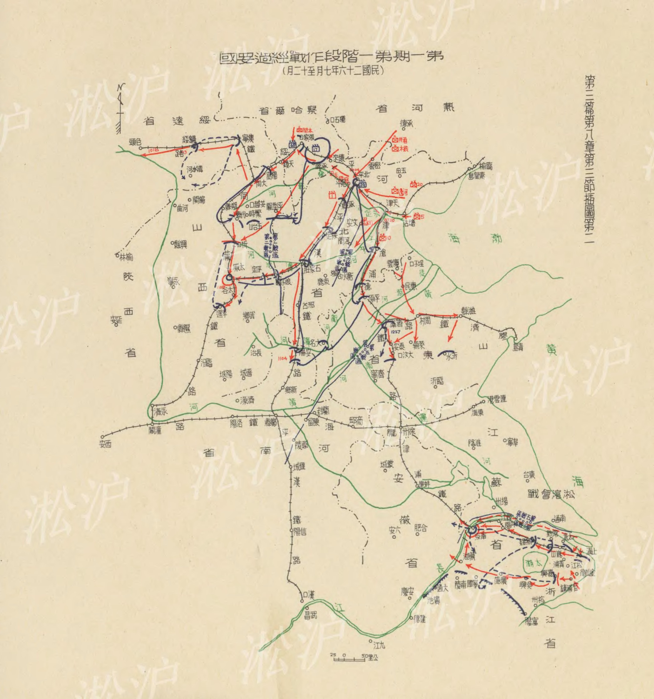



# 第三篇 全戰爭經過概要(三) 目錄

第七章 文化作戰　二〇五

第一節 戰時教育

第一款 教育政策之確立　二〇五

第二款 學校教育　二〇五

第三款 社會教育　二一五

第四款 邊疆教育　二二〇

第五款 童訓與軍訓　二二五

第六款 青年運動　二二八

第七款 青年輔導　二三五

第二節 戰時文化　二三八

第一款 文化運動　二三八

第二款 學術研究　二四〇

第三款 新聞與出版事業　二四五

第八章 第一期第一階段之作戰經過

自民國二十六年七月上旬

起至同年十二月中旬出

第一節 一般情勢　二四九

目

除　一

第二節 我國作戰指導

第三節 作戰經過

第一款 陸軍之作戰

第二款 海軍之作戰

第三款 空軍之作戰

第四款 後方勤務之設施　二五五　二五五　二八一　二八三　二八七

第一

第二

第三

第四

第五

第六

第七

第八

第九

第十

第十一

第十二

第十三

第十四

第十五

第十六

第十七

第十八

第十九

第二十

第二十一

第二十二

第二十三

第二十四

第二十五

第二十六

第二十七

第二十八

第二十九

第三

全　三　三　三　三　三　三　三　三

## 第七章 文化作戰

### 第一節 戰時教育

#### 第一款 教育政策之確立

我國教育政策，遠在對日抗戰前卽已確立。民國十六年國民政府建都南京，卽着手教育建設工作，冀奠立國防基礎，翌年五月召集第一次全國教育會議，決議以三民主義的實現爲教育宗旨，十八年三月確定中華民國教育宗旨及其實施方針案，四月國民政府明令頒佈，其全文如左：

一、教育宗旨

中華民國之教育，根據三民主義，以充實人民生活、扶植社會生存、發展國民生計、延續民族生命爲目的，務期民族獨立，民權普遍，民生發展，以促進世界大同。

二、實施方針

前項教育宗旨之實施，應遵守下列之方針：

一、各級學校三民主義之，應與全體課程及課外作業相貫連，以史地教材闡明民族主義之眞諦，以集團生活訓練民權主義之運用，以各種生產勞動的實習，培養實行民生主義之基礎，務使知識道德融會貫通於三民主義之下，以收篤信力行之效。

二、普通教育，須根據國父遺教，以陶融兒童及青年「忠孝仁愛信義和平」之國民道德，並養成國民生活之技能，增進國民生產之能力爲主要目的。

三、社會教育，必須使人民認識國際情況，了解民族意識，並具備近代都市及農村生活常識，家庭經濟改善之技能，公民自治必備之資格，保護公共事業及森林園地之習慣，養老恤貧防災互助之美德。

四、大學及專門教育，必須注重實用科學，充實科學內容，養成專門知識技能並切實陶融爲國家社會服務之健全品格。

五、師範教育，爲實現三民主義的國民教育之本源，必須以最適宜之科學教育及最嚴格之身心訓練，養成一般國民道德上、學術上最健全之師資爲主要之任務，於可能範圍內，使其獨立設置，並盡量發展鄉村師範教育。

六、男女教育機會平等，女子教育並須注重陶冶健全之德性，保持母性之特質，並建設良好之家庭生活及社會生活。

七、各級學校及社會教育，應一體注重發展國民之體育，中等學校及大學專門學校須受相等之軍事訓練。發展體育之目的，固在增進民族之體力，尤須以鍛鍊強健之精神；養成規律之習慣爲主要任務。

八、農業推廣，須由農業教育機關積極設施，凡農業生產方法之改進，農民技能之增高，農村組織與農民生活之改善，農業科學知識之普及，以及農民生產消費合作社之促進，須以全力推行，並應與產業界取得切實聯絡，俾有實用。

上述教育宗旨與方針確立以後，於是施政綱領和趨向，亦因訓政時期約法頒佈而趨定型。是項約法係於民國二十年五月國民會議所制定，六月一日國民政府所公佈，約法八章中之第五章國民教育專章（自第四十七至第五十八共十二條），卽爲自後十五年（民國二十年六月至民國三十六年元旦憲法頒佈前）教育施政之法定綱領，其全文如左：

(一)三民主義爲中華民國教育之根本原則。

(二)男女教育之機會一律平等。

(三)全國公私立之教育機關，一律受國家之監督，並負推進國家所定教育政策之義務。四已達學齡之兒童，應一律受義務教育，其詳以法律定之。

(五)未受義務教育之人民，應一律受成年補習教育，其詳以法律定之。

(六)中央與地方應寬籌教育上必需之經費，其依法獨立之經費，並予以保障。

(七)私立學校成績優良者，國家應予以獎勵或補助。

(八)華僑教育，國家應予以獎勵及補助。

(九)學校教職員成績優良於其職者，國家應予以獎勵及保障。

(十)全國公私立學校，應設置免費及獎學金額，以獎進品學俱優無力升學之學生。(十一)學術及技術之研究與發明，國家應予以獎勵及保障。

(十二)有關歷史文化及藝術之古蹟、古物，國家應予以保護或保存。

此外，行政院於同年六月十五日公佈國民會議通過之教育設施趨向案如左：

(一)各級學校之訓育，必須根據總理恢復民族精神之遺訓，加緊實施，特別注重於刻苦勤勞習慣之養成，與嚴格的規律生活之養成。

(二)中小學教育，應體察當地之社會情況，一律以養成獨立之生活之技能與增加生產之能力爲中心，務使大多數不能升學之學生，皆有自立之能力。

(三)社會教育應以增加生產爲中心目標，就人民現有之程度與實際生活，輔助其生產知識與技能之增進。

四盡量增設職業學校及各種職業補習學校，職業教育之制度、科目，應使富有彈性，並接近固有之經濟狀況，私人籌設職業學校者，國家應特別獎勵之。

五盡量設各種有關產業及國民生計之專科學校。

六大學教育以注重自然科學及實用科學爲原則。

民國二十四年十一月二十三日，中央深覺舉國同胞在極端艱困痛苦之中，對於國父革命救國之主張認識愈深，其共赴國難之精誠，亦日益深著，爰舉有關於建設國家挽救國難者十項切陳，其中有關教育者兩項，述之如左：

(一)興實學以奠國本：處國力相競之今日，欲舉迎頭趕上之實，所宜集中心力以圖首要之計，則如下述：

1. 中央研究院及一切學術研究機關與各公私立大學之研究工作，必須與國家社會成密切聯繫，俾國家得學術之用，社會獲學術之益。

2. 確立獎學制度，迅速盡力推行，使眞才有進學之方，實學得補助之益。

3. 促進中國科學之獨立與發展，以自然科學與人文科學並重，俾學術一方面能盡物之情，一方面能盡人之性，以期增進人力，發展物力，而造成堅實之國力，推進久遠之文明。

4. 注重技術之修習，推廣技術專科之設置，以矯偏重理論之風，而收公私專習之益，藉應國家物質建設迫切之需要。

(二)弘教育以培民力：審察國情，尤認爲文事教育與武事教育應根源於同一之精神，而於民國基礎訓練，則兩者尤宜並重，以復吾國固有之良規，而應現代國家之需要，概舉其目，有如下列：

1. 實行教科書統一改良，裁併不切用之學科，充實必修學科之內容。

2. 積極推行義務故育，改良中小學制度，小學應以不能升學之貧民，能切實致用爲方針，中學應爲升學與不升學兩種學生同謀利益爲前提，使貧寒子弟普受教育之機會，學生獲立身致用之實學。

3. 充實師範教育之制度，推廣師範教育之設置，注重於人格陶冶與愛國觀念之堅定，以養成中小學健全之師資。

4. 發展女子教育，培養仁慈博愛體力智識兩俱健全之母性，以挽種族衰亡之危機，奠定國家社會堅實之基礎。

5. 增加教育經費，獎設教育基金，同時以真實之實力與精密之注意，節制各級學校之浪費。

6. 普遍推行國民訓練，興武教，重武德，以養成國民集團生活之習慣，健全國民身心之教育，培養社會組織之基幹，造成國家獨立之自由之實力。

7. 推行社會教育與成年補習教育，以教養衛三者一貫兼修之方法，溝通政教之關係，養成國民自救救國之能力。

民國二十六年秋，全面對日抗戰發生，教育政策在「民族本位」與「民生中心」兩大綱領下齊頭併進，加強推進，旋爲適應戰時教育政策之推行，乃於民國二十七年四月製定抗戰建國綱領，其中關於教育四項：

一、改訂教育制度及教材，推行戰時教程，注重於國民道德之修養，提高科學的研究，與擴充其設備。二、訓練各種專門技術人員，與以適當之分配，以應戰時之需要。

三、訓練青年，俾能服務於戰區及農村。

四、訓練婦女，俾能服務於社會事業，以增加抗戰力量。第二款

學校教育

學校教育分爲初等中等高等三類，茲分述如下：

初等教育：教育部爲推行義務教育，於民國二十一年訂定短期義務教育實施辦法，及第一次實施義務教育暫行辦法大綱，因推行不力，收效不大。嗣於民國二十四年五月，教育部重訂實施義務教育計劃暫行辦法大綱，規定實施程序分三期進行，自同年八月起開始，結果兒童入學人數年有增加，至民國二十六秋全面抗戰發生，戰地各級教育，均受相當影響，尤以初等教育爲甚，教育部一面仍督飭各省市繼續推行義務教育，一面爲適應特殊環境起見，除督飭全國各省市小學遵照戰區內學校處置辦法辦理外，更頒制戰區兒童教養團，小學增設兒童義務隨習班等辦法，並予戰區各省對於游擊區義務教育酌定推進辦法，以利進行，以是全國義務教育，仍在艱難困苦中繼續推進。綜計全國辦理小學之總數，二十五學年度爲三二○、○八○校，二十六學年度爲二二九、九一一校，二十七學年度爲二一七、三九四校，二十八學年度爲二一八、七五八校，二十九學年度爲二二○二一三校，三十學年度爲二三四、七○七校，三十一學年度爲二五八、二八三校，三十二學年度爲二七三、四四三校，三十三學年度爲二五四、三七七校，三十四學年度爲二六九、九三七校。全國收容學齡兒童數，二十五學年度爲一八、三六四、九五六名，二十六學年度爲一二、八四七、九二四名，二十七學年度爲一二、二八一、八三七名，二十八學年度爲一二、六六九、九七六名，二十九學年度爲一三、五四五、八三七名，三十學年度爲一五○、五八、○五一名，三十一學年度爲一七、七二一、一○三名，三十二學年度爲一八、六○二、二三九名，三十三學年度爲一七、二二一八、一四名，三十四學年度爲二一、八三一、八九八名。

民國二十八年九月，國民政府公佈縣各級組織綱要後，教育部爲謀義務教育及失學民衆補習教育與新縣制之實施相配合，藉收政教聯繫及促進地方自治起見，於民國二十九年三、四月間，先後公佈教育實施綱領，保國民學校設施要則及鄉鎮中心學校設施要則，規定自二十七年八月起實施國民教育期於五年內每保設一國民學校，每鄉（鎮）設一中心學校，以完成國民教育之普及。關於經費之籌集，除由國庫補助及縣地方分擔外，並頒佈國民學校及鄉（鎮）中心學校基金籌集辦法及籌集基金獎勵辦法等，以利進行。經按上述計劃實施，至三十二年度止，四川、雲南、貴州、廣西、廣東、湖南、福建、浙江、江西、陝西、甘肅、河南、湖北、重慶、安徽、寧夏、青海、西康、新疆等十九省市，已設有中心國民學校、國民學校及其他小學二五六、九二六校，按各該省市共有保數爲三○三、七九三保計算，平均已超過每三保設有二校，其中已達一保一校者，計有五省，超過二保一校者計有七省市，已達二保一校者亦有四省，僅有極少數省市，因推行新制較遲，但亦達三保一校之比數，故以校數論，實際進度已超過原計劃之規定。再以入學兒童數論，該十九省市已受教育兒童，佔學齡兒童總數百分之七十強，文盲人數佔人口總數百分之三十四強，三十三年度之推行結果，爲已受教育兒童佔學齡兒童總數百分之七十三弱，文盲人數佔人口總數百分之三十三強，三十四年度推行之結果，爲已受教育兒童佔學齡兒童總數百分之六十六強，文盲人數佔人口總數百分之三十強。

中等教育：中學教育在整個教育制度中佔一極重要之地位，一面須繼續初等教育之基礎訓練，以發展青年身心，培養健全國民，一面又須顧及青年之興趣與能力，施以適當教育，俾能適應青年期之需要，完成研究高深學術之準備，同時爲社會培植中級幹部人才。民國二十一年，國民政府公布中學法、師範學校法、職業學校法，二十四年教育部並分別訂頒中學規程、師範學校規程及職業學校規程，我國中等教育制度始奠立良好之基礎。至二十六年秋全面抗戰發生，爲適應戰時之情況，配合國防經濟之需求，中等教育亦多積極推行之處，茲將中等教育重要設施，分述如左：

(一)中等學校分區設置政策之推行：教育部爲使各類中等學校之設置，得有均衡之發展，並使與地方需要密切配合起見，乃於二十三年先後訂頒劃分各類中等學校區辦法，通令各省依照省內各地交通、人口、經濟及文化發達情形，劃定三類中等學校區，並訂定整個實施計劃，積極推行，至三十一年教育部復訂定高中、師範、高職三類學校設班比例，及與初中設班配合標準，通飭施行，俾能確立計劃教育之基礎，使人才訓練得以配合實際之需要。

(二)中等學校課程內容之改進：爲適應抗戰建國之需要，各類中等學校課程內容，均經加以整理與改革，高初級中學教學科目及時數表，於二十九年二月修正公布，各科課程標準於三十年度全部修訂完成。

(三)中等學校教學與訓導之改進：教科用書爲教學之直接工具，關係教育效果者至大，而其中公民、國文、歷史、地理四科，對於青年思想影響尤深，教育部爰於民國二十九年起設置教科用書編輯委員會，從事編輯，公民等四科教科書稿本編審完成，陸續付印，其餘各科亦繼續編輯。

至於訓導方面：高中實施軍事訓練，初中實行童子軍訓練，訓育主任規定由檢定合格人員擔任。根據教育宗旨，規定學生團體，應本三民主義之精神，作校內自治生活之鍛鍊。民國二十五年，教育部頒訂高中以上學校軍事管理辦法，二十七年令頒中等以上學校導師綱要（三十三年修訂爲中等學校導師制實施辦法），自是中學訓育制度採導師制，注重學生思想訓練等，同年公布青年訓練大綱，二十八年頒布訓育綱要，對訓育之意義、目標及其實施方法等，均有詳盡之闡釋，同年三月，教育部在重慶召開第三次全國教育會議，又接受蔣總裁之建議，以「禮義廉恥」

爲各級學校共同校訓，經於五月通飭各級學校遵行。三十年十一月爲整飭學風，製定促進中等學校校務培養學風之一般實施方案，通令遵照實行。三十一年將青年守則十二條，正式規定爲中等學校訓育目標，使全國中等學校的明確統一，易於實施。

四國立中等學校之設置及戰區失學青年之收容：依照我國教育行政系統職權之劃分辦法，中等學校係由各省市教育廳局主管，中央向不直接辦理國立中學，惟自二十六年全面抗戰發生後，戰區各省中等學校相繼停閉，大量青年同時失學，退至後方，政府爲充實民族力量，應事實需要，乃令教育部於二十六年底在後方各省籌設國立中等學校，以資收容，繼續施教。自二十七年春起，至三十一學年度止，先後設立國立中學三十所、國立師範學校十一所。國立職業學校學校七所，各專科以上學校附設之中等學校及設於邊省之中等學校均未計入，計收容學生約五萬餘人。關於國立中等學校課程綱要，已於二十七年由教育部製定公布施行，計分精神訓練、體格訓練、學科訓練、生產勞動訓練特殊教學及戰時後方服務訓練五項。所有在校學生，百分之八十以上均由政府供給膳食，特別貧苦學生，並分別核發制服及書籍、零用等費。三十年起，爲免除戰區員生來到後方遠道跋涉之不便，特令戰區各省教育廳就地籌設臨時中學，或就原有學校增設班級，收容戰區退出青年，所有經費及學生膳食均由教育部統籌發給。江蘇、河南、安徽、江西、浙江、福建、湖南、陝西、甘肅等省均有此項校班之設置，計共十校一六八班，收容學生約八千六百餘名。

抗戰勝利時，中等學校全國共計五○七三校，學生一五六六三九二人。自二十五學年度至三十四學年度，全國中等學校校數及學生數統計如插表第一。

三、高等教育：包括大學、獨立學院、專科學校及研究所，民國十八年四月，國民政府公布中華民國教育宗旨及實施方針，明定大學及專門教育，必須注重實用科學，充實學科內容，養成專門知識技能，並切實陶融爲國家社會服務之健全品格，大學及專門並須受相當之軍事訓練。同年七月，國民政府公布大學及專科學校組織法，迄民國二十年，大學公立者三十六校，私立者三十七校，專科學校公立者二十校，私立者十校。以上各校，大多數皆集中設立於沿海三數大都市，致成畸形發展。二十年九一八事變發生後，東北淪陷，平津各校，時受日本帝國主義者壓迫，二十六年七月七日全面抗戰發生，平津各大學，首先遭日機摧殘，濫施轟炸，後戰區日益擴大，戰區各校員生，不甘屈辱，紛紛遷至後方指定之省區。西南、西北各省昔日高等教育未發達地區，均設專科以上學校若干所。專科以上學校院系設置，過去亦缺乏統一標準，在同一地點各校院系甚多重複，其中亦有設備簡陋或缺乏中心目標，及不適於社會需要，自二十七年起，教育部審度事實，將各校重複院系予以歸併，其內容簡陋者，則予以裁撤，並規定新增科系，於需要與師資設備之條件外，並須兼顧均衡發展，歷年繼續注意督導實行，科系設置，得以漸趨合理化，此外，則由國庫籌撥鉅款，按年增設實科班級。二十八年春，爲應抗戰需要，令中央大學等校特設機械、採礦、電訊、化驗、汽車、畜牧、獸醫、農業經濟、衛生、工程、蠶桑、會計、統計等專修科，修業年限均爲二年，仍繼續辦理中，自二十九年秋，始又因限期訓練機械電機師及工程師，又令各校增設電機機械及電機系班級共二十五班，歷年繼續增辦。至於新制專科之試行，教育部曾縝密考慮，緣專科學校規程規定專科學校招收高中畢業或具有同等學力之學生，修業年限二年或三年，此項規定，業已行之數年，惟學校頗以年限過短，專門技能不易熟練，感覺困難，二十八年第三次全國教育會議，對於專科學校改行五年制，招收初中畢業生一案，曾有決議，僉主藝術、音樂兩科必須實行五年制，其他各科應否實施，應由教育部約集專家再行討論決定。嗣經教育部邀集專家詳加研究，決定自二十八年度起，先自音樂、藝術、獸醫、蠶絲等科試行五年制，又醫學專科學校以修業年限爲五年，招生不易，因於三十年頒行六年制課程，招收初中畢業生，江西省立醫學專科學校自三十年度起已開始實行。

在抗戰期間，教育部爲適應戰時特殊需要，亦有若干臨時設施，如二十七年七月公布師範學院規程，藉以養成中等學校之健全師資。二十八年一月頒布特設各種專修科辦法要點，藉以養成專門人才。二十八年九月頒發大學先修班辦法要點，由教育部就統一招生成績次優學生錄取分發，予以一年之大學預備訓練。二十八年七月頒發游擊區域及接近前線各省設立臨時政治學院辦法，游擊區域及接近前線各省視當地需要，得咨准教育部設立臨時政治學院，其宗旨以發揚三民主義，招收游擊區域及接近前線青年，施以適當訓練，以期造就抗戰建國幹部人才。二十九年十二月教育部復訂定臨時政治學院實施補充辦法，對於設立地點，招生方式。服務。待遇等復加規定。

至於促使高等教育之發展，諸如建立學術審議機構，舉辦教育資格審查，公布大學科目表，辦理統一招生及聯合招生，訂定貸金及公費制度，設置獎學金等等。然就專科以上學校數量言，二十一年度計一零三校，二十五年度一零八校，二十六年度則減爲九十一校，二十七年度起復逐年增加，三十年度增爲一二九校，至三十四年度抗戰勝利時，已增爲一四一校。如以在校學生人數比較，二十六年爲三一一八八人，至三十四年度增至八三四九八人，由此亦足可證明抗戰期間高等教育進展之情形，茲將校數、學生數及畢業生數統計如插表第二。

民國十八年教育部公布教育宗旨及其實施方針，明定以三民主義爲教育宗旨，社會教育實施方針：

「具備近代都市及農村生活之常識，家庭經濟改善之藝能，公民自治必備之資格、保護公共事業及森林園地之習慣，養老卹貧防災互助之美德。十九年第二次全國教育會議，又議定以絕滅文盲、培養生產能力，注重公民訓練、養成民族獨立，爲社會教育之方針，迨二十年五月，國民會議評議通過教育設施趨向方案，以「增加生產」爲社會教育中心目標，並有就人民現有之程度與實際生活，輔助其生產技能之爲增進之規定，是年九月，中央復特別製定三民主義教育實施原則。關於社會教育方面，先定五個目標一、提高民衆知識，使具備現代都市及農村生活的常識。二、增進民衆職業知能，以改善家庭經濟，並增加社會生產能力。三、訓練民衆熟習四權，實行自治，並陶鑄其忠、孝、仁、愛、信、義、和、平之國民道德，以養成三民主義下的公民。四、注重國民體育及公共娛樂，以養成其健全身心。五、培養社會教育的幹部人才，以發展社會教育事業。根據上述五個目標，並制定實施綱要三類：一、民衆學校。二、公園、電影院、劇場等。三、圖書館、博物館、閱報社等。二十二年召集之民衆教育專家會議，議定國難期間之民衆教育等五案，認定民衆教育應予注意者有八：一、養成同仇敵愾的精神。二、振作自立自強的勇氣。三、明瞭共同赴難的責任。四、培養堅忍耐勞的習慣。五、扶植團體自衛的能力。六、鍛鍊強健耐苦的體格。七、養成嗜好國貨的習慣。八、灌輸關於國防的常識。此八項同時亦爲他種社會教育實施之要目。同年，南昌行營通令前方各軍長官負責辦理各駐在地之中山民衆學校。二十三年間，蔣委員長提倡「新生活運動」，以禮義廉恥之四維，習之於日常生活——衣食住行之中，並手訂新生活運動綱要，作爲該運動之指針，實施以來，全國景從，同時亦成爲是時社會教育之重要工作。二十七年，教育部制定「戰時各級教育實施方案」，二十八年第三次全國教育會議，通過「抗戰建國時期之教育，應多注意戰時需要」一案，對於戰時社會教育的任務，均有說明，其主要內容，注意下列各項目標(一)喚起民族意識。(二)激發抗戰情緒。(三)灌輸抗戰知識。

一般社會教育之設施，注重肅清文盲，推行識字教育及民衆教育或補習教育，而於統一國語亦甚注意。十七年六月，國民政府通過民衆訓練案，將「厲行識字運動」列爲七項工作之一。十八年教育部公布民衆學校辦法大綱及識字運動宣傳計劃大綱。據教育部統計：十七年全國民衆學校共六七零八所。二十三年爲三八五六五所，補習學校十七年爲二五七所，二十五年爲二一八四所。至綜合性之社會教育機構，中央及各省市設立民衆教育館，十七年全國計有一八五所，二十五年爲一六零零所。博物館十七年有十四所，二十五年達八十餘所。圖書館十七年有八九六所，二十五年有一六三二所。美術館二十五年達五十三所。電影場十七年全國僅有四十所，二十二年卽達一零八三所。無線電廣播事業，民國二十一年中央廣播電台強力廣播機架設完成，教育部始用以實施播音教育，不久卽收廣大效果。

民國二十六年秋全面抗戰發生後，我中華民族面臨生死存亡之考驗，因此對於人民知識水準之提高、生產建設實力之培養，與夫民族道德之發揚，實爲抗敵制勝重要條件。

二十七年三月及三十四年五月，中央對於社會教育均有重要決議，而掃除文盲工作，仍列爲首要之圖。先是民國二十五年，教育部曾定有肅清全國文盲六年計劃，並訂頒實施失學民衆教育方案。估計全國共有三萬二千萬人，而四十五歲以下之失學民衆約爲二萬萬人。依上項計劃，至民國三十一年，全國文盲可告肅清，乃以抗戰軍興，沿海各省相繼淪陷，僅於內地各省依照原計劃實施。二十九年三月教育部公布之國民教育實施綱領，規定每鄉鎮設立中心國民學校，每保設立國民學校，校內各設兒童教育與失學民衆補習教育兩部，民衆補習部份設成人班與婦女班，治義務教育與補習教育於一鑪，合兒童、青年、婦女及成人於一校。復又相繼訂頒各學校分期辦理失學民衆補習教育辦法、機關團體辦理民衆學校辦法及普及失學民衆識字教育計劃等。三十一年，教育部指定陪都附近十八所國立教育機關，於暑假期間一律附設補習學校，三十二年又通令各級學校及民教館，應以辦理補習學校爲主要工作，並訂頒補習學校規程，將補習學校分爲普通及職業二種，每種分初、中、高三級，是種學校，二十七年全國共四零八所，三十一年增至二八四零所，三十四年各校雖因經濟困難，尚有九一六所，計自二十六年至三十四年間，全國掃除文盲人數共爲六九、八八七、三二三人。

至其他社教工作，茲分述如左：

一、藝術教育：戲劇、音樂、美術三種藝術，其最大感人力量，實爲推行社會教育極有效工具。

戲劇教育：除軍中由軍事委員會政治部主持外，而民衆方面，由教育部社會教育司辦理，除將國立戲劇學校改爲戲劇專科學校，及增設國立歌劇學校、國立社會教育學院戲劇系外，並於二十七年，一面成立劇本整理組，整理新舊劇本，從事編輯、蒐集諸工作；一面先後成立第一、二、三巡迴戲劇教育隊，二十八年成立第四隊，三十年復成立實驗戲劇教育隊，分別施教於江、浙、閩、贛、湘、桂、粵、鄂、滇、黔、川、康、陝、寧、甘等省，三十二年度更集中力量，將第一、第二巡迴戲劇教育隊合併爲教育部巡迴戲劇教育隊，在東南公路線上工作，第三隊併入川康公路線社會教育工作隊，第四隊併入西北公路線社會教育工作隊工作，除上述者外，尚有中宣部實驗劇團、三民主義青年團中央青年劇社、總政治部十個演劇隊，遍歷各省重要城鎮，巡迴公演，觀衆逾千萬人，對抗戰宣傳收效至宏。

音樂教育：教育部設有音樂教育委員會，負責設計推行。音樂學校計國立者三、省立者一、各大學各學校分設系組科者二十一，設有講習班或訓練班者有四。樂團及歌詠團則有中華交響樂團及實驗巡迴歌詠團等四個。他如音樂雜誌之發行、樂曲之編印、著述之出版，亦有數百種之多，可云盛極一時，但在各地舉行大規模合唱，名家之音樂演奏，尚能提高社會人士之音樂興趣。

美術教育：教育部於二十九年設有美術教育委員會，是年秋成立藝術文物考察團，赴西北各地考察，道經西安、蘭州、西寧、張掖、敦煌、拉卜楞等地，考察古代所存留之藝術文物及著名史蹟，時經數載，程歷萬里，收獲頗豐。三十一年將敦煌藝術眞象運渝展覽，觀衆達二萬人。三十一年十二月舉行第三屆全國美術展覽會於陪都，經收到美術品一六六八件，審查決定陳列者，計六六三件。三十二年並籌設國立中央美術館，翌年又設立敦煌藝術研究所，是年九月又訂頒省立藝術館規程，通令各省市着手籌設。

總之、藝術教育之推行，對於激勵士氣民心，收效至大。

二、電化教育：教育部於民國二十五年七月先後在部內設立電影教育委員會暨播音教育委員會，爲我國有最高電化教育行政機構之始，此後教育部對電化教育之推行，不遺餘力。八月公佈各省市實施電影教育辦法，其中規定各省應劃分教育電影巡迴放映區，是年全國共成立八十一區，二十七年十月改稱爲電影教育巡迴施教區。至二十九年十一月，將兩委員會合併爲電化教育委員會，並在社會教育司內增設第三科，掌理該項事宜，並通令各省將原有之播音教育服動處，擴大而成爲電化教育服務處，至三十二年又改稱爲電化教育輔導處，除戰區及邊遠各省外，非戰區各省先後成立者共有十八省。三十三年又將過去電影及播音教育辦法二種，合訂爲電化教育實施要點，根據該項要項、要點規定，電化教育之實施，分學校電化教育與社會電化教育二部份，至於實施方法，各省應按行政督察區劃定「省電化教育區」，各省市電化教育區，應各設「電化教育巡迴工作隊」一隊，分別在指定區域內巡迴實施電影播音及幻燈教育，此種巡迴工作隊，據三十二年底統計全國共五十二隊，三十四年四月縮編爲三十九隊。

至於電化教育之教材，可分爲電影片、幻燈片及播音節目等三項，教育影片之來源，有自製、選購、合製與剪輯四種，在三十一年以前，教育部曾先後完成「我們的首都」電影四種，三十一年以後，中華教育電影製片廠成立，先後共完成教育短片四十餘種，教育幻燈短片，先自製文天祥等八部共十四本，後由中華電影製片廠製成新疆等八片。教育播音節目，自二十四年雙十節開始，由教育部或請專家供給稿件向中央廣播電台按時播送，在二十六年前分爲對一般民衆及中學生二種，抗戰初期分爲對大學生及智識份子對失學青年與對一般民衆三種，二十九年起，改分爲青年講座、教育消息及公民教育三種，三十一年起又改訂爲國語教育、音樂教育、兒童教育、青年教育、戰區教育、邊疆教育等共二十類，三十三年總稱爲「教育講話」，三十四年交由中央民衆教育館辦理。

至於電化教育人才之培養，自二十五年起至抗戰勝利止，共辦電化教育人員訓練班五次，三十二年開辦電影藝術人員訓練班一次，與金陵大學合辦電教專修班六屆，三十年又令國立社會教育學院增設電化教育專修科，三十三年九月又成立國立電化教育專科學校。

三、科學教育：我國科學教育素稱落後，爲推廣科學大衆化及促成國防建設計，教育部曾辦理科學化運動及國防科學展覽，自三十年度起，卽令飭各省市籌設科學館並於是年二月訂頒省市立科學館規程，八月復訂定省市立科學館工作大綱，至三十一年底，各省已成立科學館九所，三十年將甘肅科學教育館改隸教育部。

#### 第四款 邊疆教育

民國十九年二月教育部設置蒙藏教育司，專管蒙藏及其他邊疆教育行政事宜，當時以創立伊始，規制未備，人口財力兩感缺乏，除編譯一部分蒙藏囘文與國語教科書及短期小學與民校課本外其他工作尙難開展。二十三年教育部鑒於蒙藏教育之重要，爰就中央補助邊遠貧瘠省份專款五十萬元內，劃撥一部份經費，指定作爲補助各省興辦邊疆教育之用，經該司會同普通教育司詳爲分配，分電各邊省擬具推行邊疆教育計劃，以憑核給補助，此爲邊疆教育創辦之始。是年十月，教育部以此項新興事業，必先派員實地考察，俾能明瞭實際需要，以爲將來推行改進之參考，同時一部份王公土司對與興辦教育尙持異議，疏導說服，亦極重要，乃派該司主管人員前往察、綏、寧三省視察，翌年三月返部，即擬定推進察、綏、寧三省蒙旗教育計劃，及在綏遠設置國立綏遠蒙旗師範學校計劃，公佈施行。

二十四年，教育部根據各邊省所訂計劃繼續予以補助，除專款五十萬元之外，另就中英、中美、中比等庚款分配義務教育項下，加撥二十餘萬元，作爲邊教經費，計受補助者，有察、綏、寧、甘、青、青、陝、川、康、藏、湘、黔、滇、桂、粤等十五省區。據該年度各省報告統計，除陝西、廣東兩省未辦邊校外，計各省所辦之邊教機關如左：

一、學校部份

甘肅

蘭州鄉村師範附設蒙藏囘師資訓練班一班，另設蒙藏囘小學五十五所。

青海

西寧蒙藏簡易師範學校一所，中學二所，蒙藏囘小學一四三所。

寧夏

省立師範設蒙旗師範二班，蒙囘小學十四所。

綏遠

土默特旗立中學一所，蒙旗小學二十九所。

察哈爾

省師附設蒙旗師範一班，蒙旗小學十三所。

新疆

省立迪化師範附設蒙囘師範班五班，阿克蘇簡師一所，蒙囘小學一、四一二所。

四川

省立屏山及茂縣簡師各一所，邊民小學十五所。

省立康定簡師一所，省立邊小五所。

雲南

省立邊地簡師三所，邊民小學三十五所。

貴州

省立貴陽鄉師一所，邊民小學十二所。

湖南

省立湘西特區師資訓練班一所，短期小學一百所。

廣西

省立特種師資訓練所一所，邊民小學五四一所。

西藏

省立拉薩市立第一小學一所。

總計師範十一所又九班，中學三所，小學三、三七四所。

二、社教部份

寧夏省立蒙旗教育巡迴工作團一團。

拉卜楞藏民文化促進會巡迴施教隊一隊。

蒙古文化館一所。

察哈爾省立第二巡迴社會教育館一所。

察哈爾十二旗羣聯立蒙古編譯館一所。

以上各邊教機關，除少數係各省原辦之機構外，多數均爲接受中央補助後新辦者。教育部根據各省報告，統籌全國各邊疆實際需要，乃於二十四年春公佈「推進蒙藏回苗教育計劃」。翌年國立綏遠蒙旗師範學校籌備成立，一面積極編印漢蒙、漢藏、漢回合壁之小學課本，以期各邊疆小學能獲得適當之教材。

全面抗戰發生後，開發邊疆與鞏固國防工作，益增其迫切需要，及政府西遷，一部份邊校因受戰事影響無形停頓，教育部爰於二十八年五月頒佈「蒙旗教育暫行實施辦法」，以應付當時之環境，將蒙旗教育分爲：

一、淪陷區域，注意各校遷移安置以及員生登記與救濟。

二、戰區及接近戰區設法維持各校，並實施全民教育，以協助抗戰工作。

三、後方增設學校，推行社教，培養師資。

同時以補助辦法已不適宜於當時動盪之環境，爲集中人力財力作大量發展邊教計，乃由教育部直接辦理各級邊校，以爲邊地之倡導與示範。中央組織部、中央政治學校及中英庚款董事會等，亦鑒於提高邊疆文化，協助抗建大業之重要，先後在邊地創立學校，邊教事業乃漸具規模，在抗戰期間，中央直接設立之邊教機關。計有：

專科學校三所（國立邊疆學校及國立海疆學校、東方語專等）。

師範學校十二所（國立西南、貴州、西寧、康定、西北、大理、肅州、綏寧、麗江、巴安、成達、隴東等師範學校）。

中學三所（國立伊盟、湟川、河西等中學）。

職業學校七所（國立寧夏、青海、拉卜楞、松潘、西康、金江、清溪等職業學校）。

小學二十三所（拉薩、三角城、奎沓、定營遠、安龍、越隽、敦煌、德格、柴達木、扎薩克旗、鄂托克旗、達拉特旗、果洛、玉樹、札什倫布、杭錦旗、準爾爾旗、額濟納旗、郡王旗、木裏、西公旗、烏審旗及涼山等小學）。

至於邊疆教育之推行方面：國民政府先於民國二十年公佈之「三民主義教育實施細則」第六章蒙藏教育，次於二十八年第三次全國教育會議通過之「推行邊疆教育方案」，再於三十年公佈之「邊地青年教育及人事行政實施綱領」，此三種方案，雖詳略不同，但其一貫方針，爲力求邊疆民族教育文化之提高與普及，在適應各民族所在地環境，尊重各民族信仰自由及保留固有之優良風俗、習慣、語言、文字中，培養國族意識，以求全國文化之交融與統一，綜其推行之目標與步驟，歸納爲下列十項。一、遵循邊教方針，擬訂實施計劃，以爲推行邊教之準繩。

二、健全邊教行政組織，完成行政三聯制，以促邊教之進步。

(一)設計機構之設立。

(二)執行機構之加強。

(三)考核工作之執行。

三、注重調查研究，以便徹底明瞭邊疆情況及其需要，作爲推行邊教之依據(一)調查工作：

1. 西南邊疆教育考察團。

2. 大學生暑期邊疆服務團。

(二)研究工作：

1. 補助私人研究。

2. 補助團體研究。

3. 補助各大專院校設置邊疆建設科目及講座與邊政學系。

4. 設置研究機關。

四、寬籌經費，以求邊教事業之發展。

(一)邊省補助費。

(二)邊教事業費。

(三)部辦邊校經費。

四特撥經費及其他補助。

五、培養師資，提高待遇，以應邊教事業之需要。

六、注重生產訓練，以改善邊胞之生活。

(一)各級邊校之生產訓練。

(二)職業教育。

七、編印教材、讀物，以增進教學效率，加強文化交流。

八、配合衛生工作，以增進邊胞健康。

九、優待學生，以鼓勵邊地青年深造。

十、尊重信仰自由及邊胞固有之文化，以期情感之交流。

在抗戰全期間，教育部依照上述目標與步驟推行邊疆教育，不遺餘力，對國防鞏固上收效至宏。

#### 第五款 童訓與軍訓

一、童訓

童子軍訓練創自英國，盛於歐美。民國元年，我國第一隊童子軍在武昌文華書院興辦，各地相繼成立，頗多優良表現。

民國十五年三月五日，中央鑒於童子軍訓練之重要，特設立中國童子軍委員會，統轄政府治下國民之童子軍，是爲有全國性組織之始。

民國十七年北伐完成，全國統一，中央改組，於中央訓練部之下，設中國國民黨童子軍司令部，主辦全國童子軍訓練事宜。翌年，改定童子軍名稱爲「中國童子軍」，由訓練部副部長何應欽兼任中國童子軍司令。十九年四月十八日在南京舉行中國童子軍第一次全國總檢閱及大露營，各省市男女童子軍來首都參加者共三千六百餘人，是爲中國童子軍舉行全國性集會之始。

民國二十年，戴季陶、何應欽等提「組織中國童子軍總會案」，於二十一年四月在洛陽舉行之中央常會通過，並推定總統蔣公爲會長，戴季陶、何應欽爲副會長，會長、副會長均爲榮譽職另設中國童子軍理事會，設理事長一人，由教育部部長當然兼任之，負推行全國童子軍行政事務之責。

民國二十三年十一月一日，中國童子軍總會成立，在最高領袖領導之下，確定教育綱領，事業更蒸蒸日上，由內地伸張到邊疆，由祖國發展到海外。

民國二十四年，派童子軍代表團赴美訪問。二十五年十月十日，在南京舉行第二次全國童子軍總檢閱及大露營，參加者一萬一千餘人，蔣會長親臨致訓，一切活動成績優良。二十六年八月，又派童子軍代表團分赴荷蘭，參加世界童子軍第五次大露營，並派員參加國際子童軍會議，取得國際童子軍會員資格。至三十二年，中國童子軍改歸三民主義青年團領導。

中國童子軍自創始以來，服務社會，貢獻國家，表現良多，諸如民國二十年，國內十六省大水災，人民流離失所，無衣無食，全國童子軍基於慈善憐恤心腸，辦理救濟工作，有豐碩勸募成績貢獻。民國二十一年「一二八」淞滬抗日戰爭中，上海市童子軍戰地服務團，在前後方參加服務，如搶救難民、救護傷兵、通訊、運輸、慰勞等工作，並有羅雲祥、鮑正武、毛徵祥、應文達等四位童子軍，因深入戰地，搶救難民，爲國犧牲，其他童子軍仍不顧一切到前線去服務，此種勇敢堅強之毅力，實爲中國童子軍史上寫下光榮燦爛之一頁。二十二年，上海童子軍捐募「滬童軍號」飛機一架呈獻政府，南京市童子軍募集寒衣一萬七千多件救濟難民，誠充份表現童子軍實踐銘言之精神。二十六年全面抗日戰爭開始，全國男女童子軍動員三十多萬人，參加戰時服務，在前後方擔任各種工作，造成幾許可歌可泣事蹟，如上海女童軍在槍林彈雨中送國旗與四行倉庫孤軍，太倉童子軍奮勇救護難民，爲敵所殺，四川童子軍勸募戰士寒衣達十一萬餘件之多，類此等事實，不勝枚舉，凡此，均足證明中國少年男女接受童子軍訓練之後，確能厲行忠孝仁愛信義和平之美德，隨時隨地扶助人羣，服務公衆，義之所在，奮不顧身，國家多年來倡導童子軍教育，確有寶貴之收穫與光榮之成就。

二、軍訓

中國古代教育，是以六藝——禮、樂、射、御、書、數——爲本，而將四育——智、德、體、美——融合於內，其旨意在造成文武合一、智德並進、身心和諧的個人，而促進社會安定進步。及至後世，兵制變化，重文輕武，久之民氣消沉，種族乃日趨衰弱。

民國十六年，國府奠都南京，翌年而有濟南「五三」慘案，當時適逢大學院在南京召集第一次全國教育會議，羣情憤慨，遂一致決議通令全國大學暨各省市教育行政機關，在專科以上學校加授軍事學科，每週至少三小時，以兩年爲限，中等以下學校，一律注重體育，每週亦爲三小時，至畢業爲止。同時，軍事委員會根據大會決議，擬訂高中以上學校軍事教育方案，連同學術科教育要目、軍事教育程度表及各會員之同樣提案，提經大會合併討論，修正通過。高中以上學校學生，應以軍事科爲必修、女生習看護，由大學院請軍事委員會派遣正式陸軍學校畢業學生爲教官，各校受軍訓之學生，每年暑假集中連續受三週以上之嚴格訓練，自此學校軍訓遂見諸實施。

民國十八年，大學院改名爲教育部，訓練總監部亦設立，復規定各校軍事科每學年爲三學分，二學年共六學分，連同整個軍事教育方案，會同軍事委員會呈請國民政府公佈後，遂通令全國高中以上學校遵辦，於是學校軍訓一科，在全部中學課程中，遂佔有重要地位。

學校軍訓施行伊始，經驗缺乏，準備未週，結果未臻理想。至二十三年五月，教育部會同訓練總監部邀集專家，將原案加以補充和修正，內分爲五章二十六條，和平時訓練、集中訓練、教學科目、教學時數、野外演習、醫務、看護、教官任用、服裝設備等項，均有明確規定，是年八月，呈奉國民政府指令公佈施行。九月兩部復訂頒高中以上學校軍事教育獎懲規則，共五章十四條。其後爲加強紀律訓練起見，於二十五年十二月兩部又另訂高中以上學校學校軍訓管理辦法，通令實施，內分總則、組織、服裝、請假、外出，教室規則、食堂規則、操場規則、野外規則、值日勤務、風紀衛兵、診斷規則和附則等十四章，共九十八條，從此學校軍訓遂納入正規。

民國二十六年秋全面抗戰發生，訓練總監部撤銷，學生軍訓改隸政治部，二十七年又改隸軍訓部，三十五年五月國防部成立，學生軍訓又劃歸國防部管轄。自十七年學校添設軍訓起，至抗戰勝利後止，軍訓主管機關四度更易，所訂有關法令不下三十餘種，與教育部會銜頒行之重要法案亦有七八種，惟最重要者，卽爲上述三種。三十三年八月，中央對於專科以上學校軍訓因另有計畫，已通令全國停止實施，中學軍訓自三十四年抗勝利後，因加緊復員，亦未積極進行。

自民國十八年正式實施軍訓，迄三十四年抗戰勝利止，全國專科以上學校，歷年受訓學生人數如插表第三、第四。

#### 第六款 青年運動

總統蔣公有言：「國家需要革命青年，青年需要革命教育」，是以革命教育，教育與革命，在青年運動中，是連串的，是綜合的。

民國二十年「九一八」事變爆發，不旋踵間，東北三省版圖易色，當時全國青年奔走呼號，以空前熱烈行動，進行抗日救亡運動，於是各地學聯會，自治會紛紛組織學生義勇軍，而東北各地熱血青年、知識份子，亦紛紛投入抗日義勇軍旗幟之下。中央方面爲輔導此種運動，使能普及全國，特爲制定：「學生義勇軍教育綱領」，遂由國民政府通令全國一致奉行。綱領第一條規定「全國高中以上學校，一律組織青年義勇軍，初中以上學校一律組織童子義勇軍，實施軍事訓練，宣誓信奉三民主義，振興中華民族，矢忠矢勇，雪恥救國，並守以下規律：(一)犧牲自己，愛護國家，永爲忠勇之國民。(二)服從命令，嚴守紀律。(三)養成自治習慣，實行團體生活。(四)隨時隨地扶助他人，服務公衆。當時各省學生義勇軍蓬勃發展，上海各大學組織之學生義勇軍，曾於一二八滬戰時作戰地工作，安徽江淮中學學生義勇軍且作徒步援黑之壯舉。

此期間，幾個主要省市之學生抗日組織，亦較前期有顯著進步，省市學生聯合會，以各校學生自治會爲基本單位，仍不斷鞏固其發展。迄二十三年，根據不完全之統計，全國各學校學生會，數達六百五十八個，但其中受中國共產主義青年團所操縱者，當不在少數，因之掀起一連串暴動風潮，無數次之屠殺，製造迷津陷阱，使青年運動史上出現一點陰霾黑影，正如總統蔣公云：「當時共產黨的領袖爲陳獨秀等……尤其是當時他們對於青年，乃以讀書求學爲反革命，以浪漫放蕩爲覺悟份子……乃後於民國二十年至二十五年之間，贛南、湘東以及皖西、豫西、川陝各地，多連禍結，閻閻爲墟」。

迨民國三十六年民族聖戰發生後，中國青年邁進入第二次大結合第二階段，此階段係由三民主義青年團專負其責，民族革命戰爭領導者蔣先生云：「抗戰發動以後，我就組織三民主義青年團，以適應全國青年迫切的需要，而開創了中國新生命，和中華民族新動力的根源」。二十七年三月二十九日青年節，中央更正式決議「……抗戰實力寓於民衆，而青年尤爲國家民族之珍寶，另設青年團，徵求全國優秀青年而訓練，使各成爲三民主義之信徒」。同年七月九日，三民主義青年團在武漢成立，由蔣委員長兼任團長，八月一日，蔣團長宣誓就職。

三民主義青年團在一團結訓練革命青年，實現三民主義，捍衛國家，復興民族」之目標下，蔣團長在第一次告全國青年書中，昭示如左之特殊任務：

一、根據全國總動員計畫，發動全國青年，積極參加戰時動員。

二、嚴格實施軍事訓練，以培養青年保衛國家之技能。

三、積極實行政治訓練，以充實現代憲政國家國民所必備之政治素養。

四、努力促進文化建設，以提高國民之文化水準。

五、推行勞動服務，以發揮「人生以服務爲目的」之精神。

六、積極培植生產技能，注重科學修養，以加速國家建設之完成。

二十八年九月三十日，三民主義青年團中央幹事會頒發「各級團部工作之指導方針」：

第一、本團應使全體團員與全國青年，均深切認識本團乃團結青年及訓練青年，使其能力行三民主義、捍衛國家、復興民族之唯一青年革命團體，亦卽本黨之新血輪、新生命，而非一般人所謂之政黨。第二、本團應以至公至誠之態度，領導全國青年，發揚吾國之精神、與固有之德性，以爲青年思想及行爲之規範。務期已立立人、己達達人。更指示其鬥爭對象，爲克服自然界的環境，及歧視的思想、幼稚的行爲。

第三、本團各級幹部，應爲本團同志服務，本團團員應爲全國青年服務，並策動全國青年，爲全國國民服務，務以利羣服務之精神與實際工作，善盡青年對於社會國家應有之責任，達成本團捍衛國家復興民族之使命。

第四、關於團員之徵求，固在選擇優秀精幹之青年同志，尤須以本團工作之表現，感召青年，於謹嚴之中，更寓寬大之意，於團結之中，力祛排他之習，使自親的自動的樂於入團，以達成本團團結全國青年之最高目的。

第五、學校團部之主要工作，在與學校教育相配合，並取得校長教師之指導與贊助，以發展青年羣衆的政治認識，體格鍛鍊，學術研究，及培養其組織力與合羣性。

第六、本團工作之發展，除應着重學校青年之發展外，並於社會青年，尤其是具有生產技能及職業者，加以組織，使無論學校的、社會的青年，皆能以互助之精神與需要，形成一全國青年之偉大力量，以完成革命建國重大使命。

第七、本團對於抗戰建國之實際情況、國際關係之趨勢，以及敵人與漢奸之陰謀，均須隨時予青年以正確之指示，使之明是非、別利害，同時並於適當之環境，使從事有關抗戰建國之工作，以堅定其信仰，求國家之獨立自由。

第八、青年團之工作，必須於青年生活中表現之，卽對青年一切生活之需要，就其本身予以指導及協助，如擇業求學等，皆青年切己之問題，本團應視爲責無旁貸而援助解決，如此，則青年視本團如其家庭，而本團亦不致流爲普通之辦事機構。

二十九年十一月，該團中央又頒佈本團工作綱領，計三十五條，茲將該綱領全部精神及主要內容所繫之「總綱」九條，述之如後：

一、發展團的組織，並以訓練充實組織力量，以宣傳服務發揮組織效用。

二、普遍推行體育運動、軍事訓練與新生活運動，以促進青年身心健全發展。

三、提倡國防運動與科學運動，組訓國防建設所需各部門之專門技術人才。

四、切實推行勞動服務，以集體方式，促進生產建設。

五、發展服務精神，首先爲青年服務，以增進青年福利，進而領導青年爲民衆服務，以增進民衆福利。六、加強青年政治領導，集中力量，積極參加抗戰建國工作，並排除國民革命之一切障礙。

七、加強訓練各級幹部，以培養青年領導人才。

八、本團對於活動，應盡量運用各種青年羣衆組織。

九、建立督導制度，分赴各地，推進各級團務工作。

三民主義青年團，在蔣兼團長號召領導下，確立正確奮鬥目標和指導方針，規劃具體中心任務和工作綱領，幾經辛勤努力，確曾發揮燦爛之光輝，有其時代之貢獻，尤以抗戰初期之政治社會影響爲最高潮，抗戰末期之知識青年從軍爲最精采。蔣總統曾云：「抗日戰爭之所以勝利，是由於有中華民國青年第二次的大結合，及其救國運動的展開」，誠然。

三民主義青年團之組織發展非常普遍，在戰區、邊疆、學校、海外（凡有華僑青年之國家或地區，如馬來亞、菲律賓、荷印、緬甸、泰國、越南、加拿大、古巴、墨西哥、澳洲、檀香山、紐西蘭、巴達維亞、新加坡檳榔嶼、麻六甲、柔佛、森美蘭、雪蘭峨、霹靂……）均建立組織展開工作，至三十五年六月止，全國已有支團四、直屬區團七、分團一九七、專科以上學校分團八十四、中等學校團隊，團員一三三八五○七人。

民國三十二年三月二十九日，該團於重慶舉行第一次全國代表大會，到會代表三百二十人，中央幹事、候補幹事、監察、候補監察八十二人，會期自三月二十九日至四月十二日，大會對於中央幹事會案工作報告，經坦白檢討批評，一致爲「本團在過去五年間，正值抗戰建國的偉大時代，使命旣如此重大，環境旣若是其艱難，而本團能由創造以至發展，由穩定以求進步，所以統一青年運動，培養民族生命者，負荷至重……團之分佈已普遍全國以至海外，而戰地及淪陷區之團務，在敵僞惡劣勢力之下，展開鬥爭，尤非易事，本團基礎確已奠定」、大會提案共有五百七十三件之多，經審查歸併爲二十四案，其重要議案爲「發展團務十年計劃總綱案」、「統一全國青年組訓綱領案」、「發動青年建設新中國案」、「建立青年工作管理機構案」，「增進青年福利案」等等。茲將三十二年四月二十一日第一屆中央幹事會第一次全體會議所作之「總決議文」，對上述各案提要說明於後：

一、統一全國青年組訓綱領案：此爲確立本團組訓全國青年之總方針，期使全國青年以至成年皆一貫接受本團之組訓，以堅強民族社會之組織，促進主義之實行。

二、發展團務十年計劃總綱案：此爲本團今後十年工作之要領，無論組織、訓練、宣傳、社會服務、以及一切有關青年之工作，皆樹立重心，標明目的，循序以進，自可完成本團偉大之任務。

三、發動青年建設新中國案：此爲本團今後領導全國青年努力奮鬥之總方向，遵照總理「建國方略」

及團長著「中國之命運」，發動全國青年，以建設國防軍事、經濟、文化三體合一之新中國。

四、建立青年工作管理機構案：此爲本團今後指導全團團員與全國青年工作之重心，務使青年之升學就業，均能與國家建設之計劃及本團組訓之方針密切配合，並藉此以發揚青年革命之風氣，改革社會一切腐惡之頹風。

五、增進青年福利案：此爲在當前國難環境之中，保證全國青年身心健康與發展，旨在獎勵其學業，增進其健康，振奮其志氣，使能已立立人，蔚爲新中國建設之主力。

由於上述之提要說明，可知當時三民主義青年團之理想與抱負，任重道遠，蔚爲革命史上之新生命。

蔣團長亦昭示：「我們青年團這次舉行全國代表大會，對於黨國興亡、民族盛衰、抗戰成敗，却有重大關係」。

自具有號召力與教育性代表大會以後，中國青年一代，更發揮其青春活力，更提高其對抗戰建國大業之貢獻。

民國三十二年冬，抗戰備極艱苦，四川三台東北大學、國立第十八中學及川省縣中等三百餘大中學生之自動請纓，一時聞風景從者，由成都而川西北各縣，更由陪都而川東南各區，各地大中學生無不爭先恐後，集團登記，以求遠征，而各地公教人員，甚至世界佛學苑、漢藏教理院、石柱僧伽訓練班各僧徒，不甘後人，亦集團參加，截至十二月二十日止，總計四川各縣各地登記報到數字，已有一萬四千餘人，僅成都一地卽八千餘人，由各縣市聞風興起者，尚絡繹不絕。陝、甘、湘、贛、粵、桂、黔各省大中學生，亦爲所動，踴躍從軍，當時風動全國，形成狂潮。

三十三年一月十日，蔣兼團長對從軍學生訓話，曾云：「全國各級學校的知識青年，自動的奮勇從軍，一改我們青年學子過去文弱怯懦的頹風，來盡到國民捍衛國家的職責，實在抗戰以來一件特別值得欣慰的事」。同時發出「一寸山河一寸血，十萬青年十萬軍」號召，此號召誠爲英勇壯麗，亦爲青年運動之奇葩。於是全國各大學如燕大、華大、復旦、南開、中大、川大、廣西大學、中正大學、社教學院、銘賢學院、中央工專、西北技專、國立醫學院、盲啞學院、美術專校等均有學生熱烈參加，至三十四年春，報名應徵者已有十二萬人，但至四月底止，因戰爭及交通運輸關係，實際報到入營者，有八萬六千人，後因一部份分發駐印軍及其他各部隊，僅七萬六千人，編成九個師，原訂計劃八月訓練完成，九月開始參加反攻，爭取抗戰最後勝利，使從軍青年發揚更大光輝，詎日本於八月十四日無條件投降，青年勁旅未能及時發揮威力，此實爲從軍青年所始料不及也。

北伐與抗戰，在革命史上是國民革命第二任務——打倒軍閥及帝國主義兩階段，亦卽全國青年第二次大結合二個階段，兩個階段之任務先成完成，對歷史與時代均有相當圓滿之交代。但「三民主義沒有進大學，三民主義青年團沒有開大門」，雖係一部份人對三民主義青年團求全責備之詞，然虛懷平心檢討，亦確爲當時青年運動不到之處。

#### 第七款 青年輔導

青年就學就業輔導工作，教育部過去未設有專管機構，迨民國二十六年對日戰爭發生，初期我以準備未足，不旋踵戰事由平津、淞滬進入中原及東南各省，寔至於武漢，陷區教育文化設施悉遭破壞，愛國青年與忠貞人士與赤誠愛國之青年學子，對派遣人員分往開封、鄭州、金華、屯溪各地，辦理招考、登記、收容、救濟及就業復學等工作，是爲青年輔導事業之開端。

厥後戰區日趨擴大，陷區各地成立敵僞政權，爲防止青年之被敵利用，更由消極之搶救，進而爲積極之組訓，使陷區各級教育繼續維持，以與敵僞作持久之奮鬥，復呈准行政院訂頒戰區教育實施方案，制定各項實施辦法，而於二十七年就蘇、浙、皖、豫、冀、魯、晉、察、綏、平、津、滬、漢各省市，劃分五十戰區教育督導區，分設督導專員、督導員、幹事等，負責辦理青年輔導及戰區教育之推進，更復派遣督導人員，分往平、津、蘇、魯、皖各區，與就地黨政軍機構及民衆團體密切合作，進入陷區，吸收未經退出之大中學生，並設立補習學校，收容失學青年，施以正常教育，而與鄉村據點，設置私塾、義塾等，代替小學教育，至是，戰區教育措施，青年輔導工作，不僅有正規可循，而事業推進，益臻積極。

民國二十八年五月，教育部因擴大業務，展開工作，因呈准正式成立教育部戰區教育指導委員會。

二十九年，因戰事需要，重分全國淪陷地域爲七十督導區，劃上海、平津、冀察、晉綏熱及蘇浙皖邊四區，爲戰區教育督導專員區，設置主任督導員及督導員，增撥專款，加強業務進行，斯時戰區教育始確立完整行政機構與機動之事業單位，藉以針對戰事演變，作全面之策籌轉進。前項督導區域之劃分，原按自然狀況及戰前行政區域而定，惟因軍事變化與戰區環境之不同，而隨時調整，故於三十年，因軍事影響，配合環境事實，增設蘇魯、豫皖、湘鄂贛邊、閩粵四督導專員區，三十一年復調整爲九十督導區，三十二年增至二零二區，工作進行，益趨展開。

二十八年戰區青年之冒險犯難，相率轉入後方者，人數隨戰區之擴大而日益增多，關山跋涉，輾轉流離，不特廢學失業，且投止無所，卽最低限度之生活，亦無法維持，設置機構，招致訓練，安輯流亡，培養國本，實屬必要。乃於是年十二月，先由軍事委員會設立國民政府軍事委員會戰地失學失業青年招致訓練委員會於陪都重慶，辦理戰地青年招訓事宜，翌年三月正式成立，初由軍事委員會辦公廳主任熊斌兼主任委員，教育、內政、軍政、政治各部及戰地黨政委員會、中央訓練委員會等機關分任委員，嗣以此項招致對象爲青年，改由三民主義青年團中央團部主持。

三十年五月，中央鑑於招致訓練者多爲陷區青年學生，辦理訓練與分發就學，屬教育部主管業務，復移交教育部管轄。同年九月，改稱戰地失學失業青年招致訓練委員會，會設正副主任委員三、常委五、委員十，由教育部部長陳立夫兼任主任委員，餘副主任委員二人及委員分由教育部、中央海外部、中央訓練委員會、三民主義青年團、戰地黨政委員會、軍訓部、政治部等各派要員兼任之。經常任務則由戰區教育指導委員會負責處理，分設招致、管訓兩組、幹事、書記等，均由該會戰區教育指導處職員兼辦。三十二年三月，戰地黨政委員會撤銷，增聘軍政部、經濟部、社會部暨教育部各司處負責人爲常務委員，負處理會務之責。

三十三年七月，教育部遵照行政院核定之組織規程，將該會獨立設置，內設招致、訓練、總務三組，同時將教育部戰區教育指導委員會下之戰區學生指導處歸併該會，統一辦理全國招訓機構之設立變更、戰區青年之招致、管訓、升學、就業、救濟、通訊、輔導等事項。至是，國內招訓戰區青年之機構，乃趣於統一。

是年十二月，教育部朱家驊部長繼任，依法改由朱部長兼任主任委員，派甘家馨爲副主任委員。斯時戰區益形擴大，爲適應環境事實需要，重新計劃，加強工作，在全國重要地點設置招訓分會，分設招致、接待站、登記處、訓導所、中學進修班等八十七處。三十四年爲便於督導管理，先後設置桂粵邊區、贛南、豫皖等區招訓專員辦事處及戰地工作隊。是年春，豫西南戰事再起，豫陝邊地青年，多待招致救濟，更復派員深入前線搶救，率領西遷，是年受收容訓練及救濟之青年學生，達十三萬二千七百人，超過招訓會歷年招訓之總和。

三十四年八月，日軍投降，抗戰勝利，青年失學失業問題，原可隨國家復員，而告解決，招致訓練業務，亦可以隨之而結束，不意共產匪黨，包藏禍心，稱兵作亂，乘政府辦理受降復員機會，拒抗命令，由點的竊據，進而爲面的叛變，擴大戰亂，截斷交通，不特內移青年，一時無法還鄉復學就業，且使收復區及來自匪區青年，又皆失學失業，亟待救濟，以是對於青年復學就業及救濟問題之急待解決，尤甚於對日戰爭時期之迫切嚴重。教育部爲適應事實需要，因呈准行政院，於三十五年元月，將戰區失學失業青年招訓委員會與教育部戰區教育指導委員會合併，改組爲青年復學就業輔導委員會，仍爲教育部主管下之獨立機構，主持辦理全國流亡失學失業青年之救濟，並輔導其復學就業，且爲豫事準備將來移交地方辦理，復在各省市分設輔導處，分別協助地方教育復員，在重要地點籌設中學進修班、職業訓練班、師資訓練班、普通中學及普通師範等事業設施，藉作收訓機構。

總之，自民國二十九年至三十四年間，各戰區招訓青年人數達三七二二七一人，對抗戰貢獻與夫惠澤青年，實非淺鮮。

### 第二節 戰時文化

#### 第一款 文化運動

自民國二十年「九一八」事變後，我國文化已呈蓬勃之氣象，迄二十六年全面抗戰，益形突飛猛進。文藝界、美術界、戲劇界、音樂界，均有全國性「抗敵協會」之組織，由中央文化運動委員會及其他有關機構輔導進行，皆能配合抗戰國策，深入前線、邊疆、後方，發揮側面教育，或普遍宣傳之力量，不但能促進全國民衆愛國熱忱，激發全國青年以及將士敵懷同仇心，更爲我國本位文化而大放異彩。

戲劇方面：戰時爲應需要，發展最爲迅速，其顯而易見者，有下列諸端：

一、深入農村——戲劇下鄉是戰前之口號，但鮮有實行，然在抗戰期中，到處鄉村皆在普遍推行，尤其在前線更爲顯著。

二、職業化實踐——在全面抗戰前，職業化雖已萌芽，還不如抗戰中如火如荼之茁壯，演員不但可以以職業演員姿態，出現於官辦劇團，或各機關特設劇隊，且有整齊陣容，實力雄厚之職業劇團，如中華劇藝社、新中國劇社及中國藝術劇社等，不但劇團本身具有職業化之信心，即是社會上一般人士亦認爲話劇職業化，成績更爲優良。

三、技術進步——在抗戰期中，物質條件雖極度困難，但由於技術進步，却能彌補物質上之缺點，尤其在燈光佈景各方面之表現爲佳。此種進步表現，不僅是存在大後方民營或官辦之職業劇團，而在前方流動性之劇團，散佈在各地學校中之學校劇團亦然。

四、戲劇教育及劇場之增長——在全面抗戰前，全國僅僅有一所專門造就戲劇人才之國立劇校，但進入抗戰，由於戲劇對於抗戰有偉大之貢獻，因而引起政府及社會有識之士之注意，於是國立劇校改爲專科學校。另一方面四川成立劇校、廣東藝專設戲劇科、成都南虹藝專成立戲劇系、國立社會教育學院添設戲劇組、政治部軍中文化班之戲劇系、青年軍幹訓文化班之戲劇組以及成立光華戲劇社、平劇之私立夏聲劇校、尚有其他短期訓練班或講習會，在在皆是，此充分表現戲劇教育蓬勃現象。

至於劇場，雖仍感不敷應用或適用，但重慶建造抗建堂、青年舘劇場，桂林廣西省之藝術舘亦建造設備完善之藝術劇場，於演出方面，協助至大。

由於戲劇各部門之進步，電影方面遂平衡發展，中央宣傳部之「中央電影攝影場」，軍事委員會之「中國電影製片廠」及西北公司等，所製之新聞片、故事片，均有長足之進展。

民間藝術方面：此種藝術輕便單純，於抗戰宣傳上更易展開，改良進步尤爲迅速，如棋藝之宣慰南洋僑胞，幻術之勞軍義演及學術公演，尤以阮振南於抗日期中不斷在軍中演出，戰後復領導國防部軍中魔術隊，工作勤勞，改良亦多。大鼓詞則經名文學家多人之改良，詞義警世，激勵人心，在後方演唱，頗收宣傳之效。其餘地方劇如河南梆子、秦腔等，亦急起直追，均有新穎之表現。

音樂方面：新的作曲、集體合唱、對外廣播及國樂整理，均有貢獻，音樂團體之重要者有：

一、中華交響樂團——成立於民國二十九年，爲抗戰期中大後方唯一交響樂團，有三十餘團員，設立在重慶，戰後移至南京。

二、新音樂社——該社成立於民國二十七年，在抗戰中爲國內推行新音樂運動最力之音樂團體，社員分佈全國各地，約有五千餘人，經常出版有「音樂藝術」等定期刊物，戰後在上海創辦有「星期音樂院」。

其他則有教育部國立音樂專門學校，於音樂教育方面造就音樂幹才甚多。

美術方面：寫生畫及漫畫進展甚速，藝人多挾畫筆畫板奔走各地，對戰時實境寫生，北至蒙古，南及雲南、緬甸，將我軍艱苦奮鬥英勇作戰史蹟、敵我戰鬥慘烈場面，以及各地人民流亡悽惶狀況，無不加以描繪，成爲動人之畫面。三十年間，曾將上述作品在重慶公開展覽，在抗建宣傳上收效至大。至於漫畫亦多有創造。

木刻方面：抗戰發生後，大批木刻家組成「中華木刻抗敵協會」，齊爲抗建目標去奮鬥。三十一年又組成「中國木刻研究會」，曾在三十個地區以上舉行「全國木刻展覽」。

#### 第二款 學術研究

國民政府自奠都南京後，銳意提倡學術研究，學術研究機關與學術文化團體始有長足之進步。民國十七、十八年間，相繼設立國立中央研究院與國立北平研究院，國家綜合性之獨立研究機關始行建立，私立研究機關有民國十七年中華教育文化基金董事會補助成立之靜生生物研究所，及同年在杭州設立之熱帶病研究所，中央各部附設之學術或研究機關如國立編譯館、中央工業試驗所、中央水工試驗所，中央工業試驗所亦先後成立。民國二十年公佈訓政時期約法，其教育章有關學術研究之條文有二：一爲第五十七條「學術與技術之研究與發明，國家應予以獎勵及保護」；一爲第十八條「有關歷史文化及藝術之古蹟古物，國家應予以保護及保存」。由此可見政府對學術文化之重視。惟學術獎勵工作，當時係由學術機關與團體舉辦，如國立中央研究院設置之蟻炎、楊銓、丁文江三氏獎金，又由中華教育文化基金董事會自十六年度起設置科學研究獎學金，政府尚未設置國家性質之學術獎金，當時雖外侮頻至，國家多難，社會尚稱安定，學術研究始步入正軌，一時人才輩出，凡自然科學、應用科學、社會科學及人文科學均逐漸進展。我國學者在國際學術會議及國內外雜誌上發表之論文，亦能引起世界學術界之注意。同時各種專門性學會，如中國數學會、中國物理學會、中國動物學會、中國機械工程學會、中國政治學會、中國經濟學會、中國社會學會、中國統計學會、中國教育學會等，均次第成立，所出版之專門性刊物，亦漸能達到國際上學術水準。

全面抗戰期間，設於沿海各大都市之學術機關，雖遭受嚴重之損失，幸賴政府本於「戰時須作平時看」之最高原則，先後遷至後方，學術研究工作得未中墜。教育部於二十七年四月訂頒戰時各級教育實施方案綱要，規定九大方針、十七要點，其九大方針有關學術研究者凡三：

一、對於吾國文化固有精神所寄之文、史、哲、藝，以科學方法加以整理發揚，以立民族自信。

二、對於自然科學，依據需要，迎頭趕上，以應國防與生產之需要。

三、對於社會科學，取人之長，補己之短，對其原則整理，對於制度應謀創造，以求一切適合於國情。上述方針極爲正確，迄今猶可奉爲圭臬。其十七要點有關學術研究者一：「全國最高學術審議機關，應卽設立，以提高學術標準」。

民國二十九年教育部成立學術審議委員會，其重要工作計爲：

一、獎勵著作發明及美術作品，自三十年度開始辦理，第一屆選定受獎者二十九名，第二屆四十八名，第三屆五十四名，其中以自然科學與應用科學兩類爲最多，迄三十六年先後受獎專門學者三百零一人（其中獲一等獎者十四人，餘爲二、三等獎或給予獎助金者）。

二、審查專科以上學校教員資格，自二十九年九月至三十七年四月，審定合格者八六八五人，其中教授二六五八人、副教授一二六○人、講師二○六八人，助教二六九九人。

三、審查碩士學位候選人論文，自三十二年五月起至三十七年四月止，論文經審查合格，核定授予學位

者二三二人，計文科四十三人、理科四十人、法科二十二人、師範科二十六人、農科六十四人、工科十七人、醫科六人。

四、審議部聘教授及專科以上學校休假進修教授人選，並籌劃實施博士學位法案。

斯時，重要學術研究機關，均已遷至後方繼續辦理，復新成立中國地理研究所、中國蠶桑研究所、中國醫藥研究所及福建省研究院，中央各部亦新設氣象局、中央衛生實驗院、中央林業實驗所、中央畜牧實驗所等學術機關。至私人設立之講學及研究機關，有復性書院、民族文化書院及中國地政研究所。但據三十四年統計，我國大學及獨立學院研究所已有四十五所，內屬於文科者十所、理科者九所、法科者五所、商科者一所、農科者五所、工科者六所、醫科者六所、師範者三所，已超過戰前數量二十三所，惟尚不足供大學畢業生欲求高深研究者之用，研究生僅有三百餘人。

戰時，我國學術機構雖在流離顛沛之中，研究工作未嘗中斷，尤其對於區域性科學之研究，多能窮自然之奧祕，發前人所未發，而戰時各種代用品之研究發明，對於長期抗戰之貢獻殊多。

至於學術文化團體，原須報請教育部完成立案手續，民國二十九年十一月社會部成立，卽移歸該部主管，惟依照非常時期人民團體組織法第二條之規定，各團體之目的事業，應受事業主管機關之指導與監督，學術文化團體應受教育部之指導與監督，是項團體在戰時雖亦受有影響，然其進展遠較戰前爲發達，對抗戰期間之貢獻亦不在少，茲將各學術文化團體稍有規模而對抗戰有所貢獻者，略列於後：

一、一般學術文化——中國民族學會、中國民俗學會、人生哲學研究會等。

二、教育——中國教育學會、中國社會教育社、中華兒童教育社、中國測驗學會、中國童子軍教育學會等。

三、科學與技術——中華科學協進會、中國化學會、中國物理學會、中國地理學會、中國紡織學會、中國動物學會等。

四、醫藥——中華醫學會、中國護士學會等。

五、農林——中華農學會、中國藝園學會等。

六、社會政治經濟——中國社會學會、中國社會行政學會、中國政治學會、中國地方自治學會、中國行政學會、中國考政學會、中國人事行政學會、經濟研究社等。

七、文史——中國哲學會、中國歷史學會等。

八、工程——中國工程學會、中國機械工程學會、中國水利工程學會、中國土木工程學會、中國礦治工程學會、中國化學工程學會、中國造船工程學會等。

九、國際文化——中國國際聯盟同志會、中韓文化協會等。

十、體育——中華全國體育協進會等。

抗戰勝利以後，各學術機關文化團體，或遷反原設立地點，或隨同政府遷至首都，亦有在其他都市擇定永久地址者，關於原屬敵僞舉辦之學術研究機關，經分別指定有關機關接收。

關於國際文化合作方面：國際文化合作，足以促進各國間文化交流、學術及思想之進步，亦足以敦睦邦交，而奠定和平之基礎。第一次世界大戰結束，出席和會之遠謀之士，認爲戰禍之避免，有賴於相互間了解，確定國際文化教育合作，應爲當時國際聯盟最重要聯盟之一。第二次世界大戰期間，流亡倫敦之各民主國家政府，早於一九四二年至一九四四年經常保持接觸，集會商研，其他盟國亦在積極考慮如何恢復各個慘受戰禍國家文化教育工作，並推及於戰後國際文教合作問題。本此主旨，一九四五年遂成立聯合國教育科學文化組織，簽訂約章，我國亦派代表出席，以求進一步促進各民族間教育科學文化之互助合作。

我國參加國聯國際文化合作事業，早在民國十九年間，並曾在二十二年籌設世界文化合作中國協會，與國際合作機構相聯絡，同時先後參加各種重要國際學術會議。在抗戰期間，英美學者先後來華講學者，有尼德漢、蔣森、白朗、伊頓等數人，我國大學教授應美國之聘前往研究講學者六人。此外，我復組織文教訪印團赴印答聘，而印度學者白特那加等三人亦經聘定來華講學，印度與我交換研究生十人，均已開始研究。英國方面亦有派教授一人、學生三十九人前來研究之議。又美國政府允贈我國大學用書若干種，供我翻印。

在圖書交換及國際間各種文教活動，如博覽會、展覽會等，我國早在民國十四年卽正式參加出版品國際交換公約，歷年與各國交換圖書甚夥。

在留學方面，我國已有悠久之歷史，迄二十一年六月，教育部復頒佈國外留學規程，規定應考資格及管理留學辦法，自是以後，自費留學生素質方面始稍有進步，管理方面亦獲致相當成效。

截至二十六年，中英庚款董事會曾舉辦六屆英公費生考試，最後一屆因歐戰發生改送加拿大就學，清華舉辦之留美考試，計共五屆，最後一屆係於二十七年舉辦。

二十七年四月，中央特爲制定戰時各級教育實施方案綱要，其第十三項規定：「改訂留學制度，務使今後留學生之派遣，成爲國家整個教育計劃一部份，而於私費留學生，亦應加以相當之統制，革去過去分歧放任之積弊」。六月，政府根據此項規定，由行政院頒佈限制留學生暫行辦法，規定自費留學以研究軍、工、理、醫各科學生爲限，至文、法等科學生，雖間有因研究上之特殊需要而出國深造者，但人數比較，相差懸殊，至留學生資格規定，以在公私大學畢業以後繼續研究或服務二年以上者，著有成績者爲限，限制既嚴，加之當時外匯困難，交通不便，出國留學人數，遂大見減少。

三十一年一月，我國與美國締結新約，國際形勢爲之一變。總統手著之「中國之命運」明言戰後建設需才孔亟，教育部爲適應時代需要，培養抗戰建國人才，乃廢止上項限制，對於有志出國青年，不論所習何種科目，均酌予以鼓勵與扶植。然政府爲顧及戰時物質艱難，以及戰後需才迫切，對於留學生程度又不能不予以提高，因決定凡志願自費出國留學學生，均須經過考試及格，始能領取留學證書出國。三十二年十月，教育部公佈自費留學生派遣辦法，並於同年十二月舉辦第一屆自費留學考試，錄取學生共三二七人，此爲留學考試之始，而對留學生之管制，亦向前邁進一步。

#### 第三款 新聞與出版事業

民國二十六年七月七日，全面抗戰發生後，因戰局迅速惡化，致沿海之新聞事業，大半未及隨政府播遷。但當時遷至陪都之報紙，有中央日報、大公報、掃蕩報、時事新報、新民報、英文自由西報等。以後繼續在重慶復刊者，有益世報與世界日報等。此外，尚有原在重慶出刊之國民公報、商務日報、新蜀報及西南日報。後來共產匪黨在重慶創刊新華日報，以爲反動言論之機關，惟戰時大後方，以陪都之報業最爲興盛。

抗戰時期，雖然物質極端缺乏，不斷遭受敵機晝夜轟炸，但我國報業都表現出高度威武不屈精神，最盛時期，全國共有報社四七八家。通訊社一五四家，均用土產粗紙、土產油墨，並以平板機印刷。各報爲避免敵機濫肆轟炸，將編輯及印刷工廠遷入山洞工作，有時因轟炸停電，卽在微弱之燭火下，以手搖印報。

除上述者外，尙有軍中報紙，以掃蕩報爲大型軍報，各戰區有中型之陣中日報及前線之小型掃蕩簡報。至民國三十二年計有二百家，另外尙有在前線之一百四十個簡報班，隨時隨地從事戰時宣傳。

中央國際廣播電台，隸屬中央宣傳部之國際宣傳處，經常以短波向國外播送本國新聞。

對日抗戰中，敵後新聞人員之奮鬥，尤堪令人敬佩。二十六年十一月，國軍撤退上海後，上海公共租界即成爲孤島，而愛國報人，則紛紛以外商名義繼續發外報紙，從事抗日宣傳，揭露漢奸賣國罪行。二十八年敵僞在使用賄賂手段失敗後，卽開始採恐怖暗殺手段，自二十八年八月至三十年十二月，先後遭敵僞暗殺綁架報人計有二十六人，但我忠貞報人，雖在敵僞恐怖政策下，却無一人賣身投靠，仍繼續奮鬥。

至出版機關，在二十六年秋以前，集中於上海、南京、天津、廣州等大都市，而尤以上海爲出版機關之中心，最大之書局如商務、中華、世界三家總廠，均設於上海，此三大出版機關之出版物，佔全國之比例甚大，二十三年爲百分之六十一，二十四年爲百分之六十二，二十五年則增至百分之七十一。但自全面抗戰發生後，上海、南京、北平、天津、廣州等各大都市之出版機關，多被敵機炸毀，僅一小部份出版機關或出版工具輾轉遷入內地，出版事業遂陷於奄奄一息之狀態。

民國二十七年十月，武漢、廣州相繼淪陷，抗戰進入第二階段，二十八年抗戰局勢逐漸好轉，而出版事業亦漸呈復興之現象。至三十年，各地書店、出版社及印刷所等如雨後春筍，紛紛設立，其中以重慶、成都、昆明、桂林等都市發展尤爲迅速。

在此期間出版界，有兩大特徵：

一、無論印刷機關或發行機關，自三十年後，有逐漸增多之趨勢，書店有七五四家，三十一年卽增至一二八六家，印刷店三十年爲四三○家，三十一年卽增爲一、三一家，三十二年以後，重慶、桂林以及各省市所開設之書店或印刷店，仍有增多之趨勢。

二、出版事業集中於重慶、桂林、成都、昆明、曲江等大都市，尤以重慶、桂林等處爲戰時出版事業之中心，一如戰前之上海、南京等地之成爲全國出版事業之中心。

民國二十六年七月至二十八年底，全國出版書刊合計爲一零零一四種，故出版事業在全面抗戰初期實大受厄運，至三十年出版書刊，僅圖書一項，亦有一、八九一種，三十一年卽增至三、八七七種，三十二年更增多至四、四○八種，由此可知一年出版之新書數量，雖在戰時而較十年前則爲增多，較之二十四、五年亦並不稍差，自此以後，出版界仍在繼續不斷掙扎，競爭出版，艱苦奮鬥之精神，實大可讚許。

分析上述新出版圖書之性質、文藝書籍，始終佔出版圖書中之第一位，其次爲教育政治書籍，再次爲經濟、史地科學書籍，而以哲學、軍事及三民主義之圖書較少。

全國雜誌之出版，亦年有增加，三十年爲一、九七九種（實際較此數更多），至各地區之分佈，則重慶所出版之期數，較任何地區爲特出，幾佔全國出版數之三分之一，始終保持特殊發展之現象。其次爲成都、桂林、昆明等地所出版之雜誌爲較多，由此可知雜誌之出版，以重慶、成都、桂林及昆明等大都市爲中心。

雜誌類別，以文藝、政治、教育之雜誌爲最多，其次爲經濟之雜誌，其次爲科學、軍事、戲劇、哲學等雜誌，分析內容與圖書頗有差異，惟文藝雜誌與文藝圖書相同，均佔書刊中之第一位，此則爲出版物性質中之極顯著而足令人注意之現象也。

## 第八章 第一期第一階段之作戰經過(自二十六年七月上旬起至同年十二月止

### 第一節 一般情勢

#### 第一款 敵國

日本政情：日本近衛文麿於民國二十六年（一九三七）六月四日第一次近衛內閣成立之一個月後。

七月七日蘆溝橋事起，八月十三日日本又發動淞滬之戰。

外交方面：在岡田內閣時，其外相廣田弘毅於民國二十四年（一九三五）十月二十八日向我國駐日大使提出對華三原則，日本要求中國承認僞滿洲國，遭我拒絕，所謂對華三原則內容是：（一）中國政府須積極實行鞏固中日友誼關係之計劃。（二）中國承認僞滿洲國，實現中日「滿」在華北之合作。（三）中日「滿」共同防止共黨在中國之蔓延。

民國二十六年十月杪，近衛派東鄉茂德出使德國，臨行時，外相廣田弘毅對他說：「中日事變，因軍部要求過大，恐不易收拾，抵德後，須敦促德方撤回駐華軍事顧問，並停止對華軍火供應」。後於民國二十七年（一九三八）二月，德國正式承認僞滿洲國，撤回駐華軍事顧問，並對華禁運軍火。

經濟方面：自「九一八」以來，日政府爲準備侵略戰爭，倡行所謂經濟單元與經濟集團，並厲行戰時經濟體制，成立僞滿洲中央銀行發，行僞鈔，偷運我國貨物，逃避關稅，收買白銀。「七七」戰端旣開，益感大規模戰爭消耗劇增，但以資源缺乏，金融枯竭，公債又無法發行，復決定貿易統制，募債增稅，藉以維持其浩大軍費開支，但杯水車薪，無濟於事。

兵力方面：『七七』事變當時，其北寧路駐屯軍以步兵一旅團、戰車一隊，野砲兵一聯隊爲基幹，共一萬餘人，分駐北平、天津及北寧鐵路沿線。七月十二日以後，增加一個師團又兩旅團及航空兵團。八月十五日下達總動員令，其華北派遣軍以八個師團爲基幹，上海派遣軍以兩師團爲基幹。

#### 第二款 我國

我國政情：我國自民國二十五年冬救平共匪，政權尚未完全統一，對於日軍壓迫，政府忍辱負重，力求和平建設。二十六年七月七日，日軍挑起蘆溝橋事變，七月十七日，蔣委員長在廬山嚴正表示：

「中國酷愛和平，國民政府對內求自存，對外求共存，仍冀日軍臨此最後關頭，懸崖勒馬，希望由和平的外交方法，求得解決」。然此眞誠呼籲，終未能警醒日本軍閥之狂妄，日軍仍積極進迫。八月七日，國民政府召集國防會議，全體一致決心抗戰到底，全國人民一致擁護中央，政府爲集中力量抵禦外侮，容納各黨各派，共赴國是。九月二十四日，共產匪黨發表宣言，願爲澈底實行三民主義而奮鬥，取銷一切暴動政策、赤化運動及蘇維埃政府，更願取銷紅軍，改編爲國民革命軍，受軍事委員會之管轄，待命開往前線抗戰。國家社會黨及中國青年黨，亦先後表示願爲三民主義而奮鬥。

外交方面：我國自『九一八』以來，對日本始終採用和平方法，調整兩國邦交，無如日本軍閥毫無誠意，且隨時製造新事件，以爲侵略之藉口。我政府於民國二十四年鄭重聲明：『和平未到完全絕望時期，決不放棄和平，犧牲未到最後關頭，決不輕言犧牲』。二十六年蘆溝橋及上海虹橋事件發生，我國仍圖由外交途徑解決，而日本對我和平提議之答覆是調集大軍，積極進攻。我政府八月十四日發表抗暴自衛聲明，同時確立外交方針，在多尋與國，孤立敵國，否認傀儡組織。八月二十一日與蘇俄簽訂互不侵犯條約。十月六日，國聯大會決議譴責日本，十一月三日，九國公約會議，日本拒絕參加，爲解除孤立，醞釀日德義軍事同盟，向失敗之途徑邁進。

經濟方面：民國二十四年（一九三五年）十一月實施法幣政策，著有成效。二十六年十月，頒佈戰時農礦工商管理條例，實行管制，成績斐然，整頓各項稅收，年有增加，二十五年度收支預算平衡，二十六年七月，中美簽定交換白銀協定後，法幣基金益臻鞏固，但爲應付浩大之戰時支出，一面改進稅收，一面發行救國公債，國内外民衆，莫不爭先認購，踴躍捐輸。

兵力方面：我國在國民革命進程中，內憂外患，迄無寧日，對徵兵制度及軍需工業，整理軍隊等，尚未全部完成。開戰之初，陸海空軍之質量，顯居劣勢，當時我軍駐北平及冀北察哈爾等地者，爲第二十九軍，計四個師，每師四旅，另一騎兵師、一騎兵旅。此外分駐全國各地者，共計一百八十二個師又四十六獨立旅，騎兵九個師又六個獨立旅，砲兵四個旅又二十個團，及其他特種兵，共計一百七十餘萬人。

### 第二節 我國作戰指導

敵軍於民國二十六年八月四日襲佔平津後，向平綏路方面進攻，並集中兩軍於平津，準備向冀南前進。同時集中兩師於淞滬，企圖封鎖長江口，威脅我首都。我政府決定全面抗戰，分散敵之兵力，誘致其主力於華東沼澤地區，以持久消耗戰打破其速戰速決之迷夢。

軍事委員會於八月二十日頒發國軍戰鬥序列及作戰指導方針如左：

一、戰鬥序列：

軍事委員會委員長

蔣中正。

參謀總長程

(一)第一戰區：

司令長官：蔣委員長（兼）。

轄區：平漢、津浦兩鐵路線。

兵力：第一集團軍總司令宋哲元。

副總司令萬福麟。

第二集團軍總司令劉峙。

副總司令孫連仲。

第十四集團軍總司令衛立煌。

(二)第二戰區：

司令長官：閻錫山。

轄區：晉、察、綏。

兵力：第六集團軍總司令楊愛源。

副總司令孫楚。

第七集團軍總司令傅作義。

副總司令劉汝明。

前敵總指揮湯恩伯。

騎兵第一軍軍長趙承綬。

預備軍總司令閻錫山（兼）

(三)第三戰區：

司令長官：蔣委員長（兼）

副司令長官：顧祝同。

轄區：江蘇、浙江。

兵力：第八集團軍總司令張發奎。

第九集團軍總司令張治中。

第十集團軍總司令劉建緒。

第十五集團軍總司令陳誠。

副總司令羅卓英

四第四戰區：

司令長官：何應欽。

副司令長官：余漢謀。

轄區：閩、粵。

兵力：第四集團軍總司令蔣鼎文。

第十二集團軍總司令余漢謀（兼）

(五)第五戰區：

司令長官：蔣委員長（兼）（嗣由李宗仁調任）。副司令長官：韓復渠。

轄區：山東。

兵力：第三集團軍總司令韓復渠（兼）。

副總司令于學忠。

副總司令沈鴻烈。

第五集團軍總司令顧祝同（兼）。

副總司令上官雲相。

第一預備軍：

司令長官：李宗仁。

副司令長官：白崇禧（兼）。

第二預備軍：

司令長官：劉湘。

副司令長官：鄧錫侯。

第三預備軍：

司令長官：龍雲。

副司令長官：薛岳。

第四預備軍：

司令長官：何成濬。

副司令長官：徐源泉。

第十七集團軍總司令馬鴻達。

第十八集團軍總司令朱德。

海軍總司令：陳紹寬。

空軍總司令：蔣委員長（兼）。

前敵總指揮周至柔。

首都警衛司令官：谷正倫。

首都防空司令：谷正倫（兼）。

副司令：黃鎮球。

二、作戰指導方針：

國軍以一部集中華北，重疊配備，多線設防，特注意固守平綏路東段要地，最後確保山西、山東，力求爭取時間，牽制消耗敵人。以主力集中華東，迅速掃蕩淞滬敵海陸軍根據地，阻止後續敵軍之登陸，或乘機殲滅之，並以最小限兵力守備華南沿海各要地。

### 第三節 作戰經過

#### 第一款 陸軍之作戰

參照推

圖第二

##### 第一項 華北戰場

自民國二十六年七月七日夜，北寧鐵路敵駐屯軍向我蘆溝橋第二十九軍吉星文團挑釁後，冀察綏靖主任宋哲元當令所屬固守戍地，委曲求全，希圖以外交折衝消彌戰禍，並經雙方約定，停止射擊，各回原駐地，而敵則利用和談爲煙幕，積極由關外及其本國增調部隊，準備進攻。

七月九日，蔣委員長鑒於事態嚴重，令宋哲元主任「和談勿忘備戰」，並令孫連仲、龐炳勛等部，向保定、石家莊等處集中。嗣又得悉敵將分三路向平北、平南、平東進攻北平。天津方面，有敵後續大部隊到達。七月二十五日，敵軍集結於北平近郊及天津等地，總兵力在十萬以上。

七月二十六日，敵駐屯軍代司令官香月清司，向我第二十九軍致最後通牒，限期撤退駐北平城郊之部隊，宋哲元主任嚴詞拒絕，令所屬準備應戰，並懇請中央速派大軍應援。

七月二十八日，敵突襲南苑，敵機輪番轟炸北平四郊，我軍奮勇抵抗，第二十九軍副軍長佟麟閣、第一三二師師長趙登禹陣亡。是夜，宋主任以態勢不利，留置劉汝珍旅於北平，派天津市長張自忠主持冀察政務，親率第二十九軍主力向永定河以南轉移。二十九日，敵猛攻大沽、天津等地，蔣委員長乃令孫連仲、萬福麟等部向永定河推進，準備增援，另令內地動員各部迅速輸送，向滄、保之線集中。

七月二十九日，敵攻擊天津及大沽口，三十日失陷。

八月一日，蔣委員長令綏遠省主席傅作義任第七集團軍總司令，察哈爾主任劉汝明兼副總司令，湯恩伯兼任該集團軍前敵總指揮，率部向察哈爾增援。八月四日，敵軍侵入平津，態度驕狂，張自忠市長不能行使職權，憤而解職歸來，劉汝珍旅撤退察境，僞組織傀儡登場，北平遂陷。

敵襲佔平津後，八月上旬以一部進出津浦線之獨流鎮及平漢線之良鄉，掩護其第一、第二軍向平津間集中，準備爾後之攻擊，以獨立第十一旅團及第五師團，由北平附近向南口攻擊，以關東軍約三個旅團由多倫向張垣前進，分遣一股由沽源向獨石口前進，並以僞蒙軍九個師在尙義、商都、德化一帶，阻我晉綏軍之東進。

我軍防守靜海、馬廠、永清、固安、房山、南口、永寧城、延慶、赤城龍關一帶陣地，阻敵前進，並以傅作義集團軍及劉汝明部向察北之敵取攻勢。

平綏線方面之作戰：八月八日，敵開始攻擊南口，與我湯恩伯部第十三軍激戰甚烈，我軍輟強抵抗予敵重創。

蔣委員長，十三日電令在石家莊之衛立煌部第十四集團軍（三個師），鐵運易縣，經山地向南口迂迴。

八月十一日至十四日，敵攻陷南口，續向居庸關攻擊，並以主力向我陣地右翼鎮邊城迂迴。察北方面，我第一四三師攻入崇禮城及張北城下，我騎兵第一部攻佔商都、南壕塹、尙義、德化。敵集中兵力由張北方面向張家口方向反攻。

八月十七日，閻錫山主任令傅作義總司令親率一師又三旅鐵運懷來增援。

八月十八、十九兩日，由張北反攻之敵，攻陷長城之神威台口、漢諾壩，張家口危急。二十日，傅作義率兩旅由土木堡、下花園鐵運回援張家口。

八月二十日，軍事委員會爲適應戰况，便於指揮，劃戰地爲五個戰區，當令第二戰區進攻察北之敵，令第一戰區拒止敵人沿津浦、平漢鐵路南下，並以一部側擊南口方面之敵，劃分河北爲右（津浦線）、左（平漢線）兩地區兵團，派宋哲元、劉峙兩總司令任指揮。

八月二十一日，橫嶺城、鎮邊城被敵突破，湯恩伯部固守居庸關、延慶、懷來各據點，堅強抵抗，待援反攻，察北我第一四三師被迫退守張家口。

八月二十三日，敵第五師團經鎮邊城向懷來突進，我衛立煌部之先頭到青白石，與鎮邊城之敵接觸，因永定河渡河遲滯，未能展開全力攻擊，抑留敵人。

二十六日，湯恩伯部奉令向桑乾河右岸突圍，同日劉汝明師奉令向洋河南岸撤退，旋卽分向安陽及大名轉移，傅作義部向張家口方面反攻失利，退守柴溝堡。

八月二十八日，敵宣佈封鎖我海口。

八月末，敵第五師團由懷來向蔚縣前進，關東軍之察綏兵團及僞蒙軍由張家口沿平綏路向天鎮西進，其一部由張北向興和、商都前進。

九月三日至十一日，我第六十一軍在天鎮、陽高一帶，竭力抵抗後，被迫南撤，敵進迫大同。

九月十二日，軍事委員會令第十八集團軍朱德部歸第二戰區閻長官指揮，我第二戰區原準備在大同附近與敵決戰，嗣以地形不利，遂放棄大同，向桑乾河右岸撤退，佔領內長城線旣設陣地，拒止敵人。九月二十一日，敵察綏兵團陷商都及豐鎮，繼續前進。九月二十四日，敵第五師團一部經濟源向滿城前進，主力經靈邱西進，我第十七、第十五軍退守平型關附近。

敵第五師團主力，連日以來，不斷向平型關攻擊，被我守軍包圍痛擊，敵受重創。九月二十九日。

敵察綏兵團主力突破我茹越口陣地，直趨繁峙，其一部沿平綏鐵路西進。我平型關正面，因退路被敵遮斷，乃於是夜分向五台山、代縣之線轉進。平綏線之敵竄抵卓資山，我軍分向歸綏、包頭、托克托、偏關等地轉移。

十月初，敵第五師團主力及關東軍鈴木旅團由繁峙向崞縣前進，本間旅團由雁門向原平前進，另以一部由朔縣向寧武前進。蔣委員長爲確保山西要地，決定轉用平漢線兵力，十月二日，令第十四集團軍總司令衛立煌率第九軍、第十四軍等部，由石家莊鐵運太原以北地區，並令第二戰區堅守崞縣、原平、掩護集中。十月十日，我第十四集團軍衛立煌部大部已集中於忻口及其以西地區，會合第二戰區各部，區分爲三個兵團，以劉茂恩指揮第三十三、第十五、第十七軍爲右翼兵團，王靖國指揮第十九、第三十五、第六十一、第九軍爲中央兵團，李默菴指揮第十四軍、第八十五、第六十六、第七十一師爲左翼兵團，並以衛立煌爲總司令，統一指揮，十月十二日於忻口以北龍王堂、界河舖、大白水、南峪之線，佔領陣地，準備迎擊南進之敵。

敵於十月十日攻陷崞縣、原平後，卽以板垣指揮第五師團及關東軍之察綏兵團主力約五萬餘人，於十月十三日開始向我忻口陣地猛攻，激戰至十八日，我軍輟強抵抗，迭施反擊，殲敵萬餘人，惜第九軍軍長郝夢齡及第五十四師師長劉家麒均於是役壯烈殉國。

平漢線之敵第一軍（四個師團）於十月十日侵陷石家莊後，以主力沿鐵道南進，其第二十師團則沿正太路西進，以策應晉北之敵會攻太原。我蔣委員長爲確保晉東，先機由平漢線抽出第二十六路軍孫連仲部之三個師、第二十七路軍馮欽哉部兩個師，第三軍曾萬鍾部兩個師及第十七師等部，佔領娘子關一帶陣地。嗣又調第四十一軍孫震部增援，統歸第二戰區副司令長官黃紹竑統一指揮。敵先頭部隊約兩個聯隊到達井陘附近，與我防守砭驢嶺之第十七師發生戰鬥。十月十四日，敵進至章澤關、舊關之線，被我孫連仲部阻止。十八日至二十二日間，侵入舊關之敵第二十師團之第七十七聯隊及砲兵聯隊，被我孫連仲、曾萬鍾部所包圍，殺傷過半，其糧彈均賴飛機空投，惜我以裝備不良，未能將其全部殲滅。十月二十二日，敵轉用平漢線之第一零九師團前來解圍，以一部向娘子關正面行牽制攻擊，主力約四個聯隊由井陘東之橫口車站向南漳城、側魚鎮前進。我四十一軍、第三軍戰鬥不利，我軍側背暴霧，遂令正面之孫連仲、曾萬鍾等部，轉移至平定方面，娘子關遂於十月二十六日失陷。二十八日，敵繼續西進，我軍態勢不利，各部分離，平定、陽泉相繼失陷，敵進迫太原。

綏遠方面：自傅作義部之第三十五軍及趙承綏部騎一軍調晉作戰後，綏境僅有兩個騎兵師及兩個步兵旅。敵於十月十日以千田兵團，協同僞蒙軍騎兵九個師沿平綏線向歸綏正面進攻，同時另以兩個聯隊由涼城進襲歸綏側背。我軍雖竭力阻擊，而實力不足，歸綏遂於十月十三日、包頭於十月十六日陷落，我軍在五原、臨河一帶阻敵西進，嗣爲統一指揮，於該方面成立第八戰區，統轄綏遠、寧夏、甘肅所有部隊，繼續作戰。

太原戰鬥：十一月一日，我軍委會令平漢線之第十三軍由安陽開太原應援，我第二戰區以保衛太原之目的，令忻口我軍向太原以北青龍鎮旣設陣地轉移，與晉東各軍協同作戰，並以傳作義部守備太原城。忻口各部於十一月二日夜開始移動，因遭敵機猛烈轟炸及機械化部隊之跟蹤追擊，無法立足，我衛立煌總司令，迫不得已，乃轉移陣地於太原北郊，終以東山失陷，受敵瞰制，乃率部渡汾河西撤。十一月六日，敵第五師團及關東軍察綏兵團等部，在其飛機掩護下，向太原城郊進攻，其一部與我馳援之第十二軍一部，在太谷東陽鎮發生戰鬥。七日，晉東、晉北之敵續向太原進迫。八日，敵攻城益烈，至夜敵一部由北城突入，我守軍向西山突圍，太原陷落。此時，晉東方面我軍向平遥、汾陽撤退。

敵佔領太原後，一部渡汾河沿太（原）汾（陽）公路西進，十一月九日陷交城，主力經榆次沿同蒲路南下，陷太谷城後，與我第十三軍發生戰鬥，是日越過祁縣，太原會戰遂告終結。

我軍乃重新調整部署，以第十三軍位於祁縣以東之子洪鎮附近，第二十六路軍集結靈石以南之仁義鎮，第十七軍（欠第二十一師）配屬第十七師之一部任汾陽附近之警備，第十四軍配屬第九十四師向汾西霍縣集結，第十九軍配屬第七十一、第六十八師及獨立第三、第七旅與第六十一軍，以一部佔領汾陽西南之兌九峪，其餘在隰縣附近整編，第二十七路軍配屬第十七師主力在汾西道義村附近集結，第四十七師位於兌九峪，第十五軍在霍縣西南集結，第二十一、第八十五師調赴侯馬、曲沃，第十四集團軍總司令部及獨立第五旅位於趙城，第五十四師調赴臨汾，位於黎城、長治一帶之第二十二集團軍及位於綏遠清水河附近之騎兵第一、第二軍，仍服行原任務，第六集團軍之一部在介休、韓侯嶺附近構築工事，晉綏方面之作戰至是告一段落。

平漢路沿線之作戰：軍事委員會於二十六年七月九日電令第二十六路軍，先以兩個師開赴石家莊、保定集中，歸冀察綏靖主任宋哲元指揮。同時，爲便於督導河北之作戰，設立石家莊行營，以徐永昌爲主任，另以劉峙爲第二集團軍總司令，負平漢線作戰指揮之責。

八月中旬，我第二十六路軍孫連仲部第二十七師之一旅在琉璃河附近與敵河邊旅團對峙，我第十四集團軍衛立煌率三個師奉令由石家莊鐵運易縣，經山地策應南口。

八月二十日，軍事委員會劃河北爲第一戰區，指揮平漢、津浦線北段之作戰，並頒發作戰指導計劃如左：

一、敵情判斷：

(一)敵正積極攻擊南口，企圖進逼萬全，沿平綏鐵路線，經大同進窺太原。

(二)敵佔南口後，將以主力由平漢路、有力之一部由津浦路向我側面壓迫，以收夾擊之效。

(三)敵如攻擊南口失敗，可能以昌平、密雲爲據點，以掩護其右側背，再照(二)項之部署，向南進攻。二、指導方針：

第一戰區之主任務，爲阻敵沿津浦、平漢兩路南下，並側擊進攻南口之敵，鞏固南口、萬全之線，以樹立轉移攻勢、收復失地之基礎。

三、指導要領：

以津浦、平漢兩路爲軸，佔領縱深疏散據點式陣地，以機動部隊控置於側翼，如敵向我進攻時，則協力防守部隊，攻擊敵之側背。同時第一線部隊，應編組便衣游擊隊，渡過永定河深入平津間鐵路以東地區，組織民衆，破壞交通，以牽制敵之行動。另以強有力之機動兵團，向南口、懷來西南地區挺進，直接或間接援助南口、萬全我守軍之作戰。

四、兵團部署：

(一)右地區兵團（津浦線）：

指揮官：第一集團軍總司令宋哲元。

第六十七軍之一師，位於同居、大王莊（岐河口與馬廠間）附近。

第二十九軍之一師位於東灣頭（小站與馬廠間）附近，主力於靜海、王家附近。

第五十三軍之一師，位於霸縣附近，主力位於雄縣附近，第九十一師位於固安附近。

河北保安隊（約等於一個師兵力）位於任邱、河間附近。

以上各部隊之任務，均爲拒止敵人。

第六十七軍主力，位於馬廠附近，由側面攻擊來犯之敵以協力我正面守軍之戰鬥。

(二)左地區兵團（平漢線）：

指揮官：第二集團軍總司令劉峙。

第二十六路軍之一師又一旅，位於琉璃河鎮、涿縣、高碑店地區，第十七師位於保定附近，拒止敵人。

第二十六路軍主力，位於房山、張坊附近，第二師位於徐水附近，第二十五師位於滿城附近，均由側面攻擊敵人，以協力我正面守軍之戰鬥，並準備隨時向北平、南口方面攻擊。

(三)第一總機動兵團：

指揮官：前敵總司令衛立煌。

指揮第十、第八十三、第八十五等師，以齋堂、大龍門一帶爲活動根據地，策應昌平、南口、懷來方面之作戰，攻擊敵人之側面爲主任務。

四第二總機動兵團：

指揮官：第八路軍總指揮朱德。

指揮新編第一一五、第一二零、第一二九師，以陽原、蔚縣、涞源爲活動根據地，策應下花園、宣化、萬全方面之作戰，攻擊敵之側背，並以便衣隊深入冀東熱河地區，施行游擊戰，以襲擊敵之後方爲主任務。

五、作戰地境：

左右兩地區兵團之地境爲：河間、雄縣、固安、順義各地西側之線、線上屬右地區兵團。

六、總預備隊：

第四十軍之第三十九師位於滄縣，在杜生堡、滄縣以東之線構築陣地。

第三十二軍位於饒陽、武強、束鹿、安平、深澤一帶，在晉縣、獻縣之間構築陣地。

第十一路軍位於石家莊，在藁城、正定、石家莊地區，構築陣地。

第二十三師位於德縣，在德縣及其附近構築陣地。

第四十七師在石家莊待命。

七、部隊配置與工事構築：

各部隊之任務，無論爲防守或機動，務採縱深疏散配置，並須利用地形構築工事，期能達到步步爲營，能攻能守之要求，以增加戰鬥之輟強力。

八、後方勤務部隊之任務：

後勤部隊應依照本計劃之區分規劃設施，適應各地區各部隊之作戰要求，完成通信、交通、衛生諸設備，充實彈藥器材諸補充，對於集積運輸之要領，務必分散配置，顧慮對空遮蔽，以避免敵空軍及砲兵之轟炸，且能不未時機補充前方。

八月下旬，行營以第二十六路軍配屬騎兵第十師在固安（不含）、琉璃河、房山、黑龍關之線，拒止敵人，第四十七師集結涿州附近，準備支援第二十六路軍之作戰。第三軍在高碑店、涞水，易縣一帶構築陣地，第五十二軍在新安鎮、漕河、滿城、保定一帶構築陣地。

自八月二十一日起，我孫連仲部第二十六路軍與敵河邊旅團及第二十師團在良鄉、房山一帶接觸，迄九月上旬，在馬頭鎮、琉璃河、房山、黑龍關之線與敵對戰，右與固安縣我第五十三軍第九十一師相連繫。九月中旬，敵第一軍分三路總攻擊，其第六師團由固安方面，第十四師團由永清方面強渡永定河，向琢州迂迴，第二十師團向琉璃河正面進攻。我第五十三、第二十六路、第三等軍，憑依縱深陣地輟強抵抗，激戰甚烈。迄十八日，我軍開始撤退，第三軍附第四十七師轉移保定附近，第二十六路軍、第十四集團軍轉移至石家莊附近整理，第五十三軍轉移雄縣、任邱一帶。

敵第一軍沿平漢路兩側南進，九月二十一日，向我漕河滿城開始攻擊，我第五十二、第三軍憑依旣設陣地輟強抵抗，迄九月二十四日，放棄保定，向滹沱河右岸撤退。

斯時，我爲指揮便利計，劃津浦路北段爲第六戰區，劃平漢路沿線爲第一戰區，派程潛代第一戰區司令長官，調整部署，以第三十二軍（欠第一三九師）、第十七師、第四十七師、騎兵第四軍、河南保安隊，歸第二十集團軍總司令商震統一指揮，佔領晉縣、藁城、燾城、東西塔子口、滹沱河右岸陣地，第三軍、第十四軍、第二十七路軍第二十七師、第八十五師、第九十四師、第一七七師一部、獨立第六及第四十六旅，歸第十四集團軍總司令衛立煌統一指揮，守備正定、石家莊、獲鹿及滹沱河右岸之線，第二十六路軍（欠第二十七師）、第三十二軍之第一三九師、第五十四師等向平山以南集結爲預備隊。當我調整部署之際，敵第一軍之先頭部隊沿平漢路繼續南進，於九月二十八、二十九日陷定縣、新樂。此時，適值晉北告急我蔣委員長令第十四集團軍衛立煌率部運忻口增援，平漢路留置少數兵力持久抵抗。敵第一軍於十月上旬繼續南進，十月十日強渡滹沱河，沿平漢路長驅南進，其第二軍主力沿子牙河經武強西進，側擊我之右翼。我蔣委員長令第二十六路軍、第二十七路軍、第三軍等部先機轉移

於娘子關旣設陣地，留置第三十二、第五十三軍持久抵抗。敵進佔石家莊後，其第二十師團沿正太鐵路西進，其第一、第二軍主力仍沿平漢鐵路兩側長驅南進，自十月十日起，連陷元氏、高邑、臨城、內邱、邢臺等地，我在平漢線作戰之第三十二軍在正定、石家莊、元氏逐次抵抗後，向漳河南岸安全引退。我第五十三軍於十月十五日經任縣、沙河向武安撤退，第六十七軍由大城、獻縣經臨洺關附近，騎兵第四軍由深澤南之滹沱河右岸經趙縣逐次抵抗後，南移安陽附近，十月十七日，各部均退守漳河右岸。

時我軍事委員會爲統一指揮，撤銷第六戰區歸併第一戰區，仍以程潛代理第一戰區司令長官，原第六戰區所屬部隊，除另有任務者外，均歸第一戰區指揮，並令第二十九軍固守大名，內黃一帶。

我第一戰區主力集結於湯陰以南及林縣、輝縣地區整理，湯恩伯升第二十軍長，統一指揮第十三軍、第五十二軍，擔任漳河守備，第三十二軍位於安陽附近，騎兵第四軍調開封整理。十月二十及二十一兩日，沿平漢鐵路南下敵第一軍一部，南渡漳河，向我攻擊未逞，其第六、第十六師團則已北撤，轉用於上海方面，第一零九師團轉用娘子關方面。

十月二十二日，我第一戰區調整部署，以第二十軍團之第十三軍扼守安陽附近，第五十二軍扼守水冶鎮附近，並各以有力之一部機動游擊，第五十三軍之呂正操團留冀中游擊，第二十集團進入汲縣、新鄉之旣設陣地，第六十七軍佔領新鄉以南旣設陣地，以上各部隊，均須於十月二十五日以前到達。撥歸第一戰區指揮之第二十九軍擴編爲第五十九、第六十八、第七十七三個軍及第一八一師，擔任內黃、濬縣、道口、滑縣等地之守備。騎兵第三軍以大名爲根據地，向臨漳、磁縣方面挺進襲擊，各部遵卽行動。

十月二十五日，蔣委員長電令第一集團軍及第五十三軍，均仍直隸第一戰區，第六十七軍調上海，並令第一集團軍（第五十九軍、第七十七軍、第六十八軍、第一八一師、騎兵第三軍）以大名爲根據地，以一部活動於津浦、平漢兩線中間地區，牽制敵人，主力協同正面友軍擊破沿平漢線南下之敵，進出於石家莊方面，以使晉東我軍作戰容易。

十月二十七日，軍事委員會以我第二戰區娘子關以南地區作戰不利，敵威脅娘子關後路，電令第一戰區星夜向石家莊及娘子關前進，攻擊敵之側背，以解娘子關之危。第一戰區以第一集團軍向順德、邯鄲、磁縣進攻，第二十集團軍由安陽向豐樂鎮進攻，以第二十軍團經彭城向邯鄲、磁縣進攻，第五十三軍向古城策應作戰，旋奉令湯恩伯率第十三軍經林縣援太原。

十一月四日，我軍開始進攻，敵先向我第二十集團軍反攻，侵陷安陽，我第三十二軍退守寶蓮寺。

我第一集團軍於六日開始攻擊，進克沙河、任縣，遮斷平漢鐵路，敵集中兵力由邯鄲、磁縣向大名反攻，十一日陷大名，我第一集團軍遂撤回衛河南岸，我第五十二軍之一部，進至邯鄲附近，將敵機場焚毁。

十一月二十二日，我第一戰區以鞏固黃河左岸要地之目的，退守汲縣附近既設陣地，二十八日，調整部署，將戰區所屬部隊區分爲左、右翼軍及預備軍，以宋哲元爲右翼軍總司令，轄第七十七軍、第六十八、軍第五十九軍、第一八一師、騎兵第九師等部，商震爲左翼軍總司令，轄第三十二軍、第二十三師及獨立騎兵第十四旅等部，程潛兼預備軍總司令，轄第五十二軍、第五十三軍。

迄十二月六日止，戰況沉寂，第一戰區乃令各軍編組游擊部隊，並指定其活動區域，十二月十一日，軍事委員會電令前援晉之第十三軍，歸還第一戰區序列，旋卽將主陣地推進至淇河之線，前進部隊與敵對峙於湯陰以北地區。

十二月二十日，蔣委員長電令劃分第一戰區之作戰地區爲東界自黃河口沿黃河至蘭封、陳留、鄢陵、郾城、泌陽至吳山鎮，南界自豫鄂邊境之光化、均縣、白河，西界自商南、盧氏、滬池、垣曲、沁源、太谷、陽曲，並指定其根據地爲長治、陵川、晉城間山地及南陽、南召、嵩縣、內鄉間山地。應先派幹部偵察地形，指導構築工事，集積糧彈，設置通信連絡，並指示敵圖速戰速決，而僅能佔領點線，我爲持久抗戰，採取全面抵抗，使敵疲憊消耗，所有在戰區內之軍隊及行政、黨務機關，均應堅強活動，無論在任何情況之下，不得離開戰區，更應於硬性之外，參以柔性戰法，卽一面於交通要線上縱深配置有力部隊，堅強抵抗，一面利用廣大地區施行游擊擾亂破壞敵之後方，與正面部隊配合作戰，以收長期抗戰之效。

十二月二十五日，蔣委員長爲使第一戰區各部隊以新鄉爲軸心，集中力量，持久抗戰，又電第一集團軍總司令宋哲元集結主力於道口附近，並變更後方連絡於平漢線及其以西方面，期與第二戰區密切呼應。

津浦路沿線之作戰：八月中旬，敵第二軍司令官西尾壽造，指揮第十師團及第十六師團、第一零九師團，沿津浦路兩側南進，其先頭於二十五日進出碱河之線。

我第一集團軍宋哲元部奉令阻敵南進，卽在天津以南津浦路線部署作戰。

九月四日，第六十七軍接替第一三二師姚馬渡、大城、文安一帶陣地，第一三二師向興濟集結。六日，我第一集團軍之第二十九軍，奉令擴編爲第五十九、第七十七、第六十八軍，石友三部之冀保安第一、第二兩旅，改編第一八一師，十日，我軍退守娘子河右岸。

軍事委員會爲確保山東、山西兩戰略要地，使爾後作戰容易計，擬在河北省中部持久抵抗，以待增援部隊之到達，再行轉移攻勢，劃定津浦線爲第六戰區，應在滄縣抵抗，本得已時轉移南皮、泊頭、獻縣之線，沿運河兩岸地區行持久抵抗，最後在德縣東西之線拒止敵人，以待第五戰區兵力之轉進，並準備澈底破壞交通，以遲滯敵之行動。第一集團軍總司令宋哲元遵卽佔領滄縣旣設陣地，以第五十九軍之第三十八師、第四十軍之第三十九師、第四十九軍（欠第一零九師）、第七十七軍之第一三二師等部，佔領李天木、姚官屯、劉各莊之線，第四十九軍之第一零九師爲預備隊，位於滄縣以南地區，統歸第三軍團軍團長龐炳勛指揮，第六十七軍沿子牙河與敵第十六師團主力對峙，第五十三軍已奉令轉屬第一戰區。九月二十一日，敵第十師團開始向我第三十九師之姚官屯陣地攻擊，激戰四晝夜，斃敵甚多，迄二十四日，我鐵路正面之陣地被敵突破，乃全線撤退，滄縣遂告失陷，其第十六師團於二十三日陷大城。此時，我爲便於指揮起見，乃劃定第一、第六兩戰區之地境線爲文安——呂公堡——河間——武強——衡水各西端之線。二十六日至三十日間，敵繼續南進，我第四十軍及第四十九軍在馮家口、泊鎮、東光逐次抵抗，並曾一度向馮家口敵側背反攻，初頗順利，嗣以通信困難，連絡不確，未收大效，乃沿鐵路東側向南撤退，我左翼之第六十七軍在劉各莊、沙河橋逐次抵抗，向獻縣附近轉移，改歸第一戰區指揮。

十月三日，敵進攻德縣，原令第三集團軍韓復渠以兩師增援，此時僅到第八十一師之一團，憑城防守。十月五日，敵攻陷德縣，該團幾全部犧牲，韓部卽沿老黃河右岸佈防，並以一部在黃河南岸構築工事，敵我對峙週餘。十三日，敵陷平原，一部由陵縣向臨邑前進，韓部於十四晚退守徒駭河右岸，與敵對峙。第一集團軍宋哲元部向臨清轉移，改歸第一戰區指揮，津浦線之作戰則由第三集團軍總司令韓復渠指揮，改隸第五戰區，第六戰區撤銷。

十月二十日，軍事委員會訓令第五戰區，應確保山東要地，以現在前方之部隊，直接守備東海、青島及膠東半島各海岸，並阻止由津浦路南下之敵，以後方部隊集結於銅山、商邱一帶地區，準備策應津浦及東海方面之作戰，且爲顧慮爾後狀況之變化，應於魯中山地預築核心堅固工事。當時該戰區所屬部隊，除第三十九師在東海，第五十一軍及海軍第三艦隊在青島，第五十五軍（欠第七十四師）在煙臺、龍口、羊角溝一帶，擔任守備外，主力由副司令長官韓復渠直接指揮，另以水上保安隊、第五十五軍主力、第七十四師一部，分向南皮、平原、寧津各附近地區行游擊戰，第十二軍第五十五軍之一部及第七十四師主力，在濟陽、濟南東阿等地，沿黃河右岸防守，並相機策應。又劃定第三、第五戰區之作戰地境爲淮河——洪澤湖南岸——淮安——東坎——老黃河口之線，線上屬第五戰區，第一、第五戰區作戰地境爲阜城——臨清——聊城——郾城之線，線上屬第五戰區。

此時，敵第一軍正以主力進攻山西，第二軍之主力轉用於平漢線方面，我軍事委員會以山西戰事緊張，津浦線敵軍兵力薄弱，乃於十月二十六日電令第三集團軍兼總司令韓復渠以主力擊破當面之敵，進出德縣、滄縣牽制敵人，以與我第一戰區進出石家莊方面之第一集團軍互相策應。該總司令奉令後，意存觀望，前進遲緩，敵已先我於十一月五日向陵縣、臨邑之我守軍攻擊，同時以一部由鹽山南進，十一日攻陷樂陵，復與由捏子口登陸之敵約一旅團會攻無棣，陷陽信、惠民，十三日又陷濟陽。沿鐵路南進之敵同日陷禹城、臨邑，向徒駭河進逼。恩縣之敵復陷高唐。我黃河左岸陣地動搖，第三集團軍退守黃河右岸，與敵成隔河對峙狀態。

此時，原屬第六戰區之第五十九軍，已奉令撥歸第五戰區序列，第四十九軍調赴上海作戰。

十二月二十三日，敵一旅團由靑城歸仁鎮強渡黃河，攻陷周村，遮斷膠濟鐵路，連陷淄川、博山、萊蕪等地。二十四、二十六兩日敵第十師團分由濟陽、齊河兩地，先後南渡，二十七日陷濟南，繼續南進，連陷泰安、大汶口等地後，其攻擊行動始告停止。

青島方面：自蘆溝橋事件發生後，我青島市長沈鴻烈，一面與敵駐青領事大鷹商談保護敵僑，一面佈置警戒。八月二十六日，軍事委員會令第五十一軍推進至青島，九月四，敵軍民完全撤離青市。六日，第五十一軍軍長于學忠率部抵青，與沈市長協商防務，其後第五十一軍卽以第一二四師在日照、諸城、莒縣一帶。守備夾倉口至青島市之海岸，第一一三師在卽墨至維縣一帶，守備膠濟鐵路東段，並以一協力青島守備隊及海軍第三艦隊，守備青島。至羊角溝以東之海岸守備，則由于軍長指揮當地保安隊及地方武力擔任之。

十二月十五日，第五戰區副司令長官韓復榘，以電話告知沈市長，因南京淪陷，徐州吃緊，李司令長官擬調第五十一軍移防徐州，以固濟南後路。沈市長以青島防務極爲重要，乃向軍事委員會請求免調，未蒙批准。二十四日，青島南方靈山衛附近發現敵艦五艘活動，有企圖登陸模樣。斯時，青島市區僅有海軍陸戰隊、市保安隊及第五十一軍之一團。二十六日，第五十一軍之一團又奉令離去。二十九日，第五戰區李司令長官及軍事委員會先後電令沈市長率海軍主要幹部赴徐，沈市長以敵由津浦、膠東兩路進攻，其一部並在煙臺登陸，乃令守青部隊移駐諸城一帶，是晚將市內重要敵產破壞及疏散居民後，卽離青赴徐，青島遂陷。

##### 第二項 華東戰場

敵在蘆溝橋啓釁後，爲侵略我經濟重心威脅首都，以屈服我政府之意志，遂在上海挑戰。

民國二十六年八月九日，敵武裝官兵侵入我虹橋機場警戒線滋事，藉此集中多數軍艦，並以海軍陸戰隊登陸，要求我撤退駐滬保安隊，經我嚴詞拒絕。當時，我因受『一二八』淞滬協定之限制，上海市僅駐有保安總隊兩個團，兵力極爲薄弱。十一日，軍事委員會始令擔任京滬路沿線警備之第八十七、第八十八師，向上海市附近推進，並令獨立第二十旅、第五十六師及第九十八師等部，分向吳縣及上海輸送。十三日，敵集結陸軍及海軍陸戰隊萬餘，向我軍發動攻擊，淞滬會戰，於焉展開。

我軍之作戰指導要旨如左：

一、指導方針：

第三戰區以鞏固首都及保有經濟策源地之目的。迅速圍殲上海附近之敵，並打破其在沿江、沿海登陸之企圖。

二、軍隊區分：

(一)淞滬圍攻區。

第九集團軍總司令張治中。

第三十六師。

第五十六師。

第八十七師。

第八十八師。

第九十八師。

獨立第二十旅。

教導總隊一部。

淞滬警備部隊（保安總團等）。

重砲兵第十團。

砲兵第三團。

砲兵第八團

重迫擊砲兩營。

戰車防禦砲兩連。

戰車一營。

(二)長江右岸守備區：

第五十四軍軍長霍揆彰

第十一師。

第十四師。

第第六十七師。

砲兵第十六團（在圍攻期內暫歸淞滬圍攻區指揮）。(白長江左岸守備區（略）。

四杭州灣左岸守備區：

第八集團軍總司令張發奎。

第六十一師。

第六十二師。

第五十五師。

第五十七師。

獨立第四十五旅。

砲兵第二團。

(五)浙東守備區：

第十集團軍總司令劉建緒。

第十六師。

第六十三師。

第十九師。

第五十二師。

新編第三十四師。

獨立第三十七旅。

暫編第十一旅。

暫編第十二旅。

暫編第十三旅。

(六)作戰地境（略）。

(七)淞滬圍攻區就現有要點增強工事，逐步進攻，以縮小敵之防守範圍，使其增援部隊不能擴張，達成圍殲敵人之目的，同時構築眞茹、大場、廟行、蘊藻濱至吳淞鎮等處工事，以鞏固圍攻基礎。

(八)長江右岸守備區以積極行動澈底殲滅敵之登陸部隊爲主要任務。

(九)杭州灣左岸守備區：以積極行動澈底殲滅敵之登陸部隊爲主要任務，主力位置於嘉興、乍浦附近，一部在沿海要點警戒，並派步兵砲兵一部在黃浦江東岸，以便對敵側背射擊，策應淞滬區之作戰。

(十)浙東守備區：主力位置於鄞縣（寧波）、蕭山、杭縣附近，一部直接警戒浙東沿海。

(十一)空軍行動，對企圖登陸之敵，須以強大威力予以轟炸，對敵航空母艦，尤應不顧犧牲強行炸沉之。

(二)海軍行動：應協同陸軍作戰，如敵艦進入長江下游企圖強行登陸或轉用兵力時，須盡全力攻擊之，縱有犧牲，亦所不惜。

八月十三日夜，軍事委員會令第九集團軍於十四日拂曉開始攻擊，激戰至二十一日，我軍曾一度進至匯山碼頭。二十二夜，敵第三、第十一師團及第十三師團之各一部，由吳淞、川沙、獅子林等地強行登陸，向吳淞、寶山、羅店、劉河之線進攻，當與我軍發生猛烈戰鬥。此時，適我第十五集團軍陳誠部增援到達戰場，乃於二十四日開始反攻，終以敵海陸空軍之協同容易，火力過猛，未能奏效，嗣以敵之後續部隊陸續增加，並以主力於二十八日侵陷羅店。

九月上旬，敵宣佈擴大封鎖我國海岸，吳淞、寶山亦相繼爲敵攻陷。當時我第三戰區鑒於我軍攻勢不利，遂決定改取守勢，乃於九月六日頒發第二期作戰指導計劃如左：

一、指導要領：

(一)戰區以保持經濟重心，鞏固首都，而行持久抗戰之目的，就現包圍敵人之態勢，運轉優勢兵力，截斷各處登陸敵之連繫，限制其發展，並圍攻獅子林及川沙方面已登陸之敵，以打破其包圍我軍之企圖，而收各個擊破之效果。

(二)如不能達到各個擊破敵人之目的時，則依狀況逐次後退，至敵艦砲射程外，以決戰之目的佔領陣地，乘敵海陸軍火力不能協調之際，發揚我精神與物質之威力，一舉將其擊破之。

二、兵團部署：

(一)第一步：限制敵之發展，並各個擊破各處登陸之敵。

1. 第八集團軍（浦東防守軍），繼續前任務，守備浦東區，威脅黃浦江左岸之敵。

2. 第九集團軍（淞滬圍攻軍）：

(1)增強圍攻虹口、楊樹浦工事而封鎖之。

(2)繼續攻擊張華濱之敵而殲滅之，卽在狀況不許可時，亦須固守圍攻線，阻止其與虹口方面之敵連接。

(3)對吳淞、寶山、江灣方面，須固守據點，以防止敵登陸部隊之發展。

(4)應使後方部隊在北站、橫濱港、五州公墓、蘆涇浦、江灣鎮、廟行、顧家宅沿蘊藻濱南岸向西至黑大黃宅之線，構築據點工事，以備必要時阻止敵之發展。

3.

第十五集團軍（長江右岸防守軍）：

(1)以一部固守羅店以南與瀏河以西地區，阻止敵人，同時以有力部隊，分由新鎮及曹王廟、沈家橋方面，攻擊敵之兩翼。

(2)在劉家行、嘉定、瀏河之線構築據點工事，以備必要時阻止敵之發展。

4. 作戰地境（略）。

(二)第二步：限制敵之發展，並利用地形及工事，與敵行有利之決戰。

1. 第八集團軍（右翼軍）：

(1)以一個旅以上兵力，在浦東區方面，續行前任務。

(2)以一個師以上兵力，在黃浦江右岸，由公共租界經曹家渡、北新涇鎮至張家宅之線（沿蘇州河右岸）佔領陣地，阻敵向蘇州河以南發展，並威脅蘇州河以北地區敵之左側背，使蘇州河左岸我軍作戰容易。

2. 第九集團軍（中央軍）：在蘇州河左岸范家宅、江橋鎮、南翔、馬陸鎮、嘉定城南端之線佔領陣地，以主力配置於南翔及其以北區，利用地形與工事，以求與敵決戰。

3. 第十五集團軍（左翼軍）：在嘉定、周家園、瀏河至長江右岸之線佔領陣地，以主力配置於嘉定、瀏河中間地區，利用地形與工事，以求與敵決戰。

4. 作戰地境（略）。

我各集團軍接奉上項作戰計畫後，乃於九月中旬全線退守北站、江灣、劉家行、羅店、劉河之線，繼續與敵作戰。

此時，到達淞滬之敵，計有第一、第三、第十一等師團及第一零六、第八、第一一六師團之各一部，共約十萬人，砲三百餘門、戰車二百餘輛、飛機二百餘架，並於鴨窩沙、高爾夫球場及四洲等處，構築飛機着陸場，至我空軍因損失過大，白晝無法活動，僅能於夜間實施轟炸。

此後敵雖迭以第一、第三兩師團主力，向我左翼軍顧十房及羅店以南之線陣地猛攻，均被擊退。

九月二十一日，第三戰區奉軍事委員會調整部署之電令，要旨如左：

一、第三戰區區分爲右翼中央及左翼三個作戰軍，並以張發奎爲右翼軍總司令，朱紹良爲中央軍總司令、陳誠爲左翼軍總司令。

二、右翼軍以第八、第十兩集團軍組成之，中央軍以第九集團軍及第十八師組成之，左翼軍以第十五、第十九兩集團軍組成之。

三、第八集團軍總司令由張發奎兼任，第九集團軍總司令由朱紹良兼任。第十集團軍總司令仍爲劉建緒。

自九月三十日起，敵再全線向我猛攻，激戰甚烈，我第七十七師正面之萬橋、嚴宅及第五十七師正面之陸橋等處陣地，同時被敵突破，劉行方面之第十五師亦陷入苦戰，我爲調整態勢，乃向蘊藻濱南岸陳行、廣福、施相公廟、劉河之線轉移陣地。

此時，敵增援之第一零二、第一零六、第一零七、第一一四、第一一六等師團之各一旅團及臺灣軍等部，均已先後抵滬，總計敵在淞滬之兵力共約二十萬以上，其一部在閘北、江灣巨廟行之線，與我右翼軍及中央軍對峙，一部在陳家行、施相公廟亘劉河之線，與我左翼軍對峙，主力自突破我蘊藻濱南岸陣地後，復由各方抽集兵力，向我大場、南翔間猛攻，激戰甚烈。

當我軍轉移陣地之後，敵曾向英、美、義、法、德、荷等六國提出要求，請各國在滬軍艦移泊黃浦江下游，遭各國一致拒絕。

十月十八日夜，我第三戰區以掃蕩蘊藻濱南岸敵軍之目的，乃以第二十一集團軍之第四十八軍爲第一攻擊軍，由黃港北侯宅、談家頭附近，向蘊藻濱南岸之敵攻擊。第十九集團軍之第六十六軍爲第二攻擊軍，由趙家宅向東攻擊。第九十八師爲第三攻擊軍，由廣福南側地區向孫家渡、張家宅之線攻擊。原任守位之各師，各編成一至三個突擊隊，分向當面之敵攻擊，以協力各攻擊軍之前進。二十一日晚，我全線發動攻勢，激戰澈夜，進展不大，此時敵亦以主力向我反擊，戰鬥至爲激烈，迄二十三日晨，我軍退至小石橋、大場、走馬塘、新涇橋、唐家橋之線。聞北至廟行方面及陳行以北之陣地，仍無變動。

我軍攻擊旣告失利，敵之攻勢益猛，十月二十五日陷大場，二十六日，我軍以一部留置於蘇州河北岸要點及四行倉庫阻止敵人，主力向蘇州河南岸之江橋鎮、小南翔之線轉移。二十九日，蔣委員長爲鼓舞士氣，親臨前線巡視，並召集第三戰區將領面授機宜，而外報對我軍之英勇作戰，讚爲奇蹟，尤其對此次變換陣地之秩然有序，更表欽佩，評論極佳。

十月三十日，敵由周家宅、姚家宅越蘇州河向我猛攻，我撤退至新涇鎮以南地區繼續抵抗，同時我負掩護任務死守聞北四行倉庫之第八十八師八百壯士，誓死不退，遂成孤軍，嗣我統帥部以掩護之目的已達，並經英方之友誼勸導，乃退入租界，至是我蘇州河前進陣地盡失。

十一月五日，敵第六、第十八、第一一四師團，由杭州灣北岸之全公亭、金山嘴等地同時登陸，迂迴我淞滬陣地之側背，乃令浦東與楓涇之我軍，夾擊該敵，奈以連絡困難，行動遲緩，未克如期實施，致敵得以直趨松江。我第六十七軍因集結未畢，卽與敵接觸，致被各個擊破。九日，松江被陷，我軍右側背感受重大之威脅，我第三戰區爲保持戰力，利用國防工事阻止敵人，以待援軍到達轉移攻勢起見，乃策定第三期作戰指導，要旨如左：

一、作戰方針：

戰區以打破敵之包圍企圖而鞏固南京之目的，京滬線方面利用旣設陣地，節約兵力，除抽調一部轉用於滬杭方面，拒止敵人，同時並抽調一部鞏固南京，待後續兵團到達後，以廣德爲中心，轉移攻勢，壓迫敵人於錢塘江方面而殲滅之。

二、指導要領：

(一)京滬方面，以最小限兵力，利用吳縣城、福山鎮之線陣地，拒止敵人，不得已時，逐次轉移於錫澄（江陰）、宜興、武進等陣地。

(二)由京滬方面抽調兩師（第七軍除外）經宜興、長興至吳興，歸第八集團軍兼總司令張發奎指揮，同時，砲兵亦大部轉移於滬杭方面，另再抽調較次之三至五個師，回任南京之鞏衛。

(三)滬杭方面，守備崇德縣、石灣鎮、南潯鎮之線及臨平鎮、吳興縣之線，最後以第十集團軍劉建緒部，退守杭州附近，第七軍之兩個師退守長興附近，待川軍到達後轉移攻勢。

四續到之川軍六個師，車運者由南京以汽車輸送至廣德附近，船運者由蕪湖、宣城再以汽車輸送至寧國附近集中，置重點於廣德方面，攻擊滬杭方面之敵人。

十一月八日，第三戰區下達轉移命令，各部遵向平、嘉、吳福線行動。九日晨，我中央軍開始向青浦、白鶴港之線轉移，因遭敵機炸射，連絡困難，且下令較遲，各部準備未週，撤退秩序較爲混亂，是以青浦、白鶴港之線十一日棄守。十二日，我左翼軍主力已西移，右翼軍已撤至蘇嘉線附近及其以西地區。十三日，沿京滬路西進之敵，已抵安亭西南，同時在澣浦登陸之敵二千餘，復攻支塘，有遮斷我後方公路交通之模樣。十五日以後，敵我於興隆橋、福山、常熟及沿江一帶激戰甚烈。十九日、自朝至暮，敵向我吳福線陣地砲擊，其後續部隊復源源增加，並以一部橫渡崑城湖襲擊蘇州。其由太倉前進之敵，復協同澣浦之敵進迫常熟、福山，我爲避免與敵決戰，乃於是晚向錫澄線轉移，並令第十五、第二十一等集團軍向太湖西南之安吉、孝豐、寧國、宣城等地轉移。二十五日，無錫被陷，此時，我京滬沿線各軍爲有利於爾後之作戰，乃於二十六日以一部沿京滬線向常州，主力向浙皖贛邊境轉進。江陰要塞自二十七日至十二月一日，與敵激戰五日之久，終以援絕被陷，守軍第一零三師、第一一二師突圍向鎮江方面轉進。

另敵第六、第十八師團，自佔領金山後，除以一部經松江、青浦進出，加入滬寧作戰外，並以主力向楓涇、嘉善進攻，與我右翼之第十集團軍劉建緒部，在乍浦、平湖、嘉善之旣設陣地線激戰。惟以正面過廣，十一月十日，楓涇被陷，十四日嘉善不守，十九日嘉興失陷，敵沿太湖南側地區繼續進攻。二十日，南溥鎮又陷，我爲鞏固吳興之防務計，乃令第二十一集團軍廖磊部之第七軍佔領菱湖鎮、昇山市、大錢鎮之線陣地，並以第二十三集團軍劉湘部集結於廣德、泗安、安吉間以爲策應。而敵自佔領南溥鎮後，繼續西進，二十四日突破我昇山市陣地，二十六日陷吳興，第七軍向長興方面轉移。當時我以到達泗安、安吉之第二十三集團軍之三個師向突入之敵攻擊，但以部隊行動遲緩，未能奏功，此後敵卽以一部向廣德、宣城、蕪湖西進，主力由郎溪會攻南京。

我政府自全面抗戰後，遷都重慶，軍事委員會留守南京，十一月移武漢，二十六日任命唐生智爲南京衛戍司令長官，指揮第七十二軍（第八十八師）、第七十八軍（第三十六師）及教導總隊與憲兵等部隊，保衛南京。當卽策定防禦計劃，以第八十八師位於雨花臺附近，任水西門、中華門至武定門及雨花臺之守備，第三十六師位於張王廟附近，任玄武門、紅山、幕府山、挹江門之守備，並與幕府山要塞協同作戰，教導總隊位於小營附近，任光華門、中山門至太平門及天堡城之守備，並以一部歸要塞司令邵百昌指揮，任烏龍山要塞之守備，憲兵隊主力位於清涼山附近，任定淮門至漢中門及清涼山之守備，旋又奉令以第二軍（第四十一、第四十八師）、第六十六軍（第一五九師、第一六零師）、第七十一軍（第八十七師）、第七十四軍（第五十一、第五十八師）、第八十三軍（第一五五、第一五六師）及第一零三、第一一二師等部，增防南京。

同時，軍事委員會又命第七戰區（即劉湘部）以有力兵團留置安吉、孝豐山地，相機攻擊敵之側背，第三戰區亦須以有力兵團留置龍潭以南廣德以北山地，遲滯敵之前進，以掩護其主力軍之行動，並破壞重要交通線，以策應保衛南京之作戰，惟以各部正轉移中，未能完全實施。

十二月四日，敵陷秣陵關及句容。此時，我爲鞏固南京防衛，相機予敵以重大打擊起見，乃以第七十四軍之兩個師及第八十三軍（後交第十軍）守備板橋、淳化鎮、湯山、龍潭之主陣地，第三十六、第八十七、第八十八等師及教導總隊，防守獅子山、雨花臺、工兵學校、紫金山等地之複廓陣地。

十二月五日，敵以主力進攻淳化鎮，一部進攻湯山，激戰至八日，湯山、龍潭、淳化鎮相繼失陷。

九至十一日，敵對雨花臺、紫金山一帶發動總攻，戰況至爲激烈，城垣被毀數處。十二日，雨花臺不守，敵由中華門突入城內，發生巷戰，我南京衛戍司令長官唐生智以戰局已無法挽回，下令放棄南京，向浙皖邊區轉進，我守城部隊除突圍而出者外，餘均壯烈犧牲。十三日，敵佔南京後，卽縱兵殃民，到處放火刼掠、屠殺姦淫，無所不爲，我民衆被蹂躪及慘殺而死者十餘萬人，因此我之抗戰情緒，更爲激昂。南京既陷，我野戰軍損失頗重，舉世震驚，日本軍閥妄以爲我國之抗戰已至土崩瓦解之階段，但我軍事委員會蔣委員長高瞻遠瞩，獨具卓見，認爲目前之形勢，無論如何艱難惡劣，惟有向前遇進，如果中途屈服，亦卽自趨滅亡，與其屈服而亡，永無復興之望，毋寧抗戰而敗，終必有轉敗爲勝之時，基此信念，乃於十二月十七日發表『我軍退出南京告國民書』，重申抗戰到底之決心。

#### 第二款 海軍之作戰

我國海軍創立於清同治五年，閩督左宗棠奏准於福建馬尾建廠造船。翌年，沈葆楨任船政大臣，創辦福州船政學堂，造艦育才。初基始立，顧清廷昏瞶，耽於逸樂，不圖鞏固海防，迨中日一戰，遂一蹶不振。民國肇造，軍閥割據，海軍遂更無法擴充。洎民國十五年夏，國民革命軍北伐，海軍起而響應，於長江及沿海大小數十戰，迭建殊勳，迨龍潭一役，將逆軍全部殲滅，全局賴以底定。國府奠都南京後，於十七年十二月設海軍署，翌年六月，擴充爲部，以陳紹寬爲部長，此後卽銳意擴建，迄二十六年計有艦艇六十六艘，排水量總噸數五萬九千零三十四噸，但因建立未久，且缺乏重工業基礎，致難建設海防與創立強大艦隊，遠出重洋與敵交綏。故在抗戰第一期作戰中，我海軍僅能採取戰略守勢，以保衛首都南京之安全，與策應淞滬友軍之作戰，除於沿海各要點阻止敵之進攻，消耗敵軍外，並於內河各要點設立作戰基地及封鎖線，節節予敵以打擊，協力友軍奠定長期抗戰之基礎，首先參加拱衛首都及策應淞滬之作戰，茲分述於左：

淞滬方面：民國二十六年八月十三日，上海戰事爆發，十四日，我海軍除令普安運輸艦沉塞董家渡水道，同時趕製大量水雷，將淞滬一帶之港汊一律予以封鎖，並在黃浦江構成三道防線，阻止敵艦潛入，增強陸軍防守力量。是晚，復令江陰區江防司令部，派遣英式快艇兩艘，加以僞裝，由江陰經內河潛駛上海，十六日晚，突襲敵旗艦出雲號，將其擊傷甚重，敵海軍爲之震驚。自八月二十日起，敵機不斷向我淞滬海軍各機關轟炸，海軍司令部江南造船所、吳淞海運巡防處，先後被敵炸燬，迄九月二十五日，我永健軍艦在滬修理，亦被炸沉。其間我曾於九月七日晚，以自製水雷將敵登陸之三井碼頭及蘆船炸燬，並焚燬敵大批汽油及軍用品，爆炸聲震撼全市。二十八日，再以水雷炸傷敵出雲旗艦於春江碼頭附近，並炸燬敵鐵駁船四艘，小火輪兩艘。十一月十一日，敵向我高昌廟海軍警衛營陣地進攻，當卽發生激戰，歷久始退。十二日，以快艇乘夜在金鷄港江面，謀襲敵艦，惜發雷未中，我艇反中彈被燬，此時，我軍因消耗敵人之目的已達，自淞滬轉進時，更以水雷破壞蘇州河一帶橋樑及梵王渡鐵橋，以遲滯敵之前進。

江陰方面：我海軍爲防止敵艦進入長江，威脅南京，並維護長江南北之交通起見，乃於八月十一日，派艦破除江陰下游各航路之標誌，並將港道堵塞，構成堅固之封鎖線，阻止敵艦上駛，並以主力艦隊保衛之，迄九月中旬，除敵機時臨上空肆虐外，敵艦始終未敢來犯。

九月二十二日，敵以大編隊飛機來襲，我平海、應瑞兩艦受傷，官兵傷亡慘烈，敵機亦有五架受創。翌日敵機七十二架，分批臨空圍攻我海軍艦隊，尤以平海、寧海兩艦爲主要目標，旋均中彈重傷沉沒，敵機亦被我擊落四架，嗣後敵機時來轟炸，互有損失，至二十九日止，我軍艦艇被敵炸沉者計有逸仙、建康、楚有等艦。

十月間，我爲避免敵機之轟炸，並期予敵以有效之打擊起見，乃將艦砲拆卸裝設於長江兩岸構成江陰要塞陣地，並劃鎮江爲第二道防禦線，以嚴密江防。此時，敵機仍不斷沿江搜索轟炸，我應瑞等大小艦艇六艘又被炸沉，十一月三十日晨，敵艦五艘，先後上駛進逼六助港，被我擊沉擊傷各一艘，餘艦遁去。十二月一日，敵進至江陰城，我岸砲陣地後路被敵截斷，乃遵江防總部之命令，毀砲西移，繼續作戰。

太湖及乍浦方面：滬戰爆發後，我海軍爲防敵艇溯吳淞江進入太湖，乃以平明、捷勝兩差輪，配備武裝，任太湖游弋之責，以固湖防，並於民國二十六年十月間，以一部砲艦成立太湖艦隊，扼守湖內各要區，迨無錫陷敵後，我以寧泰小艇一艘留於湖內，擔任游擊。

乍浦爲杭嘉門戶，亦爲敵登陸要點，我海軍則以艦砲二門，裝置其於附近要點，配以砲隊協同防守，敵始終不敢向該處進犯。至十一月五日，敵登陸金山衛，我乍浦砲隊仍屹立未移，直至嘉興失陷，該處在作戰上已無價值，始將艦砲毀除，從容西移，爾後則於錢塘江上游富陽、桐廬間設置封鎖線，阻止敵艦活動。

山東禹城方面：民國二十六年十月間，津浦路戰場移至禹城附近，敵我兩軍隔徒駭河對峙，時我海軍第三艦隊駐防青島，擔任山東沿海防務，但爲協力友軍之作戰，乃由鎮海、定海、江利、同安等四艦遴選優秀官兵，編成海軍砲大隊，下轄兩個中隊，分別配以平射砲各四門及重機槍等，十月十九日，其第一中隊由青島開抵禹城，第二中隊開抵惠民，擔任防務。此時，敵正集中兵力於禹城徒駭河北岸，準備向我南岸守軍發動總攻，十月二十一日，敵機輪番轟炸我軍陣地，我砲兵掩蔽良好，幸無損傷，旋敵鐵甲車來攻，企圖衝越鐵橋，待其衝至橋頭，我海軍砲第一中隊，乃出其不意，予以猛射，將其擊燬二列，敵死傷甚重，倉皇遁去，未敢復由正面進犯。

#### 第三款 空軍之作戰

日本空軍判斷：日空軍平時係分隸於陸海各軍，戰前其空軍兵力，計陸軍航空隊第一、第二線飛機共約八百架，海軍航空隊飛機約七百三十架。陸軍航空隊之下有航空兵團，轄有飛行團及直屬飛行聯隊，每飛行團轄二至三個聯隊，每聯隊轄有大隊，大隊轄有三至五個中隊，大隊長由聯隊長或聯隊附兼任之。平時中隊之兵力，重轟炸中隊六架，輕轟炸中隊九架，驅逐中隊十架，偵察中隊九架。戰時兵力爲重轟炸中隊九架，輕轟炸中隊十二架，驅逐中隊十五架，偵察中隊十二架。海軍航空隊分陸上與艦上兩種，軍令統轄於海軍軍令部，軍政統轄於海軍航空本部，陸上各航空隊均以駐地爲番號，分隸於海軍橫須賀、佐世保、吳港三個鎮守府。艦上航空隊分隸於各艦隊，有加賀、赤城、鳳翔、龍驤、蒼龍五個航空母艦，能登呂、神威、千歲三個水上機母艦及神川丸、香九丸、衣笠丸三個補助水上機母艦。

中日戰爭開始後，日本陸軍航空隊立即改爲戰時編制，計有陸軍航空隊之第一線飛機約七百架，爲對我作戰之骨幹，其編組係於航空兵團之下，轄兩個飛行團及直屬部隊與兵站等，飛行團則轄三個大隊及一至三個獨立中隊，配合若干地上防空部隊及地上勤務部隊，野戰航空廠，則直轄於兵團司令部。作戰初期，陸軍來華作戰飛機約二百架，大部任華北方面之作戰，至其對我作戰之海軍航空部隊，則直隸於「中國方面艦隊」之下，其陸上航空隊兵力抽調大村、木更津、鹿屋等三個陸上航空隊，編成轟炸、偵察、驅逐等飛行隊，艦上航空隊兵力係抽調龍驤、鳳翔、加賀、神威、香九丸、神川丸、能登呂等母艦，編成四個航空隊，總兵力共有飛機二百五十架，專負淞滬區之作戰及戰略轟炸任務。

我國空軍概況：二十六年『七七』抗戰爆發後，我空軍爲便利指揮作戰起見，設立空軍前敵總指揮部，以周至柔爲總指揮，毛邦初副之，八月又改設第一軍區司令部，以沈德燮爲司令官，石邦藩爲參謀長。作戰部隊除原有九個大隊外，並增加一個學生暫編大隊及六個縮編隊，合計三十五個隊，總計各型飛機三百零五架。當時以曹文炳、張廷孟、蔣其炎、高志航、丁紀徐、陳棲徐、陶佐德、晏玉琮、劉超然等爲第一至第九大隊大隊長，二十六年十一月，又成立一個特務大隊，擔任空運，以楊官字爲大隊長。

作戰經過：二十六年七月七日蘆溝橋事件發生後，我空軍卽以主力集中華北，對敵作戰，詎於八月十三日，敵又在上海發動攻擊，我以上海密邇首都，作戰之成敗，影響民心士氣與國際視聽甚大，乃將空軍全部兵力轉移於京滬杭地區，以配合陸軍作戰，形成重點，襲取敵租界根據地，並轟炸海上艦艇，阻止敵之登陸而確保首都之安全。

八月十四日，我空軍分批出擊上海敵軍事據點及船艦，並以驅逐機主力防衛首都。敵機亦分批襲我杭州及廣德機場。時我第四大隊各機甫自周家口抵達寬橋機場，卽緊急升空作戰，由大隊長李桂丹率機二十七架，分途攔擊，奮戰結果，擊落敵九六式轟炸機三架，首創空軍之光榮紀錄。

此時，敵在上海尙無空軍根據地，除使用其艦上轟炸機外，並調其最精銳之鹿屋及木更津等海軍航空隊，進駐臺灣與濟洲島，越重洋襲擊我沿海各省主要機場及首都，以期一舉擊破我之空軍。八月十五日，敵轟炸機六十餘架，分襲杭州、嘉興、曹娥、南京等機場，我空軍第九大隊升空迎戰，當於曹娥上空擊落敵九四式轟炸機四架，第四大隊於杭州上空擊落敵九四式機十六架，並協同第三、第五大隊及航校暫編部隊於南京上空共同擊落敵機十四架。十六日，敵又以轟炸機二十餘架，分襲各地，復被我第四、第五、第三大隊，分別於杭州、嘉興、句容、楊州、南京上空截擊，將其擊落八架，經三日之劇戰，共擊落敵機達四十六架之多。以鹿屋、木更津航空隊總兵力亦不過四十餘架，經此一役，遂被我殲滅殆盡，戰績輝煌。

當敵我陸軍激戰於上海虹口地區時，我空軍爲摧毀該地區敵軍兵營及其司令部，以協助陸軍之總攻擊，乃於八月十七日，以空軍第四、第二、第五、第七等大隊之各式飛機四十四架，由副大隊長孫桐崗及隊長劉粹剛、董明德、楊鴻鼎、李桂丹等，分批率領前往轟炸虹口敵軍陣地，予敵損傷甚大，並擊落敵驅逐、轟炸機各一架，但因敵高射砲火甚烈，我隊員閻海文機被敵高射砲彈擊中，跳傘誤落敵陣，不願被俘，舉槍擊斃包圍之敵兵數名後，以最後一彈自殺壯烈殉國，敵人敬其壯烈，厚加殮葬，並立一支那空軍勇士之墓之碑，以爲紀念，卽其國內之報紙，對閻烈士之壯烈事蹟，亦備加讚揚。

其後，敵爲支援上海地面戰爭，復集結其海軍於白龍港，以航空母艦在長江口外之余山一帶活動。

我空軍爲摧毀敵航空母艦及其轟炸機，經於八月十九日，由第二大隊龔穎澄、謝郁青等各率諾機七架，並由第四大隊長李桂丹率霍克機六架作掩護，飛赴白龍港、花島山一帶轟炸，炸沉敵巡洋艦一艘，我隊員沈崇誨則因駕機故障，乃加足油門向敵艦俯衝，致與敵艦同歸於盡，壯烈殉國。

九月初，敵在滬已佔有登陸據點後，乃於上海、崇明等地新建機場，並增加空軍兵力。當時我空軍爲爭奪淞滬方面之制空權，阻敵後續部隊之增援，並制壓其海軍之活動，乃以全力不斷對敵轟炸，迭予敵以重創。嗣敵新式驅逐機日增，我空軍補充困難，制空權不能確保，但仍不斷施行夜間襲擊，尤以九月十八日晚，我冒險出動飛機二十四架，分批大規模夜襲上海，使敵遭受重大之損失，戰果豐碩。翌日敵卽向我施行報復，以艦上轟炸機、水上偵察機及驅逐機等共約三十餘架，空襲南京，我駐南京、句容各隊驅逐機二十一架，分由隊長毛瀛初、胡莊如、副隊長黃新瑞等率領，升空迎擊，展開空前之劇烈空戰，格鬥拚衝，計擊落敵機一架，擊傷敵機四架，我隊員劉蘭清、戴廣進等二員陣亡，劉依均、劉宗武、楊吉恩、吳鼎臣等四員受傷。

斯時，我駐粤空軍指揮部及北正面空軍司令部成立，並各配以空軍一大隊，以協力粤、晉兩方面陸軍之作戰。九月二十一日，敵轟炸機十四架、驅逐機八架，空襲太原，我空軍當以霍克機四架及學校暫編隊霍克機三架，由隊長陳其光率領，起飛迎戰，與敵發生激烈空戰，結果被我擊落敵指揮機一架，墜於大孟附近，號稱「驅逐之王」之三輪寬少佐，被我生俘，旋因傷重斃命，我隊員梁定苑亦壯烈殉國。迄十月間，我空軍因損失過重，戰力日減，對淞滬方面僅能作小規模之夜襲及擔任南京之防空。十月十一日，我機一隊曾奮勇出擊，在江陰截獲敵機兩架，翌日復於南京附近擊落敵機三架，至十一月下旬，我仍以僅存之飛機，鼓勇進出前線，捕捉敵機，常予敵以嚴重打擊，藉以振作我軍士氣。

十二月間，我空軍始獲得補充，兵力逐漸增加，迨南京陷落後，我空軍根據地轉移於後方，而敵之空軍根據地亦推進至南京、燕湖、廣德、杭州等地。爾後敵我空軍卽連續相互襲擊，尤以十二月九日，敵轟炸機多架，以驅逐機十四架掩護，進襲南昌，我第九大隊，第二十六隊隊長王漢勳，率新霍克機四架起飛迎戰，擊落敵九六式驅逐機一架，我隊員周克彝、關中傑等兩員壯烈成仁。

#### 第四款 後方勤務之設施

民國二十五年春，軍事委員會增設首都警衛執行部，主持對日國防任務，該部內分三組，其中第二組專掌國防交通與戰時之補給計畫，亦卽後方勤務部之前身也。

二十六年「七七」事起，抗戰軍興，首都警衛執行部第二組於八月十日奉令擴編爲後方勤務部，下轄參謀、副官、經理、運輸、管理、通信、軍械、衛生等八處，綜理全面作戰軍兵站事宜，舉凡糧服彈藥以及其他軍品之運補屯儲，交通工具之徵集編組與運用，交通路線之改善與警備，傷患官兵之後送與醫療等，悉屬其管轄。

八月二十日，軍事委員會頒發國軍作戰指導計畫，規定後方勤務部受第一部之直接指導，完成交通通信設施與充實彈藥器材之儲備，至對集積運輸之要領務採分散配置，尤須顧慮對空遮蔽，避免敵機及砲兵之轟炸，並考慮充實爾後之作戰物資，以適應各戰區之作戰要求，該部當卽遵照辦理，並建立各級兵站制度如左：

一、各戰區設兵站總監部。

二、各集團軍設兵站分監部。

三、直屬或負有特殊任務之軍團（軍）設兵站支部。

四、各師設師屬分站。

五、獨立旅、砲兵團設旅團屬派出所。

基於以上所述，並依情況之緩急，先後成立第一、第二、第三、第四戰區兵站總監部，配以各級兵站機構，分別擔任各該戰區之補給事宜，惟第四戰區尚無戰事，情況較爲和緩，故第四兵站總監部僅有四分之一幹部人員，辦理籌備事宜。至各分監部、支部、站所等，悉依各戰區之作戰單位先後成立，迨戰區重新劃分，增設第五、第六兩戰區，繼亦成立第五、第六兩兵站總監部，辦理各該戰區之兵站事宜，同時，該部擬訂對日作戰兵站設施計畫呈頒各戰區實施。十月間，復依戰況之變化，一再予以修正，詳定兵站機關設置兵站路線管區與補給之有關事項，藉以指導各級兵站業務之進行。嗣因第六戰區合併第一戰區，故第六兵站總監部，亦隨同撤銷。十月二十二日，增設第七戰區，第七兵站總監部，因以成立，並擬定第七戰區兵站設施綱要。十一月間，甘寧情況緊張，遂劃該方面爲第八戰區，惟以該戰區情形特殊，未設兵站總部，僅於戰區司令長官司令部設一運輸處，統籌該戰區之運輸補給事宜。

當二十六年九月間，軍事日漸趨重於津浦、平漢兩線之北端，該部爲與各戰區密切連繫及便於指揮該方面之兵站業務進行起見，乃於濟南、徐州、保定、石家莊等地，分設辦事處，並派員就近督導，後以第一戰區入晉部隊過多，又由第一兵站總監部與第十四兵站分監部，各以一部人員組設駐晉辦事處，辦理補給業務。

當八月十三日滬戰爆發之後，該部爲支援該方面之作戰，乃飭第三兵站總監部由南京推進至蘇州，是時戰事異常激烈，故兵站業務極爲繁忙。迨十月、十一月之交，淞滬我軍西移，敵迫蘇州，威脅南京，我乃集結重兵擔任衛戍任務，以期固守，並於十一月下旬成立南京衛戍司令長官司令部，負責指揮，同時設置運輸司令部，辦理衛戍部隊之補給事宜。但爲時無幾，南京淪陷，運輸司令部亦因秩序混亂，人員散失，遂無形取消。其時因有部份部隊退至江北，奉令編爲第二十四集團軍，又值該部之濟南第四辦事處轉移至蚌埠，徐州第五辦事處轉移至安慶，乃以第四辦事處改爲第二十四兵站分監部，仍位於蚌埠，支援第二十四集團軍之作戰，第三兵站總監部，則由蘇州轉進至宣城，第七兵站總監部位於浮梁，擔任川軍之補給。

先是，該部爲應付爾後戰況之變化，曾派遣部份人員於十月間先赴武漢，組設辦事處，以爲該部爾後轉移部署之準備，並任平漢線及長江沿岸之連絡，同時該部爲便於指揮所屬作業及與軍事委員會密切連絡，乃先移南昌，後遷長沙，以支援各戰區之作戰。

