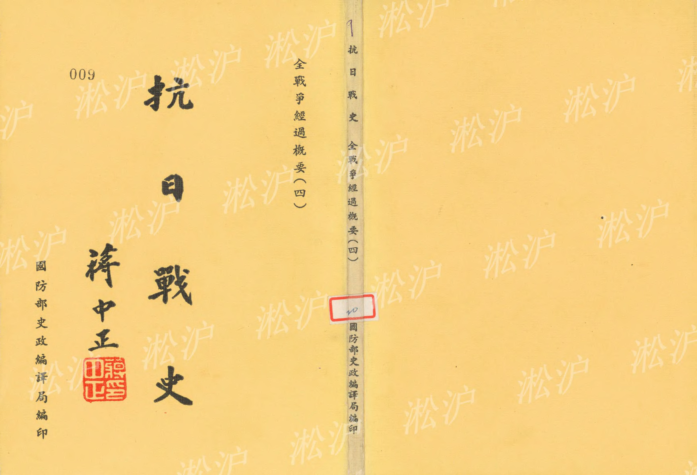
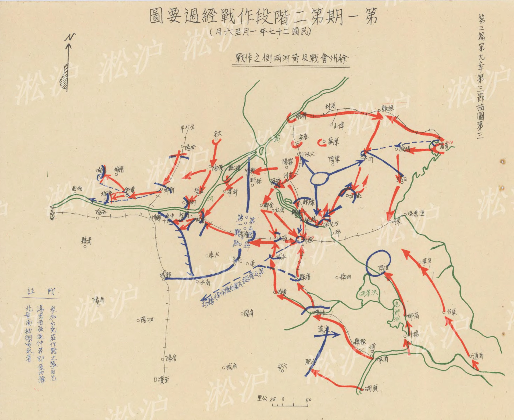
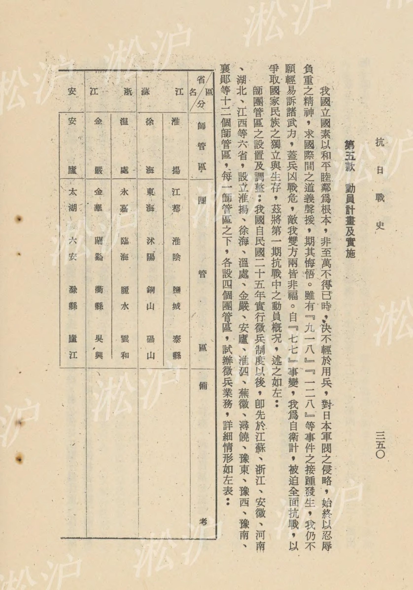
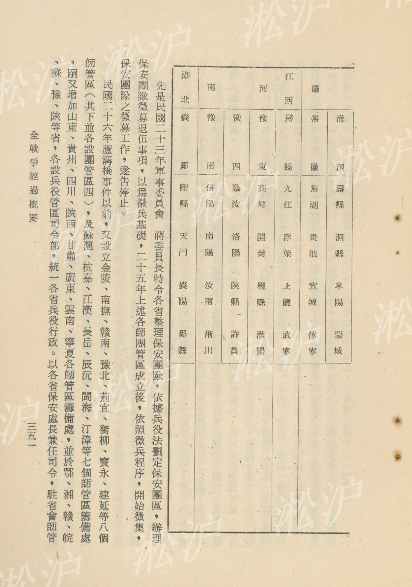
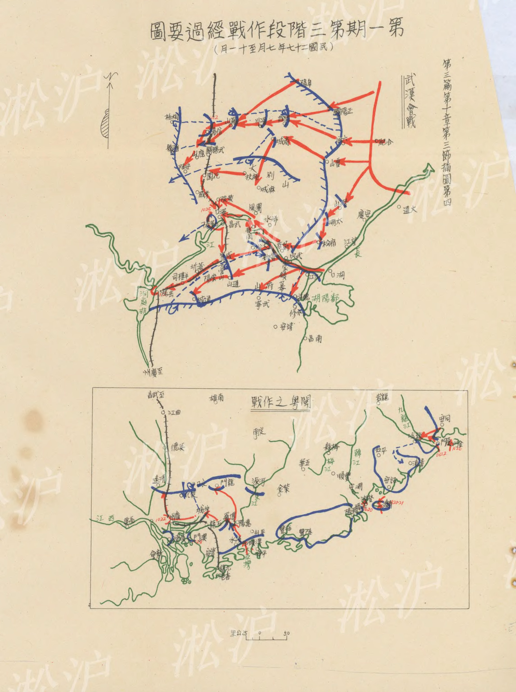
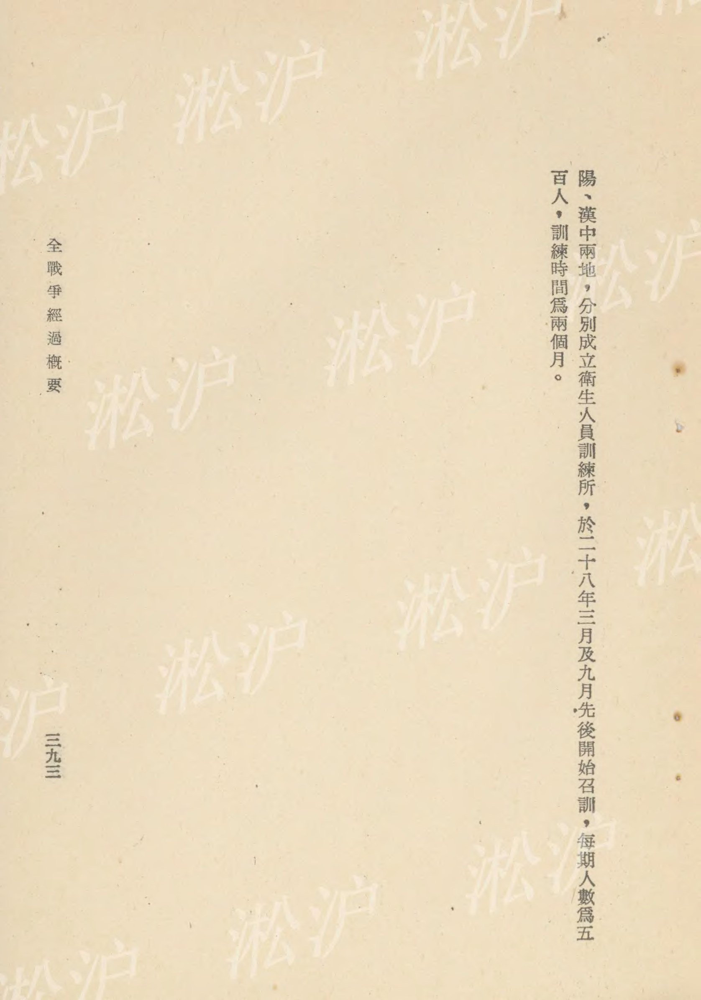
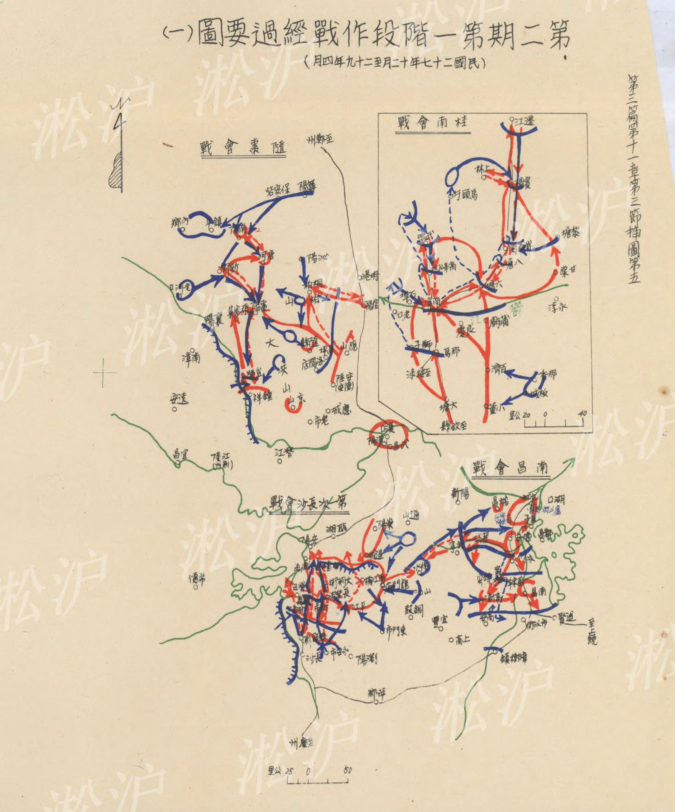
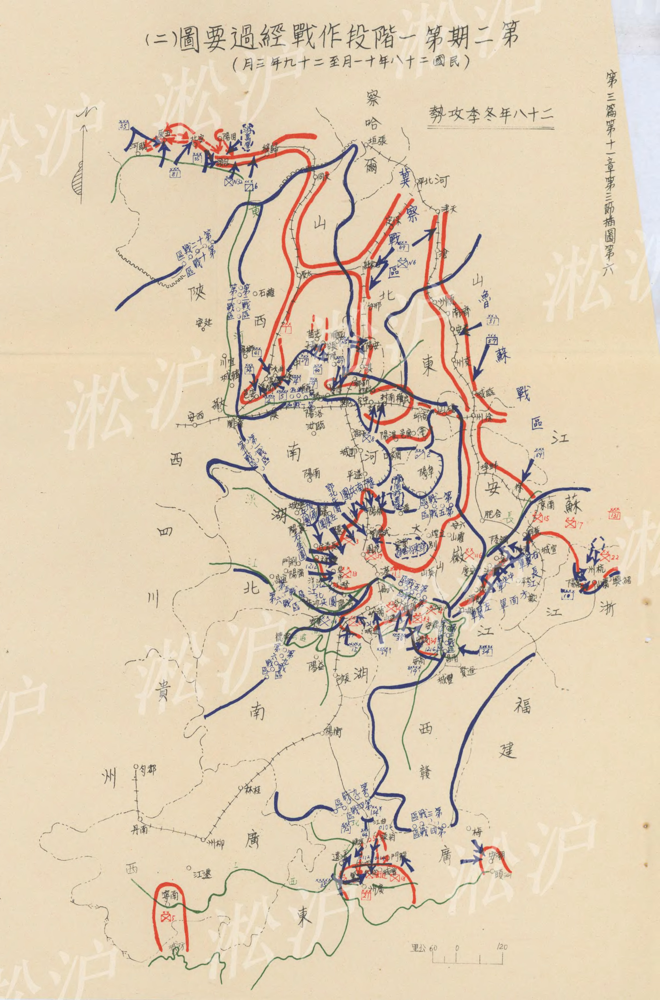
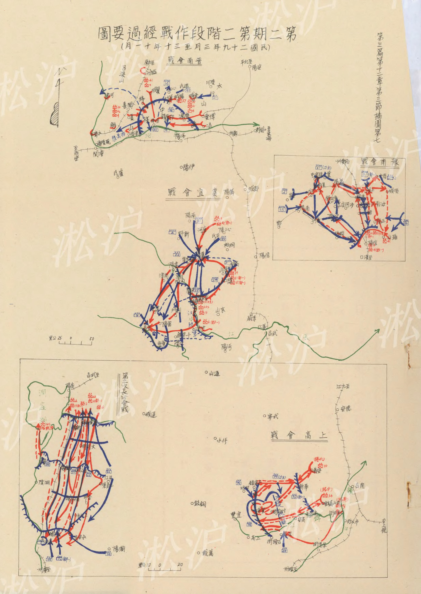



第三篇

全戰爭經過概要（四）

目

錄

第九章 第一期第二階段之作戰經過（自民國二十六年十二月下旬起至民國二十七年六月上旬止）

第一節 一般情勢

第二節 我國作戰指導

第三節 作戰經過

第一款 陸軍之作戰

第二款 海軍之作戰

第三款 空軍之作戰

第四款 後方勤務之設施

第十章 第一期第三階段之作戰經過（自民國二十七年六月上旬起至同年十一月下旬止）第一節

一般情勢

第二節 我國作戰指導

第三節 作戰經過

第一款 陸軍之作戰

第二款 海軍之作戰

第三款

空軍之作戰　三二一　三二四　三三五　三三五　三三五　三四二　三四七

目

錄　一

後方勤務之設施　三四八

第五款 動員計畫及實施　三五〇

第十一章 第二期第一階段之作戰經過

(自民國二十七年十二月上旬起

至民國二十九年四月下旬止)

第一節 一般情勢　三五五

第二節 我國作戰指導　三五八

第三節 作戰經過　三六七

第一款 陸軍之作戰　三六七

第二款 海軍之作戰　三八六

第三款 空軍之作戰　三八八

第四款 後方勤務之設施　三九〇

第十二章 第二期第二階段之作戰經過

(自民國二十九年五月上旬起

至民國三十年十二月下旬止)

第一節 一般情勢　三九五

第二節 我國作戰指導　三九六

第三節 作戰經過　三九七

第一款 陸軍之作戰　三九七

第二款 海軍之作戰　四一八

第三款 空軍之作戰　四二二

第四款 後方勤務之設施　四二四

第九章 第一期第二階段之作戰經過（自民國二十六年十二月下旬起至二十七年六月上旬止）

### 第一節 一般情勢

#### 第一款 敵國

日本政情：近衛內閣於民國二十七年（一九三八）五月開始與德國作強化防共協定之談判；所謂強化，卽具有軍事同盟之意義。

外交方面：日本爲迫使中國訂城下之盟，並緩和英國，分化英、美，加強德、意友誼；納日、蘇外交於常軌。當『七七』事件初起時，日首相近衛曾對新聞記者聲稱，在三個月內即可擊潰中國軍隊主力，瓦解整個中國。迨其侵陷淞滬、進攻南京時，希特勒曾勸告日本勿爲己甚，速與中國政府訂立所謂『榮譽的和平條約。日本不聽，南京既陷，日本以爲中國已無力量抗戰，故當時日法西斯巨魔中野正剛在德國曾以極驕傲之語氣告希特勒曰：『戰爭已經結束，以後僅有外交，沒有戰爭』。

旋日本向我提出議和條件，由德國駐華大使陶德曼轉達我國政府，當遭拒絕。其條件如左：

一、中國政府須放棄聯共以抵抗日本及『滿洲國』之政策，而與日『滿』合作，形成對抗共黨之壁壘。二、在若干地帶成立非戰區域，並在非戰區成立特殊行政管理。

三、中、日『滿』經濟合作。

四、中國對日賠款。

於是近衛乃於民國二十七年一月十六日宣佈『不以國民政府爲交涉對手』，並召川越大使返日，我亦於二十日召回駐日大使許世英，至此中、日兩國外交關係，遂告斷絕。

經濟方面：日本之財政、經濟，自陸相與首相發表準備長期戰爭後，已全般走向戰時體制，諸如生產力之擴充、物資需給之調整、貿易與外匯之統制、強化電力統制等，均以準備長期戰爭爲標的。其尤著者，爲四十八億元空前龐大軍事特別預算之成立。此外，並強奪海關改訂關稅稅則，廢止二五加稅，減免輸入稅率，榨取物資，獨佔華北市場，成立僞「中國聯合銀行」，發行不兌現紙幣，減低匯率，迫我人民行使，套取法幣，調換外匯，並準備發行公債，以維持其龐大軍費開支，可見其財政、經濟狀況，已陷於捉襟見肘之窮境。

#### 第二款 我國

我國政情：我國爲適應抗戰需要，乃革新政治，簡化行政機構，裁撤駢枝機關，於是有國防最高委員會、戰地政務委員會、軍事委員會政治部、及行政效率促進委員會與戰地行政會議之設立，以增進行政效率。同時，並頒佈優待出征軍人家屬條例、非常時期救濟難民辦法、懲治漢奸條例及漢奸自首條例與豁免戰區田賦等措施，以提高士氣，鼓舞民心。民國二十七年四月一日，復舉行第一次臨時全國代表大會，商討國家大計，發表宣言，並通過抗戰要案四項如左：

一、確立領袖制度，設立總裁。

二、創設三民主義青年團。

三、制定抗戰建國綱領。

四、設立國民參政會。

外交方面：始終以和平爲願望，及保持領土主權與行政之完整爲原則。因此，我外交部乃一再發表聲明，昭告中外，日本侵略中國領土，屠殺中國人民，隳壞中國文化，其行動違反國際公法、非戰公約與九國公約，早經世界各國所公認，是破壞國際和平之責，均在日本，而不在中國，中國抗戰爲求保國家之生存、維持國際之尊嚴，中國始終不變和平之願望，而竭力以維持中國領土、主權與行政之完整。此外任何恢復和平辦法，如不以此原則爲基礎，絕非中國所能忍受。並否認一切僞組織，當然絕對無效；同時日本此舉，顯係侵犯中國領土、主權與行政之完整，義正詞嚴，深獲世人之同情與援助。

經濟方面：以貨幣爲重點，自頒行安定金融辦法後，繼由中央、中國、交通、農民四銀行設立聯合辦事處，發揮戰時金融政策之精神，實施以來，百業稱便。鑑於日僞之調換法幣，套取外匯，乃於民國二十七年三月十二日，頒佈購買外匯辦法，便利中外商人需要，以行防止，俾能鞏固法幣信用，保障外匯基金，安定國內金融，維護人民利益。旋又訂定改善地方金融機構辦法綱要，以扶助農工各業，增加生產。此外，尚有管理出口外匯，吸收社會餘資，節約儲蓄等貨幣措施之頒行。

### 第二節 我國作戰指導

民國二十七年一月十七日，軍事委員會頒發國軍戰鬥序列及作戰指導方針如左：

一、戰鬥序列：

陸海空軍最高統帥軍事委員會委員長

蔣中正。

參謀總長

何應欽

(一)第一戰區

司令長官：程潛。

轄區：平漢線及隴海線中段。

兵力：第二十集團軍總司令商震。

第三十二軍商震（兼）。

騎兵第十四旅張占魁。

第一集團軍總司令宋哲元。

第五十三軍萬福麟。

第七十七軍馮治安。

第十七軍趙壽山。

第一八一師石友三。

騎兵第三軍鄭大章。

第六十八軍劉汝明。

第九十二軍李仙洲。

第一零六師沈克。

第一一八師張硯田。

新編第八師蔣在珍。

新編第三十五師王勁哉。

騎兵第四師王奇峯。

以上共轄二十五個步兵師、兩個步兵旅、兩個騎兵師及其他特種部隊等。(二)第二戰區：

司令長官：閻錫山。

轄區：山西。

兵力：南路前敵總司令衛立煌。

第三軍曾萬鍾。

第九軍郭寄嶠。

第十四軍李默庵。

第九十三軍劉戡。

第十五軍劉茂恩。

第十七軍高桂滋。

第十九軍王靖國。

第四十七軍李家鈺。

第六十一軍陳長捷。

第第十四軍團馮欽哉。

北路前敵總司令傅作義。

第三十五軍傅作義（兼）。

新編第二師金憲章。

騎兵第一軍趙承綬。

騎兵第二軍何柱國。

第十八集團軍總司令朱德。

第六十六師杜春沂。

第七十一師郭宗汾。

第三十三軍孫楚。

第三十四軍楊澄源。

以上共轄二十七個步兵師、三個步兵旅、三個騎兵師及其他特種部隊等。(三)第三戰區：

司令長官：顧祝同。

轄區：蘇南、浙江。

兵力：第十集團軍總司令劉建緒。

第二十八軍陶廣。

第七十軍李覺。

第七十九軍陳安寶。

暫編第十三旅楊永清。

寧波防守司令王皞南。

第一九四師陳德法。

溫臺防守司令徐旨乾。

暫編第十二旅李國鈞。

第十五集團軍總司令羅卓英。

第四軍吳奇偉。

第十八軍羅卓英（兼）。

第七十九軍夏楚中。

第二十五軍萬耀煌。

第七十三軍王東原。

第二十三集團軍總司令唐式遵。

第二十一軍唐式遵（兼）。

第二十八集團軍總司令潘文華。

第二十三軍潘文華（兼）。

新編第四軍葉挺。

獨立第六旅周志羣。

游擊總司令黃紹竑。

以上共轄二十四個步兵師、六個步兵旅及其他特種、游擊部隊等。四第四戰區：

司令長官：何應欽。

轄區：兩廣。

兵力：第十二集團軍總司令余漢謀。

第六十二軍張達。

第六十三軍張瑞貴。

第六十四軍李漢魂。

第六十五軍李振球。

第八軍團夏威。

獨立第九旅李振良。

獨立第二十旅陳勉吾。

虎門要塞司令陳策。

以上共轄九個步兵師兩個步兵旅及其他特種、要塞守備部隊等。(五)第五戰區：

司令長官：李宗仁。

轄區：津浦線。

兵力：第三集團軍總司令于學忠。

第十二軍孫桐萱。

第五十一軍于學忠（兼）

第五十五軍曹福林。

第五十六軍谷良民。

第十一集團軍總司令李品仙。

第三十一軍章雲淞。

新編第四軍第四支隊。

第二十一集團軍總司令廖磊。

第七軍周祖晃。

第四十八軍廖磊（兼）。

第二十二集團軍總司令鄧錫侯。

第四十一軍孫震。

第四十五軍鄧錫侯（兼）。

第二十四集團軍總司令顧祝同（兼）。

第五十七軍繆澂流。

第二十七集團軍總司令楊森

第二十軍楊森（兼）。

第五十九軍張自忠。

第三軍團龐炳勳。

第四十軍龐炳勳（兼）。

海軍陸戰隊楊煥彩。

以上共轄二十七個步兵師、三個步兵旅及其他特種部隊等。(六)第八戰區：

司令長官：蔣中正（兼）。

副司令長官：朱紹良。

轄區：甘、寧、青。

兵力：第十七集團軍總司令馬鴻達。

第八十一軍馬鴻賓。

第一六八師馬鴻達（兼）。

騎兵第一旅馬光宗。

騎兵第二旅馬忠義。

騎兵第十旅馬全忠。

寧夏警備第一旅馬寶琳。

寧夏警備第二旅馬得貴。

第八十軍孔令恂。

第八十二軍馬步芳。

騎兵第五軍馬步青。

第一九一師楊德亮。

挺進軍司令馬占山。

以上共轄五個步兵師、四個步兵旅、五個騎兵師、四個騎兵旅及其他特種部隊等。

(七)武漢衛戍總司令部：

總司令：陳誠。

兵力：第三軍李延年。

第四十九軍劉多荃。

第五十四軍霍揆彰。

第六十軍盧漢。

第七十五軍周昺。

第十三師吳良琛。

第五十七師施中誠。

第七十七師彭位仁。

第一八五師郭懺。

第十四師之一旅。

江防總司令劉興

海軍陸戰隊。

以上共轄十四個步兵師一個、步兵旅及其他特種、江防守備部隊等。(八)西安行營：

主任：蔣鼎文。

兵力：第十一軍團毛炳文。

第三十七軍毛炳文（兼）。

第四十三師周祥初。

第十七軍團胡宗南。

第一軍胡宗南（兼）。

第八軍黃杰。

第三十八軍孫蔚如。

第四十六軍樊崧甫。

第二十一軍團鄧寶珊。

新編第一軍。

第一六五師魯大昌。

第八十六師高雙成。

暫編騎兵第一師。

騎兵第六軍門炳岳。

以上共轄十二個步兵師、四個步兵旅、三個騎兵師及其他特種部隊等。(九)閩綏靖公署：

主任：陳儀。

兵力：第七十五師宋天才。

第八十師陳琪。

福建保安第一旅陳佩玉。

福建保安第二旅李樹棠。

福建保安第三旅趙琳。

海軍陸戰隊第二旅。

以上共轄兩個步兵師、四個步兵旅及其他地方要塞部隊等。

(十)軍事委員會直轄兵團：

第二十軍團湯恩伯。

第十三軍湯恩伯（兼）。

第五十二軍關麟徵。

第八十五軍王仲廉。

第二集團軍總司令孫連仲。

第三十軍田鎮南。

第四十二軍馮安邦。

第二十六集團軍總司令徐源泉。

第十軍徐源泉（兼）

第八十七軍劉膺古。

第八集團軍總司令張發奎。

第三十六師蔣伏生。

第五十師成光耀。

第九十二師黃國樑。

第九十三師甘麗初。

第一六七師薛蔚英。

以上共計十七個步兵師。

(四)整訓及未經調動部隊：

計後方整訓部隊二十六個步兵師，未經調動部隊十四個步兵師、七個步兵旅。

總計全國總兵力共二百一十個步兵師、三十五個步兵旅、十一個騎兵師、六個騎兵旅、十八個砲兵團、八個砲兵營及其他特種部隊等。

二、作戰指導方針：

國軍主力控制武漢外圍及豫皖邊區積極整補，由華北及江南抽出有力一部，加強魯中及淮南，積極擾襲，誘致敵主力於津浦路方面，以遲滯敵人之溯江西進，並廣泛發動華北游擊戰，牽制消耗敵人，妨害其南渡黃河，直衝武漢。

### 第三節 作戰經過

#### 第一款 陸軍之作戰

##### 第一項 華北戰場

參照插

圖第三

徐州會戰：民國二十六年十一月中旬，自我第三集團軍韓復築部退守黃河右岸以來，津浦線北段形成對峙態勢，戰況沉寂。十一月下旬，第五戰區遵照軍事委員會確保魯南、蘇北持久抗戰之指示，策定作戰計畫。南京失陷前後，敵一部渡江北進陷滁州。第五戰區於十二月十四日調整部署，以戰區之一部仍守備海岸及黃河沿岸，大部轉移於淮南，阻止北上之敵，相機轉移攻勢。

十二月二十三日，當我第五十一軍由膠濟路向淮南轉移之際，黃河北岸之敵第十師團，在青城、濟陽間渡河，二十七日晨陷濟南，我軍向大汶口、寧陽一帶撤退，一部退嘉祥及運河西岸。三十一日，泰安失陷，青島我海軍陸戰隊撤至諸城、沂水一帶。二十七年一月二日，韓復築又放棄大汶口，五日濟寧失陷，七日鄒縣亦陷，韓部僅以一部沿運河西岸防守，主力集結單縣、城武、曹縣等地。

泰山以東之敵第五師團，於一月初陷吐絲口、新泰、蒙陰，於八日陷濰縣，敵海軍陸戰隊於十三日佔領青島，至是津浦北段之敵，概進出青島、蒙陰、鄒縣、濟寧之線，準備對徐州之攻擊。

先是，當山西戰事緊張時，軍委會會令韓部向德縣、滄州之敵出擊，與第一戰區之攻勢相策應，而韓復築抗不遵命，此次復不戰而退，爲整飭軍紀，乃將其明正典刑，改任于學忠爲第三集團軍總司令，孫桐萱副之。

泰安失陷後，我蔣委員長急調第二十二集團軍鄧錫侯部，向臨城、滕縣推進，拒止敵之前進，並令第五十一軍留置一部於蚌埠，主力開赴黃口、碭山附近警戒，並策應第三集團軍之作戰。

津浦南段之敵第十三師團，乘我第三十一軍與第五十一軍換防之際，自一月十五日起沿鐵路北進，二十五日，與我第三十一軍在明光、池河等地發生戰鬥。迄三十一日，我軍向定遠、鳳陽以西轉移，敵以主力向我進迫，一部沿鐵路北進，我蚌埠守軍第五十一軍之第一一四師退守淮河左岸，至二月三日，定遠、鳳陽、臨淮關、蚌埠、懷遠等地，相繼失陷。

我蔣委員長爲確保淮北、魯南，牽制敵人於津浦路，爭取武漢戰備之時間，令第二十一集團軍廖磊部及第五十九軍張自忠部，均調歸第五戰區指揮，並令湯恩伯軍團調歸德、亳縣，鞏固第五戰區之後方。於是該戰區乃重新調整部署，津浦南段，向其側背攻擊，牽制敵人於淮河以南，津浦北段，鞏固魯南山地及隴海東段，取側擊之勢，牽制敵之南下或西進，以拱衛徐州。

二月四日，蔣委員長電令第五戰區以第三集團軍之第十二、第五十五兩軍，向津浦北段之濟寧以北採取攻勢。十二日夜，第三集團軍開始襲擊濟寧、汶上之敵，曾一度突入該兩城內，與敵爭奪甚烈，旋以敵增援反擊，撤至相里集、鉅野之線。十四日，我第二十二集團軍鄧錫侯部，向鄒縣附近之敵第十師團攻擊，未能奏功，形成對峙狀態，十六日，我第三軍團龐炳勳部，圍攻蒙陰、泗水之敵，均曾一度突入城內。

津浦南段之敵，自二月九日以來，強渡淮河與我第五十一軍激戰至十二日，我軍退守渦河、澮河沿岸，第五戰區乃令第五十九軍往援。此時，第二十一集團軍已抵合肥，卽協同第十一集團軍之第三十一軍向淮河右岸定遠一帶之敵猛烈側擊，敵以側背感受威脅，乃由淮北退回淮河南岸，我第五十九、第五十一兩軍乘機反攻，迄十六日恢復淮河左岸陣地。二十五日，第五十九軍北調津浦北段，淮河左岸仍由第五十一軍固守，並以第三十一軍固守爐橋、洛河之線，至此戰况遂趨沉寂。

二月下旬，第五戰區李司令長官，以津浦北段之敵主力，由濟寧攻嘉祥，爲鞏固魯西防務起見，決由津浦北段正面進攻敵人，乃增調第五十九軍歸第二十二集團軍鄧總司令指揮，以協力第三集團軍之作戰。

三月一日，第五十九軍已集結滕縣附近，準備三日向鄒縣、濟寧之敵攻擊，旋因濰縣方面之敵第五師團南進，又奉令調赴臨沂方面。十四日，鄒縣之敵獲援後，攻陷界河，蔣委員長令控置於亳縣附近之第二十軍團湯恩伯部之第八十五、第五十二兩軍鐵運增援，並令第三集團軍由魯西向兗州側擊敵人。十五日，界河之敵先頭迫近滕縣，我守軍第二十二集團軍之第一二二師憑城死守待援。十六日，第二十軍團之第八十五軍先頭佔領官橋陣地，以掩護其主力之集中，另以一部向滕縣東北攻擊前進，期解滕縣之圍。時敵已越過滕縣向臨城進攻，我軍竭力抵抗，雙方傷亡均重。十七日，滕縣被陷，第一二二師師長王銘章壯烈殉國。十八日，第五十二軍之一旅沙溝陣地又被突破，是晚該軍後續部隊陸續到達，即在韓莊沿運河佈防，並以第八十五軍向東轉進，佔領嶧縣附近高地。十九日，第一一零師到達臺兒莊，第二十二集團軍則移至徐州西北地區整理，是日嶧縣亦陷。

青島放棄後，市長沈鴻烈卽率海軍陸戰隊及保安隊等撤至諸城、沂水等地，發動游擊戰，收復蒙陰。二月三日，又爲敵第五師團攻陷，該敵有進攻徐、海之勢，我乃令第三軍團龐炳勳率第三十九師迅向臨沂進出，協同沈部對魯南之敵積極攻襲，在新泰、泗水等地，斬獲頗多。二月二十日，敵繼續南進，我軍節節抵抗。二十三日，莒縣、日照、沂水等地相繼失陷，第三十九師退守臨沂，並急調張自忠部第五十九軍來援，三月十二日，該軍到達臨沂北郊，與第三軍團之第三十九師協力反攻，敵頑強抵抗，激戰至十七日夜，該敵第五師團主力卒被擊破，向北退却，我軍跟踪追擊。二十三日，敵增援反攻，我退守臨沂，與敵對峙。此時，蔣委員長調第二集團軍孫連仲部，歸第五戰區指揮，並已到達徐州。

三月二十四日，蔣委員長蒞臨徐州指示機宜，士氣大振，並令副參謀總長白崇禧等留徐，組織臨時參謀團，協助李司令長官策畫作戰。

津浦北段正面之敵第十師團，於三月中旬陷滕縣、臨城、棗莊後，卽以一部進佔韓莊，並以瀨谷旅團沿臺棗支線向臺兒莊挺進。我第二集團軍孫連仲部先頭到達臺兒莊附近，予以迎頭痛擊。自三月二十四日起至四月三日止，敵第十師團主力被我第二集團軍吸引至臺兒莊附近，經旬日之激烈戰鬥，敵竭全力，並運用其優勢砲兵及機械化部隊猛烈圍攻，我守軍孫連仲部以與臺兒莊共存亡之決心，奮勇抵抗，反復肉搏，雖臺兒莊城寨大部被敵攻佔，我守軍仍輒強抵抗，迭施反擊，以待我機動兵團包圍之成功。此時，我第二十軍團主力已轉移外線，由東北向嶧、棗反攻，一度衝入棗莊，敵憑依堅固圩壁頑抗，迄未攻下，該軍團乃放棄攻擊嶧、棗之計畫，轉移主力向臺兒莊北側敵之背後猛攻，進展順利。三十一日，敵已完全陷於我包圍圈之內。斯時，臨沂方面之敵第五師團再興攻勢，我第三十九師及第五十九軍浴血苦戰，敵未得逞。敵以臺兒莊方面危急萬分，乃停止對臨沂之攻擊，抽出板本旅團及沂州支隊星夜轉用於向城、愛曲方面，威脅我第二十軍團之背後，企圖解其第十師團之危。我第二十軍團乃抽調一部反擊，並向左反轉旋迴，納該敵大部於臺兒莊、岔河鎮一帶大包圍圈內，再度圍攻。時我蔣委員長增調第七十五軍、第三十二軍之第一三九師來援，激戰至四月六日晚，敵第五、第十兩師團大半被殲，殘敵向北退却，我軍跟踪追擊。此時，我蔣委員長令第五十五軍曹福林部由魯西到達臨城、棗莊北側地區，破壞敵後方交通，敵乃退據嶧縣附近高地與堅固城寨，固守待援。

臨沂方面之敵，於四月中旬獲得增援後，十七日侵陷臨沂。我第三十九師、第五十九軍及來援之第九十二軍等部，分向郯城、柞城及馬頭鎮等地轉移。

四月二十日後，我蔣委員長令第四十六軍樊崧甫部及第六十軍盧漢部來援，相繼到達戰場。同時敵由津浦路陸續增援，臨沂方面亦有增加，協力南進，二千四日，攻陷郯城，我第三十九師傷亡過半，調赴沛縣整理，敵第十六師團增加於臺兒莊方面，臨沂之敵進出郯城、馬頭鎮方面，向我反攻。此時，我第六十九軍由郯城東南向臨沂挺進，第三集團軍向滋陽、臨城間破壞鐵路橋樑，第六十八軍由荷澤向金鄉集結，準備渡微山湖進攻濟寧，旋奉令調赴徐州。

自四月中旬以來，各戰場之敵，陸續向津浦線南北兩端增援，企圖夾攻徐州。五月上旬津浦南段之敵，以一部進攻合肥，掩護其左側，第九、第十三師團及井關機械化部隊，循渦河出蒙城北進，五月九日，蒙城被陷。十日，軍事委員會變更第一、第五兩戰區之作戰地境爲亳州、黃口、沛縣、夏鎮等地東側之線，並令第三軍團及第三集團軍歸第一戰區指揮，第一戰區之第八、第七十四軍向碭山、歸德間集結，於是魯西方面之作戰歸第一戰區指揮。十二日晨，蒙城之敵陷永城，一部北趨碭山，其主力向右旋迴進攻蕭縣，蚌埠附近之敵一部，沿鐵路北犯，進迫宿縣。我第二十一集團軍與敵激戰後，向西轉移，津浦路北段方面之敵策應冀南之第十四師團強渡黃河，第一一一師團於十一日陷鄆城，第十六師團由南陽鎮西渡南陽湖，攻擊魯西我軍之右側背，另敵第一一四師團十四日陷金鄉、魚臺，我第三集團軍，第二十集團軍及第三軍團等部，節節抵抗，以遲滯敵向隴海路南進。迨十七日，敵進迫徐州，截斷隴海鐵路，形成包圍態勢，第五戰區乃令各部準備向豫、皖邊轉移。十八日，宿縣、蕭縣、沛縣等地相繼失陷，但其主力被我誘致於豫東，十九日晚，我軍遂向西南方安全突圍。

黃河兩側之作戰：當敵我在津浦線激戰之際，平漢線之敵，爲截斷隴海鐵路，策應徐州方面之作戰，遂亦開始蠹動。

豫北之敵，自民國二十六年十一月上旬攻陷安陽、大名前後，兵力轉用，遂無餘力繼續南下，與我第五十三軍在安陽、湯陰間對峙達三月之久。

民國二十七年一月八日，第一戰區奉軍事委員會指示作戰機宜之電令，要旨如左：

一、江南之敵，有轉移兵力於江北由津浦線南北兩方夾擊徐州模樣，但其兵力不多，已令第五戰區固守徐，蚌、合肥。

二、第一戰區應以主力固守道口、淇縣及新鄉、博愛一帶地區，一部防守鄭州，並策應第五、第二兩戰區之作戰。

三、第二戰區應以第十五軍劉茂恩部，在長治、晉城地區警戒東陽關、子洪口，並與第一戰區連絡，以保晉南。

四、第一、第二兩戰區作戰地境，改爲冀、晉及晉、豫省界越黃河至新安、宜陽迄原定之線。

一月二十七日，復奉軍事委員會電令，頒發作戰計畫，並指示在敵尙無行動之期間，應以積極手段採取各種攻勢，使敵窮於應付，不得自由轉用兵力，迨其行動時，卽照計畫實施。其計畫要旨如左：

一、指導方針：

以戰區司令長官爲指揮中心，每戰區內劃定數個游擊區，每個游擊區內配備數個游擊基幹部隊，指定其任務，並編組野戰兵團一至二個（每個以三師至五師編成之），歸戰區司令長官直接指揮，位置於交通要點，依敵情之變化，臨時決定攻勢或繞擊。

二、部署：

(一)第一戰區，應分爲兩個游擊區，四個野戰兵團。

(二)第一游擊區，以第一八一師及保安隊爲基幹，向津浦平漢兩線北段及運河西岸之敵游擊。

(三)第二游擊區，以孫殿英及第五十三軍兩部約三個師爲基幹，向平漢線之敵游擊。

四第一野戰兵團，以第五十九軍（第三十八師）及保安部編成，位置於博愛、修武一帶，阻止由長

治、晉城攻擊孟津之敵。

(五)第二野戰兵團，以第七十七軍及新編第九師編成，位置於正面陣地及新鄉、道口一帶阻止由平漢線南進之敵。

(六)第三野戰兵團，以第二十軍團及第九十一師編成，位置於許昌、郾城一帶，以策應第一戰區作戰爲主，並相機策應第五、第二兩戰區之作戰。

(七)第四野戰兵團，以第三十二軍及第二十三師、第九十五師編成，位置於開封、鄭州間地區。

旋第五十九軍奉調徐州方面，豫北正面兵力減弱，第一戰區乃電請軍事委員會准將第一游擊區以第一八一師爲基幹編成，以內黃、濮陽爲根據地，向津浦、平漢北段及其中間地區游擊，第二游擊區以孫殿英部主力爲基幹編成，以涉縣、林縣爲根據地，向平漢沿線之敵游擊。

二月七日，大名之敵，經南樂、清豐、濮陽南進，企圖繞攻道口、滑縣，威脅我第一戰區之右側背，我丁樹本專員所部被迫後退。九日，敵進抵長垣、封邱附近，其另一部向道口前進。十日，安陽方面之敵第十四師團主力，在敵機掩護下，向安陽、湯陰間之寶蓮寺陣地猛犯，第五十三軍奮勇抵抗，激戰甚烈，至十二日轉移至淇縣以西高地，繼續抵抗。十三日，敵續向汲縣進攻，守軍當予以重大打擊後，於十五日向新鄉附近之旣設陣地轉移，我第一集團軍宋哲元部於十八日放棄新鄉向西轉進，在獲嘉、修武、焦作、博愛、沁陽、濟源等地逐次抵抗，阻敵西進，確保太行山脈及晉東、晉南各要道，掩護我山西戰場之右翼。迄四月上旬，敵在臺兒莊慘敗後，卽向津浦線轉用兵力，進攻徐州，更以一部集結於濮陽、濮縣附近，企圖渡河進攻魯西。時我第一集團軍之第七十七軍東移商邱附近集結，道清路阻襲敵人之任務，則由第九十一軍及游擊部隊擔任，並廣泛展開游擊戰，克復濟源、孟縣等地。

五月上旬，敵分向皖北、魯西進攻，第戰區乃遵照軍事委員會之指示，在商邱、碭山間集結強大兵團，以策應徐州方面之作戰。五月九日，濟寧方面之敵開始向西南進犯，迄十八日，先後陷鄆城、魚臺、金鄉、沛縣等地，直趨隴海鐵路，我第七十四軍俞濟時部及第八軍黃杰部，已於十一日分在碭山、商邱等地集結完畢，第六十四軍李漢魂部則正向商邱輸送中。斯時，陷蒙城之敵，北攻永城，徐州情勢危急，我蔣委員長令薛岳統率俞、黃、李三軍爲魯西兵團，以阻止當面之敵。十二日，敵陷永城，其輕快部隊直趨碭山，與我在韓道口。周寨等地發生劇戰。自二十一日起敵猛攻碭山，激戰至二十四日，俞軍西撤，敵沿鐵道西進，二十六日開始向商邱攻擊，激戰至二十八日，守軍向睢縣、杞縣轉進。

當碭山激戰之際，敵第十四師團於侵陷荷澤後，繼續南進，五月二十日竄抵儀封（蘭封東）附近，與我第七十一軍宋希濂部發生激戰。二十一日，儀封敵向西南竄擾，一部竄興隆集附近。此時羅王砦附近均已發生戰鬥，貫臺之敵亦逐次渡河增加。我蔣委員長親蒞鄭、汴指揮，令第七十四、第六十四、第七十一等軍向蘭封、楊堌集之線急進，第十七軍團胡宗南部，由開封方面沿鐵路東進，以掃蕩當面之敵，第三十九軍劉和鼎部，任蘭封、開封間之河防。二十二日，敵一部續竄羅王砦。二十三日，我第十七軍團向該敵攻擊，第三十九軍則阻其北竄。二十四日晨，我第六十四、第二十七兩軍，協同由楊堌集開始再向該敵攻擊，斬獲甚衆，但蘭封方面之敵，則乘我第七十一軍換防之際，襲佔該城。二十七日，我第七十一軍克復蘭封，我軍乃以主力圍攻羅王砦、三義砦一帶之敵第十四師團，予以毀滅性之打擊，奪回羅王車站，打開隴海鐵路，我火車四十二列安全撤回。二十九日晨，敵騎一部竄抵寧陵附近，此時第五戰區已安全突圍，我爲避免與敵在豫東平原決戰，乃令各部於六月初陸續向平漢線以西地區轉進。敵繼續西犯，六日陷開封，十日陷中牟、尉氏後，爲黃汎所阻，我於十八及二十六兩日先後克復中牟尉氏，此後敵我卽沿黃汎兩岸，形成對峙態勢。

晉南反攻戰鬥：自太原會戰後，我軍確守晉南及正太、同蒲路兩側山地，右自子洪鎮，左亘兌九谷吳城鎮，正面以韓侯嶺爲中心，施行防禦。二十七年二月上旬，敵進攻晉南，企圖佔據黃河以北，其第一軍之第一零八師團下元熊彌部，分由東陽關、博愛二路西進，威脅臨汾，第三軍循同蒲路及其西側南犯，自二月中旬接觸以來，敵繼續增加，我軍乃於二十五日開始向汾河以東中條山區及汾西呂梁山區轉進，預期各部到達指定位置後，再互相連繫，夾擊敵人。

晉南游擊戰鬥：當二十七年二月侵入東陽關之敵第一零八師團陷長治，一部竄據屯留，主力經長子、屯留間出良馬，竄臨汾，企圖與同蒲、太隰兩路之敵會合。同蒲線正面之敵爲第二十師團、高橋兵團及第一零九師團、山下兵團之各一部，沿鐵道南下，繼又轉移主力向我汾河西岸迂迴。太隰公路之敵爲第一零九師團及第一零四師團一部，於進佔汾陽後，一部竄離石，主力經大麥郊出隰縣進犯大寧，另以山下兵團主力及第九師團一部，封鎖文水、交城以北各隘口，拒止傅作義軍南援，並以騎兵黑澤兵團威脅我軍冀側，第一零四師團主力則任太原警備。我爲減少損害，不扼守城鎮，於三月中旬完全分散於山地，實於運動戰，當將以前所區分之左翼、中央、右翼軍改爲東、南、北三路軍縱橫連繫。迄三月十八日，敵以兩師團以上之兵力，分路來犯，十九日陷吉縣，二十二日陷鄉寧。四月中旬，敵又企圖消滅晉東我軍，調集主力一萬四千餘人，以榆社、武鄉、沁縣爲目標，分由涉縣、和順、子洪鎮、沁源、襄垣五路向該區進攻。我爲收復晉東、汾西、晉北起見，當令朱懷冰、武士敏部消滅子洪鎮方面之敵，王靖國部對離石汾陽，陳鐵部對靈石、霍縣阻敵南援，劉茂恩部擊滅蒲縣、黑石關之敵，陳長捷部擊滅鄉寧附近之敵，孔繁瀛部附第四十二師之王旅擊滅河津、禹門之敵，劉戡、裴昌會、高桂滋部擊滅沁源一帶之敵，李家鉅部分置絳縣、翼城牽制侯馬南北之敵，彭杰如部控置陽城南北，趙承綬、何柱國部分別仍在晉北服行原任務，各保安游擊隊協助正規軍積極活動。至二十三日，我東路各軍已粉碎敵人圍攻計畫，擊退圍攻武鄉之敵，高桂滋、劉戡、魯英麐等部攻克沁源，敵突圍退據沁源西南之寺溝，復經裴昌會部截擊，傷亡枕藉。朱、武兩師已將子洪鎮之敵擊退，陳長捷部肅清吉縣之敵，並攻克鄉寧，聯合東路軍向臨汾威脅，王靖國部掃蕩永和、石樓之敵，向中陽進擊，郭師已迫近離石城下，趙承綬部截斷晉北交通，一部迫近太原。迨二十六至二十九日，長治、高平、晉城等地之戰鬥，戰況尤爲激烈，斃傷敵三千餘，俘獲輜重人馬甚多，殘敵除一部竄武安外，餘約萬人悉向晉南潰竄，復經我游擊隊及別動隊之截擊，狼狽萬分，我遂於五月一日克復晉城，晉東之敵完全肅清。五月初旬，我軍策定掃蕩晉南三角地帶殘敵計畫，自四日起，開始以主力攻曲沃、侯馬，扼晉南敵之咽喉，一部掃蕩三角地帶及臨汾以南同蒲鐵路沿線之敵，鏖戰至六月中旬，相繼克復平陸、芮城、風陵渡、永濟、虞鄉、解縣、榮河、稷河、禹門等地，敵第二十師團殘部退據安邑、運城、聞喜、曲沃、新絳、侯馬等地，閉城困守，經我圍勦部隊積極圍攻，並破壞臨汾以南之交通線，使敵補給增援困難。汾西方面，自五月中旬經我肅清蒲縣、黑龍關之敵後，僅汾陽、離石、中陽一帶尚有敵第一零九師團之一部，我軍曾數度攻入城內與敵發生激烈巷戰，敵竟使用毒氣，致我未能奏功。晉北方面，自我傳作義軍北上後，相繼克復偏關、清水河、和林格爾諸地。五月二十八日，敵分三路進犯，迄六月四日，三路之敵會合於偏關東北郊，我第三十五軍及騎兵第二軍一部迎頭痛擊，五日拂曉，我退出偏關，繼續戰鬥，六日，我軍開始反攻，激戰至七日晚，敵不支潰退，當卽克復偏關。

##### 第二項 華東戰場

杭州放棄及蘇浙境內之游擊：民國二十六年十一月下旬，我第十集團軍劉建緒部退守杭州附近，第二十一集團軍廖磊部退守桐廬、分水、於潛之線，旋調赴江北合肥方面，杭州方面戰況沉寂。十二月十九日，我第十集團軍當面之敵第九、第一零一師團，由青山市方面向我攻擊，二十二日，竄抵黃湖鎮，該集團軍乃於是晚向錢塘江南岸轉移，二十三至二十五日，餘杭、杭州、富陽相繼放棄。二十七年一月中旬，敵江南主力轉用於江北，我乘機一面固守錢塘江南岸陣地，一面派兵沿滬杭線配合游隊深入敵人後方，予以一大打擊，數月以來，敵疲於奔命，固守重要點線，不敢四出活動。

皖南游擊：民國二十六年十二月中旬南京會戰後，我第十九集團軍薛岳部，在寧國以北地區佔領陣地，阻止宣城之敵，第二十三集團軍唐式遵部，在南陵、銅鼓間佔領陣地，阻止蕪湖之敵。二十七年三月中旬，敵對我蘇、浙、皖邊區作五路進攻，我則擾襲敵側後，迭有斬獲。自徐州會戰開始，皖南之敵，固守據點，我第十九集團軍乃派有力部隊配合游擊隊，深入敵後，發動大規模之游擊戰，數月之中，屢予敵以重創。蕪湖之敵，爲保護江南鐵路之運輸，迭次向我進犯，均被擊退。

#### 第二款 海軍之作戰

馬當方面：我軍自南京轉進後，海軍卽集中於長江中游從事新防線之部署。民國二十六年十二月，我海軍將馬當阻塞線建成，除在官洲、東流、馬當一帶敷設水雷外，並於馬當至湖口一帶編成要塞陣地，配以砲隊及陸戰隊防守，同時以寧字、勝字號各砲艇在阻塞線附近輪流梭巡。二十七年三月二十七日，敵機三架突向我防衛線之義勝砲艇攻擊，該艇中彈爆炸焚燬。四月間，敵機沿大通西岸活動，並駛至貴池附近，我乃於羊山磯順流佈放輕型水雷，襲擊敵艦，十四日，敵艦兩艘由大通上駛，觸雷沉沒。六月二十二日，敵汽艇十餘艘，在敵艦掩護下，向我馬當阻塞線進迫，被我海軍砲隊擊沉三艘。二十四日，我咸寧砲艇在馬當附近，被敵機炸傷漏水，是日，我又在馬當附近加佈水雷六百餘具，東流百餘具，湖口方面亦佈水雷。二十五日，敵復以巡洋艦率驅逐艦多艘，再迫馬當，與我砲臺展開砲戰，敵巡洋艦被我擊中起火，由其驅逐艦挾拖而逃，餘艦亦紛紛向下游竄去。二十六日，敵陸軍迫進馬當，我海軍砲隊奉命將砲門拆卸掩埋後，突圍而出。七月一日，我長寧砲艇及咸寧艦，分由田家鎮及九江附近駛抵武穴時，遭敵機十六架之攻擊，均中彈沉沒，官兵傷亡甚重。

九江湖口方面：九江、湖口不特爲長江要區，且爲贛、鄂門戶，自我海軍將馬當阻塞後，卽劃湖口爲長江第二道防線。七月四日，敵艦迫進湖口時，我海軍砲臺已被敵機炸燬，且兵力單薄，無法與敵繼續作戰，乃於是晚毀砲突圍退出，損失甚重。九日，敵中型軍艦進入湖口江面，十四日，我海軍乃密令魚雷快艇文九十三號向其襲擊，當經命中，負傷回航。十七日，復令史二二三號及岳二五三號兩魚雷快艇，再襲敵艦，因我陸軍所佈之阻塞網流出原位，誤被絞纏，致史二二三號艇沉沒，岳二五三號艇受微傷，未能奏功。二十一日，我文四十二號及文八十八號兩快艇，在蕲春附近遭敵機轟炸震傷，八月一日，岳二十二號被炸沉沒，顏一六一號受傷。嗣後沿湖口、九江以上各重要水道，均依次劃作雷區，計七、八兩月間，我佈雷小艇損失達十餘艘之多。

先是，抗戰軍興，我駐防華北沿海之海軍第三艦隊官兵，奉令以定海等艦艇堵塞靑島港口，並破壞敵產後，於十二月下旬撤離沿海都市，轉至魯中山區，準備游擊，嗣又移防長江，於二十七年一月，抵達武漢附近，改組爲江防要塞守備部隊，並設司令部於武昌，下轄三個守備總隊及兩個陸戰大隊（留駐山東游擊），分駐於田家鎮、湖口及馬當等要塞區，計田家鎮方面，由守備第一總隊第一大隊防守，湖口方面，由守備第三總隊第一、第二大隊防守，馬當方面由守備第二總隊第一、第二大隊（欠第六中隊）及第三總隊之第三大隊與陸戰隊所屬之野砲一個中隊防守。六月初，敵漸迫近馬當，下旬與我在南岸香山陣地激戰甚烈，香山失而復得者凡四次，我守軍犧牲慘重，海軍礮兵隊中隊長溫進化、張舒特、劉茂秋等，均於浴血苦戰中壯烈成仁。

#### 第三款 空軍之作戰

敵空軍概況：中日戰爭爆發後，至二十七年戰區已逐漸擴大，日本空軍兵力亦陸續增加。是年六月間，敵爲適應其作戰要求及指揮便利起見，又於其航空兵團司令部與飛行團之間，增設飛行集團司令部一級，並將作戰部隊改爲飛行戰隊，廢除聯、大隊番號，每飛行戰隊轄二至三中隊。其對我作戰之陸軍航空兵力，於十二月間計有十個戰隊、三個獨立中隊，共二十八個中隊，計各型飛機二百八十二架（內重轟炸機七個中隊六十三架、輕轟炸機六個中隊七十二架、偵察機十一個中隊一百零五架、驅逐機四個中隊四十二架）。海軍航空兵力，於十月間其陸上部隊計有第十二、第十三、第十四及鹿屋等四個航空隊，艦上部隊計有加賀、龍驤、鳳翔等三個航空母艦及能登呂、神威、千歲、神川丸、香九丸、衣笠丸等六個水上機母艦，共有各型飛機二百七十三架，總計本年內敵共使用空軍兵力約五百五十五架。

我空軍概況：我國空軍於二十七年一月獲得補充後，戰力日漸增強，乃積極出擊敵人，以直接協助陸軍之作戰，並依狀況，集結空軍主力，分別炸蕪湖及淮河地區之敵人，敵亦頻施報復，遂致空戰不已。二月間，我空軍轟炸力稍弱，而驅逐力則增強，故仍堅持積極攻擊之決心，不斷出擊。三月，撤銷空軍前敵總指揮部，復於五月設立空軍路司令部三，以張廷孟爲第一路司令、劉牧羣爲第二路司令、田曦爲第三路司令，作戰部隊，於是年六至十二月間，計有偵察中隊一、轟炸第一、第二大隊及志願轟炸第一大隊、驅逐第三、第四、第五及志願驅逐第一、第二大隊，並以龔穎澄、徐康良爲志願驅逐第一、第二大隊大隊長，徐燕謀、黃泮揚爲驅逐第三、第五大隊長、董明德爲第四大隊代理大隊長，作戰飛機因消耗過大，六月間，僅有一百二十六架，以後陸續補充一百零四架。

茲將本階段之作戰經過分述如左：

漢口空戰：民國二十七年二月十八日，敵驅逐機二十六架掩護轟炸機十二架，向武漢進襲，我駐漢口、孝感之空軍第四大隊大隊長李桂丹率15，16機二十九架，起飛迎擊，經激烈之空戰後，計擊落敵機十四架，李大隊長及隊長呂基淳、隊員巴清正、王怡、李鵬翔等五員，均壯烈殉職。

南昌空戰：民國二十七年二月二十五日，敵復以大編隊之飛機五十三架，襲我南昌，我乃以E-15E 16機三十架，分三個編隊羣迎擊，先攻擊其轟炸機，旋與敵驅逐機互相格鬥，擊落敵機一架，我機亦被擊落一架，受傷迫降者四架。

『四二九』武漢空戰：二十七年三至五月間，我空軍除支援陸軍臺兒莊、徐州等會戰外，並轟炸黃河以北之安澤、靈石、風陵渡等地之敵據點及攻擊敵渡河部隊。敵爲消滅我空軍，以減少其地面威脅，復對我南昌、廣州、武漢各空軍基地，大舉襲擊，我空軍亦分別予以迎頭痛擊，其中尤以四月二十九日漢口附近之空戰，最爲慘烈。當日爲日本天長節，敵機三十九架來襲，我空軍當時對於防空已早有準備，且集中兵力達六十七架之多，防衛方針，係以E-16機巡邏武漢上空，攻擊敵之轟炸機，E-15機巡邏武漢外圍東北上空，誘導敵驅逐機脫離其轟炸機羣，俾E-16機之攻擊容易奏效。故當敵機侵入武漢上空時，我各機均奮勇迎戰纏鬥，總計擊落敵機達二十一架之多，我機亦損失十二架，敵空軍經此鉅大損失，兇燄由此爲之大挫。

遠征日本：我空軍爲宣揚我國德威，喚起日本軍閥及民衆之覺悟，乃於民國二十七年三月初，策定遠征日本計畫，飛赴日本本土投散各種傳單。當時我空軍雖缺乏海洋飛行訓練，對空通信設備，亦復簡陋，尤對遠征作戰上所需之航行、指揮、氣象及場站等連絡通信頗欠完全，但仍週詳準備，於是加設飛機定向儀及短波通報機之裝備，與地面對空電臺之敷設等工作。經部署妥善後，卽於五月十九日十二時二十三分，由第十四隊隊長徐煥昇率領第八大隊第十九隊副隊長佟彥博，分駕馬丁機兩架，攜帶小冊傳單，自漢口起飛經南昌、衢州至寧波前進基地降落加油，二十三時四十八分，再由寧波飛赴日本，在長崎、福岡、久留米、佐賀及九州各城市散發，以喚起日本民衆之自覺，並偵察日本軍港及機場情況。二十日，該兩機分在玉山、南昌兩地降落，並於十一時十三分在武漢上空集合後，安返漢口機場，完滿達成我空軍首次遠征日本之任務。

防空作戰：關於防空方面，自民國二十六年十二月中旬南京失陷後，戰場逐漸擴大，我軍事政治重心西遷，乃對防空部署調整如左：

一、頒佈調整全國防空機構辦法，成立省防空司令部，綜理全省一切戰時防空事宜。

二、擴充防空部隊，二十七年春成立高射砲兵第四十三、第四十五團及照測總隊。

三、於防空學校增添班次，擴大訓練範圍。

四、以大口徑高射砲配備於武漢及廣州兩地，以保護戰略要地，抽調小砲增防廣九、粵漢兩國際交通線五、加強野戰防空，以利陸海軍及各要塞之作戰。

綜計二十七年全年敵機空襲全國各地共二千三百三十五架次，投彈四萬九千七百四十七枚，死一萬九千八百八十五人，傷三萬零六十人，毀屋七萬九千六百九十四間，我高射砲部隊於全國各地共擊落敵機四十三架，陣亡官兵八十員名。

#### 第四款 後方勤務之設施

南京既陷，我軍事重心，遂西移武漢。二十七年二月，軍事委員會於武漢成立衛戍總司令部，並於三月一日設立武漢衛戍兵站總監部。此時，第七戰區已奉令與第三戰區合併，故第七兵站總監部亦隨之撤銷。至第四兵站總監部，因編組之初，第四戰區情勢和緩，僅先成立四分之一幹部人員，以作準備，但至四月間，該方面仍無戰事發生，遂亦裁撤。直至十月初，粤南情勢緊張，始再重行編組成立，嗣以武漢方面作戰範圍廣闊，非武漢衛戍部隊之能力所能勝任，遂於七月間成立第九戰區，並以原武漢衛戍兵站總監部，改組爲第九戰區兵站總監部，擔任補給事宜。

徐州方面，自敵在臺兒莊慘敗後，軍事重心漸移於魯西及魯南方面，我後方勤務部爲使該兩方面之作戰軍補給容易起見，乃重新劃分第一、第五兩兵站總監部之補給地區，卽凡在津浦線迤東地區（含津浦線及銅山）之兵站機關，統歸第五兵站總監部總監石化龍指揮，津浦線迤西地區之兵站機關，統歸第一兵站總監部總監萬舞指揮，分別擔任各該地區作戰軍之補給事宜，至兵站補給路線之選定如左：

一、魯南嶧縣、棗莊方面，利用臨棗、臺趙支線。臺兒莊、臨沂間，利用臺濰公路，並以臺兒莊、四戶鎮爲副線。臨沂附近，利用新安鎮、郯城、臨沂公路。津浦北正面，利用鐵道。

二、淮南以信陽、潢川、固始、三河尖、正陽關爲補給線路。

三、皖北以郾城、周家口、太和、渦陽爲主補給線路，郾城、周家口、淮陽、鹿邑、亳縣爲輔補給線路。

同時，根據各部隊之補給需要，第五兵站總監部，先後成立直屬支部三、分站十二、派出所十五、糧服庫二、船舶所一，又轄分監部四、支部一，另設辦事處一。第一兵站總監部先後成立支部一、分站十、派出所三、糧服庫二、堆積所六，又轄分監部二、支部四。

第十章 第一期第三階段之作戰經過（自民國二十七年六月上旬起至十一月下旬止）

### 第一節 一般情勢

#### 第一款 敵國

日本政情：民國二十七年（一九三八）七月十二日，張鼓峯地方日軍與蘇軍衝突，日軍一個師團之兵力，遭蘇軍反擊，頗有損失。是年冬，蘇俄突禁止日本漁船進入漁區，當時陸軍次官東條嘗揚言曰：日本不惜南北兩面同時作戰。

十一月十九日，五相會議決定：日、德、意軍事同盟，應仍以蘇聯爲對象，設以英、法爲對象，則日本將不予適用。當時日本當局之意見，呈現對立——卽海軍元老及內閣首腦，主張三國同盟，只應限於以蘇聯爲對象，而陸軍則贊成德國以英、法爲對象之提案，因此之故，近衛內閣後於民國二十八年（一九三九）一月四日總辭。

外交方面：日本外交方針有二：一爲強化日、德、意防共樞軸，以提高日本對華及國際地位；一爲努力與理解日本之國家協調，誘致英、美、蘇等國，放棄援華政策。本此方針，企圖陷我國於孤立，並放出對華和平煙幕與國際協調空氣，以迫使我國屈服，更加緊勾結德意，拉攏英國，離間英美，威脅法國，調整日蘇關係，以斷絕我國之外援。而事實上適得其反，各國對於我國之援助，反而更見積極。但其爲緩和國際上之反對，不得不放出和平空氣，乃於六月十七日，對新聞記者發表所謂：如局勢變更，或與國民政府談判，第三國調解並非絕對不可能」之談話，以加濃我國失敗主義者對和平之幻想及騙取好感，誘致列強放棄援華政策，此非和平福音，實乃加緊進攻武漢之先聲。

同時，日本外相對於國聯實施盟約第十七條以解決中日爭端之邀請，予以拒絕，並謂根據國聯盟約所擬定辦法，不能對中日糾紛爲適當之解決。嗣因國聯決議接受我國代表團之要求，且援引盟約第十六條予以制裁，其外相更大放厥詞，謂果爾則日本將採取必要行動，其睥睨一世之態度，益失國聯之同情，因此，其外交更爲孤立，乃於九月三十日辭職。

經濟方面：日本自生產力之擴充，物資需給之調整，貿易與外匯之統制，強化電力統制法之通過後，但在財政、經濟上仍不足以應付長期戰爭，至池田出任藏相，爲擴充軍需工業生產力，充實軍需原料供給，不得不增加輸入與輸出。蓋日本戰時經濟基礎，在於對外貿易與國際收支，故必須加以統制，以免貿易惡化與平衡國際收支，乃於六月二十三日臨時閣議「通過物資總動員計畫」，以求軍需資財與輸出品原料之消費與節約。同時爲實施此種龐大計畫，必須設一執行機構，除在吉田商相時代商工省內已有臨時物資調整局之設立外，並擬在全國各府縣經濟部內設立專司物資調整之臨時機構，以使此種計畫，得以順利推行，並廣事宣傳，自七月下旬至八月下旬，舉行「經濟戰強調月」，發動「國民精神總動員」及「新國民生活運動」，以期減少消滅，勵行節約。而池田商相之主要手段，乃在利用經濟警察，執行法律之強制力，以達到節約之目的。同時日本此種物資總動員計畫，不但在其國內實施，並推行於僞滿與其在華之佔領區，進行經濟榨取，期能解決其經濟危機，從事長期之侵略戰爭。

#### 第二款 我國

我國政情：我國自確立「抗戰建國綱領」後，深獲全國各黨各派與民衆之竭誠擁護。二十七年七月七日，國民參政會成立，全國上下更見團結，抗戰基礎益形穩固。此後，參政會曾於歷次會議中，通過重要議案多起，諸如擁護政府長期抗戰國策、調整民衆團體發揮民力、具體規定檢查畫報標準以統一發行及在內地建立工礦基礎增加生產以充實國力等，均爲和衷共濟共赴國難之表現。

外交方面：基於抗戰建國綱領之五大原則，以從事外交上之努力。二十七年九月，我出席國聯之首席代表顧維鈞氏，照會國聯行政院祕書長，要求依據盟約第十七條之規定，邀請日本接受會員國之義務，聽由國聯就中日爭議一案，予以處理，並發表演說，強調盟約第十七條最適用於中日爭端，應卽付諸實施，又要求禁運軍火、飛機、煤油與戰爭工具前往侵略國，並在財政上斷其接濟及在財政上物質上援助我國，同時更要求國聯採取有效措施，阻止日軍賡續採取野蠻作戰方式（如使用毒氣等），及轟炸普通人民，乃爲國聯行政院所接納，並向日本提出邀請書，但遭日本拒絕。於是我外交部發表聲明，認爲日本違反國際公法，漠視一切，應依盟約第十六條之規定予以制裁，當獲國聯行政院之通過，第以國聯機構未臻健全，且因當時歐局極度震盪，各國均集注精神於捷克問題，未能轉移視線於東亞，遂致未生大效。此外，我並極力爭取與國，制日援華，甚著成效，尤以英、美、法、蘇等國爲然，而美國之首先發動不承認僞滿州國及僞組織，其影響尤大。

經濟方面：我國對敵之經濟作戰策略，係因敵進攻而逐漸形成，已往敵以我法幣盜換外匯，二十年三、四月間，我乃制定外匯請核及出口結匯辦法，分別實施之，卒使敵人陰謀無法得逞，因而收得貨幣戰之效果。迨敵實施其物資總動員計畫後，首先設立華北開發會社與華中振興會社，以掠奪我國物資，我爲粉碎敵人此種企圖，乃實施對敵禁運，並頒佈資敵物品收購救濟辦法，責成貿易委員會、農本局等機關，分別予以收購，以免人民蒙受損失，又訂定查禁敵貨條例，防止敵人以貨物套取法幣或交換貨物，以促使其國內工業，因無市場而崩潰。同時政府更扶植各種小工業、手工業之發發，以期自給自足，並發動海內外同胞及反侵略國家，抵制敵貨，頗收成效。至對淪陷區敵入之經濟策略，則以游擊與破壞，以阻止其各項開發計畫之實施。

### 第二節 我國作戰指導

作戰指導方針：

國軍以各一部守備華南海岸及華東、華北現陣地，並積極發展游擊戰，妨害長江下游敵之航運，牽制消耗敵人。另以有力一部支援馬當、湖口要塞，迫敵在鄱陽湖以東展開，妨害敵溯江向九江集中。國軍主力集中武漢外圍，利用鄱陽湖大別山地障及長江兩岸丘陵、湖沼，施行戰略持久戰，特注意保持重點於外翼，爭取機動之自由。

預期在武漢外圍與敵主力作戰四個月，予敵以最大之消耗，粉碎其繼續攻勢之能力。

二、戰鬥序列：

陸海空軍最高統帥軍事委員會委員長蔣中正。

參謀總長何應欽

(一)第一戰區：

司令長官：程潛。

轄區：河南。

兵力：第六十九軍石友三。

第三十九軍劉和鼎。

第九十七軍朱懷冰。

第九十一軍郜子舉。

全战事四

第二十七軍范漢傑。

第四十軍龐炳勳。

第一九六師王治歧。

第八十七師沈發藻。

二第二戰區：

司令長官：閻錫山。

轄區：山西。

兵力：第三十五軍團曾萬鍾。

第三軍曾萬鍾（兼）

第三十三軍團李默菴。

第十四軍陳鐵。

第九十三軍劉戡。

第十四軍團馮欽哉。

第四十二師柳彥彪。

第一六九師武士敏。

第三十一軍團孫蔚如。

第三十八軍趙壽山。

第九十六軍李興中。

陝西警備第一旅王竣之。

北路軍總司令楊愛源。

第一路軍司令官劉茂恩。

第十五軍劉茂恩（兼）。

第二路軍司令官王靖國。

第十九軍王靖國（兼）。

第七十一師第三四三旅。

第三路軍司令官趙承綬。

騎兵第一軍趙承綬（兼）。

第一二零師賀龍。

北路前敵總司令傅作義。

第七集團軍總司令傅作義（兼）。

第三十五軍傅作義（兼）。

第二十一軍團鄧寶珊。

新編第一軍鄧寶珊（兼）。

第二十二軍高雙成。

騎兵第二軍何柱國。

第一六五師魯大昌。

東北挺進軍總司令馬占山。

騎兵第六軍門炳岳。

第十八集團軍總司令朱德。

第一一五師陳光代。

第一二九師劉伯承。

第十七軍高桂滋。

第四十七軍李家鈺。

第六十一軍陳長捷。

第六十六師杜春沂。

第七十一師郭宗汾。

暫編第一師彭毓斌。

新編第二師金憲章。

(三)第三戰區：

司令長官：顧祝同。

轄區：蘇南、皖南、浙江、江西。

兵力：第十集團軍總司令劉建緒。

第二十八軍陶廣。

第六十三師談經國。

第一九二師胡達。

第一九四師陳德法。

第一零七師段珩。

預備第十師宣鐵吾。

獨立第三十二旅黃鎮中。

第三十二集團軍總司令上官雲相。

第七十九軍夏楚中。

第六十七師莫與碩。

第三十四軍團王東原。

第四十九軍劉多荃。

第七十三軍王東原（兼）。

第二十六師劉雨卿。

第一一八師王嚴。

第二十三集團軍總司令唐式遵。

第二十一軍唐式遵（兼）。

第五十軍郭勳祺。

第二十三軍陳萬仞代。

新編第四軍葉挺。

游擊總司令黃紹竑。

四第四戰區：

司令長官：何應欽（兼）。

副司令長官：余漢謀。

轄區：閩、粤。

兵力：第四集團軍總司令蔣鼎文（陳儀兼代）。福建綏靖主任陳儀。

第八十軍陳琪。

第七十五師韓文瑛代。

第八十師李良榮。

廈門要港司令高憲甲。

海軍陸戰旅。

馬尾要港司令李世甲。

第十二集團軍總司令余漢謀（兼）。

第六十二軍張達。

第六十三軍張瑞貴。

第六十五軍李振球。

第六十六軍葉肇。

獨立第九旅李江。

第四路教導旅羅梓材。

虎門要塞司令陳策。

(五)第五戰區：

司令長官：李宗仁。

白崇禧代。

轄區：豫南、鄂北、皖北、蘇北地區。

兵力：第三兵團總司令孫連仲。

第二集團軍總司令孫連仲（兼）。

第三十軍田鎮南。

第四十二軍馮安邦。

第二十六軍蕭之楚。

第五十五軍曹福林。

第八十七軍劉膺古。

第四兵團總司令李品仙。

第二十九集團軍總司令王續緒。

第四十四軍彭誠孚。

第六十七軍許紹宗。

第十一集團軍總司令李品仙。

第八十四軍覃聯芳。

第一七六師區壽年。

第六十八軍劉汝明。

第八十六軍何知重。

第二十六集團軍總司令徐源泉。

第十軍徐源泉（兼）。

第一九九師羅樹甲。

第二十一集團軍總司令廖磊。

第三十一軍韋雲淞。

第七軍張淦。

第十九軍團馮治安。

第七十七軍馮治安（兼）。

第五十一軍于學忠。

第七十一軍宋希濂。

第二十七軍團張自忠。

第五十九軍張自忠（兼）。

第四十五軍陳鼎勳。

第二十四集團軍總司令韓德勤。

第五十七軍繆澂流。

第八十九軍韓德勤（兼）。

第二十七集團軍總司令楊森。

第二十軍楊森（兼）。

(六)第八戰區：

司令長官：蔣中正（兼）。

副司令長官：朱紹良。

轄區：甘、寧、綏。

兵力：第十七集團軍總司令馬鴻達。

第八十一軍馬鴻賓。

第一六八師馬鴻達（兼）。

獨立第十旅馬全良。

騎兵第一旅馬光宗。

騎兵第二旅馬忠義。

寧夏警備第一旅馬寶琳。

寧夏警備第二旅馬得貴。

第八十軍孔令恂。

第八十二軍馬步芳。

騎兵第一軍馬步青。

第一九一師楊德亮。

(七)第九戰區：

司令長官：陳誠。

轄區：湖南、鄂南及南溥路以西地區。

兵力：第一兵團總司令薛岳。

第九集團軍總司令吳奇偉。

第二十九軍團李漢魂。

第六十四軍李漢魂（兼）

第七十軍李覺。

第三十七軍團王敬久。

第二十五軍王敬久（兼）。

第四軍歐震。

第八軍李玉堂。

第六十六軍葉肇。

第二十集團軍總司令商震。

第十八軍黃維。

第三十二軍商震（兼）。

第二十九軍陳安寶。

第七十四軍俞濟時。

第一六七師趙錫光。

鄱陽湖警備司令曾憂初。

第二兵團總司令張發奎。

第三集團軍總司令孫桐萱。

第十二軍孫桐萱（兼）。

第三十集團軍總司令王陵基

第七十二軍王陵基（兼）。

第七十八軍張再。

第三十一集團軍總司令湯恩伯。

第十三軍張軫。

第九十八軍張剛。

第三十二軍團關麟徵。

第五十二軍關麟徵（兼）。

第九十二軍李仙洲。

田北要塞指揮官李延年。

第十一軍團李延年。

第二軍李延年。

田南要塞指揮官霍揆彰。

第五十四軍霍揆彰。

武漢衛戍總司令羅卓英。

江北區指揮官萬耀煌。

第六軍甘麗初。

第十六軍董劍。

江南區指揮官周

暑。

第七十五軍周

暑。

武漢警備司令郭

懺。

第九十四軍郭儀。

第三十七軍黃國樑。

第三十軍團盧漢。

第六十軍盧漢（兼）。

第二十六軍團萬福麟。

第五十三軍萬福麟（兼）。

### 第三節 作戰經過

#### 第一款 陸軍之作戰

##### 第一項 華中戰場

參照插

圖第四

武漢會戰：民國二十七年六月上旬，徐州會戰後，敵第二軍被阻於黃氾，轉向正陽關、合肥方面移動，同時長江下游之敵溯江向安慶、大通前進，其進攻武漢之企圖已極明顯。當時我蔣委員長授予各戰區之任務如左：

一、第一戰區以一部任黃河河防及魯西、豫北、豫東之游擊，主力在確山，氾水之線，佔領既設陣地，置重點於禹縣方面，相機轉移攻勢，並留一部於前方諸要點，遲滯敵人，但第三十六、第四十五、第四十六等師，須集結於泌陽爲戰區預備隊，第二十四、第一零九師及預備第七師移潼關，歸陝西行營指揮。

二、武漢衛戍總司令部，以主力在廣濟、平靖關之線佔領陣地，置重點於武勝關及麻城、廣濟各公路附亢

日

戰

史

三三六

近，相機轉移攻勢，並派一部於宿松、信陽、羅山各要點，與第五戰區協力消耗遲滯敵人。但薛岳部劉興軍六個師，擔任江防，置重點於馬當，迫敵主力在鄱陽湖以東展開，萬耀煌軍第五十二師、第一九零師位置於南濤鐵路，夏威軍三個師位置於陽新、大冶，葉肇軍兩個師位置於湘贛鐵路待命，郭懺、李延年、周昪等軍共八個師，任武漢城防，王陵基集團軍四個師，先向荊、沙集中，歸軍事委員會直轄。

三、第五戰區於逐次抵抗後，淮北兵團集結商城附近，準備側擊向西南突進之敵，淮南兵團之第二十六集團軍，集結桐城、舒城、霍山、六安等地，阻止西進之敵，第二十七集團軍，固守安慶、無爲、廬江等地，阻敵登陸，不得已時，退保宿松、太湖、潛山等地，準備側擊沿江西進之敵，無論情況如何變化，均須確保大別山根據地，但第八十九、第五十七軍，仍保蘇北，向津浦南段游擊。

四、第三戰區應整備江防，尤應於東流，馬當間作充分之戰備，並適當控制兵力，阻敵登陸，或援助安慶方面之作戰。對於杭甬及浙贛兩鐵路與杭徽、京贛各公路附近，應指揮地方團隊或民伕構築工事，同時於上述各交通線上，集結適當兵力，隨時擊攘敵人。

五、豫、鄂邊區總司令湯恩伯部，在隨縣、襄、樊、南陽西地區集結，準備側擊由平漢路南下之敵，協力武漢衛戍總司令部之作戰。但敵如沿隴海路南方向間或向西南突進時，則以有力之一部，協力第一戰區之作戰。其所屬劉汝明第二十六軍團及第九十五師羅奇部，繼續遲滯敵人，爾後劉汝明部佔領泌陽、確山一帶，歸第五戰區序列。

民國二十七年六月上旬，敵第二軍爲黃汎所阻，乃轉向合肥、正陽關間集結，先後侵陷渦陽、鳳臺、壽縣、正陽關等地，準備西進。長江方面，敵則進出大通附近。此時，我第四十八軍廖磊部、第七十七軍馮治安部，轉進至霍山、阜陽間淖河西岸，第十軍徐源泉部，亦由合肥附近向六安轉移。六月九日，敵陷舒城，十二日陷安慶，我第二十七集團軍楊森部主力向太湖、潛山轉移。二十日，敵主力進抵潛山、太湖之線，與楊森部對峙。二十三日，敵海軍第三艦隊支援波田支隊進攻馬當，激戰至二十六日，爲敵攻陷。七月五日陷湖口。二十三日，敵在九江附近登陸，我軍向南轉進。二十六日九江失陷，敵乃取得鄱陽湖以西之登陸點。

敵第十一軍（五個半師團爲基幹）以主力向九江附近集中。一部向太湖集中，八月下旬，開始進攻，一部沿南濤鐵路南進，以掩護其左側背，主力沿瑞昌至武寧公路西進，圖截斷粵漢鐵路，迂迴武昌之南，其長江北岸之一部，趨宿松、迫廣濟，進攻漢口。敵第二軍（四個師團爲基幹）主力於八月下旬由六安沿大別山北麓經固始，潢川進攻信陽，迂迴漢口之北，一部由商城經麻城向漢口進攻，並以艦隊溯江而上，陸戰隊到處登陸，以外線作戰要領，圍攻武漢。

我軍事委員會爲統一指揮長江南岸作戰，自七月間成立第九戰區，轄第一、第二兩個兵團，共計二十七個軍，擔任江南方面之作戰。第五戰區轄第三、第四兩個兵團，共計二十三個軍，擔任江北方面之作戰。

我軍在武漢外圍之九宮山、幕阜山、廬山及大別山脈各隘路配置重兵，預築堅固陣地，並在田家鎮長江兩岸構築江防要塞，拒止敵人，特保持主力於外翼，爭取機動之自由，並集中空軍主力，阻止敵艦西侵，晝夜轟炸東流，九江間敵之艦船及沿江機場，妨害敵增援補給。九江失陷，我軍退守廬山兩側及南濤鐵路沿線之旣設陣地。旋敵第一零六師團數度仰攻，死傷慘重。八月二十二日，敵第九師團由瑞昌東北方之港口登陸，二十三日陷瑞昌，第一零一師團由星子登陸，威脅南濤路我軍後方，經我第九戰區第一兵團，利用廬山據點及兩側有利地形，予以阻擊，敵受創甚重，敵譽爲天然堡壘，無法攻破，迄八月底，遂成對峙狀態。十月上旬，敵第一零六師團主力及第一零一師團之一部，迂迴至萬家嶺附近，我抽兵包圍，激戰三晝夜，殲敵數千，敵棄屍盈野。

由港口登陸之敵，九月間，沿瑞陽路西進，同時，長江敵艦四十餘艘，向我馬頭鎮、富池口南岸要塞猛攻。我第九戰區第二兵團沉着應戰，數度將其擊退，敵乃大量施放毒氣，仍未得逞。迄九月十四日，馬頭鎮失守，二十四日富池口失陷。其沿瑞武路進犯之敵，九月下旬在白水街、覆盆山等地，遭我擊潰，死傷極重。嗣後敵再增兵沿長江南岸及陽新、辛潭舖、龍港等處數路前進，又被我在龍港、木石港、三溪口、大冶、鄂城、金牛等地截擊，予以重創。至十月中旬，我逐次向武寧、通城，岳州附近之線轉移，十月二十五日，敵逼近武昌。

長江左岸之敵第六師團，自七月二十六日陷太湖後，遭我第五戰區第二十七、第二十六集團軍數次反攻，成對峙狀態。旋以海軍掩護其第六師團一部，在小池口登陸，協同第六師團主力分兩路猛攻。我第五戰區第四兵團一部拒戰至八月初，宿松、黃梅相繼失陷，我第四兵團主力七個軍佔領廣濟南側亘大金舖吳文貴，渡河橋、二郎河之線陣地。八月下旬，我軍規復太湖、潛山，敵變換其後方連絡線於小池口方面，向我廣濟以東陣地攻擊，戰況異常激烈，守軍犧牲甚大，陣地遂被突破，廣濟於九月六日失陷，我乃退守界嶺第二線陣地及田家鎮要塞。陷廣濟之敵，亦轉用其兵力南犯田家鎮，同時，由長江方面西進之敵，於九月十六日侵陷武穴，亦向田家鎮進攻，我乃於十九日以廣濟附近之三個軍，側擊由廣濟南進之敵，以策應田家鎮要塞之作戰，我守軍冒敵機艦砲之轟擊及毒氣之危害，苦戰兼旬，斃敵甚衆，終以傷亡過重，於九月二十九日放棄田家鎮。十月初，敵利用水道侵入田家鎮以西，在蕲春、蘭溪、黃岡、陽邏團風等處登陸，以策應由廣濟西進之敵，十月下旬，該敵進陷黃陂，威脅漢口。

由大利山北麓西進敵第二軍之第三、第十、第十三、第十六等師團，以浦信公路及淮河爲後方連絡線，於八月下旬攻陷六安、霍山，九月初，渡淝河進攻我富金山陣地，經我第五戰區第七十一軍宋希濂部予以痛擊，斃敵甚衆，我軍傷亡亦大，嗣因由六安西進之敵於九月六日攻陷固始，威脅富金山我軍之側背，遂於十一日放棄該地。敵進犯潢川，被我第五十九軍張自忠部迎頭痛擊，激戰一週，敵濫用毒氣，我軍損害頗多，潢川遂於九月十九日失守。當敵進攻潢川之際，另敵越潢川西進，於二十一日陷羅山與我第十七軍團胡宗南部在信陽以東地區發生激戰，敵被迫退入羅山城，旋敵援軍到達，併力反攻，胡軍團退守信陽附近，敵跟踪西進，並以一部繞越信陽以南平漢線上之柳林及其兩側地區。此時，我爲保持爾後之機動，乃於十月十二日晚放棄信陽，胡軍團向信陽西北轉進，並以第三十一軍及第十三師等部扼守武勝關，阻敵南下。其猛攻商城之敵第十三、第十六師團之各一部，於九月十六日攻陷商城後，卽沿商麻公路南犯，企圖略取麻城，與我第七十一、第三十軍在打船店、沙窩之線鏖戰月餘，敵終未得逞。至此我保衛大武漢，已歷五閱月，斃傷敵二十餘萬，消耗敵人之目的已達。且自十月中旬以來，由大亞灣登陸之敵，迅速向廣州進出，武漢人民及物資已撤退，乃於十月二十五日放棄武漢，第五戰區之各兵團向平漢鐵路西側地區轉移。第九戰區之第二兵團張發奎部，逐次沿粵漢鐵路南移。迄十一月十日，通城失陷，十一日溯江西進之敵，登陸城陵磯，十二日侵陷岳陽，我軍乃轉守通城及岳陽以南亘新牆河之線，與敵對峙，武漢會戰於焉結束。

##### 第二項 華南戰場

參閱插

圖第四

自『七七』戰起，敵卽陰圖閩粤，覬覦廣州，封鎖我國際通路。我軍於民國二十六年九月初，電令第四集團軍總司令蔣鼎文及第十二集團軍總司令余漢謀，完成作戰準備。

民國二十七年五月十日，敵第十四艦隊搭載三千餘人，由海軍少將大野一郎指揮，登陸廈門，與我守軍第七十五師發生激烈戰鬥，迄十二日，我退守嵩嶼，廈門陷落。

武漢會戰激戰五閱月，敵消耗極衆，且戰場擴大，兵力分散，已達其攻勢之限度，準備改取反消耗戰，遂謀切斷我最重要國際通路——廣州，乃於馬公集結陸海空軍四萬餘，於十月十二日晨，在敵艦數十艘及飛機百餘架之掩護下，在南海大亞灣之澳頭附近奇襲登陸。我守備部隊兵力薄弱，敵乘機陷淡水、惠陽、博羅、增城等地，直趨廣州。我水陸交通均已被敵破壞，部隊集中困難，廣州遂於十月二十一日失陷，二十二日虎門要塞亦陷。我第十二集團軍余漢謀部，乃轉移至清遠、橫石、良口迄新豐之線，阻止敵人，並整頓態勢，準備爾後之作戰。同時，並留置陳耀樞部之兩個旅於惠、淡、虎、寶地區，牽制敵人後方，我正面各軍乃對敵施行襲擊，於十一月二十四日克復從化，十二月九、十兩日相繼克復惠陽、博羅、寶安。敵因正面過廣，處處感受威脅，乃放棄大亞灣方面之連絡線，改以廣州灣爲交通線，將其兵力退集於廣州附近，構築工事，憑險固守。

##### 第三項 華東戰場

民國二十七年五月下旬，徐州會戰後，敵集中主力（九個半師團）進攻武漢，對於長江下游以約四個師團固守各要點。我軍爲牽制敵人起見，乃以第十集團軍劉建緒部，任滬杭一帶，第十一軍團上官雲相部任京杭一帶，第二十三集團軍唐式遵部任江南鐵路沿線及沿江岸之游擊，妨害敵長江航運，半載以來，各游擊部隊頗爲活躍，曾一度克復富陽、溧陽、宜興、當塗、宣城等地，又先後克復海寧、海鹽、安吉各城，且隨時對敵後方連絡補給線及僞組織予以重大破壞與威脅，同時我江防砲邀擊敵軍艦及運輸艦，迭奏偉功。

##### 第四項 華北戰場

津浦線之游擊：津浦沿線之敵，當民國二十七年夏武漢會戰之際，僅以少數兵力保守要點，我乃以韓德勤部及石友三部配合地方游擊隊，分在津浦線南北段襲擾敵人後方，迭予敵以嚴重打擊，迫使敵人深溝高壘，困守據點，莫敢越雷池一步。

平漢線之游擊：平漢線方面，自黃河氾濫，豫東之敵西進被阻，其第十六師團遂轉用於淮南方面，第十四師團主力轉移於道清鐵路沿線。此時我第一戰區有力部隊，亦先後向湘、鄂、贛方面轉移，參加武漢會戰，故豫境黃河南北當面之敵，雖兵力不大，但我之有力部隊亦均旣已他調，遂無大規模之積極行動，僅一面策應晉南方面之作戰，一面發動游擊戰鬥。豫魯境內之敵，除佔領少數據點外，別無發展，且無時無地不受我遍地游擊隊之攻擊，不僅被佔領區域僞組織不能實現，我政令推行仍能普遍於各地，並加緊組訓民衆，增加抗戰力量，敵統治佔領區域之迷夢，粉碎無餘。

晉南游擊：晉省戰事，自我軍開始掃蕩晉南三角地帶之敵後，經月餘之激戰，斃敵約二萬餘，其第二十師團困踞曲沃、侯馬、新絳、聞喜、運城諸城鎮，外援斷絕，內部惶恐，僅恃飛機運送彈藥給養，苟延殘喘，奈我缺乏攻堅火器，未能予以澈底消滅，殊爲遺憾。及至徐州會戰終了，敵西進之企圖爲黃汎所阻，乃指調其在豫東北之第十四師團、第一零八師團及第四混成旅團，分三路入晉，解其第二十師團之圍。民國二十七年六月抄，敵第十四師團附川谷等部，分兩路向我進犯，一路向大口村（晉城南六十里）前進，於六月二十九日進佔天井關（晉城南四十里），一路自六月三十日進佔晉城後，七月三日復陷陽城。五日夜，其一部進至沁水，遭我截擊，傷亡甚大。八日，該敵陸續通過鄢嶺向翼城西進，十五日，經我彭師王旅在沁水西南地區，予以襲擊，激戰甚烈，相持至二十六日，敵回竄沁水，二十九日晨，復經我軍於沁水西北之王寨、東鄔嶺之線圍擊，血戰數日，除少數殘敵突圍逃竄外，餘均被我殲滅，復相繼克復沁水、翼城、曲沃等地。

豫北濟源之敵，自二十七年七月十二日以來，陸續增至五千餘，向垣曲方面前進，我軍乃避開正面，集結於邵源以北同善鎮以東地區，準備襲擊。另敵一部由曲沃經絳縣、橫嶺關、泉落鎮向垣曲攻我側背，我另部卽撤至垣曲以西地區，準備協同友軍夾擊敵人。七月十四日，敵進陷垣曲，我軍當向該敵左右截擊，十七日克復，敵向泉落鎮方面潰竄，我跟踪追擊，十九日，進佔王茅鎮、王村鎮，敵狼狽向橫嶺關逃竄，迄八月下旬，敵我在橫嶺關形成對峙狀態。

盤踞晉南各要點之敵第二十師團於獲得補充後，其一部自二十七年八月十五日起，分三路向永濟進攻，十七日陷永濟，二十八日陷風陵渡。同時橫嶺關方面，自八月下旬，敵我相持以來，迄九月二十六日，敵第二十師團主力復大舉向我橫嶺關以南陣地猛攻，我於奮勇抵抗後，向泉落鎮以南地區轉移。十月一日，泉落鎮之敵向同善鎮以北高地進犯，經我迎擊，斃敵甚衆，迄十月八日，同善鎮之敵，在駱駝窯一帶被我擊潰，紛向垣曲西北潰竄，經我猛追，先後克復王茅鎮、口頭村、上下南蔡等處，斃敵甚衆，十月十八日晨，我續克泉落、官店，殘敵分向橫嶺關、冷口、橫水一帶逃竄。

#### 第二款 海軍之作戰

鄱陽湖方面：鄱陽湖爲入南昌之重要水道，我海軍爲防止敵人深入江西腹地，乃調派寧字號砲艇及武裝砲輪多艘，擔任湖防，並於民國二十七年六月間，分在鄱陽湖內及姑塘敷佈水雷。六月二十六日，我義寧號砲艇在湖口白許鎮巡弋，遭敵機九架炸傷，艇長嚴傳經以下傷亡十餘員名、旋長寧、崇寧兩艇，亦在湖口被敵機炸傷，相繼在武穴田家鎮犧牲。七月九日，湖口江面敵小型艦兩艘，企圖向姑塘進犯，經我砲艇予以截擊，將其擊退，嗣該艇被敵機炸沉，員兵除壯烈犧牲者外，其餘編組佈雷隊，任湖內佈雷工作。

田家鎮及葛店方面：自馬當、湖口失守後，武漢防務漸形吃緊，然當馬當要塞編成之際，我海軍並以海砲一部在武漢之田家鎮裝置，構成長江第三道防線，同時並於武漢門戶之葛店，設立武漢區砲隊分臺，安裝海砲，一面又將九江以上漢口以下各航路，標誌逐段毀除，並將田家鎮，半壁山間、蕲春、嵐頭磯間、黃石港、石灰窯間、黃岡、鄂城間，均劃作雷區，更於各區分劃補助雷區甚多，先後佈雷一千五百餘具，團風、陽邏、湛家磯各段，亦籌畫封鎖，並遣軍艦駐防武漢，另以永績、中山、江元、江貞、楚觀、楚謙、楚同、民生等八艦駐漢，擔任軍事委員會之運輸工作，各佈雷小輪平明、永平等十艘均因執行此項工作，相繼犧牲，於蕲春、田家鎮、新洲、葦源口、李家洲、余家洲、石灰窯、道士袱等處，至儲雷砲船亦被炸不少。二十七年九月八日夜，我佈放漂雷之別動隊，潛至敵艦前方施放，配合固定雷區，以收攻守兼施之效，曾於大龍坪、武穴間擊沉敵艦兩艘，翌晨安全返航。同時貴池方面，因接近戰區，交通不便，一切供應材料均感缺乏，但我仍於困難之中積極進行佈放漂雷，員兵伏處深山，鋸本製板，自行改造民船，利用手工佈雷，晝伏夜出，經日夜之冒險工作，卒於九月十一日晚完成任務。

九月中旬，田家鎮發生激戰。先是敵於攻陷九江之後，敵艦卽於二套口、新洲一帶，從事活動，嗣知我有戒備，乃改變其沿江西犯計劃，而採取進攻廣濟，切斷田，蕲交通，進而威脅武漢之策略。九月七日陷廣濟，九月十四日敵在馬頭鎮以東登陸，我陸軍轉移陣地。馬頭鎮既失，長江南岸武穴一帶雷區，遂失控制，江防因之吃緊。九月十八日至二十三日間，敵時以艦艇連續向我進犯，被我砲臺發砲擊沉者達十六艘之多，二十三日晚，我南岸守軍撤退，富池口遂陷。九月二十五日，敵以海陸空軍全力進窺我田家鎮要塞，敵機終日投彈轟炸，敵艦亦發砲助攻，我第一、第四兩分臺均於是日被炸。時敵軍已進抵崔家山，其汽艇亦向富池口活動，當被我砲臺擊沉數艘，二十六日，敵由崔家山等處繼續向我猛衝，馬口失守。此時田家鎮已處於四面包圍之中，各臺員兵堅決死守，二十七日我砲臺復擊沉竄入黃蓮洲之敵汽艇兩艘，入晚，敵艇十餘艘突襲砲臺未逞，經我以機槍掃射，敵傷亡甚重。二十八日，敵集陸海空軍之全力再度向我砲臺猛攻，其汽艇二十餘艘則於盛塘附近登陸，旋進至馬家山，離臺僅數百公尺，我砲臺據守沿江陣地，以機步槍繼續抵抗，計自九月十七日起至二十八日止，敵平均每日對我砲臺發砲約五百餘發，投彈在千枚以上，田家鎮海軍工事及砲兵陣地全毀，乃於九月二十八日晚奉令撤退，田家鎮要塞陷落。當田家鎮要塞正在危急之際，我爲增強防務計，曾在黃頴口、沙鎮間佈放漂雷一百二十餘具，在田家鎮一段，並敷佈固定水雷達四百餘具之多，故田家鎮雖陷，我兩岸守軍盡撤以後，敵艦仍未敢深入。斯時，我武漢正面之江防，僅爲葛店一區，迄十月中旬，敵乃採取大迂迴戰略，葛店遂陷入三面被包圍狀態。十月二十二日，敵艦由三江口溯江上駛，觸我浮雷炸沉兩艘，二十四日午後，敵又企圖在趙家磯登陸，被我砲臺擊沉汽艇四艘。是日敵機不斷於金口以上城陵磯以下往來搜索，猛炸我中山、楚同、楚謙、勇勝等各艦艇，發生激戰，楚謙、勇勝、湖隼三艇，均脫重圍，楚同於嘉魚附近被炸傷，中山艦與敵機戰鬥最烈，卒爲敵機輪流狂炸，中彈着火沉沒，官兵傷亡甚重，艦長薩師俊亦壯烈成仁。十月二十五日晨，敵在汀橋鎮及葛店公路間，分兩路向要塞進攻，以汽球指揮砲火對我砲臺不斷射擊，並以飛機輪流轟炸，至十七時許，砲臺發現我方指示退却標誌，入晚始將砲門拆卸放棄葛店，武漢亦於同日淪陷。當敵全力向武漢進攻時，我海軍總部以城陵磯爲荊、湘門戶，防務重要，乃組成洞庭湖區砲隊，分於臨湘磯、白螺磯、洪家洲、楊林洲、道人磯等處設立砲臺，裝置海砲，並計劃將荊湘兩河處佈雷封鎖，荊河方面之金口、嘉魚、新堤、臨湘磯、道人磯等處，均於二十七年七月劃爲佈雷區域，構築防禦工事。洞庭湖方面，亦分別劃作雷區，復於金口、城陵磯、岳州、長沙等處，配備艦艇，以固後防。七月二十一日，敵機二十七架飛至岳州，大肆轟炸我艦隊，各艦亦集中砲火協力抵抗，我民生、江貞兩艦重傷進水，移泊淺處，定安運輸艦受震較重，另有砲船兩艘及民船三隻，均被波及，江貞副長陳秉榮殉職，員兵頗有死傷。十月二十一日，永續艦在新堤被敵機炸傷擱淺，江元艦在岳州亦被敵機炸傷，官兵傷亡亦多，但仍能航行脫險。旋蒲圻之敵進入路口鋪車站，陸軍部隊後撤，始將民生、江貞、永續三艦自行焚燬，以免資敵。十一月八日，敵艦駛向臨湘磯，經我砲臺猛擊退去，旋敵機多架轟炸城陵磯、臨湘磯、道人磯等處，我砲位損失頗重。九日，敵機多架輪番轟炸洪家洲，同時洪家洲背後之芭蕉湖中發現敵橡皮艇企圖登陸，道人磯砲臺附近，亦發現敵汽艇，我各砲臺發砲猛擊，以阻止其前進，嗣各臺卽奉命後移，斯時，石首、藕池口等處，正在佈雷中。十一日，義勝、勇勝、仁勝三砲艇及四號、六號砲船因護運水雷被敵機尾擊，在藕池口被炸沉沒，員兵亦有傷亡。

閩廈方面：廈門密邇臺灣，敵早存囊括之意。迨「七七」戰幕揭開，我廈門要港司令部，卽飭所屬各砲臺嚴密監視敵之行動。民國二十六年九月，敵機、敵艦開始向我廈門要塞各砲臺襲擊，並濫炸我海軍各機關，要塞各臺時遭炸壞，員兵頗有傷亡。迄十月二十六日，金門失守，敵艦開始向我五通、何厝、澳頭等處進犯，我砲臺守兵猛予射擊，敵不支退去。迨二十七年五月十日晨，敵艦十一艘，敵機十八架，猛向我何厝一帶攻擊，並掩護敵汽艇二十餘艘裝載敵兵由五通附近登陸，何厝、攤頭相繼失守、禾山陷落。五月十一日晨，敵機復又麝集炸我陣地，同時另由廈門口外海邊之黃厝。塔頭登陸，圍攻白石砲臺。另有敵驅逐艦三艘、砲艦兩艘，在該臺正面猛烈攻擊，胡里山、盤石兩臺，亦遭圍攻，我官兵傷亡慘重，敵機數十架復更番轟炸，廈門遂於是日陷落。同時福州省垣頓受威脅，閩江口情勢遂漸趨緊張，我海軍乃以撫寧，正寧、肅寧等砲艇，協同要塞砲臺嚴密守備。五月二十三日，敵艦向我梅花、黃岐、北港等處砲擊，敵機亦相繼騷擾，三十一日及六月一日，各該艇先後均被敵機炸沉，同時停泊南港之楚泰軍艦，亦被炸受傷，而我海軍設在馬尾之要港司令部、學校、訓練營、造船所、醫院、陸戰隊營舍等，前後均被轟炸，此時，我海軍乃將各沉艇員兵編成巡防隊，擔任閩江口防守任務。

粤桂方面：自「八一三」起，敵卽以優勢海軍封鎖我沿海，並於華南海面伺機登陸。我廣東省江防司令部，除將各航道堵塞及敷佈水雷封鎖外，並派出艦艇分赴各處警戒，準備迎擊，復行對空監視。時我海軍乃以肇和、海周、海虎、海鷗等艦，巡弋伶仃洋至虎門一帶，堅如、湖山、廣澄等艦，防守潭州口一帶，江火、飛鵬、光華、江平等艦，防守橫門一帶，江鞏、舞鳳、廣安、廣源等艦，防守磨刀門一帶，安北、海繼、平西、靖東等艦，防守崖門一帶，另以快艇四艘駐橫門口，相機襲擊敵艦。民國二十六年九月十四日晨，敵巡洋艦一艘、驅逐艦三艘，自伶仃洋疾駛虎門，爲我肇和、海周兩艦發覺，俟其駛至砲火有效射程內，卽發砲迎擊，同時我虎門各砲臺亦集中向共發砲，敵艦亦以猛烈砲火還擊，激戰四十分鐘，敵驅逐艦一艘被我擊沉，餘艦不敢再戰，倉皇遁去，我海周艦艦尾亦中彈受創，官兵頗多死傷。敵經此次戰鬥後，以我艦隊作戰英勇，乃改以飛機向我各艦轟炸，我僅較大各艦始裝有高射砲，但各艦官兵對來襲敵機仍奮勇迎擊，敵機不敢低飛，投彈不易命中。九月二十五日以後，敵機輪番向我各艦轟炸，我艦以防空火力微弱，終被炸沉多艘，計有肇和、海周、海虎三艦沉於虎門至黃埔之線，江大沉於橫門，舞鳳沉於磨刀門，海維沉於崖門，堅如沉於潭州（以後絞起修復），官兵傷亡數十人，而敵機亦爲我艦擊落一架，擊傷四架。至此我廣東江防司令部因較大之艦既已損毀，乃將餘艦從新分配巡弋，警戒各地，計廣州至虎門一線爲公勝、江鞏、湖山等艦，潭州至板沙尾一線爲平西、仲愷等艦，橫門至小攬鶯歌嘴一線爲仲元，飛鵬等艦，江門外海疊石至虎坑口一線爲執信、安東等艦，魚雷快艇四艘，則控置於虎門、沙角砲臺，伺機出擊。迄二十七年十月二十一日，我軍放棄廣州，敵機數十架分批狂炸虎門要塞附近艦艇，至二十五日，我第一、第四號快艇被炸沉沒，第二、第三號快艇亦中彈燃燒，廣州既陷，各艦分別駛赴西江待命，江鞏艦在番禺縣屬紫泥河面，被敵機炸沉，公勝艦於順德縣容奇河面亦被炸沉沒。

廣東江防司令部退出廣州後，卽轉進至西江及肇慶佈防，固守西江咽喉，嚴令各艦固守江門、西江、三水、肇慶之線，嗣因敵由廣三鐵路進陷三水，恐各艦被切斷於三水，馬口之外，乃令各艦集中於三水之青歧至肇慶一線。旋據報有敵裝甲艇潛伏三水之河口思賢滘一帶，意圖西窺，當令各艦嚴密搜索，全战争四

予以撲滅。十月二十九日，我執信、堅如、仲元、仲愷、飛鵬、湖山等六艦，由執信艦長李錫熙率領，向三水之思賢滘、馬口等處搜索進攻，與岸上之敵發生激烈砲戰，毀敵砲壘四座，敵機亦來助戰，執信艦被炸沉沒，艦長李錫熙、副艦長林春、槍砲員周昭傑等二十三員名，壯烈殉職，輪機長楊信先等十五員名負傷，堅如艦亦被擊中兩彈。斯時，我各艦以攻擊力減弱，乃回航固守肇慶峽，未幾我陸軍部隊到達，遂與三水之敵形成對峙狀態。然自十月三十日起，敵機復不斷搜索我艦艇施以轟炸，除平西艦外，餘均先後被炸沉沒。

自抗戰開始以後，我艦相繼被敵機炸毀或自行沉塞，餘艦甚少，廣東河道縱橫交織，於是廣東方面之海軍立即作佈雷準備，將舊存各式視發水雷修配完好，乃在虎門、橫門、崖門、獅子洋及汕頭之馬嶼口等五處，由水雷隊分別派員負責監護敷佈，於二十七年十月二十日完成。其間曾先後在三灶島及橫門以漂雷襲擊敵艦，予敵以極大威脅。嗣敵大舉進犯，以我珠江三角洲各口均有水雷封鎖，不敢逕由各口侵入內地，突於十月十二日晨在大亞灣強行登陸，當有敵艦一艘在該灣觸雷沉沒，迨敵登陸成功，進陷廣州後，敵機分炸我虎門及潭州等雷區，繼以汽艇分別載兵登陸及掃除水雷，十月二十二日，敵汽艇三艘在潭州河沉沒，二十四日又有滿載敵兵之漁船兩艘在虎門沙角砲臺登陸時觸雷沉沒，十月二十三日晨，我水雷第十一組在淡水河封鎖線施放漂雷襲炸虎門敵艦艇之際，不幸爲敵機炸中，人艇俱殉。

#### 第三款 空軍之作戰

敵空軍概況：民國二十六年六月，徐州會戰之後，敵爲貫澈其進攻武漢之目的，於是補充增援，集中陸海空軍溯江西進。是時，敵在華作戰之空軍兵力，約八百二十餘架，其中陸軍飛機佔十分之六，海軍飛機佔十分之四，在華北戰場者三百三十架，閩粤方面者百二十架，華東戰場者三百七十六架，除以華東戰場之飛機全部直接參加武漢會戰外，並於戰況緊急時，調集各戰場及閩粵方面之空軍兵力，參加作戰。故亘武漢會戰期間，直接使用之飛機，約在四百架以上。

我空軍概況及參加武漢會戰：我空軍雖在極度機動集中使用之下，能使用於第一線之飛機，終不及敵三分之一乃至四分之一。但於運用方面，仍採積極主動之精神，分別集結主力於漢口、南昌兩地，以取得局部之優勢。六月至八月之間，參加武漢保衛戰，晝夜出動，轟炸長江敵艦，冒敵猛烈之高射砲火，不惜犧牲，與敵精銳之『九六』及『亨克』式驅逐機戰鬥，予敵以重創。更乘敵之不意，襲擊南京、蕪湖、安慶等地之敵空軍根據地。此外，並隨時準備空戰或截擊敵機，如二十七年之『七一六』『八三』在武漢上空、『七一八』在南昌上空、『八一八』在衡陽上空，均予敵以致命之打擊。八月下旬，當敵機不斷出動狂炸我粵漢鐵路之際，我曾抽調精銳之驅逐機一部進駐南雄，擊落敵機多架。九、十月間，復抽調一部，迭次轟炸陽新、羅山、信陽等地之敵砲兵陣地及其密集部隊，以直接協同陸軍之作戰。收效尤大。總計我空軍自保衛武漢以來，前後歷時五月，共炸傷敵艦六十七艘，炸沉二十三艘，炸毀敵機十六架，擊落敵機六十二架，擊傷九架。

#### 第四款 後方勤務之設施

徐州會戰後，敵分向豫、鄂、皖、贛邊區逐漸進迫，會攻武漢。斯時，武漢方面，我已成立第九戰區，以指揮鄂、皖、贛方面部隊之作戰，並將武漢衛戍兵站總監部，改組爲第九戰區兵站總監部，更先後成立直屬支部四、分站十二、派出所十、倉庫十一、甲種堆集所及船舶管理所各一，又轄分監部及支部各八，以任該戰區作戰軍之補給。同時，更遵照軍事委員會頒發之武漢會戰補給計畫之指示，預期以後作戰方略，當特別注意者，卽我軍沿長江地帶作戰，敵海空軍之活動力較大，爲策安全及保持長久計，兵站後方連絡線，實不可忽略。倘長江不能利用，以後之連絡補給，勢必依長江劃分爲江南、江北兩大部份，江北方面應以由北向南或由西北向東南，江南方面應以由西南向東北，爲保持連絡線之兩大原則，乃將該兩方面之兵站管區、補給線路，分別規定如左：

一、兵站管區：

(一)武漢區，另設武漢城防兵站分監部辦理。

(二)江南區，由第三、第九兩兵站總監部協同辦理。

(三)江北區，由第五兵站總監部及第九兵站總監部副監協同辦理。

二、補給線路：

(一)長江南岸兵站，以長沙、衡陽爲補給基地，趙季橋、株洲、萍鄉、修水、萬載爲補給主地，其各補給線路如左：

1. 長沙、醴陵、萍鄉、宜春、清江、南昌爲主補給線。

2. 長沙、瀏陽、萬載、高安、南昌爲主補給線。

3. 長沙、平江、修水、武寧、箬溪、永修爲助補給線。

(二)長江北岸兵站，以襄樊、荊門、沙洋、孝感、花園爲補給主地，其各補給線路如左：

1. 沙洋、皂市、應城、長江埠、孝感爲主補給線。

2. 襄陽、隨縣、安陸、花園爲主補給線。

3. 橫店、黃陂、岐亭、宋埠、麻城、羅田、英山爲助補給線。

截至二十七年年底止，計有總監部六、運輸處二、分監部二十三、支部四十八，分站二五三、派出所一四八。

#### 第五款 動員計畫及實施

我國立國素以和平睦鄰爲根本，非至萬不得已時，決不輕於用兵，對日本軍閥之侵略，始終以忍辱負重之精神，求國際間之道義聲援，期其悔悟。雖有『九一八』『一二八』等事件之接踵發生，我仍不願輕易訴諸武力，蓋兵凶戰危，敵我雙方兩皆非福。自『七七』事變，我爲自衛計，被迫全面抗戰，以爭取國家民族之獨立與生存，茲將第一期抗戰中之動員概況，述之如左：

師團管區之設置及調整：我國自民國二十五年實行徵兵制度以後，卽先於江蘇、浙江、安徽、河南、湖北、江西等六省，設立淮揚、徐海、溫處、金嚴、安廬、淮泗、蕪徽、濤饒、豫東、豫西、豫南、襄郢等十二個師管區，每一師管區之下，各設四個團管區，試辦徵兵業務，詳細情形如左表：

先是民國二十三年軍事委員會蔣委員長特令各省整理保安團隊，依據兵役法劃定保安團區，辦理保安團隊徵募退伍事項，以爲徵兵基礎，二十五年上述各師團管區成立後，依照徵兵程序，開始徵集，保安團隊之徵募工作，遂告停止。

民國二十六年蘆溝橋事件以前，又設立金陵、南撫、贛南、豫北、荊宜、衡柳、寶永、建延等八個師管區（其下並各設團管區四），及蘇滬、杭嘉、江漢、長岳、辰沅、閩海、汀漳等七個師管區籌備處，嗣又增加山東、貴州、四川、陝西、甘肅、廣東、雲南、寧夏各師管區籌備處，並於鄂、湘、贛、皖、蘇、豫、陝等省，各設兵役管區司令部，統一各省兵役行政。以各省保安處長兼任司令，駐省會師管區司令兼任副司令，於是管區制度，遂由兩級制變爲三級制矣。七月一日，復規定各師管區一律兼辦駐在地團管區之事務，並依據二十五年試辦經驗及事實上之需要，修正師團管區之編制，酌予增加人員，計師管區增五人，團管區增四人，九月，又將廣東省劃爲粤海、潮惠、高欽、嶺南、瓊崖五師管區，並於十一月撤銷廣東師管區籌備處。

至本年實施之正規徵兵，係根據兵役法規，於各師管區設立徵兵事務處，會同縣政府，辦理壯丁體格檢查，計共設立二百四十處，每處平均轄兩縣，設徵兵官一員，由團管區司令或中少校部員兼任，副徵兵官一員，由徵兵區之縣長兼任。

民國二十七年爲改進各省兵役業務，乃於湘、鄂、皖、贛、浙、閩、豫、陝、川、黔、粤、桂等十二省，設置軍管區司令部，統轄各該省之師管區，掌理兵役業務，由各省主席兼任司令，原各省兵役管區司令部及國民軍訓會，均改併於軍管區司令部內。是年二、三月間，又先後將湖北之江漢，湖南之長岳、辰沅，福建之間海、汀漳等五個師管區籌備處，改爲師管區司令部，另增設關中、陝南、貴興、鎮遵等四個師管區，除汀漳、貴興、鎮遵三個師管區，其下各設三個團管區外，餘均設四個團管區。五月，復於陝北設立邠縣、洛川兩團管區，隸屬於關中師管區。七月，四川之成茂、敘瀘、渝酉、夔巫、建南、川北等六個師管區，組織成立。十月，西康師管區亦組織成立。十一月，廣西之桂柳、邕龍、潯梧等三個師管區又告成立。同時本年因戰事轉進，先後將豫北、徐海、淮泗、安廬、豫東、瓊崖、燕徽等七個師管區撤銷，江漢師管區與荊宜師管區合併。十二月間，爲使對於安徽之游擊部隊易於補充起見，將該省各團管區恢復，按行政督察區劃爲九個團管區，直隸於安徽省軍管區司令部。並恢復豫東師管區之淮陽、潢川兩團管區，直隸於河南省軍管區司令部。又將湖北省原設之十二個團管區，依行政督察區域改爲八個團管區，均由行政督察專員兼任司令。截至本年年底止，計有軍管區十二、師管區三十五、團管區一百三十三、師管區籌備處四。

壯丁之調查：自二十五年內政、軍政部及訓練總監部會同頒份「兵役及齡男子調查規則」規定現役及齡調查及國民兵役及齡調查，現役及齡調查，又分爲徵兵調查與募兵調查兩種，於男子年滿二十歲者施行，是爲兵役調查法規之創始。

徵額配賦及徵募兵額：全國二十六年年徵兵額，應配賦一百萬零八千三百一十名，二十七年一百六十五萬八千九百一十五名，兩年共配賦二百六十六萬七千二百二十五名。徵募兵額，全國二十六年實徵募壯丁一百萬零八千三百一十名，二十七年一百六十五萬八千九百一十五名，兩年實徵募二百六十六萬七千二百二十五名。

兵役幹部之訓練：二十五年二月，劃分陸軍兵役管區後，以役政係屬創舉，新任管區司令及各級幹部，對於法令規章均不熟悉，亟待研討，爰設軍政部兵役實施人員講習班於南京，召集各師團區司令及各該部職員，分甲乙兩班予以二週之訓練，其第一期於六月底訓練完畢，二十六年夏繼續舉辦，召集各師團管區司令及師管區籌備處長與各該部處職員入班受訓，是爲第二期。

國民兵之訓練：二十四年三月，首都國民軍訓委員會，擬訂首都社會軍事訓練實施辦法，呈請訓練總監部公佈施行。五月一日，復成立社會軍事訓練總隊，利用駐軍部隊及憲兵警察爲下級幹部，分區實施訓練。二十五年，軍訓總監部會同內政部，遵照蔣委員長管教養衛合一之原則，擬訂社會軍事訓練實施綱要，規定縣設訓練總隊爲組織單位，鄉鎮設社訓隊爲訓練單位，其訓練對象爲壯丁及少年婦女等，於十月正式頒行，並派員分赴各省縣市積極辦理。二十七年軍事委員會政治部，復頒行戰時國民軍事整備綱領，將平時社會軍訓方法改爲戰時國民兵軍事訓練，縣軍事訓練總隊改爲國民兵自衛總隊，社訓隊改爲預備隊，直隸於總隊，凡國民兵教育適齡之壯丁，均在鄉輪流編成之，並以鄉鎮爲管理單位，鄉鎮內之巡迴分隊爲訓練單位，隸於總隊，以實施國民教育及戰時任務訓練爲主，以促進生產常識爲輔。徵募並行適應補充：我國自二十五年實施徵兵制度以後，頗著成文，迄二十六年「七七」變起，發動全面抗戰，需要大量兵員補充，卽行打破正規之徵集，使適齡應徵壯丁提前入營，並徵集國民兵，然自武漢會戰後，需要兵員補充愈多，爲應需要，乃積極規畫徵募並行，支持長期抗戰。

歷次會戰之兵員補充：二十六年冬南京轉進及二十七年夏徐州會戰，我軍傷亡甚衆，各師缺額，均係抽調各省保安團隊及後方未經調動之師旅撥補。二十七年冬武漢會戰，則係抽調各省保安團隊及川、豫兩省新兵補充。

# 第十一章 第二期第一階段之作戰經過（自民國二十七年十二月上旬 起至民國二十九年四月止）

### 第一節 一般情勢

#### 第一款 敵國

日本政情：武漢會戰後，日首相近衛於民國二十七（一九三八）年十二月二十二日發表聲明，提出善鄰友好、共同防共、經濟合作等三原則，企圖假借中日全面和平之僞裝，實現其東亞新秩序之陰謀。汪逆兆銘被誘逃出重慶，於十二月二十九日在河內發表艷電，響應近衛聲明，建議和平，然大勢所趨，並不如日本所預料，日本企圖結束戰爭，在政略上的努力終成泡影，迫不得已，逐漸陷入長期戰爭中近衛內閣，既於民國二十八年一月四日倒臺，平沼騏一郎內閣於一月五日組成，多數閣員蟬聯，無異近衛內閣之延長，其外交政策未變，對華主張排除經濟發展之障礙，全面支持近衛聲明之中日共同防共爲主要工作，更擴「大東亞新秩序」，以中、日、滿合作爲基礎，因東亞政策主張應付英、美，故其外交一味傾向軸心，以致對英、美、法、蘇之外交，陷於窘境。七月二十六日美國宣布廢棄美、日通商航海條約，予以一大打擊，至其戰略爲守勢「截面式」，並高唱「以戰養戰」，詎料蘇、德互不侵犯條約突然成立，日、德防共協定瓦解，平沼亦因此於八月二十八日下台。

八月三十日，阿部信行繼平沼而組閣，仍沿用一貫之政略與戰略。但以汪兆銘在南京組織僞政府，其外交則以親英和美，敷衍法國，以彌補與軸心脫節之損失。同時因日美商約之廢止，日受重大打擊，中、日戰爭亦陷僵局，備受各方攻擊，組閣未及半年，遂於民國二十九年一月十四日，宣告壽終正寢。日本在南京組織僞政府後，更設置監督機關，統籌指導政治、經濟、文化之侵略行動，除分佈於淪陷區之特務機關及領使館外，並於民國二十八年十二月成立「興亞院」及駐華各聯絡部，組織龐大，權力甚高，爲變相之總督府，總裁由首相兼任，副總裁由海、外、財各相分任，以總務官柳川平助負實際責任，各聯絡部負實際監督指揮各傀儡組織之責。旋該院又增設聯絡總部，負監督汪逆之總責，窺其用意：（一）積極經營淪陷區，建設其所謂「東亞新秩序」，利用我之人力、物力，反擊我之長期抗戰，以實施其「以戰養戰」戰略。（二）利用漢奸及一切挑撥離間手段，破壞我內部之團結，瓦解我抗戰陣線，以造成不議而和之局面。（三）軍事上前方以防守爲主，後方則盡力掃蕩，然後視國際形勢之轉移，相機進攻，以實施其所謂「截面戰略」。

經濟方面：以南滿鐵路公司、華北開發會社、華中振興會社及正在籌備中之華南開發會社等，所謂，四大「國策會社」爲掠奪機構之骨幹，從事搜括物資。此外並在淪陷區征收關稅、統稅、開辦銀行、發行僞幣，套取法幣，增加外匯收入，以充作其侵略之龐大軍費。

#### 第二款 我國

我國政情：民國二十七年十二月二十二日，日本首相近衛聲明發表後，我軍事委員會蔣委員長，乃於二十六日發表演詞，予以駁斥，略謂：「所謂「新生中國」是要消滅獨立的中國，產生一個奴隸的中國，世世受其支配。所謂「新秩序」，其目的在以防共名義，控制中國軍事，以擁護東亞文明名義，消滅中國民族文化，以排除經濟壁壘名義，排斥歐美勢力，獨霸太平洋，再以「日、滿、支經濟單元」或「經濟集團」的工具，控制中國經濟命脈，這是推翻東亞國際秩序造成奴隸的中國，以遂其獨霸太平全战事四

洋宰割世界企圖的總名稱」。同時，英美法等國，對於近衛此種荒謬之聲明，亦紛紛提出反對，不予承認，而我國之外交，則始終秉承抗戰建國綱領之五大原則，從事活動，未稍變易。

同時，我爲針對敵建設「新秩序」「以戰養戰」以及「截面戰略」等策略，乃日益加強戰地工作。

因此蔣委員長在南嶽會議中，曾有政治重於軍事、民衆重於士兵、宣傳重於作戰、游擊戰重於正規戰、變敵後方爲我前方及用三分之一力量於敵後方之訓示，實爲戰地工作之最高準則。於是乃於民國二十八年三月成立戰地黨政委員會，爲推動戰地工作之總樞紐，以統籌戰地黨政軍之設施，並負指導監督考核之責，其下並於各戰區及游擊區成立分會或區會，以期戰地黨政軍之一元化，俾能集中力量，消滅敵人。

民國二十八年十一月十二日，國民黨五中全會，又議决成立國防最高委員會，以適應第二期抗戰形勢與增強抗建功能。同時，又遵循於三月間發佈之精神總動員綱領及辦法中之「國家至上」「民族至上「軍事第一」「勝利第一」「意志集中」「力量集中」之三個共同目標，在國防最高委員會下設立國民精神總動員會，以爲指揮督導之樞軸，並於各省市設立協會，以便普遍推行。

經濟方面：五中全會後，有設立全國戰地經濟財政委員會之議，六中全會後，各戰區相繼成立經濟委員會，直隸行政院，以負戰地經濟戰之全責。

軍事方面：自武漢會戰後，敵我作戰又進入一新階段，爲求確實獲得最後勝利，蔣委員長曾於南嶽、武功兩地分區召集軍事會議，指出第二期作戰之特質，在轉守爲攻，轉敗爲勝。吾人應學習曾、胡中興之精神，要堅忍持久，以濟遠大，要忠誠樸拙、和衷共濟，要明恥教戰、誓復國仇。更鑒於我軍指揮層級太多，命令報告轉達費時，軍隊運用頗感不靈，乃決定廢除兵團及軍團兩級，並以軍爲戰略單位。又廢除師屬各旅、直轄各團。如此簡化，故無論其爲戰略或戰術指揮，均較已往爲靈活。況此時敵我全般態勢已經大變，乃重新劃分戰區，配賦兵力，調整部署，俾足應付敵人之行動，使我立於有利之地位，並取消廣州、西安、重慶各行營，另設桂林、天水兩行營，以統一指揮南北兩戰場各戰區之作戰。第二節

我國作戰指導

一、戰鬥序例：

(一)第一戰區：

司令長官：衛立煌。

轄區：豫境及安徽之一部。

兵力：第二集團軍總司令孫連仲。

第三十軍田鎮南。

第四十二軍馮安邦。

第六十八軍劉汝明。

第三集團軍總司令孫桐萱。

第十二軍孫桐萱（兼）。

第四十軍龐炳勛。

第七十六軍李鐵軍。

以上共計十二步兵師、一個步兵旅、一個騎兵旅，其他特種部隊在外。

(二)第二戰區：

司令長官：閻錫山。

全战事四

轄區：山西及陝西之一部。

兵力：第十四集團軍總司令衛立煌（兼）。第十四軍陳鐵。

第九十三軍劉戡。

第九十八軍武士敏。

第四集團軍總司令孫蔚如。

第三十八軍趙壽山。

第四十七軍李家鈺。

第九十六軍李興中。

第五集團軍總司令曾萬鍾。

第三軍曾萬鍾（兼）。

第十五軍劉茂恩。

第十七軍高桂滋。

第六集團軍總司令楊愛源。

第十九軍王靖國。

第六十一軍陳長捷。

騎兵第一軍趙承綬。

第七集團軍總司令傅作義。

新編第一軍鄧寶珊。

第二十二軍高雙成。

第三十五軍傅作義（兼）。

東北挺進軍馬占山。

第十八集團軍總司令朱德。

第九軍郭寄嶠。

第七十一師郭宗汾。

第六十六師杜春沂。

暫編第一師彭毓斌。

暫編第二師金憲章。

以上共計三十二個步兵師、十四個步兵旅、五個騎兵師、三個騎兵旅，其他特種部隊及地方部隊在外。

(三)第三戰區：

司令長官：顧祝同。

轄區：蘇南、皖南及浙、閩兩省。

兵力：第二十五集團軍總司令陳儀。

第一百軍陳琪、

新編第二十八師王繼祥。

第十集團軍總司令劉建緒。

第二十八軍陶廣。

第九十一軍宣鐵吾。

第三十二集團軍總司令上官雲相。

第二十五軍王敬久。

第二十九軍陳安寶。

第六十七師莫與碩。

第二十三集團軍總司令唐式遵。

第二十一軍陳萬仞。

第五十軍郭勛祺。

新編第四軍葉挺。

以上共計二十二個步兵師、兩個步兵旅，其他特種部隊在外。四第四戰區：

司令長官：張發奎。

轄區：兩廣。

兵力：第九集團軍總司令吳奇偉。

第六十五軍李鎮球。

第四軍歐震。

第十二集團軍總司令余漢謀。

第六十二軍張達。

第六十三軍張瑞貴。

第六十六軍葉肇。

第八十三軍莫希德。

第十六集團軍總司令夏威。

第四十六軍夏威（兼）

第六十四軍鄧龍光。

以上共計十八個步兵師、兩個步兵獨立旅，其他特種部隊在外。第五戰區：

司令長官：李宗仁。

轄區：皖西、鄂北、豫南方面。

兵力：豫、鄂邊區游戰總司令廖磊。

第七軍張淦

第四十八軍張義純。

第三十三集團軍總司令張自忠。

第五十五軍曹福林。

第五十九軍張自忠（兼）。

第七十七軍馮治安。

第十一集團軍司令李品仙。

第八十四軍覃連芬。

第三十九軍劉和鼎。

第二十二集團軍總司令孫震。

第四十一軍孫震（兼）。

第四十五軍陳鼎勳。

第二十九集團軍總司令王繼緒。

第四十四軍廖震。

第六十七軍許紹宗。

以上共計二十八個步兵師一個騎兵師、一個騎兵旅，其他特種部隊及保安部隊在外。(六)第八戰區：

司令長官：朱紹良。

轄區：甘、寧、青及綏遠方面。。

兵力：第十七集團軍總司令馬鴻賓。

第八十一軍馬鴻賓（兼）。

第一六八師馬鴻逵。

第八十軍孔令恂。

第二軍馬步芳。

騎兵第五軍馬步青。

第一九一師楊德亮。

騎兵第二軍何柱國。

新編第二軍魯大昌。

第七集團軍副總司令門炳岳。

騎兵第六軍。

以上共計六個步兵師、九個步兵旅、四個騎兵師、四個騎兵旅，其他特種及保安隊在外。(七)第九戰區：

司令長官：陳誠。

薛岳代。

轄區：贛北、鄂南及湘省。

兵力：第十九集團軍總司令羅卓英。

第七十九軍夏楚中。

第四十九軍劉多荃。

第七十軍李覺。

第七十八軍夏首勛。

第三十二軍宋肯堂。

第三十一集團軍總司令湯恩伯。

第十三軍張軫。

第十八軍黃維。

第九十二軍李仙洲。

第三十七軍關麟徵。

第五十二軍張耀明。

第七十四軍王耀武。

湘鄂贛邊區游擊總指揮樊崧甫。

第八軍李玉堂。

第七十三軍彭位仁。

第一集團總司令龍雲。

第五十八軍孫渡。

新編第三軍張冲。

第六十軍安恩溥。

第二十七集團軍總司令楊森。

第二十軍楊漢域。

第三十集團軍總司令王陵基。

第七十二軍韓全樸。

第二十集團軍總司令商震。

第五十四軍霍揆彰。

第五十三軍周福成。

第八十七軍劉膺古。

以上共計五十二個步兵師，其他特種及游擊部隊在外。(八)第十戰區：

司令長官：蔣鼎文。

轄區：陝西方面。

兵力：第三十四集團軍總司令蔣鼎文（兼）。

第二十七軍范漢傑。

第九十軍李文。

第十六軍董

劍。

以上共計九個步兵師、一個步兵旅、一個騎兵師、一個騎兵旅，其他特種保安部隊在外。

(九)蘇魯戰區：

總司令：于學忠。

轄區：蘇北及魯省方面。

兵力：第五十一軍于學忠（兼）。

第八十九軍韓德勤。

第五十七軍繆澂流。

以上共計七個步兵師，其他他特種及保安部隊在外。(十)冀察戰區：

總司令：鹿鍾麟。

轄區：冀察方面。

兵力：第九十九軍朱懷冰。

第六十九軍石友三。

新編第五軍孫魁元。

:

:

:

:

:

:

:

:

河北民軍張蔭梧

以上共計五個步兵師、一個騎兵師，其他特種部隊及游擊部隊除外。

二、作戰指揮方針：

國軍連續發動有限度之攻勢與反擊，以牽制消耗敵人，策應敵後之廣泛游擊戰，加強對淪陷區之控制，化敵後方爲前方，迫敵困守據點，阻止其全面統治與物資之剝奪，打破其「以戰養戰」之企圖，同時抽調部隊，逐次整訓，強化戰力，相機反攻爭取最後勝利。

### 第三節 作戰經過

#### 第一款 陸軍之作戰

本階段之作戰，敵改取戰略守勢，積極掃蕩後方，以鞏固其旣得要點與交通要線，特保持有力兵團於武漢，依有限度之攻勢及戰略轟炸，實施反消耗戰。我爲爭取主動，連續發動有限度之攻勢，於是遂有南昌、隨棗、第一次長沙、桂南諸役及二十八年冬季攻勢之發生。

##### 第一項 華中戰場

南昌會戰（參照插圖第五）：民國二十七年十一月中旬，武漢會戰後，敵第二軍撤銷，我第九戰區與敵第十一軍（以七個師團爲基幹）對峙於贛北、鄂南、湘北等地區，爲時約四個月，雙方從事於整補工作，培養戰力，除我不時派隊擾襲敵人外，戰況沉寂。

十一月二十五日，蔣委員長於南嶽召開軍事會議，檢討第一期抗戰之得失及敵我之優劣點，以確定第二期抗戰之方針，並預定於二十八年春第一期部隊整訓完畢後，轉取攻勢。

二十八年春，敵以截斷浙贛鐵路，妨害我第三、第九兩戰區連繫之目的，遂進攻南昌。

二月間，敵第十一軍岡村寧次部之第六、第一零一、第一零六師團及第一一六師團之一部，與海軍陸戰隊、戰車隊等部，集中於贛北，並以第九師團控置於鄂南、湘北方面，其兵力共約十餘萬人。

此時，我第十九集團軍羅卓英部，擔任修水以南之守備，第三十集團軍王陵基部，擔任武寧方面之守備，第三十一集團軍湯恩伯部，擔任鄂南、湘北方面之守備，另以正在整訓中之第一集團軍龍雲部（高蔭槐代）及第七十四軍與第六軍之一部，控置於長沙、瀏陽附近。

三月八日，敵三萬餘集結於德安附近，企圖進攻南昌。十四日，我軍事委員會電令第九戰區指示作戰機宜，其要旨如左：

一、武寧方面以必要兵力爲度，南昌方面須控制強大兵力，第二十集團軍所屬第三十二軍，仍控置於南昌附近，歸第十九集團軍指揮。

二、集團軍之使用，宜根據桂林行營擬定之作戰計畫，務求自主使用，勿輕易投入作戰。

三、第三戰區應時時注意南濤方面之戰況，並準備適時以有力部隊，支持該方面之作戰。

四、對於鄱陽湖之湖汊及南昌附近之河川，應從速加強封鎖，切實警戒之。

五、武寧、修水至平江公路，應澈底破壞。

三月十七日，鄱陽湖敵海軍陸戰隊及第一一六師團之一部，永修方面敵第一零一師團一部，分向我吳城鎮及涂家埠陣地進攻，激戰旬日，迄未得逞。十九日，永修以西敵第一零一師團主力及第一零六師團，在優勢砲兵（約二百門）掩護下，向修水南岸之我第四十九、第七十九軍各一部之陣地猛攻，並施放毒氣，強渡修水，血戰至二十三日，突破我軍陣地，進陷安義，二十四日陷萬家埠、奉新，遂向左旋迴，進迫南昌。我第七十九、第四十九、第七十等軍，相繼後退，於灘溪、安義間逐次遲滯敵人前進，終因敵之機械化部隊，行動迅速，我軍兵力分散，立足未穩。斯時，我由第三戰區急調第一零二師扼守南昌、奉新間公路，甫經到達，被敵壓迫，向豐城轉移，同時，我抽調第三十二軍由涂家埠經樂化南移。敵一部在南昌西南之新洲及生米街渡河迂迴，第三十二軍僅有兩個團進至南昌，一部仍在贛江西岸與敵激戰，主力則向樟樹鎮、新淦轉移。三月二十七日，敵第一零一及第一零六師團之先頭，進抵南昌城郊，猛攻南昌，與我守軍發生激烈巷戰，是晚，南昌陷落。

當南昌近郊激戰之際，我曾分調控置於三都、修水之第一集團軍及長沙、湘陰之第七十四軍應援，阻敵由奉新西進，並令在柘林以南之第七十軍，側擊靖安東南之敵，以掩護第四十九、第七十軍向上高轉進。此時，敵第一零六師團主力向高安猛進，與我第一集團軍及第七十四軍在祥符觀、蓮花山一帶激戰，迄四月九日，高安失陷，敵我遂在高安附近對峙。

武寧方面之敵第六師團主力，三月二十日由箬溪向武寧東北之我第七十三及第八軍陣地攻擊未逞。

二十三日，乃施放毒氣，再興攻擊，我官兵傷亡中毒者，幾及半數，但士氣旺盛，陣地仍屹立未動。二十七日，乃調整防務，以第七十二軍接替第七十三及第八軍陣地，第七十三軍後調整理，第八軍向瑞昌及南濤線敵後挺進，襲進敵人。旋敵向第七十二、第七十八軍攻擊，該兩軍被迫後撤。二十九日夜，武寧失陷，第七十八軍及第七十二軍分向武寧以南、以西地區轉進，繼續阻敵西進，南昌會戰至此暫時告一段落。

四月上旬，敵第一一六師團調回鄱陽湖以東沿江地區，第六師團主力由武寧轉用於鄂南、湘北地區。我軍事委員會爲牽制敵人，並規復南昌，乃於四月十六日策定反攻南昌計畫，電令第九戰區先以有力部隊進出南濤線，截斷敵人後方連絡線，再攻取南昌，並預定於四月二十四日開始攻擊，第九戰區遵卽策定攻擊部署如左：

一、第三十二集團軍之七個師，除以第七十九、第十六師、預備第十師及預備第五師之一部攻擊南昌外，其餘部隊在現地保持機動。

二、第七十四軍主力攻擊高安，一部攻擊西山萬壽宮，並向牛行、樂化間挺進，截斷敵之連絡，第四十九軍主力固守錦江右岸，保持機動，一部北渡錦江施行游擊牽制。

三、第一集團軍以主力進攻奉新，一部監視安義、靖安，並向樂化、永修間地區挺進，另派有力支隊向灘溪市挺進，破壞交通，斷敵增援。

四、第三十集團軍，以主力攻擊武寧之敵，一部向張公渡及修水以北地區挺進。

五、岷山游擊隊，積極向南濤鐵路活動。

以上各部隊統限於四月二十一日前準備完成。此外，鄂南、湘北之我軍，爲策應南昌方面之作戰，分向辛潭舖、通山、崇陽等地區發動攻擊，以牽制敵兵力之轉用。

四月二十一日，第七十四軍由高安以西及高郵市、石頭崗間地區北渡錦江，向高安、大城、石頭岡、萬壽宮、生米街等地之敵攻擊。迄二十六日，先後克復高安、祥符觀、大城、石頭岡、生米街等地，續向奉新東南之虬嶺、赤土街前進。

同日，第一集團軍開始向奉新之敵攻擊，戰至四月二十七日，敵增援反攻，雙方互有進退。武寧方面之第三十集團軍除以主力牽制武寧之敵施行局部攻擊外，另以一部於五月四日驅逐張公渡之敵，並破壞交通，牽制當面敵人，更協同廬山、岷山游擊隊，策應南昌方面之作戰。

我第三十二集團軍，四月二十三日，由贛江以東地區開始向南昌之敵攻擊，至二十五日，我軍一部已迫近城郊，便衣隊且已潛入城內活動，敵傷亡甚重，已呈動搖之勢。二十七日，敵空軍到處狂炸，並不顧人道濫投毒彈，歷時數日，敵我兩軍於南昌東南地區，激烈戰鬥，雙方傷亡慘重。第二十九軍軍長陳安寶壯烈殉國。迄五月九日，我軍奉令停止攻擊，恢復原來態勢。是役我軍雖未能收復南昌，但予敵以嚴重打擊與牽制。

隨棗會戰，當民國二十八年三、四月間南昌會戰之際，我軍事委員會命令各戰區發動春季攻勢，第五戰區由東西兩面向平漢鐵路南段進攻。武漢之敵，遂於四月上旬由浙、贛、湘、皖各方面抽調約三個師團之兵力，集中於鍾祥、安陸、應山地區，轉取攻勢，以鞏固其武漢外圍（參照插圖第五）。

斯時，敵第十三師團位於淅河、馬坪以南地區，第三師團位於應山、淅河以北地區，第十六師團位於鍾祥、洋梓一帶，騎兵第四旅團位於漢、宜公路南北地區。

四月二十五日，我軍事委員會乃令第三戰區出擊，牽制敵人，第九戰區續行攻擊南昌，並對鄂南通山方面加派兵力，擴張戰果，對湘北方面攻擊岳陽。

第五戰區方面（參照插圖第五），以牽制敵人之目的已達，乃於四月下旬停止攻勢，並重新調整部署，以江防軍郭懺部任荊門、沙市、宜昌一帶防務，第三十三集團軍張自忠部爲右集團軍，任襄河守備，第十一集團軍李品仙部爲左集團軍，任大洪山、隨縣以東塔兒灣、高城亘天河口之陣地守備，第二十一集團軍廖磊部，任豫鄂皖邊區游擊，第三十一集團軍湯恩伯部及第二十二集團軍孫震部主力控制棗陽附近，機動使用，第一戰區之第六十八軍監視牽制信陽方面敵之行動，期以大洪、桐柏兩山區爲據點，以守勢消耗敵人，倘敵深入隨棗盆地時，則將其包圍捕捉而殲滅之。

四月三十日，敵第三師團進至郝家店（應山東北）、徐家店（應山西北）之線，向我左集團軍之出擊部隊第八十四軍攻擊，激戰竟日。五月一日，該軍轉移於塔兒灣附近，四日塔兒灣及高城相繼陷敵，六日敵由高城西進，與我戰於厲山、江家河之線，嗣我以鍾祥方面戰况失利，乃行變更部署，以利爾後之作戰。

鍾祥方面之敵第十三、第十六師團及騎兵第四旅團，五月一日，向鍾祥以北地區之我第三十七、第一八零師進攻，激戰至四日，我被迫後撤。七日，敵突破我豐樂、長壽店陣地，向北猛進，攻陷棗陽，十日陷新野，十二日陷唐河及南陽。同時，信陽之敵進陷桐柏，三面包圍棗陽東北之我軍，我軍遂向北撤退，並急調第二集團軍增援南陽，並令襄河兩岸及大洪山部隊截斷敵之退路，在桐柏山之部隊則逐次向西北轉移。

部署既定，我軍乃於五月十三、十四日開始反攻，由各方面夾擊敵人，敵傷亡纍纍，倉皇東竄，我軍先後克復新野、南陽、唐河、棗陽、桐柏等地，迄二十日恢復原態勢。是役，斃傷敵一萬三千餘人。第一次長沙會戰（參照插圖第五）：自民國二十八年夏，南昌、隨棗兩會戰告終後，敵我再轉入對峙狀態。蓋敵已覺悟深陷泥淖，兵力分散，僅佔領點線，並不能控制全面，遂改取守勢，竭力掃蕩後方，並依局部攻擊，遮斷補給及航空作戰等，實施反消耗戰，二十八年九月中旬，敵爲全般作戰及政治工作在戰地統一處理，成立所謂中國派遣軍總司令部，以西尾壽造爲總司令官，板垣征四郎爲總參謀長，企圖摧毀我軍戰力，首先發動進攻長沙作戰，以第一零一、第一零六等師團，集結於贛北安義、奉新地區，第三十三、第十三、第六、第三等師團，集結於鄂南通城亘湘北岳陽地區，共約十萬人，長江敵艦亦向岳陽方面集中，會攻長沙。

我第九戰區自偵悉敵之企圖後，卽準備對東以第十九、第一、第三十等集團軍，阻止贛北之敵西進，對北以第十五、第二十、第二十七等集團軍及第四、第七十、第七十三等軍，待敵之深入予以聚殲。九月十四日，贛北奉新等地之敵，首與我軍接觸，十六日陷上富，十九日陷高安，我軍分向錦江右岸及宜豐、徐家灣間地區轉移，未幾我援軍到達，復於二十二日克復高安。是時，敵以主力經上富、甘坊西進，一部進陷修水，經我三面圍攻，敵傷亡甚重，殘敵狼狽東竄，修水遂於十月九日爲我克復，此後敵我卽在武寧、靖安、奉新各附近地區對峙。

湘北之敵第六、第三十三師團及第三、第十三師團之各一部，於九月十九日起，開始向我新牆河南岸陣地進攻，並施放大量毒氣，掩護渡河，激戰至二十三日晨，敵在其海空軍協力下，分三路進攻，一路由通城南下，向麥市、長壽街突進，企圖繞攻我軍右側背。一路由正面強渡新牆河向平江、新市之線繼續進攻，一路在洞庭湖東岸之鹿角市及營田附近登陸，企圖繞攻我軍左側背，自二十三日以後，各路均發生激烈戰鬥，我軍本預定計畫逐漸由正面撤退，同時部署反攻，並置重點於兩翼。敵盲目突進，其先頭於九月二十九日進至長沙北面之永安市、上杉市、金井、福臨舖、新橋、橋頭驛一帶，沿途遭我伏擊，其勢已挫，且兵力分散，破綻甚多，我軍乘虛蹈隙，攻襲其後方，敵軍乃開始退却，我乃於十月二日下令追擊，敵倉惶後退，我軍跟踪追擊，當地民衆亦起而協助，敵望風逃逸，死傷數萬人，迄十月十日，已將新牆河以南之殘敵全部肅清，恢復原陣地。

綜計是役，敵經半載之準備，挾陸海空軍十餘萬衆，於敵酋西尾板垣履新之際，發動攻勢，而部署錯誤，兵力分散於廣大之山區，漫無重點，其結果徒招損耗，並暴露其缺乏進攻能力之弱點而已。

第二項

華南戰場（參照插圖第五）

桂南會戰（參照插圖第五）：二十八年冬，敵乘英、法對德戰爭無暇東顧之際，企圖進佔北海，奪取南寧（邕寧），以截斷我國際路線，強化對我經濟資源之封鎖，而傾覆我西南軍事根接地。

先是民國二十八年二月十日晨，敵以海空軍掩護波田旅團，在海南島天尾港登陸，與我保安隊激戰，我因隔海無法增援，海口、府城旅即失陷。二月十二、十四、十六等日，敵又先後在榆林港、新英港、博鰲港等處登陸，我保安隊節節抵抗，終以衆寡懸殊，文昌、定安、樂會、澄邁等地，相繼陷落，遂轉移該島腹地繼續抵抗，並隨時向敵襲擊，以妨害其建港口關機場之工作。六月二十一日，敵又以海空軍掩護其第一零四師團之一旅團及海軍陸戰隊共約萬餘人，在汕頭附近登陸，我潮汕守軍竭力抵抗，因濱海作戰，敵海陸空軍得以充分發揮威力，我遂被迫退出汕頭，其後敵又沿韓江於自來水廠、龍湖市、雲步等處逐次登陸，進迫潮安，苦戰至二十七日潮安失陷。七月十四日，我軍增援反攻，曾一度衝入城內，惜得而復失，遂退守新防禦線。

迨十一月上旬，敵第四艦隊主力及加賀航空母艦，先後集中於海南島海面，同時其第五師團及臺灣旅團，亦祕密在海口附近集中，敵機更狂炸我桂省各重要城市。斯時，我爲掩護桂越國際交通線，阻敵由西江右岸侵入，乃策定對北海方面之作戰計畫，以第十六集團軍之第四十六軍守備防城、合浦、廉江地區，第三十一軍守備西江右岸。

十一月十五日，敵五師團及臺灣旅團，卽藉其海空軍之掩護，在欽洲灣強行登陸，與我守軍部隊發生戰鬥，十六日陷防城，十七日陷欽縣，我軍北撤，以後敵主力卽沿邕欽公路北進，二十三日強渡鬱江，二十四日陷南寧，我軍退守崑崙關、高峯隘一帶陣地，阻擊敵人。激戰至十二月一日，高峯隘爲敵攻陷，十二月四日崑崙關亦被突破，但其後方交通被我破壞，補給困難，亦無深入之餘力，於是我乃集中兵力，一面阻敵進展，一面準備反攻，當時並策定攻擊部署，概要如左：

一、以第十六集團軍（西路軍）之第一縱隊攻擊高峯隘之敵，進出四塘、五塘，協同北路軍包圍殲滅崑崙關之敵，爾後擔任南寧西北方面之攻擊。第二縱隊向蘇墟附近集結，襲擊大塘、吳村、南寧一帶之敵，確實佔領吳村、亭子墟等處，阻敵北進。

二、以第三十八集團軍（北路軍）之第五軍，從賓陽方面攻擊崑崙關附近敵人，爾後迅向南寧進出，協同東西兩路軍圍攻南寧。

第九十九軍之第十九師，從那河、鹿頭、伶俐墟附近向七塘附近，協同第五軍包圍崑崙關附近之

敵而殲滅之，爾後於邕賓路二塘至五塘以南高地，對蒲廟、剪子墟、良慶等處，阻敵北進。

三、以第二十六集團軍（東路軍）之第四十六軍及挺進第三支隊，以陸屋、靈山爲根據地，配合民衆武力，任邕欽路交通、通信之破壞任務，阻敵增援。

第六十六軍向古辣、甘棠進出，爾後從永淳、南鄉間渡河襲擊邕欽路以東地區之敵，遮斷其交通通信，並阻止敵之北上增援。

四、第九十九軍主力，位於賓陽、大辣附近爲戰略預備隊。

部署既定，我軍乃於十二月十八日開始攻擊。

南寧方面：我軍於十二月十八日攻克崑崙關、九塘，十九日再克大高峯隘及五、六、七塘等處。二十日敵增援積極反攻，大高峯隘、崑崙關、九塘復爲敵陷。此後我乃集中兵力於邕賓路，反復猛攻，卒於十二月三十一日再克崑崙關，殲敵第五師團之第二十一旅團，二十九年一月四日，又克九塘，敵潰退八塘，憑險固守，我亦因傷亡過大，重行調整部署，準備再興攻擊。

當我對南寧方面之敵發動攻擊之際，鬱江南岸之敵第五師團一部，十二月十七日由綏渌經西長墟西竄龍州，二十一日與我民團發生戰鬥，旋我轉至郊區抵抗，龍州遂陷。二十四日，敵又由龍州回竄，在西長墟附近遭我截擊，殲敵千餘，殘敵向南寧遁去。

此時，敵以受創甚重，南寧岌岌可危，乃於二十九年一月上旬，由粤北方面抽調近衛混成旅團及第十八師團之第二十三旅團增援，迄一月二十五日，敵一面向邕賓路出擊，一面由邕永路迂迴賓陽，並發揮其空軍優勢，猛烈轟炸，掩護陸軍分途進犯，我軍雖奮勇抵抗，終以裝備劣勢，未能阻其前進。同時，我第三十八集團軍總司令部，在賓陽被炸後，各部隊連絡中斷，乃形成獨立作戰狀態，至二月二日，賓陽、思隴爲敵攻陷，然我崑崙關正面部隊，並不因此退縮，仍在思隴以北山地與敵苦戰數日，予敵重創後，以補給斷絕，乃向上林方面轉進。三日敵一部竄鄒墟，隔清水河與我對峙。四日，敵侵入上林。八日竄至武鳴。先是我見敵軍兵力業已分散，殲敵之良機已至，而我之後續部隊亦已到達，乃轉移攻擊，以有力一部阻敵前進，主力由貴賓路方面側擊敵人，二月三日克復甘棠、古辣，四日克永淳，並側擊賓陽之敵。敵態勢不利，其後方連絡線有被我截斷之虞，乃於二月九日起紛向南寧退却，僅以少數兵力據守高峯隘、崙崑關。二月十八日我克復高峯隘，與敵對峙，此後，我卽集結整頓，準備爾後之作戰。是役，敵傷亡一萬餘人，我傷亡約六萬人。

##### 第三項 華北戰場

河北方面：自平津失陷，戰事逐漸南移以後，我河北民軍卽風起雲湧，到處發動游戰，予敵以嚴重打擊。至民國二十八年二月，敵爲解除我游擊之威脅，乃由各方抽調兵力，集結於津浦、平漢兩線北段，圍攻冀中地區我游擊隊，經我河北民軍張蔭梧及孫殿英、丁樹本等部，以旋磨、打圈、側擊、伏擊等戰法，彼來我往，彼去我來，予敵以重大消耗。

山西方面：我軍利用中條、太行、呂梁、恆山各山岳地帶爲根據地，發動廣泛游擊戰，頗奏功效。

敵軍喻爲盲腸，敵爲解除此種威脅，截至二十八年春，曾兩犯澤潞，七攻中條，均被我先後擊退，始終困守正太與同蒲路狹長之交通線上，隨時隨地均在我軍威脅之下。五月下旬，敵又以第二十、第三十七師團之主力，由運城、解縣及張店鎮分路南犯，八攻中條，曾一度佔領平陸、茅津，經我軍迂迴側擊，敵卽狼狽北竄。七月中旬，敵復由各方抽調兵力五萬之衆，分七路向我晉南根據地圍攻，我爲避免與敵決戰，乃開放白晉、博晉、洪屯、冀晉各公路及其沿線城鎮，主力轉移於附近山地，待敵沿公路進踞晉東南各城鎮時，我卽隨處施行側擊，截斷其連絡線，敵損失綦重，遂相繼回竄。七月下旬，我軍先後收復屯留、襄垣、武鄉、沁源、陽城、沁水等地，迄八月下旬，晉城、高平又告克復，敵傷亡約二萬餘人全战事四

。十月上旬，同蒲路西側之敵第一零八師團及僞軍等約萬餘人，分四路向我呂梁山進犯，七日陷蒲縣，八日陷克城鎮，十九至二十六日先後又陷鄉寧、隰縣、大寧等地。此時，我爲粉碎敵西侵之企圖，乃令第一戰區衛司令長官，抽調中條山我軍主力，向臨汾以南襲擊，以策應晉西之作戰。迄十一月十二日，我軍開始反攻，進展頗爲順利，十三日克蒲縣，十四日克鄉寧、隰縣，此後復克重要據點多處，予敵以嚴重打擊，至是竄擾晉西呂梁山之敵，大部被我擊退，並乘勝向汾城、襄陵、黑龍關、汾西一帶之敵攻襲。

魯南方面；民國二十八年六月初，我魯南游擊部隊聲勢浩大，威脅津浦、隴海、膠濟各鐵路交通。

敵乃集結其第五、第二十一、第二十四等師團之各一部，共約一個半師團之兵力，向我魯南游擊根據地進犯，與我于學忠部在莒縣、費縣、蒙陰等地附近發生激戰，敵死傷五千餘人，於八日陷蒙陰，九日陷莒縣、沂水，我軍亦頗有損害，但仍能控制山地，繼續游擊，不斷予敵以打擊，使敵軍疲於奔命。

##### 第四項 二十八年冬季攻勢

參

民國二十八年十一月下旬起至二十九年三月底止

照

插

第六

圖

民國二十八年，敵先後發動南昌、隨棗及第一次長沙等會戰，已暴露其備多力分、喪失攻勢之能力蓋其在各戰場旣須確保戰略要點，又須維護漫長之水陸交通線，故雖使用百萬以上之兵力，仍無戰略預備隊可資調遣，僅能依第一線部隊之抽出轉用，實施局部作戰。

我軍自第二期抗戰以來，一面堅持敵後游擊，一面抽調第一線部隊實行整補，迄十月間，第二期整訓已屆完成，戰力大增，乃繼秋季攻擊之後，策定冬季攻勢作戰計畫，對敵發動全面攻擊，加大敵之消耗，當以整訓部隊主力加入第二、第三、第五、第九各戰區爲主攻，第一、第四、第八、第十及魯蘇冀察等戰區，各以現有兵力，牽制當面之敵爲助攻，並於十一月中旬電令各戰區指示作戰機宜，其要旨如左：

一、第一戰區，攻擊開封、博愛，牽制敵人。

二、第二戰區，應首先切實截斷正太、同蒲兩鐵路之交通，並肅清晉南三角地帶之敵。

三、第三戰區應以主力約十一個師，截斷長江交通，分由湖口、馬當、東流、貴池、大通、銅陵、荻港間，伺隙進攻，一舉突進江岸，佔領堅固陣地，並以輕重砲兵火力及敷設水雷，封鎖長江。

四、第四戰區，應以一部相機攻略潮、汕，主力掃蕩廣九路及南寧之敵。

五、第五戰區，掃蕩平漢線南段信陽、武漢間之敵，進取漢口，並向漢宜公路之敵攻擊，截斷襄花、漢宜兩公路之交通。

六、第八戰區，應以一部協同第二戰區作戰，主力攻擊歸綏附近之敵。

七、第九戰區，應向粵漢北段正面之敵攻擊，重點指向蒲圻、咸寧一帶，並向武昌挺進，同時攻擊南昌及南浔鐵路，進襲瑞昌、九江之敵。

八、第十戰區，仍任原河防，並依晉南三角地帶攻擊之進展，準備以一部渡河擴張戰果。

九、魯蘇戰區，應以廣正面由東西兩面向泰安、臨城間及銅山、滁縣間攻擊，以策應沿江方面之作戰。十、冀察戰區，應以主力切斷保定、邢台間及石家莊附近敵之交通，一部切斷滄縣、德縣附近敵之交通，以策應山西方面之作戰。

此外，並規定各戰區攻勢開始日期，除第五、第九兩戰區限於十一月二十六日以前實施外，其餘助攻方面限於十一月底、主攻方面限於十二月上旬，分別實施。

各戰區奉令後，遵卽計畫部署攻擊。

第一戰區方面：以第八十一師及豫皖邊區游擊主力，切斷隴海路蘭、汴間及汴、新鐵路之交通，一部乘隙襲擊開封、豫北，以騎兵第二軍向商邱西南鹿邑方面集結，伺機攻襲商邱，並阻止徐州方面來援全战事四

之敵。以新編第五軍切斷平漢鐵路安陽南北之交通，第四十七軍襲擊博愛、修武間之敵，第九軍攻擊博愛、沁陽、武陟地之敵。

十二月一日，我軍開始攻擊，進展頗爲順利，豫東方面於十五日攻佔羅王車站，十七日突入開封城內，焚燬敵司令部及倉庫，二十一日，並曾一度攻佔商邱東關，燒燬敵汽油五百餘桶，又擊潰由碭山來援之敵。豫北方面，十二月六日攻至安陽附近，此後卽在寶蓮寺、湯陰、淇縣、濬縣及沁陽、博愛等地，破壞橋樑多處，截斷敵之交通，二十九年一月一日，並曾一度攻入沁陽城內，發生巷戰，殲敵甚多，一月二十五日，又克涉縣，二十六日續克徘徊、冶陶等據點多處，綜計是役共斃敵五千餘。

第二戰區方面：以第二十七、第四十軍爲東路軍，截斷東陽關、娘子關及正太、白晉與同蒲路介休、太原間之交通。第四、第五、第十四集團軍爲南路軍，以一部任破壞村鎮，主力肅清晉南三角地帶之敵。第六集團軍爲西路軍，以有力之一部協同南路軍肅清三角地帶之敵，主力向當面之敵攻擊，並破壞同蒲鐵路之交通。第七集團軍爲北路軍，向歸綏附近圍攻，協同第八戰區之作戰，並破壞同蒲路太原以北之交通。

部署既定，各路軍原定同時開始攻擊，嗣因第二戰區新軍十餘團，被共匪引誘叛變，有勾結敵人擾亂後方之陰謀，卽令西路軍予以痛勦，北路軍在離石、興縣一帶佈防，以致僅有東南兩路軍於十二月十日實施攻擊，戰力因之大減，而中條山之敵萬餘已先我於十二月三日猛攻聞喜、夏縣，血戰九晝夜，將其擊退，並繼續掃蕩當面之敵，至二十日，已將各小據點之敵，次第肅清。同時圍攻橫嶺關、鎮風塔、堰掌鎮等處之敵主據點，並將附近公路交通澈底破壞。迄十二月下旬，聞喜東南裴社一帶，已無敵踪，但敵爲防我攻襲，復由堰掌鎮、夏縣間向我猛攻，迄二十九年一月初旬，經我不斷反擊，斃敵甚衆，形成對峙。另我一部向聞喜、安邑間同蒲路沿線襲擊，收效甚大。又我第四集團軍自發動攻勢以來，協同第五集團軍向夏縣及其他據點之敵攻擊，頗有斬獲。至我第十四集團軍，自十二月十日開始向翼城、絳縣之敵猛攻後，十五日敵集結五千之衆，向我反撲，激戰甚烈，雙方傷亡均重，敵不支後退，迄二十九年一月中旬，該兩集團軍當面之敵，已被我完全擊退。至我東路軍，則於十二月二十一日一度收入長子，此後至翌年一月上旬，曾數度衝入壺關，與敵巷戰，同時敵集結步騎砲兵萬餘，實行反攻，被我擊退。一月下旬，我復相繼攻克黎城、東陽、涉縣及潞城等地，並續與敵在潞城以東地區激戰中，迄二十八日，我軍恢復原態勢，綜計斃傷敵一萬三千餘人。

第三戰區方面：以第三十二集團軍對南昌方面之敵加緊攻擊，幷襲擾南昌。以第三十二集團軍及第八十六、第二十五、第十等三個軍共計十四師，編成長江方面軍，並區分爲三個兵團，右翼兵團由第二十五軍、第五十軍編成，以一部深入灣沚及蕪湖方面，襲擾牽制敵人，主力攻擊當面之敵，掩護中央兵團右側背。另以有力支隊分向荻港、銅陵、大通間江岸挺進，邀擊敵艦。中央兵團由第八十六軍、第十軍編成，任大通、貴池間及前江口附近敵據點之攻略，進佔江岸，掩護砲兵邀擊敵艦及佈雷之實施。左翼兵團由第二十一軍編成，攻擊當面之敵，掩護中央兵團左側背，並以團爲單位之邀擊支隊二及以營爲單位之邀擊小組三，分向東流、香口間及澎澤、湖口突進江岸，邀擊敵艦。另以第四十師、第五十二師爲戰略預備隊，位於太平、寧國附近。此外，並以第一、第二游擊縱隊，分別破壞滬杭、京滬鐵路及公路。十二月十六日，我軍開始攻擊，進展順利，迄十月八日，右翼兵團攻佔茶山、陸家潭等據點。中央團攻佔曾形山、程家大山、毛坦、香山等據點。左翼兵團進佔灰路嶺、缸窯嶺之線，並推進至江岸，予敵運輸船艦以威脅。惟右翼與中央兩兵團，蒙受重大損失，無法擴張戰果。十九至二十三日，敵大舉增援，向我反攻，敵機復臨空助戰，激戰數日，互無進展，我軍乃於二十八日調整部署，再興攻擊，各兵團以團或營爲基幹編組邀擊支隊及邀擊小組，分向江岸行廣正面邀擊敵艦，至二十九年二月上旬，曾先後在兩江口、黃草塘等處附近佈雷邀擊敵艦，予以重大損害。

當長江方面我軍向敵進攻之際，杭州之敵，曾於一月二十一日偷渡錢塘江南犯，二十二日陷蕭山後，續向紹興東竄，被我擊退，另敵一部竄抵臨浦鎮，經我痛擊後，於二月二十一日回竄蕭山。

是役，計斃敵萬餘，繳獲甚夥。

第四戰區方面：民民國二十八年十一月間，敵第五師團及台灣旅團在欽州灣登陸進陷南寧後，與我在崑崙關、高峰隘一帶鏖戰達兩月之久，是爲桂南會戰。同時廣東方面之敵，爲策應其桂南之作戰，亦沿粵漢鐵路向北進攻，經我阻止。正在戰鬥中，適奉令發動冬季攻勢，乃重新部署，於十一月二十七日，以第十二集團軍主力進出花縣。從化、增城間地區，向敵進攻，以東江游擊部隊掃蕩廣九鐵路之敵，戰至十二月十五日，敵我相持於銀盞坳、源潭間，十八日，我軍再興攻擊，進展頗爲順利，先後克復據點多處。迄二十日，敵增援之近衛旅團及第十八、第一零四、第三十八師團之名一部到達戰場，乃分左、中、右三路，沿增城至龍門、翁源至從化兩公路及粵漢鐵路齊頭併進，向我反攻，二十五日，其左路第一零四師團一部，進佔澹江，越連江口，三十一日進陷英德，並以一部進佔高田，以掩護其左翼。中路近衛旅團，進佔良口，十二月二十八日在牛背脊被我猛攻，損失甚大，迄無進展。右路第十八師團，自增城沿東江支流北進經龍門，於二十四日進至龍門以西之地派墟，二十七日續向新豐西南之梅坑進攻，十二月二十九日，其先頭部隊進抵翁源附近，適我援軍趕到，迎頭痛擊，敵不支，於二十九年一月一日起，由翁源大鎮、河頭之線，分路南竄，三日，其主力向沙田逃竄，我軍跟踪追擊，截至九日，增城以北各地，次第克復，並續向增城攻擊。此時敵左路之一部，在英德、連江口、黎洞、高田、清遠等處頑抗，經我掃蕩，卒於一月五日克復英德，敵向南潰竄。迄一月十日止，我追擊部隊，又克連江口、高田、清遠、黎洞等處，繼又克澹江口、銀盞坳，十六日再克花縣。中路方面，我軍掃蕩良口、呂田之敵，乘勝於十一日克復從化，至此殘敵退回廣州附近，我軍亦恢復原態勢，是役計斃敵萬餘人。

第五戰區方面：於十一月二十二日，以第七十五軍（欠一師）、第四十一、第一二八師及鄂中游擊隊編爲江北兵團，以一部由泗港市以東渡河，向天門、皂市之敵攻擊，主力由泗港市、舊口間渡河向漢宜路白馬廟以西之敵攻擊，進出天門、白馬廟、吳堰嶺之線，以策應右翼集團之作戰。以第五十九軍、第七十七軍（欠一師）、第五十五軍（欠一師）、第二十九集團軍（欠一旅）爲右翼集團，以一部由鍾祥以南渡河向京鍾公路之敵攻擊，於截斷敵交通佔領其據點後，須迅速進出京山、宋河、平壩之線，準備爾後之攻勢。以第二十二集團軍第三十九軍、第一游擊縱隊爲左翼集團（河東兵團），以一部向平林市、馬坪、淅河之線攻擊，並須挺進於安陸、應城之線，截斷敵後交通，主力向隨縣、關帝廟方面之敵攻擊，肅清敵之小據點後，進出安陸、平林、應山附近，準備爾後之攻勢。以第二集團軍第六十八、第九十二軍及豫鄂邊區游擊總隊爲豫南兵團，以一部向應山以北觀音堂、西雙河之敵攻擊，並須派有力一部挺進於廣水、信陽間，截斷敵之交通，主力向信陽附近之敵攻擊，而佔領之，進出廣水武勝附近之線，準備爾後之攻勢。鄂東游擊軍，以一部正規軍配合游擊隊，向廣水、信陽線上之敵攻擊，並截斷敵之交通，主力向廣水、花園、漢口敵後推進，牽制敵之行動。以第八十四軍爲預備兵團，集結於棗陽附近待命。

各兵團於十一月三十日準備完成，十二月十二日展開攻勢。

江北兵團，十二月十二日向仙桃鎮、潛江一帶之敵攻擊，十七日克復仙桃鎮，先後由新城、沙洋等處渡過襄河，進佔多寶灣永隆河等據點，戰鬥激烈。旋敵大舉增援反攻，我以連日戰鬥傷亡重大，爲避免不利，乃於二十二日晚撤至河西，重新部署，伺機進攻。

右翼集團，十二月十二日渡河向鍾祥以南之敵攻擊，迄二十一日，先後佔領西虎山、張家灣、馮家坡、三陽店等處，敵不支南退，我跟踪進逼，圍攻洋梓、鍾祥，旋敵增援反攻未逞。迄二十九年一月中旬，敵我對峙於長壽店、洋梓、羅家集之線。

左翼集團，十二月十二日向隨棗以東之徐家店、洛陽店一帶之敵攻擊，一部渡過湏水佔領隨縣以東之五里舖、十里舖等處，十五日因我左翼受敵壓迫，乃向後轉移。十八日再興攻擊，迄二十八日佔領馬坪西南之雲潭港，此後卽與增援之敵在徐家店、洛陽店一帶對戰，敵屢次攻擊，均被擊退。

豫南兵團，十二月十三日，我軍由平漢鐵路以西信陽南北地區，對敵各據點發動攻擊，破壞其與信陽間之交通，先後佔領據點多處，並向信陽進襲，迄二十九年一月九日，仍在激戰中。其間我爲擴張戰果，曾以第三十一集團軍加入作戰，自一月一日起，向廣水、花園之線進攻，五日挺進至武勝關、廣水間地區，激戰至一月中旬，殲敵數千，燬敵戰車十餘輛。

鄂東游擊軍，自十二月十二日展開攻勢後，卽分向安慶、望江、武穴、田家鎮、麻城及廣水，孝感等地之敵襲擊，先後佔領各該地附近之據點多處，二十三日，並以主力在黃安、河口、夏店一帶襲擊敵人，頗有斬獲。

第六戰區方面：因隔洞庭湖與臨湘、岳陽間之敵第六師團對峙，受地形限制，不能發動大規模之攻勢，乃於攻勢開始時，由第五十三軍派兵一團，進出岳陽以北地區，襲擊敵人，以協力第九戰區之作戰。十二月十二日，該團由城陵磯附近偷渡成功，先後襲擊敵人六次，並曾一度佔領岳陽車站，毀敵火車多輛，斃敵百餘，嗣敵分路向我圍擊，乃突圍集結於桃林附近，爾後加入新牆河之守備。

第八戰區方面：爲牽制敵人，策應主攻方面之作戰，乃將綏西部隊區分爲四路，向敵攻擊，以東北挺進軍爲第一路軍、騎兵第二軍爲第二路軍，挺進至綏薩間，破壞鐵道，阻敵西進增援。以第三十五軍爲第三路軍，攻襲包頭。以第八十一軍爲第四路軍，協同第三十五軍乘機襲奪安北，另以游擊部隊襲擊牽制散駐各地之敵。

十二月十八日，我第二路軍開始攻擊，破壞麥達台、薩縣間鐵路，嗣遭敵圍攻，轉移至黃河左岸。

二十一日，第三路軍一舉突入包頭市內，襲擊敵高級司令部及重要倉庫、斃敵騎兵聯隊長二，繼與安北、固陽及平綏方面來援之敵戰鬥，惡戰兩晝夜，我以牽制敵人之目的已達，遂安全撤離包頭至後套整補，而敵我受創甚重。敵爲解除其威脅，乃於二十九年一月中旬，集結兵力於包頭、安北地區，企圖西犯。我綏西部隊亦行調整部署，以騎兵第六軍爲右地區軍，阻擊由黃河兩岸西進之敵。第八十一軍爲左地區軍，阻擊向烏鎮攻之敵。第三十五軍爲中央地區軍，集結於五原附近，求敵主力而擊破之。部署甫定，敵卽於一月二十八日來攻，二月二日陷五原，四日陷臨河，我軍以態勢不利，乃退至五臨近郊，待機反攻。

三月初旬，我第八戰區準備略取五原，遂策定對敵作戰指導，先以機動部隊襲擊五原外圍之各據點，並遮斷敵之增援，同時將與敵對峙之部隊後撤，佯示兵力薄弱，而祕密轉用企圖決戰方面。三月十六日，我綏西主力部隊第三十五軍，由五原西北地區祕密向五原突進，於二十日晚，出敵不意，突入城內，巷戰甚烈，卒於二十一日克復五原，敵沿城北潰竄。旋敵由包頭，安北增援反攻，五原於二十六日再陷敵手，我軍轉移至豐濟渠兩岸地區，繼續作戰，直至四月一日五原始再度爲我克復，恢復冬季攻勢以前之態勢。

第九戰區方面：以第十九集團軍及第一集團軍之第五十八軍主力向大城、靖安一帶之敵佯攻，牽制敵人，一部向修水、德安挺進，破壞南濤鐵路之敵交通。以第三十集團軍主力向箬溪、武寧一帶之敵佯攻，牽制敵主力之轉用，一部向陽新、界首、橫溝橋間之敵攻擊，截斷武昌、咸寧間敵之交通，並掩護第二十七集團軍之右側。以第二十七集團軍向通山、南林橋、咸寧、崇陽、蒲圻之敵攻擊，攻略後，以一部向嘉魚及太平口附近進出，截斷敵長江水上交通，主力向西蓆捲，圍殲敵之第六師團。以第十五集團軍向通城、岳陽之敵攻擊，牽制敵兵力之轉用，並相機略取大沙坪、通城、岳陽之線，將該方面之敵壓迫於黃蓋湖、臨湘、岳陽間地區而殲滅之。

十二月十二日，我軍展開攻勢，十五日，贛北方面佔領錦江左岸要點多處，並一度截斷南浔鐵路永修、德安之交通。鄂南方面，先後克復陽新、通山、崇陽、羊樓司等據點，並圍攻大沙坪，嗣敵增援反攻，我以兵力薄弱，崇陽、陽新、通城、羊樓司等地復陷敵手。十六日，我爲殲滅當面之敵計，乃令第三十集團軍及第八軍主力向辛潭舖、通山、南林橋之敵攻擊，第二十七集團軍及第七十三軍協同第十集團軍圍攻崇陽、通城、羊樓司、大沙坪之敵，自十七日以後，戰鬥尤烈，曾一度衝入沙坪，並切斷大沙坪、崇陽、通城間敵之交通，此時敵不斷增援，並以機砲轟炸，企圖解圍，我軍一面打擊敵之援軍，一面加緊圍攻，迄十二月二十四日，敵我成膠着狀態，直至二十九年一月上旬，我軍始重新部署，準備爾後之作戰。

此次攻勢，計斃傷敵三萬三千九百餘。

魯蘇及冀察戰區方面：該兩戰區爲敵後方之戰區，自攻勢開始後，卽各就區域，分別破壞交通，並爲策應各主攻戰區之作戰，曾以廣正面之游擊，襲擊敵後據點及破壞平漢、津浦、膠濟等鐵路之交通。以牽制敵兵力之轉用，頗收成效，惟因該兩戰區之作戰，均爲零星游擊戰鬥，無大規模之攻勢，其作戰經過從略。

綜計我軍自二十八年十一月下旬發動攻勢起，至二十九年三月底止，共斃敵七萬七萬千餘名，俘敵四百名，鹵獲步機槍三千餘枝、砲十一門。各戰區概能按照計畫達成任務，獲得預期效果，確收消耗敵人之目的，陷敵於一籌莫展之窘境，而我軍戰術之進步，經驗之增長，士氣之旺盛，尤足稱焉。

總之，本階段之作戰，敵乘我準備攻勢之際，曾先我發動局部攻勢，初甚猖狂，迫我發動全面冬季攻勢，使其處處被動，不能抽調，遂陷於困境。統計全階段戰爭中敵傷亡約四十萬人以上，我軍亦傷亡四十餘萬人，但敵人掃蕩後方之企圖，終被我粉碎，尤以我軍士氣大振，愈戰愈強，已達成消耗戰之目的矣。

#### 第二款 海軍之作戰

洞庭湖方面：洞庭湖面積遼闊，港汊縱橫，自岳陽失陷後，敵艦可隨時在湖內活動，威脅長沙。我海軍乃於該區編組成七個佈雷隊，由曾國晟指揮，於琴棋望，白玉圻、營田灣、老鼠夾等處，佈雷一百九十具，並調順勝砲艇、江平、俞大猷兩輪，二號、十號兩鐵駁及民船多隻，於營田灘附近南達長沙、西通常德之交乂江面，下沉阻塞，嗣並於東自鹿角、南迄湘潭、北接荊河、西達常德各江面，佈雷四百餘具，予以阻塞。迄二十八年一日，岳陽江面敵艦艇增加，企圖南犯，我海軍佈雷隊，遂在鹿角佈放漂雷五十具，予以襲擊，以阻止其南犯。至三、四月間，敵艦數十艘出沒於鹿角、九馬嘴附近湖面，我佈雷隊復在磊石山佈放漂雷七十具，予以襲擊，敵艦艇被迫遁去。

九月，敵集中強大兵力於臨、岳地區，分由新牆、楊林、通城三路進攻長沙，洞庭湖一帶敵艦艇亦大肆活躍。我湘、沅兩江各佈雷隊，乃劃分雷區，趕佈水雷二千餘具，阻敵進犯。九月二十二日，敵在岳陽方面集結其艦艇數十艘、汽艇及民船數百艘，載運敵兵，由岳陽迂迴繞渡折入荷葉湖，經夾港橫渡湘江，翌晨進逼營田，策應其陸軍，採分進合擊戰法，以擊破我湘北野戰軍而佔領長沙，此時我湘江佈雷隊，正在磊石山附近深夜佈雷，突獲敵艦行動消息，但仍不顧被敵包圍，奮勇工作，直至任務完成後，始將平海汽艇、雲勝佈雷輪及空駁等，悉數破壞，以免資敵，官兵則登陸突圍而出。二十五日，該隊復冒險繼續在老聞口等處佈雷封鎖，其進出許家洲向霞凝港佈雷之江安佈雷艘於工作完成後，因許家洲全战事四

已被封鎖，無法撤退，乃自行鑿沉。此外，我海軍雷駁五艘，任務甫畢，卽被敵圍攻，在營田灘焚燬兩艘，失踪三艘。然敵受我雷區層層阻礙，兵力不能集中，陣形錯亂，連絡困難，補給斷絕，我陸上友軍遂得分途截擊敵人。戰鬥結束，我佈雷隊又於湘陰之南及長沙、常德間，從事恢復水上交通工作，在雷區開關航路，負責領導通航，迄十月間，我爲防敵再犯，復在營田灘、白玉圻一帶分佈水雷，以增強防禦力量。

粤桂方面：民國二十七年十月下旬廣州失陷後，西江頓感威脅，我海軍爲保衛蒼梧要點，乃令測量隊馳赴梧州測量水道，並調派佈雷隊攜帶大量定雷及漂雷，前往各雷區佈放。二十八年四月，於羅隱涌佈設定雷二十具，十二月於永安江面佈雷三十具，擊沉滿載軍械士兵之敵艦兩艘。二十九年三月，我海軍於新會境內猪頭山江面，佈放漂雷，襲擊敵艦，予敵損失甚大。四月，我爲防敵肆擾，分於貝水及布沙江面，共佈雷三十具，爾後佈雷隊他調，該方面之佈雷工作，遂由江防部擔任。

民國二十八年十一月間，敵在欽州灣登陸竄陷南寧後，我海軍奉令趕派水雷隊赴邕江工作，將該江上下游予以封鎖，計在下游之千里沙、橫州、燕子沙、石州、陸屋等處，佈設雷區，並以防材阻塞橫縣之伏波灘，賓陽戰鬥時，阻敵直下貴縣，收效甚大。另在龍林、隆安及鬱江之樟木塘、石門、桂平等，控置水雷，勘定預備雷區，同時亘桂南會戰期中，經常派員至戰區長官部擔任連絡，迨二十九年二月底，敵軍退出南寧，我水雷隊又奉令限期掃雷開航，恢復邕江交通。

閩海方面：廈門失陷後，敵犯閩海益亟，民國二十八年四、五月間，敵頻以飛機向我各要塞砲台濫施轟炸，其海軍則刼掠各外國商艦，並活動於我長門、福斗各阻塞線前方，均經我砲擊遁去。六月二十七日敵，敵突襲川石島，我砲長高翰戰死，二十九日，再向福斗進犯，被我海軍陸戰隊擊退，嗣敵於沙埕、福鼎灣等處敷佈水雷，對我行反封鎖，並由川石砲擊我福斗陣地，均未獲逞，爾後頻以汽艇來襲，多被我擊退或擊沉。

#### 第三款 空軍之作戰

敵空軍概況：本階段迄民國二十八年十月間，敵在華之空軍兵力，計有陸軍航空隊十、戰鬥隊四、獨立戰鬥中隊二十九，共有各型飛機三百餘架。海軍航空隊計有第十一、第十三、第十四、第十五、第十六等五個航空隊及加賀、龍驤、蒼龍三個航空母艦與能登呂、神威、香九丸、神川丸、千歲等五個水上機母艦，共有各型飛機三百餘架。至本階段敵空軍之作戰，以戰略轟炸爲主，對我重要城鎮，文化商業之中心，普遍轟炸，以打擊我國民之戰鬥意志。

我空軍概況：我國空軍，自武漢會戰後，損失頗重，除以一部駐贛南、川東，任各地區之防空外，主力均後調整訓，至二十八年，作戰部隊計有七個大隊、一個獨立中隊及四個志願大隊，第一、第二、第六、第八大隊爲轟炸大隊，第三、第四、第五大隊爲驅逐大隊，部隊長亦稍有異動，以張之珍爲第一大隊長、金雯爲第二大隊長、徐燕謀爲第三大隊長、劉志漢爲第四大隊長、黃泮揚爲第五大隊長、黃普倫爲第六大隊長、徐焕昇爲第八大隊長，全部兵力有飛機一百三十五架，嗣經補充後，總計共有各型飛機二百一十五架，軍區司令部仍爲一個，以黃秉衡爲司令官，路司令部仍爲三個，分以張廷孟、邢鏟非、田曦等爲司令。

茲將本階段我空軍之作戰經過，簡述於左：

轟炸運城：自民國二十八年一月以來，敵機以運城爲基地，集中飛機四十餘架，屢向我西北各地進襲，以阻擾我國際運輸線，斷絕我物資補給。我空軍遂於二月五日，由第十隊隊長劉福洪率伏爾梯機四，每機攜帶十四公斤炸彈二十枚，轟炸集結運城機場之敵機。當時該機場停有飛機二、三十架，並未升空迎戰，當被我炸毀十餘架，我機僅被高射砲火力射擊，略有損傷。此後，復於四月一日及二十九日，由我空軍第一大隊大隊長龔穎澄率SB機九架及第二大隊大隊長金雯率SB機六架，兩度往襲，因未發現敵機停留，除將其基地予以破壞外，改炸同蒲路及其火車站，戰果豐碩。

蘭州空戰：民國二十八年二月二十日，敵機三十架，分三批襲擊蘭州，我空軍第十五、第十七兩隊，共起飛E15 E16驅逐機十五架，蘇聯志願隊起乘E15 E16機十四架，升空迎戰，結果擊落敵機九架。二十三日，敵機二十架，復襲蘭州，我各隊共起飛飛機三十一架迎擊，結果又擊落敵機六架，先後兩次空戰，共計擊落敵機十五架，予敵空軍以甚大之打擊。

轟炸南昌：民國二十八年三月下旬，敵陷南昌後，我空軍爲協助陸軍反攻，乃於五月四日，由空軍第一大隊長龔穎澄率SBIV機五架，轟炸南昌近郊敵軍陣地，予敵重創，戰果甚豐。

轟炸漢口：民國二十八年九月下旬，湘北之敵，集結十萬之衆，進攻長沙，我空軍爲策應陸軍作戰，乃於十月三日以志願隊之DB3機九架轟炸漢口機場，炸毀敵驅逐機二十四架及正在修理中之敵機十餘架。十四日，復以DB3機二十架，再往轟炸，計擊落敵機三架，炸毀敵機五十餘架，戰果至爲輝煌桂南作戰：民國二十八年十一月中旬，敵自欽州灣登陸，攻略南寧時，並集結各種飛機二百五十一架，企圖截斷我西南國際通路，封鎖戰略物資輸入，威脅我西南。十二月，我空軍爲協助該方面陸軍之作戰，乃於湘桂各地集中第三、第四、第五、第六等大隊及第十八隊與蘇聯志願隊各種飛機，共計一百一十五架，以第一路司令張廷孟駐柳州，第二路司令邵劇非駐桂林，分任各該地之指揮。於十二月下旬開始攻擊，迄翌年一月中旬，計出動轟炸敵軍陣地、機場、倉庫等共十二次，炸毀敵機十五架，空戰十八次，擊落敵機十一架，並轟炸掃射敵軍陣地及偵察敵情共六次，頗著成效。

後方勤務之設施

抗戰初期，我軍後勤設施，因交通通訊靈活，故對補給運輸策劃指揮等，均較容易。自轉入第二期抗戰後，因武漢淪陷，失去交通中心，而戰區擴展，部隊增多，運輸工具不足，交通通訊梗阻，連絡困難，且各戰區復多注重游擊，運輸補給，尤須迅捷，是以兵站業務，日趨繁難，原有機構，無力擔負。但爲適應機宜，提高工作效率，增強抗戰力量，我後方勤務部乃於民國二十八年一月三日下令調整兵站機構，其要點如左：

一、本部於重慶設辦公處，天水、桂林兩行營所在地設辦事處，分別指揮江北、江南各戰區之兵站。第五戰區總監部仍隸屬於本部，原第二、第三、第四、第五辦事處，改爲第二、第三、第四、第五辦事分處。第二、第四兩辦事分處，歸天水辦事分處指揮，第三、第五兩辦事分處，歸桂林辦事分處指揮，並設四個直屬支部。除沅陵之直屬第二兵站支部及貴陽之直屬第三支部，由本部直接指揮外，漢中之直屬第一支部及桂林之直屬第四支部，則分歸由天水、桂林兩辦事處指揮。

二、於各戰區集團軍總司令部之下設兵站分監部，指揮所屬兵站機構，辦理該集團軍所轄部隊之補給事宜，但其所轄部隊僅爲四個師者，則改設兵站支部辦理之，不足四個師者不設，至游擊部隊以不另設兵站機構，僅發臨時運輸費爲原則。

三、戰區所屬兵站機構，除第一、第二、第三、第四、第五、第九總監部及第八戰區運輸處外，西安行營運輸處改爲第十戰區運輸處，魯蘇戰區及冀察戰區不設兵站，月發運輸補助費，另設長江上游兵站支部一，此外裁撤分監部七、支部二十一、分站三十、派出所三十四、倉庫十四、堆積所十。

嗣以江南、江北各級兵站業務更趨繁重，天水、桂林兩辦事處，不能適應其需要，乃於同年五月簽全战事四

准於天水、桂林兩行營設置江北、江南兵站統監部，分別統轄其所屬各兵站機構，卽以天水、桂林辦事處改組擴充，其職權及調整要旨如左：

一、統監部在組織上隸屬於行營，受行營之直接指揮，但在系統上，仍爲後方勤務部所屬機構之一，並受其監督與指揮。

二、江南統監部，統轄第三、第四、第九戰區兵站總監部，江北統監部，統轄第一、第二、第五戰區兵站總監部及第八、第十兩戰區運輸處，分別辦理所屬各戰區之一切補給事宜。

三、統監部之主要任務爲：

(一)指揮所屬各戰區兵站總監部辦理一切兵站業務。

(二)各戰區糧彈、油料、器材屯儲地點數量之審核與建議。

(三)各戰區兵站各項計劃之審核指示及呈轉。

四各戰區輸力之統籌支配及運用。

(五)各戰區兵站之緊急處置。

四、關於運輸管區之劃分，南至桂林、北至南鄭，由後方勤務部任之，各總監部後方至統監部所在地之運輸，由統監部任之，其前方則由各總監部及分監部任之。

五、統監部成立後，各行營運輸處及後方勤務部桂林、天水兩辦事處撤銷。

本階段中之其他主要後勤設施如左：

一、彈藥之補充與運輸：分由西北方面之寶鷄、漢中、白河、安康等地及西南方面之桂林、河池等地，運儲大量步槍彈。

二、籌辦一年屯糧：按各戰區人數，並斟酌軍事、交通運輸情形，分屯各地。

三、汽車之點驗與收繳：

(一)點驗：凡征用之汽車，不堪用者一律淘汰，發交附近工廠拆作零件備用，堪用者另行編組車隊，擔任運輸。

(二)收繳：收回各戰區游擊部隊車輛，在江北者由天水行營接收，在江南者由桂林交通指揮部接收。四、公路與渡口之整修：自武漢、廣州失陷後，鐵道水運之效程大受限制，海口亦被封鎖，內地物資之流通，出入貨物之運輸，以及前後方之連絡補給等，均不得不仰賴於公路，於是乃行整修後方各線公路與渡口，以利交通，加強運輸效能。

五、獸力運輸部隊之編組：分於江南、江北成立獸馬總隊，計江南獸馬總隊轄七個大隊，江北獸馬總隊轄十個大隊，以輔助各戰區輸力之不足。

六、水運之調查與利用：因戰區之擴展，鐵路已大多不能利用，公路運輸，不但消耗太大，油料及配件之來源亦極不易，故水道之利用，實爲當務之急，刻不容緩，遂卽進行調查四川各航線與漢江水道，並籌辦船隻，以資運用。

七、設置傷患招待所：分於各戰區設置傷患招待所二百九十四所，計第一、第二、第三戰區各二十四所，第四、第五、第十戰區各四十八所，第八戰區六所，第九戰區七十二所。

八、兵站幹部及衛生人員之訓練：

(一)兵站幹部之訓練：爲加強各兵站下級幹部之抗戰意識，提高學術水準，增進業務效能起見，特令各兵站總監部成立幹部人員訓練班，並自二十八年六月起開始召訓，每期人數爲四十至六十人，訓練時間爲四週。

(二)衛生人員之訓練：因戰時醫務人員缺乏，現役軍醫程度又不一致，影響業務之推進甚大，乃於貴第十二章 第二期第二階段之作戰經過（自民國二十九年五月上旬起至民國三十年十二月下旬止

### 第一節 一般情勢

#### 第一款 敵國

日本政情與外交：二十九年一月十五日，日本阿部內閣倒台後，翌日米內內閣出現，外相仍爲有田八郎，其外交政策約可分爲如左各點：

一、以處理『中國事件』爲其外交政策之基礎，以建立『東亞新秩序』，樹立僞政權，爲其處理中國事件之綱領。

二、以自主獨立之地位，處理國際問題，以保持國際均衡，再以自國利害爲前提，而臨機應變。

三、將反共與日蘇友好分爲兩事，一方面表示防共協定依然存在，一方面拉攏蘇聯以牽制英美，並欲努力解决日蘇間一切懸案，尤以劃界問題，爲其主要工作。

四、儘量設法緩和美國對日之空氣，並仍以開放長江爲餌，積極謀求美日商約之解決，對英則仍採威脅利誘等手段，使其改變援華態度。

五、對德對意仍冀維持友好關係。

其後，日本遂利用汪逆兆銘組織僞府，阿部並親自訪華，企圖由政治上另謀出路，以掩飾其軍事上之失敗。

民國二十九年六月，德軍席捲西歐，米內因循瞻顧，軍部迫米內下台。第二次近衛內閣登場，以東條爲陸相，吉田爲海相，松岡爲外相。九月，締結日德義同盟，三十年四月，締結日蘇中立條約。七月，爲排除對其交涉障礙，改組第三次近衛內閣，去松岡，改以豐田繼任外長。十月，東條主張限期停止對美交涉，於是第三次近衛內閣改體。

日本軍事：當三十年秋日美進行談判若斷若續之際，又值德軍進攻莫斯科之時，日本乃又乘機對我發動攻勢，進攻長沙，以消耗我戰力，並向英美炫示其武力之強大，藉增談判之聲勢。

日本經濟：仍以欺騙與壓榨爲手段，迫其人民獻出所有，藉以解決其經濟問題，以支持其長期侵略作戰。

#### 第二款 我

國

關於本階段中，我國之內政、外交、經濟各方面，均本既定之方針進行，以不變應萬變，長期消耗敵人，不投降，不妥協，以抗戰到底之決心，爭取最後勝利。惟自三十年起，已有通貨膨脹，物價波動之現象。

### 第二節 我國作戰指導

民國二十九年春，我國之作戰指導方針，國軍竭力破壞前地交通，改造地形，多線陣地，遊動防禦，依後退攻勢，粉碎敵之有限度攻擊，並相機發動局部攻勢與反擊，以消耗敵人，更堅持敵後游擊，控制全面，迫敵困守點線，同時抽調部隊，積極整訓，逐次強化戰力，待機反攻，爭取勝利。

至三十年四月十三日，日蘇締結中立條約，國際形勢陡變。當時蘇俄預知德將攻蘇，竭力安撫日本，並鼓勵其南進及策動其對華再興攻勢，以策其東方之安全。同時，匪軍之態度，異常惡化，與日軍配合積極襲擊國軍，以執行蘇俄之策略，而蘇俄顧問團則以狂妄不遜之態度，竭力策動我軍反攻宜昌，以牽制日軍，匪幫則散布流言，聲稱我軍將大舉反攻。是時我軍委會判斷敵軍將連續發動局部攻勢，摧破我之反攻能力，而儲備主力伺機南進，遂修正戰爭指導方針如左：

保守要地，力圖持久，奠安內部，爭取外援，尤須肅軍、肅政、理財，自力更生，伺敵南進，再轉攻勢。

### 第三節 作戰經過

#### 第一款 陸軍之作戰

本階段之作戰我軍繼續不斷擾襲敵人，敵爲鞏固武漢，妨害我之攻擊準備，乃發動棗宜、豫南、上高、晉南及第二次長沙諸會戰。

##### 第一項 華中戰場

棗宜會戰（參照插圖）：二十八年冬季攻勢，敵損失甚大，我軍有力兵團，據守武漢外圍之洪山、桐柏山及豫鄂邊區，予敵以極大威脅。敵爲擊破該方面之我軍，解除對武武漢之威脅，遂於二十九年四月中旬，調整態勢，抽調其關東軍之第四師團，並縮小鄂東、贛北防區，抽調湘北之第六師團及贛北之第四十師團之各一部轉移於鄂中方面增援，其原踞鄂中之第三、第十三、第三十九等師團，先後集結於鍾祥、隨縣、信陽等地區，分進合擊，會攻襄陽。

當時，我軍軍事委員會對第五戰區指示作戰機宜，其要旨如左：

一、江防軍——第二十六軍、第九十四軍、第一二八師，擔任荊門、沙市、宜昌一帶防務。

二、右集團軍——第三十三集團軍（第五十五、第五十九、第七十七軍），擔任襄河守備，以主力在襄河左岸鍾祥、洋梓以北地區，一部在三陽店以北。

三、中央集團軍——第十一集團軍（第四十五、第八十四軍），擔任洛陽店、隨縣以西及高城以南地區守備。

四、左集團軍——第二集團軍（第三十軍、第六十八軍），擔任豫南方面桐柏以東迄明港一帶之守備。五、以第四十一軍控置於襄陽附近，爲戰區預備隊。

六、第二十九集團軍控置於大洪山地區，第三十一集團軍位置於確山葉縣間爲機動兵團。

五月一日，集中於鍾祥、隨縣、信陽一帶之敵，分三路向我進攻，一路由鍾祥北進指向雙溝，一路由襄花路西進指向棗陽，一路由信陽分股進窺唐河、桐柏，期於棗陽地區完成包圍態勢，捕殲我軍。

敵第十三師團配屬戰車二十餘輛及騎砲兵各一部，由鍾祥附近之洋梓、黃家集一帶，向北進攻，並以飛機五十餘架助戰，與我第三十三集團軍激戰甚烈，雙方傷亡均重。迄五月六日，長壽店、豐樂等地，均先後失陷，但我第三十三集團軍各部，仍利用地形，奮勇對敵側擊、阻擊，另我第二十九集團軍及第四十一軍，分由大洪山及襄陽附近，積極向敵後方夾擊，第三十三集團軍總司令張自忠，亦親自率兵兩團渡過襄河增援督戰。七日，敵先頭竄至棗襄路之張家集，八日敵騎兵一部竄陷新野，我軍則向敵後猛力截擊其輜重與交通線。

敵第三十九師團及第六師團之一旅團，爲待其兩翼包圍完成，直至五月四日，始由隨縣附近向我第十一集團軍陣地進攻，激戰至五日，高城、安居、均川等地，相繼失陷，我軍轉守環潭、唐縣及高城以北之線，繼續戰鬥。旋以第三十三集團軍方面情況緊張，曾以第十一集團軍之一部增加該方面之作戰，同時爲調整態勢，乃以第一七四師留置唐縣附近阻敵前進，主力轉移至棗陽附近第三線陣地。正在行動之險，敵忽大舉進攻唐縣，並以戰車百餘輛由兩翼包圍，致我第一七四師陷於苦戰狀態。此時襄棗公路已被敵切斷，我爲脫離敵之包圍圈，乃令第十一集團軍撤守唐、白兩河右岸。五月八日，敵陷棗陽，我第一七三師奮勇抵抗，損失甚重，師長鍾毅壯烈殉國。

敵第三師團及第四十師團第一部，五月一日，以全力由信陽猛攻明港、獅子橋及桐柏以東之小林店等處，與我第二集團軍激戰甚烈。是日，明港、獅子橋、小林店相繼失陷，五月五日，泌陽、桐柏又告不守。此時，我乃以集結泌陽東北地區之第三十一集團軍，協同第二集團軍尾擊西進之敵。七日，其第三師團陷唐河，旋卽南向棗陽前進，我第三十一集團軍遂於八、九兩日克復唐河、新野，繼續尾追。

各路進攻之敵，旣已會合於襄東唐、白河畔，已對我形成包圍態勢，但未能捕捉我軍主力，反陷入我之包圍圈内。五月十日，我對敵合圍之勢已成，第二、第三十一兩集團軍及第九十二軍由北向南，第三十九、第七十五軍由西向東，第三十三、第二十九兩集團軍由南向北，併力圍攻，並以第九十四軍進出漢宜路，深入京山皂市、應城、雲夢附近地區，攻擊敵之後方。此時，我第七軍及鄂東游擊隊，已攻佔平漢線上之鷄公山、李家寨、柳林車站等據點，第九十二、第六十八兩軍相繼克復泌陽、桐柏、明港等地，將敵三個師團又兩旅團包圍於襄東平原，予以痛殲。迄十一日，敵傷亡慘重，陸續向東南退却，我軍跟踪追擊，敵遺屍野。五月十六日，我第三十一集團軍一度克復棗陽。十八日，我第六十八軍一度克復信陽。至是綜計斃傷敵四萬餘人，毀敵飛機十二架。戰車數十輛。汽車三百餘輛，鹵獲砲六十餘門。馬二千餘匹。我第三十三集團軍爲殲滅敵人，與敵在方家集、黃龍墻之線展開血戰。迄五月十四日，敵竄南瓜店附近，該集團軍總司令張自忠親率特務營及第七十四師主力馳往堵擊。十六日，敵集結兵力增援反攻，並以飛機十餘架臨空助戰，激戰竟日，我軍傷亡殆盡，張總司令亦於是日壯烈殉國，於是敵左側面壓力減少，乃乘機於五月十九日以全力及戰車二百餘輛轉向北反撲，其飛機百餘架復臨空助戰，至二十一日，我軍向唐、白河兩岸及新野、唐河以南地區轉移。

襄東作戰後，敵變更部署，以第四師團據守襄東各要點。五月三十一日晚，以第三、第三十九兩師團，由宜城、歐家廟間渡過襄河，與我第四十一軍發生激戰。六月一日晚，襄陽被陷，敵主力陸續西渡，並分道南進，三日陷宜城、南漳，我克復襄陽，四日再克南漳，敵大部南竄。斯時，漢宜公路之敵第十三師團及第六師團之一部，分由沙洋、泗港附近渡過襄河，與由襄陽南下之敵連合向宜昌進攻。我江防軍除以一部與敵保持接觸外，主力轉守主陣地，同時我第二、第三十一兩集團軍復積極南下，尾躡敵後，至六月十日，沙洋、荊門、沙市、江陵、遠安、當陽等地相繼失陷，我軍退守宜昌外圍據點，敵跟踪猛攻，激戰至十二日，我守軍第十八軍傷亡甚重，轉移至宜昌以西陣地，宜昌遂陷。嗣我第二、第三十一集團軍到達當陽、荊門以北地區，十六日對敵全面反攻，十七日我第十八軍曾一度克復宜昌。此時，我第二集團軍攻當陽，第三十一集團軍攻荊門，長江右岸部隊並已北渡，向荊、沙及十里舖之敵猛攻，均未奏功。至十八日，雙方久戰疲憊，遂沿江陵、宜昌長江兩岸亘當陽、荊門、鍾祥、隨縣、信陽各北側之線相對峙。

上高會戰：湘贛方面（參照插圖），自第一次長沙會戰後，雙方對峙，迄民國三十年春，均無積極行動，我乃從事整訓，培養戰力，待機反攻。迨豫南會戰後，敵又企圖打擊該方面之我軍，妨害反攻之整備，乃於三月上旬調整部署，將第三十三師團主力及第三十四師團與第二十混成旅團，分別集結於安義、西山、萬壽宮、泉港等地附近，企圖以分進合擊之要領，擊破我軍於上高附近。

當時，我軍爲求吸引敵人於石頭街、棠浦之第三線陣地，與其決戰，遂以第四十九軍守備羅舍渡、梁家渡跨撫河亘葉子山、市汊街之線陣地，第七十軍守備市汊街（不含）沿錦江右岸亘大城、奉新、靖安之線陣地，第七十四軍主力控置於上高附近，第十八軍守備武寧，第七十二軍一部守備燕廈、橫石潭、寶石關，主力機動控置於三都、遼田一帶。

敵集中旣畢，卽分三路開始蠡動，三月十五日，北路之敵第三十三師團主力，由安義進攻奉新，我第七十軍憑藉潦河兩側高地，節節抵抗。十八日，我復截擊敵於甘坊一帶，雙方傷亡均重。迄十九日，敵被迫沿潦河向安義回竄。

三月十六、十七兩日，中路之敵第三十四師團沿湘贛公路西犯，南路之敵第二十混成旅團，沿錦江南岸西犯，企圖先以其第三十三師團主力擊破我第七十軍後，然後以三路合擊我第七十四軍。此時，該軍尚在高安以西棠浦以東錦江南北一帶地區，乃以一部留置於棠浦以東地區，遲滯敵人，主力固守泗溪、棠浦之第三線旣設陣地，預期第七十軍逐次退至伍橋河以西後，準備向南壓迫，以包圍由中路突進之敵，並另抽調贛江右岸之第四十九軍主力，迎擊錦江右岸之敵，再令第七十二軍開至甘坊附近，以策應各軍之作戰。

三月二十日，中路敵第三十四師團，向我第七十四軍之泗溪、官橋街陣地攻擊，其南路第二十混成旅團主力，亦由灰埠、石頭街各附近北渡錦江，與中路之敵會合向我猛撲。二十一日，敵竄抵上漆家附近，我第七十四軍仍以攻擊手段確保上高，而殘留錦江右岸之敵，已被我第四十九軍殲滅殆盡。二十二至二十五日，敵我在石洪橋、白茅山一帶激戰，敵機數十架復整日臨空狂炸，但我軍仍奮勇力戰，各處高地屢失屢得，戰況異常慘烈，敵終被阻於石洪橋、下陂橋、江家堎之線。同時我由北向南夾擊敵人之第七十軍，已於二十四日進至楊公墟、官橋街之線，第七十二軍之一師進至水口墟東南，已對敵形成包圍態勢，並逐漸縮小包圍圈，敵死傷枕籍，全線不支，乃於是日黃昏開始突圍，經我猛烈堵擊，向西南突出七八百人，竄至灰埠附近，被我堵擊，殲滅大半，殘部被迫仍囘竄包圍圈内。三月二十五日，北路之敵援軍第三十三師團之一部約三千餘，由奉新經伍橋河、村前街向西急進。此時，上高東北地區被我包圍之敵，遂以一部由南茶羅向南攻擊，藉以掩護其主力向北突圍，以與其援軍夾擊我北面包圍之第七十軍，於是遂在棠浦附近會合，圖作最後之掙扎，但我當夜乃以極迅速之行動，復對其完成第二次之包圍，並繼續猛攻。迄二十六日，第七十四軍攻克泗溪後，復協同第七十二軍將敵壓迫於官橋街、南茶羅一隅。是夜敵向第七十、第七十二軍接合部反擊，我該部陣線動搖，致影響圍殲。二十七日，第七十二軍攻克棠浦，是夜敵不支，一部由官橋街向村前突竄，由其援軍在官橋街、南茶羅擔任掩護，我軍則在村前街、楊公墟、龍團墟及高安附近之公路沿線設伏截擊，敵傷亡慘重。二十八日，我軍繼續對官橋街及南茶羅之殘敵攻擊，敵卒不支東潰，復遭我軍在龍團墟、楊公墟等處截擊，極爲狼狽。至此，我乃以第四十九軍沿湘贛公路經高安向大城、牛行追擊，第七十軍經村前街、伍橋河向奉新、安義、萬家埠追擊。迄四月初，先後克復高安、祥符觀、西山、萬壽宮、奉新等地後，停止追擊，恢復戰前態勢。

是役，計斃傷敵岩永少將以下一萬五千人，鹵獲砲十門、槍千餘支，戰果輝煌。

第二次長沙會戰（參照插圖第七）：民國三十年五月晉南會戰後，各戰場曾一度沉寂，除游擊戰外，無大戰鬥。至六月間，德蘇開戰，日增派大軍於東北。七月間，進佔越南南部，準備南進，但又深恐我軍反攻武漢，乃進攻長沙，冀削弱我軍之反攻能力，遂於八月中旬祕密抽調信陽之第三師團主力，京山、鍾祥之第四師團主力及獨立第十八旅團一部，宜昌之第十三師團一部，贛北之第三十三師團及獨立第十四旅團之各一部，與獨立砲兵工兵各一聯隊，陸續向湘北之臨湘、岳陽地區集中，會合其原踞鄂南湘北之敵第四十師團主力、第六師團及軍艦二十餘艘、汽艇百餘隻、飛機百餘架，共約十二萬人，由第十一軍軍長阿南惟畿指揮，準備南犯長沙。

我蔣委員長令第三、第五、第六戰區攻襲當面之敵，牽制敵人，俾湘北方面之作戰容易，第九戰區於新牆河以南亘長沙間地區逐次抵抗，誘致敵主力於澇刀河畔，並適時調集我軍主力於平江、瀏陽、長沙地區，向敵側背轉移攻勢，包圍殲滅之。

九月六日，敵爲掩護其主力之集中，先以第六師團之一部，分兩路由忠坊、桃林向我大雲山游擊根據地進攻，經我第四、第五十八軍將侵入大雲山之敵擊退，但大雲山西南側港口附近反覆爭奪，迄十六日，激戰轉烈，同時敵以軍艦十餘艘，獨立第十旅之一部及海軍陸戰隊，乘汽艇二百艘、民船數百隻，向營田以西之洞庭湖中活動，威脅我湘西。

九月十七日晨，敵主力分由港口、西六房、潼溪街、新牆等處，開始強渡新牆河。我第二十七集團軍之第四軍一部，竭力堵擊，第五十八、第二十軍猛烈側擊，予以相當損耗後，乃留一部與敵保持接觸，主力轉移至楊林街、關王橋、三江口方面，側擊、尾擊南進之敵。十九日，敵進抵汨羅江右岸，二十日，分由黃棠、浯口、長樂街、伍公市、新市、駱公橋、歸義等處，強渡汨羅江，經我第三十七軍及第九十二師之截擊，敵乃以一部向甕江舖方面移動，企圖包圍我軍右翼，與我第二十六軍激戰後，我一部經三角塘迂迴金井。同時，正面之敵，亦向我福臨舖、栗橋、三姐橋猛攻，我軍第十軍於逐次抵抗後，即向撈刀河、瀏陽河預定決戰地帶轉移，誘敵深入。至九月二十六日，敵果分途進至撈刀河岸，以一部由渡頭市向長沙東南迂迴，另一部由春華山迂迴長沙之東，主力則從正面猛攻，企圖包圍長沙城。二十七日，敵傘兵百餘降落長沙附近。二十八日午後，敵一部曾突入城內，尚有少數快速部隊及便衣隊，經渡頭市向株州進擾，均經我軍先後將其消滅。斯時，我應援之第七十二、第七十四、第七十九及暫編第二等軍，已分由平江、瀏陽、株州、寧鄉等地，先後到達戰場，留置敵後之第二十七集團軍，亦已將敵之後方連絡線切斷，並向南尾擊，是以將敵層層包圍，猛烈攻擊，敵傷亡甚重。同時，我第三、第五、第六各戰區，亦先後向當面之敵發動攻擊，尤以第六戰區強襲宜昌，予敵之威脅最大，敵兵力無法轉用，恐慌萬狀，乃於十月一日十六時開始突圍北竄，我軍啣尾進擊，並沿途截擊，斃敵甚多。迄十五日，已渡過汨羅江，八日越新牆河，恢復戰前態勢，至此，會戰遂告結束。是役，計斃傷敵四萬一千餘人，俘敵二百六十九名，函獲戰利品甚夥，戰果豐碩。

豫鄂皖之敵，自民國三十年八月以來，卽開始祕密抽調當陽獨立第八旅之一部，擔任京鎭防務，而以其大部及第三、第四師團主力調赴湘北後，嗣又不時以小部隊往來調動，虛張聲勢，我第五戰區爲策應長沙會戰，乃於九月二十七日對敵發動總攻。

京鍾方面：九月二十八日，我第二十九集團軍以第一二四師向洋梓之敵攻擊，斬獲頗衆。另以第一六一師向黃家集之敵攻擊，迄十月二日突入跑馬寨據點，搏戰甚猛，敵我傷亡均重，旋敵施放毒氣，我官兵中毒者數十名。二十九日，第四十四軍向沙洋、皂市間之敵攻擊，並切斷漢宜交通，破壞大小橋樑十四座，毀敵汽車多輛，公路數段，焚燬敵之通信設施。

隨、廣方面：九月二十八日，我第二集團軍以一部向隨縣、馬坪一帶之敵攻擊，進展頗爲順利，是夜並曾一度突入隨縣城內，巷戰甚烈，雙方傷亡均重，終以敵據點工事堅固，無法摧毀，乃撤至城郊繼續戰鬥，迄十月二日，先復攻克擂鼓墩、獨崇山及隨縣土城。四日敵向我猛烈反攻，並以飛機多架臨空助戰，激戰竟日，互有傷亡。五日，我再發動攻擊，攀登城垣者已達百人，卒因敵人砲火猛烈，大部殉國，未能奏功。又該集團軍之第三十軍於九月二十日向應山西北一帶之敵攻擊，於十月一日，佔領余家店後，以一部越應山向廣水挺進，破壞應信公路及電信多處，並將花園附近鐵路炸毀數處及橋樑七座。豫、皖邊區方面：九月二十七日，我第三十一集團軍以第八十五軍之一部，向豫南武勝關以北地區挺進，襲敵側背，主力向信陽之敵攻擊，迄十月上旬，尖山、游河、長臺關、出山店等據點，大部爲我佔領，旋又克復馮家庄、母猪河等處。同時該集團軍又以第九十二軍及騎兵第二軍之各一部，於九月二十七日向皖北渦陽西北地區之敵攻擊，激戰甚烈、三十日克復趙旂屯、吳橋寺，十月一日復攻入義門集斃敵甚衆。三日又向蒙城附近之石子山、板橋集攻擊，斃僞軍八百餘，俘三百餘，予敵以甚大打擊。

##### 第二項 華南戰場

民國二十九年五月上旬，敵爲擴充廣州外圍據點，以鞏固其南進基地，紛由江門、三水、佛山方面，抽調兵力約二萬餘，戰車數十輛，飛機三十餘架，集中於神岡、太平場地區，企圖再犯粤北。

良口戰鬥：五月十三日，敵第三十八師團，附戰車數十輛，由神岡進據從化、街口，十四日竄至鷄籠岡，經我第六十三軍分路反擊，於十六日收復以上各地，同日花縣得而復失者再，旋敵增援來犯，我軍乃轉移至福源、水花、街亭一帶。十七日，從化復爲敵陷。二十日，我李寨頂陣地被敵突破後，良口亦告不守。二十二日，敵藉飛機之助戰，並施放毒氣，攻佔我石榴花頂及良口以北高地。二十四日，我軍分向來涉、良口東西兩側反攻，並曾一度突入良口，激戰至五月二十七日，深圳、芙蓉頂之敵不支，向來涉逃竄。二十八、二十九兩日，敵再增援反攻，戰鬥至爲激烈，雙方傷亡均重。三十一日，敵已竄抵白石腦、芙蓉廠，同日增城、臘埔之敵第十八師團一部，向我派潭陣地進犯，經我猛烈抵抗，被阻於河大塘、靈山一帶。此時，深入良口之敵，遭我節節抵抗，不斷打擊，疲憊已極，復因花縣、增城方面之敵，經我阻擊不能協同，致陷於孤立狀態，被我各個包圍，我爲澈底將其圍殲，乃以第六十三、第六十二兩軍，分向來涉、良口、鷄籠岡東西兩側施行攻擊，並先以第六十二軍之一部逐次抵抗當面之敵，誘其深入，經我於水頭附近，予以痛擊，已於六月一日開始動搖，東洞、芙蓉廠之敵乃向南撤退，我軍克復花縣。六月二、三兩日，從化方面之敵，被我圍攻，傷亡慘重，亦向南潰，我再克良口，收復派潭，敵向增城、福和潰竄。四日，花縣之敵約二千人，企圖牽制我軍，復向我進犯，五日，被我擊退。是日，從化方面之我軍已進至從化、街口、官村一帶，敵因遭我追躡、腰擊，無法逃逸，又由廣州增調其第一零四師團之一部來援，以掩護其殘部退却，七日，與我相持於官村、黑山間。十一日，我軍克復利睦，黑山附近之敵，遭受側擊，乃於六月十二日向神岡以南退去，至此，我遂恢復原態勢，粉碎敵擴充廣州外圍據點之企圖。

南寧及龍州戰鬥：桂南之敵，自民國二十八年十二月下旬至二十九年二月間，經我軍反復攻擊，受創甚重，退據南寧、龍州，毫無活動餘地。迨至歐洲法國戰敗，敵乃乘機壓迫越南，九月間以第五師團入越，其近衛師團主力及第二十八師團之一部，仍踞原地。九月下旬，我乘機連續襲擊邕賓、邕龍、邕欽各路之敵，十月三日，復猛襲龍州，曾一度衝入城內，十六日，又襲左江、根竹州及高峯坳、四塘等處。此時，敵以兵力薄弱，復遭我不斷攻擊，加以疫癘流行，病死迭出，士兵不堪其苦，竟有一部在南寧放火譁變，敵遂被迫撤退。自十月二十二日起，敵放棄邕龍公路各據點，我軍跟踪壓迫，迄二十八日，相繼克復思樂、龍州、上金、寧明、明江、綏渌、扶南等地，並於三十日克復南寧後，星夜向南追擊，十一月十四日，再克欽縣，敵狼狽登艦遁去。至十八日，陸上之敵已告肅清，僅鎮南關尙有少數敵軍盤踞，經我數度攻擊，退入越境，該地亦告克復，至是桂南遂無敵踪。

惠博戰鬥：盤踞廣州及其附近之敵第十八、第三十八、第一零四等師團及近衛師團之一旅團，年來經我包圍監視，無法活動，迄民國三十年五月初，敵分由各地抽調其第十八師團主力及第三十八師團之一部及海軍陸戰隊等部，共九千餘，集中增城、證果等地，企圖蠢動。

五月九日，證果之敵開始進犯。十日晨，竄抵博羅之龍岡，十一日，進至響水墟附近，而增城之敵，亦於五月十日午沿增博公路竄抵博羅以西地區。我第六十五軍之第一六零師及獨立第九旅兩部，一面戰鬥，一面向博羅附近轉移，十一日，敵進陷博羅。此時，深圳之敵爲策應增博之作戰，亦向平山進犯，與我第一六零師激戰甚烈，雙方傷亡均大。五月十一日晚，敵陷平山後，乃協同博羅之敵，於十二日陷惠陽。旋我調整部署，於五月十八日向敵反攻，十九日克橫瀝、卒山，二十一日克惠陽，二十二日再克博羅，恢復戰前態勢。

敵海軍大將大角岑生，由廣州乘機飛赴海南島，就任南洋聯合艦隊司令，於五月五日經中山縣境上空，被我游擊隊擊落斃命，並囪獲重要文件多件。

清遠戰鬥：民國三十年九月二十五日，敵二千餘，附砲數門裝甲汽艇數十艘，乘我北江守軍部份他調，兵力單薄之際，乃由三水北犯，突破蘆苞陣地，二十六日攻陷石角，二十七日其主力由石角西岸經山塘墟分竄至迴瀾市、正江口，與我軍激戰於飛水兩岸，並進陷清遠，二十八日又竄至金鷄岩附近，此時，我軍因敵已深入，乃在后岡及金鷄岩嚴陣以待。二十九日，敵屢犯未逞，已成強弩之末，我遂以一部兼程到達湖溪附近，於三十日午後開始反攻，激戰甚烈，敵傷亡慘重，不支潰退。迄十月一日晨，清遠爲我克復，敵狼狽由城南渡江逃竄，又遭我軍截擊，紛紛落水，溺斃甚衆，二、三兩日，我再克復石角、蘆苞兩地，戰鬥遂告結束。

##### 第三項 華東戰場

粉碎敵人十月攻勢戰鬥：我軍自在江南方面實施主動作戰以來，處處予敵以打擊，敵爲解除此種威脅，乃於民國二十九年十月發動其所謂「十月攻勢」，企圖掃蕩我軍根據地。

十月四日，敵分路向我進攻，一路爲皖南之敵第十五師團主力，由灣沚南犯南陵，並渡青弋逕襲涇縣，同時敵第一一六師團一部，亦由銅陵向何家灣進擾，我軍機敏應戰，並向南陵一帶之敵猛攻，將其約一聯隊之衆包圍於涇縣東北地區，予以殲滅性之打擊，殘敵狼狽回竄。一路爲蘇南之敵第十七師團及第十一混成旅團之一部，分由夏溪、吳興、武康一帶，侵擾廣德、溧陽，經我軍分別予以擊破。一路爲餘杭之敵第二十二師團一部，沿臨安、新登渡富春江進犯諸暨，一路爲第二十二師團之另一部，由蕭山南犯諸暨，迄十月十七日，諸暨爲敵攻陷，經我反攻，旋又克復，敵受重創，紛紛潰退。綜計是役斃敵逾萬，戰績輝煌。

攻克馬當戰鬥：民國二十九年十月中旬，我第一七四師爲遮斷長江敵之航運及游擊敵艦，乃於十一日晚，分路向馬當附近據點襲擊，激戰至十二日晨，殲敵磯田守備隊之一部，我遂克復馬當，焚燬敵司令部及彈藥庫多所，我砲兵亦進入陣地，開始向長江之敵運輸艦射擊，並掩護海軍佈雷，沉傷敵艦多艘，嗣敵大部增援到達，我乃按照計劃撤離該地，俟機再興攻擊。

長興及溧陽附近戰鬥：民國三十年三月，長興、宜興及上興埠等地之敵，增至萬餘人，分兩路向我林城橋及溧陽進犯。

三月二十日，長興方面之敵第二十二師團之第八十四聯隊，附騎兵百餘、野砲四門，由長興西南之虹溪橋向林城橋我軍陣地進攻，二十一日再由林城橋西犯泗安，在該地以東之山岳地帶，與我第五十二師激戰甚烈。翌日，敵復增援猛撲，泗安遂陷，二十三日復爲我第六十二師克復，殘敵二千餘北竄花灘市，又遭我第四十師堵擊，將其殲滅一部，餘敵潰竄合溪，同時我復以一部繞襲敵後，敵向長興敗退，我遂於二十九日克復林城橋，並乘勝進迫長興近郊。

上興埠方面之敵第十五師團一部，三月二十日由該地東犯，與我第六十三師在溧陽西之靑龍山附近激戰。二十二日陷溧陽後，並南犯戴埠，我軍乃以一部與敵相持，主力轉向敵後襲擊，攻佔南渡鎮等據點多處。二十四日，我復以勁旅向張渚鎮、山丫橋、同官里等處之敵進襲，敵恐後路被我切斷，乃急向張渚鎮、溧陽逃竄，迄二十五日晨，該兩地相繼爲我克復，並乘勝追擊，斬獲頗多。

諸暨戰鬥：民國三十年四月中旬，杭州之敵調集其第二十二師團主力、第十五師團及第十一混成旅團之各一部，分三路向我諸暨進攻，一路由杭州乘艦繞至杭州灣西岸之三江城登陸，經紹興向諸暨前進，四月十六日在三江城登陸成功，十七日進陷紹興，十九日進抵楓橋鎮，與我軍發生激戰。一路由杭州渡江經蕭山和諸暨前進，四月十七日自蕭山西犯，二十日會同楓橋鎮之敵，進陷諸暨，並繼續南進。一路由富陽渡江向諸暨前進，十七日經大源，二十日至十二都附近，被我第一四八師包圍殲滅大半，二十三日殘敵突圍竄入諸暨，旅敵復繼續向我進攻，被我擊斃千餘，其勢稍戢。迄五月六日，我增援部隊趕到，乃開始反攻，經旬餘之激戰，敵傷亡甚重，漸呈動搖，我復乘勢猛攻，遂於五月二十一日克復諸暨，敵狼狽遁去。

福州附近戰鬥：民國三十年四月上旬，敵爲佔領福州、漳泉等地，封鎖我國際交通，以其第四十八師團及第十八、第二十八師團之各一部及海軍陸戰隊與僞軍張逸舟部，共約一萬二千餘，企圖在福建沿海登陸。我爲保衛沿海要地，當令第二十五集團軍及閩省地方部隊，佔領旣設陣地，準備迎擊。

四月十九日晨，敵依海空軍之協力，分由漳港、大小澳、百勝、東岱、浦口等處登陸，我海岸守備部隊，當予迎擊，嗣以不堪敵海空軍之壓迫，向後轉移，連江、長門、長樂等地，遂告陷落，二十日，福清續陷。二十一日，連江、長門之敵，會犯福州，我軍連日與敵激戰，傷亡甚大，乃放棄福州，轉移於福州南北地區，旋復協同敵後地方圍隊反攻，二十五日，曾一度攻克福清，爾後卽成相持狀態。五月十六日，我軍反攻連江、福州，一度克復連江，並進至福州外圍，斃敵甚衆，敵於六月一日退據福清、長樂、福州、連江等地，構工固守。八月下旬，我軍不斷向敵攻擊，頗有進展，八月二十六日，曾一度衝入福清城內，三十一日，我便衣隊潛入福州，施行擾亂破壞，敵甚恐慌。九月二日，我克福清，三日克福州、連江，四日再克馬尾並分途追擊，敵損傷甚大，紛紛登艦逃逸，福州附近之敵，遂告肅清。

浙東沿海諸戰鬥：民國三十年四月中旬，敵在福建方面登陸之同時，分三路在我浙東沿海登陸，一路爲敵第五師團之一部，四月十九日晨，在沙園城登陸後，進陷瑞安，與我守軍發生激戰，繼又進陷溫州、平陽，二十一日，其一部進至梅岙，二十三日被我擊退，嗣後我軍反攻，於五月二日攻克溫州，三全戰爭經過概裏

四〇九

日收復瑞安、平陽，殘敵登艦遁去。一路爲敵海軍陸戰隊，四月十九日晨在海門登陸，我守備部隊指揮官蔣志英戰死，敵遂進陷黃岩，二十日復陷台州（臨海），二十五日爲我軍克復，五月二日又克黃岩，三日奪回海門。一路爲敵第五師團主力，四月十九日晨，由甬江奇襲鎮海，是日陷落，二十日續陷寧波，我軍反攻，一度克復鎮海，二十二日敵又侵入慈谿，二十三日一度竄至溪口，被我擊退，同日餘姚亦爲敵陷，二十六日奉化、溪口又告失陷，敵被我阻於奉化西郊及康嶺一帶，迄五月十五日，溪口敵竄至上下畢駐，十七日被我擊退，二十四日百官之敵竄陷上虞，二十五日又爲我軍克復，此後浙東寧波、奉化、餘姚、慈谿一帶之敵，遂與我形成對崎狀態。

策應第二次長沙會戰：民國三十年九月，第二次長沙會戰發生後，我三戰區爲策應該方面之作戰，使敵不能轉用兵力，乃於九月二十三日晚開始對敵全線發動攻擊。

浙東方面：我軍曾數次攻入溪口、百官、曹娥、紹興、慈谿、武康等地，並破壞杭、嘉、湖地區之敵交通設施，圍殲上虞城郊之敵。

蘇南方面：我軍分向金壇、句容、溧水、南京、燕湖一帶之敵襲擊，破壞京杭國道敵後交通通訊，並克復宣城北之水陽鎮，焚燬敵之倉庫。

長江下游方面、我軍不斷攻擊沿江敵之據點，並挺進江岸佈雷一百二十七處，炸沉敵大小艦艇十二艘。

贛北方面：我軍一部越過贛江，向南昌以北之樂化、牛行一帶之敵襲擾，一部攻佔黃溪渡及南昌近郊碉堡數座。

總之，我軍分路出擊，敵疲於奔命，不克轉用兵力於長沙方面，我軍已達到牽制敵人之目的。

郎溪戰鬥：民國三十年十二月二十二日，敵二千餘附大小砲十餘門，分由郎溪東北之梅渚及西北之東夏進攻郎溪，與我第四十師數度激戰，均被擊退。二十三日，敵陷鍾橋（郎溪東北）後，復向郎溪猛攻，我軍憑藉工事抵抗，迭予敵以重創，旋敵一部由東、西、北三門突入城內，經我猛烈反擊，敵始退出城外，支持至十六時，終以三面被圍，乃逐次向後轉移，郎溪遂陷。

##### 第四項 華北戰場

參照插

圖第七

豫南會戰：民國二十九年夏棗宜會戰後，敵爲打擊豫南我野戰軍，破壞我之攻擊準備，自三十年一月上旬起，向豫南祕密集中兵力，運送彈藥器材，其空軍更不斷向我後方各地偵察準備發動攻勢。

當時，我軍事委員會判斷，豫南之敵，將集中主力沿平漢鐵路北進，皖北、豫東之敵，將西進以行策應，乃令第五戰區避免與敵決戰，以一部於正面節節抵抗，牽制敵之主力，一部深入敵後，以截斷其交通，主力由兩翼向敵側擊而擊破之，第五戰區遵於平漢路正面，僅配置部一師於西平附近，主力則伏於預期敵人進攻路線之兩側，縱長區分，保持機動，準備敵向汝南、郾城、舞陽分路北進時，向敵兩側及其背後機動圍擊而殲滅之。

民國三十年一月二十二日，鄂省襄河兩岸之敵第十八混成旅團及第三十九、第四師團之各一部，先向我第二十九、第三十三兩集團軍進攻，企圖牽制該方面之我軍，以便其進出豫中。豫南方面之敵，則分三路向我進攻，並由圓部和一郎統一指揮，其左翼兵團爲第三師團、第四師團之一部及水陸兩用戰車隊等，歸第三師團長豐島指揮，中央兵團爲第十七師團主力、第十五師團之一部及吉淞楠瀕戰車部隊等，歸第十七師團長平林指揮，右翼兵團爲第四十師團主力，歸該師團長天谷指揮。

一月二十四日，敵開始由豫南向北進攻，同時皖北之敵第二十一師團一部，由宿縣向西進攻，騎兵第四旅團附戰車聯隊由毫縣向渦陽進攻，豫東之敵第三十五師團之主力附太郎田工兵聯隊及騎砲兵戰車各一部，分由開封、通許、朱仙鎮沿黃河以北向鄭州，並沿黃汜區南下，以策應其豫南方面之作戰。

一月二十五日晨，豫南之敵分三路前進，其左路向桐柏方面之小林店、古城、查山攻擊，中路向明港攻擊，右路向正陽方面之陟溝、槐河鎮攻擊。同時，其空軍亦協同地面部隊作戰，猛烈轟炸我軍陣地。我依預定計畫，初期爲避免無謂犧牲，僅以少數兵力實行側擊、伏擊，主力相繼轉移控置。二十六日，敵進至泌陽、邢店、確山之線，二十七日又進至春水、沙河店、駐馬店之線。此時，我乃以第三十一集團軍之第八十五軍主力向上蔡附近機動，第十三軍向象河關附近機動，第二集團軍之第六十八軍向象河關以南之敵尾擊，第五十五軍則由唐河向泌陽前進，第三十三集團軍之第五十九軍向南陽前進。二十九日，敵左路在舞陽南之接官廳、尙店、小史店附近，被我第十三軍攻擊，激戰甚烈，其右路於上蔡東南汝南附近，被我第八十五軍猛烈攻擊，其中路沿平漢路北進，因我軍北撤，以致撲空。斯時，右兩路之敵，遭我優勢兵力之陷擊，受創甚重，尤以接官廳附近之戰爲甚，傷亡共達三千餘人，並被我擊毀戰車六輛。至一月三十一日，敵乃變更部署，以其中路第十五師團之一部，由遂平經上蔡向右旋迴，企圖與由汝南北進之敵，夾擊我第八十五軍，其第十七師團主力，則由遂平、西平分兩路對舞陽方面向左旋迴，其左路第三師團主力及第四師團一部，亦向舞陽前進，企圖由南北兩面夾擊接官廳、尙店、小史店附近之我第十三軍。但我第八十五、第十三軍於敵尚未合圍之先，已分向商水、郾城間之沙河以北地區及葉縣以北地區轉移，同時我豫南主力之第五十五、第五十九軍，分由必陽、唐河附近向舞陽敵後圍擊，而皖西之我第八十四軍及游擊隊，亦向正陽北進，並已於一月二十九日克復正陽，尾擊敵人，故敵對我第三十三集團軍主力，未能適時於所望之地點形成優勢兵力，主宰戰場，反以劣勢兵力遭我打擊，其側背更受我第五十五、第五十九、第六十八各軍之威脅，加以連日苦戰，極爲疲憊，後方連絡復被我截斷，以致孤立無援，遂於二月二日夜開始南退。其第三師團主力，除以一部留置舞陽、保安寨，牽制我第十三軍外，大部由方城向南陽西竄，我第十三軍乃乘機向當面之敵猛攻，於克復舞陽、保安寨後，即向方城敵後猛追。三日我第五十九軍於南陽東側沿白河之線向東防禦，敵分路由南陽北側之大石橋向南陽、鎮平間迂迴，四日夜敵陷南陽，我第五十九軍乃轉移南陽西側，沿潦河西岸防禦。是時，我第十三軍主力已進出方城，向敵後攻擊，第五十五軍亦向南陽南側前進，六日拂曉，我第五十九軍向敵反攻，克復南陽，敵向唐河東竄。

當二月二日晚，敵第三師團主力竄南陽時，其第十七師團主力及第十五、第四師團之各一部，亦由舞陽經象河關向必陽唐河南竄，企圖與由南陽東竄之敵會合，夾擊我第六十八、第五十五、第二十九軍，當其竄至象河關附迫時，被我第六十八軍猛烈截擊，傷亡慘重，遺棄軍品甚多，及其竄至泌陽附近，又被我第二十九軍迎頭截擊，傷亡更重，至二月七日夜，被我四面圍攻，乃以一部沿唐河至泌陽大道，主力沿桐柏至信陽大道，向信陽附近退却，我當以第八十五軍及第十三、第二十九軍與第五十五、第五十九軍之各一部，分向泌陽東南及信陽附近追擊，旋卽恢復原態勢。

皖北、豫東之敵，爲策應其豫南方面之作戰，當豫南之敵於一月二十五日蠢動之際，亦分路向我進犯，二十九日進至三塔集附近，經我第九十二軍攻擊，傷亡甚重，於是淮陽附近之敵，乃向我左翼威脅，我第九十二軍及騎兵第二軍遂退守阜陽、太和、界首之線，旋敵以砲兵、戰車向太和、界首猛攻，迄二月五日，爲其攻陷，六日復爲我收復，嗣敵因其豫南主攻方面旣已退却，乃向東北退去。

是役，計斃傷敵一萬四千餘，焚燬敵汽車三百輛，擊落敵機六架，鹵獲軍品甚多，我軍傷亡較敵爲小。

晉南會戰：中條山，位於晉南黃河北岸，爲我軍由豫西進出山西之前進據點，成爲敵人之盲腸。自民國二十七年以來，敵曾作十餘次「掃蕩」，均被我軍擊退，並予重創。三十年四月，敵集中優勢兵力，再興攻擊。此時，環繞中條山外圍與我對峙之敵爲第三十五、第三十六、第三十七、第四十一等師團及獨立第十六旅團，分佈於豫南之沁陽、博愛及晉南之晉城、陽城、沁水、絳縣、聞喜、夏縣、安邑之線，自四月中旬起，復由江蘇、山東、河北、晉北方面抽調其第二十一師團及獨立第三、第四、第九等旅團，集結中條山外圍，並由武漢方面抽調第三十三師團，加強其第一軍，至五月上旬，在中條山外圍敵第一軍之兵力共約十餘萬人，形成絕對優勢，乃於五月七日開始圍攻。

當時，我軍爲確保晉南戰略要地，以主力配置於橫廣約一百七十公里、縱深約五十公里之中條山脈內，前扼山隘，背臨黃河，以阻止敵之進攻，一部潛至敵後，對敵不斷襲擊，伏擊，以遲滯其行動，而摧毀其圍攻我軍之企圖。

五月七日，道清鐵路西段沁陽、博愛地區之敵第三十五師團及第二十一師團、騎兵第四旅團之各一部，分兩路向我孟縣及濟源進攻，敵機並臨空濫炸。我第九軍戰鬥不利，乃以一部留敵後游擊，主力於五月八日轉移至封門口旣設陣地，繼續作戰，十日晨，復爲敵突破，我又轉移至濟源、垣曲大道兩側地區，夾擊敵人、十一日，我因黃河右岸河防空虛，乃令第九軍之第五十四師及第四十七師之一部，由狂口南渡，其餘仍留在道清鐵路西段以北山地及濟源山地游擊。十二日晨，敵一部控置北坡至官陽以西各渡口，主力繼續西進至邵源附近，與由垣曲東進之敵會合。

晉南陽城方面之敵第三十三師團主力及獨立第四旅團一部，五月七日由董村東西之線，向我第九十八軍陣地攻擊，激戰至五月十二日，我陣地仍屹立無恙，敵一個大隊曾侵入董村附近，被我全部殲滅。十三日，敵增援反攻，董村失陷，我乃逐次轉移至橫河鎮東南地區。

晉南絳縣、橫嶺關方面之敵第四十一師團及獨立第九旅團共約二萬餘人，以中央突破之戰法，指向垣曲，五月七日下午向橫臬大道兩側之我第四十三軍猛攻，激戰至八日晨，陣地被敵突破，雖經數度反攻，均未奏功，敵仍鑽隙向垣曲深入，並以傘兵降落擾亂，垣曲遂於是日黄昏失陷，我軍向兩側地區轉移，至是我中條山之部隊被敵截爲兩部，連絡隔絕，五月九、十兩日，敵復由垣曲分股向東向西進犯，東進之敵於十二日竄至邵源與由濟源西進之敵會合後，復分路北竄，繞攻我第十四集團軍之背，西進之敵，則於十一日佔領五福澗，控制黃河左岸各渡口。

晉南聞喜，夏縣東南之敵第三十六師團主力及第三十七師團、獨立第三旅團之各一部，五月七日向張店鎮以東之我第八十軍與第三軍之接合部猛攻，陣地一部被敵突破，於八日轉移至四焦村、望源村之線，節節抵抗，九日又轉移至台柴村與敵堅持苦鬥，我新編第二十七師損失甚重，師長王竣、副師長梁希賢、參謀長陳文祀等，均壯烈殉職。

斯時，我第五集團軍因絳、垣大道被敵截斷，腹背受敵，並受敵第五縱隊之騷擾，指揮因之紊亂，激戰至五月九日晨，乃將第三、第十七兩軍主力轉移至夏縣至泉落大道南側山地，繼續抵抗，但以受天雨及地形限制，運動掌握均極困難。十日遭敵四面圍攻，情勢緊張，遂以團爲單位向西突圍，第三軍軍長唐淮源，突圍不及，自戕殉職。至十三日，第三、第十七兩軍各以四個團向汾河西岸轉移，十九日，分別到達稷山、鄉寧整理，其餘部隊則化整爲零，從事敵後游擊，至我第十四集團軍，自垣曲失陷，陣地被敵截斷，乃於五月十四日向北突圍。此時，我第九十三軍主力已到達端氏附近，以行策應，是以除第九十八軍之第四十二師及第九十三軍之第一六六師（欠一團）得以安然由晉冀公路滲入沁水以北地區外，其餘各部仍被阻於濟源以北地區，連繫第四十三軍，向敵後展開游擊。自五月二十日起，敵一面加強黃河之封鎖，並向我南岸砲擊，一面對濟源大道以北及沁水以北之我軍實行掃蕩，至五月二十八日，我各部已分別滲入敵後，展開游擊，而敵之攻勢，亦已逐漸衰頹，會戰遂告結束。

是役，計斃傷敵三萬餘，我軍傷亡則較敵爲多。

襲擊開封戰鬥：豫東方面之我軍，年來不斷與敵發生戰鬥敵除據城固守外，不敢積極行動。迄民國二十九年六月下旬，第二十師復經由黃河新道東渡襲擊開封，突入城中心區，與敵展開激戰，旋敵援軍到達，該師陷於苦戰之境，乃向城南轉移。七月初，該師獲援後，再興攻擊，奮勇衝入南關車站，敵增援逆襲，激戰甚烈，嗣以完成牽制敵人任務，乃化整爲零，向許昌轉移。

皖東戰鬥：自津浦、淮南兩鐵路被敵佔據後，我軍不斷向敵襲擊與破壞，使敵深感痛苦，曾經數次掃蕩，均未奏效，且死傷頗多。迄民國三十年三月，敵第十三旅團及第十五師團之一部共約五千餘，附砲三十餘門，自三月二日起，又對我軍施行掃蕩，分由滁縣、全椒、巢縣、合肥、定遠等地，企圖以六路圍攻津浦、淮南鐵路間之我軍，經我第一三八師協同地方團隊，予以痛擊。三月三日，全椒、和縣之敵進至古河集（含山西北），五日巢縣之敵，進至拓集附近，其他各路之敵，均指向合肥東北之梁園鎮，企圖圍殲我軍，我乃以第一七二師於六日夜越淮南鐵路進至草廟集，以策應第一三八師之作戰，另以第一七一師進至淮南鐵路以東尾擊西犯之敵。七日，敵我仍在梁園附近激戰，敵傷亡纍纍，勢漸不支，迄三月十日，敵向羅集退却，我所有失地，均相繼克復，敵掃蕩計劃，逐成泡影。

綏西戰鬥：自民國二十八年冬，我一度攻克包頭予敵以甚大之打擊後，三十年一月下旬，敵復增調其第二十六師團向西進犯，攻陷五原，進至臨河、陝埧，我當以一部由正面牽制敵軍，主力向敵側背進擊，將其擊退。三月二十一日，敵再增兵進攻，復被我擊破，迄四月一日，我始克復五原，並乘勝追擊，恢復原陣地。

六月初旬，我軍復向綏西方面之敵出襲，予敵以甚大打擊，迨六月三十日晚，又乘勝分三路開始向敵攻擊，一路向薩縣東南銀匣窯子之敵攻擊，一路向包頭以西地區之敵，一路向安北附近之敵襲擊，各路開始行動以後，進展極爲順利，七月初旬，我克復包頭以西據點多處，並破壞碉堡六座，殘敵向東退去，又破壞安北東南烏蘭忽洞以東之道路十餘里，同時在退水渠與我隔河對戰之敵企圖強渡，我乃乘其半渡，突予猛擊，敵落水溺死者甚衆。另敵汽車二十餘輛，滿載敵兵，由臺梁回竄安北至腦包溝東店附近，遭我伏擊，斃敵甚衆。嗣我又向慶達及烏蘭板甲之敵進攻，敵不支回竄固陽及吠鬧口。七月五日，綏包鐵路我軍，在薩縣車站附近，將敵通信設施予以破壞，致其交通爲我截斷。此外，在安北、淖爾、鬼溝等地與我對戰之敵，經我攻擊，受創頗重，固安公路亦爲我破壞多處。是晚，我再襲安北東南烏蘭忽洞之敵，頗有斬獲，七日，退水渠對岸之敵復圖強渡，又被我軍擊退，至此戰鬥遂告結束。

鄭州戰鬥：當敵再犯長沙之際，豫北晉南方面之敵，爲欲牽制我豫中部隊，乃由平漢路北段及晉東方面，分別抽調其第一一零師團及第三十六師團之各一部，與原踞豫東之第三十五師團及騎兵第四旅團，並配屬化學兵一部及戰車重砲飛機等共約四萬餘人，於三十年九月下旬，先後向中牟、京水、榮澤口等處集中，十月二日，分三路由界馬（中牟）、大黃、琵琶陳（京水南）、榮澤口渡汎會攻鄭州。左路之敵，被我第二十二師阻於中牟西南，三日陷我中牟。右路之敵，被我第十七師阻於榮澤西南一帶。中路之敵，則在其飛機掩護下，使用毒氣攻擊，四日進陷鄭州。斯時，左路之敵於陷中牟之後，已向西前進，與鄭州之敵會合，西竄須水鎮，另股竄至十八里河。十三日拂曉，我軍反攻，曾一度突入鄭州，十四日，又曾一度克復中牟，此後，我軍不斷向敵進攻，至十月三十一日，鄭州卒爲我軍克復，殘敵向北退却，我軍跟踪向琵琶陳、京水方面追擊。同時，中牟及廣武方面之敵，亦呈動搖，我遂乘勢分別猛攻。迄十一月四日，鄭州東北大部之敵不支潰退，汎東一部無法逃遁，乃經京水由黃河鐵橋南端西竄，我卽分頭圍攻，戰至十一月六日，中牟及黃河鐵橋以西殘敵，藉河汎對岸其砲兵之掩護，分別退據中牟及邙山頭頑抗，雖經我軍一再攻擊，終未奏功，僅對敵完成封鎖工事，以一部嚴密監視，主力撤至鄭州以西地區整理，戰鬥遂告結束，是役，斃傷敵三千餘。

陵川戰鬥：民國三十年十一月下旬以來，盤踞豫北及晉東南之敵，強征民伕，調運頻繁，先後在晉城、輝縣、修武等地，集結其第三十五、第三十六師團及獨立第一旅團之各一部共約萬餘，自十二月九日起，分股向我太行山南段圍犯，一股六百餘由蔭城鎮、一股千餘由高平、一股千三百餘由晉城東北之峯頭村向陵川以西地區進攻。我第二十七軍當以一部迎擊，激戰至烈，十三日被阻於牛家山南北之線。此時，晉城方面之敵二千餘，向我第四十六師左翼奪火鎮一帶陣地迂迴。輝縣、修武之敵約二千餘，則於十二、十三兩日，經黃河口、王莽嶺東西石門方面，竄擾我第二十七軍側背。我以態勢不利，乃於十四日夜向樹掌、冶頭、馬園之線轉進。十二月十五日，敵竄陷陵川，繼續東犯，又與我軍發生激烈戰鬥，我爲誘敵深入，並爭取外翼計，乃於十七日午，除以有力部隊分別留置於平西鎮、奪火鎮各附近，以側擊遲滯敵人外，主力則分向紫園洞、趕馬硤、鵝舞嶺亘三郊口一帶轉移。又十二至十四日，武安、水冶等地之敵各千餘及廟口之敵約三百，先後分別西犯，以策應其主攻方面之作戰，均經我龐軍擊潰回竄，至進抵陵川以東地區之敵，亦經我第二十七軍猛烈截擊，斃敵甚衆，且其退路又爲我截斷，勢甚恐慌，兼之此時龐軍應援，第二十七軍主力已分置於敵外翼，對敵形成包圍態勢，遂於十二月十九日，分向敵軍兩側壓迫，並於二十日拂曉向敵發動總攻，遂克陵川，敵大部就殲，一部紛向壺關、高平逃竄，另一小股因後路斷絕，仍在陵川東南山地據險頑抗，是時，我預備第八師已到達陵川附近，當卽掃蕩殘敵，將其完全殲滅，迄十二月二十一日恢復態勢。

#### 第二款 海軍之作戰

洞庭湖方面：民國三十年九月，敵企圖再攻長沙，我海軍先期電令洞庭湖一帶之佈雷隊，嚴密注意。九月十三日，我佈雷隊在注滋口緊急佈雷，阻敵前進。十七日，敵海陸軍同時出動，陸軍強渡新牆河越汨羅江，海軍則集結鹿角附近，我遂在磊石山加緊佈雷，予敵以重大打擊，敵乃繞竄荷葉湖內之青山，我又分在虞公廟、蘆林潭及湘陰下游之烏龍嘴等處，佈雷二百七十餘具以遏敵氛。十九日，敵陸軍進抵長樂街，其先頭且已越過湘陰，敵機復終日狂炸營田，因我阻塞線堅固，未被破壞，敵海軍遂被阻於鹿角以北，致其陸海軍不能連繫作戰。二十、二十一兩日，我續在劉家灣、臨洮口、元潭間及湘陰之扁擔洲、三汊河間佈雷二百七十二具。二十二日，戰況益緊，蘆林潭發現敵艦，復於湘陰之三汊河、光閘口間冒險佈雷，使敵艇無法進入湘江，旋遭敵機轟炸頗有損失。此時，沅江方面我亦積極佈雷，計九月二十三、二十四兩日，在喬口、白馬寺等處趕佈水雷一百九十具，以防敵艇之迂迴。二十五日敵機狂炸長沙，我佈雷總部亦被命中，惟損失不大，而湘陰一帶之敵海軍，因我雷多密佈，不能前進。二十八日其掃雷艇一艘在營田觸雷沉沒。蓋我湘、沅兩江已先後佈雷達四千餘具，阻塞力量至爲堅強，致敵艦艇不能直趨長沙，使我陸軍得以從容部署，待機殲敵。九月三十日，我又在湘潭、楊柳湖、神童院一帶，分別佈雷二百餘具，並留置佈雷隊於南湖洲、易俗河等處，準備及時佈雷，阻擊敵人，旋敵以水道梗阻，運輸不靈，漸陷絕境，長沙乃得轉危爲安，造成大捷，獲致勝利。

福建沿海方面：民國三十年四月十八日晚，敵艦二十餘艘、汽艇十餘艘、民船百餘隻，分泊閩江口及連江等地。另川石方面，亦有艦艇巡戈，大有向我進攻之勢，我馬尾要塞司令，乃令各要塞砲臺及海軍、陸戰隊、獨立第二旅第四團準備迎擊。

四月十九日晨，敵陸軍在其海空軍掩護下，向福斗、琅歧兩島進攻，我海軍陸戰隊奮勇抵抗，各砲臺亦分向敵發砲猛射，但敵不顧死傷猛攻，我遂陷於苦戰。同時敵陸軍又分在連江、長樂登陸，我砲台後路被敵截斷，致福斗、琅歧兩島陷敵，我軍傷亡甚重，團附周嘉惠、連長張賡耀、連附劉志舜均戰死。旋敵驅逐艦三艘，向川石、芭蕉尾前進，另汽艇四艘由川石駛出，經我各砲合力猛擊，將其驅逐艦擊沉兩艘，擊傷一艘。此時，連江已陷，下歧之敵不斷進迫長門，我乃毀砲至東歧砲台集中。九月二十日拂曉，我陸戰隊向敵反攻，激戰甚烈，殲敵甚夥，而敵陸海空軍復協同向我反擊，我爲確保閩江下游計，遂轉移至馬尾、紅山、閩安鎮之線。二十一日晨，敵向閩安鎮、紅山猛犯，同時營田之敵，亦向馬尾進攻，經我阻擊，敵無進展，且死傷甚重，不意連江之敵，已陷福州，馬尾四面受敵，戰局無法挽回，始遵令突圍，向南平轉進。

浙東沿海方面：浙東沿海港汊甚多，我海軍於開戰之初，卽分別實行水道測量，旋於民國二十七年十月間，扼要佈雷，至二十八年春夏之交已陸續將椒江、清江、飛雲江予以堅強封鎖。永嘉茅竹嶺海軍砲台，曾先後擊退敵艦艇之進擾，並擊傷敵巡洋艦兩艘。二十九年三月，除加強椒江、飛雲江之阻塞外，並於浦陽江之下獅子、虎爪山、七賢山及曹娥江之塘殿僑山等處，分別佈雷，此後，復於富春江之羅鼓山、長山間及甌江南水道加佈水雷，並先後在下獅子、七賢山等處以觸雷炸沉敵艦三艘。

民國三十年四月，敵侵犯閩省之際，同時並向我浙東沿海方面急進，四月七日，敵艦即在鎮海口外開始活動，我海軍佈雷隊於十二、十七兩日，先後在甌江水道及飛雲江水道搶佈水雷，阻敵進展。十六日敵三百餘乘汽艇向曹娥江蠢動，由三江城登陸，圍攻紹興，防守該處之佈雷隊，當日在敵機轟炸下，於韋家渡要點冒險佈雷，達成任務。四月十八日，敵小火輪一艘，拖帶民船十餘隻，裝載給養與軍品，向浦陽江上駛，經虎爪山時，觸我水雷燬沉，各民船紛紛逃遁，敵遂趕速掃雷，惟掃除數量有限，雷區威力仍在。四月二十三日，敵大汽艇一艘，載兵數十，經虎爪山時再度觸雷炸燬，敵僅生還一人。至甬江之佈雷，係於四月十九日在靈橋一帶，佈放漂雷阻敵前進，椒江則係四月十七日於極端危急之際，奮勇執行，我佈雷隊於進抵老鼠嶼時，已有敵艦監視，並向我砲擊，是以無法工作而折回，途中與潛由葭芷鎮登陸向海門襲擊之敵遭遇，該隊隊長吳徵椿等被害殉職。是時，鎮海、寧波、海門等處，均已先後被敵佔領，瑞安亦於四月十九日陷落。二十二日敵陷溫州，並續向海門包抄，致我堅守丹竹嶺之海軍砲隊陷於重圍，但甌江水道以我佈雷阻塞堅強，敵艦未敢侵入，我砲台所裝海砲，因係固定砲位，不能轉向內地與敵作戰，遂將砲台破壞後，向指定地轉移，甌江遂亦失守。

廣東方面：我海軍除先後在北江接近淪陷區之黃塘、石角及綏江、北江支流之黃崗、長塘灣等處，敷設雷區外，並在石角以上沿江各據點測定預佈雷區，並派雷隊經常駐於橫石、連江口，準備工作。又黃塘、石角雷區陸地曾數度陷敵，被敵清掃數次，旋又經我重新敷佈。二十九年九月，敵由廣州北犯清遠、英德等地，自三水、花縣兩面進抵清遠城後，卽行掃除石角雷區，利用水道運輸。九月二十八日，敵汽艇一艘，載敵北上，觸我水雷沉沒，斃敵三十餘名，使其後續船艇不敢再進，是爲北江之佈雷戰鬥。

又我海軍漂雷隊，常川留駐於東江下游之博羅、惠陽、東莞等地，先後在大田壩、龍河、企石、鐵崗等處，敷佈雷區。三十年十二月敵進犯惠陽時，其船艇盲目竄進我大田壩雷區，其裝甲電船一艘，當卽觸雷炸燬。

此外，我海軍曾於抗戰初期在汕頭、馬嶼口敷設視發水雷，二十八年六月，再於揭陽錢江口敷設觸發水雷，迨汕頭淪陷，復於二十九年秋派遣水雷隊至韓、鮀兩江，擔任封鎖工作，勘定佈雷地點，俟機敷佈，以防敵軍深入內地，其後僅在鮀江下游之石井，青任間實施佈雷封鎖。

長江方面：武漢既陷，長江下游已完全爲敵所控制，艨艟巨船，絡繹不絕，敵之軍品全賴該線運輸我海軍爲配合平漢、津浦兩線之游擊隊作戰，打破敵人利用長江交通之目的，乃劃湖口至蕪湖段爲第一佈雷區，設總隊部於上饒，與第三戰區密切連繫，並以劉德溥爲佈雷總隊長，率領五個中隊，鑽隙至長江沿岸，實施水上佈雷，自二十九年一月起，至抗戰勝利止，我佈雷隊先後於該區江面不斷佈放漂雷，擊沉敵艦艇多艘，予敵以甚大之威脅，迫其數度宣佈停航，敵對我佈雷根據地發動多次之進犯與迭次之掃雷，但因我雷隊員兵忠勇奮發，不避艱險與犧牲，仍常出沒於敵據點附近及封鎖線內，達成任務，迭獲嘉獎。

我海軍自劃湖口、蕪湖間爲第一佈雷游擊區後，收效甚大，復於二十九年四月間，將鄂城至九江間劃爲第二佈雷游擊區，並編四個挺進佈雷隊，由修水分路向該區推進，六月間開始實施，先後於該區江面往復佈雷，敵艦艇商船被我襲擊沉沒者，不下數十艘，敵於憤恨之餘，雖迭次向我佈雷游擊根據地進犯，第以我官兵不避艱險，且企圖祕密，行動敏捷，始終未爲其所乘。

當我於二十九年四月劃鄂城至九江間爲第二佈雷游擊區之際，同時又劃監利至黃陵磯爲第三佈雷游擊區，以控制長江上游之敵交通，並編組挺進佈雷隊兩隊，先後於該區江面佈放漂雷八十餘具，擊沉敵艦艇、商輪十餘艘，斃傷敵百餘名，使敵艦艇無法在該區活動，旋我以該區敵艦既少活動，乃將佈雷任務，併入第二佈雷游擊區，雷隊員兵則改服其他任務。

#### 第三款 空軍之作戰

敵空軍概況：日本在華空軍兵力，迄民國二十九年秋，突增至八百餘架以上，計陸軍航空隊有十六個戰鬥隊、三個獨立戰鬥中隊、兩個防空機隊，共有各型飛機四百二十七架。海軍航空隊有六個航空隊一個航空母艦、四個水上機母艦，共有各型飛機四百零四架。至其主要之作戰目的，在以其主力精銳部隊，猛炸我大後方四川省及我國內國際運輸線，以打擊我國民戰志與物資補給。迨三十年九月間，敵爲準備發動太平洋戰爭，乃將其在華空軍兵力抽調越南，故其空軍兵力減至七百五十架，至太平洋戰爭爆發，其在華之空軍兵力大部精銳，殆已抽調一空。

我空軍概況：我國空軍，至民國二十九年，除將第一軍區司令部改爲第四路司令部，其原有之第一第二、第三三個路司令部，仍保持原有番號。作戰部隊，除原有之七個大隊外，俄自願隊則予撤銷，兵力計有驅逐、轟炸機共一百六十架，用於支援陸軍作戰暨保衛陪都，與各重要空軍基地及掩護國際交通線，經歷次戰役消耗後，至年終僅剩飛機六十五架。三十年初，我空軍又自蘇聯補充轟炸機一百架、驅逐機一四八架，但蘇造驅逐機性能，仍遠遜於敵之零式驅逐機。四月間復成立空軍總指揮部，專負作戰訓練之責，五月又設立第五路司令部於昆明，六月由美國購到P—10驅逐機一百架，嗣美志願大隊成立，但作戰部隊除第十一、第十二大隊及一個獨立中隊，全年均在訓練中外，仍爲七個大隊，截至年底，共有各型飛機三百六十四架，其中P—10機一百架，則撥交美志願隊使用。

茲將本階段內，我空軍作戰經過，簡述如左：

參加棗宜會戰：民國二十九年敵於五、六月間集結兵力於京、鍾、隨、信等地，分三路重犯襄陽。

我空軍爲協助陸軍作戰，遂以第一、第六、第八等大隊各一部，出動轟炸隨縣、棗陽、鍾祥、荊門、當陽、宜昌等地之敵及宜昌敵之機場，計共出動二百八十四架次頗著戰績。

陪都空戰：民國二十九年夏秋之際，川省氣候明爽無霧，利於空軍活動，敵乃乘機晝夜不斷襲我陪都及川省各空軍基地與資源地區，企圖摧毀我抗戰物資，打擊我抗戰意志，撲滅我空軍力量，故渝蓉兩地空戰最爲劇烈。八月十一日，敵機九十架襲渝，我空軍第四大隊大隊長鄭少愚，當卽率領115116機及霍克三式機共二十七架，第三大隊之116機兩架，起飛應戰，分批截擊敵機，首以六架攜帶空中爆炸彈，至敵機編隊上空投擲，炸散其隊形，繼而連續施以攻擊，是役計擊落敵機兩架，擊傷多架。

壁山空戰：民國二十九年九月十三日，敵轟炸機三十六架，在其驅逐機三十架掩護之下，再襲陪都，我當以空軍第四大隊大隊長鄭少愚爲總領隊，率同第三大隊E-15E-16機共三十四架，分爲四個編隊羣，起飛迎戰，在壁山附近上空與敵遭遇，發生空戰，因敵之零式機與九七式機性能均較我機爲佳，稍佔優勢，但我空軍仍奮勇與敵激戰，前仆後繼，損失頗重，計飛機被毀十三架傷損十一架，人員陣亡十員，負傷總領隊鄭少愚以下八員。

轟炸宜昌：民國三十年春，盤據宜昌之敵，爲擴大其外圍，企圖奪取我重要各據點，乃於三月六日以二萬之衆，渡江西犯，突破我守軍陣地，我空軍同陸軍阻擊敵人，九日以第八大隊大隊長陳嘉尙率領SB3機六架，轟炸宜昌渡口之敵，敵傷亡慘重，甚著戰績。

成都空戰：民國三十年三月十四日，敵零式驅逐機十二架進襲成都，我空軍第三大隊四15機十一架及第五大隊四15機二十架，以第五大隊大隊長黃新瑞爲總領隊，並以副大隊長岑澤鎏及第三大隊第二十八中隊中隊長周靈虛分別率領，採取重層配備戰術，升空嚴密戒備，十一時五十分，與敵在祟慶、雙流上空遭遇，發生激烈之空戰，格鬥達三十分鐘之久，結果敵機被我擊落六架，我第五大隊黃大隊長及岑副大隊長等四員，均不幸壯烈成仁。

參加第二次長沙會戰：民國三十年九月間，敵集結飛機百餘架、艦艇二百餘艘及陸軍十餘萬衆，再犯長沙，我空軍爲協助陸軍作戰，乃於九月二十三日以空軍第一大隊SB3機八架，第二大隊SB3機九架，由第二大隊副大隊長姜獻祥率領，轟炸洞庭湖之敵艦艇。二十九日，又以第一大隊SB3機六架，第二大隊SB3機八架，分由第一、第二大隊副大隊長陳漢章及王世擇率領，轟炸長沙以北之敵。十月二日，我第五戰區爲策應長沙方面之作戰，向荊、宜之敵出擊，我又以空軍第一大隊SE3機三架，夜襲宜昌敵之機場，以上各次出動，均著戰績。

#### 第四款 後方勤務之設施

本階段之後勤設施，與第八章第三節第四款同，不再重述。

