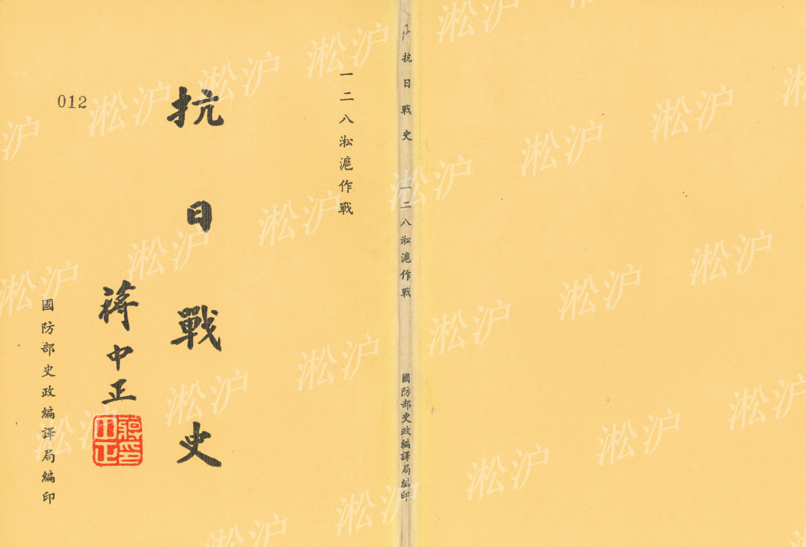

## 第二章 一二八淞滬作戰

概述

### 第一節 作戰起因

### 第二節 作戰前之狀況

#### 第一款 敵軍

#### 第二款 我軍

#### 第三款 兵誌概要

### 第三節 我軍作戰指導

### 第四節 作戰一般經過

#### 第一款 作戰經過

#### 第二款 我軍撤退

#### 第三款 空軍作戰

### 第五節 停戰交涉經過

#### 第一款 停戰協定

#### 第二款 被佔領區之接管

### 第六節 重要戰鬥

#### 第一款 蘊藻濱兩岸戰鬥

#### 第二款 江灣廟行附近戰鬥

目

錄

一

八字橋附近戰鬥　六三

第四款 吳淞要塞附近戰鬥　六六

第七節 檢討　六七

第一款 敵軍　六七

第二款 我軍　六九

附錄第一至第十二　七二

至自民國二十一年一月二十八日

四月十八日

概述

日本軍閥，蓄意侵華已久，無時不伺機蠢動，迨民國二十年「九一八」事變，侵佔我東北三省後，誤以爲可順利征服中國，實現其大陸政策，乃貪婪無饜，着着向我進逼。

是時也，我國家統一未幾，正值實施訓政，從事建設之始，國防至爲脆弱，益以共匪猖獗，禍生肘腋，而少數野心份子，復起風波，破壞統一，正所謂內憂外患交相煎逼，民間疾苦，國勢陷危。我蔣主席盱衡情勢，高瞻遠矚，早在寶山事件發生時（民國二十年七月），卽曾籌思禦外必先安內之策，嘗親撰文告白：「消滅赤匪，保全民族之元氣；削平叛亂，完成國家之統一。蓋攘外必先安內，革命即爲救國。亦惟保全民族之元氣，而後方能禦侮；完成國家之統一，而後乃能攘外……」，故對日本軍閥窮兇極惡之侵略，採取容忍政策，非至最後關頭，決不願局勢破裂而出之於戰爭，亦卽本諸和平未至絕望時期，決不放棄和平之原則，一面交涉，一面抵抗，期能假以時日，消除心腹之患，鞏固團結，並宏大建設之效果，厚植國力，奠定禦侮圖強之基礎。

我舉國軍民，則因「九一八」變起非常，憤慨填膺，嗣隨日本軍閥之着着進逼而益劇。東北各地義勇軍，紛紛奮起抵抗，予日軍不斷之困擾與威脅。全國各處，亦皆掀起對日經濟絕交，抵制日貨運動之浪潮，給予日本商業經濟以莫大之打擊。共匪遂乘此機會，推波助瀾，利用國民仇日心理，發動政治攻勢，假借抗日口號，對內製造政治分裂，對外促成中日戰爭，以利其加速發展。日本軍閥則昧於事實，無視大勢，仍沉溺於大陸政策之迷夢，不但不思以調整中日關係，反而變本加厲，迷信武力萬能，企圖「二八」淞滬作戰

一

以暴力擴大恐怖，藉以打擊我民心士氣，迫使我政府屈服，於是百般尋釁，因而有所謂上海日僧被毆事件之發生。

民國二十一年一月十八日，日本藉口僧侶被毆，嗾使日本浪人及海軍陸戰隊毆人縱火外，並殺死華警，經上海市政府向日領事提出抗議，日領事竟以書面提出反抗議，列舉四項無理之要求。繼之日本駐滬海軍司令部，於其報紙發表橫蠻之言論，以武力相威脅。自二十三日起，日閱卽從其本土各軍港及旅順各地，調遣軍艦，向上海大量增兵，其蓄意擴大事件，已至明顯。

元月二十八日十三時四十五分，我上海市政府答覆日本領事，對其四項要求完全接受。日海軍司令見計不逞，乃突於深夜二十三時，致書我守軍第十九路軍及上海市政府，迫令我軍退出閘北區域，未待我答覆，日軍卽依其預定計劃，發動攻擊，淞滬之戰於焉揭幕。

一月二十八日二十三時三十分，敵酋鹽澤下達攻擊命令，以天通庵車站爲根據地，分三路向閘北兇猛進攻，企圖一鼓而下我之閘北。我當地守軍，以日軍公然來犯，乃奮起應戰，分頭迎擊，迭予敵以重創。時我領袖蔣公，循中央之要求，以在野之身，毅然由杭入京，主持大局，當卽決定政府遷都洛陽，本人則親自坐鎮南京，一面指揮當地守軍堅強抵抗，一面抽調剿匪部隊，在蘇浙皖佈防。嗣後敵雖夾其絕對優勢之海空軍，及不斷增援猛撲，終不得逞，且遭慘重之傷亡。敵軍在閘北慘敗之消息傳至東京，日海軍省立即遣隊大量增援，並將駐上海以南中國沿海之日海軍，統編爲第三艦隊，派野村吉三郎爲司令官，取代鹽澤指揮上海戰事。

野村暨大量援軍抵滬後，卽變更其攻擊目標，將重點指向吳淞方面。於二月七日及八日，以海空軍大舉進攻吳淞及蘊藻濱，結果死傷累累，無功而退。迄十三、十四兩日，再興攻勢，又遭重大傷亡，仍不得逞。至是野村計劃又告全盤失敗矣。

當野村再敗消息傳抵東京，日內閣卽決定調派其認爲最精銳之第九師團全部，第十二師團一部，以及大批驅逐艦、巡洋艦、特務艦等，開滬增援，並以赫赫有名之戰將植田謙吉中將爲司令官，接替野村指揮滬戰。此時我亦以第五軍增援上海，與第十九路軍併肩作戰，該軍編爲左翼軍，於十六日正式接替第十九路軍左翼防務。

二月二十日，敵軍在植田指揮下開始總攻，其重點指向廟行、江灣間，經三晝夜之鏖戰，敵受重創，攻勢頓挫。二十三日起，敵再興攻勢，激戰至二十六日，雙方傷亡均重，我守軍雖在優勢敵軍不斷猛攻下，仍浴血奮戰，寸土必爭，使敵軍迄未獲逞。至是植田所指揮之戰鬥，亦陷失敗之覆轍，且其損失遠較前此數次爲重大，所謂精銳之師團，則因迭遭重創，幾已全部喪失其戰鬥力。

敵軍連遭慘敗，激起日本當局決定再向上海大量增兵，陸續抽調其第十一、第十四師團來滬，同時也四易其帥，改由陸軍大將白川義則擔任淞滬戰事之司令官，以陸軍大將菱刈隆任總指揮。敵軍於二月二十九日，夾其優勢兵力，發動總攻擊，各處均發生激戰，旋敵以新銳部隊兩萬餘人，在海空軍掩護支援下，由劉河方面登陸，威脅我軍側背。至此我以態勢不利，乃於三月一日，轉移陣地於黃渡、方泰鎮、嘉定、太倉一帶之第二道線，繼續與敵週旋。其後敵雖不斷向太倉攻擊，經我軍堅強抵抗，直迄四月十八日，敵計終未得逞，本作戰於是遂告一段落。

淞滬戰事爆發後，我政府卽提請國聯解決，經派團調查後，議定於三月四日停戰，嗣經數度波折與會談，終於五月五日簽訂停戰協定，翌日敵軍開始撤退，迄七月十七日，敵軍佔領區始全部交還我國。

### 第一節 作戰起因

「二八」淞滬作戰

三

民國二十年「九一八」事變，日本軍閥侵佔我東北三省後，雖用盡各種恐嚇誘騙之卑劣手段，仍未能促使我政府訂立城下之盟，而東北各地義勇軍，則紛起抵抗，困擾日軍，我全國軍民，亦因變起非常，憤慨激昂，各地皆掀起對日經濟絕交，抵制日貨運動，予日本商業經濟以莫大之打擊。於是日本軍閥爰焦思積慮，製造口實，企圖再以暴力恐怖，迫使我國就範，而貫徹其大陸政策。

上海市密邇京都，係我國經濟中心，且爲國際貿易之一大市場。日本軍閥，乃蓄意在上海尋釁，引起大恐怖，藉以破壞我經濟基礎，威脅長江流域富庶之區，打擊我民心士氣，震撼我首都重地，以遂其陰謀，因之特以日本間諜喬裝僧侶在滬肇事，造成所謂「日僧事件」。

據日方宣稱，一月十八日，有日本僧侶五人，在上海馬玉山路三友棉織工廠附近被毆，並臆斷係三友工人所爲。迄二十日二時四十分，日閥嗾使日本浪人約四五十人，攜帶木棒武器及烈性爆炸物，連續兩次焚燒三友棉織工廠，並在臨青路及河間路交界處，先後斃傷我華捕各二人。迨十三時許，日本浪人及日僑已嘯聚至千餘之衆，手持木棍，沿途尋釁，其中一隊至北四川路搗毀商店十餘家，並擊傷西捕二人。

自日本間諜喬裝僧侶被毆，及日本浪人暴動事件發生後，我上海市政府卽準備向日領事提出嚴重抗議，在抗議文件未送出前，上海市市長吳鐵城，特派市府祕書長俞鴻鈞氏爲代表，於二十日十五時，親往日總領事署先提出口頭抗議，要求保證此後不再發生此類事件，嚴緝肇事兇犯，並保留一切交涉權。當時日本總領事村井蒼松亦曾承認此項舉動極端不法，表示無任遺憾，並允嚴緝兇犯。

次（二十一日）日十時，日本總領事村井蒼松復親至上海市政府謁見吳鐵城市長，對日本浪人之暴行，表示道歉，並保證緝辦兇犯，同時對日本僧人在馬玉山路被毆事件，提出書面反抗議，要求四項二八淞滬作戰

(一)市長須對總領事表示道歉。

(二)兇犯之搜查逮捕與處罰，應迅速切實執行。

(三)對於被害者五名，須付給醫藥費與撫慰金。

四關於排日侮日之非法越軌行動，一概予以取締，並將上海抗日救國委員會，以及各種抗日團體，即時解散。

吳鐵城市長當卽口頭答覆：關於第二項，中國法律對於傷害罪之處分，有明文規定，自當依法究辦；一三兩項，待詳加考慮後，再行答覆；至於第四項，事關民衆運動，如在法律範圍以外者，本人無權取締，如有非法運動，自當依法制裁。是日，日本駐滬海軍司令官則以武力相威脅，曾以公報一件，交報館刊載：「上海市長對於日本提出要求，若非予以滿意答覆，並將要求各項立即實行，則海軍司令官決採相當手段，以保護日本帝國之權利」。

一月二十二日十五時，上海市政府派祕書長俞鴻鈞，爲日浪人暴行事向日本總領事署正式提出書面抗議，要求四項：

(一)日本領事向本市長表示歉意。

(二)迅速逮捕並嚴懲放火殺人之罪犯。

(三)充分賠償被害者，其賠償金額另定。

四保證嗣後不發生同樣事件。

翌日日本新聯電稱，襲擊三友工廠者，爲青年同志會會長光村芳藏及細谷猶一郎、岡恆太郎、木村勘藏、森正信、北過卓治、原定治等七名，已向領事署正式自首。但其領事總署對我方所提抗議，迄無明白答覆。

「二八」淞滬作戰

五

當日本浪人暴行之次日（二十一日），上海各大報紙均以大號字刊載其事，其中民國日報標題有「日浪人藉陸戰隊掩護」字句，日海軍陸戰隊素對民國日報憎恨，於是藉詞尋釁，聲稱記載不實，破壞該隊名譽，翌日十七時，更派該隊中尉土山廣端持函至民國日報社，提出四項要求：

(一)主筆來隊提出公文道歉。

(二)揭載半張地位之謝罪文。

(三)保證嗣後不再發生此種事情。

四罷免直接責任記者職位。

上項要求，並限於二十三日五時前答覆，否則卽自由行動。我上海民國日報除更正該項消息外，餘均置之不理。

一月二十三、二十四兩日，日海軍艦隻及陸戰隊，陸續增加抵達上海，情勢頓趨嚴重。二十五日，我駐國際聯盟會代表顏惠慶，於國際行政會發表宣言，請調查上海事件眞像。二十六日，上海氣氛益形緊張。二十七日，日本海軍省竟抹殺事實，厚顏發表荒謬聲明書，謂「中國各地之排日運動，根底於多年釀成之排外思想，非一朝一夕之故，滿洲事件以來，更加激烈，爲世人所週知，而日本海軍，穩健自重，努力保護日僑，及維護權益。至於上海事件，國民政府對於日本合理妥當之要求，毫無誠意，不肯承認，據最近情報，並以正式軍隊準備與日本爲敵。日本海軍深望中國停止此種行爲，如國民政府不加反省，立即制止不法行爲，日本爲自衛計，必採取適當措施，以保護日僑及維護旣得權益，以期萬無遺憾」。日本領事村井亦曾以最後通牒方式，通知吳鐵城市長，限二十七日十八時前，對其要求給予滿意之答覆，否則日本人卽將採取必要手段，以斷然態度實現此要求。

吳鐵城市長爲保全上海繁榮市場及數百萬生靈，遂遵照當局決策，忍辱負重，作最大讓步，當卽召集滬市各界領袖，說明其應付時局之苦衷，繼之下令取銷抗日救國會，上海民國日報停刊，並由社會局及公安局會同星夜執行查封。迄二十八日十三時四十五分，答覆日本領事，表示對四項要求完全接受，當時日領事亦表示滿意。滬人聞悉，咸慶可倖免災難矣。

然日本蓄意侵華已久，其所提四項要求，原以爲在我民情沸騰之現況下，上海市政府勢必拒絕，彼可用爲開釁藉口，而我滬市政府竟完全接受，實非日方始料所及。日駐滬海軍司令鹽澤見詭計未逞，乃暴露其眞面孔，作進一步之壓迫，宣稱閘北方面日僑甚多，日軍爲切實保護，請中國防軍立即撤退，防務由日軍負責。是夜二十三時，更致書我守軍第十九路軍及上海市政府，重申其要求。未待我方答覆，日軍卽已依其預定計劃採取行動，企圖實現其佔領閘北之野心，戰事遂告爆發。

### 第二節 作戰前之狀況

參照插圖第二

#### 第一款 敵軍參照插表第一

民國二十一年一月二十七日，敵軍在淞滬地區集結兵力約萬餘人，計海軍陸戰隊六千餘人，在鄉軍人三千餘名，裝甲車十餘輛，大小口徑火砲數十門，以虹口靶子場敵海軍陸戰隊司令部爲核心，對其勢力所及區域內，凡公私住宅、機關、學校、商店及碼頭等地，均構築有各式掩體工事，及儲存械彈、軍品之倉庫，各項戰備措施，皆積極進行，迄戰事發生時，一切俱已完成。

敵空軍計有轟炸、驅逐、偵察等各型飛機約五十餘架，其主力集中於引翔港機場，一部則停於一能登呂」號航空母艦上，且不時派遣飛機飛入上海上空實施偵察。

敵海軍淞滬方面原有軍艦二十餘艘，迨日僧事件發生後，卽陸續增加，計一月二十三日，分由其本土之海軍港佐世保開來二等驅逐艦（薄、荻、藤、葛）四艘，由巡洋艦「大井」號統率，停泊於楊樹浦江面。二十四日由旅順駛來之航空母艦「能登呂」號，停泊於吳淞口外，其餘各艦分泊於楊樹浦至吳淞鎮間之黃浦江面，將沿江地區置於其艦砲火力直接箝制之下。二十八日，復由佐世保開出驅逐艦（皋月、文月、水無月、長月、菊月、三日月、夕月、望月、陸月、如月、彌先月、卯月）十二艘，並隨帶海軍陸戰隊數百名，由巡洋艦「夕張」號統率，直駛向上海集中。

#### 第二款 我軍參照插表第二

我淞滬地區駐軍，原僅有第十九軍第七十八師之第一五五、第一五六兩旅，及吳淞要塞守備隊。當一月二十日，日浪人蓄意肇事，連續暴行後，第一五五旅卽在上海南市，龍華鎮、北新涇及眞茹一帶加強警備；第一五六旅於閘北、吳淞間設防，其第六團及上海市警察大隊之第六、第七兩隊，在閘北區加強部署，嚴密戒備。

是時，第十九軍之另兩個師——第六十及第六十一師，仍分駐於南京，鎮江、常州、丹陽、蘇州、無錫等地，迨一月下旬，滬事日趨嚴重，始奉命向上海推進。

#### 第三款 兵誌概要參照插圖第一

淞滬地區，位於長江下游，據黃浦、吳淞兩江之會合口，爲我國最大商港，金融經濟之中心，亦係國際重要貿易都市之一。該地區河汊縱橫交錯，密如蛛網，漲潮時均不能徒涉，形成障礙地帶，對攻者言，頗爲不利。滬郊地形平坦開闊，掩蔽遮蔽不良，益以地質鬆軟，對攻防兩方均稱不利，尤以攻者爲甚。惟敵艦可駛入長江及黃浦江，對具有強大海軍武力之敵人而言，到處均可遂行兩棲作戰，防守自非易事。市區多係堅固高大之建築物，輕武器無法予以摧毀；必賴高度之火力，及特種作戰技能，始克有濟。總之，淞滬地區乃屬特種地形，無論攻防，非具備特種裝備與訓練不爲功。

本地區有京滬與滬杭甬兩鐵路爲主要交通線。京滬鐵路，東端在上海附近有吳淞、虬江碼頭、龍華等支線，直達黃浦江邊，水陸聯運，堪稱便利；西端在南京下關，藉輪渡與津浦鐵路相啣接，北通徐州、天津，在玄武湖附近，與江南鐵路相交會，可直達安徽南部。滬杭甬鐵路，在杭州與浙贛鐵路相連，西向可達贛省南昌，在軍事上，尤具戰略價值。公路則以京滬及滬杭國道爲主要幹線，路幅寬七至九公尺，碎石路面鋪設良好，橋樑涵洞載重量約十五噸，排水設備良好，不受雨季影響。

水運碼頭設備完善，通常吃水約二十四呎之巨型艦船，均可進出無阻。對外由海洋可北達天津，南通廣州及南洋各島，東往日本等地。內陸航運，溯長江可達四川，黃浦江、蘇州河等，均可通航四十噸以下之小汽船，各濱水地點，帆船咸可通行，其水運之便利，爲全國之冠。

本地區冬季常見霜雪，十一月至二月多西北風，三月至十月則多東風。

「二二八」淞滬作戰

九

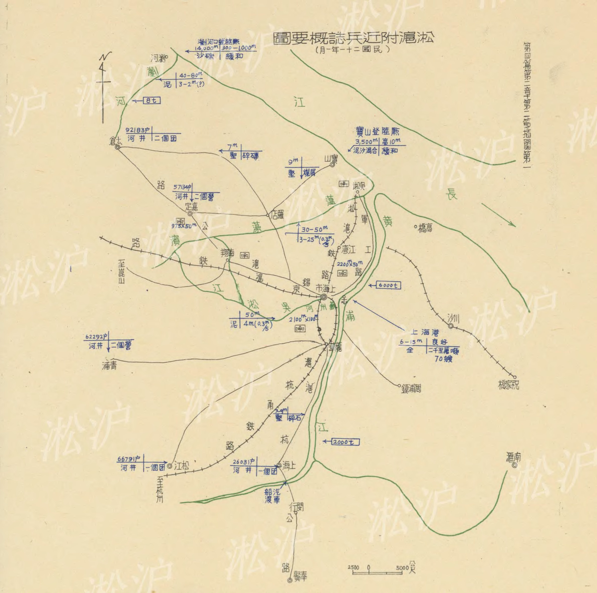

### 第三節 我軍作戰指導

參照插圖第三

我第十九路軍二月十六日之作戰計劃如左

第一方針

本路軍爲確保國土之完整，以一部分據南市、閘北及吳淞各據點而死守之，主力則展開於上海西北方京滬鐵路南北地區，保持重點於鐵路以北，待機出擊，將敵壓迫於黃浦江畔而殲滅之。

第二

指導要領

一、右翼軍應佔領南市、龍華、北新涇、眞茹、閘北亘江灣之線，保持主力於眞茹、大場鎮之間，迎擊當面之敵；如敵主力向我廟行附近左翼軍進攻，該軍卽以有力部隊由江灣北進，切斷敵之退路及其增援部隊，並協同左翼軍將突入之敵包圍而殲滅之。

二、左翼軍應佔領江灣北端亘廟行鎮東端之蔡家宅、胡家莊、曹家橋之線，主力控制於大場鎮、楊行鎮、劉家行地區，迎擊當面之敵；如敵主力向江灣及其以南地區我右翼軍進攻，該軍卽以有力部隊推進至淞滬鐵路以東地區，攻擊敵之側背，阻止敵軍增援並相機協同右翼軍，將敵包圍而殲滅之。

三、航空隊須竭力阻止敵機活動，掩護本軍作戰，在可能範圍內，轟炸引翔港鎮附近之敵飛機場及其砲兵陣地。

第三

部隊區分

一、右翼軍：

指揮官

第十九軍軍長蔡廷楷。

第八十八師獨立旅。

「二八」淞滬作戰

二

第七十八師。

第六十師。

第六十一師。

二、左翼軍：

指揮官

第五軍軍長張治中。

第八十七師。

第八十八師。

中央軍校教導總隊之一部。

吳淞要塞。

第四

作戰地境

作戰地境，右翼軍與左翼軍爲大場鎮、江灣鎮、沈家港鎮之線，線上屬右翼軍。

第五

各軍任務

同（十六）日十二時，第十九路軍總指揮部於南翔所發之命令有如下述：

一、據確報，敵第九師團及第十二師團之一混成旅團，由敵第九師團長植田謙吉指揮，於十四日全部到滬，總數約三萬人，連合敵海軍陸戰隊之殘部，企圖進佔我吳淞及上海南北市。

二、本軍以保護國土自衛之目的，擬佔領南市、龍華、北新涇、眞茹、閘北、江灣、吳淞、寶山、月浦鎮之線，保持主力於鐵道以北之地區，迎擊由閘北、江灣、吳淞方面來犯之敵，待機出擊，壓迫於黃浦江畔而殲滅之。

三、右翼軍應佔由南市、龍華、北新涇、眞茹亘閘北、江灣之線，保持主力於眞茹、大場鎮之間，迎擊當面之敵，待機出擊，壓迫於引翔港方面而殲滅之。須以一部有力部隊死守南市、龍華，作全軍右翼之據點。其詳細之兵力部署，應如下所示方針規定之。

(一)第八十八師獨立旅，擔任警戒南市、龍華、虹橋亘北新涇河以南之線（河屬之），須以有力部隊死守南市、龍華，爲右翼之據點。

(二)第七十八師（缺翁旅之四、五兩團），擔任警戒北新涇河以北亘曹家渡，沿中山路、眞茹鎮，迄眞茹鎮車站北端之線，主力控置於眞茹鎮西方附近，相機迎擊當面之敵及策應第六十師。

(三)第六十師，佔領北站、閘北亘八字橋、江灣南端之線，主力控置於中央，迎擊江灣當面之敵，乘機向虹鎮、引翔港方面出擊。

四第六十一師爲右翼軍預備隊，集結於大場鎮西南一帶，應以一部死守江灣鎮。

五作戰地境，暫不規定，惟各師之左右翼應與鄰接師切取連絡爲要。

四、左翼軍應佔領江灣北端，亘廟行鎮東端蔡家宅、胡家莊、曹家橋之線，主力控置於大場鎮北楊行鎮南及劉家行之間，迎擊由江灣北方地區來犯之敵，乘機出擊，向殷行鎮附近，壓迫敵人於黃浦江畔而殲滅之，以一部在羅店、劉河、小川沙方面擔任江面之警戒，相機策應吳淞。

五、要塞地區，須以有力部隊乘機進佔張華濱車站，萬不得已則死守吳淞、寶山之要塞，以爲全軍左翼之據點，歸張軍長指揮。

六、作戰地境：

左右翼軍——以沈家行鎮——江灣鎮——大場鎮之線爲作戰地境（線上屬右翼軍）。

七、航空隊須努力妨害敵機之活動，而掩護本路軍之作戰，如能做到，則努力爆擊引翔港附近之敵飛行場及其砲兵陣地。

「二八」淞滬作戰

二三

八、上述各部，須於十八日午前三時以前完成一切之戰鬥準備。九、通信及連絡：

(一)交接防務時，須將已完成之線移交，電話機則自行裝卸。(二)以電話爲主，各師應遵照前令及作戰計劃辦理。

十、補給：

(一)糧秣仍遵照前令，每師自行準備半個月量。

(二)彈藥總庫在南翔。

十一、衛生事項：

(一)各師應在前線開設野戰病院。

(二)南翔由軍政部設傷兵收容所。

(三)總病院分設蘇州、常州、南京、杭州。

十二、余在南翔（後略）。

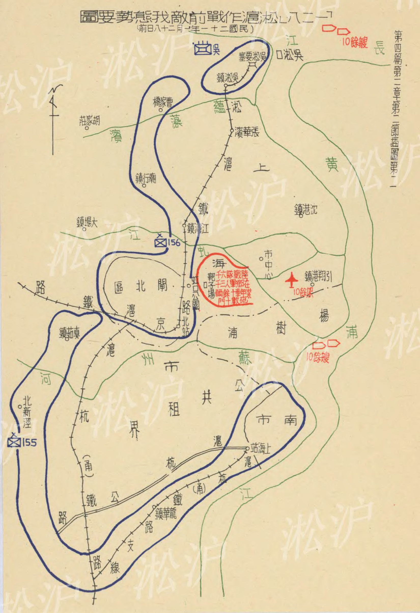

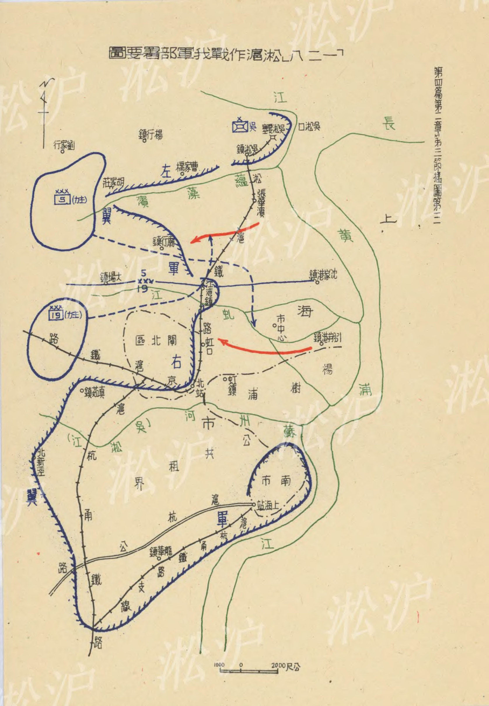

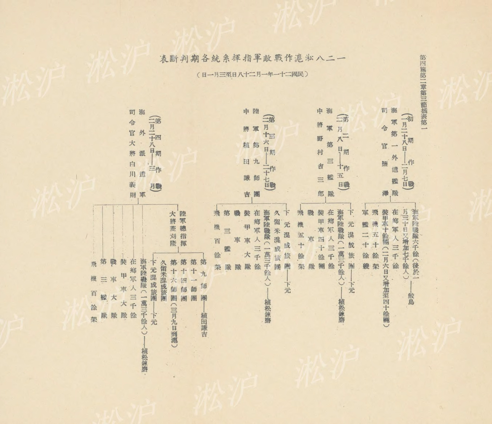

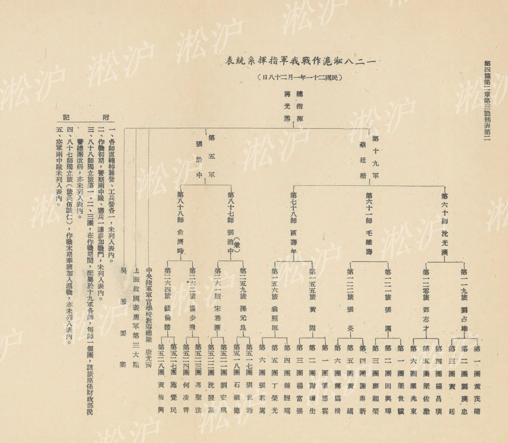

### 第四節 作戰一般經過

民國二十一年一日二十八日至三月一日

參照插圖第五

#### 第一款 作戰經過

民國二十一年一月二十八日七時三十分，敵駐滬之海軍第一外遣艦隊司令官鹽澤照會各國駐滬軍事領袖，謂中國無滿意答覆，日軍於次晨將有所行動。各國駐滬武官卽共同組織防守委員會，劃定各國擔任警備之區域，其中規定日本海軍擔任蘇州河以北，北江西路以東，東至楊樹浦，沿淞滬鐵路一帶地區。敵軍卽以虹口、楊樹浦爲作戰根據地，積極從事作戰部署。迄二十三時三十分，敵酋鹽澤遂按其預定計劃，下令開始軍事行動，驅使敵軍數千人，由天通庵分三路進攻閘北：一路自天通庵車站，進入天通庵路，迂迴京滬鐵路上海北站；一路由吟桂路口日本小學校出發，沿該路西進，旋轉入橫濱路，與前一路相策應；一路則由虬江路直撲上海北站。各路敵軍咸以鐵甲車爲前導，並由乘機器脚踏車之手提機關槍隊在兩側掩護前進，企圖一舉攻佔我閘北。

此際我閘北守軍爲第十九軍第七十八師第一五六旅之第六團，另附上海市公安局警察大隊所屬第六、第七兩中隊，第五區總署與五區區所全部警員。當敵軍進犯天通庵時，我方僅有擔任警戒之警察六人予以迎擊，爾後雖由公安局警察第二中隊馳援，增至六十餘人，但在衆寡懸殊之情形下，被迫逐次轉移。敵軍未遇強烈抵抗，輕易進佔天通庵車站，洋洋得意，認爲閘北穩入掌握，於是放膽前進。迨敵深入天通庵路、虬江路我陣地時，我軍下令反擊，羣起將敵層層包圍，先以手榴彈擊燬其鐵甲車六輛，繼卽勇猛衝殺，斃傷敵人甚衆，並奪獲裝甲車三輛，其他戰利品尤夥。敵軍經此迎頭痛擊，驚慌失措，紛紛潰逃，我軍係爲自衛而應戰，純採守勢，復以事前無攻擊準備，故對敗退之敵，未予窮追。

此次聞北巷戰之勝利，關係全盤戰局至爲重大，不僅我軍士氣爲之大振，且可認識日軍眞面目，所謂皇軍，亦不過如此而已。

當聞北鏖戰之際，江灣方面敵軍曾迭次向我守軍衝擊，俱被擊退。吳淞方面之敵艦，亦集中於三夾水，對我要塞礮台轟擊，但旋卽逸去。

一月二十九日四時許，敵機在細雨迷濛中，盤旋於閘北上空，濫施慘烈之轟炸，各處民房紛紛起火，寶山路商務印書館、東方圖書館、及上海北站等處，亦相繼中彈燃燒，火燄衝天，光照數十里，我同胞之生命財產及文化寶藏，無端遭受浩劫，全民對敵軍之殘暴，益增憤慨。

當上海北站起火時，敵軍卽乘機進攻，我防守北站之憲兵一個連竭力抵抗，激戰達一小時，終以力竭被迫撤退，北站陷入敵手。十七時許，我第一五六旅第六團派隊增援逆襲，始告克復。

同日北四川路、寶山路間，亦繼續進行巷戰，我軍奮勇奪回天通庵車站，並佔領江灣路敵海陸戰隊司令部，天通庵、橫濱路、虬江路、寶山路各處敵兵紛紛潰退。十九時許，我軍繼續追擊，敵軍敗退北四川路以東，靶子路以南地區，聞北已無敵踪。

歷經一晝夜之激戰，共斃傷敵軍千餘，俘獲其裝甲車五輛。敵軍狂言四小時佔領閘北地區之迷夢，於是全被粉碎。

當日晚，英、美領事出面調停，敵我雙方接受停戰三日。但敵軍在停戰期間，仍不斷增援與挑釁。

翌日我國民政府宣言遷都洛陽參照附錄第十，蔣中正先生當時亦以在野之身，通電抗日：「限卽刻到，各總指揮，各軍官學校師生諸同志均鑒，東北事變肇始迄今，中央爲避免戰禍，保全國脈起見，故不惜忍辱負重，保持和平，期以公理與正義，促倭寇之覺悟，不意我愈忍讓，彼愈蠻橫，滬案發生，對渠要求，且已茹痛接受，而倭寇仍悍然相逼，一再向我上海防軍突擊，轟炸民房，擲彈衢市，同胞慘遭蹂躡，國亡卽在目前，凡有血氣，寧能再忍？我十九路軍將士既起而爲忠勇之自衛，我全軍革命將士，處此國亡種滅、患迫燃眉之時，皆應爲國家爭人格，爲民族求生存，爲革命盡責任，抱寧爲玉碎毋爲瓦全之決心，與此破壞和平蔑棄信義之暴日相周旋，中正與諸同志久共患難，今身雖在野，猶願與諸將士誓同生死，盡我天職，特本血誠先行電告，務各淬厲奮發，敵懾同仇，勿作虛浮之豪氣，保持犧牲之精神，枕戈待命，以救危亡，黨國幸甚。蔣中正印（一月三十日）。

一月三十日十六時許，敵增援之驅逐艦四艘及巡洋艦「龍田」號，先後到達黃浦碼頭，並載來陸戰隊三千餘人及大批軍火，登陸後，迅卽分運前線補充。翌日晨，敵繼有航空母艦「加賀」「鳳翔」兩艘，巡洋艦「那珂」「由良」「阿武隈」等三艘，及水雷艦四艘抵滬，並載來陸戰隊四千人，分批登陸，投入前線。

前此，敵軍接受停戰，實因緒戰失利，受創頗重，不得不虛與委蛇，以爭取時間，積極增援補充。

我軍則嚴陣以待，免爲敵所乘。

二月一日，在南京下關之敵艦，發礮示威，我中央政府通電自衛。二日，我京滬衛戍司令陳銘樞，赴滬視察防務。國聯行政會討論中日爭端。此際我第十九軍主力已先後到滬，遂加強部署：以第六十師接替上海北站、八字橋、江灣迄廟行線之防務；第六十一師初向廟行、馮家宅間急進，隨卽接替第七十八師第一五六旅防務；第七十八師第一五五旅則在原地仍任上海西南地區之守備。

二月三日，敵大批陸海空援軍抵達上海後，卽置休戰事於不顧，（休戰期限至三日十八時止）又開始向我軍攻擊。八時許，敵軍萬餘人，分向我閘北、八字橋、江灣之守軍第六十師行總攻擊，並以裝甲車爲前導，飛機任掩護，猛力衝擊，入夜後，攻勢益猛。我軍堅守陣地，沉着應戰，使暴敵難越雷池一步，惟天通庵南首北站附近，以及青雲路、江灣附近一帶民房，被毀於敵機及礮火下者，不計其數。當聞北一帶展開激戰後，敵集結軍艦二十餘艘，藉其優勢空軍之支援，於十一時起，向我吳淞礮台進攻，我守軍奮勇還擊，相持至十五時許，敵機敵艦不逞，乃相率退去。

二月四日，敵繼續施行總攻擊，聞北方面，自晨七時起，敵以猛烈礮火掩護其陸戰隊三千餘人，分由橫濱路、寶興路及北河南路，向我第六十師第一一九旅攻擊，北河南路戰況尤爲激烈，敵數度衝鋒，均被擊退，且死傷枕藉。另部敵軍數千人，分向我八字橋、江灣之第一二零旅陣地攻擊，自晨至暮激戰不已，我守兵無不視死如歸，沉着應戰，曾與敵三度肉搏，斃傷敵人五百餘名，毀敵裝甲車兩輛，戰至十八時，敵終不支撤守其原防線，我第一二零旅，因傷亡甚重，故未行追擊。吳淞方面，於同日十一時許，敵調遣軍艦十餘艘，進攻我吳淞礮台，並以陸戰隊數百人強行登陸，企圖一舉攻佔我礮台，經我守軍奮勇抵抗，第一五六旅第四團復適時增援，敵卒不得逞。

二月五日，敵機不時入侵吳淞上空，零星礮戰仍在賡續進行。聞北方面，敵於凌晨一時許，以重礮轟擊我聞北市區，拂曉後，更藉飛機之掩護，以全力向天通庵攻擊，我當地守軍第一一九旅，堅強抵抗，激戰竟日，殲敵五百餘人，俘獲裝甲車兩輛，機關槍四挺。當時曾有敵軍一部竄至邢家橋附近，被我義勇軍包圍，全數予以殲滅。

同（五）日九時，我飛機第六、第七兩中隊，由南京飛滬參戰，在眞茹附近空戰中，擊中敵機兩架，墮燬於南翔附近，我軍士氣爲之大振。

二月六日晨，敵又以四千餘人，礮數十門，裝甲車四十餘輛，分向聞北、八字橋及江灣我第六十師陣地進犯，經該師果敢迎擊，鏖戰數小時，敵死傷枕藉，不支潰退，我亦傷亡官兵百餘人。

敵軍在上海挑釁一週來，連戰皆北，消息傳至東京後，日內閣爰決議將上海以南中國沿海所有之敵海軍，組成第三艦隊，集中使用，改調野村吉三郎中將爲司令官，取代鹽澤指揮上海軍事，在滬之陸戰隊指揮官，亦改由植松鍊磨少將充任，兩者均先後於六、七兩日抵達上海。另以下元混成旅團及陸戰隊一部五千餘人，分批增援到達滬上。

敵酋野村吉三郎中將抵滬後，當卽改變作戰方針，置重點於吳淞與江灣方面，先以海陸空軍會攻吳淞礮台，並限二十四小時內攻下。

二月七日九時許，敵以飛機十餘架，軍艦六、七艘，裝甲車十四輛，陸軍二千餘人，協力會攻吳淞，嗣復三度增援猛撲，但均被我守軍擊退。另部敵軍約四千餘人，以江灣爲其主攻目標，並以一部對聞北、八字橋方面施行助攻，初以猛烈礮火對我第一二零旅陣地轟擊，繼之以裝甲車爲前導，掩護其步兵衝鋒，來勢頗爲兇猛，我守兵沉着應戰，待敵進至最近距離，始奮起展開肉搏，激戰數小時，敵傷亡枕藉，終未獲逞。

二月八日拂曉，敵以增援到達之新銳六千餘人，會同殘敵，繼續向我吳淞攻擊，先後衝鋒達十餘次，均被我軍擊退。十七時許，有敵七、八百人迂迴至紀家橋，企圖偷渡，以切斷我吳淞連絡線，經我第一二一旅予以迎頭痛擊，殲敵過半，敵雖數度增援反撲，終未得逞。同日八時許，江灣方面之敵千餘人，向我楊家橋猛攻，企圖一舉攫取我江灣與大場，切斷吳淞、閘北兩地之連絡，仍重施其故技，先以礮兵及飛機轟擊，繼之以裝甲車爲前導，掩護步兵衝擊，我第一二零旅守備部隊，爲達成近戰殲敵之目的，卽佯作敗退，待敵衝入我旣設陣地，伏兵四起，奮勇肉搏，殲敵三百餘人，殘卒突圍逃竄。閘北方面守軍，亦以誘敵戰法，斃傷敵人七百餘名。是日國聯上海國際調查團提出報告書，詳述滬案之經過。

參照附錄第二

敵軍連日遭受重創，急待增援整補，因此二月九日至十一日間，僅有零星礮擊與飛機活動，無激烈之戰鬥發生。此時，我上海各團體獲悉敵軍利用租界作戰，特致電工部局，請嚴加制止，以杜後患。

參照附錄第三

二月十二日，西方傳教士發起閘北區自八時至十二時停戰四小時，以救護難民出險，經英國領事館商請雙方軍事當局同意，於閘北寶山路、寶興路、虬江路停止攻擊四小時。敵軍乘此機會以士兵化裝難民，暗藏武器，向北四川路增援，賴我守軍有備，敵計終未得逞。休戰期滿，敵機又活躍於閘北上空，並濫施轟炸，民房被毀甚多，十六時許，復以礮火繼續轟擊，入夜後，尤爲猛烈，迄二十一時許，敵以數千之衆，分爲三路，由青雲路、天通庵、八字橋向我第六十師攻擊，激戰時許，敵又遭敗績，全線撤退。

是日當閘北地區休戰之際，敵以千餘人向我蘊藻濱北岸曹家橋我第六十一師第一二一旅猛攻，但被擊退。翌日敵繼續攻擊，三度猛撲，終於十時許，在紀家橋以東地區偷渡成功，旋曹家橋亦陷入敵手。此時我軍增援反攻，第一五六旅、第一二二旅及第二六一旅，分由吳淞、楊行、劉行，向曹家橋急進，旋將敵層層包圍，激戰至十六時，敵傷亡過半，迄二十一時許，全部就殲。

當敵軍於七、八兩日，在蘊藻濱北岸受重創後，敵內閣卽決定調派其第九師團及第十二師團之一個混成旅團（久留米混成旅團）開上海增援，並任赫赫有名之植田謙吉中將爲司令官，於十四日先後在滬登陸。此時英美法意四國公使抵滬從事和平運動，敵酋植田一面虛事敷衍，一面積極調整部署如左：

一、閘北至八字橋方面，爲敵海軍陸戰隊約八個大隊（每個大隊千餘人）。

二、八字橋經江灣至廟行方面，爲敵第九師團全部。

三、蘊藻濱南岸至張華濱車站，爲敵之久留米混成旅團全部。

當敵軍陸續增援之際，我政府卽令駐防蘇浙拱衛京畿之第八十八、第八十七師及陸軍軍官學校教導總隊編成第五軍，向上海推進。爲促進各部隊精誠團結，並鼓舞士氣，從而高度發揮統合戰力，克敵致勝，蔣中正先生本諸昔日統帥之情誼，以個人名義，分電各將領勗勉。二月十三日，給予第八十八師俞濟時師長電云：「查日陸軍一師一混成旅增加來滬，約於明日可以到齊，此後我方軍事益加嚴重矣。惟作戰致勝之道，端在指揮統一，奉命確實，及與友軍協同連繫十分密切而已。望卽謹遵此旨，對蔣總指揮命令絕對服從，並嚴守規定時間，確行授予任務，而對於友軍，尤須抱共患難，同生死之精神，團結一致，協同動作，則最後之勝利，自不難操券而得也，希卽遵照，並曉諭所屬一體奉行」。其後給第五軍軍長並分電各師長曰：「今日兄等決定在淞滬原陣地抵抗到底，奮鬥精神至堪嘉慰，望兄等努力團結，爲我黨國爭光。滬上地形複雜，敵或將捨正面之攻擊，而向我側背着眼，但我陣地附近，河流縱橫，到處便於扼守，日軍若取攻勢，則其犧牲必較我爲大，希與十九路軍蔣蔡兩同志，共同一致，萬不可稍生隔膜，吾人若不於此處表現民族革命精神，決意犧牲，更待何時。可將此意轉告全體將士，努力保持我國民革命軍光榮之歷史」。又電云：「抗日爲民族存亡之所關，決非個人或某一部隊之榮辱問題，我前方將士，應徹底明瞭此義，故十九路軍之榮譽，卽爲我國民革命軍全體之榮譽，決無彼此榮辱之分。此次第五軍加入戰線，固爲敵人之所畏忌，且必爲反動派之所誣衊，苟能始終以十九路軍名義抗戰，更足以表現我國民革命軍戰鬥力之強大。生死且與共之，況於榮辱乎？望以此意，切實曉諭第五軍各將士，務與我十九路軍團結奮鬥，任何犧牲均所不惜，以完成革命軍之使命爲要」。蔣先生如此光明磊落之襟懷，大義懷然之訓誨，第五軍將士莫不感奮無已。

二月十六日，我第五軍到達上海，奉命接替第十九軍防務，編爲左翼軍，擔任江灣北端經廟行鎮、蔡家宅、胡家莊、曹家橋，至吳淞西端之線防守，並以一部在獅子林礮台、南北閘洞亘川沙口、瀏河口、楊林口、七丫口，擔任沿江警戒。當以第八十八師擔任由江灣北端經廟行鎮、周行至蘊藻濱南岸之線，第八十七師第二六一旅擔任胡家莊沿蘊藻濱北岸，經曹家橋至吳淞西端之線，（該第二六一旅已先於二月十四日接防）教導總隊（欠一營）擔任獅子林、南北閘洞至七丫口間，沿江一帶警戒，第八十七師第二五九旅爲左翼軍預備隊，集結於劉家行地區，軍部設在劉家行（第八十八師之獨立旅配屬於右翼軍，其旅部及教導團駐吳興，無戰鬥任務，僅第一、二、三團參與滬戰，初由第二團團長古鼎華統一指揮，爾後分割使用，以團爲單位，分別配屬於第十九軍各師）。

二月十八日，我第五軍各部先後接防完畢，當日英、美、法、意四國公使從中斡旋之和議，亦告破裂，敵酋植田謙吉旋於二十時對我第十九路軍提出哀的美敦書，參照附錄第四限我軍於二十日十七時前，由租界起，各撤退二十公里。似此荒謬絕倫之要求，我方自難接受，乃於次日嚴詞拒絕。參照附錄第五第六

二月二十日晨，敵發動全線總攻擊，其重點指向於江灣，九時許敵久留米混成旅團四千餘人及第九師團之一部，在敵機十餘架掩護下，由戰車數十輛作前導，向我江灣車站守軍猛攻，激戰竟日，卒未獲逞。吳淞方面，敵艦礮不斷向我礮台轟擊，並以步兵千餘人三度猛撲。我守軍沉着應戰，殲敵二百餘名，我亦傷亡三十餘人。聞北方面之戰鬥，以八字橋附近最爲劇烈，朱家宅曾一度陷入敵手，經我第一一九旅第三團增援反擊，終於是日二十四時將朱家宅克復。

二月二十一日，敵繼續向我淞滬鐵路沿線之閘北、江灣及吳淞等地兇猛攻擊，其攻擊重點仍置於江灣，經我第六十一及第八十八兩師迎頭痛擊，敵終無法得逞。吳淞方面，敵曾數度偷渡蘊藻濱，均被我軍擊退。閘北方面，八字橋、天通庵、虬江路、新民路等處皆有激戰，敵均無法進展。江灣車站附近，敵我仍在相持中，迫入夜後，敵集中礮火對該車站實施猛烈礮擊，各項建築焚燬殆盡，旋敵乘機三面圍攻，來勢頗猛，我守軍第一一九旅第三團遂主動放棄該站，轉移於八字橋附近。同時我江灣第六十一師第二團陣地，亦遭敵第九師團主力及久留米混成旅團猛攻，激戰至晚，雖斃傷敵人千餘名，然該團亦傷之衆，見

濟上

木

國

正

工

周

名

金

田

我

人

一

人

自

作

之

之

之

端至蘊藻濱南岸間廣正面之防務，兵力至爲單薄，而用以支援兩個旅作戰之師預備隊，亦僅由師工兵營（兩個連）及特務營編成而已，故當激戰至九時許，該師右地區廟行鎮以南第二六四旅第五二七團第三營之麥家宅陣地，因受敵礮火及飛機之更番攻擊，工事被毀無遺，全營官兵死傷綦重，營長陳振新陣亡，致部份陣地遭敵突破。俞濟時師長當卽一面嚴令廟行鎮及趙店宅守兵死守，一面令第二六四旅錢倫體旅長及該旅第五二七團施覺民團長，乘敵立足未穩實施反擊，奪回陣地，同時令飭師預備隊參加戰鬥。未幾錢旅長及第二六二旅陳普民副旅長先後負傷，工兵營唐循營長亦壯烈殉職，其他官兵傷亡過半，情勢頓呈危殆。此時李延年副師長率軍預備隊第二五九旅之一部增援到達，與敵激戰於麥家宅以西地區，我第八十八師右地區陣地始復告穩定。

第十九路軍總指揮部，獲悉當前狀況後，當卽決定全線出擊，以粉碎敵之攻勢，其部署如左：

一、第六十師於閘北、江灣地區出擊，策應廟行附近之戰鬥。

二、第六十一師張炎副師長（兼第一二二旅旅長）率所屬第四、第五兩團，由江灣向廟行方面出擊，側擊敵之左側背。

三、第七十八師以一團接替第六十一師楊家樓防務，另以一團控置於夏馬灣附近，策應八字橋及江灣附近戰鬥。

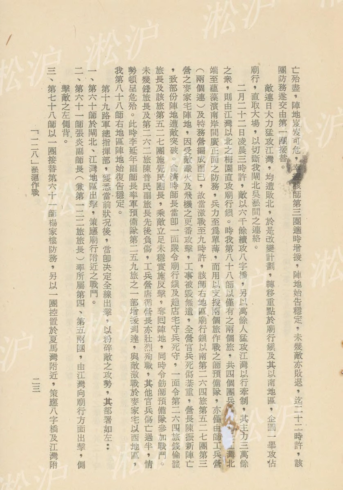

四、第八十七師第二五九旅（孫元良）加入廟行正面戰鬥，協同第八十八師出擊。

五、第八十七師第二六一旅，以有力之一部，由蘊藻濱向廟行方面出擊，威脅敵之右側背。

迨十五時許，各部隊卽遵照指定目標出擊。第六十師進展順利，擊破八字橋當面之敵後，於二十時推進至虹鎮、狄思威路附近。第六十一師主力向廟行方面推進，十九時到達孫店宅，二十三時攻佔孟家宅，並續向金母宅附近進攻。此際我第八十八師在左右友軍協力下，雖傷亡頗重，疲憊不堪，但仍奮起努力反攻，激戰至二十三時許，終將頑敵擊退，殲敵約三、四千人。惟麥家宅尚有殘敵一部企圖頑抗，我俞濟時師長當卽令飭第二五九旅孫元良旅長，率該旅第五一八團及第二六四旅第五二八團，對麥家宅之敵圍攻。

是日敵以數萬之衆向我第八十八師猛攻，經一晝夜之激戰，殲敵數千，迫使敵軍全線動搖，虹口一帶敵僑民極端惶恐，如我能有援軍適時增加，則不難將敵全部擊滅於黃浦江中，惜兵力不繼，坐失良機，殊爲痛惜。

二月二十三日一時許，敵以萬餘人，分由梅園及張華濱向金母宅方面進犯，並以戰車及麦甲車爲前導，着着進逼，企圖拯救金母宅被圍之敵，拂曉後，更以飛機六十餘架支援戰鬥，經我第六十一師之一部及第二五九旅迎頭痛擊，敵不支分向引翔港、張華濱敗退。此際我軍歷經兩晝夜之激戰，官兵俱已精疲力竭，金母宅之敵乃乘機突圍而去。

我第八十八師經連日激戰，傷亡慘重，故於是（二十三）日夜間，將所擔任自江灣（不含）廟行至胡家莊之防務，分別交由第六十一師及第八十七師之第二五九旅接替。

二月二十四日午前，僅有零星礮戰，迨十六時許，跑馬場之敵二千餘人，向我第八十八師獨立旅第二八

淞滬作戰

二團（此時歸第六十一師指揮）小場廟陣地攻擊，我古鼎華團長指揮所屬奮勇迎戰，相持至二十一時，敵不支敗退。翌日拂曉，敵獲新到部隊增援，乃復大舉向我第六十一師江灣廟行間陣地猛撲，並以野山重礮百餘門支援其戰鬥，激戰至十時許，第八十八師獨立旅第二團因傷亡甚大，小場廟陣地遂告不守，旋我第七十八師第一五五旅第二團馳援，第六十一師第一二一旅第二團則由嚴家宅出擊，予敵以重創，迄十八時許，我軍迫近小場廟附近，惟敵據砦頑抗，遂形成膠着狀態。

小場廟旣陷敵手，江灣遭受威脅，我軍遂於二十六日十時許放棄江灣，撤守楊家橋、竹園墩、廟行鎮、胡家莊之線。經連日激戰，又斃傷敵軍三千餘人，惟我第六十一師第一二二旅亦傷亡二千餘人，爰由第七十八師（欠第一五五旅）接替楊家橋、竹園墩之線，第一二一旅接替竹園墩、廟行間防務，第一二二旅開赴廟前宅附近整理。

敵自二月二十日向我全線總攻擊以來，歷六日激戰，傷亡萬餘人，已無力賡續攻擊，爰再抽調其第十一、第十四、第十六等師團來滬增援，改任其前陸相陸軍大將白川義則爲海外派遣軍司令，以陸軍大將菱刈隆爲陸軍總指揮，菱刈隆與第十一師團於二十七日抵滬，白川義則繼隨第十四師團到達上海。此際國聯調查團到達日本東京，各友邦人士活動頻繁，和議之呼聲又起，但仍無結果而終。

白川抵滬後，卽積極部署，除以主力仍向我淞滬鐵路正面行總攻擊外，另以其第十一師團主力採迂迴路線，由瀏河登陸，形成包圍態勢，以迫使我軍撤退。

二月二十九日拂曉，敵開始全線總攻擊，吳淞口外敵艦，與我吳淞礮台首先發生礮戰，旋敵一部企圖於紀家橋附近偷渡蘊藻濱，經我守兵迎頭痛擊而敗退。五時許，江灣方面，敵步兵千餘人，在裝甲車掩護下，向我第七十八師談家宅以東地區攻擊，我軍沉着應戰，將敵擊退。嗣於八時許，敵復增援來犯，激戰至十一時，敵終無法得逞。另股敵軍五、六千人，向我第一二一旅廟行鎮攻擊，相持至十五時許，敵不支敗退。是日聞北、八字橋方面之戰鬥亦至激烈，敵以戰車及礮火掩護兇猛進犯，衝鋒十餘次，八字橋曾三度易手，終被我軍堅忍奮鬥而奪回。

三月一日八時，敵續以陸海空軍全力發起總攻擊，並以密集礮火及飛機轟擊，尤以第七十八師竹園墩附近陣地最爲猛烈，敵步兵卽藉其優勢火力向我陣地衝擊，經我守軍奮勇迎戰，斃敵甚衆，但敵源源增加，前仆後繼，拚戰無已，激戰至十二時許，我楊家橋、竹園墩之線守軍傷亡過半，一部陣地遭敵突破，旋經該第七十八師預備隊勇猛逆襲，乃告恢復，此時敵仍繼續增援，該師則嚴陣以待。劉河方面敵第十一師團主力約萬餘人，於十四時許，在楊林口、七丫口一帶強行登陸，雖經我教導總隊一部極力阻擊，終以衆寡懸殊而無效，旋敵乘勢進攻劉河。斯時也，淞滬鐵路方面之敵軍亦陸續增加，死力突擊，我第七十八師及第六十一師陣地先後遭敵突破一部。至是，我第十九路軍總指揮蔣光鼐鑑於態勢不利，乃於十六時許下令全軍總撤退，轉進第二防線，以圖待機反攻。

#### 第二款 我軍撤退

敵軍自植田謙吉接替野村吉三郎爲司令官後，卽以全力進攻江灣鎮。我軍咸抱同仇敵愾之心，誓死抗拒，歷時十餘日，前後激戰十數次，敵均遭敗北，其中廟行鎮、小場廟、竹園墩、金母宅等處之鏖戰，更予敵以重創，使其喪膽。惟敵仗其海空軍之優勢，於慘敗之餘，濫施轟擊與燃燒，極端暴虐，形同瘋狂，自二月二十三日起，敵機四、五十架連續轟炸達三十六時之久，血戰三晝夜，我軍依然屹立不爲所動，惟環視江灣鎮民房多被破燬，滿目悽愴，軍民屍體遍地皆是，且爲時日久，腐爛四溢，臭氣熏人，溝渠咸赤，水不能飲，因此我軍遂決定於二月二十六日，自動撤離江灣鎮，待機反攻，敵軍則因屢遭我軍痛擊，心悸膽寒，至二十七日尙未敢接近，仍在搜索偵察中，迨二十八日十時許，敵軍始敢進入江「一二八」淞滬作戰

灣鎮。此時江灣鎮一片瓦礫，等於廢墟，軍事上之價值已告消失。

自敵陸軍大將白川義則於二月二十八日率領大批援軍到滬後，鑒於淞滬鐵路正面攻擊，迭遭重創，乃決定從側面襲擊，以期逼退我軍。三月一日晨，敵主力仍向我軍正面攻擊，敵機尤爲活躍，礮火之猛烈，爲前所未見。此際在瀏河附近江面，有敵艦二十餘艘，汽艇百餘隻，滿載敵兵，利用飛機八十餘架連番轟炸，並施放濃密之煙幕作掩護，於七丫口、六濱口之間登陸，迄七時許，敵已先後登陸萬餘人，我浮橋鎮、茜涇營兩要點相繼陷敵，楊林口、七丫口警戒部隊教導總隊第一營第一連遭敵包圍，經堅忍奮戰，斃敵頗多，本身亦傷亡殆盡。第五軍軍長，獲悉當前狀況，卽飭令蘊藻濱北岸之第八十七師第二六一旅，以汽車輸送赴瀏河增援，乘敵立足未穩，予以迎頭痛擊，將其殲滅於江畔，卒以汽車太少（僅十一輛），輸力不足，迄十六時許，僅有第五二一團到達瀏河，其先頭第二營，協同教導總隊第一營堅強拒敵，激戰至黃昏，仍相持於瀏河、茜涇營間地區。

第十九路軍總指揮部獲悉敵約一師團於瀏河附近登陸後，深感我軍已形成腹背受敵，復獲知敵增援至五師團之衆，如仍在該地繼續作戰，則徒事犧牲，於事無補，當卽決定撤守第二防線，參照插圖第四待機反攻，爰於三月一日二十一時，下達撤退命令如左：

作命第二號

陸軍第十九路軍命令

民國二十一年三月一日二十一時

於南翔總指揮部

一、敵援軍第十一、第十四兩師團已到達上海，由敵司令白川義則統率，企圖與我決戰，其有力之一部於瀏河附近登陸，威脅我軍側背。

二、本路軍避免與敵決戰，於本（一）日二十三時，將主力向黃渡、方泰鎮、嘉定、太倉之線撤退，待「二八」淞滬作戰

二七

機轉移攻勢。

三、右翼軍主力，於本（一）日二十三時，開始向黃渡、方泰鎮之線撤退，須以一部先行佔領眞茹、大場，逐次向江橋鎮、南翔、廣福之線轉進，作主陣地之警戒。兵力配備及各師之戰鬥地境如左：

(一)第八十八師獨立旅（第一、二、三團）及憲兵團，先向華曹鎮、錢家術之線撤退，左與江橋鎮附近之第十九軍連絡，爾後向黃渡以南地區轉進。

(二)第六十師主力，於本（一）日二十三時，由京滬鐵路南側，向黃渡方面撤退，第八十八師獨立旅古團及鄭團暫歸沈光漢師長指揮，到達目的地後，歸還建制。

(三)第七十八師主力，於本（一）日二十三時，由大場附近經南翔向陸家巷方向撤退。

四第六十一師主力，於本（一）日二十三時，由大場鎮北方，經楊家行向方泰鎮以北地區撤退。

(五)戰鬥地境：

1. 吳淞江以南屬第八十八師獨立旅。

2. 第六十師與第七十八師，以京滬鐵路相連之線爲戰鬥地境線，線上屬第六十師。

3. 第七十八師與第六十一師，以方泰鎮、陸家巷、南翔、大場之線爲戰鬥地境，線上屬第七十八師。

(六)各師撤退時，須於正面留一團爲掩護部隊，竭力向敵佯攻，掩護主力脫離戰場，迨主力佔領新陣地後，逐次撤退。

四、左翼軍須以有力一部，於胡家莊、楊家行間佔領掩護陣地，主力於本（一）日二十三時，向嘉定、太倉之線撤退，利用嘉定、太倉兩城爲據點，拒止敵人，另以一部向羅店及瀏河方面警戒。

五、作戰地境：

以蓬閩鎮、外岡鎮、馬陸鎮、廣福、唐橋、胡家莊之線爲兩軍作戰地境，線上屬左翼軍。

六、報告收集所位置黃渡鎮。

七、余現在南翔，明（二）日八時到達崑山。

各軍奉到撤退命令後，卽遵照所示，向指定地區撤退，迄三月二日凌晨四時許，各軍主力均已脫離戰場，分別到達新陣地，並於拂曉前部署就緒。此次我軍撤退爲戰略轉移，故秩序井然，毫無混亂現象，直至撤退完畢，敵軍始行發覺。當我主力撤退之際，瀏河方面之敵軍已增援至二萬餘人，繼續向我陣地攻擊，我第二六一旅之一部及教導總隊第一營，仍奮力抗拒，終以衆寡懸殊，敵火猛烈，爰於拂曉前向太倉方面撤退。

三月二日，我軍撤退完畢後，團長以上各級指揮官，聯名通電繼續作戰到底之決心，深獲全國同胞之同情與支持，中國國民黨二中全會中央執行委員會全體委員當卽致電慰勉。參照附錄第七三月三日，我軍第二線防禦部署及協調均已完成，乃將婁塘、朱家橋附近之警戒部隊撤回，以安亭、太倉等處爲第一線，於福山口至青陽港間，築有堅固工事，俾進可以攻，退可以守。此時我援軍亦源源而至，準備反攻。

三月四日，國聯決議中、日雙方停戰後，參照附錄第八繼卽決定下列三項：

一、請中、日兩國政府立即採取必要步驟，保障切實履行雙方軍事當局已發停止敵對行爲之命令。

二、各關係國及中、日政府，應將前條事項執行情形，隨時通知大會。

三、中日雙方代表，應於各關係國軍事當局協助之下，談判停止敵對行爲及日軍撤退辦法，並盼各關係國將談判情形隨時報告大會。

我軍根據停戰協定，卽日下令停止攻擊，敵軍司令白川義則迄三月八日始發表聲明書，謂日軍已於三月三日下令停止攻擊，日本代表松本，亦在國聯議席宣稱，日軍業已停止攻擊，藉以緩和國際情勢，實則敵軍仍繼續向我攻擊不已，毫無停戰誠意。茲將敵軍背信賡績增援攻擊之事實概述如次：

三月四日十五時許，敵砲由南翔向我軍陣地射擊達三十餘發，繼之以飛機掩護步兵衝鋒，我軍奮勇還擊，相持至深夜，敵死傷枕藉，終未獲逞。瀏河方面之敵，曾於十六時向我第五軍嘉定、太倉之線猛攻，遭我迎頭痛擊，敵不支復向瀏河退去。此際我第五軍乘勢出擊，又將浮橋鎮楊林渡之敵擊退。

三月五日凌晨一時許，敵騎兵千餘人，向我黃渡第六十師襲擊，相持至十五時許，敵復集中砲火猛烈轟擊，繼以步兵進撲，經我守軍沉着應戰，敵終敗退南翔。是日嘉定附近第五軍曾與進犯之敵進行激戰，岳王市之敵萬餘人，被我軍圍攻，入夜後仍在激戰中。

三月六日十三時，敵軍攻佔嘉定，另敵機數架，由吳淞口外母艦起飛，入侵蘇州、常熟等地投彈，同時南翔方面，敵第九師團約二千人，偷襲我安亭附近之白鶴江，經我第七十八師包圍痛擊，乃突圍退去。七日敵進襲鹿河鎮，被我擊退。八日敵騎兵襲擊太倉東面之陸渡河，另一聯隊向朱家橋攻擊，均被我擊退，是日敵機六架，曾飛至蘇州、崑山一帶投彈，燬我民房甚多。九日敵騎兵三百餘人，向我第六十師黃渡正面推進，敵第十六師團一部乘船溯長江而上，企圖在江陰附近登陸，重施瀏河登陸之故技，威脅我軍左側背。

三月十日晨，敵數度偷襲太倉，均被擊退。敵更迫使居民拆毀瀏河車站，積極構築機場，並在嘉定縱火焚燒，狀至慘酷。是日敵第八師團先頭部隊數千人，到達上海增援，並由商輪二艘，攜帶大批軍火及軍用品抵滬轉運前方補充。

三月十一日，敵企圖一舉攻佔我太倉及靑陽港，乃分兵三路西進：右路由瀏河至婁塘間，直趨太倉；中路由嘉定以西，沿錫滬公路，指向太倉、蓬閩鎮；左路由南翔，向黃渡進犯。經我第五軍及第十九軍迎擊，粉碎其企圖，是日敵在南翔、眞茹一帶開始建築大規模之砲台。

三月十二日晨，敵騎數十竄擾安亭，被我擊退。十二時許，敵騎兵千餘人，在楊林口登陸，繼開羅店浮橋。二十二時，婁塘橋方面之敵西犯，曾一度激戰，敵未獲逞。同日敵運輸艦七艘，滿載軍火抵吳淞卸載，並有敵兵六千餘登陸。翌日敵備戰益亟，援軍千餘增加陸渡橋口方面，江灣之敵，亦紛紛開往第一線。

三月十四日，黃渡之敵騎兵曾數度向我軍襲擊，俱被擊退。十五時許，敵機四架飛崑山、蘇州一帶肆虐，頻以機槍向我軍民掃射。

三月十五日，敵因國聯調查團到滬，卽將視察前線，乃大事散播謠言，僞裝撤兵，其軍艦則駛往長江上游，避免視察，黃渡附近之敵地面部隊，亦向南翔撤退。

三月十六日，敵以重砲三十餘門，及新增援到達之敵兵一部，藉僞裝蔭蔽等手段，祕密輸送至黃渡附近佈防，敵機四架則繞飛崑山，蘇州一帶偵察。

三月十七日至二十二日間，敵援軍陸續抵滬，其海軍第二十二戰隊魚雷艦四艘開進吳淞，其第九師團萬餘人，野砲、山砲百餘門，推進至嘉定、黃渡地區，其飛機不斷飛崑山、蘇州、常熟及杭州偵察，其第一線則不時以小部隊向我襲擾。

三月二十三日，敵先於安亭黃渡間，到處縱火屠殺，嗣復以小部隊向紀王廟附近進襲，激戰三十餘分鐘，敵不支退去。

三月二十四日晨，敵一部侵入我西竹村以南朱家橋防線，經我軍迎擊，敵不支向嘉定退却。

三月二十五日，敵以小部隊襲攻我太倉、虹廟及嚴家橋以西之防線，經我還擊乃退回原防。

三月二十六日，嘉定、太倉間之婁塘以北地區，第一線接觸頻繁，形勢頗爲嚴重，吳淞口外亦有敵「二八」淞滬作戰

三

艦六艘增援到達。

三月二十七日，滬西華漕附近敵砲隔岸向我射擊，我砲兵亦予還擊，相持約三十分鐘。太倉附近敵哨兵不斷進擾，黃渡之敵則以小部隊進襲，均被我軍擊退。

三月二十八日，瀏河之敵已陸續增至三萬餘人，南翔大批敵軍附砲兵及戰車等重裝備，亦開往嘉定，似有大舉進犯之企圖。翌日敵軍一部向太倉攻擊，旋被我軍擊退。

三月三十日零時起，牌樓市附近發生激烈砲戰，迄拂曉仍在進行中。此際敵乘機向我太倉東門外之虹廟陣地大舉進攻，展開激戰，卒演爲相持狀態，雙方均無進展。當日在茜涇營、婁塘鎮、橫瀝橋、新木橋各地，亦曾先後接觸，惟無激戰。

三月三十一日，楊林口外敵艦，向我第五軍陣地轟擊，敵機數架，分別侵入太倉、長安上空偵察，並對我軍民施行掃射。周吉橋橫瀝橋，及虹廟一帶，敵我哨兵仍續有接觸，發生激戰。

四月一日至五日間，敵機三、五成羣，入侵我軍陣地及後方上空偵察，並濫施轟炸掃射，各地哨兵亦時有接觸。一日，敵以猛烈砲火掩護，進犯太倉、新塘市、朱家橋等地，歷兩小時激戰，終未獲逞。二日，一部敵軍於草庵廟集結，企圖北犯我襲家橋，第五軍守備部隊獲悉後，卽遺隊將敵包圍，激戰兩小時，斃傷敵軍十餘人，餘敵向西竹村方面敗退。

四月六日至十日間，敵仍繼續採小規模攻擊行動，先後向我岳王市攻擊三次，均被擊退，其中七日晚之戰鬥，較爲劇烈，斃敵三十餘人，鹵獲輕機槍四挺。八日，浮橋鎮爲我太倉義勇軍克復。連日來，葛隆鎮、太倉及張家涇各地，均有接觸，楊林口敵艦，不時向太倉砲擊，大批敵機更竟日盤旋於淞滬、南翔、嘉定、浦東地區上空，向我軍民掃射示威。

四月十二日，方泰、外岡一帶之敵千餘人撤回嘉定，臨去縱火焚燒民房。十四日，瀏河之敵千餘人一三八淞滬作戰

，附戰車六輛，開抵陸渡橋。十五日，滬西華漕附近發現新增到敵砲四十餘門。十六日嘉定之敵一千五百餘人，附砲數十門，向西推進，似有進攻企圖。同日太倉附近一帶之敵，分向劉河、浮橋、新塘市等地撤退。十七日，敵第九師團及第十一師團接替南翔一帶第八師團之防務。十八日敵以卡車五輛，滿載士兵駛往北新涇附近增防，同時劃定劉河至嘉定爲第一防線，嘉定至南翔爲第二防線，南翔至閘北爲第三防線，各防線均行加強部署，積極備戰。

我軍撤守第二道防線後，敵軍在國際聯盟監視下雖達成停戰協定，但仍背信繼續增兵攻擊。我外交部特發佈宣言，參照附錄第九以明責任究由誰負。同時我第十九路軍亦發佈告全國民衆書參照附錄第十，揭發敵軍侵略野心，望全國同胞奮起禦侮，旋我上海三百萬市民首先響應，發表宣言，爲國家爲民族決擁護國軍作戰到底。

綜計本作戰歷時月餘，我軍先後參戰官兵共六萬餘人，傷亡一萬一千餘人，生死不明者七百餘人參照插表第二，而民衆之死傷較部隊尤重，據上海調查損失聯合辦事登記，全區受戰爭損失約爲一萬六千餘戶，死者一萬一千餘人，傷者四千三百餘人，失蹤者五千四百餘人，財產損失近百萬元。

#### 第三款 空軍作戰

敵軍地面部隊屢遭慘敗，攻擊能力已竭，於是以最殘暴手段，連日派遣大批飛機向我陣地及後方亂施轟炸，閘北精華被燬無餘，妻離子散，遺屍遍野，我民衆之慘苦，實不堪言狀。

二月五日六時許，我機第六、第七兩中隊由南京飛抵上海支援戰鬥，因此，士氣大振。十一時許，敵機七架飛抵滬西上空向我機攻擊，當卽發生空戰，我飛行員以優良之技術，並發揮高度火力，向敵機攻擊，激戰十分鐘有奇，擊落敵機兩架，墮毀於南翔附近，其餘五架倉皇向曹家渡方面逸去，我機爲顧及上海市稠密人口及外國僑民，坐視敵機橫行於上海天空，殊堪痛恨。

當滬西空戰後，我第十九路軍約步兵一營由京滬鐵路輸送到達眞茹，敵機十餘架自東飛來，投彈五枚。當敵機投彈時，我軍以高射機關砲濃密火力予以攻擊，旋擊落敵機一架，落於車站南首，敵飛行員三人，手槍三枝，機關槍兩挺，均被焚燬，機身僅存骨幹，爲昭和六年所製造。另敵機二架，被擊重傷，飛抵南翔上空墜燬於地。

眞茹附近擊落敵機一事傳至滬市，記者乘車前往採訪，行抵眞茹以東約三華里，又見敵機九架盤旋於記者座車上空，記者均下車隱蔽於路旁水溝中。此時，敵機大施淫威，擲彈十餘次。我高射砲卽以猛烈火力射擊，當被擊落一架，另兩架負傷逃逸，卒於國際無線電西端落地焚燬。

二月六日，敵機六架由東北飛至滬西曹家渡、周家橋一帶亂施轟炸，我中山路、中山橋守備部隊卽以密集高射砲火力射擊，旋被擊落一架。十時許，敵機三架飛臨周家橋、萬生塘一帶上空盤旋偵察，被我高射砲擊落一架，另兩架向東北方向逃逸。此時，另敵機一架，於小沙渡路中央造幣廠上空被我擊落。十一時許，敵機一架於河南路、靶子路口被我高射砲擊毀，墜落於隆德烟公司門前。敵機兩日來損失慘重，爾後遂不敢低空飛行掃射。

### 第五節 停戰交涉經過

#### 第一款 停戰協定

自民國二十年「九一八」東北事變爆發，中國卽訴諸日內瓦國際聯盟，國聯迭經會議，迄未能稍戢日本之野心，國聯諸公方在深感棘手之際，不料民國二十一年一月二十八日夜，上海事件又突然爆發，二八淞滬作戰

中國又訴諸國聯，但國際聯盟自受理中日爭端以來，惶惶終日，始終未敢作有效制裁。

上海事變之翌日，我國政府卽訓令我國聯首席代表顏惠慶，特請國聯採用盟約第十條及第十五條，務期早日遏阻侵略行動之進展。一月二十三日，國聯理事會決定受理中國之申請，並通過德魯蒙（國聯祕書長）之提議，委託上海各國領事組織調查團，就近調查，並於二月六日及十二日先後兩次提出報告參照附錄第二。二月十二日，我方代表根據盟約第十五條第九款，請求召集國聯特別大會，處理中日糾紛，經國聯法學家研究，認爲合法，日本代表雖極力反對，理事會終於二月十九日十七時四十五分公開會議，決議於三月三日召集大會。此際，上海形勢相當緊張，國聯對日本之一意孤行，已漸趨強硬，不意三月二日我軍退守第二防線，因此日內瓦面目全非。翌日，國聯特別大會議決停戰參照附錄第八，並派調查團來滬視察。該團一行十二人（調查委員五員，隨員五員，法律專家二員），由英國李頓伯爵率領，於三月十四日抵滬，二十一日視察淞滬戰地，二十六日離滬至南京，拜謁我外交部長羅文幹及國府主席林森，洽商停戰事宜。迨四月三十日，國聯又於日內瓦舉行全體會議，議決停戰撤兵草案十四項參照附錄第十。

上海中日軍隊衝突後，友邦人士屢次進行和平運動，卒以日本毫無誠意，迄無結果。自我軍撤守第二防線，國聯於三月四日決議停戰後，日方迫於各方情勢，不得不接受勸告，於是正式停戰會議始得於三月二十四日在上海英國領事署舉行。中國首席代表爲顧維鈞氏，後改由外交次長郭泰祺擔任，另有軍事代表，淞滬警備司令戴戟，第十九路軍黃強參謀長。日本首席代表原定重光葵，臨時改由第九師團長植田謙吉代理，另有軍事代表，陸軍參謀長田代皖一郎，海軍參謀長島田繁大郎。友國方面，爲英公使藍溥森，美公使詹森，意代表齊亞諾，法公使韋理德。會議召開前，曾數度非正式會議，議定三項原則：一、中國軍隊暫時留駐現在防地。二、日本軍隊依照一定程序撤退，三、組織共同委員會監視撤兵，「二八」淞滬作戰

三五

成立停戰草案。會議進行時逐條討論，費時甚久，更以日方臨時提出種種問題阻擾進行，會議中首先討論緒言，繼續討論第一條中國軍隊暫時留駐防地，此時日方提出便衣隊問題，要求載入停戰條約，戴戟司令當予駁斥，討論甚久，仍無結果，午後繼續討論，直至十七時仍未獲解決，遂予擱置，另討論停戰條約本文，追議及第二條日軍撤退程序時，日本代表主張退至獅子林，我方堅決反對，並表示退席，後經友邦公使勸告，始作罷論。

三月二十五日，會議繼續進行，仍就第二條詳加討論，日首席代表植田主張以獅子林、楊行、大場至眞茹之線爲日軍退駐防線，我方代表則謂與預備會議所議定之日本撤兵原則及國聯會議決議案相背謬，又以退席表示拒絕，會場空氣頓時緊張，經友邦從中洽商與調解，日代表表示重行考慮。是日，暫行休會。二十六日會議繼續進行，第一、第二兩條獲得解決，第三條經兩小時之討論，亦告結束，此時會場空氣頓爲和緩。共同委員會之組織，除中日代表外，另有參與此次談判之四友邦，並規定雙方不得干涉撤退區域之行政。

三月二十八日，停戰會議繼續召開，將原議定之停戰條約三條修改爲五項，其內容爲：一、停止雙方軍事敵對行動。二、中國軍隊仍駐原防。三、規定日軍撤退時間及地點。四、共同委員會之組織。五、協定簽字後生效日期。英使提出新草案後，雙方意見背道而馳，一爲退駐地點，一爲退兵期限。關於日軍退駐地點，決定交由軍事分組委員會研究，大會僅討論退兵期限問題。我方首席代表郭泰祺主張日軍應在一定期限內完全撤退，恢復一月二十八日以前態勢。日方則表示第一步退至租界附近，原則上可定期限，至於第二步退出租界附近地區，則不能規定期限，須視地方情形而定，並謂日機可自由偵察我軍防線。我代表當予駁斥，侵犯我領空主權，不能接受。是日，終未獲解決，遂告休會。

三月二十九日，繼續開會，我方增強出席陣容，外交部情報司長張似旭、祕書鄧中瑩、夏奇峯及第二八淞滬作戰

十九路軍副官張益中等均參加會議，結果除第一條獲得通過外，餘均無進展。翌日，繼續舉行分組會議，專事討論日軍暫行退駐地點問題，日方提出四地：閘北方面，爲日本公墓至六三花園一帶；江灣方面，爲美國體育場一帶；引翔方面，爲楊樹浦及其以東遠東運動場一帶；吳淞方面，爲吳淞鎮至蘊藻濱、張華濱一帶。四處各自分立，不相連結，至於距離若干，駐兵若干，按照地圖，均有詳細規定，另要求於京滬、滬杭兩鐵路相交叉點潭子灣、叉袋角一帶駐兵，遭我方代表拒絕。會議經旬，雖協定草案五條中，已有四條獲得通過，然根本問題——撤兵時間與地點，則尚無端緒，所謂停戰會議，仍僵持於最後關鍵。至四月二日，繼續開會，仍討論日軍撤退期限問題，分兩步討論：第一步日軍自前線撤至公共租界附近，日方代表表示於六星期內完成，我方則以三星期爲限，爾後商定折中辦法，規定停戰協定簽字後一星期內，日軍開始撤退，四星期內撤完，但日代表尚未完全同意；至於第二步，日軍自公共租界附近撤至一月二十八日以前原防，乃爲討論之焦點。日方仍以地方秩序恢復爲辭，我首席代表郭泰祺當予以駁斥，現在地方秩序已經恢復，有數端可資證明：現在各商店已完全開市，此其一；公共租界與法租界完全取消戒嚴，況上海僑民非僅日本一國，各國僑民之生命財產，卽於戰爭狀態中，我國當局仍處處加以保護，此其二；日軍撤完後，則地方秩序當加速恢復尤可想見，日本僑民如欲在中國經商，則廣告爲推廣貿易之唯一途徑，從未有以槍砲推廣銷路而能成功者，中國人民之所以反日者，自去年「九一八」起，至今年「一二八」更爲激烈，可以證明此語之不謬，此其三。日方代表均默然無語，討論至此，英使徵求日代表意見，答以請示其政府再行續商。此時，軍事分組委員會亦在開會，首先討論日方代表提出日軍撤退地點，引翔港江灣及吳淞方面均獲協議，惟閘北方面，日本公墓至六三花園一帶，以我方代表不能同意尚未決定，經雙方代表請示首席代表後，會議繼續進行，日代表稱，日軍兵馬過多，上述地區不足容納。除堅持閘北地區外，另要求將吳淞方面擴及曹家橋，我「一二八」淞滬作戰

三七

方則不同意，會議又陷僵局。中立方面則謂，日方如欲堅持閘北，則將蘊藻濱、吳淞一帶放棄。日方仍表反對，在繼續討論中，日方代表又提出我國軍隊在蘇州河以南與南市、浦東等處之防務情形，我方代表則以與停戰會議無關，不能作答。是日，會議遂以無果而終。

四月四日，停戰會議及小組會議繼續進行，首由英公使致詞略謂：中日停戰撤兵會議，自三月二十四日迄今，前後會議達十一次，時間已費去三十四小時，其結果幾等於零，蓋本會之主要問題未獲解決，故以前議決事項，亦不能循序進行，務希本日會議，對於日軍撤退問題，求得滿意解決。英使語畢，日首席代表植田首先發言，除強調撤退期限，須視日後情形而定外，又提出華軍駐防地點，與日軍撤退至爲有關，請求我方代表將蘇州河以南華軍駐防之狀況，加以說明，我首席代表郭泰祺卽據理駁覆，關於日代表要求說明蘇州河以南華軍狀況一點，不特華方代表表示反對，卽列席友邦人士亦以爲奇。蓋此項討論不涉本會議之範圍以内，須知本會議唯一使命爲停戰與撤兵，事前曾確定討論原則，不談任何其他問題，日代表此項要求，關係中國主權，華軍駐在本國領土，行動完全自由，不受任何限制，日方實無質詢之必要，何況南市華軍此次絕未參戰。爾後雙方代表相繼辯論達兩小時之久，最後英使藍溥森稱，此項問題，日方無庸顧慮，因停戰撤兵一旦實行，敵對行動卽完全停止，如果日軍發生意外，仍有共同委員會各友邦加以調查，英使語畢，各友邦公使相繼附和。至此，日代表始無疑義，繼續討論日軍撤退期限問題。我首席代表郭泰祺首先發言：日方屢次聲稱，日軍人數衆多，撤退時間不能確定，我方已作最大之讓步，須知時間問題，實爲會議之焦點，日期不能決定，本會任務卽未完成，我方如於此時簽字定約，實違反民意，且政府一再訓令，無期限之規定不得簽字，故要求日本代表從速規定撤兵時間，恢復一月二十八日以前狀況。日代表重光相繼發言：關於日軍撤退，爲避免被逼撤退，現計劃一特別辦法，自動撤退，但時間問題不能確定。雙方代表反復爭辯達時許，會場空氣異常沉寂，又陷僵局。英使起立發言：如果雙方堅持，則會議前途堪慮，務希雙方互作讓步，使會議成功，萬勿決裂爲幸。於是雙方代表相繼發言，爭論已達四小時之久，迄無結果。英公使則謂，請雙方代表各向政府請訓。我首席代表郭泰祺稱，本人不必請示，今晨尚得政府訓令，如日軍撤退期限不能獲得結果，其他問題殊難討論。日代表亦表示不待請示等語，於是遂告休會。是日十五時，軍事小組委員會討論撤兵地點問題，江灣與引翔港獲得協議，日本代表聲明放棄京滬、滬杭兩鐵路交叉點潭字灣及叉袋角一帶，但閘北及吳淞鎮兩地仍無具體決定，日方又要求包括吳淞砲台，我方堅決反對，中立委員再以各向首席代表請示，而結束會議。四月六日，大會休會，軍事小組委員會繼續討論日軍退駐地區問題，我方代表黃強首先聲明，小組會議，迭次討論日軍撤退事宜，雙方意見迄未接近，日方對恢復一月二十八日以前原狀，屢次聲明，日軍人員過多，故於撤退時必須於租界毗連地帶劃出相當地區，暫供駐紮，以便乘輪歸國，我方一再讓步，劃定若干地區供日軍駐紮，惟時間問題必須明確規定，今特鄭重聲明，爲便利日軍撤退，我方願於租界附近暫供日軍留駐，苟無時間規定，不特中國人民均感不安，恐世人亦疑日軍有永久佔據之野心，苟無確定撤退時間，則其他問題幾等於零，故希望今日會議雙方以誠意求之，以供大會討論依據，從速規定一撤退時間，使停戰會議得以圓滿解決。中立國代表均表贊同，遂繼續討論撤兵問題。而雙方代表對撤兵地點之廣狹爭執，頗爲激烈，旋經折中研究：一、吳淞方面之撤兵區，擬定吳淞鎮、蘊藻濱、張華濱（包括張華濱車站在內）東臨黃浦江，成一半圓形地區，前次會議日方要求擴充至吳淞砲台及曹家橋均告取消。二、江灣方面，東北自殷行鎮西南臨萬國體育場，成一長圓形地區。三、閘北地區，在橫濱橋東，包括六三花園，日本公墓及天通庵車站，成一三角形地區。四、引翔港方面，東臨黃浦江、南接公共租界楊樹浦東端，包括滬江大學及引翔港鎮，成一扇形地區。幾經討論，終獲協議。但我方代表鄭重聲明，如日軍撤退期限未定，則此次協議亦作無效，爲便於爾後詳細討論起見，並定於七月十四日各代表親往實地視察。

四月七日十時，停戰會議繼續舉行，首先由軍事小組委員會代表報告四月六日協議事項，旋卽退席，前往撤退地區視察。會議仍繼續進行，日首席代表植田又提出蘇州河及浦東一帶華軍駐防問題，日本根據停戰協定第一條，須包括停止兩軍一切敵對行動，須明瞭蘇州河以南及浦東一帶之駐軍狀況，及中國領土內之軍事行動，堅持要求我方予以說明。我首席代表郭泰祺當卽堅決聲明，當上次會議時，中國已予說明中國軍隊之應戰純屬自衛，以上兩地未受日軍攻擊，中國軍隊亦未利用此地進攻日軍，矧現在爲停戰撤兵期間，在協定原則上，初無討論此項問題之規定，就中國主權而言，外人不得過問中國軍隊在中國境內之行動，實超出協定原則，不必多作無謂之討論。如此相互聲辯，爲時甚久，日代表措詞嚴厲，我代表堅強反對，中立代表恐會議決裂，乃向我代表婉勸，謂蘇州河南與浦東一帶，中國本無駐兵，無妨加以說明，俾祛日方之疑。郭泰祺首席代表則謂事關我國主權，仍表示拒絕，並重複聲明，現在是停戰撤兵會議，絕非戰爭準備會議，假如日軍撤退時期發生意外事件，仍有各友邦加以證明。此時，日方代表乃謂華方代表如果不說明蘇州河以南及浦東之情況，雖日軍誠意撤退，仍不能達成停戰之目的。我首席代表郭泰祺卽予駁斥，欲達停戰目的，日軍須恢復一月二十八日以前狀態，中國此次參加會議完全根據國聯議決案，與中日雙方之停戰協定，須知停戰與撤兵完全相互而行，停戰旣已獲得協議，重要問題當在撤兵，在協定第三條內已有明確規定，日軍須撤退至一月二十八日以前之原防，當時中國應日方屢次要求，因人數過多，暫時駐紮於租界附近，今日方代表毫無誠意，擬且節外生枝，而於撤兵談判迄無明確答覆，責由誰負，有目共睹。此時日方代表乃自動表示，願將蘇州河以南及浦東駐軍問題交由軍事小組委員會討論，各友邦代表均表同意，我方代表當卽聲稱，根據原則與事實，此項問題實無討論餘地，然爲遵重各友邦公意，亦予贊同。至此，會議乃告結束。

是日十五時復會後，繼續討論撤兵問題。日代表首先發言，當前次會議時，日代表提出自動撤退辦法，爭執甚烈，未獲協議，旋由英使調解，雙方代表各請示本國政府後再行討論。我首席代表郭泰祺當即答稱，中國政府以爲「視地方情形，僑民安全」兩語，涉及政治問題，當預備會議時，雙方代表均同意不談任何政治問題，故此次會議祇須規定日軍完全撤退之時期，便告圓滿。日方代表則謂此次日本出兵爲保護僑民，如不能達成保僑目的，則日軍殊難撤退。雙方代表堅持不讓，會議又陷破裂之境地。英使藍溥森深感停戰會議功敗垂成，經與中立國代表洽商後，當即宣稱，此次停戰會議爲全世界所屬目，切勿陷於僵局，此際有三項辦法：一、在日方聲明書內規定一完全撤退之日期。二、華方暫時接受此項聲明，而加以保留。三、會議破裂，卽行散會。英使聲明完畢後，續向中日代表積極斡旋。我方代表郭泰祺相繼發言，此次停戰會議係根據國聯決議案而召開，現日方不撤兵應將此次會議經過詳細報告國聯大會。郭氏語畢，全室默然無聲，爾後雖經中立代表從中斡旋，迄六時許，仍無進展，英使又提出折衷辦法三項：一、日方發一單獨宣言，日軍期望於六個月內，戰地秩序恢復至確保安全之時，完全撤退。二、中日共同宣言附加華方聲明，非至日軍完全撤退中國，認爲本協定尚未履行。三、華方發表單獨宣言，非至日軍完全撤退至公共租界及虹口地區，中國認爲國聯決議案之精神及本協定尚未履行。以上三項調解辦法，雙方代表各請示其政府後，再行討論。是日，會議至此而告結束。

四月八日，停戰會議休會，軍事小組委員會討論大會交下撤退地區案，開會後，日代表又提出蘇州河以南及浦東之華軍駐防情形，遭我方拒絕，遂予擱置，旋卽討論日軍暫駐地區問題：一、吳淞方面，於蘊藻濱北岸縱橫各二千公尺，南至外馬路附近，西至康家行及北泗塘河，北達印家宅、孫家樓，東至黃浦江畔，但吳淞鎮、淞滬鐵路、同濟大學、中大醫學院、中國公學等處，日軍均不得駐屯，其週圍邊界，則以附近小河爲天然界線。二、江灣方面，以淞滬鐵路以東之跑馬廳及殷行鄉屬之，其週圍亦以小河爲界。三，引翔港方面，自引翔港西北至軍工路之一部，但滬江大學則不在此限。四、閘北方面，爲六三花園、日本公墓一帶，西以橫濱東以淞滬鐵路爲界。吳淞方面，已經各代表親赴視察，規定較詳，因此爭論亦久，其餘三地均未決定，俟十一日視察後再行討論。

四月九日，停戰會議原定於十五時舉行，嗣以日軍完全撤退期限問題未獲協議，英公使爲明瞭中日兩政府訓令真相，仍作會外接洽，而雙方代表亦分訪英、美公使，積極從事外交活動，迨十七時，始於英領使署正式開會，根據中日兩政府訓令，繼續討論日軍完全撤退期限問題。日代表卽說明其政府訓令，對折衷辦法第一條可以接受，須經修改，我代表則謂三項辦法均須修改，否則均難接受。同時軍事小組會議日方代表仍堅持蘇州河以南及浦東華軍不得駐留，至是會議益趨惡化。十至十二日雖仍舉行小組會議，終因大會不能召開，故形同延岩。至是，中日停戰會議完全步入停頓狀態。

於九日晚散會後，我代表澈夜草就會議經過報告，電請政府轉飭國聯我首席代表顏惠慶，請國聯行政院召集十九人委員會，請求根據國聯約章及決議案，促日本開誠談判，確定撤兵期限。十六日，委員會召開，經三日祕密會議，於十九日通過決議草案十四條。嗣以第十一條混合委員會職權之規定，日代表聲稱侵犯日皇統帥權，有違其憲法，堅決反對，經提出折衷辦法，將國聯決議案之權力，略事縮減，當投票之際，日本棄權，予以默認。迨四月三十日，國際大會公開召集，將修正草案參照附錄第十一致通過，於是停戰會議又有在滬重開之傳說。此際，日使重光葵遇刺受傷。參照附錄第十一我首席代表郭泰祺被毆入院參照附錄第十二，咸認停戰會議將再遭挫折。日外相芳澤訓令重光葵停戰會議不以炸彈案而停頓，大會卒於五月五日上午重行召開，我首席代表郭泰祺未能出席，由我外交部情報司長張似旭代理，日首席代表植田亦未參加，由其陸軍參謀長田代皖一郎代理，日使重光葵亦未與會，其餘代表均按時出席，首由軍事小組中立國代表桑海爾報告小組會議討論情形，並經雙方代表同意，繼由英使藍溥森致詞，除對雙方首席代表及日使重光葵因傷不能出席殊表遺憾外，並感謝雙方代表能開誠合作，達成停戰協議，殊覺榮幸。旋由大會祕書包克本宣讀中日停戰協定條文如左：

第一條

中國及日本當局旣經下令停戰，茲經雙方協定，自中華民國二十一年五月五日起，確定停戰，雙方軍隊盡其力之所及，在上海週圍停止一切戰鬥行爲，關於停戰情形遇有疑問時，則由與會友邦代表查明之。

第二條

中國軍隊在本協定內，上海附近常態恢復其辦法未決定以前，留駐其現在位置，此項地位，在本協定附件第一號列明之。

第三條

日本軍隊應撤退至公共租界及虹口方面之越界築路，一如中華民國二十一年一月二十八日事變以前之原狀，但鑒於須待容納之日本軍隊之人數，有若干部隊可暫時駐紮於上述地區之毗連地點，此項地點在本協定附件第二號內列明之。

第四條

爲證明雙方撤退起見，設立共同委員會，列入與會友邦代表爲委員，該委員會並協助佈置撤退之日本軍隊，與接管之中國警察間之移交事宜，以便日本軍隊撤退時，中國警察立即接管，該委員會之組織及其辦事程序，在本協定附件第三號內訂明之。

第五條

本協定自簽字之日起發生效力，本協定用中、日、英三國文字繕成，如意義發生疑義時，或中、日、英文間發生有不同意義時，應以英文本爲準。

中華民國二十一年五月五日訂於上海，中國代表簽署，日本代表簽署，見證人（依據國際聯合會大會中華民國二十一年三月四日決議案，協助談判之友邦代表）簽署，其協定附件如次：

附件第一號：本協定第二條所規定之中國軍隊地區如下：

「一二八」淞滬作戰

四三

參照上海區郵政地圖（比例尺十五萬分之一）由安亭鎮正南蘇州河北岸之一點起，向北延長，治安亭鎮東最近小濱之西岸至望仙橋，由此北過小濱，至沙頭東四公里之一點，再由此西北上至揚子江邊之滸浦口，並包括滸浦口在內，關於此項地區遇有疑問發生時，經共同委員會之請求，由該會委員之與會友邦代表查明之。

附件第二號：本協定第三條所規定之地點如下：參照插圖第六此項地點，參照附圖甲、乙、丙、丁四個區域，但於甲地區內吳淞鎮不得駐兵，日方不得干涉淞滬鐵路及該路工廠之運用；在乙區內，萬國體育場東北約一英里許之上海公墓，不在日軍暫駐地點之內；在丙區內曹家寨及三友織布廠不得駐兵；丁區包括日人公墓在內；關於此項地點，遇有疑問發生時，經共同委員會之請求，由該委員會之與會友邦代表查明之。日本軍隊向上列地點撤退，於本協定生效後一星期內開始，並於開始撤退起，四星期內撤完。依照第四條所設之共同委員會，對於撤退時不能移去之殘疾病人，或受傷牲畜，採取必要辦法，以資照料，並辦理其日後之撤退事宜，此項人畜連同必需之醫藥人員，得遺留原地，由中國當局給予保護。

附件第三號：共同委員會以委員十二人組成之，中日兩政府依據國際聯合會大會三月四日決議案協助談判之。與會友邦代表卽英、美、法、義各駐華外交代表，各派文武官吏代表各一人爲委員，該委員會依照委員會之決定，得隨時聘請必要之助理員。所有關於程序事宜，由委員會斟酌辦理，該委員會之決定，以過半數行之，主席有投票取決權。主席由委員會內與會友邦代表選舉之，委員會依照其決定，以其認爲最善之方法，監視本協定第一、第二、第三各條之履行，並對於履行上述各條之規定，有任何疏懈時，有促使注意之權。

大曾祕書包克本宣讀協定條文完畢後，雙方代表均無異議，卽舉行簽字手續，繼由雙方代理首席代表致謝，中立國代表致答謝詞，爾後分至福民醫院及宏恩醫院補行簽字。我方代理首席代表張似旭起立聲明，關於第二條「雙方了解本協定，對於中國軍隊在其領土內之調動，並不含有任何限制」，又第三條「雙方了解按照第三條日軍暫駐區域內之市行政權，包括警權在內，仍由中國當局行使之，日軍之暫用該項地點，對於上海市政府之工作不得有任何妨害等語」，於是停戰會議遂圓滿完成。

自停戰協定簽字後，傳聞另附密約，以致全國人心浮動，行政院特於五月九日發表聲明：「關於淞滬停戰協定經過條文，內容已經在中央日報和其他各報披露，而且外交部發表一篇宣言，說得極其明白，諒各位都已見到，現在再將其中最重要的兩點加以說明：一、此協定是否包含有政治的意味在內；二、此協定是否與東北問題分開，此次停戰協定如果含有政治意味，即所謂以政治條件來交換日本撤兵，那必定生出喪權辱國的危險來，政府絕對不肯做的，因此，此次協定沒有政治意味在內。關於第二點，若我們祇希望解決上海問題，而把東北問題擱置，那是一樣的喪權辱國，政府亦絕對不肯做，我們認爲上海停戰會議，只是解決東北問題的一個步驟。上海有些人說，中國是整個的，爲什麼上海停戰撤兵？而東北卻不停戰撤兵？須知中國並沒有和日本宣戰，如果正式宣戰，當然一起停戰，一起撤兵。此次政府的政策是一面抵抗，一面交涉，所以無論那一地方，如日本來攻擊，我們就抵抗，如日本停止攻擊，我們便罷手，只要停戰撤兵協定不含有政治條件，則淞滬之停戰撤兵，與東北之繼續抵抗是可以同時並行的。政治意味的會議，必須將中日整個的問題，尤其是根本問題，即東北問題提出解決，絕對不是解決了上海問題，便將東北問題置之不顧。這兩個要點已經清楚，則可以知道此次協定的成立，不是我們滿意的成功，最後的成功和最後的目的，但亦不是喪權辱國的契約。至於東北問題，如何纔能解決，政府仍本着一面抵抗，一面交涉的政策去進行，關於這一點與五九國恥有同樣的感想，五九國恥至今尚未洗雪，九一八以來的東北問題，至今尚未解決，政府決不因此次協定成立而放鬆，並且加倍努力去奮鬥「二八」淞滬作戰

四五

。軍事外交關係，固然重要，而內政更屬重要，因爲外交取決於軍事，而軍事取決於經濟、文化和各種科學的組織與設備，而經濟文化和各種科學的組織與設備，又取決於內政的修明，故內政不修明，則經濟文化和各種科學的組織與設備，無法進行，軍事外交亦將失去其後盾。自「一二八」以來，與蔣介石同志商量，關於內政問題，雖有應加改革的地方，爲顧全各方面的事實，故採取柔和政策，因此有事要做而不能做，爲求大家團結一致，共赴國難，雖有不滿，仍是柔和的進行。柔和政策與內政修明，當然是矛盾的，如取堅強政策，則使團結分散。總而言之，現在這個時局，我們決不敢放鬆，曾於國難會議說過，政府對目前的難局，確是一個最低限度，在最低限度以上，我們可以忍受，在最低限度以下，我們非抵抗不可。二月二十日，日本所提的哀的美敦書，我們絕對不接受，而簽訂此次停戰撤兵協定，就是爲此。現在我們簽訂淞滬停戰撤兵協定，只是解決東北問題的一個步驟，不能說是已走上和平之路，以後還是要去犧牲奮鬥，並是始終如一，一天天加緊起來」。

#### 第二款 被佔領區之接管

根據停戰協定第四條，爲證明雙方撤退起見，設立共同委員會，協助撤退日本軍隊及中國警察接管事宜。該委員會於五月六日成立，除中國委員俞鴻鈞、溫應星，日本委員岡崎勝男、原田熊吉外，另有英國壁約翰、桑海爾，美國克銀漢、屈蘭達，法國梅禮靄、龐乃維泰，意國羅斯、法蘭梯尼等委員，並公推克銀漢爲主席，聘英領署朗格爲祕書。同時，我方成立接管委員會，以殷汝耕爲主任，溫應星、郭德華、韓德勤、朱錫白等人爲委員，並於五月六日開始工作。

五月六日，日軍開始撤退，接管委員會於五月九日起，陸續接管瀏河鎮、嘉定、南翔、寶山、大場、廟行、閘北、吳淞鎮、江灣鎮等區域，至五月二十八日，連同日軍暫駐地區甲乙丙三區，已由接管委員會接管，恢復警權。日陸軍於五月底悉數返國，但少數海軍陸戰隊仍留駐甲區內之華豐紗廠，丙區內之公大紗廠，以及丁區全部稽延不撤，原定接管程序，因以停頓。接管委員會與共同委員會我方委員，分別向日方委員及海軍當局迭次據理交涉，催其撤退，直至六月十七日，沙涇港以西始得接管，而丁區撤兵問題，仍藉故延宕，幾經磋商，至七月六日始先將吳淞甲區華豐紗廠之陸戰隊撤退，丁區仍無撤退跡象，嗣後我方擬提出共同委員會集議解決，日方已知不能再延，乃決定於七月十七日將丁區駐軍撤退，同時由我方派警接管，至此接管委員會之任務遂告完成。現將各地接管情形，分別加以敘述：

五月六日，嘉定、南翔、羅店、劉河四處日軍已陸續撤退，我方指派嘉定縣長潘忠甲接收嘉定縣，嘉定公安局長沈子雲接管南翔，太倉第二區區長錢謹槃接收劉河，寶山縣長孫熙文接收羅店，於五月八日分赴各地區辦理接收事宜。

五月九日八時許，劉河方面之日軍約步兵一大隊分別撤退，事先接管劉河區之太倉第二區長錢謹槃於八日偕同譯員至劉河，晤日方警備隊長石川洽商接防事宜，結果頗爲順利，我方保安警察開到後，日軍完全撤退，被日軍非法佔據之民房及器具等，日方造具清册點交錢謹槃區長接管。

五月十日十三時許，寶山縣長孫熙文偕同接收專員等到達羅店，該地日軍第九師團第二大隊三百餘人，卡車二十餘輛，向大場方面撤退，孫熙文縣長及英、美、法等共同委員率領江蘇公安局警察第三大隊一百五十餘人，實行接收。又二十三時，嘉定縣長潘忠甲率同警察三百餘人到達嘉定，與日軍接洽接收事宜，於翌日三時許接收完畢，當卽發出佈告，仰各避難人民遷回原住地，安居樂業。當十日上午寶山縣長孫熙文接收羅店之際，嘉定公安局長沈子雲到達南翔，與日軍警備隊長宮村接洽妥善後，該地由我方接收。

聞北爲日軍最初攻擊之目標，經我軍奮勇抗拒，敵軍一再挫敗，憤無所洩，連日以重砲轟擊，所受「二八」淞滬作戰

四七

損失之慘重，實難統計，僅就商務印書館一家而論，爲數已達一千六百餘萬元之巨，房屋財產，儘爲瓦磔，居民死於槍砲者更難勝數。報紙有云：聞北一帶，經兩軍月餘之對壘，與敵機之轟炸，繁盛市街已成瓦磔，電線與水管均已斷裂，入晚竟成黑暗世界，積屍遍地，白骨成堆，燐火閃爍，直同鬼域，該區之慘狀不言而喻。

五月十六日七時許，恆豐橋鐵門洞開，來往行人已絡繹不絕，橋南有西捕數人，橋北有日軍十餘人，對行人仍施檢查。七時四十五分，接收委員公安局及新聞記者分乘汽車三輛爲前導，北平保安隊約三百餘人隨其後，旋公安局督察龔璽揆，祕書殷體新、大隊長黃明及所長韓鐵仙等四人，驅車至新民路日軍憲兵第五大隊部辦理接收事宜。此時，公安局長溫應星偕同各中立國共同委員到達，旋卽巡視新民路、烏鎮路、恆豐路、光復路、廣肇路、恆通路、金陵路、康吉路而至麥根路，再經大統路、共和路而返囘日軍憲兵司令部。此時，移交手續辦理完竣，日軍大佐山板致詞後，卽行離去，於是青天白日滿地紅國旗重懸於各戶門首，隨風飄蕩。

五月十六日十一時許，我方特派員陶孝潔偕同寶山縣第二區區長陸鳳薄等到達大場寶華寺，與日軍隊長杏賢一面洽日軍撤退後我方接收事宜，翌日九時許，該員等率同首都保安隊一百五十餘人，前往大場接收，日軍隊長杏賢一當卽向我方代表陶孝潔提出異議：首都保安隊與協定條文不符，協定規定由特別警察接管撤退區域，所謂特別警察係指北平警察而言，今接防者爲首都警察，殊覺違背協定。經我方特派員陶孝潔再三解釋，及共同委員會英國委員竭力斡旋，杏賢一誤會始解。日方備有接管文書三份，經雙方代表加印後，共飲香檳酒並攝影留作紀念。日軍於十三時許完全撤離，於是大場鎮重見我國旗飄揚。

江灣一帶，此次砲火最劇烈，兩軍生死搏鬥匝月，民房被毀不可勝數，著名大學被毀無餘，實是空前浩刼，據時事新報云：該鎮已成一片焦土，瓦礫成堆，屍橫遍野，掩埋乏人，氣息僅屬鋒鏑餘生，又蜷伏牀下，仍侷促不敢稍動，恐利器臨頭，而枵腹索居，雖幸免於兵燹，亦難免爲餓殍，該鎮跑馬廳死馬累累，被毀日本旗幟觸目皆是，淒涼景象，實非言語可以形容。

五月十九日九時，我接管委員會接管江灣、彭浦兩鎮人員，計有市公安局第五區第五所所長戴鴻恩，特派員梁扶初等十二員，多數爲教育界人士，於西愛威斯路聯社集合完畢後，分乘汽車向江灣前進，首由戴鴻恩偕同梁扶初、李盛鈞到達文化路文化學院日軍司令部，與赤澤少佐接洽接收事宜，其他人員分赴見科、陶灣、中山、虬江、麥村等小學及各大學與中學，迨十時許，共同委員溫應星偕同各中立國代表六人到達，經雙方代表及中立國人員簽名蓋章後，飲香檳酒而散，日軍最後一批亦於此時撤退，該鎮主權重歸我國。

彭浦鎮位置於大場之南，該地駐有日軍百餘人，於五月初卽行撤退，但未向共同委員會報告轉知我方接收，首都保安隊第一總隊長獲悉後，當卽通知接管委員會，十九日十一時許，接管委員會市政委員凌志斌會同戴鴻恩前往接收，爾後交由彭浦區保衛團長周步濂，市政辦事處趙文修、張仲祥。共同委員當卽議訂聯防辦法五項，佈告週知：一、十九日二十時以後，禁止交通，以防匪徒混入。二、警隊巡邏由保衛團協助，以資增強警力。三、聞北一部未接管前，市公安局口令無從領取，擬自編應用。四、警區原屬第四區，現南部尚未接管，交通阻隔，故公安事宜暫由第五區第五所兼領，由保衛團協助。五、協助市公安局清查戶口。

日軍到達眞茹後，其便衣隊利用漢奸流氓三百餘人，分途向四郊搜刮，各村富戶被刼一空，金利宅及東望港兩處更爲慘重，婦女之稍具姿色者，無一倖免，四郊遭火焚燒者，有四十餘處之多。

五月二十三日，接收眞茹人員，計陶孝潔、梁扶初等十九員，多數爲各機關及公司代表，於接管委一二八山淞滬作戰

四九

員會集合後，向眞茹前進，八時三十分到達新木橋日軍大隊部，首先與該大隊長井上三一接洽，繼由日方副官山川吉春引導我方接收人員，從事視察，北平警察二十餘人佈置崗位，十時許，辦理交接手續，進行極爲順利，旋由雙方代表及中立國代表簽名蓋章後，日軍全部撤退，該地治安全由我方負責。

閘北區八字橋兩軍相持月餘，周圍數十里幾無一完整房舍，斷垣殘磚堆積如阜，另有牆壁烟卤等遭槍彈洞穿，密如蜂窠，悽慘之狀，不言而喻。

五月二十三日十一時許，眞茹接管完畢後，我方特派員陶孝潔、查南強、李盛鈞等三人卽由眞茹逕往閘北，先至中興路安徽中學日海軍陸戰隊第一大隊部，與其大隊長森可允商洽接收事宜，迨十三時四十分，我方接收人員黃明等九員率同北平警察二百餘人到達閘北，共同委員會中、日、英、美、意各國委員相繼抵達安徽中學，辦理接管手續，該地情形特殊，與日軍暫時駐留地區相毗連，爲防止意外，共同委員相繼研究地圖，詳細規定日軍撤退地區界線，爾後分乘汽車至橫濱路日軍撤退暫留地區交界處視察，於十五時許始告完成。

吳淞爲我要塞區，自一月二十八日敵軍於閘北慘敗後，卽以兵艦數十艘，飛機數十架，協力陸軍數度偷渡蘊藻濱猛攻，激戰月餘，遍地血跡斑斑，觸目瘡痍悽慘，繁榮市場變爲焦土，沃野千里變爲荒涼，華美高廈盡成瓦礫，同濟大學淪於刼運，昔日華舍，今日廢墟，獅子林砲台更不忍睹，全部要塞砲盡成廢鐵，營房百餘間完全倒坍，哀我國防，不知何日方能恢復。

五月二十四日十一時許，我方代表施澤率同接收人員十餘人，警察四十餘人到達獅子林砲台，與日方代表蓮花少佐會晤辦理交接手續，翌日九時，我方接管委員會特派員殷體新、李盛鈞、陶孝潔、梁扶初與接收人員等十一員，於西愛威斯路接管委員會集合後，分乘汽車向吳淞方面前進，十時許，抵達蘊藻濱橋，然後分途前進，接收吳淞要塞者，向水產學校方面前進，接收警備事宜者，折向西行，入華豐紗廠，與日方吳淞守備大隊長時澤直義接洽，迨十二時許，共同委員（含中立國委員）到達後，旋卽完成接收手續。接收要塞人員於十一時許到達水產學校，與日軍吉留芳行少佐接洽，旋發生誤會，謂我方接收要塞之趙勁柏、陳文正（該兩員爲吳淞砲台台長）與原定人員不符，竟拒絕移交，經我方特派員陶孝潔及梁扶初多方解釋，終不見效，於是重返華豐紗廠與時澤直義大隊長洽商，始得解決。旋我方接收人員率領警察百五十人到達要塞，十三時許，接收完畢。該地爲日軍佔領達八星期之久，今日重見我國旗飄揚，但張華濱車廠與吳淞兩路局機廠，迨是月二十九、三十兩日始重歸我有。

寶山被日軍攻佔後，富紳逃避，敵欲組織傀儡政府而不可能，因此羞惱成怒，變本加厲，強佔民房，搜刮財物，竟以桌櫈等物充燃料，全城婦女多被蹂躪，男子則任其侮辱，輕則拳擊，重則以刺刀穿胸，掙扎呼號之聲，時有所聞，迨接收時，幾家室全空。

五月二十五日九時許，上海區特派員霍實與寶山縣長孫熙文等五員於羅店集會後，率同首都保安隊及江蘇省公路局警察各一隊，分乘汽車向寶山前進，於十時許到達三官堂會晤日軍步兵第六聯隊長蓮花豐吉，接洽日軍撤退及我方接收事宜，迨十一時許，共同委員會中日雙方委員及中立國委員等六人相偕到達，日方蓮花豐吉當即以移交清册交各委員審查，旋經雙方代表簽名蓋章，握手而別，日軍於二十三時許完全撤離，縣政府大門首懸國旗，人民感慨萬端。

另由日軍代表要求我方接收者，爲三官堂火藥庫。寶山交接手續辦妥後，孫熙文縣長偕同公安科高希天科長前往察勘，該火藥庫空空如也，週圍牆垣彈痕累累，地上深坑五六處，均積水盈盈，庫房十餘間，雖損壞較少，室中空無一物，其辦公室與衛兵室均被炸毀，庫前橋樑亦不能通行，身臨其境，舉目四矚，創痕斑斑，悲慘悽涼，實日軍侵略之所致也。

六月十七日九時許，接收淞滬鐵路以東地區人員，計公安局滬北辦事處主任黃明，與接管委員查南強等十人，於西愛咸斯路集議後，率同北平警察三百餘人分途出發，黃明、查南強等五人逕赴江灣路日海軍陸戰隊司令部接洽，由日軍大尉大沼富男接待，迨十時許，共同委員六人亦相繼到達，日方代表卽以移交清册交付審查，我方代表以其第三條列有損失賠償事項，係屬政治問題要求修改，經共同委員再三解釋，日方始予修正，旋卽完成接管手續，雙方代表先後致詞而散，其他警備之接管，分由第五區第一、二、三各分所長率同平警八十餘人分頭進行，極爲順利，均於十二時完成任務，旋卽國旗飄揚於街頭，民衆燃放爆竹以示歡迎。

最後接管區爲日軍暫駐之丁區，東起沙涇，沿淞滬鐵路至橫濱橋、八字橋、溪家橋沿新市路而折返沙涇。七月十七日十時，我方接管委員龔璽揆、殷體新、何以鳴、靳鞏、劉漁門等，由聯社出發，於十時十五分到達北四川路日海軍陸戰隊司令部，首與松板接洽，爾後由其第三大隊長大沼及參謀樋口爲前導，視察丁區，十二時許到達八字橋，結束視察，旋中日雙方代表及共同委員會英、法、美、意共同委員，於虹口日軍司令部舉行交接儀式，我方保安隊三百餘人，卽分別佈崗，衛生局醫士予來往行人注射防疫針。至此，日軍佔領地區全部歸還我國。

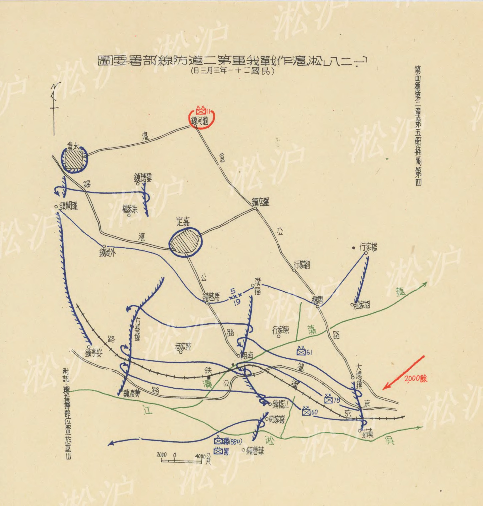

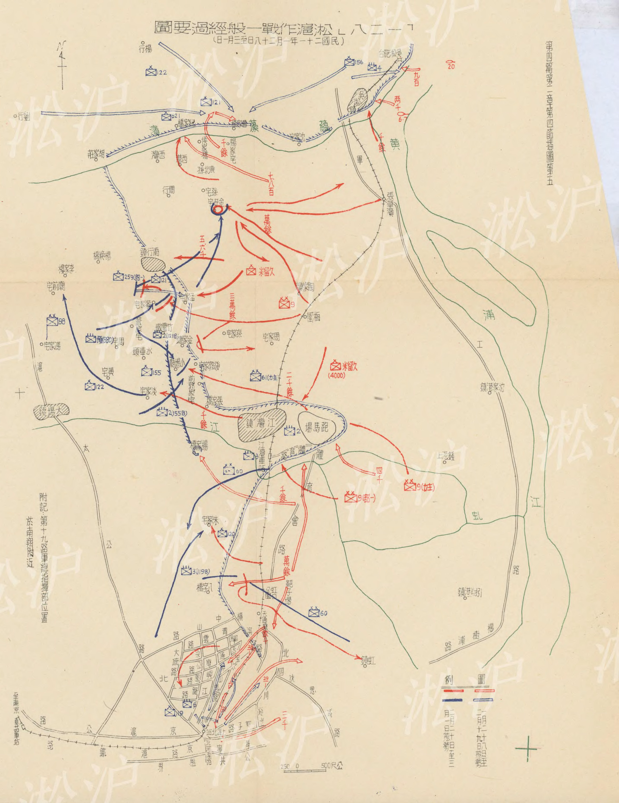

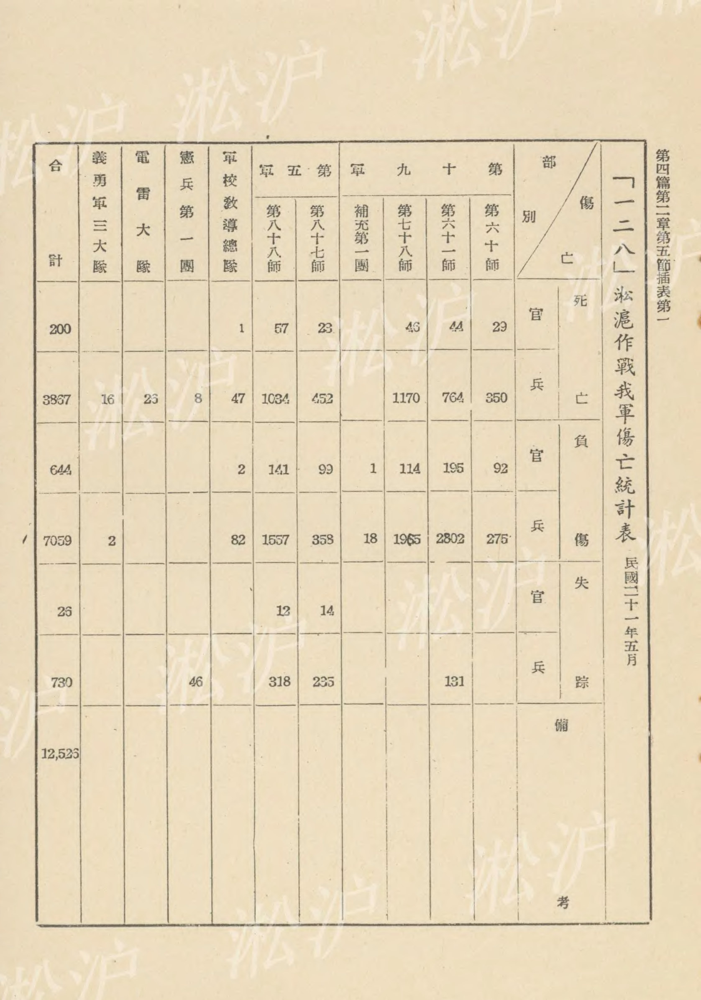

### 第六節 重要戰鬥

#### 第一款 蘊藻濱兩岸戰鬥

民國二十一年二月七日至十三日

參照

插圖

第七

##### 第一項 蘊藻濱兩岸地形

蘊藻濱介於上海市、寶山縣之間，由西向東流於吳淞鎮南端注入黃浦江，南北兩岸，村落密佈，溪汊交錯，淞滬鐵路跨其上，爲南北交通要道。吳淞東北設有礮臺，控制長江、黃浦兩江口，惟礮係舊式，威力不足，並不能遮斷敵艦交通。

##### 第二項 戰鬥經過

民國二十一年二月七日晨、敵新增陸戰隊三千餘人，於楊樹浦附近集結後，一路千餘在裝甲車十四輛掩護下，沿軍工路向張華濱方面進攻；一路由軍艦七艘掩護，以船舶輸送，沿黃浦江北進；另軍艦十餘艘，分由川沙、白龍港，向吳淞口外急駛，其飛機十餘架，不時飛臨吳淞、獅子林上空偵察。

第十九路軍總指揮部爲加強戒備力量，增調第一五六旅守備要塞區，另以第一二一旅及一二二旅向蘊藻濱北岸增防。

二月七日九時許，敵於張華濱附近及黃浦江面集結完畢。旋敵千餘人，在其軍艦六七艘、飛機十餘架支援下，分由水陸向我吳淞鎮攻擊，經我第一五六旅第四團第三營迎頭痛擊，敵傷亡慘重，相持至十一時許，敵不支敗退。十二時許，敵再以裝甲車六七輛，協同其步兵七八百再度猛攻，我守兵益沉着，待敵進至有效距離，卽以各種步兵輕武器予以猛烈還擊，同時以手榴彈炸燬敵裝甲車，我軍之勇猛沉着，戰況之劇烈，較前次尤有過之，敵軍終以傷亡慘重而撤退。十五時許，敵雖由上海方面增調部隊繼續「二八」淞滬作戰

五三

攻擊，終未獲逞，入夜後，仍在繼續砲戰中。

二月八日晨，敵又增加陸軍六千餘，在敵艦及裝甲車掩護下分三路猛攻：一路由軍工路直撲吳淞鎮；一路沿泗塘溪北進，向蘊藻濱攻擊；一路由陸家橋，向曹家橋方面進攻。十時許，沿泗塘北進之敵步兵大隊及騎兵四百餘，向蘊藻濱北岸沈家宅衝鋒，我守兵將水泥桶向敵滾去，敵馬驚竄，敵陣大亂，我軍繼之以猛烈火力，斃傷敵步騎兵七百餘人，敵不支敗退。

是日十三時許，敵三百餘再向我蘊藻濱攻擊，另部百餘，會同便衣隊四五十人，襲擊吳淞鎮，激戰時許，敵不支撤退。旋上海之敵三百餘，在裝甲車數十輛掩護下，沿軍工路來援，進抵紀家橋南岸侯家橋附近，遭我伏兵圍擊，奪獲裝甲車二十餘輛，斃傷敵人百餘。敵經兩日之慘敗，於二十時分三路向楊樹浦撤退，於九日三時許先後到達，遂重整殘兵敗將，於滬江大學一帶掘壕佈網，企圖固守待援。是役綜計斃傷敵軍千餘人，我傷亡僅百餘人。

二月十二日六時許，敵八百餘在軍艦砲火及飛機掩護下，向我蘊藻濱攻擊，一部進至紀家橋以西地區，企圖於曹家橋偷渡，均被我擊退。十三時許，張華濱之敵向蘊藻濱進攻，企圖以船隻偷渡，亦被擊退。

二月十三日晨，敵乘雨雪交加之際，將其砲兵推進至陸家橋西端，向對岸我第一二一旅陣地轟擊，頓時煙塵如霧，敵卽架設浮橋實施偷渡，其先頭千餘，先攻佔永安紗廠，旋曹家橋又陷敵手。此時另敵二千餘到達蘊藻濱南岸朱家宅附近，策應渡河部隊戰鬥。我第十九軍蔡廷楷軍長，獲悉當前狀況後，飭令第一五六旅翁照垣旅長，以一團由吳淞向曹家橋急進，另着第一二二旅分由楊行及劉行，向曹家橋推進，十三時許，將曹家橋三面包圍，敵軍左衝右突，企圖突破重圍，我則乘敵突圍之機，予以猛攻，敵死傷枕藉，戰志全失，至二十一時許，除一部溺死於蘊藻濱外，餘全部被殲，我獲全勝。

當曹家橋激戰之際，蘊藻濱南岸朱家宅之敵，爲策應北岸戰鬥，曾以一部兩度猛攻侯家橋，經我守兵沉着應戰，待敵主力進入我有效射程，予以猛烈掃射，敵倉皇逃竄。

綜計本戰鬥先後經過七日，敵軍參戰官兵萬餘人，死傷兩千餘，被我鹵獲敵裝甲車二十餘輛，我軍參戰官兵六千餘人，傷亡官兵三百餘人。

#### 第二款 江灣廟行附近戰鬥

民國二十一年二月二十日至二十五日

參閱插圖第八第九

##### 第一項 江灣廟行附近地形

江灣爲上海吳淞間重鎮，扼淞滬鐵路中心，虬江由西而東，流經其南。廟行位於江灣西北，爲寶山縣南部重要市場之一。兩者相距弗遠，咸在敵艦礮射程以内，兩鎮附近，田疇相連，地勢平坦，惟河渠湖泊交錯，實爲機械化部隊之一大障礙。

##### 第二項 戰鬥經過

敵軍自民國二十一年一月二十八日挑釁以還，一再慘敗，曾兩度易帥，迄二月中旬，敵曾植田謙吉率其第九師團抵達上海，企圖挽回頹勢，維持其軍人自大之聲譽，一面對英美法意四國公使進行之和平運動虛與委蛇，一面積極部署軍事，作再攻擊準備。旋提出荒謬絕倫之哀的美敦書，限期我軍撤退，當經我方嚴詞拒絕，植田惱羞成怒，遂以其第九師團及久留米混成旅團（屬第十二師團），配合其優勢海空軍，向我江灣廟行一帶進攻。

我第五軍於二月十三日奉命向上海推進，十六日十二時許，張治中軍長到達南翔後，奉第十九路軍總指揮蔣光鼐之命令要旨如左參照插圖第八。

一、第十九軍爲右翼軍，佔領南市、龍華、北新涇、眞茹、閘北及江灣之線，保持主力於大場，眞茹之「二八」淞滬作戰

五五

間，迎擊當面之敵，待機出擊，將敵壓迫於引翔港方面而殲滅之。江灣以北迄吳淞之線防務，交由第五軍接替。

二、第五軍爲左翼軍，接替第十九軍江灣（不含）廟行鎮東端蔡家宅、胡家莊、曹家橋之線防務。主力控置於大場、楊行及劉家行地區，迎擊當面之敵，待機出擊，將敵壓迫於黃浦江畔而殲滅之；以一部擔任羅店、瀏河、小川沙江面警戒，策應吳淞方面戰鬥。

三、吳淞要塞仍由第十九軍第七十八師第一五六旅負責守備，以有力一部相機進佔張華濱車站，如情況惡化，則固守吳淞、寶山兩要塞，作全軍左翼據點，並歸張治中軍長指揮。

四、作戰地境：

左右翼軍以大場鎮、江灣鎮、沈家港鎮之線爲作戰地境，線上屬右翼軍。

第五軍張軍長基於右令，當卽令第八十八師接替由江灣北端經廟行鎮、周行至蘊藻濱南岸之防務，第八十七師之第二六一旅接替胡家莊，沿蘊藻濱北岸向東經曹家橋，至吳淞西端沈家宅之線防務（該旅已先於二月十四日接防），另以陸軍官校教導總隊一部，擔任獅子林、南北閘洞、川沙口、瀏河口、楊林口、七丫口沿江一帶警戒，各部均於十八日前先後接替完畢。

二月二十日晨，敵第九師團及久留米混成旅團，在其飛機及艦礮支援下，向我淞滬鐵路沿線總攻擊，參照插圖第九九時許，有敵四千餘人，以戰車二十餘輛爲前導，分由虹口、靶子場、錢港上及南陶家灣三路圍攻江灣、跑馬場及體育路，我守備該地之第六十一師第一二一旅第二團官兵，沉着應戰，並以佯退欺敵，誘其深入，待敵三路併成一線，礮火不克直接支援而全失其效能時，乃下令勇猛反擊，與敵展開肉搏，斃傷敵軍甚多，並炸毀其戰車二輛，敵不支後退。十六時許，敵重整殘部後，再向我江灣跑馬場攻擊，我軍奮勇迎戰，卒形成膠着狀態。入夜後，敵復以猛烈礮火掩護，先後衝鋒三次，均被我守軍擊退。

二月二十一日晨，敵機分批侵入我江灣上空偵察轟炸，繼以猛烈礮火向我陣地射擊，我陣地工事多處被毀，此際敵步兵乘機向我第一二一旅第二團陣地猛撲，經我守兵堅強抵抗，敵遂不支而撤退。七時許，敵千餘人藉其優勢礮火掩護，以密集隊形，前仆後繼，節節向我迫進，企圖一舉攻佔江灣，我第二團沉着固守，激戰終日，陣地屹立不動，敵終難越雷池一步。

當江灣方面激戰之際，另部敵軍約一聯隊之衆，向我第八十八師第五二七團第三營麥家宅陣地攻擊，經兩小時激戰，第八十八師右地區（第五二七團）預備隊已全部使用，爰以師預備隊第五二八團（欠第二營）由馮家宅前進，增援第一線戰鬥，九時許，戰況益趨激烈，旋敵礮火延伸射程，其步兵卽以全力向我陣地衝擊，先後兇猛衝鋒達十餘次，賴我官兵奮勇用命，堅忍抵抗，敵傷亡慘重。此時我左地區隊第五二四團出擊、攻擊敵之側背，相持至二十二時許，敵乘夜暗撤退，我遂將警戒陣地恢復，繼續與敵保持接觸。是日我第八十八師官兵傷亡三百餘人。

二月二十二日凌晨三時許，敵抽調張華濱、蘊藻濱當面部隊，向廟行、江灣地區前進，拂曉後，敵以主力兩萬餘人，在戰車三十餘輛及猛烈礮火掩護下，分向我廟行以南第八十八師右地區隊衝擊，我第五二三團（馮聖法）張家橋、前後郭家宅、金家塘陣地首當其衝，當卽發生激戰，我工事雖被毀多處，官兵傷亡達四百餘人，但士氣仍極旺盛，奮勇拒敵，陣地屹然未動。九時許，第五二七團第三營方面戰況更爲激烈，該營長陳振新壯烈殉職，大小麥家宅之陣地，在敵礮火及敵機不斷轟擊下，全部被毀，致一部遭敵突破，該營遂轉移周宅、黃宅、吳宅地區。此時我第八十八師副師長李延年，親率第二五九旅第五一八團（欠第三營）增援到達，與敵激戰於麥家宅以西地區，阻敵西進。

是日晨，當敵主力向我第八十八師右地區猛攻之際，另敵一部約四五百人，亦由孟家宅向我左地區第五二四團（何凌霄）麥家宅、廟行間陣地攻擊，經該團第二、第三兩營奮勇迎擊，敵死傷枕藉，卒不得逞。迨九時許，我第五二七團第三營麥家宅陣地遭敵突破後，第五二四團第六第八兩連受敵側擊，損失奇重，形勢異常危殆，此時我第二六二旅楊步飛旅長親至廟行督戰，除嚴令第五二四團何凌霄團長死守廟行待援反攻外，並急調楊煥橋第五二八團（黃梅興）第三營、及張家橋第五一八團第三營增援，於廟行、麥家宅間予突入之敵以側擊，激戰至十二時許，敵我仍相持於麥家宅附近。旋敵另增調千餘人，向我廟行、周行之線猛攻，企圖一舉攻佔我廟行，經楊煥橋我第五二八團第二營增援，展開激戰，敵我雙方傷亡均重，但我陣地仍屹立未動。此時計已斃敵逾千，我第五二四團官兵亦傷亡四百餘人。

我第五軍軍長基於當前狀況，卽親率教導總隊赴馮家宅第八十八師指揮所指揮，當令第八十七師第二五九旅，由李家樓向廟行增援，第六二一旅主力，由紀家橋南渡，積極攻擊敵之右側背，並令第八十八師俞濟時師長，率部乘勢反攻，恢復已失陣地。俞濟時師長遵卽一面嚴令廟行及趙店宅守兵死守要點，一面飭第二六四旅錢倫體旅長率屬對被突破地區施行反攻，奪回陣地。錢倫體旅長當卽飭第五二七團施覺民團長積極反攻，自己則親率第五二八團第一營，奮勇進擊，與敵肉搏，終以身先士卒，勇敢逾恆，不幸胸部中彈重傷，然猶繼續指揮不退。此時第八十八師副師長李延年指揮第五一八團之一營及師工兵營，佔領塘東宅亘廟行之線，將突入之敵包圍，戰鬥之激烈，爲開戰以來所未見，工兵營營長唐循壯烈殉職。旋俞濟時師長親率少數幕僚及第五二八團之一營亦到達顏家宅督戰，因之士氣愈奮，戰志愈堅，敵雖先後衝鋒十餘次，均被擊退，迄黃昏戰鬥仍在繼續進行中。

當日十二時許，正值麥家宅附近激戰之際，我蘊藻濱北岸守備部隊第八十七師第二六一旅，奉命南渡側擊敵軍，旅長宋希濂親率所屬第五二二團及第五二一團第二營，分由紀家橋、周家宅強行渡河，雖在敵機十餘架轟炸阻撓下，終於十三時許全部渡河完畢，旋左翼掩護部隊第五二一團第二營攻佔趙家宅、楊家宅，續向顏中橋、東齊家宅之敵壓迫，主力第五二二團第一、第二兩營亦先後攻克齊家宅、唐家宅、殷家宅、西港、西灣東北、孫宅，續向中心巷、北孫宅之線攻擊。十五時許，戰況益趨激烈，敵四千餘之衆，分據顏中橋、中心巷、南孫宅、金母宅等村落，憑藉工事及其優勢火力，頑強抵抗，然我軍對暴敵至爲憤慨，咸抱有我無敵之決心，反復衝鋒，前仆後繼，奮不顧身，卒於白刃縱橫，血肉橫飛中，我第五二一團第二營攻佔顏中橋、王家宅、東齊家宅之線，第五二二團攻佔中心巷，並續向南孫宅、金母宅之敵猛攻，激戰至十六時許，敵第二十四聯隊第一大隊雖一度向我左翼反撲，旋被擊退。十八時許，天近黃昏，敵機活動漸趨沉寂，我第五二二團乃乘機再以全力猛攻，南孫宅又爲我有，敵狼狽逃竄，現地遺留敵國旗一面，步槍十餘枝、彈藥及其他裝具等尤夥。我第五二二團跟蹤追擊，旋將金母宅重重包圍，殘敵負隅頑抗，該團曾三度猛衝，迄未奏效，入夜後敵我仍在相持中。

此際第八十八師師長俞濟時，獲悉右翼第六十一師副師長張炎（兼第一二二旅旅長）督率第一二二旅之第四第五兩團，由江灣向竹園墩方面前進，攻擊敵之左側背，並奉總指揮蔣光鼐電諭：敵之預備隊已全部用盡，現在甚感恐慌，有準備總退卻模樣，希各師努力反攻，將敵一網打盡。俞濟時師長遂督率該師反攻，官兵雖已傷亡慘重，且疲憊不堪，但仍奮起衝殺，激戰至二十三時，終將強敵擊潰，僅麥家宅尚留殘一部，企圖負隅頑抗，阻止我軍追擊。此時我右翼出擊部隊第六十一師之第一二二旅，亦已攻佔孟家宅，主力撤回江灣，以一部續向金母宅推進，左翼第二六一旅，則繼續圍攻金母宅之敵。

自二月二十日晨起，敵以全力瘋狂進攻達三晝夜，尤以二十二日反復肉搏歷二十小時之久，賴我官兵咸抱與國土共存亡之決心，奮勇迎戰，卒將頑敵擊潰。此戰總計斃傷敵第九師團及久留米混成旅團之精銳三四千人，而我軍傷亡亦衆，僅第八十八師傷亡官兵卽有二千餘員，戰鬥之慘烈，實爲開戰以來所僅見。

我第五軍軍長基於當前之狀況，遂於當（二十二）日晚下達攻擊命令，其要旨如左：

一、第八十八師被敵突破之麥家宅陣地，務於本（二十二）日晚恢復。

二、陣地恢復後，江灣鎮（不含）至廟行鎮（不含）之線陣地，仍由第八十八師擔任，廟行鎮（含）至蔡家宅之線陣地，由第二五九旅擔任，並受俞師長指揮。

第八十八師俞濟時師長，依據右令要旨，決心先解決麥家宅陣地之殘敵後，再行調整部署，當卽下達命令如左：

一、頃奉

蔣總指揮電諭，進犯之敵，經我軍極力抵抗，斃傷甚多，而預備隊已用盡，潰亂不堪，似有總退卻之模樣，刻已令飭各師相機出擊，將敵壓迫於黃浦江畔而殲滅之，我第六十一師第一二二旅第四團之一營，已出擊至孟家宅附近，對於頑據大小麥家宅之殘敵，已在包圍中。

二、本師擬俟陣地恢復後整理陣線，並相機出擊，完全解決該敵，再回原陣地固守之。

三、着第二五九旅孫旅長指揮第五一八團、及第五二八團，限今（二十二）晚解決大小麥家宅之敵，再向孟家宅方面出擊。

四、陣地恢復及出擊奏效後，其兵力部署如左：

(江灣鎮北端至廟行鎮（不含）之線爲右地區，由第五二三、第五二七兩團負責守備，歸楊步飛旅長統一指揮之。

(廟行鎮（含）至蔡家宅之線爲左地區，由第二五九旅全旅擔任之。

(第五二八團、教導總隊及工兵營爲師預備隊，調回塘東宅、顏家宅附近待命。

第二五九旅孫元良旅長奉令後，卽以第五一八團向廟行當面之敵攻擊，阻止敵軍增援，並切斷麥家1

0.5

宅殘敵退路；以第五二八團有力之一部，由塘家宅分兩路向麥家宅攻擊。二十一時三十分，第五一八團先行開始攻擊，當與廟鎮東南端之敵三百餘人發生激戰，該團官兵前仆後繼，奮勇展開肉搏，相持時許，敵不支向金母宅方面潰退，該團傷亡官兵六十餘人，斃敵八十餘名，鹵獲步槍三十餘枝，敵國旗兩面，另在斃敵小隊長圖囊中，搜獲上海市全圖、上海市巷戰要圖、上海附近詳圖、江蘇省詳圖、山東省詳圖，敵軍（指我軍）兵力配備略圖各一份，及上海敵軍聯隊以上主官姓名一覽表一張，足證敵軍蓄意挑釁已久，且曾作充分之準備。

當第五一八團展開攻擊時，第五二八團卽組織奮勇隊，策劃解決麥家宅之敵，迄二十四時，以奮勇隊自塘東宅直接向麥家宅敵陣地正面猛攻，一部由塘東宅向右側迂迴襲擊敵之左側背。奮勇隊攻擊至麥家宅小橋西端時，遭敵火猛烈射擊，該隊仍奮不顧身，勇猛突進，先頭十餘人越過小橋，衝入敵前哨陣地，奪獲太陽旗一面，但因後續部隊爲敵火所阻，傷亡已達七十餘人，奮勇隊長吳紹文（第七連連長）亦負重傷，致未能奏功，右翼迂迴部隊，亦爲小濱所阻，不能前進，於是同時撤回塘東宅原陣地。

二月二十三日一時許，我第六十一師第一二二旅有力之一部仍圍攻金母宅，衝鋒三次，未獲進展，拂曉後敵援軍萬餘人，分由梅園及張華濱向金母宅推進，以戰車三十餘輛、裝甲車二十餘輛爲前導，並以飛機六十餘架凌空支援，企圖一舉擊破我軍包圍圈，救援其被圍部隊撤退。此時我第二五九旅孫旅長率第五一八、及第五二八兩團，攻佔大小麥家宅，經孟家宅向金母宅急進，第六十一師第一二二旅第四團亦由江灣向南齊家宅推進，攻擊敵之側背，十四時許，敵我雙方短兵相接，反復衝鋒十餘次，鏖戰至十八時許，敵傷亡慘重，復遭我軍側擊，遂分向引翔港、張華濱撤退，我軍跟蹤追擊，又殲敵千餘人，鹵獲武器裝具甚夥。

「二八」淞滬作戰

六一

杭

日

戰

史

六二

我第八十八師歷經數晝夜激戰，傷亡慘重，至是愛將江灣至廟行間，及廟行至胡家莊之線防務，分別交由第六十一師第一二二旅及第八十七師第二五九旅接替，該師暫撤至廟行以西地區整理。

二月二十四日十六時許，江灣以東之敵第九師團第二聯隊二千餘人，向廟行江灣間移動，旋乘薄暮風雨交作之際，以四人爲小組、共數十小組，匍匐前進，另以數十草人豎立於金家塘東南田野中，企圖以欺騙伎倆轉移我注意力而施行偷襲，迨我哨兵發覺，敵卽改行礮擊，繼以步兵分三路進犯，我第八十八師獨立旅古團（卽稅警第二團古鼎華此時歸第六十一師指揮）沉着應戰，初則掩蔽於陣地內不發一彈，待敵接近，驟以各種輕重武器猛烈射擊，敵傷亡慘重，惟仍前仆後繼，不斷進犯，激戰至二十一時許，敵力竭兵疲，漸呈不支，古團窺破好機，乃斷然以一部由後郭家宅出而攻擊敵之側背，正面亦全力同時出擊，敵驚惶失措，紛紛潰退，我軍跟蹤追擊，頗有斬獲，於周家宅附近，發現敵遺屍頗多，其中一具由所佩符號獲悉，爲敵第九師團第二聯隊聯隊長百海實男。

二月二十五日一時許，敵新增援部隊數千人，由張華濱附近登陸後，會同殘敵三千餘人，分向金母宅、孟家宅及小場廟攻擊。拂曉後，敵機九架，野山礮百餘門，集中轟擊我江灣、廟行間陣地，僅小場廟一地，落彈卽達千餘發。旋敵千餘向我金家塘一帶猛攻，我第八十八師獨立旅古鼎華團第二營，奮勇與敵相周旋，敵以裝甲車協同步兵衝擊，我則以手榴彈機關槍抗拒，激戰三小時後，雙方均傷亡慘重，古團第二營金家塘陣地漸趨動搖，賴我第一二二旅第六團適時由水車頭增援反擊，敵不支敗退，陣地復告穩定，古團爲避免重大犧牲，影響爾後任務之遂行計，對敗退之敵亦未予追擊。

十時許，敵增援部隊繼續到達，會同殘敵共計萬餘人，分向竹園墩及小場廟攻擊，小場廟方面之戰鬥，特爲激烈，古團第一營竭力抗拒，陣地屹立未動，旋敵機更番轟炸，繼則敵礮猛烈射擊，我陣地被毀殆盡，第一營官兵死傷亦至慘重，第二連長鄒冠雄，第三連連長龍子廉相繼陣亡，陣地遂告不守，轉進黃宅附近。

第十九軍軍長蔡廷楷獲悉當前狀況後，卽令第七十八師第一五五旅第二團（謝瓊生），由江灣鎮出郭家宅，向小場廟推進，攻擊敵之左側背；第六十一師第一二一旅第二團（田與璋）由廟行鎮向竹園墩以東攻擊，切斷敵之退路；令轉進黃宅附近之古團第一營，協同該團預備隊（第三營），努力反攻。十八時許，我三路反攻部隊均到達小場廟附近，將敵重重包圍。此時敵企圖突破我軍包圍，反復衝鋒十餘次，俱未得逞。我三路反攻部隊之官兵，莫不同仇敵愾，奮不顧身，以一當十，以百當千，銳不可當，經肉搏時許，殘敵不支向東潰竄，小場廟附近陣地於焉又告克復。是役敵死傷一千七百餘人，遺棄步槍千餘枝、機關槍五挺，戰鬥之劇烈，殲敵之衆多，與二十二日廟行鎮之役，無分軒輊。

#### 第三款 八字橋附近戰鬥

參

民國二十一年二月二十日至三月一日

照

插

圖

第

十

##### 第一項 八字橋附近地形

八字橋位置于上海市閘北區，介於蘇州河與虬江之間，村落林立，道路如網，淞滬鐵路經其東，滬太公路（上海至太倉）斜插其西，敵軍發動淞滬戰鬥之天通庵，位置其東南。淞滬鐵路東側之虹口，設有敵軍司令部，故八字橋首當其衝。

##### 第二項 戰鬥經過

當民國二十一年二月中旬，敵久留米混成旅團（屬第十二師團）及第九師團向我淞滬鐵路沿線進攻之際，以有力部隊四千餘，分向天通庵、八字橋各附近推進，企圖一舉攻佔八字橋，迂迴江灣鎮側背，或直取眞茹，切斷我軍後方連絡線。

二月十六日，第五軍到達上海接替左翼防務後，第十九路軍另行調整部署，除仍以第六十師第一九、第一二零兩旅分任上海北站、八字橋、江灣鎮（不含）之線守備外，另以第六十一師負責江灣守備，待機向虹鎮、引翔港方面出擊，殲敵於黃浦江畔。

二月二十日晨，敵四千餘，在戰車、裝甲車二十餘輛掩護下，分向天通菴、八字橋我第一二零旅第四團及第一一九旅第三團攻擊。八字橋以北我第三團第三營初以步機槍迎戰，繼以手榴彈、大刀與敵肉搏，此時，雖有敵機數架飛臨上空助戰，終以距離過近，敵之傷亡較我尤重，相持至十一時許，斃傷敵人五百餘，炸燬戰車四輛，敵不支敗退。

當第三營與敵激戰之際，另敵二千餘，砲十餘門，騎兵百餘，戰車三十餘輛，在飛機十餘架掩護下，向江灣車站該團第一營攻擊，該營奮勇迎戰，並以地雷手榴彈炸燬敵戰車六輛，激戰至十八時許，敵敗退。入夜後，敵又以戰車掩護步兵衝鋒，相持時許，被我擊退。是日該營營長李畏及其所屬連長二員均負傷指揮，其他官兵傷亡七十餘人。

二月二十一日，江灣車站當面之敵續向第三團第一營攻擊，在其煙幕掩護下，以戰車協同步兵反復衝鋒，激戰終日，敵仍未得逞。入夜後，江灣車站附近形成火海，同時遭敵三面圍攻，該營向八字橋方面轉移，江灣車站遂陷敵手。是日，八字橋、天通菴僅有劇烈砲戰，民房多處起火，損失慘重。

二月二十二日拂曉，敵由江灣、廟行正面增調援軍五千餘，在裝甲車掩護下，續向八字橋我第三團猛攻，該團卽予迎擊，旋與敵肉搏，其先頭數十名雖全數被殲，但後續部隊仍前仆後繼，激戰時許，敵攻勢受挫，我軍則奮勇反攻，衝入敵陣，敵軍戰志全失，遂向虹口公園方面敗退，我軍乘勝追擊，雖於靶子場附近一度激戰，敵終遭敗北。十五時許，我增援部隊源源而至，虹口一帶之敵頓時大亂，狀極狼狽，紛紛向楊樹浦方面逃竄。二十時，我軍進佔虹鎮附近地區，旋撤守原陣地。

敵軍於八字橋附近兩度慘敗後，其步兵不敢再攻，故二十三日至二十六日期間，僅有零星砲戰而已。迨二十七日晨，八字橋當面之敵以十五公分之重砲向八字橋附近陣地及其後方民房轟擊，我軍嚴陣以待，旋敵步兵向前挺進，待其進入有效射程內，我以輕重火器予以猛烈還擊，該敵愴惶撤退，又繼之相互砲擊。是日斃傷敵二百餘，分載八卡車送至匯山碼頭。

二月二十九日八時許，八字橋正面敵集中砲近百門，以猛烈火力向我陣地及民房轟擊，且多數爲硫磺彈，民房焚燬特多。九時許，敵千餘人在裝甲車六輛掩護下，向我八字橋第三團猛攻，該團官兵以必死之決心與敵相抗拒，待敵衝入陣地，卽以刺刀大刀與敵肉搏，相持至十一時，敵傷亡二百餘人，另擊燬其裝甲車一輛，敵漸呈不支，遂敗退其原防線。

十二時許，敵機十二架飛臨八字橋上空偵察轟炸，另裝甲車八輛爲前導，步兵隨其後，向我陣地攻擊，我守兵沉着應戰，不予還擊，待敵進入我陣地前，乘裝甲車爲我外壕所阻之際，我軍卽以猛烈火力及手榴彈予以迎擊，相持約三十分鐘，擊燬敵裝甲車兩輛，敵愴惶撤退。十四時許，敵軍千餘在戰車三輛支援下，又向我八字橋陣地猛攻，企圖一舉突破我陣地，我守兵仍沉着應戰，敵又遭北，我則乘勢追擊，十五時許，我第三團第二營衝入敵陣與敵肉搏，斃傷敵三百餘人，該營爲完成固守任務，遂卽撤回八字橋原防地。十九時許，敵約七八百又向我八字橋反攻，相持至二十三時，敵不支撤退。是日，敵先後向我八字橋猛衝四次，均被我軍擊退，計斃傷敵人約五六百名。

三月一日晨，敵援軍約三四千到達八字橋附近，九時許，敵機十餘架，砲百餘門，向我亂施轟炸，旋我陣地全被夷平，繼之敵戰車裝甲車爲前導，步兵隨其後向我衝擊，我第三團爲避免重大犧牲，僅以輕機槍稍施抵抗，於十二時許，向後轉移約百米。

第六十師沈光漢師長獲悉當前狀況後，除飭第三團於我陣地竭力抗拒外，另着第一一九旅第二團「二八」淞滬作戰

六五

劉漢忠)向該地增援，該師長親赴朱家濱指揮。十三時許，我增援部隊全部到達，士氣大振，卽以手提機關槍隊爲前導，向敵陣猛衝，殺聲之後，繼之大刀隊衝入敵陣，刀光四射，血肉橫飛，肉搏約一小時四十分，敵以傷亡慘重，全線動搖，紛紛向東逃竄，八字橋陣地再告克復，檢獲敵機關槍三挺，步槍三百餘枝，鋼盔彈藥不計其數。當時上海時事新報記者，曾以「就這樣兩次的突擊，八字橋上的血，給中華民國第十九路軍的戰史上多添了一頁光榮的記載」。

#### 第四款 吳淞要塞附近戰鬥

民國二十一年二月二十日至三月三日

參照

插圖

第十

一

##### 第一項 吳淞要塞附近地形

吳淞要塞位置於長江右岸黃浦江口，有淞滬鐵路直達上海市，軍工路經其西，北上經三官堂而達寶山縣，南下與黃浦江平行，可通楊樹浦。吳淞要塞設有堅固砲台，可控制長江與黃浦江之咽喉，惟砲係舊式，威力不足，並不能確實阻止敵艦之出入。

##### 第二項 戰鬥經過

敵軍自民國二十一年一月二十八日與二月七、八兩日兩度進攻我吳淞失敗後，爾後僅以艦砲砲擊，陸軍未敢冒昧攻擊。迨二月十八日，敵軍司令官植田謙吉提出哀的美敦書，遭我嚴詞拒絕後，除以數萬之衆，分向我淞滬鐵路沿線進攻外，另以飛機二十餘架，飛臨吳淞上空偵察，兵艦三十餘艘停舶於張華濱東側黃浦江畔，陸戰隊三千餘向蘊藻濱南岸進攻。

自二月十三日蘊藻濱兩岸戰鬥結束後，吳淞要塞區仍由第七十八師第一五六旅負責守備，另有鐵血軍四百餘，義勇軍百餘人，開赴吳淞增強防務，總計我軍兵力不足四千人。

二月二十日晨，敵陸海空三軍同時向我吳淞第一五六旅攻擊，飛機二十餘架飛臨上空投彈，兵艦以猛烈砲火向我陣地轟擊。八時許，張家宅之敵二百餘，向蘊藻濱南岸推進，企圖偷渡，我軍卽予以迎擊，激戰三十分鐘，該敵不支，有撤退模樣，我軍乘機出擊，但遭敵機及兵艦火力所阻，十八時許，我軍一部突破敵軍右翼，將蘊藻濱正面之敵二百餘包圍殲滅殆盡。此時敵艦數艘活動於吳淞口外，我獅子林砲台發射十餘彈，擊沉敵艦一艘，另兩艦負傷東去。

二月二十一日晨，敵機及兵艦又向我吳淞及獅子林兩砲台轟擊，民房多處起火，烟火彌漫，迄十四時，仍在激烈砲戰，此時我軍一部，乘烟火彌漫之際，渡過蘊藻濱向敵軍猛攻，敵人驚慌失措，紛紛向南潰退，我軍未予追擊，仍退回北岸原防地。

二月二十六日，吳淞口外敵艦五艘，以猛烈砲火向吳淞轟擊，我要塞砲予以還擊，敵艦向長江口外逸去。十三時許，張華濱之敵四百餘，向紀家橋、侯家橋推進，企圖偷渡，我軍以機槍予以迎擊，斃傷敵人七十餘，殘敵不支敗退。入夜後，黃浦江內敵艦三十餘艘，協同蘊藻濱南岸敵砲兵以猛烈砲火向我吳淞轟擊，我守兵掩蔽不動，待敵步兵接近與之肉搏，該敵敗退。二十七日，敵機十餘架分批轟擊我吳淞，黃昏後，周家宅之敵百七十餘人，分乘舢板四隻，企圖偷渡，經我軍猛烈射擊，其舢板三隻沉沒水中，僅一隻負傷逃去。二十九日至三月一日間，敵僅以艦礮轟擊，步兵未敢進攻，我軍乘機於一日夜撤退，吳淞要塞遂陷敵手。

### 第七節 檢討

#### 第一款 敵軍

一、敵之作戰指導：敵艦隊司令官鹽澤宣稱四小時攻佔閘北，足證其不懂陸軍戰術，不知街市攻擊需要悠長時間與特種訓練。其陸戰隊與在鄉軍人素質不良，訓練不精，雖其火力大於我約四五倍，但不諳街市戰鬥法，尤以裝甲車之火力與衝力不易發揮，每被截擊於狹隘之街道內，故一月二十八、九兩日，雖對閘北區慘酷轟炸，敵仍損失千餘人，裝甲車大部被我擊燬與鹵獲，而敵軍不能接受失敗教訓，於二月三、四兩日，仍以主力進攻閘北，重遭挫敗，士氣沮喪，影響深遠。

野村中將之指導，於二月七、八兩日以七千餘人攻擊蘊藻濱，企圖一舉奪取吳淞，解除其水道之威脅，然其兵力不足，遂再遭挫敗。

植田中將使用約二個半師團及戰車、裝甲車、飛機與艦砲，其火力之強，約大我四倍有奇，於二月二十日，在十公里正面內，向我全線攻擊，以重點指向江灣，兵力亦够充分，然仍不能戰勝我軍之精神力，又遭挫敗。乃於二十二日轉換目標，以全力進攻廟行鎮，不料我軍之指導更爲靈活，奮鬥精神遠勝敵軍，此後三日，敵盡全力拯救金母宅被圍部隊，屢被我軍擊退。綜計六天之戰鬥，敵傷亡萬餘人，約佔其全兵力六分之一，植田中將終告敗北，皇軍聲威掃地無餘，遂暴露其戰略上之錯誤——逐次增加兵力。

白川大將指導之特點，在窺破我軍左側背之弱點，敵有優勢海軍掩護其陸軍向劉河附近登陸，避免經過湖沼地區，而直接威脅我軍側背。敵之戰略指導雖較良好，但於三月四日停戰協定成立後，仍以主力攻擊我太倉，並以猛烈之砲擊與空襲爲之支援，迄四月十八日，毫無進展，可見其攻擊精神之低落，及其裝備尤其戰車之質量不能適應於上海之特種地形，遂被迫實行停戰。

二、敵軍各兵團作戰指揮，慣用迂迴包圍：二月二十二日之戰鬥，其攻擊重點指向廟行南方之麥家宅，企圖攻佔該地，截斷江灣後路再予圍攻，而敵軍各兵團之指揮呆板，不能適應狀況之變化靈活運用。二月二十二日，敵軍於突入我麥家宅陣地後，未能集中優勢兵力尤其戰車於此點擴張戰果，而妄行全面性之攻擊，致遭我左右夾擊，終遭挫敗。

敵軍步砲飛協同確實：敵軍於攻擊之前，必先以飛機與砲兵協同轟擊，飛機上發現目標後，即以信號通知砲兵，砲彈卽隨之而來，如果砲兵發現目標，不能破壞時，卽以信號要求飛機轟炸，各發揮其所長，以摧毀我方陣地。

四、敵軍通信連絡確實：二月二十二日廟行附近戰鬥，敵攻擊前進，以有線電話與左右及後方連絡，後我第五一七團出擊恢復廟行附近陣地，函獲電話機一部，卽其明證。當敵攻擊時，又見其以手旗指揮前進停止與射擊，以補救口令之不足。又於婁塘鎮附近，敵攻佔一地，卽舉火爲號，左右協同，齊頭併進，足證敵軍當時尚不知滲透戰術。

敵軍收容迅速，掩埋確實：二月二十二日江灣、廟行附近戰鬥，敵我激戰終日，傷亡均重，及至我軍恢復陣地，敵屍很少遺留陣地，并能將其殘部迅速收容，繼續於麥家宅抵抗。金母宅之敵遭我重重包圍，尤能孤軍待援。

六、綜合本戰役，敵始終爭取主動，斷行攻擊。然其初期之兵力極不充分，致遭初戰之挫敗，影響士氣，雖賴逐次增兵，挽回頹勢，而其裝備尤其戰車之質量不能適應淞滬之特種地形，且用法失當，以輕戰車當重戰車使用，故不能突破我軍陣地，取得決定性之勝利，爲爾後七七事變我軍選擇主戰場於上海、全面抗戰之重要因素，其影響極爲重大。

#### 第二款 我軍

一、我軍作戰指導，限於裝備，採用決戰防禦，高度發揮革命精神，併用火力與逆襲迭挫敵鋒，實屬難能可貴，總指揮指導全線反擊之時機與部署適切，二月二十二日當我麥家宅陣地被敵突入時，蔣總指揮卽決定全線出擊，第六十師由閘北、江灣地區出擊，第六十一師以一個旅由江灣向廟行方面側擊敵之左側背，第八十七師以第二五九旅加入廟行正面戰鬥，協力第八十八師出擊，第八十七師第二六一旅以有力之一部由蘊藻濱向廟行方面出擊，威脅敵之右側背，於是正面我軍圍攻麥家宅，包圍金母宅，以致敵全線動搖，爾後敵再抽集主力挽救金母宅，先後被我擊退，而麥家宅之敵幾全部被殲滅。

二、我軍機動迅速，協同適切：二月十三日，敵千餘偷渡蘊藻濱北岸之紀家橋，進陷我曹家橋，而我第一五六旅之一個團、第一二二旅、第二六一旅等部隊，迅速分由吳淞、楊行及劉行等地向曹家橋分進合擊，遂將敵層層包圍，全部殲滅。

三、我軍各師指揮靈活，戰志堅定：二月二十二日，敵主力三萬人，由梅園分路進攻廟行，聲勢浩大，當我麥家宅陣地遭敵突破時，俞濟時師長卽以預備隊全部加入戰鬥，而我官兵傷亡過半，陣地危殆，李延年副師長率第二五九旅之一部增援，激戰於麥家宅以西地區，阻敵繼續西進，以待反攻，卒挽危機，轉敗爲勝。

又我吳淞要塞司令潭啓芳，與第一五六旅旅長翁照垣，誓與砲台共存亡，死守不退，其後敵以陸海空軍三萬餘人四面圍攻，反復衝擊，均被我軍擊退，於此卽可證明我各級指揮官戰志堅定，戰鬥員士氣高昂。

四、我軍創造「迭戰」之戰鬥方法：我軍於激烈戰鬥後，卽另派新銳部隊接替，如我第八十八師於麥家宅附近陣地連日激戰後，傷亡慘重，二十二日入夜後，卽以第六十一師及第二五九旅接替防務。又第七十八師第一五六旅經一月二十八、九兩日之慘苦奮戰後，於二月二日以新銳部隊第六十師接替防務。

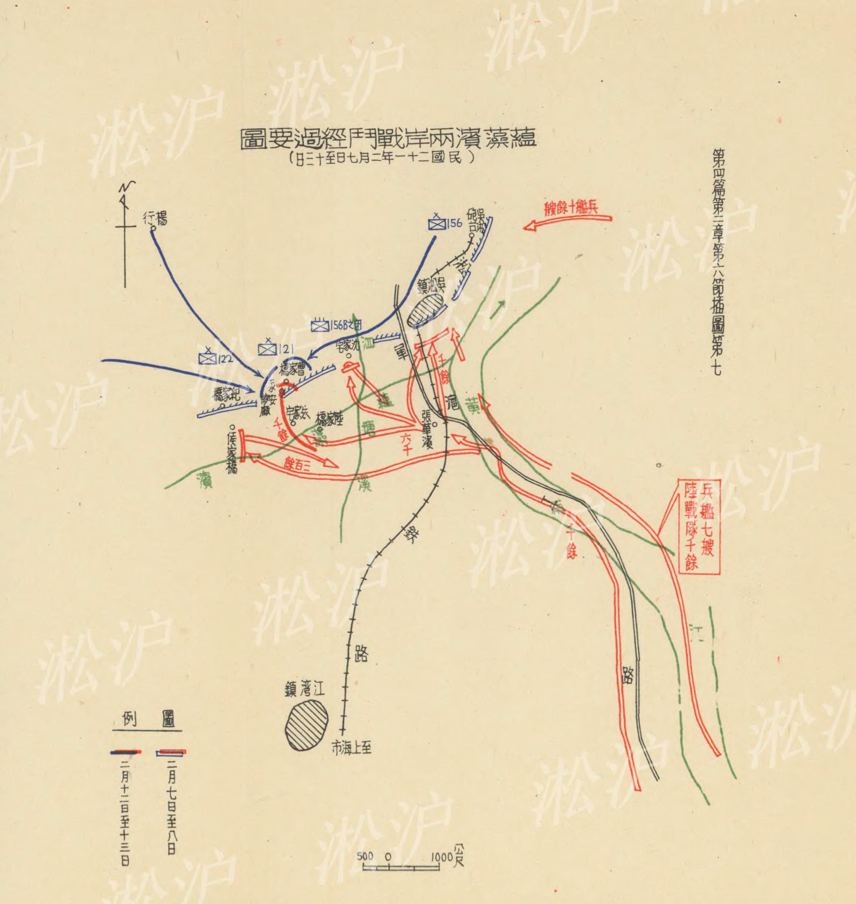

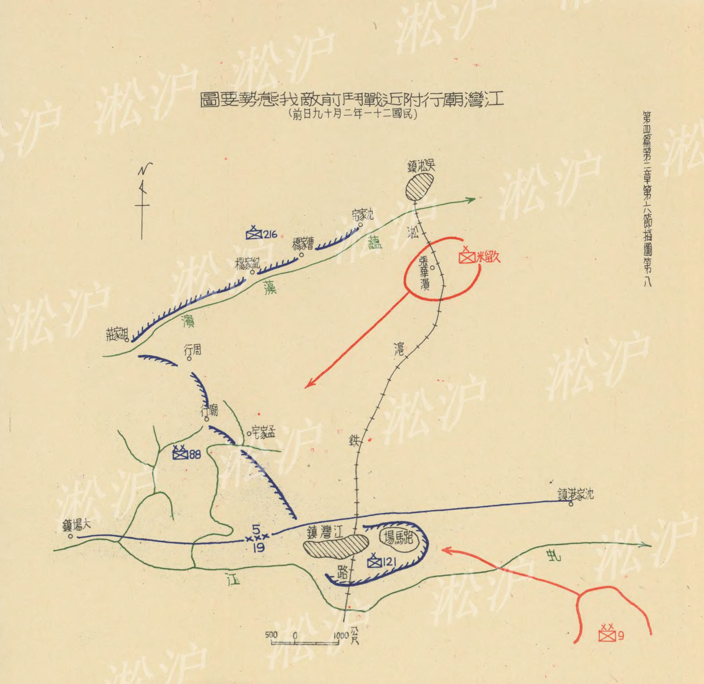

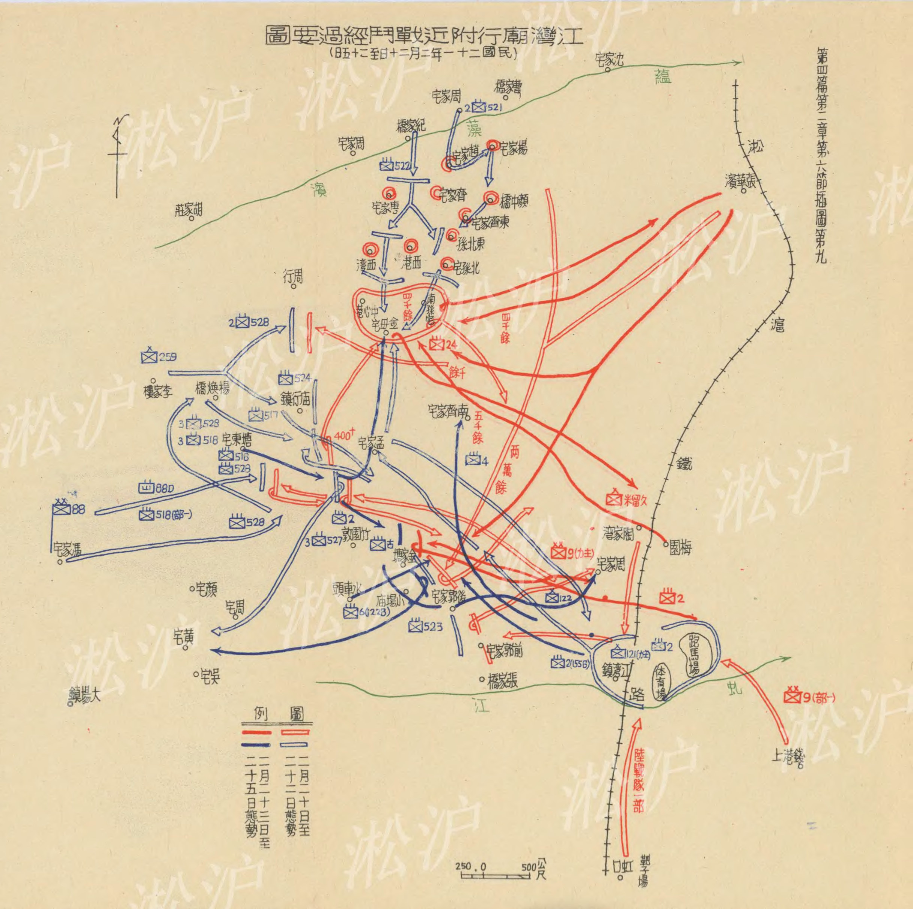

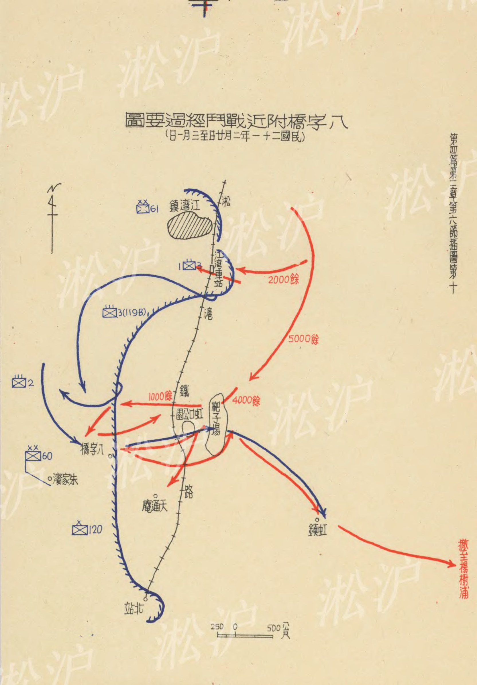

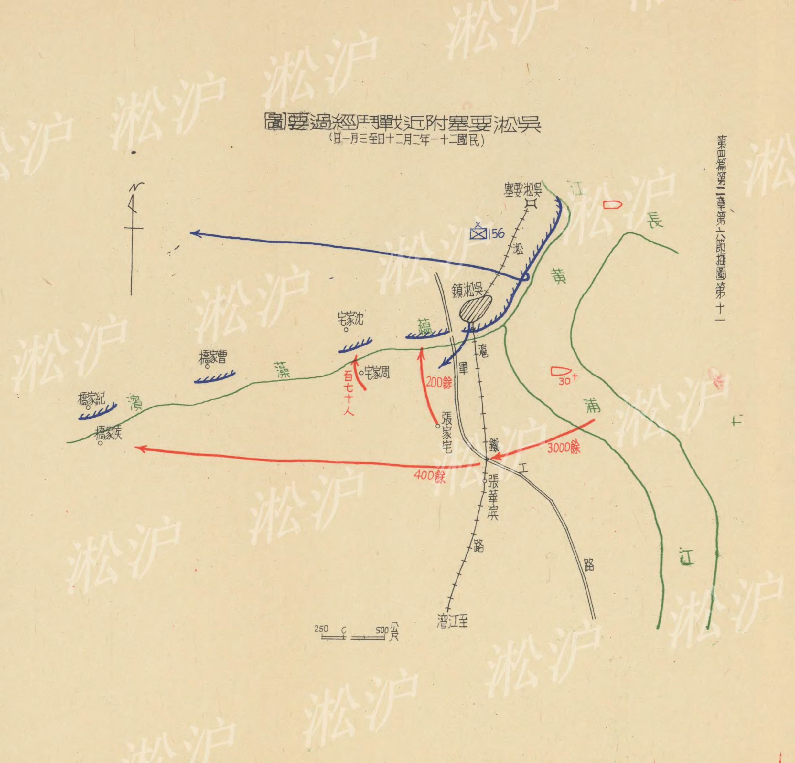

五、我軍之戰鬥力較強：我軍官兵同仇敵愾，咸抱必死之決心，戰志堅定。三月一日，廟行之戰鬥，第五八一團第一營各連傷亡均達五分之四以上，我少數之守兵猶死守不退，敵始終未敢越雷池一步，實爲戰史鮮見者。又當彈藥缺乏時，我軍以手榴彈應戰，最後以刺刀與敵肉搏，可見戰力較強。

六、我軍裝備不良，射擊技術亦遜於敵，故戰鬥全期火力均爲敵人所制壓。通信器材不足，連絡不確實，各級指揮官完全依賴電話，電話不通，再無補救辦法，因此易坐失良機，不能殲滅敵人。

七、我軍工事構築不堅固，且爲線式，因此常遭受重大損害，此次作戰全期，掩蔽部一般均不够強度，交通壕多未構築，故傷亡增大。

八、情報組織不够，謀報太少，因此常陷於情況不明。反觀敵人，利用漢奸及日謀異常活躍。

九、後勤業務不良，運輸欠靈活，廟行戰鬥，如於馬橋宅開設一彈藥交付所，運輸當較便利，戰果或可改觀。在撤退時，對於負傷官兵不能設法後送，對於陣亡官兵不知收取其符號及重要公文等。

十、總之，敵人之優點在於物質；我軍之優點在於精神。敵之訓練精良，但墨守原則，並無創意，未能適應上海之特種地形；我軍裝備訓練較遜，而作戰經驗豐富，動作靈活，惟以共匪肆擾，整軍未畢，限於政略，祇是應戰不願擴大戰爭，不能徹底抽調勦匪之大軍，故始終防禦，自無殲敵之可能。

此外，敵武器優越，利於白晝作戰；我軍則利於夜間戰鬥。

附錄第一：國民政府遷都洛陽宣言

民國二十一年元月三日

自日本以武力侵佔東北以來，政府一面遵重華盛頓九國條約，國際聯盟凱洛格非戰公約之精神，雖釁自彼啓，仍堅持忍耐，以候簽約各國之主持公理，一面嚴飭軍警應以全力捍衛地方，保障人民生命財產之安全，苦心維護，於茲數月，而日本進逼不已，最近竟以大批戰艦駛至上海，並輸送陸空各軍，藉口市抗日運動，以使用暴力，橫加恫嚇。夫人民組織團體，以急國難而禦外侮，本出於愛國之熱誠，苟無越軌行動，政府無從加以干涉。惟政府爲避免戰禍計，已不恤一再遷就日本之要求，始則對於民衆抗日之言論，及各種民衆團體自動取消抗日名義，以杜強鄰之藉口，本一月二十八日十三時四十五分，上海市政府對於日本駐滬領事之要求，已予以日領自身亦認滿意之答覆，而同晚二十三時二十分，日本第一外遣艦隊司令官，忽來通告，迫我上海駐軍讓出防地，俾其佔領，軍隊有守土之責，詎能應其要求，日本軍隊遂卽向我軍進攻，竟使上海繁榮市面罹於兵燹，且使用無限制之飛機轟炸政策，平民生命財產慘受茶毒，數量之巨無可估計。同時首都及長江上下游各重要市鎮，亦有日本軍艦到處挑釁。夫日本所以繼續使用此等暴力政策，且進而愈厲，其用心不過欲威脅我政府，使屈服於喪權辱國條件之下。政府受國民付託之重，惟知保持國家人格，尊重國際信義，決非威武所能屈，惟有堅持原定方針，一面督勵軍警從事自衛，決不以尺土寸地授人，一面仍用外交方法，要求各國履行其條約上責任。日本此次濫啓兵端，破壞和平，不但中國領土主權遭其損害，舉凡華盛頓九國條約，國聯盟約凱洛格非戰公約亦被毀棄無餘，政府深信中國對於此等暴行，有正當防衛之權利與義務，同時深信各國爲維持世界和平及國際信義，亦必不能坐視。茲者政府爲完全自由行使主權，不受暴力脅迫起見，已決定移駐洛陽辦公，望我各省區行政長官及軍官，同心協力，各盡所職，以靖地方而安人民，尤望我全國民衆以勇毅沉着之精神附錄第二：上海國際調查團報告書

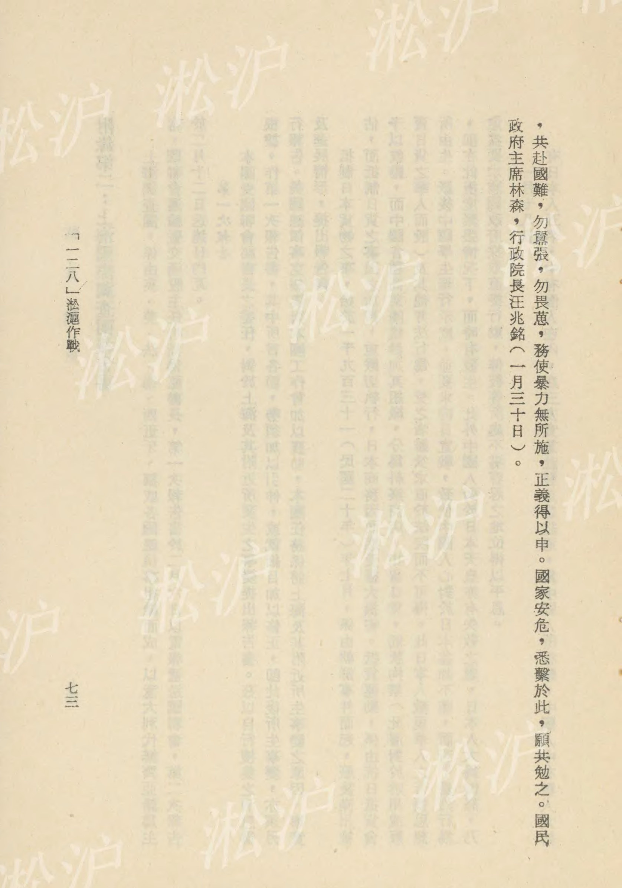

上海調查團，係由英、美、法、德、西班牙、挪威各國總領事組織而成，以意大利代辦齊亞諾爲主席，國聯會運輸暨交通股主任哈斯爲祕書長，第一次報告書於二月六日以電報遞送國聯會，第二次報告於二月十二日送達日內瓦。

第一次報告

本團受國聯會祕書長之委任，對於上海及其附近所發生之事變提出報告書。茲以自行搜集之消息爲根據，作第一次報告書，其中所言各節，勢須加以引伸，或就細目加以修正，卽此後所生事變，亦須另行報告。美國總領事克銀漢對本團工作曾加以襄助，本團任務係將上海及其附近所生事變之原因、事實及進展情形，提出報告書。

抵制日本貨物之事，始於一千九百三十一（民國二十年）年七月，係由朝鮮事件而起，厥後滿州被佔，而抵制日貨之事因之加甚，並嚴切執行，日本商務因而感受極大損害。抵貨運動，係由抗日抵貨會予以鼓勵，而中國各種商業團體參加其組織，分爲糾察商店，扣留日貨，罰款拘禁（此層對於購用或販賣日貨之華人而設）及其他非法行爲，受之者雖欲求直於法院而不可得，此日本人敵視華人之苦惱思想所由生。厥後中國學生舉行示威，並要求向日宣戰，致使中國人心對於日本益加不滿，而若干暴烈行爲，卽在此極度緊張情況下，而時有發生。此外中國人對於日本天皇亦有失敬之處，日本人大爲憤怒，乃愈益要求該國政府採取直接行動，俾彼等所處不堪容忍之地位得以平息。

一月十八日

有日本人五名，中有僧人在內，在三友實業社製造廠經過，爲中國人所狙擊，中國人中有數人大約係最近組織之抗日義勇軍隊員，中國警察到時甚晚，行兇者未及逮捕，被狙擊之日本人，有兩名受重傷，僧人一名旋卽因傷殞命。

一月二十日

有日本人約五十名，均爲「青年保護團」團員，手持七首及棍棒，前往三友實業社製造廠，縱火焚燒廠舍，伊等臨去時曾與公共租界工部局警察發生衝突，中國警察三人受傷，其中一人因傷致死，日本人三名爲中國警察所傷，其中一人旋卽殞命。同日，日本人在日本俱樂部開居留民大會，對於日本僧人被狙擊，以及報紙對日皇失敬事，提出抗議，當卽通過決議案，要求日本政府派遣軍艦及軍隊，以便完全消滅抗日運動，日本人示威者半數往見日本總領事，隨至日本海軍司令部呈遞前項決議案，日本總領事請示威者將此事交由渠辦理。此時，三威者羣赴日海軍司令部，中途與租界警察發生衝突，巡長一人受傷，日本官吏曾向租界當局道歉，有日本人七名自行向其當局自首，經押送長崎審訊，以便按照日本法律懲治。同日下午，日本總領事就一月十八日事件向上海市政府祕書長提出下列各項要求：

一、市長正式道歉。

二、立即逮捕兇犯。

三、損害賠償及醫藥費。

四、抗日運動應以適當手段取締之。

五、所有鼓勵敵視日本，鼓勵暴動及鼓勵排日各項團體，應予解散一月二十一日

上海市長答覆日本總領事謂，前三項要求，準備加以考慮，至於其他各項，因有困難，未能予以滿意。日本海軍司令官旋卽以公佈一件交報館發佈，謂上海市長對於日本人若非予以滿意答覆，並將要求「二八」淞滬作戰

七五

各項立即實行，則海軍司令官決採相當手段，以保護日本帝國之權利利益，此項送公共租界當局及上海市公安局。

一月二十四日

日本海軍援兵開抵吳淞口外，同時風傳聞北中國軍隊亦已增援。是日，日本總領事通知上海市長謂，渠若不於相當時間內接獲答覆，或答覆不能滿意，則日本政府保留依照情形採取必要行動之權。爾時，上海市長業向中立各國代表聲明，準備作最大讓步，藉以避免衝突，並努力勸告當地各界領袖，俾其取消抗日抵貨會。又以「抗日」二字，日人認爲侮辱日本國家，卽對於其他團體名稱，有用抗日字樣者，亦予以刪去，結果，抗日抵貨會被封，其辦事處皆於一月二十七至二十八日間，由中國警察一一封鎖。一月二十五日

日本總領事知會上海市長，謂彼雖不限定時間，但欲於二月二十八日接獲答覆案之概要。

一月二十七日

日本總領事通知上海市長，謂次日十八時，彼之要求當得一滿意答覆，否則日本人將採取其所認爲必要之手段，以實現其要求。

一月二十八日

七時三十分，日本海軍司令部照會他國防守司令，謂中國方面如無滿意答覆，伊欲於次晨有所舉動。工部局遂於是日上午召開會議，決定於十六時起，宣佈界租入於緊急狀態。此舉係工部局所自爲，不實知照各國將領，欲使預備各自防守其地段。此時，上海市長答覆日總領事，完全承認其要求。日總領事告領事團，謂已接到覆文，並稱該復文完全滿意。又稱，須看上海市長能否實行其所承認之事，但又謂所要求之事，大都已實行，暫時不再取何舉動。乃外交局面雖有此變動，衆入之心，則以爲日本海軍當局決定無論如何欲有所舉動。日本報界聯合會所發煽動人心之新聞，謂中國無意實行其約言，並謂中國人士預備攻擊日本人，又逆料中國方面因反對市長之承認要求，或起叛亂。爲以上種種之故，在各國防軍委員會之心目中，爲防止意外事件，於十六時實行戒嚴。公共租界之防軍委員會，乃各國駐守將領所組成，外加工部局之總董，巡捕房之總巡，商團之司令，以防守司令中最尊者爲主席，此人對於各國防軍及應防守地區，僅有分配之責，而無指示之權。美、英兩軍於宣布戒嚴之後，卽各開往所駐地點，意大利於二十九日開到防地，日軍負責租界東北全部，西以北河南路爲界，租界外之虹口公園一帶，爲日軍陸戰隊之根據地。是日二十三時，日本海軍司令部宣佈戒嚴，並以副本送到上海市長，並謂：日本海軍對於閘北情形極覺憂慮，該處日僑衆多，已決定派兵前往，以維持法律與秩序，因此，望中國當局從速將駐在閘北之部隊退往鐵路以西，撤除該地區之佈防。日本水兵及武裝平民，先已在海軍陸戰隊司令部召集者，沿北四川路而進，西趨靶子路，直至河南路，沿途在弄口區分部署，至中夜，信號一發，卽向西北急進。鐵路方面，最後一隊約水兵百餘，另附裝甲車一輛，到達北河南路交界處，爲上海商團所阻，此時，水兵亦遭遇中國正式軍隊之抵抗。

一月二十九日

日軍於車站施放炸彈，用飛機破壞鐵路，寶山路及其附近房屋被燬甚多，死傷雖不可知，據估計生命損失爲數不少。上海市長因日軍之舉動向領事團提出抗議。日本則謂此次舉動與所提要求之事無關，此舉係爲保護所欲佔據地之日人。日本當局又稱，所取舉動卽遇中國武力抵抗，日本當局自當負其責。是日下午，雙方接受英、美兩總領事調解，暫時休戰。

一月三十日

日總領事，日本海軍司令官，上海市長，中國當地司令官，英、美兩總領事會晤於美領事館，商定應由日總領事向其本國政府提出辦法，使日軍退出該處陣線，倘日政府答覆不應，則中國方面亦當呈報中國政府，在未接到最後答復之前，雙方非對方先行開火，則不得自行開火。

第二次報告

一月二十九日二十時，休戰開始之後，槍砲之聲爲之靜寂。翌日，日本海軍司令向英、美兩國總領事提出抗議，謂停在北站之華軍鐵甲車重行開火，但經華人否認，並謂日本人有射擊情事。

一月三十一日

是日晨，日本飛機十七架，於上海市及華軍防地飛行，並未轟炸。日本海軍當局謂，華人近破壞休戰條件，故出之示威行動。破壞休戰條件一事，經華人鄭重否認，是日，各方會商設立中立地區，並決定繼續休戰，以待雙方答覆。

二月一日

仍在休戰期間，但若干槍砲聲時作時輟。

二月二日

日軍司令部又謂華人昨日重行破壞休戰條件，並謂：華方集合軍隊，預備包圍日軍，渠當派遣飛機前往偵察。是日十二時許，有日本飛機數架，飛翔上海及華軍防地，中國軍隊對之射擊，日本飛機在聞北擲彈數枚，頃刻之間，雙方戰線上槍聲大作，至十五時許，戰事重開。以後日本總領事通報各國總領事謂，前提議之中立地區，日本政府已經拒絕。同日，上海市長照會各國領事，提及一月三十一日開會時所訂之休戰協定，謂日本人屢次破壞，攻擊中國軍隊，並以飛機轟炸，諒有目共睹。

二月三日

日本海軍當局宣稱，中國當局，對於履行諾言，繼續表示誠意，故中國軍隊應退出閘北以外至相當距離，日本因欲執行此項計劃，其飛機或有轟炸中國陣線之事。日本總領事又通知各國領事，日驅逐艦三艘，因受吳淞砲台之砲擊，故日本人決定佔領該砲台。但吳淞砲台發砲之事，又爲中國方面所否認。二月三日，戰爭又公開進行，休戰無形中消滅，閘北與吳淞繼續砲戰，日本又出動飛機轟炸對距離上海較遠之吳淞，採取攻勢，完全係日本人所爲，至於休戰一節，迄未達成完全休戰狀態。換言之，在火線上無外國觀察員在場，究竟破壞之責應由何方負擔？實無法加以判斷。在此期間，公共租界日本管區內曾發生若干事件，有關公共租界制度，在國際上有重要關係，簡略述之，自一月二十八日夜，日本採取行動之始，有多數着便衣之中國之士兵，侵入日本租界內，或藏匿民房，或攀登屋頂，而以手槍向日本哨兵射擊，日本人則召集在鄉軍人畀以武器，但亦着便衣，以機關槍抵抗中國便衣隊，並挨戶搜查，並縱火焚燒民房。是時，虹口地區完全爲日本海軍所控制，並設有障礙物，巡捕武裝亦被解除，公共租界市政職務及消防事務等爲之停頓，與虹口交通完全斷絕，日本水兵在鄉軍人以及其他暴徒，多有過分之舉，甚至不加深究，卽執行槍決，結果公共租界發生恐怖現象，凡日本人以外之居民，皆逃避一空，有極多中國人查無下落，疑爲日本人所捕殺。

二月五日

公共租界工部局請領事團轉商日本當局，對於此事加以調查。經日本總領事承認在混亂之際，日本人情感熱烈，誠有過分舉動，但情形業已大加改善，並允將公共租界內凡因嫌疑而被日本海軍當局逮捕之人，移至工部局巡捕房。然失蹤華人爲數仍甚多，據工部局詳細調查，失蹤之案尚有三百起之譜。爾後工部局巡捕房及其他市政職務漸漸恢復，日本當局並將過分行爲者，遣送回國。

附錄第三：上海各團體爲日軍利用租界作戰致工部局書民國二十一年二月十一日

敬啓者：上海工部局爲世界各國住民共同組織之團體，如會員國中有一國國民有破壞工部局安寧秩序之行動時，則工部局當行使其職權，或以道德之方法，或以勢力的方法，矯正此種不守秩序破壞社會之行爲，絕不能推諉，更不能袖手旁觀。今次暴日利用公共租界爲其軍隊之根據地，連日進攻華方，均由租界出發，敗後仍遁入租界，使中國軍隊不能自由掃蕩其暴力，市內秩序亦無法恢復，中外居民之損失固無論矣，而工部局團體之組織，亦根本破壞無遺，我滬市三百萬居民，直接間接所受之損害尤大，茲有本會八十餘團體代表上海市民三百萬人，特向貴局提出最後之抗議如次：

一、公共租界所駐軍隊，限於中立國，其態度祇能防護界內治安，不能向界外施行攻擊。所爲軍事行動之日軍，應卽日悉數驅逐。

二、以後日兵來華，絕不容許其再在楊樹浦方面之租界內登陸，敗退後亦不能退避於租界。

以上兩項，務望卽日實行，並盼速發爲荷。此致貴工部局及貴領事團公鑒，上海各團體救國聯合會，納稅華人會，律師公會，國民救國會，上海地方維持會，學生聯合會，憲政促成會，民治協會，婦女大同盟等八十餘團體暨三百萬市民同啓。二月十日。

附錄第四：敵司令植田謙吉致蔡廷楷軍哀的美敦書

民國二十一年二月十八日提出

本職基於和平友好之手段達成任務計，茲對貴軍通告左開各件：

一、貴軍應卽從速中止戰鬥行爲，於二月二十日七時以前，將現據之第一線撤退完了，於二月二十日十七時前，黃浦江西岸：由租界西北端，經曹家渡、周家橋及吳淞鎮之線起算，黃浦江東岸：由爛泥渡及張家樓之線起算，各撤退二十公里，包括獅子林砲台在內，在該地區內其他砲台及軍事設施一併撤除。

二、日本軍於貴軍開始撤退後，不行射擊轟炸及追擊動作，但用飛機偵察不在此限。又貴軍撤退後，日本軍僅保持虹口附近之工部局道路地區，包括虹口公園周圍。

三、貴軍第一線撤退完畢後，日軍爲確認其實行起見，派遣有護衛兵之調查員，於撤退地區實施調查，該調查員攜有日本國旗以資識別。

四、貴國對於撤退地區外上海附近日本人之生命財產，應完全保護之，此項保護如不完全，日方當採適當之手段，又對便衣隊應一概有效禁止。

五、關於在上海附近（包括撤退區域）外國人之保護，容另商議。

六、關於禁止排日運動，吳市長對於村井總領事之承諾，應嚴厲實行，關於此項，當另由帝國外務官對貴國上海行政官有所交涉。

如以上各項不能實行時，日本將對貴軍採自由行動，其結果所生一切責任，應由貴軍負之。昭和七年二月十八日二十一時，大日本帝國司令官植田謙吉，第十九路軍司令蔡廷楷閣下。

附錄第五：蔡廷楷軍長覆植田謙吉書

逕啓者：頃接貴司令二月十八日二十一時來函，備悉一切。本軍爲中華民國國民政府所統轄之軍隊，所有一切行動，悉遵照國民政府之命令。來函所開各節，業經呈報國民政府核奪辦理，由外交部逕行答覆貴國公使，本軍未便答覆。此致大日本軍司令植田謙吉，大中華民國第十九路軍長蔡廷楷，二十一年二月十九日二十一時。

附錄第六：外交部爲日軍司令無理要求向日公使提出嚴重抗議書據上海蔡廷楷軍長電稱：十八日二十時四十五分，接到日軍司令植田謙吉來函，請中國軍隊從速終止戰鬥行爲，於二十日七時以前將現據之第一線撤退完了，並於是日十七時以前從黃浦江東西岸指定地面，各離租界線二十公里之地區內撤退完了，又在撤退區域內之砲台及其他軍事設施，予以撤去，不得新設，並開列其他條款，要求實行，否則將採自由行動等語。查自去年九月十八日，日本軍隊在瀋陽無端開釁以來，節節以武力進逼，侵佔東北各地。迨本年一月二十八日，日本軍隊又突然向上海閘北地方進攻，二旬之間，日本大隊陸海空軍在閘北、吳淞各地肆意攻擊，中國駐軍爲自衛計，不得不加以抵抗，乃在滬之貴國軍司令及總領事，竟復分向蔡廷楷軍及吳鐵城市長提出種種不可能之要求，實屬無理已極，倘日本軍隊再行進攻，中國軍隊仍必屬竭力抵抗，所有因此發生之一切結果，應由貴國政府負其全責，相應提出嚴重抗議，照會貴公使卽希查照爲荷。

一二八」淞滬作戰

八三

附錄第七：中國國民黨二中全會慰第十九路軍及第五軍電分送蔣總指揮憬然同志，蔡軍長賢初同志，張軍長文伯同志，戴司令孝悃同志，暨第十九路軍、第五軍各師旅團長同志，及全體武裝同志均鑒：本三日十五時全體會議之際，接誦來電，聆悉之下，感痛實深，此次我武裝同志在淞滬一帶抵禦強暴，保衛疆土，於國家民族實有極深之影響。去歲九月十八日，東北邊防軍以不抵抗之故，二十四小時之內喪失兩省之土地，今則以抵抗之故，以淞滬一隅支持至三十日之久，若全國之內處處如此，人人如此，日本暴力安得所逞。且也第十九路軍先登於前，第五軍踵至於後，無日不在槍林彈雨之中，悉力苦鬥，兩軍將止所流之血凝結爲一，使強鄰挑撥離間之技無所施，僉人操縱捭阖之謀無所用，此種精誠團結之最高表現，足爲袍澤之模楷，而保國條件之基礎，亦於是乎奠。日本此次藉不平等條約爲護符，兵艦馳突於長江上下，更以公共租界爲陸軍登陸之地點，與作戰根據地，於是大批軍隊源源運至，絕無阻關，而我方則以交通不備，運輸不便，當第十九路軍苦戰之際，第五軍駐在蘇浙，猶及趕緊赴援外，其餘各處部隊，尙在長途跋涉中，坐是之故，衆寡懸殊，我忠勇將士遂不能不爲戰略之退却，此誠中央同人之所歎然於懷，而深願循省弱點，亟圖補救者也。今日之事，豈但一時之進退，與戰局無關，吾人旣以最大之決心爲長期之奮鬥，則勝亦不足喜，敗亦不足悲，惟知以犧牲爲民族復興之代價而已，願以此自勗，并以慰我忠勇將士。中央執行委員會第二次全體會議麻附錄第八：三月四日國聯大會停戰決議案

一、大會鑒於盟約所載各項規定，對於此次中日爭端完全適用，尤以關於：

(一)嚴格遵重條約的原則。

(二)聯合會會員擔任遵重並保持所有聯合會各會員領土之完整，及現在政治上之獨立，以防禦外來侵犯之約言。

(三)將彼此間所有一切爭執，以和平手續解決之義務，採用一九三一年十月二十日理事會主席宣言中所定原則。回溯理事會十二理事一九三二年二月十六日致日本政府聲請書中，曾重申此項原則，宣言凡侵犯盟約第十條之規定，蹂躪聯合會會員領土之完整及變更其政治獨立之舉動，聯合會各會員均不能認爲有效。鑒於上述規定，聯合會會員國際關係及和平解決一切爭執之原則，與巴黎公約完全相符，而該公約實爲世界和平機關之砥柱，其第二條規定：「締約各國互允各國設有爭端，不問性質如何，因何發端，只用和平方法解決之」。在本會尚未採取最後步驟以解決受理之爭執時，特宣告上述之原則及規定，負有一種必須遵守之性質，並聲明凡用違反聯合會盟約及巴黎公約之方法所取得之地位條約或協定，聯合會會員均不能承認之。

二、大會鄭重聲述，如有任何一方用武力壓迫以覓取中日爭執之解決，實與盟約精神違背。回溯一九三一年九月三十日及十二月十日，經當事雙方同意之理事會所通過之決議，知悉聯合會會員在上海租界有特殊利益之國家，對此項努力準備予以協助，並請求各該國於必要時通力合作，以維持撤退區之治安。

三、因一月二十九日中國政府之請求將聯合會盟約第十五條之手續適用於此次之爭執，又二月十二日中國政府之請求將此次之爭執依照盟約第十五條第九款之規定提交大會，並經二月十九日理事會決定，鑒於本會接受處理中國政府請求中，所指示爭執之全部應負有適用盟約第十五條第三款所規定「調解」手續之義務，並於必要時應負有適用同條第四款所規定「說明建議」手續之義務，爰決定組織十九會員之委員會，以大會主席爲該委員會之主席，連同除當事國外之理事會理事，及用祕密投票選出之其他會員國代表組織之，該委員會代表大會並受大會之監督執行下列職務：

(一)應速報告關於依照一九三二年三月四日大會之決議，停止戰爭及締結協定，使上述戰事切實停止，並規定日軍撤退各事項。

(二)注意一九三一年九月三十日及十二月十日理事會決議案之履行。

(三)經當事雙方之同意，並依照盟約第十五條第三款之規定，從事預備解決爭執之辦法，並擬具聲明提交大會。

四於必要時，得向大會提議，向國際審判法院提出，請其發抒意見之聲請。

五於必要時，從事預備第十五條第四款所規定之報告書草案。

六建議一切似屬必要之緊急辦法。

七於最短時期內，向大會提出第一次報告書，最遲不得超過一九三二年五月一日。

大會請求理事會將一切視爲應行轉送大會之文件或附帶意見轉致委員會，大會並不閉會，主席視爲必要時得召集之。

二八

淞滬作戰

附錄第九：外交部爲我軍撤退後日軍復行總攻擊宣言查中日代表，因英海軍提督克萊爵士之斡旋，曾在甘特軍艦會商立即停止敵對之基本條件，當經獲得諒解如次：「一、雙方同時撤退。二、不得提議永久卸除吳淞或獅子林砲台問題。三、雙方之撤退，由中日委員會會同中立國視察員監視之。四、撤退區域，照舊由中國官吏治理，並由中國警察維持治安。五、中國軍隊退至眞茹，日本軍隊退至公共租界及越界築路地段，俟雙方上述撤退完竣後，中國軍隊退至南翔，日本軍隊退回艦上（此最後一點，交由將來續開之會議討論之）。又議定如中日政府贊同此項假定之諒解，則雙方正式外交及軍事代表團，當舉行一正式會議，以完成此項辦法。二月二十九日，中國代表通知克萊提督，中國政府業經贊同，並請其轉達日本當局，倘日本政府亦同樣贊同，則正式代表可立即會議。日本政府迄今尚無答覆，而在此期間，日本海陸空軍復向中國軍隊全線總攻，且日本總領事通知我上海市長，日軍決意炸燬京滬、滬杭兩鐵路。此項和平之努力，在中國方面至爲誠懇，倘使仍歸失敗，則其責任當由日本再度負之。

附錄第十：國際聯盟大會決議案

一、查國聯會議三月四日及十一日之決議案，建議中日代表從事談判，由上海租界享有特殊利益之各國文武海陸當局協助，以期議定確實停戰及規定日軍撤退之辦法。

二、查三月四日及十一日議會決議案所涉及之停戰撤兵辦法，雖僅能於當地議定之，因而特別委員會不能取談判者而自代，但出席停戰談判之各參加國，在進行談判時或實行上述停戰撤兵辦法時，如遇有重大困難，應通知特別委員會，由特別委員會代表議會，並受議會之監督解決之。

三、查停戰撤兵談判，應依據上述議會決議而進行，當事國之任何一方，不得堅持與上述決議相抵觸之條件。

四、又查悉送交本委員會之停戰協定草案之條款，業已經雙方接受。

五、認爲此項條款均與上述決議之精神相符。

六、特別查悉依照第三條日本政府擔任履行將其軍隊撤回公共租界及虹口越界築路地帶，如一九三二年一月二十八日事件以前之原狀。

七、聲言國聯議會三月四日及十一日決議案之精神，日軍之撤退，應於最近之將來履行。

八、聲言三月四日之決議案，須俟日軍完全撤退後，始爲遵行。

九、察悉協定草案規定設立共同委員會，由中立國會員參加，以查明雙方軍隊之撤退，並對日軍撤退之區域，協助辦理其組織及移交與中國警察，俾日軍一經撤退，中國警察卽行負責。

十、察悉該委員會依照其決定，用其認爲最善之方法，監視第一、第二、第三各條之實行，而第三條規定日軍完全撤回，一如一月二十八日事件以前之原狀，甚爲滿意。

「一二八淞滬作戰」

十二、察悉協定草案附件第三號所規定該委員會之權限，爲監視該協定第一、第二、第三各條之實行，並包括對於實行上述各條規定之任何疏懈，有依照上述附件規定之行爲，決議促使注意之權。

十二、懇切建議於當事者雙方，恢復現在停頓中之談判，俾得早日結束，並請在上海租界有特殊利益之各國政府，爲達此目的繼續斡旋。

十三、明白指明，倘不能按照三月四日及十一日決議案獲得結束，則本問題必須再提出於議會。

十四、請求在上海租界有特殊利益之各國政府，將其由參加共同委員會代表所得之報告，轉報國聯。

附錄第十一：日首席代表植田及日使重光葵遇刺

二十一年四月二十九日，日本軍政要人在虹口公園慶祝日皇「天長節」，舉行閱兵典禮時，突有預先混入之韓人尹奉吉，以炸彈擲向閱兵台，轟然一聲，日本軍政要人白川、植田、野村、重光葵、河端等，均受重傷，河端入醫院後不治而死。此事發生後，各方咸認將影響停戰會議，上海空氣又爲之一變。爾後日本外相芳澤召集會議討論結果，認爲炸彈案與停戰會議無關，訓令上海代表繼續舉行停戰會議，於是和會卒告成功，故協定簽字時，日方代表均於病榻上簽字。

二八淞滬作戰

附錄第十二：我首席代表郭泰祺被毆經過

二十一年五月三日八時，上海各團體救國聯合會，派代表四人前往勞體育路郭氏私邸晉謁首席代表郭泰祺，郭氏親自延見，該四代表詢問蘇州河以南及浦東兩地之華軍問題，是否我軍不得駐紮上述兩地？郭泰祺答稱，並非不駐兵，祇在日軍撤退期間，我軍暫不調動而已。此時各大學生抗日救國聯合會代表多人亦到達郭宅，要求宣佈協定草案內容。至九時許，又有學生代表二十餘人相繼到達，復要求將英文協定及附件完全宣佈。郭泰祺代表取出英文協定草案宣讀至第一條時，突有某代表趨前，將英文協定草案奪取於手，撕毀擲地，另有數人以銅元、茶杯等向郭氏亂擊，郭氏頭部受傷，血流滿面，頓時陷於混亂狀態，旋經寶建路捕房前往彈壓，多數逸去，捕獲教授代表謝不平新聞記者蔣永達、江一之，及其他代表十一人。旋郭泰祺代表送宏恩醫院醫治。郭氏以被捕十一人，事出愛國，不願深究，先後於次日交保釋放。
