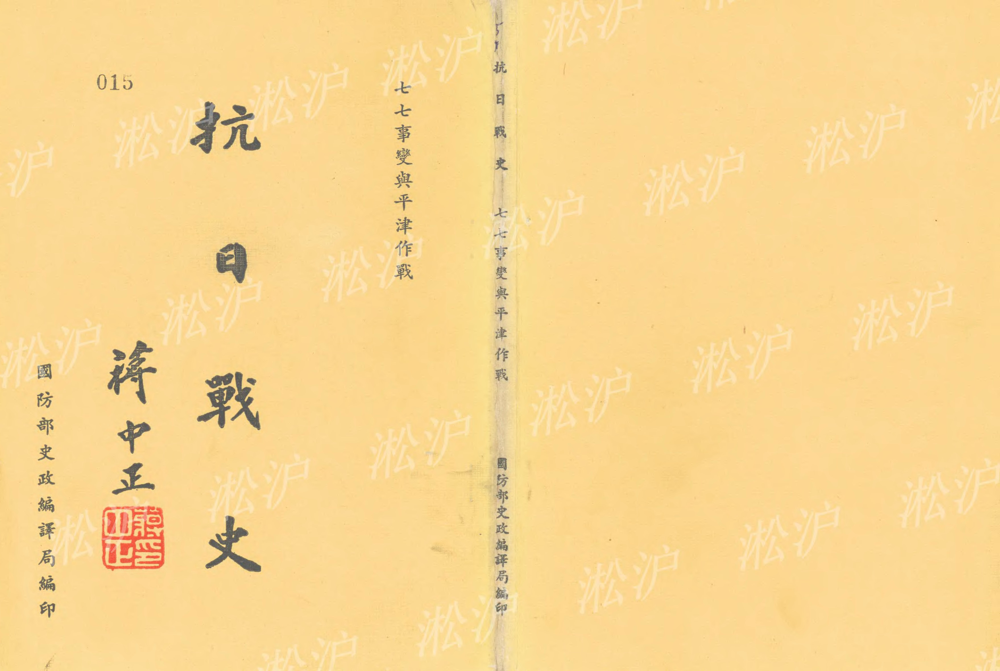

## 第五章 七七事變與平津作戰概述

### 第一節 作戰前敵我駐屯態勢第一款 敵軍

#### 第二款 我軍

第二節 敵蘆溝橋啓釁與我軍作戰指導第一款 敵軍在蘆溝橋啓釁之經過第二款 我方之緊急處置第三款 敵情判斷

第四款 我軍作戰指導方案第三節 敵我交涉與備戰第一款 敵國政府侵華之決策第二款 我國政府之決策第三款 敵我兩國政府之交涉第四款 冀察當局與敵軍之交涉及撤兵經過第五款 敵我兩軍備戰狀況第六款 兵誌概要

### 第四節 作戰一般經過七七事變與平津作戰目錄三

五

一

第五節 平津陷落後之狀況　四三

第一款 平津行政之結束與戰局宣言　四三

第二款 敵軍之動態　四四

第三款 我軍之集中及部署　四六

第六節 檢討　五三

第一款 敵軍　五三

第二款 我軍　五三

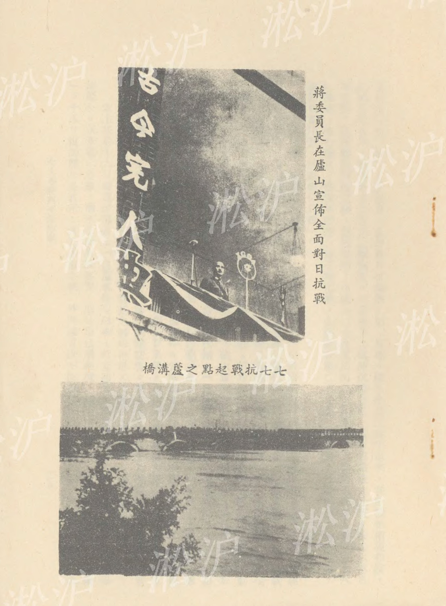

## 第五章 七七事變與平津作戰（民國二十六年七月七日至八月四日）概述

日本軍閥以向大陸發展爲其傳統之侵略政策，自民國二十年九月强佔我東北三省後，仍繼續進逼，以蠶食手段，得寸進尺，企圖逐次佔領我華北各省市，以肢解我國家。二十二年三、四月間，襲取熱河，侵入長城各口；五月三十一日，迫我簽訂「塘沽停戰協定」，壓迫我軍卽行撤至延慶、昌平、高麗營、順義、通縣、香河、寶坻、林亭鎮、寧河、蘆臺相連之線以西，敵機並得在該線以西領空自由飛行及偵察，長城迤南冀東一帶且劃爲非武裝區。嗣敵外務省發言人天羽瑛二於二十三年（日本昭和九年）四月十七日，發表封鎖中國門戶之狂悖宣言：「維持東亞和平及秩序，在日本責任上單獨行之，當然爲日本之使命」，更暴露其侵華之野心；同年冬復强併察東一部，歸入僞「滿洲國」版圖。二十四年五月，天津敵駐屯軍司令又以日租界漢奸報紙社長胡恩溥、白逾垣被刺，及遵化方面孫永勤匪部蠢動兩事爲藉口，向我平津當局抗議，認係中國有計畫之排日行動，向我提出六項强橫要求：如河北省主席于學忠下野，中央軍全部撤出河北，河北省黨部與軍分會政治訓練處停止活動及解散反日團體等；我政府再三循外交途徑與敵周旋，悉無結果。而敵方復於六月四日，藉換防爲名，增兵津沽，並聲言如不接受其全部要求，卽採斷然行動，以相威脅；我方爲配合既定政策避免事態擴大，被迫於六月十日成立「何梅協定」，敵遂公開主持華北自治運動，經我舉國一致之反對，迄未得逞。十一月十八日，其外相廣田又提出「廣田三原則」，經我拒絕後，乃復嗾使殷逆汝耕，於十一月二十四日，在通縣宣佈成立「僞冀東防共自治政府」；同年並令「僞蒙」軍李守信部侵入察北，佔領沽源、商都等六縣。二十五年，增兵平津一帶，非法駐屯各要點，與我駐軍犬牙交錯，藉端滋擾；並誘僞德王宣佈內蒙獨立，又賊使李守信及匪軍王英部，侵擾綏東各地。如此經年暴月，擾攘不已，其擾奪我華北之野心，固已昭然若揭。就中以平津爲華北政治、軍事、經濟、文化、交通重心，乃西侵察綏、南犯晉魯之戰略要地，故敵覲覷尤爲急切。

其時，我國方銳意於內部之團結與國力之整備，不欲放棄和平，輕言犧牲，故一再委曲周旋，以冀其覺悟。乃日本軍閥唯驚個人功利，不顧國運安危，自發生所謂「五一五」及「二二六」不祥事件以後，飛揚跋扈，紀綱解紐，其政府及統帥部並不能控制其部隊之盲動；復怵於我救平共匪，大政統一，國防建設，日有進步，竟無視俄匪製造戰爭之陰謀，以及美國之干涉，悍然侵華，鑄成大錯。敵駐屯軍司令官田代皖一郎愛師本莊繁「九一八」之故智，縱其豐臺駐軍，於二十六年七月七日深夜，在蘆溝橋附近非法演習，製造釁端，向我該地駐軍第二十九軍之第二一九團包圍攻擊，遂掀起中日全面戰爭之巨禍。

當時，我冀察綏靖公署主任宋哲元所部之第二十九軍約十萬人，分駐冀察各地；其駐平津地區之第三十七、第三十八師、獨立第三十九旅、騎兵第九師及保安隊等，計約四萬人以上，且有冀東僞保安隊爲內應，以之對敵華北駐屯軍一個旅團，實不難一舉擊破之。惟宋哲元主任不欲事態擴大，僅令駐軍固守戍地，期以談判覓致和平；敵方爲其增兵之掩護計，亦佯爲聲明不欲事態擴大，願與我就地進行交涉。七月九日，雙方議定停戰撤兵條件，我卽依約撤兵；不意敵方則故意遷延，迄不履行，同時調遣關東及朝鮮軍約兩師團，與華北駐屯軍分三路向北平附近前進；另由國內派遣一個師團經由朝鮮入關，企圖與其海軍會攻我津沽；於是敵軍雲集於北平東南北郊，有志在必逞之勢。但我政府始終本和平之誠意，期與敵方謀取協議；外交部遂於七月十二及十九兩日，先後向日使館提出口頭抗議，促請敵軍履約，並曾聲明我政府願接受國際公法、或條約所公認之任何處理國際糾紛之和平方法，然敵迄無表示。其外務省發言人且宣稱，對此次事件不擬接受第三國之干涉，致我和平努力之願望，終歸泡影。

我最高統帥蔣委員長、自始卽洞悉敵軍此次在蘆溝橋之藉端啓釁，爲敵方有計劃大舉侵略之開始，且確認此事件能否適當解決，實乃和戰之最後關頭，除抱定「不求戰必應戰」之決心外，一面表示願爲不喪權不辱國之和平；並於九日實施緊急處置，全國備戰，派兵北上增援，又迭電訓勉冀察當局，和談無忘備戰之旨。敵軍斯時尙未完成軍事準備，仍以和平談判爲烟幕，繼續用分化陰謀及緩兵之計，與我進行地方交涉；我冀察當局，仍本和平素志，往復與敵折衝。十九日，復在天津與敵重行訂立撤兵協定，旋我卽依約逐步實施，同時爲免敵方藉口，並圖有利和平之遂行，在此半月期間，始終未爲作戰之部署。

七月二十五日，敵駐屯軍已集結北平近郊，其第二十師團之主力已到達廊坊、楊村間地區；第五師團之一部到達楊村、天津一帶；酒井混成旅團則集結順義、昌平、密雲等地；另集結唐山以東之北寧路沿線，有敵第十師團；熱河南境則有鈴木混成旅團及第四師團之一部。至是敵軍已集中優勢兵力，對我北平形成包圍態勢。

敵軍以志在必逞，乃突然背信，在廊坊、廣安門等地，再啓釁端，並對我第二十九軍送致最後通牒，限期迫我駐守北平城郊第三十七師撤離；宋主任對敵之無理要求，當予嚴詞拒絕，並通令所屬備戰。敵駐屯軍及酒井等部隊卽於二十七、二十八兩日，向平郊我第二十九軍發動總攻擊，我軍乃奉命堅決抵抗。

蔣委員長爲因應當前機勢，遂一面電令宋主任固守平保，以待增援；一面令已到達保定（清苑）之第二十六路軍迅赴前線，參加作戰，第五十三軍進駐保定，準備應援；同時另令已動員各部隊，迅卽集中滄保線。惟倉促應戰，態勢不利，宋主任爲免故都遭受浩劫，並因奉令撤退，乃於二十八日深夜，率部退出平郊；並令第三十八師師長張自忠暫代處理冀察政務，同時遵蔣委員長前令，赴保定指揮作戰。

七月二十九日，敵以海軍及第五師團一部，分別對塘沽、大沽、天津等處同時進攻；該地我守軍第三十八師一部，經終日激戰，予敵重創後，亦奉令向南撤退。七月三十一日，我第二十九軍參戰各部，均已分別次第到達指定之靜海、大城、馬廠、固安、任邱、涿縣、房山、涞水一帶地區集結整補；留守北平城內之第二十七旅，亦於八月二日轉移平綏線方面。敵於佔領平津後，續向四郊擴展，掩護其後續兵團之集中，準備爾後之攻勢；我大軍亦集結滄、德、保、石間及居庸、南口與延慶、赤城間等地區，從事防禦部署與設施。代理冀察政務之張自忠，因平津既陷，敵益囂張，無法行使職權，遂憤而解職歸來，平津政務乃轉移敵僞之手，本作戰至此亦告結束。

第一節

作戰前敵我駐屯態勢（參照插圖第一）

第一敵

敵軍（參照插表第一）

敵人既强佔我東北四省後，復繼續對我冀察綏等省、施行其武力壓迫及政治分化等手段，造成各種傀儡組織，在冀東有「僞冀察防共自治政府」，在察北則有「僞蒙漢回自治政府」；更於各該區積極培養奸匪，成立保安自治等部隊，以供其驅策。其在華北駐屯軍，亦於二十五年續行增強至一個混成旅團，非法駐屯於山海關以西、直至北平之北寧路沿線各要點，蓄意破壞我國之領土主權，並妨害我軍之部署與行動，企圖達成其藉端啓釁擢取華北之陰謀。至二十六年，謀我之野心愈形強化：一月間，僞冀東政府行政長官殷逆汝耕，承敵華北駐屯軍司令田代皖一郎之指使，擴大僞組織之政權，充實僞保安隊之裝備，一律換用新式步槍；其日顧問井上復在津勾結漢奸程國瑞，並準備鉅款收編流匪，又對僞蒙軍李守信、王英各部餌以重金，促令乘機滋擾。二，三月間，敵除改編僞蒙軍，予以新式嚴格訓練外，並擴大商都之飛機場，且於化德增設特務機關，派森崗主持其事。四月間，華北駐屯軍在通縣、天津、山海關等處，舉行演習。五月間，原駐熱河之岸本部隊步騎約三千人及戰車一隊、與原駐通遼之敵軍一部約八百餘人，移駐多倫；其原駐通遼之另一部亦約八百餘人，同時移駐熱北之圍場；並以金錢武器供給劉匪桂堂，令在沽源招集舊部，成立四個大隊。迄七月七日以前，敵僞軍在冀察各地之部隊以及駐屯地區，概述如左：

一、敵之華北駐屯軍司令官田代皖一郎駐天津，直轄混成第四旅團，該旅團轄步兵三個聯隊、騎兵一個聯隊、砲兵及戰車兵各一個大隊、高射砲兵一個聯隊、化學兵一個大隊，分駐北平、通縣、天津、塘沽、唐山、灤縣、昌黎、秦皇島、臨榆等要點，而以平津通三處，爲其主要集結地。

二、冀東僞保安隊僞司令殷逆汝耕駐通縣，其部隊經一再擴編，計有一個教導總隊及第一至第四各總隊，共約一萬七千人，分佈冀東僞區；其教導總隊及第一總隊、則駐僞區西部之通縣、順義、高麗營、昌平、懷柔、密雲一帶，與北平城郊我軍駐地相毗連。

三、察北僞蒙軍自改編後分爲：

僞「蒙漢回自治軍」僞總司令德王駐化德，下轄騎兵第四、五、六、八四個師及砲兵一個團，其駐地以化德爲中心，並分駐寶昌、多倫等處。

僞「滿蒙征綏聯合軍」僞司令李逆守信駐張北，轄騎兵第一、二、三各師及砲兵一個團，大部均駐張北，一部分駐尙義、商都等地。

三僞「蒙古征綏軍聯隊」僞司令寶音大來，轄騎兵第七師及六個保安隊，分駐西旗及察北六縣。

上列察北僞軍各部，共約四萬人，就中以李逆守信所部萬餘人之駐地，與我察綏守軍最爲接近。

此外，尙有駐圍場、多倫敵軍約五千人，以及駐沽源劉匪桂堂所部四個大隊。

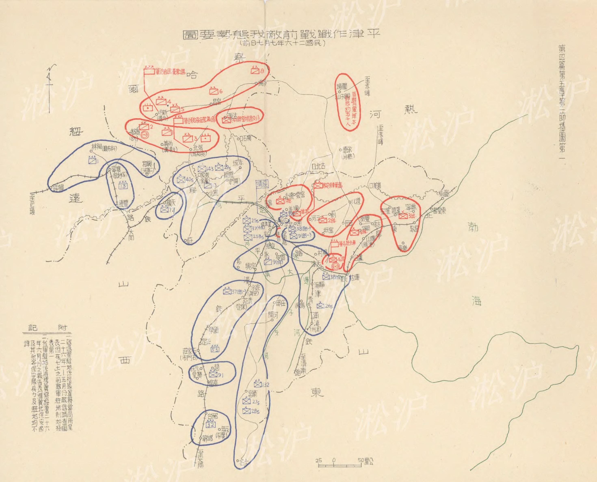

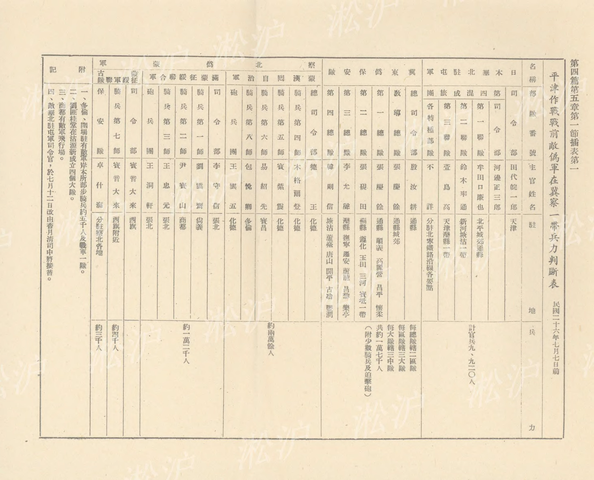

第二欵

我軍（參照插表第二第三第四）

自民國二十四年「何梅協定」成立後，第二十九軍擔任冀察之衛戍，惟是時因冀東僞組織既經出現，察北復又劃爲非武裝區，我軍駐地，遂依協定之境界而部署，未能越入僞區範圍。迄二十六年七月七日以前，各部配置概略如左：

一、第三十七師大部駐北平城內及西郊西苑、蘆溝橋、長辛店等處，一部分駐清苑，配屬該師之獨立第二十五旅，全部亦在西苑。

二、獨立第三十九旅駐北平北郊之北苑。

三、冀北保安隊分駐北平城郊各處。

四、第三十八師大部駐塘沽以西之北寧鐵路沿線各要點——大沽、天津附近及廊坊等處，一部駐南苑，配屬該師之獨立第二十六旅，駐津浦鐵路北段之馬廠、人和鎮、滄縣一帶。

五、第一三二師及配屬之獨立第二十七、第二十八兩旅，分駐任邱、河間、南宮、大名一帶。

六、第一四三師及配屬之獨立第二十九旅、獨立第四十旅與騎兵第十三旅，大部駐萬全及宣化，一部分駐察省南部各要點——懷柔、赤城、龍關、蔚縣等處。

七、騎兵第九師大部駐良鄉、固安、涿縣、易縣一帶，一部分駐於南苑。

如上所述，我軍係依據平時綏靖計畫以行配置，實未嘗含有戰備意味，其與冀東、察北僞軍壤地相接者，亦未發生事端；惟第三十七師、第三十八兩師戍區，因與北寧鐵路沿線各要點——自塘沽以西，經天津、廊坊以迄北平城郊——敵駐屯軍之駐地，犬牙交錯，雖朝夕周旋，力圖容忍，而彼則依其既定之侵略國策，劍拔弩張，不時藉端挑釁，故終不免於戰機之一觸卽發。

此外，我在冀察綏靖區內之平漢鐵路方面，尚有第五十三軍，轄第一一六、第一一九、第一三零各師，分駐徐水迄石家莊一帶；第九十一師駐趙縣、元氏、高邑一帶；第三十三軍轄第一三九、第一四一、第一四二各師，駐邢臺、永年、邯鄲一帶。

又晉綏方面與僞蒙車近接者，有騎兵第一軍，轄第一、第二、第七各騎兵師，分駐興和、陶林、歸綏等地區；第七十二師駐天鎮附近；第十三軍轄第四、第八十九、第九十四各師，駐豐鎮、集寧一帶地區。

追日軍啓覺後，我第二十六路軍及第四十軍奉命北上增援，並歸宋主任指揮。

# 第四篇第五章第一節插表第二

第二十九軍軍長

宋哲元（庚）

特務旅旅長孫玉田

第三十七師師長馮治安

第一零九旅旅長陳春玉

第一零旅旅長何基春

第一一旅旅長劉自基

第一一旅旅長張凌

獨立第二十五旅旅長

特務團團長張振華

第三十八師師長張自忠

第一二旅旅長黃

第一三旅旅長劉

第一四旅旅長董

獨立第二十六旅旅長李

特務團團長安

第一旅旅長劉

第二旅旅長景

長景

山

敏

思

堂

三

綱

華

雲

珍

澧

榮

田

第一旅旅長王

第二旅旅長

第三十八師師長張自忠

第一

旅

旅

長

劉

安

李

董

劉

黃

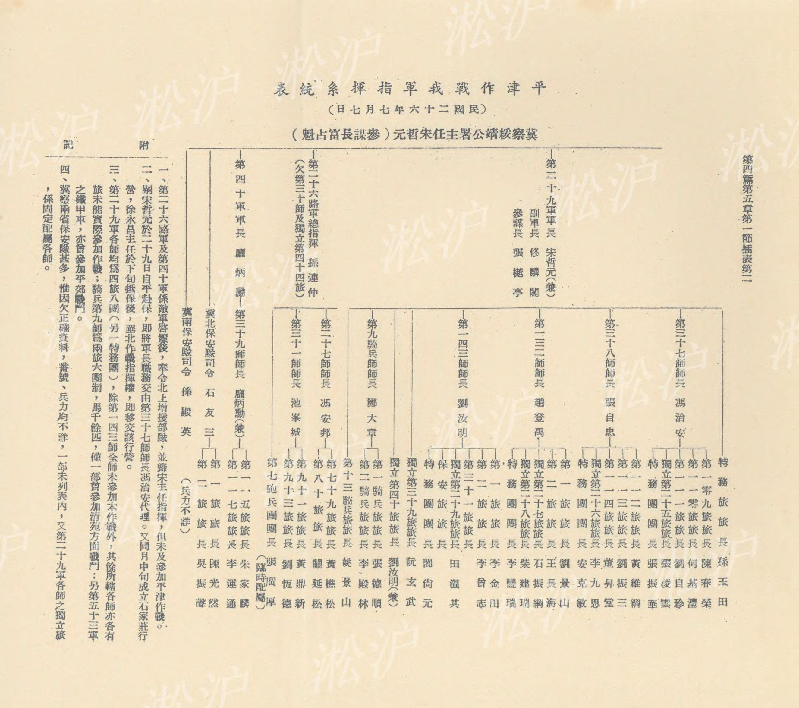

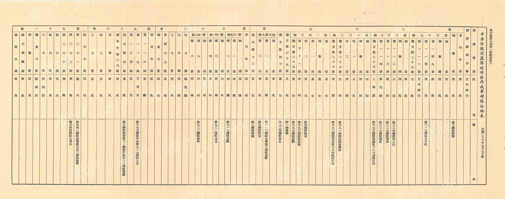

一、本作戰敵我雙方戰力，因欠缺可靠資料，故對缺乏參證紀實之一部，只有存疑。

二、本表敵我兵力比較，係以「七七」前爲第一期，「七七」至二十五日爲第二期，二十六日至三十一日爲第三期。三、敵軍於作戰前，經已分別在商都、高麗營、豐臺附近之造甲村、天津東郊之東局子完成飛機場，敵機百架左右經常停放天津，其增援入關之飛機，約半數停留臨檢，未能參加本作戰。

四、敵駐屯軍第四混成旅團轄步兵三個聯隊、騎兵一個聯隊、砲兵及戰車各一個大隊、高射砲兵一個聯隊、化學兵一個大隊；計有官兵九、九二○人，馬九三○匹，步騎槍七、八八八枝，手槍二三二枝，輕重機關槍五○五挺，各種步兵砲六十二門，（山、野、重）六十四門，高射機關槍三十挺，高射砲八門，戰車十二輛，裝甲車十二輛，計重汽車五十八輛，輕便汽車四輛，方型舟三十節，汽艇四艘，無線電二十六臺，軍用鴿三四○隻，飛機十八架。按敵軍之編裝，一般同含有騎、砲、戰車等兵種及臨時配屬飛機等。

五、僞軍皆未參加本作戰，且冀東僞保安隊主力，於作戰進行中反正來歸。

六、第二十九軍之編組概見插表第二。

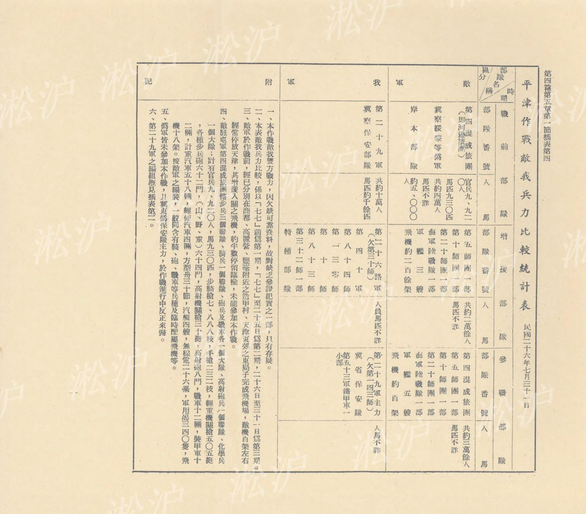

第二節

敵蘆溝橋啓釁與我軍作戰指導（參照插圖第二）

第一欵

敵軍在蘆溝橋啓釁之經過

敵於二十五年增加華北駐屯軍後，卽由津沽一帶沿北寧路向西延伸，企圖因利乘便攫取天津、北平按北平爲華北軍事政治中樞，且北寧、津浦、平漢、平綏各鐵路均交會於此，允稱戰略要點。其東北兩面因受冀東僞組織之壓迫，形勢已極嚴重；其南郊之豐臺、蘆溝橋尤據交通之樞紐，扼平南之咽喉，敵軍更欲於此兩地構成軍事據點，期完全控制北寧路，進而遮斷我南北之交通，使平津與中央形格勢禁，寢假而入其掌握，處心積慮已非一日。該兩地原由我第二十九軍各以一營駐守，二十五年九月十八日，敵軍在豐臺製造事端，迫我該處駐軍撤退，而以其駐屯軍第一聯隊之一木清直大隊非法佔駐，與我駐蘆構橋、長辛店等地之第二十九軍第三十七師第二一九團極爲接近。嗣敵更擬在豐臺、蘆溝橋中間地區購買土地，供其軍用，經我地方當局拒絕後，遂又蹈襲故智，再生事端，藉圖進佔蘆溝橋，以滿足其慾求；是故豐臺敵軍，乃時在蘆溝橋附近，實施非法演習，繼則晝夜施行實彈射擊，並屢次要求進入宛平城（位蘆溝橋之東端，我於此設有行政專員公署），均爲我婉詞謝絕。如此數月，雖幸未釀成嚴重事端，而地方政府所受之煩擾與居民之不安，實有日甚一日之感。

二十六年七月七日夜二十二時，敵軍一中隊於蘆溝橋附近演習完畢，聲言有一士兵失蹤，須進入宛平搜索，並發槍示威；駐北平敵特務機關亦向我北平市政府作同樣要求；我方以時值深夜，恐致驚擾，卽允代爲查尋，然迄無踪跡。逾時敵謂該兵已歸隊，惟須查明其失踪原因，於是雙方派員赴宛平就地調查。

是時，豐臺敵軍全部已三面包圍宛平城，至八日五時，卽首先向我蘆溝橋鐵路橋守兵猛烈進襲，大井村敵砲兵亦對該點行急襲射擊，橋東端我守兵一排全部犧牲，該處遂爲敵佔領；同時敵另一部約三百人，由龍王廟偷渡永定河，企圖進襲我長辛店駐軍，我軍不得已，乃扼守蘆溝橋西端及其以北地區，實行抵抗。激戰約四小時，敵一木清直大隊長被擊斃於陣前。十二時，敵森田聯隊附率兵四百餘名，自北平來援，在公鐵路兩用裝甲車六輛支援下，復向我猛烈進迫；經我數度突擊，至十五時敵未得逞。斯時敵牟田口聯隊長致函專員公署，要求我軍於二十時以前，撤退至永定河以西，否則砲擊該城；我軍以守土有責，當予拒絕。旋敵果於十八時三十分，集中砲火向宛平城內及蘆溝石橋猛烈射擊，我城內居民雖頗有傷亡，房舍亦多被燬，但陣地屹然無恙。

當時冀察政務委員會委員長——兼冀察緩靖公署主任及第二十九軍軍長宋哲元，適假歸山東樂陵原籍；但北平市市長秦德純、河北省主席兼第三十七師師長馮治安、天津市市長兼第三十八師師長張自忠等均在平，分負軍政處理之責。宋主任得悉敵軍啓釁，卽電令消滅當面之敵。秦市長、馮主席等亦以敵軍自七日迄今八日，迭次無理進攻，擬於八日夜予以反擊；除嚴令蘆溝橋守軍堅守陣地外，並令駐西苑之第一一零旅（欠第二一九團），經由八寶山進出五里店、大井村一帶（均位蘆溝橋東北），攻擊敵之側背。我第二一九團自團長吉星文以下全體官兵，激於義憤，於九日零時，由長辛店猛襲永定河右岸之敵；經四小時劇烈肉搏戰後，該敵不支，向永定河左岸潰退，遺棄武器甚夥。敵懾於前線失利，同時爲爭取時間，增強兵力，調整部署，於是與我進行和平談判，當議定撤兵條件凡三項：

一、雙方立即停止射擊。

二、敵軍撤至豐臺，我軍撤至永定河迤西地帶。

三、宛平城防，由冀北保安隊二、三百人擔任。

並約定於九日九時，在雙方派員監視下撤兵。屆時我第二一九團駐宛平城之一營，依議撤至長辛店；冀北保安隊百餘人亦依敵方要求，僅攜步槍接替宛平城防務；而城外敵軍雖稍行後移，仍留置一部於陣地，未肯盡撤。十日午前，經我方質詢，彼則談稱尋覓陣亡士兵屍體，於是又洽商雙方派員共同搜尋；正出發間，得悉豐臺已增到敵步、砲兵各約一大隊，且五里店、大井村一帶復又爲敵進佔。我冀察當局憤敵背約，擬卽下令反攻，事爲敵人偵知，自審兵力仍嫌不足，乃多方進行疏解，致我之反攻未成事實，僅令我已退長辛店之一營，重行進入原陣地，以連繫宛平城之保安隊嚴密戒備。

第二欵

我方之緊急處置

七月九日，我最高統帥蔣委員長獲悉敵軍啓釁後，立即電示宋主任：「守土應具必死決戰之決心，與積極準備之精神應付，至談判尤須防其奸狡之慣技，務期不喪絲毫主權爲原則，吾兄忠貞亮節，中所素稔，此後尙希共爲國家民族前途互勉」。旋接冀察當局電呈：「勢已緩和，擬請將前派北上四師，在原地集結待命，以免刺激」。同時電促軍政部長何應欽由川返京，籌劃全面抗戰事宜，並於同日作如左之緊急處置。

一、令第二十六路軍總指揮孫連仲，由平漢路方面派兩師，卽向石家莊或保定集中。

二、令太原陳總指揮長捷，轉知第八十四師師長高桂滋，卽率該部向石家莊集中。

三、令運城第四十軍軍長龐炳勳，卽率所部速向石家莊集中。

四、電冀察緩靖公署主任宋哲元：「此間已派孫仿魯（連仲）部兩師，向石家莊或保定集中，及龐炳勳部與高桂滋部先向石家莊集中，希兄速回保定指揮可也」。

五、令各軍事主管機關：日軍挑釁，無論其用意如何，我軍應準備全部動員，各地應嚴加戒備，並準備宣戰一切事宜；除前令各部隊卽向指定地點開動外，第二十一、第二十五兩師及第三軍亦令動員候調爲要。

最高統帥

蔣委員長於十日據宋哲元主任佳九戌電略稱：「此間戰事，業於今晨停息，所有日軍均已撤退豐臺，似可告一段落」。遂訓令各行營、綏署、及省、市：「日軍挑釁，齊（八）日與我第二十九軍部隊相持於宛平附近，當經通飭一體戒備，準備應戰，並調第二十六路兩師、第四十軍、第八十四師各部迅開保、石，以備應援，另令第二十一、第二十五兩師繼續開拔，已各如前令。頃據報雙方撤兵，聽候談判，但日人詭詐，用意莫測，我全國各地方、各部隊仍應切實準備，勿稍鬆懈，以防萬一，是爲至要」。同日，並電示宋主任：「務望在此期間，從速構築預定之國防線工事，星夜趕築，如限完成爲要」。

何部長於十日由川返京，遵蔣委員長全國動員抗戰之意旨，於十一日起，召集各有關主管部，逐日舉行會報，使一切軍事準備，由平時進入戰時狀態，並詳細研擬作戰方針與策略，呈蔣委員長核定，其重要措施如左：

一、戰鬥序列草案之規定：將全國軍隊悉數編入抗戰序列，計第一線爲一百個師，預備軍約八十個師。依此序列而使用於河北省者，共約五十個師，正陸續向滄縣、保定、石家莊一帶集中；並限令第一線兵團於七月終以前到達預定之位置。旋復擬定大本營及各級司令部之編制，定於七月終祕密成立。

二、彈藥之整備：將軍政部年來存儲之彈藥（約可供全軍作戰六個月之需），擬定計畫，依作戰之要求，分設彈藥總庫及分庫各若干；在長江以北應屯積三分之二，江以南屯積三分之一，並限於七月終以前，搬運完畢。又爲準備長期抗戰，並顧慮我兵工廠萬一被敵機炸燬起見，已與法、比兩國商洽購辦，第一步由香港輸入，如香港發生故障，則由海防經安南入廣西，使軍械與彈藥之補充，不虞缺乏。

三、糧秣之購備：限期購辦一百萬人、十萬匹馬用之六個月份糧秣。

四、防空兵器及新兵器之分配：所有防空高射砲、高射機關槍、三七戰防砲、八八高射砲及各要塞之新砲，均已分配妥當，分別配置，並限期裝置。

五、總動員之籌畫，已呈准設立總動員建設委員會，辦理全國總動員事宜，何部長爲主任委員，各關係部次長皆爲當然委員，正積極進行中。

六、交通通信之整備，正積極進行中，並定於七月終，祕密成立鐵道運輸司令部。

七、兵站之設置，定於七月終開始組織所要之機構。

八、海軍作戰計畫之擬定，令海軍部限期呈出。

九、京滬區江岸工事及交通通信之設施，令京滬路警備司令張治中負責辦理。

十、兵員之補充及民衆之組織訓練，已成立補充兵三十個營，其民衆之組織及壯丁之訓練，均已擬有詳細計畫。

#### 第三款 敵情判斷

##### 第一項 對敵作戰兵力之判斷

一、陸空軍：敵對俄方尚有顧慮，其對我使用之兵力，僅能限於一部；如單獨對我作戰時，除控置一部必要兵力隨時應付俄軍外，將以最大限兵力，迅速擊破我軍，然後舉全力轉用於對俄，或應付其他之國際變化。如是其對我可能使用之兵力，經判斷如左：

第一期：常備師，約十五、六個師團。

第二期：預備師，約十四、五個師團。

第三期：爾後如國際情況尚無變化，可能有半數、或三分之二以上兵力增加。

至於其陸軍航空部隊，將傾其所有之大部或全部一千四百八十架，予我以最大之威脅與破壞，俾屈服我之抗戰意志；其他如獨立砲兵部隊與機械化兵團之主力，亦自在使用之列；又當遇我堅強抵抗或戰爭陷於持久狀態時，化學部隊之使用，亦所難免。

二、海空軍：敵海軍對我作戰之實力，當以駐華之第三艦隊爲基礎，計軍艦二十三艘，共約三萬噸，員兵五千餘名；但臨時仍可增加其陸戰隊，計在上海者約四千餘名，在漢口者約六百名。至於戰時其他艦隊，對於我國海岸更隨時均有出動砲擊之可能；例如其第一、第二艦隊及若干預備艦爲戰略上之必要，於某時期封鎖華南、華北沿海重要城市，砲擊要點及遮斷海上交通等，自屬意料中事；尤以北自威海衛至迤南之膠州灣沿岸、靑島、海州、上海、福州、汕頭、廣州、北海等地，爲其重要目標，或擇要破壞，或掩護其陸軍登陸，或封鎖海外交通，勢在必行。至其淺水艦艇屆時沿長江下游出擊，以破壞或截斷京滬交通，或攻略江陰等要塞，亦自可肆其威脅。

敵海軍航空部隊飛機全數當在千二百二十架左右，屆時將以其必要之數量，參加海陸作戰；最初將由航空母艦，沿華南海岸擇地停泊以爲根據，若沿海要地被其侵佔，則將利用之以爲建築基地。

##### 第二項 冀察當局對敵企圖之判斷

敵軍似將以奇襲手段，一舉攬奪平津後，卽先注其全力攻擊南口，進犯察南，然後乘勢南下，以期獲得戰略有利態勢，逐漸攫取華北，其可能採取之行動步驟如左：

一、敵將先爭奪北平、天津，然後以一部扼守平津要點，以主力進攻居庸關、南口，以攫取平北之咽喉。二、敵爲策應南口之攻略，將以有力之一兵團，由多倫出張北，下張垣，以樹我南口守軍之背。

第四欵

我軍作戰指導方案

自敵軍在蘆溝橋啓釁後，冀察綏靖公署主任兼第二十九軍軍長宋哲元等力圖容忍，進行談判；敵人亦以兵力尚未集中，屢次表示避免事態擴大，期利用和平烟幕，爲其增兵之掩護。但我中央已洞燭敵人狡謀，除一面如前所述，進行緊急處置，及準備全面抗戰外，一面迭電冀察當局，示以和平限度，並令嚴密戒備。無如冀察當局未盡明瞭中央意旨，復受敵人挑撥及漢奸包圍，徘徊於和戰之間，故自七月十一日起至二十四日止之兩週間，我第二十九軍未能積極備戰。至二十五日，敵之軍事準備業已完成，首先攻我廊坊；二十六日，更以最後通牒，要求我方限期撤退北平城郊駐軍。宋主任至是始知敵有預定計畫，遂飭各部卽日準備應戰，並報告軍事委員會：北平方面尚可支持，天津方面兵力單薄，危險萬分。二十七日，敵軍大舉圍攻北平四郊，南苑、團河、豐臺、西苑、通縣等處均有激烈戰鬥；宋主任乃拒絕敵方通牒，並擬令孫連仲部集結於保定、任邱、雄縣、固安一帶，龐炳勳部集結於滄縣以北唐官屯、靜海一帶，以資策應。二十八日，冀察當局建議中央，請將北上部隊由津浦路進出冀東，截敵歸路；同時請令綏遠各部出擊察北，並要求使用空軍。

我北上增援部隊，截至二十五日止，已集結滄保線者四師，到達石家莊及其以北者五師，其餘正繼續向德州、石家莊之線輸送中。

軍事委員會接二十六日宋主任報告後，卽擬具作戰指導如左：（參照插圖第二）

一、第二十九軍與敵之混戰，今已開始，可知敵有先擊滅第二十九軍之企圖。

二、現中央北上部隊，以德、石線爲主力集中地域，以滄、保線爲集中掩護線，距平津過遠，不易增援。三、現可採用者，有下列兩案：

○將滄、保線部隊推進至永定河岸，以便增援北平，而將主力之集中地域，推進於滄、保線。

中央軍仍在滄、保及德、石線集中，而指導第二十九軍退出北平，以保實力，免被敵各個擊破。

右案於二十七日呈蔣委員長決定，我軍仍照原定計畫，在滄保、德石兩線上集中，構成陣地，期在此線與敵作戰。同日下達電令如左：

一、令冀察綏靖主任宋哲元：中央軍以援助平津，預期與敵在永定河地區作戰之目的，先以主力集結於滄縣、保定之線；第二十九軍應固守北平、蘆溝橋、長辛店、涿縣，與保定方面保持確切連繫。

二、令第三十六路軍總指揮孫連仲：卽率部向永定河地區前進，該路軍此後歸宋哲元主任指揮，所遺保定、任邱、河間、獻縣防地，已令第五十三軍接替。

三、令第五十三軍軍長萬福麟：卽將所部推進於保定、任邱之線，接替第二十六路軍防地，並在該線上構成陣地。

四、令第四十軍軍長龐炳勳：該部應盡力在滄縣、獻縣一帶，星夜趕築工事，先固該線防務，務於三日內完成第一期初步工事以後，繼續加强爲要；至於向靜海推進一節，當俟後方部隊集中後，待令推進可也。

蔣委員長於二十七日電示宋主任：「第二十六路軍應卽前進勿延，龐部現尚未集中，應令在滄縣待後方部隊到達後，向前推進。此時應敵，先要鞏固現有陣地，然後方易出奇制勝，所謂先求穩定，次求變化，望兄記之」。

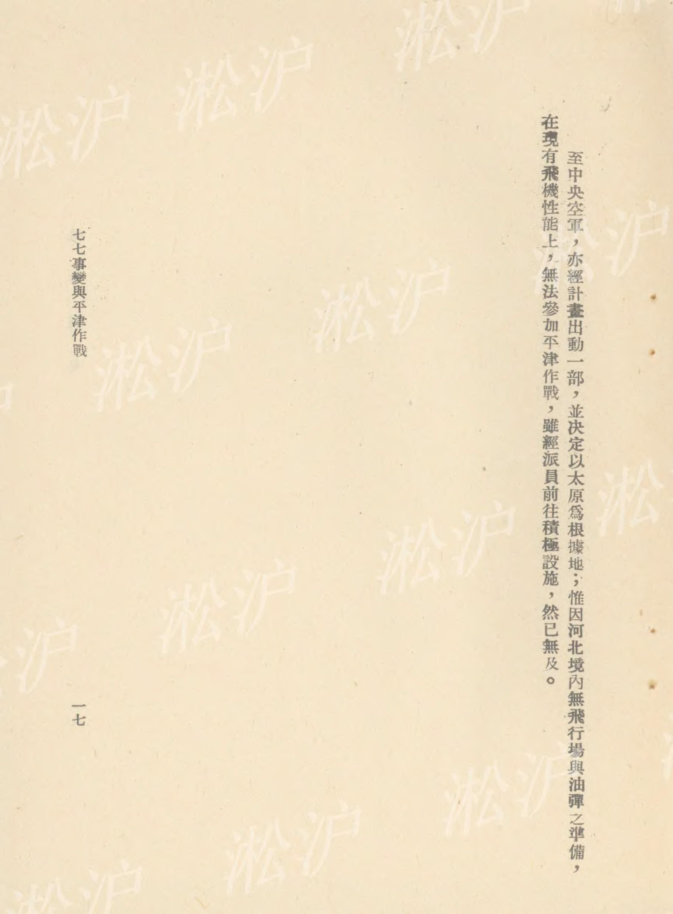

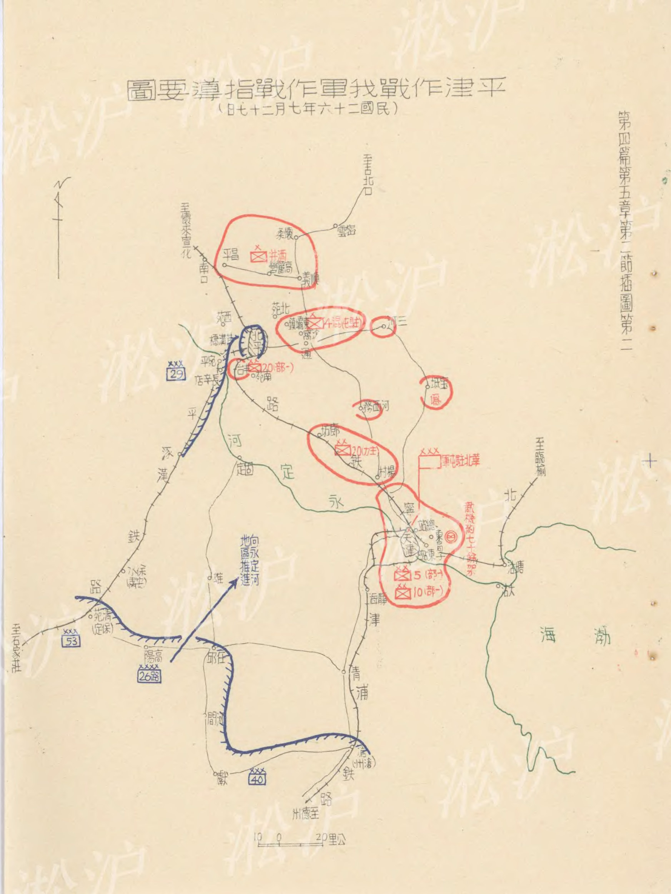

### 第三節 敵我交涉與備戰

第一欵

敵國政府侵華之決策

當敵軍於蘆溝橋啓釁之初，日內閣及軍部曾召集會議，且均聲明不擴大方針。但至民國二十六年七月十一日，日首相近衛文膺及參謀總長閑院宮晉見日皇後，卽召集海陸外藏四相舉行兩次緊急會議議決：「一、發動自衛權。二、向中外聲明。三、支出必要經費，並期舉國一致擔任該事態之處理」等原則。於是策定侵華計畫，並卽決定以重兵三路進攻華北：第一路由關東軍派遣鈴木、酒井兩混成旅團，由熱河向北平以北地區前進，第二路由朝鮮派遣第二十師團入山海關向北平以南地區前進，第三路以華北駐屯軍河邊混成旅團（卽混成第四旅團）爲基幹，向北平以東地區前進，對北平取分進合擊態勢；另由國內派遣第五師團，經朝鮮入關，與海軍會合，圍攻天津、塘沽；同時任命對華素主急進之香月清司中將，爲華北駐屯軍司令官（前任田代皖一郎病死）；敵海軍省令第三艦隊旗艦出雲駛滬警備，佐世保第八戰隊準備出發；敵外務省則令駐華日僑作撤退準備。是夜近衛並召集各界發表聲明，略謂：「事已至此，帝國亦不得不有重大決心，政府處理此事之方針，不欲擴大而求和平解決，但中國方面連年排日侮日態度最近尤甚，爲促進中國之反省計，誠有派遣相當兵力之必要，但軍隊派遣，並非表示和平絕望，乃爲一面出兵，而一面進行交涉，關東軍、朝鮮軍及內地軍之派遣，同爲不得已之事也」。

十四日，日外務省發言人聲稱：「對於蘆案，如有第三國調停，日本當毫不介意」。十六日，東京敵負責方面宣稱：「日本政府不致接受第三方面對於華北事件之調停或干涉」。嗣日政府接到我十九日備忘錄，並獲悉十九日成立地方協定，卽於二十日兩次召開閣議，決定對我用兵，其外務省並發表聲明：「中國中央對地方多次重要交涉未嘗置喙，獨此次對於冀察與日本談判，則要求須得中央許可，顯係有意妨害圓滿解決」。二十一日，日內閣書記長聲稱：「華北局部協定，已於十九日夜十一時成立，日政府本乎既定方針，監視其履行，並決定充分自衛之適切辦法」。

#### 第二款 我國政府之決策

我外交部於二十六年七月十一日發表聲明：「據所得報告，日軍不遵照雙方約定之停止軍事行動辦法，拒絕全部撤至指定地點，首則留置部隊二百餘名於蘆溝橋東北之五里店，繼則調動大部軍隊千餘人，集結於蘆溝橋東北之大瓦窯，於十日下午六時起，連續向我蘆溝橋駐軍猛烈攻擊，同時並調集日本國內外大軍，絡繹向平津開進，意圖作大規模之軍事行動，而貫澈其最初目的，至是蘆溝橋事件，遂又趨於嚴重，其責任自應由日方負之。此次事件，發動於七日深夜日軍在蘆溝橋非法演習時，聲言士兵一名失踪，要求入城搜查，經我方拒絕，彼遂發砲攻城，致起衝突，其爲日方有計畫有作用之行動，至爲顯然；而蘆溝橋原非條約所許外人可駐軍演習之地，其行爲之不合法，尤無疑義。我方除由蘆溝橋駐軍守土自衛，奮勇抵抗外，一面由外交部向日使館提出抗議，要求立即制止日軍之軍事行動，並聲明保留一切合法要求；一方面由地方當局，與日軍代表折衝，期事件之早日和平解決，我方維護和平苦心，可謂舉世共見。迄八日晚，雙方議定辦法：一、雙方停止軍事行動。二、雙方出動部隊各回原防。三、蘆溝橋仍爲我軍駐守。方謂事件於此告一段落，初不料所謂撤兵辦法，竟係日方緩兵之計，毫無和平解決之誠意。中國國策、對外在於維護和平，對内在於生產建設，舉凡中日間一切懸案，均願本平等互惠之精神，以外交之方式，謀和平之解決。深盼日本立即制止軍事行動，遵照前約，卽日撤兵，並爲避免將來衝突起見，切實制止非法之駐軍與演習，庶使事態好轉，收拾較易；否則，一誤再誤，日方固無以自解其重責，遠東之安寧，或將不免益趨於危險，恐尤非大局之福也」。

我外交部十二日發言人稱：「……任何解決辦法，未經中央核准者，自屬無效」。

我政府於十六日，對九國公約簽字國家（日本除外）及蘇聯、德國分致備忘錄聲稱：「日軍於蘆溝橋之突然襲擊與侵入華北，顯然破壞中國主權，而與九國公約及國際盟約相牴觸；此種事態，如聽其自由發展，不獨即將擾亂東亞和平，且將使世界其他各處，受不可逆料之影響。中國不得已，將用其全力，以保衛疆土與國家尊榮，但亦準備以國際公法與條約所有之和平方法，與日本解決爭端」。

我最高統帥

蔣委員長於二十六年七月十七日，復就此事在蘆山談話會發表談話，內容要旨見第三篇第二章。

第三欵

敵我兩國政府之交涉

先是我外交部對於蘆溝橋案，於民國二十六年七月八日，已向日使舘提出口頭抗議，略謂：「此次事件，顯係日軍挑釁，責任不在我方，我應保留一切合法要求，中日關係已至最後關頭，不容再趨惡化，應請貴方速電華北駐屯軍，立即制止一切軍事行動，並令駐屯軍代表與冀察政委會所派人員，急速根據正確事實，立謀和平解決，藉免事態之擴大」。其時，敵使舘參事日高當卽表示：對此次事件無意擴大，深信不致惡化，並允立即電知駐屯軍制止軍事行動。十一日，我對日使舘二次口頭抗議：「貴方立卽制止華北駐屯軍不履約撤兵，反增兵向我進攻之違法背信行動；並保留我一切合法要求」。十二日，以外交部發言人意見作成節略，正式送達日使舘；是時日使川樾逗留青島、天津各處，並發表談話，謂地方事件，仍應由地方解決爲宜。我政府因歷時經旬，事態益形重大，曾表示希望川樾早日返京切實談判，而川樾迄未成行。

日使館十七日致我備忘錄，其內容爲：「一、要求中國政府停止挑戰之言論及行動。二、要求中國政府容許地方交涉，並勸告停止中央軍北上。十八、十九兩日，日武官大城戶、喜多先後謁見我軍事當局，均以我政府派兵北援爲言，並謂中日局勢已到最後階段，希望撤退軍隊，否則局勢將有擴大之虞。我當答以目前緊張局勢，全係日方派遣陸空軍所造成，我方自始希望和平解決，並無擴大之意；但鑒於日方調派大軍於河北省，不能不有所準備，此種準備，全係出於自衛，並無挑戰之意。中國軍隊均是國軍，無所謂中央軍與其他軍，中國政府在中國領土內，必要時調動軍隊實屬當然之事；但如日方能將新增之軍隊撤退，中國方面亦可考慮作同樣之行動。總而言之，事態之擴大與否，在日本而不在中國也。我駐日大使許世英於十九日在神戶發表談話，謂我政府對蘆事，堅持不擴大與外交解決兩大方針，今年爲中日兩國最重大危機，兩國朝野應以誠意努力改善，果能依正義與誠意，則解決當非至難。

我外交部十九日致日使館備忘錄：「自蘆溝橋事件發生後，我國始終不欲擴大事態，始終無挑戰之意，且曾屢次表示願以和平方法謀得解決。乃日本政府雖亦曾宣示不擴大事態之方針，而同時調遣大批軍隊，開入我國河北省內，迄今未止，顯欲施用武力；我國政府於此情形之下，固不能不作自衛之適當準備，然仍努力於和平之維持。本月十二日，外交部長接見日本大使館日高參事，曾提議雙方停止軍事調動，並將軍隊撤回原地，日方對此提議迄無表示，不勝遺憾。現在我國政府願重申不擴大方針與和平解決本事件之意，再向日本政府提議，雙方約定一確定日期，雙方停止軍事調動，並將已派武裝部隊撤回原地；日方既抱和平折衝之希望，想必願意接受此項提議。至本事件解決之道，我國政府願經由外交途徑，與日本政府立即商議，倘有地方性質可就地解決者，亦必經我國中央政府之許可。總之，我國政府極願盡各種方法，以維持東亞之和平，故凡國際公法或國際條約對於處理國際糾紛所公認之任何和平辦法，如兩方直接交涉斡旋調解公斷等，我國政府無不樂於接受也」。

第四欵冀察當局與敵軍之交涉及撤兵經過

民國二十六年七月九日之停戰約定，因日軍未能踐約撤退，致仍成僵局。嗣宋主任奉電由樂陵原籍趕赴保定，十一日因雨阻於天津，乃改派在平之天津市市長張自忠等，爲第二十九軍之代表，經與敵方代表議定左列和平條件。

一、第二十九軍代表對於日本代表表示遺憾之意，並處分責任者，以及聲明將來負責防止不再發生類此事件。

二、中國軍隊爲避免與日本豐臺駐軍過於接近，容易惹起事端起見，不於蘆溝橋城郊及龍王廟駐軍，改以保安隊維持其治安。

三、認此事件多胚胎於藍衣社、共產黨、及其他抗日系各種團體之指導，將來除對之講求對策外，並須澈底取締。

右件於七月十一日二十時，由張自忠、張允榮（前任冀察保安處長）書面簽定後，送達敵方，並商定於十二日，雙方派員至蘆溝橋附近監視撤兵。

十二日，我軍依約撤至長辛店及衙門口後方地區；敵軍僅有一部撤回北平日兵營。迄二十時，其大部仍佔領大瓦窯、五里店、郭莊、大井村之線構築陣地，並無退意。我爲防敵襲，乃令已撤退之第二一九團佔領永定河右岸，第二二零團佔領西新莊、東新莊、張遺村、吳家村、小瓦窯之線，與宛平城郊之保安隊連繫，對敵戒備；另令獨立第二十五旅佔領八寶山，以資策應。

是日，侍從室錢大鈞主任以敵軍不肯撤退，則彼必待其關東軍到達後，積極向我進攻，乃電囑秦德純市長從速加緊備戰；何部長亦因天津附近遍佈敵軍，蘆案日趨嚴重，電促宋主任卽刻祕密赴保指揮。

敵新任華北駐屯軍司令官香月清同於十二日抵津，旋派參謀長橋本羣、特務機關長松井及參謀和知與我代表張自忠、張允榮、鄧哲熙以及蟻附之漢奸陳覺生、齊燮元等，自十三日起，交涉重心移至天津，續就十一日簽訂條件之細則及實施辦法，進行談判。

敵除要求我向其道歉及懲處肇事者外，對我要求其早日撤兵之議，則堅持須俟完全解決後再行實施。雙方意見雖未及時接近，惟經齊燮元、陳覺生等之從中奔走，故談判迄未中斷。

最高統帥蔣委員長曾於十三日電示宋主任：「蘆案必不能和平解決，無論我方允其任何條件，而對方目的、則在以冀察爲不駐兵區域，與區內組織用人皆須得其同意，造成第二冀東，若不做到此步，則彼必得寸進尺，決無已時。中早已決心運用全力抗戰，寧爲玉碎，不爲瓦全，以保持我國家與個人之人格。平津國際關係複雜，如我能抗戰到底，祇要不允簽任何條件，則在華北有權利之各國，必不能坐視不理；而且重要數國外交，皆已有把握，中央决宣戰，願與兄等各將士共同生死，義無反顧。總之，此次勝敗，全在兄與中央共同一致，無論和戰萬勿單獨進行，不稍與敵方以各個擊破之隙，則最後勝利必爲我方所操，請兄堅持到底，處處固守，時時嚴防，毫無退讓餘地。今日對倭之道，惟在團結內部，激勵軍心，絕對與中央一致，勿受敵欺，則勝矣；除此之外，皆爲絕路，兄決意如何，請速詳告」。

宋主任斯時受敵方挑撥，漢奸包圍，滯留天津，未能遵命卽時去保；乃於十四日電覆何部長：因兵力大部在天津附近，且天津地當衝要，故先到津佈置，俟稍有頭緒卽行赴保。

數日以來，敵我兩軍雖在蘆溝橋保持對峙，由於敵之大軍源源入關，平津情勢愈形嚴重。中央爲期冀察當局完全明瞭中央對抗戰之準備與決心，特派參謀本部次長熊斌赴保，以便於聯絡。

何部長十五日致電宋主任、秦市長、馮主席：「頃據確報，豐臺之日軍現已集中包圍南苑一帶，首先消滅南苑一萬二千之我軍，此將爲日軍機動之第一目標。雖自昨晨三時半以來，當地情勢稍現和緩，談判亦已重開，然中外富有眼光之觀察者，以爲現下之混沌沉悶狀態，實有詭譎欺詐性質；衆人以爲日軍當局，現僅等待增援完竣，然後發動，以驅第二十九軍於河北省境外耳——等語。查日人效「一二八故事，先行緩兵，俟援軍到達，卽不顧信義，希圖將我第二十九軍一網打盡，形勢顯然，最爲可慮，望卽切實注意，計畫應付爲禱」。

宋主任對十一日簽訂之和平條件，未卽報告中央，但最高統帥蔣委員長已由各方獲悉是項交涉經過，乃於十六日電示宋主任、秦市長：「連日對方盛傳見等已與日軍簽訂協定，內容大致爲：一、道歉，二、懲兇，三、蘆溝橋區不駐兵，四、防共及取締排日等項。此時協定條款，殆已遍傳歐美。綜觀現在情勢，日方決以全力威脅地方，簽訂此約爲第一目的；但日方所欲者，若僅止於所傳數點，則其大動干戈，可謂毫無意識。推其用意，簽訂協定爲第一步，俟大軍到達後，再提政治條件，其嚴酷將恐甚於去年之所謂四原則八要項。觀於日本外次崛內告我楊代辦：「已簽訂地方協定爲局部解決之基礎」一語，並足證明此基礎之外，另有文章也，務希兄等特別注意於此。今次事件，絕非如此已了，祇要兄等能堅持到底，則成敗利鈍，中願獨負其責也，如何盼覆」。當時敵人又謀離間中央與冀察當局，以期促使第二十九軍內部之分化，如謂中央軍北上，係利用抗日名義，以消滅冀察政權及第二十九軍；又謂日軍目的在驅馮（第三十七師），於張（第三十八師）絕無妨害。宋主任及第二十九軍將領雖國家觀念極重，自亦難免無所懷疑，幸經蔣委員長、何部長之剽切指示，及熊次長之疏解，疑團乃漸冰釋。

宋主任於十六日覆電何部長：「自蘆事發生以來，哲元卽首先顧慮全局之如何發展，周詳審慎，以期萬全。茲奉電示各節，倘不幸而眞成事實，則是現已陷絕境，應請中央作第二步準備，以待非常之變。十八日復對熊次長表示：當此多事之秋，外間謠言決不能置信，現在危機四伏，將見如二十四年之往事；日本企圖佔領華北之表現，已無可諱言，弟向以國家爲前提，以民族爲依歸，本中央之意旨辦理，決不作喪權辱國之事。是日秦市長致何部長及侍從室錢主任電云：「弟詳釋蔣委員長十六日電，默察現局，既佩籌帷之遠，尤感曲諒之誠，私衷感奮，匪可言喻。純竊以目下日方對我國最近實力，未敢輕視，尤以在蔣委員長領導下，舉國一致之抗戰，更不無戒心，因此用盡挑撥離間之手段，分化我中央與地方之情感，而達其不戰而勝之狡計。今日之事，最緊要者，一、中央地方結成一團，聲息貫通，動作一致，二、地方聽命中央，中央曲諒地方，三、調整北來各部隊之指揮系統，以收指臂之效，四、蘆事如能在實際上不喪權、不辱國之原則下，告一段落，請中央示以寬大，國人勿過責難，五、迅卽準備抗戰。如此、我爲自衛守土而戰，以哀矜必死之心，當舉世皆仇之日，定能博得國際同情，取得最後勝利也，謹供悃誠，請轉呈核示爲禱」。

宋主任等在此期間，已知戰爭之終不可免，然感於部隊駐地分散，集結不易，乃欲利用談判緩衝期中，以行集結與部署；復以漢奸與親日份子夢想和平，從中奔走，雖敵方增兵繼續不已，而我北上國軍，亦有一部到達滄保，故與敵方之談判，迄仍賡續進行。十八日，宋主任於某俱樂部與香月晤談，雙方表示不願事態擴大，並希望早日恢復蘆溝橋事件前之和平狀態。旋於十九日由津赴平；當卽電告熊次長：「本人始終站在國家立場、國民地位，本中央意旨處理，希望中央忍耐，希轉陳」。同日二十三時，第二十九軍代表與敵軍代表橋本羣等仍依據十一日之條件，復在天津成立協定；惟細則較原議更爲繁苛，如第三十七師不得駐紮北平城及蘆溝橋，卽其顯例。

嗣經商定，我軍於二十一日，敵軍於二十二日，在雙方派員至蘆溝橋監視下撤兵。其間豐臺敵軍雖曾在十九、二十兩日，迭次向我蘆溝橋砲擊挑釁，但我第三十七師之第一一零旅仍依約將蘆溝橋、龍王廟、衙門口、八寶山等處陣地，交由冀北保安隊一部接替後，向後撤退。二十二日，敵軍除大井村附近七七事變之平津作戰

之砲兵大部向豐臺撤退外，其前線步兵僅後退里許，大部仍集結五里店、大井村兩地。同日，北平城防部隊，亦依協定更換。至是，宋主任乃就十一日與敵方所訂條約，呈報中央。

二十三日，强據蘆溝橋、宛平城東、五里店與大井村一帶之敵軍，仍未撤退，我監視人員促其履約，竟遭拒絕，繼而大、小井村附近反行積極增兵，並構築工事。因此我軍被迫仍回原陣地，恢復二十一日以前之對峙狀態。

是時敵軍宣稱：「一、蘆溝橋日軍之撤退，須視華軍誠意如何，故此際尚非其時，二、日軍撤至豐臺後，是否駐在豐臺，抑調往他處，或回本國，全須視中國方面能否履行一切條約而定，三、由關外增援之日軍，是否卽行復員或仍駐關內，須奉到陸軍省命令後決定」。二十四日，張自忠市長復以撤兵問題走訪香月，而香月則藉病辭避。自十一日以來之地方折衝，至是終成虛語。

第五欵

敵我兩軍備戰狀況

##### 第一項 敵軍增援與滋擾

民國二十六年七月十一日，敵分三路出兵集結華北，第一路關東軍、第二路朝鮮軍、均於卽日動員，第三路華北駐屯軍、亦各由其駐屯地，次第向北平近郊集結；其國內第十師團及第五師團於十四日動員，第六師團則於十五日動員，並令該部向熱河集中。爾後敵軍卽分由北寧鐵路及長城各口並取道海上，源源入關，其逐日增援及騷擾情況如左。

十二日

一、敵兵車十列分載各種部隊，附戰車、汽車、彈藥等，由山海關陸續西開，迄本日二十時止，已有五列車到達天津附近，另飛機十五架及鐵甲車一列亦已到津。

二、敵軍三百餘附戰車八輛、砲車七輛及載重汽車等，由通縣向北平南郊運動。

三、敵約三百餘人、由通縣赴朝陽門外苗家地，又騎兵二百餘人亦由通縣西進。

四、蘆溝橋附近之敵、自昨（十一）夜迄今晨，迭行擾亂射擊，其大部仍未依約撤退。十三日

一、敵兵車七列及飛機三十二架續到天津。

二、通縣增到敵騎兵百六十名。

三、昌平增到敵軍一大隊。

四、由長城各口進入冀東僞區之敵，約一旅團。

五、本晨平郊有敵兵四百餘、汽車三十二輛、戰車十餘輛、彈藥車十一輛，由二郎廟向豐臺行進。六、通縣、順義、密雲等僞區邊境均換敵軍佈防，並加緊構築陣地。

七、蘆溝橋方面大井村、大小屯之敵向東西管頭延伸，與我白雲觀守軍對峙，其五里店、大瓦窯等處之敵，均積極構築陣地，並在豐臺東南之造甲村建築飛行場。

八、敵機開始在平郊及保定、石家莊一帶偵察。

九、由通縣向豐臺前進之敵百餘名，在大紅門附近與我軍稍有衝突。

十、平南郊各鐵路常被敵軍破壞。

十四日

一、約二千餘名之敵附重砲三十六門、馬二百五十匹、彈藥給養車四十九輛，由天津沿平津公路西進，十八時抵楊村宿營。

二、昌平、高麗營之敵積極架橋築路，懷柔有敵三四十名，密雲增到敵軍一大隊。

三、平南郊團河到敵騎兵二百餘名，向我該地守軍射擊後逸去。敵軍於豐臺設指揮部，並有重砲四門對南苑方面放列。盧溝橋至財神廟一帶村落，均爲敵佔據，居民逃避一空。

四、敵第五師團長板垣征四郎抵津。

五、平市郊敵戰車三、四輛竄擾，與我駐軍到處衝突。

十五日

一、敵第十二師團之一部在大連登陸。

二、在瀋陽受命入關之敵，約萬人。

三、臨榆（山海關）新增敵軍約萬人、飛機約二百架。

四、天津之敵佔據總車站車廠，並沿津浦鐵路掘壕，津市民用車，爲敵强徵殆盡。駐海光寺之敵約三百人，本晨徒步向北平方面前進。

五、昨在楊村宿營之敵，本日一時沿平津公路北進，到達河西務停止。

六、高麗營增到敵騎兵約一百五十名。

七、截至本（十五）日止，除由長城各口入關之敵約一旅團不計外，由北寧路輸送抵津之敵約三千餘名、馬約六百餘匹、重野山砲三十餘門、高射砲六門、載重汽車百餘輛、戰車四輛、鐵甲車十三輛以及通信、架橋、鐵道等材料。

十七日

晨間通縣到敵千餘，附砲二十餘門，大部入城，少數在南門外佈防。

十八日

一、昨晨迄今，由山海關外西行之敵兵車十三列，除一列停秦皇島、兩列停唐山外，十列到達天津，均

係載運兵員，人數不詳。

二、河西務停止之敵，於晨七時到達通縣；現駐通縣之敵，共約二千餘名及戰車兩輛、野山砲二十餘門、載重汽車六十餘輛。是夜二十三時，該敵一部約千餘名北進至雙埠頭、富豪莊一帶，又一部約三、四百名在沙窩、高安屯之線構築陣地。

三、前由長城各口進入僞冀東區之敵，今分向僞區各縣開進，計到昌平、高麗營各約二百餘，懷柔、密雲約四百餘，石匣約五百餘，小湯山附近且有敵便衣隊活動。

四、截至本日止，集結平、豐、通一帶之敵，約一萬二千餘人。

五、敵機六架數度沿平漢鐵路偵察，並對列車掃射。

十九日

一、由榆到達天津兵車三十列，分載步兵千餘名、騎兵百六十餘名、馬百六十餘匹。

二、高麗營增到敵兵四百餘，强迫我居民構築工事，並强佔民地千餘畝，建築飛機場。

二十日

一、敵陸戰隊一部在塘沽登陸。

二、天津敵軍步騎約千九百餘名附砲二十門、馬三百餘匹、載重汽車二十餘輛，於四時沿平津公路西進，晚抵漢溝鎮、天津楊村間。

三、通縣之敵千餘昨夜經順義至高麗營，現至芹城停止。

四、豐臺方面敵軍、自昨（十九）夜迄今晨兩度向蘆溝橋進攻未逞，至十四時三十分，復以猛烈砲火轟擊宛平城、蘆溝石橋、長辛店等處，繼以步騎戰聯合之敵約二千餘名，向蘆溝橋進迫；經我守軍反復四次肉搏，將該敵擊退，我第二一九團團長吉星文及保安大隊附孫佩五均負傷。

截至本日止，天津、楊村、豐臺、通縣等地集結之敵軍約共兩萬人；天津、通縣兩地之敵機共約七十架；另由長城各口進入冀東僞區之敵軍，均有向北平附近移動模樣。雖天津第二次協定於昨（十九）日成立，而戰機之迫切，實已無可挽回矣。二十一日至二十四日期間，塘沽駛到敵艦三艘，並於該地組設兵站，平、津、豐、通間敵軍補充車輛往還不斷，敵機亦時向平郊及平漢鐵路北段各要點偵察。

第二項

援軍北上及第二十九軍之部署（參照插圖第三）

最高統帥

蔣委員長、自始卽洞悉敵軍在蘆溝橋挑釁，爲其有計畫之侵略行動，除一面循外交途徑與敵交涉解決外，當卽確定不求戰必應戰之決心，於九日實施緊急處置，以大軍北上增援；惟時值北平雙方議定撤兵，乃循秦市長十日各軍暫勿出發之請。十三日，獲悉敵閣十一日決議大舉出兵，判斷敵之侵我已勢在必行，仍令第二十六路軍之兩師迅赴保定，第四十軍赴石家莊，第八十四師赴大同集中。

當時，宋主任以平漢線部隊過多，津浦線空虛，擬請令入冀各部，暫在滄縣以南集結，嗣經商定，第二十六路軍仍集結保定，第四十軍由石家莊轉赴滄縣，並令該兩部到達後歸宋主任指揮。十四日設立石家莊行營，以徐永昌爲主任。十六日，令第五十三軍駐保定之第一三零師進駐琉璃河。十七日，令第三十二軍駐邢臺之第一四二師向石家莊集中。二十三日，令駐安陽之第十師，向邢臺、沙河前進，接替第一四二師之防務；並令駐許昌之第八十三師，向石家莊集中。二十四日，第二十六路軍之第二十七師到達清苑、方順橋、于家莊一帶，第三十一師到達望都，第四十軍先頭一部到達滄縣，大部在平漢路輸送及沿滄石公路行進中，第八十四師到達忻口以北之原平鎮，第一三零師之第三八八旅於進駐琉璃河後，復返漕河，任該處陣地之構築，第十師及第三十二軍之第一四二師到達石家莊，第八十三師在平漢路輸送中，特種部隊高射機關槍營、砲兵第七團均到達保定，通信兵第二團分調徐州、新鄉，汽車兵團調駐新鄉，交通兵團調駐銅山。

又何部長以宋主任等與敵和平談判，深恐疏於設防，爲敵所乘，乃於十七日以篠電致冀察當局：「綜合近日情況，日本國內已動員及出動之部隊，有第五、第六、第十、第十二、第十六等五個師團及朝鮮之第二十師團；日軍部共徵發郵船會社、大阪會社及國際、山下、三井等社商船，計三十餘艘，調兵遣將，未稍停止。而關東軍陸續輸送至天津者，截至刪（十五日）止，已有二十列車，當已在一個師團左右；並有數千人沿平津公路及津保公路行進中。其在蘆溝橋正面者千餘人，正構築工事及在造甲村設飛機場。窺其用意，顯係對北平及南苑取包圍形勢；而近日則派小參謀數人與我方談判和平，希圖緩兵，以牽制我方，使不作軍事準備，一俟到達平郊部隊，較我第二十九軍佔優勢時，卽開始攻佔北平，先消滅我第二十九軍，此項詭計最爲可慮，一二八之役，可謂前車。兄等近日似均陷於政治談判之圈套，而對軍事準備頗顯疏懈，如果能在不損失領土主權之原則下，和平解決，固所深願，第恐談判不成，大兵入關，爾在强力壓迫之下，和戰皆陷於絕境，不得不作城下之盟，則噬膺不及。望兄等一面不放棄和平，一面應暗作軍事準備，尤其防止敵軍奇襲北平及南苑，更須妥定計畫。弟意宜以北平城、南苑及宛平爲三個據點，將兵力集結，構築工事，作持久抵抗之準備，如日軍開始包圍攻擊時，我保定滄縣之部隊及在任邱之趙師，同時北上應援，庶平津可保，敵計不逞。

此數日間，敵之增援部隊，已對北平東南北三面愈形進迫，情勢逐趨緊張；宋主任亦恍然和平前途之黯淡，乃假交涉緩衝期中，對第二十九軍重新部署如左：

一、駐任邱、河間、大名一帶之第一三二師（欠獨立第二十八旅），進駐北平城郊，以其主力及混合部隊（騎兵第九師一部、第三十八師兩團、特務旅之一團）任南苑之守備，其獨立第二十七旅接替第三十七師北平城防。

二、第三十七師（欠第二一八團）附冀北保安隊一部，佔領長辛店、宛平、衙門口、八寶山之線，任對豐臺方面敵軍之戰鬥。

三、冀北保安隊主力第一、第二兩旅推進於湯山、沙河一帶，協力清河、北苑之獨立第三十九旅，任對順義、昌平方面敵軍之防禦。

四、第三十八師在塘沽、大沽、小站、天津、楊村、廊坊及馬廠一帶，嚴取戒備。

五、第一四三師及駐察境部隊，仍任察省之守備。

二十四日，除第一三二師一部、因距離較遠尙在途中外，餘均依右令完成部署，北平城郊之我軍由於實力增厚，遂與逐日進逼之敵軍，形成犬牙交錯之態勢。

第六欵

兵誌概要（參照插圖第四）

平津位於中原之北端與渤海之凹部，踞渤海沿岸各省之中央，爲水陸交通之樞紐，乃縮穀中原與東北及蒙疆之國防奧區，表裏山河、瀕臨渤海，形勢險要。惟自敵侵入長城，强佔冀東，以至非法在北寧路沿線駐兵，並干預當地政務後，寇既升堂入室，遂成半淪陷狀態。

陸地交通：平漢、津浦兩鐵路通華中各省，北寧及平綏鐵路通東北及蒙疆，重要縣市間皆有公路，因係平原，路面極易擴寬，卽乾田亦頗利於各兵種之運動，惟雨季泥濘不堪，如霖雨連綿，則遍地泥澤，對各兵種尤以機械化部隊之運動，形成障礙。

水路交通：有大清河、運河、子牙河，諸河匯流天津，會永定河而稱沽河，注入渤海，均可行駛汽船。就各河在軍事上之價值言，永定河乃流沙活底，渾水奔流、流線無定，卽平水時期車馬之徒涉、漕渡及架橋均不易，高水時期則濁浪狂瀾，兩岸之交通中斷，僅賴盧溝橋爲溝通南北之孔道，故爲敵我之所必爭；橋頭之拱極城（即宛平縣城）及公鐵路兩橋均異常堅固，非野山砲所能摧毀。餘如城河漲水時，其水量則隨運河之調節而變化，亦具軍事利用價值。至湖沼較著者，當推白陽淀、三角淀與文安窪，漲水時形成地障，尤以白陽淀爲甚。

氣候冬季奇寒，堅冰不解，諸河流均不妨礙各兵種之運動。惟春季黃風時起，沙塵瀰漫。夏季青紗帳起，妨害展望與觀測。夏秋之交多雨，泥濘沒脛，諸兵種之運動較爲困難；各河水漲時，均易造成汜濫，洪水橫流，形成障礙。

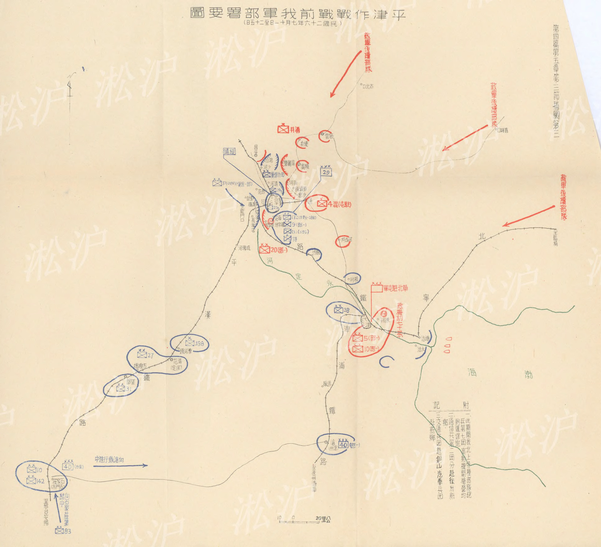

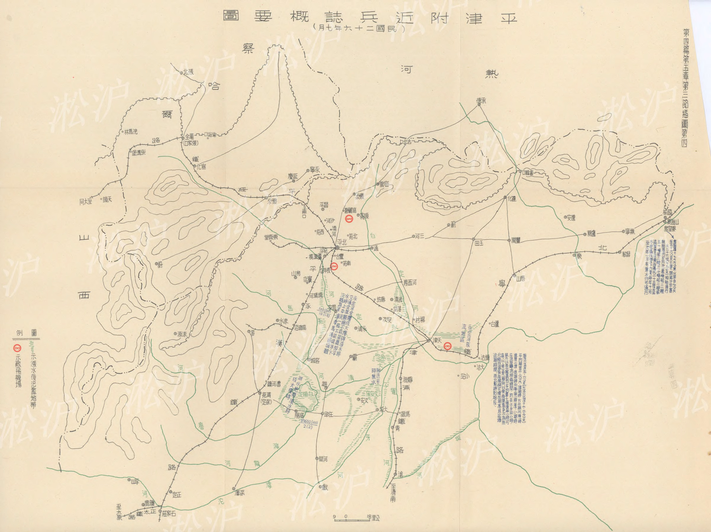

### 第四節 作戰一般經過（參照插圖第五插表第五）

自民國二十六年七月二十一日以來，我冀察當局已依約如限實行撤兵換防，嗣即在平津兩市開始查禁抗日文字，取締各種抗日組織，派警駐校，嚴防學生激烈行動等，以示履行協定之澈底；中央既接獲宋主任協定內容報告後，亦力持容忍與鎮靜，未曾予以糾正。惟敵蓄意侵略，業經決議出兵，特利用和平烟幕，以掩護其增援，復懈弛我之軍事準備，實未嘗有絲毫誠意；其大軍入關情形，已如前述。迄二十五日，敵對我平津駐軍已完成包圍態勢，其第一線各部且均已到達攻擊準備位置，於是背信棄約，於廊坊、廣安門等處再啓釁端。

平郊方面：

二十五日十三時，敵鐵甲車一列載敵兵百餘，由天津駛抵廊坊，藉口修理電話，强佔廊坊車站，經我第三十八師第一一三旅駐軍勸阻無效。僵持至二十六日零時，該敵軍突開槍射擊，適我軍已奉固守原防竭力抵抗之命令，乃奮起應戰。拂曉敵機十四架對我首次實施轟炸。七時天津敵第五師團之第七十七聯隊增援到達，並有裝甲車數輛助戰，我軍營房及車站附近均成一片瓦礫。十時許，我軍轉移於廊坊西北地區，與敵對峙。同日，北倉、楊村、落堡等車站亦爲敵軍强佔，平津交通遂被切斷。

二十六日十九時，北平城外財神廟附近之敵軍約五百名、乘載重汽車三十餘輛，通過廣安門入城，甫入城數輛，城外敵兵忽向我城門守兵射擊，我守兵立即閉城，雙方遂起衝突。

敵華北駐屯軍司令香月清司、深夜令北平特務機關長松井謁宋主任，送致最後通牒：「昨（二十五夜在廊坊惹起兩軍衝突，實堪遺憾，倘貴軍仍抱有事態不擴大之意志，首應從速令佈置於蘆溝橋、八寶山附近之第三十七師，截至明（二十七）日正午止，後退至長辛店；又駐紮北平城內之第三十七師，須由北平城內撤退，迄本月二十八日正午爲止，與在西苑之第三十七師部隊，同時經由平漢路以北地區，移於永定河以西地區；以後並應將是等軍隊，廣續輸送於保定方面。如未能見以上諸項實行，則認定貴軍無誠意，屆時本軍將不得已而執行自由行動，其因此所發生之一切責任，應由貴軍負擔矣。

宋主任至是已知大戰勢所難免，當卽召集軍政人員會商，僉認敵方是項無理要求，萬難接受，乃於二十七日十五時，予敵嚴詞拒絕，同時令所屬各部準備應戰；並一面報告中央請示機宜，一面通電全國，說明敵軍挑釁及交涉經過。

我外交部發言人三十七日發表談話：「自本月七日夜，日軍在蘆溝橋無故向我駐軍襲擊以來，雖其責任完全不在我方，但我當局爲顧全東亞和平，始終表示願以外交方式謀適當之解決，我外交部王部長並曾迭次向日方提議，雙方約定日期同時撤兵。但日方對我方歷次和平表示及提議，不獨不予接受，且大舉增兵，集中平津；同時與我地方當局，議定解決辦法。我中央得報後，察其內容與我既定方針，尙無重大出入，爲貫澈和平之初衷，不予反對；我方極度容忍以維護和平之苦衷，應爲中外人士所共鑒。方謂前線日方軍隊，從此可以撤退，後方日軍亦可以停止進發！乃一週以來，日軍不獨毫無撤退模樣，且日本國內及朝鮮各地仍續派大量軍隊，絡釋向平津出動；二十五日晚間，並無故向我廊坊駐軍襲擊，繼之以飛機轟炸；二十六日，復向我地方長官提出無理要求，兼在北平近郊四出挑釁。其蓄意擴大事態，別有企圖，蓋昭然若揭。兩旬以來，我方已盡和平最大之努力，嗣後一切事態之責任，自應完全由日方負之」。

是日，敵內閣書記長代表政府發表談話：「……因確保平津交通線及保護僑民，使不受華軍武力妨害，日軍爲遂行此任務及確保履行協定事項，不得不採取必要之自衛行動。日本所期望者，爲芟除如此次不祥事件所發生之根本原因，不敵視善良民衆，且亦無任何領土的企圖；對保護列國權益，自當不惜盡最善努力。日本以確保東亞和平爲使命，事雖至此，仍切望中國反省，使局面限定於最小範圍，速謀圓滿解決」。

敵人於二十六日對我提出最後通牒後，未待我之答覆，卽於二十七日拂曉，向我平郊守軍開始攻擊，我軍亦奉令應戰。

二十七日午前，大井村五五里店敵陣地，突增敵兵八、九百名，十五時向蘆溝橋我軍攻擊，旋卽停止。廣安門城外敵軍二百餘、二十六晚與我衝突後，仍未撤退；二十七日十三時許，因由豐臺增到敵軍四百餘名及戰車九輛、裝甲車五輛，復於十四時向我射擊，歷一小時始停，迄晚，雙方仍對峙中。黃村、團河一帶原駐冀北保安隊之一小部，我以兵力單薄，二十七日令第一三二師之一團，於中午十二時前趕往增援；適敵軍步砲聯合約二千人，在飛機掩護下，於十五時乘我部署未定，向我進襲；我軍堅決抵抗，敵我傷亡均重，至夜我向萬字地轉移。通縣步騎聯合之敵、亦於二十七日三時，將我駐守寶珠寺獨立第三十九旅之一營包圍；雙方激戰至夜十一時，該營始突圍向南苑退却，敵機跟蹤轟炸，傷亡甚鉅。同日八時，高麗營、昌平一帶之敵亦向湯山、沙河我冀北保安隊攻擊，但未得逞。

宋主任以第二十九軍散處冀察各地，不易集結，於二十七日零時，電令第四十軍集結滄縣以北之青縣、唐官屯、靜海、獨流鎮一帶，以策應天津，第二十六路軍進駐任邱、雄縣、固安之線，以策應北平。迄二十二時，以北平情況愈趨嚴重，復令第二十六路軍進駐長辛店良鄉一帶。孫連仲總指揮乃令第二十七師，於二十八日夜，由鐵路輸送至長辛店，第三十一師及砲兵第七團於二十九夜續進。惟第四十軍是時尚未全部到達滄縣，且遵最高統帥蔣委員長電令，擔任滄、獻一帶防務，故不克卽行北上。

最高統帥蔣委員長於二十七日電示宋主任：「一、應先固守北平、保定、宛平各城爲基礎，勿使疏失。二、可令第二十六路軍隨時加入作戰。三、中央必以全力增援」。宋主任覆電略稱：「北平爲華北重鎮，人心所繫，大勢所關，現已四面皆敵，職受國家人民付託之重，已決心固守北平，以安人心，而振士氣，决不敢稍有畏避」。

二十八日拂曉，蘆溝橋車站、五里店瓦大井村一帶敵軍，向我第三十七師第一一零旅戍守之宛平城、衙門口、八寶山陣地攻擊。我右翼由河右岸守軍與第五十三軍之鐵甲車隊協力堅守，迄晚仍對峙中。左翼我軍轉移攻勢，於突破大、小井村之敵陣地後，與南苑之第三十八師兩團協同，由東西兩面夾攻豐臺，八時三十分攻克豐臺車站，並佔領造甲村敵飛機場，奪獲敵機七架、防毒面具數萬件；十八時，主動向西南方向轉移。

另敵步戰聯合約三千名，附砲四十餘門，在飛機約四十架之反復轟炸掩護下，於拂曉向我南苑猛攻（按南苑、萬字地爲第二十九軍司令部所在地，駐有第三十八師兩團、騎兵第九師一部，及最近到達之第一三二師主力，並由該師師長趙登禹負責統一指揮）。我守軍除以第三十八師兩團，協力第三十七師對豐臺之敵攻擊外，其餘各部均堅據工事，竭力抵抗，且曾兩次出擊，以敵火力猛烈，均未奏效。但經終日之激戰，工事大部均毀，第二十九軍副軍長佟麟閣、第一三二師師長趙登禹、均於此戰壯烈殉國，幹部及士兵之傷亡亦重；然我官兵猶能奮不顧身，支持至夜，始奉令向南撤退。昌平、高麗營之敵復增加步砲聯合約二千名，亦於拂曉分經湯山、沙河向我繼續進迫，敵機更對北苑、清河（該處由獨立第三十九旅駐守）、黃寺等處狂炸，我各部節節抵抗，迄晚向北城圈退却。同日拂曉，我以第三十八師第一一三旅主力，由武清向廊坊之敵進擊，九時克復，並破壞該處鐵橋；十六時敵增援反攻，我遂向安次轉移。先是第二十九軍原擬於二十八日拂曉全面進攻，並策動冀東保安隊同時反正，奇襲敵後方，因敵已先發，致未能實行；宋主任初猶決心堅守，嗣以敵軍陸續增加，我處處俱形薄弱，乃電請中央速令大軍由津浦及平漢兩線推進，以資策應。秦市長亦有請中央部隊由津浦線北上，進出冀東，同時令綏遠各部進攻察北之建議。入夜以後，戰況愈形不利，南北兩郊之敵俱已迫近城垣。宋主任以頹勢不易挽回，且爲避免平市之糜爛計，乃令平郊作戰各部隊，向永定河右岸退却；另令第三十八師師長張自忠，代理冀察政務委員會委員長及北平市市長等職務；並令駐城內之第一三二師一旅及保安隊一部留平維持治安，而自偕秦市長等於二十三時離平赴保。於是第三十七師、第一三二師（欠獨立第二十七旅）、第三十八師之兩團、騎兵第九師一部及冀北保安隊主力，均乘夜暗渡過永定河，分向指定地區轉進。惟駐守宛平城、蘆溝橋之冀北保安隊一部，仍予留置擔任掩護。

二十九F，敵乘勝對北平四郊肆意進擾，其自南郊西進之鈴木部隊（駐屯軍第二聯隊），及自北郊西進之酒井部隊，於會合西郊後，十八時復向宛平城、蘆溝橋一帶砲擊；我冀北保安隊一部、以掩護任務已達，逐漸南移，各該處遂爲敵佔領。是時我軍主力已脫離戰場，惟以爲時倉猝，連繫未週，零星部隊尚殘留各地，與敵抵抗，尤以西郊爲甚。斯時第二十六路軍正在北上增援途中，得悉前方戰局突變，爲防止敵之南進，並收容我退却部隊，乃以第二十七師之第七十七旅佔領馬頭鎮、琉璃河之線，以便衣隊協同第五十三軍之鋼甲車隊，活動於寶店以北。

三十日，敵軍進佔長辛店南側之高地；至是北平四郊殆全爲敵軍所控制。是日宋主任轉赴任邱，處理退却部隊之收容與整備事宜，其時我退却部隊之行動概況如下：

一、在廊坊作戰之第三十八師第一一三旅主力，由安次向天津以南地區轉進中。

二、在北平南郊作戰之第一三二師第一旅到達固安，第二旅向任邱轉進中。

三、在豐臺作戰之第三十八師兩團，向津浦鐵路北段轉移中。

四、在北平西郊作戰之第三十七師各部，到達良鄉以南，正沿平漢鐵路向清苑轉進中。

五、在南苑作戰之騎兵第九師一部，尚未取得連繫。

六、冀北保安隊之第一、第二兩旅正沿平漢鐵路線以西山地，向房山、涑水轉進中。

七、獨立第三十九旅尙滯留於北平北郊。

以上各部於退却途中，敵軍雖未尾追，但遭敵機之跟踪轟炸，損傷甚大。

冀東方面：

冀東保安隊官兵、因與第二十九軍關係甚深，復激於愛國大義，不甘受敵奸之驅使，早思歸順，當平郊戰起時，聞宋主任有堅守北平之決心，其第一總隊長張慶餘、第二總隊長張硯田等認爲時機已至，爰卽祕密部署，約定於七月二十八日拂曉，策應第二十九軍之攻擊，屆時因受敵軍監視，遂不果行。

迨大部敵軍前赴平郊作戰，乃於二十九日晨二時許，率所部約五個大隊，於通縣城郊反正（該地駐有敵特務機關及敵軍一中隊、日僑約四百名、以及僞組織各機關），乘敵不意予以奇襲，敵之特務機關長細木及其以下各員悉數被殲，敵軍大部傷亡，並當場擒獲殷逆汝耕，通縣遂告克復。嗣敵第四混成旅團之第二聯隊聞變來援，敵機多架又肆行轟炸，雙方激戰甚久；卒因平局猝變，孤立無援，乃於是夜經北平西郊向西轉移，沿途遭受敵機襲擊，及友軍之誤會衝突，頗有傷亡；三十日在海甸附近，復遭敵軍截擊，經數度猛衝，始得突圍，由西山小徑向門頭溝轉進來歸。其愛國犧牲之精神，實開爾後僞軍反正之先例。獨惜殷逆汝耕於途次混亂中乘機脫逃，成爲美中不足之憾事。

津沽方面：

我第三十八師之第一一二旅駐在塘沽、大沽、小站一帶，第一一四旅主力駐天津北郊宜興埠、韓家璧一帶，天津市區秩序之維持，則由市保安隊擔任。

七月二十日以後，敵開始於塘沽積極構築軍用碼頭，並佔用各大建築物爲兵站倉庫，其海軍陸戰隊與我駐軍形成對峙，大沽口外泊有敵兵艦三艘，天津海光寺駐禁敵軍千餘，東郊之東局子敵飛機場，經常停機百架左右，東西車站亦均爲敵軍盤踞，形勢至是乃漸嚴重。迄二十九日，敵復在大沽、天津兩地，無端啓釁，其戰況如左：

二十九日拂曉，敵驅逐艦二艘駛抵塘沽近岸，與原泊大沽口外之敵艦三艘，同時發砲向大沽口岸我軍轟擊，並以機槍掃射；我軍沉着應戰，自晨迄午，敵未得逞。午後，敵砲擊愈烈，敵機亦反復轟炸，敵陸戰隊數百人又在其機砲掩護下，强行登陸；我抵抗至暮，傷亡甚重，工事盡燬，不得已漸次向新河、東大沽轉移，是夜，大部到達馬廠附近，集結整備。

二十九日二時許，敵軍突然强佔我天津四區警局，並向我保安隊駐地進襲；我第三十八師副師長李文田率該師第一一四旅主力，協同津市保安隊與敵激戰，並向海光寺、東局子及東、西總各車站之敵，分別進攻。三時許，海光寺敵兵營及東局子敵飛機場均被我包圍，東西兩車站亦均爲我佔領，並攻佔圍旭街敵警署，炸斷海河大鐵橋及金鋼橋；車站附近及特四區一帶敵軍遺屍頗多，日租界之交通，亦爲我破壞甚重。

拂曉以後，敵機五十餘架及戰車若干輛向我軍轟炸衝擊，敵我遂呈混戰狀態。是時，第三十八師師長張自忠方在北平與敵方協商安定地方，乃於十六時電令我軍停戰，向馬廠撤退；於是我軍乃逐漸退出津市，二十時以後戰事漸趨弛緩。惟海光寺、東局子及東總兩車站各附近之爭奪戰，仍繼續進行。

是日敵機肆虐，民衆頗多受害，並特對南開大學、河北第一女子師範及工學院等學校，施行毀滅性之轟炸，其蓄意摧殘文化，不啻野蠻性之自白。三十日，我軍業經脫離市區，至十五時，市內殆完全爲敵軍佔領；然其飛機、大砲仍對津市繼續轟炸燃燒，且到處縱火，致各重要機關多成灰燼，天津遂於浩劫中陷落。

三十一日晨，敵軍續於黃緯路縱火，民房、商店延燒甚多，其砲兵則對河東各鄉村盲目射擊，村民被害極重，南開大學附近更是一片火海，經日未熄。如是暴行，達三日之久，陳屍塞巷，廬舍爲墟，難民無家可歸者，約達四十餘萬。

綜計平津之戰，敵軍傷亡不在我方之下，至我第二十九軍官兵壯烈殉國者，則自副軍長佟麟閣、第一三二師師長趙登禹以下，約達五千餘人，軍需品損失甚鉅，械彈因早經運往後方，故大部幸得保存，函獲戰利品亦夥。

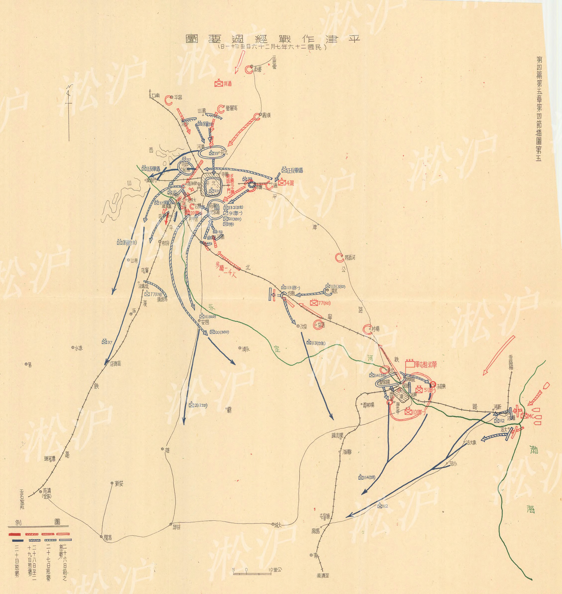

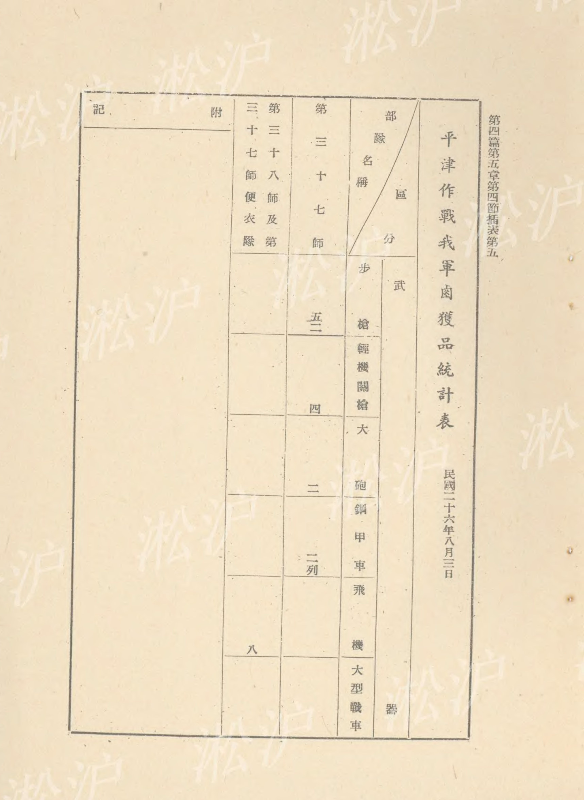

### 第五節 平津陷落後之狀況

(參照插圖第六)

第一欵

平津行政之結束與戰局宣言

民國二十六年七月二十八日深夜，宋主任離平赴保，第二十九軍在平郊作戰之各部隊，亦即陸續脫離戰場。第三十八師師長張自忠於二十九日受宋主任之命，暫代處理冀察政務及北平市政，並以留平之獨立第二十七旅及保安隊、警察隊，維持北平城內秩序；天津方面，另以邊守靖暫代處理市政。旋以情勢益形惡化，冀察政務及平津市政實已無法遂行，張師長乃於八月四日結束行政，我留平之獨立第二十七旅亦乘間突圍，轉赴察省；敵卽以數千人進入北平城，分駐城內各要點，至是北平卽完全爲敵佔領。

先是最高統帥蔣委員長、七月二十九日於宋主任離平赴保後，曾發表戰局宣言，其大要如左：

宋主任之責任問題：依軍事觀點，宋早應到保定，不宜駐在平津，余自始卽如此主張；余身爲全國軍事最高長官，兼負行政責任，所有平津軍事失敗問題，不與宋事，由余一人負之；余自信必能盡全力負全責以挽救今後之危局。須知平津情勢，今日如此轉變，早爲國人有識者預料所及；日人軍事政治勢力之侵襲壓迫，由來已久，故造成今日局面，絕非偶然，況軍事上一時之挫折，不得認爲失敗，而且平津戰事不能算爲已經了結。日軍既蓄意侵略中國，不惜用盡種種之手段，則可知今日平津之戰，不過其侵略戰爭之開始，而決非其戰爭之結局，國人祇有一致決心，共赴國難。至宋個人責任問題，不必重視。

二、今後我政府對日之方針：自盧溝橋事件發生，余在廬山談話會會切實宣告，此事將爲我最後關頭之界限，並列舉解決此事之最低立場，計有四點，此中外所共聞，絕對無可變更。當時余言，我不求戰祇在應戰，今既臨此最後關頭，豈能復認平津之事爲局部問題，任聽日軍之宰割，或竟製造傀儡組織。政府有保衛領土主權與人民之責，惟有發動整個之計劃，領導全國一致奮鬥，爲捍衛國家而犧牲到底，此後絕無局部解決之可能。國人須知我前次所舉之立場，實爲守此則存，逾此則亡之界限；無論現時我軍並未如何失敗，即使失敗，亦必存與國同盡之決心，決無妥協與屈服之理。總之，我政府對日之限度，始終一貫，毫不變更，卽不能喪失任何領土與主權是也。我國民處此祖國之存亡關頭，其必能一致奮鬥到底。余已決定對於此事之一切必要措施，惟望全國民衆，沉着謹慎，各盡其職，共存爲國犧牲之決心，則最後勝利必屬於我也。

統帥勇於負責之精神，與抗戰到底之決心，已於此一宣言中完全顯示。

第二欵

敵軍之動態

民國二十六年七月下旬以來，敵軍仍源源輸送入關，截至三十一日，其概況如左：

一、平津現有部隊：第五、第十師團之主力，第二十師團、駐屯軍及酒井部隊，重砲兵第二、第二旅團及第八聯隊，山砲兵第三聯隊，空軍第二、第四、第五、第七及坂口三條各聯隊。

二、輸送中部隊：第六師團、第十二留守師團及第五、第十師團之各一部，騎兵第一、第四旅團。三、動員中部隊：第三、第十一及第十六等師團。

四、原在我東北各地部隊：第一、第四、第九、第十二師團，近衛師團之第十二旅團及各守備隊；其第四師團之第三十二旅團、逐漸向多倫推進。

敵軍自控制平津，迄本作戰結束期間，其在冀察各方面之動態如左：

一、平津市區：特注重交通之封鎖及戰場之清掃，並在北平西南郊構築堅固工事。

二、津浦鐵路方面：除天津之敵於八月三日進佔西南郊之楊柳青，不時以少數騎兵沿鐵路線向良王莊附近偵察，與我第三十八師獨立第二十七旅之便衣隊偶有衝突外，極少活動。

三、落堡、廊坊一帶：各該處之敵懼我游擊隊之擾害，乃殘殺我當地民衆，燒燬沿路村莊；其活動區域，逐漸擴及永清、固安間之永定河左岸，並沿河構築防禦工事，入夜則以小部隊偷渡右岸，潛行偵察。

四、平漢鐵路方面：七月三十一日，敵戰車二十餘輛及步兵五六百名由長辛店沿公路南進，在南崗窪構築陣地；另裝甲車數輛載敵兵百餘名，進佔良鄉城。八月二日，敵鐵甲車在寶店以北活動，南崗窪之敵增至千餘名，並在坨里附近構築工事。三日，敵機數架協同戰車數輛，向寶店附近騷擾，爲我便衣隊擊落一架，並截獲敵大型戰車一輛。

五、平綏鐵路及熱察方面：敵既控制平津，卽積極爲進攻察綏之準備。其獨立第十一旅團及酒井部隊乃開始沿平綏鐵路北進，準備攻擊南口；八月二日卽以步騎聯合數百名，對我南口陣地行威力搜索。另在熱河方面，以第十二留守師團及分遣隊等，集中承德、豐寧一帶，準備西進。察北方面則以第四師團之第三十二旅團（卽本間混成旅團）、大井支隊及騎兵第一、第四兩旅團，集中多倫，準備南進；並以僞蒙軍集中張北、尙義、商都、化德一帶。嗣遂釀成平綏鐵路東段之作戰。

六、敵空軍行動：敵機初自七月十三日，開始在清苑、石家莊一帶偵察。十八日開始對平漢鐵路列車掃射；二十六日開始對廊坊車站及該處營房轟炸。爾後隨機數之增多，並參加對平郊及津沽之作戰。迄佔領平津後，津浦、平漢、平綏三路沿線均爲其活動範圍。三十日，復沿平漢線對徐水、漕河、清苑及其以南各車站，實施轟炸。三十一日，沿津浦線對滄縣、德縣各站掃射，並至濟南偵察。八月二日，沿平綏線對南口轟炸。爾後對上述各線，每日必往返數度，連雲港、鄭州、洛陽等處亦遭波及。

第三欵

我軍之集中及部署

##### 第一項 冀中方面

第二十九軍之集結與整備：

民國二十六年七月三十一日，最高統帥蔣委員長電第二十九軍，指示現已到最後犧牲關頭，已無和之可言，除積極準備外，希我第二十九軍從速整理，一面佔領陣地，構築强固工事，以赴事機。馮代軍長同日電呈蔣委員長：「……此間昨與徐主任、熊次長、孫總指揮議定，平漢前線由第二十六路軍負責。平津退下部隊正在集結，並分別整頓之中。敵機連日在涿州、徐水、漕河保定偵察轟炸。今後軍事重點，要在北守察綏，南扼滄保，對平津取監視控制之態勢。宋主任昨親赴任邱視防，職暫駐保定，地方秩序安定……。

最高統帥蔣委員長覆電：「世電甚慰，務望激勵將士，再接再厲，期達雪恥報仇之目的……」。

第二十九軍退却各部隊，八月一日已到達指定地區，該軍當令駐靜海、固安、涿縣各部派遣游擊隊，向天津、廊坊、宛平等地游擊，並重新指定各部隊之集結整頓地區如左：

一、第三十八師各部到達靜海、馬廠、大城一帶，着在靜海、大城、青縣一帶整備。

二、騎兵第九師之第一旅在安次、永清一帶警戒，第二旅在霸縣附近整備。

三、第一三二師主力在固安、任邱一帶整備，其獨立第二十七旅仍留北平。

四、第三十七師之獨立第二十五旅在涿縣：第一一零、第一一一兩旅在高碑店、史家鎮一帶，着在新安、高陽、肅寧一帶整備。

五、冀北保安隊之第一、第二兩旅到達房山、涑水間地區，着在涑水、易縣整備。

四日，以上各部均已在指定地區部署完畢，並構築工事。留平之獨立第二十七旅已轉赴懷來，孫殿英部保安隊亦集結於房山附近。

北上增援部隊之集中：

我北上部隊，除第五十三軍之第一三零師，原駐徐水、清苑一帶外，蘆案發生後，先期北上之部隊，已如第二節第二款所述。自二十五日起，截至八月四日止，繼續北上之部隊情形如左：一、已到達指定地區部隊：

第十四軍之第八十三師、七月二十五日到達石家莊。

砲兵第六旅、七月二十八日到達石家莊。

第三軍之第七師、七月二十九日到達邢臺。第十二師七月三十日到達石家莊。

第十七師、七月三十一日到達石家莊。

第八十五師、八月一日到達滄縣。

第五十二軍之第二十五師、八月一日到達滄縣。

第五十三軍之第九十一、第一一六師及騎兵第四師、全部於八月三日前到達清苑附近。以上計八個步兵師、一個騎兵師、又一砲兵旅。

二、輸送中部隊：

第三十二軍之第一三九、第一四一師、向深縣、武强、東鹿一帶集中。

第十五軍轄第六十四、第六十五師，向邢臺、安陽集中。

第五十七軍轄第一一、第一一二師，向武强、衡水集中。

第六十七軍轄第一零七、第一零八師，向滄縣集中。

第二十六路軍之第三十師及獨立第四十四旅、向清苑集中。

第二師向清苑集中。

第二十三師向邢臺、安陽集中。

以上計十一個師及一個獨立旅。

陣地之選定與構築：

蔣委員長於蘆案未發生前，卽已注意河北境內國防工事之構築，七月十日，復電定宋主任星夜加工，從速完成，惟延未實施。至七月中旬，令參謀本部次長熊斌進駐清苑，一面任中央與地方之聯絡，一面督導該地駐軍之防禦設施。七月下旬，石家莊行營主任徐永昌、參謀長林蔚先後北上，分駐清苑、石家莊，對陣地線之決定，作業隊之配置等，始爲統一之籌劃。

蔣委員長於七月二十八、二十九等日，迭電有關各部，迅卽完成滄保（滄縣至清苑）、滄石（滄縣至石家莊）兩線之陣地工事。復於三十日電示徐主任以下各將領：「我軍無論在何地，無論大小部隊，到達地點，必先星夜趕成據點之强固工事，深溝寬壕，須使敵戰車不能侵入我陣地，我能固守勿失，然後再向左右，照所規定之戰線工事，竭力延長；萬一我全線工事未成，而敵來進攻時，我軍亦可固守原地，沉着應戰，勿稍慌張，俾後方部隊得以如期赴援也。望以此意，深切向各師旅團營長曉諭爲要」。八月一日，再電徐主任、林參謀長：「……滄保與滄石兩線工事，應於每師派一得力參謀指導督促，並須每日詳報其逐日進度，再行轉報爲要。中對於工事之焦慮殊甚也。

當時冀中方面、依原定之國防陣地，及臨時計畫之陣地，有下列五線：

一、馬保線：自惠豐村經唐官屯、馬廠、文安、雄縣、新安、漕河至滿城西北地區之線。

二、滄保線：自城河右岸經皂坡、姚官屯、趙官營、牛家莊、鄭州鎮、任邱、高陽至保定之線。

三、滄石線：自滄縣以東地區經獻縣、饒陽、安平、武强、深縣、深澤、晉縣、藁城、正定、獲鹿至平山之線。

四、德石線：自德縣經龍華、衡水、東鹿、辛集、晉縣、藁城至石家莊之線。

五、高涑易線：自大小紫營經衣錦店、趙家莊、高碑店、立各莊、涑水、易縣至紫荆關之線。

此外，我軍駐在地區及主要城鎮，均應堅固施工，特於姚官屯、趙官營、滄縣、饒陽、漕河鎮、石家莊等處，構成永久工事。

上述各線工事之作業隊部署如左：

一、馬保線：第二十九軍任惠豐村至文安（含）之線，第五十三軍任文安（不含）至雄縣之線，第五十二軍任新安至滿城之線。

二、滄保線：第四十軍任城河右岸至滄縣之線，第六十七軍任滄縣至牛家莊之線，第二十九軍一部任牛家莊至鄭州鎮之線，第五十三軍一部任任邱城防工事。

三、滄石線：第四十軍一部任滄縣至獻縣之線，第三十二軍之第一四二師、任饒陽至安平及武强至深縣之線，第十七師任深澤至晉縣之線，第十四軍任藁城、正定、石家莊、獲鹿一帶。

四、德石線：第二十三師任德縣附近地區，第三十二軍（欠第一四二師）任衡水、東鹿、辛集至晉縣之線。

五、高涑易線：第三軍擔任。

六、永久工事：獨立工兵第一團擔任。

上述各線工事，因各部隊陸續到達，開始時間先後各異，復以材料徵集不易，部署更時有變更，故工事程度及完成時間，亦不一致。迄本作戰結束時，僅馬頭鎮至琉璃河間、漕河鎮至滿城間及滄縣附近，概略構成初步之野戰工事而已。

自八月二日以後，冀中霪雨，永定、大清、滬沱、子牙各河流洋溢氾濫，工事多被冲毁，不得不變更經始，或需重加修繕，致進行頗爲遲滯。但以官兵之努力，操作不輟，雖輾轉泥濘，終獲相當成就。其霪雨造成之氾濫，尤以各河之下游特爲顯著，對爾後津浦路北段敵軍之進攻，亦予以莫大之障礙。

##### 第二項 察綏方面

察哈爾南部各要點，原係第二十九軍之第一四三師（轄四個旅）、獨立第四十旅、騎兵第十三旅及察省保安隊之駐屯地，歸察省主席兼第一四三師師長劉汝明統一指揮。當平津激戰時，劉主席曾有率部東進以與津浦鐵路北段我軍夾擊敵後之議，但未能實現。至民國二十六年七月終，原駐屯態勢迄未變更。八月上旬，獨立第二十七旅離平北來，亦歸其節制。

最高統帥

蔣委員長、自始已洞悉該方面情勢之重要，爰於七月中旬，卽令第八十四師集中大同，以資策應。迨平津戰局突變以後，鑒於熱西察北敵僞日增，復於七月三十日，令第十三軍軍長湯恩伯轄第四、第八十九兩師，由豐鎮、集寧向萬全（張家口）方面挺進。八月一日，令第二十一師由陝北向集寧集中，第九十四師由晉南向南口集中，第八十四師續向萬全輸送，而駐晉綏之第三十五軍、第六十一軍及騎兵第一軍亦均奉令加入本方面之作戰。爲調整指揮系統，將以上各部編爲第七集團軍，以綏省主席兼第三十五軍軍長傅作義爲總司令，劉汝明爲副總司令，湯恩伯爲前敵總指揮。旋將第二十一師與第八十四師合編爲第十七軍，以高桂滋（原任第八十四師師長）爲軍長；另令陝北之第十八集團軍轄三個師，密向綏遠南部集結。

當時軍事委員會對本方面之作戰指導：「以第十三軍及第十七軍固守察南及察東，以察省部隊及騎兵第一軍，協力收復察北」。八月二日，劉副總司令、湯總指揮、高軍長卽依是項旨意協商決定：「第十三軍守備南口、延慶、永寧至靖安堡之線，第八十四師守備寧疆堡、赤城、龍關之線，察省部隊轉移於常峪口、神威臺、洗馬林一帶，主力控置於宣化、萬全附近」。當第十三軍之第八十九師到達南口，第十七軍之第八十四師到達萬全迤東之鵬鴞堡後，卽依據協定與察省部隊交換防務，各爲攻防之部署設施；同時，騎兵第一軍在集寧、陶林一帶爲進攻察北之準備。第七集團軍並限令第六十一軍於十五日前集結柴溝堡、天鎮一帶，第三十五軍於十五日前集結大同、集寧一帶，以策應各方面之作戰。迄第八十九師於七日在南口一帶佈防甫畢，敵卽於八日對該地區開始進攻。

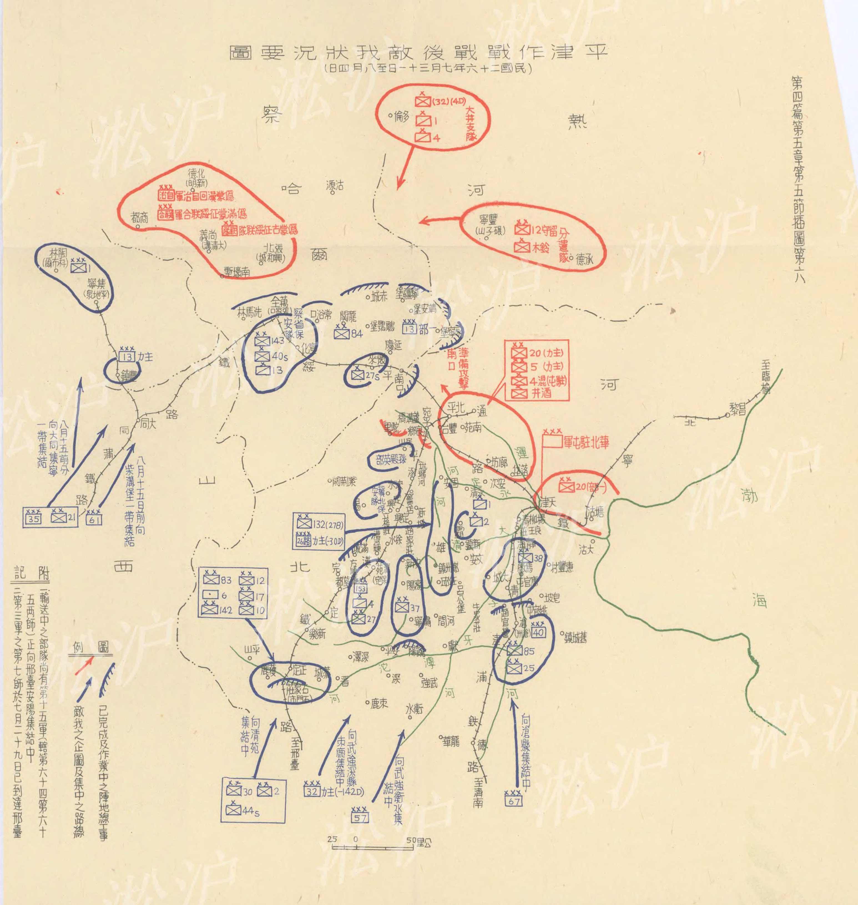

### 第六節 檢討

#### 第一款 敵軍

一、敵狃於九一八以來諸役之成就，仍圖以有限目的之姿態，不戰而奪取平津，蠶食華北；殊不知「七七」當時我已救平共匪，軍政統一，華北腹地不容割裂，全國人民憤激填胸，一至犧牲關頭，誓與週旋到底。敵既判斷錯誤而逐次動員增兵，致挑起不預期之全面長期戰爭，遂深陷泥淖，進退維谷。

二、敵於啓釁後，一面增兵源源入關，作軍事威脅；一面與我冀察當局進行和談，聲言地方事件應由地方解決，以分化我中央與地方之關係，並策動漢奸，懈弛我冀察當局之戰意與戰備；其政戰兩略之配合運用，頗具呼應之效。

三、敵乘我集中遲緩且僅局部動員，卽以其朝鮮及關東軍一部，會合平津駐軍，開始攻擊，未經重大犧牲，一舉佔領平津，確收主動攻勢與奇襲之利。四、敵澈底集中可能使用之兵力指向平郊，不顧其後方——天津、廊坊、豐臺、通縣各要點之空虛，適切運用集中與節約之原則，爭取決勝時間之局部優勢，深得以寡擊衆之要訣。

五、敵啓釁地點，選定蘆溝橋，扼平南之咽喉，使我軍無退讓之餘地，乃有計畫之挑戰；然其攻擊準備極不充分，攻城威力，尤爲不足，相持三週未能攻下，頓兵挫銳，鼓舞我之民心士氣，並授我以抗戰準備之餘裕，影響深遠。

第二欵

一、我政府於敵在蘆溝橋挑釁之初，卽針對敵人陰謀，與敵進行和平談判，並竭力協調中央與地方之意見，一面迅調大軍北上增援，且於滄保及居庸關、南口一帶，趕築預備陣地，一面積極實施全國備戰措施，遂粉碎敵分化蠶食之策略，建立全面長期抗戰之基礎。

二、宋哲元主任於蘆溝橋事件發生後，卽奉中央談和勿忘備戰之電令，一面交涉，一面調集部隊，因所部駐地遼闊，兵力尚未集中，卽與敵主力決戰，未能制敵機先，不無失策。嗣奉令而延未移駐保定指揮，致戰局既失指揮重心，且貽敵奸挑撥離間之機會。

三、北平方面、我軍在南、北、西苑駐地應戰，尤以第二十九軍司令部位置南苑，毫無戰術之着眼，且未能把握敵後方空虛之弱點，乘隙蹈瑕，積極擾襲；天津及廊坊我軍僅經抵抗卽中止戰鬥，致平津要地輕易資敵；永定河要線亦未有效利用，平西山地更毫無戰備，以致倉惶應戰後，遠退冀中冀南，對當時之民心士氣，影響惡劣。

四、我軍乃輕裝部隊，火力薄弱，不適火力防禦（陣地防禦），然蘆溝橋我軍不屈不撓，固守要地三週之久，且迭施反擊，予敵重創，對全局之貢獻極大。

五、平津人物富庶甲華北，大專及高中學生已普遍軍訓，農礦及輕工業相當發達，惜未建立動員制度，不能有效運用，悉以資敵。少數漢奸叛蹟昭彰，未能適時鏟除，啓發敵以華制華以戰養戰之迷夢，關係重大。
