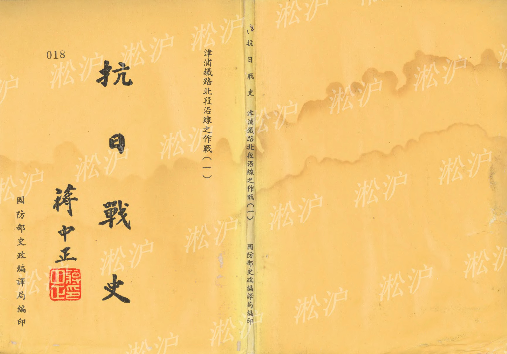

## 第八章 津浦鐵路北段沿線之作戰

### 第一節 作戰前狀況

#### 第一款 敵軍

#### 第二款 我軍

#### 第三款 兵誌概要

### 第二節 我軍作戰指導

### 第三節 作戰一般經過

#### 第一款 德縣以北作戰時期

#### 第二款 黃河以北作戰時期

#### 第三款 黃河以南戰鬥及青島撤退時期

### 第四節 重要戰鬥

#### 第一款 馬廠附近戰鬥

#### 第二款 姚官屯附近戰鬥

#### 第三款 大城附近戰鬥

#### 第四款 徒駭河南北地區戰鬥

### 第五節 山東之棄守

#### 第一款 濟南泰安濟寧之放棄

青島守備及放棄

第七八

### 第六節 檢討

八五

#### 第一款 敵軍

八五

#### 第二款 我軍

八五

附錄

第一至第七

八五

## 第八章 津浦鐵路北段沿線之作戰

（民國二十六年八月二十一日至二十七年一月十一日）

概述

民國二十六年八月初，日軍襲佔平津，我國決全面抗戰，分全國爲四個戰區：津浦、平漢兩路之北段爲第一戰區，晉綏方面爲第二戰區，江浙方面爲第三戰區，閩粤方面爲第四戰區。第一戰區更以河間、雄縣、固安、順義相連之線爲作戰地境，劃分爲左右兩地區，津浦路北段爲右地區，歸第一集團軍總司令宋哲元指揮。八月十日以後，我第二十九軍（欠第一四三師）及第六十七軍等部於靜海、馬廠、青縣、姚官屯及大城各地，對敵第二軍之第十、第十六兩師團逐次抵抗。我軍事委員會爲拒止敵人，先後增調龐炳勳部第四十軍、劉多荃部第四十九軍及李必蕃部第二十三師擔任滄縣、德縣一帶工事構築，旋皆奉命參加津浦路作戰。九月中旬起，敵第十、第十六師團向馬廠、姚官屯、大城一帶猛攻，經我利用汜濫堅强阻擊，予敵以慘重之打擊，迄二十二日大城失陷，二十四日姚官屯失陷，翌日滄縣棄守，於是敵第二軍主力沿子牙河向正定突進，其一部向德縣追擊。

當姚官屯戰鬥慘烈之同時，平漢、平綏兩路戰況均在激烈進行，我軍事委員會爲指揮便利，乃劃衡水、河間、文安之線以東地區爲第六戰區，以馮玉祥爲司令長官，當卽計畫反攻，敵我兩軍於馮家口、泊頭鎮、東光、連鎮及桑園一帶，在汜濫之中展開激戰，敵我傷亡均重，至九月三十日，上述各城鎮次第失陷，敵第十師團乘勢南攻德縣，該處我守軍第八十一師之一部倉卒應敵，奮戰兩日，城垣多被摧毀，官兵傷亡慘重，於十月四日晚撤守，而敵第二軍主力則已通過獻縣向平漢路突進。

斯時，馮司令長官以宋部作戰過久，報請調派新銳之師瓜代，軍事委員會遂令以一部調黃河南岸歸韓復集指揮，主力向臨清、聊城轉移，未幾，宋哲元奉准病假離職，所部改歸第一戰區指揮，第六戰區撤銷。

當敵進攻姚官屯之前，軍事委員會會令第三集團軍總司令韓復集，以兩師兵力增防德縣，韓竟延至九月三十日，僅派第八十一師之一旅到達，致德縣迅卽陷落，該部退守徒駭河，失去牽制之作用，敵第二軍主力乃向平漢線轉用，攻擊我第一戰區之右側背。雖經中央迭令乘勢反攻，而韓復集藉詞拖延，終未澈底奉行，因此時機再失，影響華北戰場之局勢，迨至撤守黃河南岸，與敵隔河對峙四旬之久，其後復不顧中央以魯南山地爲根據長期抵抗之指示，任敵輕易渡過黃河天險，不戰而放棄濟南、泰安、兗州諸要點，退運河西岸，爾後更放棄運河線，退魯西曹縣定陶、金鄉、鉅野，影響所及，青島終亦被迫放棄，於是山東要地盡失，敵軍遂南犯徐州。

第一節

作戰前狀況（參照插圖第一）

第一欵敵軍（參照插表第一）

敵軍以第五師團、第二十師團及酒井、河邊兩旅團、並其他特種部隊等十萬以上之兵力，襲佔平津後，一面扼守平津，一面進攻南口，同時自其國內增兵來華，迄二十六年八月二十日止，其集中於天津附近者，有第十師團磯谷廉介部、第十六師團中島今朝吾部、華北駐屯軍河邊旅團之第二聯隊、野戰砲兵第二旅團、並戰車裝甲車及飛機二百餘架，在敵第二軍司令官西尾壽造指揮之下，概按左列位置集結：

一、第二軍司令部駐天津。

二、第十師團在天津東南葛沽、楊柳青地區集結，警戒部隊佔領小站、鹹水沽、陳塘莊、良王莊、獨流鎮各據點，師團司令部駐葛沽。

三、第十六師團主力在天津以西及韓家墅、十里堡、廊坊地區集結，警戒部隊佔領王慶坨、馬頭鎮及永定河北岸一帶各據點，師團司令部駐天津西站。

四、華北駐屯軍河邊旅團第二聯隊及野戰重砲兵第二旅團、戰車隊等，在天津附近集結。

八月上中旬，敵與我爭奪小據點，不斷發生前哨戰鬥，敵機在津浦鐵路沿線各車站及附近各城鎮轟炸二十餘次，又敵艦十餘艘，在山東半島沿石臼所、榮成、龍口、黃河口等處海面，不時向我海岸砲擊，威力偵察。

第二欵

我

軍

(參照插表第二至第七)

民國二十六年八月三日，我軍事委員會電令宋哲元，作如下之指示：第二十九軍應就惠豐村、馬廠、大城、文安（含）之線構築城河線陣地，第五十三軍於文安（不含）經史各莊、雄縣（含）之線構築陣地。

八月十日，各軍遵令到達指定位置，旋卽部署就緒。

先是軍事委員會爲加强津浦線防務，於七月中旬，調駐晉南第四十軍之第三十九師集結滄縣，構築滄石線陣地，該師於七月二十三日到達滄縣附近，卽在舊城鎮、常郭鎮、馬落坡、姚官屯、趙官營、王會頭、沙河橋沿子牙河，經沙窩橋、臧家橋至大章鎮之線開始構築陣地。七月二十四日，調駐皖北之第五十一軍，向臨沂、莒縣集結，準備增防青島，該軍於八月十八日到達沂、莒地區。八月一日，調駐陝中之第二十三師，向德縣集結，該師於八月五日到達德縣。

八月十二日，我軍事委員會獲悉敵擬於十五日開始進攻之情報，因恐我各軍陣地構築，屆時難以完成，特令一面趕築工事，一面選定據點數處，以各陣地附近之縣城及莊寨爲主要據點，盡力抵抗，並對津浦沿線各軍補頒如下之電令：「一、靜海、馬廠、大城、文安、青縣、任邱、河間、肅寧各城寨，歸第二十九軍負責固守。二、文安以西霸縣、雄縣各城寨，歸第五十三軍負責固守。三、獻縣、留各莊、呂公堡歸第六十七軍負責固守。四、滄縣歸第四十軍之第三十九師負責固守。迨至八月二十四日，馬廠方面緒戰已臨前夕，復頒佈第一戰區北正面作戰指導，劃定津浦鐵路方面爲第一戰區右地區兵團作戰地域，歸第一集團軍總司令宋哲元指揮，並規定各部防守位置及其任務如左：

一、第一集團軍總司令部駐泊頭鎮。

二、第二十九軍於惠豐村、馬廠、姚馬渡、大城、文安之線佔領陣地，其警戒部隊在胡連莊、大屯、順民屯、陳官屯、元蒙口、子牙鎮、柴溝、張各莊之線，於朝宗橋、靜海各據點佔領前進陣地，並以一部於惠豐村、石塊村、同居鎮、李村鎮之線，佔領側面陣地。

三、第五十三軍於固安、霸縣、雄縣地區佔領陣地。

四、第六十七軍位置於留各莊、呂公堡地區。

五、騎兵第九師主力固守新鎮縣，一部以勝芳鎮、永清爲據點，向天津、楊村、落堡一帶地區活動。

六、保安第一、第二兩旅爲預備隊，位置於靑縣、興濟地區。

與左地區兵團之作戰地境，爲順義、固安、雄縣、河間各西側相連之線，線上屬右。

左地區兵團之隣接部隊，爲第二十六路軍孫連仲部，位置於涿縣附近，第四十軍仍在滄石線構築陣地，第二十三師仍在德縣附近構築陣地。

我第一集團軍（第一戰區之右地區兵團）奉令後，當令各部隊積極部署，迄八月二十日止，其第二十九軍各部隊之配置狀況如左：

一、獨立第二十五旅在靜海附近佔領前進陣地，以遲滯天津之敵南犯，並掩護我軍完成配備。

二、第三十八師附獨立第二十六旅爲右地區隊，在惠豐村、徐李莊亘唐官屯以東鐵路之線佔領陣地，並於惠豐村至同居鎮之線佔領側面陣地，掩護軍之右側背，以一部在朝宗橋佔領前進陣地，對大沽之敵搜索擾亂，該師各部隊之位置如左：

獨立第二十六旅在順民屯、周莊子、張莊子擔任警戒。

第一一二旅在惠豐村東西之線佔領主陣地，一部在朝宗橋佔領前進陣地，並於胡連莊、大屯之線派出警戒部隊。

三第一一四旅在徐李莊東西之線佔領主陣地。

四第一一三旅在同居鎮、李村鎮，一部在北何村佔領側面陣地。

五師部在靑縣。

第三十七師第一一零旅（在河間以北詩家村）爲中央地區隊，在唐官屯、馬廠亘姚馬渡以東之線佔領陣地，該師各部隊之配置如左：

第一零九旅在唐官莊至小王莊佔領主陣地，並於陳官屯、元蒙口之線佔領警戒陣地。

第一一旅在流河鎮、馬廠、王鎮店之線佔領主陣地。

三師部在興濟。

四、第一三二師附獨立第二十八旅爲左地區隊，在姚馬渡、大城、韓村集亘文安之線佔領陣地，該師各部隊之配置如左：

獨立第二十八旅由姚馬渡至大城佔領主陣地，一部在子牙鎮佔領警戒陣地。

第二旅在韓村集東西之線佔領主陣地，一部在柴溝佔領警戒陣地。

第三旅在文安東西之線佔領主陣地，一部在小四莊之線佔領警戒陣地。

四師部在文安。

五、各地區隊之戰鬥地境如左：

右地區隊與中央地區隊，爲津浦鐵路東側沿線，線上屬中央地區隊。

中央地區隊與左地區隊，爲子牙河之線，線上屬左地區隊。

六、騎兵第九師主力固守新鎮縣，部以勝芳鎮、永清縣爲據點，對天津、楊村、落垡之敵搜索擾害，師部駐新鎮縣。

七、冀北保安隊第一、第二兩旅爲軍預備隊，集結於青縣、興濟中間地區。

八、軍司令部駐興濟。

九、左地區隊隣接部隊爲第五十三軍，其主力在周各莊、史各莊、雄縣之線佔領主陣地，一部固守霸縣、固安等處，與該軍之作戰地境，爲北戈一、永清以西及霸縣、周各莊、楊村莊以東相連之線，線上屬第五十三軍。

該軍配置完畢，並已在城河線構築强固之野戰工事，積極備戰，同時其代軍長馮治安，於八月十七日電呈軍事委員會，請派鐵甲車兩列至津浦線活動，軍事委員會隨令鐵道隊派鐵甲車第一大隊，開赴津浦前線歸第二十九軍軍長指揮，該大隊於八月下旬到達青縣車站。

斯時，山東沿海之防務，據山東省主席兼第三路軍總指揮韓復渠所報情形如左：

一、第二十二師之一部擔任日照、諸城一帶海岸防務，主力擔任煙臺至龍口間海岸之防守。

二、第三艦隊防守青島。

三、第七十四師主力在高密，一部擔任卽墨、海陽一帶海岸防守。

四、第八十一師擔任龍口至膠河口間海岸防守。

五、第二十九師主力在膠濟路中段，一部擔任羊角溝海岸防守。

六、第二十師一部在福山，主力在津浦路濟南至臨城間擔任警備。

第三欵

兵諗概要

參照插圖第二

津浦鐵路，自河北之天津起，經滄縣縱貫山東，安徽兩省，以達江蘇之浦口，全長一零一三公里，民前五年興工，迄民國二年始全線通車，分南北兩段，南段由英商承築，北段由德商承築，爲我北方大平原之東部大動脈。

津浦路北段地勢，其在河北省境內者，爲沾河平原，卽渤海北岸八十六公里及西岸二百三十公里以內地區，至大清河流域之文安縣附近一帶地勢，更爲低窪，與海水平面相差無幾；在山東境內者，爲黃淮平原，沃野千里，茫無涯際，因地形開闊，故在該地區內，實不宜劣勢裝備之國軍，與優勢之敵決戰，但黃河以南，則有泰沂山脈，蟠曲於三角地帶，形成沂蒙山區，而崂山山脈，又復數支併列於半島之上，形成沿海之天然屏障。

沿線河流湖沼甚多，在河北境內者，大部爲沽河流域，沽河源流有五：白河、永定河、大清河、滹沱河、運河是也。白河由通縣到天津一段，又稱北運河，發源於察哈爾之赤城縣，東南流入潮河，由通縣至天津一百四十公里間，可行民船，始有水運之便，永定河亦稱渾河，其上流爲桑乾河，導源於山西之管涔山，經察哈爾東流入河北，至天津與沽河相會；大清河發源於山西，東流抵平漢路後，可通小船至霸縣。天津一帶，水漲時，小輪亦可航行滹沱河源出於山西，東流至獻縣以西，與滏陽河相會而稱子牙河，以其流經子牙鎮得名，天津至正定三四五公里間通民船，自河間沙河橋以下，水漲時，可航小輪；南運河，天津至德縣三三六公里間可行民船。在山東境內者，有徒駭河可行小船，此外沿線支流尙多，但多乾涸，對部隊之行動，無甚阻礙，但夏秋雨季河水暴漲，每成氾濫。

道路方面，除津浦鐵路縱貫線外，尙有滄石（僅有路基）、膠濟等支線，此外沿線公路亦甚多，計約二千餘公里，交通稱便，機械化部隊之運動，頗爲有利。

沿線氣候，寒暑劇烈，冬季嚴寒，河川冰厚數尺，可行車馬，通常自十一月中旬起，卽開始結冰，至翌年三月始解凍。沽河平原地區雨量稀少，但夏秋雨季降臨時，則又河水氾濫，積潦成災，廬舍田園多被淹沒，影響於作戰者甚鉅。

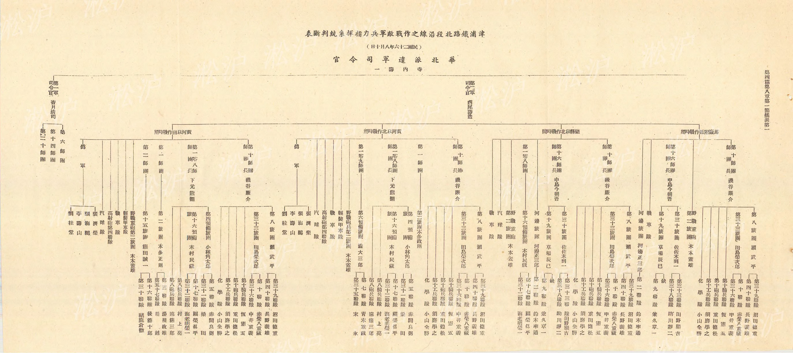

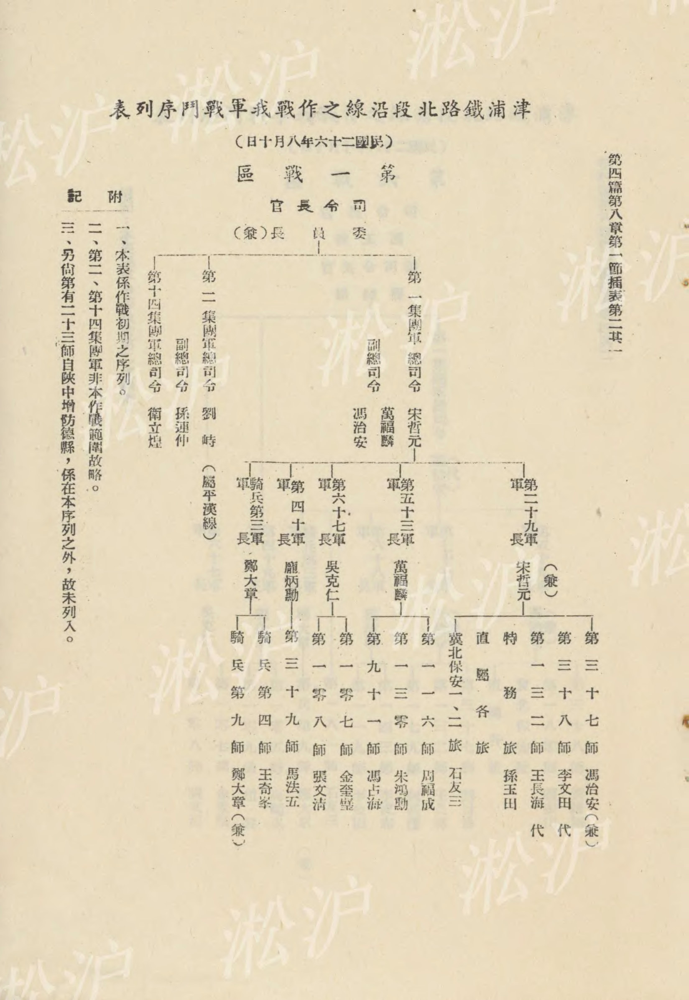

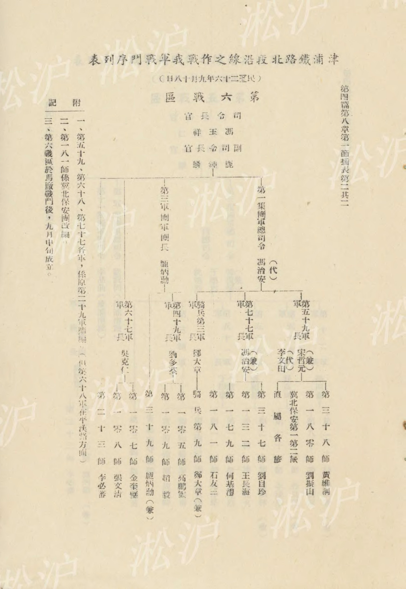

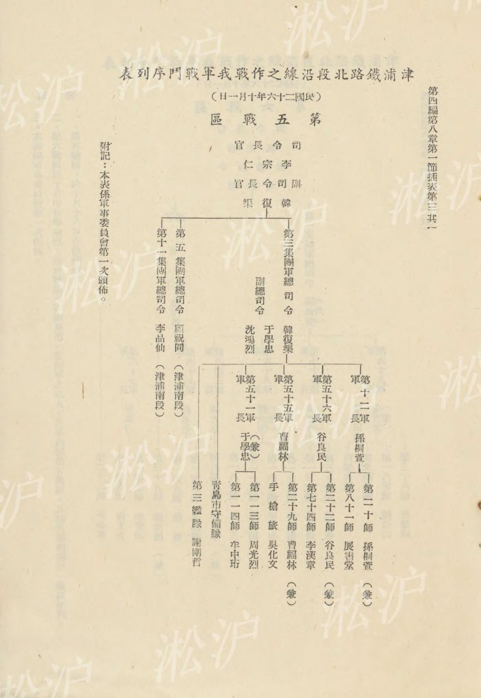

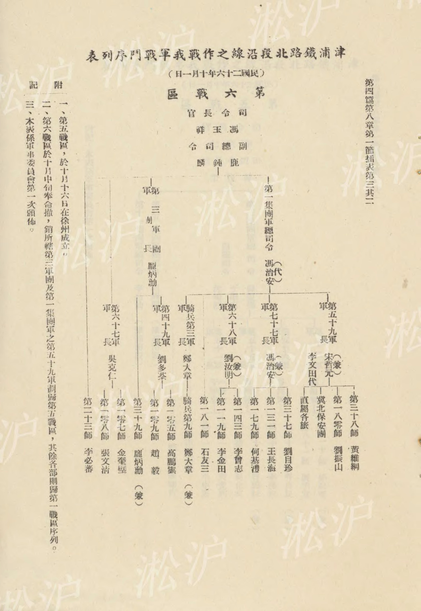

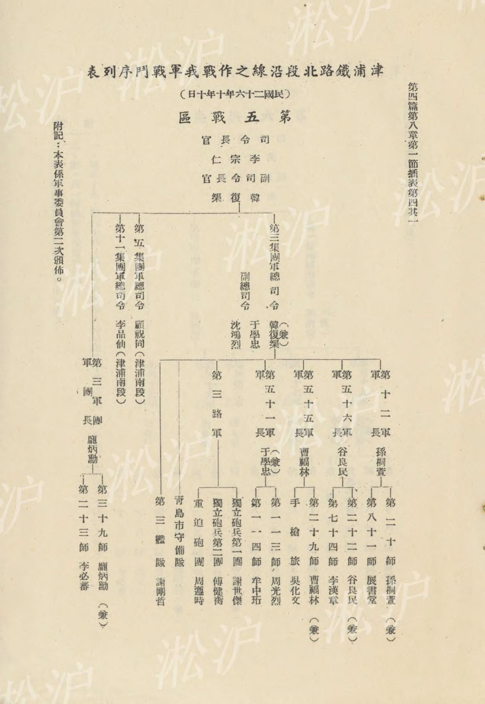

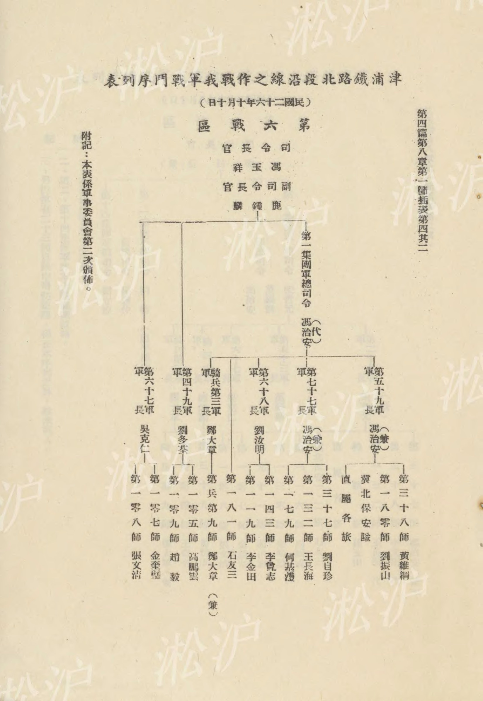

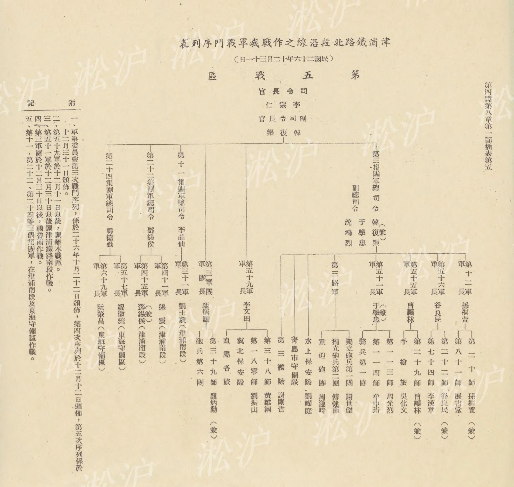

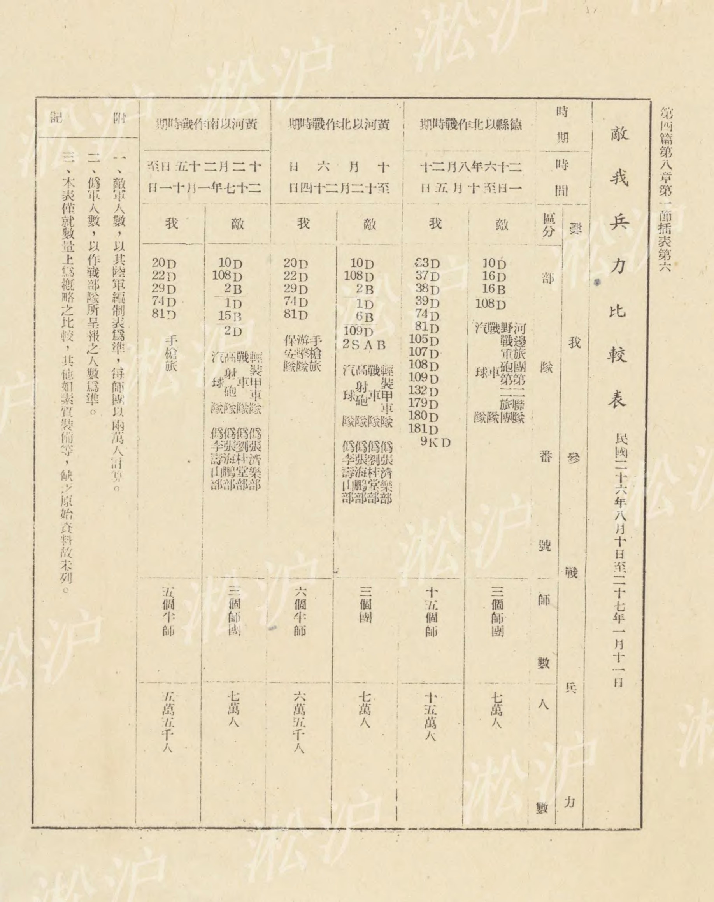

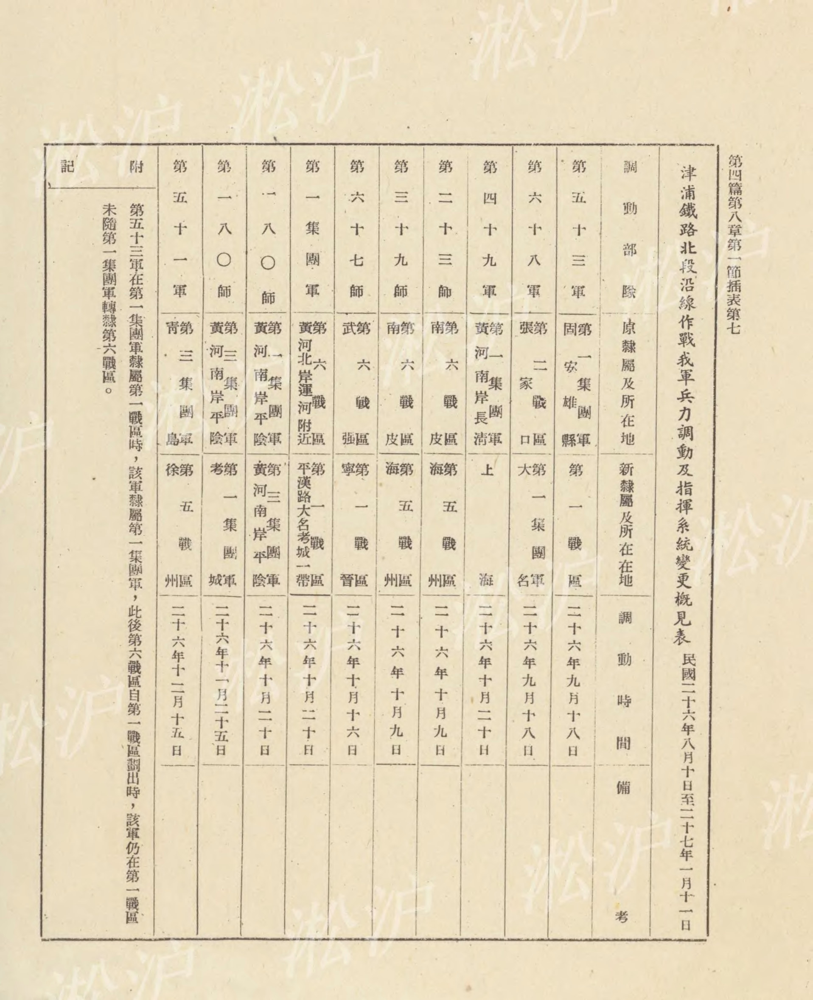

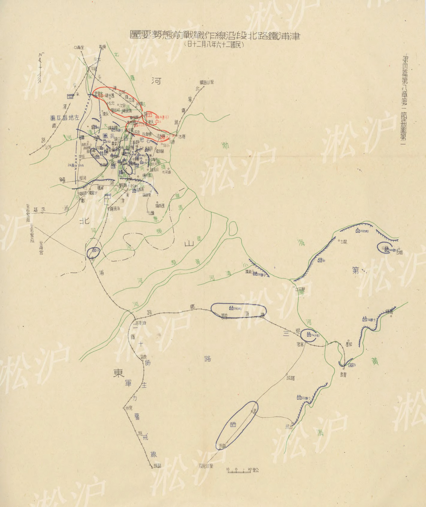

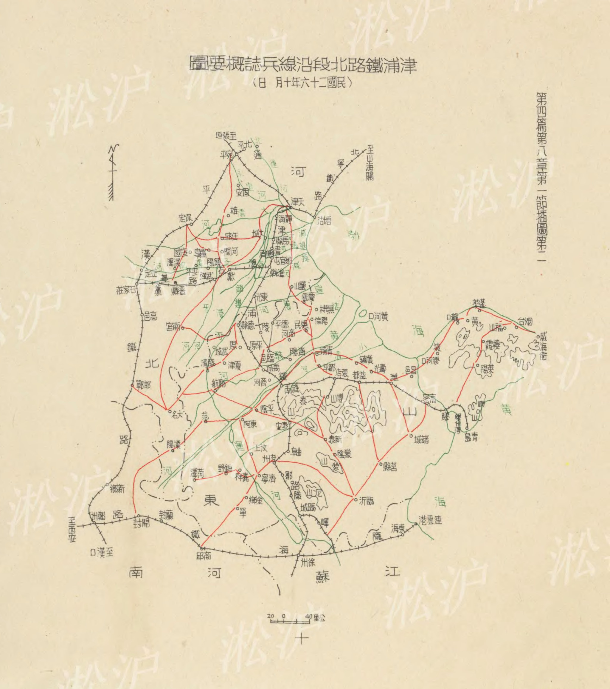

### 第二節 我軍作戰指導

照圖第一

平津既陷，我軍事委員會爲適應戰況，劃定全國爲四個戰區，以津浦、平漢兩鐵路北段爲第一戰區，最高統帥蔣委員長自兼司令長官，並於八月二十日明令頒佈戰區北正面作戰指導計畫如左：

軍事委員會第一戰區軍北正面作戰計畫

民國二十六年八月二十日

第一

敵情判斷

平津方面之敵，旬日以來，對於南侵行動，頗形遲緩，而對於南口方面之攻擊行爲，則極爲活躍，依此判斷，敵軍之企圖，大概可分爲下列三途：

一、積極攻略南口後，進迫萬全，以控制平綏全線，威脅大同，窺伺太原，以期不攻而摧破我全面之作戰。

二、攻略南口後，以此爲大旋迴之軸心，並以津浦之運動爲外翼，用主力由平漢路及有力之一部由津浦路互相向我側面壓迫，逐次收獲側面攻擊之成果。

三、如南口之攻擊不成功時，則以昌平、密雲爲據點，掩護其右側背之安全後，再用第二項所述之方法，向我進攻。

依此判斷，本戰區正面之作戰，唯有以重兵扼守南口，方足以摧破敵人一切企圖，故本戰區正面作戰部署，應側重於平漢路上北部西北側。

第二

指導方針

本戰區北正面，目前主要任務，爲拒止敵人，沿津浦、平漢兩路南下，同時側擊敵人對南口方面之攻擊，鞏固南口、萬全之線，以定爾後轉移攻勢，收復失地之基礎。

爲達成方針前段所述之目的，應以平漢、津浦兩鐵路爲軸心，以防守部隊採用縱深疏散據點式之防禦配備，以機動部隊控制於側翼，如敵向我進攻，則協助防守部隊，向敵側背圍攻而殲滅之，同時在前線之部隊，應組織便衣游擊隊渡過永定河，深入平漢鐵路以東地區，組織民衆，破壞交通，以牽制敵之運動。

爲達成方針後段所述之目的，應以强有力之機動部隊，向南口、懷來、萬全之西南地區挺進，直接或間援助我南口、萬全一帶之守軍。

第四

軍隊區分及其位置任務

右地區兵團：

指揮官第一集團軍總司令宋哲元。

第二十九軍之一師，位置於東灣頭小站與馬廠間附近，其餘部隊，位置於靜海、王家口附近。

第六十七軍之一師，位置於同居鎮大王莊、岐河口與馬廠間附近。

第五十三軍之一師，位置於霸縣附近，第九十一師位置於固安附近，其餘部隊位置於雄縣附近，河北保安隊兵力須等於一師，位置於任邱、河間附近。

以上各部隊，各對當面之敵，確實佔領堅強之防禦陣地，絕對拒止敵人之前進爲主要任務。

第六十七軍之其餘部隊，位置於馬廠附近，取疏散配置之態勢，敵軍進攻時，以由側面策應該當面友軍之作戰爲主。

二、左地區兵團：

指揮官第二集團軍總司令劉峙。

第二十六路軍之一師及一旅，位置於琉璃河鎮、涿縣、高碑店附近。

第十七師位置於保定附近。

以上各部隊，各對當面之敵，確實佔領堅强之防禦陣地，絕對拒止敵之前進爲其主要任務，第二十六路軍之其餘部隊，位置於房山、張坊附近。

第三軍位置於涑水、易縣附近。

第二師位置於徐水附近。

第二十五師位置於滿城附近。

以上各部隊，各在指定地點及其附近取疏散配置之態勢，敵軍進攻時，以由側面策應該當面友軍之作戰爲主，同時保持其機動性，準備隨時可以向北平、南口方面取攻勢。

三、第一總機動兵團：

指揮官前敵總司令衛立煌。

指揮第十、第八十三、第八十五等師，以齋堂、大龍門一帶爲活動根據地，以策應昌平、南口、懷來方面之作戰，截擊敵人之側面爲主要任務。

四、第二總機動兵團：

指揮官第八路軍總指揮朱德。

指揮新編第一一五師、第一二零師、第一二九師，以陽原、蔚縣、涞源爲活動根據地，以策應下花園、宣化、萬全方面之作戰，截擊敵人之側背，並須以便衣隊深入冀東、熱河地區，施行游擊戰術，襲擊敵軍爲主要任務。

第五、作戰地境：

左、右地區：河間縣、雄縣、固安縣、順義縣各西側相連之線，線上歸右地區。

第六、總預備隊

第四十軍之第三十九師位置於滄縣，在杖生鎮、滄縣以東之線構築陣地。

第三十二軍位置於饒陽、武强、東鹿、安平、深澤一帶，在晉縣、獻縣之間構築陣地。

第十一路軍位置於石家莊，在藁城、正定、石家莊地區構築陣地。

第二十三師位置於德縣，在德縣及其附近構築陣地。

第四十七師着在石家莊待命。

第七、部隊配置與工事構築

各部隊，無論其任務爲防守或機動，務採取疏散之配置，並須利用地形地物構築工事，以達到步步爲營能攻能守之要求，而增加國軍作戰之輒強性。

第八後方勤務部隊之任務

後方勤務部隊，應依照此計畫內所定之區分，從新規劃諸設施，務適應各地區各部隊作戰上之要求，完成通信交通衛生諸設備，充實彈藥器材諸補充，對於積極運輸之要領，務取分散配置，顧慮對空遮蔽，以避免敵空軍及砲兵之轟擊，且能不失時機補充前方。

軍事委員會委員長蔣中正

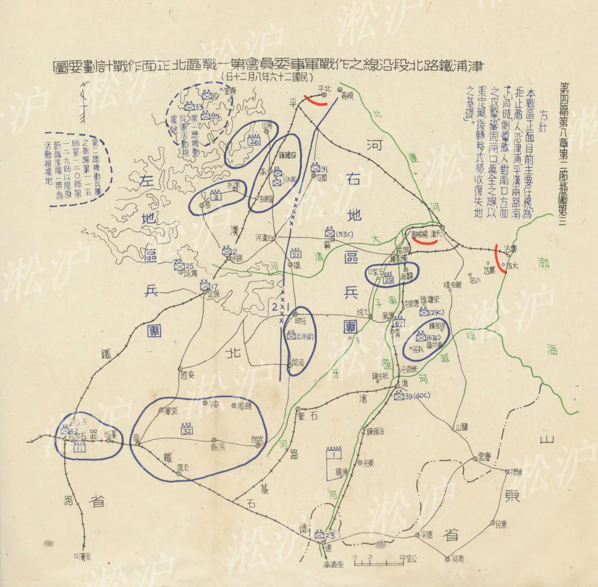

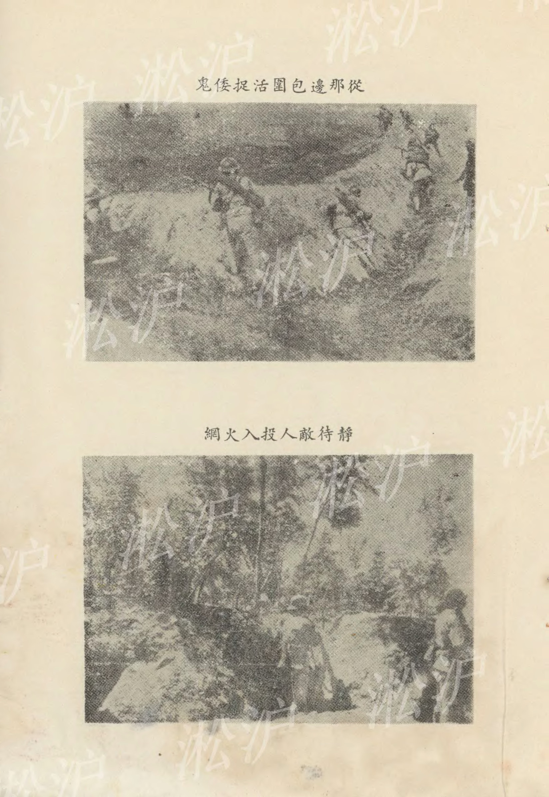

### 第三節 作戰一般經過（參照插圖第四插表第八第九）

本作戰分爲三個階段，二十六年八月二十一日開始戰鬥起，至十月五日德縣陷敵止爲第一階段，德縣失守後，經徒駭河南北地區及臨邑諸戰鬥，迄十一月中旬，我第三集團軍撤守黃河南岸止爲第二階段，自黃河南岸戰鬥，青島撤退爲第三階段。茲分款敘述於下：

第一款

德縣以北作戰時期（民國二十六年八月二十一日至十月五日）

敵軍於襲佔我平津後，除分向平綏、平漢兩路進犯外，並於八月上旬，以一部兵力準備對津浦路方面發動攻擊，迄八月中旬，新增之敵第十師團及第十六師團之一部，並野戰重砲兵第二旅團、戰車部隊與僞滿軍等，共約四萬餘人，在敵第二軍司令官西尾壽造之指揮下，在小站、鹹水沽、陳塘莊、獨流鎮、楊柳青、王慶坨至馬頭鎮，並沿永定河北岸之線，開始行動，同時敵機不斷轟炸鐵路各車站，於二十一日起，遂分由小站、楊柳青、第一集團軍右翼及中央，向馬廠附近我守軍進攻。

當時我在津浦、平漢分爲左右兩地區部署，第一集團軍轄第二十九、第六十七、第五十三各軍及石友三部兩個保安旅，佔領惠豐村、馬廠、姚馬渡、大城、文安、霸縣、固安至雄縣間陣地爲右地區兵團，第二十六路軍在平漢路涿縣附近東西之線駐守爲左地區兵團，以備迎擊進攻之敵。迄八月二十一日，經數日之激戰後，我津浦路沿線之靜海城、陳官屯迄子牙河沿線之王口鎮等處前進陣地與警戒陣地先後被敵攻佔，馬廠當面主陣地之戰鬥於以展開。九月一日起，敵向我朝宗橋右翼陳官屯中央之線施行攻擊，四、五兩日，陷我子牙鎮、唐官屯後，復繼續南攻，此時我爲遲滯敵之南進計，遂令騎兵第九師於南運河、子牙河選擇要點，決心實施氾濫戰術，敵軍攻勢因以受阻，蔣委員長頒電嘉勉。十日，敵再增援，在機砲及水陸兩用戰車掩護下，攻擊我主陣地，遂發生激烈戰鬥，旋因流河鎮陳官屯兩鎮鑰陣地又不幸被敵攻佔，敵乘勢擴張成果，於十一日晨，續向我馬廠陣地猛烈進犯，其一部於突破窯盆、流河鎮後，渡過城河，由右方向馬廠側擊，馬廠在敵三面包圍之下，當晚遂被突破，我守備該地區之兩師，乃退守滄縣以北馬落坡，趙官營亘留各莊、大城以南之線，並以一部在興濟、青縣南附近，擔任掩護新陣地之佔領。

二十六年九月十二日，軍事委員會爲堅强阻敵南進計，令第一集團軍固守青縣、留各莊至文安間陣地，同時令集中蘭封、商邱之第四十九軍（原駐豫西南陽、方城，於八月末開抵上述兩地）、迅由津浦路向滄縣推進，並令第三軍團長龐炳勳造成滄北大氾濫。

第二十九軍原轄第三十七、第三十八、第一三二、第一四三各師、騎兵第九師及獨立特務旅等共六個旅，於平津戰後，第三十八師師長張自忠脫離部隊，第一三二師師長趙登禹於南苑作戰陣亡，經宋哲元呈准，將第二十九軍改編爲第五十九、第六十八、第七十七各軍，騎兵第九師及石友三所部河北保安部隊兩個旅，改編爲第一八一師，雖於九月六日頒佈改編命令，因其時馬廠戰鬥方酣，遂未及實施，迨馬廠撤退，各部乃就轉移新陣地之際，從事改編，故延至九月中旬以後，始實施新編番號。又第一四三師初奉命協同第三十五軍在張垣方面作戰，改編爲第六十八軍後，由張垣轉平漢路方面，未參加津浦北段之作戰。

據當時軍事委員會判斷，華北敵對我津浦、平漢兩路將採取積極活動，其目的，在津浦路方面將欲擴展至德縣附近，既可造成我軍在平漢方面之突出，又可使將來在青島方面登陸容易，倘我滄縣不守，更足以促成其青島登陸之企圖。

山東海岸方面，自九月初，青島敵僑敵艦完全撤退，石臼所、煙臺、龍口、黃河口一帶海面，有敵艦十餘艘，不時向各該港口親伺，並向海岸砲擊，九月十日，軍事委員會令，劃靑島附近卽墨海陽膠縣、高密、諸城各縣爲靑島防守區，任靑島市長沈鴻烈爲防守指揮官，以期加强靑島之守備。

第一集團軍已於馬落坡姚官屯、趙官營至留各莊間佔領旣設陣地後，於九月十二日，奉軍事委員會命令，爲期堅强阻遏敵人，應集中全力於此一線，並規定各部隊之位置如下：第五十九軍佔領李天木辛莊至馬落坡之線，掩護軍之右側，捷減河沿岸第四十軍第三十九師，佔領馬落坡姚官屯至東花園之線，第四十九軍佔領西花園、趙官營至孝子墓之線，第七十七軍之第一三二師佔領孝子墓至黑坦鎮之線，第六十七軍佔領自南趙扶、大城之東向南沿子牙河至留各莊，向西經銀子頭至文安之線，第五十三軍仍在永清、固安之線，第一八一師在興濟鎮，掩護各軍佔領新陣地後，撤至泊頭鎮、南皮縣、西傳河、滄縣南間歸總預備隊位置，騎兵第九師仍在永定河南岸活動，第七十七軍原駐河間，第三十七師之第一零旅，推進至留各莊、念祖橋、沙河橋地區，以加强子牙河之接合部，第七十七軍（欠第一三二師）及第一一零旅在夏口、南皮縣西南。

在此期間，軍事委員會鑒於第一戰區所統轄之津浦、平漢兩路部隊，過於龐雜，指揮漸感困難，遂劃出津浦鐵路線爲第六戰區，任命馮玉祥爲司令長官，指揮第一集團軍、騎兵第三軍及第六十七軍暨第二十三師等部隊作戰，原第一集團軍之第五十三軍，至是劃歸第一戰區指揮，第六、第一兩戰區之作戰地境，規定爲河間、呂公堡、文安之線，原屬津浦路方面之固安、永清、霸縣、雄縣一帶地區，隨第五十三軍劃歸第一戰區，並頒佈對第六戰區指導要領，令在滄縣附近固守，萬不得已時，亦應在南皮、泊頭鎮、獻縣之線持久抵抗，最後須在德縣東西之線竭力拒止敵人，以待第五戰區兵力之轉用。

攻陷馬廠沿鐵路南下之敵第十師團，於九月十七日晚，以四個混成旅團兵力，向我姚官屯前方警戒陣地進攻，由二十日起，續向我姚官屯及東西花園主陣地猛烈攻擊，自商邱增援之第四十九軍，此時已參加戰鬥，戰鬥至爲激烈，姚官屯陣地失而復得者達六、七次，二十三日，東西花園陣地，經慘烈之戰鬥後，以我軍損失奇重，卒於二十四日被敵突破，全線遂陷於混戰狀態。

當敵我於二十三日戰鬥激烈之際，軍事委員會曾令駐德縣之第二十三師，迅速向滄縣馳援，但該師延至二十四日入暮後，始克到達滄縣以南附近，因增援過遲，已無法挽回頹勢，姚官屯、東西花園之線，乃陷敵手，當我軍撤退時，因敵跟蹤追擊，於二十五日，在滄縣附近混戰竟日，不能立足，遂被迫令各軍向鹽山、南皮、磚河、馮家口一帶撤退，滄縣遂告陷落。

九月二十六日，各部隊到達新陣地部署甫定，而滄縣之敵，復沿鐵路南犯，向我繼續攻擊，二十七二十八兩日，與我駐馮家口、泊頭鎮守軍激戰，我當疲憊之餘，乃向東光、安陵及桑園一帶撤退，而鹽山、南皮一帶守軍，則在原地對沿鐵路南下之敵，取監視態勢。

當馬廠戰鬥時，沿子牙河左岸前進之敵第十六師團主力，於九月十日起，開始向我第六十七軍陣地攻擊，十一日、當馬廠失陷時，原在大李莊、馮莊擔任守備之第三十七師已南撤，第六十七軍右翼，因感空虛突出之苦，乃將第一零八師陣地，再度由南趙扶轉移至白洋橋之線，經數日戰鬥後，敵攻勢稍挫，該軍乃於十五日黃昏，乘機反攻，令第一零八師之一部，向東辛莊攻擊前進，以遮斷敵之歸路，其主力則向北趙扶、姚馬渡之敵進攻，並令第一零七師向次河、根河攻擊，以策應第一零八師之戰鬥，是役敵在我軍夾擊之下，遺屍七百餘具，全線潰退，倉惶向子牙河東渡，遂與該軍隔岸對峙。九月二十一、二十二兩日，敵陸續增援，該軍乃放棄大城轉移至留各莊、呂公堡之線繼續抵抗，嗣患敵有沿子牙河逕犯獻縣企圖，該軍吳軍長爲顧慮背後安全，乃於二十四日晚，率部沿滹沱河向獻縣轉進，嗣以獻縣、交河一帶，水深數尺，不利作戰，復向小範鎮及武强轉進。

九月二十五日，軍事委員會據報上述戰況，特電馮司令長官轉令第六戰區各部隊，務在桑園、德縣以北擇地固守，並集結兵力，力圖反攻。馮長官奉令後，乃決以右翼鹽山、南皮線上各部隊襲敵側背，以分鐵路線上東光、連鎮一帶與我第七十七軍作戰之敵勢。十月一日，南皮我第四十九軍兩個旅襲佔馮家口，第四十軍一個旅襲擊泊頭鎮，第四十九軍一個旅襲佔南夏口，並跟蹤敵軍向東光方向進擊，原期與第一七九師、第一八一師呼應夾擊，造成有利之勢，乃東光部隊已先兩日經由桑園沿運河向南撤退百餘里，遂使夾擊之功，敗於垂成。當時各部隊素質不齊，各將領間亦缺乏互信，無形中已影響同仇敵愾之決心。當此之時，敵軍已由滄縣增援，反向我側背襲擊，於是我進擊之各部隊，乃不得已，於十月二日晚，撤至張大家、燈明寺一帶，整頓後，續向邊臨鎮、德平撤退。斯時第七十七軍及第一八一師，亦已沿運河向故城、武城轉進。

九月二十九日，攻佔我東光、連鎮之敵，於十月一日續攻佔桑園，適我第三集團軍第八十一師之一旅到達德縣，乃於當晚派兵一團向該敵進擊，一度克復桑園，嗣敵後續部隊到達，發動反攻，該團乃復撤回德縣，於是敵開始進逼德縣矣三日敵約九千餘人，向德縣城進攻，我第八十一師運旅長率第四八五團抵抗，原擬堅守待援，該旅其餘部隊，因展師長率領在德縣以東地區游擊，而第七十四師部隊，又自平原赴援遲緩，德縣遂於十月四日夜被敵攻陷。

十月五日，韓復渠命第七十四師（欠一團）及配屬於該師之第五十九旅之一團在黄河崖（德縣南）

以南趙王河南岸阻敵南進，並令第八十一師除一團在德縣、陵縣、平原間游擊外，其餘部隊撤回黃河南岸佈防。

第二欵

黄河以北作戰時期（民國二十六年十月五日至十二月二十四日）

民國二十六年十月一日，我軍事委員會綜合各方戰況，策定北戰場之作戰指導，對山東方面第三集團軍及第六戰區曾作下列之指示：爲使爾後作戰便利起見，國軍應以確保戰略要地爲目的，第三集團軍及第六戰區各抽調部隊在黃河南岸佈防，並構築工事。第三集團軍在長清以東，第六戰區在長清以西，第三集團軍以兩師兵力向德縣集結，阻敵南進，並掩護第六戰區各部隊之轉移；第六戰區其餘部隊仍在黃河以北津浦路以西作戰。

第三集團軍基於上項指示，當卽下令抽調在膠東方面任龍口、煙臺、威海衛等處守備之第五十六軍第七十四師、第十二軍第二十師之第五十九旅及第五十五軍之手槍旅一團，向德縣集結，第六戰區亦决定以第五十九軍、第四十軍、第四十九軍及第二十三師使用於黃河南岸，統由龐軍團長指揮，在濟陽附近渡河，以第七十七軍、第六十七軍及第一八一師、騎兵第三軍（卽騎兵第九師）使用於黃河北岸，並與南岸守軍連繫作戰。十月五日，第三集團軍重新佈置，對黃河以北，以第七十四師（欠在濟南之一團）第五十九旅及第八十一師各一團，扼守趙王河右岸平原至陵縣一帶，統由第十二軍孫桐萱軍長指揮，對黃河以南，以膠東方面第五十六軍（欠第七十四師）仍任威海衛至膠河口海岸防務，水上保安隊任小清河口至蒲臺間海岸防務及黃河之守備，第五十五軍任蒲臺至濟陽間黃河守備，第十二軍（欠二個團）任濟陽至長清間黃河守備。第六十七軍方面，由大城向獻縣撤退後，原奉命於武强集結至高邑轉乘火車，經隴海、津浦路赴平陰擔任黃河南岸守備，至十月十日，行經趙縣奉命改向新河、寧晉一帶佔領陣地，十六日，奉令歸第一戰區指揮。由東光撤至武城之第七十七軍，於十二兩日到達堂邑、莘縣冠縣、館陶及冀縣、南宮一帶地區，該軍隨第一集團軍撥歸第一戰區指揮。九月十八日隨第六十七軍自永定河地區撤退之騎兵第九師，此時在臨清、南宮間活動。第五十九軍自鹽山撤至黃河南岸後，於十月四日奉令改向臨清移轉第四十軍及第二十三師由南皮撤至濟陽渡河，至黃河南岸後，於十月九日奉命由龐軍團長率領開赴徐州轉赴海州擔任海岸防務。第四十九軍同（九）日在齊河渡河，十三日到達長清，任長清、平陰間黃河守備第一戰區同時令第六十八軍由臨洛關轉移至大名，以鞏固平漢路之側翼。

十月九日，軍事委員會派徐廳長祖詒到達濟南，向韓總司令復集宣示中央意旨，並面授機宜，韓乃於十一日令第五十五軍之第二十九師由靑城、濟陽渡河向樂陵、德平前進，相機收復德縣。十二日，令游擊第一、第二、第五各路由鐵路以東，第三、第四兩路由鐵路以西，分向黃河崖、德縣、南皮一帶襲擊。十月十三日，敵强渡趙王河，猛攻平原，第七十四師之一部與敵在城北激戰後，撤至張莊站，該師主力遂在張莊站與敵開始接觸，第三集團軍總部以張莊站無險可守，除令第二十九師仍進出陵縣、臨邑向德縣側擊敵人外，並令第七十四師、第八十一師、第五十九旅各派一部撤守徒駭河南岸禹城東西之線，阻敵南進，其餘均撤回濟南整補。

十月十六日，軍事委員會令第六十七軍改歸第一戰區指揮，同時，以敵人向德縣、平原一帶冒險深入，乃令第三集團軍積極向敵側背襲擊，並令第六戰區相機策應。十月十八日，因敵之主力已向平漢路轉用，復令第三集團軍努力牽制當面殘敵，並着各游擊部隊向敵側背積極活動，澈底破壞禹城以北之鐵路，斷敵交通動脈，同日第五十九軍之第一八零師奉命暫歸韓復集指揮，擔任平陰至張秋鎮間之守備。自德縣失守後，原駐第六戰區各部隊，除一部調至黃河南岸任長清、平陰、東阿間守備，撥歸第五戰區韓副司令長官指揮外，其主力第七十七軍、第五十九軍、騎兵第九師均退守運河西岸臨清、聊城一帶。馮長官因於十月七日奉令移駐新鄉，嗣以兵力減少，戰區縮小，第一集團軍之全部復劃歸第一戰區程司令長官指揮，第六戰區遂撤銷（按自九月二十三日保定失守後，第一戰區司令長官改由參謀總長程潛兼代）。先是軍事委員會接獲徐廳長視察津浦路之報告，得悉宋、韓對馮玉祥缺乏信諒，韓、龐之間成見頗深，且龐、宋兩軍間亦欠協調，故第六戰區各部隊亟須設法調整，於十月上旬命龐炳勛率所部第四十軍、並指揮第二十三師前往海州佈防外，十月二十日，復決定調整戰區有關津浦沿線之作戰，劃歸第五戰區負責，第一集團軍之第五十九軍歸入第五戰區，第四十九軍則調往上海，其餘各部隊統歸第一戰區之序列，第一、第五兩戰區之作戰地境，爲阜城、鄭家口、臨清城、張秋鎮至鄆城之線。同日，對第五戰區頒給如左之作戰訓令：

軍事委員會訓令：

一、第五戰區應確保山東要地，以現在前方之部隊擔任守備東海、青島及膠東半島各海岸，並阻止由津浦路南下之敵，以後方部隊集結於徐州、商邱一帶地區，策應前方部隊之作戰。

二、爲顧及爾後狀況之變化，應於魯南一帶山地構築核心工事。

三、關於詳細部署由李司令長官、韓副司令長官商洽統籌辦理。

二十六年十月十八日至二十五日間，第三集團軍第二十九師向佔領陵縣及其東南鳳凰店之敵攻擊，曾於二十五日一度攻克鳳凰店，游擊第一、第五兩路在鐵路以東活動，克復寧津，第三、第四兩路在鐵路以西活動，襲佔清平及高唐西城，第七十四師於二十日由禹城渡徒駭河，與敵戰鬥數日，嗣仍撤回徒駭河南岸部署。

委員長蔣中正

十月二十六日，軍事委員會對第三集團軍之作戰指示如次：疊據確報，津浦、平漢兩路之敵，轉用於晉東晉北後，殘餘僅數千人，我爲在九國公約開會以前，一新國際視聽，並牽制敵人再轉用兵力於晉省，該集團軍應以主力擊破當面之敵，進出滄縣，以與平漢線進出石家莊之第一集團軍互相策應爲要。韓復渠奉令後，以兵力不足，對上述任務不無遲疑，一再電呈困難，請求增援，迄無奉行之決心，除以各路游擊部隊在鹽山、樂陵、夏津、臨清一帶活動，及令第二十師之第六十旅附第七十四師之一個團調赴禹城接替防守任務，而調回原任禹城防守部隊至濟南整訓外，並無積極解決陵縣敵人與進出滄縣之行1

動。十一月八日起，敵開始向我臨邑進攻，韓復渠乃令第二十師之第五十九旅及第八十一師各部向商河臨邑、德平前進，協助第二十九師抵禦敵人，並令第十二軍軍長孫桐萱赴商河指揮。

先是克復鳳凰店之第二十九師，於十月二十六日見陵縣敵人增加，並據報慶雲被敵佔領，遂自動轉移撤至臨邑附近及商河一帶分別佈防，臨邑之戰因以形成，迄十一月十一日該方面之敵增加至一個旅團，第二十九師被迫於城郊應戰，同時鹽山、慶雲之敵，以一部犯樂陵，以其主力向無棣前進，與由宣惠河、埕子口登陸之敵第一師團所部會合攻佔無棣陽信後，續竄踞惠民，而沿鐵路正面前進之敵，正亦增加兩聯隊，鐵路以西之敵則進攻高唐。當時我軍事委員會根據上項情況及報告，判斷敵有侵越黃河之企圖，乃命第三集團軍迅速對圍攻臨邑之敵轉移攻勢，以確保主動之利。韓復渠奉命後，遂令黃河北岸各部隊轉移攻勢，並電呈軍事委員會報告當面敵情，以惠民失陷，側背感受威脅，擬於不得已時撤守黃河南岸。當十三日第八十一師協同第二十九師夾擊清涼店之敵，正在戰鬥激烈之際，卽晚惠民敵裝甲部隊向南急進，攻陷濟陽城，又禹城當面及夏口亦均有敵人偷渡，是時，第三集團軍以戰況不利，乃決將黃河北岸各部隊撤回，固守南岸，遂於當晚令第八十一師、第二十九師及第二十師之一旅，經樂口向南岸撤退，守禹城之第六十旅及第七十四師一個團亦奉令於十四日晚經齊河向南岸撤回，至是，黃河北岸除游擊部隊外，已無我正規軍矣。十五日以後，我第二十、第七十四及第一八零等三個師奉命擔任自濟陽至張秋鎮之防守，第二十二師擔任濟陽以東至羊角溝之防務，並將第八十一師及手槍旅位置於濟南、萬德、泰安爲預備隊，第二十九師調兗州、鄒縣及濟寧一帶整補。

從此，敵除在濟陽以北曲隄建築飛機場外，並沿黃河北岸配置警戒部隊，其砲兵則分佈於濟陽、邢家渡、鵲山、齊河等處，不時向南岸轟擊，與我隔河對峙達四十日，迄十二月二十三日夜，敵先以優勢炮火猛擊我軍河南岸各陣地，至二十四日夜間，乃一舉强渡黃河。

第三欵

黄河以南戰鬥及靑島撤退時期（民國二十六年十月二十四日至二十七年一月十一日）

十二月十六日，第三集團軍據報：敵約一千五六百人，於十日晚陷朝陽，有攻壽張、范縣模樣。韓復築乃令第五十五軍曹軍長率第二十九師及第八十一師配置於濟寧、嘉祥、鉅野、鄆城一帶，並令第八十一師任陶城埠至濮縣以東柳園間黃河南岸之守備（原在平陰、張秋鎮間守備之第一八零師已調往考城時守備靑島之第五十一軍已於十五日調防徐州，靑島區之防務僅由第三艦隊海軍陸戰隊及靑島市保安隊等負責防守。此時，南京已陷，黃河北岸之敵日趨活躍。十二月二十三日，敵第一師團之第二旅團由歸仁鎮、靑城、黃河渡口偷渡，襲取靑城而進出周村（濟南東），二十四日又以第一零八師團由濟陽渡河，踞章邱而西攻濟南，津浦路正面之敵第十師團復於二十六日在齊河强渡成功，迄二十七日，濟南在敵東西夾擊之下遂告不守，敵第一師團之第二旅團遂由張店南下博山、趨萊蕪、第一零八師團沿鐵路繼續南下，第十師團則進擊我長清一帶守軍後，轉趨肥城，於是泰安在敵三面威脅之下，被迫於十二月三十一日放棄。

斯時靑島孤懸海隅，軍事委員會曾預指示靑島市長沈鴻烈於必要時得相機行動，十二月二十九日，沈市長遂率所部約兩團兵力向諸城、莒縣、沂水等處撤退，十二月三十一日，原留置靑市維持治安之警察隊，亦奉命撤出，於是膠東亦告放棄。

民國二十七年一月一日起，敵第一零八師團續向曲阜進攻，三日陷曲阜、兗州，敵第十師團由肥城策應第一零八師團，於佔領泰安後，復沿公路南下，協力該師團向濟寧進攻，時壽張方面敵第二師團之第二十五旅團亦已渡河，佔東平，攻陷汶上，直趨濟寧，於是濟寧在敵團攻之下，於十一日又告不守，韓復築於是（十一）日由鉅野移駐曹縣，所部第八十一師退駐城武，第二十九、第七十四兩師撤至金鄉，第二十師及第二十二師一部退駐曹縣，獨立砲兵第一、第二兩團在單縣，手槍旅集結鉅野，至是第三集團軍退守魯西一隅，所有魯省各戰略要地喪失殆盡。

本作戰自民國二十六年八月二十一日敵攻馬廠之線起，至二十七年一月十一日濟寧失陷止，我軍傷亡約三萬七千七百餘人，馬五百餘匹。

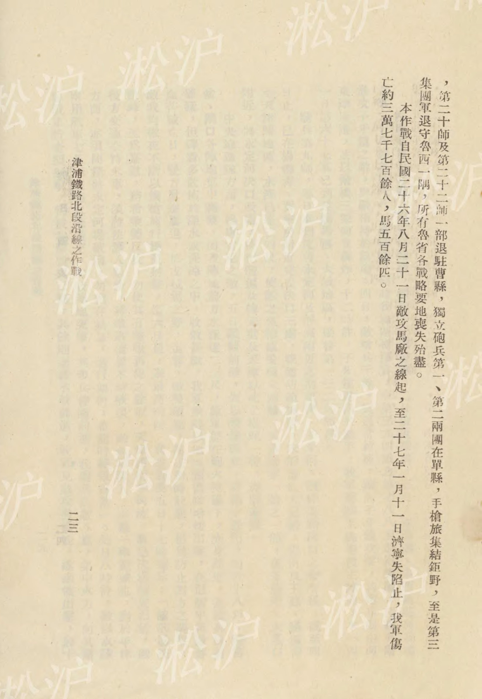

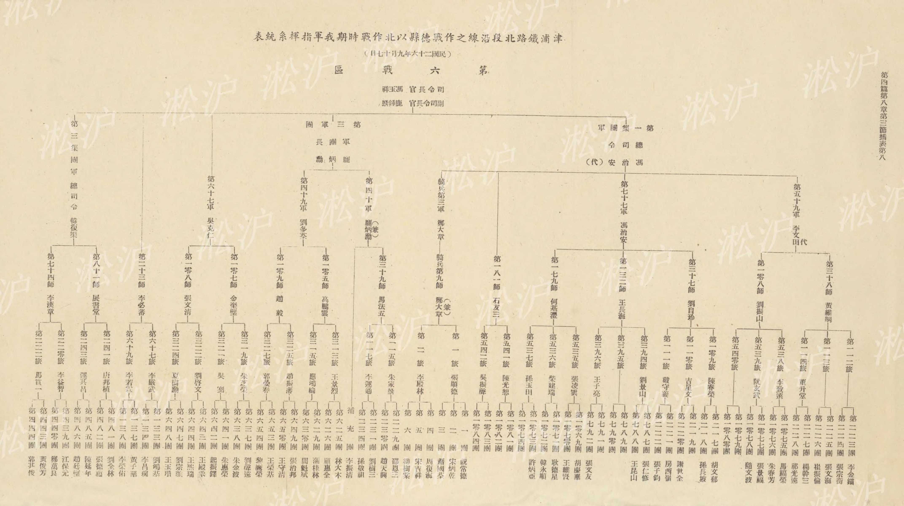

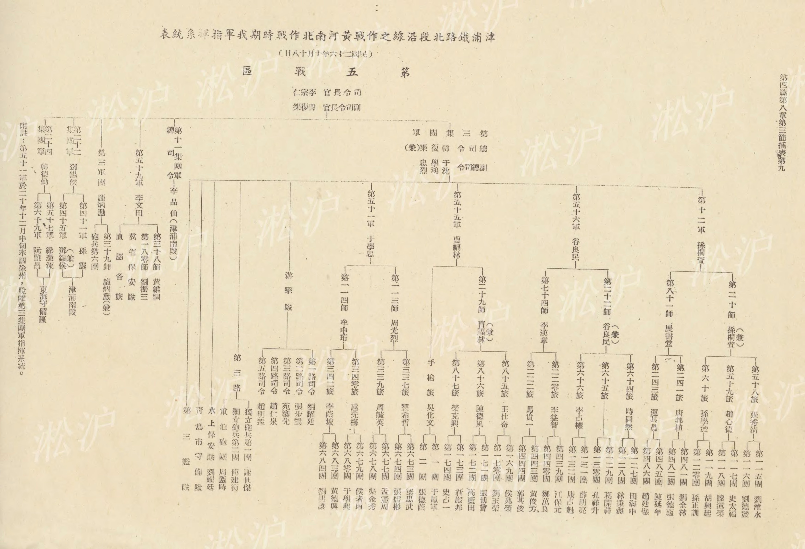

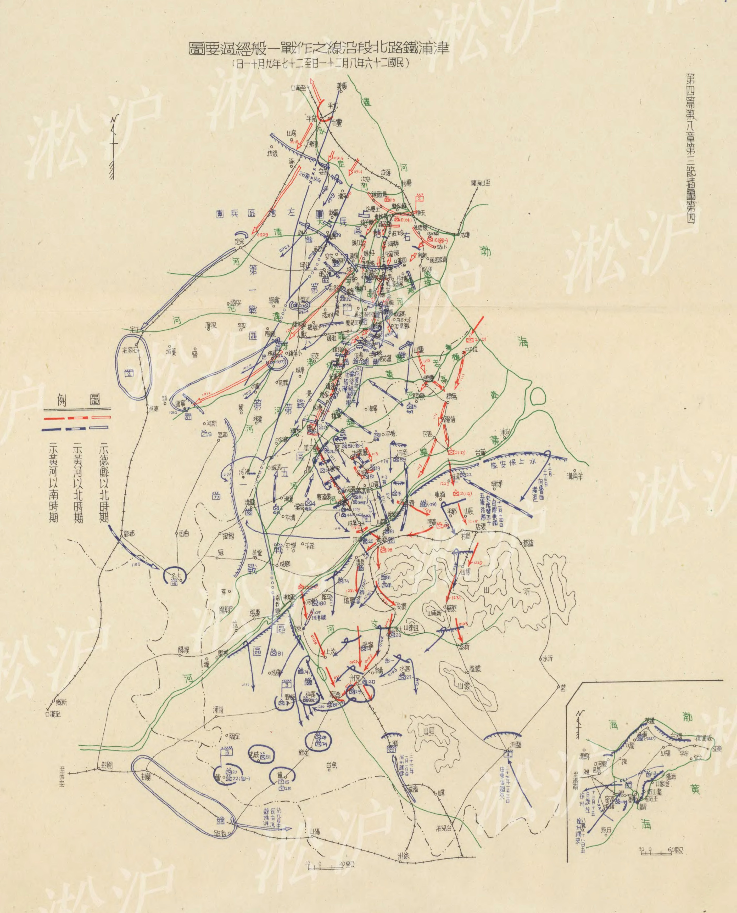

### 第四節 重要戰鬥

第一欵

馬廠附近戰鬥

民國二十六年八月二十一日至九月十二日

參照插圖第五、插表第十

民國二十六年八月中旬，敵機數十架，在津浦北段沿線各大站及其附近各城鎮，先後施行二十餘次之轟炸，除少數民房被炸毀外，對我軍事設施尙無重大損失，津浦路之交通，亦未因此受阻，時值夏末秋初，華北青苗茂盛，敵軍畏我利用青紗帳襲擊，於此同時將天津至楊柳青間鐵路兩側三華里以內之青苗，完全剷除，繼之，敵卽由津沽發動向西南進犯，其中央地區之部隊向南推進，先後陷我靜海、陳官屯、姚官屯、馬廠、青縣，右地區之敵，以小站、大泊爲據點，則向我朝宗橋、趙連莊、惠豐村等處節節進逼，與其中央兵力相呼應，在左地區復先後攻陷我獨流鎮、王口鎮後，推進至子牙鎮，遂演成本戰鬥。

##### 第一項 馬廠附近地形

馬廠位於靜海以南，居青縣之北，津浦鐵路縱貫其間，津保公路經馬廠、大城、任邱，西連保定，大清河、城河橫貫其北，娘娘河、捷減河橫貫其南，運河、黑龍港、子牙等河縱貫其西，各河均可航行帆船，水漲時並通小輪，水運頗稱便利，城河、大清河東向入海，有利我軍防守，其他各河均係南北向，在軍事上可利用爲補給線，如決堤以氾濫阻敵，有助於防守，東淀湖位於大清、子牙兩河之間，夏秋波濤洶湧，蘆葦叢生，馬廠附近地勢平闊，有利於機械化部隊之運動。

##### 第二項 戰鬥經過

八月二十一日，由大沽、天津前進之敵一部千餘人、砲十餘門，在小站、陳塘莊，其主力二千餘、山野砲二十餘門，重砲八九門，在良王莊、獨流鎮集結完畢後，卽分別向我朝宗橋、靜海之前進陣地進攻，二十二日六時，敵已進至朝宗橋以東之萬家碼頭及鐵路正面靜海東北之東西卞莊、魏家村、五里莊附近，隨向我陣地猛攻，激戰竟日，並以重砲向靜海發射五千餘發，我軍乃退守靜海南郊，萬家碼頭之我軍，亦退守朝宗橋。二十三日起，由小站方面進至萬家碼頭之敵，沿城河西進，我朝宗橋部隊節節抵抗，退守洋閘，趙連莊，靜海方面之敵，除砲擊外，復增兵千餘，迫近城郊，我軍獨立第二十五旅據城扼守，至二十四日二十時許，該旅長張凌雲督部與敵肉搏血戰，將突入城內之敵數度擊退，斯時我第二十九軍軍長爲牽制鐵路正面敵軍之攻擊，馳令左地區隊第一三二師，以一部進佔王口鎮據點，對該敵側背猛烈襲擊，該師長奉令後，限令獨立第二十八旅之第六八二團當日進佔王口鎮，迨該團進抵指定地點後，而中央地區守軍獨立第二十五旅，因敵以猛烈砲火集中射擊，靜海城垣破壞無餘，已於八月二十五日六時許，向運河西岸及陳官屯撤退，該旅旋奉令在青縣西北李家窯、老君莊集結，歸第三十七師師長指揮。

敵陷靜海後，其由韓家墅南下之另一部，計步砲兵二千餘，於八月二十六日進至獨流鎮以西地區，二十七、八兩日，敵先以飛機八架，轟炸王口鎮，繼之以砲十餘門，在黑龍港河西岸王莊佔領陣地，向該鎮集中射擊，二十九日，又以汽艇六艘，滿載敵兵沿子牙河南進，十二時許，於三舖、二舖、壩台一帶，向我前進陣地攻擊，雖經我軍節節抵抗，至晚敵已迫近王口鎮，八月三十日拂曉起，敵以步兵千餘名，在砲火（六門）及飛機掩護下，向我陣地猛烈攻擊，十四時許，王口鎮一度被敵攻陷，迄十八時，我軍乘薄暮反攻，乃將敵擊退，三十一日晨，敵復增援反撲，我以靜海旣陷，王口鎮無固守必要，該團遂於十二時後向子牙鎮撤退。

右地區方面：攻陷朝宗橋之敵，於八月二十七日十時，以汽艇四隻、戰車三輛，向趙連莊、擺渡口進犯，大泊之敵亦向胡連莊、四黨口推進，二十八日，在趙連莊、胡連莊之線，與我第一一二旅之第二二四團戰鬥竟日，該團營長趙金鵬在連胡莊前線率隊奮勇抵抗，以身殉國（該營於擊斃敵大尉鼓田屍體檢出文件，得悉當面敵軍爲第十師團第三十九聯隊）。二十九日，趙連莊、胡連莊、五美城、大屯一帶我警戒陣地，完全被敵攻佔。

中央地區方面：八月二十七日十五時三十分，敵機十七架轟炸馬廠，投彈百餘枚，我未受重大損失陷靜海之敵，連日沿運河東岸南進，二十九日，已迫近我陳官屯警戒陣地，與我斥候部隊接觸，三十日開始向我守軍第一零九旅之警戒部隊進攻，敵機六架，同時向陳官屯後方張官屯、唐官屯等處偵察轟炸，雖經我鐵甲車隊（駐在陳官屯以南）砲擊，協助守軍阻擊敵人前進，與之激戰竟日，然卒以態勢不利，遂於三十一日向唐官屯撤退，該敵攻陷陳官屯後，除以一部向東南推進至東西溝樂之線外，其主力則停止前進，似有期待後續部隊到達模樣。

於進犯陳官屯之同時，天津以西韓家墅之敵約五六百人向策城鎮急進，經我騎兵第九師之一部，繞由唐二里擊其側背，與之戰鬥數小時後，始仍撤回韓家墅。

是時，軍事委員會以津浦鐵路方面，城河經馬廠、姚馬渡至子牙鎮之線，扼敵南下及西進要衝，絕對不能放棄，乃派第一部副部長王俊赴前線視察，於八月三十一日午後到達泊頭鎮，經與宋總司令暨有關各軍高級參謀人員會商後，決定重新部署如左：

一、第二十九軍之第三十八師附獨立第二十六旅，於朝宗橋、惠豐村亘馬廠以東之線佔領陣地。

二、第三十七師附獨立第二十五旅，於馬廠亘姚馬渡東端之線佔領陣地。

三、第六十七軍（原在留各莊、呂公堡之線佔領陣地）接替第一三二師由姚馬渡亘大城文安之線陣地。四、第一三二師將陣地交接後，以獨立第二十八旅向王鎮店集結，歸中央地區隊第三十七師師長指揮，其餘向興濟集結，爲軍預備隊。

五、保安第一、第二兩旅向興濟、青縣附近集結，準備增援第一線。

六、第五十三軍固守霸縣、雄縣、固安間陣地。

七、騎兵第九師在永清一帶活動。

八、第四十軍爲第一集團軍總預備隊，位置於滄縣。

以上部署之變更，於八月三十一日由第一集團軍下達合同命令實施。

中央地區正面之敵，自八月三十一日攻佔陳官屯停止前進以來，迄九月二日，其後續部隊已集結兵力三萬餘人，卽以主力循鐵路沿線開始攻擊前進，斯時，我第一集團軍總司令指示各地區隊，各於本陣地前，選擇河流要點決口氾濫，阻絕敵之行動。三日，該敵向我唐官屯陣地攻擊，與第三十七師之第一零九旅接觸，戰鬥竟日，迄二十時仍保持對峙狀態。四日拂曉前，敵以野山砲二十餘門，向唐官屯陣地集中射擊，其鐵甲車、戰車、裝甲車、分別沿鐵路公路併列進攻，七時，敵機十餘架，對唐官屯、閘口、流河鎮等處，濫行轟炸，八時以後，敵戰車七八輛，步兵四五千，在其砲火及鐵甲車掩護下，向我猛烈衝擊，迄午刻，其一部已突入唐官屯，我軍以預備隊加入逆襲，並令第二號鐵甲車在唐官屯、水塔附近，以砲火掩護第一零九旅向敵反攻，激戰數小時，毀敵戰車一輛，並將突入之敵擊退，十五時，敵復增援二千餘人反復衝擊，激戰至十七時許，唐官屯卒陷敵手，我軍遂退守燒窯盆、閘口陣地，當晚我鐵路工程隊協同鐵甲車隊，先將唐官屯以南路軌拆除，然後將路基掘斷，使鐵路兩側氾濫連通；構成天然障礙。

右地區隊當面之敵，自九月五日晨起，向我惠豐村陣地砲擊竟日，但無激烈戰鬥，六日復以砲十餘門掩護步兵七八百人向小郝莊、十八戶等處猛攻，被我擊退。

左地區方面之敵，陷王口鎮後，續向子牙鎮進攻，二日迫近柴溝，三日，在柴溝、東西高莊與我獨立第二十八旅之第六八二團接觸，同時我地區指揮官，令第三九四旅之第七八八團進出柴溝，相機夾擊進攻子牙鎮之敵，與敵相持於該地。四日，敵增兵千餘，突過常村後，續向子牙鎮攻擊，其砲兵則在河東岸掩護，並以飛機三架向我轟炸，十二時許，子牙鎮遂陷於敵手，我軍轉移至姚馬渡主陣地，本（四日第六十七軍已到達姚馬渡、大城地區，接替第一三二師防務。

騎兵第九師，連日奉到速將永定河及靜海附近之南運河。子牙河、選擇要點決口之命令後，截至四日止，已在楊柳青、黃家房附近完成決口三處，雖敵防範極嚴，未能造成大氾濫，但由良王莊、楊柳青至天津間地區，水深已達三四尺，使敵之運輸感受極大困難，又該師第一旅之一部，在王慶坨、大范口附近，將永定河決口數處，使氾濫遍及韓家墅及天津以北之堤頭一帶，亦頗奏效。

中央地區隊方面，陷唐官屯之敵，五日繼續前進，先以飛機四架，重砲十餘門，向我十八戶、燒窯益、閘口各陣地集中轟擊，因我陣地前方水深達二三尺，敵軍即在砲火掩護下，赤身前進，其砲兵發射雖猛，但彈着多散佈於深水或泥淖之中，收效甚微，我軍乘機以地區預備隊增援出擊，在氾濫中與敵浴血苦戰竟日，雙方屢進屢退，形成拉鋸之勢，迄暮，敵勢頓挫，遂成對峙狀態，但爲防止對方之襲擊，敵我均徹夜不斷以機槍施行擾亂射擊，迄六日晨，奉最高統帥蔣委員長五日十七時電示：「該部屢挫敵鋒，至爲嘉慰，務希乘勢反攻，勿使其有整頓再犯之餘暇，天津西南各河流，既已決堤構成氾濫，敵後方交通全恃火車，須設法潛入敵後，將鐵路橋樑不時破壞，敵孤軍深入，不難一舉殲滅也，對於平津方面，亦須同樣將永定河堤破壞，勿稍存姑息，進行如何，希隨時續報爲要」。是日八時許，敵以水陸兩用戰車七八輛在砲火掩護下，向我陣地突擊，其步兵伴隨前進，我砲兵出敵不意，集中火力，向其領導戰車行奇襲射擊，當被我擊毀其三輛，其餘則遲疑不敢前進，我軍見敵攻勢頓挫，遂乘機出擊，將十八戶、燒窯盆以北之小郝莊、四畝口各村莊之敵驅逐，並予克復，敵乃退回唐官屯與我對峙。敵因連日在水中戰鬥，人馬武器損失均重，極感疲勞，我軍則因屢受最高統帥蔣委員長之電慰，士氣日趨旺盛，此時敵軍爲防我自青縣後方增援反攻，乃於七、八兩日，以飛機五架，數度向馬廠、青縣間鐵路公路沿線輪番轟炸，八日晚，復以輕重砲多門，集中火力向閘口、橋頭堡轟擊，陣地頓成焦土，守兵兩排全數殉國，九日復向我十八戶、燒窯盆、城河鐵橋、閘口、小王莊等處全線猛攻，激戰竟日，尤以大小郝莊、十八戶爭奪爲最烈，該處守軍以後方陣地支援不便，遂仍退守城河陣地。十五日五時起，敵向小王莊增援三千餘猛攻，並集中砲火向該莊行殲滅射擊，同時以飛機二十餘架，向馬廠全線陣地及青縣輪流轟炸，至九時許，小王莊我守軍幾全部犧牲，十時敵佔小王莊後，續以全力進攻流河鎮，雖經我守軍第三十七師之第一一一旅竭力抵抗，終以戰力銳減，至十六時流河鎮遂被敵佔領。流河鎮失守後，我第二十九軍軍長，以固守馬廠，必須先恢復流河鎮鎖鑰陣地，遂令集結運河西岸之保安第二旅、獨立第二十八旅分由青縣、王鎮店出發，向流河鎮反攻，惜該兩部尚未完成準備，而敵已連夜增兵三四千，於十一日七時，賡續向馬廠陣地猛烈攻擊，並派飛機五架，重砲十餘門，同時向馬廠陣地集中轟擊，工事房屋全被摧毀，更以汽艇二十餘隻，滿載機槍小砲沿運河南進助戰，十二時許，我燒窯盆守軍傷亡過半，又無援軍增加，敵遂乘我弱點，突過城河自右方向馬廠側擊，至十八時，馬廠陣地被敵三面突入，陷於肉搏混戰者達三小時，我軍以衆寡懸殊，於二十一時起，被迫向青縣、興濟等地撤退，馬廠要地遂於是夜被敵佔領，十二日，陷馬廠之敵，續攻青縣，與我軍預備隊之保安第一旅戰鬥半日，我軍旋奉命退守娘娘河南岸興濟巨盤古之線。

本戰鬥，於八月二十一日敵攻我朝宗橋、靜海前進陣地起，至九月十二日佔領青縣止，歷時二十三日，我第二十九軍在平津、馬廠禦敵月餘以來，損失過半，乃於十三日以後，以冀北保安隊第一旅接替娘娘河興濟之線佔領陣地，掩護該軍撤退至滄石線既設陣地，實施整編。

是役、我以久戰疲憊，當新銳之敵，經五次以上之激烈戰鬥，傷亡萬餘人，而敵之傷亡亦幾與我相等，造成一與一之比，實已達成持久消耗之任務。

按第二十九軍在馬廠作戰期間，曾於九月六日，呈准將該軍擴編爲第五十九、第七十七兩軍，又石友三部河北保安第一、第二兩旅，同時改編爲第一八一師，惟因馬廠戰鬥方酣，未及實施，至是馬廠之戰結束，乃趁各部轉移新陣地之際，從事改編，故自九月中旬以後，始使用新番號。

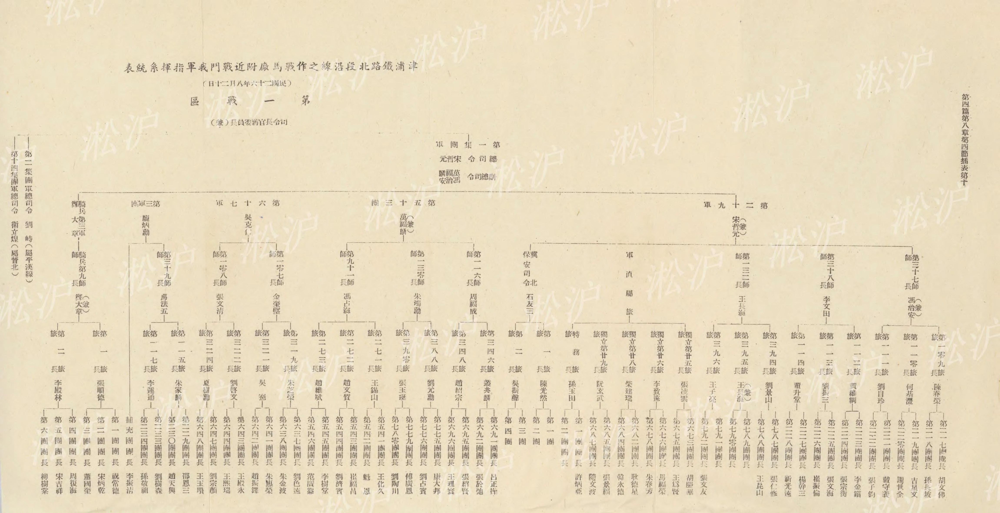

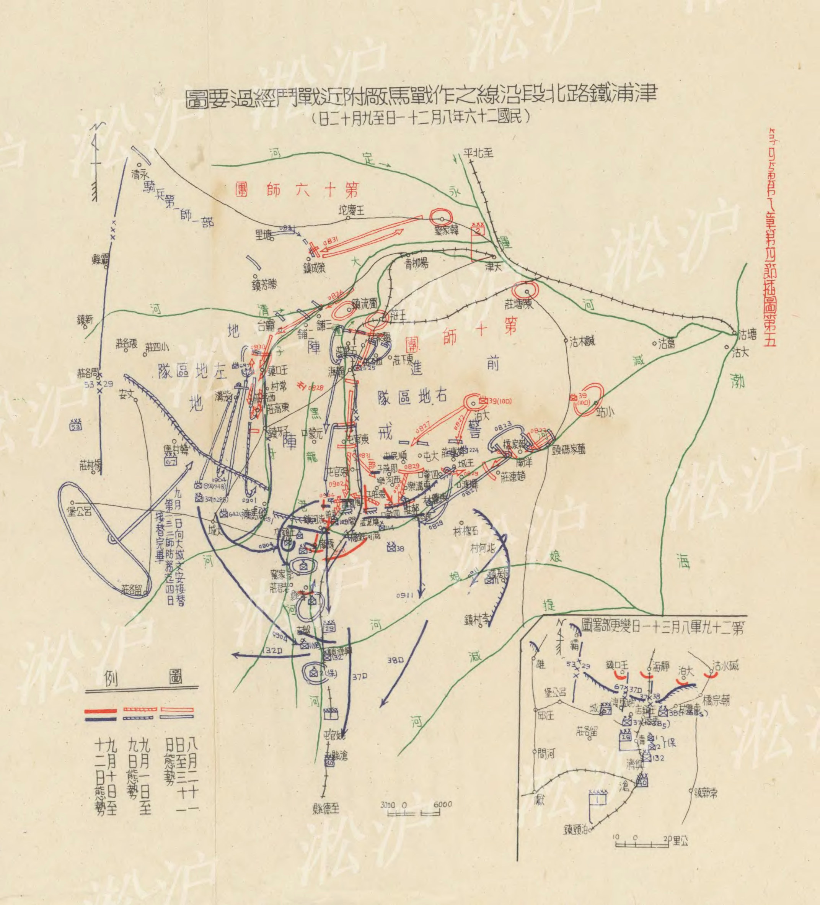
