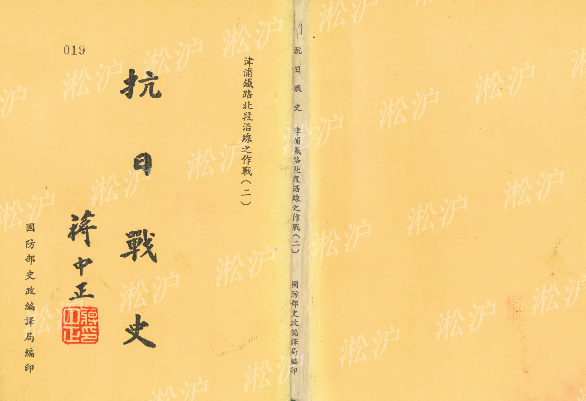

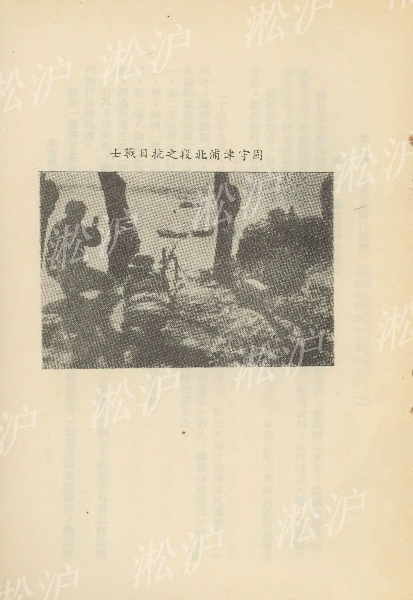

#### 第二款 姚官屯附近戰鬥

民國二十六年九月十八日至二十六日

參照插圖第六、插表第十一

##### 第一項 姚官屯附近地形

姚官屯位於滄縣以北，附近地形開闊平坦，與馬廠一帶大致相同，娘娘河在其北，捷減河居其南，交通方面，除津浦鐵路及運河外，尚有未完成之滄石路基與滄石大獻兩公路，此外附近大道，均可通行騾馬大車，於交通運輸尚稱便利。

惟利於我者，往往亦利於敵，上述水陸交通動脈，適亦爲敵所利用，並充分配合其優良裝備與後方支援，對我實行中央突破。

##### 第二項 戰鬥經過

二十六年九月十日，敵第十師團突破我馬廠陣地後，至十七日止，除原有第十師團及河邊旅團之一部外，復增調第一零八師團之第十六旅團及特種部隊，其總兵力約達五六萬人，繼續向南進攻，似有取滄縣威脅我軍石家莊右背側之企圖，旋經偵悉敵軍各部隊之概略位置如左：

一、第二軍軍司令部駐平津。

二、第十師團一部在娘娘河左岸佔領據點，主力在青縣、馬廠地區集結。

三、第一零八師團之第十六旅團在馬廠以北至唐官屯地區集結。

四、河邊旅團之第二聯隊在靜海及其西南地區集結。

自八月中旬起，敵機數十架，不斷向滄縣南北鐵路沿線轟炸，嗣後派汽艇二十餘艘在馬廠以西運河內執行偵察巡邏。

我第一集團軍基於軍事委員會之指導，（即前頒之第六戰區作戰指導）佔領滄縣既設陣地，對沿津浦路南下之敵竭力抵抗，以待增援部隊之到達，積極準備作戰。其時奉命阻敵南進部隊第二十九軍改編之第五十九、第七十七兩軍，共轄五個師，冀北保安隊改編之第一八一師，已陸續到達姚官屯東西線上，第四十九軍增援部隊，亦在磚河鎮車站次第下車，總兵力不下十個師，該集團軍遂於九月十七日下達命令如左：

一、第一八一師在興濟鎮沿娘娘河右岸佔領掩護陣地，掩護後方部隊完成新陣地之佔領，並盡力破壞交通及阻塞運河之航行，爾後撤至磚河、泊頭間，歸集團軍總預備隊位置。

二、第五十九軍佔領李天木、辛莊、八里莊、大孫莊、馬落坡（不含）之線，以一團佔領韓村鎮、常郭鎮側面陣地，對岐口方面警戒，掩護我軍右側背。

三、第三軍團佔領馬落坡、姚官屯、西花園、趙官營、孝子墓至黑龍港河之線，阻止沿津浦路南進之敵四、第七十七軍之第一三二師佔領孝子墓以西黑龍港河西岸理坦鎮至留各莊之線，阻止南進之敵，其餘第一七九師、第三十七師在泊頭鎮及其以南地區集結，爲集團軍總預備隊。

五、各部隊之作戰地境如左：

一第五十九軍與第三軍團之作戰地境，爲八里屯、鞠官屯、張辛莊、馬落坡、薛官屯、東西秀女之線，線上屬第三軍團。

二第三軍團與第一三二師之作戰地境，爲龐心莊、白馬莊、孝子墓、代家莊、代家墓、大李營之線，線上屬第三軍團。

三第一三二師與左翼隣接部隊之作戰地境，爲子牙河左岸沿線，線上屬左。

六、第一集團軍總司令部在連鎮，鐵甲車隊在滄縣車站附近。

各部隊受令後，於九月十八日十二時以前，各就指定位置，完成其左列部署：

一、關於第一八一師及第五十九、第七十七兩軍之部署情形，業如前述，茲不復贅。

二、第三軍團之部署：

第四十軍之第三十九師及軍補充團，佔領馬落坡、姚官屯、亘西花園以西土堤之線。

第四十九軍（欠第一零九師，時在滄縣以南八里屯、大賈莊一帶集結爲軍團預備隊）佔領西花園以西土堤、趙官營、孝子墓、至黑龍港河東岸之線，第四十九軍未到達前，其防務暫由第四十軍補充團及第一三二師之一部擔任（第四十九軍奉命增援前線，十七日到達滄縣，一時不能集結完畢）。

第四十軍與第四十九軍之作戰地境，爲小金莊、求平里、胡嘴子、吳辛莊各西側之線，線上屬右。

三、第四十軍之部署（按該軍第三十九師七月下旬起已在姚官屯東西之線構築工事）：

第三十九師之第一一七旅爲該師右地區隊，在馬落坡、姚官屯、東花園至運河東岸之線佔領主地，於豆店、李家樓之線佔領警戒陣地。

第三十九師之第一一五旅（欠第二二九團）爲該師左地區隊，右接運河經西花園至以西土堤之線佔領陣地，於吳辛莊東西之線佔領警戒陣地。

三補充團於西花園以西土堤、趙官營、孝子墓之線佔領主陣地，俟第四十九軍到達接防後，在馬家廠、劉表莊位置集結。

四砲兵營主力在大姜莊，以一連在西花園進入旣設陣地，主火力指向鐵路附近，一部火力指向運河沿岸。

五工兵營在姚官屯東西之線加强工事，爾後歸還徐官屯師預備隊位置。

六第二二九團在徐官屯、趙家坡地區集結，爲師預備隊。

七第三十九師司令部在鹽場，騎兵連、特務連在鹽場以西地區，警戒該師左側翼。

四、第四十軍第三十九師第一一七旅（右地區隊）之部署：

一第二三四團佔領馬落坡、大姜莊、姚官屯之既設陣地，於豆店東西之線派出警戒部隊。

二第二三三團（欠第三營，時該營在吳官屯附近爲旅預備隊）佔領姚官屯車站、東花園至運河東岸之既設陣地，於李家樓東西之線派出警戒部隊，以一營兵力佔領人合村（註一）前進陣地，遲滯敵之前進。

三兩團戰鬥地境，爲鐵路東側沿線，線上屬右。

四旅司令部在吳官屯。

九月十八日七時許（參照插圖第七），馬廠、青縣南進之敵約二三千人，砲十餘門，向我興濟鎮掩護部隊第一八一師進攻，戰鬥約三小時，因運河及娘娘河河水氾濫，敵無進展，至十一時許，敵以集中砲火，向興濟鎮市街猛烈轟擊，其裝有機槍小砲之汽艇二十餘艘，復在砲火掩護下载送其主力强渡娘娘河，並遣一部沿運河南進，擊我側背，十二時該敵侵入興濟鎮，與我巷戰二小時，我軍經逐次抵抗後，遂向梅官屯、姚莊子轉移，十四時敵續攻梅官屯、姚莊子，又與我戰鬥半日，我掩護部隊見任務已達，遂於二十二時頃向磚河撤退，梅官屯、高官屯、姚莊子均被敵佔領。

九月十九日，攻佔興濟鎮、梅官屯、姚莊子一帶之敵，於七時許向我豆店、李家樓、吳辛莊、吳李碼頭、辛集之線進攻（參照插圖第八），其由梅官屯進攻之敵，藉戰車三輛之掩護，與我警戒部隊四個班戰鬥二小時，佔領豆店，我在豆店以南逐次抵抗，至十二時撤回馬落坡主陣地。由高官屯方面進攻之敵，在戰車五輛掩護下，沿公路向李家樓攻擊，因戰車被我防禦壕所阻，其步兵乃渡壕進攻，我守軍第二三三團之一排，抵抗二小時後，退入劉家院，敵復將劉家院包圍，該排爲遲滯敵之前進，奮勇抵抗，遂全部壯烈成仁，劉家院被敵佔領後，我第二三三團以預備隊兩連發動反攻，敵利用牆垣頑強固守，戰至二十時許，敵援軍五百餘人到達，反向我軍包圍，我軍在月夜行動，目標顯著，致遭受猛烈火力之制壓，不得已乃退回原陣地，李家樓遂陷敵手，此時吳辛莊、吳李碼頭、辛集等處，亦相繼被敵佔領，我軍遂退守胡嘴子、陶官營、小街等據點，至是我在姚官屯以上之警戒陣地盡失，而主陣地之防守戰，遂繼之而起。

先是數日來，敵機三五架不等，每日向我主陣地作六七次之偵察轟炸，其繫留汽球亦在高官屯上空向我陣地執行觀測。

敵自九月十九日攻佔我警戒陣地後，二十日竟日偵察，二十一日開始向我主陣地進攻（參照插圖第七），是日四時頃，其主力沿鐵路西側地區前進，向我人合村前進據點攻擊，另派汽艇四五艘，由興濟鎮開出，沿運河南進助戰，至八時許，其陸上部隊因受我陣地外壕阻隔，停止進展，但吳辛莊、高官屯之敵砲兵，在繫留汽球觀測指揮之下，向人合村集中射擊，火力頗爲強烈，同時敵機十二架，先後向大姜莊、姚官屯及人合村作偵察轟炸，十二時敵裝甲車三輛，掩護步兵數百，沿鐵路向我姚官屯陣地進攻，待抵姚官屯車站以北鐵路破壞處，其裝甲車受阻停駛，當被我平射砲擊毀一輛，其步兵亦被我擊退。至十六時三十分，敵機二十一架，協同砲兵向人合村、胡嘴子猛烈轟擊，歷二小時之久，工事民房全被摧毀，守兵亦傷亡甚衆，敵繼以步兵五六百，戰車三輛，突入人合村北部之蕭家房子，遂發生陣地內戰鬥，該地守軍於敵機砲轟擊之下，經一度混戰，戰力漸見低減，難以支持，我第一一七旅旅長乃馳令旅預備隊第二三三團之第三營，迅派兩連兵力增援，惟該部將抵蕭家房子時，而敵之後續部隊亦沿運河東岸南進，遂發生遭遇之混戰，至十九時，我第三十九師師長決心乘夜間恢復人合村北部陣地，派隊由左翼沿運河河堤實行逆襲，其當時處置大要如左：（參照插圖第九）

一、令工兵營由東花園向蕭家房子之敵實行逆襲。（註二）

二、令第二二九團團長率該團第三營及第四第六兩連，向王辛莊、褚官屯正面增加。

三、令原守人合村之第二三三團第二營，相機由鐵路西側出擊。

至二十一日二十一時許，各部隊均與敵發生戰鬥，同時敵數百沿鐵路向我第二三三團第二營右翼包圍，該師長當卽令第二三四團以兩連向敵側擊，戰鬥數小時後，成對峙狀態。

同日晨（參照插圖第七），右翼薛官屯之敵三千餘人，砲十餘門，向我大孫莊第五十九軍陣地進攻，戰至十二時許，我軍以一部沿捷減河繞擊敵之側背，迄十八時，敵退回薛官屯，又十三時，敵機九架曾轟炸馬落坡陣地，繼以步兵千餘，在其砲火掩護下由豆店向我馬落坡進攻，當被擊退，運河西岸吳辛莊之敵，正午前後向我胡嘴子陣地攻擊，亦未得逞。

二十二日拂曉前（參照插圖第九），堅守人合村南部王辛莊、褚官屯之我軍，及二十一日增援逆襲之各部隊，協同向北部之敵反攻，經四五次之衝鋒肉搏，我軍因傷亡過半，攻勢遂挫，六時許，敵以砲火向褚官屯、王辛莊集中射擊，雖陣地全毀，但我軍仍堅强抵抗不懈，阻止敵之進攻，同時豆店之敵，向我馬落坡陣地猛攻，第三十九師師長因馬落坡方面守軍兵力薄弱，遂令預備隊第二二九團第一營前往增援，卽時加入戰鬥，至九時許，敵見我抗力轉强，遂仍退回豆店。又自晨至十時止，運河西岸胡嘴子陣地，除受敵正面猛攻外，兼受人合村敵之側擊。

當時該師長綜合各種情況，判斷敵之主力，似欲沿鐵路線及其兩側地區前進，遂決心變更部署，放棄人合村、胡嘴子各據點，縮小正面，以期固守大姜莊、東花園主陣地，其處置如左（參照插圖第七）一、右地區隊第一一七旅（附第二二九團第一營）縮小正面至鐵路以東，其以西之陣地由左地區隊延伸接替，兩地區之戰鬥地境，爲鐵路東側沿線，線上屬左。左地區隊第一一五旅將胡嘴子前進陣地部隊，撤至西花園主陣地。

二、在人合村戰鬥之第二三三團，撤至吳官屯附近整頓待命。

三、在人合村戰鬥之師預備隊第二二九團（欠第一營），向東花園陣地撤退，歸還第一一五旅建制。

四、在人合村戰鬥之工兵營，向大姜莊陣地撤退，掩護師砲兵。

左地區隊奉命後之配備，以第二二九團（欠第一營）及第二三零團第一營，接守姚官屯至東花園陣地，第二三零團（欠第一營）撤退胡嘴子守兵，堅守西花園主陣地。各部隊於十三時許，已就新防線部署完畢，十七時，豆店之敵，增加戰車三四輛，向我馬落坡及其以東陣地攻擊，戰鬥至二十時，攻勢稍挫。

左翼吳李碼頭之敵六七百、戰車三輛，於十五時向我趙官營陣地攻擊，戰鬥數小時後，被我擊退。

第四十九軍第一零五師於十七日奉到接替趙官營、孝子墓陣地佔領之任務命令後，卽由滄縣集結開始移動，惟因滄縣西北平原連日滲雨，河水陡漲，且決口頗多，田野道路水深均達數尺，部隊運動極感困難，且因船舶缺少，大部均使用木筏，以致遲至二十二日始接防完畢，原守軍第四十軍補充團，於交防後，卽向馬家廠集結。

九月二十二日晨，第三軍團長龐炳勳，鑒於敵之主力，有沿鐵路地區繼續攻擊模樣，且第一線部隊連日傷亡均衆，遂令駐八里屯、大賈莊之軍團預備隊第一零九師之第六五四團，推進至大姜莊以南至東花園之線，策應各當面守軍之作戰，其餘推進至徐官屯、鞠官屯地區待命，第六五三團及第六五四團各津海鐵路北段沿線之作戰

三九

一部推進至前線後，卽陸續奉命加入戰鬥。十六時頃，第四十九軍軍長劉多荃向第三軍團長龐炳勳具申意見：「軍團預備隊第一零九師，如逐次增加使用，不但處處形威被動，且違背預備隊使用原則，終爲敵逐次擊破，殊非計之所得，職願率師於二十三日拂曉前，由第三十九師右翼馬落坡方面，向敵側背出擊」。因龐軍團長素日用兵慎重，以無預備隊爲欠妥，致未採納其意見，但已覺察以第一零九師與第三十九師混合使用之不當，乃於十九時，令第一零九師第三二七旅之部隊，逐次歸還建制，並向姚官屯至東花園之線移動，準備接替該線防務，同時以長途電話向蔣委員長報告戰況，並請派得力部隊增援，當奉准以駐德縣之第二十三師馳援，第二十三師於接奉軍事委員會命令後，連夜向滄縣輸送。

二十三日，姚官屯當面之敵，於四時許開始向我攻擊，先以砲二三十門，飛機五六架，向馬落坡、姚官屯、東花園陣地轟擊，達一小時之久，敵砲兵在其繫留汽球觀測指揮之下，命中準確，我陣地多被摧毀，五時、敵鐵甲車掩護其步兵沿鐵路進攻，其砲兵主火力，同時向我姚官屯車站陣地射擊，站房工事均被毀壞，車站守軍在敵密集砲火轟擊下，亦均壯烈犧牲。敵步兵乃乘機衝入，一度將姚官屯車站佔領，幸我第二三零團第一營營長率預備隊奮勇逆襲，將敵擊退，十四時，敵復增援反撲，並以戰車五輛，掩護步兵進攻，至十五時，我姚官屯車站陣地再度被敵突入，守軍第三三零團第一營李營長率部死力抵抗，誓與陣地共存亡，混戰之餘，遂壯烈殉職，姚官屯及東花園陣地，旋均被敵猛攻突破。斯時我砲兵乘敵我正在混戰之際，以奇襲火力射擊鐵路附近敵戰車及其後續部隊，當擊毀戰車二輛，裝甲車一輛，我大姜莊守軍以猛烈機槍火力，同時側擊姚官屯正面之敵，東花園方面守軍第二二九團，亦以團預備隊對突入之敵施行逆襲。第三軍團長鑒於當面戰況危殆，乃以軍團預備隊第一零九師之第六五四團向姚官屯，第六五三團向東花園增援逆襲，激戰至十七時，卒將侵入姚官屯車站及姚官屯、東花園之敵擊退，恢復原陣地，但敵仍在陣地前與我對峙。

右翼薛官屯之敵，於二十三日七時，向李天木、辛莊第五十九軍陣地攻擊，十時許，我守軍第三十八師，以一部向北閣鎮出擊，對當面之敵取包圍態勢，予以猛烈反擊，敵遂退回薛官屯，十七時，該敵再發動攻勢，仍未得逞，在北閣鎮、李寨之線與我對峙。

此時我運河西岸西花園陣地，亦被敵攻擊，與我竟日激戰，敵雖數度發動衝擊，我軍團預備隊第一零九師以第六四九團增援，卒將敵擊退，我仍固守原陣地。

第三軍團長根據連日戰況，敵屢次均以主力沿鐵路兩側攻擊，又據我砲兵觀測報告，敵增援部隊有五個列車，在姚官屯車站以北下車集結，判斷敵主力似仍將沿鐵路附近地區進攻，惟正面第三十九師傷亡過衆，戰力銳減，故對戰局深爲焦慮，當據第四十九軍軍長劉多荃具申意見，第三十九師連日苦戰，損傷奇重，職願率第一零九師擔任鐵路亘東西花園主陣地之戰鬥，龐軍團長以原陣地必須固守，方能達成拒止敵人南進之目的，遂採納劉軍長上述意見，再度變更部署，以軍團預備隊加入戰鬥，增強中央地區鐵路正面之防守兵力，其佈署如左（參照插圖第十一）：

一、第四十軍之第三十九師再縮小正面至鐵路以東。

二、第四十九軍（以軍團預備隊第一零九師歸還建制）延伸正面至鐵路以西。

三、作戰地境，爲津浦鐵路西側沿線，線上屬右。

四、各部隊於十八時開始行動。

第四十軍之第三十九師奉命後，迅卽變更部署如左：

一、第一一七旅之第二三四團固守馬落坡、大姜莊、姚官屯至鐵路西側陣地，左與第四十九軍連繫。

二、第二三三團第二營固守姚官屯車站陣地。

三、第一一五旅在徐官屯、鞠官屯地區集結待命。

四、第一一七旅（欠第二三四團、第二三三團之第二營）在吳官屯地區集結待命。

五、補充團在顧官屯、孟家莊、地區集結待命。

六、砲兵營、工兵營仍在大姜莊陣地服原任務。

七、師司令部移駐唐莊。

第四十九軍奉命後，以第一零九師（欠第六四九團）任鐵路以西（右接第三十九師）亘東花園至運河東岸之陣地，第一零五師（附第一零九師之第六四九團）任運河線西花園、趙官營、孝子墓至黑龍港河東岸陣地（兩師之作戰地境，爲運河沿線，線上屬左）。

軍團各部隊，於二十時頃，均已到達各指定地區，配備完畢。

九月二十四日拂曉前（參照插圖第七），敵舉全力向我馬落坡、姚官屯、東西花園、趙官營之線進攻，四時許，其主力在砲火數十門掩護下，沿鐵路兩側地區前進，向我大姜莊、姚官屯、東西花園陣地猛攻，各陣地一時均被突入，短兵相接，陷入混戰狀態，我第三十九師爲鞏固其左側背，乃令第一一五旅於趙官屯西北端沿鐵路至姚官屯佔領側面陣地。六時，大姜莊被敵突破，該師以第二三三團增援，向敵逆襲，（在大姜莊未被突破前，我砲兵營第一連已轉移至第二三四團團部駐地之張辛莊）七時三十分，該敵被迫以首受逆襲之一部，向東轉竄張辛莊時，該村僅有我第二三四團團部及砲兵一連，因無戰鬥力，致被敵包圍突入，除第二三四團團長率衛兵十餘人突圍外，砲兵連長高正典以下則全部犧牲。當敵包圍張辛莊時，該師曾以補充團第一第二兩營馳援，九時許到達，向已佔領該莊之敵反攻，惜未克奏效，同時姚官屯及其車站方面之戰鬥，則更爲激烈，經守軍第二三四團營長鄭思綬與第二三三團營長鍾毓麟，率隊協力堅强抵抗，敵勢乃挫，但雙方傷亡均衆。

斯時，第一集團軍層奉軍事委員會電令：「姚官屯及東西花園之陣地，我軍須固守不可放鬆一步」

之指示，馮代總司令鑒於當時戰況漸趨惡化，爲遵令固守原陣地，除飭第一線部隊死守外，並令第五十九軍以一旅兵力向馬落坡、張辛莊策應，令駐磚河之集團軍總預備隊第一八一師派遣一旅（主力向捷減河南岸張家坊、捷地鎮，一部向滄縣南之王新莊推進）策應第一線之作戰，令第一七九師在泊頭鎮以北及其迤東佔領陣地。

此次東花園之苦戰，據守軍第一零九師師長趙毅於二十四日十二時呈第三軍團長之電報稱：「至現在止，綜合全般情況，已陷於抗戰以來最悲慘之狀態，計傷亡團長、團附各一員，營長七員，連長以下傷亡者達十分之六七，連日不眠不食，在砲火彈雨之下，拚死掙扎，實爲最後一息，職無論如何，督飭殘部死守，望仍鑒及悲慘，懇請極力應援，以顧全局」等語。當時我守軍忠勇抗敵，冒死犧牲之精神，於此可見。

二十四日十四時，第一零九師當面之敵，復先後發動五次衝鋒，與我各陣地守軍肉搏苦戰，敵我傷亡，臥尸遍野，戰況之烈，爲前所未有，敵突入東花園後，爲擴張戰果，繼續向我進迫，守軍第一零九師第六五四團之第三營營長喬培南，親率殘部向敵再四逆襲，終因援兵未至，故自營長以下全部皆壯烈殉職。

當東花園正在混戰時，守軍第一零九師師長奉命迅速恢復東花園陣地，該師迫於情勢，乃以師預備隊增援前線，不幸於鐵路河間之狹窄地區，受敵砲火之殲滅射擊，致該援隊遭受重大傷亡，而無法前進，不得已，乃退守趙家坡東西之線。

旋據第四十九軍軍長劉多荃於二十四日十七時呈軍事委員會之電報稱：「第一零九師於二十三日夜，接守東花園被敵機砲夷平之陣地，本日八時以來，遭敵猛攻，陣地失而復得者數次，傷亡團長園附各一營長七連長以下官兵四千餘，十六時東花園被敵佔領，我軍退守趙家坡東西之線拚死固守，而東花園之失利，確在敵飛機砲火猛烈轟炸情勢下，第一零九師師長迫於急圖收復東花園之命令，處置欠當，在鐵路運河間，狹窄正面內使用大多數密集部隊，不無錯誤上云云。

當東花園失守之時，張辛莊之敵續有增援，一面對我反攻部隊頑強抵抗，一方面向孟家莊攻擊，致使陣地陷於混戰局面，我前線守軍因以動搖，大姜莊、姚官屯等陣地，乃被敵乘機突破，相繼失守，此後右翼大孫莊、馬落坡及左翼西花園、趙官營各處我守軍雖於二十五日與敵激戰竟日，但已於全局無所補救，僅對敵之戰場追擊，稍收遲滯之效而已。

在姚官、東花園各處戰鬥萬分緊急之際，第三軍團長曾屢次命令已到達滄縣東南八里屯地區之第二十三師，向顧官屯、三里店、北堡子之線推進，增援第一線，該師遲滯不前，致失戰機，至二十時，我陣地多處被敵突破，各級預備隊均使用盡淨，龐軍團長以戰局無法挽回，乃令第四十九軍以一部固守滄縣城垣，第三軍團其餘各部隊向捷減河岸撤退，各部隊在當夜混戰之餘，紛紛南撤，致多失去連絡與掌握，扼守趙官營第一零五師之第三一三旅，因該地區前後水勢汪洋，運動極感困難，沿黑龍港河南撤後，完全失去連繫。

二十五日四時，攻佔姚官屯之敵，跟踪進犯至滄縣城郊，與我第一零九師之一部戰鬥數小時，我軍續向捷減河南岸轉移，滄縣乃陷敵手。

第一集團軍總司令，於二十四日姚官屯失守後，已令第五十九軍以一部向姚官屯之敵側擊，掩護正面我軍之撤退，其主力則向捷減河南岸鳳凰店、祝莊之線移動，並令左翼第一三二師向滄石路基豆莊（卽代兒莊）淮鎮之線轉移，至是第三軍團欲於捷河南岸亘滄石路基三呼莊至豆莊之線佔領陣地，意在據險收容，一面阻敵南進，一面徐圖恢復，挽回戰勢，奈連日苦戰，而敵之主力又復跟蹤追躡，不容喘息，乃將運河決口，構成滄南氾濫，我軍大半皆在水中行動，無法佔領新陣地，除第四十九軍及第一零九師之一部在捷減河南岸擔任掩護外，其餘各部隊，均於二十五、六兩日，紛向鹽山、蓮花池、南皮、馮家口之線撤退，以致各部隊各級指揮官彼此均失却連絡，當時第一集團軍總司令除以無線電連絡外，並派人分向各部隊覓取連繫，至二十六日八時許，始獲悉各部隊到達之位置如下（參插圖第十二）：

第五十九軍在舊城鎮、鹽山附近，第四十軍之第三十九師在南皮以東之蓮花池地區，第四十九軍之第一零九師在南皮，第一零五師（第三一三旅尚未歸隊）在泊頭鎮以北地區，第二十三師之第七十七旅在南皮以東，第七十五旅在泊頭鎮以北楊辛莊地區，第一八一師主力在馮家口，一部在磚河鎮附近，第一七九師在泊頭鎮以北及其以東地區。

斯時，第三軍團長爲收容部隊，相機側擊敵人，當就各部隊到達之位置，計畫分區佈防，其部署如左（參照插圖第七）：

一、第四十軍之第三十九師以蓮花池爲根據地，在蕭十撥、何七撥、雙廟五撥之線佈置防務。

二、第四十九軍以殷官屯爲根據地，在康官屯之線佈置防務。

三、第二十三師以南皮爲根據地，在張家口、黃家窪、楊莊之線佈置防務，左與泊頭鎮第一七九師連繫四、各部隊作戰地境如左：

第四十軍與第四十九軍，爲西門家、馬四撥、姚莊之線，線上屬左。

第四十九軍與第二十三師，爲趙家莊、翟官屯、木架橋、奇家屯之線，線上屬左。

攻陷滄縣之敵，於二十六日（參照插圖第十二）强渡捷減河，除一部向鹽山追擊外，其主力沿鐵路南下，似有進窺德縣之企圖，達磚河鎮時，與我第一八一師之一部戰鬥數小時，旋卽先後攻佔磚河、馮家口，我軍被迫向東光撤退，敵陷馮家口後，偵悉泊頭鎮我軍先已佔領新陣地，並築有堅固工事，嚴陣以待，遂就馮家口附近集結，未敢冒險急進，僅以一部在馮家口以南地區向我警戒，戰鬥至此，遂暫告終結。

本戰鬥，乃津浦鐵路北段沿線作戰最爲慘烈之戰鬥，自九月十八日開始，迄二十六日止，歷時凡九日，戰鬥始告終結，經統計我軍傷亡共約一萬二千餘人，敵軍方面僅就東花園數次爭奪戰而言，除傷亡運走者不計外，遺棄在我陣前之屍體，尚有二千餘具之多，推斷其全部戰鬥傷亡，亦必慘重。

註一：人合村在姚官屯以西，運河以東之中間地區，包括多數小村莊，如蕭家房子、大莊子、褚官屯等。

註二：第三十九師工兵營之裝備，與步兵略同，故能與步兵擔任同樣之戰鬥任務。

表統系揮指軍我鬥戰近附屯官姚戰作之線沿段北路鐵浦津（日八十月九年六十二國民）

區戰六第

祥玉馮官長令司

麟鐘鹿官長令司副

長團軍三第

令司總

軍團集一

馮

治代

安

龐炳勳

軍第四十九軍

長

劉多茶

軍第四十長軍

龐炳勳

師第二十三師

李必藩

第二零九師

長

趙毅

師第一零五師

長

高鵬雲

師第三十九長

師

馬法五

師第一八一長

石友三

師第一七九師

長

何基澧

師第一三二師

長

王長海

軍第七十七軍

長

馮治安

旅第一二一長旅

戴守義

旅第三九四旅

長

劉景山

旅第三九五旅

長

王子亮

旅第三九六旅

長

王子亮

旅第五三五旅

長

張凌雲

旅第五三六旅

長

柴建瑞

旅第五三七旅

長

孫玉田

旅第五四二長旅

吳振聲

旅第五四一長旅

陳光然

旅第五四二長旅

吳振聲

旅第一一七長旅

李運通

旅第一一五長旅

朱家麟

旅第一二九團團長

第二二九團團長

第二三零團團長

趙天興

第二三三團團長

劉樹森

第二三四團團長

孫敬祖

補充

團團長

李振清

第六二五團團長

林大木

第六二六團團長

顧惠全

第六二九團團長

蒲桂林

第六三零團團長

閻魁斌

第六四九團團長

張治邦

第六五零團團長

王守清

第六五三團團長

王榮基

第六五四團團長

黎膺榮

第一三三團團長

劉鴻基

第一三四團團長

李昌琬

第一三七團團長

黃千華

第一三八團團長

李榮佑

第二二二團團長

房西嶺

第二二二團團長

張子鈞

第七八七團團長

張仁修

第七八八團團長

王昆山

第七九零團

第七九一團

第七九二團團長

張文友

第一零六九團團長

胡慶華

第一零七零團團長

王維賢

第一零七一團團長

耿德星

第一零七二團團長

韓永順

第一零七三團團長

許炳亞

第一零八二團

第一零八三團

第一零八四團

第一零七四團

第一零八一團

第一零八二團

第一零八三團

第一零八四團

第一零七三團團長

許炳亞

第一零八四團

第一零八二團

第一零八三團

第一零八四團

第一零八四團

第一零八四團

第一零八

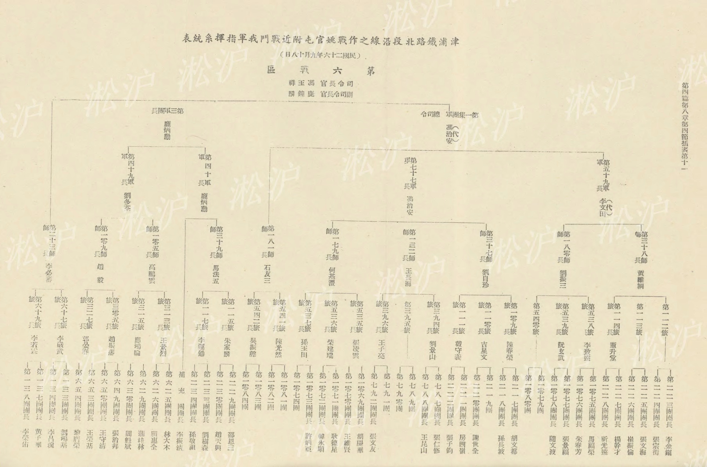

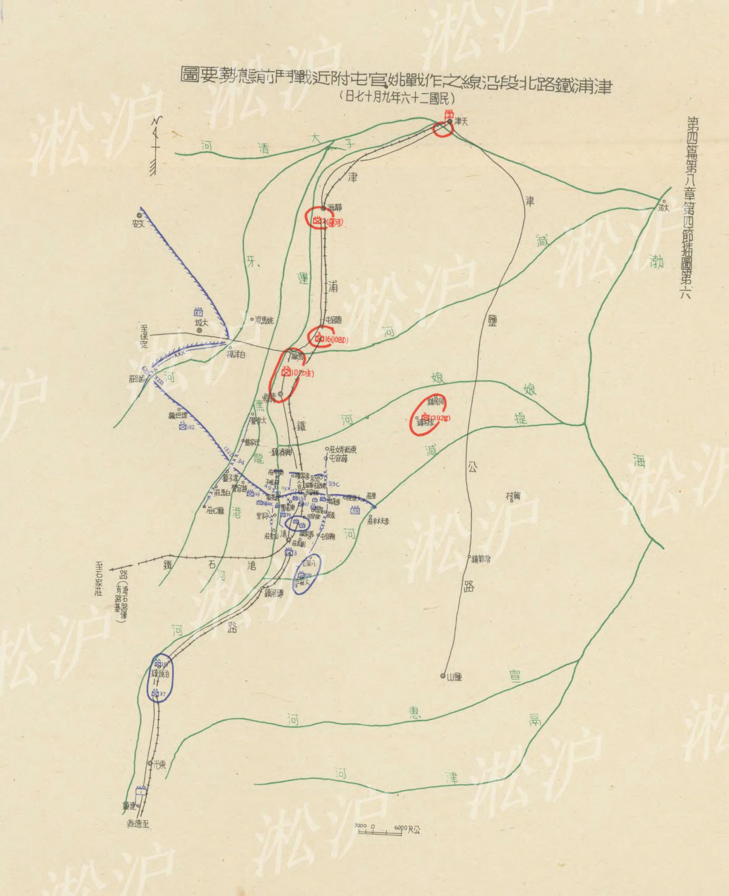

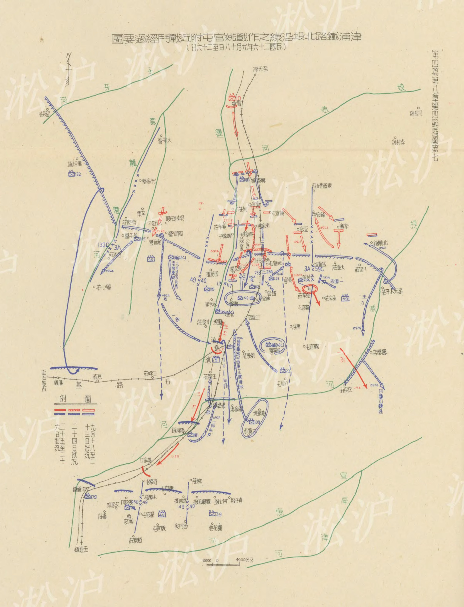

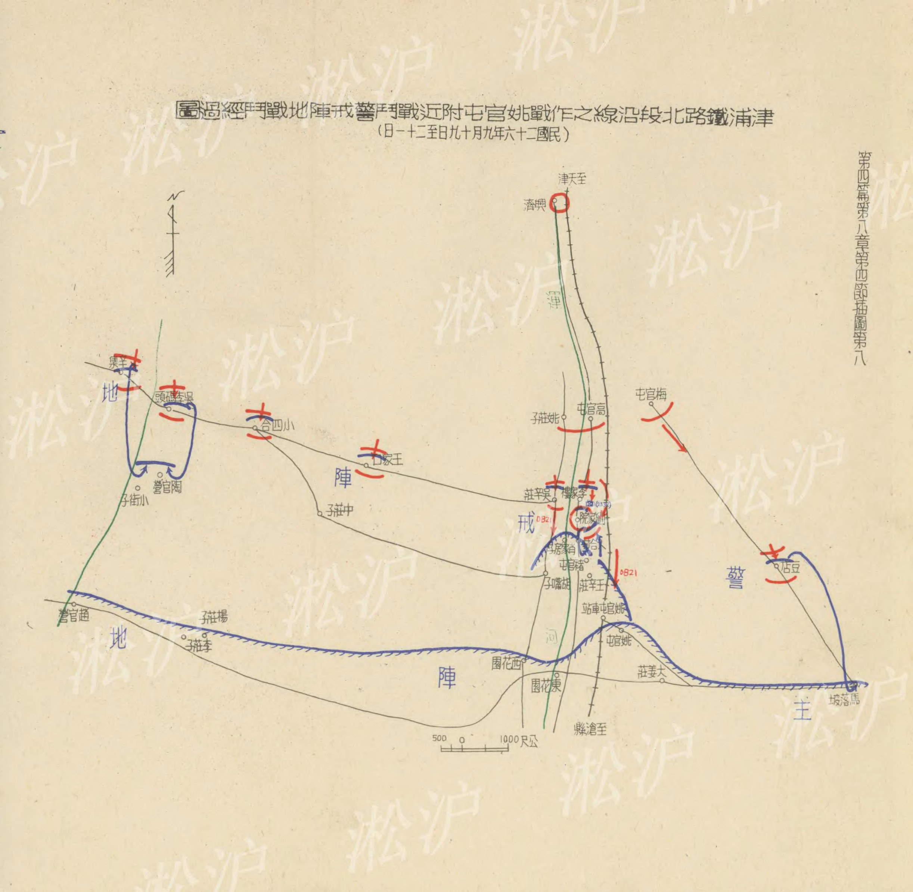

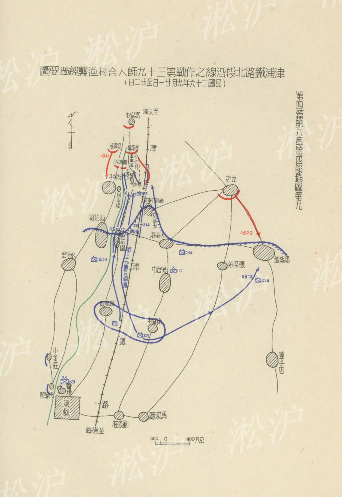

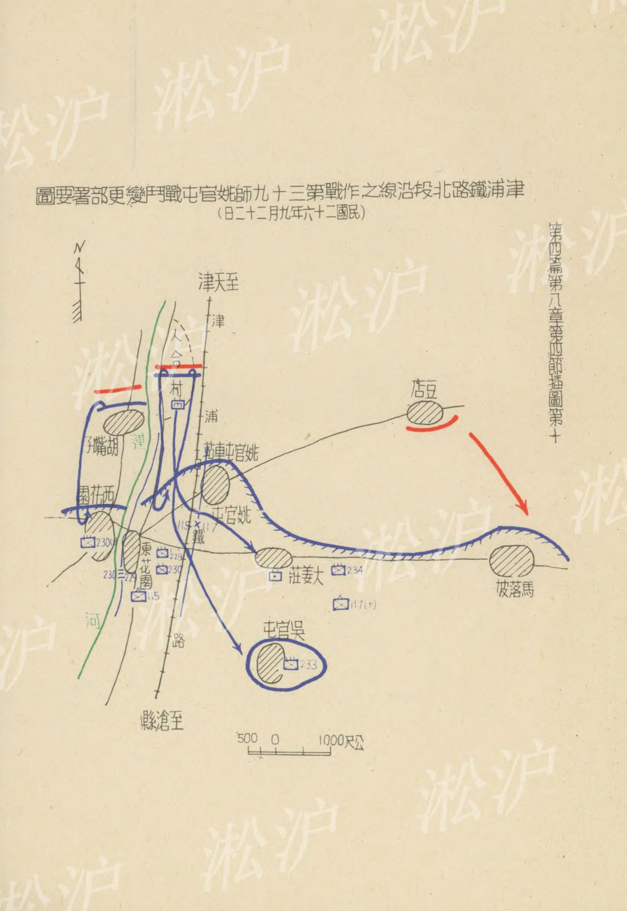

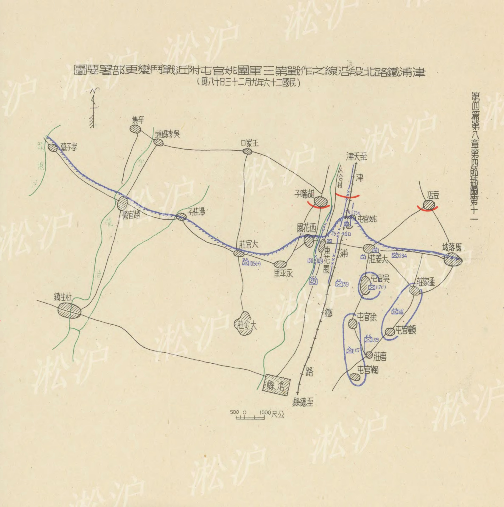

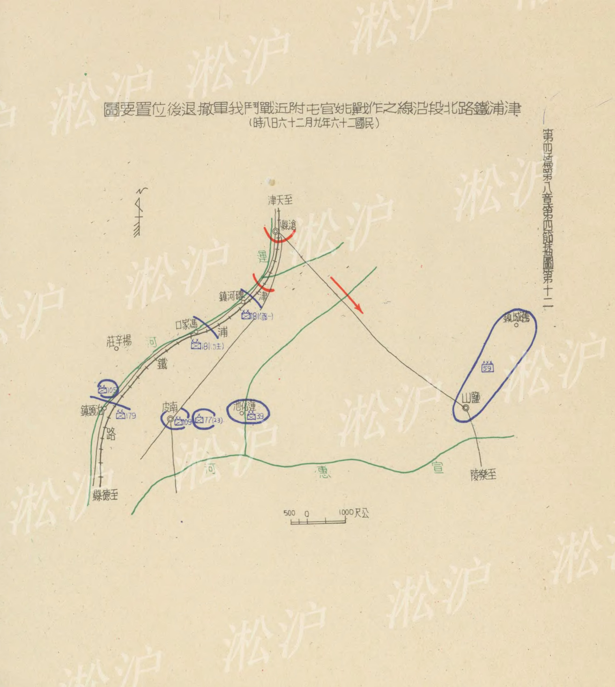

第三欵

大城附近戰鬥

民國二十六年九月十日至二十日

參照插圖第十三第十四插表第十二

自二十六年八月下旬以來，與馬廠附近戰鬥之同時，敵第十六師團主力萬餘人，沿子牙河南下，於八月三十一日，九月二日，先後攻佔我王口鎮、子牙鎮後，卽在該地區集結，並派隊於浪凹、流莊、旺村之線擔任警戒，似有策應津浦路正面及平漢路方面作戰之企圖。

##### 第一項 大城附近地形

大城縣境，屬沽河平原，地勢平曠，文安縣則地勢低窪，大清河橫亘其北，子牙河縱貫其東，均可行駛汽船，爲良好之水路，兩岸土堤高約七公尺，亦良好之通道，附近均係乾田，道路平坦。車馬通行無阻，雖無險要地形可守，然村莊城鎮，可利用以爲據點，自我決口構成氾濫後，於我防禦助益尤多。第二項

戰鬥經過

我第六十七軍於八月三十一日奉第一集團軍命令，接替第二十九軍第一三二師大城至文安間之守備任務（該軍原駐留各莊、呂公堡之線），因大城附近決口，洪水氾濫，水深數尺，迄至九月六日，始將陣地接替完畢，其部署情形如左（參照插圖第十三）：

一、第一零八師佔領姚馬渡、東西王文、銀子頭以東之旣設陣地，右翼與佔領大李莊、馮莊之第二十九軍第三十七師連繫，以一部佔領中趙扶、北趙扶各要點，警戒軍之右側背，一部任大城城垣守備二、第一零七師（欠第三一九旅）佔領銀子頭至文安之旣設陣地，左翼與守備文安以西周各莊之第五十三軍連繫。

三、第三一九旅爲軍預備隊，其第六三七團在大城西北郊劉里北、富莊、孫氏鎮（孫氏村）之線，構築預備陣地，第六三八團在大會羅附近集結。

四、軍司令部及直屬隊位置於鄭村，砲兵營仍在留各莊。

五、軍與鄰接部隊作戰地境，右翼爲子牙河沿線，線上屬左；左翼爲呂公堡、周各莊及霸縣西側之線，線上屬左。

九月十日（參照插圖第十四），子牙鎮之敵三千餘，於四時以前，沿子牙河兩岸向第六十七軍攻擊，六時，敵機三架，砲七、八門，先向大沿莊、東辛莊轟擊，繼以步兵數百，攻擊大沿莊警戒陣地，戰鬥三小時，我軍退守小河及東辛莊，十二時，旺村之敵，攻我東西次河及大中根河警戒陣地，經戰鬥四小時，我軍退守東西王文主陣地。十八時，攻佔大沿莊之敵，向我小河警戒陣地進攻，守軍第六四七團第五連當予迎擊，至二十時，敵增援二、三百，將該連包圍，形勢危急，幸該團中校團附車元勳率兵兩連馳援，將敵擊退，並掩護該連退守東辛莊。

九月十一日，津浦鐵路正面，我馬廠陣地失陷，第六十七軍軍長吳克仁綜合所得狀況，於十一日十時及二十二時，先後電呈軍事委員會，其大意如下：「右翼友軍原在大李莊、馮莊擔任守備之第三十七師，現已南撤，並有敵一股約有五百餘，附砲四門，已進抵伊莊、王鎮店一帶，徵集渡河材料，有越黑龍港河西進模樣，敵機七架，沿子牙河上空頻頻偵察，並轟炸東辛莊，我軍右翼空虛。

九月十二日，於黑龍港河渡河之敵，協同其由子牙河南進之部隊，於三時許，開始向我中趙扶、北趙扶、姚馬渡、東辛莊全線攻擊，戰鬥至十時，我軍因姚馬渡、東辛莊陣地過於突出，乃放棄該兩處向中趙扶、北趙扶、郝莊之線轉移。十六時，佔領姚馬渡之敵，以砲十餘門轟擊北趙扶陣地，其步兵三、四百，藉砲火掩護向北趙扶進攻。姚馬渡東岸之敵二百餘，亦渡河助戰，經守軍第六四七團第二營奮勇抵抗，一度將敵擊退，移時，該敵復增援數百，將北趙扶三面包圍，正當守軍苦戰之際，我郝莊方面第一零八師預備隊第六四四團前來增援，將進犯之敵擊退，因北趙扶外圍之敵感受威脅，攻勢稍挫，我第六四七團乃乘機向中趙扶轉移。

第六十七軍旋接奉軍事委員會十二日十二時電令：「大城吳軍長，十一日十時電悉，希就現地，沿子牙河對東正面固守陣線，誓死勿退，左翼與萬軍連繫爲要。」該軍奉令後，以右翼陣地仍嫌突出，乃令第一零八師轉移至南趙扶、郝莊亘銀子頭之線，以一部固守中趙扶，一部在白洋橋至留各莊間沿子牙河西岸，對東警戒。十三日十時起，佔領北趙扶之敵，續向中趙扶攻擊，戰鬥數小時，被我擊退，但其砲兵則仍不斷向我轟擊，達二小時之久，迄十四日晚，第六十七軍軍長綜合所得狀況如左：

一、堤北（子牙河東岸）有敵三、四百，不時向我南趙扶襲擊，北趙扶集結敵六、七百，砲五、六門，東西愛奴及姚馬渡有敵二千餘，東西次河、大中根河之敵，已完全撤退，子牙鎮有敵主力集結，其數不詳。

二、東辛莊我軍退却時，已破壞之大橋，經敵數日來搶修，已可通車。

三、十四日十四時至十六時，北趙扶敵砲，向我中趙扶行二小時之轟擊，我陣地多被破壞，又敵機二架，向我陣地行三、四次之偵察。

根據上述狀況判斷，敵似在積極準備攻勢，當令各部隊嚴加戒備。

十五日，由北趙扶東岸西渡之敵，協同姚馬渡南下之敵軍千餘，砲七、八門，於五時許，在敵機五架掩護下，主力向我郝莊，一部向我中趙扶陣地攻擊，戰鬥至十時許，中趙扶守軍第一零八師第六四七團第二營營長胡冠軍負傷不退，士氣振奮，故陣地得始終保全，其向郝莊攻擊之敵，因之亦無進展。

十五時，第六十七軍軍長鑒於當面之敵攻勢既挫，遂決心於入暮時開始反攻，其部署如左：

一、第一零八師一部向東辛莊攻擊前進，相機將該莊佔領，以斷敵之歸路，主力向北趙扶、姚馬渡之敵

攻擊。

二、第一零七師之一部，向東西次河、大中根河攻擊，策應第一零八師之戰鬥。

三、各部隊準於十七時開始攻擊。

十五日入暮時，第一零八師乘敵不備，官兵均奮勇涉水前進，十九時，一部攻至東辛莊，將該莊少數敵人驅逐，並確實佔領，繼又攻佔泊莊，其主力於擊退孫河少數之敵後，復分向北趙扶、姚馬渡之敵包圍。斯時，姚馬渡之敵約二千餘人，砲十餘門，獲悉東辛莊被我佔領，歸路已斷，遂併力突圍，激戰至十六日一時，子牙鎮之敵，乘汽艇二十餘艘前來救援，至東辛莊附近，被我擊沉五艘，艇內敵兵全部滅頂，二時許，敵全部向子牙河東渡，遂與我隔岸對峙。又第一零七師之一部，於同日入暮後，將東西次河、大中根河先後佔領，並續向子牙河推進，策應第一零八師對東辛莊、姚馬渡等處之反攻，待敵退守子牙河東岸後，我軍始退回原陣地。

此次戰鬥，我軍計傷亡營長以下七百餘人，敵之傷亡，除東辛莊以南各地已運走者不計外，在姚馬渡、北趙扶一帶，遺屍不下七百餘具。十二時，第七十六軍軍長據報：「子牙河方面與我對戰之敵，爲敵第十六師團之第三十三聯隊，經我軍於十五日夜間反攻，損傷甚重，已陸續後撤，另派新銳兵團接替，故部隊調動頻繁。

該軍長當卽判斷，敵有繼續進攻之企圖，因我中、南趙扶陣地，仍感突出，乃再度調整部署（參照插圖第十四），將右翼移至白洋橋、八方、裴莊、郝莊之線，截至十八日午刻止，關於王口鎮至南趙扶間子牙河內及其東西兩岸，所得之敵情如左：

一、由天津沿子牙河南進之木船三十餘艘，滿載彈藥，已到達王口鎮，東辛莊有敵小火輪一艘，拖船二艘，裝載敵兵向姚馬渡前進，南趙扶停有敵火輪二艘，汽艇二十餘艘。

二、子牙鎮之敵四千餘，戰車十餘輛，連日向南移動，姚馬渡、北趙扶有敵千餘，十七日，由王口鎮南下，步騎砲聯合之敵三千餘，經子牙鎮、姚馬渡向南趙扶前進，澈夜行軍，絡繹不絕，集結潘莊、葉莊之敵三千餘，砲二十餘門，連日在黑龍港河、子牙河架橋，向南趙扶、姚馬渡西進，十七、八兩日，敵機三架，在大城及東西王祥我陣地沿線偵察四、五次，並低飛掃射。

第六十七軍軍長綜合上項情況，判斷當面之敵，陸續增加，已達一萬五千餘人，戰車二十餘輛，主力在子牙河西岸地區，沿河汽艇火輪及木船甚多，有積極準備攻略大城，以與進攻洽縣敵軍相呼應之企圖，當於九月十八日十二時電呈軍事委員會具申意見：「敵陸續增加，由子牙河向南移動，我軍勢將於留各莊、大城、文安東南北三方面之弧形陣地以禦敵，但正面愈大，兵力愈感薄弱，本軍固願與敵拚戰到底，惟因部隊逐次犧牲，深恐第一線難於持久，似應預在留各莊、呂公堡之線，準備第二線兵團，以策萬全。軍事委員會對該軍長意見，立予如下之指示：「該軍長所見甚是，但現在陣地不能撤退，須知敵軍兵力無幾，若我固守不退，敵必不敢輕進，希以此意，激勵所屬爲要。

九月二十日，敵重轟炸機五架，砲二十餘門，於五時許，向我白洋橋、裴莊、賈莊、郝莊、八方一帶陣地轟擊達二小時，繼以步兵向我全線陣地進攻，主力在大城東南八方、裴莊地區，戰鬥至十二時，敵復增兵數千，砲十餘門，指向八方陣地猛攻，該處先已被敵飛機大砲炸成焦土，守軍半數殉職，戰至十四時，終告不支，該陣地遂陷敵手，旋卽迫近白洋橋、裴莊、賈莊之之線，十五時，該敵猛烈衝鋒，守軍第一零八師第六四七團殘部堅強抵抗，反復肉搏，該團營長王鐵修親率士卒與敵格鬥，壯烈殉職，致被敵衝入陣內混戰，至十八時，我軍退守南慶屯、八里莊、陳莊、大城之線，與敵對峙。斯時，第六十七軍軍長鑒於我軍連日苦戰，損傷奇重，並據報敵後續部隊，不斷增加，復於二十日二十一時，再電軍事委員會請求增援，「本軍連日戰鬥，過度犧牲，兵員銳減，刻已決心在大城線上與敵死拚，至戰鬥力完全消失爲止，但對留各莊至呂公堡之第二線陣地，請及早準備後續兵團，事關全局，未敢緘默，謹再呈明，敬請鈞裁。

九月二十一日五時，敵軍先在大城及其近郊不斷轟炸，繼以大砲三十餘門，向南慶屯、八里莊、大城陣地轟擊，七時許，開始全線猛攻，激戰至十二時，敵後續部隊，由八方、郝莊增加，戰鬥逐漸迫城郊，我軍以預備隊增援，雖經數次出擊，但均未奏功。是日，敵機十四架，竟日轟炸大城及其郊區。二十二日拂曉，敵繼續大舉猛攻，八時，突破大城東關，同時陳莊、八里莊陣地均陷敵手，守軍浴血苦戰，各級預備隊亦使用殆盡，陣地得而復失者數次，不得已於九時頃放棄大城，逐次向留各莊、呂公堡之線轉進。是夜，第六十七軍軍長電呈軍事委員會報告如下：「本軍戰地右鄰子牙河、黑龍港河及運河，前有大清河，左界古漳河，運來到處决口，以致戰地盡成澤國，後方交通線均被遮斷，不僅妨害作戰，抑且影響戰志，而敵反可利用氾濫，以浮囊小船汽艇等到處進攻，使我陷於孤軍作戰，彈盡援絕之苦境。

九月二十三日，敵機三架，偵察留各莊、念祖橋一帶，並投彈轟炸，其步騎砲聯合之二千餘，向我第一零八師跟蹤追擊，十二時起，與該師之第六四七團在劉硯馬、大廣安掩護陣地線上戰鬥半日，十八時，子牙河東岸另一股敵四百餘，向我冒門（鵞門）、杜家莊攻擊，均被擊退。當夜，第一零八師抵達留各莊、東馬村、高里（葛里）、傅家莊至高莊之線，第一零七師抵達高莊以西至呂公堡之線，佔領旣設陣地，繼續抵抗，第六四七團亦自劉硯馬、大廣安撤至東馬村。

九月二十四日，沿子牙河東西岸前進之敵，增加三四千，拂曉前，復向我東馬村、高里陣地攻擊，戰鬥頗爲激烈，迄七時許，敵對東馬村、高里陣地衝鋒三四次，八時，東馬村被敵攻陷，第一零八師營長李振桂、陳恩齡各率本營殘部逆襲，將原陣地奪回，但李、陳二營長及其所屬官兵則均壯烈殉職。九時高里賡續被敵突破，守軍一營亦因肉搏奮戰，傷亡殆盡，陣線瀕於動搖，幸第一零七師第三一九旅旅長率兵兩營反攻，乃將高里奪回。

第六十七軍軍長，十二時頃，所得情況如左：

一、敵主力六千餘，分乘汽艇五十餘艘，沿子牙河進出白洋橋，繼續南進。

二、大小會羅附近有敵搜索部隊百餘，不時在我高莊以西地區出沒。

三、霍辛莊有敵騎兵二百餘，在附近活動，其以西無敵情。

該軍長判斷，敵主力仍將沿子牙河繼續前進，且東馬村、高里我軍陣地，全被敵砲火擊毀，不能繼續固守，乃決心放棄留各莊、呂公堡陣地，向彎里（窪里）、南良之線轉移，當經部署如左：

一、第一零八師在彎里、留鄰居、南良之線佔領陣地，拒止敵之前進。

二、第一零七師向尊祖莊附近集結整頓。

三、各部隊於二十四日入暮後開始撤退，至二十五日拂曉前，務將新陣地佔領完畢。

當上項部署尚未及實施，至十七時，又繼續偵得情況如左：

一、留鄰居，東城鎮附近，沼澤氾濫，水深數尺，無法佔領陣地。

二、敵主力沿子牙河兩岸堤道及其兩側地區繼續推進，其汽艇數十艘，有沿子牙河向我獻縣襲擊之模樣吳軍長據報後，恐敵侵入獻縣斷我歸路，乃變更決心，當令第一零八師以一部在沙河橋佔領陣地，掩護軍之轉進，軍之主力於二十四日夜，自留各莊、呂公堡之線撤退後，逕由沙橋、臧家橋等處，東渡子牙河向十五級及獻縣轉進。至此，大城附近之戰鬥，遂告終止，該軍至十月中旬撤至寧晉、新河之線後，歸第一戰區指揮。

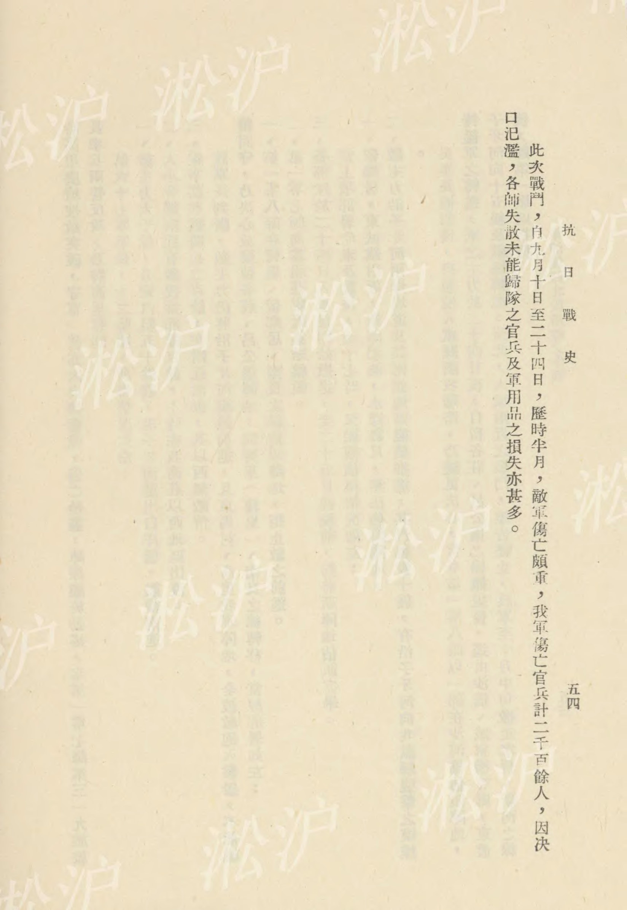

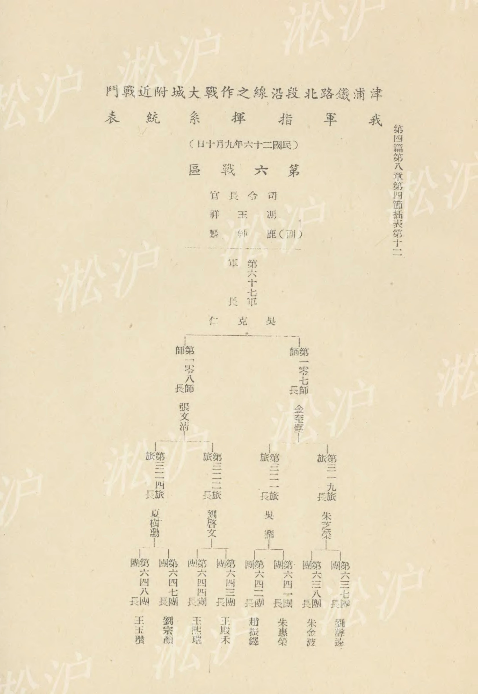

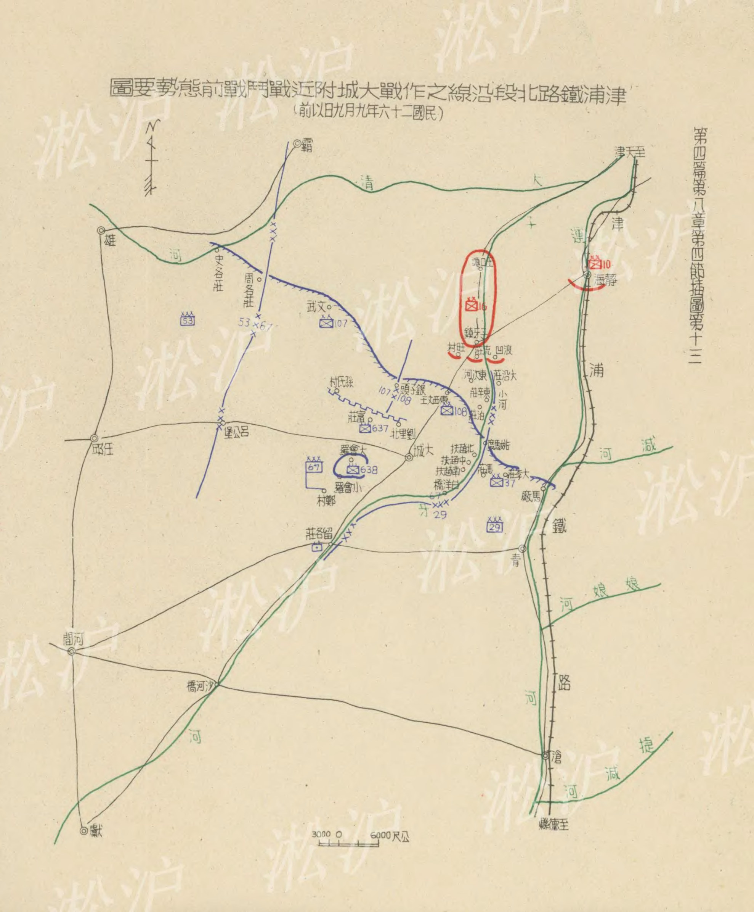

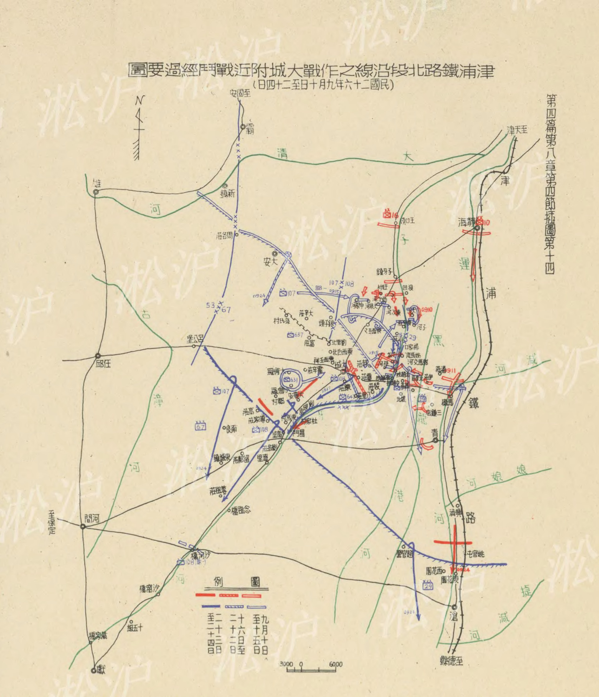

#### 第四款 徒駭河南北地區戰鬥

民國二十六年十月十八日至十一月十五日

參照插圖第十五第十六插表第十三

民國二十六年十月一日，當德縣局勢緊張之前夕，軍事委員會曾電令（參照第三節第二款首項）韓復集固守黃河，並令其以兩師兵力，集結德縣，阻敵南進。韓奉令後，乃卽抽調膠東、龍口之第七十四師，及威海衛、烟臺間第二十師之第五十九旅與手槍旅之一團，向德縣集結，惜尙未到達，而德縣守軍第八十一師以不足一旅之運其昌部，與由運河東西分進合擊之敵，已激戰四晝夜，被迫於十月四日夜間，突圍撤退。是日，自膠東抽調之第七十四師、第二十師方抵平原，雖欲馳往增援，然勢已無及，韓乃利用黃河崖據點佈防，與敵對峙約一週之久。十二日，敵偷渡老黃河，進攻平原，韓復集以第二十師之一部扼守平原，並令第七十四師、第八十一師向張莊車站及禹城撤退，旋因敵之跟踪追擊，遂於十四日撤至徒駭河南岸，就禹城附近沿河固守。斯時，敵以全力攻略山西，又以我第三集團軍戰力薄弱，易於應付，復將第十六師團全部西調，對於津浦鐵路祇求壓迫我軍於黃河南岸，不擬作深入之急進，在此期間，我軍事委員會曾令第三集團軍，把握時機，配合冀魯游擊部隊，派隊向德滄各縣，攻敵背後，惜乎當事者行動遲緩，未及轉移，而敵已先我發動攻勢，使我轉居被動，致坐失殲敵回師之良機。

##### 第一項 徒駭河附近地形

徒駭河在黃河以北，爲山東省境內較大河流之一，自西南向東北，流經禹城、臨邑、商河各縣境而入渤海，爲魯北之天然屏障，有舟楫之利。沿河各縣中之禹城，有津浦鐵路縱貫其間，而公路則北通德縣，西連高堂，東接臨邑、商河，南達黃河左岸，縮穀交通要衝，爲魯北軍事上所必爭之地。禹城東北之臨邑，亦爲魯北公路交通之中心，如欲於禹城藉徒駭河之天然屏障，阻敵南進，則必保有臨邑，方足以拊沿津浦鐵路南下敵軍之側背。惟此一地區，地勢平闊，對我劣勢裝備部隊之防守，頗屬不利，實爲戰鬥經過

沿津浦鐵路南進之敵第十師團，於十月四日攻陷德縣後，繼續南侵，十四日陷平原及其以南之張莊站、黎濟寨諸要點，直導徒駭河北岸，其第一零八師團之一個旅團，於協力第十師團佔領德縣、平原後，卽向鐵路以東發展，於同月十六、七兩日間，先後佔領陵縣及其以南之鳳凰店、馬腰務、鳴鷄店各要地，截至十月十八日止，敵各部隊之概略位置如左：（參照插圖第十五）

一、第一零八師團主力，在鹽山、寧津、吳橋、南皮地區，一部佔領鳳凰店、馬腰務、鳴鷄店各要地。二、第十師團主力，在平原至滄縣間之鐵路沿線各重要車站，一部佔領吳家廟、張莊站、黎濟寨諸據點，警戒部隊出沒於十二里廟、毛家園、北邱之線，另一部佔踞鐵路以西故城、恩縣、武城各縣城及附近地區，其騎兵一部活動於高唐、夏津間地區。

三、第一零九師團之第六旅團在滄縣北鐵路線以東地區。

四、運河線武城以北，有敵汽艇三十餘艘擔任水面巡弋。

五、平原、德縣間，有敵鐵甲車三列，戰車十六輛。

十月十四日，我軍自平原撤退後，雖在張莊站、黎濟寨逐次抵抗，但以徒駭河北岸無險可守，不得不退守徒駭河南岸，至十月十八日止，各部隊之位置如左：

第五十五軍之第二十九師，集結商河、臨邑兩縣，準備進出張莊站以北，德縣以南之中間地區，側擊津浦路南下之敵。

二、第七十四師（欠第四四零團、第四四四團，時各該團在濟南整訓。）附第二十師之第一一七團、第八十一師之第四八一團，奉命在徒駭河南岸禹城附近佔領陣地，阻止沿津浦鐵路南進之敵，其方禦部署如左：

第八十一師之第四八一團爲右地區隊，由二郎廟至禹城東北之楊家莊，沿徒駭河南岸構築陣地第二十師之第一一七團爲中央地區隊，由楊家莊以西至大于、張莊，沿徒駭河南岸構築陣地。

第三第七十四師之第四四三團爲左地區隊，由大于、張莊以西至凹李莊，沿徒駭河南岸構築陣地四第七十四師之第四三九團爲預備隊，位置於東西金張莊、小石莊地區。

三、由魯北各縣保安隊編成之游擊隊（德縣戰鬥時由第三集團軍總司令韓復渠編成），在津浦鐵路平原以北之東西地區活動，其番號及活動之概略位置如左：

一游擊第一路在寧津東南地區活動。

二游擊第二路在陵縣以南之葉莊、穆莊地區活動。

三游擊第三路在徒駭河北岸清平附近活動。

四游擊第四路在徒駭河以北，鐵路以西至高唐附近地區活動。

五游擊第五路在樂陵縣城及其附近地區活動。

十月十八日至二十七日戰鬥（參照籍圖第十六）

自德縣、平原次第失陷後，我軍事委員會先後給予第五戰區副司令長官兼第三集團軍總司令韓復渠以如左之作戰指導：

一、十月十六日電：敵人冒險深入，顯犯戰術上之重大錯誤，該部宜積極活動，襲敵側背。

二、十八日電：爲確實遲滯敵軍前進計，禹城以北之鐵路，務必徹底破壞，但敵主力已轉向晉省，當面

之敵，爲數不多，希努力加以牽制，並着游擊隊，積極向其側背活動爲要。

第三集團軍基於上述指導，決意命徒駭河北岸部隊，以側擊津浦鐵路敵人爲目的，向敵後挺進，遂於十月二十日以前，先後令第二十九師、第七十四師及魯北各游擊隊，分別向陵縣、德縣、平原附近之敵施行攻擊，第二十九師師長曹福林，率部自商河、臨邑地區，向張莊站前進，其先遣部隊於十九日在平原附近俘敵第十師團砲兵通信兵須木勳一名，據供稱：一津浦線由德縣至禹城間爲第十師團，轄第三十三及第十八旅團，共爲四個聯隊，約八千五百餘名，野砲八門，師團長爲機谷。二、德縣至禹城間有戰車十六輛，鐵甲車三列。三、聞第十六師團將由天津調來德縣、禹城間，接替第十師團任務。四、上令津浦全線，於十一月十一日向南總攻。

徒駭河南岸禹城附近之守軍第七十四師，十月十八日，奉到「該師以一部兵力，渡徒駭河北進，向平原及其以南鐵路線之敵襲擊」之命令後，卽以第二十師之第一一七團、第七十四師之第四三九團各一部，於十八日夜渡河北進，十九日拂曉前，在十二里廟、毛家園、北邱之線，與守備該處之敵接觸，戰鬥至十時，嗣張莊站，黎濟之敵二千餘增援，復與之戰鬥半日，該師旋向鐵路兩側轉進，當晚，復向平原以南各據點之敵襲擊，並破壞鐵路多處。二十日，敵以德縣、平原之兵力增援，戰鬥甚爲激烈，我飛機五架，在平原、張莊站、黎濟寨各地執行轟炸，協助地面部隊之攻擊，至暮，我軍除以一部於北岸繼續游擊外，其餘仍撤回徒駭河南岸。當十四、五時頃，黎濟寨附近戰鬥正達膠着相持之際，敵分兵五百餘，砲四門，沿鐵路以西竄至徒駭河北岸之大劉家莊，有偷渡徒駭河之企圖，因被我阻擊，遂未得逞。是晚，我南北岸守軍協同襲擊該敵，將該莊院落包圍，以手榴彈集中投入，敵傷亡甚衆，乃乘夜突圍，退回黎濟寨。

第二十九師於十月二十一日，在商河、臨邑集中完畢後，該師曹師長復奉第三集團軍韓總司令電令，其要旨如左：

一、津浦鐵路之敵，攻陷德縣、平原後，其一部由德縣東進，於十七、八兩日間，先後佔領陵縣、鳳凰店、馬腰務等處。

二、該師以一部位置於商河，對慶雲、樂陵警戒，主力應向鳳凰店、馬腰務之敵攻擊，以牽制該敵南進曹師長奉令後，遂下達向鳳凰店、馬腰務攻擊命令，其要旨如左：

一、步騎砲聯合之敵千五百餘，戰車八輛，佔領鳳凰店及其附近地區，另一部五百餘，戰車三輛，佔領馬腰務據點。

津浦鐵路正面，我第七十四師主力，在徒駭河南岸禹城附近防禦，一部在北岸十二里廟。張莊站一帶與敵激戰。

二、本師以牽制津浦鐵路南進之敵爲目的，主力應向鳳凰店、馬腰務之敵攻擊，一部位置於商河，對慶雲、樂陵方面警戒。

三、第八十七旅（欠第一七三團）爲右翼隊，於二十四日六時，展開於王强家、郭家廟至路家寨之線，向鳳凰店及其以北之敵攻擊。

四、第八十五旅爲左翼隊，於二十四日六時，展開於侯家、張寺家至徐家之線，向鳳凰店及其以南之敵攻擊，並以一營佔領張家廟向馬腰務之敵佯攻。

兩旅展開時，須與砲兵營密切連繫，俟該營之射擊準備完成後，開始攻擊。

五、砲兵營於二十四日六時以前，在陳火亮家、李四朱家地區佔領陣地，六時三十分以前，完成諸準備，七時起，行三十分鐘之準備射擊。

六、第八十六旅（欠第一七二團第二營）位置於盤河鎮爲預備隊，其第一七二團之第二營，守備臨邑縣城。

七、第一七三團位置於商河，對慶雲、樂陵方面警戒。

右令下達後，該師長一面報告總司令部，一面率直屬隊到達臨邑指揮。

各部受命後，卽向攻擊準備位置前進，二十二日，在商河、臨邑途中，遭敵機八架，連續轟炸及掃射，但無損傷。二十四日拂曉，到達指定位置，七時三十分，開始向鳳凰店及其南北地區之敵攻擊，該敵憑藉牆垣及工事頑強抵抗，並以優勢砲火不斷向我轟擊，敵機三、四架亦持續向我轟炸掃射，至十一時許，第一線各部隊官兵前仆後繼，奮勇前進，營長宋好義率隊猛衝，不幸英勇殉職，其他官兵傷亡共達三百餘人，敵之傷亡約在二百以上，黃昏後，戰況沉寂，該師長決於二十五日拂曉，以預備隊加入，繼續攻擊，遂命各隊在原位置與敵相持。

九月二十五日拂曉，我軍再發動攻勢，並以預備隊第八十六旅加入戰鬥，該師長亦進至吳辛莊督戰，與敵激戰竟日，我軍曾四次衝鋒肉搏，敵仍頑強不退，至十七時，其彈藥消耗將盡，火力漸見稀薄，該師乃乘勢衝入，遂將鳳凰店街市之東南角佔領，正待擴張戰果之際，而陵縣之敵千餘趕至增援，向我反攻，此時，該師綜合各旅報告之狀況如左：

一、鳳凰店之敵，已增至三千餘，戰車二十餘輛，向我積極反攻。

二、馬腰務之敵，增至八百餘，戰車六輛，已向張家廟我軍攻擊。

該師長此時以各隊業經兩日之苦戰，人員傷亡甚多，官兵皆疲憊萬分，且彈藥消耗，又未能即時補充，而敵則已增加一倍以上之兵力，遂決心停止攻擊，令各部隊於入暮後，轉進至原展開位置，相機再行擊敵。是夜二十時起，各部陸續向後移動，至二十六日一時，該師奉到韓總司令如左之電令：

一、由津浦南犯之敵，其主力側重臨邑。

二、慶雲增敵千餘，汽車二十餘輛，有南犯模樣。

三、該師卽向臨邑轉進，並於其附近佔領陣地，以阻止南侵之敵，一部仍位置於商河，對慶雲警戒。

該師奉令後，以拒止由陵縣、鳳凰店南侵之敵爲目的，乃以主力轉移臨邑附近佔領陣地，一部位置商河，對慶雲警戒，於二時三十分下達命令，其要旨如左：

一、令第八十五旅轉移至臨邑以北之后樊家、前樊家、朱家湖網至胡家廟之線，佔領陣地。

二、令第八十六旅轉移至楊家園巨臨邑西郊至五里廟之線，佔領陣地。

並令該兩旅於高家莊、趙坊、朱坊、李家莊之線，佔領警戒陣地。

三、令第八十七旅（欠第一七三團）爲預備隊，位置於臨邑以東之孫家廟。

四、令砲兵營主力在劉家山，一部在董家莊佔領陣地，主火力指向陵臨公路。

五、第一七三團仍在商河，對慶雲之敵警戒。

六、各部隊限於拂曉以前，撤出現陣地，二十八日拂曉以前，務將新陣地佔領完畢。

右令下達後，各部隊於三時三十分，開始向臨邑撤退。

先是，當第二十九師奉命由商河向臨邑西北之鳳凰店、馬腰務攻擊時，禹城方面，第七十四師亦奉第三集團軍韓總司令電令，該師應以一部，於二十三日夜間渡河北進，牽阻鐵路線之敵，協助第二十九師攻擊。李師長奉令後，曾親率第四四三團於二十三日十七時渡過徒駭河，沿鐵路東側前進，於擊退十二里廟、張莊站一帶之敵後，乘勢挺進，二十四日拂曉後，次第克復吳家廟、鷄鳴店等處，當該處之敵向平原撤退，該師長乃率隊沿平原以南鐵路，襲擊敵各據點，敵懾於我軍兵力優勢，皆固守不敢出，該師長遂令將該段鐵路澈底破壞，至日沒後，除留置一部監視外，其餘均仍撤回徒駭河南岸。二十五日晨，黎濟寨敵，再由大劉家莊偷渡徒駭河，其已南渡之百餘人，被該師南岸守軍包圍殲滅，敵知我有備，餘均退回黎濟寨。

魯北各游擊隊，自奉第三集團軍韓總司令「以第一、第二、第五各路對平原至滄縣間鐵路沿線及其以東地區之敵不斷襲擊，第三、第四兩路對禹城至德縣間鐵路沿線及其以西地區之敵不斷襲擊」之命令後，迄二十七日止，已達成左列各任務：

一、滄縣之敵五百餘，向東竄擾，於十八日經鹽山到達舊縣鎮，有繼續南侵之企圖，我游擊第五路，沿海岸走廊予以襲擊，卒將該敵阻止，該路爾後以樂陵爲根據，不時向鹽山及南皮之敵襲擊，敵除固守城垣外，未敢越雷池一步。

二、我游擊第一路十九日攻擊寧津，防守該城之敵約百餘人，經該路猛攻半日，及我潛伏城內之便衣隊起爲內應，裏外夾擊，敵已不支棄城北遁。我收復該城後，二十日再襲東光之敵，突入南關，戰鬥三小時，逼敵退守車站，我軍遂乘勝將東光以北之鐵路電線等予以破壞，至二十一日拂曉，向東光以東之曹臺轉進，於二十四日襲擊吳橋，與敵戰鬥數小時，逼敵向桑園退却，我遂一度收復吳橋縣城，二十五日，敵增援反攻，我以衆寡懸殊，遂撤出該城，該敵二十七日與東光之敵聯合，攻我寧津，戰鬥半日後，我向東南郊區轉移。

三、游擊第二路十八日夜襲擊陵縣城及其西北土橋街之敵，並將趙王河、上土橋街附近之大橋破壞。

四、游擊第四路十八日攻擊高唐之敵，與守城敵騎兵百餘戰鬥三小時後，敵退至城北卞官橋，我遂將高唐克復。二十一日，我由高唐向恩縣地區活動時，在腰站與敵遭遇，將敵擊退後，我亦囘師高唐以東之尹家集，並與禹城方面第七十四師取得連繫。二十四日，協力該師作戰，以一部襲擊黎濟寨。

一部佔領平原以西之徐橋，向平原佯攻，當夜破壞鐵路多處，二十五日再襲黎濟寨，迫使由大劉家莊偷渡徒駭河之敵，爲顧慮歸路截斷而撤回，爾後，該路移向崔莊轉進。

五、德縣、平原西北之敵，沿運河南進，一部步騎兵三百餘，於十八日，在清平西北之康莊，與我游擊第三路遭遇，戰鬥數小時，因我軍已佔領劉方莊、梅家井各據點，該敵遂不敢南進，爾後，該路以清平爲根據，不斷西向臨清、北向恩縣活動，並進佔夏津。二十五日，一部與恩縣之敵戰鬥數小時，達到擾亂目的後，向西轉移。

先是，當臨邑近郊之第二十九師，與陵縣、鳳凰店、馬腰務之敵相持時，禹城第七十四師，曾數次擊退由大劉家莊偷渡之敵，各路游擊隊，乘機在鐵路兩側，不斷襲擊鹽山、南皮、寧津、吳橋、恩縣、高唐、清平各縣敵軍，並破壞德縣、禹城間鐵路頗多。

此時軍事委員會迭據確報，津浦、平漢兩線之敵，因轉用於晉東晉北，現該兩線僅各餘數千人，爲在九國公約開會以前，一新國際視聽，與牽制敵人兵力之轉用，特於十月二十五日十時，電令第三集團軍，迅以主力擊破當面之敵，進出滄縣附近，以與我第一戰區進出石家莊方面之第一集團軍互相策應，並指示攻擊部署，應着眼於沿津浦鐵路兩側，截斷敵之退路。（參閱第三節十月廿六日狀況）第三集團軍總司令韓復渠接獲上項電令後，於二十七日十二時，電呈困難，請中央增調三師或一師兵力，接替膠東海岸或津浦南段之防務，俾便率領主力進擊當面之敵，完成進出滄縣，策應友軍作戰之任務。

軍事委員會旋復令韓總司令以先解決陵縣方面之敵，以利爾後之作戰，希速相機發動攻勢之指示。

十月二十八日至十一月十一日戰鬥

第二十九師二十八日到達臨邑，佔領沿城郊北西兩面新陣地後，鳳凰店、馬腰務之敵，除以小部隊不時向我擾亂外，主力集結陵縣附近整補，並無積極行動，該師遂亦利用時機，從事整補，以備迎戰。十一月三日，第三集團軍，基於軍事委員會之指示，以原任守備禹城之第七十四師，調回濟南整補，另以第二十師第六十旅附第七十四師第四四零團之新銳部隊，接替禹城防務，以便相機反攻。該旅於四日到達禹城，當經部署如左：

一、第一一九團爲右地區隊，擔任二郎廟至禹城以西地區之河防。

二、第一二零團爲左地區隊，右與第一一九團連繫，擔任由禹城以西至四李莊之河防。

三、第七十四師之第四四零團爲預備隊，位置於禹城以南地區，派一部推進於徒駭河北岸，在十二里廟、金家莊、小范家莊一帶，對張莊站、黎濟寨、平原之敵搜索警戒。

黎濟寨之敵，乘我軍換防之際，以步騎兵百餘竄至獅子咎家莊，企圖偷渡徒駭河，爲我小范莊之警戒部隊擊退。

第三集團軍連日偵悉敵情如左：

一、據報十一月一至四日間，敵在津浦鐵路沿線上禹城至德縣間約一師團，砲百餘門，（平原以南各據點及張莊站、黎濟寨等處約一聯隊，）德縣以北至滄縣間有一獨立旅團，六日，敵兵車十餘列，滿載敵兵，由北開至平原下車後，主力向鳳凰店，一部向馬腰務運動。七日據報：陵縣、鳳凰店一帶，有敵約一個混成旅團向南運動，又平原東北約六七里處，敵新建飛機場一處，向我魯、蘇轟炸之敵機，每日均在該機場升降。

二、天津谍報員五日電：敵赤柴部隊（第十師團之第十聯隊）、福榮部隊（第一零八師團之第十七聯隊），連日由天津裝運汽油八百桶，子彈二千箱，向津浦鐵路前線輸送。

三、據第二十九師師長六日報告，慶雲之敵，連日向無棣、陽信活動，並有向惠民進犯企圖。

四、陵縣城及其以北土橋街、邊臨鎮之敵，經我游擊第二路聯合當地農民紅槍會多次襲擊，敵傷亡五百

綜合以上情況判斷，敵似仍在積極準備攻略山東各戰略要地，正轉報間，又接奉軍事委員會六日十四時電：據第一集團軍四日電稱：該部先頭已進至南宮，主力已過鷄澤，卽於日內向石家莊進出等語，盼貴部按預定計畫，從速策應，則華北危局，挽回殊易也。韓總司令奉電後，復於七日十四時電呈軍事委員會，作如下之意見具申：一、鹽山、樂陵邊境敵軍一部，與我游擊第一路、第五路等部對峙。二、運河西側武城附近及清河縣境，積水未消。三、職部第七十四師、第八十一師在濟南整補，第二十師之第五十八旅任津浦鐵路濟南至臨城段警備。四、除已派隊由濟南向武城前進外，擬請令李司令長官派隊接替津浦鐵路濟南以南防務，並蒞濟坐鎮，職願親率所部三師或四師兵力，經武城、鄭家口進出河間，與第一集團軍協同前進，如何候示。八日二十二時，軍事委員會再電韓復集，桂（廣西）軍原在徐州部隊，今已他調，其後續部隊，集中前方，尚需時日，李司令長官在京尚有重要任務，一時難來前方，津浦方面尚非決戰之時，望先派有力部隊，實行游擊，與第一集團軍行動互相呼應，並努力破壞鐵道，牽制敵人，若能恢復德縣，則於我國在國際上之活動，更爲有利。

是日、鳳凰店、馬腰務之敵，開始向臨邑我第二十九師陣地攻擊，拂曉時，我警戒部隊奮勇抵抗，苦戰竟日，傷亡頗重，入夜，奉令向主陣地撤退。

當晚，韓總司令根據軍事委員會之指示，並綜合各方狀況，決心抽調黃河南岸部隊，向徒駭河北岸增加，先驅逐臨邑、陵縣之敵，再向德縣推進，其處置如左：

一、令在臨邑戰鬥之第二十九師，竭力阻止當面之敵南進，以待後方部隊之增援。

二、令守禹城附近第二十師之第六十旅，以一部渡徒駭河北進，襲擊平原以南各據點之敵，協助第二十九師之戰鬥。

三、令守備黃河南岸第二十師之第五十九旅，以第一一八團掩護中央砲兵團第一營，由靑城渡河，其餘由濟陽渡河，向商河集結。

四、令在濟南整補之第八十一師，於十日由邢家渡，滦口渡河向德平前進。

五、令第十二軍軍長孫桐萱，率第二十師直屬各隊，由滦口渡河，到商河指揮。

六、各部隊九日出發，限十五日到達指定地點。

各部隊受命前後經過如左：

臨邑方面第二十九師當面之敵，八日攻略我警戒陣地，至九日拂曉，繼續向我主陣地攻擊，五時三十分，舉其砲兵全火力，向我全線陣地射擊，一小時後，敵機三架，協同砲兵，向臨邑城內猛烈轟炸，至七時許，戰車四輛誘導其步兵攻擊，戰鬥半日，敵無進展。九日十三時，該師長復親赴臨邑以北之李家莊督戰，士氣因以振奮，戰鬥至暮，屢挫敵鋒，遂成對峙狀態。十一月十日，當面之敵，自拂曉開始，繼續向我攻擊，我軍奮勇抵抗，加之第二十九師師長親臨前線指揮，士氣異常旺盛，官兵均願作殊死戰，有與陣地共存亡之決心，至十三時，敵由陵縣增援千餘，挾其數倍於我之優勢，向我右翼后樊家陣地以北地區包圍，該地守軍第八十五旅第一六九團，卽延伸戰線迎擊，該團因陷於內線作戰，四面受敵濃密火力之射擊，營長周繼先遂壯烈殉職，所幸該師長於敵增援隊向我右翼運動時，已令預備隊第八十七旅之一團向右翼增援，十五時，到達王巧子地區，遂將該敵反包圍，混戰至夜，仍保持對峙狀態。該師長先於十時頃，據報慶雲之敵，向惠民前進，先頭部隊已到達無棣附近，乃卽將上項情報，電呈總司令部。十一日五時三十分，當面之敵再發動攻擊，第二十九師竭力抵抗，營長馬壽軒親率士兵數次出擊，一度將敵擊退，但敵旋卽增援反撲，該營長重傷不退，激戰至十二時，戰鬥仍在慘烈進行。是時，該師接第三集團軍參謀處通報，我第八十一師及第二十師之第五十九旅，已於九、十兩日渡過黃河，北進增援云云。第二十九師師長本穩紮穩打之方法，決心縮小正面，將部隊撤至臨邑城，利用城垣固守，入暮後，下令第八十五旅，退守臨邑北郊地區，第八十六旅固守臨邑城垣，第八十七旅（欠第一七三團）移至臨邑之東南郊，佔領預備陣地，當夜，各部隊遵令部署完畢。

禹城方面，第二十師之第六十旅接奉出擊命令後，於九日十五時，以第一一九團之一營渡河北進，至二十一時許，協同北岸之前進部隊，乘夜襲擊張莊站、黎濟寨，逼近該處村莊，因敵憑藉其堅固工事及障礙物等堅守，故未能突入。十日拂曉前，我軍向東轉移，就待機襲擊位置。

濟陽方面，第二十師之第五十九旅奉命後，於九日十六時，以第一一八團掩護中央砲兵團第一營，由周村出發，向青城前進。

游擊第一路，於九日十二時襲擊慶雲附近之敵，戰鬥四小時，敵退入城內固守，我軍亦向南移。

濟陽方面，第八十一師師長於八日晚奉到渡河北進命令後，決將該師分成三個梯隊，於十日十五時開始，以十五日之行軍由濟南出發，經邢家渡及滦口渡黄河，再經濟陽、商家橋、商河、向德平附近集結。於是擬定行軍計畫，令第二四一旅爲第一梯隊，師直屬各隊爲第二梯隊，第二四三旅爲第三梯隊，由滦口渡河前進，令師輜重由邢家渡口渡河前進。是日該師依照計畫分別由邢家渡口及滦口渡河後，沿黄河大堤前進，二十四時許，先頭已到達石家務、藍寺、邢家道口宿營。在該師未出發前，敵機三架於九時許數度轟炸滦口鐵橋，但無損失。第二十師第五十九旅之先頭部隊，於十一日正午到達商河，忽奉韓總司令「敵攻惠民甚急，該旅以一部卽時馳援」之命令，遂以一營之兵力乘汽車八輛向惠民前進，行抵棘城，獲悉惠民已陷敵手，該營遂在棘城停止。同日二十三時，第八十一師到達濟陽，奉第十二軍孫軍長令，就現在位置停止待命。

第三集團軍會於十一月十日將連日所得狀況呈報軍事委員會，其概略如左：

一、陵縣、臨邑與我第二十九師戰鬥之敵，約一混成旅團。

二、慶雲之敵三百餘西進，有侵犯樂陵之企圖，與我游擊第五路在史家閣戰鬥。

三、據陽信電信局報稱，敵約一聯隊，九日乘船由渤海進入宣惠河，在埕子口登陸，本（十）日已將陽信、無棣佔領，有進攻惠民之企圖，番號爲第一師團，其後續部隊尚在繼續登陸，該兩縣行政人員，已退至清河鎮。

四、津浦鐵路平原北段，敵已修復通車，數日來陸續運到援軍約兩聯隊，其在平原南北地區之敵，爲第十師團及僞軍，由師團長磯谷廉介指揮，有積極南侵之企圖。

惠民方面，由埕子口登陸於十日佔領無棣、陽信之敵，十一日晨進攻惠民，該城守軍爲保安隊兩連，於十二時在城北郊與該敵接觸，戰至十四時，退入城內固守，敵復跟蹤猛攻，與之戰鬥至十七時，因衆寡不敵，乃向商河撤退，惠民遂陷敵手，鹽山之敵數日來增加裝甲車四十餘輛，戰車七八輛，步騎兵千餘，除裝甲車戰車等經慶雲協同埕子口登陸之敵直趨無棣，進陷惠民外，其步騎兵並於十一日進攻樂陵以北之三間堂，沿鬲津河與我游擊第五路發生戰鬥。

高唐方面，德縣、平原等處之敵，迄十日止，向恩縣集結已達千餘，並有裝甲汽車二十餘輛、戰車五六輛，十一日十四時，其主力向高唐進攻，在梁村與我游擊第四路遭遇，發生戰鬥，一部向夏津前進，於十六時與我游擊第三路在夏津東郭官莊遭遇，亦戰鬥達一小時，我游擊隊以兵力薄弱，不得不後撤轉移，高唐、夏津遂於十二日晨被敵佔領。

十二日至十五日戰鬥。

十一月十二日，韓總司令將以上各戰況綜合電呈軍事委員，隨奉「該集團軍希速轉移攻勢，以保持主動之利」之電示，乃作如左之處置：

一、令第八十一師卽向臨邑前進，協同第二十九師先驅逐臨邑之敵，爾後進出陵縣。

二、第二十師之第五十九旅（欠第一一七團）位於商河，對惠民、樂陵警戒，第一一七團（欠第一營）位置靑城，守備黃河南岸。

三、第十二軍軍長孫桐萱，率第二十師直屬各隊及第一一七團第一營，位置濟陽，警戒黃河各渡口。

四、令守禹城第二十師之第六十旅，以一部渡徒駭河北進，襲擊平原之敵，策應臨邑之戰鬥。

右令下達後，各部隊卽開始行動，韓總司令亦於十二日率手槍旅第一團赴濟陽，再轉臨邑指揮。

第八十一師奉命渡徒駭河向臨邑前進，二十一時行至垛石橋，復奉到第三集團軍總部命令，其要旨如左：

一、臨邑之敵已增至五千餘，圍攻縣城，與我第二十九師戰鬥，惠民、樂陵均被敵佔領。

二、我軍以驅逐臨邑方面敵人爲目的，於十三日四時向該敵總攻。

三、第八十一師於十三日四時開始向臨邑城南攻擊前進，協同第二十九師驅逐臨邑之敵後，向鳳凰店推進，與第二十九師之作戰地境，爲臨邑、陵縣公路線。

該師長奉命之同時，復得到由臨邑、南清涼店逃來難民報稱，清涼店、解家莊有敵騎百餘佔領，當卽令大行李停止垛石橋、徒駭河南岸，各部隊向鍾店子搜索前進，第二十九師自十一日夜退守臨邑城郊後，十二日，敵之一部向臨邑以南地區活動，主力向臨邑城郊前進，午後將我郊外搜索警戒部隊擊退，十七時許逐漸接近城垣，準備圍攻，二十二時，該師奉到於十三日四時總攻當面敵人之命令後，除令第八十六旅仍固守城垣外，當卽部署其餘各隊之攻擊。

守禹城之第二十師第六十旅奉令後，於十二日拂曉，卽以預備隊兩營渡徒駭河沿鐵路東側向北挺進，襲擊雙廟屯、鳴鷄店各據點之敵，因敵守備嚴密，致無進展，入暮後，仍撤回徒駭河南岸原陣地。

十一日，在樂陵、三間堂與我游擊第五路接觸之敵，十二日，以我退守樂陵城，遂以全力攻城，戰鬥竟日，我守城部隊以衆寡懸殊，乃於十六時向南郊撤退，樂陵遂陷敵手。

截至十一月十二日止，根據徒駭河北岸各種情況，敵確有分途南犯，難以遏止之勢，同時軍事委員會接獲鐵道部轉呈濟南鐵路方面之電報稱，津浦之敵，最近有蠢動情勢，將分三路南進，東路似將自陵縣、經濟陽攻膠濟路，西路配合僞軍由恩縣經臨清攻取東昌（聊城），正面將沿鐵路南下奪取濟南，我軍亦似有積極準備，大戰卽將爆發云。

十一月十三日，由商河退守臨邑北郊之第二十九師第八十五旅及其東南部之第八十七旅（所屬第一七三團已於十二日由商河調回臨邑），趁拂曉由預備陣地向臨邑以北地區反攻，奮勇突擊，與敵肉搏格鬥三四次，旋因敵陸續增援，兵力數倍於我，戰至十時許，我軍傷亡甚重，不得已乃向城東轉移，死守臨邑東郊，掩護守城部隊第八十六旅之戰鬥，十三時，城垣被敵砲火猛轟，大部倒毀，敵步兵戰車乃自缺口處突入，進行巷戰，第八十六旅因傷亡過半，遂逐漸由東關撤出，惟仍擬與第八十五、第八十七各旅合力拒敵，迄黃昏時，奉到韓總司令「第二十九師卽刻設法與敵脫離，由邢家渡向黃河南岸轉進，渡河後乘火車輸送至兗州集結整頓」之命令，該師長奉令後，遂以第八十七旅佔領王家菴，掩護該師向黃河南岸轉進，並令該旅於任務完成後，賡續轉移，臨邑縣城遂告陷落。

十三日晨，第八十一師到達鍾店子附近（其第二四一旅先頭已抵三官廟附近），該師長按所受任務，下達如左之要旨命令：

一、師擬驅逐臨邑西南地區之敵，並向鳳凰店推進。

二、第二四一旅附騎兵連、山砲、重迫砲各一連及工兵營，卽由三官廟、向五里廟、三里莊及其以西地區推進。

三、第二四三旅之第四八六團，卽由鍾店子向清涼店、解家莊之敵攻擊。

四、第二四三旅（欠第四八六團）及砲兵營爲預備隊，隨第二四一旅之後前進。

各部隊受命後，繼續搜索前進。十三日七時三十分該師師長接獲第四八六團第一次報告，本團於六時到達黃王莊集結後，展開於石家莊、閻家莊之線，乘晨間濃霧向清涼店之敵攻擊前進，現於清涼店附近向敵開始猛擊中。十時復接該團第二次報告，清涼店之敵利用家屋牆垣頑強抵抗，其後方部隊已趕到增援，向我兩翼包圍，戰鬥二小時後，我軍撤至石家莊抵抗，敵復以砲火向我集中射擊，其步騎兵逐次增達二千餘人，石家莊現被包圍，戰鬥異常激烈。同時接第二四一旅報告，其先頭已進至孫家窪，於是卽命第二四三旅旅長率第四八五團（欠第三營）向石家莊增援，第二四一旅（欠第四八二團）騎兵連撤至三官廟待命，第四八二團撤至耿家莊，砲兵營、工兵營、特務營撤至鍾店子歸師指揮。

第二四三旅旅長受命後，率第四八五團行抵黃王莊，當將第一、二兩營分別部署，向石家莊東西南三面包圍攻擊，經戰鬥二小時後，將包圍石家莊之敵擊退，第一營遂進入莊內，協同第四八六團固守，敵見我增援部隊到達，卽集中砲火向石家莊、黃王莊猛烈射擊，我軍傷亡雖重，但士氣仍異常旺盛，戰至十五時三十分，當面敵二千餘附砲十餘門取包圍態勢，逐漸向我右翼延伸，該旅長乃將戰況報告第八十一師師長，並請派衛生隊將負傷者後送，該師長當令第二四一旅派兵一營增援黃王莊，歸第二四三旅旅長指揮，並令擔架隊速作後送之處置。十六時，復據報告，敵騎兵二百餘由臨邑東北竄踞王書莊（鍾店子以東），敵裝甲車數十輛佔領濟陽城、夏口鎮，發現敵騎兵二百餘有渡徒駭河南下之模樣，我第二十九師向南節節撤退，該師長遂令砲兵營迅向王書莊敵騎兵行制壓射擊，同時將所得情況轉報總司令部十三日十六時三十分，孫家窪之敵三百餘，向三官廟前進，第二四一旅旅長卽令第四八一團迎擊，十七時起我軍先以熾盛之火力行奇襲射擊，敵因傷亡甚重，復增援四百餘繼續猛攻，該團堅強抵抗，第三營營長閻廷楨不幸陣亡，該敵遂將三官廟西北南三面包圍，第八十一師師長據報，當令第四八二團第二營由耿家莊前往馳援。十八時，第三集團軍總司令部劉參謀長以電話傳達命令，其要旨如下：第二十九師、第二十師之第五十九旅由邢家渡，第八十一師由滦口向黃河南岸轉進，本十三晚各部隊分別撤退。第八十一師奉命後，乃令大行李及師輜重於入暮後經由邢家渡向黃河南岸撤退，令工兵營在鍾店子附近佔領後衛陣地，掩護各隊撤退後，經垛石橋、滦口向黃河南岸轉移，令其餘部隊，按師部直屬隊、第二四三旅、第二四一旅之順序，於二十時開始先向垛石橋撤退，然後經滦口向黃河南岸轉進。各隊奉命後，按時撤退完畢。

濟陽方面，惠民敵三千餘，騎兵四五百，十三日晨，乘裝甲汽車百餘輛向濟陽前進，原駐濟陽之第三集團軍總司令部據報後，卽令手槍旅第一團及第二十師之各部隊，就濟陽東北地區佔領陣地，阻止該敵，並調商河第二十師之第五十九旅（欠第一一七團）馳援該旅，回師途中，於十一時在曲堤與敵遭遇，敵僅以一部與我周旋，其主力仍長驅南進，於十二時到達濟陽近郊，與我守軍戰鬥四小時，第三集團軍總司令以地形於我不利，乃决意於徒駭河南北地區僅留置游擊部隊，其餘均撤至黃河南岸，以利固守，遂於十六時命第二十師之第五十九旅（欠第一一七團）及手槍旅第一團竭力抵抗當面之敵，掩護第二十九師及第八十一師撤退。

十一月十四日一時許，第二十九師、第八十一師陸續渡過徒駭河，到達黃河北岸時，濟陽遂於同時放棄，爾後各部隊乃分別向黃河南岸轉進。

禹城方面，自十三日八時起，徒駭河北岸之敵，最初一面以濃密砲火向我南岸陣地集中射擊，一面以主力由我左翼小范家莊向北岸我橋頭堡、堤李橋進攻，經我守軍以猛烈火力阻擊，戰鬥達二小時，敵因傷亡甚衆，攻勢頓挫，十一時敵再度攻擊，並以砲火向我橋頭堡及南岸陣地猛射，掩護其步兵對橋頭堡之進攻，戰至十六時，該敵反復四次衝鋒，均被擊退，但我第十六旅第一二零團之第二營，是時已傷亡過半，其守橋頭堡之第六連連長張金蛟以下幾全部殉職，僅餘班長傅幹三率幹卒十餘名，繼續作堅忠不屈之拚死抵抗，入暮後，戰鬥始趨沉寂，敵之傷亡估計亦在六百以上。

第六十旅旅長鑒於當面之敵攻勢既挫，遂於日沒後，令右翼第一一九團由李家溝渡過徒駭河，襲擊北岸敵後方各據點，至十四日拂曉，始退回南岸。拂曉後，當面之敵再發動攻擊，並以砲火掩護其步兵到處强渡，於十二時攻佔堤李橋，渡過徒駭河抵達南岸，第一二零團第三營與敵在安仁街附近發生激戰，營長劉東書以下壯烈殉職者二百餘人。是日，敵機三架，對我禹城附近各陣地竟日轟炸，午後、第六十旅旅長奉第三集團軍總部命令，敵主力萬餘由我右翼迂迴，十一日陷惠民，十三日攻濟陽，今（十四）日拂曉前濟陽棄守，已令徒駭河南北地區我作戰各部隊（除游擊隊）向黃河南岸撤退，該旅着逐漸向黃河南岸轉進。該旅長奉令後，乃於當（十四）晚放棄禹城，以一部於晏城鎮佔領陣地擔任掩護，其餘向樂口撤退。

十五日十七時頃，第六十旅撤退至樂口橋北岸附近，時濟陽之敵已先我佔領鵲山，向我側擊，該旅爲欲衝過鐵橋，乃以旅部手槍連向敵猛撲，激戰移時，終以敵軍居高臨下，該連陷於不利之仰攻位置，致未奏效，我中校參謀長賈良田、少校參謀姜懷珍、上尉參謀李傳利、少校副官劉國相、少校營長陳德潤、手槍連中尉排長武天運、中尉書記陳德蔭及士兵等七十餘人均告陣亡，主力乃改由齊河方面於次晨渡河南撤。

樂口之黃河鐵橋，於十五日黃昏後，由我南岸守軍予以澈底破壞，津浦鐵路兩側徒駭河南北地區之戰鬥，至此乃告終止，而大河以北之津浦沿線，斯時已無我正規軍據守矣。

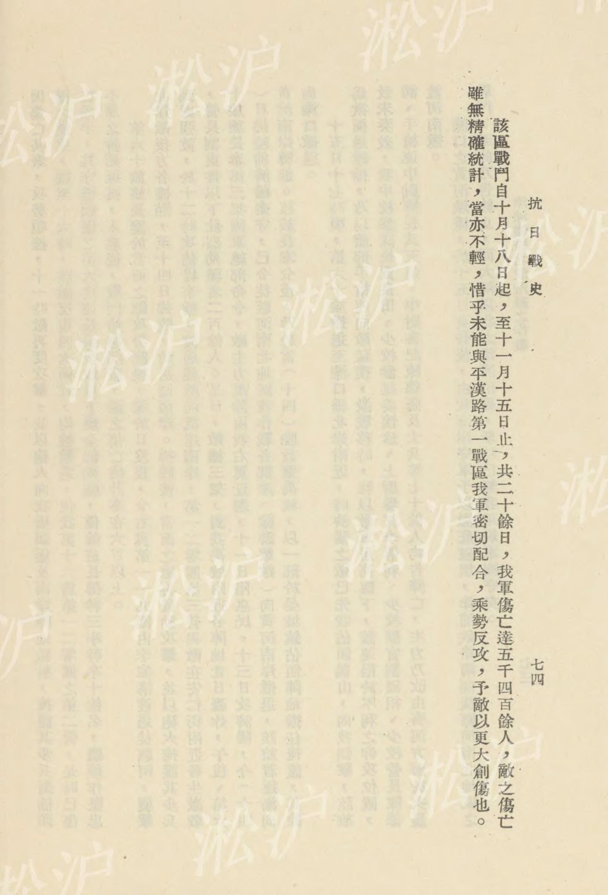

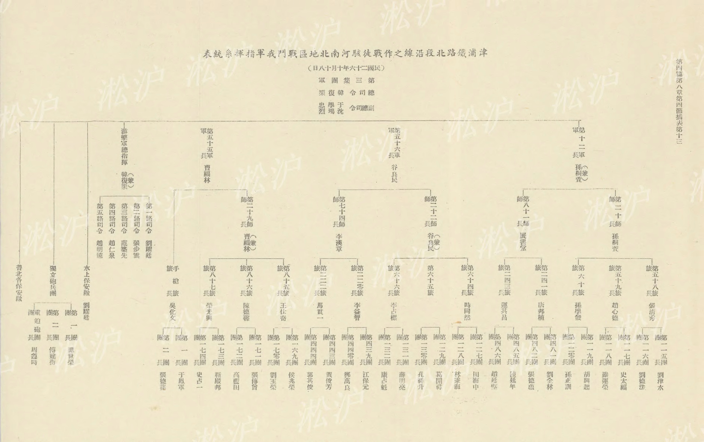

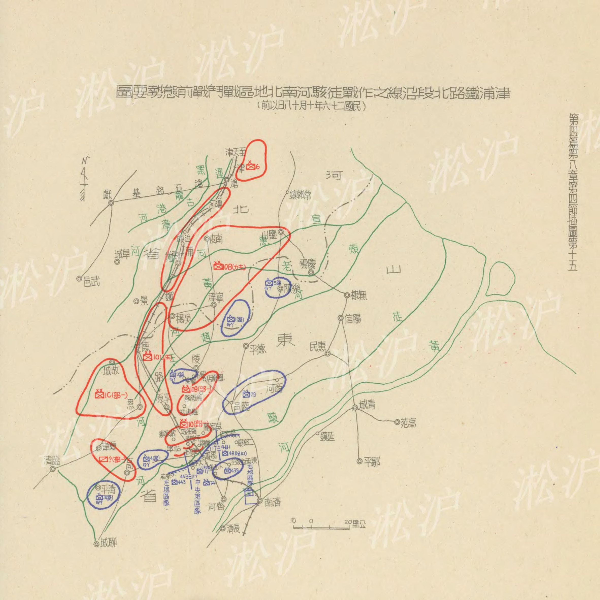

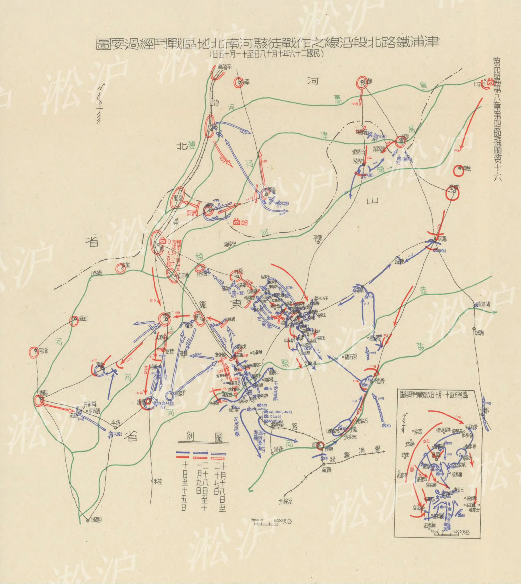

### 第五節 山東之棄守

民國二十六年十二月二十三日至二十七年一月十一日參照插圖第十七插表第十四第十五

第一欵

濟南泰安濟寧之放棄

自二十六年十一月十五日，第三集團軍退守黃河南岸以來，敵卽沿黃河北岸配置警戒部隊，除砲兵不時向我南岸守軍射擊外，並無積極行動，與我遂成隔河對峙狀態。至十二月十六日，第三集團軍據報，敵千五六百人，十日晚陷朝陽，有犯壽張、范縣模樣。韓復渠遂令第五十五軍曹軍長率第二十九師及第八十一師配置於濟寧、嘉祥、鉅野、鄆城一帶，並令第八十一師任陶城埠至濮縣以東柳園間黃河南岸之守備（原在平陰、張秋鎮間守備之第一八零師已調往考城），軍事委員會以該集團軍之守備兵力偏重於黃河上游，當於二十日給予該部以「各戰區範圍及根據地早經明白劃分在案，該部除擔任黃河下游守備外，並準備以魯南泰安與臨沂間山地爲根據地，以便長期抗戰，切勿逾越戰區範圍，另將部隊他調」之指示（按自徒駭河撤退後，膠東方面第三集團軍所部已陸續調集津浦路黃河南岸及魯西南一帶，第五十一軍於十二月十五日又奉調徐州集結，所有膠東方面青島區之防務，僅由海軍第三艦隊海軍陸戰隊及保安隊負責）。

南京淪陷後，津浦南段漸受敵威脅，第三集團軍總司令韓復渠在心理上頗感動搖不寧，時黃河北岸之敵企圖打通華東戰場，亦趨活躍，卽以一部在魯西虛張聲勢，出我不意，於十二月二十三日以第一師團之第二旅團由歸仁鎮偷渡（惠民縣南），襲取靑城，而進出周村。二十四日又以第一零八師團由濟陽渡河，佔領章邱，並向西攻略濟南。津浦路正面之敵第十師團，則於二十六日由齊河强渡成功，亦向濟南進逼。十二月二十七日，濟南在敵第一零八師團及第十師團東西夾擊之下，遂告失守，當敵各師團自歸仁鎮、濟陽先後渡河成功之際，我第二十二師在長山、鄒平間，第二十師一部在濟陽、鴨旺口間協力阻擊，戰鬥頗爲激烈，嗣因敵不斷增援，而韓復渠又早於二十四日晚卽已離開濟南，移駐泰安，局勢因以急轉直下，各師遂被迫於倉卒間轉移至下列各陣地，從事抵抗；第二十二師在淄川、博山、文祖鎮，第二十師在仲宮鎮、黨家莊、千佛山、白馬山，第七十四師師長率一部往北達山，其餘仍在長清、平陰間任黃河守備。

敵陷濟南後，以其第一零八師團主力繼續南進，以第十師團進擊我黃河南岸長清一帶守軍，而進出肥城，並以第一師團之第二旅團由張店出博山、下萊燕，東西呼應，泰安在敵三面包圍之下，遂於三十一日不戰棄守，韓復渠並於是日退駐濟寧城，連日各部在博山、界首、長清、肥城等處與敵激戰後，第二十二師旋向泗水，第二十師向大汶口、兗州，第七十四師向寧陽分別撤退，此時第五十五軍曹軍長所率之第二十九師轉向嘉祥集中，鐵甲車兩列則分駐兗州及濟寧，第八十一師及手槍旅均位置於運河西岸擔任警戒。

斯時，靑島孤懸海隅，軍事委員會乃指示沈鴻烈市長相機行動，二十九日，沈市長遂率所部約二個團兵力向諸城、莒縣、沂水等處撤退，整個膠東於是均告放棄，至靑島守備及撤退詳情另於次款詳述之。民國二十七年一月一日起，敵第一零八師團主力向曲阜進攻，三日陷曲阜，同日兗州亦棄守，敵第十師團由肥城策應第一零八師團奪取泰安後，復沿公路線南下，協助第一零八師團佔領兗州，爾後並協同向濟寧方面進攻，時壽張方面敵第二師團之第二十五旅團已渡河奪佔東平，當日第三集團軍各部據守汶河沿岸，與敵發生激戰，嗣敵源源增加，節節進迫，韓復渠遂向李司令長官報告，擬令第二十、第二十二、第七十四各師各抽調損失較輕之一旅及第二十九師（欠一個旅）、第八十一師就微山湖至黃河南岸，沿運河西岸佔領陣地，行決戰防禦，手槍旅控置於嘉祥、鉅野一帶爲總預備隊，待機反攻等語。是日，大汶口、兖州均已陷落，韓本人已於五日九時由濟寧移駐鉅野。一月六日，韓令各部隊沿運河西岸部署如次：「一、第八十一師任開河鎮（不含）至十里舖運河西岸及十里舖至小路口（含）黃河南岸之守備。二、第七十四師任開河鎮（含）至濟寧（不含）間運河西岸之守備。三、第二十九師之第八十七旅任濟寧（含）至石佛閒（含）間之守備。四、砲兵第一團第二營在杜莊選擇陣地。五、第二十九師（欠第八十七旅）爲總預備隊，控置於嘉祥附近，其餘第二十師則調往城武整補，第二十二師大部仍令在曲阜以南鐵路以東活動，其師部在曹縣收容該師零星部隊，手槍旅集結鉅野，砲兵第一旅第一團（欠第二營）由濟寧開單縣整理」。

李司令長官得此情報後，於六日晚復電韓復渠，強調汶上、濟寧之重要性，略謂「查運河爲魯省最後堡壘，汶上、濟寧又爲運河前方最要據點，汶、濟不支，運河不守，則匪僅魯省全陷，且隴海被斷，徐、鄭均危，北方大局將更不易收拾，務請於運河之線竭力支持，固守汶濟兩點，以爲運河屏障，及爾後攻勢之根據，一方當促第二十二集團軍從速集中滕、鄒爲貴部聲援，力圖恢復，以保魯省最後之一角。韓復渠雖奉上項電令，但其第二十師及第二十二師仍陸續向城武、曹縣轉移。於是李司令長官乃電商豫鄂皖綏靖主任劉峙，並就近命銅山李專員將豫東、蘇北凡通魯西各地之大小道路予以澈底破壞，以爲消極阻止之計。是（六）日，敵沼田、福榮兩部由兗州及寧陽向濟寧進攻，其時奪佔東平之敵第二十五旅團，於五日佔領汶上之後，亦以一部繼續南進，七日晚，濟寧西關之敵增加兩聯隊及戰車二十餘輛，車站之敵亦增加七八百人，砲數十門，同時向濟寧城攻擊兩次，突入北關，均被擊退，北關幅員狹小，經敵砲火轟擊，房屋盡毀，守軍乃撤至城內抵抗，旋劉家海、大長溝一帶有敵兩聯隊，孫氏店有敵一聯隊，分向濟寧方面逼進，韓復渠爲誘卸責任，乃電呈軍事委員會「速令第二十二集團軍由滕縣向兗州急進，與我守濟寧運河部隊夾擊敵人，同時並希望第三軍團由臨沂向北挺進，以作聲援，則戰事前途，進展較易，否則孤軍拒敵，濟寧將不能守」。迄十日晚，增援之師尚未到達濟寧，在敵第十、第一零八各師團及第二十五旅團圍攻之下，遂告不守。韓復渠於是日由鉅野移駐曹縣，所部第八十一師退駐城武，第二十九、第七十四兩師撤至金鄉，第二十師及第二十二師一部退駐曹縣，獨立砲兵第一、第二兩團退單縣，手槍旅集結鉅野。

元月三日，當李司令長官接到韓復渠擬將部隊移守運河西岸之報告時，卽以電話報告最高統帥蔣委員長，其大意如次：「一、韓復渠所部已向運河方向撤退中，對於前次作戰計畫固守戰區根據地之命令，似無意實行。二、魯南根據地之任務，擬改令龐炳勳擔任。三、韓部行動擬請不再加以嚴令，免傷感情」等語。至是軍事委員會以韓復渠不奉命令，迭次擅自撤退，貽誤戰局，乃明令免去其本兼各職，旋經查明罪證確鑿，遂於一月二十四日予以明正典刑，改派于學忠爲第三集團軍總司令，孫桐萱副之，曹福林爲該集團軍前敵總司令，並特派軍事參議院院長陳調元，執法總監鹿鍾麟先後攜最高統帥蔣委員長親筆函件及致前線將士之訓詞，遞往曹縣、單縣等處宣達中央意旨，昭示「國軍作戰方針，及各將領之責任（參照附錄第七），各將領受命後，士氣爲之大振，旋卽發動向濟寧、汶上之反攻（見徐州會戰章）。

第二欵

青島守備及放棄

自蘆溝橋事件發生後，青島敵人頓呈緊張，其總領事大鷹迭與我青島市長沈鴻烈晤談，表面上允對敵僑嚴加約束，同時則藉口保僑，積極準備軍事，並自臺灣急調天龍、龍田兩巡洋艦，由下村司令率領來青，由七月十四日起開始戒備，並作如次之措施：「一、天龍、龍田兩艦附運軍火抵青後，卽限制官兵上岸。二、決定一旦戰事爆發，先將濟南及膠濟路沿線敵僑移往青島，必要時，令老弱回國，另由其陸軍武官負責，將居留僑民青年團及義勇隊組成陸戰先鋒隊，其在鄉軍人暨中學生等，則組成預備隊。三、由滬開到驅逐艦兩艘，並令駐華第三艦隊各艦待命出動，準備海軍在青島登陸，以與華北陸空之南侵相呼應」。

七月十八日，沈市長訪晤大鷹，對敵國在青島陸海軍人員及官民等軍事準備，引起地方人心動盪各節，予以嚴重抗議，迄二十三日，其間除敵僑自濟南及膠濟路沿線約三百人移來青島，一度引起青市緊張外，並偵得下列狀況：「一、敵以金錢迫誘漢奸數十人，組成暗殺團，分佈青市及膠濟路沿線工作。二、敵艦及領事館陸續將武器彈藥及軍用品等運存八大紗廠，如有事變，卽以各該紗廠爲根據地，從事指揮。三、敵僑均在儲存糧食，準備應變。四、敵義勇隊定二十四、二十五兩日，在居留民青年團受檢，並規定全體敵警自二十四日起施行警戒。由二十七日至八月二十五日止，敵艦不時在青島、威海衛間沿海一帶巡弋，仍不斷運送軍用品來青，敵僑亦陸續撤退，迄八月二十一日，其老弱婦孺卽已全部撤退完畢，至於二十歲至二十五歲之青年七百餘名，則編爲特種義勇隊，由敵陸軍聯隊發給武器，予以訓練，其間自七月三十日青島敵總領事大鷹曾訪沈市長，就我國軍進入山東一節提出詢問，並試探如敵軍在青島登陸時，我方所持態度如何（註一）。八月十四日，德縣路聖功中學前，敵水兵滋事，被其本國人擊傷事件發生，敵總領事乃誣我便衣隊所爲，欲藉保僑爲名，準備派其陸戰隊登陸，我青市府除嚴加駁斥外，並加强戒備以防萬一（註二），此後青島情況乃日趨緊張。

八月二十六日，青市府奉到軍事委員會如下電令：「軍事委員會第一部業經成立，所有第一線部隊，對於敵軍之兵力、兵種行動等，應詳加蒐集報告，以利戎機」。沈市長奉令後，遵將現有敵情呈報如次：「一、現泊膠州灣敵巡洋艦天龍、龍田兩艘，驅逐艦吹雪、白雪三艘，各該艦官兵總計一千二百餘人，均未登陸。二、青市敵僑自婦孺撤退後，所餘壯丁均已編入青年團、義勇軍連同警察在鄉軍人等，共約四千餘人。三、敵於各大工廠、神社、學校及居留民團等處，分儲軍械，約計迫擊砲二十門，山砲四門，機關槍三十餘挺，步手槍約六千枝。四、敵人對於戰事之工事、運輸、給養、衛生等，均有充分準備一。至是，中央乃於二十八日增調第五十一軍擔任青島區防務，同時派第一部副部長王俊視察前線軍事，三十日自濟南轉赴青島，與沈市長面商該區防務，決定原駐青島區內之稅警總團兩團，俟第五十一軍進入該區後，卽歸還東海區建制。九月四日九時，駐青敵總領事舘及全市敵僑，均乘原田丸撤離青島，其龍田軍艦於下午賡續出港，至是青島全市已無敵軍艦及官民矣。九日、蔣委員長電令韓復渠、于學忠、沈鴻烈等「魯省敵僑已撤，宜乘此時機將沿海一帶可能爲敵上陸之要點趕築永久工事」，于軍長、沈市長奉令後，卽各督率所部陸續趕築工事。

十月六日，青市接宋哲元電告，知敵於五日由津浦路北撤數千人，有由塘沽登艦赴援上海或青島之情報，同日，第五十一軍于軍長與沈市長判斷一般情況，擬定青島防守區第一期部署如左：（參照插圖第十七）

一、第一一四師以一旅進駐市區，其一團駐東王埠莊附近，一團駐張家村附近增強工事，另以一旅（欠一團）駐膠縣，並由該團派遣一營至靈山威、王台鎮監視沿海岸，並構築工事，其餘一團暫駐高密增強工事。

二、第一一三師（欠一旅）駐卽墨，其另一旅駐王哥莊、鰲山衛、金家口、海陽沿岸之線，構築工事。三、青島市內各要點及沿市海岸線，由海軍陸戰隊及市屬保安隊除砲兵不計外，共約步兵一個團，構築工事，必要時，卽以駐東王埠莊之一團推進市內協助作戰，並以駐張村之一團擔任沙子口方面，拒敵登陸。

四、駐青我第三艦隊各軍艦之大小砲二十餘門，全部拆下，在海口要點建築永久砲台，阻止敵艦進入港

内，或接近口岸。

五、市內大港碼頭五處，可同時靠泊大船三十餘隻，起重上下，均極便利，爲敵軍所必爭，令海軍組織封鎖隊，將已卸武裝之軍艦及市屬全部船隻，於必要時封鎖大港入口，並將叢門碼頭之兩端盡量破壞，使敵不能利用。

先是軍事委員會於第五戰區作戰指導計畫內設置靑島防守區，以沈市長任指揮官，以第五十一軍軍長于學忠任總預備隊指揮官，沈市長因防區內有高密、膠縣、海陽、卽墨等縣，靑島僅其一隅，各該縣要地均由第五十一軍扼守，必須相機調度始可應付餘裕，市長負地方責任，對內對外較爲繁雜，與于軍長之專任軍職者不同，且守土有責，不能離開靑島一步，乃於九月七日電請軍事委員會改任于學忠爲靑市防守區指揮官，市長自任前敵指揮官，並請以海軍第三艦隊司令謝剛哲任前敵副指揮官，以期職責分明，名符其實。九月十日，奉軍事委員會覆令：「着仍遵照前令辦理，所請以謝剛哲任前敵副指揮官一節，應准委爲靑島防守區副指揮官」。

六日十八時，靑島港外敵艦一艘，用探照燈向靑市沿海沙子口、山東頭一帶照射，至七時四十分，市屬竹岔島附近海面，亦發現敵艦三艘，分泊島東島西及島南方，艦上飛機起飛一架，施行偵察，各艦均於次晨九時以前分別離去。

津浦線自德縣失陷後，敵仍冒險深入，十月十四日，佔我平原。軍事委員會爲遲滯敵軍前進，於十月十八日，先令第三集團軍設法破壞禹城以北鐵路，又爲使敵主力不能自由向山西轉調，命該集團軍發動游擊，努力牽制，爲使靑島與津浦路沿線呼應作戰，二十日下達如左之訓令：

一、第五戰區應確保山東要地，以現在前方部隊直接守備東海、靑島及其膠東半島各海岸，並阻止由津浦路南下之敵，以後方部隊集結於徐州、商邱一帶地區，準備策應津浦路及東海方面之作戰。

二、李司令長官直屬各兵團，除第三十九師在東海、第五十一軍任靑島守備隊，及第三艦隊在靑島、第五十六軍（欠第七十四師）在煙臺、龍口、羊角溝一帶各附近地區守備外，其餘主力由韓副司令長官指揮。

十一月六日，據天津情報，敵派遣軍司令部作戰計畫，擬佔領山東全省津浦線，以第十師團爲主力與陸海軍飛行部隊協同作戰，以越過黃河，而與膠濟路會師。十四日，軍事委員會電靑島市長沈鴻烈，相機將敵人在靑島之工廠悉予炸燬（按敵自第一次世界大戰以强力取得靑島後，竭力經營，工廠林立，尤以八大紗廠爲東亞規模宏大，不可多得之工業建設，我中樞爲爭取最後勝利，決於我武力由靑島撤出之前夕，命沈市長予以澈底破壞，以免資敵，十一月二十一日沈市長以靑島形勢日益緊張，電呈軍事委員會卽日施行戒嚴，並請以第三艦隊司令謝剛哲爲戒嚴司令，俾專責成。十二月十日，據天津情報證實，由塘沽開出之敵軍，除一部赴上海增援外，一部確開往靑島、海州等處，究將在何處登陸，無法探悉。

十二月十五日，韓復集給予沈市長電話：「一、李司令長官擬調第五十一軍移防徐州，因南京淪陷，徐州吃緊，誠有必要，且非如此不足以固濟垣之後路。二、第五十一軍移防時，山東省軍亦當向鄆城方面撤退，僅留一個師沿黃河南岸警戒，敵如渡河，恐難阻。止三、第五十一軍離靑島後，卽將膠濟全線及其橋樑水塔等悉予破壞。四、靑島孤懸海角，市區海軍隊警，如何處置，應早爲籌劃」。沈市長聆悉之後，當卽電呈軍事委員會暨李司令長官略稱：「查浦口敵軍似未積極北上，黃河北岸並無緊急情況，徐州國軍尙衆，濟南退路亦寬，茲因調用第五十一軍充萬一之準備，竟使黃河不守，膠濟中斷，敵兵未來而自行放棄山東，陷靑島數千部隊及數十萬市民於絕地雖不足惜，第恐山東陷，徐州腹背受敵，亦將無以自固，誠不知其可也」。十二月十七日，李司令長官派員赴靑，詳述徐州僅廣西軍兩師一團，尙有戰力，其他部隊力量均屬薄弱，現敵軍有攻徐州企圖，形勢危急，故特呈請軍事委員會准予調第五十二軍前往禦敵云云，沈市長以局勢變化至此，實非想像所及，遂一面電復遵辦，一面加强戒備，並電請軍事委員會指示方略。二十日，復奉軍事委員會電示：「第五十一軍調防徐州，係爲應付當前危難，中極對於青市治安備極關切，固守膠東，仍有賴於賢勞之苦心策畫」。至此沈市長乃更作守土之最後準備，至二十四日，濟南電話不通，敵大部分已由濟陽、濼口等處渡過黃河，同時，敵艦五艘，在青島南方靈山衛地方，亦企圖登陸，而該處距青市僅約一百五十餘公里，爲諸、膠門戶，駐防之第五十一軍去後，完全空虛，沈市長乃派隊星夜馳往防堵，綜計駐青市沿海及市區之兵力，僅有海軍陸戰隊、保安隊及第五十一軍之第六八三團，總數不過步兵兩團而已。十二月二十五日，薛家島、濱口一帶海面發現敵艦三四艘，企圖登陸，斯時津浦路南渡黃河之敵，又已分向濟南及博山猛進，沈市長乃將青島防守區重新部署：「一、以海軍主力兩大隊及第五十一軍之第六八三團控置於青島區市內及沙子口、滄口等地，擔任防守。二、抽派陸戰隊一部督導壯丁隊一大隊配置於濱口、靈山衛、薛家島一帶警戒海岸，並分一部駐高密、膠縣、海陽維護交通。三、諸城、沂水等地僅派保安壯丁各隊駐守，並以一部分駐穆陵關扼青沂路咽喉，防敵南擾」。十二月二十六日，第五十一軍于軍長復令該軍在青協防之第六八三團於兩日內歸還建制，該團離去後，青市僅由海軍陸戰隊兩個大隊擔任防守，益覺兵力單薄，而陷於孤立無援。二十九日，沈市長接李司令長官電囑，率海軍主要幹部早日蒞徐，期爲國家效力，同時、軍事委員會亦以同樣電令，促卽遵照李長官指示辦理。此時，濟南已失，而敵自津浦、膠濟兩路進犯煙臺、濱口、石臼所等處，敵艦復往來窺伺，企圖登陸，沈市長乃於卽日率駐青各部隊轉進諸城，並於是晚將市內重要敵產悉予破壞，僅留置警察駐守市內，維持治安，居民原有二十餘萬，經逐漸疏散後，僅剩二萬餘人（均係難民），乃爲之籌備糧食，託由外國教會賑濟，所有軍政事宜，悉交由警察局長廖安邦代理，沈市長於一切佈置就緒，並電呈軍事委員會後，遂撤離青市赴諸城主持一切。三十一日，青市因警察局長墜騎受傷，先赴諸城治療，據報敵艦到處登陸，地方人心浮動，警察原無禦侮實力，治安亦無法繼續維持，沈市長萬不得已，始允由該局鮑督察長率部於是（三十一）日午後向膠縣撤退，青島市至此遂完全放棄。註一：七月三十日，青島敵總領事大鷹與我沈市長晤談，詢及下列三點：（一）近聞中央軍及稅警團將繼續進入山東，向青島方面開拔，實爲貴市長之請求，顯係貴國有破壞和平之意。（二）將來「日軍」如在山東所屬地區登陸，於青市並不發生直接關係，貴市府持何態度。（三）日本陸軍應無來青之舉，假令海軍陸戰隊於必要時登陸保僑，與貴屬軍警應可相安。沈市長對上項詢問，當答以「中央軍在國內調動乃係我國政府主權，卽令移駐魯境，亦僅自衛，決無對外挑戰之意，將來貴國陸軍無論在山東何處登陸及海軍在青島上岸，均屬有意挑釁，戰爭難以避免，至本市秩序，但須貴國僑民各安生業，不輕舉妄動，自當負保護之責，決無他虞」。

註二：八月十四日十四時，德縣路聖功中學前有敵兵三人因故紛爭，當場有二人被槍擊傷，一爲軍曹服部，一爲三等水兵赴本，兇手爲敵水兵，事件發生後，敵天龍號軍艦立即調集載重汽車二十餘輛，集結碼頭待用，所有敵陸戰隊亦全部武裝，準備登陸，敵總領事一面親赴我政府交涉，聲稱日人被擊，係我國便衣隊所爲，並聲明保留將來一切要求之權，當經我沈市長嚴詞駁斥，以檢得之子彈及彈壳，均係日造兇器爲證，要求剖解死者服部屍體，以資驗證，並請其停止軍事行動，由雙方派員調查，循外交途徑解決，同時懸賞三萬元緝兇，敵總領事無法强詞奪理，當表示不令陸戰隊登陸，然仍卸運軍火甚急，我方恐其乘機侵擾，遂亦嚴加戒備，敵如開釁，决以全部實力抵禦。

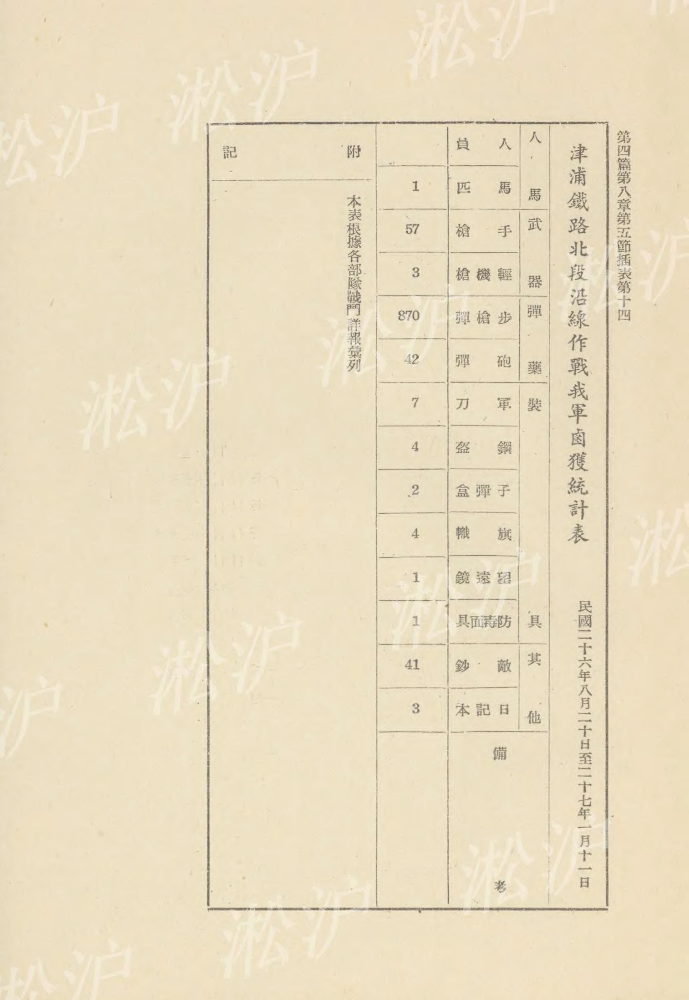

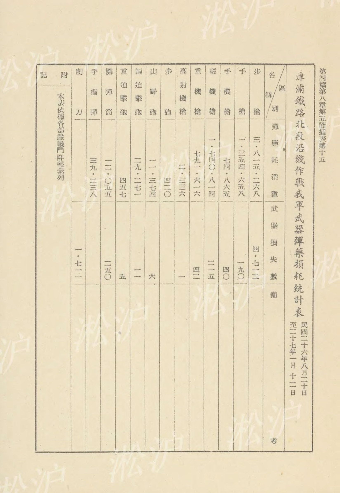

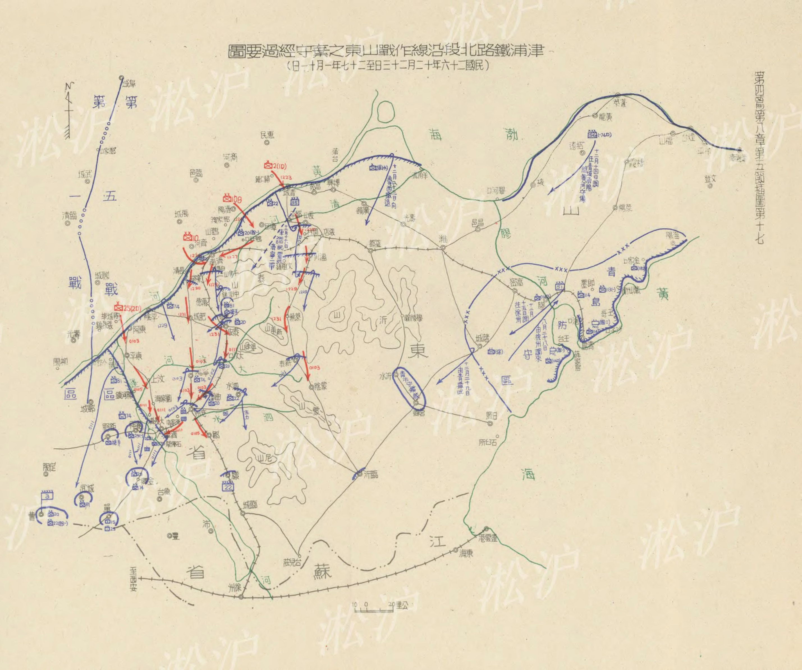

### 第六節 檢討

第一欵

敵軍

一、敵華北方面軍誤認我軍主力在平漢線與敵決戰，遂以其第一軍沿平漢路長驅南進，以第二軍主力沿子牙河向正定前進，妄圖遮斷我主力之退路，僅以第二軍之第十師團沿津浦路南進，殊不知我軍主力已先機轉用山西，致敵第一、第二軍之主力深入冀南撲一大空，形成遊兵，乃戰略上極大之錯誤二、敵第十師團乘韓復集戰志不堅，遂沿津浦路孤軍深入，其第五師團又分離過遠，卒招台兒莊及臨沂攻勢之頓挫，爲戰局持久之契機，尤以敵華中派遣軍在淮河畔逗留不進，乃戰地缺乏統一指揮，因而挫敗之例證。

三、敵針對我軍之配備（兵力分散、正面過廣）及地形之限制（文安一帶窪地已氾濫成湖，津浦路以東地勢逐漸低下，尤以近海地帶，形成沮茹，不能運動。），故以第十師團沿鐵路及運河堤道，第十六師團沿子牙河堤前進，實施正面攻擊，自屬當然。

四、敵於馬廠、姚官屯戰鬥，均發揮其步砲空協同之威力，迅速突破我陣地，尤以敵汽球觀測，有裨其步砲之協同甚大，復能利用橡皮舟艇及戰地船隻減輕氾濫之障礙，貫澈其中央突破之目的。

第二欵

我軍

一、津浦路北段地形平易且接近海岸，而與海岸平行，乃最不利之戰場，我軍僅以一部兵力縱深配備於該戰場，持久抵抗，自屬至當，惟限於政治情勢，平時無充分準備，第一、第六戰區均係臨時成立，戰前並無作戰計畫，指揮機構，後勤設施均極簡陋，尤以編組龐雜，缺乏三信心，致統御指揮連繫及後勤業務缺點甚多。

二、華北戰場以山西爲鎖鑰，第一集團軍及第六戰區對子牙河作戰路之價值，認識不足，至第六十七軍在該方面自由行動，形成無指揮無補給之之狀態，終致敵第二軍主力向該方面長驅直入威脅第一戰區之右側背，影響山西之作戰。

三、戰場指揮官未明察敵情地形，適切部署，一般正面過廣，兵力分散，僅有戰略之縱長，而無戰術之縱深，處處單薄，不堪一擊，既不能拘束敵人於正面，自不能獲得向敵側背反擊之時間，致步步退縮，完全陷於被動，未能遵照軍委會之指示，以機動部隊向敵側背圍攻之指導要領，遂招挫敗。

四、利用氾濫阻敵，應與作戰計畫密切配合，並適時蒐集船筏，否則反使爾後我軍之運動亦大感困難，馮玉祥十月十三日電呈軍事委員會有「敵……更利用救生圈及汽划等物，四出攻擊，我既無此利器，形成處處受制」等語，可見我軍當時困難之一斑。

津浦鐵路北段沿線作戰附錄第一

軍事委員會軍政部電第二十九軍軍長宋哲元示該軍之改編情形民國二十六年九月六日二十三時泊頭鎮宋總司令明軒兄△密，關於貴部編制，已奉委座核定如下：（一）第五十九軍軍長宋哲元兼，副軍長李文田，轄第三十八、第一八零兩師，師長爲黃維綱、劉振三。（二）第七十七軍軍長馮治安，轄第三十七、第一三二、第一七九三個師，師長爲劉自珍、王長海、何基澧。（三）第六十八軍軍長劉汝明所轄之編組，另案辦理。（四）第一八一師師長石友三。（五）騎兵第九師師長鄭大章。特達。何應欽。

津浦鐵路北段沿線作戰附錄第二

軍事委員會派駐石家莊指導華北國防工事構築指導官林蔚對華北敵情判斷報告書民國二十六年九月十二日茲獲得關東軍與北支軍通報，判斷敵情如左：

一、敵關東軍似擔任張家口、大同間平綏線附近及其以北，而懷來、涿鹿、蔚縣、涞源之線及其以東，似屬北支軍。

二、在北支軍未得發展以前，關東軍暫在天鎮附近待機，不再深入。

三、北支軍基於關東軍之要求，擬對津浦、平漢及晉東山地取積極行動，而其手段，係由津浦線發展至德州附近，一則在使我平漢線方面形成戰略上之突出，一則爲使將來青島方面上陸軍之作戰容易。

基此判斷，津浦線方面，最爲着重，如滄州不守，更足以遂其青島登陸之企圖。

津浦鐵路北段沿線作戰附錄第三

民國二十六年十月十三日第六戰區司令長官馮玉祥以元（十二）未電呈軍事委員會自姚官屯至德縣失陷作戰經過

特急南京

委員長蔣鈞鑒，敏密。職自奉命調任第六戰區後，遵於九月文（十二）日，由無錫行營回京請示，翌日，乘津浦車北上，爲指揮督飭計，卽行進駐桑園，嗣後因戰況推移，豔（二十九）日移駐德州，卅日移駐禹城，十月江（三）日移駐濼口，虞（七）日移駐新鄉，謹將前後作戰情形據實報告如下：（一）前面戰線，遍地水潦，正面過廣，兵力單薄，敵因得集中飛機大砲，突擊我正面，更利用救生圈及汽划等物，四出攻擊，我既無此利器，以致處處受制。（二）原第二十九軍卽現第七十七軍第六十八軍及第五十九軍，自平津退出以來，精神物質，損失至鉅。加以第一三二師師長趙登禹陣亡，第三十八師師長張自忠脫離部隊，軍中驟失統率，兵心渙散，士氣不振，所餘馮治安之第三十七師，自蘆溝橋事變後，轉戰千里，傷亡過重，疲憊不堪，且退却時，所有服裝糧食，軍用物品，交通器材等物，頗多散失，事後又無補充，士兵除身上單衣及手中步槍外，別無長物，以與敵較，相差懸殊。（三）姚官屯、東西花園之役，正戰鬥劇烈之時，正面龐炳勳及劉多荃部與第三十八師，竟未適時出擊，而劉多荃部倉卒應戰，準備不足，此時李必蕃師奉龐軍團命增援，尙未加入戰鬥，卽被退下之部隊衝散一團，足見使用預備時，未能充分研究，足爲吾人戰術運用之良訓。（四）通信器材缺乏，又常發生故障，以致敵我交綏之際，命令報告，多未能及時遞送，連絡形成中斷，例如龐、劉兩部，由滄州離開鐵道線向南撤退時，久無報告，在滄州西南鐵路線上休息整頓之馮部，突受沿鐵路線前進之敵猛擊，竟疑龐、劉兩部已完全退却，恐孤軍失援，不敢竭力抵抗，其實龐劉尙在南皮，蓮花池陣地，相驚伯有，竟致債事。（五）鐵路正面，既節節後退，不能立足，不得不另思制敵之法，藉挽頹勢，遂令龐副司令長官遄赴鐵路東側掌握，並指揮龐劉及第五十九軍第二十三師各部，向敵側擊，收效頗大，計先後克復泊頭鎮，馮家口、南北霞口等處，其所以不能予敵以致命之打擊者其原因有三：甲、由平津退下部隊，抗戰意志薄弱，正面既屢次開放，故側擊多不奏功。乙、遍地積水，運動不便，因而預期之行動，往往不能實現。丙、連絡本不確實，而友軍又互相猜疑，常恐爲敵所乘，不能堅決抵抗。（六）中央會令山東增援兩師，論理至遲應在在九月二十三日到達，竟遲至三十日，敵已到達桑園，而增援部隊到達德州者僅有一旅，及至敵臨德州，魯軍之開到者尙不及一師，其後陸續增加，終不免被敵各個擊破而退出德州，銳氣受挫，於爾後作戰指導上，必生困難，以上所陳，係職到達前方後津浦方面作戰之大概情形，伏祈明鑒，職馮玉祥元（十三）未參。津浦鐵路北段沿線作戰附錄第四

民國二十六年十月十六日第四十九軍聯絡參謀陳子堅報告姚官屯戰鬥經過報告十月十六日于南京

竊職奉派赴陸軍第四十九軍任連絡參謀事宜，八月二十八日由京起程，九月一日到達許昌，該軍先頭亦由南陽到達，嗣卽隨軍至滄州，茲奉調回部，理合將該軍作戰經過及津浦線一般作戰情形報告如次一、第四十九軍編制及實力：

該軍轄第一零五、第一零九兩師，直屬山砲一營，特務營、騎兵連、高射機關槍排（六挺）、自動步槍排等各部，師爲調整師編制，惟每團多一平射步兵砲連，所用步槍及輕機關槍，俱爲捷克式，該兩師長謂每師官兵一萬一千員名，據職調查約在九千左右，該軍官長均係軍官學校出身，抗戰情緒極高，士兵所受教育程度較差，因該軍於今年春方改編完竣，以後卽在豫南一帶剿匪，未能集中訓練故也。

二、第四十九軍行動紀要（滄州戰役以前）：

八月二十八日，該軍分別由南陽、方城、鄧縣、泌陽各原駐地點向駐馬店、信陽、許昌三處集中，乘平漢路車，赴蘭封、歸德間地區待命，九月六日全部到達，軍部駐蘭封。

九月十三日，奉令向滄州附近移動，十四日一時，卽開始由隴海路牛堤圈向津浦路輸送，十七日，全部到達滄州附近，軍部駐磚河。

三、作戰經過：

第四十九軍之任務。九月十七日，第四十九軍到達滄州後卽奉令歸第三軍團長龐炳勳指揮，同日，奉到龐軍團長命令，以第一零五師接替西花園以西土堤（不含）經趙官營至孝子墓以西之黑龍港河（含）之陣地（該線原爲第二十九軍防守），以第一零九師爲軍團預備隊，控置於滄州南側八里屯、冀家堤、大賈莊一帶附近。

第四十九軍之部署及地形。該軍自十七日起，卽遵照軍團命令開始部署，惟自西花園、土堤以西之田野，俱積水自半公尺至三公尺不等，接防部隊運動極感困難，除征集少數小船外，並用門板及木筏，分班向前輸送，以此第一零五師除在水中失去多數軍用品外，並淹死士兵十餘人，至九月二十日，始將全線接防完畢，其配備情形如次：第三一五旅（欠第六三零團——一營）附工兵營（欠一連）爲右地區隊，接替西花園以西之土堤至湯莊子陣地，第三一三旅附工兵一連爲左地區隊，接替湯莊子經趙官營至孝子墓以西黑龍港河之陣地，第六三零團（欠一營）爲預備隊，第一零九師之位置如前所記，爲軍團預備隊。

友軍狀況：第一零五師之右翼，自西花園經東花園、姚官屯至馬落坡之線，爲第四十軍之第三十九師防守，第三十師之右翼，馬落坡以東，則爲第二十九軍之第三十八師防守，第一零五師左翼，孝子墓以西經胡大州亘舊鎮之線，則爲第二十九軍之第一三二師防守，此爲九月二十日以前之友軍狀況。

四敵情：自本（九）月上旬，我第二十九軍在唐官屯、馬廠與敵作戰失敗後，青縣、興濟相繼失守（據龐軍團電，以上二處，第二十九軍實係自行撤退），十六日，興濟到有敵先頭部隊兩千餘人0

，砲十餘門戰車隊一連、鐵甲車一列，沿運河、滹沱河、黑龍港河，皆有小部隊，以汽艇向南輸送，數目不詳。

九月十八日以後，敵約一師團，（第十師團）附砲四、五十門，似已全部到達興濟鎮，卽分別以小部隊配屬砲兵及戰車，攻擊我寶店、李辛莊、胡嘴子（以上爲第三十九師之警戒陣地）等處，並以鐵甲車向我正面砲擊。

五警戒陣地之失陷。十九日拂曉後，敵對我第三十九師警戒陣地，全線攻擊，另以一部沿滹沱河攻擊第一零五師之警戒陣地，吳李碼頭我守兵奮勇抵抗，至二十日，除寶店、胡嘴子仍爲我軍扼守外，李辛莊、吳李莊、吳李碼頭等要點，均陷敵手。

六敵對我姚官屯附近陣地之攻擊。二十一日二十一時，敵（約四五千人砲三四十門）以主力攻擊我第三十九師正面之胡嘴子。姚官屯陣地，以一部攻擊馬落坡、寶店附近之陣地，另以小部攻擊第一零五師趙官營之辛集鎮，至二十日十八時止，我第三十九師，傷營長三員，連長以下一千餘員名，寶店、胡嘴子等處，遂告失陷，但東西花園、姚官屯、馬落坡線之主陣地，仍爲我軍固守，辛集鎮仍爲第一零五師之一營據守。

劉多荃軍長之意見具申。龐軍團長以敵猛攻第三十九師，該師官兵傷亡千餘，乃於二十二日下午，令第一零九師之第三二七旅，以一團增加於大姜莊亘東花園之線，萬一姚官屯不守，務確保此線，以一團增加於第三十九師之右翼，餘仍控制於許官屯、鞠官屯附近（滄州東北側），劉軍長以爲如此將第一零九師逐次使用，不但處處形成被動，實違背預備隊使用原則，終爲敵逐次擊破，殊非計之所得，乃於二十二日十六時，面向龐軍團長具申意見，請求以第一零九師由第三十九師之右翼馬落坡方面，向敵左翼出擊，如得允可，卽利用當夜運動，於二十三日拂曉前實施，但此項請求，終以龐軍團長用兵慎重，以無預備爲危險，未允所請而作罷。

八東花園附近陣地守備部隊之更調。劉軍長之建議，雖未蒙允可，但龐軍團長亦覺以第一零九師與第三十九師之混合使用，不甚妥當，乃於二十二日十九時，令第一零九師向第三十九師右翼增加之一團，於原地不動，而令第一零九師之第三二七旅，於二十二日夜暗後，接替第三十九師鐵路及運河間陣地之防務（此一帶受敵攻擊最烈），另以第一零九師之一營增援西花園（在運河西岸爲第三十九師防守）。

九增援部隊之請求。二十二日十七時，龐軍團長在長途電話中向委員長報告前方戰況，並以第二十九軍未能協同作戰，請求另派得力部隊增援，當蒙允卽令在德州之第二十三師開往增援。

敵後續部隊之增加。至二十三日拂曉止，敵我激烈戰鬥，已歷四晝夜，據第一線報告，敵之傷亡，亦已逾千，本日敵又有援兵增於第一線，判斷其未來之攻擊，當益猛烈，加以敵空軍連日之猛烈轟炸，陣地多被摧毀，故二十三日上午，東西花園曾一度失守，但旋以預備隊逆襲而收復。至晚龐軍團長根據現在戰場態勢，調整守備部隊，以第三十九師任鐵路以東至馬落坡陣地之防守，以第一零九師（欠第六四九團）任鐵道運河間之守備，第一零五師附第六四九團任運河亘孝子墓間之守備。

主陣地之失陷及撤退。二十四日拂曉後，敵又增加援兵約四、五列車，對我東西花園、姚官屯、大姜莊、馬落坡全線猛攻，陣地工事全爲敵砲火摧毀，十一時許，我東花園、姚官屯竟告失守，我守軍以全力反攻，亦未奏功，時預備隊已使用淨盡，大姜莊亦被攻陷，迄十六時止，第一零九師，計傷團長一員，中校團附一員，營長傷亡十員，連長以下傷亡三千餘員名，第三十九師，傷亡營長九員，連長以下三千餘員名。惟是日十四時後，第二十三師已有兩團到達滄州附近之八里屯，龐軍團長曾數令該師進至滄州以北三里莊東西之線，以拒止敵擴張戰果，該師李師長延不奉命致敗退之局，無法收拾，龐軍團長乃於二十四日十九時，下令撤退，二十五日，滄州遂陷敵手退却部署。第三十九師及第一零九師，各以相當兵力扼守城河東西之線，以拒止敵之南進，而掩護軍團之撤退，以鐵道橋南北之線爲作戰地境，軍團退却目標，爲蓮花池、南皮之線，卽第四十軍向蓮花池撤退，第四十九軍主力向殷官屯撤退，其一部（卽第一零五師之主力）因在運河以西爲氾濫所阻，沿黑龍港向南撤退，第二十三師向南皮撤退，二十七日，各軍到達蓮花池、南皮之線。

津浦線正面之狀況。馮家口爲石友三部據守，泊頭鎮爲第一七九師（欠一旅）何基澧部隊據守，東光爲何基澧師之一旅據守，東光以南之連鎮，亦爲第二十九軍所據守，亦卽第一集團軍總司令部所在地，二十六日、敵攻馮家口，當晚失陷，二十九日、泊頭鎮亦相繼失守。

十月一日對敵側背之奇襲。二十九日第六戰區鹿副司令長官令鐵道東側各部隊對敵左側背攻擊，以期殲敵於運河右岸，其部署以第三十八師之第二旅，攻擊馮家口，第二十三師之一團攻擊代莊（馮家口東南），第三十九師之一旅攻擊泊頭，第一零九師之一旅攻擊南北夏口。九月三十日薄暮後開始運動，十月一日一時開始攻擊。一日拂曉後，第三十八師攻克馮家口，並擊斃該處敵數百人，第二十三師佔領代莊，第三十九師進至泊頭後，因敵固守該處，故未能佔領，第一零九師攻佔南北夏口，並消滅敵砲兵一連，斃敵數百名，函獲野砲五門（當用手榴彈炸燬）。各師皆將鐵道破壞，將敵切爲數段，卒以正面東光失守，致未能擴張此次側擊之戰果，乃於一日下午四時，奉令向後撤退。

十月一日以後之行動。第三軍團自十月一日後，卽與第六戰區司令長官部（鹿副司令長官雖在軍團部內，但亦與馮司令長官失却連絡。及第一集團軍總部失却連絡，既不明瞭高級指揮官之企圖及友軍狀況，龐軍團長乃決心以與鐵路正面友軍謀取聯絡之目的，沿鐵路以東地區向南撤退，十月一日晚撤至大張家、明燈寺東西之線，二日撤至惶悟寨東西之線，三日撤至邊臨鎮東西之線，是日第四十九軍之第一零五師主力，亦由運河西岸，到達邊臨鎮附近。

應援德州守軍之企圖。第三集團軍於三日夜，始到達邊臨鎮附近，據報德州已完全失守，乃令所屬各師，於四日渡趙王河向陵縣以南地區轉進，四日十四時、第四十九軍劉軍長據第一零五師劉師長報告，頃晤及展書堂師之副官長，得悉德州城尙爲我軍一旅所固守，展師刻正率一部應援德州等情，劉軍長據報後，卽轉報龐軍團長並具申意見卽停止前進，立即與展師取得連絡，應援德州守軍，龐軍團長同意此建議，當以第一零九師及第二十三師，於五日拂曉後，向德州前進，旋於當夜接獲報告，德州已於四日晚陷落。

奉令南渡黃河。五日上午九時，奉到馮司令長官命令，第四十軍、第四十九軍、第二十三師迅速在濟陽及其以東渡口渡過黃河，任長清、平陰間之防務，各該軍師奉命後，卽於九日渡河完畢，第四十九軍於十一日到達長清。

軍紀。前進及作戰時，各軍師軍紀，均甚良好，自退却後，給養奉令徵發，又以人民率多逃避，各軍師皆有落伍士兵，致有拉用民間騾驢及其他不法情事發生。

五、對第六戰區作戰經過之所見：

高級指揮機關太多，對各戰略單位不能確實掌握迅速指揮，貽誤戰機，殊非淺鮮。緣本戰區只一處戰場，戰區之下，只轄一個集團軍，指揮已較重複，而軍上又加一軍團，故尤覺層次太多，指臂不靈，似應於戰略單位（軍或師）之上，置一高級司令部即可。

三併列配備之錯誤。敵以優勢軍隊，對我劣勢軍隊之戰法，恆以火力集中我陣地之一點，蓋以津浦線地形兩面皆水，敵乃更非行此中央突破之戰法不可，我軍之配備，適中此弊，成一線式之併列配置，中間一點突破，全線隨之退却，如姚官屯附近第三十九師被擊破，第三十八、第一零五、第一三二各師，皆被迫隨之後退卽爲明證，實則此三師並未被敵擊破，乃是用不上，此卽併列配備之錯誤。職意應採重疊之縱深配備法，正面第一線部隊，（師或軍）務佔領縱深陣地，其餘各部，應依戰術使用之目的及地形，控制於陣地後方或翼側後方，使敵中央突破旣不容易，敵如行迂迴或包圍，我亦隨時有極大兵力應付之。

三兵力不集中使用之錯誤。併列配備之錯誤，已如前述，此次第一集團軍總部更以第三十七、第一七九兩師及石友三部（一師）成縱一線式，控制於戰場之遠後方，姚官屯陣地動搖時，旣不能及時增援，迄陣地被突破後，乃逐次以一師守馮家口，一旅守泊頭，一旅守東光，致遭各個擊破。四對於「持久抵抗」名詞之檢討。此名詞之含義，似僅能表示我國對日之政略或國防方針者，若以之用作戰術上，表示一種作戰方式，實屬錯誤，蓋對敵之「持久抵抗」乃係目的，而達成此目的之方法，在戰術上言，則應依敵情地形，對敵攻防遭遇均可，今者、竟誤解達成此目的所用之戰術，爲「專守防禦」者甚多，以極旺盛之士氣，堅守一陣地，恆作全營全團殉國之壯舉，此種壯烈精神，固足驚天地而泣鬼神，堪爲國軍表率，但應求以此種精神，活用於向敵攻擊，迂迴及其他機動戰術中，俾此種犧牲精神，能益形旺盛，反之，如只用於「專守防禦」，卽無異於專門挨打，則此種精神，未有不漸形頹喪者，此次，姚官屯附近之防禦，卽類似「專守防禦」，敵恆以砲兵向我陣地集中射擊數小時，而步兵並不接近我陣地，迄將我陣地摧毀，我守兵傷亡衆多，其步兵始接近我陣地，以求決戰，如能隨時依戰況以一部或大部向敵作種種之奇襲，自較「專守防禦」爲佳，所謂「唯有奇襲足以應付强襲」是也。

五高級司令部對作戰部隊之指導太少。第三軍團自九月十九日與敵開始作戰起，至撤退到陵縣附近止，從未接到第一集團軍總部之指導命令，致對高級長官之企圖，恆不明瞭。

六各軍師，咸疏忽敵情之蒐集及友軍之連絡。

七各部隊作戰，未能澈底協同。

津浦鐵路北段沿線作戰附錄第五

民國二十六年十月七日第六戰區副長官鹿鍾麟對軍事委員會呈述津浦路作戰失利之原因查北方戰事，節節失利，固由於敵人兵器精良，然我致敗之由，實亦多端，若不急圖改善，抗敵前途，殊爲危險，茲就管見所及，陳述數端，一得之愚，藉供採擇。

一、軍隊良莠不齊。查開冀省部隊，其中訓練有素，忠心爲國者固屬不少，然素質不良者亦有之，此種官兵思想，每欠正確，曾親聽其言論，不謂飛機無有，給養不周，則言日在泥水中，實難支持，怨天尤人，無所不至，從不恨暴日之無端侵略欲亡我國者，蓋愛生命之心重，而愛國之心輕，故勝敵之榮，戰敗之恥，皆不顧也，是以一遇敵人，則望風而逃，不但不能抗敵，且精良軍隊，亦每受素質劣者之牽累，兵非不多，終歸於盡，良由此也。

二、指揮無方，自古用兵之道，有正有奇，有攻有守，原不可拘於一途，今我各軍，只知坐守以待敵攻，不知出擊以攻敵，只知用正以與敵抗，不知出奇以勝敵，此次我右翼各軍，東（一日）夜襲擊馮家口、泊頭鎮、夏口，無一處不成功，無一處不使敵驚惶失措，足證出奇襲擊之功效，十倍於正面

死守也，且在敵人飛機大砲轟炸之下，我軍自宜取疏散縱深設備，以避其鋒，乃有仍用密集隊形者以是未見敵之步兵而受極大損傷，其指揮不當可見一斑。

三、動作欠協同。作戰之道，如常山之蛇然，擊首則尾應，擊尾則首應，今我各軍，甲被攻而乙仍坐視，乙被攻而甲亦然，以致各個被敵擊破，揆其原因，蓋不協同之故也。

四、官兵玩法。查擅退必誅，中央制定新法，何等森嚴，然河北作戰軍隊，未奉命令而自行節節後退者不一而足，其玩法竟至於此，昔孫武子殺二隊長而令行，李光弼誅後退者而獲勝，蓋好生惡死人之常情，交戰之際，進則易死，退則可生，苟有信賞，以鼓兵勇，而無必罰，以繩兵後，孰肯効死抗敵耶，且頒佈新法，豈不等於廢紙，以上所陳，實感於國家民族之危急，故不敢緘默，冒昧上陳，是否有當，伏乞鈞裁。

津浦鐵路北段沿線作戰附錄第六

民國二十六年十月八日軍事委員會派第一部第二廳廳長徐祖詒到達津浦路視察戰況之報告本（八）日三時，車方抵白馬山（濟南南一站）在附近村莊，晤鹿副長官，據云：第五十九軍、第四十軍由濟陽渡河，第四十九軍及第二十三師由長清渡河，明後日均可渡河完畢，稍加整理，卽向預定之線前進，現與各軍師長均有連繫，吳克仁亦派員到此連絡，再宋哲元在泰安仍暗中操縱，使馮治安命令不行，龐炳勳部尚能掌握，軍紀稍佳，餘則不堪，又黃河下游及膠東北面，以韓復集部防守，尚嫌兵力不足，擬見韓復集後，探其意見，是否願中央派隊援助，再行電陳第六十七軍由獻縣向高邑背進，現已過高邑，但命令仍未能傳到，其他津浦路以西各部，位置不明，職窺馮治安、鹿鍾麟兩人意旨，似非將宋哲元、蕭振瀛等調開，馮部不爲所用，且該部應歸併縮編，與以一軍長名義統轄較便，其他各部，亦尚須補充整理，職擬分別面晤各軍師長傳達意旨，探明現存實力後，再擬定一案請核奪。再如戰區執法機關，似應早日派出，以維軍紀，濟南尙無戰時氣象，近二、三日來，方少有搬家者，但市面較之南京好數倍，餘續陳。

報告(二)

今（九）日上午晤韓復渠，伊對鐵路以西部隊之擾亂地方，頗表不滿，希望渡河後，速過濟南，就預定位置，對爾後山東北部，陸海兩方防禦兵力，亦嫌不足，不過以爲中央應以全力保山西，至魯省似無足輕重，如有抗戰到底決心，則雖退出山西東部、河南中部，變成東西之線，亦仍可與敵周旋，職告以中央畀倚之殷，故將魯北軍事，委以全權處理，山東雖不如山西之重要，但亦首都之屏蔽云。伊待撤退部隊完全渡河後，似再有迂迴作戰之企圖，午後訪于主任，據其觀察，馮長官北來，宋、韓均不慊於心，恐馮暗中拉其部下，加以地方之挑撥離間，宋赴泰安，韓請自任魯北正面，皆含有反馮之意，馮之不得不急去潔口者在此。韓、龐之間，意見亦深，以致不能見面，龐與第二十九軍各將領間，亦有宿嫌，關係非常複雜，故第六戰區各部，非但上下無連絡，左右亦不協同，如是處在同一戰場作戰，安有不敗之理，所受任務至此，明知其困難，但仍擬與各將領分別面談，以中央之立場，曉以國際情勢抗戰目標，黨國危機，私人舊賬不可再算，竭力團結以達目的而待機會，再龐、李兩部聞調滄州，吳克仁部已由內邱向津浦輸送，是否變更前計畫，乞電示濟南津浦賓館。

報告(三)

今（十一）晨赴潔口附近，視察第三十八師部隊及集合團長以上官長傳達中央意旨，自國際情勢，全般抗戰情勢，中央抗敵到底決心，以及財政彈藥準備情形，聽者皆聞所未聞，至感興奮，並表示服從領袖，爲黨國奮鬥，該部士兵雖在天雨泥濘中行進，而精神煥發，絕不似輾轉數千里，作戰閱數月之部隊，代軍長李文田，亦能與士兵同甘苦，故能在姚官屯以北地區，支持匝月，現該部由韓發給鞋襪，但服裝、通信器材、給養餉項等，頗爲困難，祈中央酌予接濟，該部現有官兵約一萬三千人，武器除機槍小砲外，步槍約九千枝，較之其他各軍實力尚强。劉多荃部第一零九師損失半數，第一零五師亦有損失，全部人數不過一萬四、五千人，劉本人作戰經驗既少，勇氣亦不如人，內部團結不堅，劉乏掌握指揮能力，故撤退中不免沿途騷擾，韓亦震怒，職等勸劉速就預定地點整理，並約束所部，勿再中途逗留，多生枝節，本日全部可抵長清，擬明日赴長清視察，鹿副長官已不及待，本日先行赴新鄉矣。

津浦鐵路北段沿線作戰附錄第七

民國二十七年一月十日

蔣委員長致前線將士訓詞「國軍作戰方針及各將領之責任」由參議院院長陳調元代表向第五戰區將領宣示者

一、國軍以確保武漢核心爲目的，以一部固守武漢三鎮，以主力分別集結魯西徐、蚌、合肥與鄂東南及湘東北地區，與戰區之游擊部隊配合，期對深入腹地之敵，一舉殲滅。

我軍戰法，應於硬性之外參以柔性，務在交通要線上，配置有力部隊，使任正面阻止戰鬥，同時以軍隊連合有組織訓練之民衆施行游擊，牽制破壞敵之後方，前後呼應，敵如攻我正面，則游擊隊由各方進出，如其攻我游擊隊，則不與決戰，以收長期抗戰之效。

二、津浦線之敵，各方均不過數千人，我第五戰區現有兵力，合計何止七八萬人，乃敵竟敢任意橫行，實緣其素以蹈瑕抵隙爲能事，以圖乘我弱點，各個擊破，我軍如能合力同心，一致殺敵，則敵決不敢貿然深入，如其深入，亦必遭最大之打擊，須知保國衛民，爲軍入之天職，論功行賞，尤國家之典常，況社會公論於現在，歷史評騰於將來，絲毫不容假借，諸將領或久任封疆，或新膺重寄，均應上對國家，下對民衆，前對祖宗，後對子孫，毋忝厥職，善盡最大之努力，以爭取最後之勝利，並以使所部軍隊與本身事業，均增不朽之光榮。

赴浦鐵路北段沿線之作戰

九九

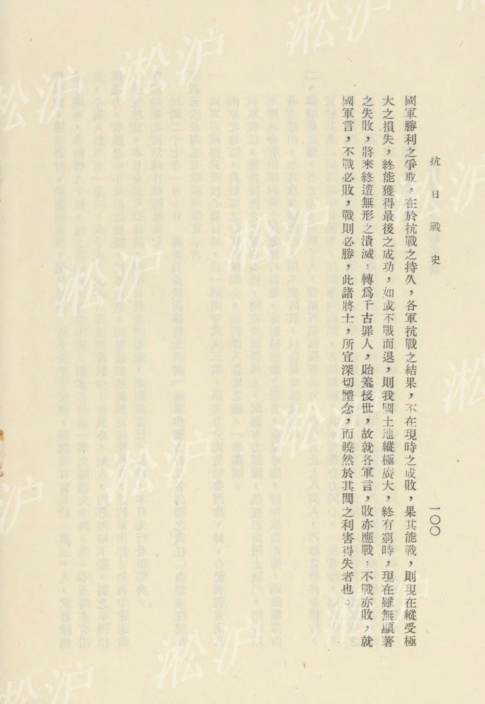
