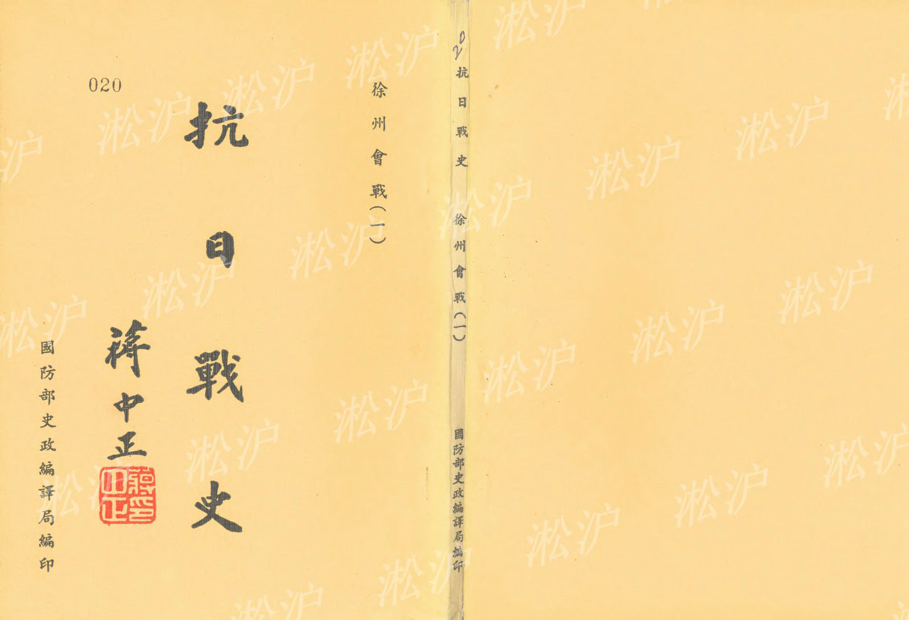

## 第十一章 徐州會戰

概述

### 第一節 會戰前之狀況第一款 敵軍

#### 第二款 我軍

#### 第三款 兵誌概要

第二節 我軍作戰指導第一款 第五戰區作戰計畫第二款 第五戰區部署之變更第三款 軍事委員會寄電及戰區修正計畫第四款 蔣委員長之訓示與處置第五款 第五戰區攻擊部署第三節 會戰一般經過第一款 第一時期（津浦南北兩段守勢與攻勢）第二款 第二時期（臨沂及台兒莊之戰鬥）第三款 第三時期（嶧縣東南地區之戰鬥）第四款 第四時期（戰地之轉移）

### 第四節 重要戰鬥

津浦南段戰鬥　七三

第二款 津浦北段戰鬥　九一

第三款 臨沂附近戰鬥　一〇九

第四款 台兒莊附近戰鬥　一三一

第五款 邳縣以北地區戰鬥　一六七

第六款 禹王山附近戰鬥　一八一

第七款 淮南兵團戰鬥　一九三

第八款 淮北兵團戰鬥　一三

第九款 蕭縣戰鬥　二四七

第五節 後方勤務　一五一

第一款 設備概況　一五一

第二款 實施概況　一五三

第六節 檢討　一五九

第一款 敵軍　一五九

第二款 我軍　一六〇

附錄第一至第四　一六三

## 第十一章 徐州會戰

（民國二十七年二月三日至五月二十八日）

概述

淞滬及太原會戰後，敵主力被我牽制於江南、山西及豫北，一部躊躇於津浦路南北段，以約二十師團之兵力分散於約二千公里之正面，處處薄弱，後方尤爲空虛，復恍於國際情勢之不利，彷徨失措，遂屠城示威，妄圖迫我媾和，迄二十七年新春其軍事動向猶豫未決。

我最高統帥蔣委員長以必勝信念粉碎敵之和平攻勢，集結精銳於武漢外圍，積極整補，掩護我之軍事及交通中心，由晉南豫北抽出有力兵團轉用皖北、豫東，加强第五戰區之兵力，並廣泛發動游擊，積極攻襲以消耗疲憊敵人。

津浦北段之敵約兩師團，自一月上旬逗遛於沂水、蒙陰、鄒縣、濟寧之線，同時津浦南段之敵約一個半師團獨探攻勢；我第五戰區在淮南正面逐次抵抗，並依側背擾襲與敵周旋，迄二月上旬轉戰於淮河畔，成夾河對峙狀態。

我軍以先擊破津浦北段敵人之目的，於三月上旬以第五十一軍固守淮河，以第十一、第二十一、第二十七集團軍之各一部向淮南之敵側擊，牽制抑留之；以第二十二、第三集團軍向鄒縣、濟寧、汶上轉移攻勢；以第三軍團（僅一個師）固守臨沂，並由滕縣抽出第五十九軍往援。

我第三軍團與第五十九軍於三月十四日開始與由沂水來攻之敵第五師團步兵第九旅團在臨沂東北郊血戰四晝夜，迄十七日卒將該敵擊破，向東北方跟蹤追擊；嗣敵增援反攻，乃相持於臨沂城郊。

同（十七）日敵第十師團由鄒縣反攻，突破滕縣繼續南進；我援軍第二十軍團因集中未畢，沿臨、棗支線逐次抵抗，爭取外線；三月二十四日敵壓迫我軍於嶧、棗以東，卽轉南向進攻台兒莊。是日我最高統帥親蒞徐州指示機室；我第二集團軍固守台兒莊，輒强抵抗，迭施反擊，戰鬥激烈；我第二十軍團乘機反攻嶧棗，威脅敵側背，旋即抽出主力直衝台兒莊敵之背後，戰況有利進展中，臨沂方面敵抽出沂州支隊星夜來援，三十一日到達愛曲、向城，拊我第二十軍團之背，我第二十軍團遂以洪山鎮爲軸向左後反轉席捲，納該敵於包圍圈内；敵留一部固守向城，以主力與敵第十師團會合，向台兒莊東側岔河鎮方向反攻；適我援軍陸續到達，協力圍攻，激戰至四月六日，敵卒不支，乘夜向嶧、棗退却，我軍跟蹤追擊。此時華中之敵，正與我第三戰區在廣德地方作戰，迄未向淮北策動；我最高統帥遂由河南、山西及武漢方面抽轉兵力擴張戰果，並加强豫東兵力鞏固第五戰區之後方，敵被迫由華北各地急調兩師團來援，在嶧、棗、韓莊一帶頑強抵抗；我軍士氣旺盛，協力猛攻，惟因地形險固，裝備不良，一時未能解決。

敵中央統帥部爲挽回頹勢，乃以統一之計畫，糾集約十一個師團之衆，由津浦路西側南北對進，再興攻勢。五月初，向華中方面之敵約兩個半師團，以主力由懷遠經蒙城、永城，一部經濰溪口、蕭縣向徐州西側迂迴攻擊；另各一部由巢縣向合肥，由鹽城向阜寧進攻；華北之敵以一個師團由濮縣渡黃河經荷澤向蘭封進攻，嗣陸續增加四個師團，分經鄆城、濟寧、南陽鎮、夏鎮、向歸德、碭山、黃口進攻。我軍在皖北、魯西各要點逐次抵抗，迭施攻擊；迄五月十四日，津浦南段之敵陷黃口，遮斷隴海鐵路，津浦北段之敵，陷荷澤、金鄉、魚台，繼續南進，韓莊、嶧棗之敵，已抽出一部渡微山湖乘機轉移攻勢。此時我軍在徐州外圍鏖戰四閱月，已達成戰略持久之目的，爲避免在不利態勢下與敵決戰，遂於五月十五日開始撤退，十九日放棄徐州；我第五戰區除留一部於蘇北、魯南游擊外，主力轉移於亳縣、太和、壽縣一帶，會戰結束。

### 第一節 會戰前之狀況

(參照插圖第一第二)

#### 第一款 敵軍

(參照插表第一)

民國二十六年十二月二十二日，敵軍對華作戰兵力配置判斷如插圖第一。

津浦北段方面：敵第十師團於十二月二十三日由靑城、濟陽間渡黃河，二十五日陷周村，二十七日陷濟南，續以主力沿津浦路南進，以一部進陷長清、肥城，迄二十七年一月底陸續侵佔泰安、滋陽（兗州）、濟寧、鄒縣。敵第五師團於一月上旬由濟南沿膠濟路東進，於中旬到達靑島，與已於一月十日在靑島登陸之敵海軍會師，旋即轉鋒南進，連陷諸城、沂水、蒙陰，進迫臨沂。

津浦南段方面：敵第十三師團於十二月中旬陷江都（揚州），另一部陷浦口、烏衣、滁州，二十七年一月中旬繼續北進，下旬陷臨淮關、鳳陽、定遠、蚌埠，乘勢襲取淮河左岸之要地——懷遠。迄二月間，津浦鐵路南北之敵軍狀況如插圖第二。

津浦路北段原在黃河左岸之敵，僅爲第十師團，後增加第五師團及第一一八步兵旅團共約二個半師團。津浦南段最初爲第十三師團、及第一零七、第一一零師團之各一部，共約二個師團。合計敵軍約四個半師團，共十萬餘人。其兵力配置判斷如插表第一。

#### 第二款 我軍

(參照插表第二)

民國二十六年十月十六日成立第五戰區，李宗仁爲司令長官，駐徐州，使擔任山東及蘇、皖、豫邊區之作戰。其作戰地境，初與第三戰區爲淮河、洪澤湖南岸、淮安、老黃河口之線；與第一戰區爲商邱、鄆城、張秋鎮、臨清、阜城之線。十一月底，黃河北岸被敵侵佔。十二月十三日，南京失守，敵一部渡江侵佔揚州、浦口、裕溪口、烏衣及滁縣各要點，我最高統帥鑒於情況已變化，乃變更第三、第五兩戰區作戰地境，以長江爲界；同時，將長江以北原屬第三戰區指揮之部隊歸入第五戰區戰鬥序列。當時該戰區之部署大要如下：以第三軍團守備東海海岸，海軍陸戰隊及第三艦隊守備靑島，第三集團軍守備魯境黃河南岸，第二十四集團軍任長江北岸江蘇省地區之游擊，第十一集團軍（附第六軍團及第五十一軍）任長江北岸安徽省地區之游擊，第二十二集團軍爲預備隊，位於蘇、豫、魯邊區策應。同時，第一戰區以第六十八軍位於豫東方面之商邱、考城、蘭封一帶，防守隴海鐵路，並與第五戰區魯西部隊協力，擔任黃河南岸之守備。

民國二十六年十二月下旬，敵向第五戰區進攻。津浦北段方面：黃河左岸敵於二十三日開始渡河南進，隨卽突破我第三集團軍沿河防線，韓復集作戰不力，放棄濟南、泰安、兗州（滋陽），致預期之兗州會戰，無法實施；迄二十七年一月十一日，敵續陷濟寧後，竟使我正面暴露。第五戰區爲確保徐州，當令徐州第二十二集團軍向滕縣推進，令第五十一軍留置一師於蚌埠，主力向碭山、黃口附近北進策應。一月下旬，靑島、諸城、蒙陰、泗水等要點不保，我海軍陸戰隊及第三艦隊人員被迫由靑島向莒縣、沂水撤退，第三軍團由東海轉向臨沂附近集結。津浦南段方面：滁縣附近之敵，於一月中旬開始進攻，至三十一日，我第三十一軍向定遠、鳳陽以西轉移，第五十一軍留置蚌埠之一師，退守淮河左岸。第五戰區乃復令第五十一軍南下增援，我最高統帥令第二十一集團軍由江南向合肥北進，第五十九軍由隴海路向徐州東進策應，並歸入第五戰區戰鬥序列。此時第五戰區之兵力，統計有十三個軍，二十九個師，一個旅，共約二十八萬八千餘人。其戰鬥序列如插表第二。津浦南北兩段我軍狀況如插圖第二。

民國二十七年一月十七日，我修正軍事委員會組織大綱，調整各戰區戰鬥序列，我最高統帥以第依據上列數字，可以判明敵軍之一個師團，相當我調整師三倍以上，如非調整師，則戰力相差更遠，且敵擁有優勢之空軍與軍屬特種部隊，其後勤支援能力，尤非我軍所及。

#### 第三款 兵誌概要

(參照插圖第三)

徐州爲古彭城地，雄跨魯、蘇、皖、豫、四省要衝，昔以運河溝通南北，今則控制津浦、隴海兩鐵路之交點，各縣公路縱橫相連，交通既便，商業亦盛；東北有運河及南陽、微山諸湖，西南有淮、滄、澥、淝、渦諸河流之屏障，爲淮北第一重鎮，兵家必爭之要地。惟淮北諸河流春季水淺，到處可以徒涉。徐州各縣道路當時均無路面設備，汽車不易通行。魯南地形，在泰山以南，嶧縣、向城以北，係由泰山山脈形成沂、蒙山區，路外運動困難；嶧縣、向城以南至徐州附近爲平原，間有小山，比高不大，尤以台兒莊附近平坦，戰車可以運動，村寨及屋基多爲石砌，又有多數之堅固碉樓，可利用作據點。

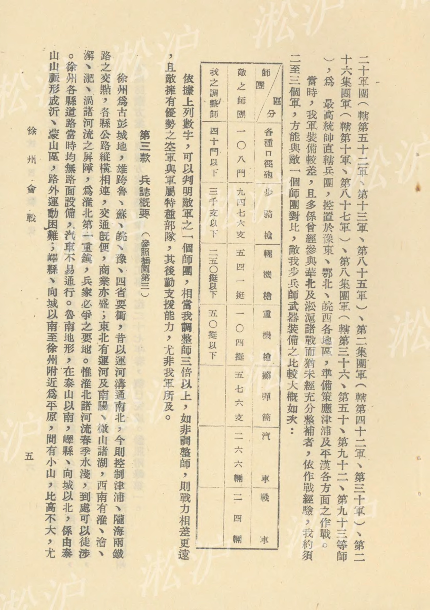

本區氣候屬大陸性，春夏多東南風，秋冬多西北風或北風，四時轉變劇烈，冬則嚴寒，雨雪連綿，堅冰載道，降水爲夏雨型，且冬年變率甚大，或遲或早，以致水旱頻仍，影響大部隊之行軍作戰甚鉅，又秋冬之交，每生濃霧，十公尺外無法展望，空軍活動、步砲射擊觀測，俱受限制。

徐州、海州爲戰略要地，在抗戰前，我參謀本部曾派員偵察，擬具防守意見，策定徐海防禦及徐州地區防禦方案，根據方案構築有徐海國防工事，迄二十七年春，概已完成。參照附錄第一。

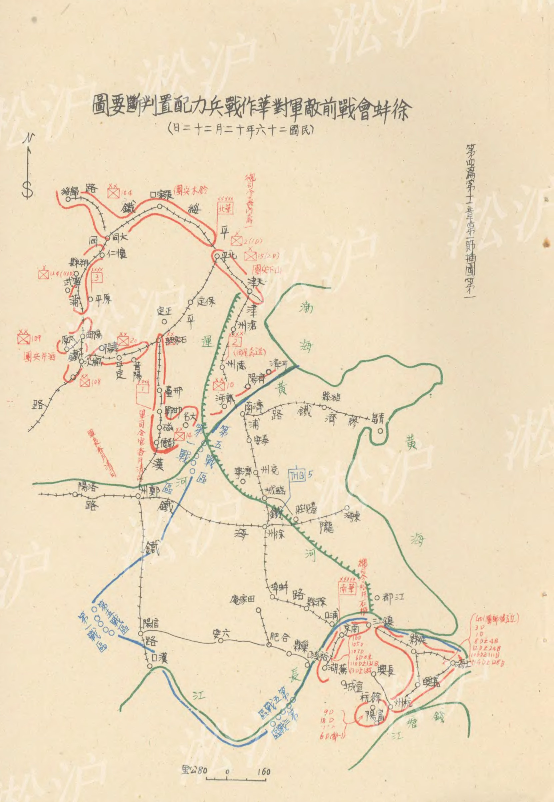

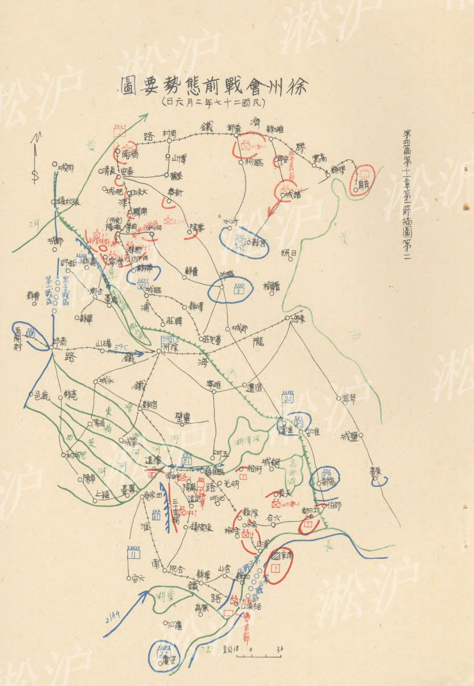

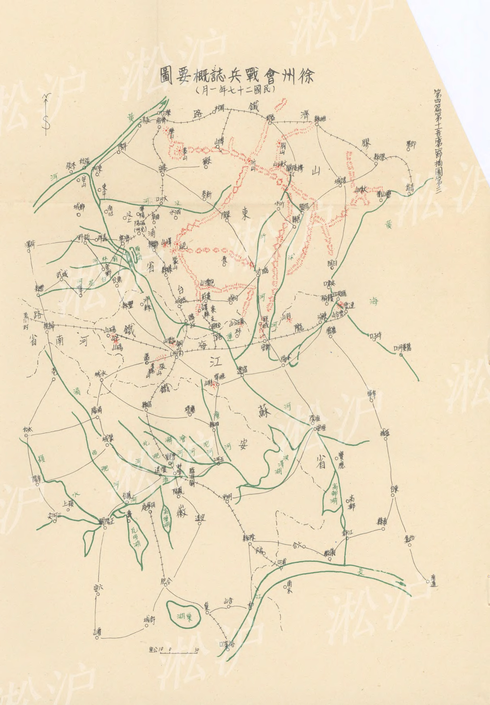

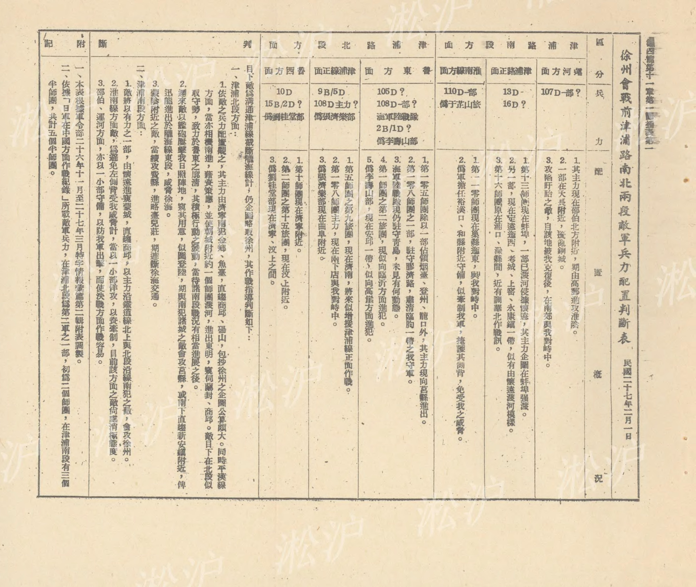

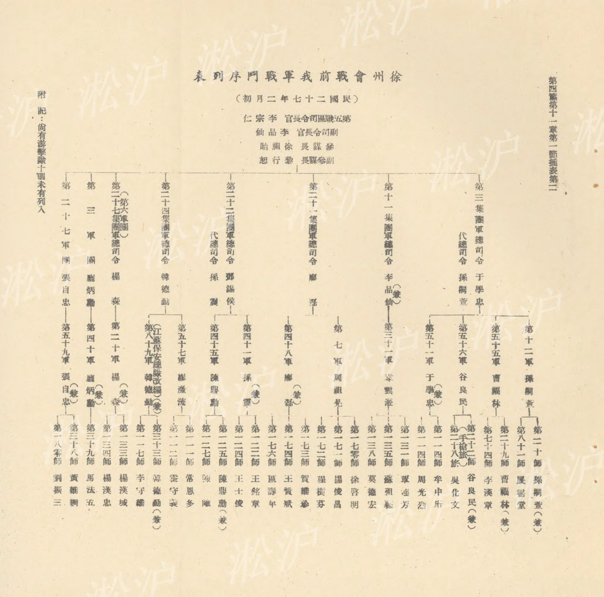

### 第二節 我軍作戰指導

(參照插圖第四第五)

我第五戰區自二十六年十月成立後，即策定作戰計畫，預定：第一時期，拒止敵由海岸或南渡黃河侵入；第二時期，在兗州（滋陽）附近與敵會戰；第三時期，在徐州附近與敵會戰。嗣因韓復渠作戰不力，擅自由濟南向魯西撤退，致預定之兗州（滋陽）會戰計畫，未能實施。我最高統帥將韓復渠正法，重申軍紀，並於二月初，令第五戰區向津浦鐵路南段、北段，採取攻勢，於是演成徐州會戰。自第五戰區成立，迄至徐州會戰開始，軍事委員會及第五戰區作戰指導之演進情形，分述如左：

#### 第一款 第五戰區作戰計畫

自民國二十六年十二月中旬，我第三集團軍退守黃河右岸後，沿津浦鐵路南下之敵，即活動於黃河左岸。平漢鐵路方面之敵，亦由大名向黃河各渡口活動。同時連雲港、青島間沿海，敵艦出沒無常。第五戰區判斷黃河沿岸之敵，似有由運河以西準備渡河，敵艦亦似有在日照、諸城向海岸登陸之企圖，遵照軍事委員會「確保魯南及蘇北與敵持久抗戰」之指示，於十月底策定作戰計畫如左：

第一方針

一、保有魯省大部，及蘇北地域，與敵行持久抗戰。

二、作戰初期，應扼守黃河及沿海要點，直接阻止敵之侵入，不得已時，亦須逐次誘敵深入於魯南及蘇北地區，準備會戰，予以極大打擊，獲得最後之勝利。

第二

指導要領

一、第一時期（阻止敵之侵入）：

守備黃河右岸之第一線兵團，直接守備黃河南岸，置重點於濟南及其以西地區，分置有力之預備隊於濟南、泰安附近，並於黃河固守河岸，不得已時，應確保直後方各要點，勿使敵擴大其區域，或威脅我主力之側背。

(二)守備海岸之第一線兵團，直接守備海岸各要點，阻止敵之登陸，並控置有力之預備隊於諸城、日照、東海間地區，以機動策應海岸直接守備部隊，挫折敵登陸之企圖。

敵已登陸時，亦須固守旣設工事線，竭力阻止敵之發展。

(三)第二線兵團位置於徐州附近，添築徐州附近國防工事，並準備利用津浦、隴海兩線，應援第一線兵團之作戰。

二、第二時期（兗州（滋陽）附近之會戰）：

(一)黃河守備兵團，如受敵由長清及其以東正面壓迫時，可向萊蕪、泰安、肥城及新泰、大汶口之地區逐次撤退，佔領要點，並在該地區以北留置多數小部隊，施行游擊，遲滯敵之南進。

前節之目的業已達成，或敵由長清西北側面壓迫時，則平陰、東阿方面，應竭力支持掩護該兵團主力向南陽湖以北運河之線撤退，整頓態勢，置重點於濟寧附近，準備會戰，同時對壽張、范縣方面，應予警戒。

(二)濟南以東之一部，不及向津浦線以西撤退者，可逐次向博山、泰山、及新泰、泗水南北一帶山地撤退，協力主力之會戰，並向敵側擊。

(三)敵主力於海岸上陸，或黃河守備兵團向泰安以南撤退時，海岸守備兵團之主力，應逐次向日照、莒縣、沂水之線撤退，左翼與新泰、泗水附近之友軍連繫，掩護戰區右側。其一部，當面如無敵情，仍固守東海附近海岸。

四第一線兵團後撤時，第二線兵團卽應以有力之部隊，推進至鄒縣附近，間接支援黃河守備兵團之退却，直接阻止敵沿津浦線之南下，餘部仍控置於徐州附近。

(五)兗州（滋陽）附近之會戰，我以鄒縣、濟寧兩兵團，及泗水、新泰附近之游擊部隊，相互策應，以外線態勢，保持重點於左，對南進之敵，施以猛烈反攻。

三、第三時期（徐州附近之會戰）：

(一)兗州附近之會戰，萬一不利，敵由運河之線突出南陽湖以西平地時，或敵由海岸向西强壓，逾贛榆之線西進時，或敵由運河以西地區渡過黃河時，本戰區所屬各兵團應如左行動：

1. 運河沿線兵團，一部退至歸德（商邱）固守，掩護戰區之左翼，主力集結於微山湖西側地區，準備向西南進出。

2. 津浦路正面兵團，退至徐州西南蕭縣與津浦路間地區，準備向西北及東北進出。

3. 新泰、泗水附近部隊，退至嶧縣、費縣間山地，日照、莒縣、沂水附近部隊，應退至臨沂附近，東海方面部隊，退至隴海路以南沭陽、宿遷間地區，準備對北方進出，不得已時，可撤至運河西岸，阻止敵之進出。

4. 以控置於徐州之一個師，配合地方軍警，固守徐州城廓。

(二)徐州之會戰，以極少數部隊據守核心，以戰區全力之大部，如(一)所示行動，發揮游擊戰之威力。四、敵如由津浦南段北攻時，則以新屬於本戰區之兵團，於浦口、滁縣、明光等處，逐次抵抗，求得時間之餘裕，最後於臨淮關以西淮河之線，竭力拒止該敵，俟北方之會戰成功後，再轉移兵力擊滅之五、戰區司令長官部，於第一、第二兩期作戰時，均位置於徐州，第三期作戰時，設戰鬥指揮所於宿縣抗

月

戰

史

一〇

司令長官

李宗仁

上項計畫，經呈報核定，於十二月七日下達作命第一號命令，要旨如次（參照第四插圖）：

一、戰區爲確保山東要地之目的，以現在前方部隊，直接守備東海、青島及膠東半島各海岸，沿黃河阻止由津浦北段南下之敵，以後方部隊，集結於徐州、商邱一帶，準備策應。

二、各兵團之部署概要如左

第三軍團（第四十軍並指揮砲兵第六團），右翼連絡第三戰區，守備由舊黃河口亘連雲港至夾倉口之海岸，置主力於東海、連雲港之間，阻止敵之登陸，其司令部位於東海。

青島守備隊及第三艦隊，守備青島，拒止敵之登陸。第五十一軍右翼連繫第三軍團，守備夾倉口至青島間之海岸，及膠濟鐵路東段，北至羊角溝，拒止敵之登陸，以一師位置於日照、莒縣、諸城間，另以一師控置於膠縣、高密、濰縣間，以膠縣之一部協助青島之守備，其司令部位置於諸城，設指揮所於高密，其烟台方面之守備，由羊角溝以東膠東半島所屬各縣之保安隊及地方武力擔任之，歸第五十一軍指揮。

第三集團軍（第十二、第五十五、第五十六軍，砲兵第一、第二團、重迫擊砲團，並指揮砲兵第一旅第一團，山東省保安司令部），右翼連繫第五十一軍，於靑城至張秋鎮間之黃河南岸佔領陣地，其配置濟陽以東一旅，濟陽至長清間一師，長清至平陰間一師，平陰以西一旅，其餘爲預備隊，控置於濟南、泰安、滋陽（兗州）、濟寧、鉅野、鄆城之間，並派遣有力之支隊及游擊部隊，於黃河以北廣行搜索及襲擊，以防敵之渡河，其司令部位置於泰安，設指揮所於濟南。

第十一集團軍（第三十一軍、砲兵第十五團），以一師位置於商邱、碭山間，一師位置於柳泉、利四、司令長官部現在徐州。

#### 第二款 第五戰區部署之變更

十二月中旬，陷南京之敵，强渡長江後，以主力沿津浦鐵路北上，已佔領烏衣以南地區。黃河左岸之敵更形活動，似有乘勢渡河攻擊模樣。戰區因情況變化，重新部署，於十二月十四日，下達作命第二號命令，要旨如左：

一、戰區擬以一部仍守備海岸及黃河沿岸，以大部轉移於淮河之線，拒止北上之敵，相機轉移攻勢。二、第三集團軍（欠第五十一軍及砲兵第一團），以主力（約三師）配備於濟陽、東阿、泰安、沿黃河右岸設防，以餘部配備於鄆城、嘉祥、濟寧、鉅野間地區，置重點於平陰、東阿、鄆城方面，沿黃河南岸構築工事，對范縣以東河岸，竭力拒止敵之渡河，以鞏固本戰區之北面。青島附近，仍由青島守備隊及第三艦隊守備，膠東半島各要點，仍由地方團隊守備，均歸第三集團軍沈鴻烈副總司令指揮之。

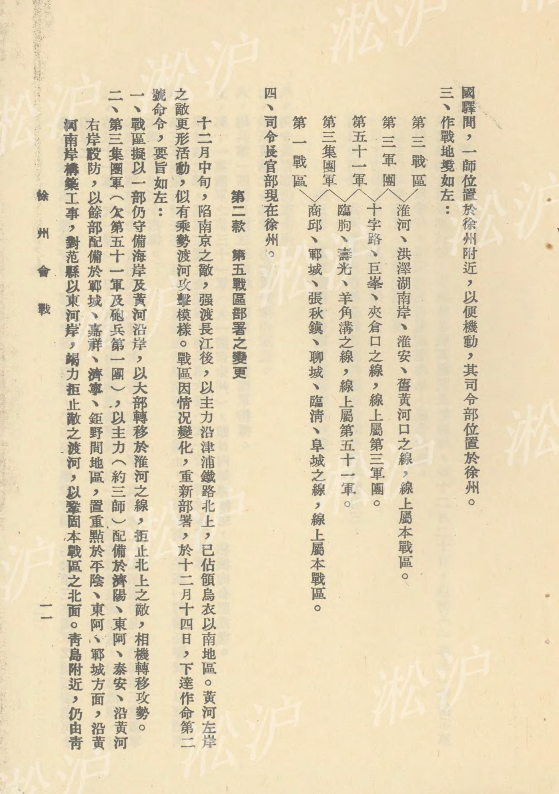

三、第五十一軍（欠一團），卽日以主力由膠濟鐵路東段，以一部由隴海鐵路東段輸送，向臨淮關、蚌埠間地區轉進待命。着砲兵第六團（欠一營）配屬該軍，其所欠之一團留置靑島，仍歸第三集團軍沈鴻烈副總司令指揮。

四、第三軍團服行前任務，但其右翼縮短防線至埒子口爲止，日照方面，酌派一部擔任警戒，以海頭至黑林鎮之線，爲其左翼之掩護線，砲兵第六團（欠一營）暫脫離其指揮。

五、第十一集團軍之第三十一軍（欠一團留徐州），卽日向蚌埠輸送，相機向合肥推進。

六、砲兵第一團卽日輸送至蚌埠，歸第十一集團軍指揮。

七、戰區直轄之各部隊，仍位置於徐州附近。

八、司令長官部仍在徐州。

#### 第三款 軍事委員會哥電及戰區修正計畫

南京失陷後，我軍事委員會依全般狀況判斷此後敵可能行動有三：

(一)以主力略取廣州及其鄰近諸省。

(二)以主力略取南昌，相機進窺武漢。

(三)以主力略取徐州，溝通津浦路窺伺隴海路，威脅武漢。

我爲發動全面長期抗戰，復調整各戰區範圍及根據地，於十二月二十日，以哥（一作元）電指示第五戰區，要旨如次：

一、戰區範圍及根據地如次：

(一)戰區範圍：第五戰區南界自長江口沿長江至湖北陽邏止，西南自陽邏至禮山沿豫鄂邊境迄吳山鎮，東北自黃河口沿黃河至蘭封、陳留、鄢陵、郾城、沁陽至吳山鎮，與第一戰區爲界。

(二)根據地：第五戰區爲泰安、魯南間山地，及豫皖邊境固始、立煌、經扶間山地。

二、此次戰爭，敵企圖速戰速決，其攻擊在點與線之略取，我須採全面抵抗，使敵消耗疲憊。所有各戰區之軍隊，及行政、黨務各機關，應在原戰區內盡力活動，無論情形如何變化，均不得離開原戰區三、我爲長期抗戰，應一面於交通要線上，縱深配備有力部隊，增加抵抗力，一面於廣大地域行游擊戰四、各戰區於指定根據地，應先派遣幹部視察地形，構築工事，集積糧彈，設備連絡方法，以期隨時能獨立作戰。

此際，在江北之第二十四集團軍、第六軍團及第二十二集團軍，均已奉令歸入戰區序列。又黃河左岸之敵，亦已渡河南攻，卽遵照咎電，並依狀況，修正作戰計畫如左：

第一方針

戰區爲阻止侵入之敵，粉碎其打通津浦鐵路線之企圖，將區內國軍配合地方武力，並用剛性及柔性之戰法，展開全面作戰，同時堅固保有泰安、魯南間，及固始、立煌、經扶間兩山地以爲根據，與敵持久抗戰，博取最後之勝利。

第二

指導要領

一、第一分區，北憑黃河天險，並依托泰山山脈，於濟南、泰安間沿鐵路縱深配備有力部隊，阻敵前進，並於沿線兩側行游擊戰，威脅敵側背，務使敵不能越過泰安南進。同時於泰安、魯南間山地構成根據地，以爲本戰區北戰場挽回戰局之樞軸。

二、第二分區，於沿運河南段縱深配備有力部隊，阻敵前進，利用兩側湖沼之障礙行游擊戰，威脅敵側背。不得已時，主力退入徐州西南山地間，隨時乘機出擊，挽回局勢。游擊部隊，仍在沿河活動，實行游擊。

三、第三分區，於津浦鐵路南段、淮南鐵路北段及淮河間，各以有力部隊縱深配備，阻敵前進，於兩側行游擊戰，威脅敵側背，務使敵不能深入至霍山、六安、正陽關、穎上、阜陽之線，同時於固始、立煌、經扶間山地構成根據地，以爲戰區南戰場挽回戰局之樞軸。

四、青島守備隊，於敵侵青島附近時，卽於膠東半島南部施行游擊，牽制敵人西進或南進。

五、東海守備隊，於敵登陸後，在隴海鐵路東段縱深配備有力部隊，阻敵西進，並於兩側行游擊戰，威脅敵側背，務使敵不能深入運河以西。不得已時，主力退入北根據地山地，乘機出擊，挽回局勢。

游擊部隊仍在敵兩側活動，實行游擊。

六、於碭山、商邱間，控置有力部隊，主對大名以南各渡口，掩護戰區之左側背，並準備機動，策應第一、第三分區之作戰。

第三戰區劃分及部隊之新部署

一、山東全省（除青島市區）爲第一分區，以第三集團軍爲基幹，扼守魯省境內黃河南岸，並對龍口以西之海岸施行警戒，置主力於濟南、泰安之間。

二、江蘇全省（除江南）爲第二分區，以第二十四集團軍爲基幹，置主力於淮陰以南之運河區域。

三、安徽全省（除江南）爲第三分區，以第十一集團軍爲基幹（附第六軍團及第五十一軍），置主力於淮南之津浦線上及其兩側地區。

四、河南及湖北之各一部爲第四分區，暫不派基幹部隊。

五、海軍陸戰隊爲靑島守備隊。第三軍團爲東海守備隊。

六、第二十二集團軍爲戰區預備隊，位置於蘇豫魯邊境。

戰區修正計畫後，卽於十二月二十四日，依新計畫下達要旨命令、作戰區劃分及部隊之新部署，並飭：

(一)第一、二、三分區應遵照軍事委員會咎電之指示，本戰區內與所在地政府及黨部協力組織民衆，發揮游擊戰，雖受敵壓迫，亦不得退出分區境界。

(二)山東境內之根據地，由第三集團軍派員偵察設計，豫皖邊區之根據地，由第十一集團軍派員偵察設計，並由戰區司令長官部派員協助。

#### 第四款 蔣委員長之訓示與處置

民國二十七年一月初旬，黃河左岸渡河南進之敵，至一月十一日，已侵佔濟寧。

我最高統帥蔣委員長親蒞前線，召集第一、第五兩戰區團長以上訓話，其要旨：

一現在我軍戰略，就是東面要保持津浦鐵路，北面要保持道清鐵路，來鞏固武漢核心基礎，津浦、道清兩鐵路，無論如何，要抵死固守，決不容敵人進佔。我軍要鞏固這兩條鐵路，一定不要呆守，必須積極對威脅我軍之敵採取攻勢，必須時刻保持主動地位，來攻擊敵人。尤應發揮我軍主動攻擊精神，配合各種有效戰術，攻守自如，陷敵人於被動，如此我軍纔能固守，纔能藉津浦、道清兩鐵路來屏障武漢，武漢重心不致動搖」。

一月十三日又對第五戰區將士訓話如左：

一、國軍以確保武漢核心爲目的，以一部固守武漢，以主力分別集結於魯西、徐蚌、與鄂東南、及湘東北地區與各線區游擊配合，期對深入腹地之敵，一舉殲滅之。

我軍戰法，應於硬性之外，參以柔性，務在交通要線上，配置有力部隊，使任正面阻止戰鬥，同時以軍隊聯合有組織訓練之民衆，施行游擊，以牽制破壞敵之後方，前呼後應，敵如攻我正面，則游擊隊由各方進攻；敵如攻游擊隊，則不與決戰，以收長期抗戰之效。

二、津浦線之敵，各方均不過數千人，我第五戰區現有兵力，何只七、八萬，敵竟敢任意橫行，實緣其素以蹈瑕抵隙爲能事，以圖乘我弱點各個擊破，我軍如能合力同心，一致殺敵，則敵決不敢貿然深入，如其深入，亦必遭最大之打擊，須知保國衛民爲軍人之天職，論功行賞，尤國家之經常，況社會公論於現在，歷史評隱於將來，絲毫不能假借，諸將士或久任封疆，或新膺重寄，均應上對國家，下對民衆，前對祖宗，後對子孫，毋忝厥職，務盡最大之努力，以爭取最後之勝利，使所部軍隊與本身事業，均增不朽之光榮，抑國家勝利之爭取，在於抗戰之持久；各軍抗戰之結果，不在現時之成敗，果其能戰，則現在縱受較大之損失，終能獲得最後之成功，如或不戰而退，則我國土地，縱橫雖大，終有窮時，現在雖無顯著之失敗，將來終歸無形之潰退，轉爲千古罪人，貽害後世，故就各軍言，敗亦應戰，不戰亦敗，就國軍言，不戰必敗，戰則必勝，此諸戰士所宜深切體念，而曉然於其間之利害得失者也。

一月二十日，謀知敵御前會議決議對我用兵積極進行，同時津浦南段之敵已向北進攻，我軍事委員會判斷敵軍將打通津浦路，略取徐州，爲時迫切。一月二十三日，令第五戰區：對於由津浦南段前進之敵，須固守徐蚌兩要地，非有命令不得撤退。二十四日復將作戰不力之韓復渠明正典刑，整肅軍紀，並任于學忠爲第三集團軍總司令，孫桐萱副之，以準備爾後之作戰。

#### 第五款 第五戰區攻擊部署

二月初，津浦南段敵主力向定遠，一部沿鐵路積極向我攻擊。我最高統帥令第二十一集團軍及第五十九軍歸第五戰區指揮。該戰區爲達成確保徐蚌兩要地之任務，適應狀況，重新部署，於二月三日，下達作命第三號命令，要旨如左：參照插圖第四第五一、戰區決對津浦南段之敵，拒止於淮水以南地區，由其側方連續予以打擊，漸次驅除肅清之。同時鞏固魯南山地。對津浦北段及隴海東段，取側擊之勢，牽制敵之南下或西上，以拱衛徐州。

與第一戰區之作戰地境爲郾城、周家口、鹿邑、商邱、城武、鄆城、張秋鎮及運河之線，線上屬第一戰區。

二、野戰軍區分運用如下：

(一)第十一集團軍爲第一野戰兵團，位置於定遠西方三十里舖至淮河南岸之間，向臨淮關、蚌埠敵之側背威脅，以牽制其渡河。第二十一集團軍爲第四野戰兵團，在合肥、張橋鎮一帶集結後，向含山、全椒前進，側擊津浦南段之敵。第六軍團及皖保安第三、第四團，歸楊森軍長指揮，爲第三野戰兵團，位置於安慶以東，任安慶及其附近江面之守備，並在安慶、廬江、無爲間地區游擊。

于學忠總司令指揮第五十一軍爲第二野戰兵團，於淮河北岸佈防，阻止敵之北犯。以上各部概歸李品仙副司令長官指揮。

(二)第二十二集團軍爲第五野戰兵團，由滕縣附近分途向北游擊，相機規復鄒縣。

三、按戰區形勢，劃爲四個游擊區，應配備之基幹部隊及其任務如下：

(一)第一游擊區，以第二十四集團軍之第五十七軍（欠一師）及第八十九軍（即江蘇保安總隊）爲基幹，位置淮陰及其以南地區，向津浦、隴海、江岸之敵游擊，另以第一一二師任東海沿岸之守備(二)第二游擊區，以第三軍團長龐炳勳指揮所部及海軍陸戰隊爲基幹，位置於魯南山地，向津浦、膠濟、隴海及魯東南海岸之敵游擊。

(三)第三游擊區，由第三集團軍孫桐萱副總司令指揮所部第十二軍及第五十五軍，位置於魯西地區，向津浦、隴海之敵游擊，相機規復濟寧，以爲北進之根據。

(四)第四游擊區，以在皖北之保安隊及在該區內宋世科、孫伯文、季光恩等游擊部隊爲基幹，歸李品仙副司令長官指揮，截斷津浦南段，以阻止敵之增援。

四、第五十九軍卽向宿縣輸送，集結該地待命。

上項命令下達後，續奉最高統帥支未電令：第三集團軍之第十二軍、第五十五軍，迅向津浦北段濟寧以北採取攻勢。戰區遵於二月六日下達電令，要旨如次：

一、第三集團軍（欠第五十一軍），由孫桐萱代行總司令職權，以主力向濟寧攻擊，以一部由開河鎮附近，迂迴攻擊濟寧。

二、第二十二集團軍，主力向鄒縣，一部迂迴曲阜、鄒縣間攻擊，另以一部控置於臨城、韓莊間。

三、第三軍團在臨沂附近，配合該方面地方部隊，各以一部奪取蒙陰、泗水後，向泰安、大汶口間及南驛、曲阜間之敵威脅，對日照、莒縣、沂水北方要隘，派一部與海軍陸戰隊聯合扼守。

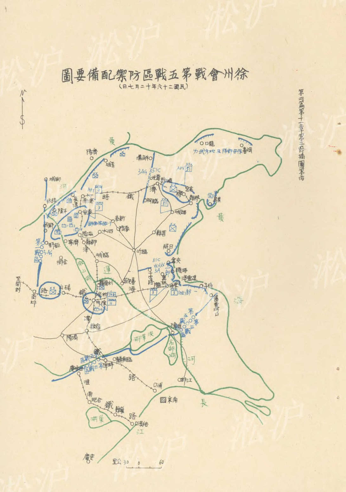

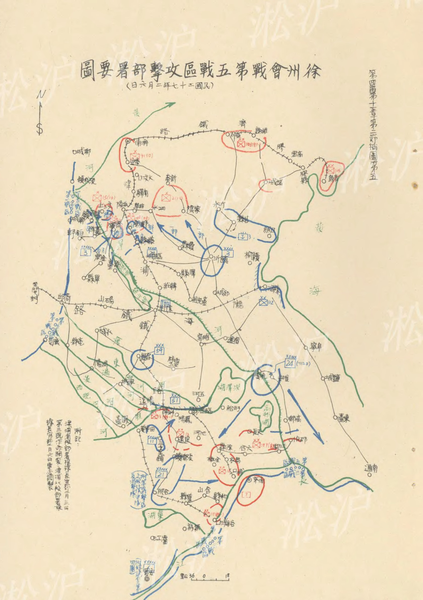

### 第三節 會戰一般經過

民國二十七年二月三日至五月二十八日

參照插圖第六至第十插表第三至第十一

徐州會戰一般經過，可分爲四個時期。自二月三日至三月初，津浦南北兩段之守勢與攻勢，爲第一時期；三月初至四月七日，臨沂及台兒莊之戰鬥，爲第二時期；四月八日至五月二日，反撲嶧縣東南地區之戰鬥，爲第三時期；五月三日至二十八日，戰地之轉移，爲第四時期。茲分述於以下各款：

第一款

第一時期（津浦南北兩段守勢與攻勢）

民國二十七年二月三日至三月二日

參照插圖第六插表第三第四

第五戰區爲確保徐州，屏障武漢，於二月三日下達作命第三號命令：以第十一集團軍向臨淮關、蚌埠之敵側擊，第二十一集團軍向含山、全椒之敵側擊，第六軍團任安慶以東地區之游擊，第五十一軍於淮河左岸佔領陣地，阻敵北進；第二十二集團軍，由滕縣分途向北游擊，相機規復鄒縣；並區分全戰區爲四個游擊區，實施全面游擊；以第五十九軍集結宿縣待命。

二月六日，第五戰區遵照最高統帥「支未」電指示，電令第三集團軍以主力向濟寧攻擊，一部由開河鎮附近迂迴攻擊濟寧；第二十二集團軍主力向鄒縣，一部迂迴曲阜、鄒縣間攻擊；第三軍團各以一部向蒙陰、泗水攻擊，並對日照、莒縣、沂水北方各要隘警戒。各兵團遵照，對津浦鐵路南北兩段之敵實施總攻，遂展開會戰序幕。

津浦南段方面：我軍正實施側擊之際，敵屢次强渡淮河，不逞。二月九日，敵以第十三師團主力，分由臨淮、蚌埠向淮河左岸强渡，與第五十一軍激戰，李品仙副長官爲策應第五十一軍之作戰，令淮南第三十一軍、第二十一集團軍向池河、定遠、考城、上窯、懷遠之敵側擊。第五十九軍亦奉令南移，向固鎮增援，歸于學忠總司令指揮。十日，第五十一軍小蚌埠一帶防線被敵突破，被迫向澹河、澥河左岸轉移。十二日，第五十九軍到達固鎮佔領陣地。此時，淮南第二十一集團軍正準備出擊中；第三十一軍在考城、上窯一帶與敵戰鬥甚烈，上窯之敵，被我包圍；第二十一集團軍之第七軍，亦向定遠東方之敵側擊；敵受淮南我軍壓迫，其進出淮河左岸之敵，分兵回援，第三十一軍乃撤至窯河右岸，第七軍撤回定遠以西固守。第五十九軍、第五十一軍乘機轉移攻勢，至十六日，恢復淮河左岸陣地，以後敵我成對峙狀態。

蘇北方面：第二十四集團軍第一一一師向津浦路南段游擊，曾突入明光及溪河集街內。第八十九軍（江蘇省保安總隊改編）曾一度收復六合縣城，並衝入來安城內。

津浦北段方面：第二十二集團軍於十四日開始攻擊，第一二五師主力將兩下店之敵包圍，一部曾迫近鄒縣北關，第一二七師已進出鄒縣、曲阜間之鍋城，與敵激戰，旋敵增援反攻，我於十九日撤回界河之線。第三軍團於十六日開始攻擊，第一一七旅曾一度佔領泗水南關及蒙陰東關，時敵第五師團一部，由益都南進，於十九日攻陷穆陵關，同時另一部由安邱會同劉桂堂僞軍攻陷諸城、日照、招賢鎮各要點，莒縣、沂水方面，突告吃緊，李長官遂令第三軍團主力轉用於莒、沂方面，阻止敵之南進。第三集團軍於十二日夜開始攻擊，第十二軍第二十二師佔領濟寧北關，一部衝入城內，第五十五軍一部，同時向濟寧西南關攻擊，未有進展，第八十一師亦曾一度攻入汶上城內，旋敵增援反攻，至十九日被迫撤回運河西岸防守。二十日，敵第十師團大部突過運河西岸，向魯西進犯，在安居鎮一帶與第三集團軍激戰。此時我最高統帥見津浦南段敵攻勢已呈頓挫；判斷津浦北段之敵，似僅能以濟南、泰安之控置部隊，策應鄒縣、濟寧、汶上之戰鬥；而我各方攻擊部隊，應乘此時機擴大攻勢，當令第二十軍團以第一一零師推進蒙城，另以一部集結壽縣待命。二十一日，魯西之敵，突破第三集團軍安居鎮陣地，繼續西進，最高統帥訓令李長官，並飭第三集團軍：此後應避免攻堅，惟取監視與游擊之手段，以牽制敵軍。

二十二日，敵續突破第三集團軍唐家口一帶陣地，最高統帥乃調第五十九軍北上，所遺淮河左岸防務，以第五十一軍接替；並於二十四日電示李長官：第五十九軍此時若能沿津浦路及其以東山地間向西北進出，不僅可挫魯西、魯東敵焰，並可誘起全軍之北進。二十五日，敵續攻陷嘉祥，第三集團軍向金鄉、鉅野之線轉移。二十七日，李長官爲鞏固魯西，決由津浦正面反攻，遂令第二十二集團軍以一部向泗水、曲阜、鄒縣，主力向兩下店之敵攻擊，牽制敵之西進；第五十九軍歸第二十二集團軍指揮，以一部控置該集團軍作戰地境內，一部向鄒縣、兗州方面佯攻，另以有力一部向濟寧、兗州間襲擊，協助第三集團軍作戰。迄三月一日，第五十九軍已集結滕縣以西地區，預定三日開始攻擊，適魯東方面穆陵關、招賢鎮之敵，先後攻陷莒縣、沂水，沿台灘公路向臨沂進逼；同時，魯西方面嘉祥之敵，亦有撤回濟寧之徵候；我最高統帥以「東申」電令第五戰區：不宜以第五十九軍單獨向濟寧進攻，致遭逐次消耗之不利，應以主力集結鐵路以東山地，伺敵西進或南進時，以全力側擊之。李長官復於三月五日，令第五十九軍停止攻擊，解除第二十二集團軍之指揮，轉調臨沂方面，並派徐祖貽參謀長往臨沂指導第三軍團及第五十九軍之作戰。

此際，第二戰區方面之敵，正沿汾河及垣曲向晉南攻擊。第一戰區程潛司令長官曾於三月二日以冬午電具申意見如下：

(一)第五戰區之敵，其津浦路南段受我軍强大牽制，尚無進展。北段濟寧方面，我第三集團軍相持甚久，我居劣勢。第二戰區之敵已沿汾河及垣曲合進，敵優我細。

(二)統度全局，倘敵將晉南吞併，必轉力南渡，爾時濟寧之敵，傾力西進，不僅徐海孤，卽隴海正面東西同時受威脅，應付殊感困難，職再三思慮，趁此時機，以湯軍團五師之衆，會合第三集團軍及張自忠軍，立向濟寧，將津浦北段之敵擊破之，則立振津浦北段我軍之勢，亦可稍掃魯南北顧之憂，此時，敵縱增援，我已立於主動地位，不難將敵擊破。爾後審察機宜，再對晉南之敵，確求內線作戰之成功，以目前形勢，倘我稍一遲誤，敵卽全盤活動，爾時必節節受其威脅，謹抒所見，如蒙採納，則職立卽調湯軍團實施。

此項意見，最高統帥在原則上予以同意。

本時期判斷津浦南段之敵，爲四個師團兵力，與會戰前無增減。津浦北段之敵，僅有三個師團，我軍則與會戰前無異。敵之兵力配備與判斷，與我軍指揮系統如插表第三、第四。

第二款

第二時期（臨沂及臺兒莊之戰鬥）

民國二十七年三月二日至四月七日

參照插圖第六、第七插表第五第六

津浦南段之敵，憑淮河與我對峙。津浦北段之敵，一路由魯東沿台灘公路向臨沂，一路沿鐵路突破滕縣向台兒莊猛進。

由魯東沿台灘公路向臨沂南進之敵，係以第五師團之第九旅團爲基幹，三月初，已進到沂河左岸地區。我最高統帥電令第三軍團：「對臨沂東北之敵，須將其誘至適當地點殲滅之，臨沂城絕對不能放棄，在援軍未到前，正面必須固守」。十日，第五十九軍到達臨沂。十二日以前，最高統帥迭令李長官轉飭第五十九軍與第三軍團協力殲滅深入之敵，並迅速行動，於擊滅沂河方面敵人後，北向蒙陰、泗水方面移動，至海軍陸戰隊勿使用於正面作戰，應以破壞膠濟路掃蕩膠東僞組織爲主任務。

李長官遵飭海軍陸戰隊向膠濟路南北地區游擊。派赴臨沂指導作戰之徐參謀長，爲恢復莒、沂確保魯南之目的，以司令長官名義下達第四號作戰命令，其要旨如左：

一、第五十九軍，先以有力一部確佔茶葉山高地（臨沂西北），爲左翼據點，向臨沂東北分途側擊，以牽制該敵向南增援，主力由船流附近分途渡河，與第三軍團呼應，包圍敵之主力，殲滅於相公廟、停子頭以南地區。

二、第三軍團主力，於沂河左岸，與第五十九軍相呼應，包圍殲滅敵之主力；一部於沂河右岸，連繫第五十九軍右翼，渡河側擊敵人。

各部依照命令，於三月十四日開始行動，第三軍團由南向北攻擊，第五十九軍於沂河右岸，分由船流附近渡河，由北向南攻擊，迭次克復要點。十五日，敵一部强渡沂河右岸，曾一度侵入茶葉山，經第五十九軍第三十八師在茶葉山之東南一帶阻擊，激戰至十八日夜，敵不支，全線向東北之湯頭退却。十九日，第五十九軍跟踪追擊。

鐵路正面之敵，以第十師團爲基幹，於三月十四日，分三路向第二十二集團軍進攻，一路由鐵路正面，一路由鐵路東側向滕縣迂迴，一路由西側迂迴深入我界河陣地後方，滕縣、界河間連絡當日被切斷。我最高統帥已令第二十軍團湯恩伯軍團長先率第八十五軍進抵臨城，歸李長官指揮，第五十二軍向商邱，第一一零師向蒙城集結待命。十五日，界河陣地被敵突破。十六日，我最高統帥令李長官以第二十軍團推進津浦北段，相機向當面之敵出擊，李長官當令湯軍團長遵照。是日，敵團攻滕縣，並有約一旅團兵力已越滕縣南進，湯軍團長乃令第八十九師之一旅，佔領官橋正面陣地，主力集結臨城東北山口、鳳凰莊一帶，準備側擊南下之敵。十七日，滕縣失守，我守城之第一二二師王銘章師長率部力戰，與城同亡。第二十二集團軍其餘各部隊，向運河之線撤退。第五十二軍奉命由商邱調至韓莊，歸還第二十軍團建制。敵陷滕縣後，以主力約六千人，沿鐵路正面前進，第八十九師官橋陣地被陷。敵另一部向臨城迂迴，湯軍團長令第八十九師逐漸轉移至臨城東南高地，掩護第五十二軍集中。是晚，第五十二軍第二師一旅到達臨城南之沙溝佔領陣地。十八日，我最高統帥電令湯軍團長：對於臨城及其以東高地應予確保，第五十二軍略行集中後，由右翼轉移攻勢。並令第三集團軍，速派有力部隊，由濟寧兩側進出，向界河方面襲敵側背，惟須避免向濟寧及兗州城攻擊。第三集團軍遵卽派遣部隊，預定於翌日開始行動。是日，敵續分向第八十九師臨城東南之西固山及第二師沙溝陣地攻擊，兩陣地均被突破。時第五十二軍全部到達，湯軍團長卽以第五十二軍在韓莊、台兒莊間沿運河配備，以第八十五軍東進佔領嶧縣東北及西南一帶高地，準備截擊敵人。十九日，敵續以主力陷我嶧縣，另一部沿鐵路進至韓莊，企圖强渡運河，被第五十二軍擊退。同日，最高統帥令第二集團軍以兩師進至商邱，一師又一旅集中徐州待命；並令李長官：「對臨沂方面我追擊軍，務於莒縣、沂水以南地區，將敵捕捉殲滅，以便適時抽出兵力，協助鐵路正面之作戰」。此時李長官建議「徐州爲戰略要地，敵勢必攻佔，其後續亦必尙有部隊，我以第二十軍團與敵在運河相持成陣地戰，殊非得計，應再調精兵三個師到徐，以便轉移攻勢」。白崇禧副參謀總長亦建議「對於保衛徐州之意見，以爲臨沂雖大捷，而臨城忽失陷，敵欲奪取徐州，必利用交通增兵，今爲確保徐州計，似應另抽部隊策應，或先調第二集團軍孫連仲部，同時並以空軍炸黃河鐵橋以斷其交通，另一部則以壓制敵機，然後以優勢兵力，規後臨城，以收速效，而策萬全」。

三月二十日，李長官依目前狀況，令第三集團軍由嘉祥方面反攻，其東進部隊，務努力截斷敵之交通；駐蒙城之第一一零師速調徐州，至韓莊對岸，準備俟第五十二軍轉移東向及第二十二集團軍收容整頓完竣，將守地交與第二十二集團軍負責後，控置於賈汪東側地區；第二十二集團軍退集微山湖東南側整理，繼續準備進至韓莊接替第一一零師防務。同日，我最高統帥參酌白副參謀總長之意見具申；「擬以第二集團軍控置於徐州西北九里山至微山湖中間地區，以第二十軍團重點移至韓莊東南，誘敵深入由東西兩面夾擊之」。遂決心包圍敵於微山湖畔而予以殲滅，並先後於二十、二十一兩日電令指導李長官攻擊部署，其電令要旨如左：

一、對津浦北段輕舉暴進之敵，决包圍於微山湖畔殲滅之。

二、第二十軍團進出運河後，以約兩師對嶧縣方面佯攻，以三師由嶧縣以東梯次迂迴，求滕縣以南亘嶧縣間敵之側背攻擊之。

三、第一一零師及獨立第四十四旅歸孫總司令指揮，守備運河。

四、第二集團軍兩師集結徐州待機。

五、第五十九軍除以主力仍須與第三軍團協力肅清臨沂當面殘敵外，以約三至四團經泗水進出曲阜方面，牽制敵人。

六、第三集團軍出擊部隊除以主力向鄒縣、兩下店間地區挺進外，另以兩團由汶上方面向肥城、大汶口挺進游擊，限二十六日前到達，准予懸賞，萬一敵有增援部隊，由濟寧出擊時，除守勢部隊竭力阻止外，其出擊部隊仍須在鐵路線上游擊，不得撤回運河西岸。

七、沈主席所部須全力擾襲敵後方，使我主作戰有利。

復於二十二日再電令李長官，其要旨如左：

一、對津浦路正面之敵，決以湯軍團及孫集團之一部圍攻之。

二、在決戰以前，萬一敵增加兵力由濟寧方面進犯時，除令第三集團軍在運河西岸部隊死守待援外，第五戰區應準備以第二集團軍之兩師由微山湖以西，向第三集團軍右翼進出，第一戰區應準備以劉汝明、李必蕃兩師由黃河以南地區向第三集團軍左翼進出，與第三集團軍確切協力夾擊突擊之敵。

三、第二十軍團後方，應在徐州以東適當選擇位置，以備爾後補充連絡。

時臨城、嶧縣、韓莊間之敵，約步兵三個聯隊，騎砲兵各一聯隊，戰車五、六十輛，其一部在嶧縣及韓莊附近，主力在臨城。李長官原擬於二十二日實施攻擊，詞因交替運河防務需時，乃改訂二十四日晚開始攻擊，卽於是二十二日下達第五號作戰命令要旨如次：

一、戰區以收復魯中廣大地區之目的，以一部在運河之線取防禦態勢，以主力由嶧縣東南及東北山地側擊南下之敵，聚殲之於臨棗支線亘韓莊運河間地區。

二、第二十軍團（欠第一一零師）新配屬第三十一師，應集結於嶧縣東側及棗莊西北焦山頭附近一帶山地，三月二十四日拂曉，全線開始攻擊，務先擊破嶧棗之敵，向臨城沙溝附近側擊，壓迫敵於微山湖東岸而殲滅之；其一部集結台兒莊北方地區，準備對嶧縣及其西北地區，協力主力之作戰。

三、第二集團軍（欠第三十一師）新配屬第一一零師，應以一部在候新聞以西運河南岸防禦，待機渡河北進，主力控置於徐州西北賈汪附近及荆山鎮、茅村鎮間地區。

四、第五十九軍（欠第五九六旅）在費縣集結後，乘虛向滕縣南北地區，與由南陽鎮附近渡湖之第三集團軍呼應，截擊南下或北進之敵。

五、第三集團軍，應超越濟寧南北地區，再向兗州、鄒縣間及界河、官橋間，與第五十九軍及臨城以南之攻擊部隊相呼應，襲擊敵之側背，並阻止敵之增援，或截擊敵歸路。

六、第三軍團（第五十九軍之第五九六旅屬之）迅速掃蕩湯頭鎮之敵後，以一部向莒縣方向追擊，主力集結於湯頭鎮附近佈防。

二十三日，第五十九軍正向津浦路方面移動，敵乘機反攻，我第三軍團仍回臨沂附近固守。我最高統帥以臨城、嶧縣我原有之國防工事，敵可利用，爲先擊滅臨沂方面之敵，當令李長官：「第五十九軍不必向泗水、滕縣轉分兵力，應以整個軍協力第三軍團，迅速殲滅臨沂北方之敵」。李長官遂令第五十九軍仍回臨沂。同日，嶧縣敵之一部向台兒莊攻擊，經我第三十一師擊退。李長官復令孫連仲總司令赴台兒莊指揮，並飭第三十一師歸還第二集團軍建制，第二十七師開赴台兒莊集結。孫總司令卽以第三十一師仍固守台兒莊，第二十七師在台兒莊以東地區佔領陣地，第三十師仍控置荆山鎮，第一一零師及獨立第四十四旅仍任運河南岸之守備。

我最高統帥

蔣委員長二十四日蒞徐視察，指示機宜，派徐祖貽參謀長仍赴臨沂指導作戰，並指留白崇禧副參謀總長、軍令部林蔚次長、劉斐廳長、王鴻詔高級參謀等，組織臨時參謀團，在徐協助李長官策畫作戰。

是日，第二十軍團以第五十二軍向嶧縣，第八十五軍向棗莊之敵攻擊，激戰至二十七日，第八十五軍第四師攻入棗莊，敵憑中興煤礦公司堅固房屋抵抗。適於此時，敵之主力猛攻台兒莊，我第三十一師瀕於苦戰，且被敵一部攻入市區，第二集團軍孫總司令將第三十師調台兒莊方面接任河防，以第二十七師及獨立第四十四旅分向台兒莊以北鐵路兩側之敵側擊，未有進展。李長官遂令第二十軍團放棄嶧縣、棗莊攻擊計畫，以一部監視當面之敵，主力向南轉進，先協助第二集團軍殲滅台兒莊之敵。湯軍團長乃以第五十二軍由傅山口、青山一帶向南下之敵夾擊，第八十五軍以一部監視棗莊附近之敵，主力集結神山、嚮水泉一帶待命，統於二十七日晚開始行動。

此時臨沂方面，敵主力向沂河右岸轉移，對臨沂城西北攻擊甚力，李長官電令蘇北方面第五十七軍，抽調一旅前往臨沂，歸第三軍團指揮，第二十軍團派騎兵一團歸第五十九軍指揮，以阻止敵向沂河右岸發展。

三月二十八日，第一戰區程潛司令長官因第二集團軍攻擊台兒莊當面之敵未見進展，遂令第一三九師進至柳泉歸李長官指揮。嗣因臨沂吃緊，李長官乃令第一三九師增援臨沂，澈底殲滅臨沂方面之敵。時台兒莊附近之敵，佔領台兒莊北部及其以北一帶村落頑抗，第二集團軍正將該敵三面包圍，李長官於二十九日令第二十軍團：速以第八十五軍對嶧縣之敵佯攻，牽制其南下，第五十二軍向泥溝、北洛前進，另以一部向南洛協助第二集團軍解決台兒莊附近之敵，一部破壞鐵路公路，遮斷嶧縣、台兒莊間敵之連絡線」。

三月三十日，臨沂方面：第五十七軍派出第三三三旅及第二十軍團派出騎兵團，均先後到達各指示地點，第五十九軍乃開始由臨沂城西北反攻，敵不支，大部退據臨沂城西北義堂集，一部向西南向城方面前進。台兒莊方面：敵主力由嶧縣南下，一部由西北向台兒莊東側運動，另一部向台兒莊西側萬里閘附近前進，似有由兩側向第二集團軍包圍之勢。李長官乃改令第一三九師調回徐州南之韓山附近集結，爲第二集團軍總預備隊，準備迎擊由兩側渡河之敵。並爲迅速合圍殲滅敵人計，以電令：第二集團軍協同第五十二軍，速擊破當面之敵，沿臨台鐵路將敵向嶧縣壓迫；第二十軍團以第五十二軍與第二集團軍連繫，側擊敵人，亦向嶧縣前進，第八十五軍主力由東向西向棗莊、嶧縣壓迫，適時進出棗莊北方山地，以斷敵北竄之路」。

三月三十一日，向台兒莊西側萬里閘附近前進之敵，經第一一零師擊退，其在台兒莊附近者，亦經第二集團軍奪勇抵抗及第五十二軍側面壓迫，敵攻勢已呈頓挫。第二十軍團遵照第五戰區命令，第五十二軍正向台兒莊東北之敵攻擊，戰況順利。至十五時，臨沂方面之敵，一部進至愛曲附近，威脅該軍右側背，湯軍團長乃改令該軍以一部牽制台兒莊附近之敵，以主力向愛曲之敵攻擊前進。李長官以愛曲方面發生敵情，影響戰局甚大，當以「世戌」電第五十九軍張軍長「該軍兩次保全臨沂，而不能扼敵向愛曲迂迴西進，誠爲美中不足，應努力破壞敵之交通，截斷敵之退路」。並令第三三三旅對向城、愛曲之敵跟踪追擊。是日，最高統帥令第七十五軍周昺軍長率第六師及第十三師，進至徐州、碭山控置，歸李長官指揮，並指示李長官，對於台兒莊之敵務須殲滅，如兵力不足，可使用新到之增援兵力。此際，第三集團軍各挺進部隊，自三月十九日進出運河東岸以來，聯合當地民衆，施行廣大游擊與交通破壞，成績頗著。

我最高統帥四月二日綜合各方情報，得悉淮南之敵，不顧側背危險，向蚌埠集結，晉南北之敵，不惜放棄旣得地域，亦抽出兵力轉用，以圖策應魯南。特以「冬巳」電令李長官及各將領：「在此將獲全勝之現狀，務作最大努力，促成本會戰絕對勝利」。同日歸第五戰區指揮之第七十五軍第六師及第十三師、騎兵第九師、砲兵第四團，先後由隴海路運抵徐州。李長官綜合當面敵情如次：

愛曲方面之敵，已與台兒莊方面之敵會合，判斷台兒莊之敵爲第十師團及第五師團之一旅，該敵自經臨沂、台兒莊、棗莊諸戰役後，傷亡極大，現參加決戰之兵力，至多不過五個聯隊，其一部在洪山鎮北方已被我第二十軍團包圍，其主力現向台兒莊東側我第二集團軍迂迴中，濟南、大汶口、汶上、濟寧、滕縣間，爲敵另一師團及一旅團，分散守備。

由於上述狀況及最高統帥指示，第五戰區決於明三日開始全線總攻擊，保持重點於第二十軍團之右翼，將敵包圍於台兒莊北側地區而殲滅之，遂於二日下達各部隊命令，要旨如次：

一、第二十軍團，附第七十五軍之第六師、第一三九師、第三三三旅、騎兵第九師、砲兵第四團，爲右翼兵團，以一部消滅洪山鎮北方之敵，以主力保持東西正面向台兒莊附近敵之左側背攻擊，逐次向北旋迴，務在台兒莊左側地區將敵捕捉殲滅。隨戰況之進展，須隨時遮斷敵自嶧縣退却之路，並對向城方面敵人增援，嚴密警戒。

二、第二集團軍附第一一零師爲左翼兵團，右翼與第二十軍團連繫，全線反攻，消滅台兒莊附近之敵，，第一一零師準備以一旅由萬里閘附近渡河，向北洛附近敵之右側背佯攻。

三、第三集團軍前敵總司令曹福林，指揮張測民支隊五個團及游擊總指揮李明揚所部，爲堵擊兵團，迅速南下向棗莊、臨城合圍。

四、第十三師爲戰區預備隊，控置於車輛山附近。

五、第二十二集團軍將編成之部隊，推進於耿子山（新閘子山）以西運河南岸、微山湖東岸一帶，接替第一一零師河防。

四月三日，我各兵團開始總攻。堵擊兵團由官橋越過鐵路向棗莊、嶧縣挺進；左翼兵團之第二集團軍由南向北壓迫，第一一零師之一旅由新閘子渡河向獐山攻擊；右翼兵團之第七十五軍由岔河鎮向敵攻擊，第二十軍團以一部向洪山鎮北方之敵攻擊，主力由洪山鎮、大小良壁、岔河鎮之線由東向西攻擊，李長官亦親臨台兒莊督戰。時敵正面頓挫，戰車、砲兵因油彈缺乏，絕少活動，企圖由台兒莊東南黃林莊一帶强渡運河，經我擊退。

最高統帥四月四日據報，臨、棗敵人，悉調嶧縣以南增援，臨沂、費縣方面之敵，一部竄據臨沂西南之朱陳，且仍有少數部隊向台兒莊方面馳援。卽以「支巳」電前敵總司令曹福林：「速向臨棗推進，限四月五日到達」。令第五十九軍一部阻止莒、沂方面敵人前進，一部以三日期確實封鎖台兒莊、臨沂及台兒莊、費縣間之交通，保障台、嶧方面我軍徹底勝利。李長官亦令戰區預備隊第十三師星夜開四戶鎮，爲湯軍團之預備隊，湯軍團長卽令第十三師在四戶鎮佔領陣地，對東北警戒。

四月五日，李長官、白副參謀總長，顧慮決戰後，我軍損失必大，必須新部隊換防，以備隨時出擊，向軍事委員會具申意見：第四十軍約存三分之一弱，第五十九軍約存三分之一弱，第二集團軍之第二十七師、第三十一師約存三分之一，第三十師及獨第四十四旅約存三分之二，第二十軍團之第八十九師約存二分之一，第二師約存三分之二，第四師、第二十五師損耗較輕。惟至與敵決戰後，各軍之損失當更大，即使決戰勝利，亦須調後方整理，另以新部隊負前線任務，萬一戰局膠着，爲能應付敵後續部隊之增援，亦須配調新銳兵力，以爭取最後之勝利。況此次參戰各部隊，多係基幹部隊，更宜保存其元氣，使整理補充容易，短期內恢復戰力，爾後新舊交替，更番作戰，亦能達長期抗戰之目的。現魯南有利態勢之造成，爲不可多得之機會，臨沂、台兒莊兩要點，尤不可不永久確保，無論會戰之結局如何，擬請委座考慮新部隊換防準備，隨時出動，免致遺失良機」。

經奉復已有準備。蔣委員長並以手啓「微午」電令湯軍團長，應嚴督所部於六、七兩日，奮勉殲滅此敵。又以「微申」電令李長官及第一戰區程長官：「查自濟寧至東阿一段運河，在防禦時，爲對沿津浦線南下敵人最良好之側面陣地。換言之，爲阻止敵人超過運河直驅歸德，遮斷我隴海路最好之地障線。又自東明至東阿一段黃河，爲屏障敵人由范縣與濮縣兩方面渡河，直驅歸德最良之地障。以上兩段之地障線，應絕對確保。以目前之情況，似宜由第一戰區以有力部隊集結鄆城附近，乘由范縣方面敵之渡河而擊滅之，否則，任敵由該方面渡河，不僅影響第三集團軍遮斷津浦北段，後患堪慮。以上希分別研究阻止敵人偷渡方案具報」。

第一戰區程潛司令長官，以津浦北段會戰，已達決戰階段，台兒莊第一線部隊，原屬第一戰區指揮，恐李長官或存客氣，不願多所督責，特於是（五）日親臨徐州協助，並就近督促所屬參戰部隊，重申訓示，限各部隊於六日至八日三天內，務將台兒莊方面敵之主力捕捉殲滅，違則自師長以上定予嚴厲處分。

四月六日，第二十一師奉命開至徐州，歸李長官指揮，當令該師向臨沂前進，截擊臨沂方面西進之敵。此時，台兒莊附近之敵，經左右兩翼兵團連日圍攻，及曹福林軍由棗莊以北地區向南壓迫，敵第十、第五兩師團大部被我殲滅。

四月七日拂曉，殘敵紛向嶧縣退却，我最高統帥以「虞巳」電示李長官：「以損失較輕之部隊如第一一零師或第十三師，向嶧縣滕縣方面追擊，以第二十一師向臨沂方面追擊，其餘部隊於清掃戰場後，從速集結整頓，構築堅强工事」。

李長官以台兒莊方面敵雖退却，而臨沂方面之敵尚未擊潰，當令騎兵第九師進至臨沂，並飭湯軍團長以一師調臨沂，均歸第五十九軍指揮。湯軍團長遵卽令第十三師由四戶鎮向臨沂掃蕩前進。至十七時，復遵照最高統帥指示，以「虞申」電下達追擊命令，要旨如次：

一、第二十軍團以一部肅清戰場，主力向臨台支線以東，沿馬山、九山、潭山以南地區向嶧縣追擊前進二、第二集團軍並指揮第一一零師由臨台支線向嶧縣追擊前進。

三、曹福林軍應於嶧縣以北地區截擊敵人，勿使逃竄。

四、敵如退據嶧縣城，第二集團軍及第二十軍團各以一部佔領嶧縣東西兩方高地，主力協同擊滅城外敵軍，圍攻嶧縣。

五、敵如以嶧縣城爲後衛陣地，第二集團軍及第二十軍團各以一部監視之，主力尾敵窮追。

六、第二十二集團軍應由新閘子渡運河，追擊韓莊方面敵人。

七、第二十一師繼續經作城向東掃蕩臨沂以西之殘敵，向臨沂前進，到達後，歸第五十九軍張自忠軍長指揮。

同日晚，由台兒莊北退之敵，至嶧縣東南一帶山地，有據守之模樣。

李長官慮敵此後野心不死，或由魯西進窺商邱、蘭封，以遮斷隴海鐵路，曾以「虞未」電呈復軍事委員會之「微申」電令如左：

微申電奉悉。魯南會戰成功後，敵人不能逞志於徐州，以後野心不死，企圖侵魯西，以進窺歸德、蘭封必益急；一面由濟南、長清分經肥城、東平及平陰東南以威脅鉅野、鄆城，一面由道清鐵路之內黃車站，以進窺東明、董口、濮縣、范縣及壽張各渡口。查內黃至上述各渡口，不過四、五十至八十公里之距離，殊爲可慮。應如鈞示，請卽飭由第一戰區以有力部隊集結鄆城，以鞏固黃運兩河之防務。惟河川防禦，須有運動性大射程遠威力强之砲兵，以摧毀敵之渡河準備。

在本期中，蘇北方面，敵第一一六師團，於三月中旬，在沿江姚港、任港（南通南）附近登陸，向北進攻，三月十七日陷南通，十九日陷如皋，二十六日陷東台，第八十九軍第一一七師佔領東台以北地區阻敵前進。津浦南段之敵，受合肥方面我軍威脅，迄無積極行動。津浦北段之敵，經我軍攻擊後，於四月初旬，陸續由上海、平津、平綏各方面，增加第一零一師團之第一零二旅團及酒井旅團、山下旅團各一部，較第一期約增一個師團兵力。我軍亦陸續增加十三個師，一個旅。敵之兵力配備及判斷，我軍指揮系統如插表第五第六。

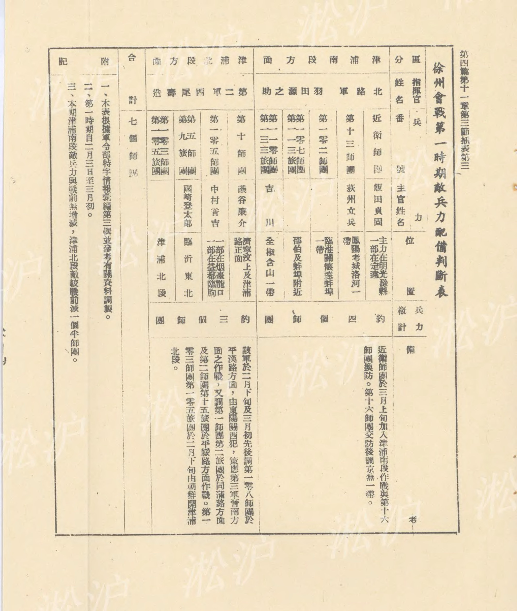

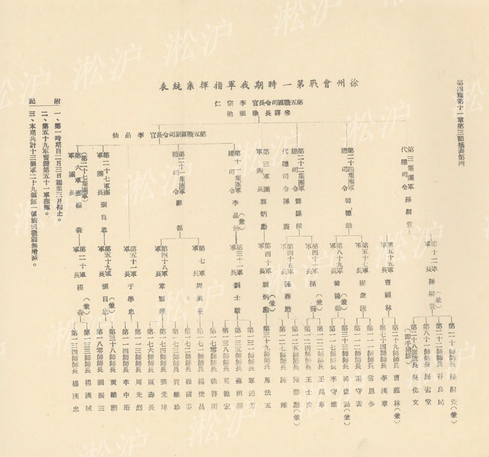

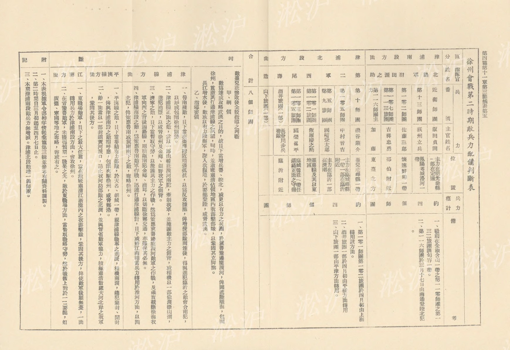

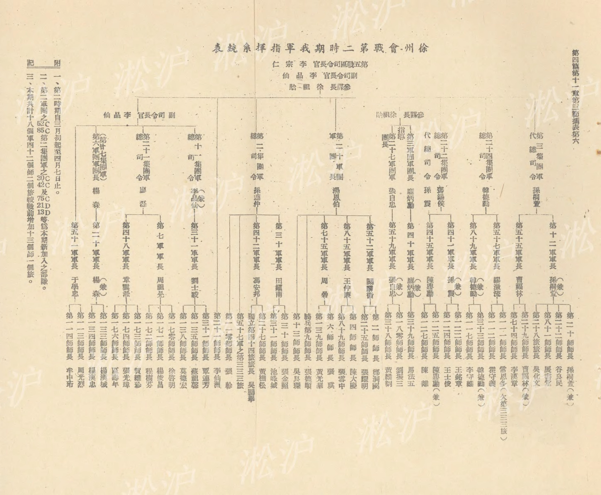

#### 第三款 第三時期（嶧縣東南地區之戰鬥）

民國二十七年四月八日至五月二日

參照插圖第六第七插表第七第八

敵於四月七日夜退嶧縣後，卽在棗莊、雙山、潭山、獐山一帶佔領陣地，以阻止我軍追擊。九日，李長官同臨時參謀團到台兒莊附近之棠棣埠指揮，當令第二十軍團於今晚襲取雙山、潭山兩要點；第二集團軍今晚襲取獐山、天柱山各要點；曹福林軍主力相機略取棗莊，並努力破壞棗莊、臨城、滕縣間交通。

四月十日，第二十軍團攻擊雙山、潭山，第二集團軍第三十師攻擊獐山，曹福林軍由棗莊以北向南壓迫，均未獲進展。是日調歸第五十九軍指揮之第十三師及騎兵第十三旅，均到達臨沂，張自忠軍長卽令該兩部協同第一八零師圍攻朱陳之敵，亦無較大進展。

軍事委員會四月十一日謀知：天津敵軍部首腦，因台兒莊失敗，連日協議，圖挽頹勢，除電其國內派援外，復抽調山西、平漢、江浙各方面敵軍增援津浦正面。當令李長官在敵援未到以前，嚴督各軍捕捉殲滅。同時，第五戰區據飛機偵察報告，敵砲兵由嶧縣向棗莊移動。又據第一一零師報告，敵大部及車輛由嶧縣向西移動。當時判斷敵將向臨城、滕縣方面退却。先是，李長官商得第一戰區程長官同意，將第九十三師調至徐州，刻已到達。李長官當卽處置如次：

一、第一一零師向南棠蔭（嶧縣西）挺進，遮斷敵由嶧縣向臨城退却之路，並跟踪追擊。

二、曹福林軍速向山口（棗莊西北）一帶挺進，遮斷敵由棗莊、嶧縣向臨城、滕縣退却之路。

三、第二十軍團繼續正面攻擊。

四、第二集團軍繼續攻擊，如敵退却，卽跟踪追擊。

五、第九十三師開赴台兒莊，歸第二集團軍指揮。

嗣後，嶧縣之敵，未見退却，我各部隊仍照命令行動。第二十軍團在平山、石門莊、九山之正面，第二集團軍在嶧縣西南一帶，第一一零師在嶧縣西之老虎山（在臥虎寨附近），曹福林軍在棗莊以北一帶繼續圍攻，至十二日，均無進展。李長官、白副參謀總長、林次長、劉廳長等，鑒於敵憑藉嶧縣附近山地防禦，我陣線過廣，處處薄弱，攻擊難以奏效，李、白以元午電呈意見「台兒莊之役，敵孤軍深入，我正面藉台兒莊爲據點與敵支持，以優勢兵力拊敵側背，在有利態勢之下，行運動戰。故得捕捉機會，擊退敵人。現敵改攻爲守，憑藉嶧寨附近山地爲據點，以棗莊爲犄角，行機動防禦。我因陣地過廣，處處薄弱，連日攻擊甚鮮成效；湯軍團攻雙山、潭山，孫集團攻天柱山、亂溝，傷亡均大，迄未奏功。十一日以來，敵主力由郭里集向湯軍團右翼迂迴，在稅郭及以東地區激戰，我第二十五、第二十一兩師傷亡過半，發電時止，仍在激戰中。無論結果如何，欲澈底消滅敵人，事實上恐難如願，若長此膠着，繼續攻堅，勢將演成陣地戰。查魯南村落，多係石質圍寨與碉樓，非步兵火器所能摧毀，我砲兵缺乏，且因砲彈及射擊技術等關係，均無攻略敵陣地之把握。第二期抗戰之方針，原在避免陣地戰，以運動戰消耗敵人之兵力，而收集小勝爲大勝之功。茲值台兒莊勝利之後，士氣未餒，擬在包圍線上，僅配置少數監視部隊，將主力分別集結於便於機動之位置，一面破壞敵後方交通，斷絕其糧彈之補給，一面以小部隊先游擊，誘敵人於陣地外求決戰，既能避免無益之消耗，又得自由活用之兵力，無論敵由何方增援，均可應付裕如。如此爲職等連日在前方實地觀察，認爲迅宜改用之戰法原則，如蒙裁可，擬卽相機實施，乞示遵。林、劉亦於十四日九時電呈意見「台兒莊之敵，於七日退却後，所有戰況已由長官部按日報告。綜觀目前全般狀況，敵我兩軍，均已殘破疲憊；敵大規模之反攻，固屬無力，而深溝高壘，憑險固守，我軍欲澈底消滅之，亦甚爲困難。長此屯兵堅城之下，繼續圍攻，則敵之損害少，而我之消耗大，爲今之計，唯有放棄圍攻，集結主力於機動位置，速謀補充，以備繼續作戰；一面監視敵人，斷其補給；一面誘致敵離開陣地以外，再殲滅之。現我軍實力，孫軍不足三分之一，湯軍尚保有二分之一，戰勝之餘，士氣尚旺，適可而止，斯爲上策，敬乞詳加考慮，速示機宜。最高統帥當以「合（十五）酉」電示：「所陳已准照辦，惟嶧棗之敵，似企圖與莒、沂、費之敵會合，我軍應以有力部隊於適當地點，分途截擊，粉碎其企圖，務使嶧棗殘敵陷於孤立無援地位，卽早殲滅之勿遺後患，若完全消極，坐視援敵到達，則爾後作戰必大感困難」。並令李長官迅調淮北之第五十一軍至徐州，而嶧縣殘敵，應以控置部隊加速殲滅。李長官奉復後，卽將要旨訓令各部隊。此時，第五戰區探悉青島新到敵六七千，濟南增敵約三萬人，遂於十三日令第五十一軍開台兒莊，遺防由第三十一軍接替，並令第二十一集團軍派隊接替第三十一軍洛河、北蘆橋防務。

四月十四日，青島新增之敵，其先頭部隊二千餘人，已到達湯頭鎮以南，繼續西進，其後續部隊在跟進中。李長官爲阻該敵南下與嶧縣之敵會合，遂令第二十軍團以主力監視稅郭之敵，以第五十二軍關軍長指揮第一三九師（該師歸第五十九軍指揮，奉令撤回）與第十三師攻略向城。

第五戰區四月十五日計畫，擬先行掃蕩嶧縣以南山地之敵，再行攻略嶧縣。續令第二十軍團以第八十五軍（欠第四師）附第九十三師及第六師一部，於十六日拂曉，由東向西，向嶧縣以南攻擊前進，與第二集團軍第二十七師會合，截斷嶧縣敵之連絡線，並令第二十二集團軍附第五十一軍一團，攻擊韓莊。各部遵令行動。時敵以一部在棗莊、嶧縣、雙山、潭山及其以南地區固守據點，主力陸續向稅郭增加，我曹福林軍在卓山一帶向棗莊之敵團攻，第二十軍團第五十二軍正以主力集結筐山附近，擬向稅郭之敵側背攻擊，旋奉命停止攻擊。關軍長率第一三九師、第十三師於十六日開始向向城攻擊，第一三九師一度攻入寨內，因傷亡千餘，仍退出城外。第八十五軍協力第二集團軍攻擊天柱山、獐山，亦無進展。李長官乃令第九十三師仍歸還第二集團軍指揮。第二十二集團軍亦於十六日開始攻擊韓莊，敵據街內工事與我相持，至十九日，敵由臨城增援，我仍撤回運河南岸固守。時第二集團軍孫連仲總司令鑒於嶧縣久攻未下，電呈意見如次。

(一)國軍應利用消耗戰略，並切斷敵各部之連絡，而後各個擊破之。

(二)以張、龐兩軍加强生力軍三、四個師，拒止由青島登陸向嶧縣前進之敵在臨沂附近地區。

(三)以劉汝明、孫桐萱部迅速進出於滕縣以北地區，阻敵由濟南南下，且掩護後方部隊四個師以上集中，由台兒莊經嶧縣以西向滕縣以北阻敵南援。

四另以一部約一個師，佔領費縣附近，隔斷東西敵軍之連絡。

五當面嶧棗之敵，則無處增援，敵必糧彈缺乏，此時職軍第二十七師、第三十師、第三十一師、獨立第四十四旅，第一一零師約二分之一及第九十三師全部，及湯軍團第五十二軍、第八十五軍約餘二分之一及第二十一師、第一三九師兩個師，並增加重砲八門及野山砲若干，包圍而殲滅之，較易奏效。爾後再推進於東或西而各個擊破之。

又林蔚次長、劉斐廳長，亦以「刪酉」電呈意見：查嶧縣附近之敵，因地形地物之特殊（戰場村落均爲石質圍寨並有堅固碉樓）及砲兵彈藥之缺乏，事實上，不得不由剛性之攻堅，改用柔性之軟困，以現有兵力監視該敵，一面襲佔各要點，削減其憑藉，因敵出擊已不可能，澈底消耗僅爲時間問題，惟目前要圖，在如何部署兵力，阻敵增援，並斷絕其補給，茲擬具辦法如下：

一、對青島方面，以于學忠兩師及李仙洲、吳良琛兩師，共四師，以一師位置於費縣，主力位置於臨沂、義堂集附近，阻止敵之西進。張、龐兩部仍固守臨沂據點及加强工事。

二、對津浦路方面，以孫相萱、曹福林部六師，再抽調第一戰區兩個師——如劉汝明部等八個師，以一部位置於滕縣、兩下店附近，確實遮斷津浦交通及由正面阻敵南下，以主力仍以魯西爲後方，推進1

至鄒縣、兗州一帶，以側擊南下之敵人，並加强運河之工事。

三、以盧漢部爲總預備隊，位置於商邱、碭山一帶，依敵情及戰況之推移，適時使用於可操勝算之有利方面。

四、在韓莊、台兒莊、邳縣各要點，構成橋頭堡，以堅固運河之防線，萬一臨沂或滕縣方面之阻止戰失利，敵進至嶧縣會合，再圖進攻台兒莊時，我一面截斷敵之後路，一面以總預備隊迎擊之，則台兒莊之勝利，不難再演。職等在前方目擊敵我實情，認爲非如此不足以應付第二期之作戰，並以陳奉長官李、副總長白之同意，可否；敬乞審裁。

軍事委員會當以「銑酉」電復，大體可照辦，惟兵力部署，須與李長官、白副參謀長商酌辦理。又李長官爲早日肅清嶧縣附近之敵，以「篠申」電陳意見如次：

一、據津謀報衫山到津會議決增加八師兵力，早決華北戰局。及衫山返東京，而台兒莊勝息傳至日本，激起反戰運動，增兵事已打消。

二、依上述情況，我如能早日肅清嶧縣附近之敵，則對擴大之反戰運動，並增加敵作戰之困難，此舉關係戰爭前途極大，似宜以全力赴之，茲擬定步驟如次：

(一)先增援臨沂並肅清向城，朱陳之敵，遮斷臨沂方面之增援，對嶧縣之敵，則暫行監視。

(二)淪除盧漢軍外，速盡量抽調新銳部隊，附以多數砲兵，附現在前線殘破之孫湯各部，能抽出整理於統一指揮之下，準可解決嶧縣之敵。

(三)由鐵路南下增援之敵，擬以孫曹各部拒止之於滕縣以北，故能就近令劉汝明等接防，濟寧正面及黃河，得盡量移於湖東，以上原則，如蒙俞允，再詳細計畫，逐步實施。

最高統帥同意，遂令擬控置商邱、蘭封之第六十軍逕開台、徐集結，歸李長官指揮，令第四十六軍徐州

戰

三九

開商邱、蘭封集結；並以「巧申」電示：「篠申電悉，卓見極是。已令廬漢軍逕開台徐集結，歸五戰區指揮，另調樊崧甫軍集結歸德、蘭封矣。孫桐萱部應俟劉汝明確實接防後，候命進出湖東，湯恩伯所率轉用之三師，應向義堂集方面敵之側背進擊，張琪師應抽出控置稅郭東北地區，于學忠部應速向臨沂前進爲要。向城之敵，須派隊監視之。並請健生（按係白崇禧）先前往臨沂指揮」。

嗣李長官以戰事緊張，留白副參謀總長在台兒莊商籌全局，仍派徐祖貽參謀長赴臨沂指揮作戰。

四月十七日，臨沂敵已由青島方面新增到以第五師團爲基幹之坂本支隊，向臨沂城西北我軍陣地猛攻。

四月十八日，李長官遵照最高統帥指示，令第九十二軍李仙洲軍長（該軍奉軍事委員會電令，以第十三師、第三十一師編成）率第二十一師及向城方面之第十三師，向馬廠湖（臨沂西南）前進，增援臨沂，到達後，歸第五十九軍指揮。該軍先以第十三師前往，於十八日到達臨沂，向城間之南、北湯頭附近，第二十一師在女峯山一帶，因換防延遲，至十九日始行移動。而臨沂城已於是日陷敵。我第三軍團向郯城，第九十二軍向長城，第五十九軍向作城各方面轉移。敵佔領臨沂後，卽分沿台灘公路及沂河東岸，迫向郯城前進。

當臨沂未陷前，敵第十六師團沿津浦南下增援，我第三集團軍所部未能阻擊，其先頭已到達臨城、嶧縣地區參加作戰。李長官原擬以第五十一軍及第二十軍團三個師，繼續增援臨沂，先將該方面之敵擊破，詎第五十一軍方於十七日晚在台兒莊下車集結，而稅郭敵全線向我反攻，第二十軍團退據青山、四流井、嚮連屯一帶與敵混戰，戰況益形緊急，李長官爲避免第二十軍團陣地被敵突破，遂令第五十一軍向蘭陵鎮、甘露寺集結。此時，李長官判斷敵主力側重津浦正面，以「皓巳」電呈最高統帥，請續調兵力策應，並擬以李品仙副長官赴魯西指揮第十二、第五十五、第六十八各軍，攻擊濟寧、兗州之敵，旋奉「咎申」電復照辦。

四月十九日，第二十軍團四流井之線陣地續被敵突破，另敵一部向出頭林、嚮連屯攻擊。時第六十軍僅有一師到達台兒莊，李長官爲使第二十軍團免於潰退，維持台嶧間陣線，以便第六十軍集中完畢，爾後相機將敵擊破，乃令第五十一軍在陶墩、柿樹園、紅瓦屋屯之線佔領陣地，左翼與第二集團軍之右翼連繫，準備迎擊南下之敵，並令第二集團軍右翼撤至紅瓦屋屯、前城亘西拂禮之線，左翼第一一零師撤至黃山湖西南高地之線。令第三集團軍之第五十五軍卽開滕縣南之南沙河附近，以鐵路東方高地爲根據，確實斷絕敵鐵路公路之交通。軍事委員會亦以「咎申」電令第六十八軍星夜由荷澤向鉅野前進，策應鐵路方面作戰。

李長官四月二十日據報：「近來平漢路及山西方面之敵，紛紛向津浦北段轉移，津浦南段之敵，亦由江南增加兵力，有乘北段會戰之時夾擊徐州模樣」。當以「咎未」電呈請飭各戰區轉取攻勢，以牽制之，軍事委員會卽分令各戰區實施。是日，第六十軍已在台兒莊集結完畢。

同日，由臨沂方面南進之敵，已到四戶鎮北之田陽附近；由嶧縣方面南下之敵，續突破我紅瓦屋屯陣地，有向第二十軍團左側背襲擊之勢。李長官以「咎亥」電分令第五十一軍竭力在現在之線支持，不得已時，右翼可成守勢鈎形；第二集團軍左翼撤至二五零高地，極力向右翼集結兵力於鐵路附近；第六十軍歸于總司令指揮，在五岔路、賀莊間集結，準備向西北出擊；第二十軍團一部在魯坊、洪山鎮，主力在四戶鎮、小良壁集結，對臨沂方面掩護我右側背；第二十二集團軍固守新聞子至微山湖間運河南岸四月二十二日，敵續突破小良壁、清墩、堡子之線陣地，我第二十軍團退守連防山、虎皮山、東黃石山之線，第五十一軍退守陶溝橋、河灣之線。此時，第六十軍正向指定地點集結，在邢家橋附近與敵四

一

會

戰

四

發生遭遇戰，損失甚大，乃撤至西黃石山亘馬家窯之線，左與第五十一軍連繫，拒止敵人。

四月二十三日，敵由臨沂沿沂河左岸南進，攻陷郯城，李長官令第三軍團調沛縣整理。時軍事委員會綜合敵情，晉綏冀察江浙之敵，抽出轉用於津浦線，而以僞軍填防，但各線交通多爲我軍破壞，勢必逐次參加作戰，且敵均殘破疲憊，不難各個擊破。

最高統帥遂下達「馬巳」電令如左：

一、魯南之敵爲板垣、磯谷兩師團，濟南敵援軍萬餘，其半部已到兗、濟、滕接防。

二、我軍决以機動防禦及運動戰擊滅敵人。

三、第五十九軍並指揮第九十二軍，在臨沂東南側，主力置於沂河西岸牽制該敵，並向敵後方莒縣、費縣一帶發動攻擊。

四、第四十軍調郯城、馬頭鎮整補，並掩護鐵路。

五、第二集團軍附第一一零師及第七十五師在劉莊高皇莊十字樓北側高地各附近之線，佔領縱深據點式陣地持久抵抗，但須控置有力預備隊於南北各附近，並以一部加强台兒莊陣地。

六、第五十一軍附第一三九師，以主力在常溝、紅瓦屋之線，佔領縱深據點式陣地持久抵抗，以一部在作字溝、蘭陵鎮附近，監視向城之敵，但須控置有力預備隊於張樓東側，該軍統歸孫連仲指揮。

七、第二十軍團（欠第一一零師）在四戶鎮、大小良璧整理補充。

八、第二十二集團軍任韓莊、南莊、運河守備。

九、第六十軍在台兒莊南側集結。

十、第四十六軍兩師在賈汪、利國驛集結，一師在徐州集結。

十一、第三師、第九師、第五十師、第九十二師、第一四零師爲總預備隊，位置碭山、商邱、蘭封，但須以一師位置豐縣。

復於二十四日再電（敬申）令李長官如左：

一、決包圍魯南敵人之左翼而擊破之。

二、孫連仲指揮第二集團軍附盧（第六十軍）于（第五十一軍）周（第七十五軍）三軍及張軫師（第一一零師），在現陣地行强輒之逐次抵抗消耗敵人，抽出有力部隊，加强台兒莊附近預備陣地。

三、湯恩伯指揮第二十軍團（欠張軫師）附第一三九師，固守現陣地，掩護樊軍展開。

四、樊崧甫軍並指揮李仙洲軍（李師及黃國樑師）展開湯軍團右翼，向敵左側包圍攻擊。

五、張自忠指揮第五十九軍附吳良琛師與龐炳勳軍，確切協力對郯城臨沂之敵，掩護主力軍之右側背，須待樊軍到達再轉進。

六、石友三軍（石師高師）以蒙陰方面山地爲根據，積極伏擊敵後方，奪敵輜重，須確實遮斷臨沂、台兒莊連絡。

七、第一四零師、第五十師爲預備隊，分置車輻山及柳泉。

八、第三師、第九師分置徐州、碭山，歸余指揮。

九、孫震及孫曹兩軍與劉汝明軍續行前任務，須確實遮斷鐵路。

十、淮陰方面酌抽一隊，位置新安鎮，鞏固右側。

津浦南段蚌埠、懷遠等處，增敵一萬四千餘人，似有北進模樣。李長官以「有酉」電呈意見「據第三十一軍章軍長有午電稱：「據第一三一師覃師長敬申電稱蚌埠敵約萬人，懷遠約四千人砲車戰車各數十輛，現集結城市中，蚌埠、懷遠及小蚌埠等處，均架設橋樑，似有積極行動模樣，擬懇轉請派機轟炸，以挫敵鋒等語」。查敵我正在嶧台附近會戰之際，而阜據各方報告，津浦南段之敵，乘時蠢動，其謀抗

日

單

史

四四

圖互相呼應，已至顯著。同時我南段部隊，自于軍抽調後，實力已較前減少，第二十一集團軍必待徐源泉軍接防後，始克移動。此時敵若渡淮北進，影響魯南主力軍之作戰，關係極鉅。擬懇迅予增調四個師，星夜開徐，以資策應，而策萬全，當否懇迅核示。軍事委員會卽令第二十六集團軍開合肥，歸李長官指揮，並以「宥申」電示，應以第二十一集團軍主力向懷遠方面轉移，策應淮北方面之作戰。此時，劉裴應長亦以「養午」具申意見如次：「津浦北段敵之增援兵力，除已知有萬餘人已到濟南者外，尚無其他確報。臨沂陷後，該方面敵人與棗嶧殘敵會合，向我攻擊，其兵力似未超過兩萬人。在此敵情未明以前，職以爲除策動對敵後方之游擊，並努力偵察敵情外，對於敵之正面攻擊，宜卽以現任第一線兵團，利用堅固村落，逐次頑強抵抗，不必向原陣地增加，耗其戰力，挫其銳氣，待看準好機後，再用機動兵團主動的予以打擊，方爲有利，若因一村鎮之得失與敵少數部隊之機動，而過早使用第二線兵團，陷於膠着狀態，則對未來情況之應付，將不免於困難。又盧漢、樊崧甫及李延年、李玉堂各部，戰鬥意志鞏固，教育訓練亦較優良，務求用於機動攻勢。至如填補戰場弱點，似以其他部隊爲宜，因攻勢防禦在防勢兵團發生弱點與危險時，每每卽爲我攻勢兵團轉移攻勢之絕好機會也。再石友三部正在轉移中，究竟用於黃河北岸津浦線上，與用於魯東方面孰利，亦有研究價值。以上管見，謹呈鈞座，藉作二次魯南會戰指導參考。及「敬」電白副參謀總長意見具申：「魯南之敵，因津浦線已受有效之妨害，故台維公路形成唯一重要連絡線，職意石友三軍之使用，以遮斷台維路爲主眼，不可爲鄰城當面之敵所牽制，因遮斷敵之連絡線，則敵之攻擊威力，不能培養，可促成戰略的勝利，較之局部戰術勝利，其價值相去甚遠。

李長官遵照軍事委員會歷次指示及各方意見，於二十四日以「敬午」電飭第二十一集團軍抽調兩師開赴懷遠、龍亢附近集結，其總司令部移至固鎮北之任橋附近，任淮北兵團之指揮，淮南部隊暫由第二十七集團軍指揮。廖總司令卽令第七軍之第一七零師、第一七一師向龍亢前進佈防。

四月二十五日，李長官續以「有酉」電下達第六號作命，要旨如左：

一、戰區以消滅敵主力之目的，擬以魯南兵團向左旋迴，攻擊該敵，並與魯西兵團相策應，圍困之於嶧縣附近山地而逐次擊破之，第一攻擊目標爲向城、傅山口、響連屯、獐山之線，攻擊開始，預定二十七日拂曉。

二、第三集團軍之第十二軍、第五十五軍及第六十八軍爲魯西兵團，由李品仙副司令長官指揮，以全力進出津浦線，阻止敵南下增援及遮斷其補給，並以有力之部隊南下，與魯南兵團策應，夾擊嶧縣之敵。

三、第六十九軍爲挺進軍，應速集結於沭河、沂河間，由隴海沿線地區，向郯城、臨沂方面挺進，掩護兵團之右側，阻止敵之增援，並切斷其後方交通，進出郯城以後，騎兵第九師與騎兵第十三旅歸其指揮。

四、第四十六軍爲魯南兵團右翼軍，應速集結運河以東隴海線北側地區，迅進出於馬頭鎮、后湖之線後，向左旋迴，卽向向城、青山之線攻擊前進。

五、第二十軍團（欠第一一零師）附第二十七軍團（第九十二軍仍屬之）、第五十師、第一三九師，爲魯南兵團中央軍，速驅逐正面之敵後，與右翼軍連繫，向傅山口、鵝山之線攻擊前進。

六、第二集團軍附第五十一軍、第六十軍、第七十五軍（第六師、第九十三師）、第一一零師，爲魯南兵團左翼軍，集結主力於右翼，與中央軍連繫，向響連屯、獐山之線攻擊前進，其左翼應保持現在之線，施行佯攻。

七、第二十二集團軍（第五十一軍之一團仍屬之）爲韓莊守備軍，固守韓莊附近運河之線，阻止敵之突進。

八、第二軍（第三師、第九師及第一四零師爲戰區預備隊，分置於徐州、歸德間，策應兩兵團之作戰。九、第五十七軍之第三三三旅守備新安鎮，鞏固右側。

第五戰區下達上述電令，同時策定爾後作戰方針，以「沁午」電呈在我後續兵團未能輸送集結完畢以前，敵於棗嶧及台灘兩路轉取攻勢，連陷臨沂、郯城、蘭陵、洪山各地，致我增加部隊，不得不逐次使用，迭據前方情報，敵由濟南分兩路南下及在棗嶧間控置者，各約萬餘，其他在蚌埠、鹽城、滁、含等處之敵，亦皆積極活動，企圖策應，本戰區之作戰指導，自當仍遵鈞座訓令要旨，以石曹等部遠出敵後方，以樊部自右翼摧破郯城、馬頭之敵，進出於向城、洪山以東，再由正面大舉反攻，以擊滅敵之主力。惟默察近日戰況，孫湯于盧各部作戰過久，或損失過重，每日陣地之攻擊或拒止，消耗甚多，於陣面薄弱部份，又不得不以新到部隊逐次投入，誠恐演成淞滬對陣之覆轍，若待側背行動順利進展，時日又難如所預期，設想戰況之推移，對於爾後作戰應取方針，亦有預爲策定之必要。在第二期作戰計畫已定（利用根據地以施行游擊戰與運動戰）爲原則，此次與敵決戰，倘不能獲所望之成果，則爾後應以有力部隊深入魯南山地，以行擾擊牽制，以主力轉移於後方既設陣地，與游擊部隊配合作戰，逐次抵抗，以符持久困敵之原則，次則以主力進入蒙陰、沂水一帶，但以山地貧瘠，根據地尚未設置，大軍補給困難，設與主力遠隔，又難收策應之效，際此兵團到達會戰行將開始，職深思熟計，爲顧慮萬一，謹陳獨見，伏祈核奪。

嗣迭奉軍事委員會宥未令一元電令：

查台棗支線以西，敵之兵力甚少，我軍旣無由該方出來之企圖與能力，則該方面無多數部隊膠着應抽出一部位置台兒莊東南方，以便第五師及第一四零師由右翼出擊。

及「宥酉」令一元電令：「(一)部署適當，希堅決實施。(二)着眼求敵主力包圍戰場而殲滅之，勿爲作戰地境及到達線所限制，以免第四十六軍撲一大空，再回轉攻擊之煩。(三)外翼如有少數敵人，須由石軍驅逐，勿分割第四十六軍兵力。四馬頭鎮及其西南之敵，須由張自忠及吳良琛（第十三師）部阻止之。五攻擊軍應果決向敵側背邁進，須儘由左翼于（第五十一軍）孫（第四十一軍）等抽出有力部隊，以備機動使用」。及「卅辰」令一元電令：「沁午電悉，所慮極是。惟戰場幅員及補給關係與淞滬戰場迥異，目下敵人之攻勢已頓挫，尚有擊破之可能，決本既定方針，以石孫曹部斷敵補給，以樊部圍攻敵左翼，萬一不能奏功，則以樊部進入抱犢崮山地游擊，以孫于盧及王長海部守運河站、韓莊間，縮短戰線，以湯部附李延年等軍右移沂河東岸，誘敵突進，再向四戶方向敵左側背反擊，以運動戰擊破之。並以劉汝明部守徐州工事線，以備萬一，如時間許可，則以劉軍加入右翼攻擊，而以馮治安軍推進徐州，至於淮南方面，除增強淮河防線外，須令韓德勤集結兵力，攻擊鹽城之敵，並增強東海之守備爲要」。

魯南兵團各部隊，遵照第五戰區第六號作命，自二十七日以來，移動部隊，準備攻擊，嗣因輸送部隊費時，又須待右翼軍掃蕩郯城以南之敵後，方能向左旋迴，李長官乃將總攻擊日期改爲五月一日，並令左翼軍與中央軍應負責維持現陣地，阻止當面之敵，右翼軍限於三十日前將郯城、馬頭鎮附近之敵肅清，進出沂河右岸；挺進軍應協同右翼軍求敵側背攻擊，向郯城以北挺進。旋臨沂方面之敵，大部轉用於馬頭鎮方面，且以飛機妨礙阻止我右翼軍之進展，我軍兵力不克如期集中，李長官再將總攻擊日期改爲五月三日，並奉軍事委員會「艷申」電示，「儉子電悉，大體可行，惟總攻日期，須提前實施。又第四十六軍應不顧馬頭鎮之敵，斷然挺進，因此據點未易攻略，不如派張自忠（第五十九軍）監視之，第六十九軍應改由沂河東岸向後方挺進」。當即遵照變更部署，擬增強右翼軍之力量向西壓迫，俟敵以全力阻止我攻擊部隊之進展時，即以有力部隊由台兒莊以北地區向東出擊而夾攻之。依此方針，以「卅亥電令右翼軍第四十六軍歸中央軍湯軍團長指揮，令戰區預備隊之第二軍開溝上集歸中央軍指揮，第一四零師及新到達徐州歸戰區指揮之第一三二師增加於左翼軍。令挺進軍（第六十九軍）逕向臨沂方面挺進，並令第四十六軍於兩日內如不能掃蕩沂河左岸之敵，則以一部監視，主力照原定計畫斷然向左旋迴。時挺進軍正圍攻郯城，奉命後，放棄攻擊，逕率騎兵第九師與騎兵第十三旅由郯城以東向臨沂方面挺進。此際魯南兵團中央軍、左翼軍當面之敵，不斷向我攻擊，中央軍以邳縣以北之連防山、虎皮山，左翼軍以胡山、鍋山等處，尤以第六十軍禹王山之戰鬥爲最劇烈，直至五月初，戰況始漸趨沉寂，敵我在郯城以南、溝上集、連防山、岔河鎮、禹王山、馬家窯、陶溝橋、低石橋、河灣、蘭城店、興隆橋、高皇莊、吳坡、金陵寺之線，形成膠着狀態。魯西兵團之第三集團軍挺進部隊，亦仍在兗州、臨城間鐵路沿線活動。第六十八軍正準備向金鄉集結渡湖進攻濟寧之敵，旋於四月二十八日，奉最高統帥令改赴徐州，於五月三日到達徐州集結。

蘇北方面，東台敵第一一六師團，於四月下旬繼續北進，二十六日攻陷鹽城，與我第八十九軍所部戰鬥甚烈，軍事委員會迭令韓總司令應速集中兵力，對鹽城敵採取攻勢，第五十七軍必須固守東海，無命令不得放棄。又淮南方面，敵第一零六師團之一部，於四月下旬由江南渡江西進，二十四日陷和縣，二十六日陷含山，三十日陷巢縣，與我第二十七集團軍所部在巢縣以北夏閣鎮一帶激戰，合肥吃緊。

最高統帥於五月一日令李副長官仍回淮南指揮作戰，並令在鄂東之第二十六集團軍速開合肥，歸李副長官指揮。該集團軍之第十軍先頭之兩師，於五月四日到達，後續之第一九九師繼續跟進。

綜合本時期狀況，津浦南段之敵，於四月下旬，當我魯南戰鬥激烈之際，陸續由江浙方面調增第九第一零六、第一一九等師團主力，並將第九、第十三師團集結於蚌埠、懷遠一帶（按第十三師團卽第一零二師團，其說明詳插表第五）。津浦北段之敵，自台兒莊失敗後，陸續由平漢、江浙、山西、關外

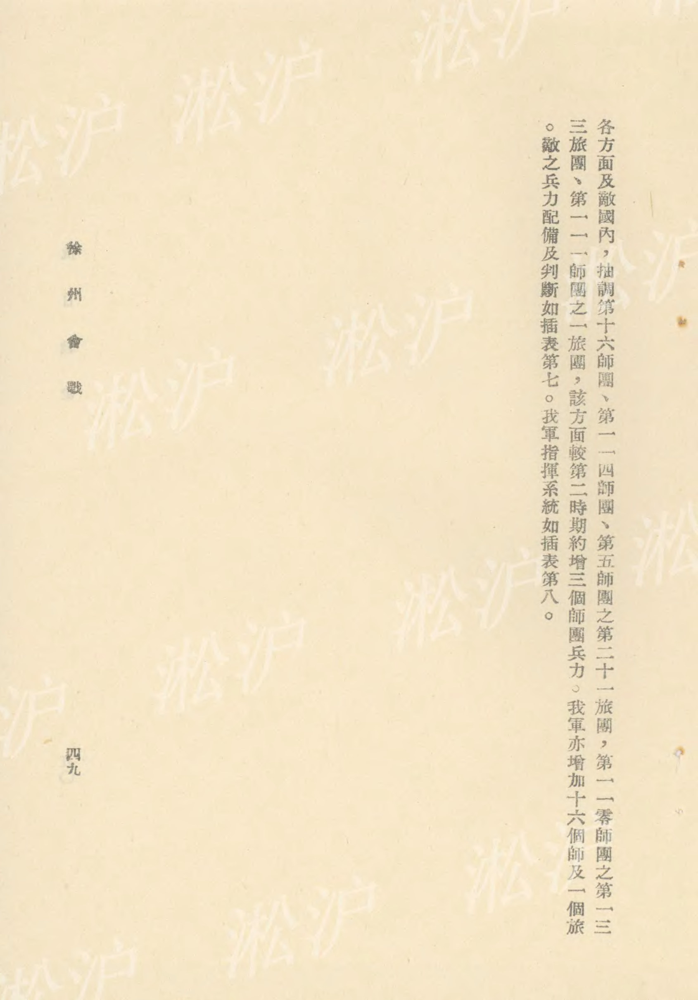

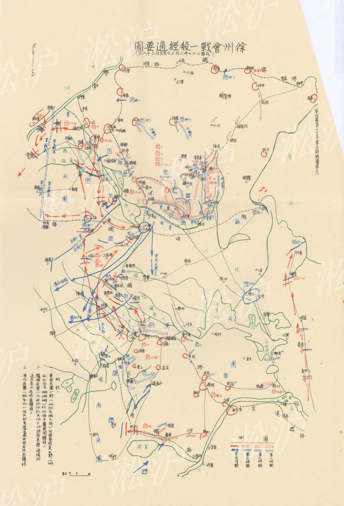

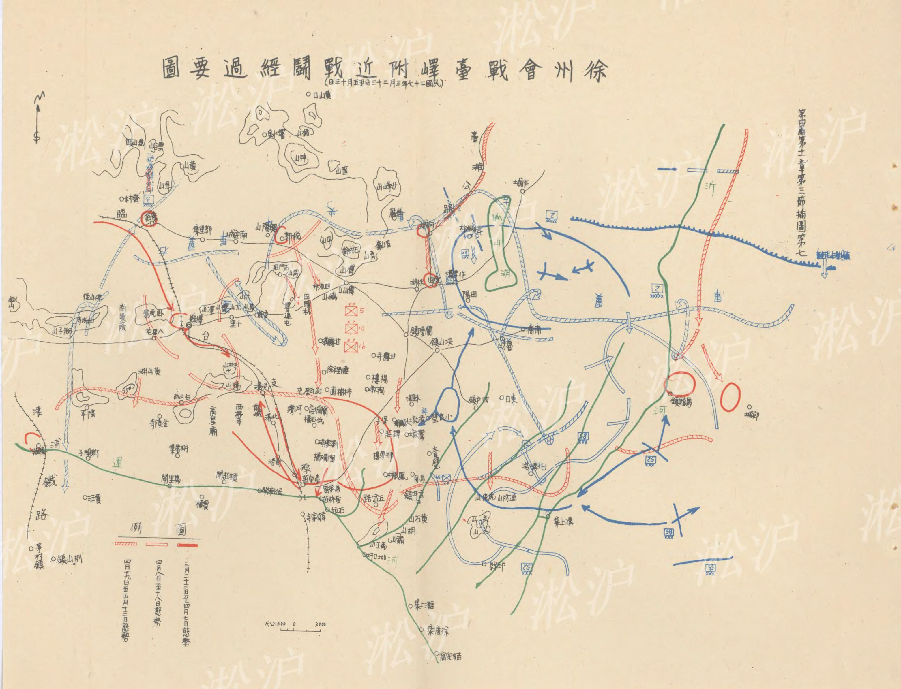

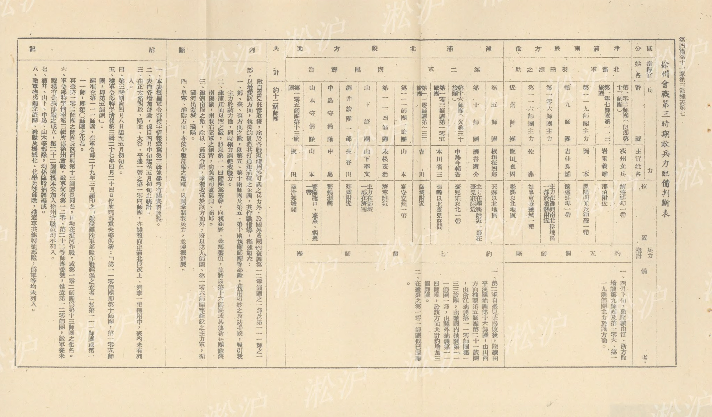

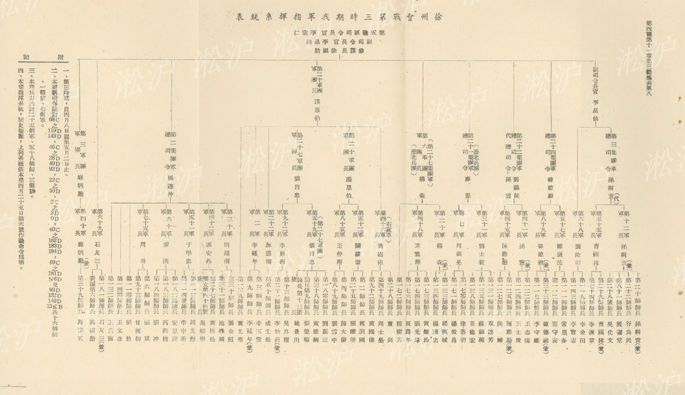

#### 第四款第四時期（戰地之轉移）

民國二十七年五月三日至二十八日

參照插圖第六至第十插表第九至第十一

自五月二日以後，魯南方面，敵我仍在郯城以南溝上集、連防山、岔河鎮、禹王山、低石橋、蘭城店、興隆橋、金陵寺、陰平亘韓莊附近運河南北岸之線膠著，但我軍陣地穩固，敵攻勢已頓挫。五日，最高統帥以「歌未」電訓令：「此後如續攻二、三日内，仍無進展，或萬一頓挫，決卽整理戰線，將參加台兒莊第一次會戰各部抽出整補，以便迅速恢復戰力。二交替部署(1)馮治安軍三師與孫連仲、周碧、張軫三部交替。2劉汝明軍二師與湯部關、王兩軍交替。3李仙洲軍（第二十一、第九十五師）與張自忠軍交替，但騎兵轉屬石友三。4于學忠、盧漢、李延年（附新五師）三部，仍用於第一線。5樊軍第二十八、第四十九兩師由湯恩伯親自指揮，在攻擊時期擊敵側背，爾後該部以費縣一帶山地爲根據實施游擊。6第五十、第九十二、第四十等師爲戰區預備隊。3整補位置(1)孫連仲軍歸德附近鐵路北側。2關王兩軍及張軫師蘭封附近。3張自忠軍及吳良琛師徐州附近。4周碧軍楊山附近。5第一三九師柳河歸商震整頓。6孫震軍以有力一部仍任韓莊附近運河守備，加强工事外，餘在茅村鎮、利國驛間整補。四以上應速預備實施，交替日期，可依狀況由戰區司令長官決定。又以「魚午」電令：「近來敵分由江北淮南進犯，其在鹽阜兵力，僅及二千，孤軍深入，後方空虛。巢合之敵，亦屬佯攻牽制性質。魯南主戰場之敵，雖由一、二、三戰區各方抽調增援，然屢次猛攻，均不得逞，其死傷數可知。以最近支緗情形而觀，攻勢顯見頓挫，且各方仍在分離之中，不能呼應作戰，宜乘此時機，將大小良璧、禹王山間之敵先行解決，爾後以五戰區現有兵力，當可把握該戰區勝利之機也。厥後我右翼軍以一部監視馬頭鎮方面之敵，主力旋迴攻擊，亦無進展。最高統帥遂下達「魚未」電令：「一、對於大小良璧、禹王山間突進之敵，應集中砲兵並展開第一四零師速解決之。二、第七十七軍與第二集團軍換防，速卽實施，第二集團軍交防後，集結歸德。三、第六十八軍如可能，應暫控置，以備與第二十軍團接防。四、第九十二軍之第二十一師爾後向費縣山地游擊，關於餉彈通信等，須預爲準備。五、第六十九軍主力，應不顧一切速向莒縣挺進。六、第九十五師速開宿縣歸廖總司令指揮。陽申（令一元）電令：

查魯南敵之攻勢已頓挫，徒以地形及裝備關係，我軍旣難迅速殲敵，卽應講求持久之方策，故除石友三軍、李仙洲師須斷然挺進敵之後方，實行游擊外，並卽將參加第一次台兒莊會戰之疲憊部隊，抽出整補。否則徒增損害，精銳消亡，對於敵爾後之攻勢，將無法應付，目下馮治安軍雖已調宿縣，但魯南各部仍須換防如次（劉汝明軍與孫連仲部及周碧軍換防後，孫部調歸德，周碧軍調碭山整補。（二）湯恩伯部關王兩軍及吳良琛師應卽調蘭封一帶整補，遺防卽由第三、第九、第五十、第一四零等師擔任。（三）張自忠軍（除騎兵）卽調徐州整補，遺防由樊軍擔任，其餘細部部署，希速擬具計畫，確定實施日期，負責實施並具報爲要。再湯軍旣南調宿縣，羅奇師不准再南調。並以「齊申」電令指示：「換防部署（陣地線除湯于兩軍突出部稍加調整外，其餘大部仍須保持原陣地，並須留置必要一部於原突出部陣地，以祕密企圖。（二）指揮官右翼仍由湯恩伯，左翼仍由孫連仲統一指揮。（三）應抽出部隊爲張自忠軍（除騎兵）李兆鍈師、吳良琛師、關王兩軍、盧軍（留較好一師附王文彥師歸盧漢指揮守原陣地）周碧軍、孫連仲軍（留較好一師位置台兒莊南側爲預備隊並增強工事）張軫師。（四）抽出部隊整補位置，第一步運河後方，第二步依陽申令一元電，但盧漢部位置徐州。（五）換防時期，儘速實行。（六）石軍及李仙洲師須斷然挺進游擊。（七）明光、滁縣方面，亦須加緊游擊。

時奉命歸第五戰區指揮之第九十五師，已開至徐州集結，第七十七軍（欠第一三二師）亦正由隴海路向徐州輸送中。

李長官遵照最高統帥歷次指示，爲準備爾後攻勢，重新部署魯南兵團，於五月八日以「庚亥」電令各部隊，要旨如左：

一、第四十六軍之三師（第二十八、第四十九、第九十二師），第二軍之第三師及第九師、第二十二軍之第五十師及第二十軍團較完整之一師，爲右翼軍，均歸湯恩伯軍團長指揮，除第四十六軍仍續行前任務外，其餘應佔領溝上集至鵝鴨城（禹王山東）之線，左與左翼軍連繫，準備攻擊當面之敵。二、第六十軍編成完整之一師，並以第一四零師配屬之，第五十一軍之兩師（第一一三、第一一四師），第六十八軍之兩師（第一一九、第一三四師）配屬第一三二師及第二集團軍編成完整之一師、並配屬第九十三師，爲左翼軍，概歸孫連仲總司令指揮，以主力佔領禹王山至陰平現在之線，左與第二十二集團軍連繫，準備攻擊當面之敵，一部守備台兒莊。

三、挺進軍及韓莊守備軍，仍續行原任務。

四、第九十五師受孫總司令之區處，在運河南岸構築工事。

五、第二十軍團其餘部隊及第一一零師交替後，開蘭封整補；第七十五軍開碭山整補；第二集團軍其餘部隊開商邱整補；第五十九軍並指揮第十三師，開運河站附近整補，並受湯軍團長之區處，構築工事；第一三九師開蘭封、考城一帶，歸還第三十二軍建制；第三三三旅歸還第五十七軍建制。

六、前項抽出各部隊交替後，第一步先移於運河後方，第二步再候令向指定位置運送。

七、李仙洲軍長率第二十一師經宿遷向淮陰前進，歸韓總司令指揮。

各兵團奉命後，分別編併交替，將抽出部隊移於運河後方。右翼軍方面，第二十軍團留較完整之第八十五軍第四師，續行原任務，抽出第五十二軍、第一三九師及第三三三旅，於十一、十二等日，向指定地點輸送，第一一零師預定於十四日開始後運，未能成行，仍留運河南岸。左翼軍方面，第二集團軍與第七十五軍，仍續行原任務，亦未抽出後運。

當五月初，魯南敵我膠着，淮南敵第九、第十三師團集結於懷遠、蚌埠，合肥情勢正值緊張之際，李副長官遵令於五月三日由曹縣轉回六安，指揮淮南兵團作戰。爲確保淮南要地，拒止敵人北進之目的，重新部署淮南兵團，卽以第二十七集團軍爲江北守備軍，主力守備懷寧（安慶）及沿江左岸，一部進出巢縣，與第二十六集團軍協力攻擊巢縣、含山之敵；以第二十六集團軍爲右翼軍，一部對定遠警戒，一部控置合肥，俟後續兵團第一九九師到達，再向巢縣、含山之敵轉移攻勢；以第四十八軍之第一七三師（欠一團）、第一七四師，爲中央軍，主力確保北蘆橋、洛河之線，一部向定遠及考城方面游擊；以第二十一集團軍之第七軍及第三十一軍，與第一七三師之一團，爲左翼軍，配置於淮河北岸、淝河西岸間地區，拒止敵之北進；以第一七二、第一七六兩師，爲兵團預備隊，暫位置於鳳台附近待命。

五月三日，集結懷遠、蚌埠之敵第九、第十三師團開始渡河，一部沿鐵路，主力沿渦河前進，與我第三十一軍及第七軍激戰。我第二十一集團軍廖磊總司令，以敵沿渦河向西北突進，蒙城爲其必經之路，遂令第一七三師周元副師長率兵一團馳赴蒙城固守。

五月五日，第七軍沙溝集、雙溝集全陣地被敵突破，李長官令淮南兵團預備隊之第一七二師、第一七六師，取捷徑向龍亢馳援，令第四十八軍向懷遠、蚌埠之敵側擊，並以「微子」電呈「頃據李副長官於微午由六安來電稱：據報含巢之敵，其數頗多，昨有數千經含山向北推進，似有經八斗嶺進出於合肥以北地區企圖，而徐部現僅到兩師，羅師須八日後始可到達合肥，即使全部到達，兵力尚嫌薄弱，現區程兩師已遵令飭其星夜開赴龍亢，目前情形，合肥、壽州一帶，隨處均有被襲之可能，假使合肥不保，則皖北整個動搖，不但影響徐州，亦足危及武漢。又淮北之敵，總合起來，亦有二萬以上，志在取徐州，僅以第三十一軍及廖部與之對抗，仍必難操勝算，反之我在魯南作戰之兵力，不下三十個師對付敵三、四師團，尚且捉襟見肘，淮南之兵力相差太大，仍請對南段之敵，不可過於輕視，必宜有全盤計畫，以策萬全，否則一着忽略，全局動搖也，宜速抽調一軍來六安、下塘集，一軍到宿縣，以備萬一。所稱甚是，謹電呈察。旋奉最高統帥復按「魚未」電令第九十五師速開宿縣歸廖總司令指揮。淮南之第一七二師與第一七六師奉令後，由第二七六師區壽年師長指揮，稱爲區支隊，兼程北上。

五月七日，由鐵路正面北進之敵，與我第三十一軍在新橋、高皇集之線激戰；又沿渦河前進之敵，突破我第七軍龍亢附近陣地，繼續向西北蒙城方面突進，第七軍主力（軍部及第一七一師）向宿縣方面，一部（第一七零師）向渦河南岸撤退。最高統帥，以「陽未」電令李長官，對於越淮河突進之敵，須乘其離開陣地之好機，以必要兵力阻止之於陣地前，以强大機動部隊由兩側夾擊而殲滅之，第七十七軍須用爲機動，決不可用於第一線，關於指揮系統，須區分爲淮南、淮北兩集團，以期指揮及協同動作容易。時第七十七軍已到達徐州，李長官卽令開往宿縣，令在運河南岸構築工事之第九十五師，向澮河方面前進，均歸第二十一集團軍指揮。並令淮北兵團統歸廖總司令指揮，淮南兵團仍由李副長官指揮。廖總司令奉令後，卽重新部署淮北兵團：以第三十一軍佔領澥河北岸固鎮至大營集之新陣地；第七十七軍在南坪集、蘆溝集爲兵團預備隊；第一七二師到達後，協同第一七三師之一團守備蒙城；第一七一師在小營集、雙橋集之線；第一七零師在順和集東北；第一七六師集結於楚村集附近，以備夾擊進出蒙城之敵。各部遵令行動。

五月八日拂曉，敵五千餘，以飛機戰車掩護圍攻蒙城。李長官爲確保蒙、宿兩據點及固鎮旣設陣地，擬俟主力集中後，一舉將敵擊破於蒙、宿間地區，於本日以「齊未」電令第一七六師迅速北進側擊蒙城附近之敵，支援蒙城守軍，令第三十一軍以有力一部，從北側攻擊蒙城之敵，與第一七六師相呼應。

五月九日，敵攻陷蒙城，守城之周元副師長以下約七百人殉難。第三十一軍側擊蒙城部隊未曾趕到。馳援蒙城之第一七六師先頭部隊，於七日晚抵蒙城南之樂土鎮附近與敵遭遇，八日將敵擊退，再趨蒙城，又受敵機轟炸，行進遲緩，尙差半日行程，而蒙城已陷。是日，魯西方面、濟寧之敵第一一四師團主力，沿濟寧、魚台公路；第一一一師團之一部，向鄆城方面進犯，與我第三集團軍在萬福河巨鉅野之線激戰。李副長官判斷敵似有由兩外翼包圍隴海路之企圖，於是日具申意見，擬以第七十七軍向蒙城東北，第一七二師、第一七六師由南向北夾擊，再由徐州方面抽調一軍開宿縣至南坪集集中策應，先擊破蒙城之敵，然後旋轉東向，再側擊淮河北岸之敵，以行各個擊破。旋最高統帥電復，消滅突進蒙城之敵，爲該軍當前唯一任務，至如何部署，應就近秉承李長官實行。

五月十日（參照插圖第八），第五戰區綜合各方情況。蘇北方面：敵第一一六師團繼續由鹽城北進，於六日攻陷阜寧，最高統帥電飭韓總司令不准再退，刻敵止於阜寧東北之東坎與我第八十九軍隔舊黃河對峙。淮南方面：巢縣之敵，乘我兵力北調之際，突行增兵，於五月七日起，由巢湖南北岸分向合肥進攻，正與我第二十六、二十七兩集團軍所部激戰。淮北方面：敵約兩師團，其主力似有由蒙城續向北進，或西北進，企圖截斷隴海路。我第七十七軍及第九十五師已於八日晚到達宿縣附近。魯西方面：我第三集團軍仍與敵在萬福河巨鉅野之線激戰，向鄆城進攻之敵，已攻入鄆城，與我第二十三師巷戰。魯南方面：敵我仍在溝上集、岔河鎮巨金陵寺、陰平、韓莊之線對峙；連日來台嶧支線一帶之敵第十六師團，向臨城、夏鎮方面移動，微山湖東岸，敵集結橡皮船多艘，似有渡湖策應淮北敵軍作戰之模樣。豫北方面：敵第十四師團，於五月上旬，分由新鄉、封邱、濮湯向濮縣移動，似有渡河南進企圖。並謀知，敵爲攻略徐州，其華北軍最高指揮官寺內壽一大將，指令官梅津美治郎、津浦方面作戰指令官稔三王、膠濟方面作戰指令官三毛一夫，均已在最前線之臨城指揮作戰；平漢方面作戰指令官香月清司中將，擬親率第十四師團全部沿清豐、濮縣渡黃河經荷澤而達曹縣，與津浦方面西路湖沼之敵軍部隊相呼應，企圖統一進攻歸德。又敵華中軍（徐州攻略之南方軍）最高指揮官畑俊六大將及指令官岡村寧次等，同在蚌埠設臨時指揮所，親赴督戰；另以海軍航空隊之航空母艦能登呂號，在坪島設飛行基地，協攻徐州，並限五月二十日以前攻下徐州。是日，最高統帥令第七十四軍、第六十四軍開赴碭山、商邱集結，歸李長官指揮，並下達「灰巳」電令：「魯南戰場不宜急轉消極，應處處決行戰術上之攻擊，不僅我軍交替容易，敵之抽調轉用自必困難，尤以嚴防敵向魯西轉用，粉碎其策應由蒙城直趨歸德，使徐州不攻自破之企圖。第三集團軍正面，宜採取攻勢防禦，在其兩翼應控置有力部隊，以便移轉攻勢之用，俟敵攻我第三集團軍陣地時，予以殲滅之打擊。合肥方面亦宜採第二項策略。四對蒙城突進敵，務使用夾擊消滅之。五津浦南段及台灘公路與兗州至臨城間鐵路公路之破壞，須確實掌握，則敵之計空矣，希確實施行。

並以「真申」（令一元）電飭：「敵以疲憊且極劣兵力，濫用大胆的外線作戰，向我徐州包圍運動中。爲乘敵兵力分散，且離開據點之好機，第五戰區應對魯南殘敵，暫取戰略守勢，以優勢兵力，先行擊滅超越淮河之敵，第一戰區應集中精銳兵團，擊破侵入魯西之敵。注意事項(1)魯南之敵有抽調於魯西及新安鎮求新發展之模樣，故魯南我軍雖久戰疲勞，仍須在戰場壑補，並積極施行戰術之局部攻擊，以牽制之，並祕密我企圖。劉汝明軍應轉用津浦南段，以期迅速擊破敵人，確收戰果，魯南砲兵亦應抽調一部轉用南段。3)渦陽至臨涣集等各要點，應先派部隊負責固守，免陷蒙城覆轍。4)對淮南敵後方之擾襲，應以第二十六、第二十七兩集團軍擔任爲主，第四十八軍主力應轉用淮北，遮斷懷遠、龍亢間交通。5)其餘原在魯西各部，酌量交孫桐萱、商震指揮，擔任遲滯敵人，並固守沛縣、金鄉、魚台、鉅野、荷澤各據點，掩護攻勢兵團之集中及展開。7)戰場廣大，戰況複雜，勿爲敵情淆惑，我雖各方面均佔優勢，然須明察狀況，保持重點，指向敵最痛苦之方向而攻擊之。

李長官遵照上電指示及基於情況，決心不待集中完畢，先行擊破淮北之敵，於本日以「灰申」電廖總司令作戰命令第七號，要旨如次：

一、第二十一集團軍，應以第三十一軍之一部固守原陣地，第三十一軍主力，連繫第七十七軍及第九十五師，分爲數縱隊，由現地向懷遠至蒙城間前進，求敵主力攻擊之。但第九十五師應取捷徑向臨渙集前進，準備截擊敵之側背，或阻止敵之北進，爾後歸第七十七軍指揮。

二、區支隊應由蒙城附近尾躡敵後，以行攻擊，與主力相呼應，第一七零師應連繫區支隊左翼前進。

三、後續兵團第七十四軍、第六十四軍，於五月十五日前向永城集中，歸廖總司令指揮。

上項命令下達後，李長官又接奉最高統帥本十日電令如左：

第一、第五兩戰區作戰地境，變更爲亳縣、黃口、沛縣、夏鎮各東側附近之線；第三軍團、第三集團軍（欠第五十一軍）及第七十四軍、第六十四軍等部隊，均歸程長官指揮。第一戰區對侵入魯西之敵，須兼用正面及兩翼包圍，相機擊破之。

由是，魯西方面我軍作戰，統由第一戰區指揮，第七十四軍、第六十四軍亦不向永城集中。第二十一集團軍廖總司令接奉第五戰區電令後，以第七十七軍附第九十五師爲右翼軍，一部固守永城，主力佔領白沙集、蘆溝集各要點，縱深配備，俟機擊破當面之敵；以第三十一軍爲左翼軍，佔領東陶集亘固鎮之原陣地，策應右翼軍之作戰；以第一七零師監視蒙城之敵；區支隊由蒙城以西地區北進，威脅敵之側背。

五月十一日，微山湖東岸夏鎮敵第十六師團，偷渡微山湖西進，經我第三軍團擊退。魯西敵第一一一師團攻陷鄆城。豫北敵第十四師團由范縣、濮縣間渡河，向荷澤攻擊。淮北敵第九、第十三師團主力，續向永城前進，其先頭已到永城之石弓山集附近，一部集結於蒙、宿間之板橋集附近，另一部由趙集急進，與我第七十七軍激戰。最高統帥於是日以「眞巳」電訓令李長官：對魯南殘敵，應取戰略守勢，淮北之蒙城爲戰略要點，關係隴海路及魯南作戰者極大，不得以牽制爲目的，應乘敵突入立足未穩機會，以優勢兵力由側方背後夾擊殲滅之。李長官遵卽令在運河站附近之第五十九軍，開徐州西北敬安集附近集結，對沛縣以南、微山湖西岸警戒，令在徐州南之第六十八軍向永城前進，限十三日早到達，歸第二十一集團軍指揮。並指示廖總司令，渦河左岸之敵，如向西去，該集團軍應遵照命令，不顧一切，側擊敵人，敵主力若轉向固鎮、宿縣正面前進時，應遲滯敵人，以求時間之餘裕。廖總司令本此方針，先令第九十五師以一團開赴永城，拒止敵之北上。並重新部署，以第六十八軍爲右翼軍，向永城義勇集前進，側擊當面之敵；以第七十七軍附第九十五師爲中央軍；向李口、青町間地區攻擊，側擊沿蒙永公路北進敵之側背；第三十一軍爲左翼軍，一部留置固鎮陣地，主力向青町集、蒙城間地區攻擊；第一七零師一部佯攻蒙城，主力向蒙城以東游擊；區支隊爲左側支隊，以一團保守渦陽，主力向蒙城北之曹市集方向攻擊前進；預定十二日黃昏開始總攻。

五月十二日，淮南方面，第二十六集團軍之第一九九師到達合肥，前向定遠敵攻擊之第四十一師，已到達永康鎮，因合肥方面吃緊，於是日調回。魯西方面，由濟寧南下之敵，突破第三集團軍萬福河陣地；由范、濮間渡河之敵，攻陷鄄城，卽與鄆城敵會合，向西南運動。淮北方面，由蒙城北進之敵，以汽車輸送，追隨機械化部隊，向永城挺進；此時，永城僅有數百常備隊駐守，我馳援之第九十五師先頭一營，受敵機及機械化部隊妨害，於午后始抵城郊，因衆寡懸殊，至十七時，永城遂陷，我第九十五師在城東佔領陣地，與敵相持。是日，最高統帥特以「文辰」電下達訓令：「查日寇自魯南屢敗，驚惶萬狀，竟放棄晉、綏、江、浙、既得地位，僅殘置小部扼守要點，苟涎殘喘，而調集所有兵力，指向隴海東段，孤注一擲，以圖倖逞。其總兵力合兩淮魯境至多不過十五萬，較之我軍使用各該戰場之兵力，約爲四分一以上劣勢。且敵之後方，處處受我游擊，補給不便，較之我之後方，有良好交通線，其補給及兵力轉用之難易，相去甚遠。目下敵不顧其兵力之不足及戰略態勢之不利，竟敢採取外線包圍作戰，其必遭我軍之各個擊破，而自取敗亡，已無疑問。仰我忠勇將士，明察彼我利害，鼓舞所部，以必勝之企圖，各向任務邁進，擊滅當面之敵，以寒敵胆，而揚國威，爲盼。

李司令長官亦判斷敵對我魯南改取守勢，主力由淮北、魯西兩方夾擊，有截斷我隴海路交通，包圍徐州之企圖，爲適應狀況需要，另擬定作戰計畫如左：

第五戰區作戰計畫

作字第

民國二十七年五月十二日

號

一、敵情判斷

敵對我魯南改取守勢，主力由淮北、魯西兩方夾擊，有截斷我隴海交通，包圍徐州之企圖。

二、方針

(一)戰區擬乘敵兵力分離之先，集結兵力，擊破淮北之敵，再轉兵力於其他方面，施行各個擊破。(二)敵如將會師隴海線，我後方連絡有被敵遮斷之虞時，則各以一部攻擊永城及蒙城之敵，以主力轉移至亳縣、渦陽、阜陽以西地區，準備爾後之作戰。

三、指導要領

(一)敵如尚在分離之狀態時，應取下述之指導。

1. 以淮北兵團之全力與第一戰區魯西兵團之一部呼應，以有力一部反攻永城，主力向蒙淮間壓迫，以截斷敵之連絡，擊破該敵於淮河左岸地區。

2. 魯西、蘇北兩兵團，應竭力阻止各該方面敵之發展，以得時間之餘裕，不得已時，魯南兵團撤退運河西岸，蘇北兵團應力圖存在於運河以東、舊黃河以北之地區，準備爾後之反攻。

3. 淮南兵團一部，仍向淮河右岸壓迫，主力拒止巢縣之敵北進。

4. 淮北之敵，如被我擊破，追擊至淮河之線時，應如何轉移主力，各個擊破他方之敵，均以當時之狀況定之。

5. 預備兵團控制徐州附近，以適應各方之情況。

(二)淮北之敵，如我未能貫澈擊破之方針，而與魯西之敵將會合時，應早取下述之指導。

1. 魯南、淮北兩兵團，應各以有力之一部，先佔銅山、宿縣兩地，阻止敵之追擊，掩護主力之西撤，其境界爲夾溝——濉溪口——臨澳集——渦陽——太和之線，線上屬淮北。

2. 兩兵團各以有力之一部，襲佔或監視永城、蒙城，主力分多數縱隊，各由蒙、永間及其附近各道西進，迅速通過敵之包圍線，爾後在亳縣、渦陽間線上，各派掩護部隊，主力向其以西地區集結，準備反攻。

3. 蘇北兵團卽在蘇北、魯東南地區游擊。

4. 淮南兵團主力，竭力保持合肥，一部後撤至阜陽、鳳台、掩護戰區之右側。

5. 魯南兵團向微山湖以西撤退時，務與第一戰區魯西兵團連繫。

6. 預備兵團之行動，視情況由他兵團區處，或增援於最急要之方面。

(三)司令長官部，第一項指導間，仍在徐州；第二項指導間，應移至周家口，設指揮所於亳縣。四、軍隊區分

魯南兵團

指揮官

孫連仲總司令

第四十六軍

第六十軍

第五十一軍

第七十五軍

第二集團軍主力

第二十二集團軍殘部

第五十師

第十三師

第一三二師

第一一零師

第一四零師

淮北兵團

指揮官

廖磊總司令

第三十一軍

第七軍

第七十七軍

第四十八軍一部

第六十八軍

第九十五師

淮南兵團

指揮官

李品仙副司令長官

第四十八軍主力

第十軍

第二十軍（附第二十三集團軍之一旅）

第一九九師

蘇北兵團

指揮官

韓德勤代總司令

第五十七軍

第八十九軍

第八游擊隊

預備兵團

指揮官湯恩伯軍團長

第二軍

第九十二軍

第五十九軍

第四師

司令長官

李宗仁

五月十三日，淮南方面，我第三十七集團軍克復巢縣。魯西方面，敵突破我萬福河陣地後，續以主力向金鄉，一部向魚台前進。淮北方面，永城敵續以一部向東北，另一部向北前進，至韓道口，與我第一戰區之第七十四軍一部接觸。此時，淮北兵團之第三十一軍已佔領蘆溝集、趙集；區支隊已佔領小澗集、曹市集地區。第一戰區之第八、第六十四、第七十四各軍，亦已集結於碭山、商邱地區。李長官爲迅速擊滅該敵，使我隴海線以北各兵團作戰容易，決於十四日三時再度開始總攻，於是日令廖總司令，規定淮北兵團各攻擊軍攻擊目標；右翼軍（第六十八軍附第九十五師）爲石弓山集、袁家集之線；中央軍（第七十七軍）爲白沙集；左翼軍（第三十一軍）爲戴家集、張家集之線；區支隊（第一七二師第一七六師）爲曹市集、芮津集之線。當魯西、淮北戰況緊急時，魯南敵我僅有小接觸，敵主力似正轉移中。我第二十軍團湯軍團長，鑒於目前之消極抵抗難獲戰果，曾先後意見具申以「六日」電呈：「綜合全般情況判斷，敵之企圖，係以一部由沂河左岸向我右側背迂迴，直貫隴海鐵路以南，並牽制我沂河左岸之出擊主力。分爲兩路，一由台兒莊以東，將我第五十一、第六十兩軍擊破，卽由台兒莊、珈口圩間竄過運河，一由邳縣正面將第二十軍團擊破，由灘上鎮、運河車站間竄過運河，會攻徐州，達到其打通津浦線之計畫。我第二集團軍、第五十一軍、第六十軍及第二十軍團刻佈防溝上集、連防山、岔河鎮、珈口圩、趙村、蘭城店、泥溝、白山西、劉莊、馬山之間，陣地正面太寬，形成膠着，處處被動，毫無機動力量，連日受敵優越砲火，損害傷亡極大，如就現況，再遷延三、五日，一被敵突破，卽無法維持，不如縮小正面，以有力之一部，確實鞏固運河車站、灘上集、珈口圩、台兒莊、韓莊之河防，主力分由沂河東岸及台兒莊以西地區迂迴於敵之側背，以運動戰分進合擊，將敵誘集運河北岸而殲滅之。是否有當，敬乞鈞裁」。

復以「灰午」電呈：

「當面之敵，似有由我右翼大舉包圍遮斷隴海路之企圖，以目下之消極抵抗態勢，決無戰果可期，常此以往，難免不發生混亂，似有自動採取積極企圖之必要，職擬以第五十九軍、第十三師、第一三九師、第五十師歸張軍團長自忠統一指揮，守備貓兒窩、運河站、徐塘集、灘上集、珈口圩沿運河之線，抽出六個師轉移攻勢，即以第四師由大小良壁向北挺進，擾亂敵後方連絡線，以樊軍移轉至龍泉溝、水冲子一帶地區側擊由郯城南下之敵，以第二軍兩個師佔領龍池集、紀集附近地區，準備攻擊當面之敵，如此自主動作，任何情況變化，均能應付裕如，否則，祇有坐以待斃，紊亂而已。

最高統帥當抄原電以「眞申」電飭李長官，「如尙有餘力，即可斟酌實行」。旋於十三日以電話令李長官，魯南兵團應卽再抽調有力之一軍，集結徐州，準備轉用，其餘各部，除以一部在現在地警戒外，應適時變換陣地至運河之線，節約兵力，並將各部指揮系統及部署酌爲變更。李長官遵卽以「元未」電魯南兵團，要旨如次：

一、抽出第二軍（第三、第九師）開徐州集結待命。

二、無戰鬥力之各部，可能時，應抽調商邱、碭山整補，以減少其指揮單位。

三、新陣地線爲窯灣、貓兒窩沿運河南岸之線，惟須注意邳縣、灘山集、珈口圩、禹王山、台兒莊各前進陣地，不可過早放棄。

四、前三項由孫總司令直接處理，魯南兵團各部由孫總司令統一指揮。湯軍團長卽前赴商邱整理所部。孫總司令奉命後，卽令第十三師開後方整理，並以第四十六軍、第二十二軍之第五十師及第八十五軍之第四師轉移窯灣、徐壇集、珈口圩新陣地線，第六十軍附第一四零師、第五十一軍、第七十五軍、第二集團軍、第二十二集團軍附第一三二師、第一一零師轉移珈口圩沿運河亘韓莊附近之新陣地線固守五月十四日，淮南方面，敵攻陷合肥，我第二十六集團軍向合肥西北撤退，李副長官令第二十七集團軍、第四十八軍協同第二十六集團軍向合肥反攻，但無進展，敵我在大蜀山附近相持。魯西方面，敵攻陷魚台、荷津。淮北方面，當我軍攻勢轉移開始時，適敵後續部隊第三師團一部到達，與我第三十一軍在大營集一帶激戰；敵第九、第十三師團主力已到永城，以一部向澮河左岸我第七十七軍攻擊，南坪集陣地被突破；敵另各以一部，分向北之韓道口，東之薛家湖及東北之瓦子口等處攻擊，與我第六十八軍及第一戰區之第七十四軍激戰；韓道口之敵，經第六十八軍、第七十四軍夾擊，竄東北之黃口車站（隴海路）將鐵道破壞；同時隴海路之郝寨橋亦被敵機炸毁，通車受阻；徐州南之三堡車站（津浦路）及蕭縣南之丁里寨，均發現敵人。廖總司令以電話令第九十五師阻敵東進，仍歸第七十七軍指揮，暫緩向永城攻擊。李長官以徐州西方戰事吃緊，令第九十二軍（該軍前奉令率第二十一師馳援蘇北，已抵新安鎮，令其轉回徐州。）指揮第一三九師（該師原調開封考城整理，已令轉回徐州附近。）向蕭縣前進，阻止東進之敵。

五月十五日，魯西方面，敵一路攻陷金鄉，一路由荷澤續向西南蘭封方面急進。我原在津浦路活動之第三集團軍挺進部隊（第五十五軍），奉第一戰區命令調回魯西曹縣，於本日由南陽鎮渡湖西進。淮北方面，敵續向澮河左岸我第七十七軍陣地攻擊，戰鬥甚烈。時瓦子口之敵一部，已超越該地向蕭縣前進，另有諸兵種聯合之敵一縱隊，經百善站、濰溪口，亦向瓦子口前進。李長官以徐西緊急，令魯南兵團之第六十軍向徐州以南地區集結，以第五十一軍抽派一師守備徐州城西，第二集團軍派隊守備徐州西北之工事，湯軍團長（原調歸德整理所部續調回）率第二軍及第八十五軍之第四師，馳援徐州以西。各部奉令後，湯軍團長卽率部逕向徐州西南前進，在閔賢集、符離集及其以西一帶山地佔領陣地，阻敵前進；第五十一軍卽派第一一四師守備徐西臥牛山一帶陣地；第二集團軍派第二十七師佔領徐州西北工事，右與第三十師，左與第一一四師連繫。是日，參謀總長何應欽，軍令部部長徐永昌，爲隴海路作戰指導，具申意見如左：

一、敵情判斷

敵以一部(5D 10D及105D一部、僞軍若干名)由魯南行牽制攻擊，並抽出一部由夏鎮渡湖迫沛縣、黃口，以主力分由濟寧(16D 108D一部)、荷澤(14D 108D主力)、永城(9D 13D 102D 1部)(但以約半數監視第四十八、第七十七、第六十八等軍)向碭山、蘭封間數要點突進。

二、作戰指導

以最小限兵力，拒止魯南、魯西之敵，以充分兵力，擊破皖北之敵，確保魯南後路。

三、部署

(一)魯南方面，至少再調出有力之兩軍，集中碭山或黃口附近，協力第八、第六十八各軍，攻擊永城方面之敵，依情況支援第十二、第五十五兩軍，其餘歸孫連仲統一指揮，暫在運河畔防禦。

(二)皖北方面，以一部守備宿縣南方現陣地，以主力向蒙城北側之敵攻擊。

(三)魯西方面，第五十九、第四十兩軍拒止夏鎮渡湖之敵；第十二、第五十五兩軍拒止濟寧南下之敵，第七十四軍支援之；第三十二軍拒止荷澤之敵，並由第七十四軍支援之。

四、第六十四軍位置於商邱，爲戰區預備隊。

五另由魯南抽出疲憊部隊，守備隴海鐵路各要點。

四、備考

(一)敵以數路向隴海線突進並分兵竄擾，預期鐵路線終必有一兩點被遮斷，須有鐵路輸送，已不可確保之準備。

(二)我如分散於橫廣正面，不能抵抗敵之突進，徒被各個擊破，故兵力須保持數集團，用以消滅敵人爲主眼，不能掩護鐵路爲主眼。

(三)守勢任務，各軍須利用據點固守，同時須由兩側襲敵。

(四)對於敵之小部竄擾，須忍耐，不可過度分散兵力，追隨敵人。

(五)對敵各路之背後，仍須指定游擊部隊，積極游擊。

軍事委員會對該項意見，原則同意。

五月十六日，魯西方面，金鄉、魚台之敵，以一部攻取豐縣，主力沿豐縣兩側地區向碭山以東各軍站及徐州西郊前進，並砲擊徐州城內甚烈，我第五戰區司令長官部移駐城南段家花園。淮北方面，敵仍在瓦子口及碭山以南、永城以東，與大營集亘董亭集之線，與我軍相持；超越瓦子口北進之敵，向蕭縣及其西北之鳳凰山攻擊，第一三九師在該地固守待援。李長官以當時徐鄭間鐵路已被敵截斷，大軍補給益感困難，決放棄徐州，將各軍向豫皖間山地轉移，準備爾後之作戰。令張自忠軍團長指揮徐州西北敬安集附近之第五十九軍、第九十二軍之第二十一師、第一三九師及第二十七師，在郝寨、蕭縣各附近佔領陣地，掩護主力軍集結。並電令各兵團準備轉進，其要旨如左：

一、第二集團軍、第二十二集團軍及第五十一軍、第六十軍、第四十六軍、第二十二軍、第七十五軍之第六師、第九十三師與第一三二師、第一四零師爲魯南兵團，以孫連仲爲總指揮，于學忠爲副總指揮，守備徐州，掩護大軍轉進。

二、第二十軍團（第一一零師及第四師）及第二、第六十八、第五十九、第九十二各軍，與第九十五師，爲隴海兵團，以湯恩伯爲總指揮，劉汝明爲副總指揮，由徐州西南轉進亳縣、柘城、太康、鹿邑、淮陽、渦陽一帶。

三、第二十一集團軍、第三十一軍及第七十七軍，爲淮北兵團，以廖磊爲總指揮，由宿縣、固鎮一帶，余川

向太和、阜陽、穎上、鳳台、壽縣、正陽關之線轉進。

四、第二十六、第三十七集團軍、爲淮南兵團，以李品仙爲總指揮，確保官亭、舒城、懷寧之線。

五、第二十四集團軍爲蘇北兵團，以韓德勤爲總指揮，仍確保淮陰、東海一帶。

六、挺進軍（第六十九軍）應在費縣附近魯南山地，經營根據地，隨時游擊敵人。

魯南兵團及淮北兵團奉令後，各擬定轉進部署。張軍團長奉令後，以官二十七師確保徐州西北九里山陣地，以第五十九軍（欠第一八零師）佔領鐵路正面何新莊、郝寨、夾河各陣地，以第九十二軍附第一八零師確保蕭縣及義門山、霸王山之線陣地。

五月十七日，淮北方面，第七十七軍朱家口及徐西方面第九十二軍鳳凰山、霸王山陣地，均被敵突破，敵便衣隊竄抵徐州城廂活動。第五戰區司令長官郭主地被炸，移駐宿縣。李長官令在郝寨一帶擔任掩護之第五十九軍，開徐州附近爲戰區預備隊。

五月十八日，蘇北之沛縣，被由豐縣及由微山湖渡湖之敵，夾攻陷落，我第三軍團向商邱突圍，旋奉令開舞陽整理。徐西方面，沿鐵路東進之敵，猛攻郝寨、夾河寨一帶陣地，入夜，我掩護部隊向徐州撤退，致九里山第二十七師陣地左翼，與隴海路以南臥牛山第一一四師陣地中間，發生廣大空隙。淮北方面，由朱家口突進之敵，一部向北與湯軍團所部第二軍、第四師，在宿縣西北之符離集、西二舖之線激戰；另一部攻擊宿縣，守城之第一七一師，因兵力薄弱，至午夜失陷，我第五戰區長官部被敵衝散，通信器材盡失，與各兵團多失連絡。同時，徐西方面之蕭縣及義安山陣地，亦被敵攻陷，敵逐漸突進徐州近郊。

五月十九日，敵由隴海路以南空隙突進，攻陷臥牛山陣地，直迫徐州城，並分數縱隊向徐州西北我九里山陣地背後迂迴，至十時，徐州失陷，我第三十師、第二十七師，向西南突圍而出。李長官於黃昏後聞淮北兵團突圍西進，卽電話令隴海兵團開始突圍，並令魯南兵團向亳縣、太和間突圍西進。

各兵團突圍經過：魯南兵團，於徐州失陷後，各軍遭敵襲擊及敵機追隨轟炸，孫總司令與各部失去連絡，除第六十軍、第九十三師及第二集團軍大部由徐州西南向西突圍外，第二十二集團軍、第四十六軍、第五十一軍、第七十五軍及第一四零師、第一三二師、獨立第四十四旅，均向泗縣、靈璧間地區轉進。其向西突圍部隊，於五月下旬，第九十三師到達鳳台，第六十軍到達渦、亳間，第二集團軍大部到達淮陽各附近地區。其向泗縣、靈璧間轉進者，於五月下旬奉令，除留第四十六軍在蘇北游擊，歸第二十四集團軍指揮外，其餘分批由五河渡河向西突圍。隴海兵團，隨李長官、白副參謀總長、林次長等，經界溝集渡渦河，於五月二十八日到達太和、阜陽一帶及渦陽以南渦河沿岸地區。

蘇北兵團，大致無變化；敵於五月二十日，以十三艘兵艦砲火掩護，在連雲港之孫家山登陸，經我第五十七軍阻擊，未得深入。淮南兵團，仍在懷寧、桐城、舒城、大蜀山、北蘆橋、洛河之線，與敵對峙。挺進軍於五月十五日克復莒縣，該軍自五月初挺進魯東南地區游擊後，迭在膠濟、津浦及台灘路沿線襲擊敵人，破壞鐵路公路橋樑，頗有戰果。

自徐州失陷，我軍西撤，至五月二十八日，各兵團大致到達指定地區，其態勢如插圖第九。時敵以一部攻擊渦陽、亳縣，另集結有力部隊於蒙城，似有西進模樣。李長官遂令區支隊（第一七二師第一七六師）守備渦河右岸，第九十五師守備渦陽，第六十八軍守備亳縣。最高統帥於二十八日令李長官，卽在六安、壽縣、太和之線，準備爾後作戰。李長官遵於二十九日重新部署，以艷午電令各部隊，要旨如次，參照插圖第十：

一、戰區以持久戰之目的，擬確保阜陽、六安兩據點，阻止敵之西進。

二、以懷寧、桐城、舒城、六安、正陽關、穎上、阜陽、太和之線，爲主抵抗地帶；以渦陽、鳳台、壽縣、廬江爲前進據點。

三、以巢縣、和縣、含山、無爲間，爲第一游擊區；以合肥、定遠、全椒間，爲第二游擊區；以田家庵、鳳陽、定遠間，爲第三游擊區；以懷遠、蒙城、宿縣、固鎮間，爲第四游擊區；以渦陽、亳縣、永城一帶，爲第五游擊區。

四、第一、第五兩戰區之作戰地境，假定爲黑虎廟、倪邱集、義門鎮之線，線上屬第一戰區。

五、第二十六集團軍、第二十七集團軍、第四十八軍（欠第一七六師），爲淮南兵團，歸李品仙副司令長官指揮，司令部位於六安，任懷寧至正陽關之線守備，並各以一部配合地方武力，分任第一至第三游擊區之游擊。

六、第七軍、第三十一軍、第一七六師及第七十七軍（第一三二師歸建），爲淮北兵團，歸廖磊總司令指揮，司令部位於阜陽，任穎上、阜陽、太和之線守備，並各以一部配合地方武力，分任第四、第五游擊區之游擊。

七、兩兵團之作戰地境，爲三河尖、義三集、蚌埠間淮河之線，線上屬淮南兵團。

八、兩兵團以必要之少數部隊，固守各據點，集結兵力於相當地點，相機側擊突進之敵。

九、蘇北兵團及第六十九軍、第四十六軍，仍服行前任務。

十、長官部在潢川，設前進指揮所於固始。

第五戰區下達上項命令後，又遵最高統帥電令續令第六十八軍、第九十二軍撥歸第一戰區指揮。

其他各突圍部隊，除上述者外，亦均由軍事委員會分別指定地點整補。

當我軍突圍期間，淮北魯西之敵，在隴海鐵路線會合，各以一部攻擊亳縣、渦陽，時我守渦陽之第九十五師，正奉令西撤，接防之第七軍所部，尚未接收穩定，卽爲敵所乘，渦陽遂於三十日失陷，亳縣亦於三十一日爲敵攻陷，我第六十八軍向鹿邑轉進。敵之主力沿隴海鐵路西進，與我第一戰區魯西兵團薛岳所部激戰，五月二十三日陷碭山。我最高統帥親蒞鄭汴指揮團攻蘭封之敵第十四師團而擊破之，廿七日奪回蘭封，續克羅王車站，我火車四十一列由商邱撤回。二十八日敵陷商邱，六月六日陷開封，六月八日黃河花園口氾濫，水流沿賈魯河南汎，以後敵與我第一戰區部隊沿黃汎區成對峙狀態。其作戰經過，另詳「運河垣曲間黃河兩岸之作戰」專章。

綜合第四時期，津浦南段敵約增一個師團，津浦北段敵約增半個師團。我軍亦增加六個師。敵之作戰計畫如附錄第二。敵之兵力配備及判斷如插表第九，我軍指揮系統如插表第十。本會戰敵我使用兵力比較如插表第十一。

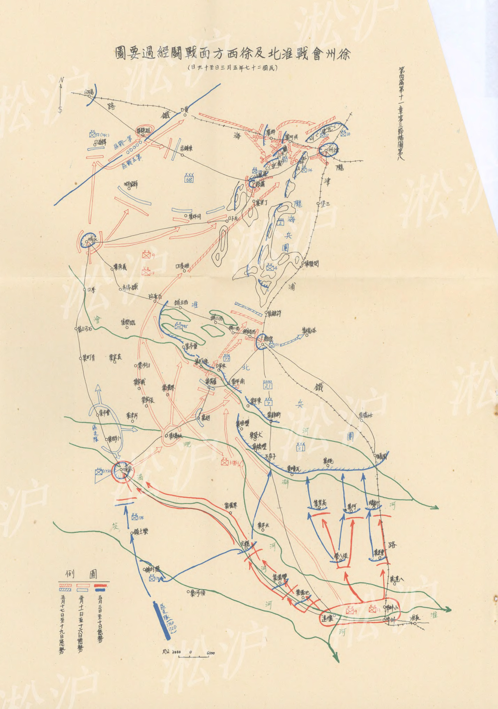

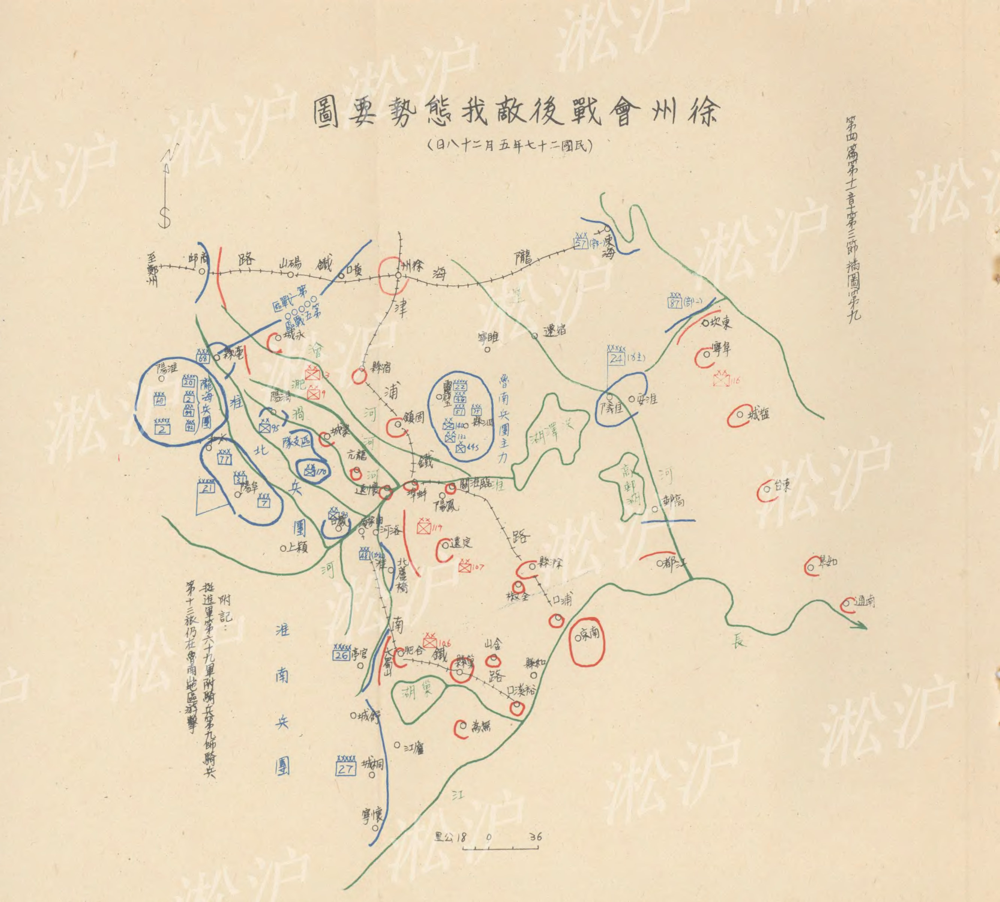

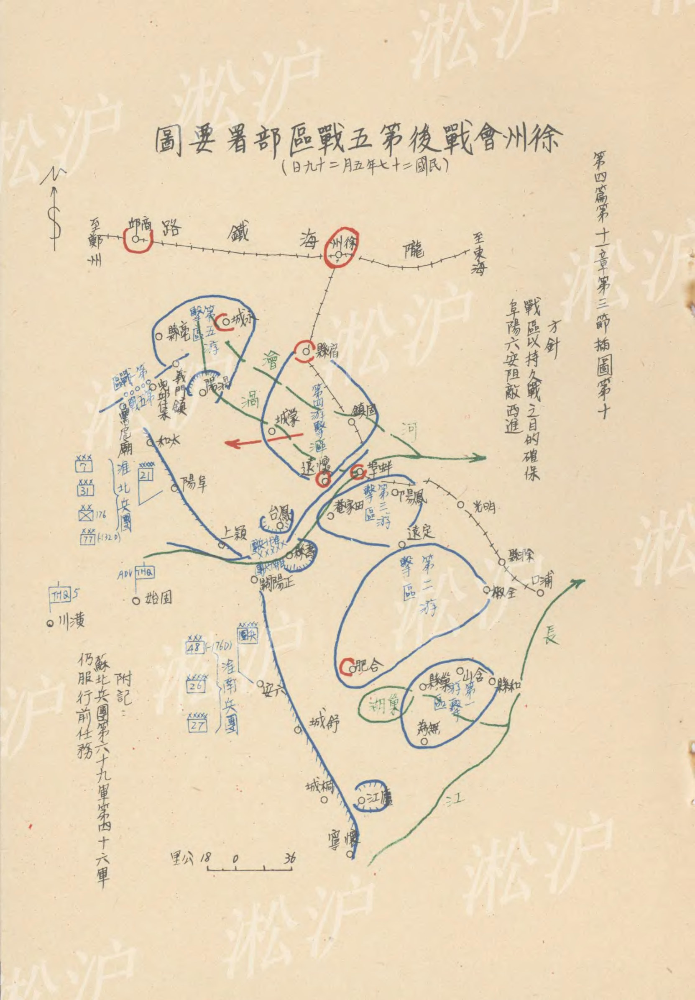

合

計

約十三個半師團

判

敵軍奪取徐州後，爲根本毀滅我戰力，屈服我戰志計，當仍繼續作戰，迅速攻略武漢爲至當，以主力先攻略開封、鄭州，廓清徐海及隴海線之我部隊，然後準備從各方會師武漢。其作戰指導概述如左：

一、津浦線方面：（一）敵主力當沿隴海線及蒙渦道西進與由荷澤、金鄉南犯之敵，擊破我軍，奪取汴鄭及許昌作南下之據點。

(二)敵以有力一部會同淮北、蘇北敵軍，廓清該方面之我軍，必要時更集結兵力於蒙城、懷遠方面，待機西犯。

二、淮南線方面——合肥之敵，相機沿浦口、信陽公路，西犯六安，作側擊信陽之準備。

三、平漢線方面——敵目下或由後方增加有力兵團於道清線以南地區，相機南渡，攻略汴鄭，並牽制我軍兵力於正面，使隴海線西進之敵攻擊容易。

四、江南方面——敵一時似仍取戰略守勢，一面仍繼續致力肅清我游擊部隊之工作。

一、本表根據軍令部特字情報彙篇第三輯並參考有關資料調製。

二、第四時期自五月三日起至五月二十八日止。

三、本期津浦南段敵增加約一個師團，津浦北段敵約增加半個師團。

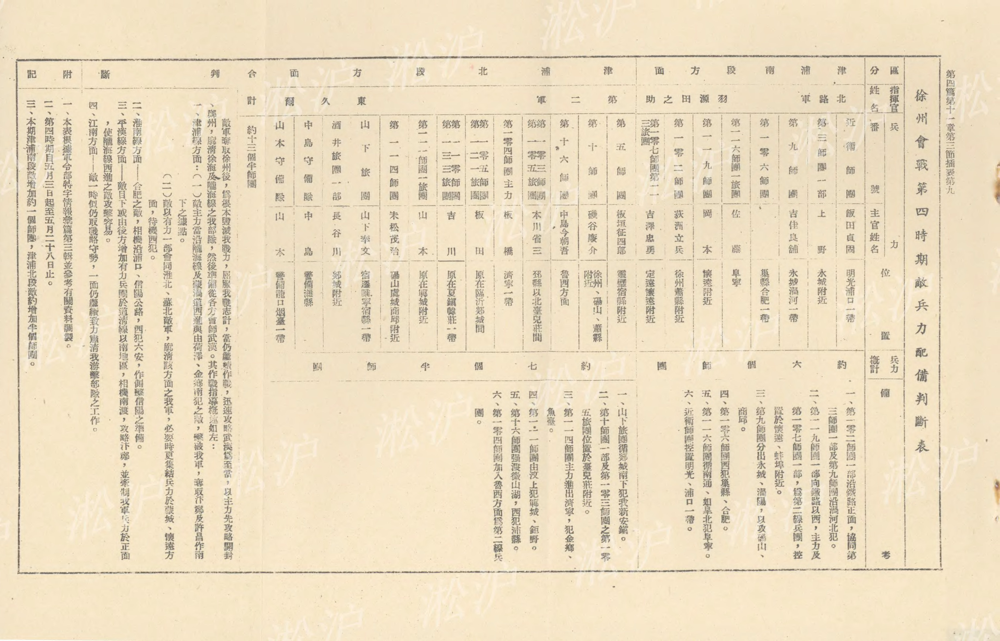

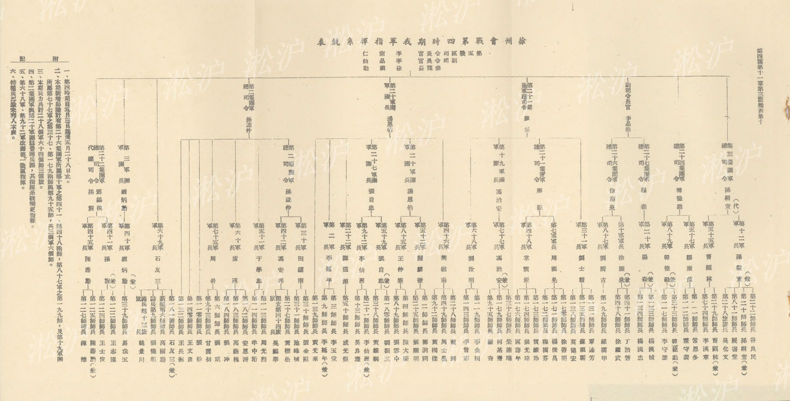

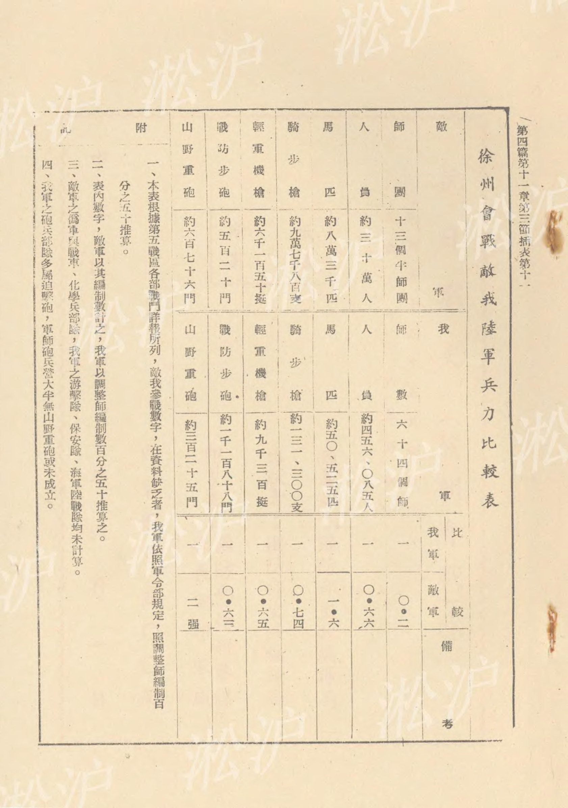
