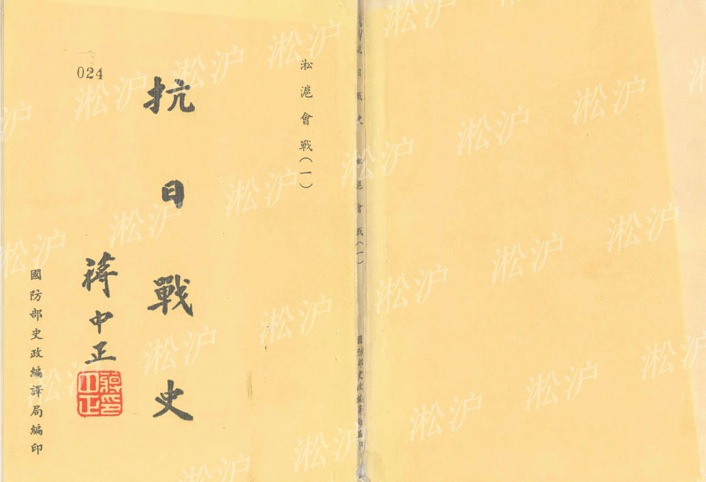

## 第十章 淞滬會戰

概述

### 第一節 會戰前狀況

#### 第一款 敵軍

#### 第二款 找軍

#### 第三款 兵誌概要

### 第二節 我軍作戰指導

### 第三節 會戰一般經過

#### 第一款 攻勢時期

#### 第二款 陣地戰時期

#### 第三款 轉移陣地時期

#### 第四款 南京保衛戰時期

### 第四節 重要戰鬥

#### 第一款 虹口楊樹浦之圍攻

#### 第二款 羅店鎮之圍攻

### 第五節 檢討

#### 第一款 敵軍

#### 第二款 我軍

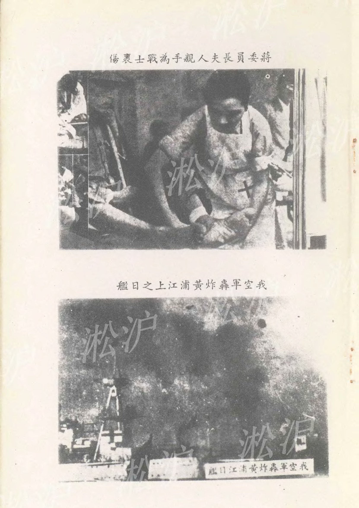

（民國二十六年八月十三日至十二月十三日）

概述

日本乘歐美各國經濟大惶恐，經「一二八」之試探，至二十六年認爲吞併我國之時機已至，遂發動蘆溝橋之攻略，八月中旬，偵悉我國將全面抗戰，遂編成上海派遣軍進犯淞滬，企圖佔據上海，威脅南京，以屈服我政府意志，於二十六年八月十三日開始向我淞滬第九集團軍攻擊。

我第九集團軍亦於十五日向虹口、楊樹浦圍攻，二十二日突貫敵陣進至匯山碼頭，旋卽轉移兵力進攻長江登陸之敵，敵亦由虹口、張華濱南北兩方向我行鉗形反擊，皆未得逞，至九月五日，虬江碼頭之敵登陸成功，我第九集團軍漸被優勢之敵壓迫於預備陣地，第十五集團軍對長江登陸之敵攻擊，奪回寶山城、獅子林、羅店鎮等處後，而羅店鎮復於八月二十八日被敵攻陷，雖經我軍兩次圍攻，皆未收得效果。迨九月六日寶山城再度失陷，我遂被迫退守月浦、新鎮、羅店南方之線與敵對峙，第八集團軍之防守杭州灣，至八月二十一日及九月初旬與敵發生局部戰鬥後，亦形成對峙之勢。

第三戰區司令長官部鑒於我軍攻勢之不利，於九月六日令各集團軍調整陣線，轉移至北站、江灣、顧十房、羅店西南互瀾河口之線改取守勢。

敵主力由寶瀾、寶羅兩公路向我左翼軍顧十房、羅店以南之線進攻，我軍予以打擊，然敵後續兵團源源增加，並以優越機砲戰車轟毀該線陣地。

我遂退守江家宅、劉家行、樊家橋、施相公廟之線，旋敵復集注主力猛攻，我傷亡慘重，復撤至唐橋站、蘊藻濱南岸陳家行、施相公廟、瀾河之線，此際敵後續兵團續增，轉向蘊藻濱南岸猛攻，當敵突入一部之察，適我第二十一集團軍增到反擊，戰況益趨慘烈。

我戰區分令中央作戰軍。右翼作戰軍以十個團編成攻擊軍轉取攻勢，終因敵火優越無大進展，敵復乘機猛攻；突破我大場，走馬塘之線，我退據蘇州河南岸瓦唐家橋、施相公廟、瀏河之線堅強抵抗，至十一月五日，敵乘我杭州灣守兵薄弱，由金山衛一帶强行登陸，進迫松江，以威脅我主力軍側背。

我戰區爲保持戰力利用國防工事予敵抵抗，遂於八日晚令淞滬全線向平嘉、吳福之線轉移。

九日拂曉前，右翼作戰軍一部向虎嘯橋、鎮楓鎮之線，主力向珠閣街、章堰鎮、仇江之線逐次轉移。十一日夜，左翼作戰軍主力西移，十二日，右翼作戰軍大部已至崑山城以西，十三日、左翼作戰軍第十五集團軍先頭一部進入常福陣地，第二十一集團軍以第四十八軍主力攻擊支塘鎮北方之敵，並以該軍一部進入常福陣地，十五日，敵攻擊常熟城，第二十一集團軍第四十八軍主力進入常福陣地，十八日，第十五集團軍大部與敵發生戰鬥，虞山失陷，第二十一集團軍戰鬥激烈，十九日，兩集團軍反攻虞山未奏效，爾後左翼作戰軍卽向錫澄線轉移。

平嘉線方面，自我向馬牧港崇德城、青鎮、南濤鎮之線轉移以來，敵軍以主力對吳興方面攻擊，向西突進，第七軍在菱湖鎮、昇市、大錢鎮之線陣地被敵突破，退守金蓋山吳興城、黃龍洞第二線陣地，二十四日吳興城失陷，第七軍轉移長興方面，二十七日，第二十三集團軍第一四四師側擊敵人於小王山，翌日，第一四六師突入泗安鎮，三十日，第一四五師在廣德附近予敵阻擊，我軍轉移誓節渡。

前由吳福線向西轉移之左翼作戰軍，其第二十一集團軍向長興轉移，改爲第七軍團，指揮第七軍及第四十八軍，十二月一日後，抵孝豐城西北一帶，第十五集團軍經宜興向廣德轉進，改爲第十六軍團，在廣德城西之花鼓塘誓節渡之線與敵戰鬥數日，十二月六日，逐次轉移至寧國城北楊灘、胡村、張家橋之線，與敵對峙迄會戰完畢。

當我軍在陣地戰時期中，政府已西遷而轉駐重慶，並令唐生智爲南京衛戍司令長官，指揮約十四個師兵力保衛南京。

十二月六日，敵沿京滬公路及郎溪分向南京外圍陣地攻擊，激戰至九日，敵後續兵團沿京滬、京蕪兩鐵道增到，我被迫向核心陣地固守，十二日，敵突入城垣與我巷戰，唐司令長官鑒於戰局無法收拾，遂令所部於十二日夜由下關及太平門突圍，因渡河器材缺乏，且迭遭敵截擊，傷亡極爲慘重，僅一部突出重圍向指定地點集結。

本會戰，我軍以步兵七十餘師及砲兵五團對於數倍優勢火力之敵步兵二十餘萬，十九個師團番號！

參照插表第一，戰車百餘輛，野山砲三百餘門，飛機二百餘架，在正面二百餘縱深三百餘公里之地域內浴血苦戰四閱月，以爭取第一會戰之勝利，其結果雖傷亡慘重，南京淪陷，然我軍隊戰鬥信心因之增强，全國政權益趨統一，政府抗戰把握更爲堅定，國際觀聽頓爲轉變，且我贏得數月之裕餘時間，將沿海物資向武漢等方面轉運，以充實戰力，而行長期抗戰。

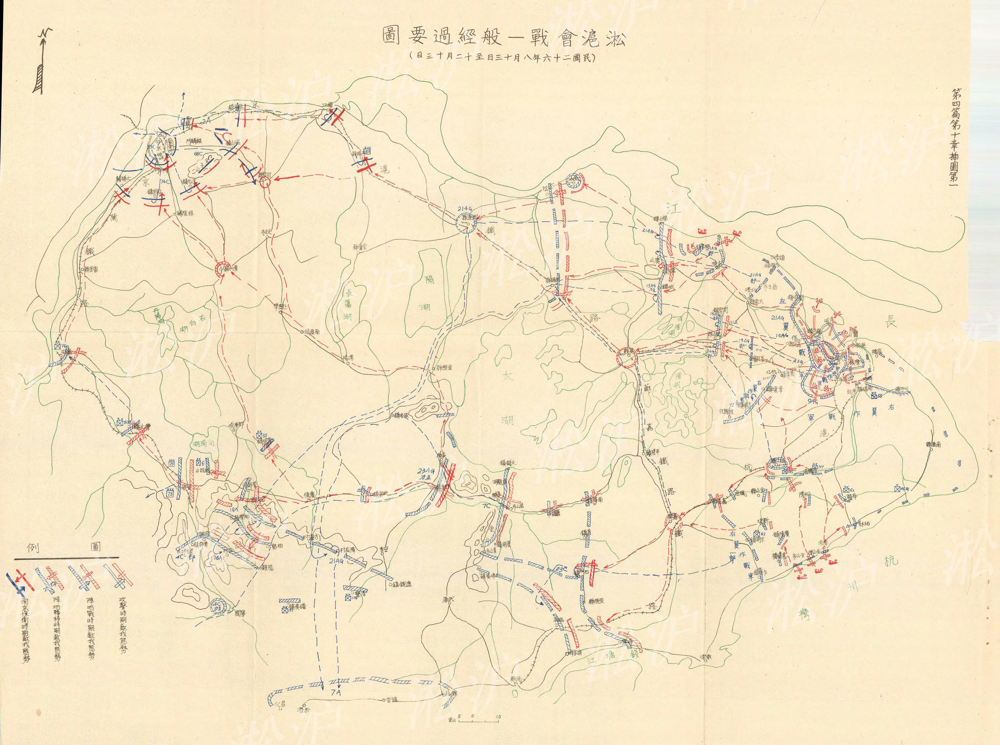

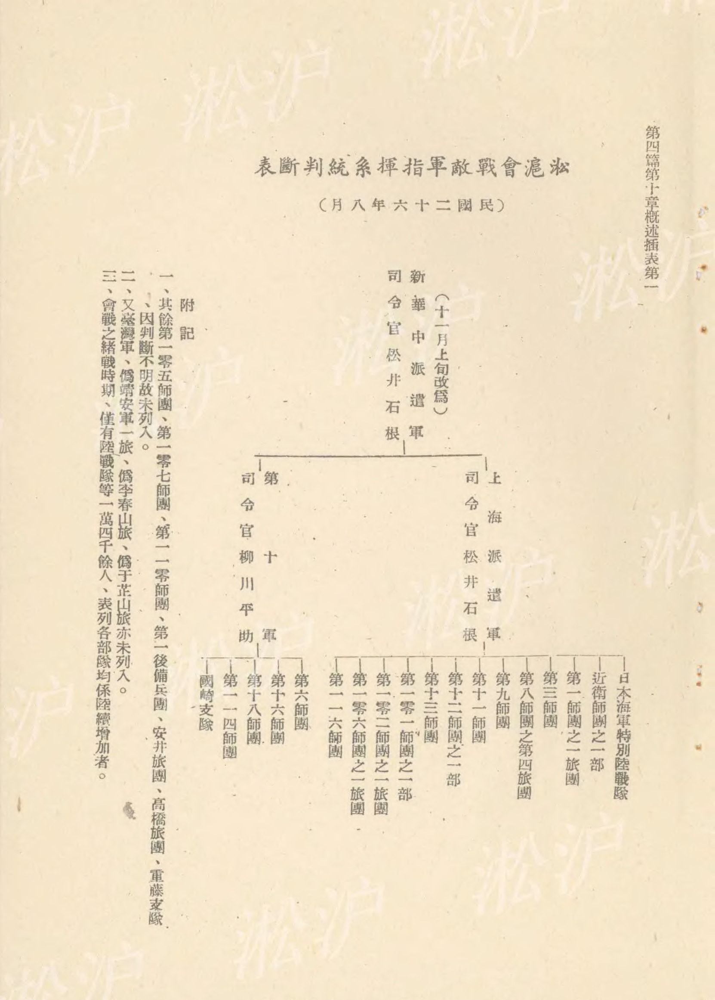

### 第一節 會戰前狀況

(參照插圖第二)

第一欵敵軍

敵軍自二十六年七月七日於蘆溝橋啓衅後，企圖强佔我上海市，扼制長江口，威脅我首都，以屈服我政府意志，並牽制我進兵華北；七月中旬，迭次以汽車載武裝官兵示威於江灣一帶，並常以部隊施行夜間演習於滬西，越界築路，一再挑釁未果，乃藉口其水兵宮崎一名於寧波路失蹤，二十日，敵陸戰隊本田參謀長竟要求我國飛機停止飛行上海市上空，迄八月九日，其陸戰隊大山勇夫少尉又率兵一名乘汽車衝入我虹口機場示威，不服制止，並開槍擊斃我衛兵，我保安隊激於義憤遂行還擊，將敵官兵兩人擊斃，此案發生後，我仍持不擴大事態方針，由上海市長俞鴻鈞與敵折衝，往返交涉，敵始允以外交方式解決，至十一日，敵突然提出要求：（一）撤退上海保安隊。（二）所有保安隊之防禦工事概行撤除。此時幷以軍艦二十餘艘護送運輸艦五艘向上海開駛，另在上海動員海軍陸戰隊及在鄉軍人與義勇團，並將敵第一第三艦隊軍艦三十餘艘集中吳淞一帶，其陸軍亦開始向上海運送，至此戰事遂有一觸卽發之勢。

此時日軍在淞滬方面之陸海空軍兵力概如左述：

陸軍計有海軍陸戰隊約三千二百人，在鄉軍人約三千六百人，新由各艦登陸約三千餘人，各艦可抽調約一千六七百人，共約一萬二千人左右，其武器有大小口徑砲約百餘門，戰車、裝甲車各約二十餘輛，高射砲八門，以虹口靶子場海軍陸戰隊本部爲核心，並以楊樹浦、公大紗廠及滬西中山路豐田紗廠設置軍事據點，形成核心之兩翼，更在敵勢力區內，凡公私住宅、機關、學校、商店、碼頭均依需要構築各式掩體及倉庫，至「七七」爲止，已有軍事設備八十餘處。

淞

會

戰

五

空軍計有轟炸、驅逐、偵察等飛機三十餘架，並有泊於吳淞口外之航空母艦一艘，似爲能登呂號，該艦約一四零五零噸，有飛機十五架，不時飛臨上海、杭州及蘇浙沿海各上空偵察。

海軍日艦在淞滬方面有第一、第三艦隊，共約軍艦十七艘，其中五艘停泊吳淞口外，其他十二艘爲二等巡洋艦四艘（川內、由良、名取、鬼奴均爲五千二百噸、定員四百四十八員名），新式一等驅逐艦八艘（時雨、白露、夕暮、有明、初霜、子日、若葉、初春均爲一千三百六十八噸，定員二百人）；皆於十日十八時前駛入黃埔江，合前原泊淞滬之日艦已達三十餘艘。

迨十二日，有日陸軍部隊二千一百名登陸，太部進駐北四川路附近，一部則駐公大紗廠，又江灣路（虹口公園西與八字橋附近）已有日陸戰隊佔領陣地，其主力約五千人集結於日海軍司令部，附砲二十餘門亦已進入陣地。

第二欵

我

軍

淞滬方面，我因受「一二八」淞滬協定之拘束，上海市區內僅駐有淞滬警備司令楊虎所指揮之上海市保安總團（總團長吉章簡，第一、第二兩團及特務大隊）、上海市警察總隊及上海市保衛團（團長姜懷素，第一、第二兩團約五千人）等部隊，京滬鐵路沿線有京滬警備司令張治中所指揮之第八十七、第八十八兩個師，分駐於鐵路沿線，自八月上旬以來，各該部隊卽集結於吳縣、常熟、無錫一帶，十一日二十一時，奉軍事委員會命令向上海市附近推進。

軍事委員會十一日另令獨立第二十旅（欠駐蘭州之第六六零團）之兩團（第六五八團喬裝憲兵第十三團駐松江縣，第六五九團喬裝保安總團團部與第三營駐吳縣，第一營駐虹橋機場，第二營駐龍華警備司令部），駐蚌埠之第五十六師（八月七日由蘇浙邊區開蚌埠），駐嘉興之砲兵第二旅之一團及駐南京之砲兵第十團第一營等部皆向吳縣附近輸送。

軍事委員會十二日復令駐漢口之第九十八師卽向滬船舶輸送，第五十七師第一六九旅由嘉興向龍華鎮輸送，駐宜興之砲兵第十團第二營向吳縣輸送，均歸張治中總司令指揮。

第九集團軍張治中總司令十二日六時由吳縣到達南翔，十六時令第三十九軍劉和鼎軍長指揮第五十六師及江蘇保安第一、第四兩個團擔任瀏河至江陰（不含）之江防任務。

第八十八師之三個團，同日十五時三十分在眞茹車站下車，推進至北站、東錢家塘之線，上海市保安總團（附上海市保衛團）（原在北站宋公園路、江灣東方附近之線掩護第九集團軍展開）大部爲預備隊，並警戒師右側背，師指揮所在眞茹車站。

第八十七師第五二一團同日四時三十分進入吳淞鎮，第五二二團（欠兩營）及師直屬隊六時五十分到達顧家宅，第二六一旅後續部隊亦陸續到着，第二五九旅（分四列車）於三時五十分先後到眞茹車站，第五一七團向市中心區前進，第五一八團在江灣鎮附近集結，師指揮所在大場鎮。

砲兵第十團第一營已在大場鎮、眞茹間佔領陣地。

獨立第二十旅在松江縣之第六五八團本晚可到南翔，其他部隊亦在輸送中。

我海軍八月十一日鑒於上海情勢險惡，吳淞口集結敵艦甚多，爲使敵艦失去航行目標，乃將江陰下游各航行標誌一律破除，同時爲確保首都安全計，乃採斷然手段，將江陰要塞水道加以阻塞，初步工作卽於十二日完成。

第三欵

兵誌概要

參照插圖第三

京滬地域位於華北大平原南緣，扼東南丘陵北麓，當長江、淮河下游，爲華東政治經濟文化中樞。

江淮地域爲一河流川渠交錯地區，此類河渠平均河幅一至二百公尺不等，通常不能徒涉，京滬路以南濱湖諸縣及長江兩岸自揚中至燕湖地區地勢低窪，湖沼棋布，常有氾濫，沿海一帶均築有捍湖塘堤，西部江浦、寧鎮山區及茅山山脈海拔多在四百公尺上下，沿江一帶並有高二百公尺上下之玄武岩流，高原割裂，丘陵甚多，濱海湖及沿江兩岸，常見斷崖高出地平十餘公尺不等。

本區夏季悶熱多雨，冬季常見霜雪，七八月雨量最豐，上海附近每年三至十月多東風，十一月至二月多西北風，沿海六月多霧，七八月霧日最少。

本區鐵道有津浦、京滬、滬杭甬、浙贛諸線，津浦路在下闕藉輪渡與京滬路啣接，京滬路在上海附近有吳淞、虬江碼頭、龍華線通達黃浦江邊，水陸聯運尚便。公路以京滬、京杭、滬杭、杭徽、杭江、杭溫等爲主要幹線，路幅七至九公尺，碎石路面，備設良好，橋涵載重量十五噸，排水亦佳，不受雨期阻礙。水道有海洋及長江航運，通常吃水二十四呎巨型船艦進出無阻，黃浦江、錢塘江、運河及太湖邊緣各河流，均可通航四十噸小汽船，本區河川密度甚大，民船汽艇隨處均可進出。

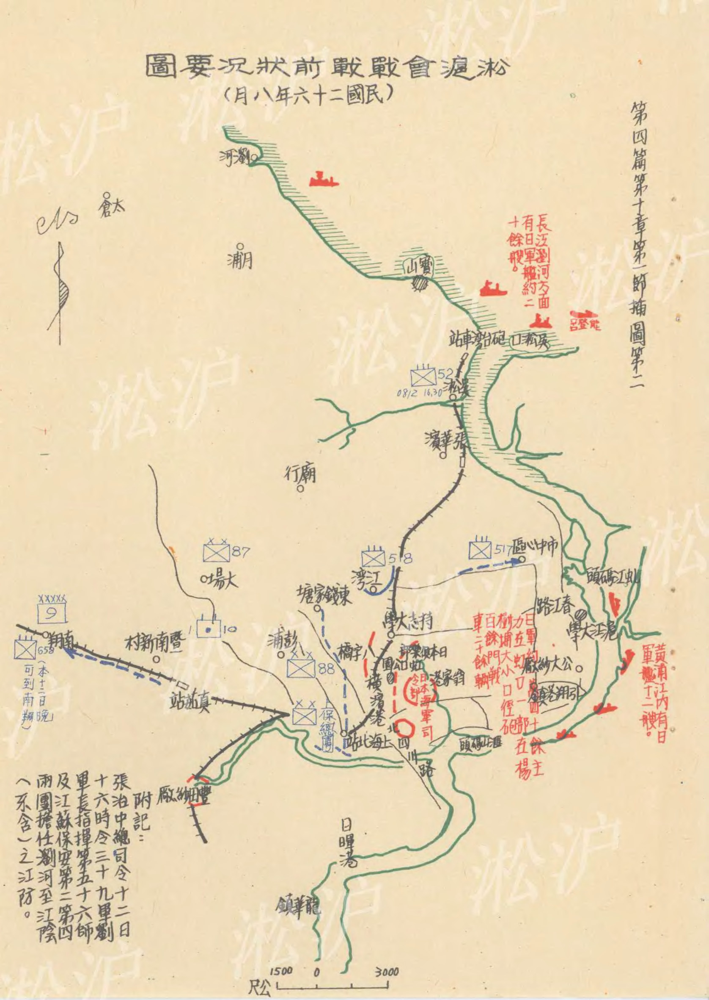

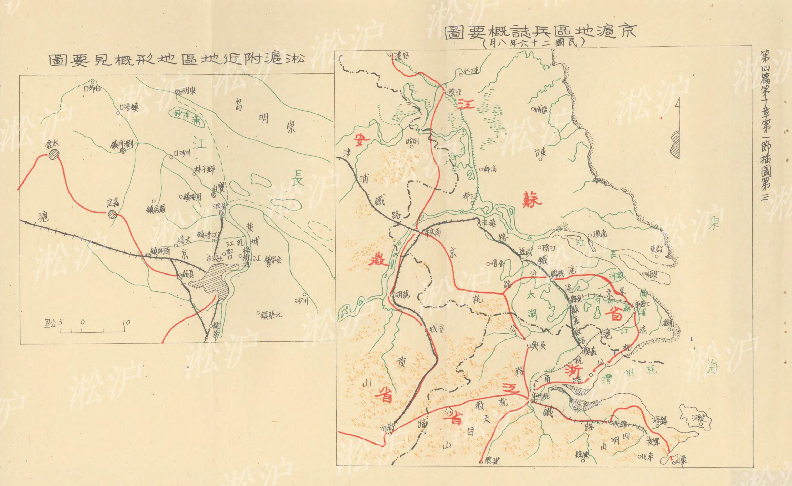

### 第二節 我軍作戰指導

(參照插圖第四)

自敵發動淞滬戰事後，我軍事委員會先依預定作戰計畫草案部署各兵團與指導作戰，至二十六年八月二十日始頒發第三戰區作戰計畫如左：

第一、敵情判斷

敵如取消極行動時，則彼在上海市方面必暫取守勢，用海軍掩護，其兵力之一部，由瀏河、楊林、上丫各口强行登陸，於登陸成功後，再由上海市方面轉移攻勢，企圖進出崑山、太倉、瀏河之線。如取積極行動時，則其海軍之行動將益擴大，除由上述各口登陸外，更取大包圍之態勢，分由澣浦、瀏海沙方面强行登陸，向我吳縣、福山之國防陣地線側背攻擊，同時更增加兵力，以摧破我全正面，進而威脅我首都。

第二、指導方針

戰區以鞏固首都及保有經濟策源地之目的，迅速圍殲上海市附近之敵人，並打破其沿海沿江登陸之企圖。

第三、兵團區分

淞滬圍攻區

指揮官

第九集團軍總司令張治中

第三十六師

第五十六師

第八十七師

第八十八師

第九十八師

獨立第二十旅

教導總隊之一部

軍政部學兵隊

淞滬警備部隊

上海市保安總團

上海市警察總隊

上海市保衛團

重砲兵第十團

砲兵第三團

砲兵第八團

砲兵第十六團

在圍攻期內暫歸指揮

重迫擊砲兩營

戰防砲兩連

戰車一營

太湖聯防部隊

二、長江南岸守備區

指揮官

第五十四軍軍長霍揆彰

第十一師

在圍攻期內暫歸淞滬圍攻區

第十四師

第六十七師

暫控置於南京附近

砲兵第十六團

在團攻期內暫歸淞滬團攻區

三、長江北岸守備區

指揮官

第一百一十一師

長常恩多

第一百一十一師

江蘇保安隊第一團

江蘇保安隊第八團

四、杭州灣北岸守備區

指揮官·第八集團軍總司令張發奎

第六十一師

第六十二師

第五十五師

第五十七師

獨立第四十五旅

砲兵第二團

五、浙東守備區

指揮官

第十集團軍總司令劉建緒

第十六師

第六十三師

第五十二師

新編第三十四師

獨立第三十七旅

暫編第十一旅

暫編第十二旅

暫編第十三旅

第四、作戰地境

一、長江南岸守備區與淞滬圍攻區間，爲太倉縣城——夏駕橋——浮橋鎮之線，線上屬圍攻區。

二、淞滬圍攻區與杭州灣北岸守備區間，爲松江縣南側——閔行——黃浦江左岸之線，線上屬圍攻區。三、長江北岸守備區守備靖江縣、南通縣、海門縣、啓東縣沿岸。

四、杭州灣北岸守備區與浙東守備區間，爲杭州、錢塘江至杭州灣、玉盤山之線，線上屬浙東守備區。五、浙東守備區守備永嘉縣、臨海縣、鄞縣、紹興縣沿海。

第五、兵團任務

一、淞滬圍攻區

就現佔要點增強工事，逐步進攻，以縮小敵之防守範圍，使其增援部隊不能擴張，以達成圍殲敵人之目的，同時構築眞茹鎮、大場鎮、廟行、蘊藻濱至吳淞鎮等處工事，以鞏固圍攻基礎。

二、長江南岸守備區

以積極行動，澈底殲滅敵之登陸部隊爲主任務。

第十四師主力位置於常熟附近，一部在白茆口、福山鎮、鹿苑鎮間沿江警戒，與瀏河之第五十六師協調。

第六十七師暫控置於南京附近。

第十一師位置於吳縣、崑山縣附近，並派一部在江陰縣間江邊警戒。

第十四師、第十一師對於國防陣地須詳細偵察，慎密考慮戰術戰鬥上之運用，並修補增強之。三、長江北岸守備區

主力位置於南通附近，於靖江、海門、啓東沿岸各派一小部隊警戒之。

如敵軍企圖由長江南岸登陸或通過江面時，以我射程所及而制壓之。

四、杭州灣北岸守備區

以積極行動，澈底殲滅敵之登陸部隊爲主任務，主力位置於嘉興、乍浦附近，一部在沿海要點警戒，並派步砲兵一部位置於黃浦江東岸，便於向敵側背施行射擊，以策應淞滬區之作戰。五、浙東守備區

主力位置於鄞縣（卽寧波）、蕭山、杭縣附近，一部直接警戒浙東沿海。

如敵企圖由杭州灣北岸地區登陸時，則支援該地區友軍殲滅敵人。

六、預備隊之控置與運用

各地區指揮官各控置適當兵力，俾適時得應鄰近地區及其他之需要。

七、部隊配置與工事構築

各地區指揮官無論在攻擊與防禦時，皆須使各部隊取縱深配備，注意對陸對空疏散遮蔽，凡部隊所到之處，均須構築工事。

八、空軍行動

淞，

滬

會

戰

一三

對企圖登陸之敵，須予以最大威力之轟炸，對敵航空母艦，尤應不顧犧牲强行炸沉之。

九、海軍行動

應協同陸軍作戰，如敵船進入長江下游，企圖强行登陸或轉用兵力時，須盡力攻擊之，縱有犧牲亦所不惜。

十、後方勤務部之任務

適應各地區作戰之要求，完成通信交通衛生諸設施，充實彈藥器材諸補充，至其集積運輸等，務須注意疏散及對空對陸之遮蔽，以避免敵空軍及砲兵之轟擊。

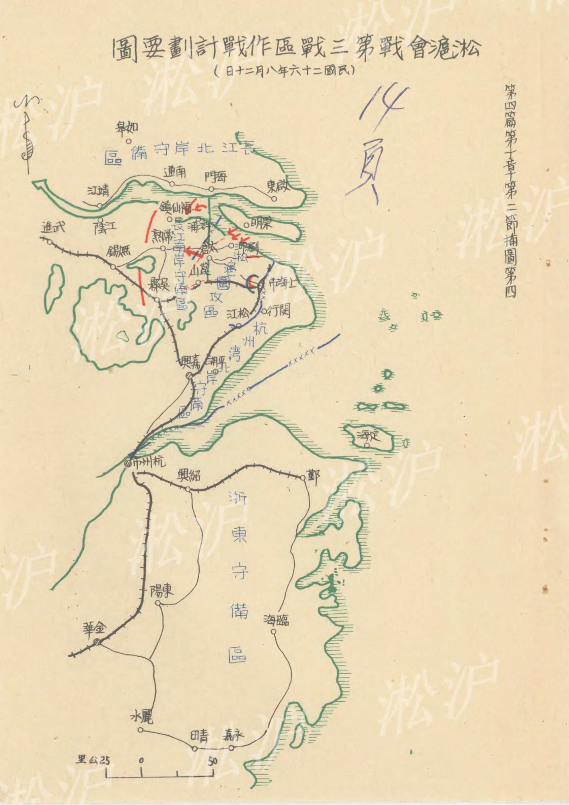

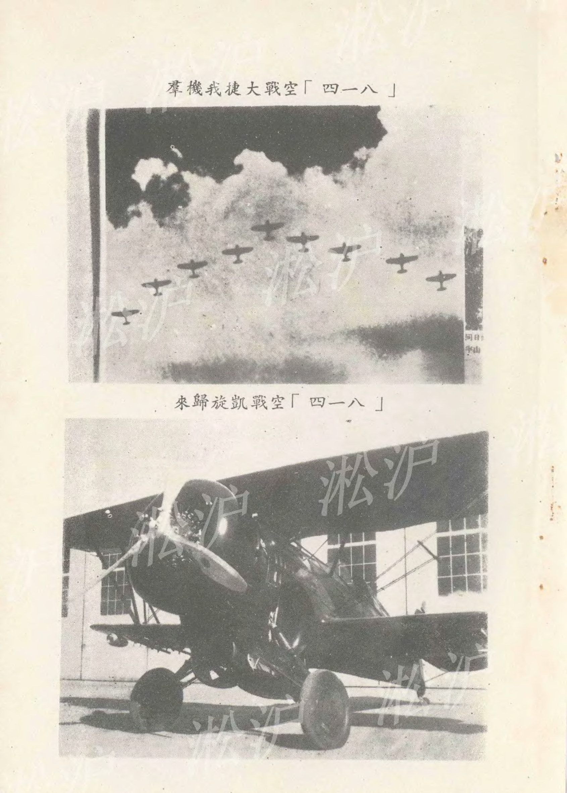

第三節

會戰一般經過（參照插圖第一）

第一欵

攻勢時期

（民國二十六年八月十三日至九月十一日）

自二十六年八月十三日虹口方面之敵向我八字橋持志大學攻擊後，我第九集團軍乃於十五日開始攻擊虹口、楊樹浦之敵，至二十一日曾突入匯山碼頭，此後因長江方面與虬江碼頭敵人登陸，而將戰鬥焦點移於張華濱方面，爾後我遂移於預備陣地。

第十五集團軍自八月二十四日對長江沿岸登陸之敵攻擊以來，二十八日曾突入羅店鎮，擊斃敵指揮官，此後因寶山之敵西進，敵一部並企圖於楊林口方面登陸，我乃將攻擊部隊逐次撤回於瀏河之線。第八集團軍防守杭州灣及浦東，於八月二日肅清浦東之敵，九月三日與九日擊潰二次登陸之敵。

茲詳述各集團軍之會戰一般經過如左：

##### 第一項 淞滬之攻擊

民國二十六年八月十三日至九月十二日

參照插圖第五至第八插表第二

八月十三日，淞滬一帶日軍艦共有三十二艘其中十三艘停泊黃浦江中，十九艘在長江之瀏河方面，日陸戰隊約六千人，主力在虹口附近，一部在楊樹浦及滬西各紗廠，豐田紗廠有陸戰隊約二百餘人。張總司令於是日十三時下達對滬西一帶警備命令要旨如左：

集團軍主力於上海北站、江灣鎮、市中心區、吳淞鎮之線嚴密警備，第八十八師一部在蘇州河左岸對滬西紗廠及豐田紗廠之敵警備。

第五十七師第一六九旅推進至徐家匯鎮沿虹橋路至工部局苗圃之線，在蘇州河南方日暉港以西之淞滬警備司令部部隊歸該旅長指揮。

三、獨立第二十旅第六五九團，於第一六九旅到達後，卽集結於北新涇鎮及虹橋飛機場待命。

敵軍本（十三）日上午越界，强佔八字橋持志大學，十八時以步槍與戰車向我第八十八、第八十七兩師射擊，同時敵艦砲射擊我市中心區，我未還擊。

張總司令將以上情形報告軍事委員會並請示機宜。

軍事委員會本（十三）日夜之處置如左：

一、令第九集團軍（淞滬警備軍隊改編者）於明十四日拂曉開始攻擊虹口、楊樹浦。

二、令空軍於明（十四）日出動，協同陸軍作戰。

三、令海軍部封鎖江陰江面。

四、令第五十七師在龍華鎮之第一六九旅第三三七團附砲兵第二旅第二團之一營，由砲兵第二旅旅長蔡忠笏親率渡江，進至浦東掃蕩該處敵人，並攻擊浦西之匯山碼頭與公大紗廠之東側面，第五十七師駐平湖海鹽之第一七一旅續開龍華，在法華路至林肯路、蘇州河沿岸警戒。

五、第十八軍（羅卓英部第十一、第十四、第六十師）由平漢線方面轉向吳縣輸送（該軍現正由漢口向保定輸送中，其先頭已抵鄭州）。

六、第八（蘇浙邊區公署改編爲第八集團軍，指揮第十六、第五十五、第六十二各師與獨立第四十五旅、砲兵第二旅，欠第三團）、第九兩集團軍之作戰地境，爲蘇州河、北新涇鎮、諸翟鎮、青浦縣城之線，線上屬第九集團軍。

七、上海市附近蘇州河以南地區，在上海市圍攻時期中，其部隊之指揮權，暫歸第九集團軍。

第九集團軍張總司令十四日拂曉前奉到上項攻擊命令後，卽令各師奪取圍攻要點，準備明（十五）日拂曉攻擊，本晚各師在推進之戰鬥中，第八十八師第二六四旅旅長黃梅興中砲彈陣亡。

第五十七師第一六九旅十三日十二時在龍華車站下車後，十四日三時已到徐家匯鎮，以第三三九團及第三四零團第一營與砲兵營沿虹橋路至工部局、苗圃之線，對蘇州河右岸之敵警戒，此時，徐家匯鎮（譚子港南六公里）附近已無敵蹤，惟有英美軍在徐家匯車站鐵路東側佈防，該師接到張總司令命令，卽派第三三七團配屬砲兵第二旅第二團第一營歸砲兵第二旅旅長蔡忠笏指揮，往浦東守備洋涇鎮、張家灣之線，第三四二團渡江在川沙縣、南匯縣、白龍港、三九港、徐家路等處構築工事，第三四零團、欠第一營）在龍華鎮附近，對南匯縣、日暉港方向之黃浦江警戒。

我空軍十時轟炸匯山碼頭、日海軍司令部及公大紗廠，皆起大火，並炸傷敵出雲旗艦，同日杭州上空之空戰，我以劣勢空軍擊落敵機三架，我無損失，首創光榮之紀錄。

據報敵在崇明島關有飛機場。

張總司令本夜下達明（十五）日拂曉攻擊命令，要旨如下：

集團軍明（十五）日拂曉開始攻擊，重點指向楊樹浦港以西至虹口公園、日海軍司令部間，於空軍轟炸後，在砲火掩護下攻擊，壓迫敵人於蘇州河、黃浦江而殲滅之。

十五日拂曉後開始攻擊，第八十七師右翼一度突入日本俱樂部。

總司令部據報長江方面徐大涇口到敵艦七艘，似有企圖登陸模樣，卽令第三十九軍嚴密戒備，並請軍事委員會調吳縣第十四師派一旅赴常熟。

軍事委員會令第十四師速派步兵一團星夜輸送至福山鎮警戒江面，主力陸續開往常熟集結，與太倉第五十六師連絡，砲兵第十團團部及第二營亦於本（十五）日到達上海市，第五、第六連進入陣地。上海市保安總團團長吉章簡十六日一時接奉張總司令命令要旨，着該部配屬重砲一連，接替吳淞鎮附近之防務，歸第八十七師王師長指揮，該團於十六、七兩夜陸續到達，接替第八十七師第五二一團之淞

淞

會

戰

一七

吳淞防務，配備重點在吳淞鎮方面。

張總司令令第三十九軍以江蘇保安團擔任長江各口直接警戒，着第五十六師以營爲單位，控置於各江口相當距離後之各要點，以不失時機，確實協助保安團拒止敵人，該師部在支塘鎮，軍部在太倉城。第八十八師第二六四旅本日七時後，在八字橋一帶與敵反復行爭奪戰，第八十七師攻至日海軍操場，虬江橋方面戰鬥激烈，我砲兵第十團擊傷敵艦兩艘。

張總司令十六日十七時命令，着於明十七日拂曉再攻與擊，重點同前。

我空軍十六日在京滬上空與敵機空戰甚烈，擊落敵機二架，我機兩架受傷，偵察員區輝由降落率降落吳淞附近，另一架受微傷。

電雷學校教育長歐陽格於十六日由江陰率魚雷艇來滬，由大隊附安奮邦率第一零五號艇之艇長胡競端及所屬浦吉齊等士兵五名，冒險進至南京路外灘附近，向停泊日領署碼頭附近之出雲旗艦連射魚雷七枚，均已命中，該艦受傷甚重，惟其裝有防雷網，故未致沉沒，我第一零五號艇因油箱中彈沉沒，艇員皆獲得救。

十七日五時，我軍開始攻擊，第八十八師在日本墳山、八字橋、粵東中學一帶行激烈之爭奪戰，我犧牲約一營，敵傷亡約三百五十人。第八十七師九時又曾突入日海軍俱樂部，本日激戰敵傷亡約五千人左右，我犧牲亦大，然士氣旺盛。

我砲兵射擊日海軍司令部，彈多命中，空軍轟炸敵第一線堡壘及日海軍司令部，幷擊落敵機兩架。

初我爲防止敵艦向黃浦江上駛威脅我滬南計，開始在浦東區之東昌路西端爛泥渡，實施江面阻塞工事三層，至本晚已全部完成。

十八日，我暫停攻擊，藉以整理戰線準備再攻，敵空軍大編隊炸我市中心區，閘北、大場鎮等要點。十九日，第八十七師第五二二團攻抵楊樹浦區內唐山路、公平路口。

張總司令綜合本日所得確實情報，敵國確已開出三個師團共約六萬人，分三批運輸，首批已於今晨駛抵吳淞口附近，第二批約明後日到達，第三批輸送尙無確期，本晨由楊樹浦附近登陸之敵，卽首批中之一部，登陸後卽向軍工路滬江大學之線前進，其主力仍在艦內，停泊吳淞口外，此全部敵約萬人，第六師團約四千人，近衛師團約六千人。

又奉軍事委員會命令，派陳誠爲第三戰區前敵總指揮。

張總司令命令第三十六師（由西安調回，十七日晚在南翔下車）加入第八十八師與第八十七師中間攻擊敵人，擴張戰果（命令詳重要戰鬥）。

各師自二十日開始攻擊後，於二十一日突貫敵陣至匯山碼頭，二十二日夜敵在吳淞、獅子林、川沙口等方面强行登陸，我圍攻虹口、楊樹浦之兵力遂向北轉移，戰鬥焦點乃轉移於吳淞、張華濱方面矣。我空軍霍機三架，二十二日在上海近郊與敵驅逐機遭遇，發生空戰，此役我機二架負傷，大隊長王天祥陣亡。是日，我達機三架分三批夜襲虹口敵陣地，彈多命中，火光沖天，白烟雲湧，我機轟炸後安全飛返。

張總司令二十三日八時到達江灣鎮，於十二時三十分處置如左：

派王敬久師長爲淞滬前敵總指揮官，第三十六師、第八十七師、第八十八師、獨立第二十旅、敎導總隊第二團、上海市保安總團、上海市警察總隊均歸其指揮。

二

各該師原配屬之特種兵仍舊。

三

第九十八師歸總部直接指揮，限本（二十三）日二十二時前到達大場鎮。

第八十七師師長王敬久奉令後，卽下達命令，要旨如左：

一、兵團區分

右翼軍長第八十八師師長孫元良

第八十八師

獨立第二十旅

上海市保安第二團

砲兵第八團（欠兩連）

砲兵第三團之一營

左翼軍長第三十六師師長宋希濂

第三十六師

第八十七師（欠一旅欠一團及工兵營、騎兵連）

重砲兵第十團（欠一營）

山砲兵第二營

重迫擊砲第二營

戰車防禦砲第一連

戰車第一、二兩連

二、命令要旨

右翼軍確保原線各要點，增強工事，右與滬西友軍、左與左翼軍連繫，相機攻擊虹口之敵。

左翼軍確保原線各要點，右與右翼軍、左與虬江守備隊連繫，相機攻擊楊樹浦之敵。

兩軍作戰地境，爲南翔北端、沈家行、大場、南大宅、沈家宅、俞涇浦沿沙涇港之線，線上屬左。四虬江守備隊（上海市警察總隊）右接左翼軍，自春江路（含）沿黃浦江西岸至蘊藻濱口之線增強工事，拒止敵人。

五吳淞守備隊（上海市保安團）右接虬江守備隊左翼，自蘊藻濱口（含）、吳淞、寶山以南之線增强工事，拒止敵人登陸，並對獅子林、川沙鎮方向警戒，與第九十八師、第十一師連絡。

六總指揮部預備隊（教導總隊第二團）位於泗涇球場附近。

七各團隊限本（二十三）日十九時開始行動，二十四時部署完畢具報。

王總指揮官與左翼軍宋指揮官商定後，宋指揮官卽命令左翼軍以一部確保楊樹浦原線各要點，以主力佔領愛國女校東北端、狄家濱、新港、吳家濱、唐家灘、馬玉山路、虬江下游之線，增強工事爲數線陣地，相機攻擊敵人，第三十六師與第八十七師作戰地境，爲市立公墓、葉家花園、殷家宅、徐家橋、保定路、秦皇島路之線，線上屬第三十六師。

同時右翼軍亦變更部署完畢，敵人亦在調動兵力中，故本日虹口、楊樹浦方面無戰鬥。

我空軍波機七架，二十三日七時二十五分自句容出發，掩護霍機往上海、吳淞口轟炸敵艦，迨迫近目的地上空時，卽與敵機三架遭遇，當擊墜其二架，擊傷其一架，我機亦一架負傷，一架失踪。我另批霍機四架，於八時四十分在瀏河上空遭遇敵驅逐機五架，亦擊墜其一架，是日十二時迄晚二十四時，我機二十四架先後分七批襲擊瀏河、獅子林、寶山等處敵艦，彈多落敵艦附近，我機二架負傷。

吳淞鎮方面，二十三日十時二十分，敵艦十餘艘、飛機二十餘架轟炸張華濱、吳淞一帶，至十七時，計敵砲擊約十餘發，投彈約五百餘枚，我工事多被摧毀，除吳淞鎮附近之戰鬥另行敘述外，今先述張華濱附近之戰鬥。（參照插圖第六）

張華濱、獅子林、川沙口一帶，拂曉前已各有敵一部登陸，守備張華濱之上海市警察總隊，在張家宅、殷家濱、南徐家灣之線與敵激戰，該隊被迫後退，王敬久總指軍官乃以第十一師第六十二團增援，亦未能將敵擊退，拂曉後敵艦砲射擊益烈，敵兵已增二千餘人，十四時，該團防務由教導總隊第二團接替。第八十七師第二六一旅旅長，二十四日三時奉命率兵一團加入張華濱附近南徐家灣之戰鬥。

宋指揮官九時頃據報，殷行鎮北之陳家宅、丁家巷等處已被敵佔領，市中心區三民路、聞殷路附近有教導總隊第二團及警察總隊陸續混雜後退，嗣接第二六一旅旅長電話，該方面我仍固守南泗塘河之線與敵對峙，但淞滬鐵路與殷行鎮間發生空隙，敵如由此突入則甚危險，當卽擬定如左處置。

一、第二九旅之一營先佔民慶路及其西北之線，相機向前推進。

二、第二一六團抽集之一營，主力集結上海公墓附近，一部推進於李家宅沿河之線警戒。

三、再由第三十六師第二二團抽集一營，推進於南泗塘鐵路橋附近，向張華濱車站警戒。

四、淞滬鐵路（含）迄蘊藻濱所有各部隊，歸第二六一旅劉旅長指揮。

五、派員函警察總隊長龍驤固守待援。

六以電話告知各部隊，各嚴持鎮靜以待後命。

以上處置報告王總指揮官後，於十三時頃獲准施行。又以教導總隊第二團遭受砲擊傷亡甚大，令其在姚家宅收容整頓，並作應援張華濱車站方面戰鬥之準備，至十七時當面情況無變化。

宋指揮官判斷張華濱、殷行鎮附近登陸之敵爲數不多，爲澈底解除左側背之威脅計，擬集結優勢兵力，一舉擊滅該敵，乃策定攻擊計畫如左：

一、軍對楊樹浦方面之敵，擬確守要點以監視之，由第三十六、第八十七兩師各抽一團向東北進出，包圍敵人於張華濱車站附近而殲滅之。

二、第三十六師第一零八旅（欠第二一六團（欠一營）附第二一二團第二營）向孫家宅東端水電公司、丁家巷、李家宅北端之線攻擊，重點指向丁家巷方面，壓迫敵於張華濱車站附近而殲滅之。

淞滬一

三、第八十七師第二六一旅劉旅長指揮淞滬鐵路（含）迄蘊藻濱間地區之部隊，向鐵路線之敵攻擊，重點指向江邊碼頭，協同第一零八旅壓迫敵人於江邊而殲滅之。

四、配屬左翼軍之重砲，山砲，由重砲第十團團長統一指揮，以主火力指向張華濱車站，一部指向殷行鎮北端，並應隨時控置全火力指向黄浦江中之敵艦，行破壞射擊，其餘配屬砲兵，仍由各該旅直接指揮。五、第八十七師第五二二團控置於火燒巷以北地區，教導總隊第二團控置於桃家宅附近爲軍預備隊。

以上計畫呈准王總指揮同意，時已屆黃昏，乃卽召集各部隊長下達口述命令，決定本（二十四）日二十三時開始攻擊，砲兵於二十一時三十分開始射擊，各部隊卽行攻擊準備。

我左翼軍二十五日一時（因部署及通信關係延遲二小時）開始攻擊張華濱之敵，敵以機槍二挺扼守閘殷路橋樑，而孫家宅東、魏家巷、剪松橋及殷行鎮北端亦均有敵兵據守，戰鬥遂逐漸激烈，我官兵奮不顧身，須臾突過錢家濱之線，惟以敵艦四艘停泊江面，探照燈射照岸上，敵機槍數十挺、小砲與擲彈筒甚多皆集射我部隊，血肉橫飛，而我重砲、山砲射程又不能制壓移泊對岸之敵艦，致攻勢遂呈頓挫，時宋指揮官親赴第線指揮，士氣復大振，前仆後繼直迫敵陣，瞬息之間連奪數村，敵軍披靡紛向張華濱撤退，正擬協同第二六一旅一舉擊破當面之敵，奈天色已明，敵機四出，遂令第一零八旅以一部佔領軍工路沿江之線，主力以疏散隊形配置於殷行鎮西南地區。是日晨，我佔領孫家宅、剪松橋迄李宅之線。又第二六一旅方面亦略有進展。

宋指揮官以張華濱登陸之敵不過千餘人，而予本集團軍之威脅甚大，二十五日之攻擊雖未全奏功，然已予敵以相當打擊，爲使爾後作戰容易計，遂決於本（二十五）日晚再興攻擊，十五時以電話下達命令，要旨如左：

一、軍繼續攻擊張華濱之敵。

二、第二六一旅（原欠之團卽歸還建制）於本（二十五）日二十一時完成攻擊準備，二十二時開始攻擊張華濱迄蘊藻濱車站之敵，進出江邊之線。

三、第二六一團第一營暫歸第二一二團第二營葛照炎營長指揮，卽由現地向右推進，於本（二十五）日二十一時完成攻擊準備，二十二時開始攻擊，爾後歸第八十七師第二六一旅劉旅長指揮。

四、第一零八旅（欠一團）就近指揮警察總隊，增強工事，對江面警戒，並以一營加入第一線，自陳家宅、丁家巷北端相機向張華濱車站協同攻擊。

五、重砲兵第十團（欠一營）及山砲兵兩營，統歸重砲兵第十團團長彭孟緝統一指揮，以主火力制壓黃浦江敵艦，以一部協同劉旅長之攻擊，於本（二十日）日二十一時開始射擊。

六、教導總隊第二團於本（二十五）日二十二時集結於姚家宅附近爲軍預備隊。

七、各部隊入暮前完成通信網，並爲延伸之準備。

八、予現在泗涇球場，二十一時後在姚家宅。

右令下達後，同時召集砲兵團營長行所要協定。

第三十六師、第八十七師各部隊與砲兵均如期開始攻擊，因第二一二團第二營接替南徐家宅、北徐宅陣地尙未完畢，不能協同攻擊，上述各部隊致受敵側射，全局遂行頓挫，逾時，第五二二團始與第五二一團及第二一二團第二營取得協調，全線復行攻擊，迄二十四時，我砲兵開始對敵艦砲戰，並制壓張華濱之敵，我士氣振奮，戰鬥激烈，進至陳家宅、華家宅北端、南泗塘河右岸之線。

獨立第二十旅本（二十五）日夜交防務於第八十八師後，開古陽廟附近爲第八十八師預備隊。

二十六日一時三十分，我砲兵延伸射程，以主火力對張華濱車站，一部直接支援步兵攻擊，但因夜間射擊效力微弱，且敵工事業已增強，我傷亡漸多，進展困難，時宋指揮官親臨第一線，官兵奮起冒死前進，第二一二團第二營尤爲活躍，距敵愈近，敵火愈熾，雖匍匐躍進，然亦隨起隨仆，該營傷亡奇重，葛照炎營長身先士卒負重傷，因之全線膠着於陳家宅、丁家巷、華家宅沿南泗塘河之線，至四時，宋指揮官預料敵機將臨我上空，乃令各團營留少數部隊於原陣地監視敵人，大部於陣地後方，以疏散隊形構築工事。

敵艦五艘於八時先後到達殷行鎮東之黃浦江邊，似有在該處登陸模樣，我部隊遭受敵艦砲火及飛機轟炸，傷亡甚鉅。

宋指揮官令第二一二團監視敵人，並令砲兵對敵艦準備火力，以爲必要時之支援，復密遣參謀往前線視察，以爲策定指導之參考，旋據回報該團尙能沉着應戰，堅苦支撐，敵未得逞，遂決心於本（二十六）日夜繼續攻擊。

八月二十六日十六時，奉蔣委員長手令，敎導總隊第二團及配屬該軍之榴彈砲兩連，着開赴大場鎮附近待命。因此本夜之攻擊未能實現，但殷行鎮方面敵之登陸企圖，仍未放棄。又楊樹浦方面，我左翼軍之右翼第三十六號工事之敵，連夜向我反擊，而張華濱方面，尤以沿鐵路南下之敵，更逼近我殷高路僅十餘公尺，不容不予繼續打擊，我其他方面又均無充分預備隊足資運用，爲顧慮全局安全計，乃請准調第六十一師之一團來援，當卽決心續向張華濱之敵攻擊，十八時部署就緒，而第六十一師之一團又因有他項任務不能及時到達，然爲左翼軍後方安全計，乃於第二一五團方面勉強抽調兩營，控置於殷高路以北高宅附近。

二十七日晨，敵陸戰隊百餘人，在機砲火力掩護之下，由殷行鎮方面强行登陸，我第二一五團第二營當卽加入迎擊，九時頃，敵艦砲向我陣地行彈幕射擊，我軍傷亡奇重，該營程邦鉦代營長中砲彈陣亡，陣地動搖，此時登陸之敵已有三百餘人，宋指揮官乃抽調第二一五團（欠兩營）前往增援，同時王總指揮官復派第六十一師之一團向三民路移動，以策應我軍殷行鎮方面之戰鬥，十四時頃，第二一五團第三營已佔頑閘殷路中段沿河之線，並爲顧慮左翼軍之安全，另由第二五九旅派出一加强連進出民慶路東端徐家宅沿河之線警戒，同時據報殷行鎮已被敵佔領，守該地之警察總隊被迫退守殷行鎮東南王家宅附近，第二一五團第二營重創之餘，亦隨友軍退出，惟第六連排長陳學寶率兵二十餘名據守閘殷路北端水電公司，死力抗敵，陳排長已負傷，宋指揮官命該團第三營反攻殷行，並親赴前線指揮，十六時恢復殷行鎮，戰況慘烈，敵我屍骸遍地，卽命該團（欠一營）固守殷行東北沿河之線，十七時，第六十一師第三六六團始到達殷行附近，該處我兵力增強，二十三時，接張總司令變更部署命令，而敵經此打擊卽退回張華濱附近，不再攻擊殷行鎮，敵我遂成對峙之勢，張華濱之圍攻，至此遂告一段落。

虹口楊樹浦方面，全線本（二十七）日無激戰，第九集團軍總司令部以戰線擴大，敵情亦趨複雜，乃於二十三時下達調整部署命令如左（參照插圖第七）：

第九集團軍作戰命令作字第號

民國二十六八月二十三時

於南翔司令部

右翼軍

指揮官

第八十八師孫元良師長

第八十八師

獨立第二十旅之一團

警察總隊（接替滬西一帶防務）

砲兵第三團第一營

砲兵第八團（欠兩連）

中央軍

指揮官

第三十六師宋希濂師長

第三十六師

獨立第二十旅（欠一團）

砲兵第三團第二營

戰防砲第三連

左翼軍

指軍官

第八十七師王敬久師長

第八十七師

第六十一師

上海市保安總團（欠第二團）

教導總隊砲兵營

砲兵第十團第三營

二、命令

虹口楊樹浦區之敵，仍據殘餘陣地頑抗，張華濱登陸敵千餘人正被我圍攻中。我第十八軍於獅子林、羅店、瀏河之線向川沙口附近登陸之敵攻擊中。

三集團軍繼續圍攻虹口區、楊樹浦區、張華濱之敵。

右翼軍於北站、橫濱港、五州公墓、愛國女校之線原陣地圍攻虹口之敵，並以一部任滬西一帶及潭子灣至北站間警戒。

四中央軍於沙涇港東岸虹鎮、唐山路、引翔港鎮北端至虬江口之線圍攻楊樹浦區之敵。

五左翼軍固守吳淞並圍攻張華濱之敵，另以一部任虬江口至張華濱間警戒。

六各軍作戰地境如左，線上屬右方軍。

1. 右翼軍與中央軍間，爲大場鎮南端、江灣鎮、沙涇港橋，沿沙涇港至招商中棧之線。

2. 中央軍與左翼軍間，爲忠烈墓、萬國體育場北端、黃興路北口、虬江路之線。

七各軍於明（二十八）日拂曉前分別接替與部署完畢具報。

八予在南翔。

總司令張治中

宋指揮官奉令後，卽下達中央軍命令要旨如左：

一步兵第一零六旅附二一六團（欠一營）戰防砲第三連（欠一排）爲右翼隊，仍固守原線增強工事，先攻擊敵第三十六號工事，繼續壓迫當面之敵。

二獨立第二十旅（欠一團）附戰防砲第三連之一排爲左翼隊，接替第八十七師第二五九旅陣地，增强工事，協同右翼隊攻擊當面之敵。

三、第一零八旅「欠第二一六團（欠一營）」爲軍預備隊，俟第二一五團（欠一營）將殷行鎮陣地交第六十一師接替後，位於朱家巷、張家巷附近策應兩翼之作戰。

我第六十一師除第三六一團本（二十七）日已到吳淞鎮外，師主力在江灣鎮附近集結，及佔頑虬江口、剪松橋、殷行鎮、上海公墓、小吉浦、東裘巷之線，第五十七師本（二十七）日奉命駐暨南新村。張總司令二十八日變更決心，下達命令要旨如左：

一、集團軍卽構築潭子灣、柳營路、八字橋、盧涇浦、江灣鎮、嶺南山莊、廟行鎮、蘊藻濱南岸之預備陣地。

二、右翼軍擔任構築潭子灣至江灣鎮（不含）陣地。

三、中央軍擔任構築江灣鎮之閉鎖陣地。

四、左翼軍擔任構築江灣鎮（不含）至蘊藻濱南岸陣地。

五、此預備陣地自本日晚起由各軍之預備隊構築之，限兩日內完成。

中央軍以預備隊之第二一五團（附二一二團之一營及工兵營）移駐江灣鎮附近，構築閉鎖工事，圍攻計畫因之作罷。

中央軍方面，自二十八日二十三時起至二十九日一時止。敵步兵三百餘名，戰車數輛，以第三十六號工事爲支點，向軍右翼隊數度猛攻，均經我軍擊退，我第一線在距敵六十餘公尺之第三十六號工事瞰制之下，傷亡甚大，遂以山砲集中射擊該工事，以其構築堅固，雖多命中未收效果。

二十九日，敵在虹口、楊樹浦兩處增加約五千餘人，二十時頃，向我北站、八字橋及軍工路等處猛攻，激戰至深夜，卒未得逞。

第三戰區前敵總指揮部三十日頒佈淞滬寶瀏附近圍攻計畫方針，我軍於淞滬附近構築堅固陣地，圍攻虹口、楊樹浦及張華濱之敵，並於獅子林、月浦、劉行、澄橋、瀏河之線構築堅固陣地，圍攻川沙口上陸之敵。

第九集團軍基於上項計畫，當令以固守陣地圍攻敵人之目的，策定防禦計畫，各部隊各在現地構築工事拒止敵人，二十三時，虹口附近之敵仍圖出擊，經我火力猛烈制壓，戰鬥約二小時。

第三戰區長官司令部三十一日頒發淞滬寶瀏附近圍攻計畫，中央軍調還爲集團軍預備兵團，於萬國體育場附近構築據點工事，另抽調中央軍左地區隊之一部，於遠東運動場構築據點工事。

旋於本（三十一）日二十三時頃，敵以戰車數輛掩護少數步兵，由虬江橋方面襲擊中央軍左地區陣地，當被擊退。

九月一日晨，敵一部在中央軍左地區正面渡過虬江之觀音橋，午後又以一部攻擊我黃興路、控江路交叉處之警戒陣地，皆被擊退。

同一日夜，我空軍諾機八架，分三批偵炸吳淞口附近之敵艦，首次所投之彈，命中兩枚於航行逃避之一敵艦，爆炸後，該艦遂卽停止，艦體發出白灰色煙霧，轟炸結果不明。

二日一時，敵攻擊北站、八字橋等處，戰鬥至十二時仍在對峙中，是夜日本俱樂部第三十六號附近之敵，曾對我三十六師第二二團攻擊兩次，天寶路南口一帶麗兒島神宮旅團亦向其美路二號橋及天寶路北口我三十六師第二一六團陣地攻擊。均經被我擊退。

三日，虹口公園附近之敵，不斷對我圍攻部隊攻擊，二時，對東西體育會路第三十六師第二一二團陣地攻擊，二十二時對我愛國女校附近第八十八師第五二八團陣地攻擊，均被擊退。敵對北站方面，以砲火掩護其步兵構築工事，虹鎮附近爲敵第六師團之一部，並在岳州路東、有恆路一帶構築工事，滬江大學敵約三百餘人，昨夜向楊家宅附近攻擊，被我第二十旅擊退。

四日，敵艦七艘載兵在招商中棧、北棧、匯山、大阪、黃浦各碼頭登岸，晨間敵砲擊北站、浦東陸家嘴有敵二三百人登陸，被我軍擊退

五日二時，敵由軍工路、馬玉山路、控江路，一部由東體育會路，向我獨立第二十旅及第三十六師陣地攻擊，至拂曉被我擊退。又本日敵艦運到二千餘人，分駐虹口、楊樹浦一帶，同日午後，中央軍右地區隊當面之敵陸續減少，戰況突趨和緩，左地區當面亦無戰鬥，惟敵艦往來梭巡於虬虹碼頭之江面，似有特殊意圖。

宋指揮官判斷敵對我左地區之攻擊，既未成功，勢將轉移其兵力於我左地區，當卽指示左地區隊長預爲戒備。

五日夜，敵由虬江碼頭及其兩側地區登陸，敵我激戰，第六十一師第三六六團傷亡甚重，該碼頭旋陷落，我在軍工路東側史家宅附近與敵戰鬥，我右翼軍預備隊及第五十七師之一部向敵反攻，此後戰鬥焦點又移於市中心區東方之軍工路附近。

六日拂曉，敵以加强兩大隊在戰車十餘輛掩護之下，由公大紗廠、滬江大學、軍工路兩側地區向我中央軍左地區虬江左岸陣地進攻，戰鬥兩小時，敵未得逞；午後敵增加步兵約一千六百餘人，戰車二十餘輛，飛機九架，在海軍砲數十門之集團轟擊下，繼續向我左地區進攻，戰況慘烈、我軍工事被毀，傷亡枕藉，然仍前仆後繼，殊死奮戰，軍以全部砲兵火力支援左地區之戰鬥，更以右地區之戰防砲連（欠二排）增強左地區隊，卒能拒止強敵於陣地之後，同時敵以五百餘人攻擊左翼軍獨立第二十旅虬江碼頭陣地，更進襲馮家宅我陣地左側背，激戰至晚，敵勢頓挫，斃敵八百以上，並擊毀其戰車數輛。

第五十七師第三四二團由廟行到達市中心區市政府附近，歸第六十一師楊師長指揮，該團於六時四十分，以步兵兩連沿五權路向虬江碼頭附近增加，主力在市政府附近集結，官兵冒敵機與艦砲猛烈砲火，以疏散隊形分別向指定地區集結，第二營之第四、第六兩連於八時到達軍工路，拒止虬江碼頭之敵，十四時，楊師長以一營準備夜襲虬江碼頭（敵約三百人）。另以一營準備黃昏時接替第六十一師之五權路、史家宅、陸家宅之防務，十九時頃，該團第一營接替完畢，補修工事。第二營於黃昏前驅逐虬江碼頭西端村落敵人，準備夜襲，孫進賢營長於二十二時率第四、第六兩連向虬江碼頭前進，二十三時由南西北三面衝入虬江碼頭周圍百公尺附近，我官兵在敵機槍十餘挺猛烈射擊下，衝至圍牆附近，被圍牆及鐵絲網所阻，與村內堅固據點內之敵激戰，同時敵艦砲亦向我轟擊（僅距數百公尺），我反復衝擊四次，終未能突入樓房口內，戰鬥至四時後於天明前退回軍工路陣地，傷亡五十人。

我空軍霍克三式機十架，於同（六）日十六時自南京出發，於十八時十分自二千五百呎向劉河列隊成行之敵艦十餘艘俯衝投彈，全數爆炸，命中約在半數以上，被我擊沉者三艘。

七日五時起，敵機十餘架，軍艦十餘艘，輪流向我軍工路陣地及沈家行鎮、張家宅、市政府一帶轟炸，九時頃，敵約二百餘人向我第五十七師第三四二團第五連陣地猛攻，同時其砲火集中於該陣地，並以烟幕掩護三次衝鋒，皆被擊退，十一時頃，湯家宅、馮家宅之獨立第二十旅之一連傷亡殆盡，陣地被突破，敵向軍工路猛進，有向我空虛而無守兵之觀音堂路口至翔殷路口席捲之勢，該團團長卽令第六、第九兩連增加各該地區間之軍工路陣地，第六連朱誼民連長、第九連黃政連長身先士卒，以刺刀手榴彈與敵肉搏，將敵擊退，恢復原陣地，敵遺屍遍地，我亦傷亡官兵四十人。

中央軍方面，七日，敵增加虬江碼頭之兵力千餘，反復向左地區之王家宅猛攻，一部約八百餘人攻擊我正面觀音堂陣地，戰鬥激烈，宋指揮官爲牽制敵人兵力以策應左地區之戰鬥計，乃令右地區隊向當面之敵出擊，逐步攻抵沙涇港沿河之線，我雖傷亡重大，但影響於左地區之戰鬥甚大，是日戰鬥至暮，左地區隊傷亡達三分之一，但仍能確保原陣地，惟地區預備隊業已用盡，兵力益見單薄。

第六十一師之部隊，昨（六）日已不能繼續作戰，雖第五十七師第三四二團接替其一部陣地，但本（七）日仍陷入苦戰之中，僅能扼守軍工路以西附近之線，兵力仍然單薄，乃令中央軍預備隊之第二一五團第一營卽進駐虬江碼頭西側之沈家行鎮構築陣地，左與左翼軍、右與中央軍左地區隊連繫，爲第二線，歸中央軍左地區隊指揮，入暮，令山砲營以一連移於三民路南方附近，專任左地區隊之直接支援戰鬥。

中央軍復遵張總司令之指示，擬定陣地轉移計畫，使各團隊預爲準備。

我海軍同（七）日用自製水雷，將敵登陸之三井碼頭及蔓船炸燬，並炸沉敵汽油艇兩艘。

九月八日五時，敵機、艦砲轟擊我軍工路、五權路、觀音堂路陣地，同時以戰車六輛，步兵四百餘由滬江大學沿軍工路兩側向第三十六師及獨立第二十旅攻擊，七時，其先頭到達觀音堂路之線與我戰鬥，八時，敵大部向北王家宅移動，企圖渡江，經我痛擊退回江邊。又虬江碼頭之敵，於七時依飛機艦砲之掩護，向我馮家宅、史家宅攻擊，我第五十七師之一團沿軍工路拒止之，十時敵衝破獨立二十旅軍工路陣地，迫近張家宅，第五十七師第三四二團第六、第九兩連均全部壯烈犧牲，我獨立二十旅旋向東北出擊，將敵擊退。又本日北四川路方面，進駐敵軍一聯隊附特種兵共約二千餘人，楊樹浦及裕豐紗廠等處有敵砲兵陣地（十加十五榴），滬江大學、匯山碼頭等處有敵後續部隊繼續登陸。

九日五時，敵機二十餘架竟日肆行轟炸，敵艦約二十艘泊虬江碼頭附近，亦猛烈射擊，較七、八兩日尤烈，我第五十七師第一七一旅（轄第三四零團、第三四二團）昨八日奉命經江灣向市中心區前進，歸張總司令直轄，本日一時到達市政府附近，第三四二團軍工路陣地被毀，八時頃，敵兵三千餘在煙幕掩護下向我沈家行鎮、陸家宅全陣地猛攻，激戰至十二時，陣地失而復得者數次，戰況慘烈，幸賴第三四零團第三營奮力協同戰鬥，將敵擊退，我陣亡排長張毓仁、周奎斌兩員，負傷排長十一員，士兵犧牲更多，十三時，敵機砲重行猛烈轟炸，其全線步兵在烟幕掩護下復向我猛攻，我以刺刀手榴彈應戰，官兵傷亡殆盡，沈家行鎮至五權路陣地均呈破裂狀態，然殘餘官兵仍賡續與敵格鬥中，至十四時，我第三四零團龍子育團長率該團第一、第二兩營冒敵機砲猛烈之轟炸加入前線第三營已於本（九日）八時加入前線。除翔殷路口至五權路口之軍工路陣地被敵佔領，受其側射不能前進外，其餘仍在原線拒止敵人，王崑田連長、段作舟排長負傷奮戰，見官兵傷亡殆盡，皆憤而自戕，王鼎臣、蔡戡平二連長亦均於三次肉搏後中彈身亡，戰鬥至十九時，敵亦傷亡重大，雙方遂呈膠着，初當敵突破我五權路以南軍工路陣地之際，敵兵三百餘向北擴張戰果，曾經第一營張定歐營長於五權路口附近將敵擊退，二十二時，奉命撤至沈家行鎮、張家宅、徐家宅線上之第二線陣地。本日戰鬥，第三四二團陣亡李子峯連長等十二員，傷曾鳳歧連排長等二十四員，傷亡士兵五百八十餘名，第三四零團傷亡軍官七員，士兵百餘名，第三連趙繼耀排長攻擊軍工路木橋時負傷五處，浴血衝鋒三次，於奪得木橋後殉職於橋上，該兩團餘部乃於十一日調大場鎮附近整理。

十日，虬江碼頭之敵，僅以艦砲轟擊第五十七師第一七一旅陣地，第三四零團除派一部仍守軍工路前進陣地外，其餘均構築新陣地。

宋指揮官十一日十五時接奉張總司令命令，該師按預定指示要領轉移正面，本（十一）日黃昏後開始行動，當卽召集各旅團長面述全般狀況及陣地轉移計畫，使作準備，於十九時三十分下達中央軍命令，要旨如左：

一、軍主力於本（十一）日晚開始轉入新陣地，以一部留原陣地擔任掩護，待明（十二）日拂曉撤退。二、右地區隊主力於本（十一）日二十時開始轉入江灣鎮既設閉鎖陣地，以一部佔領光裕山莊、新華二村、狄家濱、朱家巷之線前進陣地，又留一小部於原陣地擔任掩護，待明（十二）日拂曉再行撤退。

三、左地區隊（原配屬部隊均卽歸還建制）主力於本（十一）日二十時開始撤退，經陸家角、萬國體育場北端、江灣鎮北端道至大場鎮西端待命，但於黃興路之橫濱港附近、馬玉山之盧家橋附近及觀音橋西端附近各留置有力之一連擔任掩護，待明（十二）日三時再行撤退。

四、砲兵隊於本（十一）日二十二時開始向嶺南路西側附近變換陣地，對虹口、張華濱方面各準備以主火力，並以一部火力指向其美路、黃興路南端、翔殷路、五權路、閘殷路各東端阻止敵人。

五、軍預備隊先佔領西體育會路、復旦大學、葉家花園、八字橋宅之線爲前進陣地，並派一部佔領奚唐灣、張家巷、陸家角、季家灣之線爲警戒陣地。

六、其他各部隊之行動另令規定。

七、予現在葉家花園，本（十一）日二十四時後，移駐大場鎮東端附近。

下達右令後，另以工兵隊按計畫破壞及架設公路橋樑。

截至十一日止，敵在吳淞以南，第九集團軍方面，除北站、虹口仍與我對峙外，並在虬江碼頭繼續登陸，而張華濱之敵亦復向西南方面進攻，第十五集團軍方面（蘊藻濱以北，自九月六日劃歸第十五集團軍），敵已進至吳淞以西月浦北端亘羅店沿界涇河之線。

張總司令鑒於集團軍中央陣地過於突出，當根據第三戰區第二期作戰計畫（詳見後）與陣地轉移命令調整部署，於十一日夜向北站亘江灣、廟巷至蘊藻濱南岸嚴灣之既設陣地移轉，此後成爲與敵對峙之局。

以上敘述第九集團軍團軍虹口楊樹浦及張華濱之圍攻旣竟，茲再囘述介於第九集團軍、第十五集團軍（編者註、吳淞鎮原歸第九集團軍後，用第十五集團軍之第六師攻擊，劃歸第十五集團軍）中間之第六師吳淞鎮之攻擊（八月三十一日至九月五日）如左：

吳淞鎮方面參照插圖第八，八月二十三日，敵艦十餘艘駛至蘊藻濱口附近，集中火力向輪渡碼頭等處射擊約一小時，吳淞鎮幾成焦土，我保安團在瓦礫中沉着應戰，當時張總司令乃命在劉家行、楊家行集結完畢之第九十八師，以第二九二旅向吳淞方面攻擊前進，原守備部隊保安團由第二九二旅劉安琪旅長指揮。

二十四日拂曉後，敵以艦砲空軍集中火力轟擊吳淞，紛向各處登陸，與保安團戰鬥，我第九十八師第二九二旅於昨（二十三）日二十一時以一團進至同濟大學附近，旅主力集結於楊家行北方附近，該團一營進佔寶山城，主力協同保安團攻擊吳淞鎮左右登陸之敵，此時侵入外馬路之敵被我攻擊，狼狽逃竄，落江淹死甚多，敵又以小船載兵向蘊藻濱橋猛進，迫近我陣地六次皆被擊退，橋上遺屍約三百餘具，二十二時，我破壞蘊藻濱公路橋阻敵前進，第九十八師命該旅對蘊藻濱南岸之敵警戒，並協同友軍進攻，二十五、六兩日無激烈戰鬥。

二十七日，敵以飛機大砲集中火力，掩護其步兵由張華濱渡過蘊藻濱之鐵道橋與破壞未完之公路橋向我攻擊，我保安總團工事被毀，犧牲甚大，但渡過北岸之敵數十名，被我悉數殲滅。

張總司令卽令第六十一師第三六一團前往增援，二十二時到達，吉總團長命保安總團第一團將砲台灣車站以南防務，移交第三六一團接替，爲右地區隊，保安總團第一團佔領砲台灣車站以北沿江岸至寶山城爲左地區隊，二十八日至三十日皆無激烈戰鬥。

三十一日十時，敵以飛機三十餘架，艦砲百餘門，掩護其部隊在輪渡碼頭、吳淞砲台灣之線登陸，與我發生激戰，我擊落敵水上飛機兩架，我輪渡碼頭口陣地被敵突破，第六十一師之第三六一團傷亡甚重，十五時退守吳淞鎮西端附近，同時敵一部包圍保安總團第一團右翼，我以預備隊逆襲該敵，但因敵火猛烈，未能奏效，此時該團岳岑團長負傷，復令總團預備隊（特務大隊）協同向敵再行逆襲，數度肉搏，始將敵堵截於顧家宅。

顧副長官常令劉家行、唐福方面之第六師附教導總隊砲二連急速增援，攻擊輪渡碼頭登陸之敵，限以最短時間收復輪渡碼頭，佔領自蘊藻濱南岸之沈家宅、北泗塘河東之火藥庫至寶山城之線，第六師周碧師長十五時於劉家行奉命後，卽令第十七旅向吳淞鎮前進，其先頭第三十一團於十九時到達三官堂站與保安總團取得連絡，當時情況如左：

一、登陸之敵，其主力在吳淞鎮及大中華紗廠附近。

二、楊家場、同濟大學、謝家濱、砲台灣車站均被敵佔領。

三、另有敵一部進佔蒲家莊、孫家莊包圍吳淞砲台。

師卽令第三十一團由西北方向向同濟大學、謝家濱攻擊前進，並以一部佔領泗塘河西岸防敵偷渡，第三十三團之一營同時由西向孫家莊、蒲家莊、砲台灣車站攻擊前進。

九月一日三時三十分，第六師第十七旅向以上各地開始攻擊，此時第十八旅已由羅店鎮南方歸還建制，到達楊家行附近，乃令該旅集結於三官堂站附近，並以一部接替北泗塘河西岸陣地。

吳淞方面之敵，經第十七旅之攻擊，紛向吳淞鎮潰退，一部竄入同濟大學，第三十一團卽予猛烈攻擊，經二小時之奮戰，始攻入同濟大學，該校第二、三層樓上殘留之敵，仍以多數機槍與我相持，此時第三十三團之一營，亦一鼓作氣攻佔孫家莊、蒲家莊、砲台灣，於是吳淞、砲台灣之圍始解。四時三十分，第十七旅第三十一及第三十三兩團佔領楊家場、尹家閘、佩家閘、砲台灣車站之線，砲二連在上清橋附近進入陣地，向同濟大學、砲台灣車站以南至蘊藻濱之線開始射擊，斯時天已大明，敵飛機艦砲轟擊我陣地，我第十七旅傷亡甚重，但仍就原地構築工事，準備繼續攻擊，十三時，敵機大編隊連續轟炸我陣地及後方，同時敵艦砲又從寶山城東南及吳淞口內不斷側射我陣地，以掩護其步兵前進，同時據吉總團長報告，砲台灣車站以南地區發現敵戰車三十餘輛，此時敵向我砲台灣車站及尹家閘第三十一團陣地猛撲，我第十七旅遂全線出擊，向敵猛衝，右翼隊一部進出楊家棚側擊敵軍，砲兵向大中華紗廠、同濟大學三樓及吳淞鎮射擊，敵傷亡枕藉，而我軍亦傷亡三分之二以上，第一線陣地失陷，此時我第十八旅奉令佔領姚濱、尤家宅、蘇宅、孫家莊、胡家莊之第二線陣地，砲台灣旋被敵攻擊，該旅卽以第三十四團第一營增援，因敵機活躍，未能達成任務，十八時，第十七旅餘部在寶山城西南沿三官堂站、王家宅、曹家上、大廟之線佔領陣地，第十八旅接第十七旅右翼迄北泗塘河至蘊藻濱佔領陣地。

先是保安總團於八月三十一日二十時將防務一部交第六師擔任，該團仍固守砲台灣車站、濬浦碼頭一帶，本（一）日四時再將砲台灣陣地交第六師接防，該總團原在該處之兵力，向濬浦碼頭及舊砲台灣一帶增援，迨拂曉，敵機二十餘架、兵艦二十餘艘、支援其戰車數輛及登陸部隊向我攻擊，同時我第十七旅一部與敵激戰，反復肉搏，至十四時，我舊砲台灣被敵三面包圍，第六師派兵一營增援，我在舊砲台灣外部隊雖數度向砲台內衝殺，仍無法取得連絡，以致被圍在砲台內之百餘人全數犧牲，在砲台外之保安團部隊，戰鬥至翌晨，官兵傷亡殆盡，其殘部浴血突圍，在南北泗塘方面佈防，幷與第六師連絡。第六師二日以第三十一團殘餘部隊編成一營，控置於顧家宅附近爲師預備隊，十一時，敵屢攻我三官堂站，我第十七旅由三官堂站以北側擊敵人，敵卽退去，敵我傷亡各約二百餘人，十六時，敵在艦砲掩護下强渡北泗塘河，向我第十八旅右翼第三十六團陣地突擊，與宋營戰鬥，十七時三十分，敵機向第三十四團陳營陣地投硫磺彈，燃燒陣地附近村落，旋又向該團張營陣地猛撲，均被我擊退。

羅卓英軍長於二日十七時命獨立第三十七旅（該旅原屬第十集團軍，八月二十九日由浙東守備區調歸第九集團軍指揮，到龍華後，於九月二日到劉家行、廣福）歸第六師周師長指揮，該旅先頭第七一零團已到劉家行附近，卽令該團在該地集結待命。

當十二時，第六師在寶山路、火藥局、公路橋、胡家上之線戰鬥失利時，公路橋被敵佔領，周師長令獨立第三十七旅第七一零團以第一營增援猛襲，奪回公路橋，恢復原陣地，卽令固守該線，入夜，第六師仍在原線與敵對峙中，偵知吳淞方面之敵，爲名古屋第三師團第六聯隊，隊長倉永長治，又據報由東京開到之敵軍爲第七師團第九、第十一、第十二聯隊，將在吳淞口、獅子林、楊林口、瀏河等處登陸。三日，獅子林砲台被敵機艦砲轟炸甚烈，十二時，敵艦砲又射擊北泗塘河東北陣地，其步兵卽向泗塘河公路猛撲，第三十四團與敵激戰，戰況危急，我以師預備隊第三十一團暫編之吳營向敵猛衝，將敵擊退，第十八旅翁國華旅長負傷，以第三十四團吳振華團長代理。第六師經連日戰鬥傷亡甚重，第一線兵力單薄，官兵亦極疲憊，且已無預備隊，周暑師長乃令獨立第三十七旅第七一零團之一營速推進至北泗塘之公路橋西附近爲師預備隊，十五時，敵向該橋猛撲，我傷亡奇重，乃令師預備隊第七一零團劉營與第三十四團第一營主力增援，將敵擊退，第七一零團劉營長負傷，第十八旅傷亡過重。令工兵營及七一零團一部加入第一線，接替公路南端北泗塘河一部陣地，第七一零團主力位置於王濱附近爲師預備隊，二十時四十分，敵又在機槍火掩護之下，向我陣地中央部（公路南泗塘河突出部）强行渡河，被我第三十六團黃營擊退。

周暑師長判斷敵人將於本（三）日夜襲北泗塘公路橋之公算甚大，又因兵力不敷分配，乃將北泗塘河以東陣地略爲縮短，左翼以寶山城爲依托，沿大廟、曹家上向西至北泗塘河，以火藥局爲重點，如此則北泗塘河公路橋之顧慮似可減少，而三官堂站以東地區，則仍有受敵攻擊之可能，周暑師長基於以上之判斷與處置，卽將第一線抽出部隊編成地區預備隊，並令第七一零團之一營推進至泗塘橋附近，主力集結於王家宅附近爲師預備隊。

九月四日，敵以主力指向北泗塘之公路橋與三官堂站附近，以一部對公路以南之北泗塘西岸陣地攻擊，是日敵砲兵變換射擊方式，不用往日之彈幕射擊，以殺傷人馬破壞陣地，而先在我第一線後方廣大地域試行零星擾亂之射擊，窺其意圖，似在探覓我增援部隊之位置，旋則集中火力，由寶山城東南角起逐漸向北泗塘之公路橋移動發射，並以一部火力，對其他地區作零星射擊，我第七一零團於昨（三）日因情況上之需要，曾於晝間向劉家行以東附近村落推進，當時爲遮蔽敵眼計，令於入夜後變更位置，並極力蔭蔽以眩惑敵眼，使不明我意圖所在。

敵艦砲於四日十六時起，向三官堂站迤東陣地行擾亂射擊，十七時，以密集砲火向三官堂站、火藥局、北泗塘之公路橋等處施行破壞射擊，約一千四百餘發，繼以步兵向我突進，我第三十六團第二連易彝濂連長率部及機槍四挺固守北泗塘之公路橋附近要點與火藥局，受敵機砲轟炸甚烈，死守不退，十八時三十分，周魯師長復令預備隊（第七一零團第三營）增援第一線，協同守軍向敵突擊，反復格鬥，將敵擊退，第三十三團朱福星團長負重傷。

周魯師長據報，昨（三）日有敵艦二艘在沙龍口江面游弋，本晨在沙龍口以西有少數敵人登陸，遂判斷敵欲轉用兵力向第六師左側背活動，或向寶山第九十八師攻擊，據以上判斷，當卽變更部署如左：一、公路以南之北泗塘（敵助攻方面）陣線節約兵力，統歸獨立第三十七旅第七一零團擔任，其公路橋迤東陣地（敵主攻方面）以師之剩餘全部守備之。

二、爲應付明（五）日情況，各地區儘量多留地區預備隊。

顧副長官以砲台灣被敵佔領，吳淞方面情況緊張，爲鞏固第二陣地線以備不虞計，令在劉家行、廣福之第一師第二旅推進至楊家行附近，並令第六師固守原陣地牽制吳淞登陸之敵，掩護第十五集團軍之右側背。

五日晨，敵復由東南向第六師三官堂站附近陣地猛攻，同時沙龍口登陸之敵，亦由北三官堂站攻擊，火藥局被敵炸平，我第三十三團奮勇戰鬥，終因腹背受敵，撤至王家宅附近，右翼仍固守北泗塘，左翼依托寶山城，九時頃，全線被敵飛機艦砲轟炸甚烈，續有傷亡，敵艦砲復由寶山城東北向我側背射擊，敵兵一部企圖截斷我寶山、顧家宅間之連絡，至十二時許，敵飛機艦砲復向寶山城猛烈轟擊，羅卓英軍長當令第九十八師守寶山城部隊固守陣地（見第九十八師寶山月浦之攻擊），並令加派部隊增援，自十三時至日暮，寶劉公路迤南之線無變化。初火藥局公路橋及泗塘橋間於本日五時五十分被敵砲擊甚烈，七時二十分，寶山城西北敵約一大隊向我第十七旅背面射擊，該旅陣地附近村落多被燒夷彈燃燒，丁友松旅長連中兩彈，此時側背之敵逐漸近迫泗塘橋，情勢危緊，該旅一部遂退入寶山城，主力則向西南地區移動，以脫離敵軍包圍。此時第十八旅陣地亦遭受夾擊，固守火藥局之官兵，被敵機砲轟炸全數殉難，第三十六團第一營黃紹淦營長負傷，第二營徐康營長負重傷，當面之敵亦將衝至公路橋，師長令三十四團吳振華團長親赴橋邊指揮，因能保持公路以南之泗塘河陣地不受夾擊，千時三十分，第一師第四團第二營到達金宅附近增援，師長卽令該營自金宅以西向公路橋、泗塘橋之線前進，十三時，該營到達指定之線與敵對峙，十六時頃，公路橋東方發現敵戰車及裝甲汽車各數輛，被我阻塞工事阻止，未能接近我公路橋陣地，十七時，我右翼方面（北舊塘南部）受敵壓迫，有被包圍之勢，左翼方面之敵亦向我翼側南進，此時營長以下大多負傷，且有三次負傷而不後退者，但因預備隊業已用盡，兵力過於單薄，增援未至，爲脫離包圍保持一部戰鬥力計，第六師左翼隊改守陳家宅迤南沿河迄北泗塘公路之線，二十時，該師主陣地移至楊家行以東第一道無名河，南起楊家宅北迄曹宅之線（此線由獨立三十七旅第七零九團之一部佔領，該團主力本日十八時後到達楊家行附近）。

羅卓英軍長因第六師自八月三十一日至九月五日已激戰五晝夜，傷亡過重，卽令該師撤至廣福附近整理待命，第二線陣地由第一師守備。

據報敵之增援部隊，廣島第五師團之第三十四聯隊於九月一日到達長江口，本日已在吳淞登陸，現張華濱、吳淞、羅店之敵已連成一線。

第三戰區長官部本（五）日劃定第九集團軍與第十五集團軍之作戰地境，爲南翔——蘊藻濱——吳淞鎮南端之線，線上屬第十五集團軍。

六日，吳淞方面，敵迭以猛烈砲火繼以步兵向三官堂站攻擊，同時沙龍口之敵亦向我進攻，我第一師奮勇迎擊，敵無進展。

八日晨，敵砲擊我第一師陣地甚烈，十五時頃，以戰車掩護其第三師團之步兵約一聯隊，沿寶劉公路突破我金宅附近陣地，進至小顧宅第二線陣地之前，入晚，該師派兵一團反攻，奪回原陣地，官兵傷亡奇重，黃浦江敵艦砲猛烈射擊第一師右翼，我傷一千餘人，敵步兵數百已與我右翼接觸，第一師以浦夾橋、蘇家宅、齊家柵、顧宅、齊家爲第一線陣地，以月浦鎮南之顧宅、羅家濱、宿家弄、吳家宅爲第二線陣地，以原陣地毀壞太多，除留一部警戒外，其餘撤回，並以吳宅（蘊藻濱北岸）至沈家宅、廟村、上清橋、宿家濱、陳家濱、鮑家宅之線，由第二、第三兩團任守備，第一、第四兩團位置於左後方，獨立第三十七旅第七零九團構築預備陣地，至是，吳淞方面之敵主力已移向寶劉路附近，開始與我爭奪楊家行矣。

十日五時，敵艦砲射擊月浦及楊家行附近第九十八師及第一師陣地，繼以戰車與步兵二千餘人向我攻擊，於楊家行附近我以步兵砲擊毀敵戰車三輛，十三時頃，第一師右翼之張家村陣地，約被兩個大隊之敵突破後，進至張家村、吳家宅附近，與我廟村附近部隊戰鬥，我正增援反攻中。

##### 第二項 寶山城劉河鎮一帶登陸敵之攻擊

民國二十六年八月十三日至九月二日

參照插圖第九第十插表第三

張總司令八月十二日命第八十七師以有力一部控置於羅店、劉河，並令第三十九軍劉和鼎軍長指揮第五十六師及江蘇保安第二、第四兩團，擔任劉河至江陰（不含）之江防，並示以江蘇保安團直接任江岸防禦，控置主力於太倉、支塘，拒止敵人登陸。

劉軍長於奉令後之部署如左：

二、第五十六師第一六八旅（配屬江蘇保安第四團）擔任劉河口、福山鎮之江防，主力控置於茜涇營、浮橋鎮附近。

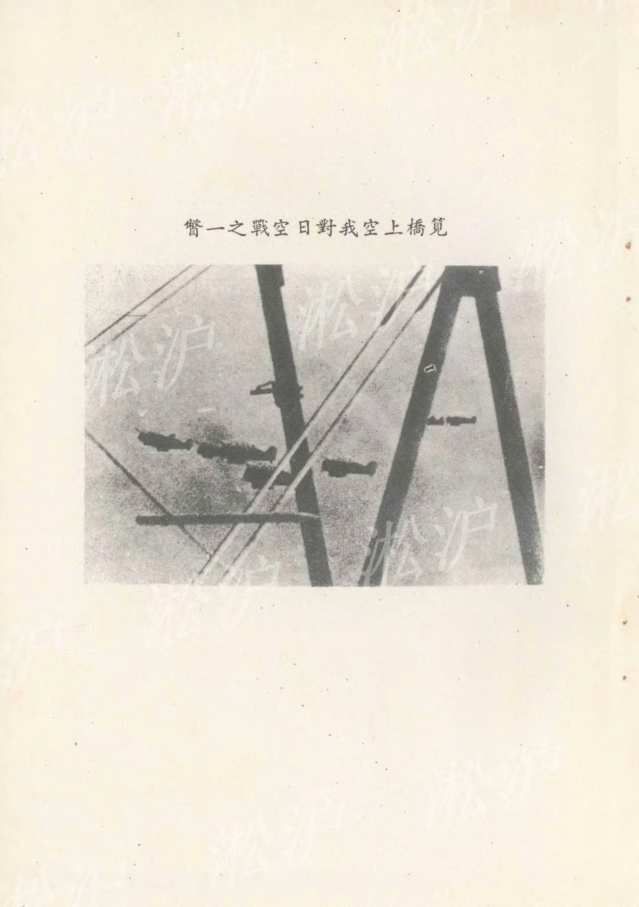

二、第五十六師第一六六旅（欠第三三二團、配屬江蘇保安第二團）擔任福山鎮（不含）、江陰要塞（不含）間之江防，主力控置於楊舍營附近。

三、第三三二團爲預備隊，位置於太倉城附近。

四、軍部及第五十六師師部位置於太倉城。

第五十六師主力十三日到達太倉，劉軍長又令其增加警戒寶山、瀏河、澣浦鎮之線各口岸，一部向合興街前進，十四日奉命後，乃以一營開寶山及川沙河，以一營開瀏河（該處原有第八十七師第五二一團一營），分別接替第八十七師江防，全師各部隊十五日均已到達指定位置趕築工事。

軍事委員會十五日電令已到吳縣之第十四師，派兵一團至福山鎮警備，師主力續開常熟集結，並與太倉第五十六師連絡。

第十四師霍師長十六日接到以上電令後，卽於是日午後，將第四十二旅用汽車由吳縣向梅李鎮、金家村輸送，十七日全師到達目的地後之部署如左：

一、第四十二旅配置於白茆口至鹿苑口之線，右與第五十六師連絡，並與江蘇保安團隊協同拒止敵人登陸，對白茆口、七丫口、高浦塘口、徐六涇口、澣浦口、先生港口、耿涇口、山口各要點配備必要兵力，構築工事，主力集結於梅李鎮、港口鎮，對白茆口、澣浦口間應特爲注意。

二、第四十旅以一團位置於古里村附近，一團位置於莫城鎮附近策應。

三、獨立山砲兵營受曾旅長指揮，在福山鎮附近選定陣地，準備射擊該處登陸之敵。

四、師直屬隊位置於常熟城附近。

十八日，楊林口泊敵艦三艘，瀏河口上游泊敵艦二艘。

十九日晨，敵機數架在太倉、瀏河上空偵察，九時敵機九架在澣浦、福山上空偵察，並向澣浦投彈與掃射。

二十日七時，敵艦二艘經楊林口、七丫口駛福山後，又回駛下游，九時，敵艦二艘拖大號民船十餘隻經川沙港上駛，又白龍港附近有敵艦約三十餘艘，航空母艦一艘，似企圖在該方面登陸。

劉軍長本（二十）日令白茆口以東之警備，歸第五十六師擔任，白茆口（含）及其以西之警備，歸第十四師擔任。

我吳淞圍攻軍二十一日突貫敵楊樹浦陣地至匯山碼頭，正向左右席捲之際，敵乃調集黃浦江內各艦會同吳淞口外艦隊，主力在吳淞附近集中，旋砲擊該鎮，並在飛機掩護下向寶山、瀏河一帶江岸游弋。二十二日十時二十分，寶山縣城附近有敵艦三艘，獅子林、川沙口間敵艦約十五艘，主力似在石洞口附近，皆向我江岸砲擊，瀏河方面有敵艦約四艘，又有七艘經獅子林江面上駛。

劉軍長判斷敵有在川沙口或瀏河口一帶登陸之企圖。

張總司令獲悉敵企圖在寶山城、瀏河鎮一帶登陸之報告後，卽與第三戰區陳前敵總指揮協商，決定以第十一、第六十七、第九十八等師及砲兵第十六團歸第十八軍羅卓英軍長指揮，攻擊寶山城、川沙口一帶登陸之敵，虹口、楊樹浦、吳淞鎮一帶之攻擊，則由張總司令指揮之。

陳總司令二十二日之部署如左（此卽爾後之第十五集團軍）：

一、右翼軍（長羅卓英轄第十一、第六十七、第九十八師、砲兵第十六團）攻擊寶山城、獅子林、川沙口線之敵，壓迫於長江而殲滅之。

二、左翼軍（長劉和鼎轄第十四、第五十六師）協同右翼軍之攻擊，並任瀏河以西沿江守備。

三、第六師、第五十一師位置於南京、吳縣間鐵路兩側，爲總司令部總預備隊。

二十三日拂曉，右翼軍川沙口江面敵艦施放大量煙幕，以飛機掩護汽艇六、七十隻，滿載敵兵直駛川沙河口，第五十六師守兵一連與敵激戰一小時，連長負傷，官兵生還者十餘人，敵登陸部隊約一旅團，分向寶山、羅店、劉河鎮前進，該師利用灑河河川障礙拒止敵人。

羅軍長（軍部十四日由曲江出發，二十二日到無錫）由無錫進抵吳縣，於二十三日拂曉時，接獲陳總司令命令，並獲知一般狀況，當於九時下達第六十七師命令要旨：第六十七師第二零一旅用汽車輸送由吳縣經太倉到嘉定，到達後，卽以一部佔領羅店，主力佔領新涇河，其餘部隊由無錫用火車輸送至安亭，徒步向嘉定前進。

張總司令此時在南翔，已命令在大場之第十一師第三十一旅及第九十八師，由圍攻之線抽出，向楊家行、劉家行歸還建制。又於十二時四十分，據報由川沙登陸之敵先頭約一大隊已佔據羅店，遂卽命第十一師主力（配屬砲兵第十六團）奪回羅店，又各以一團向獅子林、川沙口方面前進。

第十一師於接奉右令後，當卽以三十三旅冒敵機之轟炸向羅店急進，十六時，第六十六團擊破羅店附近之敵約五百人，幷擊斃百餘人，俘獲三人，追抵陸家村，由敵屍工兵上尉身上獲得地圖，知首先登陸之敵爲第四十三、第四十七兩聯隊及工兵第十一聯隊（證明此方面爲第十一師團）。

羅軍長二十三日二十四時得知第十一師已克復羅店，第六十七師（在鎮江登岸，二十二日第二零一旅到吳縣，師部及第一九九旅到無錫）之第三九八、第四零二兩團已於本日九時到嘉定，遂卽決定於二二十四日晚攻擊登陸之敵。

羅軍長於嘉定城二十四日六時下達各師攻擊部署命令，要旨如左：

一、第九十八師（附砲兵一連）由劉家行向寶山城、獅子林之線攻擊前進，主力保持於左。

二、第十一師（附砲兵一連）由羅店及其西南地區向月浦鎮、獅子林、石洞口之線攻擊前進，攻佔月浦鎮、獅子林後，以主力由月浦向石洞口、川沙口攻擊。

三、第六十七師以一旅協助第五十六師守備瀏河陣地，主力控置於羅店，另以一部向沈家橋附近前進，以掩護第十一師左側。

四、各師作戰地境，線上皆屬左。

第九十八師與第十一師間，爲新鎮——月浦——獅子林之線。

第十一師與第六十七師間，爲羅店——木杓鎮——史家宅之線。

五、予在嘉定城，情報收集所在羅店。

羅軍長本（二十四）日十八時三十分綜合各方情報，獲知登陸之敵約有一混成旅團，一部佔據吳淞砲台灣車站及寶山城附近，主力在獅子林附近，其一部向瀏河方面行動。又被我第十一師擊破之敵一部，仍在羅店北方與我對峙中。

羅軍長於黃昏後至羅店第十一師第三十三旅旅部，召集各師長，得知第九十八師本（二十四）日九時已先行獨斷向寶山方面之攻擊，刻在戰鬥中（另詳後之寶山城、月浦鎮間之攻擊），故爲阻止敵西進及掩護我軍左側背計，對瀏河鎮及沿羅店、瀏河鎮公路應增強兵力，遂於二十二時下達第六十七師命令要旨如左：

第六十七師以第一九九旅旅長率第三九七團取捷徑進至瀏河鎮方面阻敵西進，第三九八團沿羅店、瀏河鎮公路游擊，其餘於今夜集結於羅店鎮，並先以羅店鎮之一部攻擊至尤家樓吸引敵軍，使第十一師之攻擊容易。

第六十七師李樹森師長奉右令後，於二十四時，命第一九九旅（欠第三九八團）卽夜沿新涇河左岸向瀏河鎮前進，協同該方面友軍之攻擊，第二零一旅以第四零一團（欠第三營）接替第十一師羅店之守備，李維藩副旅長兼第四零二團團長，率該團及第四零一團第三營向羅店、聚源橋、東王廟（含）之線以左地區之敵攻擊，協力第十一師之戰鬥，第三九八團（欠第二營）到達陳家橋、新水橋後，進出曹王廟、秦家村之線，右與第二零一旅、左與第一九九旅第三九七團連絡，相機策應之。第三九八團第二營爲師預隊，位置於澄橋鎮南方。

左翼軍方面，本（二十四）日敵軍約二千餘人（係僞軍）進攻瀏河鎮，敵艦砲亦向我射擊，第五十六師劉尙志師長赴第一線指揮，戰鬥竟日，斃敵五百餘人，我傷亡營長以下三百餘人，齒獲戰利品甚多。同時瀏河口下游駛來敵艦二十餘艘向我砲擊。

劉軍長卽令第十四師速派兵一團赴瀏河鎮增援，歸第五十六師指揮，第十四師師長卽以汽車輸送第八十團往瀏河鎮，該團旋接第五十六師通報，獲知當面之敵爲第四十四聯隊，在宋宅、朱宅一帶似掩護其主力登陸。

第八十團團長基於右述敵情，卽以決戰之目的，佔領瀏河鎮西南一帶高地之李莊東北之線，以第三第一兩營爲一線。第二營爲預備隊，位置於瀏河大橋公路附近。

瀏河以西地區敵便衣隊非常活躍，似有攻佔瀏河鎮之企圖。

右翼軍方面，二十五日三時頃參照插圖第九，第六十七師第四零二團（附第四零一團第三營）展開於張宅、郭宅、錢宅、馬家樓之線，向尤家樓方向攻擊前進，突然與陸家村、沈宅之敵發生戰鬥，此時只知第十一師約已到月浦附近，詳情不明，遂卽向敵猛攻，以策應第十一師之戰鬥，至拂曉後，該團在敵機砲火力之下陷入苦戰狀態，李維藩兼團長、張培甫營長皆陣亡，魏汝謀營長負傷，連長以下傷亡過半，攻擊頓挫，戰鬥至九時，敵更向羅店以西包圍，我左翼蔡炳炎旅長目觀戰況危急，親率師預備隊（第三九八團第二營）加入左翼與敵反復搏鬥，至十一時，敵已逼近羅嘉公路，蔡旅長陣亡，我陣線動搖，適我第三九八團（欠第二營）趕到，加入戰鬥，敵亦傷亡慘重，雙方遂相持於羅店北方之線，入夜，第四零二團因犧牲過半，調回嘉定整理，並令灑河之第一九九旅（欠第三九八團）佔領施相公廟、浦家廟間陣地。

第十一師接奉羅軍長二十四日六時命令後，於二十五日二時，以第三十一旅（欠第六十二團）爲右翼隊，第三十三旅爲左翼隊，展開於馬家宅、五斗涇之線，第六十二團爲師預備隊，在右翼隊後，砲兵第十六團第九連在馬家宅附近進入陣地，逐次向新鎮、五圖角之線及月浦、周宅之線推進。至三時三十分，第一線已推進至月浦、周宅之線，左翼隊一部正向獅子林砲台及石洞口前進中，師預備隊及砲兵第九連已推進至新鎮附近，正準備向獅子林、石洞口攻擊之際，忽然據報有兵力不詳之敵，由聚源橋方面向新鎮前進中，師長卽令第六十二團配屬砲兵第九連展開於北顧宅、顧宅之線，七時頃敵二百餘人向我攻擊，師長乃令第三十一旅旅長率第六十一團（卽右翼隊）趕回新鎮附近，八時頃，敵包圍第六十二團左翼，戰鬥激烈，至十時，雙方格鬥，反復衝殺，互相進退者七八次，適於此時第六十一團趕到，卽加入第六十二團左翼，敵亦繼續增援，師長又令第三十三旅以第六十六團由月浦向西錢橋攻擊敵之側背，第六十五團向新鎮轉移爲師預備隊，敵受我夾擊後，退據村落抵抗，第六十二團數度衝擊側背，戰鬥至黃昏，終被敵陣地前之河流所阻，不能前進，入夜後，在原陣地構築工事。

羅軍長在太倉城指揮所據報，獅子林、川沙口一帶登陸之敵約一旅團，佔領獅子林、川沙口、聚源橋、陸家村一帶，似掩護其後續部隊之登陸，遂卽決心乘敵主力未到之前而擊破之，於二十五日九時，命第九十八師主力攻擊獅子林，一部守寶山城（第九十八師已佔該城，該師寶山、月浦之攻擊另詳敘述），第十一師主力攻擊獅子林、川沙口間之敵，一部協力第九十八師之攻擊，第十四師霍師長指揮第四十旅及第六十七師之一部由灑河方向攻擊川沙之敵，第六十七師（欠一旅）攻佔陸家村後，卽連繫第十一師、第十四師協同進攻，十二時據六十七師報告，羅店情況不明，羅軍長卽命第九十八師固守寶山、月浦之線，第十一師固守新鎮東西之線，並相機側擊羅店，二十一時，奉蔣委員長命令如左：

一、今晚必須恢復羅店，佔領該地後，卽在其附近構築工事，一面在淑里橋、南長溝、封家宅一帶作據點工事。

二、第九十八師、第十一師今晚仍照預定目標攻擊。

三、第十四師留一團於太倉，一團於福山口構築工事，主力今夜向嘉定、羅店推進。

四、第六十一師在大場、楊家行一帶趕築工事。

左翼軍方面，瀏河鎮東南附近之第十四師第八十團當面，於本（二十五）日黃昏有敵約五百餘人，由朱宅向第一營陣地攻擊，激戰至次日拂曉，我乘敵衝鋒頓挫之際，卽以預備隊施行逆襲，敵狼狽退回原陣地與我相持。

二十六日拂曉，敵以重砲艦砲轟擊我第十四師第八十團陣地，九時頃，敵機數十架轟炸我陣地，濃烟密佈，塵土騰空，至十一時頃，敵約千餘人在飛機掩護下猛撲我左第一線，戰鬥三小時，我卽以第四連由陣地中央向敵猛撲，敵卽退去，入夜後敵復進襲數次，本日戰鬥敵傷亡慘重，我第四連朱克強連長於率隊衝鋒時中彈陣亡。

右翼軍方面，羅軍長二十六日九時三十分命令各師準備攻擊當面之敵（自八月二十六日至九月六日詳羅店鎮之圍攻）。

二十七日，楊林口、七丫口有敵艦二十八艘，運輸艦二艘，輪船、民船各十餘隻，午後砲擊我馬橋口附近，似有登陸企圖，第八十團之一連向陳家橋游擊，在陳家橋以北擊潰敵游擊隊，俘獲步槍十七枝。同日，第六十七師在羅店鎮北方與敵戰鬥。

二十八日十二時羅店鎮失陷。

二十九日，右翼軍圍攻羅店，曾經一度突入羅店，擊斃敵指揮官，鹵獲甚多。

左翼軍三十日之部署，第十四師主力佔領澄橋鎮（不含）沿新涇河互澗河河川之線，並派游擊隊佔領施相公廟、曹王廟之線，掩護本陣地；第五十六師任澗河河川與新涇河交叉點起，經澗河口互鹿涇口間江防；江蘇保安隊以一團開太會，一團開吳縣待命；第五十一師以一團佔領澄橋鎮及其以南地區與第五十六師連絡，以兩團控置於嘉定附近。本日戰況沉寂。

左翼軍方面，三十一日，敵陸戰隊千餘人攻擊我澗河鎮陣地，自二十時至二十四時屢次進攻，均被我擊退，同日左翼軍變更部署如左：

一、第五十六師擔任自新涇河與澗河之交又點起經澗河鎮、澗河口互鹿鳴涇口（不含）間之江防。

二、江蘇保安第四團仍歸劉尙志師長指揮。

三、各部隊繼續增強工事。

左翼軍方面，九月一、二兩日第五十六師與敵略有戰鬥。

右翼軍方面，三日午後，第五十八師以第一七二旅協同第五十一師、第五十六師參加澗河、川沙口間之戰鬥（該師二十八日奉陳總司令命令以兩團接替鹿鳴涇口至小城、浦口閩第五十六師、第十四師之江防，以一團控置於支塘，一團控置於常熟），第五十六師主力擔任澗河鎮至福山沿江之線江防。

左翼軍方面，四日一時，第五十六師第一六六旅第三三一團（附工兵連）由澗河方向攻擊雙草墩之敵，威脅敵之側背（參照插圖第九），至拂曉，在墅溝橋驅逐敵警戒部隊，斃敵十餘名，爾後被敵機轟炸，攻擊無進展，十五時頃，有敵二千餘人，在機砲掩護下，以主力攻擊該團左翼，一部攻擊正面，激戰數小時，將敵擊退，斃敵三百餘人，我亦傷亡百餘人，入夜後，迨二十二時頃，該敵再度進攻我第三三一團堅溝橋陣地，戰鬥至五日三時，敵左翼動搖，我第三三一團遂攻佔雙草墩，得與右翼第五十八師第一七二旅連繫，向川沙河口進攻，及抵江堤附近，見由川沙河口至新鎮敵均有堅固據點，此際受敵機砲火之轟炸，遂卽退回原陣地。

第五十八師第一七二旅主力在蔣宅、葉家灣、高家街之線，一部在高家台、小朱宅，本（五）日拂曉前，以一營協同第三三一團夾擊雙草墩附近之敵，敵遂紛向東北潰退，當卽以一部向川沙河方向追擊。本（五）日晚，有敵艦二十餘艘、運輸艦六、七艘企圖在七丫口、杜陵涇口登陸，被我第五十六師部隊擊退，該艦卽向下游駛去。

六日，在楊林口、杜陵涇口間有敵艦二十四艘，商輪七艘，同時飛機向各口偵察，五時，楊林口方面之敵施放烟幕，以汽艇二十餘隻，木船六、七十隻，在砲火掩護下分向各口强行登陸，尤以楊林口、七丫口之敵數次反復強進，皆被我擊退，並擊沉其汽艇及木船數隻，至二十時，敵約二千餘又向第三三一團雙草墩、墅溝橋攻擊，激戰當夜。

陳總司令命第三三一團今（六）日夜固守陣地，掩護第五十八師第一七二旅左側背，盡量向川沙口方面活動。

初羅店鎮方面，經五日來之圍攻，雖多進展，但因寶山失陷，第十四師側背感受威脅，羅軍長遂决心停止攻擊。

右翼軍羅軍長七日決心轉移兵力，下達命令要旨如左：

一、左右翼軍仍保持原態勢。

第七十四軍之第五十八師第一七四旅略向南移動，第五十一師向右翼軍靠攏。

二、第十四師第四十旅留一部於原陣地，主力於七日二十二時開始撤退，集結於南曹、南北塘口附近爲師預備隊，第四十二旅佔領顧家角北方楊宅、丁宅、錢家宅、曹宅、顧家油車、南長溝、翼宅之線，構築陣地，孫家樓不可放棄。

三、第十一師、第六十七師第四零一團仍守原陣地，今日夜必須攻佔潘宅，同時佯攻羅店。

四、砲兵第十六團今日二十時向陸家村射擊半小時。

五、第九十八師仍守原陣地，對月浦東北兩方派隊作虛正面活動，並多派便探詳細搜索各村落。

第五十八師第一七二旅本（七）日進至長橋、天維橋、高台宅、俞家橋之線，兩翼受敵攻擊，戰鬥激烈，雙方傷亡皆重。

左翼軍劉軍長本（七）日飭第五十六師第三三一團右與第五十八師第一七二旅設法連絡，並相機進攻，該團拂曉派兵二連向右前方游擊，並與第一七二旅連絡，至俞家橋附近與千餘之敵戰鬥，我第一七二旅左翼已向南移，中間空隙甚大，連絡困難，該部仍與敵對峙中。

右翼軍第九十八師之側背，八日受吳淞、寶山兩方面前進之敵壓迫，陣地逐次向月浦附近轉移，並將羅店東方五斗涇附近之第五八三團調回新鎮附近。

右翼軍羅軍長爲應爾後之作戰計，於九日十九時部署如左：

一、第十四師第四十旅，以第八十團一部，於本（九）日晚接替第六十七師第三九七團新鎮、顧家角之線陣地，其餘集結於南北塘口附近，第七十九團於黃昏後以一營接替第九十八師第五八四團五斗涇、界牌橋陣地，主力集結於南北塘口附近，並派便衣隊在施揚宅以東地區活動。

二、第六十七師第三九七團交防後，卽赴施相公廟附近歸還建制。

三、第九十八師第五八四團交防後，於本（九）日晚赴月浦附近歸還建制。

左翼軍方面，本（九）日第六十六軍令第一六零師以一旅接替第五十八師由鹿鳴涇口至小城、浦口間之江防，以一旅位置於支塘附近爲預備隊。

右翼軍羅軍長十日命第十四師派兵一團，於新鎮、老許宅、李家網、中沈巷、曹家橋之線對東構築據點工事，並命各師偵察及準備破壞主要交通路及橋樑，候令實施，其命令要旨：「月浦、新鎮間歸第九十八師，新鎮、羅店間歸第十四師，羅店、長橋站間歸第十一師擔任」。

本日晚，有敵千餘人，馬若干，由小川沙河口登陸。

右翼軍羅軍長十一日十八時令第九十八師力保月浦附近之線，不得已時逐次向後撤退，移至廣福附近待命，第十四師佔領曹家橋、中沈巷、新鎮及其以西原陣地，如第九十八師撤退時則收容，並阻止敵人前進。又於本晚以一團在廣福橋、北朱店、顧家角之線構築據點工事，並於南北塘口卽構築堅固據點，二十三時，復令第九十八師及第十四師之處置如左：

一、第九十八師留一小部與敵保持接觸，主力卽向廣福轉移，集結待命，再向太倉整理。

二、第十四師佔領曹家橋、中沈巷、新鎮陣地之第八十團卽掩護第九十八師撤退，阻止敵前進。

左翼軍方面，本（十一）日劉軍長命第三三一團撤至瀏河鎮附近佔領陣地。

右翼軍方面，第九十八師十二日二時開始向廣福轉移，旋赴太倉整理待命。三時，楊林口附近發現敵艦多艘，以信號槍連絡西上，四時三十分，馬橋口附近發現敵艦四艘，裝甲汽艇百餘隻，企圖强行登陸，被我擊退。

左翼軍方面，第五十六師第一六六旅便衣隊十三日屢與敵便衣隊接觸，獲知當面之敵爲第三十師團之一聯隊。

以上敘述既竟，今再補述第九十八師寶山城、月浦鎮間地區之攻擊（民國二十六年八月二十四日至九月十一日參照插圖第十）。

第九十八師師長八月二十四日八時在劉家行附近，得知敵正向我吳淞保安團攻擊，且寶山城亦被敵攻佔，該師長以爲該兩處之敵，對於上海、羅店戰場之側背威脅甚大，遂決心獨斷先行攻擊寶山城，以支援吳淞方面友軍之戰鬥，於九時下達攻擊命令，其部署如左：

一、第二九四旅附師山砲營（欠一連）爲右翼隊，卽展開於東沈宅、八字橋之線，攻擊月浦以東之敵，相機攻佔寶山城。

二、第二九二旅（欠第五八三團之一營）附山砲一連爲左翼隊，卽展開於八字橋、徐宅之線，攻擊月浦附近之敵，與第十一師連絡。

三、第五八三團之一營爲師預備隊，爾後位置於新鎮附近。

吳淞鎮之上海市保安團被敵攻擊危急，第二九四旅第五八八團第一營由東沈宅馳往增援，至三官堂站，協同保安團部隊將敵擊退，同時該團第三營進入寶山城，第二九二旅於黃昏時進抵月浦、新鎮之線，準備攻擊獅子林附近之敵。

八月二十五日，據報獅子林、川沙口一帶登陸之敵約一旅團，佔領獅子林、川沙口、聚源橋、陸家村一帶，掩護其後續部隊登陸。

羅軍長二十五日九時命第九十八師以一團位置於寶山城，並警戒該城附近江岸，主力向獅子林攻擊，第十一師以一部協助第九十八師之攻擊，主力攻擊獅子林以西川沙口以東之敵。第九十八師奉命後，卽令第五八三團推進月浦鎮向獅子林之敵攻擊。

第五八三團二十六日一時三十分向月浦推進，四時到達，第三營當卽驅逐數約二百之敵，佔領獅子林，以一部守備獅子林砲台，主力位置於月浦對石洞口、盛家橋、羅家店警戒，以一連在月浦、獅子林間之楊家宅任警戒與連絡。

第九十八師本（二十六）日調整部署後之態勢如次（參照插圖第十）：第五八三團主力在月浦構築工事，第三營守備寶山城，第五八八團以第六連附機槍一排守備獅子林砲台，主力在獅子林、寶山、月浦間地區集結，並構築寶山、月浦、獅子林三據點工事，第五八七、第五八四兩團集結於月浦西地區，並以第五八四團向西延伸工事，入夜接替第十一師新鎮、顧家角陣地。二十七日無激烈戰鬥。

以上敘述第九十八師之攻擊後，今再繼續敘述右翼軍方面：

自八月二十八日羅店失陷後，至三十日，敵在石洞口、川沙口方面登陸，似企圖再攻寶山、月浦，故日來敵艦屬集於寶山、獅子林一帶江面，其飛機不斷偵察與轟炸。

第九十八師本（三十）日晚接羅軍長之命令要旨如左：

一、第五八三團以第三營固守寶山據點，主力於月浦鎮對東北構築工事。

二、第五八八團以第六連守備獅子林砲台，主力控置於獅子林、寶山、月浦間，構築顧家宅、（沙龍口附近）楊家橋、柯宅（不含）線各據點工事。

三、第五八七團在朱宅、孫家樓、顧家油車之線原陣地構築工事。

四、第五八四團在羅店以東韓宅、五斗滷、界牌橋、小竹園之線原陣地牽制羅店之敵。

三十一日拂曉以來，敵機不斷向第九十八師陣地轟炸，敵艦艇則沿岸掃射。

九月一日九時頃，獅子林江面敵艦二十餘艘，飛機十餘架，突然集中轟擊我獅子林、月浦一帶陣地，並施放烟幕，九時五十分，敵約千餘分向陳家店、獅子林第五八八團第二營陣地進攻，獅子林第六連受敵陸海空聯合轟擊，戰鬥激烈，連排長相繼傷亡，士兵猶殊死戰鬥，機槍被砲擊毀，手榴彈用盡，正在以白刃與敵格鬥之際，適值第二營趙鶴庭營附率第五連由譚宅來援，加入反擊後，激戰一小時將敵擊退，情況穩定，旋敵約四五百由西南衝入楊家宅，包圍獅子林，於是戰況復趨激烈，雙方肉搏達四小時，派往增援之第三營之一部被敵機阻止，未及趕到，率領衝鋒之趙營附負重傷，官兵傷亡殆盡，至十四時，獅子林於我壯烈犧牲下陷於敵手，我以五八八團（欠第一營）轉移於右自江邊經楊家橋、伍家宅、南唐宅之線陣地，第五八三團（欠一營）仍佔領柯宅至月浦鎮西端之線，第五八八團第一營在月浦爲師預備隊。

二日拂曉，敵約千餘向伍家宅、柯宅第五八八團、第五八三團陣地猛攻，我俟敵接近突子逆襲，斃敵甚多，殘敵紛紛潰退，第五八三團第六連乘機由柯宅出擊，敵倉皇向北退去，黃昏後敵復大舉夜襲，戰況尤烈，戰鬥至二十二時，敵又退去，爾後敵又源源增加，夏師長爲鞏固月浦起見，卽命第五八七團回守月浦、新鎮陣地，第五八八團第一營歸還建制，第五八四團則仍佔羅店以東陣地，陣線復趨穩定。三日拂曉，敵二千餘藉海陸砲火之掩護，向第九十八師楊家橋、月浦間陣地全線攻擊，先以砲火集中轟炸楊家橋、顧家宅達二小時，陣地盡毀，繼以步兵在烟幕掩護下向貴家宅、北塘宅、張家之線猛衝，我守備顧家宅之第五八八團第二連全部犧牲，陣地被敵突破，情況危急，師長當令第五八三團以一個營由月浦出擊，威脅敵右翼，敵乃轉移主力於江邊，並由沙龍口登陸，攻我右翼第五八八團第三營陣地，激戰四小時，我傷亡慘重，漸呈不支，我以五八七團第一營增援反擊，戰況異常激烈，斯時第五八八團第三營蔣作庸營長、晏如營附同時負傷，全營傷亡殆盡，師又命第二九四旅襲副旅長親率第五八七團第六連馳援，與敵肉搏惡鬥，終以衆寡懸殊，傷亡過半，而敵復以汽艇運兵一部繞襲該營右側，時已黃昏，被迫轉移於田家宅、周家宅、顧家宅，左接楊家橋之線陣地，與敵對峙。

據報獅子林方面之敵爲善通寺第十一師團第四十三聯隊，聯隊長淺間義雄，另有吾妻部隊番號不詳。

四日十五時，敵分由沙龍口、獅子林向第九十八師右側攻擊，戰鬥至十九時，敵我傷亡均重。

五日，敵傾全力向我猛攻，由上海方面調來戰車三十餘輛爲前導，沿軍工路向北泗塘河線之第六師陣地猛衝，該師左翼依托寶山城，十一時頃，寶山、三官堂站間陣地被敵突破，第九十八師方面，自敵於三日下午由沙龍口登陸後，迄黃昏，寶山、顧家宅間亦被敵截斷，本（五）日復以艦砲向我陣地突出部之寶山西北西南轟擊，以致第六師左側背及第九十八師右翼均受敵射擊，遂失連繫，十七時頃，第六師退出三官堂站，我守備寶山城之第五八三團第三營陷入重圍，敵以艦砲飛機轟炸該城竟日，姚子青營長憑堅固守，敵終不逞。

六日十一時頃，敵復傾全力猛撲，並以戰車向各城門衝擊，我官兵傷亡慘重，孤城危如累卵，十五時夏師長接姚營長電稱：「敵兵艦三十餘艘排列城東門江面，飛機十餘架轟擊各城門，戰車向我城門衝擊，職決遵命死守」。夏師長卽覆電勗勉「寶山城關係全局，該營長仰體蔣委員長意志，戰至一兵一卒亦須固守，吾輩成功成仁，成無二致，該營應以寶山城爲歸宿地，建立不世之奇功，並應準備充分巷戰，萬一城垣被陷，亦當與敵偕亡於城中也」。師長同夜復連接姚營長十九時與二十三時兩電略稱：「一、職等受主義之薰陶，領袖之恩德，敢不盡死以報國恩，誓本與敵偕亡之旨，固守城垣，一息尚存，奮鬥到底。二、職營官兵均抱與敵偕亡之決心，惟孤城無援，日久難支，人城俱亡，無補大局，仍懇速援解圍」。夏師長卽電嘉獎，告以第一軍已到楊家行正向寶山急進中，以堅其固守之心，但終以四面隔絕難以赴援。

羅軍長七日據夏師長轉報，該營由寶山越城逃出之第九連二等兵魏建臣報告，敵以優勢兵力，並兵艦三十餘艘，戰車十餘輛，自五日起在機砲火力掩護之下猛攻寶山城，我第三營死守孤城，極力抵抗，城多被毀，建築物無一倖免，衆寡懸殊，我傷亡慘重，激戰澈夜，迄本日晨，敵復以戰車堵塞四門，機砲火力集中轟擊，城無全死，我官兵猶復爲最後之苦鬥與敵巷戰，姚子青營長、任之連長均陣亡於東門，寶山城於十時失陷，全營官兵與該城同殉，誠我抗戰史上永久光輝之一頁。

同七日八時，敵以戰車八輛隨以步兵，於艦砲飛機之轟炸掩護下，向月浦東南之田家宅、周家宅一帶陣地反復衝擊，我與敵肉搏。敵本日攻陷寶山城後，遂積極沿寶羅公路向西攻擊，吳淞方面之敵亦越北泗塘河西攻，第九十八師側背感受威脅，乃轉移主陣地於月浦以東馬路河北岸之王家宅、孫宅、周宅、月浦、新鎮、顧家角之線陣地，此後敵新銳部隊陸續於寶山、獅子林、石洞口登陸。

八日十七時，敵攻擊我第九十八師，入晚我仍在浦夾橋、鮑家宅、顧家宅、月浦、新鎮之線，該師本日傷亡官兵二百餘人，敵亦死傷枕藉。

九日十一時，敵機、砲、戰車掩護步兵由陳華濱南岸林安宅攻擊我第九十八師浦夾橋、月浦間陣地，戰鬥激烈，敵傷亡奇重，並毀其戰車三輛，我亦傷亡甚大，侯思明團長負傷，該師乃將左之第五八四團調回新鎮策應戰鬥，至午後，顧家宅陣地被敵突破，我乃撤至王家宅、孫宅、顧宅、周宅、東寺、月浦鎮、新鎮之線。

十日九時，敵以石洞口、獅子林、寶山等三方面之艦砲向我轟擊，並以飛機數十架、戰車八輛、向月浦以東孫宅、周宅第五八八團猛衝，周宅失而復得者三次，當周宅第二次失陷時，向敏思團長親率步兵一排及傳令兵等奪回該地，向團長負傷，士兵傷亡重大。十六時，敵又來攻，周宅又危，師以第五八四團全力逆襲，將敵擊退，同時月浦北端之敵，再度攻我第五八三團陣地，路景榮團長、李馨遠團附陣亡。十一日拂曉，敵艦砲猛擊我月浦東端陣地，月浦東街大火，守兵傷亡奇重，陣地被敵突破我退守街市與敵巷戰，正當危急之際，適我第十四師第七十九團之一營趕到，加入戰鬥，將敵擊退，奪回月浦。我月浦右側陣地與右翼第一師楊家行，十一日十五時被敵戰車砲火猛攻，傷亡慘重，陣地動搖，第一師與第九十八師鄰接之第三團向後撤退，情況突行逆轉。（據報吳淞、楊行、月浦方面之敵爲天谷鷹森石井田上等部隊。)爾後第九十八師在第十四師掩護之下，於十二日二時開始向廣福轉移。

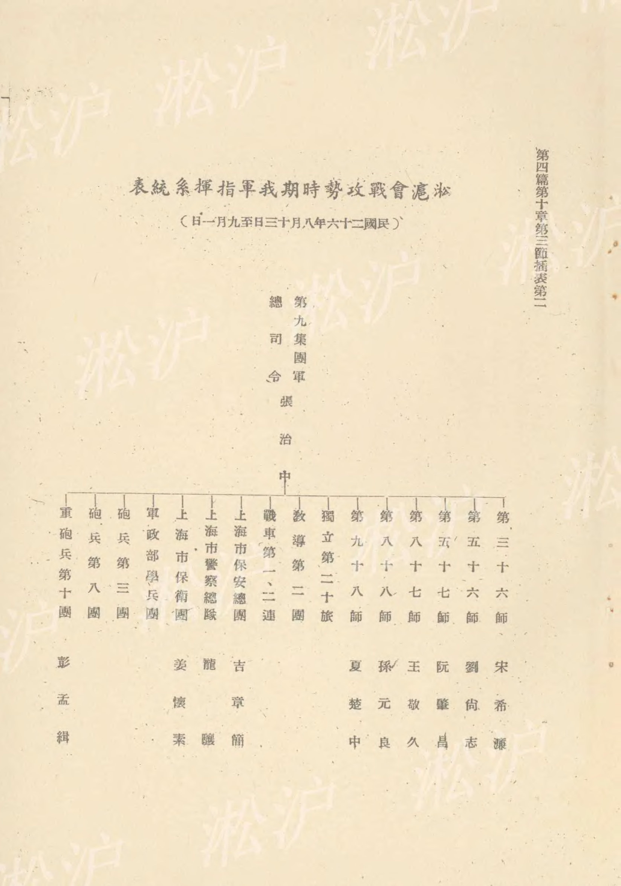

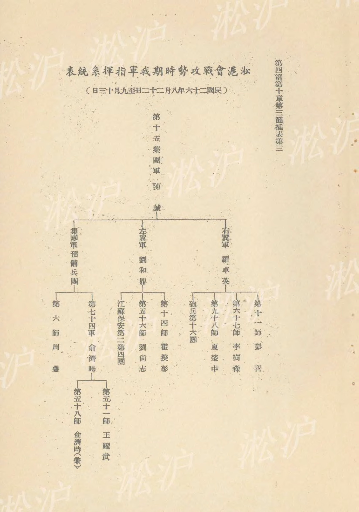

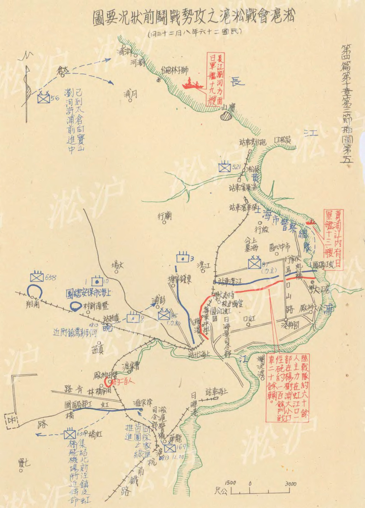

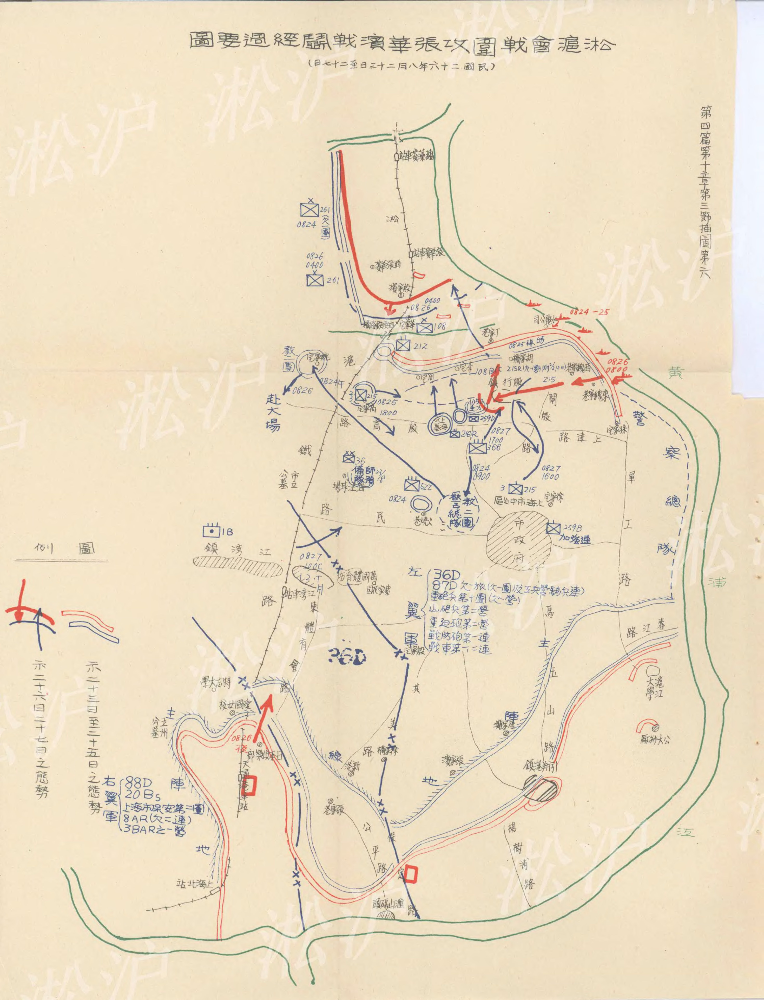

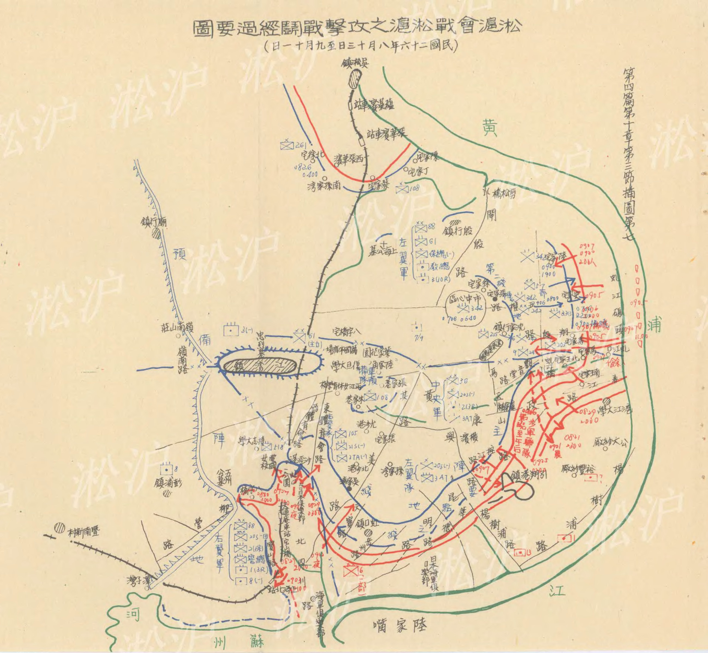

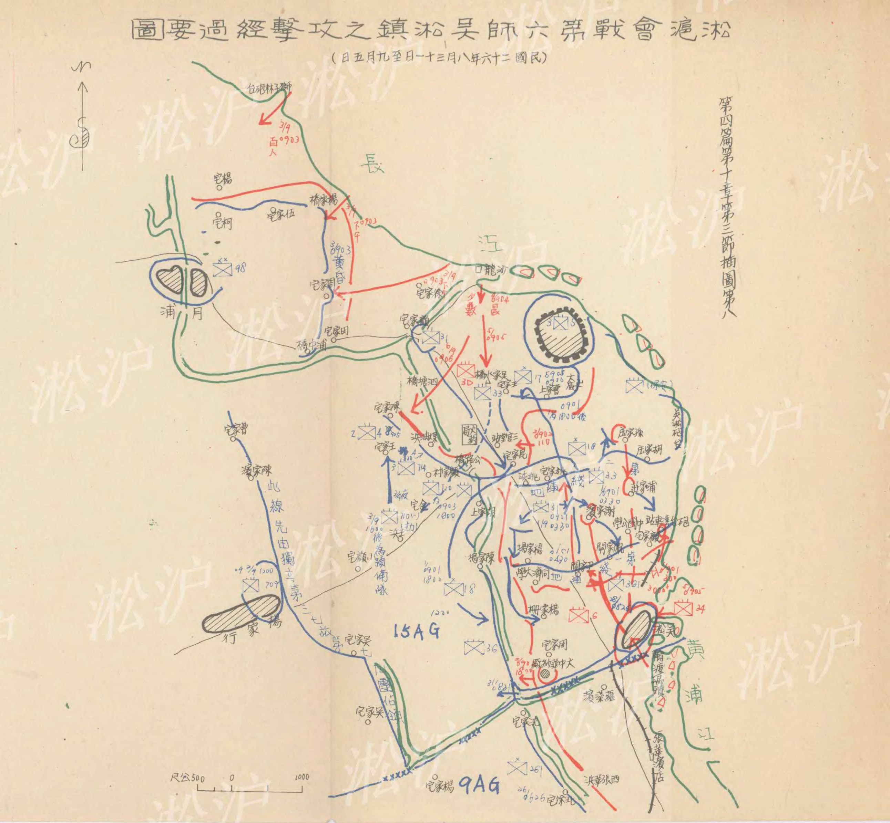

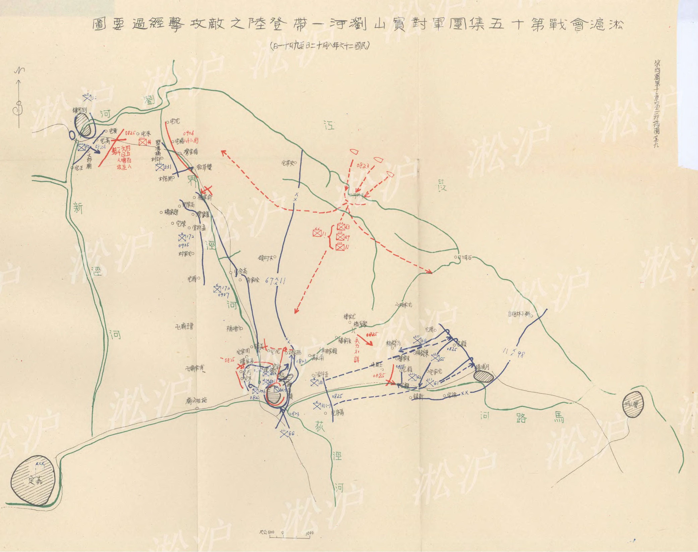

##### 第三項 杭州灣北岸及浦東之防禦

民國二十六年八月十三日至九月十日

參照插圖第十

蘇、浙邊區公署張發奎主任、八月十三日，奉軍事委員會命令如左：

一、蘇、浙邊區公署改爲第八集團軍，仍指揮原屬邊區公署之各部隊。（其所轄部隊爲第十六師、第五十九師、第五十七師、第六十二師、獨立第四十五旅，砲兵第二旅「欠第三團」）

二、各集團軍之作戰地境（線上均屬左）如左：

第十集團軍與第八集團軍間，爲杭州城西南、錢塘江、玉盤山之線。

第八集團軍與第九集團軍間，爲蘇州河、北新涇鎮、諸翟鎮、青浦城之線。

同十三日，奉軍事委員會令，在龍華鎮之第五十七師第一六九旅，以第三三七團附砲兵第二旅第二團之一營，由砲兵第二旅蔡忠笏旅長率領，卽晚渡過黃浦江掃蕩浦東之敵，以砲兵主火力射擊浦西、公大紗廠匯山碼頭，該師駐平湖海鹽之第一七一旅，續開龍華鎮待命，第五十五師第三二五團及第三二八團乘車至楓涇向南橋集結。

第五十七師第一七一旅旅長率第三二四團十五日開浦東，對南匯縣、川沙縣海岸警戒。

浦東方面，第五十七師第一六九旅第三三七團，十六日晚攻佔三菱、日浦、太倉等公司碼頭、殘敵三百人據守新三井碼頭、老三井碼頭及日華紗廠等處，在白龍港之敵艦十餘艘，射擊我第一七一旅沿岸陣地，略有傷亡。

第三三七團十七日進至洋涇鎮、張家灣、康莊之線，壓迫當面之敵，第五十五師主力推進至東三林塘、御界橋、龍王廟之線，其另一團已到南橋。

張總司令十八日之部署命令要旨如左：

一、第五十七師浦東之一旅（附砲兵營）就原配備，暫歸第五十五師李師長指揮。

二、第五十五師指揮第五十七師第一七一旅（第三三七團、第四十二團）並加派步兵一團，迅速掃蕩浦東殘敵。

三、第六十二師（配屬砲兵第二團第二營）固守澉浦、海鹽、乍浦，全公亭、金山衛之線，拒止敵人登陸，並控置有力部隊於平湖附近，又於永久工事間趕築野戰工事。

四、獨立第四十五旅以兩團位置於硤石，一團位置於嘉興附近，爲集團軍總預備隊。

張總司令同（十八）日十二時，接長官司令部電令要旨如左：

一、第五十七師阮師長立率步兵一團，星夜於龍華附近渡過黃浦江東岸，指揮該師。其暫留原防之一團，俟獨立第四十五旅先頭團由硤石運送龍華接防後，繼續渡江歸還建制。

二、獨立第四十五旅張旅長，率先頭團星夜運送龍華接防，暫歸張治中總司令指揮，該旅後續部隊到達杭州，卽向龍華輸送。

第五十七師第三三七團，同（十八）日晚已佔領老三井碼頭及日華紗廠，並砲擊郵船會社及新三井碼頭。

十九日，自昨夜以迄今晨，敵機、艦聯合向白龍港進攻未逞，獨立第四十五旅（欠第七三四團）接替第五十七師蘇州河、黃浦江沿岸防務，第六十二師（欠一團）本日陸續到達澉浦、海鹽、乍浦、金山衛沿海一帶。

二十日晨，第三三七團驅逐郵船會社碼頭之敵，進至江岸，第五十七師交防後昨夜渡江，今日拂曉，第三三九團向張家柵鎮、第三四零團向川沙縣前進張總司令於二十日十二時作如左之部署：

一、第五十七師第一七一旅旅長指揮第三四二團及第五十五師第三二五團與第三二七團，警備白龍港、

徐家路鎮、高行鎮一帶，並以砲火協力攻擊浦西之敵。

二、第五十五師第一六五旅旅長指揮第五十七師第三三七團及砲兵第二團第一營，迅速掃蕩黃浦江東岸殘敵。

張總司令本二十日晚由嘉興赴浦東。

我各師二十一日二十四時，開始攻擊新三井碼頭及其附近之敵，翌日四時已佔領新三井碼頭，殘敵潰退軍艦內，浦東之敵遂告肅清，張總司令遂命第五十七師第一七一旅在白龍港、老洪窪、徐家路之線擇要構築陣地，第一六九旅（欠第三三九團）附砲兵第二團第一營在黃浦江岸構築工事，以砲兵協力淞滬軍之戰鬥，第三三九團控置於張江柵鎮爲師預備隊，第五十五師（欠第三二五團）在柘林、南橋、閔行之線構築陣地，第三二五團於高行鎮附近構築陣地。

第八、第十兩集團軍二十二日奉軍事委員會命令，「第八集團軍與第十集團軍作戰地境線爲杭州灣至玉盤山之線，線上屬第十集團軍。」又獨立第四十五旅調歸張總司令指揮。

二十三日，敵機終日轟炸我浦東沿江陣地。張總司令進駐南橋。

張總司令二十四日遵照軍委會之指示，部署如左：

一、第五十五師卽接替第五十七師之防務，砲兵第一營歸該師指揮。

二、第五十七師交防後，卽速渡江，以一部接替獨立第四十五旅滬西防務，主力於北橋附近集結待命。三、獨立第四十五旅交防後，卽速渡江分置於閔行、南橋、柘林之線，構築工事，並派一小部協助地方武力，於南匯縣、奉賢舊城間對海岸警戒，該旅後續之一團，着由楓涇下車，逕赴南橋集結待命。

第五十五師奉命後，卽作如左之部署：

一、第一六三旅卽接替第五十七師第一七一旅防務，第三二五團歸還建制，仍在川沙、六團灣、白龍港、老洪港、徐家路、高行之線，並派一部至高橋，對海岸方面警戒。

二、第一六五旅（欠第三二八團「欠一營」）即接替第五十七師第一六九旅沿黃浦江一帶防務，右與第一六三旅連繫，對黃浦江警戒。

三、第三二八團（欠一營）位置於張江柵鎮爲師預備隊，二十五日情況無變化。

第五十七師第一六九旅第三三九團，二十六日已接替獨立第四十五旅滬西防務，第三三七團交防後已集結於漕河涇附近，第一七一旅已在北橋附近集結。

二十七日十二時，敵以小火輪數艘載兵百餘名，藉艦砲掩護，在新三井碼頭登陸，經我第五十五師擊退。

顧副長官令第五十七師本二十七日轉移至暨南新村附近，準備接替閘北至虹口方面第八十八師防務。

二十八日十五時，敵艦砲擊我浦東太古堆棧第五十五師第三三零團陣地，是日晚敵艦懸美國旗泊新三井碼頭，敵兵潛行登陸數十名，被我擊退。

第四十五師奉令開回寧波、鎮海一帶，已到海寧之第二六五團，於三十日開回曹娥江邊。

第六十三師三十一日奉令調平湖、海鹽一帶，歸第八集團軍指揮。

張總司令九月一日，因杭州灣北岸部隊迭有調動，特將該處防務重行部署如下：第六十二師、第六十三師及砲兵第二團第一營，暫歸第二十八軍陶廣軍長指揮，擔任海寧、澉浦、乍浦、柘林（不含）沿海防務，拒止敵人登陸，並派兵一營附工兵一部，擔任杭、乍公路阻塞監視任務，但須於沿海各要點附近，控置有力部隊保持機動。

第十六師二日開龍華，構築龍華至閔行沿黃浦江各渡口據點工事。

三日九時三十分，敵艦十餘艘、飛機二十餘架，向浦東第五十五師第三三零團陣地猛烈轟炸，敵軍數百，同時由春江碼頭强行登陸，該團第一營當予阻擊，並以奮勇隊向敵猛撲，戰鬥至十五時，將敵擊潰，斃敵三十餘名，我陣亡朱子義營長、王繼升連長並傷亡士兵二十餘名。

第八集團軍總司令部四日調整杭州灣北岸、浦東之防務如左：

第五十五師：

第一六三旅（欠第三二五團）除控置一營於右翼外，以一營任三九港口至小魚灘海岸各要點之警備，拒敵登陸，並以一部任小魚灘至海濱浴場之監視，左與第一六五旅監視哨連絡，其餘佔領白龍港、小灣鎮、王麻義橋鎮、柵橋村（含）之線構築工事，逐漸加强由三九港至吳家濱之線。

第一六五旅（附砲兵第二團之一營）除控置兩營於適當位置外，以主力任陸家渡至東溝江岸之警備，拒敵登陸，並佔領柵橋村（不含）、孫家宅、洋涇鎮北側經南碼頭之線構築工事，以一部任高行鎮方面之監視，右與第一六三旅監視哨連絡。

第三二五團爲師預備隊，位置於楊家鎮附近。

第二十八軍：

第六十三師任海寧縣至場前（含）間沿海防務，置重點於澉浦，並各控制有力部隊於相當地點，保持機動。

第六十二師擔任由場前（不含）至柘林（不含）間沿海防務，置重點於金山衛、乍浦。

砲兵第二團第二營在澉浦、乍浦及金山衛等處佔領既設陣地。

張總司令五日命獨立第四十五旅在奉賢舊城、南匯縣沿海之線，佔領由柘林（含）經錢家橋、東門港、天妃宮、老港至吳家路之線陣地，向海面警戒。

第十六師第四十六旅六日移至北橋、閔行、龍華一帶構築工事。

七、八兩日情況無變化。

九日十一時，敵以小型軍艦兩艘、拖駁船二隻，載兵二百餘在招商華棧及郵船會社碼頭登陸，經我第五十五師第一六五旅猛擊後，竄匿江岸棧房內後，被我圍攻，逃回敵艦。

十日十六時三十分，敵艦七艘，民船二十餘隻（每隻載三十名），飛機十餘架，向我浦東江碼頭及新三井碼頭轟擊，企圖登陸，未逞退去。

# 第四篇第十章第三節插表第四

羊北灣州杭戰會滬淞

十二國民）

第十六師

第四十五師

第五十五師

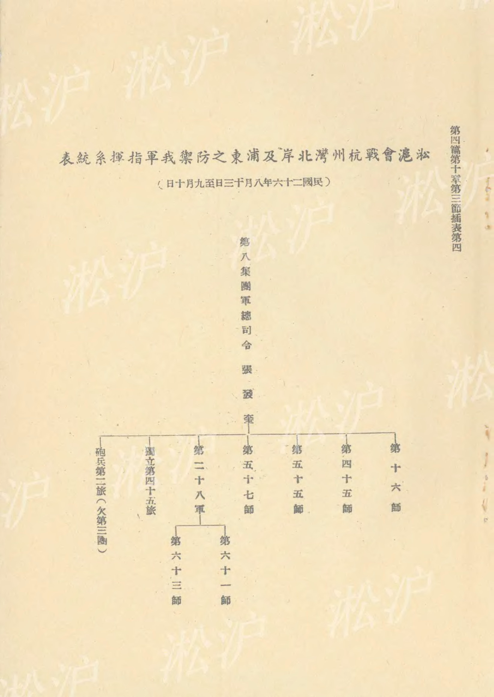

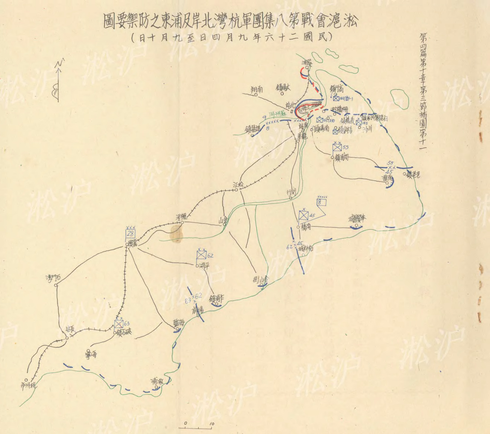
