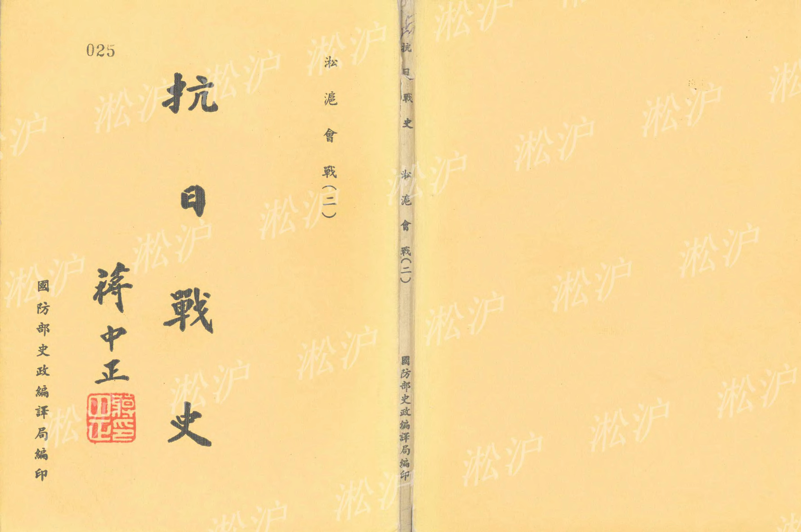

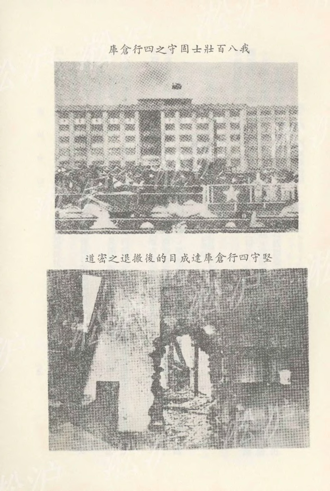

#### 第二款陣地戰時期

（民國二十六年九月十五日至十一月八日）

我淞滬之圍攻，自二十六年八月下旬以來已成膠着，長江右岸登陸之敵又逐漸增加，與我軍在寶山、月浦、羅店之線反復爭奪，我軍態勢顯居不利，爲限制敵之發展打破其包圍之企圖，而予以各個包圍殲滅計，第三戰區長官司令部遵照軍事委員會之指示，於九月六日頒佈第二期作戰計畫，令各集團軍逐步調整陣線，予敵打擊。

##### 第一項 第二期作戰計畫

第三戰區司令長官部作戰計畫

作計字第

號

民國二十六年九月六日

於吳縣

第一

敵情判斷

敵增援軍在張華濱、川沙口、澗河口登陸後，勢將以主力由羅店鎮方面，壓迫我第十五集團軍，向南突進形成大包圍，同時張華濱之敵，亦將向江灣鎮方面攻擊，包圍我第九集團軍，且抑留第九、第十五兩集團軍，以遂行其迅速擊破我全軍，佔領上海市之企圖，甚且再向常熟方面進攻，以威脅我首都。第二

指導要領

一、戰區以保持上海我經濟重心、鞏固首都、而行持久抗戰之目的，就已成之包圍態勢，運用優勢兵力，斷絕各處登陸敵人之連繫，限制其發展，且圍攻獅子林及川沙方面上陸之敵，打破其包圍我軍之企圖，而收各個擊破之效果。

二、各個圍攻之目的不能達到時，則依狀況逐次後退於敵艦砲射程外，以決戰之目的，乘敵海陸軍火力不能協調之際，一舉而擊破之

三、於萬不得已時，則退守後方既設陣地，施行輟强抵抗，待後方部隊之到達再行決戰，而收最後勝利。第三兵團部署

一、第一階段：（限制敵人之發展，並各個擊破各方登陸之敵。）

張發奎集團（浦東防守軍）繼續前任務，守備浦東區，威脅黃浦江右岸之敵。

張治中集團（淞滬圍攻軍）。

1. 對虹口、楊樹浦之敵，增強圍攻工事而封鎖之。

2. 對張華濱之敵，仍須努力攻擊而殲滅之，如情況不許可時，亦須固守圍攻線，以阻止其與虹口方面敵人之連繫。

3. 對吳淞、寶山、江灣方面，須固守據點，以防止敵之登陸。

4. 應使後方部隊，在北站沿橫濱港、五州公墓、蘆涇浦、江灣鎮、廟行、顧家宅亘蘊藻濱南岸，向西至黑大黃宅之線構築據點工事，於必要時，卽在該線阻止敵之發展。

三陳誠集團（長江南岸防守軍）。

1. 以一部固守羅店鎮南方與瀏河鎮及其以西地區阻止敵人，同時以有力部隊，分由新鎮及曹王廟、沈家橋兩方面，攻擊敵之兩翼。

2. 在劉家行、嘉定城、瀏河之線，構築據點工事，必要時卽在該線阻止敵人。

四各集團作戰地境如左：

張發奎集團與張治中集團，爲諸翟鎮、蘇州河之線，線上屬左。

張治中集團與陳誠集團，爲南翔鎮、蘊藻濱之線，線上屬左。

二、第二階段：（限制敵之發展，並利用地形與工事，對敵行有利之決戰。）

張發奎集團（稱右翼作戰軍）。

1. 以一個旅兵力，在浦東區方面繼續前任務。

2. 以一個師以上兵力，在黃浦江右岸，由公共租界經曹家渡、北新涇鎮至張家宅之線（沿蘇州河右岸）佔領陣地，防止敵向蘇州河以南發展，並威脅蘇州河以北地區敵之左側背，使蘇州河左岸之我軍作戰容易。

三張治中集團（稱中央作戰軍）。

在蘇州河左岸范家宅附近，經江橋鎮、南翔、馬陸鎮至嘉定南端之線佔領陣地，以主力配置於南翔及其以北地區，利用地形工事，以求與敵決戰。

三陳誠集團（稱左翼作戰軍）。

在嘉定、周家園、瀏河至長江右岸之線佔領陣地，以主力配置於嘉定、瀏河中間地區，利用地形工事，以求與敵決戰。

四各作戰軍之作戰地境如左：

張發奎集團與張治中集團間，與諸翟鎮、蘇州河之線，線上屬張治中集團。

張治中集團與陳誠集團間，爲南翔鎮、蘊藻濱之線，線上屬陳誠集團。

第二項

作戰直前之狀況（參照插圖第十二）

兼司令長官

蔣中正

副司令長官

顧祝同

張治中總司令在安亭鎮接奉戰區第二期作戰計畫後，十一日十七時，下達各軍之佔領陣地命令如左：第九集團軍作戰命令

作命字第

號

民國二十六年九月十一日

於安亭司令部

兵團區分：

第八十八師孫元良師長第八十八師

上海市保安總團

砲兵第三團第一營（欠第二、第三兩連）戰車防禦砲第一營第一連步兵學校小砲排

左翼軍

指揮官

第八十七師王敬久師長副指揮官

第三十六師宋希濂師長第三十六師

第八十七師

第五十七師第一六九旅砲兵第三團第二營

戰車防禦砲第一營（欠第一連）

教導總隊砲兵營

重迫擊砲第三營

總預備隊

第六十一師

周

(1)

獨立第二十旅

第五十七師（欠第一六九旅）

命令：

一、集團軍以決戰之目的，於十一日晚在北站、五州公墓、江灣鎮、嶺南山莊、廟行、顧家宅（蘊藻濱右岸）之線佔領主陣地，摧破敵之戰鬥力後，轉取攻勢而擊破之。

二、右翼軍於北站、寶山路、橫濱港、五州公墓五東錢家塘（不含）之線佔領主陣地，並先以一部佔領持志大學，沿俞涇浦至潭家宅之警戒陣地，另以一部任由北站至新涇鎮之線向南警戒。

三、左翼軍於東錢家塘（含）、江灣鎮、嶺南山莊、廟行、無名英雄墓、顧家宅之線佔領主陣地，左與蘊藻濱左岸第一軍連繫，又於江灣鎮及廟行各構成堅固據點，並先以一部於狄家濱、兩江女校、葉家花園、市立公墓、侯家木橋、西顏中橋宅、北孫宅之線，佔領警戒陣地。

四、各軍之作戰地境如左，線上皆屬左。

張發奎集團與右翼軍間，爲諸翟鎮、蘇州河之線。

右翼軍與左翼軍間，爲國際無線電台、周宅、東錢家塘、狄家濱、虬江碼頭之線。

左翼軍與陳誠集團間，爲南翔、蘊藻濱之線。

五、總預備隊位置於大場西端附近。

六、予在安亭。

總司令

張治中

張治中集團之右翼軍，十一日黃昏開始向右令之線轉移，迄十四日二十三時無激戰。

左翼軍十二日拂曉前撤退完畢，以第三十六師（欠一團）佔領東錢家塘至江灣鎮之主陣地，一團佔領狄家濱、葉家花園、天祿寺之警戒陣地，第八十七師第二五九旅以一團佔領嶺南山莊至廟行、無名英雄墓之線主陣地，以一團佔領市立公墓、徐家木橋之警戒陣地，第五十七師第一六九旅以四個營佔領廟行以北至蘊藻濱右岸之主陣地，以兩營佔領侯家木橋、北孫宅之警戒陣地，第二六一旅及第三十六師一團，位置於大場東端爲左翼軍預備隊。

總預備隊之第六十一師及獨立第二十旅、第五十七師（欠第一六九旅），十二日午後，先後集結於大場西端附近。

第三十六師正面，十三日十九時迄二十一時，敵步騎兵三百餘，戰車三輛，向我葉家花園警戒陣地攻擊三次，均被擊退，並擊壞敵戰車一輛。

張總司令本十三日晚，令第六十一師派兵四個營，守備滬太公路沿蘊藻濱右岸，自顧家宅（不含）

嚴家灣、唐橋至黑大黃宅（含）之線，構築工事，配備警戒。

第三十六師當面之敵，十四日戰車甚爲活躍，但未行眞面目之戰鬥。

陳誠集團之第一軍，十一日二十三時，開始撤至右自蘊藻濱左岸瓦楊家宅、南王宅、新宅、顧十房、新開河、北楊宅之線守備，十二日十時頃，敵步兵約千餘人，向我楊家宅、顧十房、新開河一帶進攻，陣地大部被敵侵入，第七十八師師長以師預備隊轉用於公路以南穩定陣線，至十三日拂曉，敵以主力沿寶瀾公路向我全線繼續猛攻，敵機多架反復轟炸，至十二時，第七十八師第四六四團之秦家塘至公路間陣地，被敵砲火摧毀，敵兵突入，我第一師第三團在陳宅、王宅之線佔領新陣地，阻敵前進，第七十八師第四六四團由楊家沿公路出擊，第十五師第八十六團由劉家行沿公路前進，截擊敵之右側背。此際，敵三面將被包圍，乃復退回秦家塘、顧十房之線，第三十二師公路北陣地，亦於十二時被敵突破，至二十時，我乘大雨奪回原陣地，我第一師與第十五師各一部，亦奮勇攻佔秦家塘，恢復十二日以前之原陣地線。

我空軍霍克三式機八架，十三日十七時十五分，轟炸楊家行、劉家行間敵陣地，彈多命中敵步砲兵陣地，沿長江敵登陸軍，經我機掃射，亦四散奔避。

十四日拂曉，敵以主力向第七十八師全線猛攻，一部由西盛家及楊家沿之間，衝至楊九房，被第一師第三團擊退，至二十二時，敵大部復向楊九房猛攻，白刃相搏，爭奪甚烈，雙方傷亡皆大，結果敵我各壕守該據點之一半。

十三日拂曉，第十八軍第十四師當面之敵，以優勢兵力進攻我賈家橋、新鎮間前進陣地，該處守兵一營，被迫退至主陣地線，敵遂乘機分三路猛攻北朱店、淑里橋、五斗涇一帶主陣地，戰鬥至十四時頃，至爲激烈，其戰車多輛掩護步兵沿公路突進，與我第八十三團反復肉搏，我傷亡頗大，至十七時頃，該師長復派第八十四團一營增援，始將敵擊退。

十四日一時頃，羅軍長調整部署如左：

一、第十四師佔領陸福橋、顧家角、淑里橋之線。

二、第十一師佔領楊宅、五斗涇五羅店南端之線。

三、第六十七師以一部佔領沈家灣、朱家宅之線。

第十四師當面之敵，十四日以砲火猛擊顧家角、淑里橋陣地，並以戰車四十餘輛掩護步兵猛衝，我守兵與敵肉搏十餘次，激戰至十五時頃，該兩處陣地陷入敵手，該師經兩日之激戰，傷亡極重。

第十一師當面之敵，十四日拂曉，以砲火掩護步兵進攻五斗涇，經我守兵迎擊，敵未得逞。

羅軍長鑒於十四日之戰況，遂令第十四師與第十一師於夜間將公路以北守軍，撤至公路以南沿馬路塘河堤本陣地固守，並命第六十七師第一九九旅旅長率第四零二、第三九七兩團，於十四日夜推進至南北塘口，歸第十四師霍師長指揮，以增厚該師兵力，同時命第十一師於十四日晚向羅店之敵施行反攻，第六十七師第二零一旅仍守備練祁塘南側陣地。

第三十九軍當面，十一日以來，僅有小部隊之戰鬥，十四日晚，各部隊之位置如左：

一、第五十一師佔領施相公廟、浦家廟、曹王廟之線。

二、第五十八師佔領梅丹宅、楊家橋、鐵度橋、北新涇橋、許宅之線。

三、第五十六師以一旅佔領黃宅、瀏河鎮、瀏河口之線。

張發奎集團方面之情況，以及在浦東與杭州灣北岸之部署，自九月四日調整以來，迄十四日晚，均無變化。

##### 第三項 北站劉家行羅店瀏河線之防禦

民國二十六年九月十五日至九月三十日

參照插圖第十三第十四插表第五第六

第三戰區所轄各集團，於九月上旬先後接奉第二期作戰計畫後，卽就當時情況，各將所屬作戰正面逐步調整，截至九月十五日一時止，各集團概在杭州灣北岸、浦東、北站、劉家行、羅店互瀏河之線，茲將各集團戰鬥經過概況分述如左：

陳誠集團方面：該集團之兵團區分及作戰地境如左：

一、兵團區分

右翼軍

指揮官胡宗南

副指揮官王東原

第一師

第十五師

第十六師

第三十二師

第七十八師

砲兵第十六團第三營

中央軍

指揮官羅卓英

副指揮官霍揆彰

第十一師

第十四師

第六十七師

第九十八師

迫擊砲第一營

左翼軍

指揮官劉和鼎

指揮官俞濟時

第五十一師

第五十六師

第五十八師

追擊砲第二營

戰防砲第一連（欠一排）

集團直屬部隊

兵第十六團（欠第三營）

高射砲第二連、第十連

二、作戰地境：

右翼軍與中央軍間，爲馬陸鎮、唐宅、陸福橋、賈家橋之線，線上屬左。

中央軍與左翼軍間，爲唐家宅、胡家灣、小徐宅、湯家宅、孟宅之線，線上屬右。

右翼軍方面之敵，爲第三師團之第五旅團（欠留米）及第十一師團之第十旅團第二十二聯隊，與第二十二旅團之第四十三聯隊、第四十四聯隊。

右翼軍，十五日拂曉，第七十八師竇宅、紫篠海兩處陣地，被敵數度衝入，經該師奮勇擊退。第一師陣地，本日晨受敵砲火猛烈轟擊，至九時，其第四團調集顧家鎮、孟灣，由第十六師派隊接替，其顧家鎮西之下家橋至羌家宅，由第一團接替。第十五師陣地，本日四時，敵向楊木橋第八十五團第一營陣地攻擊，六時頃，敵一部向該營右翼突入，經該團預備隊第三營增援將敵擊退。第三十二師小朱宅、火燒場陣地，本日四時，敵以砲火戰車掩護，猛衝我小朱宅陣地，激戰三小時，敵我傷亡奇重，但敵終未得逞，至晚該師仍在金家灣、北楊宅之線。

胡指揮官十五日二十一時，下達各師命令要旨如左：

一、第七十八師仍佔領楊家宅、紫篠海、竇家弄（含）之線，拒止敵軍。

二、第一師（欠第一團）應自竇家弄（不含）、楊家沿候弄、楊九房五張家衝之線佔領陣地，拒止敵軍。第七零九團及第十五師第八十六團，着卽歸第一師李鐵軍師長指揮。

第一團着歸第七十三軍王東原軍長指揮。

三、第三十二師及第十五師之主力，仍在楊家宅、金家灣、北楊宅之線，拒止敵軍。

四、第十六師主力在劉家行南方地區，其第九十五團位置於中興宅附近，爲軍預隊。

五、作戰地境如左：

第七十八師與第一師間，爲龔家巷、中興宅、竇家弄、老宅、大王宅各北端之線，線上屬第七十八師。

第一師與第三十二師間，爲新陸宅、羌家宅、東盛家、楊村各北端之線，線上屬第三十二師。

右翼軍各師十五日二十一時，奉到上項命令後，當卽分別予以調整。

第七十八師十六日十六時，命第四六七團派步兵兩連反攻楊家沿，激戰至二十時，將敵擊潰，收復該地。

十六日拂曉後，敵機不斷向我第一師陣地上空偵炸，十一時頃，經我擊落一架焚燬，此時其步兵七百餘，利用砲火掩護，向我楊家沿、候弄之線猛攻，經我第七零九、第八十六兩團，反復肉搏，雙方傷亡均大，至十七時頃，敵復增千餘，該師長乃命預備隊第二團第二營及第十六師第九十五團增援，陣地始得穩固，至晚，第八十六團撤至張宅附近整理，所遺陣地交由第二團接替，該師歸王副指揮官指揮之第一團，守備小朱宅、金家灣一帶陣地，亦於十四時被敵突破，幸第十五師之先頭部隊趕到，驅逐該敵，恢復原陣地。

第十五師當面之敵，同日拂曉亦以砲火猛擊該師第八十五團楊木橋警戒陣地，至十時，其步兵利用煙幕猛攻，經我守兵逆襲擊潰，迄十六時頃，敵增千餘名繼續猛攻，該團傷亡慘重，適第八十九團趕到增援，始穩定陣線。

第十六師主力，原在劉家行迤南地區，其第九十五團在中興宅附近，該師長於十六日五時頃接王副指揮官命令，飭第九十五，第九十六兩團分別協助第一、第十五兩師攻擊敵人，第九十五團於十七時增至西盛家瓦張宅之線，與敵反復肉搏，激戰五小時，將敵擊退，第九十六團於黃昏後增到第十五師第一線，奪回金家灣前方村落。

第三十二師當面，於十五、十六兩日，僅受敵機砲轟擊，無激戰。

第七十八師陣地，自十七日拂曉至十八日二十四時，均有接觸，敵我均無進展。

第一師陣地，十七日拂曉，敵向西盛橋、陳宅之線猛攻，第二團第二營傷亡甚重，陣地失陷，敵乘勢以全力進攻張宅，激戰至十五時許，敵以步兵四五百人，向我右翼移動，企圖包圍攻擊，同時以主力向我左地區隊之王宅進迫，李師長當卽電飭第五十七師第三三七團派兵擊敵側背，打破其企圖。進迫王宅之敵，十六時突破我陣地，旋被我逆襲恢復，敵又以猛烈砲火轟擊，繼以步兵數百突擊，該陣地又告失陷，我再以地區預備隊第四團猛烈反擊，復將該敵驅逐，恢復原陣地，十八日拂曉，李師長命第二團第一營營附率第三連向陳宅攻擊，九時許佔領該地，旋敵以大部隊反攻，該連傷亡甚衆，仍撤回張宅固守，十四時，敵集全力（約一聯隊）向我張宅、王宅陣地猛攻，我第二團派隊向敵之兩側出擊，鏖戰至十七時頃，張宅之敵攻擊頓挫，但王宅陣地與敵肉搏多時，官兵傷亡殆盡，陣地失陷，第四團以預備隊猛烈逆襲，卒將敵擊退，恢復原陣地，十九時頃，敵復向王宅附近進攻，我陣地一部被敵攻陷，第四團團長親自率隊反復衝擊陣地，失而復得者四次，敵死亡枕藉，不支潰退，我亦陣亡團長一員，傷亡官兵百餘員名，此際李師長以第四團傷亡奇重，乃將該團王九房陣地，着由第九十五團派兵一部協力守備，並歸第九十五團團長唐肅統一指揮，第一團（欠第三營）於九時許歸還建制，位置於顧家鎮附近。

第六十六軍十七日零時十分，接奉顧副長官命令要旨如左：

一、該軍（欠二旅）應卽由劉家行附近，向永安橋、顧十房公路兩側一帶之敵攻擊。

二、攻擊奏功後，應卽部署防禦固守，並與兩翼友軍確取連絡。

葉軍長奉令後，當於一時，命第一五九師附砲兵連以步兵一旅展開於寶劉公路附近，向永安橋方面攻擊前進，其餘部隊推進至劉家行附近，又命第一六零師（欠一旅）集結於唐福附近待命。

第一五九師第四七五旅，十七日一時，與楊家行西進之敵，遭遇於楊木橋、金家灣西側地區，經該旅猛烈攻擊，遂於十一時佔領楊木橋、金家灣、朝王廟之線，十二時許，敵以飛機大砲向我朝王廟一帶陣地轟擊，我陣地工事全被摧毀，十六時，敵步兵千餘，分組輪流沿寶劉公路向我猛衝，我金家灣陣地曾一度被敵侵佔，嗣經第十五師協力向敵夾擊，敵傷亡重大，紛紛潰退，卒將原陣地恢復。

葉軍長十八時接奉顧副長官命令要旨：第六十六軍及第七十七師，由葉肇軍長指揮，應佔領楊木橋（含）及公路以北、朝王廟、北楊宅之線，連接該軍教導旅之線，左與第十八軍確取連繫，教導旅着卽歸還建制。

此時第七十七師尙未到達，當令第一五九師及教導旅積極加强工事。晚間前線無劇戰。

第十五師當面，十七日零時三十分，敵向該師陣地攻擊，當激戰之際，適第六十六軍第一五九師第四七五旅向永安橋方面出擊，第十五師第八十五、第八十九兩團協力第四七五旅拒止敵人，至十六時頃，以步兵二千餘向朝王廟、金家灣陣地猛衝，當戰況激烈時，王副指揮官乃令第四十八旅劉團派兵一營，由第八十五團、第八十九團間出擊，激戰二小時，敵傷亡甚衆，我恢復原陣地。十八日戰況沉寂，僅有斷續砲擊及敵小部隊向我突擊。

第三十二師當面，十七、十八兩日，無激戰。

陳總司令爲調整右翼軍陣線，十八日二十四時下達命令要旨如左：

一、第七十八師仍守備楊家宅、紫籐海、袁宅之線。

二、第十六師（欠一團）及第五十七師之談旅，由胡宗南軍長指揮，應準備接替寶家弄、楊木橋（不含）第一師一帶陣地拒止敵人，右與第七十八師，左與第六十六軍楊木橋附近部隊連繫。

三、第六十六軍及第七十七師，由葉肇軍長指揮，接替第十五、第三十二師防務，應佔領楊木橋（含）及朝王廟、北楊宅之線連接該軍敎導旅之陣地，左翼與第十八軍確取連絡，敎導旅着卽歸還該軍建制。

該軍在中心閣附近之部隊，應構築萬橋、長濱站附近據點工事。

四、第十五師交防後，擔任劉家行附近之守備，加强工事，嚴密固守。

五、第三十二師交防後，卽經廣福鎮開至黃渡附近待命。

六、作戰地境如左：

張治中集團與第一軍間，爲南翔沿蘊藻、吳淞南端之線，線上屬右。

第一軍與第六十六軍間，爲孫家頭、殷巷、楊九房、秦家塘、楊村、莊家上之線，線上屬右。

第六十六軍與第十八軍間，爲大橋頭、周家灣、尤梅宅、東毛巷、月浦之線，線上屬右。

第一六零師在常熟附近擔任江防之第四七八旅，除留一部監視沿江各口外，其主力開赴前方歸還建制。

右翼軍第七十八師當面，十九、二十兩日之敵重點指向我寶家弄攻擊，我死力據守，敵終不得逞，其餘各陣地敵我均無進展，形成對峙之勢。

第一師當面之敵，十九日拂曉，以機砲不斷轟擊該師陣地，八時頃，其步兵約兩聯隊向我進攻，經奮勇迎擊，終未得逞，十四時，敵復猛烈砲擊王宅陣地，第四團第二連官兵全數殉難，增援部隊又爲敵彈阻止，王宅失陷，十七時許，乃令第四六八團之一連增援第四團反攻，經二次猛襲，於二十日零時三十分，恢復王宅陣地。

九月二十日一時，敵復以砲火猛轟顧家鎮，同時以步兵再度進攻我第一師陣地。

胡指揮官當於一時四十分，令第五十七師第一六九旅歸第一師李師長指揮，接替第一師一部陣地。

第五十七師第一六九旅，二十日二時，接替第一師張宅、王宅、王九房陣地，三時張宅之線陣地戰鬥劇烈，六時張宅前陣地守兵，與敵肉搏戰後全部犧牲，守備張宅之第三三九團第三營力圖恢復，與敵反優爭奪，肉搏至十二時，終將進攻之敵擊退，該營傷亡亦已過半，十六時，敵又砲擊張宅甚烈，該旅長卽令李團長抽調步兵二連進出於王宅，張宅之間，策應該營左翼之戰鬥，十九時，我仍相持於陣地前數十公尺處。

第十六師第九十五團十九日二十三時奉命歸還建制，並於明二十日拂曉前接替中興宅附近第五十七師第一七一旅之防務。

第六十六軍軍長十九日十四時奉顧副長官命令要旨：第六十六軍在中興閣附近之部隊，應構築長濱站公路以東、萬橋至樊家橋一帶沿河西岸據點工事。當於十六時下達命令要旨如左：

一、第一五九師附第九五六團（欠一營）及輕山砲一連、工兵第一連應佔領楊木橋（含）經朝王廟至王家巷之原線陣地，右與第一軍，左與第七十七師切取連絡。

二、第七十七師應於明二十日晚，接替王家巷（不含）至陸家橋（含）之線之第十五師及第三十二師現陣地，右與第一五九師，左與教導旅確取連絡。

三、教導旅附第九五六團之一營，應固守陸福橋（不含）至周家心、前王宅、尤梅宅之線原陣地，右與第七十七師，左與第十八軍確取連繫。

四、第一六零師（欠一旅及第九五六團）位置於北營附近地區，其第九五六團應卽構築萬橋、樊家橋一帶據點工事。

五、砲兵營（欠一連）應於廣福東北之胡家宅、南金天房間地區選定陣地，構築工事及測地。

六、作戰地境如左（線上均屬右）：

第一軍與第一五九師間，爲孫家頭、殷巷、楊九房、秦家塘、楊村、莊家上之線。

第一五九師與七十七師間，爲胡家宅、徐家橋、王家巷、劉老宅、羌家巷、孫正柵之線。

第七十七師與教導旅間，爲郁家宅、萬橋、陸福橋、徐家巷、王家宅、張家宅之線。

四教導旅與第八軍間，爲大橋頭，周家灣、尤梅宅、東毛巷、月浦之線。

第六十六軍第一五九師十九日黃昏，接替第三十二師守備之國際電台、金家灣、朝王廟至王家巷之線陣地，二十日，敵向我楊木橋、金家灣、朝王廟附近反復進攻，經我沉着應戰，將其擊退。

第七十七師二十日五時接替第十五師及第三十二師一部防務，右自王家巷（不含）經北楊宅迄陸福橋（含）之線陣地，該師胡旅陳團接防甫畢，敵以猛烈砲火掩護步兵向其猛攻，經奮勇擊退。

教導旅當面之敵，十九日十六時，以數百名向北朱店陣地進攻，旋被擊退，二十日十二時頃，敵復以六七百名，不斷向周家心、北朱店陣地猛攻，周家心附近陣地全被摧毀，幸該團沉着應戰，至十二時二十分，將敵擊退，敵受創甚鉅。

中央軍第十四師第四十旅當面之敵，十五日拂曉，以砲火向北朱店、侯家宅猛轟，至十一時，敵砲兵掩護步兵猛攻何家店、吳家橋前進陣地，經我守兵以山砲猛烈射擊，敵未得逞，同時第一九九旅守備之金宅、錢宅之線陣地，亦於是日拂曉受優勢之敵攻擊，至十四時，金宅陣地受敵三面包圍，該處守兵努力抗拒入夜。第四十二旅北塘口陣地，亦於同日拂曉受敵猛烈砲擊，至十二時頃，敵以戰車二十餘輛，掩護步兵千餘衝鋒，經我守兵擊退。

第六十六軍敎導旅，十五日晨到達廣福附近，奉命歸中央軍指揮，羅卓英指揮官以第十四師連日戰鬥，陣地亟待整理，遂決以該旅增援第十四師，並於十五日十三時給與該旅命令要旨，着敎導旅卽由廣福向北朱店附近前進，協同第十四師擊破何家店、吳家橋一帶之敵，爾後接替第四師陸福橋、北朱店一帶陣地，主力集結蘇陳宅、前王宅、樊家橋間地區，準備乘機出擊。

敎導旅十六日三時接防完畢後，敵以步兵六百餘人，分兩路向該旅北朱店、侯家宅陣地猛攻，經我奮勇逆襲，將敵擊退，十時頃，敵機三架在該旅陣地上空偵察，被我守兵擊落一架於陣地前方焚燬，十二時頃，敵復以戰車四輛，掩護步兵千餘向北朱店、侯家宅縱橫突入，該旅第一、二兩團輪迴與敵衝擊，反復肉搏，激戰至黃昏，將敵擊退，仍恢復原陣地。

第十四師第四十二旅南北塘口當面之敵，十六日拂曉，不斷以砲火轟擊，十時頃，其戰車多輛駛抵北塘口北岸，經我戰防砲擊毀三輛，餘向東逃逸，至十二時頃，敵由張家宅以戰車十餘輛掩護步兵二千餘人，向我第一九九旅錢宅突入，經我戰防砲協同守兵逆襲，將敵擊退，恢復錢宅陣地，黃昏前，敵復以優勢兵力攻佔我錢宅一帶陣地，雖經我軍一度反擊奪回，旋因敵再行增援，我軍傷亡過大，遂退守東蘇塘、西蘇塘、金村繼續抗戰。

第十一師當面，十六日十三時頃，敵以其砲火戰車掩護步兵渡河，向該師第六十二團馬橋、龔家宅陣地猛衝，該團因第十四師友軍陣地被敵佔領，致被夾擊，死傷極重，激戰至黃昏，遂撤回第二線原陣地，待命反攻，同時該師左翼亦有敵百餘名，乘該師右翼戰鬥劇烈時，由羅店向南突入高家宅北端第六十五團陣地，經我預備隊逆襲，將敵擊退，恢復原陣地。

教導旅陣地前，十七日拂曉後，敵以優勢兵力在飛機大砲掩護下，向我北朱店、侯家宅之線陣地猛攻，激戰至十七時，該線陣地先後淪陷，敵我傷亡各七八百餘人。

第十四師陣地前，十七日十三時頃，敵一部抄襲該師東蘇塘陣地右側背，致該陣地無法固守。

第十一師當面之敵，因昨十六日傷亡甚大，未能繼續向我攻擊。

羅指揮官接得各師戰況報告後，十七日十三時，下達調整部署命令，其要旨如左：

第六十六軍教導旅，應以一部與敵保持接觸，主力佔領陸福橋、前王宅、李宅之線，並構築據點工事而守備之。

二、第十四師霍師長並指揮第六十七師第一九九旅，以一部向敵警戒，主力佔領尤梅宅，蘇陳宅、朱宅西蘇塘（含）之線構築工事而守備之。

三、第十一師仍佔領馬路塘南岸土堤亘龔家宅之前進陣地，主力佔領西蘇塘（不含）亘周家宅、李家宅之線陣地，箝制當面之敵。

四、各部隊作戰地境，線上均屬右。

一教導旅與第十四師間，爲蘇家宅、長濱站、李宅、北王宅、王宅、寺前村之線。

二第十四師與第十一師間，爲金家店、陶家宅、西蘇塘，顧家角之線。

各師旅奉令後，十七日二十一時佔領新陣地配備完畢，黃昏後，戰況沉寂。

教導旅顧宅陣地，十八日黃昏，受敵攻擊頗烈。

第十四師當面之敵，十八日十二時，其先頭步兵三百餘人，由東蘇塘、馬家宅向該師西蘇塘警戒陣地進攻，並以優勢砲火集中射擊朱宅附近陣地，至黃昏時，敵步兵向該師全線進攻，經我還擊，敵未得逞。

第十一師當面，十八日無戰況。

羅指揮官於十九日晨接奉陳總司令電令，以第四軍第五十九師之第一七五旅接替第十四師及第六十七師第一九九旅陣地。遵於十時下達命令，其要旨如左：

一、奉陳總司令電令，着第四軍之第一七五旅，於本十九日夜接替第十四師及第一九九旅所擔任之尤梅宅、蘇陳宅、朱宅、西蘇塘之守備。

二、部隊交替時間，應在黃昏後開始，霍師長所指揮之部隊，應俟第一七五旅確實接防部署完畢，方可撤退，爾後第十四師經嘉定開至太倉附近整理待命，第一九九旅卽歸還第六十七師建制。

三、第一七五旅右翼應與第六十六軍敎導旅、左翼與第十一師切取連繫。

第五十九師第一七五旅，十九日二十時，以第三五零團之一營接替尤梅宅，李宅陣地，以第三四九團接替蘇東宅亘朱宅、金村陣地，其餘控制陶家宅附近。第十四師於交防後，到指定地區整補，第一九九旅歸還第六十七師爲該師預備隊。

羅指揮官二十日晨奉陳總司令電令，其要旨如左：

一、命第四軍第五十九師接替第十一師第三十一旅陣地。

二、第十一師之第三十一旅交防後，卽以一部接替第六十七師第二零一旅陣地。

三、第六十七師候第二零一旅交防完畢後，卽集結於金宅、盧家宅附近，並派一部完成施相公廟公路南側據點工事。

羅指揮官接電令後，卽轉飭各部遵令交換。

第十一師第三十一旅當面之敵，於二十日十六時，以重砲轟擊羅店東南陣地，及對我後方擾亂射擊，該旅王嚴旅長負傷，迄二十一時，該旅將金家村、周家宅、西馬宅、龔家宅陣地，交由第五十九師第一七七旅接替後，卽開至羅店西南陶家宅、南朱宅、北宅、龔家橋構築工事，並向東西方面警戒。

第五十九師師當面之敵，二十日九時，以飛機砲火集中轟擊我陣地，至十三時頃，敵一中隊在機砲掩護之下渡河，佔領我陣地前之顧宅，至二十四時，我以一加强連向敵襲擊，收復該村。

左翼軍第五十一師當面之敵第二十二聯隊，十五日晨迄晚，不斷向我施相公廟、浦家廟陣地攻擊，經我痛擊後，敵我傷亡均重，至黃昏，敵退回羅店，十六日拂曉後，敵以另一部隊之步兵三百餘名，向該師張家堰附近攻擊，激戰至十五時頃，我在步砲協同之下，實施果敢逆襲，敵終未逞而潰退，十七日十六時，敵復集中砲火於曹王廟附近陣地轟擊，繼即以步兵向我曹王廟陣地猛衝，旋被我夾擊，敵不支退去，十八日情況無變化，迨十九日，該師當面之敵，再藉砲火掩護向我蔣宅陣地猛攻，十九時該師派隊出擊，激戰三小時，敵不支退羅店。

第五十八師第一七四旅當面之敵，十九日十七時，向我蘇村前進陣地攻擊，該師當派兵一營由渡前溝出擊，適遇敵後續隊一千五百餘人圍攻，營長陣亡，士兵傷亡慘重，同時吳家巷有敵三四百人向我前進，該師派第三四三團分向三二、六高地，顧宅、吳家巷攻擊，並命全線陣地反復肉搏五次，卒將敵擊退，二十日戰況沉寂。

張治中集團方面，十五日四時，據報敵第九師團續增到四千餘人，在虬江碼頭登岸，分別在大阪、匯山及招商局北棧各碼頭沿江岸堆置沙包形成城堡，砲兵亦在該處選定陣地，出雲艦移泊大阪碼頭，停泊水上轟炸機二架，

該集團十五日晨各師之位置如左：

一、第八十八師附保安總隊，仍在北站沿橫濱港、東錢家塘（不含）之線原陣地，一部警戒北站亘北新涇鎮間蘇州河北岸。

二、第三十六師佔領東錢家塘至江灣鎮、嶺南山莊（不含）之主陣地，以一部佔領狄家濱、葉家花園、天樂寺之警戒陣地。

三、第八十七師佔領嶺山南莊（含）至廟巷、無名英雄墓之主陣地，一部佔領市立公墓、徐家宅之警戒陣地。

四、第五十七師之第一七零旅佔領廟行以北至蘊藻濱南岸之主陣地，一部佔領侯家木橋、北孫宅之警戒陣地。

五、第六十一師及第五十七師（欠第一七零旅）在大場附近爲總預備隊。

右翼軍第八十八師當面之敵，十五日拂曉，以飛機大砲轟擊該師全面陣地，至七時頃，敵步兵數百名向持志大學附近我警戒陣地猛攻數次，均被擊退。

左翼軍第三十六師當面之敵，十五日晨迄晚，不斷以戰車十餘輛及飛機火砲掩護其少數步兵，向我翔殷路兩江女校警戒陣地攻擊，均被我守兵擊退。第五十七師之第一七零旅當面之敵，十六日十六時頃渡河，向張家宅附近攻擊，經我守兵阻擊未逞。

張總司令十六日十六時，命第六十一師之一旅調赴蘊藻濱南岸，任嚴家灣西至唐橋之警戒，並於公路橋北岸構成橋頭堡。

該集團方面，於十七、十八兩日均無激戰。

第五十七師於十八日奉令開蘊藻濱以北，歸陳誠集團指揮，該師第一六九旅所遺蘊藻濱南岸陣地，由第三十六、第八十七兩師於本晚向左延伸接替。

我空軍二十六架，十八日十二時三十分至十九日一時三十分，分八批飛往上海招商中棧、匯山碼頭楊樹浦碼頭轟炸，敵軍需堆棧、軍械庫及泊岸船艦等均受重大損害。

十九日，敵第八師團第六聯隊在淞滬路市運動場附近集中戰車二十餘輛，步兵約二千人，十六時頃，敵砲向我江灣附近陣地施行破壞射擊，二十二時，敵戰車五輛，步兵四百餘，向我狄家濱攻擊，被我守兵擊退。

十九、二十兩日，該集團主陣地無戰鬥。

我空軍諾機五架，二十日二十一時五十分，飛滬轟炸公大紗廠飛行場及楊樹浦一帶敵陣地，經投彈命中飛行場兩彈，楊樹浦一帶，四處起火甚大。

張發奎集團方面，十五日至十七日，情況無變化。

原在貴溪之第十二軍團張鈞部，十六日，奉蔣委員長電令，卽開松江，歸張總司令指揮。

十八日八時頃，敵機九架向我浦東轟炸，至十時，敵艦四艘向我東溝砲擊，繼有敵兵百餘名登陸，經我第五十五師守兵奮勇拒止，激戰半小時，敵仍退回原艦。

十九、二十兩日，當面情況無變化，總司令部於十九日，令第十八師開龍華，擔任南市及滬西防務，原在龍華附近之第十六師一團，於交防後，卽開暨南新村歸還建制。

第三戰區司令長官部，二十一日，奉軍事委員會調整部署電令要旨如左（參照插圖第十四）：

一、第三戰區分爲右翼、中央、左翼三個作戰軍，右翼作戰軍總司令爲張發奎，中央作戰軍總司令爲朱紹良，左翼作戰軍總司令爲陳誠。

二、右翼作戰軍以第八、第十兩集團軍組成之，中央作戰軍以第九集團軍內，加入第十八師及第六十一師與獨立第二十一旅組成之，左翼作戰軍以第十五、第十九兩集團軍組成之。

三、第八集團軍總司令由張發奎兼任，第九集團軍總司令由朱紹良兼任，第十集團軍總司令爲劉建緒，其餘無變更。

四、中央作戰軍作戰地境，爲黃浦江以西，蘊藻濱以南地區。

左翼作戰軍方面，第七十八師二十一日十六時，奉命於本日夜，將楊家宅、紫藤海巨袁宅之線防務，交由第八師接替。二十二日三時，第八師第二十二旅接替第七十八師防務，第七十八師於二十二日五時撤至陳家行及其以東趙家角、桃園濱地區集結整補。迄二十四日晨，第八師第一線僅與敵保持接觸，十時，該師奉第一軍軍長令要旨：該師着預定向唐橋站以西、陳家行一帶沿蘊藻濱南岸轉移陣地，須派隊迅速構築預定線上之陣地，並派兵力一旅控置於大場鎮附近待命。陶師長當卽於十一時三十分，命第二十四旅第四十八團附工兵營卽時開始移動至預定之線，沿蘊藻濱南岸構築工事，第四十七團由現陣地抽出兩營歸成營長指揮，移至張家宅、楊宅、白楊宅一帶佔領陣地，命第二十二旅各團由現陣地抽出二營，歸各該團中校團附指揮，卽經唐橋移至大場鎮附近待命。

第一師第一團守備之顧家鎮一帶陣地，二十二日夜奉令移交於第十六師第九十二團，該第一團除第三營仍歸第五十七師指揮外，其餘撤至嚴三房歸還師建制，至二十四日，該師全部開駐崑山附近整理。

第十六師當面之敵，二十一日拂曉，以機砲協同步兵攻擊該師孟灣陣地，激戰四小時退去，截至二十三日止，敵不斷以重砲向我陣地轟擊，二十三日十八時，該師奉第六十九軍阮肇昌軍長命令要旨：第十六師袁宅、寶家弄日中興宅之線防務，着交由第八師接替後，卽固守孟灣原陣地，並接替第五十七師之張宅防務，其餘集結於顧家鎮附近爲軍預備隊，並繼續構築顧家鎮之據點工事。該師當令第四十八旅全部，於二十三日晚接張宅與孟灣原陣地之守備，並命第九十二團仍繼續構築顧家鎮據點工事，其第九十一團於交防後，在顧家鎮以南地區集結爲軍預備隊。二十四日自晨迄暮，敵不斷以機砲掩護步兵向張家宅、孟灣攻擊，均未得逞。

第五十七師當面之敵，二十一日至二十三日，不斷以砲火戰車掩護其步兵向我陳宅、張宅、王宅、王九房一帶陣地猛攻，均未得逞退去，至二十三日八時，其鄰翼第一五九師之楊家宅陣地被敵攻陷，第四七五旅張家術三面受敵圍攻，我守兵俟敵砲火中止，卽行逆襲，斃敵甚多，十二時頃，該旅將張家術防務交由第五十七師第一七一旅第三三七團接替，十五時，第一七一旅張宅防務，奉命交由第十六師第四十八旅接替，二十四日十四時，敵戰車三輛掩護步兵向張家術陣地進攻，亦被擊退。

第六十六軍方面之敵，據報仍爲第三師團第三十四聯隊及第十師團之第十二聯隊，葉軍長判斷敵似企圖利用寶劉、寶羅兩公路，先行奪取劉行、南翔，並由羅店進出嘉定，以遮斷我軍後方連絡線，乃作如左之處置。

一、將第一五九師與第七十七師之作戰地境，從新劃分爲張家宅、七房宅、朝王廟、西沈巷、小蘇宅、獨家柵之線，線上屬右翼師，縮小第一五九師正面，形成重點。

二、着新由常熟歸建之第一六零師第四七八旅（欠第六連），迅向廣福、劉行間地區推進，以便策應。第一五九師當面之敵，二十一日十二時頃，以猛烈砲火轟擊楊木橋該師第九五二團陣地，隨卽以戰車掩護步兵千餘名，向楊木橋進攻，我第一線官兵傷亡枕藉，致陣地一部被敵突破，第四七七旅抽調預備隊向敵逆襲，將敵擊退，恢復原陣地，至十八時頃，敵復以猛烈砲火向楊木橋一帶集中射擊，繼以戰車掩護步兵衝鋒，我官兵與敵反復肉搏，激戰至二十二日一時，我乃退守第二線陣地，拂曉，該軍砲兵協同第一軍砲兵猛轟楊木橋、小朱宅之敵，時第九五二團團長親率第一六零師第九五六團配屬之一營，向敵猛攻，又將第一線陣地恢復，旋敵又向我反攻，激戰至二十三日一時止，敵屢退屢進，該團僅存團連長各一員，及士兵百餘人。

第七十七師當面之敵，二十二日十時，以飛機重砲向我戴家宅、北楊宅、陸福橋一帶前進陣地猛轟，至十一時頃，敵步兵七百餘名，猛攻北楊宅、陸福橋，該師龍團第一營傷亡慘重，後由趙團加入一營，與敵反復衝擊肉搏，至二十一時，始將敵擊退。

教導旅當面之敵，自二十一日晨迄二十二日拂曉，不斷向我周家心陣地攻擊，均經我擊退，二十二日十二時頃，敵復以猛烈火砲轟擊我周家心陣地，其步兵六百餘人隨卽衝入，我守兵之一營傷亡慘重，周家心陣地陷入敵手，迫黃昏，我以旅預備隊向敵反擊，乃恢復原陣地。

第六十軍葉軍長，二十二日十六時，鑒於當前狀況，爲鞏固兩翼陣地起見，其處置如左：

一、着第一六零師第四七八旅，以第九五六團（欠第二營）接替第一五九師楊木橋之陣地，主力推進至十二房地區，策應第一五九師。

二、着一六零師卽派第九五九團歸教導旅指揮。

三、着一六零師第四八零旅（欠九五九團）位置於南金六房附近，爲軍預備隊，策應教導旅，並派兵一營佔領西錢宅、長濱站之預備陣地。

第一五九師、第七十七師當面之敵，自二十三日拂曉後，至二十四日十四時止，不斷以重砲向我金家灣、朝王廟、王家巷一帶陣地猛烈轟擊，繼以火炮戰車掩護其步兵向我猛攻，輾轉肉搏，我陣地失而復得者數次，雙方傷亡慘重，我第一五九師之七個連，第一六零師之二個連，均被敵陸、海砲火猛烈集中轟擊二萬餘發，我陣地全毀，致全部殉國，無一生還。

教導旅陣地，因左翼友軍失去尤梅宅、楊橋各據點，致陣地突出，受敵威脅，二十四日晨，該旅奉令移守田宅、陸家宅、王顧宅、萬橋、樊家橋、長濱站之線，仍留置一部佔領周家心、前王宅一帶，爲前進陣地，該部與敵激戰終日，全部壯烈殉國，薄暮被敵進佔，並不斷以重砲向我新陣地轟擊。

葉軍長二十四日晚奉陳總司令電話命令要旨後，當爲如左之部署：

一、第一六零師（欠一團又第六連）附工兵營（欠一連）、輕山砲一排，接替第一五九師原守備之陣地。

二、第七十七師應以兵力三分之一任原陣地警戒，三分之二移至周家牌樓、長濱站之線，構築工事。

三、教導旅附一六零師之一團、工兵一連，暫維持原陣地，必要時，右翼得移至劉胡宅、王顧宅之線，但須與第七十七師確實連絡。

四、第一五九師卽撤至劉家行以西附近待命。

五、砲兵營（欠一排）卽撤至廣福西端地區待命。

第四軍第五十九師當面之敵，二十一日拂曉，以飛機三十架向該師尤梅宅至金村之線陣地轟炸，並以砲火掩護步兵向該師第一七七旅第三五三團金村、周家宅之線陣地猛攻，激戰至十二時，肉搏十餘次，敵我傷亡均重，至十八時，我第一線守兵傷亡十分之八，連、排長傷亡殆盡，該師仍將殘餘部隊收集，退守金家宅、李家宅之線。

該師第一七五旅當面之敵，二十一日拂曉，以機砲掩護其步兵向我第三四九團陣地猛攻，激戰至十一時，該團蘇陳宅之線被敵突破，各營以預備隊逆襲奪回，該旅全線激戰至十六時，我第一線傷亡甚重，第三五零團之一營，於十六時三十分，復由尤梅宅後向敵側擊，與敵肉搏，營長陣亡，逆襲頓挫，敵繼續增援向我迂迴，不得已退守楊橋南岸。

第一七七旅文、羅兩團殘部，二十二日一時向敵反攻，激戰至三時頃，恢復周家宅、龔家宅原陣地，旋敵增援反攻，我羅團長陣亡，所部仍退回金家宅、李家宅之線，適第九十師第五四零團賴營來援，卽將該線移交該營後，撤至金家宅南端、郭家宅之線，協力憑河固守。

第一七五旅自二十二日十八時以後，敵不斷以砲火猛烈轟擊，其步兵在砲火掩護下，再三向我猛攻，彼此肉搏數次，敵我傷亡甚重，蘇陳宅被敵突破，我退守樊家橋、郭家宅之線沿河岸據守，二十三日十四時頃，敵步兵一中隊實行强渡，被我守兵悉數殲滅於河中，迄晚，該旅仍固守樊家橋、郭家宅、楊家宅一帶之原陣地。

第五十九師當面，二十四日，除敵不時砲擊妨害我構工外，無戰況。

第九十師歐震師長，二十一日十六時三十分奉到吳奇偉軍長命令要旨如左：

一、第五十九師方面，因傷亡過重，羅店東南突出部尤梅宅、張家宅、金村、周家宅、龔家宅等陣地，相繼失陷。

二、該師卽增援於該方面，恢復失地。

歐師長奉命後，卽以第二七零旅展開於陶家宅亘李家宅（公路以西）之線，攻擊歸家宅、西馬宅、李家宅之敵，第二六八旅（欠第五三六團）展開於金家宅以西之線，攻擊尤梅宅、蘇陳宅、張家宅之敵，攻擊到達線爲既失陣地之線，作戰地境爲金家店、周王前、楊家、張家宅、東蘇塘之線，線上屬右，第五三六團附工兵爲師預備隊，位置於金家店附近。

第二七零旅第五四零團，二十二日一時頃，展開於金家附近，向歸家店、金村、西馬宅、李家宅攻擊前進，我官兵奮不顧身，將敵擊退，收復張家宅、西馬宅、李家宅之線，繼向金村、周家宅、龔家宅攻擊，至七時頃，佔領該線。第二六八旅第五三五團，於三時頃，展開於西錢宅、金家宅之線，向朱宅、張家宅攻擊前進，佔領該兩據點。至十三時頃，敵大舉反攻，該師之金村、歸家店守兵傷亡殆盡，復陷敵手，張家宅亦陷包圍中，主力撤至郭家宅、楊家之線憑河拒敵西進，至二十四時，該師長奉令繼續渡河攻擊，恢復第五十九師原有陣地，二十三日一時，我步兵逼近敵陣地，激戰約二小時，敵增援隊到達，由兩翼向我逆襲，我傷亡奇重，吳軍長當令第五四零團之第二營及第五三五團之第三營仍固守張家宅、朱宅原陣地外，主力移至樊家橋、金家宅河西岸之線，二十三日拂曉，敵機砲集中向該師轟擊，激戰至十五時，歸家宅敵渡河四五百名，突入我陣地，經我逆襲，敵傷亡慘重，十六時頃，我金家宅一帶被敵佔領，其後方蔣家宅、謝村、陶家宅之線，及右翼樊橋、郭家宅、金家宅陣地，仍在我軍固守中，激戰迄夜，經我守兵堅强抵抗，敵未得逞，戰況隨趨沉寂。

第八十軍方面，二十一日至二十二日，全線戰況沉寂，二十三日八時，敵以飛機十餘架，協同其砲兵向我第十一師李家宅一帶陣地猛轟，十二時頃，敵戰車十三輛掩護其步兵六百餘向李家宅、白房子陣地猛攻，激戰至二十二時，敵我傷亡均重，陣地終被敵突破，遂撤至小高宅東西之線固守。第六十七師當面之敵約一聯隊附戰車六輛，亦於二十三日十三時，向小堂子、湯家宅一帶進攻，激戰至二十時，小堂子、高家宅均已失陷，遂以一部佔領周家橋之線陣地。

第十八軍羅卓英軍長二十三日二十二時下達第十一師與第六十七師變更部署命令，要旨如左：

一、第十一師守備陶家宅、南朱宅、龔家橋（含）之線。

二、第六十七師守備龔家橋（不含）、徐宅、北周宅、施相公廟（不含）之線。

三、兩師戰鬥地境，爲北豎溝、王家宅、龔家宅、袁家宅、高家宅之線，線上屬右。

第十一師、第六十七師奉令後，二十四日二時，分別變換陣地完畢。

第三十九軍第五十一師當面之敵，自二十一日晨迄二十三日晨，不斷向我嚴宅、浦家廟、劉家村、吳家村、梅丹宅、蔣宅一帶攻擊，均被擊退，二十三日二十二時頃，該師以步兵六個連，藉砲火之掩護，向張家堰、蚊屋、丁家樓之線攻擊，激戰四小時，敵不支退回羅瀾公路附近，我遂佔領該線，二十四日拂曉，我仍撤回原陣地，十六時，敵又以砲兵掩護其步兵數百，向我施相公廟、浦家廟前進陣地猛攻，經我官兵奮勇肉搏，苦戰至二十四時，敵不支退去。

第五十八師當面姚宅之敵，二十一日晨，以飛機十餘架，掩護其步兵向警戒陣地進攻，我軍在敵機砲火下，由趙角向姚宅之敵圍攻，戰鬥至二十二日，姚宅之敵兩中隊，大部被我殲滅，餘部已退至界涇河右岸。

第五十六師當面，自二十一日至二十四日，全線戰況沉寂。

我長江海軍方面，九月二十二日，敵以大編隊機羣向江陰空襲，轟炸我艦隊，彈下如雨，各艦集中火力，沉着應戰，相持六小時，敵機被擊落五架，不支遁去。

九月二十三日，敵機七十二架蔽空而來，我江陰江面平海、寧海兩艦，爲其轟炸目標，敵投重磅炸彈無數，寧海艦長陳宏泰身受重傷，猶在瞭望臺指揮，後艦體受重傷，艙中進水，我平海、寧海兩艦，乃相繼下沉，是役我擊落敵機四架，中傷逃遁者，爲數亦不少。

九月二十五日，敵三度狂炸我監視阻塞艦隊逸仙艦，敵機均低飛投彈，我高射砲乃失效，用艦首十五公分砲轟落敵機二架，我逸仙艦亦傷重下沉，建康軍艦亦於同日被炸沉，我海軍艦隊實力乃受相當影響，海軍部乃派第二艦隊司令曾以鼎乘楚有軍艦馳經江陰，接替司令陳季良任務。

左翼作戰軍陳兼總司令鑒於當前狀況，乃於二十五日一時調整部署，下達命令要旨如左：

一、本左翼作戰軍全般調整如左：

以江家宅、寶家弄、顧家鎮、太平橋、長濱站、蔣家宅經施相公廟、曹廟、灑河鎮之線爲主陣地。

以江家宅沿蘊藻濱至陳家行，沿楊涇河、廣福、孫家宅至施相公廟爲第二線陣地。

以主陣地前方各部隊原守陣地，爲有力之前進陣地。

二、各軍部署如左：

第八師以一部固守楊家宅、紫藤海、朱家網原陣地，主力於本夜撤至唐橋站（不含）沿蘊藻濱南岸至陳家行趕築堅固工事，第十六、第五十七師主力，固守張家宅、寶家弄、孟灣、顧家鎮亘酸浦河右岸之線，左與第十五師連繫，但第五十七師本二十四日夜仍固守楊九房、張家街附近原陣地，待命移動。

以上三師仍歸第六十九軍阮肇昌軍長指揮。

第十五師佔領劉家行附近至太平橋既設陣地，第七十七師以有力之一部留置原陣地，主力本夜在太平橋（不含）、萬橋、朱宅、張家宅、樊家橋沿河之線佔領陣地，左與第四軍陣地連接，第一五九師以三分之一兵力仍固守原陣地，主力今夜在羅嘉公路西側集結整頓，第一六零師及教導旅仍固守原陣地，待命行動。

以上各師仍歸第六十六軍葉肇軍長指揮。

第三第四軍仍佔領樊家橋（不含）、郭家宅、楊家沿河之線亘陶家宅一帶陣地，左與第十八軍連絡，嚴密注意羅、瀏公路敵人之南下。

四第十八軍（欠第十四、第九十八師）在原陣地拒止羅店之敵，並在陶家宅（不含）、南朱店、龔家橋、北周宅、施相公廟（不含）之線，構築預備陣地。

五第十三師（欠一部）在陳家行至廣福以北之孫家宅（不含）之線，第六十師在孫家宅亘施相公廟（不含）之線，構築堅固工事，第十三、第六十兩師歸第十八軍羅卓英軍長指揮。

六第三十九軍之第五十一、第五十八、第五十六各師，仍在原陣地固守，相機攻擊當面之敵。

七右砲兵羣由史文桂旅長指揮，受阮軍長之指揮，左砲兵羣由汪若卿團長指揮，受羅軍長之指揮。

陳兼總司令復於二十五日晚，規定第十九集團軍薛岳總司令指揮之部隊如左：

一、第六十九軍阮肇昌軍長，指揮第八、第十六、第五十七師。

二、第六十六軍葉肇軍長，指揮第一五九、第一六零、第十五、第七十七師及教導旅。

三、第四軍吳奇偉軍長，指揮第九十、第五十九師。

四、第七十五軍周魯軍長，指揮第六師，獨立第三十七旅。

五、第十三、第三十二師，歸該集團軍總部直轄。

第十九集團軍第六十九軍、二十五日晨，奉到陳兼總司令調整部署命令後，卽命各部隊先以三分之二部隊，自第一線撤至指定陣地預築工事，留原陣地之部隊仍與敵保持接觸，拒止敵人。

第五十七師二十五日晚，除留第三三九團第二營及第三四零團第六連，任原陣地警戒外，主力撤至指定之新陣地趕築工事，二十六日晨，敵壓迫我留置原陣地之警戒部隊，於十四時進至國際無線電臺，沿酸浦河北岸構築工事，與我隔河對峙，二十七日至三十日，敵砲不斷向該師陣地轟擊，並以戰車七八輛掩護少數步兵，不斷向我襲擊，我官兵沉着應戰，損失甚微。

第十六師當面，二十五、二十六兩日，僅與敵小接觸，二十七日拂曉，敵以戰車掩護其步兵向該師顧家鎮一帶陣地攻擊，激戰至二十四時，仍在對峙。是時該師長接阮軍長命令要旨，該師應擔任寶家弄（不含）、孟灣、顧家鎮、下家橋之線守備，以一部守備顧家鎮車站，左與第五十七師，右與第八師連繫。該師當卽調整部署，二十八日拂曉迄三十日晚，當面之敵不斷向我張宅、孟灣一帶陣地猛攻，我屢以預備隊出擊，斃敵甚多，敵終未得逞。

第八師當面，二十五、二十六兩日無激戰，該師長於二十七日八時接阮軍長命令要旨，該師以有力之一部，於江家宅、須宅、寶家宅（含）間佔領陣地，其原有陣地仍派警戒部隊守護之，該師長當於十一時，作以上之部署調整完畢，二十七日晚迄三十日晨，當面之敵，不斷向我袁宅、寶家弄、須宅、江家宅一帶陣地猛攻，我守兵與敵反復肉搏，敵終未逞，計斃敵市原三郎以下五百餘人，鹵獲步槍十七枝。

第六十六軍各部，二十五日拂曉，業經遵照陳兼總司令之調整部署命令部署完畢，除留第一六零師及教導旅在原陣地掩護佈防外，主力集中第二線整理待命，二十五日十六時，敵以大隊步兵向我第七十七師留置原陣地之第四六一團陣地猛攻，我因傷亡過大，乃向後撤退。教導旅當面之敵，二十五、二十六兩日，戰況沉寂，該旅於二十六日黃昏後，奉令以一小部留任陣地前掩護，主力控置於廣福中心閣附近。

葉軍長鑒於當面之狀況，二十六日十二時，決定部署如左：

一、第十五師佔領劉家行據點，及其以北至太平橋（含）之線既設陣地，右與第五十七師，左與第七十七師連繫。

二、第七十七師以有力之一部留置原陣地，主力佔領太平橋（不含）北端，沿河經萬橋至樊家橋（含）之線，右與第十五師，左與第四軍連繫。

三、第一六零師控置於廣福鎮附近地區。

四、教導旅控置於中心閣附近。

五、第一五九師卽撤至方泰鎮附近，整理待命。

六、戰鬥地境：

第十五師與第七十七師間，爲陳家宅、北王宅、太平橋、邱家宅、戴家宅之線，線上屬右。

該軍各部於二十六日入夜，卽照右列部署要旨，開始行動，敵亦未發覺，戰線沉寂，二十七日拂曉，該軍全面陣地受敵猛烈砲擊，我太平橋警戒陣地之守兵一排，傷亡慘重，僅餘兵八名退囘，十三時頃，敵步兵八百餘名，向我朱宅、樊家橋之線進攻，經我第七十七師奮勇迎擊，將敵擊退。

葉軍長依據當時狀況，爲策應便利計，乃於二十七日十七時，命第一六零師第四七八旅附工兵一營（欠一連）控置於劉家行、廣福間地區，策應第十五師之戰鬥，第四八零旅附工兵一連，控置於周家牌樓、南金六房間地區，策應第七十七師戰鬥，敎導旅仍集結於原位置，協助第四八零旅，策應第七十七師。

第十五師二十七日晚，奉令以一部接替第五十七師之陸橋陣地，二十八日一時頃，敵戰車十輛掩護步兵千餘人，由王宅向該師劉家行北端進攻，其戰車三輛觸我地雷受損，我守兵與敵肉搏，雙方傷亡均重，激戰至十六時，敵戰車與步兵退去，二十九日十時頃，敵砲兵猛擊我太平橋陣地，其戰車二十餘輛，掩護步兵約一大隊向該陣地攻擊，迄三十日拂曉後，該師太平橋陣地整個被燬，十時後，被敵步兵突入。

第七十七師，九月二十八日拂曉以來，全線陣地不斷受敵機轟擊，十四時，其步兵向我王宅警戒陣地攻擊，當被我守兵擊退，至二十九日十二時，敵二千餘由殷家角及郭巷橋各附近強行渡河，經該師分別予以痛擊，敵傷亡甚大退去，三十日九時，敵戰車六輛，掩護步兵二千餘，又在殷家角施行强渡，激戰三小時，該師長以預備隊兩連增援，始得勉強維持原陣地。

葉軍長三十日十六時，鑒於第十五、第七十七兩師狀況，卽令第一六零師之第九五五團，協同第十五師向侵入太平橋之敵施行逆襲，又令敎導旅派兵一營，接替第七十七師樊家橋陣地，使該師正面縮小，至十七時頃，第九五五團協同第十五師將太平橋陣地克復，第七十七師正面縮小後，陣地亦趨穩定，入夜，萬橋陣地又被敵突破，葉軍長卽令第一六零師第四八零旅旅長親率第九五九團及敎導旅之一部，協同第七十七師乘敵立足未穩之際，猛烈反擊，激戰至二十一時，將敵擊退，恢復原陣地。

第四軍第五十九師當面之敵，自二十五日七時迄二十六日暮，以飛機砲火掩護其步兵兩個大隊，向該師尤梅宅據點攻擊，我工事雖多被破壞，傷亡奇重，但仍死守不退，且反復衝擊，終將敵擊退，二十六日十八時頃，該師長奉吳軍長命令要旨，該師應佔領樊家橋（不含）、郭家宅、金家宅、陶家宅（含）一帶陣地，左與第十八軍連繫，嚴密注意羅、瀏公路敵之南下。當於十八時三十分，令飭各部開始行動，於二十一時到達指定之線，並派第三五四團之一連前往陶家宅，協助第九十師構築工事。

第九十師當面，二十五日戰況沉寂，二十六日十三時，敵以飛機砲火掩護其步兵一千五百餘人，向我陶家宅之線陣地攻擊，我守兵極力掩蔽，待敵接近，則以輕重機槍猛射，斃敵甚多，激戰入暮，官團長親率預備隊向敵逆襲，敵倉惶退去。

第四軍方面之敵，二十七日八時，以砲擊我陣地千餘發，其戰車掩護步兵突破我公路兩側金家宅、孫家樓陣地，我一度退守謝村附近後，經我第五十九師第三五零團餘部增援反擊，將敵擊退，恢復孫家樓陣地。十九時頃，吳軍長下達第五十九、第九十兩師命令要旨：軍仍固守嚴宅、蔣家宅、謝村、孫家樓、陶家宅之線，第五十九師應協力第九十師竭力拒止敵人，並加强工事，另派第六十師之汪、張兩營前來策應。該兩師長奉命後，卽協同從新部署第一線之守備。二十八日二時迄三十日十八時，當面之敵，不斷以飛機砲火轟擊我陣地，三十日十四時頃，敵復以烟幕及戰車十餘輛，掩護步兵千餘進攻陶家宅，我守兵與敵反復肉搏，至十八時，始將敵逐次擊退，十九時三十分，吳軍長命第四十四師第一三零旅，接替第五十九、第九十兩師嚴宅、蔣家宅、周王前之線陣地，該兩師防務交代後，撤至周王前附近，爲第一三零旅預備隊。

第十五集團軍第十八軍方面，二十五日戰況沉寂，二十六日晚，羅軍長奉陳兼總司令調整部署命令後，卽命第十一、第六十七兩師，仍在原陣地拒止羅店之敵，並加强工事，又命左砲兵羣歸砲兵第十六團王團長指揮，在新涇橋站以東地區佔領陣地，對羅店方面佔領陣地之步兵協力作戰。

第十一師當面之敵約有一聯隊，於二十七日晨，以砲火戰車掩護向該師右翼第五十九師之金家宅、南朱宅之線陣地攻擊，戰鬥至十六時頃，該師以有力之一部，由袁家宅向東攻擊敵側背，經一小時之激戰，敵傷亡甚重，入夜敵退去，二十八日，敵不斷砲擊我陣地，二十九日十四時，敵步兵在其砲兵轟擊後，向我金家宅、南朱宅、龔家橋陣地攻擊，與我守兵反復肉搏，雙方傷亡慘重，入夜漸趨沉靜。

第六十七師當面之敵，自二十七日迄二十八日，不斷向我北周宅一帶砲擊甚烈，二十九日十四時頃，敵步兵向我杜宅、陳家宅一帶陣地攻擊，我守兵乘敵接近，向敵猛襲，斃敵甚多，入夜，戰況乃趨沉寂。

第三十九軍方面，自二十五日至三十日，除第五十一師施相公廟附近陣地、敵曾三度向我攻擊，均經擊退外，僅受敵斷續之砲擊，戰況不甚激烈。

我長江海軍，自我楚有軍艦馳往江陰增援後，敵復以飛機大舉轟炸楚有軍艦，接連四次遭受空襲，卒於九月二十九日，以傷重沉沒，我海軍至此乃不得不採取防衛策略矣。

中央作戰軍總司令部，二十一日據報，敵上海派遣軍司令官松井，續向東京乞援，由僞滿抽調于芷山部一萬二千名，及由臺灣調第十師團倉本旅團兩聯隊與臺灣軍砲兵一旅團增援，陸軍飛機六十架，將於九月二十二日可到滬。

二十一日，張治中總司令另有任用，所遺第九集團軍指揮任務，同日由朱紹良總司令接替。

中央作戰軍方面之敵，自二十一日至二十五日止，每日對我陣地砲擊時間加長，敵機亦集團轟炸我陣地，但我損失甚微，其少數步兵，日夜不斷襲擊我警戒陣地，均被我擊退，敵連日加强工事，似已轉取守勢，而我堅固工事亦已完成十分之八九，對通敵橋樑均已破壞。

朱總司令二十六日，命第十八師以一團構築由北涇鎮至紀王廟之線工事，兩團接替第六十一師左翼沿蘊藻濱右岸，向西構築工事。

總司令部二十六日晨，據報：近日蘊藻濱及虬江碼頭登陸之敵，爲西京第十六師團，師團部駐遠東動場，當面之敵，其步兵每班中編入僞軍張海鵬士兵三名。

中央作戰軍當面之敵第八師團第六聯隊等部隊，自二十六日至三十日，仍不斷以機砲向我陣地轟擊，並以少數步兵向我第三十六師八字橋、復旦大學一帶陣地攻擊，均經我守兵痛擊退去。

第三戰區司令長官部，二十二日，規定右翼作戰軍所轄部隊及作戰地境如左：

一、第八集團軍張發奎兼總司令，轄第二十八軍（第六十二、第六十三師）、第五十五師、獨立第四十五旅、砲兵第二旅第二團。

二、第十集團軍劉建緒總司令，轄第七十軍（第十九師）、第四十五師、新編第三十四師、第五十二師、暫編第十一旅、暫編第十二旅、暫編第十三旅。

三、作戰地境：

右翼作戰軍與中央作戰軍間，爲西塘鎮北端、松江城北門、得勝港北端、沿黃埔江左岸至吳淞之線，線上屬中央作戰軍。

右翼作戰軍方面，自二十一日以來，情況無變化，至二十四日，我浦東砲兵射擊浦西大阪碼頭附近敵汽船，該碼頭後面起火，敵兵紛紛逃避，十五時頃，敵艦亦向我浦東新三井碼頭砲擊拾餘發，我稍有損傷，自二十五日至二十八日，敵不斷以飛機砲兵向我黃浦江沿岸陣地轟擊，同時敵機亦不斷向我陣地上空偵察，二十九日，敵軍艦一艘，由象山港口、錢倉所城一帶巡行，並向我岸砲擊十餘發，同時並以小汽船十餘隻，載兵百餘人，企圖登陸，經我新編第三十四師守兵擊退，迄晚，該敵企圖乘暗夜向浦東登陸未逞，三十日，敵機整日猛轟我黃浦江沿岸陣地，我損失頗重。

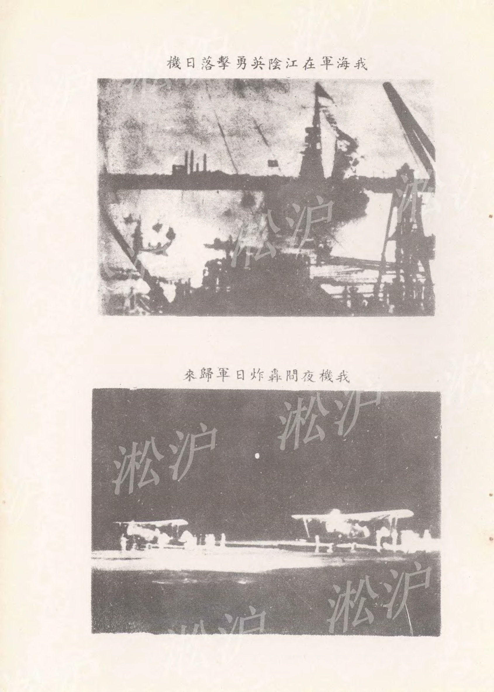

第三戰區司令長官部，九月三十日晚，鑒於敵採取中央突破戰略，其主力企圖攻我顧家鎮、劉家行、長濱站、施相公廟之線南進奪取大場鎮，以威脅中央軍之側背，我戰區爲持久消耗敵人，避免全戰局陷於不利狀態，以保優越之戰鬥力計，當於十月一日晚，令各兵團分別轉移至蘊藻濱右岸亘陳家行、廣福、施相公廟、北新涇鎮、瀏河之線，繼續防守，相機採取攻勢，打擊敵人。其顧家鎮、劉家行、長濱站、施相公廟之線轉移戰鬥經過，參閱第二款第四項。

##### 第四項 北站、江灣、蘊藻濱沿岸、陳家行、瀏河線之防禦

民國二十六年十月一日至十八日

參照插圖第十五、第十六插表第七、第八

第三戰區司令長官部，二十六年九月三十日晚，電飭左翼作戰軍蘊藻濱左岸、劉家行亘施相公廟之線各兵團，轉移至蘊藻濱右岸陳家行、廣福、施相公廟之線繼續防守，待機轉移攻勢。左翼作戰軍總司令部當經轉飭該線各兵團分別遵照實施。十月一日一時，敵後續部隊仍繼續由寶瀏、寶羅兩公路源源增加，其主攻方面仍在劉家行南北之線，展開於羅店鎮南端爲上室兵團，劉家行南北之線爲第三、第九兩師團與東北僞軍之一部，野戰砲六十餘門，戰車百餘輛，向我軍猛烈攻擊，其施相公廟亘劉河鎮之線，爲第四十二、第二十二兩聯隊及高橋支隊之一部，與我守兵僅有小部隊之接觸。中央作戰軍方面之敵，爲久留米旅團、第八師團第六聯隊、第九師團之一部、野山砲三十餘門，戰車四十餘輛，敵我形成對峙狀態，除終日不斷受敵機砲之轟擊外，僅有前哨接觸，無激戰。右翼作戰軍方面狀況，亦無變化。我戰區近日逐次增加到戰場各部隊，與由前線退囘後方整理之各師，仍繼續構築第二、第三線預備陣地。

茲將左翼、中央、右翼各作戰軍之戰鬥經過概況，依其重要先後之順序，分述如左：

左翼作戰軍第十九集團軍方面：第六十九軍第八師，十月一日，其左翼寶家弄西側陣地，終日受敵猛烈攻擊，敵步兵數度衝至陣地，均經擊退，二十二時，該師長奉令轉移新陣地，留置少數步兵於原陣地線，以掩護主力向唐橋站以西轉移，二日一時頃，其主力安全撤至唐橋站（不含）、陳家行之線，沿蘊藻濱右岸佔領陣地，其殘留步兵於二日十五時，受敵壓迫退至蘊藻濱右岸。

第十六師當面之敵，一日拂曉以來，不斷以飛機砲火向該師陣地轟擊，十六時頃，其步兵逐步逼近我陣地，該師派一部向敵側迂迴攻擊，斃敵甚夥，至二十二時頃，彭師長奉阮軍長命令要旨如左：

一、着第十六師除留一團守備顧家鎮外，其餘主力於本一日二十四時後，撤至蘊藻濱右岸西塘橋集結待命。

二、該師留顧家鎮之一圍，應於明二日晚，撤至西塘橋歸還建制。

該師奉命後，當卽令第四十八旅於一日二十四時後撤至西塘橋、趙家角一帶待命，其第九十二團於一日二十一日，佔領顧家鎮車站沿夾浦右岸之線陣地，以掩護全軍轉移陣地，左與第五十七師之第三三七團啣接，右與第八師崇明塘之留置部隊啣接。二日，敵以全力向該團陣地猛攻，我軍雖死傷奇重，然仍與敵隔河抗拒，十七時頃，該團以掩護友軍轉進任務完畢，隨撤回西塘橋歸建。

第五十七師當面之敵，一日拂曉以來，復猛攻我陸橋陣地，激戰至十九時頃，該師長奉阮軍長命令要旨，該師着留一營在陸橋一帶爲警戒部隊，其餘撤至蘊藻濱右岸談家頭、孟家宅附近集結，該師主力於二日五時頃，先後到達孟家宅、鍾行附近集結，其留置陸橋之一營，於二日十八時開始撤退歸還建制。

第六十九軍軍長，二日晨接奉第十九集團軍總司令部命令要旨如左：

一、本集團軍現決定佔領唐橋站、陸家橋、陳家行、新陸宅、廣福、朱北宅（含）之線，阻敵前進。

二、第八師擔任唐橋站、陸家橋（含）之線陣地守備。

湘滬二

三、第十六師擔任陸家橋（不含）、陳家行（含）之線守備，右與第八師、左與第五十七師連絡。

四、第五十七師擔任陳家行（不含）至馬家宅之線陣地守備。

五、第十三師擔任新陸宅（不含）、廣福亘朱北宅（含）之線守備，右與第五十七師、左與第四十四師連絡。

該軍長奉到右令後，當卽轉飭各師遵照。

第八師師長奉令後，當卽遵照部署，三日晨迄夜，敵飛機砲兵不斷轟擊該師全線陣地，四日拂曉，敵施放汽球於白楊宅附近，以機砲集中轟擊該師蘊藻濱左岸各據點，該師長命各部乘夜修補工事，並各團派小部隊夜襲敵人。其第四十三團李大智連長率兵一連夜襲，突入須宅東北敵之第九師團第三十五聯隊第一大隊，混戰二小時，斃敵中隊長澤田次作以下二百餘名，鹵獲文件甚多。

第十六師師長奉令後，二日十九時，命第四十六旅以第九十一團守備陸家橋（不含）亘陳家行（含之線陣地，置重點於陳家行，第九十二團位置於李家頭、孟宅附近爲旅預備隊。

第九十一團二日二十一時，佔領上述之線完畢，並派兵一部攻佔沈宅、宋宅，卽以該線爲警戒陣地，三日拂曉敵五六百名，由朱三房、楊家宅向該團警戒陣地進攻，戰鬥至十六時，將敵擊退，四日自晨迄晚，敵機數十架輪迴狂肆轟炸，並以砲火不斷轟擊，該團陣地毀壞甚多，何旅長令第九十二團第二營增加於陳家行右翼，並歸第九十一團團長指揮。

第五十七師一日晚奉令撤至孟家宅附近後，復於二日晨奉阮軍長命令守備陳家行亘新陸宅之線陣地，該師卽以第一七一旅擔任陳家行、花家橋宅亘孟家宅（不含）陣地之守備，第一六九旅擔任孟家宅亘新陸宅之線守備，該師各部均於二日二十一時佔領陣地完畢，三日二時頃，敵以小部隊向我楊宅一帶警戒陣地壓迫，我守軍竭力抗拒至二十時，乃撤至主陣地繼續抵抗，至四日十時，朱三房、蔡家塘之警戒陣地，亦受敵猛攻，十七時頃，該師長命各警戒部隊撤回主陣地。

第六十六軍第十五師營面，步砲聯合之敵五六千人，於一日拂曉前，向該師劉家行、太平橋陣地猛攻，至拂曉後，並以飛機砲火煙幕掩護步兵前進，我守兵傷亡慘重，致陸橋陣地被敵突破。葉軍長鑒於狀況，卽令第一六零師派兵一營（第九五五團劉營）馳援，與敵輾轉肉搏，至十時，僅恢復陸橋陣地之一部。而該師劉家行守兵死傷甚大，亦被敵突入一部，至十四時頃，敵由太平橋突入羅劉公路以西，太平橋陣地三面被圍，我守兵仍奮勇抗戰，屹然不動，激戰至十八時，傷亡殆盡，太平橋陣地失陷。

第七十七師當面之敵，一日二時頃，將該師太平橋、萬橋間之陣地夜襲突破，葉軍長卽命第四八零旅旅長率兵一部，協同第七十七師守兵，乘敵立足未穩之際，予以反擊，惟因第七十七師躊躕不前，致未得手。此時薛總司令限羅師長在拂曉恢復原線，四時頃，復令第一六零師佔領北王宅、九龍菴、中心閣、蘇家宅之線，限拂曉前佈署完畢，至該舒家宅、蔣家宅、謝家之線防務，卽交由第四十四師接替，第一六零師因時間過短，事實上仍未能於拂曉前完全到達新線，至拂曉後，被敵機猛炸，仍在原陣地停止。九時頃，進至羅劉公路以西之敵，經我第四八零旅一部於閩家牌樓、南金六房阻擊，而第七十七師十三時頃全線退却，敵戰車突入中心閣附近，我第四八零旅及第四七八旅之一部卽在北王宅、九龍菴、中心閣、蘇家宅各要點拒止，逼近第七十七師後之敵，旋第四七八旅亦全部加入戰鬥，激戰至二十一時。

葉軍長接獲薛總司令命令要旨：着該軍第十五師，除留一團仍守劉家行外，其餘於二十一時轉移至張浦橋附近，第七十七師移至馬陸鎮附近待命，該軍長將軍指揮所，於二十二時，轉移至大橋頭附近。基於上令要旨，復於二十二時頃，下達各師命令要旨如左：

一、軍遵上令要旨，決於今一日二十二時，向張浦橋、大頭橋之線撤退。

二、第十五師劉家行陣地之一團，應留守原陣地，掩護本軍撤退，至明二日黃昏後，向張浦橋附近撤退。

三、第十五師（欠一團）經余邱宅、胡家宅之線以南地區，向張浦橋附近撤退。

四、第七十七師經李九房、李家宅、萬家宅之線以南地區，向馬陸鎮撤退。

五、教導旅經中心閣、萬年橋、胡家宅之線以南地區，向陸家巷撤退。

六、第一六零師經北陸宅、朱家橋以北地區，向大橋頭撤退。

第二十五軍第十三師，十月一日奉令佔領新陸宅（不含）亘廣福、朱北宅之線，該師以第七十七團第三營佔領新宅、李九房、白沿之線前進陣地，掩護我第一線主力軍及左翼友軍進入本陣地，二日九時頃，敵第三師團第三十六聯隊附戰車四輛，向該營陣地猛攻，詹劍鋒營長親率隊向敵反復肉搏四次，予敵重創，營長於激戰中受傷，連排長多以身殉，十三時頃，敵兵二大隊，由泥宅向我西二房第七十三團第三營前進陣地攻擊，該營傷亡奇重，營長負傷不退，激勵士兵堅守支撐，阻敵前進。至三日晨，敵復藉飛機砲火之掩護，分向該師第七十七、第七十三兩團前進陣地猛攻，第七十七團派第五、六兩連增援，混戰至十五時，敵傷亡慘重，我增援之兩連大半官兵均壯烈犧牲，旋敵大部由兩翼迂迴，至黃昏，我前進陣地守兵轉移至本陣地，四日三時，敵以飛機大砲向廣福、張家宅、吳宅一帶陣地猛轟，其步兵約千餘，復利用戰車掩護，由梅宅向廣福以北吳宅間陣地進攻，經我猛烈側擊，斃敵四百餘人，敵勢稍挫，旋敵後續部隊約兩大隊，由中心閣增加，並以機砲不斷轟擊，吳宅一帶陣地完全被敵摧毀，激戰至十五時，我吳宅守兵一營多壯烈犧牲，敵乘機渡過楊涇河突入陣地，該師長命第七十八團第三營增援，向敵猛衝，該兩營長均受傷，連排長及士兵傷亡達三分之二。

第九師於三日黃昏到達南翔，奉薛總司令命令，飭卽歸第二十五軍萬耀煌軍長指揮，應開至虞家宅、北營、張浦橋之線，構築預備陣地，並策應第十三師之作戰。

陳總司令五日命令規定，左翼作戰軍之兩集團軍作戰地境如左：

第十九集團軍與第十五集團軍間，爲方泰鎮、石崗門、朱北宅、太平橋相連之線，線上屬第十五集團軍。

第六十九軍第八師當面之敵，五日拂曉，以飛機砲火向該師姚家街、西六房、郭宅轟擊，我前進陣地守兵死傷慘重，至十一時頃，工事全毀，敵步兵一部向該線猛攻，我殘存守兵與敵激戰至十五時頃，第四十八團第二營營長率守備南岸之機槍二連與工兵連向敵猛衝，敵遺屍遍野退去。六日六時頃，敵以砲火掩護步兵攻擊我蔣家坟（在西六房北）前進陣地，戰鬥至八時頃，蔣家坟被敵突破，並進攻我墻門頭第二線陣地，當陣地吃緊之際，我第十六師第九十六團及稅警總團第五團第一營適時趕到堵截，斃傷敵千餘，我軍傷亡尤衆，至七日，該師正面因傷亡甚鉅，情勢危殆，敵一部由陸家橋以西潛入繞攻，第四十三團腹背受敵，乃固守北桃園至南橋亭之線，至十三時，稅警總團第四團第二營姚家街陣地，復被敵突破，當令該團第三營增援死守原陣地，十四時，稅警總團第五團亦因傷亡過重，退守趙家角、塘北宅之線，至八日拂曉，該師仍堅守姚家街、王家邊之線，激戰至八時，姚家街東端陣地陷落，迨十二時，姚家街三面被圍，該師長令飭第四十三團排除萬難，奮戰到底。十五時頃，守備黑大黃宅之稅警總團第四團，因傷亡慘重，向東撤退，此際該師長卽派稅警總團第二團之一營向曹家宅、小吳宅前進，以恢復黑大黃宅，此時敵已越過黑大黃宅南進，該營不得已，卽在曹家宅附近停止，阻擊敵人。

第十六師五日十五時頃，敵機多架轟炸該師頓悟寺、陳家行陣地，工事被毀甚多，敵機兩架，亦被我擊中起火。六日十一時，該師長奉阮軍長命令要旨：第八師陣地西六房被敵突破，着該師卽派兵一團，迅速到墻門頭，歸第八師師長指揮。該師長卽以張宅師之預備隊第九十六團，馳赴墻門頭增援，至十四時頃，該團將朱宅突入之敵悉數肅清，黃昏，向右駁岸、蔣家攻之敵反攻，與敵反復肉搏，激戰至二十二時，將敵全部殲滅，恢復原有陣地，交由稅警總團第五團接守。該師當面之敵，亦於六日八時，藉機砲之掩護向該師陣地猛攻，激戰至七日十時，頓悟寺陣地陷落，我陳家行守兵側擊，仍將敵擊退，八日四時，敵以砲火掩護步兵向該師第四十六旅攻擊，該旅長派第九十一團第六連出擊，激戰一小時，斃敵隊長濱田正勝以下五十餘人，齒獲重機槍五挺，步槍四枝，及彈藥文件甚多，九時頃，激戰再起，第九十一團團長負傷，迄晚，戰鬥未停，敵屢行强渡蘊藻濱，均經我守兵擊退。

第五十七師當面之敵，五日，以飛機整日轟炸該師陣地，敵機一架在清水顯附近被我擊落，六日八時，敵升氣球偵察，同時敵機砲不斷轟擊該師新陸宅一帶工事，民房被毀甚多，官兵傷亡亦衆，七日二時頃，該師長因右翼友軍被敵突破，乃以一部火力側射，支援友軍，以一營協力陳家行，並飭各旅趕築預備陣地及對陳家行斜交陣地，八日，敵以小部隊進攻花家橋、葛家頭、孟家宅等陣地，均被我擊退。第一軍第七十八師師長指揮該師第二三四旅，六日，策應蘊藻濱南岸第八、第十六兩師之作戰，七日五時，該師長率隊進抵朱宅，卽令佔領塘北宅（不含）至盛宅之線。八日三時，該師奉胡軍長電令要旨，着該師擔任由趙家角（不含）、塘北宅、盛宅亘橋亭宅（不含）之線陣地。該師師長當令第二三四旅擔任第一線拒止敵人，令第二三二旅推進至東沈宅、談家頭間地區集結，準備策應第一線之作戰。五時頃，敵向我塘北宅、盛宅陣地猛攻，激戰至十六時，敵傷亡慘重退去。

第一師師長八日四時奉胡軍長命令要旨如左：

一、軍卽在西塘橋、趙家角、橋亭宅之線，拒止敵人。

二、第一師應卽佔領西塘橋、趙家角之線陣地，拒止敵人，右與馬橋宅稅警總團、左與第七十八師連繫，並須在後方各村落構築預備工事。

該師長奉令後，卽以第一旅在西塘橋、趙家角之線佔領陣地，拒止敵人，第二旅在陶宅、徐家巷、灣巷、丁家橋地區集結，準備策應第一旅之戰鬥。

第三十二師八日晨在唐家橋南方地區集結。

第二十五軍第十三師當面之敵第三十六聯隊，五日拂曉，以飛機三十餘架及砲兵掩護，分數縱隊向該師陣地猛攻，其後續部隊則强渡楊涇河，向北朱宅以南第七十七團陣地猛攻，十一時頃，該敵已竄入費家宅與我混戰，於吳宅、費家宅間，激戰至十五時，第九師增援之兩團，由萬家宅、吳家宅向敵側背逆襲，將敵擊退，恢復費家宅、倪家園之線原陣地，黃昏後，該師將第七十七團吳宅（不含）至北朱宅陣地之守備，交由第九師接替，第七十八團將殘餘編併，擔任廣福（不含）至吳宅陣地之守備。六、七八三日，第十三師及第九師當面之敵，除不時藉飛機及砲火掩護，以少數步兵施行襲擾外，全線戰況漸轉沉寂，八日晚，第九師師長派第四十九、第五十四兩團向楊涇河突入之敵夜襲，敵倉惶退去，當將楊涇河右岸一帶原第十三師陣地完全恢復。

第十五集團軍之第四軍第五十九師當面之敵，十月一日十四時，突破長濱站第七十七師陣地後，卽向該師右翼包圍，經我守兵沉着應戰，敵未得逞，至二十二時頃，該師將陣地移交第四十四師第一三零旅完畢後，陸續撤至王前附近集結，奉命卽晚逐次移至嘉定城西北地區待命。

第九十師亦於十月一日二十二時後，奉令轉移嘉定北門一帶集結整理。

第四十四師第一三零旅當面之敵，十月一日，以戰車掩護其步兵向我嚴宅、北宅陣地衝擊，我守兵與敵肉搏多次，敵不支退去，該師於二日晨，奉羅軍長命令要旨，該師卽以第一三二旅堅守包家宅、齊家村之線陣地，以第一三零旅一團佔領北朱宅（不含）亘孫家宅、楊涇河西岸陣地，構築據點工事，一團爲師預備隊，位置於王家宅，右與第十三師，左與第十一師取連絡，砲兵第二連於朱家宅附近佔領陣地，歸第一三二旅旅長指揮。

二日自晨迄暮，敵一部攻擊我包家宅、周王前前進陣地，均被我守兵擊退，三日晚，該師奉羅軍長命令要旨如左：

一、中心閣之敵，今晨突入我第十三師白沿之前進陣地，刻仍有向西進擊模樣。

二、第十四師之山砲連及迫砲營（欠兩連），着暫歸第四十四師陳師長指揮，務集中火力向白沿附近之敵猛烈射擊，阻敵前進。

該師長奉令後，卽令第十四師迫砲營在費家宅附近佔領陣地，山砲連在張家橋佔領陣地，本師山砲兵連於小楊家附近佔領陣地，均對白沿方面之敵施行阻止射擊。四日十二時，敵步兵向我前進陣地猛攻，我撤至包家宅、套宅、羌家橋、金家店、齊家村本陣地，十三時後，敵仍以砲火掩護步兵向我羌家宅、王家宅、蘇家宅等陣地進攻，均經我擊退，五日，第一三二旅仍在包家宅、齊家村之線，與敵對峙，但無激戰。

第十八軍第十一師當面之敵，十月一日四時，以五百餘人向該師金家宅猛攻，經我奮勇抵抗，戰鬥約一小時，將敵擊退，是晚，該師於金家宅、南朱宅留置掩護部隊，於北宅、龔家橋、徐宅佔領陣地，主力控置於張家村附近，二日迄四日晚，當面之敵，不斷向我東林寺據點，及分股襲擊我北宅、龔家橋、徐宅陣地，均被我擊退。五日晨，突破我龔家橋、徐宅陣地後，卽以戰車十餘輛掩護步兵，向該師第二線陣地猛攻，勢頗危殆。

第六十七師當面之敵，一日拂曉，在猛烈砲火掩護下，向我嚴宅、陸宅警戒陣地攻擊，經我守兵堅强阻擊退去，二日拂曉，敵三面渡河，再向我嚴宅、陸宅圍攻，該師長以任務達成，遂令各警戒部隊分向徐宅、姚家宅、施相公廟之線陣地攻擊，並施放毒氣，我守兵中毒昏迷嘔吐者，達數十名，旋我增援反擊，將敵擊退，五日晨，敵復猛攻我北周宅陣地，激戰至九時後，該師陣地有動搖狀態。

羅軍團長五日十時基於全般態勢，判斷敵集中優勢兵力，向我第十一、第六十七兩師壓迫，企圖策應其主力，由廣福以北地區之突入，卽令第六十師進入孫家宅亘施相公廟陣地，以策應第十一、第六十七兩師。又以第四十四師之陣地過於突出，爲爾後作戰便利計，遂於十二時下達調整部署命令，要旨如左：

一、軍團右翼各部隊，決於本晚向旣設陣地轉移，拒止敵人，待機轉移攻擊。

二、第四十四師卽以有力一部，接替第六十師濮宅亘張家村（含）間楊涇河西岸陣地而固守之，該師第一三二旅，應於本夜留置有力之掩護部隊，於楊涇河東岸之前進陣地，應極力固守，節節遲滯敵之前進，其餘各部應向楊涇河右岸轉移。

三、第十一師應竭力維持現狀，至本日黃昏後，留置一部於現陣地，確與第四十四師掩護部隊連繫，主力應轉移於徐家堰、三官殿、胡家灣附近整理待命。

四、第六十七師須節節抵抗，至本日黃昏後，由第六十師掩護，向嘉定西北地區轉進，卽在該地區整理待命。

五、第六十師守備張家村西端亘施相公廟間楊涇河西岸主陣地線，置重點於左地區。

六、第十四師（該師原在太倉城整理）應以第四十旅（欠第八十團）於本夜開赴潘宅、樊家宅、吉家宅間，左翼啣接第八十團，構築凌宅、大徐宅之線堅固陣地，並須構築潘家宅、樊家宅兩據點工事，其餘各部隊任務同前。

七、右翼砲兵羣，依砲兵第十六團王團長之指揮，服行前規定之任務。

第四十四師師長奉令後，遵於五日夜，向朱北宅亘張家村之線轉移陣地，六日晨，敵以飛機重砲掩護步兵向該師陣地猛攻，至晚，該師第第一三二旅陣地，受敵三面圍攻後，奉令撤至蕭家宅、王家灣、周家宅之線抵抗，七日，敵一部又向我朱北宅、周家宅陣地攻擊，被我擊退，八日晨，敵復以重砲掩護其步兵向我周家宅前進陣地攻擊，我守兵第三十六團第一營與敵反復肉搏，傷亡殆盡，周家宅淪於敵手，我仍固守蕭家宅、王家灣、張家村陣地。

第十一師師長奉令後，卽令飭各部於五日二十時開始，向徐家堰、三官殿、胡家灣附近轉進，至六日四時始轉進完畢。

第六十七師當面之敵，五日十三時，復以飛機重砲及戰車掩護向該師全線陣地猛攻，敵我傷亡奇重，北周宅陣地陷落，乃退守預備陣地繼續抵抗，當晚，該師經第六十師掩護，向嘉定城西北轉進。

第六十師五日奉令擔任守備張家村（不含）亘施相公廟（不含）陣地，五日晚迄八日晨，當面之敵，不時以飛機砲兵向該師陣地轟擊，並以戰車小部隊向我徐宅、北周宅及施相公廟南端堡壘陣地進攻，均經我守兵擊退。

第三十九軍第五十一師當面之敵，十月一日拂曉迄二日入暮，以飛機輪流轟炸我浦家廟、劉村陣地，並以步兵千餘分向我施相公廟、浦家廟、曹王廟之線攻擊，我守兵候敵進入火網，予以猛擊，敵狼狽退去，三日晨，敵復藉重砲掩護向我施相公廟及其以南與第六十七師接合部，與浦家廟、曹王廟之線猛攻，激戰至十七時，敵不支乃狼狽後退，我鹵獲敵步槍三十四枝，敵遺棄屍體一百四十餘具（檢查屍體爲敵第四十二聯隊）。該師長於是日晚抽編六個突擊連襲擊敵人，敵軍傷亡奇重，四日拂曉，敵機十餘架，輪流轟炸我砲兵陣地，其步兵約一旅團由張家堰、吳家村、蔣宅之線向我全線陣地猛攻，激戰至十一時，形成對峙狀態，二十一時，我以步兵三個連分向吳家宅、丁家橋之線敵警戒陣地夜襲，激戰三小時，計斃敵百餘名，鹵獲輕機槍四挺、步槍九枝，我亦傷亡官兵六十餘人。

五日晨，敵以飛機指導其砲兵向施相公廟集中轟擊，該師陣地工事略有損壞，六日，該師派兵兩連由劉家村出擊，斃敵數十名，函獲敵文件爲敵第十一師團之第四十二、第四十三兩聯隊，及台灣步兵第一、第二兩聯隊，七日，敵仍以大砲轟擊我施相公廟、浦家廟之線陣地，晚，敵步兵二百餘編成三個便衣决死隊，襲擊我浦家廟、劉家村陣地，經該師以預備隊出擊包圍，將敵悉數殲滅。

第五十八師當面之敵，自一日至四日晨，不時以飛機砲火轟擊該師陣地，並以小部隊向該師岳王廟、楊家村陣地攻擊，經我守兵擊退。五日至八日間，敵仍時以砲兵射擊我陣地，其步兵亦數度向我岳王廟、老丹宅前進據點進攻，經我砲兵集中急襲，及預備隊出擊，敵傷亡慘重退去。

第五十六師十月一日至八日，戰況沉寂。

中央作戰軍方面：一日，各部隊之位置如左：

一、第八十八師在北站至持志大學、東錢家塘（不含）之線。

二、第三十六師在東錢家塘（含）、江灣、吳家宅之線。

三、第八十七師在吳家宅、唐家宅之線。

四、第六十一師在唐家宅以西沿蘊藻濱右岸、唐橋站、橋頭堡、黑大黃宅（不含）之線。

五、上海保安總團兩團，在新閘路、北站間沿蘇州河左岸，對租界方面警戒。

六、稅警總團以一團在北新涇鎮、新涇橋間，以一團位置於彭浦附近，其餘在走馬塘至小南翔構築工事。

七、第十八師兩團，於一日晨，在閔行、龍華間，一團在北新涇鎮、紀王廟構築工事。

右翼軍第八十八師當面之敵，十月一日晨至三日十四時，不斷以飛機砲火向我北站、寶興路、天通菴轟擊，其步兵藉戰車之掩護，分向我北站、寶山路、廣東街一帶陣地猛攻，經我守兵迎擊退去，四日，敵由愛國女校向持志大學猛攻四次，均被擊退，寶山路、廣東街一度被敵突破，經我極力反擊，旋卽克復，敵我傷亡均重。五日晨，約三聯隊之敵，向我福生路沿淞滬鐵路至寶山路之線猛攻，激戰終日，均未得逞，是日，敵死傷七八百人，毀戰車二輛，我亦傷亡官兵五百餘人。六日晨迄八日二時，當面之敵，仍以機砲不斷轟擊我陣地，損壞甚多，其步兵藉戰車之掩護，數度攻擊我陣地，均被我擊退。

左翼軍第三十六、第八十七兩師，十月一、二兩日，戰況沉寂。朱總司令於二日晚，命令左翼軍各師要旨，我左翼作戰軍第十九集團軍，於一日調整部署，轉入唐橋站、廣福間既設陣地，各該師爲策應友軍作戰之目的，應爲所要之準備。

第三十六師第一線，三、四兩日，僅有小接觸，該師長三日十時奉朱總司令命令要旨如左：

一、該師當面之敵，已轉移於閘北方面，並行眞面目之攻擊甚緊，現我第八十八師仍在激戰中。

二、該師應控置有力之預備隊於右翼附近，以便爾後策應右翼軍方面之戰鬥。

該師卽將第一線守備增強，並控置有力預備隊於兩翼後方，以應機宜。

第八十七師當面，三日戰況沉寂，四日，該師廟巷以東僅有小接觸，蘊藻濱、北湖宅當面之敵，企圖强渡，攻擊較烈。

五日，第三十六、第八十七兩師當面之敵，復不斷以飛機砲火轟擊我軍陣地，六日晨，陳誠前敵總司令給予中央作戰軍左翼軍宋指揮官命令要旨如左：

一、蘊藻濱左岸之敵，自本六日拂曉以來，分別以小部隊於楊家宅、江家宅附近渡河，我正派隊驅逐中。

二、着第三十六師師地區隊，迅速將第一線抽調一團，控置於適當地點，以作策應蘊藻濱右岸守備隊之準備。

第三十六、第八十七兩師當面之敵，七日十五時，以重迫擊砲向我江灣一帶射擊，我工事被毀數處，十八時，宋指揮官奉朱總司令電令要旨：第三十六、第八十七師之本陣地，應加强工事，其警戒陣地酌留少數哨兵警戒，第三十六師須以兩團兵力於本晚集結於大場附近，爲集團軍總預備隊，第八十七師須集結一團以上之兵力，位置馬橋宅、廟巷之線爲左翼軍預備隊，所有本陣地無論遇如何情況，須努力固守爲要。

第三十六師奉令後，當晚調整部署完畢，江灣一帶抽調兵力過多，殊嫌薄弱，八日晨，敵以重砲及戰車掩護步兵向我復旦大學據點攻擊，我守兵一排苦戰至十二時，悉數傷亡，該據點隨陷敵手，當晚我抽調兵力一連反擊，僅恢復該據點西半部。

第一零八旅（抽調爲集團軍總預備隊）八日十一時頃，鑒於稅警總團嚴家宅、曹家宅相繼失陷，該旅爲協助友軍計，遂以第二一五團第三營展開於黃宅、俞宅之線，依我砲火支援，向敵猛攻，十四時頃，該營攻佔嚴宅、西曹宅時，敵集中砲兵轟擊，繼以步兵反擊，嚴宅復遭失陷，十七時頃，該旅奉令接替第六十一師黃宅陣地，將俞宅陣地移交稅警總團第二團接替。

第八十七師當面之敵，七、八兩日，除步兵有接觸及飛機砲兵轟擊甚烈外，餘無變化。

第六十一師擔任唐家宅以西、蘊藻濱右岸至黑大黃宅（不含）之守備部隊，一日戰況無變化，二日七時頃，該師長令第三六二團第二營進至唐橋站之橋頭堡佔領陣地，十五時，以第十六、第八兩師分向蘊藻濱右岸撤退，敵第九師團卽追蹤跟進，該師守軍遂與敵戰鬥終宵，至三日九時頃，敵由東、北、西三面向我橋頭堡側擊，激戰至十九時，我橋頭堡守軍傷亡慘重，乃撤回右岸主陣地固守，至七日晨，向該師正面猛攻，曾被敵突破數處，激戰約一小時，均經我守兵擊退，八日晨，敵大部向我唐橋站强行渡河，另敵一部約千餘，經黑大黃宅（第八師陣地）向我唐橋站西南側面攻擊，該師長當卽以師預備隊佔領黑大黃宅、嚴家宅東側小河一帶，極力抵抗。

右翼作戰軍方面：十月一日情況無變化，二、三兩日，黃浦江敵艦不斷向我沿岸陣地砲擊，四日晨，第十九師奉令擔任金山嘴至青浦線上之工事構築，五、六兩日情況無變化，七日四時頃，黃浦江之敵三十餘人，在慶寧寺右側登陸我經第五十五師第三二八團守兵擊退，八日，敵艦及浦西砲兵向我慶寧寺及東溝一帶砲擊甚烈，我工事被毀甚多。

我空軍於十月一日夜間，以達機二架，霍機三架，飛滬偵炸敵楊樹浦機場，並在敵佔領區投擲傳單，五日十五時三十分，我空軍霍機六架，每機攜帶二百五十公斤炸彈一枚，諾機六架，每機攜帶五十公斤炸彈六枚，自京分別飛赴上海轟炸黃浦江敵出雲號旗艦，及敵高爾夫機場，於十八時十分，飛臨目標上空，經分別投彈後飛返南京。

我長江海軍，自楚有艦下沉後，對保衛江陰阻塞線之方策，乃加變更，決以拆卸艦砲設置長江西岸，用以腰擊敵艦，擇江陰之巫山、六助港、蕭山、長山、黃山五要區爲要塞陣地，各艦隨之不斷從從事拆砲卸運裝設等工作，又因加强阻塞往返駛航，引起敵人注意，敵又以飛機肆意狂炸，我從事工作各艦艇復多損失，十月三日，湖鵬魚雷艇沉於目魚沙，五日，海寧砲艇沉於砲子洲。

左翼作戰軍總司令部，奉第三戰區司令長官部之指示，於九日一時，將該作戰軍之兵團區分，及作戰地境從新規定如左：

一、兵團區分：

第十九集團軍總司令薛岳

右地區總指揮胡宗南，副總指揮黃杰，指揮第一軍（第一、第七十八、第三十二等師。）及第八、第十六師、稅警總團。

中央地區兼總指揮薛岳，副指揮官葉肇，指揮第五十七、第十三、第九師、第六十六軍（第一五九、第一六零師）及第六、第一三五師。

第十五集團軍總司令羅卓英

三左地區兼總指揮羅卓英，副總指揮劉和鼎，指揮第四十四、第六十、第五十一、第五十六、第五十八、第十一、第十四、第六十七、第九十八等師，及獨立第三十四旅、保安第四團、步兵砲團（第一、二、三營）、戰車防禦砲第二連、高射砲第二、第十連。

四砲兵指揮官劉翰東，指揮砲兵第三團之一營、砲兵第四、第十六團、獨立砲兵第十團（兩營）

教導總隊砲兵營、砲校練習隊之二連。

二、作戰地境：

右地區與中央地區間，爲小南翔、陳家行、劉家行之線，線上屬右。

中央地區與左地區間，爲方泰鎮、石崗門、朱北宅、太平橋之線，線上屬左。

第十九集團軍右地區稅警總團，自九日晨以來，與西曹宅、海宅、西塘橋、坍石橋等地區之敵苦戰，惟迄十二日晚，仍在俞宅、朱宅、季項宅、葛家神樓宅以西之線，與敵對戰中，是晚，奉令將季項宅、葛家神樓宅以西之線，交由第十九師接替，十三、十四兩日、朱宅、馬橋宅受敵攻擊四次，均經我守兵擊退。

第八師當面之敵，九日拂曉，仍不斷向該師陣地攻擊，七時，該師長奉命固守姚家街、孫家池、楊宅等待援，至十一時頃，敵於我後援尙未到達之際，以優勢兵力猛烈圍攻，曾旅長卜團長均受傷，王家邊、姚家街、孫家池等處，次第陷落，殘餘官兵數百突圍而出，隨奉命移至江橋鎮整理。

第十六師當面之敵，九日一時，向頓悟寺陣地猛衝，該師派隊側擊，斃敵甚衆，戰鬥至十時頃，我橋亭宅一帶陣地，頗呈動搖之勢，正鏖戰間，第三十二師潘團增到，與敵肉搏，將敵擊退，二十二時，該師長奉薛總司令命令，於本（九）日二十四時，將橋亭宅、陸家橋南岸、頓悟寺、陳家行陣地，交由第三十二師接替後，移新涇橋整理，並在陳家、談家頭、新涇橋之線構築陣地工事。

第一軍第一師當面之敵，九日八時，攻陷第八師守備之王家邊，該師長卽令第一團第三營營長率第八、九兩連增援，與敵肉搏，營長陣亡，官兵傷亡過半，乃撤回原陣地，敵乘勢向趙家角陣地猛攻，激戰至十三時，陣地失陷，敵佔領趙家角後，因死傷過重，未敢續進，該師乃乘夜加强工事，至十日拂曉，敵以砲火掩護步兵向趙家角南側、灣宅、季宅陣地猛攻，激戰至十二時頃，守備該處之第二團團長及第三營營長陣亡，僅餘官兵二百餘人，仍死守不退，激戰迄夜未停，十二日三時，該師將西塘橋防務，交由稅警第六團接替，拂曉，西塘橋被敵突破，該師乃退守張家樓、灣宅之線，十三日晨迄十四日暮，敵不時以小部隊攻擊該師陣地，均被擊退。

第七十八師當面之敵，自九日晨迄十一日夜，不斷以飛機砲火向我丁家橋宅、塘北宅、盛宅之線陣地轟擊，其步兵在其機砲掩護下，數度攻擊該線陣地，均經我守軍反復肉搏擊退，十二日晨，敵約千七八百名，再分向我塘北宅、盛宅之線猛攻，激戰至十五時，盛宅陣地悉成焦土，遂被敵攻佔，旋經我增援部隊逆襲，奪回該據點東北之一部，十三日八時，我守兵將盛宅之敵擊潰，敵傷亡甚重，棄屍百餘具，九時，敵復增千餘名，再向我塘北宅、盛宅之線猛攻，反復肉搏多次，至十四日十七時，敵傷亡慘重退去，我仍守備原陣地。

第三十二師，九日晚，接替第十六師橋亭宅、頓悟寺、陳家行陣地後，十日十五時，敵軍第三、第九師團部隊約一聯隊，又向我橋亭宅陣地進攻，肉搏至十七時，該處陣地失而復得者數次，但卒將該敵擊退，十一日拂曉迄十三日夜，當面之敵，復增加二聯隊，數度以機砲掩護其步兵分向我橋亭宅、頓悟寺、陳家行陣地攻擊，且曾一度突入陳家行東端，第五十七師派兵一營協力該師預備隊，向敵猛衝，卒將突入之敵擊退，十三日夜，該師長奉薛總司令電令，將頓悟寺至盛宅一段防地，交由第二十軍第一三四師羅旅擔任，於十四日晨，分別交接完畢，並將該線守兵配置於陳家行、談家頭之預備陣地內，該師與敵激戰至十四日夜，剩餘官兵僅七百餘人。

第十九師十二日十四時，奉胡指揮官命令要旨如下：該師應卽接替稅警總團季項宅、葛家神樓宅、黃港、湖里宅、蘇家宅、張家樓（不含）之線防務，拒止敵人，右與稅警總團，左與第一師密取連繫。該師長奉令後，當卽以第五十五旅接替季項宅、陳宅、葛家神樓宅（不含）之線，以第五十七旅接替葛家神樓宅、黃港、張家樓（不含）之線稅警總團防務，十三日晨，該師接替部署完畢後，十二時頃，敵機砲不斷向我葛家神樓宅一帶陣地轟擊，隨卽以步兵猛攻肉搏，至十五時，將敵擊潰，是役計斃敵八九百名，我亦傷亡營長以下七百餘人，十四日九時頃，敵以機砲不斷轟擊季項宅陣地，並以步兵反復向我猛攻，激戰至十六時，我以預備隊出擊，將敵擊退。

第二十軍第一三四師，十三日夜，接替頓悟寺、盛宅之線陣地後，敵卽集中陸、空軍主力猛攻，我全線工事被毀，官兵傷亡奇重，陣地一部被敵突破，十四日晨，該軍長令第一三四師向敵死力反攻，與敵激戰至黃昏，將橋亭宅、頓悟寺第二線陣地恢復。

第二十一集團軍廖總司令，十三日十九時，奉到司令長官部電令要旨：「該集團所屬之第四十八軍及第七軍之各師，到達南翔後，應卽以兩師兵力位置於大場（不含）沿走馬塘、老人橋、新涇橋之線，對馬橋宅、陳家行方面構築預備陣地，其餘部隊控置於周涇橋、嚴家濱、洛陽橋一帶地區，該集團卽歸中央作戰軍朱總司令指揮」。該總司令卽令已先到之第四十八軍第一七三師遵照。

第一七三師十四日晨，又奉第十九集團軍薛總司令電令要旨：「該師部隊如己到達老人橋、新涇橋，着卽修整該線未完成工事，幷與前方及兩側部隊連絡。」復於十四日晚，該師復奉總司令電令要旨：「現派楊森軍向陳家行反攻，該師卽派步兵團佔領東沈宅、談家頭、盧宅之線，構築工事固守之」。

中央地區第六十九軍第五十七師當面之敵，自九日晨起，不斷以砲火轟擊該師陣地，並以小部隊不時向該師陣地襲擊，均被我守軍擊退，當第三十二師陳家行東北被敵突破之際，該師派第三四零團第三營增援側擊，恢復原陣地，十四日，陳家行東北敵攻擊猛烈，請求增援，該師長當令第三四零團派兵兩營，協同第一三四師增援之一營，向敵反擊，將敵擊退，十一時頃，敵五百餘向該師花家橋宅陣地猛攻，戰鬥至十八時，敵不支退去，入夜，該師派少數部隊向敵夜襲。

第二十五軍第十三師當面之敵第十八聯隊，於九、十兩日，藉飛機砲火掩護，少數步兵襲擾我廣福以南地區，均經我守兵擊退，十一日拂曉，敵百餘潛渡小河，襲擊該師新三家陣地，經該師守兵伏擊，斃敵三十餘名，殘敵泅水逃去，在敵屍上搜獲第三十六聯隊中隊長林實名片、日記，並奪獲旗幟戰刀。十二、十三日，敵仍以飛機砲火轟擊該師陣地，並以一小部步兵向廣福陣地左翼進攻，經該師守兵夾擊退去，第六十六軍第一六零師第九五八團奉命由張浦橋推進至八字橋，爲第十三師預備隊，十四日三時後，敵千餘分向我老陸宅、三家村、費家宅一帶陣地猛烈攻擊，激戰至十二時，我三家村陣地守兵一連全部犧牲，該師增援之一營向數倍之敵衝殺，約一小時，全營傷亡殆盡，敵乘隙突入三家村，該師長命第七十四團團長率兵二營向敵逆襲，激戰至黃昏，斃敵六百餘人，我收復三家村原陣地。

第九師當面之敵，九日晨猛攻我南梅宅前進陣地，第四十四師師長遂令砲兵支援，第一三零旅朱北宅方面部隊將敵擊退，十一、十二兩日，敵不斷砲擊我費家村、北梅宅陣地，並以飛機在萬家宅、吳王宅一帶散下黑色藥粉，致該師官兵飲水後瀉吐，十三日，敵百餘向南北梅宅該師與第四十四師兩師接合部進攻，當被我該兩師守兵夾擊退去。

第十五集團軍第四十四師當面之敵，十月九日至十一日間，不時以小部隊擾襲我朱家宅、蕭家宅、王宅等前進陣地，均經我守兵步砲猛擊後退去，十二日九時頃，敵以機砲掩護向我蕭家宅前進陣地猛攻，旋敵續增二中隊，我亦增援一營，雙方肉搏混戰，至十五時，蕭家宅陣地失陷，該兩營撤至王家宅、孫家宅整理，十三、十四兩日，敵一部又藉飛機砲火掩護，數度强渡楊涇河，均經我朱北宅、孫家宅守兵與砲兵協力擊退。

第十八軍第六十師當面之敵，自九日至十四日，僅以飛機偵察及投少數炸彈轟炸，其小部隊亦時向我陣地襲擾，均經我守兵擊退。

第三十九軍第五十一師當面之敵，自十日至十四日，無積極活動，僅以砲擊我施相公廟、廟灣、小潘、大潘、浦家廟等陣地，並以小部隊擾襲我陣地。

第五十八師當面之敵百餘，十日十一時，向我旋陸宅攻擊，經該師迫擊砲痛擊退去，十一日至十四日晚，戰況沉寂。

第五十六師當面之敵，十日晨，沿江突增至軍艦三十三艘，運輸艦三十五艘，小輪船及民船各百餘隻，向該師第一六八旅正面，由瀏河口至鹿鳴涇口四十華里內，處處滿佈，楊林、馬橋尤密，企圖積極登陸，十一日晨，敵艦稍有增多，十八時頃，敵放烟幕在楊林口、馬橋强行登陸，經我守兵擊退，十九時頃，敵又向我七了口亘鹿鳴涇口間砲擊，掩護登陸，經我守兵阻擊未逞，同時瀏河鎮對面之敵，亦猛烈進攻，亦被我守兵擊退。

陳總司令據第五十六師報告後，於十一日晚，令第七十七師推進至茜涇營、馬橋、浮橋鎮、陸公市鎮直接支援，令第九十師由陸渡橋向瀏河鎮西方之顏家宅附近推進，對瀏河鎮及瀏河口支援，並令徐家2

宅砲兵第四營，專射擊我劉河鎮當面之敵，第九十八師山砲營移至茜涇營，高射砲第十連移至劉河，以固防線。

獨立第三十四旅，原在南翔鎮至馬陸鎮間構築預備陣地，於昨（八）日奉陳總司令電令，星夜開嘉定以北地區，歸第七十四軍俞軍長指揮，該旅於九日晚開抵嘉定後，接俞軍長電令，於十一日晚，開赴劉河、茜涇營間擔任沿江之守備。

第五十六師自十二日至十四日晚，當面戰況沉寂，惟白茆口、浪港口附近，時有多數敵艦停泊。

中央作戰軍方面：右翼軍第八十八師當面之敵，於九日至十四日午前，不斷以飛機重砲向我北站、廣東街、東寶興路及閘北一帶陣地轟擊，並以少數步兵分向我襲擊，均經我軍擊退，十四日十三時頃，我空軍及砲兵掩護步兵向敵全線進攻，經三小時激戰，斃敵甚多，我攻佔虬江路、廣東街、北四川路、長春路、寶樂安路一帶，但我亦有相當損失。

左翼軍第三十六師當面之敵，九日十六時頃，以戰車十餘輛掩護步兵兩大隊，分向我復旦大學、葉家花園之線猛攻，我該線據點守兵僅六個排，此時該師又無預備隊可資增援，堅持鏖戰至二十時，全部壯烈犧牲，各該據點先後淪陷，二十二時頃，我抽集步兵一連以砲火掩護反攻復旦大學，肉搏數次，始得恢復該校西半部，九日戰鬥結局，我警戒陣地線移至孟家宅、上海商學院、兩江女校、復旦大學西半部、萬國體育場西端、天祿寺南端、宋家橋、丁家宅之線，師戰鬥指揮所移大場鎮南之孟家木橋，十日三時，我復增兵四排襲擊復旦大學東半部，戰鬥半小時，遂收復該地，八時頃，敵戰車四輛掩護步兵一大隊向我警戒陣地攻擊，我撤至東體育會路北段，朱家橋新警戒線固守，十一日至十四日間，敵時以步兵數百在其機砲掩護下，向我宋家橋、丁家宅一帶陣地攻擊，均經我守兵擊退。

第八十七師當面之敵，九日，仍與我在顧家宅隔河對峙，各無進展，十日晨，敵約二三百人，向我麥家宅、新宅警戒陣地攻擊，當被我守兵擊退，十二時頃，蘊藻濱之敵，復增援壓迫，我警戒部隊撤至三豐宅、唐家宅南端之線，十三日晨，敵以步兵二百餘名，向我廟行襲擊，被我擊退，十四日十五時，敵八百餘名，分由郭泰宅、顧家宅、顏中橋一帶向我前進陣地攻擊，激戰至晚，敵未得逞退去。

第六十一師當面之敵，九日晨，以飛機多架、砲二十餘門、戰車九輛向唐橋站正面轟擊，我工事悉被毀壞，官兵傷亡頗爲慘重，此際黑大黃宅、嚴家宅之敵，亦紛紛向東渡河，猛攻該師李宅、吳家院而我唐橋南岸守兵腹背受敵，激戰至十八時，傷亡殆盡，此時唐橋站北岸之敵，卽乘勢渡河，我乃退守蘇家宅、黃宅、吳家院之線與敵對戰，當晚，該師長奉命將沈家灣宅（不含）、膏雀橋宅亘黃宅之線陣地，交由第三十六師第一零八旅接替，該師唐家宅以西嚴宅、張沿宅、沈家灣宅之線，自九日晨至十一日晚，仍與敵不斷戰鬥，敵我傷亡均重，十一日十二時，該師奉司令長官部電令要旨如下：「着第三師之第九旅，於十一日晚，接替第六十一師唐家宅以西至沈家灣宅之線防務，第六十一師交防後，卽移至江灣、大場之線，對北正面構築工事」。十二日至十三日，仍不斷與敵戰鬥，十四日拂曉，將唐家宅以西至沈家灣宅之線防務，交由第三師第九旅接替完畢後，轉移至江灣、大場間整理。

第三師第九旅，由王兼師長敬久指揮，該旅十四日拂曉接防後，迄夜不斷與敵戰鬥。

第三十六師第一零八旅當面之敵二百餘，九日拂曉，向該旅黃宅攻擊，戰鬥至十一時，敵我傷亡均重，此際該旅長接稅警總團長轉司令長官部電令，飭暫歸黃副指揮官指揮，由滬太公路向西攻擊黑大黃宅之敵，同時該旅長復接第六十一師鍾師長電話，着第一零八旅暫策應第六十一師之戰鬥，該旅長因指揮系統紊亂，故未實施攻擊黑大黃宅之敵，迄十九時頃，該旅長復接第三十六師令，仍接替原第六十一師沈家灣宅（不含）至朱宅之線陣地守備，至十一日十五時，當面之敵，以一部牽制陸宅、膏家橋宅之陣地，其主力在優勢砲火掩護下，向我黃宅陣地連續多次猛攻，均經我守兵擊退，十六時頃，左翼稅警第二團遭敵襲擊，退至大場西北馬橋宅，情勢頓形混亂，該旅令控置馬橋宅之第二一五團（欠一營）協同第十九師第五十五旅，向該敵逆襲，激戰至二十一時，將敵擊潰，恢復坍石橋之原有陣地，十二日至十四日，敵主力移攻陸宅陣地，經該旅守兵反復肉搏，將敵擊退，計斃敵三百餘人，鹵獲步槍五十八枝，輕機槍四挺，軍刀旗幟數十件，我亦傷亡官兵四百餘人。

右翼作戰軍方面：十月九、十兩日，情況無變化，十一日四時五十分，我浦東砲兵全部（共野山砲十二門）及迫擊砲二十餘門，集中向浦西公大紗廠敵機場及楊樹浦日領事署、黃浦江敵艦射擊，至五時三十分停止，敵機起火，敵砲亦竟日向我還擊千餘發，並有敵機十餘架輪番在我黃浦江沿岸陣地轟炸，十二日情況無變化，十三日晨，我浦東砲兵向敵行擾亂射擊，敵艦與軍事設施有相當損害，因之敵似有向我浦東進攻之模樣，我爲拒止敵人登陸起見，於十三日變更部署如左：

一、第五十五師以主力（三個團）拒止敵人之登陸，卽將二九港、白龍港、海濱浴場亘龍王廟沿海岸防線，交由獨立第四十五旅接替，以步兵一團控置於張江柵鎮附近。

二、獨立第四十五旅卽以泥城鎮經東門港至柘林沿海防務，交由第二十八軍接替，以步兵一團接替第五十五師沿海防務，該旅應置重兵於白龍港方面。

三、第二十八軍卽派步兵一團接替獨立第四十五旅沿海防務，限十六日以前交接完畢。

十四日自晨至夕，敵機不斷向我浦東龍王廟砲兵陣地轟炸，十六時頃，我步砲兵向浦西射擊，傍晚，我機亦飛來助戰，向敵軍艦及陣地投彈二十餘枚，敵傷亡甚重。

我空軍於十月十四日十六時，以三式霍機三架，諾機五架，享機二架，由京分飛上海偵炸敵楊樹浦機場，及倉庫與高爾夫機場，彈均落目標區，並見爆炸起火，是日夜，我空軍又分八批夜襲上海敵公大紗廠及沿黃浦江之敵各碼頭與敵軍陣地，均曾予以重大損害。

我長江海軍，十三日，綏寧砲艇受傷於十二圩，此外江貞、順勝艇，亦被炸受傷。

第三戰區司令長官部鑒於敵連日不斷向我蘊藻濱南岸攻擊，十五日晨，敵復在唐橋站以南之坍石橋、西塘橋、橋亭宅之線猛烈進攻，西塘橋、陳家行兩處尤爲激烈，而我第二十軍加入作戰，亦失陣地數處，廣福以南陣地雖一度被敵佔領，經我以預備隊逆襲，當卽恢復，卽下達命令如左：

第三戰區司令長官部作戰命令

作命字第

號民國二十六年十月十五日

於吳縣

兵團區分：

一、右翼作戰軍：

第八集團軍轄第六十二、第六十三、第五十五各師，獨立第四十五旅，砲兵第二旅第二團，教導總隊砲兵營。

第十集團軍轄第四十五、第五十二、第一二八各師，暫編第十一、第十二、第十三各旅，獨立第三十七旅，寧波防守司令。

二、中央作戰軍：

第九集團軍轄第八十七、第八十八、第三十六、第三、第六十一、第十八各師，稅警總團，淞滬警備司令，上海保安總隊。

第二十一集團軍轄第一、第三十二、第七十八、第一七一、第一七三、第一七四、第一七六、第十九各師。

三、直屬第二十六師。

三、左翼作戰軍：

第十九集團軍轄第五十七、第十三、第九、第六、第一三四、第一三三、第一五九、第一六零各師、教導旅。

第十五集團軍轄第四十四、第六十、第五十一、第五十八、第五十六、第十一、第六十七、第十四、第九十八、第九十、第十五、第七十七、第八、第十六各師，獨立第三十四旅，蘇保第四團、砲兵第十六團。

四、江防總司令轄第一零二、第一零三、第一一一、第一一二、第五十三各師，海軍司令、江防司令、江陰要塞司令、鎮江要塞司令、蘇保第二團、砲兵第八團第一營、砲兵第十團之一營。

五、第十一軍團轄第三十三、第四十、第七十六各師，及太湖警備指揮部。

六、砲兵指揮官劉翰東轄砲兵第三團第一營，及砲兵第四團，砲兵第十團之一營，砲兵學校練習隊兩連。

命令：

一、本戰區先行鞏固現陣地，再行撲滅蘊藻濱南岸敵軍，恢復劉家行、羅店之陣地。

二、右翼作戰軍，應鞏固沿江海岸一帶地區之守備，打破敵登陸之企圖，並利用浦東黃浦江岸陣地，對虹口敵根據地及敵艦實行擾亂射擊，松江附近陣地帶，及嘉乍陣地戰區工事之構築，應迅速完成其計畫。

三、中央作戰軍，應先行鞏固蘊藻濱南岸之陣線，並迅速加强彭浦至大場及江灣至大場老橋、新涇橋、陳家行一帶預備陣地，再以主力由唐橋站以西地區轉移攻勢，撲滅蘊藻濱南岸之敵，向劉家行以南地區進展，另以一部擔任滬南、滬西一帶之警戒與守備，及黃浦江西岸陣地之構築。

四、左翼作戰軍，應先以一部擔任江岸之守備，主力先鞏固原陣地線，並加强南翔至馬陸鎮、登橋鎮沿新涇河、劉河鎮之預備陣地，再協同中央作戰軍轉移攻勢，向劉家行、羅店一帶地區進展。

五、第十一軍團（上官雲相）應以主力擔任江岸之守備，一部構築吳福陣地野戰工事，及崑、支陣地，並積極設備太湖地區之防衛。

六、揚子江兩岸江防部隊，應嚴密江陰附近之封鎖，幷擔任江岸之守備。

七、砲兵隊應以主力於小南翔以東地區，一部於馬陸鎮附近佔領陣地，須能以全火力指向唐橋站以西、蘊藻濱南岸及廣福以南地區，支援第二十一集團軍之戰鬥，對砲兵之制壓，應於短時間內急襲射擊。

八、作戰地境：

右翼作戰軍與中央作戰軍間，同前。

中央作戰軍與左翼作戰軍間，爲南翔汽車站、唐家橋、陳家行、劉家行南岸相連之線，線上屬中央作戰軍。

中央作戰軍方面：第九集團軍右翼軍第八十八師，於十五日派第五二八團第二營編成突擊隊五個組，在我砲火掩護下，分三路由虹江路、廣東街一帶突入，正與敵格鬥間，敵千餘人由中洲路、廣東街衝出夾擊，反復搏擊，計斃敵三百餘，當晚我仍撤回原陣地，十六日，該師聞北一帶戰況沉寂，十七、十八兩日，敵不斷以飛機轟炸我陣地甚烈，其步兵僅有小接觸，陣地無變化，敵陸戰隊三千餘人已調防他去，該方面由敵第三師團第十八旅團接替。

左翼軍第三十六師江灣鎮當面之敵，自十五日至十八日間，僅有敵小數部隊分向我東西體育會路、復旦大學、天樂寺南側等處警戒陣地襲擾，均被我軍擊退。

兼司令長官

蔣中正

副司令長官

顧祝同

第八十七師於十五日晨，已將郭蔡宅警戒陣地據點收復，敵復由侯家木橋、顏中橋、三豐宅一帶警戒陣地猛攻，經我守兵逆襲，斃敵甚多，俘敵一名（係第一師團第三聯隊），據供稱：「蘊藻濱北岸，已集中兩師團，擬向我攻擊」等語。至十七日晚，我派隊向顏家宅之敵襲擊，斃敵甚多，十八日晨，顧家宅附近之敵，觸我預埋地雷，傷亡亦多，自行退去。

第三師當面之敵，於十五日拂曉，向該師正面陣地猛攻，終被擊退，惟張沿宅、沈家灣宅之敵，迄夜攻擊仍未終止，雙方傷亡慘重，十六日至十八日，戰況沉寂。

第三十六師第一零八旅當面，十五日至十七日，戰況沉寂，十八日拂曉，敵以機砲掩護向我黃宅、俞宅猛攻，我守兵兩連傷亡殆盡，俞宅被敵佔領，十四時，該旅派兵兩連由俞宅北面側擊，激戰二小時，將俞宅奪回，二十一時，該旅奉命將俞宅陣地移交第二十六師第一五五團接替。

稅警總團之第一、第二兩團各以一營，守備馬橋宅、朱宅陣地，十五日晨起，被敵攻擊甚烈，傷亡慘重，十六日戰況沉寂，迄晚復奉令將所有防務交由第二十六師接替，該稅警兩團乃撤至北新涇鎮附近整理。

第二十六師前十四日集結於大場鎮南附近地區，十六日晨，奉朱總司令電令，着接替稅警總團滬太公路馬橋宅、季項宅、葛家神樓宅（不含）之線防務，該師卽於當日夜接替完畢，七日拂曉，敵步兵五百餘向馬橋宅陣地猛攻，激戰至十六時頃，敵不支退去，十八日，戰況沉寂。

第二十一集團第十九師當面之敵，十五、十六兩日，不斷以機砲轟擊該師陣地，並以步兵數度衝擊，均被擊退，十七日拂曉，敵機砲集中轟擊我葛家神樓宅陣地，復以步兵二千餘人不斷向該處猛衝，我官兵與敵反復肉搏，並經一再增援該陣地，失而復得者二次，激戰至二十三時，終以傷亡慘重，兵盡地失，該師乃令第五十七旅退守陳宅（不含）、黃港至湖里宅之線，十八日十三時，敵五六百名又向黃港湖里宅陣地猛攻，激戰至十五時，黃港陣地被敵佔領，該師長派兵兩連一再反擊，終因敵機砲轟擊猛烈，傷亡奇重，未能恢復。至湖里陣地，我官兵奮勇死守，終未失陷，並加强工事固守，待機反攻。

第一軍第一師當面之敵，十五日以來，不斷向我灣宅、毛宅一帶陣地進攻，均經我守兵擊退，十七日四時頃，敵兵七八十名在砲火掩護下，向我張家樓陣地進攻，當被我擊潰，鹵獲輕機槍一挺，步槍二枝，十八日，敵三次猛攻灣宅陣地，均被我擊退，右翼第十九師之黃港陣地，被敵突破，李師長當令暫歸該師指揮之第三師第十六團派兵一營，佔領張家樓至湖里宅之線陣地，構築工事，掩護該師右側背，入夜，戰況漸趨沉寂。

第七十八師當面之敵，十五日以來，不時向我盛宅及塘北宅陣地攻擊，均經我軍與敵反復衝殺，將敵擊退，至十六日黃昏，敵又集中機砲向我塘北宅、盛宅陣地轟擊，陣地已成一片焦土，我守兵大部殉國，僅餘少數官兵，仍連繫丁家橋宅、桃園濱、楊家宅之線，協力死守，十七日自晨至夕，敵機砲仍不斷向該師各陣地轟擊，桃園濱之工事幾成焦土，敵兩度向該處進攻，激戰至二十三時，敵未獲逞，是夜，奉令將塘北宅殘餘守兵撤至該宅南側二百公尺處構築新陣地，繼續固守，至盛宅守兵殘餘無幾，不得己乃將該陣地放棄，十八日，敵機砲仍不斷向該師陣地轟擊，入夜敵轟炸停止，我守兵卽利用時機，將日間被毀工事修復增強。

第三十二師陳家行當面之敵，十五日十二時，以機砲掩護步兵向該處衝擊，該師官兵奮勇抵抗，傷亡頗大，至十九時，敵施放毒氣，陳家行東南陣地之一部，致被敵佔領，薛總司令當令第五十七師派預備隊兩營支援該師反擊，至二十一時，卽將所失陣地恢復一部，乃令該兩營仍協力該師餘部固守陳家行待命。至十六日夜，第三十二師所擔任之陳家行（含）至談家頭線上守備任務，奉命於十七日一時，交由第一七三師第五一七旅接替完畢，該師遂集結於孟家宅、鍾行一帶構築工事，第五十七師守備陳家行之兩營，亦歸還建制。

第二十軍楊軍長，於十五日晨，親赴前線指揮第一三四師及第一三三師一團，與敵在橋亭宅、頓悟寺一帶第二線陣地反復肉搏，激戰至十八時，敵傷亡枕藉退去，至十七日自晨迄夜，第一三五師與該軍第一三四師在盛宅、橋亭宅、頓悟寺以南第二線陣地激戰甚烈，傷亡慘重，是日晚，楊軍長奉陳總司令電令，其要旨如下：「該軍本日晚撤至紀王廟附近整頓，並準備構築紀王廟至南翔之第二線陣地，其陣地交由第四十八軍接替」。十八日該軍將防務交替完畢，集結南翔紀王廟間地區整理。

第四十八軍章軍長，十五日晨奉命先以一師位置於朱宅、東沈宅、談家頭、盧宅、陳宅一帶地區，策應第一軍及第二十軍之作戰，其餘部隊控制於大場以西，沿走馬塘、洛河橋、老人橋、新涇橋、張家橋右岸亘朱家宅、鍾行、陳宅之線構築預備陣地。章軍長當卽令第一七三師，卽將現有部隊推進至朱宅、東沈宅、談家頭、盧宅、陳宅一帶地區，策應第一軍及第二十軍之作戰，並就該線增強工事；第一七六師位置以大場以西沿走馬塘右岸、洛河橋宅、老人橋、張宅之線，與第一七四師連接構築第二線陣地；第一七四師卽將現有部隊，推進至張宅西端，郁公廟、新涇橋、張家橋、朱家宅、鍾行、陳宅之線，構築第二線預備陣地。

第一七三師賀師長奉令後，於十五日二十二時，令第五一七旅周元旅長卽率第一零三四團，乘拂曉前由陳行向敵逆襲，務協同友軍將該兩據點恢復。該團奉令後，卽刻開始行動，因進路不熟，行動遲緩，輾轉天明，猶未能獲致適切之協同，十六日夜，該團奉命接替第三十二師陳家行一帶之防務，十七日一時移交甫畢，卽遭敵機及濃密砲火之轟擊，敵步兵亦乘機猛攻，該團拚死抵抗，當時團長陳照河負傷，所部官兵亦傷亡頗重，周旅長卽以第一零三三團增加戰線，陣地始趨穩定，但戰鬥仍甚激烈，激戰終日，李紹安團長、蘇武揚營長負傷，唐華團附、黃玉超營長陣亡，其餘官兵傷亡三分之二，但仍固守原陣地。

十七日十一時，韋軍長奉廖總司令面諭，以現據守蘊藻濱右岸、盛宅、橋亭宅及左岸頓悟寺之第一三五師，作戰已久，疲勞過甚，應撤調後方整理。着第四十八軍卽派兵固守朱宅、北侯宅、東沈宅、趙宅、談家頭、陳宅至陳家行之線。韋軍長當卽令第一七三師（欠一旅）及第一七四師之一營，應卽固守談家頭北端瓦盧宅、陳宅、陳家行之線，拒止敵人，第一七四師（欠一旅及一營）應卽以全部固守朱宅瓦北侯宅、東沈宅、談家頭之線，拒止敵人。

第一七三師陳家行當面，十八日戰況劇烈，周元旅長負傷，但陣地無變化，暫歸該師指揮之第一七四師丘營，在陳家行方面與敵激戰終日，傷亡頗衆，丘俊英營長陣亡。第一七六師仍在原陣地策應第一軍作戰，第一七一師已進入老人橋之預備陣地，第一零一六團（沈團）接替丁家宅以東第七十八師左翼陣地之一部。

左翼作戰軍方面：第十九集團軍第六十九軍第五十七師當面之敵，十五日二時，向我孟家宅一帶襲擊，被我守兵阻擊退去，當卽跟踪追擊，頗有斬獲。該師右翼友軍陳家行方面，十五日自晨以來，受敵猛攻，經第三四零團竭力支援，敵受重創，十九時頃，敵復向陳家行大舉進攻，戰鬥約一小時，第三十二師以傷亡過重，陣地遂告失陷，敵一部卽侵入陳家行街內，二十一時奉令由第三四零團派兵兩營協力該師恢復陣地，該團團附率兩營前往，十六日二時，向敵反攻，第一營將敵擊退，攻佔竹林原有陣地，第二營進至陳家行東端遭敵猛射，營長親率所部猛衝，卒因傷亡過重，攻勢頓挫，迄至天明，該營就交通壕修築工事固守。十時頃，南岸我軍亦現動搖，第二營右側受敵包圍，劉營長派兵一排向右堵擊，該排長受傷，士兵悉數同殉陣地，劉營長奮勇指揮，亦於此時殉國，斯時第二營官兵傷亡慘重，敵復猛攻不已，卽令配屬該團之第三四二團第二營孫進賢營長，率步兵二連馳援，阻敵前進，十六時頃，孫營長率第五連協同第一零三三團向敵反攻，隨於該村東端構築工事，至十七日二時，奉令將所有防務交由第相應(1)

一零三三團接替，四時撤回原陣地。十七日拂曉，敵機砲不斷向該師陣地轟擊，陣地工事多被摧毀，至十三日頃，敵以一部攻擊老陸宅陣地，以優勢兵力向該師左翼第一六零師第九五八團陣地猛攻，該團以傷亡過重，頓現動搖，至十八時，第一六零師援軍到達，始將我鄰接陣地恢復，十八日晨，敵一部攻擊我花家橋宅、葛家頭、孟家宅一帶陣地，被我擊退，十三時，高楊樹西北端，被我對空射擊部隊擊落九五式敵戰鬥機一架，駕駛員殞命。

第二十五軍第十三師當面之敵，十五日拂曉，利用飛機砲火烟幕掩護，分向該師三家村、廣福之線陣地攻擊，經我守兵猛烈肉搏，敵未得逞，十六日十五時，敵第十一師團第四十二聯隊在優勢砲火掩護下，節節緊迫三家村及老三家陣地，該師第七十四團第四連與敵肉搏，傷亡殆盡，此時該團第二營熊飛營長率預備隊猛行逆襲，壯烈殉職，該師長復令第二線部隊第一、第三兩營向敵反擊，戰況更趨慘烈，該兩營長陣亡一員，負傷一員，卒將敵擊退，收復三家村一帶原有陣地固守，入夜，敵又向三家村進攻，該師守兵協同第一六零師第九五八團將敵擊退，十七日八時，敵砲又掩護步兵向三村進攻，被我守兵第七十四團及第九五八團一部協力，將敵擊退，十八日十三時頃，敵四百餘進攻老三家陣地，我守兵與敵肉搏十餘次，激戰至十五時頃，敵不支退去

第一六零師第九五八團之兩營，於十四日推進至八字橋預備陣地，支援第十三師之戰鬥，至十六日夜，敵向三家村進攻，乃協力第十三師第七十四團將敵擊退。該師長於十六日晚接奉薛總司令電令，着即以主力推進虞家宅、北營、張浦橋之線，策應第十三師作戰。十七日八時，敵又猛攻三家村陣地，經該團協助第七十四團守兵將敵擊退，十八日三時，該師長令第九五八團後撤整理，以第九五九團接防。

第九師陣地，十五日自晨迄夜，戰況沉寂，十六日拂曉，敵二百餘向北朱宅陣地進攻，與我守兵激戰，約二小時將敵擊退，計斃敵五十餘名，齒獲輕機槍一挺，步槍八枝，望遠鏡一付，刻有和支部等字樣。十七日至十八日，僅有小接觸，陣地無變化。

第十五集團軍第四十四師當面之敵，自十五日以來，不斷以砲火及烟幕掩護其小部隊，分別在該師陣線企圖强渡楊涇河，均經我分別擊退，並將其浮橋六座炸毁，至十八日十一時，敵復利用砲火掩護主力强渡，我復將敵擊退，十八時頃，敵五百餘人由朱家宅向孫家宅以北陣地進攻，經我肉搏數次，敵受創退去，第一三二旅於十七、十八兩晚，派小部隊向周家宅、張家村一帶實行威力搜索，並散發告東北同胞傳單。

第九十八師十五日十七時奉羅總司令電令要旨如下：「着第九十八師於十五日夜，派兵一旅卽由現地出發，開赴王宅、大橋頭、朱家宅、小紅廳地區集結，到達後，應準備支援第四十四師，並相機策應第九師之作戰」。該師長奉令後，卽派呂國銓旅於十五日晚，開抵上述一帶地區，支援第四十四師。

第五十一師當面之敵，十五日拂曉，以砲火掩護其步兵二百餘，向施相公廟、唐灣一帶攻擊，經我守兵擊退，十六日至十八日，戰況沉寂。

第五十八師當面之敵，十五日十二時，以砲兵掩護步兵一部向該師顧宅陣地進攻，當被我擊退，十六日至十八日，戰況沉寂。

第五十六師當面之敵，十五、十六兩日，僅有步哨接觸，其瀏河口至浪港口間共有敵兵艦八艘，運輸艦二艘，十七、十八兩日戰況沉寂。

右翼作戰軍方面：第五十二師於十五日奉戰區長官部電令，開赴北新涇鎮、姚家渡、華漕鎮一帶構築工事，歸朱紹良總司令指揮。

該作戰軍十五日戰況沉寂，十六日十三時三十分，敵一部在浦東、新三井碼頭登陸，經我守兵出擊，至十四時，敵退回軍艦逸去，十七、十八兩日，敵除不斷以機砲轟擊我浦東一帶陣地外，餘無變化。

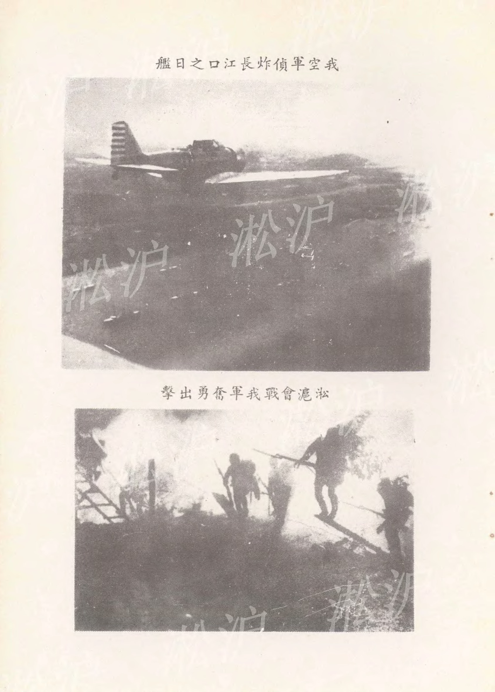

我空軍於十月十六日二十二時，以諾機五架，自京起飛至上海轟炸敵高爾夫機場，到達目標上空，見有敵機數十架停於機場，乃自七千呎水平投彈，約毀敵十數架，十七日，我諾機八架，三式霍機十架，達機十二架，分十批飛赴上海偵炸敵楊樹浦、黃浦江岸倉庫、吳淞敵軍運品，及瀏河口至白茆口間敵艦，十八日，我霍機三架，諾機三架，分二批飛赴瀏河口偵炸敵運輸艦隊，十九時十五分，我諾機三架，自九千呎水平投彈，敵兩運輸艦被炸燃燒。

##### 第五項 北站、江灣、大場、陳家行、瀏河線之轉移攻勢

民國二十六年十月十九日至二十六日

照

插

圖

第

十

七

第三戰區當前之敵，自民國二十六年十月中旬以來，爲近衛師團與第一、第三、第九、第十一、第十二各師團，附騎兵四個聯隊、重砲兩個聯隊、及僞軍一部、水陸飛機三百架、戰車百餘輛，其一部於黃埔江左岸閘北、江灣亘廟巷之線，與我右翼及中央軍相對峙，另一部於陳家行、施相公廟亘瀏河之線，與我左翼作戰軍對峙，其主力自突破我蘊藻濱右岸陣地後，並由各方抽集兵力源源增加，指向我大場、南翔間猛攻，有遂行中央突破之計畫，使我閘北、江灣一帶陣線，感受其側背威脅，以達成佔領南翔、嘉定之企圖，我戰區司令長官鑒於狀況，決以擊破蘊藻濱右岸敵軍之目的，於十月十八日廿一時下達轉移攻勢命令如左：

第三戰區作戰命令第

號

民國二十六年十月十八日二十一時

於吳縣司令部

一、敵仍繼續向我蘊藻濱右岸陣地攻擊。

二、本戰區以擊破蘊藻濱右岸敵軍之目的，決由蘊藻濱兩側地區轉移攻勢。

三、中央作戰軍，應以六個團編成攻擊軍，由談家頭、陳家行之線攻擊前進，保持重點於左翼。

第一攻擊目標，爲盛宅橋、亭宅、頓悟寺之線。

第二攻擊目標，爲西塘橋、東趙家角、西六房之線。

左翼作戰軍，應以四個團編成攻擊軍，由陳家行（不含）、新陸宅之線攻擊前進，保持重點於右翼。第一攻擊目標，爲沈宅、楊家宅、唐橋頭之線。第二攻擊目標，爲朱家街、田都、孫家頭之線。

四、其他正面各師，除守備陣地部隊外，應編成四個突擊隊，向敵陣地要點出擊，策應攻擊軍之戰鬥，並調整陣線，加强工事。

鄰接攻擊軍之各師，應抽調預備隊連繫攻擊軍前進，以掩護其側背。

五、砲兵隊之火力運用如左：

第一攻擊目標：

步兵攻擊開始前。

以三營對南橋亭宅、頓悟寺、陸家橋一帶敵陣地，行破壞射擊。

以二營對朱宅、須宅、蔡家塘、孟家宅、唐橋頭、楊家宅、沈宅一帶敵陣地，行破壞射擊。

射擊時間四十分鐘。

以一營制壓敵砲兵。

二步兵攻擊前進後。

以二營制壓敵砲兵。

以四營對東趙家角、西六房、田都、孫家頭之線，行阻止射擊。

第二攻擊目標：

一步兵攻擊開始前

以三營對西趙家角、牆門頭、張宅、西六房、西塘橋一帶敵陣地，行破壞射擊。

以二營對朱家街、田都、孫家頭、陸宅一帶敵陣地，行破壞射擊。

射擊時間二十分鐘。

以一營制壓敵砲兵。

三步兵攻擊前進後。

以三營制壓敵砲兵。

以三營對坍石橋、黑大黃宅、王三房、陸家宅之線，行阻止射擊。

六、各攻擊軍應迅速偵察敵陣地狀態、地形及前進道路，並搜集通過小河用之架橋材料，於二十日薄暮前，完成一切攻擊準備。

七、攻擊開始時期，另候命令。

八、各攻擊軍戰鬥指揮所，應向南翔總機及童家橋（南翔西南三公里）預備總機架設直達線。九、兵站總監部及第十九、第二十一兵站分監部，在攻擊期間，應在南翔附近，爲攻擊軍砲兵隊於每晚午後八時開設彈藥交付所。

十、予在吳縣司令部。

情報搜集所在南翔。

淞

滬

會

戰

兼司令長官

蔣中正

一三五

副司令長官

顧祝同

中央作戰軍方面：朱總司令奉到戰區轉移攻勢命令後，於十月十九日十時下達作戰命兵第八號，其要旨如左：

一、軍基於蔣委員長意圖，協同左翼作戰軍，由蘊藻濱兩岸轉移攻勢，以達成擊破蘊藻濱右岸敵軍之目的，應以第二十一集團軍新到之部隊，編成攻擊軍，協同左翼作戰軍轉移攻勢，第九集團軍應以有力部隊，於大場以北地區轉移攻勢，策應攻擊軍之作戰，並特須注意攻擊之同時，全線各部應行出擊，以牽制敵軍行動。

二、第九集團軍東正面各軍，仍服原任務，並於攻擊開始前，不斷實行出擊，以迷惑敵人，北正面第三師（第十六團應卽歸還建制）、第三十六師第一零八旅、第八十七師之一部、編成北正面右翼軍，由王敬久軍長統一指揮，以第二十六師、第十八師之第五十二旅、加强編成北正面左翼軍，於攻擊開始之同時，右翼軍卽向蘊藻濱河岸攻擊前進，左翼軍卽向滬太路以西吳家宅、黑黃大宅之線攻擊前進，特應注意向西北行旋迴攻擊，以策應攻擊軍之作戰，同時仍以一部繼續加强大場至江灣之預備陣地。

三、第二十一集團軍應以六個團編成攻擊軍，其部署，依蔣委員長本十九日一時電令，由陳總司令另定之，特應注意於開始攻擊時，原在第一線各軍，仍應輒强制止敵之前進，並於開始攻擊之同時，協同轉移攻勢，另以一部加强洛河橋宅（不含）、老人橋、新涇橋、陳家行之預備陣地。

四、第三十二師應卽進至大場至江灣、及大場至彭浦之線，構築陣地。

五、作戰地境：

第九集團軍與第二十一集團軍間，爲陸宅、姚宅、洛河橋宅、陸家堰、朱宅、牌樓宅、沈家宅之線，線上屬右。

第二十一集團軍與左翼作戰軍間，爲南翔汽車站、小南翔、唐家橋、陳家行、楊家宅、劉家行南端之線，線上屬右。

六、攻擊開始，另候命令。

第九集團軍第八十八師當面之敵，十九、二十四兩日，自晨迄夜，不斷以飛機、重砲，向我閘北一帶陣地猛烈轟擊，十九日十五時，其步兵百餘人，向我持志大學附近進攻，當被擊退。

第三十六及第八十七師當面之敵，十九、二十兩日，不斷以機砲轟擊我江灣及廟巷一帶陣地，我損失甚微，其步兵不時在該兩師警戒陣地襲擾。

第三師當面之敵，十九、二十兩日，猛攻我沈家灣宅陣地，敵我傷亡均重，但陣地仍無變化。

第三十六師第一零八旅當面之敵約一旅團，附戰車十餘輛，於十九日拂曉，向該旅陸宅膏、崔橋宅亘滬太路及黃宅一帶陣地猛攻，激戰至午後，我守兵傷亡慘重，乃撤至蘇家橋南北小河亘滬太路西陳宅附近之線死守，堵擊敵人，二十日一時，該旅奉令將陳宅陣地，交由第二十六師接替，是日，敵轉向右翼沈家灣宅第三師陣地攻擊，對該旅正面微有接觸。

第二十六師當面之敵，十九日三時，以砲火猛轟我季項宅、葛家神樓宅一帶陣地，拂曉後，敵步兵二千餘，在空軍掩護下，向該線猛攻，戰鬥至十三時，我以有力部隊，由季項宅予敵側擊，敵傷亡極大，入暮後，敵利用夜暗撤退，二十日一時，該師派兵接替第一零八旅陳宅陣地，當面之敵，自晨至暮，不斷以機砲猛轟我陣地，但步兵僅有小接觸。

第九集團軍朱兼總司令，二十日晚，下達命令要旨如左：

一、本集團軍基於中央作戰軍作令第八號之意圖，應以東、北兩面各軍鞏固現陣地線，另組多數突擊隊不斷突擊，以迷惑敵人，策應我攻擊軍之作戰。

二、東正面各軍，應如左開部署：

第八十八師（附上海保安總團、稅警第三團加强之）、第三十六師（欠一旅）、第八十七師（欠一部）仍固守原陣地，並應組成多數突擊隊，於攻擊軍開始攻擊時，不斷向當面之敵襲擊，各師突擊隊特應注意協同動作，及各師屬砲兵與配屬砲兵不斷行短時間之奇襲。

第十八師之第五十四旅仍守備原線，並加强工事，特應注意嚴密警戒，以保我側後安全，其第五十二旅仍負大場防務全責，並加强大場至小石橋（含）之陣地。

三、東正面各師戰鬥地境同前。

三、北正面各軍，應如左開部署：

第三師、第三十六師第一零八旅、第八十七師之一部、應於原線輒性制止敵之前進，並組成數個突擊隊，特應注意保持重點於右翼，於攻擊軍開始攻擊之同時，卽向當面河岸之線不斷突擊，以迷惑敵人行動，其作戰目標，由王敬久軍長規定之。

第二十六師應於原線極力拒止敵之前進，並組織數個突擊隊，於攻擊軍開始攻擊時，向吳家院、黑大黃宅之線突擊，威脅敵之側後，以策應攻擊軍之作戰。

四、第六十一師仍服原任務，加强大場至江灣之陣地。

五、第三十三師以兩團構築大場、經走馬塘河右岸至江灣陣地，以一團構築大場、經澎浦至晏摩氏女校之陣地，另以一團加强小石橋（不含）至老人橋陣地，在第二十一集團軍接防前，須固守之，並暫歸第十八師朱耀華師長指揮。

六、稅警總團（欠第三團）於北新涇鎮至華漕渡之線構築陣地（第四團應於任務交接後始歸還建制）。七、兵站第九分監，應準備補給北正面兩翼隊一基數之彈藥、及一日份之攜帶給養（東正面各軍仍照原來補給），並卽開始於眞茹附近開設糧秣及彈約交付所，利用夜暗實施補給。

又應卽協同野戰醫院於大場附近開設綢帶所，及開設眞茹傷兵收容所，不失時機將傷兵後送。

八、攻擊開始時間，另候命令。

第九集團軍第八十八師（東正面右翼軍），二十一日整日受敵機砲不斷之轟擊，至二十二日一時頃，派隊向虹江路、東寶興路附近之敵猛攻，未獲結果，仍固守原陣地，至二十三日七時頃，敵兩中隊向我東寶興路猛攻，激戰二小時，卒被我擊退，九時以後，敵機、砲整日不斷猛轟。

左翼軍王敬久總指揮官，奉朱兼總司令二十日晚命令後，乃於二十一日三時下達作戰命令第七號，其要旨如左：

一、第三十六師（欠一零八旅（欠第二一六團）、第二一一團、砲兵第三團第一營）仍守備原陣地，於友軍轉移攻勢時，並分組突擊隊，向奚塘灣、張家菴、天樂寺等處突擊，以牽制敵人，協同友軍作戰。

二、第八十七師（欠第五一七團及師直屬部隊）歸沈副師長指揮，仍確保原陣地，並於友軍轉移攻勢時，分組突擊隊向水仙廟、侯家木橋、顏中橋、及夏家橋等處突擊，以期助我北正面之作戰。

三、第三師、第三十六師之第一零八旅（欠第二一六團）、第二一一團及第八十七師之第五一七團、統歸李玉堂師長指揮，應於原線輟强制止敵之前進，保持重點於左翼，於我攻擊軍開始攻擊時，卽向當面河岸之線猛攻，以牽制敵之行動，相機壓迫敵於蘊藻濱而殲滅之。

四、突擊開始時間，另候命令。

第三十六師當面之敵，二十一晨，以機、砲掩護步兵，向第一零六旅警戒陣地猛攻，該旅因傷亡過重，曾一度爲敵突破後，派隊反攻，將敵擊退，於二十時奉到開始轉移攻勢命令，該旅遂僅以加强之四排，分向談家宅、兩江女校、蔡家宅、朱家橋四處之敵勉力施行突擊，經再三肉搏，一度佔領梅港、奚塘灣兩處，旋敵增援，乃於二十二時退回主陣地，二十二、二十三兩日，無激戰，惟受敵機砲轟擊甚烈。第八十七師當面之敵，二十一日，自晨迄晚，不斷以機砲猛轟廟巷一帶陣地，黃昏後，該師突擊隊兩組分向侯家木橋、顏中橋之敵猛攻，斃敵甚衆，二十三時退回主陣地，二十二、二十三兩日，敵機砲不斷猛轟該師陣地，工事全部被毀，守兵傷亡慘重。

第三師突擊隊兵力一營，二十一日二十一時頃，向陸宅、沈家灣宅之敵突擊，激戰約一小時，攻佔沈家灣宅，斃敵甚衆，我亦陣亡一員，該營官兵傷亡過半，乃於二十二日拂曉撤回原陣地，至二十三日晨，敵步兵千餘，向我陸宅膏、崔橋宅陣地猛攻，激戰至晚，經我擊退。

第三十六師第一零八旅當面之敵，二十一日晨，一部繞攻我蘇家宅陣地側背，敵我傷亡均重，至二十四時，該旅奉令固守陳宅、蘇家橋西、迄滬太公路（不含）之線陣地，構築工事，二十三日二十時，奉王總指揮官命令：「該旅應以一部於廟前宅、田堵宅、沿西瀰浦右岸馮家宅之線，掩護第三師主力變換陣地，俟該師佔領陣地完畢，卽歸還建制。」該旅於二十四日四時任務完畢，歸還建制，宋師長當令其於大場南側楊家木橋附近，補充整理。

第二十六師當面之敵，二十一日拂曉，以機砲掩護其步兵三千餘，戰車二十餘輛，向該師陳宅、俞宅、朱宅、季項宅全面陣地猛攻，劇戰至十二時頃，陣地一部被敵戰車突入，我以集束手榴彈及預設地雷炸毁其七輛，並與其步兵反復肉搏，激戰至十七時，敵未逞退去，二十二日拂曉後，敵步兵數百，分組向我陣地攻擊，均被我擊退，至二十三日四時，敵砲火復猛烈轟擊，五時五十分，敵步兵千餘進攻我葛家、神樓宅一帶陣地，我守兵與敵反復肉搏，激戰至十三時，陣地失而復得者數次，黃昏，我派隊向敵側擊，敵不支退去，該師長於二十三日晚奉軍長轉總司令電令：「該師於本二十三日晚將守備任務交與第十八師接替後，卽開赴青浦整補待命。」該師於二十四日拂曉，將防務交與第十八師接替完畢，二十五日陸續集結於青浦整補。

朱兼總司令十月二十三日下午，鑒於第二十一集團軍戰鬥失利，敵勢益張，爲確保大場至小南翔陣地計，當乘夜將蘊藻濱南岸陣地重行部署如左：

一、第八十七師抽調一團，佔領大場北之姚村塘、沿瀰浦塘、向北至馮家宅之線，以主力轉移至無名英雄墓、廟巷、李家樓（不含）之線，左與第三師連繫，一部仍留置原線與保持接觸。

二、第三師主力轉移至李家樓、許巷之線，一部仍留置原線，遲滯敵之前進。

三、第十八師（欠第一零八團）以主力任大場鎮至小石橋陣地守備，一部佔領大場西北之胡家宅至洛河橋宅之側面陣地。

四、第三十三師任小石橋至郁公廟間陣地之守備，並以警戒線推進至走馬塘北岸。

五、第三十六師第一零八旅，俟第三師主力轉進完畢後，卽逐次後撤，至大場以南地區整理。

六、東正面之第八十八師（欠第一零八旅）仍固守原線。

七、大場至新涇橋陣地，仍令該線守備部隊星夜加强中。

八、第二十六師已令開青浦整理。

第八十八師當面之敵，二十四日拂曉至黃昏，不斷以機砲轟擊該師陣地，我工事雖逐日增強，然被破壞已超過半數以上。

第三十六師當面之敵，二十四日拂曉至黃昏，敵機數十架，不斷在該師全面陣地投彈，至十時頃，北新涇橋樑被炸毁，其步兵一大隊圍攻我復旦大學據點，我守兵二排堅守至十二小時，雖斃敵頗多，卒以衆寡懸殊，全部犧牲，據點失陷。

第八十七師留置於廟巷一部，二十四日拂曉後，受敵之機砲轟擊甚烈，守兵傷亡達三分之二以上，其主力轉移至無名英雄墓、廟巷亘李家樓宅之線。

第三師留置原線之一部，於二十四日晨受敵猛攻，傷亡慘重，其主力於七時到達李家樓宅、許巷之線。

第十八師，二十三日晚，奉令接替第二十六師陣地，該師以第一零八團推進胡家橋、陸家堰附近，掩護第二十六師，並以兩營接替陣地，至二十四日拂曉後，復被敵機砲集中轟擊，該團兩營官兵傷亡殆盡，迄黃昏，敵突破該處陣地，進入馬橋宅、季項宅附近。

第三十三師當面之敵，二十四日三時迄黃昏後，不斷以戰車二十餘輛及砲火掩護其步兵二千餘，分兩路向該師王、張兩團陣地猛攻，我官兵奮不顧身，前仆後繼，戰況極爲慘烈，老人橋以西陣地，一度被敵突破，經我預備隊逆襲，終將衝入之敵擊退，恢復原陣地。

朱總司令二十四日二十時，鑒於狀況，下達各部隊命令要旨如左：

一、第八十八師，應卽將左翼延伸至江灣車站（不含），保持重點於中央。

二、第三十六師，於右翼江灣車站以南之陣地交接後，應卽將左翼向西延伸至嶺南山莊，主力保持於江灣附近，以有力之一部，推進至金家蕩、吳家宅、無名英雄墓、廟巷至李家樓宅之線警戒。

三、第八十七師，除留一團警戒右接李家樓宅、經馮家宅、至姚村塘之外，其主力於第三十六師之前進部隊到達後，卽轉進至大場南側、王家宅、西樓下、姚宅附近地區集結。

四、第三師防務交替後，卽轉移至王家灣宅、葛家橋宅、周涇橋宅附近地區集結。

五、第六十一師，應卽進入嶺南山莊（不含）、沿原有陣地至徐宅之線陣地，保持重點於左翼，該師派

兵一營，固守廟巷據點。

六、第十八師仍按原部署，第三十三師固守小石橋至郁公廟，保持重點於中央。

第八十八師當面之敵，於二十五日，仍不斷以機砲轟擊該師陣地，該師西寶與路一帶工事，被毀甚多。

左翼軍東正面各師，二十五日拂曉，均已按照部署行動完畢。

第十八師當面之敵，二十五日一時，猛攻姚村塘、洛河橋宅、小石橋警戒陣地，戰鬥至四時頃，我守兵傷亡慘重，退回主陣地，敵復猛攻該師大場鎮及小石橋一帶主陣地，激戰至黃昏，卒以傷亡慘重，退守大場鎮西南與敵對峙。

第三十三師當面之敵，二十五日一時頃，向該師全面陣地猛攻，至拂曉後，敵以機砲向小石橋、老人橋、郁公廟之線陣地不斷轟擊，工事整個被毀，守兵傷亡極重，激戰至十五時，敵以戰車掩護步兵突破老人橋一帶陣地，馮師長負傷，不得已退至張家橋、九王廟附近，至二十六日下午，復奉命赴安亭整理。

第三師於二十五日晨，奉令撤至小石橋南方地區集結甫畢，敵突破第十八、第三十三兩師陣地，該師長鑒於狀況，卽佔領王家宅、葛家橋宅、周涇橋、老宅之線，堵擊敵人，激戰至十八時，其左翼老宅之一團，受第三十三師撤退之影響，亦隨撤至嚴家濱附近，與第十四師會合。

左翼軍王敬久指揮官，二十五日二十時，復下達命令要旨如左：

一、奉朱總司令命令節開：本集團軍以鞏固大場，逐次殲滅突進老人橋陣地敵人之目的，應卽遵照戰區司令部之部署如左：

第三十六師應集結於大場南側地區胡宅、浦宅、東樓下宅、侯宅附近，支援守備部隊。

保安總團以一團接替第三十六師江灣車站至忠烈墓之防務。

第六十一師右翼延伸至忠烈墓（不含）之線固守。

四第八十七師全部援助第三師，連絡第十四師（該師有一旅進至九王廟、張家橋附近），向當面敵人出擊，恢復原陣地。

五第三師應連絡第十四師、向當面之敵出擊，恢復小石橋至老人橋原陣地。

六第十八師除固守大場外，應卽恢復洛河橋至小石橋原陣地。

二、第三十六師及第六十一師，着歸宋希濂副指揮官指揮。

第十八師當面之敵，二十六日晨猛攻大場鎮，此際大場鎮仍爲第十八師及第八十七師之一團固守，激戰至晚，該鎮已呈危急狀態，同時敵戰車突至大場南側地區，與第三十六師之一旅，在浦宅、楊家木橋附近激戰，至午夜，敵戰車沿公路分向彭浦及國際無線電台方面進擾，戰況激烈。

第三、第八十七兩師當面之敵，二十六日晨，我軍昨夜反攻頓挫後，復以大批戰車向大場以西、葛家橋宅、周涇橋宅陣地猛衝，激戰至十五時頃，被敵突破一部，敵戰車遂長驅向國際無線電台附近突擊，雖被守兵擊毀數輛，但戰車過多，終不能將其擊退，其隨伴步兵均被我阻止於第二線陣地，嗣後敵戰車似爲汽油用罄，遂自動退回，當敵戰車在陣地後方衝擊之際，我第一、第二線部隊，一時頗呈混亂。

宋副指揮官奉令後，當卽下達命令要旨如左：

一、第三十六師之第一零六旅（指揮部隊同前），將江灣、嶺南山莊、陣地，交予保安總團及第六十一師接替後，應卽集結於大場南側、侯家宅、東樓下宅、孟家木橋、楊樹園、楊家木橋、胡宅、濮宅附近地區，於東西樓下宅、東橫涇宅、陸家宅、對西北構築據點工事。

第一零八旅（指揮部隊同前），應集結於顧家舍、張家宅、北老宅線，對西構築據點工事。

二、第六十二師右翼，應卽延伸至忠烈墓（含），接替第三十六師所遺該陣地，堅固全線，尤須增強嶺南山莊附近之工事。

命令下達後，接防之保安總團，遲至二十六日五時始先後到達，致第三十六師之第一零六旅僅得以第二一二團之第一營及第三營（欠第六連），於三時頃陸續到達滬太公路附近。宋指揮官當令其在大場南之陳宅、石谷墳、樓下宅附近，對北構築陣地，以備萬一。該旅主力遲至二十六日拂曉後，始向指定地轉進。第一零八旅亦於二十六日拂曉到達指定線，趕築工事，七時，敵戰車七八輛，突破第十八師大場南側地區，掩護其步兵三百餘，沿滬太公路向南進擊，我第三十六師第二一二團一面作工，一面阻敵前進，至八時頃，戰局始稍穩定，爾後敵雖數度猛撲，賴我工事堅固，該團官兵忠勇用命，李志鵬旅長親往第一線指揮戰鬥，於是士卒振奮，敵勢乃挫，至十三時頃，該團第三營及守備廟巷之第六連（欠一排）陸續到達滬太公路南端，控制於趙家橋附近，我陣地愈形鞏固，敵亦未進攻。至第一零八旅之陣地，除受敵機轟炸外，與敵步兵尚未接觸，第二一六團因途中遭敵機轟炸，僅能逐段躍進，十四時始達彭浦南張家宅附近，十五時，宋副指揮官卽令該團於張家宅、小王宅之線佔領陣地，構築工事，以確保後方連絡之安全。十六時，宋副指揮官復奉王指揮官電令如下：「着命第三十六師，以一團先行佔領眞茹西南李家橋、沿江右岸，至茫家宅線陣地，掩護主力轉進，爾後卽爲前進陣地外，其餘主力，俟第六十一師、第八十八師開始轉進後，卽按原計畫所定路線，向蘇州河以南轉進，至虹橋西北地區集結待命。當令第二一六團於十九時先行向指定線前進，該團於二十四時佔領陣地完畢，沿河構築工事，其餘各部隊，於二十一時，按順序向虹橋鎮西北地區轉移。

第二十一集團軍第十九師當面之敵，十月十九日拂曉，以機砲集中轟擊我湖里宅、蘇家宅、陳家宅一帶陣地，其步兵分向我該線陣地猛攻，該師官兵奮勇與敵肉搏，激戰至十六時，將敵擊退，二十日八滬

會

我

一四五

時，敵機砲又不斷向湖里宅、蘇家宅陣地轟擊，至十二時三十分，由黃港、葛家神樓宅、向湖里宅、蘇家宅之線陣地施放煙幕，掩護步兵進攻，至十七時三十分，敵向湖里宅之左翼包圍，我第一七六師第一零五一團增援，將敵擊退，於二十時，陣地仍交由第十九師接替固守。

第一軍第一師當面之敵，十九日六時，復猛攻該師灣宅陣地，至十二時，被我守兵擊退，二十三時，該師奉令將防務交由第一七一師接替後，撤回楊木橋、中歸塘、京滬鐵路間地區整補。

第七十八師當面之敵，十九日五時三十分起，復以機砲不斷猛轟，該師陣地悉成焦土，人槍多被掩埋，其死守陳家宅第四六三團之第二營，被敵四面包圍，繼續死拚，至拂曉後，敵由四面突入，我守兵火力不能制壓，卽奮起與敵肉搏，而我後方部隊受敵機砲之阻止轟擊，無法增援，激戰至十時，該營自許紀章營長以下，官兵百二十餘員名，全部殉國，其受傷而未死之二十餘人，後經遭無人道之暴敵，以每三人爲一捆，澆以火油，覆以柴火，縱火焚斃，僅餘二等兵一名，壓在溝底有水處，未被燒斃，乘夜間逃回。十一時頃，敵步兵五六百，在機砲掩護下，向楊家宅陣地猛攻，我守兵與敵肉搏數次，傷亡慘重，復經第三師第十六團馳援，將頑敵擊退，至十五時，我仍固守丁家橋宅、南北桃園、楊家宅、張家堰之線，十九時頃，該師奉令將陣地交第一七四師第五二零旅接替，至二十日一時交防完畢，撤駐陸家宅、上行上一帶地區整理。

第七軍第一七一師主力，已於十八日晚進入老人橋之預備陣地，其第一零一六團已接替丁家橋以東第七十八師右翼陣地之一部，與敵發生激戰，該師長復於十九日晨奉命，於本（十九日）夜前往張家堰、灣宅及其以西附近，接替第一、第七十八兩師之防務，二十日晨，敵猛攻我張家堰、灣宅之陣地，我守兵與敵反復肉搏，激戰至十六時，敵不支退去。

第四十八軍第一七六師區師長十九日十二時奉軍長命，派第一零五一團（欠一營）進至湖里宅、小池園一帶地區，增援第一軍及第十九師之作戰，該師第一零五一團未到達前，湖里宅被敵包圍，蘇家宅被敵突破一部，該團於十九日十八時馳往增援，與敵激烈衝殺，旋將陣地奪回，二十時，仍交第十九師重新配備防守，該團仍回原預備陣地位置。

第四十八軍韋軍長於十九日二十時奉廖總司令命令要旨：第一七一師接替第一師及第七十八師之防務後，該師與第四十八軍之作戰地境，爲徐家巷、丁家橋宅、西六房之線，線上屬第四十八軍。當卽令第一七四師向右延伸，與第一七一師啣接。

第一七四師十九日晚奉命向右延伸，接替第七十八師丁家橋宅、桃園濱、張家堰、談家頭以東地區之防線，至二十日，丁家橋宅附近受敵猛烈攻擊，我蒙玉坤營長陣亡，官兵傷亡亦衆，但陣地仍無變化。

第一七三師十九日因第五一七旅守備陳家行，與敵激戰三晝夜，官兵傷亡過衆，該師長令第五一零旅接替防守，第五一七旅調回第二線整理，二十日，第五一零旅守備陳家行陣地，終日受敵機砲不斷轟擊，陣地工事完全被毀，營長以下官兵傷亡頗重，至黃昏戰況益烈。

第二十一集團軍廖總司令，二十日十六時下達命令如左：

第二十一集團軍作戰命令

第

號

民國二十六年十月二十日十六時

於章家巷戰鬥指揮所

一、敵仍繼續以主力向我蘊藻濱右岸陣地攻擊。

二、我戰區以掃蕩蘊藻濱右岸敵軍之目的，決由蘊藻濱兩側地區轉移攻勢。

三、本集團軍以有力之部隊守備原陣地，另編成攻擊軍，保持重點於左翼，由談家頭、陳家行之線攻擊前進，第一攻擊目標，爲盛宅、橋亭宅、頓悟寺之線，第二攻擊目標，爲西塘橋、趙家角、西六房之線。

四、第十九師（附第一零二二團）於陳宅、湖里宅之線守備陣地，輒强制止敵之前進，並於攻擊開始之同時，另編突擊部隊，向黃港、葛家、神樓宅突擊，以策應攻擊軍之戰鬥。

五、第一七三師（欠第一零二二團）附第一零二五團，歸李覺軍長指揮，於下宅、姚園濱之線，接守第一七一師及一七四師之原有陣地，輒强制止敵之前進，並於攻擊開始之同時，協同攻擊軍之戰鬥，另以一部守備陳家行之陣地。

六、第一七四師（欠第五一三旅）於桃園濱西方至談家頭原陣地之線，準備攻擊。

七、第一七六師（欠第三團）附第一零二零團，於姚宅、陳家行之線準備攻擊。

八、作戰地境如左（線上均屬右）：

第九集團軍與第十九師間，爲陸宅、姚宅、洛河橋宅、陸家堰、沿無名河、朱宅、牌樓宅、至沈家宅之線。

第十九師與第一七三師間，爲陸港、北窯灣、楊子涇西端、蘇家宅、湖里宅、西塘橋之線。

第一七三師與第一七四師間，爲陸家宅、新涇橋東端、沈宅、桃園濱西端、西趙家角南端之線。

四第一七四師與第一七六師間，爲謝家宅、朱家宅、王家寺、孟宅、南橋亭宅南端，牆門頭北端、河香橋宅、唐橋站北端之線。

五第一七六師與左翼作戰軍間，爲南翔汽車站、小南翔、唐家橋、陳家行、頓悟寺、陸家橋、羌家宅、顧家鎮站之線。

九、第一七一師（欠一旅）先分置於小莊、王家寺、鐘行、張家宅各附近地區，爲攻擊第二線師。十、任攻擊之各師，均歸韋軍長指揮。

十二、各師應迅速偵察敵陣地狀態、地形及前進道路，並搜集通過小河用之架橋材料，關於陣地之接替及攻擊一切準備，務於二十一日薄暮前完畢。

十二、各部隊之通信，第十九師向老人橋總機接通電話，其餘各師向談家頭總機接通電話。

十三、任攻擊之各師，應儘量攜帶兩日份糧秣，其餘由第二十一兵站分監部於南翔附近開設交付所，實施補給。

十四、任攻擊各師，應準備二基數之彈藥，第二十一兵站分監推進至南翔開設彈藥交付所，實施補給。

十五、各部隊之傷兵後送，應由第二十一兵站分監商同各野戰醫院辦理，並協同衛生機關，於洛陽橋、小南翔附近開設綢帶所。

十六、攻擊開始時間，另候命令。

十七、余在章家巷戰鬥指揮所。

第十九師當面之敵，二十一、二十二兩日，不斷以機砲轟擊我湖里宅、蘇家宅、陳家宅一帶陣地，掩護其步兵向該線陣地猛攻，經我守軍反復肉搏，將敵擊退，二十三日拂曉，敵復以多數飛機、大砲、戰車十餘輛，掩護大部步兵向該師湖里宅、蘇家宅、小池園、陸家宅一帶陣地猛烈攻擊，陣地工事悉成焦土，該師官兵抱寸土必爭堅苦死守之決心，激戰至十七時頃，左翼第一七一師，右翼第二十六師，均情況不明，同時敵進攻益急，終仍固守原陣地，至二十一時頃，該師長奉廖總司令電令如下：「兩翼戰況不利，該師着撤至眞茹鎮西端、趙家角附近地區整理。」該師於二十二時三十分開始撤退，二十四日一時三十分先後到達指定地點。

總司令廖磊

第七軍第一七一師當面之敵，二十一日晨向張家樓、灣宅之線繼續猛攻，激戰至十二時，灣宅被敵突破，敵乘機以戰車繞陣地兩側，向我衝擊，我陣地頓形混亂，該師以預備隊向敵逆襲，毀敵戰車三輛，其隨伴步兵亦傷亡慘重，我遂克復原陣地，沈治團長負傷，陣亡王有清、呂漢、陳經階等營長以下官兵三百餘員。二十二日，敵仍以機砲掩護其步兵向張家樓、灣宅之線猛攻，顏僧武團長復負傷，情況更形惡劣，但仍能保持原陣地。至二十三日拂曉，敵機砲更猛烈轟擊，工事整個被毀，其戰車掩護步兵二千餘衝鋒，我官兵與敵反復肉搏，激戰至十三時，秦霖旅長陣亡，黎式穀團長負傷，官兵傷亡慘重，幸該師皆屬老兵，咸能沉着各自爲戰，始終保持原陣地。二十時，該師長奉中央作戰軍朱總司令電話，飭將防務交由第三十三、第十四、第五十三等師分別接替。該師長卽將防務交替完畢，率隊撤回京滬鐵路以南、蘇州河左岸，整理待命。

第四十八軍軍部，二十一日晨，仍在章家巷，其出擊軍已組織就緒，各在現地候命，實行出擊，茲將該軍各師原陣地線之戰況，分述如左：

第一七四師，於二十一日晨，在丁家橋附近陣地與敵激戰甚烈，桃園濱、北侯宅我守兵與敵反復肉搏，劉振平旅長、王振朝團長均負傷，官兵傷亡慘重，遂與敵相持於朱宅、北侯宅、沈宅、趙家宅之線待援（高旅已編入出擊軍未使用）。

第一七六師之謝鼎新團，已歸還建制，編成出擊軍，二十一日晨，在談家頭附近集結，候命出擊。

第一七三師，二十一日晨，除以第一零二零團編入出擊軍外，其餘全部擔任陳家行一帶陣地之守備，敵自晨迄黃昏，仍不斷以機砲掩護步兵猛攻，黃榮營長負傷，連排長及士兵傷亡三百餘人。

該軍全線砲兵，十月二十一日十九時，依照計畫先行破壞射擊，至二十時，該出擊隊左翼指揮官第七六師區壽年師長，以謝鼎新團爲前導，由陳家行以東地區，經陳宅、向頓悟寺、橋亭宅攻擊，甫越出陣地，卽與敵接觸，迭經我軍奮勇衝擊，敵卒不支，紛紛潰退，遂將頓悟寺收復，但因河流交錯，後續部隊通過不易，先頭部隊未敢孤軍深入，且經長夜之攻擊，進展未能如望，卽將後續部隊撤回，僅留先頭營擔任陳家行前方攻佔地區之守備。右翼指揮官第一七四師王贊斌師長，以黎式穀團爲前導，由北侯宅一帶、向桃園濱攻擊，因敵憑河抗拒，未能架橋，無法進展，爲顧慮天明後敵機砲之轟擊，乃令撤回原陣地。至二十二日晨，該軍當面之敵後續部隊到達，卽以機、砲、戰車、毒氣、同時向我猛攻，戰況異常慘烈，經我官兵奮勇抵抗，犧牲之鉅，較前數日爲尤甚，茲將各師戰鬥經過分述如左：

第一七四師原守備丁家橋、桃園濱、北侯宅線之王、陸兩團，戰鬥至二十二日晨，因傷亡慘重，不堪再服任務，遂改由第五一三旅接替，敵復以機砲集中該線猛轟，八時頃，敵戰車多輛，掩護步兵猛攻，激戰至晚，秦靖團長、林密團附、韋幹、鍾福標，歐陽韜等營長、均先後負傷，我官兵仍奮力固守原陣地，至二十三日拂曉，北侯宅一帶陣地，幾爲突破，經我三、四次反復衝擊奪回，龍炎武參謀長負傷，曾鑑時營長陣亡，連排長以下官兵傷亡尤多，激戰至十六時，仍屹然不動，敵卒未得逞。

第一七三師當面之敵，二十二日晨，向陳家行進攻，最初爲我出擊軍留置前方之第一七六師一營阻擊，戰鬥至十時，劉玉池營長以下官兵均壯烈犧牲，旋敵攻擊重點，指向我陳家行陣地，激戰至十三時，該師守兵傷亡慘重，陳家行失守，乃退據談家頭前小河與敵對峙，至十九時，該旅龐旅長親率第一零二零團向敵夜襲，復將陳家行克復，霍兵團附、陳崧生營長陣亡，二十三日晨，陳家行至孟家宅之線，復遭敵機砲猛烈轟擊，陣地工事幾全部毀壞，龐漢偵旅長陣亡，黃法睿團長負傷，官兵傷亡奇重，該師遂被迫撤回陳家行南岸死守。

第一七六師第五一四旅，二十二日十六時到達戰場，該師長當卽飭配置於老人橋、新涇橋之線，佔領預備陣地，至二十三日，談家頭當面之敵，被我謝團擊退，敵復增援猛攻，我官兵反復與敵肉搏，激戰至十七時，謝鼎新團長陣亡，營長以下傷亡甚重，但仍能阻敵，未得前進。

第十九師在唐家橋（含）花園濱之線，第十四師在嚴家濱、張家街、吳家墳之線，第十一師在陸家宅、謝家宅、楊家宅之線構築預備陣地，以策應中央作戰軍蘊藻濱右岸第一線之作戰。

第十四師前在嘉定東北地區構築工事，奉令增援郁公廟、新涇橋方面，以確保大場、南翔之交通，該師於昨二十三日黃昏後，經南翔向洛陽橋前進，於二十四日拂曉到達，此際第二十一集團軍，已向江橋鎮、雙廟以南地區撤退，敵兵紛向第三十三師及第五十三師正面攻擊，第十四師當以第四十二旅、配屬工兵營，構築嚴家濱、張家街、羊馬街間據點工事，以第四十旅構築袁家橋、吳家墳、張仙廟、謝家宅間據點工事，師部位置於劉家巷。

第十一師第六十一團，二十四日晚，由嘉定開到，連繫第十四師左翼，構築陣地，復奉令向前推進至老宅、新宅亘仙師廟之線，而以袁家橋以西地區，改歸第十一師構築。

第十四師鑒於郁公廟二十五日拂曉被敵突破，爲支援第三十三師，並一面加强陣地計，於八時，命第四十二旅佔老宅、嚴家濱、壽家街之縱深陣地，第四十旅連繫第四十二旅，佔領梅園、仙師廟、袁家橋、王家宅之縱深陣地，拒止敵人。十五時，第三十三師之老人橋、郁公廟陣地被敵攻佔，第三十三師守兵陸續向該師右翼撤退，敵跟踪追擊，隨向第四十二旅老宅、新宅陣地，及第四十旅羊馬街、仙師廟陣地攻擊，激戰至晚，我仙師廟據點守兵傷亡殆盡，被敵攻佔，其餘我仍守原線陣地，屹然未動。

第三戰區司令長官部鑒於走馬塘陣地被敵突破，情勢已趨嚴重，於十月二十五日二十一時下達命令如左：

第三戰區作戰命令第號

民國二十六年十月二十五日二十一時

於吳縣司令部

一、本戰區決擊破走馬塘右岸之敵，恢復原陣地。

二、中央作戰軍，應以一部據守北站、江灣、大場陣地，主力由大場以南地區，連繫左翼作戰軍，攻擊當面之敵軍，進出走馬塘之線，江灣、大場兩據點守備官兵，無命令不得撤退，違則軍法懲治。

三、左翼作戰軍，應以一師以上兵力，由金家角、嚴家濱、張家術、羊馬術附近地區，連繫中央作戰軍，攻擊當面敵軍，進出走馬塘之線，其餘主力仍據守新涇橋、廣福、施相公廟、瀏河之原陣地。

四、兩作戰軍作戰地境如左：

黃渡鎮、南蘇州河右岸、姚家、寶洪橋濱、陳家灣、九王廟、小石橋、黑大黃宅之線，線上屬中央作戰軍。

五、砲兵隊以砲兵第三團配屬中央作戰軍，其餘歸左翼作戰軍指揮。

兼司令長官

蔣中正

副司令長官

顧祝同

陳總司令奉令後，當卽令第十九集團軍指揮之第十四師及第十一師之一團，於本（二十五日）夜，由金家角、嚴家濱、張家術、羊馬術附近地區，連繫中央作戰軍攻擊當面之敵，恢復走馬塘之線原陣地，並以第五十三師有力一部，由新涇橋以北地區側擊敵人，協同中央作戰軍反攻，其餘主力仍據守原陣地。第十五集團軍仍據守原陣地，並於本（二十五日）夜向當面之敵佯攻牽制。

第十四師當面之敵，二十五日入夜後，攻擊漸趨和緩，至二十一時，該師奉命援助大場方面友軍夜襲，陳師長乃令第七十九團派隊向仙師廟逆襲，二十四時，該團逆襲部隊中途與敵遭遇，敵卽以熾盛火力壓制，無法前進，仍撤回原陣地，同時該師長奉薛總司令電令：「大場方面遭敵猛攻，我友軍處境已十分困難，第十四師應切實注意右翼戰況之發展，第十一師第六十一團歸該師長指揮，於金家角、三七里、小宅地區構築工事」。二十六日拂曉後，該師全線卽遭敵猛攻，八時，陸家窯陣地，因營長陣亡被敵突破，退守羊馬街、袁家橋各據點，十時，我羊馬街陣地又被敵侵入，經我地區預備隊與敵反復肉搏，恢復原陣地，十六時頃，敵又以燒夷彈向袁家橋發射，各村落盡行着火，我守兵乃退據該兩側工事，敵不敢接近，十七時，該師奉令轉移南翔以南之雙廟、水車頭、姚家宅地區集結待命。

第十一師第六十一團，二十六日十七時，在李點橋、後馬樓、陳家宅、王家宅、小張家橋之線佔領陣地，掩護第十四師轉移。

左翼作戰軍陳總司令奉戰區轉移攻勢命令後，十九日下達各集團軍命令要旨如左：

一、本軍以擊破當面之敵之目的，决由廣福南北兩側地區、及蘊藻濱右岸側擊，轉移攻勢。

二、第十九集團軍，應以第六十六軍編爲第二路攻擊軍，由孟家宅、馬家宅正面攻擊前進，第一攻擊目標，爲楊家宅、徐宅、唐橋頭、楊家宅之線，第二攻擊目標，爲田都、孫家頭之線，第四軍應於本（十九日）夜開始運動，到達第二塘、馬陸鎮、石崗門間地區，接替第六十六軍之陣地，並歸薛總司令指揮。

三、第十五集團軍，應以第九十八師編爲第三路攻擊軍，由廣福、費家宅正面攻擊前進，保持重點於右翼，向東南方面壓迫敵人，第一攻擊目標，爲彭宅、張家宅、倪家宅之線，第二攻擊目標，爲老宅、張家宅（張宅東側）之線，均歸薛總司令指揮。

四、第十一師應開至嘉定附近，接替第九十八師嘉定亘石崗門預備陣地，第十四師應向右延伸，經吳家堰至蔣家堰之線，構築工事，並策應第四十四師。

五、第七十三軍，應以全力配置於瀏河附近機動策應，並派一部接替太倉第五十六師之城防，其他第一線正面各師，除守備陣地部隊外，應各編成數個有力突擊隊，向敵陣地要點出擊，策應攻擊軍之戰鬥，原固守第一線陣地鄰接攻擊軍之各師，應抽調預備隊，連繫攻擊軍前進，掩護其側背。

六、砲兵，以主力在右翼南翔以東地區，一部在馬陸鎮、嘉定間，以能直接支援攻擊軍之戰鬥。

七、攻擊開始時間，另候命令。

第十九集團軍第六十九軍第五十七師當面之敵，十九日至二十一日，敵不斷以砲火掩護，分向該師花家橋宅、老陸宅陣地攻擊，均被我擊退，二十一日十五時，敵向右翼陳家行第一七三師陣地猛攻，該師以第三四零團輕重火器向敵猛射，敵傷亡甚重，十八時，敵又向我第三四零團正面攻擊，亦被我擊退。

第六十六軍第一六零師第九五九團當面之敵，十九日拂曉後，整天以機砲向三家村、八字橋、北營一帶轟擊，該團第一營地形不利，傷亡過半，葉軍長命該團於第一線後方，構築第二線工事，並令第九五六團預留之二營，控置於馬家宅附近爲預備隊，二十日拂曉迄十二時，敵仍不斷砲擊我第一線，工事全毁，守兵悉數殉難，旋敵以兩大隊步兵來衝，我第二線守兵猛烈反擊，敵不支退去，入夜後，全線沉寂。

第二十五軍第十三師當面之敵，十九日九時，以機砲掩護，向我廣福陣地進攻，十一時，又向我新三家陣地猛攻，與我守軍反復肉搏，我陣地一度爲敵佔領，經我以預備隊逆襲，仍將所失陣地克復，至二十日，敵仍不時進攻，我第一線團數日來傷亡奇重，形勢異常緊迫，該師長乃派師工兵營、特務連、協助第一線之守備。

第九師當面之敵，十九日十五時，向費家宅、朱北宅陣地進攻，並以一部强行渡河，均被該師守兵擊退，二十日，自晨迄晚，不斷受敵砲擊，然我陣地無變化。

第十九集團軍薛總司令二十一日十一時下達各部隊命令，要旨如左：

一、本集團軍以擊破當面之敵之目的，決由廣福南北地區及蘊藻濱右岸側擊，轉移攻勢。

二、第二路攻擊軍（由第六十六軍編成）歸葉軍長指揮，由孟家宅、馬家宅正面攻擊前進，保持重點於右翼，第一攻擊目標，爲楊家宅、徐宅唐、橋頭之線，第二攻擊目標，爲田都、孫家頭之線。第四軍應以一旅控置於虞家宅、金邱家、張涇間地區，歸葉軍長指揮。

三、第三路攻擊軍（由第九十八師編成之歸夏師長指揮，由廣福、費家宅正面攻擊前進，保持重點於右翼，第一攻擊目標，爲彭宅、張家宅、倪家宅，第二攻擊目標，爲老宅、張家宅（張宅東側）之線。四、第一線各師，除守備陣地外，應編成數個突擊隊，突擊敵陣地要點，策應攻擊軍之戰鬥。

第五十七師應以兩營編組突擊隊，向朱三房突擊，並與第二路突擊軍確保連繫。

第十三師應以有力一部，隨攻擊軍之前進，向土橋進出，確保第三路攻擊軍前後方之連絡，並掩護其側背。

第九師以一營編組一個突擊隊，向南梅宅突擊，並與第三路攻擊軍確保連繫。

五、第四軍（欠一旅）爲總預備隊，位置於第二塘、馬陸鎮、石崗門附近，並加强該線工事。

六、步兵攻擊開始時間爲本二十一日二十時，砲兵射擊時間爲本日十九時。

第五十七師二十一日二十時，以二營編成之突擊隊，向朱三房突擊，其一部進至朱三房南側十餘公尺之河流前，敵憑險以熾盛火力頑抗，未能突進，其主力由葛家頭向朱三房北側突進，將該處之敵擊潰後卽佔領之，是晚，因第二路攻擊軍後撤，未能連絡，乃於二十二日拂曉前撤回本陣地。拂曉後迄晚，敵數度以機砲掩護其步兵向我老陸宅猛攻，經我守兵沉着應戰，並增加預備隊死力抵抗，終未得逞。二1

十三日八時，敵攻佔我右翼第四十八軍談家頭陣地，我第三四零團右翼遂受威脅，當令第三四二團第二營孫進賢營長率部佔領右至唐家橋之既設陣地，九時，敵又以機砲掩護其步兵向我新陸宅陣地攻擊，激戰至晚，敵死亡枕藉始行稍退。二十四日晨，當面之敵又以機砲掩護步兵千餘向該師全面陣地猛攻，工事悉被摧毀，官兵傷亡甚重，至十一時頃，卒以衆寡懸殊，被敵一部衝入孟家宅陣地後，經我增援部隊趕到，遂將突入之敵全部殲滅，並鹵獲六五步槍二十九枝，輕機槍一挺，其接近我正面之敵亦繼續被我擊退。二十五日拂曉，敵機數十架向該師陣地轟炸，並以砲兵集中火力向其全陣地反復射擊，至八時頃，敵以主力攻花家橋宅、葛家頭、孟家宅各陣地，激戰至十一時，所有修復工事俱被破壞，敵乃乘機分由南北兩面向葛家頭、孟家宅陣地猛攻，至十四時，卒以增援一時未能趕到，遂被突入，並席捲我左右兩翼陣地，阮兼師長觀此情形，除飭各旅團長親赴前線督同所部堅忍死守，一面請第九十師派兵一營迅速馳援，一面由右翼抽兵一連轉移使用，至十五時頃，援軍先後到達，反復與敵肉搏兩小時，僅收復葛家頭陣地，至孟家宅陣地，雖經苦戰，仍未能恢復。二十六日晨，據守馬家宅一帶之第二線陣地，又被敵突破，花家橋宅陣地遂形成孤立，至十一時，我調整陣線，改守清水顯河左岸至新陸宅之線，迄十七時後，敵仍不斷向我突擊擾亂，均未得逞。

第六十六軍之突擊隊，係以第一六零師第九五六團、第九五九團、第九五八團，及第一五九師各團抽集編成，歸鄧志才旅長率領，二十一日二十一時，該隊由李家宅架橋偷渡，至二十二時全部渡河完畢，並與左翼第九十八師唐營長取得連絡，二十三時進至老陸宅東北與敵遭遇，旋向東南楊家宅前進，因爲河流所阻，乃轉向彭宅方面攻擊，激戰至二十二日二時，敵我頗有傷亡，天明前返回三家村陣地防守，二十三日全線沉寂，同日十七時第六十六軍軍長令第一六零師，將三家村、老陸宅陣地之防務，交由第一五九師接替，第一六零師以鄧旅（附砲兵營主力）控置於方家灣、金邱宅附近，策應三家村、老陸宅之線陣地，崇旅之余團仍在原陣地待命，翟團卽夜開至封家村以西整理。

第一五九師附教導旅一部及工兵營，二十三日夜，卽以洪世揚一團接替第一六零師新陸宅（不含）

、老陸宅、三家村之線陣地防務，主力任石崗門、第二塘之線陣地工事之增強，二十四日，敵不斷以砲火向洪團陣地轟擊，二十五日晨，該團奉命在小宅（含）、馬家宅間構築第二線陣地，並令砲兵營撤回馬陸鎮既設陣地待命，二十五日夜至二十六日夜，僅有少數敵人向我偷襲，均被擊退。

第二十五軍第十三師當面之敵，二十一日八時，升汽球觀測，其機砲掩護主力約兩聯隊向廣福橋頭堡陣地猛攻，激戰至十四時，我守兵傷亡殆盡，橋頭堡陣地淪陷，至二十二日一時，第九十八師第五八三團一營到廣福增援，協力守兵反擊，恢復橋頭堡陣地，四時，該師奉薛總司令電令，將新三家、廣福亘吳宅（不含）之線陣地交由第九十八師接替，黃昏後，奉命移至太倉集結整理。

第四十五軍第九十八師奉令爲第三路攻擊軍後，當於二十一日十五時下達攻擊命令，十九時，我砲兵向戴宅、新水橋、西二房一帶之敵轟擊，第二九二旅展開於廣福、費家宅之線，在我砲火掩護下架設揚涇河便橋，二十時，該旅卽向戴宅、土橋、新水橋、南梅宅之線敵警戒陣地攻擊，我一部於二十時三十分已驅逐敵之警戒部隊，接近其主陣地，戰鬥漸烈，我進攻戴宅之第四八三團第三營遭頑敵堅強抵抗，營長陣亡，我突擊部隊雖各有進展，但均傷亡重大，至二十二日一時，敵集全力由戴宅附近轉移攻勢，江森寺及紅廟復被敵佔領，我第二九二旅後方道路被遮斷，遂與敵反復衝殺，演成慘烈之混戰，此時已將拂曉，夏師長正擬派隊續攻，適奉薛總司令電話停止攻擊，並接替第十三師馬家宅（不含）、廣福、費家宅（不含）線陣地守備，並就現地構築工事，該師奉令後，卽命第二九四旅及第二九二旅分別接替第十三師陣地，二十二日八時接替佔領陣地完畢，敵機卽向我猛烈轟炸，十一時頃，敵三百餘在其砲火掩護下，向我三家村、老三家陣地突出部攻擊，經我守兵奮勇抵抗，迄未得逞，後奉令退守揚涇河右岸三個橋頭堡陣地，入夜，我派隊夜襲新水橋、紅廟之敵，未能奏功，二十三日十時，敵步兵一大隊在機砲掩護下向我廣福一帶陣地進攻，戰鬥至晚，經師派隊出擊，敵受創退去，二十四日拂曉以來，敵機砲不斷向廣福及其以北陣地轟擊，我工事被摧毀甚多，至十八時頃，其步兵千餘由新水橋、南梅宅之線向廣福及其以北陣地攻擊，我守兵與敵反復爭奪，激戰至二十三時，經我砲兵協力逆襲，敵攻擊頓挫退去，搜獲敵文件，得知爲敵第十二師團。二十五日晚，我以山砲二門推進至廣福西南端行直接射擊，頗獲戰果，至二十六日晨，敵主力南移，僅留少數部隊牽制我軍，戰況漸趨和緩。

第九師當面之敵，二十一日自晨迄晚，竟日以機砲向我轟擊，二十一時頃，該師突擊隊向南梅宅之敵據點工事圍攻，激戰至二十二日三時，斃敵甚衆，並奪獲敵機槍一挺，步槍百餘枝，薛總司令當令該師除以小部留置南梅宅朱北宅陣地前擔任警戒外，其主力部隊仍撤回原陣地，鞏固其陣線，二十三日，戰況沉寂，二十四日拂曉，敵以機砲不斷向我陣地轟擊，至十八時頃，其步兵數百人向我費家宅陣地攻擊，戰鬥至二十二時頃，經我守兵逆襲，將敵擊退，二十五、二十六兩日夜間，敵僅以少數部隊向我襲擊，均經擊退。

第十五集團軍第四十四師當面之敵，十九日十時頃，敵砲擊該師大橋頭砲兵陣地與主陣地後方，經我砲兵還擊後始停，二十日拂曉，敵以一部向我張家村陣地擾亂，黃昏後又有敵兵數十名於孫家宅附近偷渡揚涇河，均經我軍擊退。

第六十師當面，於十九、二十日，僅受敵機砲之轟擊，陣地無變化。

第五十一師當面之敵，十九日十五時頃，有步兵一部約三百餘名，在機砲掩護下向施相公廟、唐家宅、唐灣、劉家村一帶猛攻，經該師痛擊後退去，二十日拂曉，敵以榴彈破甲彈擊毀我劉家村、小潘、大潘工事，該師卽派隊搶修。

第五十八、第五十六兩師當面之敵，十九、二十兩日，僅雙方便衣接觸，全線均無激戰。

羅總司令奉到左翼作戰軍十九日轉移攻勢命令後，二十日九時三十分，先予第九十八師及砲兵第十六團命令，其要旨如左：

一、第九十八師配屬步兵砲第一營（欠第一連）、第五十六師平射砲連，於本日歸第十九集團軍薛總司令指揮。

二、砲兵第十六團之第二營，應在現陣地服行前任務，其主力應於本晚轉移於馬陸鎮及石崗門以東一帶佔領陣地，限二十一日黃昏前完成射擊準備，以火力支援第九十八師對敵之攻擊，以一部協力第四十四師之戰鬥。

第九十八師師長奉令後，當卽遵照編成攻擊軍，向廣福方面前進（詳見第十九集團方面）。

砲兵第十六團團長奉令後，當卽這照實施。

第十五集團軍總司令部考量全級情況，十月二十日十五時下達所屬各部隊命令要旨如左：

本集團軍第一線守備各師，除守備陣地部隊外，應以強大兵力編成數個突擊隊向敵陣地出擊，佔領如左所示目標後，積極擴張戰果。

第四十四師王宅、北豎溝、張宅之線。

第六十師張家村、林家宅、徐宅、姚家宅之線。

第五十一師吳家宅、嚴宅、楊宅、丁家橋、劉家村、王宅之線。

四第五十八師及獨立第三十四旅（配屬獨立第四砲兵營）李家村、老丹宅、新丹宅、新徐宅、李牌樓、周村、秦宅、沈家村、猛將堂、陳宅、趙家橋之線。

五第五十六師許村、墅溝橋站、楊宅之線。

二、攻擊時間，除第五十八師於本二十日夜間開始攻擊外，其餘各師應於二十一日黃昏前準備完畢，開始時間，另有後命。

三、砲兵第十六團第二營及重迫擊砲第二營，應在現陣地協力第六十師及第五十一師之攻擊。

四、第十四師應於本晚以第四十旅向南轉移於蔣家堰、吳家堰、翟村之線，構築工事，並策應第四十四師，其四十二旅應以一團留置徐家宅、萬家橋、盛宅間，加强既設工事，其餘一團應轉進於凌宅、徐家堰間加强該師既設工事。

五、第五十一師應於本晚開赴嘉定城東側地區原第九十八師駐地，繼續整理。

六、第六十七師仍在原陣地加强工事。

各師奉令後，分別部署，詳密偵察敵情，積極準備，待命出擊。

第四十四師二十一日十六時，又奉羅總司令電令要旨，該師突擊隊主力，應於本二十一日黃昏後，渡楊涇河佔領北梅宅、唐宅，向李九房、白沿、梁塘佯攻，掩護友軍攻擊，另以小部協力第六十師突擊隊之攻擊，該師突擊隊編成三組，於二十一日十九時開始運動，第一組於十九時在朱北宅强渡完畢後，將河右岸無名小村內之敵五十餘名悉數殲滅，遂轉向東南方北梅宅攻擊前進，遭遇潛伏途中之敵四五百名頑強抵抗，另敵約三四百名由左側方向我夾擊，我官兵奮勇猛攻，分頭苦戰，謝紹武營長身先士卒，中彈陣亡，敵復陸續增援，乃留一部據守所佔領之無名小村，餘撤回本陣地；第二組於十九時分向北豎溝、張宅之敵進攻，我官兵前仆後繼，奮勇猛攻，將敵包圍，並以一部突入祠堂內與敵格鬥，終因敵火猛烈，傷亡奇重，敵增援反擊，激戰三小時，我以衆寡不敵，進展困難，不得已撤回我前進陣地；第三組於二十一日時向王家灣之敵進襲，因該處三面環水，敵戒備頗嚴，未能渡河。又該師濮宅守軍，乘敵不備向蕭家灣襲擊，激戰至二十三時許，將敵擊潰，遂佔領蕭家宅。二十二日十五時，該師長又奉羅總司令命令要旨如下，「着該師於本二十二日晚，仍應編成突擊隊渡河，向北梅宅、唐宅攻擊，並以火力向南梅宅、李九房側擊敵人」。該師奉令後，卽令第一三零旅派步兵一營爲突擊隊，於二十二時許渡楊涇河後，前進至北梅宅西北端橋樑附近，敵憑河頑抗，此時白沿、李九房、南梅宅之敵亦向我側擊，我遂與敵隔河相持，迨至拂曉撤回本陣地。二十三日我陣地除受敵機轟炸外，陣地無變化，二十四日晨，敵以步兵三四百人，藉砲火掩護向我蕭家宅前進陣地猛攻，戰鬥二小時，我退守該宅西端，二十五日自晨迄晚，僅受敵機砲之轟擊，我陣地無變化。

第六十師突擊隊約一團之兵力，分三路出擊，其右路突擊隊（兵力一營）於二十一日十九時出動，以一部於二十時三十分襲佔林家宅，對王家宅、徐宅之敵側擊，主力渡河後，卽向姚家宅攻擊，激戰至二十三時四十分，將該地佔領，繼向徐宅會攻，該村三面環水，我正紛紛泅登彼岸之際，適敵增援反擊，我犧牲過大，未獲進展；中路突擊隊（兵力一連）亦於十九時由小王宅渡河，向陶王宅之敵攻擊，二十二日零時二十分佔領該村西南端，旋敵由姚家宅、南周宅兩方增援反擊，我亦難獲進展；左路突擊隊（兵力步兵一連、重機槍一排）於二十時强行渡河後，先後將盤據白易村、項宅之敵擊潰，敵退南周宅，該隊卽以一部向南周宅佯攻，主力協力中路突擊隊向陶王宅攻擊，旋因中路被敵所阻，未能進展。至二十二日晚，該師復派兵四連組成兩個突擊隊，向陶王宅、姚家宅潛入猛攻，進抵陣地前，因被小河所阻，正行强渡之際，敵增援頑抗，乃隔河對峙，至二十五日晚，該師陣地除受敵機砲轟擊與步兵僅有小接觸外，陣地無變化。

第五十一師本二十一日晚，以兵力三營編組三個突擊隊，以一部佯攻王宅以東之嚴家村，一部牽制吳家宅之敵，主力分向丁家橋、嚴宅之敵猛攻，該師突擊隊抱有我無敵之決心，前仆後繼，終將各該地先後攻佔，乃以一部佔領丁家橋，其餘併力向吳家宅席捲，因該處工事强固，相持至二十二日拂曉，受敵機砲之同時轟擊，不得已留一部固守張宅、楊宅，主力撤回原陣地，是役斃敵川岡大尉、齒田中尉各一，據齒獲文件證明，當面敵爲第十一師團之一部及台北守備第二聯隊。二十二日晚，該師復組三個突擊隊，於二十一時許襲佔嚴宅、丁家橋兩據點，主力沿公路北側向吳家宅包圍，午夜潛至吳家宅南側，遭遇敵三百餘人正向我施相公廟前進，當卽與之白刃肉搏，激戰一小時，敵不支退去，至二十三日拂曉，敵機出動，始撤回原陣地，二十四日至二十五日晚，該師陣地除受機砲之轟擊外，陣地無變化。

第五十八師二十日晚，以步兵五連組成三個突擊隊，於黃昏，分向李家村、老丹宅、周村、秦宅、沈家村、猛將堂之敵攻擊，因敵火猛烈，同時李牌樓之敵二三百人，分頭來援，衆寡懸殊，遂卽退回。至二十一日晚，該師再以三營兵力編成突擊隊三組，繼向昨晚出擊之線突擊，是夜濃霧瀰漫，我步兵於砲火掩護下逐次推進，突入敵陣地與敵肉搏混戰後，於二十二日零時三十分佔領李家村、趙宅、老丹宅、秦宅各據點，至二十時三十分，敵以步兵四百餘向我老丹宅陣地猛攻，經我猛烈還擊，敵不支退去。追二十三日三時三十分，敵又向我老丹宅、趙宅陣地包圍襲擊，經我以熾盛之火力阻擊，敵傷亡甚衆退去，二十四、二十五兩日，自晨迄晚，敵除不時以機砲轟擊我陣地外，陣地無變化。

獨立第三十四旅之突擊隊，二十一日十九時渡過劉河向高宅之敵攻擊，當擊潰其二百餘，至二十二日拂曉撤回，同日晚，我突擊隊復衝入高宅佔領該村，旋因地形過於突出，於二十三日晚仍撤回原線守備。

第五十六師派突擊隊一部，二十一日黃昏出擊，先後將敵前進部隊擊退，進佔許村、墅溝橋、楊宅、沈宅之線，與侯宅、徐宅、王宅之敵隔河對峙，該師二十二日晚，派兵一連由李家術向新陽游擊，未發現敵踪，當卽佔領該處，二十三日至二十五日，戰況頗沉寂。

羅總司令二十五日二十二時奉左翼作戰軍陳總司令命令要旨：「本二十五日晚，我中央、左翼作戰軍各以一部擊破走馬塘南岸之敵，恢復原陣地，該集團軍應據守朱北宅、施相公廟亘瀏河之原陣地，並向當面之敵佯攻牽制。羅總司令奉令後，當卽轉飭各師對當面之敵佯攻牽制，以主力固守原陣地。

第四十四師二十六日二十二時，以一部兵力向北梅宅、北豎溝之敵佯攻，與敵戰鬥至二十七日拂曉，撤回本陣地。

第六十、第五十一、第五十八、第五十六各師當面之敵，二十六日仍不時以小部隊分向我各師陣地擾亂，經我守兵阻擊，敵我均有傷亡，陣地無變化。

右翼作戰軍方面：十九日，黃浦江敵艦終日不斷向我三菱、三井各碼頭與招商華棧一帶砲擊，並以飛機竟日在我浦東陣地轟炸，而我浦東砲兵亦增加二門向敵射擊，餘無變化，至二十日，敵機轟炸我浦東馬路橋、慶寧寺一帶甚烈，二十一日轉奉蔣委員長令，飭第四十五師於本月二十六日前在松江集結完畢，該師原在海岸擔任警戒任務之一團，卽由獨立第三十七旅抽兵一營接替，至二十三日，黃浦江敵艦復向我招商華棧及高行一帶砲擊，敵機亦在我第五十五師姚家宅、唐橋、魏家宅一帶陣地轟炸，二十四日晨，白龍港外敵艦向我陣地轟擊，黃浦江方面敵艦一艘拖鐵駁一隻，載兵數百人，向我新三井碼頭强行登陸，當被我守兵擊退，至二十六日，敵機十餘架，又在浦東其昌棧、唐橋一帶轟炸，我陣地無變化。

我長江海軍，十月二十三日，應瑞軍艦在采石機卸砲，爲敵所探悉，遭敵機轟炸燃燒沉沒，陣亡官兵十四員，傷四十員，卸砲工作雖甚艱鉅，卒賴官兵用命，終將任務達成，我爲江陰阻塞線無受威脅之虞，經晝夜趕工，共裝艦砲四尊，口徑均爲十二公分，編組一砲隊，配備官兵七十七員名，以陳秉青隊長率領，竭盡全力死守。

我空軍十月十九日至二十一日晚，我各以達機五架，二十二日晚，以達機二架，每晚二十一時開始，單機出發，飛赴上海偵炸楊樹浦一帶敵陣地，散發傳單，二十二日，我又以達機四架，三式霍機五架，享機二架，分批往上海轟炸寶山西北敵機場，二十三日，我霍機三架、達機四架，分五批飛赴上海炸敵楊樹浦、蘊藻濱附近地區及羅店東南至劉家行間一帶敵砲兵陣地，二十四日，我霍機三架、諾機三架，分二批飛赴上海轟炸敵寶山機場，又以諾機二架分二次單機飛滬偵炸楊樹浦一帶敵陣地及倉庫，二十五日，我諾機三架，二十六日，我諾機四架，均於夜間單機出發飛滬，轟炸楊樹浦、黃浦江岸敵倉庫及敵軍陣地。

##### 第六項 蘇州河右岸至劉河線及杭州灣北岸之防禦

民國二十六年十月二十七日

至十一月九日

參照插圖第十八插表第九

敵突破蘊藻濱陣地後，即以陸空全力沿滬、太公路向南猛攻，我大場陣地爲之不守，因此我聞北、江灣陣線感受側背威脅，不得不爲戰略上之轉移，二十六年十月二十六日黃昏，戰區司令長官部下達命令要旨如左：

一、戰區以持久戰之目的，除以一部據守鐵路附近諸要點外，將南翔以東陣地逐次轉移於蘇州河右岸。二、中央作戰軍應派隊固守北站附近、彭浦、暨南新村、眞茹鎮、倪家街諸要點，妨害敵軍之前進，北站附近據點着由第八十八師派兵一團擔任之，於上海西站、豐田紗廠、北新涇、姚家渡之線，沿蘇州河右岸與右翼作戰軍連繫，佈置新陣地，另於杜家宅、錢家宅、郁家宅之線，沿虬江右岸佔領前進陣地，其原任滬南及滬西之守備部隊，仍應嚴密警戒，增強工事。

三、左翼作戰軍應派隊據守洪橋濱、顧家濱、陳家宅、洛陽橋、新涇橋西端諸要點，妨害敵軍之前進，並於姚家渡（不含）上行上、小南翔、唐家橋之線，連繫蘊藻濱左岸原陣線，佔領陣地，另於石橋、劉家池、孟家宅之線，佔領前進陣地。

四、兩軍作戰地境線如左：

黃渡鎮（紀王廟鎮西北六公里）、蘇州河南岸、姚家寶、倪家衙、九王廟、洛河橋宅相連之線，線上屬中央作戰軍。

五、各軍應將接近敵方公路橋樑盡數破壞。

中央作戰軍朱總司令奉令後，決於本二十六日晚由現陣地向蘇州河右岸轉進，並爲如左之部署：一、第八十八師應以一團留置閘北、彭浦，掩護我左翼部隊撤退，十二時後轉進至眞茹（不含）江橋間、疏開佔領各村落拒止敵人，並掩護我虬江前進陣地之構築。

二、保安總團以一團佔領眞茹鎮、暨南新村各據點，非有命令不准撤退。

三、第三十六師以一團構築虬口右岸眞茹鎮西南工事。

以上各部隊均歸第八十八師廖旅長指揮。

四、各部隊之撤退，應各留置少數部隊掩護，稍加統制後，卽於其地區內向指定地區集結待命。

五、各部隊戰鬥地境區分如左（線上屬右）：

右地區（第八十八師）與左地區隊（第六十一、第八十七、第三十六師）間，爲朱家港、陳家宅、葉家宅相連之線。

1. 第六十一師與第八十七師間，爲王家宅、黃家宅、暨南新村西端、大場東端相連之線。

2. 第八十七師與第三十六師間，爲唐家宅、西沙、大場西端相連之線。

左地區隊與左翼作戰軍間，爲紫堤鎮、華漕鎮亘江橋相連之線。

六、各部隊撤退後集結地點如左：

第八十八師、保安總團、稅警總團，集結北新涇鎮附近地區待命。

第三、第三十六、第六十一、第八十七等師，集結虹橋鎮西北附近地區待命。

七、總司令部在眞茹鎮附近，爾後轉進至靑浦以東北幹山附近。

中央作戰軍二十七日晨已大部到達蘇州河右岸地區，朱總司令遂爲如左之部署：

一、第八十八師任法華鎮至豐田紗廠（含）之守備。

二、稅警總團任豐田紗廠（不含）至北新涇鎮（不含）之守備。

三、第一軍任北新涇鎮（含）至屈家橋（不含）之守備。

四、第六十一師任屈家橋至姚家寶之守備。

五、第三十六師控置於羅別根路以東地區。

六、第八十七師本日集結太平村附近整理，並於明二十八日推進至姚家寶、華漕鎮以南地區，擔任該線陣地之構築。

七、第三師本日集結於蟠龍鎮附近整理，明二十八日推進至姚家寶以南地區，擔任屈家橋至華漕鎮預備陣地之構築。

八、第十八師在七寶（虹橋鎮西南四公里半）附近集結。

第八十八師留置閘北負掩護任務之韓團，其大部已於本二十七日拂曉由彭浦鎮西撤歸還建制，餘約一營之衆（約八百人）由團附謝晉元、營長楊瑞符率領，據守四行倉庫繼續阻敵前進，日暮、敵縱火向該倉庫猛攻，我守兵在烈焰中高據樓房抵抗，因此我靑天白日國旗仍飄揚該庫上空，孤軍奮戰至三十日，因英軍友誼勸導，始退入租界。

第三十六師本二十七日已轉移至北新涇鎮南側地區待命，其二一六團仍在眞北路兩側沿虬江右岸佔領掩護陣地，九時許，掩護保安總團自眞茹車站撤退後，至十時，卽與南下步兵一大隊、戰車十餘輛之敵隔虬江而對峙，激戰至十五時，因敵兵力不斷增加，該團第一營傷亡過半，敵一部遂得渡過虬江右岸十七時，奉第八十八師廖旅長命令，撤至蘇州河右岸歸還建制，該師奉朱總司令命令控置於羅別根路以東地區，負策應第一線軍作戰之任務。

中央作戰軍方面之敵，二十八日已推進至蘇州河左岸與我隔河對峙，第三十六師遂推進至林肯路南側，擔任大金家巷沿馬路至小金更經馬家橋至南呂港之線陣地構築。

十月二十九日，敵施放烟幕掩護其步兵渡蘇州河，大部均爲我守軍擊退，惟稅警總團方面之敵一部渡過劉家宅，第三十六師奉命前往驅逐，第六十一師方面之敵一部亦同時渡過吳家庫，雖經增援撲擊，然未奏功。

第一師當面之敵，三十日乘夜暗企圖偷渡，當被擊退，該師連夜於河內佈置水雷六個，以防敵戰車之渡河，並將河右岸公路破壞，以防敵戰車渡河後之行動，第八十八師方面，自五時起，敵機砲不斷轟擊該師陣地，迄晚仍未見敵有渡河之行動。第一三四師之一旅，本日奉命擔任華漕鎮、紀王廟間工事之構築，敎導總隊砲兵營位置於北新涇鎮東南陶家橋附近，砲兵第三團位置於北新涇鎮西南陸家樓及湯家港附近。

三十一日，敵終日向我蘇州河右岸豐田紗廠、北新涇鎮、屈家橋等處猛烈砲擊，十二時，其步兵藉砲火及烟幕掩護，在周家鎮因地形蔭蔽有敵百餘渡過，當卽與稅警總團發生激戰，劉家宅之敵，本日晚增至數百人，稅警總團不支後退，第三十六師雖增援反擊，因敵憑堅固之西式房屋頑抗，未能驅逐，第八十八師奉命向左翼延伸，遂派廖旅李團向周家橋鎮之敵攻擊，雖微有收獲，然未能將當面之敵擊退。三十一日晚，朱總司令令第七十八軍暫歸胡軍團長指揮，並命第三十六師擔任後方斜交陣地之構築。

十一月一日，劉家宅方面之敵，續有增加，十四時，陳家渡方面渡過敵四五百，並圖繼續擴張橋頭堡陣地，稅警總團雖竭力拒止，然因傷亡重大，薛家墅東各村落遂爲敵所佔。此時第七十八軍朱軍長爲支援稅警總團之戰鬥，乃令第二一二團以兩營接替稅警總團第一團防務，佔領薛家墅、蔡家宅陣地拒止敵之渡河，並相機協同友軍，驅逐劉家宅附近之敵。

第一軍方面之敵，本一日雖企圖偷渡，但均被擊退。

第六十一師當面，六時起，敵以重砲向該師張江渡、吳家庫、姚家宅一帶陣地縱橫射擊，十時五十分，其步兵藉砲火及烟幕掩護架橋渡河，突入我陣地，吳家庫被敵佔領，該師令第三六五團第三營前往堵截，十四時，王敬久指揮官令該師協同第八十七師之第二六一旅迅速夾擊吳家庫及廳頭東端之敵，限本晚恢復原有陣地，同時命第四十六師卽開華漕附近接替第八十七師所遺姚家寶（不含）至華漕鎮之陣地構築。

稅警總團二日一時三十分，以第三團第二營向劉家宅以西攻擊前進，協助第三十六師戰鬥，八時十五分，第五團丘之紀團長陣亡，其防務改由第四團接替，此時黃總團長親赴前方督戰，十七時三十分，劉家宅南之房屋爲我攻克一部，惟敵仍據其他樓房頑抗。

第七十八軍宋軍長，於本二日三時許，知稅警總團方面戰況緊急，遂令第二一六團（欠第一營）由曹家宅東西之線向陳更附近之敵攻擊，經二小時之惡戰，以該團第二營吳壽營長負傷不退，是以士氣異常振奮，至五時許，遂克陳更，但敵仍退據池圈頑抗，十四時敵兵繼續渡河增援，屢次接近我陣地，均被擊退，敵勢稍挫，第二一六團乘機反擊，卒將池圈光復，敵退據沿河洋房與劉家宅之敵連成一線，利用堅固牆垣死守，十八時三十分，奉朱總司令命令要旨如左：

一、第三十六師接替劉家宅（含）至蔡家宅稅警總團之防務，限本二日晚交接完畢。

二、第八十八師將左翼延伸至劉宅（不含）與第三十六師右翼連接，並派步兵一營構築大金家巷之據點工事。

三、稅警總團交防後，除以第四團歸胡軍長指揮，並以該總團各重機槍連增加第一軍外，餘部接任豐田紗廠、沈宅至野蘆村陣地構築。

宋軍長奉令後，遂以第一零八旅（附工兵一連）接替劉家宅（含）至薛家墅（不含）之線陣地，阻止蘇州河右岸之敵繼續渡河，並努力驅逐劉家宅之敵，以第一零六旅（附工兵一連）仍佔領薛家墅（含）至蔡家宅（含）沿河陣地之線，除拒止敵渡河外，隨時策應第一零八旅戰鬥，並於薛家庫東南端至陳更西北端構築斜交陣地，限兩日內完成。

第一軍陣地本二日受敵機砲之轟擊較前爲烈。

第六十一師當面之敵，本二日繼續渡河增援吳家庫，並以猛烈砲火向該師陣地竟日轟擊，十一時，王敬久指揮官給予第六十七師及第四十六師電令如下：「第六十一師已抽調擔任攻擊吳家庫之敵，所遺屈家橋至廳頭之陣地，由第六十七師接替，姚家宅至虞姬墩守備任務，由第四十六師派兵接替」。

第八十八師三日已將周家橋鎮之敵肅清，並獲輕機槍四挺，步槍六枝，發現渡河之敵爲第三師團之第六十八聯隊。

稅警總團之陣地，本三日第三十六師未能按時接防，第二支隊孫立人司令官於五時受重傷，黃總團長雖再督率所部向劉家宅猛攻，但進展甚微，十一時，第三十六師接替防務完畢，但因第一團方面劉家宅陣地尙未收復，第三十六師之第二一五團因責任關係拒不接防，後因黃總團長說明第一團苦況，第二一五團始於午後開始接防。

第一軍方面，本三日敵由東陶濱偷渡數次，均被第七十八師擊退，午後敵機砲轟擊該軍陣地，爲數日來所僅見。

第六十一師將廳頭一帶防務交由第六十七師接替後，卽在八字橋、蔡家宅一帶集結，完成攻擊準備，三時，第一八一旅及第一八三旅攻至吳家庫陣地，敵我經四次激烈之爭奪，官兵傷亡達三千餘，參戰各連長幾傷亡殆盡，卒因敵砲火猛烈，攻擊未奏效，六時三十分，敵步兵千餘攻擊姚家宅南端第四十六師右翼陣地，當與該師之第二七三團激戰，至九時三十分，姚家寶之工事悉被敵砲摧毀，第一營尹奇强營長爲敵衝散失蹤，第二營李熙秋營長負重傷，李濟良連長陣亡，其他連排長及士兵傷亡過半，支持至下午，姚家寶遂爲敵佔領。

王敬久指揮官以姚家寶爲中央作戰軍與左翼作戰軍之接合部，地位重要，遂決心反攻，於十六時下達命令要旨如左：

一、第六十七師應以一部反攻廳頭東端之敵，恢復原陣地，左翼延伸至姚家宅（不含）之線。

二、第四十六師應以有力之一部反攻姚家寶，恢復原陣地，佔領後務死守之。

三、教導總隊之砲兵連暫歸第六十七師黃師長指揮（現在侯家閣附近）。

四、各部隊限拂曉前達成任務。

第四十六師戴師長奉命後，卽爲所要之部署，十九時開始向姚家寶之敵攻擊，我先以猛烈火砲還擊，兩軍短兵相接，戰鬥極爲慘烈，第二七一團第一營易超營長率先衝鋒，於迫近敵陣時，爲敵手榴彈擊中陣亡，所部官兵深受感動，乃前仆後繼，反復衝殺格鬥，至二十四時，姚家寶陣地卒爲該團克復，敵向廳頭方向敗退，是役斃敵甚多，且遺屍百餘具，我第二七一團官兵亦傷亡過半。

十一月四日，佔領劉家宅之敵，整日向第三十六師陣地砲擊，並以步兵不斷攻擊，均經該師擊退。

又薛家墅對岸之敵百餘，連日施放烟幕、攜帶橡皮舟、木板等企圖架橋渡河，亦均被擊退。

第一軍方面之敵，本四日仍不斷向該軍陣地及羅別根路兩側射擊，下午，第七十八師右翼被敵猛攻，情況曾一度緊張，迄晚，敵攻擊行動乃告終止。

第四十六師姚家寶當面之敵，本四日四時至七時，復以新銳兵力向我反攻，曾數次衝入我陣地，但均被我守兵擊退，該師連日戰鬥傷亡重大，於二十一時奉令移至陳巷上至華漕鎮間擔任第二線預備陣地之構築，所遺防務交由第一五四師接替，五日，第四十六師再移至潘家橋附近收容整理。

左翼作戰軍陳誠總司令，奉到十月二十六日戰區司令長官部命令後，爲與中央作戰軍取一致行動起見，亦變更部署如左：

一、先以第十四師向敵夜襲，以祕匿我軍企圖，並掩護中央作戰軍之撤退，爾後撤至江橋鎮西側老墳山、沈家橋附近地區集結待命。

二、以第十一師佔領由洪橋濱經石橋至陸家宅一帶陣地，並掩護第十四師之撤退。

三、第五十三師佔領張仙廟、朱家宅亘孟家宅之線原陣地，右翼與第十一師連繫。

第七十三軍第十五師二十六日已全部由瀏河趕到南翔以南地區，王東原軍長遂令第十九師構築自姚家渡至江橋鎮（含）工事，第十六師構築自江橋鎮至上行上（含）工事，第十五師於二十六日夜接替第三十二師自上行上至竹園（不含）之陣地，第三十二師於交防後移至小南翔亘加涇之線構築預備陣地，歸第六師周師長指揮，第六師仍守備竹園亘小南翔之線。

我戰區變更部署之部隊，本二十六日晚，自北站、大場亘唐家橋之線開始向蘇州河右岸轉移，敵軍未追擊，迄二十七日晨，當面幾不聞槍聲，敵機亦未有何活動，至是我撤退計畫遂得順利完成。

左翼作戰軍守備裴家宅、朱家宅、劉家橋陣地之第十一師第六十二團，二十七日，後路被敵切斷，三面受敵包圍，十二時乃退守裴家宅、朱家宅以南與敵作殊死戰，相持至二十時，奉令向林家木橋突圍，傷亡甚重，又該師守備陳家宅、洛陽橋、王家宅陣地之第六十六團，因該處係突出部，自晨迄晚，敵猛攻不已，該團傷亡亦衆，曹金輪團長、謝錦華團附、李佩典、陶建綱營長均負傷，張鳳翼營長陣亡，晚，左翼作戰軍各師先後接替及佔領新陣地，第十一師依托第七十三軍陣地節節向後轉移，惟唐家橋以北經施相公廟至瀏河口陣地之第四軍及第五十七、第九十、第一六零、第九十八、第九、第四十四、第六十、第五十一、第五十八、第五十六各師，仍在原線與敵相持。

第十四師洛陽橋陣地，二十八日，被敵突破，敵以小部隊向南攻擊，我第七十三軍石橋、東筆行、斗門橋、陸宅等前進陣地，遂被佔領，惟主陣地尙無接觸。

二十九日，敵以約一大隊兵力，向第七十三軍警戒陣地攻擊，迄晚，該軍警戒部隊退守西濱、范家宅、陸宅之線，與敵對峙，二十時，第一五九師左翼奉命延伸至胡家宅東端、無名橋（含）之線。

陳總司令爲顧慮第十九集團軍右翼陣地薄弱，十三時調整部署如左：

一、第九師着調第十九集團軍右翼陣地使用，所遺陣地由第十五集團軍接替。

二、第六十六軍陣地左翼延伸至李家宅。

第十五集團軍奉命後，卽命第四十四師接替第九師費家宅（不含）亘朱北宅之防務，第七十六師黃殿閣旅歸第四十四師陳師長指揮，於本晚接替第四十四師左翼自濮宅亘張家村陣地，第四十四師應構築趙家堰經大橋頭至店橋之預備陣地，並於趙家堰、大橋頭、楊家宅構築堅固據點。

第十九集團軍，十八時命第九十八師延伸北翼，接替第九師自胡家宅東方無名橋至費家宅（含）之陣地，第九師交防後，移向南翔以西張家村、小屯橋等地集結待命。

第五十三師當面之敵，三十日十六時，以戰車三十餘輛掩護步兵攻擊，該師謝家宅、張仙廟、王塘橋、楊家宅前進陣地，被攻陷，入夜該師及第六師雖各派兵一部逆襲，但未奏功，其餘各師雖亦有小接觸，然陣地均無變化。

陳總司令爲適應未來敵情可能變化起見，於本三十日重新調整部署如左：

一、第九師於本三十日晚接替姚家渡至江橋鎮（含）陣地，第十九師交防後，仍由第七十三軍軍長指揮，爲該軍預備隊。

二、第一零五師暫歸第二軍軍長指揮，第十四師暫歸第七十三軍軍長指揮。

三、第一零九師到達後，卽接替由紀王廟、童家橋、楊柳橋亘馬目橋之線預備陣地構築任務，第二十六師交防後，開至蘇州河南岸構築工事，爾後歸中央作戰軍朱總司令指揮。

四、第十一師應於本三十日晚推進至小南翔（不含）至張家街（含）之線，接替第三十二師之陣地構築，並繼續加强工事。

第三十二師應移至張家街（不含）經金邱宅至加涇（不含）之線構築工事。

第三十三師在方泰鎮迅速整編，併入第三十二師，歸王修身師長指揮。

五、第二十一集團軍於本三十日晚派一師接替第六十七師之防務，支援第四十四師及第六十師之作戰，構築由加涇往趙家堰至小楊家之工事，另以一師於明三十一日夜接替第五十八師陣地。

第六十七師交防後，於明三十一日二十四時前移至南翔以西歸薛總司令指揮，構築馬目橋至白家宅及倪家村至吉家橋一帶地區斜交陣地之據點工事。

第五十八師交防後，暫位置於原陣地後方，支援羅嘉公路以北第一線部隊之作戰。

六、軍隊區分，除依本令變更隸屬者外，以第十九集團軍爲右翼作戰區，總司令薛岳。原第十五及第二十一集團軍爲左翼作戰區，總司令廖磊，副總司令羅卓英。

七、兩作戰區作戰地境，爲方泰鎮、張家、加涇至劉家行相連之線，線上屬左。

第二十一集團軍廖總司令奉令後，遂派第一七一師接替第六十七師任務，並命第四十八軍派遣一師接替第五十八師陣地，均於明三十一日黃昏後開始行動。

左翼作戰軍本三十日各砲兵部隊之位置如左：

一、砲兵第四團，在吉李村及南翔西鐵路南北沈宅、周家墳附近。

二、砲校練習隊，在南翔西北靜安寺附近。

三、砲兵第十六團之第一營，在馬陸鎮東北石橋附近，第三營在石崗門東北楊樓院、唐家橋附近，第二營在新水橋、徐家宅原陣地。

四、砲兵第十團之第三營，在石崗門附近。

第十六師當面之敵，三十一日，以數百由范家宅向上行上攻擊，激戰竟日，西沙於本日拂曉陷於敵手後，該處之敵有增無已，致我江橋陣地竟日陷入苦戰。

南翔當面之敵，拂曉，以全力向我第十五師中歸塘、濠婁、竹園之線猛攻，十一時，我因傷亡重大，濠婁、竹園兩據點相繼失守，嗣經該師派隊拚力逆襲，始將濠婁奪回，二十一時，我又以砲兵掩護該師及第六師之一連向竹園猛攻，幾經苦戰，始將該據點收復。

陳總司令本十月三十一日鑑於當面情況業已變化，遂令第五十八師暫緩交防，並令第二十一集團軍以有力之一部，位於第四十四師與第九十八師陣地直後，支援其作戰，本夜各部隊移動如左：

一、第一零五師接替江橋鎮（不含）至上行上（不含）第十六師之陣地，準備以第十六師與第十九師支援第十五師之陣地。

二、第十一師以一部接替小南翔東南仇家宅、胡家寺、金家寺陣地之一部，第五十三師將陣地略爲縮小，仍固守陸家橋（含）、張家宅、鐘行、陳家行、孟家宅原陣地。

三、第二十一集團軍之第一七一師已接替加涇、朱家宅、胡家宅、小楊宅之線構築預備陣地，並支援第四十四師及第九十八師之作戰，第一七三師與第一七四師仍在新涇橋、許家宅、瀏河線上加强工事，第一七六師位置嘉定西門車站整理。

第九師十一月一日三時許接替第十九師姚家渡至江橋陣地完畢，第十五師陣地，自拂曉迄晚受敵砲轟擊，十三時敵復以戰車二十餘輛掩護其步兵向我衝鋒，戰鬥激烈進行達四小時之久，敵我傷亡均重，入夜兩軍仍在原線相持，第一五九師於昨三十一日二十二時派隊襲擊當面之敵，至本一日一時退回原陣地，三時許，敵乘該師疲乏之餘，施行襲擊，陣地一部被攻佔，嗣經該師增援逆襲，激戰至天明，始將陣地收復。

第二十一集團軍本一日晚奉陳總司令電令要旨如左：

一、第六十七師着卽開華漕鎮以東地區，歸中央作戰軍朱總司令指揮。

二、第二十一集團軍着於本一日晚派隊接替第五十八師之陣地，第五十八師交防後，暫位置於原陣地後方待命。

廖總司令奉命後，遂命第四十八軍於本一日晚派隊接替，該軍乃以第一七三師接替第五十八師之陣地，同時令砲兵營於二日晚位置於嘉定東北方之顧家宅、陳術宅、杜牌樓一帶地區，爲軍之游動砲兵，隨時支援各師作戰。

第九師當面之敵，二日，不時於姚家渡方面偷渡，均被擊退，第十六師上行上陣地，拂曉後敵大舉進攻，激戰至午，敵退回原陣地，第十五師當面之敵，拂曉又攻陷我竹園陣地，我雖一再反攻，迄未奏功，連日該師傷亡七八百人，第五十三師陳家行、鐘行一帶陣地，敵以空軍掩護其步兵二千餘數度猛撲，均被擊退，我軍乘勢出擊，斃敵甚多。

陳總司令以左翼作戰軍各部連日迭有更調，爲指揮便利起見，於本二日十六時三十分，重行調整部署如左：

一、第一五四師開往蘇州河以南，歸中央作戰軍朱總司令指揮。

二、第一零五師應於本二日夜接替第九師姚家渡至江橋鎮（不含）陣地，並準備以一部攻擊當面之敵。第九師交防後，應接替第十六師由江橋鎮（含）至上行上陣地，第十六師交防後，歸第七十三軍王軍長指揮。

三、第十九師除編步兵一團歸第七十三軍王軍長指揮外，其餘應於本夜開至崑山西南附近整理。

四、第五十八師已交防之部隊，着卽先行開至南翔西側馬目橋、倪家村、吉家橋間地區構築工事，歸薛總司令指揮。

五、第一七一師應於明三日夜接替第五十一師陣地，第五十一師交防後，卽開至大橋頭附近，支援第九十八師、第四十四師、第六十師之作戰。

六、軍隊區分：

第十九集團軍總司令薛岳，指揮第十九集團軍現屬部隊。

第十五集團軍副總司令羅卓英，指揮第二十六軍（第四十四師、第七十六師之第二二八旅及第六十師、第九十八師、第五十一師。

第二十一集團軍總司令廖磊，指揮第四十八軍、第三十九軍、第一七一師、獨立第三十四旅。

七、作戰地境線上均屬左：

第十九集團軍與第十五集團軍間，爲陸家宅、加涇、廣福、劉家行相連之線。

第十五集團軍與第二十一集團軍間，爲練初塘沿河之線。

八、本翼軍砲兵之使用，由劉砲兵指揮官區處之，應以主火力指向第十九集團軍方面。

第十九集團軍薛總司令，三日，以蘇州河右岸姚家宅爲敵佔領，右翼感受威脅，當飭第一六零師沿河左岸顧巷、上徐家橋、姚家渡之線構築工事，掩護集團軍右側背之安全，並以第六十七、第一五四、第十八各師轉移華漕鎮附近及其東側蔡家宅、施家街、夏家宅一帶，伺機向敵轉取攻勢。

第十六師原擔任之正面，本三日拂曉交由第九師接防後，以一部守備上行上，主力控置於張家宅、竹橋頭地區，策應正面之作戰。

陷我竹園之敵四五百，兩日來經我數度反攻，均未奏功，王軍長又派第十九師第一一零團陳營前往攻擊；該營於本三日五時許突入敵陣，作白兵戰，斃敵二百餘，敵不支向東撤退，拂曉後敵增援反撲，營長陳景星身受三傷，尙不撤退，該營官兵戰至最後僅剩二十餘人，竹園遂得而復失。

十一月四日，第十九集團軍由姚家渡至廣福之陣地無大戰鬥，敵不時向我陣地砲擊，我各師加强構築工事。

第十五集團軍方面之敵，日夜趕築工事，並阻塞渡口及道路，以掩護其主力軍向南攻擊，羅總司令爲牽制當面之敵，乃決心予敵打擊，本夜，第九十八師派兵二連，第四十四師派兵三連，第六十師派兵二連，自二十一時以後，分別向當面之敵襲擊，惟均未奏功，於拂曉前退回原陣地。

第三戰區司令長官部鑑於當前狀況，撤銷中央作戰軍，改由陳誠、張發奎分任左、右兩作戰軍總司令。

右翼作戰軍指揮第十、第八、第九等三個集團軍，總司令部設松江，各集團作戰地境如左：

一、第十集團軍與第八集團軍間，爲松江沿黃浦江左岸之線，線上屬左。

二、第八集團軍與第九集團軍間，爲七寶鎮、沙家宮、趙家角相連之線，線上屬右。

左翼作戰軍指揮第十九、第十五、第二十一等三個集團軍。

右翼作戰軍杭州灣方面：五日，敵於拂曉利用濃霧掩蔽，祕密集結軍艦數十艘，向我金山咀附近陣地砲擊，歷四小時，其停泊海面之航空母艦，亦於霧散後，以飛機輪番轟炸，掩護其華北調來之第六師2

團、第十六師團各一部由全公亭、金絲娘橋、金山街、金山咀、漕涇等處登陸，同時乍浦、全公亭間亦發現敵人登陸，是時我在大小營、全公亭、黃姑塘等處擔任警戒之部隊，爲第六十三師之步兵二個連，因兵力薄弱，敵登陸遂得成功，至十時，全公亭方面登陸之敵已達三千餘人，此時該師特務連雖趕到增援，亦以力弱，傷亡慘重，旋第三七八團之第二營到達獨山附近，陳師長當令該營循公路左側側擊全公亭、金絲娘橋北竄之敵，由金山衛、拓林間登陸之敵，其數目亦逐次增加，該師第三七三團之兩營，因受敵優勢兵力壓迫，無法阻止敵之突進。

第六十二師第一八六旅（原奉命北上移駐虹橋，於四日行抵南橋及閔行附近），又奉命於九時頃陸續回抵闕里附近，十時向當面之敵攻擊，十一時二十分，佔領闕里，惟闕里附近沙州之敵，尙憑工事頑抗，第一八四旅之第三六七團，於十三時已由奉賢趕到拓林，當卽協同第一八六旅，分向漕涇及沙洲之敵攻擊，戰鬥至日暮，已將沙洲之敵殲滅，惟漕涇之敵據守我既設海防工事頑抗，迄晚，攻擊仍未奏功，是役我傷亡重大，第一八四旅第三七一團朱再生團長負傷，第三七二團王子隆營長陣亡。

第三戰區司令長官部本五日接獲敵在杭州灣北岸登陸報告後，遂爲如左之處置：

一、第七十九師卽由嘉興分別開往金山縣、平湖、乍浦、獨山一帶，迎擊各該方面之敵。

二、第一零七師卽由青浦開往金山縣松穩鎮待命。

三、第十一預備師，卽開嘉興集結待命。

四、以上各師，均歸第十集團軍總司令指揮。

六日拂曉後，敵機砲向我沿岸陣地轟擊甚烈，其由漕涇、拓林登陸之敵，於昨五日夜已竄至亭林鎮、松穩鎮、金山縣之線，至本日午前，其先頭部隊已抵達米市渡附近，薄暮，敵百餘在米市渡過黃浦江，該處守兵爲第二十師之劉子柵營，稍行抵抗卽向後撤退，至是松江方面之形勢突趨緊張。又由全公亭金絲娘橋、金山衛等處登陸之敵，亦於本日午前竄抵廣陳鎮、小站一營，與我第六十二師補充營及第六十三師第三七八團一部守備部隊繼續激戰，惟敵登陸部隊不斷增加，致我該方面作戰部隊陷入苦戰狀態。第八集團軍黃琪翔副總司令，本六日晚奉命馳赴松江指揮，抵達後當爲如左之部署：

一、第六十一師卽在孫家角、閔行之線佔領陣地，固守各渡口，拒止敵之渡江，並對左側嚴加警戒。

二、第六十七軍之第一零七師，卽在翁家宅、孫家角、得勝港亘西家濱之線佔領陣地，固守各渡口，拒止敵之渡江。

第一零八師到達目的地後，卽以一旅協同第一零七師擔任黃浦江之守備，其餘控置於松江縣附近爲預備隊。

三、第二十六師卽移至南庫、濱石、濱南庫、北界涇之線佔領陣地，固守各渡口，拒止敵之渡江，俟第十一預備師接防後，卽撤至橫潦涇、斜塘北岸之線擔任守備。

四、第七十九師之一部，卽在王莫塘、洙涇鎮亘新埭鎮之線堅守，拒止敵之渡江，並對右側嚴加警戒。我第六十二師一部，七日晨向亭林鎮攻擊，頗有進展，七時頃，該師第三六七團截擊來援之五百餘敵後，亭林鎮之敵知待援無望，遂突圍撤退，葉謝鎮方面，因敵堅固工事及河川障礙，該師第三八六團迭次攻擊，均無進展。

第七十九師之一部，本日在新埭鎮亘興塔鎮間向金山縣之敵攻擊，激戰至十七時，因衆寡懸殊，仍退回興塔鎮附近固守。

黃副總司令鑑於黃浦江右岸敵兵力不斷增加，爲避免被敵各個擊破計，當爲如左之處置：

一、黃浦江左岸部隊，均限本七日晚渡過右岸。

二、第一零八師以一部於本晚向北界涇、斜塘、橫潦涇之線前進，拒止敵之渡江。

三、第六十二師俟獨立四十五旅渡江完畢，卽在閔行集結待命。

十一月八日拂曉，由得勝港至第三十一號鐵橋間各渡口，均有敵渡江，敵一部竄抵李塔涯附近與第一零八師派遣之前進部隊第三二二旅遭遇，激戰三小時，卒將該敵擊退，嗣敵復增援約三千人，向該旅反擊，戰至十三時，該旅官兵傷亡過半，該師張文清師長當令第三二四旅夏旅長率該旅第六四八團之第三營及師預備隊二連增加第一線，戰況始稍緩和，惟危機仍未解除。

八日晚，蘇州河右岸迄嘉定、瀏河方面，我主力軍奉顧副長官命令開始撤退，黃副總司令當爲如左之部署：

一、第六十一師星夜經青浦、崑山向無錫以北地區撤退。

二、第五十五師除以一團擔任上海南市防務外，立即轉移於七寶華莊之線。

三、第六十七軍及獨立第四十五旅，均由滬杭鐵路向嘉善轉進。

惟當時電報電話均告斷絕，軍官傳令沿途又多阻礙，不特上項部署命令，不能送達，而對各方情況，尤屬混沌，黃副總司令鑒於松江爲滬、杭間要地，關係各方作戰至鉅，且於爾後軍之進退影響甚大，乃令第六十七軍及第四十三軍固守松江附近待援，以三天爲限。

右翼作戰軍第九集團軍方面：五日九時許，約有二大隊之敵向我第三十六師薛家墅陣地夾擊，並以二百餘企圖由金家宅渡河，均經我軍擊退，十時許，敵復增援猛撲，該師守備池圈之一連全部殉職，十一時三十分，該地陷入敵手，嗣經該師派隊逆襲，該地失而復得者三次，此時第二一二團第三營約百餘人守備薛家墅東南之斜交陣地，亦受敵猛攻，激戰至十三時，該處陣地被敵突破，李志鵬旅長及熊新民團長時均在前線督戰，當以第二一二團第二營全部約二百餘人逆襲，激戰至十五時，李旅長亦負重傷，熊團長率餘部百餘人仍繼續逆襲，卒將敵擊退，恢復原陣地，該師本日作戰損失重大，第二二六、第二松

滬

會

戰

一八二

一二兩團，僅存戰鬥兵一百五十餘人，第一零二師第六一二團奉胡軍團長命，暫歸該師指揮，宋師長當卽命該團於明（六）日拂曉前、接替第二一二團薛家墅（不含）亘蔡家宅兩側陣地，第二一二團防務交代後，集結於程家橋鎮西側整理待命。

第六十七師當面之敵，本（五）日集中砲火向張港、八字橋猛烈砲擊，掩護其步兵千餘向該線攻擊十七時，張港一度爲敵突破，經增援反擊將敵擊退，黃昏，教導總隊李團奉命接替屈家橋亘施家術之線防務，該師奉命撤至七寶鎮以南地區整理待命。

第三十六師第二一六團池圈陣地，六日自晨迄暮，激戰終日，失而復得者凡四次，至二十三時，我之後援不繼，自營長以下悉數傷亡，最後池圈終爲敵所佔領。又該師第二一一團薛家墅陣地，本日晨起，亦受敵猛烈攻擊，經該師派隊增援，迄十七時仍保持薛家墅西半部陣地，十八時，宋師長以撥歸該師指揮之第五十八師之第三四八團接替第一零六旅（轉第二一一及第二一二兩團）防務，第一零六旅交防後，第二一一團集結於許家竄、沈家宅附近整理，第二一二團仍駐原地爲師預備隊。

第三十六師當面之敵，七日，以新銳部隊於七時向陳更正面攻擊，激戰半日，敵未得逞，十三時，敵遂改向陳更與薛家墅之間隙攻擊，十四時，敵以主力由中央地區攻佔曹家宅後，節節南下，勢不可遏，十五時，第二一六團一部五十餘人，已攻克曹家宅，而該團守備陳更之一百六十餘人，受敵三面包圍全部殉職，敵又以主力向北轉攻薛家墅，經第五十八師第三四八團奮力抵抗，童亞撲營長陣亡，官兵傷亡二百餘，卒將敵擊退，並佔領曹家宅西北側陣地、與第二一六團取得連繫，閉鎖間隙。晚，宋師長奉胡軍團長命令，第一零二師（欠第六零七團）及現集結於大金家巷及永安公墓附近之稅警第三團，均歸該師指揮，此時第一零二師之第六零九團陸續到達，宋師長遂令該團先行集結於東西杜家宅附近待命。教導總隊當面，敵我爭奪張港三、四次，八字橋爲敵主攻之所在，第三團第一營陳裕濂營長陣亡，連、排長以下傷亡過半，十七時，張港及八字橋情況不明，桂總隊長命第一團李團長率二營增援，經整夜激戰，該團頗有傷亡。

第九集團軍，本（七）日奉左翼作戰軍陳司令命令，要旨如左：

一、第五十八師以一旅歸桂總隊長指揮，增強該總隊防務。

二、第三師任七寶鎮至虹橋機場、第八十七師任顧家宅（華漕鎮西南）、陳思橋至潘家埭之線工事構築。三、第五十一師任馬橋（青浦城南）、鐵店塘至三角店之線工事構築。

四、第四十六師任白鶴港以東何家橋至仇江之線工事構築。

五、第二十軍於本（七）日晚，經安亭、崑山，開吳福線，稅警總團開青陽港附近地區，均歸第十一軍團長上官雲相指揮。

各師奉命後，遂如命令所示開始行動。

胡軍團長八日六時，令第五十八師第一七四旅歸第七十八軍宋軍長指揮，該旅第三四七團業於昨七日晚到達該軍部附近，宋軍長遂下達命令，要旨如左：

一、第三十六師第一零八旅，仍佔領北龔家宅北端附近，右與第八十八師密切連繫。

二、第一零二師（欠第六零七團）佔領北龔家宅西北端、沿東西杜家宅西北小河、經謝祠亘小金更（不含）東端之線。

三、第五十八師第一七四旅，除以有力一部，仍固守薛家墅外，主力應沿謝祠北端河經小金更（含）西北端亘蔡家宅東北附近至化糞廠之線，佔領陣地，左與第一師密取連繫。

四、稅警第三團卽佔領朱家巷亘大小里之預備陣地。

五、第三十六師第一零六旅，爲軍預備隊，應於現地迅速整理待命。

第三十六師當面之敵，八日九時三十分猛攻北襲家宅陣地，敵我傷亡均重，十二時，敵砲兵集中火方向我作縱深射擊，該師右翼受損最鉅，百餘官兵悉埋塵土，於是敵一部乘隙突進，與劉家宅、陳更之敵連成一氣，對第二一五團形成三面環攻之勢，激戰至十四時，第二一五團僅存團長以下二十餘人，形勢危急萬分，幸第八十八師派兵二連向西側擊，第一零二師亦開始向西北逆襲，經反復肉搏，卒將敵驅出陣地外，與敵成相持局勢：

胡軍團長本（八）日二十二時下達轉進命令，要旨如左：

一、第三十六師（附第一零二師「欠一團」、第五十八師一旅）應留置一部於現陣地遲滯敵人，主力於明（九）日一時三十分沿滬、青公路、向徐涇車站北側南北詩涇、着衣橋附近地區轉進。

二、第一師及第七十八師，應留置一部於原陣地遲滯敵人，主力於明（九）日二時三十分開始撤退，沿滬、青公路依第一師及第七十八師順序，第一師向方家窯以北地區，第七十八師向方家窯以南地區集結。

三、各留置第一線部隊，應盡力遲滯敵人，於明（九）日五時開始撤退。

各部隊奉命後，遂遵令開始行動，惟行抵虹橋路與滬、青公路交叉點，人馬嘈雜，擁塞不通，敵機不斷投照明彈往返偵察，秩序一時頗形紊亂。

左翼作戰軍第十九集團軍方面：五日情況無變化，敵我仍在原線對峙，並加强工事構築。

第十五集團軍各師，本（五）日晚繼續派小部隊向敵夜襲，第九十八師派一連襲擊當面之敵，遭敵堵擊，撤回原陣地，經搜獲敵兵日記，知該師當面之敵，係名古屋開來之第五十八聯隊，臨時配屬第二師團。第四十四師派出步兵三連夜襲，斃敵二十餘人，因敵增援反擊，拂曉前退回原陣線，第七十六師?

派步兵二營於二十時開始攻擊，潛入敵陣，與敵肉搏，激戰至拂曉，第四五五團第一營王勵洛營長及全營官兵全部殉國，第四五六團第三營李振化營長陣亡，官兵亦傷亡過半，乃撤回原陣地固守，第六十師派一連襲擊張家村、斃敵二十餘名，佔領該村。

第十九集團軍方面：六日九時，約四五百名之敵由姚家宅方面强渡蘇州河，與守備姚家渡陣地之第一零五師第六二六團發生激戰，經數次肉搏，將敵擊退，顧惠全團長親赴前線督戰，奮不顧身，中彈陣亡，並傷亡官兵百餘人，又該師第六二九團之錢家街、江橋鎮間陣地，同時亦受敵三四百名之猛攻，該團官兵奮勇迎擊，將敵擊退，時第一五九師第九五二團派隊向老三家之敵襲擊，斃敵數十，獲輕機槍二挺、步槍二十三枝。

第十五集團軍方面：第四十四師陣地，本（六）日受敵砲擊甚烈，我軍略有傷亡，第七十六師當面之敵，於本（六）日十四時，以機砲掩護其步兵向第二二八旅陣地攻擊，激戰至二十四時，敵不支後退，是役該旅第四五五團第二營牛學禮營長陣亡。

羅軍團長綜合兩日來夜襲結果，判斷當面之敵，已銳減，且無積極企圖，爲繼續牽制當面敵人，以便爾後反攻容易計，決繼續襲擊當面之敵，本（六）日夜風雨交加，架橋不易，渡河困難，且敵因我連日夜襲，戒備頗嚴，結果我各部隊之襲擊，均無顯著之戰果。

第十九集團軍姚家渡至江橋鎮之線，七日十三時至十五時，受敵砲集中射擊，工事多被摧毀，敵步兵三四百乘勢猛攻，第一零五師當即迎擊，將敵擊退，第十五、第十六及第十一各師正面，本（七）日亦均與敵發生小戰鬥，惟於戰局無影響。

第十五集團軍方面，第四十四師本（七）日夜再派出步兵三連向敵夜襲，因敵嚴密戒備及優勢火力阻止，拂曉前退回原陣地，其餘各師正面戰況均沉寂。

十一月八日，第十九集團軍方面敵軍四、五百，在其砲火掩護下，於十二時向第一零五師錢家術南北陣地猛撲，被我擊退，入晚，錢家術及江橋間戰事益烈，該師左翼陣地一部被敵佔領，後經第六三零團猛烈逆襲，陣線始告穩固。

第十九師江橋鎮及其西北陣地，本（八）日受敵一聯隊以上反復猛撲，一度失守，旋經該師預備隊逆襲，至十五時陣地大部恢復，惟敵仍據守江橋鎮東端之三小村頑抗，與我成對峙局勢。

第十五集團軍方面，本（八）日十五時敵步兵千餘，砲十餘門向我第二二八旅右翼第四五五團攻擊，至二十一時被我擊退，其餘各師正面，本日無大戰鬥。

十一月九日，因蘇州河右岸右翼作戰軍之撤退，左翼作戰軍各部由對峙轉變爲掩護退却之戰鬥，復因情況變化，各部亦逐次向支、崐國防陣地轉移。

我長江海軍，十月三十日，敵艦五艘駛入和尙港，有登陸企圖，我巫山砲隊予以襲擊，當擊沉其二艘、餘三艘遁去，五日敵攻金山衛，我陸軍扼阻無效，致被登陸，我乍浦之海軍砲隊，仍屹然獨存，然戰局改觀，上海不守，乃將乍浦艦砲燬除，官兵從容後撤。

我空軍於十月二十七日十九時，開始以達機四架單機飛滬，偵炸敵平涼路、大場軍需品，及楊樹浦敵倉庫，二十八日晚，又以達機三架單機飛滬，偵炸楊樹浦、平涼路倉庫，及軍工路南裕豐紗廠、其美路東南水電廠、彈均落目標區，並見起火，二十九、三十日，因上海天陰，我空軍未出動，十一月一日以後，我空軍因舊機損失殆盡，CB輕轟炸機五日始由蘭州東飛，至淞滬軍重要作戰時期，我空軍竟無能爲力。第三戰區顧副司令長官鑑於蘇州河南岸之戰況旣難好轉，而淞江方面之敵又繼續猛進不已，爲保持戰力及利用旣設之國防工事，再予敵以輒强抵抗起見，於本（八）日晚遂毅然決心令左、右兩作戰軍率所部向吳、福國防陣地轉移，同時策定第三期作戰計畫。

。

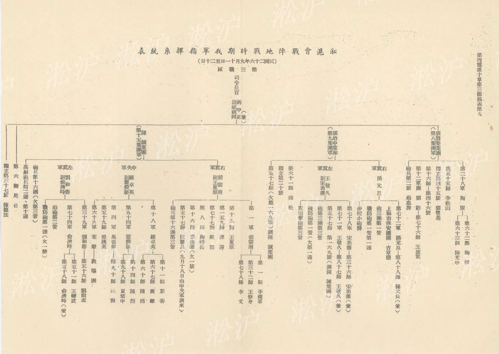

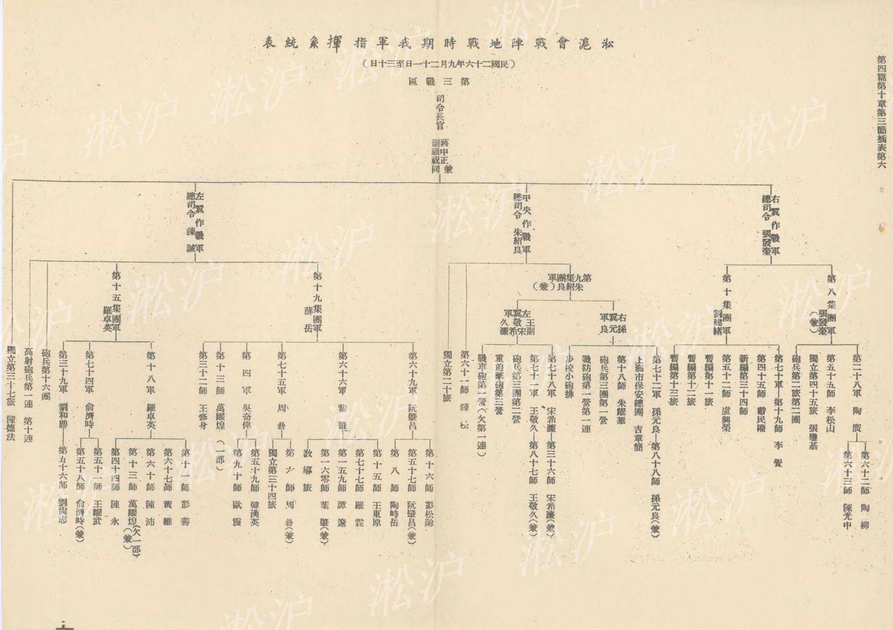

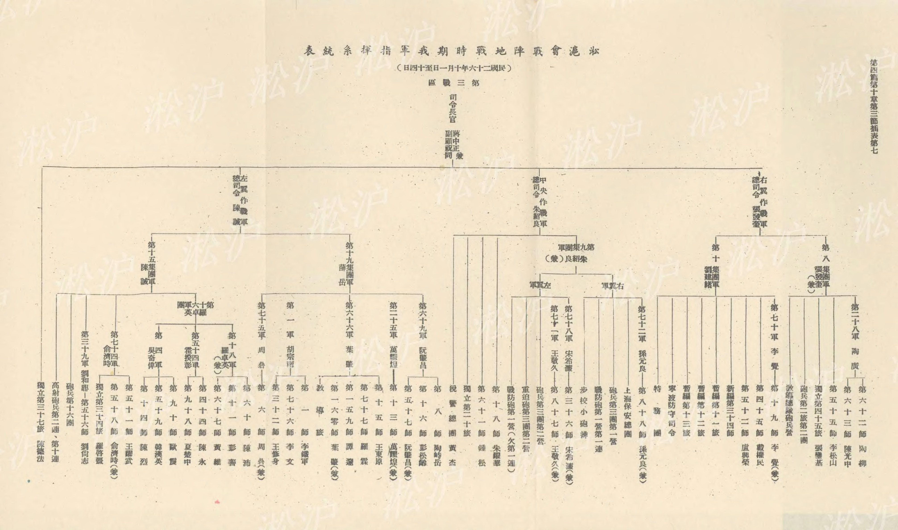

第九十師歐震

第十五師王東原

第七十七師羅霖

第八師陶峙岳

第十六師彭松齡

蘇保第四團

砲兵第十六團

高射砲第二連、第十連

第一零二師柏輝章

第一零三師何知重

第一一一師常恩多

第一一二師霍守義

第五十三師李韜珩

海軍司令

江防司令

江陰要塞司令

蘇保第二團

砲兵第八團第一營

砲兵第十團（一營）

第三十三師馮興賢

第四

一

師

劉

吉

答

第

四

一

市

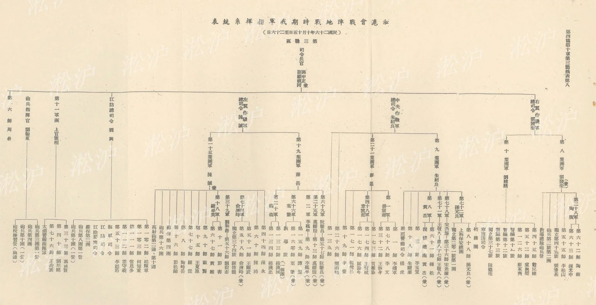

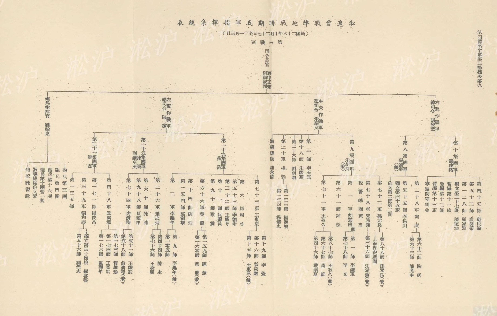

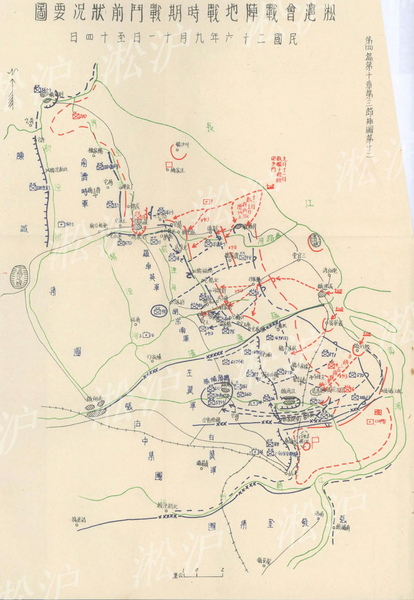

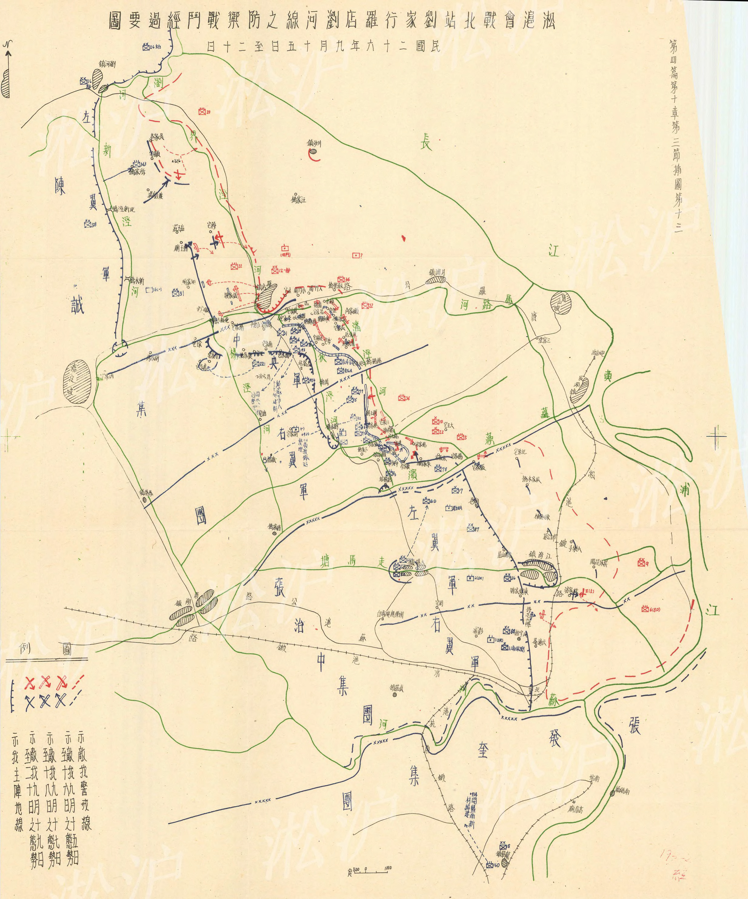

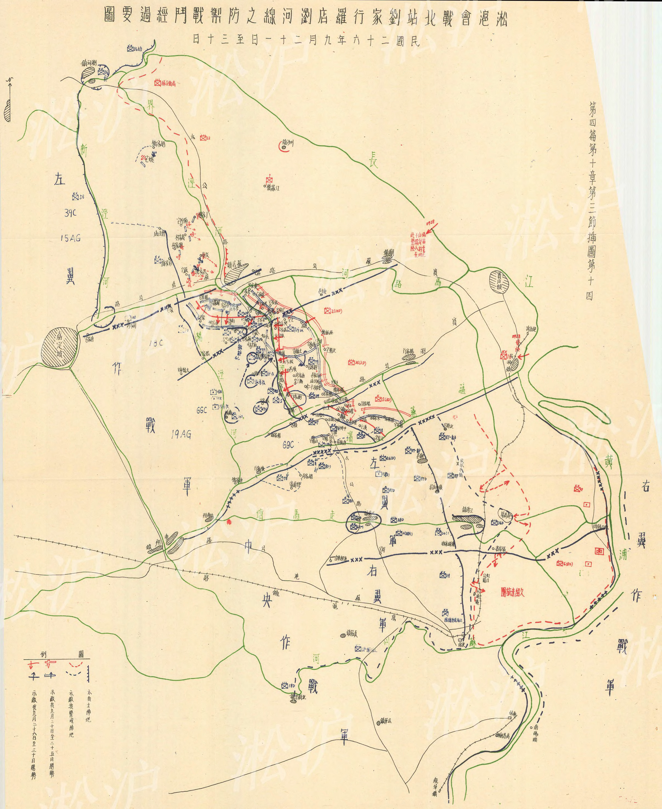

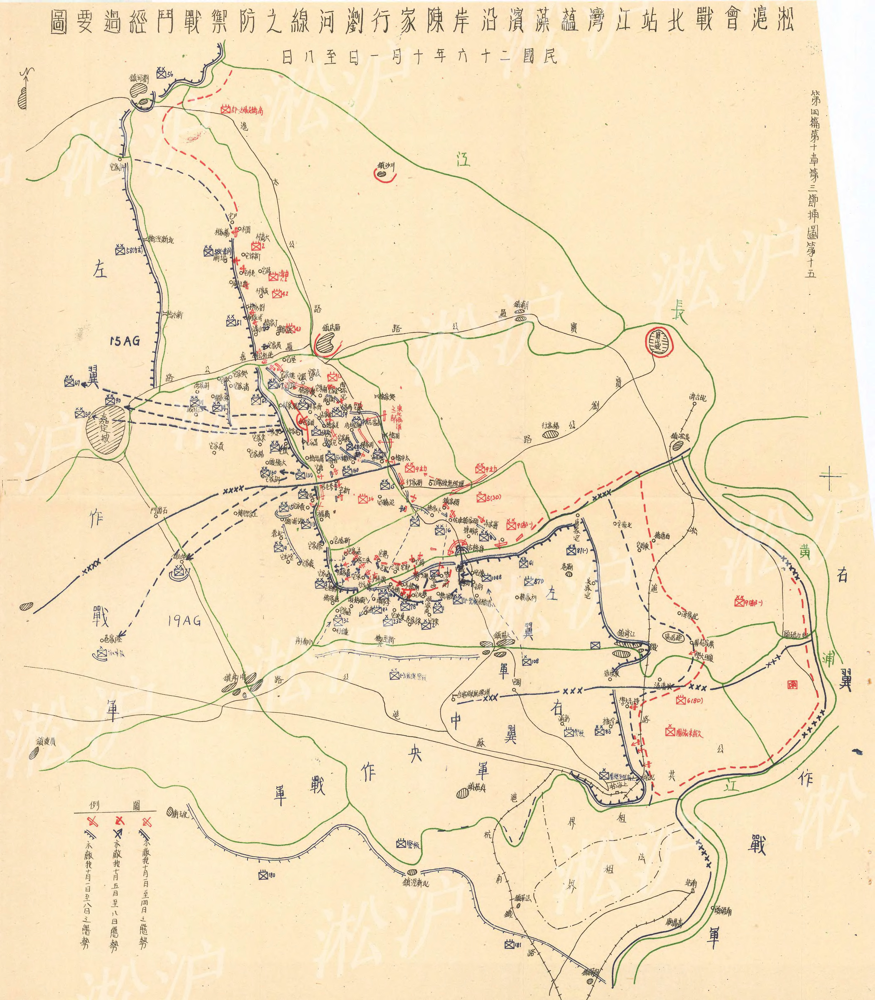

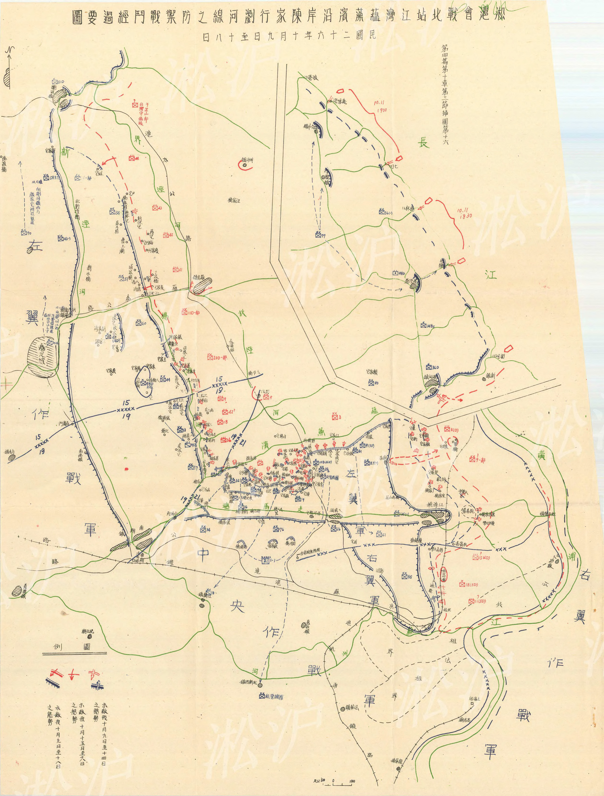

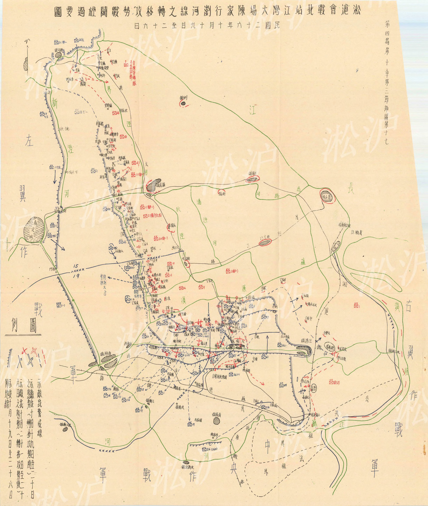

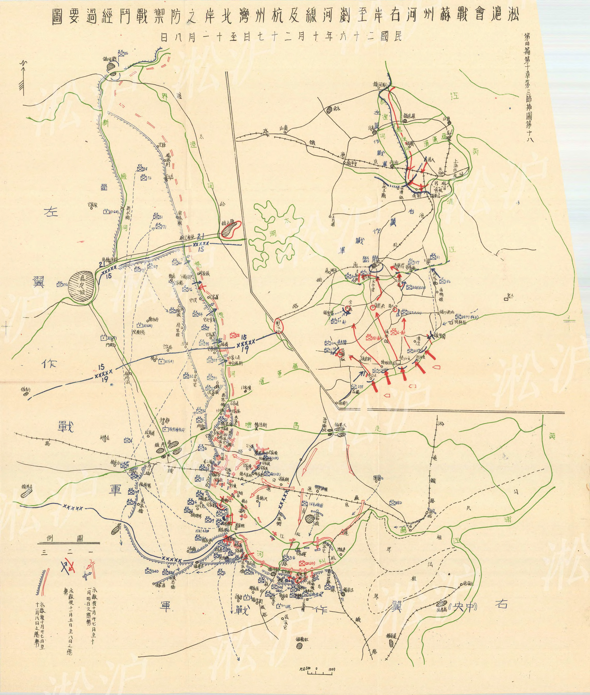
