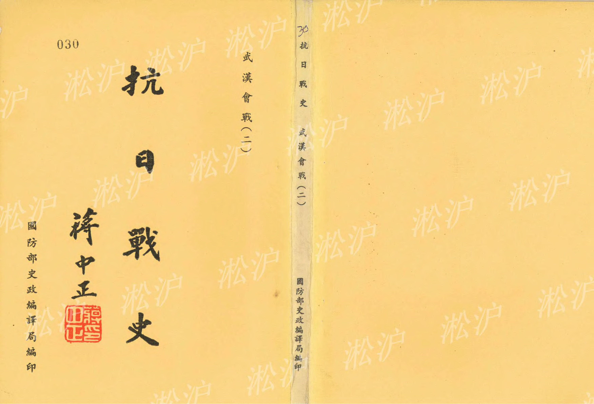

##### 第四項 馬墻、彭澤、湖口諸戰鬥

民國二十七年六月二十一日至七月二十日

參照插圖第二十三至第二十八插表第九

我爲拒止敵軍溯江西進，決定沿江作戰方案，以劉興任江防總司令，分馬當、湖口、九江、田家鎮四個江防守備區。馬當區指揮官指揮第十六軍之第五十三師及第一六七師之一旅與要塞守備部隊，配備於東流（不含）至馬當、彭澤間沿江之線；湖口區指揮官指揮第一六七師（欠一旅）及湖口守備部隊，配備於湖口要塞沿江之線。除加强既設陣地外，並擇要構築堅固工事。

第一目

馬當、彭澤、湖口附近地形

馬當要塞位於長江右岸，當中游之要衝，山勢雄奇，壁立江濱，儼如半島，南有太白湖，東有香山，西有彭澤爲之屏障，且扼長江最狹窄之部，江流湍激，礁石暗藏，爲安慶上游之門戶，九江下游之咽喉，實武漢外圍之第一重鎖鑰。

彭澤、湖口其形勢雖稍遜於馬當，然屹立長江之濱，尤以湖口與馬當，可守望相助，扼鄱陽湖之咽喉，爲贛江吞吐所必經，且與九江唇齒相依，無論江水漲落，淺水艦均可隨時進出鄱陽湖、實爲敵軍進攻武漢所必爭之地。

倘馬當、彭澤、湖口爲敵佔領，則沿江直上之敵海陸軍，除可直接進攻九江、碼頭鎮，以外線作戰之態勢威脅我軍側背外，並可與其南北兩岸野戰軍協力配合會攻武漢。

第二目

戰鬥經過

一、馬當附近之戰鬥

民國二十七年六月二十一日至二十六日

參照插圖第二十三第二十四插表第九

敵自從各地抽調部隊集結於燕湖、懷寧（安慶）各附近地區後，並於六月上旬以大小兵艦四十餘艘，梭巡於大通附近江面（我敷設電纜機雷區），從事掃雷工作，以破壞我阻塞工事。六月二十三日，復以海軍第三艦隊由懷寧上駛，協力波田旅團（臺灣軍附中島山砲團、山田獨立工兵第三團）企圖擊破我江岸守軍溯江西進。其時敵陸續由京滬調集皖省，沿江各處之兵力約兩師團之衆，內有第一零六師團之第一一三聯隊（田中部）及第三大隊梅本部隊計步砲兵一千一百人。其掩護兵艦西上之敵機十餘架，連日更番向我江防陣地偵察並投彈轟炸，敵艦砲亦不時向我射擊，已有積極西侵模樣。

我軍事委員會爲達成持久抗戰之目的，自蕪湖、懷寧失陷後，對於長江江面之阻塞及南北兩岸之警備部署，已逐漸加强，務期粉碎敵滬軍部所謂「在半個月內即可抵漢，佔領我抗戰中心區」之企圖，當即劃分沿江警備區域及馬當、湖口要塞配備與作戰指導如左：

一、劃分第三戰區與江防部隊沿江守備區域。

(一)東流（含）下游江岸歸第三戰區負責，派川軍及皖南保安隊擔任警備。

(二)東流（不含）上游及馬當要塞仍歸江防總司令負責守備。

二、馬當、湖口要塞之配備：

(一)馬當：

1. 十二公分砲八門，計分三臺，娘娘廟砲三門，太子廟砲三門，牛山砲二門。

2. 砲兵第八團之十五榴砲一連。

3. 砲兵第四十二團二公分高射砲三門。

4. 守備營一連。

5. 無線電一台。

6. 海軍陸戰隊一團。

7. 江西保安隊一團。

8. 第二十六師四個連。

9. 電話器材。

10. 江面封鎖馬當至懷寧間扼要佈設水雷三十九個，瓜子洲東北端沉船三十二艘，並設人工暗礁三十處。

(二)湖口：

1. 十公分五砲六門，計分兩臺，柘磯東砲三門，柘磯西砲三門。

2. 砲兵第四十二團二公分高射砲二門。

3. 海軍陸戰隊一團。

三、對江防軍之作戰指導：

(一)薛岳部之劉興軍六個師，仍擔任沿江守備（重點馬當），對東流、馬當間須充分準備，並適當控置兵力，阻止敵之登陸或援助安慶方面作戰。

(二)江防總司令部所屬江防部隊，利用馬當、湖口各要塞封鎖江面，阻止敵艦西進，並與第三、第五兩戰區協同作戰，爾後依情況之推移，與武漢守軍及有關各野戰軍密切連繫，各湖沼及長江間之港口，均須阻塞，以防止敵艦艇之侵入，各部更須於守備區域內沿江河湖沼之我岸嚴密警戒，並於適當位置控置一部兵力，以便對由江河湖沼間侵入之敵作戰，另編成裝甲船隊等水上部隊，擔任江河湖沼之搜索警戒與作戰。

(三)各要塞所需砲位，按原有砲數及海軍各艦卸下者裝配，與已派定之游動重砲一營（十五榴）輕榴砲一營合併編成。

(四)空軍任長江敵艦隊之妨害與阻止。

各戰區基於以上之指導，當即策定部署（並與江防軍協定）茲分述如左：

一、第三戰區之部署：

自東流及其以東沿江地區，由第二十三集團軍唐式遵部防守，以掩護馬當要塞，凡敵能登陸之各要點，宜構築堅固工事，控置有力部隊，直接阻止敵軍登陸，並以主力佔領清弋江、三山鎮間，固守大通、貴池、東流諸要點，以新編第七師控置於貴池附近地區，準備策應長江沿岸及要塞部隊之作戰。

二、第三戰區與江防軍之協定：

當敵由貴池、東流附近强行登陸時，除令第二十三集團軍盡力拒止敵之登陸外，並準備以有力部隊進出該方面，撲滅登陸之敵，阻止其侵入皖省及贛東地區。江防軍應固守馬當要塞，並嚴密掩護馬當附近之封鎖線，使敵海軍不得溯江西侵。如敵由馬當、湖口附近强行登陸時，江防軍應盡力拒止之，第三戰區準備以有力部隊進出祁門、浮梁以北地區，協助江防軍撲滅由該方面登陸之敵，如敵由九江附近登陸時，江防軍須負責撲滅之，以掩護南昌要地。鄱陽湖之警備，由江防總司令部主持，並會同贛省府及祁、浮、德、婺區警戒指揮所，預行籌設水面及陸地强固之防衛設備。

三、第五戰區與江防軍之協定：

以第二十七集團軍之主力附砲兵一連，必要時，由第二十一集團軍酌派一部固守懷寧附近及其以西地區，掩護馬當及其以西封鎖線，拒敵西進。如敵企圖由江左岸登陸，與右岸敵相策應時，須竭力阻止，以掩護各該要塞左岸之安全，並支援要塞外之支隊作戰，依機動牽制或威脅敵之監視，或圍攻進犯之敵，以確保各該要塞江左外圍線之據點。

四、第九戰區之指導：

馬當游動砲兵應確實掩護封鎖線，並電第三戰區轉飭東流、至德部隊，協助夾擊由香口向上行駛之1

武漢分战(二)

敵艦，另飭佈雷隊曾司令設法加佈水雷。

五、江防軍六月二十日經白副總長視察後，面示修正之部署如左：

(一)第五十三師，加派一團於江左之華陽、望江。

(二)湖口之第一六七師（欠第四九九旅）推進至馬當區歸第十六軍軍長李韜珩指揮。(三)第十六軍之配備：

1. 第五十三師之一旅位置於江之左岸華陽、望江。

2. 第五十三師第三一三團配置於香山。

3. 第五十三師第三一四團配置於下隅坂。

4. 第一六七師各以一旅配置於黃栗樹、馬路口。

(四)馬當要塞核心之守備及配備（參照插圖第二十四）：

1. 守備兵力：

(1)江防要塞守備第二總隊之七個連。

(2)第二十六師之一營四個連。

(3)守備第一、第二營，（僅步槍二百三十枝、機槍四挺）。

(4)各種砲兵。

2. 配備情形：

右地區（藏山磯第一線）

江防要塞守備隊。

野砲兩連。

中地區（娘娘廟附近）

第二十六師之一營。

左地區（砲臺附近）

守備第一、第二營。

砲兵教導隊（步槍六十枝）。

各部奉令後，均照計畫先後到達指定地點，並分別配備佈防。

我海軍方面，自南京失陷後，卽奉命建設馬當阻塞線，於馬當東流間分佈水雷，計在馬當阻塞線佈雷八百餘具，並毀除狹港以上、九江以下各航路標誌，一面擇馬當之娘山、牛山、雞公嘴各地爲要塞陣地，卸裝艦砲八尊，編成海軍砲隊計二百二十三人，以陳永欽爲隊長，並派海軍陸戰隊一團共資扼守。嗣於六月上旬在馬當阻塞線前後加佈水雷六百餘具，東流方面亦增佈百餘具。

六月二十一日（參照插圖第二十四），敵艦砲不斷向我馬當要塞射擊，敵機亦常臨空偵察或投彈轟炸，經我派志願隊機五架對敵機攻擊，在彭澤上空擊落其驅逐機一架，餘機逃竄。二十二日，敵巡洋艦一艘，砲艇二艘，掩護汽艇十餘隻，迫近馬當阻塞線，我海軍砲隊以奇襲射擊，當經擊沉敵汽艇三隻，餘遂相率遁去，但我第二砲臺掩蔽部經中彈傷官兵九人。

六月二十三日十七時，敵艦艇五艘，輸送第三艦隊特遣陸戰隊約八四零名向馬當前進，在新溝附近登陸，襲擊香山，與我第五十三師第三一三團之一營發生激戰，同時另一部敵分犯黄山與香口，攻香山之敵因獲得支援攻勢益趨猛烈，與我守兵反復爭奪。

同日，軍事委員會派廖士翹、薩師俊爲鄱陽湖警備正副司令，歸江防總司令指揮。

本日，我志願隊派機九架分三批轟炸敵艦，十二時由南昌起飛之第二批機三架，於東流附9 武漢合战(二)

近發現敵艦三艘，當卽投彈，旋見敵艦上發出黑烟，我機安返南昌。

六月二十四日七時，敵波田旅團（臺灣軍）約三千，在毛林洲及新溝附近登陸，九時、黄山被攻佔後，續攻香山，我第三一三團團長伍朗如戰中負傷，守兵傷亡甚重，十二時，香山遂陷，香口亦不守。第三戰區長官部令第六十師派第一八零旅協同第五十三師向黄山反攻，於二十五日晨將黄山奪回。

敵軍自佔領香山、香口後，卽沿公路西進，在藏山磯附近受我阻擊，傷亡約五百，敵以攻勢頓挫，退守香口及其以東地區。同日敵將太白湖阻塞口破壞，企圖以艇隻侵入湖內，抄襲馬當之後，復用小艇載兵由它龍石、牛山磯（牛山東北）迂迴登陸，經我要塞守備司令部調左地區守備部隊增援阻擊，相持入夜。同日，敵以巡洋艦驅逐艦多艘，以猛烈砲火擊我砲臺，我海軍砲隊沉着應戰，敵巡洋艦中彈着火，以兩驅逐艦拖曳下駛，其餘各艦，亦紛紛逃竄。

同日，航空第一路司令張廷孟奉航空委員會電令，於十五時派志願隊機七架轟炸東流附近敵艦，並派四驅逐機七架與第四大隊第二十一隊驅逐機六架掩護，自南昌出發，十五時四十分到達東流上空，發現該處停泊敵艦多艘，當分兩小隊投彈，第一小隊命中兩艘，第二小隊亦命中多艘，任務達成後，均安返南昌。十五時四十五分，我志願隊S.B.機三架，復奉命由南昌出發，轟炸安慶機場，到達上空時，發現停有敵驅逐機十五架，當卽俯衝投彈，命中多架。

六月二十六日拂曉，敵藉毒氣彈掩護，由娘娘廟、牛山磯登陸，迂迴我藏山磯陣地左後方。

江防總司令部以該處空虛，急令第十六軍第五十三師由華陽開駐彭澤之一營馳援，並令第一六七師由彭澤增援之一旅馳赴馬當，拒止敵軍前進。惜該兩部遲未到達不能捕捉戰機，第一六七師師長薛蔚英迭經第十六軍軍長李韞珩電令率部赴馬當負責固守要塞，乃該師長未能遵行，繼且後撤，我要塞守兵戰鬥力薄弱，在敵軍機砲轟炸下固守四日，傷亡既重，兼之藏山磯陣線動搖，大山、大王廟砲臺乃相繼失守，我守軍被包圍後，全部犧牲，馬當砲臺遂於九時陷落，我所恃以阻止敵軍掩護韜鄂之惟一門戶，至此洞開，雖我第一零五師、第六十師與第五十三師之各一部對香山、香口之敵不斷攻襲，但終未能將馬當收復。

蔣委員長以要塞失守，關係重大，卽令：「第一六七師立即撲滅馬當殘敵，此後馬當，香口卽歸該師負責固守」。又令：「所有湖口、馬當一帶部隊，統歸羅卓英指揮，隸屬第三戰區」。

第三、第九兩戰區以鄱陽湖形勢險要，時值長江水漲，敵艦能任意出入，到處登陸，爲阻止敵艦艇由長江西進及由鄱陽湖南進，除沿鄱陽湖岸構築工事外，特作如左之處置：

一、警備之設施：

(一)成立鄱陽湖警備指揮部，計畫鄱陽湖一切警備事宜，受江防總司令之指揮。

(二)鄱陽湖警備指揮部應與祁、浮、德、婺區各指揮官密切連繫，爲作戰應有之協定。

(三)偵察湖水狀況，凡湖岸可通航及登陸之點，均構築工事並配備必要之砲艦。

(四)湖口縣附近東西兩岸，應由江防總司令部構築堅固工事，並須有野山砲一連之陣地。

(五)小孤山扼湖口之咽喉應詳行偵察，如能構築步兵一連，野山砲二門之工事，對鄱陽湖守備極爲有利。

二、兵力配備：

(一)第五十三師配備於鄱陽湖東岸蘇觀渡橋、谷子山、老爺廟、都昌之線，拒敵登陸。

(二)第五十九師主力集結於馬尾港、田坂街附近，擇要擔任都昌、郎埠間湖面之警戒。

(三)第二十一師主力集結於樂平西側，任樂平亭至管櫟市間之湖防，並構築田坂街、九眼井、塔前、寡婦橋、上儒材六處之據點工事。

江西保安第一支隊以第七團任餘干，瑞洪、康山（鄱陽湖南岸）諸據點之守備，第二團任沈口街、柘林、滁槎、坎舍、窯頭街（鄱陽湖西南岸）諸據點之守備，第十三團集結於坎舍、沈口附近爲預備隊。

(五)第四十師以一團（欠一營）任涂家埠據點工事之構築及守備，以一連於三角尾（三角湖附近），其另一營守吳城。

(六)第五十一師以一旅守備隘口、柏莊、黃塘舖、李橋塘，另一旅任渚溪至張漢嶺（鄱陽湖西岸）間湖防。

(七)第二十五軍之第十五、第五十二、第一九零等三個師，任星子至姑塘之湖防，機動部隊控置於主樓鎮、汪家澗地區。

(八)第八軍之第三及預備第二、第十一師與江西保安第三、第十一團、戰車防禦砲連佔領姑塘、下豬橋、黃家大屋、王家郾、灰山經鄱陽湖口以西迄碼頭鎮一帶，協同砲兵阻止敵艦之突進。

蔣委員長爲鄱陽湖口之阻塞及湖口艦艇之配備與作戰，曾電令海軍陳總司令：「查鄱陽湖水深幅闊，便於航行，形勢甚爲重要，亟應積極妥籌準備，以利作戰，所有關於鄱陽湖之阻塞及湖口艦艇之配備與作戰事宜，着由該總司令負責辦理」。同時，又令江西省政府：「對湖內其他較要水道，着負責實施阻塞」。

陳總司令奉令後，卽劃湖口爲長江第二道防線；撥艦砲六尊，選太平山、竹雞山爲陣地，編組砲隊，以邱世忠爲隊長。另調海軍陸戰隊一連協同守備，一面勘測港道，選定雷區，先後佈雷九百餘具，並派艦隊司令曾以鼎坐鎮。敵知我佈署後防，不斷派機轟炸，我威寧佈雷艇與敵機作戰負傷，艇長李孟光以下官兵傷亡十餘人。

同日張司令以馬當附近戰鬥激烈，令航空第二十五隊劉依鈞率機三架，每機攜二百五十公斤炸彈一枚，於五時自南昌起飛，經都昌前往東流、馬當一帶，轟炸江面敵艦，以協力地面戰鬥，六時到達香口東北之天生洲上空，發現敵艦二十餘艘，當即俯衝投彈，命中一艘，我霍克Ⅲ式D5193機一架及駕駛曾培復受輕傷。

六月二十七日，攻佔馬當之敵仍與我激戰中。

蔣委員長以第一六七師行動遲緩，致馬當危急，令第十六軍李軍長轉薛師長電令如次：「查該師長行動遲緩，致馬當危急，着先予申斥，並着該師長率部迅速攻擊馬當要塞核心之敵，如不能收復該要塞，該師長應負貽誤戎機之責」。李軍長當卽轉令該師遵照。

二、彭澤附近戰鬥

民國二十七年六月二十八日至二十九

參照

插圖

第二十五

敵突破我馬當要塞封鎖線後繼續西進，彭澤情況因轉緊張。

六月二十八日八時，我第四十九軍軍長劉多荃爲牽制敵軍之前進，並策應彭澤方面之作戰，親率第一零五師協同第六十師及第五十三師之各一部克復香山，並以主力向香口之波田旅團守備隊攻擊。

第九戰區陳長官擬乘香山克復之機，一鼓殲滅侵入馬當要塞之敵，乃調整部署如左（參照插圖第二十：一、着第十六師到達馬路口，加入靑山壩方面由西向東對馬當之敵攻擊，第十六師及第五十三師歸李軍長統一指揮，並將攻擊部署具報。

二、在靑山壩方面之第一六七師部隊，待第十六師接替後，卽轉移至香口方面加入該方面之攻擊，該師爾後歸第十八軍軍長黃維指揮。

三、在香口方面之第五十三師、第一六七師部隊歸周師長指揮，由東向西夾擊馬當要塞之敵，但第五十三師在香口方面之部隊待克復馬當後，卽歸還建制。

各部隊奉令後，分向指定地點攻擊前進，以阻止由馬當向彭澤進犯之敵。

同日十二時，敵機九架飛彭澤北門外投彈十餘枚，我攻擊馬當部隊尚未到達攻擊準備位置，而步砲聯合並附海軍陸戰隊及騎兵各一部之敵已向彭澤急進，與我第一六七師及第五十三師之一旅，在彭澤東之歐陽村及東北之將軍山一帶發生戰鬥，敵經我阻擊未獲進展。入夜，敵右翼隊波田旅團第二聯隊由陣地間隙攻入佔領彭澤東北屏障之磨盤山、馬家嶺，左翼隊波田旅團第一聯隊亦進佔城東南高地之雙峯尖，企圖截斷我後方連絡，彭澤城遂岌岌可危。

同日五時五十五分，我航空第六大隊第十五隊副隊長余平想率恆機五架，自南昌出發，赴馬當轟炸附近敵艦，六時五十分到達上空，投彈多枚，我一五一零號及一五零一號兩機受輕傷。又六時四十五分我第二大隊長孫桐崗率領機羣再赴馬當執行轟炸，所部第一分隊蕭起鵬之僚機一一零四號及一一零三號兩機抵馬當上空時，與敵九五式驅逐機八架遭遇，我飛行員王廷元、射擊士陳旭與一一零四號機中彈，人機俱毀，轟炸員錢長松跳傘脫險。另批於六時二十五分由南昌起飛之志願隊下機十架，在東流上空與敵九五式驅逐機約十架遭遇，空戰結果，我擊落敵機一架。同日十五時十分，我志願隊機三架各帶一百公斤炸彈六枚，由漢口出發，往炸香口一帶敵艦，在香口東北之天生洲江面，發現敵艦兩羣，當即俯衝投彈，敵艦一艘中彈沉沒，其時適與敵九五式驅逐機數架遭遇，空戰結果，被我擊落二架，我機一架負傷，其餘於十五時許安返防地。

六月二十九日晨，敵第六師團之一部在彭澤附近登陸，與尖山之敵聯合進犯，我以寡不敵衆，卒被登陸之敵衝入城內，同時敵艦五艘，自長江衝入彭澤西南方湖，威脅我軍側背，彭澤城陷入四面包圍，雖經反復爭奪，終告不守。此時我分向香口、馬當攻擊，策應彭澤方面作戰之各部，亦未奏功。

同日，陳長官令第十六師由馬路口北進，接替第一六七師陣地守備，甫抵歐陽村附近，第一六七師已在混亂轉移中，該師乃佔領歐陽村、馬鞍山、田甫、王灣之線，敵軍千餘卽向陣地猛撲，經奮勇衝殺將其擊退，奪回王家灣、張村陣地，嗣以馬當方面敵陸續增援，一面砲擊，一面施放毒氣與烟幕，掩護步兵反撲，戰鬥益形激烈，我傷亡官兵五百餘人，敵軍死傷亦達四百有餘，我以一部向左翼延伸阻敵南犯，迄二十三時，奉李軍長命令移至郭家橋附近佔領新陣地。

同日十時許，敵裝甲汽艇約四十艘，載步兵八百餘，在彭澤下流約七公里處登陸，向將軍廟前進，襲擊我正與敵作戰之第五十三師後方，守軍苦戰竟日，傷亡官兵約三分之二，入夜始突圍至黃土嶺（彭澤東南）附近。

三、湖口附近戰鬥

民國二十七年六月三十日至七月七日

參照插圖

第二十六

敵攻佔彭澤後，除以第六師團留兵守城外，即以波田旅團繼續前進，西窺湖口。

六月三十日，我右翼第十六師除留一營在馬路口附近警戒外，其餘在郭家橋附近佔領陣地，第十六軍之一部亦陸續到達黃土嶺一帶佈防。九時、敵波田旅團第二聯隊步砲聯合兵約七八百，在彭澤西南約八公里之娘娘廟登陸，第一聯隊在山田工兵隊協力下則由方湖西渡，迂迴攻我定山（娘娘廟西約二公里）第七十七師第四六二團陣地。

第九戰區陳長官卽令郭汝棟爲湖口守備區指揮官，歸第三十四軍團長王東原指揮，該軍所屬之第二十六師卽赴湖口接替第七十七師防務，第七十七師留守湖口部隊俟交防後卽向東進，應與第十六軍及第十六師協同，速將彭澤、娘娘廟附近之敵肅清。

王軍團長於十二時遵卽下達要旨命令如左：

一、軍團決卽肅清彭澤、娘娘廟附近之敵，以鞏固湖口要塞守備。

二、第七十七師派兵一團驅逐娘娘廟附近之敵，並警戒由娘娘廟至龍王廟之江岸，拒止敵之登陸，另派

一團經王斯溫橋、太平關佔領黃土嶺附近，與第十六軍及第十六師密切連繫。

三、郭汝棟指揮官指揮第二十六師及湖口要塞部隊與砲兵第十六團第九連固守湖口要塞。

第七十七師遵卽派兵兩團由湖口出發，分向指定地點前進，其向娘娘廟進擊之第四六零團行抵流斯橋東北之棠山附近，卽與由娘娘廟西進之敵接觸。二十三時，李軍長令第十六師師長何平於明（一）日收復彭澤，再謀收復馬當。

七月一日（參照插圖第二十六），右翼第十六軍方面，除第五十三師之一旅在黃栗樹、馬路口間對太白湖警戒，及第一六七師之一旅在石門街整理外，餘在原地警戒。第十六師何師長率部（欠一營）進至黃土嶺附近，卽以第四十六旅（第九十二團、第九十六團）進至曹前山、白雲庵、青家壠之線就攻擊準備位置，第四十八旅（第九十五團——欠一營）接第四十六旅之右後對馬當方面佈置警戒，第九十一團爲師預備隊，位置於黃土嶺附近。

左翼敵軍於七時以艦艇多艘載步兵約九百，在娘娘廟西之蝦蟆石强行登陸，我第七十七師第四六零團已將棠山附近之敵驅逐，向娘娘廟追擊前進，八時抵娘娘廟附近，與敵遭遇，以衆寡不敵，竟被包圍，十二時突圍，退守棠山西南之楊家山，敵卽賡續攻擊，經反復肉搏，敵我死傷枕藉，旋敵復增兵二千餘猛撲，此時該團官兵僅餘二百左右，團長陳奇乳負傷，兼以由方湖南岸迂迴之敵威脅我軍側背，乃於十七時退守流斯橋及其以東地區與敵對峙。

王軍團長此時率部正向太平關前進，行抵大王廟附近，得知該團被迫後撤情形，卽令第七十七師之第二三一旅先頭在大王廟停止，準備直接配合要塞部隊作戰，並下達要旨命令：

一、軍團爲直接掩護湖口要塞陸正面，決以野戰部隊由太平關以西地區向流斯橋以東之敵側擊而殲滅之二、着第七十七師以主力集結於太平關、大王廟、盧家嶺一帶，準備於明（二）日拂曉向流斯橋以東之敵攻擊。

三、郭指揮官所部應努力固守湖口要塞。

右令下達後，以湖口情況緊張及前方道路不便砲兵運動，復令砲兵第十六團野砲連開回湖口歸第二十六師指揮，擔任湖口之守備。

江防軍總司令部同日以江湖防務重要，下達命令，調整部署，其要旨如左（參照插圖第二十七）。

一、敵情及友軍情況略。

二、本江防軍以確保九江地區阻止敵軍由長江西進，或往鄱陽湖南竄之目的，配置優勢步兵火力，利用水雷封鎖，打擊敵人並相機擊滅之。

三、第八軍軍長李玉堂指揮第三師、預備第二師、第十一師及江西保安第三團、第十一團（欠一營）、戰車防禦砲連佔領右自姑塘、下豬橋、黃家大屋、王家堰、灰山經鄱陽湖口沿長江右岸迄碼頭鎮一帶陣地，重點配置於九江以東地區。並指定有力之一部固守獅子山高地，不得擅自撤退；尤須協同砲兵隊阻止敵艦艇突進鄱陽湖口及以西之江面，並須指定就近部隊負責，確實掩護砲兵。

四、第二十五軍軍長王敬久指揮第二十五軍（欠第五十二師），佔領東姑嶺（星子縣西南）沿湖至姑塘一帶陣地，防禦敵人並協同砲兵隊阻止艦艇深入鄱陽湖。

五、作戰地境：

第二十五軍與第八軍間，爲塘姑、楊家坳、陳莊、玉頂峯、梅村、帽子山、沙帽山之線，線上屬左六、兵第十團第一營、（欠一連）第十一團第三營歸本部砲兵指揮官許康指揮，在九江以東、姑塘以

北地區佔領陣地，準備以主火力射擊竄犯鄱陽湖及湖口以西江面之敵艦艇，另準備砲兵約一連，相機支援步兵作戰，並於九江附近選定預備陣地，構築必要工事，以便奇襲敵艦或協力步兵作戰。

七、砲兵第四十二團第五營營長張克勛以掩護砲兵之目的，協同本部砲兵指揮，選定適當位置，對空防禦。

八、第五十二師爲總預備隊，暫於德安、（不含）星子間地區集結待命。

九、各部應速於所佔陣地內架設通信網，並與九江總部及沙河附近本部戰鬥指揮部架設電話。

十、本部暫位置於九江，必要時在沙河附近設戰鬥指揮所。

各部基於上令，且因江湖一帶情況之緊張，遵卽積極部署，準備迎敵。

七月二日四時三十分，我航空第一路司令號廷孟命第十五隊派恆機三架會同第二十五隊之霍機一架於八時三十分出發，轟炸馬當附近江面敵艦，九時四十分到達東流附近，見江面有敵大小艦艇四十餘艘，當自二千呎高空俯衝投彈，十時二十分安返南昌機場。

同日四時，右翼第十六師第四十六旅攻擊部隊在王板橋南端與敵接觸，經戰鬥後，敵退守龍山、鵝公節一帶高地，我復乘勢攻擊，敵據險頑抗，戰鬥慘烈，營長蔣立夫、連長陳連勝、劉月卿負傷，安兵死傷二百餘人，我斃敵井上正吉中隊長一名，搜獲文件知爲波田旅團第二聯隊，該敵經我猛擊後，退守雙峯尖，我卽佔領龍山、鵝公節。我右前方之法官尖約有敵四五百，亦爲我第九十六團擊潰，敵主力退據雙峯尖，一部在十步大嶺、冷亭山抵抗。我佔領法官尖後，並先後攻克石婆嶺，進佔尖山，而將閔家橋附近公路橋樑破壞，一面向牛頭山側擊。時第九十二團乘勝將十步大嶺、冷亭山一帶敵軍亦先後擊退，敵一部退守彭澎城，一部退據雙峯尖，我派兵一營追擊，迫近彭澎東門，十二時，攻佔雙峯尖敵陣地一部，第四十八旅派第九十五團接替石婆嶺、尖山一帶陣地，而以第九十六團協力第九十二團合攻雙峯尖，以期將敵軍全部殲滅。十四時，由馬當方面駛來敵戰車六輛，裝甲車八輛，滿載敵兵，以橋樑破壞，卽下車向我石婆嶺進攻，另敵騎兵一部繞我右翼，經令駐馬路口之一營夾擊敵軍側背，二十三時，敵不支向馬當退去，同時第九十六、第九十二兩團亦將牛頭山、雙峯尖敵軍擊潰，完全佔領。是役計斃敵在五百以上，但我傷亡亦達七百餘人，正擬續同彭澤城攻擊，適第十九集團軍電令該師改歸王軍團長指揮，旋王軍團長令該師卽開太平關以西地區集結，該師乃準備向指定地區轉移。

同日七時，左翼方面第七十七師之第二三一旅向流斯橋以東之敵攻擊，九時佔領張義插、童家灣、流斯橋之線。十七時，敵兵一部向東移動，企圖包圍我右翼，陳家橋亦發現敵軍二三百，我派兵一營由壽家、廖家向寗家壠攻擊，並以有力部隊驅逐陳家橋之敵後，續向棠山攻擊。

湖口方面，敵機終日偵炸砲臺，該臺電線被毀，江面亦發現敵艦艇游戈，數目不明。

軍令部鑒於湖口重要，曾電陳長官「湖口之守備與封鎖線之掩護，應於北岸桑樂鄉配備游動砲兵，（配步兵一營、工兵一排並裝甲榴彈）野砲兵（或輕重榴彈砲）一連側擊江中敵艦，掩護封鎖線並射擊南岸登陸之敵」。

同日十五時十三分，空軍第二大隊長蕭起鵬奉命率S.B.機五架各攜一百公斤炸彈六枚，自南昌出發，於十七時零八分在馬當上空發現江右岸泊敵艦三四十艘，江左岸及江心停泊大型軍艦八九艘，當自三千公尺高度投彈，敵除以高射武器向我密集射擊外，同時敵九五式驅逐機六架亦向我機後上方攻擊，我第三十隊三零零一號機油箱中彈起火，隊長武維志及轟炸員袁熙綱、射擊士陳德奎均陣亡，其餘四機於十七時五十八分安返基地。又十三時二十分，志願隊S.B.機八架，各攜一百公斤炸彈六枚，由漢口出發，轟炸馬當附近敵艦，十四時三十分到達馬當之西彭澤附近上空，發現敵大型艦六艘，當卽分組投彈，全數命中起火。

七月三日，第十六師除留一部在彭澤近郊各要點牽制敵軍外，其餘向太平關以西地區集結待命。第七十七師於九時許佔領寗家壠之線。敵藉砲火掩護，以步兵向我正面猛攻，戰鬥至烈，十一時第四六一團將廖家附近之敵包圍，該團團長陳奇乳不幸陣亡，雖未竟殲敵全功，然已斃敵中島部雄淮寅砲兵大尉一名、中尉一名及士兵百餘，並搜獲進攻九江計畫圖一份，及文件日記等，我亦傷亡官兵四百餘。黃昏後，我派隊襲佔流斯橋東北之土王山，時沿江之敵約兩聯隊，在飛機及毒氣掩護下，向龍潭山第二十六師之左翼進攻，我死傷甚重。旋敵軍千餘向陣地右翼迂迴，我以第十一師經王斯溫橋增援，未及到達，而第二十六師已被迫退守梅蘭口與一零五三高地，敵續進迫，並以汽艇多艘載兵一部由湖口附近登陸，第二十六師守兵一部已退入湖口城，此際湖口情況緊張。

奉軍事委員會指示：「劉師長應死守湖口，羅集團軍應速以王軍團、彭善各部卽向湖口方面敵之側背攻擊前進」。並令：「郭軍長迅速率部渡湖，死守湖口」。

同時，第十九集團軍令王軍團長嚴令第二十六師固守湖口；第十六師及第七十七師務在太平關以北地區猛擊西進之敵，掩護要塞。

江防總司令部同日以情況日急，擬定江防軍九江區重砲兵戰鬥計畫如左：

作字第號

江防總司令部重砲兵戰鬥計畫

民國二十七年七月三日

一、敵情判斷

敵艦隊於通過湖口、柘機砲臺江面後，卽溯江西上，掩護陸軍在梅家洲以西沿江强行登陸，襲擊九江正面。並以淺水砲艦進入鄱陽湖內，掩護陸軍在獅子山以南沿湖强行登陸，襲擊九江側背。

重砲兵爲鞏固江防、湖防計，以阻止敵艦艇通過九江與侵擾湖內爲目的，務使在我火制區域內阻止或殲滅之，並於必要時支援我步兵之作戰。

三、兵力

第十團十五榴一營（七門）。

第十一團一零五榴一營（七門）。

四、位置及火制區域

第一時期在桃花山以東選定陣地。

(一)對石鐘山以北江面構成火力封鎖線，阻止敵艦侵入江湖兩面。

(二)對北水道中部行阻止射擊。

(三)對南水道官洲附近與湖內獅山附近行殲滅射擊。

第二時期，在桃花山以西地帶及姑塘附近選定陣地。

(一)對江面南水道官洲西端與北水道萬壽宮附近構成火力封鎖線，並在洋油廠以東江面殲滅之。(二)對湖面鞋山附近構成火力封鎖線，殲滅敵艦艇於姑塘前方。

第三時期，在洗脚橋及碼頭鎮附近或在星子以西地區選定陣地。

(一)阻止敵艦上駛，進襲田家鎮要塞。

(二)控制鄱陽湖，掩護星子縣，殲滅敵艦於湖中。

五、交通

以利用九湖、九星、九瑞各公路爲主，其他各陣地進出路預自修築之（在九江市區內東門經龍開橋火車站通瑞昌之馬路不得阻斷）。

六、通訊

各陣地間構築通訊網外，並對江防總司令部架設專線。

七、彈藥補充

各營除攜帶兩基數外，由本區兵站速存兩基數，以便隨時補充，不足時再由後方補充之。

八、其他砲兵

所有參加本區作戰之山砲、野砲、步（戰）砲等砲兵，均配置沿江沿湖各要點，歸各守備隊直接指揮，擔任掩護水雷，並阻止敵小艦、汽艇、民船之强行登陸。

江防總司令劉興

蔣委員長三日指示，南昌近郊據點及鄱陽湖沿岸分段守備部署，其概要如左：

一、南昌近郊據點，由葉壁軍及贛保安隊擔任守備，鄱陽湖西岸德安以南由俞濟時軍、以北由王敬八軍各派隊擔任。

二、鄱陽湖東岸第三戰區境內，由第三戰區於必要時派隊守備。

三、各守備隊應卽偵察地形，並於要點增築工事，隨時與鄱陽警戒部隊連絡。

四、各區守備地境、兵力部署及增築工事位置，仰卽規定具報。

五、已令贛省府抽派保安隊三團歸薛總司令指揮，分任沿湖警戒，並協築工事。

同日十二時，空軍第一路司令命第二大隊派機四架，志願隊派機五架，混合編隊，往炸東流附近江面敵艦，第十五隊隊員譚卓勵領隊率恆機四架，每機攜帶五十公斤炸彈四枚，於五時三十分自南昌出發，往炸馬當江面敵艦，六時三十五分到達，當由雲層中潛降至二千公尺高空投彈，命中敵艦，爆炸冒煙，我一五零八號機爲敵高射砲擊傷，一五一二號機於回航時一度發生故障，幸均安返原地。第二大隊第九分隊長徐應鵬率四架自南昌出發，經都昌往炸東流附近敵艦，於八時十分到達目標上空，當卽投彈爆炸，因遭敵雙翼轟炸機六架之攻擊，我九零四號機及領隊徐應鵬隊員、戴劍峯、射擊士張德剛均人機俱毀，李福遇所駕九零五號機亦負傷，被迫降德安、烏石門附近公路上。十六時四十分，志願隊機五架，第二大隊機三架，自南昌出發，經馬鞍山往炸東流敵艦，十七時三十五分在香口上空發現敵艦三十餘艘，當卽以五千公尺高度用儀器瞄準，投爆炸彈四十八枚，半數命中，敵大型一艘着火下沉，並重傷小型艦二艘。又六時十分，志願隊機十架，各帶一百公斤炸彈六枚，自漢口出發，轟炸安慶敵艦，到達目的地後，發現敵艦甚多，內有航空母艦一艘，載飛機五架，當卽投彈轟炸，該艦中彈下沉，我機一架亦中彈起火，機毀人亡，另一架受傷，其餘均安返南昌基地。

七月四日晨，彭澤之敵一部百餘，由冷亭山攻入，經第十六師留置該處之部隊擊退，該師主力向西轉移至王斯溫橋，協同友軍分兩翼向湖口前進之敵攻擊，十五時，先頭部隊到達王斯溫橋，二十四時卽經潘村、張村向梅村攻擊。同日、第七十七師右前方，陳家橋、石澗舖各有敵軍一部侵入，另一部向流斯橋東北之王土山攻擊，均經該師擊退。十二時，第七十七師以一營向其左前方之史家橋、梅村，一營向其左後方之走馬坂之敵側擊，十六時向梅村攻擊之營與敵接觸，攻走馬坂者，因該處無敵踪，續向馬影橋搜索前進。

湖口方面敵續向要塞砲臺猛攻，因守臺兵力單薄，敵遂侵入。第二十六師與攻入要塞區之敵反復爭奪，亦未得手，官兵傷亡達三分之二，團長傷亡二員，但仍在梅蘭口、張九坊一帶苦戰，嗣敵使用毒氣，我中毒官兵甚多，致左翼陣地被敵突破，乃將所收容之官兵，以百餘固守砲臺，以三百餘固守湖口城外。

蔣委員長以湖口扼鄱陽門戶關係重要，電令郭軍長、劉師長：「須激勵官兵抱與要塞共存亡之決心以固守之，後退者决以軍法從事」。

王軍團長亦奉第十九集團軍電令，遂下達如左之要旨命令：

一、軍團决以野戰部隊協同要塞部隊夾擊殲滅攻入要塞區之敵，重點指向梅蘭口。

二、第七十七師應續攻黃茅塘以東地區之敵，將其壓迫於江岸而殲滅之。

三、郭指揮官所部第二十六師及要塞守備部隊死守湖口要塞。

四、第十六師（欠四營）於本（四）日二十四時向龍潭山、梅蘭口敵之側背攻擊，保持主力於右翼；以一部經走馬坂直向湖口城挺進。

同日，我機與敵機在南昌上空發生空戰，我損傷口—16驅逐機四架。F—15驅逐機三架，飛行員陣亡四人，傷三人，敵機被我擊落七架。

七月五日拂曉，敵續向湖口增兵，王軍團長令第十六師留置彭澤近郊之四個營，除留一營牽制敵軍外，其餘卽往王斯溫橋歸還建制。第七十七師派隊由寗家壠出擊，進至諶家，遭敵楊家山及崇山射擊，迭經衝殺，未能奏功，仍退守寗家壠、王土山原陣地。同時第十六師之第九十五團在史村、劉村附近與敵波田旅團約兩大隊接觸，經激戰後，敵大部退據吳村、張村以北高地頑抗，一部向流斯橋方向潰竄，我派兵一營進至梅村、張村之線，與第七十七師在流斯橋西側之部隊協同夾擊，敵不支，由黃茅塘分乘汽艇逃去。第九十六團之一營亦於二十時進佔東山一帶高地，並向龍潭山攻擊前進，在張村、秦村之線將敵擊退，跟踪追至龍潭山，續向敵左翼猛攻，敵向梅蘭口方向撤退，團主力在吳溫俚附近集結。沿王斯溫橋大道前進之第九十一團一營，挺進至張九坊、馬影橋之線，因戴家壠敵據險頑抗，未獲進展。

第十九集團軍同日爲策應湖口守城部隊之作戰，下達要旨命令如左：

一、王軍團長掌握彭、何兩師，對太平關、流斯橋之線，以能拒止當面之敵爲度，配備兵力，迅將主力

西進擊敵背後，與固守湖口城之第二十六師努力夾擊，速解城圍。

二、彭善師迅速推進至太平關、王斯溫橋之線，相機截擊由彭澤西進之敵，並掩護王東原軍側背安全；另以一部位於黃土嶺附近，掩護該師右側。

此時，湖口之第二十六師固守孤城，苦戰二日，彈藥及援隊未達，不克支持，該軍蕭毅肅副軍長、劉雨卿師長，乃將指揮所移於嵩山寺高地，決心由右翼湖邊突圍，該城遂陷，自是鄱門戶洞開，敵遂據此要地進攻贛鄂而窺視武漢。

七月六日我第十六師留置彭澤近郊之一營，仍與敵保持膠着狀態，敵續調來第一三六旅團第一四三聯隊（即第四十五聯隊後備兵）之一部增援。同日四時，第十六師主力將龍潭山完全佔領後，六時，有步砲聯合之敵五百餘向張九坊第九十一團陣地猛攻，八時被我擊退，乘勝追擊至張九坊西北高地，以仰攻困難，卽與該敵對峙。十二時，我向梅蘭口，老大山之敵攻擊，仍未奏效。同時王軍團長令劉旅應確保龍潭山，無命令不得放棄。黃昏時，梅蘭口方面之敵，向該部逆襲，當經擊退，夜間我右翼隊續襲梅蘭口，遭敵火猛擊，傷亡頗重，同時敵之一部向我左翼張九坊方面襲擊，旋被擊退。第七十七師當面，十二時，敵兵千餘由龍王廟，黃茅塘，紅窯嶺登陸，與原在黃茅塘附近之山田茂工兵第二聯隊及由彭澤登陸之敵軍會合，協擊我軍，該師被迫轉進至陳家橋、方家、童家灣、柳村、吳村之線。

七月七日拂曉，第七十七師當面之敵向陳家橋、方家、童家灣、柳村、吳村之線猛撲，一部繞至我右翼後，並佔領彭澤公路，經我奮勇迎擊，奪獲汽艇兩隻，鋼盔及旗幟多件。第十六師方面，敵兵百餘向第九十五團右翼橋木灣迂迴，經我迎擊，仍向黃茅塘方面退竄，我卽與黃茅塘敵山田茂部激戰，奪獲輕機槍一挺，步槍二十餘枝，面具三百餘個，汽艇六隻（因搬運不便破壞四，攜回二）。同日我續向梅蘭口攻擊之部隊，一部進至周村，一部進至梅蘭口南側，因受敵伏擊，致未深入。九時，敵千餘向第九十六團龍潭山陣地猛撲激戰，至晚，雙方死傷均重，敵一部沿公路東進，將第九十五團及第九十六團交通線截斷，當由第九十二團第二營接替第九十五團黃茅塘西南端梅村、吳村一帶陣地，對流斯橋方向警戒。七月八日九時，敵不斷向我第七十七師陳家橋、方家陣地攻擊，均被擊退。第十六師固守龍潭山之第九十六團受大部敵軍圍攻，十二時，敵一部由梅蘭口向，第九十五，第九十六兩團間隙突入，第九十六團被敵包圍，入夜，始經東山突圍，向吳溫俚方向轉移。另敵一部攻我張九坊陣地，激戰約二小時，連長胡隆軍陣亡，十六時敵由流斯橋及湖口兩方面大量增援，第九十五團因之腹背受擊，同時張九坊，馬影橋之線亦受敵猛攻，但被我擊退。此時第十九集團軍以敵軍節節進犯，令王軍團長卽驅逐王斯溫橋，馬影橋以北地區之敵，掩護我軍左側背之安全。

王軍團長遵卽下達如左之要旨命令（參照插圖第二十七）

一、軍團爲使攻略要塞部隊作戰容易，決先行掃蕩黃茅塘以東地區之敵，俾得專力西向收復湖口要塞。二、第十一師（該師於七月五日奉第十九集團軍令暫歸第三十四軍團指揮）派有力部隊於明（九）日拂曉前由石澗舖、陳家橋向棠山、楊家山之敵攻擊，將敵包圍於黃茅塘地區而殲滅之，爾後卽保有棠山、楊家山截斷敵之交通，對道路橋樑須澈底破壞，並派一部進至娘娘廟附近對東警戒。

三、第七十七師除留必要兵力據守原陣地外，主力於明（九）日拂曉全線出擊，協同第十一師殲滅當面之敵，並派一部對黃茅塘湖面百龍潭潛山之線對北警戒。

四、第十六師仍繼續原任務向楊蘭口、老大山攻擊。

五、戰鬥地境，第十一師與第七十七師間，爲聶家、何家、魏家、龍王廟相連之線。

同日，我空軍第一大隊會同志願隊由漢口出發，先後四次轟炸安慶機場，予以極大破壞。同時另批機十七架，由漢口經九江、星子往炸湖口、東流一帶，於十五時二十分在姑塘附近發現敵大型艦一武

戰

會

漢

二三五

艘，小型艦多艘，當卽投彈，敵大型艦一艘受傷。

七月九日三時，第十一師之第三十一旅由太平關向棠山、楊家山之敵軍攻擊，先後佔領該兩地，將敵包圍於娘娘廟、黃茅塘以東地區，並以一部向北追擊，敵一部西竄，一部藉戰車頑抗，復由江面增兵數次反撲，均被擊退，並俘波田部第二聯隊敵兵吉重繁美及第一三六旅團第一四三聯隊敵兵大原作二名，步槍六十餘枝，騾馬三十餘匹。十五時，楊家山江面敵艦增至二十餘艘，似有由石家路口登陸增援之企團。

同日六時起，第七十七師全線出擊，第四五九團於張義插，第四六一團於童家灣及流斯橋南端之線，同時向流斯橋猛攻第四六二團由柳村向黃茅塘以南攻擊，獲敵發動機一部及板車步槍等，十七時仍在佔領之線與敵相持。湖口方面之敵不斷向龍潛山一帶增加，我第十六師第九十六團於拂曉前已到達吳溫俚附近整理，十二時派兵一營往周源俚策應第七十七師作戰，同時另派一部向流斯橋夾擊。十六時敵約三百，分向張九坊走馬坂陣地猛撲，被第九十一團擊退。

敵自突破湖口要塞封鎖線後，卽以海空軍之優勢，先破壞我江湖防禦，企團由鄱陽湖西岸及九江附近登陸，進攻武漢。

我軍爲策畫收復湖口，阻敵西進，第三十四軍團王軍團長當卽擬定反攻湖口作戰計畫如左（參照插圖第二十七）：

作字第

號

第三十四軍團反攻湖口作戰計畫

民國二十七年七月九日

第一、方針

軍團爲達成收復湖口要塞之目的，卽先於彭、湖公路以南地區構築據點縱深陣地，以爲進攻根據，爾後攻擊敵人。

第二、指導要領

一、各師於現在陣地留置必要兵力，以掩護我主力調整部署。

二、各師離開現陣地時，應留多數便探詳偵敵情（敵兵力、兵種、時間、地點及其行動，特須注意江面敵艦活動情形），每日至少須報告三次。

三、各據點陣地須能獨立戰鬥，各謀報網之構成，以各據點爲根據，詳細計畫由各師另訂具報。

四、游擊隊及便衣隊之派遣，應不分晝夜，輪流深入敵後，儘量活動，使敵無從判知我之企圖，並藉以彌縫我各據點間之空隙。

五、深入敵後之游擊隊或便衣隊，以襲擊敵砲兵或各級司令部破壞交通及擾亂其後方爲主任務。

六、敵如越公路南進時，我據點守兵應固守原地，我游擊隊或便衣隊努力在敵後活動，無須軍團處置事項，由各師派隊殲滅或驅逐之。

各師以現有二分之一兵力擔任第一線陣地之構築及守備，並不斷派遣游擊隊游擊，其餘集結整理具報，並擔任第二線陣地之構築，但須隨時準備候令作戰。

一、前進據點：

第七十七師於白門樓、陳家橋、方錢壠，聶家廟、張百壠、周源俚各附近選定之，特須注意方湖敵汽艇之活動。

第十六師於梅村、秦村、茅草山、蘇觀渡各附近選定，特須注意蘇觀渡及湖景公路。

二、第一線陣地：

第七十七師於大望夫山、何家灣、禁山、周上里附近選定之。

第十六師於毛村、吳溫俚、走馬坂、馬影橋、蜒蝠山附近選定之。

三、第二線陣地：

第七十七師於郭家坂、楊州俚、盧家嶺、周家，徐家（麻子嶺山麓）附近選定之。

四、各師集結部隊之地區：

第七十七師爲太平關，王斯溫橋一帶地區。

第十六師爲沈家祠，酹山一帶地區。

第四，作戰地境

第七十七師與第十六師間，爲梧桐嶺、鄭山、王斯溫橋、梅屑俚，史家橋沿黃茅塘西岸相連之線，線上屬右。

第五、通信

各師與本部之通信，除保留現有之通信網外，並另以馬跡嶺南端曹村爲中心，各師卽向該處架設線路。

各部基於以上計畫，除留一部與當面之敵保持接觸外，均於十日起開始移動。

軍事委員會同日令第三戰區應相機攻取彭澤而確保之，再圖規復湖口，總以乘隙搗虛，牽制敵人使不能西進爲要。

七月十日七時二十分，空軍志願與第一、第二兩大隊混合編成之B機十一架，分兩次自漢口出發，轟炸彭澤、東流間江面敵艦，第一次於八時四十分到達東流上空，擊沉敵艦二艘另一艘起火，第二次B機五架，於十五時二十分到達東流上空，發現敵艦十二艘，內巨型艦六艘，各機自六千呎高度投彈，又命中二艘，十六時四十五分安返漢口。

七月十一日至十三日，各部留置部隊與敵稍有接觸，餘均積極部署，第十九集團軍決心先攻彭澤截斷敵之連絡，阻敵西進，遂調整部署如左：

一、第十八軍黃軍長指揮第十一師（該師於十三日歸還建制）及第十六師，由馬路口，黃土嶺之線攻擊擊彭澤，限十五日晚準備完畢，十六日三時開始攻擊。

二、王軍團長指揮所屬在王斯溫橋、走坂、馬影橋以北地區保持重點於右翼，於十四日夜向湖口敵人攻擊，務使該方面之敵不得向彭澤增援，俾第十八軍之作戰容易。

王軍團長所指揮之第七十七師及第十六師仍照原劃地境部署，第七十七師前進據點及第一線陣地均照軍團規定，第二線據點陣地則在太平關、大王廟、劉家、王斯溫橋之線。第十六師以第四十八旅於史家橋、梅村、張家附近選定前進據點，而以毛村亘吳溫俚之線爲第一線陣地，於沈家祠、段村、板山西端附近之線選擇第二線陣地，並在沈家祠，段村一帶集結；以第四十六旅於秦村亘茅草山，蘇觀渡附近選定前據點，而在孫村、走馬坂、馬影橋、蜒蝠山附近選定第一線陣地，於板山西端酐山、劍山北端附近選定第二線陣地，並在酐山附近集結。

同期間內，十一日七時二十分，空軍志願隊與第一隊各派機兩架，第二大隊派機一架，自漢口起飛，於八時三十五分到達香口上空，發現大型敵艦十二艘，當在五千公尺高度投彈，敵第二艦尾中彈起火，第三第四兩艦亦中彈受傷，我第一零五號機回航時，迷失方向，被迫降落長沙機場。十二日懷寧敵艦腐集，並有航空母艦一艘形成海軍根據地，五時四十分，志願隊機三架，第二大隊B一架，自漢口出發轟炸懷寧敵航空母艦及軍艦，六時三十五分，在懷寧，東流間發現敵艦二十三艘，當自四千八百公尺高度投彈，命中五艘，其中三艦着火，一艦冒煙，一艦負傷傾斜。六時四十分，復派志願隊機兩架，第一大隊機三架，自漢口經潛山往炸懷寧敵艦，七時四十分到達目標上空，發現敵艦十七艘，當自六千公尺高度投彈，命中敵艦附近，時敵九五式驅逐機十二架向我攻擊，我第二零四號機被擊中着火，轟炸員鄧鳳崗，隊員劉若谷，射擊士秦俊生殉職，餘於九時二十分安返漢口。又十四時二十二分，我第一大隊機三架，自吉安出發，轟炸貴池下游敵艦，於十六時到達目標上空，我機自六千五百公尺高度投彈，全數命中，敵艦中彈起火，同時敵驅逐機五架向我攻擊，射擊士趙書麟擊毀敵機一架，我一零三號機亦中彈起火，駕駕駛員梅元白，射擊士趙書麟跳傘落太湖我軍陣地，趙負重傷，轟炸員畢玉寶殉國。十三日夜，我機兩次轟襲東流附近敵艦。

七月十四日，王軍團長爲使當面之敵不得向彭澤增援，俾我第十八軍作戰容易，決於十四日夜向湖口之敵攻擊，乃令第十六師派有力一部向老大山攻擊，並準備兵力充實之一團，於十六日二時以前到達陳家橋、石澗舖附近，截擊東向之敵，協助第十八軍作戰，其留置黃土嶺附近之一營，俟第十一師到達後卽歸還建制。

同日，第七十七師方面，除派兵兩營由團長程福銓指揮，於入夜後驅逐史家橋附近之敵，以一營佔領該處並破壞其交通，另一營向龍潭山進襲外，餘均據守原陣地。第十六師第九十二團之一營向老大山攻擊，第九十一團及第九十六團各派兵一連掩護其左右翼進至毛家舍卽遭敵軍阻止，老大山攻擊之營則已將敵之小部驅逐。

是日，我海軍派文九三號魚雷快艇一艘襲擊湖口江面敵艦，該艇在敵嚴密監視下發射魚雷，命中敵艦後安然返防。我空軍志願隊機九架，在16機十架掩護下，自南昌出發，轟炸東流附近敵艦，八時十分到達目標上空，發現敵艦十八艘，當自六千公尺高度投彈，命中敵三小艦，二大艦，並擊落敵機一架，二十二時十分，第二大隊長孫桐崗駕機一架夜襲馬當敵艦。

七月十五日四時，第七十七師方面：敵戰車十餘輛，裝甲車多輛，掩護步兵數百由派斯橋向我襲擊，團長程福銓陣亡。第十六師方面：第九十六團派兵一連掩護第九十二團右側背之安全，由吳溫俚經張村、秦村向梅蘭口搜索前進，到達公路附近之上秦家高地潛伏，待機襲擊；第九十二團於拂曉前在王家嶺西北之徐村，秦村與敵對峙；第九十一團之二營對走馬坂以西當面之敵僞二百餘猛烈奇襲，經我擊退，並追至張九坊高地，拂曉前仍移李村、張村、毛家舍之線對敵警戒；策應第十八軍作戰之一團，亦於十七時由王斯溫橋經大王廟，太平關向陳家橋石澗鋪前進。

同日我空軍第二大隊周竹君駕B機一架自南昌出發，轟炸湖口附近敵艦，因有低雲，彈着不明。

七月十六日至十九日，偵知侵據彭澤之敵爲第一零六師之第一二三旅團（山知廣）及第一四七混合聯隊（田園義夫）。我攻彭澤之第十八軍全線均有進展，第十一師獲輕重機槍六挺，步手槍四十餘枝，惟傷亡官兵七百餘，第六十師亦略有傷亡。旋以小姑山到有大小敵艦十四艘，彭澤江面艦艇不時向我陣地猛烈砲擊，似有增援彭澤向我反攻模樣，十七日夜，該軍除留置有力之一部扼守要點牽制敵軍外，其餘移馬路口、黃土嶺附近續向彭澤攻襲。攻擊湖口之第七十三軍，連日亦不斷向敵夜襲，現各部仍在東山、龍潭山、王家嶺、戴家山線原陣地與敵對峙。第十九集團軍令第五十三師歸王軍團長指揮，配置於蘇觀渡、都昌間拒敵進竄，十七日，該師先頭已到達西洋橋附近。

同日六時十分，我空軍志願隊及第一大隊奉命各派S機二架自漢口出發出，轟炸望江一帶敵艦，七時三十分到達望江上空，發現敵艦二十餘艘，卽自七千公尺高空投彈，命中大型艦三艘，小型艦二艘。十八時二十分，志願隊機四架轟炸湖口下游敵艦，命中一艘。十七日八時二十五分，我志願隊機三架轟炸東彭澤間敵艦，命中三艘。又十六時三十分，志願隊機五架轟炸湖口敵艦，命中兩艘。十九日志願隊S機三架由吉安出發經南昌東派往炸馬當附近敵艦，六時二十五分到達馬當上空，發現左右兩岸各停泊敵艦十餘艘，當向右岸敵艦羣投彈，重創兩艘。

七月二十日，敵波田旅團已向湖口集結，其青木旅團則任沿江至湖口間敵軍水陸補給之掩護，彭、湖公路時有敵裝甲部隊行駛，鄱陽湖內發現敵軍淺水艇活動，王軍團長基於以上敵情，遂下達要旨命令如左：

一、軍團爲保持爾後作戰機動，特控置主力於中央後陸正面，確實掌握太平關、王斯溫橋、走馬坂、馬影橋、蘇觀渡線，在該線以北地區阻扼敵之交通，捕捉戰機擊破敵人，湖正面於葉家灘亘都昌（含）之線扼要守備，加强工事，直接拒止敵之登陸。

二、第七十七師石與第十八軍連繁，應就現有態勢確保太平關、大王廟至王斯溫橋之線，努力搜索敵情，破壞交通，殲滅敵之小部隊，該師師部位置於廟前街附近。

三、第十六師應就現態勢確保王斯溫橋（不含）、走馬坂、馬影橋、蘇觀渡線，努力搜索敵情，破壞交通，殲滅敵之小部隊。第九十五團着卽歸還建制，另以一部位置於鷄籠尖西側地區爲機動部隊，該師師部於石嶺饒選定位置。

四、第五十三師並指揮都昌地方團隊，左與第九十五師連絡擔任天子墳亘都昌（含）湖東岸一帶守備，扼要配備兵力加强工事，拒止敵之登陸，並控置有力一部於劉家市以北地區爲機動部隊，該師師部位置於西洋橋附近。

五、作戰地境：

第十八軍與第七十七師間，爲段家店、鳳凰山（劉芝湖東端）、蝦蟆石相連之線。

第七十七師與第十六師間，爲梯子嶺、鄭山、王斯溫橋沿黃茅塘西岸之線，線上屬第七十七師。

第十六師與第五十三師間，爲英武尖、葛家村、賈均橋沿湖口至天子墳之線，線上屬第十六師。

各部遵照上令積極部署，而敵軍連日來在砲兵掩護下，屢圖於鄱陽湖西岸登陸，均經我沿岸守軍擊

同日五時，我空軍志願隊派SB機三架，由吉安出發，轟炸湖口附近敵艦，飛抵目的地上空，發現敵大型艦三艘，當卽投彈，重創敵艦一艘，着火下沉。

連日來，分由馬、湖公路及水道向湖口增加敵已達七八千之衆，並有戰車，裝甲車共約百輛，其大型艦，運輸艦數艘由小姑山向湖口上駛，騎砲聯合之一部則由彭澤西進，另中型艦五艘，汽艇四十隻在飛機二十餘架掩護下，由鞋山、姑塘方面前進，似有極積西犯，奪取九江企圖。軍事委員會以湖口敵軍日增，似有西犯模樣，令第三戰區選擇適宜地點與時間，再度襲擊當面之敵，以牽制其兵力，粉碎其西進之企圖，各部一面加强警戒以西守東攻態勢阻擊敵軍。

此次我軍參加馬當，彭澤、湖口之戰鬥者，計步兵六個師及要塞守備部隊等，歷時一月，我軍傷亡僅第十六師及馬當要塞部隊卽達三千餘人。戰中我俘敵士兵四名，並鹵獲戰馬五匹，步槍八十八枝，機槍十六挺，手榴彈八箱，步機彈一千餘發及其他軍用品甚多。

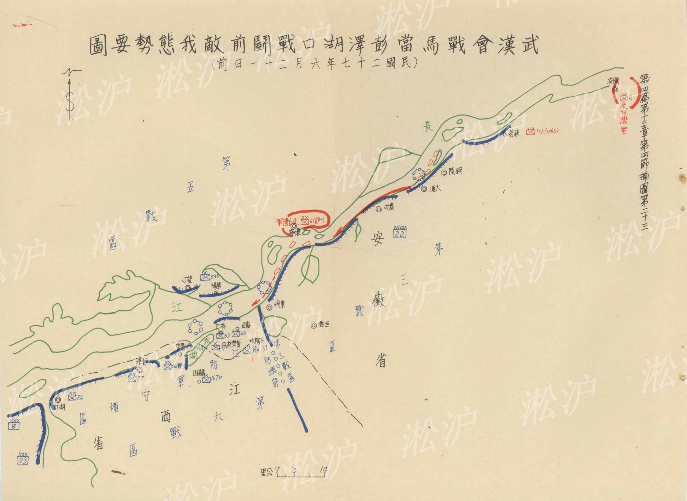

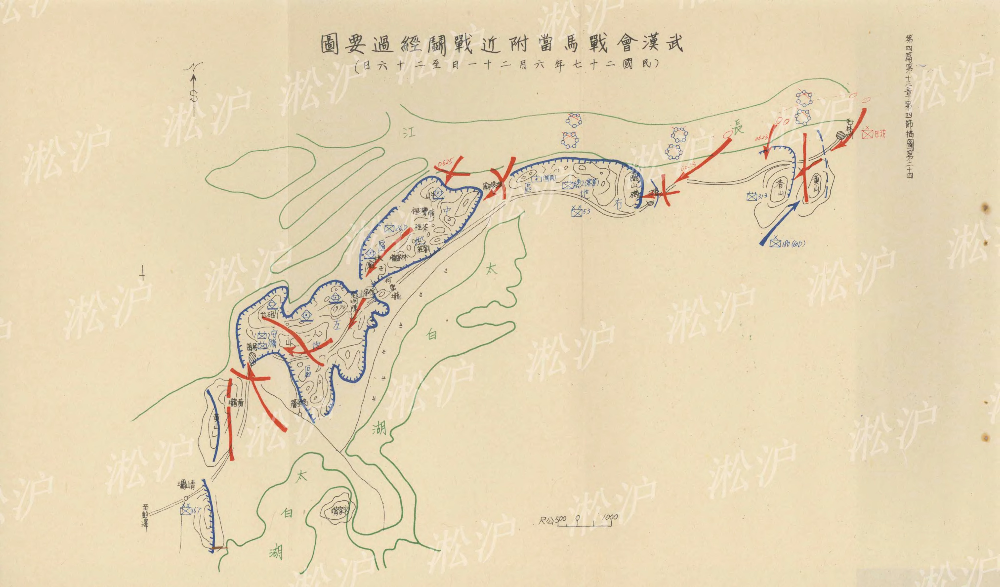

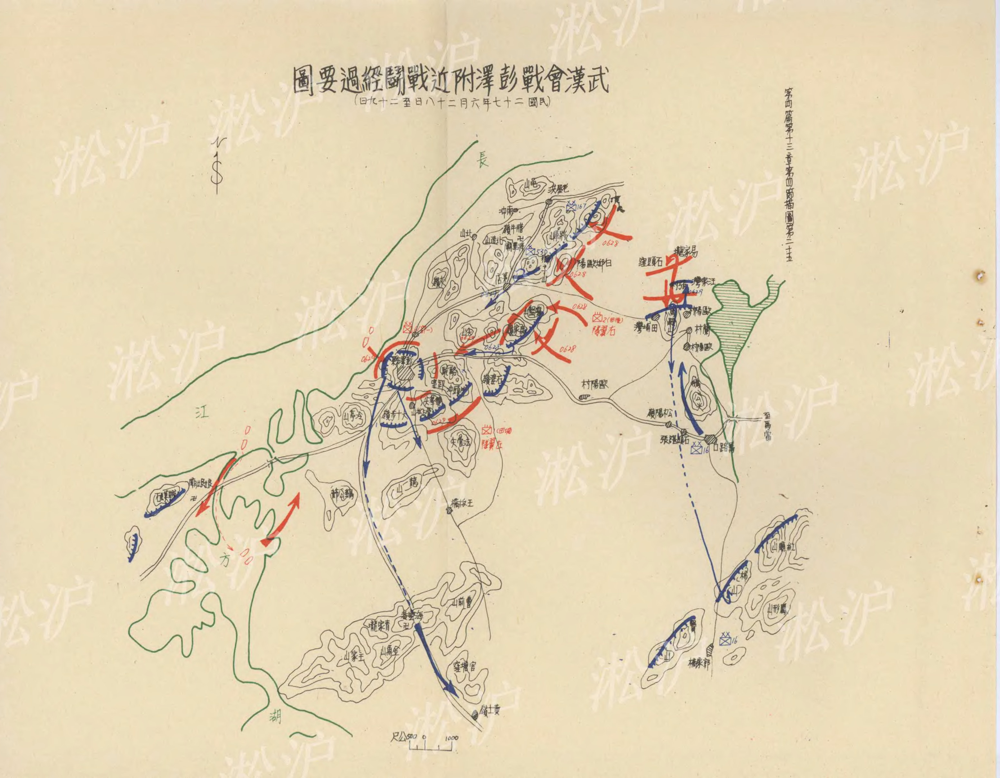

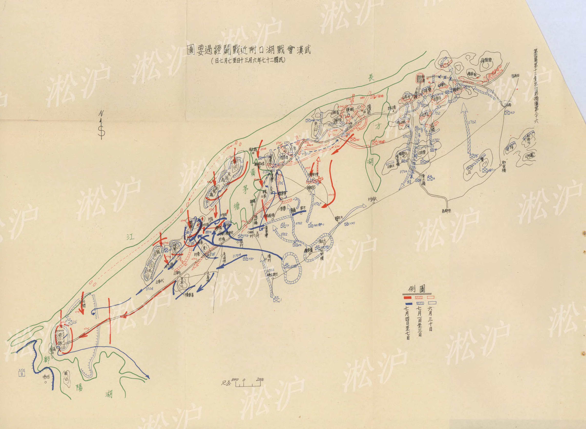

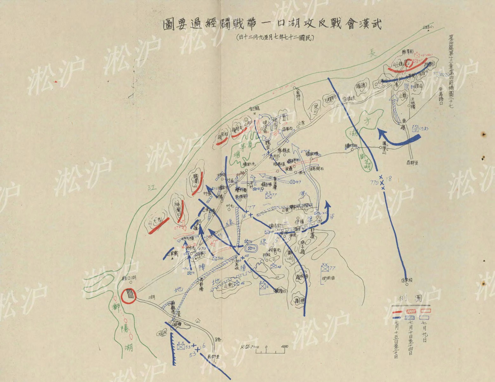

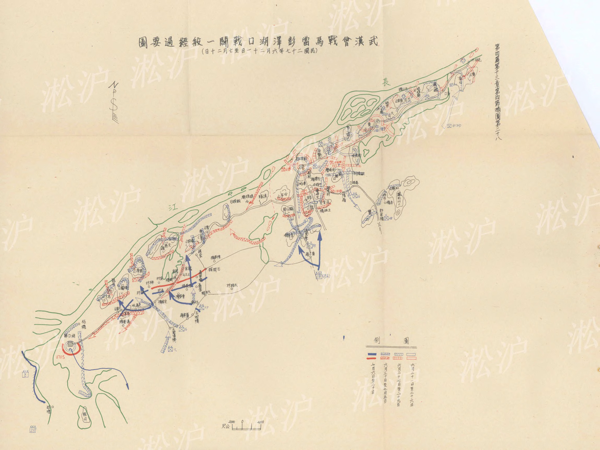

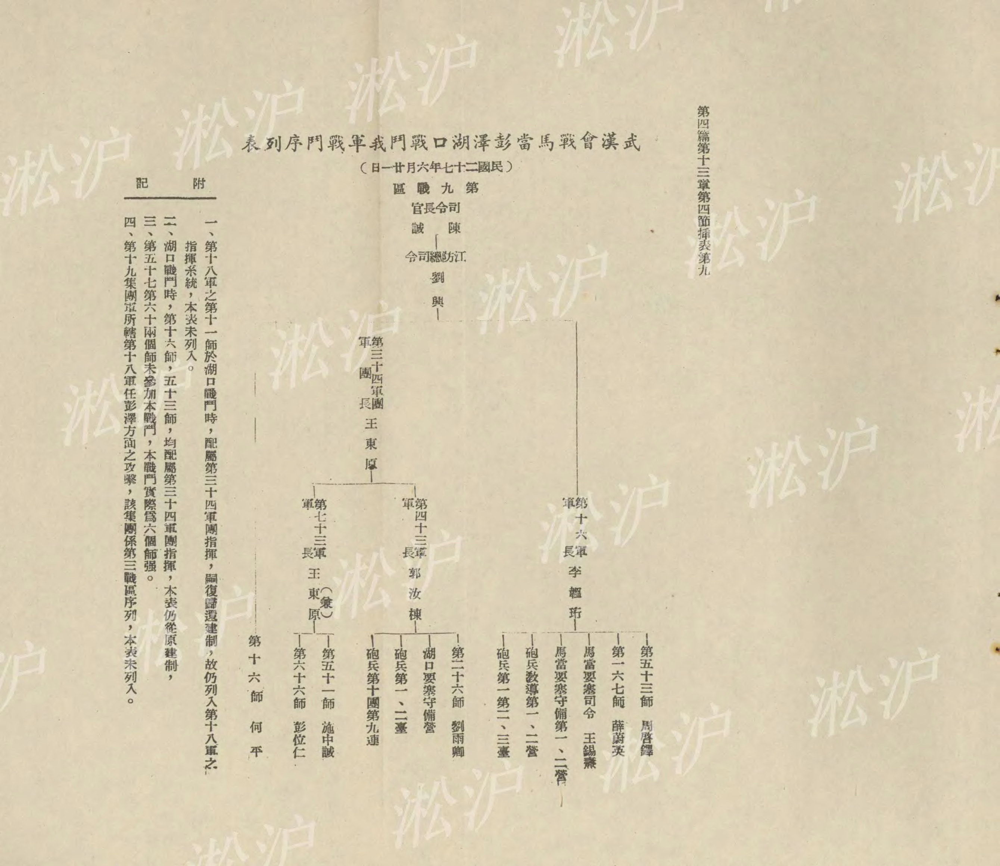

#### 第二款 前進陣地戰

（民國二十七年七月二十一日至九月十九日）

##### 第一項 姑塘、九江、小池口之戰鬥

民國二十七年七月二十一日至七月三十一日

參照插圖第二十九至第三十三、插表第十

敵軍自攻佔我沿江各要點後，其兵力集中於馬當、湖口之線者約四萬人，且後續部隊仍在輸送中，企圖由鄱陽湖西岸及九江附近登陸，而將我鄱陽湖及揚子江間三角地區之部隊擊破，以略取九江作爲進攻武漢之據點，俾便向粵漢鐵路線前進，以截斷我武漢後方交通線，形成其對武漢之包圍。

我以確保九江及鄱陽湖西岸諸要點，拒止敵軍之目的，除由江防軍總司令部所指揮之第二十五軍、第八軍及配屬之各砲兵團（營）分段守備，及鄱陽湖東岸仍由第三十四軍團所指揮之第七十七師、第十六師、第五十三師擔任警備外，並增調第九集團軍所屬各部分向沿湖江一帶前進，加强守備兵力，拒敵登陸、至於九江對岸之小池口，我第五戰區第四兵團亦遵照軍事委員會及該戰區長官部電令，以第六十八軍之一團附戰車防禦砲連，配於該處及沿江要點，以策應九江附近我軍之作戰。

第一目

九江、小池口附近地形

九江居長江中游，扼贛、皖、鄂三省交通之樞紐，爲贛北陸路出入之門戶，華洋雜處，商賈雲集，實贛皖鄂通商巨埠，亦敵軍溯江西上，進窺武漢必由之要衝，在軍事上重要性甚大、交通方面，有南澤鐵路北起九江南迄南昌，與浙贛鐵路銜接而達上海，且有公路連接省境各縣。當地港口，夏季水漲時凡船舶吃水不逾十公尺者皆可通航，至冬季水落，亦能航行吃水三、五公尺之船隻。機場有二：在南澤鐵路以西東家港附近者，有跑道長七百公尺，寬六十公尺之機場一處；在獅子湖東岸妙智舖附近者，跑道長達二百五十公尺，寬五十公尺，故水陸空交通均極便利。其地勢北臨長江，南倚廬山，鄱陽湖居其東南，獅子、雲、賽、城門諸湖，位於其西南，三面環水，僅南向多山，惟附近地形平坦，無險可守，故欲保九江，必須領有其外圍要地，方足以求安全。

小池口在九江對岸，北接黄梅、宿松，東連望江，西通蕲春、廣濟，與九江唇齒相依，倘敵進攻九江，勢必佔領該處，以策應右岸軍之作戰。

第二目

戰鬥經過

敵軍自攻佔湖口後，乃繼續集中兵力其於湖口附近者，陸軍有波田旅團及第一零六師團（松浦師團），海軍陸戰隊（約一個旅團），合計兵力約兩個半師團；海軍有第三艦隊所屬各艦及臺灣旅順艦隊之各一部，計大小軍艦約六十艘，運輸艦及汽艇七八百隻，似有分向姑塘、九江及小池口方面進犯之企圖。

我軍綜合當時之敵情，判斷其可能行動有二：

一、敵兵力大時（至少在五個師團以上），以主力於星子附近登陸，進攻南昌、長沙或趨岳陽，蒲圻，咸寧，截斷粵漢鐵路包圍武漢；並以一部於姑塘、九江登陸，牽制我軍。

二、敵兵力小時（三個師團以下），以主力於姑塘附近登陸；一部於九江附近登陸，企圖包圍九江奪取瑞昌。

但以目前敵軍兵力有限，第一行動似不可能；第二行動之可能性較大。

軍事委員會同時以贛省碉堡林立，因敵我裝備懸殊，我守則敵易取，敵據則我難攻，特規定拆除及利用原則，分電第九戰區第一、第二兩兵團總司令與贛省主席，指示要點如左：

一、在南澤及南昌附近沿贛江及鄱陽湖一帶碉堡，可以利用者，應將上半截拆除，就其材料加强下半截，減小目標，加以僞裝，仍可用作工事之據點。

二、在後方及野戰工事附近之碉堡，亦須同樣利用。

武漢令

三、其他沿公路附近我不能利用之碉堡，應拆除之。

第九戰區並遵照軍事委員會七月五日電令部署如左：

一、第一兵團薛岳指揮第九集團軍吳奇偉、第六十六軍葉肇、第七十四軍俞濟時各部及鄱陽湖警備司令所屬各部，任南昌方面之作戰，以吳奇偉指揮第四軍及贛省保安隊三團，位置於東鄉、進賢，警備鄱陽湖南岸，葉肇軍守南昌，俞濟時軍守備星子（不含）以南沿湖西岸，但須先以一師推進至星子歸王敬久指揮，待第十五師到達後歸還建制。

二、第二兵團張發奎指揮第二十五軍王敬久（第五十二師、第一九零師、第十五師）、第二十九軍團李漢魂（第八、第六十四兩軍）、贛省保安團兩團、第三集團軍孫桐萱（欠第五十五軍）、第七十軍李覺（第十九師、第一二八師），任星子、九江、富池口間之作戰；以王軍警備星子以北鄱陽湖西岸，李軍團守備九江及碼頭鎮，孫集團守備富池口要塞及陽新、大冶，李覺軍位置於瑞昌爲預備隊。

三、作戰地境：

第一、第二兩兵團爲馬迴嶺、東孤嶺（五萬分一圖）、星子之線，線上屬第一兵團。

四、江防總部調回武漢。

七月上旬，江防總部奉令移漢，陳長官轉電第二十九軍團長李漢魂：「奉蔣委員長諭，九江防務由兄負責，第八軍李玉堂部歸兄指揮，請先行赴濤策畫部署」。旋李軍團長接獲江防總部通報：「本部奉令移漢，已於十一日全部離澤，關於九江防務及今後續辦事件，統由第二兵團張總司令負責」。

第九戰區司令長官部爲確保九江之目的，於七月十四日又作如左之指示：

一、第十五師汪之斌部，着改歸第八軍軍長李玉堂指揮，卽日向下猪橋、相公廟一帶轉進，接替由下猪橋南側湖邊亘並頭湖、相公廟、李家港之線沿鄱陽湖西岸之守備。原在該地區之預備第十一師部隊，於交防後，卽加强馬家以南之守備，但該兩師應各控置强大預備隊。

二、第三師之左翼應卽縮至巫筮磯、楊氏以東地區，預備第九師之右翼百壽湖以西，專任九江市區守備，巫筮磯至百壽湖東側間沿江正面，着由第一五五師派隊接替。

三、預備第二師着改歸李軍團長直接指揮，卽移至十里舖附近集結爲軍團預備隊，但須候李覺軍到達新位置後，方可開始移動。

四、第七十軍李覺部，着卽向妙智舖東北、廖家坂、上八里坡間推進，並須對姑塘、黃家大屋、新港、九江各方面偵察進路，準備能於半日內，向上述方面應援。

五、各軍師防務之交接及詳細部署，着由張總司令、李軍團長分別規定。

六、九江附近之外國碼頭，着由李軍團長負責準備破壞，於必要時實施之。

同時復下達鄱陽湖西岸作戰計畫如次（參照插圖第二十九插表第十）：

第九戰區司令長官部鄱陽湖西岸作戰計畫

第一方針

一、本戰區以擊破敵人於鄱陽湖西岸及田家鎮以東長江右岸之目的，卽由管櫪市經九江至田家鎮間，沿湖及沿江直接配備，拒敵登陸，如敵已登陸，則迅速控置兵團進而擊滅之。

二、無論狀況如何變化，應立於外線向長江或鄱陽湖方面壓迫敵人，以確保我軍機動之自由。

第二

指導要領

一、第一期（會戰準備）：

(一)兵團配置：

3 武漢合战

1. 第一兵團阻止敵由鄱陽湖侵入，應以贛省保安團及第七十四軍之一部，由管樞市至槽門朱（星子南）間，沿鄱陽湖南岸配備，擔任警戒，並於各要點擔任據點工事；以第三十軍團控置於東鄉、進賢間；以第六十六軍控置於南昌附近；第七十四軍控置於永修、德安間，鄱陽湖警備司令所部任湖內警戒及作戰。又吳城鎮、東松門應派隊並附步砲佔領之。

2. 第二兵團爲確保九江及田家鎮要塞，以第二十五軍、第八軍、第六十四軍主力，直接配置於星子、姑塘、大王廟、新港、九江間，沿湖及沿江地帶；以第二軍及第五十四軍配置於田家鎮要塞南岸及碼頭鎮間；以第九集團軍控置於黃老門、馬迴嶺間；第三集團軍控置於瑞昌至陽新間。

3. 第三十一集團軍，應卽向豐城、清江間地區集結，準備策應南昌或東鄉；第三十集團軍卽向高安、上高間地區集結，準備策應南昌、永修間作戰，挺進使用；第三十二軍團應在咸寧、蒲圻間集結，準備策應九江或南昌作戰。

4. 第二十集團軍應卽在宜春、萬載間一帶陣地，構築對東正面工事，以扼制湘贛鐵路及京黔國道；第十四師應在銅鼓、修水間構築工事，應以重點置修水方面；第四十六軍應在通城、臨湘、城陵磯、岳陽間一帶地區，構築對東對北正面工事。

5. 第二十五軍團任武漢城防守備，應繼續加强工事，完成作戰準備。

6. 第一九七師任長沙守備。

7. 湘、鄂、贛、豫邊區游擊總指揮所屬，應以靖安、武寧、修水一帶爲根據地，準備向鄱陽湖西岸及長江右岸間游擊敵人。

8. 砲兵以主力配置於星子、九江、田家鎮間沿江地帶。

(二)地陣構築：

1. 第一線各部隊應於沿湖及沿江加强工事，構成縱深陣地，對於南昌、永修、吳城鎮、德安、星子、九江、碼頭鎮、田家鎮南北兩岸要塞區，應特別加强。

2. 第一兵團應於東鄉、臨川、豐城、高安、奉新、安義、靖安各附近，扼要構築據點工事。

3. 第二兵團須於右翼依托廬山，經妙智舖、兩台嶺至賽湖間構築第一預備陣地帶，而於隘口街附近構築堅固據點工事，並由黃老門西北經車輪中間山、傅公山、螺山、鯉魚山、瑞昌亘碼頭鎮一帶，構築第二預備陣地帶。田家鎮要塞以南及辛潭舖、陽新、大冶、石灰窯各地工事，仍按軍事委員會前頒計畫構築，惟於箬溪、橫港街、武寧、金水舖附近，扼要構築據點工事，以控制各交通線爲主。

4. 宜春、萬載、銅鼓、修水、通城、臨湘、城陵磯、岳陽各地區預備陣地構築如前。

5. 武漢城防部隊，除繼續加强武漢陣地外，並於南岸由鄂城至郭店間及北岸黃岡、團風至陽邏間，沿江構築據點工事。

二、第二期（會戰實施）：

(一)第一線各部應直接沿湖及沿江配備，搜索警戒，如敵登陸時，應卽阻止之。

(二)如敵已登陸時，應卽乘其立足未穩之際，迅速以預備隊加入，以殲滅之。

(三)敵如由姑塘、九江間三角地區內登陸成功，同時以艦隊西上進犯田家鎮要塞，依狀況對登陸之敵，積極攻擊之；必要時，第二兵團除以田家鎮、碼頭鎮附近守備部隊確保原陣地外，在九江方面部隊，應卽佔領廬山東西兩側，經妙智舖、兩台嶺至賽湖預備陣地，阻止敵人。敵如繼續沿南澤路突進時，應卽以主力向瑞昌方面逐次轉移，誘敵於黃老門、德安、瑞昌間地區與之決戰，此時3 武漢會战

第一兵團應卽以第七十四軍由德安方面加入決戰，依情況並以第三十二軍團推進加入。

四敵如佔領九江三角地區後，同時以艦隊向田家鎮西犯，並以一部侵入鄱陽湖，向南昌方面威脅時，第一兵團應卽阻止敵於沿湖地帶內，如狀況不得已時，應確保南昌，吸引敵之兵力以待後續兵團之加入。此時，第三十一集團軍及第三十集團軍，卽向南昌方面急進，求敵側背而攻擊之，如敵以一部向東鄉而來，卽以東鄉附近部隊與第三戰區協力而殲滅之，第二兵團仍如前項要領，逐次轉移，左翼依托田家鎮要塞，待敵人進入瑞昌以西山地時，以第三十二軍團加入，乘機轉移攻勢。

五田家鎮要塞初期作戰，應以阻止敵之登陸，如敵已由北岸要塞區下游登陸時，我要塞部隊應以確保要塞爲主，以待第五戰區之協力。

(六)武漢城防部隊，則依情況或加入前方決戰或暫行待機。

三、第三期（第一次決戰後之指導）：

(一)第一次決戰勝利後，應卽乘機壓迫敵人於鄱陽湖西岸及長江南岸（田家鎮以東）而殲滅之。

(二)如第一次決戰後，戰況不到，而敵已突破田家鎮封鎖線，以艦隊繼續西進，而迫近我武漢時，除由沿江石灰窯、黃石港，及鄂城、黃岡並黃鄂要塞以阻敵侵入外，須與第五戰區協同，於沿江江岸配備，以阻敵之擴張，並依武漢核心之固守，以吸引並消耗敵之兵力。此時，第一兵團向豐城、高安及宜春、萬載間逐次轉移，第二兵團則向武寧、陽新，及修水、通山、咸寧方面轉移，整頓態勢，乘機再與敵行第二次決戰。

(三)狀況萬不得已時，則轉移於宜春、萬載、修水、通城、臨湘、岳陽間既設陣地。

四游擊部隊積極向敵游擊。

一、第三戰區與本戰區作戰地境，爲湖口、都昌、鄱陽縣城、管櫟市、東鄉、金谿、南城、黎川之線，線上屬第三戰區。

二、第五戰區與本戰區作戰地境，爲沿長江經長江左岸上龍坪（含）迄田家鎮要塞區，至蕲春，再沿長江至黃州、團風（屬本戰區）經金台崗、黃陂、祁家灣、閔家集、新安渡，再沿漢水經襄陽、樊城（襄樊兩城屬五戰區），至孟家樓之線，線上屬本戰區。

三、第一兵團與第二兵團之作戰地境，爲曹門朱南方（星子與吳城鎮間），沿西鄱，及南湖北岸經七里龍（德安永修間）、楊州（箬溪南），盤嘴、何家店（修水南）至十里舖之線，線上屬第一兵團（土述地名除西鄱及南湖爲五萬分一圖外，其餘均爲百萬分一圖）。

第一兵團右地方境，爲本戰區與第三戰區之地境。

第二兵團左地方境，爲本戰區與第五戰區之地境。

武漢城防區除外（由鄂城至葛店間屬武漢城防區）。

司令長官

陳

誠

附註：上列計畫因戰況之演變，實施時略有變更。

第二兵團總司令張發奎接奉上令後，當卽策定作戰計畫如左：

作戰字第號第二兵團總司令部作戰計畫民國二十七年七月日第一方針

一、兵團爲確保贛鄂門戶，以有力之一部守備星子、獅子山、九江間之三角地帶，並以一部協同田、富要塞守備隊，固守九江以西至蕲春、長江兩岸要點；主力集結於馬迴嶺，沙河東北至十里舖間地區，並以一部置於瑞昌附近，適機擊敵於湖江西南岸而殲滅之。

二、湖江守備部隊，除採取混合及縱深配備，直接阻止敵人登陸外，尤應努力構成富有彈性而輒强之數線陣地，俾達成聚殲敵人於湖江西南兩岸之目的。

三、七月日以前，團各部應配備完成。

第二

指導要領

一、各師以相當兵力縱深配備於第一線，須努力構成輒强之數線陣地，尤須構成堅強據點，其主陣地前緣，宜力求接近湖江沿岸，並於陣地前方（湖江水面）構成濃密火網，以便直接妨害敵之登陸，及摧毀敵之攻擊威力於主陣地前方，其預備隊應分置於適當地點保持機動，以便向敵逆襲，聚殲敵軍於湖江沿岸。

二、兵團砲兵依狀況及地形，應以一部配屬於第一線各師，其大部份則分爲數個游動砲兵羣，任擊滅敵艦艇並阻止敵人之登陸，對已登陸之敵，須以主火力協力步兵之逆襲而殲滅之。

三、要塞砲兵主要對敵艦射擊，必要時得參加步兵陸上之戰鬥，仍由要塞司令官指揮之。

四、敵如由星子、姑塘、獅子山、新港、九江間突入時，右翼及中央地區部隊，應確保廬山一帶高地，並利用斜交陣地及第二線陣地，由兵團預備隊第四軍對姑塘以南，第七十軍對姑塘以北至九江以東，第六十軍對九江及其以西各方面支援之，以擊滅敵人恢復陣地爲主務。

敵如由碼頭鎮一帶突入時，除由該守備隊利用第二線陣地，努力恢復攻擊，並由第六十軍及第三集團軍各控置部隊立即支援外，務須奪回原陣地。

武穴砲兵第三羣以主力支援之。

敵如由某一點突入時，其他各區守備隊，尤其鄰接部隊，除應嚴密警備外，更須以火力及部隊協助逆襲。

五、逆襲萬一不成功，敵如由星子、姑塘侵入時，我軍應撤至隘口街、黃老門、瑞昌、碼頭鎮之線附近抵抗，敵如由姑塘、九江間侵入時，我應撤至白鹿洞、廬山、沙河、安成橋、碼頭鎮之線附近抵抗，務須由各方面抽集兵力，採取攻勢，迫敵於水際而殲滅之。

第三軍隊區分

右地區守備隊：

指揮官第二十五軍軍長王敬久。

第二十五軍第五十二師、第一九零師、第四軍第九十師之一旅。

配屬部隊：

游動砲兵第二羣。

野戰砲兵第二團（欠一營）。

砲兵第十八團之一營。

工兵一排。

中央地區守備隊：

指揮官第二十九軍團軍團長李漢魂。

第二十九軍團，第八軍第三師、預備第二師、預備第十一師、第六十四軍第一五五師、第一八七師、預備第九師、第十五師。

配屬部隊：

贛保安兩團（第三、第十一團）。

游動砲兵第一羣。

野戰砲兵第二團之一營。

重砲兵第十團第二營。

重砲兵第十一團之一營又一連。

高射砲三連。

探照燈一隊。

野戰砲兵第十六團之一連（配屬於預備第九師）。野戰第十八團之一連（配屬於第一八七師）。

工兵第三連（欠一排）。

左地區守備隊（因屬於瑞昌田家鎮戰鬥，故從略）。兵團預備隊：

指揮官第九集團軍總司令吳奇偉。

第四軍第五十九師第九十師（欠一旅）。

第三十軍團第六十軍。

第七十軍。

工兵隊工兵第八連。

兵站：

第二兵團兵站分監（編組略）

七月中旬，張總司令赴濤視察，以敵方機艦日趨活躍，判斷敵軍必於最短期間內强襲星子、九江三角地帶，卽依上項作戰計畫下達防禦命令要旨如左（參照插圖第三十）：

一、敵寇陷我湖口後，並未積極進展，近日不斷向長江上游增兵，時以兵艦及汽艇破壞我江湖封鎖線，並以飛機轟炸我砲兵陣地，似有奪取九江，侵入鄱陽湖之企圖。

二、我第三戰區羅集團軍，刻以有力部隊向彭澤、湖口分途進攻中。

我第一兵團刻在星子以南，沿鄱陽湖西岸及南岸嚴密防守，我第四兵團（李品仙）刻以一部對潛山之敵攻擊順利推展中，主力在廣濟、黃梅、英山、羅田一帶配置，並以一部在龍坪以東任江岸之警戒。

三、兵團爲確保贛鄂門戶之目的，以有力之一部守備星子、獅子山、九江間之三角地帶，一部協同要塞守備隊固守九江以西至蕲春長江兩岸各要點，主力則集結於馬迴嶺、沙河、十里舖間地區，並以一部位置於瑞昌附近，待機擊敵於湖江西南兩岸而殲滅之。

四、右地區守備隊，防守星子至姑塘（不含）間地區，沿鄱陽湖西岸佔領旣設陣地，應置主力於右翼，與右翼第七十四軍保持連繫。

五、中央地區守備隊，防守姑塘迤北至九江，更延至大樹下（不含）一帶地區，沿鄱陽湖西岸長江南岸佔領旣設陣地，須置主力於九江東側附近，應與右翼第二十五軍保持連繫。

六、左地區守備隊（因不屬於本戰鬥範圍故從略）。

七、作戰地境：

第一兵團與右地區守備隊間，爲楊坊、馬迴嶺、星子、東孤嶺之線。

右地區守備隊與中央地區守備隊間，爲魚浪峯、楊家坳、姑塘南側之線。

中央地區守備隊與左地區守備隊間，爲瑞昌、大樹下東側之線。

八、砲兵各羣分屬於各地區，應歸砲兵羣長統一指揮，主要任務在阻止敵艦，妨害敵之登陸，並適時以主火力協力步兵之逆襲與反攻，必要時參加要塞砲兵之戰鬥，務保持機動，故須多構築預備陣地，適應狀況而變換其位置，各羣火力分配如左：

(一)砲兵第二羣，主要協力右地區守備隊，對星子以東姑塘以南，各湖面射擊，並得適時集中主火力於姑塘方面而佔領陣地爲要。

(二)砲兵第一羣，主要協力中央地區守備隊，位於九江以東地區，對姑塘以北湖面射擊，須能控制鞋山各要點，並對九江下流封鎖線確實掩護，尤須對湖口方面進攻之敵，得集中火力射擊之。

(三)砲兵第三、第四兩羣，因配屬左地區守備隊，故從略。

四各砲兵羣之戰鬥地境，卽以所屬各地區之地境爲地境，其臨時地境與師砲兵要塞砲兵之戰鬥地境，射擊區域，須另定之。

(五)配屬於第一線各師之砲兵，應由該地區指揮官派隊掩護。

(六)關於砲兵戰鬥計畫，由砲兵指揮官具申意見，砲兵射擊開始時間由該屬地區指揮官命令之，至步砲之協同，與有關之步兵指揮官協定之。

八、工兵隊先於九江附近協助要點工事及障礙物之設置，爾後任九江附近之破壞。

九、兵團預備隊，先以第四軍（欠一旅）控置於馬迴嶺附近，第六十軍（欠兩師）控置於瑞昌附近，第七十軍控置於妙智鋪、下八里坡、廖家坡附近，擔任逆襲與反攻，但應於各該區努力構築預備陣地。

十，各師到達現場後，應卽偵察地形增強工事，而以相當兵力縱深配置於第一線，須努力構成輒强陣地數線及堅固據點，尤要講求遮蔽僞裝，其主陣地前線，務力求接近湖江沿岸，並於陣地前方（湖江水面)構成濃密次網，俾直接妨害敵之登陸及摧毀敵之攻擊威力於主陣地前方，其預備隊應分置之，保持機動，以便向敵逆襲，聚殲敵軍於湖江沿岸。

十一、各地區守備隊之逆襲計劃，由各該指揮官擬呈具報。

十二、各地區陣地內及後方之交通，水陸各路務力求便利，俾易於兵力之轉用及砲兵車輛之移動，至由九江至陽新及武寧至德安與太平官街、沙河、德安各道路，應由各區交通隊、工兵修整，又對於陣地前方，凡敵可以利用之各道路，尤其可通戰車者，務盡力破壞或阻絕，其前方江湖船隻，應搜集控置於我岸。

十三、各部隊之通信網，務確實敏活，主要線路應架設雙線，以防被敵火破壞，其詳細計畫另定之，星子間及瑞昌、武寧間之各有線通信，應由各通信隊協力通信兵團積極架設，並須注意線路之防護及竊聽，至各部通信網之構成及前方通信之破壞，其詳細計畫另定之。

十四、各部隊應於七月二十六日以前配備完成，並將配備要圖及計畫呈核。

十五、關於兵站須使各部隊補給圓滑，並得適時推進，其兵站主地設置於德安附近，兵站末地設置於沙河、馬迴嶺、瑞昌之線附近，擔任右地區及中央地區各部隊並兵團總部各部隊之補給。

右地區守備隊指揮官王敬久，基於上令，以第五十二師佔領星子、陳家澗之線，第一九零師佔領陳家澗、姑塘以南之線，第四軍第九十師之第二六八族控置於隘口附近，機動使用。（參照插揮第三十一）中央地區守備隊指揮官李漢魂，基於上令，決定部署如左：

一、第八軍（欠預備第二師，附第十五師及重砲兵第十團第二營砲七門，戰車防禦砲第三連），爲右地區隊，守備姑塘（含）、馬家、下猪橋、李家港、獅子山、沿江岸西折至巫筮磯（不含）之線。

二、第六十四軍（欠第一八七師）爲中央地區隊，守備巫筮磯（含）、九江、馬廠湖（不含）。

三、第一八七師附砲兵第十八團之一連，守備馬廠湖（含）、經官湖港、老渡口亘徐家灣之線爲左地區隊。

四、砲兵羣主力，位置於下八里坡以東一帶地區，一部位置於猪橋舖。

五、軍團預備隊（預備第二師）位置於十里舖附近。

右地區隊第八軍奉到命令後，當即以預備第十一師附戰車防禦砲一連，守備姑塘（含）、馬家、下猪橋（不含）之線，第十五師（欠一旅）附戰車防禦砲一連，守備下猪橋湖邊，經並頭湖、相公廟、李家港，大山之線，第三師附戰車防禦砲一連，右接中央地區隊，經王家社、獅子山、大王廟西折沿江至巫筮磯（不含）之線，第十五師第二旅（欠二營）爲軍預備隊，位置於朱家坡（鴉雀山東南一公里）附近。

各部隊遵令先後分赴指定地點，積極部署，李軍團長爲使警戒綿密，復於七月十五日二十二時下達命令，除右地區隊照第八軍軍長配備，不予變更，左地區隊第一八七師（欠第一零九八團）增附保安第三、第十一兩團，仍各守原陣地外，中央地區隊第六十四軍（欠第一八七師）以第一五五師守備巫筮磯（含）至百壽湖之線，預備第九師任百壽湖（不含）經九江至馬廠湖（不含）之守備，第一游動砲兵羣，初期以能制壓鄱陽湖口及新洲、官洲間長江水道之敵艦，及觀音閣至新洲西段之射擊，續以主火力協助我野戰軍之作戰而妥選陣地，預備第二師及第一八七師之第一零九八團，控置於十里舖附近，爲軍預備團。

預備第九師自接任市區長江右岸防務後，其配置如左：

一、自九江以東之皮家湖及其以西之馬廠湖爲第一線陣地，沿江直接配備外，市區分爲三線。

(一)第一線沿馬路構築各種掩體。

(二)第二線利用沿江房屋挖築槍孔，沿牆內面構築掩蔽部。

(三)第三線爲各街道中及交叉路口，構築各種射擊掩體，外線沿江構築鐵絲網，九江以東之山地，則利用地形構築袋形陣地，如敵由該處登陸，即可合圍而殲滅之。

由九江城東南（約六公里）之鴿哥廟、上八里坡至西南之楊家嶺、高莊之線爲第二線陣地。

至工事之構築與加强，李軍團長早經電令沿湖江直接警戒部隊任第一陣地帶，控置部隊任第二陣地帶，並令第八軍特應加强第二斜交陣地，各部均已大致完成野戰工事，惟因時間倉卒，不無脆弱單薄之感，江面封鎖，雖經海軍佈雷七百六十餘具，但仍感雷數不敷，同爲湖江防務之最大缺點。

姑塘方面：七月二十二日（參照插圖第三十一），敵波田旅團及僞軍一部，兵艦二十餘艘、汽艇百餘隻，乘風雨晦暗之夜，潛入鄱陽湖鞋山附近，二十三日零時二十分，敵艦艇陸續增加，經我擊沉淺水艦兩艘，一時許，敵以艦砲掩護汽艇橡皮船等，向湖西岸我守備地區急進，似有在高家嘴（廣西橋北約六公里、一零一三高地附近）登陸之企圖，經我砲兵第二旅重砲兵及預備第十一師守兵分別擊退，旋敵以飛機三十餘架，幷轉移砲兵火力向水塘巷一帶集中轟擊，第四二二團第一營及第四十一團第三營雖傷亡過半，仍堅强抵抗，敵攻擊受阻後，乃一面用火力向我陣地猛擊，一面以兩百餘人在機砲掩護下，泅水向姑塘北約三華里之水塘巷第四十二團第二連陣地猛襲，該連與敵肉搏，連長張文煥及全連官兵均壯烈殉國，敵遂乘機登陸，該市趙師長令守夏家橋之第四十二團及殷家湖之第四十一團預備隊各兩連，由左右夾攻登陸之敵，經反復爭奪，殲敵大半，四時，敵重轟炸機四十餘架，猛炸我姑塘北之余家灣、周仙廟、殷家湖一帶陣地，廣西橋東北後側高地之山砲第一連砲四門，及姑塘附近與殷家湖後側之戰防砲四門，並該線步砲陣地均被炸毁，守備夏家橋之營長張文美及殷家湖之張子瑯營，自營長以下又均全體殉國。此時，敵之後續部隊二千餘，隨卽登陸，該兩團控制之預備隊兩營，當卽加入戰鬥，同時，第八軍軍長令第十五師派兵一團增援，歸預備第十一師師長指揮，第二十九軍團李軍團長，亦報請令第一二八師派兵一旅馳援，經猪橋舖向水塘菴進擊。當面戰況，自此以後，戰鬥益趨激烈，彼此爭奪，形成拉鋸之勢。拂曉後敵機四十餘架，在我楊莊、廣西橋第二線陣地，及馬祖山、劉家村預備陣地帶肆轟濫炸，我馬祖山附近之戰砲兩門，廣西橋後側楊家灣砲兵第二連之山砲，均被炸毀，官兵亦傷亡過半，驟馬死傷殆盡。我以傷亡慘重，增援部隊尚未到達，被迫退守廣西橋之線。五時三十分，敵繼續猛攻我第二線陣地，戰鬥至烈，七時三十分，師預備隊一營加入作戰，正行進間，被敵機砲轟擊，傷亡甚多，同時守備陣地之兩營，亦受敵軍迂迴部隊之夾擊，死傷亦重，李軍團長即令預備第十一師附第十五師增援之一團，速擊滅殷家湖附近敵人，一面在廣西橋、馬家、胡家之線構築預備陣地，並限卽修復電話線路，以便連絡。

此時，第二兵團總司令張發奎，命令第七十軍歸李軍團長指揮，李軍團長遵卽令第七十軍之第一二八師第三八四旅，由廖家坡經猪橋壠，向周家嶺、廣西橋、水塘菴，會同預備第十一師，掃蕩登陸之敵，第三八三旅向廖家坂推進，以資策應。第三八四旅未及到達，預備第十一師及第二線陣地已被敵完全突破，第四十二團與第四十一團遂分向九江、星子撤退。

敵突破預備第十一師陣地後，卽以主力於九時竄抵周家嶺附近，與我第十五師第八十六團激戰，該團旋遭受敵機猛烈轟炸，不克支持，乃於十一時逐次向猪橋舖轉移，敵跟踪猛進，猪橋舖遂亦失陷。第一二八師之第三八四旅，行抵上猪橋，見敵長驅猛進，有沿九星公路直薄九江之勢，當卽展開於朱家壠（塘頂山西北）、上猪橋之線。不移時、千餘之敵，於猪橋舖以西地區，與該旅第七六八團守兵接觸，其時塔頂山已被馬祖山之敵佔領，並有一部千餘，沿馬祖山之線向該旅右翼移動，經第七六七團阻擊，激戰於塘頂山北端。時第三八二旅亦已進至普泉山以西地區，並以一部協同第三八四旅戰鬥，十四時，漸成對峙狀態。南犯之敵，八時四十分，佔領馬祖山後方經新屋、陽村、楊家坳、向鼓山、高壠陳村之線攻擊，娘娘廟（穀山北側）、港西徐村（娘娘廟西）及吳障嶺等處，相繼不守，經第二十五軍王敬久部之第一九零師奮勇力戰，姑阻敵於穀山、上下徐莊（穀山西側）、南門李村、高壠陳村之線。姑塘登陸之敵，於二十時，又以六七百之衆，由湖岸楊村（穀山東北）、老楊村（娘娘廟北）之線，向穀山、上下徐村猛攻，該師以預備隊增援，與敵對峙。

軍事委員會同日十二時，以鄱陽湖西岸登陸敵軍進攻猛烈，似有急趨九江之勢，乃電令第三戰區羅集團，應迅行集結兵力，攻擊彭澤、湖口西進之敵，以策應九江方面之作戰，並將部署情形具報，同時對湖西岸各部指示如左：

一、李軍團所部，應乘敵登陸立足未穩時，迅速予以擊滅。

二、着李覺軍，迅以全力向猪橋鋪進犯之敵攻擊，並預以一部確實佔領普泉山。

三、王敬久軍，除以有力部隊守備湖防外，應集結主力向穀山、馬祖山方面側擊登陸之敵。

四、第三師以有力部隊守備沿江沿湖，除於獅子山配置少數兵力外。主力應抽至張家壠、李家港、皮家湖線上，佔領預備陣地，右與普泉山守軍連絡。

第九戰區遵照指示，卽令第十九、第一二八、第一九零各師，及第四軍之一旅，於二十三日夜，分向塔頂山、普泉山、猪橋鋪之敵反攻，第三師守備獅子山之四個營，留一營於該處，其餘向西集結，策應各方作戰，第四軍（欠一旅）向九江急進。

第二兵團張總司令奉令後，遵卽下達要旨命令如左：

一、第二十五軍應以有力之一部，於明（二十四）日一時起，由穀山、吳障嶺之線，向姑塘、馬祖山之敵攻擊前進。

二、第二十九軍團，應以有力之一部，由現在位置卽向當面之敵反攻。

三、第三集團軍，應星夜向瑞昌附近推進。

四、第九集團軍，（欠一旅）應向太平官街、青山嘴一帶地區推進，參加決戰。

第二十五軍軍長奉令後，遵卽下達如左之要旨命令：

一、着第九十師之第二六八旅（欠一團）歸梁師長指揮。

二、第二六八旅應派先頭之一團，迅速準備反攻馬祖山之敵。

三、第一九零師、除留必要部軍固守原陣地外，應將所有部隊於殼山南端、下徐莊、陳家堆之線展開，迅速向李家、湖岸楊村、新屋楊村、馬祖山之線反攻。

四、在第二六八旅之一團未到達前，亦須先行開始攻擊，並設法與第七十軍之第十九師連絡。

五、本晚天色黑暗，各部應派官長沿湖巡查。

六、本軍攻敵側背，務於二十四日一時前開始。

另令砲兵第二團與第一九零師協商，攻擊集中娘娘廟一帶之敵。

李軍團長於奉令後，卽轉令第七十軍以第十九師向馬祖山搜索前進，協同第一二八師夾擊敵軍，右與第一九零師，左與第一二八師連絡，佔領塔頂山作爲攻擊據點，努力肅清登陸之敵。

第七十軍基於右令，當卽下達命令要旨如左：

一、軍以攻擊廣西橋、猪橋舖敵人之目的，保持重點於左翼，乘本（二十三）日夜暗，向敵攻擊前進，壓迫敵人於湖西岸而殲滅之。

二、第十九師（欠第五十七旅）爲右翼隊，應卽驅逐塔頂山之敵，展開於塔頂山、猪橋壠、嶺上之線三、第一二八師爲左翼隊，應卽驅逐普泉山之敵，展開於普泉山、上霞寺之線。

四、各師務於本二十三日晚二十四時以前，迅速完成攻擊準備。

五、兩師作戰地境，爲鴉雀山、廖莊、嶺上、周家嶺、水塘菴之線，線上屬左。

六、第十九師之第五十七旅，位置於猪橋壠，嶺上地區爲軍預備隊。

七、攻擊開始時間爲二十四日一時。

八、攻擊到達線爲鄱陽湖西岸之線。

七月二十四日一時，第二十五軍之第一九零師，以第一一一零團第一營爲右翼隊，向穀山攻擊，以第九十師之第五三六團爲左翼隊，向楊家坳攻擊，並以一部佔領上下楊村、馬祖山各地，以第一一一零團（欠一營）佔領南門李村東北高地、陳家堆及其以西各高地之線，構築堅固工事，左右兩隊在師砲火掩護下，立即開始向穀山、馬祖山之線攻擊，並對塔頂山方面嚴密警戒。七時許，右翼隊已將穀山西端及下徐莊西南高地之敵擊退，嗣以敵軍增援，乃在上下徐莊附近佔領陣地，與敵對峙。另敵一部約四五百人，猛攻吳障嶺第一一一零團第二營陣地，經反復爭奪，該處一部爲敵佔領，左翼隊未能如期到達指定地點，於天明後，始在高壠、陳新附近集結。此時偵知鞋山以北湖面有大小敵艦十餘艘，民船百數十隻，似有繼續登陸模樣，南門李村東北高地亦有少數敵兵竄入，不時以輕機槍向我第一一一零團陣地射擊。

九時，該師令第一一零九團在穀山南部之守備隊固守該地，第一一一零團派兵一連向上、下徐莊及其西南高地附近行威力搜索，並相機掃蕩在該處活動之少數敵兵，第五三六團卽向楊家坳、吳障嶺之敵攻擊。十一時頃，敵艦一艘、汽艇四、五隻，拖民船三十餘隻，由鞋山駛至蛤蟆石東北湖面，似有擇地登陸企圖，經我砲擊逸去。第一一一零團派向上、下徐莊搜索之連，在該處擊斃敵兵十餘名，第五三六團已將楊家坳南部佔領。十二時許，第一一零團第二營攻克吳障嶺，並掃蕩殘餘之敵，十七時，我已確保殼山之一部及上下徐莊、楊家坳、吳障頂之線，陳長官以形勢已穩，令「第二十五軍以固守爲主，俟敵來攻時，卽相機出擊，或派小部隊游擊」。第二十五軍卽特令第一九零師，並責成第二六八旅肅清殼山、楊家坳以南地區殘敵，魚浪峯由第五三六團派兵一排與保安團連絡。

同日，第二十九軍團第七十軍方面，三時頃，右翼隊第十九師（欠第五十七旅）已佔領塔頂山、猪橋壠、嶺上之線；左翼隊第一二八師，已佔領普泉山。上霞寺一帶陣地。五時許，敵增援約一旅團，在其機砲濫肆轟擊下，向我猛攻，第十九師之第五十七旅旅部被炸，除旅長重傷及尙存官佐十二員外，餘均殉職。守備雙尖第五十五旅第一零九團第六連之官長，亦均陣亡，僅餘士兵三四十人，仍在繼續抵抗，經以預備隊第五十七旅之第一一三團增援，將敵擊退。十時，第一二八師普泉山陣地被敵突破，經派第五十七師第一一四團增援，歸第一二八師師長指揮。時左翼第十五師之一部紛紛後撤，戰勢劇轉，另敵約三百人，由泉水壠方面向第一二八師左後方運動，十一時許，敵之一部已進至廖家坂以南地區，有橫越該線山地，直截九蓮公路而附我湖江守備隊側背之勢。十三時、第二十九軍團令預備第二師原位置鴉雀山之第五團，迅速佔領雅雀山、湯家坂陣地固守，該師主力，應卽佔領馬家前方高地亘雅雀山之線，俟增援部隊到達後歸還建制。

第九戰區長官部以猪橋舖、普泉山方面之敵，已突進至廖家坂附近，遂調整部署如左：

一、第三、第十五、第一五五各師，除留一部擔任沿江渡口之守備掩護各該師之側背外，其主力應卽轉向普泉山、嶺上、廖莊、黃家橋、鴉雀山、湯家坂之線，側擊由猪橋舖向廖家坂突進之敵。

二、第四軍（欠一旅）先於獅子山、螺絲山亘十里舖之線東面陣地，策應李軍團之作戰。

三、預備第九師固守九江，第一八七師仍任九江以西沿江警戒，相機策應預備第九師之作戰。

四、各該師後方連絡線，應向西南方轉移。

五、關於詳細部署，由張總司令規定具報。

張總司令遵卽令李軍團長妥爲計畫實施，李軍團長卽下達攻勢轉移之要旨命令如左：

一、軍團爲擊破突進之敵，以一部固守鴉雀山、馬家地區，以有力之一部固守九江及其以西沿江右岸至徐家灣之線，以主力由百壽湖東南地區分三路向突進之敵猛烈邀擊，壓迫敵於姑嶺北側地區而殲滅之。二、第八軍（附第六十四軍之第一五五師）卽分三路，以第一五五師爲右翼隊，由毛家港、下八里坡、上八里坡、向湯家坂、鴉雀山之線攻擊前進，以第三師爲中央隊，由後八壠、茶安梗、鴿哥廟、向廖家坂、廖莊、嶺上之線攻擊前進；以第十五師爲左翼隊，由李家港、公廟、向普泉山之線攻擊前進，但各應酌留一部擔任沿湖江西南兩岸之守備，掩護各該師之側背。

攻擊開始時間爲本二十四日十五時。

攻擊到達線爲鄱陽湖西岸之線。

三、預備第二師卽佔領蔡家壠西北端、鴉雀山、馬家一帶，極力拒止當面之敵，爾後歸還第八軍建制爲軍預備隊。

四、預備第九師應固守九江。

五、第一八七師以預備隊之兩連調妙智舖，歸軍團部直接指揮，餘仍固守馬廠湖至徐家灣之線。

六、第七十軍各部，應固守原陣地，等待友軍之到達，以夾擊當面之敵。

七、保安第三團、第十一團，（欠一營）仍任盧山區域之游擊，及各山道之守備。

八、第一游動砲兵羣位置不變，以主火力協助第八軍之攻擊，以一部阻止敵艦西進及殲滅射擊。

九、各部應以妙智舖爲基點，確實架設或修補通信網，以求指揮靈活。

十、第五十五傷兵收容所，分設於九江、丁官路及沙河。

十一、軍團兵站支部仍設九江。

此時、第七十軍方面，敵機數十架更番轟炸，官兵傷亡甚重，十四時，大雨傾盆，第一二八師乘機將普泉山克復，惟並頭湖方面敵小型汽艇四五十隻，載兵數百登陸後，由泉水壠向廖家坂急進，正面敵已向我猛攻，第七十軍軍長爲掩護側背安全，令第十九師第一一四團派兵一部，佔領掛考山附近高地。十八時，左側敵已佔領廖莊西南高地，其後續部隊，仍不斷增加，而我軍預備隊已使用告盡，兩翼友軍仍未取得聯絡，遂決心於夜暗突圍，向鴉雀山以南之線轉移，待機反攻，當下達如左之要旨命令：

一、第十九師，（欠一營及第一一四團之一部）於本二十四日二十二時，卽向玉頂峯北標高二七三·五高地，迄鴉雀山之線轉移，佔領陣地，拒止敵人。

二、第一二八師於本二十二日二十二時卽開始突圍，向太陽觀附近集結爲軍預備隊。

第一一四團除以一部協助第一二八師突圍外，應卽歸還建制。

三、軍直屬部隊及各部行李輜重，應卽向後方移動。

四、通信隊應卽撤往橫舖架設通信網。

五、軍部於本日十九時移橫舖。

第七軍各部於當晚二十二時後，先後到達指定地點，忽奉李軍團長令：「着第七十軍固守原陣地，等待友軍到達，夾擊敵人」。其時登陸之敵增援猛攻，廖莊西南已有敵千三四百人，第十九師傷亡甚重，第一二八師與敵混戰，一部已被擊潰，不得已乃就新陣地配置警戒。

左翼第十五師正面，以敵軍已進佔普泉山附近，經令第八十五團主力移向九星公路附近堵擊，於是日四時許，與敵往復衝鋒，我傷亡甚大，十四時頃，敵兵一部進抵下霞寺附近，該師乃以第九十團控置之一營及第八十六團一部，向廖家坂、普泉山攻擊，十七時，將廖家坂東北高地恢復。

自軍團轉移攻勢命令下達後，除第七十軍被迫後撤外，其南進之先頭部隊，於十八時予敵之側背威脅頗大，敵之攻勢乃挫，戰事得以和緩，第二十九軍團爲待機進攻，復於二十三時三十分下達如左之要旨命令：

一、塔頂山方面之敵，現由雙尖西進，企圖遮斷我九星公路，第八軍已佔領鴉雀山、馬家東端、雀家壠、陳家壠、茶安梗之線，待機進擊。

二、本軍團以確保九江之目的，卽佔領蔡家壠、鴉雀山、陳家壠之線，待機進擊。

三、第一五五師應卽佔領蔡家壠及其南北高地之線，努力拒止當面之敵，右與魚浪峯保安第三團，左與鴉雀山第八軍之第三師切取聯絡。

四、軍團兵站支部，由九江移沙河開設。

第二十五軍方面，二十五日八時許，敵向下徐莊、南門李村東北沿線陣地猛攻，均經我第一九零師之第一一零九團守兵擊退。十六時，上徐莊附近敵軍，藉煙幕掩護前進，亦未得逞。十九時，奉到第九戰區長官部（二十五日一時）電令要旨如左：

一、李軍團各部轉移後，如側擊奏效，則相機壓迫敵人，並於玉頂峯、鴉雀山、下八里坡、亘九江一帶佔領陣地，拒止敵人，爾後依情況逐次向獅子山、張家山、兩台嶺亘賽湖之線轉移，以獲得時間之餘裕，並於牛頭山、金官橋、十里山、鑽林山、亘城湖之線，構築預備陣地。

二、王敬久軍，應與李軍團互相策應，依情況以第九十師之一旅，於必要時，可經姑嶺向金官橋附近轉移，爾後歸還建制，第五十二師，除以一部佔領星子經玉筋山至鼓子寨間前進陣地外，主力應卽佔領東孤嶺（含）至萬杉寺一帶，並派有力一部擔任香爐峯、經漢陽峯至馬尾峯各隘路之守備，爾後與牛頭山守軍連繫，第一九零師應轉移至東孤嶺（不含）以南至吳城鎮間接替第十一師之湖防，除第五十二師應留一團仍任沿湖警戒外，其餘卽就新部署位置，第一九零師及第九十師之一旅轉移時機，應候張總司令命令實施。

第二十五軍當令第五十二師遵照實施，同日二十二時十分，第二兵團張總司令下達命令要旨如下：一、本日敵進佔廖家坂後，續向妙智舖、十里舖之線前進，正與我激戰中，敵艦十餘艘，於本日下午由九江上下游登陸。

二、本兵團遵令轉進部署如下：

(一)第四軍附第一五五師、第一八七師（在青山嘴以北鐵路附近）之三個連、戰防砲兩連，卽於本（二十五）晚確實佔領獅子山、張家山、兩台嶺、至賽湖之線，構築陣地，阻敵南進，該軍附屬第二十五軍之一旅，卽於本晚佔領熊家山、七里城、源家坪、小天池一帶地區，與牯嶺游擊隊切取連絡，以掩護軍之側背，明（二十六）晚經牯嶺至金官橋歸還建制。

(二)第二十九軍團，除以第一五五師及戰防砲兩連，第一八七師三個連撥歸第四軍指揮外，其餘卽於本（二十五）晚向牛頭山、金官橋、十里、鑽林山亘成湖之線，構築預備陣地。

(三)第二十五軍應與左翼部隊切取連絡，於明（二十六）日一時開始轉進。

(四)各部轉進時務須肅靜，確保秩序，不得遺棄傷兵械彈，到達指定地區後開始工作。

(五)各部轉進時，應將公路及通信設施加以破壞。

(六)爾後第四軍、第二十九軍團，卽歸吳總司令指揮。

第一五五師自奉第二十九軍團於二十五日拂曉確實佔領蔡家壠及其南北高地之線，拒止當面之敵，勿得延誤之命令後，卽經楊家坂、二七三。五高地之線，向蔡家壠前進，造佔領指定線之陣地時，左翼友軍已被敵突破一部，拂曉後，敵攻蔡家壠，經我堅強抵抗，敵未得逞。

七時，第八軍奉將委員長電令：「第二預備師似尚不能作戰，可先調後方適當地點整訓，以爲將來作戰之用」。時該師正守備鴉雀山一帶陣地，其第五、第七兩團及第六團之一部已先後與敵接觸，無法撤離，迄十八時，各團先後將進犯之敵擊退，全線陣地漸趨穩定，二十一時始向沙河轉進。第三師昨二十四日反攻，因敵據守普泉山以北高地及鴿哥廟之線，故左翼攻擊困難，右翼則較順利，現正扼守由玉頂峯、經鴉雀山、崔家壠、茶梗至相公廟之線，其李家港以東湖岸及沿江一帶，仍爲警戒部隊佔領。本（二十五）日三時許，敵向第十五團第三營正面鴉雀山東南端陣地攻擊，該山以南高地被敵攻佔。十時頃，敵一部由皮家湖洋油廠登陸，側擊左翼第八旅，十四時該敵已進至門子灘附近，同時正面之敵一部，已繞至太陽觀附近，在飛機及艦砲掩護下，將九星公路遮斷，有由兩翼直佔九星公路，將我完全包圍之勢，第三師師長卽以預備隊第十八團增援，第九旅死守鴉雀山、崔家壠線之陣地，並命第八旅（欠第十五團）死守崔家壠、陳家壠、茶安梗之線，另抽一營位置於八里坡，策應各方面作戰，以工兵營攻擊洋油廠登陸之敵，浴血苦戰，狀至慘烈，迄二十二時，始奉令向十里山附近轉進。

第十五師於一時奉軍司令部令：「該師除以一部在萬龍嘴附近掩護友軍轉進外，其餘卽移八里坡附近爲軍預備隊」。十時許，任萬龍嘴掩護之第九十團，與敵接觸，激戰至十三時頃，傷亡官兵過半，該團團長率殘部沿鴉雀山突圍，二十三時，復奉軍部令，向沙河、太陽山轉進。

李軍團長是日二十時三十分，基於第二兵團張總司令轉進命令要旨，下達命令如左：

作字第

號第二十九軍團命令民國二十七年七月二十五日二十時三十分於路口一、由姑塘登陸之敵中支先遣軍田梭部隊及波田旅團，已突進至毛家港、馬家、湯家坂之線，其一部已進至太陽觀附近，又以兵艦運載陸軍，於洋油廠、九江、馬廠湖一帶强行登陸，與我預備第九師激戰中。其已登陸之一部，進至上八里坡，企圖襲我第八軍之左翼。我第四軍刻在獅子山、張家山、兩台嶺之線，佔領掩護陣地。

軍團以持久防禦逐次消耗敵人戰力之目的，奉令卽向牛頭山、金官橋、十里山、鑽林山之線轉進，爾後幷任第四軍撤退之掩護。

三、第一五五師應於本（二十五）日二十二時三十分，由原地轉進，佔領東林頭、毛象園一帶高地，歸第四軍歐軍長指揮，但應派出一部於美人頭，任右側山地之警備。

四、各部轉進時間路線及到達地點與警備區域如下：

(一)第七十軍於本（二十五）日二十一時，由妙智舖、南昌舖到達金官橋、朱家山地區，警戒牛頭山、金官橋（含）之線。

(二)第八軍於本（二十五）日二十三時，由妙智舖、太平官街、沙河、沿鐵路至十里山、熊家壠、孟家壠警戒金官橋（不含）、十里山、鑽林山（含）之線。

預備第二師，應卽開箬溪構築工事。

(三)第一八七師於本（二十五）日二十時，移徐家灣、項家舖及舒家壠至許家坂間警戒，該師歸第四軍歐軍長指揮。

四砲兵羣本（二十五）日二十四時，由妙智舖、金官橋義門舖至劉家灣。

五工兵營時間、路線及到達地點與砲兵羣同。

各部到達指定地點後，應卽以羅家堰爲基點，向本部構成通信網。

五、本部於本（二十五）日二十一時移羅家堰。

六、兵站支部移馬迴嶺附近開設。

軍團長李漢魂

第七十軍奉到李軍團長轉移命令後，當卽下達要旨命令如左：

一、軍奉令向金官橋、朱家山地區轉進，擔任牛頭山、金官橋（含）線之警戒。

二、第一三八師於本（二十五）日二十二時，循妙智舖、南昌舖、金官橋道向劉家灣附近集結待命。

三、第十九師除留一部於陣地警戒外，主力卽在陣地附近集結，於本二十五日二十一時三十分，經太陽觀循第一二八師行進路向金官橋前進，擔任牛頭山、金官橋（含）之警戒。

四、軍司令部於本（二十五）日二十一時三十分移通遠鎮。

各部遵卽準備，逐次南移。

九江方面

七月二十五日

參照

揮圖

第三十二

月三十一日

：

七月二十五日七時許，敵艦二十餘艘，飛機五、六十架，向我陣地猛烈轟擊，並投擲烟幕彈及燒夷彈於九江市區中心，焚毁房屋多棟。十時，敵軍一部在洋油廠强行登陸。十二時頃，敵艦五艘，小汽艇數十隻，向九江上駛，似有在九江附近登陸之企圖，與我砲台守兵及預備第九師接觸，戰鬥激烈我因受敵海空軍之聯合轟擊，陣地摧毀殆盡，全市亦火燻瀰漫，我砲兵彈盡砲毀，無法續戰。十四時，敵艦十四艘掩護步兵分向九江東西兩方登陸，雖經我預備第九師堅強抵抗，苦戰竟日，迄未能將敵擊退，嗣因官兵傷亡甚重，戰力大減，敵遂登陸成功。此時，由姑塘西進之敵一部，已進至八里坡，該師在敵陸海空軍夾擊之下，已陷於被圍孤立之絕境，無法再戰，迄晚，奉第二十九軍團令，放棄九江，向陳家灣轉移，九江遂陷。

第一八七師當面，二十五日十二時後，有大小敵艦七艘，沿江西進，以艦砲射擊該師第一零九八團官牌夾、溜盛渡沿江一帶陣地，工事大部被毀，傷亡數十人。另敵軍百餘，乘汽艇十餘隻，强行登陸，但被我擊退。敵旋以敵飛機十架，分批炸我鄒家園、洗脚橋第一一零零團陣地。十八時，敵艦七艘迫馬廠湖、分路口，向我猛烈砲擊。二十時，奉令移項家舖、徐家灣及寧湖南岸舒家壠至許家坂之線，歸第四軍歐軍長指揮，待命反攻。

軍事委員會以敵攻佔九江，勢必向西南續進，特電第二兵團總司令張發奎，指示如左：

一、賽湖鐵橋及九江、溥陽江大鐵橋應卽澈底破壞。

二、破壞余莊、萬壽宮（長江右岸九江上游約九公里）間之江堤，造成氾濫，同時於賽湖南岸及西岸各高地配置必要部隊，防敵汽艇。

三、希遵照並將辦理情形具報。

張總司令卽轉令所屬遵照實施，同時將九江失利原因，分條具報。

同日，第四軍自奉令佔領獅子山、張家山陣地，掩護友軍向南轉移後，卽於二十二時部署如左：

一、第五十九師（欠一團）應佔領獅子山、張家山東端之線陣地，並派兩連在蓮谷、小宮嶺附近，右翼與魚浪峯保安隊連絡，以掩護軍之側背，另抽一團控置於太平官街西側地區，策應第九十師之作戰，該團務於二十五日午夜後，移就新位置。

二、第九十師（欠一旅）應佔領張家山西端蔡家湖巨蛟灘王線之陣地。

三、兩師作戰地境，爲太平官街、張村、劉莊、沈家花屋之線，線上屬右。

四、各部應於二十六日黃昏前配備完畢具報。

七月二十六日零時，預備第九師自九江轉移後，奉令佔領遼遠鎮東北之北方墟、大岩、尖山、茶子山間第二主陣地，擔任該線守備。

軍事委員會以敵與我在廬山、九江一帶激戰，情勢轉緊，因對各戰區頒佈訓令如左：

軍事委員會訓令

年

第

月

日

號

一、敵由長江向九江突進，企圖直窺武漢，自二十三日晨以來，與我第九戰區在廬山、九江一帶激戰中。二、國軍決以第九戰區由正面迎擊敵人，以第三、第五戰區襲擊敵後方，行有效之牽制。

三、第三戰區應向彭澤、湖口進攻，並加强沿江砲兵，確實妨害敵之輸運。

四、第五戰區以三至五師兵力，向潛山陣地迂迴攻擊，一舉擊破之，進迫安慶。

五、希各部迅速實施具報。

同時，又令第九戰區將九江至南昌及九江至瑞昌之公路與小池口及碼頭予以徹底破壞，並指示國軍決在德安、瑞昌一帶與敵決戰，但張家山陣地須固守，俾掩護大軍前進。

委員長蔣中正

同日，第四軍第五十九師正面，十時許，敵先頭部隊五百餘在砲兵掩護下，向我螺絲山攻擊，被我第三四九團擊退，從鹵獲敵軍文件中，得知獅子山當面之敵爲第一一旅團，攻張家山當面者爲第一三六旅團，均屬第一零六師團（松浦師團）指揮。我第三四九團將敵擊退後，士氣益振，迨黃昏後，奉令轉移新陣地。第三五四團獅子山及一五六·八高地一帶陣地，亦於十四時許，遭百餘敵之攻擊，激戰一小時後，敵續增援約一中隊附砲兩門，向該團左側陣地迂迴，受火力瞰制，該敵傷亡過重，遂被迫退去。七月二十七日四時許，步騎砲聯合之敵約一中隊，逼近妙智舖，與第三四九團第二營接觸，激戰至六時，敵機砲復猛烈轟擊，我傷亡雖重，但仍堅強抵抗。七時，另敵五百餘，向第三五四團陣地攻擊，肉搏至烈，敵我死傷皆重，該團旋以第二營增援，左右夾攻，敵因不支，乃向北退去。九時以後，第三四九團當面，陸續增加敵兵約兩中隊，沿九蓮公路進抵華封橋、妙智舖間，卽向左側一五六。八高地第一營陣地猛攻，經以第三營增援，乃將敵擊潰。

第九十師正面，二十七日六時頃，蔡家湖有敵汽艇數艘，湖邊亦發現敵便衣隊百餘，十一時，敵步兵三百餘、騎兵三十餘名，攻擊第五三九團劉莊、九龍廟陣地，同時，風波腦亦發現敵兵約百人，攻擊該團陣地左翼，十三時許，敵攻勢頓挫，向北退去。十六時三十分，復有敵兩百，騎兵約八十名，由梅家山向張家山陣地猛撲，經我守軍以火力阻止，並派隊側擊，敵死傷甚重，狼狽退却。十八時，敵增援步兵約七百，騎兵約八十名，汽艇七八艘，滿載官兵，並砲車多輛，分由新橋坂、張村、蔡家湖向我前進，似有再度進攻模樣。

同日十四時，第二十九軍團部爲拒止敵軍南進，以期獲得時間之餘裕，於羅家堰下達如左之要旨命令：

一、我第四軍仍在獅子山、兩台嶺之線，其一部在螺絲山、蔡家湖等處與敵激戰中，我第一五五師之一部在東林頭，其主力在南昌舖、周家壠、黃土嶺之線構築陣地，第一八七師（附第九預備師之一部）在沙河附近警戒，該兩師暫歸第四軍歐軍長指揮。

二、軍團以持久抵抗逐次拒止敵人，以期獲得時間餘裕之目的，擬在牛頭山、十里山、鑽林山亘城門湖之線佔領陣地，拒止南下及西進之敵。

三、右地區隊第七十軍，任牛頭山、金官橋、鄧家河間之守備。

四、左地區隊第八軍（欠預備第二師），任鄧家河、十里山、鑽林山間之守備，並派强有力之一部位置於鷄公嶺，爲該軍左翼支隊，任鑽林山亘城門湖地區之警備，阻止敵之西進，掩護左地區隊之側背安全。

五、兩地區作戰地境，爲歐家舍、聶家河、趙家壠、胡漢城、毛家園西之線，線上屬右。

六、軍團預備隊（預備第九師——欠一團）位置於毛家橋、陳家灣間地區。

七、工兵第五營及工兵第二團第三連第一排應卽在羅家堰附近，歸軍團直接指揮。

八、各部務於本（二十七）日二十四時以前部署完畢。

七月二十八日拂曉，第五十九師正面，有步騎砲聯合之敵四五千人（並有後續部隊及裝甲汽車）向我全線陣地攻擊，幾度猛衝，均被擊退。十五時，敵增援猛攻獅子山，一五六。八高地遂被佔領，旋經第三四九團逆襲，恢復原陣地。該師第三五三團張家山正面之警戒陣地，亦被敵數度進攻，但均被擊退。第九十師正面，有敵約八百餘，在其砲火飛機掩護下，向第五三九團劉莊陣地攻擊，六時三十分，守備該處之第八連及機槍第三連各一部，遭敵濫肆轟擊，全體陣亡，九時許，敵增兵三四百，復向全線猛攻，被擊退。

第一八七師第一零九八團守備蛟灘王至賽湖以南青山嘴一帶陣地，第一一一零團守備賽湖南岸至城門湖之線，第一五五師第四六三旅仍集結於東林頭附近，第四六五旅在許家墩一帶擔任南昌舖北側山地至黃土嶺間工事之構築，連日來均無情況發生。

同日，第二兵團總司令部以第四軍獅子山、張家山一帶業已達成掩護任務，爲避免敵艦砲之轟擊，並誘敵於不利地形達成殲滅之目的，另擬防禦計畫，逐次轉移陣地於車輪中間山一帶山地，乃於十八時下達命令要旨如左：

一、第四軍獅子山、蔡家湖陣地前方已發現敵人數千，騎兵四五百，砲數十門，小汽艇數十艘，向我攻擊，本晨，將我張家山陣地突破，旋爲我奪回，刻正激戰中。

二、兵團爲達成持久抵抗之目的，擬將兵力逐次轉移於新陣地，相機轉取攻勢。

三、轉移部署如下：

(一)警戒陣地由第二十九軍團李軍團長直接指揮第十九師、第三師、第十五師佔領牛頭山、金官橋、十里山、鑽林山、城門湖之線陣地。

(二)右地區守備隊第二十五軍陣地不變更（仍遵照七月二十五日命令辦理）。

(三)中央地區守備隊第二十九軍團（欠第三師、預備第二師、預備第十一師）附第七十軍，佔領和尙腦、刺巴嶺、黃老門、象家坡、車輪中間山北側（含）之線陣地，應置重點於左翼，並與第四軍保持連擊。

第四軍佔領自大材熊、羅家二房，經董家山、舒家山、陳家壠、皇天腦、李家河（不含）之線陣地，應置重點於右翼。

(四)左地區守備隊（略）。

四、軍隊區分：

右地區守備隊：

指揮官：第二十五軍軍長王敬久。

第二十五軍之第五十二師、第一九零師。

中央地區守備隊：

指揮官：第九集團軍總司令吳奇偉。

第二十九軍團、第六十四軍第一五五師、第一八七師、預備第九師、第八軍第三師（由警戒陣地轉移後歸還建制）、第十五師（同右）、第十九師（同右）、第七十軍。

第四軍第五十九師、第九十師。

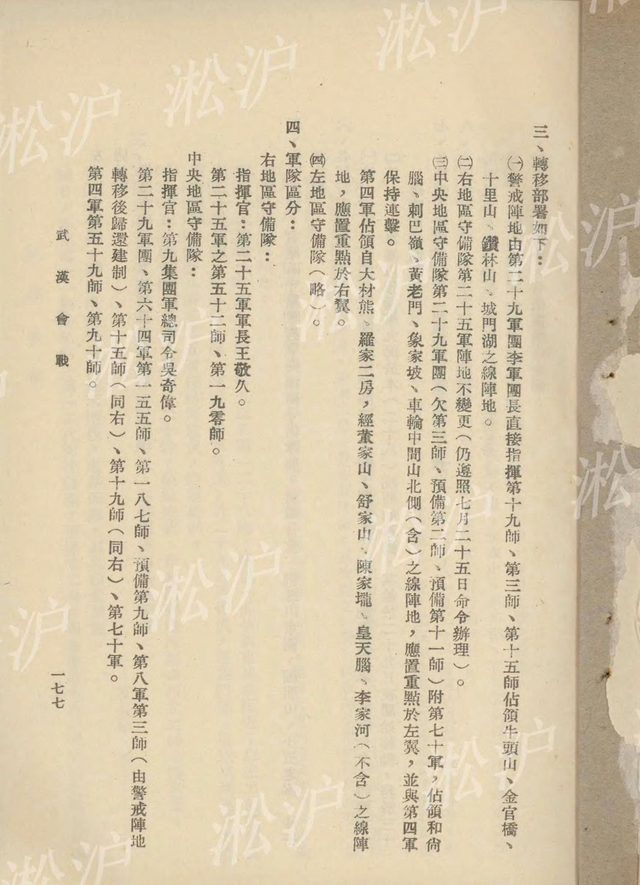

坑日戰史

一七八

左地區守備隊（略）。

砲兵隊：

指揮官砲兵第二旅旅長史文桂。

砲兵第三、第四兩羣及第一羣之一

兵團預備隊：

第三十集團軍。

第三十軍團第六十軍。

第二十六軍。

五、作戰地境：右地區守備隊與中央地區守備隊間，爲觀音堂、蜘蛛山東側、淵明山、小五老峯、沙子灘之線。六、各部行動概要如下：

(一)第七十軍（欠第一二八師）附第三師第十五師，應於本（二十八）晚部署完畢，非有命令不得撤退。(二)第二十九軍團以預備第九師於本（二十八）晚開始移動，其餘於二十九日夜開始移動，務於三十日拂曉前佔領新陣地。

七、各部到達指定地點後，卽從速部署，開始工作。

八、交通通信之破壞由李軍團長負責辦理。

第四軍於奉到命令後，當卽下達如令左之命：

作字第號陸軍第四軍命令於民國二十七年七月二十八日一、敵自攻佔九江後，有積極南進企圖。

我第七十軍現佔領牛頭山、尖山、分水嶺之第二線陣地，以阻止敵之前進。

二、軍（附第一八七師及第一五五師）已達成在獅子山、張家山、蔡家湖、亘賽湖南岸至汪家嘴線之掩護任務，奉命於本（二十八）晚起，向西南轉進，茲策定各部行動如左：

(一)第五十九師除留一營於原陣地掩護外，主力於本（二十八）日二十一時開始運動，經東林街、通遠鎮到達黃老門西方之王家坂一帶地區待命。其掩護之一營，俟該師全部脫離陣地後，撤收跟進(二)第九十師（欠第五三五團）除留一營於原陣地掩護外，主力於本（二十八）日二十時開一始運動，經沙河南端到達大材熊、羅家二房一帶地區待命。其掩護之一營，俟該師全部脫離陣地後，卽撤收跟進。

(三)第一八七師仍在原陣地警戒，至二十九日黃昏後，經王家河、山橋、羅家大廈到達黃老門、車輪中間山地區待命。

四第一五五師（附第九十師之第五三五團）二十八晚，應以一部佔領東林頭附近；以主力佔領南昌舖、黃土嶺、養路所之線，掩護第四軍轉進，於二十九日黃昏後，經義門舖、通遠鎮到達黃老門附近地區待命。第五三五團任務完成後，歸還建制。

五軍部及直屬部隊本（二十八）日二十時，經通遠鎮、黃老門到達馬迴嶺西北之帥家橋附近。

三、軍部到達新位置後，通信基地在帥家橋附近，各部須速向基地架線。

各師奉令後，遵卽準備轉進；惟天雨後，道路泥濘，運動頗爲困難。

同日，預備第十一師往柘林，第二二八師往白槎，預備第二師往瑞昌整理待命。第九集團軍令第四軍於轉移時，以第一五五師仍佔領原陣地，並統歸李軍團長指揮。

第一五五奉令後，以第九二五團之一營佔領東林頭爲前進陣地，以第四六五旅佔領杜莊、南昌舖至黄土嶺之線，以第九二五團（欠二營）位置於曹莊爲師預備隊，並以第九十師之第五三五團在南昌舖東北之杜莊一帶警戒。

第一八七師以第一零九八團守備蕭家墩、大天山、管家舖之線，右與黄土嶺第一五五師連絡，以第一一零零團守備錫福橋、黃排嶺至汪家嘴之線，師第一、第二兩特務連爲師預備隊，位置於鑽林山東北地區。

第二線陣地右地區守備隊第二十五軍之第一九零師，配置於吳城鎮至東孤嶺（不含）間，第五十二師除以一部佔領星子縣、玉筋山、鼓子塞之線外，主力佔領東孤嶺（含）至萬杉寺一帶，並以有力之一部，擔任香爐峯經漢陽至馬尾峯各隘路之守備。

中央地區守備隊第七十軍，除以一營守備黃龍寺、天池寺南北各隘路，與第二十五軍之漢陽峯部隊連絡外，以第十九師佔領牛頭山、金官橋亘趙家壠之線，第八軍以第三師佔領趙家壠、熊窪山一帶陣地，以第十五師配置於鑽林山之線，第四軍以第九十師佔領檀門山（鐵道含）、桐樹倪、北王家山、雞公嶺之線，以第五十九師佔領塘前坳王（鐵道含）、車輪中間山、羅家二房、陳家壠之線，軍部在黃沙嶺附近。

同日、我空軍第一大隊長田相國，奉令率SB機兩架，自漢口出發，往炸九江下游敵艦，於返航途中，在陽新附近遭敵單翼驅逐機四架，我第二零五號機被敵機擊中起火焚毁，人員跳傘脫險。又志顧隊奉派SB機六架轟炸湖口一帶敵艦，創敵大型艦二艘，小型艦五艘。

七月二十九日拂曉，敵分三路向第一五五師陣地進攻，守東林頭第九二五團第二營被迫後撤，適該團出擊，在黃茅壠一帶與約六百之敵遭遇，彼此衝殺，我傷亡官兵八十名，遂成對峙之勢。斯時、另敵一部分攻第九二九團之一六八。八高地及平湖嶺警戒陣地被我擊退。十六時許，該敵向一六八。八高地攻擊，我斃敵篠田少尉一員及士兵多名。

七月三十日拂曉後，敵機數架及砲火轟擊一六八。八高地及平湖嶺陣地，九時許，敵市川支隊步騎兵約千二百名，向一六八。八高地攻擊，被我擊退，敵乃轉移其主力於一六八。八高地右側，企圖包圍，亦未得逞。第九二五團再度出擊，斃敵宮田大尉一員、士兵多名。十五時、敵步兵於砲兵掩護下，復分向紗帽山、黃土嶺第九二九團主陣地猛攻，該團因傷亡過多，右側又受威脅，遂於十八時向南昌舖、許家墩一帶主陣地撤退。李軍團長因情況變化，以電話指示第一五五師以第九二九團仍佔領現陣地，阻敵前進，其餘各部於本（三十）日二十三時向甘家嶺以南地區轉進，該師遵卽向指定地點轉移。第九十師之第五三五團向黃老門集結，歸還建制。

同日、第一八七師受敵機艦不斷轟擊，二時後，楊家大山頭迭被圍攻，經我全力抵抗敵終未得逞。

同日、第九集團軍令：「第一五五師及第一八七師不得已時，可向牛頭山、金官橋、十里山線主陣地後方之預備陣地線轉進」。李軍團長遵卽令第一八七師由現陣地沿鐵路轉進至黃老門，左旋、向東移至仰天羅、羅家堰范山黃間地區集結待命，各師開始轉移時間，爲本（三十）日二十一時三十分。

同時軍事委員會令：「對已佔領之金官橋、十里山、鑽林山線陣地，應極力固守，無令不得撤退，本陣地前方應多做兩三道僞陣地及警戒陣地，酌派部隊守備，以消耗遲滯敵之進展，其出擊之預備隊、應祕密控置在本陣地之前側，不可在其後側，以便進出容易，另由星子方面抽派有力支隊，迂迴襲擊九江敵之後方」。

第二兵團總司令部以固守廬山置重點於金官橋、鑽林山間地區，以待後續部隊到達轉取攻勢之目的，作如左之處置：

一、令第六十四軍黃昏後，除留一團於原線警戒外，餘均撤至牛頭山亘城門湖之第二線陣地。

二、令右地區守備隊第二十五軍及贛保安隊仍由王敬久指揮，遵照二十五日命令，除留一部任星子經漢陽峯至馬尾峯之線各要點守備，以主力任吳城鎮、萬杉寺之守備外，並對海會寺通牯嶺之道路派兵警戒。

三、令中央地區守備隊第六十四軍、第八軍、第七十軍（僅第十九師）、第四軍，由吳總司令指揮，擔任牛頭山、金官橋、十里山、鑽林山、城門湖線陣地之守備，並派一部赴牯嶺任該地區之側背警戒四、左地區守備隊（略）。

五、各地區前方交通通信之破壞，由各該地區指揮官負責，德安、星子公路隘口以東，卽於本日施行破壞。

六、各部限於三十一日拂曉前完成配備。

七月三十一日拂曉，敵由第一五五師右翼紗帽山向黃大腦方面移動，左翼從沙河、養路所襲擊側背，經第九二九團第一、第二營守兵擊退，旋敵機數架向我陣地轟炸，第二營傷亡雖重，但仍堅守原陣地與敵相持。迄八月一日十二時以後，敵之攻勢頓挫該團傷亡三百餘人，警戒任務亦已達成，乃分向甘家嶺西南地區轉進，歸還建制。

第一八七師當面之敵兵二百餘，三十一日十五時，向楊家、大山頭攻擊，經我守備蕭家墩、大天山一帶陣地第一零九八團第一營擊退，該營以掩護主力轉進之任務業已達成，於十六時許在友軍第十五師掩護下，遵照原定計畫向羅家堰轉進，歸還建制。

同日、第二兵團總司令部奉軍事委員會三十日機電令：「南溥路方面自卽日起，由薛、吳兩總司令負責主持，張發奎總司令卽行調漢」。張總司令遵卽通知薛、吳兩總司令，卽日轉移指揮權責，並電令：「第四、第八、第六十四、第七十各軍，統歸吳總司令指揮，星子方面仍由王敬久負責，以上兩部行動，應請示第一兵團薛總司令辦理」。厥後，遂一面督飭各部加强防務，並親赴贛省與薛總司令面洽機宜，俾利爾後之作戰。

第九集團軍總司令吳奇偉奉令後，遵卽調整部署如左：

一、第二十九軍團佔領牛頭山、金官橋、鄧家河、娘娘廟、蕭家墩、大天山、陳家窪之線。

二、第四軍佔領分水嶺、檀門山、車輪北端山、上龍、鷄公嶺、皇天腦之線，控置一旅於塘前坳、車輪中間山亘婁家嶺之線，旌敖寺控置一營，另派兩連於鷄公嶺城門湖間警戒游擊。

李軍團長亦遵令調整部署，其大要如左：

一、第七十軍與第八軍仍固守牛頭山、十里山、鑽林山亘城門湖之線，非有命令不得撤退。

二、第六十四軍除相機策應第二線陣地外，各部之任務如左：

(一)右地區爲預備第九師，任中岩東端之六二一。零高地、大岩、尖山（含）之線，構築陣地而固守之。該師陣地應極力向前推進。

(二)左地區隊爲第一八七師，任尖山、茶子山（含）之線，構築工事而固守之。

兩地區隊作戰地境，爲通遠鎮西之二二八·八高地、劉家灣、葉子山、沙帽山之線，線上屬右。

(三)第一五五師應位置於鐵路東方之附近地區爲軍預備隊，並應竭力協助左右兩地區隊陣地之構築。三、各部工事應先完成縱深之跪射散兵坑，若時間餘裕。則逐次加强之。

四、通信基點在馬迴嶺西南之馬莊，各部應卽構成通信網。又經沙河之長途電話線，若我軍不能利用之

部份，則逐段破壞之。

五、第九十三收容所位置於馬迴嶺。

六、給養可向馬迴嶺第二十九兵站支部領補。

第四軍於奉令後，卽令第九十師左翼陣地由鷄公嶺經冷山延至大山之線，並派兵一營進佔鷄公嶺以北豆城門湖南端之線擔任警戒，右與第十五師左與第三集團軍確取連絡，第五十九師左翼陣地亦由陳家壠山延至皇天腦之線。

南澤沿線之敵經我阻擊，進展遲緩，各部因得從容部署，並加强其工事，預備予敵以更大打擊。

小池口方面（參照插圖第三十三）：

七月二十日，第四兵團總司令李品仙先後奉李長官訓示及軍事委員會電令：「以守備鄂東之第八十四軍派足步兵一團、附山砲兵一連、戰防砲二連，卽由龍坪東之上窯起，經關帝廟、二套口、小池口、王家壩迄段窯街地區佔領陣地，拒止敵之登陸，幷奇襲敵之艦艇，以協力九江之江防，俟第二十八軍團第六十八軍派遣部隊到達並確實接防後，再行撤收」。

七月二十一日，李兵團總司令飭第八十四軍派兵一團附野砲兵戰防砲各一連，卽於小池口一帶佔領陣地，迨第六十八軍兼軍長劉汝明自浠水到達廣濟東南地區後，卽令第一一九師接替黃梅、宿松、黃壟小池口沿江一帶第八十四軍防務，並以第六九一團附戰防砲第二十二連配備於小池口、楊家灣，由該團派兵一營於段窯一帶擔任沿江守備。其時敵已在段橋登陸，王家壩亦爲敵佔領，第一一九師師長李金田乃命該營在二郎廟、戴家營、破堤口一帶佔領陣地，阻敵西進。

第四兵團李總司令二十二日十二時下達變更部署命令，其要旨如左：

一、兵團以擊滅敵人之目的；對由懷寧、潛山間地區西進之敵，應不失時機，决行側擊。對由龍坪以東沿江岸登陸之敵，應乘其登陸未穩决行出擊，將該敵殲滅於江岸地區，至不得已時，應確保五顯廟（武山湖東）、繫馬嘴、經鄭公塔、獨山鎮、宿松縣、喬木嶺、陳家嶺、大凹山、太湖縣、風虎尖、王家牌樓，渡埠迄龍井關之線。

二、第二十八軍團除以步兵一營，戰防砲二連，由龍坪東之上窯起經關帝廟、二套口、小池口、王家壩段窯、迄感湖南岸之線佔領陣地，並協力九江江防外，主力應於白湖渡、下新鎮、大佛寺、碎石嶺之線佔領警戒陣地，並於白湖渡特別加强工事，於右自繫馬嘴、鄭公塔、獨山鎮、宿松縣、迄橋木嶺佔領主陣地，保持重點於右翼，若敵在龍坪以東沿江岸登陸，應卽斷然出擊，殲敵於江岸，不得已時，確保主陣地線。若敵由龍坪以西登陸，奪取田家鎮要塞時，應斷然側擊之，以掩護田家鎮側背之安全。

七月二十三日九江方面戰況劇烈，六時，姑塘北方有敵登陸，長江敵艦艇已越過段窯，後湖水面亦發現敵艇，劉兼軍長判斷敵爲減除奪取九江之側背威脅，必先掃除我小池口部隊，乃令第一四三師對白湖渡特別加强工事，嚴密監視湖岸，第三十一旅將王家壩登陸之敵迅速驅逐。

七月二十四日十四時，第二十八軍團長劉汝明遵奉李兵團總司令二十二日命令部署如次：

一、第一四三師附野砲兵一營爲右地區隊，派有力之一部佔領上窯、關帝廟之線守備江岸；主力在繫馬嘴、鄭公塔之線佔領陣地，並控制大預備隊於右翼，以便協助田家鎮要塞守備隊之作戰。

二、第一一九師附山砲兵一連、野砲兵一營、平射砲二連爲左地區隊，以步兵一旅、砲兵一營、平射砲二連、擔任小池口、王家壩之江岸防守，在白湖渡、下新鎮、大佛寺、碎石嶺之線佔領警戒陣地；主力在獨山鎮、宿松、喬木嶺佔領主陣地。

三、第九四二旅位置於廣濟西北城郊待命。

七月二十五日晨，由段窯登陸之敵向我左翼進攻，激戰至十四時，敵增援部隊到達，攻勢益烈，我守破堤口之第一連傷亡殆盡；同時由戴家營登陸之敵，向我左後方迂迴攻擊，陣地被突破，遂轉移至小池口以東，阻敵西進。此時小池口已構成氾濫，太白湖與感湖之氾濫亦已貫通。二十時，敵艦增至二十八艘，以猛烈砲火及飛機多架，掩護其陸戰隊由小池口側方强行登陸，第六九一團因傷亡甚重，被迫將主力移至宋家嘴（小池口以北附近）佔領陣地，留一部在小池口警戒，劉兼軍長命令第一四三師對小池口以東之敵嚴密監視，乘敵登陸未穩迅予襲擊，並準備徹底破壞黃梅、宿松公路。二十一時後，九江情況不明，且敵已侵入鄱陽湖，繞攻南澤鐵路。

七月二十六日拂曉，敵以海陸空軍火力掩護小艇，滿載步兵於小池口沿江登陸；同時，小池口以東之敵，亦沿堤西進，向我猛攻，第一一九師第六九一團被迫退守唐家壩附近，十一時，小池口遂陷。

李總司令同日以小池口之得失關係九江戰局之成敗甚鉅，發令第六十八軍迅速恢復小池口陣地，並扼守上游各要點。

七月二十七日拂曉，第一一九師第六九一團派第一營乘大雨向小池口反攻，激戰二小時，斃敵二十餘，敵不支逃竄回艦，遂於七時三十分克復小池口陣地。

第一一九師師長李金田同日遵李兼軍長二十四日十八時訓令，除派第六九三團守備宿松外，並以前進部隊推進於長嶺舖、上馬橋、橫山一帶；以第三十一旅（欠一團）在唐家壩、孔壟鎮、下新鎮一帶對小池口及感湖方面之敵警戒，主力配置於黃梅附近，在白楊嶺、渡河橋、苦竹口一帶高地佔領側面陣地，控置强有力之預備隊於大河舖，期擊滅敵人於黃梅附近。

李總司令二十九日遵白代長官二十七日電令意旨，下達命令要旨如左：

一、約一師團之敵附砲三四十門，連日攻擊我太湖方面陣地，我已死傷四千以上。另約四五千之敵，出沒於長嶺舖附近，並攻擊我鳳凰舖、祝家橋陣地，我第二十一集團軍約三十日前，可達到岳西、磨子潭地區。

二、兵團遵照軍事委員會作戰之要旨，以擊滅敵人之目的，誘敵到達宿松、黃梅附近時，卽以主力由東北山地將敵壓迫於長江左岸湖沼地帶捕捉而殲滅之。

三、第八十四軍着以一團附野砲第十六團之一營，在蘭溪鎮附近構築一團兵力直接配備之江防工事，以一部構築蘭溪至蘄春（不含）江岸要點工事，多設砲兵預備陣地，並僞砲僞工事。其餘部隊控置於廣濟附近，並構築右自袁家湖東側起經武山湖北岸至大金舖陣地。

四、第二十八軍團應速部署如左：

(一)以一部兵力位置於廣濟南方大金舖、吳文貴、藍傑一帶地區，與田家鎮要塞守備隊切取連絡，準備側擊進攻田家鎮之敵，並將前進部隊推進至鄭公塔，沿太白北岸胡雲楚之線，與龍坪之第二軍連絡，迎擊由沿江登陸之敵。

(二)以有力之一部，任宿松、黃梅間及南方湖沼之警戒，並以小部推進小池口警戒江邊。

(三)以主力位置於亭前驛、黃梅、雙城驛地區，側擊由宿太大道西進之敵，不得已時，固守團山河、雙城驛、渡河橋、亭前驛西北一帶既設陣地與敵決戰。

砲兵除原有外，另以野砲第二十八團兩營配屬之。

(四)亭前驛至二郎河間西北之線，在第二十九集團軍之第四十四軍未到達前，仍由該軍派兵一部擔任，並與第三十一軍連絡。

五、第二十九集團軍着以一部位置於張家塝，並以一旅限卽日推進至亭前驛、二郎河間西北山地之線，佔領陣地，右與第二十八軍團，左與第三十一軍連絡，主力除暫留一師於英山外，其餘集結於張家塲附近，準備側擊西進之敵，推進至二郎河、亭前驛之一旅，暫歸第二十八軍團劉軍團長指揮。

六、第三十一軍右與第二十九集團軍連繫，應確保現在陣地，並固守各隘口，保持重點於太湖、合水澗道，敵封鎖太湖、隘口時，主力卽向右移動以行側擊。

第二十八軍團長劉汝明奉令後，遵卽從新部署，並加强戒備，以迎敵軍。

本戰鬥，江南方面我軍參加作戰者爲步兵十二個師及特種部隊，在江北者僅爲第一一九師，戰鬥歷時一句，我軍損失，除小池口方面第一一九師不計外，總計傷亡官兵六千餘人，失踪二千餘人，惟期內齒獲敵輕機槍一挺，步槍二枝，步機彈三千餘發及其他軍用品甚夥。

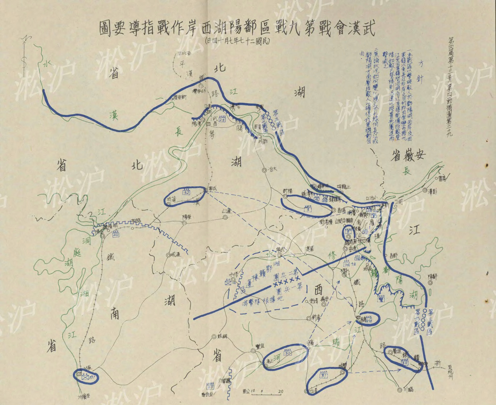

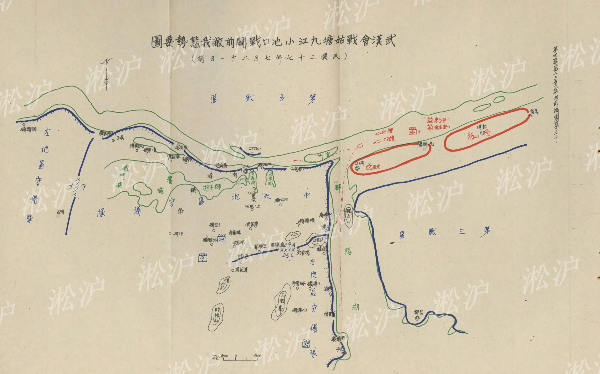

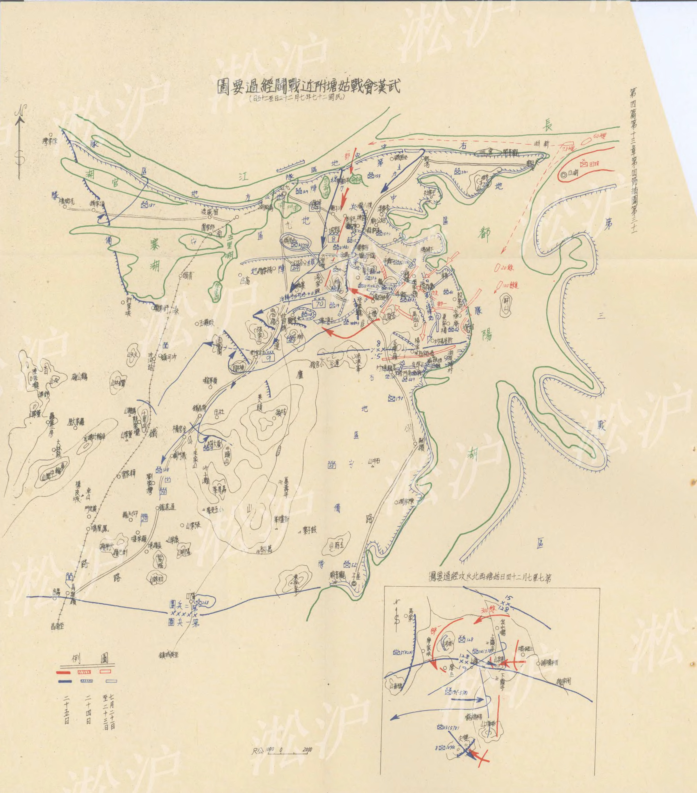

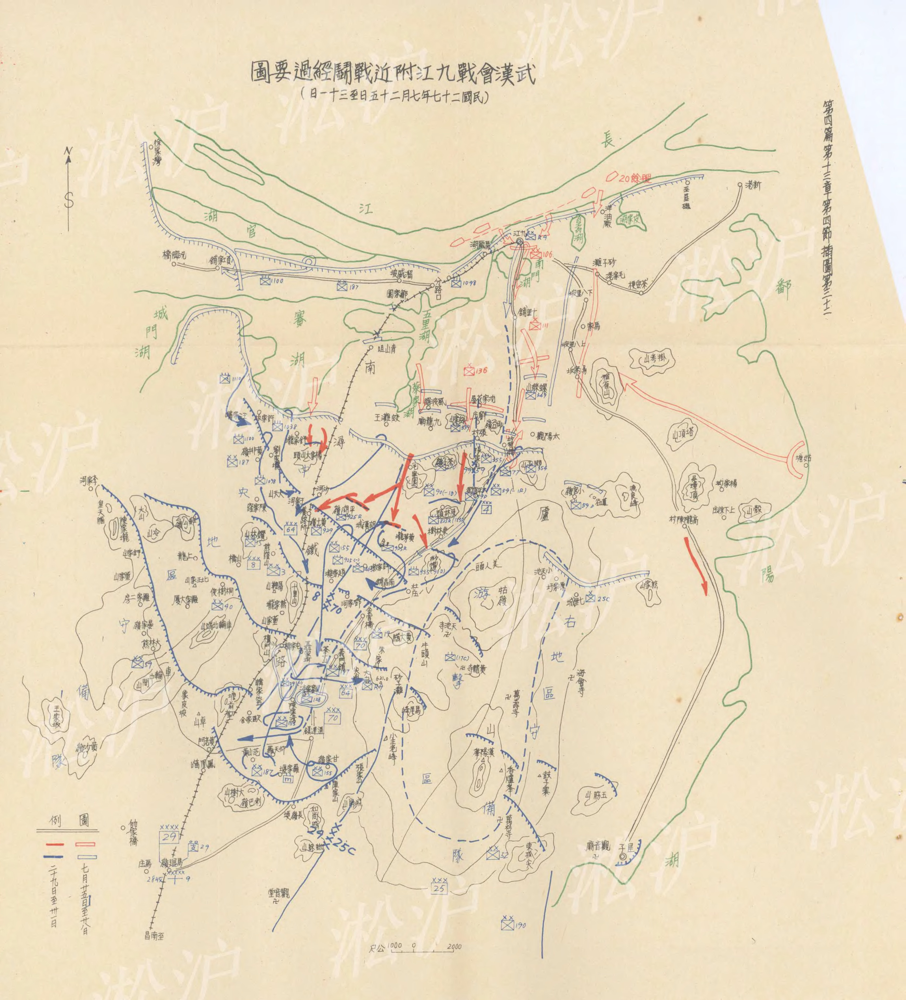

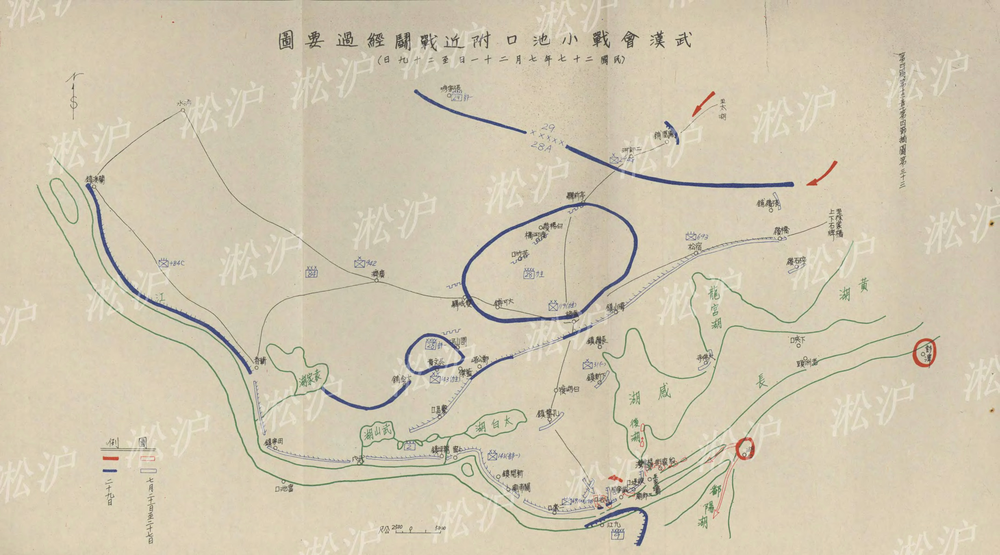

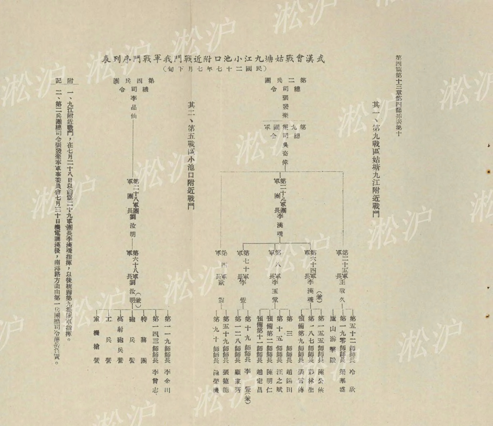

##### 第二項 太湖、宿松附近諸戰鬥

民國二十七年七月二十四日至八月二十八日

參照插圖第三十四至第四十插表第十一

江北之敵（參照插圖第二十一），經第二十六集團軍於潛山西北地區側擊後，其第六師團之先頭部隊，遂停留於小池驛、劉河街、雙尖一帶。同時，敵第六師團之一旅團，爲策應九江方面之作戰，牽制第二十六集團軍於潛太公路沿線上，藉以掩護其西進之交通線，並於七月二十五、六兩日，以三個聯隊向太湖進攻，戰鬥於是開始。

第一目 太湖、宿松附近地形

太湖縣西北及西南均屬山地綿亘，其西南之風火山、嚴恭山、涼亭河、二郎河尤爲戰略要地。太宿公路東連望江，西接黃梅，並另有由涼亭河起，西南經界嶺、二郎河以達黃梅之舊道，亦可通行車馬，運輸尚稱便利。

宿松位於太湖以南，毗鄰鄂東之黃梅縣，北面多山，東南爲湖沼地區，爲長江中流左岸屏障之一；

蓋其東南既可藉湖沼之天然屏障，阻登陸之敵北進，而其北面亦因山勢蜿蜒，可扼險固守，阻敵渡江南侵也。二郎河自邱家山西南流經縣城而注入龍官湖，城南一段，水漲時可行排水三噸半之船隻，龍官湖水深由一公尺五至四公尺，與黃梅之盛湖相連，並近接望江之泊湖、黃湖，每屆雨季，則氾濫東起懷寧，西迄廣濟，懷徐、徐家橋）大道及望廣公路以南，百餘公里以內，片汪洋，盡成澤國，對於軍事上之影響，關係至鉅。

第二目

戰鬥經過

一、太湖東南地區之戰鬥

民國二十七年七月二十四日至三十一日

參照插圖第三十四第三十五插表第十一

進犯太湖之敵爲第六師團第十一旅團之第十三、第四十七聯隊，及第二師團第三旅團之第四、第二十九聯隊。迄七月二十九日，我第三十一軍第一三五師已撤至隘口（二郎河西北），此時、由黃泥港、新倉及望江向徐家橋前進之敵第三師團之第六旅團，附砲、工、通各隊，則直趨宿松。

我第三十一軍自淮北作戰後，於六月九日由阜陽開赴葉家集集中。十八日、第二十一集團軍總司令廖磊命令：「第三十一軍速向潛山方面急進，歸第四兵團李總司令指揮，協同第二十六、第二十七兩集團軍，側擊由合肥向桐城轉用之敵，以確保馬墻之封鎖線」。韋雲淞軍長奉命後，以第一三一師已向岳西出發，卽命第一三五師開霍山附近集結待命，第一三八師向潛山前進，限二十六日到達水吼嶺、嚮潭河一帶集結待命。二十四日，該軍續奉命向英山前進，二十七日行抵石頭嘴，奉軍事委員會二十日電令：「該軍向潛太公路突進之敵積極進攻而殲滅之，對彌陀寺通太湖道路，應特別注意，並與固守宿松之第一一九師確取連絡」。韋軍長基於以上指示，以主力推進至東山河、張家冲亘撞鐘河之線；以一部控置於上河南、河頭舖附近。二十八日、又奉李總司令命令：「限三十日以前，以主力到達太湖東北四面尖、廣峯寨亘雙尖山高地之線佔領陣地，準備側擊西進之敵」。韋軍長遵卽令第一三八師以主力於四面尖、天頭山亘殷家嶺之線佔領陣地，並於七月一日，先以有力之一部進出該線之前端，佔領陣地，掩護主力之行動；第一三一師以主力進出廣峯寨、銅鑼尖、馬鞍堰、黃梨尖亘雙尖山之線佔領陣地，於七月一日，先以有力之一部進出該線之前端，佔領陣地，掩護主力之行動；第一三五師爲軍預備隊，以一旅位置於合水澗，另各以一團位置於黃樹河、下柳板附近。第一、第二陣地帶之工事，由第一線師負責構築，預備陣地帶工事，由軍預備隊構築。嗣因適應情況，第一三一師奉命進出小池驛，牽制敵之南進，旋又改向界嶺，策應第四十一師之作戰。

七月一日、約一個師團之敵，主力到達王家牌樓、黃梨尖、雙尖山附近，與第二十六集團軍主力激戰，其、部則進出望江、上下石牌附近，似有企圖西進模樣，李兵團總司令令第三十一軍以第一三一師推進至五廟、蔡家畈間地區，策應第二十六集團軍之作戰，第一三八師推進至合水澗、太湖河間地區，準備側擊西進之敵，韋軍長遵卽令該兩師向指定地區集結。

第三十一軍軍部，九日抵百里墩，奉李兵團總司令七日十七時電令，遵軍事委員會五日十五時電令，變更第五、第九兩戰區部署，以第三十一軍編爲第四兵團中央軍，以第一三五第一三八兩師配備第一線，佔領二郎河涼亭河以西山地亘太湖以北陣地，第一三一師爲預備隊，位置於彌陀寺，並由第三九三旅暫代第四零五旅防守嚴恭山、大石山一帶，至十二日，該軍接替第二十七集團軍太湖城附近防務。第三十一軍二十一日據報：「王家牌樓及桃花舖有皖省叛變之保安隊一團，桂花石有敵一大隊，潛山城附近有敵約兩聯隊」。韋軍長卽下達命令，其要旨如左（參照插圖第三十五）：

一、潛山附近之敵約兩聯隊，另有皖省叛變之保安團數百人，有向我進攻之企圖，其先頭部隊已抵黃泥港桃花舖、王家牌樓、芝麻潭亘馬石堰之線，另一部在上下石牌附近。

我第二十八軍團之一部，現奉令接替二郎河之防務，第二十六集團軍仍在廣峯寨、雙尖山、天柱寺渡埠附近之線與敵對峙中。軍與第二十六集團軍之作戰地境，爲蔡家河、劉家河、天頭山、小池驛、金家墩、鸚子港之線，線上屬本軍。

二軍卽在二郎河鎮、太湖、小池驛間構築陣地，拒止敵人。

三、第一三五師（欠第四零五旅）於宿松附近防務移交後（按該師宿松防務，係於二十一日交由第六十八軍之一部接替），卽移至陳江溝以東地區，在鷄公寨、古畝山、江家寨亘仙人石附近之線構築陣地，並在二郎河鎮、花涼亭構築前進據點。

四第一三一師在花涼亭、涼亭河至太湖道路以西山地構築陣地，並於涼亭河、界石河、楓香驛構築前進據點。

五、第一三八師配屬軍山砲兵第二連、工兵營、山砲兵第三營戰車防禦砲連，在太湖至小池驛道路西北山地構築陣地，並於太湖縣城、劉家山舖、小池驛構成前進據點。

六、作戰地境如左（線上均屬左）：

第一三五師與第一三一師間，爲竹馬尖金家岩、龜王廟、仙人石、黃大屋、白河之線。

第一三一師與第一三八師間，爲合水澗、穆涼亭、劉家塝、葉家集之線。

七、第一三五師之第四零五旅爲軍預備隊，暫位置於楊柳灣附近。

七月二十四日，第一三八師與敵接觸，韋軍長依機動防禦，保持重點於右翼，乃令第一三五師爲軍預備隊，主力集結於涼亭河西南地區，以該師之第四零五旅位置於楊柳灣，爾後準備推進至合水澗附近。下午，敵約四千餘，由望江橋向徐家橋前進。二十五日，第一三八師左翼，進入主陣地，戰鬥至二十七日，第一三五師師長蘇祖馨復奉命於長溪山古畝山、瓦上屋、瓦燕冲、亭子嶺之線佔領陣地，準備側擊南下之敵，乃以第八零五團佔領花涼亭、亭子嶺之線，以第八零六團佔領二郎河西岸。此時由徐家橋撤回之第一三一師第七八五團，亦奉命於王家灣、莪包山佔領側面陣地。

七月二十八日，由涼亭河南下二十五里墩之敵，約一旅團弱，附長射程砲數門，於拂曉，先以一部攻我第一三五師祝家橋，旋以大部向左延伸，猛攻鳳凰嶺。亭子嶺陣地。守備祝家橋警戒陣地之一連，因傷亡達三分之二，被迫撤至鳳凰嶺、花涼亭前進陣地。第八零五團之一營，自祝家橋放棄後，敵在其飛機與大砲掩護下，以全力猛攻，並施行兩翼包圍，迄十四時許，該營向我包山、瓦燕冲、亭子嶺之主陣地轉移。攻佔花涼亭之敵，大部已向宿松方面運動，一部仍在原地與我相持，此時敵三百餘，乘隙由鳳凰嶺竄入瓦燕冲，企圖擾我後方，當卽派兵夾擊，一面封鎖其退路，遂將該敵全數殲滅，此後敵之攻擊乃一趨沉寂，總計全日戰鬥，敵傷亡約五百餘，我亦傷亡二百餘人。是日，由潛太公路向宿松前進之敵一縱隊，步騎砲混合兵約六千人，馬千餘匹，下午續到步騎砲兵約五千餘，馬千餘匹，韋軍長基於以上情況，知戰事重點，已漸次移於軍之右翼，爲顧慮第一三五師兵力薄弱，遂令軍預備隊第四零五旅之第八零九團，限於二十九日趕赴馬王廟歸還第一三五師建制。

連日，第一三一、第一三五兩師，於二郎河、江家寨、亭子嶺、仙人石、嚴恭山、白馬寨（涼亭河西北）、大石山之主陣地與敵第六師團對戰，其第二師團亦向第一三八師猛攻。第三十一軍韋軍長擬令第一三八師固守原陣地，而以第一三一師及第一三五師轉移攻勢，與左第二十六集團軍相策應，向敵側擊，軍指揮所移設彌陀寺附近之玉泥販。

七月二十九日十三時許，敵約千餘附砲四門，向花涼亭西北第八零五團陣地猛攻，被我擊退，惟仍滯留於鳳凰嶺、花涼亭附近與我對峙。沿太宿公路前進之敵，大部亦留滯於鳳凰嶺附近，與第一三五師對峙，三十日入暮，第一三五師第八零五團向瓦燕沖南之鷄鷹坡襲擊，二十一時克復該陣地，嗣敵增援反撲，激戰至翌日拂曉，我仍退回原陣地。

七月三十一日十一時，敵砲向我二郎河陣地猛擊，十二時，敵步兵千餘，由花涼亭渡河，以一部向二郎河，大部向通隘口大道急進，十四時，敵復砲擊二郎河，同時敵大部分三路向瓦燕冲、亭子嶺之線第八零五團陣地猛攻，該團陣地工事全毀，傷亡甚重，於十八時退守米肉舖、河家寨之線。王家灣及宿松城附近，敵我已經接觸，蘇師長爲使爾後作戰容易計，命令全線乘夜向鷄公石、黑尖、黃金岩、獨山寨、鄧家嶺之線陣地轉移。

第一三一師於七月中旬，將主力集結劉家畈、南陽河間地區，以第三九三旅於花涼亭、嚴恭山巨大石山之線構築主陣地，並於紫金山、老崗嶺、方家菴之線構築預備陣地，旋以第一三五師第四零五旅到達英山，充任軍預備隊，該師以戰鬥正面過廣，乃令第三九三旅交防之正面，由第三九一旅分擔，以增守備力量，並加强工事。

第一三一師師長林賜熙，二十一日基於韋軍長同日之命令，遂下達命令要旨如左：

一、本師卽佔領嚴恭山、大石山、九頭崗之線，保持重點於左，相機轉移攻勢，壓迫敵人於泊湖及其以南地區而殲滅之。

二、第三九一旅（欠第七八一團第二營）爲右地區隊，應在仙人石，嚴恭山迄三墓冲南端之線佔領主陣地，在涼亭河，趾鳳河之線佔領前進陣地，並在霸王廟，紫金山，老崗領，方家菴之線構築預備陣地。

三、第三九三旅（欠第七八五團—欠一營）爲左地區隊，在三墓冲，大石山，九頭崗之線佔領主陣地，在白馬寨，九重城，樹林冲西端迄界牌嶺之線佔領前進陣地，並在馬王廟，金家寨，六省崗，王家河之線構築預備陣地。

四、兩地區隊應在黃家河塌，風火山，楓香驛，下狹口之線配置警戒部隊，掩護陣地之構築，並將宿太公路澈底破壞。

五，兩地區之作戰地境，爲石家河，馬王廟，三墓冲，汪洋廟，羅家店，余家嶺之線，線上屬左。

六、師配屬山砲隊協力左地區隊之戰鬥，待我攻勢轉移，務能以火力發揚於攻勢方面。

七、第七八五團（欠第一營）及第七八一團第二營爲師預備隊，位置於芙蓉冲，馬王廟附近，第七八五團（欠第一營）應先協助左地區隊構築陣地，由粟旅長分配之，並以一營推進至徐家橋之線游擊，對泊湖應嚴加注意。

七月二十四日，韋軍長奉軍事委員會二十一日命令要旨：「第一三一師應將主陣地推進至陳家嶺、龍王寨、張何舖之線」。當卽令林師長以一團先佔領徐家橋、官橋之線，掩護師主力佔領陣地。林師長遂令適將防務交替之第七八五團星夜馳赴徐家橋、官橋，限二十五日黃昏前到達。

七月二十五日，韋軍長命令變更陣地，進佔駝龍山，且分向官橋及太湖附近推進，以第一三一師擔任右由陳家嶺左至張何舖之線。

林師長奉命後，於二十四時下達命令要旨如左：

一、當面之敵，現迫近太湖城，與第一三八師第八二三團在棋盤石附近對峙中，本日午刻，約一聯隊之敵，由潛山向黃泥港前進中。

軍有佔領陳家嶺、龍王寨、大凹山、太湖、虎風尖之線，拒止敵軍之目的，與右翼劉軍團之作戰地境，爲珠寶寨、長溪山橋、大嶺蕭家塘之線，線上屬劉軍團。第一三八師爲左地區隊，佔領棋盤石，太湖，虎風尖之線。

第一三五師（欠第四零五旅）位置於涼亭河西南附近地區，第四零五旅位置於潘家塝附近。

二、師爲軍右地區隊，佔領陳家嶺、唐家油舖、龍王寨、大凹山、張何舖之線，與第一三八師作戰地境，爲舊涼亭、芭蕉坳、張何舖、劉家塝之線，線上屬本師。

三、第三九一旅（欠第七八一團第二營）於二十六日在陳家嶺、唐家油舖迄楊家橋之線佔領主陣地，重點在左。並於安峯山、獅子山、小姑殿之線構築第二線陣地。

四、第三九三旅（欠第七八五團）於明（二十六）日在龍王寨、大凹山迄張何舖之線佔領主陣地，重點在左。並於小姑殿（不含）、五顯廟、燕窩之線構築第二線陣地。

五、警戒部隊配置於汪家屋、桃花舖、南山寺之線。

六、兩旅之作戰地境，爲王家寨、蔣家山、藜窩地、太宿橋、五顯廟、楊家橋、桃花舖之線，線上屬右。

七、師配屬砲兵隊在五顯廟附近選定陣地，以主火力協助第三九一旅之作戰。

八、第七八五團仍在徐家橋之線，掩護師主力佔領陣地，候命撤收至子姑庵附近，與第七八一團第二營爲師預備隊。

九、通信連完成師與各旅及砲兵隊間之通訊網。

十、野戰軍醫院設馬王廟附近，以衛生隊推進至趾鳳河設收容所。

是日拂曉，敵向新倉第一三八師陣地進攻，並佔領駝龍山，分向官橋前進，黃昏時，已迫近太湖。

第一三一師第七八五團於十四時到達太宿橋附近，該團團長據報，官橋已被敵佔領，其第二營於十六時許到達龍王寨附近與敵遭遇，將敵驅逐後，時已入暮，乃向畢家嶺、桃花舖以西附近地區佔領警戒陣地，該團卽在龍王寨附近宿營，同時得悉徐家橋已有我第六十八軍第六九三團第二營在該處防守，乃一面派員連絡，一面在孟家嶺、余家嶺之線佔領陣地。

七月二十六日拂曉，步騎砲聯合之敵約兩大隊，向我余家嶺、龍王寨陣地攻擊未逞。是時，徐家橋第六十八軍第六九三團第二營自行撤退，敵遂乘機佔領徐家橋，向我孟家嶺進迫，而官橋方面之敵一縱隊，亦沿江家塘向五顯廟突進，一部向余家嶺、龍王寨之間鑽入，佔領楊家橋之線，切斷我連絡，復向南包圍，與我佔領余家嶺東方陣地之第三連激戰，經我側擊，敵始退去。此時，我左翼龍王寨方面之第二營受敵壓迫，於十五時突圍向太宿橋、涼亭河方面撤退，第七八五團第一、第三兩營固守孟家嶺、余家嶺之線與敵相持，於二十時以第八連爲左側衛，向西南經張家畈、花涼亭、二郎河之線轉進，二十七日六十時到達二郎河附近，時適第一三五師花涼亭附近受敵壓迫，韋軍長乃令該團協同第一三五師第四零三旅佔領二郎河東北王家灣亘苞莪山之側面陣地，拒止敵人。當第七八五團於余家嶺、龍王寨附近與敵激戰時，第三九一、第三九三兩旅正向前推進中，通信連絡困難，該團亦因後方被敵截斷，故對前方不盡明瞭，至晚，師指揮所到達劉家畈，得知余家嶺方面，自晨至午，槍聲濃密，太宿橋附近，十四時左右，已到有敵第六師團第二十三聯隊之一部約千人，附有騎兵一中隊，山砲十餘門，棋盤石爲敵攻佔，太湖已失陷。

林師長綜合情況，判斷第七八五團已與敵接觸，其左側背實堪顧慮，惟我主力正兼程前進，縱該團戰鬥不利，尚能及時救援，但太湖失陷，師主力突進，左側空虛，遂派遣軍官向第三九一旅傳達如左之命令要旨：

一、前進時，須嚴密搜索當面敵情，兩旅確取連絡，並由第三九一旅黎旅長探明第七八五團行動，如該團已撤回，卽令往馬王廟附近爲師預備隊。

二、對太湖方面戰況，特須注意前令企團，予以適切獨斷之處置。

第三九一旅到達涼亭河後，遂分兩縱隊行進，第七八一團（欠第二營）爲右縱隊、向黃家河塌、張家畈前進，第七八二團爲左縱隊，向太宿橋前進。十七時，第七八一團到達金牛嶺，得知黃家河塌已爲敵佔領，乃停止前進，向左靠近風火山宿營。第七八二團行抵汪洋廟時，適與由五顯廟被敵壓迫之第七八五團第二營相遇，據報敵已據有太宿橋西之子姑庵，該旅旅長遂令該營於蓮花塘對棋盤石、太湖方面警戒，並命令所屬兩團於黃大屋、風火山、汪洋廟之線佔領陣地。第三九三旅（欠第七八五團）由大石山出發，於下午至鷄公寨附近，據報敵陷棋盤石，時近黃昏，該旅旅長遂令先頭第七八六團第二、第三兩營進至界河附近宿營。

七月二十七日四時許，第三九一旅當面敵步兵四百餘，附砲數門，向汪洋廟第七八二團左翼陣地及黃大屋第七八一團陣地攻擊，激戰一小時，第五連連長負傷，經該團第一連增援，始將敵擊退。七時，敵攻風火山第三連及機槍排陣地，經我守軍步砲協同，奮力抵禦，迄八時三十分，敵乃稍退，旋敵約三百餘，藉飛機掩護，向右迂迴，同時猛攻我正面，第三連連長率領預備隊向右增援，將敵擊退；惟正面之敵仍在繼續攻擊，該旅長乃令第七八一團向左移動，並令第八連由左出擊第三連正面之敵。

林師長於九時到達馬王廟，始知第三九一旅作戰經過，但對第三九三旅方面則情況不明，當卽轉報軍部，並作如下之處置：

一、第三九一旅以現態勢阻敵西進，不得已時，應以有力之一部佔領涼亭河西端小高地各要點，遲滯敵之前進，並以主力轉移於嚴恭山主陣地線，待敵接近而殲滅之。

二、第三九三旅（欠第七八五團）卽佔領楓香驛、界石河、貓兒嶺之線，注意棋盤石方面之敵，並相機策應第三九一旅之作戰。

三、山砲兵隊到達後，卽開松樹下歸第三九一旅黎旅長指揮。

四、師指揮所設於馬王廟。

九時許，風火山當面之敵增加二百餘，向我陣地猛攻，稜線守兵第三連及左小高地之第一連傷亡甚重，經旅預備隊第八連增援，遭遇敵四百餘，於砲火掩護下蜂擁登山，遂相互肉搏，與敵爭奪山嶺凡七次，第三、第八兩連傷亡八十餘，第八連連附賈少英陣亡，敵之傷亡較我更多，遂成對峙狀態。十一時三十分，諸兵種聯合之敵一縱隊約四千餘，經祈雨山東北向我前進，距蓮花塘僅十餘里，第三九一旅旅長以旅之任務，爲在先遣部隊掩護下佔領龍王寨之線陣地，拒止敵人西進，今先遣部隊已被敵壓迫後撤，任務勢難達成，且固守風火山之線受敵子姑菴高地之瞰制，亦處於不利，遂令所部向仙人石、嚴恭山、白馬寨之線轉進，十六時，各部隊均已到達指定位置。十七時，敵約五六千，附砲十六門，沿公路抵達涼亭河，以少數步兵向我攻擊，旋告沉寂。

同日，第三九三旅（欠第七八五團）方面，有諸兵種聯合之敵約千餘，由棋盤石西進至貓兒嶺附近與第七八六團接觸，其主力轉向馬鞍山無名高地攻擊，經守軍第一連予以迎擊，進退數次，敵復由西繞攻，我第二連適時增援，敵卒未得逞，乃退據貓兒嶺後方西北高地。第三九三旅旅長以右翼王家嶺、八里崗突出，同時敵由祈雨山進攻甚急，遂乘夜將右翼部隊逐次撤回鷄公寨之線佔領陣地，與第二營連繫。

是日，林師長詳研當面地形：「嚴恭山正面向東稍徧於南，甚爲高峻，但其傾度東緩西急，由東攀登較爲容易，右後有一谷路，繞入西麓，可由此入，威脅陣地之後，幸有四姑寨與仙人石夾谷併峙，爲本陣地右翼要點。向左青竹尖、叫雨尖，皆爲特出高峯，尤其叫雨尖迫近趾鳳河出谷路口，與路左白馬寨併峙，該路爲本陣地惟一交通線，關係本陣地之得失甚鉅，此路能否保持，胥視叫雨尖、白馬寨爲轉移。再左大石山較高，攀登不易，距公路已遠，不足重視，嚴恭山與大石山以趾鳳河道路分界，自然形成左右兩地區，默察敵之企圖，似趨向宿松、黃梅、廣濟，沿大江北進展，對此帶山谷陣地，必設法封鎖，掩護其交通聯絡，俾側背獲得安全，嚴恭山陣地凸出，接近公路，爲敵所必爭，趾鳳河、叫雨尖尤所必得，四姑寨尙屬次要」。遂根據研判，爲爾後作戰便利計，乃令各旅逐次轉移於四姑寨、仙人石、嚴恭山、白馬寨、大石山之線，以重點置於趾鳳河道路附近，第三九一旅（欠第七八一團第二營）在右，第三九三旅（欠第七八五團）在左，極力加强工事，並以趾鳳河、魯塘畈、鷄公寨爲前進陣地。此時，敵人則佔領涼亭河、風火山、汪洋廟、楓香驛、貓兒嶺之線，與我成對峙態勢。黃昏後，敵主力約七千餘人，砲三十餘門，陸續集結於涼亭河附近，其一部約千餘，沿公路向二郎河急進，第七八五團（欠第二營）奉韋軍長命令，仍歸第一三五師指揮，佔領王家灣、莪苞山之線陣地。

七月二十八日拂曉，敵以步兵七百餘、砲三門，由貓兒嶺、馬鞍山向第七八六團第一營鷄公寨陣地猛攻未逞，至晚，該團乃轉進於白馬寨、大石山之主陣地。敵主力沿太宿公路漸向南移，其一部約三千餘，由公路向嚴恭山陣地攻擊，亦未得逞。當日十一時，祝家橋、鳳凰嶺第一三五師之警戒部隊撤退至仙人石以右地區，林師長以其地形重要，遂令暫劃歸第七八一團，派該團團附率第三營馳往防守，以第七，第九兩連守仙人石，第八連守四姑寨，惟正當該連之一班到達該山前面高地時，適敵數百攀登，該班乃以密集火力向敵急襲，旋全連亦到達，始將敵壓迫於山下，四姑寨陣地因得轉危爲安，我傷連附一，傷亡士兵十餘名。同時嚴恭山正面之敵，被我阻擊亦退回山麓。第三九三旅自二十七日晚佔領陣地完畢後，其白馬寨、九重城、大園頭尖線之陣地，時有敵少數部隊來攻，企團牽制我兵力。

七月二十九日拂曉，第三九一旅當面敵第二十三聯隊，向嚴恭山及叫雨尖等陣地猛烈攻擊，被我擊退。九時許，敵猛攻仙人石右翼第九連陣地，經第一連側擊，敵遂轉向該連攻擊，其後續增援部隊，則直薄仙人石，第七連在步砲協同下斷行逆襲，第一連一排亦乘時出擊，激戰二小時，斃敵數十人，第七連連長及第一連連附皆陣亡，另兩連附負傷，士兵亦傷亡過半。敵因攻仙人石未得手，乃轉向四姑寨第八連陣地攻擊，第七八一團以撥歸指揮之師預備隊第四連（該連於敵攻仙人石時奉命撥歸第七八一團指揮增援，將敵擊退。敵攻嚴恭山右翼不逞，復轉向青竹尖第二連陣地猛攻，第三九一旅旅長命第七八二團第七連增援，陣地始得穩定。十三時，當面之敵乘大雨濃霧向叫雨尖，趾鳳河襲擊，遂與第七八二團第一、第二兩營發生肉搏戰鬥，敵之一部由該兩營之接合部竄入，戰鬥益烈，機槍第一連連附陣亡，機槍第二連連長負傷，第四連官兵傷亡多人，因之第一線陣地遂被突破。是時，適第九連增援到達，卽由第五連陣地與叫雨尖之間向敵左側突擊，將其壓迫於第五連陣地前方，第九連連長楊嵩雖左臂負傷，仍繼續指揮。當叫雨尖第一線告急時，林師長察知第三九一旅兵力使用將盡，而第三九三旅正面大石山一帶情况和緩，乃急令調第七八二團之第二營控制於松樹下附近待命，十九時三十分，該營向叫雨尖之敵逆襲，將突破之敵擊潰，殘敵紛向燕窩地、涼亭河逃竄，遂將陣地恢復，惟因天雨黑暗，對敵未予追同日，第三九三旅當面，因敵正着力於太湖及嚴恭山之攻擊，對白馬寨、九重城、大園頭尖之前進陣地，僅有少數槍聲，林師長爲準備明三十日戰鬥，請准令第一三五師指揮之第七八五團歸還建制，忽奉章軍長命令：「左翼第一三八師方面激戰至烈，雙方傷亡奇重，其龍山宮，四面尖均先後失守，該方面原陣地線勢難再守，軍卽由十一時開始向霸王廟北端紫金山、老崗嶺、方家巷、馬王廟第二線陣地轉移」。林師長因時間倉卒，部署不及，乃決定於十二時開始轉移，並限三十日拂曉前部署完畢。

第一三八師當面，七月十二日，該師接替第二十七集團軍太湖城及其附近防務後，自二十一日起，即以第四一二旅之一部，與敵在新倉附近保持接觸。

七月二十三日，第一三八師師長莫德宏於潘家河下達命令要旨如左：

一、師於太湖至小池驛道路西北山地選定陣地，構築强固工事。

二、第四一二旅配屬軍山砲兵第二連及獨立山砲兵第三營第一連、戰車防禦砲運、工兵營，應佔領穆涼亭、太湖城巨龍山宮、風虎尖、吳家冲、天頭山之線，構築强固工事，拒敵西進，須於太湖城、劉家山舖、小池驛構築强固之前進據點，其警戒陣地仍爲官橋、新倉、羅家畈、陳家冲、小池驛之線，應派有力部隊佔領，以掩護主陣地之構築。

該旅應常派有力部隊於官橋、葉家集、上石牌、金家墩、黃泥港、新倉相連之線圈內積極游擊，並偵察敵情。

配屬該旅之砲兵，應進出大嶺頭、龍山宮、風虎尖之線，選定陣地，構築工事，完成射擊諸準備。

三、第四一四旅之第八二七團，仍在范家嶺、喬麥寨、劉家寨之線構築强固縱深陣地，並於金鐘岩、摩頭嶺、王家嶺之線，擇要構築工事，該團之第三營着卽歸還建制。

第八二八團（欠一營）應於李杜店、小湖河、太湖河、辛家冲、碎石嶺地區間，構築據點式强固工事。

獨立山砲兵第三營（欠第一連）歸第四一四旅鍾旅長指揮，應於羊虎山、李杜店、大小湖附近山選定陣地，構築工事，並完成射擊諸準備，各該旅右與第一三一師，左與第三十六集團軍須確取連絡四、第八二八團之第一營爲師預備隊，位置於碎石嶺、合水澗附近。

右令下達後，各部皆遵照實施。

七月二十四日，第四一二旅旅長賴剛遵奉師之命令，下達命令要旨如左：

一、第八二三團（欠一連）、附獨立山砲兵第三營第一連、工兵兩連（欠一排）、戰車防禦砲兩門爲右第一線，主陣地爲羊虎山、張家坳、大嶺頭、龍山宮、四面尖、西風疃之線，警戒及前進陣地爲馬家畈、新倉、駝龍山、官橋之線，並派遣有力部隊於官橋、葉家牌、上石墩、金家墩、黃泥港、新倉相連之線圈内積極游擊，遲滯敵之攻擊，並偵察敵情。

二、第八二四團（欠一連）、附軍山砲兵第二連、戰車防禦砲連（欠二門）、工兵營（欠兩連）爲左第一線，主陣地爲陳家寨、殷家寨、吳家冲、天頭山之線，警戒及前進陣地爲小池驛、戴家河、陳家冲、羅家畈之線。

三、各團主陣地須構築堅固工事，特對太湖縣城、劉家山舖、小池驛，構築强固之前進據點。

四、第八二三團之第九連，第八二四團之第一連，位置於塔鎮附近騾馬擔爲旅預備隊。

五、作戰地境：

第一三一師與第八二三團間，爲合水澗、界石冲、馬家岩、張家坳、穆涼亭、頭嘴、黃佛嶺、塵土

嶺、劉家塝、葉家集之線，線上屬第八二三團。

第八二三團與第八二四團間，爲趙家河、紫金河、張家河、橫三橋、楊家園、雅雀嶺、河北林之線，線上屬第八二三團。

第八二四團與第二十六集團軍間，爲蔡家山、蔡家河、劉家河、小池驛、金家墩、鶚子港之線，線上屬第八二四團。

先是，第八二三團第一營營附率領一加强連，於二十一日十五時推進至新倉附近警戒，並策應第七連相機迎擊當面之敵。二十二日，敵於黃泥港增到步兵二三百，似有進窺新倉模樣，上下石牌敵步騎兵約三百，向我進犯，先頭部隊已近楮陂橋（朱皮橋），二時許我加强連退守龍山宮。

七月二十四日六時，步騎聯合之敵約五百餘，附山砲二門，在飛機掩護下，一路沿龍山宮、塔山進攻；一路由楮陂橋前進。十六時三十分，敵便衣兵百餘，佔領新倉，切斷我後方連絡。二十時，我加强連除駝龍山留置第二連任警戒外，餘均退守南山寺。

七月二十五日，潛太以東之敵，分三路向太湖、小池驛一帶進攻，其南路之敵千餘附砲六七門，由新倉向南山寺攻擊前進，一部向我駝龍山、官橋第八二三團第一營第二連猛攻，十二時，又以一部由駝龍山之上游徒涉，側擊我第二連之左。另一部則由正面作猛烈之突擊，第二連不支，遂退守泗水港附近高地，敵佔領駝龍山後，以砲火掩護其步騎兵强渡泗水港，經該連抵抗，未得逞。攻其官橋之一部，沿望太公路前進，我因右翼空虛，且增援部隊未能到達，遂撤至何家墩、張何舖、棋盤石一帶山地。十五時三十分，第一連佔領何家墩公路右側高地，第二連佔領張何舖、轉橋頭（何家墩西）間山地亘太湖河右岸，第三連之一排佔領寶塔，第六連佔領棋盤石東南端高地作第二線陣地。十六時，曹團長率第二營到達棋盤石。十七時二十分，敵步砲聯合向我第一，第二兩連新陣地進攻，尤以第二連爲烈，經我奮勇阻擊，敵未得逞，迄黃昏後，形成對峙之勢，第二連連長饒啓文陣亡，該連因敵衆我寡，於二十一時撤至棋盤石。曹團長令第三連推進至轉橋東北端小高地佔領側面陣地，第六連固守棋盤石，同時令第二連恢復原陣地。

中路敵約千餘，附砲七，八門，由黃泥港向太湖以東攻擊前進。五時許，諸兵種聯合之敵六百餘，向第八二三團第三營翟家灘、金鷄嶺警戒陣地攻擊，激戰至九時，敵無法進展，卽以砲火猛擊。此時敵之後續部隊不斷增加，該處陣地深感突出，遂予放棄，並退守觀音寺，汪洋舖附近之線。

北路之敵，一部在砲兵掩護下，於是日拂曉向第八二四團第三營烏龜石、燕子崖、吳家沖之警戒陣地攻擊，激戰至九時，經該營預備隊增援，將敵擊退，嗣敵一再反撲，我憑險固守，迄未得逞。同時敵主力約一聯隊附砲十餘門，向我小池驛、楓香嶺第八二四團第一營警戒陣地猛攻，八時許，以煙幕掩護步騎兵前進，其後續部隊亦繼續增加，我守兵一排退守楓香嶺陣地，韋團長令山砲兵行阻止射擊，並令預備隊之第五連馳援。時敵復以優勢砲火向殷家寨、李家嶺主陣地猛擊，企圖阻我增援，而楓香嶺陣地受敵轟擊，守兵傷亡極重，遂於十四時撤往主陣地。敵佔領小池驛、楓香嶺後，再向第一，第二兩營之主陣地進攻，嗣經我預備隊增援出擊，將敵擊退。

敵另一大隊附騎砲兵，亦於拂曉分向第二營右翼警戒陣地攻擊，我警戒部隊撤至上馬石一帶山地固守待援，韋團長令張營長派兵馳援，激戰二小時，敵復施用包圍慣技，企圖截斷我軍歸路，張營長率隊轉移至劉家山舖及保山之主陣地。十七時，敵續向劉家山舖猛攻，我乃撤退至劉家山舖附近村落與敵對峙。

是日，韋軍長以拒止敵西進之目的，依機動防禦，決以主力推進至獅子山、大宿橋、祈雨山、猫兒嶺、太湖城、風虎尖，亘小池驛之線佔領陣地，相機轉移攻勢，將敵擊滅於我陣地前，爰令第一三八師（配屬獨立山砲兵第三營、戰車防禦砲第十四連、直屬山砲連）右連第一三一師之左翼，經太湖、劉家山舖亘小池驛附近之線佔領陣地。

莫師長接奉上令後，卽下達防禦命令，要旨如次：

一、本師有拒止當面之敵西進之任務，仍佔領棠梨步亘大嶺頭、龍山宮、天頭山之主陣地線，拒敵西進而殲滅之。

師作戰地境：

第一三一師與本師間，爲劉家塝、馬王廟、張何舖、南山寺、何家坂、隱寺、筩箕山、吳家花園之線，線上屬右。

本師與第二十六集團軍間仍舊。

二、第四一二旅配屬軍砲兵第二連、工兵營、獨立山砲兵第三營第一連、戰車防禦砲第十四連，應佔領龍山宮（太湖河左岸但河屬左）亘鳳虎尖、吳家冲、天頭山一帶之縱深陣地，拒敵西進。

三、第四一四旅配屬獨立山砲兵第三營（欠一連），應以第八二八團佔領棠梨步亘猫兒嶺（至太湖河右岸）一帶之縱深陣地拒敵西進，左與第四一二旅，右與第一三一師確實卿接。

第八二七團（欠一營）除另派一營開赴梅家河策應第八二四團作戰外，餘仍在原地構築工事。

四、第八二七團第三營，仍爲師預備隊，位置於合水澗附近。

是日，與敵激戰竟日，該師前進陣地，除太湖、棋盤石外，悉已放棄，扼守鷄公寨、大嶺頭、太湖城、龍山宮、風虎尖、懷雨寨、吳家冲之線主陣地，莫師長於十二時令第四一二旅第八二三團推進，所遺花涼亭、穆涼亭主陣地，由第八二八團接替，二十時令第四一四旅第八二七團第一營歸第四一二旅賴旅長指揮。

號

日

戰

史

二〇六

七月二十六日，西進之敵繼續增援，以一部由新倉渡河，沿河北岸經觀音寺向太湖急進，第八二三團之第五連佔領太湖東南門外，沿河堤佈防，並於城東高地派出警戒部隊。五時，諸兵種聯合之敵約四百餘，於砲火掩護下，向太湖縣城進犯，我警戒部隊被壓迫撤回河南岸固守，敵兩次强渡，均被我守備之第五連擊退。八時，敵增援至六百餘，以密集隊形强渡，經我第二營（欠一連）到達，以一部沿河堤佔領陣地，於敵半渡時，作猛烈之突擊，斃敵四十餘將敵擊退。至十一時，敵以山砲，重迫砲十餘門，向我守兵及沿河部隊施行彈幕射擊，並以飛機掩護步兵强渡，分向東南門猛衝，連附易得才陣亡，東門爲敵佔領，顏營長命第四連增援，連附周正陣亡，該連爲敵火所阻，不能前進，南門亦相繼失陷，十四時，太湖城遂爲敵攻佔，第二營撤至吳家油坊附近待命。第一營於駝龍山、南山寺等處經四晝夜之苦戰後，節節撤退，迨太湖失陷，四面受敵，莫師長乃命第四一四旅接替第八二三團。該旅奉命後，卽以第八二八團於太湖城西北吳家油坊、棠梨步、藕塘之線佔領陣地，阻敵西進。第八二三團奉令轉移花涼亭集結，乘夜前往塔河左岸，守備西風疃、鷹嘴岩、馬齒嶺附近之第二線陣地，於二十七日零時到達朱方冲。

同日，第八二四團部署如左：

一、第三營附山砲兵連、工兵排、步兵砲一門，佔領吳家冲、天頭山、程家嶺亘烏龜山、劉家寨一帶陣地，左與第四十一師，右與本團第一營連絡。

二、第一營（欠一連）附第五連、步兵砲一門、工兵兩排，佔領殷家寨、李家嶺一帶陣地，右與第二營左與第三營連絡。

三、第二營（欠一連）附步兵砲一門、工兵一排、佔領橫山領、懷雨寨、保山及劉家山舖一帶陣地，右與第八二三團第三營、左與第一營連絡。

四、第八二三團第三營（欠一連）附工兵排，佔領長馬嶺、龍山宮、四面尖、風虎尖、羅家嶺一帶陣地，右與第八二八團，左與第八二四團第二營切取連絡。

五、第八二七團第一營（欠一連及機槍排）爲預備隊，位置於馬齒嶺附近一公里之村莊，團指揮所及學兵位置於馬齒嶺

七月二十七日四時，敵向我全線陣地猛烈攻擊，無進展，乃集中砲火轟擊，復以一部對第八二四團第三營陣地佯攻；以主力沿潭太公路猛攻我第一、第二兩營陣地，迄十時許，敵因傷亡甚衆退走。十一時，續向我陣地砲擊，並以煙幕及飛機掩護其步騎兵進犯，我第三連陣地一度被敵攻佔，旋卽恢復，第二營第六連守備劉家山舖陣地之兩班全數陣亡，敵遂由此進攻保山、懷雨寨主陣地，經第六連之奮勇阻擊，卒將該敵擊退，旋敵不斷增援，再興攻擊，以步騎兵向懷雨寨、保山第六、第四兩連陣地猛撲，經激戰後，我放棄保山及懷雨寨之一部，扼守第二線陣地。時第八二七團第一營到達馬齒嶺，韋團長留第一連爲團預備隊，令駱營長率領第三連附重機槍二挺向橫山嶺增援。黃昏，第八二四團第二營張營長率所部及駱營之增援部隊，分三路向懷雨寨之敵逆襲，遂將懷雨寨陣地全部恢復。

同日拂曉，諸兵種聯合之敵千餘，向第八二三團第三營龍山宮、羅家嶺、長馬嶺陣地進攻，何營長督率官兵沉着應戰，敵未得逞，旋敵集中火力猛攻，另一部由兩側包圍，第七連工事被毀，遂撤守第二線陣地。第八二四團韋團長令預備隊第一連佔領馬齒嶺阻敵前進，令第七連之一部協同第一連於二十三時向敵逆襲，克復羅家嶺。

第一三八師自二十四日以來，以側擊敵人之目的，依預定計畫逐次轉入主陣地。敵陷太湖後，仍繼續西犯其第二師團之一部，於二十五日到達涼亭河附近，與第一三五師激戰，第六師團之後續部隊，由潛太公路源源增加。是（二十七）日拂曉，敵步兵約一旅團，附砲二十餘門，騎兵四百，飛機六架，向武

漢

會

二〇七

我主陣地第一線之龍山宮、花涼亭、芭蕉嶺、夫子嶺一帶猛攻，其攻擊重點似在第一三八師右翼，企圖由中央突破，賴旅長乃令撥歸第八二四團使用之第八二三團第一、第二兩營及原在河左岸佔領陣地之第三營歸還第八二三團建制。曹團長奉命後，遂以第三營爲右第一線營，仍佔領龍山宮、黃家嶺、長馬嶺、風虎尖、四面尖之線，第二營爲左第一線營，佔領羅家嶺、馬齒嶺之線，第一營爲預備隊，於西風疃、鷹嘴岩構築工事，佔領第二線陣地，並策應第三營之作戰。十時，敵向龍山宮第八二三團陣地猛攻，我守軍兵力單薄，配備失當，受塔河右岸法華寺敵之側擊，激戰二小時，爲敵攻佔，敵遂以龍山宮爲據點，籍砲空之掩護，向四面尖、風虎尖、羅家山一帶陣地猛攻，但未得逞。嗣敵復大舉增援，再向風虎尖猛烈攻擊，我因傷亡甚重，該地曾一度被敵佔領，曹團長令第一營派兵一連向敵後繞襲，並令第二營向敵側擊，敵不支退去，陣地得以恢復。十五時，敵乘我大部兵力使用於風虎尖陣地之際，藕塘及法華寺附近之敵砲兵，集中火力向四面尖陣地猛擊，掩護其步兵前進，龍山宮之敵步兵遂由四面尖山麓衝上，雖經我數次肉搏，然四面尖卒爲敵佔領。我爲反攻計，仍令守四面尖之第八連隱伏山麓，切斷敵連絡線，賴旅長以四面尖爲全陣地線之支撐點，敵佔領後，全陣地感受威脅，乃嚴令卽時恢復原陣地。

同日拂曉，敵約數十附機槍對第八二四團第二連施行佯攻，莫帥長於十八時命令各旅將重點保持於太湖西岸，固守陣地，極力拒止當面之敵，第四一二旅應於是夜恢復龍山宮陣地，第四一四旅恢復花涼亭陣地。第四一二旅旅長奉令後，命第八二四團佔領鷹嘴岩、風虎尖、馬齒嶺一帶陣地，迎擊當面之敵，並相機出擊，第八二三團恢復龍山宮、四面尖陣地。

七月二十八日，敵佔領四面尖山巔後，我西風疃附近諸陣地倍受威脅，曹團長遵令飭第三營何營長率部恢復原陣地，惟敵控置大部於山巔，居高臨下，難以接近，該營於二十七日黃昏後，向敵逆襲，激戰澈夜，迄是日拂曉，經三、四次之突擊，至七時，敵不支向龍山宮退去，始將四面尖陣地恢復。第三營協同第二營之兩連繼續向龍山宮之敵攻擊，先以一部由正面佯攻，以大部由左翼側擊，迄九時許，敵退龍山宮東北山地，我又將龍山宮大部陣地恢復。

七月二十九日，敵進佔太湖城，突破我河西岸城西山地後，其主力已沿太宿公路向宿松前進，因四面尖、龍山宮附近陣地經我收復，深感威脅，殘留當面之敵，爲掩護其後續部隊安全通過後，有佔領太湖城西山地之企圖。拂曉，敵第二師團之一部約步兵千餘，附砲四門，向龍山宮、西風疃、四面尖一帶猛烈反攻，九時許，敵重迫擊砲向四面尖八零零高地猛擊，十時許，敵機三架臨空轟炸，四面尖陣地側背受敵砲擊，工事全毀，守四面尖陣地第八二四團及第八二七團之各一連，傷亡殆盡，該地復爲敵軍佔領，我仍扼守西風疃、鷹嘴岩之線。十七時，敵步兵繼續前進向陳家嶺攻擊，我守兵奮勇迎擊，並於風虎尖予敵重創，此後敵我於鷹嘴岩、西風疃間相互爭奪，成混戰狀態。

第四一四旅方面，七月二十五日，第八二七團於范家嶺、喬麥寨一帶構築工事，第八二八團奉命由河左岸移動至辛家冲、馬王廟、太湖河一帶，準備構築工事，撥歸指揮之山砲兵營之第一、第三兩連，則在平頭嶺附近。斯時新倉與小池驛各有敵千餘與我第四一二旅激戰。二十時，莫師長以電話命令第四一四旅以第八二八團及山砲兵，應於當夜進入南山寺陣地，以防敵拂曉攻擊，第八二七團除以一營在原地歸第四一二旅指揮外，應速渡河至大湖河集結，並抽調一營爲師預備隊，鍾旅長基於上命，卽於偵察陣地後，決定保持重點於左，並部署如次：

一、以第八二八團接替第八二三團之防地，佔領棠梨步、吳家油坊、藕塘之線。

二、山砲兵歸第八二八團郭團長指揮，於舊涼亭、羊虎山附近佔領陣地。

三、第八二七團（欠兩營）爲旅預備隊，位置於左側後李杜店附近。

七月二十六日拂曉前，各部部署完畢。十時，敵攻第四一二旅太湖、龍山宮兩處異常激烈，第四四旅旅長爲顧慮兩旅接合部之薄弱，因着第八二七團派兵一連策應第四一二旅之作戰，十四時，陣地前及藕塘以東地區集結敵約兩聯隊，龍山宮之半山，似爲敵攻佔，鍾旅長命令第八二七團（欠兩營）準備推進至花涼亭、雷家灣附近，佔領張家嶺及花涼亭後山，十八時，師預備隊第八二七團第三營推進至李杜店歸旅指揮。

七月二十七日拂曉，敵約四千餘，乘霧向第四一四旅全陣地猛攻，吳家油坊及藕塘兩處敵兵力特厚，第八二八團第二營正面之爭奪尤爲激烈，第四一四旅旅長判斷敵之企圖，仍欲略取藕塘正面，以迫花涼亭，突破吳家油坊，襲擊張家嶺、花涼亭後山之右側，一舉而攻略全陣地線，爲加强左側方之兵力起見，爰令旅預備隊推進至雷家灣附近，歸還第八二七團建制，同時命令兩團特別注意接合部，第八二七團策應第八二八團之左側。八時，藕塘、吳家油坊第二營戰況益烈，經四小時之激戰，傷亡重大，敵一部進佔吳家油坊西北端高地，該營被迫退至張家嶺東南山麓，敵後續部隊緊接跟進，經我步砲兵猛擊，始稍停頓，該團以團預備隊兵力薄弱，逆襲難期成功，使用第一營又不可能，遂移動指揮所位置於寸腰右，命第七連擔任掩護收容，將撤回之第二營，佔領寸腰石、七凹嶺陣地。

當時，敵砲擊七凹嶺陣地至烈，其步兵二百餘，則由該營左翼側擊，太湖、穆涼亭兩處之敵，分四隊向其正面進攻，均被阻止，同時第八二七團花涼亭方面戰況亦烈，第八二八團第三營接連第八二七團之右，曾行猛烈反擊，敵死傷甚衆，攻勢頓挫，但我亦無力轉移攻勢。十時，敵增援後，向第八二七團左翼猛攻，張家嶺及花涼亭之後山，成爲敵我爭奪之焦點，該地得而復失者再，敵我傷亡均重，十一時許，敵步兵在砲火掩護下，續向第七連攻擊，我以衆寡懸殊，遂後撤，敵復前進。同時，吳家油坊西端高地之敵，亦向前急進，我寸腰石陣線動搖，經韋團附督導，以熾盛火力向敵制壓，始克穩定。

十五時後，敵復增援，分向張家嶺及花涼亭第八二七團猛攻，情勢緊張，十七時，敵一部由張家嶺山谷突進，花涼亭後山危急，第二營營長梁湯率殘餘之一排及雜兵作最後之衝鋒，鍾旅長亦率手槍兵數名前往督戰，適軍預備隊第八一零團之一營奉命馳援，於十八時到達，加入戰鬥；惟梁營長於增援之營未到達前，業已壯烈殉職，幸所率官兵均能奮勇苦戰，卒將進犯之敵擊退，陣地賴以保持，增援營加入戰鬥後，隨卽恢復大部陣地，戰況益趨變定。當敵攻我花涼亭之同時，並向張家嶺攻擊，敵步兵在其砲兵掩護下，進至宋家坳附近，經派出第八二七團之第六連馳援，旋以花涼亭戰況緊張，乃退回原陣地。是夜，敵迭次襲擊，均被擊退。二十時，莫師長命令第四一四旅（師命第十八號）恢復花涼亭陣地，鍾旅長當卽下達命令要旨如左：

一、第八一零團接替第八三七團陣地，並收復花涼亭附近之各高地。

二、第八二八團仍固守原陣地。

三、砲兵第一連歸第八一零團指揮，第三連直轄旅部。

四、第八三七團交代後，應集結於李杜店附近整理爲旅預備隊。

七月二十八日，第八一零團遵照命令接替第八二七團陣地。拂曉，敵向花涼亭南端張家坳高地第八一零團正面突擊，不逞退去。七時，敵步兵於砲兵及飛機掩護下，向我兩次猛攻，均被擊退。十一時，敵一部由龍山宮麓渡河，有向我右翼攻擊模樣，當令第八二七團抽調步兵一連及步砲連歸第八二八團指揮，迄十七時許，敵又增援五百餘，藉飛機掩護，向芭蕉堡三次猛攻，均爲第八二八團擊退，敵我遂成對峙態勢。入夜，我向敵襲擊亦無進展，惟第八一零團則奪回小高地三處。

七月二十九日拂曉起，敵以砲火向我各陣地猛擊，全部電線被毀，通信中斷，第四一四旅旅長爲顧慮第八二八團經四晝夜之戰鬥，支持不易，因令第八二七團第一營之一連及機槍排前往舊涼亭附近增援。七時，敵步兵千餘，於飛機及大砲掩護下向我陣地猛攻，第八一零團傷亡百餘人，十時，敵佔領七凸嶺後，一部直取寸腰石，並向第八二八團右翼包圍，郭團長率領撥歸指揮之第八二七團第七連馳赴芭蕉堡指揮，佔領七凸嶺之敵，經我第八二七團步砲連於十涼亭高地猛擊後，紛紛奔散，郭團長遂命第七連之一排馳至上芭蕉堡堵擊，餘兩排部署於冷水坳，砲兵第一連開赴彌陀寺。十一時三十分，七凸嶺之敵約五百，又復集結於寸腰石，分向十涼亭、上芭蕉堡猛攻，其突破上芭蕉堡冲口之敵，直薄葫蘆尖，側擊冷水坳，以截斷我第一營後路，第一營被迫後撤，以一小部佔領朱家祠堂坳口收容，郭團長乃令該營於九頭尖以西山地整理。同時鷄公寨方面之敵，亦向第八二八團右翼包圍，該團遂逐次向右後方山地撤退，迄十四時，第八二七團駱營長率領第二連至冷水坳，郭團長命於該處佔領陣地，拒止敵人。第八一零團此時處於兩面夾擊之下，情勢危急，第四一四旅旅長具申意見，擬請撤回至師預備陣地位置重整態勢，迄十六時三十分，乃命該團第三營撤至舊涼亭附近，令殘餘部隊分爲兩隊，向李杜店及舊涼亭兩山坳口警戒。

二、太宿公路沿綫之戰鬥（民國二十七年八月一日至八日）

參照插圖第三十六第三十七

先是，第三十一軍革軍長，於七月二十九日，以左翼第一三八師戰況惡劣，龍山宮、四面尖相繼失陷，第一三一師正面過廣，處處薄弱，嚴恭山方面又數度求援。十七時，復據報；新倉、黃泥港地區有敵約四千集結；另一縱隊約六千餘，由望江向徐家橋前進中，當經判斷，敵似因連日攻擊，未能將我壓迫遠離公路；三十日勢必大舉進攻，以達其目的，但本軍苦戰六日，傷亡極重，倘第二線陣地不能保守，則通英山、彌陀寺、張家塝直達廣濟側背之道路，亦必難保，乃決心轉移第二線陣地固守，遂於二十時三十分下達命令，其要旨如左（參照插圖第三十六）：

一、約三旅團兵力之敵，本二十九日續向我全線猛攻，已佔領我第一三八師之龍山宮、四面尖附近各要點，芭蕉堡、花涼亭甚感危殆，第一三一師之嚴恭山、四姑寨陣地，亦陷苦戰中。十七時，四千餘之敵，集結新倉附近，似有加入對我進攻之企圖。

二、軍爲今後作戰容易起見，擬轉移至第二陣地帶固守，決定以霸王廟、紫金山、老崗嶺、方家菴、金家寨、六省崗、金鐘岩、磨頭嶺、王家山亘蔡家山之線爲主陣地帶，以亭子嶺、嚴恭山、白馬寨、龍鬚沖、大石山、獅子喉、李杜店、九頭崗、范家嶺亘劉家寨之線爲前進陣地。

三、第一三一師着佔領霸王廟、紫金山、老崗嶺、方家菴亘馬王廟之線。

四、第一三八師着佔領金家寨、六省崗、太湖河、金鐘岩、磨頭嶺、王家山亘蔡家山之線，但對於芭蕉堡、鷹嘴岩、西風疃及天頭山各要點，須着留相當兵力，努力遲滯敵之前進。

五、作戰地境：

第一三五師與第一三一師間，爲金鷄寨、霸王廟、仙人石、二十五里墩、獅子山之線，線上屬右。第一三一師與第一三八師間，爲馬王廟、獅子寨、貓兒嶺、南山寺、官橋之線，線上屬左。

第一三八師與第二十六集團軍間，爲蔡家山、蔡家河、劉家寨、小池驛、黃泥港、鸚子港之線，線上屬右。

六、各部隊於本（二十九）日二十時開始移動，限明（三十）日拂曉前部署完畢。

七、第一三五師之行動另令規定。

第一三一師林師長奉令後，於二十二時下達命令要旨如左：

一、第三九一旅佔領霸王廟、紫金山、老崗嶺之線，以四姑寨、嚴山、白馬寨之線爲前進陣地，卽於本二十九日二十四時開始向新陣地轉移。

二、第三九三旅（欠第七八五團——欠一營）佔領方家庵、馬王廟之線，以九重城、龍鬚沖、大石山之線爲前進陣地，卽於本（二十九）日二十四時開始向新陣地轉移。

三、第七八五團爲師預備隊，以一營在三角尖、酸棗嶺之線構築第三九一旅之預備陣地，以一營控置於劉家畈附近，山砲兵歸第三九三旅指揮，於桑樹塢附近佔領陣地。

四、兩旅作戰地境，爲南畝河、余家嶺、堯家山、雷公尖冲、吳家河、祈雨山延伸之線，線上屬第三九三旅。

五、兩旅前進陣地，須努力保持至明（三十）日十五時，遲滯敵之西進，以待後續兵團之到達。

六、師指揮所卽移劉家畈附近。

第一三八師師長草德宏同日十九時三十分奉到韋軍長電話命令轉移第二陣地固守後，爰於二十三時下達命令要旨如左：

一、第四一二旅及配屬部隊，着佔領金鐘岩、摩頭嶺、王家山之線主陣地，以范家嶺、蕎麥寨、劉家寨之線爲前進陣地。

二、第四一四旅及配屬部隊，着佔領金家寨、六省崗、王家河亘太湖河之線爲主陣地，以獅子垜、九頭崗、陶家嶺亘李杜店之線爲前進陣地。

三、兩旅作戰地境，爲合水澗、李杜店、太湖城之線，線上屬第四一四旅。

各部按時行動，鐘旅長於到達太湖河後，指導第八一零團部署於黃界河至太湖河線之主陣地，並派一部將李杜店之通敵要道儘量破壞所有橋樑，並令第八二八團派兵一連向舊涼亭、花涼亭一帶游擊。

七月三十日，第三十一軍各師轉移至霸王廟亘蔡家山之線後，迅速調整部署，構築工事，並準備出擊當面之敵。此時，敵第三師團及第六師團之一部，已向黃梅前進，第六師團主力仍在宿松，並扼守潛太公路各據點，維護其交通運輸。韋軍長奉李兵團總司令二十九日電令：「遵照軍事委員會作戰指導要旨，以殲滅敵人之目的，誘敵到達宿松、黃梅附近時，卽以主力由東北山地將敵壓迫於長江北岸之湖沼地帶，捕捉而殲滅之，右與第二十八軍團連繫，確保現在陣地，並固守各隘口，仍保持重點於太湖、合水澗，如敵封鎖太湖隘口，向西突進時，主力卽向右翼移動，以行側擊」。

七月三十一日十二時，白代長官電令：「本戰區以攻勢防禦擊破敵人西進之目的，保持主力於右翼兵團對敵作戰，以第二十一、第二十九兩集團軍推進於太湖西北及英山以南地區爲第二線兵團，繼續向東壓迫，側擊西進之敵；第三十一軍確保原陣地努力拒止當面之敵，以待後續兵團之到達，轉移攻勢；第四十八軍第一七六師仍歸該軍指揮，於青楓嶺附近地區集結後，卽向東南前進，攻擊敵之右側背」。八月二日，猫兒嶺、嚴恭山一帶有敵五六百，花涼亭附近有敵第二十二聯隊千餘。同日，由太湖南下之敵一聯隊約二千餘，到花涼亭附近停止，其在太湖西北一帶高地之敵，仍有一聯隊，與我第一三八師對峙。同時，西進之敵六七千，其先頭已到達黃梅附近。

同日，李兵團總司令策定黃廣部署命令，其要旨如左：

一、約有一旅團之敵，已到達黃梅附近，與我第二十八軍團激戰中。

二、本兵團以攻擊敵人之目的，保持主力於右翼，對由太宿公路突進及沿江北岸登陸之敵，由西北向東南猛烈側擊，迫敵於東南湖沼地帶而殲滅之。

三、第三十一軍卽由現陣地保持重點於右翼，對太宿公路突進之敵求其側背而果敢攻擊之，至少亦應截斷太宿公路。

四、作戰地境，第三十一軍與第二十九集團軍間，爲張家塝、二郎河、松塘嶺之線，線上屬第二十九集團軍。

章軍長基於上令，於二十二時下達部署命令，其要旨如左：

一、軍以策應友軍作戰，牽制敵軍西進之目的，決抽調一部對太宿公路沿線出擊。

二、各部隊之任務及行動如左：

(一)第一三一師另派一團，第一三五師另派兩團，由第一三五師蘇師長指揮，向二郎河、花涼亭之線相機前進。

(二)第一三一師抽調一營之兵力，以果敢之行動，向涼亭河方面攻擊，牽制楓香驛、太湖方面之敵，縱不能佔領涼亭河，亦應於西南山地積極行連續游動之攻擊，對花涼亭方面，應特別注意。

(三)第一三八師派一部佯攻當面之敵，以牽制之。

四各師作戰地境照舊。

(五)各部應於四日一時以前就攻擊準備位置完畢，四時開始攻擊。

第一三一師林師長奉令後，卽派第七八五團第二營由趾鳳河向涼亭河攻擊，另派第七八五團團長率領該團第一、第三兩營於三日七時到達廣福寺，歸第一三五師蘇師長指揮。

三日、第一三五師蘇師長以第八零九團、第七八五團（欠一營）向二郎河、花涼亭之敵攻擊前進，相機佔領石磯頭，以一團爲預備隊，進出隘口、瓦燕沖附近，各部開進完畢。時我第二十九集團軍之第一四九師已派步兵一團推進至隘口附近，另派步兵兩營進出南北沖，上古澗，策應第一三五師作戰。

八月四日晨，太湖之敵預備兵團第一一六師團佐籐少將率領之第一三零旅團先頭步騎兵百餘，汽車七輛，後續步騎兵千餘，馱馬四百餘，已沿公路開往涼亭河、花涼亭附近，並有敵約五百餘開始構築工事，且於花涼亭西方道路敷設障礙物，穆涼亭、汪洋舖亦各有敵二百餘人。十二時，第一三五師之攻擊部隊展開於二郎河、花涼亭西端高地之線，隨向花涼亭攻擊前進，第八零九團佔領二郎河、董家舖之線，第七八五團於十五時佔領黑烟舖東端花涼亭及東北高地附近之線，同日，第七八五團第二營奉命由趾鳳河向涼亭河出擊，於三時展開於趾鳳河附近。先是第一三五師預備隊於三日派兵一連向嚴恭山一帶游擊，八時將叫雨尖之敵驅逐後，佔領該地。四日，該連掩護我攻擊部隊前進，迄八時許，進抵涼亭河東北之燕窩地附近，與向我前進之敵遭遇，敵以一部由楓樹嶺向叫雨尖猛攻，激戰於吳家河東南之松樹下，與嚴恭山東北叫雨尖一帶，該營左翼受優勢之敵壓迫，遂逐次撤回松樹下與預備隊派出之一連連成一線，阻止敵之西進，待機出擊。

八月五日六時，約二千餘之敵，由太湖沿公路南下，到達涼亭河，破涼亭一帶，當我出擊部隊先頭進出祝家橋時，與由涼亭河向祝家橋進攻之敵百餘遭遇，斃敵三十餘，遂與我相持於祝家橋附近。十四時，據搜索連連長報告：「到達涼亭河，破涼亭，二十五里墩之敵，有向宿松前進模樣」。蘇師長卽令第七八五團第三營協同第八零九團之一營前往二十五里墩截擊，於十六時到達二十五里墩西端，隨向敵之掩護部隊急襲，斃敵甚衆，將敵截成兩段，彼分向太湖、宿松撤退，我卽扼守破涼亭東北之線；旋敵大部增援反撲，我遂撤回花涼亭、鳳凰嶺原陣地，我攻擊部隊所獲軍品及文件甚多，並證明我所襲擊之敵，確爲第六師團。

是日，第三十一軍正沿宿太公路攻擊之際，接奉李兵團總司令三日電令要旨如左：

敵先頭兵力約二千餘，已越過黃梅以北進抵苦竹口西南，與我第二十八軍團對峙中。

我兵團決在廣濟以東地區側擊該敵，將敵壓迫向長江北岸湖沼氾濫地帶分段截擊之。

第三十一軍附第一七三師除以一部守備原陣地外，主力向長嶺舖、荆橋嶺、徐家橋、葉家集之線攻擊前進，務將當面之敵捕捉而殲滅之。

四、第二十九集團軍與第三十一軍（附一師）之作戰地境，變更爲何家舖、墨烟舖、松塘舖、九姑嶺之線，線上屬第三十一軍。

五、各部隊攻擊前進時，應以一部守備原陣地。

此

漢

會

戰

二七

六、各部隊統限於五日前準備完成，六日拂曉開始行動；但在攻擊準備期間，各部隊仍應派有力部隊實行威力搜索，偵察敵情。

韋軍長基於上令，遂於十六時下達命令要旨如左：

一、敵先頭兵力約二千餘，已越黃梅以北進抵苦竹口西南地區，與我第二十八軍團對峙中。

田家鎮下游盤塘江附近，三日内可構成黃廣、宿太、望潛之大氾濫。

本軍當面之敵約一聯隊，仍佔領花涼亭、九頭崗、羊虎山、龍山宮、四面尖、西風疃亘天頭山一帶高地，與第一三八師對峙中。另一部約四五百人，佔據汪洋舖、穆涼亭、猫兒嶺附近。又四日九時，有敵步兵約五六百，騎兵五百餘，馱馬四五百，由太湖沿公路至冷亭河附近。

我第二十九集團軍已以一部自渡河橋、亭前驛之線。另一師自其東方南北冲、隘口、土祠廟之線，向獨山、宿松、松塘嶺攻擊前進，並以該線爲目標。其餘一部依照戰況進展情形推進於前方。

二、我兵團決在廣濟以東地區側擊該敵，將敵壓迫向長江北岸湖沼地帶分段擊滅之。

三、本軍附第一七三師，除以一部守備原陣地外，主力向長嶺舖、荆橋嶺、徐家橋、葉家集、松秧嶺、榮家嶺之線攻擊前進，務將當面之敵捕捉而殲滅之。

四、各部隊第一期之任務及行動如左：

(一)第一三五師師長蘇祖馨，指揮第一三五師之兩團，第一三一師之一旅，獨立山砲第三營第一連，軍山砲兵連爲右翼隊，先將當面之敵驅逐，逐次向東北攻擊前進，以一部協力左翼對太湖西北高地之敵攻擊；另以一部推進宿太公路以西地區，掩護我側背之安全，同時對宿松方面亦不可忽。

(二)第一七三師師長賀維珍，指揮第一七三師，第一王八師之兩團，獨立山砲第三營（欠一連），軍工兵營（欠兩連）爲左翼隊，以一部沿通太湖大道，連繫第一三八師之一部，攻九頭崗、羊虎山、花涼亭之敵，主力從蕎麥寨附近進出，先攻佔鷹嘴岩、西風疃、天頭山各高地，逐次向右，對太湖附近壓迫，務將太湖西北山地佔領之，並以一部切斷潛太公路，以阻止敵之增援。

(三)第一三五師守備隊（兩團），推進至水街坳、西園山、霸王廟之線，構築工事而固守之；但須以一營佔領花涼亭附近，以一連以上進出破涼亭附近，對宿松方面警戒。該兩團並有隨時以主力進出前方，拒止敵人沿宿太公路北進之準備。

(四)第一三一師（欠一旅）及第一三八師（欠二團）仍固守原陣地。

五、作戰地境如左：

第二十九集團軍第三十一軍間，爲何家舖、墨烟舖、松塘嶺、九姑嶺之線，線上屬第三十一軍右翼隊。右翼隊與左翼隊間，爲太湖城南端、沿太湖河南岸駝龍山、何家畈亘簪箕山之線，線上屬右翼隊。左翼隊與第二十六集團軍間，爲蔡家畈、劉家河、風虎尖、小池驛、金家墩亘鸞子港之線，線上屬左翼隊。

六、攻擊開始時間如左：

右翼隊於六日拂曉開始。

左翼隊於七日拂曉開始。

但在攻擊準備期間，各部隊應派有力部隊實施威力搜索，並將進路之要點先行攻佔。

七、各翼隊完成第一期任務後，續向指定目標攻擊前進，務到達許家嶺、陳家嶺、徐家橋、葉家集、何家畈、猪陂橋、黃泥港之線。

八月六日、第三十一軍左翼隊尚未到達預期之位置，右翼隊在破涼亭、花涼亭之線，已令第三九一旅黎旅長由趾鳳河向涼亭河攻擊。十四時、蘇師長命第七八五團協同第八零九團再向破涼亭、二十五里墩、涼亭河之線出擊，第七八五團即以第二營由祝家橋向涼亭河方面攻擊，佔領白河西岸，掩護左側之安全，第三營向第二十五里墩之敵攻擊，第一營爲預備隊，位置於鳳凰嶺附近，於十五時開始攻擊，十六時三十分，第二營佔領涼亭河之對岸，十七時、第三營佔領未覺嶺高地，敵據守二十五里墩附近之村莊碉堡頗抗，同時、以步騎兵約三百人於砲火掩護下，向我右翼包圍，相持至十九時，我撤回花涼亭、鳳凰嶺原陣地，準備向敵施行夜襲。第七八五團廖團長奉命向敵夜襲，以第一營附步砲兵一排及第三營之第九連，由視家橋向二十五里墩之敵攻擊。於七日三時，擊退未覺嶺附近之敵，繼續攻擊，迨拂曉後，敵步騎兵藉砲火掩護，向我猛烈反攻，我仍退回原陣地扼守。

八月七日晨、敵由宿松運送楓香驛兵站之輜重甚多，涼亭河有敵一大隊，且由宿松、太湖各增援約三百餘，右翼第一三五師第八零九團六日夜向敵襲擊，迄當日晨，仍與敵在破涼亭激戰。第八一零團之覃營，由余家嶺向敵出擊，十時許、將敵第六師團在破涼亭東集結之一部擊破，紛向破涼亭東南方竄逃十四時許、敵增援並以裝甲車向我壓迫。十七時、敵車馬千餘、步兵約五約餘、野砲五六門，由涼亭河沿公路向宿松前進，第七八五團之第四連向其後續部隊襲擊，敵傷亡甚衆。迄十九時，我爲避免敵裝甲車之壓迫，乃據守董家山、墨烟舖、花涼亭、祝家橋、仙人石之線，以備迎擊。

八月八日、敵三百餘、附砲四門，由宿松開抵涼亭河向東前進，六時、第一三一師林師長令第七八六團派輕裝步兵一連，向楓香驛游擊。韋團長令第二連由白馬寨、鷄公寨向楓香驛前進，該連潛至楓香驛附近，出敵不意，予以奇襲，斃敵四十餘，我亦傷亡官兵數人，嗣因敵援兵到達，乃撤回白馬寨原陣地。

第三十一軍於遂行任務時，奉令編歸中央兵團廖總司令指揮，並以第四十八軍接替第三十一軍右翼防務，歸第三十一軍指揮。韋軍長奉命後，於八日十二時下達命令，規定轉移接防時間，並令第一三五師續行原來攻擊任務，各部出擊及守備任務尚未接替完畢，旋奉李司令長官十二日電令，將防務移交第四十八軍及第七軍接替後開英山整理。

三、宿松附近之戰鬥

民國二十七年七月二十七日至八月二日

參照插圖第三十

八月

七月十九日，第一一九師師長李金田奉第六十八軍兼軍長劉汝明命令，接替黃梅、宿松及孔壟鎮、小池口沿江一帶防務。迄二十三日，第三十一旅旅長張漢英率部到達黃梅，卽派第六九三團守備宿松，接替第一三五師第八零九團防務，並將前進部隊推進於長嶺備、上馬橋、橫山一帶，對太湖、潛山方面警戒。

七月二十七日，由望江、華陽向宿松方面前進之敵約四千餘，於二十五日與第一三一師之第七八五團，於龍王寨、徐家橋附近戰鬥後，卽行停止，迄第六九三團第二營之警戒部隊自徐家橋撤回後，敵卽進佔徐家橋，仍繼續前進。

七月二十八日、敵先頭部隊已到達長嶺備附近，劉兼軍長據報：「諸兵種聯合之敵千餘，經獅子山小池驛向宿松前進，由黃泥港前進之敵千餘、附砲六門，已到達徐家橋之西南」。卽令李師長加緊構築陣地嚴密戒備，並與第一三五師切取連絡。守備宿松之第六九三團，以第三營佔領松塘嶺、橫山爲警戒陣地，餘部據守宿松縣城及二郎河西岸。張旅長以宿松地勢低凹，將主力配置於城郊，另以一部佔領二郎河西岸，扼守公路兩側沿堤之線爲預備隊。

七月二十九日、由太湖沿公路經涼亭河，二十五里墩南進之敵約一旅團弱；連日與第一三五師激戰於祝家橋、鳳凰嶺、亭子嶺、花涼亭一帶，李兵團總司令命令第一三八師之一團、及第一三五師之第八零九團，分向長嶺備、鳳凰嶺以東地區攻擊前進，以牽制當面之敵。劉兼軍長亦令第六九三團派兵向長嶺備之敵攻擊。十三時許，自黃泥港西進之敵，與第一三五師於花涼亭西北激戰。自敵攻佔花涼亭、鳳武

溪

會

戰

二二二

鳳嶺一帶後，主力卽向宿松前進，戰況緊張，劉兼軍長命令李師長固守宿松附近諸陣地，如敵進犯，至少須支持三晝夜。是日、由徐家橋到長嶺舖附近之敵一縱隊，折回黃泥港、新倉一帶構築工事。

六月三十日，由太湖南進之敵，主力在涼亭河；一部到達花涼亭。該敵爲第六師團之一部約千餘人附砲十餘門，由皖省叛變之保安隊領導，分三路向宿松進攻：一路經線水井、陳大屋攻宿松之北；一路經油榨嶺攻五里涼亭；一路經獅子山、吳家冲向石大屋前進；另一部約步兵二千，附山砲七八門，於獅子山附近偷渡後，於二十時到達過路灘。二郎河附近之敵，一部百餘渡過二郎河沿河岸前進。劉兼軍長擬於楓樹舖、商河橋間向敵出擊，當令張旅長將宿松守備部隊撤至楓樹舖附近夾擊；並令第六九一團團長率該團第三營及迫擊砲連重機槍運移駐商河橋，監視該敵。又敵騎兵四百餘，向二郎河鎮進攻。迄中午、敵騎兵二十餘，到達破涼亭、毛家灣一帶，卽行停止，亭前驛附近之敵便衣隊，已與我接觸。二十四時、劉兼軍長據報：「第三十一軍移守二郎河至太湖線西北高地，第一三五師向隘口以東高地撤退，我左翼空虛」。遂判斷敵軍攻佔二郎河鎮後，將由涼亭河、破涼亭向宿松北方進犯，乃令李師長、張旅長嚴加戒備。

七月三十一日、敵步兵千餘、附砲四門，攻佔二郎河鎮，我第四零三旅已進入二郎河西北之隘口，宿松方油榨嶺到達先頭騎兵百餘，已與我十里舖之前進部隊接觸，亭前驛之敵便衣隊，已被我撲滅，惟毛家灣、五谷廟之敵，有向我進攻模樣，張旅長命令溫團長，將第六九三團除留少數部隊守備長嶺舖外，主力向破涼亭方向前進。

八月二日拂曉，敵沿公路進迫宿松縣城，與我守城部隊激戰，第六九三團以一部渡二郎河攻擊敵之右側背，迄十時、敵一部渡過二郎河，向我左翼包圍，與第六九三團控置河西岸周家冲之第八連激戰，同時第一四九師之第八八一團，亦退守界嶺，敵一部遂乘隙直趨兩河口。十三時許，敵步兵藉砲火掩護，衝入城內，與我守城部隊巷戰，我因敵衆我寡，遂撤至潘家舖、趙家灣附近佔領陣地。竄抵過路灘、商河橋附近之敵，於七時、在砲火掩護下，向我突擊未逞，迄晚、我仍扼守原陣地與敵對峙。敵另一部約千餘，於十二時沿渡河橋、苦竹口以南地區向黃廣公路前進，十五時、到達楊樹鎮附近，企圖截斷我黃梅、廣濟間之連絡，李兵團總司令據報，已另派部隊前往驅逐。

四、克復太湖、宿松兩城之戰鬥

民國二十七年八月十六日至二十八日

參照

插圖

第三十九

第四十八軍、第七軍先後奉令接替第三十一軍防務，向當面之敵攻擊，該兩軍遵限到達薛義河、合水澗附近接替，茲將其戰鬥經過分述於次。

第四十八軍方面：

中央兵團兼第二十一集團軍廖總司令八月七日十時下達電令要旨如左：

一、第四十八軍（欠第一七六師）歸第三十一軍韋軍長指揮，該軍軍部應移駐劉家畈。

二、第三十一軍應向東北縮小正面，以第四十八軍接替該軍右翼，續行原來任務，向宿松以北、以東地區攻擊前進。

三、第一三八師撤至陣地後方整補。

第四十八軍軍長張義純奉命後，十二時於薛義河司令部、令第一七三師於八日午後取道青石河、合水澗、南陽河、黃土坡到達劉家畈、楊家沖附近集結待命，第一七四師於八日午前經南陽河、劉家星到達馬嶺、楊塘隘（金家岩西側附近）集結，待命接防。第一七六師仍遵前令向廣濟前進歸右翼兵團李總司令指揮。

八月八日十二時，第三十一軍韋軍長於薛義河司令部下達命令要旨如左：

一、軍以側西擊進敵人之目的，以第四十八軍（欠第一七六師）之加入，調整部署向敵反攻。

第四十八軍應先推進至劉家畈及大名府附近地區，以一部接替水街坳、霸王廟、紫金山、老崗領第一三五師及第一三一師守備部隊之守備任務；另以一部進出墨煙舖、花涼亭、涼亭河附近，接替第一三五師及第一三一師出擊部隊之任務，繼續對松塘嶺亘陳家嶺之線攻擊前進，但應暫留一團於合水澗附近爲軍預備隊，俟第一三五師到達歸還建制。

三第一三五師守備隊於防務交替後，迅速開至合水澗附近待命，其出擊部隊於任務交替後，亦開至合水澗，準備接替太湖河、金鐘岩、王家山亘蔡家山線第一三八師之防務，實施時間另行規定。

四第一三一師守備線，改爲第四十八軍左翼，經四九一高地、方家庵、馬王廟、金家寨、六省崗亘太湖河之線，應於防務移交第四十八軍部隊接替後，卽向第一三八師接防。

五第一三八師於防務移交後，逐次移至南陽河附近地區集結整理，改爲軍預備隊。

六作戰地境：

第二十九集團軍與第四十八軍間，爲何家舖、墨煙舖、破涼亭、松塘嶺、九姑嶺之線，線上屬左。第四十八軍與第一三一師間，爲彌陀寺、青草坪、楓樹村北端、涼亭河、沿白河亘泊湖之線，線上屬右。

第一三一師與一三五師間，爲薛義河、太湖河、沿河南岸花涼亭之線，線上屬右。

第一三五師與第二十六集團軍間，爲蔡家山、蔡家河、劉家河、小池驛延伸之線，線上屬右。

原防部隊務於接防部隊確實到達交接清楚後，始可轉接新任務，開始時間如左：

接防第二三五師及第一三一師守備者，爲八月十二日，接替出擊部隊任務者，爲八月十四日。

第一三一師接替第一三八師者，不得逾八月十三日。

張軍長奉令後，於同日二十二時下達如左之命令：

马武漢合战

(二

作字第號

第四十八軍命令

民國二十七年八月八日二十二時

於薛義河司令部

一、約一混成聯隊之敵，在破涼亭、二十五里墩、涼亭河之線，被我第一三五師由破涼亭方面擊破後，仍在其東南地區與我對峙，小池驛、劉家舖、太湖城附近、西風疃、界石河間之敵約一聯隊，現被我監視中。

我第二十九集團軍之第一四九師，已到達界嶺、銅鈴橋附近，第二十六集團軍之第四十一師，主力守備廣峯寨、銅鑼尖、馬安堰之線陣地，一部向小驛方面攻擊中。

二、軍奉命以二部接替水街坳、霸王廟、紫金山、老崗線嶺第一三五師及第一三一師陣地之守備，以有力部隊於墨煙舖、花涼亭、涼亭河附近接替第一三五師第一三一師出擊部隊之任務，對當面之敵準備攻擊。

三、第一七四師（欠第一零四四團及一營）附山砲一連，以兩團準備接替出擊任務，應於十一日接替水街坳亘霸王廟線第一三五師陣地之守備，並加强工事。

四、第一七三師（欠第一零三七團及一營）附山砲兩門，以四個營（在留置合水澗之一團未歸還建制時僅三個營）準備接替出擊任務，應於十一日接替霸王廟（不含）、紫金山、老崗嶺線第一三一師陣地之守備，並加强工事。

五、作戰地境：

第二十九集團軍與第一七四師間，爲何家舖，墨煙舖、松塘嶺、九姑嶺之線。

第一七四師與第一七三師間，爲江家寨、霸王廟、祝家橋、未覺嶺、長嶺舖、豆溪橋之線，線上均屬第一七四師。

第一七三師與第三十一軍間，爲彌陀寺、青草坪、楓樹嶺北端、涼亭河、沿白河亘泊湖之線，線上屬第一七三師。

六、第一七四師之一營，與軍工兵營歸吳營長指揮，位置於大名府附近，第一七三師之一營（在留置合水澗之一團未歸還建制時不派）位置於劉家畈附近，均爲軍預備隊。

七、接替出擊任務之部隊，應於十三日前準備完畢，十四日開始接替，攻擊時間另令規定。

八、軍部九日移駐彌陀寺。

八月十一日、張軍長奉李副司令長官變更部署電令，第四十八軍及第三十一軍均歸中央兵團廖總司令指揮。十四時、第一七四師之第一零三九團接替水街坳、霸王廟第一三五師陣地完畢，第一七三師之第一零三八團接替霸王廟（不含）亘紫金山、老崗嶺第一三一師陣地完畢。當我軍接防紫金山、老崗嶺線陣地時，敵曾向嚴恭山陣地砲擊數十發，我傷士兵數人。

軍長張義純

廖總司令是日到達第四十八軍軍部，指導作戰，並遵照白代長官、李副長官意見，於十二日變更部署如左：

一、各師接替水街坳、霸王廟亘青草坪線陣地之守備後，應以全力加强工事，先穩定主陣地之守備，待機再行出擊。

二、各師應於十五日另派有力之小部，於墨煙舖亘嚴恭山間擇要佔領要點（特須注意嚴恭山），搜索敵情，相機襲擊側進之敵，並阻礙敵對我陣地之攻擊。

三、第一七三師、第一七四師作戰地境，改爲白沙尖北端、望兒冲南方（偏西）一公里五標高四二八東端、祝家橋、未覺嶺、猴抓嶺亘溪橋之線，線上屬右，餘同前。

四、軍預備隊之第一七四師一營，仍位置於大名府附近，由第一七四師區處，於金家寨附近構築預備陣1

五、任守備之部隊，連以上均用有線電話連絡，應卽計畫架設所需材料，報由本部領發。

廖總司令十三日奉戰區白代長官命令，我右翼兵團十四日向黃梅之敵攻擊，着第四十八軍全部同時向宿松東北地區佯攻，牽制敵人，勿使該方面之敵向黃梅增援，並令第七軍軍長張淦，率部卽開往合水澗附近接替第三十一軍防務。張義純軍長奉令後，當令第一三五師之一部向涼亭河之敵攻擊，第一七三師注意嚴恭山陣地之守備，並以一部於仙人石附近佯攻，以策應破涼亭之攻擊，掩護第一七四師攻擊部隊之左側背，第一七四師務於十五日前架通墨煙煙舖或花涼亭之電話，並與第二十九集團軍之左翼部隊協定連繫事項。

八月十四日、李副司令長官電令：「劃分中央、右翼兩兵團作戰地境，爲鷄鳴河、何家舖、三面尖、獨山寨、墨煙舖、松塘嶺之線，線上屬右，各於接合部份，派隊扼守連繫」。張軍長當轉令第一七四師張師長遵照。八時，張軍長爲策應第二十八軍團向黃梅之敵攻擊容易計，令第一七四師覃副師長指揮第一零四零團及第一三五師之第八零九團、附山砲兵第三連，向破涼亭、二十五里墩之敵佯攻，相機佔領破涼亭，向唱歌嶺附近前進，卽晚開始行動。同時第一七四師張師長令第一零四三團以一營及另一連確保墨煙舖、花涼亭、鳳凰嶺間各據點，十八時許，敵百餘人，向第一零三四團嚴恭山陣地左翼叫雨尖附近進攻，第一營守兵迎擊，敵不支退去。

八月十五日四時，覃副師長指揮所到達王家灣南端高地，五時、第一零四零團開始攻擊，與周家嶺之敵接觸。九時、第八零九團到達油榨嶺西北端，與敵警戒部隊接觸。敵第六師團之一部約步兵四五百人、附砲五六門，佔領村莊據點工事頑強抵抗，第一零四零團左翼由五谷廟方面迫近公路，十時以後，戰況激烈。午後敵增援向我數次猛烈突擊，均被擊退。我右翼兵團十四日向黃梅反攻，已到達黃梅城西，午後敵增援反攻，我出擊各部仍固守原陣地。韋軍長轉達白代長官命令：「任佯攻之各團停止攻擊，第一零四零團以一營兵力向破涼亭、二十五里墩等處之敵，行威力搜索，餘於墨煙舖、祝家橋附近扼要佔領據點，伺機側擊，第八零九團着卽歸還建制」。張軍長飭派有力之一部，向當面之敵行威力搜索，其餘相機撤回墨煙舖、祝家橋間擇要扼守。覃副師長爲避免爲敵所乘，決心保持現有利之態勢至黃昏撤退，遂令第八零九團集結於隘口附近待命，第一零四零團集結於王家灣至隘口間地區，另以預備隊之兩連連繫第一零四三團之右翼，佔領王家灣南端高地，相互掩護，砲兵第三連集結隘口西北附近待命，迄二十二時，各部均已到達指定位置。

八月十六日，軍長張義純，轉奉軍事委員會十日電令：「廣濟雖屬重要，但第二十六、第五十五兩軍近接該地，推進極易，第四十八軍以控置於彌陀寺、張家塝附近爲宜，該方面絕對不可發生破綻」。當卽轉令各部隊長特別注意亭前驛亘二郎河至太湖線以西間地區之防禦。

八月十七日、廖總司令電令第四十八軍與第七軍之作戰地境，爲彌陀寺、青草坪、趾鳳河、涼亭河、沿白河至湖邊之線，線上屬右。張義純軍長奉令後，當卽調整部署如次：

一、軍位置水街坳、霸王廟、青草坪之線，另派有力之一部，於墨煙舖、祝家橋、嚴恭山間擇要佔領據點，搜索敵情，伺機襲擊並阻礙敵之攻擊。

二、各部隊位置如左：

第一七四師師部位置於小名府。

第一零四零團佔領墨煙舖、祝家橋間。

第一零三九團附砲兵第三連，佔領獨山寨、水街坳、霸王廟間。

第一零四三團（欠一營）位於牛頭寨。

新編第一零四四團佔領上下界嶺。

第一七三師師部位於劉家畈。

第一零三四團附砲兵第二連，佔領仙人石、燕家冲、嚴恭山間。

第一零三八團佔領四姑寨、紫金山、老崗嶺間。

第一零三三團在楊家冲附近。

新編第一零三七團駐英山。

三、作戰地境：

第二十九集團軍與第四十八軍間，爲何家舖、墨煙舖、松塘嶺、九姑嶺之線，線上屬左。

第四十八軍與第七軍間，爲彌陀寺、青草坪、趾鳳河、涼亭河、沿白河至湖邊之線，線上屬右。

八月十八日、白代長官電令：「黃梅方面發現敵重砲兵，着第四十八軍派出二至三個游擊隊，專任該管境內交通路之破壞，着第七軍派出兩個游擊隊，專任破壞敵後方交通」。

廖兵團總司令基於上令，下達電令要旨如左：

一、綜合前方情報，潛太宿之敵連日續有增加，其大部似在黃梅附近，有準備西犯企圖，我右翼兵團乘敵準備未完，擬向黃梅之敵攻擊，相機收復黃梅。

二、本兵團奉命襲擊當面之敵，並破壞公路橋樑，以妨害敵之運動，俾我右翼兵團之作戰容易。

三、第四十八軍、第七軍、第二十六集團軍各部，各以第一線師，每師以三分之一兵力爲襲擊部隊，輪流不斷向當面之敵襲擊，務須破壞公路橋樑與襲擊敵之部隊輜重等，其餘兵力仍在原陣地加强工事。

四、皖保安處所屬及吳良弼團，向桐、舒間公路襲擊敵之部隊輜重，並破壞公路橋樑，覃專員指揮之

皖保第八、第九團，應指定一團長率兩營向青草塢、桐城間公路襲擊敵之部隊輜重，並破壞公路橋樑。

五、作戰地境仍照舊。

六、各襲擊部隊應各帶工作器具燃料及爆破器材。

張義純軍長奉令後，於十二時令第一七三師、第一七四師各以三分之一兵力爲襲擊部隊，並指示襲擊目標及破壞道路方法等項，飭令遵行。十二時三十分，敵向第一零四零團陣地砲擊，並派騎兵七八名向墨煙舖前進，經我哨兵射擊，向南逃竄。同時第七軍軍長亦遵令派第一七二師別動隊使用於吳家河、趾鳳河方面，統歸第一七二師程師長指揮，於潛太公路附近澈底破壞道路，截擊敵之運輸。

八月十九日第一七四師令第一零四零團以有力之一部固守前進陣地，主力在師作戰地區內不斷襲擊敵軍及努力破壞宿太間公路橋樑，並飭與左右友軍及第一零四四團部隊切取連絡。是日六時，敵騎三四百由太湖向宿松前進，十三時至十六時間，破涼亭敵砲兵向我第一零四零團陣地射擊，同時有敵騾馬百餘由太湖向宿松前進。

八月二十日、第一七三師第一零三四團派兵兩營於拂曉前由趾鳳河攻入敵陣，拂曉後，以敵砲火猛烈，退回原陣地。第一零三八團之第二營，於十九日深夜前進，到達敵陣地，將敵警戒兵驅逐後已屆天明，因敵火濃密，仍潛伏筍公足附近待機。十時許，涼亭河敵砲兵不斷向我嚴恭山第一七三師陣地砲擊，以掩護其砲兵一大隊騎兵約三百、汽車三十餘輛由太湖向宿松前進。

八月二十一日、第一七三師第一零三八團派向破涼亭夜襲之第二營，於二十日夜前進至望夫寨附近，擊退敵排哨後，追至公路附近，破壞公路數段，拂曉後仍退回原陣地。

八月二十二日七時許，敵汽車約三、四十輛，由太湖向宿松行駛，同時發現余家嶺、破涼亭附近公路兩側村落內，有敵騎兵三四百。五時至十一時，由宿松向太湖之敵，空馬七、八十匹、步兵約千餘、汽車七、八十輛，內有戰車十一輛。九時、我趾鳳河附近砲兵發現敵騾馬三、四百匹、汽車三、四十輛，由太湖向宿松前進，第一零三四團出擊部隊當卽予以阻擊。

八月二十四日十四時三十分，敵汽車十六輛載敵兵由太湖駛往宿松，同時洗馬塘敵砲兵向我董家山陣地射擊，迄十八時，復向嚴恭山第一七三師陣地轟擊，並以機槍掃射。是日、第一七四師變更部署，以「第一零四零團配屬山砲兵一排、平射步兵砲兵一連（欠一排）佔領白朱山、七祖寨之地區，並派出有力之一部佔領墨煙舖、花涼亭及石燕冲前進陣地，第一零三九團配屬山砲兵、平射步兵砲、工兵各一排，佔領西園山、霸王廟地區，並派有力之一部佔領鳳凰嶺、祝家橋及亭子嶺前進陣地，第一零四三團爲師預備隊，位置於金家屋及大名府附近，構築側面陣地工事」。

連日以來，潛太宿一帶之敵，經我中央兵團第二十六集團軍、第七軍、第四十八軍之攻擊，已呈動搖之勢，該敵或因黃廣以南各地氾濫，難以沿江西進，遂繞道向我進攻。迄二十七日，敵第六師團第四十七聯隊第一大隊約步兵四五百、騎兵五、六十人、附山砲二門，於破涼亭附近佔領陣地，構築工事。十四時、第一七四師師長張光璋以電話命令第五二零旅覃旅長，着第一零四零團團長牛秉鑫卽日率所部出擊。十八時、牛團長率該團所附別動隊及砲兵第三連之一排工兵第三連（欠一排）到達董家山附近，卽以第三營及團別動隊，經周家嶺、石步灘、天登保諸地區，第二營經周家嶺東端、余家老屋、洗馬塘諸地區，向破涼亭之敵攻擊前進，山砲兵第三連之一排亦在董家山南方佔領陣地，其餘爲團預備隊，位置於董家山。二十三時、第三營及別動隊進至石步灘附近，驅逐敵警戒部隊後，繼續攻擊，當時敵以密集砲火阻止我軍之前進，經我官兵勇猛進迫，敵不支後退。

八月二十八日五時，第一七四師第一零四零團第三營已將天登保附近一帶高地佔領，第二營亦進至蓮花塘附近，驅逐敵警戒部隊，牛團長見左翼戰況激烈，遂令第二連前往增援，並令各營長務於拂曉前攻克破涼亭，嗣經奮勇攻擊，敵卽向宿松方面退却，六時許，我遂克復破涼亭，牛團長卽派第二營及別動隊向潰退之敵跟蹤追擊，同時以第三營佔領破涼亭西南、第一營佔領破涼亭東南之高地構築工事，工兵連破壞破涼亭以西之公路數段及其附近橋樑。追擊部隊正出發間，適第七軍第一七一師第一零二六團亦由二十五里墩方面到達破涼亭向宿松前進，當卽協力聯合追擊，迨十三時、第一零四零團第二營已與第一零二六團之第二營同時克復宿松城。

第七軍方面：

先是、第七軍自參加淮北會戰後，卽集結阜陽北之馬家店附近，旋移駐商城，構築商城至葉家集之工事，並整編訓練。七月二十四日，奉廖兵團總司令電令向六安、霍山地區集結，三十一日，轉奉白代長官命令速向黃栗杪、英山東北四十公里西界嶺張坡嘴、火楓樹、過路灘、東界嶺地區集中，旋於八月四日前已遵令集中完畢。八月十三日，廖總司令電話，令張淦軍長卽率所部開合水澗附近接替第三十一軍任務，當卽飭令各師於十四日向薛義河附近前進，嗣奉第二十一集團軍總部十二時補發命令要旨如左一、太宿附近之敵爲第六師團及第一零三旅團，太湖有敵第三師團第九聯隊，連日與我第三十一軍戰鬥，雙方均無大進展。現我第四十八軍、第三十一軍在亭子嶺、巖恭山、吳家河、黃界河、李杜店、金鐘岩、蔡家山之線與敵對峙中。

我右翼兵團於十四日對黄梅附近之敵攻擊，第四十八軍同日向松塘嶺、荆橋頭之線佯攻，以牽制當面之敵。

二、本兵團準備以主力由宿太間地區向東南攻擊，將敵壓迫於湖沼地帶分段殲滅之。

三、第七軍於十四日向薛義河、合水澗附近前進，接替第三十一軍防務。

四、作戰地境，右與第四十八軍爲彌陀寺、劉家畈、青草坪、楓樹村、涼亭河、沿白河至湖邊，左與第二十六集團軍與蔡家山、劉家河、風虎尖、小池驛五里棚相連之線，線上均屬右。

五、該軍重點應置於太湖河方面，控置兩團於合水澗、劉家畈間爲總預備隊，仍歸該軍長區處。

八月十五日二十一時，第七軍軍長張淦於西溪灣司令部下達命令要旨如左：

一、本軍奉命接替第三十一軍嚴恭山、金鐘岩亘蔡家山線之防務，與友軍協力準備側擊敵人，壓迫於湖沼地帶分段而殲滅之。

二、第一七二師程師長所部，接替第三十一軍嚴恭山、金鐘岩、亘蔡家山之防務，置重點於太湖方面，限十七日接收配備完畢，並應迅速加强工事。

三、第一七一師漆師長率第五一三旅控置於合水澗、劉家畈間爲兵團預備隊，仍歸本軍長區處，以步兵一團位置於薛義河、合水澗地區爲軍預備隊，均限十六日集結完畢。

四、砲兵營開合水澗附近歸程師長指揮。

五、工兵營配屬第一七一師擔任苗貓山、天華尖、春龍尖、白羅尖、徐家嶺、虎豹尖、密峯尖、南黃毛山、獅子山、腰子坳兩線預備陣地之構築（該師應派員實地偵察決定陣地線）。

第一七二師程師長十六日奉命後，於十三時下達命令如左：

一、本師奉令接替第三十一軍嚴恭山、金鐘岩、亘蔡家山之防務，與友軍協力，準備側擊敵人，壓迫於湖沼地帶分段殲滅之。

二、第五一六旅爲右地區隊，應佔領右自趾風河以北、白馬寨、龍鬚冲、大石山、獅子喉、黃界河、小湖沖線之陣地，特須注意趾鳳河、吳家河、馬王廟相連道路之阻塞及破壞。

三、第五一四旅（欠第一零二七團——欠一營）爲左地區隊，佔領右自李杜店亘范家嶺、蕎麥寨、劉家寨之陣地，特置重點於太湖主要道路之李杜店、花涼亭線附近，對該處通路統應破壞。

四、戰鬥地境：

第四十八軍與第五一六旅間，爲彌陀寺、劉家畈、青草坪、楓樹村、涼亭河、沿白河至湖邊之線，線上屬右。

第五一六旅與第五一四旅間，爲潘家畈、李杜店至太湖縣之線，線上屬左。

第五一四旅與第二十六集團軍間，爲蔡家山、劉家河、風虎尖、小池驛、五里棚之線，線上屬右。

五、別動隊應位置於李杜店附近，專任對花涼亭沿太湖道路之警戒及搜索，並歸第五一四旅旅長陳樹森指揮。

六、歸本部指揮之砲兵營，位置於合水澗附近。

七、第一零二七團（欠一營）爲師預備隊，在合水澗附近集結待命。

八、各部於明（十七）日以前配備完畢後詳圖具報，並迅速加强及增加陣地要點之工事。

八月十七日，奉廖總司令電令，青草坪、嚴恭山陣地全部劃歸第四十八軍，並變更其作戰地境爲彌陀寺、青草坪、趾鳳河、涼亭河、沿白河至湖邊之線。

八月十八日，當面之敵爲第六師團一部約一旅團及僞軍一部附砲二十餘門，自小池驛沿潛太、太宿公路路西，分駐天頭山、鷹嘴岩、羊虎山、花涼亭、楓香驛亘涼亭河一帶，其目的在維護公路尙無其他企圖。同日，白代長官電令第七軍派出兩個游擊隊，專任破壞敵後交通。廖總司令某於上令，命第七軍以第一線師三分之一兵力爲襲擊部隊，不斷向當面之敵襲擊，並破壞公路橋樑等。張軍長以第一七二師正面過廣，兵力難於抽調，經奉准由兵團預備隊第一七一師派兵兩營擔任襲擊，以一營由吳家河向涼亭河方向前進，另一營由劉家河前進，澈底破壞公路及要道，設置地雷，阻敵運輸，並相機襲擊其小部隊，以牽制敵之西進，同時令第一七二師分令各別動隊與襲擊部隊切取連絡。

第一七二師十九日爲作戰便利起見，變更配備如左：

一、第一零三二團之韋營着歸還建制。

二、第一零二七團潘營着移辛家冲附近爲右地區預備隊，所遺戰鬥任務，由第一零三一團接替。

三、吳別動隊應移至左地區擔任與第二十六集團軍之連絡，並對潛太公路不斷游擊，所遺戰鬥任務，以第一零二七及第一零三一兩團別動隊擔任，統歸第一零三一團吳團長指揮。

四、師預備隊（第一零二七團欠兩營）推進至平頭嶺以南之各山冲。

十五時，程師長令第一零三一團派兵一營向舊涼亭方面游擊，並令砲兵營派砲兩門於二十日到達劉家畈歸第一零二六團指揮。

同日八時，廖兵團總司令電話轉奉白代長官電令，黄梅方面之敵日增，潛太宿方面部隊破壞道路不澈底，未能阻敵西進，着第七軍速派隊澈底游擊。

張淦軍長基於上命，當作如下之處置：

一、令第一七一師派第一零二六團李團長率領該團附工兵兩排、山砲兵連（砲兩門），由吳家河方面向涼亭河、太湖間地區游擊。

令第五一一旅邱旅長派第一零二一團第一營馬營長率所部附工兵一排，由劉家河向太湖及小池驛方面游擊。

二、令第一七二師派第一零三一團第二營向花涼亭附近游擊。

三、第一七一師別動隊向吳家河、趾鳳河方面游擊。

第一七二師別動隊向蔡家河方面游擊。

四、各游擊部隊統歸第一七二師程師長指揮。

八月二十日、第一七三師第一零三一團第二營黃營長率所部及團便衣隊、步砲連等由黃界河向花涼亭附近游擊，於四時到達四涼亭（老涼亭東舊大路上）、江家嶺附近，卽與敵中野佳山部隊接觸，敵續增至五六百、附山砲二門，激戰約二小時，斃敵五六十，圍獲戰利品多件，我士兵陣亡十七、負傷官兵六十九人，遂退回原陣地。

八月二十一日，右翼兵團李總司令轉白代長官十九日電令，各部應設法妨害敵兵向宿松西進，尤須隨時破壞破涼亭以北公路，攻擊敵之汽車部隊，張軍長遵飭各出擊部隊切實奉行。

八月二十三日，第一零二一團第一營向太湖小池驛間地區游擊，挑選官兵五十餘人，分編兩隊，附工兵一部任破壞工作，營主力分任應援及佔領陣地。二十四日三時，我襲擊部隊到達鄭家大屋，卽令挑選之兩隊，繞道潛入敵警戒線內，以一部扼守，其餘包圍進襲，正前進間，右側小屋敵軍向我掃射，同時大屋內之敵，亦突圍衝出，該部除右側之敵還火外，並與衝出之敵激戰，斃敵甚衆，我工兵連連附費養及列兵一人陣亡，天明敵援兵到達，我亦退回。

八月二十四日，張軍長轉奉白代長官十八日十八時電令：着該軍派隊補充原第三十一軍與第二十六集團軍兩部間之空隙，將王家山、蔡家山陣地略向前推進，並按地境指定負責部隊，以資周密，程師長奉令後，乃將前進陣地改變爲塔鎮、范家嶺、喬麥寨、劉家寨之線，並加强原金鐘岩、王家山、蔡家山之陣地工事，左翼亦推進至鳳凰岩（蔡家河、安倉間）、並派第一零二八團第一營將該處構成據點，且已與第二十六集團軍取得連絡。

張淦軍長二十五日轉奉白代長官命令，爲求明瞭當面敵情，以便作戰指導，應飭前線各部隊努力游擊偵察具報，並應派員前往督察，經指派黃參謀及第一七一師參謀一員赴第一零二六團督察，派唐參謀前往第一零二一團督察，別動隊吳、覃兩部則由第一七二師派遣。程師長奉命後，遂劃定太湖至涼亭河爲覃琨之部搜索區域，潛山至太湖爲吳子常部搜索區域（太湖城屬吳支隊），並派本部韋參謀赴吳支隊協助，歐陽附赴覃部協助，各別動隊以搜索敵情爲主，特須注意敵之兵力、兵種、部隊番號、統帥姓名、軍隊動向，並相機游擊，每日應將所得情報星夜具報。

八月二十五日二十時，第一七一師第一零二六團以第二、第三兩營爲截擊部隊，乘夜進入涼亭河、太湖間公路側方潛伏，由工兵擔任公路橋樑之破壞。翌晨七時許，敵運載第十三聯隊之汽車三十餘輛由太湖向宿松行駛，到達涼亭河附近，我卽向其襲擊，激戰約二小時，斃敵軍官二、士兵百餘、乘馬馱馬二十餘匹，燬汽車十餘輛，殘敵不支，向太湖逃竄。十時、程師長爲求明瞭當面敵情相機佔領太湖城之目的，令第一零二七團陳團長率所部（欠第三營）附第一零三一團別動隊及步兵砲排由橫大路向太湖方向搜索前進，相機佔領太湖城。十七時許，敵由宿松增援山砲六門，步兵數百，由太湖增援野砲二門，步兵百餘，向松樹下、嚴恭山、趾鳳河、白馬寨各處猛烈射擊，十八時許，敵步兵千餘、附山砲兵約一連，由太湖開抵涼亭河附近，經我砲兵急襲，該敵散匿附近村落。

張淦軍長綜合敵情，判斷敵已呈動搖模樣，其砲兵向我猛烈射擊，尤爲掩護退却之特徵，乃於二十一時三十分，以電話命令第一七二師程師長，督飭各游擊隊加緊向敵襲擊，進佔太湖縣城。二十四時，陳旅長轉吳別動隊長報告，二十時許，敵警戒部隊向太湖移動，並遍插草人到處張設燈火。

程師長當卽下達命令如左：

一、由黄梅、松宿轉向太湖之敵，其大部似有向懷寧方向移動模樣。

二、師爲求明瞭當面敵情，相機佔領太湖城之目的，決以預備隊及各地區隊分派一部，向太湖方向搜索

前進。

三、着右地區隊卽派兵兩連及覃別動隊，由大石山、九重城方面向界石河、樹林冲方向搜索前進。

四、第一零二七團（欠第三營）附第一零三一團別動隊及步砲排，已於本日正午由橫大路向太湖城方向搜索前進，相機佔領太湖縣城。

五、左地區隊應以第一零二一團第一營及吳別動隊附第一零二八團第二營之一部，由四面尖、天頭山、向太湖東北地區搜索前進，協同第一零二七團方面之戰鬥，並相機佔領岔路口、太湖城。

六、各部出擊部隊應於二十七日一時三十分行動，並應注意左右友軍之連絡及後方通訊，特須注意夜間之連絡，以免誤會。

七、原佔領陣地各部隊仍在原陣地固守待命，並派遣軍官與前進部隊切取連絡。

連日諸兵種聯合之敵，與我出擊部隊接觸，二十六日晨，我趾鳳河附近之第一零三二團第二營及覃別動隊第一零二六團並上下羅溪河之吳別動隊，與第一零二一團第一營全部及第一零二八團第二營之一部，作大規模之全線進攻，敵據堅頑抗。十二時，第一零二七團第一、第二兩營進擊英太大道之李杜店，在花涼亭附近與敵接觸，經突破敵中堅防禦線後，敵放棄公路近旁各高地，撤退至太湖附近扼守，迄晚、我以傷亡過重，乃停止於佔領之陣地從事整理。二十七日六時許，第一七二師吳別動隊附第一零二八團第二營之一部，與敵掩護部隊於公路附近接觸，我以一部向敵側背攻擊，並燒燬其後方橋樑，適第一零二一團第一營到達岔路口、汪洋廟，敵遭我夾擊，卽向太湖東南貓兒嶺、張何舖潰退，我先頭部隊跟蹤追擊，進至太湖東南之下狹口、土門嶺始告停止，並向敵警戒。第一零二七團第一營，由太湖西北向敵側擊，敵向東南潰退，遂與吳別動隊同時進抵太湖縣城，當派第一營協同吳別動隊向敵追擊，令第二營守備太湖城。第一零二八團第二營協同第一零三二團第二營於五時到達鷄公寨、胡家溝附近，向敵猛襲，並分向徐家橋、官橋方面追擊。潛伏於趾鳳河、魯塘畈附近之第一零二六團，於十六時發現步騎聯合之敵千餘、砲兵騾馬車約數十輛，由太湖向涼亭河退却，當予襲擊，敵不支，向宿松潰退，該團進抵涼亭河附近，卽分派部隊跟蹤追擊。斯時、第四十八軍第一七四師之第一零四零團攻克破涼亭，遂與之協定，聯合向宿松方面退却之敵追擊。

張淦軍長據報，第一七二師於六時克復太湖縣城，當卽分派部隊跟蹤搜索，並令第五一四旅陳旅長移駐太湖城外，督同該縣縣長辦理善後警備諸事宜，並從新部署，下達命令要旨如左：

一、本軍以截斷宿潛公路之目的，卽以一部推進至涼亭河、太湖城、小池驛間公路上，負責澈底破壞道路，並在徐家橋、官橋、新倉之線搜索警戒，其餘仍任本陣地之守備，並加强工事。

二、各部隊之任務如左：

(一)第一零二六團應以兩營在白河北岸、涼亭河、洪田舖間地區，沿河北岸擇要構築據點工事，澈底破壞道路，對黃梅、宿松方面警戒，與第四十八軍切取連絡，以一營進至徐家橋附近，擇要構築工事，對望江方面搜索警戒，該團暫歸第一七二師程師長指揮。

(二)第一七一師別動隊長覃崐之所部，應進至徐家橋以東地區活動，對望江方面搜索警戒，暫歸第一零二六團李團長指揮。

(三)第一零二七團應以兩營控置太湖附近佈置警戒，並破壞道路，以一營進至官橋附近擇要構築工事，對懷寧、望江方面搜索警戒。

(四)第一零二一團第一營應進至新倉西岸翟家灘附近，沿河擇要構築工事，對懷寧方面搜索警戒，與第四十一師注意連絡。

(五)第一七二師別動隊長吳子常所部，應進至新倉以東地區活動，對懷寧方面搜索警戒，與友軍切取

連絡。

(六)第一零二八團第二營進至劉家舖附近，在公路西北側仙山地擇要構築工事，破壞道路，對潛山方面警戒，與我友軍切取連絡。

(七)第五一四旅陳旅長，應進駐太湖縣城附近，指揮第一零二七團、第一零二一團第一營、第一七二師別動隊、第一零二八團、第一零三八團第一營之作戰，並督飭維持地方治安。

三、原警戒陣地前進陣地線，應擇地形推進至公路西北側，扼山地要點迅速構築警戒陣地，對當前之公路須能監視。

四、本陣地之守備仍照前次命令，並應加强工事，本陣地後之預備陣地應卽迅速構築完成。

八月二十八日，第一零二六團與第四十八軍第一七四師之第一零四零團協定聯合追擊事項後，當卽以第三營爲前衛，第一營爲左縱隊，第二營及附屬部隊爲本隊，於三時由涼亭河向宿松方面追擊，五時許，甫近破涼亭處，發現敵便衣隊數十，被我前兵連驅逐，到達余家嶺附近，知盤據破涼亭附近高地之敵約一大隊，當令第三營攻擊。七時五十分，攻佔余家嶺、破涼亭之敵，向宿松退却，我續跟蹤追擊，至九時許，到達八里涼亭附近，又與敵激戰，我以一部向敵右側迂迴，同時猛攻其正面，擊斃敵大隊長一、士兵數十，敵不支向黃梅方面潰退。當敵放棄宿松時，遺棄敵屍輜重軍用品甚多，十一時三十分，我克復宿松，並分派追擊掃蕩各隊，迄薄暮始撤回於縣城西端高地對黃梅警戒。

宿松被我克復後，該方面之敵向黃梅潰退，敵感兵力不敷，乃放棄潛太宿公路，仍留一部牽制我兵力，沿江以宿黃爲據點，企圖向廣濟進攻，而以長江爲補給運輸之線路，李兵團總司令秉承白代長官意旨，阻敵由黃廣公路前進，確保廣濟，鞏固武漢外圍，除以第一七六師及第六十八軍之第三十一旅向黃梅攻擊外，以主力於黃泥湖北岸龜山亘大金舖、吳文貴、團山河、筆架寨、惡雲寨、塔兒寨、破山口、排子山、亭前驛、二郎河、墨煙舖之線佔領陣地，以一部於兩路口亘鋸頭山、鐵背山、龍山寨、夏家凹西南山地之線佔領第二線陣地，策應各軍之作戰。

本太湖、宿松附近戰鬥，自七月二十四日起，迄八月二十八日止，我軍傷亡官兵一五六八人（按此數係第三十一軍所報，第七、第四十八兩軍均未計列），敵軍傷亡亦重，惟確數不明。

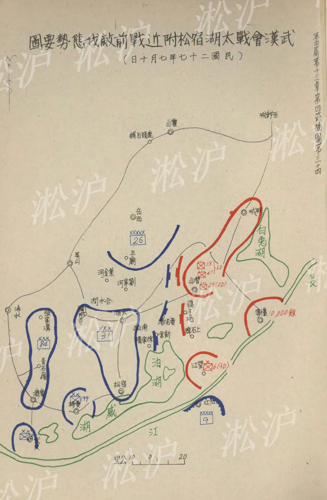

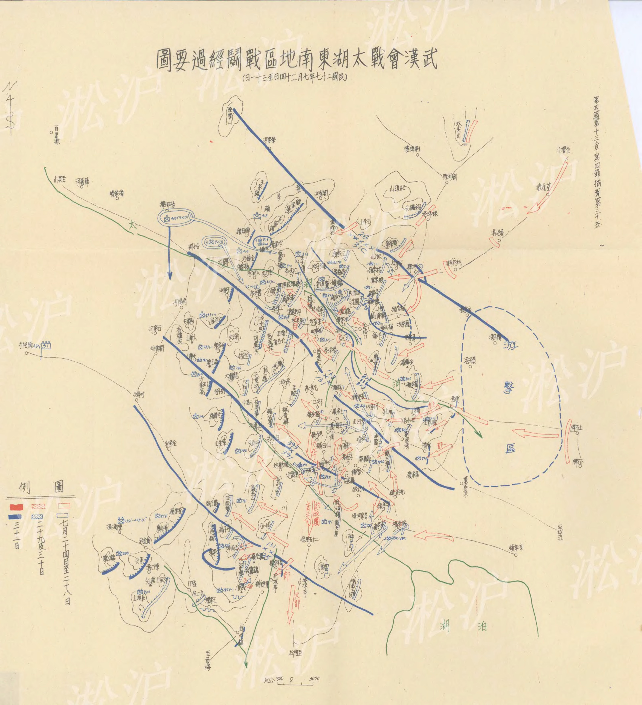

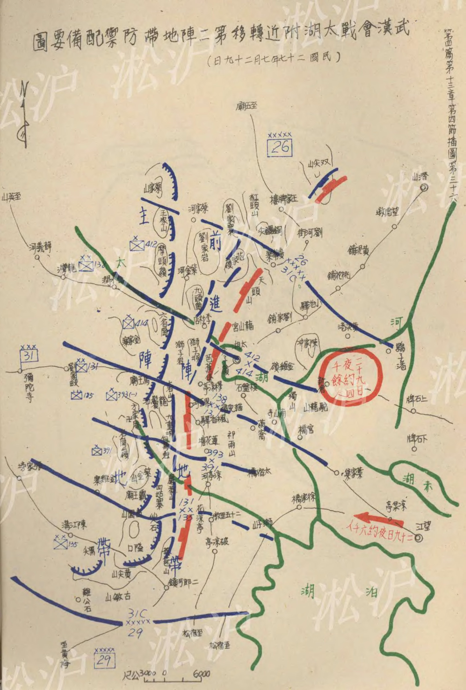

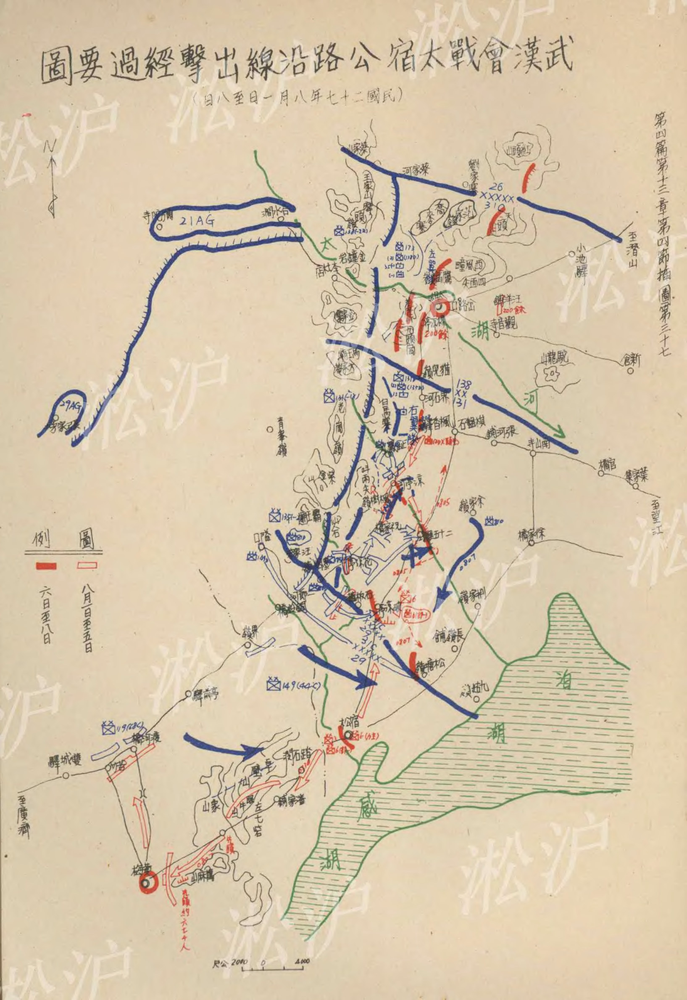

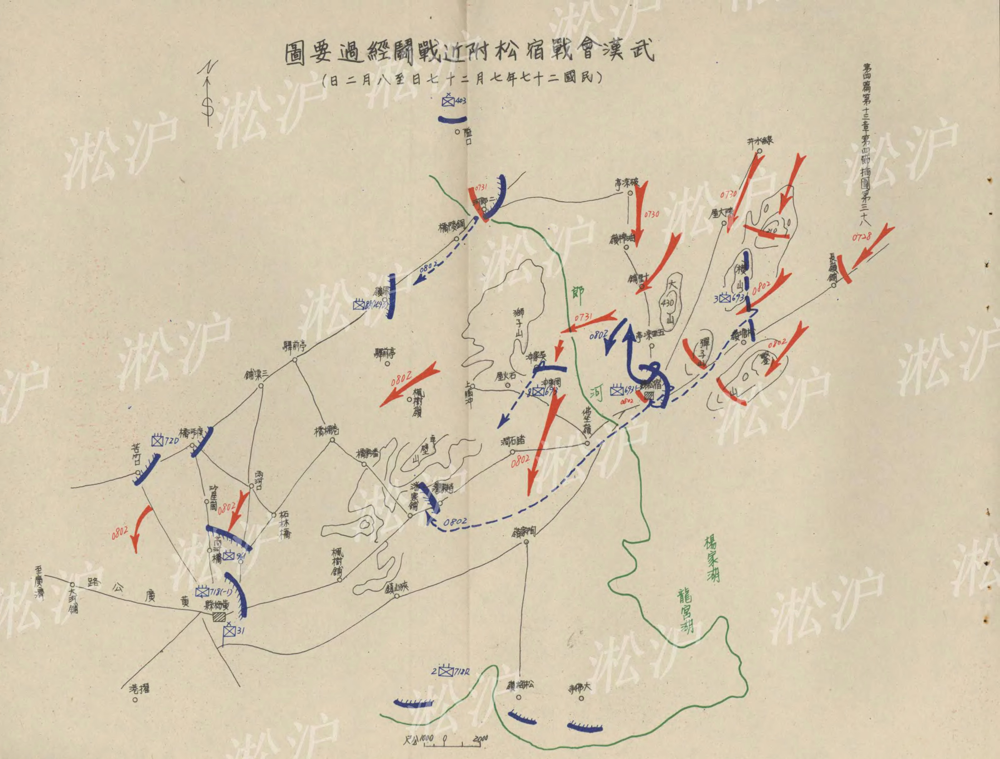

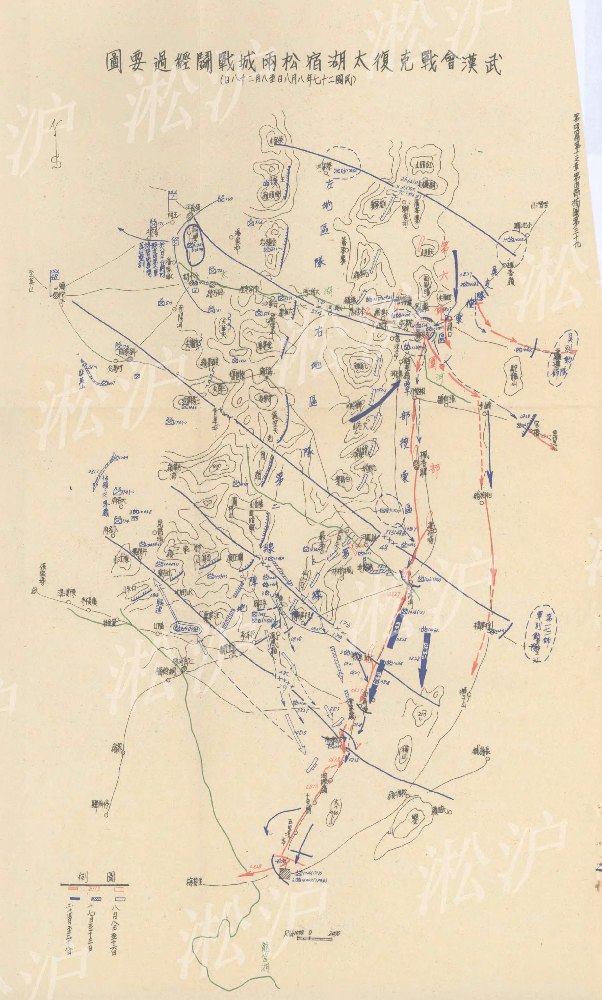

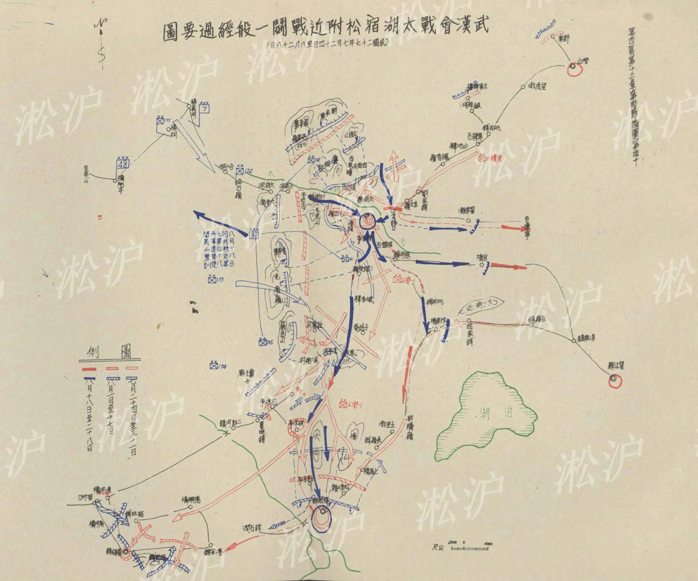

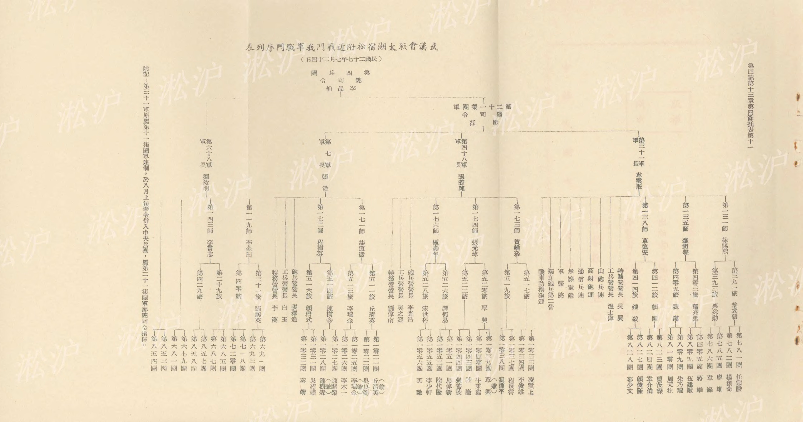
