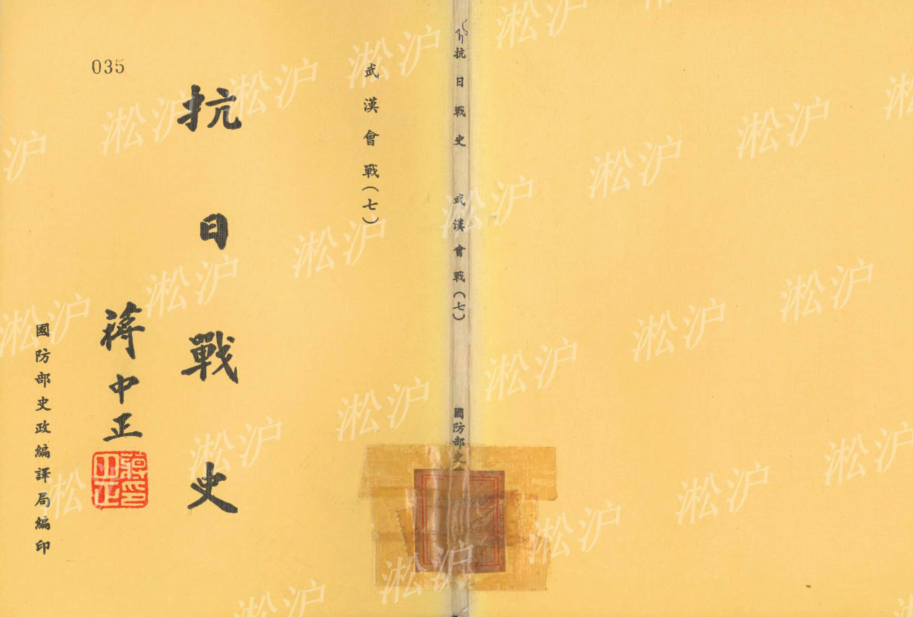

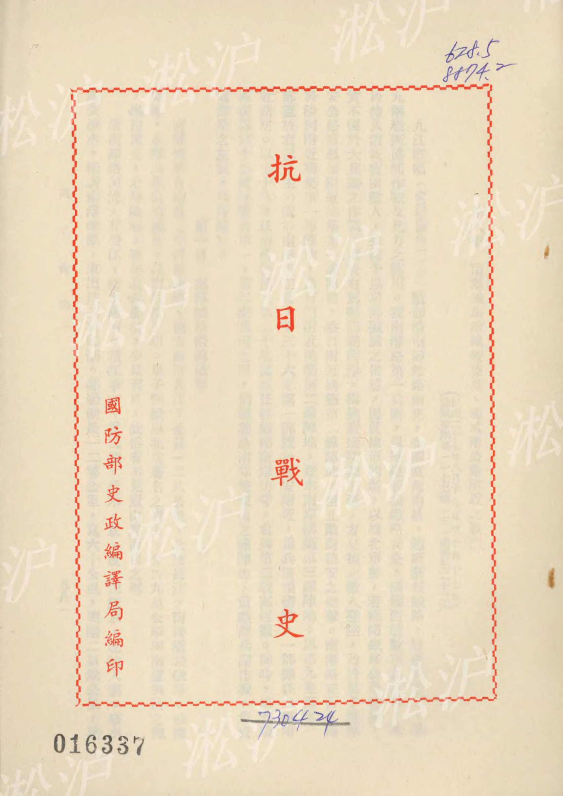

##### 第六項 南澤鐵路沿線暨德星、瑞武兩公路附近之戰鬥

民國二十七年八月十九日至十月十七日

參照揮圖第一一七至第二三二捕表第二十二

九江既陷（參照插圖第二七）敵卽沿南澤鐵路南犯，企圖直薄南昌，遮斷浙贛鐵路，妨擾我第三、第九兩戰區協同作戰及兵力之轉用。我南澤路第一兵團，以掩護浙贛鐵路安全，側擊西進敵軍之目的，基於持久消耗疲困敵人，乘機予以局部殲滅之指導，因就地形判斷，以贛北形勢，若離開鐵路公路幹線，貨不便於大兵團之作戰，須於右翼鄱陽湖西岸，構築直接防禦工事，方足拒止敵人登陸，乃於星子至德安公路東孤嶺附近構築第一線陣地，隘口附近構築第二線陣地，拒止敵對德安之側擊。南澤路正面，則於沙河附近構築第一線陣地，烏石門附近構築第二線陣地，修水南岸構築第三線陣地。以第九集團軍一部置於右翼，主力置於南澤路正面，第三十六軍團一部置於德安附近，爲兵團預備隊，一部擔任永修附近湖防。以第十八軍任南昌警備，第二十集團軍任鄱陽湖南岸防守，右與第三戰區連繫。同時，第九戰區復以第十集團軍置於第一、第二兩兵團之間，佔領瑞昌南郊筆架山之線陣地，策應兩兵團作戰，形成南澤路之左翼，以待敵軍。

第一目

南澤鐵路沿線地形

南澤鐵路自南昌之牛行經永修、德安而至九江，全長一二八公里，北臨長江，南接浙贛鐵路。沿線地勢，永修以北山地綿亘，以南則較平坦。星子縣城以北爲著名之廬山，介於九星公路與南廬鐵路之間，峯嶺重疊，形勢險峻，終年濃霧瀰漫，少見天日，故俗有不見廬山眞面目之稱。

沿南澤路河流，有贛江、修水兩河。贛江承章、貢二源，受禾、袁、汝、錦諸水，北流入湖。修水南受潦水，橫斷南澤鐵路，東出注入鄱陽湖。鄱陽湖長一二零公里，寬六十公里，周圍二百餘公里，納贛信、修水、鄱諸水流入長江，狀似葫蘆。南曰宮亭，北曰落星，中爲細腰，古稱彭蠡，有調節長江水量，輔助贛省交通之功能，惟夏季氾濫爲害特甚。湖内可航行艦艇，實有利於敵海軍之作戰。

交通方面，除水運鐵路外，公路以贛縣、吉安、臨川三處爲綰穀點，四通八達，聯繫浙、皖、鄂、湘、粤、閩各省，極爲便利。

第二目

戰鬥經過（參照插圖第一一七插表第二十二）

南澤正面之敵，爲華中派遣軍（總司令畑俊六指揮）第十一軍（司令岡村寧次），所轄第十六師團松浦部隊全部、第二十師團之第七十七聯隊、野間部隊、第一一三師團之一部，及僞皖保安隊羅漢卿部三個團編成之第九十師團，兵力在兩個師團以上。自七月二十五日攻佔九江後，卽沿南澤鐵路南下，企圖直薄南昌，截斷浙贛鐵路，妨害我軍作戰。同時爲策應南澤正面之進攻，敵在星子一帶湖面之艦艇，亦漸趨活躍。

我第一兵團基於第九戰區作戰計畫，策定南澤路作戰計劃如左（插圖第一一八）：

第一、方針

一、兵團以必要兵力使用於永修、南昌、進賢方面，擔任鄱陽湖以西以南湖沼地之作戰；以主力使用於德安以北以東地區擔任渚溪、星子間湖防及南澤路作戰。

二、在南澤線方面作戰時，採用持久抵抗，保持重點於左翼；俟敵深入後，相機以機動部隊由鐵路以西地區出擊，求敵之右側背而擊滅之。

三、在澤陽湖及其以西以南湖沼地帶作戰時，採機動防禦，沿湖濱及湖沼地帶內外配置監視部隊，並佔領據點，直接拒止敵人登陸及湖沼地帶之進出；以主力控制於適當地區，機動使用，乘敵登陸之際，或進出湖沼地未畢而後續部尚未到達時，迅速攻擊而殲滅之。

武澤山

第二、指導要領

一、在南澤路方面，以牛頭山、金官橋、鷄公嶺現陣地爲起點，對北對東選定多數陣地線，狀況許可時，卽抽調部隊構築工事，逐次加强之。

二、在南澤路方面，如有機可乘，卽毫不躊躇，毅然出擊，力求在馬迴嶺附近，予以重大打擊。

三、應於鄱陽湖以西以南湖沼地帶內構築前進據點，由保安團隊佔領之，並在各據點派遣監視哨。至湖沼地帶邊緣應構築主據點，由湖防部隊派有力一部之佔領，直接拒止敵之登陸，及湖沼地帶之進出；以主力控置於適當地區，機動使用。

四、控置於適當地區之各機動部隊，對於應行增援作戰之各方面，應預作地形偵察及判斷，並須時時整頓戰備，以期適機合宜參與戰鬥，以達成機動作戰之任務。

五、在鄱陽湖及其以西以南湖沼地帶，判斷敵人可能爲主登陸點之防禦應特別加强之。

六、兵團砲兵第一、第二、第十九各團，一律配屬使用，俾賦與在山地及湖沼地作戰部隊以獨立性。

七、配屬於湖沼地作戰部隊之砲兵，應以主力控置於可以通行艦艇之河川及湖面，對於湖沼地帶各河川封鎖線，凡狀況許可者，均應派遣游動砲兵，以火力直接控制之，以妨害敵人破壞封鎖線。如時間有餘裕時，並應於構築有砲兵陣地之主據點前方構成封鎖線，力求砲兵火力與封鎖線之協調。

第三、各方面作戰指導要領

一、南澤路方面：

(二)陣地之選定：

1. 以現守之牛頭山、金官橋、十里山、鑽林山、鷄公嶺（不含）爲第一陣地。

2. 以牛頭山、中岩、大岩、胡羅溪尖、鐵門槓、全部山、黃老門、卓山、曲尾山、車輞中間山、婁家嶺、傳公山、高家山、陳家壠山線爲第二陣地。

3. 以大步嶺、康家山、和尚腦、蜘蛛山、紅花尖、雙峯腦、福龍山、周家壠爲對北第三陣地之右側面陣地。

4. 以青石橋、戴家山、閔山、殷家腦、駱駝山、狗頭山線爲對北之主陣地。

5. 以那山、白雲山、紀家山、和尚窯、馬鞍坪、饒家山、項家嶺、花葉山、徐家山、傳公山、高家山、陳家壠山爲對北第三陣地之左側面陣地。

6. 以刺巴嶺、西邊山、馬迴嶺、二房王爲對北第三陣地之前進陣地；以海螺山、大坑頭、西嶺、東嶺、長門山、猪嶺之線爲對北第三陣地左側面前進陣地。

(一)第一陣地之戰鬥：

1. 第一陣地，係由第九集團軍之八個師守備之。該陣地正面較小，地形堅固，應特別固守，非至萬不得已時不得放棄。

2. 如戰鬥持久，應以兵團預備隊、或他方面部隊調換第一線犧牲較大之部隊至後方整理。調換時宜以師爲單位，不可過於分割。

3. 如敵以有力部隊增援，我第一陣地不能支持時，則請上峯以第三十集團軍之全部（四師）及本兵團所轄之第六十六軍（兩師）守備第二線陣地，擔任拒止敵人及第九集團軍之收容。

4. 第九集團軍應撤至德安附近，準備參加第三陣地之戰鬥。依情況或以有力之一部使用於隘口方面。

(二)第二陣地之戰鬥：

1. 陣地佔領及機動部隊之配置。

武漢(七)

(1)第六十六軍，第二陣地撤退時，應佔領大步嶺、康家山、和尙腦、蜘蛛山、紅花尖、雙峯腦、福龍山、周家壠線右側面陣地，保持重點於右翼（或依情況（我第三陣地與敵接觸時，敵通過徐家舖隘路或由沙山登陸成功）撤至黃塘舖附近爲對東作戰之預備隊），第三十集團軍由第二陣地撤退時，應以主力佔領陳家壠山、高家山、傅公山、猪嶺、長門山、東嶺之側面陣地，保持重點於右翼。以有力一部（一師以上兵力）集結於小陽舖附近地區爲機動部隊，準備協同第九集團軍出擊。

(2)第九集團軍，由第一陣地撤退後，以第十九師及預備第九師歸李覺指揮，集結於隘口街（不含）以西附近地區整頓，充第三陣地與敵接戰時之機動部隊（或依情況（敵由隘口登陸成功時）佔領紅花尖、烏石嶺、黃龍山、宋莊、丫髻山、李喬塘線陣地，對東防禦），第九集團軍之其餘六師，以一師佔領海螺山、大坑頭、西嶺之線前進陣地；以五師集結於老黃嬌舖以北、大窪山以南地區整理，充第三陣地與敵接戰時之機動部隊，依情況（我第二陣地與敵接戰時，敵通過徐家舖隘路或由沙山登陸成功），或以兩師控置於黃塘舖、洪福嶺各附近，爲對東作戰之預備隊。以三師控置於老黃嬌舖以北、大窪山以南地區爲第三陣地，與敵接戰時之機動部隊。

(3)第七十四軍，以有力一部佔領刺巴嶺、西邊山、馬迴嶺、二房王前進陣地；以主力佔領青石橋、戴家山、閔山、駱駝山、王家山、狗頭山之線主陣地。

2. 防禦戰鬥：

(1)刺巴嶺、馬迴嶺、二房王前進部隊，應竭力欺騙敵人，使敵誤認前進陣地爲主陣地，以祕密我之企圖。

(2)應增強前進陣地及右側面陣地右翼，左側面陣地左翼之火力。

(3)敵向第三陣地攻擊時，應以右側面陣地右翼前進陣地、及左側面陣地左翼之火力殲滅之。

出擊部署：

(1)敵如用中央突破時，我刺巴嶺、馬迴嶺、二房王之前進部隊，應相機撤至主陣地，東西機動部隊應乘敵突入我前進陣地戰鬥鬆懈之際，迅速出擊，包圍敵人而殲滅之。敵如向我側面陣地攻擊時，則第七十、第六十六兩軍應固守陣地，第九集團軍之五師及第三十集團軍之有力一部，應迅速攻擊敵之右側背而殲滅之。敵如向左側面陣地攻擊時，則第三十集團軍應相機由小陽舖出擊，第九集團軍應相機由老黃嬌舖出擊，第七十軍應迅速由隘口以西地區出擊，包圍攻擊敵人而殲滅之。

敵如已由沙山附近登陸成功，而我第七十軍已佔領蜘蛛山、烏石嶺、黃龍山、宋莊、李橋塘線陣地時，馬迴嶺附近之出擊，應由第三十及第九集團軍之機動部隊擔任之。

(3)敵如同時一方面由鐵路正面攻擊，一方面由沙山登陸時，則對沙山、星子方面之作戰，仍由第二十五軍獨立擔任之。以第三十、第九兩集團軍及第六十六、第七十四兩軍將沿南溥路進攻之敵殲滅，或予以重大打擊後，再轉移兵力於隘口方面。

(4)於第三陣地戰鬥開始之前，以砲兵第二團第二營配屬於第七十四軍在馬迴嶺以南佔領陣地。第一期以配屬於第九集團軍在西嶺以西佔領陣地。第一期以主火力制壓敵砲兵，以一部火力拒止敵步兵向我陣地之攻擊。第二期以全火力指向被我包圍之敵，以消滅其抵抗之意志。

(5)如我出擊不能奏功時，則海螺山、大坑頭、西嶺、東嶺長門山、猪嶺前進陣地守軍，應掩護我出擊部隊撤至那山、白雲山、紀家山、和尙窪、馬鞍嶺、饒家山之陣地，依情況（沙山敵武漢(七)

二、隘口街方面：

登陸未成功，徐家舖隘路敵未通過）佔領康家山、紅花尖、周家壠左側面陣地，掩護第七十軍撤至該側面陣地以東地區，仍固守第三陣地。

(一)應於盛家嘴、渚溪、破頭山、青山、沙山、何家壠、東孤嶺等地對鄱陽湖構成堅固據點，派遣有力一部固守之。於星子、神定湖南岸、玉筋山、牛頭山之線派遣前進部隊固守之。於東孤嶺、慶雲峯、香爐峯、漢陽峯線以有力一部固守之。其餘兵力分置於歸宗寺、宋莊、鄒家嘴各附近機動使用，應不分晝夜派遣游擊隊向姑塘、九江方面之敵襲擊，以疲憊之。

(二)配屬該方面砲兵應使用於沙山附近，以火力控制沙山至王爺廟間湖面，並直接拒止敵由該方面登陸。

(三)星子方面，登陸之敵如向東孤嶺、慶雲峯陣地攻擊，欲進出徐家舖隘路時，守備部隊應竭力拒止，並適時以控置於歸宗寺之機動部隊，乘敵半進出隘路時擊破之。

四敵如由沙山、渚溪間登陸，沿湖各據點應竭力固守。並適時以控置於宋莊、鄒家嘴各附近之機動部隊，乘敵半登陸時而擊破之。

(四)如敵進出徐家舖隘路或，由沙山、渚溪間登陸，該方面之機動部隊不能擊破敵人，而我在南澤線方面尚保有第一陣地之前，卽令位置德安附近之第七十四軍反攻之。如在我南澤方面已放棄第一陣地之後，卽令位置於隘口以西附近之第七十軍反攻之。

(六)敵如進出徐家舖隘路，或由沙山附近登陸，我第七十或第七十四軍之反攻仍不能擊退該敵時，應行之處置如左：

1. 如在我尙保有第一陣地時，則以第五十二師佔領漢陽峯、炭山崔、金輪峯（含）陣地，左與我第一陣地右翼連絡以第一九零師佔領金輪峯至宋莊（含）間陣地，擔任隘口街之隘路封鎖，以第七十四軍之一師，佔領宋莊至李橋塘之陣地，以第七十四軍之另一師爲預備隊，位置於黃塘舖附近。第七十四軍所還德安防務，由第三十集團軍派隊接替之。或依情況退守第二線或第三線陣地。

如在我尙保有第二陣地，而第一陣地之部隊已撤至第三陣地時，則以第五十二師佔領漢陽峯至金輪峯（含）間陣地，左與我第二陣地之右翼連絡。第一九零師佔領金輪峯至宋莊（含）間陣地。以第七十軍之一師佔領宋莊至李橋塘陣地。以第七十軍之另一師及第九集團軍之兩師爲預備隊，分置於黃塘舖、洪福嶺各附近地區。或依情況撤至第三陣地之前進陣地，以節約兵力。如在我已放棄第一第二陣地而尙保有第三陣地及馬迴嶺附近之前進陣地時，則以第七十軍之兩師，佔領蜘蛛山、牛郎寨、黃龍山、丫鬆山、李橋塘之線。以第二十五軍之兩師及第六十六軍之兩師爲預備隊，分置於黃塘舖、洪福橋各附近，固守德安以北以東各高地。

三、永修方面：

(一)依現狀對永修方面之作戰，應如左指導之：

1. 應於吳城、王家山、丁家山、九房李、中曲岸、破鍋山、三角圍尾、窪里李、涂家埠、嚴家洲等處構築前進據點，對於吳城鎮、王家山、丁家山各據工事，應特別加強之。於門前崗、顧村、長嶺、觀音巖、南岸山、永修、高家壠、小河渡、五鷄嶺、塔下何、老虎山、過路山、小竹山、南大窪山、金鷄嶺等處構築主據點工事，對觀音巖小河渡、五鷄嶺、老虎山四據點之工事，尤須特別加強之。

2. 應以步兵一團附砲兵一部，守備吳城鎮、九房李、中曲岸各據點，拒止敵人由該處登陸及艦艇武漢比

之通過，非不得已不可撤退。配屬該地之砲兵，應於丁家山以東附近佔領陣地，以火力控置我既設封鎖線之前方，阻止敵艦艇載運部隊登陸。

3. 應以一部守備王家山、破鍋山、三角圍尾、窪里李、老枯楞熊、涂家埠、嚴家洲各前進據點；以有力一部守備門前崗、長嶺、觀音巖、南岸山、永修、高家壠、小河渡、五鷄嶺、塔下何、老虎山、過路山、小竹山、南大窪、金鷄嶺等主據點。對觀音巖、小河渡、五鷄嶺、老虎山各主要點之作戰力，應特別加强。以主力控置於金家山、永修、團城汊各附近機動使用。

4. 配屬該方面之砲兵，應以一部在五鷄嶺附近佔領陣地，以火力控制南湖湖面；一部在吳城及觀音巖佔領陣地，以火力控制由鄧家至中基湖之修河河面。

5. 如時間有餘裕時，應於鄧家附近構成一封鎖線，由觀音巖、五鷄嶺兩方面之砲兵以火力控制之6. 敵如由南湖或修河登陸，該方面作戰軍不能拒止時，應依情況由德安附近之第七十四軍或南昌方面之第十八軍派隊增援之。

如敵人攻佔我德安後，而一方面由鐵道南進；一方面由南湖、修河登陸西進時，則第三十集團軍佔領那山（含）經岷山脚下至第二兵團右翼，以第九集團軍（四師）佔領那山、（不含）牛角山、仙如嶺、春山李、九仙嶺、南大窪山、小竹山、過路山之線陣地而固守之。以第七十四軍及第二十九軍擔任由老虎山經永修至門前崗湖沼地帶之守備。以第九集團軍之四師分置於虬津及泮溪市附近地區，以策應對東對北之作戰。第六十六、第二十五兩軍轉用於南昌、進賢方面。

如敵已進出湖沼地帶，及牛角山、春山李、南大窪山線被敵突破時，則應以第九集團軍之八個師，及第二十九軍之兩師，守備牛頭山、白馬山、下白虎頭李、趙家山、沙子嶺、虎山、風樓山、熊家山、小山、後江山、烏龜山、上天峯概略之陣地，右接南昌方面守軍，並置重點於修河方面，拒止敵之西犯。以第七十四軍之兩師轉用於南昌方面。

四、南昌方面：

(一)依現在狀況對南昌方面之作戰，應如左指導之：

1. 窯頭街、昌邑街、老鴉街、鷺鶯口潭口、萬莊、樓前市、滁槎、上殿、八字腦、拓林、藉邱市、章邨、百畝山熊等處湖沼地內之前進據點，由保安團隊守備之。沿湖沼地之南岸山、馬將軍廟、大竹山、黃溪渡等主據點，由第一四二師派有力部隊守備之；並應竭力加强南岸山、樵舍主據點工事而確保之。蛟橋、沈口、陳莊、裳溪、武溪市、謝埠市、武陽渡等主據點。由第一三九師派有力部隊守備之；並應竭力加强謝埠市主據點工事而確保之。以第一四二、第一三九兩師之主力分置於江家橋、陳村間及城南史、佛頭塔間機動使用。

2. 以南昌警備司令所轄之三個保安團及第一三九師之一部，控置於牛行附近，歸該方面指揮官指揮，以策應第一四二師之作戰。

3. 配屬於第一四二師之砲兵，應以一部於南岸山附近，以主力於馬將軍廟附近佔領陣地，以火力控制由熊村至大竹山之贛江江面及萬莊封鎖線。配屬於第一三九師之砲兵，應以一部於沈口街附近佔領陣地，以火力控制南昌東北及贛江之兩支流；以主力於謝埠市附近佔領陣地，以火力控制由武溪市至武陽渡及撫河河面，以拒止敵艦艇及浮游戰車之通過與部隊登陸。如交通狀況許可時，並應推進一部游動砲兵於滁槎附近，火力控制滁槎東北及樓前市東北之封鎖線。

4. 如時間有餘裕時，應於熊邨附近構成第三封鎖線，吳城鎮爲第一封鎖線，昌邑街爲第二封鎖線，以南岸山附近之砲火控制之。於武溪市構成一堅固封鎖線，以謝家埠之砲兵火力控制之。

5.應以第十八軍之一師控置於樂化、華源附近，相機策應第一四二師及永修方面之作戰；以一師控置於沙埠潭附近，相機策應第一三九師及進賢方面之作戰。

6敵如由樵舍方面登陸時，則相機使用控置於江家橋、陳村間之機動部隊，及牛行方面之預備隊，與樂化、華間第十八軍之一師撲滅之。敵如由謝埠市登陸，則相機使用控置於城南史、佛頭塔間之機動部隊，及沙溪潭第十八軍之一師撲滅之。

(三)敵如先攻佔我德安後，一面沿南澤鐵路進犯永修；一面經鄱陽湖進犯永修、南明、進賢時，則以第六十六軍轉用於南星方面，合原有部隊共計六師，以三師擔任湖防，以三師爲機動部隊。

(三)敵如先攻佔我永修後，一面沿鐵路南犯南昌；一面由鄱陽湖進犯南昌、賢時，則以第七十四軍轉用於南昌方面，合原有部隊共計八師，以三師擔任湖防；以三師爲機動部隊，以兩師佔領上天峯、七星腦、馬鞍嶺、南岸線之陣地對北作戰。

四如敵由鐵路正面將我陣地突破或進出湖沼以後，我戰況不利時，應相機將贛江東岸之部隊撤至西岸，依情況（敵主力在南昌以南時），可決富有、圩水閘以淹沒南昌以南之敵。我最後應固守後江、獅子山、張家壠裏、十八嶺、白頭腦、八頭腦、野鷄山、熊家山、丁家山、炭嶺、松胡街、豐城縣之線陣地。由張家壠裏至豐城之線長一百公里，僅有八師兵力，不敷分配，可將重點移贛湘公路及浙贛鐵路方面。

五、進賢方面：

一、依現況對進賢方面之作戰應如左指導之：

1. 在湖沼地帶內瑞洪、老塘、尖頭港等前進據點，應由保安團隊守備之。三陽集前進據點，應由第一四一師派前進部隊守備之。該兩部主力，分別控置於東塘、鄧墩間及進賢、傅莊間機動使用，並應在東鄉、將軍嶺、下埠市、進賢、白家墟、文家港、溫家圳構築據點或預備陣地，對南臺市、烏石坑、王家源、墈頭王、羅溪市、涂家各主據點之工事，應特別加強之。

2. 將來如配屬稅警旅砲兵時，應在南臺市附近佔領陣地，以火力控制東部軍山湖。如配屬第一四一師砲兵時，應以主力在涂家附近佔領陣地，以火力控制青楓湖；以一部推進至三陽集爲游動砲兵，以火力控制三陽集封鎖線，爾後適時撤至鶴下黃附近佔領陣地，以火力控制西部軍山湖。3. 如敵由西部軍山湖及青楓湖登陸時，應以控置於進賢、傅莊間之機動部隊，乘敵半登陸時攻擊之。如敵由楓港、潤溪湖及東部軍山湖登陸時，應以控置於東塘、鄧墩間之機動部隊，乘敵半登陸時而擊滅之。

4. 如該方面戰況不利時，最後應固守東鄉、將軍嶺、下埠市、進賢、溫家圳各據點待援。

(三)敵如先攻我德安後，一面沿南溥鐵路進犯永修、南昌；一面由鄱陽湖進攻南昌、進賢時、則以第二十五軍轉用於進賢方面，合原有兵力共計三師一旅，卽以一師一旅擔任湖防，以一師控置於東鄉及將軍嶺附近，以一師控置於白家墟及文家港附近，策應湖防部隊之作戰。如敵向該方面積極進犯，不得已時，卽固守東鄉、將軍嶺、白家墟、文家港、圓源吳、三江口、筱塘墟、帥頭湖南岸、豐城縣概略之線陣地。

第四、軍隊區分

指揮官第九集團軍總司令吳奇偉。

第二十九軍團。

第七十軍。

第十九師。

第八軍

第三師。

第十五師。

第六十四軍。

第一五五師。

第八一七師。

預備第九師。

第四軍。

第五十九師。

第九十師。

二、隘口方面作戰軍。

指揮官第三十七軍團軍團長王敬久

第二十五軍。

第五十二師。

第一九零師。

江西游擊副總指揮。

保安第三團。

保安第十一團。

三、永修方面作戰軍

第十八軍

第六十師

第一三九師

第一四工師

南昌警備司令部

軍士教導團

保安第十六團

保安第十九團

鄱陽湖警備司令部

保安第二團

保安第七團

保安第十三團

砲兵第十九團（欠第三營）

五、進賢方面作戰軍

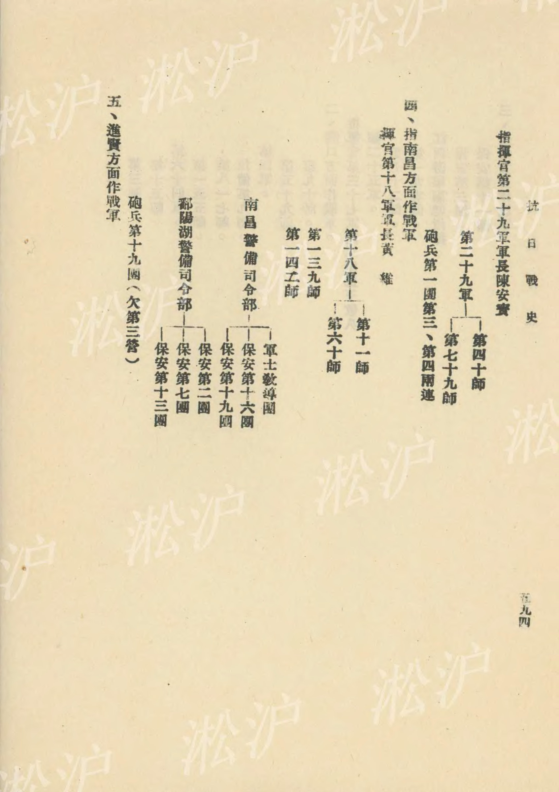

指揮官第二十集團軍總司令商

震

第一四一師

稅警旅

六、兵團預備隊

第六十六軍

第一五九師

第一零六師

第七十四軍

第五十一師

第五十八師

七、直轄部隊

砲兵第二團（欠第三營）

工兵第三團（欠第一營）

第五兵團部署

一、右翼方面：

第二十五軍（第五十二、第一九零師師）佔領盛家嘴珠礦、東孤嶺昆子、鼓子寨、漢陽峯線陣地。第六十六軍（第一五九、第一六零師）控置於隘口附近，策應第五十二軍作戰，並構築隘口附近預備陣地工事。

二、南澤正面：

第七十軍第十九師佔領牛頭山、金官橋、鄧家河（含）線陣地。第八軍（第三、第十五師）佔領鄧家河（不含）十里山、鑽林山（含）線陣地。第六十四軍（預備第九師、第一八七、第一五五師）控置於中岩、大岩及胡蘿姿尖、鐵門槓、全部山間地區，並構築各該線預備陣地工事。第四軍（第五十九、第九十師）在車輪北端山、北王家山、雞公嶺、皇天腦之線構築預備陣地工事，並以一部任鷄公嶺間警戒。

三、永修方面：

第二十九軍第七十九師任涂家埠、吳城鎮據點，及小河渡、五鷄嶺龜山、老虎山（含）線湖防，並控置一部於永修爲機動部隊，且構築附近工事。

四、南昌方面：

第十八軍（第十一師及第六十師）任南昌、蓮塘市及牛行、樂化間地區預備陣地之構築。

五、進賢方面：

第三十二軍（第一三九師、第一四一師、第一四二師）任東鄉、進賢間據點，及梁家渡、武溪市、七里街與雙江裘、瓜子洲、樵舍諸要點守備，構築港口、曹村、樂化街斜交陣地，與楊子洲、黃溪渡、涂村各前進要點工事。預備隊第七十四軍（第四十師、第五十一師第五十八師）控置於德安附近爲兵團預備隊。

六、左翼友軍（第二兵團）方面：

第七十八軍（新編第十五及第十六師）佔領車輪中間山、陳家壠之線。第七十二軍（新編第十三及第十四師）集結靑龍墳、岷山脚下，並構築河連山據點及王家坂、項家嶺、徐家山之線預備陣地工

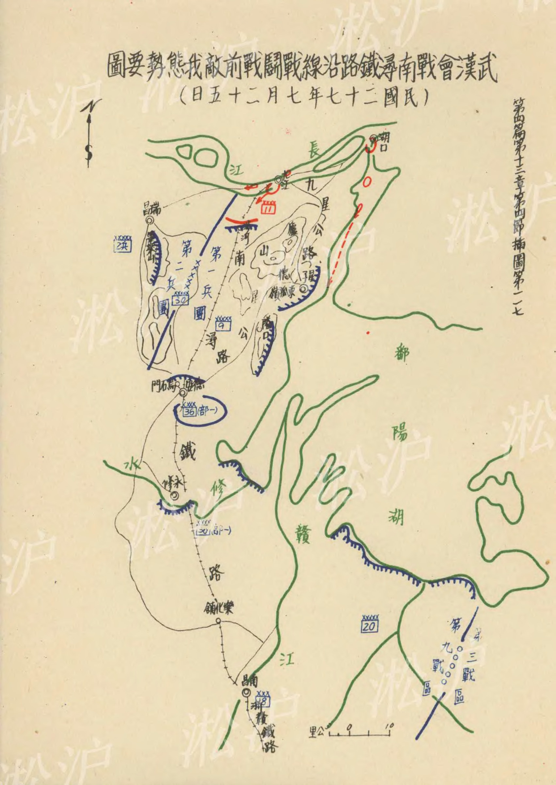

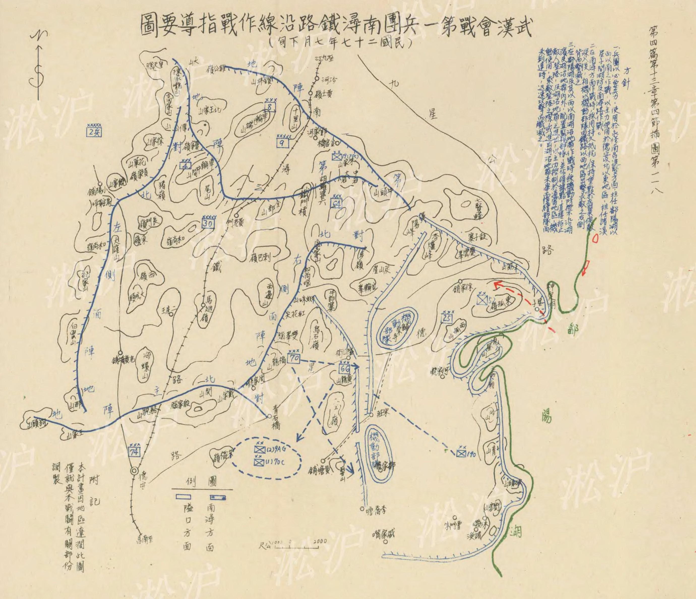

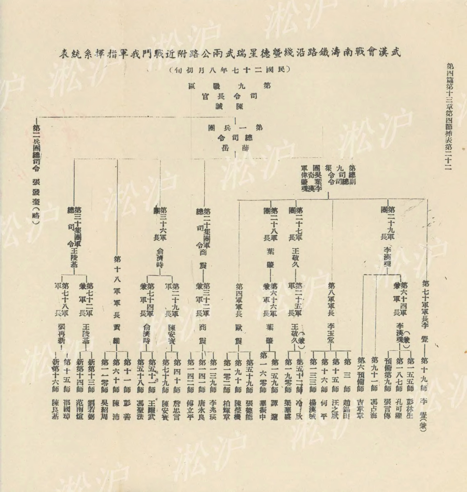

一、德星公路沿線之戰鬥

民國二十七年八月十九日至十月十二日

參照插圖第一一九至第二二四

自八月三日以來，南澤正面沿鐵路南下之敵第一零六師團全部，第二十師團、第一三師團各一部，及僞皖保安隊編成之第九十師團全部，被我阻止於沙河附近之線後，乃以其第一零一師團，積極於星子方面登陸，企圖沿德星公路西攻德安，威脅我沙河線之右側背。我第二十五軍以拒止敵登陸西進之目的，基於層峯之指導，爰作如次之部署（參照插圖第一一九）：第一九零師任盛家嘴珠磯、王爺廟、西孤山線守備，並派兵一營任九星公路之游擊，歸第五十二師指揮；第五十二師任西孤山（不含）東孤嶺、萬杉寺線守備，並以一部任星子城，開化嶺、王筋山、牛頭山線前進陣地守備。第一兵團旋以第六十六軍推進至隘口附近，策應第二十五軍作戰，並以第九集團軍副總司令葉肇統一指揮。

八月十九日，自晨至暮，敵機十餘架輪流轟炸星子及玉筋山前進陣地，工事多被炸毁。敵艦三艘掩護汽艇十餘隻，企圖乘機派隊登陸，被我擊退，入夜我將陣地修復。

二十日三時，敵艦十餘艘、汽艇二十餘隻，駛至星子城湖面。拂曉以飛機六架，掩護其部隊登陸，被我擊退。八時敵分三路各約二百人，二沿九星公路南進；一由蘭家嘴沿湖岸南進，向小定山進攻。一由謝師塘登陸，向星子城攻擊，激戰至十二時二十五分，大小定山警戒陣地被毀。二十時，敵由星子城東南突入城內，發生激烈巷戰，二十二時三十分，守軍傷亡殆盡，星子城遂告陷落。

我第二十五軍當對第五十二師下達命令，其要旨如左：

一、該師應卽以一團兵力佔領樟樹橋腰子坂，艾家坂、玉筋山、牛頭山亘慈航寺之線爲前進陣地，保持重點於右翼，與東孤嶺主陣地守軍切取聯繫。

二、歸該師指揮之第一九零師游擊營，應卽位置於慈航寺附近地區，以掩護該師前進陣地之左翼，確保

通牯嶺之道路及通訊線，並相機派小部隊襲敵側背。

第五十二師奉命後，卽於當晚確實佔領樟樹橋、玉筋山、慈航寺之線前進陣地，拒止敵繼續西進。八月二十一日四時三十分，敵數百向我玉筋山前進陣地猛攻未逞。旋以海空軍雖中轟炸，並掩護其汽艇十餘隻由，牛屎墩卸隊登陸，被我擊退。玉筋山陣地已被摧。毀九時敵再犯玉筋山，當被突破一部，經守軍逆襲，將敵擊退。十五時，敵艦七艘汽艇二十餘隻，駛至王爺廟、流星山附近，企圖派隊登陸，被我猛烈砲擊後，向星子城附近湖面退去。

八月二十二日二時，玉筋山激戰再起，敵百餘名，由右側侵入，佔領該山最高峯，經守軍由兩翼抽兵夾擊，戰線始趨穩定。此時、第九集團軍副總司令葉肇轉奉兵團薛總司令電話：「玉簾山前進陣地，非有命令不得撤退，已飭第六十六軍由第一六零師派兵一團進至歸宗寺附近地區，相機策應。」至十七時二十分，第二十五軍軍長王敬久，到達秀峯寺督戰，敵之攻擊亦益烈，玉筋山三個山頭已失其二，第六十六軍增援部隊尚未及時趕到，戰鬥至二十三時三十分，玉筋山東南角陣地亦被敵軍突破。

王軍長當經奉集團軍指示，至無法維持現狀時，玉筋山前進陣地可相機處置，遂卽下達命令，其要旨如左：

一、軍爲避免無謂犧牲，决移至主陣地帶與敵決戰。

二、第五十二師應撤退至東孤嶺、萬杉寺、鼓子寨之線佔領陣地，撤退時間定明二十三日二時。

三、撤退時應派有力掩護部隊掩護撤退，掩護部隊之撤退時間，應在拂曉以後。

八月二十三日拂曉，第五十二師轉移至指定位置。六時、敵砲二十餘門，飛機六架，兵艦三艘，集中向我東孤嶺、樟樹橋陣地轟擊。十五時，敵我互以小部襲擊。

八月二十四日五時，敵艦三艘、汽艇十二隻，企圖在王爺廟派隊登陸，復被我擊退。牛屎墩、東孤嶺、東西山脚亦發現敵汽艇七隻被我擊毀二隻，餘向星子湖面退去。旋敵以飛機數架，兵艦三艘掩護敵兵三百人，復由牛屎墩附近登陸，我第五十二師當以一營兵力迎擊。第六十六軍第一六六師之一旅已推進至西孤山附近，準備策應，並偵察道路，相機攻敵側背。

是日上午，牛屎墩登陸之敵，仍未被我擊退，第一兵團總司令薛岳，乃於六時三十分，給予葉副總司令、王軍長以如次之訓令：對牛屎墩附近之敵，一晝夜未能殲滅，是失機也；當機不斷，必受其亂，爾後敵將逐步蔓延，是該指揮官等不顧犧牲者反將犧牲，此時應加強力量，並積極加强工事，多築預備陣地，嚴密配備，切勿因循自誤而誤國家。第二十五軍於奉轉上述訓令後，十四時十分，遂對第五十二師下達如次之命令：「着該師除以第三零九團固守原陣地外，務集結有力部隊，由該師長親自率領，於本二十五日二十四時以前，撲滅東孤嶺山脚登陸之敵」。第五十二師師長冷欣奉命後，卽於黃昏親率奮勇隊向該敵猛攻，一舉將敵包圍，搏鬥至二十六日一時，斃敵大隊長石田道一少佐以次官兵二百餘人，將敵完全殲滅。九時三十分，敵機砲向我東孤嶺、樟樹橋陣地猛烈轟擊，並施放毒氣。十二時，復以步兵百餘猛攻，東孤嶺山脚及樟樹橋陣地相繼失陷，經增援後，陣線始趨穩定。

第五十二師與敵接戰以來，傷亡重大，葉副總司令决以第六十六軍第一六零師接替該師防務，於二十六日十三時下達命令，其要旨如左（參照插圖第二二零）。

一、星子之敵爲福井部隊及僞軍李益賓部約五百人，白鹿洞附近有敵騎砲兵兵力不詳，星子湖面有大型敵艦七艘，汽艇十餘隻。該方面敵連日向我第二十五軍第五十二師陣地攻擊，其砲兵主火力指向樟樹橋及萬杉寺東南高地。

二、第六十六軍應以一部接替第二十五軍第五十二師陣地，以主力位置於黃塘舖、隘口街間地區，相機策應，並構築預備陣地。

三、第二十五軍第一九零師任務照舊；但對流星山方面，應特別注意。

四、第五十二師應於本二十六日黃昏前，將守備陣地交第六十六軍第一六零師接替。交防完畢後，卽在華龍山及二五一、二（含）高地間集結整理，相機策應，並構築地區內預備陣地。交接時，統歸冷師長指揮。

五、第六十六軍第一六零師，應卽以一部接替西孤山（不含）東孤嶺、萬杉寺、鼓子寨、香爐山第五十二師之陣地；主力位置於隘口街、爛泥塘間地區，相機策應，並構築謝家山王、皇恩寺、金輪峯、炭山崖之陣地；但對牛屎墩、樟樹橋、萬杉寺及其東南高地，應切實先行交接。在未全部交防完畢以前，交防部隊不得撤退。

六、第六十六軍第一五九師應卽佔領象山、黃塘舖、望嶺、黃龍山、隘口、謝家山王（不含）線陣地，構築工事，須有相機策應各方作戰之準備。並應以步兵一團爲機動部隊，候命策應。

七、戰鬥地境：

第一九零師與第一六零師間，爲板前山脚二五一。二高地楊伍廟之線，線上屬右。

第一六零師與第一五九師間，爲西灣汪、隘口街、觀音巷、徐家港（不含）之線，線上屬右。

同（二十六）日十七時，侵入樟樹橋一帶之敵，向東孤嶺北側桃花尖、萬杉寺之線攻擊，戰鬥至十九時，始稍沉寂。

八月二十八日、第二十五軍方面戰況沉寂。是日，該軍奉第一兵團薛總司令電令，第五十二師應以一團位置於葉家壠、何家壠、錢家湖街一帶；一團位置於花喬附近；師部位置於烏焦嘴吳，負責構築西孤山南麓南亘華龍山預備陣地，策應第一九零師戰，當卽轉飭第五十二師遵照。第六十六軍方面，晨間，敵又向萬杉寺、南桃花尖間陣地砲擊，並施放毒氣，旋以烟幕掩護步兵六百猛攻，陣地一度失守，經守軍逆襲奪回。第一六零師爲使正面作戰容易，乃派兵兩營，於香爐峯、七賢峯附近任九星公路敵側後之游擊。

八月二十九日，第二十五軍方面，情況無變化。第六十六軍方面，六時、敵約千人，在機砲掩護下，先後兩次向東孤嶺、桃花尖一帶陣地進攻，均被擊退。

八月三十日二時，第六十六軍方面，夜襲部隊潛入敵宿營地，以刺刀手榴彈衝殺，敵傷亡極重，我以任務既達，旋卽撤回。拂曉後，敵以機砲向東孤嶺、桃花尖陣地轟擊，繼以步兵約兩大隊猛衝，官兵沉着應戰，敵未得逞。

八月三十一日、第二十五軍方面，敵艦十艘，汽艇十餘隻，飛機六架及星子附近砲兵，集中火力向王爺廟、流星山附近轟擊，掩護步兵强行登陸，均被擊退。第六十六軍方面，晨起敵分三路，每路約三百人，向我桃花尖、曾家岩一帶陣地進攻，並以機砲協力猛轟，我陣地幾被全毀，激戰至十七時，將敵擊退。入晚、乘夜暗將陣地修復。

九月一日，第二十五軍方面無變化。第六十六軍方面，戰機砲向桃花尖轟擊，並投擲大量毒氣彈，我第一六零師第九五八團團長梁佐勳及守兵三連全體殉職，陣地被敵佔領。桃花尖既陷，敵似以主力佔領陣地構築工事，而以一部抄襲鼓子寨，威脅我左側背。第九集團軍副總司令葉肇，亦決定乘敵立足未穩之際轉移攻勢，遂於十三時二十五分，下達命令，其要旨如左（參照插圖第二二一）：

一、當面之敵約一聯隊，在陸空協同下，連日在東孤嶺、秀峯寺、萬杉寺、曾家岩附近之線，與我第六十六軍第一六零師激戰中。

二、第二十五軍應以第五十二師主力接替東孤嶺主陣地帶之守備；一部確實佔領周莊、柏樹壠、黃龍山、隘口街線預備陣地。並應以一部控置於錢家湖街附近，相機策應，兼任楊伍廟、劉莊附近與西孤山陣地之守備。

三、第一六零師將東孤嶺陣地移交第五十二師接替後，應以一部固守東孤嶺（不含）以北主陣地；以主力由東孤嶺向敵左側背攻擊前進，將敵壓迫於秀峯寺、萬杉寺附近山地而殲滅之。該師任九星公路敵側後游擊之兩營，應同時由香爐峯向曾家岩附近敵右側背攻擊前進。兩翼攻擊部隊之協同，由該師嚴密訂定之。

四、戰鬥地境：

第五十二師與第一六零師間，爲清風橋、爛泥塘、陳家、彭家之線，線上屬左。

五、各師應於黃昏前準備完畢，十八時開始交接，交接完畢後候令攻擊。

九月二日當面之敵續有增加。我第二十五軍方面，拂曉前，敵由楊伍廟附近登陸，致我部隊調動遭受牽制。入夜接防部隊始陸續到東孤嶺。第六十六軍方面拂曉、敵數十冒充我軍接近東孤嶺陣地，因變起倉卒，增援不及，陣地遂被該敵突破一部，我逆襲部隊爲敵砲火所阻，反攻無效。十五時，敵繼續增援猛攻，東孤嶺前端小高峯及秀峯寺西北高地相繼失陷。入夜始將東孤嶺防務移交第二十五軍之第五十二師接替。

九月三日八時，東孤嶺防務交接完畢，第一六零師卽以主力控置東孤嶺附近，準備側擊突入萬杉寺秀峯寺西港口附近之敵。其在鼓子寨集結之一部，亦準備向南攻擊敵右側背。第二十五軍方面，楊伍廟登陸之敵經我增援擊潰。第六十六軍方面，敵四百餘，向我西港口猛犯，敵機亦低飛助戰，經我控置東孤嶺部隊增援後，始將該敵完全擊潰。入夜、我南溥正面沙河線部隊，因受左翼友軍方面影響，向烏石門東西之線轉進。我第六十六軍隘口附近之第一五九師卽推進至牛邱寨、猪頭山雙峯腦龍南山、周家壠之線，右與第一六零師聯繫，對西北警戒，掩護左側後之安全。

九月四日，第二十五軍方面敵機砲向東孤嶺陣地集中轟擊，並掩護其步兵千餘，由東北兩面進攻，戰鬥激烈。嗣因爛泥塘，西港口相繼失陷，東孤嶺三面受敵，增援部隊復爲敵火所阻，無法前進，守軍傷亡奇重，不能支持，陣地遂陷。十七時，我再增援反攻，始將東孤嶺南半部奪回。第六十六軍方面，敵先以機砲向爛泥塘西港口一帶陣地猛烈轟擊，並施放大量毒氣，繼以步兵猛攻，戰鬥至十三時，亦以守軍傷亡慘重，陣地相繼失陷。十七時，經增援反攻，又告恢復。第一六零師經連日激戰，傷亡重大，對於側擊突入秀峯寺一帶敵之計畫，已無力執行。入晚葉副總司令奉第一兵團總司令薛岳九月三日指導要領如次：「第一六零、第一九零、第五十二等師，應在原陣地極力支持。萬不得已時，固守南獅嶺、黃塘舖、了髻山、望嶺、黃龍山、隘口街、南康尖、金輪峯間之預備陣地」。當卽轉飭所屬遵照，在原陣地線極力支持。

九月五日，七時許。第二十五軍方面，敵千餘藉機砲掩護，向我東孤嶺南部陣地猛攻，戰鬥至爲激烈，我傷亡雖重，仍勉力支持。十一時，第六十六軍爛泥塘、西港口陣地再度失陷，東孤嶺三面受敵，甚感難支。戰鬥至十四時三十分，第二十五軍奉准變更部署。十五時下達命令要旨如左（參照插圖第二二二：一、第五十二師應於本晚將東孤嶺最高峯奪回，與第一九零師交替防務後，集結高嶺附近，迅速整理，限六日晚再接替劉家山以南第一九零師之守備任務。

二、第一九零師應以兵力一團，於本晚接替第五十二師東孤嶺陣地。

三、戰鬥地境：

第五十二師與第一九零師間，爲鼓田壠、橫塘、蓼花池南岸、大坑及劉家山以西之線，線上屬右。

第一九零師與第六十六軍間，爲清風橋（不含）爛泥塘、觀音岩之線，線上屬左。

同日、第六十六軍方面，黃昏後，派隊反攻，又將爛泥塘、西港口陣地恢復。

同日，第一兵團薛總司令以第一八七師殘部兩團，開往隘口歸第九集團軍副總司令葉肇指揮。

九月六日，第二十五軍方面，於拂曉前將防務調整完畢。拂曉後東孤嶺最高峯南面山麓之敵，向我次高峯攻擊，並以砲火封鎖我何家壠至錢家湖街，各處交通線遂被阻隔，激戰至十時，被我擊退。二十一時三十分，王敬久軍長電令第一九零師，於六日晚將東孤嶺最高峯奪回。二十三時，第一九零師以步兵四排向敵攻擊，激戰至七日拂曉，終以傷亡過重，退回原陣地，待機攻擊。第六十六軍方面，自晨至十四時，敵砲不斷向我陣地轟擊，步兵每次二百餘輪流向西港口進攻，均被擊退；惟鼓子寨後方連絡線被敵火遮斷，守軍孤立無援，戰鬥至十六時，終以傷亡過大，陣地一部被敵攻佔。斯時南澤正面之敵約七八百人，亦於此時向我龍南山一帶猛撲，企圖東竄隘口街，截斷德星公路，威脅我之左側背，經我痛擊後，該敵始向馬迴嶺方面退去。

九月七日拂曉，第二十五軍方面，東孤嶺之敵增加約兩大隊。同時敵艦砲集中向我次高峯猛轟，掩護其步兵之攻擊，我陣地被毀，官兵傷亡雖重，但仍奮勇迎擊，陣地得以確保。六時、敵艦五艘，敵機八架，掩護汽艇七隻，企圖由王爺廟派隊登陸，與東孤嶺之敵夾擊我西孤山，當卽擊退。第六十六軍方面，一時許，鼓子寨之敵經我增援反擊，完全肅清。三時許，龍南山前之敵千餘，乘我守軍傷亡甚重，無力支持之際，一舉而攻佔我山前諸小高地。嗣經我增援部隊自兩側夾擊，敵始狼狽逃竄。

九月八日三時，第二十五軍方面，東孤嶺最高峯之敵向我次高峯施放大量毒氣，我傷亡慘重，東孤嶺全部遂告失陷，我退守西孤山繼續抵抗。第六十六軍方面，拂曉、敵約七百餘，在機砲掩護下，向我爛泥塘三面圍攻，守兵一連全部殉職。午後、我派隊反攻，激戰至晚，殲敵過半，殘餘向東潰退。

連日、當面之敵復有增加，敵第一零一師團似已全部到達，我第七十九師之一旅亦向隘口集結待命。二十一時，葉副總司令變更部署，並以第一八七師之兩團分別增加於第二十五、第六十六軍方面，當下達命令，其要旨如次：「第二十五軍附第一八七師一團，除以一部死守原陣地，並佔領青山、牌樓灣、高莊、何家壠附近及華龍山、徐家港、雪包山（不含）之線陣地外，其餘應相機攻擊。第六十六軍附第一八七師之一團，除死守原陣地外，應策應第二十五軍方面之攻擊，但應以一團一營佔領雪包山、黃龍山、隘口、金龍庵、金輪峯、炭山崖之線陣地。第七十九師之一旅，佔領花喬、柏樹壠、雪包山（不含）之線陣地」，當晚各部遵就指定位置，部署完畢。

九月九日，第二十五軍方面，零時、敵汽艇七隻，滿載敵軍，企圖於流星山、楊伍廟登陸，被我擊沉二艘，餘皆逃去。拂曉後，敵續攻楊伍廟、西孤山，我陣地被彈千發，工事盡毀，同時敵並施放毒氣，官兵中毒者甚衆，戰鬥至爲激烈，但陣地未稍動搖。二十時，敵七百餘，由東孤嶺山下沿湖岸向楊伍廟陣地猛攻。另敵二百餘，向西孤山衝擊，激戰至二十三時，均被擊退。第六十六軍方面，拂曉後，爛泥塘、西港口陣地及其附近村落亦大部被敵砲火摧毀，守軍傷亡頗重，陣地一部被敵突破，旋經我增援逆襲，激戰七小時，始將其擊退。

九月十日，第二十五軍方面，拂曉，敵約千餘，猛攻西孤山陣地。同時敵艦三艘，掩護裝載部陸之汽艇十餘隻，在王爺廟登陸，企圖夾擊我西孤山守軍。十六時，我援軍加入戰鬥後，敵乃不支潰退。第六十六軍方面，七時許，敵五百餘，向我爛泥塘陣地猛攻，當被擊破。十六時，經我增援逆襲，陣線益趨穩定。是晚，我第七十九師全部及第九十一師之一部到達隘口附近地區，歸第九集團軍副總司令葉肇指揮。

九月十一日，第二十五軍方面，晨，敵二千餘，分三路：一向楊伍廟；一向西孤山及二五一、二高地；一向西孤山，三四一、二高峯猛攻。另由湖面以軍艦四艘，汽艇十餘隻，載兵在王爺廟登陸，經我守軍奮勇抵抗，卒於十七時將其擊退。第六十六軍方面，敵約千餘，於晨間猛攻袁家坂、鷄籠山、觀門日陣地，戰鬥異常激烈，同時敵砲延伸射程，向我陣地後方轟擊，交通被敵火遮斷、援陸無法前進，二十三時，袁家坂陷於混亂狀態，鷄籠山乃被敵攻佔一部，當以第七十九師之一營增援反攻，其餘在歸宗寺附近佔領陣地，並加強共工事。

九月十二日，第二十五軍方面，一時起，敵卽以步兵向我西孤山陣地攻擊，至拂曉，更集中所有輕重武器，在海空協力下，利用煙幕掩護其步兵二千餘，分由楊伍廟三四一、五高峯附近及爛泥塘等處包圍攻擊。七時三十分，該敵施放每氣，仍無進展，戰鬥至九時三十分，三四一、二高峯被敵突破。此時，我預備隊用盡，沙山至王爺廟一帶湖防部隊，亦已抽調一空，情況危急，王軍長乃親至西孤山督戰，策勵官兵全線反攻，士氣爲之一振，官兵前仆後繼，奮勇衝擊，激戰至十時四十分，卒將該敵擊潰，我遂乘勢克復三四一、二高峯。黃昏，敵再與攻擊，我以傷亡過重，不克支持，西孤山，三四一、二高峯及楊伍廟陣地又被突破一部，惟時已入夜，敵機不能活動，戰況乃趨沉寂。二十一時三十分，葉副總司令電令第七十九師第二三五旅（欠一團）撥歸第一九零師指揮。王軍長奉命後，當卽令該部於三小時內到達錢家湖街增援西孤山方面之作戰。第六十六軍方面，攻佔鷄籠山之敵，經我增援反攻，激戰至十二時，該敵卒被圍殲，袁家坂之敵亦不支潰退。黃昏，攻佔西孤山之敵，以一部約百餘人，向我清風墻猛撲，被我擊退。

九月十三日，第二十五，第六十六兩軍，於南北轉戰之餘，未經整補，卽參加南溥路戰鬥，與敵第一零一師團海空協同之精銳部隊相持，裝備旣差，兵員亦感不足，且有南溥正面沙河之線放棄後，馬迴嶺之敵不時向我第六十六軍龍南山方面猛撲，我左側背感受威脅，致龍南山一帶部隊無法轉用於正面，縱有殲敵計畫，因兵力不濟，亦難付諸實施，至此，更以傷亡過重，尤感無力支撐。

葉副總司令同日八時乃下達要旨命令如左：

一、連日以來，敵不斷向我楊伍廟、西孤山、爛泥塘、鷄籠山一帶攻擊，我軍現於李莊、傅莊、饒莊、錢家湖、清風墻、山家山、盧家塘、歸宗寺、袁家坂、鷄籠山、王岩寺、鼓子寨、七賢峯、漢陽峯之線與敵激戰中。

二、我以攻勢防禦之目的，應佔領流星山、華龍山、山家山、胡思嘴、招賢觀、胡莊、金輪峯，炭山崖、王岩寺、鼓子寨、七賢峯、漢陽峯之線佔領陣地，構築工事固守，相機轉移攻勢。

三、第二十五軍，任鄭家埠、李家塘、曹門朱、劉家山、破頭山、青山、沙山、王爺廟、流星山、傅莊、李莊、何家壠之線陣地守備，拒止敵之登陸。

四、第二十九軍第七十九師，應卽佔領何家壠（不含）華龍山、金家壠、廖家山、山家山、胡思嘴、招賢觀，胡慶、金輪峯（不含）之線陣地，對華龍山及胡思嘴以北陣地尤須特別注意。並各以一部佔領雪包山、黃龍山、隘口街、瓜鶴傍徐、金龍壠、胡莊（不含）之預備陣地，及唐家壠、盧家塘、程家嘴、歸宗寺之前進陣地，加强工事固守。

五、第六十六軍第一六零師之一部，除原守備王岩寺、鼓子寨、七賢峯、漢陽峯之部隊，應極力拒止敵之進擾外，其守備鷄籠山附近部隊，應於現陣地極力支持至本十三日黃昏後，除以一部接替金輪峯、陳家嶺、炭山崖陣地之守備外，餘卽逐次轉移至錢家坭爲機動部隊，相機策應。第一五九師任務仍舊。

六、第九十一師之王旅，應以主力置於柏樹壠；一部位置於黃塘舖附近爲機動部隊，歸第二十九軍陳軍長指揮，相機策應。並任象山、黃塘舖、丫髻山、郭家壠（不含）、柏樹壠、雪包山（不含）線預備陣地之構築。

第二十五軍與第二十九軍間，爲黃塘舖（不含）了鬆山、郭家壠、繆莊、華龍山（不含）、葉家壠、何家壠、傅莊、李莊之線，線上屬右。

八、撥歸第一六零、第一九零兩師指揮之各部，一律歸還建制。

各部奉令後，當卽就新線部署，於隘口附近繼續拒止敵沿德星公路之西進。

斯時，南澤正面我軍已轉移至烏石門附近嚴陣以待，馬迴嶺一帶之敵第一零六師團全部，第二十、第一一三師團各一部，及僞院保安隊編成之第九十師團全部，亦停止前進。德星公路方面，敵第一零一師團全部，於九月十三日，突破我東孤嶺附近陣地後，繼續向隘口之線攻擊，直薄南澤正面烏石門線之右側背，企圖與馬迴嶺一帶之敵包圍德安。

迨至九月二十日（參照插圖第二三），第二十五軍方面，十四時，星子湖面敵艦艇忽全部他駛。第二十九軍方面，拂曉，敵約七百餘，向我山家山、胡思嘴、招賢觀西邊山一帶進攻，均經擊退。十五時，敵約七百，由爛泥塘向西南前進，十七時，分向廖家山、山家山、招賢觀進犯，亦被擊退。另部敵約四百人，圍攻西邊山，激戰至暮，我傷亡極衆，援兵一營於開進途中與優勢之敵遭遇，未能到達，西邊山遂陷入苦戰狀態。第六十六軍方面，黃昏後，以小部隊分襲玉筋山、秀峯寺一帶，玉筋山之敵倉皇應戰，傷亡重大，我以任務已達，旋卽撤回。

九月二十一日，第二十五軍方面無接觸。第二十九軍方面，西邊山守軍苦戰至晨，卒以傷亡殆盡，陣地遂告不守。十二時，敵以猛烈砲火掩護敵兵七百，續向香泉寺、胡莊以東高地一帶陣地猛攻，中彈千餘發，工事全毀，幸官兵沉着應戰，敵終未逞。第六十六軍方面，拂曉，我派隊襲擊秀峯寺之敵，頗有斬獲。

二十二日，第二十五軍方面，黃昏後，我以步兵一營襲擊山家山附近之敵，因戒備甚嚴未能奏功。

是晚，奉葉副總司令十二時代電：「着第一九零師抽兵一營以上爲機動部隊，相機襲敵側背；第五十二師應派兵接替王爺廟（含）以南之湖防」。王敬久軍長奉命後，當卽下達命令，其要旨如左：

一、第一九零師應抽兵一營以上爲機動部隊，相機襲擊敵之側背；第五十二師應派兵接替王爺廟（含）以南第一九零師之湖防。

二、兩師作戰地境爲李莊、董莊、沙山之線，線上屬右。

同日黃昏後，敵約千人，在砲兵掩護下，向我胡莊附近陣地猛攻，被我擊退。

九月二十三日，第二十五軍方面，敵機數架於華龍山、流星山等處上空偵察。第二十九軍方面，拂曉，敵約千人，步砲協同向我胡莊一帶猛攻，戰鬥至十二時，陣地全毀，守兵僅餘四人，援兵爲敵砲火所阻，陣地遂陷。嗣敵續向大腦包、金龍巷、胡莊線陣地猛攻，戰鬥十二時，敵始退去。

葉副司令是日晨，爲加强我正面第二十九軍力量，遂變更第二十五及第二十九兩軍部署如左：

一、第五十二師以主力接替第一九零師湖防，以第一九零師接替第七十九師華龍山守備。

二、第七十九師應抽調有力預備隊位置於左翼，確守招賢觀、金龍庵、胡莊陣地。

三、作戰地境，爲鄒家嘴、郭家壠、李莊、余莊、黃家壠、烏焦壩吳、宋壠宋、清風墻、陶家灣之線，線上屬第二十九軍。

四、兩部應各派步兵一連，重機槍一排，位置於烏焦壩吳附近，由陳軍長派校官一員指揮，任烏焦壩吳、徐家港之守備，及兩軍間之連絡。

是晚，兩軍均卽遵令部署完畢。

九月二十四日，第二十五軍方面情況無變化。第二十九軍方面，晨，當面之敵千餘，分三部向我招賢觀、胡莊、金輪峯陣地攻擊，至十二時將敵擊退。第六十六軍當晚以小部隊由雙峯腦向馬迴嶺東之大窪腦襲擊，斃敵隊長以下數十名，獲重機槍一、步槍六、鋼盔壠面具等五十八件，日記六本。

九月二十五日，第二十五軍方面，十三時，敵機砲向我金家壠及華龍山陣地轟擊，陣地多處被毀，入晚始行修復。第二十九軍方面，自晨至暮，敵機砲不斷向我陣地猛擊，胡思嘴以北高地及招賢觀一帶陣地完全被毀。第六十六軍方面，十五時，敵約四百在機砲掩護下，向我金輪峯陣地猛攻，守軍沉着應戰，斃敵數十人，將其擊退。

九月二十六日，第二十五軍方面，十一時，敵艦三艘，在王爺廟以東湖面活動頻繁，並不斷向王爺廟、花香一帶猛烈射擊。第二十九軍方面，拂曉，敵機九架，重野砲二十餘門，軍艦三艘，向我胡思嘴、招賢觀、胡莊、金龍巷之線，及宋家灣、隘口街一帶陣地集中轟擊。九時，敵戰車十餘輛，掩護步兵千六百餘，以主力向胡思嘴、招賢觀之線；一部向胡莊、大腦包之線猛攻，十八時許，招賢觀以南陣地被敵突破一部，守兵五連與敵反復爭奪五次，卒以傷亡殆盡，招賢觀、熊家山陣地遂爲敵軍佔領。第六十六軍方面，拂曉以來，敵約一大隊，在其海空軍掩護下，向我金輪峯之線陣地猛攻，並施放大量毒氣，經派隊增援，戰鬥至十二時，始將其包圍，予以殲滅。是役計兩獲輕重機槍四十五挺，步槍五百七十九枝及重要文件多種。

九月二十七日，第二十九軍方面，仍在華龍山、江家嘴、溫廟子、新廟子、金龍庵、胡莊、大腦包之線與敵對峙。第六十六軍方面，敵一大隊向我金輪峯正面攻擊。另一大隊向左翼包圍，進至鵝公包附近，當以預備隊協同夾擊，將三敵面包圍，激戰至十四時，殲敵大半。嗣敵增援，再與攻擊，戰鬥至暮，始行退去。是役，斃敵長川少佐以次千餘人，生俘十二名，兩獲戰利品極多，造成德星公路接戰以來之最大勝利。

九月二十八日，第二十五軍方面，拂曉，敵約四百，分向何家壠、金家壠攻擊，被我擊退。第二十武溪山

九軍方面，零時，我以步兵四連，向江家嘴反攻，戰鬥至烈。拂曉，敵以戰車引導，向我全線反撲，戰鬥激烈，守兵傷亡極重，嗣由爪鷄傍徐增援逆袭，敵勢乃挫。

十月二日，因連日淫雨，溪水暴漲，運動困難，敵我均無積極行動。第二十九軍方面，十時，敵砲十餘門，集中火力，向梅家灣、宋家灣、爪鷄傍徐、新廟子北側高地一帶陣地猛擊，繼以戰車五輛掩護步兵二千餘，以主力向新廟子猛撲，一部分向梅家灣、爪鷄傍徐及胡莊、大腦包攻擊，往返衝擊，血戰六小時，卒被擊退。

同日，第二十九軍陳安寶軍長爲固守現陣地，發於十七時下達命令，其要旨如左：

一、當面之敵約二千人，以主力向新廟子以北高地猛撲，一部五百餘人，向梅家灣、李莊，一部四百餘向胡莊、大腦包攻擊，現正激戰中，其砲兵陣地在清風增蕭附近。

二、軍以固守徐家港、烏焦壩吳、賈家壠陶、黃龍山、梅家灣、朱家灣、爪鷄傍徐、金龍庵、胡莊、大腦包、金輪峯（不含）主陣之目的，保持重點於宋家灣、爪鷄傍徐、金龍庵、胡莊間佔領縱深陣地，拒止敵人。

三、第四十師右與第一九零師，左與第七十九師確實聯繫，以第一一八旅仍佔領原陣地，第二四零團主力，應於本日二十四時以前接替宋家灣、爪鷄傍徐第七十九師第四七零團第一營陣地，並以一部佔領隘口街附近陣地而固守之。以一營控置於柏樹壠附近，加强柏樹壠東南高地至黃龍山之線預備陣地工事。該師重點應保持於左翼，砲兵第五十一團第一、第七兩連應於宋家灣附近佔領縱深陣地，四、作戰地境：

第一九零師與第四十師間，爲鄒家嘴、郭家壠、烏焦壩吳、宋壠朱、清風墻、陶家灣之線，線上屬

第四十師與第七十九師間，爲備背頭吳、謝家山、王南端、隘口劉南端、爪鷄傍徐北側高地（不含）、新廟子、清風墻蕭之線，線上屬右。

各部奉令後，卽於當晚部署完畢

十月三日，第二十五軍方面狀況無變化。第二十九軍方面，拂曉，敵步兵約二千，在砲火掩護下向梅家灣、新廟子東北猛攻，至十七時許，敵攻勢受挫。十八時三十分，千餘之敵，向陸莊、梅家灣、李莊一帶再興攻擊，激戰一小時，守軍卒以傷亡過重，陣地被敵突破。入晚，敵我在烏焦壩吳、賈家壩、陶陸莊以西高地、朱家灣、爪鷄傍徐、新廟子北方高地、胡莊、大腦包之線對峙。

四日，第二十五軍方面，敵機六架，不斷在華龍山、花香等處偵察轟炸。第二十九軍方面，七時起，敵重轟炸機六架，戰車六輛，重砲數門，野山砲二十餘門，向我溫塘傳、朱家灣、爪鷄傍徐、隘口街一帶集中轟擊，工事全毀，守軍傷亡慘重。十時，敵千餘，在機砲及戰車掩護下，向我半邊月、溫塘傳（梅家灣西）、爪鷄傍徐一帶陣地猛撲，激戰至十二時，半邊月、溫塘傳均告陷落，敵遂乘勢進逼黃龍山。十四時，該敵忽以主力轉攻新廟子北方高地及胡莊陣地；一部向張家莊（宋家灣南）攻擊，激戰至十六時，李莊又告不守，新廟子北方高地亦被攻佔一部，情況危急，乃由附近陣地守軍抽出一部增援逆襲，戰鬥至十九時，始將半邊月、溫塘傳及新廟子北方高地規復。

十月五日，第二十五軍方面無接觸。第二十九軍方面，拂曉起，敵步兵約六百，向我賈家壠陶、黃龍山山腹、溫塘傳之線陣地猛攻，並施放毒氣，激敵至暮，被我擊退。第六十六軍方面，情況無變化，南澤路正面之敵，近已抽調主力與瑞武公路之敵會合，向德安左側背迂迴。我第一兵團爲集中兵力，求敵主力決戰，乃縮短德安東北陣線，抽調第六十六軍轉用於萬家嶺方面，當令第九集團軍變更部署。

吳奇偉總司令奉命後，愛於九時下達命令，其要旨如左（參照插圖第二四）：

一、當面之敵已抽轉兵力，會合瑞武公路之敵，向瑞武公路西南進攻。連日來，敵我在修江以北山地激戰中。

二、本集團軍以集中兵力，求敵主力決戰力，策應武寧方面作戰之目的，擬將現陣地東北兩方面縮短，右自鄭家埠經泉山、上賜嶺、駝嶺、青石橋、戴家山、鳳坡腦、駱駝山、尖嘴壁、王家山、永豐橋之線。

三、第一九零師除留一小部在原地警戒外，主力於本（五）日黃昏後，開始移動，經花喬、柏樹壠、黃塘舖、劉家壠之道路佔領駝嶺高地、青石橋、戴家山之線，並以劉家嶺、楊毛堎、福龍山之線爲前進陣地。

四、第六十六軍之第一五九、第一六零兩師除留一小部在原陣地掩護外，主力於本（五）日黃昏後開始行動，沿德星公路經德安、萬家、地利坎、七里岸周、杜家山杜、永豐橋之道路，於寶山西南地區集結，爲機動部隊。

五、第五十二師應於本（五）日黃昏後，由鐵門陳經李橋塘、鐵爐壠周、黃塘舖之道路，佔領象山、南獅嶺、大嶺頭、駝嶺之線。並於蓄山，了髻山、西山尖、望嶺派出警戒部隊。統限於本日二十四時前佈置完畢。

六、第四十師於本五日二十四時由現陣地經桐書院鄒、但家坳、四房、西邊陶、黃塘舖之道路，以主力佔領鄭家埠、陶莊、紫雲庵之線，並以李橋塘、黃舖嶺爲前進陣地。其餘沿田舖、觀音橋、陳觀堡渡河，佔領小竹山、南大窪山、虎山、一四零一高地、金鷄山、九仙嶺之線。

七、第七十九師仍留原陣地並向南延伸至柏樹壠，向北延伸至烏石嶺之線，極力拒止敵人，掩護友軍轉

移。撤退時機，另候命令。

八、第一九零師警戒部隊，俟該師確實佔領陣地後，卽可撤退。第六十六軍警戒部隊，俟第一九零師佔領陣地後，沿該軍主力之經路歸還建制。

九、第二十五軍之第五十二師、第一九零師、第二十九軍之第四十師、第七十九師及第一五九師，統歸第三十七軍團長王敬久指揮。

十、各師佔領陣地後，應卽加强工事，對於兩師間之接合部，特須緊密聯繫。

第三十七軍團長王敬久奉令後，乃於十七時先以電話下達如左之命令：

一、第五十二師應卽歸第一九零師梁師長指揮。

二、第四十師應以一旅歸陳軍長直接指揮。並以一營渡河，佔領小竹山、南大窪山、虎山、一四零點一高地、金鷄山、九仙嶺之線對湖警戒。其餘在鄭家埠、陶莊、紫雲庵之線佔領陣地，並在李喬塘、黃鋪嶺佔領前進陣地，以後歸本部直接指揮。

三、各部到達新位置後，卽向本部架設電話。

四、本部今晚在德安東南十里舖，明（六）晚移胡莊附近。

同日十七時，第二十九軍軍長陳安寶復奉兵團總司令薛岳之命令，其要旨如次：「第七十九師仍留置隘口地區擔任掩護，應盡諸般手段遲滯該方面之敵西犯青石橋。並以十月十日爲限，達成任務時，獎洋壹萬元，有功官兵各晉升一級」。

陳安寶軍長當卽處置如左：

一、以第四十師之第一一八旅守備觀音庵、隘口街（含）之線陣地，極力遲滯敵之西進。

第七十九師殘部第二三五旅編爲一團，由第四七零團團長黃惕齋指揮。第二三七旅編爲一團，由第

四七四團團長李邦華指揮。補充團編爲一營，由林營長指揮。守備隘口（不含）、黃恩寺之線陣地，極力遲滯敵人，必要時卽在該地區活動，阻敵西進。

二、以上各部均由第七十九師副師長段朗如統一指揮，非至十月十日不准撤退至青石橋以西地區，任務達成後，樊洋壹萬元，有功兵各晉升一級。

十月六日十四時，敵四百餘，兩次向我新廟子北方高地進攻。另部二百餘向半邊月、溫塘傳一帶猛攻，均經擊退。敵機竟日在隘口街上空偵察轟炸。

十月七日八時，敵千餘在砲兵掩護下，主力向新廟子以北高地及胡莊、金龍庵一帶猛攻；一部向宋家灣、爪鷄傍徐攻擊，激戰至十二時，均被擊退。十四時，敵千餘續向胡莊、金龍庵攻擊，血戰至十六時，我傷亡慘重，預備隊又爲敵火所阻，不克增援，胡莊遂陷敵手，金龍庵亦入混戰狀態。

十月八日拂曉，敵千餘在砲火掩護下，向觀音庵、溫塘傳、爪鷄傍徐、黃恩寺陣地猛攻，被我擊退後，乃集中砲火向我各陣地猛烈轟擊，工事全毀。黃昏，敵千餘再興攻擊，主力向爪雞傍徐及黃恩寺一帶猛攻，我傷亡奇重，此時預備隊業已用盡，陣地遂陷，我乃退守望嶺、隘口街、高吉山錢之線繼續抵抗。

九日拂曉，敵砲向我陣地猛轟，旋以步兵千餘向我左翼高吉山錢、望嶺、隘口街一帶進攻不逞，十四時，復以一部約二百餘人，由望嶺、西山尖之間，突破我警戒線，進至二二五、零高地附近，我左側背因之感受威脅。同時正面之敵亦向我猛衝，隘口方面陷入混戰狀態，十六時，高吉山錢陣地被敵突破，我遂退守二二五、零高地、望嶺、備背頭吳、烏石嶺之線。

十月十日拂曉，敵每股六七百人，附砲十餘門，由公路桐書院鄒、烏石嶺附近及獅子頭方面，分三路向我進攻，烏石嶺三面受敵，戰鬥至十二時，終告不守，我乃扼守望嶺、劉家嶺、涂家嶺、鳳凰山、食雲嶺、沈家嶺之線待機反攻。

十月十一日，自晨至暮，敵砲兵不斷向我陣地轟擊，工事大部被毀。十二時至十七時間，敵兵六七百人，先後向楊毛堎陣地四次猛攻，均被擊退。

第二十九軍自接戰以來，達數十日，受敵主力之猛攻，傷亡奇重，至此實已無力支持。二十一時，層奉兵團總司令薛岳電話命令，其要旨如左：

一、第二十九軍卽於本十一日二十二時開始轉移，向七寶山附近集結。

二、限明十二日整編爲一旅或一團續行戰鬥。

陳安寶軍長奉令後，遂於二十二時下達命令，要旨如左：

一、第七十九師由段副師長指揮之第四七零團，第四七四團，卽於本十一日二十二時開始向七寶山附近集結，編爲一團，歸第四七零團團長黃惕齋指揮，爾後隸第二三五旅。

二、第四十師第一一八旅於本十一日二十三時開始向關王廟附近集結，於十二日歸還建制。

三、第七十九師第二三五旅旅長馮宗毅，應於明十二日率部赴七寶山附近，日沒後接替第四十師鄭家埠、陶莊、紫雲庵線防務，爾後歸第四十師詹師長指揮。

十月十二日，各部奉令轉移後，均已到達指定位置，擔任青石橋亘烏石門線之防守。

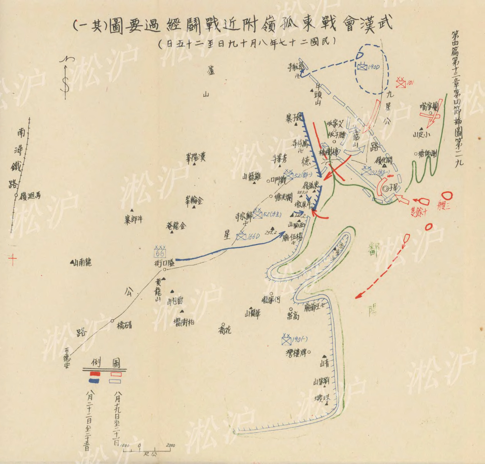

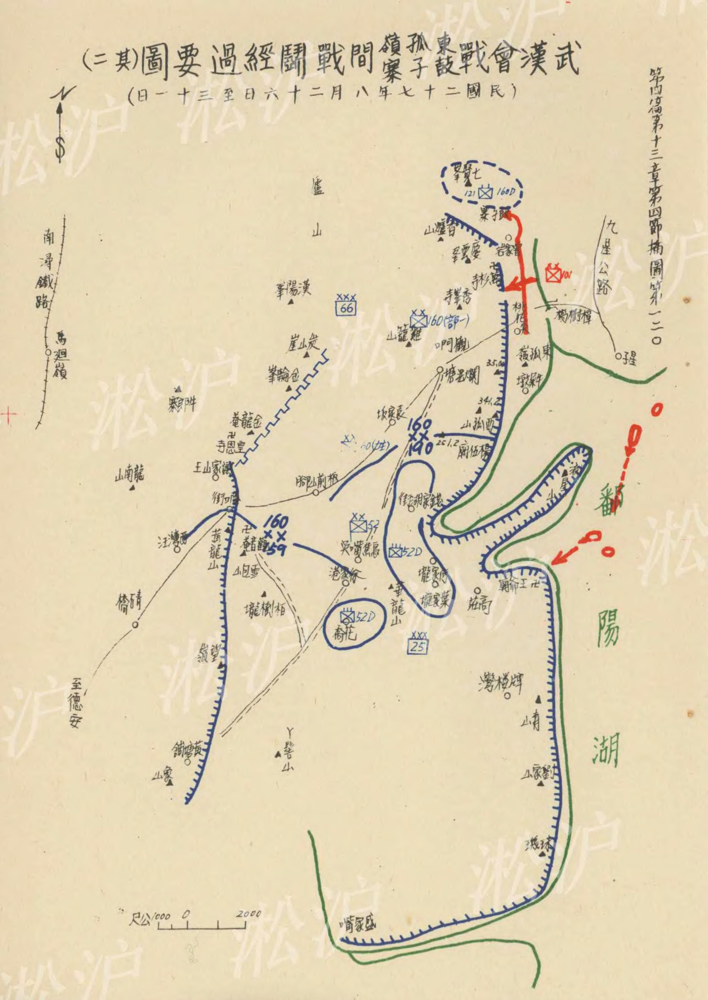

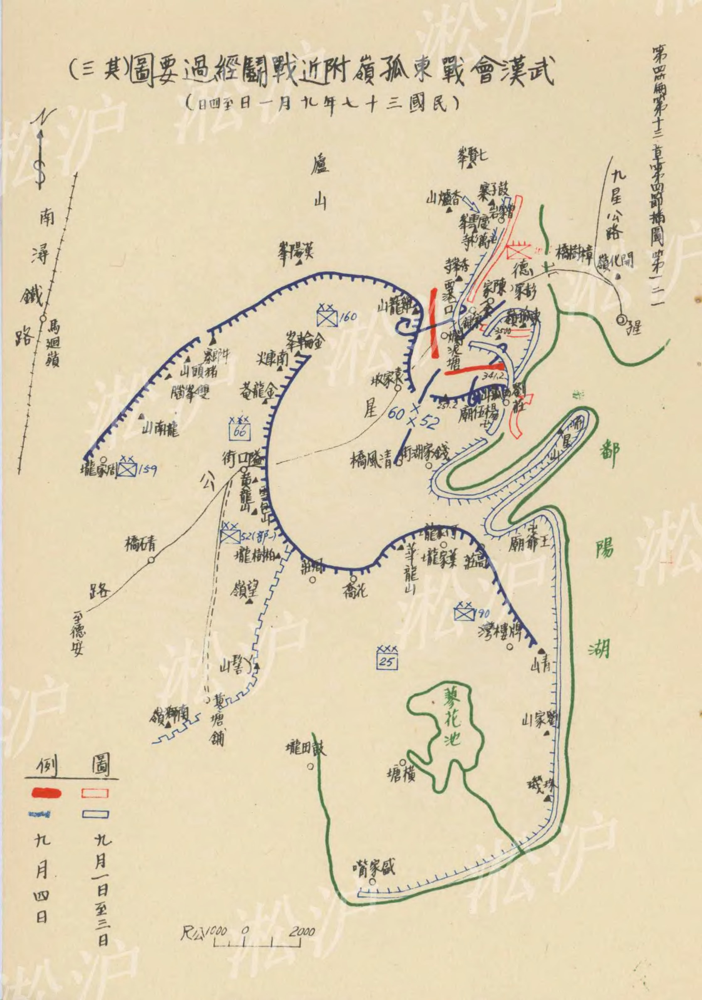

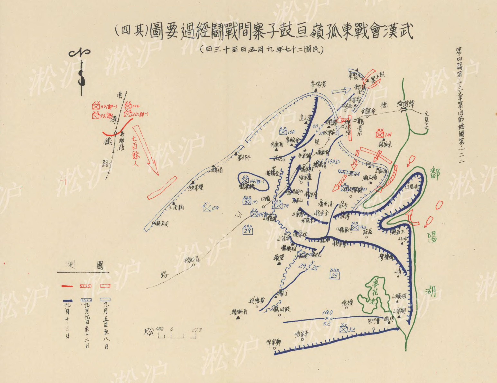

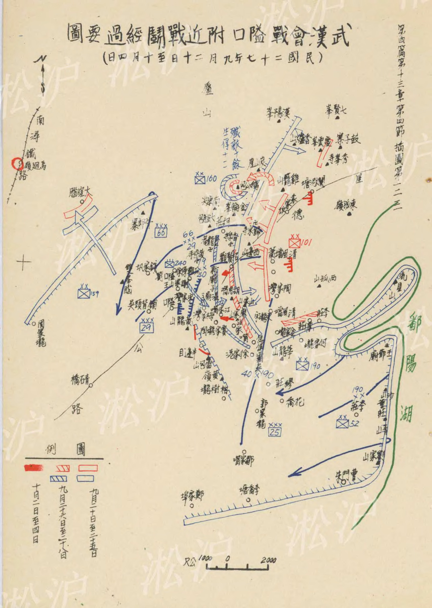

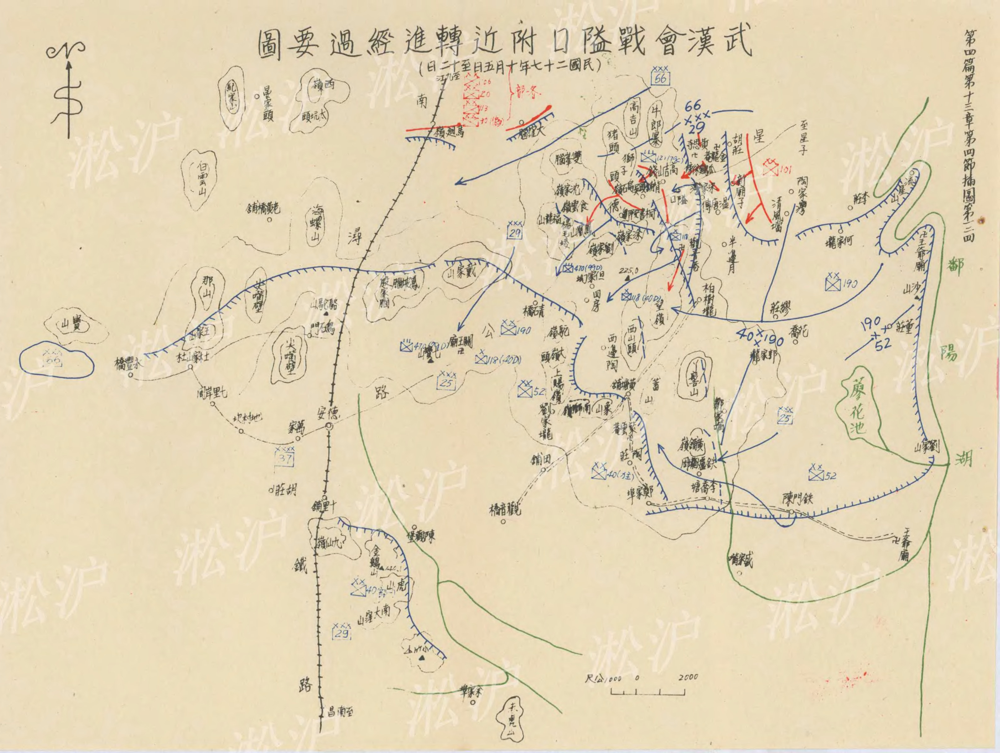

二、南溥鐵路沿線之戰鬥

民國二十七年八月四日至十月十七日

參照插圖第二二五至第一三一

自敵軍第一零六師團與波田旅團在九江以南地區會合，經我連日痛擊，予以重創後，乃積極整頓，企圖繼續南進，（參照插圖第二二五）八月四日七時許，敵兵約三千，分由沙帽山、南昌舖、沙河方面向我全線進攻。其左翼之一路步兵四百人，在砲火掩護下，向我第七十軍之第十九師仰頭羅前進陣地兩側山麓攻擊，守兵一連傷亡過半，戰鬥至九時，退守黃大腦主陣地，敵復乘勢續攻黃大腦，我傷亡官兵二百餘，經以領備隊由仰頭羅東方迂迴出擊，將敵擊退。同時我左翼敵盡路旅團一部三百餘，突入黃土嶺南之河洲上，被我第三師之一部擊潰，斃敵官兵四十餘，俘敵軍官一員，函獲輕重機槍三挺，步槍十餘枝。其時另一部敵第一四五聯隊第一大隊約四五百，向我馬鞍山以東，鐵道以西地區猛攻，經我迂迴襲擊，該敵傷亡過半，不支潰退。第十五師方面，敵第一零六師之第一二三聯隊及第一四五聯隊主力約二千餘，附山砲十餘門，向沙河以西之蕭家墩、大天山陣地進攻，經第五十一師第八十九團及第八十五團之一部奮勇抵抗，戰鬥慘烈，十三時許該兩處陣地先後被敵佔領，守軍退守大天山西端各高地及娘娘廟、黄梅老屋、陳家窪以南之線與敵對峙。

第二十九軍團二十一時，基於本四日情況，下達命令要旨如左：

一、敵第一零六師團分三路犯我牛頭山、金官橋、十里山、鑽林山之線陣地，正與我黃大腦、許家墩、鳳凰嘴、大天山前進陣地守軍激戰中。

二、本軍團以固守主陣地之目的，保持重點於中央地區，從新部署如左：

(一)右地區隊長第七十軍軍長李覺（第十九師，領備第九師之一營），佔領牛頭山、三二三、五高地亘金官橋（不含）之線而固守之。原守備金官橋至鄧家河之陣地，應交第一八七師接替。

(二)中央地區隊長第一八七師師長彭林生（第一八七師），應卽派隊接替金官橋（含）至鄧家河（不含）第十九師之守備任務。

(三)左地區隊長第八軍軍長李玉堂（第三師、第十五師），除將鑽林山防務交第四軍接替外，仍任鄧家河（含），十里山及其西北高地巨鑽林山（不含）陣地守備。

四作戰地境：

右地區隊與中央地區隊間，爲下屋黃、劉家灣、金官橋、南昌舖、東林頭西端之線。

中央地區隊與左地區隊間，爲周家老屋東端、鄧家河、周家壠、王衆圍之線。

以上線上均屬左。

三、預備第九師（欠一營）仍佔領中岩東端，六二一、零高地至尖山（含）之線，任該線工事之構築而固守之。

第一五五師應佔領尖山西側大道（含）至茶子山（含）之線，任該線工事之構築而固守之。

兩師間作戰地境，與第一線主陣地帶右中兩地區隊戰鬥地境同。

四、各部限於本月五日拂曉前交接完畢。

五、預備第九師及第一五五師工事之構築，以坑道式爲主，應於六日以前完成；如時間餘裕，應設僞裝。

各部奉令後，均積極部署，南溽路沙河以南戰鬥於以展開。

八月五日，第十七軍第十九師方面，五時起，南昌舖以南，敵砲向我老虎山、牛頭山、黃大腦間陣地轟擊。八時頃，續以步兵攻擊，戰鬥激烈。九時，敵增二千餘，由仰頭羅向我猛擊，守備該處第一零九團之一營犧牲過半，已呈動搖，經派預備隊第一一零團之一營增援，陣線未獲穩定。復令第一一四團團長率兵一營增加，反復肉搏，傷亡極衆，仍未挽回頹勢，又以第一一三團增援。十四時許，敵以全力猛撲，戰鬥慘烈，第一一四團團長劉陽生陣亡，營連長以下傷亡二十三員，士兵千餘名，老虎山陣地終告不守，嗣調金官橋預備隊反攻，亦未奏效。

同日，第八軍方面，敵第一四五聯隊之荻尾大隊，拂曉時向丁田汎、河洲上第三師陣地猛攻，守兵分途出擊；同時左翼磨盤山第十五師第八十九團之第三營亦以步機槍火力支援側擊，激戰數小時，將敵擊退。是役斃敵江夏少尉及其他軍官四，士兵百二十餘，生俘一名，獲輕機槍三挺，步騎槍十餘枝。及其他戰利品甚多。十時，該敵再與攻擊，並施放毒氣，官兵中毒過半，但仍艱苦支持，將敵擊退。

第二十九軍團，同日十八時，基於當前戰況，除飭第七十軍、第八軍固守原陣地外，並對第一五五師第一八七師，及預備第九師下達命令要旨如左：

一、預備第九師（欠一營）應佔領六二一點零高地、中岩、大岩、尖山既設陣地線而固守之。對於香山南北道路及碧玉庵等要道，應特別注意。

二、第一五五師應佔領尖山、金家山之線，構築陣地而固守之。

三、第一八七師應佔領金家山至鄧家河（含）之線既設陣地而固守之，左與第八軍切取聯繫。

四、第四軍派兵一團位置於通遠鎮附近，歸第一五五師陳師長指揮，增援本軍團之作戰。

五、各部限於本（五）日二十四時前交接完畢。

六、九德大道義門舖南端附近之兩側隘路，應努力構築側面陣地而確實封閉之。

八月六日第七軍方面，拂曉時，以第十九師之一部向老虎山敵軍陣地反攻，肉搏十餘次，激戰至十時，卒將該山最高峯克復。嗣敵增援反撲，搏鬥至烈終以傷亡過重，戰至十六時，被迫退守老虎山南端與敵對峙。同日拂曉，第一五五師當面，敵軍百餘，乘霧由龍溪廟方面向義門舖西北端警戒陣地進攻，被我擊退。第一八七師當面，同時三時許，步砲工聯合之敵千餘，向我全線總攻，第一零九八團之第一、第三兩營全力抵抗，六時許，敵集中砲火向我金官橋西北端之前進陣地猛擊。同時該處左翼一部，被敵突破，經以預備隊增援逆襲，乃將其擊潰，恢復原陣地。八至十七時間，敵先後增援反撲，均被擊退，第一零九八團團長張澤深以下傷亡官兵二百餘，敵軍傷亡倍之。同日、第八軍方面，唐窪腦東北高地敵砲向我陳家壠、馬鞍山第三師陣地射擊，其步兵則向娘娘廟、黃梅老屋、大天山、獅子山第十五師陣地進攻，激戰約一小時，敵始退去。

八月七日，第七十軍方面，老虎山敵六七百，夏家山附近敵增兵五六百附小砲四門，捨崖下有敵百餘，南昌備西北敵原田部隊約三千人，均無積極行動，第一五五師正面情況無變化。同日、第一八七師當面，二時許，敵三百餘，分路佯攻，十三時，又以一大隊向右翼陣地猛攻，均被擊退。第八軍方面，右翼小有接觸，左翼之敵藉砲火掩護，向我猛攻，守兵傷亡過半，大天山南端高地遂被突破。十二時，經我攻擊，一度將大天山高地完全克復，旋敵施放毒氣，我傷亡奇重，不得已仍退守千家壠、焦家山之原陣地。十七時，該軍奉第九集團軍令，磨盤山、焦家山、獅子山既設陣地即交第九十師接替，並抽一部增加大天山南端高地守備。

八月八日，第七十軍方面，拂曉前，第十九師派兵一部襲擊老虎山之敵，旋卽撤回。同日、第八軍方面，敵砲向我宋家汎、河洲上、大天山一帶轟擊，掩護其步兵向我全線猛攻，激戰至暮，始趨沉寂。第四軍方面，敵分三部：一部約六百向磨盤山第九十師第二六八旅攻擊；一部約三四百，向該師第二七等旅焦家山口陣地進攻；另部約三百餘，由大天山向獅子山進攻。經我分途迎擊，斃敵大尉上妻清一員，少尉二員及其士兵百餘，函獲軍用品甚多。

八月九日第七十軍方面，二時頃，敵兵百餘，襲擊第十九師孔家祠陣地，被我擊退。第一八七師當面，四時許、敵約一中隊進攻，亦被擊退。第八軍方面，拂曉、敵約兩聯隊，在砲火掩護下，以密集隊形向我河洲上西北小高地第三師第十六團陣地猛撲，肉搏至六時，該團第八連官兵全部殉職，陣地遂陷。該師嗣以預備隊及師直屬隊歸第八旅旅長指揮，增援逆襲，激戰至十三時，敵傷亡六百餘，遺屍二百餘具，向沙河方面潰退，遂將陣地收復。是役、我傷團長一、營長二、連排長五十一員，士兵千一百六十三名，函獲輕機槍六挺，步槍四十五枝，及其他文件裝具等甚多。同日、第四軍方面，敵兵千餘，十二時許，在砲兵掩護下向磨盤山；另一部二三百名向獅子山同時攻擊，激戰至暮，始趨沉寂。

八月十日，第七十軍方面，敵軍百餘再襲孔家祠不逞。第一五五師第一八七師當面，均無情況。第八軍方面，以第四軍第五十九師撥歸該軍第三師指揮之第三五四團接替第八旅防務，該旅卽調後方整理。二十一時，以第九旅派隊向鳳凰嘴一帶向敵襲擊，函獲步槍、戰刀、文件等甚多，得知連日向我進攻之敵，爲第一零六師團山路旅團之第一四五、第一四七兩聯隊與砲兵瓦斯隊等部。

第二十九軍團，同日爲調整陣線，下達命令要旨如左（參照插圖第一二六）：

一、敵第一零六師團及第一一三師團、第二十師團之各一部，連日被我痛擊，攻勢已挫，現佔領老虎山、南昌舖、許家墩、鳳凰嘴、黃梅老屋、蕭墩家之線與我對峙，我第八軍昨九日經四次之爭奪，已將河洲上及其西北端無名高地克復。

二、本軍爲鞏固牛頭山、十里山、馬鞍山亘河洲上及其西北無名高地之線陣地，待機擊破當面敵人之目的，從新部署。

三、右地區隊第七十軍除將朱家山、孔家祠、閻家橋之陣地移交第一五五師接替外，應佔領牛頭山、雪裏坡、鷄竹嶺及三一三、五高地南端之線陣地而固守之。另派一部任牯嶺西北端通本陣地各要道之扼守，對老虎山之已失據點，應相機恢復之。

四、中央地區隊第六十四軍（欠預備第九師）以第一五五師接替第七十軍朱家（含）孔家祠、閻家橋之既設陣地而固守之，第一八師附預備第九師之一團（欠一營）仍服行原任務，前指揮第一五五師之一營，應卽歸還建制，兩師間之作戰地境仍舊。

五、預備第九師除派兵一團（欠一營）歸第一八七師彭師長指揮，爲該師預備隊外，其主力仍位置於現地服行原任務。

六、左地區隊第八軍附第四軍之兩團應將磨盤山西北之線陣地移交第四軍接防外，仍固守鄧家河（不含）、十里山、馬鞍山、河洲上及其西北無名高地，左與第四軍切取連絡，但應於大天山南端派出强有力之一部而守備之。

七、各地區隊戰鬥地境如左：

右地區隊與中央地區隊間，爲細腦坡南端、二二三、五高地、報國壠、夏村、仰頭羅及東林頭南端二零零高地之線。

中央地區隊與左地區隊間，爲韓家堡、壽家河、鄧家河西端、湖漢城、王衆圍之線。

八、砲兵第一團第一連應位置於北長嶺南端及茶子山間地區，以主火力支援中央地區之戰鬥，以一部火力支援左右兩地區隊之作戰。

九、各部防務應於明（十一）日四時交接完畢。

十、爲求步砲協同之確實，各地區隊應向砲兵連架設電話專線。

十一、本軍團兵站支部在馬迴嶺西北端開設。

十二、第九十三傷病收容所在馬迴嶺開設。

各地區隊奉令後，當卽遵照實施。右地區隊第七十軍當令第十九師仍堅守牛頭山、雪裏坡、鷄竹嶺及標高三一三、高地南端之線陣地。其朱家山、孔家祠、閻家橋之陣地線，則着於當（十）日晚移交第一五五師接替。

八月十一日，右地區隊第七十面情況無變化。中央地區隊第六十四軍方面，敵攻右翼第一五五師及左翼第一八七師陣地，均被擊退。第八軍方面，左翼第十五師派兵一部襲擊大天山，傷斃敵多名，撤回原地。第四軍方面，敵步兵二百餘，分向第十九師焦家山口及師子山猛攻；另一部約六十名，向磨盤山左翼陣地進攻，守兵沉着應戰，並以小部襲敵側背，激戰約一小時，將敵擊潰。

第九集團軍總司令同日奉轉軍事委員會命令如左：

一、第一二八師卽編爲兩營制之三團，以一團撥第七十軍之第十九師，一團撥第一五五師，一團撥第一八七師第一二八師師長顧家齊晉升爲第七十軍副軍長。

二、預備第十一師卽編爲兩營制之三團。以以一團撥第三師；一團撥第十五師；一團撥預備第九師。預備第十一師師長趙定昌另候任用。

三、第一二八師及預備第十一師番號着卽撤銷。

八月十二日，右地區隊之第七十軍方面，十一時頃，第十九師派兵一部向老虎山最高峯行威力搜索，與敵警戒部隊接觸，旋敵約三百由北端山麓增援，我遂退回原陣地。中央地區隊第六十四軍方面，敵砲向第一五五師閻家橋及孔家祠射擊，我傷亡士兵七名。左地區隊第八軍方面，附第四軍之兩團，全日僅有小接觸。第四軍方面，派隊襲擊李家塘、千家河兩處之敵，迫其退踞鳳凰嘴、黃梅老屋之線與我對峙。

第一兵團薛總司令同日給予第九集團軍命令要旨如左：

一、爲保持久戰，應將傷亡較重之師，逐次交換調整補充，着第五十九師接替第三師防務，第九十師接替第十五師防務。

二、第十五師交防後，卽開烏石門西之盧家灘附近整理。

第九集團軍總司令部十三日遵照薛總司令命令意旨，於十五時調整部署，下達命令要旨如左（參照插圖第一二七：

一、着第三、第十五師於本（十三）日晚將陣地移交第四軍接替後，每師戰鬥部隊應各派一團長指揮。第三師戰鬥部隊位置於擅門山附近，第十五師戰鬥部隊位置於牌樓下附近，暫歸第四軍歐軍長指揮。

二、第三、第十五師所指派之團長，應向第四軍歐軍長連絡，並向該軍架設電話。

三、第八軍軍部、第三師其餘部隊，應於今十三晚開赴烏石門以西之盧家灘附近整理（參照插圖第二二九）

第十五師其餘部隊，應於今（十三）晚開赴烏石門西之永豐橋附近整理。

第八軍軍部當卽轉令各師遵照，並令附屬第三師之山砲二門，仍附屬該師整編之一團。在原位置歸第四軍歐軍長指揮。其餘各部於防務交替後，卽赴指定地點集結終整理。第四軍奉令後，卽以第五十九師接替鐵道以東第三師防務，以第九十師接替第十五師防務。

八月十四日（參照插圖第二二七）第七十軍方面，該軍以游擊隊兩組，向仰頭羅、黃大腦襲擊，略有斬獲。黃昏時，敵艦砲向我鷄竹嶺陣地轟擊，我傷營長一員。第六十四軍方面，第一五五師於十三日二十二時派隊沿金官橋大道以東地區向龍溪廟附近敵排哨襲擊，斃敵小隊長一、士兵二十餘名，繳獲輕機槍二挺，手槍八枝，及防毒面具、鋼盔、戰旂、日記、信札等多件。我陣亡排長一、傷軍士二，拂曉、撤回孔家山原陣地。第四軍方面，敵向我左翼焦家山口及獅子山陣地攻擊，激戰約二小時，死傷五十餘名，不支潰退。同日，賽湖發現敵汽艇七艘，木船三十餘隻。

八月十七日，第七十軍方面，拂曉前，敵我互襲，各有傷亡。第六十四軍方面，敵砲兵及機關槍整日向我陣地射擊，但無積極行動。第四軍方面，敵百餘兩次向我唐窪腦以南陣地反撲，激戰約一小時，殲敵過半，餘均潰退。

八月二十一日，右地區隊第七十軍方面，一時許，派隊分向老虎山及其北端與石門澗一帶之敵襲擊，戰鬥至拂曉，傷斃敵兵十餘名後撤回原陣地。中央地區隊第六十四軍方面，零時起，由第一五五師及第九師各派隊一部分向許家墩東南側、李莊、孔莊之敵襲擊，激戰逾時，敵死傷二十餘名，狼狽北竄，遂予佔領：復以全力合擊許家墩，敵死傷甚重，我傷排長四、士兵四十九名損失步槍十四枝，輕機槍一挺。左地區隊第四軍方面，右翼第五十九師派兵向唐窪腦東側高地及許家塘敵陣地攻擊，激戰約二小時，退回原陣地。另派一部向余家大屋之敵襲擊，將其全部殲滅。

八月二十三日至二十五日間，第七十軍方面，敵兵一度向地主庵突擊，旋被擊退。第二十九軍團部以第一二八師分撥各部官兵已先後編配完畢，特重新分配各師任務如次：第七十軍派兵一營附一連接替預備第九師派守牯嶺之一營及六二一零高地一連之防務；配屬第一八七師指揮之預備第九師步兵兩營着卽歸還建制；預備第九師俟牯嶺防務交替及配屬第一八七師指揮之兩營歸還建制後，卽派一團構築胡羅婆尖、鐵門槓及二一八、七高地亘鐵路西側之預備陣地；各部防務統限二十六日拂曉前交接完畢。第六十四軍方面，左翼之敵約一聯隊，藉砲火掩護向我攻擊激戰約一小時，敵不支分向金官橋、曹家墩退却。第四軍方面，敵兵二三百乃至數十名不等，分向唐窪腦、丁田汎、獅子山、焦家山口、磨盤山一帶進攻，均未得逞。

連日、當面之敵，因迭受我游擊隊之襲擾，攻勢已挫，除不時向我砲擊，虛張聲勢外，扼守據點工事，不敢越雷池一步；惜我正面過廣，兵力分散，未能乘勢轉移攻擊，至逸殲敵之良機。

同日、第九集團軍吳總司令電令廬山游擊隊着改歸第二十九軍團長李漢魂指揮。

八月二十六日，第七十軍方面，十一時起，敵我砲戰至十八時，始告停止。同時我偵知南昌舖附近新增敵約一聯隊，其中一大隊向金官橋，一大隊向馬鞍山運動，另一大隊在南昌舖停止，於夏家山、馬鞍山之線展開，並積極爲攻擊之部署。第六十四軍方面，敵砲向我朱家山、孔家祠一帶陣地射擊百餘發，以掩護其步兵分向朱家山、孔家祠、老虎山西北一帶陣地襲擊，均被擊退。

八月二十七日，第七十軍方面，老虎山敵山砲八門，步兵砲十餘門，於零時起，向我雪裏坡、鷄竹嶺陣地不斷射擊。拂曉後，敵機九架，復在陣地上空更番轟炸，工事全毀。十時許，當面之敵，以烟幕掩護其步兵約六百向我攻擊，激戰約一小時，被我擊退。十四時許敵施放毒氣，再興攻擊，我官兵一部中毒，經以預備隊增援奮勇阻擊，將敵擊退。入暮後，敵復捲土重來，再度猛攻，經我痛擊，仍未得逞。深夜，我派隊出擊，略有斬獲。是役、共傷斃敵兵三百餘，獲步槍、軍刀、面具、文件、日記等多件，我亦傷亡官佐十三員，士兵二百八十一名，爲一旬以來僅有之激戰。第六十四軍方面，拂曉前敵兵約六百，藉猛烈砲火掩護，向老虎山西北側之前進陣地攻擊。天明後，又以飛機十餘架，協同砲兵集中轟擊達二小時之久，第一五五師守備該處之一營，僅餘官長五員士兵六十餘名，餘均殉職，陣地被敵突破一部。斯時、主陣地亦遭敵機砲之猛烈轟擊。另敵步兵一部，向朱家山、孔家祠攻擊，激戰至十七時，我傷亡營長以下官佐十九員，士兵三百四十四名。同時敵砲向左翼金村北、長嶺、葉家堰一帶陣地轟擊，嗣以步兵百餘向金村進攻，被我擊退。第四軍方面，晨起、敵機二十餘架協同野砲兵向我全線陣地集中轟擊，九時許，步兵約六百名，在機砲掩護下，向我猛攻，激戰至十一時，敵死傷百餘，不支潰退。第九集團軍同（二十七）日奉第一兵團薛總司令電令：「第七十軍第十九師之牛頭山、雪裏坡、雞竹嶺、碧雲庵一帶爲天險陣地，至關重要，必須死守，如有違誤，卽以軍法從事，仰卽遵照」，當卽轉知所屬遵照。

第二十九軍團同日十九時調整部署，下達命令要旨如左：

一、預備第九師應卽派兵一營，開赴雪裏坡附近策應該方面之作戰。

二、撥歸第一八七師指揮之預備第九師步兵一營，着卽歸還建制，接替第一五五師守備尖山一營之防務三、第一五五師守備尖山之一營，俟交防後，卽歸還該師爲機動部隊。

四、各部防務，統限於本二十七日二十四時前交接完畢。

八月二十八日十二時，第七十軍方面，敵兵二三百，向我鷄竹嶺陣地進攻，戰鬥至十二時頃，該敵近迫鷄竹嶺山麓，當由陣地內抽兵一連，向敵突襲，肉搏十餘次，將敵擊退。第六十四軍方面，深夜、我派兵二組，一向老虎山西側敵之前進陣地，一向金官橋方面之敵同時攻擊，激戰約一小時，退回原陣地，第四軍方面賽湖南岸敵汽艇一艘，木船四隻，載三百餘，在大麥嘴附近登陸後，一向金官橋移動，一部潛伏要陳家壠、馬鞍山以北村落內，企圖待機進犯。

第一兵團總司令部同日於十二時電令第三十集團軍總司令王陵基：請嚴令該方面部隊，務忠勇殺敵，萬勿使新塘埠數百之敵自由東竄與沙河之敵會合，擾亂我軍左側背。又令：第六十六軍卽抽兵一旅，原駐分水嶺之一團，迅開分水嶺附近，歸第九集團軍吳總司令指揮。

八月二十九日，第七十軍方面，敵兵二三百名，利用夜暗，潛行至鷄竹嶺西端、朱家山之朱家屋一帶，拂曉後，在機砲掩護下，向朱家屋陣地猛攻，肉搏十餘次，陣地瀕於搖動，經我軍增援，將敵擊退。十四時許，敵復由龍溪廟方面增援百餘，再度進攻，我烏龜山西北前進陣地之守兵一連全部犧牲，陣地亦陷。是夜，敵二百餘，突由老虎山向鷄竹嶺猛撲，我憑險力戰，將敵擊潰，是役共斃敵三百餘，並處獲步槍二十餘枝，及其他軍用品甚多，我亦傷亡四百餘。第六十四軍方面，右翼第一五五師於二十八日夜襲老虎山西側之敵，激戰至拂曉，將敵殲滅，獲步槍三十餘枝，及其他軍用品甚多。拂曉後，敵以機砲掩護，向孔家祠一帶攻擊，工事全毀，守兵傷亡殆盡，陣地被突破一部。入暮後，我增援反攻，激戰約四小時，肉搏多次，斃敵甚衆，卒將原陣地恢復。是役、我陣亡營長林正吾以下連排長二十員，士兵二二七名，傷營連排長共二十八員，士兵一二四八名，爲本戰鬥接戰以來最爲慘烈之一次。第四軍方面，除拂曉前，敵兵數十，兩次向十里山北瑞進攻，均被擊退外，餘無情況。

第一兵團薛總司令以南溥路敵連日攻擊甚烈，我軍奮勇抵抗，陣地雖獲保全，但各師傷亡甚重，待補充，乃於十六時令第六十六軍之第一五九師（欠黃老門分水嶺之一旅），務於二十九日晚開胡羅婆尖、鐵門槓、孫家塹、全部山、四方李、塘前坳、大山、株嶺之線構築工事，支援作戰，該師卽歸吳總司令直接指揮。第九集團軍總司令部復以第一五九師之第九五三團撥歸第二十九軍團指揮。李軍團長卽令該團以一營接替北長嶺第一八七師陣地，其餘部隊接替尖山及其東西大道預備第九師陣地，並限二十九日二十四時前接替完畢。

第二十九軍團同日爲調整全般戰線，爰於十九時下達命令，其要旨如左：

一、預備第九師應派兵四營，接替第一五五師朱家山、孔家祠之陣地；如孔家祠尚未克復，應努力協同第一五五師之攻擊，中岩、大岩仍由該師固守。

二、第一五五師仍固守孔家祠西端至金官橋大道之線陣地。其朱家山、孔家祠之守備部隊，俟預備第九師接防後，應以一營位置於義門舖西端歸第一八七師指揮，其餘位置於義門舖附近爲師預備隊。

三、第一八七師仍服行原任務，第一五五師位置於義門舖西端之一營，着歸該師指揮爲預備隊。

四、各部防務應於三十日交接完畢。

八月三十日，第七十軍方面，拂曉時派隊襲擊鷄竹嶺山麓之敵，斃百餘。八時以後，敵機砲向我陣地猛烈襲擊，第十九師之第一一零團第一營營長劉咸宜陣亡。第六十四軍方面克復孔家祠後，續將閻家橋附近之敵二百餘人包圍，拂曉後，以受敵機砲之猛烈轟擊，傷亡連排長以下官兵二百餘人，致未竟全功。十二時，第一五五師朱家山、孔家山防務已交預備第九師接替完畢。同日、第四軍方面陳家老屋之敵三百餘，向裏山壠西南前進。

第一兵團總司令部同日十六日給予第九集團軍電令如左：

一、牛頭山、一二四、八高地、碧玉庵、中岩、鷄竹嶺、朱家山間及大岩、尖山、北長嶺間構築鞏固而必須死守之預備陣地。

二、接中岩、大岩、報國寺、胡羅婆尖、鐵門槓、二一八、七高地、分水嶺、檀門山、葉家壠、車輪北端山諸要點，亦須逐步構築預備陣地。

第九集團軍總司令部奉令後，當卽轉令第二十九軍團，其命令要旨如次：着第一五九師第四七五旅歸李軍團長指揮，構築胡羅婆尖經通遠鎮、二一八、七高地越鐵道至分水嶺之預備陣地，右與中岩、大岩之預備第九師、左與分水嶺之第四軍啣接，仰卽遵照具報。

八月三十一日，第七十軍方面，炸龜山西北之敵，經我猛攻後，殘敵百餘向老虎山方面潰退，當將烏龜山西北前進陣地收復。第六十四方面，敵兵一部向我金家山一帶襲擊，當被擊退。

九月一日，第七十軍方面，拂曉前，敵增兵三四百人，在機砲掩護下，續向鷄竹嶺、雪裏坡陣地猛攻，守兵傷亡過半，我以預備第九師之兩連，及由牛頭山抽調之兩連並工兵連等先後增援，敵亦陸續增加，激戰竟日，雙方傷亡奇重，遺屍遍野，敵未得逞。

第二十九軍團同日調整部署，下達命令要旨如左：

一、第七十軍附預備第九師之一營及第四七五旅之兩營，應固守牛頭山、雪裏坡、鷄竹嶺一帶原陣地。二、預備第九師（欠一營）應努力加强原陣地工事而固守之。

三、第一八七師附第一五五師之一部，除由第四七五旅派兵一營接替該師一營之陣地外，應加强原陣地，並應於原陣地及北長嶺間構築預備陣地而固守之。其交防之一營，應移至北長嶺東端構築第二預備陣地工事而固守之。

四、第四七五旅除派團長一員，率兵兩營歸第七十軍指揮外，其餘應加强中岩、大岩、尖山、吳家窪金家山北端（即交防營之最左翼）工事，左與第一八七師、右與第七十軍連絡而固守之。其左翼之兩營，並應在原陣地及北長嶺間構築預備陣地。所遺北長嶺陣地構築之任務，由交防之一營接替。

五、砲兵第一連歸第一八七師師長彭林生指揮，以主力阻止馬鞍、金官橋方面敵人之進攻，並對孔家祠方面之敵予以制壓。

右令下達後，各部均卽遵照實施。

九月二日，第七十軍方面，敵時以小部隊向我各陣地襲擾，並不斷以機砲向我轟擊。第六十四軍方面，敵在機砲集中掩護下，向預備第九師猛攻，工事大部被毀，守兵傷亡甚重，陣地一部被敵突破，經派第一五五師之一營增援逆襲，始將該陣地收復。是役、我陣亡團長毛岱鈞一員。另敵一部，藉機砲掩護，向我閻家橋陣地猛攻，該處一度被敵突破，旋卽克復。第四軍方面，王一鵝、鷄公嶺、求雨壇之敵，經我增援阻擊，攻勢稍煞，惟左翼友軍陳家壠陣地已被敵佔領，該軍三面受敵，形勢險惡。

第一兵團總司令爲使南澤路正面部隊行動安全，及鞏固德安附近旣設陣地線，藉達持久抗戰之目的，爰於同日十三時給予吳總司令腹案如左：

一、第六十四軍及預備第九師，應由鐵道東側沿廬山西麓或山內小徑，經青石橋向德安西南及正南九仙嶺之春山李、嫜姑嶺一帶地區轉移，爲機動部隊。

第七十軍之第十九師，應先佔領烏蛇峽、湧坡、小五老峯，左與第一六零師切取連絡，對東北西三面警戒，待命撤至德安西南家山附近爲機動部隊。

二、第一五九師應撤至牛郎寨、猪頭山、雙峯腦、龍南山之線佔領陣地。

三、第四軍及第三十集團軍之一部，應向鐵道西側轉進，先擊破陳家山、大窪山、東嶺之敵，向小溪山、紀家山、白雲山、那山之線轉進。

第九集團軍各部苦戰近月，傷亡奇重，疲憊之師亟待整理，乃遵兵團指示，於同日二十五時下達轉進命令，其要旨如左（參照插圖第二八）：

一、本日來，左翼河裏余村約一聯隊之敵，正向黃門、馬迴嶺方面突進，與我第五十八師之一部於和尙窪附近激戰中。

二、本集團軍擬於今（二）晚轉進於牛頭山、中岩、大岩、胡羅婆尖、檀門山、株嶺之預備陣地；同時以一部聚殲該敵，以保持左側背之安全。

三、第二十九軍團於本（二）日黃昏後，除以少數部隊固守胡羅婆尖、北長嶺、全部山亘鐵道（含）之線，其餘向德安南之九仙嶺、春山李一帶地區轉移。

四、第四軍於本（二）日黃昏後，除留少數固守原地擔任掩護外，以一部佔領分水嶺、檀門山、株嶺亘綉球腦之線；以主力由傅公山、花盤裏南下，夾擊河裏余村之敵而殲滅之。

五、第七十四軍務竭力阻止敵向東向南突進，並與第四軍協力共殲該敵。

六、各部隊轉進時，務保持連繫。

第二十九軍團奉到向德安轉移之命令後，當卽下達命令要旨如左：

一、本軍團以逐次抵抗消耗敵人以達成持久抗戰之目的，應於本（二）日二十四時向德安轉進。

二、各部應自派掩護部隊脫離戰場，轉進路着由李軍長規定，其轉進目標及到達地點如左：

第四七五旅德安西北端之潘莊。

預備第九師德安西北端之熊莊。

第一八七師德安西北端之胡莊。

第七十軍德安西北端之白露寺。

三、第四七五旅應於馬迴嶺附近佔領掩護陣地，任本軍團轉進之掩護，左與第七十四軍連絡。

四、各部到達目的地後，如無別命，應卽佔領烏石門之線旣設陣地，並向左右切取連絡。

第四軍奉命後，當亦下達命令要旨如次：「第五十九師應卽佔領盧家灘、那山、望夫山、白雲山之線陣地而固守之，右與第五十一師連絡。第十九師應卽佔領紀家山南北之線陣地而固守之，左與第十八軍連絡」。各部奉令後，卽於十六時許開始向指定地點轉移。

第一兵團總司令部五日二十一時電令，黃老門附近第七十四軍應努力擊攘當面之敵，使第二十九軍團之轉移安全，爾後逐步由鐵道以西地區撤回德安以北之旣設陣地。第七十四軍奉令後，卽以第五十八師擔任掩護，迄三日入暮，該師完成任務後，始向指定地區轉移，沙河附近之戰鬥至此結束。

自南溥正面我軍轉移至烏石門附近之線後（參照插圖第一二九沿鐵路南下之敵第一零六師團全部，第二十師團、第一一三師團之各一部，及僞皖保安隊編成之第九十師團全部，卽停止於馬迴嶺一帶我陣地之外，未敢輕進。斯時、沿德星公路向西猛進企圖夾擊德安之敵第一零一師團，被我拒止於隘口以東之線，至沿瑞武公路南下以分進合擊之勢，企圖包圍德安之第二十七師團，亦被阻於大橋河以北地區。

我第一兵團以掩護浙贛鐵路之安全，策應瑞陽公路方面第二兵團作戰之目的，爰作如左之部署。

一、第一五九師任牛郎寨、雙峯腦、龍南山、周家壠線右側面陣地之守備，右與第十六軍第一六零師卿二、第七十四軍任周家壠（不含）戴家山、烏石門、盧家灘（不含）線陣地之守備。

三、第四軍任盧家灘（含）永豐橋、望夫山、白雲山、紀家山、小溪嶺線左側面陣地之守備，左與第十八軍聯繫。

四、第六十四軍集結於九仙嶺、春山李、仙姑嶺、王家山一帶爲機動部隊。

第一五九師、第七十四軍、第六十四軍統歸第九集團軍副總司令李漢魂指揮。

第一兵團總司令部於各部部署完畢後，卽下達作戰訓令要旨如次：「德安陣地爲袋形陣地，又名飛剪陣地，利於我，不利於敵，我應用飛剪戰術以殲滅來攻之敵。如敵攻我右，則中左出擊；敵攻我左，則中右出擊；敵攻我中，則左右出擊，應機敏運用，大膽行動，則戰必勝，攻必取」。

第九集團軍九月四日，屠奉軍事委員會如次之作戰指導：「馬迴嶺之敵趕築工事，判斷其企圖，非對德安取守勢，卽待援兵轉取攻勢，我南溥正面部隊，應速乘機加强襲擊部隊兵力，不斷予敵打擊，俾我瑞昌及西孤嶺方面守軍不致陷於苦戰，並使敵不得任意抽轉兵力攻我一點」，遂復賦予各軍隨時出擊之任務，並劃分戰鬥地境如左：

第一五九師與第七十四軍間，爲陳莊、太平腦之線，線上屬右。

第七十四軍與第四軍間，爲巫家山、尖嘴壁老黃橋舖、蔡家窪、鄧家嶺之線，線上屬右。

九月五日當面之敵，不時以小部隊向我行威力搜索，均被擊退。

九月六日第一五九師當面，黃昏前，敵兵千餘，藉西邊山砲火掩護，向我金林街陣地猛攻，戰鬥激烈。第七十四軍方面無接觸。第四軍方面僅有敵小部隊活動。

九月七日，第一五九師當面敵千餘，續攻金林街，激戰至三時，守兵傷亡殆盡，金林街東北側蜘蛛山脚諸小峯相繼失陷，蜘蛛山最高峯亦告不守，經增援逆襲，敵傷亡甚衆，不支，始以砲兵及飛機六架掩護向西邊山潰竄。十六時，敵七百，再攻蜘蛛山，守兵奮勇抵抗，激戰至二十四時，其勢乃挫。第七十四軍及第四軍方面派隊出擊略有斬獲。

九月八日，第一五九師當面，乘敵攻擊受挫之際，以一部向其左側迂迴，三時，敵狼狽潰退。拂曉，西邊山敵乘我追擊之際，以三百餘人襲我蔡李兩莊，驟向蜘蛛山猛攻，我以一部分頭迎擊，並調隊增援，追擊部隊亦回師夾擊，遂將該敵完全殲滅。

九月九日，第一五九師當面，十五時，敵百餘由龍王廟向我張家山警戒陣地攻擊，一度被敵攻佔，經增援逆襲，殲敵過半，旋告克復，第四軍方面，七時，敵數十佔領和尙窪，入晚，該敵續有增加我派隊圍攻，斃敵數十生俘一名。

九月十日至十三日，全線沉寂，敵我雙方僅有小接觸。第一兵團總司令部以第九十一師撥歸第六十四軍序列，第一零二師歸第四軍序列，第四軍歸副總司令李漢魂指揮。並於十三日九時下令各軍師應速編成有力支隊，不斷向當面之敵側擊，牽制敵之進犯。

李副總司令復於十八時下達命令，其要旨如次：

一、第一五九師應編成有力右支隊，經小五老峯向敵左側背攻擊。

二、第七十四軍應編成有力中央支隊，向馬迴嶺及其東西地區之敵攻擊。

三、第四軍應編成有力左支隊，經車輪中間山向敵右側背攻擊。

右令下達後，第一五九師以一營兵力編爲右翼支隊，第七十四軍以步兵兩營迫砲一排編爲中央支隊，第四軍亦以步兵兩營編爲左翼支隊，隨卽開始出擊。

第一零二師撥歸第四軍序列後，該軍當作如左之處置：

一、第一零二師接防第十九師烏石門（不含）盧家灘、永豐橋之線陣地，師部位置於熊邨、湯家間地區。

二、第九十師任雙峯腦、白雲山、彭山、紅花尖、紀家山、施家坳、小溪嶺一帶陣地之守備，左與第十八軍連繫。

三、第五十九師仍守盧家灘、烏龜山、那山、望夫山、張村一帶陣地。

第九十一師撥入第六十四軍序列後，亦令該師於三日内（十五日至十八日）完成金雞山、九仙嶺、春山李北端預備陣地後卽繼續構築竹屋、濫泥窪、謝家山、洋鼓塘、蔡家山、柯家山、紫金山、王家山間之預備陣地。

九月十四日，第一五九師當面，右翼支隊於十七時到達小五老峯附近，隨向報國壠通遠鎮、大唐角附近之敵襲擊，並由淵明山、和尙腦守軍協力攻擊，頗有斬獲。第七十四軍中央支隊及第四軍左翼支隊之出擊，均未奏功，旋卽撤回。

李副總司令（十五）日層轉上級命令，其要旨如次：「本十五日晚，第一五九師應派兵兩營攻佔西邊山、大窪腦。第七十四軍應派兵一團攻佔魚鱗山、馬迴嶺。第四軍應派兵一團攻佔老屋李、大屋周、西嶺。各部達成任務後，應卽構築工事，確實固守，以爲將來前進之據點」。第一五九師遵卽派隊由小五老峯出張家山向南搜索前進。第七十四軍方面以步兵兩營向魚鱗山攻擊，一營向馬迴嶺攻擊。二十一時，該軍攻魚鱗山部隊與第一五九師取得連絡，乃將大窪腦之敵驅逐，並攻佔周莊、熊莊。第四軍方面派兵兩營，於入暮後向西嶺之敵攻擊。

九月十六日，第一五九師方面，該師出擊部隊與第七十四軍取得連絡後，一舉將大窪腦佔領。第七十四軍方面，出擊隊主力於拂曉前與第一五九師出擊隊協力攻佔大窪腦後，復與攻佔湯家壠之另一部協力，續向馬迴嶺攻擊，該處之敵據守工事頑抗。十一時，該部一度攻入馬迴嶺，並奪獲敵步兵砲一門，旋因敵之增援反撲乃又退出。第四軍方面，西嶺之敵憑據工事頑抗，仍無進展。

九月十七日，第六十四軍之第一五五師，奉令調南昌運塘，預備第九師開進賢，第一八七師開樂化整理。第一五九師當面，拂曉、卒將康家山之敵擊潰加以佔領，並以該山爲警戒陣地。第七十四軍方面，魚鱗山敵增援頑抗，經我多次攻擊均未奏效，遂於拂曉前撤回。第四軍方面，西嶺之敵仍憑險頑抗，激戰至八時，雙方傷亡均重，迄未得手，乃撤回原陣地整理，待機再行攻擊。

第九戰區陳誠司令長官十八日以瑞武方面緊急，於一時下達命令要旨如左（參照插圖第一三零）：

一、敵沿瑞武公路西進，刻與我軍在馮家舖、南茶園嶺及西家堡、白水崖各附近激戰，我第十八軍傷亡較重，預備隊亦已用盡，第六十師右翼秦山、獅牯山一帶防務及各前進據點，着由第一零二師接替，限十八日晚交接完畢。

二、第一零二師與第六十師之作戰地境，爲楊坊街、田下柱、佛子廟、望明山之線，線上屬左。

第九集團軍奉命後，當作如左之處置：

一、第七十四軍仍佔領原陣地，作戰地境仍舊。

二、第四軍之第一零二師着接替第九十師第二六八旅及第五十九師現陣地，並限十九日拂曉前接替完畢。

三、第九十師應以白雲山、東邊山、彭山、馬頂山至下馬徐之線爲主陣地，構築對東北西三面之工事。並於紀家山、紅花尖、前山、黃梅田王、面前山、施家坳、雞公嶺、毛家山、童子嶺、五台嶺構築據點工事，於大木尖、秦山、獅牯嶺派出警戒部隊。

四、第五十九師右與永豐橋陣地啣接，構築羅家山、柏家山、馬鞍山、郭背山、墨赤山、碗鱗嶺、黃土尖、高壠山之線對西北之工事；但應先完成羅家山、馬鞍山、郭背山一段。並構築寶山、尖嶺前進據點，於曾傳會附近派出警戒部隊。

五、第九十師與第十八軍之作戰地境，爲楊坊街、田下柱、佛子廟、望明山之線，線上屬第十八軍。

各部遵就新部署之位置後，復奉軍事委員會電令指導，其要旨如次：「第四軍對西嶺之敵不必攻堅，應乘虛襲擊其側背，以達殺傷偵察擾亂之目的」。第九集團軍當卽轉飭遵照。同日第七十四軍方面，入晚攻馬迴嶺以北龔家塘之出擊隊，因敵頑抗未能得手，於拂曉前撤回。第四軍及第一五九師方面情況均無變化。

瑞武公路方面，連日來，沿公路西進之敵，與我第十八軍於馮家舖、南茶園嶺、白水崖附近激戰，該軍傷亡甚重。第一兵團爲預防瑞武公路敵之竄擾我左側背起見，當令第九十一師及第一四二師接替第四軍第五十九師任務，俾第四軍得以確實鞏固白雲山、彭山、大木尖、秦山、獅牯嶺之地區。第九十一師構築永豐橋、羅家山、柏家山、馬鞍山、郭背山一帶工事，第一四二師構築黃王尖、高壠山一帶對西北陣地工事，直接歸兵團指揮。李副總司令當卽轉飭遵照。

第九集團軍二十日以牽制消耗並擾亂當面敵人之目的，於十五時下達命令要旨如左：

一、第一五九師、第七十四軍之第五十一師、第五十八師及第四軍之第一零二師、第五十九師應各組織兩連以上之襲擊隊，於本（二十）晚努力迂迴，潛入指定目標之後方實施襲擊，並相機佔領，以爲爾後進襲據點。

二、本（二十）晚襲擊目標如左：

第一五九師爲大塘角、象家壠附近一帶。

第五十八師爲魚鱗山。

第五十一師爲楊下壠。

第一零二師爲西嶺東北。

第五十九師爲西嶺西北。

三、各部襲擊隊應妥選路線，於本晚二十四時前確實潛入襲擊準備位置。襲擊開始時間爲二十一日零時三十分，各部應以第三十六軍團之時間爲準。爾後每晚襲擊開始時間，由俞軍團長指定之。

四、第一五九師第五十八師襲擊隊應確實連絡。第五十一師應努力與第一零二師切取連絡，第一零二師應與第五十九師切取連絡。

五、襲擊部隊彈藥以手榴彈爲主，並備三日份給養，各部奉令後，遵卽派遣襲擊部隊向指定目標潛進。第七十四軍方面，第五十八師襲擊隊先頭潛進至襲家花園附近，卽與敵接觸，斃敵四十餘人，旋胡家坂敵軍增援，該襲擊隊亦以全部加入戰鬥。第五十一師襲擊隊，於黃昏後先以便衣隊潛進至馬迴嶺西北埋伏，其餘隨向楊下壠搜索前進，行抵二房王附近，卽與敵便衣隊接觸，被我擊退，並續向楊下壠推進。

九月二十一日，第一五九師當面，二時、該師出擊隊於驅逐長嶺埂附近之敵後，以一部向大塘角，主力向象家壠攻擊，該敵憑藉堅固工事頑抗，未能奏功，均於拂曉撤回。第七十四軍方面，第五十八師出擊隊圍攻襲家花園、張家山一帶之敵，戰至拂曉，仍未奏功，遂卽撤回。第五十一師出擊隊一時頃進抵楊下壠，卽與該處之敵接觸，激戰至三時，敵傷亡過半，餘向樟樹塘方向潰退，當以一部佔領楊下壠，主力乘勢向馬迴嶺推進。該部於擊破警戒部隊後，旋卽佔嶺馬迴嶺車站附近，拂曉、敵增援反撲，我乃退回。第四軍方面，第一零二師、第五十九師出擊隊頗有斬獲。均於拂曉撤回。

連日、當面之敵被我不斷襲擊，已如驚弓之鳥，入夜卽相率撤離，晝間則又捲土重來，恢復其陣地，並以砲兵向我前進陣地轟擊，以示報復。二十四日，第一兵團爲策應瑞武公路方面作戰，特抽轉第九十一師及第一四二師等部，由第八集團軍副總司令李漢魂指揮，向瑞武公路敵之側背迂迴並變更本正面指揮系統，以第一五九師、第七十四軍、第四軍歸第九集團軍吳奇偉指揮。

九月二十七日，第一五九師當面，零時、派兵一連襲擊大窪腦之敵，斃其中隊長一、士兵數十，獲重機槍一挺、步槍六枝、日記十本。第四軍方面，敵步兵五百餘人，騎兵四十餘，由陶莊方向南犯，突破秦山、獅牯山、佛子廟之警戒線後，經灣里黃續向西南竄擾，進抵面前山，夏家地區，第五十九師抽兵一部由子山向敵側擊，並以面前山第九十師之兩營及獅灣腦附近之一營同時夾擊，卒因敵機整日轟炸，致攻擊受阻，迄黃昏後，仍無進展，嗣敵增援約一聯隊以上，我亦增援堵擊，遂在該地區暫形對峙。翌日晚，該軍奉第九集團軍吳總司令命給如次：「着第七十四軍之第五十八師於本二十八日晚開赴抱桐壩附近歸第四軍歐軍長指揮，所遺防務由第二十六軍團派隊接替。」該軍於當夜獲得增援後，卒於十六時攻佔水泥王家、大坳山、黑山。入晚復增派有力之一部，由麗山、牛山壠向面前山、夏家一帶敵左側夾擊。同日十時，另一部步騎砲聯合之敵千餘人，經隘前桂、洪家坪南進，十四時二十分其先頭佔領何家山，該軍乃派兵兼程堵擊。

九月二十八日，第一五九師當面，拂曉前派隊襲擊張家山一帶之敵，頗有斬獲。第七十四軍方面，對敵後方交通通信之破壞，甚爲得手。

九月二十九日三時，第四軍方面，續向面前山、夏村、劉家嶺線之敵猛攻，激戰至十一時，先後佔領面前山、戴家嶺。斯時右側迂迴部隊已佔領周家壠桂後，以黃村、夏家爲目標，轉向西南夾擊。另一部由劉家山，以夏家爲目標向北突擊，激戰至十四時，除殘敵四、五百人仍踞閱家舖、黃村間地區頑抗外，大部向北潰退。我一面派隊追躡，同時以有力一部由趙家、蔡家坳側擊黃村之敵。其時由洪家坪南抗

日

戰

中

六四〇

竄何家山之敵，經我派隊堵擊後，其勢已挫，戰鬥至十二時，該敵被我完全擊潰，殘餘向西逃竄。同日，層奉軍事委員會二十八日十九時電令，其要旨如次：「秦山、閔家舖方面之敵，位於南溥、瑞武兩路間，設不幸乘隙衝入，其患堪虞，希卽努力殲滅該敵」，當卽轉飭所屬努力攻擊，以竟全功。

九月三十日，閔家舖、黃村間之敵經我數度猛攻，卒於十四時不支潰退。另敵分三股：一股約步兵六百人，騎兵百餘，於十二時向我熊村、大小金山、萬家嶺一帶猛攻，當被擊退；一股約千餘人，附砲數門，十四時佔領萬家嶺西北高地，略與進出獅子崖、嗶嗶街一帶第五十八師之一部接觸；另一股步砲聯合之敵約千餘人，十二時由何家山經梨山、周家向東南竄擾，與我墩上郭之第五十八師接觸。

十月一日拂曉，第五十八師派兵一營，由嗶嗶街向田步蘇之敵攻擊，頗有斬獲，得悉田步蘇有敵一大隊，萬家嶺及其以南各有敵一大隊，拂曉後，在郭上墩、嗶嗶街與該師接觸之敵進佔獅子崖、肉身觀一帶高地，我派兵一部由大金山向萬家嶺、熊村田步蘇等處之敵攻擊，頗有進展。同日晚，第四軍奉第九集團軍吳總司令命令要旨如次：「當面之敵，經我連日攻擊，已疲憊不堪，希勿坐失殲敵之良機，迅速督飭所屬，於本一日二十二時以前擊破該敵，予以澈底殲滅」。歐軍長奉令後，卽督飭所向左側背之敵奮勇攻擊，激戰至二日十一時，卒將該敵完全擊潰，嗣敵增援向獅子崖西端高地反撲，戰鬥激烈，陣地得而復失者數次。此後兩日，該軍爲解除此側背之威脅，曾向該敵連續猛攻。三日八時，以一部由大金山分向靠背山、面前山、楊家坂及萬家嶺北端一帶之敵攻擊，當予擊破，該敵一部退據熊邨頑抗，一部扼守老虎尖高地待援，四日、當面之敵繼續向我猛攻，企圖突破成功，以脅逼第一兵團撤退，當以一股約五六百續向嗶嗶街第五十八師攻擊，激戰至十二時，被我擊退。當日七時，另股敵步兵約四百附砲數門，向楊家坂陣地猛撲，激戰至十五時，增援三百餘，在機砲掩護下向我猛攻，該軍以傷亡重大，楊家坂東端高地遂告陷落，乃於面前山、小金山、萬家嶺一帶與敵對峙。八時、盤踞扁擔山之敵五六百，幾度向獅子崖陣地猛攻，均未得逞。十時起，敵機於我陣地上空，更番轟炸，投彈二千餘枚，並以機槍掃射，頗有傷亡。黃昏該軍攻克田步蘇、箭爐蘇間兩小高地。二十時，扁擔山敵向獅子崖西北端一帶陣地攻擊，戰鬥至爲激烈。

十月五日第九集團軍爲打擊當面之敵，決集中兵力與敵決戰，乃縮短戰線，經奉准留置第二十五軍第二十九軍及一三九師擔任守備，爰下達命令要旨如左（參照傳圖第一三二）：

一、當面之敵已抽轉主力會合瑞武公路之敵，沿瑞武公路分向西南進犯，連日以來，敵我在修江以北山地激戰中。

二、本集團軍以集中兵力求敵主力決戰，策應武寧方面作戰之目的，擬將現陣地東北方面縮短至鄭家埠、象山、南獅嶺、上賜嶺、青石橋、白馬廟、戴家山、鳳坡腦、殷家腦、駱駝山、烏石門、尖嘴壁、盧家灘亘永豐橋之線。

三、第二十五軍之第一九零師應於本（五）日黃昏開始移動，佔領駝嶺北端高地、青石橋、白馬廟、陳莊、戴家山之線，並以劉家嶺、楊毛堎、福龍山、塔山爲前進陣地。

四、第六十六軍之第一五九師及第一六零師（原任隘口迤北之守備），除留一部在原陣地掩護外，主力於本（五）日黃昏後開始移動，沿星德公路經萬家、地利坎、七里岸周、杜家山杜、永豐橋之道路集結，於寶山西南地區爲機動部隊。

五、第二十五軍之第五十二師應於本（五）日黃昏後佔領象山、南獅嶺、大嶺頭、駝嶺之線，並於蓄山、丫髻山、西山尖、望嶺派出警戒部隊，統限於本（五）日二十四時前部署完畢。

六、第二十九軍之第四十師應於本（五）日二十四時開始行動，以主力佔領鄭家埠、陶莊、紫雲庵之線，並以李喬塘、黃舖嶺爲前進陣地。其餘渡河佔領小竹山、南大窪山、虎山、一四零二高地、金雞山、九仙嶺之線。

七、第一三九師應卽接替第五十一師閔山、鳳坡腦、殷家腦、駭駝山、烏石門、尖嘴壁之防地，並以王家壠、紅花嘴、山下萬、桂家橋爲前進陣地，以胡家坂、李家壠、大屋周、老黃嬌舖、爲搜索據點。

八、第七十四軍之第五十一師將防務交第一三九師接替後卽經德安、萬家坂、莊上周、上坊郭、周家、月塘莊之道路在抱桐塘附近集結，爲機動部隊。

九、第六十六軍警戒部隊俟第一九零師佔領陣地後，卽沿該軍主力通過歸還建制。

十、第二十五軍之第五十二、第一九零兩師，第二十九軍之第四十、第七十九兩師及第一三九師，統歸第三十七軍團長王敬久指揮。

十一、各師作戰地境如左：

第四十師與第五十二師間，爲樟嶺、馬家坳、紫雲菴、毛莊、查莊髻山寺之線，線上屬右。

第五十二師與第一九零師間，爲李家嘴、胡莊、駝嶺北端、四房二二五零高地之線，線上屬右。

第一九零師與第一三九師間，爲紫雲閣、破土窪東端、戴家山西端、張家坂、胡家坂之線，線上屬右。

第一三九師與第一零二師間，爲巫家山、尖嘴壁西端、一四五零高地、鄧家嶺、老黃嬌舖之線，線上屬右。

十二、各師佔領陣地後，卽加强工事，兩師接合部，特須密切聯繫。

十三、由青石橋至德安間公路，由王軍團長派隊破壞，由烏石門至德安間公路，由李師長負責派隊破壞，但應留置能通馱載山砲之小徑。

第二十五軍及第四十師於奉命後，卽自德星公路方面向指定位置移動，第一三九師卽自永修附近向北推進，於六日拂曉前到達新位置，部署完畢。

十月九日，德星公路方面之敵，於攻陷隘口後，仍以其主力繼續西進，我第二十九軍之第七十九師以其殘部編爲一團隸第四十師指揮，任鄭家埠亘紫雲蕃線之防禦，第一三九師亦奉命向右延伸至塔山（含）之線。

第三十七軍團，十日、爲打擊沿德星公路進攻之敵，決心轉移攻勢，愛於十一時下達命令要旨如左：

一、第四十師應派有力部隊驅逐了髻山之敵而確實佔領之，左與第五十二師切取聯絡。

二、第五十二師仍歸梁師長直接指揮，應以一團將故里壠、柏樹壠之敵驅逐，右與第四十師連繫，左與第一九零師連繫，確實佔領了髻山高地、遣莊正東一公里處朱莊之線，並確保柏樹壠。

三、第一九零師應抽兵一團、右連第五十二師向望嶺之敵攻擊，而確實佔領之。

四、第一三九師應向右延伸至白馬廟之線，並須派隊進佔龍王廟、聶家嶺、馬迴嶺等處爲搜索據點，努力搜索當面敵情。

五、各部均應於日沒前就攻擊準備位置完畢，日沒後開始攻擊前進。

各部於當晚出擊，第四十師佔領黃舖嶺，第二十五軍驅前逐故里壠之敵攻佔蓄山、西尖山各據點，第一三九師攻佔馬迴嶺。

十月十二日，第四十師當面無變化。第二十五軍方面，步砲聯合之敵千餘，十一時攻佔我劉家嶺後，續陷鳳凰山、福壠山前進陣地。

十月十三日九時，第二十五軍方面，敵約千餘附重砲二門，山砲四門，戰車六輛，向我全線攻擊，激戰竟日，迄晚仍於駝嶺、白馬廟之線相持。第一三九師方面，敵四百餘附砲數門，十一時向我塔山陣地攻擊，激戰至十四時，死傷六十餘人，不支退去。十六時，該敵增援再興攻擊，守兵一連傷亡殆盡，塔山陣地遂陷，另敵騎兵百餘，步兵約五百，十一時由黃老門向馬迴嶺急進，馬迴嶺守軍奉令撤至聶家嶺拒敵。

十月十四日十時許，第二十五軍方面，敵步兵二百餘，向我西尖山攻擊，激戰二小時，被我擊退，十三時，敵千數百人附砲數門，以主力向駝嶺北端高地猛攻，以一部向周家壠攻擊，激戰竟日，該部傷雖重，但仍與敵在駝嶺、青石橋、白馬廟之線相持。第一三九師方面，十六時，敵步兵二百餘在猛烈砲火掩護下，向塔山以南高地進攻，戰鬥至烈，先後肉搏數次，卒以傷亡重大，被迫退守二零零一高地。

十月十五日拂曉，第二十五軍方面，敵兵千餘，在砲十餘門，飛機六七架之掩護下，向我猛攻，激戰至晚，我以傷亡過大，蓄山、西尖山各據點及駝嶺等處遂爲敵軍佔領，我乃退守青石橋、白馬廟之線。第一三九師方面，拂曉前派隊向塔山、車馬山出擊，當將車馬山及塔山南高地佔領。

第三十七軍團以敵連日向我中央陣地突進，決派隊出擊以挫其鋒，遂於十二時下達攻擊命令要旨如左：

一、當面之敵約一旅團，附重砲兩門，山砲數門，戰車數輛，連日來向我第二十五軍第一九零師駝嶺、白馬廟及塔山以南地區猛攻。

二、軍以粉碎敵攻擊企圖之目的，卽抽派出擊部隊向敵砲兵陣地各級指揮所及陣地要點猛襲。

三、第一九零師應抽敢死隊二連，襲擊炭山、劉家嶺之敵而佔領之。其但家花屋附近之守備部隊，應同時向劉家嶺方向佯攻，以策應炭山方面之攻擊。

四、第四十師應抽敢死隊兩連，一連由周家壠東方凹道，一連由陳莊西端包圍塔山之敵，而相機佔領之。

五、第一三九師應抽選敢死隊二連，由車馬山向福龍山附近游擊，求敵之砲兵陣地及指揮所等而襲擊之。

六、各師抽選部隊，均應於日沒前努力搜索當面敵情道路，並完成各種襲擊準備。

七、各師間之連絡信號，由各關係師互相協定之。

八、各部應派營長一員率領，統限十六時拂曉前完成任務。各部奉令後，遵卽積極爲襲擊之準備。

十月十六日第二十五軍方面，敵約千人在機砲掩護下，於八時向我猛攻，激戰移時，守兵傷亡慘重，上賜嶺、駝嶺、青石橋、白馬廟北方高地一帶陣地遂爲敵軍佔領，守兵退守沅溪壟間高地之線與敵對峙。第一三九師方面，八時起、敵步兵三百餘，以機砲掩護攻佔細童子山、二零零一高地。

十月十七日拂曉，敵全線猛攻，第四十師大屋潘以南陣地被敵突破一部，混戰至八時，胡莊、王莊亦發現敵人，該師復於萬難中抽兵堵擊。第二十五軍青石橋方面之敵，九時起對李家嘴之線陣地攻擊愈烈，守兵傷亡奇重，乃退守竹于腦南北之線。

同日，第一兵團總司令部鑒於連日戰況激烈，守兵傷亡奇重，亟待調整，乃下達命令，其要旨如次：「，第三十七軍團卽於本（十七）日向德安河西之小竹山、金雞山、德安、烏石門、尖嘴壁之線轉移」。

第三十七軍團奉命後，卽於十六時下達轉移命令要旨如左：

一、第四十師附第十九師之一部，應死守小竹山、虎山、金雞山、陳家灣（不含）之線加强工事，沿河守備，置重點於左翼。

二、第五十二師應佔領陳家灣亘劉莊（不含）之線加强工事，沿河守備，並應在後方沿鐵路之線構築第二線陣地。

三、第一三九師應向劉莊（含）德安、尖嘴壁之線佔領陣地。

四、第一九零師應於楊家橋附近集結爲軍團預備隊，負責構築九仙嶺西方高地，聶家山、榜上萬亘儀封山（含）之線預備陣地工事。

五、戰鬥地境如左：

第四十師與第五十二師間，爲施溝嶺、九仙嶺、邱莊河東、殷莊之線線上屬右。

第五十二師與第一三九師間，爲無名山、聶家山北端、劉莊南端之線，線上屬右。

六、第一九零師第五十二師第四十師應各留步兵一連擔任掩護及收容，無命令不得撤退。

七、各師之浮橋及船隻，俟部隊轉進完畢後，應澈底破壞。但第一三九師架設之浮橋，應俟第一九零師通過後方可破壞。

八、撤退時間規定爲二十時。

各部於二十時開始向德安河西岸轉進，十八日拂曉前，均到達新位置與敵隔河對峙，南澤鐵路沿線烏石門附近之戰鬥，至此結束。

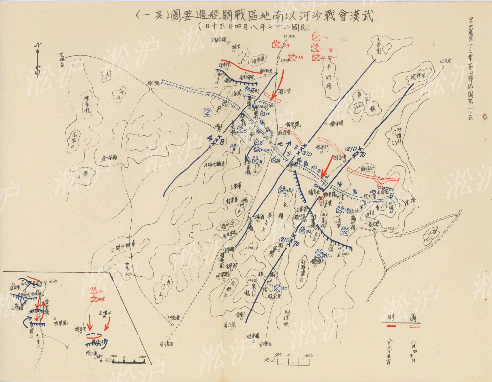

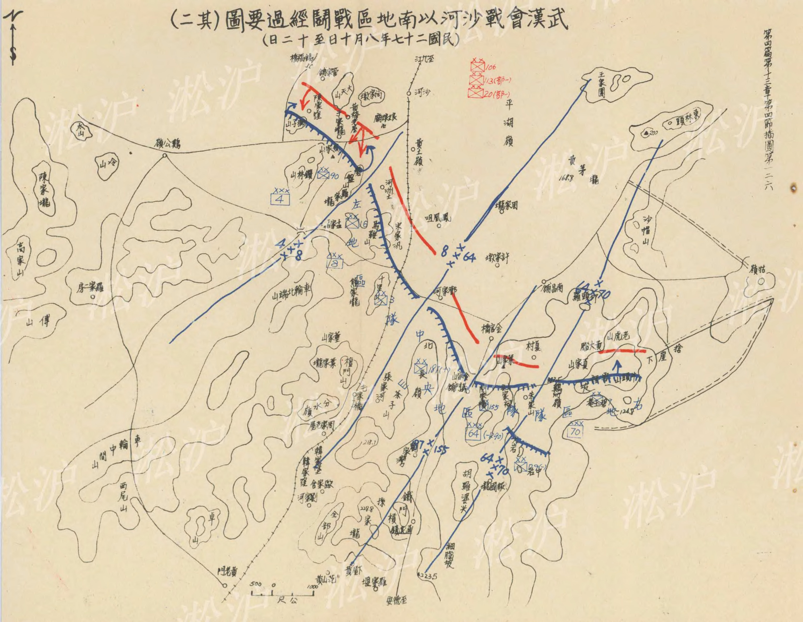

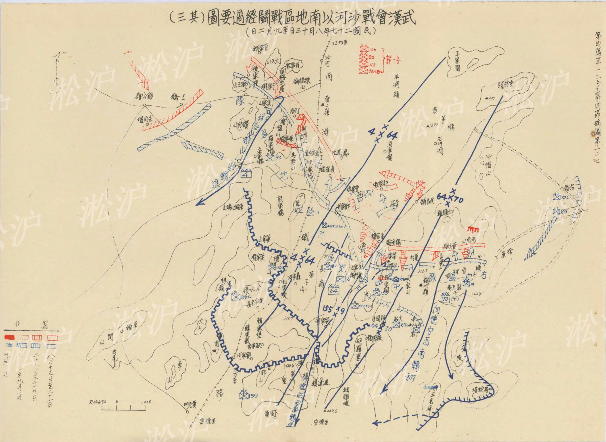

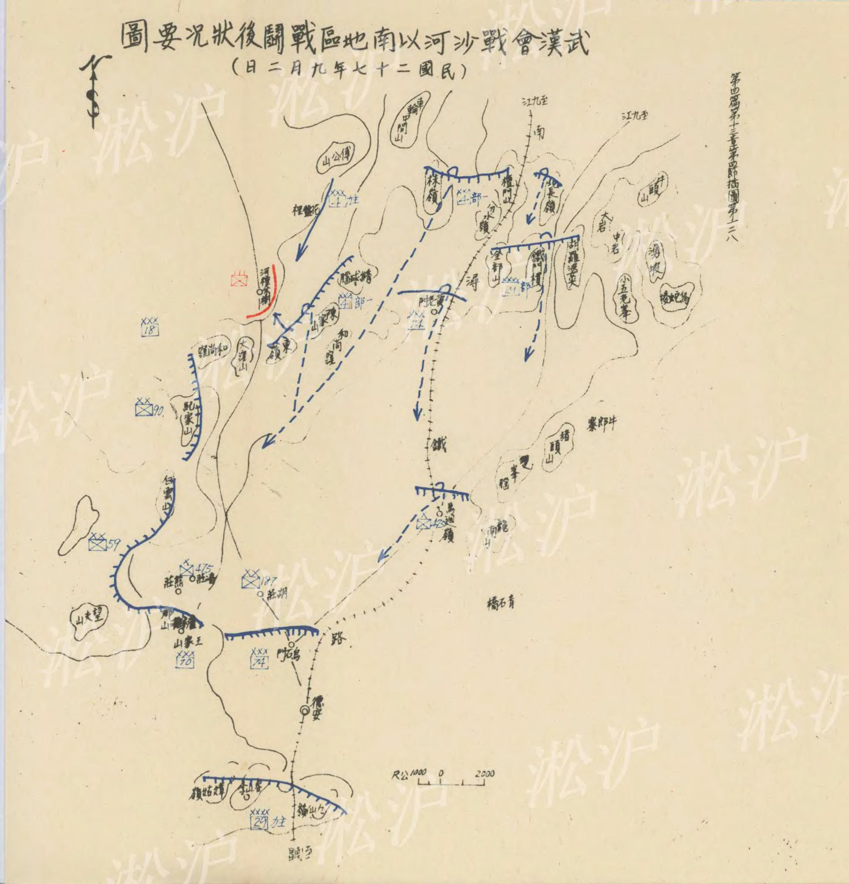

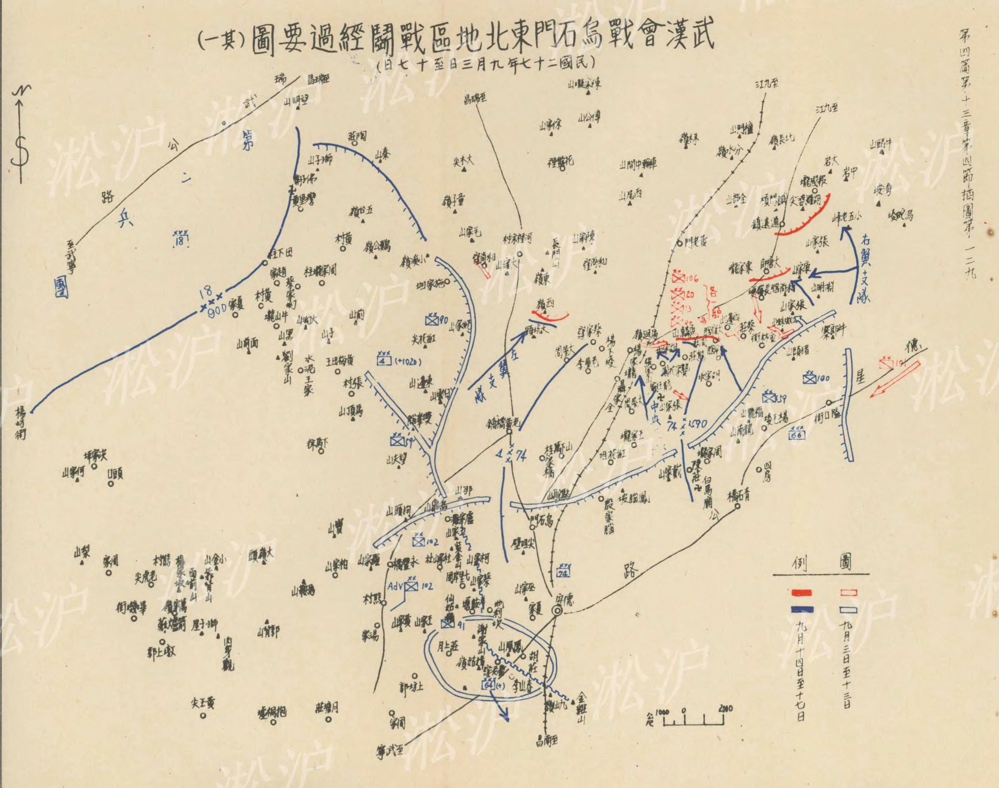

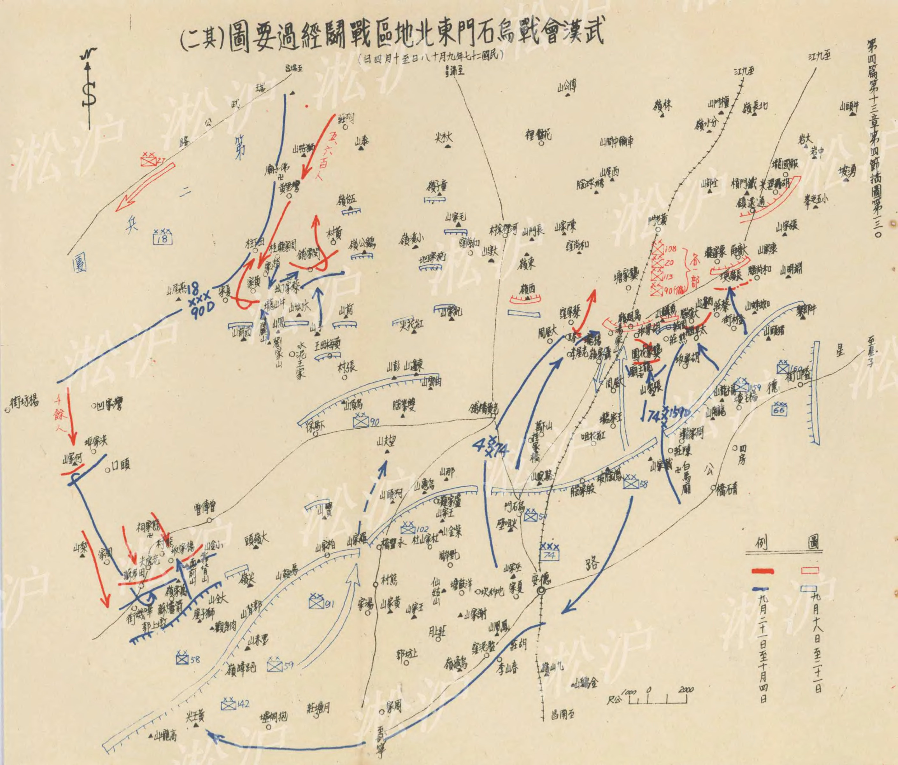

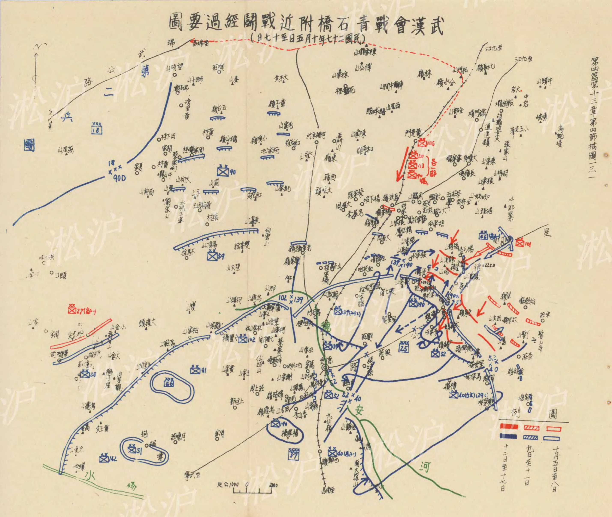

三、永武公路間及萬家嶺附近戰鬥

民國二十七年十月六日至十五日

參照揮圖第一三二至第一三七

第二兵團第十八軍，在瑞武公路被瑞陽公路方面之敵第二十七師團逐次壓迫於覆血山附近之際（參照揮圖第一三二），我第一兵團爲策應其作戰，由南溥正面調抽有力一部，向瑞武公路敵後迂迴。敵爲解除該方面之威脅，並圖與德星公路方面之敵合圍德安，亦自南溥正面抽調第一零六師團全部，德星方面抽調第一零一師團之一部，向德安左側地區進攻。九月二十八日，敵先頭部隊步騎砲聯合約一聯隊以上兵力，於突破第四軍警戒線後，分途南進，一部與我第四軍於閔家舖以北地區及面前山、夏家、馬尾塘之線對戰。另一部二千餘，分擾灣家凹、何家山附近。三十日進據萬家嶺西北高地及墩上郭以北地區，經第四軍及第五十八師連日猛攻，敵雖數次增援，迄十月四日仍對峙於小金山、面前山、萬家嶺、墩上郭、張古山、城門山之線。

向瑞武公路迂迴部隊，由第九集團軍李漢魂副總司令指揮。其右側掩護部隊，於二十九日與竄擾何家山之敵接觸後，遂將第九十一師、預備第六師、新編第十三師調返，在梨山、斗母嶺、馬鞍嶺、義門、何家山一帶激戰。十月三日，將部隊區分右、左兩翼隊及左側支隊，以主力轉移於駱駝山、劉窪灣、談仙宮、王公山間地區圍殲待援之敵。四日、瑞武公路方面之敵，已進至羅盤山、棺材山之線，有向箬溪東進，威脅我側背模樣。時兵團薛總司令十月四日電諭迂迴部隊卽向柘林北側地區轉移，第一四一師劃歸第二兵團序列，第十六師歸第八軍序列，第一三九師之第四一五旅歸第九集團軍副總司令李漢魂指揮。

李副總司令遂於四日十三時三十分下達命令，其要旨如左（參照插圖第一三二）：

一、敵第三聯隊及山下部隊已進至羅盤山、棺材山，有向箬溪進犯企圖。我第一三九師一部，已在獅子崖及城門山各西端之線佔領陣地。

二、軍團以消耗敵人達成持久抵抗之目的，决向紅山、河澣之線轉移。

三、各部轉進路線及位置如左：

守備部隊新編第十三師經白陽堆、嶺下劉家、蔣家坳以東地區，向城門山西南地區轉移。第六十師即由現地（白水街、九石隘之線）經劉家、螺墩向河澣以東地區轉移。

左翼隊由現地經梨山、駱駝山向蛇嶺坳附近轉移。

右翼隊由現地經斗母嶺、城門山向田家、彭家、東彭李地區轉移。

左側支隊由現地經何家山、劉窪灣向紅山、新開年地區轉移。

四、除以進出跑馬嶺、上磨刀、龍腹渡之第一四二師第七二五團掩護本軍團左側背之安全外，其餘各部之撤退時間如左：

守備部隊（新編第十三師、第六十師及其配屬部隊）應於本（四）日二十時開始轉移。

攻擊部隊（右左翼隊及左側支隊）應於本（四）日二十二時開始轉移。

五、轉進時各部應自行派隊擔任掩護。

六、原配屬守備各部之配屬部隊仍舊，攻擊部隊之配屬部隊，俟轉進至新位置後卽行歸還建制。

七、新編第十三師及第六十師到達新位置後，應卽迅速構築陣地而固守之。新編第十三師右翼應與第一三九師切取連絡。

各部奉命後，遵時向新位置轉移。

十月五日（參照插圖第一三三），第四軍及第五十八師當面狀況無變化。迂迴部隊自奉令轉移後，均於十六時以前到達紅山、河澣一帶。同日、李兼軍團長當卽下達命令，其要旨如左：

武漢七

一、敵第一零一及第一零六師團各一部，於石堡山、萬家嶺間地區乘我調整陣線之際，分三路向張古山、楊家山、城門山陣地進攻，刻與第一三九師之第四一五旅激戰中。沿瑞武公路南進之敵一部已進抵箬溪、續沿武永公路東進。我第五十八師刻在獅子崖、墩上郭、張古山之線佔領陣地。

二、軍團爲鞏固現陣地，協同右翼友軍擊滅該敵之目的，以一部固守城門山、排樓下至河滸之線；主力集結於城門山南端之范家、廬家及甘木關、范家、上廬各地區。並以一部構築碗鐔嶺、坳頭至柘林之主陣地。

三、第九十一師（附第一三九師第四一五旅守備楊家山、城門山亘窪山南方高地之部）爲右地區隊，應迅卽協同第一八七師之一旅擊破當面之敵，佔領楊家山東端城門山亘窪山南方高地（不含）之線而固守之，第一三九師第四一五旅爲該地區預備隊。

四、新編第十三師爲中央地區隊，佔領窪山南側高地（含）蔣家坳、排樓下（不含）之線而固守之。

五、預備第六師爲左地區隊，佔領排樓下亘螺墩、河滸之線而固守之。

六、各地區隊作戰地境如左：

第五十八師與右地區隊間，爲墩河、楊家山東端、桶漢傳、馬鞍山之線。

右地區隊與中央地區隊間，爲彭家、呂家、余家、窪山東端、猴子嶺、陳家之線。

中央地區隊與左地區隊間，爲田舖、排樓下、楊家山西端迄彭家之線。

七、第一四二師應位置於東行嶺、彭岡、大元山間，第六十師應位置於蘆家山、上廬間爲軍團預備隊。八、第一八七師孔師長指揮該師之一旅及第十九師之一旅，佔領墨赤山（含）、碗鐔嶺、烏龜山、田家（不含）之線陣地而固守之。並以第一八七師之一旅開赴楊家山、城門山，協同第一三九師之一旅及第九十一師擊破該地區之敵後，卽將佔領地區交由第九十一師接替，再歸還原陣地，仍服行原任務。

九、第一三九師第四一五旅孫旅長指揮旅餘部附稅警團，佔領由家、（含）曹家坳、王家山、柘林之線，構築陣地而固守之。

各部當卽遵令部署，第一兵團綜合連日情報，得知進攻萬家嶺一帶之敵，係南溥正面及星德方面敵第一零六師團全部及第一零一師團之一部，我爲增强兵力，遂由南溥方面抽調第六十六軍（第一五九師欠兩團、第一六零師之一團）、第七十四軍（欠第五十八師）轉用於萬家嶺方面。當令第七十四軍之第五十一師，卽日由第三十六軍團長兼第七十四軍軍長俞濟時親率至白槎西北地區集結待命。並令第五十八師歸還第七十四軍建制。第六十六軍由第九集團軍副總司令兼第六十六軍軍長葉肇率領至寶山西南地集結待命。

十月六日（參照插圖第一三四），第四軍方面，敵機不斷在第五十八師長嶺楊家山陣地一帶上空狂炸，工事全毀。十四時、長嶺陣地一部被敵突破，經以第一八七師之一旅增援逆襲恢復。李副總司令爲加强該軍方面之作戰，特於十五時令第一四二師卽以主力推進至長嶺以南地區，佔領長嶺東南及西南高地之線陣地；一部仍在跑馬嶺、磨刀、龍腹渡之線擔任警戒。沿永武公路東進之敵七百餘，於十二時以後，分二路：一沿上堡山山道；一沿龍腹渡道路進攻，均被第一四二師警戒部隊擊退。李漢魂副總司令爲適應狀況，當令第一八七師所指揮之第十九師之一旅，派兵一團開赴修河南岸，由下坪西端河流分支點起，至三逢灘止構築陣地，確實固守，並對西北兩岸嚴密搜索。

同（六）日，第一兵團以圍殲萬家嶺附近地區敵人之目的，於十三時下達命令，其要旨如左：

一、第六十六軍應佔領金娥殿、公母嶺（含）之線，行攻擊準備。第一期應佔領何壠山、鄧家山、王家山、獅子廟一帶地區。第二期應攻佔港口程、頭口、王家泛王一帶地區。第三期應攻佔三胡何家、武漢(七)

何家山、鳳凰山、圍尖一帶地區，並截斷敵向北連絡線。

二、第四軍應佔領公母嶺（不含）、小金山、大金山（不含）之線行攻擊準備。第一期應攻佔石頭堡、面前山、熊家畈、楊家畈一帶地區。第二期應攻佔西尖山、石堡山、大樟樹坳一帶地區。第三期應攻佔沙不傳、馬鞍山、斗母嶺一帶地區。

三、第七十四軍應佔領大金山、獅子崖之線行攻擊準備。第一期應攻佔萬家嶺、箭爐蘇、田步蘇一帶地區。第二期應攻佔老虎尖、石馬坑劉一帶地區。第三期應攻佔梨山、周家北端高地、烏童嶺一帶地區。

四、第一八七師（欠一旅）、第一三九師之一旅第九十一師之一旅，歸第一八七師師長孔可權指揮，佔領獅子崖、（含）墩上郭、長嶺、張古山、楊家山、城門山（不含）之線陣地拒止敵人。並於七日十四時起，向當面之敵佯攻。爾後隨第七十四軍之進展，相機將主力轉移於左翼楊家山附近爲預備隊，準備追擊。

五、新編第十三師（附新編第十五師之一旅，）應佔領城門山、窪山、豬頭嘴線陣地拒止敵人，俟攻勢部隊達成第二期任務，卽以一團以上兵力由楊家窪進佔青山堂、焦山嶺，控置經白楊堆間道路，遮斷敵向西之連絡線。

六、第一四二師（欠一旅）位置於東塘附近，俟攻勢部隊達成第一期任務後卽行出擊。第一期應攻佔烏童嶺、駱駝山李一帶地區。第二期應攻佔義門、劉窪灣、光岡山一帶地區，包圍敵之右側背。

七、第六十師、預備第六師及第一四二師之一團，統歸第十八軍副軍長陳沛指揮，第一四二師之一團應在來龍嶺南北之線竭力遲滯敵之前進，不得已時撤至康頭尖南北之線佔領預備陣地。預備第六師、第六十師應佔領猪頭嘴、（不含）楊家山、馬坳、河澣線陣地拒止敵人，掩護攻勢部隊之攻擊八、第九十一師（欠一旅）及第一四二師之一團，應佔領曩赤山、碗鱗嶺、黃土尖、烏龜山、高壠山、王家山、柘林線預備陣地，並策應攻勢部隊之作戰。

九、第十九師之一旅仍服行原任務。

十、砲兵第二團第三營及第一團第六連，應在棋田以北地區佔領陣地，以主力壓制敵之砲兵，並協同友軍攻擊萬家嶺、田步蘇、石堡山、老虎尖之敵；以一部支援機動部隊之出擊。

十一、第四、第六十六、第七十四各軍，歸葉副總司令指揮。李副總司令指揮部隊仍舊。李、葉兩副總司令統歸吳總司令指揮。

十二、攻擊開始時間及詳細部署，由吳總司令規定之。

第九集團軍吳總司令奉命後，卽於十五時作如左之處置：

一、以第六十六軍置重點於右翼，向石頭嶺攻擊。奏功後，卽以左翼爲軸，向左旋迴，以嗶嘰街、箭爐蘇、大金山爲到達線，與第四軍、第七十四軍協同將萬家嶺、田步蘇之敵包圍而殲滅之。

二、第四軍派兵一部，在下馬徐、王家橋、石頭嶺一帶游擊，並不斷向西佯動，以掩護第六十六軍之側背；主力應確保現陣地。

三、第七十四軍向西北攻擊，左與第一三九師之第四一五旅確保聯繫，防敵向南突進。

四、各部於明（七）日十二時前於金娥殿、楊眉尖、公母嶺、小金山、大金山、張古山線集結，完成攻擊準備，限十六時開始總攻。

葉、李兩副總司令奉到上述兩項命令後，遵卽分別部署，積極準備。

攻勢部隊方面：七日，第六十六軍以第一五九師全部及第一六零師之一部，展開於金娥殿、公母嶺之線，十七時完成攻擊準備後，卽向石堡山、萬家嶺攻擊前進。第四軍派出之游擊部隊，七時於劉家嶺武漢七

附近與步騎聯合約三百餘之敵遭遇，當卽展開激戰。第七十四軍方面，敵機自晨至暮不斷偵炸，我部隊行動極感困難，迄二十一時，第五十一師始就攻擊準備位置完畢，向雷鳴鼓劉攻擊前進。惟敵自佔領長嶺北部及張古山最高點後，卽陸續增加兵力至二千餘人，憑險頑抗，經數度猛攻，始將長嶺完全克復，並將張古山包圍。八日、第六十六軍攻擊到達王家山、石堡山、老虎尖、雷鳴鼓劉、楊家畈、面前山之線與敵對峙，十八時、以一部由楊家畈南進，協同第四軍第九十師之一部由楊家畈南下夾擊萬家嶺以南敵軍之一部，於二十四時攻克大金山西南獅子崖西北高地。第七十四軍第五十一師亦於拂曉克復張古山制高點，殘敵狼狽潰退。拂曉後、敵千餘在飛機二十餘架掩護下，向張古山制高點反撲，守軍奮勇迎擊，卒因援隊被敵機所阻無法增加，孤軍苦鬥至十時，全部壯烈殉職，該地遂再度失陷。九日、第六十六軍及第四軍攻擊無進展。第七十四軍當面之敵，拂曉後以飛機掩護，雖數度進攻，均被擊退。

守備部隊方面：七日十四時，各地區隊之佯攻均有斬獲。八日、李副總司令爲策應攻勢部隊之攻擊，令控置於東塘附近第一四二師於十一時由城門山附近出擊，向梨山、老虎尖攻擊前進，二十四時攻佔桶漢傳、周家之線。左地區隊當面之敵一部約百餘、附砲四門，到達百風尖；一部約數十人向來龍嶺陣地進攻，當被擊退。九日拂曉，敵以機砲掩護其步兵向右地區隊猛攻，第一八七師第五五七旅旅長李明裏創督戰，官兵奮勇迎擊，將敵擊退。中央地區隊於拂曉後，以有力之一部出擊，於攻佔焦山嶺、青山堂後，並推進至白楊堆，將敵向西之連絡線截斷。左地區隊當面之敵約六百餘、附砲四門，拂曉後續向我來龍嶺陣地猛撲，受創退去。機動部隊第一四二師於零時自桶漢傳、周家、劉家之線繼續向東挺進，並於拂曉以一部襲擊石馬坑劉西北高頭敵砲兵陣地，由獲頗多。嗣以敵由南北兩面增援，該師撤回烏童嶺東北高地之線。

第一兵團總司令薛岳以貫澈團嚴萬家嶺附近敵人之目的，復於九日十五時下達命令，其要旨如左參照插圖第一三

四之右下角圖

一、各部應按左列數目挑選奮勇隊。

第九十師二百名。

第六十六軍四百名。

第五十八師二百名。

第五十一師五百名。

第九十一師二百名。

第一四二師二百名。

除第六十六軍在石堡山、老虎尖部隊應適時向南掃蕩外，其餘各部攻擊目標如左：

第九十師由大金山向箭爐蘇東端高地攻擊。

第六十六軍一部由楊家畈向茅坪轟攻擊，主力由萬家嶺北端向箭爐蘇攻擊。

第五十八師由墩上郭向箭爐蘇攻擊。

第九十一師由楊家山向其東北無名村及金村東北高地至松樹熊一帶攻擊。

第一四二師由烏童嶺向楊家山北端之無名村及其東南高地至松樹熊一帶攻擊。

三、砲兵於十八時開始射擊，其目標爲箭爐蘇、萬家嶺南端、田步蘇南端、雷鳴鼓劉南端、楊家山北端之兩個無名村、暉啖街亘箭爐蘇間地區。

四、奮勇隊應於十九時開始攻擊，其餘有攻擊任務之各部；在奮勇隊後跟進，努力擴張戰果，各守備部隊應努力制壓當面之敵，所有各部，除原有任務外，應切實支援隣接部隊達成任務，并確取連絡。各部於層奉上項命令後，遵卽着手編組，十八時完成攻擊諸準備，砲兵亦開始射擊，十九時攻擊開始，各部奮勇爭先，進展迅速，士氣大振。

攻勢部隊方面：十月十日、第六十六軍以奮勇隊爲先導，主力向茅坪聶、萬家嶺附近之敵猛攻，激戰至三時，敵不支，向田步蘇潰退，該部乘勝追擊，鼓勇再戰，敵棄屍盈野，全部就殲，遂將田步蘇、萬家嶺完全克復。十時殘敵一部約千餘、騾馬三百匹，向大樟樹坳北竄，經石堡山守軍截擊，該敵主力乃折向西竄；一部約三百餘被我包圍殲滅。第四軍自奮勇隊攻佔箭爐蘇東端高地後，復將大金山西南高地、高坑潘北端高地克復。第七十四軍於拂曉前攻克張古山制高點，恢復原陣地。日出後，敵約三大隊向張古山制高點反撲，十二時、並以飛機十餘架、砲數門、掩護步兵約千二百人增援猛攻。另以一部約五百人進攻長嶺，激戰至十三時，張古山至長嶺間隘路被敵突破二百餘公尺，我援隊及時增加，血戰一小時，卒將該敵擊退，陣線得以穩定；惟箭爐蘇、嗶嘰街及長嶺、張古山北端一帶，尚有敵二千人、砲數門憑險頑抗。守備部隊方面：右地區隊第九十一師自九日十九時以奮勇隊領先向指定目標攻擊以來，激戰至十日拂曉，卽將楊家山東北無名村及東北高地佔領，斬獲頗多，十時攻擊到達松樹熊附近。機動部隊第一四二師亦以奮勇隊先導，於九日十九時由烏童嶺向東開始攻擊，拂曉前、卽將楊家山北端之無名村及其東端高地松樹熊佔領，並生俘敵軍官田中善藏一名。拂曉後，敵由東北兩面向我攻擊，並以飛機竟日狂炸，官兵沉着應戰，撐持至暮，未稍動搖，中央地區隊新編第十三師當面之敵數十名，進犯蔣家坳陣地，被我擊退。斯時、沿武永公路由箬溪東進之敵千餘、附砲十餘門、戰車十餘輛、裝甲汽車三十餘輛、飛機十餘架，拂曉突破跑馬嶺、龍腹渡之線陣地後，繼續向左地區隊預備第六師螺墩附近猛撲。

薛岳兵團總司令，根據當日戰況，於十日十六時三十分下達如左之命令要旨（參照插圖第一三五）：

一、敵之大部已被我擊潰，其一部現由長嶺及張古山北端向南竄擾。

二、本兵團以肅清殘敵之目的，其部署如左：

(一)第六十六軍攻佔箭爐蘇、大清寺後，轉向長嶺攻擊。

(二)第一四二師應卽轉移於楊家山東北無名村向嗶嗶街攻擊。

(三)第九十一師之一旅，由張古山西南向張古山北端嗶嗶街進攻。其餘及第一三九師之一旅，應固守原陣地。

(四)第一八七師孔師長，卽率第一四二師之一團，在長嶺南端策應該方面之作戰。其暫歸第九十一師指揮之一旅，卽歸還建制，任原陣地之守備。

(五)第七十四軍應由現陣地向長嶺北端及張古山北端進攻。

(六)砲兵應於十八時開始，向箭爐蘇、嗶嗶街、張古山北端間地區集中射擊。各師應於十九時開始攻擊，務不顧一切以竟全功。

三、第三十集團軍派有力部隊渡河向箬溪、來龍嶺、上下桂堂一帶襲敵背後，並以第一一八師推進至張公渡附近，準備策應。

各部奉命後，卽於十九時開始，續向箭爐蘇、嗶嗶街、張古山一帶殘敵攻擊。攻勢部隊方面，第六十六軍主力，一舉攻入箭爐蘇北端敵陣，該敵數百名仍據山峯頑抗。守備部隊方面，第一四二師奉命後，向指定位置移動，二十時完成攻擊諸準備，卽向嗶嗶街攻擊前進，於二十四時攻克嗶嗶街。右地區隊第九十一師之一部，由張古山西南向張古山北端進攻。中央地區隊當面之敵經我痛擊後，不支潰退。左地區隊戰況無變化。

十月十一日、攻勢部隊方面，第六十六軍攻入箭爐蘇後，激戰至四時，卒將該敵擊潰，殘敵除一部嘯集箭爐蘇東南一帶高地，藉森林掩護繼續抵抗外，餘均就殲。十四時、敵機十餘架在松樹熊以西高地空，投粮彈似圖固守待援。十八時，我以主力向松樹熊以西高地之敵攻擊，一部清掃石堡山、老虎尖、箭爐蘇各附近之殘敵，該敵施放毒氣，仍圖掙扎，至二十四時、乃將松樹熊以西高地之敵全部殲滅。第四軍亦於十八時派兵一部協同第七十四軍之一部將箭爐蘇東南之敵擊潰。第七十四軍主力續向長嶺張古山北端之敵攻擊無進展。守備部隊方面，第一四二師攻入暉曉街後，未能與友軍切取連繫，以致孤立無援，乃退出該村，轉向張古山北端山腹之敵攻擊，亦未奏效。該師以連日攻擊，官兵已呈疲憊，乃於五時許，以右翼依托楊家山，左翼佔領烏童嶺重新部署，暫取守勢待機攻擊。右地區隊第九十一師，向張古山北端之敵攻擊，頗有斬獲，中央地區隊狀況無變化。左地區隊與沿永武公路東竄之敵接觸以來，頗有傷亡。十二時，敵集中機砲向楊家山前進，陣地終告不守。第一兵團總司令薛岳爲增強該地區隊兵力，確保左測背之安全，於十五時令第一四二師速開上廬歸該地區指揮官陳沛指揮。

陳指揮官奉令後，當卽下達命令其要旨如左（參照圖第一三六）：

一、第六十師（欠一團）爲右守備隊，務確實固守蔣家坳南端道路旦山下、排樓下、石灰山（不含）之線主陣地，並相機恢復楊家山前進據點，以一部構築蔣家坳、（不含）康頭尖、梨頭山線之預備陣地，右與新編第十三師左與預備第六師連絡。

二、預備第六師（附第一四二師之一團、砲兵第一團第六連之一排及第五十一團第八、第十一兩連）爲左守備隊，固守石灰山、下東山、河許迄修水河北岸之線主陣地，以一部死守螺墩東北高地及二一二、零高地前進據點，置重點於公路附近，右與第六十師第一八零旅切取連繫，左對修水河岸側防應切實注意。

三、第一四二師（欠一團）到達甘木關後，卽向上廬推進，除以有力之一團於十二日二時經上廬、石灰山向螺墩出擊，殲滅當面之敵外，主力限於十二日三時前佔領胡家（梧桐尖北）、梧桐尖亘上廬西南高地、雷公渡西北高地迄修水河北岸之線預備陣地，構築堅固工事，嚴整戰備，隨時策應預備第六師之作戰。該師右與第六十師之第一八零旅切取連絡。

四、第六十師派兵一團爲地區預備隊，位置於甘木關西南地區，準備策應，並構築大元山亘盧家山、田家坳迄修水河北岸之線預備陣地。

五、本地區右與新編第十三師作戰地境仍舊。第六十師與預備第六師作戰地境，爲甘木關、梧桐尖、後房壠相連之線，線上屬預備第六師。

六、各師陣地任務於十二日拂曉前調整完畢，幷利用夜間努力加强工事，對陣地附近之公路應澈底破壞。

該地區隊各部奉命後，遵卽陸續就配備位置。

十月十二日，攻勢部隊方面，第六十六軍攻佔松樹熊西方高地後續向南進，拂曉到達桶巷、潘村附近與敵對峙。第四軍情況無變化。第七十四軍對長嶺、張古山北端之敵攻擊仍無進展，拂曉後，敵復不斷猛烈反撲，激戰至九時，始被擊退。守備部隊方面，右地區隊仍與敵對峙。中央地區隊，當面之敵攻擊新編第十三師窪山、蔣家坳一帶陣地不逞。左地區隊方面，沿武永公路東竄之敵，陸空聯合約千餘，於拂曉向第六十師康頭尖西端高地猛攻，並以一部經蔣家坳小道向康頭尖北端高地迂迴。另部敵約千人，向我預備第六師下東山、石灰山附近陣地攻擊，守兵沉着應戰，敵未得逞。

第九集團軍總司令吳奇偉，十二日九時爲適應戰況，決心調整陣線，當卽下達命令，其要旨如左：

一、困守張古山以北一帶地區之敵第一零六師團及第一零一師團之一部，連日被我圍擊，殲滅殆盡。其殘部盤踞長嶺及張古山北端，企圖固守待援。另敵近衛師團之麻布第三聯隊附砲八門、戰車及裝甲汽車三十餘輛，由箬溪東進，現與我蔣家坳、石灰山、下東山守備部隊激戰中。

二、集團軍以殲滅張古山以北一帶地區之敵，並拒止攻由著奚東進之目的，擬將戰線調整如左：

三、第七十四軍右與第四軍連繫，佔領獅子岩、（不含長嶺張古山之線。

四、第一三九師第四一五旅、第一八七師之一旅及第九十一師（八團）統歸第九十一師師長馮占海指揮，除以第一三九師第四一五旅及第一八七師第五五七旅之一團守備張古山（不含）、楊家山、城門山至窪山（不含）之線陣地外，其餘應相機繼續攻擊困守長嶺及張古山北端之敵。

五、新編第十三師應佔領窪山至蔣家坳之線。

六、第一四二師、第六十師、預備第六師、第九十一師之一團應佔領蔣家坳（含）、康頭尖、下東山至河滸之線。以上各部統歸第十八軍副軍長陳沛指揮。

七、第四軍除守備原陣地外，應掃蕩當面之敵。

八、第六十六軍仍在原位置繼續掃蕩當面之敵。

李兼軍團長基於上令與當前狀況，於十二日十三時下達命令，其要旨如左：

一、敵近衛師團第三聯隊沿武永公路東進，企圖突破我之一翼，援救張古山之敵。

二、軍團爲調整陣線，迎擊東進敵人之目的，茲重新部署如左：

三、第一八七師師長孔可權指揮所部及第一三九師之孫旅固守張古山（不含）、楊家山、城門山至窪山（不含）之線陣地，第九十一師應俟第一八七師接替後，於十二日黃昏後，開赴甘木關西北之盧家山附近，歸陳副軍長指揮，該師前撥第一四二師指揮之一團，卽歸還建制。

四、新編第十三師仍服行原任務。

五、陳副軍長指揮第六十師、預備第六師、第一四二師、第九十一師及山砲第一第六兩連、平射砲第八、第十一兩連，固守蔣家坳（不含）、康頭尖、下東山至河滸之線既設陣地。

右地區隊第九十一師奉令後，卽將防務交由第一八七師接替向西移動。此時中央地區隊情況仍無變化；惟左地區隊第六十師、預備第六師當面之敵復增援猛攻，並以飛機二十一架更番投擲催淚彈及燒夷彈，守軍傷亡綦重，援隊又爲敵火所阻，康頭尖西端石灰山、下東山陣地遂陷敵手。

第一兵團總司令薛岳十二日以各部苦戰數月，未經整補，此次圍攻，傷亡尤重，且盤踞長嶺、張古山北端附近之殘敵，未能一舉殲滅，同時其援軍已陸續增加，武永公路方面我軍處於不利態勢，乃下達命令，其要旨如左：

一、第四軍於十二日二十二時開始，仍佔領永豐橋、寶山、馬鞍山、郭背山、層嶺、獅子岩之線，迅速構築工事，並佔領老黃嬌舖、白雲山、彭山、望夫山、大金山各前進據點。

二、第一一八師應佔領郭背山（不含）、墨赤山、碗鐔嶺、黃土尖、烏龜山（不含）線陣地，迅速構築工事，並佔領洪家山、紅山各前進陣地。該師十一日到達張公渡之一團，應於十二日夜到達該線，其餘應於十二日夜到達白槎街及其以東地區宿營，十三日夜到達該線佈防完畢。

三、第六十六軍應於十二日二十二時，祕密至烏龜山、棋田、田家、曹家坳、柘林線陣地、迅速構築工事，並佔領葉家壠、東彭李、黃家嶺、陳家畈、田家坳各前進據點。

四、第十九師之第五十五旅，應佔領柘林、修江南岸之沙田港、范家舖（柘林對岸）線陣地，迅速構築工事，拒止敵人渡河。

五、第七十四軍、第一八七師、（欠一旅）第一三九師第四一五旅、新編第十三師、第六十師預備第六師、第一四二師，應死守獅子崖、（不含）墩上郭、長嶺、張古山、楊家山、城門山、窪山、猪頭嘴、康頭尖、梧桐尖、上廬、河濬線陣地對長嶺、張古山附近及楊家山（蔣家坳西）附近之敵，仍應採取攻勢，並對白楊堆方向多派偵察隊搜索敵情。第九十一師應空置於徐家坳、東塘、牛車盤地

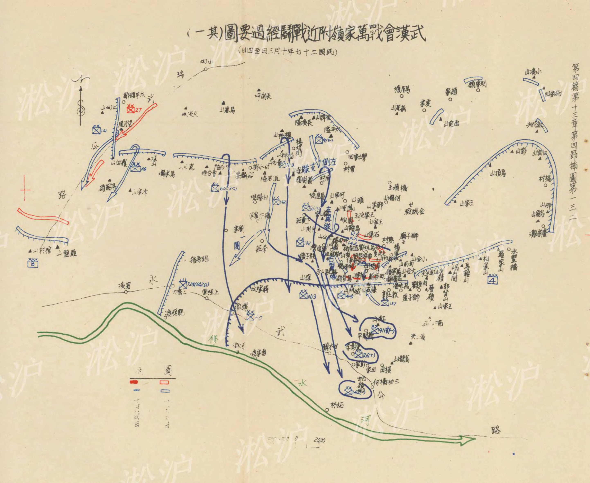

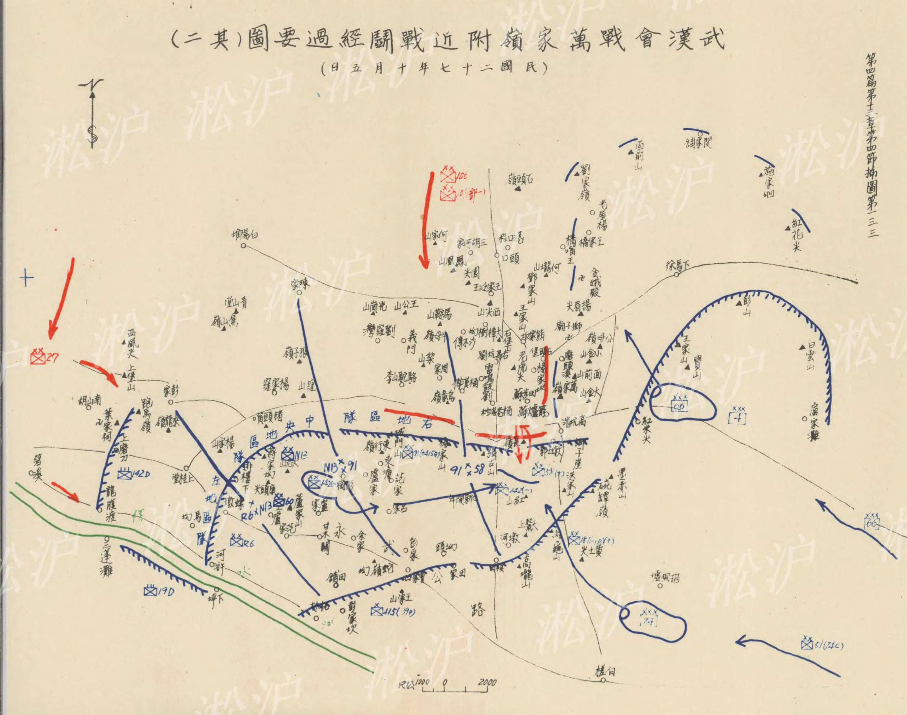

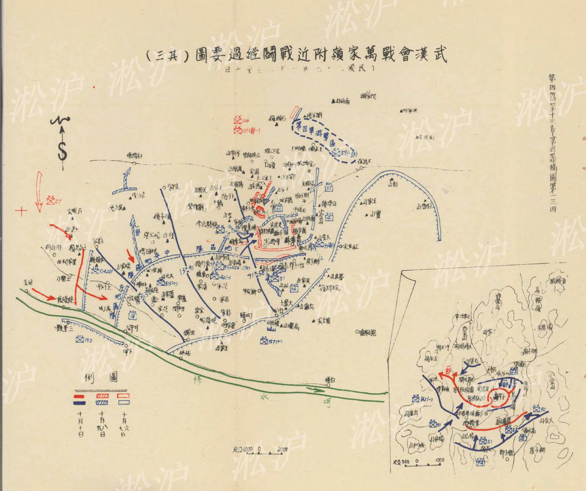

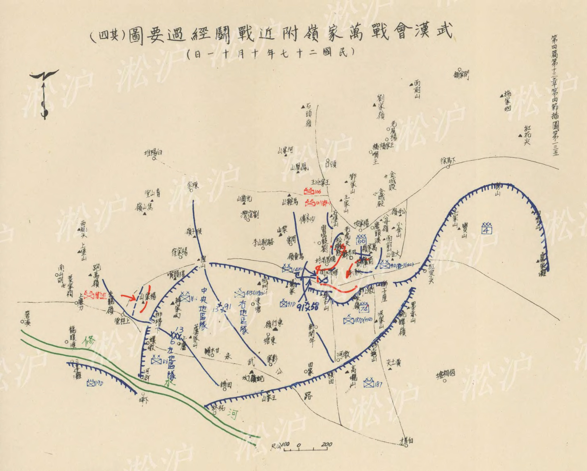

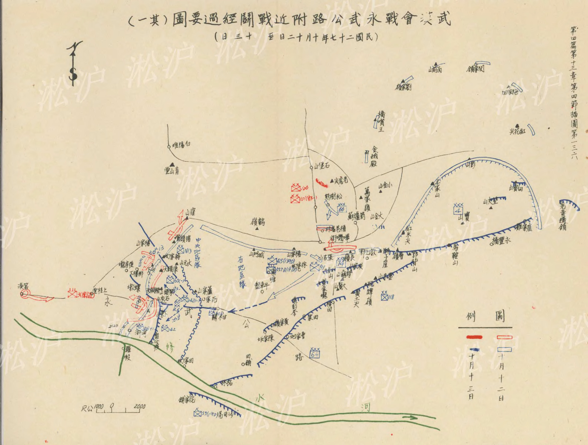

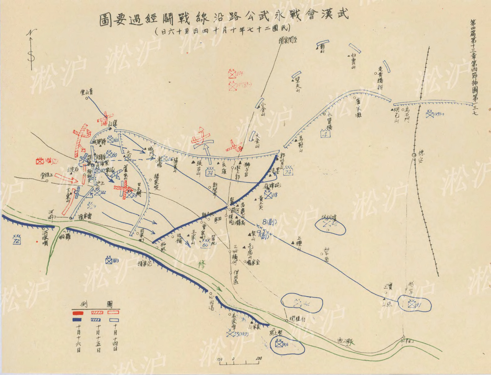

區爲預備隊。

六、砲兵第一團之第一、第六兩連、砲兵第二團第三營，仍於現陣地直接支援李漢魂部對北對西之戰鬥。砲兵第二團第三營，應在白槎北方附近構築預備陣地，準備支援葉肇部預備陣地之戰鬥，以主力封鎖大鰲上、棋田、曹家垴各隘路。工兵第三團之第一連及第一六零師、第一五九師、第一一八師各工兵營統歸砲兵王指揮官指揮，擔任構築砲兵陣地進出路，並協助砲兵陣地之構築。

七、第一一八師暫歸第六十六軍序列。第四軍、第六十六軍第十九師之第五十五旅歸葉副總司令指揮。第六十師，第一四二師、預備第六師歸陳副軍長指揮。第七十四軍、第九十一師新編第十三師第一八七師（欠一旅附第一三九師之一旅）及陳沛部統歸李副總司令指揮。砲兵第一、第二、第十九團各部，仍歸砲兵指揮官王若卿指揮。葉、李兩部及砲兵王指揮官統歸第九集團軍總司令吳奇偉指揮吳總司令奉令後，當卽層轉各部遵照。

十月十三日拂曉前，各部就新配置完畢。第七十四軍方面，九時，敵分兩部，每部約百餘人，向我五十一師長嶺、張古山一帶進攻激戰至十時，被我擊退。預備第六師自敵攻陷石灰山、下東山後，戰力全失，殘餘奉令於田舖附近集結待命，原隸該師指揮之第一四二師之一團，當卽歸還建制。第一四二師方面，拂曉後，敵以機砲戰車掩護，向我猛攻，戰鬥激烈，守兵傷亡慘重，十六時後，敵戰車竄抵梧桐尖側後山顛，守軍被敵包圍，全部殉職，十七時退守梧桐尖以東高地亘河澣附近之線。左地區指揮官陳沛，當令第九十一師除留置增加第六十師作戰之一部仍固守原陣地外，其餘卽接替第一四二師上廬西南高地、雷家渡西北高地亘河澣迄修水河北岸之線陣地，右與第六十師梨頭山部隊連絡，並令第一四二師立即以全力克復梧桐尖，并乘勢掃蕩石灰山附近及下東山之敵。

十月十四日（參照插圖第一三七），第四軍與敵僅有小接觸。第七十四軍入晚派隊向長嶺、張古山附近之敵攻擊，頗有斬獲。李副總司令爲策應左翼之戰鬥，於十一時電令第一八七師將楊家山防務交第一三九師第四一五旅接替後，卽趕至范家東南歸第十八軍副軍長陳沛指揮，並限於十四日十七時到達指定位置。第一三九師第四一五旅遵卽向右延伸接替第一八七師防務。第六十師方面，八時，敵機二十餘向第一四二師梧桐尖及第九十一師上廬陣地集中狂炸，並以煙幕掩護其步兵猛攻，第一四二師及第九十一師守兵傷亡奇重，我乃抽派一部會同預備第六師殘部馳援，陣地始趨穩定；但梧桐尖守兵仍被敵包圍，梨頭山陣地突出，三面受敵，幸官兵奮勇迎戰，陣地乃得保持。第一四二師方面，二時，將防務移交第九十一師元成攻擊準備後，旋卽向梧桐尖之敵攻擊，激戰至五時三十分，將敵擊潰加以佔領，右與第六十師梨頭山守車左與第九十一師取得連繫。八時，敵在飛機二十餘架掩護下猛烈反撲，激戰至十四時，卒以傷亡殆盡，梧桐尖山顛又陷敵手。第九十一師方面，接防甫畢，八時，敵機二十餘架卽於上廬上空頻施轟炸，旋以戰車五輛掩護其步兵向上廬陣地猛攻，經由第六十師及預備第六師派隊阻擊，將敵擊退。是晚，第一八七師到達范家附近，李副總司令當令陳副軍長以第一八七師反攻梧桐尖，並限十五日八時以前克復。

陳副軍長遵卽幸命令，其要旨如左：

一、第六十師務固一頭尖、梨頭山、范家、盧家山、盧家北端高地之線主陣地，對西北嚴密警戒，並派一部於十五日二時三十分出擊，攻取胡家後，再向石灰山之敵攻擊而確實佔領之。該師右與第九十一師大元山之一部及范家附近總部之一營；右後與新編第十三師左與第九十一師切取連絡。

二、第九十一師（欠四營、附石兵第五十一團第八、第十一兩連及砲兵第一團之一部）務固守范家道路（含）亘范家南端高地及該地東南小高地、田家坳西北高地之線陣地，並以一部於十五日三時三

十分向上廬之敵攻擊而佔領之。另以一部固守河滸及其東北兩高地。該處守軍應以一小部協助第一四二師切取連絡。原在大元山之四營，務努力達成原任務。

三、第一四二師務固守田家坳及其西北高地至修水河北岸之線主陣地，幷派一部於十五日三時三十分經雷家渡東北高地向下東山攻擊而佔領之，右與第九十一師確取連絡。

四、第一八七師應卽以全力於十五日三時沿公路北側地區前進，四時向梧桐尖之敵開始攻擊，限十五日拂曉前確實佔領，並相機追擊。

五、預備第六師應於甘木關西南地區集結，爲本地區預備隊。

六、砲兵第一團之砲兵營，應以主火力制壓敵砲，並封鎖公路，着在原陣地服行任務，改歸第九十一師指揮。

各師奉令後，當卽積極準備。

十月十五日，第四軍方面，拂曉，敵一部約二百餘向獅子岩陣地攻擊，激戰至八時被我擊潰。該軍派出之游擊隊，十一時在閔家舖附近與敵便衣隊數十遭遇，將其擊退。第七十四軍方面，拂曉前，第五十一師之一部正待出擊之際，乃敵先我來攻，當卽迎頭痛擊，該敵不支退去，我遂跟踪追擊，頗有斬獲。新編第十三師方面，拂曉後，敵約五百餘自北西兩面向窪山、蔣家坳一帶陣地攻擊，均被擊退，黃昏後，該敵再興攻擊，陣地當被突破一部經以預備隊逆襲，敵始不支退去。第六十師方面，三時三十分，派隊由梨頭山向南出擊，拂曉後，攻克胡家，並乘勢向石灰山攻擊前進，激戰至十一時，敵以機砲掩護向梨頭山反撲，康頭尖之敵亦乘勢南下，企圖包圍，守兵傷亡過大，漸感不支，幸援隊適時趕到，將敵擊退。十五時，攻擊上廬之第九十一師，因受敵戰車及步兵之猛烈逆襲，被迫退守范家西南高地。斯時，另敵一部，在飛機戰車掩護下，於擊破預備第六師殘部後進佔甘木關，當經抽調一部會同第一八七師之一部堵擊，盧家山、梨頭山之第六十師，亦同時向東竄甘木關之敵後攻擊，敵勢乃挫；但康頭尖東北大元山第九十一師之一部，忽被迫後撤，致盧家山、梨頭山守軍被敵包圍，入晚，始向東突圍，於東塘附近整理，第一八七師於三時三十分再克梧桐尖。八時以後，敵機二十餘架向梧桐尖集中轟炸，旋以戰車四輛掩護反攻，守軍死力抵抗，激戰至暮，終以彈盡援竭，全部壯烈殉職。第九十一師方面，三時，以主力向上廬之敵攻擊，因該敵憑堅頑抗，未能奏功，激戰至十五時，預備隊使用已盡，官兵傷亡慘重，該敵更以飛機二十餘架、戰車四輛掩護其步兵猛烈反撲，我軍不克支持，紛向范家西南高地潰退，以致損失奇重，全師僅餘四百餘人。第一四二師方面，三時，以一部向下東山之敵攻擊，戰至拂曉，仍無進展，八時，敵以飛機掩護逆襲，乃退回原陣地與敵對峙。

第一兵團總司令薛岳，十六日以各部傷亡慘重，戰力銳減，陣地亟待調整，爰於十二時下達命令，其要旨如左：

一、第四軍應固守永豐橋、寶山、馬鞍山、郭背山（不含）線陣地。第七十四軍應固守郭背山、墨赤山線陣地。第一一八師應固守墨赤山（不含）、碗輝嶺、黃土尖、烏龜、山鰲上、何莊（不含）線陣地。第一三九師第四一五旅應控制置於抱桐墟附近爲預備隊。以上各部歸第九集團軍副總司令李漢魂指揮。

二、第六十六軍第六十師附第一八七師之一旅，應固守何莊棋田、田家、坳頭、曹家坳、箬箬、王家山、柘林、及高壠山、柴山、老虎山、金家壠、俚田區線陣地。第十九師第五十五旅應固守袁家山、易家埠、沙田港、（不含）修水河南岸沿線陣地，幷迅速構築工事。第一四二師應控置於白槎附近。預備第六師應控制於白槎對岸附近爲預備隊。以上各部歸第九集團軍副總司令葉肇指揮。

三、新編第十三師應於十六日夜經白槎附近渡河，佔領范家舖、羅堰線陣地，歸第三十集團軍總司令王陵基指揮。第九十一師在虬津以北之越山市附近地區集結，歸吳總司令直接指揮。

四、李葉兩副總司令統歸吳總司令指揮。其作戰地境，爲寶田、張山（虬津以北十里）、和平崗（白槎東北十里）、上櫪山、何莊、新開年、窪山、青山堂相連之線，線上屬葉部。

各部於層奉上項命令後，卽於黃昏後開始向新位置轉進，十七日拂曉前部署完畢，與敵保持對峙狀態。

四、瑞武公路沿線之戰鬥

民國二十七年九月十七日至十月四日

參照插圖第一三八至第一四四

敵於八月二十四日攻佔瑞昌後，大部沿新塘埠、小陽鋪大道南進，一部二千餘，沿瑞武公路西侵，其後續部隊，在桂林橋附近卽分一部向蝦蟆洞、烏石街（桂林橋以西）道攻擊。至九月十六日（參照插圖第二三八），由公路以東進犯之敵約千三四百人，已到達望明山、仰心墻、臥龍池北端山地之線。沿公路及其以西進犯之敵第九師團第三十五聯隊千餘人，亦進抵女人橋、長嶺、斗崗山一帶地區，與我第十八軍（第六十師、第十一師）及隸屬該軍指揮之第一一零師戰鬥。

第十八軍於十七時屠奉第九戰區陳長官指示准予轉移陣地，當卽下達命令，其要旨如左：

一、軍决向長埂、泰山、盤子山、大灣山、茶園嶺、斗笠山、康仙菴、雷打石、老虎頭之線轉移。並以小岷山、刀背堎、戴家山、西林埂、堆下文西南高地、壩上張西南高地、山下李以北高地、石馬山、河北彭、八都畈、鹿山壚、堰山、犂頭山之線爲警戒陣地。

二、各師作戰地境如左：

(一)第六十師與第十一師間，爲老洪山、石岩卜北端、吳嶺山、李家山、二峯尖相連之線，線上屬第十一師。

(二)第十一師與第一一零師間，爲茶葉尖、聶家山、羅家山、車盤腦、烏龍包相連之線，線上屬第一一零師。

(三)軍右翼與第一兵團之作戰地壞仍舊。左與第十三軍，由第一一零師與新編第三十五師協定。

三、第六十師以一營爲軍預備隊，控置於魏家附近（橫港街東南約四公里）。第一一零師以一團（欠一營）爲軍預備隊，控置於橫港街以東地區。

四、各師於十六晚開始移動，限於十七日拂曉前部署完畢。

五、軍部於十六晚移駐洞口張（小坳東約四公里）。

各部奉令後，卽向新陣地轉移。

九月十七日，第六十師正面之敵約百人，由牛金山向戴家山、刀背堎警戒陣地攻擊未得逞。另部五百餘於攻佔臥龍池後，續向壩上張北端高地攻擊。又敵千餘，以一部約四百，經范家舖由河北彭北方渡河，向石馬山警戒陣地進攻。另一部繞襲嶺峯山坳、上周，守軍被迫退守長水塘附近。第十一師方面，沿公路前進之敵千餘，向王村警戒陣地攻擊，守兵逐次撤退，敵乃跟踪追躡，其大部約七百名，向茶園嶺方面進擊；一部沿公路兩側西進，經守兵奮勇阻擊，敵未得逞。另敵主力千人、騎兵百餘，在機砲掩護下，向斗笠山、彭家山埂陣地猛撲，守兵拚死力戰，傷亡殆盡，終以衆寡異勢，該兩處陣地遂爲敵軍佔領，殘餘退守莫家舖、白水崖之線。

同日，陳長官電令第十八軍歸湯總司令指揮。嗣奉湯總司令轉陳長官命令，其要旨如左：

一、第六十師應於長埂、獅牯山、盤子山、白石岩亘石虎山一帶佔領主陣地。重點在左。

二、第十一師應於茶園嶺、雷山、茨巴山一帶佔領主陣地。

三、第一一零師應於茨巴山經火燒嘴、官山腦、馮家坳、絲瓜尖、亘牛峯寶東端之線佔領主陣地。主力控置於公路兩側。

四、第十三軍由湯總司令相機處置，必要時佔領牛峯寶。

第十八軍奉令後，乃積極調整部署。同時令第一一零師將梨頭山、雷打石各陣地交與第十三軍接替，並指定第六十師師部位置於徐家坂，第十一師師部位置於周村，第一一零師師部位置於橫港街西約六華里之劉家。

九月十八日拂曉，敵一部由石馬山向第六十師八卦山陣地進攻，被我擊退。嗣因另部之敵侵入左翼馬家山附近，八卦山陣地遂形突出，該師乃留置一部與敵保持接觸，主力退守丁家山、老雅尖之線，左與第十一師啣接。黃昏時，敵續向八卦山猛攻，守兵一排遂與陣地同殉。同時，天寶山附近有敵二千餘，驟馬六七百匹。另股敵七百餘，則侵佔白溪畈。第十一師當面，沿瑞武公路進犯之敵千餘，攻佔石虎山後，乃協同茶園嶺正面之敵八百餘，向茶園嶺陣地猛攻，我以衆寡懸殊，被迫退守香爐坪附近進抗。斯時，雷山守軍亦被迫退守馬鞍山。入夜，該師始變換陣地於尖山李、蔡家山、馬鞍山之線與敵相持。第一一零師當面，拂曉時敵向官山腦一帶陣地猛攻，雖曾幾度衝擊，終未得逞。

第十八軍軍長黃維，十八日爲迅速圍殲沿瑞武公路進攻之敵，乃下達命令，其要旨如左（參照插圖第

一三八：

一、第一一零師以兵力一團由官山腦附近出擊，以一部指向莫家舖附近；以主力指向下山溫、尖山溫間地區。

二、第十一師至少以兩個營向曹村、曹家舖間地區攻擊。

第一一零師奉令後，卽派第六五九團之一營，由官山腦經下山溫對尋村敵砲兵陣地襲擊，並以一部向莫家舖攻擊。同時令第六十六團之一營由尖山溫向溫家橋出擊。各營均於十三時開始攻擊，激戰約五小時，斃敵四百餘，敵不支，紛向莫家舖潰退。

黃軍長二十一時電令：「第六十師構築白石岩、丁家山、老鴉尖之線暨白石岩、石岩腦及其以西之線預備陣地；第十一師構築尖山李、石岩下、蔡家山、鷄婆山、馬鞍山及馮家嶺、靠背腦東面之線預備陣地；第一一零師構築劉家、茨巴山、臘雷山、公符嶺之線及趙家山、墩上范、蘆蕩之線預備陣地」，並將連日情況呈報第九戰區長官部。旋奉陳長官指示如左：

一、第六十師右翼秦山、獅牯山一帶防務，已令第一零二師派隊接替，並限十八晚接替完畢。

二、第一零二師與第六十師作戰地境爲楊坊街、佛子廟、望明山之線，線上屬左。

三、第六十師應以主力控置於左翼。

該軍奉令後，卽令第六十師將佛子廟、梵王廟線以東地區之陣地交第一零二師接替，並抽調四個營於余家橋、陳村地區集結待命。嗣以情況變化，決於當晚變換主陣地之一部，乃下達命令，其要旨如左(參照插圖一三九)：

一、第六十師應將主陣地之一部，變換於白石岩、丁家山、老鴉山之線。

二、第十一師應將主陣地轉移於尖山李、石岩下、蔡家山、鷄婆山、馬鞍山之線。

三、第一一零師應向右延伸至劉家與第十一師連絡。

九月十九日，第六十師當面敵一部四百餘，由白溪畈向田甫張南北高地之線進攻。另敵七百餘、附砲六門向大灣山、丁家山第三五九團進攻。該敵旋以一部向大灣山東端迂迴，一部直薄丁家山，經守軍全力抵抗，雙方傷亡均重。入夜後，我派隊分途襲擊，斃敵甚衆，並奪獲輕機槍五挺、步槍二十三枝。由鹵獲文件中得知該敵爲中支派遣軍本岡部隊。第十一師正面，敵約七八百，於十三時許分向馬家山、鷄婆山陣地進攻。該師爲誘敵深入，於鷄婆山方面以小部隊與敵保持接觸；以大部兵力潛伏陣地側翼及後方，待敵進至陣地前方時，突以伏兵急襲，斃敵甚夥，鹵獲戰利品尤多，敵倉皇失措，狼狽潰退。嗣該敵增援，再興攻擊，激戰多時，卒以衆寡懸殊，鷄婆山陣地遂告不守。第一一零師第三二八旅（欠第六五五團）在公路以南茨巴山、火燒嘴一帶佔領陣地，第六六零團在公路以北地區亘彭家墻一帶（橫港街含）佔領陣地，以主力確保官山腦附近，第六五五團爲軍預備隊，位置於楊樹港附近，第三三零旅（欠第六六零團）位置於大坳附近。敵三百餘於攻佔火燒嘴後，協同沿公路西進之敵四五百人向茨巴山、尖山溫陣地猛攻，激戰至十九時，敵復增援，步砲聯合繼續猛攻，茨巴山陣地遂於二十一時被敵突破。

九月二十日，第六十師正面之敵，經我痛擊後，受創頗重，無力再攻；但仍以一部據守葉家舖、八卦山、香爐坪之線，以掩護其後方，而抽轉其主力會合沿公路西進之敵協力西侵。第十一師於拂曉時派隊向鷄婆山反攻，敵施放毒氣，官兵大半中毒，不得已遂撤回馬鞍山、蔡家山之線固守，並以第三十三旅之預備隊佔領屏風山西麓，以鞏固其第六十六團側背。十三時許，敵一部竄入第三十一旅兩團接合部之蔡家山東南地區，經該兩團之夾擊，敵乃退去。第一一零師當面，同日晨，茨巴山步砲聯合之敵，以一部向趙家山、一部向南山周分別攻擊。該師以茨巴山扼全陣地之咽喉，若不急圖恢復，所受威脅實鉅，遂令第六五九團抽兵兩營、第六五五團抽兵一營，歸第三二八旅旅長指揮向敵反攻，官兵奮勇前進，激戰至十一時許，卒將茨巴山陣地完全克復。斯時竄擾南山周之敵，仍與第六五九團相持。另部由羅家山竄入之敵，亦與第六六零團於茶葉尖、佛堂山之線混戰。

第十八軍軍部二十日十七時，以第一一零師之反攻，犧牲過重，兵力單薄，陣地處處有被敵突破之虞，乃決心轉移陣地，下達命令要旨如左：

一、軍決於本（二十）晚轉移至太平隘、坐牌山、鵝公包、嶺上周、橫家腦、茗峯尖、大坑嶺之線。並於王村、袁家牌、曾村、屏風山、老凹腦、太沖尖、南屏山、觀音洞、大山峯之線配置警戒部隊。

二、各師作戰地境如左：

第六十師與第十一師間，爲陳家山、汪家及周家各東端之線，線上屬右。

第十一師與第一一零師間，爲曾家崖東端、周村、余家洞、下葉東端之線，線上屬右。

三、本（二十）日二十三時開始轉移，限明（二十一）日拂曉佔領新陣地完畢。轉移時、各師須於現陣地留置小部隊擔任掩護，於明日拂曉開始撤回。

四、軍部移駐大屋余村，第六十師師部移駐白水街，第十一師師部移駐周莊，第一一零師師部移駐周家壠附近。

九月二十一日，第十八軍各師部署甫畢，沿瑞武公路西南進犯之敵，卽跟踪而來。第十一師正面，十六時許、敵一部四五百人竄擾長崗坪以西地區，該師以該地地形突出，乃令守兵一營撤至烏沙嶺山麓，隨第六十五團團部於楊村附近爲團預備隊。該團第一、第二兩營仍扼守長崗坪高地及烏紗嶺之線。十四時頃、敵三百餘附砲三四門，向第三十三旅第六十六團嶺上周陣地攻擊。入夜、該旅變更部署，以主力扼守張家港、南山尋、大蕩田之線，相機策應第六十五團殲滅竄入之敵。第一一零師以奉命較遲，未能按時到達新陣地，敵遂乘機壓迫，跟踪侵入均頭上、中田舖續向茗峯尖一帶進攻。另敵輕型戰車五輛步兵四百餘，竄至小坳附近，經派隊阻擊，該敵退回中田舖附近與我相持。

第十八軍軍部二十一日以北正面情況緊迫，爰於二十時下達變更部署命令，其要旨如左：

一、第六十師應卽由現陣地轉移，以一旅佔領曾家崖、尹家、火炎坳之線，務於二十二日午前部署完畢。

二、第十一師應極力維持原陣地，右與櫻桃山附近之友軍確取連絡。

三、第一一零師（附戰防砲一連）應於原陣地極力拒止敵人。其在蘆蕩、菩薩窪、洋堰附近之一團，應卽轉移於雷坳頭附近爲師預備隊，限二十二日拂曉到達。

是日，第九戰區陳長官電令：「第十八軍黃軍長並轉第一四一師唐師長，該師歸第十八軍黃軍長指揮，迅卽向南田畈前進，並確實佔領風雨嶺、陽扶尖、王家舖、望月岩、上坳山之線陣地」。黃軍長奉命後，當卽轉令第一四一師遵照。

九月二十二日，第十一師正面，四時、敵三百餘向第三十一旅第六十一團第一營鵝公包陣地圍攻，激戰至十六時許，終以傷亡過重，被迫轉移至鵝公包西南高地繼續抵抗。

第十八軍軍部同日以陣地錯綜，特調整部署如左（參照插圖第一四零）：

一、第十一師向右延伸至長溪隘，向左延伸至長崗坪（不含）。

二、第六十師右自長崗坪起至火炎坳止。

三、第一四一師（欠一團）附戰車防禦砲一連，右自火炎坳（不含）起左至上坳山止。

四、第一一零師仍於原陣地極力阻止敵沿公路附近西進；不得已時，逐次抵抗，最後須確保田家莊、老鼠山、南山下之線陣地。

五、各師作戰地境如左：

第十一師與第六十師間，爲周家西端、長崗坪、黃龍橋、傅各東端之線。

第六十師與第一一零師間，爲陳家、火炎坳、北坑雷各西端之線。

第一四一師與第一一零師間，爲古宅坂、田家莊之線，線上均屬左。

六、第一四一師以一團爲軍預備隊，位置於白水街西北。

七、原配屬第一一零師之第十一師戰車防禦砲連，卽開至王家舖附近，歸第一四一師唐師長指揮。八、第一四一師山砲連，着開白水街附近待命。

九、各師應控制一團以上兵力爲師預備隊，第六十師尤須控制約一旅之兵力，並適時向東或向北攻擊。該軍命令甫經下達，卽奉陳長官同日十七時電令如左：

一、第十八軍應盡力消耗敵人，遲滯其前進。

二、第十一師、第六十師如不得已時，應留置一部於現陣地逐次抵抗；主力可相機轉移至道岩隘、白水街、崐崙山、覆血山之線佔領陣地，並扼守楊壠附近公路。

三、第一四一師應以主力於望月崖、太平頭鄒、赤顏寺、老鼠山一帶佔領對東正面之陣地，務以火力封鎖公路，並注意堵塞各山口，左與第一一零師確取連絡；以一部佔領風雨嶺、陽扶尖一帶高地，其餘一團控置於桃花嶺西側、馬家塘（在桃花嶺西）、馬鞍山（在桃花嶺西南）間地區。

四、第一一零師應卽轉至公路北側地區，控制各山地，並以火力封鎖公路，不斷向敵側背襲擊。右翼應於顏碧柯附近與老鼠山之第一四一師切取連絡。

九月二十三日拂曉時，敵三四百人、附砲三四門，由楊樹港鄒向烏紗嶺第十一師之第六十二團陣地猛攻，並施放毒氣及烟幕，官兵中毒者甚多，該團第四、第六兩連連長朱運校、成品梅陣亡，殘部奉令轉移至黃村附近與敵對峙，黃昏後，該師奉令以一部與敵保持接觸，主力於二十三日二十時移至全喜橋一帶地區集結。第六十師以第一七八旅配置於長崗坪、大蕩田、馬塞山、尹家亘、火炎坳之線，以第一八零旅於原地集結爲師預備隊。拂曉時，步砲聯合之敵四五百人，分由嶺上周、張家港、洞口張向長崗坪、大蕩田第一七八旅第三五五團陣地進犯，激戰至十二時許，迄未得逞，乃施放窒息性毒氣，並集中兵力向長崗坪北端警戒陣地猛攻。另以一股分向岩下毒、曾家崖、尹家北北端及火炎坳同時攻擊，第一八零旅派兵一營增援長崗坪右翼，經往反衝殺予敵重創，入夜，該敵不支潰退，我乃乘勢急追，斃敵甚衆。第一一零師當面，拂曉時，敵突破第三二八旅和尙腦警戒陣地後，續向汪家山攻擊，經守軍沉着應戰，激戰竟日，將敵擊退，第一四一師除以一團充任第十八軍預備隊外，其餘均於風雨嶺、楊扶尖、上坳山、赤顏手之線配置完畢。

第十八軍軍長黃維二十三日晚遵陳長官電令，下達轉移陣地命令其要旨如左（參照插圖第一四二）：

一、軍決於本晚將主力轉移於白水街、崐崙山、煤山、覆血山、望月崖、上坳山、太平頭鄒赤顏寺西端高地、汪家山、柯家之線，

二、第一四一師控置於白水街西北地區爲軍預備隊之一團，着卽歸還建制。

三、第十一師以一部留置現陣地與敵保持接觸，主力於二十時開始移動，經白水街至廣下陳、董家、合掌街、大坂黎間地區集結。

四、第六十師先以一旅佔領白水街、崐崙山、煤山線陣地，右與道岩隘新編第十三師切取連絡，主力除以一部留置現陣地外，大部應於二十一時開始向牌樓但家、黎家、上邊易家間地區集結後，於百風尖東北高地，經九井王以西高地至曹台堆之線構築對東正面之預備陣地。

五、第一四一師應佔領煤山，（不含）覆血山、望月崖、上坳山、太平頭、鄒赤顏寺西端高地之線對東防禦。

六、第一一零師佔領下王、回珠墻、大坑、大林寺、柯家北山之線。

七、作戰地境如左：

第六十師右與第七十二軍，爲百風尖西端、白水街東端之線。

第六十師與第一四一師間，爲馬鞍嶺、煤山西端、風雨嶺之線，線上屬第一四一師。

第一四一師與第一一零師間，爲新開山、甑蓋山、赤顏寺、樓下柯各北端之線。

八、軍部移駐大橋河西約四公里之水口盧附近。

各部奉令後，除各留置一部於原陣地拒止敵人外，餘卽陸續向新陣地轉移。

九月二十四日、第十八軍奉陳長官電令，以第十六師歸該軍黃軍長指揮，令第一一零師歸還第十三軍建制，並劃分第十八軍與第三十集團軍之作戰地境，爲全喜橋、九井王、烏塘坂、石灰嶺、泉下孝之線，線上屬左。

第六十師之第一八零旅佔領白水街、麒麟峯、曹台堆、崐崙山、煤山之線主陣地。並於易家山、風雨嶺、楊扶尖、王家舖後間高地佔領前進據點。第一七八旅除以一部在現陣地拒止敵人外，主力在百風尖、九井王、曹台堆之線構築對東正面陣地。師部移駐黎家。八時許，敵分兩路，一路向陳家山西南、一路向李家山西南第一七八旅前進據點進攻，守兵極力抵抗，敵無進展。十七時頃，該敵大部進迫，一部從右翼向白水街西北高地攻擊，我以側背感受威脅，乃撤回白水街附近繼續抵抗。第一四一師正面，十二時許敵機砲聯合掩護步兵四五百人向風雨嶺一帶陣地猛攻，並施放毒氣，守部一營傷亡過半，楊扶尖陣地被敵由東西北三面包圍。十七時許，該敵施放大量噴嚏性毒氣，營長秦潤澤陣亡，全營官兵僅餘四五十名，餘均壯烈殉職，楊扶尖陣地因以失陷，殘部退守華山尖附近與敵續戰。同日，第十三軍軍長張軫令第一一零師仍在現陣地拒止敵人，第十一師奉令移至全喜橋一帶地區集結後，復奉軍部電令開赴修水附近整補。其原撥該師指揮之戰車防禦砲連，留置王家舖後附近歸第一四一師指揮。

第一兵團總司令薛岳二十四日奉轉軍事委員會電令：「第八軍及第十八軍指揮之第一四一師，歸第一兵團薛總司令指揮。」薛總司令爲策應第二兵團之作戰，决以有力部隊向馮家舖、橫港街南犯之敵攻擊，爰於十二時以第九十一師經墩上郭、斗母嶺西側、楊坊街道進佔坐牌山、長溪隘，向烏紗嶺以南高地之線攻擊。第一四二師經城門山、獅子嶺、青毛山西側道及甘木關白水街道向長崗坪以南高地亘馬塞山線攻擊。預備第六師在第一四二師後跟進，於二十五日佔領道岩隘、白水街、麒麟峯、九石隘之線。九月二十五日、第六十師以第一八零旅正面兵力單薄，乃令第一七八旅派兵一營，位置於白水街附近爲第一八零旅預備隊。又以左翼第一四一師覆血山陣地被敵突破，左側感受威脅，復令第一七八旅抽調兵力兩營，會同第十六師協攻該敵。當敵向左翼崐崙山、煤山、覆血山陣地攻擊時，該師第一八零旅爲粉碎敵沿瑞武公路南竄企圖，除封鎖清塘西側公路要口外，並抽調兵力一部，控置於左側，策應友軍之作戰。詎料敵於二十一時乘我兵力向左移動之際，突沿山溝小徑襲佔麒麟峯，並陸續增兵六七百人，該旅旅長乃令第三六零團團長楊家騮率部反攻。同日晨、第十六師全部到達大橋河附近，黃軍長卽令該師以第四十八旅佔領右自煤山西麓亘覆血山。橋溪坂河邊東岸線陣地，以第四十六旅佔領右自橋溪坂、河邊東岸起亘馬鞍山、西崇山北崖山及五一四、二高地線陣地。該兩旅部署尚未就緒，敵卽乘勢猛攻，其一部侵佔覆血山，當令第四十八旅努力收復，幷將公路附近之敵予以掃蕩；同時令第四十六旅以第九十二團移至馬鞍嶺南端集結，策應第四十八旅之作戰。第一四一師當面，拂曉時，敵施放大量窒息性毒氣，掩護其主力五千餘沿公路進犯，官兵中毒者甚多，上坳東北角及望月崖陣地相繼被敵佔領。

同（二十五日）晚、第十八軍軍長黃維奉第一兵團薛總司令十二時電令：「着第六十、第十六、第一四一等三個師歸第十八軍副軍長陳沛轉隸第八集團軍副總司令李漢魂指揮」。黃軍長奉令後，於二十六日九時起將指揮權交副軍長陳沛負責。

九月二十六日四時三十分，第六十師第一八零旅之第三六零團克復麒麟峯，敵遺屍三百餘具，狼狽北竄（參照插圖第一四一），我傷亡官兵七百餘，第三六零團團長楊家騮及營長黎長祈均殉職。此次戰鬥，俘敵支那駐屯軍步兵第三聯隊中隊長汪田大尉等四名，獲輕機槍十八挺、步槍百十四枝。

陳副軍長二十六日接替黃軍長指揮權後，復調整部署下達命令，要旨如左（參照插圖第一四二）：

一、第六十師仍固守白水街、麒麟峯、崐崙山、煤山之線陣地，右與新編第十三師，左與第十六師切取連絡。

二、第十六師應確守清塘東側公路、覆血山之線，酌派一部於馬鞍嶺、西塘等處警戒（待第一四一師接替後歸還）。並以一團控置於馬鞍嶺附近地區機動使用，右與第六十師，左與第一四一師連絡。

三、第一四一師應固守現陣地，右與第十六師，左與第一一零師切取連絡。第十六師桃花嶺以西陣地，着由該師派隊接替。

戰日抗史

六七八

四、各師作戰地境如左，線上均屬右：

新編第十三師與第六十師間，爲白楊堆、白水街、各東端及周家之線。

第六十師與第十六師間，爲富豈熊家東端、煤山大屋、田村各西端王家鋪後之線。第十六師與第一四一師間，爲熊莊西端、橋溪板東端、桃花嶺、南鄒西端之線。

第一四一師與第一一零師間，由第一四一師就近與第一一零師協定。

五、余在黎家（全喜橋東）第六十師師部。

第六十師奉令後，以第一七八旅配置於白水街、麒麟峯、九石隘、曹台堆之線；以第一八零旅配置於崐崙山、煤山、清塘、覆血山東端之線。拂曉起、敵不斷向麒麟峯、九石隘一帶陣地砲擊，並以飛機九至十八架更番轟炸，掩護步兵二三百人向第一七八旅攻擊未逞。同時，另部敵七八百及戰車六輛，亦在機砲掩護下向清塘東西兩側地區猛攻，第一八零旅協同第十六師之一團死力抵抗，敵無進展。同日一時起，第十六師師長親督第四十八旅之第九十六團向覆血山反攻，迭經衝殺，激戰至拂曉，將敵擊退，乘勢收復覆血山。此役斃敵四百餘，奪獲輕機槍及彈藥文件等甚多。該師以覆血山雖經克復，但與敵相距猶近，遂令第九十五團團長率兵兩營掃蕩煤山、覆血山間殘敵。詎料退據該兩山山麓及公路兩側之敵，一面拚死抵抗；一面大舉增援，並藉機砲掩護猛烈反撲，激戰至十五時，第九十五團，兩營僅餘連長一員士兵二百餘人，餘均壯烈殉職，第九十六團之一營亦傷亡過半，致覆血山再度陷敵，第四十八旅乃退守煤山西麓扼公路兩側高地線陣地。第四十六旅將馬鞍山、西崇山、北崖山線陣地交第一四一師接替後，卽佔領李家山亘馬鞍嶺至河東岸線陣地，仍以一部固守元三尖，並以白石山爲前進據點。是日策應瑞武公路作戰之第九十一、第一四二及預備第六師等三個師，均已到達楊坊街附近。

九月二日，策應瑞武公路作戰之第一四二師第五旅，將白水街以北約五公里之陳家山以西高地之敵擊退後，續向馬塞山方向追擊；但右與第九十一師仍未取得連絡，該師第六旅亦於拂曉前佔領王家山及其以西無名高地續向余家坂、古樹李以西地區攻擊前進，並分向大屋周家及何莊之敵包圍。其時當面之敵，山下奉文兵團宮峙富雄聯隊步兵二千餘附砲數門，憑堅頑抗，我第七二五團團長鄭克已率部衝殺，不幸飲彈成仁。同日九時起，敵兵一部、藉飛機掩護向第六十師右翼白水街、麒麟峯陣地猛攻，第一七八旅奮勇抵抗，中校團附何希哲陣亡，官兵傷亡亦衆。同時，王家舖後、南麓附近亦有敵兵千餘、馬二三百匹、汽車三十餘輛、戰車十餘輛，經大屋余村向第一八零旅陣地搜索前進，並以一部約步兵三百餘，在其機砲掩護下，向第一八零旅煤山陣地進攻，被我擊退；惟麒麟峯方面戰至黃昏，陣地幾成焦土，卒以傷亡過大，援兵不繼，致該峯北部被敵攻佔。第十六師正面，自拂曉起、敵卽以猛烈機砲火力，掩護步兵約一聯隊向李家山、馬鞍山一帶陣地猛衝，一部突入李家山北端，經守軍死力抵抗，反復肉搏，激戰竟日，陣地迄未動搖。第一四一師當面，敵約四五百名，於十七時起向馬鞍山陣地攻擊未逞。是日、薛總司令以麒麟峯爲全陣地之主要點，關係戰局安危至鉅，爲迅速殲滅該處之敵奪回原陣地計，當令第六十師務於二十七晚收復麒麟山陣地；新編第十三師抽調有力一部，協力第六十師之反攻，限二十七晚收復麒麟峯陣地。

九月二十八日、策應瑞武公路作戰之第九十一師，於十二時以後已佔領長崗坪，繼續向小坳之敵攻擊前進，入夜後奉薛總司令命令：「該師主力星夜由長崗坪轉進至楊坊街附近，佔領曹家東端、蕭村、馬連坡之線，迎擊南竄之敵」。第一四二師亦攻擊到達馬塞山續向火炎坳推進，該師第七二三團中校團附張樹衡陣亡。同時奉命協力第六十師作戰之預備第六師，亦於十九時以第二十三團由煤山標高四零零高地向清塘之敵攻擊。嗣奉薛總司令命令：「該師除留置何家山、楊坊街附近之一團，仍固守原陣地對東北警戒外，其餘以一部佔領趙家、張家、曹台堆線之預備陣地，主力向標高三零八、一高地附近之敵攻擊，協力第六十師收復覆血山。

陳副軍長二十八日以鞏固現陣地、並克復麒麟峯、覆血山掃蕩當面殘敵之目的，遵令從新部署如左(參照插圖第一四三)：

一、第六十師仍固守白水街、九石隘、曹台堆、崐崙山亘煤山線陣地，以趙家、張家、九石隘爲第一預備陣地；以曹台堆、五六九、零高地之線爲第二預備陣地。右與新編第十三師及預備第六師、左與預備第六師之一團連絡。該師仍應以第一七八旅之一部及新編第十三師之一團向麒麟峯之敵反攻。二、第十六師應確實佔領煤山南麓、二零零高地、李家山西北高地亘馬鞍嶺至河東岸之陣地而固守之，並以白石山爲前進據點。右與預備第六師之一團、左與第一四一師確取連絡，並積極襲擊敵人，相機克復覆血山。

三、第一四一師仍固守原陣地，並不時襲擊敵人，置重點於右翼。

四、預備第六師應以一團佔領曹台堆南之五零零高地、九井王以東高地至胡家以北，高地之線，右與新編第十三師、左與第六十師之第一七八旅切取連絡。幷以一部佔領馬家壠以北高地之線，右與第六十師之第一八零旅、左與第十六師切取連絡。

五、各師作戰地境如左：

第六十師與第十六師間，爲南門嶺東端、全喜橋北之二一一、三高地、黎家、但家東端二零零高地、馬家壠、新屋田家、風雨嶺各西端之線，線上屬第十六師，第十六師與第一四一師間仍舊。

第六十師麒麟峯方面，自與新編第十三師，於二十七晚起合力反攻以來，雖經數度肉搏，仍無進展同（二十八）日、第十六師以第四十六旅向李家山當面之敵出擊，以第四十八旅之一部掃蕩煤山西南山麓之敵，並協助第四十六旅之攻擊，自九時至十二時間，反復衝殺，將敵擊退。

第一兵團薛總司令二十九日給予各師新任務如左：

一、第一四二師限卽日攻克麒麟峯。

二、新編第十三師應死守麒麟峯東南部，並協助第一四二師之攻擊。

三、預備第六師及第九十一師，應卽肅清太平隘以東地區之敵，並努力向東北方面搜索。

四、第六十師第十六師，應協力於卽日克復覆血山，並肅清該方面東西地區之敵。

策應瑞武公路作戰之第九十一師及預備第六師，除預備第六師之第二十三團仍在曹台堆、煤山間與敵激戰外，餘均協力攻擊南竄楊坊街東南頭口、何家山一帶地區之敵。第一四二師奉令後，於十七時以第五旅旅長率領第七一六團向麒麟峯攻擊前進。十八時起、我攻擊部隊前仆後繼，奮勇衝殺，戰至二十一時許，卒將麒麟峯完全克復，並傷斃敵官兵八九百人，殘敵潰退，白水街方面戰局因之得以轉危爲安，全線士氣亦爲之大振。第六十師以左翼李家山方面戰況緊張，乃以重點置左，並由右翼第一七八旅抽調一部與師工兵營，佔領黎家北端高地一帶對西警戒。拂曉時敵向煤山及其西南麓第一八零旅陣地猛攻，守兵奮勇抵抗，敵未得逞。同日拂曉起，敵大舉增援，以主力向第十六師李家山、馬鞍嶺陣地猛攻，並以機砲聯合轟擊，陣地被摧毀殆盡，同時施放毒氣。該師守備馬鞍嶺之營長歐陽斌以戰勢危急，乃奮不顧身，率部衝殺，反復肉搏，激戰至十七時許，終以彈盡援絕，全營官兵遂與陣地同殉。李家山之兩營，兵力不足三百名，亦被敵包圍，經令第四十八旅餘部全力由煤山南麓向敵施行反包圍守兵一部始克脫圍，移守李家山東南麓、但家西北端高地之線陣地。此時，元三尖第四十六旅之一營，亦被敵截斷。十四時、該師奉陳副軍長命令，着增援之第三師一團（陶團）歸該師長指揮，迅即恢復李家山、馬鞍嶺陣地。該師奉令後，卽令第四十六旅餘部固守廣下陳亘元三尖至公路之線陣地，掩護陶團之攻擊。第一四一師攻佔桃花嶺、上坳山附近及三八六、二與五六五、一各高地；惟馬鞍山方面敵施放毒氣，並以火燄噴射器向第七二一團之一營猛攻，營長以下中毒者二百餘人，但仍能固守陣地，奮勇迎擊。

九月三十日、策應瑞武公路作戰之預備第六師之第二十三團，仍在煤山附近與敵相持。第一四二師奉李漢魂副總司令二十九日十九時電令：「麒麟峯既已克復，貴部應卽繼續攻擊，務將李家山之線克復，以竟全功。」該師奉令後，卽轉令各旅遵照實施。第五旅於六時許擊退周家之敵步兵數百後，乘勢將馬塞山山頂佔領，左翼第六旅與敵百餘之遭遇，被我殲滅過半，並獲步槍三十七枝及其他軍用品甚多。第十六師正面，自第三師之陶團於二十九晚向馬鞍嶺之敵攻擊以來，戰鬥至三十日八時，經反復肉搏，一度攻入馬鞍嶺陣地；但以官兵傷亡奇重，該陣地得而復失，遂令該團退守右自陳家大道、廣下陳以南高地左至元三尖之線陣地；該師第四十六旅餘部（不足四百人）仍固守元三尖之線陣地。十八時，該師奉第八軍軍長李玉堂電話：「該師奉令歸本軍指揮，於明（一）日拂曉向馬鞍嶺攻擊前進，佔領該處後再向覆血山攻擊，右與第三師左與第一四一師聯繫」。詎該師奉令後，攻擊尚未開始，而敵已乘夜以主力向廣下陳、楊家壠、元三尖一帶陣地猛攻，並以一部由馬鞍山東麓迂迴，企圖向我左側背壓迫，守兵奮勇抵抗，反復爭奪達十餘次，乃以傷亡過鉅，陣地瀕於動搖，經令第四十八旅抽兵一連向李家山、西北攻敵側背，楊家壠當面之敵始被牽制，攻勢稍煞，惟元三尖方面戰鬥仍烈。第一四一師方面，敵二千餘，拂曉起乘霧向馬鞍山、桃花嶺、上坳山全陣地猛撲，激戰多時，馬鞍山東北山頂一度被敵佔領，經以預備隊增援逆襲；將敵擊退。十二時以後、該敵不斷增援，集中砲火向馬鞍山上坳山、陣地轟擊，一面施放毒氣向我全線猛攻該師因官兵傷亡甚重，預備隊亦使用無餘，而元三尖友軍又已被迫後撤，馬鞍山遂陷入敵軍包圍。

第八軍三十日奉薛總司令二十六日二十四時電令：「第三師步兵三團發歸第十八軍陳副軍長指揮」

嗣又奉三十一時電令要旨如左：

一、我第一四二師已進出火炎坳之線，第九十一師正向小坳橫港街之線繼續攻擊中。

二、着第十六，第一四一兩師，卽歸第八軍李軍長指揮，續向當面之敵反攻；同時以一部向楊扶尖附近攻擊，將敵壓迫於王家舖後方面，協同右翼友軍迅速予以殲滅。

該軍奉令後，遵卽調整部署如左（參照插圖第一四三）：

一、第十六師由現地經李家山向覆血山東端攻擊，右與第三師、左與第一四一師切取連絡。

二、第三師由現地經馬鞍嶺向覆血山之敵攻擊，原撥第十八軍陳副軍長指揮之步兵三團，着卽歸還建制三、第一四一師派有力之一部向楊扶尖附近攻擊，將敵壓迫於王家舖後方面，協同右翼第三師迅速予以殲滅，餘由現地向覆血山以北地區攻擊。

右令下達後，又於三十日二十三時奉薛總司令電話：

一、李家山之敵，一部向東竄擾，刻在馬家壠南方地區，着第三師第九旅卽向該敵側擊，協同第六十師予以殲滅（第十八軍陳副軍長現在黎家，第十六師何師長在全喜橋）。

二、已令第一四一師由馬鞍山向覆血山以北王家舖後方面攻擊前進。

三、第三師由現地經馬鞍嶺東端，李家山間，向覆血山東端攻擊。

四、第十六師由現地三零四，二高地經馬鞍嶺西端，白石山向覆血山東端攻擊。

同時，李軍長亦電告第一四一師於十月一日拂曉開始向覆血山西端攻擊，並與向覆血山正面攻擊之第十六師切取連絡。

十月一日（參照插圖第一四四），策應瑞武公路作戰之第一四二師第五旅，於拂曉進至馬寨山附近，第武

漢

戰

會

六八三

六旅進至朱家塘附近。當面之敵約七八百，分別佔領馬塞山西南及坂上黎家一帶高地頑抗，戰至十六時，該敵不支，向西潰退。黃昏時，第五旅主力進至李家山，坂上黎家之線，並以一部向火炎均挺進。第六旅主力進至朱家塘，亦派一部向易家山挺進。第六十師正面，八時許，步砲聯合之敵約六七百人向第一八零旅煤山亘二零零高地及嶺下章家一帶攻擊不逞，該敵旋施放毒氣猛攻，守兵中毒者甚衆。二十二時，該敵復分兩部，每部百餘，一向煤山西端；一向煤山南端五零零高地襲擊亦被擊退，第一七八旅佯攻及出擊部隊，以第三師第九旅仍停留於李家山南麓尙無積極行動，該部遂亦暫在原地以火力支援。

第八軍方面：第三師自攻佔李家山及馬鞍嶺南端一帶高地（參照插圖第一四三）、截斷瑞武公路線後，敵以交通被阻，卽以戰車及重兵猛攻，戰鬥激烈，相持至十二時，因左翼第十六師元三尖陣地失守，敵越公路向羅盤山進攻，該師一面令攻擊部隊固守旣得陣地，另以一團及工兵營由合掌街向該敵側擊。第十六師當面自敵陸續增兵在砲火掩護下進攻以來，戰至十二時，楊家壠陣地被敵突破，元三尖陣地亦被包圍，十七時許，守兵傷亡殆盡，復以彈盡援竭，殘部始突圍至羅盤山收容後，轉至全喜橋整理。第一四一師正面，拂曉起，敵兵二千餘，向桃花嶺、上坳山陣地三面包圍，馬鞍山山麓所有小高地，均被敵軍佔領。

薛總司令同日十六時對第八軍下達如左之電令：

一、覆血山、馬鞍山之敵，一日晨突破第十六師右翼。其一部竄抵合掌街附近地區與我激戰中。

二、新編第十四師暫歸該軍長指揮，應由東向西攻擊，第一三三師應由南向北攻擊。第十五師應由西向東攻擊，並策應馬鞍山之第一四一師作戰。各師務切實聯繫，協同動作，迅速殲滅當面之敵，收復李家山，覆血山，馬鞍嶺諸陣地。

第八軍軍部其於右令，爰於二十二時由波田河軍部下達命令，其要旨如左：

一、第三師附第十六師之一旅，在廣下陳，楊家壠一帶整頓後，應卽協同左右兩翼友軍向馬鞍嶺東端及覆血山之敵攻擊。

二、第一三三師於明二日拂曉前佔領合掌街，三坪之線，向元三尖及其以東三零四，二高地之線攻擊前進，將該敵驅逐後，再協同左、右翼各師，由東北經馬鞍山向覆血山之敵攻擊。

三、第十五師於明（二）日拂曉前，於邱田埠隘路以北地區沿河流兩岸集結，經大橋河右與第一三三師協力將元三尖附近之敵驅逐後，由馬鞍山東端、橋溪坂向覆血山西北攻擊。並與左翼第一四一師切取連絡。

四、第一四一師卽由現地向覆血山北端攻擊。

五、各師戰鬥地境如左：

第三師與第一三三師間，爲陳家，楊家壠富豈熊家，白石山之線，線上屬右。

第一三三師與第十五師間，爲熊莊，覆血山西端之線，線上屬左。

各部奉令後，均卽積極部署。

十月二日，策應瑞武公路作戰之第一四二師第五旅，於七時已佔領火炎均南部向揚扶挺進，第六旅同時佔領易家山，一部已進出於南田坂，全線均向敵猛烈進攻，戰至十六時，第五旅已進至火炎均附近與敵作猛烈之爭奪戰，第六旅已佔領龍潭之線與南田坂之敵步兵八九百接觸。第十八軍之第六十師右翼三自二時起，敵向嶺下章家西南及但家陣地進攻，經第一八零旅之阻擊，予敵重創，七時，敵砲向正面，零九、一高地射擊百餘發，掩護其步兵二三百進攻，該高地西端小山被敵佔領。

第八軍方面：九時許，第三師之第十五團及工兵營與敵搏鬥於羅盤山東北山麓，第一三三師在三坪、羅盤山之線與敵激戰，十五時頃，該兩處守兵以傷亡奇重，陣地均被突破。第十五師之第八十五團及第九十團在棺材山以北黎莊，洪源之線與敵激戰。第十六師奉李軍長命令：「該師第四十八旅仍應堅守原陣地，協助友軍之攻擊。第四十六旅應迅速集結整理待命」。該師奉命後，當卽轉飭遵照。

十月三日，策應瑞武公路作戰之第一四二師，於三時奉李副總司令電令：「本（三）日五時全線總攻，希同時動作」。拂曉時，第六旅進至龍潭，大戶李家南北之線繼續攻擊。第五旅於六時以後，先後克復揚扶尖、火災坳、華山尖、王家舖後（華山尖西南）各要點，敵退却後，均集結於揚扶尖北麓，並向揚扶尖反撲，經我痛擊，始暫停頓。二十一時，第一四二師奉李副總司令電話：「該師於明（四）日拂曉轉進至白楊堆附近集結待命」。傅立平師長奉命後，遂令挺進至揚扶尖，華山尖，南田坂一帶之各部，放棄已佔領陣地，向白楊堆轉移。第十八軍第六十師正面，十二時許，步砲聯合之敵五六百人，向三零九、一高地猛攻，並施放毒氣，該處守兵極力抵抗，戰至十二時，第三五五團之第九連全部犧牲。第八軍方面，第三師於九時許攻克三坪，第一三三師仍固守現陣地，並相機向羅盤山之敵襲擊，第十五師在黎氏祠南端二六五、九高地及水口張東端二三九、一高地與敵接觸。斯時，侵佔元三尖之敵，似有繼續南犯模樣，而大橋河附近各高地亦被敵佔領，並續向水口張附近攻擊。

同日，薛總司令以電話令第八軍挑奮勇隊收復羅盤山，經轉令第一三三師及第十五師各挑選一隊，於十八時三十分同時出擊。

第一兵團總司令部爲先行擊滅王家泛、石堡山、萬家嶺間地區之敵，以確保後方連絡線之安全，復於三日二十一時從新部署，其命令要旨如左：

一、第一四二師（附新編第十五師之一團）於四日七時以前進出烏童嶺、堰蟆壠間地區，完成攻擊準備，卽向萬家嶺、石堡山之敵攻擊前進。

二、新編第十三師及第六十師陳沛部，仍服行原任務。

三、第八軍除努力拒止敵向西南進犯外，應速派得力部隊向盤踞羅盤山之敵反攻。

四、攻擊開始時間爲四日七時。

十月四日，第一四二師於八時許進抵白水街南端，第六十師以左翼友軍業已轉進，敵主力已竄抵羅盤山，棺材山附近，有向左後箸溪進攻企圖，乃向左延伸至南門嶺以策翼側之安全，而以配屬其指揮之新編第十五師步兵一團擔任該方面守備。部署甫畢，旋於十五時許奉令於入暮後轉移至柘林、甘木關、雷家渡間地區集結，並佔領康頭尖亘下東山、雷家渡西端高地線之掩護陣地，拒止敵之前進。

薛總司令四日爲策應左側翼之安全，復於十二時給予李副總司令電令要旨如左：

一、新編第十三師及新編第十五師之一旅，應於四日晚轉移至城門山（不含）、窪山、猪頭嘴、蔣家坳線陣地而固守之。

二、第六十師應於四日晚轉移至蔣家坳（不含）、山下、下東山，雷家渡線陣地拒敵東進。

三、第一四二師應於四日晚轉移至柘林、甘木關地區集結待命。

四、各部轉移時間及經路由該副總司令規定。

李副總司令遵照上令，當卽下達命令，其要旨如左：

一、軍團爲調整陣線，消耗敵人，以達持久抵抗之目的，決定各部轉進之位置如次：

新編第十三師及第十六師位置於葉家坂、螺墩間地區。

二、除第一四二師之第七二五團已進出跑馬嶺、上磨刀、龍腹渡之線佔領陣地，掩護本軍團左側背之安全外，其餘各部撤退開始時間如次

守備部隊新編第十三師與第六十師及其配屬部隊，爲本（四）日二十時。

攻擊部隊右翼隊（第一四二師及新編第十五師與第一五五師之各一部）左翼隊、（預備第六師及第九十一師之一旅）、左側支隊，（第九十一師欠一旅）均爲本（四）日二十二時。

三、攻擊及守備部隊轉進時，應自行派隊掩護及收容。

四、守備部隊之配屬部隊仍照舊配屬，攻擊部隊之配屬部隊，俟到達轉進位置後卽歸還建制。

五、新編第十三師及第六十師到達新位置後，應卽構築陣地而固守之。新編第十三師右與第一三九師之孫旅切取連絡。

六、通信基點在甘木關，各部應卽迅速構成通信網。

第八軍方面，於（四）日八時自挑選奮勇隊二隊向羅盤山之敵攻擊以來，仍無進展，該軍乃令第一三二師撤守三二一、七高地及羅盤山南麓現陣地。第十五師撤守棺材山亘張林公高地之線，一面拒止當面之敵，並抽一部構築波田河附近工事。第三師附第十六師之一旅移至灣里王附近，佔領下流甲余，大屋余及其以南高地迄修水河北岸之線構築工事；並以一部佔領河山園以南高地構築對北之據點工事。第十六師（欠一旅）卽移至波田河附近，擔任預備陣地之構築。

斯時，第一四一師奉令仍囘守馬鞍山、西崇山、桃花嶺、上坳山線陣地。十六時，敵一部竄踞箬溪，並分向東西兩面進攻。

十月五日，各部遵照前令轉移，並已部署完畢，陳長官電令第一四一師歸湯恩伯總司令指揮，第八軍軍部當卽轉令遵照。

自南溥鐵路正面之敵抽調其第一零六師團全部，並由德星公路方面抽調第一零一師團之一部，南向德安左側後進攻，同時於右翼德星公路方面，以其第一零六師團主力繼續向西進攻，左翼瑞武公路方面之敵，於突破我大橋河附近之線後，卽以近衛師團之一部，亦由箬溪繼續東犯。三路合擊，企圖一舉略取德安。我洞燿敵計，乃縮短戰線，集中兵力予以迎頭痛擊。右翼之敵遂被阻於青石橋附近，左翼之敵亦被拒止於柘林以西地區。第一兵團更乘機抽轉南溽正面兵力，將南向德安左側背進犯之敵，壓迫於萬家嶺附近地區予以圍殲。敵自遭此致命之打擊，其攻略德安遮斷我浙贛鐵路之企圖，乃告粉碎；惟我第一兵團各部與敵接戰以來，歷時三月，其主力於萬家嶺附近地區與敵決戰後傷亡尤重，亟待整補，遂亦停止攻擊，與敵於余家埠、德安永豐橋、三泌橋何、柘林、沙田港、津口、邱田埠、橫路之線對峙，南溽，德星，瑞武間之戰鬥至此結束。

本南溥，德星，瑞武戰鬥，我軍參戰兵力爲十二個軍，共三十一個師。自九月十七日至十月四日止，歷時凡十八天。我軍共傷亡官兵五萬餘人，敵之傷亡僅萬家嶺一役，棄屍盈野，約在五千以上，估計其全部戰鬥期中之死傷總數，當在二萬以上。此外我軍並函獲敵步機槍一千八百七十四枝（挺），俘敵百一十人，爲武漢會戰以來所僅見。

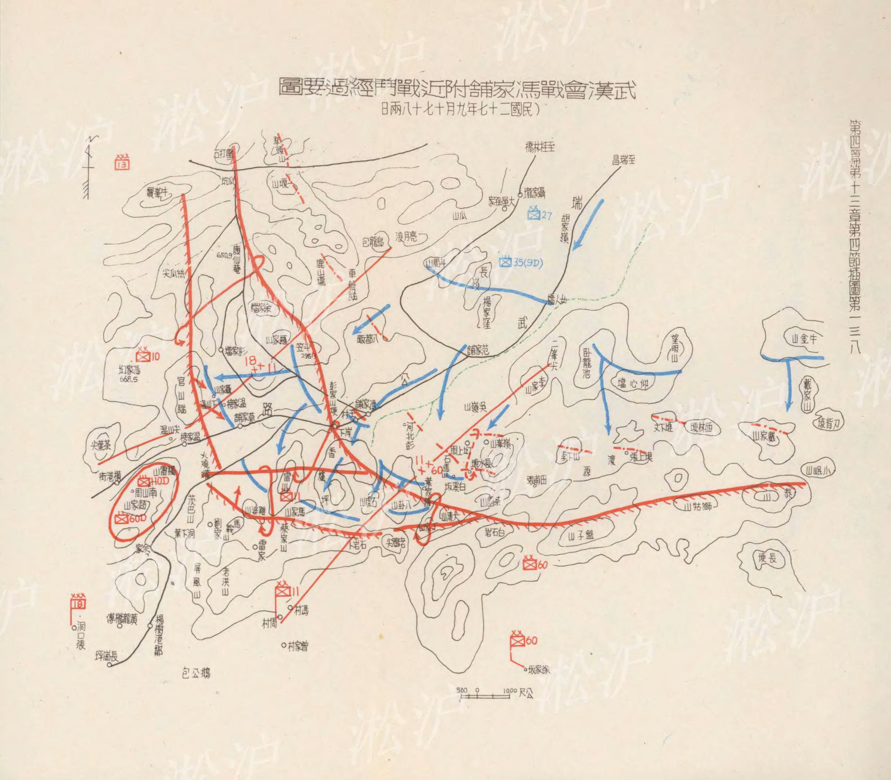

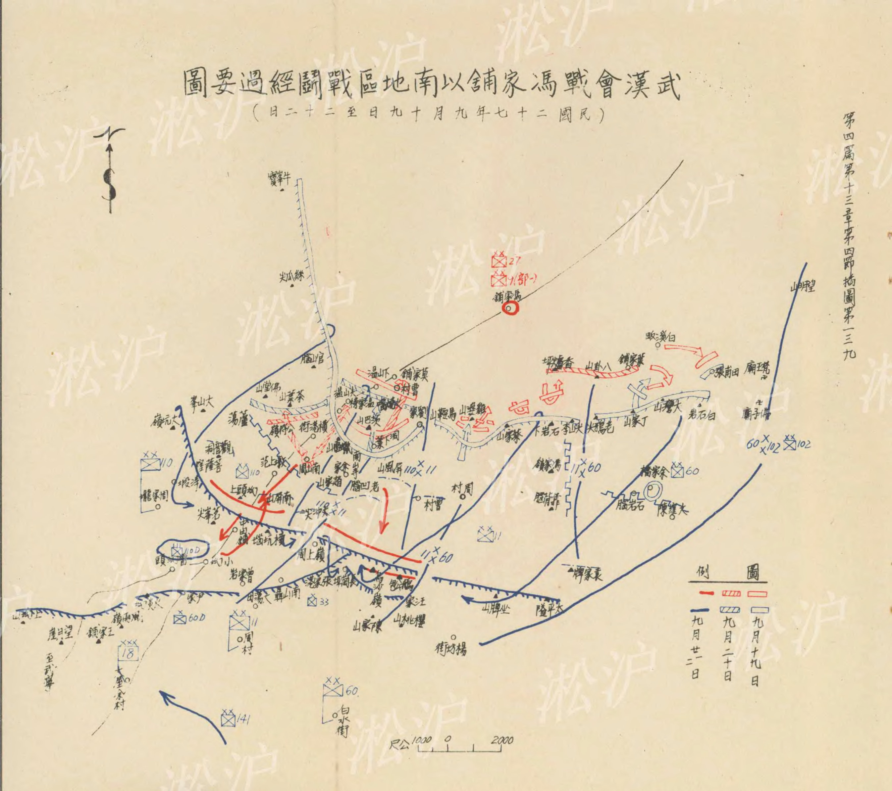

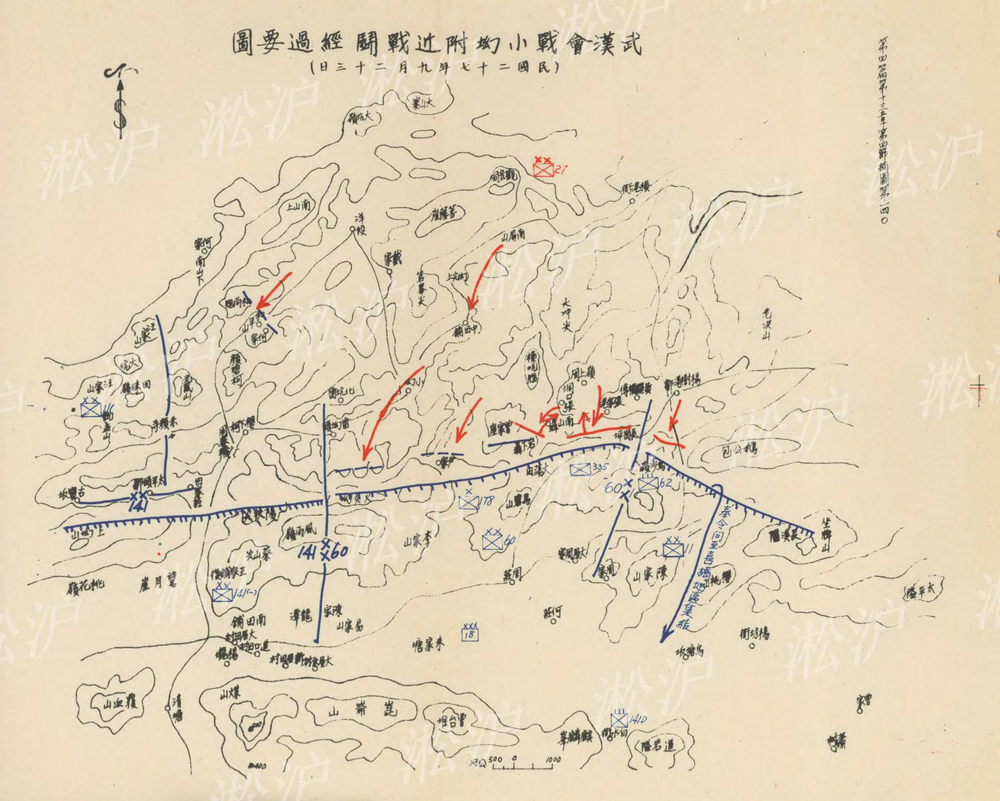

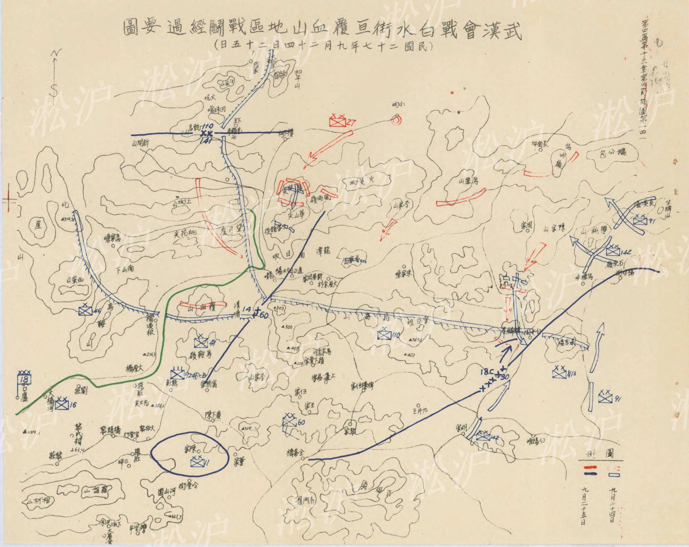

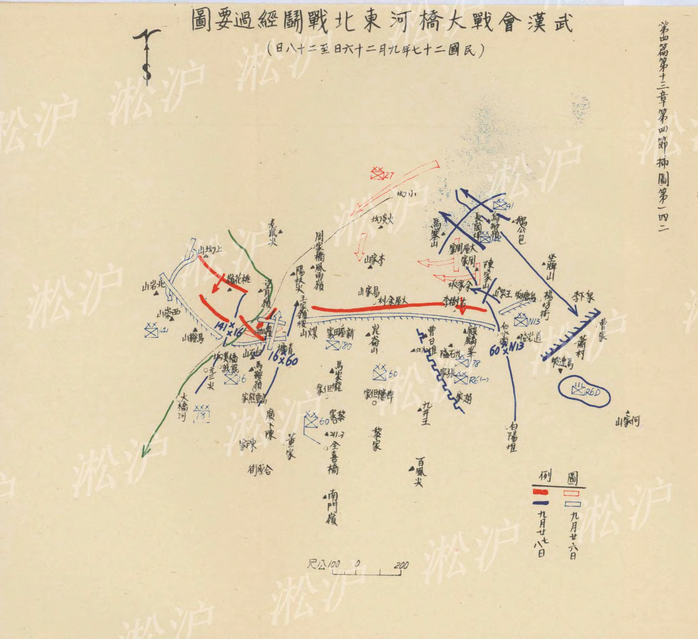

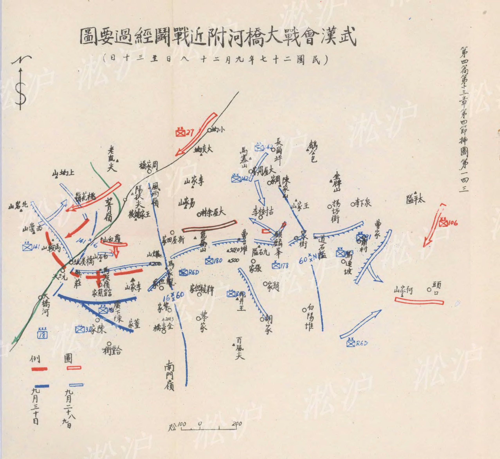

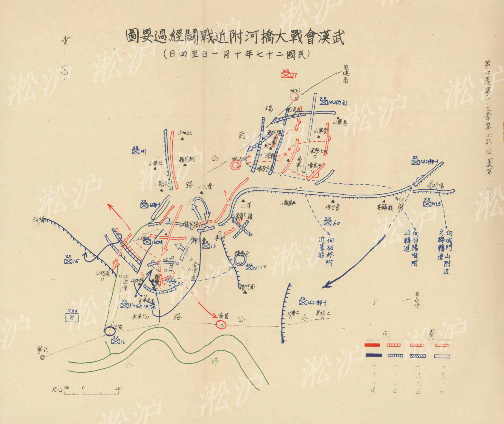
