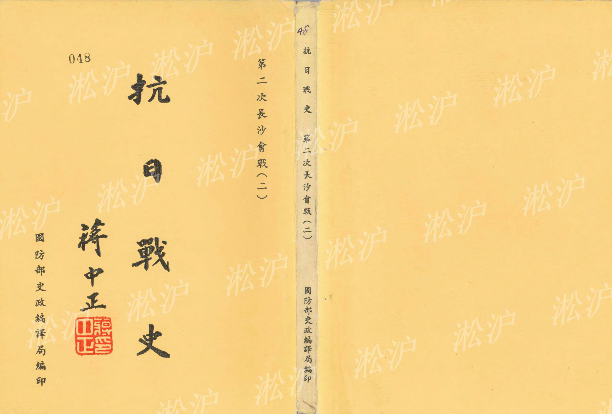

#### 第五款 金井栗橋附近之戰鬪

民國三十年九月二十三日至二十六日

參照插圖第二十六至第二十八插表第十九第二十

民國三十年九月，當汨水南岸甕江舖、栗山巷、新市間劇戰進行之時，敵第二師團之一部，突破南陽廟我第二十六、第三十七軍陣地之接續部，向雙江口包圍第三十七軍右翼大頭嶺之第一四零師，該第九戰區長官部鑒於情勢變化，乃以衡山及洙口北運之第十軍向大頭嶺增援，該軍先頭於九月二十三日晨進抵班召廟，卽與敵之先頭部隊遭遇，同時敵第四十師團一部繞過第二十六軍右側，復於是日午後竄抵金井，金井、栗橋之戰鬥就此展開。

##### 第一項 金井、栗橋附近之地形

汨羅江、撈刀河之間，有影珠山、拔海五五八公尺，寬約四、五公里，其東有古華山（高二六七公尺，寬約一公里），金華山（高三一五公尺，寬一·五公里）更東有金井市，金井東南有桃花嶺、楊梅嶺，山勢連綿，運動不便，影珠山之西，有明月山、玉池山、王思巖，海拔均在五百公尺以上，攀登匪易。明月山、影珠山之間，有白沙河、湄水、發源其中，湄水經李家汨向北流，入汨水、白沙河經新橋南流入撈刀河、栗橋扼其上游，金井河源出金井以北，經高橋、上杉市南流入撈刀河，本區間有支流，橫斷南北，秋冬水涸，到處可以徒涉。

粤漢鐵路由王思巖、玉池山之谷底通過，長沙至湘陰大道，經栗橋環繞明月、玉池、王思三山，影珠、古華兩山之間，有長岳公路，金井河畔有長平公路，金井爲東達石灣、更鼓台，西通福臨舖，西北南陽廟、麻峯嘴，連接長岳公路之交通中心。

金井亘栗橋之間，除金華、古華、影珠三山外，餘皆丘陵，起伏無足障礙，所有河流、公路，形成南北縱走廊，公路雖經破壞，稍加修整，機械化部隊仍可運動，因之本區內爲湘北入寇必經之道。

強渡汨水侵入雙江口、更鼓台之敵，其兵力、番號、動態、茲分述如左參照插表

第十九

一、第三師團一部，突破第二十六軍、第三十七軍之間隙南陽廟後，其先頭於九月二十二日直竄雙江口二、第四十師團（附第三十三師團之第二一四、第二一五聯隊）一部，經三角塘繞過第二十六軍右後，進出更鼓台、石灣，於九月二十三日逕撲金井。

當南陽廟被敵突破之際，我原由衡山及滌口車運長沙徒步北上之第十軍，其先頭適達高橋，餘抵上杉市、安沙之線，第九戰區長官部乃令該軍軍部位置於高橋，第十預備師向石灣，第一九零師向金井，第三師向高橋急進，限二十二日到達，是日十時，該軍先頭到達金井附近，適南陽廟之敵竄抵雙江口，向大頭嶺第一四零師（第三十七軍）右側攻擊甚烈，薛岳司令長官卽指示該軍，左接第三十七軍指揮之第九十二師明月山陣地，在金井亘栗橋以北地區，策應第三十七軍之作戰，該軍長李玉堂下達命令如左

參照插表第二十

插圖第二十七：

作命第一號

第十軍命令

民國三十年九月二十二日十時

於高橋軍司令部

一、渡過汨水之敵，與我軍激戰數日，其一部由浯口經南陽廟竄至雙江口附近，刻與我第一四零師激戰中。

二、軍以策應第三十七軍前線之作戰，卽以一部推進於檢市廠、麻峯嘴東側地區，以主力佔領金井、福臨舖、茅根壩之旣設陣地，準備迎擊南下之敵。

三、第一九零師於明（二十三）日推進於檢市廠，麻峯嘴、東側地區，策應第一四零師之作戰1

，並派一部肅清由浯口經南陽廟向彭家坳流竄約五、六百人之敵。

四、第十預備師佔領金井、福臨舖間國防工事，特須保持主力於右。

五、第三師佔領福臨舖、影珠山、栗橋、茅根壩（均含）之國防工事，特須保持主力於右，左與第九十二師切取連絡。

六、作戰地境爲蟠龍橋、高倉塅、畫眉嶺之線，線上屬右方師。

七、第一九零師限二十三日拂曉前到達，第十預備師及第三師限同日十二時前佔領陣地完畢。八、余現在高橋，爾後進至石牯牛。

軍

長

李玉堂

第一九零師師長朱嶽於二十三日零時三十分奉令後，卽刻出發，並下達命令，其要旨如左：

一、師爲肅清雙江口、彭家坳之敵，由金井經脫甲橋、白石廟向班召廟附近前進。

二、前衛（第五七零團、附工兵一連、無線電一班）於二十三日一時由燕山壩出發，沿上述道路向雙江口之敵搜索前進。

三、師部及直屬部隊，於同日一時三十分，由珠李塅出發，第五六八團由金井出發，第五六九團由簡河橋出發，沿前衛行進路續進。

第十預備師師長方先覺奉令後，其部署如左：

一、第二十九、第三十團爲第一線。

二、第二十九團佔領金井亘磨子灣之線。

三、第三十團佔領磨子灣亘高倉塅之線。

四、兩團戰鬥地境，爲福星橋、蔡家嶺、磨子灣、善坑之線，線上屬左。

五、第二十八團集結於花塅園，爲師預備隊。

六、師指揮所位置於日頭嶺。

第三師師長周慶祥奉令後，其部署如左：

一、第七、第九團爲第一線。

二、第七團佔領高倉塅亘黎家洞之線。

三、第九團佔領黎家洞亘明月山（不含）之線。

四、兩團戰鬥地境，爲青山市、黎家洞、王家山之線，線上屬左。

五、第八團集結於石板灘，爲師預備隊。

六、師指揮所位置於寨頭舖。

第一九零師前衛（第五七零團，附工兵一連，無綫電一班）（參照插圖）於九月二十三日六時三十分進抵班召廟南端，一六三四及一五五五高地附近，卽與約三百名之敵（第三師團）遭遇，當卽佔領該高地，以掩護主力之集結，嗣敵續有增加，向該團攻擊，惟未得逞，朱嶽師長據報後，卽將師指揮所移至白石廟，第五六九團集結於林家坊，第五六八團集結於白石廟西端，並親至前方偵察，十一時三十分，敵一部步騎兵百餘名，向白杉橋方向移動，時第三十七軍陳沛軍長電請該師應積極行動，以解該軍第一四零師大頭嶺之圍，朱嶽師長於十四時三十分接電後，處置如左：

一、第五七零團續向當面之敵攻擊。

二、第五六八團（附迫擊砲營—欠一連）向白杉橋、大頭嶺之敵攻擊前進。

三、第五六九團爲師預備隊，隨第五六八團跟進。

四、各團於十七時開始行動。

第五六八團奉命後，遂展開於江家橋、天主廟南端，二十一時，驅逐天主廟敵搜索部隊，續與佔據白杉橋東南端之敵激戰，該團第一營副營長李培德陣亡，第二營營長萬冠軍、連長林文杉負傷，士兵傷亡亦多，卒將白杉橋東端佔領，又第五七零團續行攻擊，進展迅速，是日擊退班召廟之敵，入夜，並追擊至黃泥沖附近。

惟此時敵第四十師團一部，由石灣向金井攻擊甚烈，其一部約二百名，已侵入花門樓，二十四日二時許，第三十七軍軍長陳沛復電告大頭嶺第一四零師業已突圍，戰區長官薛岳卽電第十軍指示如次：第一九零師以先殲滅金井附近敵人之目的，派兵一團向南壓迫，協力第十預備師夾擊金井之敵，主力位置於西鄉塅、福臨舖以北地區，對北警戒。

李玉堂軍長奉令後，當卽指示第一九零師行動如左：

一、刻在金井附近步砲聯合之敵約千餘人，與第十預備師第二十九團激戰中，又花門樓有敵步兵約二百名，與我守軍發生接觸。

二、軍先以殲滅南下敵人之目的，第一九零師卽派兵一團向南壓迫，與第十預備師夾擊金井、花門樓間之敵，主力位置於西鄉塅、高倉塅之線，對北嚴密警戒，並與第十預備師、第三師切取連絡。

三、該師應速向福臨舖架設電話，隨時報告情況。

四、余在石牯牛。

第一九零師師長朱嶽奉命後，卽令第五七零團（附工兵一連）卽南下攻擊花門樓之敵，第五六八團（附迫擊砲營一欠一連）俟第五七零團南移後，撤至梁家塅北端佔領陣地，對北警戒，第五六九團（附迫擊砲一連）卽佔領川門坳、竹山舖、水龍園之線對北警戒，以掩護第五六八團之南移，同時指揮所卽移至梁家塅附近。

第五七零團（附工兵一連）遵於二十四日五時四十分由黃毛沖南移，七時四十分向花門樓之敵已增至七、八百名攻擊，敵一部進出靈佑廟包圍該團右側，該團兩面受敵，卽向梅林橋附近轉移。

第五六九團（附迫擊砲一連）佔領川門坳、竹山舖、水龍園之線，敵第三師團步騎兵千餘名，於二十四日十二時三十分，以密集隊形沿銅鑼坪、麻峯嘴大道南下，該團卽以迫擊砲集中射擊，敵傷亡甚衆，惟仍向該團猛攻，十四時突破該團左翼陣地，黃毛沖之敵又包圍其右翼，激戰至十五時，該團不支，向南突圍。

第五六八團（附迫擊砲營—欠一連）由白杉橋東端南移，敵乘機反攻，該團第二營機槍連排長周錦華兩腿重傷，猶親操機槍掃射，斃敵三十餘名，終於壯烈犧牲，該團乃得以脫離，於二十四日九時三十分轉進至梁家塅北端，惟尚未就緒，黃毛沖南下之敵及白杉橋之敵共約一大隊，突將該團及該師師部包圍，激戰三小時，師長朱嶽負傷，副師長賴傅湘、特務連連長袁錫欽、排長袁煥榮均陣亡，其餘官兵傷亡甚多，全師陷於混亂，紛向福臨舖轉移，李玉堂軍長遵照戰區長官指示，卽飭該師撤至青山市附近收容整頓，由該師參謀長率各團於二十五日十五時到達青山市、袁家橋地區，遂飭第五七零團佔領蓮花山及其以北之一四零與二一五高地，擔任警戒。

第十預備師各團，於二十三日午前佔領金井亘高倉塅間陣地後，更鼓台之敵第四十師團之一部（騎兵約五百名附便衣隊及砲二門），於十六時抵石灣，十八時向楊家橋該軍擔任右側警戒之騎兵連進犯，該連被迫撤至將軍沖附近，其另一部強大兵力，沿石金大道，於十九時三十分向金井及鳳形山第二十九團陣地攻擊，金井當即發生巷戰，該地守軍第四連節節抵抗，退守金井西端高地待援，該團當令第三營向金井反攻，方先覺師長據報後，復令將軍沖之騎兵連及第二十八團第二營由和尚沖協力第二十九團之反攻，戰至二十一時，敵千餘名由石灣來援，敵我反復爭奪，金井失而復得者三次，二十四日十一時三十分，敵在飛機、砲兵掩護下，向金井、鳳形山陣地再興攻勢，敵火猛烈，陣地殘破，二十三日，竄楊家橋之敵（約五百名，附砲兵及便衣隊）同日經將軍沖亦向金井西南包圍，軍騎兵連及第二十八、第二十九團雖奮勇抵抗，迄至深夜，金井終告陷落，同日敵於攻陷第一九零師花門樓、梁家塅之線後，續向西鄉塅、泉鼻橋、古華山第三十團陣地猛犯，該團官兵奮勇迎擊，第一營營長、第二營連長三員均陣亡，該線又被突破，薛岳長官乃令該師於二十五日十二時前佔領荷塘橋、學士橋、梅林橋之線繼續抵抗，二十四日，方先覺師長層奉長官部變換陣地命令後，即派第二十八團第三營佔領范林橋、白石園之線，以掩護該師轉移，二十五日七時，該師自右按第二十九、第二十八、第三十團之順序，佔領荷塘橋、學士橋、梅林橋之線，第二十八團第三營任務完畢後，於十時歸建，軍騎兵連則仍在董家尖擔任右側警戒，此時陷金井之敵，竄抵學士橋，犯象鼻橋之敵，一部抵福星橋以北地區，一部約四、五百名，於十一時經清水沖，分向岱高沖、王家塘等處第二十八團陣地攻擊，當被遏阻，十七時，敵以飛機、砲兵掩護其步騎兵，向該師全面猛攻學士橋、雙鳳橋、梅林橋等處均被突破，陣地犬牙交錯，敵一部並由王家塘向石牯牛急進，該師遂陷於混戰，分向麻林市、萬家舖轉移，於二十六日晨先後到達萬家舖附近。

第三師各團，於二十三日午前佔領高倉坳亘茅根壩陣地後，二十四日，突破第一九零師第五六九團川門坳亘水龍園陣地之敵，分兩路向高倉塅西端第七團陣地進攻，該師長爲顧慮右側之安全，當令預備隊第八團向梅林橋西端推進，是夜，第九團陣地前之銅盆寺亦發現敵情，二十五日，銅盆寺之敵，已集結近兩千名，於四時許向第九團攻擊，戰至十七時三十分，該團栗橋東北高地失而復得者再，敵以正面攻擊未逞，乃另以輕裝步兵約千名，沿白鶴洞、明月山東側竄至茅根壩，包圍第九團左翼，一部進出茅塘，迂迴該師左後方，同時進犯第七團之敵，於突破該團陣地後，以騎兵一部經福臨舖直趨石牯牛，該師當卽陷於苦戰，二十六日晨，包圍第九團左翼之敵攻擊益烈，一部突入栗橋該團不得已稍向北移。

先是，李玉堂軍長於九月二十五日午後得知突破第十預備師王家塘及第三師福臨鋪陣地之敵，分向石牯牛進攻後，卽飭軍工兵營佔領孫家福、石板灘之線，掩護軍司令部撤至青山市，二十六日晨，李玉堂軍長得知栗橋失守，犯敵南下，繼聞茅根壩、茅塘之敵向新橋續進，該軍長深感軍後方安全可慮，然此時可用之部隊，僅有特務營，遂令第一九零師參謀長率領該師部已收容之官兵百餘名，及軍部特務營第二連，向墊塘廟堵擊，九時三十分，該師部又被敵包圍，旋卽突圍，十七時到達關山嘴，敵跟踪於十一時向青山市該軍司令部進迫，由茅根壩、茅塘竄新橋之敵，一股復竄安沙，竄入石牯牛之敵，到達麻林市、學士橋之敵亦抵上杉市，此時李玉堂軍長乃作處置如左：

一、特務營（欠第二連）拒止向青山市前進之敵，掩護軍司令部轉移至關山嘴。

二、第十預備師由萬家舖經唐田廟向安沙之敵攻擊。

三、第三師以一部拒止當面之敵，主力向南截擊新橋之敵。

第十預備師師長方先覺遵令率部於二十六日午後向安沙東北地區之敵攻擊，旋敵第四師團來援，將該師截成兩段，第二十九團衝至安沙以西，師主力則撤至安沙以東。

第三師師長周慶祥遵於二十六日午親率第八團及師直屬隊由賽頭舖向新橋之敵攻擊，惟抵漢家山東南端，卽與敵遭遇，時突破影珠山第九團陣地之敵，於十七時亦隨後來攻，致與各團連絡中斷，該師師部及第八團被迫向唐田廟轉移，其第七、九兩團均向敵後襲擊，於二十七日晚到達金井東北地區，第九團並擊斃敵輜重部隊騾馬甚多。

第十軍司令部於二十六日到達關山嘴後，二十七日九時奉第九戰區薛岳司令長官電飭卽開燹黎市收容整理，該軍主力當晚到達該地。

當右翼第十軍戰鬥劇烈之際，戰區長官部鑒於左翼方面戰況沉寂，乃於二十五日十時令飭該地守軍第九十九軍行動要旨如次：

一、由李家塅南犯之敵，已竄至福臨鋪東南地區。

二、我軍決抽集兵力，對南竄之敵，施以猛烈攻擊。

三、第九十九師務於黃昏前卽分別接替第九十二師防務，第九十二師除留一部交防外，卽集結兵力於栗橋東南地區，歸第十軍軍長指揮，協力第三師、第十預備師攻擊南竄之敵，確保金井、福臨鋪、栗橋之線，以利爾後之反擊。

先是，第九十九軍之第九十二師歸第三十七軍軍長指揮，佔領雙獅洞、玉池山、王思巖之線陣地，經於九月二十三日，與由龍背冲、關山進犯之敵一度激戰後，遂調整部署，佔領明月山、玉池山亘王思巖之線，該師遵將明月山亘王思巖之防務交與第九十九師接替後，向第十軍軍長報到，時第十軍所部已被迫南移，該師長梁漢明復遵薛岳長官電令向犯石子舖之敵截擊，挫敵攻勢，金井亘栗橋之戰鬥，至此結束。

此次戰鬥，敵軍參戰部隊爲第三、第四十兩個師團，我軍參戰部隊爲第十軍之三個師、九個團，敵傷官兵近二千，我傷亡師長朱嶽，副師長賴傅湘以下官兵亦衆。

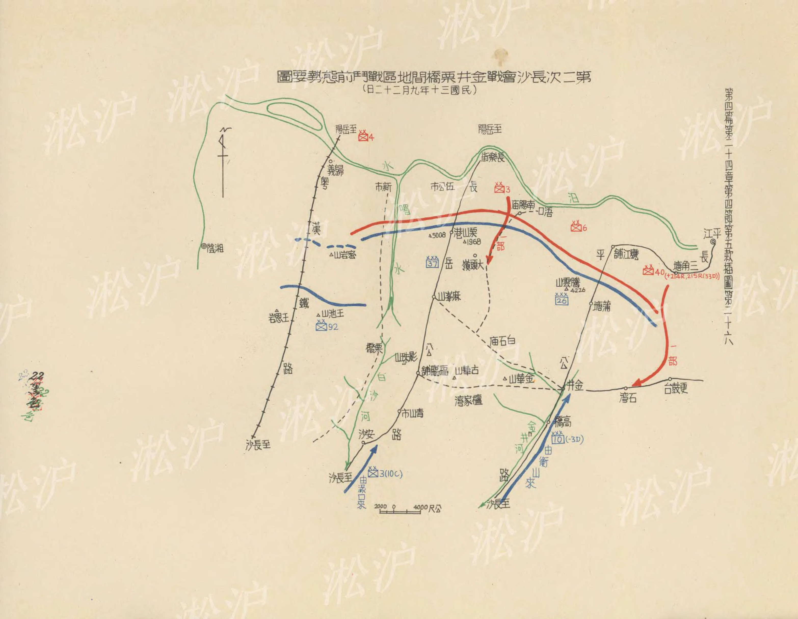

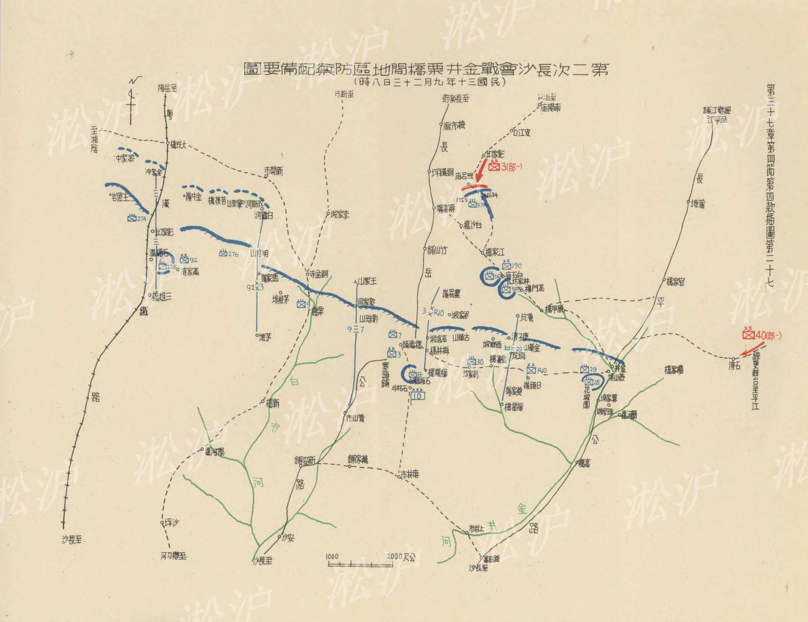

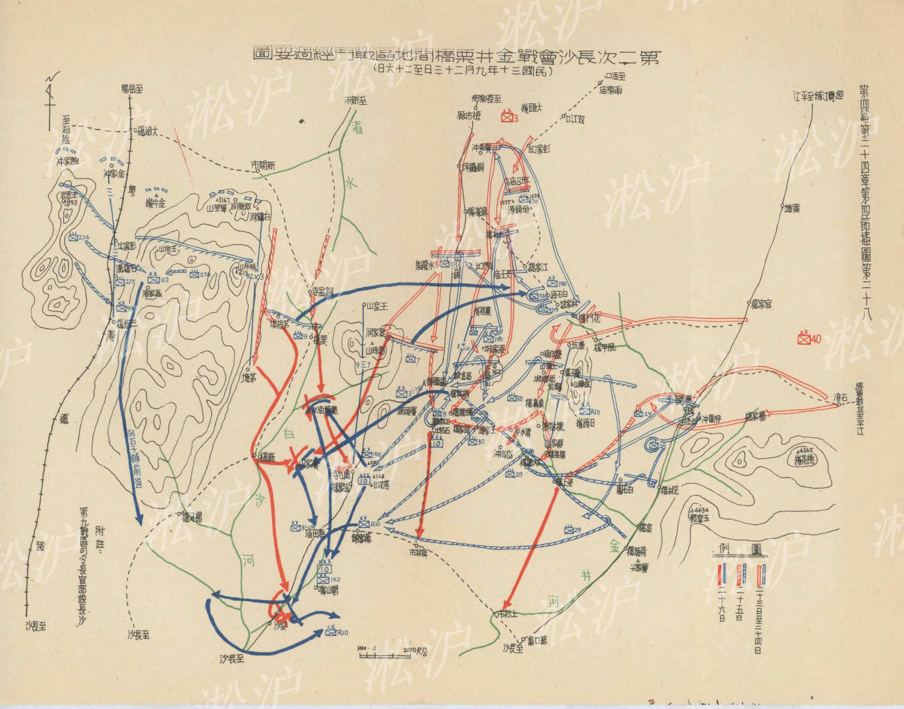

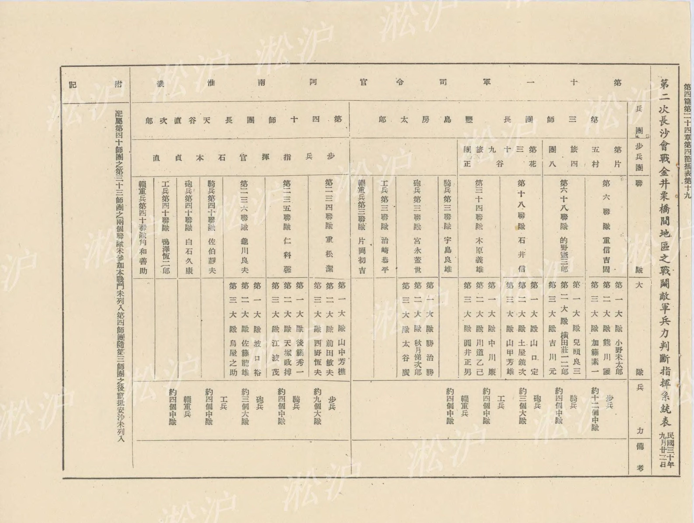

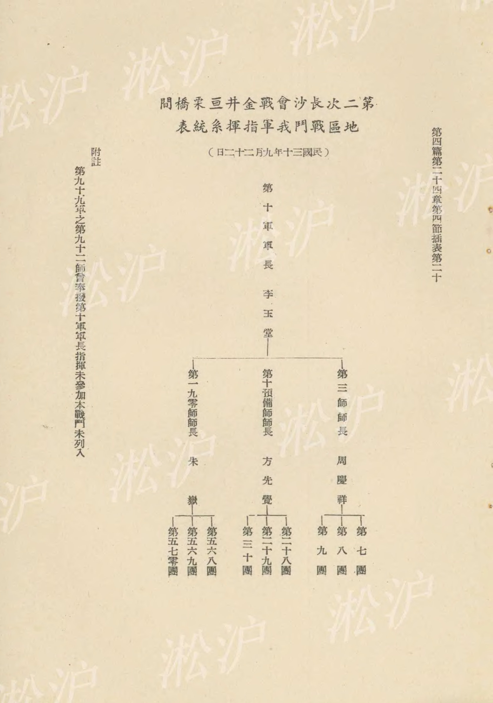

#### 第六款 瀏渭河北岸之戰鬥

民國三十年九月二十五日至二十九日

參照插圖第二十九第三十插表第二十一第二十二

當福臨舖附近戰鬥正酣，蒲塘外圍之敵南犯，突破金井直趨長沙時，由瀏陽西進之第七十四軍，奉命堵截，遂與敵演成瀏渭河北岸之戰鬥。

##### 第一項 瀏渭河附近地形

撈刀河上游，支流有三，一曰瀏渭河，一曰金井河，一曰白沙河，至赤石河及石子鋪分別匯合後，相皆瀏陽河蜿蜒西注湘江，均源出羅霄山脈，九嶺南麓各河水深逾丈，寬約五十至一百公尺不等，瀏陽城位瀏陽河上游，四週多爲山區，標高半在五百公尺以上，附近森林密佈，運動不便，砲兵射擊尤多障礙。

黃花市，在瀏渭河、瀏陽河之間，公路東經永安市至瀏陽、萬載，北經春華山、路口畲至金井平江，驛路四達，與石子鋪同爲長沙東北門戶。

長沙位於瀏陽河、湘江合流點南側，爲湖南省會，城市東西約兩公里，南北五公里，附近土地肥沃，農產甚豐，水產亦饒，汽船北至岳陽，南至湘潭，朝發夕至，除城北有飛機場外，且爲湘鄂、湘贛、湘粤、湘桂、湘黔、湘川公路中心，粵漢鐵路自武昌南下，經城東至株洲，會浙贛鐵路南通衡陽，瀏陽河、金盈嶺與湘江西岸之岳麓山（標高三五一公尺），爲長沙之鎖鑰。

##### 第二項 戰鬥經過

(參照插圖第二十九)

插表第二于第二十一

當敵第三師團與第十軍激戰於金井亘栗橋之際，蒲塘外圍之敵第四十師團（附第三十三師團之第二一五聯隊）、第六師團，爲呼應此一攻勢，除以一部與第二十六軍繼續保持接觸外，主力進攻金井，旋貫穿金井陣地，沿長平公路直趨長沙，其先頭於九月二十五日十二時抵沙市街、春華山以北地區，同時隨第三十七軍第九十五師後撤而跟進之敵第四師團（附第十三師團之第一一六聯隊），亦到達新橋附近。此時我各軍之行動概要如左：

一、第三十七軍之第九十五師新市戰鬥後，由石門源撤抵麻林市以西天雷山之線。

二、第七十二軍新編第十四師正佔領茶子坳、老虎洞、鍾家塅（平江南），側擊自三角塘南下之敵，新編第十五師正向更鼓台、石灣攻擊，配屬該軍之新編第十六師集結於安定橋。

第二十六軍（附第一四零師之第四一八團）正在蒲塘週圍苦戰，奉令向更鼓台、石灣，協力第七十二軍，夾擊自三角塘竄金井之敵。

三、第七十四軍於敵渡新牆河時（九月十八日），奉令由江西分宜、彬江附近西調，其先頭（第五十七師）正抵洞陽市附近，主力經瀏陽縣跟進中。

第九戰區薛岳長官鑒於當前狀況，爲爭取時間，當於九月二十五日十二時指導如下：

一、第七十四軍應以先頭兩師兼程向黃花市前進，迅速於夏家塘、春華山、赤石河、石灰嘴之線，迎擊南進之敵。

二、第三十七軍應以第九十五師於麻林市西南地區佔領陣地，協力七十四軍之作戰。

第七十四軍方面

參照插圖

第三十

九月二十五日午後，王耀武軍長於瀏陽附近奉戰區長官薛岳指示後，當飭各師兼程西進，並令第五十七師先頭之第一六九、第一七零兩團，分別佔領春華山、赤石河附近，以掩護軍之集中，是日黃昏，第一六九團於天鵝山附近與敵之搜索部隊遭遇，當予驅逐至瀏渭河北岸，此時，敵第四十師團之一部，已先我佔領春華山及其東北高地，向我攻擊，是夜，敵一再增援，均被第一六九團擊退，二十六日三時，第一七零團一部已佔領大和塘亘楓林港各要點，對北警戒，主力在瀏渭河南岸、郭公渡亘赤石河之線佔領陣地，旋敵騎兵百餘名竄楓林港，便衣隊數十名竄田家塅，均被該團警戒部隊驅逐，四時，第一七一團及補充團先後到達黃花市、牌樓舖各附近，師部到達高溪塘，余程萬師長當令第一七一團（欠第一營）佔領濱堪、朱家湖、石灰嘴各要點，對西北嚴戒，其第一營位置於南田，連同補充團爲師預備隊，六時三十分，第一六九團將春華山附近要點攻克，第五十八師適到達一部。廖齡奇師長得知第五十七師第一六九團在春華山以西地區與敵激戰，爲使第五十七師右側背之安全及爾後作戰容易，卽令第一七四、第一七三兩團之各一部，展開於劉渭河南岸之永安市、黃坑、天鵝山之線，向敵攻擊，當進展至盧塘灣、江東廟、寶塔沖、新塘沖之線，寶塔沖、春華山之敵續有增加，七時三十分，該兩團部隊到齊，遂令天鵝山，第一七三團之一部，由高礪坪渡河，進出石家沖，而春華山之敵仍頑強抵抗，此際，敵機九架及砲兵掩護敵步騎兵約千餘名，分由大興橋、朱家沖反攻，該師奮勇迎擊，敵未得逞。八時，該師第一七三團攻佔春華山，第一七四團進至晏家沖亘石家沖之線，敵向朱家沖附近退去，東林寺亘春華山諸要點均告克復，王耀武軍長基於以上情況，同時奉戰區長官薛岳電令：「該軍第五十七師後續部隊到達後，卽集結於大壩橋以南至赤石河間地區，向由麻林市南進之敵攻擊。第五十八師後續部隊到達後，卽集結于永安市至春華山間地區，向路口畲南進之敵攻擊，第五十一師到達後，卽集結楓漿橋、珠溪孫、李家巷間地區，向沙市街南進之敵攻擊」後，當下達命令如左：

第七十四軍作戰命令

民國三十年九月二十六日八時

於洞陽市附近軍司令部

一、當面之敵，壓迫我友軍後，似有趁本軍集中完畢之前，企圖各個擊破我軍。

二、軍以確保長沙，擊破當面敵人之目的，卽向由沙市街、路口畲、麻林市方向南進之敵攻擊。

三、第五十七師主力到達大壩以南至赤石河地區後，佔領丁家山、黃獅渡、楓林港各要點，準備對麻林市方向之敵攻擊，其春華山附近部隊，俟第五十八師部隊到達，卽與之交替歸還建制。

四、第五十八師速向永安市、春華山附近急進，以一部接替春華山防務，並準備對路口畲方向之敵攻擊。

五、第五十一師速向楓漿橋、李家巷地區前進，準備對沙市街方向之敵攻擊。

六、軍政及直屬部隊向黃花市附近前進。

七、各部隊迅速以黃花市爲基點，構成通信網。

八、各部隊均限二十六日十二時以前到達指定地區。

九、余在軍部先頭行進。

軍長

王耀武

命令下達後，軍直屬部隊及司令部向黃花市續進，十時，該部先頭到達李家巷附近，據軍右側衛搜索營報稱：「我在官山沖附近，與由沙市街經毛公橋鑽隙之敵四百餘名遭遇，受該敵極力壓迫，似有切斷我行軍縱隊之企圖。」同時，東林寺、春華山方面鎗砲聲甚爲激烈，敵便衣隊又到處擾亂王耀武軍長據報後，復作如左之處置：

一、特務營迅速佔領平頭沖、大塘坡高地之線，側擊敵人，援助搜索營，掩護軍之前進。

二、第五十七師、第五十八師猛攻當面之敵。

三、派軍官向行軍中之第五十一師連絡，預防敵之側擊。

四、軍司令部及直屬部隊行李輜重，繞李家巷以南小路，向曹家坪前進，自率必要人員向黃花市軍指揮所急進。

第五十七師余程萬師長於二十六日八時三十分奉令後，當卽下達命令要旨如左：

一、師應卽展開於丁家山、大和塘、赤石河、楓林港之線，準備向大壩橋、麻林市之敵攻擊。

二、第一六九團春華山陣地，俟第五十八師部隊到達交替後，展開於春華山、西丁家山、劉家沖、大和塘（不含）之線，準備向大壩橋方面之敵攻擊，主力保持於右翼。

三、第一七零團在瀏渭河南岸之主力，推進至大和塘（含），田家塅、赤石河、楓林港之線，準備向麻林市之敵攻擊。

四、第一七一團應以第三營佔領梅園沖、談家坊之線，對北警戒，並掩護第一七零團之左側背，待命歸還建制，其餘由該團長率至黃蜂賽附近，連同野戰補充團爲師預備隊，其在南田之第一營，卽歸還建制。

五、余現在高溪塘，爾後隨攻擊之進展，推進至郭公渡。

各團奉令後：遵卽調整部署，作攻擊諸準備，二十七日五時，各團在集中砲火掩護下攻擊，頗有進展，七時，第一六九團已攻佔六角塘、七里沖，第一七零團已攻佔陳家沖、大塘沖等要點。敵第六師團主力在其空軍掩護下，向第一七零左翼猛攻，陣地多成焦土，十時許，右翼戰鬥益烈，余程萬師長當令步兵指揮官李翰卿，率領第一七一團（欠第三營）及野戰補充團經郭公渡渡河，展開於七里沖、黎家沖（春華山北），猛攻春華山敵人之側背，是時，敵後續到達，向七里沖、黎家沖之線攻擊，激戰復起。十四時，敵攻勢稍挫，李翰卿指揮官乘勢反撲，督率各團衝入敵陣，敵火猛烈，該指揮官壯烈殉職，當七里沖、黎家沖鏖戰之際，敵第三師團之一部，復向第一七零團左翼猛攻，當予遏阻，然該師是日傷亡近三千人，敵亦遺屍遍野。

第五十八師廖齡奇師長於二十六日九時三十分奉令時，全師趕到戰場，當卽下達命令，要旨如左：

一、師應展開於永安市、東林寺、春華山之線，重點保持於長沙——平江大道地區，向由路口畲南進之敵攻擊。

二、第一七二團應展開於伍家渡（含）亘一四四·三高地以北之線，向羊角沖、戲樓坪方向南進之敵攻擊。

三、第一七四團應展開以一四四·三高地（含）亘古塘、石家冲（不含）之線，向由大興橋方向南進之敵攻擊。

四、第一七三團應展開於石家冲（含）、春華山、吳子冲（不含）之線，向由長平公路方向南進之敵攻擊。

五、迫擊砲營在高橋坪附近佔領陣地，協力第一七三團方向之戰鬥。

六、工兵營位置以王家園附近，應修整永安市、楊家洲、春華山附近之既設橋樑，或增設之。

七、野戰補充團爲師預備隊，位置於高家壠附近。

八、余現在陳家嘴，十二時後在葉家舖附近。

第一七三、第一七四兩團奉令後：遵卽部署，左與第五十七師取得連繫，當與敵第六師團及第三十三師團之一部戰鬥，十一時，第一七三團正與春華山以北原有之敵激戰，後續之敵以包圍之行動，一部由大興橋夏家塘、寶塔冲，一部由文星坳竄至丁家山附近，廖齡奇師長判斷：「敵企圖以徐家洲、丁家山渡河，包圍第一七三團於春華山地區，當令第一七四團努力夾擊夏家塘竄寶塔冲之敵，並通報第五十七師之第一七九團協力拒止文星坳、丁家山之敵，各團與敵爭奪至十四時，第一七四團之一部攻至大興橋，第一七三團之第一營亦進至伍家冲以北高地，戰場犬牙交錯，大興橋、金鼎山得而復失。第一七二團於十一時向永安市、伍家渡前進，時官山冲該軍搜索營遭遇之敵，復向虎獅口、麻石塅急進，廖齡奇師長據報後，當令該團展開於李家巷、蔣家塘、永安市、盧塘灣之線迎擊，十三時，敵復以飛機九架掩護其步兵攻擊蔣家冲、永安市，遂卽發生激戰，十六時三十分，敵不支，向伍家渡以北敗退，該團遂佔領伍家渡亘一四四·三高地之線，與第一七四團連繫。是晚，該師各團利用夜暗，奪取要點，二十七日拂曉，續向當面之敵攻擊，八時許，敵飛機十二架掩護第六師團及第三十三師團主力，分由長平公路及大興橋反攻，十二時攻勢益烈，春華山遭炸尤甚，第一七二團第二營營長于冠英陣亡，第三營營長郭潤初受傷，第一七三團第一、三兩營連長傷亡殆盡，各團陷於苦戰狀態。廖齡奇師長當作如左之處置：一、第一七二團在原地竭力抵抗，牽制當面之敵。

二、第一七四團以晏家沖爲軸，轉向東北攻擊。

三、野戰補充團第三營迅赴春華山，歸第一七三團團長指揮。

四、第一七三團待補充團第三營到達後，連繫第一七四團左翼，轉向東北攻擊。

五、步兵指揮官李嵩迅赴東林寺就近指揮。

六、師指揮所推進至王家園附近。

各團奉命後，遵卽攻擊，十四時，第一七二團當面之敵攻勢稍挫，第一七四，第一七三團雖進展至夏家塘、伍家沖以北之線，但敵騎兵一部已由春華山附近渡河，竄入黃花市以東地區。

第五十一師二十六日於行軍途中奉軍部命令時，後衛野戰補充團之第一營于蕉溪嶺（劉陽西）附近遭遇敵機十二架低空掃射，該營卽以重機槍四挺集中射擊，擊落敵機一架，十一時，該師先頭進至楓漿橋附近，遭毛公橋南下之敵騎兵襲擊。李師長當飭第一五二團佔領石井羅、梨樹壟、萬家橋之線，以掩護主力之集結，十二時，該師主力陸續到達，奉令逐次展開於楊家灘、伍家渡之線，李天霞師長遂作如左之部署：

一、第一五一團爲右翼隊，展開以梨樹壟、萬家橋亘珠溪孫（不包）之線，攻擊由毛公橋南下之敵。

二、第一五三團爲左翼隊，展開以珠溪孫、張家灣以西至瀏渭河岸之線，與第五十八師右翼部隊切取連絡，攻擊由毛公橋南下之敵。

三、第一五二團集結於大塘坡附近，爲師預備隊。

四、各部隊均限十五時以前部署完畢，卽對敵第三十三師團，第四十師團各一部開始攻擊。

各團奉令後：遵卽部署，並行夜間攻擊，九月二十七日拂曉前，該師部隊全部到達第一線，已進展至瀏渭河北岸。同時得知左翼敵軍源源南下，李天霞師長當令預備隊第一五二團向左翼增加，迫擊砲營於楓樹山以南地區佔領陣地，以掩護各團於五時開始攻擊，野戰補充團集結於平頭沖附近爲師預備隊。七時，第一線步兵已進至易家沖、大橋賽之線，未幾，毛公橋之敵約二千餘反攻，戰鬥激烈，第一五一團少校團附朱炳慶及軍官多員陣亡。

九月二十七日十六時第五十七師報稱：「第九十五師方面情況不明，望仙橋、余家沖附近戰鬥激烈，敵第四師團一部約三千人，已望仙橋以西渡河，包圍我軍之左翼。」王耀武軍長據報後，一面令飭該師派兵一部向左延伸至石灰嘴，以掩護左側背之安全，一面令飭第五十一、第五十八兩師繼續攻擊，並將情況報告第九戰區長官部，同時東山、渡頭市（黃花市南）等處有數傘兵降落，擾亂後方。十七時，薛岳長官電飭該軍，其要旨如左：

一、南下之敵，似有先竄永安市、長沙，續竄株洲、湘潭之企圖。

二、我戰區爲誘敵深入，在瀏陽河以北地區與敵決戰。

三、第七十四軍應利用夜暗，於二十七日晚變更部署，撤至洞陽市、橫江、小埠港及瀏陽河南岸高地之線，俟敵大部深入，卽向西北方向側擊之。

是時，該軍戰事膠着，不易脫離。午夜，王耀武軍長乃令第五十一師由毛公橋以南轉進至洞陽市、橫江之線，第五十七師由春華山、赤石河、楓林港間地區，轉至磚田、小埠港之線。惟第五十八師方面，與敵戰鬥較烈，脫離最遲，犧牲亦大，該師主力由鎮頭市，一部由湘陰港渡瀏陽河，集結於鎮頭市西南許家橋、土橋及南門壩附近待命。

第三十七軍陳沛軍長奉薛岳長官二十五日正午之指示，卽電令第九十五師：「該師應速開麻林市，佔領水口搬、麻林市西南地區，策應第七十四軍之作戰。」羅奇師長於天雷山附近奉令後，當卽下達命令，其要旨如左：

一、當面之敵，刻與我第十軍於上杉市、石牯牛、栗橋之線戰鬥中。

我第七十四軍之第五十七師，於二十四日抵黃花市以東，二十五日晚可佔領春華山、楓林港之線，俟該軍於二十六日全部到達後，我全線轉移攻勢。

二、師以策應友軍作戰之目的，決於麻市西南地區佔領陣地，以截擊南進之敵。

三、第二八三團由現地出發，經新安舖向關山嘴前進，於杜家冲、王家冲之線佔領陣地，並以一部在萬家舖、滿山沖佔領警戒陣地。

四、第二八四團由現地出發，經唐田廟向楊公橋附近前進，於水口塅、左家冲之線佔領陣地，並以一部佔領麻林市、孫家橋，遲滯敵之行動。

五、第二八五團由現地出發，經將軍廟向花橋前進。

六、野戰補充團由現地出發，經關山嘴向新塘沖前進。

各團奉令後：遵向指定地前進，九月二十六日拂曉前，師直屬部隊及第二八五團到達牌樓沖，其他各團亦先後佔領陣地，九時，敵第四師團騎砲兵約四百名，竄至烏石橋、童南橋附近，雖經該師野戰補充團迎擊，敵仍向西南分進，十四時許，竄麻林市、孫家橋、萬家舖之敵約五、六百名，續向水口塅、湯家塅、楊公橋第二八四團攻擊，戰至十六時，上杉市之敵，亦向西南突進，十八時，青山寺附近第十軍之直屬部隊，被迫後撤，已抵鼎功橋，羅奇師長爲免被敵包圍，遂決心調整部署如左：

一、第二八四團守備大塘沖、乾沖子至洪興北川高地之線。

二、第二八五團佔領園明殿、泗洲廟之線。

三、第二八三團以一部佔領金家壩、朱家沖之線，主力集結於梅園沖。

四、野戰補充團以一部佔領談家坊，主力集結於花門樓附近。

五、師部由牌樓沖移至牛沖。

各團奉令後：遵於二十七日三時部署完畢，七時三十分，敵後續增加，其第十三師團之第一一六聯隊約二千人，自鼎公橋南犯，竄抵文家塅、牌樓沖附近之開闊地，被我埋伏園明殿之第二八五團襲擊，敵傷亡頗大，乃全力向該團猛攻，情況急危。羅奇師長當令第二八四團守備洪興之部隊，攻擊敵之左側背，野戰補充團及第二八三團各以一部，由杉木橋、金家壩攻擊敵之右側背，混戰至十五時，水口塅、湯家塅、楊公橋之敵，分向伍家坪及文家塅，第二八四、第二八五團陣地攻擊，童南橋竄安沙之敵八、九百名，復由安沙分向第二八三團及野戰補充團正面攻擊，各團協力迎戰，敵未得逞。十七時，敵第四師團一部約三千人，已竄至石子舖，第六師團騎兵一部由春華山西側渡河，抵黃花市附近，該師遂陷包圍圈中，旋遵該軍長命令是夜突圍，向粲黎市東南地區集結。

第七十二軍新編第十五師二十五日奉令向更鼓台、石灣攻擊後，二十六日克更鼓台，二十七日晨克石灣。韓全樸軍長於大橋軍司令部奉戰區長官薛岳命令：「新編第十五師向金井、高橋、上杉市攻擊，新編第十六師經社港市、沙市街向上杉市敵之側背攻擊，並設法與第二十六軍連絡。」當飭新編第十五師逕向路口畲之敵攻擊，新編第十六師（第四十八團留置武寧，缺員甚多，附新編第十三師之第三十九團）取道豺狗壟，向沙市街之敵攻擊，並與第二十六軍連絡，軍司令部隨卽南下。新編第十六師師長吳守權奉令後：以第四十六團爲前衛，由安定橋出發，十七時前衛團到達潯江橋，探知沙市街有敵約四百餘人，韓全樸軍長據報後，以兵力分散，易招損失，爲集中力量，當令新編第十五師改道沙市街，同向上杉市之敵攻擊，新編第十四師（欠第四十二團）向相公市前進，二十八日五時，新編第十六師第四十六團展開於山上羅南北高地之線，向沙市街之敵攻擊，五時三十分，於羊古老、欲泉峯與敵接觸，七時將少數之敵驅逐後，佔領一四一六高地，十時東門江之敵砲，掩護敵由橫背沖反攻，一四一六高地得而復失。時配屬該師之第三十九團，到達坪上李附近，師指揮所到達蕉家橋，新編第十四師抵相公市，新編第十五師於十二時亦到達游家沖、楓林沖，該軍司令部抵伏龍市東側。

韓全樸軍長卽以新編第十五師、第十六師爲第一線（第十五師在右），新編第十四師爲預備隊，向沙市街之敵攻擊，二十九日拂曉前，新編第十五師以第四十五團展開於白水巷、麻塘西側高地，向赤馬殿之敵攻擊，第四十三團展開於新壩壟、高坡塅之線，向二零五六高地攻擊，第四十四團位置於南嶺附近，爲師預備隊。八時，第四十三團進展至野猪洞附近，敵後續增加約步兵五、六百名反攻，該團被迫稍退，十四時，敵復增便衣隊數百名猛襲，反復衝擊，黃昏後，仍在混戰，迄至午夜，敵始向東門江方向退去。新編第十六師于是日五時以第四十六團續向沙市街之敵攻擊，第三十九團、第四十七團分別位置于潯江橋、豺狗壟附近。八時，第四十六團攻佔一四一六及一二八三高地，正向橫背沖及上市口攻擊，敵四、五百名（附砲三門）突向該團右翼猛烈反攻，該團沉着應戰，十七時，敵勢頓挫，該團乘機于十九時佔領沙市街，敵向西南退却。

第二十六軍二十五日十九時由蒲塘附近突圍，到達文家屋場、朱家洞之線整頓，二十七日得與第七十二軍取得連絡，卽奉令向沙市街攻擊前進。二十九日，第三十二師到達蝦壠，第四十一師到達路口，第四十四師到達邊山楊，該軍司令部亦抵樟樹沖，當日，蕭之楚軍長卽以第三十二師展開於第七十二軍左翼，協同向沙市街之敵攻擊，第四十四、第四十一兩師則控置原地爲預備隊。十二時三十分，第三十二師師先後攻佔周漢沖及牌樓前附近高地，敵退據沙市街，該師續進出白頭塹、壟下之線繼續攻擊，十九時協力新編第十六師將沙市街全部佔領，獲得敵方文件，證實該處之敵，爲第四十師團之第二三五聯隊，黃昏後，第三十二師一部更向嵩山之敵襲擊，頗有斬獲。

此時，長沙附近保衛戰已啓，瀏渭河北岸之戰鬥至此結束，綜計此次戰鬥，敵參戰部隊爲第三、第四師團各一部，第六、第四十師團主力，我直接參戰部隊，爲四個軍，十個師，三十四個團，我擔任主攻之，第七十四軍，傷亡步兵指揮官李翰卿以下官兵數千，但敵亦遺屍遍野，且被我擊落飛機一架。

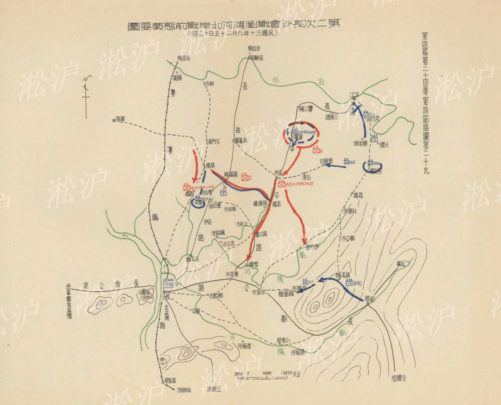

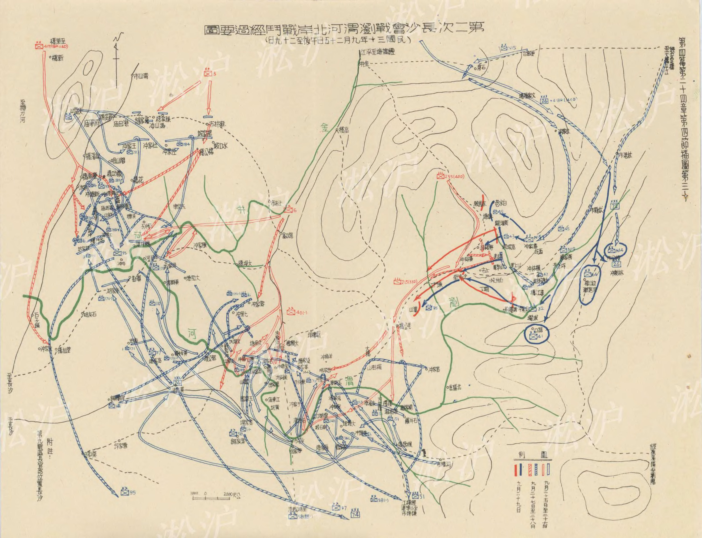

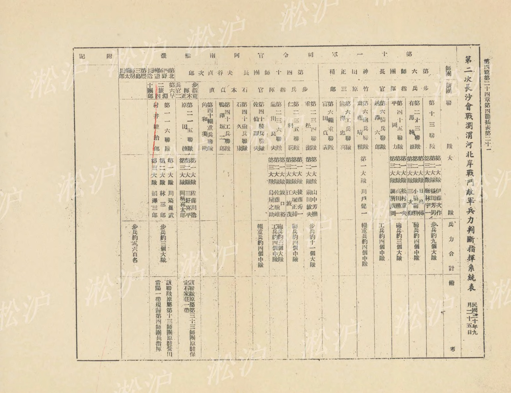

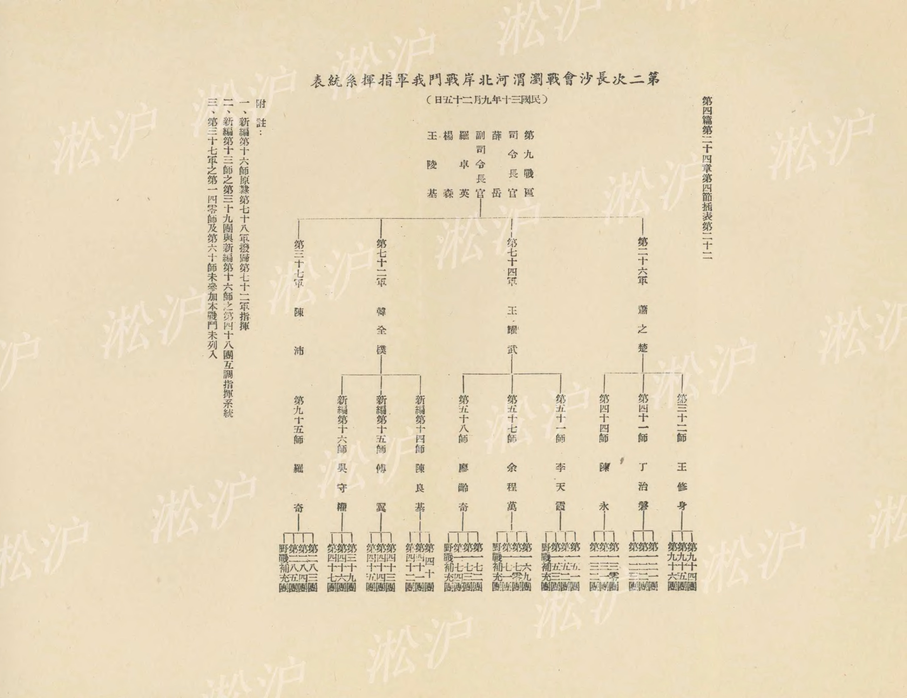

#### 第七款 長沙附近之保衛戰

民國三十年九月二十六日至十月三日

參照插圖第三十一第三十二插表第二十三第二十四當瀏渭河戰鬥開始之際敵卽以一部沿白沙河兩側向長沙急進時由常澧向長沙增援之第七十九軍先後到達遂與敵戰鬥於長沙城郊。

##### 第一項 長沙附近地形

參閱第六款第一項

##### 第二項 戰鬥經過

九月二十五日午後，敵第四十師團（附第三十三師團之第二一五聯隊）先頭一部，竄抵瀏渭河北岸沙市街、春華山，正與我增援部隊第七十四軍之前衛團接觸之時，其第四師團（附第十三師團之第一一六聯隊）卽乘機以一部由新橋向天雷山東南，尾隨第三十七軍之第九十五師主力沿白沙河南下，直趨長沙。

當時長沙方面我軍之行動部署，概要如左：

一、第七十九軍于敵渡汨水（九月二十一日）後，奉令由常德、澧縣向長沙增援，其先頭之第九十八師，於九月二十四日到達岳麓山（湘江西岸），主力沿長常公路東進中。

二、暫編第二軍同時由粤援湘，其先頭之暫編第八師第一旅，于九月二十四日晚由曲江車運株州。二十五日，第九戰區薛岳長官鑒於南進敵軍行動快速，長沙空虛，遂作如左之處置：

一、第七十九軍應守備撈刀河南北地區，保衛長沙外圍，該軍後續各師速向長沙急進。

二、暫編第二軍暫編第八師之第一旅，限二十六日前到達槳梨市待命。

各軍奉令後，卽遵照實施。

第七十九軍方面：到達岳麓山之第九十八師師長王甲本，當於二十五日作如左之部署：

一、第二九三團爲右地區隊，佔領楊家山、五里牌、湖蹟渡之線。

二、第二九四團之第一營，前往石子舖擔任警戒，主力爲中央地區隊，佔領湖蹟渡、孫茅沖、九尾沖各據點。

三、第二九二團爲左地區隊，佔領新碼頭亘新河街各據點。

四、砲兵營以主力配屬於第二九三團，一部配屬於第二九二團。

五、工兵營暫歸工兵指揮部指揮，擔任各渡河點橋樑架設，及渡河場設備，爾後集結於四方塘附近。

九月二十六日十二時，各團營佔領陣地完畢。十五時，敵便衣隊混入石子舖，與我警戒部隊第二九四團第一營接觸，十八時，敵兵驟增，以便衣隊及小部隊通過水渡河浮橋，向該營正面攻擊，一部沿白沙河竄入撈刀河南岸，迂迴該營左翼，該營轉移一三零二高地亘王家灣之線，戰鬥激烈，石子舖、王家灣被陷，該營復轉守土橋，王甲本師長據報後，爲期集中兵力，打擊敵人，當卽變更部署如左：

一、第二九三團（附砲兵營主力）向左延伸，速接替第二九四、第二九二兩團陣地各要點，對新碼頭嚴密警戒。

二、第二九四團將陣地交第二九三團接替後，速向洪山廟集結待命。

三、第二九二團（附砲兵一連）將陣地交第二九三團接替後，速經新碼頭向洪山廟前進。

是夜，第二九二、第二九四團先後集結洪山廟，二十七日三時，王師長到達洪山廟，卽以包圍態勢，飭第二九四團沿三窯塘、高沙坪前進，第二九二團沿白茅舖、望仙橋前進。五時許，各團正前進中，敵陷土橋，抵白茅舖、三窯塘之線，第二九四團遭受敵之側擊，當卽展開戰鬥，王甲本師長比飭第二九二團，以一營攻擊白茅舖之敵，以兩營由白茅舖東北包圍敵之左翼。六時，敵飛機數架轟炸掃射，該師傷亡甚重，八時，敵一部沿撈刀河南下，企圖包圍我左翼，該師以騎兵連推進至三窯塘西側，撈刀河北岸以行掩護，此時，敵在空軍掩護下，突破白茅舖、三窯塘之線，分三路南竄，兩路分竄湖蹟渡、新碼頭，大部經東屯渡渡河，向楊家山進攻，該師第二九三團分別迎擊，第二九二、第二九四團隨卽轉移至撈刀河以北地區，奉令於羅漢莊亘霞凝港之線佔領陣地。二十八日十六時，敵步騎兵約七、八百名，以行軍縱隊由洪山廟、白茅舖向黑石頭、湖蹟渡前進，我湘江西岸長茅嶺砲兵第二團第二營之一連，當予奇襲射擊十餘發後，敵騎兵避入森林，步兵循原路退回，旋敵砲亦向黑石頭、湖蹟渡附近射擊，湖蹟渡、白茅舖兩處起火，二十九日晨，向楊家山進攻之敵，被第二九三團反擊，分向兩側竄去。是日午，我空軍第一大隊SBⅢ機一批五架，十四時五十二分支援該師作戰，對楓林港河面之敵浮橋施行轟炸。又第二大隊SBⅢ飛機一批八架，於十四時五十六分到達永安市上空，轟炸停留於永安市、黃花市間公路上之敵機械化部隊。三十日，第二九三團仍在楊家山、湖蹟渡各據點與敵爭奪，十月一日七時，敵步騎兵千餘名，向該師撈刀河北岸羅漢莊亘霞凝港之第二九二、第二九四團陣地進攻，激戰至十二時，敵雖突入數次，終被擊退。

暫編第六師師長趙季平奉令向長沙增援後，當率第一團於二十七日十六時到達岳麓山，卽飭該團擔任湘江西岸天麻山、榮灣市一帶之河防，二十八日十六時全部到達，二十九日晨，長沙東、北門敵便衣隊及小部隊擾亂，南門外金盆嶺有敵大部據守，長沙市區由瀏陽門竄入敵便衣隊二百餘名，該師長遵夏楚中軍長命令，率第一、第二兩團強渡湘江，向長沙市內之敵攻擊，其第一團於十時渡抵東岸，掃蕩城內之敵，第二團賡續渡江，三十日零時，該師在戰區砲兵火力掩護下，繼續渡江，三時，火力指向麻園嶺一帶，支援該師攻擊前進，四時，其第一、第二兩團均進至城內，敵縱火圍攻，該師傷亡甚大，卒將長沙西、北門及南門一帶街市佔領，十月一日，我仍在砲火掩護下向南正街及瀏陽門一帶之敵攻擊第七十九軍司令部及直屬部隊奉令增援長沙後，二十八日十六時通過寧鄉，二十九日到達董家灣，並在長峯沖（岳麓山西約八公里）設軍指揮所，旋奉長官薛岳艷己電要旨：「第七十九軍務固守長沙，以待援軍之到來。」夏楚中軍長遵令督飭暫編第六師，迅即驅逐長沙市之敵。十月一日，其第八十二師到達，該軍長基於任務及綜合各方之情況，乃於十三時下達命令，其要旨如左：

一、軍以鞏固湘江西岸及擊滅長沙市區敵人之目的，特部署如左：

(一)暫編第六師並指揮砲兵第二團第二營，在觀音港（不含）、漁灣市、趙家港、水陸洲、榮灣市、銀盈嶺、三汊磯（不含）之線，構築西岸江防據點工事，嚴密守備，並以岳麓山爲核心陣地，於其外圍之雲麓宮、望城坡、天麻山、牛形山、五里堆、長茅嶺等處擇要構成內線之堅固據點，該師渡河部隊，應努力攻擊長沙市區之敵，並編成數縱隊，逐次向東，進佔天心閣、小吳門、經武門各重要據點，鞏固市區外圍。

(二)第九十八師第二九四團及砲兵第五十四團第十二連歸師附彭至格指揮，在三汊磯（含）、百世橋、賽頭港、新康（含）之線構築堅固工事，擔任沿湘江西岸守備，指揮所位置於洪家壩，該師長率領湘江東岸部隊，由撈刀河附近積極向東南活動，策應暫編第六師之作戰。

(三)第八十二師位置於角碼塘、百丈塘、龜頭市一帶，爲機動部隊，對湘潭、易家灣方面警戒，並擇要構築據點工事。

四本部工兵營，應在長峯沖附近擇要構築堅固據點工事。

二、第一線各部隊，對通敵渡口及徒涉容易地點，應派兵嚴密監視，並加以阻絕附近道路，予以徹底破壞，所有大小船隻，均搜集我岸內港。

三、各部陣地工事，均限於十月五日前完成，爾後再逐漸加強之。

十月一日，各師奉令後遵照部署，並着手構築工事，長沙市區之敵，受暫編第六師及第九十八師內外之夾擊，二十一時，有退却模樣，夏楚中軍長據報並綜合其他情報資料，除飭暫編第六師第一、第二兩團繼續掃蕩瀏陽門、小吳門一帶殘敵外，乃下達追擊命令，要旨如次：

一、當面之敵，刻分三路向北退却，我各部友軍正分別追擊中。

二、暫編第六師應於十月一日晚全部渡河，除留第三團（附軍屬工兵營）擔任長沙警戒，維持市面秩序外，餘由該師長率領，經長沙城郊向東南、東北方向星夜追擊敵人。

三、第九十八師應向北猛進當面之敵，彭至格師附所指揮之西岸部隊，應於二日拂曉渡河，歸還建制，追擊敵人。

四、第八十二師應於二日渡河，推進於湖蹟渡以北地區。

五、余於二日晨進駐長沙城北麻園嶺。

各師奉令後，卽遵照行動。

暫編第六師師長趙季平令第三團（附軍屬工兵營）乘夜渡江，繼續掃蕩長沙城郊之殘敵，第二團由長沙城南區向東南渡，第一團由長沙城北郊經湖蹟渡向黑石頭，分向敗退之敵追擊，二日四時三十分，各團發起追擊，第二團因受楊家山之敵牽制，行動遲緩，乃選精銳一營編爲先遣追擊隊，行超越追擊，主力隨後跟進。第一團進至湖蹟渡附近，與佔領一三零三高地掩護退却之敵約千餘名接觸，戰鬥半小時，敵退守白茅舖、洪山廟高地，並將黑石頭浮橋焚毀，阻我前進，第三團到達長沙城，得知東南郊之楊家山附近，尚有敵三百餘名據守，該團當派第二、第三兩營圍攻，敵仍頑抗，是夜該軍以平射砲兵兩連協力攻擊，敵不支向北退去，該團遂部署守備長沙城。

第九十八師奉令之同時，撈刀河以北之敵，爲掩護其主力之撤退，分向該師左翼壩黃橋及天井山前進據點包圍，二日拂曉，敵增至萬餘名繼續攻擊，十三時戰鬥益烈，該師並令第二九三團經大安市向牛頭嘴方面側擊敵人，十六時，鹽豐壩、林家沖、壩黃橋、霞凝港等處被敵突破，混戰多時，始將敵擊退，十八時三十分，該師乘機由浣公嶺方面出擊，二十四時許，敵向北退去，是日，該師斃敵騎兵大尉一員，馬三十餘匹，鹵獲軍毯、大衣等甚多。

第八十二師向東推進，並作渡江諸準備。

二日夜，該軍奉薛岳長官一日電令：「劉陽河、撈刀河間地區之敵，已開始退却，第七十九軍應以一部守備長沙，主力向新市、長樂街跟蹤追擊。」夏楚中軍長當作如左之部署：

一、第八十二師除以一團接替暫編第六師現任長沙城廂守備任務外，主力應控置於栗塘、東南渡一帶，並向劉陽河方向警戒。

二、第九十八師由撈刀河附近，相機對北退之敵追擊。

三、暫編第六師主力，應向新市方向尾追敗退之敵，該師守備長沙之一團任務交替後，歸還建制，加入追擊。

各師奉令後，遵卽開始行動。

暫編第六師趙師長三日九時親率第一團，經湖蹟渡向土橋、右子舖追擊，該處浮橋被敵飛機炸毀，當飭工兵趕修，第二團經東南渡向金家沖、灰埠追擊，第三團隨後跟進，同時加入追擊。

第八十二師以一團於二日夜渡江，進至東南渡附近，一團於三日一時渡江，進至栗塘附近，各對劉陽河方面警戒，其餘一團於三日七時開始渡江，接替長沙城廂之守備。

第九十八師于三日全師集結鹽豐壩附近整頓。

此次戰鬥，該軍傷團長一員，營長二員，其他官佐傷亡七十員，士兵傷亡一千三百五十二名，敵亦傷亡近千。

暫編第二軍方面：該軍奉令援湘，依鐵道輸送，其暫編第八師于九月二十七日四時全部到達株州，遵令正向粲梨市急進，十一時三十分，復奉薛岳長官命令節開：「第七十九軍（附暫編第八師）固守長沙及岳麓山，暫編第八師迅速佔領東山、粲梨市、東屯渡、湖蹟渡至瀏陽河口之線，俟第八十二師（第七十九軍）到達接替其任務後，該師卽開株州歸還暫二軍建制」。二十七日十三時，敵一部突破第七十四軍瀏渭河春華山陣地，越過永安市、黃花市公路直趨長沙，十三時四十分，薛岳長官命令：「暫編第八師應佔領猴子石、金盆嶺、雨花亭、楊家山、五里牌（不含）之線而固守之，並於豹子嶺、燕子嶺、林塘、東山、粲梨市、花橋、東屯渡之線擇要警戒」。十六時四十分，突破第七十九軍第九十八師白茅舖、洪山廟、三窯塘陣地之敵，分由東屯渡、湖蹟渡、新碼頭等處渡過瀏陽河、長沙情勢危急，該師長張君嵩率第一旅之第一團，適抵左家塘，乃於十七時三十分下達命令，其要旨如左：

一、進攻長沙之敵，已渡過瀏陽河南岸、絲茅沖、五里牌、四方塘等處，皆發現敵蹤，並有一小部已由北門鑽入城廂，我長沙守軍正與敵激戰中。

二、師決乘敵立足未穩，不待主力之到達，卽向佔據城郊之敵攻擊而殲滅之。

三、第一團向五里牌、四方塘攻擊前進，務將進攻長沙城郊之敵肅清之。

四、第一旅旅長率領第二團，由東山向粲梨市方向攻擊敵之側背，以策應第一團之戰鬥。

五、副師長率領師直屬部隊及第二旅，應星夜趕至左家塘參加戰鬥。

六、余現在左家塘，爾後在第一團團部，隨戰況之進展而前進。

第一團於十八時開始攻擊，十八時四十分與敵接觸，官兵奮勇，當將四方塘之敵驅逐，並以一部由北側擊五里牌之敵，十九時五十分克五里牌，旋敵千餘名增援反攻，二十一時三十分，該團轉守左家塘、打靶場之線。

第一旅旅長率第二團于十八時四十分正準備渡過瀏陽河、向槳梨市之敵攻擊，永安市南竄之敵，一部已抵蓉塘附近，向東方壓迫，該團遂展開於東山與敵隔河對戰。

斯時，該師主力（附直屬部隊及第二旅）正由雙溪橋，經跳馬澗，向長沙急進，沿途道路被難民阻塞，行進遲緩，是夜難期趕到戰場，張君嵩師長乃決心變更部署，給予第一旅命令，其要旨如左：

一、師爲求有利之態勢，決向白田舖、雙溪橋之線阻擊敵人。

二、第一團除留一部隨余行進阻塞敵人外，餘卽向東山方面歸還建制。

三、第一旅應逐次拒止敵人，以遲滯敵之南進，不得已時，向雙溪橋方向接近師之主力。

第一旅奉令後，卽受敵節節壓迫，二十八日四時三十分撤守新橋附近，時該師第二旅亦將達白田舖，張師長爲防敵南竄，遂決心在石橋、跳馬澗之線佔領陣地，於四時五十分下達命令，其要旨如左：

一、進擾長沙、東山之敵，繼續南進中。

、師以阻敵南進之目的，決在石橋、跳馬澗之線佔領陣地，將敵誘於山隘而擊滅之。

三、第一旅爲右地區隊，佔領石橋、烏龍塘之線，拒敵南進，對黃花市、東山方面特須警戒。

四、第二旅（欠第四團）爲左地區隊，佔領烏龍塘（不含），跳馬澗之線，拒敵南進，對長沙方向特須警戒。

五、兩地區隊戰鬥地境，爲關刀舖、楓樹河之線，線上屬右。

六、第四團爲師預備隊，位置於雙溪橋附近，對瀏陽方向及敵便衣隊特須警戒。

七、余現在白田舖，六時三十分後在關刀舖師部。

各旅奉令後遵卽部署，七時三十分敵跟蹤壓迫，東山及左家塘方向各竄來敵騎兵一、二百名，分向落霞坪、跳馬澗陣地襲擾，經守軍擊退，九時，永安市、黃花市間竄來之騎兵主力，已越過該師右翼，其一部近千名，於九時十分竄抵傅家壠附近，威脅該師側背，張師長當令第二旅以一小部留置於跳馬澗附近，對長沙警戒，主力展開於馬鞍山、深塘之線，向傅家壠之敵攻擊，第一旅以一部留置於原陣地，對東山警戒，主力向傅家壠迂迴，攻擊敵之右側背，十時三十分，其第二旅開始攻擊，戰鬥激烈，十一時二十分，第一旅自上元沖向敵右側猛烈側擊，十三時二十分，敵不支，轉向新田、菱沖鋪之線竄去。該師乘勢追擊，此時進擾落霞坪、跳馬澗之敵，亦經擊退，張君嵩師長乃令該方面之守軍轉守雙溪橋附近，以掩護該師側背，十四時，敵以飛機三十二架輪番轟炸，掩護敵主力（人約四千，附砲二門）南進，張師長爲免空襲損害，決於夜間攻擊，是夜攻擊中，第一團劉世炎團長頭臂先後負傷，第二團中校團附江剛，少校團附林益驥陣亡，戰至二十九日晨，敵向北敗退，總計負傷團長以下二十一員，陣亡官佐三十一員，士兵傷亡，失蹤共約千名，但敵之傷亡不遜於我。

保衛長沙戰鬥至此結束，綜計敵軍參戰部隊爲第四師團（附第十三師團之第一一六聯隊）及第六師團一部，我軍參戰部隊爲兩個軍，五個師，十七個團，敵傷亡官兵約二千名，戰馬三十餘匹，我傷亡官佐一百二十五員，士兵約二千三百餘名。

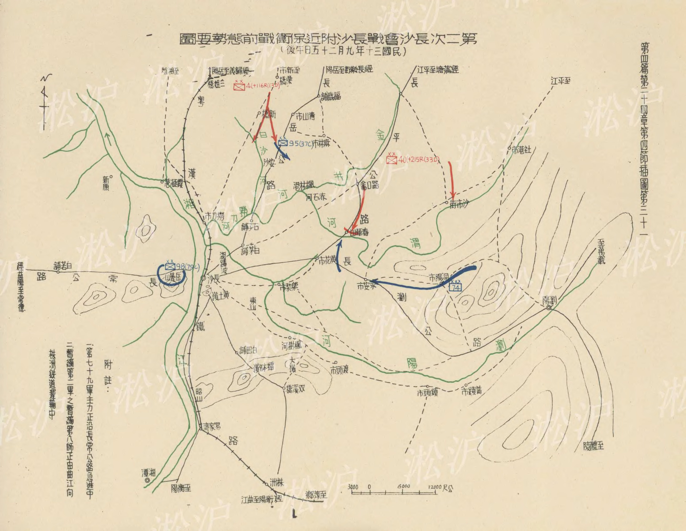

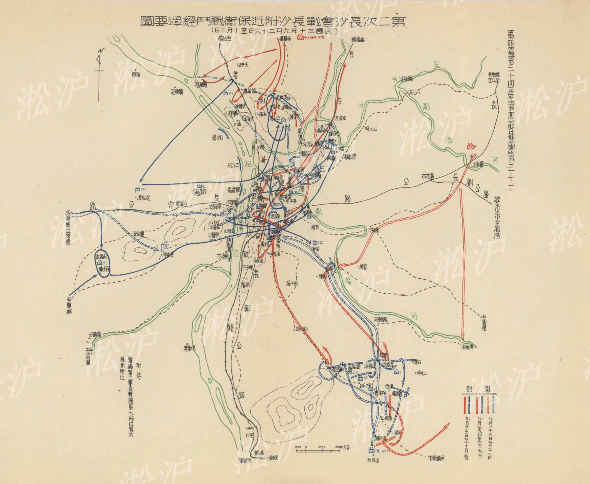

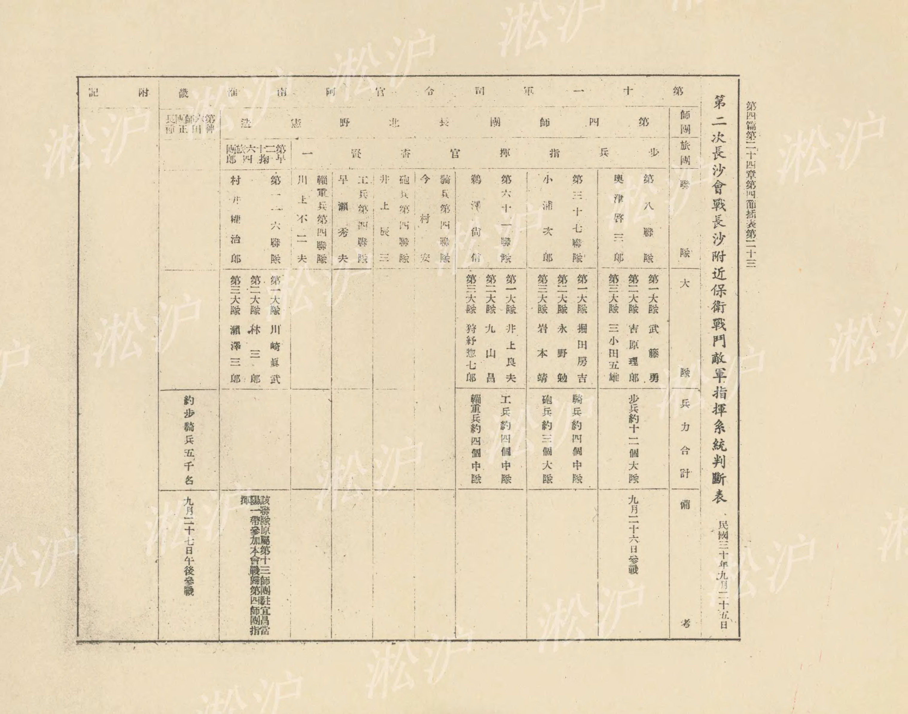

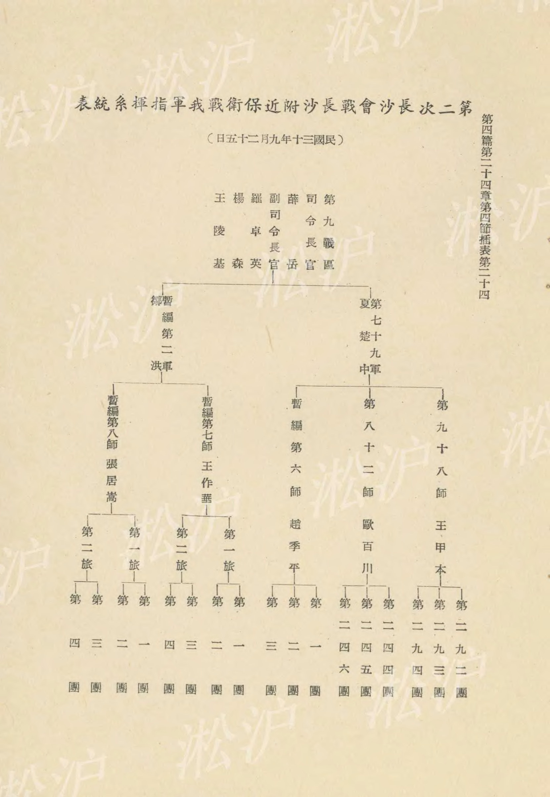

#### 第八款路口畲、福臨鋪、湘陰附近之戰鬥

民國三十年九月二十六日至十月六日

參照插圖第三十三至第三十六插表第二十五第二十六敵軍到達撈刀河之線後，第九戰區長官部卽按預定之總反攻計畫，着第九十九軍之第九十二、第九十九兩師向石子舖攻擊，路口畲、福臨舖、湘陰各附近之戰鬥又啓。

##### 第一項湘陰路口畲福臨舖附近地形

湘陰城位於湘江東岸，三面環水，憑堤南至八甲及八掛山，城區人烟稠密、商業繁盛，爲洞庭湖南魚米集散地之一，驛路北至馬頭山、箭毛嘴及營田等地，均爲溯湘江進窺長沙之主要登陸點。

湘陰城東南方，越王思巖、粵漢鐵路、王池山、達摩山，約四十公里至長岳公路北之福臨舖，更東方行約三十公里，至長平公路之金井，均爲本戰場之要點至其附近地形，詳第四、五、六各款。

##### 第二項 戰鬥經過

參照插圖第三十三

插表第二十五第二十六

九月二十六日前，本地區敵軍狀況概要如左：

一、第四十（附第三十三師團之第二一五聯隊），第六師團突破第十軍金井陣地後，與由瀏陽增援之第七十四軍激戰於瀏渭河北岸地區。

二、第三師團突破第十軍古華山亘栗橋陣地後，直逼漢家山、關山嘴（安沙以北）附近。

三、第四師團（附第十三師團之第一一六聯隊）由白鶴洞東端鑽隙，其一部竄至安沙、童南橋，與我佔領水口塅亘童南橋之第三十七軍之第九十五師戰鬥中，主力沿白沙河陷石子舖，正與我第七十九軍第九十八師之一營激戰於王家灣附近。

此時我軍狀況如左：

一、先於九月二十四日，由石門源撤退之第三十七軍第九十五師，於二十五日到達天雷山，奉令佔領水口塅亘童南橋陣地，策應友軍（第七十四軍）之作戰。

二、第十軍於金井亘栗橋戰鬥進行中，傷亡重大，於二十六日，一部被迫向敵後轉移，主力逐次撤至漢家山、關山嘴附近繼續抵抗。

三、第九十九軍之第九十二師將白鶴洞亘王思巖防務交與第九十九師接替後，二十六日集結於三姐橋附近，準備協力第十軍之作戰未果。

九月二十五日，第九戰區司令長官薛岳於金井亘栗橋激戰之際，電令第九十九軍之第九十二師，協力第十軍之作戰，及至第十軍之戰况劇變，薛長官乃按預定指導之方針，策定反攻部署（略）：「着第九十九軍之第九十二，第九十九兩師向石子舖攻擊。」該軍長傅仲芳遵卽命令第九十九師，除仍留第二九五團之第一營，第二九七團之一連固守湘陰縣城及營田各要點外，餘與第九十二師向石子舖攻擊前進。

第九十二師師長梁漢明（參照插圖第三十四）奉令後，於九月二十六日十四時，由三姐橋附近出發，分三縱隊向石子舖前進，經抵袁家沖，適敵第三師團輜重部隊沿新市、栗橋大道南下，其警戒部隊（人約六百，砲四門）已先我佔領土地坳北端五零一高地，該師長據報後，卽飭各團於原地待命，補充彈藥，二十八日拂曉向該敵攻擊，戰鬥一小時，敵向沙坪方向退去，同時層奉薛岳長官電令：「第九十二師師長指揮第九十九師，同向安沙之敵攻擊。」梁師長當以電話通知第九十九師高魁元師長：「一、第九十二師土地坳之陣地，由第九十九師派兵一營接替，二、第九十九師抽出一團撥歸第九十二師指揮，務於十三時到達袁家沖，協力向安沙之敵攻擊，三、貴師其餘部隊，仍扼守達摩山、玉池山、王思巖等高地。」第九十九師奉命後，除派兵接替土地坳防務外，並派第二九六團按時到達，十六時，第九十二師（附第九十九師之第二九六團）繼續前進，是晚進至大賢鎮，得知敵之主力已竄長沙東北地區，水渡寺已無敵縱，石子舖僅有少數敵兵，馬鞍舖到敵韜重一部，梁漢明師長當令第二七四團之第一營前往襲擊，斃敵人馬甚多，敵向南退去，該師於二十九日晚間到達堂坡與花橋，鐵爐沖地區集結，並向大橋市、永安市、黃花市偵察，三十日十九時，黃花市、水渡寺、石子舖、石灰嘴、楓林港等處各到敵之一股，路口圩有敵步兵及韜重一部，戰車數輛，梁漢明師長於鐵爐沖據報後，當作如左之處置。

一、電令第九十九師，以一部向水渡寺、石子舖之敵攻擊，主力推進至安沙東南牌樓沖、文家塅、四洲廟附近集結待命。

二、第二七五團卽派第三營，佔領楓林港以北南竹山、乾冲子、關爺廟之線，掩護第九十九師之集結。三、第四團（欠第一營附迫擊砲連，戰車防禦砲連、工兵連）於十月一日晚襲擊路口畲之敵，並破壞其交通。

四、第二七六團派第一營於十月一日晚襲黃花市之敵。

五、其餘部隊在原地集結待命，師部位置於鐵爐沖。

第九十二師各團奉指示後，第二七六團遵派第一營於十月一日晚向黃花市襲擊，行經楓林港附近，與敵一部遭遇，當發生戰鬥，敵另一部竄入乾冲子，該營被迫撤回，第二七四團於同日二十二時到達上沙市後，得知大橋市前來之敵步騎兵約五千馬千餘匹，正在路口畲附近及上沙市以南一帶乾田宿營，當飭第二營（附迫擊砲六門）向該敵果敢襲擊，敵正用餐，愴惶應戰，狀極紛亂，傷亡甚重，一部向金井，大部向南竄去，該團旋卽佔領各要點，並將路口畲北端道路破壞，第二七五團遵派第三營佔領楓林港以北南竹山亘關爺廟之線。是晚該師奉傅仲芳軍長電令：「進犯長沙之敵已開始突圍北退，第九十二，第九十九兩師若能適時控制長沙至福臨舖及長沙至栗橋之兩要道，設伏截擊，則可斷敵補給與歸路。」時第九十九師已到達牌樓沖亘泗洲廟之線，梁漢明師長遂決心以兩師全力截擊水渡寺、石子舖、石灰嘴、楓林港及其以南敗退之敵，乃於十月二日七時會同第九十九師高魁元師長商定作戰方案，並區分楓林港以西至水渡寺之線，由第九十九師派兵佔領，以東各渡口由第九十二師派兵佔領，截擊敵人，十二時，該師層奉薛岳長官東戍電令：一瀏陽河、撈刀河間地區之敵，被我軍痛擊，傷亡慘重，已開始退却，第九十二，第九十九兩師速由長沙，福臨舖道及長沙、栗橋道間地區，截擊敗退之敵」梁漢明師長以福臨舖以南地區，無可設伏之處，決心以主力依據影珠山以打擊敵人，乃作如左之處置。

一、第二七五團（欠第一、第三兩營）先行佔領古華山、福臨舖、東影珠各要點，以掩護主力之行動。二、電令第九十九師，於二日十五時，由鼎公橋、泗洲廟之線，轉移於西影珠、栗橋附近，並派一部先行佔領西影珠山，以掩護其主力之轉移。

第二七五團（欠第一、第三兩營）正遵令出發，十五時，該師主力正擬北移，楓林港突有敵約三千名，向該師第二七五團第三營南竹山，乾冲子間陣地猛攻，梁漢明師長復決心先予敵痛擊，然後再乘夜變更部署，當派第二七六團由左翼出擊，敵不支北退，該師乃於二十一時由路口畲亘鼎功橋之線，逐次向福臨舖轉移。

第九十九師（欠第二九五團第一營，第二九七團第四連及第九連之一排）高魁元師長先後奉薛長官，傅軍長及梁漢明師長命令後：當飭第二九五團第二營接替土地均防務，第二六九團輕裝向袁家冲出發，歸第九十二師指揮，餘仍集結三姐橋附近地區待命，九月三十日十九時，梁漢明師長令向安沙附近推進，乃於十月一日十二時由三姐橋出發，二十三時到達牌樓冲、泗洲廟一帶集結完畢。十月二日七時，高魁元師長赴鐵爐冲第九十二師師部會商作戰方案，返抵牌樓冲指揮所後，十時下達命令，其要旨如左一、師以協力友軍截擊殘敵之目的，決以主力於栗橋附近相機截擊敵人，以一部佔領楓林港以西至水渡

寺各要點，阻擊其渡河。

二、第二九六團於二日十二時由現地出發，以一部佔領栗橋東側之西影珠，主力集結於栗橋以西關聖廟附近，如敵北退卽猛力奇襲之。

三、第二九七團（欠一連又一排）佔領楓林港以西至水渡寺大道之間各據點，嚴密監視敵人，阻止敵軍北竄，其間隙務以少數兵力及障礙物封鎖之。

四、第二九五團（欠第一營）於黃昏後移至栗橋西之周家沖，爲師第一機動部隊。

五、補充團（欠一營又一連）黃昏後至栗橋西之斬子石爲師第二機動部隊。

六、師直屬部隊及師部，於黃昏後移至斬子石附近。

命令下達後，敵機三架不斷偵察，同時竹筒港南端發現敵兵數十名，在金井河南岸，似掩護其主力向東撤退，突入第九十二師陣地之敵，由乾冲子向文家塅猛攻，高魁元師長據報後，當飽文家塅之第二九五團（欠第一營）竭力抵抗外，第二九七團（欠）以預備隊向東側擊，工兵營（欠一連）推進至園明殿附近向東南警戒，十二時，該師奉梁漢明師長向西影珠轉移陣地之指示後，當派第二九六團先行出發，主力準備於十五時轉移，十四時三十分，敵第四師團之第三十七聯隊（人約千餘，附砲四門），以一部進攻泗洲廟、圓明殿之線，主力續向文家塅猛攻，經第二九五團（欠一營）奮勇遏阻，十五時，敵砲火益烈，該團第五連連長唐武陣亡，營長周斌負傷，其餘官兵傷亡亦衆敵乘機以騎兵一部竄入牌樓沖師指揮所附近，戰況激烈，該師長復令第二九五團確保文家塅、圓明殿間地區，並以一部向南出擊，第二九七團確保泗洲廟附近，並以一部向東夾擊，補充團派兵一營由牌樓沖向東夾擊，騎兵連及特務連於指揮所附近佔領陣地，並請第九十二師派兵一營向南策應，各部奉命後，猛烈攻擊，敵勢頓挫，此時第九十二師主力已向北轉移，敵主力又由陣地以北向西迂迴，十六時，敵包圍愈近，激戰益烈，該師沉着應戰，敵未得逞，高魁元師長鑒於第九十二師主力北移，乃決心乘夜向邱家山轉移，並作如左之處置。

一、第二九五團（欠第一連）及工兵營（欠一連）於黃昏後，在補充團第二營掩護下，經童南橋向邱家山轉移。

二、第二九七團於黃昏後，經安沙向邱家山轉移。

第九十二師（參照插圖第三十五）十月三日四時全部到達福臨舖附近後，梁漢明師長當作如左之部署：一、第二七五團（附第二七六團第三營）爲右截擊部隊，佔領福臨舖、關爺壩、希古臺（不含），馬家坳間道路兩旁據點，並派一營於寒婆坳、東影珠南麓之線設伏，截擊經賽頭舖向西沖北退之敵。

二、第二七四團（附戰車防禦砲連及第九十九師迫擊砲營——欠一連）爲左截擊隊，佔領福臨舖，古華山間要點，並派一營於向家壩以南地區設伏，截擊經福臨舖北退之敵。

三、第二七六團（欠第三營）爲機動部隊，並派得力之一營，確保東影珠五五八高地，其餘控制於西冲，希古臺間地區。

四、工兵營派兵一連佔領西影珠四二零高地。

五、師指揮所位置於福臨舖。

七時，敵先頭之第三師團第十八、第六十八兩聯隊及騎兵聯隊（附砲四門），分由麻林市、青山市向福臨舖，栗橋退却，十時，敵騎兵約五百餘，便衣兵三十名（附砲四門），竄九龍廟，其一部直迫黎家洞，又步兵約六百名附便衣兵數十名，由九馬山向第二六團第二營進攻，戰况激烈，尤以五五八高地之爭奪更甚，十二時，敵飛機轟炸，守九龍廟之連被圍，無法增援，該高地一度失守，經該團反攻，將敵擊退。十三時，敵復以一部由龍頭壩向五五八高地包圍，守軍浴血奮戰，傷亡甚大，該師長遂飭迫擊砲營派兵一連，協力工兵一連增援反攻，敵勢稍挫，同時曾家坪以南敵步兵約二千名，騎兵五百名，砲兵約一中隊，沿長岳公路向福臨舖北退，該師第二七四團第二營當予奇襲，斃敵指揮官秋吉及人馬甚多，梁漢明師長據報後，飭該團全部出擊，擴張戰果，敵不支，折向西南方向退去。十七時敵另一部復由石牯牛、蟠龍橋分向馬家坳、金步橋前進，另便衣兵百餘名，由梅林橋小河溝潛入，均被各地守軍分別擊退，敵以福臨舖公路受阻，乃留一部向該處佯攻，主力轉經栗橋向李家塅北退，四日二時，第二七四團夜襲向福臨舖佯攻之敵（人約七百名），敵傷亡甚衆，二時四十分，陸續分路北退，梁漢明師長當令該團集結於西沖，石板沖、敬家沖附近，準備向李家塅追擊，六時，約千餘名（附大、小砲八門）之敵，在飛機四架掩護下，由福壽宮、龍頭壩、黎家洞分向東影珠之四九零及五五八高地猛攻，時適第二七四團第二營到達敬家沖，該師長卽令該團副團長指揮該營及戰車防禦砲連與第九十九師迫擊砲營之一部，由東向西，將敵壓迫於黎家洞北端，更飭東影珠高地之第二七六團第二營同時出擊，激戰數小時，敵未得逞。此時，敵步騎兵約六百名，便衣約百名（附砲二門），復由金步橋、福臨舖方面來援，另部千餘名分向福臨舖西端猛攻，九時，更以飛機四架支援衝鋒，均被該師以熾盛火力奮勇擊退，十三時，敵用空軍及砲火向影珠山及五五八高地狂炸，以掩護其砲兵向西北撤退，步兵由黎家洞北移，梁漢明師長一面令砲兵於東影珠北端行追擊射擊，一面策劃追擊部署時適層奉薛岳長官電令：「第九十二、第九十九兩師仍歸第九十二師師長指揮，經栗橋兩側及三姐橋向新市（不含），歸義猛烈追擊敗退之敵。」當卽下達追擊命令，要旨如左：

一、師司令部及直屬部隊第二七四團（附第九十九師山砲兵營）爲左縱隊，於四日十八時由古稻田出發，經四方塅、土地坳星夜趕到三姐橋附近集結待命。

二、第二七六團，第二七五團爲右縱隊，歸第二七六團團長指揮，第二七六團於四日十八時由東坡冲出發，經橫板橋、徐家橋、毛塘、梓木洞星夜趕到彭家坳、石橋灣附近集結待命，第二七五團俟第二

七六團通過後，除以一部佔領原陣地，掩護師主力之行動，於二十一時以後撤收外，其餘準第二七六團經路，星夜趕到石橋灣附近集結待命，行進時，對栗橋方面應嚴密警戒。

時湘陰城及營田已先後陷敵，十月五日九時許，該師層奉薛岳長官電令：「一、第九十二師以主力威脅湘陰之敵，以一部向歸義，河夾塘敗退之敵猛進。二、第九十九師以主力向湘陰之敵攻擊，恢復湘陰，以一部攻擊營田之敵。三、該兩師仍由第九十二師師長統一指揮，星夜兼程前進。梁漢明師長當卽轉達第九十九師，並以第二七五、第二七六兩團沿粵漢鐵路向汨羅站、河夾塘方面追擊。

第九十九師第二九六團奉師長高魁元十月二日十時佔領西影珠山之命令後，遵於十二時由姚家舖出發，並於新安舖驅逐少數敵騎，十八時五十分到達栗橋，當以第三營佔領西影珠，主力集結關聖廟附近，該師主力乘夜轉移，除第二九七團遲到外，各部於三日拂曉到達邱家山附近，高師長當令第二九六團以主力佔領斬子石、馬家嶺之線，一部佔領西影珠，奇襲北退之敵，該團卽以第一、二營佔領斬子石、馬家嶺之線高地，第三營潛伏於西影珠、龍頭壩一帶山地，相機出擊，團部位置玉山廟附近，四日九時三十分，敵騎兵二、三十名及便衣隊竄抵橫坡橋，十時，敵大部向栗橋北退，十時十分，橫坡橋南端續到敵騎約二百，十時三十分抵歐家壩，以騎兵百餘名向龍頭壩、花園塅該團第三營進撲，以掩護其後續部隊由栗橋以西小道北退，該團待敵前衛到達周家沖、芳根壩一帶，突以火力奇襲，敵死傷頗鉅，遂停止於徐家橋東北附近。十一時四十分，有諸兵種聯合之敵約六、七百名，向該團斬子石陣地進撲，另一股到達毛塘，企圖迂迴該團側背，守軍利用地形，發揚火力，敵未得逞，該團長以第三營方面之敵已北去，乃飭其由栗橋以北推進毛家坊附近截擊敵軍，十三時，敵復以飛機指導砲兵向該團陣地射擊百餘發，待至黃昏，敵始向北逸去。

先是，第九十九師（參照插圖第三十六）於九月二十五日奉令由歸義亘湘陰之線南移，接替第九十二師白鶴洞亘王思巖一帶防務後，營田隨卽失陷，高魁元師長於二十六日據報，當令留置湘陰之第二九五團第一營，協同砲兵第五十四團第二營（欠兩連），專任湘陰之守備，原留營田之第二九七團第四連（附第九連之一排），歸第二九五團第一營營長指揮，擔任湘陰、營田間之游擊，二十九日十七時，第九十九軍傅仲芳軍長深感營田之重要，卽派特務營營長率第二連由喬口至湘陰，並指揮第二九七團第四連（附第九連之一排）向營田之敵攻擊，該營於三十日十二時到達湘陰，與各留置部隊作適當之連絡，十九時三十分開始攻擊，未能奏效，仍向黃甲橋、東塘一帶游擊，傅仲芳軍長據報後。二日，復派第九十九師副師長朱志席率軍補充團第一營（欠一連），工兵第二連前往湘陰附近，統一指揮所在各部隊，攻擊營田之敵，朱副師長於十八時到達八甲（湘陰城南），當作如左之處置：

一、補充團第一營（欠一連）於二日夜集結平家灣，準備於三日攻擊營田之敵。

二、軍特務營營長仍指揮第二九七團第四連（附第九連之一排），努力偵察情，候命攻擊。

三、第二九五團第一營及砲兵第五十四團第二營（欠兩連）仍守備湘陰。

四、工兵第二連位置於八甲指揮所附近待命。

十月三日晨，據守蒲湘陰第二九五團第一營報告：「敵佐籐部隊平野支隊之聯合兵種約五百名，在飛機三架掩護下，向箭毛嘴、馬頭山登陸。」又據湘陰縣長報告：「長沙北退之敵一部約千餘人，被我團隊擊退至文家舖以南地區，有繼續北退模樣，文家舖並有敵便衣隊活動。」朱志席副師長據報後，復作如左之處置：

一、第二九五團第一營極力阻敵登陸。

二、軍屬補充團第一營（欠一連），以一連位置於王公嶺向東南警戒，其餘位置位置於八掛山待命。

三、軍特務營第二連仍努力偵察當面敵情，並準備協力第二九五團第一營，殲滅箭毛嘴、馬頭山強行登四、工兵第二連以一部任指揮所警戒，其餘位置於周家橋向南警戒，並與補充王公嶺之連確取連繫。

八時許，登陸之敵，經第二九五團第一營奮勇抵抗，而未得逞嗣以飛機數架向該營陣地，及湘陰城不斷轟炸，並施放毒氣，該營傷亡頗大，十時許，敵已登陸，朱副師長卽令在黃甲橋附近湖擊之軍特務營長，率部向敵後攻擊協力第二九五團第一營之作戰，如未奏效，則移至湘陰以東之油榨嶺附近待命，並函請湘陰縣政府保安隊，以一部維持城廂治安，肅清敵之便衣隊，餘則擔任我陣地間隙內之警戒，及阻止便衣隊之竄擾，十七時，第二九五團第一營數度反擊，殲敵三百餘人，黃昏後，敵再放毒氣猛攻，該營早有準備，同時傅仲芳軍長令飭所屬第一九七師錫江口之野砲兵連，以火力制壓，軍補充團第四連亦由臨茈口來援，因之傷亡甚微，敵攻勢頓挫。四日九時許，敵第四師團一部及野重砲第六旅之第十三聯隊，人約數千，分途北退，其先頭到達澇溪橋、周家橋、五魁山等處，同時援敵約八百餘人，十時許向湘陰以北馬頭山南端陣地猛撲，敵飛機更不斷向我城內外轟炸，激戰數小時，互無進展，十二時，敵于湘陰北門及八甲兩處降落傘兵約三十餘名，當被守軍殲滅過半，是時，敵之主力已到達澇溪橋一帶，圍攻湘陰，十四時三十分，城南王公嶺，八甲、掛榜山一帶，戰鬥激烈，雙方傷亡均重。十六時，八甲、掛榜山陣地被敵攻佔，登陸之敵亦向北門猛攻，此時第二九五團第一營營長曹克人負傷，仍率所部力戰，繼退至城內，堅守各要點，抗拒犯敵，十七時，該營副營長陳錦龍，連長王樹炳，鄧先覺、鄭義德及全部官兵先後傷亡，該營長猶以手槍斃敵十數名，作最後壯烈犧牲、朱志席副師長以守軍犧牲殆盡，而增援之第二九五團第二營又中途被阻，乃率工兵營第二連之一班乘夜突圍，由是湘陰城遂陷敵手。

十月五日九時，第九十九師高魁元師長于邱家山奉梁漢明師長轉薛岳長官電令：「第九十九師以主力向湘陰之敵攻擊，恢復湘陰，以一部攻擊營田之敵，該兩師仍由第九十二師師長指揮，星夜兼程前進後，當卽下達攻擊命令，其要旨如左。

一、竄入湘陰之敵步騎兵約三千餘人，砲四門，正與我該方面守備部隊對戰中，王思嶺西側陶家巷有敵約三百餘人，八甲王公嶺、文家鋪一帶尚有敵便衣隊出沒。

二、師以恢復湘陰及營田之目的，決先驅逐陶家巷之敵，續向湘陰之敵攻擊。

三、第二九六團爲右縱隊，於五日十三時由現地出發，經望塔洞、七柳樹、低華嶺，驅逐陶家巷之敵，再經高塘沖、花石巖、長崙鋪向湘陰東北攻擊前進。

四、第二九七團爲左縱隊，於五日十二時由現地出發，經高華沖、周口塅到達袁家鋪，與右縱隊取得連絡，協力驅逐陶家巷之敵，由滂溪橋、王公嶺向湘陰東南攻擊前進。

五、野戰補充團（欠一營），第二九五團（欠第一營）及師直屬部隊，於五日十四時由現地出發，進至七柳樹待命，爲師預備隊。

十四時，各部先後開始攻擊，旋將王思巖附近之殘敵肅清二十時，高魁元師長層奉薛岳長官電令：

「敗退之敵，主力昨已通過福臨鋪、栗橋以北地區，分經長樂街，伍公市、新市渡河北退，各部務必排除萬難，猛烈追擊，」該師遵於六日四時繼續搜索前進，九時許收復湘陰，除令第二九五團（欠一營又一連另一排）第二九六團及補充團（欠一營）肅清湘陰城郊之殘敵外，並令第二九七團速向營田追擊，十六時佔領營田及虞公廟，敵軍大部登艦逸去。

本地區之戰鬥，至此結束，綜計敵軍參戰部隊第三、第四師團各一部及平野支隊佐籐部隊約五百餘名，我軍直接參戰部隊爲第九十九軍之二個師，六個團，我軍損失步兵一營有餘，但敵之傷亡亦衆，敵指揮官秋吉陣亡。

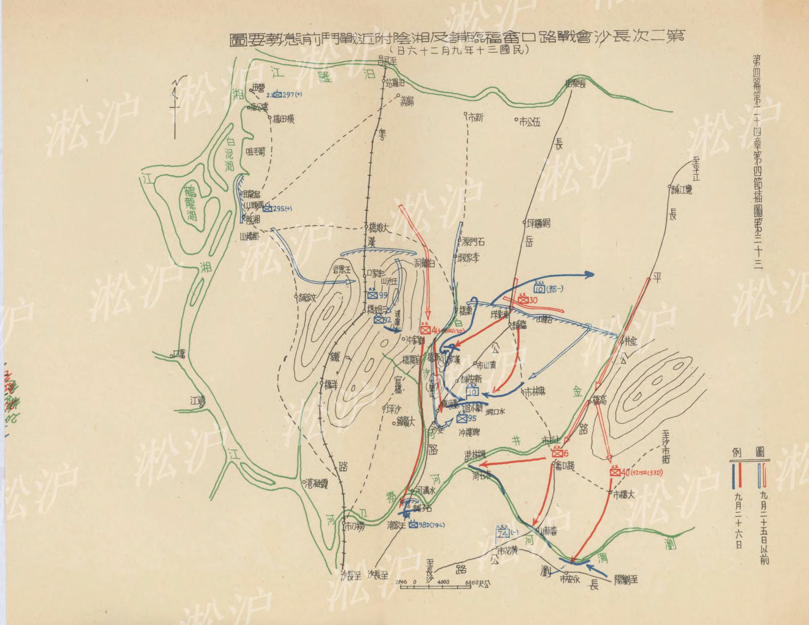

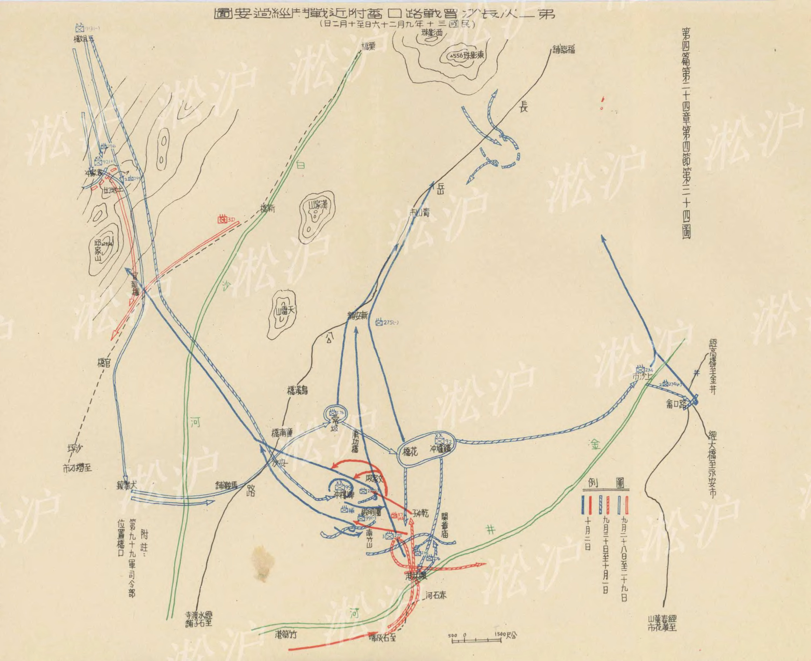

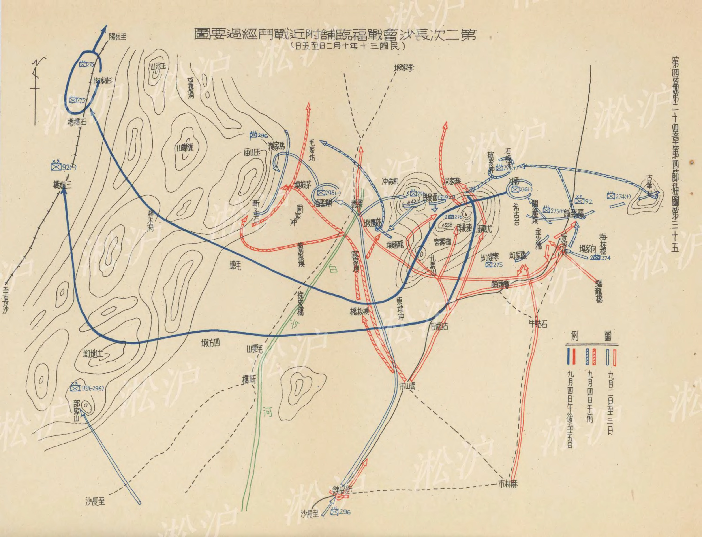

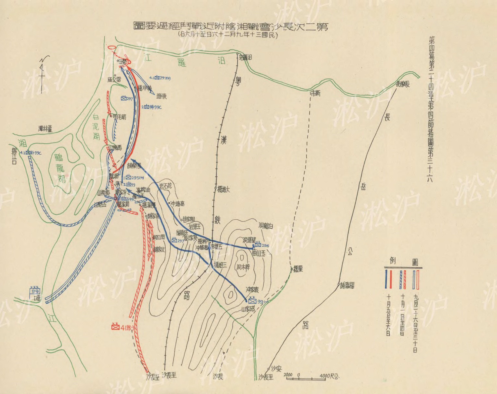

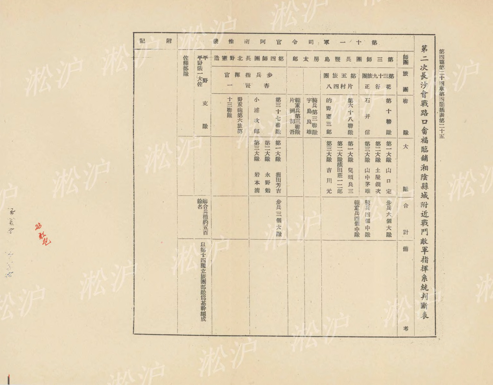

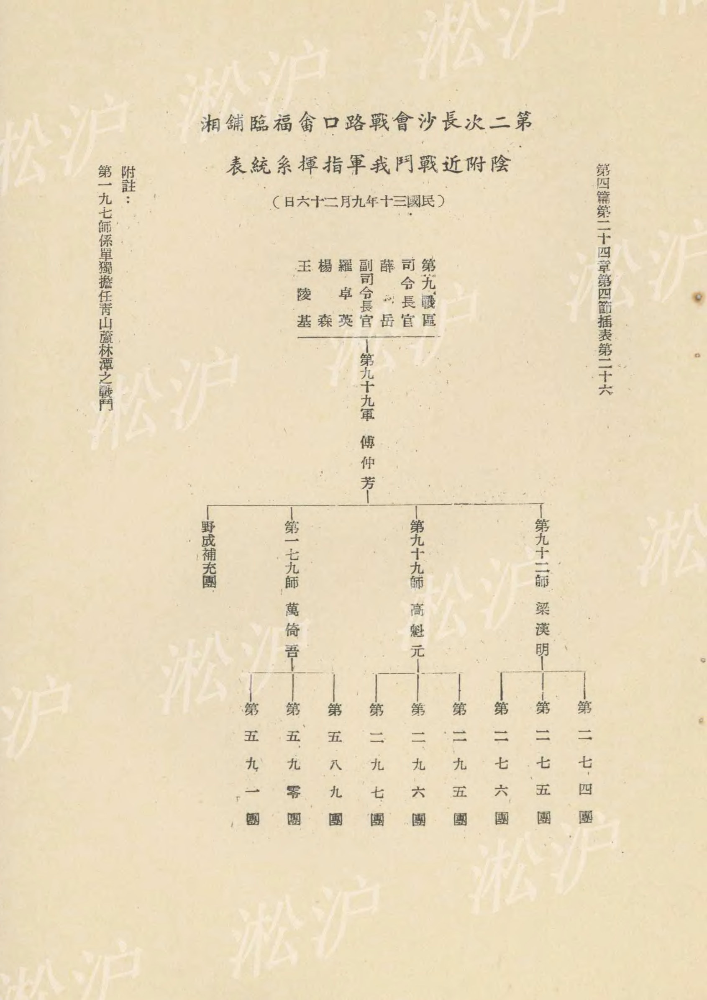

#### 第九款 脫甲橋麻峯嘴附近之戰鬥

民國三十年

月二十六日至十月五日

參照插圖第三十七至第四十插表第廿七第廿八

當金井亘栗橋間地區戰鬥於九月二十六日急劇轉變，犯敵分路向長沙南撲之際，第九戰區薛岳司令長官爲滅挫敵勢，乃飭當時陷於敵後之第二十七集團軍之第四、第二十兩軍，向金井、福臨舖攻擊，脫甲橋、麻峯嘴附近之戰鬥遂啓。

##### 第一項 脫甲橋麻峯嘴附近之地形

長平、長岳兩公路，自長沙併列北上，除橫跨撈刀河外，無甚險阻，惟長平公路至金井卽入騰雲山區，長岳公路逼麻峯嘴後，進出鴨姿山之栗山巷，山巒綿亘，橫斷南北，爲長沙東北面外圍屏障，沿山之南麓，有金井經脫甲橋至麻峯嘴之大道，橫接長平、長岳兩公路，稍加修葺，機械化部隊運動甚便，乃汨水、撈刀間東西向主要交通，不獨攻者所必爭，亦爲防者所必守。

##### 第二項 戰鬥經過

九月二十六日午，敵軍之狀況如次：

一、由金井攻佔荷塘橋、學士橋陣地之敵第四十師團（附第三十三師團之第二一四、二一五兩聯隊），其先頭已抵上杉市。

二、突破福臨舖陣地之敵軍第三師團主力，其先頭竄抵麻林市。

三、陷茅根壩、茅塘陣地之敵第三師團一部，其先頭竄至安沙附近，與我第十軍激戰中。

四、據報金井、脫甲橋附近尚有敵第六師團之一部，獨立混成第十八旅團之三個大隊，又敵第四師團附十三師團之第一一六聯隊）已進出李家塅以北地區。

第第二十七集團軍第四（附第六十師）、第二十（欠暫編第五十四師）兩軍隨關王橋、大荊街附近戰鬥之進展，迄與敵保持接觸，至二十六日止，各部位置概略如左：

第四軍：一、配屬之第六十師佔領汨水北岸東港、張家坡之線。

二、第九十師佔領浯口北岸。

三、第五十九師佔領清江口北岸。

四、第一零二師位于菖蒲源附近。

五、軍司令部位于譚家坊。

第二十軍：一、第一三四師攻佔長岳公路赤馬江、渡頭橋之線。

二、第一三三師攻佔大莉街以東地區。

三、軍司令部位于饒村。

集團軍司令部位于大橋。

時第九戰區薛岳司令長官鑒於安沙情況之危急，瀏陽河、撈刀河地區部署尚未就緒，爲減削敵勢，於九月二十六日十二時電令第二十七集團軍：「着第四軍卽由浯口向金井，第二十軍由長樂街向福臨舖攻擊前進（下略），」楊森兼總司令當轉飭各該軍遵照。

第四軍歐震軍長

參照插圖

第三十八

于譚家坊層奉令後（參照角圖），當飭各師分由甕江潭亘浯口之線南渡汨水，於二十七日渡河完畢，二十八日二時，其第九十師先頭正沿長平公路南進，復奉戰區長官二十六日反攻部署電令，第四軍向麻林市攻擊，當卽處置如左：

一、第九十師、第五十九師爲右第一線，均歸第九十師師長陳侃指揮，應於二十八日經梧崗源、白馬廟、脫甲橋、象鼻橋向麻林市之敵攻擊前進。

二、第六十師爲左第一線，經甕江舖、蒲塘、長平公路西側、向麻林市之敵攻擊前進。

三、第一零二師爲軍預備隊，沿長平公路跟進。

四、行進時，軍司令部在預備隊先頭。

是日，軍司令部隨各師之進展到達楊家源。

第九十師陳侃師長奉軍長歐震二十八日二時指示後：該師已沿長平公路前進，乃飭第五十九師在右，沿梧崗源、白馬廟、脫甲橋共向麻林市攻擊前進，是日，第九十師以第二六八團爲前衛，沿甕江鋪、蒲塘、官家橋道、向脫甲橋搜索前進，其餘爲本隊，準前衛行進路跟進，該前衛第二六八團驅逐甕江鋪零星殘敵，進抵茶子坪，與該處之敵百餘名激戰二小時，敵向金井、脫甲橋敗退，嗣該團到達岳家園，探知金井、脫甲橋約有諸兵種聯合之敵二千，馱馬三、四百匹，戰車二十餘輛，陳侃師長乃卽以第二六八團佔領胡家洞、王板洞之線，第二六九團佔領茶沖園、半牯園之線，各對脫甲橋及金井之敵繼續搜索，嚴密警戒，第二七零團集結於丁家洞附近，師司令部位置於長谷園，是夜，第五十九師集結油棗嶺、株樹嶺地區。二十九日十三時攻擊準備就緒，第九十師第二六八團向脫甲橋、朱鄰市之敵攻擊，曾一度突入脫甲橋，擊斃敵人馬各約三百，毀裝甲車七、八輛，該團連長徐志、岑玉二員陣亡，旋敵反攻，該月一日，金井之敵約四百名，進出余家坳，陳侃師長據報後，當派第二七零團由丁家洞向敵攻擊，敵傷亡百餘人，馬二十餘匹，旋敵由金井來援，該團仍退回丁家洞，此時得悉長沙城郊及瀏陽河、撈刀河間之敵，被我軍四面圍攻，於一日十六時已開始突圍退却。該師並層奉戰區長官薛岳追擊指示：「第四軍應由福臨鋪、長樂街及栗橋、新市地區，自東向西截擊敗退之敵」。陳侃師長派第五十九師工兵營（附第一七六團之一連）向福臨鋪至青山市間，將敵已修復之公路橋樑數處破壞後，適敵汽車數輛南駛，該營擊毀其二輛，餘向北遁去，二日，敵約四、五千名，由高橋退至金井，第九十師遵軍長歐震指示，將胡家洞、王板洞、茶冲園、半牯園之警戒陣地，交由第五十九師接替後，集結於岳家園、白石洞地區待命出擊，三日八時，退金井之敵，續向西北移動，九時，陳侃師長以第九十師第二六八團由楓樹坳經楊家塘、峽山口向金井西北攻擊，第二六九團由金盆壩、王板橋向金井東北攻擊，第二七零團位於岳家園南端爲師預備隊，十三時，各團開始攻擊，第二六八團迫近金井車站，第二六九團繞至天山坡，將敵右翼包圍，敵憑我原有國防工事及民房頑抗，激戰竟夜，時敵另一部人約千餘，馱馬約三百，由高橋繞越金井、竄脫甲橋，陳侃師長當飭位於胡家洞、王板洞、茶冲園、半牯園之第五十九師，除以一部固守原警戒陣地外，主力向脫甲橋之敵攻擊，激戰至晚，仍對峙中。四日六時，第九十師、第五十九師分別續向敵猛攻，至十一時，脫甲橋之敵向西北逸去，第五十九師追擊至嘯天獅子附近，敵傷亡甚重，十四時，金井之敵向福臨鋪改道，第九十師復以預備隊第二七零團向象鼻橋截擊，頗有斬獲。

第六十師師長董煜二十八日奉令率部沿甕江舖、蒲塘前進，當日到達蒲塘南端，翌日拂曉全部到達官家橋附近，其前衛第一七八團第二營進抵楊家塘北端，與三、四百名之敵激戰，至十時許，敵向金井敗退，是晚，該師在東坡、官家橋、朱家園附近佔領陣地，繼續搜索敵情，師部位置於板茅田候命攻擊，三十日午前，金井之敵一部約八、九百名，經金盆壩、鷺鶯坳、花門樓向第一七八團東坡陣地攻擊，一部約千餘名，經十拱橋、石塘、高家坡向第一七九團五里山及官家橋陣地攻擊，當被擊退，十三時，敵復以四、五百名由王梓園及二二一·五高地向四勝塅南端迂迴，經該師騎兵連及特務連迎擊，敵未得逞，仍向金井退去。

第一零二師爲軍預備隊，當日跟進至蒲塘附近，爲策應金井亘脫甲橋第一線部隊之作戰，其部署及警戒配備如左：

一、第三零四團位于曹家坡附近，並佔領曹家坡以南、踏水橋以北兩側高地，對金井方面嚴密警戒。

二、第三零五團位於蒲塘附近，並在雷家洞、八斗洞之線擇要警戒，以掩護師左側背之安全。

三、第三零六團位置於茶子坪附近擔任警戒。

四、師部位置於蒲塘。

九月三日，進攻長沙之敵主力，由李家塅向新市、大莉街北退，該師師長柏輝章遵照軍長指示，即率各團於四日北渡汨水，向大莉街以南行超越追擊。

第二十軍軍長楊漢域

參照插圖

第三十九

層奉戰區長官長官薛岳二十六日十二時電令，並據報長樂街渡口徒涉困難，築橋材料缺乏，被汨水南岸敵火控制，乃決心改由浯口上游渡河，當飭第一三三師於二十六日夜由大莉街以東地區，經橫山橋、花橋向梓江前進，第一三四師於同時由赤馬江、渡頭橋、經龍蟠、盤山向下嵌江前進，均限二十七日黃昏完成渡河準備。各師以沿途遭受空襲及水口橋方面敵砲兵射擊之影響，行進遲緩，於二十七日夜始先後到達梓江、下嵌江之線，二十八日二時，該軍復奉戰區長官薛岳二十六日指示，第二十軍應向萬家舖之敵攻擊，各部遵令分別渡江，至二十九日晚，第一三四師到達塘頭源，第一三三師主力到達西江洞，其任右側警戒之第三九八團，到達班召廟，軍部到達芳蓮沖，時長樂街至金井間敵搶修之公路，運輸頻繁，沿公路之麻峯嘴、白沙橋、江家橋等地各有七、八百名之敵據守，該軍進路被阻，楊漢域軍長當卽決心於三十日拂曉，分向各該地之敵攻擊，其處置如左：

一、第一三三師以一個團向麻峯咀之敵攻擊，並遮斷其後方連絡，一個團位置於龍洞策應，一個團位置于西江洞爲軍預備隊。

二、第一三四師以一個團向白沙橋之敵攻擊，一個團向目魚唇、江家橋之敵攻擊，一個團位置於旨泉嶺策應。

三、軍司令部位置於芳蓮沖。

第一三三師師長夏炯

參照插圖

第四十

奉令後：三十日，以第三九八團由班召廟向麻峯咀之敵攻擊，其餘控置於西江洞，第三九八團是日攻佔麻峯咀，並將近白沙橋橋樑一座破壞。

第一三四師師長楊幹才奉令後，當卽令第四百團、第四零一團於明（三十）日分別向白沙橋及目魚唇、江家橋攻擊，第四零二團位置於旨泉嶺，爲師預備隊。

九月三十日拂曉前，向白沙橋攻擊之第四百團，初有進展，嗣敵反攻，遂退守流水研附近，但拂曉後，敵又退守白沙橋。

第四零一團於三十日向目魚唇、江家橋之敵攻擊，敵不支，向天王廟退去，該團當將該地佔領。

是日，敵傷亡人馬各二百，該師傷亡連排長以下百餘名，俘獲敵馬九匹。

同日十二時，該軍奉令速向福臨舖、青山市、安沙之敵攻擊，楊漢域軍長當飭第一三三師向福臨舖，第一三四師向青山市攻擊前進，軍指揮所向象鼻橋推進，十六時，第一三四師先頭到達白石廟、芭蕉源，第一三三師先頭到達麻石源各附近，突遭嘯天獅子及何家坳之敵阻擊，同時接第四軍連絡員通報：「金井公路上敵軍運頻繁，第四軍被阻於金井以北地區，第九十師正在脫甲橋與敵激戰中」，楊漢域軍長據報後，遂決心先遮斷銅鑼坪、金井間敵之連絡，確保集團軍右側之安全，再向福臨舖、青山市、安沙攻擊，當對各師長如左之指示：

一、第一三三師於明（十月一日）晨四時向白沙橋及目魚唇、江家橋各附近之敵攻擊。

二、第一三四師（欠第四百團）於明（十月一日）晨四時向嘯天獅子及何家坳之敵攻擊，左與第四軍第九十師切取連絡。

三、第四百團位於長江源，爲軍預備隊。

十月一日，第一三三師以主力向白沙橋之敵攻擊，十四時敵退據麻峯咀，該師遂佔領白沙橋、目魚唇、江家橋之線，旋敵以戰車五輛，掩護汽車二十餘輛，由花門樓載兵來援，激戰至晚，該師西撤，二日二時。夏燭師長復以第三九九團及三九八團之一部向麻峯咀之敵攻擊，十時復克該地，奪獲敵軍用品甚多，十四時，敵戰車八輛，裝甲車二十餘輛，空汽車二十餘輛，由北南來，在麻峯咀、江家橋附近被我毀其八輛，敵下車戰鬥，入夜，連同花門樓來援之敵，乘車北遁。

同日，第一三四師以第四零二團由旨泉嶺、芭蕉源，第四零一團由白石廟，分向嘯天獅子及何家坳之敵攻擊，十八時佔領嘯天獅子，嗣敵以汽車五十餘輛由脫甲橋載兵來援。第四零二團撤至芭蕉源與敵對峙，二日，各團繼續攻擊，互無進展，楊師長復派第四零二團第二營向何家坳之敵攻擊，十六時，敵向花門樓退去，該營遂克該地。

十月二日十七時，楊漢域軍長得悉長沙城郊及劉陽河、撈刀河間地區之敵，被我軍四面圍攻，於一日十六時開始突圍退却，並層奉戰區長官追擊指示：「第四軍、第二十軍由福臨舖、長樂街及栗橋、新市方面自東向西截擊敗退之敵」，當卽處置如左：

一、第一三三師卽以一團推進於飄風山、麻石山附近，向雙江口、新市道撤退之敵截擊，其餘兩團位置於麻峯咀及長嶺附近地區，對由江家橋及竹山舖至檢市廠道撤退之敵截擊。

二、第一三四師卽以兩團位置於何家坳及江家橋附近，對由脫甲橋至麻峯咀道撤退之敵截擊。

十月三日，第一三三師主力在麻峯咀截擊敵人，第三九七團向雙江口前進，十六時通過檢市廠，適敵汽車十餘輛，載步兵約三百名南下，該團當予截擊，激戰竟夜，四日拂曉，敵先後增援步兵七、八百（附砲二門），戰車十餘輛，在飛機三架掩護下反攻，該團佔領向家大屋及小沖沉着應戰，毀敵汽車十餘輛，斃敵中隊長一，官兵五十餘名，敵於十時向北退去。

同日十四時，第一三四師師長楊幹才據報，敵步騎兵約二千餘（附砲六門），由金井繞道到達象鼻橋以北地區，當派第四百團及第四零一團由江家橋、脫甲橋間分向該敵襲擊，先後與敵激戰於落馬橋、白石廟、蓼花源等處。旋敵約五、六百名進出何家坳，企圖包圍各團，經沉經應戰，迄未得逞，四日十二時，敵約四、五千名，附砲十餘門，汽車五十餘輛，復由金井來援，激戰至十七時，敵向北退去。

此際，軍奉集團軍兼總司令楊森四日八時電令如左：

一、金井以南，敵無大部，其主力似由李家塅向新市、大荊街北退。

二、第二十軍應抽出一部，分數縱隊卽夜輕裝急進，在新市以南、福臨舖以北地區向敵襲擊，其餘在原地準備追擊。

楊漢域軍長當卽令第一三三師本（四）日夜向新市以南、李家塅以北，向敗退之敵襲擊，第一三四師仍就原地向敵截擊，如敵已通過，第一三三師向新市，第一三四師向長樂街跟蹤追擊。

十月五日二時，第一三三師分由向家大屋、楓樹塅及長嶺越過長岳公路，向李家塅、新市間大道前進，當第三九七團通過公路之際，檢市廠附近敵汽車二百餘輛北駛，該團卽以火力控制該處公路，拂曉，敵戰車十餘輛，在桃花山之敵砲掩護下猛烈反攻，以致該團不能繼續控制公路。四時頃，師主力到達官懋石，得悉李家塅、新市大道，敵無大部兵力，遂又折回檢市廠以南，截擊敗退之敵，拂曉後，敵在飛機三架，戰車八、九輛，砲四門掩護下，向北撤退，該師無法接近。

同日，第一三四師當面花門樓、江家橋一帶已無敵踪，該師以第四零一團經曹家坊、芳蓮沖向北行超越追擊，主力緊躡敵後，十二時，驅逐白沙橋之敵掩護部隊，二十時進至銅鑼坪，是日，該師擊斃敵馬十餘匹，囪獲敵彈藥甚多。

時奉薛岳長官九月四日指示：「第四軍追擊汨水兩岸之敵後，由長樂街渡河，協同第五十八軍猛烈截擊；第二十軍由伍公市、新市渡河急追」。各軍乃按新命令實施。脫甲橋、麻峯嘴附近之戰鬥至此結束，此次戰鬥，敵參戰部隊初爲第六師團一部及獨立第十八混成旅團三個大隊，敵於長沙突圍後，陸續前來，合計約達一萬三千名，我軍參戰部隊，有第四軍四個師（含配屬之第六十師），第二十軍兩個師，合計約二十個團，敵傷亡中隊長一，官兵約六百餘，馬約五百餘，毀裝甲車及汽車十餘輛，我傷亡官兵百餘名，奪獲戰馬九匹及彈藥軍用品甚夥。

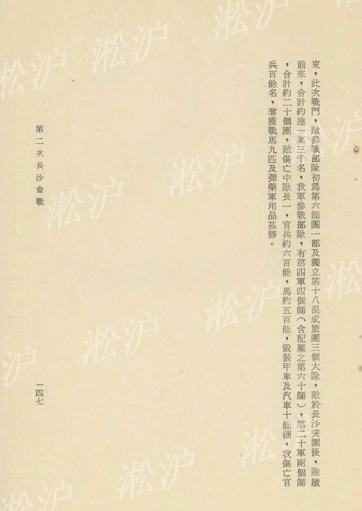

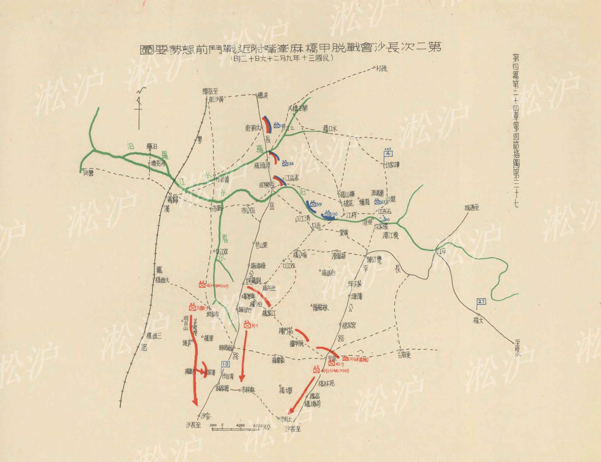

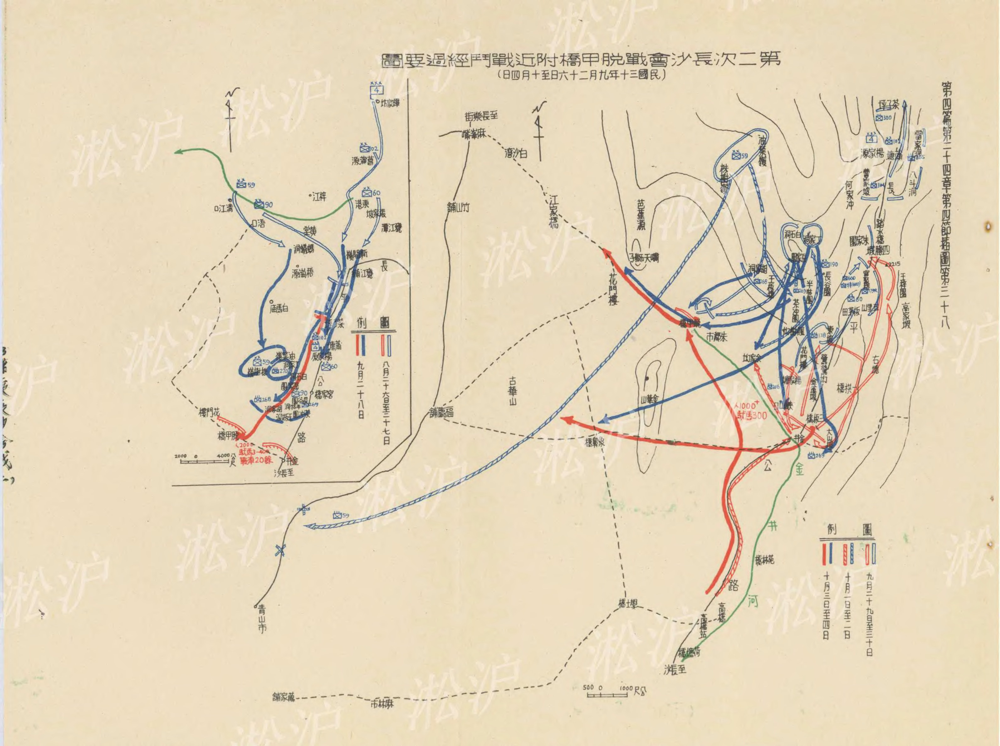

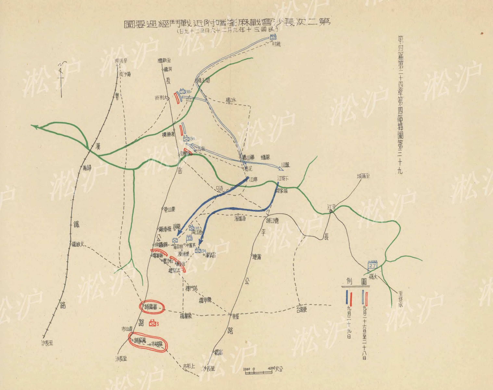

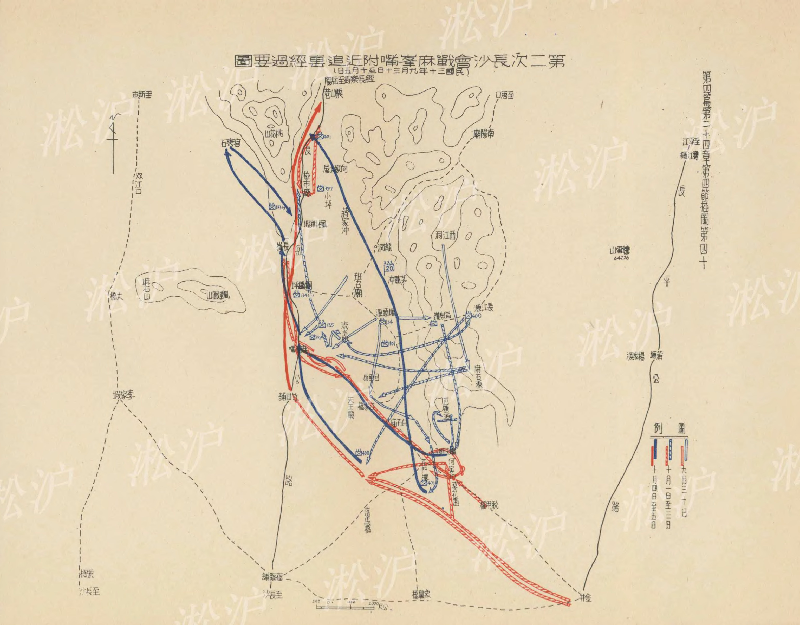

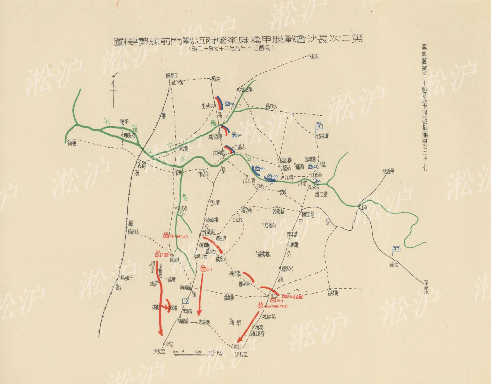

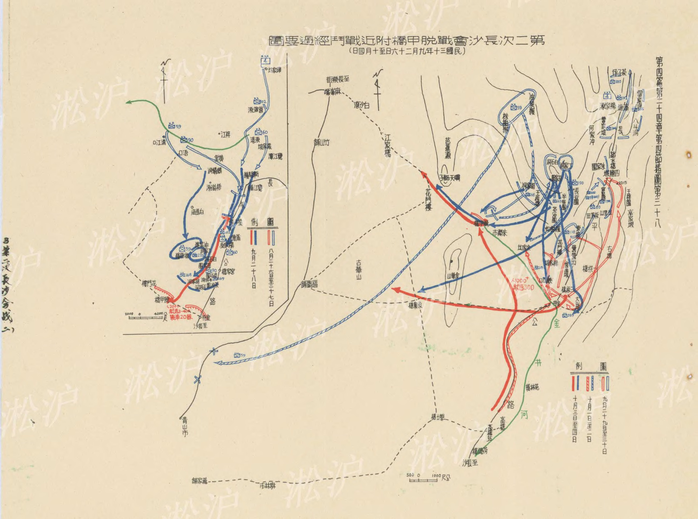

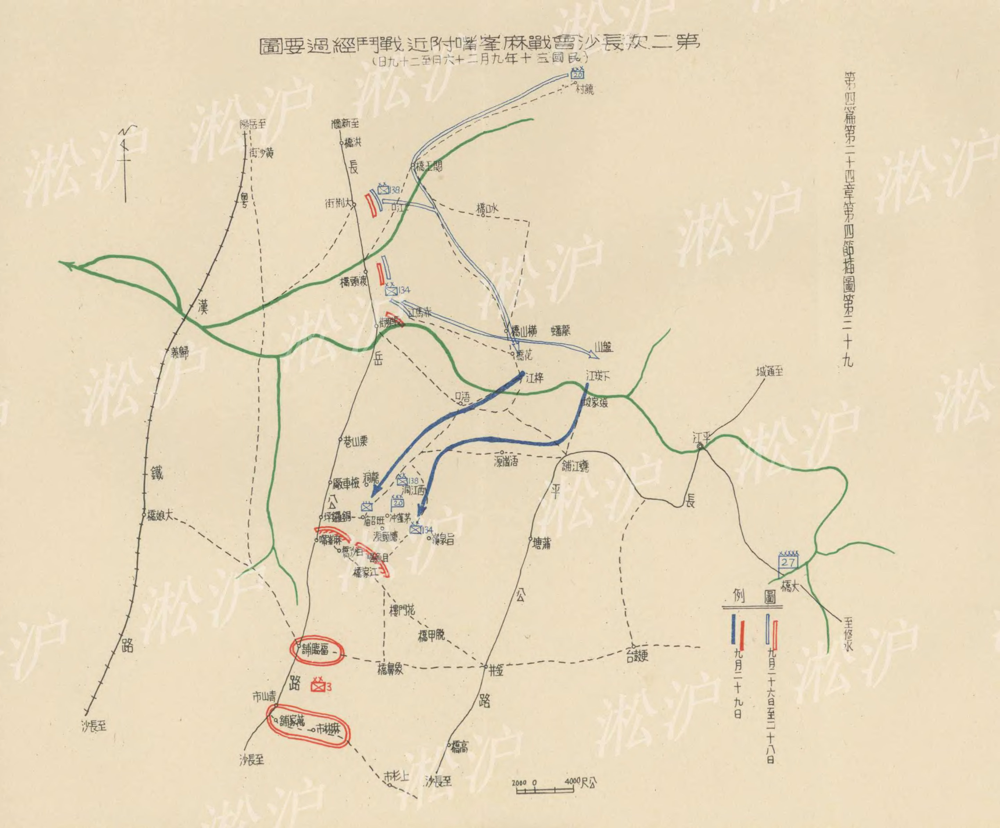

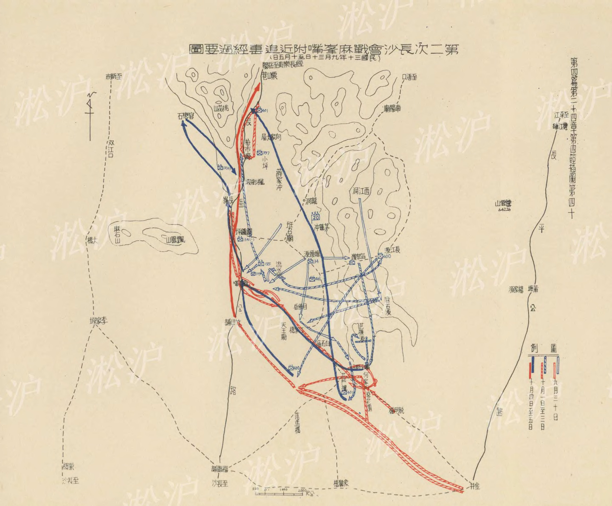

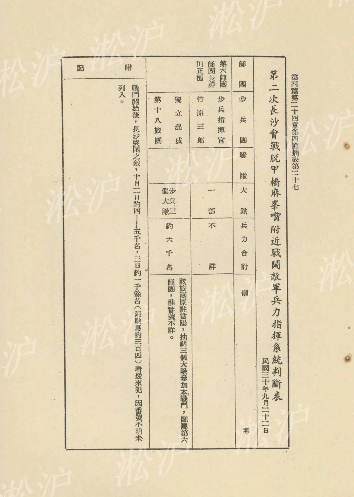

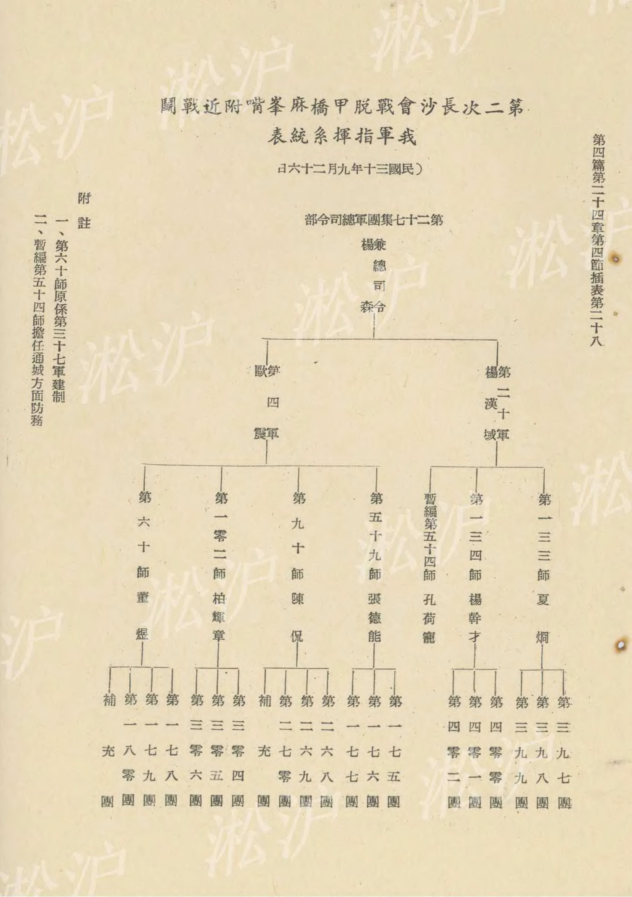

#### 第十款 青山蘆林潭附近之戰鬪

民國三十年九月十八日至十月七日

參照插圖第四十一至第四十四插表第廿九第三十

進攻長沙之敵海軍，於陸軍強渡新牆河之同時，經由洞庭湖南進，我守備湖、江防之第九十九軍第一九七師，卽與敵於青山、蘆林潭附近發生本戰鬥。

##### 第一項 青山、蘆林潭附近地形

青山、嚴家山、爲洞庭湖南端之孤興，北接荷葉湖，西依沈家湖、南傍橫嶺湖、東湖、扼湘江、洞庭之口，其南越橫嶺湖約八千公尺處，有蘆林潭、斗米咀，當湘江東西兩流匯合之口（湘江經渦、河濠河口後，分兩支北流），與湘江東岸之營田鼎足峙立，均爲本戰場之要地。

青山、嚴家山、皆爲標高約一百公尺之高地，其南麓土地肥沃，農民圍堤種稻，漁民結網捕魚，雜處其間數以千計，蘆林潭除產蘆草外，略有樹木，風景宜人，曾設有米捐局，其附近多爲淤泥地，適於工事。

洞庭湖，於夏末秋初，俗稱「八月湖水平」之漲水期間，一片汪洋，諸河漢均可通航，因之蘆林潭以西之錫江口、老龍潭等地，亦爲湘江之門戶矣。

##### 第二項 戰鬥經過

參照插圖第四十一

插表第二十九第三十

敵自九月三日以來，不時以兵艦一、二艘掩護其汽艇數隻或十數隻，向我青山、華豐垸、雙穗垸、增福垸、野貓咀各陣地偵察，十二、十三兩日，其兵艦數艘、汽艇五、六十隻，分向靈官浹、出口塘等地威力搜索，一艦被我砲擊，受創北逸，餘仍停泊陣地前方，十四日，敵艦復駛至石湖包、嚴家山附近，經我擊退，十七日，敵又於漣湖包、野貓咀一帶增兵艦兩艘、汽艦三隻，大有積極登陸之勢。

當時我擔任湖江防守備之部隊，除第四軍之第九十師佔領洞庭湖東岸、新牆河南岸、新牆亘磊石山之線外，我第九十九軍之部署概如左：

一、第九十九師守備湘江東岸、汨羅江南岸、歸義、營田亘湘陰之線。

二、第一九七師守備蘆林潭、廖潭口、沅江亘漢壽一帶湖防。

三、第九十二師集結上沙市、安沙一帶整訓。

四、軍司令部位置於益陽。

第九戰區長官部鑒於敵情緊張，復以洞庭湖水自八月上旬暴漲，湖防部隊原守陣地，除青山、嚴家山、蘆林潭、老龍潭畎田各處與錫江口、劉家灣亘園竹寺一線斷續廢堤，各有一小部尚未淹沒外，其餘如馬鞍圍、丁家灣、公營子、明山、朗山亘廖潭口各點以東，及其以北概成澤國，萬子湖與湘江間聯成一片汪洋，各據點均成波濤萬頃中之各個獨立孤嶼，所有封鎖工事，多被淹沒沖毀，洪流湍急，無法修補，而原佈水雷亦失效用，薛岳長官乃作如左之指導：

一、海軍洞庭區佈雷第二大隊，迅於磊石山以南加緊佈雷，虞公廟應佈雷一百二十具，蘆林潭佈雷九十二、第九十九軍之第一九七師以拒止敵人侵入湘江及洞庭湖南岸地區之目的，應通令各部守兵嚴加戒備，週密搜索。

第一九七師師長萬倚吾於海上師部遵奉薛岳長官指示，根據當時湖水狀況，呈准變更部署如左：

第五八九團（附師戰車防禦砲連（缺兩排）、砲兵第五十一團第十三連之一排、工兵一排）爲洞庭湖南岸守備隊，其第二營守備華豐垸、雙穗垸、康寧垸、福壽垸，第三營守備南金垸、增福垸、有成垸亘兩儀西盛之線，另該營以步兵一連（附重機關槍一排）守備赤山據點，團其餘部隊控制於南大膳附近地區，機動使用。

二、第五九零團（附砲兵第五十一團十三連（缺一排）、師戰車防禦砲連之一排、工兵一排）爲湘江西岸守備隊，其第二營（秩步兵一連與一排、又重機關槍一排、附工兵一排）守備嚴家山、青山爲前進據點，該營餘部扼守蘆林潭、錫江口、劉家灣、園竹寺各點，團主力佔領牛車圍、馬鞍圍、丁家灣、復興圍、公營子、明山、朗山亘廖潭口未被淹沒之各斷續據點，保持重點於湘江方面。

三、第五九一團第一營佔領溝江口、大潭口、沅江、聯山湖之線湖防陣地，其團部及第二營推進至文家冲附近，第三營控制於百祿橋以北地區，機動使用。

四、通信兵連以海上師部爲基點，構成各守備隊青山、赤山各據點，軍部及第九十九師與南縣第五十三軍之第一三零師通信網。

第五八九團於九月十七日佔領華豐垸亘赤山之線，並派第七連佔領赤山據點。

第五九零團佔領嚴家山亘廖潭口之線，其第二營並以第四連佔領錫江口亘老龍潭之線，第六連之一排佔領蘆林潭。

第五九一團亦遵於十七日調整部署完畢。

九月十八日三時

參照插圖

第四十三

，敵兵艦五艘、汽艇五十餘隻，浮游戰車五輛，駛入石湖包附近，當以包圍態勢，一波汽艇二十餘隻，藉探照燈及兵艦砲火掩護，向青山正面猛攻，一波汽艇二十餘隻，繞至東湖及沈家湖分別圍攻青山、巖家山，守備該地之第五九零團第二營（欠第四連及第六連之一排、又重機關槍一排、附工兵一排）奮勇抵抗，敵以包圍無效，復由下青山正面，在浮游戰車掩護下強行登陸，該營仍猛勇衝殺，四時四十分，敵飛機輪番轟炸，六時五十分電線炸毀，各方連絡中斷，該營陷於孤軍抵抗，十一時，洞庭湖南岸方面，敵艦五艘、汽艇二十餘隻，在大塘湖、漉湖包一帶終日游弋，並不時向增福垸、靈官浹砲擊，萬師長鑒於敵軍深入，湘江西岸兵力薄弱，先於五時電令第五九一團第二營，由沅江之白袍湖船運臨泚口附近集結，歸第五九零團團長指揮，該營於十七時到達，是時層奉長官部電令：「上下青山旣爲敵所乘，爾後務確保蘆林潭、錫江口、上下八百弓各要點，阻敵南進，該師後方兵力及砲兵應機動使用，勿失增援時機爲要」，同時奉軍長傅仲芳指示：「一、該師第五九零團應全部推進至蘆林潭、錫江口、上下八百弓、老龍潭之線，固守各該地，二、第五九一團主力應推進至臨泚口附近，三、洞庭湖南岸守備隊南大膳方面，兵力酌予抽調至沅江警備」，萬倚吾師長基於上述指示，處置如左：

一、着步兵指揮官率第五九一團（欠擔任防務之第一營附戰車防禦砲連之一排）開赴臨泚口，並指揮第五九零團。

二、第五九零團扼守蘆林潭、錫江口、園竹寺、老龍潭、公營子、明山、朗山各點，保持重點於湘江西岸附近。

三、第五九一團之第二營，扼守牛車圍、馬鞍圍亘丁家灣各點，第三營第七連（附戰車防禦砲兩門）扼守向家灣，其餘（第八、九連、機關槍連）爲機動部隊，位置於復興圍南堤。

四、第五八九團第一營第二連開赴清江口、大潭口、凌雲塔之線，對萬子湖嚴密警戒，歸第五九一團第一營營長指揮，限十九日十六時前到達。

九月十九日晨，蘆林潭方面，以望遠鏡觀測，見敵仍以兵艦數艘、汽艇數十隻、飛機三架繼續圍攻青山、嚴家山之第五九零團第二營（欠），槍砲聲極密，該師長當飭該團位於老龍潭之第七連之一排，乘民船向青山方面增援，適敵以兵艦一艘、汽艇數隻、向橫嶺湖、西湖搜索，該排到達李家台附近，與敵汽艇四隻遭遇，戰鬥一小時，全排官兵壯烈犧牲，敵軍續進，十五時五十分，敵小型兵艦一艘駛入楊林賽湖，掩護汽艇十餘隻，由慈腸湖向錫江口第五九零團守軍攻擊，敵艦射擊十餘發，錫江口茅房起火，該地守軍以戰車防禦砲猛烈射擊，當毀敵汽艇兩隻，敵七、八十名溺斃，餘艇向橫嶺湖退却，十六時三十分，敵復向畎田攻擊，亦未得逞。二十時，該師層奉薛岳長官電令：「敵艦艇既竄入神湖、楊林賽湖，應將蘆林潭等扼要江口，如楊雀潭、二鈎子、丁家灣、老龍潭至上下八百弓、六百弓、三百弓各湖汊，嚴密封鎖堵截，務將敵艦艇圍捕，勿使逸竄」，同時傅軍長指示：「如兵力不敷，須發動民衆，協力捕捉，並組織襲擊隊襲擊之」，萬倚吾師長奉令後，給予第五九零團命令之要旨如左：

一、該團應星夜將二鈎子、楊林賽湖、錫江口各通湘江湖口，徵集一切材料，嚴密封鎖，其他如六百弓、三百弓、上八百弓各處，雖湖水高漲，亦應排除萬難，設法堵塞，並限二十日拂曉前完成任務。

二、該團應速挑選善游泳而勇敢者組織襲擊隊，分乘民船向青山、嚴家山墻援襲擊。

命令下達後，又奉傅仲芳軍長電令：「該師所守備之蘆林潭、錫江口、園竹寺，老龍潭、畎田各據點，務須固守，勿再疏忽放棄，所擬定馬鞍團、丁家灣、向家灣、公營子、明山、朗山亘龍頭山一帶之抵抗線，應妥爲部署，阻敵南進，爾後非有命令，不得撤退爲要」，萬倚吾師長爲適應戰況，特調整部署如左（參照插圖）

第四十三

一、第五九零團指揮所推進至二鈎子，該團第一營（附戰車防禦砲二門、重機關槍兩挺）固守二鈎子、錫江口之線，第二營殘餘之第四連（附戰車防禦砲一門及重機關槍兩挺）固守園竹寺，第六連之一排仍固守蘆林潭，第三營固守老龍潭、紅廟、畎田、明山、朗山、車州灣及廖潭口之線。

二、第五九一團（欠第一營）之第二營固守牛車圍、馬鞍圍亘丁家灣各據點，第三營之第七連（附戰車防禦砲二門）固守復興圍，該團餘部爲機動部隊，隨團部位置於塞梓廟。

三、第五九一團之第一營（附第五八九團之第一營第二連）仍扼守清江口、大潭口、沅江亘聯山湖各據點。

四、第五八九團（欠第一營之第二連）仍固守洞庭湖南岸地區，並以步兵一連（附重機關槍一排）固守赤山據點。

五、各部隊均限二十日拂曉前部署完畢，嗣後無論敵砲火如何猛烈，非彈盡人亡，絕不得以寸土予敵。各團遵命乘夜部署，並加強堵塞工事，九月二十日晨，第五九零團報告：「二鈎子及楊雀潭北端、錫江口河汊、已遵於十九日夜用民船、樹木、亂石、沙土等物盡量阻塞，惟三百弓、六百弓、上下八百弓等處水淹太深，雖盡諸種手段，無從封鎖」，又步兵指揮官報稱：「八時，敵兵艦一艘、汽艇七隻圍攻畎田，激戰約三十分鐘，被我擊沉汽艇一隻，餘向北逸去」，萬倚吾師長據報後，仍令該團繼續加強阻塞工事，並令第五九一團沅江之第一營，掩護工兵營封鎖清江口各處，並加修廖機八垸及龍頭山各工事，是時，我各伕雷隊續在蘆林潭及臨泚口，並湘陰之扁擔夾等處，共佈雷二百七十二具，十七時，該師接第九十九師駐營田之第二九七團通報：「本部十九日晚派出襲擊青山、嚴家山敵艦艇之襲擊隊，因敵艦艇太多，不能接近，無法增援，被迫退回，」同時據砲兵第五十一團第十三連連長於蘆林潭報稱：「本日十四時以後，不復聞青山、嚴家山方面鎗砲聲，」蓋青山、嚴家山爲湖中孤嶼，敵以多數艦艇及浮游戰車連同兵力約二千名，圍攻三晝夜，據戰後調查，守軍第五九零團之第二營（欠第四連及第六連之一排、重機關槍一排、附工兵一排）不過四百餘人，幾經苦戰，官兵傷亡殆盡，該營劉營長身負重傷，猶忍痛指揮，卒以身殉，該營壯烈犧牲，當地民衆被敵屠殺者，竟達三百餘人之多，敵傷亡亦衆，被我地雷炸死者約一百九十餘名，九月二十日十八時，敵艦一艘，在園竹寺西北湖面竄擾，該師砲兵猛烈還擊，敵艦負傷，滯留湖面，不能行駛，二十一日拂曉，敵由青山駛來兵艦三艘、汽艇數隻救援該艦，激戰二小時，又被該師第五九零團擊沉三隻，其受創之艦亦着火，敵兵紛紛投水，當斃二、三百名，該團齒獲戰車砲兩門，及其他武器軍用品甚夥，十三時許，敵兵艦兩艘、汽艇十餘隻、民船八隻，向蘆林潭、錫江口猛攻，激戰三小時，敵未得逞，乃以汽艇十餘隻繞至斗米嘴附近，一部攻擊錫江口，主力圍攻蘆林潭，十八時許，蘆林潭守軍（第五九零團第二營第六連之一排）犧牲殆盡，遂告失守，該師長據報後，當作如左之處置：

一、着第五九零團團長率步兵兩連、重機槍一連乘夜反攻，務於二十二日拂曉前奪回蘆林潭，並驅逐斗米嘴附近之敵。

二、電請軍部令第九十九師砲兵，星夜佔領神山嘴陣地，向蘆林潭之敵射擊，支援第五九零團之反攻。三、洞庭湖南岸守備隊第五八九團，抽兵一連星夜佔領花馬山、心田垸各據點，並與廖潭口第五九零團之守兵切取連絡，阻敵竄擾沅江，該團另抽第一營第一連、機關槍連及第二連之一排，限二十二日黃昏前到達臨沘口待命。

此時，傅仲芳軍長判斷當面之敵，有打通湘江會攻長沙之企圖，遂決心反攻蘆林潭，固守斗米嘴、錫江口、老龍潭亘廖潭口之線，乃爲如左之處置：

一、第一九七師派有力部隊乘夜反攻蘆林潭。

二、電請位於常澧之第七十九軍第九十八師，速以一團趕赴喬口，其戰車防禦砲連星夜開赴臨沘口，歸第一九七師師長指揮。

三、軍工兵營由益陽趕赴茈湖口，增強沅江防守。

四、第九十九師協力第一九七師反攻蘆林潭，確保湘陰、營田，務於二十二日拂曉，以猛烈砲火制壓蘆林潭附近敵砲兵，並封鎖該處東南湘江江面，迅派得力部隊，搜索虞公廟、烏龍嘴之線，及其以西白泥湖、湘江間地區有無敵艦艇活動。

是日，歸戰區直轄之海軍洞庭區佈雷第二大隊，仍繼續佈雷。

九月二十二日零時二十分，第一九七師第五九零團團長率第一營之第一、第三兩連及重機關槍一連夜襲斗米嘴附近及蘆林潭之敵，於猛烈敵砲火之下強行登陸，激戰至曉，將蘆林潭奪回，未幾，敵飛機三架，協同兵艦五艘、汽艇三十餘隻，反復爭奪，均被擊退，敵火益烈，陣地工事盡毀，十六時，敵一部由斗米嘴東北端登陸，向該團第一連攻擊，主力仍向攻佔蘆林潭之第三連（附機關槍一排）猛攻，該連彈盡無援，全數犧牲，蘆林潭復陷敵手。時增援該師之軍砲兵第三連到達，該師長乃飭第五九一團第二營增援，第五九零團之第一連先擊滅斗米嘴之敵，再協力錫江口部隊反攻蘆林潭，並令軍砲兵營第三連（缺一排）推進至二鈎子，協同攻擊斗米嘴之敵，更將師戰鬥指揮所推進至塞梓廟，是日，我佈雷隊復於湘陰各河汊冒險佈雷，當任務達成後，續向沅江方面佈雷，再陷蘆林潭之敵，以步砲兵數百名，分乘汽艇二十餘隻（每隻載有小鋼砲及輕重機關槍），於黃昏後，一部向錫江口、園竹寺等處進攻，主力仍向斗米嘴攻擊，二十三日拂曉前，第五九一團第二營到達斗米嘴，士氣旺盛，反復衝殺，敵傷亡枕籍，退至斗米嘴東北端頑抗，同時軍砲兵於二鈎子佔領陣地，當擊毀敵汽艇二隻，敵軍悉數溺斃，拂曉後，敵以飛機及橫嶺湖東敵艦上砲火制壓該師砲兵，該營無法前進，稍向後移，轉取守勢，十六時三十分，敵後續汽艇四、五十隻，分向老龍潭、園竹寺兩處進攻，均未得逞。十七時，第五八九團第一營營長遵率第一連、第二連之一排及機關槍連到達臨沘口，同時該師並奉軍長傅仲芳電話命令：「增援之軍補充第一團第二營及第三十七軍補充團之一營，獨立工兵第六營，均歸該師長指揮」，萬倚吾師長奉命後，當作如左之處置：

一、第五八九團第一營及軍補充第一團第二營，均歸第五九一團團長指揮，乘夜佔領馬鞍圍亘丁家灣之第二線陣地。

二、第三十七軍補充團之一營爲機動部隊，控制於南岸嘴。

三、師工兵營由塞梓廟開赴臨泚口待命。

四、獨立工兵第六營第一連構築錫江口封鎖線各線工程，均須於本（二十三）日夜完成。

此時，戰區長官部原擬撥歸該軍指揮之第九十八師第二九四團到達喬口，旋因長沙空虛，奉命開赴岳麓山歸建，海軍第二佈雷大隊正在喬口、白馬寺、茲湖口等處佈雷，計一百九十具，我航空委員會爲打擊敵軍振奮友軍士氣，派第一大隊大隊長顧兆祥率SB飛機八架（旋因故障及誤航僅一架隨第二大隊行動），於是日十一時十五分，由重慶白市驛起飛，第二大隊副大隊長姜獻祥率領BS飛機九架，在第一大隊後跟進，十三時三十六分，我飛機十架對蝟集荷葉湖中之敵艦艇瞄準轟炸，當發現敵艦四散逃逸，上、中青山數處起火，十六時，該機等安返白市驛機場。

九月二十四日，第一九七師湘江西岸兵力增強後，二時，卽以位於二鈎子之野砲，掩護第五九零團之一部及第五九一團第二營（附第三營之第八連）分向蘆林潭、斗米嘴之敵反攻，當毀敵砲一門，並擊沉滿載敵兵之民船一隻，第五九一團第二營突破敵之一部後，將敵壓迫於斗米嘴東北隅，蘆林潭之敵，經第五九零團之猛攻後，亦呈動搖，適敵橫嶺湖之援軍到達，敵空軍亦輪番轟炸，該師以傷亡過重，第五九零團攻擊部隊退守錫江口原防，第五九一團第二營（附第三營第八連）仍與敵對峙於黃泥湖以北地區。十四時，敵復以兵艦四艘、汽艇二十餘隻，分向出口塘、三港子前進，經該師守備南大膳之第五八九團，以戰車防禦砲猛擊，敵艇一隻受傷北遁，餘仍與該團對峙，萬倚吾師長鑒於第五九零團之第一、第二兩營及第五九一團之第二營苦戰一週，傷亡重大，且防地遼闊，湖水高漲，任何方面敵艦均可活動，實感兵力不足，乃電請增援傅軍長轉請長官部，並電復：希堅忍固守待援，並將次要地區之兵力，酌予抽調使用」。十八時，該師復層奉蔣委員長漾申電令：「此次長沙會戰，關係國家民族至鉅，所有參戰官兵，均應抱定成功成仁之決心，發揚至忠至勇之精神，協同一致，確保長沙，奮勇立功者當予重賞，其作戰不力貽誤戎機者，決從嚴懲辦」，萬倚吾師長乃遵上級意旨，當作如左之處置：

一、沅江第五九一團第一營第二連（欠一排、附重機關槍一排）於二十五日十二時以前開赴臨洮口待命。

二、工兵營迅速征集木料，封鎖臨洮口及湘江。

三、請佈雷隊繼續佈雷。

四、獨立工兵第六營之第一連擔任渦河河汊之封鎖，第二連擔任濠河及湘陰附近河汊之封鎖，均限於二十五日完成。

九月二十五日一時，萬師復令第五九一團第二營及第五九零團各以一部分向斗米嘴及蘆林潭之敵奇襲，斃敵甚多，十二時，敵於斗米嘴增砲兩門，與蘆林潭原有之砲兩門，掩護其步兵五百餘名，向斗米嘴第五九一團第二營陣地猛攻，十四時，更以飛機三架向斗米嘴、錫江口陣地轟炸，同時南大膳、老龍潭、畎田各處有敵艦掩護汽艇進攻，均未得逞，十七時，第九十八師戰車防禦砲連到達臨洮口，傅仲芳軍長飭防守沅江之野砲一門卽夜增援臨洮口，萬倚吾師長爲適應戰況，調整部署如左（第四十四）：

一、第五九零團團長爲右地區第一線部隊長，指揮該團現有部隊及第五九一團第二營、第二連、第八連及迫擊砲一排、戰車防禦砲四門、砲兵第五十一團第十三連戰車防禦砲二門，擔任鶴龍湖以北、斗米嘴一帶地區及錫江口、劉家灣、園竹寺、老龍潭、公管子、畎田、明山、朗山、廖潭口等據點之守備。

二、第五九一團團長爲右地區第二線部隊長，指揮該團第三營（欠第八連）及第五八九團第一營（欠第三連），軍補充第一團第二營、第三十七軍補充團之一營及第九十八師戰車防禦砲一連，擔任牛車圍、馬鞍圍亘丁家灣、向家灣、高家灣一帶地區之守備。

三、派步兵指揮官爲右地區隊指揮官，指揮右地區第一、第二兩線部隊之作戰。

四、副師長指揮第五八九團（欠第一營——欠第三連）附戰車防禦砲四門及第五九一團第一營（欠第二連及機關槍一排），師特務連與地方團隊爲左地區隊，擔任南大膳亘沅江一帶地區之守備。

五、兩地區隊之戰鬥地境，爲甘溪港、清江口、龍尖山、廖潭口（不含），心田垸、東安垸、大塘湖、東老湖之線，線上屬左：

六、軍野砲兵連（七、五砲二門）在楊雀潭佔領陣地，直接協同斗米嘴、錫江口之戰鬥。

兩地區隊遵令於當日夜調整部署完畢。

九月二十六日拂曉前，敵以汽艇十餘隻向錫江口、廖潭口、譚家灣、園竹寺等處攻擊，戰至拂曉，蘆林潭之敵，復乘朝霧，以汽艇六隻向斗米嘴陣地猛攻，另汽艇三隻繞向向家灣襲擊，主力汽艇十餘隻駛向譚家灣，均被擊退，並於譚家灣附近擊沉敵艇兩隻，九時許，敵復由青山分派艦艇向譚家灣及蘆林潭方面增援，是時，第三十七軍軍司令部及其補充第一團全部到達喬口，萬倚吾師長奉傅仲芳軍長指示：「一、軍屬補充團以三個連推進至臨洮口，第三十七軍補充第一團（欠一營）推進至東港，其先遣營仍控置臨洮口附近，均歸第一九七師師長指揮。二、第九十九師原守湘陰之第二九五團第一營，派兵一連（附迫擊砲兩門）由馬龍嘴經許家台至湘江以東、夾河以西地區，協力第一九七師部隊，對江夾擊斗米嘴之敵」，繼又奉宥辰堅電：「此次日寇南犯，該師官兵忠勇奮發，屢挫敵鋒，除陣亡將士另請撫卹外，特先搞賞二千五百元，以示慰勉，仍希遵照層峯迭電意旨，發揚旣得之光榮。」該師官兵聞電，精神益加振奮。

九月二十七日晨，斗米嘴之敵一部（附小砲），向守備老鼠夾第五九一團第八連攻擊，戰鬥二小時，退返原處，十三時許，敵由蘆林潭以汽艇二隻載兵數十名向斗米嘴增援，亦被第五九一團第二營擊退，嗣虞公廟江面駛來大小敵艦十餘隻，向我右地區隊射擊，其掃雷隊更在塞港附近江面掃雷，敵我砲戰約一小時，敵卽退去。十六時，敵艇五隻，復由橫嶺湖南駛，被該師位於楊雀潭之野砲擊沉一隻，另有小型敵艦一艘進至陳雅湖，掩護汽艇四隻，向老龍潭、畎田、心田垸、大成垸、花馬山縱橫游弋，探測水位，萬倚吾師長基於以上狀況，電請將海軍洞庭區佈雷第二大隊歸其指揮，迅速於神童垸、馬腸湖、楊柳湖佈設水雷，並飭工兵營迅速完成臨洮口附近湘江及資水各封鎖工程，以免敵由洞庭湖西部竄入。二十八日一時許，斗米嘴東端之敵，續向老鼠夾攻擊，並向二鈎子砲擊，發射燒夷彈數十發，兼放催淚及噴嚏性毒氣，該地官兵沉着固守，戰鬥至曉，先於二十七日晚在陳雅湖探測水位之敵艦艇，是時續向老龍潭、心田垸、花馬山各處偵察，萬倚吾師長判斷當面之敵，企圖打通湘江，乃一面令調守備沅江之第五九一團第一營（欠）星夜開臨洮口待命，一面令飭到達臨洮口之砲兵第五十四團第二營之第六、第七兩連，歸軍屬補充團團長指揮，在南岸嘴一帶佔領陣地，阻敵南犯，此時敵掃雷艇一隻，在營田觸我水雷沉沒、我佈雷隊已於湘、沅兩江新佈水雷九百餘具，連前所佈約四千具。

九月二十九日晨，斗米嘴東端之敵，及蘆林潭東北江面敵艦艇十餘隻，續向斗米嘴第五九一團第二營猛攻，並施放毒氣，該營官兵傷亡五十餘名，幸砲兵支援，十二時，敵勢漸挫，而第五九一團第一營由沅江調抵臨洮口，萬師長以斗米嘴爲湘江咽喉，非確實保有，不足鞏固江防，乃下達反攻命令，其要旨如左：

一、第五九零團派有力部隊協力該團指揮之第五九一團第二營，迅速反攻斗米嘴東北端之敵，另派一部與該團預備隊協力攻擊蘆林潭，該團所有步兵重火器及配屬該團之戰車防禦砲、迫擊砲，應集中使用不惜任何犧牲，務將各該點克復。

二、野砲連先以殲滅火力，制壓敵兵艦及斗米嘴蘆林潭敵之砲兵，爾後直接協同第一線部隊之反攻。

三、第五九一團第一營（欠一連）推進至二鈎子爲預備隊，暫歸第五九零團團長指揮。

右地區第一線部隊，於十六時三十分開始攻擊，猛勇衝殺，敵傷亡甚多，十九時三十分，第五九一團第二營將斗米嘴完全佔領，二十時十五分，第五九零團一部及配屬該團之第五九一團第一營第一連復將蘆林潭克復，擊沉敵大、小汽艇各一隻，被擊斃及溺死者七、八十名，囪獲文件及軍用品甚多，殘敵分登艦艇退却，發現有海軍陸戰隊第九混成大隊及獨立工兵片村部隊與安遠部等番號。

九月三十日八時許，敵艇四隻復由虞公廟湖面來擾，經蘆林潭、斗米嘴守軍阻擊，向北遁去，十五時，萬倚吾師長層奉蔣委員長艷令一元電令：「該軍應竭力阻止敵人打通湘江之企圖，如作戰不力，當依軍法嚴辦，完成任務即予重獎。」當卽轉令各部知照，此後，敵據有長沙之企圖被我粉碎，每日僅以飛機偵察或掃射轟炸，十月二日，敵機一架被該師擊落於橫嶺湖，並囪獲極機密地圖及信號槍等件，四日十二時許，敵爲掩護其大軍撤退，又向蘆林潭陣地攻擊，第五九一團第一連少尉排長陳煥章陣亡，嗣該師爲尾擊敗退之敵，第五九一團於七日十一時將嚴家山、青山完全收復，殘敵北退後，乃將該地我陣亡官兵及被害民衆之屍體數百具從事掩埋，據囪獲敵方文件，證實該師當面之敵，爲平野支隊及海軍陸戰隊共約三千餘人。

總計此戰，敵方參戰部隊有平野支隊，海軍陸戰隊及陸戰隊混成第九大隊與獨立工兵片村部隊、安達部隊，合計約三千名以上，我方參戰兵力，連洞庭湖南岸守備隊及沅江防守部隊，計第一九七師、第九十九軍補充團、工兵營、砲兵連、第三十七軍補充團、獨立工兵第六營、砲兵第五十一團第十三連、砲兵第五十四團兩個連，合計官兵九千八百四十六員名，敵傷亡近千，我負傷官佐四員，士兵一百八十九名，陣亡營長以下官佐二十四員，士兵八百八十三名，擊毀敵飛機一架、砲艦一艘、汽艇十二隻及囪獲甚多。

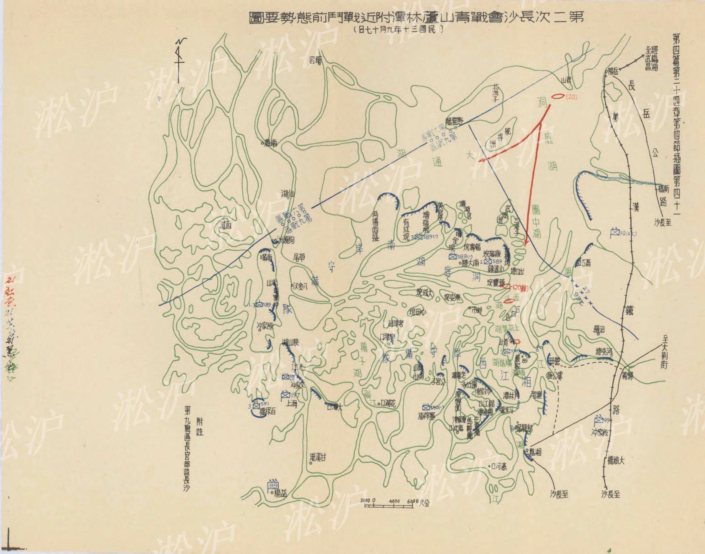

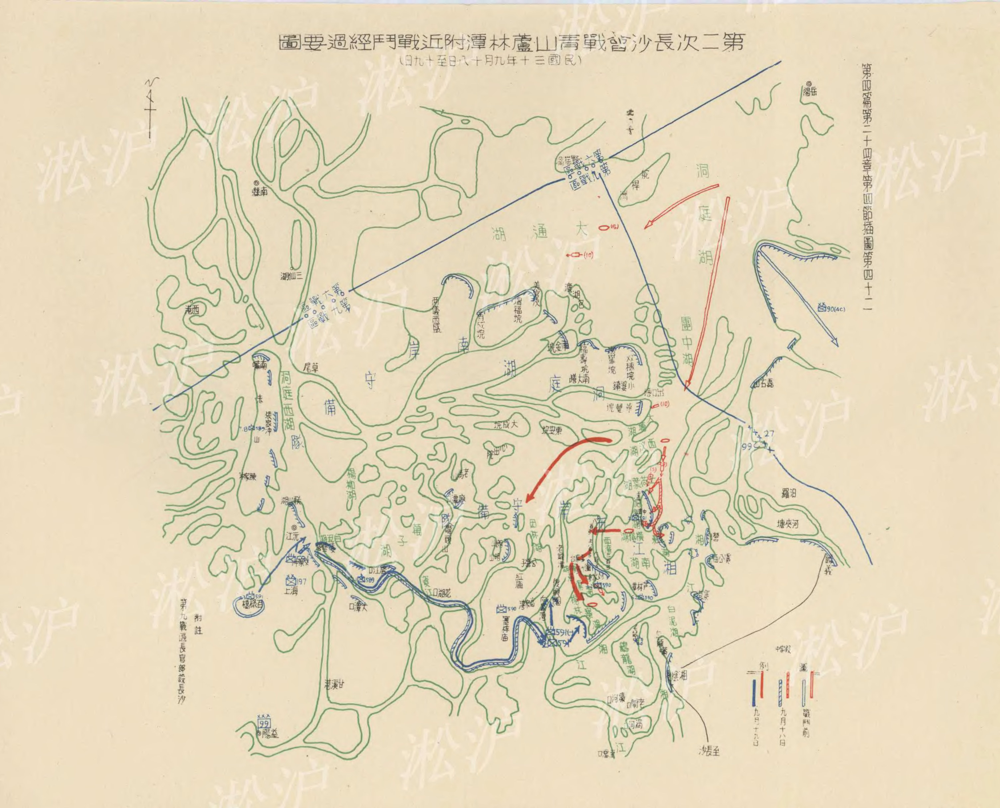

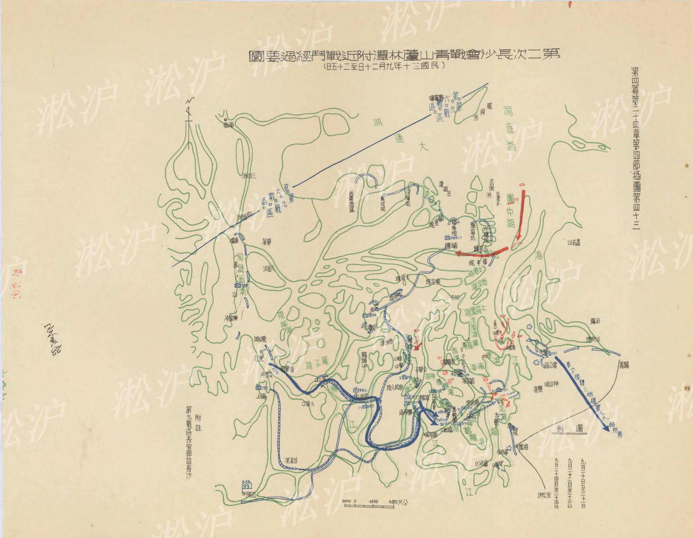

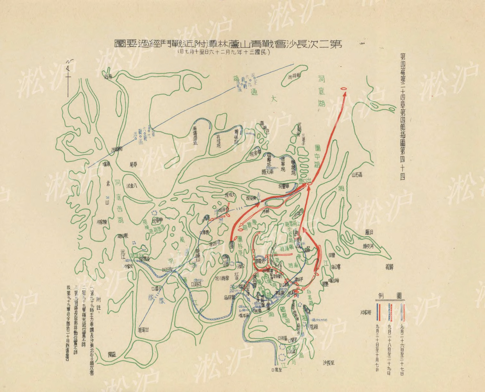

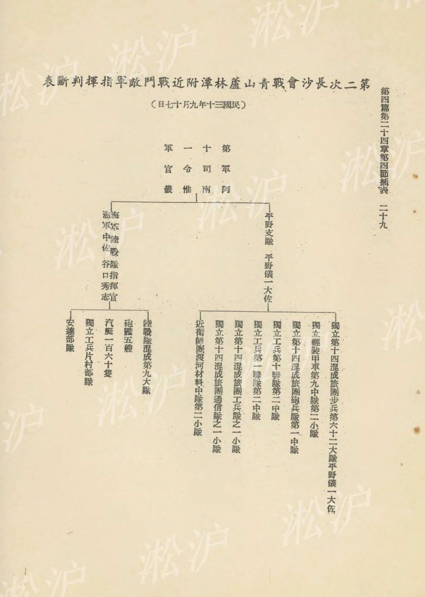

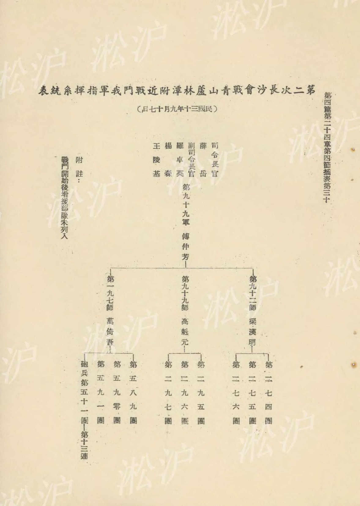

#### 第十一款 武寧附近戰鬥

民國三十年九月二十九日

至十月四日

參照插圖第四十五至第四十七插表第卅一、第卅二

民國三十年九月廿一日，我守備贛北武寧第七十八軍之新編第十六師（欠守備武寧之第四十八團、附新編第十三師之第三十九團）調赴湘北，參加平江以南瀏渭河北岸戰鬥後，原踞瑞昌、德安附近之敵第十四獨立混成旅團（欠第六十二並野儀一大隊），遂乘機於二十五日向新編第十三師（欠第三十九團、附第四十八團）武寧附近之陣地進攻，而發生本戰鬥。

##### 第一項 武寧附近之地形

武寧、箬溪，位於修河上、下游，相距約二十四公里、杜家山、龍背山、西山、董家坑、武安寨、白龍山、羅盤山、棺材山、望人腦、南山、大馬山、分列修河南北，故兩地間自成一東西狹長之丘陵地帶。

修河河幅約百公尺左右，漲水期內小汽船可通達武寧附近，落水時五噸民船終年航行，因之徒涉甚感困難。

地區交通，有公路東至永修，西至修水，東北經王家舖至瑞昌，北經新溪源至陽新及通山、故武寧、箬溪均爲贛北重鎮，亦爲軍事上之要地。

##### 第二項 戰鬥經過

原據箬溪、王家舖附近之敵獨立混成第十四旅團之第六十五大隊（附僞軍熊應周部三百餘人）約二百人，附砲二門，於九月二十五日四時，由箬溪分向津口、烟花嶺、波田河第七十八軍之新編第十三師警戒陣地進攻，當時我軍之部署如左：

一、第七十八軍（欠湘北參戰之新編第十六師）：

新編第十三師：欠配屬新編第十六師之第三十九團、附新編第十六師守備武寧之第四十八團。

第三十八團守備武寧縣以東、修河南岸楊梅壠亘老塔下之線，並於申民司、黃沙嶺之線佔領警戒陣地。

配屬指揮之新編第十六師第四十八團，守備修河北岸觀音閣、火燒白、方家山之線，並於波田河、太平鄉、何家邊亘南山之線佔領警戒陣地。

第三十七團之第二營守備新溪源，主力集結於建富附近，師部位置於甫田橋。

軍司令部位僭於長樂塅。

二、湘鄂贛邊區挺進軍之第三縱隊，原位於南茶（修水縣北）附近地區，奉令以一部對小坳以北敵軍各據點，主力向瑞昌城進擾，並隨時襲擊敵軍，指揮部位於南茶。

三、第三十集團軍總司令部設修水新城。

第七十八軍軍長夏首勳曾對新編第十三師作如左之指示：

一、新編第十三師（欠工兵營及第三十九團、附新編第十六師之第四十八團）應令所屬第一線部隊嚴陣以待，敵如進攻，應於陣地前予以擊潰之。

二、新編第十三師工兵營應澈底破壞太原洞以北邱田埠至沙洲甸之道路。

三、已協調挺進軍第三縱隊，請其向南側擊西進之敵，應與其切取連繫。

九月二十六日三時二十分

參照插圖

第四十六

，波田河、津口之敵，增加近三百名（附砲二門），在砲火掩護下，兩次強渡波田河，均被配屬指揮之第四十八團之第八連（警戒部隊）擊退，嗣敵砲火猛烈，該連乃轉進至何家邊北側高地，與該地警戒之第三連互爲策應。十時，敵除正面攻擊何家邊外，並另以一部（約七、八十名）經望入腦由左翼來襲，該警戒部隊腹背受敵，第八連被敵遮斷，轉入敵後游擊，第三連移至盤龍港以南，未幾，敵以包圍態勢，另以步兵兩股（各約七、八十名）繞道南山北端，分由雙嬌山、大首坑各附近，向第四十八團方家山陣地左側背猛撲，唐郇伯師長爲保持左側背之安全，當卽調整部署如左：

一、第三十八團仍以主力佔領楊梅壠亘老塔下之線，其第三營（欠兩連）由南市渡河，歸第四十八團團長指揮。

二、第四十八團（附第三十八團之第三營—欠兩連）主力佔領修河北岸、牛奶窩、二三三四高地及劉家山之主陣地，一部佔領觀音閣、火燒白、方家山爲警戒陣地，其第三連仍佔領盤龍港、大併山任警戒。

三、第三十七團（欠第二營）於二十七日拂曉由建富推進至龍鬚洞、吞家窪以南地區集結，其留置新溪源之第二營，應派兵一部進出於大馬坑以南，準備側擊敵人。

九月二十七日八時，敵軍約四百餘，向觀音閣、火燒白、方家山、配屬該師之第四十八團警戒陣地猛攻，十二時，敵續增四、五百反復爭奪，苦戰終日，該團守軍傷亡甚重，第二連排長段鵬程、張子敬陣亡，薄暮，敵復集中砲火，並施毒氣，觀音閣、方家山失陷，火燒白復被敵包圍。唐郇伯師長遂令第四十八團（附第三十八團第三營—欠兩連）之方家山部隊，向劉家山轉移，主力應於武寧城郊亘牛奶窩附近、二三三四高地及其以北之山地竭力抵抗。並令第三十七團第二營以一連位置於限泥田，一連位置於水尾嶺、長蚌附近，警戒師之左側，其餘集結於伊山壩待命。此時該師層奉第三十集團軍兼總司令王陵基電令：「我戰區主力軍，正與敵在金井、高橋、福臨舖一帶激戰，本集團軍在現陣地警備各部，對當面少數進攻之敵，務予痛擊而殲滅之，勿使深入，倘有隨意放棄陣地，影響全戰局者，當予嚴辦。」唐郇伯師長當卽轉令各團遵照。

九月二十八日六時四十分，敵乘濃霧分三路西進，九時，一部約二百餘名，沿觀音閣公路兩側，一部百餘名沿施家塅，一部約三百名沿方家山北側地區，同時進攻，數度猛衝，經第四十八團奮勇抵抗，修河南岸之第三十八團以迫擊砲四門、重機槍四挺於東都灘、高塔間、對觀音閣之敵以火力奇襲，敵無法再進，未幾，敵砲還擊，略受損傷。十三時，敵以正面攻擊無效，另以一部約八、九十名竄至大馬坑高地，對該師陣地實行側擊，第四十八團左翼不支後移，敵遂突入劉家山。唐郇伯師長當令第三十七團第一營（欠兩連）佔領關東源陣地，阻敵西進，激戰兩小時，卒將敵擊退，時該師又層奉集團軍兼總司令王陵基電令，務須嚴督所部，將犯敵擊退，不使竄過武寧以西地區，動搖戰局，唐郇伯師長遵卽轉令各團確保現陣地。

九月二十九日三時二十分，敵以主力（七、八百名）沿劉家山向該師左翼進攻，左翼爲第四十八團配備重點，當予反擊，敵勢頓挫，嗣敵又增援三百餘名，轉向牛奶窩以北高地猛撲，反復衝殺達十餘次，十一時，敵復集中砲火射擊，守軍傷亡過重，第四十八團乃以配屬之第三十八團第三營（欠兩連）前往增援，但該陣地仍被敵突破，十三時，敵復以主力向第四十八團二三三四高地攻擊，激戰三小時，敵傷亡甚重，薄暮，敵砲兵推進至劉家山，對武寧城內外守軍猛轟，更由箬溪方面增援約七、八百名，以兩路分向牛奶窩及二三三四高地攻擊，一部約三百名向武寧城猛攻，各地守軍浴血抵抗，城內巷戰更爲慘烈，激戰至二十一小時，第四十八團傷亡過半，武寧城陷，牛奶窩及二三三四高地亦相繼失守。時該師層奉集團軍兼總司令王陵基午時電令：「湘北主力決戰在卽，現成對峙狀態，敵銳氣已挫，該軍當面之敵攻勢雖猛，仍爲一個大隊，後方實無兵增援，務淬礪奮發，確保武寧爲要。」該師卽以第三十七團主力佔領七里山、關東源之線，阻敵深入。

九月三十日一時許，敵繼續西進，激戰三小時，第三十七團關東源、七里山陣地又陷，拂曉，該團等遂向茶皮坳附近轉移，第三十七團第三營佔領茶皮坳以東高地，收容第一線部隊。六時，敵復分途來攻，均經第三十七團擊退，十六時，該師主力先後佔領茶皮坳附近各要點，積極整頓，準備反攻。時該師奉兼總司令王陵基卅酉電令要旨如次：「此次湘北會戰，關係大局，各友軍苦戰旬餘，未喪一城，乃新編第十三師以一師之衆，固守武寧，來攻之敵不過千餘，數日來卽步步後退，實有未合，仰嚴飭所部，迅速整頓，尅日反攻，將敵擊潰，收復武寧。敵自攻佔武寧城後，於十月一日，以一部佔領七里山、新開嶺之線，主力踞守火燒白、方家山、劉家山、及二三三四高地與牛奶窩、武寧城垣等處，其砲兵一部在觀音閣，一部在七里山，與該師茶皮坳高地之第三十七團主力對峙。

先是，在修水縣南茶附近湘鄂贛邊區挺進軍之第三縱隊（第四十七），正向小坳及瑞昌地區進襲之時，箬溪之敵，卽於九月二十六日向武寧進犯，該縱隊旋奉第三十集團軍兼總司令王陵基電令：「該部應派有力之一部，迅速進入瑞昌，加強攻擊破壞，主力向王家舖攻擊，協力第七十八軍擊退西進之敵。」縱隊司令鍾石磬乃命第三支隊之一部，於九月二十七日擊退搶修小坳至雙板橋附近公路之敵，二十八日，該支隊除以一部夜襲烏石街外，主力進搗瑞昌，焚毀敵倉庫，並破壞至烏石街間敵交通通信，二十九日晨，該縱隊以第三支隊向王家舖之敵攻擊，第四支隊經芭蕉向武寧城前進，於三十日佔領武寧城北約十公里之雙嬌山。

十月二日，第七十八軍軍長夏首勳鑒於以上情況，策定反攻武寧城方案，要旨如左參照插圖

第四十八

一、新編第十三師第三十八團之一部，佔領修河南岸南市、老塔下、坳頭坪各點，擔任掩護，主力沿鳳口橋向武寧之敵佯攻，第四十八團全部、第三十七團之大部，沿厚竹尖、天井窩向關東源及七里山附近攻擊，該師工兵營隨卽歸建。

二、請求總司令部，以補充第二團撥歸新編第十三師指揮，推進至蕭家祠附近，爲師預備隊，並請飭挺進軍第三縱隊向王家舖、大橋河、棺材山各處發動攻勢。

三、攻擊開始時，務利用夜暗，以便容易接近。

右方案，於同日十六時經呈奉第三十集團軍兼總司令王陵基同意，令新編第十三師遵照實施。

集團軍總司令部補充第二團亦於是日到達澧溪，向新編第十三師報到。

新編第十三師唐郁伯師長奉令後，鑒於師工兵營歸還建制，集團軍補充第二團業已報到，乃於十月三日十一時下達命令，其要旨如左：

一、師以收復武寧城之目的，於四日拂曉前開始攻擊，重點指向劉家山，將敵壓迫於修河北岸而殲滅之。

二、第三十八團（欠第三、第七連）爲右翼隊，以主力展開於老鴉頸以北高地亘文仲元之線，向觀音閣、武寧城之敵襲擊，相機協力北岸部隊，略取武寧城，以一部挺進至潭埠附近渡河，襲擊敵之側背。

三、第三十七團（欠第二營、附第三十八團之第三、第七連）爲左翼隊，展開於茶皮坳亘王莊、張莊之線、向牛奶窩、二三三四高地、大山下之敵攻擊，進出於觀音閣、火燒白、方家山之線。

四、兩翼隊戰鬥地境，爲修河北岸之線，線上屬左。

五、各隊務於三日十八時到達攻擊準備位置，四日三時開始攻擊。

六、第四十八團編併步兵四個連、機關槍一個連、迫擊砲一排，及補充第二團爲師預備隊，位置於蕭家祠附近。

七、工兵營以主力位置於石羊洞，一部位置於龍水洞、擔任翼側警戒。

八、師指揮所位置於甫田橋。

十月四日三時，兩翼隊開如攻擊，四時十分，左翼第三十七團第三營將七里山、高腦、新開嶺敵之警戒陣地佔領，乘勢猛攻。激戰三小時，至七時三十分，右翼第三十八團之第二營之一部，由南市強渡，進逼武寧城下，左翼第三十七團（欠第二營附第三十八團之第三、第七連）同時向敵猛攻，敵退退守觀音閣、火燒白之線，八時五十分，唐郁伯師長乘機使用預備隊第四十八團第一營（新編併之步兵四連、重機關槍一連、迫擊砲一排），沿大窩山、雙嬌山向何家邊迂迴推進，敵不支，于十二時二十分向箬溪、王家舖原陣地退却，左翼第三十七團進佔觀音閣、火燒白之線，隨卽派隊追擊，十四時進至河口、何家邊、同字坪之線，敵卽以一部約四百餘佔據津口亘望人腦一帶頑抗，該師遂停止追擊。以第三十八團仍守楊梅壠亘老塔下之線，第三十七團主力佔領觀音閣、火燒白、方家山之線，一部佔領牛奶窩、二三三四高地之線，並派一小部佔領波田河警戒陣地，與敵保持接觸，配屬之第四十八團，則集結於關東源附近先行整頓。

湘鄂贛邊區挺進軍第三縱隊奉集團軍兼總司令王陵基二日指示後，遵以第四支隊扼守白羊山、小港、雙嬌山，向東警戒，第三支隊續向大橋河挺進，策應第七十八軍之戰鬥。

本戰鬥至此告一結束，綜計敵軍參戰部隊爲第十四旅團五個大隊，我軍直按參戰部隊爲第七十八軍新編第十三師三個團，我方計損失步兵近兩營，敵亦傷亡甚重。

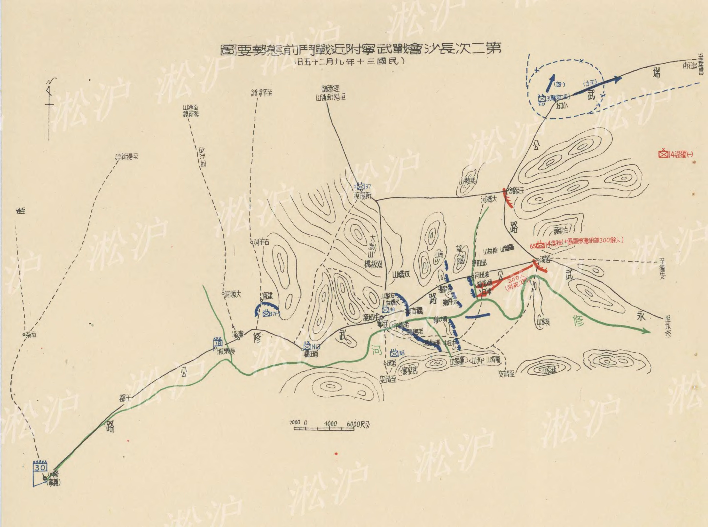

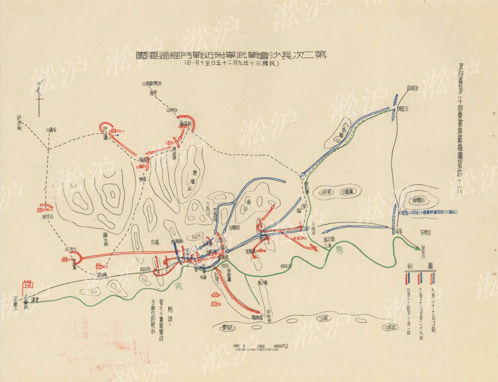

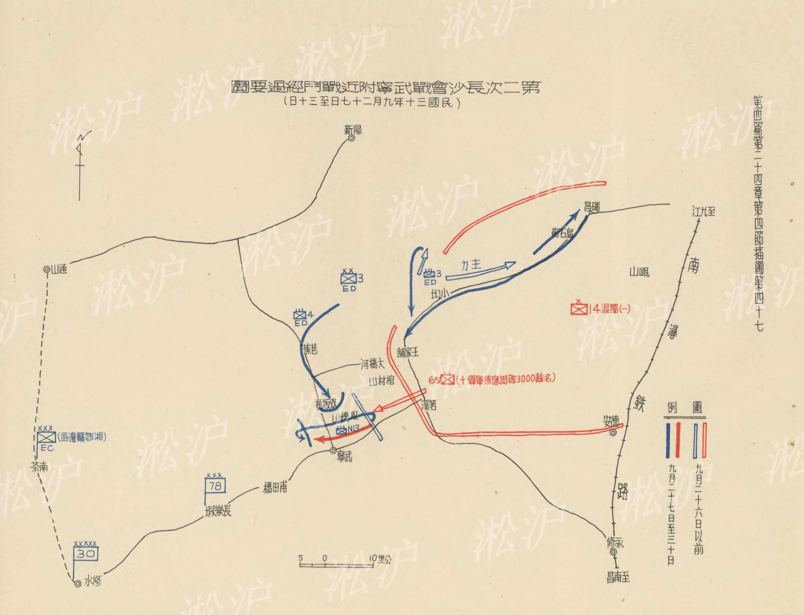

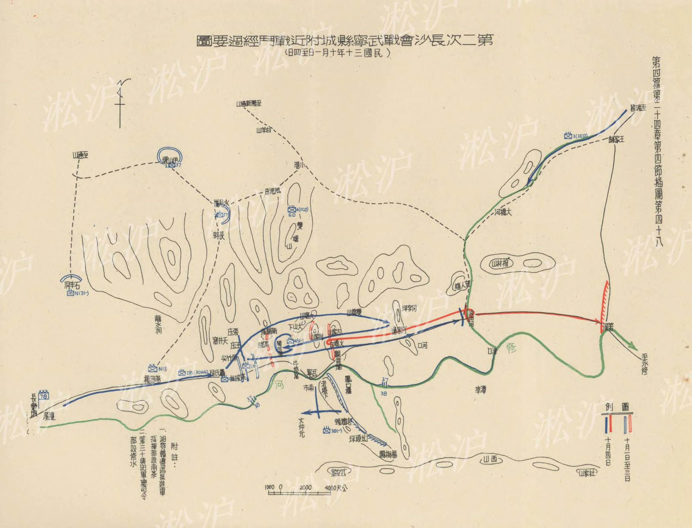

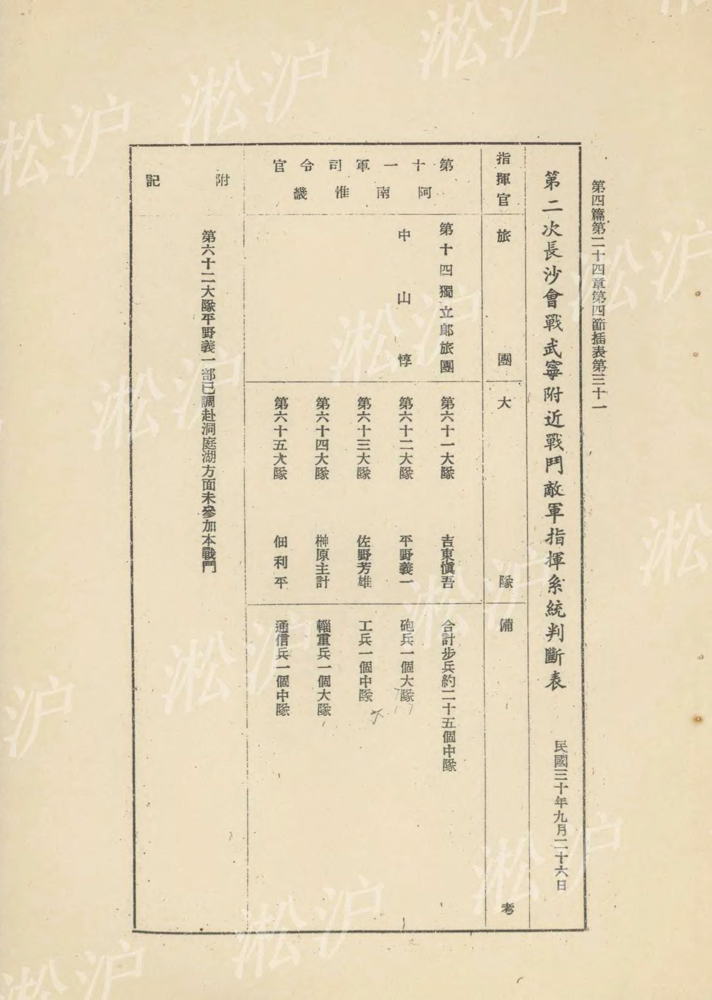

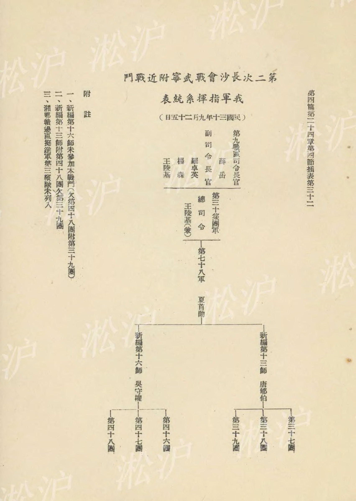

#### 第十二款 咸寧附近之策應作戰

民國三十年九月十一日至十月十五日

參照插圖第四十九至第五十三插表第三十三第三十四當昌水（新牆河上游）北岸緒戰進行之際，第九戰區薛岳司令長官爲阻止敵後續部隊之增援，卽電飭湘鄂贛邊區挺進軍向湖北咸寧附近進行敵後方攻擊，該地區之戰鬥因之以起。

##### 第一項 咸寧附近之地形

幕阜山脈，爲鄂贛之天然區劃，叢山峻嶺，雄峙於通城、崇陽、蒲圻、通山、大冶、修水各縣，一衣帶水，洞庭吐長江折向東北流，南納陸水，匯黃蓋、西良、東、魯湖諸湖，而至武漢。

粤漢鐵路、湘鄂公路、介江湖及幕阜山間，由長沙經蒲圻、汀泗橋、咸寧、賀勝橋等地達武昌，爲敵後方重要交通線。湘鄂公路由賀勝橋東南經大冶陽新，由崇陽經通山至陽新而入江西，爲鄂南、贛北之交通要道。

蒲圻、汀泗橋、咸寧東南方，山巒起伏，利於輕裝部隊之作戰，其方位與我幕阜山正面平行，便於我軍之側擊。

##### 第二項 戰鬥經過

參照插圖第四十九

插表第三十三第三十四

圍攻長沙之敵第十一軍，于九月七日向昌水北岸大雲山我第二十七集團軍第四軍發動攻勢後，其留置鄂南之兵力概如左：

一、第四十師團一部及僞軍成渠，周九如等部，據守通山、陽新、三溪口、大冶、保安、奎牛、高橋、柏墩、賀勝橋、咸寧、汀泗橋等交通要點。

二、第六師團一部據守崇陽、蒲圻及其西南各交通要點。

當時，我軍除第七十二軍一部警戒留嘴橋、界牌、城山間，主力集結三都整訓外，湘鄂贛邊區挺進軍之行動概要如左：

一、第三挺進縱隊之第四支隊擔任江西岷山附近，主力擔任王家舖附近之游擊，縱隊部位於寺下。

二、鄂南指揮部所屬之第四挺進縱隊之第六支隊，第五挺進縱隊之第七支隊，襲擊通山以南敵據點後，九月十日各部位置如左：

(一)第四挺進縱隊之第五支隊擔任大磨山以東石楠橋附近之游擊，第六支隊位於九宮山，該縱隊部設灰塘。

(二)第五挺進縱隊之第八支隊擔任大冶西南三根祠附近之游擊，第七支隊位於藕塘，第二十支隊于傅家山，縱隊部設高湖朱。

(三)第八挺進縱隊（轄第十三、第十四及原屬第五支隊）擔任大冶以西陳貴附近之游擊。

四鄂保安第一區司令部所轄之咸寧自衛第三團，擔任通山以北高草坪附近之游擊，保安第六團集結修水西北蒲口附近。

指揮部位於傅家山。

三、野戰補充第一、第二兩團，於六日協同鄂南指揮部襲擊楠林橋之敵後，撤至城山附近。

四、第六挺進縱隊配屬第五十八軍，擔任蒲圻、崇陽、通城間之敵後游擊，該縱隊部位於通城東南何家坡附近。

五、第七挺進縱隊配屬第四軍作戰，擔任臨岳地區敵後游擊，縱隊部位於昌水南岸之姑橋，挺進軍總指揮部設於修水以北之南茶。

九月十日

參照插圖

，昌水北岸緒戰方酣之際，湘鄂贛邊區挺進軍總指揮李默庵於南茶奉第九戰區薛岳司令長官灰酉電令節開：「第七十二軍限十一日向通山、楠林橋之敵攻擊，湘鄂贛邊區挺進軍第四、第五、第八，三個縱隊限十一日晨開始向咸寧附近之敵攻擊，並阻止其後續部隊之增援。該總指揮部以部隊分散，距離咸寧寫遠，除申復難以如限實施外，當卽轉令鄂南指揮部兼指揮官王勁修，指揮所屬及其他各縱團隊作如下之行動：

一、第八挺進縱隊（欠原屬第五支隊，附咸寧自衛第三團）限十一日開始向咸寧之敵攻擊，並破壞交通通信，阻止敵之增援。

二、第五挺進縱隊（欠第八、第二十支隊）限十一日開始移動，向馬橋之敵攻擊，並破壞咸楠公路。

三、第四挺進縱隊（欠第五支隊）卽向柏墩之敵攻擊，並破壞敵之交通通信，阻敵南援。

四、第三挺進縱隊及第四縱隊之第五支隊、第五縱隊之第八、第二十支隊，第八縱隊之原屬第五支隊，各在原防，向附近之敵攻擊。

五、野戰補充第一、第二兩團，迅速按替界牌至城山間第七十二軍防務，以便友軍積極行動。

王勁修兼指揮官于傅家山奉令後，當卽轉令遵照，並飭蒲口之鄂省保安第六團，向高湖朱推進，第三挺進縱隊司令鍾石磐于寺下奉令後，遵照實施。迨至九月二十五日，箬溪之敵，向武寧進攻，該縱隊卽協力第七十八軍武寧方面之作戰。

兼指揮官王勁修親率第四、第五縱隊部隊，於十二日出發，十四日，第八挺進縱隊取道胡家街，當卽攻擊高橋敵僞王光勳部而佔領之，敵竄雙溝橋，第四、第五縱隊之部隊，同時進抵木林墩附近，十五日完成攻擊準備，王勁修兼指揮官於木林墩督促各部遵照前令，協調總攻。

九月十五日，第八挺進縱隊（欠第五支隊，附咸寧自衛第三團）司令方步舟，以第十四支隊向咸寧附近之敵攻擊，一度衝入官埠橋，焚敵房哨棚多處，並破壞咸寧至官埠橋間鐵路一公里半，電桿八十餘根，其第十三支隊于十六日一時向楊家畈之敵攻擊（有一三十六歲之鄉婦自動替該隊帶路，並却酬謝），激戰至午，敵退據碉堡，該隊焚毀其營房，獲敵國旗一面，並破壞公路四公里，電桿二十餘根，同時僞軍周九如部竄犯高橋，經咸寧自衛第三團於四時截擊之，僞軍陣亡二十餘名，該團獲步槍一十五枝。九月十六日，第五挺進縱隊（欠第八、第二十支隊）司令黃道南，指揮第七支隊向馬橋、上毛坪之敵攻擊，當將敵交通通信破壞。

第四挺進縱隊（欠第五支隊）司令徐樹楠，於十五日，由高槎橋向柏墩之敵攻擊，十六日，將上毛坪、楠林橋間之交通通信破壞，十八日，得知咸楠公路各據點之敵人約數十名不等，埋設地雷，戒備甚嚴，高屋嘴並有砲二門、機槍五挺，其第六支隊卽分向曾家嘴、港下、雷小嶺之敵據點襲擊，計摧毀敵電桿二十餘根，獲電線八百餘公斤。

九月十九日八時，王勁修指揮官層奉第九戰區薛岳司令長官巧申電令節開：「着王兼指揮官親率第四、第五、第八挺進縱隊及該挺進軍總指揮部野戰補充第一、第二兩團，努力攻擊賀勝橋、咸寧、蒲圻一帶之敵，確實切斷賀勝橋、蒲圻間粵漢鐵路及公路之交通，當卽轉令遵照，並對野戰補充第一、第二團下達命令，其要旨如左：

一、進犯湘北之敵，其先頭已於十八日竄抵汨羅江北岸之長樂街附近，有犯長沙企圖。

我右翼第七十二軍，正向通城以西急進，側擊敵人。

二、本挺進軍，除以一部接替界牌、城山間第七十二軍新編第十四師第四十團防務外，主力集中攻擊咸寧，澈底破壞交通通信，阻敵南援。

三、着步兵指揮官魏人鑑，率領野戰補充第一（欠守備界牌、城山間之第一營），第二兩團（配屬無線電一台及工兵技術軍官二員）於二十日由現地出發，經通山以西地區，務於二十二日到達柏墩以東劉家橋、南山但家附近集結，歸鄂南指揮部指揮。

四、黨政總隊應以一大隊推進通崇公路以北地區，發動民衆，協助軍隊作戰。

魏人鑑步兵指揮官於傅家山奉命後，遵率野戰補充第一（欠第一營），第二團向劉家橋、南山但家前進。

第八挺進縱隊（欠原屬第五支隊，附咸寧自衛第三團）司令方步舟奉命後，二十至二十二日，將咸楠公路姑嫂橋、王家橋、黃巨橋、七里沖間橋樑四座，及粵漢鐵路以南張家灣（距橫溝橋三公里）、古橋（官埠橋南二公里）橋樑破壞，並掘毀咸楠公路七公里。

連日來，粵漢鐵路咸寧段敵無南下部隊，王勁修指揮官以奪取汀泗橋車站，切斷交通，阻敵增援湘北之目的，於二十四日作如左之處置：

一、發動民衆，澈底破壞敵之交通通信。

二、第四縱隊（欠第五支隊）集結汀泗橋以南，於黃昏後向汀泗橋之敵圍攻。

三、原配屬第八縱隊之咸寧自衛第三團，策應第四縱隊之戰鬥，向汀泗橋西南鄧家之敵攻擊，並掩護民衆破壞鐵路。

四、第五挺進縱隊（欠第八、第二十支隊）主力位於三大寺西側，掩護我軍左側背之安全，一部向鄧家北側襲敵側背。

五、各部限黃昏後一致開始行動。

命令下達後，各部遵照實施，王勁修兼指揮官親率第四縱隊（欠第五支隊）及咸寧自衛第三團祕密推進至聶家港，向汀泗橋攻擊，激戰四小時，敵不支敗退，二十三時十分，該縱隊之第六支隊隨卽佔領該市，並將車站大部術工物摧毀，咸寧自衛第三團等同時督率民衆，將汀泗橋、亭堂間鐵路一公里半電桿八十餘根破壞，二十五日五時，蒲圻之敵約百餘名，聞警來攻，當向該軍左側猛撲，主力有被包圍之勢。王勁修兼指揮官卽令第四縱隊之第六支隊及咸寧自衛第三團放棄汀泗橋鐵路沿線，于郭家灣、饒家之線佔領陣地，餘部轉移于銅鐵坳、馮家、泉港庵附近地區，此時第八縱隊之第十三支隊已將橫溝橋、施昌間鐵路橋一座，路基二公里破壞。

九月二十六日（參照插圖）

第五十一，魏人鑑步兵指揮官所率之野戰補充第二團到達聶家港，王勁修兼指揮官復令向汀泗橋之敵攻擊，激戰一小時，敵敗退，該團再克汀泗橋街市，並焚毁敵僞之營舍。此時，第四縱隊一部（附爆破官兵十名，攜帶爆破器材）協力補充第二團之攻擊，到達汀泗橋以東，適敵軍車一列由武寧運兵百餘名來援，該部立即隱蔽，爆破手匿於涵洞內祕密裝藥，二十三時點火，計毀路軌二十八根（工兵技術官李堅犧牲工作時路滑跌傷右手，仍於敵前作業，陳潤蓀帶病出發），敵張惶失措，第五縱隊分向汀泗橋車站及張家、雷公橋、官塘驛等處攻擊。三十日，以集束手榴彈炸毁張家鐵路一處，破壞雷公橋、官塘驛間公路一段，電桿十餘根，獲電線數十公斤，第八挺進縱隊之第十三支隊主力，二十六日猛向賀勝橋之敵攻擊，激戰數小時，敵受重創，其第十四支隊於十七時起圍攻咸寧，激戰四小時，一度攻入東門，並將文筆山據點之敵碉堡及熊家灣附近鐵橋一座，馬橋至咸寧間公路橋樑三座，電桿百餘根破壞，獲電線二八零斤。三十日，該縱隊續向咸寧亘賀勝橋段鐵路附近之敵襲擊，咸寧自衛第三團於十月一日晚率同蒲圻縣壯丁約六百名及爆破班，將官塘驛、張家嶺間鐵路澈底破壞三段，同日七時，退據汀泗橋東北高地之敵，向補充第二團反攻，該團爲免損耗，將汀泗橋街市全部焚毁，稍向南移，時王勁修兼指揮官層奉蔣委員長感戍令一元九電令：（王指揮官行動果決，督率所部攻擊敵後，克奏膚功，第四縱隊克復汀泗橋，着傳令嘉獎，仍盼繼續努力，確實破壞敵後交通，使第九戰區主決戰方面作戰成功爲要。當卽轉知所部，官兵奉命莫不振奮，是（一）日晚，進攻長沙之敵，分途退却，王勁修兼指揮官聞訊，當命各縱隊及魏人鑑步兵指揮官分別截擊，二日，第八挺進縱隊仍破壞賀勝橋、官埠橋間鐵路。魏人鑑步兵指揮官率領之補充團，於黃昏以一部向咸寧、古塘角之敵警戒，並佯攻汀泗橋外，主力及咸寧自衛隊澈底夜破壞鐵路二公里半。三日拂曉，約四百名之敵及僞軍民佚數百名，先後由咸寧乘車南下，因蕭家以北路基被我軍破壞，敵卽下車搜索，與各團埋伏蕭家之部隊激戰終日，迄晚始行撤退。

第五縱隊之第七支隊，二日十九時破壞敵黃土嶺、馮家間鐵路及通信，三日拂曉復於亭堂設伏。

第四挺進縱隊之第六支隊，二日晚於古塘角間拔取鐵軌螺釘三十六個，毀電桿三十餘根，獲電線八十餘斤，同時於汀泗橋東北掘空路基二十處，並焚燒路旁堆集之枕木。咸寧自衛第三團（附爆破班）於同日十九時發動民衆，在官塘驛、洪山案間實施破壞，三月二時，該團配屬之爆破班（附掩護隊）進抵官塘驛鐵橋附近，發現敵準備破壞橋樑之藥室，該班立即利用裝藥，當遭敵附近守兵射擊，該班技術軍官李堅犧牲敢沉着，卒將橋磴橋樑澈底炸毀，拂曉後，該團主力仍於鐵路兩側設伏。是時，王勁修兼指揮官層奉第九戰區薛岳司令長官東亥電令節開：「進攻長沙之敵，經我痛擊，傷亡慘重，連日南運彈藥，越我截獲，補給中斷，已於一日晚間開始退却，各軍正行追擊，着王兼指揮官親率第四、第五、第八各挺進縱隊於咸寧蒲圻間截擊退却之敵，務使其不能乘車回竄。當卽轉令遵照。

九月六日

參照插圖

第五十二

十八時，第八挺進縱隊第十三支隊主力分向賀勝橋、王生茂兩處之敵攻擊，激戰三小時，攻入王生茂車站，毀敵碉堡一座。第十四支隊同時攻擊橫溝橋、官埠橋之敵，各炸毀路軌二十餘根，獲電線二百餘斤，該隊共傷亡官兵十名，王勁修兼指揮官爲乘敵第四十師團未回通山、陽新之前，乃於七日令飭高湖朱之鄂保安第六團向大畈鎮、通山攻擊，守備城山附近之野戰補充團第一營向楠林橋、白霓橋之敵襲擊，該營配合黨政總隊一部，發動當地民衆實施破壞，于當日十九時，一度攻入楠林橋敵據點內，炸斃敵兵十餘名，馬十餘匹，仍撤回原防，該營微有傷亡。鄂保安第六團遵令以第一營於同時向通山西南門之敵包圍襲擊，一部攻入西門城內及城北，馬鞍山之敵亦分東西兩面向該營反包圍，該營爲免損耗，乃向後撤。八日二時，該營轉向大畈鎮之敵襲擊，激戰二小時，敵傷亡五名，旋以該據點附近均設有地雷，難以按近，乃撤回橫石潭待命。同日，該兼指揮官王勁修層奉薛岳長官虞已電令：「敗退之敵，已經新牆河向北分竄，戰區爲乘機攻略臨湘、岳陽，着王勁修兼指揮官親率所部，確實切斷咸寧蒲圻間公路交通通信，斷敵歸路，使其不能竄過陸水北岸，並截擊敵之援兵。此時據報武漢葉蓬及周九如等部僞軍約二千名，已抵汀泗橋，且第四、第五挺進縱隊及兩補充團之爆破器材亦已用盡，因之該部再攻蒲圻之計畫難於實施，乃令各部就原態勢向敵截擊。

九月八日，第八挺進縱隊司令方步舟乃以第十三支隊續攻賀勝橋之敵，二十時，敵汽車五十輛滿載傷兵北駛，該隊向之襲擊，當毀汽車三輛，旋敵掩護隊及賀勝橋之敵僞約二百名來援，該隊隨卽後撤。配屬指揮之咸寧自衛第三團之爆破隊，於九日二十三時正破壞咸寧西北之吳主廟附近鐵橋之際，適聞敵火車聲音，該隊卽延長導火索至適當之處監視，旋敵快車一列到達，以點火緩慢，橋雖炸斷，車已通過，該車敵兵反向我軍射擊，該隊隨卽撤退。十月十日，該縱隊位於陳貴附近之原屬第五支隊，爲破壞賀勝橋至保安、大冶公路，於金牛附近與敵護路隊遭遇，激戰三小時，敵向北敗退，十四日十二時，馬橋之敵約二百名，向第十四支隊進攻，該隊當予反擊，敵向高橋竄去，該縱隊卽派第十三支隊予以截擊，激戰二小時，敵分向金牛、楊家畈敗退。

步兵指揮官魏人鑑遵令於八日十九時以補充第一團（欠第一營）一部在崇咸公路兩側設伏，有敵汽車由崇陽駛來，該部當予奇襲，炸毀其一輛後，敵車續至，戰鬥二小時，該隊力薄，隨卽撤退。

第五挺進縱隊司令黃道南遵令自八日晚起，以第七支隊向雷公橋、官塘驛間破壞敵交通通信，頗有收穫，但於十日晚觸敵地雷，列兵兩名受傷。

十月十三日晨，白霓橋、柏墩之敵約四百名（附砲二門，馬六、七十匹），分向該軍左側背進攻，十四日抵鳴水泉、洋泉畈之線。王勁修兼指揮官爲免敵之包圍，於十九時，將主力轉移敵之外翼，以一部於花噴泉、土賽嶺、七里沖附近設伏，一部於泉洪嶺、月宮山附近準備截擊，二十時，洋泉畈之敵犯土賽嶺，越該地伏兵襲擊，復竄七里沖，又被該地部隊截擊，敵乃經周家畈向咸寧退去，該指揮部各部經一月餘之戰鬥，頗形疲憊，第二次長沙會戰已經結束。王勁修兼指揮官仍率所部囘至高湖朱整訓，其一般經過如插圖第五十三，綜計此次作戰，敵傷亡官兵四十餘名，馬一十五匹，我傷亡官兵十二名，函獲敵國旗一面，步槍十五枝，電線約一千六百公斤，摧毀敵汽車四輛，營房多間，碉堡二個，電桿約四百二十根，破壞鐵公路約二十公里，樑橋十三座，路軌五十餘根及術工物等。

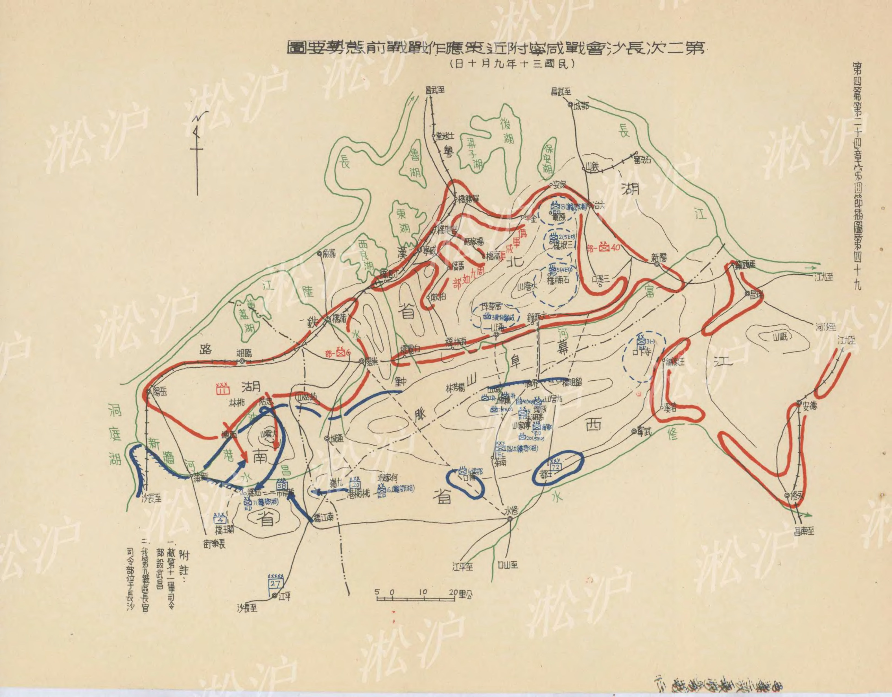

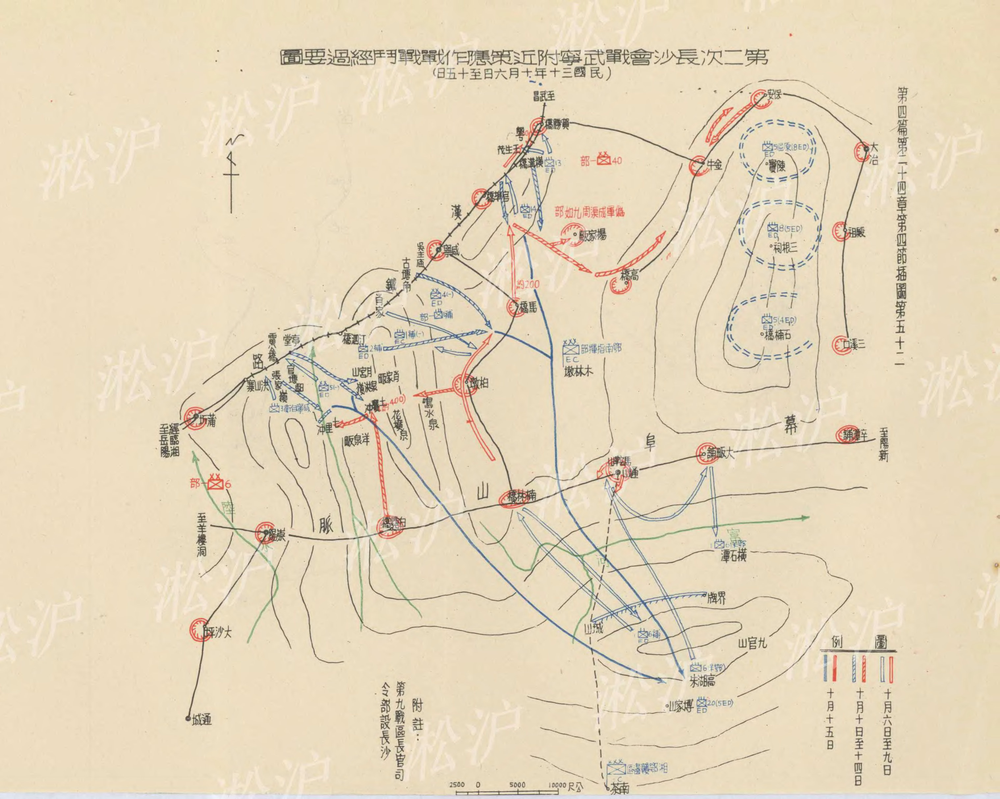

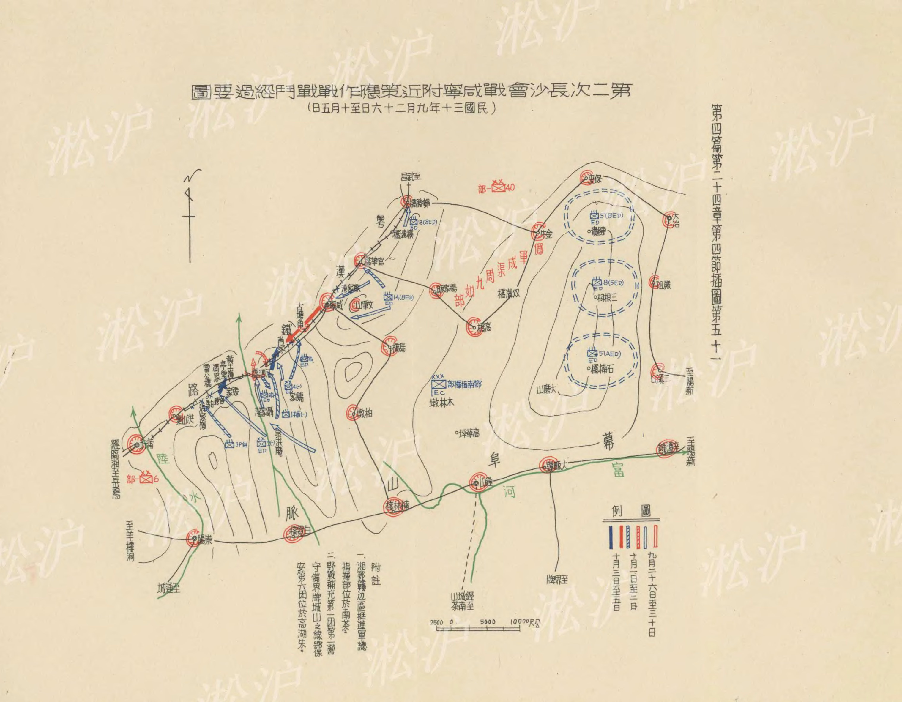

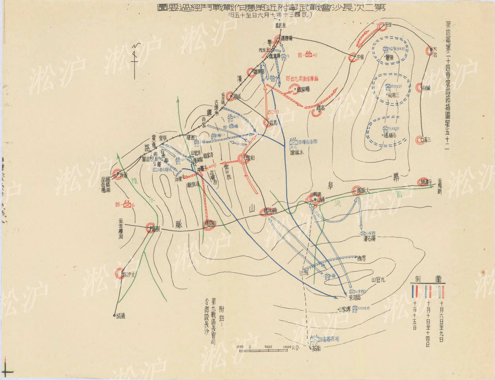

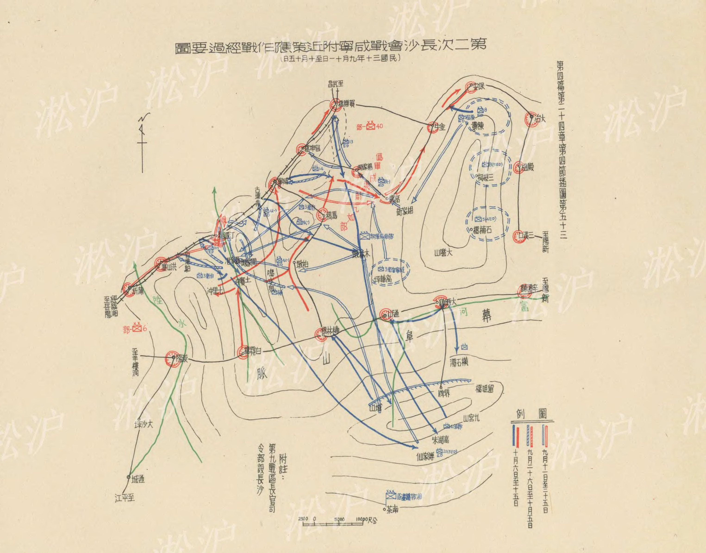

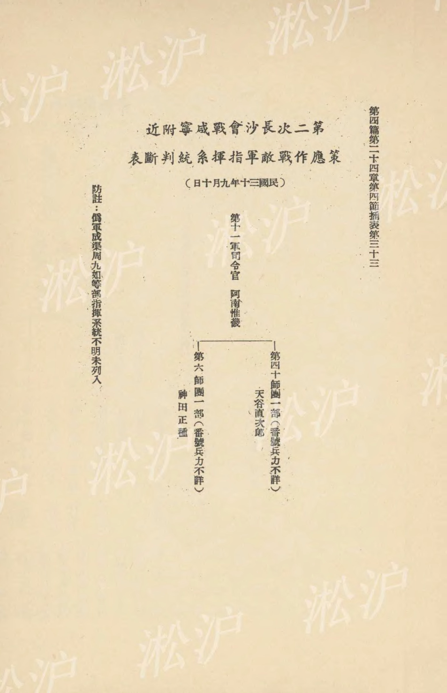

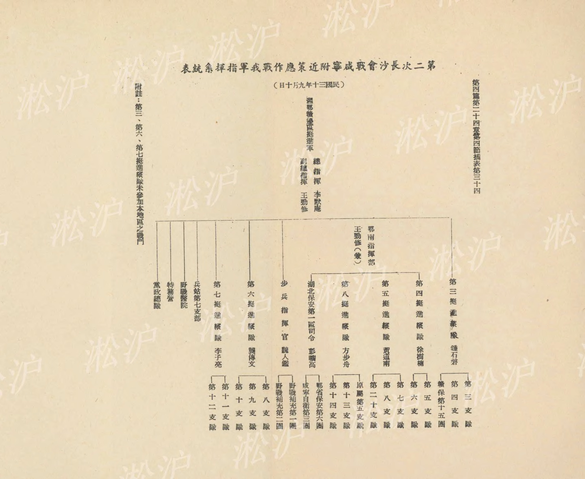
