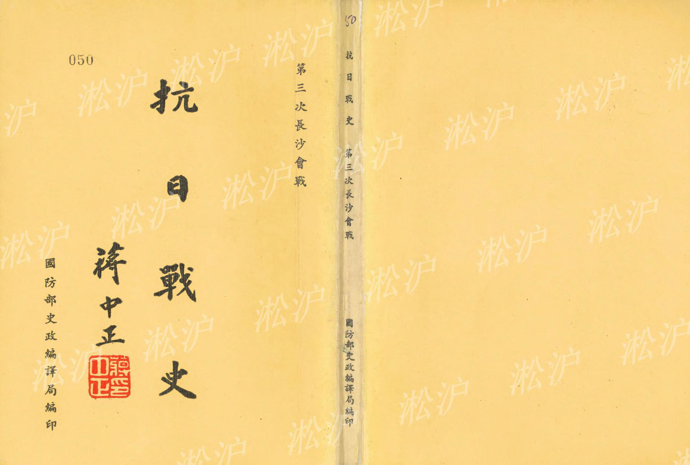

## 第二十五章 第三次長沙會戰

概述

### 第一節 會戰前狀況

#### 第一款 敵軍

#### 第二款 我軍

#### 第三款 兵誌概要

### 第二節 我軍作戰指導

### 第三節 會戰一般經過

#### 第一款 敵軍進攻時期

#### 第二款 我軍反攻時期

#### 第三款 我軍追擊時期

### 第四節 重要戰鬥

#### 第一款 新牆河以南戰鬥

#### 第二款 汨羅江以南戰鬥

#### 第三款 長沙城郊戰鬥

#### 第四款 游擊戰鬥

### 第五節 後方勤務

#### 第一款 會戰前之兵站設施

#### 第二款 會戰中之兵站設施

#### 第三款 會戰後之兵站設施

### 第六節 檢討

#### 第一款 敵軍

#### 第二款 我軍

七三

七五

七七

七七

七八

淞沪

淞沪

淞沪

淞沪

淞沪

淞沪

淞

## 第二十五章 第三次長沙會戰

至民國三十年十二月二十四日

至民國三十一年一月十五日

第二次長沙會戰結束之際，適在日相東條英機組閣之後，實行其南進政策，發動太平洋戰爭，爲牽制我軍轉用於廣、九、香港方面，策應英軍之作戰，乃抽集其長江兩岸之兵力約七萬人，由敵第十一軍軍長阿南惟畿指揮，初以第三、第六、第四十師團之主力，沿粵漢鐵路向長沙進攻，另以第三十四師團之一部，向上高，獨立混成第十四旅團一部，向修水進攻。自民國三十年十二月二十四日晨，突破我新牆河陣線後，卽以一部與我第二十、第五十八軍於關王橋、金井之線相持，掩護其左側背，以主力向汨羅江、撈刀河急進，十二月三十一日暮，已抵長沙城郊，三十一年一月一日，開始向我守軍第十軍攻擊，第九戰區長官部。一面令第十軍固守長沙，一面令外圍之第二十、第五十八、第七十八、第二十六、第七十九、第四、第七十三、第九十九、第三十七各軍，速照預定計劃完成部署，自長沙外圍反攻。至一月四日夜，敵攻勢頓挫，開始向東北突圍，但受我外圍反攻各軍之阻擊、截擊，其退却行動十分困難，敵爲挽救其頹勢，乃再抽調獨立混成第九旅團之主力南下救援，該旅團當竄抵福臨舖、栗橋地區時，又遭我第二十、第五十八軍之痛擊，幾全部就殲。迄九日，由長沙北退之敵，始與該旅團殘部會合，向汨羅江退却，至一月十五日，新牆河以南之敵，均經肅清。其向上高、修水進攻之敵，亦於一月上旬，爲我第十九、第三十集團軍所部，分別擊退，恢復戰前態勢，綜計本會戰經過二十三日，敵承認傷亡六千餘人，或不止此數。第一節

會戰前狀況（參照插圖第一）

#### 第一款 敵軍

(參照插

表第一)

民國三十年十月上旬，第三次長沙會戰後，敵第三、第四、第三十三、第十三師團，均陸續經武漢退回原防；其留置於第九戰區當面之兵力如次，贛北方面：爲第三十四師團師團部駐南昌，其餘分據蓮塘、厚田街、石鼻街、灘溪、永修、涂家埠、吳城地區；獨立第十四旅團旅團部駐九江，其餘分據星子、德安、箬溪、瑞昌、九江地區；鄂南湘北方面：爲第四十師團師團部駐咸寧，其餘分據陽新、通山、大冶等地；第六師團師團部駐蒲圻，其餘分據崇陽、簣口、岳陽、臨湘地區，以上各部，均歸第十一軍軍長阿南惟畿指揮，軍司令部駐漢口。

十二月上、中兩旬，我第九戰區長官部，綜合諸情報，得悉敵軍情況如左：

一、第三師團，近有由應山、信陽抽集兵力開往九江。

二、第四師團，似由天門、沙市陸續開往漢口。

三、陽新、通山之敵第四十師團之第二三三、第二三四兩聯隊，近抽調三分之一兵力開往漢口。

四、第六師團長神田，於十一月下旬，由蒲圻乘火車至長安、桃林、忠防等地視察。

五、漢口停有敵機百餘架。

六、敵汽車四十五輛，滿載彈藥由長安運桃林。

七、敵運輸艦四艘，滿載炸彈汽油，由漢口先後駛白螺磯。

同時，敵之空軍對我第一線陣地，及沿粵漢鐵路之偵察頻繁，並積極搶修白螺磯飛機場，及完成南昌之新舊兩機場，另對新牆河北岸之交通，如岳陽至湯家牌，新開塘至青崗驛、後山坪等公路，至十二月三十一日，均已先後修築完成。

十二月中旬以後，粵漢鐵路票車停駛，軍運頻繁，而長江方面漢岳之間，敵運輸艦亦日形活動，截至十二月二十三日，在湘北方面：敵已集中第三，第六、第四十師團，及獨立混成第九、第十四旅團主力，第四、第十三、第十五、第三十九、第一一六師團，及獨立混成第十八旅團之各一部，於新牆河以北、咸寧、岳陽間地區，在贛北方面：則已集結第三十四師團主力於南昌以西地區，獨立混成第十四旅團之一部於武寧以東地區。

#### 第二款 我軍

參照插表

第二第三

十二月中旬以前，我第九戰區長官部，兵力部署如左：

一、贛北方面：第十九集團軍總司令部駐上高，其第一線部隊，第五預備師，警備梁家渡、市汊街之線，師司令部駐白土墟，贛保安縱隊，警備市汊街（不含）沿錦江南岸迄車前之線，及石頭崗、陸家山各前進據點，縱隊司令部駐王園胡村，第一集團軍副總司令部駐棠浦，所屬新編第三軍司令部駐湖城村，新編第十二師師部，駐嶺前張，第一八三師師部駐下寶橋吳警備祥符觀、猪婆大坵、騎馬山、船下、洲丁之線，及萬壽宮、西山赤田張、新各前進據點，第二線部隊第一九四師控制清江整訓。警備未堡、上東坑之線，及靖安、尖山各前進據點，第二線部隊第一九四師控制清江整訓。

二、贛北、鄂南方面：第三十集團軍總司令部駐修水，第一線部隊，以其所屬第七十八軍司令部駐澧溪，新編第十三師師部駐煙巷街，警備老鴉頸、觀音閣、火燒白、及武寧城之線，並以第七十二軍之第三十四師一部，警備九宮山一帶地區。第二線部隊，第七十八軍之新編第十六師控置三都，第七井三次長沙會議

十二軍之新編第十五師控置吳都，第三十四師主力控置溫湯等地區整訓。

三、湘北方面：第二十七集團軍總司令部駐平江；第一線部隊，第二十軍司令部駐關王橋，暫編第五十四師師部駐桃樹港，警備斗米山、麥市、九嶺之線，及通城、鐵柱港、賽公橋各前進據點；第一三四師師部駐楊林街，第一三三師師部駐洪橋、警備方山洞、草鞋嶺、三港嘴、潼溪街、新牆、榮家灣、鹿角、磊石之線，第三線部隊，第五十八軍控置黃岸市地區整訓。

四、戰區直轄之部隊：第三十七軍軍部駐栗山港，一部警備長樂街、伍公市、新市一帶據點，主力控制甕江、蒲塘、栗山港一帶整訓。第九十九軍軍部駐益陽，以第九十九師警備歸義、營田、湘陰一帶江防；第一九七師警備六姓山、蘆林潭、臨資口、沅江、漢壽一帶湖防，第九十二師控置三姐橋整訓。第十軍軍部駐長沙，警備長沙城郊，其第一九零師控置株州、渌口整訓。新編第二十師衡陽整訓。

同時，長官部並令第一線之軍，如第三、第七十八軍、第二十軍，均須派出一個攻擊隊（約一加強營），不論天候與晝夜，適時對敵突擊，並破壞交通、通訊，焚毀其糧彈倉庫輜重等，予敵以打擊與消耗。

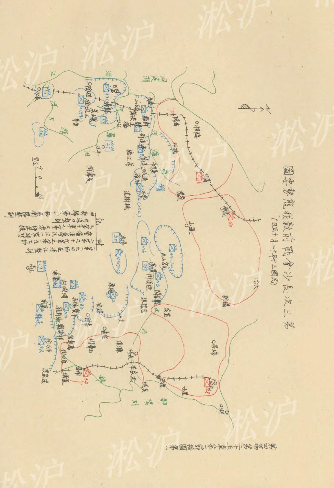

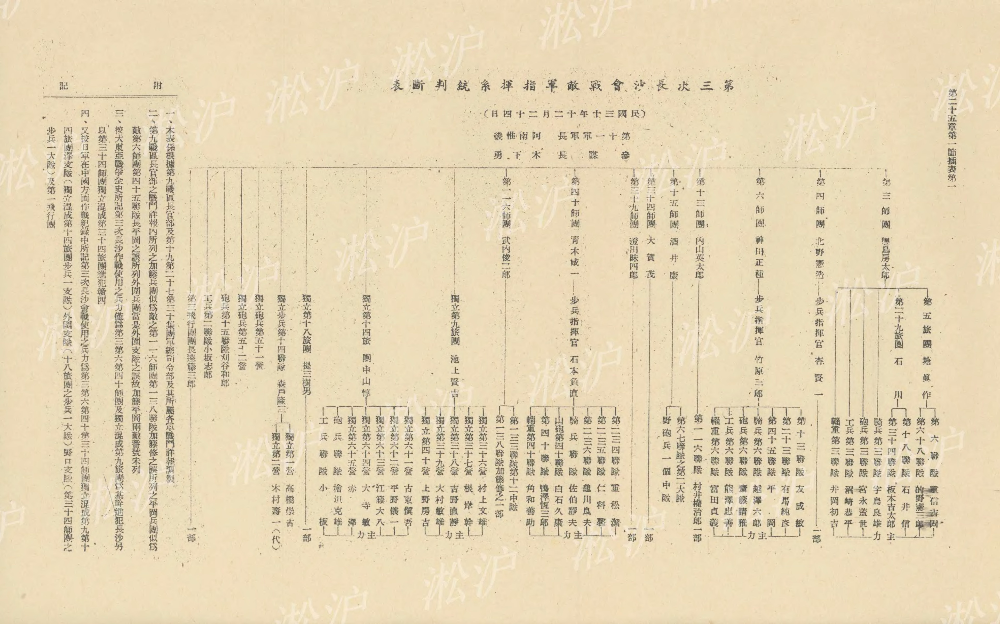

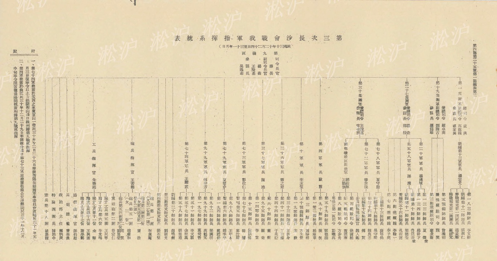

記

附

一、本表係根據俘獲日軍文件中之師團編制表及參戰部隊番號計算之二、敵軍後勤兵員未列入計算

三、敵軍飛機戰軍之資料缺乏未列入四、我軍戰時各軍師編制裝備不一本表係根據九戰區兵站總監部之資料調製五、我參加本會戰之戰軍飛機未列入六、依照作戰經驗找約二至三個軍方足對抗敵一個師團

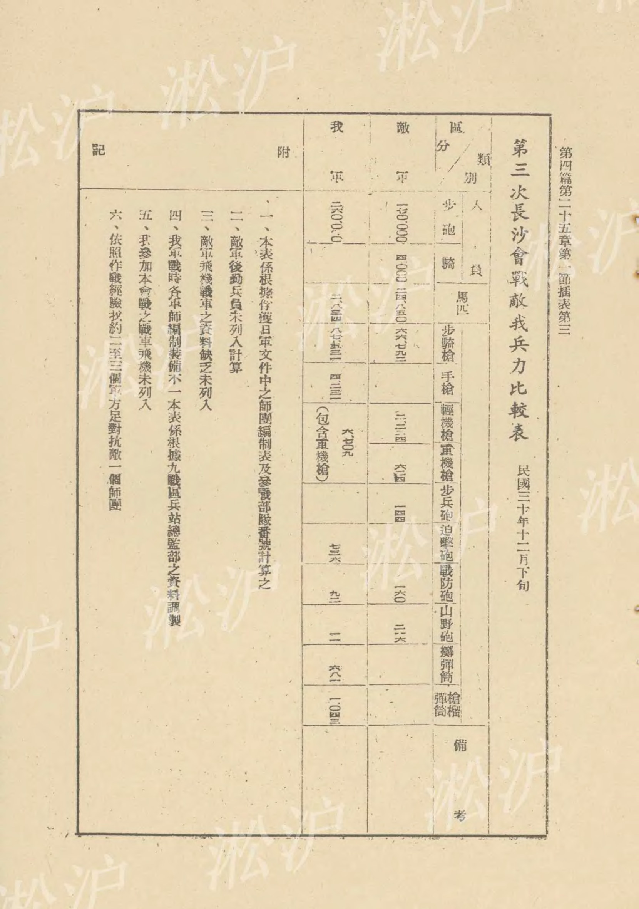

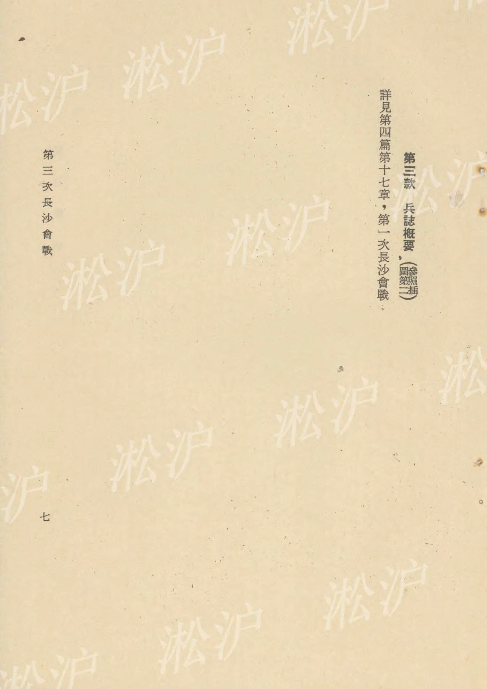

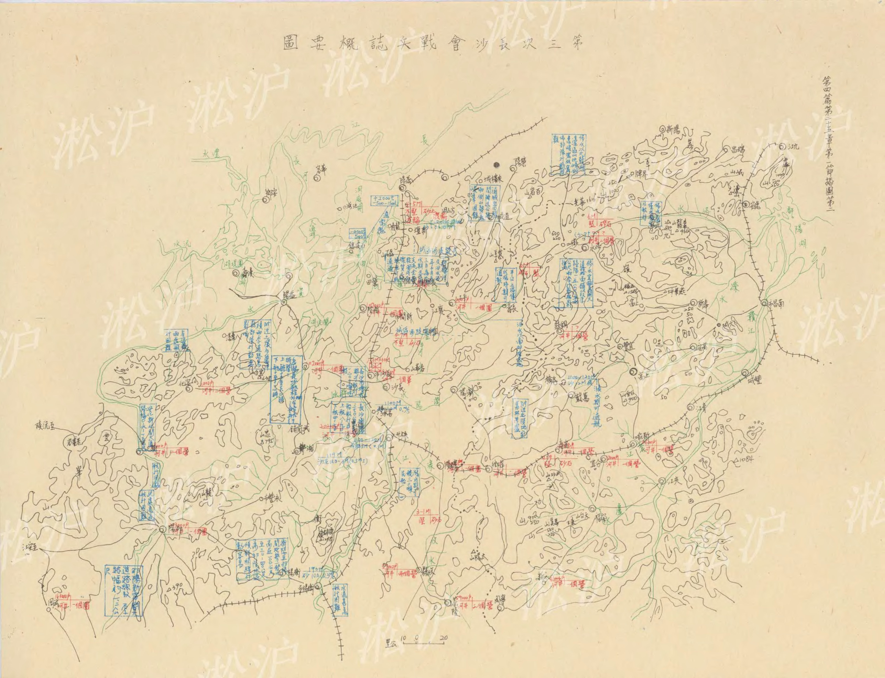

### 第二節 我軍作戰指導

民國三十年十月八日，第二次長沙會戰結束後，第九戰區薛岳司令長官判斷敵方必有第三次之進攻，卽根據過去經驗，及各種可能性，於同年十一月三日，向軍事委員會，作如左之意見具申：

一、據第二次長沙會戰之經驗，敵如打通粵漢鐵路，當盡可能抽調兵力，以十個師團，兩個旅團，十二個騎兵聯隊，進攻長沙。以三個師團進攻韶關，其進攻目標爲長沙、衡陽、韶關、樂昌。

二、研究敵攻長沙之行動。

(一)第三十三、第三十四兩師團，四個騎兵聯隊，循湘贛鐵路、公路，進犯醴陵、瀏陽，以第十四旅團進犯武寧、修水、銅鼓。

(二)以第四十、第十五兩師團循崇陽、通城，進犯平江、瀏陽。

(三)第三、第四、第五、第六、第十三等師團，由湘北正面犯長沙。

四以海軍陸戰隊兩聯隊，配合兵艦、汽艇竭力打通湘江，確保補給線，協同主力軍作戰。

(五)以第三十九師團，由沙市向常德、益陽進攻，略取資源。

三、現戰區統轄兩師之軍四個，三師之軍五個，共二十三個師，合暫編第二軍，共二十五個師，裝備稍完整者，僅第三十七軍。

四、本戰區，現正從事整補，積極構築工事備戰。

迄十一月八日，薛司令長官，又策定該戰區反攻計畫。參照附頒發其所屬之集團軍、及軍，並報告

軍事委員會，其時，敵正由鄂南、鄂北、鄂西地區，抽調兵力至臨湘、岳陽一帶集結。並由山西抽調獨立混成第九旅團，江抽調第十五師團之一部，另外集結之敵軍番號，約有第三、第四、第六、第十三第三十九、第四十、第一一六師團，獨立第十四、第十八旅團；而南昌方面，第三十四師團亦於安義、西山、萬壽宮等地區集結，判斷敵有再度進攻我長沙之企圖。

第九戰區長官部當卽針對敵情，策定反攻計畫其概要如左：

第一作戰方針。

戰區在贛北、鄂南、湘西方面，應竭力將敵反攻於分宜、上高、甘坊以東，修水東北，龍門廠、南江橋以北，澧縣、宜都以東地區，予以各個擊破，在湘北方面，則誘敵主力於瀏陽河、撈刀河間地區，反攻而殲滅之。

第二

指導要領。

一、上高方面：應運用尾擊、側擊及正面強靭抵抗，務於分宜、上高、甘坊之線以東地區，將進攻之敵，反攻而摧破之。

二、修水方面：應運用尾擊、側擊，及正面強靭抵抗，務於修水東北地區，將進攻之敵，反攻而摧破之三、通城方面：應運用尾擊、側擊，及正面強靭抵抗，務於龍門廠、南江橋以北地區，將來攻之敵，反攻而摧破之。

四、湘西方面：應運用尾擊、側擊，及正面強靭抵抗，務於澧縣、宜都以東地區，將來攻之敵，反攻而摧破之。

五、湘北主力反攻方面：應運用尾擊、側擊，及正面強靭抵抗，務於瀏陽河撈刀河間地區，將進攻長沙之敵軍主力，反攻而殲滅之，反攻奏功後，分向永修、德安、瑞昌、咸寧、蒲圻、岳陽猛烈追擊，相機收復九江、武漢。

軍事委員會迭據第九戰區之敵情報告，判斷敵軍，似有策應其香港方面之作戰，以牽制我軍兵力轉用之企圖，且鑑於第九戰區之兵力薄弱，乃於十二月二十日，以號午令一亭調電令：『第七十三軍，由澧縣卽向寧鄉、益陽集結待命，並限二十五日到達』。又今：『第七十九軍，卽乘車向渌口、株州地區集結待機，歸薛岳司令長官指揮』。

斯時，薛司令長官亦於十二月二十日以號未涵電，呈請准以第四軍或第七十四軍調駐米亭、渌口地區，爲戰區預備隊，及原由該戰區調粤之重迫砲第二團，砲兵第一團之山砲兩連，工兵第五團之第二、第四營調回長沙，以加強長沙之守備，同日十四時，薛長官又以號未涵電令第十九、第二十七、第二十集團軍，其要旨如左：

戰區以在瀏陽河、撈刀河間地區殲滅敵軍之目的，部署如左。

一、第十九集團軍兼總司令羅卓英，率戰鬥指揮所，於二十一日晨，由上高進駐瀏陽，指揮第二十六、第七十九軍，及第一九四師，準備作戰，各該軍之行動如次：

(一)第七十九軍，於二十日晚，由衡陽鐵運株州，到達後，軍部率一師，進駐渡頭市、東山之線旣設據點工事，一師駐株州，限二十三日到達，第一九四師於二十日晚由清江向醴陵出發，限二十七日到達，並構築醴陵附近之據點工事，該軍及第一九四師，俟敵進犯瀏陽河北岸攻擊長沙時，待命自南向北反擊。

(二)第二十六軍，第一步，確保瀏陽河陣地，第二步，俟敵進至瀏陽河，攻擊長沙時，待命自東向西反擊。

二、第三十集團軍兼總司令王陵基，率戰鬥指揮所，於二十日晨由修水進駐平江，指揮第七十八軍附新編第十五師，準備作戰，第七十八軍之新編第十六師由安峯鎮，新編第十三師由烟港街，新編第十五師由五都，均於二十日晚出發，新編第十五、第十六師限二十五日，新編第十三師限三十一日，一律到達平江及其西南地區，第一步，確保平江、三角塘、江家村各據點，第二步，俟敵向瀏陽、長沙進犯時，待命協同第三十七軍，自東北向西南側擊敵軍。

三、第二十七集團軍兼總司令楊森，指揮第二十、第五十八軍，準備作戰，各該軍之任務如次：

(一)第二十軍，第一步，於敵強渡新牆河南進時，應在旣設陣地強輒抵抗，逐次消滅敵軍，務須血戰十日以上，爭取餘裕之時間。第二步，於達成第一步任務後，待命轉至關王橋、三江口側面陣地，自東向西側擊，由北向南尾擊自汨羅江右岸南竄之敵。暫編第五十四師，第一步，固守通城附近旣設陣地，第二步，待命使用。

(二)第五十八軍，第一步，於敵強渡新牆河時，自東向西側擊敵軍，第二步，待命進入關王橋以北第二十軍之旣設陣地，側擊、尾擊南犯之敵，協力第二十軍之作戰。

四、第三十七軍，第一步，在汨羅江南岸旣設陣地強輒抵抗，逐次消耗敵軍，務必血戰十五日以上，爭取戰略之運用時間，達成第一步任務後，待命轉至社港市、更鼓台、金井間山地，以上時期，歸本部指揮。第二步，待命歸王陵基副司令長官指揮，俟敵向瀏陽、長沙攻擊時，協同第七十八軍自東北向西南攻擊南進之敵。

五、第九十九軍，第一步，確保三姐橋、駱公橋、歸義、營田、湘陰旣設據點陣地及洞庭湖南岸湖防。第二步，待敵向長沙攻擊時，以第九十二、第九十九師待命自西北向東南夾擊進攻長沙之敵，第一九七師仍任洞庭湖西南岸防務。

六、第十軍死守長沙，第一九零師於二十日晚由洙口進駐長沙，任長沙外圍據點之守備。第三師任長沙核心工事之守備，第十預備師固守岳麓山及水陸洲旣設據點陣地，該軍第一步確保長沙，第二步，待敵進犯瀏陽河北岸，向長沙攻擊三天以後，待命自西向東反攻敵軍。

七、第七十三軍軍部及第七十七師進駐寧鄉，暫編第五師進駐益陽，第一步爲戰區預備隊，第二步，待命協力第十軍之反擊，以上第十、第七十三、第九十九軍歸本部指揮。

八、第十九集團軍贛北方面之警備，由羅卓英兼總司令分令高蔭槐、劉膺古兩副總司令指揮並由羅兼總令總其成，第三十集團軍贛省之警備，由第七十二軍韓全樸軍長率第三十四師負責。

上項部署，經軍事委員會核准實施，同時，薛長官更以號酉涵電令，指示各挺進部隊之任務，其要旨如左：

一、第三挺進縱隊，歸第七十二軍韓全樸軍長指揮，仍服行原任務。

二、王勁修總指揮，指揮第四、第五、第八挺進縱隊，及直屬第一、第二野補團，鄂保安大隊，第一步，準備向崇陽、蒲圻、咸寧攻擊，確實切斷公路、鐵路之交通與通訊，第二步，待命向臨湘、岳陽一帶搜索敵指揮機關襲擊之。

三、第六、第七挺進縱隊，歸第二十七集團軍楊兼總司令直接指揮，第一步向羊樓司、忠防、臨湘攻擊，搜索敵指揮機關而襲擊之，並確實切斷公路、鐵路之交通與通訊，第二步，待命尾擊由新牆河南進之敵。

自十二月十八日夜至二十三日，新牆河右岸桃林、西塘、簣口、湯家牌、青崗驛之敵，第一線部隊及砲兵已不斷向我第二十軍守備部隊轟擊，準備強渡，此時我薛長官爲求發揮各軍之強大抗力，特對網形陣地之作戰要領，於二十三日以梗戍忠電指示如左。

一、與敵開始戰鬥後，對無敵情及敵情較少之各據點，兵力必須適時抽集敏活運用於敵主力之地區，切不可呆守陣地，爲敵各個擊破。

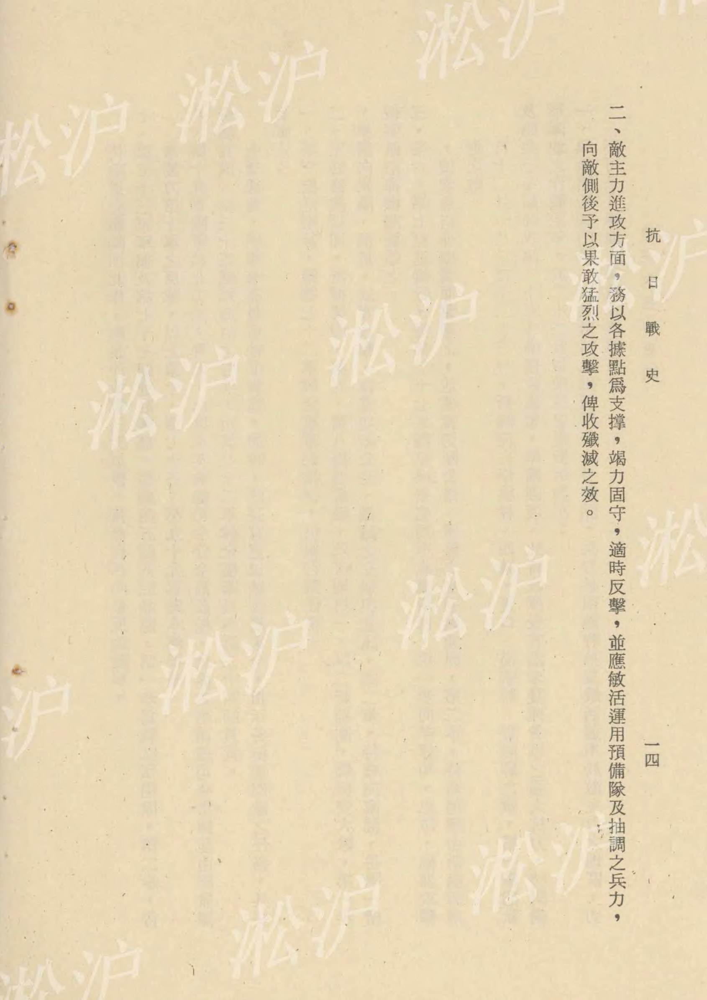

### 第三節 會戰一般經過

民國三十年十二月二十四日至三十一年一月十五日

參照

插圖

第

三

#### 第一款 敵軍進攻時期

民國三年十二月二十四日至十二月三十一日

參照

插圖

第四

至

第

七

民國三十年十二月十五日起，敵向臨湘、岳陽間鐵路兩側集中兵力，迄二十三日約十萬餘人，是晚，參照

插

圖

第四

開始向新牆河左岸進攻，其先頭二千餘人，在楊家沖、三港嘴之線，與我第一三四師徹夜激戰，至二十四日十四時，敵續增至四千餘人，突破新牆河，續向四六方、潼溪街之線我據點進攻，傍晚，敵主力萬餘人，分由新牆、七步塘、榮家灣、八仙渡等處，向我第一三三師陣地進攻，截至二十四時，敵相繼攻陷各據點，此時，我第二十七集團軍楊森兼總司令電令在黃岸市整訓之第五十八軍，向楊林街、胡少保方面急進，向敵側擊，二十五日，我第二十軍與敵第四十、第六師團竟日激戰於觀德沖、王伯祥、傅家橋、長湖、洪橋、七里山、黃板橋、孫武各據點，其中以傅家橋、洪橋兩據點之爭奪最烈，我據守兩據點之第三九八團第二營王超奎營長、第三營呂海羣副營長及全體士兵均壯烈殉國，入夜，敵乘隙進攻我大荊街、黃沙街等處，此時，我第五十八軍之新編第十一師已到達楊林街，並向四六方、觀德沖、王伯祥之敵攻擊，第二十軍楊漢域軍長，令第一三三師，除第三九八、三九九團仍固守據點繼續抵抗外，第一三四師，除第四零一團將大雲山、方山洞之守備，交第七挺進縱隊接替後歸還建制，其餘各部隊，退守關王橋、三江口、王家坊之線，迄二十八日拂曉，敵步、騎、砲三千餘人，由王伯祥向我一三四師關王橋陣地進攻，另由南岳廟大荊街之敵，會攻我第一三三師三江口陣地，戰鬥至傍晚，第二十軍轉移至富貴洞、斗南尖、王家坊之線，與敵澈夜激戰，我固守新牆河左岸各據點之第三九八、第三九九團，亦正與敵苦戰中，但敵之主力，則已乘隙分路向汨羅江急竄，其先頭已抵青石橋、（長樂街北端一大井山、冷水井、蘭智橋、白牛尖（均在新市北岸）一帶，與第三十七軍之警戒部隊接觸中，另敵第三師團之先頭千餘人，亦已竄抵歸義對岸之劉家洲，與第九十九軍隔河對峙，斯時，我第五十八軍之新編第十一師已抵觀德沖，新編第十師抵胡少保，向西南之敵側背猛攻，第三十集團軍總司令部及第七十八軍已到達安定橋。

十二月二十七日二時，第九戰區薛長官命令第二十、第五十八軍向南移動，阻敵東竄。

參照插

我楊

圖第五

兼總司令卽以第五十八軍佔領白羊沖、雙石洞，第二十軍佔領富貴洞、王家坊之線，向當面之敵攻擊，十二時，第五十八軍克復南岳廟，第二十軍克復關王橋，此時，敵正猛犯黃沙街、龍鳳橋等處，其中以黃沙街之爭奪最烈，守軍第一三三師第三九九團一連自連長王化南以下全部殉國，二十八日，第五十八軍續克長湖、洪橋，第二十軍向三江口、大荊街之敵攻擊，二十九日，薛長官又令第二十軍，以一部扼清江口、張家沖各據點，主力沿汨羅江北岸，向西攻敵側背，並應進出蘭智橋、蘭市河之線，確實截斷敵後方之連絡，協同第三十七軍，殲滅敗退之敵，令第五十八軍卽在石家牌、劍灘、萬家沖之線，就攻擊準備位置，重點保持於右，向西攻敵側背，進出火田、虎皮塘、車田坊之線，截斷敵後方之連絡，二十時，兩軍均已分別就攻擊準備位置，第一三三師堅守新牆以南各據點之第三九八、第三九九團，已相繼突圍歸還建制。

自十二月二十七日上午八時起，竄據青石橋、天井山、蘭智橋、劉家洲、青龍橋一帶之敵，第六師團主力及第四十師團第三師團各一部，在飛機、砲兵掩護之下，先後向汨羅江右岸第三十七軍、第九十九軍之警戒陣地進攻，戰鬥至十二時，歸義對岸及南渡（第九十九軍陣地）兩據點，爲敵砲火擊毀，河夾塘守軍，自連長以下傷亡殆盡，敵卽乘機強渡，入夜，第三十七軍在原線與敵奮戰，第九十九軍則於駱公橋、朱沙橋、白犬口等地，與敵徹夜激戰，二十八日四時，敵步砲三千餘人，圍攻長樂街，守軍一排全部殉國，我第六十師卽轉移周公塘、白田橋之線與敵相持，同時，敵第六師團二千餘人，由蘭市河強渡，竄攻我趙家坪，我第三十七軍之第九十五師仍與敵激戰於磨刀灘、伍公市、長沙嶺諸渡河點，第三十七軍指揮所由脫甲橋移朱公源，第九十九軍方面進攻之敵，於一時左右，以一部進攻駱公橋、朱沙橋，主力三千餘人，先後由百犬口，經盤龍橋、九崙山，向我楊梅鋪、渌塘鋪、王倫鋪第九十九師陣地及落馬橋、大娘橋第九十二師陣地進攻，激戰竟日，入夜，敵以一部與我相持，主力已乘隙向長沙急進，河夾塘之敵，則向營田方向進攻中，其時，第九戰區薛司令長官爲遏阻當面之敵，並加強第九十九師之湘陰保衛力量，乃令第三十七軍之第一四零師由金井向新開市急進，並歸第九十九軍之第九十二師梁漢明師長指揮，二十九日，第三十七軍方面，敵於八時起，先以飛機向我守軍陣地轟炸，掩護步兵向我第六十師之周公塘，第九十五師之新市，茶頭嶺陣地進攻，激戰竟日，我傷亡營長以下四百餘人，至夜，第三十七軍仍在顏家鋪、伍公市、西山廟、童家墩之線激戰中，向我第九十九軍渌塘鋪進攻之敵，已向東移，向營田方向前進之敵二千餘人，亦轉向東南前進，計沿鐵路兩側牽制者，約三萬餘人，與我第一四零、第九十二，第九十九師激戰於新開市、大娘橋、金鷄山、藕花塘之之線。

十二月二十九日午夜，薛司令長官綜合各方情況，卽令第十、第二十六、第七十九軍注意由汨羅江南竄之敵軍，分別派遣搜索隊、騎兵連、便衣隊於金井、高橋、上杉市、麻林橋、青山市、新橋、戴公橋一帶搜索敵情，同時，又令配屬指揮卽將由曲江到達之第四軍，迅以一個師開赴株州，軍部率兩個師開渌口，另令湘鄂贛邊區總指揮猛攻忠防、臨湘，第六挺進縱隊攻擊桃林、西塘，第七挺進縱隊阻絕新牆河以南敵軍修築道路。

十二月三十日，由長樂街、新市強渡之敵，已增至兩師團，以一部與我第三十七軍在原線激戰，主力分由長樂街、新市、經花門樓、上杉市、福臨鋪、楓林港向長沙急進中，至三十一日夜，敵第四十、第三師團之騎兵，已進抵永安市，楊林舖附近，其主力已竄上杉市、麻林市以南地區，由歸義南渡，沿鐵道兩側南進之敵，亦已增至兩師團（第三、第四師團），以一部與我第一四零師及第九十九軍在新開市、大娘橋等地激戰，主力分由李家墩、大娘橋南竄，入夜，敵第三、第四師團之之騎兵已竄至石子舖、橋頭塅附近，主力則竄至唐田廟及苦竹坳以南地區，三十至三十一日間，我第五十八軍克復三江口、渡頭橋，第二十軍克復長樂街，並續向敵尾擊中。

軍事委員會三十日關於長沙之決戰，對第九戰區晉以卅酉令一元九電指示，該戰區在長沙附近決戰時，爲防敵以一部向長沙牽制，先以主力強迫我第二線兵團決戰，然後圍攻長沙，我應以第二線兵團位置於戰場較遠地區，保持外線有利態勢，以確保機動自由，使敵先攻長沙，乘其攻擊頓挫，集合各方兵力向敵圍擊，以主動地位，把握時機，又於三十一日，電令各戰區發動攻勢，策應長沙方面之作戰，薛司令長官奉到上項命令後，並綜合二十八日以來之情況，乃以卅涵電電令所屬各集團軍，及各軍，對長沙作求心攻擊，其要旨如左

參照插

圖第六：

一、第二十七集團軍，以第五十八軍由長樂街向安沙，第二十軍由清江口向石子舖索敵攻擊，該集團軍第一次攻擊到達線爲湯家塅、安沙、戴家園之線，第二次爲傅家冲、周婆塘之線。

二、第三十集團軍，以第三十七軍（欠第一四零師）由甕江方面向望仙橋，第八十七軍主力由三角塘，更鼓台、一部（一個師）由社港市，會同軍主力，向長橋索敵攻擊，該集團軍第一次攻擊到達線，爲戴家園，春華山、東林寺之線，第二次爲大灣港、長橋之線。

三、第十九集團軍，以第二十六軍主力，由洞湯市向槩梨市，一部（一個師）由江花橋協力軍，向槩梨市索敵攻擊，以第七十九軍（附第一九四師）主力，由金潭向黃花市以南地區索敵攻擊，依狀況再轉向槩梨市攻擊，以一部由渡頭市方面，向柞山橋索敵攻擊，依狀況再轉向東山攻擊，以第四軍主力，由龍頭舖，一部由譚家壩，向長沙以南地區索敵攻擊，該集團軍第一次攻擊到達線，爲東林寺、柞山橋、楓樹壩、白田舖、大托舖之線，第二次爲槩梨市、東山、金盒嶺之線。

四、第十軍固守長沙水陸洲，第七十三軍固守岳麓山，並以小部隊任湘江南岸之警戒，待各兵團到達第二攻擊目標附近時，卽斷行反攻。

五、第九十九軍（附第一四零師），以第一九七師固守湘江西岸及洞庭湖南岸原防，以第九十二師由三姐橋，以第一四零師由栗橋，向撈刀河索敵攻擊，該軍第一次攻擊到達線，爲白沙洲東岸，橋頭驛，官橋之線，第二次爲撈刀市附近地區，其第九十九師固守湘陰、營田各要點，並以有力一部由明月山、雙獅洞方面，向栗橋，福臨舖側擊敵軍，務截斷敵連絡補給線。

十二月三十一日，薛長官再電第二十七、第三十集團軍，卽遵卅涵電，於民國三十一年一月一日夜開始攻擊，限一月四日夜，攻擊至指定之第一次攻擊到達線，令第十九集團軍，以第二十六軍於一月二日夜，第四軍、第七十九軍於一月三日夜開始攻擊，統限一月四日夜，攻擊至第一次指定之攻擊到達線，令第九十九軍之第一四零師，於一月二日夜開始攻擊，限一月四日夜攻擊至指定之第一次攻擊到達線，同時，我第七十三軍之第七十七師已接替第十軍之第十預備師岳麓山及湘江西岸防務，暫編第五師，推進至五里堆，爲軍預備隊，第十預備師交防後，控置長沙，爲第十軍預備隊，第四軍已車運洙口，第七十四車由柳州開始車運衡陽，湘鄂贛邊區總指揮部已由中堡向忠防，臨湘急進中，第六、第七挺進縱隊正向羊樓司，桃林一帶之敵據點攻擊中。

十二月二十四日（參照插）以前，敵集結在湘贛公路者，計有第三十四師團之第二二七聯隊（第二中隊），第二一八聯隊之第一、第二大隊主力，第三十四騎、砲工聯隊各一部，僞軍數百，共約五千餘人，在安義附近集中者，爲第二一六聯隊之第一大隊，附騎、砲兵各一部，約二千餘人，由敵步兵指揮官岩永少將指揮，在箬溪附近集中者，爲獨立混成第十四旅團之第六十三、第六十五大隊之主力，第六十一大隊之一部，砲兵兩中隊，第三十四騎兵聯隊之第一中隊，共約二千人，由旅團長中山惇指揮，二十五日拂曉，安義之敵先頭步、騎、砲兵數百人，分向我新編第三軍第一八三師之陶仙嶺、洪田、蔣家坪、饅頭山各前進據點進擾，九時，集結湘贛公路之敵步、騎、砲兵八百餘人，分向新編第十二師之鼓樓舖、小嶺、撫坊等各前進據點攻擊，戰鬥至午，我新編第十二師各前進據點部隊，轉移至余黃村、蓮花山、馬奇嶺之線，當我轉移之際，敵復有後續部隊千餘人加入戰鬥，與我守軍在猪婆大坵、大路王、馬奇嶺之線激戰，至十八時，敵以一部攻擊馬奇嶺側背，主力向我第三十六團陣地猛攻，並施放毒氣，我守軍仍英勇抵抗，此時，第十九集團軍羅卓英兼總司令之新編第三軍，以一步逐次遲滯敵之前進，主力乘夜轉移至村前街南北之線，與敵決戰，又電請第三戰區之第一百軍劉軍長，對南昌，蓮塘之敵攻擊，俾資策應。

十二月二十六日拂曉，步、騎、砲聯合之敵三千餘人，再度猛攻我蓮花山，猪婆大坵，馬奇嶺新編第十二師陣地，此時，我贛保第一團在錦江北岸之兩個大隊，正向鼓樓舖之敵攻擊中，十一時，我蓮花山陣地，一度爲敵突破，而猪婆大坵敵我亦正激烈戰鬥中，另敵後續部隊千餘人，猛攻我茅竹嶺，戰鬥至十七時，陣地雖爲敵突破，但經我守軍與敵反復肉搏，斃敵三百餘人，我亦傷亡連長以下官兵二百餘人，戰鬥繼續至午夜，敵我陣地犬牙相錯，其時，駐靖安附近之挺進第二縱隊之贛保第四團，奉令移駐故縣街，準備協力新編第三軍之作戰，我第十九集團軍羅卓英兼總司令，爲抑留敵之西進，仍令新編第三軍在村前街以東地區，極力遲滯敵之前進，相機予以反擊，令贛保安縱隊卽以有力部隊，分向鼓樓舖，烏山舖威脅敵之側背，令第五預備師之第十四集團迅向獨城附近集結，歸贛保安縱隊熊斌司令指揮，其餘（欠第十三團）迅由豐城附近渡贛江向黃沙街方向集結待命，我羅兼總司令適奉新命，對長沙方面之戰鬥指揮，遂卽率指揮所人員移駐瀏陽之大瑤舖，新編第三軍奉命後，卽夜乘以一部與敵保持接觸，主力移張家渡、馬鞍嶺亘鷄頭山之第二線陣地，因之，我第一八三師放棄奉新城。

十二月二十七日午前，以大雪紛飛，新編第三軍當面戰況沈寂，但自十二時以後，敵我在高安、黃姑嶺、大王嶺、街嶺、馬鞍嶺潭埠之線激戰，十四時，我高安城失守，二十八日拂曉起，敵千餘人續向新編第三軍街嶺陣地猛攻，激戰竟日，我傷亡損耗頗大，入夜，轉守龍團墟、劍橋、樟樹嶺之線，我贛保縱隊之保安第一團尾擊由湘贛公路西進之敵，於祥符觀與敵一部遭遇，敵向高安續進，該團跟踪尾擊中，我第二挺進縱隊之保安第四團於故縣街向奉新之敵尾擊，克復該城，第五預備師之贛江東岸防務，正由第一百軍之第十九師接替，第五預備師交防後，卽向水北街（界埠東南）集結，其先頭團已到達獨城，二十九日，新編第三軍仍在龍團墟、劍橋、南山河，樟樹嶺之線與敵相持，十二時，楊宏光軍長於湖城墟指揮所，令新編第十二師，第一八三師卽於十五時開始向敵反擊，該兩師奉命後，卽向敵攻擊，但無進展，迄三十日拂曉，贛保安縱隊之保安第一團仍在高安東西地區，夾擊高安北城之敵，保安第四團續由奉新向南攻擊，新編第三軍則轉移村前街南北之線，三十一日晨，敵迫近村前街，湖城墟附近與我軍激戰至夜，守軍再轉移至泗溪、官橋街，棠浦之線，第二挺進縱隊之保安第四團在大禾嶺地區，襲擊敵之側背，其時，敵八百餘人，在敵機砲掩護之下，由蓮塘渡（高安東南）強渡錦江，與我贛保縱隊於青潭嶺，黃沙街之線激戰，入夜，敵我均無進展，我第五預備師於三十一日夜到達界埠進攻修水

參照插

圖第七

之敵，獨立混成第十四旅團，於十二月二十四日四時集合二千餘人，向我修水右岸第七十二軍第三十四師第一零一團之源口、老鴉頸。老塔下陣地進攻，激戰至二十一時，陣地爲敵突破，守軍退守茶子坪，湯家嶺之線，我修水左岸之第一百團無戰鬥，入夜，陳良基師長令師預備隊（第一零一團第二營），經石口渡向修水右岸增援，二十六日拂曉，敵續攻茶子坪，湯家嶺第三十四師陣地，激戰至八時，守軍第一零一團以傷亡過大，再轉守荷山、柳山之線，與敵繼續戰鬥，九時，師預備隊（一個營）由石口渡到達參加戰鬥，敵我遂徹夜激戰，迄二十七日十四時，敵續增一千二百餘人，我鄧埠陣地被敵突破，第三十四師指揮所移匪山、荷山、柳山雖仍在我手，但已陷於苦戰中，二十八日，第七十二軍韓全樸軍長命修水左岸第一百團之第三營，九宮山第一零二團之第二營，分由石口渡，三都渡河，向敵側擊，此時，我在湘北指揮作戰之第三十集團軍王陵基兼總司令，知修水，武寧方面作戰失利，爲防敵深入，影響戰局，乃將西調之新編第十三師第三十八團由金星坪星夜兼程馳返修水，並令第三十八團楊幹團長指揮修水之野戰補充第二團，及第三十四師修水右岸部隊，合力反攻，確保修水城，二十九日，敵千餘人已竄至鼓范，向洋湖、燕山口進攻，另以四百餘強渡修河，向三都進攻，我第三十四師各部遂轉向船頭灘東西之線，與敵續戰，第三十八團已到修水城，即在修水右岸楊梅山南北之線佔領陣地，迄三十一日夜，敵我在三都南北（楊梅山船頭灘）之線相持。

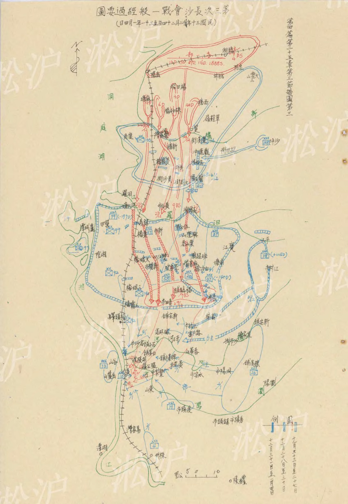

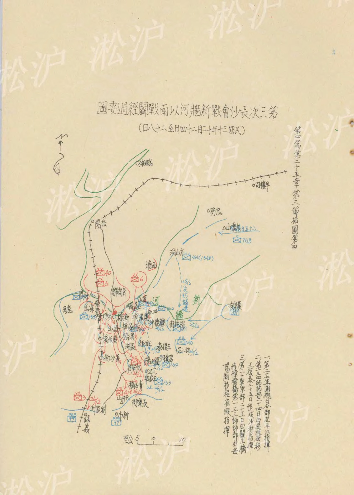

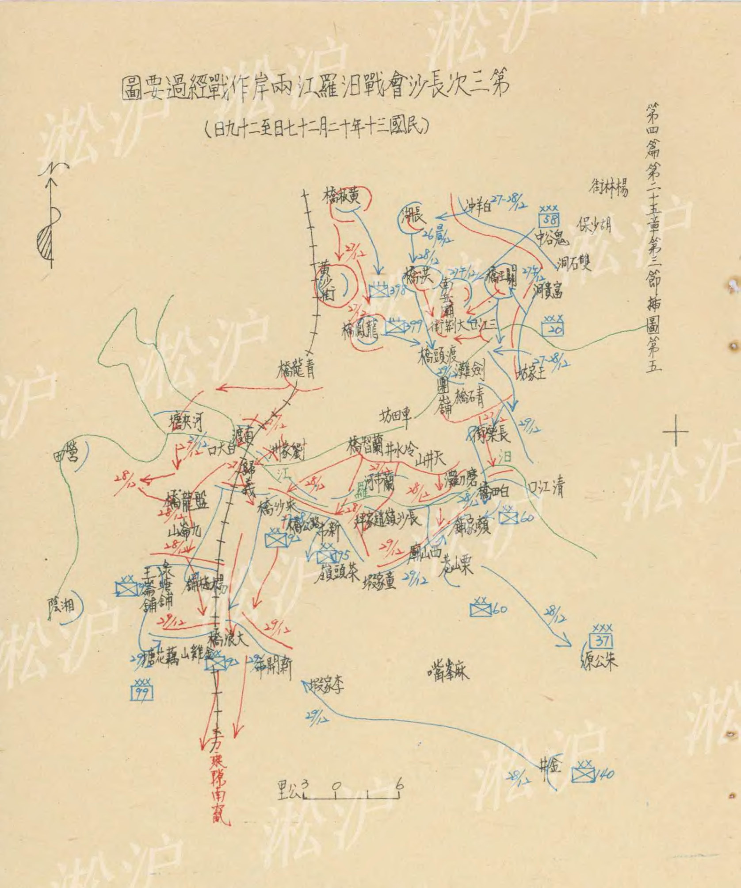

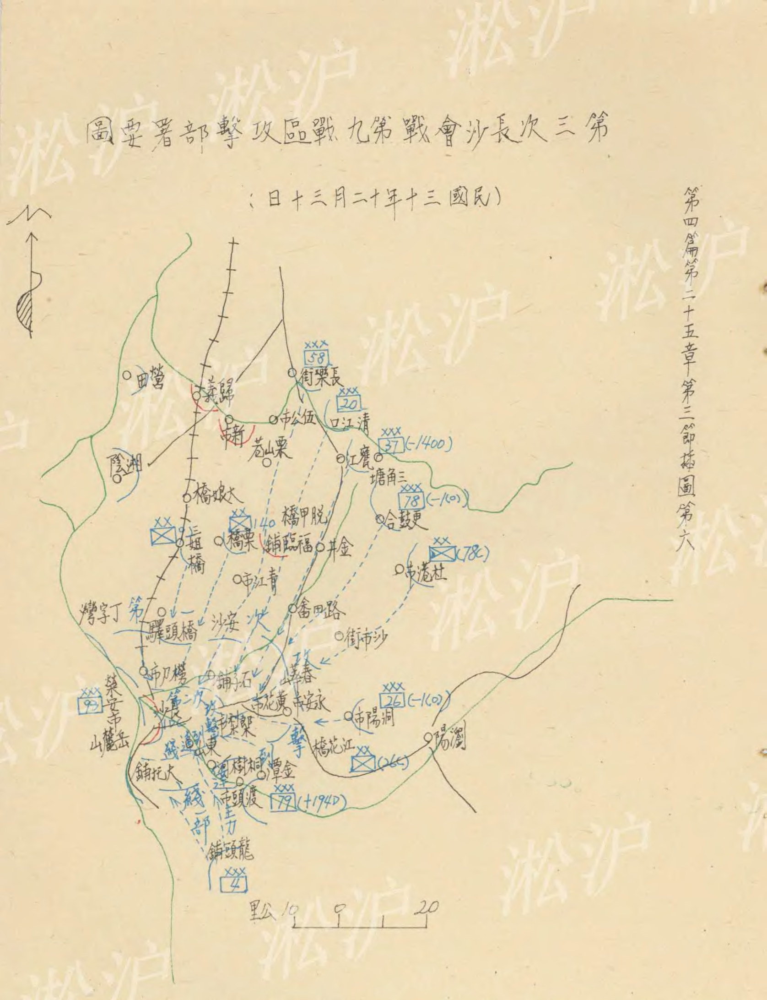

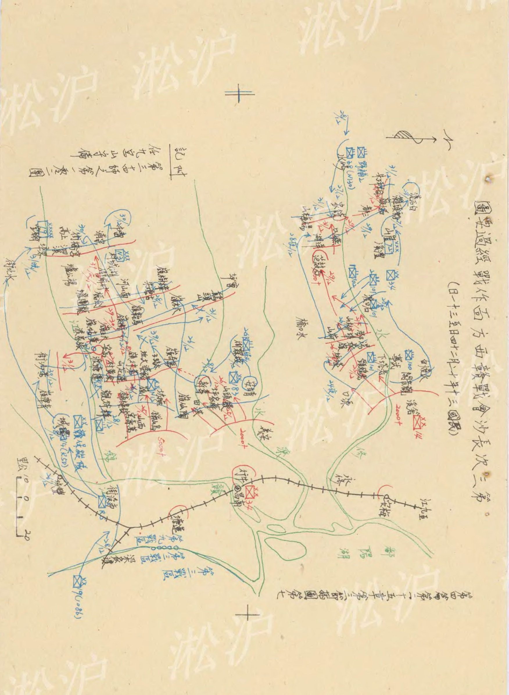

#### 第二款 我軍反攻時期

民國三十一年一月一日至

四日參照插圖第八至第十

民國三十一年一月一日四時，進攻長沙之敵第四十第六第三師團，先後分經槩梨市、東山、東屯渡向長沙迫進，其第四十師團向長沙東南，第三師團向長沙正東，第六師團向長沙東北進攻，與我第十軍於黃土嶺、阿彌嶺、五里牌、湖蹟渡之線激戰，敵機十餘架，更番轟炸助戰，至十六時，我陣地全燬，敵再增援四千餘人，向左家塘、長嶺，南元宮陣地猛攻，與第十預備師、第三師、第一九零師徹夜激戰中，此時，我外圍部隊在汨羅江以南之第三十七軍（次第一四零師），仍與敵竟日在磨刀尖、秀水塅、班召廟一帶激戰，自奉薛長官卅涵電後，卽於夜間在芭蕉源，脫甲橋之線，完成反攻準備，向戴家園、赤石河方面攻擊前進，第三十集團軍之第七十八軍亦在赤馬殿，溽水橋之線完成攻擊準備，向春華山方面攻擊前進，第九十九軍之第一四零師在新開市北方擊潰敵第三師團輜重聯隊，第九十二師在大娘橋東南地區擊潰敵第四師團之第六十一聯隊，斃敵輜重聯隊長片岡初吉以下甚衆，第九十九師固守湘陰，營田各要點，以有力之一部，由明月山向栗橋之敵側擊，我新牆河以南之第二十七集團軍第二十，第五十八軍，竟日與敵在三江口、渡頭橋以西地區激戰中，第六、第七挺進縱隊，在新牆河以北羊樓司西塘一帶之敵後地區積極活動，入夜，第五十八，第二十軍則由張家陂南渡汨羅江，經旨泉嶺向指定目標攻擊前進。

一月二日零時十分起，迄至三日夜，圍攻長沙之敵，在砲、空猛烈轟炸射擊之下，不斷向我守軍第十軍猛撲，並以傘兵在妙高峯附近降落助戰，爲我第三師第九團完全擊斃，另斃敵聯隊附加縷中佐，敵以攻擊無功，乃使用大量毒氣彈，燒夷彈，向市區投擲，我軍雖有損害，無礙戰鬥，此時，我外圍之第四軍，已全部到達株州、滹口集中完畢，並由跳馬澗向長沙東南之敵攻擊前進，第七十九、第二十六軍均已積極向指定目標攻擊前進，惟第二十六軍之第四十一師攻克黃花市後，得知梁梨市、曹家坪間有大部敵人麕集，並向東構築工事中，第七十八軍之主力已進至引秀山、豺狗壠地區，向春華山前進，汨羅江以南之第三十七軍，在金井，脫甲橋與由栗山巷竄來之敵步、騎三千餘人激戰，第九十九軍之第九十二師，第一四零師，於二日起，各向指定目標前進，新牆河以南第二十七集團軍指揮所由平江移鍾神廟，其第二十、第五十八軍已進至古華山，竹山舖地區，第五十八軍孫渡軍長在龍洞軍部，據報飄風山，大頭嶺有敵獨立混成第九旅團部隊三千餘人，正構工事中。

當時，軍事委員會於三日夜以江亥令一元玖電令第九戰區，指示作戰要旨，新牆河以南及汨羅江兩岸地區，應卽發動民衆，乘敵後方空虛，施行激底破壞，使敵退却不能迅速脫離戰場，薛司令長官綜合連日情況，亦以江己追電令各集團軍，限於一月四日夜，各攻擊部隊應到達第二次攻擊到達線。

一月四日一時起，圍攻長沙之敵，復施放毒氣，全力攻城，我第十軍浴血搏鬥，尤以修械所陣地，經五次之爭奪，戰鬥慘烈，至夜，敵終未得逞，我外圍之第四軍，已克復林子冲，阿彌嶺，與城內守軍取得連絡，第七十九軍已克復康思嶺、秋塘、侯家冲地區，其軍指揮所位置於渡頭市，第二十六軍已到達孫家壇，舒家灣、麻筆舖之線，軍指揮所在胡家嶺，第七十八軍已到達寒婆坳附近，向栗山、梅園市之敵攻擊中，第九十九軍之第一四零師已到達龍頭，第九十二師到達洪山廟附近，第九十九師則仍在大娘橋正向新開市一帶之敵側擊中，第三十七軍克復金井，第二十軍到達伍家埠，大塘冲附近，第五十八軍到達普家山、漢壽山一帶，此際，長沙城郊之敵，知我外圍各兵團合圍之勢已成，乃四處縱火，乘夜向東山，槩梨市、東屯渡，黑石頭等處分路退却。

我第九戰區薛司令長官知敵退却，於四日十九時，以支酉追電令飭所屬勇敢追擊，其要旨如左參照插

圖第九：

一、第十九集團軍指揮第二十六、第四、第七十三軍，於一月五日拂曉開始，以第二十六軍由牌樓舖向長樂街、伍公市之敵追擊，第四軍由阿彌嶺向新市、蘭市河追擊，第七十三軍由長沙向駱公橋，歸義之敵追擊。

二、第二十七集團軍指揮第二十、第五十八軍，在象鼻橋、福臨舖、栗橋自北向南堵擊敗潰之敵。

三、第三十集團軍指揮第三十七、第七十八軍，在楓林港以北長樂街以南地區，自東向西截擊敗潰之敵四、第九十九軍指揮第九十九師、第一四零師，在右子舖以北，新市以南地區，自西向東截擊敗退之敵，第九十九師之一部，固守湘陰、營田，第一九七師固守原防。

軍事委員會據報圍攻長沙之敵，已開始潰退，爲擴大戰果起見，特嚴令守備通城之暫編第五十四師，以一團任通城警備，飭該師師長親率主力，以快速果敢之行動，乘虛襲擊佔臨湘、岳陽，又令湘鄂贛邊區王勁修總指揮，親率第四、第五、第八挺進縱隊，野戰補充第一、第二團，鄂保安大隊，以快速果敢之行動，乘虛襲取武昌。

一月一日

(參照插

圖第十)

新編第三軍及贛保縱隊當面之敵，仍在泗溪、官橋、棠浦之線及錦江以南之清潭嶺，黃沙街地區相持，敵我均無進展，二日拂曉，我贛保縱隊向當面之敵攻擊，一度克復高安、南城、旋敵增援五六百人，我復退守清潭嶺，黃沙街之線，與敵相持，新編第三軍之第一八三師向楊墟、村前街以東地區之敵出擊，新編第十二師則在泗溪附近集結，第二挺進縱隊之贛保安第四團以主力在米峯以南攻敵側背，以一部向安萬公路挺進，破壞敵交通、通訊，第五預備師之第十五團由水北街向黃沙街前進，準備協力贛保縱隊規復高安，三日拂曉起，我贛保縱隊開始向當面之敵攻擊，激戰至午，克復南、北高安城，並沿湘贛公路向東追擊中，我第一八三師亦將當面之敵擊潰，向龍團墟以東追擊中，贛保安第四團則由米峯克復猪婆大坵，並續向敵側背之出擊，四日，我贛保安縱隊及預備第五師之第十五團克復祥符觀及其以東地區，第一八三師續由龍團墟向東追擊敗退之敵，其先頭已抵高安西北南山河一帶，第二挺進縱隊之贛保第四團向奉新之敵千餘人猛攻，並克復該城。

進攻三都南岸之敵

參照插

圖第十

經我第三十四師，新編第十三師第三十八團之猛烈反擊，激戰至夜，敵不支，一部向澧溪、大部向三都南岸退却，其殘餘部與修河南岸之敵會合後，卽向東回竄，第三十四師追至三都，卽令第一百團行超越追擊，令第一零一團尾敵追擊中，迄三日，第七十二軍之第三十四師，由澧溪、烟港街一帶尾擊東退之敵，進至武寧以東，修河南北兩岸之線，恢復原態勢。

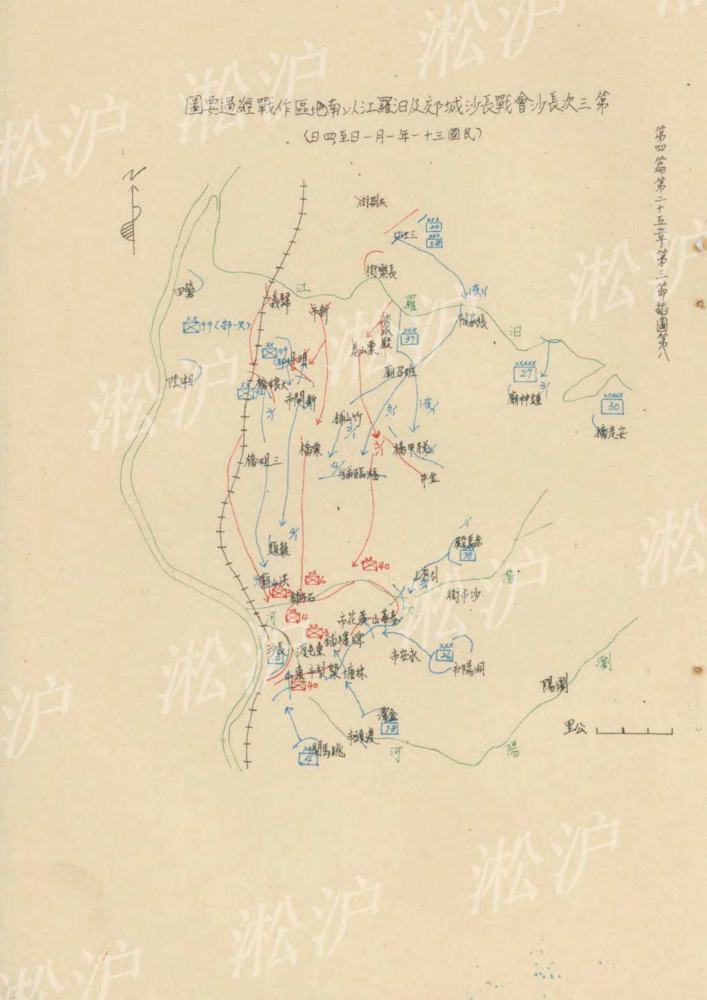

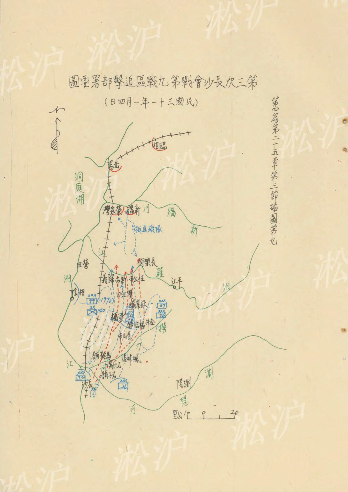

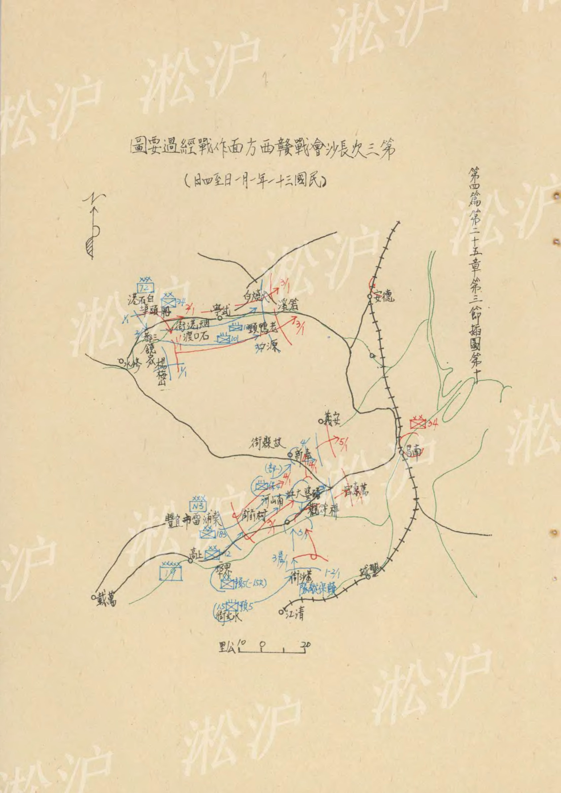

#### 第三款 我軍追擊時期

民國三十一年一月五日至十五日

參照插圖第十一至第十五

民國三十一年一月五日

參照插圖

第十一

第四軍由東屯渡，第七十三軍由湖蹟渡，分途追擊敗退之敵，第七九、第二十六軍於東山，槩梨市、牌樓舖、長橋一帶地區，協力圍殲殘留之敵，斃敵第十八聯隊長石井信以下千餘人，至六日，復將殘敵壓迫於瀏陽河殲滅之，其溺斃者，亦達五百餘人，殘敵肅清後，第二十六軍於當晚卽向楓林港、麻林市之敵追擊，其時，第四軍已到達石灰嘴，第七十三軍已追至苦竹坳以南地區，第七十八軍在古港，侯家壠之線，向西截擊經濱濺方向敗退之敵，第三十七軍在脫甲橋，學士橋之線，向西截擊敗退之敵，於檀樹灣激戰甚烈，第九十九軍之第九十二師，在洪山廟、石子舖之線，第九十九師一部在三姐橋以東地區，向東截擊北潰之敵，斬獲甚多，其第一四零師則奉薛長官之命，卽沿粵漢鐵路，以快速行動，限四日內直取岳陽，該師於六日進至汨羅車站附近，第二十七集團軍之第二十、第五十八軍，以主力在古華山、福臨舖、馬坳之線，與南下應援之敵獨立混成第九旅團三千餘人激戰，一部在漢家山、普家山、大塘沖、伍家埠之線，堵擊由長沙北潰之敵，新牆河以南，我第六、第七挺進縱隊向大荊街，新牆之敵襲擊，暫編第五十四師已進至北港，七日，敗退之敵主力已竄至楓林港，麻林市，石牯牛一帶地區，第七十九軍，已進至濱濺附近，將敵之掩護部隊圍殲後，卽肅清戰傷，停止追擊，第二十六軍追至楓林港東北之陳家塅地區，第四軍肅清石灰嘴殘敵後，已追至楓林港以北地區，第七十三軍追至青山市以南地區，由西向東截擊北潰之敵，頗有斬獲，並續尾敵追擊中，第七十八軍由古港追至上沙市、大壩橋之線，截擊流竄之敵，第三十七軍一部仍在檀樹灣，將軍壩圍殲殘敵中，主力在脫甲橋，學士橋截擊流竄之敵，第二十、第五十八軍於福臨舖影、珠山、馬坳及大李塘、易公廟、孫家沖之線，與南下之敵獨立混成第九旅團北潰之敵，第六師團步、騎、砲萬餘人，及敵機十餘架轟炸之下，激戰終日，第九十九軍（第九十二師，及第九十九師一部）已追至新開市南北地區，第一四零師正準備北渡汨羅河，暫編第五十四師正向羊樓司、臨湘之敵攻擊，其時，薛司令長官電令暫編第五十四師，限九日夜襲取臨湘縣，並確實扼守路口鋪及其南、北高地，澈底破壞鐵道，交通及通訊，令第一四零師限九日襲取岳陽縣，並扼守花板橋，虎形山、老人鋪各要點，澈底破壞鐵道、交通及通信。

一月九日

參照插圖

第十二

敵主力已由福臨鋪南、北地區續向長樂街、新市以北潰退中，我第二十六軍於九日晨追至麻林市東北之楊家灣、白馬廟一帶，與敵四千餘人激戰竟日，其第三十二師第九十四團之第二連連長趙克昶親率所部突入敵陣，斃敵二百餘人，馬百餘匹，鹵獲甚多，第四軍已將麻林市之殘敵肅清，向麻林市西北追擊，與由靑山市東竄之敵二千餘人激戰甚烈，第七十三軍於八、九兩日，在靑山市及其西北地區，與敵五千餘人，砲四門，在敵機六架更番轟炸之下，血戰兩日，斃敵七百餘人，我亦傷亡營長以下官兵五百餘人，第七十八軍將學士橋之敵肅清後，卽奉薛岳司令長官命令，分經金井、浯口向長樂街渡頭橋，大荊街超越追擊，第三十七軍將樟樹灣、將軍壩之敵千餘人圍殲過半，卽進至花門樓東西之線截擊敵軍，第二十、第五十八軍之各一部，仍在大李塘，易公廟，孫家沖（均在福臨鋪以南）之線，主力在福臨鋪、馬坳之線，與南下之獨立混成第九旅團及北潰之第六、第三、第四十師團之殘部激戰，至九日拂曉，敵獨立混成第九旅團抽集敢死隊五百餘人在敵機十餘架、砲十餘門之火力掩護下，向影珠山我第五十八軍指揮所襲擊，我以第二十軍之一部增援，血戰半日，將敵全部殲滅，其餘各部，則仍在原線與敵激戰，當日，我第五十八、第二十軍斃敵其田中佐以下二千四百餘人，馬數十匹，俘敵十六名，砲三門，輕重機槍十餘挺，步手槍八十餘支，我傷亡連長周子光以下官兵千餘人，第九十九軍仍在新開市附近，與北潰之敵激戰未已，第一四零師已經龍鳳橋向新牆河挺進中。

第九戰區長官部綜合當前情況，乃於八日以齊酉，及九日佳酉追電，先後命令第五十八軍卽經新開市、豐倉、駱公橋取捷徑，限一月九日攻佔關山、黃谷市、新市各要點，自西向東，奪敵輜重，斷敵歸路，令第二十軍立向武昌廟、新開市急進，自西向東截擊敵人，令第七十三軍速佔領影珠山、青山市第五十八軍之陣地，猛烈截擊北潰之敵，令第三十七軍卽向大頭舖、顏家舖間急進，自東向西截擊敵人一月十日，敵以飛機十餘架，掩護其主力，續向福臨舖附近及汨羅河北退中，其後衝殘部，尙在福臨舖、栗橋地區頑抗，其時，第二十六軍已在梅林舖、仰山廟（均在福臨舖東南）之線，側擊敗退之敵，十一日，克復福臨舖，並斃敵百餘人，第四軍十日竟日與敵第十八聯隊於黃鵠大山激戰，斃敵森脇大隊長以下四百餘人，十一日追至福臨舖以南地區，第七十三軍仍在大李塘附近地區，與敵血戰，敵整日以飛機轟炸助戰，迄十一日，該軍已追至山頭源（新開市以南）附近，第三十七軍連日仍在花門樓東西地區，與敵第六、第四十師團激戰，斃敵第十三聯隊第三大隊長鷹林以下九百餘人，俘敵數十人，馬數十匹，第二十、第五十八軍連日在敵機狂炸下，與敵獨立混成第九旅團第三十七大隊在影珠山、福臨舖以北地區苦戰不休，而北潰之敵，其主力已大部經長嶺、新開市北退，我斃敵掘內中佐以下一千二百餘人，馬二百餘匹，俘敵六名，我第一四三師並獲敵之師團作戰指導要圖一份，記載此次作戰，以策應香港爲目的，如香港登陸成功，則第二次作戰卽行終止，其第二期作戰，預定於十二月三十日，進到汨羅河以南之麻峯嘴附近地區，（參照附錄第四）至十一日夜，第二十軍，經希古台、上南崙、黃楊塅、武昌廟道前進，向新市、新橋之敵側擊，第五十八軍向新開市、豐倉、新市追擊前進，第九十九軍由新開市以東攻佔飄風山、麻石山，殘敵第十八混成旅團三千餘人向新市北退，但敵復藉其空軍之掩護，以步、砲千餘人向我反擊，我第九十九師之第二九六團第二營，自營長李維揚以下全部壯烈殉國，此時，我第三十集團軍指揮所移平江，第七十八軍十一日攻佔渡頭橋，向長樂街、大荊街之敵追擊中，第六挺進縱隊一度攻佔陳家橋（大荊街以東），並將大荊街、黃谷市段公路破壞甚多，第一四零師十一日克復晏家大山（新牆河北岸、青崗驛以西）南端各據點，敵由青崗驛增援四百餘人，並以飛機三架，砲二門掩護，向我第一四零師反撲，與我軍竟日激戰中，暫編第五十四師由八百市向長湖、洪橋方面攻擊前進，湘鄂贛邊區王勁修總指揮正率所部，由茶地舖、高橋（通山以北）地區，準備襲取武昌。

一月十二日至十三日，（參照插圖第十三）北潰之敵，主力續渡汨羅河，向新牆方向急退中，我第二十六軍追至麻峯嘴、福臨舖地區，卽停止追擊，集結所部，準備策應第四，第七十三軍之作戰，第四軍十三日由麻峯嘴追佔長樂街、伍公市，第七十三軍經飄風山將彭家塅之敵殘部四百餘人殲滅後，卽進佔新市，敵爭渡汨羅河，自相踐踏溺死者甚多，第三十七軍於十二日十二時，將伏南園之敵第六師團第十三聯隊之殘部全部殲滅，斃敵聯隊長友成敏一，第一代理大隊長古谷倍，第二大隊長小橋庸勝，俘敵砲兵大尉神田營吉及兵十二名，其他戰利品尤多，十三日，追至清江口、顏家舖之線，第二十軍於八里塅（新市西南）由西南東截擊潰敗之敵，第五十八軍將駱公橋之殘敵肅清後，於十三日由歸義附近渡河北進，第九十九軍連日在麻石山、飄風山地區清掃戰場，第七十八軍連日在大荊街及其以東地區，截擊敵第六師團第二十三聯隊殘部，第一四零師於十二日撤回新牆河南岸，十三日向相公嶺、傅家橋（新牆以南）之敵攻擊，暫編第五十四師連日向長湖、洪橋之敵攻擊。

第九戰區長官部，以連日來敗退之殘敵，已極度疲憊，爲不失時機，擴大戰果起見，乃令湘鄂贛邊區王勁修總指揮，親率所部，卽改向咸寧奇襲，並將咸寧確實佔領，同時，又於十三日下達元辰追電令，其要旨如左：

一、第七十八軍，在長樂街、渡頭橋、大荊街地帶，截擊北潰殘敵後，卽向四六方、潼溪街、新牆猛烈追擊，肅清新牆河左岸殘敵後，在楊林街、胡少保地區集結待命。

斗三次長沙會議

二、第二十七集團軍之第二十，第五十八軍，在新市、黃谷市、關山，截擊北潰殘敵後，第五十八軍經龍鳳橋向新牆，第二十軍經黃沙街向榮家灣猛烈追擊，肅清新牆左岸殘敵後，第五十八軍在龍鳳橋、黃沙街集結待命，第二十軍仍任方山洞、草鞋嶺、甘田、楊林街、潼溪街、新牆、榮家灣、鹿角、磊石山一帶地區會戰前之原防。

三、第一四零師，暫編第五十四師在洪橋、長湖地區堵擊截擊北潰殘敵後，暫編第五十四師向忠防，第一四零師向桃林、西塘猛烈追擊，暫編第五十四師歸一四零師李棠師長指揮，第一四零師則暫歸楊森兼總司令指揮。

四、第三十七軍（欠第一四零師）肅清長樂街、栗山巷地區殘敵後，仍任汨羅江左、右岸會戰前之原防五、第九十九軍肅清李家塅、新市地區殘敵後，仍在駱公橋、歸義、營田、湘陰及洞庭湖南岸會戰前原防。

六、第十九集團軍之第四軍，追至伍公市東西地區，肅清汨羅江左右兩岸殘敵後，即在栗山巷、伍公市集結待命，第七十三軍追至新市東西地區，肅清汨羅江左右兩岸殘敵後，即在新橋、新市附近集結待命，第二十六軍在福臨舖、花門樓、麻峯嘴地區清掃戰場後，集結待命。

一月十四日至十五日，敵陸續向新牆河北退，惟新牆、榮家灣各附近，尚有敵留置之小部隊，掩護其主力渡河，我第二十六、第三十七、第四、第七十三、第九十九各軍正清掃麻峯嘴、長樂街、伍公市、栗山巷、李家塅、新市、歸義一帶地區之戰場，第七十八軍由關王橋續向四六方、潼溪街追擊中，第二十軍，十四日在油埠灘截擊潰敗之敵，斃敵甚多，十五日，續向榮家灣追擊，第五十八軍由黃谷市續向新牆追擊，第六，第七挺進縱隊，不斷向白洋沖（長湖以東）北退之敵截擊，第一四零師十四日在黃沙街堵擊北潰之敵，與敵竟日激戰，其掩護助戰之飛機十餘架中，被我第四二零團擊落一架，另截毀載運傷病汽車三十餘輛，十五日，由黃沙街向龍鳳橋堵擊北潰之敵，敵機八架助戰，以一部與我接觸，主力急向北逃竄，十二時，殘敵始全部北潰，我仍跟蹤追擊中，敵於錢塘沖、龍鳳橋、張家沖附近，共遺屍七百餘具，暫編第五十四師正向忠防超越追擊中。

一月十六日，新牆河南岸已無敵蹤，第二十六，第四，第七十三各軍均在指定地區集結完畢，第三十七，第九十九軍已就會戰前汨羅江南北岸原防配備完畢，第七十八軍已到楊林街，並已集結完畢，第五十八軍以一部追至新牆，主力在龍鳳橋、黃沙街地區集結，第二十軍至十七日始將會戰前原防地配備完畢，第六，第七挺進縱隊正向羊樓洞挺進，襲擊敵後，第一四零師，暫編第五十四師，正向指定之目標桃林、忠防前進中。

第九戰區長官部據第一線部隊報告，知退過新牆河北岸之敵，已逐次進入原據點，乃於十八日，以銑酉追電令所屬各部隊，其部署如次（參照插圖第十四）：

一、羅兼總司令仍回駐上高，王兼總司令仍回駐修水，楊兼總司令仍回駐平江。

二、第五十八軍，以一部開醴陵、普蹟市間之官莊，軍部率一師開醴陵普蹟市間楓林市，限二十二日全部到達，積極構築工事。

三、第七十三軍，軍部率第七十七師開湘江左岸之桃花山附近，暫編第五師開橋頭舖，限十九日全部到達。

四、第四軍，軍部率一師開瀏陽，一師開山田、水口山、蕉溪嶺下、高陞橋附近地區，一師開洞陽市、九溪洞、江花橋、杉木沖附近地區，限十九日全部到達。

五、第二十六軍，軍部率一師開平江，一師開大橋、更鼓台，一師開三角塘、甕江，限十九日全部到達斗三次長沙會議

六、第七十八軍之新編第十六師開通城，接替暫編第五十四師九嶺、通城防務，佔領斗米山、麥市、九嶺亘保定關之主陣地，及通城、鐵柱港各前進據點，限二十日交接完畢，積極構築及加強各據點工事，嚴密警備，軍部率新編第十三師開渣津，限二十一日到達，新編第十五師開修水，限二十二日到達。

七、第二十軍，以第一三三師，第一三四師仍任方山洞、草鞋嶺、四六方、潼溪街、新牆、榮家灣、鹿角、磊石山會戰前原防，積極構築及加強各據點工事，嚴密警備，暫編第五十四師通城之一團，將防務交暫編第十六師接替後，開長安橋、沙拜口、公田各據點，該師主力，對忠防之敵攻擊至二十日止，開回關王橋、陳家橋、三江口、王家坊、渡頭橋、大荊街，積極構築及加強各據點工事，對北對西北嚴密警戒，限二十二日配備完畢。

八、第一四零師對桃林、西塘之敵攻擊至十九日止，卽開福臨舖、栗橋歸還建制，限二十四日到達。

贛西方面：一月五日，我贛保縱隊追擊敗退之敵，到達大城附近，第一八三師追至蓮花山、馬奇嶺、獅子山之線，第二挺進縱隊追至干洲街，六日，贛保縱隊續克西山、萬壽宮，第一八三師追佔小嶺、鎮石帥，並續向石富觀、港口、安義之敵猛烈追擊中，第二挺進縱隊已追佔靖安，七日，敵退回原防線，我追擊之各部隊，已進佔西山、萬壽宮、干洲街各以東之線，與敵相持，恢復原態勢，第十九集團軍羅兼總司令一月七日以子虞電令各部停止追擊，並調整部屬如次：（警照插圖第十五）

一、第五預備師卽開返贛江東岸，接替第十九師防務，限十三日拂曉前交接部署完畢，第十師歸還第三戰區該軍之建制。

二、贛保縱隊仍守備錦江右岸原陣地，並派一部扼佔河口程、董家橋、喻家、七里崗各前進據點，重點保持於左。

三、第一集團軍副總部指揮之第一八三師，守備馬形山、蓬花山、石子嶺之線，並以一部警戒小嶺、大嶺、陶化嶺各前進據點，重點保持於贛湘公路方面，新編第十二師仍控置泗溪附近積極整補。

四、第二挺進縱隊，除以一個支隊以鉢盂山爲根據，積極對敵攻襲外，主力守備山里鄧、上翟、車坪、潭埠、船下丁舟、鳶子岩之線，並以一部扼守鳳凰山、赤岸、五步城、奉新、鵝掌山、盒子嶺、靖安前進據點，重點保持於奉新、上富道附近，該縱隊歸本部直接指揮。

五、作戰地境：

第五預備師

乃爲韓家渡、泉港、生米街牛行之線，線上屬右。

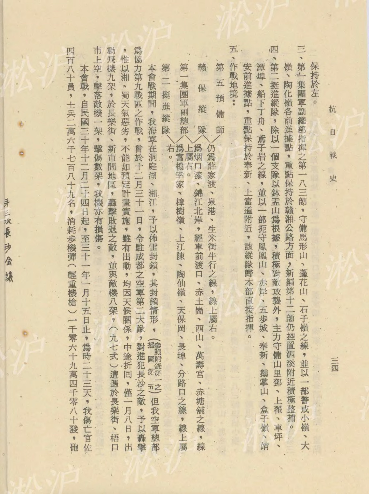

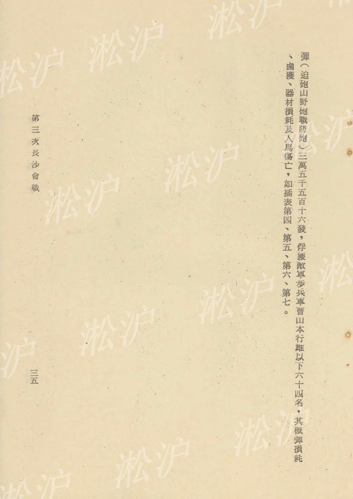

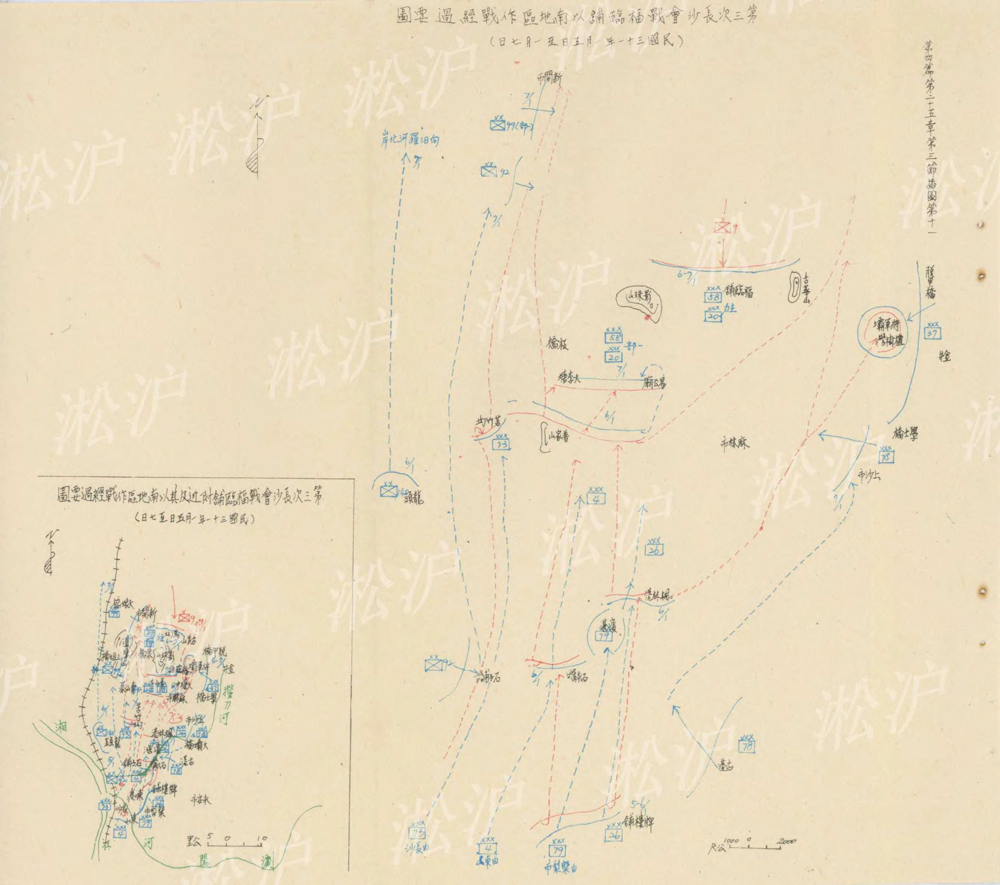

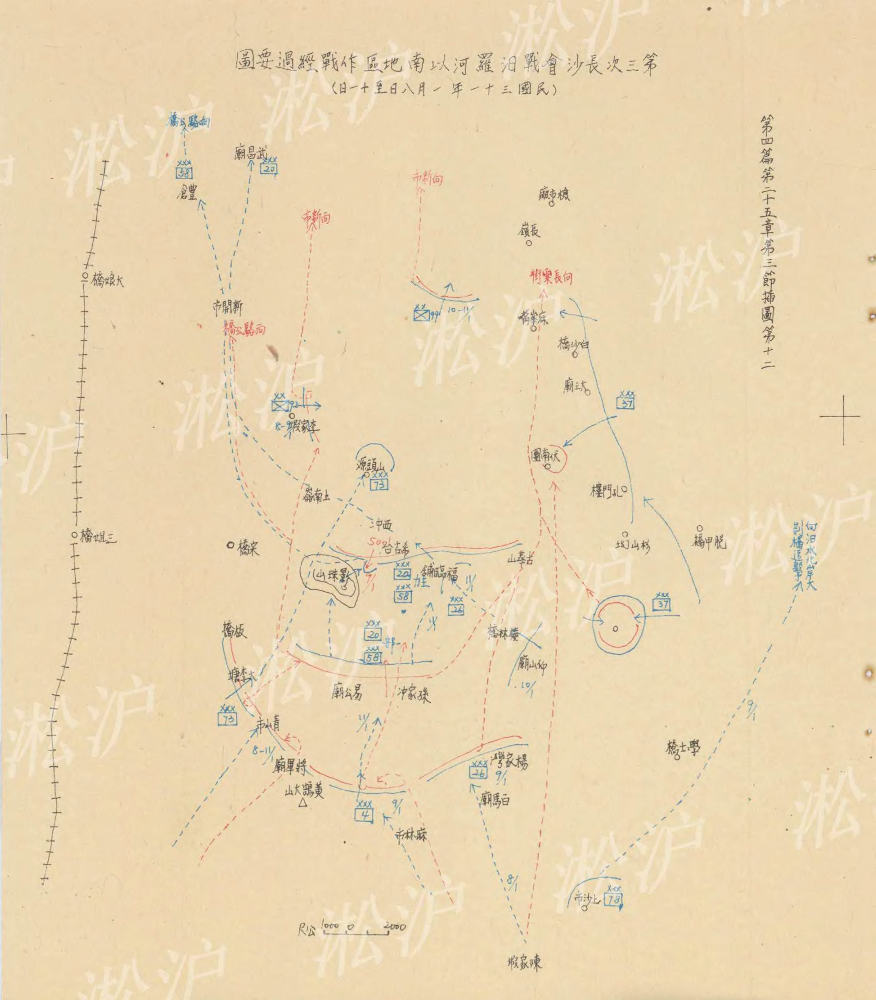

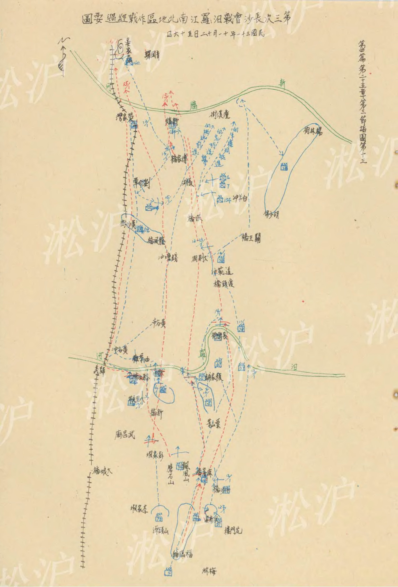

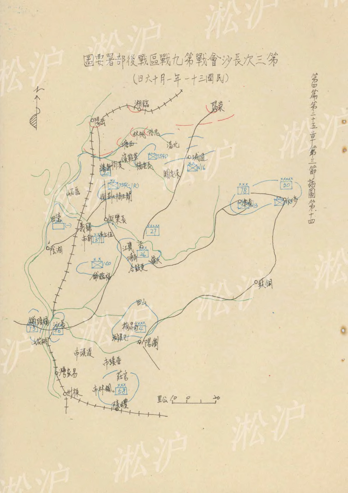

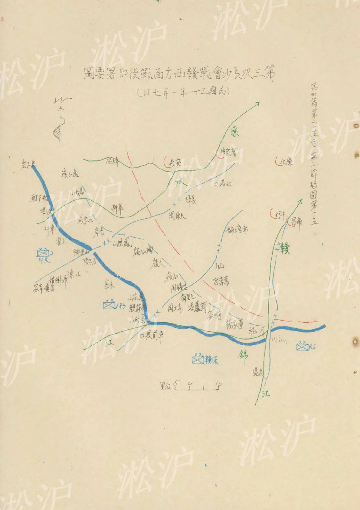

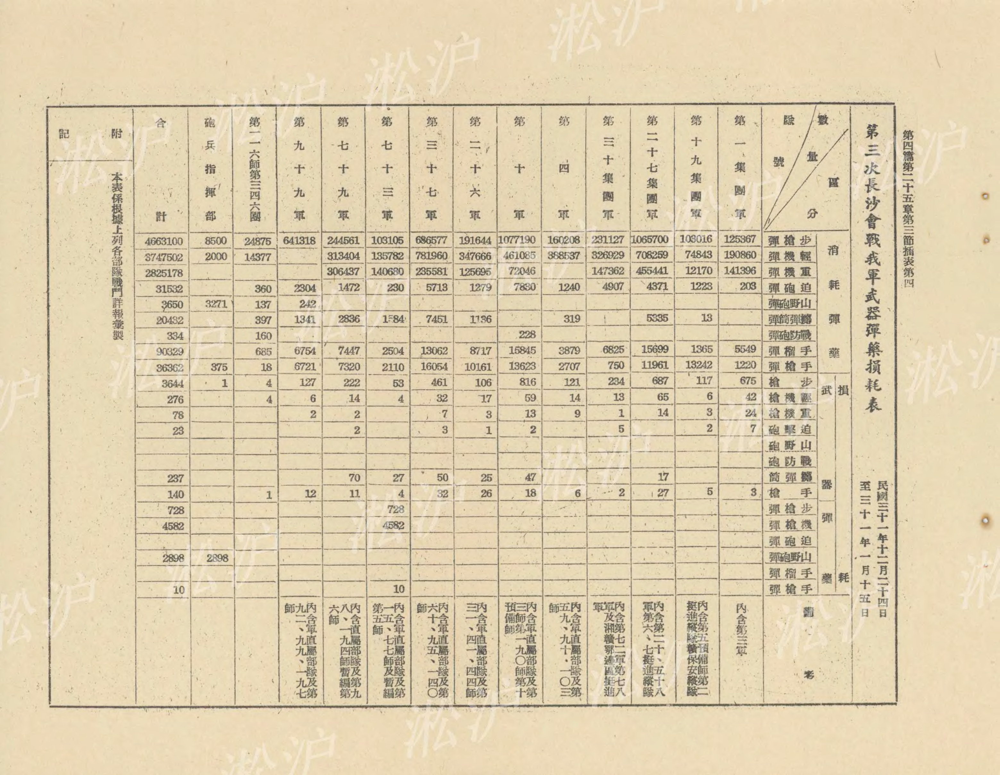

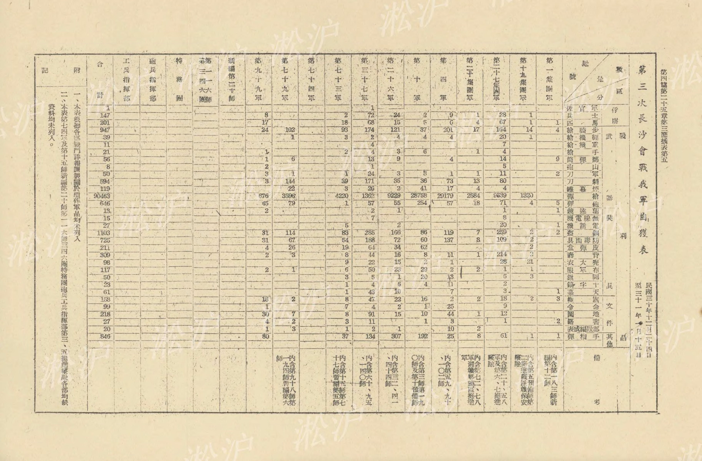

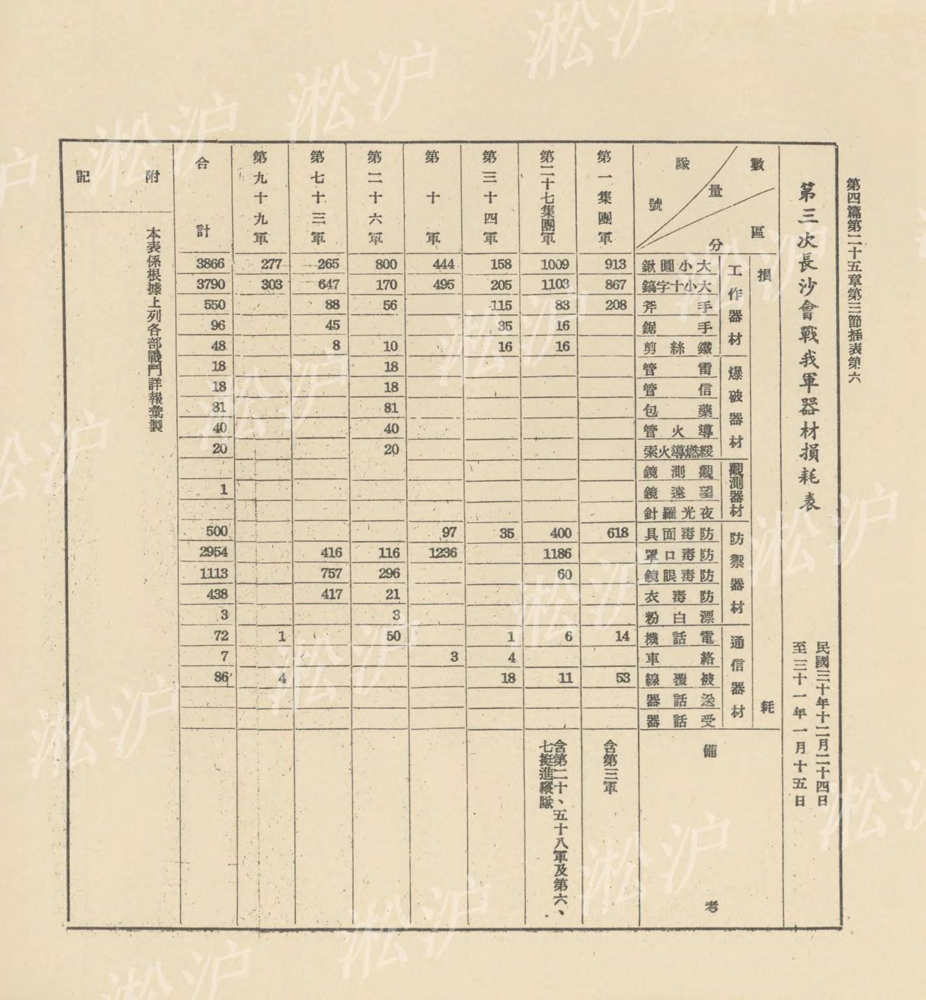

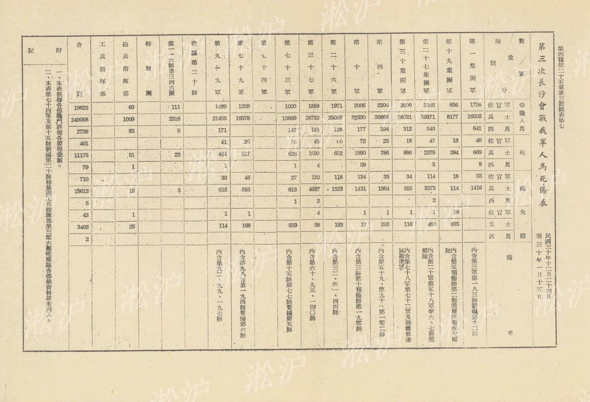

### 第四節 重要戰鬥

#### 第一款新牆河以南戰鬪

民國三十年十二月二十四日至二十七日

參照插圖第十六第十七插表第八第九

湘北鄂南之敵第六師團，於民國三十年十二月十六日起，卽抽調其第一線之兵力，至二十日已全部集結新開塘以南地區，其第三師團之第十八聯隊，於二十三日集結龍灣橋地區，第四十師團集結托壩以西地區，當敵行動之初，不時以步、砲兵向我新牆河左岸陣地襲擾。

當時，我第二十軍之部署，係以暫編第五十四師，守備斗米山、亘通城、九嶺之線，以第一三四師，守備方山洞、亘草鞋嶺、三港嘴之線，以第一三三師，守備三港嘴、亘新牆、榮家灣、鹿角、磊石山之線。

##### 第一項 新牆河附近地形

新牆河，源出幕阜山，西流入洞庭湖，扼粤漢鐵路與湘鄂公路之要衝，爲湘北之第一門戶，惟以河幅僅百餘公尺，水深約一公尺，春夏季山洪暴發，成爲障礙，秋冬水淺時，河床多沙礫，人馬車輛均可徒涉，大雲山以西地帶低平，大軍之運動容易，以東則山地連綿，限制大軍之運動及展開，故爲敵南進之必經要地。

##### 第二項 戰鬥經過

十二月二十一日，我新牆河守軍第二十軍楊漢域軍長，判明當面之敵大量增加，有三犯長沙之企圖，爲遲滯敵之行動，乃決心在方山洞、三港嘴沿河亘鹿角市之旣設陣地，逐次抵抗，遲滯敵之前進，二十二日，於關王橋軍司令部授予第一三三，第一三四師之命令，要旨如左：

一、第一三三師於敵進攻時，卽就三港嘴（不含），新橋、榮家灣、鹿角之線強靭抵抗，阻敵十日之後，待命轉移三江口（不含），智源洞間地區，向敵側擊尾擊。

二、第一三四師於敵進攻時，卽亘方山洞、草鞋嶺、三港嘴（含）之線，強靭抵抗，支持十日後，待命轉移關王橋、三江口（含）間地區，向敵側擊尾擊。

三、兩師之作戰地境，爲三港嘴、馬步塘、劉從周、沙陀廟、關王橋之線，線上屬第一三四師。

上項命令下達後，楊漢域軍長復電話指示第一三四師，將重點保持於左，師部移駐王復泰，第一三三師將重點保持於右，師部卽移南岳廟，同時爲求爭取十日之戰鬥時間，以達成強靭抵抗之目的，特將據點守備戰法，訓示兩師如左：

一、陣地佔領：以兩師作戰地境內之據點工事，爲陣地骨幹，以野戰工事爲輔，合併佔領，並注意縱深（野戰工事至少須有三線），以加強陣地之強靭性。

二、兵力使用：兩師應以一部兵力，分置於排、連據點工事內，竭力據守，一部佔領野戰工事（同時佔領兩線），利用陣地縱深，逐次抵抗，主力位置於最後一線陣地附近，機動使用。

三、戰法：敵向我野戰工事前方之據點守軍攻擊時，我野戰工事之守備部隊，以火力支援，或派隊反擊之，敵如向我野戰工事守軍攻擊時，在敵後之據點工事守備部隊，以火力射擊敵人，或離開據點尾擊之，並乘其混亂之際，猛力反擊，務使進犯之敵，在我主陣地前，受致嚴重之打擊，然後向軍之側面陣地轉進，而側擊尾擊進犯之敵。

第一三四師楊幹才師長奉命後（參照圖第十六）卽以第四零一團擔任方山洞（楊林街北四十華里），草鞋嶺亘望歌亭（不含）之線守備，第四百團擔任望歌亭（含），李丙埙亘三港嘴之線守備，第四零二團集結於楊林街、主復泰一帶，以策應第一線之戰鬥，並固守楊林街、繆家渡、四六方、任克敬、觀德沖、潼溪街、王復泰、王伯祥等處之旣設排據點工事，並視戰況之轉移，適時進入關王橋、歧沙街、陳家橋、太平塅、三江口各旣設之連接點工事，以拒止敵人，師部於二十二日，由楊林街移王復泰。

第一三三師夏炯兼師長奉命後，當卽以第三九八團一個營守備清水坑、下高橋、新牆、傅家橋、謝子其等排據點，一個營守備新塘沖、洪橋兩個連據點，長湖之排據點及其間之旣設陣地，一營爲機動部隊，就新牆河南岸及下高橋、傅家橋一帶旣設陣地，協同據點守備部隊，施行逐次抵抗，該營爾後轉移於新塘沖、洪橋間，及其以南地區，實行側擊、截擊，支持十日後，待命向新方向集結，以第三九九團之兩個營，守備七步塘、株樹港、袁家舖、古塘沖、榮家灣、歐陽廟、譚家壠、孫武、里三塘、鹿角、磊石山、羅大塘、唐家坊十三個排據點，龍鳳橋、黃沙街兩個連據點，及其中間之旣設陣地，以一個營爲機動部隊，就新牆河左岸及七里山、劉介章一帶，協同守備據點部隊，努力逐次抵抗，爾後則緊密連繫該地區內所有連、排據點之守軍，在汨水以北地區向南犯之敵尾擊，側擊，伏擊之，支持十日後，向新方向集結，第三九七團，以一個營擔任大荊街連據點，及其以東地區之守備，待命向新方向集結，其餘爲總預備隊，位置於洪橋東側南岳廟地區，準備爾後由東向西之側擊，同時，並指示守備連排據點之部隊，應屯積十日以上之糧秣、彈藥，其屯積以分置爲宜，其師部當時在南岳廟，爾後視戰況向太平塅方向移動。

十二月二十三日晚

參照插圖

第十七

楊家沖、李家沖、李丙塅、簣口、三港嘴一帶之敵，約二千餘人，與我第一三四師之四百團激戰澈夜，二十四日晨，李仙洲、後山坪各附近有敵砲六門，向潼溪街以東地區砲擊，迄十一時，敵增至四千餘人，由王家嶺、簣口地區猛攻，十四時突破我新牆河陣地，攻佔羅袁塅、余沙場等處，第四百團退守四六方、大元方、潼溪街之線，續與進犯之敵相持，十五時第二十七集團軍楊森總司令，得悉敵軍已向我第二十軍行眞面目之攻擊，當卽令第五十八軍之新編第十一師，卽由小湄開楊林街附近待命，向四六方協力第二十軍之作戰，限二十四日晚到達，又令第七挺進隊李子亮司令，負責守備大雲山、方山洞、八百市之線，傍晚，第一三三師，當面之敵一部，由姚海洲東側強渡，與我第三九八團之第一營發生激戰，同時敵第二十三、第四十五聯隊由新牆、王街坊、七步塘、任必貴，第十三聯隊由榮家灣、毛家嘴、八仙渡，與我南岸之各據點守備部隊激戰，截至二十四時，我清水坑、彭子明、王街坊、任必貴、毛家嘴、八仙渡各據點，均被敵攻陷。

十二月二十五日一時許，我第一三四師主力（第四百團、第四零二團）退守觀德沖、十步橋、王伯祥之線，第一三三師除留置各據點守軍外，主力向南岳廟、洪橋地區轉進，八時，敵分三路向南續攻，一路步、騎、砲兵約四千餘，以一部由羅袁埌經廖家沖，大部由余沙場經白羊沖，與我第一三四師於觀德沖、十步橋、王伯祥之線激戰，我傷亡官兵五百餘人，敵之傷亡尤重，一路步、騎砲約六千餘人，在敵機數架掩護下，一部由七步塘，大部向王街坊、新牆南犯，與我下高橋、相公嶺、傅家橋、長湖、洪橋、樟樹港、袁家舖、謝子其各據點之守軍激戰，其中傅家橋、洪橋之爭奪尤烈，傅家橋守軍第三九八團第二營王超奎營長以下官兵數十人壯烈殉國，洪橋守軍第三營呂海羣副營長亦奮戰殉職，戰鬥至入暮敵由各據點間隙南竄，續攻南岳廟、大荊街，經第三九七團第三營之伏擊，受創頗重，一路敵步、騎、砲五千餘，以一部由榮家灣、毛家嘴，大部由八仙渡攻孫武，在歐陽廟會合後，即續向胡德裕、黃板橋、譚家壠、古塘沖、黃沙街、龍鳳橋各據點進攻，與三九九團各部戰鬥中，其時第五十八軍新編第十一師已到達楊林街，準備向觀德沖、王伯祥之敵側擊，第二十七集團軍楊兼總司令綜合當時情況，乃再電令黃岸市之第五十八軍孫渡軍長，即率新編第十師至胡少保待命，其已到達楊林街、栗塘沖地區之新編第十一師，應向觀德沖、王伯祥之敵努力攻擊前進，並與一三四師確取連絡，十八時以後，我第二十軍全線仍與敵激戰中，惟洪橋、黃板橋各重要據點，電話先後中斷，入夜，我第二十軍調整部署，第一三四師（欠守備方山洞、草鞋嶺至望歌亭之第四零一團），卽向關王橋、陳家橋、三江口（含）之線佔領陣地，第一三三師除第三九八、第三九九團仍固守各據點外，夏燭兼師長率第三九七團附第四零一團，向三江口（不含），大石沖、羊角嶺、王家坊之線佔領陣地，於二十六日拂曉，向洪橋、大莉街之敵逐次攻擊。

十二月二十六日拂曉，我第二十軍所部正準備向敵展開攻擊時，敵已分路向我進攻，一路由南岳廟會合大莉街東進之敵，進攻三江口、羊角嶺我第一三三師之守軍，另敵一部約步、騎、砲三千餘，由王伯祥猛攻關王橋，與我第一三四師守軍激戰，雙方反復爭奪，迄至十四時，我關王橋、羊角嶺，兩陣地均陷敵手，並續向富貴洞、陳家橋、女丫橋、王家坊等地攻擊，斯時我第五十八軍新編第十一師第三十三團已抵觀德沖附近，並擊退百餘人之敵，新編第十師亦已到達胡少保集結，第二十七集團軍楊森兼總司令目睹當時情況，以電話令第五十八軍孫渡軍長，立飭新編第十師於明（二十七）日一時，經登龍橋南側，沿山麓向關主橋之敵攻擊，確實協同第二十軍之作戰，新編第十一師由東北向西南猛擊敵之側背，十七時以後，陳家橋爲敵所陷，並續向南竄，是夜，大雪紛飛，陣地冰凍，我士兵凍死者十數人，而第二十軍（欠第三九八、第三九九團）各部仍在富貴洞、斗南尖、女丫橋、王家坊之線徹夜激戰，同時，第一三三師留置新牆河以南各據點守軍之第三九八、第三九九團，仍與敵苦戰中，尤以黃沙街、龍鳳橋兩據點之爭奪最烈，然敵各師團主力均已乘隙迅速南竄。

十二月二十七日二時，第二十七集團軍奉薛岳司令長官電話指示，第二十軍應向南移，左翼務截斷陳家洞至花橋道路，勿使敵東竄，爾後向長樂街攻擊，第五十八軍應速向南移，務與第二十軍確取連絡，楊森總司令當卽分令第五十八、第二十軍，一面向當面之敵攻擊，一面向南移動，此後該兩軍之任務，均轉移側擊南進之敵，第一三三師留置新牆河以南地區各據點之第三九八、第三九九團，均於是日奉命突圍，繞道歸還建制，惟黃沙街據點，被敵砲火及飛機之轟擊，工事全燬，第三九九團守備該處之一個連，自連長王化南以下全部殉國，而洪橋、大莉街兩據點亦相繼失守。

本戰鬥，自十二月二十四日起，至二十七日止，爲時四日，我傷亡少校營長王超奎以下十員，士兵一千二百十人，失踪官二員，士兵五七一名，損耗步槍五十七枝，輕重機槍六挺，子彈七八一二粒，砲彈七十七顆，槍榴彈一八五顆，其他彈藥一三四一粒，工作器具二六七三把，鹵獲馬一匹，步機槍（彈八十四粒，裝具二十九套，另敵我指揮系統表如插表第八、第九。

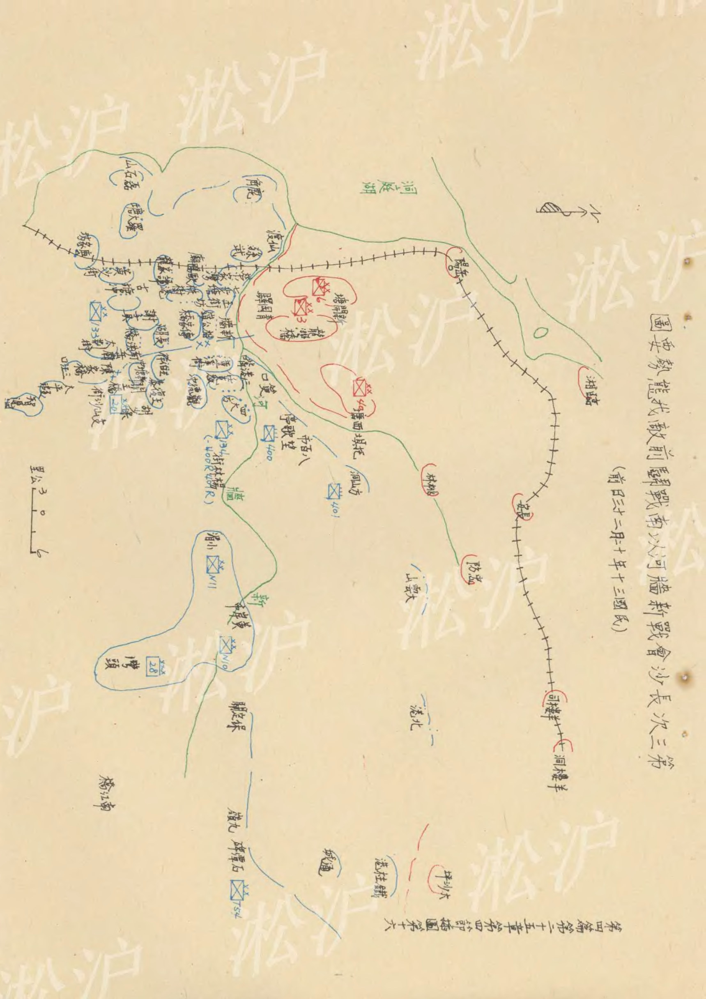

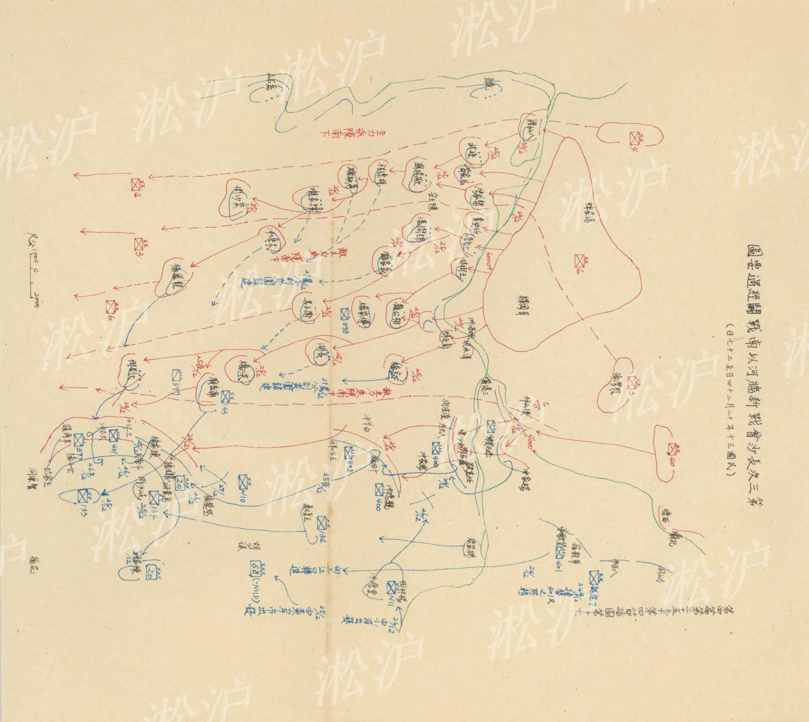

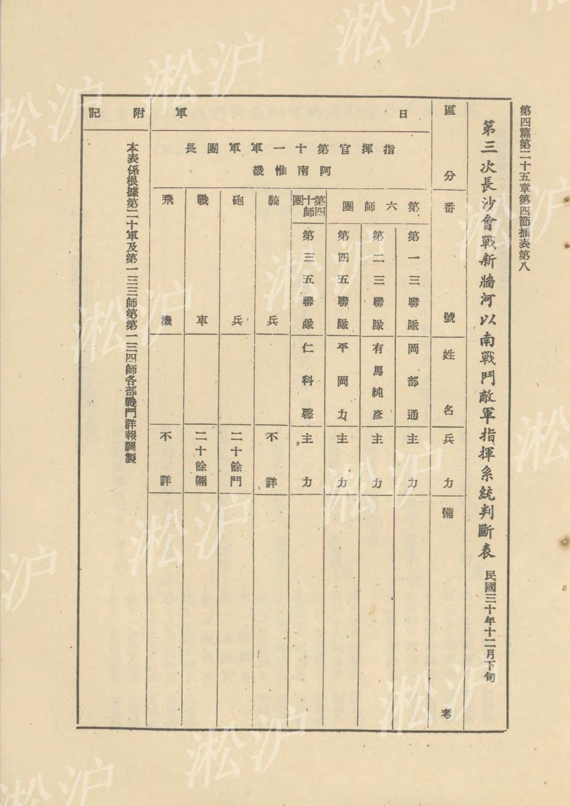

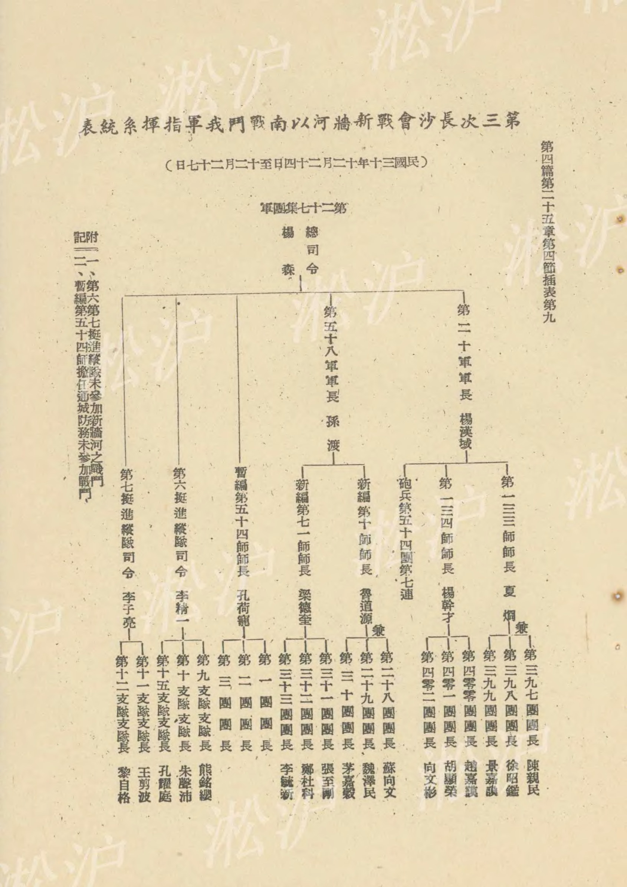

#### 第二款 汨羅江以南戰鬥

民國三十年十二月二十七日至三十日

參照插圖第十八至第二十插表第十八第十一

由新牆南進之敵，十二月二十六日午，其先頭部隊已竄抵青石橋，（長樂街北）天井山、冷水井、（新市東北）劉家冲，（歸義東北）青龍橋之線，與我第三十七、第九十九軍警戒部隊發生戰鬥。第一項

汨羅江附近地形

汨水源於幕阜山，西流至歸義，匯羅水稱汨羅江，入湘江，注洞庭湖，十至三月爲落水期，各支流乾涸，人馬車輛均可通行，餘爲雨季，則水勢暴漲，但歸義以東，尚可徒涉，汨水以南，爲起伏地，森林散佈，小山綿延，標高在五百公尺以上，形成攻守之據點。

##### 第二項 戰鬥經過

自敵軍強渡新牆，與我第五十八、第二十軍發生戰鬥時，守備汨羅江兩岸之第三十七軍，卽遵照第九戰區長官部所頒之反擊計畫，策定該軍之行動，並轉令各師，其要旨如左：

一、軍以攻勢防禦，鞏固陣地，適機殲敵之目的，決在汨羅江兩岸，張家渡、浯口、長樂街、顏家舖、新市各要點構築強固陣地，嚴密守備，並連絡左岸險要，構成縱深，務使星羅棋佈，互爲犄角，重點保持於右翼，相機轉移攻勢，並調整部署如次：

(一)第六十師，守備長樂街、張家渡、黃棠、浯口、秀水塅之線，左與第九十五師連繫，師部位置於長江源。

(二)第九十五師，守備顏家舖、伍公市、長沙嶺、馬家潼、新市、駱公橋之線，右與第六十師連繫，左與第九十二師連繫，師部於華山附近。

(三)第一四零師，爲軍預備隊，師部仍駐金井。

四第六十師，與第九十五師之作戰地境，以劉公嘴、團山舖、長樂街、白田橋、劉家塅、白水洞、橫坡嶺、坎脚裡、芳蓮沖、曹家沖、朱家沖、將軍壩相連之線，線上屬第六十師。

二、各師均以直屬部隊構築要點工事及預備陣地，守備部隊構築第一線點地，同時應注意縱深（面式），使能獨立戰鬥且有四面火戰之強靭性。

三、張家渡、青江口、長樂街、顏家舖、磨刀灘、伍公市、易家河、蘭市河、駱公橋等地，應盡可能構成氾濫，且應有強固之副防禦工事。

當時，第九十九軍，以第九十二師守備駱公橋、朱沙橋、歸義之線，重點保持於駱公橋，第九十九師守備歸義、河夾塘亘營田、湘陰之線，重點保持於湘陰、營田，其第一九七師，則負責沅江、益陽一帶湖防，第三十七軍所部於十二月五日，始將各據點工事偵察完畢與動工，因限於時間及天候，至戰鬥開始時，雖已大體完成但強度均不合要求。

十二月二十七日

參照插圖

第二十

，南竄天井山、蘭智橋之敵，自八時起卽向我汨羅江北岸之警戒陣地進攻，爲我守軍（第九十五師二八三團）擊退，十五時，敵第四十師團一部六百餘，由青石橋、團山舖攻我長樂街，與我第六十師第一七九團第七連激戰至暮，敵未得逞，此時，天井山、蘭智橋之敵已增至三千餘，迄二十八日晨，攻長樂街之敵，亦續加三千餘，以一部圍攻長樂街，主力由榮家渡強渡汨羅江，我守備長樂街之連，當卽以一排死守據點，連長親率兩排堵強渡之敵，以衆寡懸殊，該連自連長以下，傷亡殆盡，長樂街與榮家渡相繼失守，入夜，敵我相持於劉家潼、李家河之線。

另敵第六師團一部二千餘，於二十八日晨，分攻磨刀灘、伍公市、長沙嶺各地，均經我第九十五師二八四團擊退，十七時，敵於蘭市河再與攻勢，並以砲空火力掩護，激戰至午夜，我傷亡過半，敵卽乘機強渡，但其他各渡河據點則仍在我軍固守中，當日第三十七軍陳沛軍長，率直屬部隊推進朱公源（脫甲橋東北)指揮。

進據長樂街之敵，於二十九日午前完成浮橋一座，其後續部隊，卽續經此渡口南窳，並分股進攻我秀水塅、寶龜台，同時，由蘭市河強渡成功之敵，暨後續敵軍約三千餘，猛攻我茶頭嶺陣地，激戰至午，我傷亡營長以下官兵四百餘人，遂轉移西山廟、（伍公市南）童家塅之線固守，進攻之敵亦跟踪鑽隙，入夜，敵我相持於清江、秀水塅、寶龜台、伍公市、西山廟、童家塅之線，迄三十日晨，與我對持之敵，續有增加，並協同砲、空火力，再向我陣地猛攻，血戰至午，我清江口、磨刀尖據點相繼陷敵，十七時，秀水塅亦爲敵據，我守軍第六十師，遂轉移至語口、牙尖、烏石尖之線，其時，守備伍公市、西山廟、童家塅之第九十五師，亦正與步、砲、空聯合之敵三千餘激戰中，惟至十二時以後，敵大部分路鑽隙，我陣地要點，雖未爲敵所陷，但均陷於各自奮戰中，午夜，我第三十七軍陳沛軍長，鑒於第九十五師之陣地殘缺，而左側後之敵進攻亦猛，且其主力陸續南下，遂將全軍轉移側擊態勢，部署如左(參照插圖)

第十九

一、第六十師，仍守備張家陂、浯口、牙尖、孫家山、鴉雀尖、大頭嶺、望湖尖（含）之線，轉向西北，繼續戰鬥，師部駐白馬廟。

二、第九十五師，主力佔領望湖尖、旨泉嶺、芭蕉源、嘯天獅子、蝦蟆嶺之線，轉向西南繼續戰鬥，以一部據守興隆山、湖源山、鴨婆尖、桃花山、飄風山、麻石山等地，應盡全力牽制敵後，並企求吸引敵之大部於此方面，俾戰區能獲得決戰之餘裕時間，師部駐興雲山、株樹嶺之間。

三、軍部駐葡塘以西之梧桐操。

敵第六師團主力，及第三師團一部（參照插圖），於二十七日上午九時，在其砲、空火力掩護下，由青龍橋附近地區，分向我歸義、河夾塘進攻，當卽與我第九十二、第九十九師各一部發生激戰，至十二時許，我歸義對岸守軍，全部殉國，敵乘機強渡千餘人，並向白犬口我軍陣地猛撲，經第二九六團（第九十九師）主力出擊後，敵勢稍挫，犯河夾塘之敵，以一部圍困我守軍，主力強渡汨羅江，其時薛岳司令長官，電令第九十九軍傅軍長，率戰鬥指揮人員於二十八日推進三姐橋附近，指揮第九十九師，應靈活運用，確保栗橋、牌樓峯必要之據點，第九十九師奉到軍長命令後，當即以第二九六團一個連守歸義、高泉山、大路舖，一個連守盤龍橋、石子澗據點，主力於栗橋，第二九五團控置於牌樓峯，迄翌日八時，與我在駱公橋隔河對戰之敵，以一部圍攻我軍，主力南竄，歸義、百犬口之敵，陸續增加至五千餘人，一部千餘犯朱沙橋，另一部約二千人，經盤龍橋東側，向渌塘舖、五倫舖竄擾，主力二千餘，經楊梅舖，落馬橋南犯，此時第九十九師，高魁元師長，基於以上之情況，判斷敵軍避堅鑽隙，卽令第二九五團以一個營守備渌塘舖，並對盤龍橋南犯之敵，予以迎擊，主力以牌樓峯爲據點，對南竄之敵予以側擊、截擊，第二九六團，除守備據點部隊外，其餘部隊，以栗橋爲依據，向西側擊，九時，我朱沙橋爲敵所陷，此際第九十二師梁漢明師長，以駱公橋尚在我軍固守中，但由南渡犯百犬口敵之主力，陸續沿鐵道西側南竄，乃令第二七四團以一營守備駱公橋、團螺山、密岩山各據點，主力集結於板橋附近，機動使用，十三時，敵第六師團第二十三聯隊一部向密岩山我第二七四團陣地猛撲，主力沿岳山尖西麓，向將軍神竄犯，十八時許，我大娘橋陣地前，有沿鐵路南竄之敵三百餘，與我第二七五團之一連戰鬥中。當時，我第九十九師當面之敵，經第二九五、第二九六團分別側擊、截擊將留滯於渌塘舖、楊梅舖、落馬橋地區，入夜，敵我相持於駱公橋、大娘橋、及渌塘舖、楊梅舖一帶，第九十二師梁師長，此時所知情況爲。

一、敵之大部，經歸義附近繼續南竄。

二、河夾塘渡河之敵，正向營田方向前進中。

三、長樂街亘新市間進犯之敵無積極活動。

判斷敵軍，似有先攻佔鐵道西側高地，掩護進攻營田、湘陰之企圖，當將此情況向薛岳司令長官意見具申，薛長官根據此意見，並綜合各方情況，乃作如左之指示。

一、一四零師（第三十七軍）卽由金井出發，向李家塅戰備前進，先頭限二十九日拂曉前佔領馬山神，沙塘基，劉家洞，之線，主力集結於塹兒橋附近，歸第九十二師梁漢明師長指揮。

二、第九十九軍指揮所暫設喬口，不心移至三姐橋。

竄攻將軍神之敵第六師團第二十三聯隊主力於二十九日晨二時，續犯新開市，與我第二七五團之一營發生激戰，至六時許，陣地一部爲敵攻破，經我抽集兵力反擊後，敵不支後退，九時，敵復以砲、空火力掩護再度猛攻，另敵三百餘向大娘橋守軍進攻時，適第一四零師已到達馬神山附近，並向新開市、，娘橋之敵側擊，敵傷亡甚衆，仍向將軍神以北潰竄，第九十二師之新開市、筆架山、白鶴洞陣地，亦於此時交第一四零師接替，十時，薛岳司令長官以電話命令第九十九師，該師除守備主要據點外，應卽佔領張公橋至湘陰之線，確保湘陰、營田，高師長奉命後，卽令第二九五團以一部佔領張公橋，主力控制於伯輔廟，第二九七團仍負責湘陰、營田一帶之守備，第二九六團以主力向南竄之敵尾擊十二時，又奉薛岳司令長官轉委員長蔣電話命令，湘陰爲戰略要點，務須確守。

十二月二十九日十五時，營田守軍向高師長報告，由石子澗向營田前進之敵二千餘，已折向東南竄，刻營田附近已無敵踪，又十八時，第九十二師向傅仲芳軍長報告，大娘橋之敵，刻向新開市方向東竄，進據石板屋之敵，有南竄模樣，十九時，第九十九師報告，石板屋敵千餘人，向王思岩進犯後卽向東竄，盤龍橋、涿塘舖一帶刻無敵情，傅軍長根據以上情況，當卽作如左之處置。

一、第九十二師集結主力，待命反擊。

二、第九十九師守備湘陰、營田各部隊，仍服原任務，師部及其各部隊應卽向牌樓峯、滹塘舖之線推進三、守備營田之砲兵第五十四團二營，除留置一連（兩門）於堆山嘴外，以一連轉移至牛頭洲，一連於蘆林潭斗米嘴。

四、砲兵第一團九連移於保護圍，主火力對湘江封鎖，及策應營田、湘陰之作戰。

五、軍砲兵營丁營長統一指揮各砲兵部隊，並將原配置濠河之野砲一門，移於鐵罐嘴，以火力封鎖湘江。

迄三十日晨三時，洞沖（金鷄山南）附近地區發現敵步、騎、砲混合之敵約六百餘人，有續向南竄之企圖，我第九十二師梁師長鑒於我陣地據點間隙甚大，乃重新調整部署如次：

一、第二七四團除以第一營守備密磊山外，第二營卽開彭家坳（石橋灣東北）歸第二七六團指揮，第一營由該團掌握，集結於金牛嶺（梅林橋以東）待命。

二、第二七五團鄒團長率一加強營（步、砲各兩連，機槍一連），由梅林橋向西搜索敵踪予以攻擊，並協同第二七六團包圍竄據洞沖附近之敵而殲滅之，主力由該團團附李剛勁指揮，對北嚴密警戒。

三、第二七六團（附第二七四團之第二營及迫砲兩連）佔領彭家坳之七柳樹、石橋灣之線，對南竄之敵予以痛擊，另以一連守備低華嶺，一連向西北搜索。

攻我新開市之敵千餘，經守軍反擊北潰後，復於三十日拂曉，在敵砲（十二門）火掩護下，再度猛撲，激戰至午，敵雖增至三千餘人，但爲守軍反復肉搏所阻，敵乃施放毒氣砲彈三十餘，我第一四零師官兵中毒傷亡者約近百人，然敵迄不能越雷池一步，十五時，第二七五團（第九十二師）向西搜索之加強營，於洞沖附近發現敵踪，經我軍襲擊後，敵大部向吳家大屋流竄，一部爲我圍困清泉沖，其向吳家大屋南竄之敵，復爲第二七六團一部於七柳樹西北地區截擊中，十六時許，敵由金鷄山附近地區增敵千餘，向我何家灣、王思岩陣地猛犯，企圖策應清泉沖之敵突圍，我第九十二師梁師長恐敵陷王思岩制高點，影響戰局，卽令第二七五團以一部增援何家灣，第二七四團集結金牛領之第一營，歸第二七五團鄒團長指揮，緊縮清泉沖之包圍圈激戰至傍晚，敵我相持於新開市、何家灣、清泉沖等地區，其時第九十九軍傅仲芳軍長接得戰區長官部電話，知由長樂街地區南犯之敵，已竄抵金井，福臨舖之線，其先頭騎兵已竄抵麻林市附近，當卽以電話指示高、梁兩師長，第九十九師應協同第九十二師固守王思岩，不得已時，則向伯輔廟方向轉進，尾擊敵人，並須確保湘陰、營田第九十九師高魁元師長奉命後，卽調整部署如左。

一、師以確保王思岩，協力友軍策應湘陰之目的，在王思岩附近，向東配置側面陣地，側擊敵人。

二、第二九五團以一營（欠一連），接替王思岩騎兵連之陣地，而確保之，並策應第九十二師之戰鬥其餘集結於河塘沖附近。

三、第二九六團，集結羅家沖以北地區待命。

四、第二九七團，仍守備湘陰、營田一帶，以全力封鎖湘江。

五、騎兵連於陣地交接後，向羅家沖附近集結。

六、工兵營向羅家沖集結待命。

七、入夜後，師指揮所轉移羅家沖。

汨羅江以南之戰鬥，自十二月三十日以後，卽告一段落，第三十七、第九十九軍已轉入側擊時期。

本戰鬥，自十二月二十七日起，至十二月三十日止，爲時四日，我傷亡官佐七十八員，士兵一千四百五十七名，失蹤官一，士兵五十三人，損耗步、機槍彈六十七萬二千五百六十二粒，迫砲彈二千一百五十五顆，山野砲彈六十二顆，手榴彈九千六百五十四枚，擲彈筒彈一千九百五十三顆，手槍彈五千九百九十七粒，損失步槍一百四十七枝，輕機槍十挺，重機槍三挺，迫砲二門，手槍十一枝，工作器具一百二十二把，俘獲敵軍二十九人，馬二十四匹，步槍（附刺刀）六十四枝，手槍三支，輕重機槍各二挺，手榴彈七十六顆，步槍彈三百二十四粒，砲彈二十二顆，軍刀十二把，無線電機三部，鋼盔一百四十六頂，防毒面具九十四具，軍服四十六套，工作器具九把，命令五份，地圖十一份，另敵我指揮系統表，如插表第十，第十一。

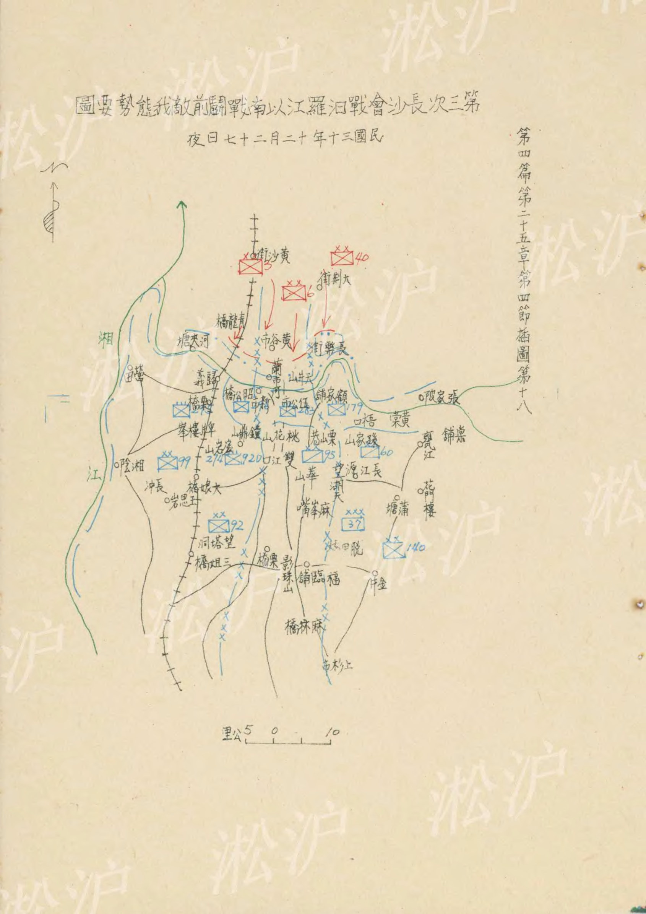

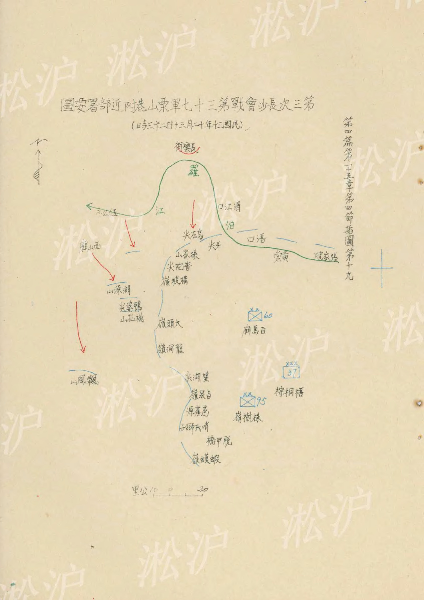

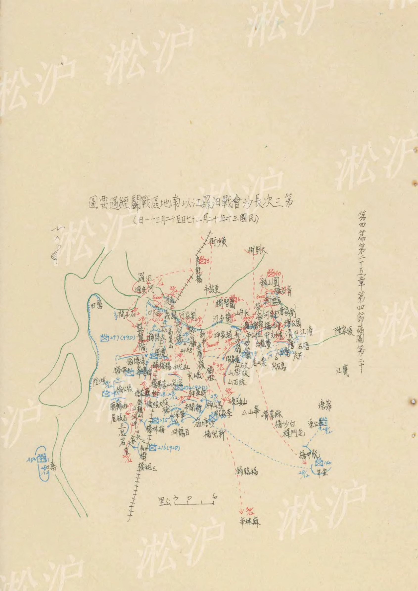

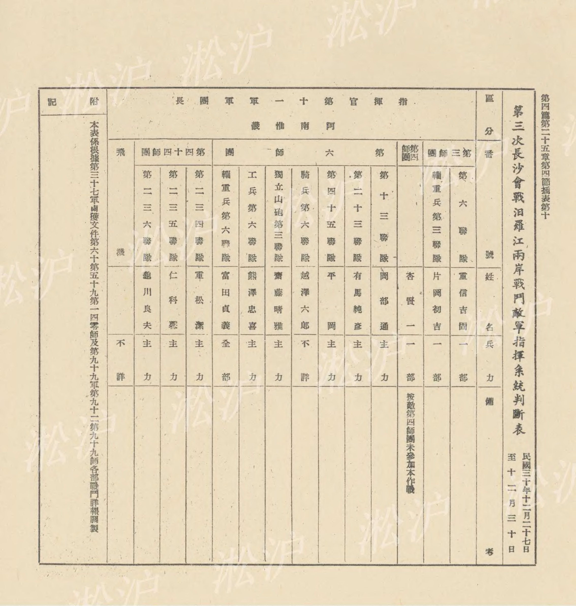

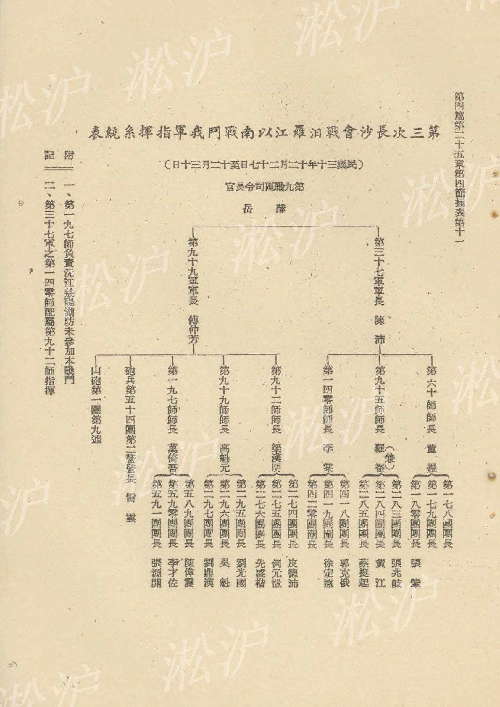

#### 第三款 長沙城郊戰鬥

民國三

十三年

元月

一月

至

四

日

參照插圖第二十一至第二十五插表第十二第十三

民國三十年十二月二十七日至二十九日間，敵渡汨羅江後，其第四十師團由長樂街經栗山巷、長嶺、高橋、上杉市、春華山道南進，民國三十一年元月一日，主力到上杉市以南地區，騎兵部隊則已進抵永安市附近，第六師團由新市經雙江口、福臨舖、楓林港道南進，三十一日夜，主力抵楓林港以北地區，騎兵部隊則在楊林舖附近，第三師團由歸義經靑山市、唐田廟、安沙道南進，三十一日夜主力到達唐田廟附近，先頭騎兵在石子舖附近，其時，我第十軍軍部在長沙城坡子街，所屬第十預備師，第一九零師，均各派便衣隊在東山、楓林港附近監視，主力固守郊區猴子石、金盆嶺黃土嶺、林子冲、左家塘、半邊山、楊家山、湖蹟渡、復興寺、新河正街之線陣地，第三師以便衣隊在安沙、沙坪附近監視外，主力固守長沙城垣之既設據點，第七十三軍軍部在澡灣市，其所屬第七十七師主力固守岳麓山陣地，一部守備澡灣港、銀盆嶺、馬家坪、土城之線，師部於賀家灣，暫編第五師主力固守谷山陣地，一部守備百世橋、賽頭港、白沙洲之線，師部在谷山西南陣地。

##### 第一項長沙附近地形

略（見第一第二次長沙會戰）

##### 第二項戰鬥經過

第九戰區薛長官，於民國三十年十二月八日，爲準備第三次長沙會戰，卽令衡山之第十軍，接替暫編第二軍防務，並擔任長沙市區及郊區工事之構築，至十二月中旬，敵三攻長沙之企圖已明，薛長官除對戰區各守備部隊有明確之作戰指示外，於十二月二十日，復以電令第十軍指示部署，其概要如左：

一、該軍第一步應固守長沙，第二步待敵竄攻劉陽河北岸，向長沙攻擊三天後，待命自西向東夾擊敵軍二、第一九零師，任長沙外圍據點及湘江右岸之守備，第三師任長沙核心工事之守備，第十預備師固守岳麓山，及水陸洲旣設據點工事，與湘江左岸之守備。

同時，蔣委員長爲增強長沙城防守軍力量，以亥號午會一元創電，令第六戰區將第七十三軍（欠第十五師）開寧鄉、益陽地區集結待命，並限十二月二十五日到達，該軍彭位仁軍長卽率第七十七師，暫編第五師由澧縣附近出發，十二月二十二日十六時，薛長官再指定死守長沙城之部隊，機關，其命令要旨如左：

一、戰區以殲滅進攻敵軍之目的，指定部隊，機關死守長沙，第十軍全軍，及其配屬之砲、工、通信部隊。

長沙警備司令部。

憲兵第十八團。

省會警察局。

水上警察局。

長沙縣政府。

三民主義青年團。

二、各部隊、機關，特須分別注意下列數事。

(一)、迅速完成據點工事，其已完成者，盡力加強之。

(二)、嚴厲整飭軍風紀，各級文武官吏，須抱定必死之決心，必勝信念。

(三)、確實維護治安，嚴密查緝敵間、漢奸、地痞、流氓、小偷等。

四、儲備一個月用之糧彈。

(五)完成通信設備，注意保持長沙、岳麓山間水上交通。

(六)軍、政、警及黨、團工作人員，必須協力一致，完成使命。

三、長沙縣政府、縣黨部、三青團、警察局、水警總隊、憲兵團，均歸周慶祥警備司令指揮。

四、所有以上死守長沙各部隊、機關，均歸李玉堂軍長統一指揮。

十二月二十七日，第七十三軍到達寧鄉、寧家舖附近，及其西北地區，十二月二十九日，奉蔣委員長儉（二十八日）午令一元電：「第七十三軍（欠第十五師）着歸第九戰區指揮。」十二月三十日十二時，第九戰區薛長官電話，命令第七十三軍要旨爲：

一、李、彭兩軍，死守長沙，岳麓山兩要點。

二、岳麓山及湘江左岸第十預備師防務，着交第七十七師接替，限三十一日拂曉前，交接完畢。

三、暫編第五師，卽推進至五里堆附近集結。

十六時，第七十三軍軍部進駐溧灣市，二十一時，第七十七師所部防務接替完畢，二十四時，暫編第五師到達五里堆附近，彭位仁軍長，當卽作如左之部署：

一、第七十七師，以主力守備岳麓山據點，另以第二二九團守備溧灣市亘虎形坡，沿湘江江岸之陣地，第二三零團第二營守備靳江河、漁灣市（岳麓山南）之線。

二、暫編第五師，以主力守備谷山附近陣地，掩護軍左側背之安全，一部（第三團）守備百世橋亘白沙洲沿江之陣地。

十二月三十日，蔣委員長以卅酉令一元九電，對第九戰區作戰指示如左：

一、敵似有沿粵漢鐵路，逐步推進，攻佔長沙之企圖。

二、該戰區在長沙附近決戰時，爲防敵以一部向長沙牽制，先以主力迫我第二線兵團決戰，然後圍攻長沙，我應以第二線兵團，距離戰場較遠地區，保持外線有利態勢，以確保機動之自由，使敵先攻長沙，我乘其攻擊頓挫，集中全力一舉向敵圍攻，以主動地位把握決戰。

薛長官奉令後，當卽根據蔣委員長之指示，以卅函電部署所屬，其命令如左：

一、戰區以包圍殲滅進攻長沙之敵之目的，決以各兵團向長沙外圍敵軍，行求心攻擊聚殲之。

二、第二十七集團軍，以第五十八軍，由長樂街經栗山巷、青山市道向安沙，第二十軍由清江口經福林鋪、文家塅向石子鋪索敵攻擊，該集團軍第一次攻擊到達線，爲湯家塅、安沙、載家園之線，第二次爲傅家冲、周婆塘之線。

三、第三十集團軍，以第三十七軍（欠第一四零師），由甕江市附近經脫甲橋、上杉市、赤石河向望仙橋，以第七十八軍主力由三角塘、更鼓臺、經金井、路口畲、春華山、黃花市向長橋，一部（一個師）由杜港市經沙市街、春華山，會同軍主力向長橋索敵攻擊，該集團軍第一次攻擊到達線爲載家園、春華山、東林寺之線，第二次爲大灣港，長橋之線。

四、第十九集團軍，以第二十六軍主力由洞陽市經永安市、楊楓壩向梨梨市索敵攻擊，一部（一個師）由江花橋經永安市協同軍主力向梨梨市索敵攻擊，第七十九軍（附第一九四師）以主力由金潭經馬營向黃花市以南地區索敵攻擊，依狀況再轉向梨梨市攻擊。以一部由波頭市向柞山橋索敵攻擊，依狀況再轉向東山攻擊，以第四軍主力，由龍頭舖方面經跳馬澗、白田舖，一部由譚家壩經水口山，西塘冲向長沙以南地區索敵攻擊，該集團軍第一次攻擊到達線爲東林寺，蓮塘、柞山橋、楓樹河、白田舖、大托舖之線，第二次爲梨梨山、東山金盆嶺之線。

五、第十軍固守長沙及水陸洲，第七十三軍固守岳麓山，並以小部任觀音港經深灣市、白沙洲，沿湘江西岸之警備，待各兵團到達第二次攻擊目標附近時，卽斷行反攻。

六、第九十九軍以第一九七師固守湘江西岸及洞庭湖南岸原防，以第九十二師由三姐橋經橋頭驛，以第一四零師由栗橋經官橋向撈刀河索敵攻擊，以第九十九師固守雙獅洞、柳溪橋、花山巖、湘陰、營田各要點，並以有力一部由明月山、雙獅洞向栗橋、福臨鋪側擊敵軍，務希截斷敵軍補給線，該軍第一次攻擊到達線爲白沙洲東岸、橋頭驛、官橋之線，第二次爲撈刀市附近地區。

七、作戰地境

第二十七集團軍與第三十集團軍間，爲五里牌、鍾神廟、花門樓、白米山、楊公橋、載家園、周婆塘之線，線上屬第三十集團軍，第三十集團軍與第十九集團軍間，爲羊牯灘、大橋寨東林寺大石坡、下橋壩之線，線上屬第十九集團軍。

第十九集團軍與第十軍間，爲易家灣、猴子石，沿湘江東岸之線，線上屬第十九集團軍。

第十軍與第九十九軍間，爲撈刀河口，沿湘江東岸之丁字灣、折向西岸經白沙洲、黃土壩至馬欄口之線，線上屬第九十九軍。

第九十九軍與第二十七集團軍間，爲伍公市、槐樹橋、山頭源、橫板橋、張家灣、湯家塅、大賢鎮、小石湖之線，線上屬第二十七集團軍。

八、本命令開始實施時間，另令規定。

十二月三十一日，薛長官電令第二十七、第三十集團軍，卽遵卅電於民國三十一年一月一日夜開始攻擊，限一月四日到達第一次攻擊到達線，同日七時，第十軍李玉堂軍長，知南犯之敵已竄抵金井、福臨鋪、三姐橋之線，並繼續南竄中，當卽根據戰區長官部之作戰計畫，部署如左：（參照附錄第三）一、第十預備師，迅卽佔領水陸洲、猴子石、金盆嶺、黃土嶺、林子冲、左家塘亘半邊山之線，主力控置於黃土嶺附近，拒止南犯之敵，並派便衣隊於東山附近，預行潛伏阻擊敵人。

二、第一九零師，迅卽佔領楊家山、湖蹟渡、復興寺附近，亘新河正街之線，主力控制於鞍子山、湖蹟渡附近，拒止南犯之敵，並派便衣隊（約一連）在楓林港附近預行潛伏，阻擊敵人。

三、第三師，以主力迅卽佔領長沙城垣，以一個團控置於城東南地區，拒止南犯之敵，並派便衣隊（約一連）於安沙、沙坪附近，預行潛伏，阻擊敵人。

四、砲兵第二團第二營，（附砲兵第一團之第一營第二連及砲兵第四團第二營之第四連）迅卽佔領岳麓山經水陸洲亘長沙市區之旣設陣地，以主力協力第十預備師，及第三師，一部協力第一九零師之戰鬥。

五、作戰地境。

第七十九軍與第十預備師間爲：大托舖、東山、秋塘、牌樓舖之線，線上屬左。

第十預備師與第一九零師間爲：下廣濟橋、陳家堆、牛角灣之線，線上屬右。

第一九零師與第九十九軍間爲：馬欄口、黃土壩、白沙洲、橋頭驛、風梅坳之線，線上屬右。

第十預備師與第三師間爲：西湖馬頭、西湖路、天心路之線，線上屬右。

六、各級之通信連絡，須周密準備，務使在戰鬥最慘烈，或被敵軍破壞時，仍能保持通信圓滑，並限三十一日午前完成之。

各師奉到左項命令後，卽各調整部署（參照插圖第二十二）

民國三十一年一月一日四時（參照插圖第二十三），敵第三師團步、騎、砲兵約三千餘，由東山，槳梨市乘霧強渡瀏陽河，分經周家橋、公子嶺、新大橋，向我長沙東南城郊陣地進攻，六時許，其先頭步、騎兵四百餘，攻我第十預備師之滴水井、阿彌嶺陣地，被我守軍擊退，至十一時，敵增至二千餘，並在敵機十餘架掩護下，續向滴水井、林子沖陣地猛撲，另周家橋之敵，亦與我第十預備師於金嶺盆黃土嶺附近戰鬥中，此際，敵機對滴水井阿彌嶺之轟炸，迄未停止，而敵之砲兵復在雨花亭，以強烈之火力支援其攻我之步兵，我陣地工事，在敵飛機，砲火轟擊下，全部摧毀，敵之進攻亦烈，我陣地守軍，大半壯烈犧牲，乃於十六時，轉守農林試驗場、左家塘、半邊山之線旣設陣地，十七時，敵續向左家塘陣地進攻，我第二十九團第一營自營長曹建業以下，官兵傷亡殆盡，陣地被敵突破，第十預備師方先覺師長，鑒於左側翼之威脅，遂將第一線陣地正面縮短，僅據守金盆嶺、黃土嶺、馬家沖、楓樹山，農林試驗場之線，十八時，另敵一部攻我南元宮、鄔家莊、軍儲庫等地，激戰至二十一時，鄔家莊北端，軍儲庫東側，第三師之警戒陣地被敵突破，並乘夜暗鑽隙，竄踞白沙嶺民房內，威脅我天心閣，此時，第十軍李玉堂軍長，爲恢復我城郊據點，卽令第一九零師派兵一營，襲擊左家塘附近之敵，第十預備卽抽調兵力襲擊軍儲庫附近之敵，二十二時，我先後克復左家塘，軍儲庫，敵向打靶場潰退，惟白沙嶺之敵，仍在我圍攻中。

同日，我外圍部隊第三十集團軍，已令第七十八軍在羅洞、赤馬殿、潯江橋等地區，候命向春華山、長橋一師索敵攻擊，第三十七軍在芭蕉源、脫甲橋、金井之線，候命沿上沙市，向赤石河，望仙橋一帶索敵攻擊，第二十七集團軍，已令第二十、第五十八軍由張家坡附近渡河南下，向石子舖索敵攻擊，第九十九軍之第九十二師，已奉令南下，向撈刀河索敵攻擊。

一月二日零時十分，敵第四十師團一部步、砲千餘人，由農林試驗場附近，續向楓樹山第十預備師陣地進攻，爲我守軍第二十九團所擊退，一時三十分，潰退打靶場之敵，糾合其後續部隊，復向我鄔家莊、小林子街猛攻，經守軍英勇抵抗，與敵反復肉搏四次，激戰至二時半，以傷亡過重，陣地被敵突破，守軍第三十團之第三營營長阮成，親率殘餘官兵八十餘人，乘敵立足未穩，果敢逆襲，卒將原陣地恢復，至三時二十分，敵再度向鄔家莊、小林子街進攻，此時李玉堂軍長，卽令第十預備師之第二十九團，以一營固守金盈嶺、黃士嶺陣地，該團葛先才團長，親率其餘部隊向小林子街之敵迎擊，戰鬥進行至爲慘烈，敵以死傷枕藉，向東潰竄，我第二十九團，副團長陳新喜，團附曾友文，均身先士卒壯烈殉國，五時，敵第六師團主力，向我左家塘、長嶺陣地進攻，一部與我軍儲庫守軍激戰中，另攻我南元宮、二里牌、四方塘之敵，亦與我第一九零師激戰，傷亡均重，至七時，敵二千餘已侵入半邊山、長嶺，軍儲庫各附近，復藉其優勢砲空掩護，以一部攻楊家山、柳家山，主力向南元宮猛撲，前後六次，均爲守軍第一九零師之第五七零團所擊退，九時，敵騎砲兵三千餘，（第三師團）向金盈嶺、黃士嶺陣地再度進攻，我第二十九團第二營，奮力抵抗，激戰至十一時，攻黃士嶺之敵，復向太乙寺、烏龜沖進攻，我守備金盈嶺之第十預備師之第二十九團第二營，卽於此時連絡中斷，情況不明，太乙寺之敵，經我集中熾盛火力射擊後，斃敵四百餘，卽行回竄，至十三時，敵復由太乙寺南側，轉向我同仁街口、修械所、陶家沖、紅石嘴之線進攻，爲我第三十團所擊退，同時第一九零師南元宮附近之敵，續有後續部隊二千餘增加，再向第五七零團之楊家山、柳家山陣地進攻，敵並以毒氣襲擊守軍，雖傷亡慘重，但陣地屹立未動，十四時敵第六師團三千餘人，由瀏城橋東側向北活動，企圖襲擊瀏陽門以北之第三師陣地，經我熾盛火力射擊，斃敵五百餘，敵不逞狼狽潰退，其時，我城南戰況，愈形慘烈緊張，李玉堂軍長，乃急調東北正面守備之第三師第八團，控置妙高峯附近，準備策應第十預備師之作戰，未及到達，而城南戰局已穩定，城北正面轉而危急，乃將第八團之第二、三營調守小吳門至興漢門（含）之陣地，興漢門以西至江邊之線，則由第一九零師之第五六九團接替，第八團之第一營歸第九團團長指揮，仍位置妙高峯附近爲軍預備隊，又令第十預備師之第二十八團派兵一連向困守白沙嶺民房內之敵圍攻，敵堅守頑抗，斗三次長沙會議

我乃火燒民房，敵無一倖免，計斃敵第三師團加藤中佐，小琢登大尉以下官兵百餘八，並獲得敵第三師團第六聯隊加號作戰編成裝備指示之要紙一份（如附錄第十），得知此次攻我之敵，其彈藥糧秣攜行數量甚微，我第九戰區長官部，當將此項文件，通報各軍，各集團軍，十六時，敵千人攻我第一九零師新軍路陣地，爲守軍擊退，十七時，敵復增加千人再攻，仍未得逞，第九戰區薛司令長官，以第十預備師傷亡過大，乃令其守備水陸洲之兩個連，歸還建制，防務交由第七十三軍之第七十七師接替。

同日我第四軍，已由曲江鐵運株洲，並已集中完畢，薛長官當卽令該軍進佔跳馬澗東西之線，第七十九軍（附第一九四師）之主力，則已進展至瀏陽河右岸，第九十八師及暫編第六師，準備由金潭、波頭市向東山索敵攻擊，第二十六軍（第四十一、第四十四，及第三十二師）所部，於二日夜分別各以一部進至楓槳橋、洞陽市、梅花、萬家橋、羊牯灘、北盛倉之線，第七十八軍進至花蓮塘、大橋市之線，第三十七軍在脫甲橋、金井之線，與由栗山巷南犯之敵三千餘激戰中，第二十軍已由張家陂渡汨水，進至長江源附近，第五十八軍進至龍洞、嚴家洞附近地區，第九十九軍則以第九十九師接替第一四零師之新開市，明月山陣地，第一四零師，準備於三日拂曉前交接完畢，向橋頭驛，官橋之線攻擊前進，第九十二師已向撈刀河運動中。

一月三日零時（參照插圖第二十四），攻我新軍路之敵，以一部千人乘夜暗竄至陳家山以東地區，分攻我第一九零師之第五七零團藕茅冲、陳家山、杜家山陣地，我陳家山陣地，失而復得者三次，天明後，敵機九架輪番轟炸，陳家山工事全燬，守軍乃轉移至南華女校，與第五六八團之四十九標陣地銜接，盡力拒止敵軍，另一部千餘，由新軍路復興街進攻桐蔭里，與第五六七團第三營戰鬥，激戰四小時，敵我均無進展，敵乃以主力繞陳家山東南，向北竄攻留芳嶺，湘雅醫院附近，於是，城北之戰况漸趨激烈，七時，瀏陽門附近，復竄來敵軍千人，再度猛撲，並以飛機及砲兵，投射燒夷彈及毒氣，守軍第三師，雖有死傷，但陣地則仍然屹立，十時敵機十餘架，於我妙高峯亘老龍街之陣地上，不斷轟炸，陣地及民房多被焚燬，守軍傷亡甚重，此時太乙寺、烏龜沖附近，續竄到敵第三師團之後續部隊千人，乘勢再攻陶家沖、紅石嘴，與第十預備師之第三十團激戰，陣地失而復得者四次，我第十預備師騎兵連，及第二十九團之一部，出敵不意，由東瓜山出擊，敵勢挫退，遺屍百餘具，獲戰利品甚多，十二時許，敵機再臨我陣地上空猛炸，並空投糧彈甚多，妙高峯附近，復發現敵傘兵七人降落，當即爲第三師第九團將其悉數殲滅，午後陳家山敵，轉向南華女校，四十九標進攻，被第一九零師之第五六八團所擊退，城東南紅石嘴、陶家沖、修械所，小跳馬躅、仰天湖街、嚴家嶺、老龍街之線與敵激戰未已，惟我第十預備師，傷亡過大，方先覺師長，將輜重兵配發武器增援，入夜，第十預備師縮短正面，固守陶家沖修械所、東瓜山、小跳馬躅、南沙嶺之線，敵續猛攻，並在修械所附近，使用毒氣，我守軍英勇抵抗，陣地未爲所乘，至二十一時，城北興漢門、湘春門附近，發現敵第四（或係第六師團之誤）師團步、砲聯合之敵五千餘，向我猛撲，經第一九零師奮勇阻擊，敵未得逞，遂轉竄留芳嶺、湘雅醫院附近，與我對戰，另攻四十九標之敵，於二十二時，以一部二百餘人向我第五六八團夜襲，被我擊斃數十名，殘敵退守民房，經我用火攻後，悉被燒斃，第十軍李玉堂軍長，於二十時，奉薛長官三日十四時電令，略以第七十三軍第七十七師，除擔任水陸洲之一個營，仍續服行原任務外，其餘卽由溧灣市附近，於本（三）日黃昏進入長沙，爲出擊部隊，歸李軍長指揮，第七十七師到達後，李玉堂軍長卽令韓濬師長，以一部於湘春街，主力控制於南門附近。

同日（以下參照插）

，我第四軍之第五十九師，已進至柏竹塘、白田鋪以北地區，第一零二師已進至西塘沖、大托鋪以北並已完成攻擊準備，第九十師則位置於同仁堂附近，第七十九軍已開始向槊梨市（暫編第六師）、東山（第九十八師）之敵展開攻擊，第九十八師之一部，且與敵在候家沖戰鬥，第二十六升三次長沙會議

軍，於三日夜進展至楓漿橋黃花市、東塘蓮塘之線，第七十八軍已由引秀山、豺狗壠，向春華山前進，第三十七軍，已向上沙市、路口畲之敵攻擊，第二十軍已至古華山、福臨舖附近，第五十八軍已由長嶺閩達竹山舖，第一四零師，於十三師始將防務交替完畢，即向萬谷嶺龍頭之線前進，第九十二師已到達油舖塘，第一次攻擊到達線」。

一月四日三時，長沙城郊之敵（參照插圖）第二十四，全線開始猛攻，我守軍沈着應戰，迄至四時，城南之敵第三師團殘部，及第四十師團一部共七千餘人，向陶家冲、修械所陣地猛攻，兩陣地先後失守，但經守軍果敢逆襲後，修械所仍爲我軍收復，激戰至八時，敵機六架向修械所、杏花園、小跳馬澗、東瓜山一帶陣地猛烈轟炸，同時，敵砲八門，亦分由大掃把塘、馬家冲高地對我射擊，此際，敵我戰鬥至爲激烈，我陣地大部被毀，守軍傷亡慘重，修械所陣地失而復得者凡五次，我第十預備師第二十八團之第三營譚營長，爲規復陣地，親率全營向敵衝擊，致營長以下，全部壯烈殉國，九時，敵再向修械所進攻，我方先覺師長，以第三十團傷亡殆盡，乃將師輜重營之輸送連、衛生隊各一部編成一連，令葛先才團長指揮，用以阻擊進攻之敵，此時，太乙寺附近發現敵後續部隊，經我岳麓山砲兵猛烈射擊，敵死傷甚衆，敵勢稍挫，十三時，殘敵六百餘，由小林子街向小跳馬澗陣地攻擊，葛先才團長乃親率雜務兵向敵衝殺，並令各陣地齊吹衝鋒號，殺聲四起，敵狼狽退去，此戰鬥，軍事委員會以葛先才團長指揮有方，迭殲強敵，英勇可嘉，特准晉級少將，賞洋五千元，以示嘉獎，城北之敵第六師團約五千餘人，自拂曉進攻第一九零師之第五六九團湘春路陣地，及第五七零團南華女校陣地，激戰四小時，其間敵並施放毒氣，但未得逞，十二時以後，敵藉飛機火砲之掩護，向湘春路猛攻不已，經守軍奮勇抵抗，雙方傷亡均重，至十五時，敵攻勢稍挫。

此時，我外圍部隊第四軍之第五十九師，第一零二師已攻佔林子冲、黃土嶺、金盈嶺等地，幷與守城之第十預備師取得連絡後，卽向城東之阿彌嶺、楊家山高地攻擊，其第九十師，則已推進至黃泥塘附近策應作戰，此時，團攻我長沙之敵，因我外圍援軍已到，內外夾攻，遂全部動搖，紛向梨梨市方向潰退，第四軍卽乘勝掃蕩瀏陽河西岸殘敵，第七十九軍於十一時，奉薛岳司令長官電話命令，與第四軍齊頭併進，協同攻擊，惟因東山之敵增多，竟日與敵激戰於康思嶺、秋塘候家沖之線，入夜，東山、梨梨市之敵，到處放火，第二十六軍之所屬各師已到達孫家壠、舒家灣、麻筆鋪之線，第七十八軍已至寒婆坳附近，向栗山梅園市之敵攻擊，第三十七軍已攻佔金井，此戰，我第九十五師第二八四團團長黃紅殉國，第五十八、第二十軍已到達漢家山、普家山、大塘沖、伍家埠一帶，第九十九軍之第一四零師，九時到達龍頭，第九十二師已進至洪山廟，並以小部隊分置於湖蹟渡、黑石頭等要點警戒，入夜後，長沙城郊附近之敵，知我軍合團之勢已成，乃四處縱火，分向東北潰退，我第九戰區薛司令長官，爲澈底殲滅敗退之敵於汨羅江以南，撈刀河以北地區，特令所屬勇敢追擊，並部署如左：

一、第十九集團軍，羅卓英總司令爲南方追擊總司令，指揮第二十六、第四、第七十三軍，於五日拂曉開始，第三十六軍由牌樓鋪，經楓林港、梁家橋、麻峯嘴、栗山巷，向長樂街、伍公市，第四軍由阿彌嶺、左家塘經東屯渡、石灰嘴、青山市、福臨鋪、李家塅、雙江口向新市、蘭市河，第七十三軍由長沙經石子鋪、馬鞍鋪、栗橋、馬山神向駱公橋、歸義，分別追殲敗退之敵。

二、第二十七集團軍，楊森兼總司令爲北方堵擊軍總司令，仍指揮第二十、第五十八軍，在象鼻橋、福臨鋪、栗橋，自北向南堵擊敗退之敵。

三、第三十集團軍，王陵基兼總司令，爲東方截擊軍總司令，指揮第三十七、第七十八軍在楓林港以北，長樂街以南地區，自東向西截擊敗退之敵。

四、第九十九軍傅仲芳軍長，爲西方截擊軍司令官，指揮第九十九軍及第一四零師，在石子舖以北，新斗三次長沙会講

市以南地區，自西向東截擊敗退之敵，其第九十九師之一部，固守湘陰、營田，第一九七師固守原防。

同時，薛司令長官又以支申（四日）追電令第六、第七兩挺進縱隊，破壞敵後交通通信，其概要爲，第六、第七挺進縱隊，卽推進至長樂街、大荊街、新牆地區，確實破壞該地區敵軍新牆至長樂街、榮家灣至歸義之交通通信，截擊其輜重，燬焚其高級司令部，倘該地區之敵，修成公路或鐵道，定以各該縱隊司令及各支隊長是問。

一月五日七時，長沙城郊附近已無敵踪，第十軍李玉堂軍長，奉命清掃戰場，各追擊部隊，亦分路尾隨敗退之敵，開始猛攻追擊。

本戰鬥自一月一日起至一月四日止，爲時四日，我戰死官兵，計團長以下官佐一百三十六員，士兵三千三百二十五名，馬六十一匹，傷官二百五十九員，士兵三千五百八十八名，失踪軍官二員，士兵七百三十三名，損耗，步槍彈一百一十八萬零二百零五粒，輕、重機槍彈一百四十五萬七千九百六十三粒，迫砲彈八千零六十顆，山、野砲彈二千二百一十二顆，戰防砲彈二百二十八顆，手榴彈一萬八千三百四十九枚，手槍彈一萬五千七百三十三粒，擲彈筒彈一千五百八十四顆，損失步槍八百七十一支，輕機槍六十三挺，重機槍十三挺，迫擊砲二門，山野砲一門，擲彈筒七十四具，手槍二十三支，步機槍彈三千三百二十粒，工作器具（含斧、鋸、剪）一千九百九十二把，防毒面具四百一十六具，防毒衣三件，望遠鏡二個，敵之傷亡與損失不詳。

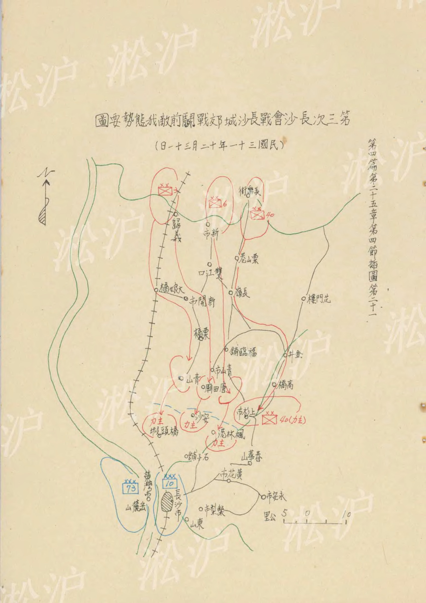

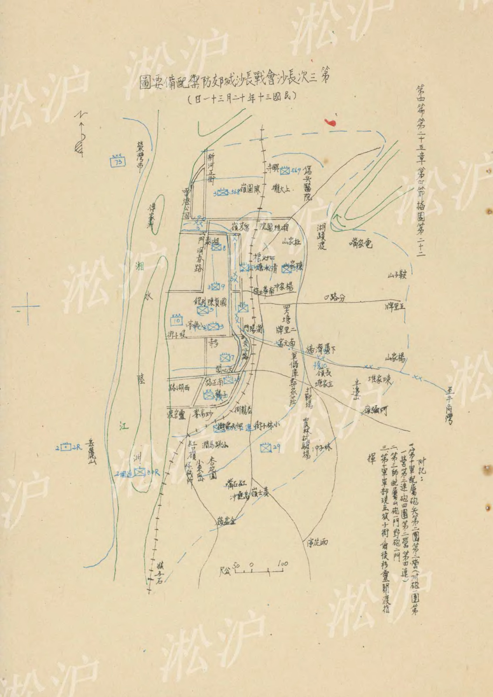

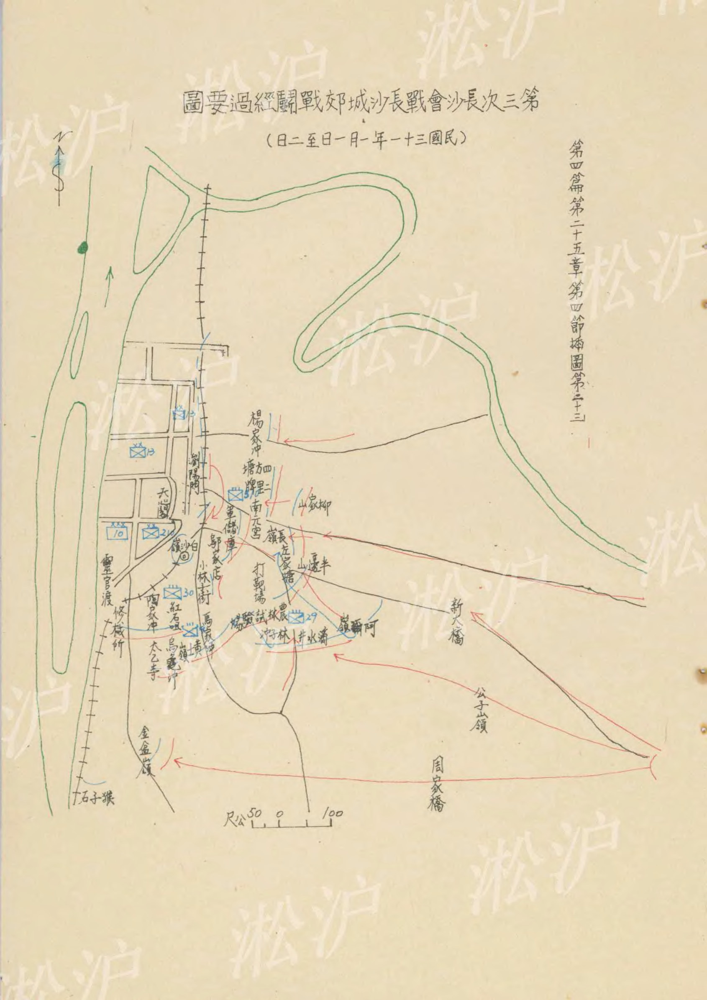

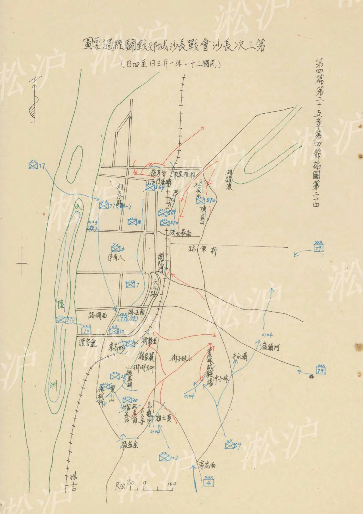

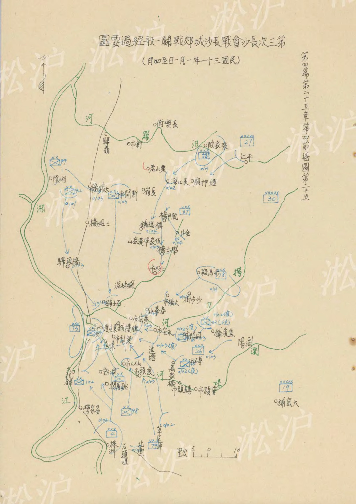

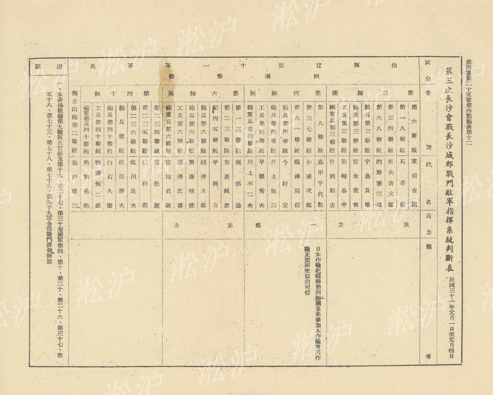

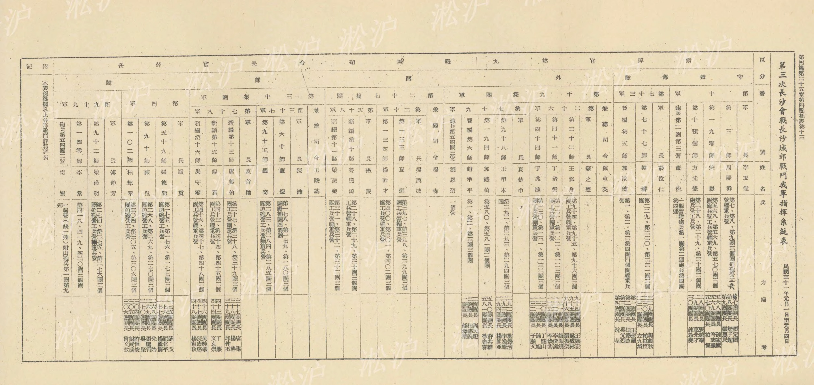

#### 第四款 游擊戰鬥

民國三十年十二月二十六日至三十一年一月二十六日參照插圖第二十六第二十八插表第十四第十五

本會戰期中，第九戰區各挺進縱隊，在贛北、贛西、鄂南、湘北敵後地區，不斷向敵倉庫及交通、通信等，加以襲擊、截擊與破壞，使敵之運輸、補給，不能圓滑，並牽制敵人兵力，對於我主戰場（湘北方面），與支戰場（贛西方面）之作戰補助甚大。

##### 第一項 戰鬥前狀況

參照插圖

第二十六

第三次長沙會戰，敵主力南進，留置後方守備者甚少，但在主要城市及公路、鐵路之沿線，則據點林立，射擊準備良好，各據點六、七公里以內，均爲敵步、砲火制地帶，近接困難，贛西北及鄂南地區，山勢綿互，地形複雜，冬季氣候嚴寒，連日大雪，主要道路多遭破壞，我挺進部隊又裝備窳劣，不能適應敵情、地形之需要，均爲游擊行動之障礙，當時湘鄂贛邊區挺進軍所部，分駐通（山）、崇（陽）公路南、北地區，第六縱隊在通域地區，第七縱隊在汨羅河以北地區。

##### 第二項 戰鬥經過

十二月二十四日，湘北之敵開始強渡新牆河向南進攻，第九戰區薛長官，於二十五日九時，給予各挺進軍之命令要旨如左：

一、挺進軍王勁修總指揮親率第四、第五、第八挺進縱隊，及直屬第一、第二補充團，暨鄂保安大隊，第一步，向崇陽、蒲圻、咸寧攻擊，確實截斷敵公路、鐵路之交通、通信，第二步，待命向臨湘、岳陽一帶，素敵指揮機關而襲擊之。

二、第六、第七挺進縱隊歸第二十七集團軍楊森兼總司令直接指揮，第一步，向羊樓司、忠防、臨湘攻擊，索敵指揮機關襲擊，確實截斷敵之公路、鐵路、交通、通信，第二步，待命尾擊由新牆南進之敵。

三、以上各部第一步之任務，限二十六日開始積極行動，第二步之任務待命行動。

當南進之敵，以十二月二十七日準備強渡汨羅江進逼長沙之際，我湘鄂贛邊區挺進軍所部，已遵照第九戰區長官命令開始行動，二十八日通（山）、崇（陽）公路以南之第四（欠第五支隊），第五縱隊（欠第八支隊），野戰補充第一團，黨政總隊第一、第二大隊，均已分別向青山口附近集結，路北之第八縱隊，第五、第八支隊，自衛第三團等部，亦於二十九日於茶地舖附近集結完畢，準備行動，適奉薛長官二十七日戍涵電，令改攻蒲圻、崇陽、羊樓司、羊樓洞、臨湘一帶之敵，乃令路北之各部隊，在河田畈、宋蔡門附近集結待命，路南之部隊，在中堡舖附近集中待命，並限十二月三十一日前到達，其總指揮所亦移中堡舖，旋因戰况進展，又奉薛長官二十九日戍淙電，令着率所部猛力攻擊臨湘、忠防之敵，並破壞交通、通信，我王勁修總指揮當又改令路北之第八縱隊，以一月一日前在三山源、愛川門附近，第五、第八支隊，自衛第三團，於一月四日前趕到花墩橋集結待命，路南之第四（欠第五支隊），第五（欠第八支隊）縱隊，野補第一團，黨政總隊第一、第二大隊，經清水塘、通城、桂家大屋向忠防前進，其攻擊部署概要如左：

一、第四縱隊（欠第五支隊），於四日拂曉以主力向忠防之敵側背攻擊，一部份向曾家坳、許畈之敵攻擊。

二、野戰補充第一團，於四日拂曉與第五縱隊連擊，向小水山、老鴉尖各據點之敵攻擊，重點保持於左翼。

三、第五縱隊（欠第支隊）以一部，於四日拂曉向鴉吉山之敵攻擊，主力由余家嶺包圍敵之左側背攻擊之。

四、黨政總隊第一大隊，以一部留駐通城擔任轉運站之組織，並與暫編第五十四師連絡，主力於大沙附近，對羊樓司、大沙坪方向，各派出一個搜索隊，搜索敵情，第二大隊以一部在桂家大屋發動民衆，準備民伕、給養，其餘取捷徑向南沖（黃岸市北十餘公里）推進，並對長安橋、黃岸市附近各派出一個搜索隊搜索敵情。

五、鄂保安大隊位置於桂家大屋南端，向孟城、南冲、毛家寨、白箬方向警戒，突擊第四營，於桂家大屋東北，並向東北警戒。

部隊奉令後，於一月二、三日間，均已到達指定地區，就攻擊準備位置。

一月二日，路北各部隊，（次第八縱隊，第五、第八支隊，自衛第三團），均已到達三山源、愛川門、花墩橋各附近，向蒲圻、羊樓司、羊樓洞等處之敵據點攻擊，敵憑堅頑抗，而我路南之各部，於四日晨始向忠防、曾家畈、許畈、小水山、老鴉尖、鴉吉山各據點攻擊，激戰至暮，我無進展，入夜各部攻擊仍未停止，五日六時，王勁修總指揮，奉薛長官四日戍追電令，一、敵第三、第四、第六、第四十師團在長沙外圍，連日被我內外夾擊，傷亡過半，潰不成軍，殘部刻正被我圍殲中，二、奉委員長蔣嚴令，着該總指揮親率第四、第五、第八挺進縱隊，野戰補充第一、第二團，鄂保安大隊，以絕對快速機敏忠猛果敢之行動，立即乘虛襲取武昌，當卽研究進襲路線，以由通山、楠林橋間通過敵公路封鎖線，較爲容易迅捷，王勁修總指揮卽令各部停止攻擊，並作如左之處置：

一、總指揮所及路南各部隊，卽由現地向通山楊芳林以南之吉家源、唐家附近地區前進，並由通山楠林橋間通過公路。

二、第八縱隊及第五、第八支隊，速在茶地舖（通山北），高橋、赤橋附近地區集結待命。

三、野戰補充第二團，抽調一個營，於九日前在夏舖附近待命。

路南各部，於一月九日晨起，分自楊芳林以南，逐次通過公路，十二日我路南、北各部隊均先後到達茶地舖、高橋、赤橋、山口舖附近地區集結完畢，十三日二十時，王勁修總指揮又奉薛長官十二日午追電要旨：本部爲迅速殲滅殘敵之目的，着該總指揮親率所部，改向咸寧奇襲，確實佔領並截斷交通、通信。同時得知咸寧及其附近各據點，共有敵軍六百餘，僞軍二百餘，砲十餘門，當卽決心於十六日向我咸寧之敵攻擊，遂部署如左（參照插圖）：

一、第八縱隊（配屬爆破隊），於十六日十八時，向橫溝、官埠橋、咸寧各據點之敵持續攻擊，重點於咸寧方面，收復該城，同時須切斷咸寧、賀勝橋間之交通、通信，阻止洪溝橋、官埠橋之敵向咸寧增援，另以一部攻擊賀勝橋之敵。

二、第五縱隊於十六日十八時，向文筆山及其西南高地持續攻擊，重點保持於左，確實協同自衛第三團之攻擊，以一部圍攻楊家畈之敵，並應佔領之。

三、自衛第三團（配屬爆破隊），及野戰補充第二團之第二營（欠機槍連），於十六日十八時開始，向西門街、咸寧城之敵攻擊，收復該城，並應對咸寧鐵橋予以破壞。

四、第四縱隊，於十六日十八時分向錢家橋、馬橋、港下雷各據點之敵攻擊，重點保持於錢家方面，並破壞交通、通信。

五、五、野戰補充第一團，於十六日夜，澈底破壞小嶺附近之公路，對小嶺之敵嚴密警戒，道路破壞後酌留一部於該地附近，襲擊敵之修復部隊，主力卽歸還本部。

六、黨政總隊於十六日由高橋、山口舖各派出一個搜索隊，對金牛、賀勝橋、楠林橋、通山方向之敵搜索。

七、鄂保安大隊突擊營（配屬野戰第二團第二營之機槍連），爲預備隊，於十六日十六時，位置於錢落附近。

八、總指揮所，十六日十六時在錢落附近。

各部隊奉到右項命令後，卽遵於十六日十八時起，分向各指定之攻擊目標發動攻勢，激戰至十七日二十四時，我第八縱隊第十三支隊，曾一度攻佔埠橋，第十四支隊攻至咸寧城東門城下達七次之多，惜火力不足，無法制壓敵之砲火，我傷亡過大，未獲戰果，自衛第三團攻佔咸寧城南之西門街，焚其倉庫，第四縱隊攻佔馬橋，第五縱隊則與文筆山之敵激戰至烈，此際我挺進各部隊雖有斬獲，但敵一面憑堅固據點工事頑抗，一面增援，至十八日，各據點之敵續有增加，我王勁修總指揮乃令各部由攻擊轉爲襲擊，其要旨如左：

一、第八縱隊主力留置王本立（橫構橋東南）附近，積極破壞賀勝橋、咸寧間，及官埠橋、楊家畈間敵之交通、通信。

二、第五縱隊積極破壞咸寧、高屋嘴（不含）間，敵之交通、通信。

三、第四縱隊積極破壞高屋嘴（含）、少嶺（含）間敵之交通、通信。

四、野戰補充第一團，以全力隨時伏擊小嶺（不含）、楠林橋間敵之通信、車輛。

五、自衛第三團積極破壞咸寧、汀泗橋敵之交通、通信。

六、各部隊均限十八日夜起，開始積極活動。

七、其餘各部，卽隨總指揮所於十八日十四時移均下（茶地舖以南）。

其時，我湘北方面之第六、第七挺進縱隊，在第二十七集團軍楊森兼總司令指揮下，於十二月二十五日，令第七挺進縱隊守備大雲山亘方洞、八百市之線，並向西塘之敵出擊，適奉薛司令長官有辰涵電：『着第六、第七挺進縱隊，於二十六日開始向羊樓司、忠防、臨湘攻擊，索敵指揮機構而襲擊之，並確實截斷敵之交通、通信。』此項任務遂令在通城東南地區之第六挺進縱隊獨立擔任，二十八日，該縱隊率第九支隊到達北港，（通城西北）第十支隊向羊樓司之敵襲擊，第十五支隊向北港行進中，第七挺進縱隊之第十一支隊，攻克托壩，第十二支隊一度攻佔桃林，（西塘東北）二十九日夜，第十二支隊以一部攻佔臨湘車站，民國三十一年一月一日，第九戰區長官部，再電楊森兼總司令：『第六挺進縱隊，應間道於二日二十四時前，到達王復泰附近，第七挺進縱隊應間道於二日二十四時前，到達甘田附近，由東北向西南襲擊敵人，並截斷其交通。』兩挺進縱隊，均如限到達指定地區，分向當面之敵襲擊，均有斬獲，一月五日，第九戰區長官部，再以微辰迫電令第六、第七挺進縱隊：『進攻長沙之敵，已被我軍擊潰，傷亡過半，彈盡糧絕，其殘部現正分股北竄中，該兩縱隊，應於楊林街、大莉街以西，新牆河以南，汨羅河以北地區，層層截擊、堵擊北潰之敵，勿令安全潰竄新牆河以北，或由鹿角、磊石山登船退去。』該兩挺進縱，即在指定地區內，截擊、堵擊潰退之敵，一月七日至十五日，第六挺進縱隊向長樂街、陳家橋地區，第七挺進縱隊向白羊沖、新牆傅家橋、敗退之敵截擊，其間我第七挺進縱隊之第十一支隊，在潼溪街附近襲擊敵軍，斃敵西村中尉、木下夏少尉以下官兵三十餘人，一月十六日以後，第六、第七挺縱縱隊，向羊樓洞挺進，向敵後襲擊。

本戰鬥自民國三十年十二月二十六日起，至三十一年一月二十一日止，爲時二十七日，我傷亡官十八員，士兵五十餘人，失踪官兵一三一人，消耗步、機彈三十三萬粒，手槍彈三千餘粒，八二迫砲彈十六顆，手榴彈三千四百四十顆，信號彈三十八粒，各色藥包二千二百餘個，損失工作器具（大、小圓鍬、十字鎬）六十六把，俘獲敵軍七人，馬五匹，步槍二十三支，各種彈藥一千七百餘發，鋼盔九頂，鉛絲二千四百七十一斤，戰旗一面，敵之傷亡不詳。

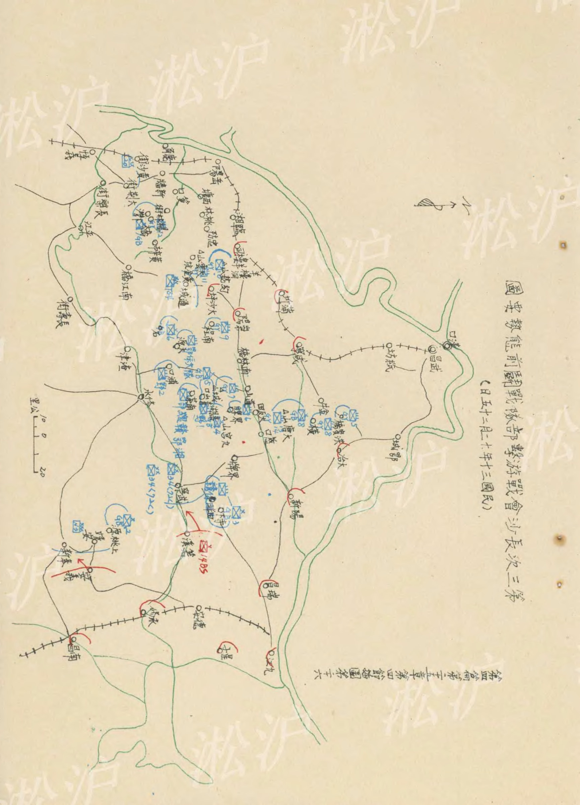

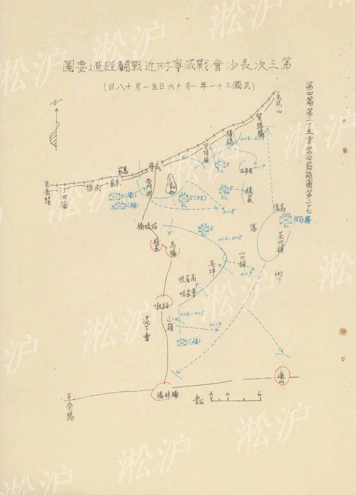

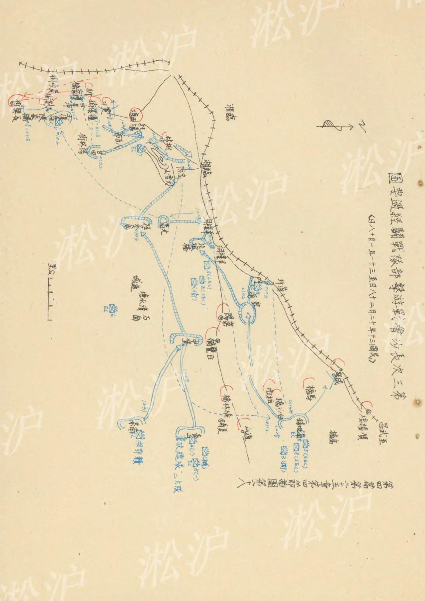

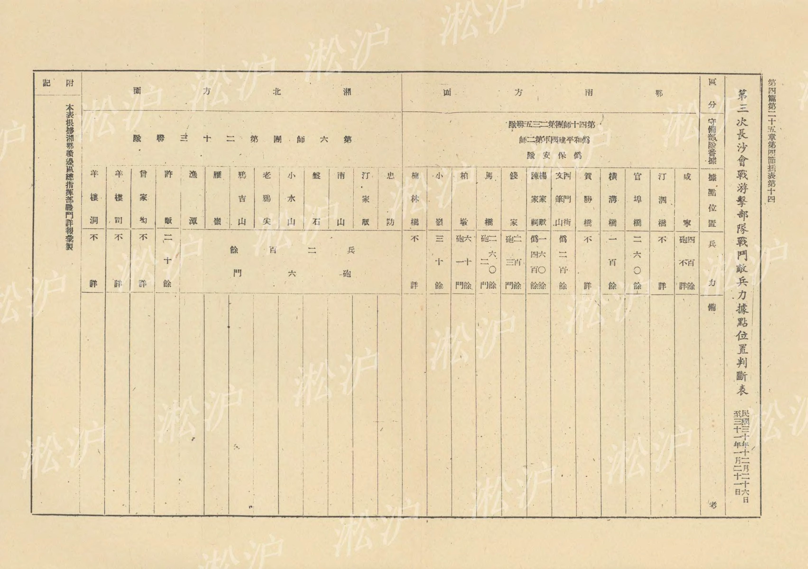

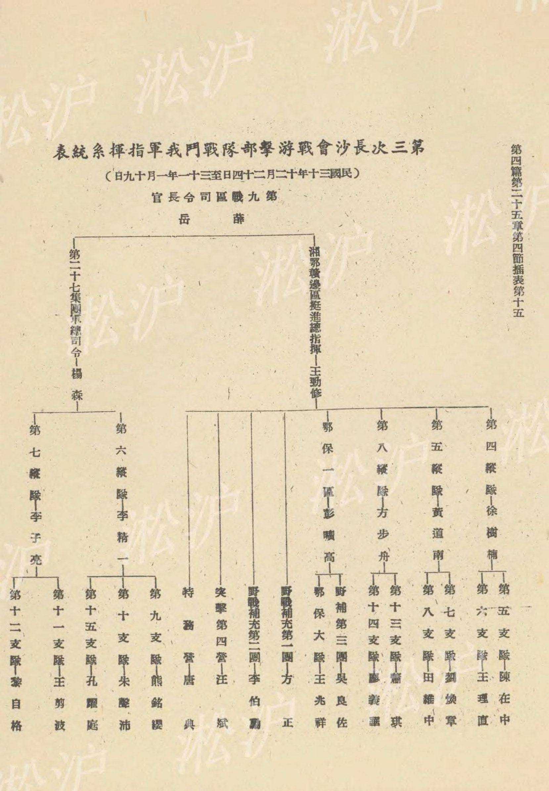

### 第五節 後方勤務

#### 第一款 會戰前之兵站設施

參照插圖第二十九第三十

插表第十六至第二十

此次會戰，時正隆冬，氣候嚴寒，加以連日風雪，影響軍品之輸送，更因戰地道路，大多破壞，我軍之補給益形困難，惟我後方機關，能根據戰區長官部，所策定之反擊計劃，及慎密周詳之事前準備，故會戰中補給勤務，尚能配合作戰部隊之行動，

##### 第一項運輸

參照附

錄第二

第九兵站總監部，原配屬輜汽兵第三團之第二、第六兩連，共有卡車八十九輛，其中十四輛配撥曲江第七兵站總監部，四輛撥配戰區第十九分監部外，僅餘車七十輛左右，又以使用過久及材料補充困難，其能擔任運輸者，約五十餘輛，故戰區各管區之運輸，祇能利用當地之運輸工具，車輛均配置於運輸核心之衡陽，使擔任衡吉、衡長、衡攝段重要軍品之運輸與轉接，其主要輸力，則以第九兵站總監部之建制運輸隊爲主，按照兵站設施計畫，以必要之輸力，於各分監管區外，主力集中兵站主地，同時以建制輸力，運輸彈藥及軍品，以徵用地方輸力，運送軍糧或搶運工作，各管區之配置情形如左：

參照插圖

第二十九

一、湘北方面：以長沙爲轉接重點，以平江爲陸運中心，湘陰、新市、長樂街、濱坳、高橋爲陸運主線，其配備輸力，計長沙爲手車大隊一，運輸中隊五，長樂街至濱坳段，有鐵肩總隊，手車總隊各一，及鐵肩大隊一，手車大隊二，如伏力不敷應用，另行徵僱民伕補助之，長樂街至湘陰段以僱用地方輸力爲主，僅配置一個鐵肩總隊，此外關王橋、南江橋、長樂街各配置運輸中隊一個，機動使用。

二、贛北方面：於修水配置八個運輸中隊，以備作戰軍之進展，向永修、德安、瑞昌、咸寧、蒲圻等地追送補給，在劉陽、官渡、銅鼓之線，配置運輸中隊七，手軍中隊三，馱馬中隊二，擔任該地區之運屯。

三、贛西方面：以上高爲重心，控置四個鐵肩大隊，棠浦、銅村各配置一個鐵肩大隊，第十九分監部直屬之十個運輸中隊，以二個中隊留置於宜春、安福等地，主力置用於分宜至上富、清江至奉新兩陸運主線，擔任運屯補給。

至於水運，在湘江則以長沙爲重心、株州、湘陰爲接轉站，株州並設置船舶派出所一個，與總監部直屬第七分站聯繫，依情況徵僱汽船、木船擔任湘江上、下游之軍品接轉，長江設船舶管理所，經常控置汽輪、木船，由第五支部直接派遣，擔任長濱、長湘各線之水運，第二支部位置於湘陰，擔任湘陰至新市水運，其他漢壽、益陽、寧鄉各站所，均以水運爲主，臨時徵用民船，負責長沙、湘陰之轉運，湘北汨羅江之水運，由第二十七兵站分監部配置站所負責徵僱船、筏爲湘北之主要水運線，劉陽、撈刀河則分由第一兵站分監部，第一支部於劉陽、濱墈設站負責接轉，贛江、袁水、錦江各河流，由第十九分站分監部配備站所，臨時徵用船隻，運送贛西、贛北軍品，第九分站設置銅鼓，第八分站設置山口，第四支部於修水，分別控置船隻，以修水爲主要水運，準備軍品之輸送。

##### 第二項 補給

參照插表

第二十

民國三十年十月，第二次長沙會戰結束後，岳陽、平江、湘陰、長沙、劉陽五縣市之駐軍、機關，均由兵站補給現品，迨至十二月初，兵站總監部按照戰區之反擊計畫屯糧十二萬八千一百大包，以備三次長沙會戰之用，其補給情形如插表第十六，在此次會戰之前，原定戰區參加作戰之部隊，爲五十一個師，每師暫預屯儲彈藥一個基數，計需步機彈三千三百一十五萬粒，迫砲彈十二萬二千四百顆，手榴彈五十一萬顆，手槍彈二十五萬五千粒，但至會戰時，按規定數，尙不敷步機彈九百五十萬粒，迫砲彈六萬五千顆，手榴彈八萬顆，手槍彈十萬粒，嗣經申請由辰谿第四軍械總庫，撥發步機彈五百十萬粒補充，然仍嫌不足，直至會戰間，後方勤務部，始飭桂柳各庫，撥借步機彈三百三十萬粒，迫砲彈一萬零九百二十顆，手槍彈四萬粒，另由第七兵站總監部，借撥步機槍六十萬粒。

##### 第三項 交通通信及衛生

參照插圖

第二十九

戰區交通，分水路與陸路，因河流縱橫，湖泊甚多，故各管區大部以水路運輸爲主，其可供利用者，計有湘江、贛江可航行汽船、資江、錦江、修水、瀏陽河、汨羅江、新牆河、撈刀河、袁水、吉水、漣水、澱水、洣水、洣水等均可通行帆船、木筏，陸路除粵漢鐵路南段，湘潭至衡陽間火車可照常行駛，公路僅衡陽至邵陽，邵陽至永豐，衡陽至耒陽，耒陽至攸縣，攸縣經茶陵、蓮花、永新，或安福至吉安，尚能行駛汽車外，其他各公路及主要道路，均已破壞，路幅僅留一市尺。

戰區通信，爲後方勤務部配設電話十三、十五兩排，及自組十五瓦特無線電第一、第二、第三臺，電話一班，各分監部，均自組設十五瓦特無線電一臺，電話一班，各支部均由兵站總監部撥配電話一組，各站、庫、所則由兵站總監部發給器材，或直接架設電話。

戰區衛生機關

參照插圖第二十九

插表第一、十七，計有後方醫院十，兵站醫院十二，收容所二十九，患者輸送隊四，衛生大隊三，衛生船舶九，衛生列車三，衛生汽車四，手車組一，衛生材料庫五，衛生被服庫二，共八十二個單位。

#### 第二款 會戰中之兵站設施

在會戰時期中，各級兵站機關，均因情況而有增移，茲將增設與轉移之經過概述如左：

自敵人集結湘北、贛西，準備犯我長沙之際，第九兵站總監部，爲適應戰時情況，於民國三十年十二月二十三日，將平江之第二十七分監部移至官渡，汨羅江北岸地區之各站，所轉移於關王橋、長樂街以東地區之山地設置，第十九分監部移於分宜，統直第七分站設置株州，總監部直屬第十一分站仍於株州，野戰第四十七糧庫移湘鄉，野戰第四十八糧庫設長沙，總監部直屬第九糧庫於長沙待命，十二月二十五日，敵已竄至關王橋、大荊街一帶，我第三支部卽開衡山，總監部直屬第九派出所開下攝司，總監部直屬第十分站開萍鄉，第七派出所開沅江，第一糧庫開湘潭設置，二十八日，敵強渡汨羅江後，我兵站總監部由長沙移衡陽辦公，長沙、朱亭各設指揮所，統直第六派出所開觀音港設置，汨羅江南岸之各站、所，向平江、高橋以東地區轉移，設置濱墈之第一支部轉移株州待命，三十一日，敵主力已分路進攻長沙外圍，我總監部指揮所，暨第五支部移至岳麓山，第十二分站仍駐長沙，當敵軍與我長沙守軍第十軍激戰之際，兵站總監部爲適應戰況，圓滑補給起見，特令直屬第五分站開岳麓山設置，第一支部向長沙推進，第三支部率領統直第一派出所開設株州，統直第四分站設置龍頭舖，直屬第十派出所於湘潭設置，統直第二派出所設置平江，三十一年一月四日夜，犯長沙之敵，經我內外圍攻，開始分路向北逃竄，我兵站總監部，爲配合我軍之追擊、堵擊、截擊行動，乃令統直第六派出所推進槩梨市，第一支部推進濱墈，第五分站推進水渡河，擔任追送補給，統直第一派出所推進湘潭，接替總監部直屬第十派出所任務，第一船舶派出所開湘潭，第二十七分監部直屬第三派出所設蒲塘，第三分站設置長江源，總直第十四分站設置官莊，總直第五派出所設霞凝港，至一月十日以後，第一分監部仍回瀏陽，其第二分站設永安市，第二十七分監部仍回平江，第五支部回長沙，第二支部移設湘陰，總直第十三糧庫設置醴陵，總直第十四分站設普蹟市，第三支部率第十一分站、及第十派出所設湘陰，俟我追擊部隊通過汨羅江後，移設長樂街，擔任追送補給，一月十二日，敵已潰退汨羅江以北，我第二十、第五十八軍，正跟踪追擊中，兵站總監部乃令第十一分站開濱墈，歸第一支部指揮，協助補給，十六日，敵退過新牆河以

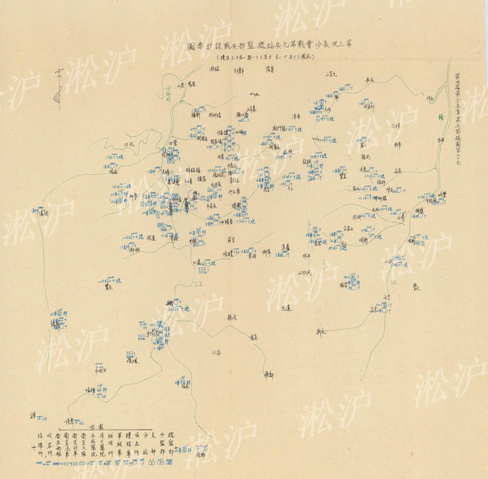

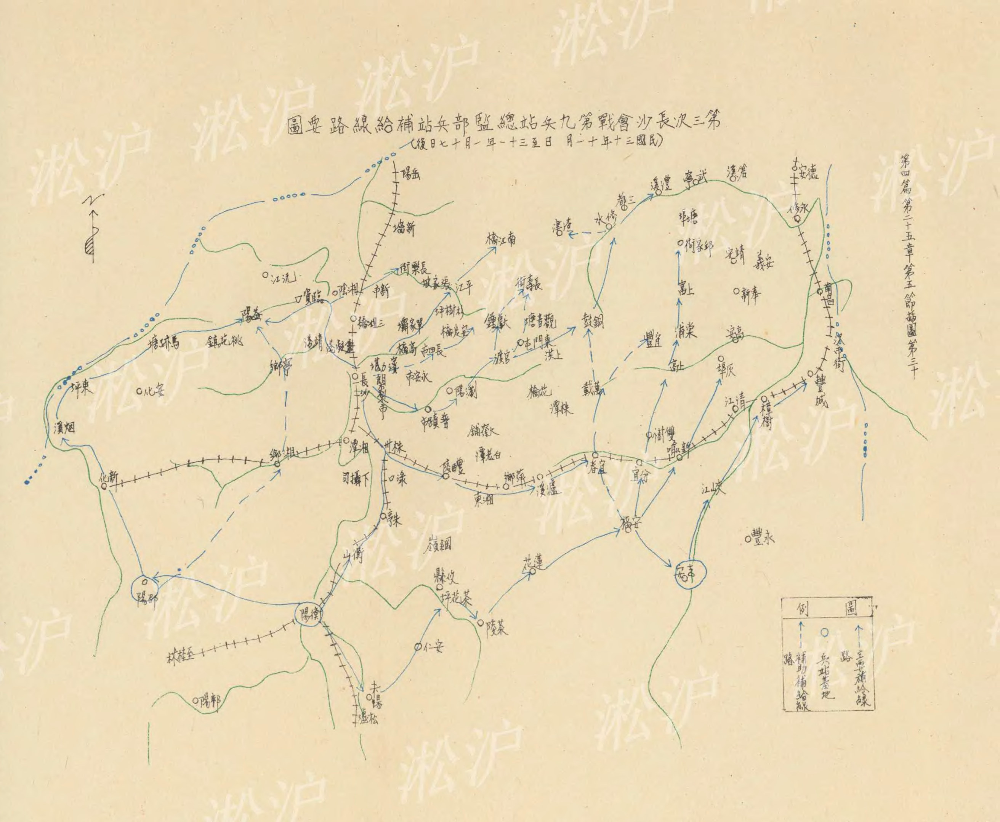

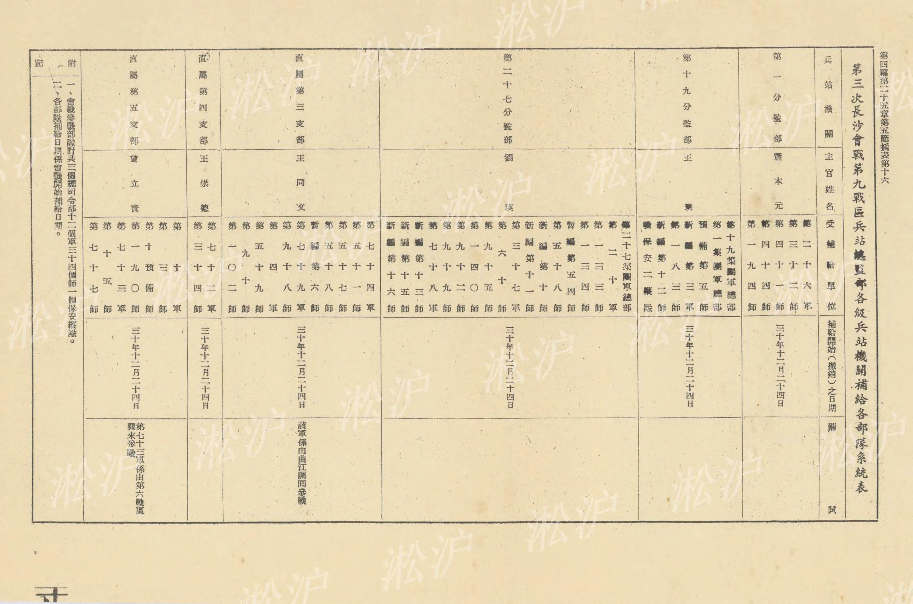

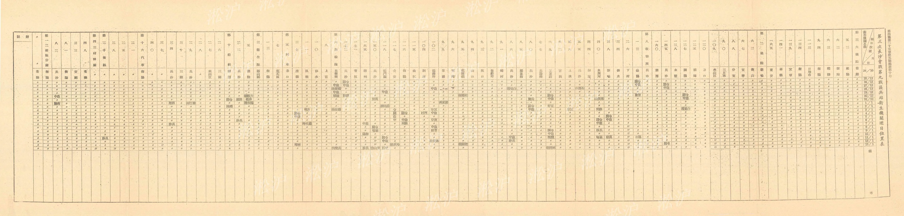

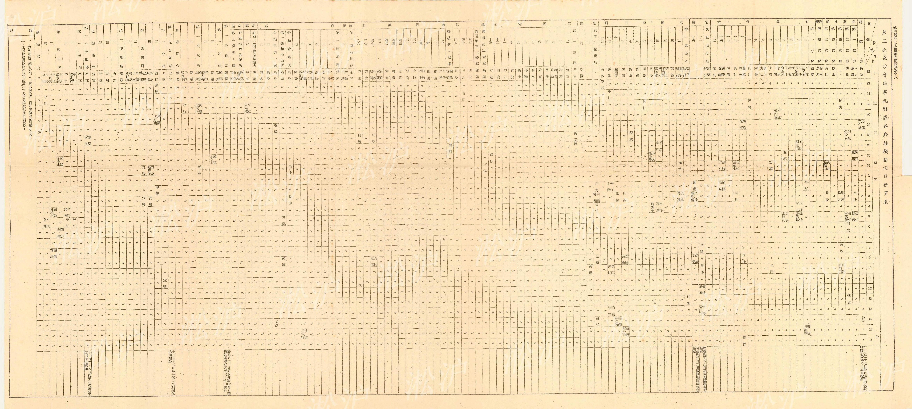

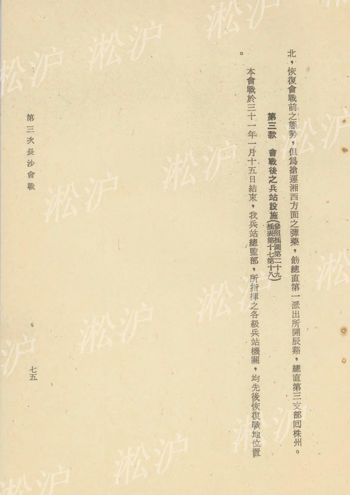

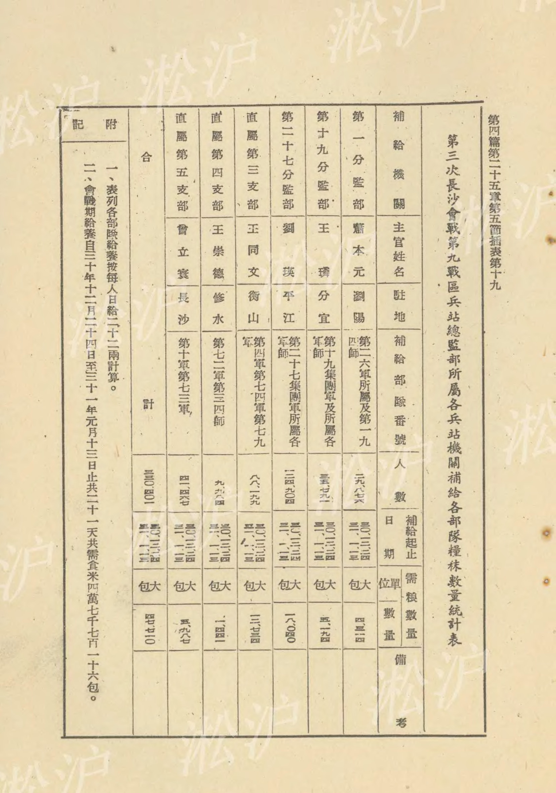

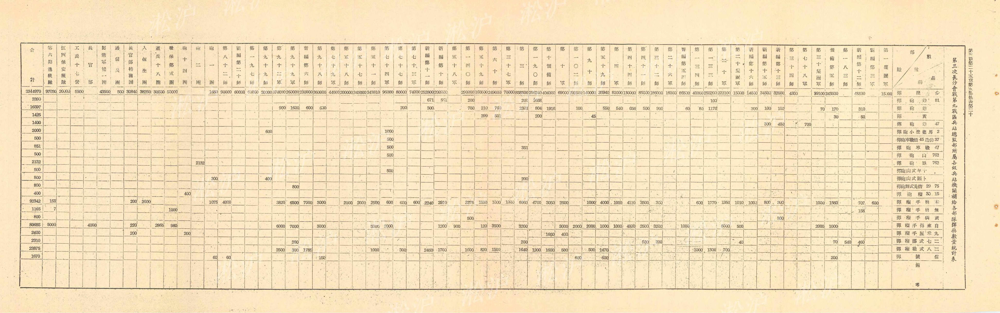

### 第六節檢討

#### 第一款敵軍

一、戰術思想統一，各級幹部均能遵照上級之企圖，獨斷專行，士兵能獨立戰鬥，富於攻擊精神，敵軍此次敗退，沿途遭我伏擊、截擊，能恪遵退却計畫，沉着應戰，卒突圍逸去。

二、善於運用兵力，能將廣正面之兵力，迅速集中使用，爭取局部優勢，使我虛實難測，如贛西作戰，敵於十二月二十五日，分兵三路，向我廣正面進攻，當其接近我主陣地時，卽向蓮花、馬奇嶺間地區集中攻擊。

三、增援隊爭奪戰術要點不惜犧牲，使主力退却容易，影珠山形勢扼要，瞰制黃板橋至栗橋，青山寺至福臨舖兩大道，均爲敵北退必經之路，該山爲我先行佔領，阻敵退路，後有追兵，敵狼狽萬狀，敵獨立混成第九旅團，不惜大部犧牲於影珠山麓，以行牽制攻擊，遂使敵主力能奪路北退。

四、實施滲透戰術，善於避實擊虛，敵在新牆河、汨羅河地區，與我戰鬥時，遇我排、連據點不能攻陷，卽以少數兵力圍攻，主力由間隙滲透。

五、行動祕密，敵進攻長沙，自十二月中旬卽積極準備，其兵員，器材等，均於夜間運輸，在戰場中，我軍所護得之敵軍遺屍及軍服，其符號多已撕去。

六、陸、空連絡，步、砲協同良好，指揮適切，一月十四，十五兩日，敵在北嶺時，其空軍沿途掩護，阻滯我追擊部隊，又如影珠山之役，先以飛機偵察投彈，並指示砲兵射擊，使我傷亡甚重。

七、慣用僞裝欺騙伎倆，贛西戰鬥，常以僞軍當先，並着與我軍相同之服裝，使我誤爲友軍，待接近時，卽猝然攻擊。

八、對我軍兵力判斷錯誤，誤認第九戰區已抽調大部兵力轉用援英，估計湘北方面，僅有第二十、第五十八、第三十七、第九十九、第十軍，遂以不充分兵力，貿然進攻，尤以對長沙作不必要之攻擊，自招挫敗。

九、發動過遲，失去策應香港作戰之意義，且我軍已可自粤調回，爲敵兵力研判錯誤之因素。

十、墨守第二次長沙會戰之要領，而兵力減弱，正面更小，不知我軍已有適當之對策，致作戰經過，出敵意外，幾被圍殲。

十一、策應作戰之兵力不足，徒遭損耗，贛西北之敵，爲策應湘北作戰，僅零星抽調約兩、三聯隊之兵力，不僅未能達成策應之目的，反遭重大損失。

十二、後方連絡線暴露，補給困難，敵渡過汨羅江南岸後，其補給路線，遭我留置部隊，不斷襲擊，補給不易，影響作戰。

十三、馱馬、挑夫太多，運動遲緩，湘北公路，爲我破壞，汽車不易通行，改用馱馬、挑夫輸運笨重與遲緩，致補給不能圓滑。

#### 第二款 我軍

一、決戰場之選定適當，第九戰區原計畫誘敵於撈刀河、瀏陽河中間地區，嗣蔣委員長指示，誘敵攻擊長沙，再以反包圍殲滅之，敵遂陷我重重包圍之陷阱中，予以一大打擊。

二、部隊之運用機敏，各軍適時投入決戰場，發揮統合戰力，壓倒敵人。

三、縱深配備良好，核心陣地堅強，逐次消耗敵人，求得時間之餘裕，誘敵攻長沙，完成合圍之態勢，遂獲得赫赫之戰果。

四、情報確實判斷正確，十二月十五日以前，戰區即得悉敵軍抽集兵力數萬，轉運湘北之情報，遂判斷敵必三攻長沙。

五、士氣高昂有與陣地共存亡之壯烈犧牲精神，我長沙守軍第十預備師官兵傷亡慘重，猶集合雜兵奮勇衝殺，堅守陣地，又如敵軍襲擊影珠山時，我解圍部隊，在敵機砲兵熾盛火力下，前仆後繼，卒將敵殲滅。

六、命令一再變更，不能真徹，例如十二月二十五日，湘鄂贛邊區總部，奉長官部命令，攻擊崇陽、蒲圻，二十七日又令攻擊咸寧、羊樓司、羊樓洞，二十九日再令攻擊臨湘、忠防，一月四日轉令該部王總指揮親率所部襲取武昌，十二日令該部改向咸寧奇襲，使該部一再變更部署，不能適時展開攻擊，又如一月七日長官部命令第一四零師，暫編第五十四師，限九日夜襲取岳陽、臨湘兩縣城，均未達到命令要求，第一四零師僅到達青崗驛（新牆北）附近，並於十二日撤回新牆河南岸，命令中未顧及部隊行動之實際情形，使受令者不能達到要求，影響命令之尊嚴，指揮官之威信。

七、部隊行動遲緩，一月四日，長官部命令王勁修總指揮率部襲取武昌，至一月十三日尚未開始行動。八、指揮系統紊亂，一月十三日，長官部之追擊命令，暫編第五十四師第一四零師李棠師長指揮，第一四零師則暫歸楊兼總司令指揮，在指揮系統上，暫編第五十四師歸第二十軍指揮，第一四零師歸第三十七軍指揮，但在汨羅江地區戰鬥時，該師又歸第九十九軍之第九十二師師長梁漢明指揮，作戰間，雖可因戰況而變更指揮權，但對各不相屬之同等單位，不應彼此指揮，而應盡可能以原指揮系統中之上級，或不相同序列之上級指揮，則指揮運用上比較圓滑。

九、據點陣地之構築，無縝密計畫，敵進犯新牆河，汨羅江時，我軍奮勇阻擊，但據點星散，間隙過大第三次長沙會戰附錄第一

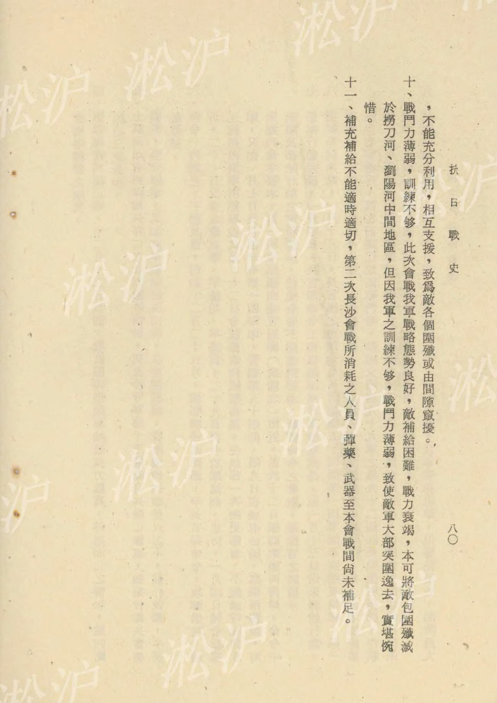

第九戰區反擊作戰計畫

第一

作戰方針

(第三十一)

戰區在贛北、鄂南、湘西方面，應竭力將敵反攻於分宜、上高、甘坊以東，修水東北，龍門廠、南江橋以北，澧縣、宜都以東地區，予敵各個擊破，在湘北方面，則誘敵主力於瀏陽河、撈刀河間地區，反擊而殲滅之。

第二

指導要領

一、上高上面：應運用尾擊、側擊及正面強刼抵抗，務於分宜，上高、甘坊線以東地區，將向該方面進攻之敵，反擊而摧破之。

二、修水方面：應運用尾擊、側擊及正面強刼抵抗，務於修水東北地區，將向該方面進攻之敵，反擊而摧破之。

三、通城方面：應運用尾擊、側擊及正面強刼抵抗，務於龍門廠、南江橋以北地區，將向該方面進攻之敵反擊而摧破之。

四、湘西方面：應運用尾擊、側擊及正面強刼抵抗，務於澧縣、宜都以東地區，將向該方面進攻之敵反擊而摧破之。

五、湘北主力反擊方面：應運用尾擊、側擊及正面強刼抵抗，務於瀏陽河、撈刀河間地區，將進攻長沙第三次長沙會戰附錄第二

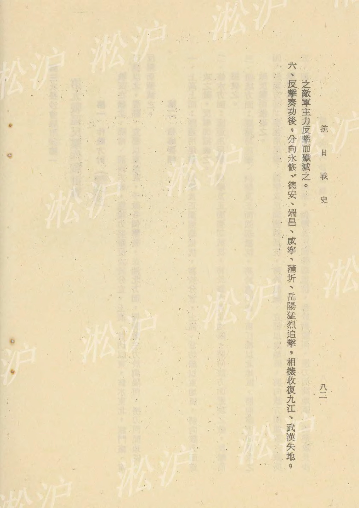

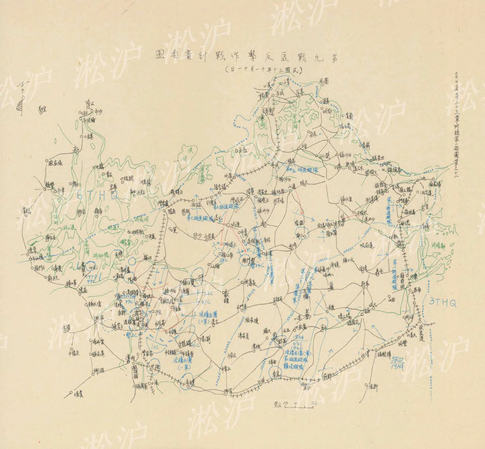

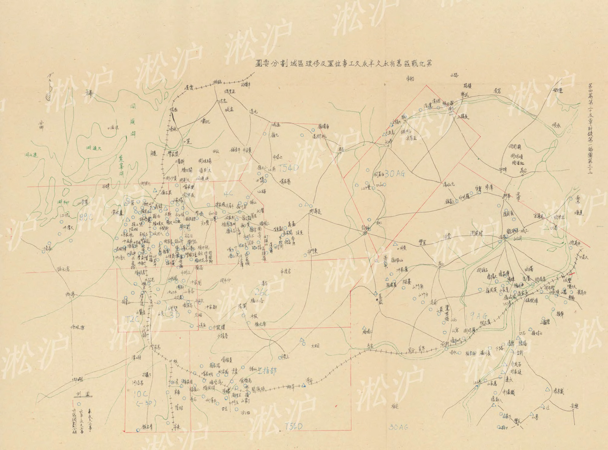

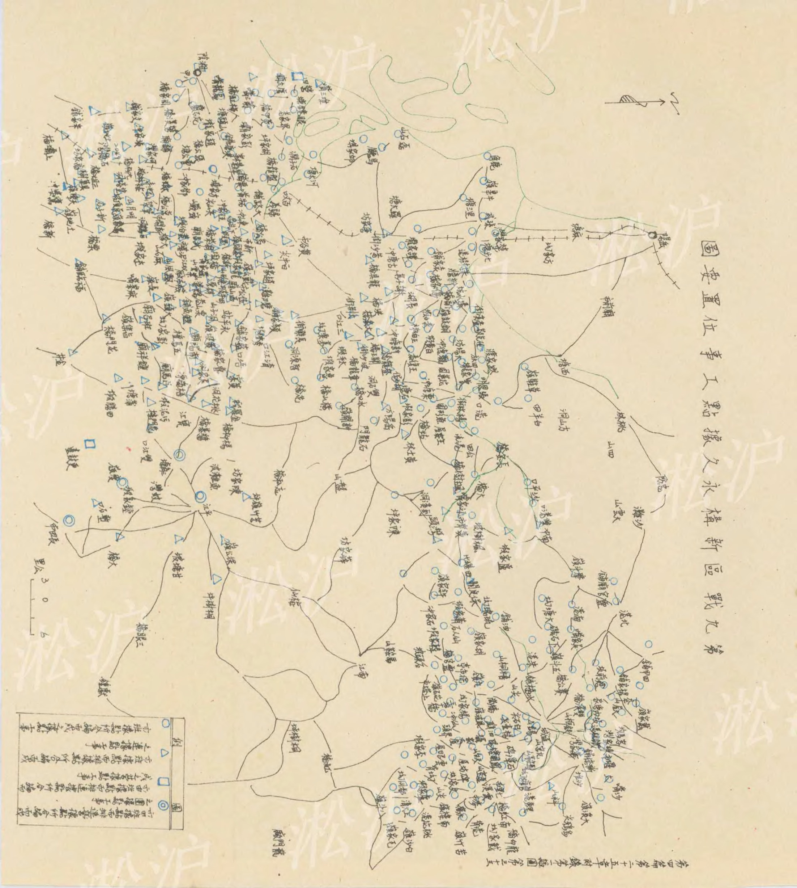

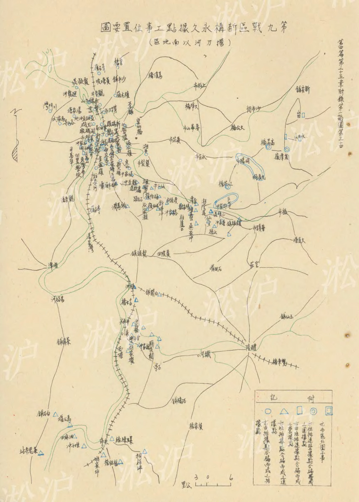

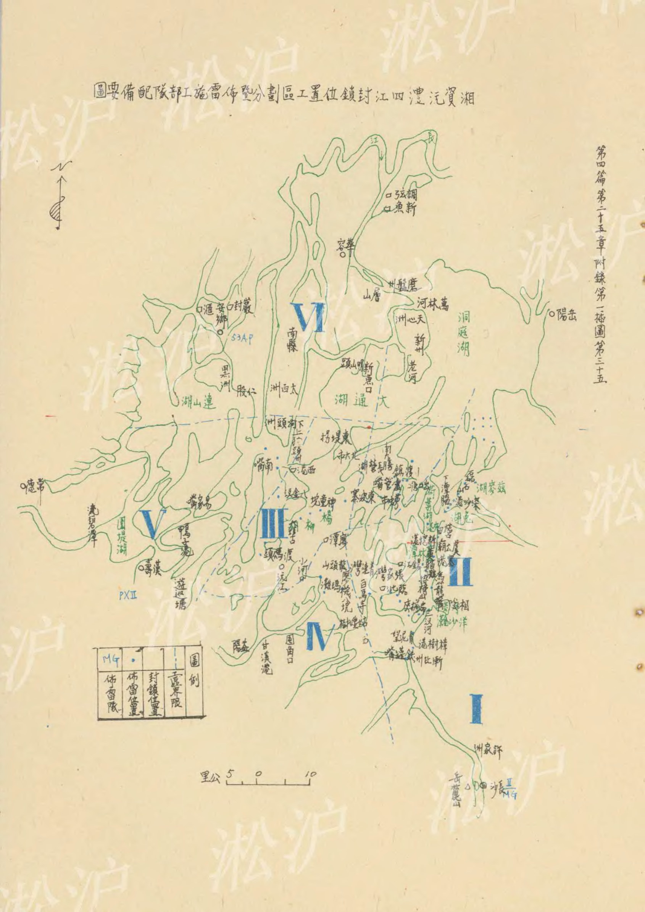

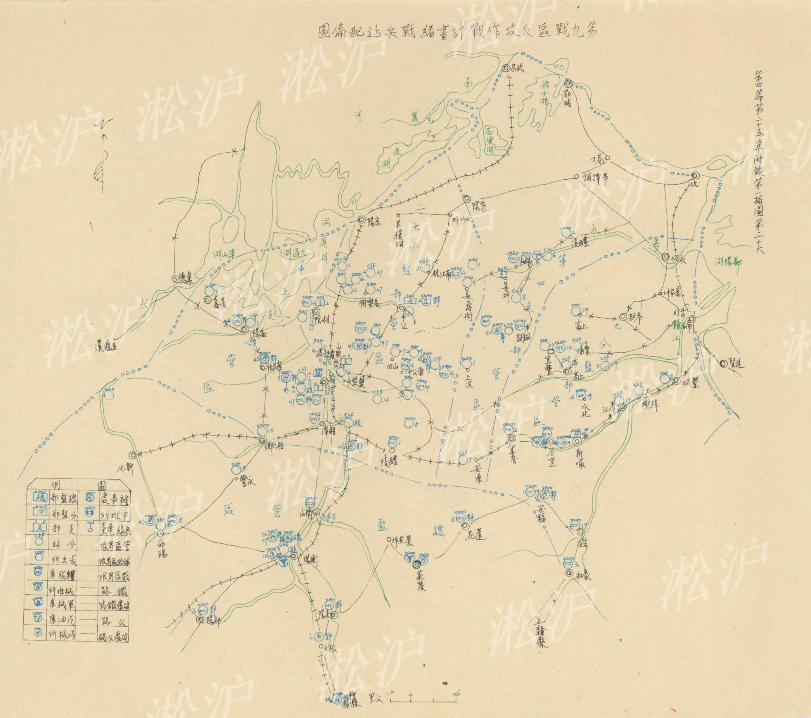

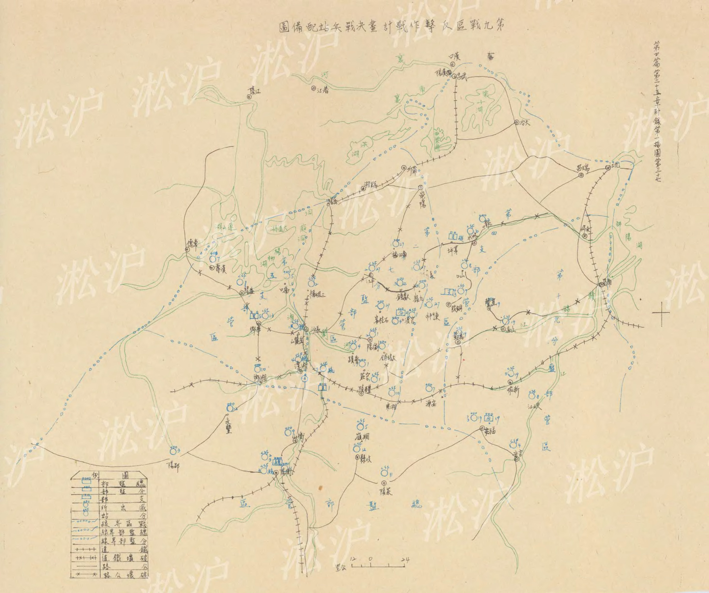

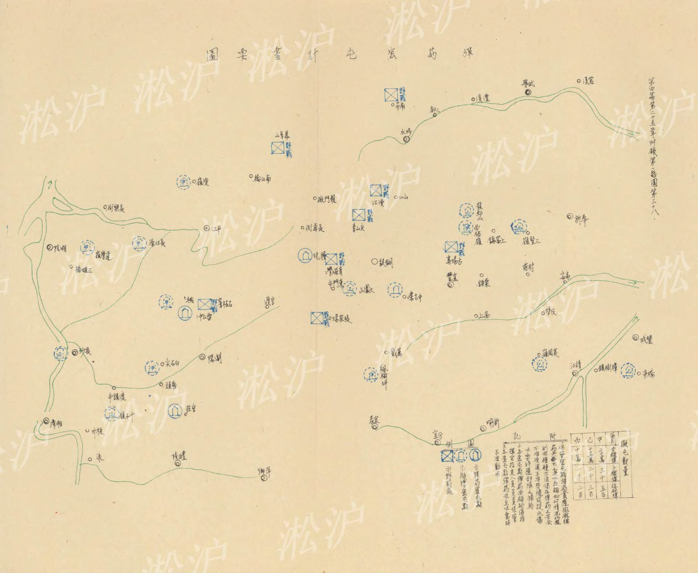

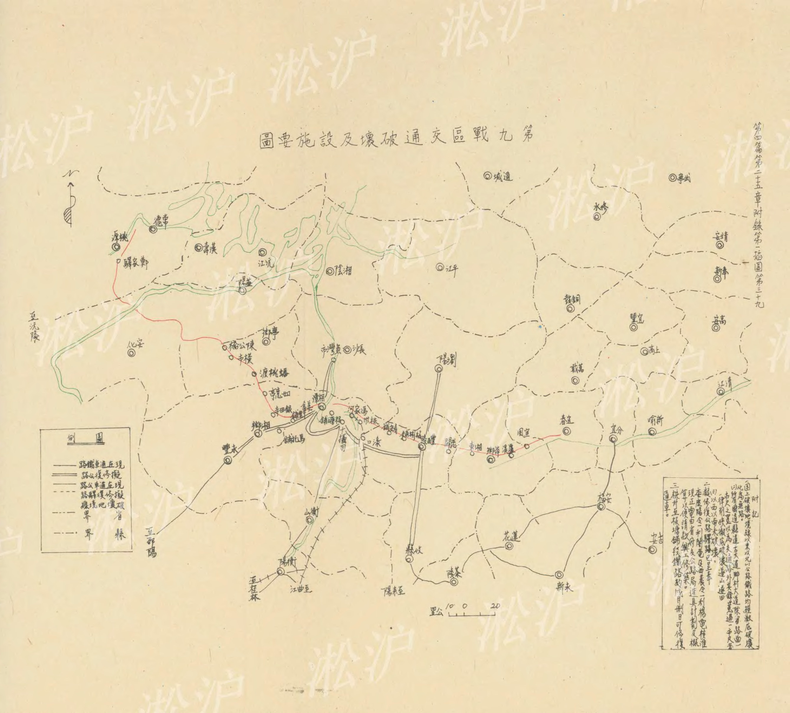

第九兵站總監部兵站計畫

第一設施方針及指導要領

一、依照長官部作戰方針及指導要領之策定，兵站應以吉安、衡陽、邵陽爲兵站基地，新喻、瀏陽、長沙爲兵站主地，至兵站末地，則按作戰軍之位置，適宜決定之。

二、總監部於逐次步入決戰階段時，卽移衡陽設置，長沙設指揮所，湘潭設駐辦所，並派必要之人員於醴陵、朱亭負責連絡收容之責，但長沙指揮所，應隨長官部戰鬥指揮所行動。

三、第十九分監部，暫在宜春不動，第一分監部補給羅副長官指揮作戰之部隊，第二十七分監部補給楊、王兩副長官所指揮之作戰部隊。

四、其餘長沙之第十軍，第七十三軍、第九十九軍，及渌口、株州兩個軍，則由總監部，支部分別補給五、預定在長沙準備兩個軍之二個月米鹽，與彈藥，一部屯在長沙市區內，大部屯在岳麓山附近，並與軍糧局準備發各部必需之代金（每月每人十四元五角）。

六、各地糧彈酌予屯儲、瀏陽、醴陵、渌口、普蹟等地衛生機關，按作戰部署妥爲配備。

七、爲預防敵艦隊打通湘江，隔斷湘西聯絡企圖，對湘西方面應設支部一個，指揮湘西站，所，庫擔任運輸補給。

八、銅鼓、修水、長沙方面，應控置有力站、所、輸隊，準備隨作戰軍之進展，向永修、德安、瑞昌、咸寧、蒲圻間追送補給。

九、兵站在緒戰期間，以陸運爲主，水運爲輔。第二兵站管區及線路

兵站管區及線路如插頭第四十。

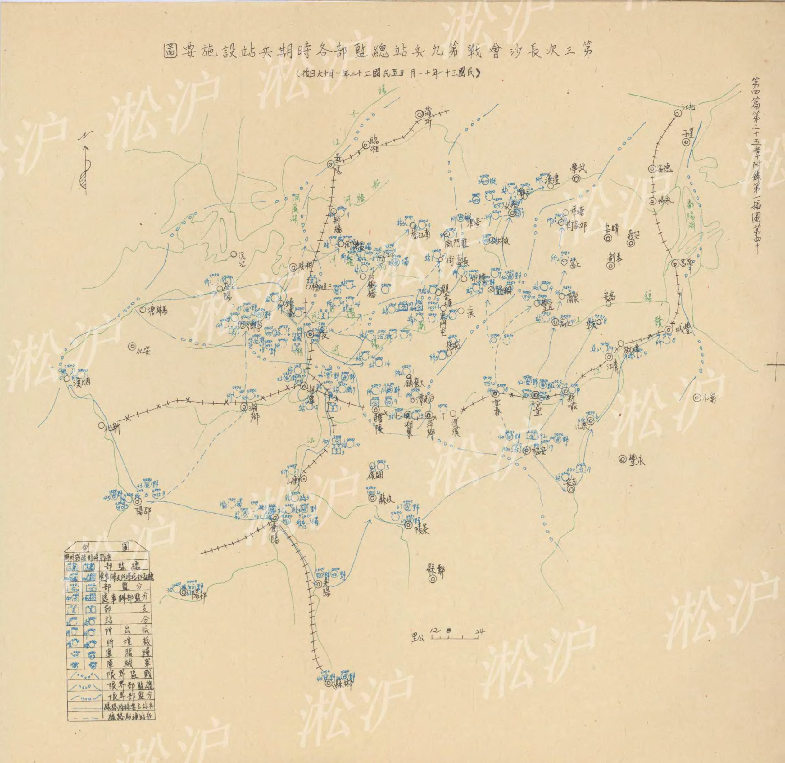

第三次長沙會戰附錄第三

第十軍於長沙附近作戰計畫

第一方針

一、軍以固守長沙市區之目的，卽佔領市區及其外圍旣設據點工事，竭力抵抗進犯之敵，待命由西南向東北轉移攻勢。

第二

指導要領

二、各部隊迅速完成各據點工事，特須有獨立作戰之準備，並對外圍工事，須應乎所要連成之。

三、各部隊須詳密劃分守備區域，及預想敵進攻步驟，與我應付手段而配備，尤須注意以城市爲核心而固守之。

四、各級之通信連絡，須週密準備，務在戰鬥方酣，被敵軍破壞時，仍可保持連絡。

五、湘江內之船隻，須確實統制，以便彈糧之補充及傷病員兵之後送。

六、各守備區內，須充分準備糧彈，以達成不待外援，獨立固守之任務。

第三

兵團部署

七、長沙城市區守備部隊第三師，（附警備司令所指揮之各武裝團隊），長沙城外圍守備部隊第十預備師，第一九零師。

陣地佔領及任務

八、第三師以主力佔領長沙城垣，以一團控制於城東南角，拒止敵人南犯，並以便衣隊（約一連），在安沙沙坪附近預行潛伏搜索敵情。

九、第十預備師佔領自水陸洲、猴子石、金盆嶺、黃土嶺、林子冲、左家塘、半邊山之線，主力控置於黃土嶺附近，拒止敵人南犯，並派便衣隊在東山附近，預行潛伏阻止敵人。

十、第一九零師佔領黃土嶺、左家塘、楊家山、鞍子山、湖蹟渡、復興寺附近、新河正街之線，拒止敵人，並派便衣隊（約一連）在楓林港預行潛伏搜索敵情。

十二、作戰地境

第七九軍

大托舖—東山—秋塘—牌樓舖之線線上屬本軍。

第十預備師

下廣濟橋—陳家堆—牛角灣之線線上屬右。

第一九零師

第一九零師

馬欄口—黃土坵—白沙洲—橋頭驛—風梅坳之線線上屬本軍。

第九九軍

第十預備師

西湖碼頭—西湖路—天心路之線線上屬右。

第三師

十二、補線衛生等從略。

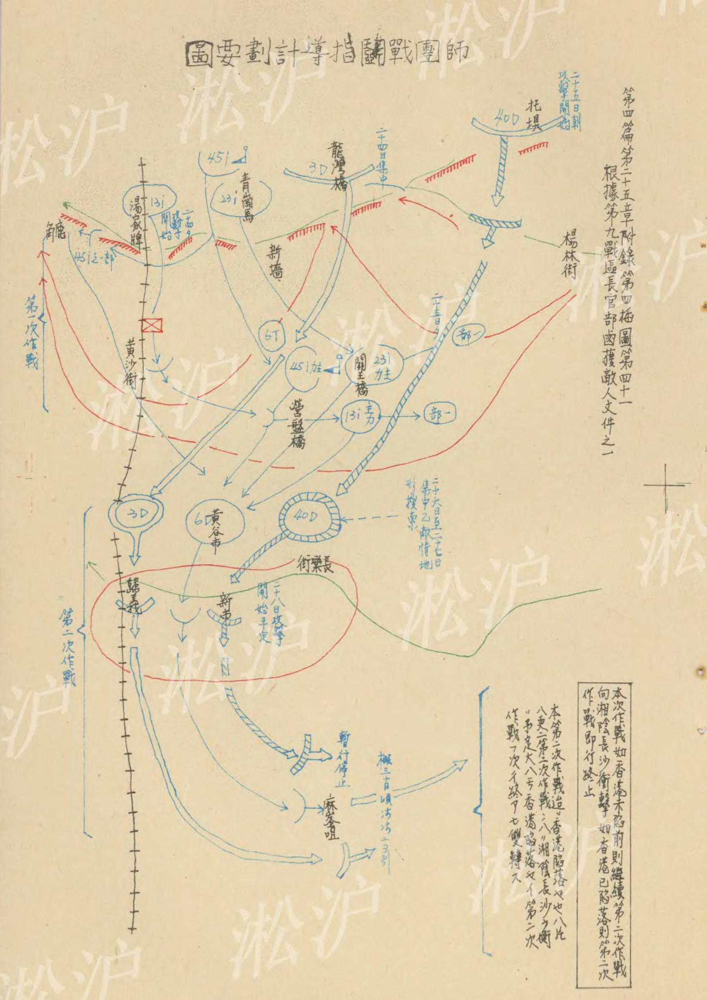

第三次長沙會戰附錄第五

根據第九戰區長官部囪獲敵人文件之二

六師作戰命令甲第一七九號。（參照附錄第四、第十）

第六師團命令

於蒲圻

十二月十六日十一時

一、江西方面師團當面之敵情，如明部隊情報記錄第一二五號，第二十三軍目下正攻擊香港。

軍爲策應第二十三軍，及南方軍之作戰，卽時對江南地區企圖攻擊。

二、師團從新牆河附近下流至新牆河右岸地區集中，並準備爾後之作戰。

三、集中完畢時，軍隊區分如附表，集中配置如附圖。

四、第六步兵團長，與直轄步兵第十三聯隊，第二大隊主力，同時於十二月十七日晨從趙李橋出發，搭乘臨時列車到達岳州，並在同地將步兵第十三聯隊第二大隊歸還原屬部隊，司令部十八日夕刻前向新開塘前進，準備爾後之作戰。

五、步兵第十三聯隊長，爲警備江北計，應以約二中隊之最小限度兵力，留守江南岳州地區，其餘之主力，於十二月十九日晚，各從現駐地開始行動，十二月二十日拂曉前集結大美岡、晏家大山、湯牌間地區，並準備爾後之作戰，尤須注意渡新牆河之準備。

但在岳州之部隊，應於十八日夜行軍向蘇塘附近前進，聯隊本部，俟渡過新牆河後，留置岳州地區之部隊，歸野砲兵第六聯隊長齋縷上校指揮。

配屬獨立山砲兵第二聯隊之部隊，預定十七日、十八日兩晚到達岳州。

爲集中計，應將第一野戰病院之行軍，從速部署，同時將輜重兵第二中隊於二十一日在現駐地歸還原所屬。

六、步兵第二十三聯隊長，爲地面警備計，必須留置最小限度之兵力，其餘依左記要領，一面以主力實施討伐，一面到東山廟（新開塘南方約一公里），傘子舖（新開塘東南約四公里），青岡興麻子山間之地區集結，並準備爾後之作戰。

右記

1. 在長安部隊，十七日晨由長安出發，沿王末團——竹山——平地——洪山——團山廟道地區至十九日晚前到達集結地。

2.步兵第二十三聯隊第二大隊基幹之部隊，十七日晨從現駐地出發，沿漁潭——松林——芋麻嘴——高城——收簾港——高山坳道地區於十九日夕前到達集結地。

3.步兵第二十三聯隊第三大隊基幹之部隊，於十九日晚由托壩出發，必須祕密企圖，並於二十日拂曉前到達集結地。

聯隊本部出發長安，同時與留置長安地區之部隊，歸野砲兵第六聯隊長齋藤上校指揮。

配屬獨立山砲兵第二聯隊之部隊，準於二十日晚到達呂興坳（新開塘南方約一公里）。

步兵第四十五聯隊長，以留置部隊及配屬部隊擔任地區內之警備，其餘十二月十六日夕，由現駐地出發，依左記要領經趙李橋——長安——雲溪——五里牌——郭鎮市道——十二月二十日晚前在郭鎮市蘇家壇（郭鎮市南方約二公里），毛里舖間之地區集結，并準備爾後之作戰。

配屬獨立山砲兵第二聯家之部隊，預定二十日前到達郭鎮市。

左記。

升三次長沙會議

十七日晨前羊樓洞及其以東之地區（夜間行軍）。

十八日晨前長安及其以東之地區（夜間行軍）。

十九日晨由長安出發到達集結地（晝間行軍）。

步兵第四十五聯隊第二中隊十七日夕，於趙李橋歸還原所屬，又步兵第四十五聯隊第二大隊（缺第二中隊），二十日左右於岳州或郭鎮市歸還原所屬。

輜重兵第三隊，到達趙李橋後卽歸還原所屬。

聯隊本部，從現駐地出發，與陸水地區之留置部隊，歸衛生隊長山崎上校指揮。

八、騎兵第六聯隊長，着步兵第四十五聯隊第二中隊於十七日拂曉由蒲圻出發，並於是夕前到達趙李橋歸還原所屬。

九、野砲第六聯隊長，着野砲兵第一大隊之第一、第二中隊十六日夕於長安歸步兵第二十三聯隊長指揮又除繼續現有任務外，依第五項第六項之規定，擔任岳州及長安地區之警備。

十、工兵第六聯隊（一部缺），於十二月十八日晨由長安出發，經雲溪——五里牌——新開塘——湯新牌道，至二十日拂曉前到達湯家牌附近，歸步兵第十三聯隊長指揮。

但各一小隊於十九日到達毛里舖，及山坳分別配屬步兵第二十三聯隊及步兵第四十五聯隊指揮。

現配屬汽車，於十九日夜開至新開塘歸輜重兵隊長指揮。

十一、師團通信隊，與師團司令部同行，十二月十八日前到達新開塘，並準備爾後之行動。

關於攻擊準備間之通信連絡另有命令。

十二、衛生隊擔架中隊十九日晨由羊樓洞出發，由輜重兵隊長部署，二十一日晚前在郭鎮市北側村落集結並準備爾後之行動。

十三、衛生隊長除繼續現有任務外，依第七項之規定，應擔任水陸地區之警備。

十四、第一野戰病院十八日晨從岳州出發，由步兵第十三聯隊部署，十八日晚前到達前頭沖（新開塘西北約一公里）。

第二野戰病院十九日晨從羊樓洞出發，由輜重兵隊長部署，於二十一日夕前在蔡家田（郭鎮市東北約一公里）集結，並準備爾後之警備。

十五、師團病馬廠十九日晨從羊樓洞出發，由輜重兵隊長部署，至二十一日夕前到馬里舖（郭鎮市北方約二公里）集結。並準備爾後之行動。

十六、輜重兵隊十九日晨由趙李橋出發，經長安——雲溪——五里牌道至二十一日夕前在五里牌金相里（郭鎮市北方約三公里）間之地區集結，並準備爾後之行動。

但輜重兵隊三中隊在趙李橋歸還原所屬，輜重兵第二中隊二十一日在岳州歸還原所屬。

又衛生隊擔架中隊，第二野戰病院俟師團病馬廠及兵器勤務隊，從趙李橋到達集結地後應予部署。

十七、兵器勤務隊，十九日晨從羊樓洞出發，由輜重兵隊長部署，至二十一日夕前在柳家泌（郭鎮市北方約二公里）集結，並準備爾後之行動。

十八、集中時，各部隊應嚴守紀律，尤須注意祕密企圖。

十九、余與師團司令部，同於十二月十九日，從蒲圻出發經岳州，並於是夕前到達新開塘，開設情報所但師團司令部之主力，準於十七日由蒲圻出發，至十八日午後到達新開塘。

二十、步兵團長，步兵獨立山砲兵，工兵各聯隊長，及師團通信隊長，預定十九日十四時到新開塘集合斗三次長沙會議

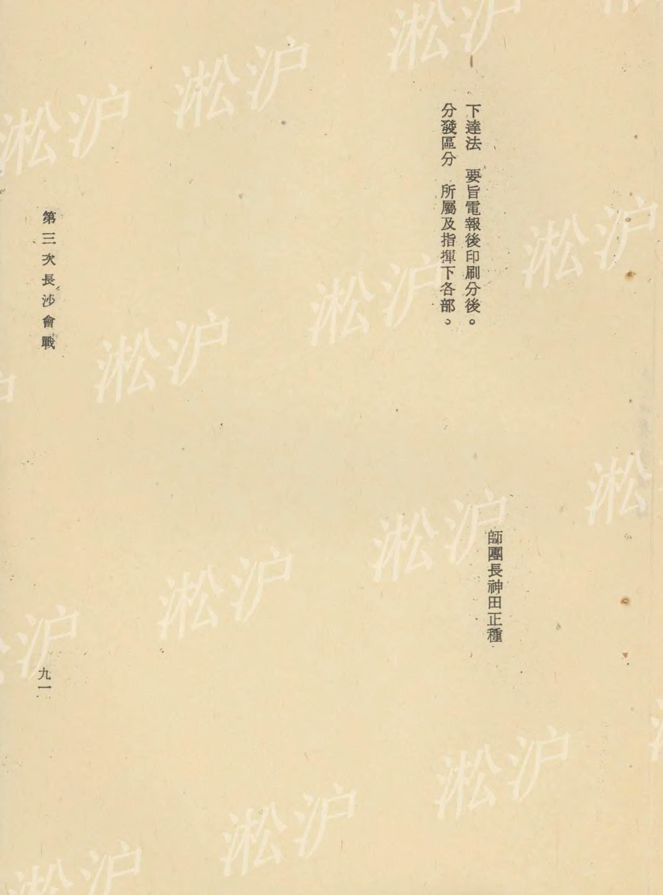

第三次長沙會戰附錄第六

根據第九戰區長官部函獲敵人文件之三六師作戰命令甲第一七九號別紙（參照附錄第四、集中完畢後之軍隊區分

師團司令部（一部缺）。

第六步兵團司令部（一部缺）。

步兵第四十五聯隊。

缺除部隊

步兵第二中隊及留置部隊。

配屬部隊

野砲兵第七隊（山砲二門）。

獨立山砲兵第二聯隊（一大隊一中隊及聯隊段列半部缺）。

工兵第六聯隊之一小隊。

師團無線電一分隊。

衛生隊車輛一小隊。

步兵第十三聯隊。

缺除部隊

第二第三大隊各約一中隊及留置部隊。

獨立山砲兵第二聯隊之一大隊及聯隊段列半隊。

工兵第六聯隊（二小隊缺）。

師團無線電一分隊。

衛生隊車輛一小隊。

步兵第二十三聯隊。

缺除部隊

步兵一中隊及留守一部隊。

配屬部隊

野兵砲兵第一第三中隊（各山砲二門）。

獨立山砲兵第二聯隊之一中隊工兵第六聯隊之一小隊。師團無線電一分隊。

衛生隊車輛一中隊（二小隊缺）。

師團通信隊（無線電三分隊缺軍無線電一小隊屬）。衛生隊擔架大隊。

第一第二野戰病院（各一部缺）。

師團病馬廠。

輜重兵隊長野田少校。

本部及馱馬四中隊汽車二小隊。

兵器勤務隊。

第三次長沙會戰附錄第七

根據第九戰區長官部函獲敵人文件之四

六師作戰命令甲第一八六號

參照附錄第五、

第六、及第一○、

第六師團命令

十二月二十日十二時

於新開塘

一、未獲有重要敵情。

二、師團以主力推進集結地，仍對新牆河南岸之敵，並準備渡河攻擊。

三、步兵第十三聯隊（配屬部隊如故），仍在現集結地，以渡樺樹潭，（湯家牌西南約三公里）榮家灣，（樺樹潭東南約二公里）間之敵陣地，並準備渡河攻擊。

四、步兵第四十五聯隊（配屬部隊如故），以對任必貴（榮家灣西南約三公里），至七步塘東南方高地之敵陣地幷準備渡河攻擊，但十二月二十三日以後，將集結地推進至硃砂礪（青崗興北方約四公里），青崗興晏子大山，與麻子山間之地區。

第一大隊（聯隊砲一門速射砲一門及砲兵一中隊屬），十二月二十二日由現在地出發，經蘇塘向大美岡（不包含）西北側地區前進，前記部隊，從現在地出發，並爲師團之直轄，關於爾後之任務直接指示之。

五、第六步兵團長指揮步兵第二十三聯隊（配屬部隊如故），以對新牆東西之線及彭子明附近之敵陣並準備渡河攻擊，但十二月二十三日拂曉以前，將集結地推進至袁紹崇（青崗興東南約一公里）

魏文嶺（袁紹崇東南約三公里）丹桂沖（青崗興南方約三公里）間之地區。

六、第三乃至第五項各部隊之搜索地域境界規定如左。

步兵第十三聯隊，步兵第四十五聯隊間，晏家大山，歐家院，大山坡（歐家院南方約四公里）相連之線，步兵第四十五聯隊第六步兵團間大橋嶺、王街坊、八斗坡（王家坊南方約四公里）相連之線，線上屬右。

七、衛生隊擔架中隊、第二野戰病院、師團病馬廠、及兵器勤務隊，十二月二十三日晚從現在地出發，依上記順序，將宿營地轉移左記地域，並仍續行現有任務，但衛生隊擔架中隊，着以小隊長指揮之二分隊於本（二十一）日晚前到達古水沖（毛里鋪西南約三公里），歸步兵第四十五聯隊第一大隊長指揮。

左記

衛生隊擔架中隊及第二野戰病院。

東山廟附近（第二野戰病院長部署）

師團病馬廠及兵器勤務隊。

新開塘附近。

八、輜重兵第六聯隊，十二月二十三日跟着第七項諸隊之前進，並依六師作戰命令甲第一七九號轉移至步兵第四十五聯隊之集結地，仍續行現有任務。

九、第十四師團架橋材料中隊，及第一師團渡河材料中隊，十二月二十三日跟隨第八項部隊之前進，由岳州經新開塘——團山廟道向團山廟前進並待機。

第十四師團架橋材料中隊長，應部署行軍及宿營等事項。

十、余在新開塘師團司令部。

二十三日九時，依六師作戰命令甲第一七九號之規定，團隊長，及輜重兵隊長，到新開塘師團司令第三次長沙會戰附錄第八

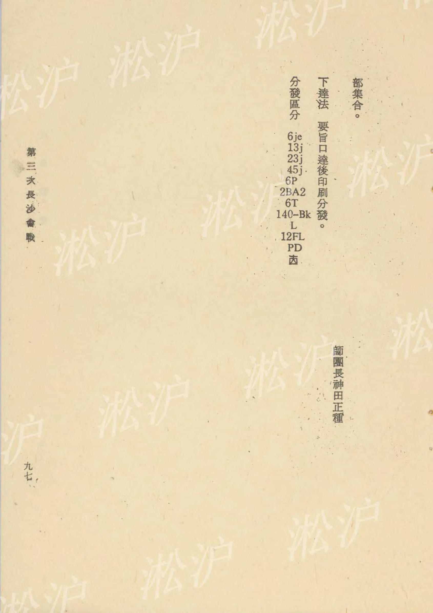

根據第九戰區長官部函獲敵人文件之五第三師團作戰命令第一一八六號

參照附錄第四

第九及第十一

於漢口

第三師團作戰命令

十二月十八日二十時

一、攻擊香港中之第二十三軍背後中國軍第四軍，暫編第二軍（以上第九戰區所屬），及第六十五軍已在增加中。

本軍向岳陽方面集中，師團向楊子江集中進展均極順利一、師團須再乘火車，或船舶經岳陽至二十五日前在集中地集結，並準備以後攻勢。第六師團於二十五日前從新牆附近下流，至新牆河左岸地區，又第四十師團，於二十五日前抵達托壩附近，應各準備攻勢。

本師團與隣接兩師團作戰，地境如附圖。

三、集中地之軍隊區分如別紙，各部隊集中如附圖。

各隊應依列表第一輸送計畫行動，抵達集中地後，卽入新軍隊區分。

四、石川部隊，應於二十三日前集結龍灣橋附近，並準備以後攻勢。

特以一部偵察新牆河左岸敵情地形，同時須隨時準備轉爲攻勢。

五、其他各隊，約於二十五日前，如附圖態勢集結之，並準備以後行動。師團直轄部隊集中地之細則，由先遣參謀指示之。

六、工兵第三聯隊，速以一部開至三眼橋—洛馬橋—小橋坳道修補。又輜重隊應以汽車中隊協助集中期間，糧秣補充之業務。

七、余在漢口二十日在岳陽二十一日再向小橋坳前進。

第三師團長半島房太郎

下達法

印刷分發

第三次長沙會戰附錄第九

根據第九戰區長官部函獲敵人文件之六

第三師團作戰命令甲第一一八六號別紙

參照附錄第四

第八及第十一

軍部區分

石井部隊

長步兵第二十九旅團長石川少將。

步兵第二十九旅團司令部。

步兵第十八聯隊（一大隊缺）。

步兵第三十四聯隊第二大隊及一中隊。

野砲兵第三聯隊（一大隊缺）。

師團無線電一分隊。

衛生隊。

第一野戰病院。

的野部隊

長步兵第六十八聯隊長的野大佐。

步兵第六十八聯隊（一大隊缺）。

獨立山砲兵第五十二大隊。

師團無線電一分隊。

騎兵第三聯隊長

宇島大佐。

騎兵第三聯隊（一中隊缺）。

輜重隊

長

輜重兵第三聯隊長

片岡大佐。

輜重兵第三聯隊（馱馬四中隊汽車一中隊）。師團無線電一分隊。

第四野戰病院。

師團直轄部隊

步兵第六聯隊第二大隊。

工兵第三聯隊。

師團通信隊（無線電三分隊缺）。

軍無線電小隊。

防疫給水部一部。

兵器勤務隊。

師團病馬廠。

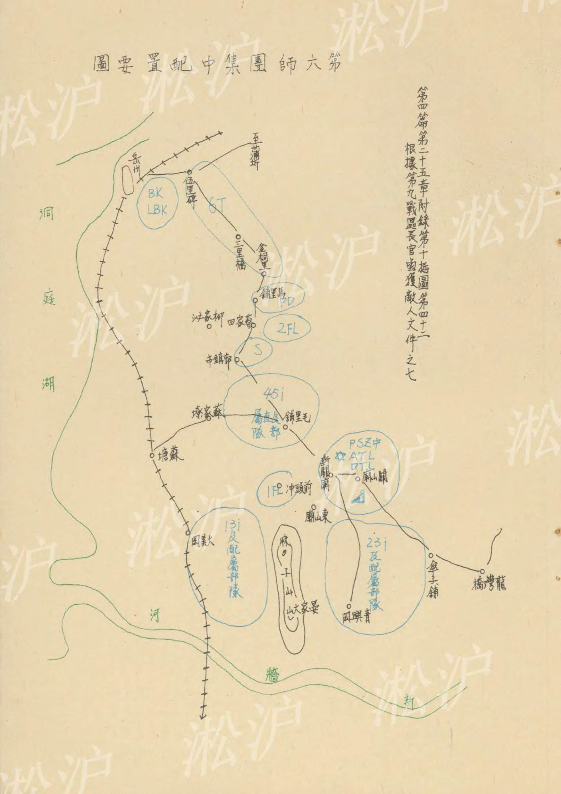

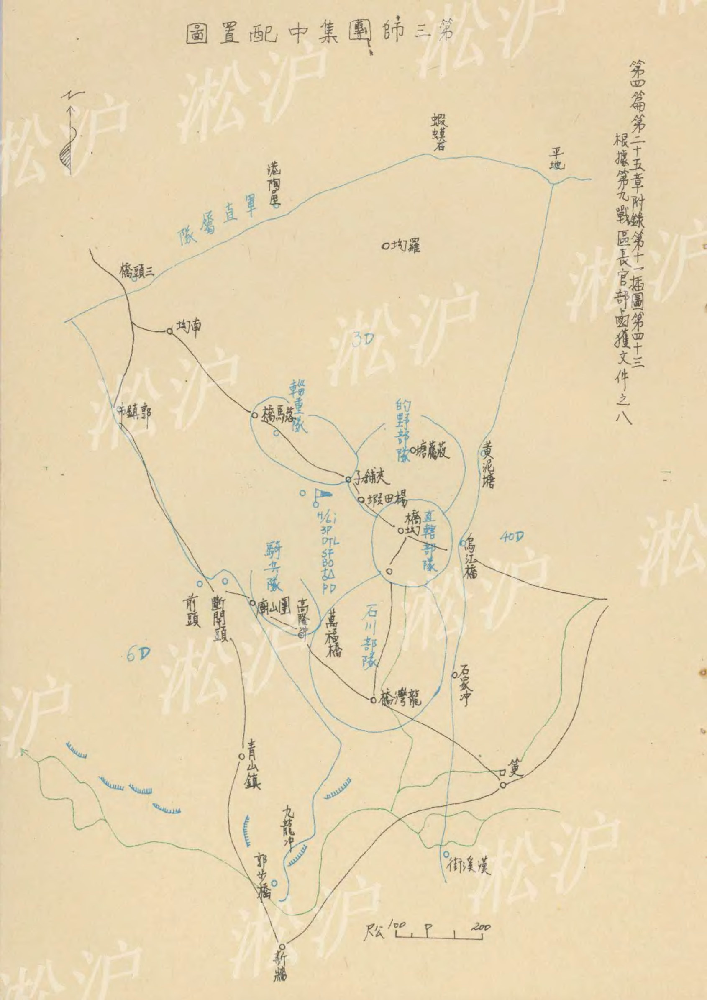

第三次長沙會戰附錄第十二根據第九區長官部囪獲敵人文件之九關於加號作戰編成裝備及留置部隊編成等之指示。第一

出動部隊編成要領

一、聯隊本部及直轄部隊軍旗小隊

共分三隊（每分隊官長以下十名）另外軍旗衛兵由每大隊派出六名合計十八名。

作業小隊

作業分隊四器材分隊一

通信班

有線電四分隊無線電二分隊小形無線電三分隊

大小行李

聯隊砲中隊（二門）

速射砲中隊（二門）

二、大隊

步兵三中隊惟第二大隊爲兩個中隊約一二零名機關槍中隊（六挺）

大隊砲小隊（一門）

化學兵小隊二分隊官長以下十一名彈藥小隊及行李盡量加強留置兵力如別紙要圖

第三

裝備要領

一、彈藥

1. 三八式步槍實彈

(1)一般中隊（除擲彈分隊）

步槍每枝一二零發

輕機關槍每挺一零零零發

(2)本部行李通信班作業小隊重火器部隊擲彈分隊化學兵小隊步槍每枝六零發

(3)聯隊小行李馱載（於應山交付）二零零零發(4)大隊小行李馱載（於應山交付）九零零零發2.

押收七九步槍（即中國步槍）

(1)一般中隊

押收輕機槍（即中國輕機槍）每挺六零零發(2)行李重火器部隊

押收輕機槍（即中國輕機槍）每挺五零零發3. 手榴彈

(1)一般中隊化學兵小隊每人一發(2)本部行李通信班作業小隊重火器部隊每三人一發4. 八九式重擲彈筒榴彈(1)一般中隊每具二八發(2)大隊行李馱載（於應山交付）一八零發5. 九二式重機槍普通實彈機關槍中隊每挺四零零零發6. 九二式重機關槍穿甲實彈機關槍中隊每挺一二零零發7. 九二式重機關槍曳光實彈（除銅實彈）

機關槍中隊每挺若干

8. 九二式步兵砲榴彈

(1)步兵砲小隊（於應山交付七零發）每門九零發(2)聯隊小行李馱載（於應山交付）九零發9. 四一式山砲榴彈

(1)聯隊砲中隊（於應山交付六零發）每門六五發(2)聯隊小行李馱載（於應山交付）八零發10

四一式山砲榴霰彈發光彈

聯隊砲中隊若干

九四式三七

速射砲中隊每門一零零發

九四式三七

砲穿甲彈

速射砲中隊每門五零發

發煙筒（中）

大隊行李馱載九零筒

九八式發射發煙筒

(1) 大隊小行李馱載六零筒

(2)化學兵小隊每人一筒

試製發射煙筒（附九四二式發煙筒甲）

(1)化學兵小隊每人一筒

(2) 大隊行李馱載三零筒

信號彈黑龍黃龍赤吊星綠吊星

(1) 聯隊小行李馱載各五筒

二、糧秣

1. 原駐地出發時之給養裝備

攜帶糧秣

精米

二日二餐分（約一升五合）

乾麵包

乙

一日分

粉味噌

四日分（二一零瓦）

罐頭肉

二一零瓦

粉醬油

一日分（三零瓦）

食鹽

二九瓦

砂糖

二零瓦

梅乾

一零零瓦

煙草

八五枝

甘味品

二次分

行李糧秣

修正

丙

定量

一日分馬鹽二十日分

馬糧

攜帶馬糧（麥類）一日分

馬鹽

四零瓦

其他

綏靖軍及工人之預備糧秣

精米

一日分攜行

食鹽

若干攜行

2.

於

充實裝備

在原駐地出發時尚未辦齊之物及途中消費之糧秣到達地附近照左列分量補充之三日三餐分（約二升五合）

乾麵肉（乙）一日分

罐頭肉

三日分（二七零瓦）

粉味啫

九日分（四八零瓦）

砂鹽

二日分

食鹽

三日分

甘味品

二次分

煙草

五零枝

梅乾

一零零瓦

行李糧秣

修正（丙）定量

一日分

馬鹽

二十日分

馬糧

攜帶馬糧（麥類）一日分馬鹽

二日分

八零瓦

3. 作戰發起後之補給依修正（丙）定量辦法三、被服

1. 穿用被服如左

夏衣及夏褲

夏襯衣及底褲

2. 裝進背包裏面之雜物

冬襯衣及褲各一

襪子二對日用品若干

3. 防雨外套及私人分趾跑鞋一對攜行但防雨帽（甲乙種）勿帶4. 各本部之預備被（如便帽夏褲綁腿皮鞋襪子等）及修補鞋類之工具材料必須攜行四、物品裝備

濾水器 每中隊一具

簡易磨穀機 每中隊一具

大便紙 各自酌量攜帶

蚊香 每十人一盒

臘燭 各人二枝

火柴 各人一盒

手電筒 每三十人一枝

鞋油 各人一盒

明礬 每一百人二瓩

捕蠅粉 每十人三瓩

割草鎌 每馬十匹一把

簡易磨穀機及手電筒（由各本部採辦）在乘船地領取其他各件於原駐地出發前向各本部經理室領取一、爲適應戰區企圖，遲滯敵之前進，對於野戰管區分監部及支部管區內之道路，從新規定，予以加强破壞，並於兵站總監部管區內，對於有關軍運之重要公路，過去破壞者予以修復，以利運輸。

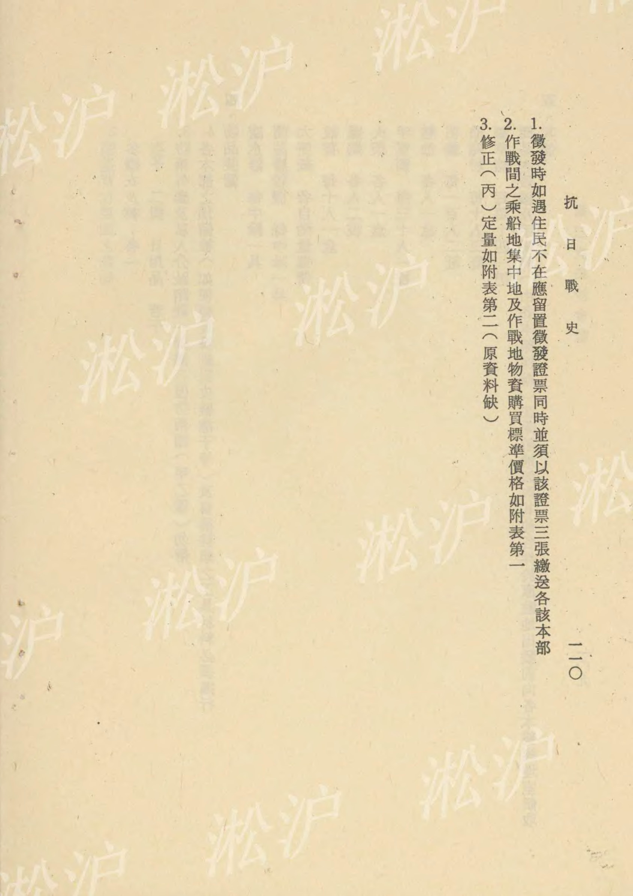

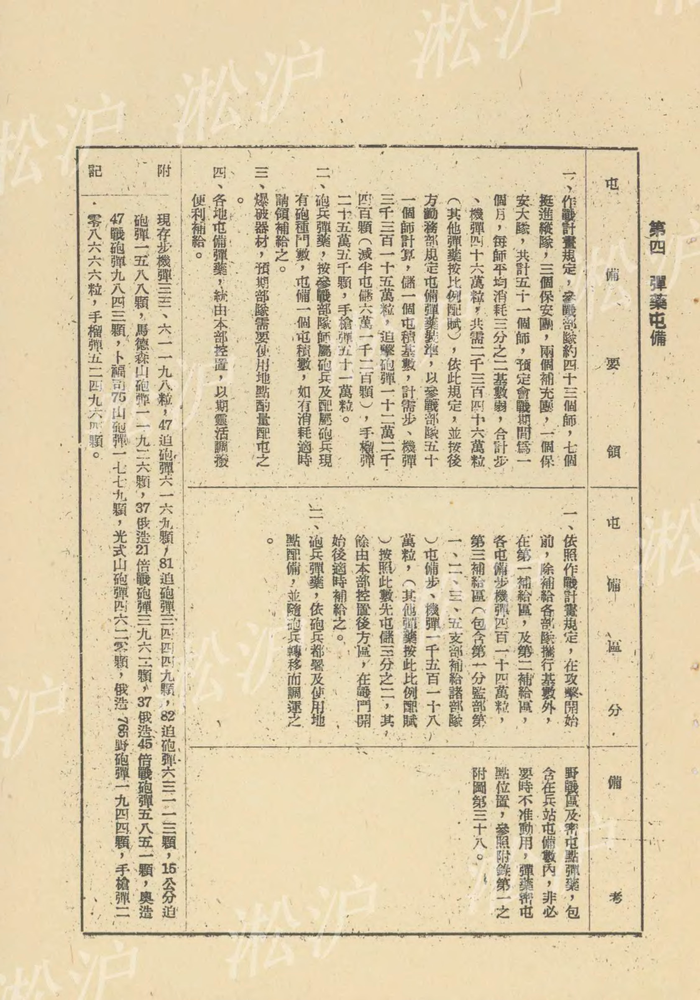

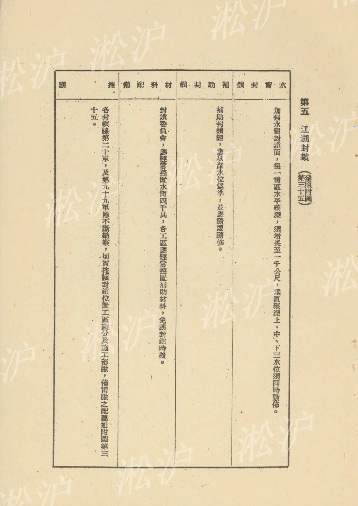

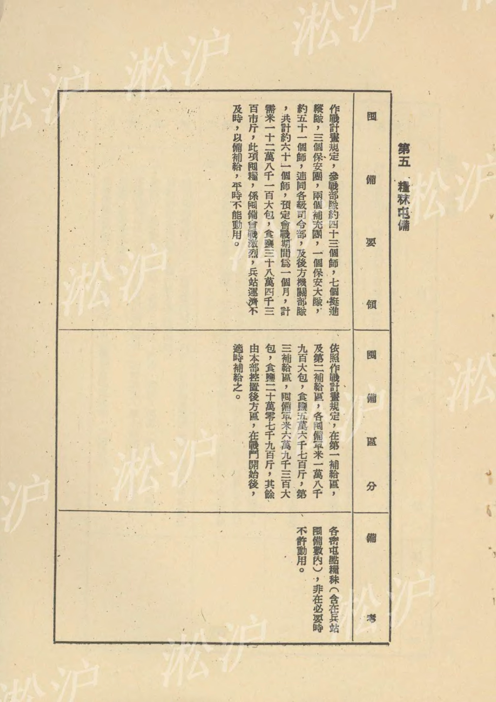

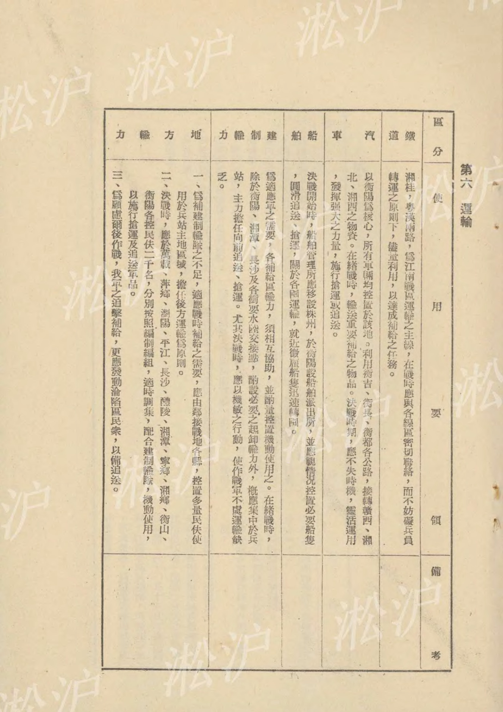

二、破壞道路，飭由各縣府發動民衆分區破壞，並令各專員，縣長親去檢查。

自新淦、新喻、分宜、宜春、蘆溪、萍鄉、老關、醴陵、株州、老關、湘潭、姜倉、馬托舖、如意亭、蟠桃渡、陳公橋、益陽至鄭家驛相連之線（如附圖第卅九）以東北，所有國道、省道、縣道、鄉村大道，除留路面一市尺寬以爲交通路外，其餘路面寬過一市尺者，一律削狹，徹底破壞，還山還田，並飭犂田蓄水，以增加破壞強度！

一、公路按下列四線修復（如附圖第三十九）：

1. 攸縣經醴陵至瀏陽段。

2. 下攝司經湘潭至長沙段。

3. 醴陵沿渌水南岸經渌口至下攝司段。

4. 永豐經湘鄉至湘潭段。

二、粤漢路由株州至坂塘舖再延伸至湘江南岸江邊，因第二次長沙會戰加以破壞，於十一月十五日可修復通車，江邊有路軌兩條，可裝卸軍品，但大量者，爲避免擁塞仍分在株州起卸爲宜。

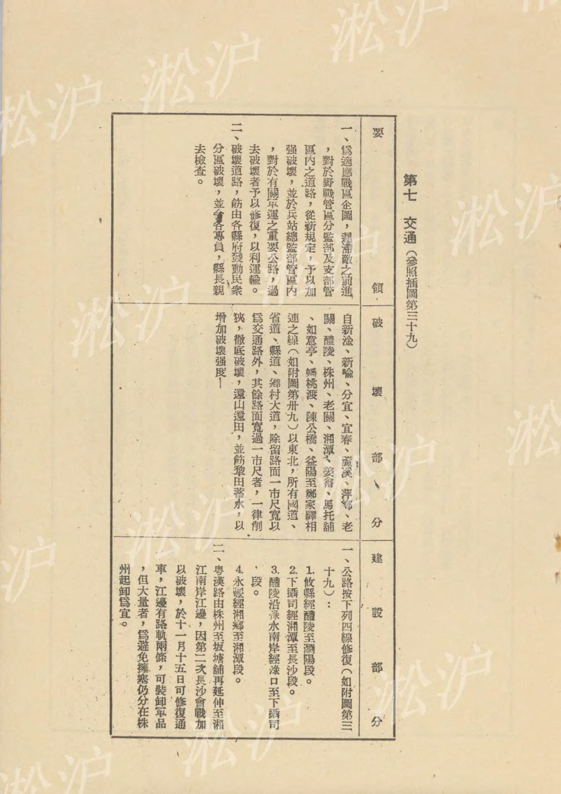

彈藥一二○○萬粒，平均每師約四十六萬粒，即每師每月約需三分之二基數（弱），本計畫使用彈藥，即依概數準備之。

團兩個，保安大隊一隊（約五個師），共九個按每師消耗三分之二基數彈藥計，一個月共需機彈四一四萬粒（其他彈藥按此比例配賦）。

三、第二十七分監部方面，（包設第一分監部一、二、三、五支部補給諸部隊）三十一個師，兩個挺進縱隊，（約兩個師）共計三十三個師，按每月消耗三分之二基數彈藥計，一個月共需步、機彈一五一八萬粒（其他彈藥按此比例配賦）。

四、以上共需步、機彈二三四六萬粒（其他彈藥按此比例配賦），在攻擊開始前，嚴飭兵站將各部隊攜行。

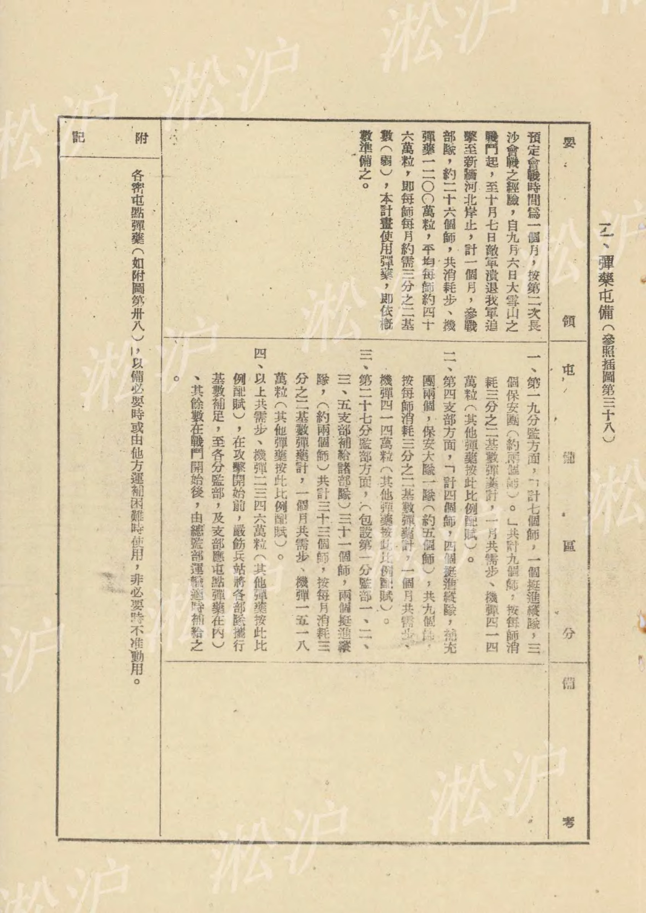

預定會戰期間一個月，屯儲五十個師所需粮秣。

一、第十九分監部方面，「七個師，一個挺進縱隊，三個保安團——（約兩個師）。」計九個師，共需米一萬八千九百大包。

二、第四支部方面，「四個師，四個挺進縱隊，兩個補充團，一個保安大隊——（約五個師」，計九個師，共需米一萬八千九百大包。

三、第二十七分監部方面，「包含一分監部一、二、三、五支部，（三十一個師，兩個挺進縱隊，——（約兩個師）」計三十三個師，共需米六萬九千三百大包。

四、各級司令部，及直屬配屬各部隊約十萬人（計十師一、參戰部隊（含正規、挺

進、保安、補充、等部隊

），共約五十一個師。

二、每師每月按需米二千一

百大包計算。

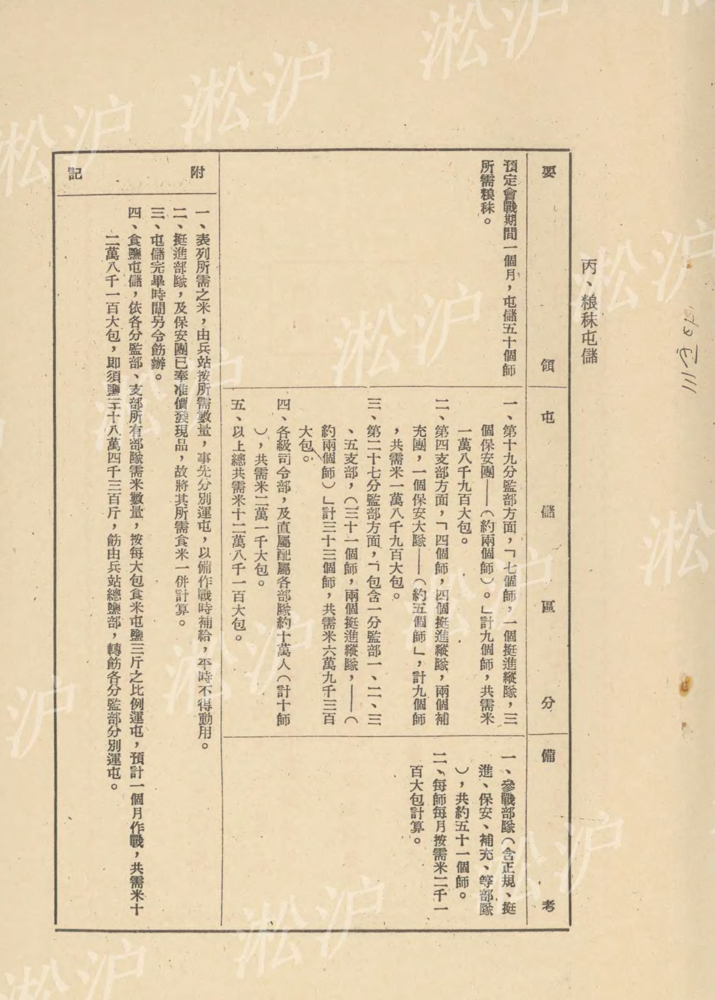
