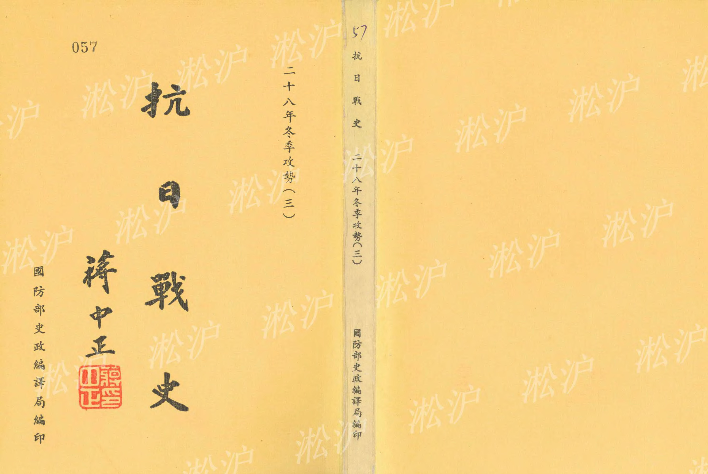

### 第五節 第九（六）戰區之作戰

敵軍自民國二十八年十月中旬第一次長沙會戰失敗後，深知南潯路西進之難，粤漢路北段南進不易，爲欲保有鄱陽、洞庭沿湖一部旣得之資源，於是調整部署，加強工事，以期固守現地，並利用巨奸萬煦、何佩鎔等在南昌、武昌組織贛、鄂兩僞省府，藉以吸收物資，且培植僞軍作「以華制華」「以戰養戰」之計。我最高統帥

蔣委員長於二次南嶽會議，決定廟謀，轉守爲攻，爭取主動，乃於十一月十九日以皓令一元電發動冬季攻勢，令第九戰區爲主攻，攻略粤漢路北段，挺進武昌，協同第三、第五兩戰區，將長江方面南京以西之敵驅逐至下游。

第九戰區基於上令，卽决以主力及指揮第六戰區參加之一部，攻擊粤漢路北段正面敵人，重點指向咸寧、蒲圻一帶，向武昌挺進，一部攻擊南潯路牽制敵人。在挺進時，南潯路方面我軍，向西山萬壽宮、大城、奉新、武寧挺進，粤漢路方面我主力軍，先後已攻達預定進出之線，敵軍退守據點頑抗。第九戰區爲聚殲據點之敵，於十二月十六日，卽以決戰兵團參加崇陽、通城方面作戰，二十二日下達擴張戰果命令，以右翼攻擊南昌、奉新之敵，左翼攻擊臨湘、岳陽之敵，中央殲滅崇陽之敵，預備兵團加入中央方面擴張戰果，敵亦不斷由咸寧、蒲圻方面增援，戰鬥益烈，尤以崇陽、大沙坪、通城爲甚，在崇陽克復與第二次圍攻大沙坪之日，敵軍曾以空投給養、彈藥，並有一部曾一度接洽輸誠投降，其受我嚴重打擊由此可知。

戰前狀況（參照插圖第三十）

##### 第一項 敵軍

（參照插表第二十六）

第九（六）戰區當面敵軍之動態如左：

一、在我第五戰區方面調來之第三、第十三兩師團之各一部，歸還建制。

二、第一零六、第一零一兩師團，於十一月上旬先後調往南昌、九江。

三、第三十四師團原在漢口以北及鄂東黃安一帶地區守備，主力於十一月中旬推進至贛北，接第一零一師團防務，一部於十一月二十三日到達錦江北岸。

四、第三十三師團原在大冶、陽新、鄂城、辛潭舖一帶，十一月上旬交防與第四十師團後，十日集結於陽新附近，卽向贛北移動，接替第一零六師團防務，分駐奉新、安義、靖安、武寧、箬溪一帶。

五、第四十師團爲在冬季攻勢前新編成之師團，十月六日由敵國調來，三十日抵咸寧，十一月一日接替第三十三師團陽新、辛潭舖、大畈鎮、通山、白霓橋一帶防務。

六、第六師團稱熊本師團，分駐岳陽、臨湘、崇陽、白霓橋（不含）、大沙坪、通城一帶地區整補。

七、獨立第十四旅團分駐九江、德安、永修、瑞昌一帶，守備南浔鐵路，時時游動巡察於南浔路左右。八、作戰地境，仍於十月五日第十一軍司令官岡村寧次命令規定之原作戰地境如左：

(一)第六、第三十三兩師團（後爲第四十師團接替第三十三師團防務）爲汀泗橋、白霓橋、小山界（距通城約三十公里）相連之線，線上及其以東地區屬第三十三師團。

(二)第一零六、第一零一兩師團（後爲第三十三、第三十四兩師團接替）爲雷王店、赤土街、常家祠相連之線，線上及其東南屬第一零一師團。

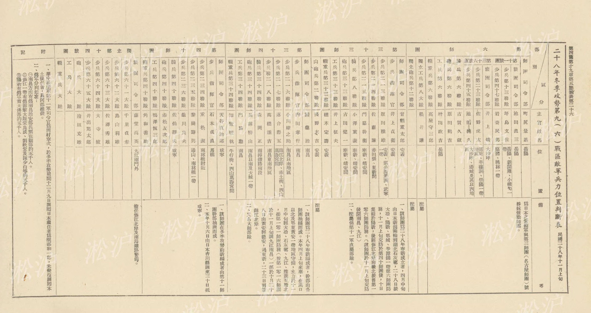

##### 第二項 我軍

(參照插表第二十七、第二十八)

一、前敵總司令部所轄之第十九、第一兩集團軍，守備錦江南北兩岸田家鎮、高安、米峯、來堡之線。二、第三十集團軍之第七十八、第七十二兩軍，守備修江南北岸之球場、烟港街之線。

三、第二十七集團軍之一部（第二十軍）在大源、桃樹港之線守備，主力集中修水、銅鼓整訓。

四、第十五集團軍守備麥市、九嶺、黃岸市南、楊林街至新牆、鹿角之線。

五、第六十軍、第七十二軍、第七十軍、新編第六軍、第三軍均控置於萬載、銅鼓、修水、瀏陽、萍鄉、醴陵一帶地區機動使用。

六、湘鄂贛邊區挺進軍第八軍與各挺進縱隊，在鄂南粵漢路北段南北地區及南滹路德安、永修以西地區攻襲敵後，破壞交通通訊。

七、第六戰區防湖部隊無變化。

##### 第三項 兵誌概要

第九（六）戰區跨贛、湘、鄂三省大部，爲抗戰時中國之心臟，北枕長江與第五戰區同扼陪都門戶，東比浙皖，南接百粤，與第三、第四兩戰區互爲唇齒，擁有洞庭、鄱陽兩湖平原之資源，控制浙贛、南滹、粵漢三鐵路及贛江、修水、長江、新牆河、汨羅河、湘、資、沅、澧等水陸交通，廬山、幕阜山、九宮山、崑山、九嶺爲其屏蔽，河川交織，山岳鼎峙，民生富庶，村落密佈，堪稱軍事重地，尤爲敵軍進佔南昌、九江、武昌、岳陽後所必爭也。

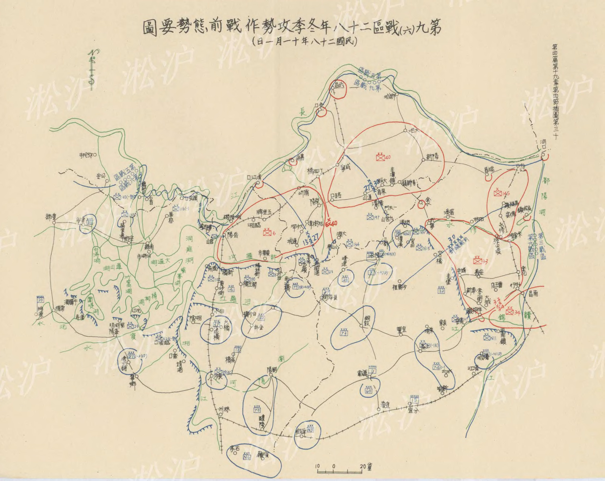

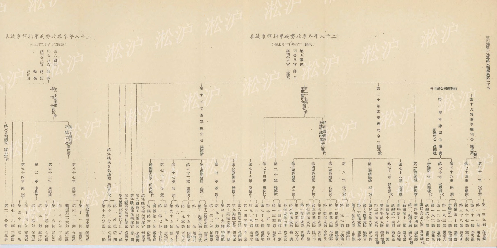

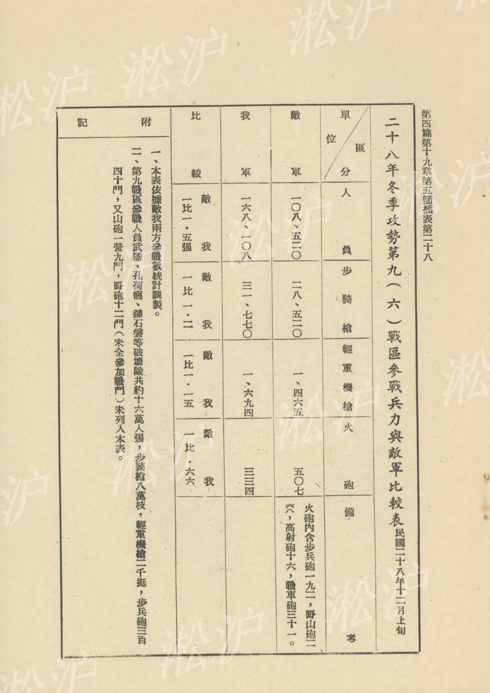

#### 第二款我軍作戰指導

第九戰區於十一月二十一日奉到蔣委員長十九日皓申令一元電訓令（原電見第二節第三款），冬季攻勢第九戰區爲主攻，限十一月二十六日以前開始實施。薛岳長官以長沙會戰後，新兵尚未補充，棉衣亦未發齊，攻擊開始時間似嫌迫促，經具申意見，請改期實施，復經桂林行營白主任、第六戰區陳長官亦先後電請改期，軍事委員會於十二月八日以麻午令一元電批准開始攻擊日期爲十二月十二日。

先是，第九戰區一面意見具申，一面調整部署，於十一月二十九日下達豔申堯堅電令如左：（參照插圖第三十一）

一、前敵總司令指揮第十九、第一集團軍：

(一)第五十一師於十二月四日接替第三十二軍右翼第一四一師之防務。

(二)第一四一師交防後，於八日集結廟前西方附近，待命出擊。

(三)第五十七師於四日集結於村前街附近。

四第六十軍於四日集結於上高、宜豐，第一八二師於六日集結於銅鼓。

二、第三十集團軍：

(一)新編第十三師於四日接替新編第十五師修江南岸防務。

(二)新編第十五師交防後，於六日集結茅田河附近，待命出擊。

(三)新編第十四師於四日集結九宮山附近待命出擊。

三、第八軍之第三師，於四日以一部集結太陽山，主力集結黃家坳附近，待命出擊。

四、第二十七集團軍：

(一)第一三四師於四日集結大源橋舖附近，待命出擊。

(二)第七十三軍（欠第十五師）於七日集結渣津，第十五師於四日集結修水。

(三)第七十軍第十九師於三日接替瀏陽防務。

第九戰區調整部署後，遂於十一月三十日下達攻擊命令，其要旨如左：（參照插圖第三十一）

一、前敵總司令（羅卓英總司令指揮第十九集團軍（羅兼）及第一集團軍盧漢總司令）：

(一)第五十八軍、第七十四軍爲警備兵團，以現態勢向當面之敵佯攻，獲得有利態勢後，卽轉爲眞面目之攻擊，相機略取奉新、安義一帶地區。

(二)第三十二軍以四團兵力爲挺進兵團。以兩團之一部，以店前街、萬家埠間山地爲根據，主力以塔山、沙港、廟前街一帶山地爲根據，襲擊牛行、樂化、涂家埠、萬家埠、灘溪、張公渡一帶地區之敵。以兩團進出修江北岸，襲擊永修、德安、馬迴嶺、虬津、白槎、柘林一帶地區之敵，確實截斷德安、南昌間，永修、武寧間，德安、武寧間敵之交通後，留一團於修江北岸，繼續破壞交通通訊，並阻敵南援。以三團由北向南相機攻略樂化、萬家埠、安義一帶地區，其餘兩團爲警備兵團，佔領第一三九師現陣地，向當面之敵佯攻，牽制敵兵力轉用，佯攻得利後，卽轉眞面目之攻擊，相機略取靖安。

(三)第六十軍控置於水口墟、上高，第一八二師控置於銅鼓，爲預備兵團，依情況準備使用於有利方面作戰，爭取戰果。

二、第三十集團軍（王陵基兼總司令）：

(一)第七十八軍爲警備兵團，以現態勢，向當面之敵佯攻，牽制敵兵力轉用，由佯攻獲得有利態勢後，卽轉爲眞面目之攻擊，相機略取武寧、箬溪、金水一帶地區，掩護第七十二軍右側背之安全。(二)第七十二軍爲挺進兵團，其新編第十五師由茅田河附近，第一期確實攻佔龍港、排市、辛潭舖、陽新鎮一帶地區，阻止該地區以東之敵向以西增援，第二期以一部確保辛潭舖，主力攻佔太平塘後，以一部確保之，主力協同新編第十四師作戰。新編第十四師由九宮山附近，第一期進出於陽新鎮、界首之線，第二期進出楂樹山、青鴉山、阮家尖、袁家舖、橫溝橋之線，確實截斷咸寧、武昌間之交通，掩護第八軍右側背之安全，並協同第八軍作戰。

三、第二十七集團軍（楊森兼總司令）：

(一)李玉堂代總指揮、楊漢域軍長、彭位仁軍長、均歸楊森兼總司令統一指揮。

(二)第八軍爲挺進兵團，第一九七師由現地、第三師由太陽山、黃家坳附近，第一期進出界首、路口之線，攻佔通山、南林橋，第二期進出橫溝橋、中伙舖之線，攻佔咸寧，爾後以一部進出嘉魚附近，截斷長江水上交通，主力向西席捲，圍殲第六師團。

(三)第二十軍爲挺進兵團，第一三四師由大源橋舖、第一三三師由桃樹港各附近，第一期進出路口、拓樹潭之線，攻佔崇陽，第二期進出中伙舖、新店鎮之線，攻佔蒲圻，爾後以一部進出太平口附近，截斷敵長江水上交通，主力向西席捲，圍殲第六師團。

四第七十三軍控置於修水、渣津，爲預備兵團，依情況準備使用於崇陽、蒲圻方面作戰，爭取戰果。

四、第十五集團軍（關麟徵總司令）：

(一)第七十九軍以一部爲挺進兵團，由月田附近確實攻襲新店鎮、五里牌間之敵，使敵第六師團主力不得互相救援，其餘爲警備兵團，向當面之敵佯攻，牽制敵兵力之轉用，由佯攻獲得有利態勢後，卽轉爲眞面目之攻擊，相機略取通城、大沙坪、藥姑山、詹家橋、雁嶺之線，協同挺進兵團，將該方面之敵壓迫於黃蓋湖方面而殲滅之。

(二)第四軍以一旅爲挺進兵團，由楊林街、新牆間、向五里牌、岳陽間之敵攻擊，使第六師團主力不得互相救援，其餘爲警備兵團，向當面之敵佯攻，牽制敵兵力轉用，由佯攻獲得有利態勢後，卽轉爲眞面目之攻擊，相機略取桃林、金鳳橋、岳陽之線，協同挺進兵團，將該方面之敵壓迫於臨湘、岳陽間地區而殲滅之。

(三)第五十二軍仍控置於現地爲預備兵團，依情況準備使用於有利方面作戰，爭取戰果。

(四)第三十七軍、第七十軍、第五十九師等之任務及位置同前。

(五)第五十三軍派步兵一團由臨湘、岳陽渡河，攻擊城陵磯、岳陽間之敵，該團與第四軍攻擊部隊取得聯絡後，暫歸第四軍歐軍長指揮。

(六)各挺進兵團、警備兵團、凡在作戰境地內敵之鐵道、公路、驛路、鄉村大道、電報、電話線均須澈底破壞，並須努力截擊敵輜重。

(七)鍾石磐部務對馬迴嶺、九江間鐵道及德安、瑞昌間九江、瑞昌、馮家舖間、瑞昌，木石港間各段公路及該地區之驛路、鄉村大道及電報、電話線須澈底破壞，確實截斷德安、九江間，瑞昌、武寧間敵之交通，並努力攻擊黃老門、沙河、九江、瑞昌間地區之敵，牽制其不得向南向西增援。

(八)孔荷寵部務對武昌、咸寧間之鐵道、公路、驛路、鄉村大道及電報、電話線澈底破壞，並應努力攻襲武昌附近之敵，確實截斷武昌、咸寧間之交通，斷敵向南增援。

其餘各挺進部隊及正規軍派出之交通破壞隊任務同前。

(九)作戰地境：

前敵總司令

沙窩里—永口橋—柘林—野猪山—獅山—彭山—馬迴嶺之線，線上屬前敵總司令。

第三十集團軍

一天門—阮家山—界首—茶地舖—橫溝橋之線，線上屬第三十集團軍。

第二十七集團軍

桃樹港—清水塘—柘樹潭—夏家山—新店鎮—清江口之線，線上屬第二十七集團軍。

第十五集團軍

十、限十二月八日晚開始行動，十日拂曉開始攻擊，經奉委員長八日麻午電令，改爲十二月十二日實施。

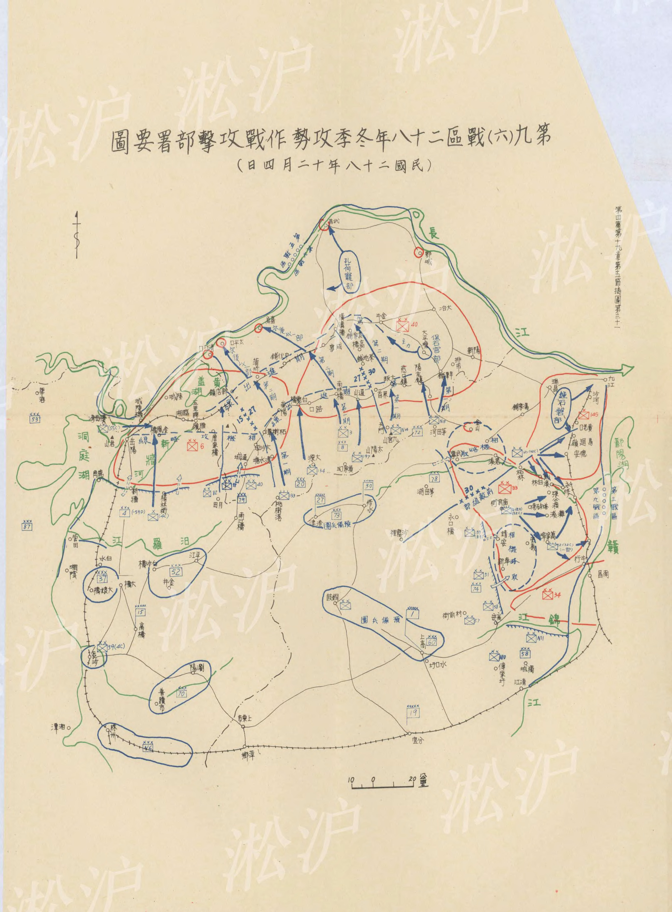

#### 第三款 作戰一般經過

民國二十八年十二月十二日至二十九年一月二十日

參照插圖第三十二至第四十一插表第二十九至第三十五第九（六）戰區基於十一月三十日之攻擊命令，積極完成部署，遵於十二月十二日與第五戰區一齊展開攻勢。其戰鬥經過可分爲四個時期，十二月十二日至十五日爲挺進時期，十六日至二十一日爲攻擊據點時期，二十二日至二十九年元月七日爲擴張戰果時期，元月七日至二十日攻勢終止，爲破壞敵後交通時期。茲分述如左：

##### 第一項 挺進時期

第九（六）戰區各部於十二月十二日開始攻擊，南濤路與粵漢路北段兩方面兵團攻擊當面之敵，敵後破壞隊加緊在敵後破壞交通通訊，主攻方面挺進攻擊。

前敵總部方面：（第十九集團軍、第一集團軍）（參照插圖第三十二）第五十八軍新編第十一師於十二月十二日一時分三路強渡錦江，進佔北岸艾莊、橫山台、塔崗山、石頭崗、高郵市各要點，敵逆襲未逞，十四日，左翼推進至京崗嶺，右翼約六百之敵，向橫江台、塔崗山逆襲，被擊退，由敵松井准尉屍上文件查悉當面之敵，爲第三十四師團第二一七聯隊。

第七十四軍第五十八師勞指揮官指揮之破壞隊，於十二日拂曉，乘攻擊隊向白茅崗、馬形山攻擊時，向赤田張挺進，當攻佔小仙嶺、大嶺之線，並挺進赤田張，將附近公路橋樑澈底破壞，敵由赤田張向大嶺、小仙嶺逆襲，被擊退。攻白茅崗之部，因仰攻不易，乃繞道祥符觀東北向鼓樓舖攻擊，第五十一師攻擊隊於十二日佔領南歷余後，續向五步城之敵挺進攻擊。

第三十二軍第一三九師，於十三日拂曉向靖安挺進攻擊，一部佔領新屋蔡及白雲山之線，另一部與敵對峙貫川范、沙港之線。第一四一師由廟前渡河，十二日向上柱堂之敵攻擊，並向德安挺進，一部於十五日向張公渡、安盛橋之敵攻擊，並破壞張公渡附近公路。

第三十集團軍方面：（參照插圖第三十三）第七十八軍向武寧之敵攻擊，攻至楊江坪、大宅元、謝言裏以北高地，十三日，一部攻擊老鴉頸高地，敵感側背威脅，向湯家嶺、磨源壠以西高地亘老塔下、武寧城南之線撤退，該部進佔沙田、麻源之線。新編第十六師十二日向厚竹尖約六、七百之敵攻擊，入暮進至蕭氏祠附近及北大崗之線，經連日向武寧之敵攻擊，無進展，全線與敵對峙。

第七十二軍新編第十五師，十二月十二日拂曉強渡富水，向排市、辛潭舖、陽新鎮攻擊，因河寬水深，只一部強渡成功，及攻至辛潭舖附近與敵對戰，無進展。新編第十四師十二日晨強渡富水，向慈口鎮、大畈鎮之敵攻擊，越過公路，被雷公山、北斗伏之敵所阻，後續部隊無法再渡。當時韓全樸代軍長據報，當面之敵增加千餘、砲六、七門，又以辛潭舖、大畈鎮爲敵之堅固據點，港背山、雷公山、北斗伏敵之砲火猛烈，前進部隊被阻，未能達成深入攻擊任務，乃以新編第十五師少數部隊牽制辛潭舖之敵，以主力攻陽新鎮，新編第十四師攻大畈鎮。十三日，新編第十五師於拂曉前繼續渡河，一部向辛潭舖施行助攻，主力指向陽新鎮，八時，攻佔陽新鎮，敵退守陽新鎮後方之既設陣地頑抗，進展困難。十四日午後，千餘之敵陸續在排市、辛潭舖下游渡河，由陽新城增援之敵一縱隊，亦在排市下游渡河南進，共分三路，向第四十五團第一營側背攻擊，該營不支，轉移至馬坳口附近，復被敵包圍，第四十三團之一營馳赴龍港策應，尚未到達，敵三、四百已進佔。同時由箬溪西進之敵約一聯隊、砲四門，於黃昏時已到達余家畈附近，第四十三團進佔構樹下、大山腦之線阻敵西進，十五日，該團轉移至羅山、雨山之線，第四十五團退守龍崗西北大山中，該團第一營復轉移至冷樹洞作壯烈犧牲，第四十四團於入夜撤至富水南岸。新編第十四師於十三日拂曉繼續渡河，進達公路以北，入夜，派一部協同新編第十五師作戰，十四日，左翼友軍第一九七師遭敵攻擊，轉移金竹尖、官才尖之線。此時該師以左右友軍均向後撤退，感受威脅，遂於十五日，退守學堂吳、侯王殿附近。

第三挺進縱隊（鍾石磐部）於十二月十二日，一部在南潯路之抱桐樹附近與敵遭遇，經激戰後，敵向永豐橋退去，十四日夜襲瑞昌城及破壞附近木橋一座。

第二十七集團軍方面：（參照插圖第三十四）第八軍第一九七師於十二月十二日拂曉開始攻擊，攻至上畈頭及通山附近，遂攻北山腦，十三日拂曉，攻佔沙灘、章安坑、四畝地，並進佔板橋及破壞余家橋橋樑。十四日，大畈鎮、西坑塘增援五百餘畝，向右翼包圍，敵機掩護步兵約八、九百向右翼猛攻；通山之敵一部進至泉港以西朱家窩中，一部步砲聯合之敵約六、七百進至東牛山以南一帶高地；該師四面感受威脅，乃轉移金竹尖、官才尖之線，十五日，將朱家窩之敵擊退。第三師於十三日四時，第八旅向港橋、芭蕉嶺之敵攻擊，十四日，第九旅一部攻佔屏風山、向大港橋進攻，十五日拂曉，第八旅（欠一團）於北山巖、四四六高地、泥湖巖之線，第九旅之一團由屏風山、外魯之線，向芭蕉嶺、大港橋之敵東西夾擊，以右翼友軍被敵突破，乃以主力佔領新豐市附近地區阻敵西進，一部圍攻突至苦竹園之敵，經激戰後退去，芭蕉嶺、大港橋之敵已增至三千人、大小砲十餘門，會合在苦竹園撤退之敵千餘，同時開始進攻新豐市，一度被敵突破，旋卽恢復，入暮，敵向夏舖以北羅成口及大港橋退去。

第二十軍第一三四師（附第三九七團）於十二月十二日一時開始向崇陽之敵進攻，二時，第四零二團、第三九七團佔領該城西北地區，敵據魁星閣頑抗，第四零一團擊退白霓橋之敵後，進佔橫山，十三日拂曉，第四零二團掃蕩城內殘敵，攻擊東車站，敵退入城東隅及駁岸頑抗，因絕水火攻擊，敵益感恐惶，退據魁星閣之敵蟾伏下層死守，經一度接洽投降。十四日，第二十七集團軍電令調整部署，第三九七團歸還建制，第四零二團擔任肅清崇陽城殘敵，由第一三三師師長指揮。第一三三師（欠第三九七團）十二日拂曉，第三九九團圍攻台上湖、羊樓洞方面千餘之敵，由公路泉門嶺進攻，激戰後轉移上石嶺西南，第三九八團仍攻荻州畈、石城灣、桂口市之敵，迄十三日，進展至大沙坪東岸附近，十四日調整部署後，第三九九團在台上湖、上石嶺與敵千餘激戰，第三九八團與大沙坪增援之敵在上簡家山、青草嶺、石城灣、五里廟等處激戰，第四零二團因傷亡過重，停止攻擊，復以態勢不利，退出城外，十二時崇陽城再陷敵，十五日戰況沉寂。

第十五集團軍方面：（參照插圖第三十五）第七十九軍第一四零師於十二月十二日三時開始向烏龜嘴、鐵柱港、景山、錫山攻擊，在中途截擊由大沙坪向通城增援之敵四百餘人，十四日，第八三七團攻佔王家、堰市，繼續向當面之敵攻擊，無進展，於十五日協力第九十八師圍攻大沙坪。第九十八師於十二日拂曉向大沙坪、沙塘、虎形山攻擊，經一度佔領牛角尖、大屋周、田家之線後，以敵增援反攻放棄；十三日黃昏再興攻擊，第二九二團攻佔牛角尖及以北二零四三高地，十四日拂曉，以迫擊砲火力協力攻擊，未有進展，十五日，分向田家嘴、田家嶺攻擊，田家嶺經數次爭奪，失而復得，一部衝入大沙坪街口，以敵增援逆襲，退守田家嘴西側高地。第八十二師十二日已進至羊樓洞、五里牌間地區，午後，第四八八團攻佔羊樓司車站，敵退入街市，憑據工事頑抗，十三日，該團繼續對街市之敵攻擊，第四九一團控置橫溪，第四八七團攻擊五里牌、平水舖。

第四軍以第九十師及第一零二師於十二月十二日向常山、晏家犬山之敵攻擊。第九十師挺進之兩團，已先期行動圍攻桃林，十三日，一部監視桃林、西塘之敵，主力向板橋、漁潭攻擊前進，十四日克漁潭，一部抵五里牌附近。第一零二師於十三日攻佔後山坪、晏家大山，向青岡驛、龍港灣攻擊前進，十五日攻佔常山，續向新開塘攻擊前進。

在此期中，薛長官爲增強崇陽、通城、通山方面攻勢，於十三日下達電元酉令，要旨如左：

一、第七十三軍彭位仁軍長率第七十七師卽夜開金塘坳西方、高視北方之雙港附近，策應作戰；第十五師着於十三日夜由現地出發，開金塘坳歸還建制。

二、第七十軍李覺軍長率第十九師於十四日出發，經銅鼓、山口開赴修水，限十八日到達，所遺瀏陽防務，由第一零七師接替。

三、第一挺進縱隊全部，應立向賀勝橋挺進，在賀勝橋附近確實破壞粵漢路之交通通訊，並攻擊武昌附近之敵。

##### 第二項攻擊據點時期

第九（六）戰區向敵全線挺進攻擊，頗有進展，爲求繼續殲滅當面據點之敵，經於十三日以元酉電令第七十三軍向崇陽、通城方面據點之敵攻擊，並於十六日以銑已電對攻擊據點之指示：「我軍攻擊目的，在殲敵兵力而獲得良好戰果，如敵死守據點，則應以一部牽制，一部趨敵之後，破壞交通通訊，絕其補給，迫其孤立，誘敵離開據點而殲滅之，或牽制甲據點之敵，而誘乙據點之敵來援，中途設伏而殲滅之，總期因時、因地、因敵、而運用各種方法，最忌徘徊不前，或扼守一點，或遲滯一隅，不果決、機動、敏活、協同、制敵機先，勿被制失機，盼將此意轉告各軍師長」。復於十八日以巧申電指示攻略據點要領：「攻擊據點，應集中山砲、迫擊砲、平射砲、重機槍之火力，制壓敵人及燬敵鐵絲網，開關衝鋒路；如無山砲，以敢死隊匍匐前進，接近敵鐵絲網，使用大量手榴彈，開關衝鋒路；或以工兵利用夜間接近鐵絲網，施行爆破，開關衝鋒路，將敵火力壓倒，衝鋒路開設成功後，對敵據點一舉攻略之，不可僅以肉彈主義，作無謂之犧牲」。

前敵總部方面：（參照插圖第二十六）羅總司令以兩日之攻擊，各部均獲進展，經王耀武軍長建議，爲爾後攻佔西山萬壽宮、大城、干洲間地區之敵計，於十二月十三日夜下達電令（元酉）要旨如左：

一、警備兵團

(一)第五十八軍仍應以有力一部、對石頭崗東北地區之敵極力佯攻，努力進出西山萬壽宮，遮斷敵南昌與大城間之連絡。主力進出七里崗、沙枯腦之線後，以有力部隊向蘇姑嶺、白仙嶺挺進而佔領之。另一部與第七十四軍夾擊大城、鼓樓舖之敵，並以一部仍任錦江南岸原陣地各要點之守備。

(二)第七十四軍以主力進出車塘、小嶺、竹山之線，一舉攻略大城、虬嶺地區之敵而佔領之，並極力破壞赤田張、奉新間之交通，以掩護該軍主力之側翼，並以一部仍任原陣地各據點之守備。

二、挺進兵團

(一)第一三九師第四一七團應向指定地區邁進，努力達成牛行、樂化、萬家埠間，樂化、涂家埠間公路、鐵路橋樑及通信之破壞。

(二)第一四一師第四二一團應極力達成萬家埠、張公渡間，萬家埠、安義間，灘溪、安義間公路、鐵路及通信之破壞，切斷敵之連絡線。

(三)第一四一師主力任務同前。

三、預備兵團

第六十軍挺進石頭街、泗溪附近地區，第一八二師推進於橫橋附近準備作戰，均限於十五日到達，總攻開始日期，限十二月十二日拂曉。

各部遵令，一面攻擊，一面準備。十二月十七日晚，羅總司令復調整部署，下達篠戍電令，其要旨如左：

一、第六十軍：(一)第一八四師應卽推進高安，接替第五十八師右至錦江北岸、經馬形山、楊家坊、茅竹嶺亘米峯北麓(含)原陣地線之警備，重點保持於右翼，限十九日拂曉前交接完畢。(二)第一八三師推進龍團墟、楊公墟間地區，策應作戰。(三)第一八二師應推進橫橋附近，均限於十四日黃昏前到達。二、第五十八軍應確實攻佔白仙嶺、蘇姑嶺，遮斷南昌、大城間之交通，並協同第七十四軍掃蕩大城及其西南地區之殘敵，其餘任務同前。

三、第七十四軍右翼第五十八師陣地、交由第六十軍第一八四師接替後，該軍主力應確實攻佔大城、虬嶺附近地區，努力掃蕩大城西南地區之殘敵，並對奉新之敵佯攻，另以一部進佔東北六分橋、百子橋，遮斷奉新、干洲間之交通，其餘仍在米峯（不含）至譚埠（含）原陣地守備。

四、第三十二軍：(一)第一三九師（欠一團）應努力攻擊干洲及其附近要點，遮斷安義、干洲、靖安間之交通，並仍任原陣地要點之守備。(二)第一四一師及第四一七團任務同前。

第五十八軍基於十三日令調整部署後，於十二月十六日拂曉開始總攻，新編第十一師攻佔京崗嶺，並進佔來龍山、沙枯腦，續向大城挺進攻擊，十八日十二時，敵四百餘由獅子腦攻擊，遂發生激戰，至二十二日成對峙狀態。

第七十四軍十二月十六日開始總攻，第五十七師於拂曉攻佔萬步老、竹園胡村，續將小嶺敵軍一中隊殲滅，赤土街之敵來援，被擊退，並進佔車塘、皂里、小嶺各要點，敵八百餘、砲六門、分向車塘、小嶺逆襲，經擊退，並乘勝進佔回龍山。據俘供當面之敵爲第三十三師團第二一四聯隊。當小嶺戰鬥時，敵戰車數輛及步兵約三百人，由赤田張馳援，被破壞隊擊退。第五十八師第一七三團攻佔左家坊，續向沙古嶺攻擊，十七日將沙古嶺之敵包圍，十八日正遵羅總司令篠戍電令將防務移交，適由奉新增援之敵已至，未及交防卽與敵接觸，十九日夜，將沙古嶺完全佔領，敵守軍一中隊全被殲滅，始將防務交由第六十軍第一八四師接替，集結猪婆大坵履行新任務。該師廖齡奇副師長經軍事委員會記大功一次。第五十一師一部攻佔大嶺、一六二三高地，另一部於十七日向青嶺、七貫腦之敵攻擊，十八日，敵由安義、奉新間調集援兵千餘、戰車十餘輛，十九日，分由陶仙嶺、鴉鳩嶺、向一六二三高地、鄢村港、南鄧猛攻，遂發生激戰，二十日攻佔蠻崗嶺。

第三十二軍第一三九師之一部，十二月十六日向干洲、鴨婆潭不斷攻擊，二十一日夜襲靖安城，一部攀城而入，焚敵兵營倉庫，翌日拂曉退至青山高地。第一四一師一部於十六日夜襲張公渡，並破壞其附近公路橋樑及激策僞軍宋良成、劉映堂等反正，十九日破壞南潯路、山口鋪附近鐵路。第一三九師第四一七團挺進牛行，破壞牛行、樂化間鐵路、公路及通訊。

第三十集團軍方面：（參照師圖第三十三）第九（六）戰區以敵已離開據點，越富水分向構樹下、龍崗、橫石潭進攻，正宜乘機攻擊，遂於十二月十五日以刪卯電指示：「武寧之敵，如向龍港移動，則第七十八軍正可乘機攻佔武寧，第七十二軍如不迅速進攻，達成任務，則是徘徊失機，希確遵迭電所示攻擊據點方法，放膽進攻」。

王兼總司令奉電後，卽轉飭遵照。並於同日以刪午電令第七十二軍，以新編第十五師先全力解決余家畈、龍港等處之敵，新編第四十師以一團兵力協助新編第十五師或撥與指揮，其主力應防阻北岸一帶之敵南進，並與第一九七師確切連絡。同時以刪電令第七十八軍，卽以主力攻佔武寧，進出於大橋河、金水，截斷敵之交通，以策應第七十二軍之作戰。兩軍遵照實施。十六日，第七十八軍仍牽制武寧之敵，第七十二軍對竄到龍港、牛鼻吼、燕夏、橫石潭之敵激戰。王兼總司令以銑午電指示攻擊離開據點之敵，並派補充第一團到木皋，防止茅田河敵人南竄，第十九師先頭已過銅鼓，十八日可到修水。

十二月十七日，第九戰區令第八軍歸第三十集團王兼總司令指揮，並規定第三十、第二十七兩集團作戰地境，爲司前、大源橋、小沙坪、下細市、中伙舖、杜家洲之線，線上屬第三十集團軍。並下達篠午電令：「現辛潭舖、通山、南林橋一帶之敵，離開據點，此正殲滅良機，我第七十二、第七十八兩軍應絕對機動，集力聚殲，萬勿左顧右盼，東防西守，自陷被動，自失良機，深望嚴督所部，殺敵建功」。

第七十二軍自十二月十六日起以通訊中斷，與集團軍失去連絡後，十七日，轉移至石門、成龍、橫石潭與敵苦戰。十八日夜，新編第十四師之一部攻襲船埠之敵，十九日，第一、第二兩補充團進駐木皋、石橋舖一帶。二十日，韓代軍長率殘部突圍，當佔領石艮山、四面山、水牛山、陡壁山之線，經協同補充團陳團長將竄至茅田河之敵擊退。二十一日，據報船埠、泥坑口之敵，已一部退守富有，大畈鎮一帶之敵，仍撤回通山，竄擾燕夏、茅田河，毛坪之敵，仍退回箬溪，龍港尚有敵一部，該軍亦開始從事收容整補。

第八軍第一九七師於十二月十七日夜，（參照插圖第三十四）將朱家窩中之敵擊退後，乘勝佔領泉港、徐家壠，以敵一部竄進茅田河、橫石潭一帶，右後感受威脅，於十八日轉移至雷公尖、李家舖、黃土洞、石壁湖之線。敵分三路包圍攻擊，一由寶石河向石壁湖，一由船埠向西，一由橫石潭向南，十九日，該師突出重圍至大小源口整頓完畢，轉移攻勢，收復船埠、石壁湖，敵向大畈鎮、通山退去。第三師主力、十六日仍在羅成口、芭蕉嶺、北山巖與敵第四十師團第二三四聯隊激戰，十八日晨，將屏風山反攻之敵五百餘擊退，並截斷芭蕉嶺、大港橋交通。二十日，薛長官以號午堅電令第一九七師移至花墳前、楊芳林地區，牽制通東西各據點之敵，第三師向南林橋、路口間之白羊舖攻擊西竄南擾之敵。第八軍卽遵照實施。

第二十七集團軍方面：（參照插圖第三十四）該集團軍遵照第九戰區對攻擊據點之指示，各部向白霓橋、崇陽據點攻擊，並協攻大沙坪、通城、羊樓洞等據點之敵。第九戰區於十二月十六日以銑辰電令：「第二十軍應迅速肅清竄回崇陽附近之敵，第七十三軍第十五師卽經崇陽、桂口市間西進，策應該軍作戰，該軍在桂花樹、白花舖附近部隊，協同第八十二師迅速殲滅羊樓洞之敵，第七十三軍第七十七師由烏龜市自北而南協同第七十九軍殲滅大沙坪之敵，第七十九軍並應迅速殲滅通城之敵」。復於十七日規定，第二十七集團軍與第三十集團軍作戰地境，並令第八軍歸第三十集團軍指揮。再以篠申電令第一零七師限於二十一日到達渣津，新編第六軍限十九日到瀏陽、普蹟市。

第二十軍卽以第一三四師第四零一團及第四百團攻白霓橋，第四零二團圍攻崇陽之敵，第一三三師第三九九團仍在桂花樹方面截擊羊樓洞方面增援之敵。十二月十九日，第一三四師第四零二團攻鱠魚山、楊泗橋之陣地，被由香山橋增援之敵突破，卽渡河轉移至崇陽城南之五里牌。白霓橋敵之第四十師團步砲兵七、八百砲四門、南攻橫山，續向石子嶺進攻，其後續部隊汽車二百餘輛，竄到天靈山附近，第四零一團卽轉移至銅鐘坪附近整頓，第一三三師第三九七團仍向敵堵擊，敵向崇陽退去，第三九九團仍在桂花樹附近阻擊羊樓洞方面增援之敵。十七日以來，敵分三路，一路由羊樓洞、白花舖東進，一路由崇陽城突圍、向香山橋攻擊，一路繞經雪花山，同時向第三九七、第三九九兩團包圍，適薛長官於十七日令第七十三軍第十五師，卽由青山舖向崇陽、桂口市間西進，協同作戰。十九日，第十五師一部攻佔雪花山西北高地，與第一三三師取得連絡後，奉命向石城灣之敵攻擊；第一三三師於二十一日集結於袁家、三山源附近，向五里牌、打石嶺、龍飛塘前進。

第七十三軍第七十七師由烏龜石前進，第二零三團於十二月十八日與第七十九軍第九十八師取得連絡後，向西攻擊大沙坪，十九日佔領桃園嶺，並迫近桂口市之街市，第二二九、第二三一兩團向石城灣、桂口市之敵攻擊，激戰竟日，未獲進展，二十日，第二三零、第二三一兩團攻擊大沙坪，第二二九團攻擊石城灣、桂口市之敵，二十一日，由崇陽增援大沙坪之敵數百，在華石嘴、荻洲畈與第二二九團激戰。

第十五集團軍方面：（參照插圖第三十五）該集團軍除臨湘、岳陽方面，仍以第四軍攻擊，不使敵向崇陽、通城方面增援外，第七十九軍與第二十七集團軍之第七十三軍協同圍攻桂口市、大沙坪、通城各據點之敵，並以一部破壞羊樓洞方面交通，攻襲由蒲圻、五里牌增援之敵。自十二月十七日至二十一日，第一四零師之一團已攻佔崇南亭，迫近大沙坪；第七十七師之一團攻佔桃園嶺後，繞攻大沙坪；第七十七師之一團攻佔古城山之田家、二零四三高地，亦迫近大沙坪；各團攻部隊，經一度衝進大沙坪街口，均爲敵碉堡及砲火所阻，第七十九軍之團攻通城部隊，將景山、錫山附近據點佔領，迫近通城，一部攻

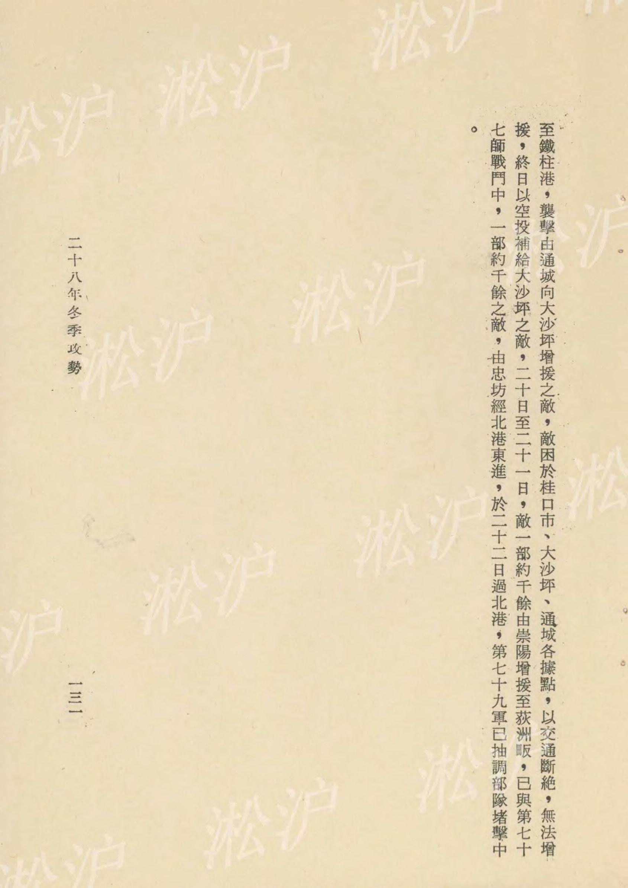

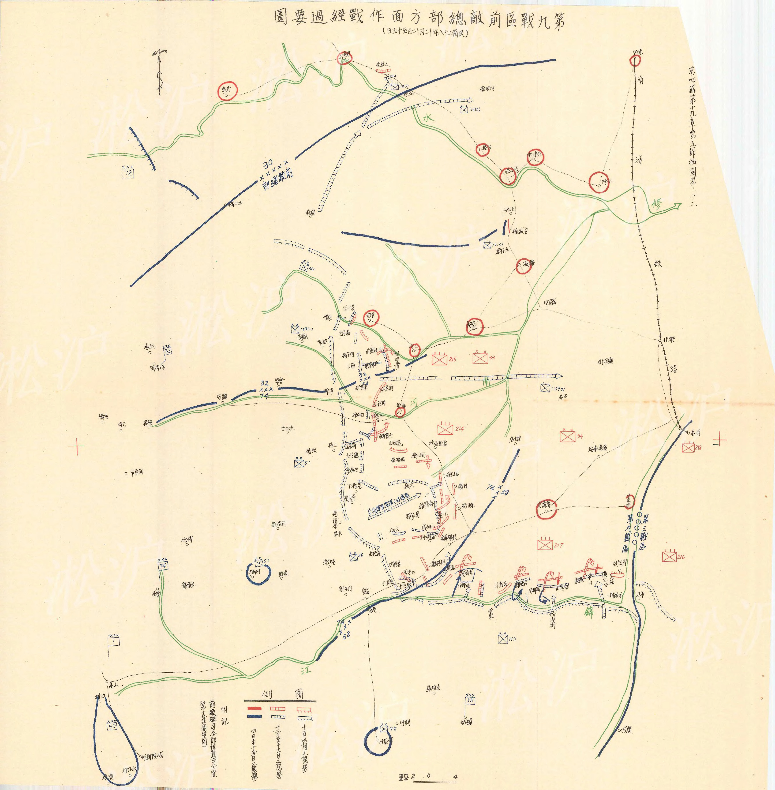

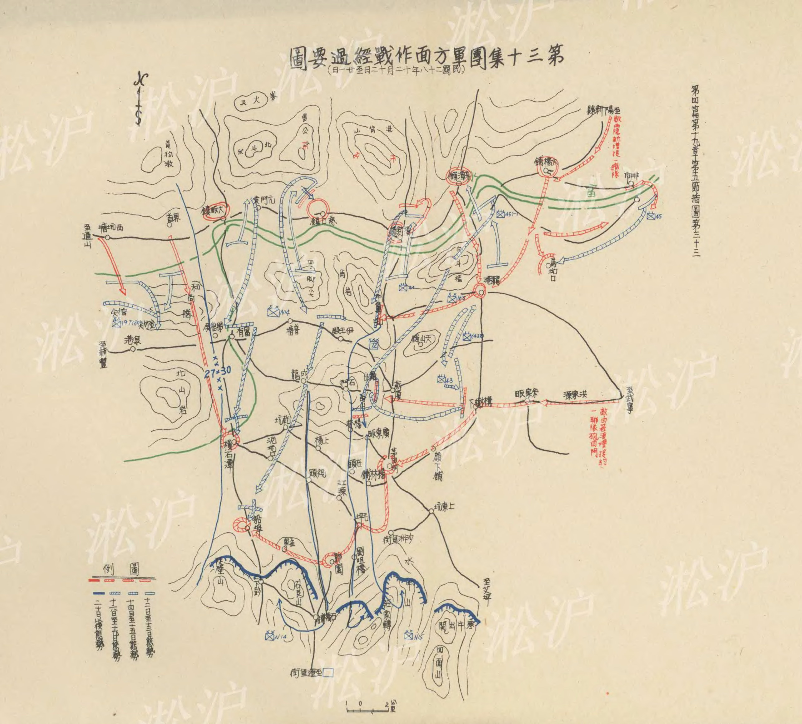

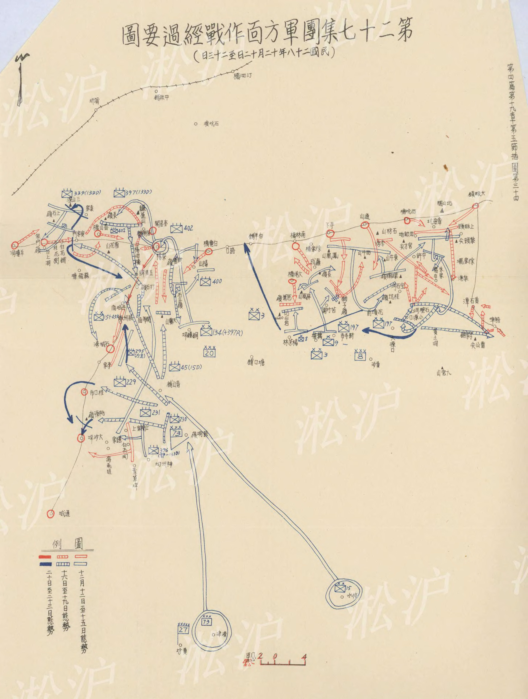

##### 第三項擴張戰果時期

第九戰區以被困於各重要據點之敵補給中斷，轉用不能，我有加入預備兵團積極進攻，以擴張戰果之必要，決先調整部署，遂於十二月二十一日下達馬午電令，要旨如左：

一、敵第四十師團、第六十師團，自被我十二日進攻以來，傷亡頗重，疲困已極，現九江、武漢均無敵援，我軍應繼續進攻，逐次殲滅敵兵，獲得最後戰果。

二、第三十集團軍第七十八軍對武寧之敵續行前任務；第七十二軍對構樹下、中門、羅家嶺、須各以一部確實截斷敵之交通，主力移至橫石潭，專擊離開據點之敵；第八軍之第一九七師於花橋、宋家祠，各以一部確實截斷敵之交通，主力專擊通山、南林橋離開據點之敵；第三師第十六團續在汀泗橋附近澈底破壞敵交通通訊，並截擊敵援，主力專擊白羊舖、白羊山之敵；第一、第三挺進縱隊及各挺進支隊，按前任務行動。

該集團軍自二十二日起，繼續積極進攻。

三、第二十七集團軍集二十軍對下細市、洪下、冷樹坳，各以一部確實截斷敵之交通，主力協同第七十三軍殲滅石城灣、桂花樹地區之敵；第七十三軍第十五師協同第二十軍殲滅石城灣、桂花樹地區之敵，第七十七師協同第九十八師殲滅大沙坪之敵；第七十軍第十九師控置金塘坳、小沙坪，限二十三日拂曉前到達，策應作戰。第一零七師於二十三日開修水、坑口，控置待機，歸集團軍指揮。

該集團應自二十二日起，繼續積極進攻。

四、第十五集團軍第七十九軍第九十八師協同第七十七師殲滅大沙坪之敵，第一四零師協同第九十八師一部圍殲通城之敵，第八十二師以一部牽制羊樓洞、趙李橋、羊樓司各據點之敵，及澈底破壞該地區之交通、通訊，以主力向桂花樹及其以南地區攻擊前進。第四軍續於前任務，第五十二軍在原地待機，第三十七軍任務同前。

該集團軍應自二十二日起，繼續積極進攻。

各部基於上令，重新佈署。第九戰區復於十二月二十二日下達擴張戰果之電令，其要旨如左：

一、敵情：

敵第三十四、第三十三兩師團於南昌、奉新地區，被我羅集團痛擊以來，傷亡慘重。第三十三師團第二一三聯隊被第七十八軍攻擊於武寧附近；第四十師團之一聯隊被第三十集團軍襲擊於辛潭舖、通山地區；該師團另兩聯隊已增援於南林橋、崇陽地區，第六師團之第四十五聯隊於通城、大沙坪、崇陽一帶，第二十三聯隊於桂花樹、羊樓司地區，第四十七、第十三聯隊於臨湘、岳陽地區，被我第十五、第二十七兩集團軍痛殲以來，傷亡慘重。現九江、武漢均無敵援。綜合情況，敵已陷於被動地位，爾後惟有任我軍牽制及殲滅。

二、目的：

我軍以右翼攻襲南昌、奉新之敵，左翼攻擊臨湘、岳陽之敵，中央殲滅崇陽之敵第四十師團、第六師團，約四個聯隊兵力之目的，應自二十四日起繼續積極進攻，以期掃蕩九江、武昌、長江以南地區而收復失地。

三、任務：

(一)羅集團之各兵團，按照規定部署，續行前任務。

(二)第三十集團軍以第七十八軍按照規定部署，攻擊武寧之敵；以第七十二軍按規定部署，確實攻擊龍港、陽新鎮、大畈鎮地區之敵；第八軍第一九七師攻擊通山、南林橋之敵，截斷南昌、咸寧間，南昌、崇陽間敵之交通、通訊，斷絕補給。以上各部，務確阻敵向西增援，向南竄擾。第八軍之第三師，暫歸第二十七集團軍指揮。

(三)第二十七集團軍第八軍之第三師（欠第十六團）暫歸第七十軍李軍長指揮，經白羊舖、露口間地區，直向崇陽北方之洪下、蠟樹舖附近渡崇蒲江；第七十軍（欠第一零七師暫控置修水、坑口待機）由小沙坪，經下細市，露口間地區，直向崇陽北方之白雲潭、洪下附近渡崇蒲江，均向崇陽、桂花樹、石城灣地區之敵背猛烈攻擊，務於二十三日夜開始行動。第二十軍、第七十三軍統歸彭位仁軍長指揮，按規定部署，對崇陽、石城灣、桂花市、桂花樹地區之敵積極進攻，協同第三、第十九兩師殲滅該地區之敵。

四第十五集團軍第七十九軍以第一四零師及第九十八師之一部攻擊通城之敵，該兩師之另一部，攻擊大沙坪之敵；第八十二師一部攻擊羊樓洞、趙李橋、羊樓司地區之敵，主力仍向桂花樹及其以南地區之敵攻擊前進，並須與友軍絕對協同，聚殲崇陽、石城灣、桂花樹地區之敵。第四軍按規定部署，積極牽制岳陽、臨湘之敵，使不得東向增援，第三十七軍對湖防嚴密戒備，第五十二軍控置於原地待機。

(五)第一、第三兩挺進縱隊，第三師第十六團及各挺進支隊，均按前任務積極行動。

各部奉令後，分別調整，積極進攻，期殲滅固守據點之敵。蔣委員長於十二月三十一日以世午令一元電：「自冬季攻勢開始以來，各戰區捷音頻傳，卓著戰績，茲值歲律更新，第五戰區正以新銳兵力，一舉加入擴張戰果之際，希督勵所部，努力於指定任務，以期依各戰區之協力，早取更偉大之效東，有厚望焉」。

前敵總部方面：（參照插圖第三十七）羅總司令奉令後，於十二月二十二日下達漾酉電令，重新調整部署，其要旨如左：

一、第五十八軍新編第十師以一部任右由市汊街（不含）亘楊家嘴以東錦江南岸警備，主力進出錦江北岸，分向赤塘舖、西山萬壽宮挺進，破壞敵之交通通訊；新編第十一師以有力部隊任楊家嘴至高安、南城、錦江南岸之警備，主力在錦江北岸確保來龍山、沙枯腦、京崗嶺各要點，並襲擊鼓樓舖、祥符觀方面之敵。

二、第六十軍任務同前，但第一八四師確保左家坊、大刀山、大路王各前進據點，並派有力部隊不斷襲擊鼓樓舖、大城、赤土街間地區之敵，及極力破壞敵之交通通訊，以牽制敵兵轉用。

三、第七十四軍第五十七師（附第五十八師一部）接替右由米峯北麓（不含）亘潭舖北端（含）第五十一師原有陣地之警備，並派隊襲擊赤田張、陶仙嶺方面之敵，及破壞交通通訊。第五十一師將陣地守備交替後，卽由五步城以北、潭舖以東地區，分向奉新、干洲中間地區挺進，佔領韓嶺、廖公台及公路以東各要點，相機攻佔干洲。第五十七、第五十一兩師之防務，限二十五日拂曉前接替完畢。第五十八師（欠一部）仍對當面之敵襲擊，俟第五十一師攻擊開始後，由現地向水口甘附近集結，策應作戰。

四、第三十二軍第一四一師及第四一七團任務同前，第一三九師（欠第四一七團）以有力一部進佔青山、白雲山及其以北各要點，控制干洲、靖安公路，相機略取靖安。

五、第一八二師仍控置橫橋附近。

六、作戰地境：

第五十八軍

灰埠—高安南城—古城崗—烏山舖各北端之線，線上屬第五十八軍。

第六十軍

一

第七十四軍

村前街十米峯北麓—港裏李—蠻崗嶺—石鼻街各北端之線，線上屬第六十軍。

上富—會埠—潭埠各北端—鴨婆潭—仁首街各南端之線，線上屬第七十四軍。

第三十二軍

七、總攻擊開始日期，爲二十六日一時。

各軍奉令後，卽遵照新部署行動。

第五十八軍新編第十一師在來龍山、沙枯腦、京崗嶺各地不斷攻擊，無進展。

第六十軍第一八四師一部，十二月三十一日克復萬步腦、張谷腦、白茅崗各要點，另一部克司公山，續向祥符觀之敵包圍攻擊，二十九年元月一日，將該地攻佔，復向大城之敵攻擊。

第七十四軍第五十一師一部，於十二月十二日夜出擊，攻佔奉新北蔣家坪，二十七日二十四師包圍獅子山，主力攻佔廖家台、韓嶺、百子橋，並將干洲至奉新之交通切斷。二十九日拂曉，奉新北之敵三百餘，附山砲二門，向饅頭山猛攻，被擊退。三十日一時，野戰補充團一部攻入干洲與敵巷戰，敵分由安義、靖安增援，拂曉撤回廖公台，另一部克獅子山，俘敵兵一名，屬第二一三聯隊第三大隊，二十四時，第一五二團奇襲奉新，突入敵砲兵陣地，將敵山砲二門炸燬，二十九年元月一日，第五十七師將守備米峯、潭埠之線陣地任務交由新編第三軍第一八二師接替後，向同安市、崇蒲地區集結整補。

第三十二軍第一三九師主力，於十二月三十一日擊退由鴨婆潭向白雲山進犯之敵，第一四一師及第四一七團自二十五日來，由雷鳴鼓、劉廟前、店前街，分向白槎、張公渡間，德安、永修間，樂化、牛行間、破壞該地區內交通通訊，迄十二月底止，敵軍在南濤路未能通車。元月四日，第一三九師夜襲干洲，焚敵倉庫，天明撤至干洲以南，繼續對敵作戰，餘各部仍在原陣地向當面之敵攻擊。

第三十集團軍方面：（參照插圖第四十一）該集團軍奉令後，於十二月二十二日調整部署，下達命令，其要旨如左：

一、第七十八軍對武寧之敵，續行原任務。

二、第七十二軍新編第十五師第四十四團向余家畈、構樹下、龍港、燕夏一帶地區挺進，第四十三團向陽新鎮、慈口一帶地區挺進；新編第十四師第四十二團向大畈鎮、羅家嶺、西坑塘一帶地區挺進。

除以上外，更應派一部於莊家灣、陡背山之線佔領陣地，並派有力一部襲擊船埠及橫石潭附近之敵，主力集結陣地後方，相機攻擊楊林舖、橫石潭一帶之敵。

三、唐郇伯之第一補充團，以一營位置於石銀山附近，主力仍集結於木臬（含）及其以東地區，第二補充團應位置於本臬（不含）以南地區待命。

四、各部奉命令後，立即出動。

兩軍依照上令，實行新任務。第七十八軍攻擊武寧之敵，無進展。第七十二軍新編第十五師一部不斷向余家畈、構樹下、龍港、燕廈之敵攻擊，十二月二十四日，一部挺進富水南岸，將敵二百餘擊退後，續向陽新鎮攻擊；新編第十四師一部渡過富水，破壞慈口鎮橋樑，一部挺進富水南岸與大畈鎮之敵隔河對戰，迄翌年一月七日，恢復戰前態勢。

第三挺進縱隊，連日在南濤路瑞昌、武寧公路破壞交通通訊，一部於二十四日夜搗毀檀山坳僞維持會，二十七日搗毀僞第一分會，將僞維持會長周澤良擊斃，第一縱隊仍在賀勝橋破壞敵交通。

第八軍（參照插圖第三十八）第一九七師接替第三師新豐市、楊芳林陣地守備任務後，第三師於十二月二十三日卽向白羊舖越過公路，服行新任務。二十六日，南林橋之敵約千餘，將楊芳林陣地突破，二十九日，向小沙坪方面竄擾，第一九七師轉移新豐市、蓮塘之線，阻擊該敵，敵退據勝坑、裏焦、龍王尖之線，迄二十九年元月七日，該軍恢復戰前態勢，並以一部掃蕩龍泉之敵，一部挺進至陽新鎮西南，向慈口、大畈鎮、南林橋攻擊。

第二十七集團軍方面（參照插圖第三十八）：該集團軍基於第九戰區馬、養午兩電，積極對據點之敵攻擊。第九戰區於十二月二十二日電話命令：「李覺軍長指揮第三師（欠第十六團）、第十九師，以第三師經白羊舖、崇陽北之洪下，第十九師經上細市及崇陽北白雲潭、向崇陽、桂花樹、石城灣間地區之敵攻擊，應立即行動，第十九師到達金塘坳不必停止」。復於二十三日以漾辰電指示：「第二十、第七十三兩軍，務於二十三日夜起，向崇陽、石城灣、桂花樹地區之敵積極進攻，必須誘使敵兵離開據點作戰，以便我第三、第十九、第八十二等三師猛擊敵背」。

第二十七集團軍基於上令，以第二十軍第一三四師在團頭嘴、五里廟，攻擊白霓橋、崇陽之敵，一部由青山舖攻擊石城灣之敵，另一部在洪下破壞崇陽、羊樓洞間公路。第七十三軍第七十七師第二二九團協同第二十軍將竄到荻洲畈之敵阻擊，並遵令於變更部署後，第十五師擊退由桂口市竄到老虎坪數百之敵，第七十七師佔領月涼山、峨眉嶺之線，向進攻大屋鄧、烏龜嘴之敵攻擊。第七十九軍之第八十二師在古城山附近協攻大沙坪。

第二十軍、第七十三軍，自十二月二十三日起，向白霓橋、崇陽、石城灣、桂口市之敵進攻以來，敵卽分別離開據點，進攻華石嘴、金鷄壠、田家壠、大屋鄧、峨眉嶺、烏龜嘴之線，該兩軍積極牽制當面之敵。第七十軍指揮之第三師已由白羊舖到達河田畈，渡過崇蒲江、雋水，向新開沖前進，第十九師在鹿門舖、團包山、長嶺之線，向崇陽城攻擊。二十五日，第九戰區以有已電令第七十軍，以主力指向石城灣、大沙坪，一部向崇陽之敵攻擊，務與第二十、第七十三兩軍之攻擊相呼應。

第七十軍遵照上令實施，第三師行抵新開沖附近將敵擊退後，續向石頭山、上石嶺前進，第十九師進至雪花山、東沈家、陳家之線，與敵遭遇，軍部停止於仰天窩。此時，第九戰區以電話命令：「第二十軍於二十六日向白霓橋、新塘嶺、崇陽由南向北攻擊，如敵由南攻我第七十軍，即可乘機攻擊敵背。第七十三軍向石城灣、大沙坪一帶之敵攻擊，敵如向我第七十三軍攻擊時，第七十軍亦可攻敵側背。如敵不向我第二十軍攻擊，而以主力向北攻擊第七十軍，則第二十軍及第七十三軍向敵背攻擊」。

第二十軍、第七十三軍奉令後，第二十軍第一三四師由南向北攻擊白霓橋、崇陽之敵，連日無進展，第一三三師向烏龜石、荻洲畈、石城灣之敵攻擊，阻敵向崇陽增援。二十六日十三時，崇陽之敵步騎千餘向荻洲畈增援，將第一三三師塘田畈、大屋徐家之陣地突破，該師轉移烏龜石、金鷄灘之線。二十七日十二時、該師又遭敵步騎砲聯合部隊千餘猛攻，卽向崇陽北之金竹報退去，於是崇陽至石城灣公路復爲敵有。第七十三軍以第十五師協助第二十軍攻擊石城灣之敵，將其外圍據點南山坡攻克，復擊退由桂口市向老虎坪進攻之敵千餘，進迫桂口市，一部協同第八十二師圍攻大沙坪，進佔桃源畈、崇南亭、烏龜石之線。斯時，第七十軍第三師由石頭山、上石嶺、向東山舖前進，於二十八日經東山舖向長坪推進，一部進佔芙蓉山攻敵側背；第十九師於二十八日到達楊家灣、蘇家橋之線，攻擊石城灣離開據點之敵，一部於三十日攻佔石城灣車站。

二十九年元月三日，第九戰區以江戍電令：「第二十軍、第七十軍、第七十三軍，由李軍長統一指揮」。第二十軍仍繼續由北向南攻白霓橋、崇陽之敵，第一三三師及第一三四師之第四零二團克復上大嶺、天靈山陣地，第一三四師主力佔領鹿門舖、仰天窩之線；崇陽、桂花樹之敵，分由團山嘴、向天靈山及鹿門舖陣地進攻，該軍分向金竹報、大眼泉佔領陣地，對敵攻擊。第七十三軍第十五師於崇陽南犯之敵進抵水口畈時，轉移至石屋舖、水口畈附近，阻擊敵之南進，第七十七師仍協攻大沙坪，二日攻克桃源嶺。第七十軍第三師於楊家坳、小坑口之線與敵激戰後，轉移至獅古臺、蘇家坳之線；第十九師主力佔領易博士嶺，向桂口市攻擊，一部協助第三師獅古臺戰鬥。該軍於九日基於第九戰區七日虞酉電以搗穴擊虛之目的，由易博士嶺、蘇家坳、向蒲圻、官塘驛轉進。

第十五集團軍方面：（參照插圖第三十五）該集團軍基於第九戰區馬午、養午兩電令，第七十九軍變更部署，第四軍仍服原任務，正實施之際，敵千餘、附砲三門於十二月二十三日由臨湘竄至楊家舖地區，向大沙坪增援，敵第六師團第三十六旅團長井上亦親至大沙坪西方指揮，夾擊我團攻大沙坪部隊。第七十九軍即以第九十八師主力撤離大沙坪，並以第四軍第九十師一部，第七十九軍軍補充第一團向該敵團攻，敵分向大沙坪、通城竄去。二十六日，一部向通城外圍據點鐵柱港攻擊，主力攻佔古城山之燕窩、田家嶺，迫近大沙坪街口。第四軍遵令牽制臨湘、岳陽之敵，不使敵兵轉用。第一一六師之第三四八團，先是奉令編成輕裝步兵挺進支隊，由岳陽、臨湘間渡江，襲擊岳陽城、城陵磯之敵，並於岳陽以東地區游擊，十二月十一日夜推進至樓西灣，十三日渡江完畢，進至崑山附近集結，十四日分途襲擊，一部將岳陽車站攻克，並將票房焚燬，十五日四時撤回崑山附近集結，爾後在五里牌、桃林以北地區破壞鐵路、公路，襲敵運輸車輛。

二十九年元月三日，第七十九軍圍攻大沙坪部隊，歸李軍長統一指揮後，一部進迫大沙坪未能奏效，一部進至通城南之五里牌，一部將鐵柱港之橋樑破壞，仍續向通城圍攻。第四軍服行原任務，攻擊臨湘、岳陽之敵，無變化。

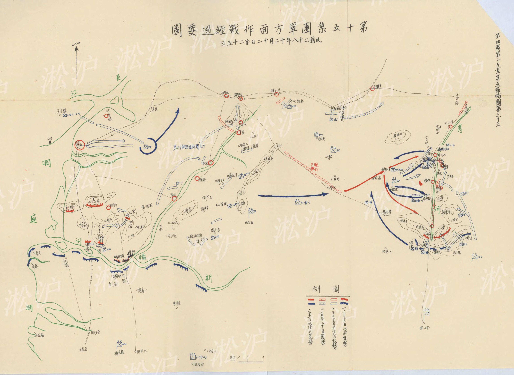

##### 第四項 破壞敵後交通時期

第九戰區於民國二十九年元月七日奉到蔣委員長四日電令（支未令一元）要旨：「查破壞敵後交通至關重要，仰切實督促，務達澈底破壞」。卽下達虞酉電令，要旨如左：

一、我軍對咸寧、蒲圻、羊樓洞、陸續消耗崇陽、通城一帶據點之敵，以搗穴擊虛之目的，經新部署如左：

(一)李覺軍長指揮第三、第十九兩師，於八日夜開始，經桂花樹、羊樓洞間地區，第三師第十六團歸還建制，掃蕩蒲圻附近之敵及破壞蒲圻（含）、茶庵嶺（不含）間，第十九師破壞茶庵嶺、羊樓洞、趙李橋（均含）間之鐵道、公路及通訊，焚燬該地區內敵屯積糧彈，兩師行動務利用夜暗，出敵不意，以達成任務。

(二)第二十軍攻擊白霓橋、洪下、桂花樹（均含）、石城灣（不含）一帶地區之敵，確實破壞該地區內之公路及通訊。

(三)第七十三軍攻擊石城灣、大沙坪（均含）一帶地區之敵，確實破壞該地區內之公路及通訊。

(四)第七十九軍攻擊大沙坪（不含）、通城一帶地區之敵，確實破壞該地區內之公路及通訊，並集中山砲、迫擊砲轟擊通城。

二、爾後如崇陽、通城方面之敵，向蒲圻、羊樓洞方面轉用時，第二十、第七十三兩軍，卽各以一部，牽制各據點之敵，主力應迅速向敵側背猛攻。

同日，薛長官以虞酉電呈軍事委員會及桂林行營報告交通破壞狀況如左：

一、南濤路方面：第三挺進縱隊對李河村、分水嶺、九仙嶺、大橋等處，第一四二師對馬迴嶺、南大屋周及德安以南，第一三九師一部對牛行、樂化間之鐵路橋樑等，均屢加破壞，自十二月十二日以來，該路迄未通車。

三、粤漢路方面：第一挺進縱隊對山坡、賀勝橋、桃林舖等處，第三師第十六團對官塘驛、程家、張家嶺等處之鐵路橋樑均迭加破壞，惟武昌至趙李橋段敵軍非常注意，一經破壞，隨卽搶修，但自十二月十二日以來，僅通車一次。第八十二師、第九十師之各一部及第一一六師第三四八團與第十一、第十二兩支隊，對蒲圻、岳陽間之趙李橋、羊樓司、臨湘、五里牌、路口舖、雲溪、高橋等處之鐵路橋樑，曾屢加破壞，自十二月十二日以來，羊樓洞至岳陽間、迄未通車。

三、關於敵後方公路，本部經迭電各挺進隊分段澈底破壞，因各部通訊器材缺乏，成果如何，尚未確報。四、關於敵前方公路，如高安、奉新公路，奉新、張公渡公路，永修、武寧公路，武寧、辛潭鋪公路、辛潭鋪、崇陽公路，崇陽、羊樓洞公路，崇陽、通城公路，通城、五里牌、岳陽公路等，經我第一線部隊不斷破壞，敵雖隨時搶修，但較十二月十二日前之通車次數減少三分之二，大沙坪、通城段迄未通車。

元月八日至十日間，各部均無進展。

元月十一日，第九（六）戰區以眞酉電對交通破壞隊編組及任務詳加規定參照插圖第三十九及

插表第二十九、第三十

，各

部均遵令實施，迄二十日止，全入交通破壞戰鬥，其破壞交通成果，詳見插表第三十一。

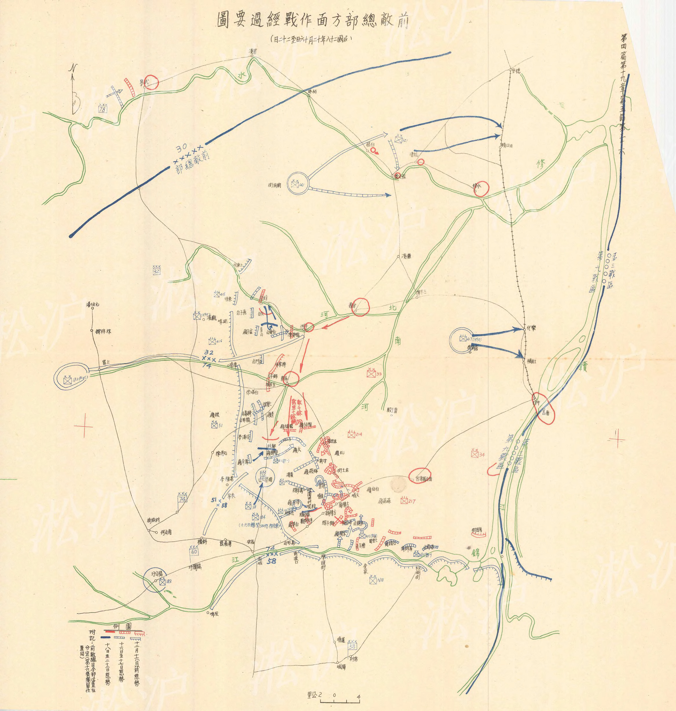

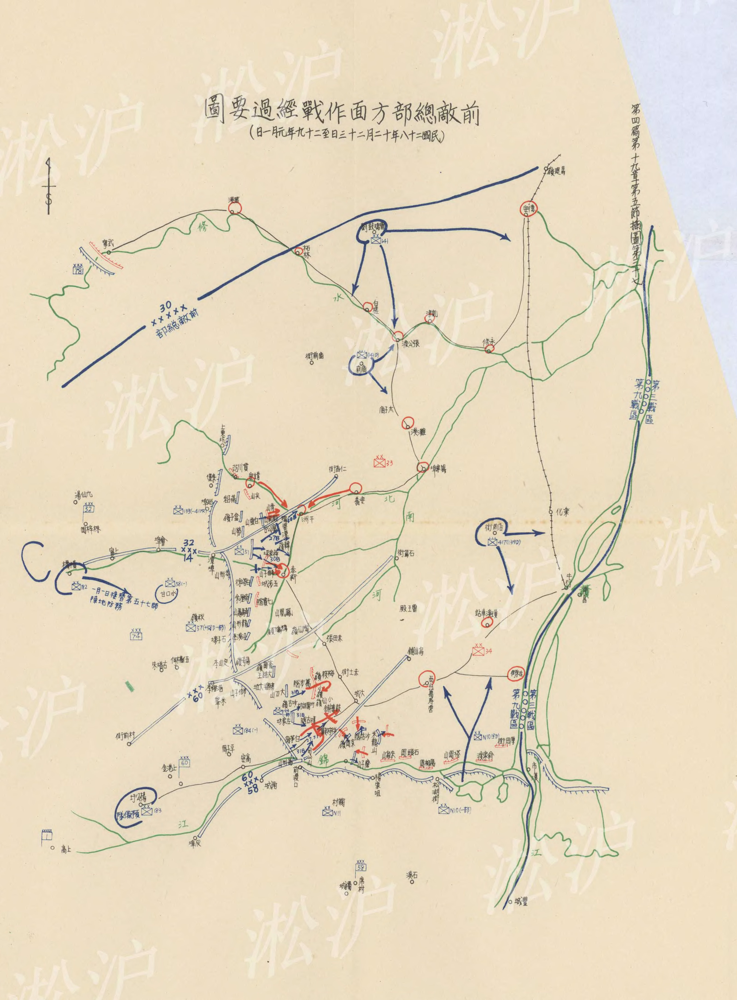

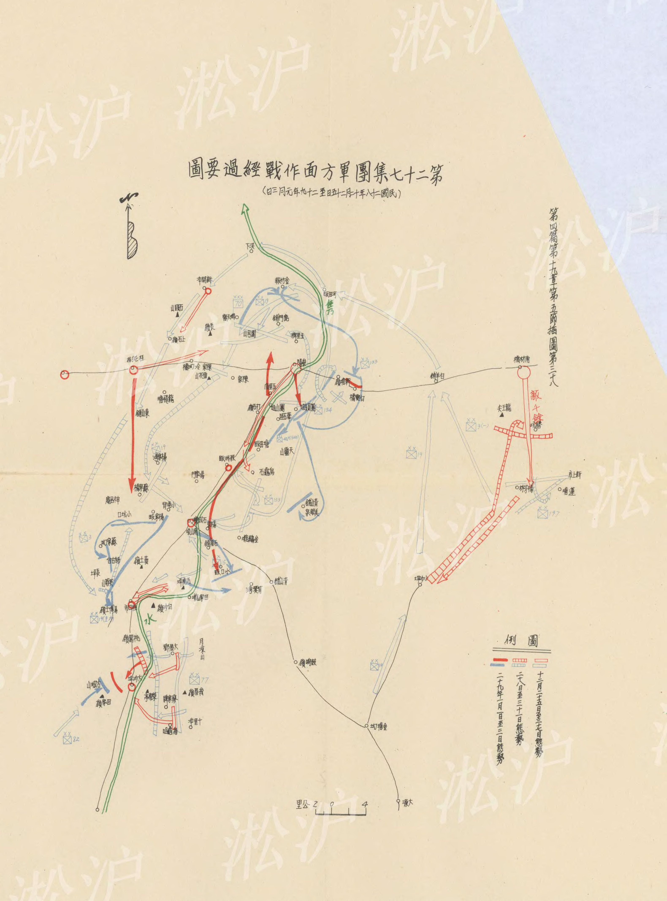

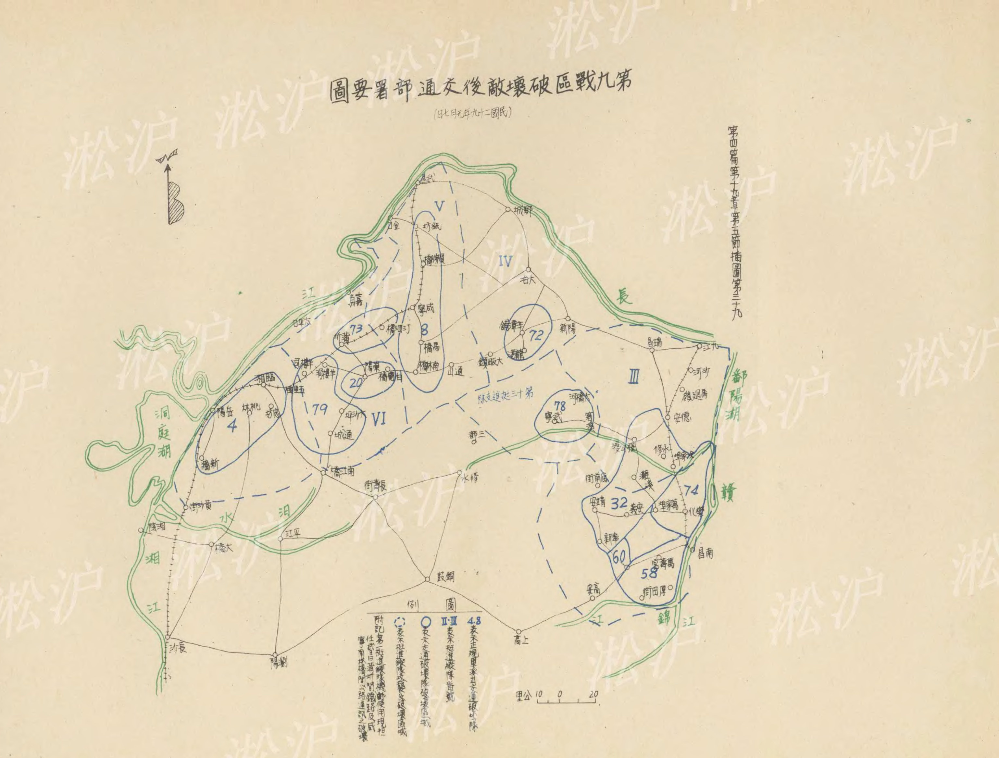

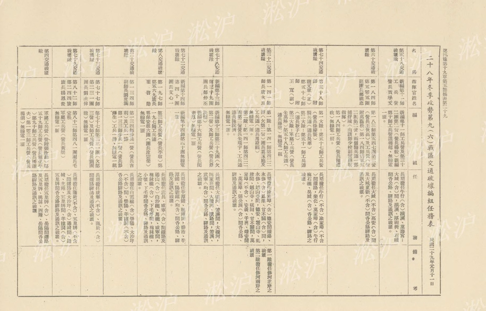

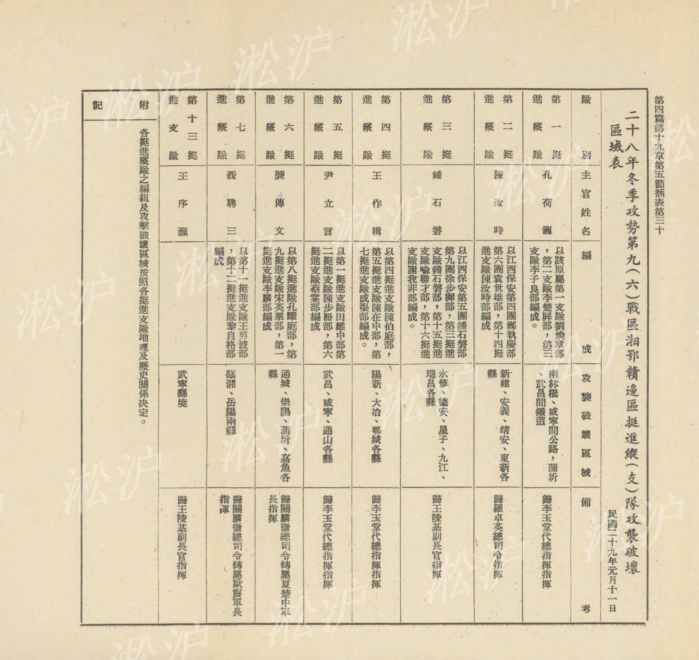

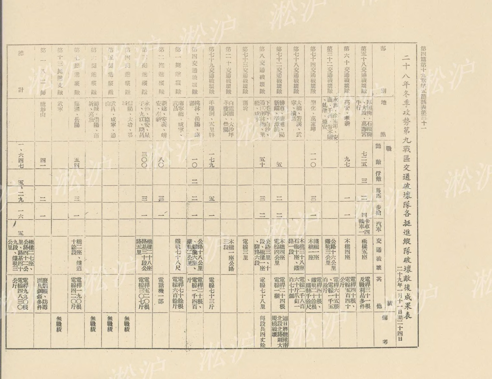

##### 第五項戰後狀況（參照插圖第四十）

薛長官爲準備爾後之作戰，卽調整部署及令第六戰區之一部歸還建制，並於元月二十日呈蔣委員長及桂林行營報告冬季攻勢作戰經過概要及戰後部署如左：

第九（六）戰區自十二月十二日進攻以來，敵第六、第四十師團已傷亡過半，第三十三、第三十四兩師團傷亡亦有三分之一，我主攻方面雖未能佔有通城、崇陽，而予敵重大消耗打擊之目的，確已達成。我軍方面，則以第八、第二十、第七十三、第七十九各軍之傷亡較重，現敵軍均已退守據點，蛰伏不出，似在整補待援，我軍亦應適時積極整補，以便爾後作戰，特部署如左：

一、前敵總司令所屬各部，仍保持如次之態勢，並積極就地整補。

(一)第五十八軍以一師任市汊街亘庵前渡口之線，錦江南岸原陣地警備，並保有北岸高郵市附近各必要前進據點，以一師控置於獨城附近。

(二)第六十軍以第一八四師任庵前渡口亘米峯北麓、徐家之線原陣地警備，並保有司公山、祥符觀、左家坊、水牛山、大路王各必要前進據點，以第一八三師控置於黃陂橋、龍團墟、斜橋間地區。

(三)新編第三軍之第一八二師任祜蝶鄒亘李公腦原陣地警備，並保有馬步嶺、騎馬山、師頭趙各必要前進據點。

四第三十二軍第一三九師任李公腦亘來堡、塘埠北側高地之線原陣地警備，並保有東山腦、盒子嶺、燕子巖各必要前進據點，第一四一師以廟前街附近山地爲根據，攻襲安義、張公渡一帶地區之敵。

(五)第七十四軍仍控置於崇蒲、宜豐、同安市間地區。

二、第三十集團軍：

(一)第七十八軍仍保持原態勢，以新編第十三師任修江南岸、老鴉頸、麻園之線原陣地警備，以新編第十六師任修江北岸、仙姑尖、北大崗之線原陣地警備，並就地積極整補。

(二)第七十二軍留一團於龍港、燕廈、橫石潭間地區，以燕廈附近山地爲根據，攻擊辛潭舖、大畈鎮、通山一帶地區之敵，其餘開澧溪、三都地區積極整補。

(三)第八軍第一九七師留一部於新豐市、楊芳林地區攻襲敵人，其餘在九宮山附近積極整補，第三師歸建，着開修水積極整補。

三、第二十七集團軍：

(一)第七十軍第一零七師開渣津，李軍長率第十九師開長壽街積極整補。

(二)第二十軍留一團於白霓橋、崇陽以南地區，攻襲白霓橋、新塘嶺、崇陽、石城、桂口市一帶之敵，其餘開高視、全豐、桃樹港地區積極整補。

(三)第七十三軍第十五師開山口，彭軍長率第七十七師開銅鼓積極整補，該軍爾後歸王副長官指揮。四、第十五集團軍：

(一)第七十九軍以一師開上塔市附近積極整補，以兩師警備九嶺一帶原陣地及保有各必要之前進據點，並就陣地後積極整補。

(二)第四軍第五十九師以一部警備新牆河南岸、楊林街、潼溪街各據點，保有北岸甘田、草鞋嶺、筮口等各必要前進據點，其餘在長湖以東積極整補；第一零二師以一部警備新牆、榮家灣、九馬嘴、磊石山各據點，並保有新牆河北岸九龍沖、大橋嶺、馬家院各必要前進據點，其餘仍控置黃沙街附近積極整補；第九十師仍控置關王橋、大莉街、洪源洞間地區積極整補；第一一六師之第三四八團卽經靖港、常德歸還建制。

五、本部署限二十日開始實施。

六、第五十八、第六十、第七十四、第三十二、第七十八、第七十二、第八、第二十、第二十二、第七十九、第四各交通破壞隊，按照規定編組及任務積極實施。

冬季攻勢至此乃告終止，我參戰部隊傷亡失踪統計表如插表第三十二，俘獲如插表第三十三、武器彈藥損耗如插表第三十四，敵軍參戰及傷亡人馬如插表第三十五。

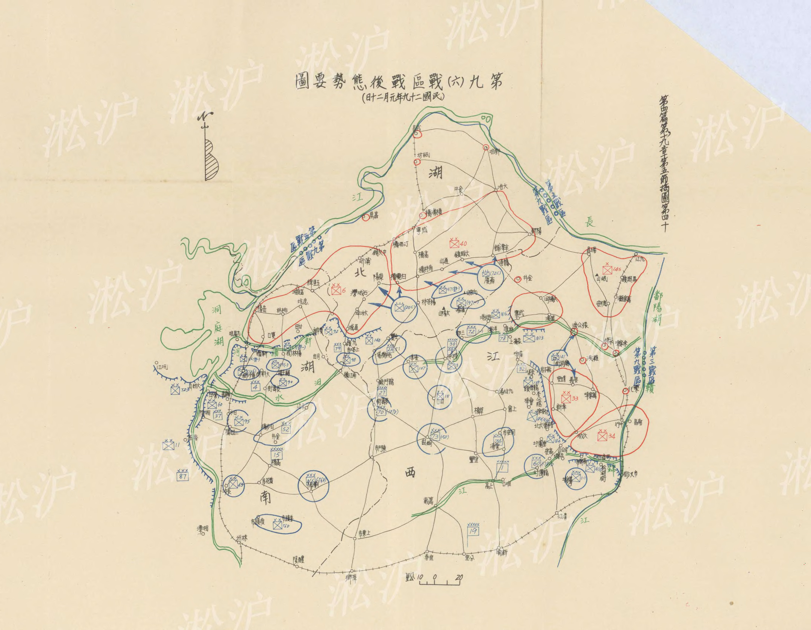

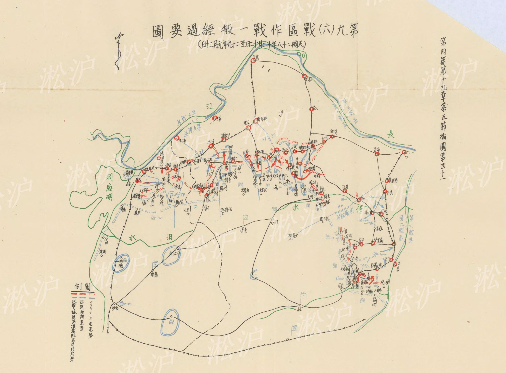

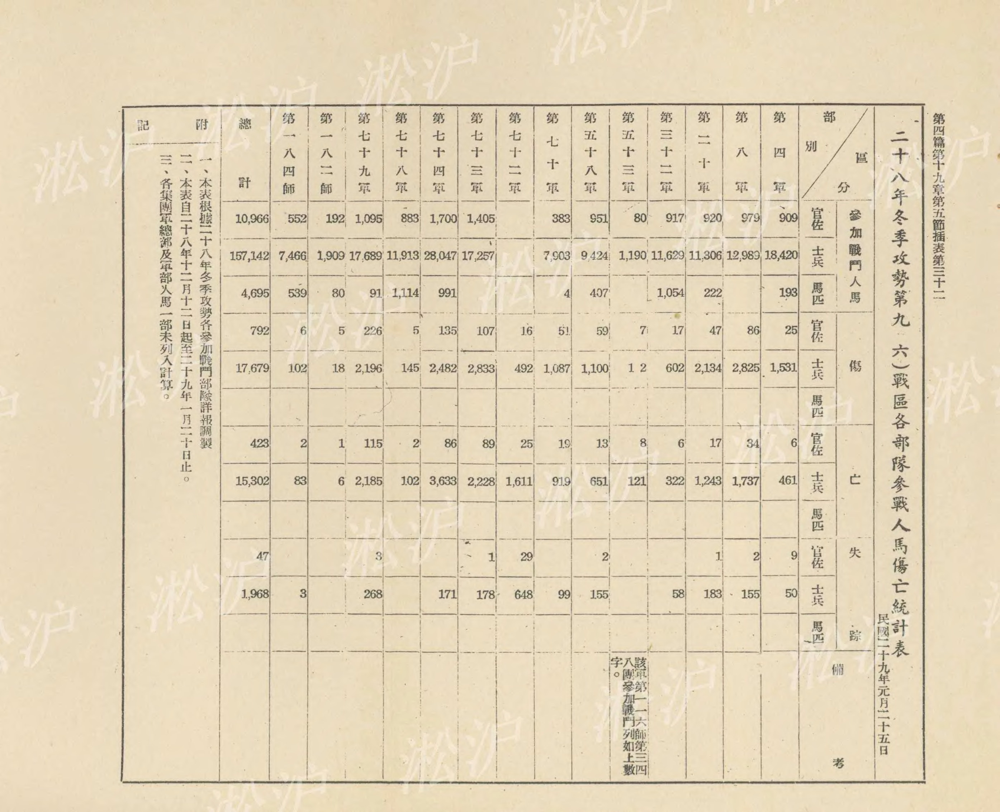

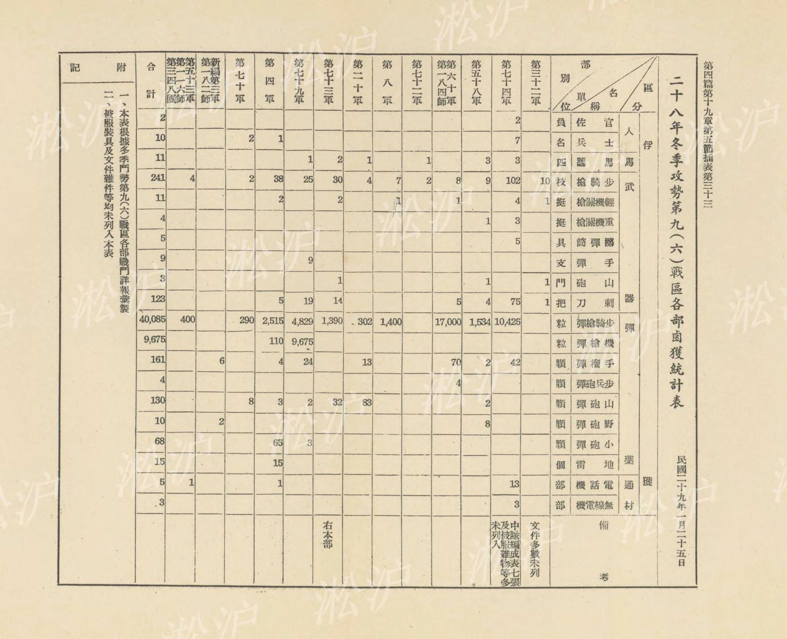

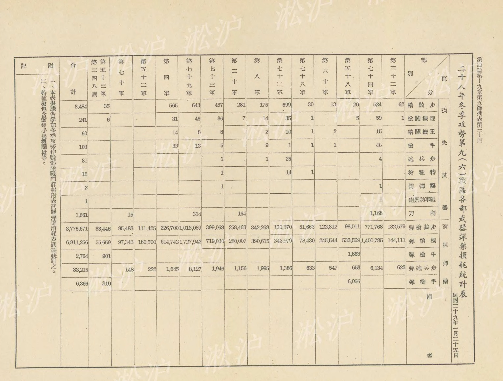

<table border=1><tr><td rowspan="2">合計</td><td>第六師團</td><td>第四十師團</td><td>第三十四師團</td><td>第三十三師團</td><td colspan="2">敵軍番號</td></tr><tr><td>湘鄂北南</td><td>鄂南</td><td>贛北、鄂南</td><td colspan="3">作戰地區</td></tr><tr><td>12,757</td><td>3,272</td><td>1,330</td><td>14,190</td><td>傷</td><td rowspan="2">傷亡人數</td></tr><tr><td>11,810</td><td>3,405</td><td>3,704</td><td>8,072</td><td>亡</td></tr><tr><td></td><td></td><td></td><td></td><td colspan="3">備考</td></tr></table>

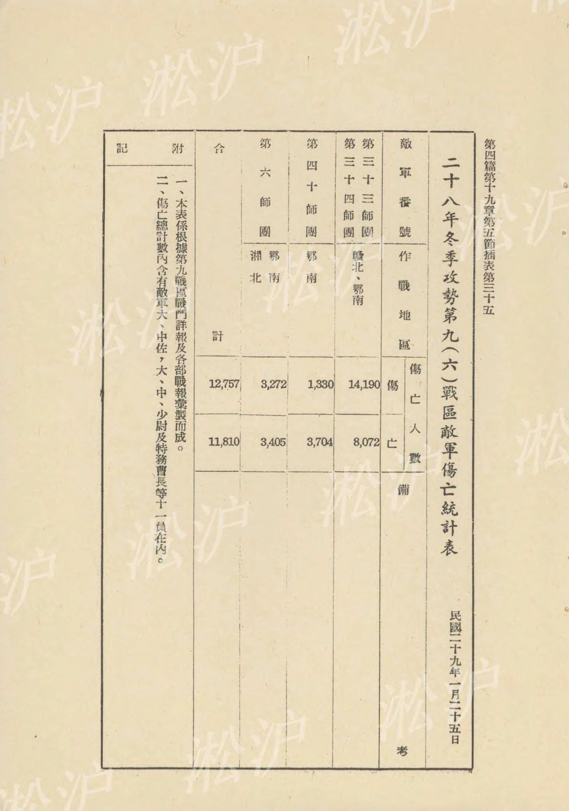

#### 第四款 重要戰鬥

##### 第一項 小嶺沙古嶺附近戰鬥

民國二十八年十二月十五日至二十日

參照插圖第四十二第四十三

第七十四軍之第五十一、第五十八兩師，自民國二十八年十二月十二日開始攻擊以來，進展順利，當時王耀武軍長窺破敵情，將控置之第五十七師加入戰鬥擴張戰果，十六日，第五十七師攻克小嶺，並進佔車塘、皂里各要點，二十日，第五十八師佔領沙古嶺，而小嶺、沙古嶺之敵軍，全被我殲滅。

第一目

小嶺、沙古嶺附近地形

小嶺、沙古嶺，介於高安、奉新間，爲不斷亘綿山地，面臨錦江，背倚南昌。奉新公路，爲進入大城、赤田張，切斷南昌、奉新公路所必趨之地，小嶺南之喻家山、鵝頭嶺，其東之烏連下，北之梅筱嶺、與沙古嶺東之粒坡，南之青坑壠，互成犄角，山峻而險，構有據點工事，大城、奉新兩地，二三小時即可到達。

第二目

戰鬥經過

敵軍自進據南昌、奉新後，小嶺、沙古嶺爲其獨立之堅固前進據點，在戰鬥直前，第三十四師團之第二一四聯隊乃第二一七聯隊田中大隊各以一中隊分駐該兩地，並附有若干特種兵器。

第七十四軍之五十一、第五十八兩師，自十二月十二日在大城、奉新間開始攻擊以來，頗有進展，王耀武軍長以敵軍在地區內無能力活動，遂以電話向羅總司令建議，請將控置第五十七師加入戰鬥，擴張戰果，經許可。

十二月十三日，前敵總司令部下達電（元酉湖）令要旨如左：

一、本方面決心攻略大城，已令第五十八軍進出高郵市以東，遮斷南昌、大城間交通，協助第七十四軍作戰。

二、第七十四軍以主力進出車塘、小嶺、竹山間，一舉攻略大城、虬嶺間地區之敵而佔領之。

十二月十四日，王耀武軍長奉令後，卽於十五時下達攻擊命令，其要旨如左：

一、軍奉令以主力進出車塘、小嶺、竹山間地區。一舉攻略大城、虬嶺間之敵陣地，決於十六日，以一部對奉新方面敵人嚴密監視，主力由黃埔附近陣地空隙突入，包圍大城方面敵陣地左翼，向右旋迴壓迫該敵於錦江北岸而殲滅之。

二、第五十八師（欠補充團）應迅速攻略白茅岡，並由第一七二、第一七三兩團各抽一部向左坊、沙古嶺之敵攻擊，以策應第五十七師之作戰，該兩團由廖副師長指揮，其餘仍任現陣地守備。

勞指揮官率野戰補充團，於十四日晚在黃埔附近集結完畢，歸施副軍長指揮。

該師加強破壞隊仍在赤田張以北儒里溫村附近，澈底破壞公路，阻止奉新之敵南下增援。

三、第五十七師（附五十八師一團、砲兵第八團第一營、欠一連）卽時出發，限十五日到達黃埔附近，於十六日三時向大城、赤土街前進，包圍該方面敵人右翼，壓迫於錦江而殲滅之，該師應派遣一部於虬嶺方面，與第五十一師第一五一團連繫，確實掩護側背之安全。

四、第五十一師（附砲兵第八團第一營之一連）以第一五一團主力，於十五日黃昏前在港南鄧、古峯、鄢村、一六二三高地、車坊王之線佔領陣地，確實拒止鴉鳩嶺、陶仙嶺方面敵之南犯，掩護第五十七師側背之安全，其主力仍守備原陣地，並竭力佯攻奉新之敵，牽制敵兵力之轉用，其師部及一團應於十六日晨推進至石港涂，限十五日準備完畢，十六日拂曉開始攻擊。

第五十七師方面：十二月十五日十一時，施中誠兼師長奉令後，卽令指揮官李瑛率第一六九、第一七零兩團爲右翼隊，於本日黃昏前，以約一團之兵力，展開於竹園胡村、河嶺之線，十六日三時開始攻擊，一鼓進出車塘、鵝頭堎之線，並確實佔領之。第一七一團附砲兵第八團第一營（欠一連）爲小嶺掃蕩隊，於十六日三時前開始攻擊，一鼓佔領之，並相機佔領赤土街。第五十八師勞指揮官率補充團爲左翼隊，在原陣地對當面之敵竭力牽制，並與第五十一師連繫。野戰補充團爲師預備隊，位置於猪婆大坵、周村、大路王各附近。

十二月十六日三時，第一七一團以第一營攻擊小仙嶺，第三營攻擊小嶺。第三營以第九連附機槍二挺向小嶺西端佯攻，令第七連向小嶺東端潛進，三時三十分迫近鐵絲網，四時十分，何長生連長身先士卒衝入敵陣，士兵亦相隨躍入，遂將三一四九高地佔領。此時，第一營亦對小仙嶺佔領，第九連許連長率兩排亦迫近敵陣，猛衝二次，未能奏功，嗣經張長清班長匐伏至敵最近距離，以手榴彈投中工事內草棚，許連長乘機率先突入，擊斃敵小隊長以下三十餘名，五時三十分將小嶺完全佔領，俘敵二名，據供駐守該地之一中隊全被殲滅，係屬於第三十四師團第二一四聯隊，獲重機槍一挺、輕機槍二挺、步槍十餘枝。第一六九團亦於是日攻佔車塘、長源、鵝頭堎。第一七零團亦攻佔迴龍山，進迫大城。

第五十八師方面：十二月十五日，陳式正師長奉令後，卽令廖副師長指揮第一七二團、第一七三團及戰砲連（欠一排）騎工兵各一排，於十六日三時，以第一七二團主力守備原陣地，一部攻擊左家坊之敵、以第一七三團迅攻略白茅岡，進出於熊陂橋、下久港之線；第一七四團以主力守備原陣地，以有力一部於十六日三時向沙古嶺之敵攻擊。勞指揮官指揮補充團、砲兵第八團第一營（欠一連）、騎兵連（欠一排）集結於黃埔附近，歸副軍長指揮。

十二月十六日三時，廖齡奇副師長指揮第一七二、第一七三兩團，向白茅岡附近之敵攻擊，無甚進展。第一七四團第二營經一度衝入沙古嶺東北鐵絲網，中尉排長陳得生陣亡，未幾，卽脫離戰場。

十二月十七日十五時，第一七四團以第三營續攻沙古嶺，該營相繼逼近敵陣地，一部衝至沙古嶺北方高地與敵激戰，後以青坑壠之敵向我逆襲，李團長率第一營增援補充團方面，因無援兵後繼，致攻擊進展困難，乃構成陣地與敵對峙。

是日，第五十七師遭奉新南下增援之敵攻擊，其主力於小嶺、皂里、車塘等地，受敵三面夾擊。黃昏後，敵步兵八百餘，附戰車十餘輛，由坊前東北黃埠崗、帥村方面，分二路向第五十八師一部陣地猛攻，戰鬥澈夜。第五十七、第五十八兩師預備隊均已加入戰鬥，同時沙古嶺告急，迄十八日晨，第五十一師抽調陣地守兵由左側出擊，十時，將進攻之敵擊退，恢復原陣地，第五十八師傷亡甚重，遂令第一七三團停止攻擊，卽接第一八四團譚家、米峯陣地守備。第一七四團除先後以第一、第二兩營增援補充團外，以留雲夫副團長指揮第三營攻沙古嶺。

十二月十八日，第七十四軍下達作戰第十六號命令，其要旨如左：

一、軍將右翼陣地交由第六十軍第一八四師接替後，以主力確實佔領大城及虬嶺間地區，努力掃蕩大城西南地區殘敵，壓迫該敵於錦江而殲滅之。

二、第五十八師於明（十九）日拂曉前將陣地交由第六十軍接替以後，以一部接替第五十一師第一五一團陣地，主力攻佔梅筱嶺。

十二月十九日晨，第七十四軍復電令第五十八師，該師（欠第一七四團及野戰補充團）卽於沙子堎、石嶺間附近集結，本晚十七時開始攻擊沙古嶺、下久港，迅速進出熊陂橋、祥符觀，攻擊該敵而殲滅之，與第五十八軍切與連繫。

第一八四師亦於是日拂曉開始接替第一七二團左家山至譚家之防務，其後續部隊亦將接第一七三團蓮花至米峯間之防務。

第五十八師陳師長奉令後，以當面之敵仍佔領白茅崗、張谷腦、青坑壠、沙古嶺一帶頑強抵抗，白晝接近不易，擬利用夜暗奇襲，復以友軍新編第十一師佔領高郵市、京崗嶺附近與第五十七師迴龍山部隊遙相呼應，乃於十二時在高安以北之杉樹下召集第一七二、第一七三陳、蔡兩團長面示：「師（欠第一七四團及補充團）於本（十九）晚一舉攻略青坑壠、沙古嶺敵陣地，進出於張谷腦、粒坡之線，重點保持於右；第一七三團將防務交替完畢後，至港下劉附近集結，於黃昏運動至沙子塹、大刀山之線，完成攻擊準備，二十二時，以奇襲方式一舉攻略沙古嶺，爾後進出於下久港、粒坡之線，掩護第一七二團左側之安全，重點保持於左。並令第一七四團留雲夫副團長將防務交替後，至黃埔歸還建制。

第一七三團於沙子塹、大刀山之線完成攻擊準備後，以第三營（欠第七連）在沙子塹、大刀山之線攻擊，以第一營經大刀山、下山、龔村、由敵之右側背直進，二十日一時破壞敵之障礙物後，在敵熾盛火力下，奮不顧身，一舉接近主陣地，互相格鬥，四時奪取沙古嶺最高之主要據點，繼續攻擊中部據點。同時第一七二團第三營佔領青坑壠後，並攻佔沙古嶺、青坑壠中間之一點，天明，經兩部隊夾擊，該敵仍拚死抵抗，第一七三團乃以第七連圍攻，十四時將沙古嶺之敵完全殲滅，除俘虜三人外，獲輕重機槍及步槍十枝，無線電一架，據俘供，據守該地之敵軍爲第三十四師團第二一七聯隊第三大隊第十一中隊。

本戰鬥，第五十八師廖齡奇副師長以指揮有方，經記大功一次，以示獎勵。

此次，我第七十四軍第五十七、第五十八兩師及第五十一師一部參加戰鬥，敵在小嶺之第三十四師團第二一四聯隊一中隊全被我第五十七師第一七一團第三營殲滅，敵在沙古嶺之第二一七聯隊第十一中隊亦被我第五十八師第一七三團第一營殲滅，共俘獲敵步騎槍數十枝，輕重機槍十餘挺，無線電一架，我軍傷亡亦重。

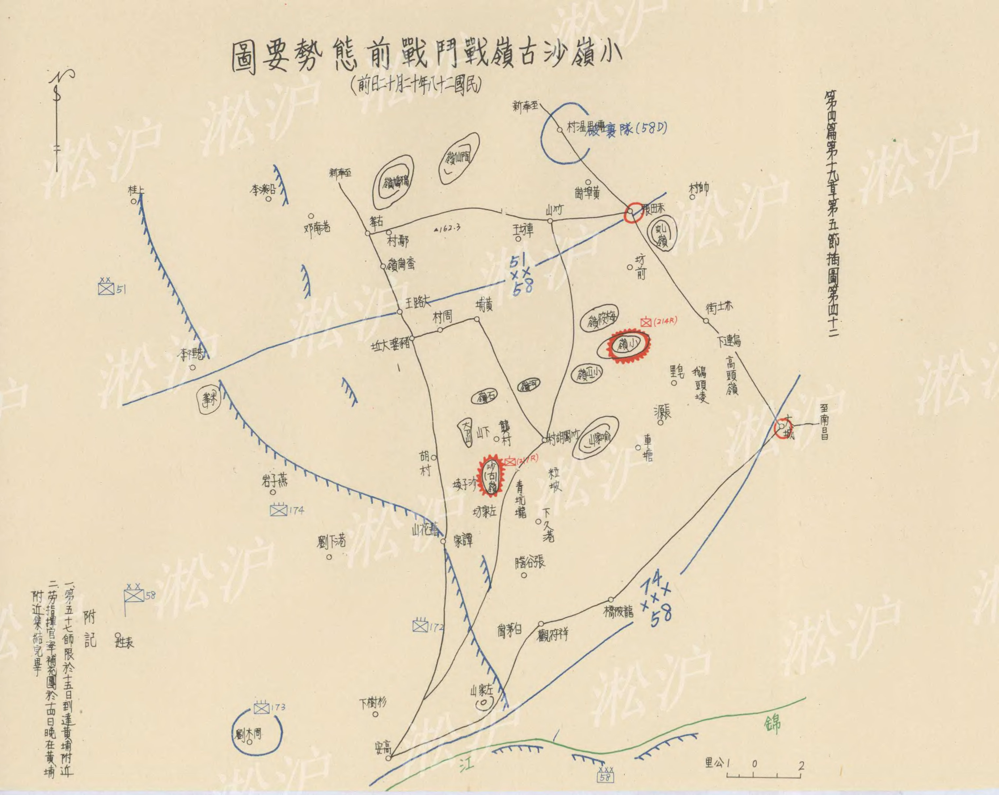

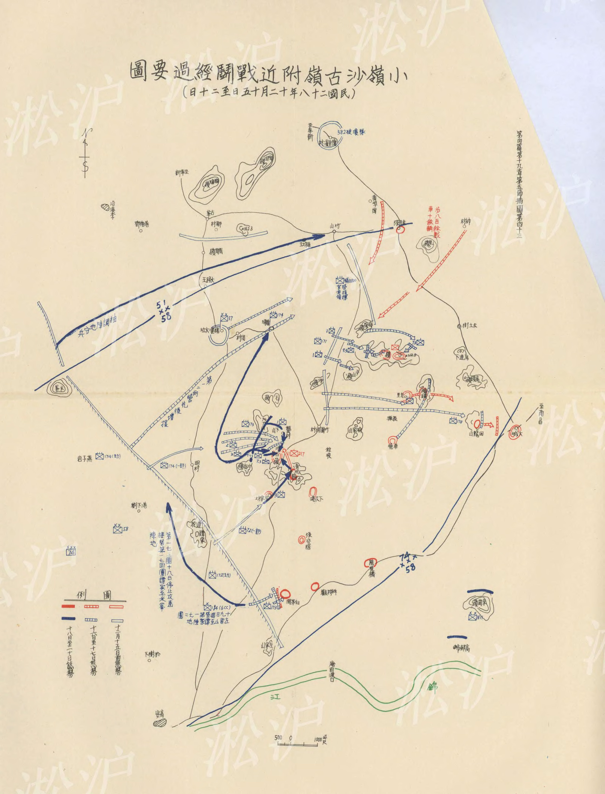

##### 第二項崇陽附近戰鬥

民國二十八年十二月十二日

參照插圖第四十四第四十五

第二十軍第一四三師自民國二十八年十月長沙會戰後，正在整理補充，十一月間奉令參加冬季攻勢，爲第二十七集團軍挺進兵團，並令附第一三三師之第三九七團向崇陽之敵攻擊，十二日攻佔崇陽城大部，十四日敵使用毒氣反攻，我軍復退出城外與敵對峙。

第一目崇陽附近地形

崇陽爲鄂南重鎮，跨贛、鄂、湘三省邊境，爲湘鄂公路之中點，公路四達，東至通山，北至咸寧，西至羊樓司，南達通城，可至平江。崇陽、羊樓洞公路，橫貫粵漢鐵路北段，爲鄂南交通樞紐。雋水（又名陸溪河）由通城經崇陽城南，繞城東北至蒲圻，匯於長江。其東之白霓橋，西之桂花樹，南之石城灣，直若崇陽之外圍衛星，城北之仰天窩、鹿門舖，均係綿亘山地。

崇陽自敵軍進佔後，核心工事，利用城垣，加強碉堡，以防國軍之進擊，城東門外之駁岸、東站、北門外之魁星閣，西門之七星嶺，南門外之五里牌，利用既有建築，構築有堅強工事。

第二目戰鬥經過

敵軍自進佔崇陽後，卽將糧彈倉庫潛設城內，並加強工事，以藉作南進長沙之據點，駐兵約二個中隊，爲第六師團第二十三聯隊之松崎大隊；城東白霓橋駐軍約七、八百人，爲第四十師團第一二五聯隊石本部隊；城西羊樓洞駐軍約四、五百人，蒲圻約五、六百人，南之石城灣約三、四百人，荻洲畈約一、二百人，均爲第六師團第二十三聯隊之部隊。

第二十軍爲第二十七集團軍挺進兵團，於十二月五日奉薛長官四日（支堯堅）電令及冬季攻勢攻擊開始日期後，卽下達命令要旨：「第一三四師（附第一三三師之第三七九團）於十二月九日晚佔領八角泉、横山、王山尖、查家舖之線，十日拂曉（後改爲十二日）以一部牽制白霓橋之敵，主力向崇陽之敵進攻，佔領崇陽後，以一部進出於梧桐山、團包山附近地區，主力向右旋迴，會殲白霓橋之敵。第一三四師奉令後，作如左之攻擊部署：

一、第四零二團於十一日拂曉前運動至崇陽城東北之六姑嶺附近地區，黃昏後卽由史家渡渡河，展開於仰天窩、張家之線，由北向南攻擊崇陽城。

二、第四零一團以一營在橫山向白霓橋攻擊，牽制該方面之敵，餘展開於王尖山、查家舖之線，向崇陽城之敵攻擊，並附工兵一排，破壞新塘嶺公路。

三、第三九七團由鼓和嶺到雷家舖後，完成攻擊準備；於伏波廟以西地區，向崇陽之敵攻擊。

四、第四百團除以一營在小沙坪掩護我右側背之安全外，餘爲師預備隊，控置於師指揮所佛嶺附近以南地區。

十二月十二日一時，第四零二團第二營攻佔營棚嶺，續向魁星閣之敵進攻，第一營由城北角攻入崇陽城，佔領北街與敵發生巷戰；第三九七團到達七星嶺後，以一連佯攻南門，第二營由城西門進攻，三時攻入城內，四時三十分，入城部隊逐漸將敵壓迫於城東南，崇陽城經佔領一部；第四零一團第一營佔領橫山後，以一連於新塘嶺，分向白霓橋之敵進攻，第二營到達王山尖後，一時三十分佔領查家橋、楊家之線，由東南會攻崇陽城之敵。九時，白霓橋之敵步騎砲兵共約五百餘，以裝甲車十餘輛掩護，向崇陽增援，被第四零一團截擊，敵向橫山猛攻，於十二時被第一營擊退。

攻入崇陽城之部隊，以天明後敵火壓迫，進展困難，除以一部封鎖城東南之敵，並斷絕水源外，餘卽掃蕩城西北之敵，以敵退據核心工事頑抗，雖數次攻擊，亦未獲進展，十四時，魁星閣之敵施放毒氣，向我逆襲，未得逞，入夜後，東門外大橋之敵，被擊退入東門，益受斷絕水源恐慌。

十二月十三日一時，第四零二團第三營之一部協同第四零一團第一營將東門車站攻克，殘敵由東門退入城內，七時，第四零二團將魁星閣頂擊燬，敵據下層頑抗，經派人一度輸誠投降。是時，通林寺之敵六十餘，向第四零一團進襲，被擊退，八時二十分，將通林寺佔領，十時，將附近小高地佔領，敵向白霓橋方面退去。

是日十六時，楊森兼總司令下達（元申宇宙）電令，要旨如左：

一、第二十軍第一三三師第三九七團歸還建制，控置於楊泗橋機動使用，師部推進至崇陽城。

二、第一三四師之第四零一團仍相機攻佔白霓橋，第四零二團肅清崇陽東門及魁星閣殘敵後，暫集結崇陽城附近，第四百團控置於橫山附近。

第二十軍奉令後，卽飭第一三四師第四百團位置於橫山附近，並以一部任路口、白霓橋間交通通訊破壞，第四零二團歸第一三三師夏炯兼師長指揮，第一三四師變更部署，第三九七團佔領長嶺、雪花山之線，堵擊羊樓洞來援之敵。於是攻擊崇陽城任務，僅由第四零二團擔任，十九時，第一營由城西北向敵壓迫，一部牽制魁星閣之敵，第三營由東門附近攀城攻擊，未奏功。

十二月十四日一時二十分，將東門車站焚燬，二時，憑據東城工事之敵，向第三營逆襲，三時許，該營停止攻擊，拂曉後，敵使用毒氣，同時以便衣隊繞至營棚嶺側背，第一營在城內及攻佔營棚嶺之部隊，均受夾擊威脅，十二時由西門退出，敵佔領營棚嶺後，焚燒城外民房，全城復陷於敵，第四零二團團長向文彬記大過一次，並令戴罪立功，督率所部乘夜恢復。

此次戰鬥，我參加步兵一師另一團，傷亡官長十員，士兵三五零名。（按：本戰鬥至此告一段落，崇陽城之攻克，以絕斷水源火攻，使敵一度輸誠投降，雖未竟全功，而爲戰術上之創見，不能以功敗垂成，而湮沒其戰績，惜絕斷水源方法及部隊派遣未及詳載，深爲遺憾耳。)

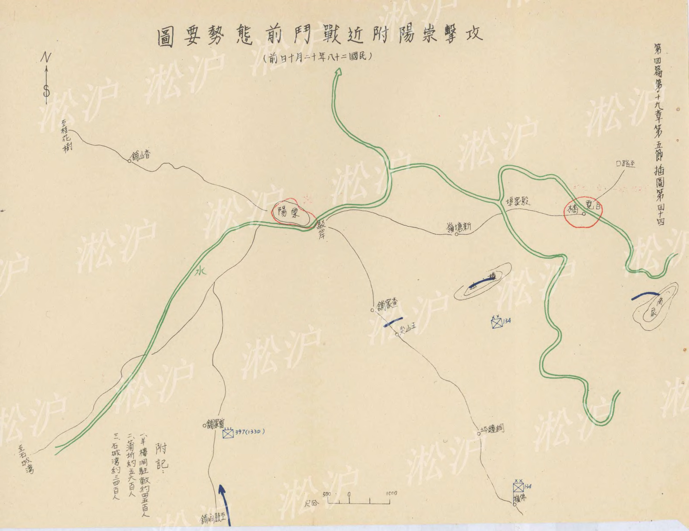

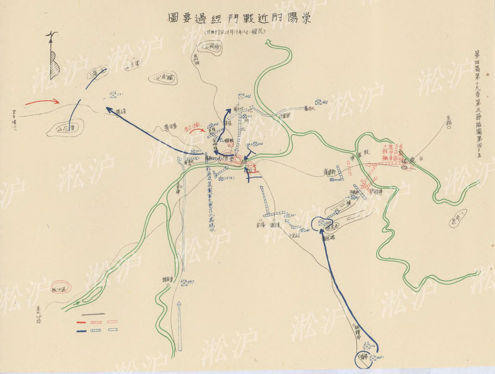

##### 第三項 大沙坪之圍攻

民國二十八年十二月十二日至二十九年元月九日

參照插圖第四十六至第五十二插表第三十六

大沙坪之圍攻，先後凡三次；十二月十二日至二十三日爲第一次圍攻，係由第七十三軍及第七十九軍擔任；十二月二十四日至二十九年元月三日爲第二次圍攻，係由第二十軍、第七十三軍、第七十九軍、第七十軍之第十九師及第八軍之第三師等部隊擔任；元月四日至九日爲第三次圍攻，係由第七十軍李覺軍長統一指揮第七十三軍第三師及第十九師等部隊實施圍攻；大沙坪之敵，雖經我三次圍攻，仍未能達聚殲該敵之目的。

第一目

大沙坪附近地形

大沙坪位於雋水西岸，介崇陽、通城之間，有崇通公路貫通，附近丘陵連綿，小松茂密，攻者行動易於祕密。冬初晴多，河水與水田乾涸，行動無阻，不成障礙，河床多沙石，有水亦能徒涉，惟每日煙霧迷漫，砲兵觀測頗感困難。

大沙坪之堅固據點工事，原爲湖南保安處經始構築，多係半永久工事，以梅花式之多數小支點合爲一獨立據點，繞以鹿砦、鐵絲網、外壕等，其外圍之桂口市、石城灣各處皆如之，守易攻難。

第二目

第一次圍攻大沙坪

民國二十八年十二月十二日至二十三日

參照插圖第四十六至第四十八插表第三十六

長沙會戰後，敵第六師團第三十六旅團退回通城、大沙坪、接替第三十二師團防務，井上旅團長駐大沙坪第四十五聯隊駐通城鐵柱港、大沙坪各據點，第二十三聯隊駐崇陽、羊樓洞一帶。

第十五集團軍第七十九軍自長沙會戰勝利後，其所屬之第一四零師（附李支隊）以一團任麥市、何家嶺之守備，並派一營協助李支隊向大沙坪附近游擊，以一團任馬鞍山、翔鳳寺、化錢樓一帶守備，其餘部隊集結高橋各附近整理。第九十八師（附砲兵第一團第五連）以一團任風門、搖彭山之線守備，主力集結上塔市南北地區整理。第八十二師一團向大沙坪附近游擊，一團在白米山以北地區，監視寒婆山、賽公橋之敵，一營佔領北港，主力除一營佔領長安橋外，其餘集結月田附近整理。

第二十七集團軍之第七十三軍（欠第十五師）軍部及第七十七師主力集結渣津，第二二九團在桃樹港附近，並在苦竹嶺、南樓嶺配置警戒。

我軍之指揮系統如插表第三十六。

民國二十八年十二月十三日十二時十五分，第十五集團軍電話命令：「大沙坪之敵約四、五百人，有向東竄模樣，第七十七師之一團由烏龜石向大沙坪推進中，第七十九軍須攻佔大沙坪，則通城之敵不擊自潰。

第七十九軍夏楚中軍長奉令後，卽令第一四零師派兵一團進出峨眉嶺以西地區，協助第九十八師攻略大沙坪；第九十八師朱志席指揮官指揮兩團及師砲兵營（欠一連），由牛角尖、大原金之線攻擊大沙坪。

十二月十四日十六時，第十五集團軍電話命令：「戰區限迅速攻佔大沙坪。」夏軍長奉令後，卽轉令第九十八師及第一四零師遵照，並令第九十八師師長親往指揮第一四零師之第八三七團。

第九十八師王甲本師長接到上項電話命令後，遂作如左之部署：

一、師明（十五）日拂曉開始圍攻大沙坪之敵。

二、第一四零師之第八三七團，以一部監視烏龜嘴，主力明（十五）日拂曉由娥眉嶺西側向大沙坪攻擊。

三、第二九二、第二九三兩團各以一部確保虎形山及牛角尖、田家、大屋周各據點外，第二九二團主力

明（十五）日由何家附近（東關北側）向大沙坪攻擊，第二九三團主力集結新屋附近爲預備隊。

四、砲兵營（欠第三連）兼程前進，於東關北側何家附近佔領陣地，協力攻擊。

五、第二九四團及補充團歸葉參謀長指揮，爲軍預備隊，暫在原地候命。

六、如敵情變化，由朱指揮官適切部署。

第一四零師李棠師長於奉到電話命令後，卽飭第八三九團第三營迅赴堆山附近，接替第八三七團第二營防務，第八三七團全部推進峨眉嶺附近，協助第九十八師攻擊大沙坪之敵。（編者按：堆山、大獐山、獐達嶺等據點，已於十三日由第八三七團第二營攻佔。

十二月十五日拂曉，第九十八師第二九二團分向田家嘴、田家嶺及二二八九高地攻擊，十時先後佔領田家嶺及其東西高地，十一日，敵二百餘反攻，田家嶺復放棄，二二八九高地失而復得，連長康孟侯陣亡，第一營之一部衝至大沙坪街口，受敵側射，遂退守田家嘴西側高地，十六時，敵逐次增至千餘，一部向左翼東關西北高地侵入，第二九三團第一營增加猛攻，將敵全部擊退。鐵柱港敵二百餘，當第二九二團激戰時，圍攻第二九九三團在虎形山之第六連，經該團第五連馳援及補充團第五連側擊，敵不支退回原處，十八時佔領牛角尖、劉家、雙白嘴、二二八九高地、大屋金、何家之線。

十二月十六日拂曉，第九十八師第二九二團及第二九三團之第一營向田家嘴及何家以北之敵攻擊，敵發射毒氣彈，幸有準備，未有損傷，至午，我攻佔田家嶺，敵退汪劉、胡家灣等處，一部仍堅守田家嘴附近碉堡及燕窩、百花園、胡家祠之線，十八時，敵屢行反攻，均被擊退。

是日十一時，第九戰區薛長官電令：「大沙坪志在必得，已令第七十七師由烏龜石（崇陽南十公里）南進，會攻大沙坪」。第七十九軍夏軍長奉令後，卽以銑午電令第九十八師圍攻部隊，並於十二時據報，第一四零師第八三七團已與第二九二團取得連絡，且已攻佔徐家、崇南亭之線，現正協力向大沙坪攻擊。

十二月十七日十時，敵反攻尤烈，十三時，敵機一架協力步、砲兵向田家嶺及二二八九高地猛攻，未逞，十六時，敵施放毒氣向田家嶺再攻，仍未得逞，第二營陳鈞副營長負傷，傷亡排長五員，士兵八十餘名，王師長乃令補充團第二營卽開洞口屋待命。十八日，敵連續猛攻，十一時敵復向田家嶺陣地猛撲，楊道南連長負傷，遂轉移大屋金一帶固守。

第一四零師第八三七團自十五日二十時續向大沙坪、龍王嘴、烏龜嘴之敵攻擊，十六日十一時，第一營攻佔二六八九高地，敵退守崇南亭及徐家東北高地頑強抵抗，嗣以第二營之一部加入戰鬥，次第攻佔崇南亭、鍾家山、徐家東北一帶重要據點，敵據徐家碉堡頑抗，第三營已攻佔烏龜嘴小據點數處，正激戰中，十七日二十二時，第八三七團開始攻擊黃家，於十八日一時許攻克，餘部與敵竟日激戰。

第七十三軍方面：該軍彭軍長十二月十二日奉第二十七集團軍電令，率第七十七師全部開高視、雙港附近策應作戰，十三日，復奉令以第七十七師推進至鼓響嶺、第十五師開金塘均待命。各師於十四、十五兩日先後到達指定地點。十五日十一時，第二十七集團軍楊兼總司令電話命：「第七十七師以桂口市、石城灣爲攻擊目標，應先將此兩地佔領，由桂口市至石城灣道路亦應澈底破壞」。彭軍長遂飭第七十七師除已進至青山舖、洪家橋地區之第二二九團進攻打石嶺之敵外，主力於本十五日十二時由鼓響嶺出發，向石城灣、桂口市北前進，準備攻擊該兩處之敵，並破壞道路。

十二月十六日八時，薛長官電（銑辰堅）令：「第七十七師由烏龜石自北向南協助第七十九軍殲滅大沙坪之敵，爾後第七十三軍協同第二十軍進攻蒲圻方面之敵」。復於十七日二十一時三十分，二十二時三十分先後電話命令：「大沙坪之敵受第七十九軍攻擊，傷亡亦重，頗呈動搖，其傷兵正向桂市口運輸，着彭軍長速令第七十七師以一團牽制荻洲畈、石城灣之敵，其餘由柳師長率領會攻大沙坪」。

彭軍長遵照以上各令，分別轉飭柳際明師長實施。柳師長奉令後，於十七日晚，以第二二九團攻擊荻洲畈、石城灣之敵，一部破壞交通；以第二三零團攻擊大沙坪之敵；以第二三一團主力攻擊桂口市，一部控置於下機埠、諶家附近。

十二月十八日八時許，第二三零團一部由桂口市以北通過公路，與第九十八師連絡，由西攻擊，主力分由瀛潭楊家、上機埠渡河，向劉家、小機埠攻擊，與百餘之敵戰鬥，復經留瀛潭楊家渡河之部隊，向楊家迂迴側擊，至午，敵向桃源嶺方面退走，當佔領劉家、小機埠一帶高地，並以一部尾敵猛攻，至夜，進展至桃源嶺東側五、六百公尺之線。第二三一團主力向桂口市之敵攻擊，十四時將敵警戒部隊驅逐後，繼進至苒藪畈、龍盤沖、艾家及二零七五高地之線，與敵對戰澈夜。第二二九團照命令原任務行動。

第七十九軍方面：十二月十九日二時，第十五集團軍關總司令轉奉薛長官十八日二十三時電（巧亥堅）令：「第一四零師及第九十八師之各一部，應於十九日前攻佔大沙坪，其有功官兵論功行賞，如徘徊不前，進攻不力，有誤戰機者，按法議處」。第七十九軍夏軍長奉令後，卽轉令第一四零、第九十八兩師遵照，並指示兩師攻大沙坪之部隊，應多選勇敢善戰之士，先行潛入響應，且與第七十七師協定，於十九日拂曉，由桃源嶺及其以東地區向大沙坪攻擊。

第九十八師奉到指示後，全線向敵猛攻，並以全部砲兵協力第二九三團第三營向胡家祠敵據點攻擊，得而復失者再，未能佔領。二十時，得悉敵由崇陽增援二千餘，王師長乃令各部構築峨眉嶺、洪家、劉家、大屋周、源頭山之線預備陣地，並限二十一日完成。第一四零師第八三七團本十九日拂曉向敵攻擊，激戰竟日。

十二月二十日，第八三七、第二九二、第二九三各團協同第七十七師全線向大沙坪猛攻，包圍圈漸形縮小，一時頃，第八三七團派第一、第三兩連，由徐家附近渡河，襲擊大沙坪，在河西岸將敵警戒部隊驅逐，卽躍進破壞河堤沿線障礙，遭敵碉堡內機槍射擊，復受田家嘴之敵側擊，十五時許，轉攻田家嘴，於十八時四十分佔領，與敵對峙。第九十八師第二九二團第一連佔領大沙坪街口，傷亡過重，旋卽退出，第二連迫近城塘，觸發地雷，連長陣亡，官兵傷亡三十餘，田家嶺附近戰鬥激烈，營長張定標受傷，連排長傷亡五十餘員名；第二九三團第三營與敵在胡祠附近戰鬥，雙方反復爭奪，第九連官長全部傷亡，士兵所餘無幾。

十二月二十一日午後，敵機三度飛大沙坪上空偵察，向第九十八師古城山陣地轟炸，並掩護其步兵向二二八九高地進攻，均被擊退。同時夏軍長得悉敵步騎聯合千餘已抵菖蒲園附近，卽一面嚴令各部，二十一日晚再向大沙坪之敵猛攻，一面令第八三七團在大園、牛角尖、源頭上之線構築陣地，阻敵增援。

是日，第一四零師李師長以師久無功，乃嚴令第八三七團應不顧任何犧牲，期在必克。該團徐團長卽與第七十七師第二三一團劉團長協商，先集中迫擊砲及第七十七師之平射砲，摧毀徐家東北高地之碉堡及工事，然後挑選敢死隊突擊，並約定於十六時總攻。第八三七團當由第一、第三兩連選出奮勇隊四十名，分爲兩隊由王展魁連長率領，由徐家向碉堡之敵猛衝，其餘第一、第三兩連之部隊，由崔營附率領，掩護奮勇隊之突擊。同時，第七十七師第二三一團第七連亦開始向碉樓土堡之線攻擊前進，該奮勇隊在熾盛火力掩護下猛衝，敵倉皇退入碉內抵抗，當卽佔領碉外之土堡，續向碉內之敵攻擊，激戰約一小時，傷亡殆盡，崔營附督隊進逼，再度強攻，奮勇隊長姚家熙中彈陣亡，續挑之奮勇隊繼續增加進攻，時敵亦由大沙坪增來百餘人反攻，戰鬥激烈，續挑之奮勇隊長向炯超又負傷，後續部隊仍前仆後繼前進，終以敵工事堅固，未能攻克，乃撤至徐家附近。

圍攻龍王嘴、蔣家牌之傳營，亦同時挑選奮勇隊三十名，由第七連少尉排長馬雲程率領，向龍王嘴突擊，衝至碉樓附近之鐵絲網，馬排長身先士卒，奮勇衝入，各兵亦相繼躍進，敵以手榴彈阻擊，馬排長及先躍進之士兵七名，同時作壯烈之犧牲，十九時許仍撤至原陣地。

第七十三軍方面：十二月十九日，第七十七師續向石城灣、桂口市之敵攻擊，第二二九團一部不斷向石城灣之敵襲擊，第二二零團拂曉起向桃源嶺之敵猛攻，十時完全佔領，卽以一部掃蕩，以主力由北向南攻擊桃源嶺西南高地敵據點，第二三一團一部攻擊桂口市，與敵激戰竟日，傷亡頗重。

是日，楊兼總司令電（號寅宇宙）令第七十七師應協同第十九軍，不顧一切迅將大沙坪之敵殲滅。

十二月二十日，第七十七師改以第二三零團，第二三一兩團攻擊大沙坪，第二二九團攻擊石城灣、桂口市之敵。十四時，第二二九團在桂口市東南二零七五高地截擊由汪家牌出擊之三、四百敵，結果該敵退回桂口市據點；第二三零團於拂曉向桃源嶺西南高地攻擊，十時攻佔土堡三個，時敵由百花園增加三次反攻，均被擊退；第二三一團之一營於晨間由楓樹潭攻擊，十時進至黃家附近，十二時以迫擊砲向大沙坪街市射擊，惟該團受敵三面側擊，死傷頗重。十八時，第二三零、第二三一兩團各一部已迫近大沙坪街市約二、三百公尺，入晚，第二三零團主力由桃源嶺西南高地，第二三一團之一營由黃家、徐家之線，曾一度衝進街市，因敵據碉堡頑抗，無法進展。二十一日十二時起，復協同友軍施行總攻，第二三一團劉團長自率隊攻擊街市南口之敵，以一部協助友軍攻擊，當佔領土堡二座，對磚碉一座雖經連續猛攻，無法摧毀，致未能完全攻佔；第二二九團一部攻擊桂口市之敵，一營攻擊石城灣之敵，綜計該師至二十一日晚止，共傷亡官兵一千零四十餘人。

第七十九軍方面：（參照插圖第四十八）十二月二十二日七時三十分，敵增援之一部步砲兵約五、六百人，已抵桂口市，另一部在楊家畈、梓木港與第七十七師激戰中；十六時三十分，敵續有援軍約五、六百人，由石城灣向大沙坪前進，第七十七師之一部與之激戰，主力已移至河東向敵側擊。夏軍長基於以上情況，遂以電話令第一四零師之第八三七團移至公路以東地區，佔領峨眉嶺，與第七十七師確保連繫，阻敵南竄；第九十八師之兩團應機動使用，如敵以大部增援，務扼守要點，殲滅該敵；軍補充第二團之一部歸第一四零師李師長指揮，卽接替該師百崗嶺、楊台尖一帶之守備，調第八三五團之一部控置機動。同時接奉薛長官二十一日十三時電（馬午堯）令：「第一四零師協攻大沙坪之第八三七團，應卽歸建，加入通城作戰，所遺任務着由第七十七師接替」。卽轉電令第一四零、第九十八兩師遵照實施。

當時，第七十七師正與增援之敵在黃茆橋、上下機埠對戰，不能接替第八三七團任務，夏軍長乃以該團大部在大園、烏龜嘴、堰市一帶佔領據點，協同第七十七師襲擊當面之敵，該團任務於二十四日拂曉始由第七十七師派隊接替。

第九十八師王師長奉到軍電話後，以第七十七師通報，敵千餘由崇陽方面分兩路南進，一部六、七百人到荻洲畈，一部四、五百人在天靈山、大眼泉、磨刀園附近，與第十五師正在激戰，又據觀測所報告，南援之敵已到大沙坪，遂判斷敵於明二十三日晨必大舉反攻，決心轉移陣地，部署如左：

一、第二九二團於本（二十二）日晚撤至黃林寺、牛角尖、田家、大屋周旣設陣地，阻敵南下。

二、第二九三團於本（二十二）晚十時撤至大屋周西端高地、大屋江、葉家陣地線，拒止敵人，並於葉家西北高地、新屋兩側隘路及大坳背等處，酌派兵據守，掩護側背，防敵迂迴。

三、補充團第二營本（二十二）晚八時佔領山下門及田家之線，掩護第二九二團之轉移，俟第二九二團將陣地接收後，再移至新屋周附近，爲師預備隊。

四、虎形山守備任務，交由第五連接替，劉副營長交防後，卽率隊歸還建制。

五、砲兵營及砲兵第五連明（二十三）拂曉前於新屋周東端高地進入陣地，對田家及東關附近準備火十二月二十三日八時三十分，敵約三、四百由通城向西北襲擾，與第二九四團之一部在雙溪橋附近激戰；由忠坊方向竄來步騎砲聯合約七、八百之敵，於十一時經北港，十八時三十分到達水口舖、楊家舖一帶，亦與第二九四團之一部正激戰中；大沙坪之敵終日向我反攻，以峨眉嶺、牛角尖、二零四三高地之爭奪爲最烈。第七十九軍夏軍長以先殲滅東竄之敵，再行攻擊大沙坪之目的，決於本（二十三）晚向該敵攻擊，乃令第九十八師第二九四團由水口舖以東地區、向楊家舖東南之敵攻擊；第二九二團由四甲舖以東地區、向楊家舖以西地區之敵攻擊。第八十二師之兩營佔領金不換以西地區、向楊家舖以北之敵攻擊。第九十八師之補充團集結賽公橋附近，截擊通城增援之敵。第二九三團佔領宋家畈東端高地，截擊大沙坪西竄之敵。第八十二師第四八七團由龍家園南調，應於明（二十四）日十二時以前到達金不換，參加戰鬥。

是日二十四時，第二九四團展開於老金灣、坳背胡家之線，卽向當面之敵攻擊，二十四日拂曉佔領楊家舖附近高地，十六時，敵一部向鐵柱港、雙溪橋、鼓鳴山與通城之敵會合，一部分散於白露陂、老金灣、水口舖、莊前舖各附近。二十五日晨，以飛機七架掩護，分向通城及大沙坪各附近退去。第二九二團於二十四日拂曉在大夫港附近與通城來援之敵四百餘遭遇，因側背受威脅，轉移至四甲舖附近。補充團因大霧迷漫，使敵突過倉前畈，未能將楊家舖之敵迅速圍殲。第二九三團在宋家畈附近，將大沙坪方面之敵牽制，未敢向水口舖前進。

此時，夏軍長以傷亡過重，乃從新部署，以第九十八師除一部佔領祈福山、谷嶺山、樊家店一帶地區，主力集結賽公橋以南地區整理。

第七十三軍方面：十二月二十二日零時三十分，彭軍長奉薛長官二十一日二十一時電（馬亥堅）令如大沙坪之敵，不能速行殲滅，則以第九十八師負責牽制之，留第一四零師第八三七團協助，或第七十七師一部協助，第七十七師則加入第十五師方面作戰，殲其外援。如大沙坪之敵可速行殲滅，則第七十七、九十八兩師協力完成爲有利，請轉知第七十七、第九十八兩師長按實況決定行之。我攻擊目的，在殲滅敵兵，取得戰果」。當按實況考慮，大沙坪敵據堅頑抗，我無空軍及重砲協助，難行殲滅，決心以第七十七師一部牽制大沙坪之敵，主力加入第十五師作戰，遂下達命令要旨如左：

一、第十五師右與第二十軍連絡，左至毛石堰，重點在左，仍派隊側擊敵人，阻止敵向南向左進竄。

二、第七十七師一部對當面之敵，主力佔領田家坳、田家壠及二一九七高地一帶阻敵西進。

兩師奉令後，卽變更部署。第十五師以第四十五團於青山舖附近協同第二十軍部隊掃蕩當面殘敵，第四十四團以筲箕窩、旗障山，第四十三團以楊家畈及其東北地區爲據點，對南進之敵側擊。第七十七師則以第二二九團於上蘇家畈、三二一高地、龍王觀附近地區，第二三零團於黃茆橋附近，第二三一團於崇南亭附近，準備協同第十五師攻擊西南進攻之敵。二十二日拂曉，敵由荻洲畈經石城灣、毛石堰分途進攻，一股約步騎四百餘、砲二門、以砲火向旗障山猛轟，掩護向金鷄壠猛攻，經第四十四團擊退；一股約千餘之敵、砲四門、向水口畈攻擊，與第二二九團及第四十三團激戰於田家壠、上蘇家畈、三二一高地之線，第四十三團由楊家堰東北地區突出側擊，第二二九團抽調一部繞出江下壠夜襲，敵向北退；另敵一股步砲八百餘由毛石堰進至月涼山，向黃茆橋方向進攻，第二三零團李國重營於老虎坪、月涼山之線向敵猛攻，敵勢稍挫，該營長受重傷；另敵百餘由大沙坪向上機埠渡河攻擊，經第二三一團一部乘敵半渡出擊，斃敵甚多。

十二月二十三日晨，第十五師第四十三團由大江畈向桂口市覓敵攻擊，於江下壠、月涼山間與約五六百，砲二門之敵遭遇，激戰至午，敵增援二百餘，由下關棚經劉婆橋向田家壠該團右翼運動，經第四十四團一部在廟山及其以北高地向之側擊，將該敵擊退。是日晨，第七十七師第二二九團及第二三零團一部續向黃茆橋附近地區之敵攻擊，十二時，敵由瀛潭楊家增援約四百餘，向東南猛進，與其在黃茆橋東南高地發生激戰，十七時許，第十五師第四十三團一部由北向南夾擊，該敵經三面圍擊，黃昏後，向雋河西岸退去。第二三零團另一部佔領大屋鄧，本日九時，敵砲十餘門向其集中射擊，以掩護敵步兵約五百餘，向該團猛攻，同時第二三一團柏營在崇南亭東二六八九高地附近，亦與二、三百之敵激戰，十四時，敵砲不斷猛擊峨眉嶺、茅草燃燒、大屋鄧發生爭奪戰鬥，十七時，第二三一團一部由十里冲向敵側背攻擊，將敵擊退。十八時，薛長官命令：「不要打硬戰，可離開大沙坪、桂口市，勿與膠着，俟敵離開據點，第二十軍應側擊之，要機動殲滅」。

彭軍長基於上令，遂卽下達命令，其要旨如左：

一、第十五師（右翼與第二十軍聯絡）以一團位置於楊家畈、上下蘇家畈、大江畈，對師古台、水口畈、田家壠及三二一高地之線各要點派隊警戒或扼守之；以一團位置於雲門沖、柏尢坳、龍王觀地區，以有力一部佔領大屋鄧、峨眉嶺，並於二一七及二六八九各高地配置警戒，各該團主力應保持機動部隊。

二、第七十七師以一團於進口鋪、佛壽山、烏龜嘴等處佔領據點，其主力控置於青草嶺、乾港口、大園、大名寺地區，準備攻擊當面之敵，與第九十八師保持聯絡，並準備以一團兵力策應第十五師之作戰。

三、各師務於明（二十四）日拂曉前遵照上項指示部署完畢具報。

第十五師於十二月二十三日夜遵令向雲門沖附近轉移陣地，至三二一高地時，適敵約五、六百人由黃茆橋以西渡河，向大屋鄧第七十七師第二三零團攻擊，當令第四十三團由北向南側擊，二十四日拂曉，第二二九團加入截擊，敵勢稍挫。十時，敵增援約二百人，藉大沙坪、桂口市敵砲之掩護，再度攻擊，第二二九團傷亡甚重，十二時，第四十三團繞由黃茆橋東北高地側擊，入晚，敵大部向雋水西退去，殘留一部約二、三百人，復經該團協同第二二九團一部三面圍殲。第四十四團一部於是日晨由毛石堰渡河，十二時，在老虎坪附近與敵二百餘遭遇，十五時敵向北退走，大沙坪附近之敵四、五百人，亦於本日拂曉向大園方向運動，在十里沖附近之第七十七師第二三一團，一部馳至廖家牌附近側擊，十時許，該團在簡家一部突出夾擊，十七時，該敵仍向大沙坪退去，至此，第一次圍攻大沙坪告一段落。

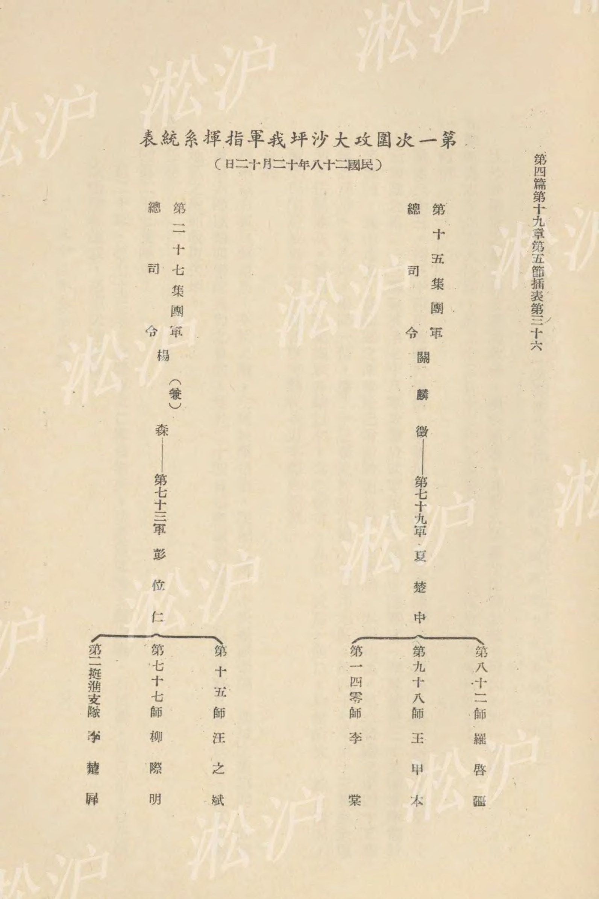

第三目

第二次圍攻大沙坪

民國二十八年十二月二十三日至二十九年一月三日參照插圖第四十九至第五十一

大沙坪附近之敵，經我軍圍攻後，損失頗重，其第六師團池田聯隊續有增加約有一旅團之兵力，第九戰區爲志在必克大沙坪，於二十二日十二時下達養午天地人皇堅電令，其要旨如左：

一、敵情

敵第三十三、第三十四兩師團於南昌、奉新地區，被第十九集團軍痛擊以來，傷亡慘重，其第三十三師團之第二一三聯隊被第七十八軍攻擊於武寧附近。第四十師團之一聯隊被第三十集團軍牽制於辛潭舖、通山地區，該師團之兩聯隊已增援於南林橋、白霓橋、崇陽地區。第六師團之第四十五聯隊於通城、大沙坪、崇陽一帶，第二十三聯隊於桂花樹、羊樓司地區。第四十七及第十三聯隊於臨湘、岳陽地區，被第十五集團軍痛擊以來，傷亡慘重。九江、武昌、漢口，均無敵援。綜合情況，敵軍已陷於被動地位，爾後惟有聽從我方宰割與殲滅。

二、目的

我軍以右翼攻擊南昌、奉新之敵，左翼攻擊岳陽、臨湘之敵，中央殲滅崇陽、通城之敵第四十師團及第六師團約四聯隊兵刃之目的，應於二十四日起繼續積極進攻，以期攻略九江、武昌、大江以南地區之敵而收復失地。

三、任務

(一)第二十七集團軍：

第二十軍、第七十三軍，統歸彭位仁軍長指揮，按既定部署，對崇陽、石城灣、桂口市、桂花樹之敵積極進攻，必須快速機敏。

(二)第十五集團軍：

第七十九軍以第一四零師與第八十二師之各一部，攻擊通城之敵，以第九十八師及第一四零師之一部，攻擊大沙坪之敵，以第八十二師之一部攻擊羊樓洞、趙李橋、羊樓司地區之敵、主力向桂花樹及其以南地區之敵猛烈攻擊前進，該師與友軍應絕對協同，聚殲崇陽、桂花樹、石城灣地區之敵。

第十五集團軍與第二十七集團軍奉令後，先後分別於二十三、二十四兩日轉飭第七十九軍及第七十三軍遵照實施。

第七十三軍方面（參照插圖第四十九）：十二月二十四日彭軍長奉令各部繼續向敵攻擊，二十五日薛長官電話命令：「第二十軍、第七十三軍速向大沙坪、桂口市、石城灣、崇陽城之敵攻擊」。乃下達命令要旨如左：

一、着第十五師除以一部扼守大屋鄧、峨眉嶺外，主力於明二十六日拂曉繼續對石城灣、桂口市、大沙坪（不含）間地區之敵攻擊，並破壞敵之交通通信。

二、第七十七師明二十六日拂曉繼續對大沙坪（含）、堰市、烏龜嘴地區之敵攻擊，另以一團推進至楊家畈、三二一高地、上蘇家畈地區，策應第十五師之作戰。

十二月二十六日，第十五師以第四十四團主力向石城灣攻擊，一部於蘆塘下、第二牌附近破壞公路，第四十三團除以一部佔領大屋鄧、峨眉嶺外，主力經姜田畈渡河，向桂口市攻擊，第四十五團於下關棚、毛石堰附近策應作戰。四時開始攻擊，拂曉，第四十四團主力進展至老虎山、龍車灣之線，遂攻佔石城灣外圍南山坂，十一時，桂口市之敵四百餘向北增援，與該團破壞公路之部激戰於蘆塘下、二一五五高地附近，同時約二、三百之敵，分向張家祠前進，與第四十三團激戰於張家祠及一九九七高地之線一部向第二牌急進，十四時，與攻擊第四十四團之敵激戰於路子冲附近。黃昏時，敵陸續增援至千餘，與第四十三、第四十四兩團各一部，在破斗曹、麥窩、張家祠之線激戰，第四十四團以主力佔領南山坂，一部由葉家湖向敵側擊，至二十四時將敵擊退。

第七十七師於十二月二十五日夜，以第二二九團進至楊家畈策應第十五師作戰，以第二三一團向崇南亭、烏龜嘴、堰市地區之敵攻擊，以第二三零團位置柏尤均附近策應作戰。二十六日拂曉，第二三一團一部向崇南亭、二六八九高地猛攻，十二時佔領，主力由陳家附近向蔣家牌、烏龜嘴之敵攻擊，十六時，敵向堰市退走，尾追於堰市附近，對戰澈夜。

十二月二十六日二十時，薛長官下達電（宥酉堅）令：一第二十、第七十三兩軍對新塘嶺、崇陽、石城灣、桂口市、大沙坪，第七十九軍之第八十二、第九十八兩師對大沙坪、桂口市、虎爪石，均限二十七日午後完全佔領」。復於二十時四十分電話命令：「第三師已到仰天窩，第十九師已到七石嶺，第二十軍、第七十三軍今晚渡河對崇陽、石城灣、桂口市之敵確實猛攻」。彭軍長基於上令，以集中兵力，重點指向石城灣、桂口市，於二十四時下達命令，要旨如左：

一、着第十五師並指揮第七十七師之第二二九團，攻擊石城灣外，其餘由北向南圍攻桂口市。

二、着第七十七師（欠第二二九團）以一團由青龍市渡河，側擊由大沙坪增援之敵，其餘控置於田家壠、楊家畈、上蘇家畈一帶地區策應作戰。

十二月二十七日拂曉前，第二二九團由葉家湖附近通過公路，一部埋伏於龍車灣。七時，敵汽車四輛南駛，均被擊毀，主力經馮家、官山嶺、向萬人山前進。八時，與由北來增援石城灣之敵約二百餘，遭遇於龔家、虎形山之線，十二時，該團另以一部經田畈胡至石畈向敵側擊，敵向北退走。第四十三、第四十四兩團亦於是日拂曉佔領蘆塘下、第二牌、白螺坳之線，敵一部退入桂口市據點，大部向虎爪石方向退去，第四十四團於十五時佔領黃土嶺敵土堡據點，第四十三團由張家祠、裏畈邱、二零七五高地之線，圍攻白沙嶺之敵，十二時後，與敵相持於龍盤沖、青雲庵之線，派遣奮勇隊多組夜襲桂口市，一部接近街市北端。第七十七師主力無戰鬥。

十二月二十八日二時許，桂口市之敵由師古臺方面，石城灣之敵由萬人山方面反攻，先後與第十五師指揮之第二二九團及所屬之第四十四、第四十三兩團激戰於南山坂、破斗曹、麥窩、張家祠之線，敵藉砲兵掩護，向麥窩附近第四十四、第四十三兩團接合部進攻，黃昏被擊退，第四十三團主力續向白沙嶺敵據點攻擊，佔領艾家北端高地土堡二座，第七十七師第二三一團主力續進佔桃源嶺東端高地，敵由百花園數次增援反攻，均被擊退，一部向近口鋪敵據點攻擊，無進展。十六時，楊兼總司令電話：「據友軍報稱，昨由通山到夏鋪附近牛犢嶺敵約二千，二十八日與第一九七師對戰，該師左翼由楊芳林增敵八、九百，戰況惡劣。十四時，敵向大沙坪方面前進，希注意爲要」。十七時，又轉奉薛長官命令：「着將第十五師抽出，攻擊由楊芳林西進之敵」。彭軍長奉令後，遂於十八時令第十五師卽刻出發，先集結於河平團、思義坳、鼓響嶺附近，覓敵攻擊，由該師指揮之第二二九團着卽歸還建制。第七十七師以一團位置旗障山、田家壠地區，對石城灣、桂口市各以一部策應友軍攻擊，以一團位置於二三一一高地、大屋鄧、峨眉嶺、乾港口地區，一部向大沙坪攻擊，以一團位置於中門簡家、滕家山地區策應作戰。第十五師奉令後，卽將攻擊任務交第二二九團接替，於二十時兼程前進，二十九日拂曉，大部到達河平團、中堡附近地區時，又接彭軍長轉奉楊兼總司令二十九日二時電話命令如左：

一、有敵二千餘，由楊芳林西進之情報不確。

二、該軍除令第十五師以一團在中堡附近向楊芳林、白霓橋方向警戒，其餘仍開回原地，依原態勢攻擊大沙坪、石城灣之敵，並與第七十軍切取聯絡。

第十五師除留第四十五團於中堡附近外，主力卽行轉回續行原任務。

十二月二十九日二時，石城灣之敵約百餘，乘機向南山坂夜襲，經第七十七師歸建之第二二九團痛擊，並以一部由興隆畈側擊。拂曉，敵退回原據點，該團近迫石城灣外圍鐵絲網。攻擊桂口市之一部，十二時迫近白沙嶺敵據點。十四時，由西北增援之敵八九百人，向蘆塘下、麥窩、水口之線猛攻，經該團在張家祠之一部迎擊，主力馳至石墩廟，由田樹牌側擊，敵向北退。第二三一團主力七時起續向桃源嶺攻擊，進展甚微，一部續向近口舖之敵攻擊，迄午攻佔近口舖，敵向大沙坪退走。

十二月三十日晨，第十五師第四十三團、第四十四團，由河平團轉移，已達毛石堰附近，向石城灣、桂口市間之敵攻擊及截斷交通，至夜，一部破壞石桂間公路三處。第七十七師、第二二九團改攻桂口市，第二三一團續攻桃源嶺，第二三零團向崇南亭攻擊。

第七十九軍方面：（參照插圖第五十）十二月二十三日十四時，夏楚中軍長轉奉薛長官二十二日十二時養午天地人皇堅電令後，遂飭第八十二師之第二四四旅攻擊沙塘（不含）、大沙坪、桂口市（含）地區之敵，並破壞各該地區之交通通信，第一四零師仍服原任務。

十二月二十六日二十時，薛長官以有酉堅電令：「第七十九軍之第八十二、第九十八兩師對大沙坪、桂口市、虎爪石，限二十七日午後完全佔領」。夏軍長奉令後，遂下達命令要旨如左：

一、第一四零師之第八三七團應努力續行前任務，向大沙坪之敵猛烈攻擊。

二、第九十八師之補充團向沙塘之敵攻擊，第二九四團向鐵柱港之敵攻擊，第二九二團向鼓鳴山之敵攻擊，第二九三團控置於賽公橋附近機動使用。

三、第八十二師之第四九一團向桂口市之敵攻擊，第四九二團向大沙坪之敵攻擊。

四、各攻擊部隊，應不計一切犧牲，務於二十七日以前，將所攻各地完全佔領，不得延誤戰機爲要。

十二月二十七日，第八十二師第四九一團繞道黃土泉、雲臺山、向桂口市之敵攻擊，十四時逼近金城山北端，第四九二團於十八時佔領牛角尖，第九十八師補充團先後佔領石機頭、虎形山及沙塘等據點，第一四零師之第八三九團先後佔領大獐山、堆山等據點，協同第九十八師補充團向鐵柱港之敵攻擊。

十二月二十八日拂曉，第八十二師第四九二團向燕窩、田家嶺、大樹鄧之敵猛攻，十時佔領雙白嘴，第四九一團向桂口市西北之塘下及金城山各處之敵猛攻，第九十八師之補充團及第一四零師之第八三九團向鐵柱港之敵攻擊，敵均憑堅抵抗，激戰竟日。

是日十一時，關總司令電話命令：「第八十二師第四九一團攻擊桂口市之任務，交由第十五師及第七十七師接替後，轉向大沙坪之敵攻擊」。夏軍長奉令後，卽飭該團於本月二十八日下午交代完畢。

十二月二十九日，第九十八師補充團於十六時攻佔鐵柱港，第一四零師第八三七團攻佔烏龜嘴，一部攻佔蔣家牌，進佔近口舖、路邊黃、徐家之線。

夏軍長基於當前狀況，遂令第一四零師之第八三七團佔領峨眉嶺、蔣家牌之線，由東南向大沙坪之敵攻擊，第八十二師之第二四六旅右翼與第一四零師確保連繫，佔領牛角尖、源頭山之線，由西南向大沙坪之敵攻擊。

十二月三十日十二時，第一四零師襲擊崇南亭西方高地構築工事之敵後，仍囘原陣地對峙。

第七十軍方面：（參照插圖第五十）十二月二十七日，楊副長官以感晨宇宙電轉薛長官電話命令。要旨如左：

一、第三師應於二十七日十九時前到達雷羅山、橋上舖之線，第十九師應於二十七日十九時前到達橋上舖、鷄鳴沖、五里牌之線。

二、二十七日夜，利用夜暗，第三師攻擊大沙坪、石城灣間之敵，第十九師一部向崇陽，主力向崇陽、石城灣之敵攻擊。

三、第七十三軍應利用夜暗協同攻擊。

李軍長奉到上項命令後，遂於十一時三十分在洪上下達命令如左：

一、本軍（欠第一零七師及第三師之第十六團）以協同友軍攻略崇陽、石城灣、桂口市、大沙坪之目的，決以主力指向大沙坪、桂口市、石城灣，以一部向崇陽城猛烈攻擊，務期一舉而殲滅之。

二、着第三師（欠第十六團）卽就現在態勢向南推進，限本二十七日黃昏前到達攻擊準備位置，利用夜暗，指向大沙坪、桂口市攻擊前進，但對臺上胡、桂花樹少數之敵，應先殲滅，並對西北方向酌置警戒，以策軍之側背安全。

三、第十九師以現在態勢向南推進，限本二十七日黃昏前到達攻擊準備位置，利用夜暗，以主力指向石城灣，一部指向崇陽城攻擊前進。

十二月二十八日，軍主力已越過羊樓洞、崇陽間公路，分向大沙坪、桂口市、石城灣之敵攻擊，第十九師在西泉附近，經派隊分途截擊由羊樓洞方向用汽車輸送之敵約三百餘、砲二門、戰車二輛，敵不支，向西退走，黃昏，該師繼續向橋頭鋪方向移動。同日一時，第三師第九旅分向大沙坪、桂口市之敵攻擊，激戰竟日，迄二十九日五時，將佔領周家祠以北高地約三百餘敵擊退，迨至王家附近，沙灣及大樹鄧之敵各約二百餘，分由胡家祠、大屋王向該部猛烈反攻，雙方仍在周家祠以北高地、下馬坳、師古臺之線激戰，兩翼友軍尚未取得連絡。

十二月三十日晚，第三師第九旅逐次將王家以北高地及易博士嶺附近據點以外之敵擊退，遂乘勢追擊，未奏功，仍續向各據點圍攻。同時據報桂口市、大沙坪之敵，爲第六師團池田聯隊步砲聯合共約二千餘，黃土嶺、金城山、芙蓉山、易博士嶺、大樹鄧、易家嶺、牛角尖等地區，均有敵憑據點工事扼守。第十九師之第五十五團已攻佔官山嶺、金家橋、詹家門之線，且已與第七十三軍取得連絡。

是日，薛長官下達戍堯（限半小時到）電令如左：

一、第二十軍及第十九師統歸李覺軍長指揮，限元旦攻佔白霓橋、崇陽城、石城灣（含）一帶地區，澈底殲滅該地區之敵。

二、攻佔大沙坪之第一四零師之一團、第八十二師二團及第三師、第七十三軍全部，統歸彭位仁軍長指揮，限元旦攻佔石城灣（不含）、桂口市、大沙坪（含），並澈底殲滅該地區之敵。

三、第七十九軍指揮團攻通城之第一四零師主力、第九十八師全部、第七十九軍補充第一、第二兩團，限元旦攻佔通城，並澈底殲滅該處殘敵，請立命所部確遵具報。

第七十三軍奉令後，彭軍長於三十一日十時下達命令，其要旨如左：（參照插圖第五十一）

一、軍並指揮第三師及第八十二師兩團、第一四零師之一團，決卽攻擊石城灣（不含）、桂口市、大沙坪（含）間地區之敵。

二、第十五師（欠第四十五團）除以一部在蘆塘下、第二牌附近阻止由石城灣之敵外，主力於三十一日黃昏前開始攻擊，攻下黃土嶺、白沙嶺、汪家牌一帶之敵後，並繼續由東北向西南，協同第三師圍殲桂口市殘敵而佔領之。

三、第七十七師柳師長，並指揮第一四零師之第八三七團，於三十一日黃昏開始攻擊，以一部由東向西，以主力由東南向西北，攻下桃源嶺以東及崇南亭、田家嘴一帶之敵後，繼續協同第八十二師圍殲大沙坪之敵而佔領之，該師攻佔田家嘴後，卽以第八三七團在該處阻止由通城北援之敵。

四、第三師趙師長，並指揮第八十二師兩團，應於三十一日黃昏前準備完畢，二十三時開始攻擊，第三師攻佔易博士嶺、芙蓉山、金城山及桃源嶺西北一帶高地之敵後，繼續由西北向東南，協同第十五師圍殲桂口市之敵而佔領之，第八十二師之兩團攻佔大樹鄧、田家嶺一帶之敵後，繼續由西南向東北協同第七十七師圍殲太沙坪殘敵而佔領之。

五、對各據點之攻擊，應先集中迫擊砲火摧燬之。

第七十軍李軍長奉令後，卽策定如左之處置：

一、第十九師主力仍向石城灣攻擊，並將迫擊砲集中使用，其留攻崇陽之第五十七團，確實控制崇陽、桂花樹間公路，堵敵增援，協同第二十軍作戰。

二、對崇陽、白霓橋之攻擊，則令由第二十軍楊軍長擔任，於三十一日二十時開始，惟第二十軍相距甚遠，部隊位置態勢均不明瞭，與該軍無線電臺素未連絡，只得請楊副長官轉達，並查詢該軍無線電呼號、波長，以便爾後連絡。

三、召集唐師長及第三師伍參謀長協商一切，決定第三師由西北向大沙坪、桂口市，令第十九師由西北向石城灣攻擊，擬先解決桂口市、石城灣之敵後，第十九師對崇陽，第三師對大沙坪繼續攻擊，電請第七十三軍以主力對大沙坪、桂口市，一部對石城灣協同夾擊，並於三十一日二十時同時開始行動，二十二時一舉猛攻，更請派兵一小部於三十一日十九時到蘆塘下，第三、第十九兩師亦各派一小部到龍眼山口，爲彼此連絡基點，並協定必要時之連絡。

第七十九軍奉令後，除飭第八十二師之第二四四旅全部及第一四零師之第八三七團歸彭軍長指揮，攻擊大沙坪之敵外，第九十八、第一四零兩師主力就現態勢向通城攻擊。

是日，（三十一日）第八十二師攻克田家嶺要點。

二十九年元月一日至二日，第十五師（欠第四十五團）於三十一日晚，以第四十三團攻擊白沙嶺，第四十四團一部在南山坂附近策應，第十九師攻擊石城灣，主力協攻桂口市，均於二十一時開始攻擊。一日一時，第四十三團衝進白沙嶺敵據點，乘夜破壞鹿砦、鐵絲網。拂曉，敵遁入碉堡頑抗，經數次肉搏，至十五時，佔領白沙嶺。十六時，桂口市之敵三百餘人，藉砲火掩護反攻，十八時白沙嶺復失。二十一時，該團分路環攻，經數次爭奪，復將該據點全部佔領，餘敵退守汪家牌碉樓，該團王營續向汪家牌攻擊，激戰至二日拂曉後，乃就汪家牌東北高地與敵對戰，並續選派奮勇隊向敵碉猛攻，激戰至十一時，爲敵外壕所阻，王營長復親率一連、迫擊砲二門，繞出汪家牌南端凹地，集中迫擊砲火轟擊桂口市，步兵突進至街市南口，爲敵碉堡及戰車所阻，無法進展。第四十四團主力一日十四時攻至桂口市街南端，爲敵火所阻，未奏功，至晚，轉至路子冲附近，破壞石城灣、桂口市間公路十餘處，並準備向桂口市北之黃土嶺敵據點攻擊。

第七十七師三十一日晚，以第二二九團向桃源嶺，第二三一團向崇南亭，第一四零師第八三七團向近口舖、田家嘴攻擊，第二三零團於柏樹坳附近策應作戰。二十一時開始攻擊，第二二九團由上機埠附近渡河，將楊家、小機埠附近敵警戒部隊驅逐後，續向桃源嶺進迫，二十九年元月一日拂曉將桃源嶺東端高地佔領，十五時將桃源嶺完全佔領，當夜肅清殘敵後，卽以一部繞經下灣頭攻擊桃源嶺西北高地，迄二日拂曉，將該處前進據點佔領，七時，以主力續向桃源嶺西南高地敵據點猛攻，敵約二百餘，三次進攻均被擊退。第二三一團由田家、十里冲之線，向崇南亭攻擊，一日拂曉佔領二六八九高地後，繼續猛攻，十四時佔領該處東北外圍據點，復與敵爭奪崇南亭據點核心工事，至晚仍在激戰，二日拂曉繼續攻擊，七時以來，曾三次衝入敵據點，以敵火猛烈，工事堅固，激戰終日，仍未完全佔領。第一四零師第八三七團主力由佛壽山、蔣家牌之線，向近口舖、路邊黃之敵攻擊，一日十四時攻佔近口舖，二日九時攻佔路邊黃，復以一部轉向崇南亭西南徐家附近，協同第二三一團攻擊敵據點，該團一部於雋河西岸，由李家祠向田家嘴敵據點攻擊，於一日十時將黃林寺敵之警戒部隊驅逐後，續向老屋舖、李家之線攻擊，至晚攻佔李家，二日八時近迫田家嘴南端約六十公尺處，燕窩敵二百餘猛攻該部左側背，十四時，仍在李家附近與敵對戰。第二三零團於二日以一部由大沙坪東北沿河道進襲大沙坪街市，被河岸陡壁所阻。

第三師（欠第十六團）十二月三十一日晚，以第九旅爲攻擊隊，第十五團爲預備隊，二十一時，由臘樹牌、師古臺、新屋王之線向桂口市攻擊，二十四時佔領芙蓉山、易博士嶺敵據點。旋敵增援反攻，二十九年一月一日拂曉撤至芙蓉山以西地區，至二十三時，仍攻佔芙蓉山，敵二百餘退金城山再攻，激戰終日，仍佔領芙蓉山、易博士嶺之線圍攻，一部破壞桂口市、大沙坪間通信。

第八十二師（欠兩團）十二月三十一日二十三時開始向大樹鄧、田家嶺一帶之敵攻擊，第四九一團一部卽將田家嶺大部佔領，敵分向百花園、大樹鄧退走，二十九年元月一日七時，敵增援百餘反攻，被擊退，第三營跟蹤尾追，已越過田家嶺北麓，該團因傷亡頗大，於二日將攻擊任務交第四九二團，第四九二團於一日已迫近大樹鄧，二日拂曉由胡家祠向大樹鄧之敵猛攻。十四時，城下畈之敵向左翼迂迴，終日攻擊未得手，仍在胡家祠附近激戰。

元月二日十三時，彭軍長爲收聚殲當面之敵之戰果，决向桂口市、大沙坪總攻，遂下達命令，要旨如左：

一、第三師於三日起，迅速肅清易博士嶺、芙蓉山、金城山一帶之敵，由西北向東南一鼓殲滅桂口市之敵。

二、第十五師（欠第四十五團）於三日二時起，迅速肅清黃土嶺、白沙嶺、汪家牌之敵，一鼓殲滅桂口市之敵。

三、第七十七師、第八十二師（欠兩團）任務均同前。

四、第三師、第十五師以第二牌，第三師、第八十二師以大屋王，第八十二師、第一四零師第八三七團以黃林寺爲連絡基點。

各師應派小部隊在各該處停止，切取連絡。

元月三日，第十五師（欠第四十五團）續向桂口市之敵猛攻，第四十三團已將白沙嶺附近殘敵肅清，拂曉，第一營張定華代營長率所部於敵火網下衝鋒，十二時近迫敵磚碉，代營長身受重傷，十二時三十分，敵約三百餘由下灣頭向該團左翼進攻，當卽抽出一部向北夾擊，十六時，敵仍退回桂口市，該團一部續向汪家牌攻擊。第四十四團一部於三日拂曉由白螺坳背門之線攻擊，佔領黃土嶺。午後，以一部協同第四十三團向桂口市攻擊。

第七十七師第二二九團於元月三日拂曉將桃源嶺西南高地五土堡據點完全佔領。黎明後，敵由百花園、易博士嶺增援四百餘，藉飛機及砲火掩護猛烈進攻，自晨至午，反復衝鋒，十四時續增至五百餘，相互肉搏，該師師長令第二三零團一部馳往側擊，卒因第二營幹部傷亡殆盡，士兵傷亡二百餘，增援不及，血戰竟日，仍佔領東端兩個土堡據點與敵對戰。第二三團於三日拂曉續向敵攻擊，七時許將虎形山佔領，卽乘勢向崇南亭續攻，十二時迫近崇南亭核心據點，爲敵外圍絕壁所阻，致未攻克。第二三零團除以一部協同第十五師第四十三團夾擊由下灣頭向該團左翼包圍之敵外，該團唐營於同日拂曉由楓樹潭經黃家向汪劉港橋之敵進攻，十二時，一部渡過西岸，亦未奏功。第一四零師第八三七團主力協同第八十二師會攻燕窩，一部仍在路邊黃之線與徐家之敵激戰。

第三師（欠第十六團）於元月三日三時許，繼向桂口市之敵圍攻，突破金城山敵據點外圍障礙，敵退入碉堡頑抗，拂曉後，敵由桂口市及易博士嶺大部增援，激戰終日，一部破壞大沙坪，桂口市間公第八十二師（欠兩團）於元月三日二時向當面之敵猛攻，並令山砲連在杜家牌協同攻擊，第四九二團楊營協同第一四零師第八三七團一部向燕窩之敵攻擊，拂曉佔領城塘西側敵小據點一座，黎明後，百花園之敵向田家嶺反攻，經守兵擊退，第四九二團之兩營於拂曉前與大樹鄧及何家舖據點之敵激戰七時，砲兵擊中敵碉一座，卽向之猛衝，終未得手。

是（三）日十八時，楊兼總司令轉奉薛長官元月二日冬戍堯堅電令要旨：「第一四零第八三七團，第八十二師主力（附第四軍山砲營）均歸第八十二師羅啓疆師長指揮，專攻大沙坪，第二十軍着歸楊副長官直接指揮，第七十、第七十三兩軍歸李覺軍長指揮。同時薛長官又以江戍堯堅電令：「第七十、第七十三兩軍可先攻略桂口市之敵，再殲大沙坪之敵，並令第七十、第七十三、第二十等三軍，均應受李覺軍長統一指揮。

彭軍長基上兩令，當卽轉飭各部遵照。

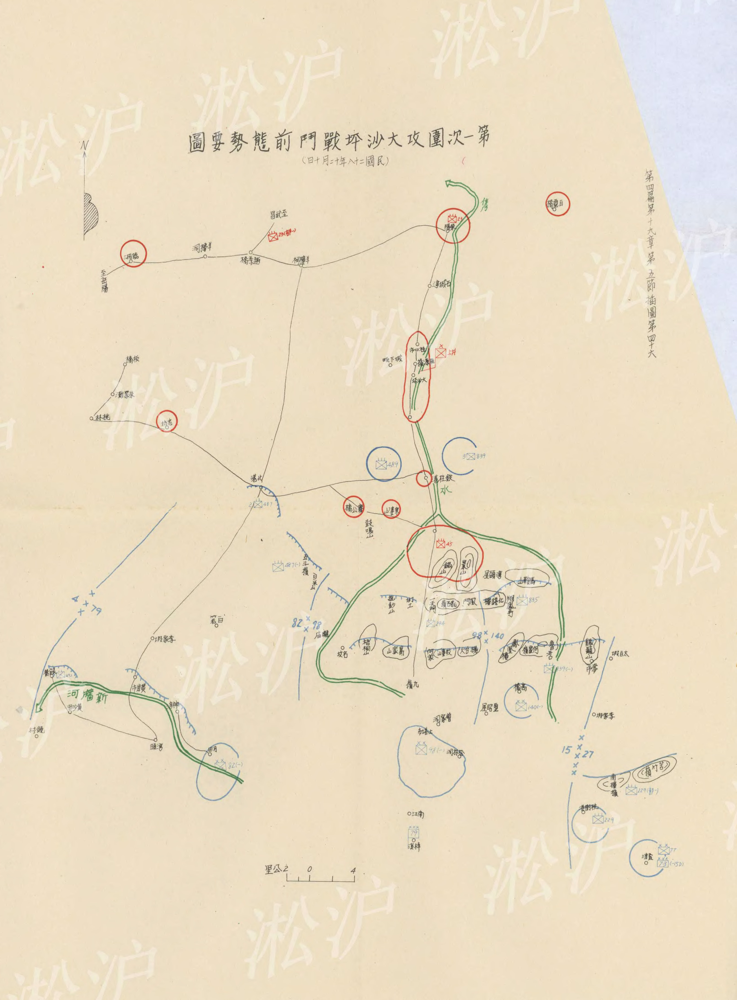

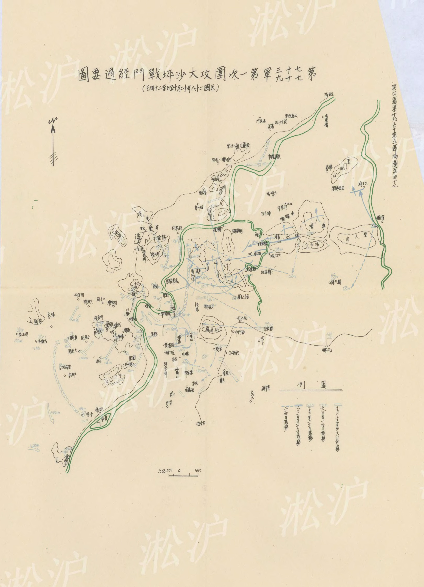

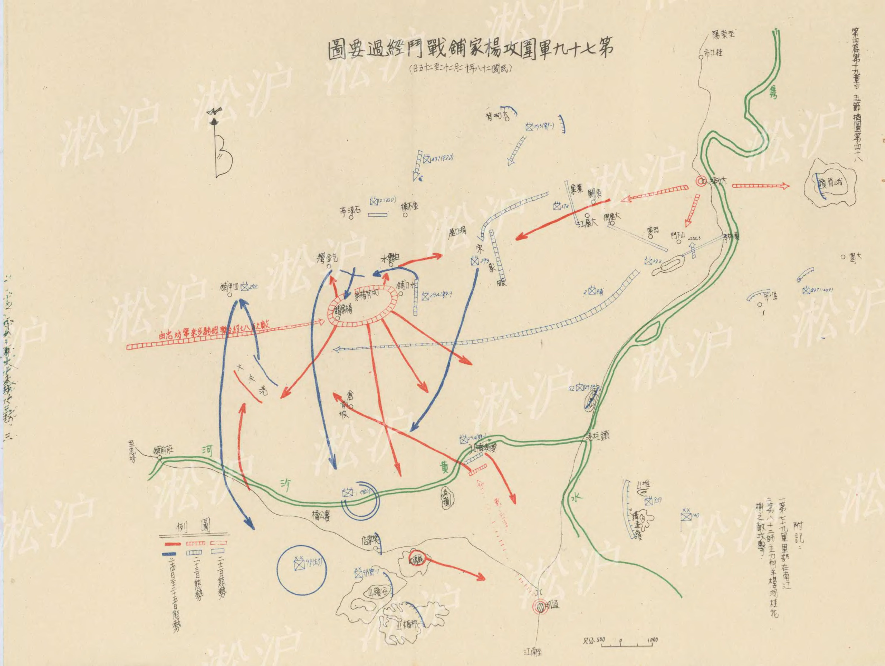

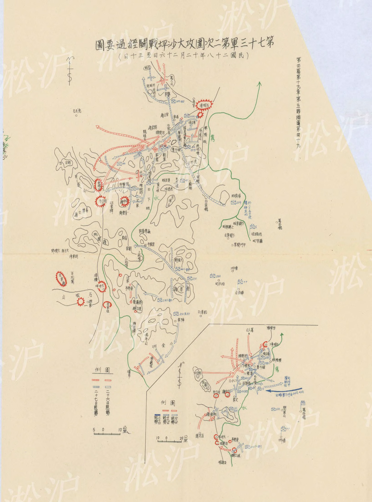

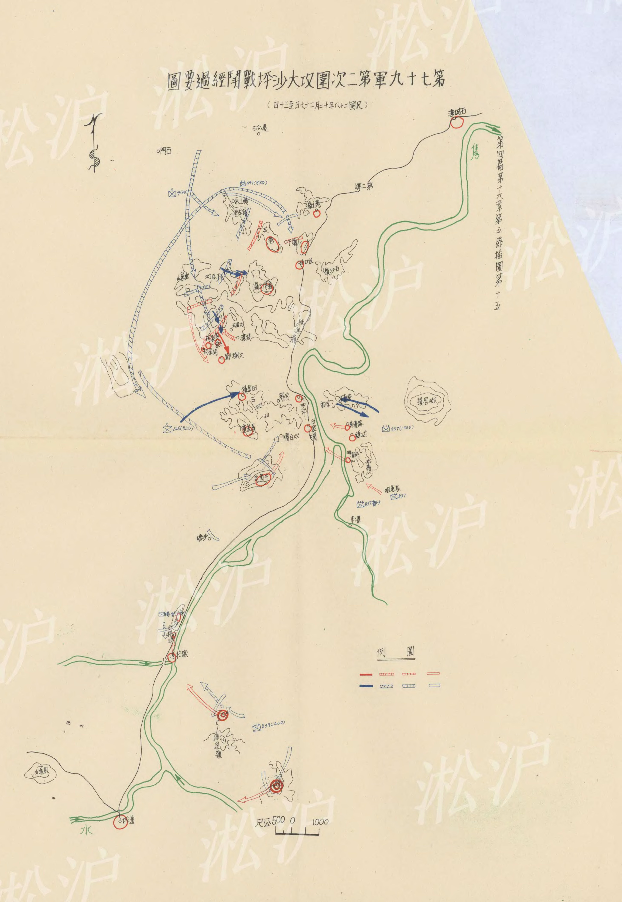

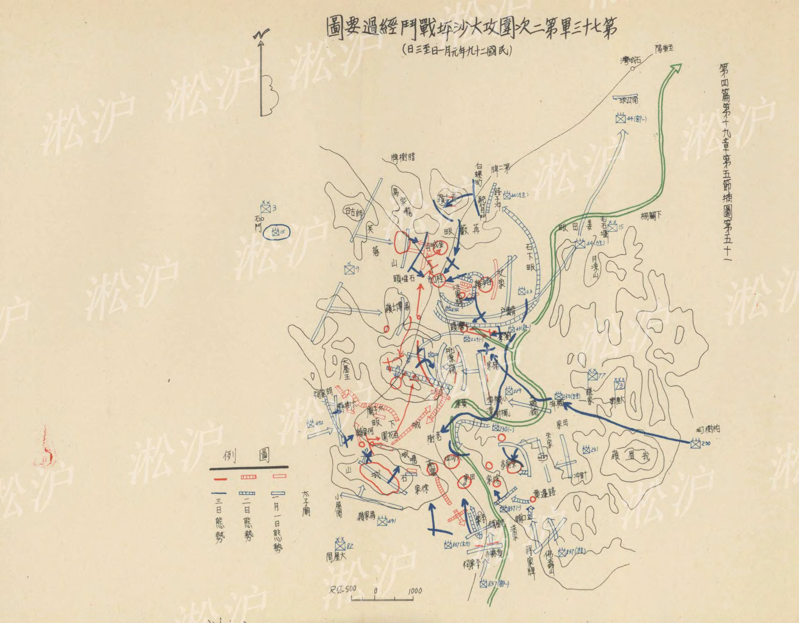

第四目

第三次圍攻大沙坪

民國二十九年元月四日至九日

參照插圖第五十二

大沙坪之敵，先後經兩次圍攻二十餘日，均未能聚殲，敵仍不斷增援，其第六師團之池田聯隊及佐野聯隊一部尙盤據大沙坪、石城灣、桂口市一帶據點頑抗。第九戰區爲達成包圍殲滅該敵之目的，特於元月二日下達冬戌堯堅電令，第七十軍李覺軍長統一指揮第七十三軍、第三師及第十九師，實施第三次圍攻大沙坪。

民國二十九年元月三日，李軍長奉命後，卽就當前狀況決定方針、指導要領與部署，遂下達江（三日）午伯一電令，其要旨如左：

一、本部决定就現在部隊態勢，先攻取大沙坪，再次第將桂口市、石城灣之敵殲滅之。

二、第一期：

(一)第七十三軍以兩個師（附第四軍迫砲營）圍攻大沙坪，一個師之一部協同第三師攻擊桂口市之敵，主力控置毛石堰、蘆塘下一帶，對東北南警戒，另由第三師派一部攻略大樹鄧。

(二)第三師主力，以一部攻擊桂口市之敵，對羊樓洞、羊樓司方面警戒，第十九師一部攻擊桂口市之敵，主力對羊樓洞、桂花樹、崇陽方面警戒，保持機動，截擊敵援。

三、第二期（大沙坪攻佔後）：

(一)第三師由西北向東南，第七十三軍以兩個師主力（附第四軍迫砲營）由西南向東北，協同圍攻桂口市，一部對羊樓司、羊樓洞方面警戒，並另以一個師集結石屋舖、華石嘴間對東北警戒。

(二)第十九師仍服行原任務。

四、第三期（桂口市攻佔後）：

(一)以第十九師全力攻擊石城灣，但配屬第七十三軍第八十二師之迫砲營，應撥歸該師指揮使用。

(二)對羊樓洞、桂花樹方面之警戒及截敵增援任務，由第三師擔任。

(三)第七十三軍在大沙坪、桂口市、毛石堰、石屋舖、蔡家墩一帶集結，但集結石屋舖、華石嘴之部隊，應對東北警戒，截擊敵援。

五、對一點攻擊時，擔任攻擊各師之戰防砲，迫擊砲，均須集中使用，攻石城灣時，第七十三軍在石屋舖、華石嘴集結部隊之迫擊砲，應集向石城灣射擊，協助第十九師之攻擊。

六、各控置之機動部隊，應澈底破壞公路及電線，並截擊突圍之敵人。

七、第十五、第七十七、第八十二等三師，仍請彭軍長統一指揮，第三，第十九兩師由本部直接指揮。八、限五日拂曉攻佔大沙坪，六日拂曉攻佔桂口市，七日拂曉攻佔石城灣。

九、請各將攻擊部署進展情形，隨時見告爲要。

右令下達後，李軍長據謀報知：「三日十時，有敵三百餘，馬約二百匹，砲五、六門，十六時，敵三百餘，戰車二輛，由羊樓洞向崇陽前進，現在菖蒲園停止。」當卽判斷敵可能行動有二：

一、向東北前進威脅第二十軍之側背，會合崇陽之敵，再向西南進攻，以解石城灣、桂口市、大沙坪之圍。

二、逕向西南前進側擊本軍側背，圖解石城灣、桂口市、大沙坪之圍。

嗣經查證，敵採取第一行動。

元月四日，第三師於二時繼向金城山及王家冲之敵攻擊，七時佔領桃源嶺西北高地，敵退桃源嶺南高地據碉頑守，我仍向之圍攻。

第七十三軍於元月三日晚，第十五師以第四十三、第四十四兩團各一部，向桂口市夜襲，與街口碉堡內之敵對戰終夜，四日拂曉，轉向汪家牌猛攻，竟日未克。第四十五團奉李軍長電話命令，除留一部於中堡附近警戒外，主力於三日晚移至青山舖以北地區，當晚即以一部利用夜暗進至烏龜石，在打石嶺附近破壞公路。第七十七師第二二九團仍佔領桃源嶺西南高地，公路以西敵土堡據點二座，敵不斷增援反攻，迄四日拂曉，該兩據點爲敵所佔，繼仍向該五土堡攻擊，未能奏功；第二三一團續向崇南亭核心據點攻擊，迄四日三時，敵約二百餘，向虎形山進攻，經該團截擊，乃向大沙坪退去；第二三零團唐營夜襲大沙坪街市，爲敵碉堡所阻，戰至四日拂曉，未能攻入，仍撤回雋河東岸與敵對戰。

本（四）日晚，第八十二師（欠二團）分向田家嘴、燕窩，百花園，大樹鄧之敵猛攻，敵一部逐次後退，卽跟踪追擊。

第一四零師第八三七團竟日協同友軍圍攻大沙坪，敵死守據點，因缺乏砲兵，未奏膚功。

是日十一時，李軍長接奉楊副長官二日冬亥惕電令如左：

一、第一四零師之第八三七團，第八十二師主力（附第四軍迫砲營）均歸第八十二師羅啓疆師長指揮，由第七十三軍彭軍長統率負責，專攻大沙坪。

二、第七十軍，第七十三軍，歸第七十軍李覺軍長統一指揮，崇陽、通山公路以東，由彭軍長負責，以西由李軍長負責。第二十軍歸本軍直接指揮，仍攻崇陽、白霓橋之敵，重點指向桂花樹，崇陽公路。

李軍長基於上述電令，曾以支午伯一電令變更部署，以現在部隊態勢，一部協助第八十二師對大沙坪之敵攻擊，主力攻擊桂口市、石城灣，十八時，又接楊副長官轉薛長官三日二十一時電（江戍堅）令，要旨如左：

一、第七十、第七十三兩軍，可集全力先破桂口市之敵，再殲大沙坪之敵。

二、凡主攻方面必須全力及集中砲火，助攻方面用一部攻擊敵人，使敵不得互相救援。

三、第七十、第七十三、第二十等三軍，均應受李覺軍長統一指揮，方可收聚殲之功，請按此旨機敏活動。

李軍長因指揮單位過多，電呈薛長官，楊副長官，對第二十軍及第七十三軍懇請楊副長官直接指揮，以期迅捷。同時又奉到楊副長官江戌電告知第二十軍白霓橋、崇陽之攻擊部署，二十三時，彭軍長層轉薛長官電話命令要旨：「我軍決以全力圍攻大沙坪，第七十三、第七十兩軍，除以一部監視石城灣，佯攻桂口市外，其餘主力完全圍攻大沙坪，速決定部署施行具報。」

李軍長奉到上電後，卽以支亥伯一電致第二十軍楊軍長：「本軍及第七十三軍遵令以一部監視石城灣，佯攻擊桂口市外，主力均用以圍攻大沙坪，卽刻開始行動，關於崇陽、桂花樹間方面之敵，應請貴軍極力攻擊，並確實截斷崇陽、石城灣公路，勿使南竄。同時下達命令要旨如左：

一、第八十二師刻正向田家嘴、田家嶺、何家舖之線，向大沙坪攻擊中。

已電請第二十軍對崇陽、桂花樹間方面之敵極力攻擊，並確實截斷崇陽、石城灣公路，勿使南竄。

二、本部就現態勢，決以一小部攻擊石城灣、桂口市之敵，以主力圍攻大沙坪，協同第八十二師殲滅該處之敵。

三、第三師（欠一團）仍在原地，對桂口市之敵，由西向東不斷佯攻，確實截斷桂口市、石城灣敵之交通，並應在黃土嶺（不含）、虎爪石之線佔領陣地，對西北兩方嚴密警戒，掩護主力側背。

四、第七十三軍第十五師應以一部監視石城灣及由東北向西南協同第三師佯攻桂口市之敵，確實截斷桂口市、石城灣間敵之交通，並對東北兩方嚴密戒備，掩護主力側背，其餘及第七十七師均任大沙坪之圍攻。

五、第十九師卽經石門、長坪兩路，向新屋王、大屋，東關一帶地區開進，準備圍攻大沙坪，但圍攻石城灣部隊，應俟第十五師派隊接替監視，又對西北警戒部隊，應至五日拂曉後始各准撤收。

六、茲將圍攻大沙坪各部之作戰區域、境界、目標，規定如左：

(一)第十九師右連繫第八十二師，自何家東端道路起（含），北經新屋王，折向東北至劉家山（含）之線，爲攻擊準備位置，逐步指向大沙坪攻擊掃蕩。

(二)第七十三軍左連繫第八十二師，自阮家起，北經崇南亭、楓樹潭，折向西北亘桃源嶺，右與第十九師連繫之線，逐步指向大沙坪攻擊掃蕩。

(三)瀛潭楊家、下灣頭、劉家、雲台山相連之線，以北屬佯攻桂口市部隊（含），以南屬攻擊大沙坪部隊。

七、各部應於明（五）日十二時以前完成攻擊諸準備，攻擊開始日期另候命令。

八、各部儘可能向本部架設線路，必要時主用無線電通訊。

九、各部應將行動部署情形，於明五日十三時前具報。

十、余現在熊家堤，卽移至宋家畈之團山灣。

元月五日，各部按照規定行動待命總攻，李軍長指揮所於十二時移抵團山灣，得知第八十二師僅到第九十八師砲兵一連（砲二門），現存砲彈甚少，另有一迫擊砲營及第四軍之迫砲營須明後日始能到達。十八時，楊副長官歌未惕電轉薛長官電話命令：「攻擊大沙坪之各軍師長，由李覺軍長統一指揮，希卽督率立即猛攻，務克爲要。」李軍長當將上令分別轉知，同時將四日下達命令抄告第八十二師羅師長，並作二項規定如左：

一、茲規定第八十二師應由右連繫第七十三軍，自徐家（含）經田家嘴、田家嶺至何家北端之小港（不含）之線，準備圍攻大沙坪。

二、俟砲兵集中，再定統一攻擊開始時間，但現在各部仍就現態勢，不斷向敵襲擊爲要。

是日，各部先後報告遵照命令從新部署。

元月五日，第七十三軍第七十七師第二二九團續向桃源嶺西南高地攻擊，激戰竟日，進展甚微；第二三零團唐營當日晚改向大沙坪南街口猛撲，衝破敵鐵絲網，敵數次派隊企圖修復，均被擊退；第二三一團續向崇南亭攻擊，十四時將獅形山敵土堡據點攻佔，殘敵向徐家退走。第十五師除以一部對石城灣攻擊外，主力仍在白沙嶺、汪家牌之線，向桂口市攻擊。

第三師於三時向金城山及桃源嶺東南高地之敵攻擊，七時突破桃源嶺公路以東鐵絲網據點數處，敵旋由桂口市增援側擊，企圖打通大沙坪通路，經擊退未逞。

第十九師於當晚向何家舖東端高地及大樹鄧之敵猛襲，敵據工事不出，僅以火力封鎖附近高地及道路口。

第八十二師於一時向田家嘴、燕窩、百花園、大樹鄧猛攻，四時三十分攻克雙白嘴，逼近田家嘴、燕窩，並攻佔其附近小據點三處，敵退守燕窩據點及其附近碉堡內頑抗，我協助攻擊之砲兵，因彈藥不足，無法摧燬碉堡，終未得手，百花園、大樹鄧之敵據堅不出，入晚仍對戰。

第一四零師第八三七團之楊營，於四日二十一時擊退徐家北端高地進攻之敵後，卽協同第七十七師第二三一團繼續猛攻，傳營亦與第八十二師同時進攻燕窩，至五日一時進入燕窩附近之坳背山腹後，未得進展。

元月六日十時，原配屬第八十二師之迫擊砲營已到達砲九門，砲彈三百四十顆，第四軍配屬之山砲營奉令協攻通城，停止前來。李軍長以圍攻大沙坪無重砲摧燬工事，徒以血肉攻堅，實屬無謂之犧牲，且大沙坪爲敵重要堅固據點，其附近之百花園、魏家大屋碉堡棋佈，副防禦層叠，設置工事堅固，攻略困難，至桂口市爲敵次要據點，兵力較弱，攻略較易，基於上情，擬先將桂口市之敵殲滅，削弱敵之外圍而困之，此意見具申，經薛長官電准：「砲兵旣未集中，着先擊殲桂口市之敵，以便爾後作戰。」

李軍長奉准先攻擊桂口市之敵，卽於十四時決定攻擊部署，旋據各方先後報告如左：

一、石城灣敵三百餘，本（六）日十五時竄出，到達蘇家橋停止。

二、另有約千餘之敵，於本（六）日十六時由白花舖向東南前進，先頭約三百人已達神口，後續部隊五、六百人已到小沙坪，正修復道路，繼續跟進中。

三、本（六）日十八時起，第三師偵察隊與蘇家橋、神口附近之敵接觸。

同時又接第二十軍楊軍長四魚急電：「本（六）日九時，有敵步兵三百餘、騎兵百餘，砲四五門，汽車二輛，由崇陽向石城灣前進，在五里廟、打石嶺間，經本部補充團截擊，將汽車擊回崇陽，餘敵仍在五里廟、打石嶺間頑抗，強迫西進，崇陽敵大部到達石城灣。

李軍長綜合連日情況，判斷大沙坪、桂口市、石城灣等處之敵，被圍已到困境，敵由崇陽、羊樓洞抽調兵力，圖解各處之圍。當卽決定抽調有力部隊，擊破敵援，同時猛攻大沙坪、桂口市之敵，使其不能互相策應，遂於六日十八時下達變更部署電（魚酉伯一電）令，其要旨如左：

一、第三師卽向援敵痛擊，並撥第十九師之第五十六團歸趙師長指揮。

二、第十九師（欠第五十六團）卽接替第三師攻擊桂口市之任務。

三、第七十三軍第十五師應以主力協同第十九師攻桂口市，一部向西北側擊敵援。

第七十七師一部圍攻大沙坪，一部策應第十五師。

四、第八十二師附第一四零師之第八三七團及迫擊砲營，山砲連，協同第七十七師之一部，仍圍攻大沙坪，其向桂花樹方面進出之第四八八團，應速令由西北向東南側擊由白花舖向東南前進之敵。

五、圍攻大沙坪、桂口市部隊，應注意敵人突圍，力保機動爲要。

同（六）日，第七十三軍第七十七師第二二九團、第二三零團續向桃源嶺西南高地及崇南亭敵據點攻擊，均無進展。第十五師第四十四團於三時許在龍車灣附近，擊退由石城灣向桂口市運動之敵數十名，拂曉，桂口市之敵約三百餘，經蘆塘下向張家祠前進，經第四十三團派隊截擊於麥窩附近，十二時，該敵續增至六百餘，砲二門，騎兵一部，與第四十四、第四十三兩團各一部激戰於蘆塘下，麥窩之線，二十時，敵分向桂口市、石城灣退走，又十二時，石城灣之敵約二百餘，向南山坂之第四十四團一部進攻，復經擊退回。

第三師第九旅於五時，以主力向桂口市佯攻，一部破壞桂口市以北交通，六時，攻至橋當頭及金城山西麓，天明後，仍撤至原陣地待機。

第十九師進攻何家舖及大樹鄧之敵，激戰竟日，以遭受敵機更番轟炸，無大進展。

第八十二師第四八八團，於本日晨在關山嘴、雙港橋截擊向石城灣、大沙坪增援千餘之敵，斬獲甚多，主力仍在百花園、燕窩、大樹鄧一帶向敵進攻。

第一四零師第八三七團之第一、第三兩營，於拂曉仍向當面之敵攻擊，十六時，徐家之敵約三十餘，向徐家東南之阮家守兵襲擊，被擊退。

元月七日，各圍攻部隊經從新部署後繼續攻擊。

第七十三軍第十五師第四十三、第四十四兩團正向石城灣、桂口市攻擊，敵機四架及砲四、五門掩護約三百餘人，向南山坂攻擊，經第四十四團佔領南山坂部隊予以猛擊，該敵退至山麓向公路以西高地移動。拂曉，敵約四百餘由汪家牌向白沙坳第四十三團進攻，被擊退。十二時，於六日夜進至石城灣以北地區千餘之敵續向前進，十四時與進攻南山坂之敵會合，向石城灣、桂口市間該師部隊猛攻，第四十三、第四十四兩團主力卽在南山坂、龍車灣、葉家、胡蘆塘下之線截擊，由獲得文件查知該敵係第六師團第二十三聯隊。在石屋舖之第四十五團向路子冲推進，準備側擊該敵。十五時，敵機與砲轟擊益烈，第四十四團南山坂之一連傷亡達三分之二，二十一時仍在激戰。第七十七師第二二九、第二三一兩團攻擊竟日，仍無進展。

第三師於六日晚，以第十五團一部猛襲神口，敵不支，向東山舖退佔雷羅山、王家嶺之線頑抗，圖與由石城灣進至蘇家橋之敵會合。七日六時，該師以其第十八團一部馳往襲擊蘇家橋，以第十七團附第十九師第五十六團之一營除對羊樓洞方面警戒外，餘協同第十五團之一部圍殲東山舖附近之敵，經猛擊後，敵大部退石城灣，一部向桂花樹方向退去，該團以一部追擊外，主力轉至雷家祠、虎爪石、神口之線。

第十九師（欠第五十六團）於零時接替第三師攻擊桂口市任務，卽以第五十七團在新屋王、師古台之線就攻擊準備位置，以第五十五團控置於楊家、岩頭寺附近機動使用。四時，第五十七團向桂口市猛攻，敵憑堅固工事死守，無法突破。十四時，以一部向易博士嶺東端之敵襲擊，與約步兵五十餘敵遭遇，敵不支向桂口市退走。十六時三十分，以一部由師古台向敵奇襲，將金城山北高地佔領，因受敵火瞰制，仍撤回原陣地。

第八十二師於六時以步砲聯合向百花園、燕窩、大樹鄧一帶之敵攻擊，十二時，敵前進迎戰，被擊退，十四時佔領孫家附近大小據點，敵不支，退守燕窩據點。

第一四零師第八三七團於九時協同友軍向大沙坪猛攻，十一時佔領燕窩以南敵之土堡兩座，二十時頃，燕窩之敵被擊退。

是日二十時，薛長官下達虞西堅堯電令，其要旨如左：

一、咸寧、蒲圻、羊樓洞一帶之敵，陸續消耗於崇陽、通城一帶主力據點，我以搗穴擊虛之目的，決以李覺軍長指揮第三、第十九兩師，於八日開始經桂花樹、羊樓洞間地區，第三師（第十六團歸還建制）掃蕩蒲圻附近之敵及破壞蒲圻（含）、茶庵嶺（不含）間之鐵路及通訊，焚燬該地區內敵屯積之糧彈，第三、第十九兩師行動，務利用夜暗，並須果敢快速、機敏，出敵不易，攻敵不備，方易達成任務。

二、第二十軍攻擊白霓橋、洪下、桂花樹（均含）、石城灣（不含）一帶地區之敵，確實破壞該地區之公路及通訊。

三、第七十三軍攻擊石城灣、大沙坪（均含）一帶地區之敵，確實破壞該地區之公路及通信。

四、第七十九軍攻擊大沙坪（不含）、通城（含）一帶地區之敵，確實破壞該地區之公路及通訊，並集中迫擊砲轟擊通城附近之敵。

五、如爾後守備崇陽、通城之敵，向蒲圻、羊樓洞方面轉用時，第二十、第七十三兩軍卽各以一部攻擊各據點之敵，主力應迅速索敵側背猛烈攻擊之。

元月八日九時，第三師趙師長電話報稱：「本日七時，敵約一千三百餘竄到橋上鋪、楊林畈、學官畈一帶，一部四百餘竄至東山鋪、方山、大小元口一帶，另一部約三百餘由石城灣竄至上寶庵、蘇家橋、龍眼山一帶，均配有砲兵共十餘門」。李軍長卽飭該師（附第十九師之第五十六團）先將該敵擊滅，以便爾後作戰，並電第七十三軍夾擊，期收協同聚殲之效，其餘各部仍各對大沙坪、桂口市之敵圍攻，務使不能互相策應。迨至二十一時，復令第十九師，以第五十五團由岩頭寺、樸樹下移至寶林，由西南向東側擊，均歸第三師趙師長指揮。同時將上項處置情形，報告薛長官、楊副長官，俟將此敵解決後，再遵令向蒲圻、趙李橋、羊樓洞、桂花樹履行新任務。

第三師奉令後，除以一部佔領原陣地外，以第十八團一部阻擊上寶庵、龍眼山之敵，以第十七團附第十九師第五十六團之一營攻擊蘇家橋、學官畈、大元口之敵，以第十五團一部攻擊小元口、方山之敵。十一時，敵藉砲火掩護進攻，遂以第十五團主力及第十九師第五十六團之一營至神口以北，協同第十七團猛擊該敵。二十一時，敵千餘突至熊家堤附近，又五百餘由學官畈。龍眼山突至白螺畈以北高地，此時，該部已佔領臘樹牌、姚家嶺、蘇家坳、石板原之線阻敵南進。同時又以第十九師第五十五團之一營展開於神口、石板原之線，向敵側擊，激戰至九日，敵砲十餘門猛烈轟擊，掩護其桂口市、白螺畈以北及虎爪石之敵猛攻，均不得逞。第三師爲求澈底殲滅該敵計，經調第十六團於九日十二時進出桂花樹、羊樓洞公路以南地區，由北向東南協攻。

第十九師（欠第五十五、第五十六兩團）於二時以第五十七團由易博士嶺向桂口市之敵攻擊，佔領鄧家，迫近橋當頭，敵憑堅固守，終未能突入。二十四時，敵約百餘向馬家壠、官塘沖以北活動，經該團由師古台向敵側擊，另以一部由下方莊向敵夾擊，敵不支，仍退守金城山據點。九日拂曉，爲策應友軍作戰計，該團組織挺進隊，由易博士嶺、師古台等處，向桂口市敵攻擊，激戰至十四時，敵一部由馬家壠、官塘沖，向楊泗坳友軍攻擊，經派隊側擊，敵不支，仍退回據點。

第七十七師以第二三零團於龍王觀附近策應第十五師作戰，第二二九、第二三一兩團仍續向桃源嶺及崇南亭攻擊，無進展。第十五師於拂曉時，以在張家祠附近之第四十五團一部與由第二牌向麥窩左翼迂迴之敵激戰，七時，敵機及砲火掩護全線反攻，尤以南山坂爲烈。二十二時，敵三、四百向南山坂右翼猛撲，同時以一部繞經老虎山襲擊，第四十四團在南山坂之第九連傷亡殆盡，該團乃就挖泥塘、破斗曹之線與敵激戰。第四十五團一部突進至白螺坳，向敵右側猛攻，十六時，敵勢稍挫，比卽乘勢全線總攻，二十四時，敵不支向虎爪石退去。第四十三團之一營，於七日夜以一部由白沙嶺經杜家畈夜襲桂口市，爲敵外壕及側防火所阻，八日晨續向汪家牌攻擊，無進展。十七時，約百餘之敵，由桂口市繞襲白沙嶺該營右側，第四十五團一部馳往夾擊，激戰於苒藪畈以南高地，入晚又退回桂口市。九日一時，對戰之敵大部退走，一部仍在南山坂構築工事，第四十三團越過石城灣、桂口市間公路，攻擊臘樹牌之敵，向虎爪石夾擊中。至晨，敵約四、五百由崇陽南進，十一時佔領天靈山、聖降山，十二時進至楊家祠附近，另一部約三百餘由洪家橋渡河，十一時進至東山灣續向南進，第四十五團及第七十七師第二三零團各一部分途堵擊。

第八十二師仍在原陣地與敵對戰，雙方均無進展。

第一四零師第八三七團，於八日十五時擊退由大沙坪進攻之敵，二十時，敵復增兵進攻，亦經擊退。

元月九日十時，薛長官電話命令：「着各軍仍遵照虞酉堯堅電命令行動，而達搗穴擊虛之目的」。

李軍長奉令後，卽遵照實施。嗣後敵軍援至，戰場攻守易勢，戰事已進入另一階段，第三次圍攻大沙坪，至此卽告結束。

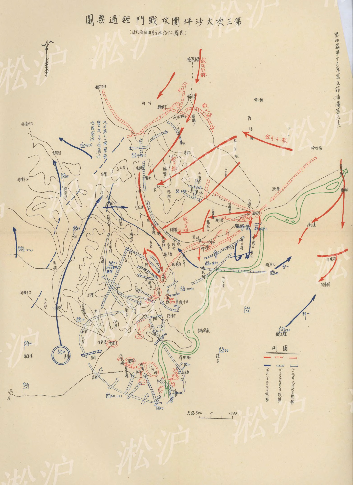
