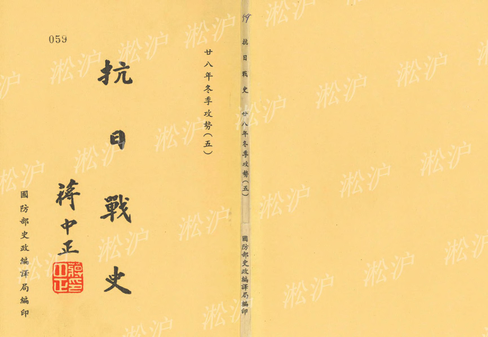

### 第七節 第二（十）戰區之作戰

敵軍自民國二十六年九月侵入晉境以來，卽利用交通線攫佔據點，我則退入山岳地帶攻襲強敵，敵雖屢攻中條、呂梁諸山，我仍襲其據點及固守黃河右岸，防敵西進，以持久防禦，牽制消耗其兵力，以奇襲破壞，增加其疲憊阻擾，使敵深陷泥淖，無以自拔。

是時，軍事委員會爲導國軍爾後作戰於有利之目的，乃策定二十八年冬季攻勢，爭取主動，十一月二十二日，第二戰區奉令擔任主攻，切斷正太、同蒲二路，肅清晉南三角地帶敵人，當於二十三日下達命令，將所屬區分爲東、南、西、北四路軍，晉陝綏邊區軍，宜川河防第十三集團軍等七部，主力由同蒲路兩側向翼城、安邑攻擊，肅清三角地帶敵人，助攻各部則分負監圍長治，破壞交通，阻絕敵援，策動僞軍反正，協同第八戰區作戰及固守河防等任務，乃定於十二月十日開始攻勢。

第十戰區於民國二十八年十一月一日修正第二期作戰計畫（參照本節附錄第二），十一月二十三日奉令協力第二戰區之作戰，以主力擔任河防，依晉南三角地帶之進展，應以有力一部渡河，作擴張戰果之準備。迨十一月二十九日，第二戰區獨立第二旅政治主任韓鈞等誘脅部隊叛變，勾結敵人，擾亂後方，第二戰區遂令西路軍痛勦，北路軍阻竄，致實施冬季攻勢者，僅有東、南兩路軍。

十二月三日，敵乘晉南方面調整部署之際，由偃掌、尉郭，向第五集團軍上橫檢、馬家廟一帶進攻，激戰九晝夜，頑敵始被擊退，該集團軍於苦戰待補之餘，施行攻勢，故南路軍之戰力減弱頗多。

第十戰區所派渡河擴張戰果之兩師，原定於十二月二十五日實施，因第二戰區對晉南三角地帶未能達成預期戰果，故渡河部隊亦爲之停頓。

第二戰區東、南路軍開始攻勢以來，除收復黎城、東陽關兩地外，並曾襲入壺關、長子、浮山等城，及絳縣東南之宿堯、東荊村、古惟嶺，安邑東南之張店鎮，虞鄉以東之清華鎮、董封、席張村各車站，壺關、長治以南之秦莊、賈掌村、五龍莊，長子以北之鮑店、西李高等據點，惟因我重武器缺乏，部隊機動力不足，每阻於敵之堅固工事，或受敵援威脅，致使無力進展，且難以堅守，不得已，撤回監圍。而敵每集重兵進犯，初期雖間有進展，但終被我以誘敵深入包圍聚殲之戰法，予以擊敗。

#### 第一款 戰前狀況

(參照插圖第六十八)

##### 第一項 敵軍

(參照插表第四十三)

敵華北派遣軍司令官多田駿，於民國二十八年十月間由北平抵太原召開軍事會議，報告南京敵首腦會議決定，對華以軍事政治相輔而行，對晉在軍事上仍以擴張面積爲主，迄十一月下旬，敵之配置如左一、第三十七師團分置於夏縣、安邑、永濟、臨晉、稷山一帶。

二、第一零八師團原分置於曲沃、侯馬、臨汾、洪洞、趙城各據點，迨第四十一師團接防後，卽移駐於浮山、臨汾一帶。

三、第四十一師團於十一月初由朝鮮開抵晉南，三日接替第一零八師團防務，以井島部擔任同蒲路中段霍縣至侯馬間及其東西兩側黑龍關等處據點守備，大部份則分置於翼城、臨汾地區。

四、第二十師團分置於黎城、長治、長子、沁縣一帶，其師團部及關原旅團長，第七十九聯隊，均駐於長治城內，工兵聯隊駐西關，砲兵聯隊駐城高樓，第七十八聯隊駐潞城，第七十七、第八十兩聯隊駐長子。

五、獨立第九旅團分置於同蒲路之榆次、太古、平遙間地區，獨立第四旅團分置於正太路、井陘、平定、壽陽間地區及昔陽、遼縣一帶。

六、第三十六師團分置於太原、汾陽、離石間地區。

七、獨立第二旅團分置於繁峙、崞、忻一帶，第二十五師團主力駐廣靈、靈邱間地區，第二十六師團主力駐朔縣、寧武一帶，其所屬獨立第十三聯隊則分置於歸綏、包頭間地區，獨立第二旅團一部駐萬全、陽高一帶。

##### 第二項 我軍（參照插表第四十四第四十五）

第二戰區於民國二十八年九、十月間，以晉東南各部向白晉公路之敵攻擊，晉南、西、北各部策應，互有進展，迄十一月中旬，晉南及晉東南調整部署後，各部位置如左：

一、第十四集團軍在垣曲以北、陽城、沁水一帶地區。

二、第五集團軍（附第十七軍）位於垣曲以西之西山頭、唐回村、龍潭溝一帶地區。

三、第四集團軍位於平陸、芮城一帶地區。

四、第四十軍（欠第一零六師）位於固村、蔭城、高平一帶地區。

五、第二十七軍位於高平以北迄沁源以東一帶地區。

六、第十八集團軍第一二九師分駐遼縣以東、黎城以北、漳源及沁縣以東各地區，第一一五師主力及第一二零師第三五八旅分別在孝義、霍縣、雙池、嵐縣各附近地區，第一一五師之第三四四旅在平順。

七、第六集團軍主力在鄉寧、蒲縣、大寧附近地區，一部在宜川以北擔任河防。

八、第八集團軍主力在隰縣、石樓一帶，一部在鄉寧以南地區。

九、第十三集團軍主力在臨縣、峪口、碛口附近地區，其餘各部分在鄉寧、蒲縣之間，及任河曲對岸之河防。

十、第七集團軍主力在五寨、苛嵐、靜樂間地區，一部在遼縣以南地區。

十一、軍事委員會第一游擊總隊在石玉、涼城以東地區。

十二、各砲兵部隊、第八十三軍一部、第十八集團軍後方留陝部隊及晉陝綏邊區軍等部分任河防。

十三、第四十三軍、獨立第二、第三、第七等旅，分在克城鎮、屯留各西北及柳林東南，新編第二師在忻縣、孟縣間西烟鎮附近。

十四、太原綏靖公署所轄第一至第九游擊縱隊分在稷山、黑龍關、克城鎮、雙池、汾陽各附近地區。

第十戰區於民國二十八年十月一日修正第二期作戰計畫（參照本節附錄第一）以第九十、第一兩軍、新編第二十七師及砲兵部隊等擔任閩底鎮迄猴兒川之間河防守備；第十六軍預備第一師配置商縣、龍駒寨一帶，暫編騎兵第二師駐於鄜縣、洛川間；第十六軍（欠預備第一師）附第一六五師，新編第十二旅、騎兵第十二旅及砲兵部隊分駐於潼關、渭南、蒲城、三原等地。迄冬季攻勢直前，除商縣、洛川兩部仍舊外，擔任河防部隊則劃分兩守備區；第一守備區以第一零九師、新編第二十七師及砲兵、裝甲兵等部擔任，指揮官由第一軍軍長陶峙岳暫兼任；第二守備區以第九十軍（欠第一零九師）附砲兵部隊擔任。第十六軍預備第三師開赴大荔附近，第一六五師開赴郃陽、芝川鎮間地區集結整訓，歸河防軍指揮，其餘各部仍在原地整訓，歸軍事委員會控置整訓之第一軍，集結於潼關、華縣間地區。

##### 第三項 兵誌概要

第二戰區，轄山西及陝西猴兒川以北地區，東有五台、太行爲之屏障，西有橫山、梁山可爲依據，北有陰山、句注、雁門足資護衛，南有王屋、中條、雷首諸山、濱河錯峙，中有呂梁山縱貫晉西。黃河爲晉陝之天然界限，汾河乃山西之唯一巨川。同蒲鐵路縱貫晉境，正太鐵路橫腳平漢公路，以同蒲、白晉爲幹綫，由平遙經綏德分達榆林、咸陽，爲晉陝之要道。境內地勢崇隆，四塞險固，惟巨細河流，鮮利航運，致除鐵路、公路外，交通甚感不便。

第十戰區轄陝西猴兒川以南地區，北依梁山，南憑秦嶺，東賴黃河，爲第二、第十戰區之地境。中部橫陳隴海鐵路，乃豫陝主要之交通。渭河納涇、洛二水，注入黃河，漢水經陝南東流入鄂。境內土質乾實，交通便利，我爲鞏固河防，斷敵西進企圖，乃有澈底破壞河東禹門口及師家灘交通之舉。

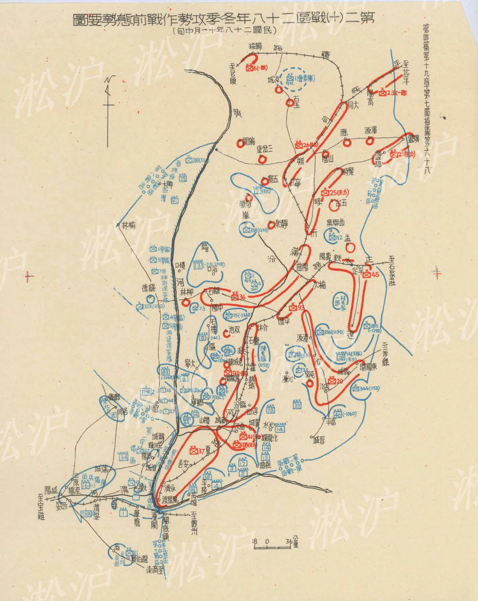

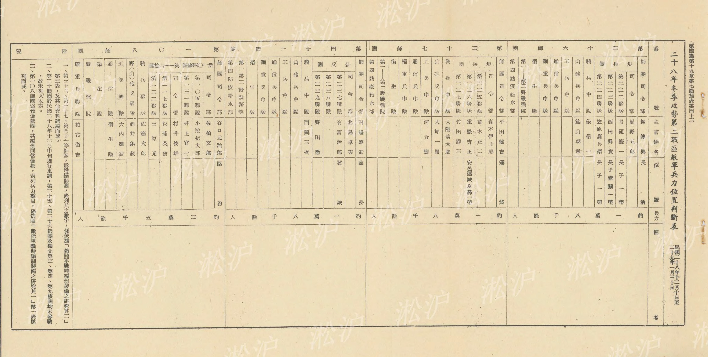

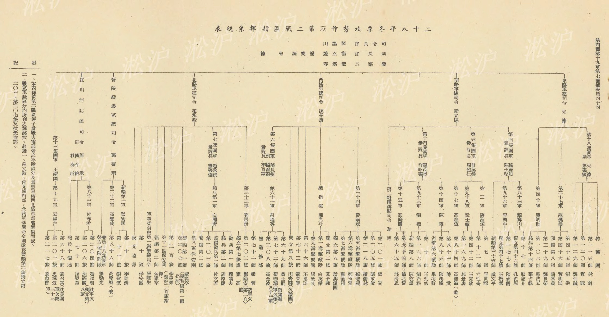

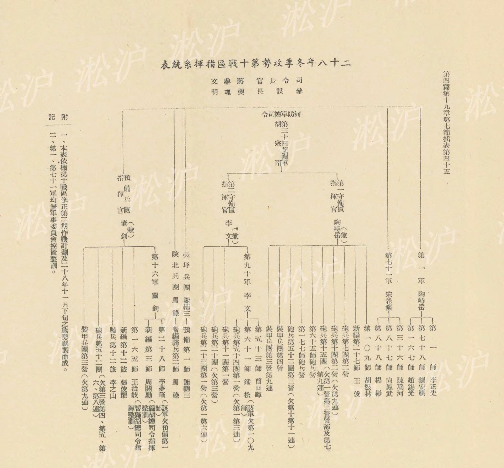

#### 第二款我軍作戰指導

第二戰區於民國二十八年十一月二十二日，奉蔣委員長十九日皓申令一元電令：「任主攻，應先切實截斷正太、同蒲二路，肅清同蒲路南段晉南三角地帶敵人。」二十三日下達冬季攻勢命令，要旨如左（參照插圖第六十九）。

一、南路軍總司令衛立煌指揮所部，以一部對封門口、天井關確實封鎖，另以一部破壞介休、臨汾段同蒲路，阻敵之交通，主力由浮山、翼城、橫水鎮、夏縣、平陸、芮城，向同蒲路攻擊，重點置於翼城東側地區，擊破當面敵人，確實佔領曲沃、侯馬，阻敵援軍，再沿同蒲路向安邑進出，肅清三角地帶敵人。

二、東路軍總司令朱德指揮所部，以主力截斷東陽關、娘子關阻絕增援之敵，並阻絕正太、白晉及同蒲之介休至太原段等路交通，一部圍困長治一之帶敵，阻其竄擾。

三、西路軍總司令陳長捷指揮第六集團軍（欠第八十三軍）及第三十四軍（附第五、第六、第七游擊縱隊）、第六十六軍第七十三師崔道修旅，陳光斗總指揮（轄獨立第二旅、第一、第九游擊縱隊）等部，以第三十四軍先肅清新降、稷山、河津之敵，爾後進出汾河左岸，向曲沃、運城間活動，協同南路軍肅清三角地帶之敵，其餘各部襲擊當面之敵，並分遣一部進出曲沃以北，同蒲路沿線，澈底破壞鐵路，斷敵交通，掩護主力之側背。

四、北路軍總司令趙承綬指揮第七集團軍（欠第七十三師），第三十三軍，軍事委員會第一游擊總隊張礪生部及暫編第二旅，獨立第二零三、第二零七旅，侯光遠等部，襲擊當面之敵，並破壞太原以北同蒲路，主力向歸綏東南附近地區圍攻敵軍，並策動僞軍反正，與第八戰區協同作戰。

五、晉陝綏邊區軍總司令鄧寶珊指揮所部及蕭勁光部，固守川河沟以北河防。

六、宜川河防總司令周玳，副司令傅存懷、杜春沂，指揮第八十三軍（欠獨立第八旅）、第七十師、砲兵十個連，固守宜川河防。

七、第十三集團軍（欠第三十三軍）歸本部直轄，集結於大寧以西、以北地區待命。

八、其他散在各地部隊，協同友軍襲擊當面之敵，並破壞鐵路，公路交通。

九、作戰地境：

(一)南路軍與東路軍，由衛副長官劃分之。

(二)西路軍與北路軍，爲永和——隰縣——靈石以北相連之線。

十、攻勢開始日期，定爲十二月十日。

同日，接奉天水行營程潛主任十一月二十一日馬辰行勝明電令冬季攻勢作戰指導，要旨如左：

一、同蒲路以東部隊，應以集團軍爲單位劃定作戰地境，各以有力一部擔任據點守備，確保根據地，以主力服行積極任務。

二、上黨方面，對盤據長治一帶之敵，應暫行監圍，防其竄擾，而抽出有力部隊參加晉南作戰。

三、晉南方面：

(一)應以有力部隊攻佔曲沃、侯馬並確佔之，遮斷敵之南北交通，阻敵援竄。

(二)中條山各部隊，應以全力本蔣委員長電示指導要領第七項，攻殲當面之敵，肅清曲沃以南敵人。

四、晉西方面：

(一)應以有力之一至二軍兵力，擊破新絳、稷山、河津之敵，進出汾河左岸，向曲沃、運城間同蒲路

沿線攻擊，直接協力中條山部隊，肅清三角地帶之敵。

(二)其餘攻擊當面之敵，並分遣一部進出曲沃、侯馬以北同蒲路沿線，澈底破壞鐵路公路斷敵交通。五、曲沃、侯馬以北各部隊，應積極牽制當面之敵，並以破壞同蒲路、正太路，斷敵交通，策應三角地帶之作戰。

六、封門口、天井關應各以有力部隊確實封鎖，東陽關、娘子關應各以有力部隊澈底截斷敵軍交通，阻晉敵之外援。

七、本年春、夏、秋三季攻勢作戰，均未能收得預期效果，考其原因，係各部未能確遵命令，澈底實施任務，希飭各部糾正前非，勿蹈覆轍。

閻錫山司令長官當卽摘要轉達各路軍及宜川河防軍遵照。

第十戰區，先於十月間依據修正第二期作戰計畫，以主力鞏固河西防務，另以一部配置商縣、陝北兩地區，以掩護河防軍之兩翼，該計畫經呈奉蔣委員長及天水行營主任程潛核定作爲腹案，應積極從事整訓部隊，完成作戰準備。迨十一月二十三日，奉蔣委員長十九日皓申令一元電令，第十戰區主力仍任原河防，依晉南三角地帶攻擊之進展，應以一部渡河，作擴張戰果之準備。當於二十九日對擴張戰果計畫意見具申如左：

一、出擊方面，應由西向東，蓋由潼關以東渡河北進，縱能獲得成功，亦不過壓迫敵人於晉北地區，故可節節後退，戰果甚微。如由郃陽以北東渡攻擊，則能截斷敵之退路，殲之於三角地帶以內，且同蒲路西側我軍之兵力，似較東側爲弱，如本戰區兵力由該方面出擊，可爲有力之援助。

二、主渡河點擬選定於船窩，師家灘間，助渡河點擬選定夏陽鎮、芝川鎮間。

三、兵力部署方法有二：

(一)第九十軍仍如現態勢，俟第二戰區攻擊奏功後，卽以左翼河防之兩師（第五十三、第六十一師）渡河，迅速而功倍，但該兩師渡河後，應以後方部隊（擬用第一軍）接防。

(二)爲使出擊力量加強，又不過早分割建制計，以第一軍任渡河出擊，但該部應卽向北移，位置郃陽、韓城間地區。

四、渡河及開始攻擊時機。

(一)第二戰區部隊進出浮山、翼城之線，並領有臨汾時，本戰區部隊卽開始渡河。

(二)第二戰區部隊對曲沃、侯馬攻擊奏效時，本戰區渡河部隊卽指向萬泉、猗氏及安邑、運城之線挺進。

上述計畫，經天水行營於十二月二日以冬申行利知代電核示如次：

一、出擊方向及主動渡河點之選定，尚屬適當，惟求祕密我之企圖及牽制敵之兵力計，應同時或先期於郃陽以南、潼關以東施行佯攻，使主渡、助渡實施容易。

二、渡河及攻擊開始時機之選定，亦稱適當，惟爲策應第二戰區部隊之作戰容易起見，以依情況不妨稍爲提前實施較爲有利。

三、兵力部署一項，以江北戰場機動部隊，目前僅有第一及第七十一兩軍，爲使爾後應付情況變化便利計，仍應以第一軍控置現地，以備機動使用。另由該戰區現已抽出集結之第二十八、預備第三、第一六五等三個師中，以兩個師歸第十六軍軍長董釗指揮，接替第二守備區河防任務（或先開赴相當準備位置，由貴長官適時命令接替）。以第五十三及第六十一兩師由李文軍長指揮，相機渡河攻擊，因該兩師對晉南三角地帶敵情熟習，易於奏功。

以上三項，希參酌辦理，並與第二戰區切實協定具報。

十二月三日，軍事委員會下達江午令一亨電令要旨：「以本年十二月底前抽出三個軍，歸本會直轄整訓，完成其軍略單位建制，充實其裝備訓練，養成高度戰力，以爲攻略要點之中堅。第十六軍轄第二十八、預備第一、第三師，整訓地點西安、長武附近，商縣、藍田防務，可由第十九補訓處接替，但在冬季攻勢時，應一律爲本會第二線兵團，須有策應第一線作戰之準備。

第十戰區於十二月五日奉令後，當卽電令第十六軍飭各師防務候令派隊接替，仍在現地整訓。至於第九十軍渡河時，以新編第十二師、第一六五師分別接替，並呈報蔣委員長核備。

十二月六日，軍事委員會以魚申電令擬定冬季攻勢作戰指導腹案，蔣司令長官奉令後，遵於十日策定如左：

第十戰區冬季攻勢作戰指導腹案

於民國二十八年十二月十日

西安

第一方針

一、本戰區以擴張戰果之目的，先完成各項攻擊準備，俟第二戰區攻擊奏效後，不失時機，澈底使用兵力，講求諸種手段殲滅敵人，

二、在第二戰區攻擊前或攻擊各時機中，務與密切連絡，如遇良機，決然策應某方面之作戰。

第二

指導要領

三、敵人乘我攻擊準備尚未完成以前，以先發制人之手段，以主力沿白晉公路南進，企圖擊破晉東南之我軍，以打通博愛、沁陽時，本戰區以牽制敵人之目的，於河防正面選定若干地點實施佯攻。

四、敵人乘我攻擊準備尚未完成以前，以主力由二十里嶺、張店鎮、橫嶺關，向晉南壓迫，企圖擊破中條山之我軍時，本戰區以牽制敵人之方法，準前項行動。

五、敵人乘我攻擊準備尚未完成以前，以一部警戒晉東南，主力由洛水口、金水溝強渡，企圖掠取西安時，本戰區先以河防部隊確實拒止其渡河，萬一不能悉數殲之於河岸時，則乘其半渡在大荔以東地區與之決戰，此時第一軍、第十六軍同時參加作戰。

六、敵人乘我攻擊準備尚未完成以前，以主力由臨汾、汾城間，向大寧、吉縣前進，企圖在禹門口以北強渡時，我第二守備區應固守黃河東岸、龍門山迄師家灘附近各高地。

七、第二戰區攻擊到達浮山、翼城，並佔有臨汾或截斷同蒲路其他某一據點時，本戰區擴張戰果部隊第六十一、第五十三師，卽開始渡河，第二戰區攻擊曲沃、侯馬奏效時，我出擊部隊卽向萬泉、猗氏、安邑、運城方面挺進。

八、本戰區擴張戰果部隊渡河後，敵人反攻臨汾至爲激烈時，我以牽制之目的，卽向河津、稷山之敵軍攻擊。

九、本戰區擴張戰果部隊渡河後，第二戰區圍攻侯馬，敵人負隅頑抗相持不下時，我以策應之目的，卽向新絳之敵攻擊。

十、本戰區擴張戰果部隊渡河後，敵人利用同蒲路大增兵力，得而復失，並向西壓迫時，我卽退守龍門山、師家灘各高地，爾後之行動，應視第一、第二戰區情況之演進而策定之。

十二月十六日，天水行營程主任下達銑酉利知電令，其要旨：「冬季放勢，各戰區均正進展，中條山方面之我軍，已迫近絳縣，及有力部隊已抵同蒲路沿線，正向各少數敵人攻擊中。敵人士氣衰頹，戰力薄弱，如能奮勇攻擊，則三角地帶之敵不難肅清。第十戰區準備擴張戰果之第九十軍（欠第一零九師），限本月二十五日以前全部渡河完畢，集結鄉寧以南地區，歸第二戰區區處，迅速協同該方面晉西友軍，擊破河津、稷山、新絳之敵，進出汾河左岸，向運城、侯馬間沿線之敵攻擊，協同鐵路以東各部隊，肅清三角地帶之敵，所遺河防，由貴戰區酌派部隊接替。第十戰區奉令後，卽電令河防軍轉飭第九十軍遵照實施。

十二月二十五日，第十戰區復奉程主任二十三日梗午利知代電：「茲以晉南三角地帶情況與前不同，而晉西我軍又因圍勦叛軍，影響冬季攻勢，目前難按預定計劃出畫，前令第九十軍（欠第一零九師）於本月二十五日以前渡河一節，應卽暫緩實施。當卽轉電河防軍遵照。

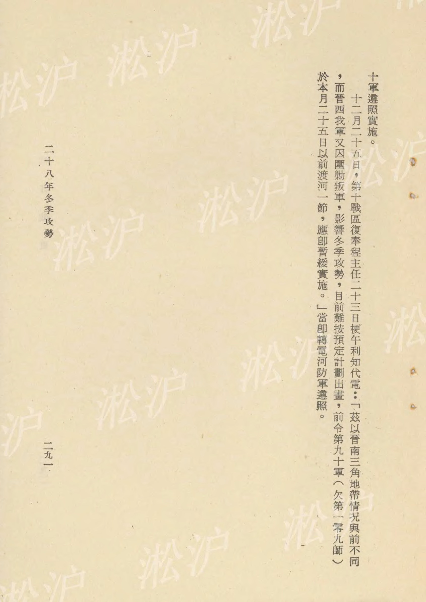

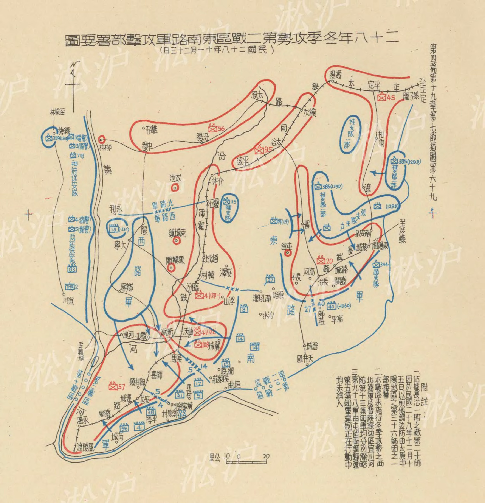

#### 第三款 作戰一般經過

民國二十八年十二月十日至二十九年元月三十一日

參照插圖第七十其一至其四第七十一插表第四十六至第四十八第二戰區於民國二十八年十一月二十二日奉軍事委員會十九日電（皓申令一元）令擔任主攻，截斷正太、同蒲二路，並肅清晉南三角地帶敵人，二十三日，將戰區部隊區分東、西、南、北路軍及河防守備部隊，準備於十二月十日開始攻擊。

先是，第二戰區爲鞏固抗日陣線，不拘黨派，均予以任用，中國共產黨員張文昂任山西第六區行政專員，韓鈞爲獨立第二旅政治主任，詎料該叛逆等爲擴展實力，阻撓抗戰，勾結敵人，擾亂後方，乃於十一月二十九日唆使獨立第二旅、第一、第九游擊縱隊及保安第十、第一兩團等部，約萬餘人叛變，盤據隰縣一帶，屢次襲擾第十九、第三十三、第六十一軍及暫編第一旅等部。

因之，第二戰區令北路軍固守離石、方山、臨晉一帶，西路軍指揮所部痛勦叛軍，第十戰區原以一部渡河策應作戰之任務，亦奉令暫緩，致該戰區冬季攻勢，僅有東、南兩路軍遵令實施。

##### 第一項 南路軍作戰經過

民國二十八年十二月十日至二十九年元月三十一日

參照插圖第七十其一至其四

第二戰區副長官衛立煌爲指揮晉南部隊作戰，於十一月中旬調整部署，將第四十七軍東調晉城、陵川以南，接替第四十軍之防務，所遺夏縣以東防務，由監圍屯留之第九十八軍接替，並歸還第五集團軍建制。迨十一月下旬，接奉第二戰區冬季攻勢命令，南路軍總司令衛立煌指揮所部，以一部對封門口、天井關（晉城南）確實封鎖，另以一部破壞介休、臨汾間同蒲路，阻敵之交通，主力向浮山、翼城、橫水嶺、夏縣、平陸、芮城，對同蒲路攻擊，重點置於翼城東側地區，擊破當面敵人，確實佔領曲沃、侯馬，阻敵援軍，再沿同蒲路向安邑進出，肅清三角地帶敵人。遂於十二日一日下達電（冬戍天）令，要旨如左：

一、第四十、第二十七軍仍歸朱德副長官指揮，監團長治之敵。第二十七軍應以有力一部推進於府城以西，洪屯公路兩側地區，阻敵東進，並破壞洪洞、霍縣間敵之交通，掩護第十四集團軍之右側背。

二、第十四集團軍應置重點於翼城南北地區，先肅清浮山、翼城各據點以東之敵，相機向塔兒山進出，切斷同蒲路交通，阻止浮山、臨汾敵之南擾，以一部監團絳縣，爾後連繫西路軍，依情況以主力向曲沃、侯馬以北及汾河南岸進出，夾擊曲沃、侯馬之敵。

三、第五集團軍（附第十七軍）以有力一部攻擊當面之敵，主力監圍聞喜、伺機襲擊佔領之，切斷同蒲路交通，截擊竄擾之敵，爾後依汾河右岸友軍之進展，再向同蒲路以西進出，協力友軍南進部隊，夾擊三角地帶之敵。

四、第四集團軍以一部牽制當面之敵，主力應依戰況之進展，向安邑、運城方面鐵路線進出，協力第五集團軍掃蕩三角地帶之敵。

五、游擊隊黎明部已另令卽調沁源以西，向同蒲路進出，破壞靈石、霍縣間交通，截斷南下之敵，協力第二十七軍作戰。

六、作戰地境（線上均屬右）：

第二十七軍與第十四集團軍間，爲南孔灘——曹家嶺——馬石圪塔——史壁——敬聖村——韓村三汾北之線。

第十四集團軍與第五集團軍間，爲侯家莊—余家溝—劉張村—接拜梁—蘇白梁—馬留孟—周家莊—王家山—侯馬之線。

第五集團軍與第四集團軍間，爲黃家窯門—南袁頭嶺—花凸村—堡二村—裴介鎮—陶村鎮之線。

七、各部隊均須於十二月九日到達準備位置，十日拂曉開始攻擊。

命令甫經下達，第九十八軍尚未到集中地區，敵已乘隙以第三十七師團及第一零八師團兩個聯隊，於十二月三日開始向我第五集團軍進攻（參照插圖第七十三），經第十二師逐次抵抗，敵先後侵至上橫榆、青山村、馬家廟、貓兒圪塔之線。迨六日以後，敵攻勢漸挫，我乃乘機由兩翼轉移攻勢，以第四十二師主力經上橫榆、馬家廟大道以北地區，向石版河、馬家廟之線攻擊，第七師主力向楊家村、生成嶺之線攻擊，十日，敵以一部藉青山村、馬家廟等地頑強抵抗，掩護主力向聞喜、夏縣撤退，十一日將殘敵肅清，第五集團軍進佔井記溝、唐王山、次兒山之線與敵對峙。十六日，該集團軍爲協力友軍攻擊三角地帶敵人，下達攻勢轉移命令，以一部固守現陣地，主力向聞喜及其南北沿線之敵攻擊，相機攻佔聞喜，並破壞其南北交通，截敵竄擾，爾後依汾河右岸之進展，再向鐵路以西進出，協力南下友軍圍殲三角地帶之敵，乃將部隊區分爲右翼、中央、左翼、預備四個兵團，主力置於中央兵團，並令於二十一日開始攻擊。

第十四集團軍於十二月十日開始攻擊（參照插圖第七十其一），第九十三軍先後進攻西屋嶺、殿兒垣、西白駒及側擊隆化鎮，第十四軍攻擊水坪，第十五軍進攻新村、東荊村、塔子山、古堆嶺等地，迄十六日，敵增援後，向第十師安家原、西白駒、南吳村一帶，及第十五軍安峪、官莊一帶分別進攻，第十師被迫撤至北石板口、東鄔嶺之線，致第八十五師右翼神廟陣地突出，遭敵猛犯，乃轉移大青嶺北端一六二六高地、店上村亘鐵沟以北之線，右與第八十三師官地沟之團相連接，與敵激戰，十四時，董封、永樂之敵步騎千五萬餘，藉砲空掩護，向我第十五軍馮村、安峪、孫王之縣猛犯，經反復肉搏，第六十五師傷亡過重，乃撤至下柏寨、史家莊之線，二十時，我以一部向官莊出擊，敵遂撤退。

十二月十七日，第十四集團軍爲誘殲浮山、翼城東攻之敵，並確保據點，俾以後有利作戰之目的，乃調整部署如左：

一、第九十三軍以一部固守譚村、衛莊、東鄔嶺一帶各據點，加強工事，極力阻擊東進沁水之敵，主力集結於青龍沟、王寨、杏峪一帶地區待機。

二、第十四軍以有力一部佔領馬頭山亘杏後沟、上峪村之線，並確保之，另派一小部位置於十畝村，對該村東西隘路擇構據點工事，掩護兜墚村根據地，主力集結上下沃泉附近待機。

三、第十五軍除以第六十四師固守現陣地，加強據點工事，監圍絳縣外，第六十五師應密接第六十四師右翼，佔領華山廟、丁家凹東南高地及回馬嶺以東高地之線，構工固守。

四、作戰地境（線上屬右）：

第九十三軍與第十四軍間，爲柏附村—李家沟—西沟—灣里—武子官莊—西上街之線。

第十四軍與第十五軍間，爲口河莊—上川村—鐵沟—續魯峪—河湟村之線。

各部奉令後，卽到達指定位置，惟第十四軍當面翼沁公路南側之敵，會同東佛村、水坪敵八百餘，於二時攻佔風神廟、店上村，致第八十五師於十二時始到達指定之線。時第八十三軍主力亦集結於上、下沃泉，準備出擊，敵則乘勢侵佔杏後沟以西高地，經第八十五師逆襲，敵退據高地以北對峙。第十師一部於是日向瞿家橋攻擊，十二時敵退，當續攻隆化鎮、大青嶺，該敵於十八日午後分向翼城方向退去。第十五軍當面之敵，經我攻擊後，於十八日零時後分向郇王、范必回竄，二時，第六十五師攻克官莊東部與敵對峙。

十二月十九日，第九十三軍派隊至臨汾以南五公里許鐵路埋設炸藥，炸燬敵南行機車一輛，斃敵二十餘名，第十四軍於當日晚將四望村、中石門敵擊退，於二十日推進至上沃泉、白花嶺亘核桃園之線，第十五軍第六十四師一部於是（十九）日晨攻襲圪岔山、古堆嶺，另以一部襲擊城沟裏，斃敵三十餘名後卽行撤回。二十日，第六十五師一部進襲官莊，敵退郇王，向官莊砲擊，我撤至官莊以東活動。

第四集團軍於十二月九日到達攻擊準備位置（參照插圖第七十其四）十月開始攻擊，先後進攻張村，襲擊張郭店、二十里嶺、風圪塔，敵均據工事頑抗，未能奏功。獨立第四十六旅、第七十師攻擊張店鎮及從善村等據點，爲敵碉火力所阻，進展困難，遂撤出監圍。迨十五日，敵增援後，向第十七師史家村、王峪口、軍家嶺一帶進攻，經該師在坡腦上、白頭村及井兒沟、軍家嶺與辛梨園、槐樹坪等三線屢挫頑敵，並斃重松聯隊之喜勝中隊長及傷野田大尉等數百人，終以火力旺盛，我退至觀音殿、楊家嶺、呂家窳之線，旋於十七日夜襲，先後進至坡腦上、白頭村、石牛嶺、軍家嶺、韓蘇村之線，敵退至史家、中南吳村、王峪口一帶構築工事。獨立第四十六旅一部進至啣牛坪，截擊運城來犯之敵，斃敵七八名，燬汽車一輛。十八日，第一七七師第一零五九團分別襲擊席張村、董封、清華鎮之敵，並將清華鎮僞維持會焚燬，嗣虞鄉援敵到達，我遂撤回。

十二月二十一日迄二十九年二月二日戰鬥經過如次：

第十四集團軍經連日來之戰鬥，將沿翼沁公路東進之敵二千餘，阻止於隆化鎮、武子官莊、翹翔山一帶，但爲誘其脫離據點分進圍殲之目的，擬在隆化鎮以南張馬以北間地區一舉殲滅之，乃於二十一日下達電令，部署如次（參照插圖第七十其二）：

一、第九十三軍以一部推進至西范村附近佔領陣地，以掩護軍之右側背，並派一部擾浮山、翼城交通，另以一部向隆化鎮以南各據點施行助攻，極力牽制該方面敵之行動，主力先集結於東鄔嶺、任家沟一帶地區，保持重點於公路以南，連繫第十四軍主力，尋敵側背而圍殲之。

二、第十四軍以一部於風神廟、小廟上、北陽坡之線，向四望村、水坪等處攻擊，誘敵脫離據點，另預伏有力一部於店上村、大羅圪塔之線，抑留來敵，主力集結於賈家崖、上沃泉附近，協同第九十三

軍殲滅該敵。

三、第十五軍除以第六十四師主力固守現陣地，並派一部向當面之敵不斷佯攻外，第六十五師主力應先驅逐陳家坡、富生嶺一帶之敵，相機掃蕩續魯峪西南各山口，按戰況之推移，以一部進出南樊嶺南北地區，破壞敵之交通，誘擊敵援。

四、作戰地境仍舊。

五、各軍開始攻擊時期，第十五軍於二十二日拂曉，第十四軍於二十三日拂曉，第九十三軍於二十四日拂曉。

各軍遵令處置，第六十五師將犯屯坪裏之敵擊退後，並攻佔馮村、安峪、孫王、郇王等處各據點。

十二月二十四日，第一戰區游擊第六縱隊由洛陽抵達翼城東南之張馬村（十一月二十四日副長官衛立煌以敬辰文廳二電令該游擊縱隊歸第十四集團軍指揮），第十四集團軍當令配屬第十四軍。

是日十六時，風神廟之敵，由上下甘泉增援七八百，分犯我坡頭山及一六八七高地，第八十五師守軍傷亡過重，坡頭上遂陷敵手，二十五日，敵迭次犯一六八七高地，均被擊退，我乘勢由店上村出擊，十六時將玉石眼、坡頭上先後克復。

十二月二十六日，第九十三軍一部於浮山以西七里坡附近擊燬敵汽車一輛，第十五軍當面史村、新村敵砲向我轟擊，爲避免犧牲，第六十五師撤至河王、官莊。

十二月二十七日晨及三十日十二時，敵增援犯我南馬村陣地，均被游擊第六縱隊擊退。

二十九年元月四日五時，第十師一部佔領大河口，七時，敵由翼城增援三百餘反攻，十二時，我後續部隊到達合擊該敵，敵不支，大部回竄翼城，一部竄殿兒垣。十二日二時，第一六六師之一團襲擊浮山，其東北兩門守軍三四十名被殲滅，遂衝入城內，巷戰至晚，進展困難，乃撤回。十三日以後，敵我互以小部隊襲擊，均無進展。惟二十七日及三十日晚，第六十五師一部與第九十三軍派隊先後將曲沃、翼城公路及臨汾以南周家莊鐵路等交通破壞。

第五集團軍（參照插圖第七十其三）自十二月十六日整頓態勢後，於二十一日，以第十七軍一部攻克石羊山，敵由橫嶺關增援反攻，得而復失。第四十二師一部驅逐走馬嶺之敵，向臥馬灘前進，第一六九師一部將王家坪以北至北晉村以東之敵肅清。二十二日，第四十二師奇襲祁家莊，第一六九師向子兒山、大鳥、中底坡之敵攻擊，一度佔領，於二十三日再攻中底坡，受偃掌鎮、大鳥之敵威脅，乃行撤回。二十四日，爲疲困各據點之敵，截擊其增援，乘機一舉掃蕩各山口敵人之目的，乃以敬申金電令部署如左：

一、第十七軍右翼部署仍舊，左翼着以一部監視余家山、鎮風塔之敵，並以游擊隊向該兩地積極活動，破壞交通，其主力控置於上、下陰里附近備截敵援。

二、第九十八軍應固守土梁（不含）、井記沟、唐王山、毛峪、一五二七高地、七峪、一五二六高地、生成嶺、祁家坪及北閻家、馬沟、王家坪之線陣地。第四十二師重點保持於井記沟、毛峪附近，第一六九師重點保持於孟家村、生成嶺附近，另以一部監視當面之敵，並以多數游擊隊向各據點之敵後方積極襲擾，截擊其交通。第一六九師並以有力之支隊向聞喜北沿鐵路線活動，破壞其交通，主力卽取待機態勢，準備截擊敵援，但原配屬第三軍之鐵道破壞隊，着改歸該軍直接指揮。

三、第三軍第七師部署仍舊，但應以有力一部，不分境界向尉郭鎮、胡張鎮以南、以北之敵積極襲擾，破壞交通，並截擊敵之增援，第十二師仍控置於東西交口一帶待命。

四、各部隊應與當面之敵保持接觸，並以小部不斷襲擾，以疲困敵人，乘機奪取敵據點，尤須由間隙深入敵後方，襲擊破壞及偵察敵情。

五、各部隊統限二十五日拂曉部署完畢，開始行動。

上令甫經下達，據報竄集絳縣東北之敵，大部於二十二日經曲沃、侯馬向汾河西竄，似有防範我晉西友軍東進企圖，軍擬乘敵後方空虛，積極破壞同蒲南段交通，策應友軍作戰，並以乘機襲佔山口敵據點之目的，復以迴酉電令調整部署如左：

一、第九十八軍以兩團（附鐵道破壞隊）、第七師一部（附爆破隊）爲出擊部隊，統歸第一六九師師長郭景唐指揮，應各以一部圍攻尉郭、偃掌之敵，掩護出擊左翼之側背，主力分兩縱隊在北晉村、王坪、向宋店鎮、水頭鎮挺進，澈底破壞該處鐵路，殲滅小部之敵，並截擊敵之增援。

二、第九十八軍、第四十二師同時以游擊隊由間隙分向老太廟、裴社村附近之敵襲擊，牽制該方面之敵。

三、其餘部隊仍遵照敬申金電部署，各以小部向當面之敵襲擊，主力不失時機截殲敵援，奪取敵據點佔領之。

四、出擊部隊應詳察敵情，選定破壞地點（如橋樑涵洞），以果敢迅速之手段實施之，對側翼須特別注意警戒，並規定連絡記號。

五、第七師、第一六九師固守原陣地之部隊，須能確保南晉村、方山廟之進出路。

六、出擊部隊限於二十七日十九時開始行動具報。

各部奉令後，先後遵照實施。

十二月二十五日至二十八日間，我迭次向石羊山、十八畝坪、婆婆嶺、祁家莊、子兒山、中底坡、大鳥等據點攻擊，敵依工事頑抗，均未奏功。第一六九師郭師長率領之出擊部隊，自二十八日起至三十一日止，屢襲尉郭之敵，並破壞婁底村附近公路及常村、水頭鎮間，與宋店鎮、郭店鎮間鐵路數段，敵則由聞喜、安邑、運城、夏縣等處，增至偃掌鎮、尉郭一帶三千餘、重砲三四門、山野砲十餘門、戰車十餘輛，於三十日八時，乘機向我進攻，激戰至三十一日晚，第一六九師被迫撤至東王家、碰圪塔、寬坪，第七師撤至王家坪、方山廟、傅家斜之線。

民國二十九年元月三日，敵復增援，於四日拂曉向第一六九師及第七師陣地進犯，終以陣地盡燬，傷亡重大，該兩師轉進於柴家坪、南閻家、寬坪、杏樹嶺之線與敵對峙。五日，以歌未金電令，出擊部隊已告一段落，各隊歸還建制，及現有作戰地境。六日，各部遵照實施。九日，第一六九師一部攻佔碰圪塔、寬坪，敵向小王村方向撤去，十三日以後，我以小部隊向敵不斷襲擊，均無進展。

第四集團軍（參照插圖第七十其四）於十二月二十一日，以第十七師夜襲，一度佔領西窯及中南吳村，二十三日，復以第十七師及獨立第四十七旅分別向關廟前、侯王攻擊，敵據堅頑抗，未得進展，乃行撤回。二十九日，獨立第四十六旅一部兩度攻入張店鎮，新編第三十五師第三營攻進張村，均因敵援反攻撤回。獨立第四十七旅一部破壞卸牛坪附近公路數里，三十日二時，第十七師攻佔史家村後，續行進擊，四時三十分，敵由安邑增援約一大隊，在砲火及毒氣掩護下向我反攻，嗣以黎明，進展困難，乃撤至井兒沟、上下陳莊、軍家嶺之線。

二十九年元月六日，敵由張店鎮、礳河村、從善村、三路向我獨立第四十七旅風口村一帶陣地進攻，我撤至紅凸村一帶抵抗，敵在砲火掩護下向我數次猛攻，均不得逞，乃向山北退去。

二月二日，南路軍總司令衛立煌下達冬亥電令要旨如左：

一、冬季攻勢迄元月三十一日止卽行結束。

二、各部應以一部襲破敵後方交通，摧毀各山口封鎖我之據點，主力控置後方機動地區，積極整補，以利爾後之作戰。

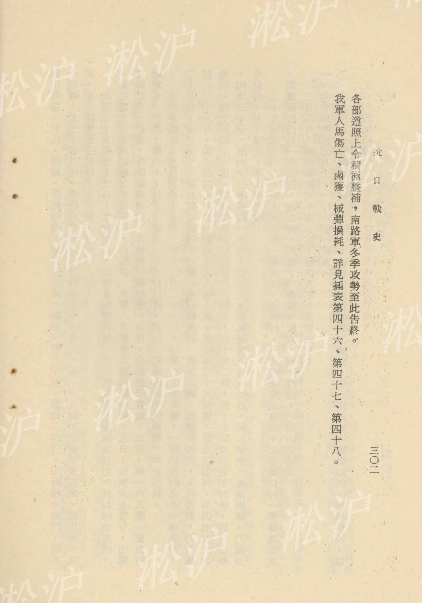

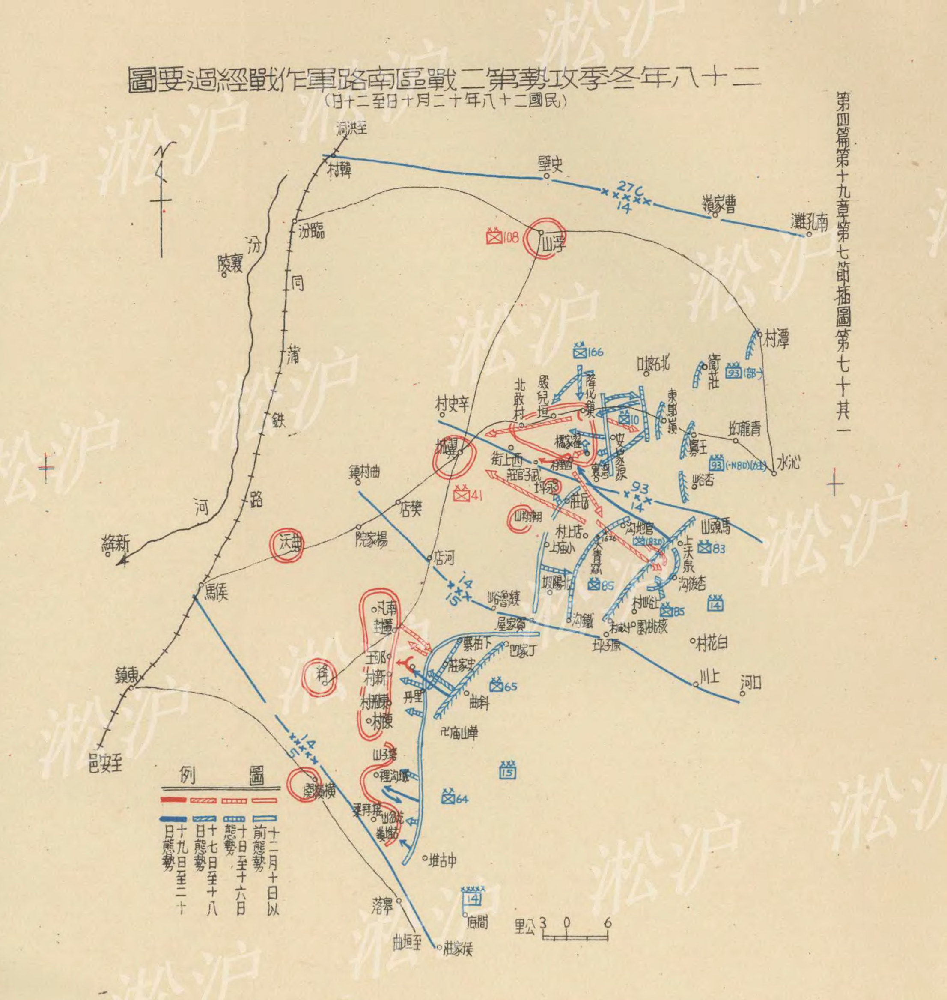

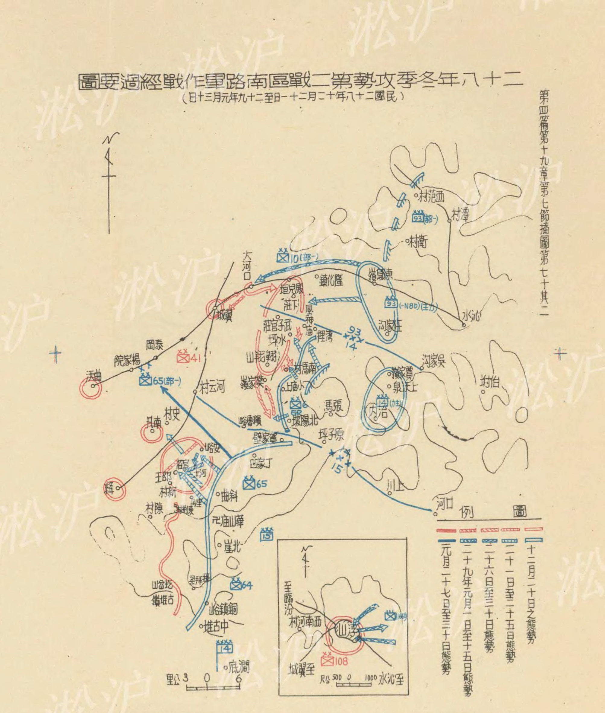

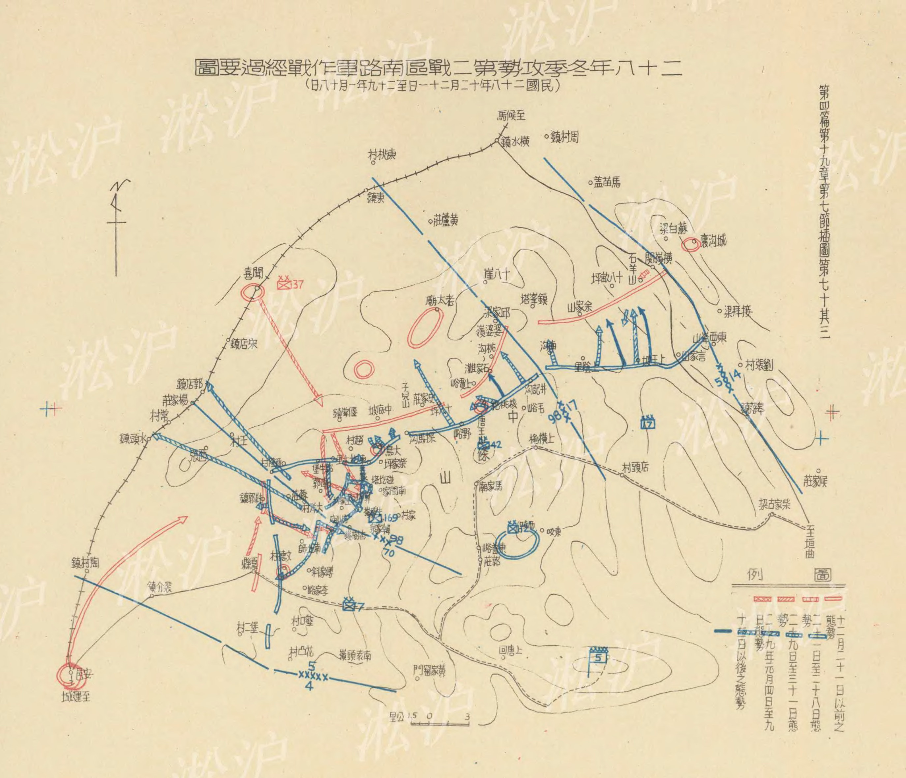

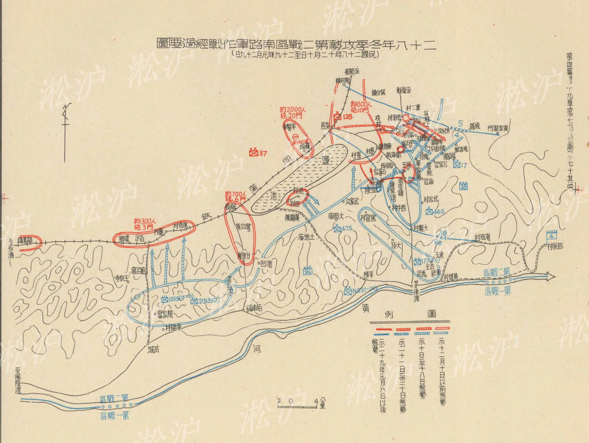

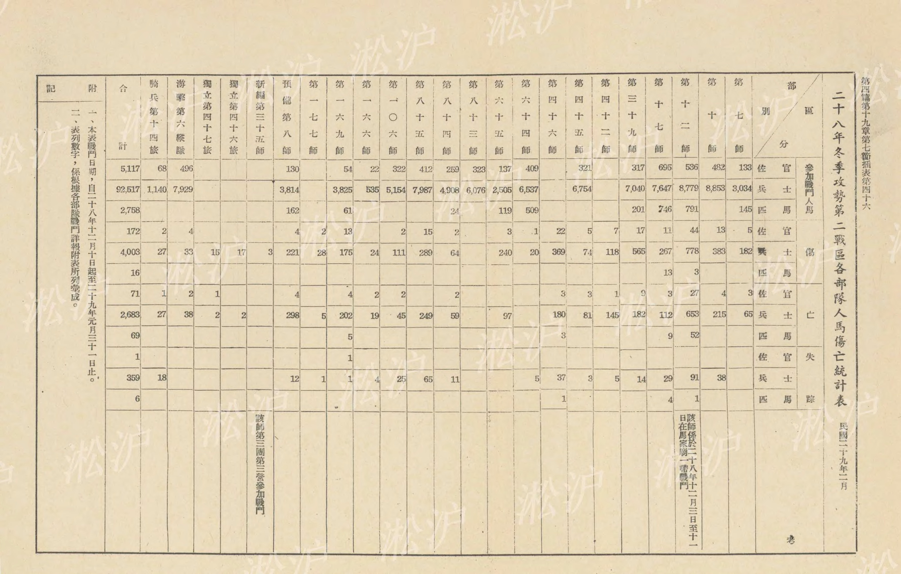

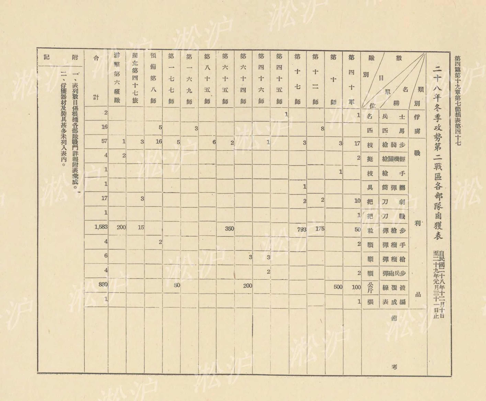

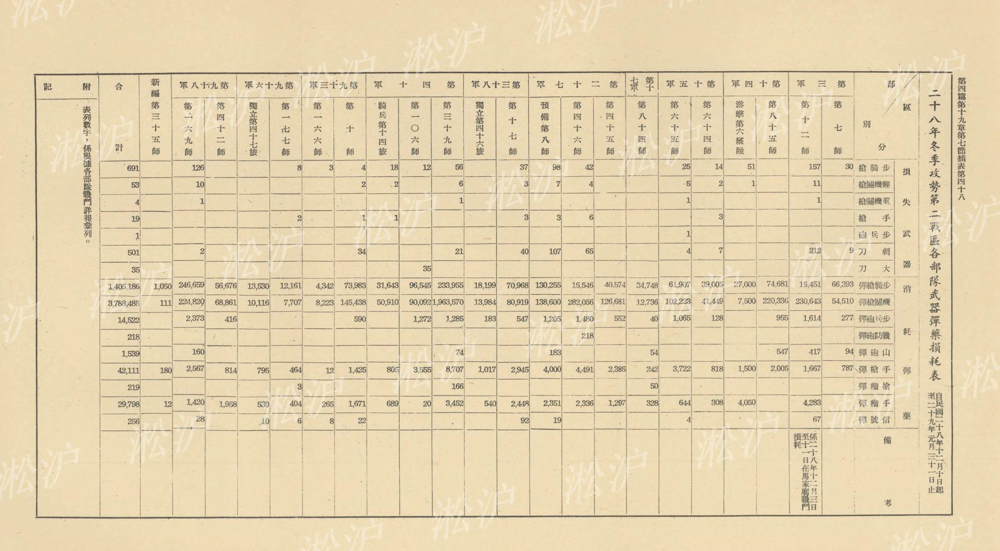

##### 第二項 東路軍作戰經過

民國二十八年十二月十日至二十九年元月廿八日

參照插圖第七十一

第十八集團軍總司令朱德於十一月下旬接奉第二戰區冬季攻勢命令：「東路軍總司令朱德指揮所部，以主力截斷東陽關、娘子關，阻絕增援之敵，並阻絕正太、白晉及同蒲路之介休至太原間之交通，一部圍困長治一帶之敵，阻其竄擾。於十二月三日電令第十八集團軍指示部署，以擴展地區、壯大部隊（參照本節附錄第二）復於六日下達魚酉電令，其要旨如次：

一、軍爲相機攻略長治，並策應晉南三角地帶作戰之目的。

二、第一二九師第三八六旅全部、第三四四旅一個團及特務團主力，東西夾擊白晉公路北段，置重點於虜亭、南關間，確實切斷之。

三、第一二九師四個團及第三四四旅兩個團，南北夾擊長武路，置重點於黎城、涉縣間，而確實切斷之。四、第二十七軍除以有力一部推進至府城以西、洪屯公路兩側地區，阻截敵之東援，破壞洪洞、霍縣間敵之交通，並以一部監視屯留之敵外，應以主力配置於長子以西地區，積極向長子以西、以南各據點圍擊該敵，並截斷長治、長子公路，首先相機攻佔長子，然後向屯留、長子附近進出。

五、第四十軍應以主力位置於壺關以南之適當地區，積極進擊壺關及其以南、以西各據點之敵，相機規復壺關後，向長治推進，並防敵南竄。

六、第四十軍與第二十七軍作戰地境，爲高都、三甲鎮、師莊、北呈、高河鎮亘史村之線，線上屬右。七、作戰要旨：

(一)避免攻堅，力求打擊運動之敵。

(二)組織多數精幹游擊隊，勇敢深入敵後方，積極襲擾各據點之敵，截斷敵之後方連絡，以配合主力作戰。

八、十二月十日開始攻擊。

第四十軍奉令後，於十二月十日開始攻擊，十一日，敵分路向馬駒村、上內村、四家池進攻，十二時被我擊退，十二日，我一部襲入修善村後，卽行撤回。十三日，該軍調整部署後，進至馬駒村以西宋堡村亘經坊之線，騎兵以有力一部推進於申家莊西北，攻擊壺關、長治外圍之敵，於十四日五時突入賈掌村，敵退該村西北高地頑抗，我因受敵砲火瞰制，十時撤至南羊湖、南北宋、南北仙泉一帶，同時壺關敵分路反擊，在川底村一帶激戰，至十二時被我擊退。據報黎城、長治、長子、沁縣一帶敵第二十師團東調，遺防由太原、汾陽一帶之第三十六師團舞傳男部接替。十五日至十九日，屢攻壺關、修善村、秦莊、賈掌村、蘇店鎮等敵據點，除於十七日一度突入秦莊外，餘均未奏功。敵不時向上內村，川底一帶擾襲，亦被擊退。

第二十七軍爲攻擊長子、東西李高之敵，於十二月十九日下達皓酉參申電令，其部署如左：

一、軍決於二十一日三時開始攻擊長子及東西李高之敵。

二、第四十六師攻長子西南兩面，並截斷長治、長子公路，防敵西援。

三、第四十五師攻擊東西李高之敵。

四、預備第八師（欠一團）攻擊長子東北兩面，並截斷長治、長子公路，防止東西李高之敵南竄。十二月二十日，第四十軍奉衛副長官電告第二十七軍攻擊長子之敵部署後，卽令第三十九師及騎兵第十四旅排除萬難，努力向任務邁進，以策應第二十七軍之作戰，並令第一零六師於附城鎮向北推進。十二月二十一日，第四十軍第一線部隊推進至常平村、元村、經坊以南之線，第一零六師主力於十二時後推進至禮義村以南平川村附近，同時敵攻四家池被擊退。

同日四時，第二十七軍第四十六師一部攻佔大李、南鮑後，續攻南劉，據鮑莊、南劉之敵，向我夾擊，我轉守濁漳河右岸與敵對峙。另部八時將孟家莊、後官道之敵擊退，直迫長子西門，十六時，長治敵八百餘西進，與我激戰於東西旺村，至晚，敵退回高河鎮。預備第八師以一部於四時進至長子城郊，阻止敵之北援，十五時，以一團向鮑店鎮攻擊，迄晚攻入南街。第四十五師第一三五團於拂曉前向東李高、西李高攻擊，五時攻抵東李高村緣，另兩部佯攻該村東北及西南，乘敵混亂突入，斃敵三十餘，我中尉排長劉春華、少尉排長馬清泉陣亡，十二時，我佔領該村北半部，敵退據天主堂高屋頑抗，是時西李高燃燒，敵不支退守東李高，十七時被我佔領。同時一部協力預備第八師向鮑店鎮攻擊，及攻佔該鎮西口之玉皇閣，敵據險頑抗，屢攻均爲敵火所阻。

十二月二十二日二時，壺關敵攻馬駒村，被第四十軍在常平村等處伏兵擊退，同時以一部襲擊秦莊，敵堅守不出，當卽破壞敵通信。

是日五時，第二十七軍第四十六師進攻河頭村，十四時，敵向我小河村、許莊攻擊，被我大堡頭控置部隊側擊，敵退河頭村對峙。預備第八師以一團進攻鮑店鎮東南部，第四十五師以一營於拂曉攻其西北部，十三時西北部被我佔領，負隅頑抗東李高之敵，雖被殲大半，因敵由長治增援，共載汽車三十餘輛，致未能攻佔。

十二月二十三日二時，第四十軍一部突入秦莊，敵據工事頑抗，戰至八時撤回。第二十七軍僅第四十六師向南呈、鮑莊、河頭村及長子西門各敵佯攻，以牽制其北援。是時，王公莊增來步騎聯合之敵千餘、砲十二門，虜亭、夏店之敵向屯留移動，姬村、路村之敵向第四十五師一部攻擊甚烈。第二十七軍爲圍攻長子、屯留，襲擾府城以西之敵，並保持爾後機動之目的，遂部署如左：

一、第四十六師以一部在布村、蘇村、團城村、陽魯村、岳陽村一帶地區，積極襲擾長子附近敵人，主力控置於仙翁廟、北沟、李家莊、新莊沟、上下楊莊間地區。

二、預備第八師以一團進出於府城以西、洪屯公路兩側地區，阻敵之東犯，並破壞及阻止洪洞、霍縣間敵之交通，掩護第十四集團軍右側，主力控置於刁黃村、橫水村一帶地區。

三、第四十五師以一部在傅莊村、東里村、廟兒嶺、積極襲擾鮑店鎮、屯留附近敵人，主力控置於豐儀鎮、黑家口、王村、金村間地區。

四、作戰地境：

第四十軍與第四十六師間，爲高都——三甲鎮——師莊——北呈鎮——高河鎮——史村之線，線上屬右。

第四十六師與第四十五師間，爲平泉——草坊鎮——高河鎮之線，線上屬左。

預備第八師與第十四集團軍間，爲南孔灘——曹家嶺——史壁——韓村之線，線上屬左。

五、各師應各在作戰區內派遣多數精幹游擊隊、謀報隊，積極遠出，施行偵察、襲擾、破壞諸活動。各師奉令後，卽遵照實施。

十二月二十四日，第四十軍爲肅清長治外圍各據點敵人之目的，乃調整部署，要旨如左：

一、右翼隊（第三十九師第一一七旅欠二三三團——欠一部——附砲兵一連）以主力攻擊壺關、秦莊，協力左翼隊之戰鬥，以一部進至李掌村、睢莊附近，攻擊東長井村、河口之敵，確保右側安全。

二、左翼隊（第三十九師第一一五旅附砲兵營——欠一連）以主力攻擊賈掌村、五龍莊、蘇店鎮之敵，以一部進至任家莊、上郝村附近，牽制攻襲高河鎮之敵。

三、騎兵第十四旅以一部向敵右側背活動，並與第二十七軍連絡。

四、各部於二十四日十九時開始行動，二十五日一時開始攻擊。

十二月二十五日一時，第四十軍開始攻擊，與壺關、秦莊敵千餘、砲六門及賈掌村、五龍莊、蘇店鎮敵二千餘、砲六七門激戰，至八時，曾衝入壺關東北關及五龍莊，嗣敵援增到，我卽撤回。同時長治敵五百餘、砲四門、增向賈掌村及蘇店鎮，十二時復增至壺關五百餘。

十二月二十六日，敵第三十六師團第二二三聯隊西田部藉飛機、戰車及毒氣掩護，全力進攻，第四十軍逐次撤至北嶺上、周村鎮、河頭之線抵抗，擊斃敵馬場進八大尉一名。

十二月二十七日晨，第四十軍奉到天水營二十五日有未利知電要旨：「黎城於二十二日被我克復，長治、涉縣交通確已折斷，上黨敵軍東援已絕，希嚴飭所屬積極行動，務期早殲該敵。」當轉所屬遵照，第三十九師及騎兵第十四旅之官兵振奮異常，全線出擊，敵不支，乃北撤，二十二時我進至三王頭、川底村、宋堡村之線繼續攻擊。

十二月三十日，第四十軍以先行規復壺關再攻長治之目的，乃下達部署命令，要旨如左：

一、第一零六師以兩個團推進至澤井村一帶及其西北地區，向壺關以北阻擊長治敵援，並攻擊壺關及大山南各據點之側背，對潞城方面注意警戒。

二、第三十九師以現態勢積極攻擊當面之敵，重點指向定流村，對長治、高河鎮間之大道應取佯動，制敵東援，並以有力一部由壺關以東山地攻擊壺關，以利第一零六師之行動。

三、騎兵第十四旅歸第三十九師指揮，以有力一部任左翼警戒，隨戰況之進展，向蘇店鎮以西地區活動，並準備截擊高河鎮敵援。

四、限二十九年元月三日以前準備完畢，候令開始攻擊。

敵於二十七日被擊北撤後，卽增往長子千餘，並由屯留增至鮑店鎮五百餘，迄十二月底止，長子敵兵達五千餘、砲三十餘門，鮑店鎮千餘。

民國二十九年元月一日至四日，第四十軍於一日以一部突入河口，佔領大山南，嗣因敵增援反攻撤回，三日，壺關敵向我進攻，我一部撤至劉寨、川底村、小山南之線抵抗，四日第一零六師第六三一、第六三三兩團進抵澤井村、東崇賢一帶。

第二十七軍當面長子、鮑店鎮之敵，於一日向我仙翁廟、陽魯村、定金山之線陣地進攻，激戰三晝夜，我右翼被迫逐次撤至岳莊、李家莊、刁黃村之線，三日，我調整部署後，由左翼轉移攻勢，敵感右翼被我包圍，乃於四日八時分向長子、蘇村、鮑店鎮撤退，我卽分路追擊，擊破敵掩護部隊後，迄晚進抵長子、鮑店鎮附近與敵對峙。

元月五日，第四十軍全線進至睢莊、修善村、秦莊、大山南、元村、坟上之線，攻擊當面之敵，除第一零六師第六三一團一部攻克東長井村，敵憑工事頑抗，且受敵火瞰制，遂撤回睢莊外，其餘各部均未奏效。敵以一部進至四家池一帶，被擊退。

元月六日，東路軍以魚午電下達部署要旨如左：

一、由長子向第二十七軍進攻之敵，有南竄高平模樣，現壺關、長治各有敵千餘，潞城一帶共有敵千餘。

二、我軍爲擴張戰果（時東陽關附近被我確實截斷），規復上黨之目的，卽調整部署如左：

(一)第二十七軍仍以現態勢側擊南進之敵，力求於野戰中予以消滅。

(二)第一二九師特務團及陳錫聯旅一部向微子鎮、潞城、黃碾鎮之敵進擊。

(三)第一二九師陳賡旅、第三十四旅一部及總部特務團主力以現態勢東西夾擊白晉公路之敵而截斷之。

四第一二九師以有力一部監圍屯留之敵。

(四)第四十軍以全力向長治猛攻，所遺圍攻壺關任務，由第三四四旅接替之。

三、作戰地境：

第三四四旅與第四十軍間，爲蔭城鎮——西故縣——壺口鎮——王村之線，線上屬左。

第四十軍與第二十七軍間，仍舊。

元月九日，第四十軍奉到東路軍六日電後，於二十二時下達命令，要旨如左：

一、第三十九師第一一五旅以現態勢（一部交防西移）先向各據點之敵猛擊，會同第一零六師進攻長治，第一一七旅俟交防後，暫位於蔭城鎮及其東南地區，爲該師預備隊，對右後方特別注意。

二、第一零六師以兩團延接第三十九師（現第一一五旅東蘭家嶺、苗村之線）左翼，以韓店鎮西北地區爲根據地，先向長治西南及高河鎮間各據點之敵猛攻，並會同第三十九師進攻長治，其餘置於南馬村、建寧鎮以西地區，爲軍預備隊。

三、騎兵第十四旅暫在原地（東河鎮南河唐、王廟、北樓底之線）對西警戒，並以一部隨第一零六師部隊推進西南呈附近，掩護該師左翼，另行破壞長治、長子公路，阻敵竄擾，爾後歸軍直接指揮。

四、作戰地境：

第三四四旅與第三十九師間，爲蔭城鎮——西故縣——壺口鎮——王村之線，線上屬左。

第三十九師與第一零六師間，爲趙村——韓店鎮——西申家莊——針障村——梁家莊之線，線上屬右。

第一零六師與第二十七軍間，爲三甲鎮——師莊——北呈鎮——高河鎮——史村之線，線上屬左。五、第一線部隊到達候令攻擊。

是日，第四十軍第三十九師第二三四團一部攻佔壺關東北關，十二時由北門攻入城內，巷戰時許，殲敵頗衆，第二三三團一部一度衝入秦莊巷戰。

元月十一日，謀悉，當面敵人，數日以來陸續增援，長治現增至萬餘，山重砲百餘門，有南進模樣。

元月十二日八時，敵四千餘藉飛機八架掩護，分向第四十軍三王頭、坎上、經坊進犯，十四時，我撤至周村鎮、南羊湖、韓川之線抵抗。十八時，我爲爭取主動，以一部在以上各地與敵保持接觸，主力轉進於流澤村、魏家灣、小池嶺、大峪、后坡、黃嶺、王坊、南王莊之線旣設陣地，騎兵仍在官道村、劉家山之線與敵對峙。

元月十三日八時，敵仍藉飛機八架掩護，分路向第四十軍猛攻，一路敵五千餘、砲二十餘門向流澤村亘小池嶺之線進攻，經第一一七旅奮勇阻擊，敵未得逞；一路敵二千餘由韓川進攻，經第一一五旅迎戰，敵亦未獲進展。另韓店鎮、張店鎮敵二千餘與騎兵第十四旅在官道村、李家嶺、北樓底間整日激戰，被迫南移於狗灣、南窖溝一帶地區。

是日，第四十軍爲爭取主動，佔據有利地形，擬誘敵深入予以殲滅之目的，乃於十二時下達命令，其要旨如左：

一、第一零六師佔領原莊村亘一五八零高地之線，俟敵攻擊頓挫時，協同第三十九師殲滅當面之敵，並應嚴防敵人向我右翼迂迴。

二、第三十九師（附騎兵第十四旅）佔領右接第一零六師左至陳偃村之線，應連繫第一零六師，務期於蔭城鎮以南地區殲滅當面之敵，並對左翼嚴密警戒，阻止南進之敵。

三、兩師作戰地境，爲平居寨——河北冶——一五八零高地——南山村之線，線上屬左。

四、轉移時機另令飭遵。

元月十四日，第四十軍將進攻百尺村、太義鎮之敵阻止後，於十二時令各部轉移至原莊村、一五八零高地、西火鎮以南亘陳偃村之線，敵乘勢續攻，至十五日九時，一五八零高地被敵攻佔，我第一一七旅退據郭家溝以北亘庫頭之線抵抗。

元月十六日二時，壺關、長治南攻之敵，攻擊頓挫，我乃乘機全線反攻，六時擊退一五八零高地及池下之敵，十六時全線進至一五四二高地、峯北底、南宋村之線。二十時，第四十軍爲利於作戰及實行任務計，當電呈東路軍，其概要如左：

一、南進之敵，已於本（十六）日九時被我吸引至蔭城鎮以南地區，現壺關、長治空虛，請飭乘機襲擊，俾易奏效。

二、當面之敵已被擊退，我正向北推進，請照魚午電所示派隊接防，俾得轉用兵力，實施攻擊長子之任務。

同時，令第三十九、第一零六兩師各以有力一部，於十七日六時開始向小池嶺、大峪、李坊之線推進，騎兵第十四旅歸軍直接指揮，警戒軍之左翼，亦以有力一部，於十七日六時向官道村、雀家山之線推進，並向以北地區搜索。

元月十七日，第一零六師一部繼續北進，抵達周村鎮、小池嶺一帶。

元月二十日一時，敵千餘向第四十軍反攻，十時韓王山一帶之敵向左翼迂迴，經騎兵第十四旅及第一零六師一部截擊，戰至十二時，敵後續二千餘向師莊東南進擾，當調第一零六師餘部增援，十八時，敵千餘復由蔭城鎮經西火鎮向我右翼包圍，我以腹背受敵，極感勢危。第四十軍爲集結主力於有利地區，相機打擊敵人之目的，當卽下達命令，要旨如左：

一、第三十九師向一四三二高地、大拱地、梁全村、蔴家掌、龍馬圪塔南側之線轉移。

二、第一零六師向吉家圪跟南側高地，郝莊村、一二三五及一二六八高地、西詩村之線轉移。

三、兩師作戰地境，爲附城鎮、南馬村、龍馬圪塔、椅掌、一五九四高地、蔭城鎮之線，線上屬右。

四、第三十九、第一零六兩師各以一團兵力，在陣地前方游擊並與敵保持接觸。

五、騎兵第十四旅以龍泉村、寵嶽山爲根據地，警戒軍之左翼，並向米山鎮一帶游擊。

六、第三十九師限本（二十）日二十二時，第一零六師、騎兵第十四旅限二十四時開始行動。

第四十軍謀悉，高平敵千五六百名，砲十餘門，於元月二十二日二時經米山鎮向東北撤去，二十三日八時，浩村一帶之敵二千餘及留置蔭城鎮、八義鎮間之步騎砲敵二千餘，均陸續北撤，該軍乃進至周村鎮、黃山村、蔭城鎮一帶，敵仍續向壺關、長治撤退，迄二十八止，壺關、長治敵均退據城關及其附近秦莊、賈掌村、蘇店鎮各據點，我則進至黃家川、黃山村、南宋、北宋、韓店一帶，騎兵進至官道村、八義鎮之線，除東崇賢、西崇賢尙被敵侵據外，餘均恢復原態勢。

第十八集團軍第一二九師圖保存實力，壯大自己，於十二月八日至二十五日間無積極行動。但第四十軍於十六日十八時電呈東路軍，請派隊接替圍攻壺關任務，迄冬季攻勢終了，東路軍尚未復示，致圍攻壺關任務，仍由第四十軍擔任。

我軍人馬傷亡、鹵獲、械彈損耗。（參照插表第四十六第四十七、第四十八）

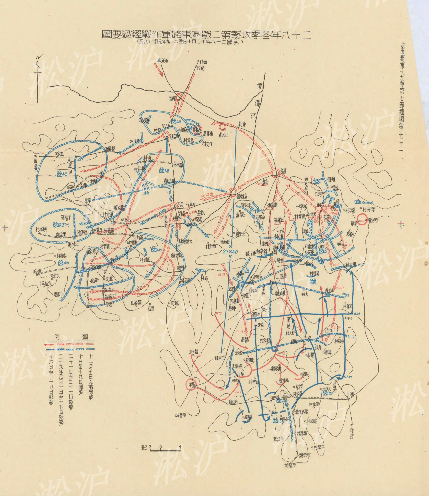

#### 第四款重要戰鬥

##### 第一項 馬家廟附近戰鬥

民國二十八年十二月三日至十二日

參照插圖第七十二第七十三

敵進攻中條山以來，均被我軍擊退。民國二十八年十一月九日，敵第三十七師師團長平田健吉進踞聞喜以東之店頭堡，指揮第三十七師團及第一零八師團之兩個聯隊，乘我第三十六集團軍第四十七軍東調，第五集團軍防務空虛之際，於十二月三日，由偃掌鎮、尉郭鎮一帶大舉進攻，經九晝夜之激戰，頑敵終被我擊退，

第一目

馬家廟附近地形

馬家廟位於夏縣境內，其附近一帶高地，爲中條山之主峯，面臨同蒲，背襟黃河，雖處於羣山中，有小徑東可接絳、垣路上之馬家窯，南通平陸，西至夏縣，北接聞、絳路上橫水鎮，交通稱便，惟不利機械化部隊之通行，但據守該地，進則可以攻擊敵人，阻絕交通，守則可以增強防務，屏障豫西，實戰略上必爭之要點也。

第二目

戰鬥經過

當面之敵，老太廟、店頭堡一帶約有六七百、山砲五六門、重砲二門，大澤、如意上晁一帶約步騎兵八九百、山砲四五門、重砲四門、戰車五輛，偃掌鎮、崔家河一帶約步兵八百餘、砲四五門，十一月九日，敵第三十七師師團長平田健吉進至店頭堡、老太廟一帶偵察後，卽陸續增兵，迄十二月二日集結於店頭堡附近者，已達六千餘人、砲三十餘門。

第二戰區副長官衛立煌爲便於爾後作戰，於十一月中旬下達巧戍天電令，要旨如左：

一、第九十八軍卽行南移，歸還第五集團軍建制。

二、第五集團軍（附第十七軍）應卽暫延接第四十七軍所遺夏縣以東防務。

三、第三十六集團軍（欠第十七軍）卽移晉城、陵川以南，接第四十軍第一零六師防務。

四、作戰地境：

第十四集團軍與第五集團軍間，仍舊。

第五集團軍與第四集團軍間，爲黃家窯門、北袁頭嶺、花凸村、堡二村、裴介鎮、陶村鎮之線，線上屬右。

第五集團軍奉令後，於十一月十九日下達皓申金電調整部署，其要旨如左：

一、第十七軍左翼卽延伸至後原頭（含）之線，接第十二師防務。

二、第十二師延伸至南大里（含）接第七師防務，重點置於十八坪附近。

三、第七師延接夏縣以東至花凸村（含）以北第四十七軍防務。

四、作戰地境：

第十七軍與第三軍第十二師間，爲店頭村、毛峪、后原頭、上下天橋、寺底、東鎮之線，線上屬右。第十二師與第七師間，爲東晉峪、孟家村、北閻家、南大里、小里村、宋店鎮之線，線上屬右。

五、各部限於二十二日時交接、部署完畢具報。

第十二師基於上令，於十一月二十一日十二時下達調整部署命令，要旨如左（參照插圖第七十二）

一、第三十六團將后原頭及其以右地區交於第十七軍後，卽以一營接白凡底、大峪沟（含）之線，其餘部隊仍控置於白家灘、核桃把一帶，爲師機動部隊，主要任務爲鞏固臥馬台附近陣地，及保持白家灘通河底之道路，右翼之安全須特別注意。

二、第三十四團將大峪沟及其以右地區交於第三十六團後，卽佔領大峪沟（不含）、井子沟、裴社村、保安村、孫家莊（含）之線，第一線兵力最多用六個連，主力控制置於十八坪、史家莊一帶，其主要任務爲鞏固裴社村據點，並保持師之補給路線。

三、第三十五團着於明（三十二）日接替第七師孫家莊（不含）、廟竄、中底坡、南大里（含）之線，主力控制於探馬沟附近。

四、戰鬥地境：

第三十六團與第三十四團間，爲喬家沟、唐王山、核桃把、臥馬台、大峪沟、楊社村、店頭堡之線，線上屬右。

第三十四團與第三十五團間，爲野峪、十八坪、史家莊、鐵牛峪、孫家莊、里仁王、如意上晁之線，線上屬右。

五、各部限於本（十一）月二十二日薄暮前交接、部署完畢具報。

十二月三日拂曉，敵向我全線猛攻，尤以第十七軍與第十二師接合部爲烈。八時，第十七軍當面之敵，進佔秋谷莊、后原頭之線，卽以千五百餘分兩部向第十二師進攻，一部約八九百經井記沟向白家灘迂迴，被第三十六團第三營在一六零零高地堵擊，十二時，該陣地突出部被敵突破，寸師長急調下橫檢之第三十五團軍士隊及在探馬沟第三營之兩連馳援，當於十三、十六時趕到，戰線始趨穩定。一部約六七百敵，經大峪向核桃把第三十六團正面進攻，迄黃昏，仍在核桃把、臥馬台之線激戰。入暮，佔據突出部之敵續攻，經第三十五團軍士隊迎擊，二十三時，敵不支，向井記沟方面撤退，我遂收復突出部陣地。

第三十四團當面之敵步戰砲聯合約百餘，分向西郭村、小王村猛犯，經第七連擊退，十六時，敵由店頭堡增援百餘續攻，戰至薄暮，仍在西郭村對峙，小王村失而復得，守該地之第七連二排均壯烈犧牲，該團被迫撤至川沟、井子沟以南之線戰鬥。

第三十五團於三時在中底坡與敵先頭部隊接戰，至晨，敵八百餘猛攻，繼以騎兵三百餘乘隙衝擊，十三時，廟窳、甬大里之線被突破，我撤至次兒山、探馬沟、大鳥及以南之線抵抗，迄暮仍在激戰。

十九時，第九十八軍張立亭團到達上橫榆、下橫榆。入夜，第十七軍被迫退至結山附近，第三十四團在西郭村、小王村、裴社村之部隊突圍歸隊，傷亡慘重。

十二月四日拂曉，第九十八軍張團奉令以第二、第三兩營分別增加於結山左翼與一六零零高地右側間，九時，第二營將到達指定位置，結山已陷，遂與之發生戰鬥，敵逐次增加，十一時，該營向馬蹄沟轉進，敵七八百遂由結山附近之后坪，竄入下橫榆。另敵一部亦於拂曉進佔臥馬台，八時，向白家灘一六零零高地及唐王山陣地數度猛攻，均被我守軍擊退。

侵入下橫榆之敵，續向上橫榆進攻，此時第十二師寸師長在青山村指揮所危殆萬分，第九十八軍張團長親率兵前往堵截，第十二師特務連及搜索隊亦適時抵達青山村，於是轉危爲安。敵被阻後，於十三時向右迂迴，藉飛機掩護，攻擊我白家灘、一六零零高地及唐王山陣地，守軍腹背受敵，十六時，敵突入白家灘、唐王山亦放棄，一六零零高地守軍後方交通遮斷，失却連絡，我第三十四、第三十五團遂撤至大嶺埂、孟家嶺、十峪之線。

是（四）日，第五集團軍下達支亥金電令，要旨如左：

一、軍爲誘殲深入敵人之目的，決心變更部署。

二、第十七軍佔領東西峯山、言家山、金家山（石門村東）至店頭村（含）之線，置重點於左翼，側擊深入之敵，並協力上橫榆、馬家廟以南各師。

三、第九十八軍第一六九師佔領店頭村（含）、胡家峪至東峪沟（含）之線，阻擊敵之南進。

四、第三軍第十二師佔領東峪沟（不含）、廟下、一五零零高地、楊家村至大嶺上（含）之線，置重點於右翼，阻擊敵之南進，協力兩翼各師，包圍而殲滅之。第七師佔領大嶺上、楊家陰、一五八二高地至北袁頭嶺之線，置重點於左翼，阻擊敵之東路南進，乘機向左旋迴，協力右翼各師以包圍殲滅敵人。

五、第九十八軍（欠第一六九師）控置於上長澗、下長澗附近爲總預備隊。

六、第一線部隊，須於原陣地留置小部兵力，遲滯敵人，以掩護主力佔領陣地。

七、作戰地境（線上均屬右）：

第十七軍與第二六九師間，爲毛家嶺——店頭村——梁家莊——秋谷莊——后原頭之線。

第一六九師與第十二師間，爲縣山——東峪沟——上橫榆——一六零零高地——大峪沟——楊社之線。

第十二師與第七師間，爲郭莊——大嶺上——南閻家——南北晉村之線。

八、各部隊限於五日拂曉前部署完畢具報。

十二月五日零時，第十二師奉到上令電話要旨後，卽令第三十四團（附第三十六團之一營）由青山村之路線，轉移於東峪沟（不含）、廟下、關王廟（含）之線佔領陣地；第三十五團（附第三十六團之一營）由馬家廟之路線，轉移於關王廟、一五零零高地、楊家村、大嶺上（含）之線佔領陣地。並令立卽開始行動，限拂曉前佔領陣地完畢。

拂曉，各部隊已陸續到達新陣地，第三十五團軍士隊及第三營之兩連、第三十六團第三營、第九十八軍張立亭團第三營均由敵間隙衝出，七時到達西坪附近，各歸還建制。十時，敵在其砲空掩護下，分兩路向東峪沟及關王廟陣地猛攻，均被擊退。十一時以後，敵由后坪增到下橫檢約三四千，由十峪增至馬家廟附近約千餘、砲五六門，十五時，向我關王廟、小嶺上陣地進攻，未得逞。十七時，第九十八軍第二五一團到達，第五集團軍令歸第十二師指揮，該師卽令在上太田附近集結，爲師預備隊。薄暮，敵以步砲聯合向第一六九師潘團及第十二師第三十四團陣地猛攻，激戰徹夜，均被擊退。

十二月六日八時，敵步騎兵千餘、山野砲十餘門、在飛機掩護下，向第三十四團陣地猛攻，經守軍奮勇抵抗，反復衝殺，陣地失而復得者再，卒將敵擊退。第三十五團亦將進犯之敵擊退，入暮後，敵復增援續攻，我在原陣地與之激戰徹夜，終未得逞。

是日二十一時，寸師長令第三十六團第二營開赴大嶺上，歸第三十五團指揮。

十二月七日拂曉，敵猛攻青山口突出部及關王廟以右杜家山高地，經第三十四團守軍反復爭奪，雙方傷亡均重，我第一連連長王金輝、第八連排長王成芝及全排士兵均陣亡，兼第八連連長鄧洪章負傷。此時廟下左翼高地被敵突破，我腰莊守兵，遂集中火力向突入之敵側擊，經斃甚衆。第三十五團當面之敵向小嶺上突擊，被擊退；但大嶺上方面敵增援千餘，藉飛機六架掩護，我被迫撤至東普峪附近。十時，臥牛山附近侵入敵千餘，向我左翼運動，第十二師當卽派預備隊（配屬之第二五一團）馳往西交口、黑虎廟地區佔領陣地，十一時到達，將三百餘猛攻之敵擊退。

是日午前，右翼友軍（第九十八軍）克復下橫榆，殘敵數百固守杜家山，主力於午後向馬家廟方向移動，似有向我左翼擴張戰果之企圖，第十二師乃令第三十四團以一部攻杜家山之敵，主力速集結爲師預備隊，第三十五團（附第三十六團之兩營）嚴密防守，並另將第三十六團第三營改配屬第三十五團指揮。寸師長鑒於連日傷亡過重，爲便於指揮，復令各團暫行編併，除第三十四團第二營及第三十五團第三營尚未編竣外，其餘共編成八個連，士兵約七百許。

同日，第五集團軍下達虞戍金電令，要旨如左：

一、軍以乘敵深入包圍於馬家廟大道以北、以西山地而殲滅之目的，決定部署如左：

(一)第十七軍以主力分由結山南北向十八坪、野峪之線攻擊敵之側背，對右翼須特別警戒。

(二)第九十八軍第四十二師（欠一團）附第一六九師兩團，除留一部固守原陣地外，主力經上橫榆、馬家廟大道以北地區，向石版河、馬家廟之線出擊，尋敵主力，協同友軍包圍殲滅之。

(三)第十二師附第四十二師第二五一團固守現陣地，竭力吸引當面之敵，待機出擊。

(四)第七師以一部扼守夏縣南大道，監視夏縣方面之敵，主力向楊家村、生成嶺之線出擊，協力第十二師、第四十二師圍殲深入之敵。

(五)第一六九師（欠兩團）推進老烏沟、朱家莊一帶集結待命，並以一部佔領結山，掩護我出擊部隊之側後。

二、作戰地境（線上均屬右）：

第十七軍與第九十八軍間，爲毅峪村——西峪——野峪——史家莊——南郭村之線。

第九十八軍與第三軍間，爲縣山——東峪沟——青山村——沙里壑——小里沟——南大里之線。

三、各部統限本晚準備完畢，八日拂曉前開始行動，並將進展情形隨時具報。

十二月八日四時，第十二師奉到上令後，當令第三十五團（附第三十六團三個營）及第二五一團固守現陣地，並準備出擊，第三十四團東峪沟突出部陣地，經協定由第九十八軍張團接替。第三十四團以一部攻杜家山之敵，主力控置於西坪附近，晨，敵一部四五百向楊湖沟方向退却，一部千五六百向馬家廟移動，九時，我攻佔杜家山，敵向青山村以北高地撤退，當卽協同第九十八軍部隊追擊。馬家廟之敵經會合後約五六千人，藉砲火與毒氣掩護，向我第三十五團（附第三十六團三個營）小嶺上陣地猛攻，經該團迎擊，並派一營側擊，終被擊退。薄暮後敵增援續攻，陣地失而復得，激戰澈夜未已，我第三十六團第二營營長蒲劍在臥馬台、大嶺上各陣地擅自撤退，經請准將該營長槍決於陣地上，以申紀律。在黑虎廟之第二五一團與敵四五百激戰竟日，敵終未得逞。

十二月九日三時，第十二師寸師長以第三十五團正面戰况緊張，乃令第三十四團將杜家山陣地交與第九十八軍潘團接替後，集結於西坪附近，由張正書副團長率領第一、第三營馳援小嶺上，歸第三十五團團長指揮，限於拂曉前到達。同時令第三十五團團長負責固守小嶺上現陣地，吸引當面之敵，以便友軍包圍殲滅。拂曉後，敵機三十五架輪番向我陣地轟炸，當以第三十四團第一、第三營填補陣地空隙，右翼友軍第四十二師已由青山村繞道進抵馬家廟以北沙里壑附近，此時馬家廟之敵，以一部對沙里壑警戒，主力三千餘藉空軍掩護猛攻小嶺上陣地，十五時，我小嶺上陣地盡毀，遂退至陣地後四百公尺處從新部署，以第三十四團佔領嶺后至上太田以北高地，第三十六團佔領東交口至黑虎廟以北高地，第二五一團仍佔領黑虎廟之線，第三十五團爲師預備隊，在下太田附近集結，並令前歸第三十五團指揮之部隊，一律歸還建制。各團遵令部署完畢後，卽行反攻，戰至暮，互無進展，入夜仍在續戰中。

是日，第五集團軍下達佳戍金電令，要旨如左：

一、青山村西北高地之敵，已被我第十七軍及第四十二師各一部殲滅，馬家廟西南敵之主力，經第七師反攻，截成數段，似有崩潰模樣，第十二師正面之敵，仍向東猛攻中。

二、軍決由兩翼夾攻，包圍而殲滅之。

三、第四十二師（欠一團）附第一六九師兩團，仍服原任務，以一部奪取關王廟後，卽連繫馬家廟西北主力，向南旋迴，協力第七、第十二、第一六九師夾擊該敵，但對石版河方向須注意警戒。

四、第十二師（附第四十二師第二五一團）固守現陣地，乘機向當面之敵反攻，但第二五一團俟第一六九師到達該師左翼，卽歸第一六九師指揮。

五、第一六九師（欠兩團）由樊家沟經上馬莊驅逐東普峪附近之敵後，卽連繫第七師向夏家沟、楊家村之線出擊。

六、第七師以現態勢向北出擊，置重點於左翼，協同第四十二、第一六九師圍殲大道以西地區之敵。

七、第十七軍挺進部隊仍服行原任務，掩護第四十二師之側背。

八、各部統限十日拂曉開始行動具報。

十二月十日拂曉，敵約步兵二千餘、騎砲兵千餘，分三路向聞喜方面退却，我第三十四團卽跟蹤追擊，進至小嶺上，遭敵掩護部隊百餘頑抗，戰至薄暮，始攻克；另敵一、二百在小嶺上左側後高地繼續抵抗，經該團一部於入夜擊退，大部向馬家廟追擊。

是日十二時後，第一六九師到達上馬莊、下馬莊附近，第二五一團卽改歸其指揮，向東西普峪之線追擊。

十二月十一日拂曉，第十二師進至馬家廟，殘敵大部向聞喜、夏縣撤退，十時，在十峪附近與第九十八軍追擊部隊取得連繫，正向殘敵追擊中。

第五集團軍電令第十二師在馬家廟附近集結整頓，寸師長遵令實施，於十二月十二日，將所餘官兵併編。馬家廟附近戰鬥，於此告終。

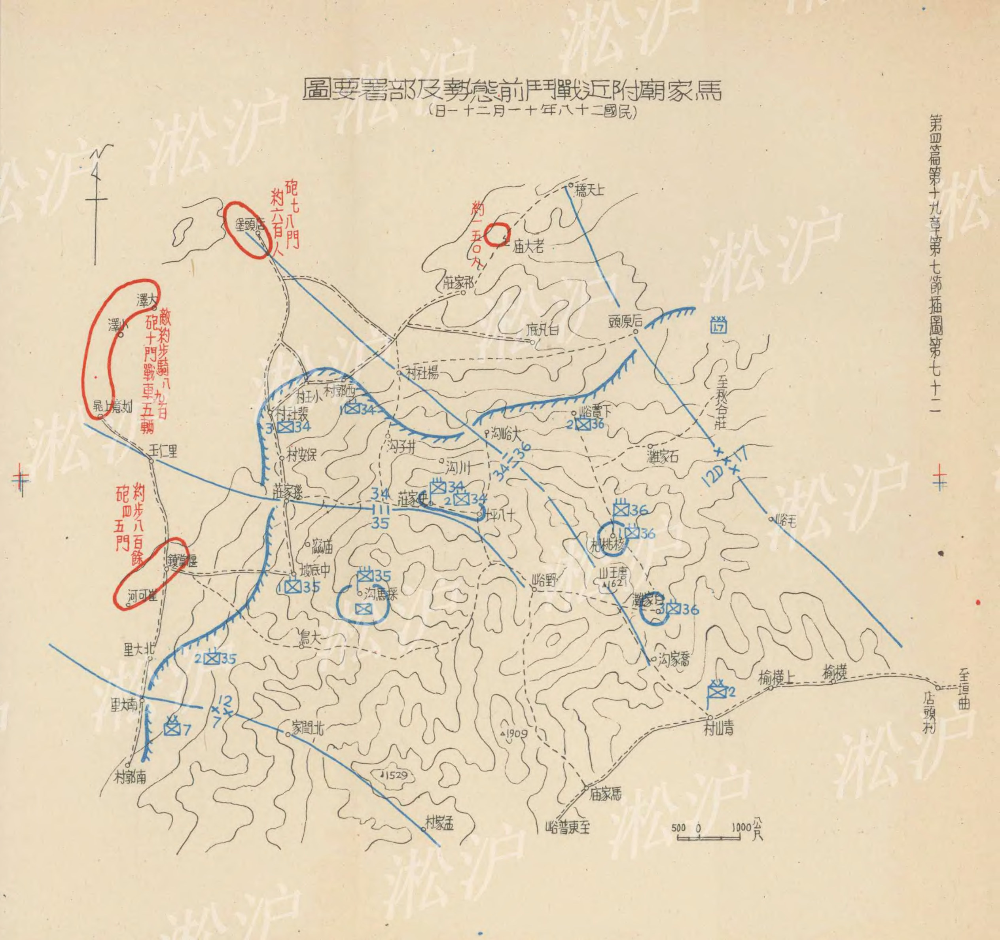

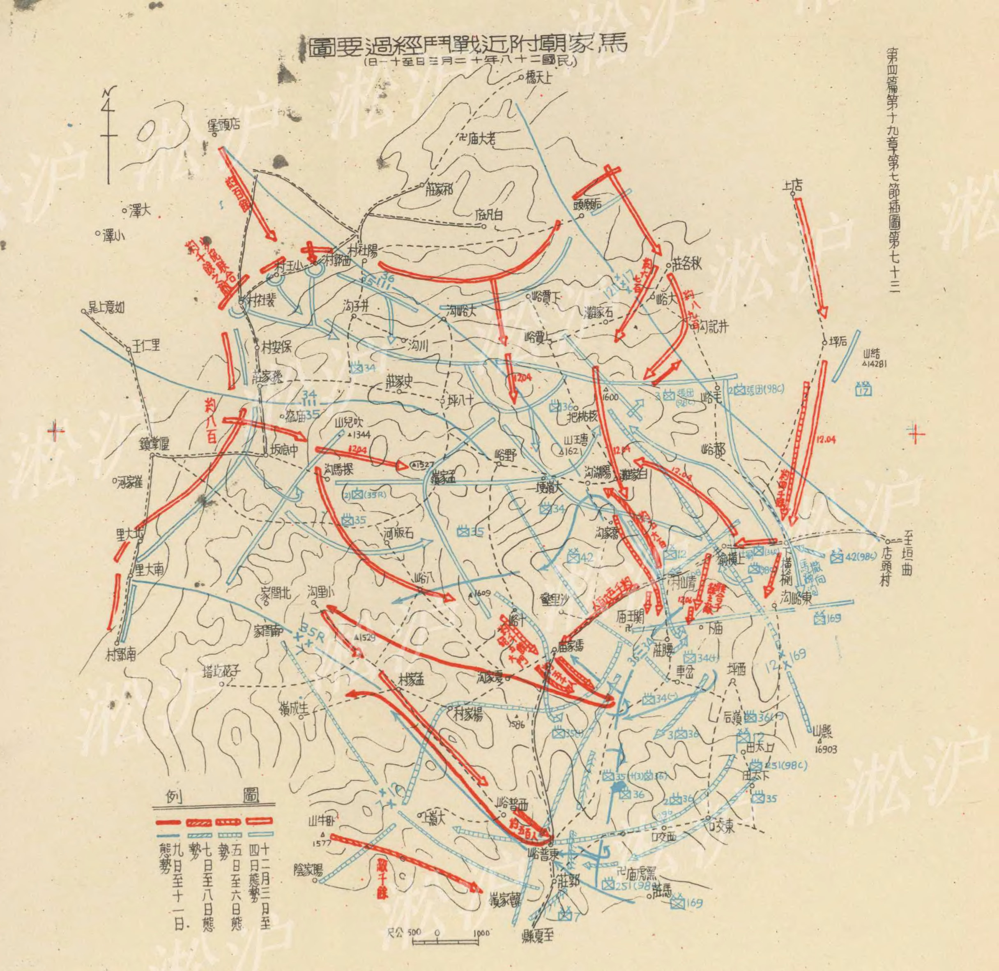

##### 第二項 長子以西地區戰鬥

民國二十九年元月一日至四日

參照插圖第七十四第七十五

長子、屯留一帶之敵，屢經我軍圍攻，傷亡重大，仍連日增援，乘我第二十七軍慶祝民國二十九年元旦之際，大舉西犯，激戰三晝夜，我撤至岳莊、前後喬家掌、東老沟莊、一四二三高地亘刁黃村之線，嗣由左翼轉移攻勢，敵乃於一月四日晨撤退，我擊破敵掩護部隊後，當晚追至長子、鮑店附近，敵堅守避戰，我以阻敵目的已達，乃停止攻擊。

第一目 長子附近地形

長治、長子，踞太行山之麓，扼濁漳河之源，尤以長治地勢崇高，握白晉公路之要衝，爲晉省東南之重鎮。壺關、屯留、長子乃長治之衛星，唇齒相依，脈絡一貫。長子以西有繳蓋山、刁黃嶺、印山、風波山等綿延相連，比高不大，交通便利，敵據該地區西犯，適足以威脅晉南我軍側背，我施行監視，誠堪爲太岳、中條、雷首之屏障。

第二目

戰鬥經過

十二月下旬以來，敵連日由長治增到長子千餘，連前計約步騎兵五千餘、砲三十餘門，由屯留增到鮑店鎮五百餘，連前共約千餘，該兩地敵係爲第三十六師團青砥、笠原兩聯隊，其青砥聯隊長已進駐泊裏村指揮。

第二十七軍於民國二十八年十二月二十一日至二十三日攻擊長子、鮑店一帶之敵後，當卽以監圍長子、屯留，襲擾府城鎮以西、並保持爾後機動之目的，乃部署如左（參照插圖第七十四）：

一、第四十六師以一部在布村、蘇村、團城村、陽魯村、岳陽村一帶，主力控置於仙翁廟、北溝、李家莊、瓦窯溝、宋家溝、上下楊莊間地區。

二、預備第八師以一團進出府城以西襲擾，並掩護同蒲路南段第十四集團軍右側背，主力控置於刁黃村、橫水村一帶地區。

三、第四十五師一部在東里村、廟兒嶺、姚家嶺一帶，主力控置於豐儀鎮、黑家口、王村、金村間地區。

四、作戰地境（線上均屬右）：

第四十軍與第四十六師間，爲高都——三里鎮——師莊——北呈村——高河鎮——史村之線。

第四十六師與第四十五師間，爲平原——草坊鎮——高河鎮之線。

預備第八師與第十四集團軍間，爲南孔灘——曹家嶺——馬石圪塔——史璧——敬聖村——韓村之線。

民國二十九年元月一日七時，長子之敵分三路向我第四十六師進攻（參照插圖第七十五），一路步兵二千餘、戰車三輛，經固益舖攻布村、土門嶺前進陣地，一路步砲千餘經張村、萬村、攻蘇村、東峪前進陣地，一路步騎八百餘，經賈家嶺一帶南攻岳陽村、虎嶺一帶前進陣地，戰至十一時許，第四十六師被迫先後撤至韓家山、洞沟、南沟東側及盡義村以東之線陣地戰鬥，時敵以空砲轟擊仙翁廟陣地，一部淪於敵手。十五時，該師以一營逆襲，始將敵擊退。增到長子之敵千餘，亦分由團城村、城陽村向南沟、陽魯村進犯，南沟我守軍撤至西南高地附近，當敵攻仙翁廟時，敵一小部於十三時竄抵上海子附近，該師卽以下楊莊、葦池附近之第一三八團一部東進側擊，敵退走，入夜後，敵集中兵力猛攻仙翁廟陣地，激戰澈夜。

是日七時，鮑店之敵，經碾張村向金村、豐村第四十五師第一三四團第一營進攻，該營逐漸西移，敵跟蹤向該師一六八八高地亘定金山之線進攻，經第一三四團迎擊，敵不支東竄，適第一三三團第一營進抵豐村附近予以側擊。十時，敵分兩路經胡家峪及一四五五高地在壁村合股後，向石哲鎮、岳陽村方向竄去，該師當卽追擊，並以一部進出平泉附近。時敵步騎二百餘，復由鮑店進抵東里村附近，被第一三三團一部擊退。十五時，其竄向岳陽村之敵，續竄到平泉，經我進出該地之部隊截擊，黃昏後乃續南竄。

同日晚，第二十七軍爲圍殲外竄之敵，相機克復長子城，決於元月二日拂曉，由左翼攻擊敵之右側背，遂下達命令要旨如左：

一、第四十六師固守仙翁廟迄南沟、北沟及其以北地區之陣地，策應預備第八師及第四十五師之出擊，並追擊退竄之敵。

二、預備第八師應以一團爲基幹附山砲兩門，由盡義村兩側山地向東出擊，其餘部隊暫控置於黑虎嶺、嶺底附近。

三、第四十五師以一團以上之兵力，向鮑店之南迄長子城間之地區出擊，另以一部對鮑店、屯留、常村方向警戒，其餘部隊暫控置於豐儀鎮南北地區。

四、預備第八師及第四十五師出擊部隊，限於二日十時以前，進出嵐水村、龍泉山、余家峪、賈家嶺、川口村南端高地之線，積極攻襲長子附近之敵，並相機克復長子城，截擊其竄擾之部隊與運輸車輛。

五、作戰地境（線上均屬右）：

第四十六師與預備第八師間，爲天晴莊—牛王沟—苗村—河頭村相連之線。

預備第八師與第四十五師間，爲羊鳳毫—洪珍村—楊神沟—長子城相連之線。

元月二日七時，敵向我仙翁廟陣地猛攻，經第四十六師擊退，敵續增六七百，藉炮火二十餘門及毒氣之掩護再攻，九時許，陣地大部被燬，守軍犧牲殆盡，不得已，乃轉移至仙翁廟西側一千公尺處之第二線陣地。十時許，南沟以南之敵步騎砲約二千餘，會合由陽魯村犯北沟之敵千餘，在敵機九架掩護下，向北沟東西之線進犯，十二時，我北沟陣地被敵突破，敵卽向東西席捲，並以一部南犯上楊莊，我第四十六師第一三七團第一、第三營被圍，該師派隊由寺沟與一五八六七高地間施行逆襲，以一部在上楊莊東西地區阻敵，十四時，被圍之第一、第三營突圍至宋家溝東側高地之線，右翼第一三八團亦轉移至社沟、岳莊東側高地之線。時北沟附近敵千餘，復會同李家莊南進之敵千餘，向一五八六七高地一帶陣地猛攻，入夜，仍在戰鬥。另敵二千餘，於十五時向第四十六師左翼老嶺沟、飯頭沟猛犯，未逞。

是日七時，預備第八師以第二十四團由黑虎嶺東進出擊，抵梁坪沟附近，與步兵四五百，砲二門之敵遭遇，當以一營進佔干河村南北高地迎擊，主力由梁坪沟以北繞攻敵右側背。十二時，敵增援二千餘，砲數門，經兩都村、李家莊迂迴攻擊干河村我軍之右側背，該師以一營進至牛毛沟以南高地阻擊，十四時，敵退至盡義村附近，該師跟蹤進迫該村續戰。

第二十七軍以出擊部隊爲敵援所阻，且敵主力已誘進山地，決將敵包圍於南沟、北沟、冷水沟、陽魯村一帶山地而殲滅之，遂部署如左：

一、第四十六師應於上楊莊、下楊莊兩側高地，一二九二五高地迄老莊之線陣地，極力阻止當面之敵，並另以一部準備於東老莊沟、老莊間地區，向李家莊、北沟、冷水沟方向出擊。

二、預備第八師應於拂曉前進於飯頭沟、牛毛沟、刁黃村、盡義村之線，準備全力沿李家莊、冷水沟、陽魯村之線以北地區出擊。

三、第四十五師除以一部向鮑店警戒外，主力應於拂曉前推進於洪珍村、賈家嶺及其以東之線，準備向陽魯村、團城村努力出擊，另以有力一部相機襲佔長子城。

四、各出擊部隊，統限於三日拂曉前完成攻擊諸準備，同時向指定目標攻擊前進。

五、作戰地境：

第四十六師與預備第八師間，爲老背山、王家莊、冷水沟、高家沟相連之線。

預備第八師與第四十五師間，爲洪珍村、陽魯村、蘇村相連之線，線上屬左。

元月三日拂曉，敵卽開始砲擊，七時，第四十六師當面之敵向全線陣地進攻，八時，敵五百餘向西莊陣地迂迴，另敵二千餘，砲十餘門向東老莊沟及一六零二二高地攻擊，九時，敵在空砲協同下攻擊，十一時突破寺沟南北陣地，該師雖行逆襲，終未奏功，遂轉移岳莊、前喬家掌、後喬家掌以西迄東老莊沟一帶高地旣設陣地，十五時，一六零二二高地復陷，經該師增援逆襲，迄黃昏奪回一部。預備第八師向陽魯村進出部隊，被阻於李家莊北一四二三高地，牛王沟、裏沟莊與敵激戰竟日，互無進展。第四十五師於拂曉前，以第一三三團主力進至長子西南郊，截斷敵之後方連絡，第一三四團第一營攻佔一四二九高地，敵二百餘向盡義村退走，八時，第一三三團第三營攻佔岳陽村南端一二五六高地，並將花家坪附近之敵驅逐，敵向西竄，是時第一三四團一部連繫第一三三團更進至團城村、陽魯村附近，猛攻敵之右側背，當將負隅盡義村之頑敵包圍，十三時，該師集中火力，向盡義村猛攻，第一三四團第三營遂佔領該村，復協同第一營續向兩都村、李家莊進攻，敵利用房屋頑抗，我無進展，二十一時，第一三四團選拔數個精幹小組，攻佔兩都村以北附近村落。

第二十七軍據連日戰况判斷，進犯之敵，企圖以全力迫我於長子以西山地，進窺高平、晉城，策應晉南敵之作戰，我爲誘殲深入之敵計，乃於是（三）日夜復調整部署如左：

一、第四十六師應留一部與敵保持接觸，襲擾欺騙當面之敵，主力於明（四）日零時撤至六柱坪、大北沟、西嶺上以東地區，拒止當面之敵。

二、預備第八師以一部與敵保持接觸，襲擾當面之敵，主力於明（四）日零時撤至安身坪、黑虎嶺、跑馬嶺以東地區，側擊深入之敵。

三、第四十五師應以方山、平泉爲根據，攻擊敵之側背。

四、作戰地境（線上屬右）：

第四十六師與預備第八師間，爲後銀洞沟—瓦窑沟—東老莊沟之線。

預備第八師與第四十五師間，爲老莊上—羊鳳毫—梁坪沟—牛王沟之線。

各師奉令後，卽遵照部署完畢。

元月四日拂曉，敵由李家莊、兩都村一帶向預備第八師一部及第四十五師圍攻部隊連續猛攻，均被擊退。七時，敵全線向長子方向撤退，各師卽派隊分路追擊，在西峪、南沟、陽魯村、石哲鎮、賈家嶺各地區驅逐敵之掩護部隊後，迄晚，進抵長子、草坊鎮、鮑店各附近，敵卽加強工事，防我進擊，我以阻敵目的已達，並已恢復原態勢，乃整頓部隊，繼續施行監圍，戰鬥遂告中止

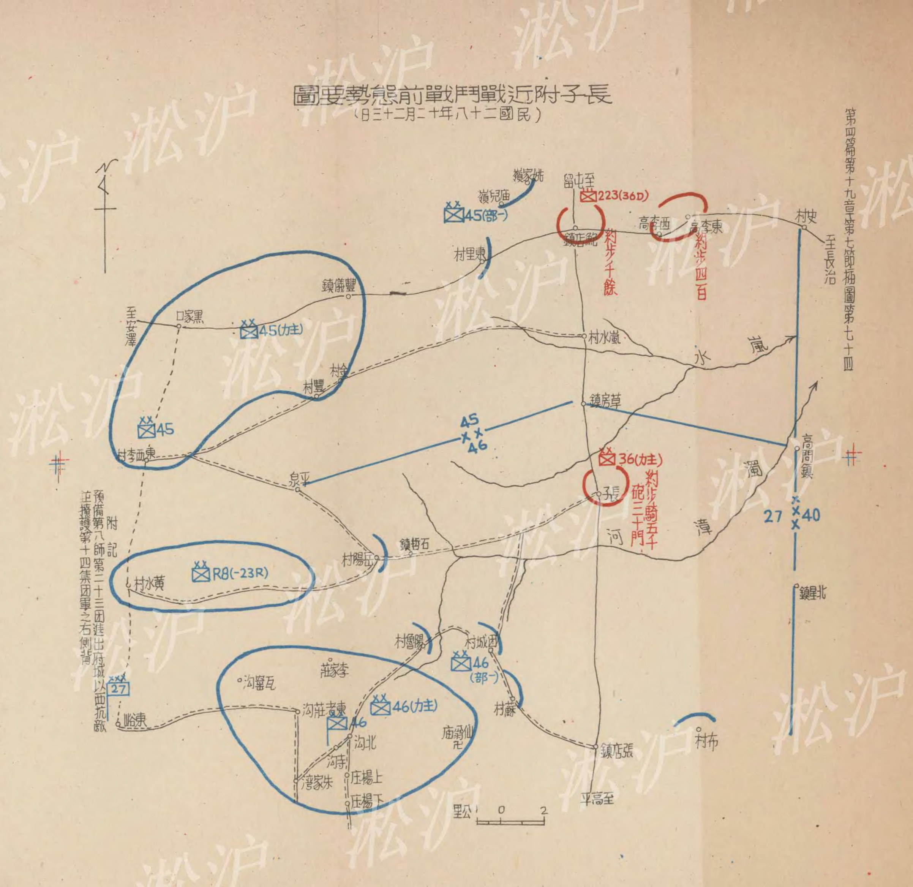

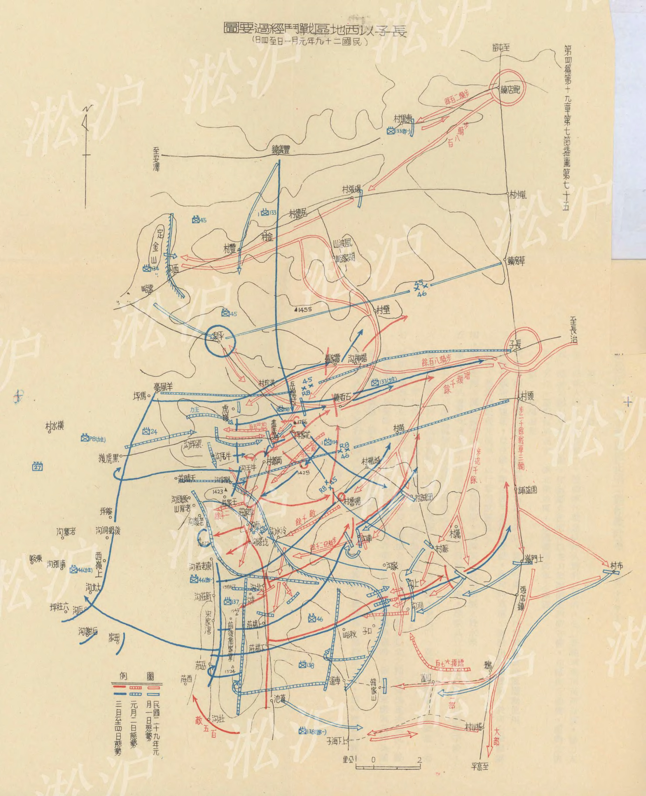

附錄第一

第十戰區修正第二期作戰計畫

（民國二十八年十月一日）

第一方針

一、軍以保衛大西北，培養戰力，使國軍作戰達成持久勝利之目的，先以野戰軍進出黃河以東，協力友軍，隨時予敵以牽制或打擊，使敵斷念渡河，以主力鞏固陝東河防守備，如敵使行強渡，卽與之決戰，另以一部配置於商南、陝北兩地區，以掩護河防軍之兩翼。

第二

指導要領

二、河防軍應以必要之兵力，配置黃河右岸各渡口，擔任守備，主力控置於適當地區機動使用。

三、河防作戰指導腹案，以使敵人斷念渡河爲最高着眼，故河防軍應不斷派出游擊部隊，於河左岸擊攘敵人，並策動民衆及僞軍，以行牽制或擾亂。

四、河防配備，應以根本拒止敵之登陸爲原則，務乘其半渡而擊滅之於水際。

五、敵如憑藉其空軍及砲兵威力掩護渡河，竟以一部登陸成功時，應乘其立足未穩之際，以逆襲手段，利用其機砲不能發揮效力之時間而殲滅之。

六、爲確實掌握河防之重要據點，河防軍對潼關、朝邑、大慶關、東禹門、龍門山各據點，及韓城、郃陽以西一帶山地，並其旣設之預備陣地，特須堅強固守。

七、敵如由豫西侵犯長坪路方面時，卽以長坪兵團配合地方團隊，在丹江以北之預定陣地逐次抵抗，設伏截擊之。必要時，卽以第十六軍之全部加入作戰，若敵沿隴海路西進時，則河防軍應與長坪兵團協力，並連繫第一戰區部隊合力阻擊之。

八、若敵侵入陝北，續行南窺，河防軍之韓城、郃陽附近部隊，應轉移一部於該方面，協同控置於鄜縣、洛川間之部隊，連繫第二戰區部隊夾擊之。

第三兵團部署（甲案）

九、軍隊區分

(一)野戰軍

第二十七軍

(二)河防軍

總司令

第三十四集團軍總司令胡宗南第九十軍

第六十一師

第五十三師

第一零九師（配屬裝甲兵團第三營第九連）

配屬砲兵第五十四團第一營（欠第一第三連）

第一軍

第一師

第七十八師

第一六七師

配屬砲兵第五十二團第三營（欠第十第十一連）新編第二十七師

砲兵第十五團（欠第一營、第三營營部及第七、第九連）砲兵第二十團（欠第三營）

砲兵第七團第二營

砲兵第十團第三營（欠第九連）

砲兵第十一團第三營

砲兵第二十三團第一營（欠第一、第六連）

第六十五師砲兵營

第一七七師砲兵營

(白)長坪兵團

預備第一師

四陝北兵團

暫編騎兵第二師

(五)預備兵團

指揮官

第十六軍軍長董

釗

第十六軍（欠預備第一師）（駐西安暫歸胡總司令指揮整訓）第二十八師（擬駐臨潼、西安間）

預備第三師（暫駐保漢公路附近）

第一六五師（駐渭南、新豐鎮間，暫歸胡總司令指揮整訓）新編第十二旅（駐三原暫任西安、宜君間護路）

騎兵第十二旅（擬駐蒲城）

砲兵第五十二團（欠第三營及第四、第五、第六、第八連）

(暫歸胡總司令指揮整訓)

裝甲兵第三營

十、兵團任務

(一)野戰軍歸第二戰區衛副長官指揮，任務從略。

(二)河防軍應右翼與第一戰區、左翼與第二戰區連繫，配置所屬部隊於閔底鎮迄猴兒川之間擔任守備，主力控置於大荔，一部控置於韓城附近，鞏固河防，阻敵渡河。

(三)長坪兵團暫任長坪公路方面之警備，並對丹江以北三要司、雒南地區加強對東工事，敵如由豫西或沿隴海鐵路西犯時，應卽竭力遲滯迎擊之，並策定地方團隊，連繫河防右翼部隊與第一戰區各部設伏截擊之。

四陝北兵團應位置於鄜縣、洛川間，加強該方面對北工事，敵如侵入陝北南進時，應卽逐次抵抗，以阻止之，並協力河防軍左翼部隊及第二戰區部隊夾擊之。

(五)預備兵團應分別控置於潼關、渭南、蒲城、三原等地，適應情況，策應各方面作戰。

十二、作戰地境：

第一戰區與河防軍間，爲窯上、北麻鎮、閔底鎮、漢渡之線，線上屬右。

河防軍與第二戰區間，爲沿猴兒川之線，線上屬左。

十二、長坪兵團與陝北兵團之作戰地境，暫不規定，臨時視情況指示之。

第四交通、通信、補給、衛生

一、交通：

(一)戰區內之交通，以利用鐵路及公路爲主，縣道及水道副之，更應增關道路、修築碼頭、渡船等，以利交通。

(二)由渭南經大荔、郃陽至韓城，及大荔經朝邑至平民，與咸陽經蒲城至澄城各公路，應分別繼續加以修理。

(三)由西安至鄜縣公路現已築成，但對橋樑、涵洞及路面仍應積極修築。

四爲期將來進出黃河西岸便利，對於黃河右岸各主要渡口之船隻，應行調查統計，並應按作戰之需要，加以分配，如現有船隻不敷使用，須酌爲增添之，而於禹門口以北各渡口尤爲重要。

五爲補救禹門渡流水湍急，使兩岸進出便利計，在該處設計之滑鋼渡，應速構築完成。

六渭、洛、涇三河，除原有之便橋、載重橋，於雨季後仍應架設完成外，更於各主要渡口添築活動碼頭及載重渡船，以利機械化部隊之進出。

二、通信：

(一)戰區內通信以有線電信、有線電話爲主，無線電信、郵遞、傳令、步哨爲副。

(二)戰區司令部與軍事委員會及行營通信，以有線電信爲主，有線電話、無線電訊、郵遞副之。

(三)戰區司令部與集團軍司令部，軍司令部通信，主用有線電訊及有線電話，以無線電訊副之。

四各部隊通信，以有線電話爲主，其他副之，並得利用地方通信機關。

(五)戰區司令部與軍事委員會行營及所屬軍司令部，獨立旅司令部，應直接取得無線電連絡。

三、補給：

(一)依現時兵力配備，暫以西安爲兵站基地，渭南爲兵站主地，華陰、郃陽、韓城及商南、中部爲兵站末地，並在潼關、朝邑、禹門、集義鎮設兵站前進補給點。

(二)由西安經渭南、潼關至閔底鎮，及由渭南經大荔、郃陽、韓城至集義鎮，爲東路兵站運輸線，以隴海鐵路及韓渭公路爲主要運輸線，並以渭河、洛河兩水道及西安經三原、蒲城、澄城至郃陽公路爲補助運輸線。

(三)由西安經咸陽、耀縣、中部至洛川爲北路兵站運輸線，以韓榆公路爲主要運輸線。

四由西安經藍田、商縣至商南爲東南路兵站運輸線，以長坪公路爲主要運輸線。

(五)後方連絡線，以利用西安至寶鷄鐵路及寶鷄經鳳縣、漢中至廣元公路爲主要運輸線。

(六)兵站機關之配置，除長坪公路及陝北方面俟必要時再行設置外，應以主力配置於東路兵站線上，並在西安控置一部站隊，以便隨時策應。

(七)各部隊給養，應以發給代金，就地征發爲原則，如確係無法購買，可由兵站機關配量價發現品，以資接濟。

(八)爲適應爾後補給便利計，應在咸陽以東地區及戰區後方各屯儲現有參戰部隊三個月之糧秣。

(九)各部隊彈藥，應從速按照攜行基數配足，並另由兵站方面屯儲規定之彈藥，時常保持額定數量，以備必要時之用。

四、衛生：

(一)本管區內配備之各院所，歸本戰區指揮各部隊傷兵，可隨時送入外，其河防區內及長坪、陝北兩方面，以事實之需要，隨時呈報，指撥院所收容之。

(二)以目前情形，凡歸本戰區指揮之醫院，應盡量騰空，所有傷病官兵，悉數西移，以利收容，而策安全。

(三)關於傷病之後送，除以衛生列車、衛生汽車輸送，並極力利用回程輸力，及地方義務輸送外，必要時，得配派輸力運送。

兵團部署（乙案）

軍隊區分

(一)河防軍

總司令

第三十四集團軍總司令胡宗南1. 第一守備區

指揮官

第一軍軍長陶峙岳

第一師

第七十八師

第一六七師

新編第二十七師

第一六五師

砲兵第十五團（欠第一營、第三營營部及第七第九連）砲兵第七團第二營

砲兵第十團第二營（欠第九連）

第六十五師砲兵營

第一七七師砲兵營

野戰砲兵第一團（擬請增派）

裝甲兵團第四營

裝甲兵團第三營第九連2. 第二守備區

指揮官

第九十軍軍長李文

第五十三師

第六十一師

第一零九師

新編第二十旅

砲兵第二十團（欠第三營）

砲兵第十一團第一營

砲兵第二十三團第三營（欠第一、第六連）山砲兵一營（擬請增派）

3. 總預備隊

第

軍（擬請增派）

野砲兵二營（擬請增派）

(長坪兵團

第十六軍（欠第二十八師）

山砲兵一營（擬請增派）

(陕北兵團

暫編騎兵第二師

騎兵第十二旅

四空軍（擬請增派）

戰鬥機三隊

輕轟炸機一隊

重轟炸機二隊

(五)西咸警備隊

第二十八師

交通警備第五支隊第二團

(六)預備兵團

第

軍（擬請增派）

第

師（擬請增派）

第

師（擬請增派）

砲兵第五十二團（欠第三營及第四、第五、第六、第八連）砲兵一團（擬請增派）

裝甲兵第三營（欠第九連）

第二戰區東路軍第十八集團軍部署（民國二十八年十二月江電）

一、華北敵正在積極部署，更番掃蕩作戰中，除晉西、冀中局部開始掃蕩作戰，加緊與鞏固交通線外，晉冀察區已陷於敵人大舉掃蕩激戰之中。

二、爲確保華北，擊破敵更番掃蕩，相機規復上黨，並發動全華北大規模截擊敵之交通要線，策應全國各方面作戰，以執行蔣委員長皓申令一元電冬季女勢作戰，及戰區梗子參戰天電之目的，第十八集團軍部署如次：

(一)上黨方面：

1. 以第一二九師第三八五旅之一團及先遣支隊一部，監視打擊和順、遼縣一帶之敵，保障正太、白晉、長武各路作戰軍之安全。

2. 以第一二九師第三八六旅及第三四四旅一團、特務團主力，配合當地之游擊隊，東西夾擊白晉公路，置重點於廐亭、南關間，而確實斷絕之。

3. 以第三四四旅兩團、第一二九師四團、南北夾擊長武公路，置重點於黎城、涉縣間，而確實斷絕之。

4. 以上述部署，配合第四十、第二十七軍，相機規復上黨，而規復上黨之整個作戰部署，另令行之。

(二)平漢線方面：

1. 以蕭克部兩團，截斷涿州至宛平之線，並相機攻襲涿州、蘆溝橋。

2. 以呂正操部兩團，截斷保定至望都之線，並相機攻襲保定、望都。

3. 以第一二九師張賢鈞支隊主力，配合其他游擊隊，襲破臨城、沙河之線。

4. 第一二九師另兩團截斷邯鄲附近段。

5. 平漢沿線兩側各大小游擊隊，以適合上述作戰企圖之目的，向平漢線廣正面作不斷襲破。(三)正太線方面，以桂支隊兩團確實截斷娘子關、井陘間，並策應晉冀察區之作戰，另以一團配合當地游擊隊，對正太至太古之線行廣正面之襲破。

四同蒲路方面：

1. 以第一一五師陳支隊兩團襲破靈石至太古之線。

2. 以第一二零師第三五八旅兩個支隊襲忻縣至大同之線，置重點於雁門關南北，並策應晉冀察區之作戰。

(五)平綏線方面：

2. 以蕭克之有力一部，襲擊平綏東段，置重點於昌平、懷來間。

2. 以蕭克之冀東游擊各支隊，分襲平古、北寧及天津至山海關各線。

(六)津浦方面：

1. 以呂正操有力一部，配合第一一五師陳光挺進縱隊之一部，夾擊德州至靜海之線，置重點於滄州、東光間。

2. 以第一二九師宋任窮一部及第一一五師挺進縱隊之另一部，夾擊德州至濟南之線。

3. 以山東縱隊一部，第一一五師第三四三旅主力，夾擊濟南至銅山之線。

4. 以山東縱隊另一部，混合當地游擊隊，對膠濟沿線行廣正面之襲破。

(七)隴海線方面：

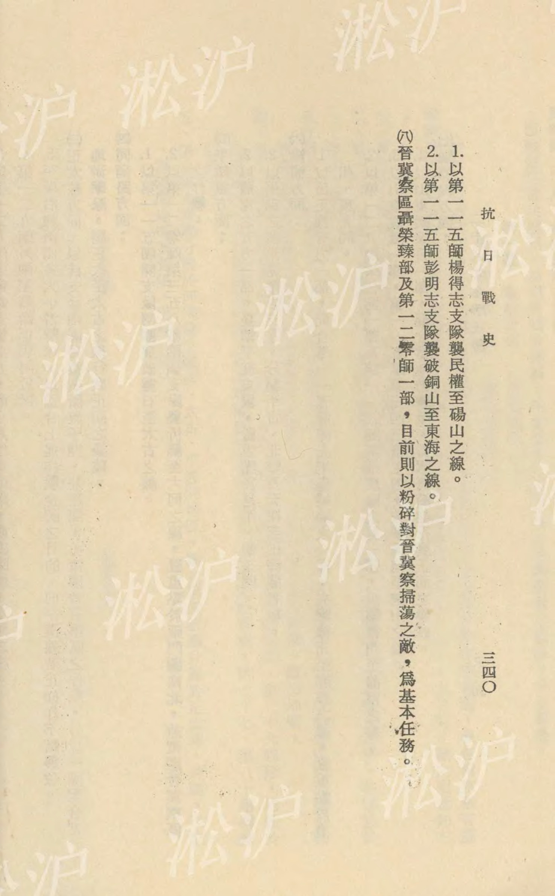
