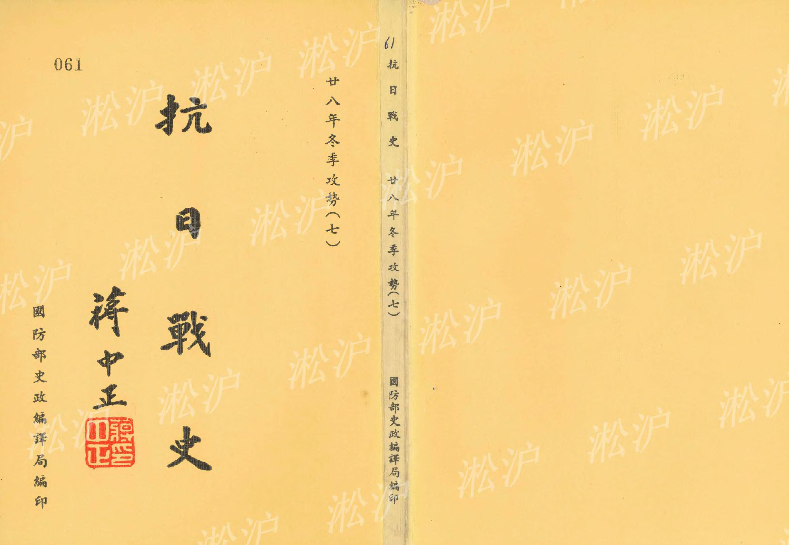

### 第十節第八戰區之作戰

溯敵自民國二十六年十月侵入綏西，卽佔據歸綏、包頭、固陽、安北各交通要線要點，與晉北及平綏方面之敵連繫，企圖西進威脅我西北國際交通路線。其在綏西之部隊，爲敵騎兵第一旅團及第二十六師團之一部，僅四千餘人，兵力雖少，但可利用鐵路公路，隨時調集晉北之第二十六師團主力及晉冀邊區獨立第二旅團增援。而我綏西部隊第三十五軍、騎兵第六軍各部，經民國二十七年於晉西之文水、交城、大武鎮、離石及歸綏、清水河、偏關附近諸戰鬥後，於二十八年一月轉進綏西，僻處於交通線外之後套、伊盟、沙梁地帶，掌握國軍與地方部隊，配合運用，堅苦防守，以增加持久抵抗之效果。

迄民國二十八年冬，軍事委員會爲加速消耗敵人，發動全面攻勢，以第八戰區綏西部隊爲助攻，協同第二戰區北路軍圍攻歸綏附近之敵。指揮綏西部隊之副司令長官傅作義，基於任務、地形、敵我狀況，策定計畫分四路軍攻擊，以第一、第二、第四路軍及各游擊部隊，分向歸綏、安北、固陽及綏包間鐵路沿線各據點之敵襲擊破壞，施行牽制，協助第三路軍主力之第三十五軍攻擊敵重要據點之包頭，於十二月十八日開始攻擊，第三路軍祕密行動，二十日晨一舉攻入包頭，抄襲敵高級司令部及重要倉庫，斃敵騎兵聯隊長二，繼與安北、固陽及平綏方面增援之敵激戰兩晝夜後撤退，達成牽制之目的，收獲奇襲之效果。

我軍事委員會對冬季攻勢，已令於民國二十九年一月底截止，惟綏西方面敵企圖報復，抽調第二十六師團主力、獨立第二旅團一部，以優勢兵力，乘後套結冰時期，於一月二十八日分向黃河兩岸及烏鎮西攻，我軍分右、中、左三個地區軍阻擊，敵先突破我右地區軍黃河兩岸陣地，繼突破我左地區軍烏鎮陣地，更以機械化部隊向西突進，二月二日陷五原，四日陷臨河、陝壩。我軍態勢轉陷不利，遂將我軍主力劃區機動，不斷在敵側背襲擊，十二日克復臨河、陝壩，驅逐敵於五原附近，迨後敵軍東調，我乘機舉全力攻擊，於四月一日克復五原，恢復冬季攻勢以前之態勢，並達成我軍持久消耗之目的。

#### 第一款 戰前狀況

(參照插圖第一○三)

##### 第一項 敵軍

(參照插表第六十一)

民國二十八年冬，第八戰區當面之敵，爲蒙疆駐屯軍司令岡部中將所指揮之第二十六師團、騎兵集團之騎兵第一旅團，塚本砲兵聯隊及其他特種部隊，並獨立第四、第二十四守備大隊等，當時岡部駐張垣，騎兵集團長小島吉藏駐包頭，第二十六師團長黑田重德駐大同。其獨立第十一、第十二兩聯隊駐晉北大同、岱岳、神池、寧武、偏關一帶，其獨立第十三聯隊駐歸綏、包頭、涼城、和林、托縣、武川及綏包鐵路沿線，騎兵第一旅團之騎兵第十三聯隊主力駐固陽，第十四聯隊主力駐安北，並各以一部駐包頭、薩縣、大樹灣各地，塚本砲兵聯隊主力駐包頭、歸綏，一部分駐和林、托縣、薩縣、安北、固陽等地，獨立第二十四守備大隊駐固陽，獨立第四守備大隊駐安北。

自十一月上旬以來，敵不時以小部隊對我游擊部隊掃蕩，藉以鞏固佔領地區，同時強佔蒙古包，修築公路，架設浮橋，偵察道路、水井等，積極準備，似有乘河渠封凍，向我竄擾之企圖。此外敵爲實施以華制華之毒計，極力製造綏蒙僞組織，並改編僞蒙軍爲八個師，僞防共軍兩個師及伊、烏、錫三個盟保安隊，散駐各地。

##### 第二項 我軍

(參照插表第六十二)

我軍自民國二十八年春轉進綏西以來，卽以確保綏西，準備爾後反攻之目的，以游擊部隊擔任敵後游擊，主力集結於後套積極整訓，並構築工事與冰窟，迄十二月初，各部隊概況如左：

一、東北挺進軍任馬棚至萬和堂間黃河河防，與敵隔河對峙。

二、騎兵第六軍之騎兵第七師、新編騎兵第四師及暫編第十師各部主力，集結於五原東南之西公中、鄧村店、蘆家壕一帶訓練，一部在蓿荄灘任西山咀以東之防務，另一部任四拒一帶五家河上冰窟之掘築。

三、第三十五軍之新編第三十一師、新編第三十二師、第一零一師及配屬之新編第六旅、五臨警備旅等部主力，集結於五原東南來福營子、東槐木、扒子補隆及西山咀、顛不四廟一帶地區整訓，以一部對安北之敵警戒，並擔任五家河上自五毛界至二富智灣間沿河掘築冰窟，及構築五家河以西地區之據點工事。

四、第八十一軍之第三十五師集結於烏鎮附近整訓，並擔任五家河上自二富智灣至義和遠間沿河冰窟之掘築，歸該軍指揮之第十七集團軍騎兵第一旅，在五原西南，騎兵第二旅在狼山口一帶對北警戒。

五、新編騎兵第三師在偏關附近，察哈爾游擊隊在河曲附近，綏遠自衛軍在綏包沿線以北，一部在豐鎮、涼城間地區，綏遠游擊隊在包五公路上達子店一帶，第二十二軍之第二五六旅及伊東各游擊支隊在東勝、新民堡、達拉特旂間地區，熱河先遣軍在五原東北，游擊縱隊（即安、固、武地區游擊隊）在固陽西北之川心店、北流鬼一帶，各游擊部隊均對當面之敵嚴密警戒，並不斷向敵襲擾破，掩護主力整訓。

此外爲調整伊盟防務，於十一月間令綏東騎兵司令郭希鵬部，由神木附近開勝地營子整訓，並令第二十二軍在伊盟之各游擊支隊，歸傅副司令長官指揮。

綏西與晉北，原屬第二戰區，自民國二十八年一月起，綏西地區劃歸第八戰區，當地部隊由第八戰區副司令長官傅作義指揮。第二與第八兩戰區之作戰地境，爲河曲以西、神木、榆林以北、鹽池以東、迤東南之線。綏東與晉北，爲使第二、第八兩戰區之我軍相互策應，未能明確劃分界線。

敵軍在第八戰區之部隊，有一個師團、一個騎兵旅團及其他特種部隊，共計約二萬三千七百餘人，在綏西方面僅四千餘人。我第八戰區全兵力，有步騎兵十九個師、約十二萬五千餘人，除控置在寧夏、甘肅方面十一個師外，在綏西方面僅有步騎兵約八個師，可得使用攻勢之實際兵力，約三萬六千餘人。以綏西方面敵我兵力比較，我軍似居優勢，惟敵據有鐵路、公路各交通要點要線，調動迅速，裝備訓練優越，而我軍則僻處交通線外，沙梁河渠地帶，運動補給困難，且我正規軍少，游擊部隊多，裝備訓練較差，似又居於劣勢。

##### 第三項 兵誌概要

綏遠西部，爲我第八戰區抗戰正面，陰山山脈環峙於西北，黃河水系橫貫於中部，其中包頭位平綏鐵路終點，東達北平。五原踞後套河渠中心，爲至寧夏、蘭州之孔道，誠爲戰略上重要據點。後套外圍有狼山、烏拉山、黃河、五家河及西山咀、蓿菱灘等天然險要之環拱，易守難攻，土地肥沃，農產豐富，爲我西北抗戰唯一之根據地，亦爲掩護伊盟確保西北國際交通線之屏障。公路有安（安北）五（五原）、包（包頭）五（五原）等，到處通達，無法破壞，河流雖成障礙，惟在結冰時期，任何兵種及機械化部隊均可通過，則防守不易。

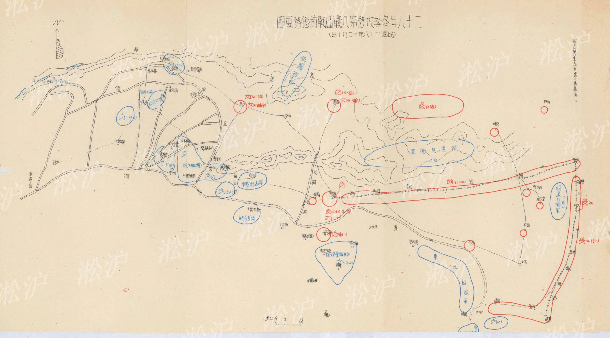

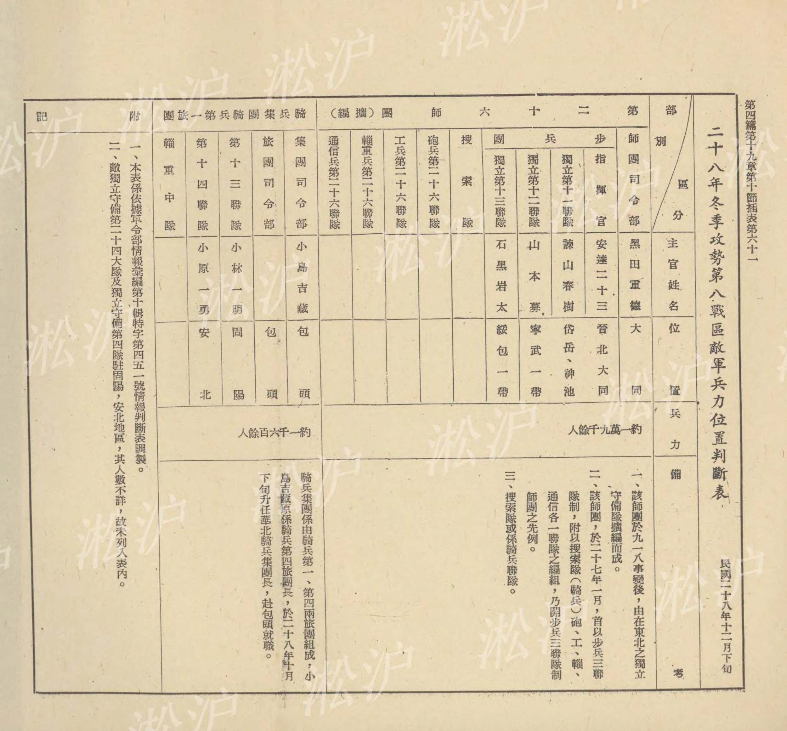

表統系揮指隊

綏遠游擊軍馬策

綏遠游擊軍第二旅馬秉仁（兼）

游擊第一師高振興

游擊第二師李兆興

獨立游擊第二團王萬富新編騎兵第三師井德泉察哈爾游擊隊朱子文

安固武地區游擊指揮官劉萬春綏東游擊司令郭鵬

綏遠自衛軍張欽

第二十二軍伊東各游擊支隊左世

熱河先遣軍

尤（指揮第二五六旅及伊東各游擊支隊）

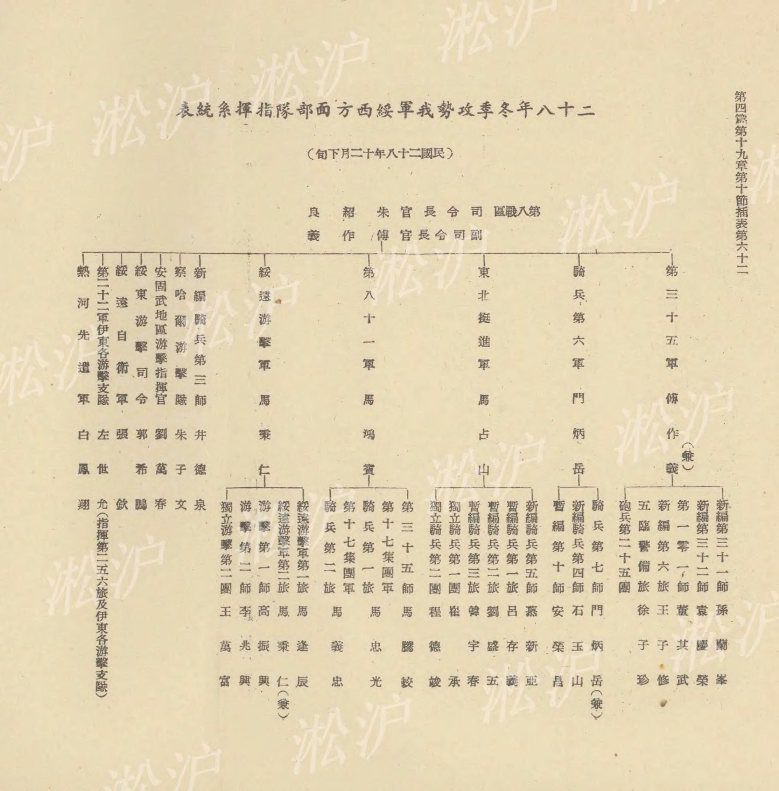

#### 第二款 我軍作戰指導

民國二十八年十一月二十一日，第八戰區司令長官朱紹良以禡酉參電轉達軍事委員會皓申令一元電令要旨：「國軍冬季攻勢之作戰，第八戰區綏西部隊爲助攻，協同第二戰區北路軍主力圍攻歸綏附近之敵軍，向歸綏西北附近地區攻擊，以策應主攻方面之作戰，攻擊開始日期，限十一月底實施」。二十五日，傅副司令長官奉令後，以當時綏西方面之敵，分散各地，兵力雖不優勢，但對已佔領之要線要點，必憑工事固守，且可利用交通調轉兵力以策應。因之，決在戰略上各以一部兵力，分向敵各據點同時攻擊，以牽制其不能互相增援，主力向敵重要據點之包頭奇襲，使其不得不由其他方面抽兵增援，以達成牽制之任務，使主攻方面作戰容易，乃於二十七日策定作戰計畫如左：

第八戰區綏西作戰計畫

民國二十八年十一月二十七日

於五原

第一方針

本戰區綏西部隊，以牽制敵人策應主攻方面作戰容易之目的，擬卽向包頭、歸綏敵人攻擊，重點指向包頭，先誘敵於據點外予以殲滅，爾後逐次攻略包、綏。攻擊開始日期預定爲十二月十四日以後。

第二

指導要領

二、各游擊部隊深入敵區，廣泛襲擾，對散駐各地之敵竭力牽制，使其不能向他處集結增援，並破壞交通通信。

二、派強有力之機動部隊，挺進至歸綏、薩縣間，大量破壞鐵路，截阻敵人西進增援，並襲擊歸綏，竭力牽制敵人。

三、派有力之一部，攻擊安北，引誘敵人，策應主力軍作戰，並相機襲擊安北。

四、主力軍向包頭方面進攻，先誘殲敵人於據點外，然後逐次攻略包綏。

五、敵若先我發動進攻後套時，其他各部隊以攻勢牽制當面之敵，主力軍迎擊由包五公路進攻之敵而殲滅之。

六、敵若由他處抽集兵力，與我主力軍作戰時，其他各部隊卽乘機襲取各據點，威脅敵後。

七、敵若與我主力軍稍一接觸，卽退守包頭據點待援時，我除以主力軍圍攻及打擊增援外，並以其他各部隊乘虛襲奪各據點。

八、敵若由歸綏抽兵沿鐵路或綏包公路向包頭增援時，除節節截擊以行牽制外，並乘虛襲取歸綏。九、攻略包綏後，爾後情況，依情況另定。

第三

兵團部署

一、軍隊區分：

游擊部隊

察哈爾游擊隊

新編騎兵第三師

綏遠自衛軍

熱河先遣軍

安固武地區游擊隊

第二十二軍伊東各游擊支隊

第一路軍

司令官

東北挺進軍總司令馬占山

東北挺進軍總司令部

新編騎兵第五師

暫編騎兵第一旅

暫編騎兵第二旅

暫編騎兵第三旅

獨立騎兵第一團

獨立騎兵第二團

第二路軍

司令官

騎兵第六軍軍長門炳岳

騎兵第六軍司令部

騎兵第七師

新編騎兵第四師

缺欠部隊

第三路軍

暫編第十師

司令官

副司令長官傅作義兼

第三十五軍司令部

新編第三十一師

新編第三十二師

第一零一師

配屬部隊

新編第六旅

五臨警備旅

綏遠游擊軍

第四路軍

司令官

第八十一軍軍長馬鴻賓

第八十一軍司令部

第三十五師

配屬部隊

第十七集團軍騎兵第一旅

第十七集團軍騎兵第二旅

二、各兵團行動及任務：

(一)游擊部隊。

1. 察哈爾游擊隊，限於十二月十七日推進至和林附近地區，於十八日開始對敵積極襲擊，以行牽制，務使其不能抽兵向他處增援。

2. 新編騎兵第三師，限於十二月十七日推進至西溝門附近地區，於十八日開始對敵積極襲擊，以行牽制，務使其不能抽兵向他處增援，並澈底破壞公路，切斷敵之交通，注意與第二戰區北路軍切取連繫。

3. 熱河先遣軍，限於十二月十七日推進至武川、陶林間地區，於十八日開始對敵積極襲擊，以行牽制，務使其不能抽兵向他處增援。

4. 綏遠自衛軍，按各路分駐地區，限於十二月十七日開始對敵廣泛破壞鐵路，節節切斷敵之交通。

5. 安、固、武地區游擊隊，限於十二月十七日推進至固陽附近地區，於十八日開始對敵積極襲擊，以行牽制，務使其不能抽兵向他處增援，並相機襲取縣城。

6. 第二十二軍伊東各游擊支隊，限於十二月十八日開始向磴口附近敵人襲擊，大量破壞鐵路，截阻敵人西進增援。

(二)第一路軍，限於十二月十七日，除以一部推進至托縣、和林間地區，對敵監視牽制外，主力推進至歸綏以東，於十八日開始向敵襲擊，以行牽制，務使其不能抽兵向他處增援，並相機襲取歸綏，須注意與第二戰區北路軍切取連繫。

(三)第二路軍，限於十二月十七日繞道伊盟，推進至薩縣、托縣間地區，於十八日開始向薩縣、托縣間敵人積極襲擊，大量破壞鐵路，截阻敵人西進增援，並相機襲取歸綏，須注意與第二戰區北路軍切取連繫。

四第三路軍，於十二月十八日晚，推進至趙櫃圪旦、劉三仲圪旦、合葉忽洞、大長命之線，誘殲敵人，並乘虛襲奪包頭。

(五)第四路軍，限於十二月十七日，推進至安北附近地區，於十八日開始襲擊，誘殲敵人，並乘虛襲(六)作戰地境（線上均屬右）：

第一路軍與第二路軍間，爲萬和堂（托縣西四十五公里）—雙龍鎮（托縣西北二十四公里）—乃子蓋（托縣北二十一公里）—沙爾營子—烏蘭巴圖—古力半烏索—油房營子之線。

第二路軍與第三路軍間，爲達拉特旂—田家營子—薩縣—帳房塔—西大塔之線。

第三路軍與第四路軍間，爲五毛界—南官井—後口子—達子店—白銀根之線。

三、副司令長官戰鬥指揮所，十二月十七日晚在西各旂王府附近。

副司令長官傅作義

上述計畫經呈第八戰區核示，朱紹良司令長官於十二月二十九日以艷參一鼎令復示如左：一、軍以牽制敵人，使主攻方面奏功容易之目的，擬各以一部分向安北、包頭、綏、薩一帶敵人攻牽，以主力向安北以北地區圍殲敵軍，相機收復包綏，以策應主攻方面之作戰。攻擊開始日期，預定爲十二月十五日。

二、游擊部隊：

(一)察哈爾游擊隊，向清水河之敵襲擊。

(二)綏東騎兵郭希鵬部，向涼城及卓資山附近地區襲擾，並破壞鐵路遮斷交通。

(三)綏遠自衛軍，分向集寧至包頭方面沿鐵路線之敵，積極襲擾，並大量破壞鐵路，妨礙敵運輸。四熱河先遣軍，向固陽以東及武川附近地區積極襲敵，以行牽制。

(五)安、固、武地區游擊隊，向固陽敵人積極襲擾，以行牽制。

(六)第二十二軍在伊盟部隊，向磴口及其以東徹底破壞鐵路，並截阻敵人增援。

三、第一路軍，（挺進軍）向和林、托縣及其以北地區攻牽。

四、第二路軍，（騎兵軍）繞道伊盟，由肯陶附近渡河，分段破壞鐵路，並向歸綏之敵襲擊，以行牽制。

五、第三路軍，以第三十五軍爲基幹，附新編第六旅，第十七集團軍騎兵第一、第二旅，沿烏鎮附近，向安北以北地區進出，圍殲敵軍，相機收復包綏。

六、第四路軍，第八十一軍附五臨警備旅，緩遠游擊軍，除以一部守備五原附近外，以主力向安北，包頭一帶佯攻，吸引敵主力或一部，使主力軍作戰容易。

當傅副司令長官奉令後，恐變更計畫，另行部署，一則暴露企圖，難於達成任務，再則我主力使用於安北以北地區，較爲迂緩，而可能使用之兵力有限，收效必微，包頭爲敵必守之據點，得失影響甚大，如被我攻擊，敵勢必由他方大量增援，我吸牽之任務即可達成，且烏拉山前迄崑獨崙河以西地區，皆我游擊隊活動地域，對敵監視嚴密，對我掩蔽確實，容易接近敵人，我軍若用奇襲，成功公算最大，倘奪取包頭，則不僅達成吸牽之任務，且可粉碎敵人，以少數兵力，即可固守據點之信心，經再三研討，乃具呈報，仍依照原計畫實施，遂於十二月六日及十一日先後下達各別命令，飭卽遵照原計畫實施。復於十七日，令第四路軍第三十五師：「對安北之敵攻擊時，如敵棄城而退，應盡全力追擊牽制，萬勿使其向包頭轉用。」令安、固、武地區游擊隊：「固陽敵如留一部守城，抽兵向包頭轉用時，應留一部監視固陽，主力應迅速截擊轉用之敵，敵如全部轉用時，卽以一部佔領城垣，其餘仍截擊轉用之敵，絕對不得使其脫離。」更於十八日，以巧辰電令第二路軍：「務於二十一日前，將綏、薩間鐵路，大量澈底破壞，應避免決戰，惟不可與敵脫離，敵如攻擊該部，卽行東進，施行牽制，敵如脫離該部，卽攻擊歸綏。」又恐主力軍沿烏拉山前包五公路兩側前進，奇襲包頭，不易保守祕密，令第三路軍各部，均改稱游擊隊，在最初運動時，畫則西行，夜則東進，並在五家河上打冰，構成障礙，防敵進犯，及在五原召

松沪

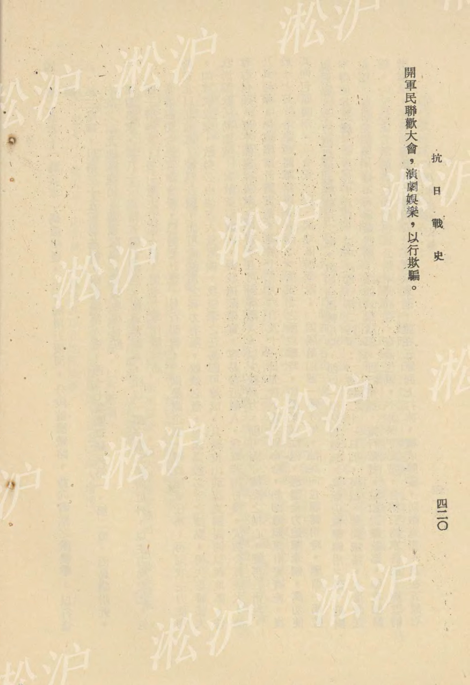

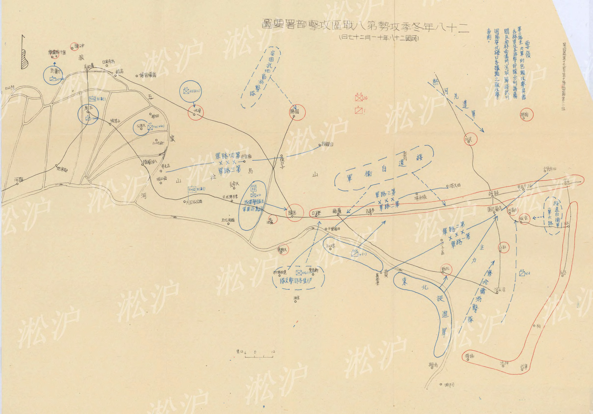

#### 第三款 作戰一般經過

民國二十八年十二月十八日至二十二日

參照插圖第一○五、插表第六十三、第六十四、第六十五第八戰區綏西各部隊，先後奉到傅副司令長官之各別命令後，卽遵照命令部署前進。

第一路軍共千餘人，卽在馬棚、萬和堂間原地集結，馬占山總司令於十二月十四日，令暫編騎兵第一旅，附新編騎兵第五師之一團及暫編騎兵第三旅之騎兵第五團，爲第一縱隊，於十七日，由黑格志灣推進歸綏附近地區，十八日開始向歸綏及其以東之敵襲擊，並截擊由東增援之敵。獨立騎兵第一團爲獨立第一支隊，由大營盤前進，渡黃河後，對托縣敵軍吸牽。並相機攻擊之。暫編騎兵第二旅爲第四縱隊，於十七日，由東廠汗不浪向歸綏附近地區推進。十八日向歸綏及其以南襲擊破壞，並截擊增援之敵。其餘爲預備隊。各出擊部隊，均限於十二月十五日在指定地點集結完畢。

第二路軍共約三千人，於十二月十日由後套出發，經伊盟，十六日全部到達薩、托間黃河南岸之楊三紅圪旦、李占王圪凸、喇嘛上間地區集結，卽令騎兵第七師於十七日夜渡河，襲擊麥達召車站並破壞薩縣、麥達召間鐵路，十八日轉移薩縣東南之三間房、白廟子、大興地間地區，截擊由東向西增援之敵。新編騎兵第四師，於十七日夜渡河，埋伏薩縣東南地區，截阻薩縣之敵，十八日午轉移五勝公附近地區，截擊由包頭向東增援之敵。

第三路軍兼司令官傅作義親率主力第三十五軍各部萬餘人，於十二月十五日，由後套沿包五公路兩側地區前進？十九日全部到達崑獨崙河沿岸，當卽令新編第三十一師附五臨警備旅一團，砲兵第二十五團，及游擊軍步兵四個團，以一部在前、後店子遮斷包固公路，阻敵增援，主力於十九日夜襲擊包頭而佔領之。第一零一師派步兵一團，附騎兵支隊，掩護新編第三十一師左側背。新編第三十二師於二十日推進至孟家梁、前口子等地區，以一部接替第一零一師之一部前口子封鎖之任務，並確實掩護軍之左側背。馬秉仁指揮之游擊部隊，於二十日零時向蘆池、包頭車站等地襲擊，以行牽制。左側支隊驅逐後口子敵人後，卽到杜家店，東沙灣遮斷交通，以掩護軍之左側背。

第四路軍第三十五師，亦於十八日到達安北以北水溝附近，卽以第二零六團（欠一營）附騎兵一排爲攻擊隊，向安北攻擊。第二零五團附第二零六團之一營位於格爾腦包、四盆堂地區，日機策應。第十七集團軍騎兵第一旅爲預備隊，位於五原附近。並令第十七集團軍騎兵第二旅攻擊察汗格爾廟，該旅於十八日卽已在狼山口以南之什蘭計集結。

第二十二軍在伊東各游擊支隊，卽在新民堡附近地區集結，以主力向磴口附近，一部向大樹灣之敵襲擊。

各路軍按照部署實施。第二路軍於十七日夜渡河開始向麥達召、薩縣間破壞鐵路，第三路軍於十九日夜開始攻擊包頭，第四路軍之第三十五師至二十日開始向安北攻擊，第一路軍之第四縱隊於十九日，第一縱隊至二十一日始行渡河，向歸綏附近襲擊。

十二月十八日三時，第二路軍新編騎兵第四師埋伏於薩縣東南地區。騎兵第七師將麥達召、薩縣間鐵路橋樑七座破壞，至八時，新編騎兵第四師轉移於大成西，突受敵騎及裝甲車圍攻，騎兵第七師轉移於薩縣東南之三間房、大興地、海子上間地區，亦受薩縣及二十四頃地之敵夾擊，各激戰竟日，門炳岳軍長擬於二十日再舉破壞，當晚令騎兵第七師轉移於二十四頃地東南一帶地區整理。

同日，第二十二軍伊東游擊第一支隊渡河襲擊磴口以東之公積板車站，將鐵路、公路遮斷，安、固、武地區游擊隊將白沙灣（公義明東）敵之前哨驅逐，繼續向公義明之敵攻擊。

十二月十九日晨，二十四頃地敵僞軍向清水壕一帶之騎兵第七師攻擊，被擊退，旋敵由薩縣，托縣各處增援圍攻，戰至十七時，我宿營地被突破，門軍長以態勢不利，遂於當晚令全部渡河，轉移於河南。

廠汗不浪、萬和堂間地區，收容整頓。

同時十時，第三路軍左側支隊新編第六旅，沿烏拉山北麓擊潰西官井、南官井之僞軍，佔領後口子十二月二十日三時，第三路軍新編第三十一師祕密接近包頭城垣，由西北門一舉突入城內，七時佔領城內東部及北部高地。同時安北敵二百餘，汽車十餘輛、砲四門，向包頭增援，行抵白彥溝口，經我左側支隊新編新六旅擊潰，殘敵向邊牆壕逃竄。八時，第一零一師之一部，攻佔包頭西北包固公路要點之前口子，另一部在毛鬼神窯子，將汽車二百餘輛、戰車二輛，步兵二百餘之敵擊潰，殘敵向包頭回竄。同時由固陽向包頭增援之敵汽車四十餘輛，戰車二輛，步兵四百餘，在公義店附近，經我綏遠游擊軍一部截擊，至晚，敵一部向我猛撲，大部繞道南進。傅兼軍長爲殲滅由固陽、安北南竄增援之敵，於十三時，令第一零一師立即推進至毛鬼神窯子、四道河間地區，新編第三十二師卽以一營兵力配置邊牆壕以北地區，主力卽向梁片窯、公忽洞間地區推進，準備擊敵。

同日，第一路軍第四縱隊破壞獨立壩附近之黑河大橋，伊東游擊隊第二支隊攻佔二里半電燈、麵粉兩公司，並進襲敵飛機場，安固武地區游擊隊續攻佔固陽西南六公里之水濠、六分子等敵據點，進至公盛西、三分子之線，與敵對峙。第四路軍第三十五師誘安北之敵至水溝附近，經伏兵夾擊，敵竄回安北城內。第十七集團軍騎兵第二旅，亦於六時，向察汗爾格廟攻擊，敵利用廟宇頑抗，並由老虎口及察汗依得蒙山各處增援約二百餘人，均經擊退，十九時，我實行火攻，將殘敵與廟宇同時燬盡，並完成佔領是日，傅副長官爲期第三路軍之進展順利，乃於十一時作如左之處置：

一、令第二路軍，務將歸綏、薩縣間鐵路、公路確實破壞，使敵不能西進增援。

二、令第四路軍，速向安北之敵積極攻擊，牽制敵不能向包頭增援。

三、令綏遠自衛軍各路指揮，速督飭所部積極破壞歸綏以西鐵路，並截擊沿線敵人，盡力牽制，勿使敵向西增援。

四、令安武固地區游擊隊，盡最大努刀，襲擊敵人，牽制其不能向包頭增援。

十二月二十一日，第三路軍新編第三十一師在包頭城內巷戰，於十二時續破壞十餘小據點，殘敵退據西南一隅頑抗。其由安北經白彥溝口南竄之敵，被新編第三十二師配置邊牆壕以北之一個營殲滅大半。由固陽經公義店南竄之敵，於同日二時竄至黃草竄，三和號地區。與新編第三十一師第九十二團激戰。傅兼軍長當令新編第三十二師及第一零一師，卽刻推進至三和號、後宮子以西地區，協力殲敵，四時許，該兩師各一部趕到，向敵側擊，至八時，將敵殲滅大半，並焚燬敵汽車三十餘輛。迄十二時，敵復由平綏方面增援步兵千餘，汽車百餘輛，砲十數門，以機砲掩護，向包頭東北高地第九十二團猛攻，戰局突趨逆轉，迄晚始趨和緩。

同日，第一路軍之第四縱隊，進抵大李保附近，破壞台閣木、畢克齊間鐵路橋樑兩座，路軌十餘節，第四路軍之第三十五師續向安北之敵襲擊，敵退城內固守，第二路軍之騎兵第七師亦於是日夜再行渡河，對前次破壞地區再加破壞。

當夜，傅副長官綜察戰局，突趨惡劣，且牽制消耗敵人之目的已達，遂決心變更態勢，令第三路軍轉移崑獨崙河以西劉三仲圪旦、李丑林圪旦之線。機動擊敵。

十二月二十二日八時，包頭敵一部竄至崑獨崙河以東地區，經我第一零一師截擊回竄。

同日，第四路軍之第三十五師將安北城郊外敵工事破壞後撤回。安固武地區游擊隊迫近固陽西北城垣，繁敵甚多，並擊退由武川向固陽增援之敵。伊東游擊第四支隊於是日夜渡河，曾一度佔領磴口車站，將工房及儲藏品焚燬，並破壞鐵路數處。第二路軍之騎兵第七師亦於是日夜向薩縣襲擊，曾一度突入城內，卒因敵火猛烈，未能奏功，於拂曉前，轉移黃河南岸。

十二月二十三日，傅副長官爲機動擊敵及便於整頓綏西部隊計，續作如左之處置：

一、綏遠游擊軍之游擊第一、第二兩師及游擊獨立第二團轉移崑獨崙河兩岸地區游擊，馬逢辰部卽轉移河曲圪旦、郝鎖間地區積極整頓。

二、騎兵第六軍，酌派小部在綏薩間游擊破壞鐵路，主力卽轉移河南選地集結整頓。

三、安固武地區游擊隊暫仍在固陽附近游擊。

四、第八十一軍，第十七集團軍騎兵第一、第二兩旅，暫編第十師，五臨警備旅，統歸第八十一軍軍長馬鴻賓指揮，在烏七渡口亘烏布浪口之線，沿五家河佈防，並掘築冰窟。

各部遵照命令行動，惟敵在包頭受創甚鉅，雖屢次增兵，未敢西進，我軍除留游擊部隊繼續在敵後牽制外，主力遂於民國二十九年元月一日撤回後套，集結於五原附近，但爲確保五原、臨河之目的，復於元月八日，將綏西部隊重行部署，積極整頓，準備擊敵，冬季攻勢至此乃告一段落。

惟自冬季攻勢之後，敵由晉北抽調部隊，於元月杪，以優勢兵力，乘後套結冰時期，進攻後套，經我不斷作戰消耗後，雖先後陷我五原、臨河等地，卒不能持久，於三月間，向東抽調兵力，我軍乘機舉全力攻擊，將敵壓迫於五原附近，復於四月一日克復五原，將敵驅逐，恢復冬季攻勢前之態勢。

計自冬季攻勢以迄克復五原，經過時間三個半月，敵進展雖達三百公里，但仍爲我軍恢復，已達成國軍最高戰略持久消耗之目的，在冬季攻勢期間，計斃傷敵騎兵聯隊長以下約二千人，我軍傷亡（參照插表第六十三）囪獲（參照插表第六十四）械彈損耗（參照插表第六十五）

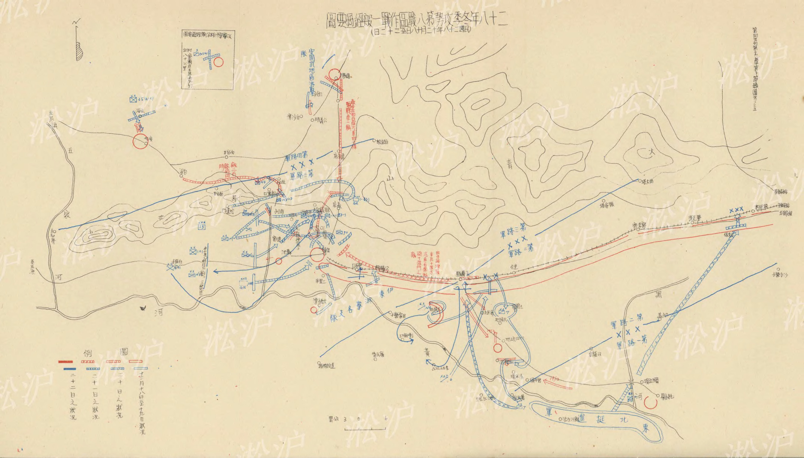

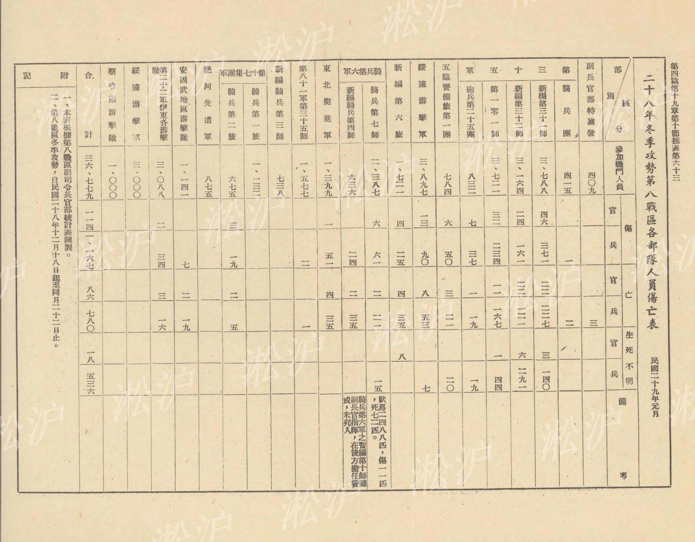

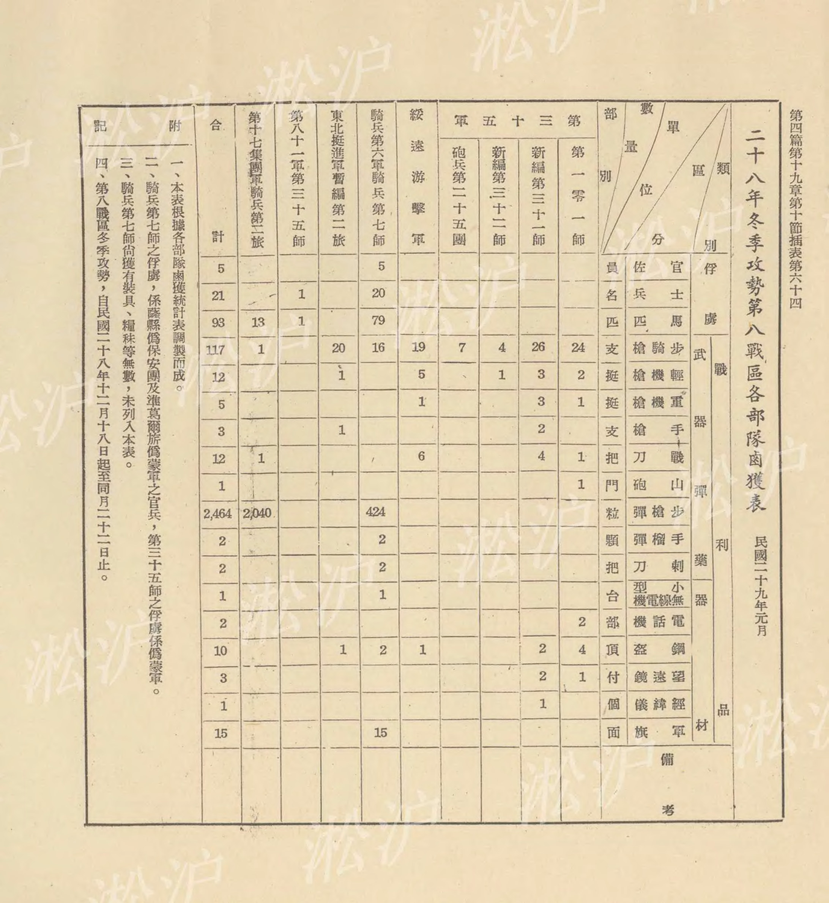

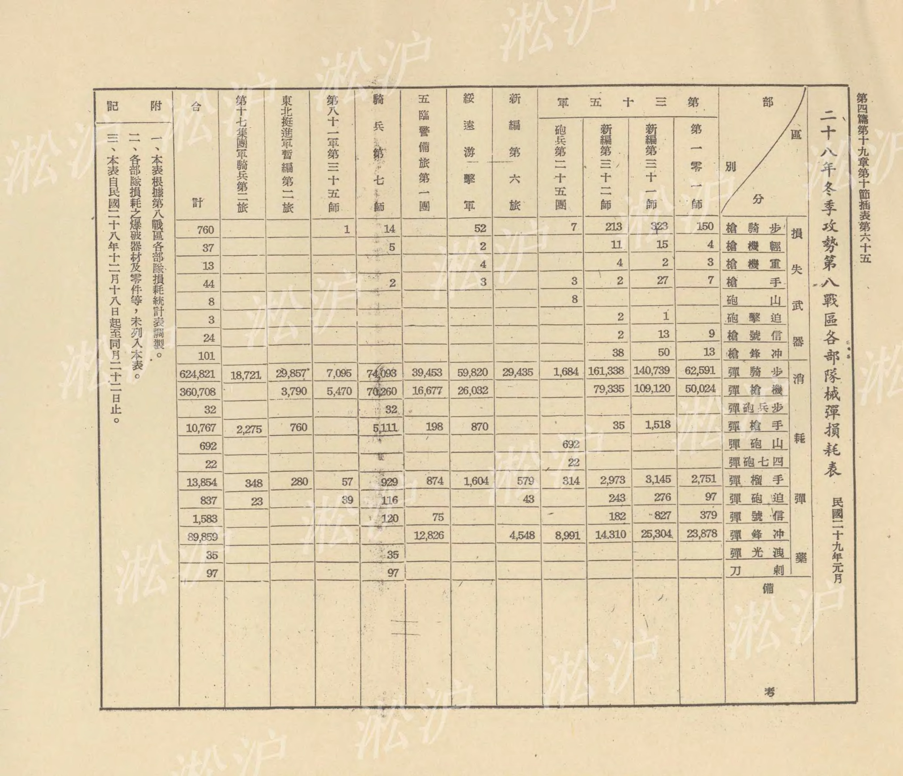

#### 第四款重要戰鬥

##### 第一項 包頭爭奪戰

民國二十八年十二月十九日至二十二日

參照插圖第一○六、第一○七

第三十五軍奉命爲第三路軍，擔任攻擊包頭，作強襲之準備，由後套祕密前進至崑獨崙河沿岸地區，一面攻城，一面截擊敵援之部隊，於十二月十九日晚開始攻擊，二十日晨一舉突入包頭，並擊潰由固陽、安北增援之敵，二十一日，復與由平綏方面增援之敵，爭奪至晚，我以牽制消耗敵人之目的已達，遂轉移於崑獨崙河以西地區，繼續撤回後套整頓。

第一目

包頭附近地形

包頭，北倚大青山，南臨黃河，西有崑獨崙河，形勢險要。鐵路東達北平，水路西通寧夏，公路棋佈，對綏西各城市均能暢通無阻，且可直達寧夏、蘭州，實握有水陸交通之樞紐，爲綏西敵之最重要據點。其城南有敵兵營及飛機場各一，城四週均構有外壕，並架設鐵絲網，尤以西、北兩門爲最堅固。

第二目

戰鬥經過

民國二十八年十二月中旬（參照插圖第一○三）駐守包頭、固陽、安北地區之敵，爲騎兵第一旅團，第二十六師團之第十三聯隊一部，及獨立第四、第二十四各守備隊，並僞軍第一、第六、第八等三個師，共約敵軍三千二百餘，僞軍一千五百餘，砲二十七、八門，戰車十四五輛，裝甲車、汽車約一百八十輛。其駐包頭者，僅敵軍九百餘，僞軍五百餘，野山砲十八門，戰車七輛，汽車百餘輛，惟包頭交通便利，固陽、安北及平綏方面之敵，可隨時增援。

我第三十五軍駐防後套，於十二月十一日奉傅副司令長官電令，第三十五軍附新編第六旅，五臨警備旅，綏遠游擊軍，爲第三路軍，限於十二月十八日晚，推進至趙檀坨旦迄大長命之線，誘殲敵人，並乘虛襲奪包頭，當時以沿途沙漠，冬季嚴寒，行動困難，但基於任務，乃策定第三路軍攻擊計畫如左。參照插圖第一○六

作字第號

第三路軍攻擊計畫

民國二十八年十二月十二日

於塔布木多

第一方針

軍以擊滅敵人收復包頭之目的，擬誘敵於據點外一舉殲滅，並乘虛襲奪包頭，重點保持在左，攻擊開始日期，預定爲十二月十九日以後。

第二

指導要領

一、先以在烏拉山前游擊部隊，於趙櫃圪旦、劉三仲圪旦、李丑林圪旦之線，擔任掩蔽主力軍之行動。二、主力軍利用夜暗，沿包五公路兩側祕密推進，並隨時準備與敵作遭遇戰。

三、敵若察知我軍行動，由包頭抽兵向西進攻時，我卽展開全力攻擊之。

四、主力軍接近崑獨崙河以西地區時，卽派有力一部祕密進入烏拉山，向包頭運動，待敵出城與我作戰時，卽乘虛襲擊包頭。

五、敵若與我主力稍一接觸，卽退守包頭據點待援時，我以強有力之一部攻擊包頭，主力按圍攻據點打擊援兵之要領指導之。

六、敵若對我之行動毫未察覺時，卽派有力之一部襲擊包頭，主力推進至城郊擊敵增援。

七、攻入包頭後，敵如大量增援，痛予打擊後，卽轉變態勢，機動擊敵。

八、攻略包頭後，主力卽向歸綏推進，同時發動民衆，將包頭城垣及敵一切軍事設備澈底破壞。

第三

兵團部署

一、軍隊區分：

擾亂隊

司令

綏遠游擊軍司令馬秉仁

綏遠游擊軍司令部

游擊第一師

游擊第二師

游擊獨立第二團

襲擊隊

司令

綏遠游擊軍第一旅旅長馬逢辰

游擊第一旅

缺欠部隊

第三團

游擊第二旅

缺欠部隊

第六團

新編第三十二師

配屬部隊

砲兵第二十五團第二營

新編第三十一師

配屬部隊

五臨警備旅第一團

砲兵第二十五團第三營

砲兵第二十五團第二營第四連

戰車防禦砲連

左側支隊

長

新編第六旅旅長

新編第六旅

第一零一師

區處部隊

砲兵第二十五團第一營

戰車防禦砲連

二、各部隊之任務及行動：

(一)擾亂隊，於十二月十七日，由現地出發，繞道蕨池以南，向包頭積極襲擾，牽制敵人。

(二)襲擊隊，自十二月十五日至十八日，在趙櫃圪旦、劉三仲圪旦、李丑林圪旦之線，擔任主力軍前進間之掩護，待主力軍到達後，即入哈達門溝，祕密繞道向包頭以北地區推進，俟敵出城與我主力軍作戰時，乘虛襲奪包頭。

(三)新編第三十二師，自十二月十五日起，沿包五公路以南地區，向崑獨崙河之線祕密前進，與敵遭遇時，卽展開全力攻擊之。

四新編第三十一師，自十二月十五日起，沿包五公路兩側地區，向崑獨崙河之線祕密前進，與敵遭遇時，卽展開全力，保持重點於左攻擊之。

(五)左側支隊，自十二月十六日起，沿烏拉山北麓東進，驅逐敵僞軍，掩護軍之左側背。

(六)第一零一師，爲第二線兵團，自十二月十六日起，在新編第三十一師後跟進。

(七)新編第三十二師與新編第三十一師之作戰地境，爲蘆官壕—東圪卜—哀紀亞—趙櫃—水相樹—划子補隆—毛驢特拉—留栓—善人圪旦—黑小—曹家營相連之線，線上屬新編第三十一師。

同時，第三十五軍策定行軍計畫，於十二月十五日，開始向崑獨崙河之線前進，令綏遠游擊軍在趙櫃圪旦迄李丑林圪旦之線擔任掩護，兼司令官傅作義親率部前進，在前進間，令綏遠游擊軍，以游擊第一、第二師，游擊獨立第二團，於十六日晚，繞道麻池以南，向包頭積極襲擾，牽制敵人，以步兵四個團，歸馬逢辰旅長指揮，於十七日晚，入哈達門溝，祕密繞道向包頭以北地區推進，俟敵出城與我作戰，卽乘虛襲奪包頭，如十九日晚，我軍攻擊包頭，卽歸新編第三十一師孫蘭峯師長指揮。

十二月十八日（參照插圖第一○七）傅兼軍長進抵李丑林圪旦，對各部隊長指示敵情及攻擊包頭之方法，與成功後應有之處置參照本節附錄第一，並綜合連日來包頭方面之敵情如左：

一、包頭散駐城內之敵，已分別集結各戲院內居住，全城約計五百餘人，小島騎兵司令部駐前第七十師師部舊址。

二、敵新增瓦斯隊一隊，共約百人，分駐包、安、固各地。

三、包頭城南薛家營子駐敵砲兵百餘，野砲十門、汽車三十餘輛，蔴池駐敵五十餘，機場僅留偵察機一架。

四、北門外防水壕寬約六尺，深約五尺，城垣外有縱深五尺之鐵絲網。

五、西腦包村北面土嶺上有砲台四座，土嶺南麓有外壕，嶺頂有鐵絲網，韓慶壩附近（距包頭三公里）高地有新建砲台一，周圍有鐵絲網。

十二月十九日，我左側支隊新編第六旅沿烏拉山北麓，驅逐西官井、南官井之敵僞軍，已佔領後口子，主力軍亦到達崑獨崙河沿岸，並得悉騎兵第六軍已將麥達召、薩縣間鐵路橋樑破壞，傅兼軍長遂决心夜襲包頭，於十六時下達攻擊命令，要旨如左：

一、孫蘭峯師長爲攻城指揮官，砲兵指揮官劉振衡爲副指揮官，指揮新編第三十一師，五臨警備旅第一團，砲兵第二十五團及游擊軍步兵四個團，以一部在前後店子遮斷包固公路，阻敵增援，主力於今日晚開始猛烈襲擊包頭，一舉而佔領之。

二、第一零一師派步兵一團，附騎兵支隊，限卽到崑獨崙召附近，對前口子之僞軍實行監視，確實掩護新編第三十一師左側背，於二十日零時，驅逐該敵後，卽將崑獨崙溝，前口子移交新編第三十二師，歸還建制，該師全部限二十日五時，前進至武應福窯、張木茅窯、燕昌窯、永和窯、趙家店、豐社等地區。

三、新編第三十二師，於二十日二時，推進至孟家梁、基營前口子、崑獨崙召地區，以一部接替前口子第一零一師之一部，封鎖崑獨崙召、前口子，確實掩護軍之左側背。

四、馬秉仁司令指揮游擊部隊，於二十日零時，開始向蔴池、包頭車站及飛機場、薛家營子之敵猛烈襲擊，以行牽制。

五、左側支隊驅逐後口子敵人後，卽到杜家店、白彥溝口、東沙灣遮斷交通，確實掩護軍之左側背。

六、砲兵第一營（欠第三連）、第二營（欠第四連），於十八時前，在王來柱營附近集結，並由第一零一師派兵一營掩護，統歸砲兵劉指揮官指揮，隨同新編第三十一師向包頭以北地區前進，到達後，連同附屬新編第三十一師之砲兵，在北黃草窳、前營間地區佔領陣地，協助新編第三十一師攻城。

各部遵於十九日黃昏前進，攻城指揮官孫蘭峯，以新編第三十一師之第九十一、第九十三兩團攻城，第九十二團之一營協助之，其餘在北黃草窳集結，掩護砲兵。以游擊軍之一部，位於公義店附近，阻擊由固陽增援之敵，主力由馬逢辰旅長指揮攻擊包頭車站、薛家營子及城南之敵。

十二月二十日三時，我攻城部隊迫近城垣，當卽展開戰鬥，我步兵在砲火掩護下，前仆後繼，突過鐵絲網及外壕，第九十三團安春山團長、邵紹儉營長身先士卒，捷足登城，殲滅守兵，當奪佔要點數處，五時佔領西北門及東北門，於是與敵肉搏巷戰，同時邢營長率兵數十直搗敵司令部，奪獲無線電臺及黃色炸藥兩萬餘塊，第九十一團及五臨警備旅第一團相繼入城，此時敵在戰車及砲火掩護下逆襲，被擊退，七時，我攻佔城內北部高地及東部街市，並佔領敵倉庫一所，鹵獲彈藥甚夥，時僞軍紛紛反正，民衆自動參加作戰。

當我軍攻進包頭城時，配屬第九十三團之砲兵第八連排長史培義，率砲二門，在城內東北角佔領陣地，於四時許，敵兵乘汽車十餘輛馳來，迨敵接近陣地，該排長負傷指揮，阻敵前進，終以傷重殉職。是日七時，擔任掩護之第一零一師，其第三零一團在毛鬼神窯子與敵二百餘、戰車二輛遭遇，經戰鬥後，斃敵三十餘，擊燬戰車一輛，殘敵向包頭逃去，八時三十分，第三零二團向前口子之敵攻擊，十一時許，敵不支，向東潰走，當將該地佔領，獲山砲一門、步機槍三十餘支。

同日七時，安北及固陽方面之敵，均向包頭增援，由固陽增援之敵四百餘、戰車二輛、汽車四十餘輛，經游擊軍一部在公義店附近截擊，至晚，敵一部向我猛攻，大部繞道南進，由安北增援之敵二百餘，砲四門、汽車十餘輛，在白彥溝口附近，與我新編第六旅戰鬥，十八時，我燬敵汽車八輛，斃敵百餘，殘敵向邊牆壕逃竄。

當日，傅兼軍長逐次進至當舖窯子，於十三時，爲殲滅由固陽、安北增援之敵，令新編第三十二師，卽以一營配置邊牆壕以北地區，準備截擊由安北囘竄之敵，主力卽向梁片窯、公忽洞間地區推進，第一零一師應用威力壓迫當面零星殘敵，並卽刻推進至毛鬼神窯子、四道河間地區，準備擊敵。

十二月二十一日二時，由白彥溝口竄至邊牆壕之殘敵，被新編第三十二師之一營殲滅大半，同時由公義店南竄之敵，竄至黃草竄、三和號附近，與新編第三十一師第九十二團戰鬥，敵藉砲火與戰車掩護，向我數度衝鋒，均被擊退，旋敵施放毒氣，我當令正面部隊後撤，三時，傅兼軍長復令新編第三十二師立刻推進至三和號、後宮子以西地區，協同第九十二團殲滅該敵，並焚燬敵汽車四十餘輛，敵一部據三和號頑抗，復經第九十二團盡殲。

同日十時，新編第三十一師入城部隊，將敵壓迫退守西南一隅頑抗，十二時，敵由平綏方面增援步兵千餘、汽車百餘輛、砲十數門，在包頭東北高地與新編第三十一師第九十二團一部戰鬥，敵雖藉飛機及砲火掩護，數度猛衝，企圍奪佔高地，均經擊退。十三時，敵由平綏鐵路增援之敵到達，經第一零一師及軍直屬部隊迎擊，戰況激烈，迄十九時，始趨和緩。傅兼軍長判斷綏包間鐵路，敵已修復，遂依原定計畫轉移，至晚，令新編第三十一師及五臨警備旅第一團繞道河南，轉移於白廟子整頓，新編第三十二師轉移於高家河頭、劉三仲圪旦之線，第一零一師轉移於鄔滿城、李丑林圪旦之線整頓，新編第六旅卽開西山咀佈防，砲兵開趙櫃圪旦整頓，綏遠游擊軍轉移崑獨崙河兩岸游擊。

十二月二十二日八時，我正向崑獨崙河以西轉移，發現敵汽車三十餘輛，載敵約三百餘，砲四門西1

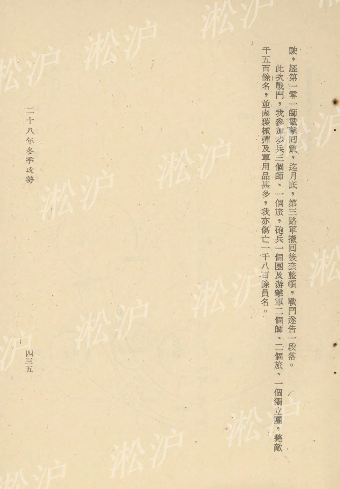

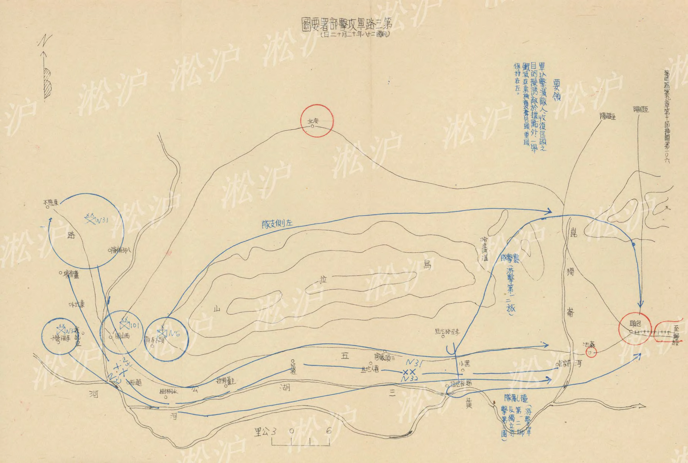

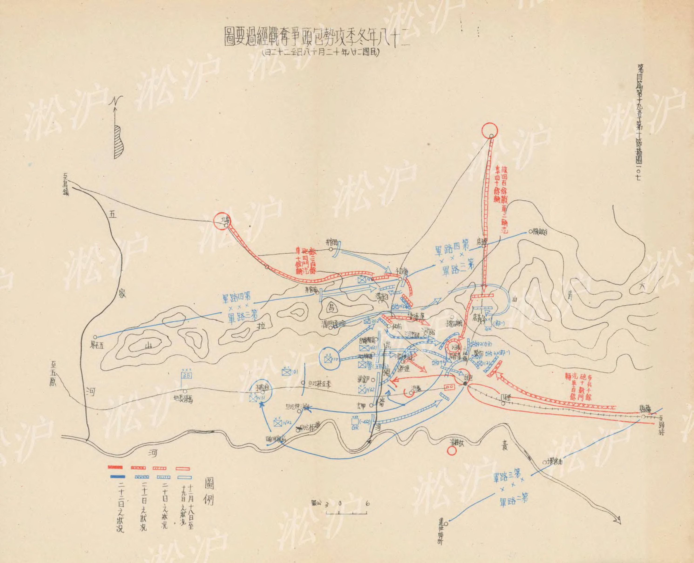

##### 第二項薩縣附近及二十四頃地東南地區之戰鬥

民國二十八年十二月十七日至二十四日

參照插圖第一○八、第一○九、第一一○

騎兵第七師爲騎兵第六軍之主力部隊，師長由門炳岳兼任，轄第十九、第二十、第二十一等三個騎兵團，於民國二十八年十二月九日奉軍部冬季攻勢前進命令，於十日夜由後套出發，十六日推進至黃河南岸海流素、李占圪凸、喇嘛上間地區集結，十七日晚渡河，破壞麥達召、薩縣間鐵路橋樑七座，十八日轉移薩縣東南地區，突遭薩縣及二十四頃地之敵襲擊，晚又轉移二十四頃地東南清水壕一帶整頓，十九日復遭薩縣、二十四頃地、包頭各方面之敵圍攻，晚再轉移河南整頓，二十一日晚繼續渡河，破壞鐵路及襲擊薩縣之敵，曾一度突入薩縣城內，因敵火猛烈，未能奏功，復於二十三日撤回河南整頓。

第一目薩縣及二十四頃地附近地形

薩縣（卽薩拉齊）介於平綏鐵路歸綏與包頭之間，爲包頭以東之門戶，北倚大青山山麓，南有民生渠、黃河爲其屏障，並握有黃河之二十渡口，民生渠與黃河間有支渠八成縱交，水利灌溉便利，物產豐富，公路東至歸綏，西通包頭，西南可達托縣等地，交通暢達，如將鐵路、公路破壞，則可阻敵西援二十四頃地位於第七、第八支渠之間，距薩縣約十五公里，公路可直達該地，雖處於河流交錯之中，地勢平坦，仍利於騎兵之作戰。

第二目

戰鬥經過

民國二十八年十二月中旬，包頭駐守敵步騎砲兵六百餘、砲二十餘門、戰車七輛、裝甲車二十餘輛，薩縣駐敵二百餘，二十四頃地駐敵百餘，黨三窯子駐僞蒙軍保安隊二、三百人，平緩鐵路各車站均駐有十名至三十名不等，沿黃河北岸各公路，時有敵汽車三、五輛沿河梭巡。

我騎兵第七師，於十二月十日夜，奉命由後套之蘆官壕、西公中等地出發，十一日到達王芳營子、公格，十二日抵紅鞋不拉，十三日經張家坨卜至柴登，十四日進至瞻旦召，十五日在侯家營子、五巨木新民堡一帶地區宿營，十六日推進於楊三紅河頭、海流素、李占王坨凸、喇嘛上間地區集結，騎兵第六軍令該師於十七日夜，由銀匠窯子、喇嘛上間渡河襲擊麥達召車站，徹底破壞薩縣、麥達召間鐵路，十八日八時轉移於三間房、白廟子、大興地間地區截擊由西增援之敵。

門兼師長奉令後，於十七日二時，在白尼景下達命令，其要旨如左：

一、第十九團，於十七時開始，在銀匠窯子、紅眼窯子間渡河，循油房灣、三間房、蘇波蓋方向前進，襲擊麥達召車站敵人，並阻止敵人向西增援，開始時間爲十八日二時，任務完成後，應於八時，以主力位置於三間房、鍾麻營子、單進營子、大小廟營子間地區截擊敵人，並於得勝營子、蘇糖營子、王大發營子附近地區，酌派警戒部隊，監視西進增援之敵。

二、第二十一團附技術破壞隊，應於十八時開始，在喇嘛上渡口渡河，循四勝魁、石志藏營子方向前進，大量破壞薩縣與麥達召車站間之鐵路，開始時間爲十八日二時，任務完成後，於八時，以主力移置於大白廟子、海子上、大高蔡車營子、康四營子間地區截擊敵人，並於油房營子、石志藏營子、王慶營子附近酌派警戒部隊，嚴密監視薩縣、包頭方向增援之敵。

三、第二十團（欠騎兵第四連），應於八時，在二忙渡口渡河，主力集結黃河坪、北官地、大沙街、小沙街附近地區，準備待命，對薩縣及二十四頃地方面之敵，應嚴行警戒，並與第十九團右翼切實連繫。

四、本隊（欠技術破壞隊）附第二十團騎兵第四連，應於十六時三十分，俟第二十團渡河後，卽開始向二忙渡口渡河，進至大興地、興地、河頭興地、三格架附近地區集結警戒。

各部遵令先後出發，師部及直屬隊於十八日一時到達大興地，卽令第二十團第四連在武家坨旦佈防，以截斷薩縣、二十四頃地間之交通。

第十九團於十七日十七時出發，十八日一時到達蘇波蓋附近，爲繞行該處以東、以南之冰灘，各部隊落伍者甚多，致最初使用之兵力，僅有第三連及第二連之一排，當令第三連襲擊麥達召車站，並破壞鐵路，第二連之一排擔任掩護及破壞車站東之鐵路橋，二時五十分，第三連衝至車站附近爲敵火所阻，三時三十分該團餘部先後陸續到達，當令第二連協同襲擊車站，第一連（欠一排）、機關槍連、隨伴砲隊、通信排、爲預備隊，並令第一連派一部對蘇波蓋之敵警戒，通信排派一部及第一連爆破班加入破壞鐵路，五時破壞鐵路兩處鐵路橋樑兩座，隨卽向單營子、鍾麻營子、三間房地區轉移。

第二十團於十七日十八時出發，十八日零時三十分到達黃河坪附近，八時，敵汽車三輛，由二十四頃地向薩縣行駛，經第四連誘至武家坨旦至范家坨旦間擊燬二輛。九時三十分，敵汽車十餘輛，載步砲兵百餘、砲二門，由二十四頃地向武家坨旦攻擊，第四連堅強抵抗。師長當令第二十團、第二十一團各派一部支援該連。十五時，第二十團第一、第二兩連各一部到達，向敵側擊，入暮，第二十一團第一連亦到達，以主力向敵側背攻擊，以一排繞襲敵砲兵陣地之背，敵乃逐漸撤退。

第二十一團於十七日十八時三十分出發，二十三時到達大白廟附近，卽命各連破壞隊，統歸陳昭璧團附指揮，對麥、薩間鐵路務須澈底破壞，並以一部圍剿東西老藏營子及新農試驗場僞軍，任務完成後，卽歸還建制。第四連駐康四營子，第二連主力位於大高蔡車，一部在王慶營子附近，第三連位於海子上，各派遣斥候對敵監視，第一連在壕沿附近爲預備隊，機關槍連在小高蔡車，隨伴砲隊、通信排位於小白廟。

陳團附奉令後，卽令各破壞組及掩護隊向指定地點前進，工作進行順利，計破壞鐵路橋樑五座，路軌六十餘根，電桿二十五根，於返防時，並將民生渠上之木橋破壞四座，十八日七時五十分全部歸還建制。十時，敵汽車七輛、騎兵八十餘，向海子上攻擊。另敵汽車二輛向萬和永包圍，胡團長當以預備隊之一排增援海子上，主力進至萬和永向敵側擊，十三時不支退竄。

十二月十八日，傅副長官迭以巧辰、巧午電、令騎兵第六軍，務於二十一日前，將綏薩間鐵路大量破壞，應避免與敵決戰，惟不可與敵脫離，敵如攻擊該部，卽行東進施行牽制，敵如脫離該部，卽攻擊歸緩，門軍長奉令後，以新編騎兵第四師在大成西一帶被敵包圍，第三十五軍須二十日始能攻擊包頭，爲騎兵第七師避免與敵決戰，並欺騙敵人再舉破壞計，遂於十八時下達命令要旨如左（參照插圖第一○九：一、第十九團於十九日零時，向賽烏素、高紅窯子、阿八窯子、喻家窯子間地區轉移，對托縣方面之敵，嚴行警戒。

二、第二十團於十九日零時，向清水濠、哈拉蘇壩、范家坨堆間地區轉移，對二十四頃地方面之敵警戒三、第二十一團於十九日零時，向杜家窯子、麻花窯子、石窯子、南毫賴囫囵間地區轉移，對托縣、薩縣及鐵路方面嚴行警戒。

四、本部及直屬隊於二十二時，向溫布濠、五大成窯子間地區轉移。

各部奉令後，卽遵時向指定地區轉移。

師部及直屬隊，於十九日拂曉到達南溫布濠，十二時尚未能與各團完全取得連絡。

第十九團於十九日二時，行抵當鋪窯子，遭受僞保安隊阻擊，前衛第一連繞道進駐水坨鬼窯子，主力於四時行抵北麻花窯子，又被該村僞蒙兵阻擊，同時附近各村僞蒙兵向該團攻擊，該團不得已暫在北麻花窯子停止。是時，第二十一團正向北善但窯子僞蒙軍攻擊，該團爲策應第二十一團，並打通路線計1

，乃以第二連向不二旦，第四連向南麻花窯子攻擊，八時，我將該兩地攻佔，適敵由二十四頃地方駛來汽車三輛，向第二連攻擊，該團以東北西三面被圍，遂就南北麻花窯子、不二旦佔領陣地。

第二十團於十九日三時，到達石窯子附近，突遭僞蒙保安隊圍攻，遂以第二連掩護，通過石窯子，佔領清水濠附近各據點。十二時，敵僞軍戰車六輛、汽車四十餘輛、山砲四門，由二十四頃地向李三坨旦攻擊，我哨兵被迫後撤，敵續向我第一、第二兩連陣地攻擊，十四時，托縣方向增敵汽車十餘輛、山砲數門，在東坨洞沿砲擊，十五時，由薩縣方向陸續增加敵汽車八、九十輛、砲六門、騎兵三、四百，向清水濠迂迴，經第四連及機關槍連側擊，敵竄回西坳洞沿。十六時三十分，敵集中全力向我猛攻，張團長爲減少損害計，乃令第四連及機關槍連掩護，主力向黃河南岸移。

第二十一團於十九日五時，到達南毫賴囫圖附近指定地區，將散駐區內之僞蒙兵驅逐，十一時五十分，敵汽車十餘輛、騎兵百餘名，由石窯子向北毫賴囫圖攻擊，未逞，十五時，令第二、第三兩連向東坨洞沿之敵側擊，戰至十七時三十分，未能奏功。

是日晚，門兼師長以態勢不利，令各團轉移黃河南岸之廠汗不浪、萬和堂、柴登間地區整頓。

十二月二十日，騎兵第七師全部轉移於指定地區後（參照插圖第二○），奉傅副長官號己電令：「我新編第三十一師已於二十日晨攻入包頭城內，正巷戰中，該師如能將綏、薩間鐵路、公路確實破壞，使敵不能西進增援，則成功可期。門兼師長遂令第十九團進駐黃河北岸萬和永、二虎營子、陳家葫蘆頭、蒙古局一帶地區，第二十團進駐利大漢營子、李興營子地區，第二十一團及直屬隊進駐七座毛庵、把字兒、楊家坨堵間地區，統於二十一日晚開始，並各派多數小組，再行破壞鐵路。

十二月二十二日拂曉，第十九團已將民生渠及各支渠之橋樑破壞完畢，門兼師長在七命葫蘆頭得悉二十四頃地以東之敵已西增包頭，薩縣駐敵騎兵第一旅，一部四百餘人、砲數門、僞蒙軍二百餘人，除以少數守城及車站外，餘均調赴包頭，因之爲牽制敵人計，決心卽夜攻擊薤縣，遂召集各團長下達口述攻擊命令，要旨如左：

一、第十九團爲右翼隊，應於卽日夜，由現地出發，主力佔領東營、南園之線，攻擊城之東南部，並派有力之一連佯攻車站，阻敵向城內增援；攻擊開始時間，爲二十三日零時；成功後掃蕩南北大街以東區域之敵，並大量破壞敵倉庫。

二、第二十一團爲左翼隊，應於卽日夜，由現地出發，佔領吳壩至南園西端之線，攻擊城之西南部；攻擊開始時間爲二十三日零時；成功後，掃蕩南北大街以西之敵，並大量破壞敵人建築物及倉庫。

三、第二十團及師直屬隊爲預備隊，應於二十三日零時到達李二羊家附近位置，並由第二十團派兵一連進駐莊圪代，伏擊由包頭增援之敵。

各部遵令，均於二十四時前到達指定位置。

第十九團於二十三日一時，由楊家房子開始攻擊，一時三十分，第一連連附劉德成、排長何雙進率兵一排攀登城垣，爲敵火阻擊，不幸中彈壯烈殉國，該團乃發撤退信號撤出。

第二十一團第一、第二、第三連，於二十三日零時，由張蓋營子攻擊前進，零時三十分，第四連之一排已佔領吳壩村緣之據點，攻城部隊亦迫近城垣，爲敵火所阻，同時吳壩之敵繞至我背後攻擊，戰至二時，乃發出撤退信號。

門兼師長在李二羊家，於二時許，連見撤退信號，遂令第二十團掩護向河南撤退（參照插圖第一○一之左角圖），第十九團撤至上、下海流素附近，第二十一團撤至喇嘛上、大廟上、平房營子間地區，第二十團則撤至李玷圪凸、上下楊老窯子間地區，師部在白尼景。

十二月二十四日，敵汽車六十餘輛、騎兵三百餘，由包頭沿黃河北岸向東行駛，另敵兵一隊在四合興渡河搜索，經第二十團分途截擊，毀敵汽車一輛，敵退走。

十二月二十七日，遵傅副長官電令，向挑力民集結整頓，戰鬥遂告一段落。

此次戰鬥，我參加官兵二千四百餘名，馬騾約二千四百八十餘匹，破壞鐵路及公路橋樑十四座，擊毀敵戰車二輛、汽車十餘輛。

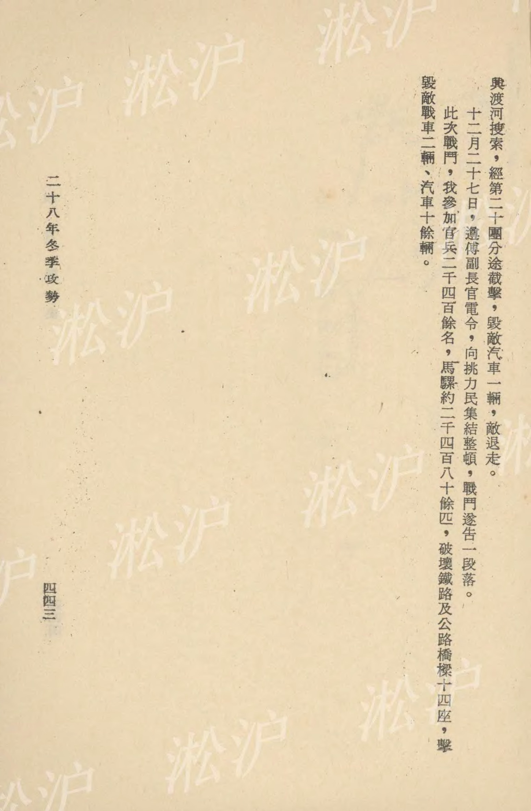

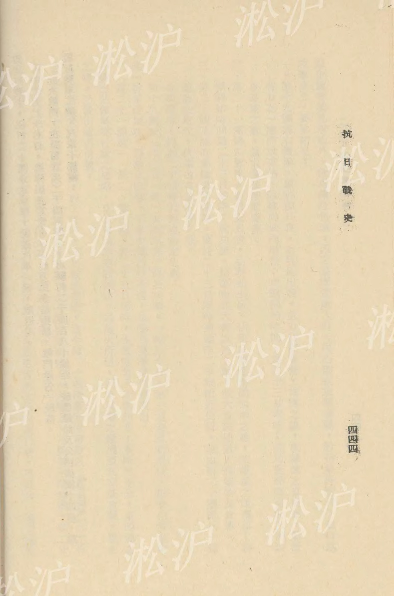

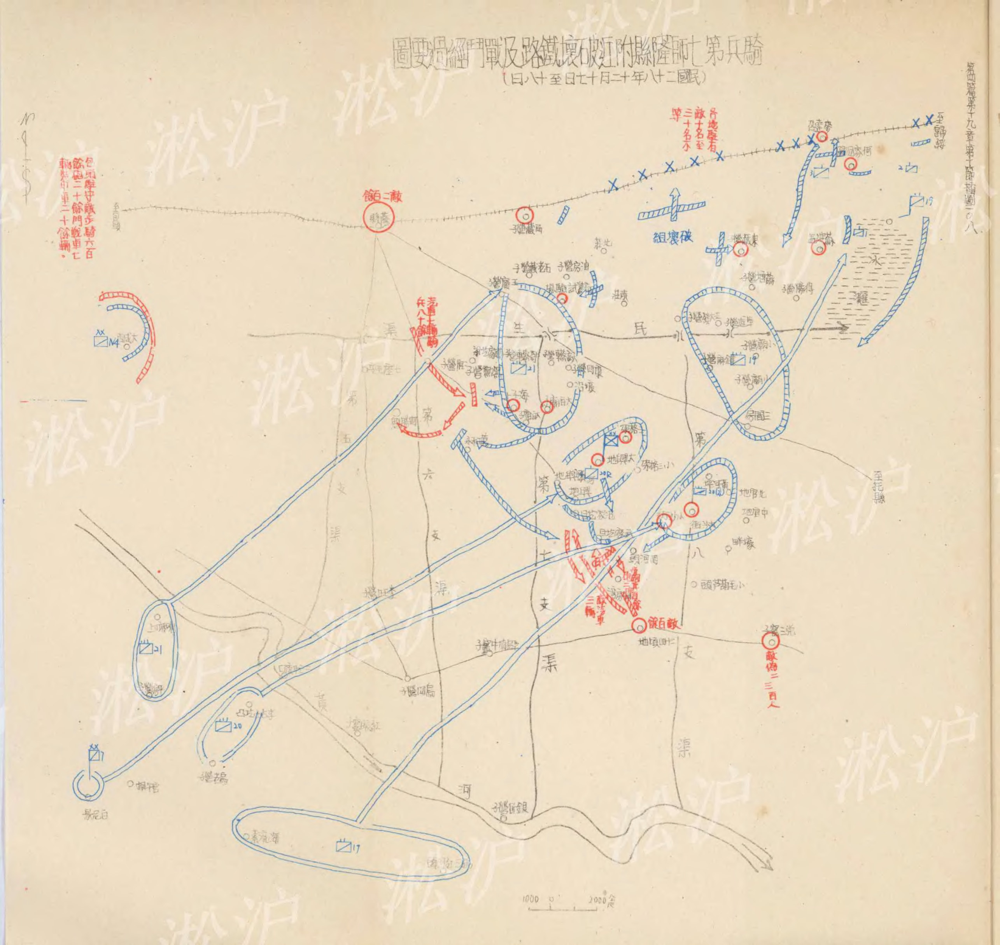

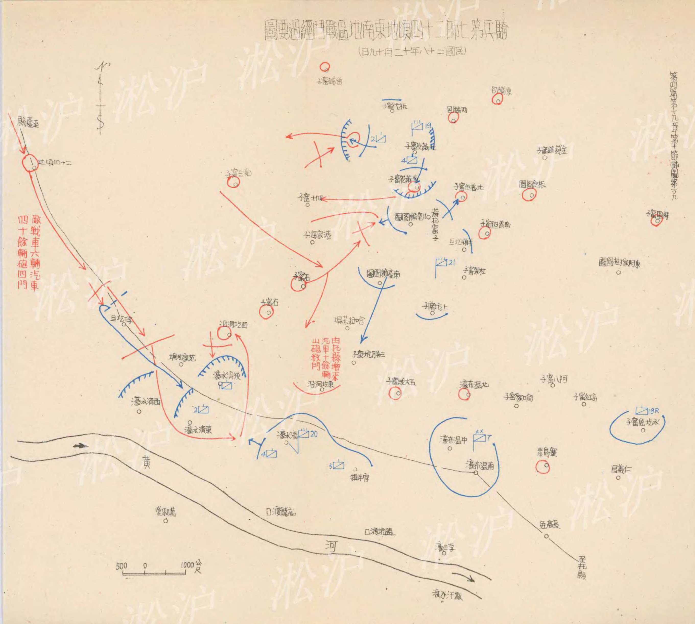

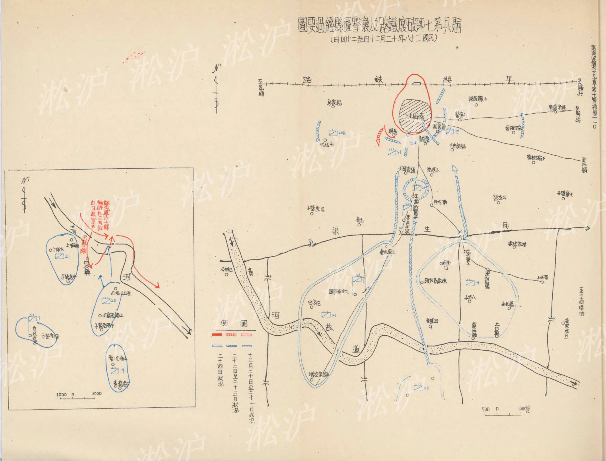

##### 第三項 五原臨河間之戰鬥

民國二十九年元月二十八日至二月十二日

參照插圖第一一一至第一一八

緩包之敵，自我軍於民國二十八年十二月攻佔包頭受挫後，爲圖報復，於二十九年元月中旬由晉北抽調步、騎、砲兵約五個聯隊，乘我後套結冰時期，向西進攻，我軍當分右、中、左三個地區軍主力集結於中央地區，擬機動擊滅其西進企圖，部署甫定，敵卽於元月二十八日分兩路進攻。一路由包頭沿黃河兩岸，相繼突破我右陣地，一路由安北於二月一日突破左地區軍烏布浪口陣地，中央地區軍當向其增加，敵更以汽車七百餘輛，由烏鎮及黃河南岸侵入後套，向西突進，二日陷五原，四日陷臨河，我軍卽劃區機動擊敵，十二日克復臨河，並將敵壓迫於五原附近，雙方損失均重。

第一目

五原臨河附近地形

五原，南瀕黃河，北臨哈拉壕河、五加河之濱，兩河環繞形成後套，其間河渠交織，物產豐富，人烟稠密，每屆冬季冰凍時期，河流到處皆可通行，不受阻礙，尤利於機械化部隊之運動，陰山山脈之狼山居於北，烏拉山屏蔽於東，南越黃河則爲沙漠，成天然防禦形勢。

至於交通，包五公路東達包頭，西向一可至陝壩市，一可至寧夏，向北經烏鎮東折可至固陽，尚稱便利。

臨河爲通寧夏之門戶，五原至寧夏公路經於此，面臨黃河，其東西多南北向河渠，冬季冰凍期，交通不受阻礙。

第二目

戰鬥經過

參照插圖第一一

綏包之敵，騎兵第一旅團之騎兵第十三、第十四兩聯隊駐包頭，第二十六師團一部分駐綏包沿線，獨立步兵第三大隊及獨立守備第二十四大隊駐固陽，獨立守備第四隊駐安北。元月二十日，敵已分別由同蒲路、平綏路增到者，有第二十六師團第十一、第十二、第十三等三個步兵聯隊、及獨立第二旅團一部、砲兵第十一聯隊、騎兵第二十六聯隊，共計步騎砲兵萬餘人，汽車一千三百餘輛，飛機一中隊，其一部調安北，主力集結於包頭，統歸蒙疆駐屯軍司令官岡部直三部指揮，岡部已進駐包頭，小島吉藏及黑田重德兩中將分任前方指揮。連日敵機飛西山咀、蓿荄灘及五原偵察並投彈，其後續部隊正在陸續運輸中，二十一日，托縣敵僞五百餘渡河向西南進犯，二十二日，薩縣、磴口敵千餘分兩路渡河，向新民堡前進，均經我軍擊退。

我綏西部隊主力，自包頭撤囘後套整頓後，傅副長官爲防止敵人報復及確保五原、臨河與伊盟根據地之目的，至元月中旬，重新調整部署。以新編騎兵第三師在涼城附近游擊，察哈爾游擊隊在清水河附近游擊，熱河先遣軍在武川附近游擊，綏遠自衛軍在大青山一帶對敵襲擾，游擊縱隊在高臺梁地區向敵襲擾。東北挺進軍一部在和林、托縣附近，主力仍在馬棚亘萬和堂間黃河南岸，擔任河防。第二十二軍伊東各游擊支隊對大柑灣之敵襲擾，綏東騎兵郭希鵬部在桂力擅聽候點驗。騎兵第六軍以歸其指揮之第一、第二兩師及獨立游擊第二團，在崑獨崙河兩岸地區游擊，並以一部在柴登，另以一部在蓿荄灘警戒，主力集結於套內西公中、劉鳳林、蘆官壕地區。第三十五軍附綏遠游擊隊、暫編第十一師及五臨警備旅，以一部在烏拉素海北端亘二富智灣間五家河上打冰，構成障礙，主力集結於五原附近。第八十一軍附第十七集團騎兵第一、第二兩旅，以步兵主力在二富智灣亘市狼口間五家河上打冰，構成障礙，以騎兵在萬和長亘善丹寧（狼山口西南約二十四公里）間沿狼山各要口警戒。

元月二十五日，軍事委員會以連日敵增援綏包萬餘，飛機偵察五原、西山咀等地，判斷敵將以快速部隊一部攻擊伊盟我游擊隊，掩護其主力之左側背，而以有力一部由安北，主力沿包五公路有壓迫我綏西部隊於遠方，一舉突進五臨之模樣，當以丑有令一元電指示傅副長官：「際此冰凍時期，敵乘我晉省多事，節省兵力，轉用綏包，頗有可能，判斷其將以第二十六師團主力，由包五公路進襲後套，而以騎兵第一旅團由安北西向五原之公算爲最大，希卽預籌對策，妥爲部署。

元月二十六日，傅副長官奉令後，判斷敵進攻路線有三，一路沿黃河西攻，一路由安北經過四拒水灘進攻，一路由安北經烏鎮進攻，以敵將主力指向烏鎮公算最大，遂基於敵情判斷，並遵照指示，擬定作戰指導方案，要旨如左（參照插圖第一二二）。

第一方針

綏西部隊，以確保五、臨之目的，擬以強有力部隊分區配置，機動痛擊敵人，打破其西攻企圖，主力集結於五原附近，求敵主力機動擊滅之。

第二作戰指導

一、如敵沿黃河兩岸進攻，我該地守軍，應利用複雜地形夾擊敵人，主力對沿烏拉山及黃河西攻之敵機動襲擊，打破其西進企圖。

二、如敵由烏鎮進攻，我在該處守軍，應以一部利用旣設工事，竭力抵抗，主力襲擊敵後，在四拒方面之我軍，應俟敵膠着於我陣地前之際，繞襲敵後，夾擊而殲滅之。

三、如敵由四拒進攻，我在該處之守軍，稍予抵抗後，卽閃開正面，讓敵直撲五原，然後尾擊敵人，協力我五原主力，殲滅進攻之敵。

第三兵力部署

一、騎兵第六軍附游擊第一、第二兩師、獨立游擊第二團、爲右地區軍，以游擊部隊向蕨池、包頭敵人積極襲擾，並截擊其輜重，主力對烏拉山前及黃河西犯之敵機動痛擊，打破其西犯企圖。

二、第三十五軍附綏遠游擊軍、暫編第十一師、五臨警備旅、第十七集團軍騎兵第一旅，爲中央地區軍，以一部沿五家河兩岸配置警戒，主力集結於五原附近，求敵主力機動殲滅之。

三、第八十一軍爲左地區軍，利用烏鎮、烏布浪口既設陣地，配置警戒，集結主力機動痛擊進犯之敵，擊破其西進企圖。

四、作戰地境（線上均屬左）：

右地區軍與中央地區軍間，爲東凱灣——北圪堵——草立毛圪旦——楊來順——二後生圪旦——水塹上——白銀個計之線。

中央地區軍與左地區軍間，爲老頭兒圪旦——金先生圪旦——范二圪旦——郭八斤牛壩——二富智灣——白彥淖——島榮合同之線。

五、第十七集團軍騎兵第二旅爲左側支隊，在義和久（五原西北五十里）亘東西烏蓋口（義和久西四十公里）之線，沿狼山各口對北嚴密警戒。

六、東北挺進軍及伊東各游擊支隊，各派強有力部隊分別破壞綏包間鐵路與交通通信，並截擊輜重。

七、游擊縱隊向安北敵人襲擊，綏遠自衛軍大量破壞鐵路，並截擊敵人之支援及輜重，綏東騎兵郭希鵬部在紅海卜拉附近，封鎖渡口，襲擊敵人。

各部奉令後遵照實施。

元月二十八日十七時，敵由包頭分兩路西犯，一路汽車五十餘輛，沿包五公路，一路汽車百餘輛，裝甲車八輛、步騎砲兵千餘、沿黃河南岸進攻，在紅海卜拉、新地營子一帶，與綏東騎兵郭希鵬部激戰，該部新編第二、第四兩團被敵包圍，郭司令以新編第三團由南沙梁迂迴襲敵側背，乃得突圍，向官常井以南之沙梁撤退。當日晚，傅副長官令右地區軍門軍長，以暫編第十師推進蓿菱灘，騎兵第七師之第二十一團渡河側擊河南之敵，新編騎兵第四師星夜移於白土圪卜、同興堂一帶，沿河警戒。

元月二十九日十二時（參照插圖第一三），沿黃河兩岸西進之敵，向趙大圪梁騎兵第七師第十九團陣地右翼猛攻，十五時沙梁突出部被敵攻佔，該團略向後撤。旋第二十一團由蓿荄灘渡河，以一部在蠻忽鬼、主力向二沙頭、北火房襲敵側背，十七時，敵撤退二圪旦灣地區與我對峙，第二十一團亦轉回蓿荄灘原陣地。

是日晚，門軍長以先與敵主力決戰之目的，遂令暫編第十師竭力阻止黃河北岸之敵，騎兵第七師第十九團在趙大圪梁、鐵帽營盤附近佔領陣地，堅強抵抗，第二十一團繼續渡河側擊黃河南岸之敵，協同第十九團掩護本軍主力之集結，第二十團卽進至王芳營子、公格附近，新編騎兵第四師卽向馬七渡河集結待命。

元月三十日九時，大雪奇寒（參照插圖第一四），黃河南岸之敵，分三路向騎兵第十九團鐵帽營盤、閻更富、張蛇兒圪旦各陣地攻擊，遂被突破，我軍一部退入南沙梁，主力轉移張二具、郝家壕、岳拒之線。十五時，向我左翼迂迴之敵，已竄岳拒以北，我以退入南沙梁之第四連馳赴岳拒左翼向敵側擊，敵於全線施放毒氣，我官兵中毒者甚多，第十九團趙團長見戰況不利，遂於十七時，令第四連掩護，餘向烏蘭淖集結待命。其在黃河北岸之第二十一團，因沙洛上南岸被敵佔領，未能渡河側擊，同時敵由北亦向該團沙洛上、胡家圪旦攻擊，遂被迫轉向丁家圪旦集結。

同日十三時，敵汽車四十餘輛，向暫編第十師攻擊，十五時，敵突破三岔口陣地後，續向後海灣突進，我損失甚重，入夜渡河轉移奎素整頓。

是日晚，門軍長爲準備三十一日再與南岸之敵決戰，當令騎兵第七師第二十一團卽繼續渡河，向趙大圪梁、鐵帽營盤襲擊，暫編第十師卽佔領西奎素附近陣地，阻止西犯之敵，新編騎兵第四師卽夜集結於吉星灘待命。

元月三十一日八時（參照插圖第一一五），右地區軍方面之敵，藉飛機三架掩護，向什拉召、公格一帶陣地攻擊，門軍長當令新編騎兵第四師由右翼經沙梁，暫編第十師由奎素左翼向敵側背襲擊。十二時，騎兵第七師第二十一團攻佔鐵帽營盤，並分向敵後襲擾，時敵陸續增至汽車二百餘輛、步騎兵二千餘，激戰至暮，我第十九團什拉召及第二十團南大地、公格、王芳營子一帶陣地，均被敵突破，第二十團轉移鄔招財、西營子一帶與敵對峙。暫編第十師由該團左翼出擊，被敵擊潰，新編騎兵第四師於出擊途中，見敵已突破全陣地，士氣大餒，未能實施襲擊任務。傅副長官爲求主動擊敵計，當令門軍長着暫編第十師卽返蓿荄灘及烏拉山附近，確保西山咀，以騎兵第七師集中力量機動擊敵。門軍長當晚令新編騎兵第四師回馬七渡口佈防，收容騎兵第七師殘部，轉移套內劉鳳林、西公中及其以西地區警戒，暫編第七師留於蓿荄灘對岸，破壞敵後交通，並相機進入蓿荄灘。

同日十六時，左地區方面之敵千餘，汽車百五十餘輛，砲六門，向第三十五師烏蘭鄂博、烏布浪口一帶陣地攻擊，未逞，乃施放大量毒氣，我死傷甚多。迄晚，傅副長官得悉，安北原有敵千餘、汽車百餘輛，三十日增敵千餘，汽車百二十餘輛，現仍陸續增加中。敵於是日十一時，以汽車二十餘輛、附騎兵百餘，經庫倫補隆西進，另敵汽車二十餘輛，經壩灣向西南方向前進，十四時，敵騎二百餘，在二毛壕與我五臨警備旅警戒部隊接觸，判斷進攻烏鎮之敵確爲主力，遂決心以中央地區軍推進殲敵，於二十一時下達電話命令，要旨如左（參照插圖第一一六）：

一、新編第三十二師、附暫編第十一師，卽刻出發，到六分子橋後，歸第一零一師師長指揮。

二、第一零一師卽刻出發，到烏鎮後，卽行展開，向烏布浪口以東之敵猛攻。

三、新編第三十一師卽赴萬和長地區，爲預備隊。

四、綏遠游擊軍，由第二旅馬逢辰旅長率領第一、第二兩團，卽刻出發到萬和長後，歸新編第三十一師孫師長指揮，其餘俟五原警備旅到五原接替後，速向折桂鄉推進。

五、五臨警備旅卽赴五原，接替綏遠游擊軍防務。

右地區方面（參照插圖第一一八）二月一日，黃河南岸之敵，繼續西進。集結於馬七渡口、吉星灘、王芳營子等處之敵，汽車共達三百餘輛，仍與我留置部隊戰鬥。門軍長爲選地擊敵，使我友軍作戰容易爲目的，遂以軍特務連進至馬七渡口，技術班進至西山咀，新編騎兵第四師配置於來福營子、沿海子之線，騎兵第七師第十九團配置於西公中，刀勞沙金，第二十團配置於王來人、劉鳳林及東西一帶，第二十一團配置於楊高明，並以暫編第十師仍在蓿荄灘南岸襲敵側背。二日拂曉，敵汽車三百餘輛，砲十餘門，由馬七渡口強渡，我軍特務連向來福營子撤退，敵卽以一部汽車三十餘輛向扒子補隆北竄，其主力汽車二百餘輛，向來福營子、沿海子一帶陣地猛攻，突破該陣地後，續攻西公中、刀勞沙金及王來人、劉鳳林一帶陣地，戰至十二時，以上各地相繼不守。門軍長乃令新編騎兵第四師向東、西柳匠圪堵、同興堂一帶，騎兵第七師第十九團向老元圪卜，第二十團向汪拒上轉移，迄十四時，敵復進至楊高明、梅令圪卜之線，與我第二十一團戰鬥，至晚，我脫離陣地，分向敵襲擾。時門軍長爲整頓態勢，乃令該團於二十四時向周五圪旦一帶轉移，暫編第十師卽赴碱拒集結，對黃河北岸警戒。三日，騎兵第六軍除暫編第十師尚未到碱拒，騎兵第七師第二十團逕向惠德成轉移外，餘均到達指定地區。九時，敵汽車二、三十輛，竄至汪拒上，卽向塔布渠進攻，被第二十一團擊退。迄十五時，敵汽車二百餘輛，經汪拒上西犯，門軍長爲側擊該敵，當晚令新編騎兵第四師殘部仍留同興堂、四科河頭間，依據沙梁，與當面之敵保持接觸，騎兵第七師（欠第二十一團）卽轉移黃河南岸惠德成集結，第二十一團轉移於黃河北岸惠德成附近相機側擊西進之敵。四日，敵竄至鄔家地附近，五日，門軍長令新編騎兵第四師移於蘇波蓋，暫編第十師仍在碱拒收容整頓。

左地區方面：二月一日拂曉，敵續向第三十五師猛攻，我第一零一師先頭部隊馳至，當向烏布浪口之敵側背攻擊，十時，敵由安北增援汽車百餘輛，突破我烏布浪口陣地。十三時，敵以汽車五十餘輛，戰車三輛，載步兵千餘，砲六門，沿狼山南麓突進，十五時竄至李桂珩旦附近與我新編第三十一師激戰。傅副長官當由烏鎮方面，抽調第一零一師向敵側擊，詎料第三十五師放棄烏鎮，向五原轉移，第一零一師於中途爲敵所阻，繞道轉至折桂鄉附近，不克達成任務。迄晚，傅副長官爲殲滅西進之敵，並爲防敵由狼山各口擾我後方，以策五原之安全，乃令左側支隊（第十七集團軍騎兵第二旅）分多數小組進出狼山，搜索警戒，第十七集團軍騎兵第一旅在梅令廟集結待命，新編第三十二師由六分子橋附近，卽赴折桂鄉附近集結待命。二日拂曉，敵以步騎二千餘、砲二十餘門、汽車三百餘輛，藉飛機四、五架掩護，大舉進攻，九時萬和長陣地被敵攻佔，敵卽一面沿狼山西進，一面分向折桂鄉、同義德及西補隆陣地猛攻，傅副長官當令在梅令廟之第十七集團軍騎兵第一旅向敵左側背襲擊，十三時形成混戰，各部連絡中斷，十七時敵陸續增加汽車、裝甲車、戰車至五、六百輛，竄至套內，向五原進迫，與由黃河入套北竄之敵夾擊，入晚，五原陷敵，防守五原之五臨警備旅向和合源轉移。傅副長官爲避免犧牲，俟機襲敵計，遂令第十七集團軍騎兵第一旅向臨河西南，綏遠游擊軍向蠻會，新編第三十一師向五原西北，第一零一師向百川堡南北地區，新編第三十二師向太照鄉附近，五臨警備旅向永安堡，暫編第十一師向五原以東各地區轉移，機動擊敵，副長官部則向臨河東之黃家濠轉移。三日，敵由五原向西突進，四日陷臨河、陝壩，午後竄至黃羊木頭，五日敵以汽車二百餘輛繼續西竄，其先頭已通過頭道橋，經我寧夏方面軍警備第二旅在補龍潭以北阻擊，敵不支，向頭道橋以東回竄。

當時寧夏馬鴻達副長官，爲阻敵西進，已以五個團扼守石嘴子、磴口之線，四個團集結寧夏附近機動使用，並爲增強防禦力量，請由西安行營派砲兵第五十二團第一、第七兩連，用汽車輸送中。

二月六日，傅副長官得悉敵佔領五原後，將所有兵力分置各大據點，並焚燬臨河以西各橋樑及黃羊木頭，同時奉軍事委員會微已令一元電令要旨，敵已佔領五原，我對臨河方面亟應增強兵力，鞏固防務，確保臨河，原在該方面作戰之第三十五軍及騎兵第六軍、第八十一軍，仍應留置主力於包五公路南北地區，不斷襲敵後方，牽制敵人西進，遂遵照指示，並基於敵情，乃策定作戰指導方案，以魚戍電下達如左：

第一方針

綏西部隊爲打破敵人西進企圖，並相機收復五臨之目的，卽劃分地區，機動擊敵。

第二

指導要領

一、各地區部隊爲消耗疲憊敵人計，分爲數個組隊，隨時向散駐各據點之敵積極襲擾，遮斷其連絡，截擊其輜重，並求殲滅其小股。

二、俟河渠解冰後，利用各大幹渠，到處泛濫，限制其機械化部隊之活動，使其不能互相應援，我則集中力量，分別包圍殲滅之。

第三

兵力部署

一、騎兵第六軍，在鄖家地、五原、燕安河橋、扒子補隆、西山咀以南地區，及烏拉山西部、蓿荄灘地區，機動擊敵。

二、暫編第十一師，在五原、燕安河橋、扒子補隆、西山咀以北地區，機動擊敵。

三、五臨警備旅，在鄖家地、新公中一帶地區，機動擊敵。

四、新編第三十一師，在靳家營子、祥太魁、同義隆一帶地區，機動擊敵。

五、第一零一師，在臨河、六善堂、勝家營子一帶地區，機動擊敵。

六、新編第三十二師，在黃羊木頭、烏蘭腦一帶地區，機動擊敵。

七、綏遠游擊軍，在陝壩以西、以北地區，機動擊敵。

八、第八十一軍，在臨河以西、以南地區，機動擊敵。

是日，副長官部爲指揮便利計，移駐小召，於七日復率所要人員，進駐沙梁內之神納格爾廟。

二月八日，惠德成對岸之敵汽車三十二輛、騎兵一團渡河搜索，經騎兵第七師擊退，門軍長以該地區狹隘，騎兵活動困難，遂於晚率領該師轉移沙梁內之高腦岱、挑力民一帶整頓。

同日八時，敵騎兵千餘向福義昌、天義生地區進犯，另敵二三百由百川堡向蠻會以北竄擾，經新編第三十二師分別阻擊，十七時敵不支東竄，蠻會之敵亦退竄陝壩，黃羊木頭之敵退竄臨河。

二月九日，敵千餘、汽車百三十餘輛，沿狼山南麓西犯，我第一零一師以第三零二團埋伏於崔三東南，待敵接近突襲，同時第三零一、第三零三兩團向敵側擊，敵受重創向東回竄。

是日，臨河、陝壩之敵，向五原撤退，五原之敵亦開始撤退，傅副長官爲捕捉戰機，卽令新編第三十二師及五臨警備旅速向臨河、陝壩推進。

二月十日，我綏西各部隊，遵照副長官六日魚戍電令實施襲敵任務，惟以戰場情況混亂，今始各就指定地區達成部份之任務。

二月十一日，臨河、陝壩、五原之敵，均已大部撤退，我新編第三十二師之第九十五團已到達陝壩，第九十四團及五臨警備旅第二團已到達臨河，卽向留守該兩地之敵猛襲，迄十二日十五時，第九十五團克復陝壩，十九時，第九十四團協同五臨警備旅第二團克復臨河，殘敵紛向東竄。傅副長官爲掃蕩殘敵，卽令五臨警備旅向五原搜索前進，新編第三十一師向鄔家地、蠻可素一帶搜索前進，第一零一師向天吉太橋前進，掃蕩該地以東殘敵，新編第三十二師除以一部留陝壩對北警戒外，其餘向百川堡、五原搜索前進，綏遠游擊軍卽在五臨警備旅之後跟進，暫編第十一師掃蕩烏鎮以北殘留之敵僞軍後，相機向烏鎮搜索前進。

各部奉令後，卽分向五原壓迫，遂將臨河全境收復，並將敵迫於五原附近、扒子補隆、南牛犋、蠻可素、負暄鄉等地區、傅副長官鑒於留置五原附近地區敵步騎兵仍有千餘，陸續抽調僞軍增防，而我軍自戰鬥以來，傷亡甚重，且騎兵第七師主力已撤入伊盟，第八十一軍之第三十五師及騎兵第一、第二兩旅均已撤入寧境，爲期恢復戰力，再掃蕩五原附近殘敵計，乃決心暫將綏西部隊撤至豐濟渠以西地區積極整頓，遂於二月二十一日，除令各游擊部隊仍在敵後服行原任務外，重新部署綏西部隊如左（參照插圖第一一八）

一、騎兵第六軍之騎兵第七師仍在高腦岱、挑力民一帶整頓，新編騎兵第四師仍在蘇波蓋，暫編第十師仍在碱拒一帶對敵監視。

二、第一零一師配置於天吉太橋附近，對鄔家地方面嚴密警戒。

三、新編第三十二師配置於五分子橋，對東、北兩方面嚴密警戒。

四、新編第三十一師在溫四、劉四、福元昌、聞子來、韓同慶、溫六、李四間地區，集結整理。

五、綏遠游擊軍在鄔家地、良忱鄉地區，機動襲敵。

六、五臨警備旅在敬生鄉、和合源一帶地區，機動襲敵。

七、暫編第十一師在銀定補隆附近地區集結，隨時派隊向東向南襲擾，截斷敵之後方連絡。

各部奉令後，遵向指定地區移動，戰鬥遂告中止。

此次戰鬥，我參加官兵計約二、八、七六三員名，傷亡官兵約二、八七二名，失踪約二、一二六名，斃敵二千六百餘名，擊毀汽車一百六十餘輛，函獲步槍二十八枝，輕機槍四挺及彈藥文件等甚夥，我

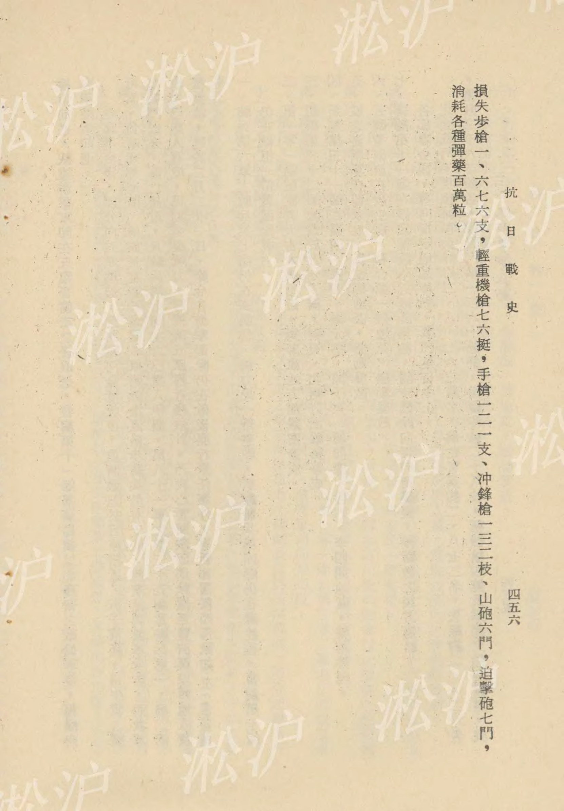

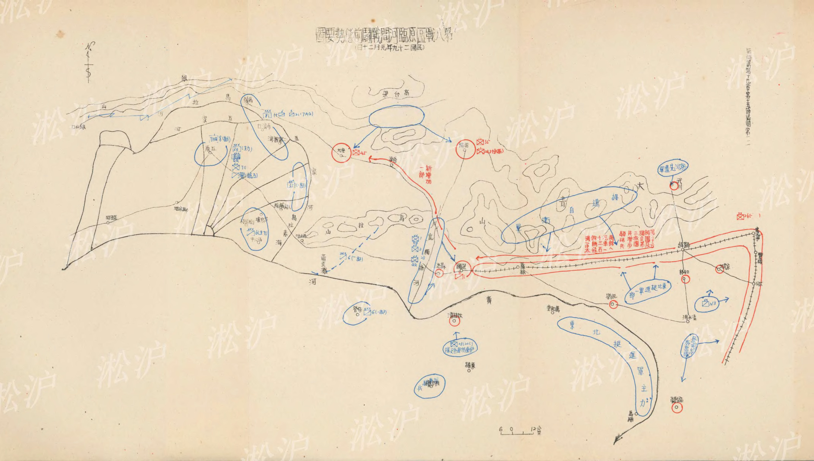

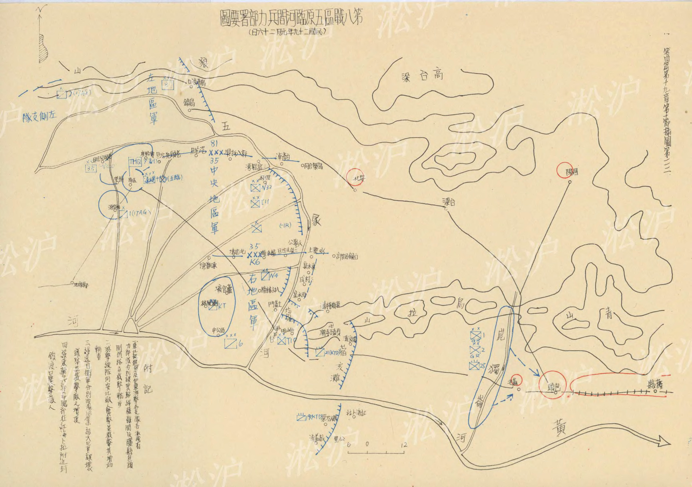

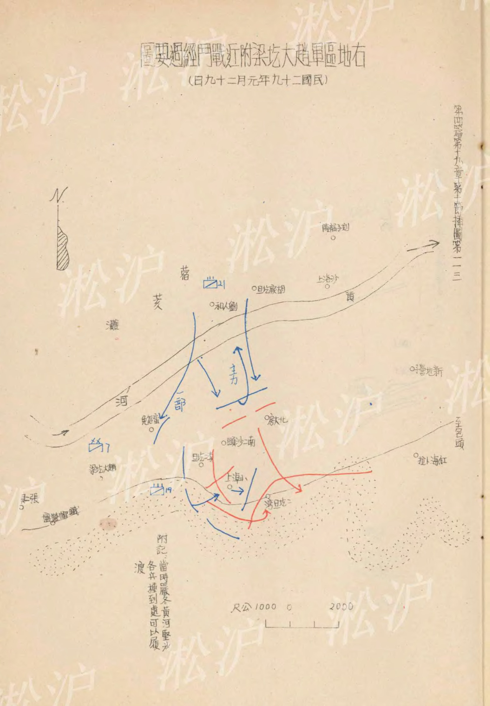

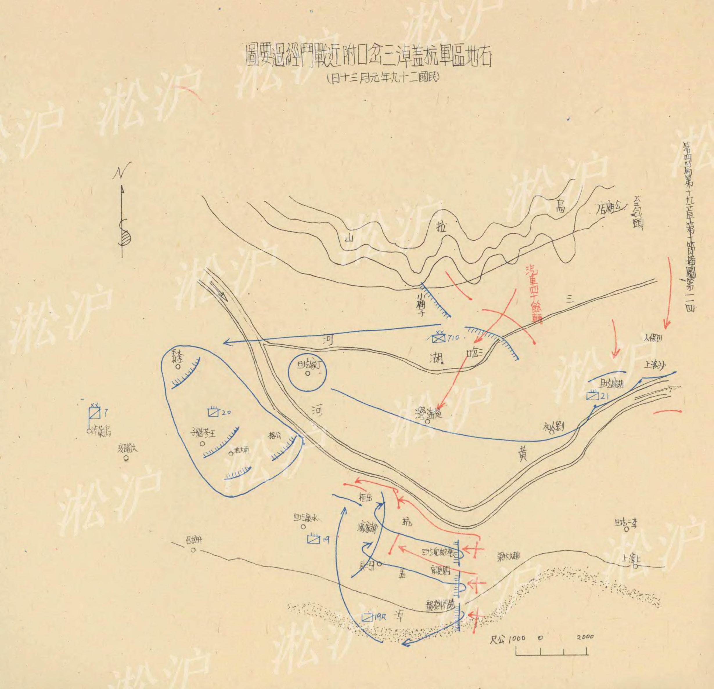

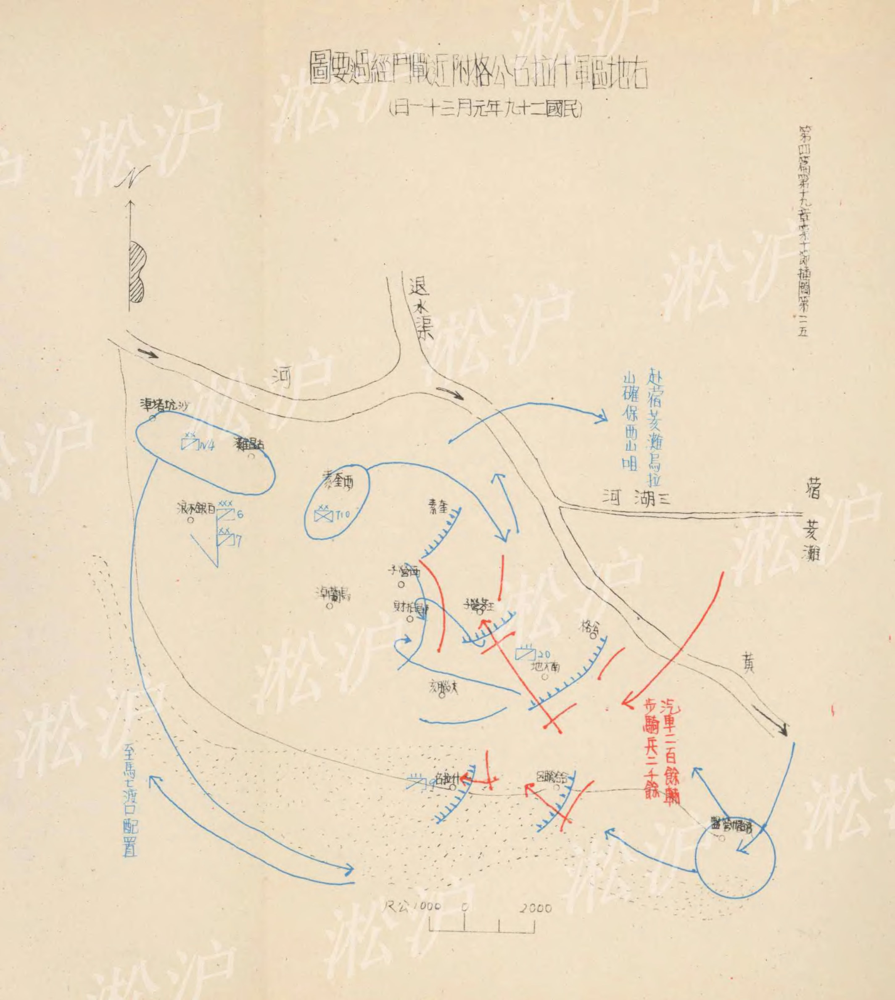

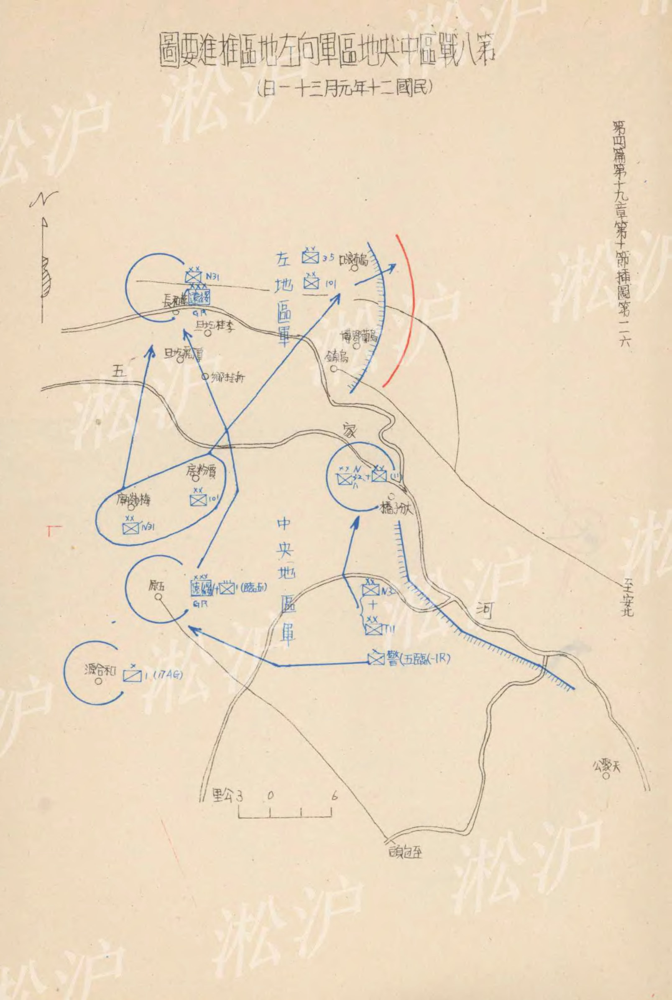

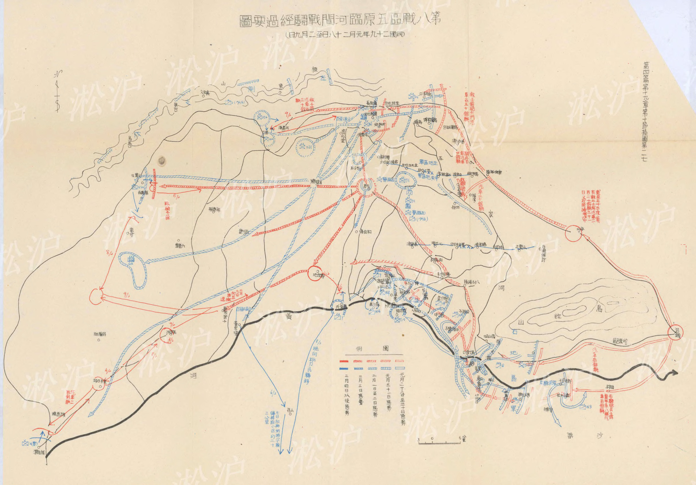

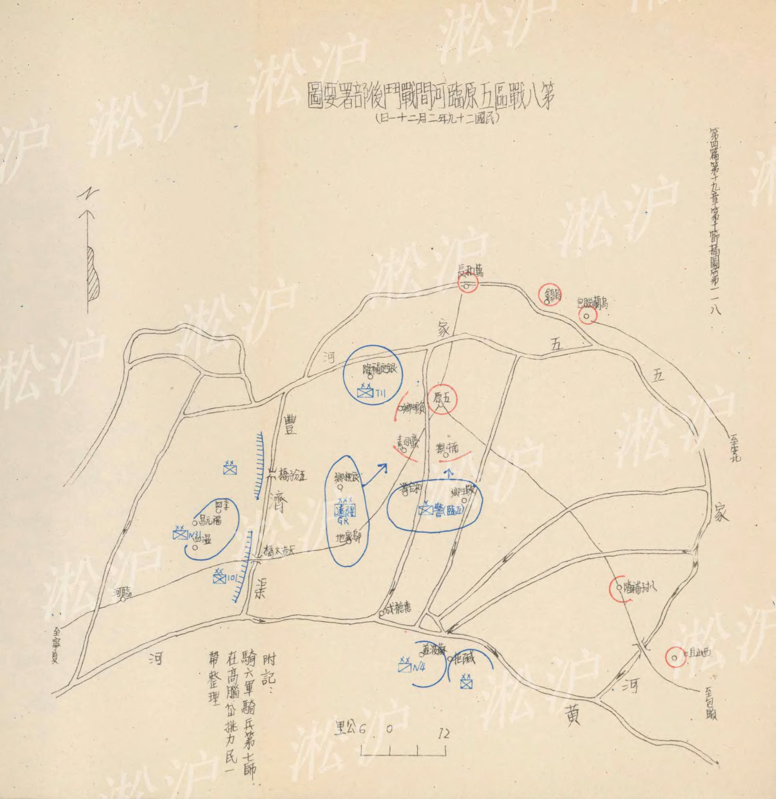

##### 第四項 克復五原

民國二十九年三月二十日至四月三日

參照插圖第一一九至第二二二

進攻五原、臨河之敵，於民國二十九年二月中旬陸續撤回包頭以東，僅留少數及僞軍駐守五原，迄三月十八日，敵僞軍配置概況如左（參照插圖第一一九）：

一、敵綏西警備司令水川依米中將、特務機關長桑原荒一郎中佐及輔佐官、警官、指導顧問等五百七十餘人，並僞軍綏西自治聯軍總司令王英，與僞挺進隊三百餘、僞警備隊二千餘，共計敵僞軍約三千人，駐五原新城（即隆興長）。

二、僞五原行營司令官烏古廷，僞蒙軍第四師之第二十三、第二十八兩團及第五師之第二十五、第二十九兩團，駐五原舊城。

三、僞自治聯軍副總司令李根車及僞第六師之第十六、第十八兩團駐新公中。

四、僞第八師之第十九團駐萬和長，第二十二、第二十四兩團駐蠻可素。

五、僞軍鄔青雲及陳秉義兩部共千餘人，分駐南牛犋、扒子補隆一帶，另鄔青雲部約四百人駐西山咀。六、砲兵兩連、自動車隊約三十餘輛及輜重隊等，分駐五原新、舊城。

留守五原之敵，一面委王英爲西北自治委員會委員長、兼綏西自治聯軍總司令，一面加強五原防禦設施，以鞏固包頭外圍，並增強僞軍實力，以貫澈其以華制華之政治陰謀。

我綏西部隊，自撤至豐濟渠以西地區後，卽積極整頓，恢復戰力。三月初，以騎兵第七師精銳五百餘，進駐百川堡，第三十五軍各師騎兵支隊，編爲騎兵縱隊，集結於鄔家地附近訓練。新編第三十一師第九十三團、五臨警備旅及綏遠游擊軍各選拔熟悉五原街巷情形官兵，編爲突擊隊。第八十一軍接替天吉太橋、五分子橋、協成橋一帶豐濟渠第二線之防務。傅副長官亦乘機召集各部隊長檢討得失，訓示再舉攻擊五原作戰方法及必勝之信念，並赴各部隊訓話，鼓勵士氣，迄三月十四日準備完成，各部隊亦經調整態勢如左。

一、騎兵第六軍之暫編第十師在塔布什拉西北地區，新編騎兵第四師在汪拒一帶，騎兵第七師之主力仍在高腦岱整頓，其第十九團（胡逢泰團長）在百川堡訓練。

二、五臨警備旅在致遠堂及其以南地區，對東北警戒。

三、綏遠游擊軍在德順和、吳樹尙、三和長間地區，對東警戒。

四、新編第三十一師在李鐵圪旦、溫家圪旦、賀卜油房地區集結。

五、第一零一師在韓威風、郭六鎖、趙二王間地區集結。

六、新編第三十二師一部在五分子橋一帶，主力在劉糖房、福興永、王三桂間地區。

七、突擊隊在高二圪旦以北地區集結訓練。

八、騎兵縱隊在鄔家地附近集結訓練。

九、暫編第十一師在馬拒圪旦以南地區，對東南警戒。

三月十五日，僞八師及陳秉義部，附騎兵百餘、砲四門，向汪拒、福太長之線進攻，新編騎兵第四師向西轉移，傅副長官遂決心乘機開始行動，並確定作戰指導：「將與敵對峙之兵力後撤，故意示弱，於事先在豐濟渠西岸構築工事，揚言防禦，表示消極，以機動部隊牽引五原外圍各據點敵之視線，使其不能抽調增援，然後以主力部隊祕密沿豐濟渠北進一段，再沿五家河由敵封鎖線之間隙突進，直撲五原，先破壞敵人指揮中樞，使其神經失效。」於九時，在高二圪旦令主攻部隊向五原西北地區前進，續於十六、十八兩日，分別下達各別命令，要旨如左：

一、突擊隊於十七日由現地出發，在騎兵縱隊掩護下，向五原祕密前進，務於二十日二十時，進至距五原新城約二三十華里位置，於二十四時前，襲奪五原新城內各要點，繼續擴張戰果，並須與主攻部隊確取連繫。

二、第一零一師之第三零二團爲先遣支隊，於十九日晚到濟永堂附近，完成破壞橋樑準備，於二十日二十時，開始強行破壞賈粉房以北五家河橋樑，並截擊增援及潰竄之敵，須注意右與主力部隊左與萬和長暫編第十一師確取連繫。

三、暫編第十師爲右側支隊，於十九日晚，祕密推進至塔布什拉附近，完成襲擊準備，於二十日二十時，開始猛襲西山咀之敵，強行破壞退水渠橋樑及電線，並截擊增援及潰竄之敵。

四、新編騎兵第四師於十九日東移至致遠堂及其以東地區，完成攻擊準備，於二十日二十時，開始攻擊敬生鄉、南牛犋、和合源等處之敵，破壞五原、南牛犋間電訊，應注意左與騎兵縱隊確取連繫，將當面之敵擊潰後，卽向燕安橋以南地區猛烈追擊，到達包五公路線後，再向扒子補隆追擊前進。

五、暫編第十一師爲左側支隊，推進至西補隆、王虎威及烏拉河、萬和長以西地區後，卽在現地掩護掘壩，實施氾濫，於十九日晚完成襲敵及破壞橋樑準備，於二十日二十時，開始澈底破壞萬和長附近烏拉河上橋樑及電訊，破壞橋樑後，一面截擊敵人增援，一面肅清萬和長至大財主間之殘敵，並須注意與破壞大財主、賈粉房間橋樑之第三零二團確取連繫。

六、騎兵縱隊，限於十九日晚，在辛家圪旦、十大股、西圪堵之線完成攻擊準備，於二十日十九時開始攻擊蠻可素、曹拒之敵，以一部繞至郝鏡橋破壞橋樑及五原至蠻可素間電訊，在攻擊開始間，須確實掩護突擊隊之行動，並注意與右新編騎兵第四師、左與騎兵第七師第十九團確取連繫，將敵擊潰後，卽向燕安和橋、東牛犋之線追擊。

七、騎兵第七師第十九團，卽祕密推進至同慶圪梁，乃馬召之線，完成擊敵準備，於二十日二十時，開始向新公中之敵攻擊，並確實掩護主攻部隊右側背，須注意與騎兵縱隊李作棟部確取連繫，將敵擊潰後，卽向王善圪堵、史家圪旦之線追擊。

各部遵令行動，均於十九日晚到達指定位置。

三月二十日晨，傅副長官據報，烏拉河壩已被暫編第十一師破壞，氾濫完成，萬和長以南地區交通已經斷絕，我主攻部隊亦已完成攻擊諸準備，遂於七時在全拒公中對主攻部隊下達攻擊命令。要旨如左(參插圖第二二○)

一、綏西部隊以收復五原之目的，擬卽向敵攻擊，重點指向五原城北段。

二、新編第三十二師，附砲兵第一營（欠第二連）及第二營，爲攻擊五原舊城部隊，於二十日十八時由現地出發，經梅令廟、四座茅庵道路，限二十三時展開於五原西北地區，卽開始攻擊舊城而佔領之，重點在左，須注意與攻擊新城部隊確取連絡，攻佔後，有支援攻擊新城部隊任務。

三、新編第三十一師（欠第九十三團）及五臨警備旅、附砲兵第三營及第二連、爲攻擊五原新城部隊，新編第三十一師師長孫蘭峯爲攻城指揮官，五臨警備旅旅長徐子珍爲副指揮官，於二十日十七時由現地出發，經合少公中、和尙圪旦、劉德魁、前補缸道路，限二十三時，以一部展開於五原新城西北地區，向新城攻擊，待新編第三十二師佔領舊城後，卽以全力保持重點在左攻擊新城而佔領之，須注意與攻舊城部隊確取連絡，在未攻佔舊城前，有支援攻擊舊城之任務。

四、配屬新編第三十一師之砲兵第三營及第二連、爲右砲兵羣，歸蔡廣訓營長指揮，限二十日二十三時，在前補缸附近佔領陣地。配屬新編第三十二師之砲兵第一營（欠第二連）及第二營，爲左砲兵羣，歸韓秀營長指揮，限二十日二十三時，在五原舊城西北地區佔領陣地。左、右兩砲兵羣，統歸砲兵指揮部楊茂才參謀長指揮，先以全火力支援新編第三十二師攻擊五原舊城，爾後再以全火力支援新編第三十一師攻擊五原新城。

五、第一零一師（欠第三零二團、附綏遠游擊軍（欠第四團）爲總預備隊，於本（二十）日十七時由現地出發，以一部經梅令廟、四座茅庵道路，到王二馬慶附近準備，先遣支隊破壞賈粉房橋樑，其餘推進至陳六保、和尙坨旦、梅令廟間地區，對東對南警戒。

三月二十日晚（參插插圖第二二一），各部隊同時開始攻擊。二十一時，先遣支隊第三零二團已破壞賈粉房以北之橋樑，第一零一師支援第三零二團之一部，已掃蕩梅令廟之敵，其主力已推進陳六保、和尙坨旦、梅令廟間地區，二十三時，新編第三十二師衝入五原舊城，新編第三十一師及五臨警備旅由新城西北角衝入五原新城，與敵巷戰，同時我突擊隊由和合源附近繞至五原新城東南之預定位置。

三月二十一日，新編第三十二師與敵巷戰，至七時，將五原舊城北部佔領，敵退縣政府頑抗。八時，敵以砲火掩護，向我右翼逆襲，同時廣盛西敵五百餘增援，竄至右側後，我右翼曾一度頓挫，袁師長當抽調一部向該敵攻擊，戰至十時，形成對峙狀態。傅副長官令總預備隊之綏遠游擊軍馳援，歸袁師長指揮，並指示攻擊方法：「須集中力量，先攻縣政府，然後逐漸擴張戰果，攻縣政府必先奪取王若愚院以作據點，至火砲之使用，應挖開牆孔，盡可能接近敵人陣地，攻奪一點後，不必在已攻奪地帶滯留兵力，除必制高點或必要處所外，可以少數兵力用火力控制之」。袁師長奉令後，在敵機低飛轟炸下整頓態勢，於十二時準備完成，卽集中側方火力掩護步兵向敵猛衝，第九十五團趙壽江營長陣亡，十六時四十分完全克復舊城，同時克復廣盛西，殘敵向東逃竄。

同日一時，我突擊隊由新城東南隅一舉突入五原新城，與新編第三十一師及五臨警備旅形成夾擊態勢，突擊隊於突入後，卽分組破壞電訊，及封鎖要路口，使城內各據點之敵連絡斷絕，並於三時佔領新城橋東大部，十二時，五臨警備旅攻擊黑頭坨堵、花坨堵、白拒，張進修營攻佔新城之西北角，新編第三十一師王雷震副師長率第九十一團攻擊禮拜寺及平市兩據點，十五時，突擊隊續攻合作社據點，獲敵特務機關電台，並與新編第三十一師及五臨警備旅取得連絡，至晚，除橋東之屯墾辦事處有一部敵人頑抗，其餘均爲我克復，殘敵一部突圍東竄，大部被我殲滅，我五臨警備旅第二團團長賈世海陣亡，突擊隊隊長安春山負傷。

在五原外圍之我暫編第十師，破壞西山咀退水渠橋樑，新編第四師擊潰敬生鄉、南牛犋一帶之敵，並續向東竄之敵跟踪追擊，騎兵縱隊向蠻可素之敵，騎兵第七師第十九團向新公中、西商一帶之敵積極攻擊，均將當面之僞軍牽制，不能向五原增援。

是日，安北敵汽車四十餘輛向五原增援，因萬和長以南已成氾濫，前進遲緩，迄晚到達賈粉房對面之大財主，又因橋樑破壞，乃以猛烈砲火掩護強渡，並施放毒氣，均經我第三零二團擊退。

三月二十二日六時，新城屯墾辦事處之敵，以飛機四架掩護，並施放毒氣，向我攻擊，九時，平市復爲敵攻佔，傅副長官爲迅速殲滅新城殘敵，當以電話指示新城內王雷震副師長戰鬥要領如左：

一、戰友須戴防毒口罩，不必太多，選精銳者百餘左右即可，尤應積極發動其志願參加。

二、砲之位置，應盡量利用家屋，開挖牆孔，接近敵人。

三、一點攻下後，再續攻第二點，不可同時攻擊數點。

四、準備工作須充分完成，預計準備工作三小時，攻擊只須一小時。

五、攻佔平市，賞國幣壹萬元，佔領屯墾辦事處再賞國幣壹萬元，攻擊不下，軍法從事。

十二時，我突擊隊協同王副師長向平市攻擊，十四時攻佔平市，十七時攻佔屯墾辦事處，五原新城遂完全克復，殘敵僅一小部向東逃竄，大部被我殲滅，據俘虜敵指導官芳野勇夫供稱：「當我軍開始攻擊前，蒙疆駐屯軍派遣日籍顧問三百餘人，抵五原視察，在新城被我擊斃大半，餘同僞自治聯軍總司令王英化裝潛逃」。

同日，蠻可素、曹拒一帶之敵，經我騎兵縱隊攻擊，並以一部繞襲郝鏡橋敵之側背，敵不支向東潰退。大財主之敵，於是日晨，藉機砲掩護強渡，經我第三零二團阻擊，同時傅副長官令新編第三十一師第九十六團增援，並令在五家河北岸之暫編第十一師襲擊其側背，敵退回折桂鄉附近。至晚，敵復陸續增加，乘夜一再強渡，又被第三零二團阻擊，暫編第十一師在萬和長、折桂鄉附近襲其側背，敵又未得逞。傅副長官爲打破敵人強渡企圖，決心集結主力於五家河南岸，擬乘敵渡河而擊滅之，遂於二十時下達命令，要旨如左：

一、第一零一師、附第九十六團及砲兵第一、第二營，在三義、王吉保圪旦間、沿五家河警戒，選地集結主力，乘敵半渡而痛擊之。

二、綏遠游擊軍，在王吉保圪旦、羅娃圪旦間、沿五家河南岸配置警戒，選地集結主力，乘敵渡河而痛擊之。

三、第一零一師與綏遠游擊軍作戰地境，爲王二馬慶—王吉保圪旦—三拒之線，線上屬第一零一師。

四、新編第三十一師、附砲兵第三營，在王二馬慶、紀家圪旦地區集結，準備擊敵。

五、新編第三十二師（欠第九十六團）在梅令廟、四座茅庵地區集結，準備擊敵。

六、五臨警備旅在五原新舊城維持治安，並對東嚴加警戒。

七、配屬突擊隊之綏遠游擊軍第四團及五臨警備旅之一部，着卽歸還建制。

八、騎兵團以一個連在羅娃圪旦、濟永堂間、沿五家河南岸警戒，其餘在梅家圪、劉二圪旦之線，對負暄鄉方面警戒，並準備截擊潰退之敵。

三月二十三日晨，大財主之敵拆毀附近民房，利用材料架橋，經我軍擊退。

同日，由五原新舊城及敬生鄉、南牛犋、蠻可素等處東竄之敵，因西山咀退水渠橋樑破壞，無法東渡，往返亂竄，被暫編第十師在劉石匠南北地區及鹽淖兒截擊，斃敵特務機關長桑原中佐及警官池田濱峙、鈴木白峙等百四十餘人，新編騎兵第四師在東槐木附近，將僞軍常子儀殘部擊潰，並斃敵指導官二十餘人，生俘一人。

三月二十四日，騎兵第七師第十九團克復新公中，俘僞自治聯軍副總司令李根車，殘敵向東逃竄，其一部向西水道潰退，被我預伏五家河東岸之游擊縱隊劉萬春部截擊，斃敵綏西警備總司令水川依米中將。

三月二十五日，大財主之敵，又陸續由綏包增至第二十六師團及騎兵第一旅團各一部，共步騎砲兵三千餘、砲十二門、汽車三百餘輛、飛機五架，並運到大批橡皮船，於十六時，在機砲及煙幕毒氣掩護下強渡，經第一零一師擊退。入夜，敵復增加汽車二百餘輛、步騎二千餘，繞至高三坨且附近強渡，與第一零一師混戰，第三零三團團長宋海潮親率第三營向敵攻擊，負重傷。二十三時，敵已大部渡河，傅副長官以殲敵及粉碎敵政治陰謀之目的已達，遂將五原新舊城各要點破壞，並利用河渠氾濫與空室清野後，於當晚令騎兵第六軍在扒子補隆、五原、負暄鄉以南主力撤至豐濟渠兩岸地區機動擊敵，五原乃復爲敵侵佔。

是日，軍事委員會下達宥已令一元輝電令：「據確報，敵此次五原失敗後，擬調集平綏沿線兵力萬餘，以眞面目再犯五原，我軍毋須倚着五原一地，可依機動以運動戰要領指導作戰」。

傅副長官於三月二十六日奉到上令後，當遵照將綏西部隊分編多數小組強襲部隊，不斷襲擊敵各要點，因之敵感萬分疲憊，復見各據要點已毀，氾濫堪虞，乃自二十九日，將屍體及笨重物品陸續東運，傅副長官急令各部，分向五原、扒子補隆、西山咀等處積極壓迫，敵遂於三十、三十一兩日開始東撤，我則跟踪追擊，敵狼狽逃竄，遺棄軍品甚多，迄四月一日十二時，綏遠游擊軍及騎兵縱隊收復五原，暫編第十一師收復烏鎮及烏布浪口，三日，新編騎兵第三師及騎兵第七師之一部收復西山咀，由是後套遂無敵踪，惟僞軍尙留駐安北、中灘。傅副長官以戰局告一段落，除飭綏東騎兵游擊第一、第二師、與游擊獨立第二團渡河掃蕩僞軍外，爰將綏西部隊部署如左（參照插圖第二二二）：

一、綏遠游擊軍在西山咀佈防。

二、新編騎兵第四師在大公有、四拒一帶佈防。

三、第三十五師之第一零四旅，在烏鎮、烏布浪口一帶佈防，擔任對安北、包頭警戒。

四、暫編第十師在鄧村店，五臨警備旅在五原，暫編第十一師在子厚鄉，新編第三十一師在百川堡，新編第三十二師在梅令廟，第一零一師在臨河，騎兵第七師在蠻會、同義隆間集結整訓，並擔任同義隆亘烏蓋口間之警戒。

各部奉令後，卽遵向指定地區移動。

此次戰鬥，我參加官兵一六五八七員名，傷亡官兵一九四三名，失踪二七八名，斃敵一千餘人，僞軍二千餘人，俘敵二十餘名，鹵獲步機手槍二八七枝（挺），大小砲十八門，汽車三十餘輛，及其他彈藥文件甚多，我損失步、機、手、沖鋒槍四零九枝，山砲三門，及各種彈藥約五十萬粒。

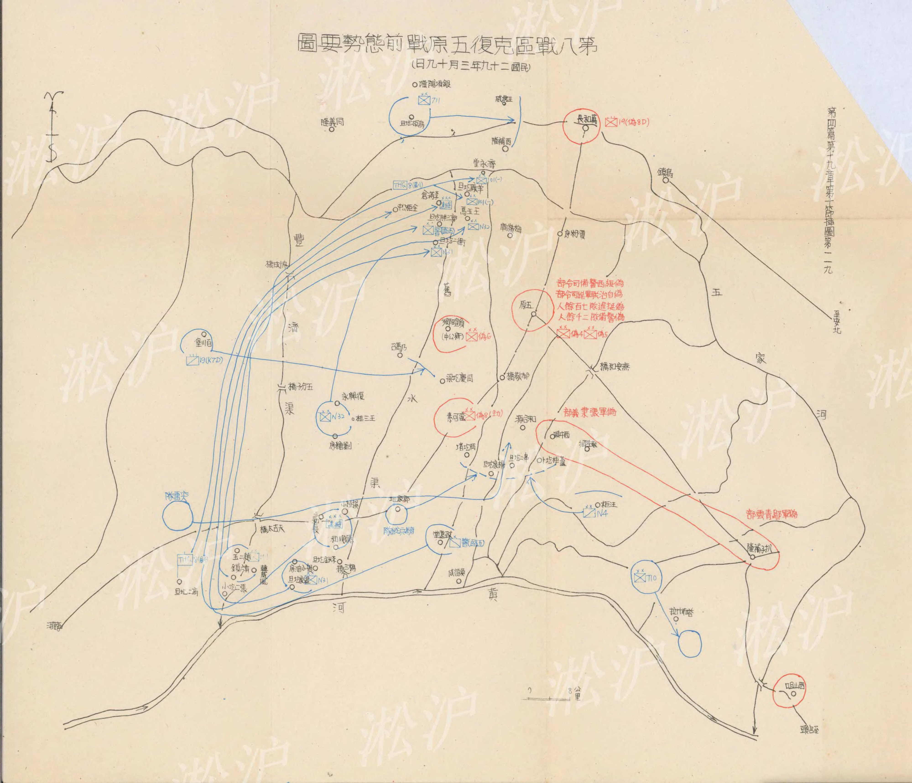

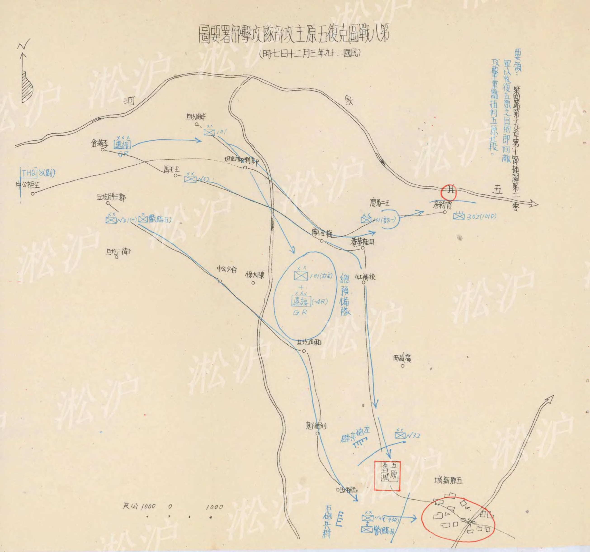

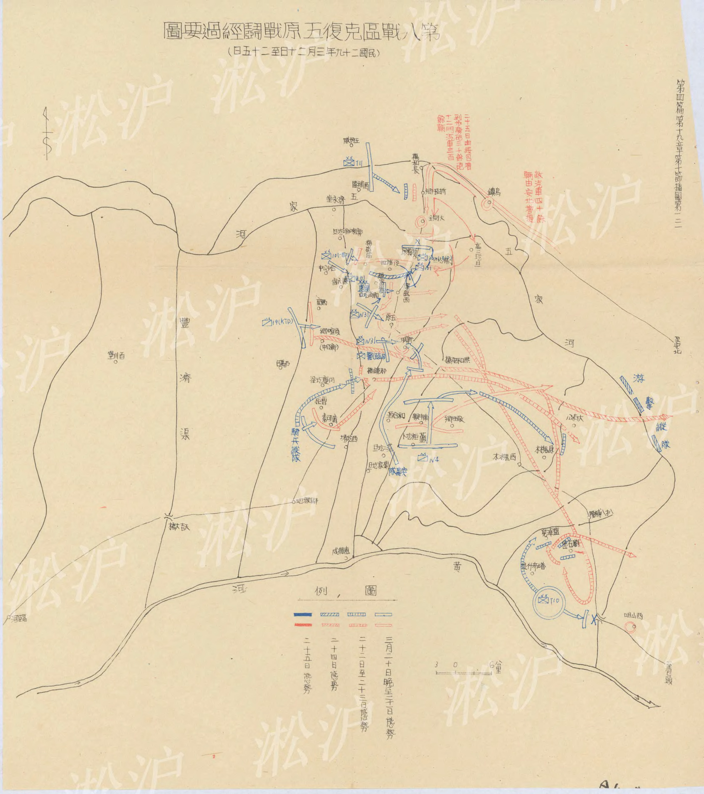

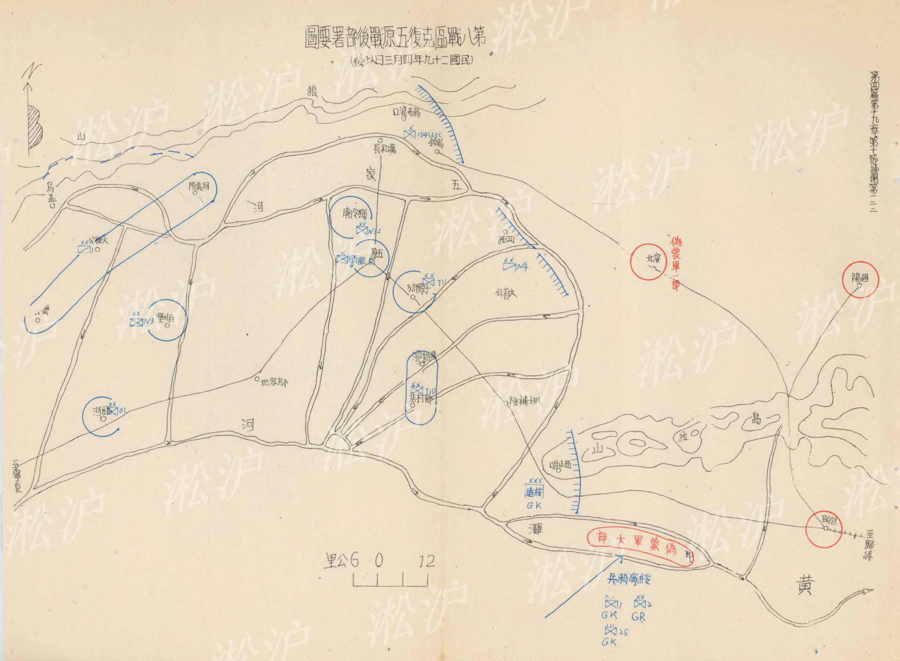

附錄

襲取包頭之方法及成功後應有之處置

甲、攻城時及入城後注意之事項

一、接近城垣，應力求祕密，攻城時，須以錐形的重疊的縱深部署，由一點突入。

二、突入城垣後，先以一部健強迅捷之部隊，以掏心戰術（附後）直搗其高級司令部，破壞其通信設備，俘虜其指揮人員，使敵完全失去指揮效能。

三、抄襲敵軍司令部及小據點時，宜由民房連接處衝入，對據守房屋頑抗之敵，須用炸藥炸毀其牆壁，以行衝入，或用火攻亦可。

四、對城內各重要目標，如敵軍司令部、倉庫、通信機關各據點等，均須預先指定部隊擔任，以免入城案亂。

五、嚴格的遵守紀律，對民衆生命財產，須特別保護。

乙、成功後應有之處置

一、對重要鹵獲品，應早送出城外，其無法搬運者，則破壞之，焚燬之。

二、將各種軍事設備及其他重要建設等，應立即破壞之。

三、發動民衆拆除城牆。

四、在二十、二十一兩日，將各項處置完成，成功後，城內部隊應立即撤出城外，選地誘殲增援之敵。丙、掏心戰術

掏心戰術，係對佔領據點（村落城鎮）之敵，將其外圍工事行局部之突破後，卽一意深入，抄襲其司令部，以期先行打碎敵之指揮機能，使敵發生慌亂後再擴張戰果，逐次用掏心戰術將各小據點之敵，分別予以殲滅，其作法如左：

一、接近敵之據點後，先利用晝間，對非攻擊點施行佯攻，對眞攻擊點先明確偵察，作周密之計晝及諸準備（砲兵射擊之測定，先頭衝入部隊與後續部隊及掩護部隊之區處，進入路之指示，記號之規定，及襲取敵高級司令部後之戰鬥等）。

二、突破點以選於敵火薄弱部，兩部隊接合部，及地形上易於衝入之方面爲宜，如據點外有多數碉堡，受敵之火力封鎖時，應用平射砲對其一碉施行破壞，以造成其交叉火力之空隙，如據點有城牆時，應用山砲以消滅其守兵，有外壕時，應攜帶超越器材等，務期一舉破壞而衝入之。

三、攻入據點後，我之兵力部署，應以連爲單位，取強大之縱深，以一部位於兩側，防備敵之逆襲，接近敵高級司令部後，若須破壞其交通設備，以火力封鎖四週之交通，以疾風迅雷之勢衝入司令部，俘虜其指揮人員，鹵獲其重要文件。

四、利用居民爲嚮導，焚燬其重要場所（如敵之倉庫、汽車、砲車場等）。

五、抄襲敵軍高級司令部及小據點時，宜由民房連接處衝入，對據守房屋頑抗之敵，須用火藥炸燬其牆壁，以行衝入，或用火攻，務要於最短時間，將敵全部消滅。

六、爲防敵之逆襲，衝入部隊之前進，須與兩側屋上掩護之部隊，同時併進。

七、衝入據點襲取司令部之擴張戰果，仍以掏心戰法爲主，分路向各小據點一齊攻擊，使敵各不相顧，呼應不靈，切忌包餡，要不顧殘敵，一意向各據點再衝，將敵完全消滅爲止。

### 第十一節魯蘇、冀察戰區之作戰

自民國二十七年五月徐州會戰以後，我野戰軍主力相繼向西轉移，留置於河北、察哈爾、山東、江蘇各省之游擊部隊，對敵佔領點線及其設施不斷襲擊破壞，頗收牽制消耗之效。迄第二期作戰展開，乃劃冀察、魯蘇爲兩個戰區，各設總司令統一指揮，加強游擊力量，迭在冀中平原、冀晉邊區、平漢北段左、右地區、沂蒙山區、運河流域激戰，敵混成第二旅團長阿部規秀，卽於冀晉邊區爲我擊斃，敵受打擊甚重，當時被我牽制當面兵力，約有十個師團之衆。

迨民國二十八年十一月冬季攻勢開始，該兩戰區受命各就區域，分別破壞平漢、津浦沿線交通，策應晉南三角地帶及長江方面之主攻，曾以廣正面之游擊，或襲敵據點，使敵分散各地，無從轉用，或設伏要路，使敵馳援掃蕩趨於覆沒，或消滅僞軍，剪除其觸鬚，或破壞其交通，遲滯其輸運，以配合擔負上項任務各部之作戰，均有顯著戰績。

惟當時以共匪部隊編成之第十八集團軍，異動其間，陽藉抗戰之名，聽命政府，陰存擴張實力，佔據地盤，常有消滅國軍之野心，影響所及，冀察戰區較之魯蘇戰區所感受之艱難尤大，故其戰果，亦因之減弱，不無遺憾。

#### 第一款 魯蘇戰區

民國二十八年十一月二十九日至二十九年二月十五日參照插圖第一二三至第二二七、插表第六十六至第六十八民國二十八年春以來，敵以魯南戰鬥得不償失，運河掃蕩師疲無功，乃一面鞏固佔領點線及交通，一面積極增強兵力，迄十一月，敵軍在該戰區者，計有三個師團、三個獨立旅團、及第十五、第十七兩個師團，獨立第十三旅團之各一部，而我軍亦有六個師、一個旅、及配屬之游擊隊、保安旅團等部隊，配置於魯南、蘇北各根據地、十一月十九日，軍事委員會以皓申令一元電令，策應長江方面主力之作戰，魯蘇戰區當令沈鴻烈副總司令所部第五十一軍、第五十七軍，韓德勤副總司令所部及徐向前部、先後進出津浦路沿線指定地區，分段破壞交通，並加強其他方面之游擊，經戰鬥二月餘，各主攻部隊破壞鐵路橋樑、拆除路軌、炸燬火車，在在阻斷敵之交通，其他各部亦先後克復重要城鎮，大小戰鬥凡九十一次。其間，敵松埔聯隊長被我擊斃，獨立第五旅團長秋山靜太郎被我擊傷，獨立第六旅團之第十八中隊及附屬部隊被我殲滅，此足以使敵膽寒，而我亦達成助攻之任務矣。

##### 第一項 戰前狀況

(參照插圖第一二三)

第一目

敵軍

(參照插表第六十六)

民國二十八年十一月，敵在津浦路沿線者，其第二軍司令部駐濟南，第三十二師團長木村濱太郎駐滋陽，部隊分置濟南、滋陽、濟寧一帶；獨立第十旅團長水野信駐泰安，部隊分置銅山、濟南間鐵路沿線，及臨台支線；獨立第十三旅團長尾崎義春駐蚌埠，一部任蚌埠以南津浦路沿線之警備，一部在淮南路。在隴海路沿線者，爲第二十一師團，其師團長鷲津鈺平駐銅山，主力任兩淮、睢、宿隴海東段及徐州一帶警備，一部調豫東、亳、鹿、太、淮一帶。在膠濟路沿線及以南地區者，其獨立第五旅團長秋山靜太郎駐濰縣，部隊分置於膠濟路沿線；獨立第六旅團長秦彥三郎主力駐莒縣，一部分置諸城、沂水一帶。在蘇北地區者，第十五師團之第一零九旅團分置於六合、天長、儀徵、江都、邵伯、高郵、寶應一帶；第八十一師團之第八十一聯隊分置如皋、南通、海門一帶；海軍陸戰隊擔任連雲港、海州、響水口一帶之守備。在德州及魯北地區者，則爲第一一四師團之主力。

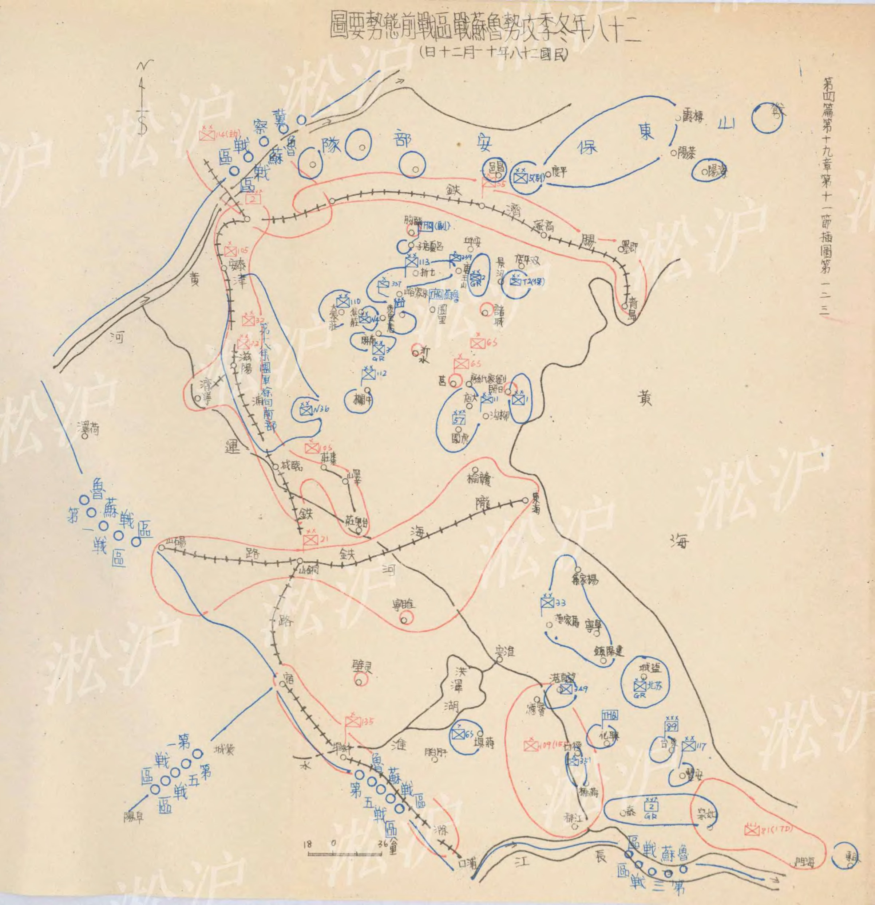

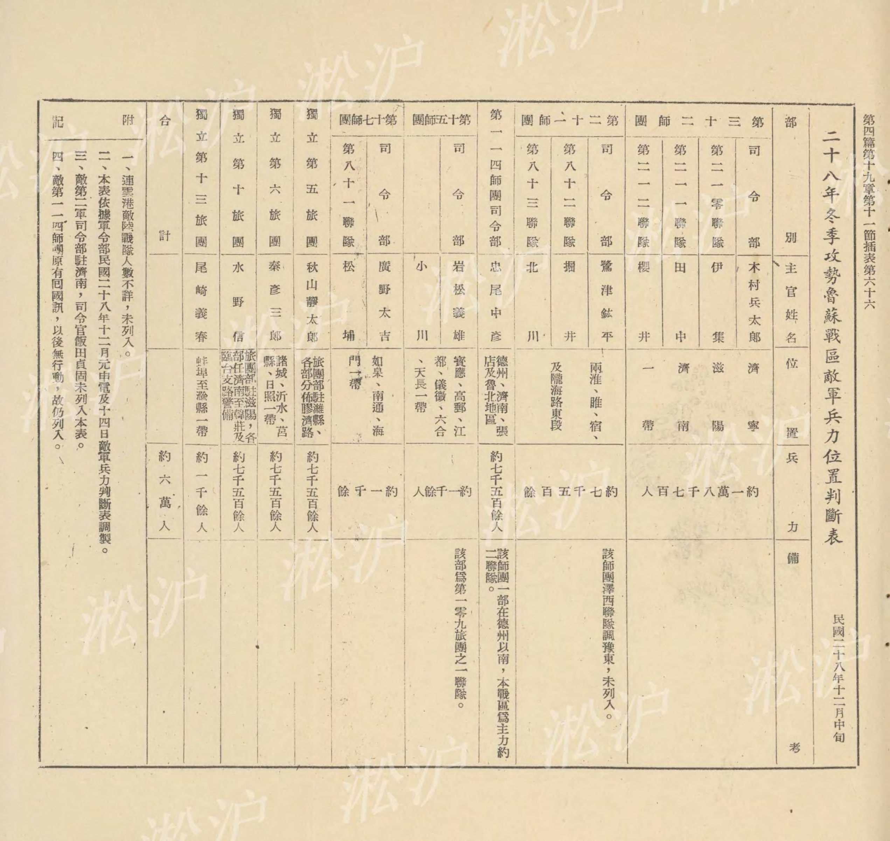

第二目 我軍（參照插表第六十七）

自民國二十八年六月於沂蒙山區，十月於運河地區挫敵後，我軍在魯南方面，戰區總司令部駐沂水北之圈里，沈鴻烈副總司令部駐呂夏店子，新編第四師駐東里店一帶，保安暫編第二師駐高密以南（本年八月由僞軍反正編成）雙平店附近，山東各保安部隊，分駐文登、萊陽、卽墨、昌邑、壽光、鄒平等地區。第五十一軍司令部駐沂水北七折，第三三七旅駐朱家塔，第三三九旅駐唐王山，第一一四師司令部駐蕉山莊，第三四零旅、第三四二旅駐大張莊一帶。第五十七軍司令部駐呂縣南虎園，第一一一師司令部駐柳溝，第三三一旅駐劉家紙房，第三三二旅駐大店，第一一二師駐牛欄附近。第十八集團軍徐向前部及東進支隊，正活動於泰安、滋陽以南津浦沿線及以西地區。在蘇北方面，韓德勤副總司令部駐興化，第八十九軍司令部駐東台，第三十三師司令部駐阜寧西之馬家蕩，第七十九旅駐楊家集，第九十九旅駐建陽鎮，第一一七師司令部駐安豐鎮，第三四九旅駐望直港，第三五一旅分註涇口、蔣橋，獨立第六旅駐蔣壩。第二游擊區總指揮李明揚部七個支隊，均在泰縣以東地區。蘇北游擊縱隊所屬稅警總團駐鹽城附近，蘇北常備旅團及地方部隊仍在各該地方活動。戰區直屬部隊之新編第三十六師劉桂堂部（魯省第三區行政專員改編），駐日照附近。魯省游擊第二縱隊厲文禮部（魯省第八區行政專員改編）駐安邱附近。魯省游擊第三縱隊秦啓榮部（魯省第十二區行政專員改編）駐南麻附近。別動第五縱隊王尙志部駐平度附近。

二十八年冬季攻勢

四七二

。

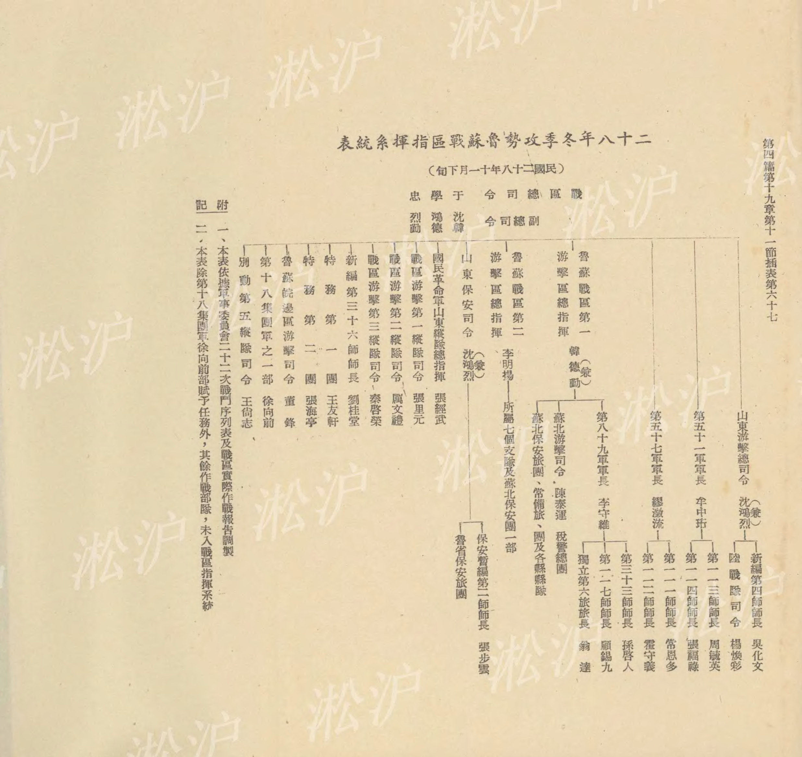

第三目兵誌概要

魯蘇戰區，轄魯南、蘇北及皖東之一部，北托冀、察，西接第一、第五兩戰區，南鄰第三戰區。其形勢，東瀕黃河，北倚黃河，西含津浦路南段沿線，南貫長江以迄崇明島，其間隴海東段直達海州，流水、沂水縱流兩省，羣山延綿，掩有魯省南部，膠濟全線達於青島，且運河斜經魯、蘇旁注邵伯、高郵、洪澤、微山諸湖、泗水、汶水蜿蜒沂蒙山區，中以泰山、沂蒙、徂徠諸山脈爲我游擊根據地，形勢險要，民風強悍，故能出奇制勝，破壞交通，使敵運輸中斷，以策應長江方面之作戰。

##### 第二項我軍作戰指導（參照插圖第一二四）

魯蘇戰區於民國二十八年十一月十九日，奉軍事委員會皓申令一元電：「魯蘇戰區，以廣正面由東西兩面向泰安、臨城間、及銅山、滁縣間攻擊，以策應長江方面之作戰，於十一月下旬開始實施，並將部署情形，於本（十一）月二十四日以前具報」。當於二十三日，基於所示要旨，針對狀況，一面以梗酉章電呈報，一面下達命令，要旨如左：

第一攻擊目標

一、沈副總司令所部新編第四師向泰安、大汶口間。

二、第五十一軍向大汶口、滋陽間。

三、第十八集團軍徐向前部向滋陽、界河間。

四、第五十七軍向界河、臨城間。

五、韓副總司令所部第八十九軍向銅山、滁縣間。

第二作戰地境

一、沈副總司令部之新編第四師與第五十一軍間，爲悅莊—蒙陰寨—大汶口—東平之線，線上屬新編第四師，並含以北地區。

二、第五十一軍與第十八集團軍徐向前部間，爲坦埠—蒙陰—大卞橋—泗水—滋陽—濟寧之線，線上屬第五十一軍。

三、第十八集團軍徐向前部與第五十七軍間，爲費縣—界河—南陽鎮之線，線上屬徐向前部。

四、第五十七軍右接徐向前部，左以運河站—沿運河—臨城—魚台之線（含）。

五、韓副總司令所部，隴海路以南地區。

第三作戰要領

一、韓副總司令所部，應以主力保持現有地區，以運河西岸之部隊，並加派運河東岸之部隊一部，實施攻擊任務。

二、其他部隊除另有任務外，應留置足以保持現根據地，並能監視敵人各據點之兵力，先派有力之一部，每軍以兩團，徐向前以有力之兩支隊爲準，實施攻擊任務以後，視情況再逐次推進。

三、任攻擊部隊，應覓隙通過敵區，迅速到達鐵路附近活動。

四、任攻擊部隊，應擊破警備鐵路及附近之敵，並破壞交通，遇敵大部卽牽制之，小部卽殲滅之。

五、任攻擊部隊，應保持輒性，以求戰鬥之持久，並作廣正面之活動，多用襲擊方法以行牽制。

六、各游擊隊及地方團隊，應卽發動民衆，竭力破壞敵區所有公路及重要大道等，並襲擊小據點之敵，摧毀僞組織，及任各部之聯絡。

七、各部隊限十一月下旬開始實施。

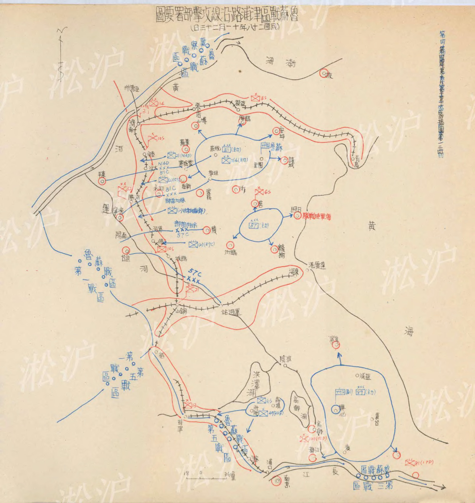

##### 第三項作戰一般經過

魯蘇戰區各部奉到命令後，除以主力保持原有地區，竭力反掃蕩外，均派出有力部隊，遵照任務，分別向指定地區實行攻擊，並破壞交通。

沈副總司令所部方面（參照插圖第二二五）：沈副總司令以新編第四師師長吳化文率第一團之一部，控置於津浦路以東萊蕪、新泰以西地區，督飭並策應右後方之作戰，並就近破壞重要交通，第二團全部擊破大汶口、泰安間敵之警戒線，並澈底破壞該段交通，保安隊各就現駐地區極力破壞交通，襲擾敵人，各部均限於十二月初旬開始實施。

新編第四師第二團，先於十一月二十九日，以第七連協同鐵道破壞隊，乘敵警戒兵撤回據點時，到達津浦路泰安、大汶口間水泉鐵橋附近，驅散守橋民伕，炸燬該橋並拆除路軌。十二月七日，太平邑之敵百五、六十名，向該團第一營萬山莊附近陣地猛撲，經第二連擊退，未幾，敵向左翼包圍，復經第三營一部擊潰，後敵再由蒙陰及太平集兩路增援進攻，仍未得逞。十二、十三兩日，敵各以百餘，先後由泰安、范家鎮、分向山口、鄧家莊進攻，均經我第六連、第一連於范家莊以南及鄧家莊以北各地區擊潰退走。十五日，義封之敵百餘，再向山口進攻，我第一團以有力一部，預伏羊里莊附近，向敵猛襲，敵退朱家莊。十七日，第二團第一、第二兩連向津浦路泉上站破壞交通，正實施間，百子坡、舊縣之敵，對我猛攻，泰安之敵約七、八十名亦分乘汽車來援，找斃敵十餘名後，撤回原防。二十日，第二團第五連協同破壞隊將界首車站南之鐵橋炸燬後，撤回泰山玉皇頂。二十一日，萬德、泰安敵僞軍二百餘向我進犯，我據險抵抗，十七時援隊第六連及機槍連由大津口到達，敵始撤退。是日，博山之文祖鎮敵先頭部隊二百餘，進至上有莊以北地區，經我第一團第一營截擊，敵向東竄擾，迨敵後續部隊到達娘娘廟附近掩護，敵始回竄。追民國二十九年元月八日，我第二團第一營將敵駐黃前約七、八十名包圍，以工事堅固，未能奏功。十七日，敵由沂水西進約三百餘，附砲二門，經我第一團第二營預伏之第四、第五兩連襲擊，斃敵十餘人及馬數匹。十九日，第二團率步兵兩營向魯西接運彈藥，行經南紙房，派隊將郭家河東端橋樑炸燬。三十一日，敵僞軍各以三百餘，分由東里店、蒙陰、博山、向悅莊、南麻進犯，經第五十一軍一部及新編第四師第一團沿途截擊，於二月一日各竄回原地。二月十四日，郭家道虜之敵六名，被第一團第一營一部殲滅，獲步槍二枝，八時，舊寨鎮及萊蕪之敵，各以三百餘，分向西上谷、虎溝崖進犯，被該團一部伏擊，敵遂併力轉向運糧食方面攻擊，經守軍集中火力猛襲，敵不支，分別回竄。保安暫編第二師，於攻勢期間，在膠濟路高密、濰縣以南地區，迭次殲敵，並破壞交通。十二月十六日，敵獨立第五旅團一部五百餘，由高密南犯北郭莊，該師長陳步雲率特務團堵擊，乘夜衝入敵陣，斃敵二百餘，殘部東竄。十七日，第一、第二兩旅分別在棚汪及逢戈莊、曹疃一帶，與由高密、巴山進犯之敵激戰兩晝夜，各斃敵百餘；第一旅一部一度攻入諸城東關，民國二十九年元月一日，我一部克復雙羊店、景溝鎮兩據點；第二旅將柴溝、岳溝之敵擊潰，退走高密；第三旅進迫相州、景芝鎮一帶，敵憑碉頑抗，形成對峙狀態。旋南邱之敵二百餘來援，在甘泉嶺附近被我截擊，斃敵百餘。八日，第三旅第七、第八兩團於入夜，在膠濟路康家莊至炸山間，炸燬東行火車一列及徐家上町鐵橋一座；同日，丈八嶺敵僞二百餘，砲四門，向雙羊店進攻，經第八團一部伏擊，敵不支回竄，獲步槍八枝。二十日，我主力一部，圍攻朱王莊敵獨立第五旅團一部，該旅團長秋山靜太郎馳往指揮，被我擊斃，二十三日密運青島。

魯省保安部隊，十二月九日，博興、高苑、廣饒、蒲台、桓台五縣聯合之敵四百餘，進犯魏家莊，保安旅周旅長率部迎擊，戰况激烈，嗣以彈盡援絕，轉移至高苑西北一帶。十六日，壽張之敵二百餘，向楊家口進攻，經保安隊韓團擊退。十九日晚，第十三區保安司令趙保原率第一、第二兩旅及省保安第十七團、自衛團，佔領萊陽四關，將僞縣府焚燬，敵退城外師範學校頑抗，二十日晨，敵機三架助戰，我乃撤返原防。民國二十九年元月八日，萊蕪之敵三百餘，向城東南太官莊猛攻，劉支隊不支，遂向敵後轉移。九日，烟台之敵三百餘，向辛莊保安隊一帶防地進犯，未逞；同日，莘縣敵五百餘，附砲數門，衝進朝城，經我保安第六旅及范縣團隊馳援，又將克復。十六日，保安第三旅會同民衆二千餘，將台灘公路善莊至王家店一段之橋樑等悉數破壞。十七日，第十三區保安部隊岳靜山部，襲擊朱家莊，敵不支，敗竄奄上，沿公路北退。

第五十一軍方面（參照插圖第二六）：該軍於奉令後，第一一三師之第三三七旅率第六七三、第六七四兩團，向大汶口、滋陽間鐵路附近，攻擊警備鐵路附近之敵，並破壞該段交通，已於十一月二十九日，開始實施，其餘各部仍保持現根據地，續行原任務。迨十二月九日，卞橋之敵四百餘，騎兵六十餘，附砲兩門，經放城，分三路向南官莊一帶進犯，經第六七四團第九連與第六七三團第二營迎擊，敵中央突破未遂，乃以兩翼包圍，一路突破木廠峪，一路向南滂坡東北地區竄擾，我爲避免包圍，遂轉移於馬莊附近。十日，第六七四團第一營突擊隊擊潰南驛車站之敵，並將水塔炸燬，第二營將水泉左右橋樑炸燬，十一日，敵步騎五、六百與第一營在老莊附近戰鬥，將敵擊退後，撤返東白窯溝。民國二十九年一月十五日，第六七四團第二營攻入南百丁，僞軍投降，泗水之敵來援，經第三營堵擊，該敵竄北百丁，三十日，第六七四團復將南驛車站附近鐵路破壞，遮斷交通。

第一一四師，於十二月二十六日，以第六八三團將水泉南之鐵路橋樑破壞，復於民國二十九年一月二十七日，以第六八二團將水泉、歇馬亭間鐵橋炸燬，並破壞交通通信，三十一日，敵二百餘，附砲二門，由東里店向井官莊一帶進擾，經補充團誘至廣河峪附近，特務營予以猛襲，敵不支，於二月一日敗抗日戰

四七八

竄悅莊。

第五十七軍方面（參照插圖第二二六）：該軍奉令後，派第一一二師之一旅向界河、臨城間攻擊警備鐵路附近之敵，並破壞該段交通，其餘各部仍保持原根據地，實行原任務。十二月九日，第一一二師第六七一團將津浦路崔家莊附近路軌拆毀，並擊退界河來襲之敵，二十日，該團第一營攻抵滕縣車站，炸燬機車一列，焚搬道一所，第二營襲擊該縣城關，第三營將南沙河以北十里鋪路軌拆除。同時第六七二團第一營在官橋附近焚燬道房四所，該團第二營，於二十六日在十里鋪附近炸燬兵車一列，機車一輛後，撤回亞莊。該師保持原根據地之部隊，於十二月十四日，第六六七團派第三營襲擊梁邱之敵，以其據碉頑抗，未奏功，撤回葛家峪原防。十七日，該團第二連與敵在王家嶺、辛莊一帶戰鬥，辛莊失而復得。二十六日，第六七二團與由滕縣東進之敵僞五百餘及板裏之敵二百餘，分別在安上、新招東、香一泉、花山頭等處戰鬥，敵以一部由鷹山向雙山頭迂迴，第二營轉移核桃峪，第一營經第九連在旱河子掩護，轉移於徐莊。同時第六七一團第三營已在花山頭佔領陣地，阻敵前進，經戰至黃昏，以掩護任務已達，由山路撤回。其在興隆莊之第六七二團第三營亦退守上、下灣一帶。

第一一一師，十一月二十九日，第六六五團襲擊敵於沙墩北門附近，敵傷亡頗多。三十日，第六六二團先後與敵在王家房前以北張家岔河、朱家崖上一帶戰鬥，斃傷敵亦衆。十二月二日，敵第十八聯隊之第七中隊及附屬部隊約三百餘，竄抵相地，經第三三一旅第六六二團第一營在杜家嶺及其以東高地截擊，敵竄王家莊，三日五時，該營第三連及機槍連衝入王家莊，敵據碉頑抗，一部向西逃竄，適第六六一團第二營馳至梅嶺山截擊，該敵仍竄莊內，七時，敵又出圩向東北逃竄，復被第六六二團第三營阻擊，再狼狽折回，時敵以四面被我包圍，後經縮小包圍圈，敵乃縱火焚燒輜重及傷亡屍體，十五時，藉煙火掩護，由村西南角突圍，向興隆店方面逃竄，又經第六六二團第八連及迫擊砲排痛擊，我迫擊砲排長于鳳來及衛生隊中士宮長發先後陣亡，殘敵三十名續向興隆店竄去，該團第一連協力第八連跟踪夾擊，敵斃傷殆盡，又多被我地方團隊射殺。十二日，第六六六團第三營襲擊相公莊附近南大寺僞組織、僞軍大部就俘，一小部逃竄，獲步槍三十八枝。二十七日，第六六五團第二營與齊莊之敵三百餘遭遇，經與我第六六六團第三營夾擊於鞍子窩附近，斃敵約百餘，獲戰利品甚多，同日，師工兵營掩護師部轉移，在相地寺後與敵百餘遭遇，斃傷敵甚多。二十九日，敵三百餘由鞍子窩、圈子、向郭家山進犯，經第六六五團第二、第三兩營與第六六六團一部夾擊，斃敵七、八十名。

韓副總司令所部方面（參照插圖第二二七）：第八十九軍之第九十九旅於十二月二十三日晚，襲擊津浦路張八嶺敵據點，將敵大部擊潰，並破壞該處附近鐵橋五座。二十四日，第三十三師收復阜寧、泗陽、郯城各地。二十八日，明光、張八嶺聯合之敵約七百，進攻自來橋，經第九十九旅派隊擊潰，仍回竄張八嶺。

魯蘇皖邊區游擊部隊及地方部隊：民國二十九年元月十日，銅山縣保安隊一部進襲津浦路三堡車站，斃敵三十餘，毀敵裝甲車一輛。十五日，魯蘇皖邊區游擊第四旅一部進襲邳縣，與耿布集之敵遭遇，戰至十六日，斃敵二十餘，俘敵三名，獲步槍三枝。三十日，銅山縣保安隊於不老河北岸闕山附近，將僞軍七十餘全部殲滅，獲步槍二十九枝，手槍五枝。

常備旅、團及各縣縣隊：十二月二十日，南通之敵五百餘，分由劉家橋、陳酒店、西亭鎮猛攻石港，經常備第十旅分頭迎擊，敵南通警備司令松埔大佐行經姜竈港附近，被我擊傷斃命，敵全部敗退。二十一日晚，我保安第六旅一部攻擊高郵，二十二日佔領該城北關、泰山廟及北大街等處，至二十八日，敵由實應增援百餘，行抵清水潭附近，經該旅派隊截擊，斃敵三十餘。民國二十九年元月二十八日，六合敵僞四百餘，進攻移居集，經我常備第十三團，獨立第六旅第十六團協力迎擊，敵向樊家集敗退，我跟踪追擊，爲第十八集團軍之新編第四軍所阻，敵得安全北竄。三十日，六合敵僞三百餘猛攻盛家，經我六合縣隊擊退。三十一日，敵四百餘在江浦、周家營登陸，向橋林鎮進攻，經我江浦縣隊擊潰回竄。二月二、三兩日，窯灣敵僞百餘，先後進犯李墟，均被我宿遷團隊擊退。十五日，睢寧敵僞三百餘，分向固子墟一帶進犯，當爲我睢寧團隊擊潰退走。

戰區直屬各部隊方面：新編第三十六師於十二月三日，分別與由銅石進攻小六橋，由地方分攻荊埠、資邱之線，由太平邑進攻紅石河與敵戰鬥，經我騎兵隊奇襲後，警衛營由左翼包圍，劉團長自右翼出擊，將敵擊潰，我移住石屋山。民國二十九年元月十三日，敵田畑部百餘，向紅石河附近進犯，經我第二團第三營以一部伏擊，敵向西竄去。二十二日，蒙陰敵僞四百餘，由油簍向天馬場前進，我第二團以第二營伏擊，敵回竄，二月八日，敵田中聯隊長指揮敵僞二千餘，向徂徠山區進犯，第二團在紅石河之線阻擊，敵不支竄上治，該團第三營在陳北崖一帶，將敵百餘誘至牛欄口，爲我伏擊，受創甚鉅。第一團在黃崖附近，與敵八百餘戰鬥甚烈，經第二團第一營迂迴敵後，第三營向敵左側背猛襲，敵向大小儉、福莊潰竄，其他敵部亦相繼退走，我獲步槍二枝及文件甚多。

別動第五縱隊駐平度附近，於民國二十九年元月三十日，派隊向效城西、遠而莊一帶游擊，與步騎聯合之敵三百餘遭遇，將其殲滅殆盡，二月十日，以一部襲擊坊子之敵，斬獲亦多。

游擊第一、第二、第三縱隊，在冬季攻勢期間，先後襲擊臨沂、台兒莊、安邱、濰縣、泗水等處敵據點，並破壞交通。

第十八集團軍方面：徐向前部在津浦線界河、滋陽間左右地區，於十二月十五、十九兩日，以一部先後襲擊鳳凰山及寧陽北埋城屯之敵，獲步槍二十枝、二十一日，擊退由寧陽、吳村、大汶口進犯之敵，同日，彭支隊在蕭縣西王白樓一帶殲敵甚衆，該支隊於民國二十九年二月七日晚，遭濟寧、魚台、金鄉聯合之敵攻擊，袁家莊失陷，退守高河屯，八日夜，又撤退，損失甚多。徐部在其他各地區者，自十二月十五日至二十九年元月十日間，先後與敵在臨朐南之黃崖頭、泰安西南之王家台、博山以西之茶口、棲霞以北松山、王格莊、燕萊北之吐絲口等處附近戰鬥，均被敵擊退，該集團軍之楊支隊，先遣縱隊，陳師蕭縱隊、廖支隊、蕭支隊等，在冬季攻勢期間，到處擾襲敵軍，但均無大戰果，然對國軍及游擊部隊不能協調，故賦予之任務，往往不能達成。

冬季攻勢作戰，迄二月中旬截止，魯蘇戰區各部作戰戰績概況，詳見插表第六十八。

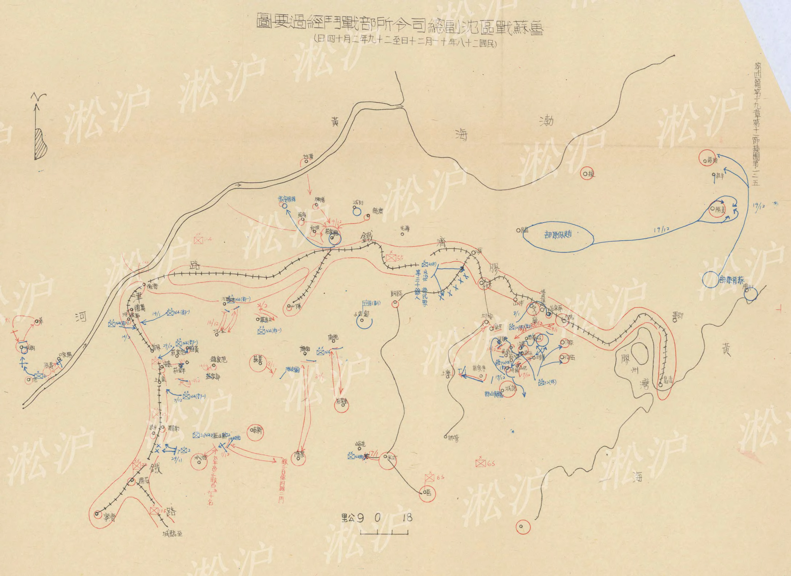

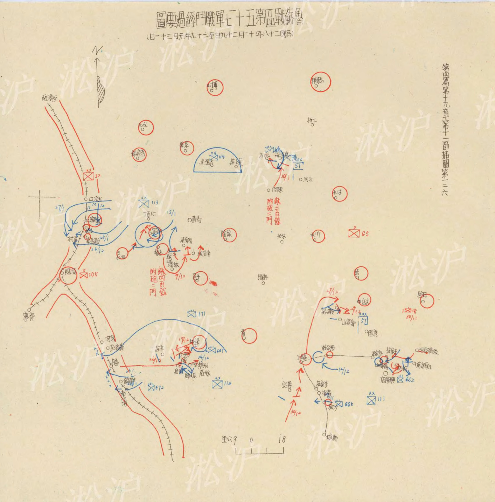

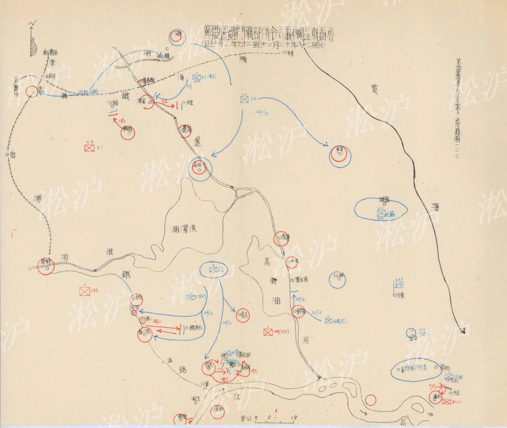

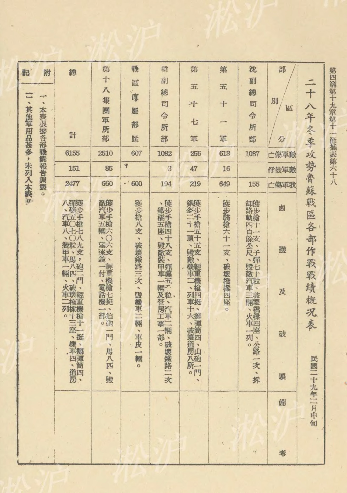

##### 第四項戰後概況

民國二十九年二月十四日，軍事委員會下達寒未令一元電訓令如左：

一、爲貫澈持久抗戰最高策略，應以現態勢，確實掩護我西南、西北國際交通線，切實增強防守，鞏固中樞門戶，各戰區以最有力部隊，深入敵後方游擊，控置主力，積極調整充實戰鬥力量，準備爾後之作戰。

二、在此積極調整部隊期間，各戰區游擊部隊，應區分縱隊，至少三個縱隊深入敵後方，不斷襲擾，擴大破壞其交通，並掃蕩僞組織，務達成使敵無法建設淪陷區之目的，仰各迅定計畫，嚴密佈置，對於出動路線、地點、發動日期，擔任部隊及指揮官等，統限二十二日以前，詳細呈報備核。

三、如敵對某一戰區行主攻時，除該戰區部隊，應以積極行動挫敵企圖外，其他各戰區，應先主動發動全面攻勢，盡全力壓制敵人之準備。

四、仰各戰區遵照上項要旨指導作戰，但本命令不得轉發次級指揮部，對魯蘇、冀察戰區，業以各別命令下達。

魯蘇戰區于總司令奉令後，卽基於上令要旨，將戰區劃分區域，並指定負責部隊轄境，於十七日以篠戍電呈報如左：

甲、蘇省方面：

長江以北及安徽之全椒、滁縣、嘉山（均含）臨淮關（不含）相連之線，經淮河、洪澤湖、泗陽（不含）沿運河至台兒莊（含）以東，以蘇省省境以南，爲第一游擊區，以韓德勤兼代總指揮，李守維爲副總指揮，指揮第八十九軍，蘇北游擊縱隊及地方游擊隊，蘇北游擊團、隊，擔任該區之作戰。

二、以淮河以北·運河（不含）以西屬之·線（含）以東韓莊、魚台、單縣、夏縣、夾溝（均不含）以南。及以東之蘇境。爲第二游擊區。以李明揚爲總指揮。指揮所屬部隊。担任該區之作戰。

第一、第二兩游擊區。由韓副總司令統一指揮之。

乙、魯省方面：

一、由濟南、津浦線以西，黃河以南接壤之第二游擊區邊境以北地區，爲第三游擊區，以沈鴻烈爲總指揮。吳化文爲副總指揮。指揮新編第四師及駐在該區內之各游擊部隊，各保安團、隊，擔任該區之作戰。

二、以津浦線以東、濟南、萊蕪、蒙陰、沂水（不含）·莒縣、日照以南之山東境·爲第四游擊區·以繆澂流爲總指揮。指揮第五十七軍及駐在該區內之各游擊部隊、各保安團、隊·擔任該區之作戰。

三、以第四游擊區以北、黃河以南之山東全境，爲第五游擊區，以牟中珩爲總指揮，指揮第五十一軍及駐在該區內之各游擊部隊、各保安團隊，擔任該區內之作戰。

擬卽按以上劃區，分飭各負責部隊，遵照電令，入敵後方擾襲，擴大破壞其交通、通信，並掃蕩僞組織。

#### 第二款 冀察戰區

民國二十八年十一月二十日至二十九年二月三日

參照插圖第二八至第一三一插表第六十九至第七十一自民國二十八年以來，敵軍在冀察戰區者，計有三個師團，四個獨立旅團及第一一四師團之一部，分別扼守各要點，藉以鞏固佔領區域，並一面掃蕩我游擊隊。是年春，冀察戰區成立，卽着手統一軍事行動。斯時，第六十九軍散置臨城，高邑、清河、平原各地，敵後方游擊第一、第二、第三、第四各縱隊，及獨立第一支隊以及第十八集團軍之第一二零師、第一二九師、東進縱隊、宋仁穹等部，則星羅棋佈，相繼襲敵。迨十一月二十一日，第九十七軍奉令向戰區內挺進，遂劃全戰區爲第一、第二、第三等三個軍區，限於同月二十三日開始實施。復奉發動冬季攻勢電令，乃遵照所示之任務，卽令第六十九軍及各游擊部隊，對平漢、津浦兩路分段破壞，主力指向保定、石家莊、邯鄲、滄州、德州各處，並對冀中、冀南、大名各區，及鐵路沿線左右地區，不斷攻擊。然自冬季攻勢以來，有如天水行營參謀處長盛文在第二次參謀長會議席上報告：一冀察戰區，因第十八集團軍常與我鹿鍾麟總司令所轄之石友三，喬明禮，侯如墉，夏維禮等部發生誤會，予敵人以轉移兵力之機會，致不克達成牽制消耗及遮斷交通之任務。因之，對敵作戰，卽受相當之影響。

##### 第一項 戰前狀況

(參照插圖第二八)

第一日

敵軍

(參照插表第六十九)

民國二十八年十一月，敵華北派遣軍司令部及南雲旅團駐北平；其在平漢路沿線者，爲第一一零師團及獨立第八旅團，師團長桑木崇明，旅團長水原義重，均駐石家莊；第一一零師團所屬第一零八旅團任石家莊以北迄北平，第一一三旅團任石家莊以南迄安陽平漢路沿線之守備；獨立第八旅團在樂城以北。在津浦路北段沿線者，爲獨立第六旅團之一部，餘部分置魯蘇戰區莒縣、日照一帶，另第一一四師團一部駐濟南以北地區。在北寧路沿線者，獨立第七旅團任天津、榆關間鐵路沿線之守備，第二十七師團師團長本間雅晴駐天津，其部隊任天津、新河、冀縣、運河、滄州、獻縣各處守備。在平綏路沿線者，爲第二十五師團。平綏路以南之渾源、涞源地區，爲獨立第二旅團。蒙疆駐屯軍司令部設於萬全。

自十一月三日以來，敵獨立第二旅團對冀晉邊區掃蕩，先後敗於三岔口、上下台、張家坟一帶，旅團長阿部規秀陣亡，敵華北派遣軍司令多田駿調第一一零師團之新美、柳川兩聯隊及山川騎兵聯隊，分由易縣，唐縣，完縣，向涞源急進，復在軍城北關受挫，現又調集部隊向我阜平進犯，十一日，敵兒玉司令抵武安，十二至十四日，敵佐藤及步騎砲聯合之敵五千餘，由晉東南經武安退集邯鄲附近，待車轉運。十五日，敵步兵五千餘及騎兵七百餘，由晉調邯鄲，據報，係敵第一零八、第一零九兩師團之部隊，向他方面轉移者。同日由邯鄲北運保定汽車一五輛，運定縣汽車三十四輛，而小林清汽車隊及汽車五十餘輛，則由武安運邯鄲。十六日復有敵汽車五十輛，滿載敵步兵由遼縣北運。

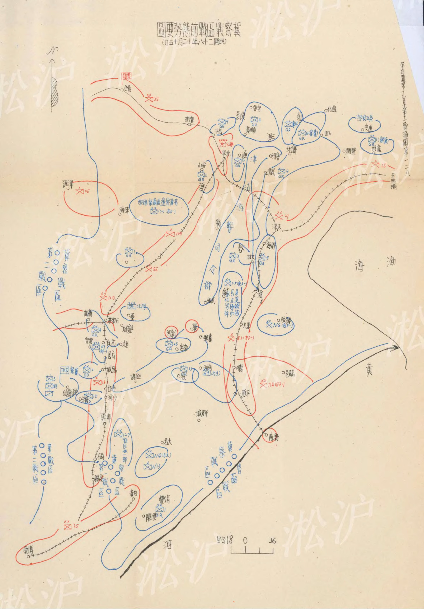

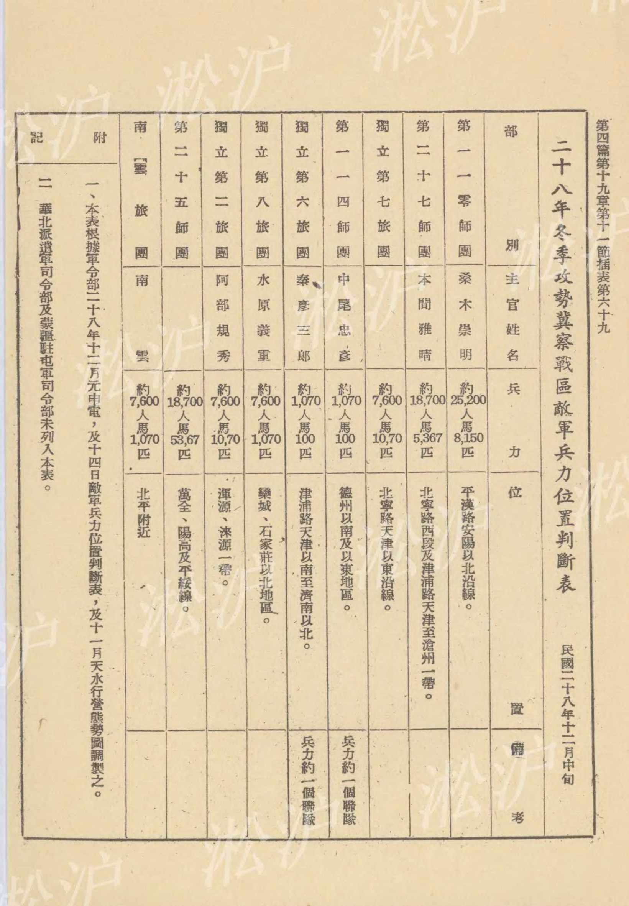

第二目 我軍（參照插表第七十）

冀察戰區自成立後，以部隊龐雜，指揮系統紊亂，軍事委員會於民國二十八年九月二十日下達電令如左：

一、冀察戰區內之任何武裝部隊（正規軍、游擊隊、保安團、自衛隊），均歸戰區總司令鹿鍾麟統一指揮。在冀察戰區內之第十八集團軍所屬之賀龍、劉伯承、呂正操等部隊，應列該戰區之戰鬪序列，同時鹿總司令有指揮之權。

二、原有保安隊改編之游擊隊，無論名稱如何，應交省府統轄整理，至其將來任務，擔任游擊抑或保安，由鹿總司令斟酌實情，相機辦理。

同月二十八日，該戰區爲實現破路計畫，部署如左：

一、津浦路北段：新編第六師由德州（含）至平原（不含）段，張國基部由德州（不含）至東光（含）段，游擊第九縱隊由東光（不含）至靜海段。

二、平漢路北段：獨立游擊第一支隊由磁縣（含）至沙河（含）段，潘子明部由沙河（不含）至內邱（含）段，游擊第四縱隊由內邱（不含）至正定（含）段，第十八集團軍之東進縱隊由正定（不含）

至清苑（含）段，冀察邊區游擊司令聶榮臻部由清苑（不含）至北平段。

三、津浦路：以平東游擊第一支隊由天津至張店（含）段，平東游擊第二支隊由張店（不含）至安定（不含）段，冀察游擊第六支隊由安定（含）至北平段。

自此以後，我游擊各部不斷與敵作戰，或予進犯之敵以打擊，或破壞鐵路及公路，而第十八集團軍主力於十月六日進抵薊縣、遵化一帶，蠶食各零星游擊隊，天水行營程主任電飭各部，須加緊團結，以抵抗該集團軍不法部隊之蠶食，迄十一月中旬，我各部仍一面作戰、一面鞏固游擊根據地，其位置如左：一、冀察戰區總司令部駐路羅鎮，直屬獨立步兵團駐坡子、挑樹坪一帶，特務營駐賀坪，騎兵營駐白岸二、第六十九軍主力在高邑、清河一帶，一部在平原附近，第九十七軍正向該戰區急進中。

三、冀察戰區游擊總指揮部駐邢台之魚鱗溝，所屬第一縱隊駐濮陽、清豐一帶，第二縱隊駐和順之松煙、清家寨一帶，第三縱隊駐冀縣、棗強、邢台一帶，第四縱隊駐趙縣、高邑、元氏、贊皇、獲鹿各處，獨立游擊第一支隊駐沙河、册井、渡口一帶。

四、其他游擊部隊：游擊第五縱隊駐涿縣、房山一帶，游擊第七縱隊駐唐縣附近，游擊第九縱隊駐靜海、滄縣及津南地區，冀察邊區游擊第一縱隊駐盧龍一帶，獨立游擊第二支隊駐南宮附近，獨立游擊第三支隊駐清河、威縣一帶，獨立游擊第四支隊駐順義、三河、密雲一帶，游擊第六支隊分佈武清縣、薊縣、寶坻、遵化、玉田，豐潤等地區，游擊第九支隊駐懷柔、昌平一帶，平東游擊第一支隊、滄駐薊縣、寶坻一帶，游擊第三支隊駐六安、大城一帶，戰區獨立游擊第一支隊駐通縣、五箴一帶，冀察游擊第六支隊駐薊縣、寶坻、玉田一帶，河北民軍主力駐藁城附近、津沽游擊司令劉繼光部分佈靜海、霸縣、武強、寶坻、香河、通縣各地，吳玉良部駐遷安、青龍山一帶。

五、第十八集團軍各部在冀察戰區者，原令均歸戰區總司令統一指揮，但朱德以第二戰區東路軍名義，指揮蕭克所部於涿州、宛平之線，以呂正操佈置於平漢路保定至望都之線，另以主力一部，配合第一一五師一部夾擊津浦路德州至靜海之線，以第一二九師約一支隊置於臨城，沙河之線，一部在邯鄲附近，以聶榮臻部及第一二零師一部位於晉冀察邊區，以宋任穹部及第一一五師與東進縱隊之另一部，位於德州至濟南之線，其用心何在，不難臆測。

表統系揮指

一、本戰區最高指揮官爲戰區總司令。

游

擊

支

隊

南

北

祇

游擊獨立第四支隊

李

萬

宗

塞

游擊第九支隊

劉

耀

宗

游擊第三支隊

陳

榮

山

游擊獨立第一支隊

陳

習

基

張

國

基

吳

玉

良

潘

子

明

第一二零師師長

第一二九師師長

冀察邊區游擊司令

東進縱隊

第一一五師一部

挺進縱隊一部

冀察游擊第六縱隊

李

宋

蕭

經

任

武

穹

克

呂

聶

正

榮

操

臻

賀

伯

承

龍

劉

伯

承

龍

吳

玉

良

潘

子

明

基

張

國

基

第一二零師師長

第一二九師師長

冀察邊區游擊司令

東進縱隊

第一一五師一部

挺進縱隊一部

李

宋

蕭

經

任

武

穹

一、本戰區最高指揮官爲戰區總司令。

一、本戰區

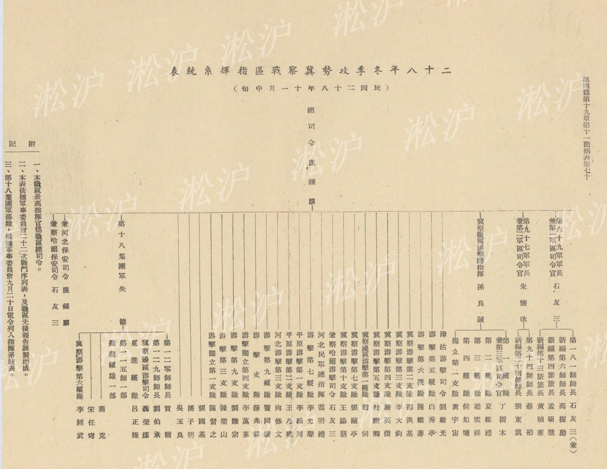

第三目兵誌概要

冀察戰區，南以黃河與魯蘇戰區爲界，西爲第二，第八兩戰區之屏藩。所轄區域，幅員廣大，北橫北寧、平綏兩路，西接恆山，太行山脈，與晉省毗連，平漢，津浦北段縱貫南北，滄石路橫銜於中，正太路交會於石家莊，公路四通八達，交通無阻。且中有永定河，大清河，子牙河，滹沱河，運河諸流，平時汽艇尚可通行，每屆冬季，北風凛冽，氣候酷寒，河流凍結，不成障礙，機械化部隊到處皆可通行，居民住舍多有圍寨，形成天然據點，易於守而不利於攻。

##### 第二項 我軍作戰指導

第九十七軍奉令改隸冀察戰區戰鬭序列，於民國二十八年十一月二十一日，由焦作、博愛一帶地區出發，預計十二月下旬全部到達，冀察戰區爲指揮便利計，乃重劃軍區，經於十一月二十八日以儉參戰電補呈如左：

一、以新樂、滄州、南皮、東光、阜城、武強、深縣、東鹿、深澤、無極、藁城、樂縣、趙縣、堯縣、任縣、南和、永年、曲周等縣東南至冀魯邊界，共四十一縣，爲第一軍區，司令官石友三，副司令官孫良誠，高樹勳，所屬部隊正規軍第六十九軍，轄第一八一師，新編第六師，新編第四師，獨立第十三旅，游擊部隊爲游擊第三縱隊，河北民軍及獨立第二支隊。

二、以獲鹿，元氏，高邑，臨城，內邱，邢台，沙河，贊皇，井陘等九縣爲第二軍區，司令官朱懷冰，所屬部隊正規軍第九十七軍，轄第九十四師，新編第二十四師，游擊部隊爲游擊第四縱隊及獨立第一支隊。

三、以邯鄲，磁縣，肥城，廣平、大名，南樂，清豐，濮縣，濮陽東、明，長垣等十一縣，爲第三軍區

司令官丁樹本。副司令官夏維禮，所屬部隊爲游擊第一縱隊及第二縱隊。

四、任務：以正規軍控置於該區內各要點，向敵予以殲滅打擊，並支援監督各游擊隊之襲擊敵人。破路隊、游擊隊，分散於各區外圍各要點，使其不斷襲擾敵人，破壞交通。

五、以上於十一月二十三日實施。

該戰區正實施上項計畫，復奉軍事委員會十一月十九日皓申令一元電令要旨：「冀察戰區以主力切斷保定，邢台間及石家莊附近交通，以策應第二戰區晉南三角地帶之作戰，於十一月下旬開始實施，並將部署情形，在十一月二十四日以前具報。」遂策定部署，下達命令，並於二十一日以馬未電呈報如左：（參照插圖第二二九）

一、第一二零師賀龍部，東進縱隊呂正操部，各地方部隊，除對冀中區敵僞軍所佔城鎮，擇其兵力薄弱者，猛攻克復外，以該師之兩團及地方部隊一部，襲擊保定，切斷交通。

二、第六十九軍石友三部，冀察戰區游擊總指揮孫良誠部之游擊第三縱隊趙雲祥部，第十八集團軍之宋任穹部，除對冀南區敵僞軍所佔城鎮，擇其兵力薄弱者，猛攻克復外，以該軍及宋雲祥部各兩團，襲擊石家莊，並切斷交通。

三、第一二九師劉伯承兩團及地方部隊一部，襲擊邯鄲，並切斷交通。

四、東進縱隊呂正操兩團及地方部隊一部，襲擊滄州，第六十九軍一旅及張國基一部，襲擊德縣，並切斷交通。

五、游擊第一縱隊丁樹本部，對大名區敵僞軍佔據城鎮，擇其兵力薄弱者，猛攻克復之。

六、平漢、津浦、北寧、平綏各線兩側地區游擊隊，破路隊，應分段破壞交通，並襲擊車站。

七、各部於十一月三十日二十四時開始實施。

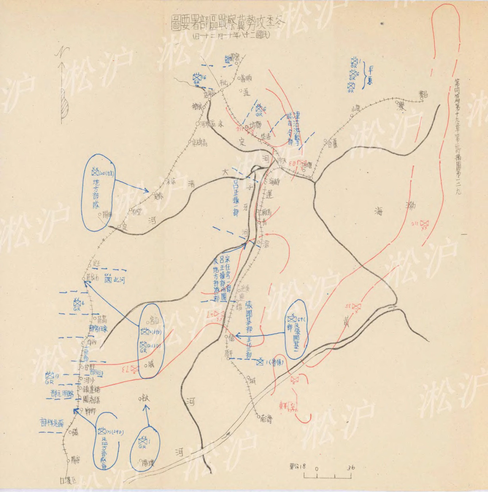

##### 第三項作戰一般經過

冀察戰區，自十一月二十一日起發動攻勢，對平漢、津浦各線及冀中、冀南大名，與平漢路安陽以北，迄石家莊以西地區，不斷向敵攻擊，並破壞，迄民國二十九年二月中旬，停止攻擊。

第一目冀南及德州以南地區（參照插圖第一三○）

第六十九軍（第一軍區）新編第六師，當大名一帶聯合之敵四百餘，附砲四門，於十一月二十九日攻佔金灘鎮時，以駐千口之部隊協同游擊第三支隊馳往夾擊，敵逃竄，十二月一日將該地克復。五日晚，新編第四旅向石家莊之敵襲擊，一度攻入車站，乘機破壞鐵路兩段。十四日，河北民軍富團第一營，與由藁城進犯朱家莊之敵四百餘激戰，營長馬鳳壯陣亡。二十日，新編第十三旅文團與由威縣向東南進犯之敵二百餘，在馬莊附近戰鬪，斃敵五十餘。二十八日，武城之敵向五方頭進犯，經新編第四旅劉團擊退。二十九日，壽張之敵百餘向孫莊、邢莊一帶竄擾，新編第六師以袁、尹兩團之一部阻擊，敵不支回竄。三十日，新編第十三旅一部襲擊威縣，敵負隅頑抗，未能奏功。及晚，游擊第三縱隊第九支隊以一部攻擊冀縣，在大劉莊附近與敵僞百餘遭遇。新編第四旅周圍以一部襲鄭家口據點，一度衝入，一部襲北獐鹿，敵據險頑抗，撤返原防。第一八一師高團以便衣隊一部潛入棗強城內縱火，我由西門衝入，將僞警備部及自衛會搗毀，二十九年元月二日，再度攻下，斬獲頗多。三日，新編第四旅裴營將故城北大馬房不願反正之僞軍五十餘全部殲滅。是日晚，新編第六師之尹團王營率第五、第六兩連及保安隊一部，攻克東阿西北之黃家胡同，將敵僞百餘全部殲滅，我第五連韓承熙連長陣亡。十日，莘縣敵僞五百餘將朝城攻陷，正與朝城保安部隊在王家莊、胡家集一帶戰鬪，適新編第六師第四團（二營）行抵朝城以北，當派第三營馳援，遂將該敵擊潰，並收復朝城。同日，保店之敵，竄擾千家，亦經新編第六師一部擊潰，敵竄寧津，其憲兵隊長被擊斃。十七日，河北民軍李團在元氏以北段村埋設地雷，炸毁南行火車一列。二十一日，新編第四旅一部在李路橋附近，斃敵百餘名，殘敵向南逃竄。二十五日，河北民軍總指揮喬明禮赴磁縣東北之二祖村，拂曉，邯鄲、沙河、磁縣之敵四百餘，先後來犯，激戰至晚，敵攻勢頓挫，我派隊反擊，敵棄屍東竄，我陣亡團附以下二十餘員名，迨二月三日，津浦路西趙店舖之敵三百餘，向保店劉旅防區進犯，經蕭團協同游擊第九縱隊一部圍攻，十二時，敵退寧津。

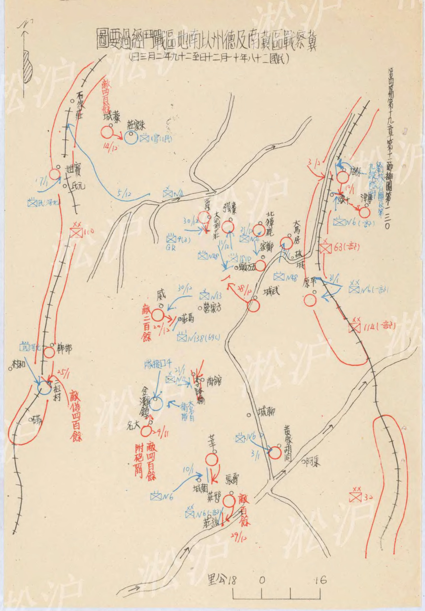

第二目平漢路以西地區（參照插圖第一三一）

第九十七軍（第二軍區）指揮之游擊第四縱隊，於十二月十七日，在平漢線元氏附近埋設地雷，炸燬敵火車一列，救獲車一輛，該縱隊第十支隊在元氏、贊皇間，破壞公路一段。二十五日，當第二戰區克復東陽關。黎城，第一戰區收復涉縣，敵第三十六師團一部由武涉公路撤退，冀察戰區敵第一零一師之崗田旅團，急調武安、臨洛關、沙河各據點，主力經功德旺進佔渡口、册井兩據點，以掩護敵第三十六師團殘部東撤，時我派新編第二十四師一部分頭迎擊，册井、渡口兩據點兩失兩得，迄二十七日晨，將敵擊敗，回竄武安。二十九日，游擊第四縱隊第十支隊向贊皇襲擊，在郝家莊與敵三百餘遭遇，經戰鬭後，敵仍回竄贊皇，三十日，該支隊在瓦窯附近，復擊退向大河道進犯之敵，同日，元氏步砲聯合之敵四百餘，亦向池村進犯，戰鬭至十四時許，敵向獲鹿撤退。二十九年二月二日，武安之敵三百餘，與我第九十四師一部在徘徊鎮附近戰鬭，正膠着間，敵由固鎮增援便衣百餘，我卽派韓團夾擊，敵不支潰退。

第三目

大名區及平漢路兩側地區（參照插圖第一三一）

游擊第一縱隊（第三軍區），指揮之游擊第二縱隊及獨立游擊第一支隊，於十二月十七日，各以一部協力炸毀平漢路沙河南二十里之褡裢鎮鐵橋二座，三日未能通車。二十六日，游擊第一縱隊在大名西雙廟一帶聚村民二千餘，將大名至邯鄲間公路徹底破壞，斷絕通車。游擊第二縱隊之特務大隊收復上蕉寺、繼城鎮兩據點。二十九年元月三日，大名之敵二百餘，向南馬頭進犯，經游擊第一縱隊第三支隊第三大隊阻擊，我以彈藥告罄，乃乘夜向海子西退。同日，邯鄲之敵八百餘，向和村竄擾，我游擊支隊薛兆祥部迎擊，戰鬭至晚，第三支隊一部來援，敵攻勢仍猛，和村遂被攻陷。十九日，威縣，曲周，肥鄉，成安及大名等處步砲聯合之敵八百餘，與游擊第一縱隊一部在渠頭莊附近戰鬪，敵受重創，於二十日，以汽車六輛，滿載敵屍百餘，由龍王廟運往大名。迨二月一日，荷澤之敵二百餘，向東明進犯，經該縣自衛團迎擊，於六集圈正戰鬪間，考城之敵三百餘亦同時來犯，東明遂於十二時失陷，我派該縣縣隊增援，先將荷澤之敵擊退後，復奪回東明，敵分別回竄。

第四目

冀中地區及其他各地區

第十八集團軍在冀察地區之部隊，令歸鹿總司令統一指揮，該總司令並已下達命令（參照本款第二項）於十一月三十日夜開始實施，而朱德以東路軍總司令名義擅自部署如左：

一，以蕭克部兩個團，截斷涿州至宛平之線，並相機攻襲涿州，蘆溝橋。

二、以呂正操部兩個團，截斷保定至望都之線，並相機攻襲保定、望都。

三、以第一二九師之張賢約支隊主力，配合其他游擊隊，襲臨城沙河之線。

四、以第一二九師之另兩個團，截斷邯鄲附近段。

五、平漢沿線兩側各大小游擊隊，以適合上述作戰企圖之目的，向平漢線寬正面不斷襲擊。

六、晉冀察區聶榮臻部及第一二零師賀龍一部，目前則以粉碎對冀察區掃蕩之敵，爲根本任務。

因是之故，第十八集團軍所屬各部，不但未遵照指定地區襲擊敵人，到處竄擾，且該屬青年縱隊壓迫駐册井、渡口之于飛支隊，並將該部包圍。雖在冬季攻勢期中，在冀中及冀西南一帶屢挫頑敵，破壞交通，然我正規軍與各游擊隊莫不時具戒心，處處提防，將國軍對敵作戰之兵力，被其牽制不少，故該集團軍當時雖忝爲國軍戰鬥序列，然暗中無時不在積極實施其壯大之陰謀。

冬季攻勢作戰，迄二月中旬截止，冀察戰區各部作戰戰績概況，詳見插表第七十一。

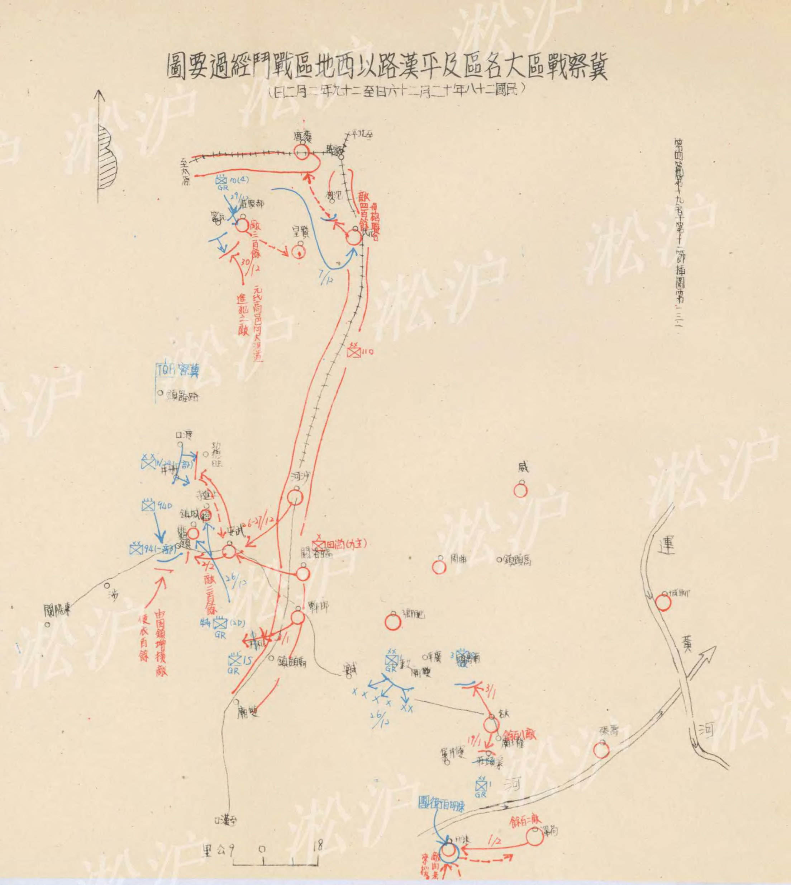

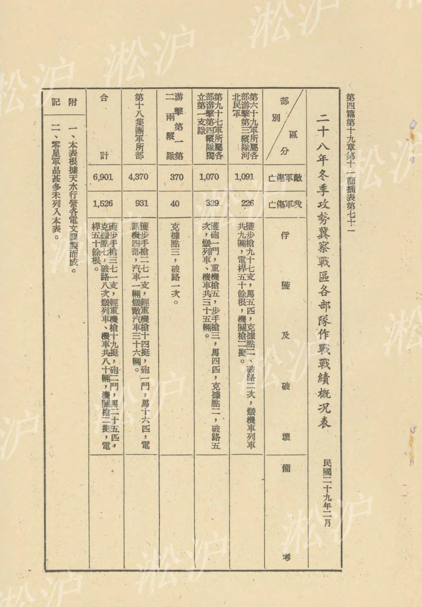

##### 第四項戰後概況

民國二十九年二月十四日，軍事委員會以寒未令一元電訓令（參照本節第一款第四項戰後概況），飭加強敵後游擊，分區實施，以鞏固中樞。冀察戰區基於以上要旨，並針對當時內部複雜情況，策定部署，並於十七日以篠辰高電呈報如次：「第一步，以石友三、高樹勳、孫良誠、丁樹本等部，確保大名以南地區，朱懷冰軍，並請衛長官飭令新編第五軍協力確保磁縣、涉縣、林縣，總部駐林縣，此外飭令龐炳勳軍將陵川至林縣之交通確實控制，否則以上各部補給卽斷，無法立足。第二步，如被中共部隊（第十八集團軍）壓迫，萬不得已時，則請以孫殿英軍配置於林縣（含）以北地區，以朱懷冰軍配置於林縣（不含）以南至江川（含）一帶，以石友三軍、孫良誠部配置於林縣東南之臨淇集、南北寨、南村附近地區，以高樹勳部及丁樹本之一部配置於獲嘉、修武西北之薄壁鎮、魏村、及西北之隍山地區，總部駐晉城或陵川。
