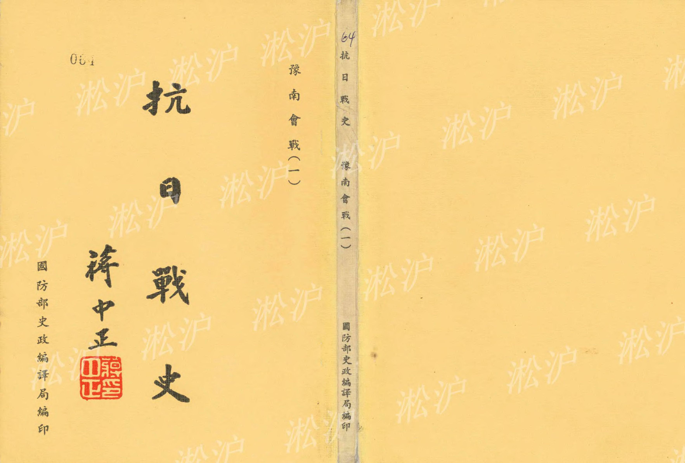

## 第二十一章 豫南會戰概述

### 第一節 會戰前之狀況第一款 敵軍

#### 第二款 我軍

#### 第三款 兵誌概要

第二節 我軍作戰指導第三節 會戰一般經過第一款 第二防線之戰鬥第二款 第二防線之戰鬥第三款 包圍戰鬥

#### 第四款 追擊

### 第四節 重要戰鬥

第一款 明港附近戰鬥第二款 淮河北岸汝南駐馬店附近戰鬥第三款 保安砦尙店西平上蔡各附近戰鬥第四款 南陽戰鬥

#### 第五款 桐柏方面戰鬥

第六款皖北諸戰鬥

第七款襄河東西方面戰鬥

第五節會戰後狀況

第一款敵軍

第二款我軍

第六節後方勤務

第七節檢討　一九五　一五五　一七三　一七三　一七三　一八一　一九五

## 第二十一章 豫南會戰

自民國三十年二月十二

日至同年二月二十四日

概述

日軍侵華，至民國二十九年（一九四○），旣不能速戰速決，而其以戰養戰策略，復因我軍不斷輪番之局部攻擊，以及敵後游擊部隊之到處襲擊，使其難收預期之效果。故而隨時企圖打擊我野戰軍，掠取物資，并破壞我反攻準備，以鞏固其已獲得之戰略要點。

此時豫南方面，猶爲我軍固守。而該地山脈縱橫，河流交錯，並連貫廣大平原，物產豐富，民性強悍，自古爲兵家必爭之地。且係保持豫皖連絡，以及收復武漢之一大好根據地。

敵軍爲圖攻破此一戰略地區，乃於三十年一月下旬，發動豫南攻勢。是時，我第五戰區守備正面，橫亘鄂、皖、豫三省，自遠安西南，經荊門、鍾祥以北，沿大洪山南麓、桐柏山東麓、明港、皖北、豫東而至蘭封，全長達四百餘公里。而當面之敵，共約步兵十五萬餘、騎兵八千五百餘、砲五百五十餘門、戰車三百餘輛，裝甲車二百餘輛。並於安陽、新鄉、淮陽、信陽各地，集中飛機約百餘架。該敵先以一部由鄂西之荊、當，攻我襄西防線，更由豫東沿黃氾增兵，以備西渡。且於會戰開始後，一部由皖北之亳、宿西進，以牽制及眩惑我軍，主力則於元月二十四日，由信陽分路北進。我軍事委員會事先綜合諸般情報，卽判知敵之企圖，乃指示第五戰區，以避免正面決戰，並依正面節節抵抗，一部向敵後切斷交通，主力由兩側攻擊之要領指導作戰。該戰區遵照以機動誘殲深入敵人之方針，毅然以主力預置於左翼，以逸待勞，準備圍殲進攻之敵。至元月三十日，敵軍沿平漢路北進，抵舞陽、西平、上蔡之線後，因受我湯集團之打擊，及其後方連絡復被桐，泌方面之我軍所威脅，遂於二月二日藉其皖北方面之策應，向左旋迴。二月四日，陷我南陽。我第五戰區已預爲部署，以宛、泌方面之我軍迎擊於前；葉縣、方城之我軍尾擊於後，桐柏、羅山方面之我軍，則分向信陽南北挺進。於是，敵因我各方之合擊，遂被迫向信陽回竄。沿途燒殺擄掠，慘無人道。旋經我軍之尾擊、截擊、伏擊，傷亡奇重。同時，皖北、襄西之敵，亦相繼被我擊退。截至二月十一日，本會戰乃完全結束。迄二十四日，我參加會戰之各部，亦次復戰前之態勢。

本會戰共經二十一日（自二月十二日至二十四日間之各小戰鬥未計），總計殲敵萬餘，擊落敵機六架，擊毀敵戰車及裝甲車共五十餘輛，焚敵汽車約二百餘輛，幷函獲軍用品甚多。而我方傷亡較小。至於牽制敵軍多數兵力，使其不能抽調轉用，尤爲本會戰之至大成果。

第一節

會戰前之狀況（參照插圖第一）

第一款

敵軍（參照插表第一第二）

自二十九年敵在東宜會戰失敗後，迨三十年一月下旬，又發動豫南會戰，其戰前兵力及分佈狀況如下：

襄河東北方面

一、第十三師團分駐宜昌附近。

二、獨立第十八旅團駐當陽附近。

三、第三十九師團駐荊門、江陵一帶。

四、第四師團駐鍾祥、京山、應城、安陸、天門一帶。

豫西方面

五、第三師團駐隨縣、應山、廣水、信陽一帶。

六、第十七師團（欠一聯隊）附第十五師團之六十七聯隊及吉松、楠濑等戰車部隊，駐信陽一帶。七、第四十師團之一聯隊駐蕲春、蘭溪一帶。

八、獨立第十四旅團之第六十五大隊駐武穴附近。

皖北豫東方面

九、第一百一十六師團之第一百零九聯隊及騎砲戰車各一部，駐安慶、望江一帶。十、獨立第十三旅團駐津浦南段及淮南路五河、鳳台、壽山一帶。

十一、第二十一師團之第六十二聯隊駐宿縣、永城一帶。

十二、騎兵第四旅團駐商邱及亳縣、柘城、太康、淮陽一帶。

十三、第三十五師團之第二百二十聯隊駐開封、中牟一帶。

十四、山崎鐵道守備隊駐隴海路蘭封、銅山間。

僞軍狀況如左：

襄河東北方面

一、僞皇協新軍之第三十七師及第十三師、第四師等，分駐宜昌、當陽一帶。二、僞荊沙警備部隊及鄂西剿匪部隊，駐荊門、沙市一帶。

三、僞第十一師及鄂西保安隊駐京山、鍾祥、隨縣、應山一帶。

豫南方面

四、僞豫、鄂邊區部隊，駐信陽、羅山一帶。

五、僞華中綏靖公署直轄部隊駐武漢一帶。

皖北豫東方面

六、僞豫、皖邊區總部所屬部隊，駐商邱、柘城、陳留、淮陽、宿縣、銅山一帶。七、僞第十一路及僞第一師、第六師、第十五師等，駐巢縣、合肥、壽縣、鳳台、懷遠、蚌埠一帶。八、僞警衛旅及僞第十三路，駐皖東南全椒、和縣、滁縣、蕪湖一帶。

在會戰前，敵於襄西、豫南、皖北、豫東各方面集中者，約十萬餘人。

第二欵

我

軍

參照插表第三第四

河西集團（第三十三集團軍馮治安部）

一、第七十七軍（第三十七師、第一百七十九師，欠一百三十二師）右與第六戰區之第二十六集團軍連繫，擔任白楊寺河（遠安南）、觀音寺迄柳尨店陣地守備。

二、第三十軍（第二十七師、第三十師、第三十一師）擔任柳尨店、張家集迄孔家灣陣地守備。第三十師控置安家集附近爲軍預備隊。

三、第三十九軍以暫編第五十一師集結於南漳附近。第五十六師控置保康、歇馬河一帶，爲兵團總預備隊，並增強第五、第六兩戰區之接合部。

右集團（第二十九集團軍王續緒）

一、第四十四軍以一百五十師守備豐樂河、長壽店一帶陣地。第一百四十九師控制板橙崗西北地區。

二、第六十七軍以第一百六十一師守備花山砦、青峯山、板橙嶺、六房咀亘龍王砦、蜂子山之線。第一百六十二師控制楊家大畈地區。

三、游擊隊戴支隊自普門沖前方，沿襄河游擊。何學源支隊在楊家廟一帶游擊。

中央集團（第二十二集團軍孫震部）

、集團軍以均川、安居、厲山、高城地帶爲第一線，高家沖、扒山寺、唐縣鎮、太山廟、洪河地帶爲第二抵抗線，河源店、淨明舖、尙市店、劉家灣地帶爲中間陣地。

二、第四十五軍（第一百二十五師、第一百二十七師附施、胡兩游擊隊）以一部守備安居、均川，並監視敵人之行動，其餘大部集結於河源店，環潭一帶整理。

三、第四十一軍（第一百二十二師、第一百二十三師，欠一百二十四師）除以一部守備厲山、高城，並監視敵人之行動外，其大部則集結於尙市店、太山廟一帶。

四、第一百二十四師爲集團軍預備隊，位置於唐縣鎮、棗陽附近。

左集團（第二集團軍孫連仲部）

一、第六十八軍（暫編第三十六師、第一百一十九師、第一百四十三師）以兩師守備馮家莊（信陽西），高梁店、申陽台、古城、明港、淮河鎮一帶之旣設陣地，以一師在泌陽附近，備與第一線之兩師更番整訓。

二、第五十五軍（第二十九師、第七十四師）在南陽西青華鎮，穰東一帶整訓。

三、鄂北游擊隊閻廷俊部，以一部在六十八軍之右，任馮家莊、四望山、泉口店以南地區之守備，其主力在固廟，平氏一帶整訓。

四、豫南游擊隊田鎮南部，以一部在六十八軍之左，任淮河左岸至彭家灣一帶之守備，其主力在遂平附近整訓。

第二十一集團軍李品仙部（鞏固大別山游擊根據地幷控制豫鄂皖邊區）

一、第七軍以第一百七十一師（欠第五百一十三團）位置於霍山，第一百七十二師駐六安。

二、第四十八軍以第一百三十八師位置於合肥、欄岡集，第一百七十六師駐桐城。

三、第八十四軍以第一百八十九師駐六安，第一百七十四師配屬第五百一十三團，暨鄂東四個游擊縱隊，活動於潢川、經扶、羅山、信陽、花園間，及平漢路以東地區。

四、鄂東游擊司令程汝懷部（三個縱隊另三個支隊）控置鄂東一帶。

五、另游擊縱隊十餘個活動於皖中一帶。

湯集團（第三十一集團軍湯恩伯部）

一、第九十二軍（第二十一師、第一百四十二師、暫編第十四師、配屬暫編第二十六師、騎兵第八師、游擊第十四縱隊）以第一百四十二師，騎兵第八師及游擊第十四縱隊之主力，控制蒙城以南順河集，闕疃集間一帶地區，以第二十一師位置於蒙城、劉家集間之地區，暫編第十四師控制阜陽，太和一帶地區。

二、騎兵第二軍（騎兵第三師、第六師、步兵旅，配屬第十二軍之第八十一師，暨李宣德、王瘦吾、劉錫五各縱隊）之騎兵第三師位置於永城西南耿黃寺附近，騎兵第六師及步兵旅位置於亳縣南十字河，義門集一帶，第八十一師位置於淮陽、太康間之地區。李宣德、劉錫五兩縱隊，一駐水寨，一駐周家口，擔任河防，王瘦五縱隊駐秋渠，向鹿邑一帶游擊。

三、第十二軍（第二十二師、欠第二十師及第八十一師）之第二十師（暫歸湯集團直接指揮）守備周家口至扶溝之河防，第二十二師守備白潭至京水（鄭州北）間之河防（十二軍歸第一戰區直接指揮，第八十一師則歸騎兵第二軍指揮）。

四、第八十五軍（第四師、預備第十一師、第二十三師。）除以預備第十一師駐西平，遂平一帶，對信陽之敵警戒外，其餘兩師集結於沈邱以南臨泉附近。

五、第十三軍（新編第一師、第八十九師、第一百一十師）控置於方城、舞陽一帶。

六、第二十九軍（暫編第十六師、第九十一師、第一百九十三師）位置於鄂北大洪山附近，擔任剿匪。

七、豫、鄂邊區游擊總指揮王仲廉部（獨立第十五旅及第二、第六、第七各縱隊）位置於朱家店、草店、天河口一帶，其任務爲鞏固桐柏山一帶之根據地，幷於我中央集團與左集團間之地區，活動游擊。

第五戰區直轄部隊

一、第五十九軍（第三十八師、第一百八十師、欠暫編第五十三師）控制於樊城。

二、第一二八師在沔陽一帶游擊。

三、暫編第五十三師及第一三二師控置於鄧縣。

一、第五、第六戰區間：張村坪、荷花店、峽口、慈化市、馬良坪、潛江、沔陽、嘉魚相連之線，線上屬第五戰區。

二、第五、第一戰區間：荊紫關、馬山口、南陽、葉縣、許昌、尉氏、蘭封，延至舊黃河相連之線，線上屬第五戰區。

三、河西集團與右集團間：老河口以南，沿襄河至鍾祥、長灘埠之線，線上屬河西集團。

四、右集團與中央集團間：隆興寺、梁家集、清潭、尙家店、平壩、云夢相連之線，線上屬中央集團。五、中央集團與左集團間：人和砦、人和集、張家灣、九里山、田家山、監生店、楊家寨車站相連之線，線上屬左集團。

六、左集團與湯集團間：南陽、除旗鎮、象河關、沙河、駐馬店相連之線，線上屬湯集團。

七、湯集團與李集團間：沿淮河之線，線上屬李集團。

八、李集團與左集團間：東雙河、中山舖、梅黃店、驢河店、萬里橋相連之線，線上屬李集團。

綜計我之兵力共十八個軍，三個砲兵團，及各游擊部隊，共約十四萬四千餘人。

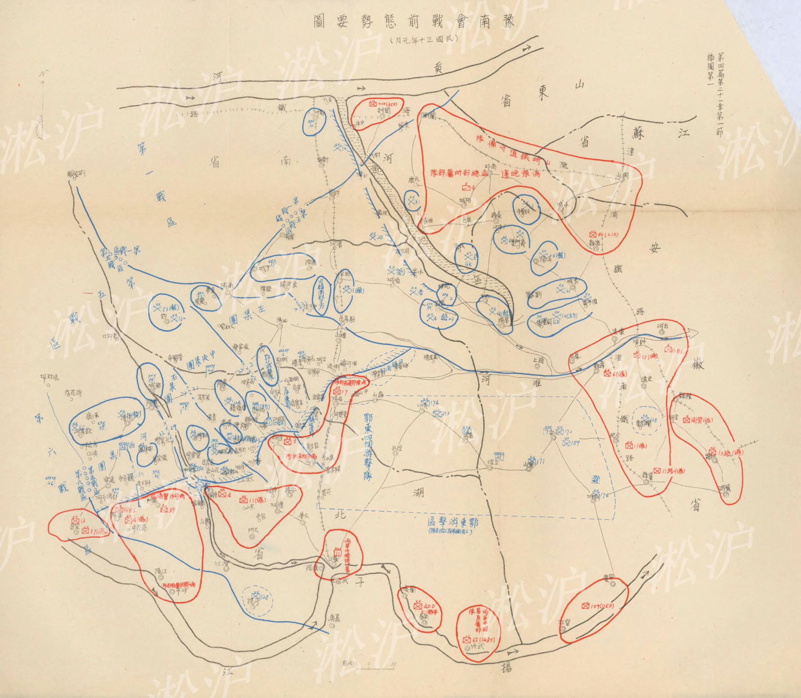

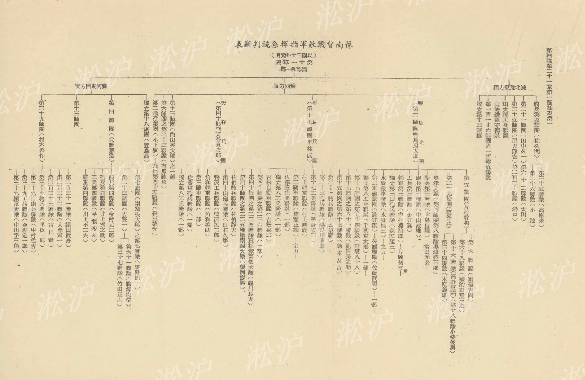

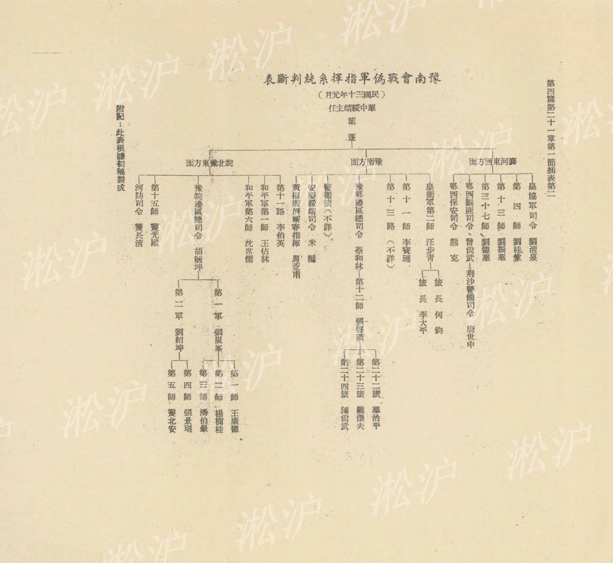

(中央集團)

第二十二集團軍

孫震

第四十一軍

孫震

第四十五軍

陳鼎勳

第一二五師

第一二七師

施胡兩游擊隊

第三十軍

池峯城

第三十師

張華雲

第二十七師

黃樵松

第七十九團

歐耐農

第八十團

戴炳南

第八十一團

田敬堂

第三十一師

乜子彬

第九十一團

姜常泰

第九十二團

韓世俊

第九十三團

禹功魁

第一團

張傳壽

第二團

張聿堂

第三團

王錫鈴

暫編第三十六師

劉汝珍

第一

第二

團

張聿堂

第三

團

王錫鈴

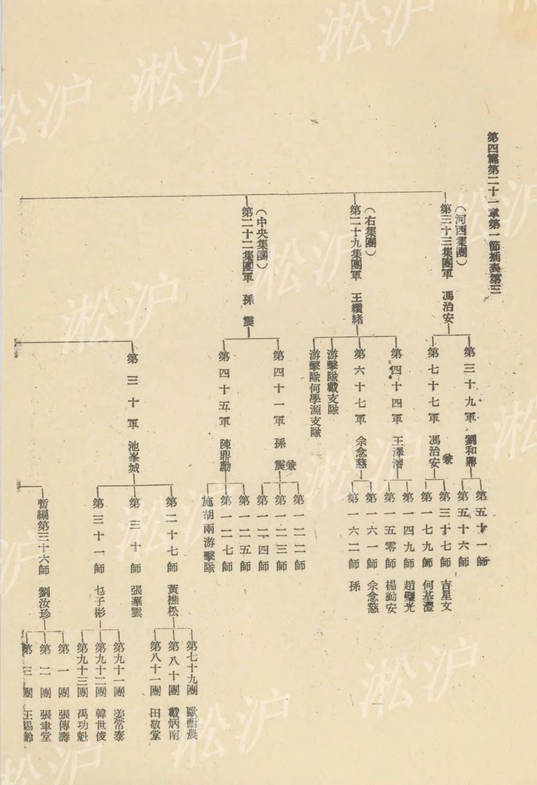

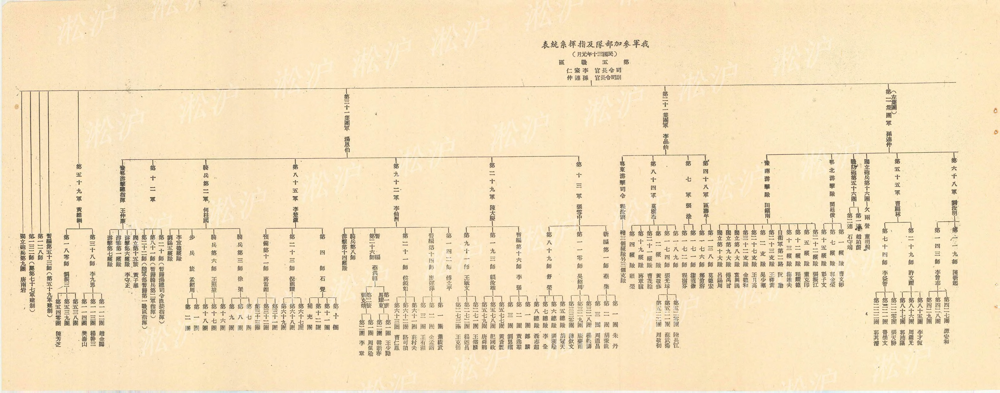

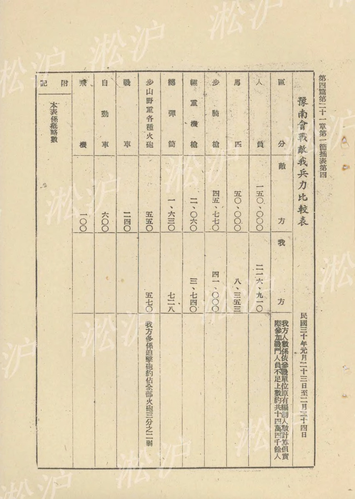

第三款

兵誌概要（參照插圖第二）

一、形勢：豫南地區，東以淮河平原連皖西，南以大別山、桐柏山系界鄂北，西以伏牛山負嶠函而固秦陝，位於黃淮平原之西，沃野千里，平漢鐵路縱貫其間，公路四通八達，東進可斷平漢，攬淮河平原，南下可威脅武漢，西挾宛城出荊襄，北進與敵戰於成皋之野，古人所謂北襟許、洛，南連襄、郢，肘腋安、黃，南北爭衡，必以此爲爭奪焦點，楚所謂戰於方城之外者也。昔光武中興，嘗謂南陽有高山峻嶺可資控扼，寬城平野可以屯練，西鄰關陝可以召集將士，東達江淮可運殼粟，南通荊、湘、巴蜀，可取貨財，北拒三都可資救援，諸葛武侯亦稱爲用武之地，抗戰中，實爲我戰略支撐之要地。

二、河流：以淮河爲大，源出桐柏，支流繁衍，東流入安徽，西以唐河、白河之支流，入鄂境之襄河。因各河均係水源，極少運輸之利。

三、山脈：境內山脈屬北嶺系，其主幹爲伏牛、大別、桐柏三系，盤於西南，極利爲進戰退守之地。

四、氣候：以地處華中，氣候爲大陸性，寒暑懸殊，雨量稀少，每當大風，塵土飛揚，有礙展望，降雨時，則泥濘沒脛，行軍作戰困難。惟冬季天朗氣清，利於空軍活動。

五、交通：運輸與補給，平漢鐵路縱貫南北，路東概屬平原，盛產米、麥，補給較易，路東多山，運輸補給均難，除信陽經唐河至南陽，南陽經方城至葉縣，以及信漢三公路可資利用外，餘皆小路，不能供大部隊之行動。而山區更屬崎嶇難行，惟泌陽至方城間，乃一小平原，行動較便，且可就地補給糧秣。

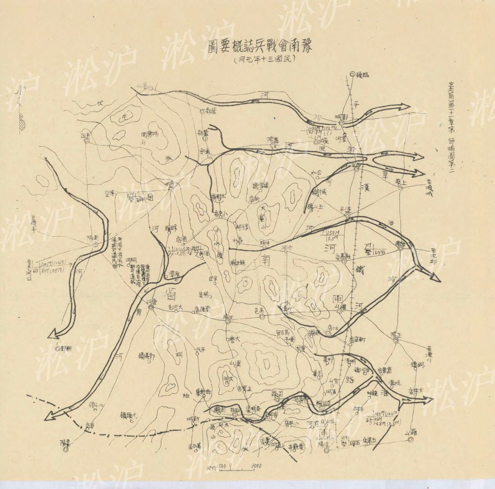

### 第二節 我軍作戰指導

(參照插圖第三)

敵軍自二十九年十二月二十六日至三十九年元月六日，先後到達上海約三、四萬人，並陸續向漢口前進，分向湘北及鄂中增加，而漢口方面，於元月一日增到敵轟炸機七十餘架，戰鬥機、驅逐機五十餘架，且於元月上旬，孝感、漢口間，已增敵約三、四萬人，鷄公山、廣水間，增敵約計一個師團，附戰車、汽車甚多，自元月十二日起，信應公路上，敵軍往來巡邏甚密，我第五戰區司令長官部，根據當時之情況，對於敵人之企圖，乃作如下之判斷：

一、施行牽制攻擊，妨害我軍之勦匪。

二、解除我勦匪軍對信陽外圍之威脅。

三、敵企圖南進時，防我軍乘機攻擊，預爲準備。

四、打通平漢路，溝通南北連絡，或攻達漯河、郾城，向右旋迴，東渡黃汜，與淮陽、開封之敵，連成一氣，截斷我鄂、皖及蘇、魯交通。

五、以我野戰軍爲目標（尤其我戰區有力部隊湯集團）而殲滅之。

六、依據其流竄戰略，以限制目標之攻擊，實施大規模擾亂攻擊。

而以二、五、六等三案之公算較多，第二案，因我勦匪軍事部署移動，敵最初或情況不明，感受威脅。第五案，以行將南進之際，更覺後方不安，故將對我豫南部隊，加以打擊。第六案，乃依敵慣用的流竄戰略判斷，此次敵集中兵力較大，戰鬥準備時間及器材充分，亦可能企圖與我湯、孫兩集團決戰也第五戰區司令長官李宗仁，基於上述判斷，於元月二十一日對河西集團指示如次。

河西集團應利用荊，當以北山地，與敵週旋，適時求隙而擊敗之。

復於二十二日以養辰年電令各部隊部署如左。

第一情況

一、信陽之敵，截至二十一日止已陸續增至一萬三千餘。騎、砲各一聯隊，戰車四、五十輛，汽球兩個，集結於信陽北十餘里附近村莊。

二、隨縣方面，連日由廣水、應山增敵四千餘，而孝感、安陸、應城一帶，尚有敵之後續部隊。

三、敵似有乘我大軍勦匪機會，再由隨縣、信陽分路向我左翼進攻企圖。

第二戰區以相機擊破進攻敵人之目的部署如左：

一、左集團應以有力一部，守備既設陣地，拒止進攻之敵，以主力集結桐、泌間地區，準備向東側擊敵人，第五十五軍應先向唐河東南地區推進。

二、湯集團應以西平附近兵團，準備迎擊北進敵人，並以有力兵團，分別控置舞陽以南，新蔡西北地區，準備夾擊。

三、第八十四軍應以主力控制潢川西北地區，與左集團協力求敵之側背而攻擊之。

四、中央集團應依既設陣地，竭力拒止敵之進攻，不得已時，應以機動戰法，誘致敵於棗陽附近，待後方兵團之加入，協力圍殲該敵。

五、右集團應以主力固守現陣地，注意長壽店、流水溝方面，並須有擊破敵北進之準備。

六、鄂東游擊部隊，應積極向平漢南段襲擊敵之後方。

七、第五十九軍應向棗陽西北地區推進，仍歸本部直轄，暫編第五十一師應卽推進於襄陽附近，並擔任該地守備。

軍事委員會尚未接到李宗仁司令長官上述部署之電報時，於二十三日以梗未令一元電指示要旨如左第五戰區以保持豫、皖聯絡，以利爾後作戰之目的，應避免與敵正面決戰，依正面節節抵抗，以一部向敵後切斷交通，主力由兩翼側擊，希本此意旨，限期佈置完畢具報。

我五戰區司令長官李宗仁，於二十五日始接奉上電，遂以誥諭有申年電，轉令各集團，並依上旨調整部署如左：

一、左集團應以有力一部，依既設陣地，拒止敵之西進，以主力集結於泌陽地區。

二、第八十四軍以一部監視羅山之敵，主力則迅向息縣舊治地區集結。

三、湯集團應卽照梗未參戰電，詳一般作戰經過迅速分別集結於象河關附近，及汝南以東地區。

四、以上各部，限二十八日以前集結完畢，並應互派連絡軍官密切聯絡。

五、敵先頭部隊如攻抵汝南，駐馬店之線時，各兵團應迅卽積極向敵側背圍擊，務期於淮河以北遂平一帶地區殲滅之。

六、第五十九軍應迅向棗陽以北推進，限二十七日到達。

七、第二十九軍應卽向桐柏、新城附近集結，限二十七日到達。

八、中、左兩集團，應各編組若干有力支隊，潛入敵後，施行破壞擾亂，以資牽制。

同日，湯恩伯總司令接奉蔣委員長手啓有（二十五日）機渝電令如下：

「敵軍必於下月初或本月底，向弟所屬各部進攻，務希嚴令各部積極準備，不可爲敵所制，此次敵之攻勢，其範圍必較遠大，豫東南之商城、阜陽、郾城，豫西之南陽、臨汝，皆爲其預定目標，近則舞陽、泌陽、桐柏、確山、正陽，自爲其必竄之途，希對敵之意圖速作對策，限於本月底，佈置完畢，總

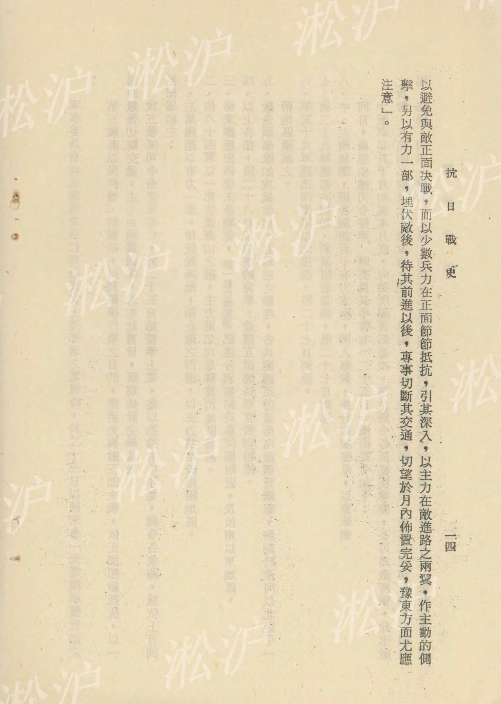

### 第三節 會戰一般經過

（民國三十年元月二）參照插圖

十二日至二月十日第四

敵於棗宜會戰後，更以兵力分佈於荊、襄平原，依然受我由北方之側擊威脅，乃於三十年元月下旬集結步兵七個半師團、獨立騎兵一個旅團、獨立戰車三個聯隊、獨立野戰重砲兵一個聯隊，分向豫南、鄂西及皖北進迫。一月二十日午，鄂西襄河兩岸之敵獨立第十八旅團，及第三十九師團之第二三一聯隊，第四師團之第六十一聯隊等部，附砲八十餘門，向當陽、荊門、鍾祥一帶集中。並於二十二日首先對我第二十九集團軍及第三十三集團軍進攻，企圖牽制我該方面之部隊，以便進出我豫中。其集中豫南主攻方面之敵軍，附飛機六十餘架，汽球兩個，由園部和一郎指揮，分三路向我進攻，其各路情況如左一、左路兵團第三師團全部，附第四師團之第八聯隊，水野戰車部隊，及僞軍一個師，約四、五千人，歸第三師團長豐島指揮，沿吳城集、王寬店、毛集、泌陽、象河關向舞陽方向進攻。

二、中央兵團第十七師團（欠一聯隊）附第十五師團之第六十七聯隊及吉松瀨等戰車部隊，約萬餘人，歸第十七師團長平林指揮，沿平漢鐵路向西平方向進攻。

三、右路兵團第四十師團之五個大隊（原一聯隊後增至五個大隊）及佐伯騎兵聯隊，附第六師團之第二十三聯隊，約七千餘人，另僞軍千餘，歸第四十師團長天谷指揮，沿正陽、汝南，向上蔡方向進攻。

同時，豫東、皖北方面，敵軍第三十五師團一部，約兩個聯隊，附太郎田工兵聯隊、及騎、砲兵、戰車、裝甲車各一部，於元月二十五日前後，分由開封、通許、朱仙鎮沿黃氾向鄭州北岸，並沿黃氾南下，有西渡模樣。二十六日，敵騎兵第四旅團長佐久間所指揮亳縣、淮陽之騎兵第四旅團，附戰車聯隊與僞軍一部及宿縣之第二十一師團大癲聯隊，分向渦陽、蒙城進攻。

我軍以襄河東、西方面，及豫、皖邊區原有兵力，拒止當面之敵，主力則集中於豫南方面，且處處設伏，以相機聚殲來攻之敵，故而會戰始終均能保持機動，予敵極大打擊，惜敵急退，未竟全功，其經過分誌於後。

第一欵

第一防線之戰鬥

元月二十二日，襄河方面之敵獨立第十八旅團，於午後一時卽開始向我河西集團之右翼進攻，當夜我廟前陣地陷落。

是日，第五戰區司令長官李宗仁當以誥養辰年電（詳第二節）向所部指示作戰。我防守豫南正面之左集團孫連仲總司令，於南陽接奉上電後，當日卽令第六十八軍加強第一線兵力，並飭所屬後方各部隊，向前推進。

信陽之敵在續增中。

元月二十三日，豫南方面，敵以小部分向左集團防線之兩翼進迫，當與我游擊隊接觸後，右翼進佔黃龍寺，其左翼則渡河進攻蕭曹店未逞。（詳第四節第二款）

襄河方面，進攻我河西集團之獨立第十八旅團、及第三十九師團，突破我鴨子山、鯉魚砦一帶陣地，守軍當向突入之敵逆襲。（詳第四節第七款）

是日，第五戰區李宗仁司令長官指示各集團，着編若干有力支隊，潛入敵後，以破壞其戰略集中，復令豫、鄂游擊總指揮王仲廉，以一部進出平林市及信應公路一帶，襲擾敵人，主力則集結於隨南待命。

湯集團總司令於漯河接到李長官之誥養辰年電後，遂行如左之處置：

一、騎兵第二軍續行原勦匪任務，並對淮陽、亳縣之敵，嚴密警戒。

二、第九十二軍對鳳臺、壽縣之敵，應派部嚴密監視之。穎上防務，仍由該軍接替。第八十五軍之一團，着卽歸還建制。

三、第八十五軍主力，移置新蔡西北楊埠、廟灣一帶集結，準備迎擊由信陽北犯之敵，新蔡、汝南應各派一部警戒。

四、第十三軍主力，着集結象河關、保安砦、舞陽間，準備迎擊信陽北犯之敵。

五、王仲廉副總司令所指揮之各部及第九十二軍，仍續行原勦匪任務，如敵由信陽北犯時，除以一部截斷並控制信陽以南敵之連絡線外，主力卽拊敵之側背猛烈襲擊，以協同第十三，第八十五兩軍而殲滅之。

六、各部一律限二十八日前，到達指定位置，準備作戰。

元月二十四日，第五十五軍由南陽西之菁華附近，向唐河移動。第八十五軍主力，由臨泉附近，向上蔡西北地區集中。

豫南方面（詳第四節第一款），敵進佔黃龍寺之一部，西進三道河，經我獨立第十五旅迎擊後，改向小林店方向北竄。其中央兵團及左路兵團之主力約萬餘，附砲數十門，分由游河、出山店、長臺關，向我第六十八軍陣地進攻，其右路兵團一部千餘，亦強渡淮河，攻佔豫南游擊隊所守備之蕭曹店。

襄河方面，敵獨立第十八旅團之一部，是日午，突進至遠安城郊，我河西集團之馮治安總司令，當令第五十六師之第一六八旅，向遠安西北之通城河推進，以協力防守正面之第一七九師，轉移攻勢。襄東、鍾祥之敵第四師團一部，約步騎二千餘，附砲數門，戰車四輛，向我右集團之陣地進攻。

元月二十五日，應山之敵，約二千餘，向信陽前進，並以千餘增駐游河、信陽附近之羅山，梅黃店一帶，駐有敵軍七千餘人，砲兵一聯隊，戰車三十餘輛，及僞軍三千餘，又皖北方面之敵，近日亦調動頻繁。

是日，我第二十九軍由大洪山北進，第五十五軍進抵南陽東南附近，第十三軍則進駐於舞陽、尚店、象河關、保安砦一帶，第八十五軍進達和店附近。

同日，豫南方面之敵，除以一部約步騎千餘，附砲十餘門，戰車三十餘輛，繞攻明港外，同時，更以兩路向我第六十八軍之左右後方迂迴。本午，敵左路約步騎四千餘，附砲十餘門，已抵固縣鎮一帶，右路約千餘，亦到達明港以北之李新店，並派一部五百餘，向確山前進。此時，我守軍已陷兩翼被圍態勢，而攻佔蕭曹店之敵，及由梅黃店強渡淮河之另一部千餘，突破豫南游擊隊之防線後，繼續北進。

同日，襄河方面，河西集團之第七十七軍，將竄抵遠安附近之敵擊退，並追擊至石馬槽附近，其第三十軍與進攻張家集、白雲山之敵第三十九師團一部，正激戰中。而襄東方面，進攻我右集團之敵第四師團一部，亦與守軍第一五零師在江山觀、流水溝一帶激戰中。該集團之左翼第六十七軍，當以一部襲佔洋梓，以截斷敵人之歸路。

二十五日，我左集團奉到副總長白崇禧之電話指示，第一線部隊應暫時避免與敵決戰。旋又接奉司令長官李宗仁之電話，湯集團之第十三軍，在象河關、保安砦、舞陽地區集結，準備夾擊北進之敵。孫連仲總司令當即令第六十八軍相機縮短戰線以主力守備毛集、黃崗、馬古田大路，一部守備確、泌大道，阻敵西進，並令豫南游擊隊，竭力對敵襲擊或側擊。

二十五日，第五戰區奉蔣委員長二十三日之梗未令一元電（詳第二節）示，應避免與敵正面決戰，依正面節節抵抗，一部斷敵後連絡，主力由兩翼側擊，並命鄂東、豫南之李品仙部，及平漢路兩側之湯恩伯部，參加作戰。李宗仁長官當即根據上旨，以誥瑜有申年電（詳第二節），令左集團以一部作正面抵抗，主力則向泌陽一帶集結。第八十四軍向息縣舊治附近集結，湯集團集結於象河關及汝南附近，第五十九軍向棗陽以北推進，第二十九軍進駐桐柏、新城附近。

我湯集團旋又奉蔣委員長之手啓有渝電（詳第二節）示，此次敵軍，必以商城、阜陽、郾城、南陽、臨汝爲目標，而舞陽、泌陽、桐柏、確山、正陽亦爲其必竄之途，希作對策，並依梗電所示，部署作戰。湯恩伯總司令當令第二十九軍迅由大洪山北調桐柏，第八十五軍由臨泉調往郾城、西平附近，以協同豫西之第十三軍殲滅北犯之敵。

元月二十六日，由孝感分向安陸增敵四、五千，信陽增敵八、九千，並以四千餘向明港推進。馬坪有戰車六十餘輛，一部三十餘輛向廣水前進。應山駐敵四千餘，砲十餘門，戰車三十餘輛。

皖北方面（詳第四節第六款），永城、亳縣之敵，分向渦陽、義門集進攻，朱仙鎮之敵五百餘，在李寨渡口，強行渡河，而黃河北岸之敵第三十五師團小林聯隊，亦向招賢集進攻。

是日，左集團之第五十五軍，已抵唐河附近，沿唐河右岸佔領陣地。湯集團之第二十九軍及第八十五軍，正向前推進中。

游擊於大別山一帶之第二十一集團軍李總司令，電令第八十四軍以主力控置潢川以西地區，以協力左集團軍而側擊敵人。

同日，豫南方面，我第六十八軍轉移陣地後，敵左路增至七、八千，一部竄抵大磨（泌陽南），主力向毛集進攻。其右路亦增至步騎五、六千，附砲二十餘門，戰車二十餘輛。主力繼續北進，一部二千餘，附砲十餘門，於十四時攻陷地方團隊防守之確山。

我左集團孫連仲總司令，基於右述情況，乃令第五十五軍之一師歸第六十八軍指揮，卽向泌陽側擊敵人，並令鄂北游擊隊，協同尾擊該敵。

同日，中央集團孫震總司令爲策應左集團作戰容易，遂令所屬兩軍，各以有力部隊，分向隨縣、浙河攻擊。

是日，襄河東西方面，我河西集團及右集團之第一五零師，均全線擊退當面之敵，而恢復原來之陣地。

皖北方面，亳縣之敵騎兵第四旅團一部，及僞軍千餘，攻陷義門集，守軍騎兵第三師南退。永城之敵，大島松森部步騎四百餘，附砲二門，戰車四輛，與我暫編第二十六師之一部，戰於渦河左岸。豫東由朱仙鎮向李寨渡口進犯之敵，井部步砲聯合五百餘，被我游擊第二縱隊擊退，敵我均有傷亡元月二十七日，豫東之通許，增敵八、九百，淮陽增敵五千餘，砲二十餘門，汽車百餘輛，飛機百餘架，有渡黃氾及沙河之企圖。

是日，湯集團之第八十五軍，主力到達上蔡以南，一部進抵汝南。

同日，豫南方面，右路攻佔確山之敵，今晨以一部千餘，向沙河店方面前進，主力則沿平漢線向駐馬店推進。其中路之敵六千餘，於攻佔毛集後，繼陷堡子、馬古田陣地，旋與其左路由大磨北進之敵會合，復向泌陽以北推進。我左集團第六十八軍主力，遂向龍王廟以西轉移。同時，鄂北游擊隊向泌陽之敵尾擊，第五十五軍之一師，亦由唐河向泌陽急進中。此時，右路之敵已抵竹溝附近，我第六十八軍之暫編第三十六師一度抵抗後，遂向沙河店一帶轉移。

突破我豫南游擊隊防線之敵，繼續北犯，我軍遂以一部守備汝南，主力則移向駐馬店西南佈防，準備迎擊沿平漢線北進之敵。

是日，襄陽方面，河西集團與敵成對峙狀態。

同日，皖北方面，與我暫編第二十六師戰於渦河左岸之敵，繼向渦陽進犯。我騎兵第二軍今日克復義門集，並與敵復戰於十字河一帶。

豫東朱仙鎮之敵二百餘，復向我游擊第二縱隊進攻，旋被擊退。

此時我第五戰區司令長官李宗仁，乃於本日以感午年電，訓令各集團，其要旨如左：

一、戰區適時捕捉深入之敵，予以殲滅之目的，左集團及李、湯兩集團已集結於鐵路東西兩側之部隊，應卽遵照瑜有申年電所示，於二十九日拂曉開始，協力向敵圍擊，務期於確，泌、汝南及淮河以北地區，消滅該敵。

二、中央集團應卽全面轉取攻勢，以資策應。

三、在鐵路以東之莫軍（第八十四軍）及田鎮南部，着歸湯恩伯總司令指揮，在桐柏附近之第二十九軍暫歸孫連仲副長官指揮。

旋又以泌申電，向右集團指示如下：「敵主力已在信陽方面開始攻擊，鍾祥方面之敵必係佯動，以圖牽制，希將來攻之敵，予以痛擊」。

左集團孫連仲總司令根據李長官之感午年電及當時之情況，乃於是日八時，下達命令如左：

一、第六十八軍應以有力一部，編成數個支隊，竭力襲擾敵人後方，以主力阻敵西進，機動繫留敵人，候各友軍與敵接觸後，卽相機反攻。

二、第五十五軍仍以第二十九師協力第六十八軍，向進犯之敵夾擊，其餘在唐河附近，爲集團軍預備隊。

三、第二十九軍於到達桐柏後，迅速進出泌陽東南地區，夾擊第六十八軍當面之敵。

四、鄂北游擊隊應卽進出桐柏以東地區，竭力向敵後襲擾，以協助友軍之作戰。

第二防線之戰鬥

（元月二十八日至三十一日）

此時，皖北方面，敵與我湯集團激戰於渦河沿岸，並正向渦陽進攻中，其目的，在夾擊我軍，以與由信陽北進之敵相呼應，豫東之敵，自被擊退後，迄無活動，襄河方向之敵，純係策應其正面之攻擊，似屬佯動，故與我右集團及河西集團，現均呈對峙狀態，而豫南方面，敵自突破我第一防線後，現已進抵龍王廟、竹溝、駐馬店、野猪崗之線。

是時，我左集團之第六十八軍，已轉移至春水、桃花店一帶，湯集團之第十三軍，集結於保安砦、象河關一帶，第八十五軍之主力，集結於上蔡以南十里舖附近，一部分置於西平、遂平、上蔡各處，而豫南游擊隊，一部駐守汝南，主力於驅馬店附近，牽制北上之敵。

蔣委員長於元月二十七日以沁午一元電，向湯集團指示如左：

一、查敵此次北進目的，卽爲牽制該集團行動，我軍不可立於被動，追隨敵人，致爲敵匪所乘，依目前狀況，信陽北犯敵人，兵力不大，似無深入作戰可能。

二、已訓令李長官對鄂中，豫南勦匪暫停止。已進出皖中、皖北部隊，仍續行原任務，防止匪軍向大別山及豫西地區亂竄，如敵向北深入，第八十五軍、第十三軍可東西向敵側擊而擊破之，避免與敵正面決戰。

三、第九十二軍及豫東部隊，仰飭續行原任務，新編第二軍（卽第二十九軍）之現在態勢，可向平漢路側擊敵人，不可北調。

湯恩伯總司令奉電後，當日於漯河指揮所，卽下令部署（詳第四節第三款），着第十三軍於保安砦附近，預備圍殲由泌陽北進之敵，第八十五軍於西平，遂平附近，備殲沿平漢路北進之敵，第二十九軍猛襲敵後。同時，並電告左集團之第六十八軍，敵主力似將由泌陽向方城、舞陽北犯，平漢路亦係敵有力之一部，除已飭第二十九軍兼程向泌陽前進，策應貴軍作戰外，希沿敵進路兩側，多設埋伏襲擊，並以小部在正面節節抵抗，遲滯敵之行動。旋又向豫東方面駐鄭州之第三集團軍總司令孫桐萱，駐沈邱之騎兵第二軍軍長何柱國，駐阜陽之第九十二軍軍長李仙洲等，指示要旨如左：

一、我第六十八軍刻在泌陽東北，與敵激戰中，我第十三、第八十五、第二十九各軍，正在部署準備圍殲北犯之敵。

二、對毫縣、淮陽之敵，嚴密監視，沿黃汜河防，由第三集團軍及騎兵第二軍負責，確實阻敵西進，並於轄區積極勦匪，組織民衆，如遇敵掃蕩時，應以機動游擊方法擊破之。

同時，並截獲敵方二十六日之電訊，其內容如下：

一、爲覆滅華軍湯恩伯及第六十八軍等部之的野、奧津、片村、花谷、木源、官永、金井、水野各部，於敬（二十四）日午前，自長台關、出山店、游河各據點出發，二十五日拂曉，開始猛攻。自出山店、游河出擊之片村、花谷、官永諸部，殲滅四方山岳地帶之華軍。

二、追擊平漢西側中之的野一田、奧津、花谷、水野各快速部隊，已於二十五日夜，經明港突破毛集，擊滅華軍之第三十六師。

元月二十八日拂曉前，我第五十五軍之第二十九師，進佔泌陽，敵北竄，該軍軍部及其第七十四師，是晚由唐河向泌陽推進，第二十九軍之第一九三師已抵桐柏西南界牌附近。

是日，敵左路兵團之先頭部隊，於十四時，自龍王廟開始向我象河關第十三軍第八十九師之警戒陣地攻擊，其中央兵團一部由竹沟進佔沙河店，主力則突破我防守駐馬店附近之豫南游擊隊陣地後，續向遂平進犯，敵右路兵團亦由野猪崗向汝南進攻，我守軍第二十二縱隊之一部，與城偕亡。

同日，皖北方面之敵千餘，於午前攻陷渦陽，我第九十二軍之暫編第二十六師，退向黃河右岸，宿縣之敵，進犯蒙城，我第二十一師與之隔河對戰。淮陽之敵千餘，亦東進中。

此時，我中央集團爲策應湯、左兩集團之作戰，乃派部向隨縣之敵進擊。

二十八日，我湯恩伯總司令始奉到李長官二十七日之感午年電，當卽分向第八十四軍及豫南游擊隊指示如左：

一、第八十四軍，以一部埋伏敵進路兩側，向敵奇襲，阻其前進，主力協同第二十三師殲滅野猪崗、趙坡官庄一帶之敵。

二、豫南游擊隊先開正陽以東集結，爾後卽進出正陽西南地區，向信陽、明港、確山、駐馬店、遂平一帶之敵襲擊，並破壞敵後之交通。

湯恩伯總司令除發動地方武力，向信陽、平漢路之敵後襲擊外，且因淮陽增敵四千餘，汽車百餘輛有竄渡黃氾模樣，故向第三集團軍總司令孫桐萱及騎兵第二軍軍長何柱國，電示嚴密注意河防。

二十八日二十時，李長官令第五十九軍暫歸左集團指揮，孫連仲總司令於是下達命令如左：

一、第六十八軍，以一部向確山以南進出，截斷敵之後方連絡，以主力向確山之敵攻擊前進，協力湯集團夾擊進犯之敵。

二、第五十五軍曹軍長卽率唐河附近部隊，向泌陽前進，然後經沙河店、蟻蜂店向駐馬店前進。

三、豫第六區自衛軍司令別光漢，卽率所部經泌陽、馬古田、毛集威督敵之後方，並指揮桐、泌兩縣團隊，相機襲佔信陽。

四、閻延俊總指揮卽率所部進出小林店一帶，向信陽搜索前進，並相機襲敵。

五、第五十九軍黃軍長，卽率所部兼程向新野、唐河前進，準備策應前方之作戰。

六、第二十九軍，俟到達桐柏後，卽向明港、確山間挺進。

中央集團孫震總司令於接奉李長官二十七日之感午年電後，亦於二十八日部署如左：

一、莉當之敵，已被擊潰，我馮（河西）集團正追擊中，信陽之敵，大部陸續北竄，一部在泌陽、黃崗附近。

二戰區以適時捕捉殲滅深入敵人之目的，李、湯兩集團於二十九日開始向敵圍擊。

三、集團基於策應友軍之任務，擬卽向當面之敵攻擊。

四、第四十一、第四十五兩軍，除各留一部固守旣設陣地外，卽分向淅河、徐家店南北之線進攻，相機佔領徐家店、淅河。

五、第一二四師支援兩軍之作戰，應以一部推進至淨明舖附近待命。

二十八日，第五戰區李長官又以瑜勘戍年電，向第八十四軍軍長莫樹杰，豫鄂游擊總指揮王仲廉及鄂東游擊總指揮程汝懷指示如左。

據湯恩伯總司令電話：「一、敵步騎約四千餘，二十八午已竄駐馬店、界牌附近，另敵一部千餘，二十七晚竄抵汝南城附近。二、沙河店、龍王廟一帶，二十七日到敵約三、四千，其大部有回竄確山模樣，本集團卽向該敵攻擊，請飭友軍策應」等語。着莫軍卽遵照感午年電所示，迅以主力向正陽、明港方向推進，求敵側背攻擊，並與友軍密切協同，王、程兩部，向信陽、廣水間，求敵襲擊。

莫軍及王、程兩部，遵卽依右電實施。

元月二十九日，馬古田一帶，先後由長台關開到敵步砲兵五千餘，戰車三十餘輛，春水、賈樓附近，亦有敵兩千餘，砲十餘門，戰車八輛，而信陽仍駐敵萬餘，並以兩千餘進駐汝南，另以一部兩千餘，進駐正陽，同時，游河亦駐敵千餘。

是日，我第二十九軍及獨立第十五旅，均先後進駐桐柏附近，第五十九軍由襄樊北進，第五十五軍主力抵大河屯，其第二十九師由泌陽北移，第六十八軍在迴龍寺、龍王廟、春水一帶，準備向北進之敵後襲擊，以策應第十三軍之作戰。

同日，正陽、汝南相繼失守，我豫南游擊隊，卽在臻頭河附近，展開游擊活動，第八十四軍之第一七九師，由六安向潢川集結。

是晨，敵左路兵團向我第十三軍方面猛攻，迄晚，象河關失守，我軍當向尙店以北轉移，敵主力向舞陽前進，一部二千餘，戰車十餘輛，騎兵五百餘，繼向我新編第一師之太尉廟附近陣地進攻。其中路兵團，進佔遂平，旋向西平繼犯。敵右路兵團，由汝南進攻上蔡，與我第八十五軍接觸，其經沙河店北上之一股，竄向舞陽方面。

同日，皖北方面，敵一部二千餘，進抵懷遠西北之龍元、界溝集。是晚，蒙城陷敵，我第二十一師南移。渦陽失守後，敵以快速部隊千餘，繼向太和方向前進，我暫編第二十六師因損失過重，卽移敵後游擊，同時，我騎兵第二軍一部，正向十字河之敵反攻，而自淮陽東進秋渠之敵，遂乘虛進佔倪邱集。二十九日，我李長官及孫、湯總司令接奉蔣委員長儉午令一元電，如左：

「向北流竄之敵，不能受到後方補給，攜行糧彈，最多不過三、五日，希飭各部隊切斷敵人後方，截擊敵人輜重外，對敵回竄時，應先預爲部署，務須截斷其退路，予以殲滅的打擊，爲要。」

第五戰區李長官，當依右旨以豔電示湯集團如下：「敵分道北進，其總兵力並不厚，除已催飭曹軍急向春水、沙河，莫軍向正陽、明港攻擊，陳軍向桐柏進出攻擊敵後外，並令孫震集團軍，本日全力向隨、應反攻，以資策應。兄部可以一部於平漢正面，節次扼守，保持重點於舞陽方面，夾擊當面之敵，李軍（第八十五）主力在汝南、上蔡間，求敵之側背，機動攻擊，指揮所可適時移於葉縣或襄城，俾便指揮連絡，如何，希酌辦。劉軍尙在泌陽以東地區，與敵混戰，迄未取得連絡，並聞」。旋又電令第八十四軍如下：「本日，我湯集團已在春水、沙河店、駐馬店、汝南之線，向敵全力反攻，第五十五、第六十八各軍，已在泌陽東北附近，向敵側背猛擊，該軍應不待凌師（第一八九師）到達，即以張師（第一七四師）一部，佯攻羅山，其餘編有力支隊，向明港、正陽方向敵後挺進襲擾，以策應友軍作戰。該軍奉電，當卽遵令部署實施。而湯恩伯總司令接奉豔電後，亦卽電示第八十五軍，着以主力機動側擊敵人，並以一部佔領郾、漯，掩護主力，向舊縣轉進。

二十九日晨，左集團孫連仲總司令亦奉到蔣委員長之儉午令一元電，當卽處置如左：

一、第五十五軍暫在泌陽附近集結，準備向確山進出。

二、第六十八軍主力，向北尋敵側背而擊之。

三、第二十九軍一部對信陽、長台關警戒，主力迅由桐柏向明港、確山間地區攻擊，以確實斷敵交通聯絡，並協力我主力軍夾擊北犯之敵。

四、閻廷俊部在馬古田一帶，向東南搜索警戒。

是夜，我中央集團開始反攻，其第四十一軍及第四十五軍除各派一部向淅川、應山之敵後襲擊外，其餘全部，均向各當面之敵進擊。

是日，敵右路兵圍攻陷上蔡。

二十九日，我第一戰區爲策應第五戰區之作戰，乃以豔丑智電下達部署命令如左：

甲、方

針

軍爲確保洛陽、臨汝，並策應友軍作戰，卽集結兵力南下，索敵攻擊，不得已時，亦應拒敵於臨汝、登封、新鄭一帶地區，相機轉移攻勢，捕捉而殲滅之。

一、軍集結後，前進索敵而擊破之。

二、敵如佔優勢或態勢有利時，軍主力卽佔領臨汝、登封、新鄭旣設工事，俟增加部隊到達，卽轉移攻勢，一部任游擊，打擊敵側背及遮斷交通。

三、對於臨，新旣設工事，應卽整理增加之。

四、汎防兵力，應求至最小限度。

五、軍之主作戰，預定爲臨汝方面，然依狀況定之。

丙、兵團編組任務大要

一、右兵團爲第十四軍，集中於臨汝，限二月五日完畢，準備攻擊由方城、葉縣北進之敵。

二、中央兵團爲第九十六軍，集中於登封，限二月三日完畢，準備攻擊由襄城北犯之敵。

三、左兵團爲第三集團軍之一部，待河防部隊陸續抽增，集中於新鄭、許昌間，限二月三日完畢，準備攻擊由平漢路北進之敵。

四、側擊兵團爲新編第七軍主力，集中於寶豐，預定二月三日完畢。側擊敵人，又遮斷敵之後方交通。五、第二線兵團依狀況抽集。

第一戰區繼又下達命令如左：

一、第九軍之第五十四師，由黃河北岸南調，集結於洛陽以南之龍門附近二、豫魯邊區游擊隊第八、第二十八兩縱隊，配備於葉縣、襄城之線，掩護臨汝、登封兵團集中。

三、晉南、豫北、黃河北岸各部隊，於元月三十日開始，加緊攻擊，以牽制敵軍。

元月三十日，信陽之敵，續有增加，北上之敵，共約萬餘，中央兵團之一部，經沙河店牽制我第六十八軍之暫編第三十六師，主力於今晨攻佔西平，一部兩千餘向舞陽前進，另部千餘竄上蔡。

是日，我第五十九軍向南陽急進，第五十五軍軍部及第七十四師進駐泌陽附近。而第八十五軍自西平、上蔡撤出後，其第四師由儀封西入山地，第二十三師退據洪河北岸，預備第十一師隨軍部向葉縣轉進。

敵左路兵團繼攻我第十三軍陣地，至十六時，左翼被敵突破，該軍遂向葉縣附近轉移，是晚，舞陽及保安砦均陷敵手。

同日，皖北方面，由渦南渡淝河佔據魏樓一帶之敵，被我第九十二軍圍擊。同時，我騎兵第二軍與亳州之敵，戰於趙王河南岸，並克復十字河。

三十日，我左集團孫連仲總司令下達電令要旨如左：

一、第六十八軍應迅速解決當面之敵，爾後本前電（見二十八日）所賦任務努力進行。

二、第五十五軍應卽向確山攻擊前進，並與第六十八軍、第二十九軍妥取連絡。

三、第五十九軍着星夜開至南陽以東地區待命。

三十日，第五戰區李長官亦下達命令如左：

一、第五十九軍卽開南陽東西地區，限二月一日到達，歸孫連仲副長官指揮。

二、第六十八軍應不顧一切，迅以現有兵力，向舞陽大道及其以西之敵後尾攻擊前進，並以全力猛擊，與友軍協同殲敵，隨時將戰况具報。

元月三十一日晨，敵左路兵團之後續部隊二千餘，經龍王廟向象河關前進，被我第六十八軍圍擊，由保安砦進抵葉縣南舊縣鎮之敵二千餘，亦被我第十三軍拒止。

舞陽附近，集敵七、八千，迄晚，續由商水增來二千餘、汽車二百餘輛，西平有敵機九架，信陽增敵四千餘。

同日，我第二十二縱隊及地方團隊收復正陽，第八十四軍一部擊退銅鐘之敵，並夜襲羅山。

皖北方面，自渦陽失守，敵續南進後，我在義門集、城父寨一帶，與敵激戰之騎兵第二軍側背，已形暴露，故除令其步兵旅囘師界首外，餘皆轉入敵後游擊，而戰於淝河右岸之第九十二軍，亦敗向南退我中央集團，以第四十一軍攻隨縣、第四十五軍攻淅河。

同日，湯恩伯總司令以第八十五軍之第二十三師，祕移於葉縣西北地區，第十三軍轉移於保安砦、舊縣以西山地，以側擊北犯之敵而殲滅之。舞陽方面，留置一部，與敵保接接觸，左集團則令第六十八軍，以全力向舞陽、葉縣尾擊北竄之敵，以協力湯集團夾擊而殲滅之。

三十一日，第五戰區李長官向蔣委員長具申意見如下：

「令各兵團以一部向平漢路確山南北挺進襲擾，務切斷敵之補給連絡線，並偵察敵之行動，主力分別集結泌陽南北、象河關、保安砦、葉縣以西之線，以待第一戰區部隊到達後，再協同向敵反攻，以期一舉圍殲深入之敵。」

第三欵

包圍戰門

(二月一日至五日)

此時，我第五十九軍已抵南陽以東地區，第二十九軍仍在桐柏附近，第六十八軍分駐牛蹄、象河關、春水、龍王廟一帶，第五十五軍駐泌陽附近，第八十四軍一部抵潢川、第八十五軍軍部及預備第十一師到達襄城東南一帶。

自第十三軍在保安砦作戰後，湯恩伯總司令當令該軍轉移至舊縣以北高地，準備側擊北進之敵，另調第八十五軍之預備第十一師，在葉縣以北設伏。是時，該軍之第二十三師已轉移至上蔡以北洪河左岸，第四師在儀封西南山地。同時，左集團孫連仲總司令亦令第六十八、第五十五及第五十九各軍，分由象河關、泌陽、唐河各附近，準備向舞陽之敵圍擊，並以桐柏附近之第二十九軍準備襲取信陽。而自豫南游擊隊克復正陽後，第八十四軍之第一七四師，遂乘機由銅鐘急向明港挺進。

是時，敵軍各路雖已進至保安、舞陽、西平人上蔡之線，然其攻擊撲空，且側背均受威脅，遂卽向左旋轉，企圖先打擊我左集團。同時，襄西、皖北之敵，亦開始向我軍急攻，以與其南北呼應。

我第五戰區司令長官李宗仁，判敵已疲，乃令豫南各軍轉取攻勢以殲滅之。

二月一日，襄西之敵獨立第十八旅團，又開始向我河西集團之第七十七軍攻擊。應山之敵步騎千餘、戰車四輛，增向淅河，信陽停有敵機七十餘架，並以二十餘架飛向新蔡轟炸。敵三千餘，附砲三十餘門、汽車七十餘輛，沿正陽至汝南之公路北進。上蔡有敵步騎兵千二百餘，戰車、汽車共九十餘輛，並以一部進佔項城，淮陽之敵，大部進向太和方面，千餘仍駐該城。皖北之敵，正在淝河右岸三塔集、王市集，與我第九十二軍激戰。開封增敵千餘，由信陽向遂平增敵五千餘，西平敵軍甚少，駐馬店、舞陽駐敵最多，保安砦有敵約兩個聯隊。是日，舞陽、保安砦之敵，分兩路，一部兩千餘向方城，一部三千餘向賒旗西進。

我鄂北游擊隊，是日，已抵毛集附近，並開始向附近之敵襲擾及破壞其交通。

是日晨，我第六十八軍分別向舞陽、尙店、春水之敵進擊（詳第四節第一款），創敵甚重。旋奉左集團孫連仲總司令指示，着於春水、象河關、羊册構築工事，側擊敵人，並待命反攻。

同日，我第十三軍之新編第一師，位置於保安砦以北，第一一零師進駐舊縣，第八十九師進駐葉縣。第一戰區所轄之新編第七軍（第二十四師、第二十五師、欠第二十六師）奉命歸湯集團軍總司令指揮，亦於今日由皖北到達舊縣西北之寶豐，而配屬於騎兵第二軍之第八十一師，則奉命向許昌集結。

是日，我空軍轟炸信陽，並擊落敵機兩架，

我左集團孫連仲總司令於判知舞陽及保安砦一帶敵人之動向後，乃令第五十九軍於南陽附近，沿白河兩岸佔領陣地，並令第六十八軍派兵一師，經睽旗鎮西指，以期夾擊而殲滅西犯之敵於白河以東地區。

此時保安砦仍有敵兩千餘，其西犯之一部，今午，進攻方城，我第十三軍正分向該兩處進攻中。而舞陽之敵，尚有五、六千餘，我第四師於確山、遂平、春水間，襲擊敵後。

一日、我第五戰區李長官以子引禹瑜電、向第三十三集團軍（河西集團）馮治安總司令指示如左：

一、因第三十九軍控制南漳、保康一帶之主要目的，乃策應第六戰區之作戰，故對暫編第五十一師之運用時機，應確實判明情況，不爲敵之佯攻所欺，爲要。

二、敵如以主力向分鄉場北進時，周集團應以一部佔領南漳壩東西山地，阻敵北進，以主力由南向東南側擊。貴集團應以一師以上之兵力，由洋坪、遠安向西南側擊，以收夾擊之效。

三、敵如以主力向興山、秭歸進攻時，我周集團應舉全力守備霧渡河、張村坪附近地區，貴集團應舉第三十九軍全力，由馬良坪向南超越作戰地境線，向敵側擊，以殲滅西進之敵。

二月二日，襄西之敵獨立第十八旅團，突破我河西集團陣地之右翼，攻至遠安，第六戰區第二十六集團軍周總司令，當卽派部向該方面應援。隨縣，淅河之敵，亦向我中央集團進攻中。

皖北之敵，分兩路向太和迫近，我第九十二軍亦分頭向敵迎擊。豫東之敵，一部由西渡黃汜，進攻江村，守軍第二十二師之一排，全體犧牲。項城之敵，亦以一部向沈邱東進，當被我騎兵第二軍一部擊退。

同日，豫南方面，晨，敵陷方城，旋增七千餘，并向西繼進。經尙店西進之敵，經象河關以北，指向酒店。儀封之敵步騎兵四千餘，砲二十餘門，及遂平之敵二千餘，戰汽車六十餘輛，均向武功增進。是夜，我第四師一部，向留駐遂平之敵四百餘襲擊，斃敵百餘。

我第八十四軍一部，已進至明港附近，并向羅山進擊。第二十九軍奉命向武勝關、信陽間挺進。自衛軍第六路由唐河附近，推向毛集一帶，第五十五軍向源潭（唐河北）疾進。

是日，第六十八軍於羊册、象河關一帶，斃敵三十餘，第八十五軍之預備第十一師，移至葉縣附近，第二十三師向鄧城集結，第十三軍之第八十九師，推進至舊縣附近，其第一一零師及新編第一師，於是日十六時，克復保安砦，斃敵甚衆。

第五戰區李長官於二日以諦瑜冬辰電，調整部署如左：

一、北進之敵，主力似已停止於上蔡、西平、舞陽、保安砦之線，有乘機補充，再行進攻之可能。由毫縣南進之敵，已與我第九十二軍在太和以東接觸。

二、戰區以疲困敵人，準備攻勢之目的調整豫南部署：

(一)左集團應以第六十八軍主力，向舞陽、保安砦方向，求敵側背攻擊。第五十五軍主力，控置泌陽附近地區，以一部挺進確山附近，截擊敵人之輜重，幷切斷、破壞道路，斷敵交通。第二十九軍以主力向信陽。武勝關挺進，截斷平漢交通，以一部相機襲攻信陽。第五十九軍以一部配合地方團隊，於南陽附近，構築縱深橫廣地帶工事，以主力適宜控置，準備側擊敵之西進或北進。

(二)湯集團除以一部仍在平漢路附近，與敵保持接觸外，以主力集結方城、葉縣，魯山地區，監視舞陽之敵，準備爾後攻勢。

(三)如敵續行北竄或向左旋迴時，湯集團及第六十八、第五十九各軍，應不待命令，斷行向敵側背猛力攻擊，如敵主力回竄時，各軍卽同時出擊，圍殲該敵。

四豫鄂邊區游擊軍（李品仙部），續行原任務外，應以第八十四軍主力，集結潢川西北附近，準備抗

口

戰

史

三四

攻勢，一部配合游擊隊，切實截斷平漢南段交通。

由中央集團仍應以主力，乘虛向隨縣，應山之敵攻擊，幷相機佔領之。

左集團孫連仲總司令基於右電，乃令第六十八軍向保安砦之敵攻擊前進，第五十九軍向南陽集結，第五十五軍於泌陽以東之高邑一帶，控制長台關至馬古田，象河關之通路，以堵截竄擾之敵。第二十九軍進出信陽，廣水中間地區，斷敵交通，並相機襲取信陽。且以暫編第三十六師及第五十五軍之各一部，集結南陽以西，爲集團軍預備隊。旋以敵向南陽行動甚急，當令第五十五軍除留一部在確山一帶游擊外，餘皆迅向唐河以北之源潭附近集結，以堵擊回竄之敵。

同日，湯集團總司令爲防止西進之敵流竄，卽令第四師以一部佔領方城北側山地，第一一零師控置於魯山附近，第二十三師向葉縣西北集結，以期聚殲西竄之敵。

二月三日，我河西集團之第七十七軍，今晨擊退進佔遠安之敵，我中央集團爲策應豫南正面之作戰，亦連日向隨縣、應山之敵進攻，而第二十九軍正準備向武勝關、信陽間推進中。平漢鐵路以東之第八十四軍，爲策應第二十九軍之行動，乃令第一七四師一部，向明港之敵猛襲，一部則分向廣水及武勝關一帶襲擾敵人，且破壞其交通。

皖北之敵，以兩路攻陷太和，守軍第九十二軍之暫編第十四師，傷亡甚重。而該軍騎兵除第八師主力外，遂全部向沙河右岸之江口集、阜陽、舊縣集間轉移。太河以東及淝河左岸之敵，乃向太和集結，企圖西渡。

豫東方面，進佔江村及其附近之敵兩千餘，屢圖強渡黃汜，均被我守軍第二十二師擊退。

豫南方面，敵自推進至舞陽、西平、上蔡之線撲空後，遂轉向南陽、龍王廟一帶反撲。其皖北、豫東、襄西各方面，亦同時發動攻勢，且命信陽方面，向泌陽進擊，以圖打擊我左集團軍。是日，信陽之蒙

南

敵約二千五百餘，北進抵毛集、固縣。汝南駐敵千餘，其東之李灣，到敵步騎千八百餘，附重砲二十餘門，向上蔡前進，同時，由項城亦撤回上蔡敵千餘。

是日，西平之敵步騎三千餘，砲八門，戰車數十輛，汽車百五十餘輛，向沙河店西南囘竄，於遂平以西，被我第四師一部截擊傷敵甚衆，我郾潔警備部，遂收復西平。馬店之敵千餘，汽車五十餘輛，向牛蹄方面推進。

同日，舞陽之敵七千餘，自分兩路囘竄後，我預備第十一師遂於是午後收復該城。方城之敵，又增至步騎三千七百餘，汽戰車四、五十輛，且陸續西進，在趙河鎮附近，與我第五十九軍前進部隊接觸。昨二日由方城西進之敵七千餘，今午渡過白河，向我第五十九軍第三十八師陣地攻擊，我軍以傷亡極重，大石橋失守。旋第一八零師來援，遂與敵激戰於大石橋及紫山附近。

此時，我第五十五軍已抵源潭，準備協力第五十九軍圍殲敵軍。

我第六十八軍劉軍長自奉孫連仲總司令二日命令後，卽命暫編第三十六師向尙店、接官廳方向之敵攻擊，第一四三師及第一一九師向保安砦之敵攻擊，旋因舞陽，駐馬店及方城之敵，均向象河關、春水、牛蹄一帶移動，當卽準備分頭迎擊。於是第一四三師在古城附近佔領陣地，第一一九師在桃花店附近佔領陣地。

同日，第十三軍之第八十九師由舊縣向保安砦附近集結，第二十三師仍向葉縣前進中。

左集團孫總司令三日指示第五十九軍堅守陣地，第五十五軍協力與其向敵反攻，并以戰區左砲兵隊歸第五十九軍黃軍長指揮。

三日，我湯集團總司令除令第四師由舞陽分至泌陽、駐馬店、確山等各要路埋伏，并以酉參一電部署如左：

一、方城西竄之敵，刻在博望、核桃園、皇路店與我友軍對戰中，似有向南陽或南召竄擾模樣，舞陽附近之敵，其主力已向西南逃竄，舞陽已被我蔣師克復。

二、集團軍以粉碎敵企圖確保南召一帶山地，使主力攻擊容易之目的部署如下：

(一)第八十九師應以主力控置於保安，獨樹以北山地，幷派一部佔領保安砦，獨樹鎮，向酒店方面搜索，如敵向泌陽方面逃竄時，則跟踪追擊。

(二)第一一零師（欠第三二八團），應推至拐河街集結待命。

(三)新編第一師應控置於招撫岡以北，楊集、杏山、三道河附近，派一部襲擊方城之敵，相機佔領方城，主力拊敵側背，跟踪襲擊。

四預備第十一師在舞陽附近部隊，繼續向南搜索，該師主力相機推進。

(五)第四師蔡劍鳴副師長所部，附第一一零師之第三二八團，暫編爲獨立縱隊，星夜出發，經四里店、達店，限四日拂曉前，到達四十里舖、鐵牛廟，控置南召至魯山之大道，歸本部直接指揮。

(六)其餘各部份仍續行原任務。

是晚，新編第一師收復方城。

此時，鍾祥、洋梓之敵，續有增加，我右集團軍當卽加強戒備，而自隨縣、廣水、孝感一帶之敵增至信陽，轉向桐、泌後，我中央集團軍爲策應左集團軍之作戰，乃屢向應山、隨縣、淅川之敵襲擊。

同日，以舞陽之敵有竄擾南陽模樣，我第五戰區李長官遂令第二十九軍改在桐柏，平民間，集結待命，幷歸戰區直接指揮。

二月四日，襄西方面，我河西集團之第七十七軍已恢復原陣地，幷向敗退之敵追擊。

皖北方面，太和之敵二千餘，在舊縣集一帶各渡口，企圖強渡沙河，當被右岸守軍第九十二軍擊退，騎兵第二軍爲援助該軍作戰，遂以步兵旅準備向太和反攻，騎兵第六師由十字河攻克張册店、倪邱集，并向雙浮圖推進。

豫東方面，朱仙鎮、通許、淮陽等據點，有敵四、五千，似有渡黃氾之企圖，而開封亦駐敵約五千餘，商邱增敵三千餘，戰車三十餘輛，汽車五十餘輛。

豫南方面，小林店之敵，移向毛集，平昌關之敵步騎三千餘，戰車二十餘輛，向泌陽推進，確山、駐馬店，遂平等處，均有敵軍，而上蔡，項城之敵，皆向西南退去。

是日，由西平南退之敵，行抵牛蹄附近，復被我暫編第三十六師截擊，乃向龍王廟竄去，由成功鎮南退之敵，一路約騎兵千餘，進向酒店一帶活動，一路約二千餘，在象河關以南，與我暫編第三十六師一度接觸後，旋向春水退去。

第二十九軍主力，已至黃龍寺、漿洗店之線，第五十五軍亦進抵三十里屯附近，準備向南陽之敵進擊，第十三軍主力，由方城向南陽追擊前進，第八十五軍之預備第十一師全部卽移至舞陽，第四師仍在嶠呀山地區。

同日，我第六十八軍與來自西平、駐馬店、武功鎮等處之敵共約七千餘，戰於春水、桃花店、古城、羊册一帶，斃敵甚衆，幷斃其指揮官一員，我亦傷亡甚多。

進攻我第五十九軍之敵，是日，突破岩山陣地，分路進逼南陽，更以飛機數十架助戰，雖經該軍堅強抵抗，且斃敵千餘，但以援軍未到，我軍已被圍困，爲免被敵擊破，遂向南陽以西之水飯店附近轉移。當時，我左集團總司令基於上述情況，乃令第五十五軍移向鄧縣集結待命，第六十八軍轉向南陽之敵壓迫，並將集團軍總司令部移駐鎮平。

抗

日

戰

三八

此時，我湯集團總司令決心追擊竄向南陽之敵，以與左集團協力捕捉而殲滅之，乃令第十三軍各師，分途向南陽追擊，幷命第四師乘機佔領確山，遂平。

我中央集團孫總司令，是日奉李長官命停止攻擊，鞏固原陣地，並控制一部兵力於棗陽附近，對北警戒固守，除轉令第四十一，第四十五兩軍遵守上述指示外，當派第一二四師推進至棗陽以北鹿平鎮，太平鎮之線，向北警戒。

四日，第五戰區李長官電令第八十四軍歸李品仙副長官指揮，并以瑜支亥電對湯總司令指示如左：「舞陽敵主力向南退竄，四日晚，竄入南陽城，似向唐，泌道囘竄信陽模樣，希貴集團迅以第八十五軍，轉移鐵道兩側附近，協力第十三軍向南追躡該敵，捕捉殲滅，用奏全功，爲盼」。

二月五日，襄西方面，駐荊門之敵機二十四架，空襲南漳，鍾祥增敵三千餘，似爲牽制我右集團。河西集團之第七十七軍，正向原陣地推進中。

皖北方面，太和之敵企圖強渡沙河，未逞，乃轉而攻陷界首，我騎兵第二軍主力，仍在沙河右岸牽制該敵並準備反攻。

是日，上蔡，項城已無敵蹤，汝南，確山之敵，亦紛紛南退，而遂平仍有敵七、八百。是晚，敵三千餘車二百餘輛，由駐馬店南竄。但由信陽北上，經毛集，馬古田之敵，仍向泌陽前進。而自舞陽南來之敵一部兩千餘，八時進抵唐河。

今晨二時，步騎砲聯合之敵七、八千，進佔南陽，井派部向西南推進。午，我第二十九軍向桐柏，平民間轉進，中央集團之第一二四師，已抵鹿頭鎮、太平鎮之線，第五十五軍奉命改往鎮平以南集結。同日，向南陽方面追擊敵人之第十三軍，除留第八十九師於方城東北，爲軍預備隊警戒後方外，其兩師進抵趙河鎮，卽向留駐該處之敵二千餘攻擊，十五時，克復該鎮，敵傷亡二百餘，當向南陽撤退，我亦傷亡甚重。

與我第六十八軍戰於桃花店、春水、羊册、古城之敵，因受創至鉅（詳第四節第一款），乃以飛機二十餘架掩護南竄。

是晚，我左集團軍孫總司令派第五十九軍第一零八師之一部，襲攻南陽，迄六日零時，衝入城內，二時，遂告克復，共斃敵百餘。

#### 第四款 追擊

二月六日至十一日

敵豐島兵團（左路）及平林兵團（中央）自向左旋迴後，此時已抵春水、唐河、南陽之線，其由皖北方面南下太和之策應兵團，被我湯集團之騎兵第二軍，第九十二軍及游擊部隊阻止於沙河左岸，不得前進。而自我第八十五軍克復舞陽、及正陽、上蔡、西平、項城等處被敵放棄後，以敵之軸翼暴露，且受我平漢路東第八十四軍及豫南游擊隊之威脅，乃致遂平及其以南之天谷兵團（右路），已失行動之自由，而敵之平林兵團，於春水羊册一帶，又被我第六十八軍截擊，受創甚重，因使進抵南陽之敵豐島兵團，已成孤軍。是時我第五十九、第五十五兩軍，仍向南陽、唐河一帶之敵襲擊，第十三軍亦由保安砦、方城附近，節節向南陽追逼，而第四十一軍之第一二四師，則於東陽以北，向南警戒，第二十九軍進出於桐柏山脈，準備挺進信陽，以直搗其根據地。於是，對敵包圍之勢已成，且逐漸緊縮中，敵遂全面急向信陽撤退，我軍當卽追擊。

二月六日，襄西方面，我河西集團第七十七軍當面之敵，大部撤退，一部曾向我第三十七師攻擊，廣水之敵兩千餘開往信陽。

皖北豫東方面，太和之敵二千餘，以飛機四架，協同強渡沙河，未逞，淮陽之敵，大部增至太和，開封駐敵五千餘，戰車五十餘輛，新鄉有敵機四十餘架。

豫

南

會

戩

三九

今晨，我豫南游擊隊及第四師一部，先後克復汝南及遂平，殘敵均往駐馬店，而駐馬店除已南退敵步騎三千餘，汽車二百餘輛外，迄晚，仍有敵千餘，戰車十餘輛，汽車百餘輛。前由信陽北進毛集之敵，今晚回竄與我第六十八軍戰於羊册。古城之敵，今晨分向泌陽，大河屯撤退。由南陽撤退之敵，分三路竄向唐河，且有一部已抵平氏。前自舞陽撤向賒旗鎮之敵，一股今午經源潭向東南撤退。

同日，我第二十九軍到達新城附近，獨立第十五旅仍在桐柏東南，準備截擊敗竄之敵，第十三軍之新編第一師，進至南陽附近，第一一零師進至博望，第八十九師進至方城以南，均備繼向唐河方向追擊敵人，第六十八軍於今日又截擊續自春水、羊册南退之敵，第八十五軍第四師之一部，由遂平向駐馬店追擊，第二十三師駐葉縣附近一部，進駐保安砦，豫南游擊隊大部在嶝岈山區及汝河沿岸之沙河口附近，其收復汝南之一部，繼向駐馬店追擊前進。

是日，我湯集團軍總司令電令第十三軍，速由南陽、方城、向唐河追擊敵人，井轉請第六十八軍南移，沿唐河、泌陽、確山道及唐河、桐柏、信陽道，沿途埋伏襲擊。此時第八十五軍之第四師主力，已奉命由象河關東南，移向泌陽至信陽大道，埋伏襲擊，預備第十一師現在舞陽附近，奉命派部向平漢線推進，以側擊敵人，而左集團孫總司令之部署如左：

一、第五十九軍迅速派一部，跟踪追擊，主力暫在南陽整理。

二、第六十八軍速偵察敵之行動，相機截擊。

三、第五十五軍卽以主力推進新華鎮、潦河一帶，以一部編爲追擊隊，向退却之敵尋踪追擊。

四、鄂北游擊隊在泌陽、毛集道上，節節設伏，截擊回竄之敵。

二月七日，襄西之敵，續攻我河西集團之第七十七軍第三十七師陣地。皖北方面，我第九十二軍克復太和，騎兵第二軍克復界首，敵東退。

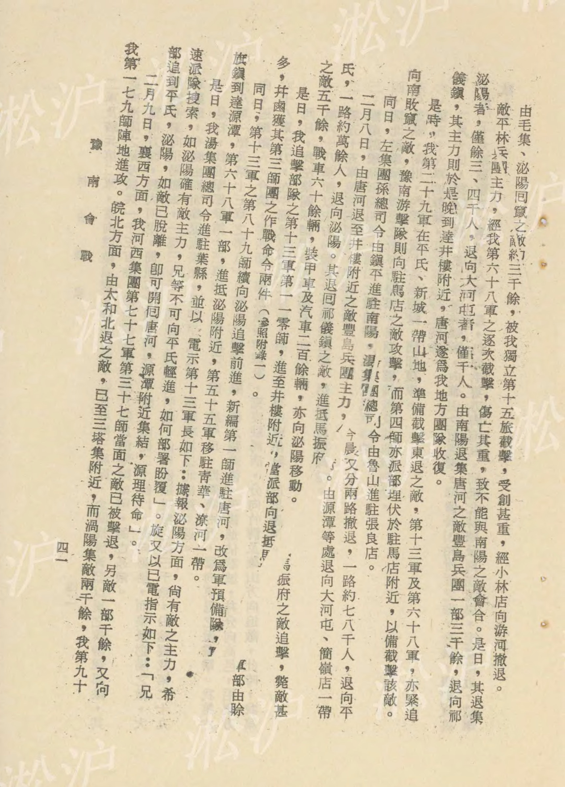

二軍及騎兵第二軍，當向該敵追擊。豫東方面，近日增敵三聯隊，企圖掃清黃汜以東之我游擊部隊，其退向淮陽之敵步騎兵一千三百餘，沿途經我騎兵第六師及游擊隊截擊，傷亡甚衆。

豫南方面，經大河屯，簡嶺店之敵步騎兵三千餘。山砲二十餘門，退向泌陽，而集聚泌陽之敵，大部經毛集向信陽撤去，一部三四千，則經竹溝竄向明港。由祁儀鎮東竄之敵三千餘，沿途經我第二十九軍襲擊，今晚由西新集退抵桐柏，而經平氏之敵，亦經桐柏以北繼續東退。

是日，我追擊部隊第十三軍第一一零師之一部，於平氏、西新集附近，屢向東退之敵截擊。我第六十八軍一部及第十三軍之第八十九師，於擊潰泌陽一帶之殘敵後，先後進佔該城，幷分向高邑，毛集方向，追擊敵人。今晨，第四師一部及豫南游擊隊，克復駐馬店，分向竹溝及確山方向追敵，此時，我第六十八軍主力，在牛蹄及泌陽以北地區，第五十五軍追擊部隊，已抵唐河。

同日，我左集團孫總司令對所部電示如左：

一、第六十八軍卽以主力向撤退之敵跟踪追擊，迅速恢復原陣地。

二、第五十五軍速開桐河鋪，集結待命。

三、豫南游擊隊卽向明港，確山之敵追擊，迅速恢復原陣地，四、鄂北游擊隊向撤退之敵努方襲擊，務期截獲輜重及其他戰利品。

五、鄧縣、淅川、內鄉、鎮平各縣團隊，應卽復原。

六、第五十五軍追擊隊，卽在原地停止待命。

二月十日，我第四師一部及豫南游擊隊，向確山之敵進擊，抑留於桐柏附近之敵，今晨，繼續東逃，第二十九軍截擊之。第六十八軍一部，仍向毛集方向追敵，而鄂北游擊隊則在黃崗，毛集附近，截擊敵人。

我第五戰區李長官十日乃以蒸酉瑜年電指示所部如左：

一、左集團應以曹福林軍（第五十五）幷指揮第一四三師先掃蕩桐柏以東及泌陽，確山以南一帶殘敵，恢復原陣地後，以一部就第一線附近陣地整訓。

二、劉汝明軍（第六十八）（欠第一四三師）位置於唐河、南陽、源潭附近，第五十九軍位置於鄧縣附近，歸孫副長官整理督訓。

三、湯集團仍以主力續行原任務，第十三軍可控置於方城附近地區整理。

四、王副總司令（仲廉）指揮第二十九軍，繼續掃蕩桐柏附近殘敵，俟曹軍到達後，卽開赴隨南地區，續行原任務。

五、中央、右及河西各集團任務及作戰地境仍舊，惟應遵照本部丑江瑜禹電轉蔣委員長要旨，妥爲計劃調整具報。

六、襄陽守備由賀光謙師長（第五十一師）負責，歸河西集團馮總司令指揮。

七、大別山游擊軍仍續行原任務，莫樹杰軍（第八十四軍）應遵照委員長三十年元月二十三日令一元略電要旨，編組各種出擊隊，向平漢路、信陽以南方面，隨時襲擾敵人。

同日，我湯集團總司令決將確山及泌陽東南之敵肅清後，暫集結各軍於作戰地境內，加以整理，而再續行原任務，當卽電令所屬如左：

一、敵經我猛擊，傷亡頗重，狼狽向信陽囘竄，現我第十三軍及第二十九軍，已將西新集，平氏，泌陽一帶之敵肅清，第四師克復駐馬店後，又向確山壓迫中。

二、軍擬將確山及泌陽東南之敵肅清後，暫集結整理。

三、第十三軍將泌陽東南殘敵肅清後，卽開方城，賒旗鎮整理，但應酌量以一部在泌陽南，對信陽外圍警戒，俟第六十八軍到達後撤回。

四、第二十九軍仍續行前任務，由王仲廉副總司令部署。

五、第八十五軍將確山之敵驅逐後，第四師集結吳山集，沙河店，小河鎮，預備第十一師集結舞陽東南地區，第二十三師集結保安砦及其東南地區整頓，該軍軍部推進舞陽。

六、第九十一師補充團及第四師補充團，暫編爲獨立第一縱隊，派蔡劍鳴兼指揮官，開駐西平，組訓民衆，並對信陽方面警戒，歸李銑司令指揮。

七、新編第一師補充團及第一九三師補充團編爲獨立第二縱隊，派劉漢興兼指揮官，開駐項城，擔任上蔡、汝南、項城一帶民衆之組訓，歸李銑司令指揮。

八、由王副總司令選派兩個支隊，編爲鄂東挺進隊，開往潢川附近，擔任經扶、光山、潢川游擊根據地之建立，及平漢路之控置。

九、第八十九師及第一一零師之補充團，着卽撥補此次傷亡，第二十九軍補充團及暫編第十六師補充團，開駐南召，第二十三師及預備第十一師之補充團，移駐魯山。

十、余在葉縣，指揮所設漯河。

旋又電令皖北方面之第九十二軍、騎兵第二軍及第八十一師，恢復黃汜區以東之原來態勢，以續行前任務。

右述各部隊，當卽遵照以上各電令，迅予實施。

二月十一日，襄西方面之敵被擊退，我第七十七軍已恢復原陣地。皖北方面之敵開始自渦陽、蒙城撤退。豫南方面，由泌陽、桐柏東退之敵，集聚信陽後，復沿鐵路、公路南撤。我暫編第三十六師南抵竹溝，第四師一部及豫南游擊隊，是晚克復確山，幷準備向明港間挺進。

我左集團孫總司令於接奉李長官之蒸酉年電後，遵卽部署如左：

一、鄂北游擊隊將桐柏東南地區敵人驅逐後，卽佔飲泉口店、仙石畈、黃土店、木里岡之線，監視當面之敵，並不時予以襲擾。

二、第五十五軍附第一四三師，先將桐柏以東、泌陽、確山以南地區殘敵掃蕩後，卽以一部佔領小林店，高梁店、申陽台、古城、查棗樹岡之線，監視當面之敵，並派出小部隊向南襲擾，以一部位置於馬谷田、高邑附近，輪流整訓。

三、豫南游擊隊先將確山、正陽以南區域殘敵掃蕩後，卽佔領明港、淮河鎮、蕭曹店、陡溝、黄梅店之線，監視當面之敵，派出小部隊，不時向敵襲擾。

四、作戰地境：

(一)鄂北游擊隊與中央集團間，爲人和砦，人和店、張家灣、九里山、監生店、楊家寨車站之線，線上屬左。

(二)鄂北游擊隊與第五十五軍間，爲大河、吳城、淮河店、姚家店三里店之線，線上屬左。

(三)第五十五軍與豫南游擊隊間，爲大十里河（確山西），任店、潘集、趙老家、馮樓雙井店、信陽東北角之線，線上屬右。

四豫南游擊隊與第八十四軍間，爲萬里橋、驢河店、梅黃店、閻家崗、三里店之線，線上屬左。

五、第六十八軍（欠第一四三師）俟第五十五軍部隊通過毛集後，卽撤回唐河、源潭、南陽中間地區整訓。

六、第五十九軍着卽移駐鄧縣附近整訓。

此時各路之敵，均已退集信陽，且陸續向漢口等處撤退。迄本月二十三日，豫南之明港、跑馬嶺以

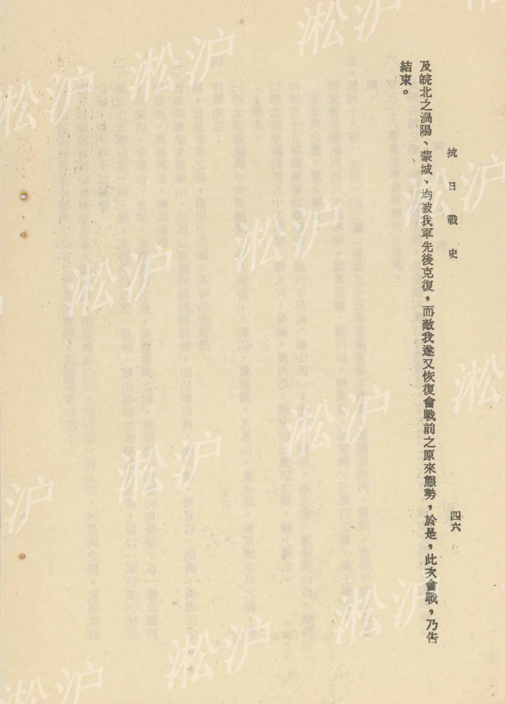

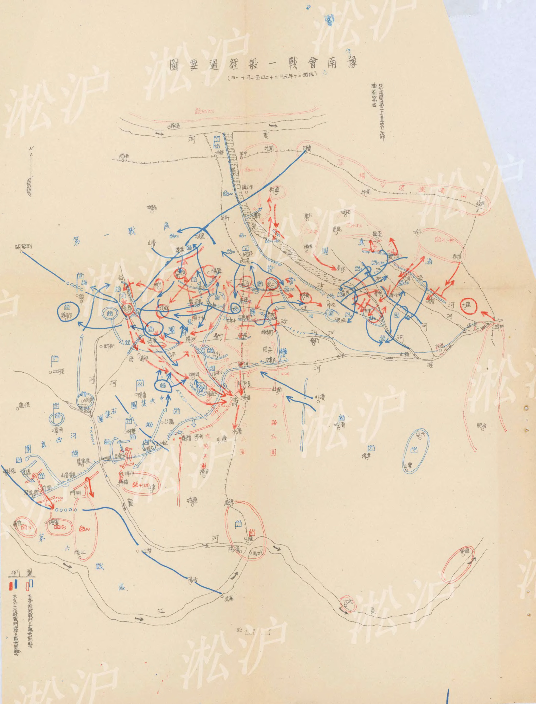

### 第四節 重要戰鬥

#### 第一款 明港附近戰鬥

(自民國三十年元月二十四日至同月二十七日

參照插圖第五插表第五

第五戰區當面之敵，自二十九年六月下旬至三十年元月上旬，其動態既如第一節所述。此時，敵似爲掩護集中運輸，曾於元月四日迄十五日，以步砲二千餘，附僞軍一部，進攻平漢路東孝感、禮山、羅山、信陽邊境，復於十八日迄二十一日，以步砲八百餘，由廣水東攻大新店、三里城（武勝關以東），澀港店（羅山南），隨縣、浙河之敵，並於元月十一日迄十五日，以步砲二千餘西攻均川、安居。同時，信陽外圍各據點之敵，均有增加，顯有沿平漢鐵路繼續北進之企圖。

##### 第一項 明港附近地形

明港係一貨物集散地，南通信陽，北接確山，東隣正陽，西依桐柏山脈，淮河流其南，支流貫其北，既爲平漢鐵路之要站，且有公路貫其間，南北可至信陽、遂平，東可直達正陽，其東北係屬平原，利於機械化部隊之行動，軍糧易於補給，其東南、西南，概爲山地，屬桐柏山系，岡嶺起伏，道路崎嶇，但有公路通至長台關及信陽，汽車仍可通行。

第二項

戰鬥經過（元月二十四日至同月二十七日）

隨縣方面（以下參照插圖第四），元月下旬連日增敵四千餘，安陸西北之洛陽店、閻家河一帶，亦增敵千餘及戰車、裝甲車六十餘輛。

襄西方面，自元月七日以來，敵調動頻繁，元月中旬，分由荊沙、沙洋，應城諸方面，向當陽、荊門、鍾祥附近，集中二萬餘，朱家埠（襄河）增砲三、四十門。

宜昌方面，十六日，敵以四千餘人，砲二十餘門，飛機二十餘架，由龍泉鋪西北進犯，迄十八日，豫

南

會

四七

被我第六戰區第二十六集團軍擊退。

自元月中旬迄二十四日，信陽敵軍已陸續增加，其兵力爲第三師團之主力、第四師團之第八（奥津聯隊、第六師團之第二十三聯隊、第十三師團之一個聯隊，第十五師團之第六十七聯隊、第十七師團之第八十一、第五十四聯隊及第四十師團之四個大隊、另僞軍約兩師，共計步兵五萬餘、砲百餘門，騎兵五千餘、飛機二十餘架、戰車五、六十輛、汽車二百餘輛、氣球兩個及毒氣裝備甚多，均駐信陽至雙井店公路兩傍。長台關、游河各增至步騎砲兵三千餘，其外圍各據點兵力，均有增加。又大布口架設橋樑，并由漢口運信陽鐵軌甚多，其飛機且先後飛往固縣、泌陽、南陽各處偵察，似有沿平漢路北進之企圖。第二集團軍孫連仲總司令，於元月二十二日以午輔戰電向第六十八軍指示。其要旨如下：

一、信陽方面之敵，連日增加，調動頻繁，似將有所蠢動。

二、本集團軍卽加強第一線之守備，相機擊破進攻之敵。

三、第六十八軍第一線兩師，應加強工事及守備兵力，暫編第三十六師之右翼與第一一九師之左翼，密取連繫，暫編第三十六師之重點，保持於右翼方面，敵如由平昌關方面進攻，兩師當協力夾擊，敵如沿平漢路北進，應勇猛側擊，第一匹三師應先以一部，在堡子前方，構築工事，主力集結準備機動使用。

第六十八軍劉汝明軍長於奉前令後，卽遵於是日下達命令，加強第一線之兵力，並策定作戰計劃及命令如左參照插圖第六：

甲、第六十八軍命令要旨

一、當面之敵，調動頻繁，旬日以來，信、羅各據點，驟增萬餘，似有進攻企圖。

鄂北游擊隊主力，集結桐柏以西地區，佔領陣地構築工事，豫南游擊隊推進淮河沿岸佈防中。

二、軍以相機擊破進攻敵人之目的，卽以機動防禦，加強第一線兵力之配置，待機殲滅當面之敵。

三、第一一九師除於原地嚴密監視外，應保持重點於明山頂附近，控置機動部隊，相機殲敵，右與鄂北游擊隊，左與暫編第三十六師密取連繫。

四、暫編第三十六師應保持重點於明港以西地區，控置機動部隊，相機殲敵，右與第一一九師密取聯繫。

五、第一一九師與暫編第三十六師作戰地境如次，太白嶺、藍店、棗樹崗、塚子坡之線，線上屬左。六、第一四三師迅以一部加強堡子陣地，主力集結於馬古田、高邑附近待命。

七、砲兵營迅以一部進出堡子附近，主力集結於馬古田、高邑附近，待機使用。

八、騎兵營卽日開赴沙河店，警戒軍之左翼。

九、以上各部配置，限三日內完成。

乙、第六十八軍作戰指導腹案。

一、情況：綜合各師報告，知信陽之敵，數日以來，其步兵增至五萬餘人、砲百餘門、騎兵五千餘、飛機二十餘架、戰車五、六十輛，汽車三百餘輛，均集中信陽城至雙井店之公路兩旁。長台關、游河各增至步騎砲三千餘，又在大布口架設橋樑，並由漢口運信陽鐵軌甚多。

二、敵情判斷，敵人積極向信陽以北地區增加，並運到大批鐵路材料，似有沿平漢路北進企圖。

三、作戰計劃

第六十八軍作戰計劃

第一方針

軍以確保現陣地，並相機擊破進攻敵人目的，以機動態勢，加強第一線工事與守備兵力，乘機殲滅進攻之敵。

第二

指導要領

一、第一線各部隊，除各以一部加強陣地守備外，並控置機動部隊，相機襲擾，而妨礙敵之行動企圖。二、敵如沿平漢路北進時，暫編第三十六師應以一部在正面抵抗，主力集結於鐵路西側，協同第一一九師隨時側擊而殲滅之。

三、敵如由平昌關、邢集、王崗及毛集西進時，第一一九師一面作正面之抵抗，一面藉機動部隊之注入，協同暫編第三十六師，夾擊而殲滅之。

四、敵如東攻正陽、汝南，暫編第三十六師及第一一九師，除各加強陣地之守備外，應各派有力部隊，攻擊敵之側背。

第三部署

一、軍隊區分

右地區隊

長

第一一九師師長陳新起

第一一九師

左地區隊

長

暫編第三十六師師長劉汝珍

暫編第三十六師

總預備隊

長

第一四三師師長李曾志

第一四三師

軍直屬部隊

二、作戰地境

第一一九師與暫編第三十六師間，太白嶺、藍店、棗樹崗、塚子坡之線，線上屬左。

三、敵主力如北攻明港、確山時，則應如左之部署：

(一)暫編第三十六師應以主力作正面抵抗，抑留敵軍主力，並以一部進出大聖莊、榆樹崗，相機側擊之。

(二)第一一九師除以一部作陣地守備外，應以主力對游河，出山店、駱駝店、吳家店各據點，施行襲擊，遮斷敵之連絡，並截擊往來運動之敵，以協力於暫編第三十六師之作戰。

四、敵如以輕快部隊突破我陣地，經明山頂、毛集、直向泌陽進攻時：

(一)第一一九師應以全主力行正面堵擊，竭力遲滯敵之前進，使預備隊有部署作戰之餘裕，不得已時佔領明山頂及其南北山地，阻敵西進，並以一部，佔領側面陣地，側擊西進之敵。

(二)第一四三師以一部在堡子附近，佔領陣地，拒敵深入，以主力分由左右山地繞出，尋敵夾擊而殲滅之。

(三)暫編第三十六師應向長台關進擊，斷敵交通連絡，乘機略取信陽，並截擊敗退或運動中之敵。

五、敵如東取正陽、汝南，則以第一一九師及暫編第三十六師，各以有力部隊，向東進出，擊敵側背。六、敵如由平漢路及平昌關分路齊犯時，我第一部隊就旣築陣地，竭力抵抗，予敵以重創後，應相機佔領側面陣地，吸引敵於馬古田（高邑南）及鄧莊舖（高邑東）以東地區，與第一四三師協力前後夾擊而殲滅之。

七、謀報、交通、通信、補給、衛生，另紙規定。

第六十八軍劉汝明軍長依據以上作戰計畫，遂於二十三日下達命令，其要旨如左（參照插第圖七）：一、日來信陽敵增至步兵五萬餘、砲百餘門、騎兵五千餘、戰車五、六十輛、裝甲汽車及汽車二百餘輛、飛機二十餘架、氣球兩個、似將向我進攻。

二、軍以守備現在陣地，相機擊破進攻之敵之目的，卽以機動防禦，加強第一線工事與守備兵力，乘機殲滅之。

三、右地區隊應以一部佔領平昌關、魯砦至陳家店之前進陣地，以主力守備小林店、古城、查山至棗樹崗之主陣地，拒止進犯之敵，敵如沿平漢路北進時，卽攻擊敵之側背，與左地區隊協力，側擊而殲滅之。

四、左地區隊應以一部佔領跑馬嶺、塚子坡、淮河鎮之前進陣地，以主力守備棗樹崗、翁莊、大聖莊至七里崗之主陣地，阻敵進攻，敵如由平昌關西進時，應卽攻其側背，與右地區隊協力，夾擊而殲滅之。

五、砲兵營以一部在堡子附近，佔領陣地，主力位置於馬古田附近，待機使用。

六、騎兵營位於沙河店附近，掩護軍之左側背。

七、軍預備隊以一部佔領堡子陣地，主力集結於馬古田、高邑附近，相機策應各方面之作戰。

八、作戰地境

第一一九師與暫編第三十六師間：太白嶺、藍店、棗樹崗、塚子坡之線，線上屬左。

第二一九師陳新起師長根據連日情報，於元月二十一日十三時下達命令，其要旨如左。

一、信陽及附近各據點，連日續增步騎砲連合之敵，約五萬餘、戰車六十餘輛、砲百餘門、飛機十餘架、現仍陸續增加，有向我進攻模樣。

二、師（欠補充團、工兵營、騎兵連、戰車防禦連、輸送連）以阻敵西犯之目的，卽在奇龍山、包頭山、古城、查山、亘棗樹崗之線，佔領陣地，迅速完成各種準備，務以逐步火力殲敵於陣地前方。

三、第三五七團爲右地區隊，就奇龍山、包頭山、石頭咀、亘馬灣之線，佔領陣地，於羊山寺、劉樓、黑山之線，設前進陣地，並以一部控制於七條溝附近，擔任兩地區間警戒。

四、第三五五團（附山砲連）爲左地區隊，連繫於右地區隊，經古城、查山、亘棗樹崗之線，佔領陣地，於南趙窪、魯砦之線，設前進陣地，於胡砦、陳家店之線，設警戒陣地，務努力遲滯敵人，並與左翼暫編第三十六師切取連絡。

五、左右兩地區之作戰地境，爲周莊、石家凹、五里墩、平昌關之線，線上屬左。

六、第三五六團爲總預備隊，位置於申陽台附近，必要時，在毛集亘明山頂之線，佔領陣地，爲第二線部隊。

七、輜重營暫在現地擔任軍與師之交通補給及運輸事宜。

暫編第三十六師劉汝珍師長奉劉軍長二十三日命令後，當卽於本日十一時策定作戰計畫如左；

第一、方針

師基於固守確山，除以一部加強第一線之守備，以一部機動態勢，協同友軍，相機擊破當面進攻之敵外，至萬不得已時，亦應不待友軍增援，施行正面拒止，竭力遲滯敵之前進，使我方部隊有部署之餘裕時間，粉碎敵之進攻企圖。

第二、指導要領

一、第一線部隊。除加強守備原陣地外，對於李新店附近所控制之部隊，應以一部扼守構築簡單之工事據點，餘以機動態勢，準備應戰。

二、敵如一由長台關沿平漢路，一經龍井山、朱寺，兩路同時北進時，我第一線部隊應以主力固守原陣地，另編兩個以上之輕裝小部隊（一排至一連），潛伏於各村落或山谷中，以備奇襲敵人，控置李新莊之一團，應適時捕捉戰機，進出明港南北之鐵路迤東地區，與第一線部隊確取連繫，施行截擊側，擊以拒止經龍井北進之敵，並掩護第一線之左側安全，控制大黃莊之一團，以主力準備機動使用，另一部應在馬樓扼要佔領第二線陣地。

三、敵如由游河分出山店、長台關、龍井，三路同時進攻時，我第一線部隊除竭力守備原陣地外，控置大黃莊之一團，應以有力之一部，於蓋店附近，扼要佔領陣地，與第一百一十九師密取連繫，拒敵北犯，並防敵向東旋迴及掩護我第一線部隊之右側背安全，以一部仍在馬樓附近，佔領第二線陣地，並以機動態勢，準備策應各方面之作戰。控制李新店之一團，除以一部策應第一線部隊外，應另以一部，進出明港以東地區，與豫南游擊隊確取連繫，以竭力拒敵北進，並掩護我第一線部隊之左側背安全。

第三、軍隊部署

一、軍隊區分：

右地區隊（駐大黃莊附近之團）

長第三團團長王錫齡。

步兵第三團。

中央地區隊（守備第一線部隊）

傳

库

長

第二團團長張聿堂。

步兵第二團。

左地區隊（駐李新店附近之一團）

長

第一團團長張傳熹。

步兵第一團。

師預備隊

第一、第三兩團各一部

二、戰鬥地境

右地區隊（右接第一一九師）與中央地區隊間，夏灣、車廟、二郎廟、新集、徐堂，線上屬左中央地區隊與左地區間，李新店、八里岔、和尙莊、瓜子橋、太子城、靈王廟，線上屬右。

三、作戰準備時期

(一)第一線部隊（第二團）

(1)以一部守備現陣地，增加工事強度，力求僞裝，並密接掩體，構築深一公尺二以上之井式掩蔽部，以滅敵空軍及砲火轟炸之損害。

(2)對陣地附近之村落，山川名稱及關係位置，相互距離，須熟爲記憶。

(3)常作進入陣地、戰鬥、逆襲、通信、記號連絡及戰鬥指揮之演習。

(4)對通敵要道及前地重要之地形、地物，預爲標定距離方向，尤其對於死角，須澈底消滅。(5)對敵機低空襲擊，應預作應付方法，及對空射擊設備。

(二)控置整訓部隊

(1)一面照常積極訓練，一面作應戰之準備，並利用出操野外及夜間演習之機會，提前時間，多作緊急集合，及機動演習，務期隨時隨地均能迅速參加作戰。

(2)密集隊形運動，對空蔭蔽疏散等動作，應常演練，務求輕捷敏速，次序不紊。

(3)排長以上軍官，應在預想戰場，多作地形偵察，並繪圖報團（營），對交通狀況及夜間情況，宜熟練確記。

四、作戰時期

(一)各團應選忠勇果敢，體力強壯之士兵，編組兩個以上之機動輕裝小支隊（一排至一連），指定識膽兼備，具有獨斷專行，隨機應變能力優秀軍官，充任小支隊長，專任設伏、奇襲、牽制、擾亂、掩護之任務。

(二)對防戰車動作，應放開正面，射擊敵之跟進步兵，並集束手榴彈，破壞戰車腹部及履帶等部均爲步兵應付戰車之有效手段。

(三)對縱橫通信連絡（命令通報報告），務利用主副通信機構，確保連繫。

(四)隨戰況之轉移，對敵之動態、兵力、兵種，廣爲蒐集，應不失時機，隨時分別報告及通報。

五、交通、通信、補給、衛生（略）。

暫編第三十六師劉汝珍師長依據以上作戰計畫，並基於當面敵情及任務，遂下達命令，其要旨如左一、當面之敵，調動頻繁，連日以來，信陽、羅山各據點，增至步兵五萬餘、砲百餘門、騎兵五千餘、戰車百餘輛，裝甲汽車二百餘輛、飛機二十餘架、氣球兩個、向我進犯，企圖已顯明。豫南游擊隊豫南(1)

現已推進淮河沿岸佈防中。

二、本師奉命除加強第一線之守備及保持重點於明港以西地區外，並控制機動部隊，相機協同友軍，殲滅當面之敵。本師與第一一九師之作戰地境，爲太白嶺、藍店、棗樹崗、塚子坡之線，線上屬本師。

三、第二團仍守備棗樹崗（含），翁莊、大聖莊、同灣、榆樹崗間地區，以一部佔領跑馬嶺及淮河鎮之前進陣地，並與第一一九師及豫南游擊隊切取連絡。

四、第一團主力控置於李新店附近，準備機動使用，一部向八里岔、尹崗、申河附近推進，策應第二團之作戰，並掩護其左側。

五、第三團主力卽在馬樓東西之線，扼要佔領陣地（第二線），以一部進出法王臺、藍店、黑石咀一帶，對查山方面，嚴密警戒。

六、工兵連協助第三團，構成第二線陣地，爾後歸胡式德營長指揮。

七、輸送營除留一排於楊灣另有任務外，卽移駐羅樓附近待命。

八、通信連以楊灣爲基地，構成師團間之通信網。

九、衛生隊位於謝莊附近，準備開設綑帶所。

十、野戰醫院移駐白廟附近，準備開設。

第一四三師李曾志師長奉劉軍長二十三日命令後，遵卽於二十三日下達命令，其要旨如左：

一、第四二七團集結於馬古田附近，並以一部加強堡子陣地。

二、第四二九團集結於高邑、北大路莊附近待命。

三、第四二八團、補充團及師直屬部隊均集結於高邑附近待命。

四、余在高邑師部。

元月二十四日（參照插圖第八），敵開始向我第六十八軍陣地全面進攻。是日拂曉，前游河之敵，向我第六十八軍右翼之第一一九師陣地攻擊，五時，與該師第三五七團之前進部隊接觸，激戰至二十時頃。小林店南十餘里，又有約千餘之敵，繞攻該團右側背，我守兵當沉着應戰，激戰徹夜。是夜，又有徐家樓增來之敵約二千餘。附砲十餘門，繞向固縣進攻，該團卽派隊截擊。同日拂曉，由中布口渡河之敵，步騎兵約二千餘，向我第一一九師之左翼攻擊，當與第三五五團之前進部隊，接戰於陳家店、魯砦附近，我據查出高點，奮勇抵抗，後以預備隊，附山砲、迫擊砲，向敵側擊，而主陣地亦同時出擊，激戰至十六時，敵不支敗退。

是日十八時，陳師長於奉到軍長自二十三日下達之命令（詳前）後，卽令第三五六團於大山口、明山頂、亘毛集之線，佔領陣地，限翌日十二時前，部署完畢。

同日六時，敵步兵約五百餘，附砲八門，由長臺關沿平漢線兩側北犯，圍攻我第六十八軍左翼之暫編第三十六師前進陣地跑馬嶺，勢甚猛烈。該師第二團第二連，奮勇抵抗後，以衆寡懸殊，至十一時，附近各村莊，被敵佔地，旋又續向我主陣地猛攻，數被擊退，敵死傷甚衆。十六時頃，敵續增步騎兵千餘，並繞攻淮河鎮，以向明港取包圍態勢。

信陽以西馮家莊之敵，步騎兵約六、七百，附砲二門，於二十三日佔領黃龍寺後，今日，繼續攻佔三道河。斯時，豫鄂邊區游擊隊王總指揮，向獨立第十五旅電示，阻止該敵西犯，相機將黃龍寺之敵殲滅或擊退之。

黃旅長奉令後，遵卽下達命令，其要旨如左：

一、據報，敵步兵約六百餘，騎兵三、四十名，於昨二十三日十六時許，佔領黃龍寺，駐黃龍寺之曹縱隊（步兵兩大隊），被敵壓迫，不知去向。

二、本旅有擊破該敵之任務，以一部設伏於土王城附近，以主力位置於三道河之周圍，待敵到來，一舉而殲滅之。

三、第二團着以第三營設伏於土王城附近地區，腰襲敵人，該團長陳大徵着率領第一營及機砲連於二時內佔領馬芳嶺、磨盤山一帶高地，策應第三營之作戰。該團第二營着集結於王家道場附近待命。

四、第一團除第三營仍在岩子河施行前任務，並以一部對漿溪店方向警戒，其餘隨時準備出動。

五、各團就現有電話線，儘量設法向本部連絡，在不得已時，亦須施行有效之通信方法。

六、野戰醫院仍在朱家店。

七、余在朱家店旅司令部，爾後進至王家道場指揮所。

是日八時許，進攻之敵，卽與我第二團之第九連在三道河以東周家灣附近接觸，經激戰後，我以態勢不利，乃奉令轉移於土門高地，繼續抵抗，同時，該團第八連在大紅毛灣，白菓樹一帶高地，佔領陣地。九時，我增援部隊到達馬芳嶺，於磨盤山東麓，與敵遭遇，經我第一、第三兩連攻擊後，敵向何家砦退去。九時，敵續向我磨盤山、白菓樹各高地猛攻，未逞。十時，又會合來自毛家店之敵，再度向我攻擊。黃旅長遂令第二團之一部，佔領周家灣附近高地，向敵側背攻擊，並命第一團（欠第三營）集結於三里橋待命。激戰至十四時，進犯之敵，被我擊退，向北逃竄，該旅當卽處置如左：

一、令第二團第三營駐輦子灣，以一部固守草店，以主力向高坎、百記棚方向，超越追擊敵人。

二、令第二團第二營在周家灣附近之一部，全力由右側向毛家店方向，超越追擊敵人。

三、令陳團長以一部掃蕩三道河附近殘敵，以一部尾擊敵人。

各部奉令後，分途行動。敵軍於十七時，在草店附近，被我截擊，經我猛攻後，該敵乃向小林店方面敗退，此次戰鬥，敵我傷亡均重。

二十五日，我第一一九師右翼當面之敵，已增至六千餘，砲二十餘門。於十一時，向我第三五七團之小林店、高梁店一帶陣地猛攻，激戰二時，敵敗退。同日，該師左翼，由大布口北渡，沿陳家店進攻之敵，約三千餘、附砲十六門，與昨敗退之敵會合後，二時，向古城、查山之我第三五五團猛攻，旋以飛機五架助戰。至十三時，我主陣地遂被千餘之敵，經馬橋突破，同時，該團第二營與約六、七百之敵，又激戰於馬老莊以北，因致查山之我軍，已陷重圍，復以傷亡過半，乃向高廟附近轉移。十七時，敵騎兵四百餘，向王崗方向前進，當令第三五六團守備明山頂之第一營，嚴密戒備。

又是日四時，另敵步騎兵約二千五百餘、砲十餘門、戰車十餘輛，爲配合其正面之攻勢，向我暫編第三十六師之大聖莊陣地攻擊。該師第二團少尉排長孫清旺，率全排奮勇抵抗，激戰五小時，卒以衆寡懸殊，裝備互異，悉作壯烈犧牲。敵遂繞向我明港主陣地猛攻，旋以觸我地雷，死傷頗重，攻勢稍挫。至十六時，敵以戰車二十餘輛助攻，另敵千餘，由我左翼迂迴，進抵明港北李新店附近，繞攻我左側背，該師遂成被圍態勢。是役，敵傷亡七、八百名，我傷亡百餘名。

二十五日，我劉汝明軍長接奉孫連仲總司令有午輔戰電令：

一、奉長官李電話指示，湯集團之第十三軍現在象河關、保安砦、舞陽中間地區集結，第八十五軍在新蔡東北地區集結，夾擊北犯之敵。

二、奉白副總長電話指示，第一線部隊應暫避免決戰。

三、貴軍可相機縮短戰線，以主力守備毛集、黃崗、馬古田大路，以一部在竹溝附近，守備確泌大道，以一部在迴龍寺附近警戒游擊，阻敵西進，並以小部隊於現陣地擾敵後方。

劉汝明軍長當卽遵令以有酉電令部署如左：

一、第一一九師以一部在原陣地抑留當面之敵，主力移守毛集、黃崗間地區。

二、第一四三師以一部守備馬古田至堡子間地區，主力附軍砲兵營控置於高邑、鄧莊舖間，對敵行聚殲準備。

第一一九師陳師長於奉右令後，當卽部署如下：

一、第三五五團卽在尖山集附近，佔領側面陣地，對沿刑集至毛集大路竄攻之敵，力予殲擊。

二、第三五七團除酌留一部在原陣地襲擾敵人外，主力向毛集附近移動。

暫編第三十六師劉師長奉令後，下達命令，要旨如左：

一、當面之敵，正續增中，仍有西犯之企圖。

二、師奉命避免決戰，縮短戰線，卽移竹溝、迴龍寺中間地區，阻敵西進。

三、第二團主力移楊集以西地區，一部移於迴龍寺附近，右與毛集附近之第一一九師，確取連絡，阻敵西進。

四、第一團卽移竹溝一帶，對石滾河、瓦崗方面，嚴密警戒，阻敵西進。

五、第三團主力卽移白廟附近，另以一個營移佔尙和莊，以一連進佔大沖口，相機襲擾敵人，並對通新安店各道路及任店方向，嚴密警戒。

六、野戰醫院及衛生隊，移駐楊集西北附近開設。

七、余現在劉莊，二十六日拂曉前，移駐楊集西北之王大莊附近。

各團奉令後，均於是日到達指定位置。

二十六日，昨日西進之敵，於明山頂附近，被我第一一九師之第三五六團伏兵狙擊，傷亡甚重，今晨，敵有增加，並續向該團攻擊。同時，我第三五七團於奉令向毛集集結途中，適與自明山頂西進之敵遭遇，於玄壇廟以東，激戰至九時，敵我傷亡均重。旋敵增達三千餘，當以猛烈砲火，復向我第三五六團之羅漢山、毛營、蟒牛山一帶陣地猛攻，繼又增敵步騎兵二千餘、砲六門、飛機三架，轉向該團右翼移動，並以砲火向祖師廟陣地轟擊，以掩護其步兵前進。時，我守兵傷亡過重，陣地亦被摧毀，毛集遂陷於混戰狀態。

同日，敵步騎兵約二千餘，經刑集西犯，被我第三五五團由尖山集猝然截擊，損失頗重。

是日十八時，我第一一九師以戰況緊急，當變更部署如左：

一、第三五六團卽就馬崗、高莊、白河之線，佔領側面陣地，截擊敵人。

二、第三五五團除以一部任欄馬山、蕭山、兩山口之警戒外，主力卽向鐵牛以東集結。

三、第三五七團轉向桐樹溝、清水沿附近，集結待命。

各團奉令後，卽分別遵照實施。

同時，我暫編第三十六師接奉軍長寢申參電，敵正攻確山，該師在竹溝北西兩地區，集結待命。

該師當卽依旨下達命令，其要旨如左：

一、敵正攻確山。

二、師奉命向竹溝以北，以西地區，集結待命，我第一團現已到達竹溝一帶三、第三團着在現地集結後，星夜迅經楊集向竹溝以北沈莊、劉莊一帶轉移，並派兵一部，進駐板橋，對沙河店方面，嚴密警戒。

四、第二團隨師部於二十七日四時，向冷水鋪一帶集結。

各部隊統限於二十七日十四時前，到達指定位置。

同日，我第五十五軍曹福林軍長，向駐於唐河縣西北劉斌橋附近之第二十九師許師長下達命令，指示如左：

一、信陽西竄之敵，正與我第六十八軍在黃崗、馬古田、瓦房莊之線激戰中，並有一部竄至桐、泌間之大磨附近，有進犯泌陽企圖（泌陽城防空虛）。

二、本軍奉命派一師長率步兵三團。卽夜趕赴泌陽，歸劉副總司令指揮，其餘均集結唐河縣右岸待命。三、許師長文耀率所部（欠八十七團、補充團），附第二二零團卽夜趕赴泌陽，參加會戰，行進時，注意設右側衛。

許師長奉右令後，卽部署如左：

一、第八十六團及第八十五團爲右翼縱隊，卽時由現地出發經唐河於明二十七日十一時前，到達大河屯附近大休息，於十五時，繼續沿泌唐公路，向泌陽方向前進。第八十六團以一營附迫擊砲兩門，協同第六十八軍之騎兵連，擔任泌陽縣城防，其餘仍在李樓附近集結。第八十五團進駐翟莊附近，集結待命。

二、第二二零團及師直屬部隊爲左翼縱隊，卽由現地出發經源譚於二十七日十一時前，到達大河屯附近大休息。於十五時，繼續沿泌唐公路北側，向泌陽前進，第二二零團進駐陳樓、孟莊附近集結待命。

三、師部及直屬部隊隨左縱隊行進，進駐大小康莊附近。

二十七日一時，（參照插圖第八）由明頂山經黃崗西犯之敵騎兵五百餘，向我第一四三師第四二七團之堡子附近陣地進犯，我守兵沉着應戰，敵屢攻未逞，傷亡頗重，至十二時，仍在激戰中。

竄吳城之敵步騎兵千餘，今晨由大磨至泌陽北之二十里舖附近，向我駐張舖之第一四三師補充團攻擊，並附第六十八軍軍部之側背，勢甚猛烈，激戰至晚，殲敵甚衆。是時，另敵步騎兵千餘，由黃崗方面，竄犯高邑，拊我第一團三師之背。更有任店之敵，於午時進至竹溝附近，與我暫編第三十六師激戰，並一部向王店前進。此時，我第六十八軍已陷重圍，於是，軍部及第一四三師乃突圍向春水附近轉移同日十三時，我駐竹溝之暫編第三十六師與任店方面之敵千餘，附砲四門，激戰一小時後，遂行肉搏戰，後經我官兵奮勇抵抗，斃敵甚衆，但一部已侵佔高邑，該師遂陷被圍態勢。入暮後，乃命第一團經板橋向牛蹄以北地區轉進。第三團於掩護第一團安全脫離敵人後，卽向沙河店以西雀樓、八里橋一帶轉移陣地，師部及直屬部隊並第二團，經萬達寺向牛蹄北祖師廟附近轉移。

我一一九師於本日十時，擬向黃岡一帶推進，十八時，奉劉軍長感未電令節開：

「該師卽沿馬古田尾擊西犯之敵爲要」。

該師當卽下達要旨命令如左：

一、師擬卽向馬古田、高邑，尾擊敵人。

二、第三五六團應於二十八日零時，由現地出發，向桐樹溝、二道河間挺進，乘機襲取高邑，以斷敵之後方交通。

三、第三五七團於明二十八日晨，先以一部推進至岡窯、羅莊附近，對鄧莊鋪方面警戒，左與第三五六團連繫，主力則挺進至大路莊、蘇莊鋪附近，相機向王店方向，尾擊敵人。

四、第三五五團（附山砲連）除以一部留置迴龍寺附近，擔任警戒外，主力卽移井沿、桃花店附近。

各團奉令後當卽遵照行動（參照插圖第七）。

二十八日（參照插圖第九）拂曉，我一一九師之工兵營，因執行掩護第一四三師之任務，乃與敵騎兵二百餘，接觸於春水附近。旋敵續達千餘，我以傷亡過重，遂向側面轉移。又敵騎二百餘，九時，向我王店附近之第三五六團之一部進攻，未逞退去，同時，高邑之敵步騎三百餘，亦被該團擊退。

是日十時頃，我暫編第三十六師已到達新位置，時，敵已佔春水，並續向北進。十二時，西進之敵千餘，於沙河店被該師第三團之第二營迎擊，傷亡數十，遂向西北退去。

該師爲策應在舞陽方面作戰之第十三軍計，乃在春水以東及牛蹄以北地區，佔領側面陣地，以截擊由二十里舖、張舖北進，或經牛蹄西進之敵，其部署如左：

一、第三團在象河關、三道嶺、榆樹園、軻莊一帶，佔領側面陣地，與第二團協力截擊春水、象河關，南北流竄敵人。

二、第二團與第三團切取連絡，在壬子莊、龐莊、小張莊、西梁坡一帶截擊南北流竄敵人。

三、第一團在大呂莊、下碑寺、大馬冲、葡萄架一帶，佔領陣地，對牛蹄、沙河店方面警戒，並截擊流竄之敵。

各團奉令後，遵印按照指定地區領陣地。

同日，我第一四三師主力，已移至春水以南之龍王廟附近，而第二十九師奉命於本日四時，到達泌陽以西之羅莊、簡嶺、陳營、李樓一帶，此時，泌陽城關已被敵焚燬，後由第八十六團之第二營於掃清殘敵後，乃進駐縣城，並與第六十八軍切取連絡。

二十九日十一時，敵騎兵約三百餘，經王店北進，被我第一一九師之第三五六團截擊，敵猝不及防，被殲百餘名，當卽奪路北竄，行至春水附近，又被我暫編第三十六師及第一四三師協同圍擊，全部殲滅。爾後，第一四三師以一部隨軍部到達桃花店附近，準備側擊北進之敵。

本日二十時，劉汝明軍長以艷未電令，向第一一九師指示，略謂：

「該師卽在王店、竹林間，截擊回竄之敵」。

該師遷卽於二十四時，下達要旨命令如左：

一、師卽在竹林、王店間地區，佈置側面陣地，準備截擊回竄之敵。

二、第三五七團應以一部位置於土門、水磨灣附近，佔領正面及側面陣地，準備截擊南北分竄之敵，主力控制於柳河及其西北地區。

三、第三五六團應以一部佔領王店及其以南之薛崗高地，準備截擊南北分竄之敵，主力則控制於大小宋莊及孤山南北地區。

四、第三五五團集結於鄧莊鋪及其以北地區。

五、各部隊統限於明三十日午前部署完畢。

同日晨，暫編第三十六師以策應我第十三軍在象河關之作戰，乃佔領其東側山口。十時頃，敵兵千餘，經此北進，當被該師之第二、第三兩團，據險奇襲，敵傷亡二十、三百名、馬四十餘匹，遂狼狽南退。獨立第十五旅（第四縱隊）（參照插圖第四）自二十四日擊退進攻三道河之敵後，本日，奉豫鄂邊區王總指揮電令節開：

「第四縱隊在江頭店集結後，卽推進桐柏附近，擔任掩護第二十九軍（浩軍）右側背，以全力控制桐柏城，金橋間，一部在月河店，對小林店、淮河方面，嚴密警戒。

黃旅長於奉上令後，遵卽於翌日到達桐柏附近。

同時，第二十九師亦於是日接到曹軍長儉申參戰電，節開如下（參照插圖第九）：

一、沙河店、象河關之敵，約三、四千名，正與我湯集團對戰中。

二、本軍奉令，全部策應該集團之作戰。

三、該師周圍（八十六團）卽推進至賈樓附近，其餘卽推進至二十里鋪。

四、余率第七十四師卽向簡嶺店前進。

許師長於奉令後當卽部署如左：

一、第八十六團推進至大楊樹底附近地區，以一部進駐雙山街至賈樓之線，對東北方向警戒。

二、第八十五團推進至二十里舖西北石埠莊附近地區，對王店方向嚴加戒備。

三、第二二零團（原屬七十四師建制）向楊集東北之破山街及龍泉一帶集結，以備策應各方。

四、師部及直屬部隊推進至楊集附近。

各部奉令後，均於本日二十二時到達指定地區。

三十日六時（參照插圖第九），經高邑北進之敵約萬餘，除以一部與我第一一九師接觸外，大部仍向象河關方向前進，七時，於白沙坡西北谷地，當被我伏於雙山街東南山地之第二十九師第八十六團第三營側擊，並經該團第二營經王店向敵迂迴攻擊、激戰至十一時，敵傷亡二百餘，遂向北逃竄，我亦傷亡三、三十餘人。敵北進至象河關附近，復被我一四三師截擊後，乃向葉縣方向轉進，該師當令各部向敵尾擊。同日，沙河店之敵，除以一部牽制我暫編第三十六師外，其主力繼續向西北進犯。

是日十三時，我第二十九師奉曹軍長命令，其要旨如下：

一、北竄之敵，主力已到達西平附近，其一部在象河關、沙河店一帶，並聞有一部竄往方城東南地區，我第六十八軍在桃花店，其餘部隊在牛蹄鎮、龍王廟一帶，正向北進之敵尾擊中，鄂北閻縱隊，有一團兵力在馬古田以南地區。

二、本軍奉令在泌陽附近集結，準備待機向確山進攻。

三、第二十九師（參照插圖第九）應在官莊、八里堰、高新莊、柏樹莊一帶集結，對高邑、王店、二十里舖方面警戒，並與六十八軍取得連絡。

四、第七十四師之第二二零團，應卽歸還建制，開回泌陽西北地區集結。

第二十九師許師長基於右令，遂部署如左：

一、第八十五團移向高李園、柏樹莊一帶集結，向高邑方向警戒。

二、第八十六團移向蘇莊、高新莊、八里堰一帶集結，向王店及二十里舖方向警戒。

三、第二二零團卽歸還第七十四師建制。

四、師部及直屬部隊向大雄莊、王莊、曹莊一帶集結。

是日，各部均於十八時到達指定地區，集結待命。

三十一日（參照插圖第四），我第五戰區李宗仁司令長官，以卅申瑜電令，向第六十八軍指示如左：一、湯集團在象河關以北之小史店、儀封店、上蔡之線，與敵激戰中。

二、該軍應不顧一切，迅以現有兵力，向舞陽大道及其以西之敵後尾擊前進，並以主力猛擊，企與友軍協助殲敵爲要。

劉汝明軍長遵卽依令以世辰電，下達部署命令，其要旨如左（參照插圖第九）：

一、暫編第三十六師經尙店向舞陽方向之敵進擊。

二、第一四三師已到象河關，卽經太尉廟向北竄之敵進擊。

三、第一一九師隨第一四三師後尾擊北竄之敵。

是日，我第一一九師及第一四三師於奉前令後，遂卽分別部署，向指定地區尾擊北進之敵，而暫編第三十六師除奉右令外，同日，復奉劉汝明軍長艷戍參一電令節開：

「暫編第三十六師攻佔象河關後，迅向北尾擊敵人」。

該師遵卽下達命令，其要旨如左：

一、敵約萬餘，在象河關以西，經我第一一九師痛創後，績向舞陽方面進犯，我第十三軍現在舞陽與敵激戰中。

二、師奉命經象河關、尙店、接官廳向舞陽方面尾擊北進之敵。

三、第三團於明一日拂曉前，佔領象河關後，卽在北方高地，佔領陣地，掩護本師集結，爾後，改爲前衛，準師之追擊路，尾追北進之敵。

四、第一、第二兩團爲本隊，於明日五時前，按第二團、師部、第一團之順序，以行軍隊形，在象河關東南方路上，集合完了，在第三團二千公尺處跟進，行進時對於左側特須警戒。

各團奉令後，卽於翌日遵照實施。

同日，第二十九師許師長於十一時奉曹軍長命令，要旨如左：

一、本軍奉命在泌陽附近集結待命，並截斷敵人信陽、舞陽間交通道。

二、第二十九師應卽派兵一營，卽日向高邑方面探進，截斷賈樓、王店南來之敵。

三。派出之營，限本日十六時出發，到達高邑附近時，應妥爲潛伏，遠派斥候，俟隙襲擊，並與友軍妥取連絡

該師基於右令，當派第八十五團之第二營，於十六時，向高邑前進，到達後，除對東北方向嚴密警戒外，並潛伏該處，以備截擊往來之敵（參照插圖第八）。

此時，我湯集團之十三軍，於保安、接官廳戰鬥後，已轉移至保安以北，準備側擊北進之敵（參照插圖第四）於是，我第六十八軍與第五十五軍、第五十九軍，分由象河關、泌陽、唐河一帶，準備向舞陽敵後圍擊，時，正陽已被我豫南游擊隊克復，第一四三師遂乘機向明港挺進。

敵軍各路雖進至保安、舞陽、西平之線，然其皆未捕捉我軍主力，側背皆受威脅，乃自二月一日開始向左旋轉進。

二月一日（參照插圖第十），我第六十八軍主力，向舞陽方向之敵追擊，其暫編第三十六師，且於午時將尙店附近之敵千餘擊敗，並斃敵百餘，馬五十餘匹，俘獲馬七匹，步槍十七支，及其他戰利品甚多，而我亦傷亡士兵十餘名，敵向舞陽方向退去。

本日晨，第六十八軍奉孫連仲總司令丑東子電開：

「着第六十八軍集結於象河關、春水一帶，對東北及西北方面。構築工事，阻擊流竄之敵，待命反攻並編組三個加強營，向舞陽、葉縣之敵追擊」。

劉軍長遵卽以丑東寅電指示，部署如左：

一、暫編第三十六師對春水、牛蹄、竹林以東以南地區，準備向北竄之敵側擊。

二、第一四三師對象河關、尙南店、太尉廟一帶地區，準備向北竄之敵側擊。

三、第一一九師於，羊册、石門、上馮一帶，構築堅固工事。

除第一一九師準備祕密向桃花店一帶活動外，其餘各師，於奉令後，均卽遵令實施。

二月二日，我第六十八軍軍部由桃花店移駐石門，第一一九師之三五五團移駐竹林街附近，其補充團推進至象河關，歸暫編第三十六師指揮。

二月三日，舞陽，駐馬店之敵，分向象河關、春水、牛蹄移動，而方城之敵，亦有一部向南蠹動，第六十八軍當卽準備分頭截擊。是日，第一四三師由桃花店附近，移至羊册附近佔領陣地，第一一九師由柳河、王店一帶，開始向桃花店附近，祕密活動。

二月四日，第一一九師於今晨行抵桃花店、春水附近，適與西進之敵三千餘遭遇，斃敵甚多，十時，敵續增二千七百餘。飛機三架、向我桃花店、陸軍口猛攻，經猛戰一晝夜，迄翌晨八時，敵向南敗退。此次斃敵甚夥，並斃敵指揮官一員、馬數十匹，獲馬六匹，而該師傷亡亦重。

由牛蹄向泌陽方面行進之敵千餘，被我駐竹林之三五五團截擊，至翌日十二時，全被擊潰。

二月五日，由酒店方向轉進之敵三千餘，附砲二十餘門，飛機二十餘架，南向我羊册、古城之第一四三師猛攻，後以該師補充團之一營，迂迴至花山（羊册北）敵砲兵陣地，砍斃敵野砲第二十三聯隊第二大隊長法島少佐以下數十人，敵勢大挫，遂於翌晨七時，向南敗退。

同時，由龍王廟方向西進之敵三千餘，已抵海子（古城東），企圖攻擊我第六十八軍之左側背，當經我第四二七團迎頭痛擊，折向西南流竄。

十七時，又有經象河關南下之敵五百餘，抵春水附近，經我暫編第三十六師及第一一九師之一部，協力夾擊，殲敵百餘，俘獲尤多，敵於翌日，以戰車六十輛掩護南退，我第一一九師當卽追擊。

二月七日（參照插圖第），此時，我第十三軍已克復南陽、方城，並正向南追擊敵人，我第六十八軍奉命沿唐河、泌陽、確山道及唐河、桐柏、信陽，沿途埋伏，同時，繼續追擊由羊册、春水南逃之敵。二月八日，南退之敵，晝夜經馬古田、毛集、向信陽逃竄。

二月九日，尾追敵人之第六十八軍騎兵營及第四二七團，於今晨擊退殘敵後，乃於十二時進佔泌陽，同時，友軍第八十九師亦於協力擊退敵人後，進駐泌陽城。

二月十日，暫編第三十六師在火燒店（牛蹄北）附近，奉劉軍長電令，略開：

「泌陽、馬古田一帶敵人，均向信陽方面潰退，可先派一團，經竹溝、任店、向明港前進，相機進佔明港。」

該師於奉前令後，當派第三團由牛蹄附近出發，向明港前進。

自二月八日後，敵人卽連續向信陽撤退，我第六十八軍當緊追敵人，暫編第三十六師之第三團，協同豫南第十縱隊，遂於本月十八日克復明港，二十四日，又克復跑馬嶺，翌日，復對兩處防務，交由豫南游擊隊接替，至三月六日，暫編第三十六師全部奉命到達何廟附近（賒旗西南）整訓。

第一一九師自二月七日於桃花店附近奉令移動後，至二十四日，始全部到達賒旗店以西之吳氏營附近整訓。

第一四三師自二月七日在古城附近奉劉軍長電令後，乃以一部向敵追擊，其餘則於十三日到達毛集附近後，於三月一日又奉令移駐趙河附近整訓，歸曹軍長指揮。

第六十八軍直屬部隊，於二十五日到達橋頭附近整訓。

信陽之敵，大部繼續南撤，一部回漢口，其餘各回戰前防地。

此次戰鬥，據我方統計，共斃敵約四千餘人，我傷官兵九百一十九名，亡七百五十員名。

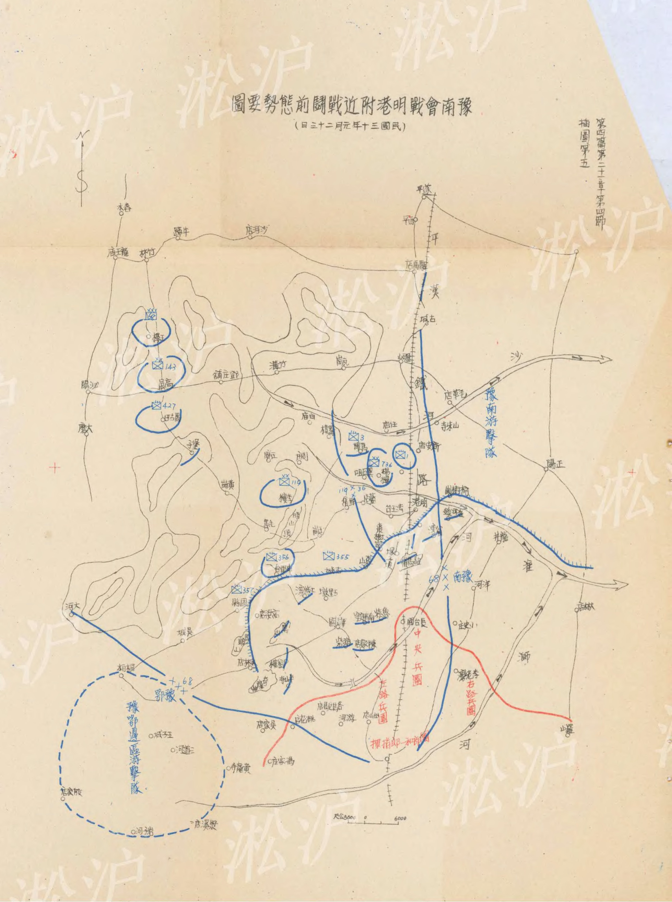

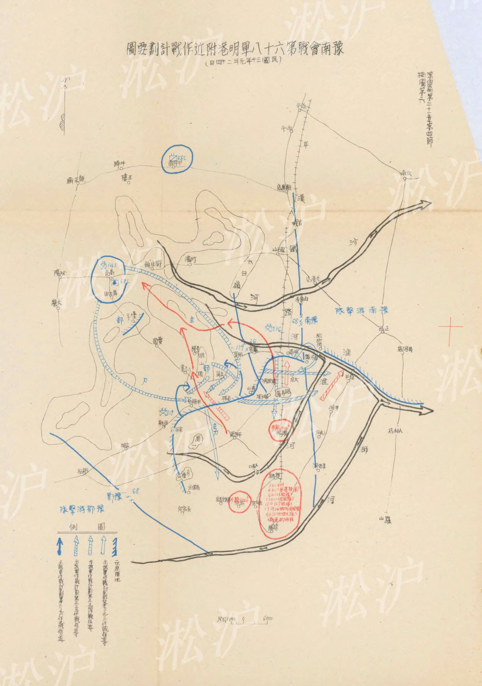

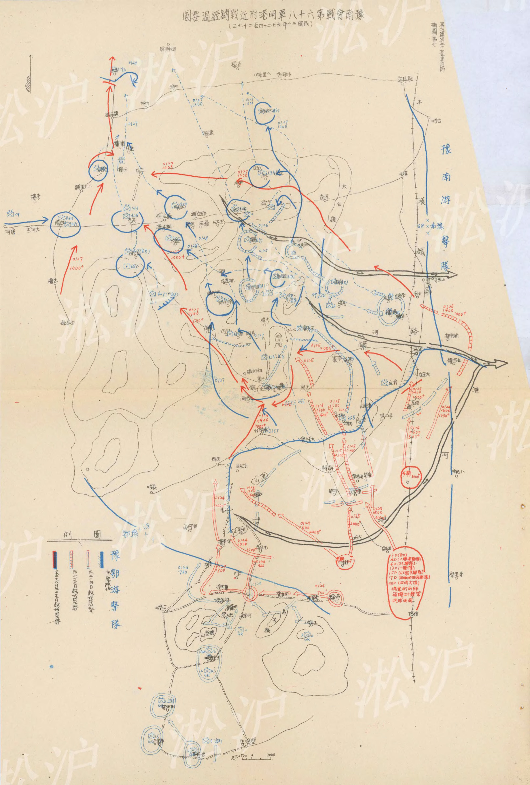

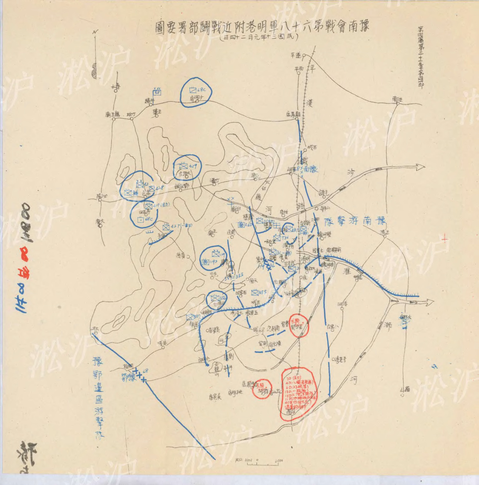

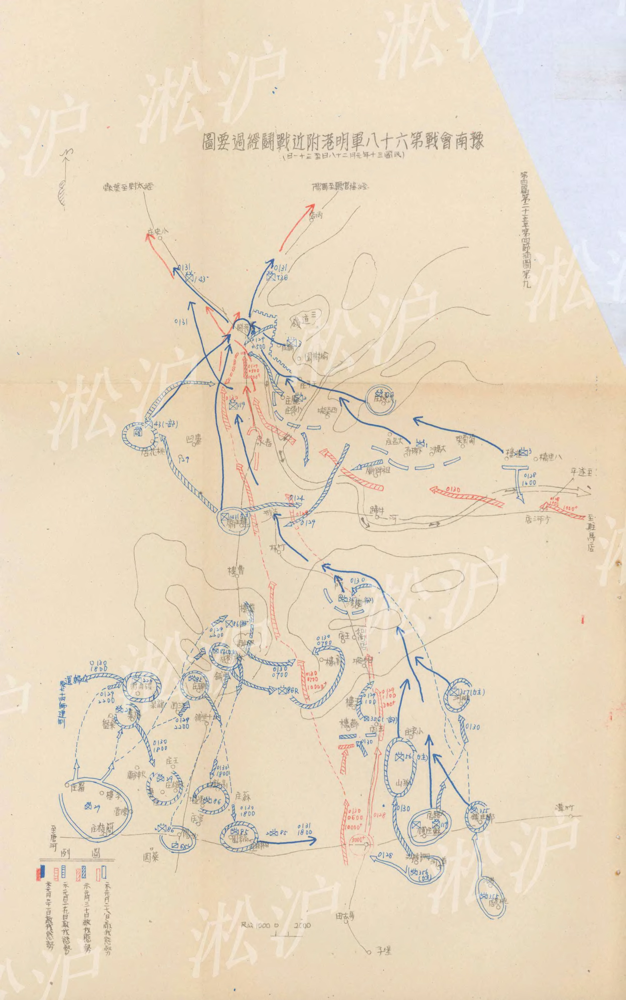

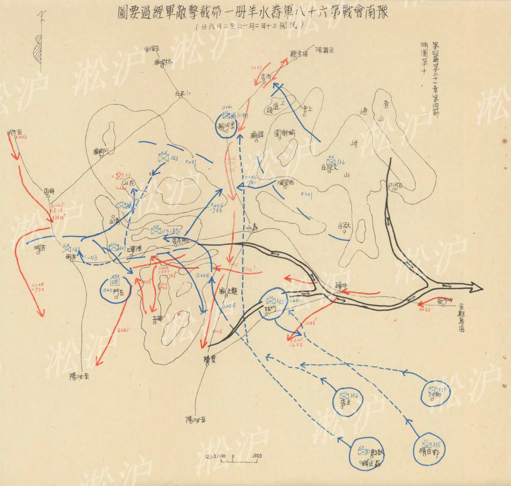

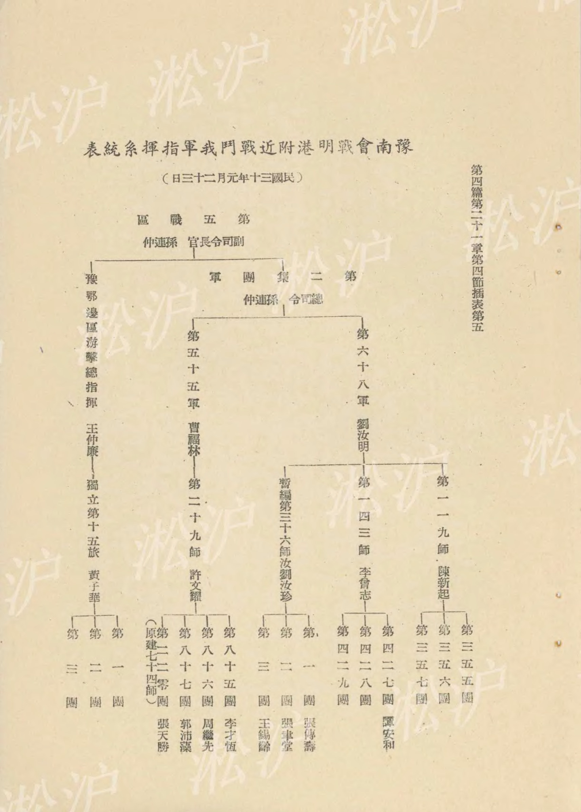

#### 第二款 淮河北岸汝南駐馬店附近戰鬥

自民國三十年元月二十三日至二月十二日

參照插圖第十一插表第六第七

我豫南游擊隊爲遲滯敵人北進，以使我正規軍作戰容易，並與第六十八軍協力，實行側擊或尾擊敵人之目的，乃以一部扼守淮河之線，一部進出確山、駐馬店中間地區，主力控置於平漢鐵路東側，以備圍殲來攻之敵。

##### 第一項 汝南駐馬店附近地形

汝南地處平漢鐵路東側，北鄰上蔡，南接正陽，東達項城，西與駐馬店有公路可通，汝河貫其縣境，公路四通八達，交通尚稱便利。四境概屬平原，梁、麥豐產，易採軍糧，並利於機械部隊之行動。駐馬店處遂平與確山之間，乃平漢線上要點，其東北亦屬平原，其西南有大樂山，歷來爲兵家必爭之地。第二項

戰鬥經過

信陽之敵，自年前卽已活動頻繁，似有北進之企圖，迄至三十年元月下旬，開始蠢動，除向我明港方面之第六十八軍發動攻勢外。同時，並向我豫南游擊隊採取行動，於是，淮河北岸汝南及駐馬店附近之戰鬥，遂卽開始。我豫南游擊隊田總指揮，二十九年十二月二十九日策定作戰計畫，其要旨如左：

豫南游擊總指揮部作戰計畫（參照插圖第十二）

第一、方

針

本隊以遲滯敵人北進，協力友軍側擊、尾擊敵人之目的，以一部任淮河之守備，監視敵人之動態，主力控置於待機位置，積極準備，並發動當地民衆，利用農隙竭力運用泌正，泌確間之地形，敵如北進時，於平漢路東側，尋敵主力側擊、尾擊之，協同友軍以打破敵人企圖。

第二、指導要領

一、第一線部隊在現態勢下，增強據點工事，隨時派有力便探，或小部隊，深入淮南，運用襲擾、破壞等手段，積極活動，以達成牽制、妨害、並監視敵人之目的，主力在相當地點，積極準備，隨時予敵以打擊，

二、各部隊應嚴密佈設謀報網，搜索敵情，應隨時明瞭敵主力各時期之動態。

三、敵如由信陽先攻略南陽，並北攻鄭、洛時，應協同第六十八軍尋敵側背夾擊之，如敵以主力突進，應始終活動於原地區，截斷交通，並阻敵增援，敵如敗退，卽相機截擊之。

四、敵如沿平漢路北攻鄭、洛時，第一線部隊應行正面堵擊，側背夾擊，竭力遲滯敵之前進，使控置部隊，有部署作戰時間之餘裕，萬不得已時，可向敵後或翼側活動，襲擊敵之側背。

五、敵如在其他地區發動攻勢，在信陽方面採取守勢時，卽以有力之一部，對洋河及其以東之敵，包圍監視，並破壞信，長間之交通、通信、並確實控制之，以主力進出於淮河以南，鐵路以東地區，掩護友軍翼側。

六、敵如被我擊退，應不失時機，施行追擊與截擊。

第三區分及各部隊行動

軍隊區分

右縱隊

司令官董克中

第五縱隊

第二支隊

左縱隊

司令官程耀德

第十二縱隊（附獨立第十一大隊）司令程耀德

第二十二縱隊第一支隊

第三十二支隊

機動部隊

指揮官王月高

第二十七支隊

第二十三支隊

第八獨立大隊

第九獨立大隊

第十獨立大隊

總預備隊

自衛軍第二路

司令阮勛

作戰地境

第六十八軍與右縱隊間，爲諒亭、古城、山朱寺、雙河鎮、小史莊、李老灣、信陽車站之線，線上屬左。

右縱隊與左縱隊間，爲臻頭河、和笑店、增益店、蕭曹店、龍井，中山舖之線，線上屬左。

左縱隊與大別山脈北分區間，爲洪張舖、萬里橋、驢河店、梅黃店、信陽東南四公里閻崗之線，線上屬左集團軍。

各部隊行動

一、敵如由長臺關經毛集，略取桐、泌時、右縱隊第一線之部隊，應渡越淮河，進出於淮河鎮、龍井之線，相機向胡猪店、小史莊，求敵之側背而攻擊之，其主力應進據山朱寺、雙河鎮附近，如友軍被敵突破，應以襲擾、破壞等手段，截擊敵之連絡與交通。

左縱隊應以一部進出於蕭王店，俟右縱隊攻擊前進時，推進至龍井以南地區，對洋河、顧店方面警戒，並掩護右縱隊之側背，其主力應進駐正陽及其西南之藍青店、胡沖店附近，俾便支援該縱隊，並策應右縱隊之作戰，總預備隊應控置於臻頭河以南地區，準備支援各縱隊，並擴張戰果。

二、敵如由本作戰地境，企圖渡過淮河，攻取正陽時：

甲、如敵我兵力略等，計可收殲滅效果時，現任淮防部隊，應加強第一線守備，竭力拒敵於遠方，相機出擊，協同攻擊部隊，打破敵之企圖。

右縱隊應以主力渡過淮河，向龍井及其以西地區，求敵側背，猛烈攻擊之。

左縱隊以主力渡過淮河，向顧店方向，求敵側背，猛烈攻擊之。

敵如捨我正面，或以小部隊實行佯攻，而主力變換正面，向我渡河之左右兩縱隊，行眞面目之攻擊時，則我淮防部隊，各應以主力渡河出擊，攻擊敵之側背。

乙、敵如兵力過大，則現任淮防部隊，應取縱深配備，乘敵半渡而擊潰之，萬不得已時，左縱隊卽佔領劉樓、謝橋、新寺之線，堅強抵抗。

右縱隊轉移於山朱寺以北地區，乘機向進攻正陽之敵，猛烈側擊，萬一正陽委敵，應一再反攻，如不奏效，敵仍北犯時，則應爲如左之部署：

(1)右縱隊應轉移於毛草店、官莊之線（置重點於右翼）。

(2)左縱隊（欠第二十二縱隊第一支隊）轉移於沙河口、寒凍之線（置重點於左翼）。

(3)第二十二縱隊第一支隊及第八、第九、第十一各大隊，協同當地團隊，在官莊、馬鄉、萬里橋中間地區，以佯動欺騙、誘致敵人於三角地帶。

(4)機動部隊（欠第八第九兩獨立大隊）推進至臻頭河以南之三橋、殷店附近，俟敵深入三角地帶後，應協力左右兩縱隊，同時三面進攻而聚殲之。

三、敵如以主力沿平漢路北進，一部由羅山經大林店、銅鐘進攻正陽時，左縱隊除任淮防之部隊外，以一部進出於板橋店、大沈莊、鍾家店中間地區，協力莫軍，阻敵於淮河南岸，主力推進於馬鄉以南地區。右縱隊除擔任淮防部隊外，應以一部進出確山以南、平漢路以東、山朱寺、雙河鎮中間地區，協同第六十八軍，求敵之側背而攻擊之，主力控置於和笑店以西地區，如敵進至明港以北，則轉移諒亭山、朱寺中間地區，沿河側擊敵人。淮防部隊則進出於長臺關、明港間，破壞敵之交通、通信，並截擊敵之後方。總預備隊應推進至馬鄉附近。

四、敵如被我擊退，各部隊應不失時機，各對當面之敵，行猛烈果敢之追擊，並派有力一部，竭力活動於敵之側翼，或超越其前，破壞敵交通工具，主力則乘機收復各據點。

豫南游擊總指揮田鎮南

田總指揮根據以上作戰計劃，於二十九日下達命令，其要旨如左（參照插圖第十三）。

一、信陽附近之敵，連日積極準備，似有北進企圖。

二、本部以遲滯敵人北進，並協力友軍、側擊、尾擊敵人之目的，卽爲如下之部署。

三、第五縱隊附第二支隊爲右縱隊，歸董副司令克中指揮，除以第二支隊擔任右自雙河鎮（含）、左至祁營（不含）地區淮防外，主力控置於洪溝廟及官莊附近。

四、第十二縱隊附獨立第十一大隊第二十二縱隊第一支隊及第三十二支隊爲左縱隊，擔任右自祁營（含）左至彭家灣地區淮防外，主力控置於臻頭河、正陽以北地區。

五、作戰地境，爲前述作戰計劃。

六、第二十七、第二十三支隊及獨立第八、第九、第十大隊爲機動部隊，歸第二十七支隊王隊長月高指揮，位置於水屯、順河店附近。

七、自衛軍第二路爲總預備隊，位置於駐馬店以南地區。

八、本部卽在馬鄉設置前方指揮所，由參謀長秦鼎新負責指揮。

九、余在界牌總指揮部。

第八十五軍之第四師，於三十年元月二十九日遂平失守後，因奉湯恩伯總司令之電令（詳本節第三款），乃向遂平、駐馬店、確山一帶，協同豫南游擊隊，參加敵後游擊戰。

三十年元月二十三日拂曉，戰鬥開始（參照插圖第十四）。信陽之敵，天谷兵團之黎岡聯隊步騎兵千餘，附砲三門，由洋河經龍井，向我蕭曹店之第二支隊進攻，敵我隔河對戰竟日，我第十二縱隊第一支隊及第三十二支隊，分由笑店、邱莊進至胡沖店附近。

同日、敵步騎八百餘，附砲四門，由淮河鎮渡河，曾向新安店進攻。

敵於二十四日晨，增戰車十餘輛、飛機三架，以步騎兵三百餘，分由閻灣、田灣附近強渡，向我右縱隊之第二支隊包圍，同時，淮河以南之敵，又分路強渡，該支隊遂乘其半渡而狙擊之，後以其正面廣闊，兵力薄弱，乃向大李凹、胡沖店一帶轉移。十四時，蕭曹店陷敵。是夜、我第十二縱隊第一支隊，曾向蕭曹店襲擊，敵於二十日晨，向西北逸去，該支隊遂於陡溝以西之李灣附近，沿河佈防。

二十五日八時，由蕭曹店向西北進攻之敵，被我第二支隊於胡沖店附近截擊，同時、敵步騎兵千餘，由梅黃店渡河，向陡溝方向攻擊，當與我第三十二支隊及第十二縱隊第一支隊激戰，九時，敵由右翼之周灣附近，偷渡步兵五、六百，我以態勢不利，第三十二支隊遂轉移於鍾家店，而第二十二縱隊之第支隊轉移於大林店附近。是日、敵進佔陡溝，繼陷藍靑店，當夜、我第十二縱隊（左縱隊）由正陽反攻，先潛伏於敵之四周，至二十四時，乃分三路向藍靑店敵陣衝入，敵倉惶應戰後，向西北增益店方向竄去，藍靑店乃告收復。

二十六日，於胡沖店被我第二支隊截擊之敵，以優勢兵力，向我軍包圍，我傷亡頗重，此時，我第十二縱隊之第一支隊、第十二縱隊主力及第三十二支隊，分由蕭曹店、藍靑店、鍾家店，向胡沖店之敵側背急襲，敵不支，乃於十八時向宋店方向竄去，並與竄至增益店之敵會合。

是日，豫南游擊總指揮部爲防止宋店之敵進犯正陽計，卽爲緊急處置如左：

一、令第十二縱隊第一支隊極力尾擊敵人，與敵隨時保持接觸，疲憊敵人。

二、令第二支隊是夜向半個店（半拉店）前進，敵如東犯，卽行截擊，俾保正陽縣城。

三、令第十二縱隊（欠第一支隊）及第三十二支隊，由藍靑店西北，求敵側背而攻擊之。

四、令第二十二縱隊第一支隊進至蕭曹店、陡溝一帶，破壞敵後交通、截擊敵之輜重，並阻敵增援。

五、令第十三縱隊梅達夫部，一部兵力位置於大林店附近，警戒正羅公路，以有力部隊，攻擊羅山縣城，以牽制並分散敵兵力（本縱隊爲左鄰接部隊），第二支隊卽於本日到達正陽以西半個店附近。

二十七日，宋店之敵，步騎兵二千餘、附砲五門、飛機三架、十時，向正陽進攻，經我第二支隊之第二大隊協同該縣自衛隊，於半個店附近，予以截擊，該大隊長陳登和，奮不顧身，力疾督戰，我軍士氣大振，因敵砲火猛烈，該大隊長壯烈殉國，後經我援軍兩個大隊趕至，協力攻擊，敵勢稍挫，旋以敵機九架，掩護步兵，復向我猛攻，是時，我第十二縱隊第一支隊於高樓、宋店之線，第十二縱隊（欠第一支隊）於梁樓、高樓之線，分向敵人夾擊，我士氣益振，向敵猛攻，十四時、敵向和笑店北竄，此時，我游擊總指揮部乃緊急處置如左。

一、令第十二縱縱第一支隊仍向該敵尾擊，保持接觸。

二、令第十二縱隊（欠第一支隊）及第三十二支隊兼程捷徑，移向馬鄉附近，準備截擊逃竄之敵。

三、令第二支隊在正陽附近，協力正陽團隊，確保正陽縣城。

四、令第二十二縱隊第一支隊由陡溝附近，連夜向汝南之臻頭河轉進，歸還該縱隊建制。

是日、我第五戰區孫副司令長官電示豫南游擊隊，應以有力部隊，竭力予敵襲擾，將主力集結、機動對敵側擊、伏擊。

田總指揮根據右電卽處置如左：

一、令第五縱隊於古城、洪溝廟間，阻敵北進，並與燒餅店自衛軍第二路，確取連繫，萬不得已時，向楚莊舖、石寨舖間地區移轉。敵如沿平漢線續行北犯，卽側擊該敵，如敵壓迫過甚，卽經遂平以北地區，向玉山鎮方向，轉移待命。

二、令自衛軍第二路以一部在燒餅店沿平漢路兩側，在牛河北岸阻敵北進，萬不得已時，卽向猪市店、玉山鎮間地區轉移，相機側擊北犯之敵。

三、令第二十七支隊（附第二十三支隊第八、第九、第十大隊）；位置於駐馬店西北之吳樓、五里河、洪堂附近，阻敵北進，萬不得已時，卽向猪市店西北地區轉移，相機側擊北進之敵。

各部奉令後，當卽分別部署，同日，敵攻和笑店，我汝平師管區司令秦靖守，派自衛團一部，於臻頭河佈防，兼團長李向寅率部駐守汝南城。

二十八日（參照插圖第十五）拂曉，敵步騎兵二百餘，進攻五里河，經我第二十七縱隊之一部，予以重創後逸去（參照插圖第十四）。同時，敵步騎砲兵共約八百餘，向我左翼之第二十三支隊包圍，經與敵激戰後，該縱隊以左翼被威脅，乃向猪市店方向轉移。十時、行抵界牌以西之洪堂附近，遭敵步兵千餘，藉戰車及飛機三架之聯合攻擊，敵更以騎兵三百餘，向我左右翼包圍，該支隊以態勢不利，衆寡懸殊，乃由王月高支隊長率隊突圍，至遂平西之嶝岈山附近收容。

同日晨、沿平漢路北進之敵平林兵團，與由確山以西北進之敵豐島兵團各一部，共約步騎兵三、四千，附戰車及裝甲車共約二百餘輛、砲二十餘門、飛機十餘架，向我駐馬店之自衛軍第二路，及遂平國民兵團進攻，我軍竭力拒敵於斗河兩岸，及界牌、關王廟中間地區。十時、敵卽進抵潘莊附近，並迂迴至潘莊以北，我自衛軍第二路，以情況緊急，遂將其第一、第二、第三大隊，配置於潘莊北、西、南、三個正面，以第四大隊及特務大隊爲預備隊，由阮勛司令官直接掌握，位置於潘莊中央，以策應各方。十時許，潘莊寨墻被敵砲火摧毀，敵步兵隨戰車衝入，發生巷戰，我阮勛司令官裏創指揮，官兵用命，惟敵屢挫屢進，我援軍被阻，彈盡援絕，遂於十六時突圍，向玉山鎮附近轉進，遂平亦繼之失陷。是役、我第二大隊長龐秀夫、第三大隊長苗彩五、特務大隊長阮胥，均先後爲國捐軀。

同日、敵平林兵團之一部，約三千餘，附砲六門，拂曉藉飛機四架掩護，由吳桂橋向我洪溝廟第五縱隊第二大隊陣地進犯，迨敵接進我主陣地時，該縱隊以預伏之第一、第四兩大隊，猝然以熾盛火力，向敵射擊，敵勢稍挫，仍挾其陸空優勢猛攻，終未得逞。旋以騎兵三百餘、藉飛機四架之支援，向我左翼迂迴，激戰至十時，我以陣地工事被毀，且遲滯敵人之任務已達，遂向楚莊鋪轉移。

攻擊和笑店經野猪崗北竄之天谷兵團一部，步騎兵千餘，與老君廟方面之敵步騎兵三千餘會合，於是日晨六時，向汝南進犯，時我城內守軍僅第二十二縱隊之四個中隊，及汝南自衛隊，由該縱隊副司令燕濟指揮，因衆寡懸殊，激戰至十五時，我官兵已傷亡過半，敵遂突入城內，燕副司令猶率殘部，與敵巷戰，終以力竭兵盡，被俘不屈，慷慨就義，與城偕亡，我少數殘餘部隊，遂轉移於城北六里莊附近。

是日、豫南游擊隊田總指揮奉第五戰區孫副長官電令指示：

一、信陽北進之敵步騎三千餘，進佔確山後，分兩路向西北分竄，另敵三、四千人，由吳城直向第六十八軍右翼竄擾。

二、戰區以適時捕捉深入之敵予以殲滅之目的，左集團及李湯兩集團已集結於鐵路兩側之部隊，於二十九日拂曉協力圍攻該敵，務期於確、泌、汝南及淮河以北地區，消滅該敵。

三、中央集團應卽全面轉取攻勢以資策應。

四、鐵路東之莫樹杰軍及田鎮南部，歸湯總司令指揮。

田總指揮於奉令後，卽處置如左：

一、總指揮部爲避免敵機威脅，及通訊指揮便利計，移駐西平境之出山寨附近地區。

二、令第十二縱隊（欠第一支隊）及第三十二支隊與國軍協力，夾擊由野猪崗向汝南進犯之敵。

三、令第十二縱隊第一支隊迅向馬鄉轉移，第二十二縱隊第一支隊迅向殷店轉移，第二支隊在寒凍阻敵北進，並相機側擊之。

四、令鐵路以東各部隊及第八區地方團隊，統歸本部前方指揮所秦鼎新參謀長直接指揮，俾便相機處理。

五、向第三十一集團軍湯總司令，請示嗣後作戰任務。

我向楚莊舖轉移之第五縱隊，於二十九日一時在王橋附近。與敵一度接觸後，乃向洪河北岸劉店轉進。三十一日，又移駐五溝營。二月一日，敵正犯舞陽、葉縣，同時，西平、漯河之友軍，已先轉移，該縱隊乃轉移於葉縣之汝墳橋，以截擊該敵。

二十九日，汝平師管區所轄汝南、遂平、西平、上蔡各縣團隊，於敵進犯各該縣城時，均曾協同友軍，奮勇抗敵，適時轉移敵後，我各縣團隊，均極力破壞敵後交通，並截擊其之輜重，予敵威脅甚大，尤以汝南國民兵團，截獲戰利品最多，上蔡自衛隊，斃敵約五十餘，該縣孝感鄉保長李學寅父子三人，即斃敵八名，實屬壯舉，正陽亦於是日陷敵。

同日，豫南游擊隊接奉第五戰區孫副長官電，北竄之敵後方補給不繼，其攜行彈藥，僅足支持三、五日之作戰，希飭各部，除截擊敵輜重外，於敵囘竄時，應預爲部署，截斷其歸路，予以殲滅的打擊。田總指揮基於右電令，爲截擊敵並截斷其歸路，乃預爲如左之部署：

一、西平、遂平、上蔡以南地區，由汝、上、遂、西、等縣地方團隊，及第二十二縱隊任之。

二、汝南、駐馬店以南、確山、馬鄉以北之中間地區，歸汝、確、兩縣地方團隊及第十二縱隊擔任之。三、確山縣城以南、李新店以北中間地區，由確山縣地方團隊及第五縱隊之第二支隊任之。

四、李新店以南，長臺關以北中間地區，由第三十二支隊任之。

五、長臺關至信陽中間地區，由信陽地方團隊及第二支隊任之。

六、敵如囘竄時，各部隊應以主力於汝河、臻頭河、淮河各橋樑渡口，截斷其歸路，協同追擊部隊，予以殲滅之打擊。

同日，正陽失守。

三十日，我第十二縱隊及第三十二支隊本日在半截河西南地區，伏擊由正陽北上增援之敵，斃敵十餘名，並燬輜重甚多，是夜，又向臻頭河、三橋、殷店等處襲敵，各該地區之公路，橋樑全被破壞，同時，更派部擾亂敵之修復工作。

我第八十五軍於二十九日，與上蔡、西平附近之敵，激戰竟日，該軍爲控制遂平、確山以西敵後交通，並截擊敵運輸補給，於三十日晨，令其第四師進入儀封鎮、玉山鎮以西山地，及阮莊、黑石涯砦，玲瓏砦一帶潛伏，該師乃於三十一日下達要旨命令如左：

日

戰

史

八四

一、北進之敵，一股約四、五千，附戰車二、三十輛，沿平漢路北進，於二十九日夜到達西平。一股約兩千餘人、砲六門、騎兵百餘，於三十日九時經儀封鎮北進。一股約二千餘人、砲數門、於三十日十八時經武功鎮北進，遂平、確山、沙河店、象河關、武功鎮，尚有敵之一部，駐馬店似有敵之大部。

二、師奉命控制確山、遂平、駐馬店、牛蹄間之敵後交通，襲擊敵之運輸補給。

三、第十團（欠第一營、附無線電一臺、小砲連（欠兩門）戰車砲一門、工兵一排、衛生隊一排）於本日（三十一）晚由現地出發，進抵張臺以西地區潛伏、經常控制駐馬店，牛蹄間交通，通信，襲擊敵之補給運輸部隊及兵站，並相機襲佔沙河店，駐馬店。

四、第十二團（附無線電一臺、戰車砲兩門、小砲兩門、工兵一排、衛生隊一排）於本日（三十一）晚由現地出發、進抵上倉、閻堂、楊鳳河地區潛伏，經常控制駐馬店，遂平間交通通信攻擊敵之補給運轉及兵站，並相機襲佔遂平。

五、第十一團着以一部埋伏控制黑石涯砦、公平砦、蜘蛛山、恆山砦一帶要點、要口，對儀封鎮、舞陽、尙店方向，嚴密戒備，主力集結楊樹灣、羅方平附近，準備機動。

各團奉令後，當分向指定地點移動。

是日、正陽地方團隊協同第二十二縱隊，克復正陽縣城。

二月一日，各部無戰況。

二月三日（參照插圖第十六），遂平之敵，主力移向武功鎮，其餘步騎兵四五百名，於昨夜建築沙河橋樑、及南關附近之飛機前進着陸場。我第四師之第十二團，當令第二營（附第二連）夜襲之。今晨一時，該營之伏擊隊，首由西南兩路，潛入城內，並放火助威，旋我襲擊隊亦分途突入，敵倉惶應戰，至三時許，斃傷敵人百餘，後以敵仍據房屋頑抗，並以步兵二百餘、戰車七輛，向我逆襲，且因天將拂曉，目的已達，我遂依既定計畫，撤回倒橋附近。此時、適有昨自西平回竄之敵步兵二千餘、附砲八門、戰車五十餘輛、汽車百餘輛，正向該村前進，我第二營雖屬戰後疲勞，但仍迅以主力，潛伏於高莊、李樓、松龍坡之線，另以一部佔領吳山、警戒側後，以待來敵，十三時，敵行軍縱隊已大部進入我預設陣地之正面，我遂槍砲齊發、斃敵甚衆，敵乃分路向我首尾夾擊，且節節進逼，我連長李振邦、排長張鳳德負傷，該營以態勢不利，遂突圍向閻沖轉移，同時、敵亦向牛蹄方向撤退。

同時，我第一戰區衛立煌長官，對豫南游擊隊以丑江亥電指示，節開（參照插圖第四）：

北進之敵，經我連日痛擊，自昨二日晚起，保安砦、舞陽、西平、上蔡、項城之線，全部動搖，分途南竄，除已由國軍各部，分途追擊外，我各地方武力，各游擊部隊，應各乘其敗潰彈盡，全力攔截殲滅，勿使生還，俾今後敵人，不敢輕試，萬勿失此事半功倍，一勞永逸之良機，是爲至盼。

田總指揮奉令後，當卽處置如左：

一、令第十二縱隊協同第二十二縱隊及汝南地方團隊，攻奪汝南。

二、各縣長督率所部，對各該縣城之敵，竭力妨害、擾亂、疲敵，並相機襲奪各該縣城。

三、令第二、第三十二、李耀賢等支隊在駐地附近活動，創立根據地，襲擾敵後交通，截擊敵之輜重，並全力截擊回竄之敵。

同日、第四師調整部署，下達命令如左（參照插圖第十六）：

一、昨二日與我在噎呀山脈東端激戰之敵，步兵二千五百餘、騎兵二百餘、戰車三十餘輛、經沙河向泌陽方向竄去，遂平、駐馬店、有敵一部，確山似有敵之大部，我第六十八軍部隊，刻與南竄之敵，在春水附近激戰，舞陽已爲我預備第一師一部佔領。

二、本師以截擊退竄之敵之目的，決以噎呀山爲根據地，向西平、遂平、駐馬店、確山間地區機動、埋伏、截擊。

三、第十團着卽移至大石橋附近地區潛伏，擔任駐馬店至遂平間之攻擊，相機佔領遂平。

四、第十二團推至大樂山附近潛伏、擔任確山至駐馬店間之攻擊，相機佔領駐馬店及確山。

各團奉令後，當於四日晨，開始行動。

二月五日，我第四師第十團之第二營，由大石橋附近，向盤據遂平之敵襲擊，二十三時，我軍分由西北、西南兩處，突入城內，敵除以步兵應戰外，其裝甲車及騎兵，當向南撤退。

同日、盤據汝南之敵，經我豫南游擊隊之連日襲擾，已疲憊不堪，我第十三縱隊及第二十二縱隊之一部，由程耀德司令指揮準備襲取汝南，遂行如左之部署：

一、第四、第五及獨立第十一各大隊，由城南進攻。

二、程司令親率第一、第二、第三等大隊，及特務中隊，由城東南進攻。

三、由汝南團隊選便衣奮勇隊五十人，分組潛入城內，除相機襲擊敵之司令部外，並擔任迷惑及擾亂等工作。

四、第三十二支隊及第十二縱隊第一支隊，埋伏於老君廟、官莊等地區，準備攻擊，奏功後，截擊敗竄之敵，並阻敵之增援。

五、各部隊均於六日零時，準備完畢，一時，開始襲擊。

六、襲擊奏功後，第十二縱隊第一支隊應率部向大廟方向，第三十二支隊向水屯方向，行超越追擊，程司令率輕裝一部，行跟踪追擊。

七、如敵退出汝南後，城防由第二十二縱隊司令張振江負責。並對西北方面警戒，程司令留置一部，向西南方向警戒。

二月六日拂曉，遂平之敵，全部向南撤退，我第十四師第十團之第二營，乃克復該縣城，且以主力向駐馬店方向退擊敵人，是役，斃傷敵數十名。

同日，我第十二縱隊及第二十二縱隊之一部，自奉程耀德司令之指示後，卽於今晨一時，分路向汝南之敵襲擊，旋卽衝入城內，敵倉皇應戰，混戰約二小時，敵不支，遂分向駐馬店，遂平方向敗退，我軍亦分兵追擊，汝南於是克復。

田總指揮據報後，當卽親率第二，第二十三兩支隊，向野猪崗前進，是日四時，該敵已與駐馬店之敵會合。

同日，第四師第十二團自奉命向大樂山附近潛伏後，當卽移駐孫常莊，派第一營以主力潛伏於張台，杜崗附近，並須編組襲擊隊，向確山、駐馬店游擊，第二營控制孫常莊，馬尾山附近，第三營主力策應第一營之戰鬭，其第九連於薛堂廟，五里河附近設伏。至八時，駐馬店之敵步騎兵百餘，分向五里河，薛堂廟前進，均被第九連之伏兵擊退，並斃敵三十餘。

二月七日六時，由駐馬店向南退之敵步騎兵三百餘，於小奉莊附近，被我第四師第十二團之一部伏擊，傷亡三十餘名。當時，第十二團爲應戰況，乃令第三營（欠第九連）於薛堂廟、呂莊一帶設伏，第九連於馬橋、李灣間設伏，團主力集結於吳莊，前後趙灣，以備機動，出擊敵人。

同日，第四師之第十團於攻克遂平後，卽向駐馬店方向追敵，此時。駐馬店以北之五里埠，駐敵百餘，該團遂作攻擊五里埠之部署，令第二營主力控置小界牌，第六連攻擊五里埠，第五連策應第六連之戰鬭，令第一、第三兩營及高襲砲連，於關樓，黑泥溝，揚莊附近，襲擊敵人。

二月八日，第四師第十團之第六連，於二時開始，向五里埠攻擊，旋以敵兵百餘增援，該連隨卽撤退。

駐馬店之敵，已大部南撤，現僅餘步兵七百餘。汽車數十輛，我第四師之第十二團，遂有夜襲該敵之準備，當以第三營主力，攻擊新駐馬店，第八連攻擊老駐馬店，第一營於孫莊，李灣，第九連於馬橋，分途埋伏，團主力則移至吳樓附近。

二月九日，第十二團各部，於今晨一時開始行動，三時許，克復新駐馬店，四時，克復舊駐馬店，敵向西南敗退。是役，我游擊第十二縱隊司令程耀德，亦親率精銳千餘，協助國軍，攻克上述兩據點。同日，敵汽車七、八十輛、戰車四輛，由駐馬店南，退於李灣附近，被我預伏之第十二團第一營截擊，燬其汽車六輛，戰車一輛，並斃敵曾酒井康一員、兵四十餘名，另有汽車數十輛，自駐馬店駛向馬橋，亦被該團之第九連伏擊，斃敵甚衆。

同日，第四師接奉湯恩伯總司令虞申電，敵主力似有經泌陽、毛集囘竄，希即襲擊，我第十三軍已進抵唐河，源潭附近，所得情況，希半小時內復電。

該師根據右電情況，當卽部署如左：

一、第十二團續追擊駐馬店南竄之敵，相機攻佔確山，並以有力之一部，進出確山以南地區，攻擊確山，明港間之交通。

二、第十團卽經劉閣、蟻蜂店，挺進至竹溝附近埋伏，截擊唐河，泌陽囘竄之敵。

三、第十一團卽挺進至蟻蜂店附近集結，隨時整備機動戰鬭。

四、司令部隨第十一團進駐蟻蜂店。

第十二團於奉命後，卽行追擊之部署，派機二連連長苗開榜率兵兩排，守備駐馬店，第一連挺進至八里廟設伏，第三營沿駐確公路及八里乂潛伏待機，第二營挺進至確山以南，備截確山、明港間南潰之敵，團主力挺進至花山崗附近，準備攻擊確山。

同日，我豫南游擊隊於協助國軍克復駐馬店後，亦行追擊之部署，其下達命令，要旨如左：

一、駐馬店己被我軍克復，殘敵一部，向西南潰退，一部竄擾古城附近，與確山之敵，互爲猗角。

二、本部擬協力國軍，對該敵相機襲擊，以收包圍殲滅之效。

三、第十二縱隊第一支隊及第三十二支隊爲右路追擊隊，歸李耀賢指揮進據洪溝廟南北地區。

四、第二支隊附第二十二縱隊之一部爲左路追擊隊，進據官莊，劉店附近地區。

五、第十二縱隊爲中路追擊隊，進據朝莊附近地區。

六、各追擊隊，均須相機協力國軍，對古城，確山之敵，猛烈襲擊之。

七、余卽進駐界牌（駐馬店北）。

各部於奉命後，當卽分向指定地點前進。

二月十日六時，確山之敵百餘，向八里父前進，當被我第四師第十二團預伏之第九連襲擊，敵傷亡殆盡，殘餘十餘名，猶據水溝頑抗，後經我第八連連長葛寶勝率部夾擊，復斃其半，將奏全功，敵以步兵三百餘、砲四門來援，激戰至十六時，我第七、第一兩連，亦分由張莊，八里廟，向敵之側背攻擊，敵遂退回確山，我第三營亦向五道廟附近集結，是役，我第八連連長葛寶勝，第九連排長李時傑，李貴榮三員負傷。

十一日，風雪交加，利於夜襲，時確山之敵，爲半田部隊，約步騎兵四、五百餘，附砲四門、汽車百餘輛，分駐城內及車站兩處，我第四師之第十二團於偵悉上情後，遂行攻擊該敵之部署，當令第一營冒雪夜襲，而以第一、第二兩連於曹莊、林莊附近，各就準備位置，營主力潛伏於陶土樓附近。

十二日，第十二團之第一營，於零時向確山及車站之敵攻擊，二時，敵不支南退，該營遂收復確山，並派第三連向敗退之敵追擊。

十三日，第十團奉命到達竹溝後，旋又奉指示向明港，確山間推進，以截擊敵人。該團當令第一、二兩營，進抵任店附近設伏，至七時許，敵步騎六百餘，附砲十門、汽車七、八十輛，自北向任店撤退，當被該伏兵襲擊，斃敵甚衆。旋以敵軍向我反撲，該團第五連排長梁興全，壯烈殉國，第六連連長徐林秋負傷，排長凌友德陣亡，並傷亡士兵三十餘名。我軍以任務完畢，乃向後方轉移。

此時我第八十五軍第四師於遂平、駐馬店、確山等處，截擊敵人之任務已經完成，而敵亦於十四日後南撤，此一戰鬪，遂暫告一段落。該師因奉李軍長之指示除留第十團之第三營駐確山，工兵營、騎兵連分駐吳縣、沙河店等處外，其餘全部，均移駐土山鎮附近整訓。

豫南游擊隊於協同第六十八軍克復明港後，亦恢復會戰前之態勢。

此次戰鬥，第八十五軍第四師戰後統計擊斃敵酋酒井康以下千餘人，燬汽車三十餘輛，豫南游擊隊擊斃敵人之數不詳。我軍共亡官佐一百二十八名、士兵一千零七十四名、馬四十四匹，傷官佐四十九員、士兵五百二十八名、馬五匹。生死不明者，官佐三十二員、士兵三百四十九名。

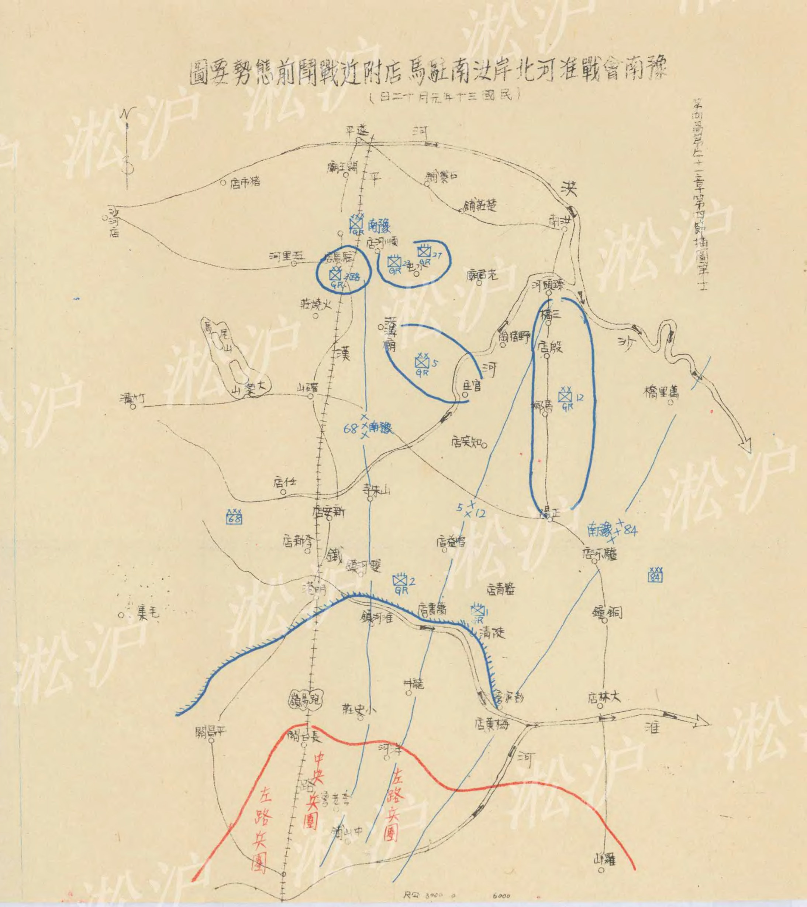

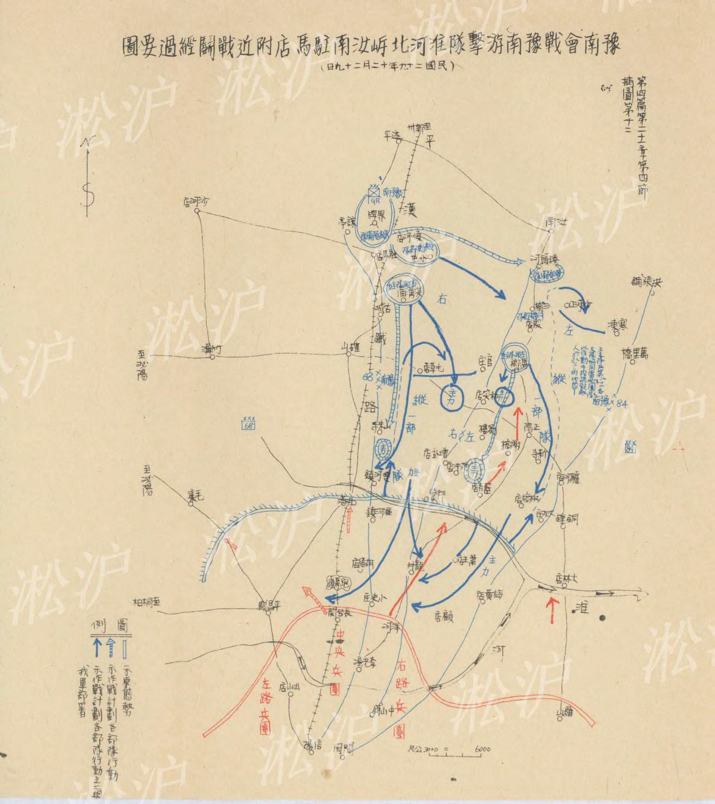

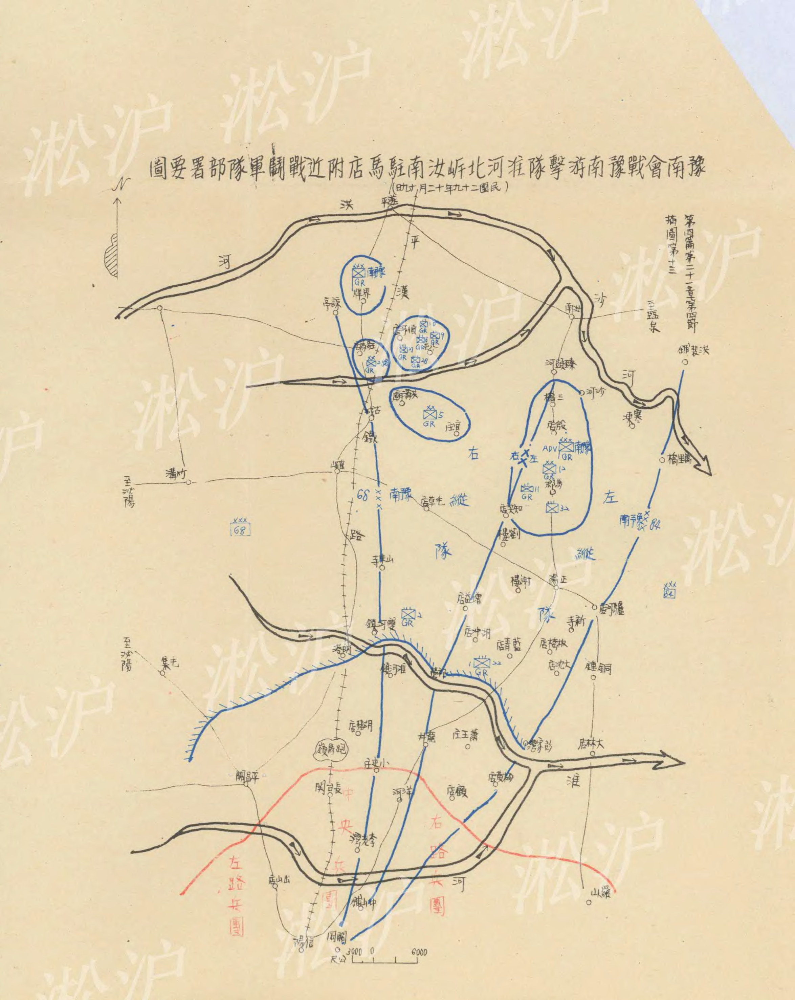

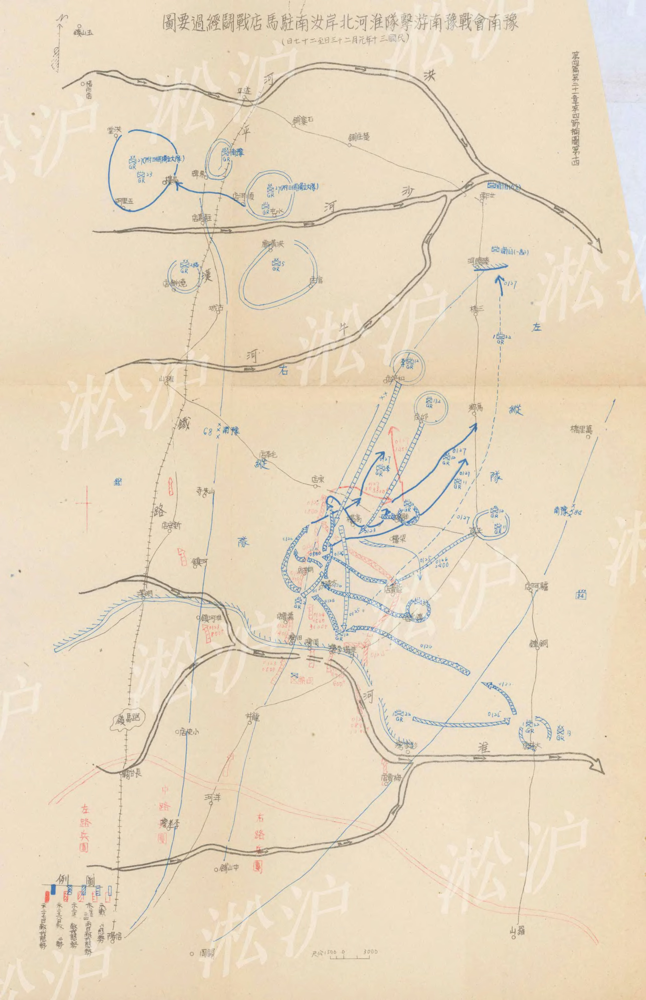

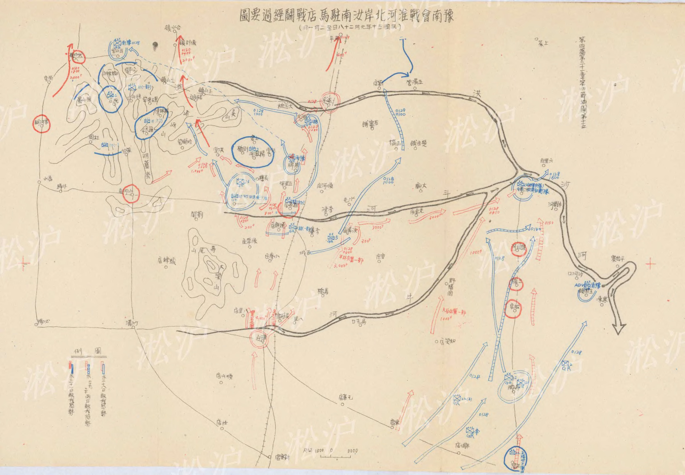

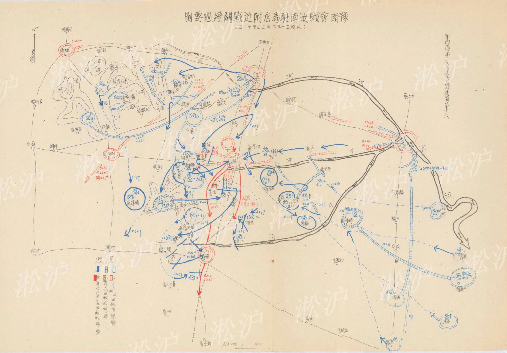

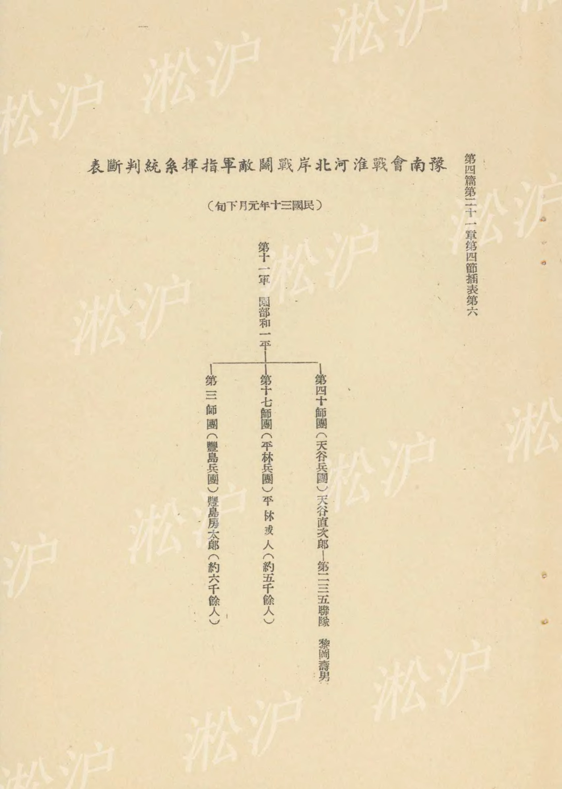

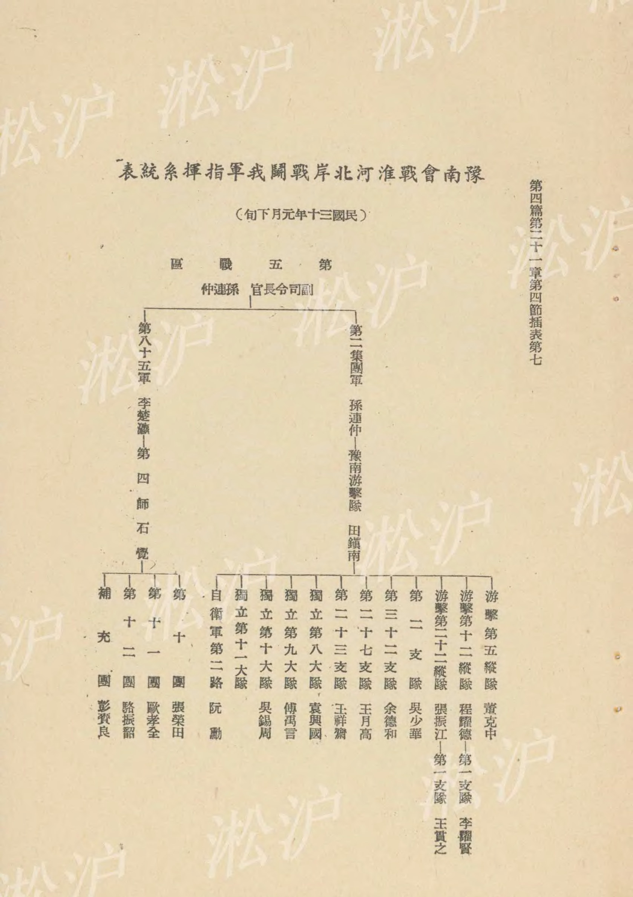

第三欽

保安砦尙店西平上蔡各附近戰鬥

自民國三十年元月二十七日至同月三十日

參照插圖第十七插表第八第九

豫南敵軍於一月二十六日突進左集團之明港東西陣綫後，斯時我湯集團遂令第八十五軍一部於西平正面，以備拒止沿平漢路北進之敵，主力沿平漢路兩側，機動夾擊。第十三軍則利用象河關，保安砦一帶有利地形，以全力準備解決經泌陽向該方面前進之敵。

##### 第一項 保安砦尙店西平上蔡附近地形

泌陽、舞陽、葉縣、方城地區，崗阜連綿，道路平夷，交通便利，糧食豐富，補給較易，惟樹木稀少，隱蔽困難，而展望良好，此種地形，實具山地戰與村落戰之特性。象河關位於大寨山與分水嶺之間，二山環抱，形成狹長隘地，爲泌陽至舞陽之孔道。接官廳一帶，山地縱深甚淺，且均係沙石地，工事構築困難。尙店、象河關間，道路如網狀，均未破壞，戰車及砲兵可通行無阻，駐馬店以北，盡屬平原，土山鎮之西南雖爲山地，然因傾斜不大，範圍過小，且距平漢路正面較遠，不足爲我軍活動之根據及翼側之依托。遂平附近，雖有沙河、三道河，但因季節關係，河水乾涸，幅面窄狹，架橋亦易，敵之機械化部隊，馳驅自如，而敵得發揮其最大威力，我劣勢裝備則不利。

一月下旬至二月上旬，時正臘盡春回，天候晴朗，值此朔晦前後，夜月無光，惟滿天星斗，郊野蒼蒼，故於指揮連絡，均感困難，而於行動之祕密，夜襲之實施，頗爲有利，但晝間敵空軍及機械化部隊得以活躍，於我頗感不利。

第二項

戰鬪經過（參照插圖第十八）

一月二十七日，敵軍左翼爲第三師團與第四師團之第八聯隊，到達張舖（泌陽北）、王店、蟻蜂店各附近。中央爲第十七師團（欠第五十四聯隊），附戰車六、七十輛、裝甲車四、五百輛，沿平漢路進至駐馬店附近。右翼爲高橋騎兵聯隊及第十七師團之第五十四聯隊，及第四十師團之佐伯騎兵聯隊，進至雷砦、野猪岡附近，形成第一線兵團。第四十師團沿第十七師團後尾跟進，位置於確山、明港一帶，形成第二線兵團。其空軍於是日上午，轟炸泌陽及遂平。

是日，我第十三軍之新編第一師，於保安砦附近。第八十九師於象河關、尙店附近，均構築工事。

第八十五軍主力，於二十四日奉湯恩伯總司令命令，由臨泉，沈邱地區西移，二十六日，抵寺耳、埠口附近，復奉令以一團兵力，控置於汝南附近機動，軍卽派第二十三師之第六十九團前往。是日拂曉，軍部到達上蔡東南之董砦，其第二十三師到達上蔡以南之十里舖附近，第四師到達邵店、金香舖附近，預備第十一師控制於西平，其工兵營位置於遂平附近，趕築工事，對汝河、沙河各渡口橋樑，確實控制，並對確山、信陽方面，嚴密警戒。

第十三軍之第一一零師，集結於儀封鎮、冷水舖附近一帶，對平漢路北進之敵，形成包圍態勢。

湯恩伯總司令以敵軍向北猛進，與所部主力接觸，迫在眉睫，二十七日午，於漯河指揮所以感未參戰電，下達命令，要旨如左：

一、沿平漢路北上之敵，約三千餘，到達確山，有繼續北進模樣。由毛集、吳城（桐柏北）北進之敵，約五、六千人，其先頭竄到泌陽附近，平氏（桐柏西北方）本日亦到敵一部，兵力不詳。平漢路東、正陽以南及宋店附近，各到敵千餘，與地方團隊對峙中。

二、集團軍擬誘敵深入，將北進之敵，分別圍殲於西平、遂平及保安砦附近。

三、第八十五軍以四個步兵團編爲兩個縱隊，派一師長統一指揮，控置於上蔡、汝南附近，襲擊沿平漢路北犯之敵，另以一師在西平、遂平、沿草河、沙河佔領陣地，拒止北犯之敵，儀封鎮、玉山鎮，土山鎮一帶，由該師派出一個支隊活動，並向東襲擊，務將北進之敵，殲滅於西平以南地區，該軍在郾城，應控置預備隊。

四、第十三軍以一師在保安岩附近，對方城、泌陽方面，佔領陣地，以一師控置於尙店、象河關一帶，準備側擊由泌陽北竄之敵，吳紹周師着開囘舞陽附近，集結待命。

五、第二十九軍（後該軍改歸左集團軍指揮）應迅速趕到泌陽附近，向北竄之敵跟踪，猛烈襲擊。

六、第四師之補充團新兵，可開駐南召，方城西北訓練，老兵着編爲兩個支隊，位置於方城附近，準備側擊由泌陽北犯之敵，歸張軍長指揮。

七、漯河李警備司令應在郾城以西、漯河以東，架設浮橋各兩座，並派兵守護，沿河船隻，應由該司令設法統制。

八、第八十五、第十三兩軍之作戰地境，爲胡岡、呂店、土山嶺、玲瓏寨、沙河店、竹溝之線，線上屬第八十五軍。

第十三軍張軍長奉到湯恩伯總司令感未參戰電令後，當卽下達部署命令，要旨如左（參照插圖第十八）：一、着第一一零師控置於舞陽附，派兵一團，埋伏於沿石河之曹莊，羅方平及雲磨嶺附近，限本二十七日晚配備完畢。

二、第八十九師主力，控置於尙店附近，一部佔領象河關，並派一部，埋伏於上下曹以北高地。

三、新編第一師主力，控置於保安岩，應佔領獨樹鎮、龍王店、楊樓、祖師頂各據點，左與第八十九師連絡。

四、第八十九師與新編第一師作戰地境，爲上漕河、卸甲店、湧泉寺、後翟莊、葛莊、橋構之線，線上屬第八十九師。

五、第四師之三個團，將老兵編爲兩個支隊，控置方城附近，準備側擊北竄之敵。

六、各部通信，主用有線電話，以無線電爲副，蔡副師長應派傳令兵三名，官長一員，到軍部連絡。七、余在舞陽南大楊莊司令部。

第八十九師二十七日所得情況如左：

一、午前六時，馬古田，大磨附近，發現敵步兵出沒（泌陽第一區署電話）。

二、九時至十時，象河關東南約七、八十里附近，砲聲甚烈，爾後，逐漸無聞（第二六七團電話）。三、九時，敵機數架，轟炸泌陽，該縣縣府已移至鄉間（泌陽情報所電話）。

四、敵已竄至泌陽，並有北竄模樣（賈樓情報所電話）。

該師舒師長基於上述情況及任務，決心以分水嶺、象河關、大寨山爲主要據點，關山爲屏障，形成陣地骨幹，卽佔領該線爲主陣地，重點置於右翼，藉火力之適切運用，並發揚砲火之最大威力，東西夾擊，予敵以重大打擊。是日二十三時，於張樓司令部遂下達命令，要旨如左：

自泌陽進擾，與我第六十八軍激戰，本二十七日黃昏，賈樓、沙河店附近，發現敵兵出沒，我第一一零師之一部，設伏於沿石河之曹莊、羅方坪、雲磨嶺附近。

二、本師遵令阻敵北犯，擬以決戰防禦之目的，佔領右由分水嶺，象河關，至大寨山之線主陣地，保持重點於右翼，藉火力挫折敵人於主陣地前，相機轉移攻勢而殲滅之。

三、騎兵連位置尹集附近，擔任本師左側背之警戒，並向東努力搜索敵情。

四、搜索隊位置於小史店附近，並於杜寺、上周村亘二郎店之線派出警戒，掩護本師右側背之安全，並向西南努力搜索敵情。

五、第二六七團附戰車砲兩門，爲右地區守備隊，卽在分水嶺亘象河關之線，佔領主陣地，並在桃花山亘馬李河之線，佔領警戒陣地，拒止敵人，並以一部火力，側防左前地區。

六、第二六六團附戰車砲連（欠戰砲兩門）爲左地區守備隊，即在史莊亘大寨山之線，佔領主陣地，並在塔灣亘角子山之線，佔領警戒陣地，拒止敵人，並以一部火力側防右前地區。

七、兩地區隊戰鬥地境，爲龐莊、李莊、史莊、塔灣、春水之線，線上屬第二六六團。

八、第二六五團爲預備隊，應以一部控置於後岡，梁岡附近，主力集結於吳樓，胡家岡，張莊附近。九、迫砲營位置於宋田，郭廟，趙莊附近。

十、通信連應以野曹爲補助基點，設置十門總機，向左右地區隊及預備隊，架通電話，以張樓爲基點，設置二十門總機，向軍部及後方各部隊並友軍，構成通信網。

十一、衛生隊在崗上開設綢帶所，野戰醫院在謝樓開設，收容傷兵。

十二、彈藥支付所在小集正北之李莊附近開設。

十三、督戰隊位置於龐莊、張莊、上風園、大譚莊、魏莊亘胡家莊之線，嚴厲執行戰場紀律。

十四、第一指揮所在關山附近，第二指揮所在大塞山西側附近。

十五、余現在野曹司令部，戰鬥開始時，在第一指揮所。

第一一零師吳師長於儀封鎮附近，接奉前令後之如置如左：

一、令第三三九團遵照軍長指示，星夜開往石河附近之羅方坪、曹莊、雲磨嶺一帶山地設伏，準備猛烈襲擊北犯之敵。

二、令快速營仍在玉山鎮、土山鎮方面游擊（該營係以步騎各一連組成於二十六日派出者），歸預備第十一師王團長指揮。

三、令第三二八團、第三三零團及師直屬部隊，於薄暮開始向舞陽移動。

四、將上述處置，以電話報告總司令及軍長，並通報預備第十一師。

第八十五軍奉湯總司令感未參戰電令後，其部署如左：

一、第二十三師（附第四師補充團，該團尚在阜陽、鳳台一帶）、着以一個團位置於汝南附近，沿汝河、沙河，控制橋樑渡口，構築工事，嚴密警戒，如受敵襲，應堅強予敵打擊。其主力控制上蔡以南附近，嚴密注意由平漢北犯之敵情，並隨時準備猛烈側擊該敵。該師與本部通信，務確保上蔡、西平既設線路外，並以無線電連絡。

二、第四師於本（二十七日）申時由邵店出發，經黃埠鎮以北張鐵店、祝王臺、越平漢路，至二十里舖及焦店附近，集結待命。

三、預備第十一師於西平、遂平、沿洪河、沙河，佔領陣地，拒止北進之敵，並以一個支隊，於儀封縣、玉山鎮、土山鎮一帶活動，準備向東側擊。

四、本部於感（二十七）晚，進至西平西北，約八公里之宋集附近。

五、各師行動及到達位置，應卽具報爲要。

是晚，第八十五軍各部，均到達指定位置，積極爲戰鬥之準備。預備第十一師於西平主陣地，更加強固，以拒止敵之北進。

第十三軍方面戰況

(參照插圖第十九)

元月二十八日，第八十九師正面之敵，開始分兩路北進，一路似其主力，由泌陽北進，另路千餘，分向楊集前進（此地參照插圖第十八），並有敵機二、三架，時在象河關上空活動。此時，我友軍第六十八軍，正與敵之大部，激戰於春水、牛蹄以南。十五時，敵主力已進抵我警戒陣地前，當向我孤山、馬李河之第二七六團第三營及塔灣之第二六六團第三營攻擊，激戰至十九時，斃敵百餘，我亦傷亡官兵五十餘。而進抵楊集之敵，迄未移動，是日，敵由吳城、毛集向泌陽附近，續增五、六千，我第八十九師舒師長根據當前之情況判斷，敵有向象河關突破之企圖，遂決心利用險要地形，固守分水嶺、象河關、大寨山各據點，並相機殲敵於主陣地前，乃於二十二時下達命令，其要旨如左：

一、當面敵情如貴官所見。

二、本師决利用優越地形，固守分水嶺、象河關、大寨山各據點，並相機殲敵於我主陣地前。

三、山砲連卽在小集以南附近，佔領陣地，觀測所位置於關山、薛莊南端高地附近，應以一部火力，支援馬李河、塔灣警戒陣地之戰鬥，主要火力，應準備擊滅該敵於我象河關主陣地前。

四、迫擊砲營卽在小凹張、董莊、段莊附近，佔領陣地，以一部火力，封鎖象河關、南窪道、乾河之死角，主火力卽準備協同山砲兵，擊滅該敵於我主陣地前。

五、總預備隊應以一部，埋伏於趙莊、霍莊附近，俟敵進迫，相機施行襲擊，主力之一部，卽在關山附近，佔領預備陣地，但兵力仍須注意保持集結與機動。

六、左右地區隊之預備隊及總預備隊，應指定步兵一部，重機槍兩挺，爲對空射擊部隊。

七、余在關山指揮所。

同日，新編第一師於保安砦西南一帶，遵令配備，並加強工事。而第一一零師除第三二九團於本日拂曉進抵羅方坪附近，繼向沙河店方面，搜索前進外，其餘全部於三時到達舞陽郊外集結，該師吳師長（兼副軍長）於二十二時奉軍長命，率山砲連及特務連兩排，赴尙店指揮第八十九師作戰。本日十一時，敵機十七架，曾向漯河轟炸。

二十九日，我第八十九師當面之敵六、七千，繼續向我馬李河、塔灣警戒陣地猛攻，我軍因傷亡過重，遂守跑馬嶺、楊樹凹之線，繼以敵機九架助戰，旋又棄守。九時許，敵逼象河關，我第二六六團及豫

南

會

一

戰

九七

第二六七團各派一部，分向東西出擊，而師總預備隊亦向突進之敵，迎頭痛擊，同時，我關山附近之迫擊砲營，及小集以南之山砲連，齊向敵軍轟擊，殺敵千餘，象河關附近陣地，乃成敵我爭奪之焦點，以致失而復得者五次，至十二時，我以陣地全燬，官兵傷亡甚重，遂退守關山預備陣地，旋又轉守後岡、小集、亘將軍墓之第二預備陣地，敵復來攻，且以飛機向我轟炸或掃射，惟未得逞。是役，我軍共傷營長八員、連排長二十餘員、士兵千餘，敵傷亡尤重。

同日九時，象河關方面之敵，以一部向過山廟之新編第一師前進陣地進攻，另一部騎兵五百餘、步兵千餘、戰車七輛、砲四門，向小史莊之警戒陣地攻擊。激戰五時，我軍向太尉廟附近轉移。

我第一一零師之第三二九團，於獲悉沙河店昨晚到達敵步騎兵五、六百後，乃命第三營於石河口、尙店之線埋伏，第一營向沙河店附近游擊，第二營進抵梅莊、凍莊，以策應第一營之作戰。七時三十分，在沙河店以北之常莊，我第一營與約四百之敵接觸，後經我第二營之夾擊，敵亡三十餘人、馬五、六匹，向東北退去。

我第十三軍張軍長於二十九日午後，調整部署如左：

一、第一一零師之三個團分別控制接官廳、武功鎮、及尹集西端高地。

二、第八十九師佔領尙店以北高地。

三、新編第一師佔領破城，封鎖要隘，另以有力一部，推進祖師嶺一帶。

四、本師統限本日午後十二時前，部署完畢，俟敵進至尙店以北地區時，一鼓聚殲之。

第八十九師師長於奉右令後，卽於十九時三十分下達命令，其要旨如左：

一、奉軍長電諭，本師卽向尙店以北山地，佔領陣地，右與新編第一師，左與第一一零師，切取聯繫。準備側擊北進之敵。

二、本師遵令卽向尙店以北山地轉移，佔領三道口、柏莊寨、亘馬鞍山之線，準備側擊北進之敵。

三、第二六五團着卽於三道口、柏莊寨亘馬鞍山之線，佔領主陣地，並在郭溝、龍泉砦、寺山之線，佔領警戒陣地，準備側擊北進之敵。

四、第二六六團着卽於四頭腦、馬頭埃、紅澗溝之線，佔領第二線陣地，準備側擊北進之敵。

五、騎兵連着卽佔領楚莊附近警戒陣地，左與第一一零師切取連繫。

六、第二六七團應卽佔領尙店附近陣地，掩護本師之轉移，爾後，卽位置於閻家崗、魯家附近，爲總預備隊。

七、余現在尙店指揮所，爾後，卽轉進至馬頭埃指揮所。

該師各部均於二十四時前，部署完畢。

新編第一師奉軍長命令後，當卽佔領雲山、太尉廟、破城、太子懷（祖師嶺南）之線。

第一一零師吳師長於獲悉象河關失守後，當卽令本師第三二八團速由舞陽向黃山、接官廳、小石門、大石門，標高六四零五迄羅大山之線，佔領主陣地，並派一部，佔領龍王廟、周莊、蟒牛嶺之線，向西南警戒。令第三二九團速由沙河店以北，向尹集待命，師直屬部隊除迫砲營、戰砲連，進至接官廳待命外，其餘及第三三零團，由舞陽向武功鎮推進，並函第八十九師舒師長，令其以主力控置於龍泉砦、寺山以北高地，亘馬鞍山之線爲主陣地，以有力之一部，守備尙店。吳師長乃由尙店轉赴接官廳，並作如左之處置。

一、第三二八團迅速構築工事。

二、迫砲營及戰砲連配屬第三二八團作戰，歸楊團長指揮，務於二十時前，進入陣地，完成射擊準備。三、山砲連在朱蘭店附近，佔領陣地，完成射擊準備，須與第一線步兵指揮官協定，能以火力支援警戒部隊，及主陣地之戰鬥。

吳師長於二十二時返趙井師戰鬥指揮所後，旋奉張軍長艷未續戰電令如左：

一、當面之敵二千餘，自昨十六時迄今，與我第八十九師激戰於象河關附近，現敵已突進至象河關以北地區。

二、軍奉命將敵在尙店附近聚殲之。

三、第一一零師應佔領尹集以西高地，及接官廟一帶陣地，並控置有力部隊於武功鎮，對東南土山嶺派出警戒。第八十九師應以一部佔領尙店以北高地，主力着控置於柏莊寨，準備射擊，該師暫歸吳紹周副司令指揮。新編第一師應以一部佔領太尉廟、破城，封鎖要道，主力控置太子坡、清涼寺附近，協力各師，獨立攻擊敵人。

四、敵如經太尉廟、破城，攻擊保安時，第一一零及第八十九兩師，應不顧一切，猛擊其側背。敵如北犯接官廳，攻擊第一一零師時，第八十九及新編第一師應協同一致，不顧一切，向東南側擊。敵如攻擊尙店以北高地之第八十九師時，第一一零師及新編第一師，應不顧一切，東西夾擊各路。統限本日午後十二時前，部署完畢，拂曉開始攻擊。

五、第一一零師及第八十九師爲左地區隊，新編第一師爲右地區隊。

作戰地境爲辛店、明山頂、祖師嶺、八合砦、楊莊、丁莊、王莊之線，線上屬右。

吳紹周師長（兼副軍長）於奉前令後，當卽於本日十九時十分，向第一一零師及第八十九師下達佔領命令，其要旨如左（下達第八十九師之命令與第一一零師同）：

一、敵第三師團主力，於昨日十六時迄本日十時，與我象河關守備部之第二六七團激戰，現敵已突進象河關以北地區。

二、軍主力決在尙店附近，佔領陣地，右自龍泉寨、寺山、馬鞍山、黃莊、接官廳、小石門、大石門、六四零五高地，迄羅大山之線，爲主陣地，依火力摧破敵人後，相機轉移攻勢。

三、第八十九師爲右地區隊，應以有力之一部，佔領尙店，竭力遲滯敵之前進，主力卽在龍泉砦、寺山、馬鞍山之線，佔領陣地。如敵經蟒牛嶺及其北端大道，攻我接官廳時，應不顧一切，立即向東南猛擊敵人左側背，協力第一一零師將該敵包圍於戰場而殲滅之。

四、第一一零師爲左地區隊，以第三二八團（配屬迫砲營及戰砲連）佔領接官廳、黃山、小石門、大石門、六四零五高地，迄羅大山之線，務於黃昏前，進入陣地完畢，以有力之一部，佔領龍王廟、水田、蟒牛嶺之線，爲警戒陣地。

五、戰鬥地境左右地區間（兩師間），爲閻家崗、吳胡崗、樓子、簸箕堂、龍王廟、宋莊、賈莊之線，線上屬右。

六、第三二九團迅赴尹集以西地區，以一部確實控制古山寨、饅頭山高地，拂曉後，如敵進犯我接官廳，卽以主力猛擊敵之右側背。

七、第三三零團爲預備隊，位置於武功鎮附近，派部向出山砦、儀封鎮及舞陽通遂平之大道警戒。

八、迫砲營歸三二八團指揮，於黃山北側之楊角灣。周家附近，佔領陣地，準備以火力，側擊接近接官廳、小石門、大石門之敵。

九、山砲連在朱蘭店附近，佔領陣地，準備以充分火力，支援警戒部隊之戰鬥，過後，適應戰況，推進至能以火力壓迫向接官廳、大小石門接近之敵步兵，並能協力第一線步兵之戰鬥。

十、戰砲連歸三二八團指揮，配屬第一線營使用，主射擊出沒於接官廳之敵戰車，並支援第一線步兵之戰鬥。

十一、余在趙井戰鬥指揮所。

三十日，第十三軍於調整部置後，新編第一師佔領雲山、太尉廟、破城、太子懷之線，第八十九師位置於尙店北側高地之柏莊寨東西地區，第一一零師佔領黃山、接官廳、小石門、大石門、羅大山迄尹集西側高地之線。

拂曉，象河關之敵，一股向我新編第一師之太尉廟、破城附近陣地進攻，一股沿公路經尙店，向我第八十九師及第一一零師陣地攻擊，另一路步兵兩千餘、砲六門、騎兵百餘，九時，經儀封鎮北進。

進攻我新編第一師太尉廟、破城之敵，繼以步騎千餘，攻擊太子懷陣地，七時許，破城陣地，被敵突破，該師遂向西北轉進。

本日零時四十分，敵四百餘，由大曹砦向第一一零師陣地前進，於水田南端，與我警戒斥候接觸，斃敵七、八名，我斥候長李金田陣亡，一時許，敵攻蟒牛嶺，拂曉，敵由袁老莊、大曹砦增來三、四千，繼向蟒牛嶺及寺山猛攻，十時，我因傷亡慘重，遂分向龍王廟、大石門撤退。計斃傷敵人二百餘，我官兵陣亡二十餘，傷三十餘。

八時三十分，敵一部向我第三二九團守備之古山寨進攻，十時，陷敵，旋經該團克復，並斃傷敵二百餘人（內斃軍官一員），馬十餘匹，我第二營副營長李映華陣亡，排長以下傷亡六十餘人。十時，敵分三縱隊向我第一一零師之接官廳以北主陣地進攻，另敵騎兵四百餘，向尹集進擾，企圖威脅第三二九團之側背，敵砲十二門，飛機九架，同時助戰。十一時十分，敵機增至二十餘架，向該師陣地投彈二百餘枚，砲火尤烈，同時，敵分三股，向我第一一零師及第三二八團陣地攻擊，其主力約二千餘，由寺山、龍頭山向黃山、小石門進攻，一部千餘，沿蟒牛嶺北端大道，迫近接官廳，與另股在饅頭山、袁莊之敵，齊向該師全線攻擊，旋敵被殲二百餘，而攻擊黃山、小石門之敵，亦傷亡三百餘，敵遂以援軍千餘，急向黃山方面，增加猛攻，於是，黃山、小石門兩陣地，相繼棄守。敵續攻接官廳、大石門、羅大山等地，雖經我節節抵抗，但因傷亡過重，至十五時五十分，第三二八團陣地，已被突破。是日，該團計共陣亡官長八員、士兵四百二十一名，負傷官長十五員、士兵一百五十六名，敵軍亦傷亡約八百餘。

我新編第一師自破城失守後，轉移至楊樓、榮岡，屢與敵接，乃逐步移至保安砦以北高地，與敵對峙。

進攻我第八十九師之敵，五時，以飛機五、六架，向該師陣地轟炸，並以步兵千餘、砲兩門，猛攻第二六五團之三道口、尖山各陣地，至十五時，敵敗退。

我第十三軍張軍長於獲悉第一一零師第三二八團陣地被突破後，乃令該師向卸甲店轉進，次令第八十九師向墳台附近，佔領陣地，以備側擊北進之敵，並掩護軍向西北轉進，第八十九師奉令後，於十七時三十分，下達部署命令，其要旨如左：

一、本師決於本日黃昏，轉進至墳台附近，佔領陣地，以側擊北進之敵。

二、第二六七團應以一部在卸甲店佔領陣地，掩護本師轉進。主力在卸甲店北之張莊、雙富營、古城寺之線，佔領陣地，準備側擊北犯之敵。

三、第二六六團於墳台以南之全集、大呂莊、小辛莊之線，佔領第二線陣地，準備側擊北犯之敵。

四、第二六五團於墳台以北之張樓附近集結，爲總預備隊。

五、司令部及直屬部隊，於墳台以北之郭店附近，集結待命。

第一一零師吳師長於奉軍長電令後，當令第三二八團掩護第一線部隊撤退，第三二九團卽脫離戰場，向卸甲店轉進，第三三零團亦向卸甲店方面移動，詎於武功鎮通過公路時，忽遇五、六千之敵，正向舞陽前進，該團陳團長當卽率隊予以腰擊之，斃敵三百餘。二十時，儀封鎮方面之敵，已進入舞陽城，號日戰史

一〇四

而保安砦之敵，亦以一部進佔舊縣，吳師長於是卽令所部，及正向卸甲店轉進之各團，轉向葉縣大林頭集結。

第八十五軍方面戰况（參照插圖第二十）

元月二十八日，沿平漢路北進之敵，突破豫南游擊隊駐馬店陣地後，一部約三千餘，戰車三十餘輛，附砲十餘門，進抵沙河南岸，入晚，突入遂平，續向北進，一部約騎兵四百餘，由野猪崗向汝南進攻。另一部步騎兵六百餘，砲四門，戰車十餘輛，由十里舖向汝南之第二十二縱隊進攻，是晚，城陷。

我第八十五軍李軍長於獲悉上述情況，並接得泌陽附近之敵，進至春水南龍王廟之一股，有經沙河店與平漢路正面之敵會合模樣之情報後，判斷敵如續行北進，預計本日正午前後，卽有與我遂平、汝南一帶部隊接觸之可能。乃於十六時，下達命令，其要旨如左：

一、平漢路正面之敵，約步騎二千餘，今晨，竄抵駐馬店西北之大界牌、黃台，泌陽附近之敵，一股竄龍王廟，一股竄沙河店，並已轉向舞陽，攻據汝南之敵千餘，有向上蔡迂迴之勢。

二、軍以各個擊破敵人之目的，擬以西平以南，遂平以北一帶爲目標，取東西夾擊之態勢，斷行機動攻擊，將沿平漢路北進之敵，一舉殲滅之。

三、第四師於本三十八日二十二時以前，進至玉山鎮、沈砦、儀封鎮地區集結，準備夾擊由平漢路北犯之敵。

四、第二十三師以第六十九團牽制汝南之敵，以主力進至上蔡西南之莫窖、蔡埠口，看花樓地區集結，準備夾擊平漢路北犯之敵。

五、預備第十一師（儀封鎮之一團歸還建制）於西平旣設陣地，西至譚店，東至套布口之線，構築縱深陣地，堅決守備，以一部推進至衡坡、焦店、丁莊之線，嚴密警戒，並控制有力之預備隊，擔任機動。

六、軍砲兵連配屬於預備第十一師。

七、余在宋集附近軍部指揮所。

二十九日，敵主力由遂平北進，有向西平攻擊模樣。汝南之敵，增至步騎千餘、砲四門、戰車五輛，似爲掩護敵主力之右側安全。黃埠鎮亦到敵千餘，並繼續北進，有進攻上蔡之企圖。

我第八十五軍各部，於今日七時到達前令指定位置。十一時，敵主力向我預備第十一師之焦店、馬坡、水泉王陣地攻擊。十三時許，敵後續部隊，已到達遂平附近，同時，敵機三架，掩護其步兵，猛向西平南關及譚店東南各據點進攻，預備第十一師守備洪河兩岸，及西平城關之部隊，奮勇迎戰，迄十八時，城關爭奪得而復失者再，我第三十三團第一營第二連連長劉永鑫，於此次戰鬥中，身先士卒，竟致殉國。薄暮，敵繼攻西平西北端之洪河土堤，及譚店南之蕭莊、桑莊各據點，戰況激烈，蔣師長當令第三十三團之一部，由劉店附近，向敵逆襲，同時，第二十三師之第六十七團第一營，亦由陳老莊趕到，向敵側擊，敵傷亡甚衆，並斃其聯隊長一員，我洪河北岸之主陣地，仍屹立未動。

我第八十五軍李軍長鑒於非取攻勢，不足以確守洪河北岸之主陣地，及阻敵北進，且須於夜間行動，尤屬有利，乃斷行夜間攻擊，其理由如下：一、當面之敵，爲第十七師團主力，其後續部隊亦強，於明（三十）日有繼續向我總攻之可能。二、西平附近，概屬平原，利於敵機械化部隊之活動，且洪水河涸，無險可恃，我陣地固守困難。三、我主力已集結於西平附近之鐵路兩側，對敵形成包圍態勢，以主動制敵機先爲有利。四、夜間戰鬥，可減弱敵之優點，補救我之缺點，基於上述理由，遂於十五時五十分，以艷申參戰電令部署要旨如左：

一、當面之敵，步騎二千餘，戰車十餘輛，裝甲汽車三十餘輛，砲十餘門，自本（二十九）日晨，由遂平北進，其主力已逐次竄抵徐集、焦店、漢橋之線，與我預備第十一師激戰中，據報，遂平附近，尚有與以上兵力相等之後續部隊。

二、軍決於西平，遂平間，向敵夜間攻擊，以求聚而殲之。

三、第四師於本日二十時，開始向平漢路以西地區前進，須將蔡砦、二十里舖、祝王臺之敵掃滅之，並須以一部，對玉山鎮、土山鎮、楊店集警戒。

四、第二十三師之第六十九團，於本晚，向汝南之敵佯攻，該師主力，於二十時開始，向平漢路以東地區攻擊前進，對仙女部、丁莊、賈橋、毛砦、金剛寺、崇義橋、王灣之敵，殲滅而佔領之。

五、預備第十一師附近砲連，以大部固守原陣地，以四個營於二十時，向南出擊，以備攻佔徐集、焦店、漢橋、羊閣等處，主力則集結於大蘭砦附近。

六、余現在宋集指揮所。

本日晨，我第二十三師於奉前令正準備開始向李老莊移動中，適有分途向上蔡進犯之敵一部千餘、砲八門、戰車三十餘輛、裝甲汽車七、八十輛，由黃埠鎮北上，一部四百餘、騎兵二百餘、砲二門、戰車三輛，由張鐵店經錢莊東來。該師除第六十七團之第一營，已抵李老莊外，其主力當於太路李，王號莊之線，展開向進抵朱里橋之敵攻擊。十五時三十分，在后陳阻敵東進之第六十七團第一連，因衆寡懸殊，自羅國保連長以下官兵百餘，卒皆壯烈犧牲。而於河坡，蔡埠口等處拒敵北犯之第六十八團，當派部向朱里橋之敵側擊，敵遂向上蔡西南潰退，時因已近黃昏，對於前項夜擊命令之實行，已屬太晚，是故李軍長乃命第二十三師之主力，改移王橋、五溝營附近，沿洪河警戒，並以第六十七團之一營，佔領百尺集，關廟一帶。

汝南之敵軍今晨增至六百餘人、砲四門、戰車五輛，於本日十四時三十分，強度汝河，向我留置汝河左岸機動之第二十三師第六十九團攻擊。十八時，於三里店附近，敵被我斃傷六、七十名後，遂仍退返城內。

是日二十一時三十分，湯恩伯總司令於朱左（北舞渡西南）總部，向第八十五軍李軍長指示部署如下：

一、第四師於本晚夜襲後，轉向敵後之遂平、駐馬店、確山間，擔任襲擊平漢路北犯之敵後方，並斷絕其交通。

二、第二十三師於本晚夜襲後，仍回上蔡。汝南附近，襲擊北犯之敵側背。

三、該軍應掌握預備第十一師，於本日（二十九）二十四時前，主力經新店向葉縣方向轉移，以一部留置原陣地，明日與敵保持接觸，逐次向漯河方面轉移。並受萬參謀長指揮，必要時，以留置之部隊，即在原地游擊。

李軍長當卽依據上述意旨，轉令各師遵行。預備第十一師遂令第三十一團、第三十二團、向裴城轉進，第三十三團向漯河西北地區游擊待命。而第四師由儀封以東、向嶠呀山方面移動。軍部乃於三十日零時三十分，由宋集與預備第十一師之主力，同向葉縣方面移動。

三十日十時，我預備第十一師到達沙河北岸裴城附近，佈置警戒。

本日晨，汝南之敵，分兩路向我汝河東岸之第二十三師第六十九團攻擊，並以戰車強渡汝河、激戰數時，雙方傷亡各百餘。迄十七時，該團退守營灣，敵續攻，以傷亡甚衆，至二十三時四十分，敵遂退據馬郎河頑抗。

戰後狀況

三十一日、保安砦有敵千餘，獨樹鎮有敵三、四千，平漢路正面之敵一部，集結舞陽，大部向我第十三軍進犯。上蔡附近之敵千餘，戰車及裝甲車三、四十輛、汽車二、三百輛，分兩路東竄，有犯項城、周口之企圖。

我第十三軍之新編第一師，已就部署位置，第一一零師除其第三二九團猶在尹集附近外，其餘各部，已到達葉縣之大林頭集結，而第八十九師亦轉移至墳台以南地區。

我第八十五軍之預備第十一師，於今晨到達葉縣以北地區，第二十三師移至商水以西之巴村集附近，第四師於遂平、確山一帶游擊（詳見本節第二款）。

湯恩伯總司令基於上述情況，乃於馬樓（魯山東南）以世亥電令，作新部署如下：

一、敵步兵二千、砲七、八門、戰車數輛、騎兵三百餘，刻據保安岩、舊縣一帶，有向葉縣進犯模樣。

二、軍擬以主力先擊破此敵，第十三軍之第一一零與新編第一師，暫編爲襲擊縱隊，歸吳紹周師長統一指揮，限明日（二月一日）拂曉前，在保安岩、舊縣以西地區設伏，敵北犯或南竄時，應不顧一切，猛烈側擊。

三、第八十九師之主力，應在葉縣以西地區，佔領陣地，防敵由葉縣向魯山進擾，葉縣城廂附近，應酌派部隊，佈防警戒。

四、預備第十一師着暫歸張軍長指揮，限明日拂曉前，在葉縣以北，沿公路西側設伏，準備側擊，汝墳橋應酌派部隊，佔領警戒。

五、由葉縣至寶豐電話線，由第十三軍通信營負責整理控制。

第十三軍張軍長於奉上令後，當卽轉令第八十九師，以一部在葉縣附近，佔領陣地，對東南警戒，主力則應於葉縣西北附近地區，佔領陣地，以備側擊北犯之敵。舒師長於是日下令配備如左：

一、奉軍長諭：該師着於黃昏後開始行動，以一部佔領葉縣附近地區，主力佔領葉縣西北附近陣地，對東南警戒。

二、本師遵令決於黃昏後開始行動，主力在葉縣西北附近，佔領陣地，準備側擊北犯之敵。

三、第二五六團（附第二六六團第三營）着於黃昏時，開始行動，應佔領葉縣西南之五里堡、張莊亘堰口之線主陣地，以一部擔任城防，並派隊向東警戒，主力即控置於聶樓附近，側擊北犯之敵。

四、第二六七團着以黃昏後開始行動，應於葉縣西南之瓦店營、大營、輝領營亘道莊之線，佔領陣地，主力即控置於鄭莊附近，側擊北犯之敵。

五、該兩團戰鬥地境，爲犨河、大林頭、張沈莊亘孫莊之線，線上屬第二六五團。

六、師司令部及直屬部隊着卽開始行動，位置於葉縣西北之胡官營附近，集結待命。

七、第二二六團着卽開始行動，在直屬部隊後跟進，到達葉縣西孟馮莊附近，爲總預備隊。

八、余在葉縣西北之胡官營司令部。

二月一日以後，敵軍卽向左旋迴，企圖打擊我左集團，於是湯集團之豫南各軍，乃向敵後尾擊，其行動已概述於第三節。

此次戰鬥，我軍共亡官佐三十八員、士兵二千八百零三名、馬一零五匹，傷官佐六十五員、士兵一千八百七十名、馬十二匹，生死不明者，官佐十二員、士兵八百一十七名、馬十七匹，俘獲敵士兵三名、彈藥武器甚多。

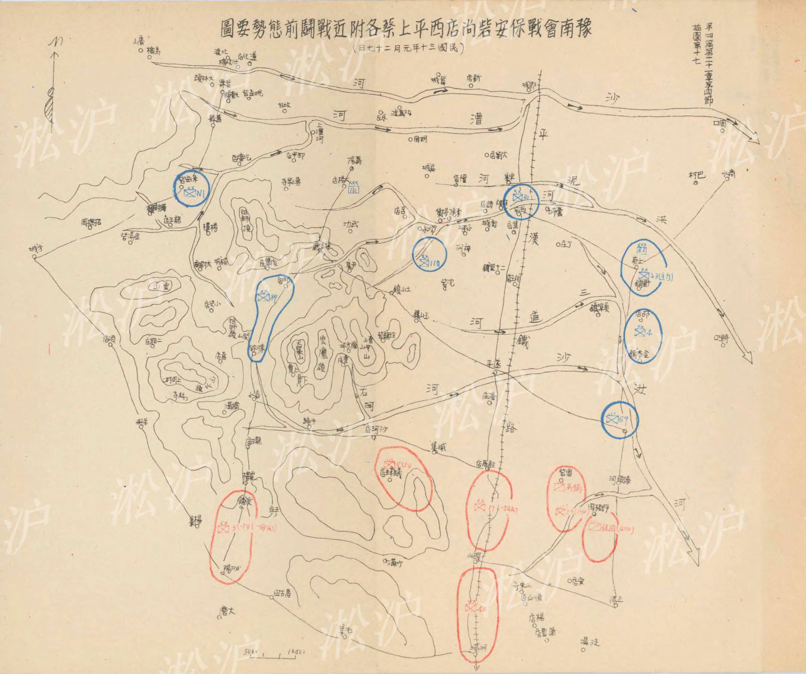

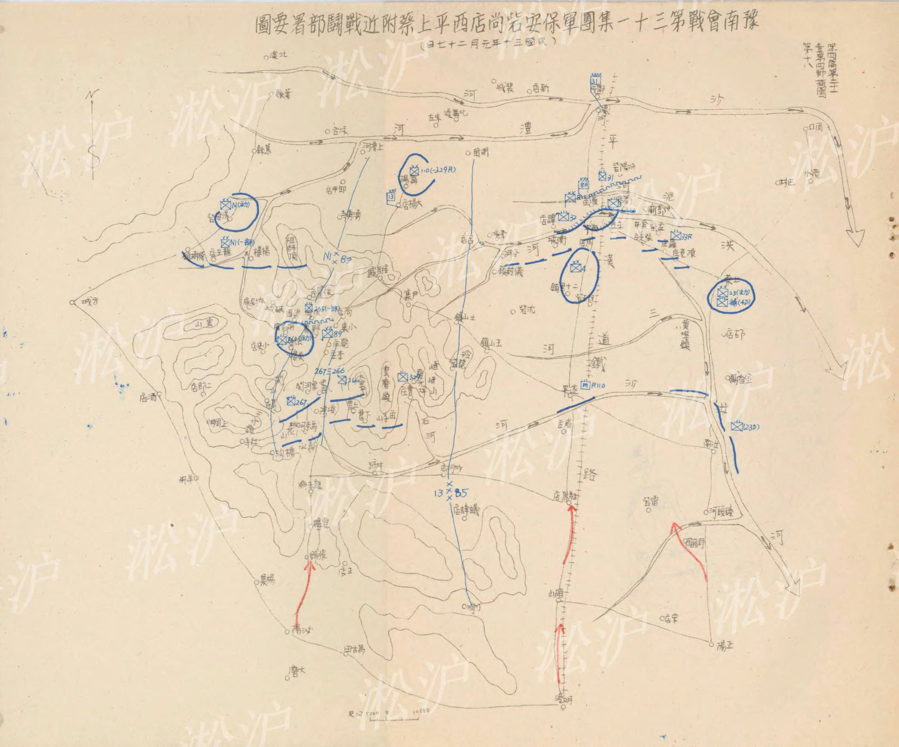

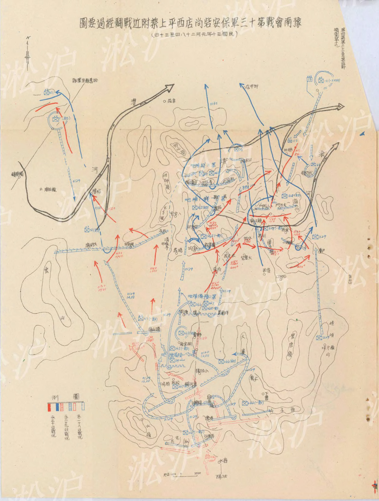

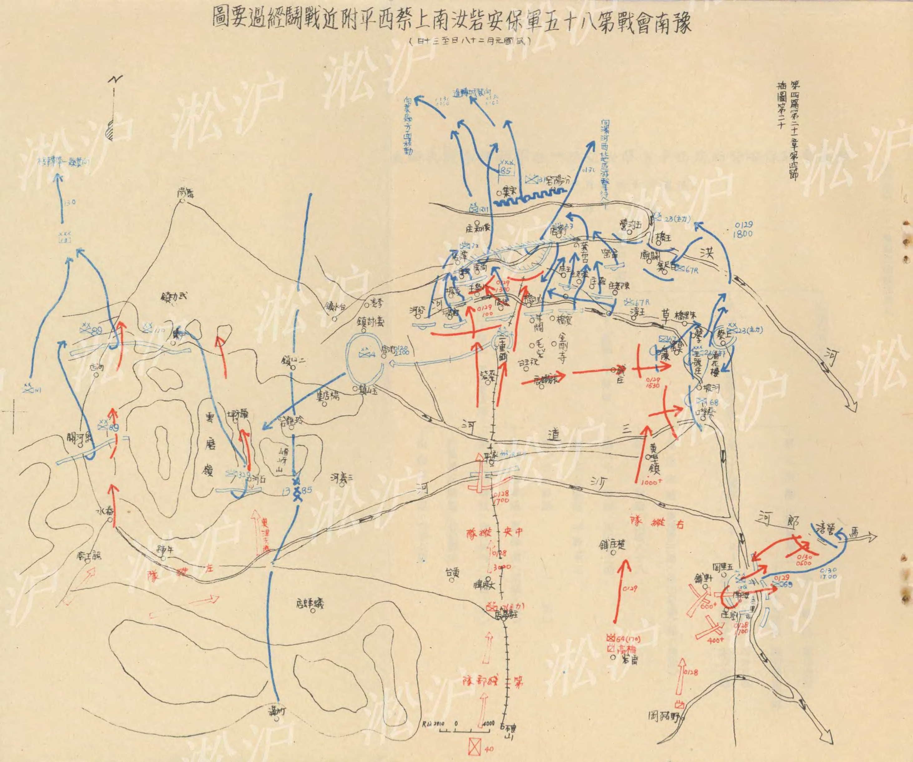

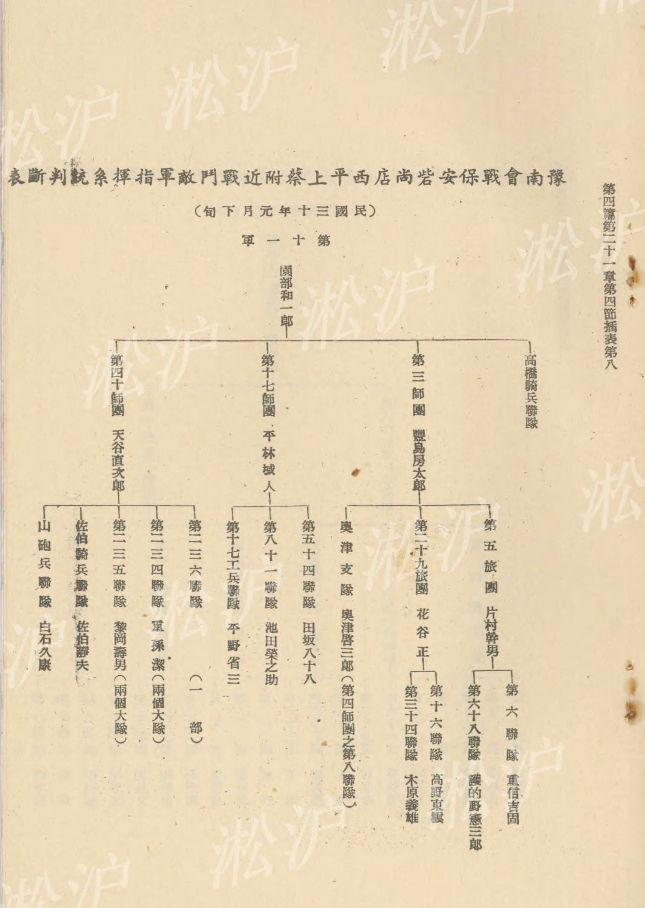

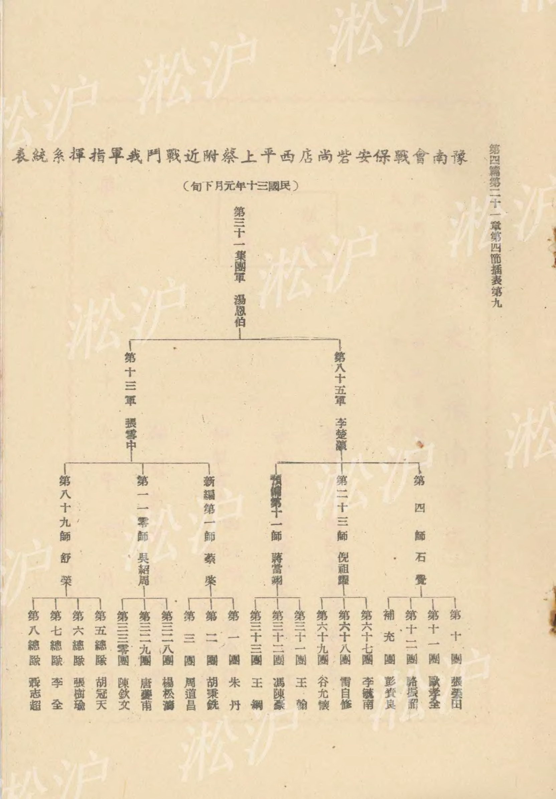
