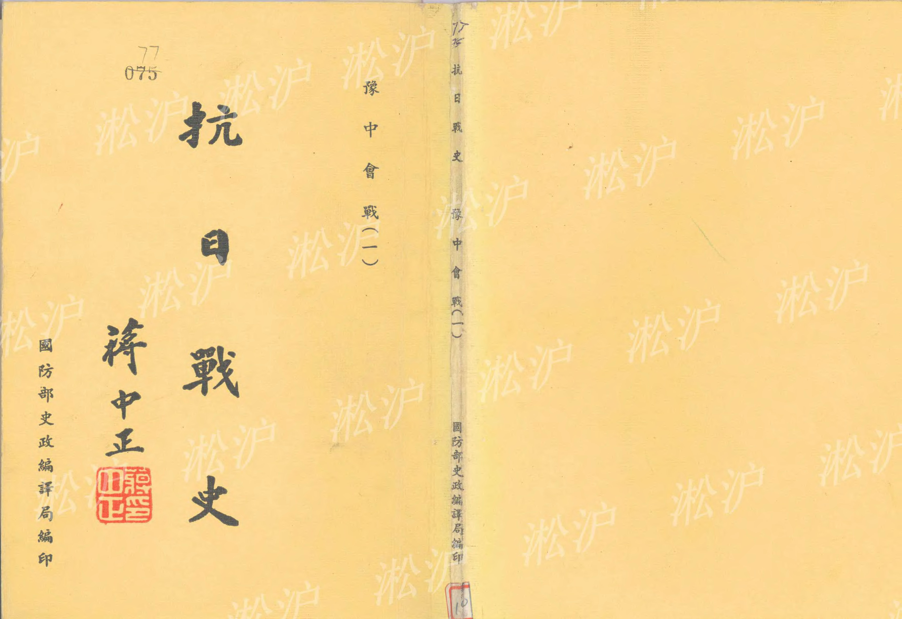

## 第三十一章 豫中會戰

概述

### 第一節 會戰前狀況

#### 第一款 敵軍

#### 第二款 我軍

#### 第三款 兵誌概要

### 第二節 我軍會戰指導

### 第三節 會戰一般經過

第一款 黃汎及登封汜水主陣地之戰鬥第二款 臨汝登封汜水及洛陽外圍一帶之戰鬥第三款 洛陽之防禦及策應諸戰鬥第四款 反攻時期諸戰鬥第五款 會戰後狀況

### 第四節 重要戰鬥

第一款 中牟、邙山頭附近地區諸戰鬥第二款 登封、汜水間主陣地之戰鬥第三款 許昌、禹縣附近之戰鬥第四款 魯山附近之戰鬥目

錄

壹

臨汝附近之戰鬥　一三七

第六款 龍門附近之戰鬥　一四七

第七款 洛陽城防守禦戰鬥　一六五

第八款 滬池、新安、宜陽、洛寧、盧氏附近之戰鬥一八三

第九款 反攻陝州及靈寶附近之戰鬥一五

第十款 游擊戰　一五七

第五節 空軍之作戰　一八七

第一款 敵軍　二八七

第二款 我軍　一八九

第三款 作戰經過

三○一

第六節 後方勤務

三○七

第一款 站、處設置及部署

三○七

第二款 交通概況

三○七

第三款 輸力概況

三○九

第四款 糧秣及彈藥　三一一

第五款 衛生　三一一

第六款 通訊　三一一

第七款 會戰後一般狀況　三一一

第七節 檢討　三二五

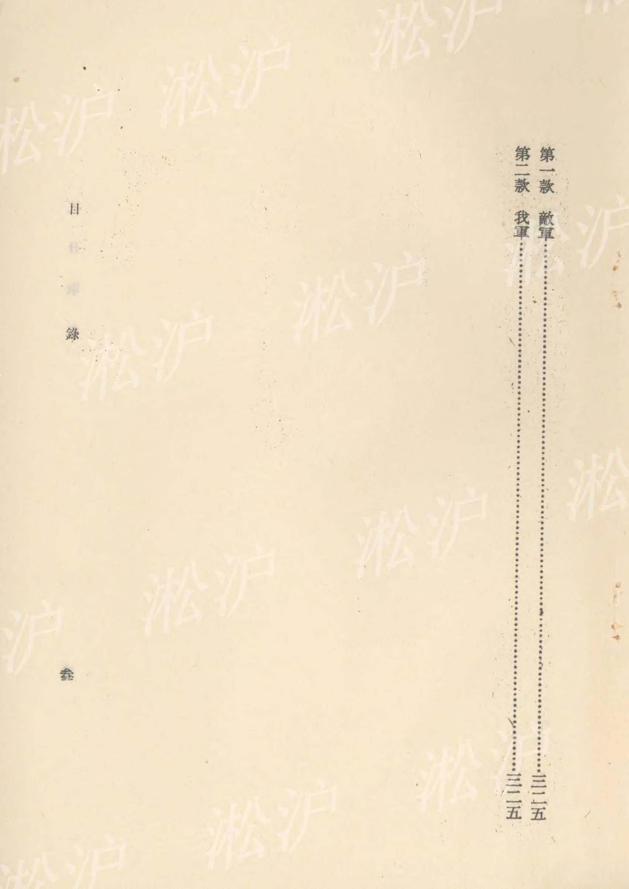

## 第三十一章 豫中會戰

概述

敵自民國三十三年一月起，先後由東北、華北抽調步兵八個師團，戰車一個師團，與僞軍等共約二十餘萬，以主力集結於開封、新鄉間，各以一部配置於晉南之垣曲、平陸，豫南之信陽，與皖西之壽縣等地區，並積極修築黃河鐵橋。

我判斷敵有打通平漢路企圖，乃策定「於嵩山地區與敵決戰」之指導方案，先依扶溝、汜水、陝州間河防阻敵進犯，而於密縣、汜水間爲守勢地區，葉縣、禹縣、密縣間爲攻勢地區，若敵渡河成功，則憑許昌、長葛、洧川、新鄭、鄭州、榮陽一帶據點，消耗其攻擊威力，爾後轉取攻勢以擊破之。

會戰自四月中旬開始，敵由中牟及黃河橋附近渡河進攻，迄下旬，陷鄭縣、新鄭、密縣、榮陽，續向許昌、虎牢關進攻，五月上旬，許昌失陷，同時信陽敵亦北進，雖經我第五戰區左集團阻擊，而平漢路終被敵打通，敵進而圍攻洛陽、垣曲之敵南渡黃河，夾擊洛陽、宜陽、新安地區之我軍，我軍大部逐逐次西移，以一部守備洛陽。與敵血戰兩週，並展開敵後游擊。迄六月下旬，敵先後陷洛寧、盧氏、靈京、閩鄉，而消耗甚大，兵力不足，終被迫後退於陝縣、洛寧、嵩縣之線與我對峙。

本會戰歷時兩月，敵挾其裝甲部隊，模仿閃擊戰，其鋒甚銳，陷我三十餘縣鎮，並打通平漢鐵路，但豫中平漢路已澈底破壞，修復需時，且鐵路兩側地區，我之強大游擊部隊，及有力空軍隨時予以襲擊，敵終未能有效利用。

### 第一節 會戰前狀況

(參照插

圖第一

#### 第一款 敵軍

(參照插

表第一

敵軍自中途島與瓜島海戰艦船損失過鉅，海洋交通日趨困窘，其在我國之長江水運，復受中美空軍之威脅，敵爲應付當前危局，乃與蘇俄密約互不侵犯，得抽調東北部隊入關，企圖打通大陸交通線，以補救海運之困難，遂於民國三十三年一月起擴建邙山頭據點，修理黃河鐵橋，及引黃入衛，並敷設小冀支線八條，至黃河北岸，積集糧秣，修信、確公路及信長、鐵路，擴展石家莊、安陽、新鄉、信陽等地之飛機場。自三月初旬以來，敵軍調動頻繁，積極集結兵力，並準備渡河器材，其打通平漢路打擊我野戰軍之企圖，已昭然若揭。茲將其兵力集結及移動情形分述如次：

一、豫北及豫東方面：

(一)原駐開封、新鄉一帶之敵第三十五師團，於三月他調後，遣防由獨立第四、第五兩旅團接替，獨立第四旅團，原駐原武、詹店、武陟一帶，獨立第五旅團駐開封、中牟一帶。

(二)第十二軍以第三十七師團及獨立混成第七旅團，於開始會戰前集結於開封及其北方附近，以第一一零師團，及第六十二師團，集結於黃河鐵橋北岸鐵路兩側地區，獨立步兵第九旅團集結於汲縣附近，第二十七師團集結於博愛、沁陽附近，戰車第三師團及獨立第二戰車聯隊集結於汲縣北之平、漢沿線，騎兵第四旅團於四月上旬，先後自商邱、柘城、淮陽、太康一帶，向開封、通許一帶集結，其搶修之黃河鐵橋，已於四月初竣工，並於河泛一帶，運儲渡河器材及補給品甚多。

(三)第一軍以步兵第五十九旅團，獨立混成第三旅團，歸第六十九師團長指揮，集結於垣曲、白浪渡附近。

四僞第二集團軍張嵐峯部，分駐豫東各縣，總司令部駐商邱，僞第二方面軍孫良誠部，分駐東明、考城、陳留、通許一帶，總司令部駐開封，僞第二十四集團軍龐炳勛部，駐冀豫邊區，僞第十一軍孫殿英部駐新鄉附近，以上僞軍，於四月十日前後各抽調一部，向開封、新鄉一帶集結。

二、豫南方面：

(一)原駐信陽附近各據點之敵，第三師團第三十四聯隊，共約二千餘名，於二月中旬，由武漢增來敵五、六千名，嗣又開回武漢，爾後則利用信、漢段鐵路，時來時往，增減無定，以爲眩惑。

(二)僞軍第十一師李寶蓮部，駐信陽、五里店一帶，第十二師張啓璜部，於三月中旬由漢口調至信陽、應山一帶。

三、皖北地區：

(一)敵第六十五師團太田米雄部，主力駐徐州、宿縣、蚌埠、田家庵附近，共集結敵六千餘，迄四月二十日，其一部三千餘駐守鳳台，先後竄抵壽縣。

(二)僞軍第四師，駐台肥，另一僞軍花其望部，駐懷遠西南常家墳、五岔路一帶，不時出擾。

綜上所述，進攻豫中之敵，大部係於三月底由晉、綏、魯、冀及由東北調來，已於四月上旬，其主力分別在小冀、朱仙鎮地區集結完畢。

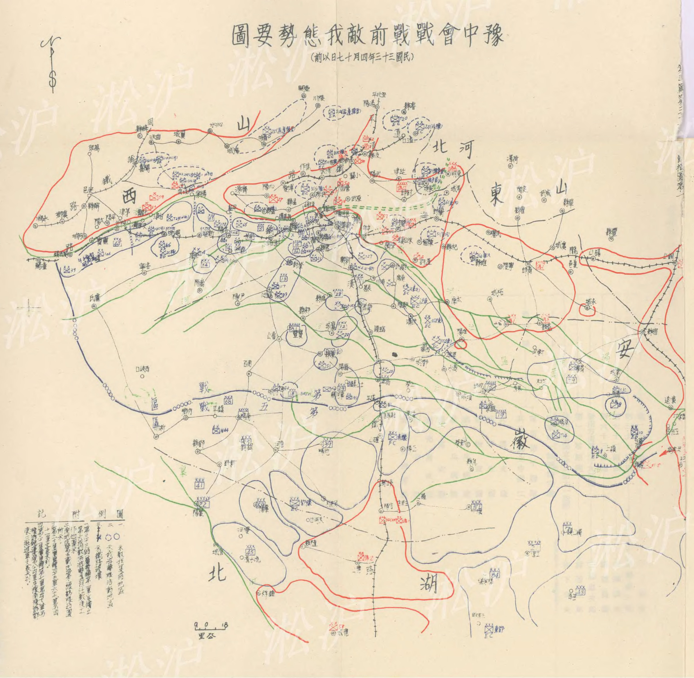

# 第四篇第三十一章第一節括表第一

第二十七師團

第三十七師團

第六十二師團

第六十三師團

晉南方面第六十九師團

第一一零師團

豫南方面獨立步兵第十一旅團

戰車第三師團

森澤光白（山路秀男）

淮河方面第六十五師團之一部

太田米雄

獨立步兵第九旅團

長嶺喜一

獨立混成第七旅團

多賀哲四郎

獨立混成第三旅團

小原一明

騎兵第四旅團

藤田茂

獨立山砲兵第十一聯隊

山砲兵第二十七聯隊

獨立砲兵第一大隊

獨立子

戰

回

兵

第

一

大

隊

竹下義晴

長野祐一郎

本鄉義夫

野副昌德

三浦忠次郎

林芳太郎

宮下文夫

獨立山砲兵第十一聯隊

山砲兵第二十七聯隊

獨立砲兵第一大隊

獨立子

戰

回

兵

第

一

藤田茂

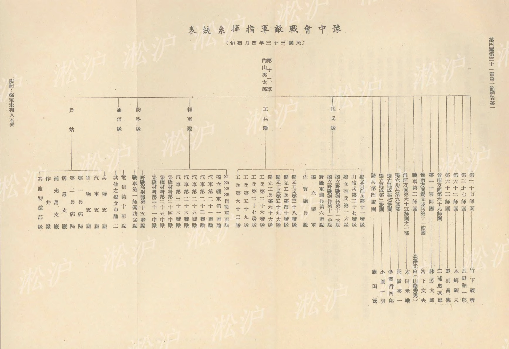

#### 第二款 我軍

(參照插表第

二第三第四

會戰前我第一戰區各兵團部署如左：

一、湯兵團：

(一)周家口及其以東汎防：

1. 第十九集團軍：

暫編第九軍之第一一一師、第一一二師、暫編第三十師，位於太和、渦陽間地區。第三十三師及獨立第六旅均散佈游擊區，擔任敵後游擊。

2. 第十五集團軍：

騎兵第二軍附暫編第十四師，位於阜陽附近。

騎兵第三軍，位於汝南附近。

騎兵第八師，位於蒙城南馬店附近。

(二)第二十八集團軍，守備畢口迄汜水河防：

1. 泛東挺進軍，含第五縱隊、第三縱隊、第二縱隊、暫編第二旅、暫編第三旅，擔任畢口迄柴橋泛防。

2. 暫編第十五軍之暫編第二十七師，擔任柴橋迄后陳泛防。

3. 第八十五軍之第一一零師附暫編第一旅，其主力擔任包河橋至邙山頭河防，一部在榮陽爲預備隊，預備第十一師任邙山頭、監圍迄牛口峪河防，第二十三師控置於密縣附近。

(三)控制部隊：

1. 第八十九軍之新編第一師，位於遂平，第二十師，位於郾城，暫編第十五軍之新編第二十九師，位於許昌附近。2. 第七十八軍之新編第四十二師之一部，位於新鄭，主力位於禹縣，新編第四十二師，位於方城，新編第四十四師在鎮平。3. 第二十九軍之第九十一師、第一九三師及暫編第十六師，位於舞陽以南地區。

4. 第十二軍之第二十二師，位於襄城，第八十一師，位於葉縣，暫編第五十五師，位於臨泉。5. 第十三軍之第八十九師、第一一七師，位於臨汝附近，第四師位於登封附近。

二、第四集團軍：

第九十六軍之新編第十四師，及挺進第四縱隊，擔任牛口峪迄馬義溝河防，第一七七師，任褚嶺迄金溝防務，第三十八軍之第十七師、新編第三十五師，任老飯溝、褚嶺陣地之守備。

三、第十四集團軍：

第十五軍之第六十四師、第六十五師，擔任馬義溝迄平莊河防。

四、第三十六集團軍：

第四十七軍之第一零四師、第一七八師擔任平莊迄楊家河防。

五、第三十九集團軍：

新編第八軍之暫編第二十九師，及河北民軍之一個支隊，及一個大隊，擔任楊家迄史家灘河防。

新編第六師、挺進第二十一縱隊，主力控置於滬池附近。

六、第四十軍：

第一零六師，配屬會閱區砲兵，擔任七里溝迄北村之防區，第三十九師，擔任北村迄閔底鎮河防。七、第十四軍（屬第三十六集團軍）：

第八十三師、第八十五師、第九十四師、在洛陽附近。

八、暫編第四軍（屬第十四集團軍）：

第四十七師、暫編第四師，在宜陽、龍門附近。

九、黃河北岸有力之各游擊部隊：

(一) 汎東挺進軍：第六縱隊在考城，獨立第一支隊在蘭封，獨立第三支隊在開封，獨立第四支隊在睢縣各附近。(二)冀、魯、豫邊區挺進軍：第二挺進縱隊及第一支隊在長垣附近。

(三)豫北挺進軍：第十三縱隊在武陟，第二十二縱隊在孟縣，第二十四縱隊在滑縣，獨立第八支隊及暫編第一支隊在獲嘉，第十一支隊在新鄉，暫編第二支隊在濬縣各附近。

四中條區：河北民軍一個支隊、兩個大隊及第二十一縱隊之一個支隊在垣曲附近，第二十六縱隊及獨立第十支隊在聞喜以東地區。

(五)晉、豫邊區：第二十五縱隊在陽城、壺關一帶，獨立第十二支隊在陵川附近。

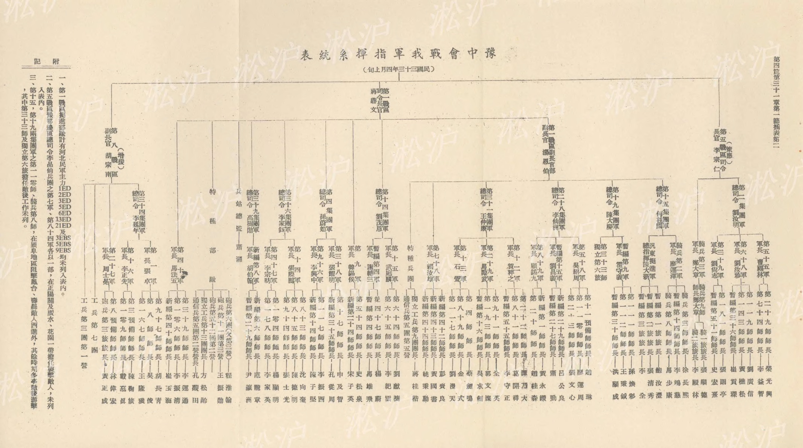

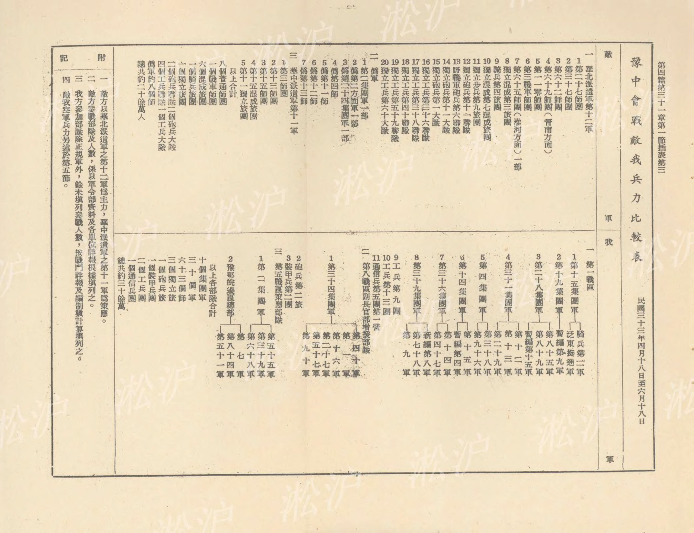

附

記　一

暫編第一旅於三月二十九日奉調鄭州擔任河防，歸第八十五軍指揮。　二

獨立第一挺進縱隊於五月十六日奉命歸第十二軍倪副軍長祖耀指揮。　三

四月二十一日成立第四挺進縱隊，以暫三旅第六團團長曹志生調升，團長缺由該旅副旅長吳翊邦調充。　四

四月二十三日成立獨立第七支隊，派吳化孚爲支隊長。五月二日成立獨立第五支隊，派張一農爲支隊長、於六月六日將該兩支隊擴編爲挺進十七及十五兩縱隊，以各支隊長升充。

五月二日成立挺進第八縱隊，以第四支隊長耿海瀾調升爲該縱隊司令。　六

第三縱隊之第八支隊及獨立第一支隊，於五月十四日擴編爲挺進第十三、第十四兩縱隊，以各該支隊長升充司令。七

四月二十七日成立挺進第九縱隊，派陳秀峯爲司令。五月二十八日成立挺進第十一縱隊，派高藍田爲司令。　八

獨立第一團原爲僞第二方面軍國防工兵隊第二團，被迫由豫東開來許昌修築飛機場，因不堪敵寇虐待，經我方派員策動，於五月十一日反正後收編。

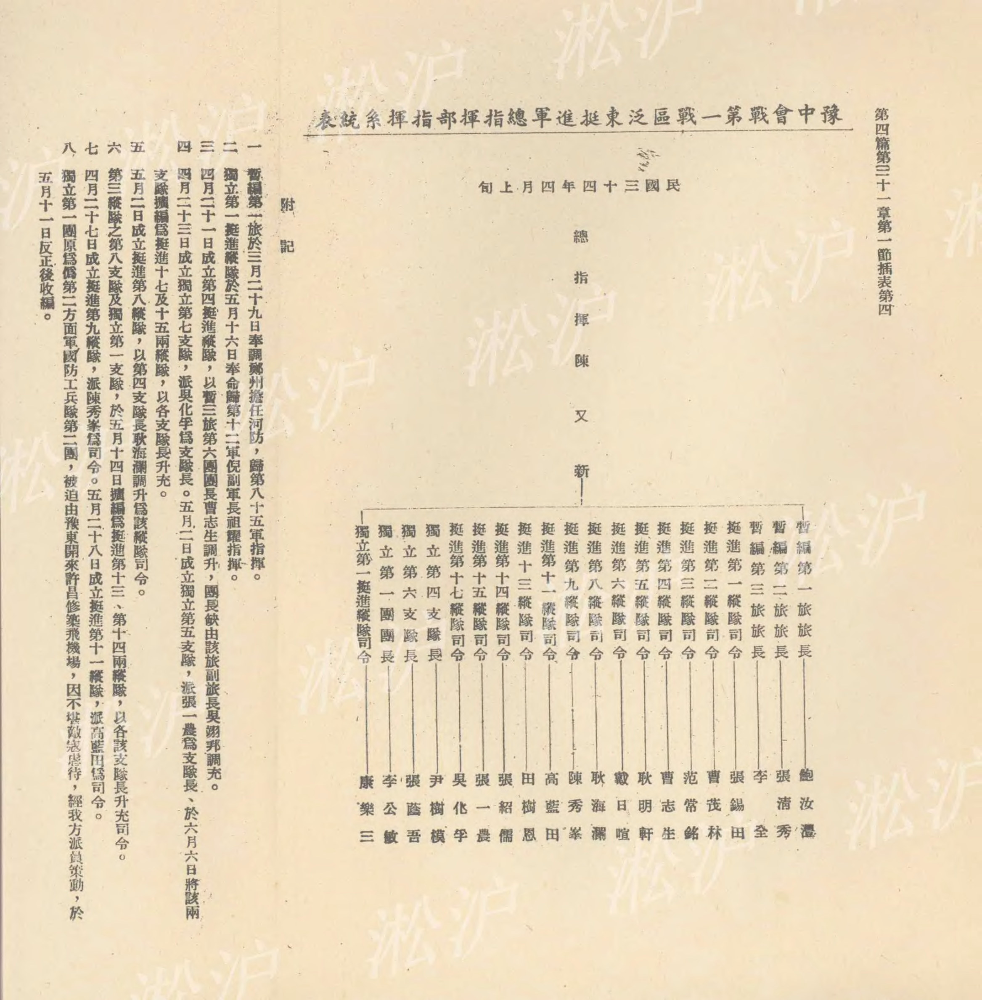

#### 第三款兵誌概要

參照插

圖第二

豫中位於江淮平原之西部，黃氾斜灌，河流交錯，而淮、穎間諸河上流水淺，障礙力不大，且水利未修，平漢路兩側概屬旱田，適於機械化部隊之運動及展開。淮南七縣，則爲邱陵水田地帶，其南境大別與桐柏山脈爲龐大地障，乃豫中我軍南面之依托。自民國二十七年十月，敵侵佔信陽，取得北進之據點，形成一大破綻。黃氾與黃河爲我軍東北面與敵對峙之鴻溝，自民國三十年十月，敵侵佔中牟及邙山頭橋頭堡，控制黃河橋，豫中我軍之地位，顯然不利。豫西羣山蟠結，地勢險峻，伏牛山、嶠山西接秦嶺，分由洛水南北，向東蜿蜒爲嵩山與邙山，至鞏縣復相連接，中夾洛陽盆地。洛陽關河四塞，形勢雄固，而公、鐵路四通八達，乃戰略之要地，自三十年六月，我軍退出中條山，敵進佔黃河北岸，逼迫肘腋，且後方運輸幹線——隴海路與洛、盧公路側面向敵，乃最大之缺憾。一般地勢，西高而東低，儼如建瓴，尤以豫陝邊區，關山險固，利於防守，爲陝西之屏障。

省內交通便利，一般道路，對馬騾車輛，到處可通；尤便於機械化部隊之使用。鐵路：有平漢、隴海兩路，縱橫省境，尤以平漢路與粵漢路，僅一江之隔，形成中國大陸之縱貫線，具戰略之要機。全省公路達三千餘公里，以開封、許昌、洛陽爲三大中心，遍通境內城邑，且通皖、鄂、秦諸省。水運以淮水最利航運，次爲衛河、唐河、白河、丹江，舟楫均可暢通；惟唐河兩岸多絕壁，在賒旗鎮下游，僅水漲時可以通航，與南陽下游之果河支流相似。黃河則流急少多，潼關、陝縣間，可通民船，陝縣以東，僅能以方舟東運，不能回航，黃汎區漲水時一片汪洋，河槽無定，水落時支汊紛歧，間可通行民船，邙山頭以西，黃河兩岸多斷崖，除少數渡口以外，渡河不易。

全省氣候爲大陸性，寒暑懸殊，北部冬令嚴寒，漸南則漸和煦，雨量則北部較少，南部較多，每年

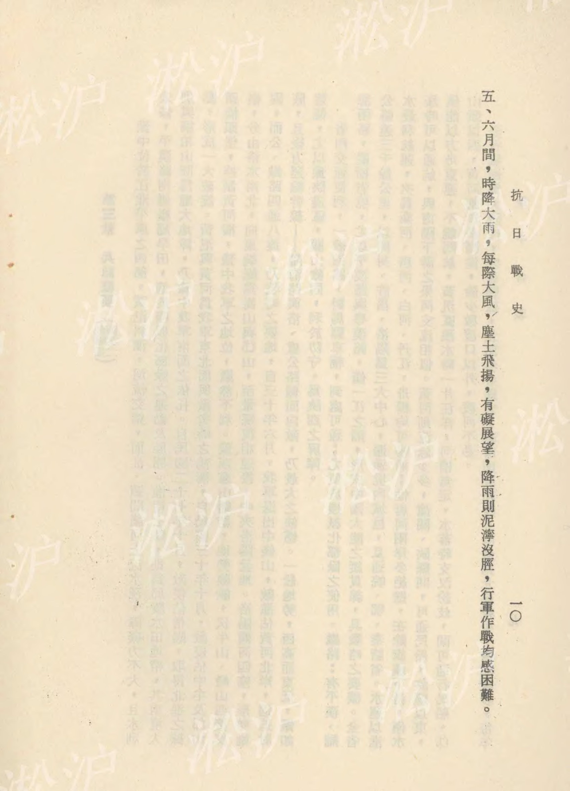

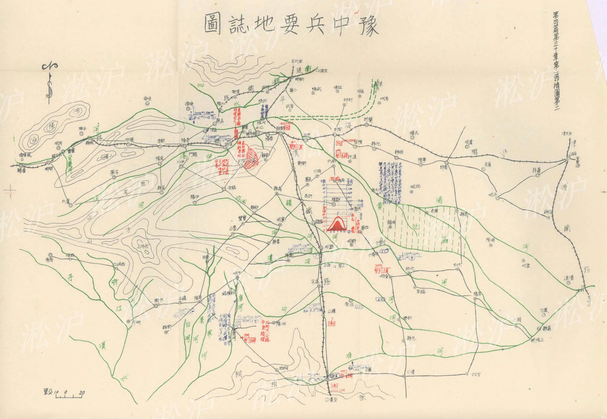

### 第二節 我軍會戰指導（圖第三）

第一戰區長官部，於三月四日，奉軍事委員會元字第二七八一號代電指示平漢路會戰指導如左：

第一方針

國軍以打破敵人打通平漢路之目的，擬以主力於密縣、禹縣以東地區，擊破由北南犯之敵；以一部先於遂平、泌陽以南，遲滯由南北犯之敵，再復轉用主力而擊破之。

第二

指導要領

一、以內線作戰要領，區分爲南、北兩地區作戰。

二、北地區於邙山頭外圍，極力消耗敵人，不得已時，依托嵩山，退守氾水、密縣，而留一師潛伏原地，襲敵後尾。

三、另以一軍固守許昌、禹縣爲據點，而以湯兵團主力（第十三軍、第十三軍、第二十九軍），祕匿於密縣、臨汝以西，適時出動，側擊敵人而殲滅之，並乘機收復邙山頭。

旋我長官部，復奉軍事委員會寅支令一元甲電：指示如左：

茲特策定，敵如以主力由豫南北犯，一部由北南犯，並由汎區策應企圖打擊我豫西野戰軍，或乘機打通平漢路時，我軍作戰指導方案如次：

一、以內線作戰要領，區分爲南、北兩地區作戰。

二、我軍預計使用作戰之總兵力，爲第一、第五兩戰區，現控制之機動兵團，共計二十六個師，及東陽、信陽、阜陽沿黃汎、邙山頭附近，原第一線守備兵力十七個師，合計四十三個師。

三、集結機動兵團主力十四個師，蔭蔽於臨汝、登封、禹縣、襄城、寶豐、葉縣地區，並特派有力之一部，確保北地區右翼支撐點之許昌，及左翼氾水連接嵩山東南麓密縣、登封之線，協同第一線部隊，以側擊包圍侵入嵩山南麓之敵而殲滅之，並乘機收復邙山頭。

四、使用機動兵團之一部七個師於南地區，在遂平、泌陽、棗陽一帶，先行持久抵抗；並另以一部固守遂平要點及確保桐柏山地，於擊破由豫北南犯之敵，乘機收復信陽。

五、汎區方面，應固守扶溝以南汎防，並指定一個集團軍總司令，統一指揮臨泉以西汎區，第一線部隊及敵後各挺進部隊，牽制當面之敵，並破壞敵後交通，其餘第一戰區河防部隊，及第五戰區第一線部隊，應各派有力一部，襲擊當面之敵，以資策應大別山李品仙集團，應以一個軍及桐柏山方面之劉尙志軍（第三十九軍，共五個師），以鑽隙行動向漢口挺進，協同第六、第九兩戰區策應部隊，乘機襲攻武漢。

六、如敵由南北兩方面及汎區深入豫西地區時，我應立即調整態勢，集結主力於臨汝、禹縣、襄城、葉縣、寶豐、方城一帶，側擊迎擊合圍敵人，與敵決戰，而包圍殲滅之，並繼向武漢追擊。

七、上述時機，我空軍須準備充分協助作戰，第二、三、六、九各戰區，應指派有力部隊，準備策應作戰。

第一戰區司令長官蔣鼎文，基於軍事委員會上項元字電及一元甲電之指示，策定於「嵩山附近與敵決戰」之作戰指導方案，並於三月十四日，以指導要領下達各部隊：

一、扶溝、氾水間河防部隊，應拒敵渡河。

一、如敵渡河成功，河防部隊應於許昌、長葛、洧川、新鄭、鄭縣、榮陽一帶據點遲滯並消耗敵人，湯一兵團及第四集團軍，應於密縣、登封北側山地迄氾水間，採取守勢，於襄城、葉縣、臨汝、登封、密縣、禹縣地區，採取攻勢。如敵向我守勢地區進攻，該地區部隊卽堅強抵抗，攻勢部隊卽向左旋迴，側擊敵人。如敵向我攻勢地區進攻，攻勢部隊卽與敵決戰，守勢部隊卽轉移攻勢，向右旋迴，側擊敵人。

三、湯兵團以第十二軍、第十三軍、第七十八軍、新編第一師、第二十師，配置於登封、臨汝、禹縣、襄城、寶豐、葉縣攻勢地帶，並抽集一個師固守許昌，臨泉附近部隊應向西移，參加平漢路以西作戰之準備。

四、第四集團軍除固守原河防外，應以一個軍固守老飯溝迄金溝主陣地；並以一部佔領鐵山、高山寨之前進陣地，並確保虎牢關據點。

第一戰區於三月十七日，復奉蔣委員長寅銑令一元手啓電：

關於平漢路豫西方面之作戰指導方案，茲再指示如左：

一、應令桐柏山方面之曹福林第五十五軍，準備於敵進犯時，向應山、套口方面深入敵後方。大別山方面李品仙集團軍，準備以一部向廣水、花園間挺進，佔領陣地，截斷敵後交通。並另派一部奇襲漢口。

二、許昌、遂平兩城，應各派兩個師之軍固守確保據點。其餘第十二、第十三、第二十九各軍由湯副長官直接控制，於戰鬥開始時，卽祕匿於密縣、臨汝以西地區機動使用。又禹縣、漯河、舞陽亦應各派一個師固守無失，以使我主力向該方面出擊容易，指定專守以上各要點之軍師長，除參照作戰教令第十七號規定，應構築多數小據點，以拱衛若干較大據點，形成據點羣防守外，應以必死之決心確保之，無令不得撤退。

三、禹縣、密縣、臨汝一帶地形多窪溝，應利用地形在窪溝內，擇要分派小部隊，構築窟洞式據點工事，以阻擊、伏擊等方法，抵抗敵軍，阻滯其前進。此事最應注意，須徹底實施。

四、邙山頭方面，無論敵對我陣地突破之程度如何，吳紹周第八十五軍須留一個師固守監圍陣地。斷敵渡河點，氾水陣地，尤應固守勿失，其餘均照前令要旨實施。

第一戰區旋又奉軍事委員會寅銑令一元甲電補充指示如左：

一、第七十八軍、第八十九軍應固守許昌、漯河、遂平、舞陽四個據點。

二、第十二、第十三、第二十九各軍，限三月底集結葉縣、寶豐、禹縣、登封、臨汝，仍由湯副長官直接指揮。

三、泛區預定向汝南附近前進之各部隊，希飭切實準備行動，並依狀況增強其兵力。

湯副長官遵奉委員長上述各電，及戰區作戰指導方案，即策定作戰指導如左：

一、敵如以主力由北南下，一部由南行牽制時，卽以象河關、遂平附近兵團，與第五戰區協力將敵拒止於洪河南北地區，主力於襄城、禹縣、許昌附近地區，與南下之敵決戰。

二、敵如以主力由南北上，一部對鄭州、新鄭、密縣一帶牽制時，卽以河防各軍，拒敵於扶溝、長葛、密縣以北地區，主力於澧河、沙河附近地區，與敵決戰。

三、敵如分由南、北同時向平漢路之沙河地區夾攻時，卽依漯河、許昌、舞陽、襄城、葉縣固守之，以主力由臨汝、登封、禹縣、密縣方面，向敵之右側背反攻，而於穎、汝、沙河地區擊破之。

四、如敵南、北兩方面均非主力，而行局部竄擾時，卽依當時情況，於各第一線守備地帶附近，將敵擊破之。

湯副長官於策定上述作戰指導之同時，令第八十九軍以第二十師固守漯河、郾城，新編第一師固守遂平，第十二軍第八十一師固守葉縣，均限三月二十一日前到達。另飭第十五、第十九兩集團軍，準備騎兵一師，步兵兩師，山砲一營，待命進出於汝南，參加平漢線作戰，限三月二十五日前準備完畢。

第一戰區長官部認爲湯兵團之作戰指導，與軍事委員會及戰區之指示均不符合，於三月三十一日核復如次：

一、如敵以主力由北南下，一部由南方牽制時，貴兵團應以主力在襄城、禹縣、許昌附近地區與敵決戰，惟爲期與第四集團軍密切協同，並利用嵩山山地有利地形起見，應將登封、密縣地區亦劃入決戰地區，期收夾擊側擊之效。

二、如敵以主力由南北對進，而一部竄擾鄭州、新鄭、密縣一帶牽制時，爲排除我主力側背之威脅，使爾後之決戰有利計，應先集中必要兵力，將北方渡河之敵擊退，並收復邙山頭、中牟，再轉兵南下，協力該地區之決戰。

第一戰區並依據於嵩山附近與敵決戰之作戰指導，積極行如左之準備：

一、作戰部隊彈藥器材之補充，及糧秣之集積。

二、派道路破壞技術班，歸湯兵團指揮，並發動民衆對預想戰場主決戰方面道路之破壞，免爲敵利用及地形改造，以阻塞敵之前進。

三、調整兵站設施，整理交通及通信。

四、令地方機關作動員民衆參戰準備。

五、飭各機關及部隊，嚴防空降部隊及敵奸之活動。

六、疏散洛陽各機關學校及民衆。

七、令第四十軍接替第二十九軍靈寶、陝州一帶河防，第二十九軍向葉縣前進，歸湯副長官指揮。八、加緊對華北各僞軍策反工作，嚴密保持聯繫，並指示必要時之行動。

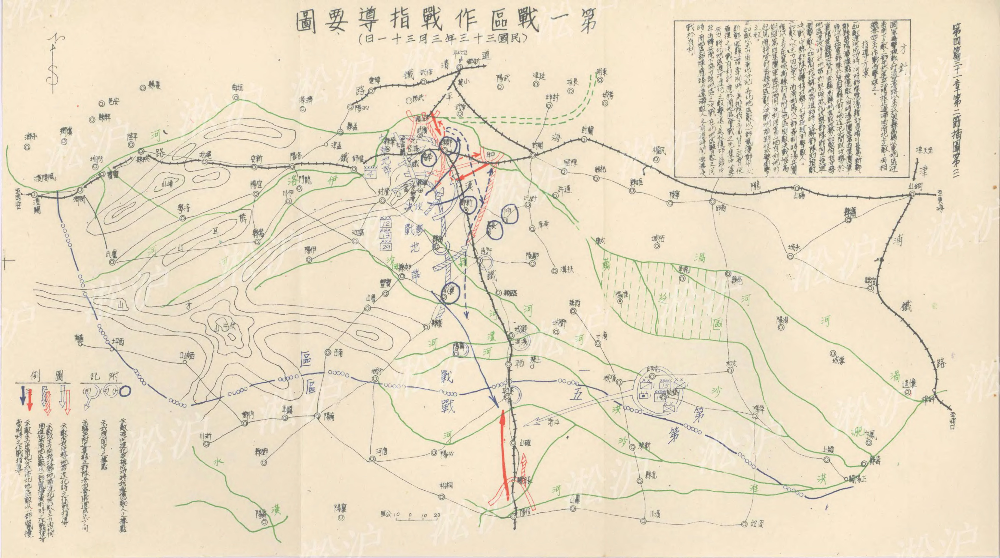

### 第三節 會戰一般經過

民國三十三年四月十七日至六月十七日

參照插圖第四至第五

#### 第一款 黃汎及登封氾水主陣地之戰鬪

民國三十三年四月十七日至三十日

參照插圖第四第五

中牟之敵二千餘，砲數門，於四月十七日二十時，向我暫編第十五軍之暫編第二十七師攻擊未逞，十八日拂曉，敵增至三千，在砲二十餘門、飛機兩架支援下，復猛攻暫編第二十七師陣地，其主力趨界馬，一部續攻劉伸莊，經八小時戰鬥後，陣地終被敵突破，逐次向姚家、念爐、臺前及坡劉之線轉移，敵續突進。此時其侵佔界馬之敵，繼向汎東挺進軍之柴橋陣地竄擾。十三時，第二十八集團軍李仙洲總司令，基於當前狀況，乃令汎東挺進軍之暫編第二旅派兵一團，及兼鄭州警備之第一一零師派暫編第一旅之兩營，分途攻擊敵之側背，暫編第二十七師固守現陣地待援，暫編第十五軍劉昌義軍長，率軍直屬部隊及新編第二十九師第八十六團，協同暫編第二十七師，迎擊突進之敵，新編第四十二師鞏固新鄭防務，並側擊由中牟方面向鄭州進攻之敵，汎東挺進軍襲擊敵之側背，截斷沿汎各渡口，並派孫元良副總司令赴新鄭督戰。暫編第十五軍劉昌義軍長奉命後，當率所部於當晚十二時，協同暫編第二十七師反攻，戰至十九日拂曉，克復據點多處，至十七時，與敵相持於姚家、念爐附近。

邙山頭之敵，於十九日拂曉，以步、騎約兩千餘，在飛機十二架及砲數十門掩護下，向我第八十五軍第十一預備師陣地進攻，經該師堅強抵抗，敵以飛機狂炸，且施放毒氣，該師傷亡慘重，至九時，漢王城失陷，敵續向該師全面總攻被擊退，另敵裝甲車及戰車二、三十輛，騎兵一部進攻，亦未逞。

此際李仙洲總司令，判斷敵之攻擊重點，似指向第八十五軍方面，爲期在黃汎右岸徹底打擊敵人，當作如左之處置：

一、令暫編第十五軍劉昌義軍長所部，竭力阻擊由中牟方面西攻之敵，以確保鄭州、新鄭之安全。

二、鞏固鄭州、新鄭、許昌、禹縣、密縣防務。

三、令汎東挺進軍在敵後發動攻勢，以牽制敵人。

四月二十日拂曉，由中牟方面突進步、騎、砲聯合之敵計約五六千人，依空軍戰車之支援，進攻鄭州，與我第一一零師激戰，此時暫編第十五軍已陷重圍，雖經汎東挺進軍向敵側擊，終未奏效，同時侵佔漢王城之敵，在砲、空掩護下，復向第八十五軍陣地猛攻，戰鬥迄晚，敵我相持，另敵一部與其後續部隊，則分路向榮陽、汜水進攻，我各據點守軍，連絡斷絕，分別各自苦戰，十七時，湯恩伯副長官鑒於當時狀況，卽電令各部調整部署如左：

一、第三十一集團軍王仲廉總司令駐臨汝，指揮第八十五軍（附暫編第一旅，欠第二十三師），任邙山外圍鄭州、須水鎮、榮陽之守備，竭力拒止敵人，必要時轉移於塔山、崔廟、萬山地區，如敵向南續進，應予側擊尾擊。第十三軍以主力鞏固禹縣、密縣、登封之旣設陣地，第二十三師暫歸第十三軍石覺軍長指揮，第一一七師仍駐臨汝。

二、第二十八集團軍孫元良副總司令駐許昌，指揮暫編第十五軍及汎東挺進軍。暫十五軍劉昌義軍長，指揮暫編第二十七師及新編第四十二師，與中牟之敵保持接觸，並予阻擊，新編第二十九師任許昌守備，汎東挺進軍擔任汎防，並在敵後發動攻擊，牽制敵人。

三、第二十九軍（欠第一九三師）集結舞陽附近，整備待命。俟第四十軍接替靈、陝間河防後，改歸第三十一集團軍序列，於策應許昌作戰時，指揮新編第四十二師，並歸第二十八集團軍指揮。

四、第七十八軍賴汝雄軍長，率新編第四十三師，並指揮第一九三師，限二十一日前到達襄城待命。

五、第十二軍第八十一師，任葉縣守備。第二十二師以主力任襄城，以一團任寶豐，以一營任郊縣之守

備，限二十一日前部署完畢。

六、騎兵第三師，限二十二日前開往汝南附近，對信陽方面嚴密警戒。

十九時，湯恩伯副長官，復決心以有利之態勢，對由中牟及邙山頭兩方面之敵，於許昌、襄陽、禹縣、密縣間地區予以殲滅，當電令重新部署如左：

一、南兵團以李仙洲總司令爲指揮官，指揮第十二軍、第二十九軍，及孫元良副總司令所指揮之暫編十五軍、汎東挺進軍，及新編第四十二師等部隊，除以一部鞏固許昌、舞陽、襄城、葉縣、郊縣、寶豐、新鄭及各據點外，主力應機動側擊西進之敵。

二、北兵團以王仲廉總司令爲指揮官，在登封指揮第十三軍及第八十五軍，固守密縣、禹縣、臨汝、登封間陣地各據點，迎擊西進之敵。

三、兩兵團之戰鬥地境，爲傅莊、瓦屋街、大營、摩塚營、東安樂店、禹縣東南之十里堡、黃山溝、新鄭西之東土橋、郭店、鄭州東之五里堡亘楊橋之線，線上屬北兵團。

第二十八集團軍對黃汎間之河防，係採間接配備，以必要兵力監視中牟、邙山頭方面之敵，及扼守各渡口，機動部隊則分別控置汎南各要點，準備擊敵於半渡。惟敵已在中牟、邙山頭建立堅固橋頭堡；且中牟、鄭州、新鄭間地勢平坦，利於敵裝甲部隊之突擊，而對我作戰不利，此爲作戰初期指導困難之處。

四月二十一日，中牟之敵，以一部牽制我暫編第十五軍主力，附僞軍及便衣隊暨少數摩托化部隊向南突進，其一部經韓佐鎮，擊退我新編第四十二師，佔領新鄭，該師乃退守石固鎮。另一部約二千餘人，經郭店竄曲梁、觀音堂，與我第二十三師發生戰鬥，嗣敵繼續增加，九時許陷雲夢山，第二十三師乃轉移超化集、七里岡、張古山陣地。蘆館對岸之敵五六百人，於昨二十日渡河後，與中牟方面之敵攻尉氏，於二十一日十一時攻佔，攻鄭州之敵被擊退。榮陽之敵向塔山、崔廟第八十五軍主力猛攻，亦未得逞。

四月二十二日，陷尉氏之敵，分竄朱曲鎮、洧川、南席等地，與我汎東挺進軍激戰後，攻佔各該地。此際第八十五軍之第二十三師，仍在密縣東之七里岡一帶阻敵西進，該軍主力亦在崔廟、塔山一帶與敵激戰。守備鄭州之暫編第一旅第二團經敵激戰竟日，入夜，該團轉入城內，圍攻虎牢關之敵，同日拂曉，藉飛機戰車之掩護，攻擊頗烈，戰至十六時，我工事全毀，第九十六軍新編第十四師之一部，乃縮小區域，集中兵力以鞏固陣地。

洛陽東北鐵謝對岸之敵萬餘人，連日來亦異常活動，爲監視敵軍行動，我第四十七師經已奉命進駐鐵謝南三十里舖附近，歸第十四集團軍劉茂恩總司令指揮，嗣以該敵已漸東移，判斷將經由黃河鐵橋南犯，蔣鼎文司令長官乃令第四集團軍挺進第四縱隊，將石板溝以西河防交第四十七師之一團接替，第四集團軍河防正面，卽向右縮短，節約新編第十四師之兵力，使用於重點方面，令第三支隊李忠應部卽開洛陽附近，歸第十四集團軍劉茂恩總司令指揮。

四月二十三日，南兵團遵照湯恩伯副長官電話指示，令第二十九軍馬勵武軍長，率該軍以密縣爲目標，向敵側背攻擊，並限當晚向禹縣以北進出，此時該軍正遵前令，將暫編第十六師接替第八十九師禹縣防務，其主力則由馬軍長率領，抵穎橋以北附近，至是乃停止待命，並指揮新編第四十二師彭賚良部準備策應許昌方面之作戰，同日汎東挺進軍在馬坑集。關大頭迄五女店之線與敵激戰，竄陷新鄭之敵續陷長葛，並進迫和尙橋與我暫編第十五軍激戰，午夜後，該軍被迫分路突圍，向石泉店、石固鎮轉進。密縣外圍之敵一再增援，猛撲城關，戰至九時，我守軍第八十五軍之第二十三師實施突圍，向城南平陌附近集結，軍主力則遵指示由崔廟向景店、馬鳴寺地區轉進。固守鄭州之暫編第一旅是日拂曉奉令突圍，並在曹窪附近集結，敵遂進陷鄭州，並跟蹤追擊，我軍乃續向秋樹嶺、東塔山附近轉進。進犯虎牢關敵，拂曉時企圖迂迴攻擊，勢甚兇猛，旋被我軍擊退。竄據塔山、劉河之敵，此際亦曾犯我馬駒嶺，入暮後，我第三十八軍之一部轉敵後襲擊。

四月二十四日晨，陷密縣之敵，與我第十三軍、第八十五軍於盧店附近地區激戰竟日，入夜仍相持於盧店以東地區，此時由密縣突圍第二十三師之一部，已陸續抵第八十五軍軍部附近，由鄭州轉進之暫編第一旅，亦全部抵達秋樹嶺地區。虎牢關當面敵，與我第九十六軍激戰，我第一戰區長官司令部，此時鑒於鄭州、密縣等方面戰況不利，爲集結第二線兵團參加作戰，當作如次之處置：

一、令新編第六師在滬池附近集結。

二、令第一零六師在靈、陝間集結。

三、令第五十四師進駐登封西北府店鎮附近。

四、令冀察獨立步兵團，開洛陽附近，歸暫編第四軍謝輔三軍長指揮。

四月二十五日，由新鄭南侵之敵，在許昌西北朱元馬、宮後李迄岡胡之線，與我暫編第十五軍對戰中。此時由密縣西侵之敵主力，與我第十三軍激戰於登封東側地區，經第八十五軍協同夾擊，敵不支向密縣回竄，第十三軍當克馬鳴寺。暫編第一旅奉第八十五軍吳紹周軍長令，轉入敵後游擊，堅守虎牢關已達六晝夜之第九十六軍之一部，因三面受敵，至同日十八時，十里舖復陷敵手，二十四時，守軍以遲滯消耗敵人之目的已達，乃轉移至鞏縣東側主陣地，此際我左翼汎東挺進軍第四縱隊，則克復尉氏。

定日湯恩伯副長官獲悉攻登封敵，經我第十三軍、第八十五軍協同夾擊後，傷亡頗重，判斷汎右之敵，有全部退却可能，乃於二十一時電南、北兩兵團部署反攻，其要旨如左：

一、南兵團除以一部守漯河、襄、禹外，主力卽向當面之敵攻擊，第一攻擊目標爲新鄭、密縣（不含）之線，第二攻擊目標爲中牟、鄭州（含）之線。

二、北兵團卽以全力向登封以東地區之敵攻擊，第一攻擊目標爲密縣、（含）崔廟之線，第二攻擊目標爲鄭州、（不含）邙山之線。

第一戰區長官部對上項部署，認爲攻擊目標遠在敵後，時間不免延遲，當卽指示：「應以第二十九軍全部及第十三軍兩師，先行擊滅密縣之敵」；同時並飭第四集團軍作出擊準備，第九軍進駐府店鎮，準備接防登封，第一零六師（兩團）卽開宜陽附近，新編第六師開洛陽附近，爲第二線兵團，新編第二十四師卽開白沙附近。

四月二十六日，汜水、密縣方面敵已逐次南移，並調原駐綏遠之戰車第三師團，及獨立戰車第二聯隊業已參戰，進抵許昌外圍石象鎮、五女店、和尙橋、石固鎮等地之敵六、七千人，依空軍之協力，向許昌城郊各據點猛攻，暫編第十五軍令新編第二十九師及新編第四十二師，各派一團襲攻和尙橋，暫編第二十七師及新編第四十二師，各派一營向新鄭以北繞襲，盡力破壞敵之交通通信。

同日攻擊大隗鎮之第二十九軍暫編第十六師，改歸第十三軍指揮，汎東挺進軍克南席、石象鎮等據點並圍攻洧川，而尉氏復陷敵手。犯登封東側陣地之敵，被我第十三軍一部及第八十五軍圍於唐莊、月臺地區，第十三軍主力向密鄉潰退之敵追擊，暫編第十六師亦於擊破敵之警戒陣地後，越大隗鎮向密縣挺進。

湯恩伯副長官二十一時基於當時狀況，及奉蔣委員長指示，當作如左之處置：

一、軍遵照蔣委員長指示，先殲滅密縣之敵。

二、着第十三軍將登封陣地交第八十五軍接防後，卽向密縣之敵攻擊。

三、暫編第十六師抵密縣後，着歸第十三軍石覺軍長統一指揮。

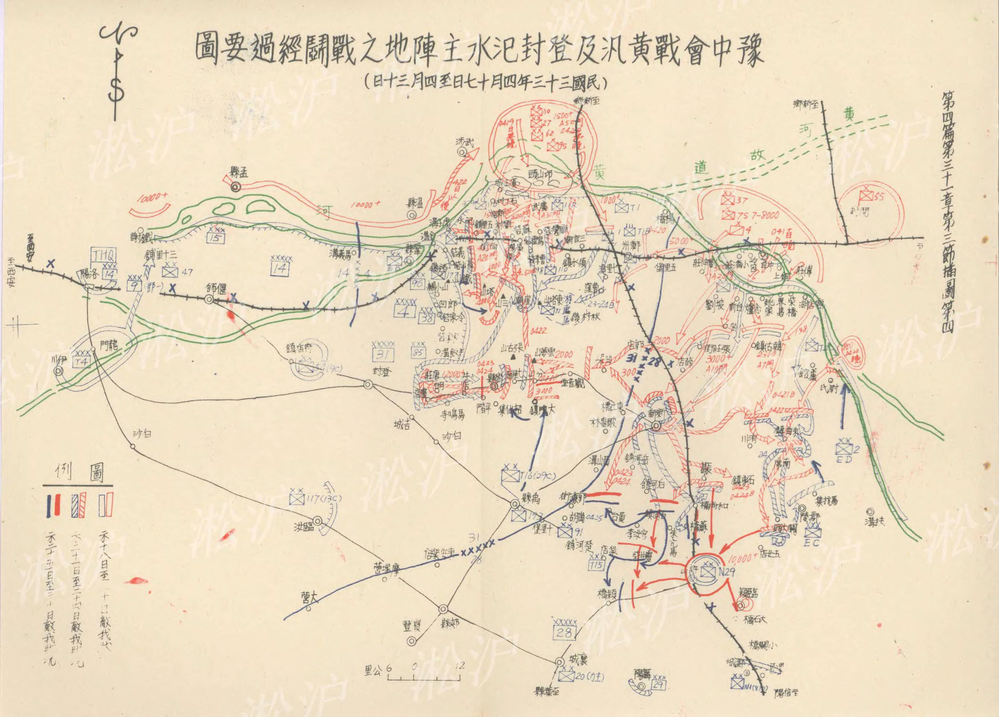

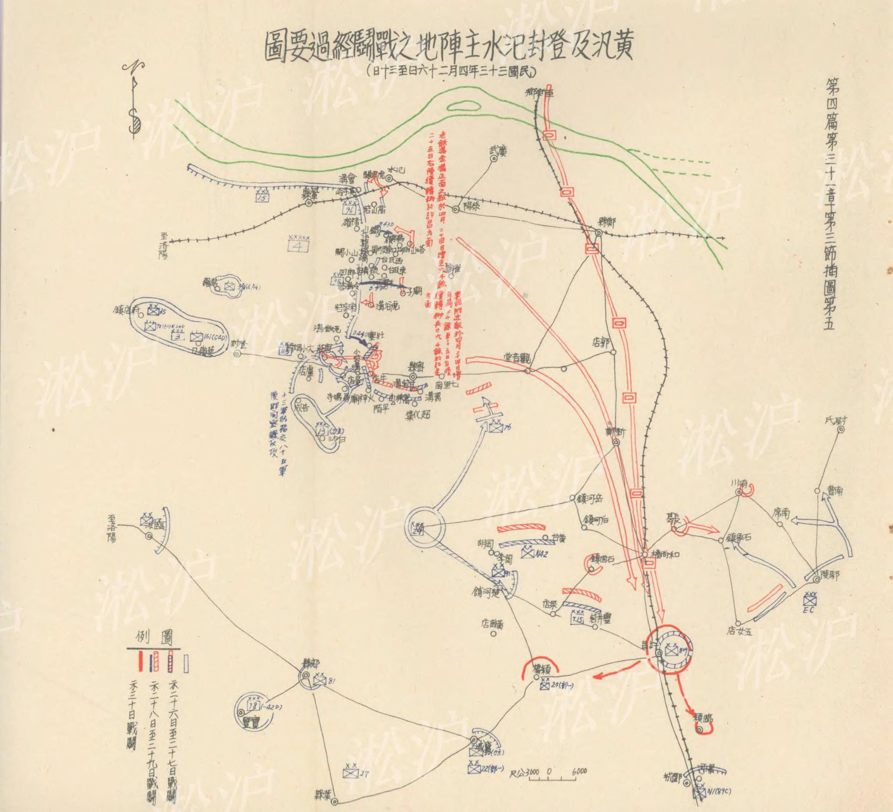

四月二十七日，各部隊遵照右令行動，此際由第八戰區增援之第九軍逐次到達，戰區司令長官部當令該軍進駐洛陽西側谷水鎮附近，旋第十三軍第八十九師進抵密縣城附近，與七里岡之敵激戰。

四月二十八日，芮城方面之敵，頗形活躍，第一戰區司令長官部當令冀察獨立步兵團赴交口，歸第四十軍馬法五軍長指揮，令湯兵團除遵蔣委員長指示要旨：「在各要點配置守兵，集結主力於登封、禹縣、臨汝間地區，如敵西犯時，應卽向敵右側背轉移攻勢部署外，並以現態勢攻擊密縣之敵」，湯恩伯副長官奉令後，於當日十一時調整部署如次：

一、第十三軍（欠第一一七師）附暫編第十六師，於攻佔密縣外圍敵警戒陣地後，卽向密縣敵軍主力攻擊並佔領之。

二、新編第四十二師卽向和尙橋、新鄭之敵襲擊，相機襲取新鄭，策應第十三軍對密縣之攻擊。

三、第二十九軍仍在禹縣集結待命，並應派小部隊以連爲單位，分路搜索新鄭、密縣方面敵情。

此時許昌外圍之敵，雖迭經我各部隊先後反擊，其後續部隊仍由新鄭南進，其先頭已進抵黃臺、岡李、岡胡附近（圖第五），與新編第四十二師激戰，此際暫編第二十七師已奉令至葉縣整補，暫編第十五軍及新編第四十二師，在靈井砦、石固鎮以南地區與敵相持，第十二軍賀粹之軍長以第八十一師守備郊縣，自率暫編第五十五師駐寶豐，第二十二師主力守葉縣，另一團守襄城，第二十師開襄城以主力任首山、令武山之守備，以一團推進穎橋，第十三軍及新編第十六師，已擊破超化集、嵩林山、趙嶺、火神廟、小寨溝、北寨等處敵警戒陣地，完成西南之包圍態勢，續向密縣進攻，同日我空軍轟炸黃河鐵橋，並掃射虎牢關附近之敵。

四月二十九日，許昌外圍之敵已增至萬餘，另戰車百五十餘輛繼續猛攻，我軍外圍陣地多被突破，新編第二十九師乃退守城廂，暫編第十五軍在靈井砦、泉店之線與敵激戰，汎東挺進軍克南席，密縣以西第十三軍之第八十九師，曾一度衝入牛店，暫編第十六師及第四師攻佔密縣外圍據點多處，第三十八軍攻佔廟子、馬駒嶺等據點。

四月三十日，敵圍攻許昌，並攻擊靈井岩、穎橋、禹縣、五女店等地，暫編第十五軍劉昌義軍長，率新編第四十二師及第二十師之第五十八團，阻擊於許昌、靈井岩、穎橋等處，戰況至爲激烈，此時敵以飛機狂炸許昌，我新編第二十九師以電臺被毀，通信中斷，迄夜仍在激戰中。十五時，李仙洲總司令鑒於穎橋地區狀況緊急，令第二十師趙桂森師長，率該師主力迅由襄城向穎橋東南前進夾擊，預期聚殲進攻穎橋之敵後，卽向東側擊許昌外圍敵人，旋以該師集結動作遲緩，致失戰機，此時密縣之敵，仍爲我第十三軍包圍中。第三十八軍攻擊塔山各部隊，亦未奏效，第一戰區蔣鼎文司令長官奉蔣委員長電令，當轉令如左：

一、湯恩伯兵團對進攻許昌之敵，應予以嚴重打擊，對密縣之敵暫行監視，陽動牽制。

二、孫蔚如集團軍，應卽加強出擊兵力，對當面之敵攻擊。

同日綜合情況，黃河沿岸仍有敵後續部隊繼續南下，且發現大部機械化部隊，而敵之第一線兵團對汜水、登封、禹縣、郟縣、襄城之壓力有加無已，其欲先殲滅國軍豫中之主力，西犯洛陽之企圖至爲顯明，皖北壽縣、鳳台之敵，自四月二十四日拂曉，以步、砲兵三百餘沿淮河西進，二十五日，敵增步騎兵千餘，附砲四門，分四路攻楊湖鎮，至二十六日，復增二千餘，並有飛機一架及汽輪四艘繼續侵入，二十七日十四時，陷我穎上城，迄三十日，與我第十五集團軍之一部，相持於城郊十里舖附近地區。

#### 第二款臨汝、登封、汜水及洛陽外圍一帶之戰鬪

民國二十三年五月一日至九日

參照插圖第六至第十及角圖

湯恩伯副長官，於奉到蔣委員長四月三十日電令後，當擬於禹縣附近集中有力部隊予敵打擊，該戰區司令長官部當將此意轉報軍事委員會，嗣於五月一日午，奉蔣委員長電示如左：

一、同意在禹縣附近與敵決戰之意見。

二、禹縣應以一個軍死守。

三、守許昌之師，應盡力支持，以牽制敵人。

四、湯兵團除監視密縣之敵外，應集中全力（第十二軍、第十三軍、第二十九軍、第八十五軍，暫編第十五軍、第七十八軍等），使用於禹縣附近，與敵決戰。

湯恩伯副長官奉電後，當請調第十三軍，其所遺登封、臨汝防務，應另派部隊接替，戰區長官部即於是日令暫編第四軍之第四十七師卽赴臨汝附近，暫編第四師至鳴皋、伊川、龍門各附近，第九軍全部至登封附近，接替第八十五軍防務，旋湯恩伯副長官遵照蔣委員長指示，作如左之部署：

一、南兵團指揮官李仙洲。

(一)第十二軍賀粹之軍長，指揮暫編第五十五師、第八十一師集結郊縣、寶豐地區。

(二)第七十八軍賴汝雄軍長，指揮第二十二師、新編第四十三師，限五月二日拂曉前推進襄城。(三)第八十九軍顧錫九軍長，指揮新編第一師、騎兵第三師，集結漯河、郾城。

四第二十師仍在穎橋，拒止進攻之敵。

二、北兵團指揮官王仲廉。

(一)第十三軍以一團守臨汝，並以一部繼續監視密縣之敵，主力集結白沙、告城間地區。

(二)第八十五軍於五月五日前，將登封、臨汝陣地之守備任務交第九軍接替後，卽集結於登封。

三、兩兵團戰鬥地境：爲十里鋪（臨汝東）、趙莊、張樓、黃岡店、馬莊、許昌之線，線上屬北兵團。

四、第二十九軍固守禹縣，新編第二十九師固守許昌。

圍攻許昌之敵，自四月三十日迫近城郊後，經一晝夜之戰鬥，至五月一日晨，並以飛機十餘架及戰車十餘輛，協力衝入許昌南關，我守城部隊新編第二十九師以工事泰半被燬，乃逐次向葉縣方面轉移，許昌遂陷敵手，此時進攻穎橋鎮敵，亦續增千餘，以猛烈砲火支援，向我第二十師猛攻，十三時，我陣地被敵突破，同時敵騎兵由南門衝入，當嚴令第二十師在該鎮以南及東南地區拒敵南進，另令第二十九軍馬勵武軍長，派第九十一師全英師長率兩個團由楚河鋪南下，協力第二十師反攻，旋以靈井砦之敵襲攻第九十一師側背，該師乃撤至黃岡店與敵對戰。

同（一）日暫編第十五軍劉昌義軍長，奉令進駐汝墳橋，指揮暫編第二十七師、新編第四十二師，及工墾總隊與工兵第九團等部，擔任葉縣警備。襄城第七十八軍賴汝雄軍長，統一指揮第二十師、第二十二師及新編第四十三師等部隊，而該軍之新編第四十四師，則仍擔任舞陽守備。此際岳和鋪、祁王店之敵，約三千人附砲數門與我第一九三師激戰於禹縣東北無量廟、蜘蛛山之線，密縣方面之敵五六千人，仍被我第十三軍之一部嚴密監視中，由榮陽向塔山前進之敵，其輜重部隊百餘（參照插圖），在柳樹溝被我第十七師之一連襲擊，獲軍用品甚多，第一七七師及新編第十四師，爲策應柳樹溝方面之作戰，入暮後各以一營分別攻擊水砦、長岡店，激戰數小時，形成對峙狀態。

平漢鐵路南段：臨穎之敵乘機南進，信陽、長台關一帶敵亦時有移動，湯恩伯副長官於一日以卯卅主電令第十五集團軍何柱國總司令：「着以第十五集團軍副總司令徐梁進駐周家口，指揮第八十九軍、騎兵第三師及倪耀祖部，迎擊進攻郾城、漯河之敵（參照插圖），何總司令遵飭徐副總司令卽日由沈邱出發，翌日抵周家口附近，斯時第八十九軍顧錫九軍長，指揮新編第一師，已在郾城、漯河一帶佈防就緒，騎兵第三師（欠第七團），亦推進小商橋附近戒備。

自四月中旬、中牟方面之敵開始南進以來，第五戰區司令長官部，爲策應該方面友軍之作戰，於四月二十日，電飭第二集團軍劉汝明總司令其要旨如左（以下參照）

一、爲掩護第一戰區側背安全，準備打擊豫南敵之進攻，第一線部隊應依既設陣地，以全力拒止敵之突進，各挺進軍應於任何情況下求敵側背而攻擊之。

二、第二線部隊，應卽完成戰備，第五十五軍應暫集結唐河、源潭附近，準備進出泌陽南北之線，側擊北進之敵。

四月二十五日，第五戰區奉到蔣委員長二十四日電：「協同友軍鞏固宛城、洛陽、及平漢沿線，並置重點於左翼，在豫南地區擊破敵之進攻之指示，當再指示劉汝明總司令如次：

一、該集團軍，應卽以第五十五軍挺進泌陽附近，並以一師接遂平防務，第六十八軍，除以第一四三師固守南陽外，主力控制南陽附近，爲該集團軍預備隊。

二、各第一線部隊，應迅速加強既設陣地工事，準備以全力拒止敵之突進，並切實偵察當面敵情。

劉總司令遵照指示，卽轉飭第五十五軍向指定地點兼程急進。

五月二日晨

第六角圖

，許昌以西穎橋之敵，增至步騎兵七、八千，砲二十餘門，汽車二百餘輛，戰車二十五輛，續向第二十師所扼守之十里舖（襄城東）以北各據點猛攻，該地區地勢平坦，工事簡單，各據點先後被敵裝甲部隊突破，乃逐次向茨溝方面轉移，敵以主力向襄城前進，一部計汽車三百餘輛，裝甲車六十餘輛進攻郯縣，與第八十一師在洪店、八里營、四里營一帶對戰，是日第六十八軍劉汝珍軍長奉令改赴舞陽，指揮新編第四十四師及別光漢縱隊，第七十八軍賴汝雄軍長抵襄城附近，當以第二十二師固守襄城，並構築首山、令武山工事。

靈井寨石固鎮之敵，各增四、五千，砲十餘門，戰車十餘輛，與無量廟、蜘蛛山之敵二千餘，砲五六門，分向楚河舖、郭濂舖、前山連等處進攻，另穎橋敵騎兵七、八百，向黃榆店方向北進，各路敵與第一九三師激戰終日，雙方傷亡均重，迄晚仍在原地激戰中。

崔廟之敵千餘，經廟子向楊樹溝及一零六四一高地陣地進攻（參照插圖），與新編第三十五師激戰，敵旋由八方嶺、廟子調千餘人前來猛撲，一零六四一高地及冷溝砦陣地先後被陷，第一七七師擊退水砦、長岡店之敵後，卽據守張莊、高山砦附近之線，十里舖之敵，進攻廖子峪，亦被新編第十四師守軍擊退。信陽、長台關各兵種聯合之敵二千餘（參照插圖第七），五月二日晨，第五十六師陣地進攻，突破大聖莊陣地後，進出于明港及夏灣、新集之線，另一路八百餘，經淮河店渡河進攻確山，我守城之地方團隊，因戰力較弱，遂告失陷。

敵於二日擊破我第二十師後（參照插圖第六），主力向襄城前進，三日在飛機戰車支援下，突破首山、令武山陣地，第二十二師奉令以一部在襄城附近遲滯敵軍前進，主力向大營、北渡間轉移，進攻郟縣之敵，於二日午後陷該縣城，我第八十一師突圍向寶豐轉移，敵以一部追擊，另部汽車百餘輛，戰車四、五十輛，向臨汝進攻，我第二十八集團軍李仙洲總司令，乃令第七十八軍賴汝雄軍長指揮新編第四十三師及暫編第五十五師，向臨汝方面挺進，尾擊西進之敵，新編第四十二師至曹鎮及其以北區，歸集團軍總部直轄，第二十師至寶豐歸第十二軍賀粹之軍長指揮，並將總部移駐滏陽指揮作戰。

禹縣東側楚河舖、郭濂舖之敵八、九千，砲三、四十門，戰車四十餘輛，三日晨突破我陣地（參照第，續攻禹縣東南郊，爲第九十一師擊退，迄十六時，敵增援反撲，與守城之第一九三師激戰。

第四集團軍方面：五月三日，該集團軍向冷溝寨反攻（參照插圖），一度克復，繼又陷敵手，敵續陷郎凹。塔山之敵進攻鐵山，十里鋪之敵攻英子峪，與第十七師、第一七七師及新編第十四師各部激戰，陷郎凹之敵，旋經索峪進據方家嶺、荻坡附近。

向郾城進犯之敵，與新編第一師及騎兵第三師，對峙於陰陽趙、十五里店之線（參照插圖）。

五月三日十六時，湯恩伯副長官遵戰區長官部指示，着第八十五軍將登封防務交第九軍接替後，即挺進至臨汝，協同第四十七師守備城防。

第五戰區第二集團軍，三日奉李宗仁司令長官五月二日辰冬未年電參照插

圖第七

一、京鍾路之敵，於四月二十九日向豐樂河、周家灣、郝家店方面進攻。

二、信陽之敵，於二日拂曉分三路北進，一路五、六百經母猪河向新集，一路八百餘由長臺關向明港，另一路兩千經淮河店向北進犯。

三、鄭縣、許昌方面之敵約萬餘，現在禹縣以東襄城東北附近，與第二十九軍激戰中，另敵約六、七千，已進至襄城以北地區，

四、戰區以協同友軍擊破南北進攻之敵，部署如左：

甲、右集團（略）。

乙、左集團應以第一線部隊，利用既設陣地，待敵而擊破之，如敵突破確山時，應以機動逐次向西轉移，另以遂平之第二十九師迎擊敵人，我鐵路東、西兩側部隊，分別側擊圍擊殲敵於遂平以南地區。第二十九師應分別與舞陽方面友軍連繫，固守遂平據點，不得已時，向玉山鎮、象河關方面轉移，依運動戰側擊南北進攻之敵。第六十八軍應以第一四三師固守南陽，主力控置於唐河、源潭附近，準備策應平漢南段之作戰，如敵企圖進攻南陽時，應協同守城部隊與敵決戰。

第二集團軍劉汝明總司令，奉到右令後，當卽遵令部署，並下達要旨命令如左（參照插）：

一、第一線部隊，利用旣設陣地，待敵而擊破之，如敵突破我陣地繼續北進時，應機動逐次向西轉移。二、遂平之第二十九師，準備迎擊敵人，與友軍協同固守遂平據點，不得已時向玉山鎮、象河關方面轉移，依運動戰側擊南北進攻之敵。

三、第五十五軍暫控置春水、牛蹄一帶，待敵迫近遂平時，向敵側背攻擊，協力鐵路東側友軍，將敵圍殲於遂平以南地區。

四、第六十八軍應以第一四三師固守南陽，主力在敵進攻南陽時，應協同守城部隊與敵決戰，並準備策應平漢南段之作戰。

此時突破郟縣之敵，其先頭步、騎兵二三千人及戰車百餘輛，已進抵臨汝附近，我第一戰區爲擊破進犯之敵，鞏固洛陽防務，當卽調整部署如左（參照插）

一、令第十四軍以一師擔任洛陽守備，主力在洛陽以南，經龍門、伊川、平等（含）之線，亘伊河左岸佔領陣地，構築工事。

二、暫編第四軍，（欠第四十七師十欠第一四零團。）配屬砲兵第五十二團之第四連，卽開鳴皋鎮，嵩縣附近，在平等迄嵩縣之線佔領陣地，構築工事。

三、令配屬第十四集團軍之第十四軍，野戰砲兵營留一連，仍配屬第十四集團軍，擔任河防，主力歸還第十四軍建制，開龍門附近佔領陣地，限五月四日到達。

四、令第四十七軍由河防抽調一師，在下陸溝、橫水及妯娌之線，對東正面構築陣地，限三日夜到達。五、令新編第六師，卽開谷水鎮附近，在李家村、下陸溝（含）之線，構築對東正面陣地，限本（三）日夜到達。

五月四日

參照插

圖第六

，第二十八集團軍當面之敵，主力進陷臨汝，其先頭裝甲部隊，於同日十九時，由伊川東之朱村附近渡河，向龍門之劉戡兵團進攻，其另股進陷寶豐之敵，繼續西進，第二十八集團軍乃逐次向西轉移，同時禹縣敵亦乘機西進，使第三十一集團軍側背感受威脅，遂於四日拂曉，亦向臨汝北之南山轉移，第九軍則仍在登封近郊與敵激戰中，第四集團軍右翼老飯溝陣地，被敵突破，此時與第三十八軍相持於聖水附近之張溝、窯嶺之線，左翼仍在英子峪附近，與第九十六軍激戰，信陽北進之敵(參照插)。與第二集團軍相持於明港、確山以西之線，進犯郾城敵，與第十五集團軍之一部，相持於郾城附近之陰陽趙十五里店之線，皖北壽縣西進敵，亦與該集團軍之一部，激戰於穎上西之十里舖附近。

第一戰區對由白沙進襲伊川之敵，定明五日拂曉，由龍門附近轉移攻勢，作如左之部署(參照插)：

一、第四集團軍及第九軍，應堅守登封、汜水主陣地。

二、第九軍之新編第二十四師，以一團暫歸第四集團軍指揮，以鞏固其陣地。

三、新編第六師，於明五日拂曉前，抵龍門東南磨凹、梁溝、袁莊集間地區集結，並對臨汝方面佈防。四、第十四軍（欠第九十四師）、新編第六師、暫編第四軍（欠第四十七師）均歸劉戡副總司令指揮，於明（五）日俟敵接近龍門陣地攻勢頓挫時，卽由龍門、伊川一帶轉移攻勢。壓迫敵人於伊河附近，而殲滅之。

劉副總司令奉令後，指揮所設於趙西溝，部署如左(參照插)：

一、暫編第四師，佔領伊川以南沿伊河左岸地區，連繫第十四軍，阻擊當面之敵，先肅清伊河左岸之敵，爾後依狀況進出伊河右岸，協力新編第六師之攻擊。

二、第十四軍以一部堅守龍門西側高地，主力與暫編第四師連繫，先擊滅突入之敵，爾後依狀況協力新編第六師，求敵決戰。

三、新編第六師以一部佔領彭婆以東各要點，主力集結於姑姑寺、許窯、梁沟、海神廟附近地區，獨斷機動力攻敵軍，以協助伊河左岸部隊，殲滅侵入之敵。

四、作戰地境如左：

暫編第四師、第十四軍間：爲北窯、—康溝、—澗水泉、—吉磨—胡小砦之線，線上屬右。

第十四軍、新編第六師間：爲茶房、宿家窯之線，線上屬左。

同四日第五戰區李宗仁司令長官，遵照蔣委員長五月三日辰江令一元戍電指示，修正之部署，以五月四日辰支酉年電轉飭第二集團軍遵照

參照插

圖第七：

一、第一線部隊應於宜城、唐河鎮、泌陽、遂平以南地區，與敵作持久戰，遲滯消耗敵軍，竭力爭取時間，以待北地區戰況之進展。

二、第五十五軍應以一部兵力守遂平，與汝南張軫部切取聯絡，必要時以主力控制春水、象河關一帶，對舞陽方面阻敵南下，掩護豫南主力側背之安全。

三、第六十八軍以一師固守南陽外，主力應控置於南陽東北地區，加強南陽之防禦設施時，須注意利用地雷及戰防砲，防敵機械化部隊之竄擾，並注意方城方面之敵情。

該集團軍奉令後，當轉令所屬各軍遵照。

五月五日拂曉，進攻柏圪墻、窯底之敵

參照插

圖第十

，於增援戰車二十餘輛，步兵千餘後，攻陷窯底、邑澗，二十時復被第八十三師將該敵擊退，克復兩地，嗣敵再增援反撲，該師仍撤回原線。

同日十二時，彭婆鎮之敵續增戰車二十餘輛，裝甲車五、六十輛，砲五、六門，步、騎兵千餘，於楊溝砦亘草店之線，向第八十五師陣地進攻，當被擊燬戰車二輛，敵復增援向楊溝砦東端陣地猛撲，激戰至薄暮，敵未得逞，襄城敵軍一部

參照插

圖第六

，於五日陷葉縣，守軍第二十七師，乃向張店轉移。

第二十八集團軍李仙洲總司令，奉湯恩伯副長官五月五日辰微卯電，轉蔣委員長電話諭：「着率全部迅向洛陽敵猛烈進擊，不得延誤。」，遵卽率部北進，至梁窪，復奉令指揮第七十八軍，任魯山守備，第十二軍改歸北兵團指揮，仍向指定目標前進。

同時第三十一集團軍王仲廉總司令，奉命指揮所部，分由登封、臨汝、禹縣向龍門以南之白沙、臨汝及臨汝鎮一帶地區，截擊敵後，並限於七、八日攻襲竄抵龍門之敵背，各部轉戰疲憊，在敵側行動，屢被敵裝甲部隊反擊，及飛機之轟炸，人馬傷亡及器材損失均甚重，除第十三軍仍在途中，向伊陽急進外，王總司令率直屬部隊及第二十九軍、暫編第十六師之一部，於六日抵半扎大營附近。

第四集團軍方面：老飯溝陣地被突破後，敵軍竄抵聖水。與其尾擊之新編第三十五師第一零五團激戰二小時，卽竄張溝、窯嶺附近，成對峙狀態，犯英子峪敵三百餘被擊退。

登封方面

圖第八

參照插

：五日拂曉，敵復向登封攻擊，右翼第三十一集團軍奉令西撤，而告城之敵由大、小金店向聞村猛撲，同時左翼第四集團軍老飯溝陣地亦被敵突破。聖水敵復分向郭店及萼嶺口進攻，大槐樹以北連絡中斷，參駕店方面情況不明，進抵嵩頂，塔灣敵之輕裝部隊，向會善寺、嵩陽書院突擊，時守登封之第九軍，陷於敵之包圍中，迄十七時，乃突圍向穎陽鎮方向轉進，該軍於轉進途中，先後於秦新莊、後孟村、富龐村、陳家門，君召以北及梅村、澗溝各地，遭敵節節截擊，形成混戰，損失甚重，同時據報，穎陽、君召、石道各據點，均被敵佔據。乃改令各部於六日晚由臨汝鎮、白沙河間分別突過敵封鎖線。向呂砦、葛砦、（嵩縣東北）附近集結，各部於五月九日先後到達。

第五戰區第二集團軍方面：五月五日，第五十六師、暫編第五十一師各以兩營襲佔任店、新安店、李新店、黃山舖。犯郾城之敵，於拂曉突破五里廟、萬莊、乾河陳一帶陣地，雖經顧錫九軍長率部猛擊肉搏，騎兵第三師亦分向小商橋、馬坡、人和砦襲擊敵後，但郾城、漯河卒於十七時先後陷落，第八十九軍向萬全張、磚橋一帶轉進。騎兵第三師由大新店轉向商水西雷坡、拂蘇寺一帶休整。

由穎上西犯敵二千五百餘參照插，於四日進犯三十里舖，五月五日，在飛機支援下，猛攻四十里舖，與騎兵第八師激戰，當爲避免損害，令該師控置阜、穎公路以西。保持機動，暫編第十四師以一部在五十里舖佔領陣地，暫編第三十師（欠一團）移駐後張寨附近，同（五）日第十五集團軍奉副長官部宋參謀長五日歌未電：「敵已突破葉縣、臨汝。進出龍門，邊區應確實掌握部隊，準備獨立作戰。」該集團軍奉令後，以前令：「進襲敵後，策應豫中作戰」，似已失時效，更鑒於懷遠、鳳台、壽縣等處敵連日調動頻繁，有進攻渦陽、蒙城可能，爲充實兵力計，乃率暫編第九軍回太和，騎兵第八師因傷亡過重，着開臨泉整理，另令暫編第十四師第三團推進五十里舖，阻敵西進。

龍門方面：五月六日

參照插

圖第十

，敵由窪底附近，向六九三零高地之第八十三師陣地進攻，並發射噴嚏性毒氣，當被擊退，乃乘機進擊，肅清伊河兩岸殘敵，但楊溝寨被敵攻陷。第八十五師之第二五四團，固守七零五零高地，得新編第六師第十六團之支援，於十四時恢復楊溝砦，旋又退出，蝟集水砦敵裝甲車三十餘輛，當被擊燬三輛，攻吉磨、趙村之敵，亦被擊退，戰區爲支援龍門之作戰，並爲預守洛陽計，六日令第十五軍留一團，仍守孟津、鐵謝河防，以主力推進關陵（洛陽南），劉富村附近，以一團歸第八十五師指揮。（該團於七日奉令回守洛陽。）

守魯山之南兵團，五月六日部署尚未就緒，敵步、騎二千餘迫進城垣，新編第四十三師之一團倉卒應戰。迄黃昏後，敵增援猛攻，十時便衣隊四、五百突入，發生巷戰，雙方傷亡均重，是晚魯山失陷，敵大部續進，抵梁窪。

李仙洲總司令移駐漢店，奉令指揮第七十八軍及副長官部高參汪天佐所部，（工兵第九團、新編第四十四師之姚偉團。)擊攘魯山附近敵，伺機北進，繼奉湯恩伯副長官五月七日辰奠電令：指揮第七十八軍、第十二軍、暫編第十五軍，鞏固魯山、車村根據地，及監視臨汝之敵。

線午

龍門方面敵，於五月七日拂曉，進攻第八十五師陣地（參照插圖第十。激戰甚烈，雙方傷亡均重，九時，七

零五零高地被攻陷。十三時，劉戡兵團奉蔣鼎文司令長官轉示蔣委員長電令：「務積極恢復龍門已失

陣地。」當以虞未勝電令各軍如左：

一、第十四軍，妥速遵照部署，尅日恢復原陣地，適應戰況，澈底打擊敵軍，在伊河左岸部隊，除留一團固守龍門西側高地，並配置小部守原陣地各要點外，以主力向雙廟、西溝附近集結，相機攻擊侵入之敵。第十五軍之第一九二團，仍歸該軍指揮。

二、着新編第六師，於本七日十九時開始，一部分襲彭婆以北各敵，主力由山張、柳泉溝附近與第八十五師切取連繫。由東而西猛攻楊溝砦、楊溝村附近之敵陣地而佔領之。

五月七日十五時，復奉蔣鼎文司令長官電話，大部敵軍已轉移登封方面，判斷敵將以主力由夢嶺口下山後，直趨洛陽，着將龍門各軍除留一部守備外，其餘部隊全部星夜調赴谷水、磁澗附近集結，準備迎擊入侵之敵，當指示各軍行動如左：

一、着暫編第四師解除以前任務。除以第三團（附第四軍戰防砲二門。）卽刻佔領花子砦亘田山及王山砦之線，竭力拒敵外，星夜開赴磁澗集結，限八日前到達。

二、着第十四軍，除撥配暫編第四師第三團戰防砲二門外，全軍乘夜開赴谷水附近地區集結待命，限電到起行。

三、電話通知第十五軍之第一九二團，歸還建制。

四、着新編第六師解除以前任務，限電到起行，乘夜由伊川附近通過公路，經石碥鎮轉向谷水集結。

第四集團軍方面：五月七日四時，敵千餘攻陷英子峪、大同砦、鴨嶺後，敵援續增，在其飛機砲火支援下，以主力猛攻金溝主陣地。迄十時，被其攻陷，另股二千餘，協同便衣隊四、五百名，由小冷溝三五

中

戰

三

折

日

戰

史

三六

進陷仲嶺、石榴園。同時由萼嶺口進至府店之敵千餘，戰車十餘輛，汽車九十餘輛，有向偃師進攻模樣，龍門敵亦向西北突進，第四集團軍奉令向洛陽西北地區轉進，八日抵陳凹附近集結待命。

第十五集團軍方面

參照插

圖第九：四十里舖敵步、騎二千餘，砲四門，在飛機支援下，進攻五十里舖，被暫編第十四師擊退，當與廖縱隊、牛支隊分別追擊，迄十二日，先後收復穎上、張泊渡、楊湖鎮等據點，恢復戰前態勢。

五月八日拂曉

參照插圖

第十角圖

，敵進佔龍門街、司馬街，並攻佔龍門山以西高地，一面以戰車分向李家屯、關陵方向前進，斯時第十四軍之一部，位於三山村、苗灣附近，主力集結谷水附近。暫編第四師尚未抵指定地區，該師之第三團撤至豐李鎮附近，劉戡兵團指揮所及第十四軍軍部，位於西馬溝，二十二時三十分，奉蔣鼎文司令長官轉示軍事委員會電話：「劉戡兵團應派一師，明（九）日向龍門前進，對敵威力搜索，並準備一師在後跟進。注意前衛須配屬平射砲，限令今晚準備完畢，候電話卽出發。」遵卽轉飭所屬各部遵照。

第五戰區之左集團方面

參照插

圖第七：臨穎、郾城敵步、騎千餘，砲四門，戰車四輛，於七日沿平漢線通過西平，向遂平進攻，十時抵曹莊、彥莊，被第二十九師之第八十六團擊退，敵至吳橋、趙莊與後續之敵步、騎千餘，砲六門會合後，猛撲城垣，另以騎兵繞至徐莊西北，向城關猛襲，城中多處起火，戰況慘烈，漸入混戰狀態，迄八時，遂平陷落，同時駐馬店亦被敵竄陷。守軍血戰兩晝夜，以傷亡過重，乃轉移於吳集以西地區集結整頓。

敵攻陷魯山後，逐次西進，南兵團李仙洲總司令，爲確保下湯、車村間根據地，於八日抵下湯後，處置如左：

一、以第七十八軍之一團接替下湯及其外圍防務，另令賴汝雄軍長指揮第七十八軍、暫編第二十七師、豫中

別光漢縱隊、新編第四十四師之一營，着以現態勢掃蕩魯山附近殘敵，並確保瀼河鎮、下湯間及南召、李青店間連絡線之安全，軍部駐耿集西南附近。

一、劉昌義軍長，指揮新編第二十九師、新編第四十四師，以一部在拐河街附近，監視葉縣、保安砦方面之敵，主力迅向瀼河鎮西南地區集結待命。

三、地方游擊部隊，均歸姚偉團指揮，擔任中湯、二郎廟以北山區警戒。

五月九日七時，劉戡兵團遵照預定計畫，先以一師向龍門搜索，另以一師跟進，正行動間，於十三時奉蔣鼎文司令長官轉軍事委員會指示：「劉戡兵團要穩當前進，驅除敵警戒部隊後，與湯恩伯配合，克復龍門」，斯時敵已越過龍門北進，第八十三師先頭團在苗灣、三山村之線與敵對戰，該師主力佔領五龍溝、李家村、唐村之線，第八十五師佔領蓮池附近，並以一部推進至洛河南岸與敵對峙暫編第四師之第三團，佔領大營亘白營之線，沿河警戒，左與第八十五師連繫。

九日夜垣曲敵由南村、白浪強渡黃河，進犯滬池之徵候已明，第一戰區乃着第四集團軍速開宜陽，增援湯兵團作戰，另令劉戡兵團以主力集結石龍寨、李家寨、磁澗地區，側擊由滬池向洛寧或洛陽前進之敵，劉兵團遵令向指定地區集結，指揮所移洛寧。

第二十八集團軍，於五月八日奉令確保下湯、車村根據地，以阻魯山西進敵，九日已抵下湯，第三十一集團軍，於五日奉命尾擊龍門敵後，於六日抵半扎附近，第四集團軍九日奉命速開宜陽，阻擊沿洛河西進之敵。平漢線之西平、遂平，於八日先後陷落敵手，第二集團軍轉移吳集以西地區集結整理，待機反攻皖北穎上西進敵，於七日在五十里舖被第十五集團軍之一部擊退，回竄，刻正分別追擊中。

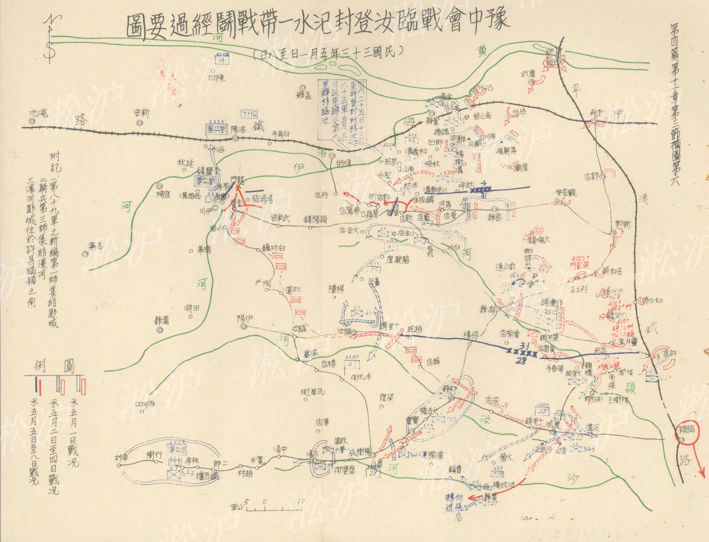

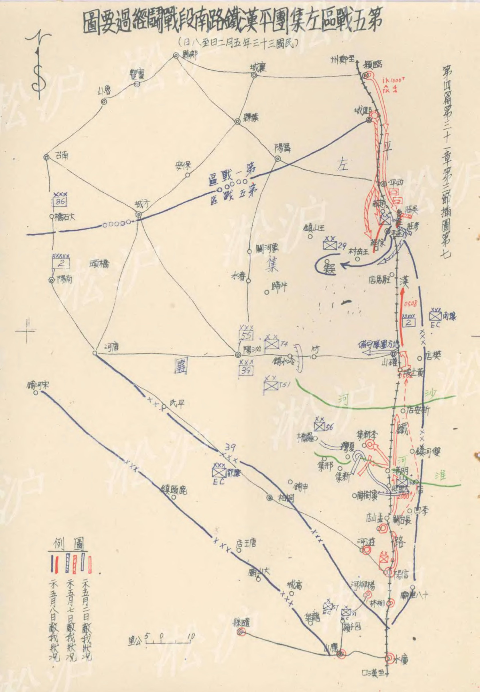

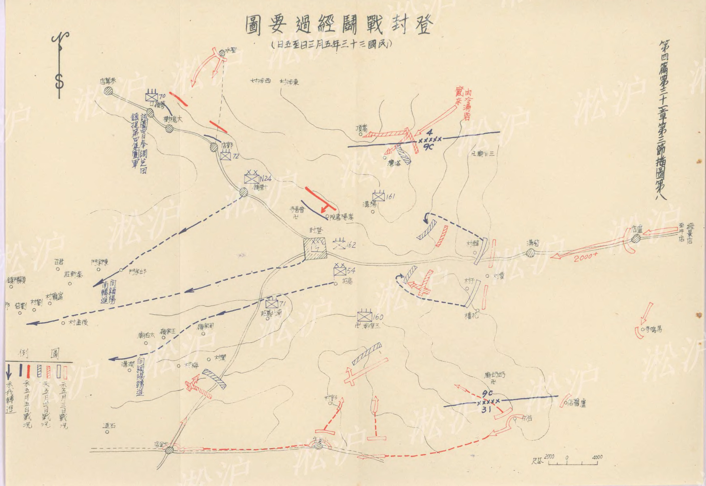

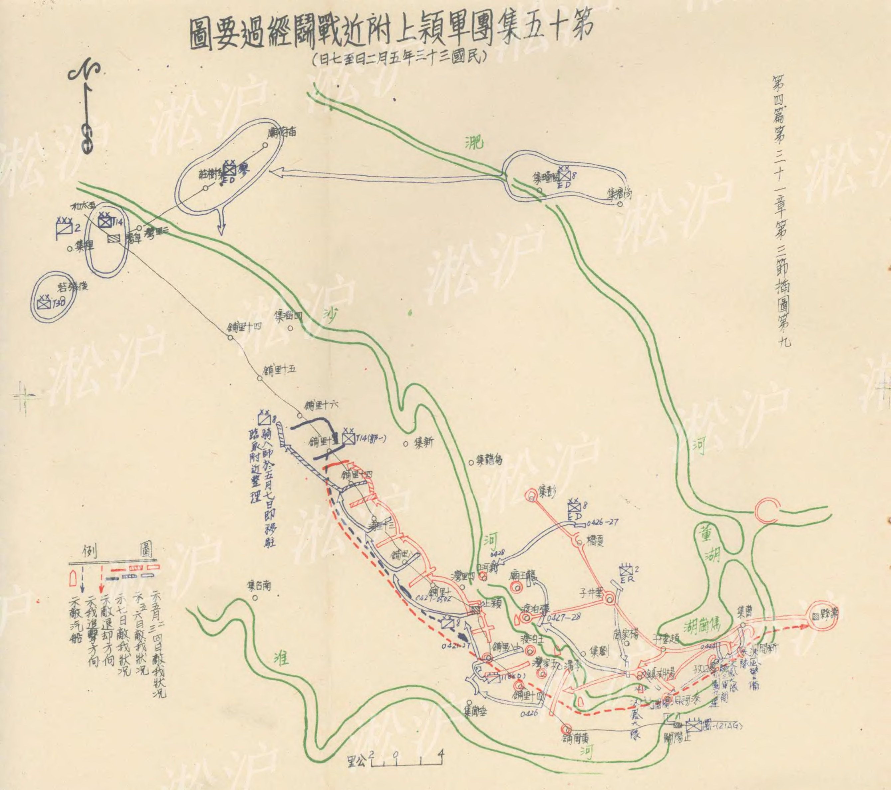

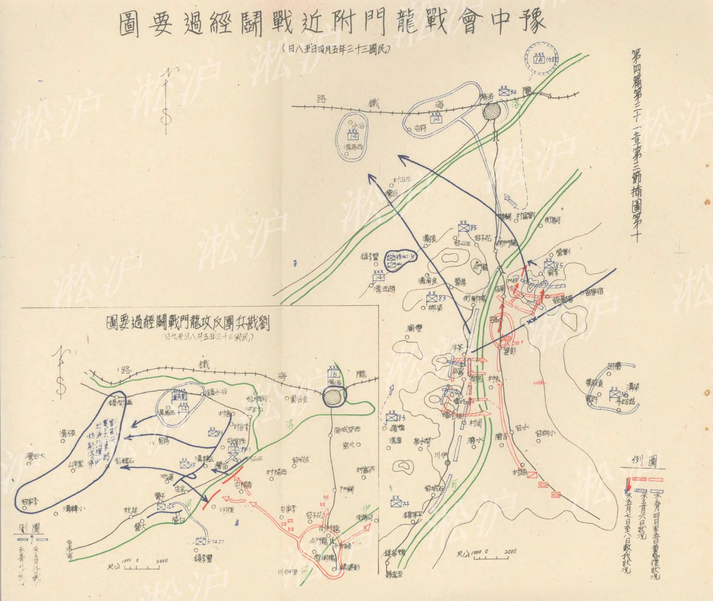

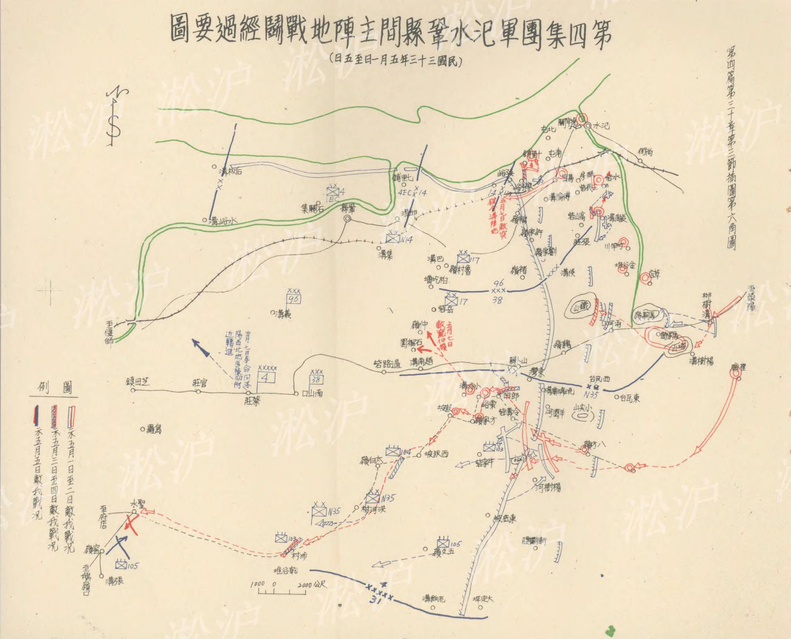

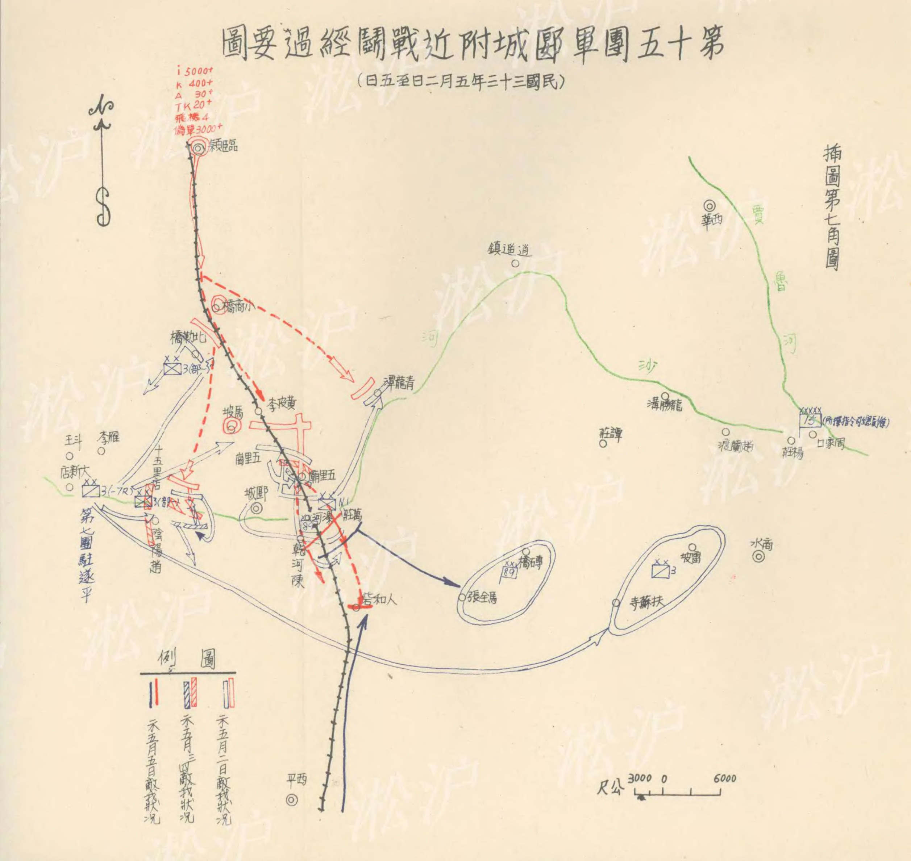

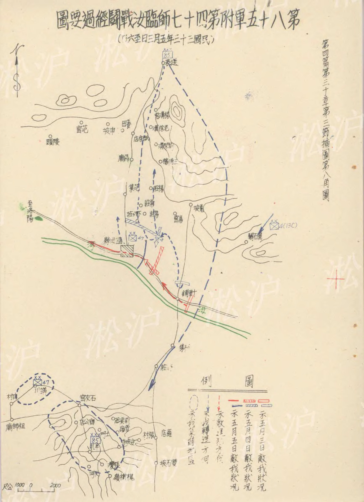

#### 第三款 洛陽之防禦及策應諸戰鬥（民國三十三年五月十日至二十五日

##### 第一項 洛陽守備及戰鬥

自敵攻抵龍門附近時，豫中要地多已陷落，戰事遂逼近洛陽，蔣鼎文司令長官，於五月七日作如左之處置：

一、着第十五軍武庭麟軍長，統一指揮第九十四師，擔任洛陽之守備。二、着第九十四師固守洛陽城，第十五軍卽佔領洛陽外圍旣設陣地，協同第九十四師固守洛陽十至十日。

第十五軍（附第九十四師）奉令後，當卽部署如左：

一、西工區：以第六十四師擔任守備。

二、邙嶺區：以第六十五師擔任守備。

三、城防區：以第九十四師擔任守備。

四、軍指揮所：甲、靈光洞。乙、西工。丙、西車站。

五月八日，軍事委員會對洛陽之防衛，曾電令指示如左：

一、洛陽及其附近各守備部隊，應固守各該地區十至十五日。

二、洛陽城防部隊，應準備充分之電臺。

三、洛陽應多屯糧彈，並注意巷戰設備。

四、洛陽城防部隊，應注意陸、空連絡，我飛機飛洛陽時，在上空盤旋三匝特低。第一戰區奉令後，當分飭各有關單位遵照。

當時第四集團軍正遵令以洛陽爲軸心，於外圍佔領陣地，對東對北警戒，並搜索敵情，至十一日因垣曲敵渡河南進及突破龍門之敵西犯宜陽，該集團軍復奉令轉進洛寧，參加該方面作戰。

龍門山以西高地及司馬街於五月八日被敵攻佔，並向李家屯、關陵進攻，九日（參照插圖），龍門方面步騎聯合敵一部兩千餘，戰車約百餘輛，沿公路向桃園砦、安樂窩等地進攻，另部兩千餘，由三山村攻擊七里河，均經守軍奮勇拒止，十日拂曉，敵復行猛攻七里河、興隆砦，終被攻佔，十一日晨，敵戰車、裝甲車共四十餘輛，掩護步兵千餘，由林森橋東西地區分向西工及南關進攻；同時另部敵亦向五女塚、東陡溝進攻，均被擊退。十二日一時，七里河、興隆砦敵戰車五六十輛，步兵二千餘，復向守軍攻擊，激戰至拂曉，增加二千餘，戰車七八十輛，繼續猛攻，守軍退守邙山南麓史家屯之線；同時東、西下池亦被敵攻佔，十三日由偃師西進敵三千餘，戰車數十輛，向隴海車站南北地區進攻，迄十八時，已進迫五里鋪、北窯、猪籠嘴之線，西工方面第六十四師，亦被迫轉至史家屯、燒溝、岳村之線。

五月十四日拂曉（參照插圖），敵全線總攻洛陽，雙方反復肉搏，迄十五日晨，敵衝入東關、南關、山陝會館各陣地，均被擊退，十六日十二時，敵續攻史家屯，另部敵猛攻莊王山，激戰竟日，迄未逞。由十七日十七時迄十九日十八時，敵在烟幕掩護下，數次全線總攻，守軍沉着應戰，戰况至烈，嗣敵一再增援，並傾陸空全力猛撲，而邙嶺西部陣地，均被摧毀，第六十五師轉移岳村、史家溝、后洞之線，第九十四師被迫撤守城垣迄東北角北窯之線，第六十四師轉守莊王山迄城西北角之線。

五月二十日拂曉，洛陽附近敵再度攻擊，尤以后洞、上清宮、史家溝等地戰鬥最烈，二十一日十二時，敵增戰車二十餘輛續猛攻，激戰至二十二日，除西車站留一部固守外，主力撤守城內，第九十四師守城內東半部及東車站，第六十四師、第六十五師分守城內西半部及西車站。

五月二十四日拂曉（參照插圖），敵陸、空聯合向洛陽城總攻，先以砲、空集中火力支援其步兵，向西面城牆及東北城角攻擊，激戰至十二時頃，其步兵約千餘，進入西門及西北城角，與守軍肉搏，同時東車站已成混戰狀態，至二十五日晚，守軍以彈藥已罄，通信中斷，且守備時間已達，乃分路突圍，迄二十六日晨，全部守軍退出洛陽，向盧氏轉進。

##### 第二項策應諸戰鬥

魯山方面：五月六日敵陷魯山，十日以主力攻擊蛛蛛山、其公城，十一日沿耿集、尙村進陷條山，第二十八集團軍李仙洲總司令，當令第七十八軍確保下湯南北地區旣設陣地，並指揮暫編第二十七師、工兵第九團及姚偉團等部，並令暫編第十五軍之新編第二十九、第四十四兩師，於十一日晚抵四棵樹附近集結待命。

五月十二日，敵一部突入下溝，經守軍猛擊，敵傷亡甚重，十三日，我暫編第二十七師攻佔彭婆敵後連絡線，敵感受威脅，似有撤退模樣，老君坪、松樹莊敵，經新編第四十三師逆襲後，向東撤退，我跟踪追擊，十八時克復下湯，十九日敵復向下湯反攻，與暫編第二十七師激戰，至二十日下湯復陷敵手，二十一日拂曉，敵由玉皇廟等處圍攻新編第二十九師，至十四時，該師轉至張三嶺南北高地。

五月二十二日，敵續攻土門、盈窯之新編第四十三師陣地，另股則進攻張三嶺，斯時第二十八集團軍總部率姚偉團移駐中湯指揮，暫編第十五軍以確保四棵樹、李青店間連絡線，阻敵南竄。

五月二十四日，第六十八軍經黃土嶺向魯山挺進，第一一九師則由李青店北進，並與暫編第十五軍取得連絡，以爲會攻魯山之準備，此時土門、中湯一帶之敵，與我守軍連日血戰，我第四十二、第四十三兩師，均有相當傷亡，新編第四十四師克復四棵樹，二十六日，敵由下湯增撥千餘人向四棵樹反攻，經我守軍反擊未果，時我新編第二十九師及暫編第二十七師於李青店附近，歸暫編第十五軍軍長收容整理。

伊陽、宜陽、嵩縣方面：五月九日，敵千餘附戰車十餘輛，攻陷伊陽，十日增兵續向西進，時我第三十一集團軍王仲廉總司令，率第十二、第十三、第二十九等軍，正向龍門轉移，當令第十二軍堵擊竄陷伊陽之敵，旋在上店（伊陽西三十里）附近與該敵相持。

五月十日，第八十五軍由嵩縣向伊川前進，該軍第一一零師前衛營於鳴阜鎮北側附近，與由伊川南進優勢之敵，在平等鎮附近遭遇，該營被迫退守鳴阜，敵繼續前進，以其戰車、裝甲汽車百餘輛，聯合攻擊我第一一零師主力，於大石橋附近，該師右側受戰車迂迴夾擊，戰至十七時，退守大石橋西側山地，第二十九軍先頭之暫編第十六師，於十七時趕至田湖，與第一一零師右翼連繫，續與敵激戰終宵，敵以一部與我相持，主力乘夜迂迴他竄。

五月十一日拂曉，敵於飛機、戰車支援下，由北猛攻嵩縣，同時由伊陽增來敵三、四千，將第八十五、第十二、第二十九各軍聯絡截斷，其後續部隊，則向伊陽東南之三屯及西南之上店一帶竄擾，十二時陷嵩縣，我軍乃退守嵩縣四郊，與敵繼續搏鬥。

五月十二日，湯恩伯副長官，奉蔣委員長電話諭：「一、貴官應統一指揮反攻。二、第十三軍應集結宜陽。第二十九軍應集結洛寧。」遵作如左之處置：

一、第十三軍抽第四師、第八十五軍抽第一一零師，歸石覺軍長指揮，限十五日晨集結宜陽。

二、第二十九軍，如可能以全部，或抽暫編第十六師，限十三日至洛寧待命。

三、副長官部事宜，奉准着由王仲廉總司令暫理。

由伊川進攻宜陽之敵，五月十四日，續鳴阜、白楊方面之增援，對宜陽、韓城數度猛撲，均被我第四師擊退，並毀其戰車兩輛，第八十五軍吳紹周軍長，率第一一零師及第十一預備師之一部，向宜陽、韓城前進間，亦在白楊鎮附近，被敵阻擊，同日第三十一集團軍總司令部，率第一一七師第三五一團，至蠻峪（嵩縣西南）收容部隊。

五月十五日拂曉，由伊陽進陷嵩縣敵，與暫編第十六師在嵩縣西之橋頭激戰，敵奪路西進，襲擊蠻峪我第三十一集團軍總部與第三五一團，及所收容第十三軍之一部激戰，該總部乃西移舊縣附近，由第二十九軍馬勵武軍長指揮收容之暫編第十六師及第九十一師各一團任掩護，敵追踪由左翼繞襲，復與第一一七師之一部激戰潭頭，黃昏後，總部乃向南轉移，此時由官莊、四林頭、石門等處，向韓城、沙坡頭，九零一二高地猛攻之敵數千人，被我第十三軍第四師主力擊退，惟敵續由宜陽增加。

五月十六日，第八十五軍吳紹周軍長，率第一一零師馳援，在白楊鎮西側之東、西趙堡附近，被敵阻截激戰，此時第十三軍之第一一七師，於向洛寧歸還建制途中，與敵在潭頭遭遇，激戰後退伊河以南整理，第二十九軍馬勵武軍長，指揮暫編第十六師及第九十一師之各一部，在潭頭附近夾擊西進之敵，雙方互有進展，是日晚，第十三軍與敵於沙坡頭激戰。

五月十七日十八時，敵由嵩縣增至千餘，迂迴暫編第十六師鳳凰臺山側背，適暫編第五十五師及第十一預備師，由任嶺趕至，猛攻敵側背，入夜敵勢稍挫。

五月十八日拂曉，敵向守軍繼續猛攻，迄七時，復增援二千餘，砲四門，再襲我軍之側背，激戰至十二時，終以態勢不利，暫編第十六師主力，乃向大坪附近山地轉進，暫編第五十五師、預備第十一師，仍尾擊敵後，時石、吳兩軍長，所率領之第四、第一一零兩師，分以三合坪、木柵關爲根據地，不斷襲擊韓城東、西敵之側背。

五月十九日晚，暫編第十六師由大坪偷襲秋扒，二十日，復向該處敵猛攻，敵不支奪路西竄。第八十五軍第一二零師，是日由德亭圍攻大樟，敵由蠻峪增援，激戰至十四時，終將增援之敵擊退，入夜並衝入該岩一角，與敵守軍激戰。

五月二十一日五時後，敵千人由任嶺南進，至黑峪以北之官莊，經我第八十九師迎頭痛擊，戰至十六時，被我殲滅大半，殘餘竄回任嶺方向，攻拉河之敵，與第二十三師第六十九團激戰兩日，終將敵擊退，嗣由木植街方面增來敵千餘，砲兩門，向禪堂石板溝前進，企圖包圍車村左側，二十二日晨，玉仲廉總司令派第一九三師及第四師各一部，於三里橋、白龍溝各附近埋伏，至十二時許，敵果至，乃出其不意，予以猛擊，將敵截爲數段，並與第二十三師第六十七團，由南、北、西三面夾擊，斃敵大半，紛向嵩縣逃竄，時第一一零師及第四師，正與大樟、蠻峪、舊縣一帶之敵激烈戰鬥。

五月二十三日拂曉，我開始向嵩縣之敵反攻，並以一部迂迴敵後，激戰至十六時，斃敵甚衆，殘部北竄，湯恩伯副長官當作如左之部署：

一、第八十五軍，卽向潭頭以南對當面之敵嚴密警戒，掩護第十三軍集結。

二、第十三軍附暫編第五十五師（欠第一一七師），卽集結廟子鎮附近，應卽補充，準備反攻，並限二十五日以前準備完畢。

三、第十二軍（欠暫編第五十五師）應以主力至一行樹、車村、孫店間集結，並派一部於靳村、木植街、禪堂各處，對嵩縣之敵嚴密警戒。

四、第二十九軍主力集結欒川，應派一部對潭頭、秋扒、獅子廟、三川通欒川之道路，嚴密警戒。

五、第一一七師歸王仲廉總司令直接指揮。

五月二十四、五兩日，敵迭增兵來攻，復被我預備第十一師、暫編第五十五師，在官莊、廟灣以北地區，殲滅五百餘人，旋敵繼續增援，戰至二十七日拂曉，先後於燕子坡、小劉八溝等處施放毒氣，陣地被敵突破，我官兵傷亡甚衆，旋我暫編第五十五師及預備第十一師，派隊襲敵側背，乃恢復原陣地，至十四時，敵復以砲火及空軍轟炸，支援地上部隊攻擊，我燕子坡、小劉八溝陣地，復被敵衝入，戰至黃昏，雙方陣線相持於官莊、曾溝、頭道河附近之線，此時各軍師除第十三軍向洛陽挺進外，其餘因轉戰經月，乃於原地調整部署整補。

滬池方面：自五月三日南村對岸板澗口（垣曲附近）附近敵一部乘夜雨試行偷渡未逞後，至九日黃昏時，垣曲附近各據點之敵約四千餘，復分向白浪、青嵐凹先後強渡，守軍分別阻擊，沉敵船多艘，卒以敵砲火猛烈，致第一線陣地多被摧毀，敵軍強渡成功，旋復以廣正面向前突進，先後攻佔我紅土坡、大、小口門山、段峪、中關等地，會合於半道溝、楊光溝之線，當夜我軍預備第八師之一團，已自新安用火車輸送滬池，趕至坡頭及大、小口門山，協力阻擊，十日，戰區長官部電飭新編第八軍「力保大、小口門山，萬不得已時，亦須確保滬池待援」，並奉軍事委員會指示：「令劉戡兵團主力轉移於新安、宜陽中間地區，對滬池之敵向洛陽或洛寧前進時，予以側擊」。十二時，預備第八師主力，亦自新安開滬池，時我空軍發現白浪、寶山敵均續渡河，而已渡之敵，正逐步突進，十一日，敵已進抵隴海路之英豪，分向兩側流竄，包圍滬池，新編第八軍與敵短兵相接，斃敵甚夥，滬池終被敵陷，守兵逐次南移。十二日，敵分沿鐵路進擊：一路攻觀音堂；一路攻佔義馬。新安以北地區之第三十六集團軍，因受敵夾擊，一面抵抗；一面經新安以西、越隴海路南移。同（十二）日新編第八軍新編第六師，亦由龍門方面沿洛河經宜陽、韓城至藕池歸還建制。另河北民軍及挺進第一縱隊，亦分向硤石方面集結，由第三十九集團軍高樹勛總司令指揮，阻敵西進。

新安方面：五月十二日，由龍門向西攻擊磁澗之敵，與劉戡兵團暫編第四軍（欠第四十七師）激戰一晝夜。十三日，敵陸續增援，突破我陣地，沿鐵路西進，分攻二十里舖、尤溝等處，戰況頗烈，至十六時許，敵戰車約百五十餘輛，續向磁澗猛撲，守軍沉着應戰，嗣以滬池方面敵東進夾擊，將守鐵路南北部隊截斷，遂稍後移，於新安以南佔領陣地，爾後鐵路沿線之敵續南進。同（十二）日觀音堂敵三千餘，進至滬池以南地區，其一部向硤石西進。

第一戰區於五月十三日，對洛河以北各部態勢調整部署如左：

一、第三十九集團軍總部及河北民軍挺進第一縱隊，在硤石附近，以一部對東警戒，新編第八軍在藕池以南集結整理，並以新編第六師在白阜鎮、孝村（李村）、藕池之線佔領陣地，對北警戒。

二、由偃師經北邙嶺西進之第四集團軍，五月十二日大部由新安附近通過鐵路，至石陵附近，其第九十六軍，卽於程莊東、西之線佔領陣地，對義馬方面警戒，第三十八軍，接劉戡兵團右翼，於溫村、韓城之線佔領陣地，對東警戒。

三、劉戡兵團，於新安以南迄宜陽附近，對東佔領陣地。

四、第三十六集團軍，於新安以南，新安通宜陽公路兩側地區，對北佔領陣地，並確實控制該路。五、十一日，集結於程莊之預備第八師，十二日於趙家坡、後窯之線，接新編第六師對東警戒。

同（十三）日，戰區長官部奉蔣委員長電話諭：「該戰區應集中兵力對敵反攻。」蔣鼎文司令長官復遵諭作如左之攻擊部署：

一、對洛陽方面：

(一)第十三軍向白楊鎮之敵攻擊，奏功後，卽轉向洛陽之敵圍擊。

(二)劉戡兵團，卽攻擊當面之敵，攻擊目標：「洛陽」。

(三)第三十八軍，應在劉戡兵團左翼，先行掃除磁澗及以北地區之敵後，卽向洛陽圍攻。

四以上各部，統歸劉戡統一指揮。

二、對滬池方面：

(一)第三十六集團軍，對滬池之敵迎頭痛擊。

(二)第九十六軍，卽猛攻滬池，義馬間敵之右側背。

(三)以上各部，均由第三十六集團軍李家鈺總司令指揮。

三、攻擊開始時，爲五月十四日拂曉。

此項命令，雖經分別下達，卒因白楊之敵已至連莊（沙坡頭東十里），劉戡兵團側背及韓城均感威脅，未能實施。

豫西山地方面：劉戡兵團轉移陣地後，諸兵種聯合之敵三千餘，戰車百餘輛，於五月十二日開始，由三山村附近渡洛河，猛攻磁澗陣地，另股步、砲聯合之敵二千餘，戰車數十輛，由臨汝方面經豐李鎮、李王鎮，沿洛河南岸西進，同日佔宜陽東之高橋，並繼續西進，當被宜陽附近守軍第一零六師阻擊，敵未得逞。至十三日，磁澗、滬池敵會合後，仍分頭南進，復與劉戡兵團第三十六集團軍接觸，時第一戰區蔣鼎文司令長官，以各兵團先後轉入豫西山地，須重新調整部署，再行攻擊，遂於五月十三日十八時，在洛寧作如左之處置：

一、劉戡兵團，應於現地盡力支撐，萬不得已時，轉移於黃家窖、紅土嶺之線。

二、第三十六集團軍，應於程夫子廟、兩郁口，七八六七高地間佔領陣地，對北警戒，並確保新安通宜陽公路。

三、第四集團軍之第九十六軍，速於王馬廉溝、牛心砦、坡頭、婁溝間佔領陣地，對北警戒，左與新編第六師連繫，第三十八軍速開韓城集結。

四、第三十九集團軍，以新編第六師之一部，在藕池附近，主力在白阜鎮、李村間佔領陣地。新編第八軍胡伯翰軍長，率暫編第二十九師，至藕池以南地區整理。河北民軍挺進第一縱隊，歸集團軍總司令部直接指揮，在硤石整理，並對北部署警戒。

五、預備第八師，暫由本部指揮，速向程莊附近集結待命。

此時宜陽之敵，已近迫第一零六師固守之據點——段村，自嵩縣進至白楊鎮之敵步、騎千餘，戰車數輛，經趙堡向韓城前進。第十三軍之四個營，已至韓城對岸之沙坡頭，惟第三十八軍尚未至韓城，第一戰區爲確保韓城、洛寧，乃緊急處置如左：

一、令第三十八軍速開韓城佔領陣地，並掩護劉戡兵團右側背，急令第一零六師派一團南渡洛河，佔領韓城對岸之連莊，拒止自白楊鎮前來之敵。

二、令第十三軍在沙坡頭以南，協力第一零六師之一團，拒止白楊鎮之敵。

三、劉戡兵團，對當面之敵，應猛予痛擊。

四、第九十六軍進擊滬池之敵。

五、預備第八師卽開凹裏、三鄉鎮之線佔領陣地，對東警戒，掩護洛寧。

六、第三十六集團，應盡力猛攻自滬池東竄之敵，協同劉戡兵團與第三十八軍連繫，在石泉以南佔領陣地，掩護其行動，並着各集（兵）團注意連繫。

另對第三十九集團軍指示如左：

一、預備第八師，刻在滬池以南程莊附近集結待命，（該師原奉命佔領三鄉鎮、凹裏之線，抵程莊後，以敵犯長水，故復令該師西移。)

二、該集團軍與所屬各部應速設法連絡，並盡力支持，萬不得已時，應沿隴海路逐次抵抗，同時通知第四十軍預爲備戰。

三、應卽令新編第六師以一部留藕池，主力卽開李村、白阜鎮間佔領陣地，其留藕池之一部，俟第四集團軍到達，卽西開歸還建制。

五月十三日，經龍門沿洛河西進步、砲連合之敵，其一部六百餘，附汽車三十餘輛，由宜陽東側高橋渡河，北攻段村，被第一零六師（欠一團）擊退。

五月十四日，宜陽方面西進之敵，續增三千餘，戰車三十餘輛，與段村第一零六師（欠一團）激烈戰鬥，毀敵戰車十餘輛，生俘敵官兵五人，擊斃尤衆，旋敵集中砲火，毀東寨門，其步兵擁入巷戰後，乃突圍西移，於二十二日抵巴魯附近，歸還第四十軍建制，當段村緊張時，第一戰區以第十三軍之四個營，已抵韓城南之沙坡頭，乃令在連莊拒敵之第一零六師之一團歸還建制。同（十四）日，劉戡兵團，（第十四及暫編第四兩軍），以連莊方面敵對右翼威脅，宜陽亦被敵攻佔，乃逐漸向西轉移陣地，第三十九集團軍，於硤石、白阜鎮、藕池之線，一面阻擊滬池方面敵之南竄，一面掩護第三十六集團軍向西轉進。

五月十五日，宜陽敵突過段村近迫韓城，此時第三十八軍尚未全部到達，兩面受敵，陷於苦戰。

五月十六日，連莊敵與第十三軍之一部激戰後，沿洛河南岸西進，第一戰區蔣鼎文司令長官，急就近調預備第八師，在長水附近佔領陣地，以對洛河南岸之敵警戒，至十二時，韓城情況不明，遂急令劉戡兵團於洛寧東側凹裏、三鄉鎮之線佔領陣地，以拒止韓城西進之敵，並令第四集團軍速至長水，接替預備第八師，而將該師移佔十八盤陣地，以直接掩護盧氏戰鬥，推移至此，韓城既陷，新安、滬池之敵亦已會合，復南攻白阜鎮、李村一帶陣地，並西陷觀音堂，續行西進，守軍腹背受敵，態勢不利，第三十六集團軍，乃經石陵、白阜鎮、南嶺向西轉移，劉戡兵團由柳泉以北地區經程村向指定陣地線（三鄉鎮南北線）轉移，詎敵先至，該兵團乃經進河街、上戈、官道口向西轉進。

五月十七日拂曉，各部隊尚未抵指定位置，而沿洛河南岸西進之敵，已出現於長水，與預備第八師接觸，北岸西進之敵，亦陷洛寧，第四集團軍守韓城之第三十八軍，及對鐵門、義馬方面部署之第九十六軍，以宜陽、滬池、新安三方面之敵、同時進迫，遂逐次經程村、洛寧、毛岡澗西移。

五月十八日，滬池方面沿鐵路步砲聯合敵二千餘，猛攻陝州、尤家灣等處，同時陝州對岸敵亦行強渡，經第四十軍迭次擊退，迄十二時，以陣地多被摧毀，陝州亦失陷，至十四時，復陷大營，第四十軍遂轉移曲沃街南之線。入晚，大營方面敵屢攻不逞，旋繞道攻稠桑鎮、虢略鎮我警戒陣地，第四十軍以一部南移，策應河防及第八戰區增援之第八師作戰。

五月二十日，由大營南進敵，被第十四軍堵擊於司谷凹，時敵陷陝州後，分成多數小股，鑽隙南進，雖被第三十六、第三十九兩集團擊退，然另股敵在姚凹與第三十六集團軍總部遭遇，敵分佔附近高地圍攻，李家鈺總司令親率所部，於秦家坡與敵激戰，不幸中彈殉國，第四十七軍李宗昉軍長，率部適趕至，將敵擊退後，始行西進，西移各部，於五月二十一、二十二兩日，先後集結關鄉以南官道口以北地區。

盧氏方面：自敵陷洛寧、嵩縣後，其一部兩千餘，沿洛河兩岸西進，一部千餘，由嵩縣分循小徑鑽進，企圖進攻盧氏，第一戰區蔣鼎文司令長官，於五月十八日，令預備第八師在十八盤佔領陣地，並令第九軍在盧氏城郊部署，繼奉蔣委員長五月十八日辰巧令一元甲電令：

一、洛陽仍在我軍固守中，該戰區應以必要兵力，應付深入之敵，其餘部隊，迅速整頓，準備向洛陽反攻，此次準備，限一星期內完成，由戰區製定方案具報。

二、洛水以南，爲湯恩伯兵團活動根據地，應卽迅速調整部隊，肅清該區之敵，準備反攻，歸湯副長官統一指揮。

三、洛水以北，爲第一戰區（欠湯兵團）之活動根據地，一面整頓部隊，一面隨時打擊該區之敵，並策應陝州方面之作戰。

四、盧氏據點，由第九軍固守，蔣鼎文司令長官，火速抽調一個軍，並以有力一個師，轉用擊退沿洛陽通盧氏公路進犯之敵，確實保持長水鎮以西高地。

第一戰區奉令後，當卽遵照實施。

先是五月十四日，因宜陽方面戰況緊張，原令預備第八師經程村開三鄉鎮、凹裏，對東部署，繼以洛河南岸之敵已進抵獅子廟，乃令該師西移，佔領長水西側高地，準備拒止西進之敵，該師於五月十六日到達，十七日拂曉，與西進敵接觸，激戰竟日，嗣以韓城之敵，亦突破洛寧，進迫長水，該師受敵夾擊，復經長水以北山地，向西轉移，十八日，抵盧氏東側十八盤附近，對東部署，是晚由嵩縣方面西進之敵二千餘，因我正面第二十九軍第九十一師之一團抽調他往，乃乘虛進佔文峪鎮，並連夜西進，十九日抵盧氏南岸城郊，二十日拂曉，分股會攻盧氏城，第九軍據城固守，敵突入城內，乃被迫向城郊西側山地轉移，適預備第八師前來協力圍攻，迄二十一日晨，敵分途東退，遂收復盧氏城，第十四集團軍劉茂恩總司令，率直屬部隊，沿洛河南岸轉進，於參加盧氏戰鬥後，隨第一戰區長官部轉移，至閻鄉南之官莊附近。

靈寶方面：第八戰區胡宗南副司令長官，於五月九日遵令飭第八師由咸陽乘車東調，並決固守西坪、靈寶附近之線，支援第一戰區調整態勢，準備反攻。時嵩縣已陷，敵主力正向宜陽、洛寧進出。旋奉將委員長電諭：「固守靈寶之線。」遂令第八師在靈寶下車，於虢略嶺、靈寶之線佔領陣地，繼令第一六七師續東行，與第八師併受第一軍張卓軍長指揮，固守虢略嶺、靈寶之線，至十四日止，第八師、第一六七師，均先後至指定位置，繼奉軍事委員會電令：「以第四十軍歸胡副長官指揮」。經令該軍以有力一部固守陝州，時陷滬池敵，復陷觀音堂、硤石，進窺陝州，於同（十四）日晨，與第八師先頭部隊之第二十三團，於張茅鎮附近遭遇，激戰一晝夜，至十五日十四時，敵以主力自歪頭山南，向該團包圍，第二十三團逐次轉至萊園、交口、楊家窯之線佔領陣地，敵分沿隴海路及公路跟踪尾追，我復佔領賀家莊及其以南高地，阻擊該敵，時嵩縣洛寧先後淪陷，敵續西進，胡副長官乃處置如左：

一、令第二十七軍軍長周士冕，指揮第一零九師及第四十六師，佔領富水關亘蘆靈關之線。

二、豫西部隊，歸第三十四集團軍總司令李延年統一指揮。

三、適時推進一部，控制華陰及雒南。

五月十六日夜，第八師第二十三團向敵反攻，斃傷敵甚多，但因戰力損耗過甚，當夜轉溫塘及其以南山地，十七日晨，敵分南路，一部經由三里橋犯陝州，一部由蔡家莊向溫塘進攻，至十二時頃，敵復由茅津渡增至四千餘，砲十餘門，陝州因地勢低窪，受其瞰制，守軍頗有傷亡，激戰至二十一時，守軍第一一六團被迫退韓莊，復與敵激戰，至十八日晨，韓莊陷落，該團退至溫塘，爾後逐次轉進靈寶，同日第二十三團於溫塘附近與敵激戰，至十六時，敵一再增援，向右翼大營迂迴，該團亦於當晚向靈寶主陣地轉進，敵於十九日進抵大營。

第五戰區方面：第五戰區第二集團軍，（左集團），第三十九軍第五十六師之一部，於五月九日二十二時襲新安店之敵，激戰至十日拂曉，敵由明港增援反攻，另敵自連坡由側背來襲，激戰至十二時，乃撤至江崗、薄山（馬尾山西）一帶，迄十四時，敵亦退新安店，我續撤至羅橋附近，（邢集北二十里）同時暫編第五十一師之一部，分向高樓、黃山坡之敵襲擊，激戰三小時，第五戰區李宗仁長官，五月十日以辰灰午電令：「左集團予以有力部隊與張軫集團協同向確山、遂平間之敵夾擊，以阻敵修築平漢路。」該集團奉令後，卽令第三十九軍，卽攻擊確山及其以南之敵，第五十五軍，卽攻擊遂平、駐馬店，相機恢復各要點。

五月十二日，第三十九軍遵令調整部署，準備反攻，第五十五軍第二十九師，於當晚以主力向遂平敵夜襲，並以加強營攻擊駐馬店。三時，主力迫至魏莊、龐莊，（遂平城西關附近），向敵猛撲，激戰兩小時，敵不支退城內，第二十九師另部同時由城西北隅衝入城內，與敵巷戰肉搏，該師榮光興師長，亦率隊由西門進城，殘餘之敵，向南潰竄，遂平遂被克復，十三日晚，並克復界牌，十四日七時，克駐馬店，十六日夜，第三十九軍第五十六師，派兩營於新安店南北地區，伏擊南下之敵，激戰至十七日拂曉，以明港之敵來援，遂撤回。同時暫編第五十一師第三團主力，猛襲確山，先後克秀山，五里山，激戰至十二時，敵以主力反攻，衆寡懸殊，乃轉移黑山、面罐山（確山西）之線，十七日八時，第二十九師第八十六團，清掃遂平潰散之敵，當生俘三名，殘餘逃竄。二十一時，該師第八十七團一部，猛襲西平敵，激戰二小時，衝入城內，迄十八日六時，將西平克復，殘敵向城南焦店潰退，第八十七團復派隊追擊，截擊退却之敵，激戰至九時，傷斃敵甚多，並生俘兩名，及軍用品甚多。十九日，第五十六師第一六八團主力，於拂曉續襲新安店，敵據砦頑抗，並以騎兵兩次猛烈反攻，激戰至十五時，敵未逞，二十日，暫編第五十一師第三團，於拂曉攻確山，官兵奮勇，突入城內，與敵發生巷戰，迄九時，殘敵向東南潰竄，我遂克確山。二十一日，第五十六師第一六八團，於拂曉續攻新安店，激戰至九時許，敵不支向南逃竄，當克新安店。第一六七團派隊襲石板坡（遊河西），第五十五軍第二十九師，將遂平防務交豫南挺進軍第二十縱隊接替，卽集結老魏莊附近待命，二十二日七時，第五十六師第一六八團主力，攻擊明港，激戰至十時，信陽敵增援反撲，二十三日十時，第三十九軍之一部，與由明港分路鑽隙之敵激戰，迄十二時，敵不支回竄，至二十五日八時，明港敵分竄法王臺（新集北）等地，經第五十六師第一六八團分頭迎擊，敵終回竄明港。

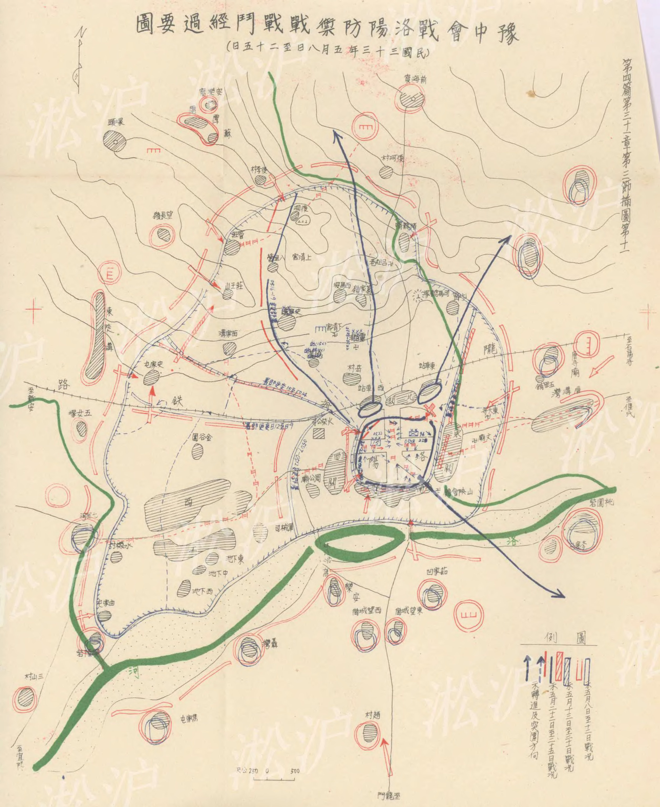

#### 第四款 反攻時期諸戰鬪

民國三十三年五月二十六日

至六月十七日參閱插圖第四

敵第六十九師團，附騎砲兵一部，戰車數十輛，自五月十七日竄據陝縣後，十九日復陷大營，迄我反攻前，已於安家凹、險山廟亘五原、原店、大營之線，築有堅固工事，並於草廟、四家坪、韓家凹、五原窯之線佔領前進陣地，時洛陽戰鬥已近尾聲，盧氏之敵亦東退，斯時嵩縣、魯山以西之敵，乘其主力進窺靈寶之際，時向嵩縣以南地區進擾，遙相呼應，以圖掠奪車村根據地之物資。第一戰區奉令於五月二十八日開始向敵反攻，同時軍事委員會令湯恩伯兵團掃蕩嵩縣西南敵人，令第五戰區第二集團軍以一部協同攻略魯山，令第四集團軍向洛寧進出，令第八戰區胡宗南副長官，率第三十四集團軍東援靈寶，並向陝縣反攻，茲將反攻經過分述如次：

##### 第一項 靈寶陝縣間之戰鬥

第八戰區，第三十四集團軍李延年總司令，於五月二十五日，奉第一戰區蔣鼎文司令長官甲作命第二十一號命令要旨如左：

一、敵五六百，小砲二門，分據大營、申家凹、原店、五原等各據點，會興鎮、陝縣間集敵三千，砲五、六門，戰車五、六輛，張村鎮附近似有敵一部，盤據盧氏敵已囘竄，長水（盧、洛間）以西無敵踪。二、戰區決卽反攻，先以一部卽攻擊大營及陝縣附近之敵，空軍先行偵察大營、陝縣及張村鎮附近，並以其東敵之行動，於二十六日六時後，掩護第一零六師前進，對大營、陝縣、會興鎮附近之攻擊。

三、着第一零六師（配屬第八師第二十四團，第一軍之戰防砲一連，第九軍及第一六七師之砲兵營，及砲兵第十一團各一連，第四十軍工兵一部，野戰第三病院。）於本（二十五）晚向虢略鎮以東地區集結。於二十六日拂曉，越來村砦、溝石坡之線，向大營及陝縣、會興鎮之敵攻擊，進出於會興鎮以東地區。

四、第四集團軍孫蔚如總司令，指揮本集團軍及劉戡兵團，按第四集團軍及劉戡兵團之順序，於二十六日拂曉，沿來村砦、張村鎮、官前、頭峪向洛寧、韓城以北地區攻擊前進；另以有力一部，對張村鎮附近敵攻擊，以掩護第一零六師之右側背，並阻敵向陝縣、會興鎮增援，待第一零六師攻擊成功後，隨主力跟進，劉戡兵團應派隊於洛寧東西之線，對其以北地區施行警戒。

五、第四十軍主力及第一軍，應固守原陣地，並與第一零六師確保連繫。

六、補給另規定之，兵站醫院，在陽平鎮開設，另以一個醫院推進盧氏，並對張村鎮、官前道上佈置傷運站。

七、余在官莊。

第三十四集團軍奉令後，遵照部署，並指示第一軍除配屬第一零六師各部隊外，應作如下之行動：一、派步兵三連，分別擔任配屬攻擊砲兵隊之掩護。

二、在第一零六師攻擊前進期間，應加強警戒陣地之兵力，並與攻擊部隊應作緊密連繫。

三、砲兵部隊，除配屬第一零六師外，視情況之推移，必要時，另派一部推進十里舖南側高地，支援大營方面之攻擊。

四、守備主陣地之兵力，應轉移陣地於左翼。

五月二十五日晚，復奉電令：「以友軍整備未完，暫緩實施」。二十六日，第五十七軍司令部，率第九十七師，以火車輸送，抵常家灣下車後，接替第八師靈寶附近陣地，對東警戒。

五月二十七日，接奉軍事委員會五月二十六日辰寢令一元甲電如左：

一、西竄之敵，現停止於舊縣之線，其一部向嵩縣、魯山以南地區竄擾中。

二、我軍決於五月二十八日開始反攻，各兵團之任務如次：

(一)第四十軍馬法五兼軍長，指揮所部，及現在靈寶附近之第八戰區部隊，攻擊大營、陝縣，劉戡兵團（第十四及第四十七兩軍）主力，攻擊觀音堂，並協力陝縣之攻擊。

(二)孫蔚如集團向洛寧，高樹勛集團向滬池攻擊前進。

(三)劉茂恩總司令，指揮暫編第四軍及預備第八師，固守長水鎮、盧氏。

四湯恩伯兵團，以一部掃蕩嵩縣西南之敵，主力準備反攻洛陽。

(五)劉汝明集團任務同前，並攻佔魯山，進出臨汝附近，協力湯兵團之作戰。

(六)其餘陳大慶、陳又新各部，仍照前令，攻擊郾城、許昌、舞陽之敵，並向襄城以西地區前進，斷敵後路。

五月二十八日，祖師廟（李曲東側）之敵三百餘，爲第四十軍擊退，險山廟、馬佐敵武裝便衣隊亦被我擊退，二十九日，劉戡兵團所部各軍，其先遣之一部，於黃昏前將高家山、下蔡凹、梅家山、林子窩之線佔領。

五月三十日，敵砲二門，掩護步兵五百餘，沿險山廟高地北麓，向祖師廟附近之第四十軍部隊攻擊未逞，第一零六師之一部，進佔路井，第四十七及第十四軍主力，於拂曉向砦子溝、駱駝坡、砦家山、紅溝峪、葛家溝之線前進，準備翌日拂曉，驅逐當面之敵，進出三角山、雙廟、藍家凹、西玻、西郭村、大山凹之線。

五月三十一日，奉蔣委員長電話諭：「限六月一日晨開始反攻」。復奉蔣鼎文長官五月三十一日辰世臺克光電：轉蔣委員長電令：「劉戡兵團在協攻陝縣期間，歸第三十四集團軍李延年總司令統一指揮」，乃遵於二十時給予劉戡兵團等之命令要旨如左：

一、劉戡副總司令，指揮所部，於六月一日開始驅逐草廟、南寺院之敵警戒部隊，以一部經雙廟、姚店

進出鐵道嶺、放牛山南北之線，對東掩護，主力向張村鎮、任馬砦之敵攻擊，奏功後續向賀家莊車站、會興鎮及其附近地區攻擊，並確實佔領之。

二、馬法五副總司令，指揮第一零六師、第八師，於六月一日九時驅逐險山廟、五原、李砦敵之警戒部隊，二日拂曉，開始向大營、溫堂、陝縣之敵攻擊前進。

三、兩兵團作戰地境：爲關爺前、王廠、市坡、（圖上無）崔村、胡家坡、橋北、黃路村、尙村之線，線上屬右。

四、攻擊開始後，余在川口指揮所。

六月一日開始攻擊，迄二日晚，右翼兵團第一七八師將草廟敵驅逐後，並壓迫由老棍嶺囘竄草廟之敵，向三角山退去；第一零四師及第十四軍之一部，與敵激戰於央尖頭、樓子凹、西底莊、南園、龍王廟之線。左翼兵團第一零六師，攻佔西槐樹古垛、鞋兒凹、王古垛、羅鼓坪、剪子園之線，續向險山廟之敵攻擊，第八師進至王村、和村、九二四五高地及五原之線，激戰甚烈。三日左翼兵團第一零四師，因天雨無進展，第一七八師由草廟東南、東北迂迴中，第十四軍因傷亡頗大，退守王砦、南園之線。左翼兵團第一零六師之一部，攻達焦地、上禪裏、下禪裏之線，第八師與敵在王村、和村、五原之線小有接觸，六月四日晨，敵全線兵力大增，開始向我反撲，整日以猛烈砲火轟擊，迄五日晚，攻勢益烈，右翼兵團第四十七軍，被迫轉守草廟西南及祖師廟之線，第十四軍轉守馬灘、許家凹之線。左翼兵團之第一零六師，於羅古坪及險山廟之線予敵以重創後，卽轉移西槐樹古垛、馬胡同、石磨盤、底下溝之線。由五原反撲之敵，以戰車十六輛前導，當被第八師擊毀七輛，敵一部竄路井，守軍以傷亡過重，退守朱家窩、季家灣、五帝村之線。

六月六日晨，敵續向兩翼猛攻，右翼敵七、八百，由老棍嶺、寺河街西犯，竄至火家山後，復向岔道口迂迴竄擾，時官道口東南有敵三百餘，右翼兵團，由晨至晚，連絡中斷，狀況不明，入夜，右翼劉戡兵團已獨斷處置，以第四十七軍向岔道口以南；第十四軍向岔道口以北轉進。右翼兵團第八師正面，敵以戰車多輛，由晨二時起，分兩路進攻，一路竄抵閻家坪，一路附戰車三十餘輛，竄抵路井，另敵步、騎一部，竄抵布張及烏里村，第八師師部及第二十二團被迫退守藍家凹。其第二十三、第二十四兩團，及第一零九師第三二六團之一營，被隔離於韓家凹、楊保灣等處。第一零九師主力退守南、北小和、蔡原。十四時，敵戰車八、九輛，竄抵方家河，旋增至十餘輛，續抵南河、楊店。另四、五輛，竄至小五里、神窩，敵續增加戰車七、八十輛。迄四時，增至二百五十餘輛，其裝甲車及步、騎兵亦在續增中，第一零六師正面情況稍和緩，且仍在馬胡同、石磨盤之線，與敵對峙，但兩側均受威脅。

胡副長官據劉戡電：悉該兵團第十四軍，約二團，第四十七軍約兩營，共計不及一師之兵力，確認連日攻擊，傷亡甚重，爲免受敵之包圍，決改攻爲守，於虢略、靈寶旣設陣地，相機打擊敵人，當時復奉軍事委員會指示：「一、改攻爲守，穩紮穩打。二、後方控制一個師。」乃作如下之處置：

一、第十六軍軍長李正先，卽率領預備第三師前進至陽平鎮附近，秘密控制準備，爾後協同第一零九師，適時由朱陽鎮、五畝街間地區進出，擊破官道口西進之敵後，協力正面部隊，轉移攻勢。

二、預備第八師，卽兼程向李河街、廟溝河、安家凹推進，襲擊敵後，以協力我主力之作戰。

三、第一零九師，以一團接替川口、席家凹等守備。

同時下達命令要旨如左：

一、戰區卽固守朱陽鎮、岔道口、虢略鎮、靈寶陣地，及靈寶以西之黃河河防，待敵接近，摧毀敵人於陣地前。

二、李延年總司令，指揮左列部隊：

(一)第十六軍（欠預備第三師），第一軍，（欠第一六七師），第五十七軍（欠新編第三十四師），佔領朱陽鎮、岔道口、虢略鎮亘靈寶陣地，堅強固守，應以火力及逆襲摧毀敵人於陣地前，特須以一部進佔官道口，與第十四集團軍確取連繫。

(二)第四十軍及第一師，固守靈寶、潼關間河防，對渡河進犯之敵，務殲滅於水際。

(三)預備第三師，先於陽平附近地區，秘密控置，仍歸李總司令指揮。

六月七日晨，敵續攻擊，在右翼方面，敵以步、騎二千餘，砲十餘門，跟踪劉戡兵團尾追。其一股五百餘，砲三、四門，進佔官道口，續向西進，在守軍正面及左翼，烏裏村敵戰車三十餘輛，向西移動，楊店敵之一部，戰車二十餘輛，向中和前進，信村、西水頭附近，均發現敵騎兵及戰車部隊，午後敵全線攻擊未逞，八日拂曉，敵戰車百餘輛，步兵兩千餘，復向信村、關莊原之線警戒陣地攻擊，並在楊角砦、施放摧淚性毒氣，同時砲兵集中火力，戰車亦相繼衝入，激戰至暮，各該地先後陷落，第九十七師守兵二營，大部壯烈殉國，同（八）日東、西水頭附近凹道內，發現大部戰車行動，繼有二、三十輛，步兵二三百，衝至磕砥。另戰車三、四十輛，竄抵秋市附近，旋續向灣里猛攻，與警戒部隊激戰至烈，入夜敵戰車十餘輛，攻陷樓下村、牛莊，由岔道口西竄之敵，經五畝街向周家山攻擊，另路敵步、騎六、七百，砲七、八門，陷上、下宋區，續西竄香爐溝，時第十六軍預備第三師，至陽平鎮集結，第三十四集團軍李延年總司令，卽電飭第一零九師，嚴密警戒，並截擊進攻之敵。九日晨，調整配備如左：一、當面之敵，確係戰車第三師團，及第六十九師團之各一部，刻正向我進攻中，稠桑、閔底鎮、潼關各對岸，均有敵部隊集結，我孫蔚如集團軍，已進至長水，一部正向洛寧推進，劉茂恩集團軍，仍固守盧氏及其以北地區。

二、本集團軍遵胡副長官已虞光示電令：「固守盧靈關、朱陽鎮、虢略鎮亘靈寶之線，暨黃河南岸靈寶、閔鄉亘潼關既設陣地」。以火力及逆襲摧毀敵人於陣地前，由虢略鎮附近地區轉移攻勢。

三、第三十六集團軍，應速由朱陽鎮以南地區，進出官道口、岔道口間地區，與劉茂恩集團軍切取連繫，打擊西進之敵，相機向岔道口東北迂迴，牽制敵人，以策應主陣地守備部隊之作戰。

四、第十六軍李正先軍長，指揮第一零九師（欠第三二七團），以一部封鎖朱陽鎮至蘆靈關間，通閔鄉各隘路，主力固守盤嶺山（朱陽鎮西十五里）、朱陽鎮、臺頭、固家山之線，對來攻之敵，阻擊於朱陽鎮以東地區，預備第三師，應於陽平鎮、永泉樹間地區集結待命。

五、第一軍張卓軍長，指揮第五十七軍、（欠一師）第一六七師（附第三二七團），以一部佔領桐村、川口、大、小中原之前進陣地，主力應佔領周家山、北岳渡、虢略鎮、坡頭、傅家灣亘靈寶主陣地，保持重點於虢略鎮附近，務於陣地前摧毀敵人之攻勢。

六、第四十軍馬法五兼軍長，指揮該軍（欠第一零六師），及第一師，擔任靈寶、閔鄉亘潼關河防之守備，對渡河南犯之敵，務殲滅於水上。

七、第一零六師，爲總預備隊，位置於虢略鎮、永泉樹間地區，但須先派一部，加強文家嘴、南安頭、北安頭、畢家砦之工事。

八、第十六軍與第一軍作戰地境：爲孟村—尙樹，—周家山—五畝街，—磨溝—羅家溝—相連之線，線上屬左。

五月九日，牛莊之敵，戰車三十餘輛，步兵千餘，北攻墻里、索里、西劉村，當被第九十七師守軍擊毀敵車七輛，以其後續部隊大量增加，墻里遂陷敵手，另部敵一再猛攻席家凹、開坊口、川口陣地，守軍堅強抵抗，然以敵砲火猛烈，陣地終被攻陷，又由大、小中原進攻北田村敵戰車十餘輛，爲守備之第一六七師第五百團第九連，擊毀三輛，至午，敵步兵千餘，藉砲火支援，由牛莊、墻里攀登陣地前緣流日戰史

六二

，被守軍擊斃甚夥，敵未得逞。迄晚敵復向畢家砦攻擊，其突入陣地內之敵約百餘人，悉被殲滅，十七時，奉胡副長官轉蔣委員長電話：「號略鎮、靈寶陣地，應行死守，不准撤退」。卽轉飭各部隊切實遵照。同（九）日竄犯香爐溝之敵，滲入夫婦峪，企圖迂迴我側背，當派預備第三師，在陽平鎮以南阻擊之，號略鎮迄坡頭之線，雙方血戰竟日，傷亡均重。

五月十日三時起，敵以更兇猛之勢，向守軍主陣地進攻，右翼乘我部隊交替之際，攻陷東、西澗口、大、小嶺。復進陷張灣、新莊各要地，續向北岳渡猛攻，另部由五畝街繞攻時家山，午後敵一再增援猛攻，第一六七師集全力逆襲，未能阻止，該師乃退守楊村砦，十三時，敵一部向楊村砦右側迂迴，另部由王家嘴、大、小南村向東村、鄉官包圍。第一六七師所屬各部，分別迎擊，各自爲戰。左翼方面，敵乘第五十七軍與第一零六師換防時，一再向坡頭砦、老虎頭、白家砦、畢家砦之線突擊，第一零六師沉着應戰，另配以小戰車之突擊支隊，往返衝殺，敵死傷枕藉，至十七時，敵仍一再增援攀攻，勢甚猛烈，梨灣原、柴家原之第五十七軍軍部，及第九十七師師部，均陷敵圍，靈寶、函谷關方面連絡亦中斷。迄黃昏時，全線陷入混戰狀態，入夜，復奉胡副長官轉蔣委員長電諭：「無論何人，不得向西撤退，應確保我靈寶、號略各要點，在陣地內與敵決戰，以保持國家榮譽」，當卽轉飭各部隊遵照。

此際竄入香爐溝、夫婦峪之敵，繼續北進，經預備第三師迎頭痛擊，至午，其一部囘竄，預備第三師之一部，佔領盤嶺山（陽平鎮東南）。我號略鎮方面，始終固守原地，惟避免無謂損失，李延年總司令，呈准轉移陣地於東、西長安豆盤豆之線，二十四時，以作命第五號調整部署，其命令要旨如左：

一、當面之敵，連日向我朱陽鎮、號略鎮亘靈寶主陣地猛攻；另敵約四、五百，已竄抵香爐溝、鐵佛寺各隘口附近。

二、本集團決卽轉移陣地於有利地帶，以一部於陽平鎮公路南北之線佔領陣地，阻敵前進，掩護主力，於今（十）日二十四時，開始沿張華公路兩側，向蘆靈關亘盤豆鎮之線轉進，重新部署。

三、第十六軍李正先軍長，指揮預備第三師，以一部對秦嶺各隘路口警戒，主力卽在陽平鎮南北之線佔領陣地，掩護主力轉進後，至新城子、關峪口（閔底鎮南）附近，集結待命，第一零九師，應在朱陽鎮附近高地佔領陣地，拒止敵人，無命令不得撤退。

四、第一軍張卓軍長，指揮所部，速向突入之敵逆襲，予敵打擊後，卽於今（十）日二十四時，開始分向堡內、閔底鎮附近地區轉進，第九軍砲兵營，沿張華公路西進，至謝家灣附近，歸第四十軍馬法五兼軍長指揮，各軍之轉進路線如後：

第一六七師，由焦村經巴魯、官莊向馬峯峪轉進，邇後卽集結馬峯峪待命，第一軍所屬砲兵，沿張華公路經陽平鎮向岱子營轉進，爾後集結堡裏待命，第五十七軍沿隴海路經閔鄉向閔底鎮轉進，卽在該處待命，第一零六師，經張華公路向安家底附近轉進。

五、第四十軍馬法五兼軍長，指揮第三十九師、第一零六師、砲兵第五十二團、戰防砲兩連，卽於喊山、（不含）南故縣亘盤豆之線佔領陣地，阻敵西進，並以一部擔任黃河南岸之守備，第三十九師靈寶、稠桑河防之防務，須俟第五十七軍通過後方得撤退。

六、各部轉進時，第一線掩護部隊，由張卓軍長統一指揮：節節抵抗，並將轉進路之交通通訊澈底破壞。各部奉令後，於五月十一日一時開始行動，第一軍之一部，節節抵抗，其餘各部向指定地點轉進，並令第十六軍指揮預備第三師，以一部警戒秦嶺各隘口，主力掩護第四十軍佔領新陣地後，祕密於夫婦峪大湖峪、後山山地佔領側面陣地，阻止由南向北突擊西進之敵；同時令第五十三師，主力集結蘆靈關以東地區，候令行動。突擊西進之敵，第一零九師，集結朱陽鎮及其以東地區，求敵側背而攻擊之。至八時，轉進部署概已完成，正面敵，除少數騎兵至巴魯、永泉樹、常家灣南北之線外，僅有戰車七、八輛，步、騎百餘之敵，進至屯里；另一部步、騎兵三、四百，經大閻原至稠桑鎮附近，一部進至閻鄉，潛伏於鐵佛寺及山溝之敵，趁預備第三師主力轉移，向東佔領掩護陣地之際，繞經夫婦峪以東山口，向陽平鎮、閻鄉附近進出，卽沿陽平以東高地金盆之線，與第三十九師及預備第三師警戒部隊對峙。竄至陽平、坡頭、金盆、閻鄉之線敵人，於十一日夜，迄十二日晨，分股向我進攻，第三十九師及預備第三師之一部，分別反擊，至十二日午，敵已呈動搖之勢，此時號略、靈寶方面，敵主力並未西進，且於十一日先後東退，陽平、閻鄉之敵，亦相繼東退。

五月十三日晨，胡副長官以敵東退，下達追擊命令，其要旨如左：

一、着第十六軍（欠預備第一師）、第三十九師，迅速追擊當面之敵，主力先進出於川口、號略、靈寶之線。

二、另以一部向陝縣、大營搜索前進。

李延年總司令奉令後，令預備第三師及第四十軍，各派隊向號略、靈寶敵果敢追擊，是晚，第三十九師先頭到函谷關附近，預備第三師先頭進抵號略鎮以西高地。

五月十四日晨，先後將敵掩護部隊驅逐，遂克復靈寶，及號略鎮，第一零九師主力，進出北岳渡、開坊口、向川口之敵攻擊，至十五日午，我追擊部隊先頭，已進抵險山廟、大營各附近，發現險山廟至大營之敵人，已構成強固工事，此時我後方機關，以推進不及，爲確實明瞭敵情，另策後圖計，胡副長官乃下達命令要旨如左：

一、第十六軍（欠預備第一師），第四十軍，卽以主力佔領川口、號略、傅家灣、函谷關、靈寶各陣地，構築工事，並延接靈寶、閻鄉間河防，仍以有力一部，續向大營、陝縣方面行威力搜索。

二、東長安亘盤豆鎮線之陣地，由第七十八師推進守備，並積極完成預定工事之構築。

李延年總司令奉令後，遵卽轉令所部，遵照實施，十六日午，我主力部隊，均已抵指定位置，並續向陝縣行威力搜索中，靈寶戰鬥至此暫告一段落。

##### 第二項 洛寧附近之戰鬥

五月二十六日，第四集團軍孫蔚如總司令，遵照軍事委員會辰寢戍令一元電令：「進出洛寧，反攻敵人」之任務，卽轉令所屬各部隊，於五月二十七日開始，經官道口，分兩路向長水、洛寧挺進，迄六月二日，第九十六軍新編第十四師之第四十二團進佔長水鎮。

六月三日晨，該團之一部向洛寧挺進，於王和附近，將由洛寧西進之敵五六十名擊退，卽佔領王和，並繼續東進，十六時，將王范敵三百餘擊退，十九時進佔該村，旋受洛寧敵砲兵集中猛射，並放射毒氣彈，該部乃撤回十方院。

四日，洛寧敵百餘，向十方院第四十二團第一營襲擊未逞，乃回竄。

六月六日，佛金廟、寺河街、岔道口發現敵情，該集團軍卽以一部向東推進，監視洛寧之敵；主力在倪溝、盧溝鎮、廟底間地區集結待機。同日九時，第四十二團之一營，攻擊鳳口（洛寧北五里）附近敵，敵憑工事頑抗，並以洛寧城砲火掩護，施行逆襲，該部卽撤回原陣地，迄九日，奉第一戰區長官部命令要旨如左：

一、第三十八軍，以一個團守備十八盤，一部在上戈、甕關對北警戒，其餘集結黃城村附近。

二、第九十六軍主力，在長水、中山鎮西側高地佔領陣地，一部與洛寧敵保持接觸。

三、總部移駐嶺南。

數日來，守軍不斷派隊分襲洛寧附近之敵，未能奏功，二十日，以「待機反攻洛寧」之目的，令第三十八軍之一師佔領朱家溝、董寺、蟠頭坡之線，以一團守十八盤預備陣地，第九十六軍主力，佔領蟠頭坡、大鐵溝之線，以一部在長水，對洛寧方向搜索警戒。

##### 第三項 洛河右岸地區之戰鬥

自敵軍攻陷魯山、伊陽、嵩縣後，其一部進據大樟、蠻峪、舊縣、任嶺一帶，迄五月二十七日，尚與湯兵團所部繼續戰鬥中，另一部敵，則向嵩縣、魯山以南地區進擾，湯副長官遵照蔣委員長五月二十六日辰寢戍令一元電令所示：「湯兵團一部掃蕩嵩縣之敵，主力準備反攻洛陽。」遂卽電令李仙洲、王仲廉兩集團軍總司令，其要旨如次：

一、第四師、第八十一師，暫編第十六師，編爲挺進軍，歸第十三軍石覺軍長指揮，沿洛河南岸，協同友軍進攻洛陽之敵，限三十日前，進出韓城以南地區。

二、第一一零師，暫編第五十五師，編爲嵩縣圍攻部隊，歸第八十五軍吳紹周軍長指揮，圍攻嵩縣附近地區之敵，並掩護石軍北面。

三、第二十九軍（欠暫編第十六師），卽在廟子、欒川附近整編，以一部進出伊河南岸，封鎖舊縣、潭頭通廟子，欒川各道路。

四、預備第十一師、第二十三師，歸第三十一集團軍王仲廉總司令直轄，鞏固黑峪據點，封鎖任嶺、舊縣至黑峪道路，並與嵩縣圍攻部隊保持連繫。

以上各部隊，統歸王總司令指揮。

五、第十二軍，確保二郎廟、車村根據地，並隨時派有力部隊襲擊嵩縣東南之敵。

六、第七十八軍，卽在現位置阻止下湯西犯之敵。

七、暫編第十五軍，協同第七十八軍，予敵以嚴重打擊而殲滅之。

以上各部隊，統歸第三十八集團軍李仙洲總司令指揮。

八、兩集團軍作戰地境：爲龍王廟、栗樹街、禪堂、孫莊、嵩縣東南兩公里之線，線上屬李集團。

王、李兩總司令奉令後，當卽遵照實施。

五月二十七日，第二十八集團軍方面：由魯山西寬步口西犯之敵，猛攻趙村，與新編第四十三師及新編第四十四師之一部激戰，自十四日迄二十八日，仍在戰鬥中，第三十一集團軍方面，其向洛陽方面進擊之第十三軍第八十九師至火神廟（舊縣西北約十公里），第四師抵重渡溝（潭頭南）暫編第十六師達重渡以西，續向龍五門、韓城以南急進中，由嵩縣增來敵二千餘，砲四、五門，在黑峪附近，經預備第十一師、暫編第五十五師擊敗，敵向東退却，我遂佔領舊縣。

五月二十九日，第二十八集團軍方面：其犯趙村敵西陷下湯，守軍轉移棗溝南北高地，與敵對峙，由潭頭西侵之敵，並以一部向尙堂、車村方向前進，迄黃昏時，敵迫近車村，我以兵力轉用困難，令第七十八、第十二兩軍，扼守二郎廟、磨上、車村以南高地，待機轉移攻勢，暫編第十五軍劉昌義軍長，仍在四棵樹以北地區，相機進襲下湯（大湯）中湯之敵，第三十一集團軍方面潭頭附近之敵，以一部西竄，一部指向車村，並向竄至尙堂附近與預備第十一師暫編第五十五師激戰，我暫編第五十五師尾追，預備第十一師繞至尙堂以東，前後夾擊，敵不支向東北竄去，我乃分由紅土嶺、禪堂、兩河口各處派隊襲擊，同日（二十九）第十三軍之第八十九師，攻佔大樟，續佔蠻峪，殘敵向橋頭退去。

五月三十日，第二十八集團軍方面：敵竄車村後，因我大部隊固守其迤南高地，敵深感威脅，大部北竄，卽令劉昌義軍長，以一個師確守四棵樹、李青店間交通線，以一師向大湯（下湯）挺進，第七十八軍向二郎廟東西地區挺進，第十二軍卽進佔磨上、車村、孫店間要點，並繼續向北挺進，第三十一集團軍方面，其退竄橋頭敵，被我驅逐，並續向嵩縣攻擊，迄晚攻佔該城，殘敵一部退據東北高地，一部向田湖退去，第八十九師一面掃蕩殘敵，並分向田湖追擊。

五月三十一日，第二十八集團軍各部隊，遵令向指定地區挺進中，第三十一集團軍方面：於是日拂曉，敵由鳴阜增援汽車百餘輛，協同退據城東北高地之殘敵反撲嵩縣，繼復大量增援砲兵猛攻，竟日激戰，該部頗有傷亡，乃轉守城東北據點，與敵相對峙。

六月一日至二日，第二十八集團軍先後克復亂湯、二郎廟。第十二軍，亦抵指定地區，遂恢復原態勢，第三十一集團軍第十三軍主力，仍圍攻嵩縣，一部向古城、橋北地區及九店敵後挺進，破壞交通，阻敵增援，迄二日，困據城內之敵千餘，砲數門，戰車十輛，裝甲汽車十餘輛，仍憑城垣頑抗中。

六月四日，第三十一集團軍之第八十九師，竟日圍攻嵩縣，敵戰車數輛，隨步兵數百名，數次逆襲，均被該師擊退。

六月五日，敵由伊川方面增援步、騎千餘，砲數門，裝甲車百餘輛，猛攻第十三軍橋頭南北陣地未逞，迄六日午，復藉優勢火力，以戰車衝擊，橋頭又陷敵手，第十三軍主力，與敵仍在蠻峪附近激戰中，第八十九師，仍在敵後側擊夾擊西進之敵，湯副長官乃以一面整補，一面鞏固嵩縣、伊陽以南山區根據地之目的，於六月四日，以已午主電令調整部署如左：

一、李仙洲總司令，率第十二軍，着經馬市坪、酒店、砂石溝、馬槽溝之線，至馬山口、內鄉、鎮平、石佛寺間地區集結整訓，並對南召方面警戒。

二、第二十九軍欠暫編第十六師附預備第十一師，着經太平鎮、二郎廟、蛇尾溝線，卽達西坪、西峽口、浙川間地區集結整訓，並對東北方面警戒。

三、第十二、第十九兩軍，統限五日開始行動，九日前到達指定地區。

四、李總司令，應卽移駐內鄉，統一督訓賀、孫兩部。

五、王總司令所部，應卽移駐太平鎮，統一指揮第十三軍（附暫編第十六師）、第八十五軍（欠預備第十一師，附暫編第五十五師）、第七十八軍等部，鞏固嵩、伊以南山區根據地，相機攻佔嵩、伊、魯山等地，並限九日前部署完畢具報。

六、李總司令所部，攜行糧秣五日、爾後就地補給，王總司令所部，以李青店、太平鎮、欒川爲糧秣補給地，出擊部隊，仍以就地採購爲原則。

王、李兩總司令奉命後，當卽部署如左：

一、第二十八集團軍李仙洲總司令之部署：

(一)賀粹之軍長，率第二十二師、第二十師經馬市坪、李青店向鎮平集結，軍部及第二十二師駐平鎮附近，第二十師駐石佛寺附近，並對南召方面警戒。

(二)第八十一師，隨本部向內鄉及其以北地區集結，該師以一團駐馬山口，師部及一個團駐王店附近，一個團駐內鄉。

二、第三十一集團軍王仲廉總司令之部署：

(一)第八十五軍（附暫編第五十五師）擔任嵩縣、潭頭間地區防務，以暫編第五十五師在木植街附近爲根據，向嵩、伊道上進出。

(二)第十三軍主力，集結於廟子、欒川附近，暫編第十六師，於黑峪附近整訓。

(三)第七十八軍，以一師於馬市坪附近整訓，其主力分別配置於下湯、趙村、磨上、車村、栗樹街附近地區，於太山廟、兩河口各要點，派出部隊，對魯山、伊陽、嵩縣方面警戒，本部在廟子附近。

##### 第四項 魯山附近之戰鬥

五月二十四日十一時，第二集團軍奉第五戰區辰梗午年電轉蔣委員長五月二十二日電令：「竄抵盧氏之敵，已開始囘竄，我軍爲迅速追殲該敵計，卽以劉汝明集團軍（第五十五軍全部，第六十八軍主力)以一部協同第七十八軍，攻略魯山，主力兼程向臨汝鎮挺進，求敵側背攻擊」當卽轉飭遵照。二十五日，各軍準備向當面敵攻擊，另魯山敵步兵百餘，於二十六日午，以戰車七輛，掩護向灤河以南陣地猛衝，經暫編第三十六師第三團迎擊，仍退回魯山。

五月二十七日，第六十八軍一部，進至古石嶺、交口、棋杵尖、合浦溝之線，第五十五軍一部，於十二時，向滎陽鎮敵攻擊，迄十六時，敵向寶豐方向退却，遂克復該鎮。

五月二十八日拂曉，第六十八軍，暫編第三十六師，向魯山城續攻，迄七時，佔領附城要點，同時第一一九師向下湯攻擊，發生激戰，第五十五軍第七十四師之一部，攻佔卒集，主力向寶豐進擊，在馬頭砦與敵三百餘遭遇，激戰至十時許，將其擊退，並佔領馬頭砦。

五月二十九日拂曉，暫編第三十六師主力，續向魯山城垣攻擊，迄十八時，將城攻佔三分之二，因敵戰車七、八輛，掩護其步兵頑抗，不得已乘夜撤至城南各村，準備再攻，同日向下湯攻擊之第一一九師第三五七團，在西穴莊附近，將敵驅逐後，十二時攻佔林樓、火神眼。正渡河間，遭遇敵戰車四輛阻擊，同時由魯山增援敵三百餘，砲二門，繞至祖堂、下賈莊，威脅我側背，我遂撤退，另佔領馬頭岩之第七十四師第二二零團主力，於拂曉向寶豐攻擊，八時以一部由東關繞攻，敵不支退回城內，南關、東關均被我佔領，旋敵由陝縣增來八百餘，汽車三十餘輛，協同城內之敵反攻，該部爲免態勢不利，於黃昏時，撤至張良店西北地區，同時辛集之一部，亦遭敵七、八百由側背威脅，乃轉移東、西洋寺附近。五月三十一日，第一一九師第三五七團，攻下下湯東關，焚燬敵倉庫一所，敵以戰車猛衝，我撤回原陣地。

六月一日拂曉，第一一九師第三五七團，進攻至婆婆街、伊村一帶，佔領有利地形，將敵六百餘，戰車七輛圍擊，迄七時，敵不支，突向魯山退却，第七十四師第二二零團，派一部推進至魯山坡，第一二二團，以一部推進滬陽以西地區，對寶豐敵警戒。

六月二日，劉汝明總司令，爲攻略魯山，作如左之部署：

一、第七十四師（附戰防砲）以主力推進至魯山坡、三里堡、前、後，東、西小樓，一部佔領宋莊、段莊、趙莊，澈底破壞魯、臨間交通、通信，阻絕敵之增援，截擊魯山逃竄之敵，限六月三日四時前至指定位置。

二、暫編第三十六師，應利用夜暗渡過滬河，於三日拂曉前佔領魯山城南各村莊，完成突擊準備，利用空軍轟炸成果，一舉突入魯山城而佔領之。

三、第一線各連，均須攜帶標示幕，切實注意陸、空連絡。

六月二日四時，敵二百餘，戰車二輛，由魯山、老虎嶺、黑石頭，另敵二百餘，繞向賈店，並以戰車十餘輛，由滬河至東、西土門分攻暫編第三十六師陣地，迄十七時，均被分別擊潰，向滬河北岸退去，第七十四師當面敵步、騎五百餘，砲四門，戰車四輛，於六時分兩部向張良店西北第二二零團陣地猛攻，另一部經樓子張向賈集、馬樓進攻，迄十六時，賈集、馬樓被敵佔領，另敵一部，由高崖頭渡河，向倉房、楊莊進攻，第二二二團由老將莊向敵側背逆襲，敵不支退魯山。

六月三日，該集團軍奉第五戰區已江未瑜電要旨如左：

一、奉蔣委員長已冬戍一元電：「豫中戰場敵抽兵南犯，該戰區應乘虛向所限目標積極進攻，以策應湘北、湘西之作戰」遵令部署如下：

(一)左集團第六十八軍主力，及第五十五軍，仍遵前令實施。第三十九軍應以一團以上兵力，與張軫部協力圍攻明港敵而殲滅之。

(二)張軫集團，應派有力之一縱隊，及第五十一軍一部，協同第三十九軍，消滅明港附近之敵，並向長臺關、信陽方面挺進，威脅攻擊。

二、各部隊統限於六月六日前開始行動。

三、關於攻略相標，兵力宜集中使用，避免攻堅，應乘敵過失及空虛以圖擴大戰果。

六月四日，暫編第三十六師第三團之奮勇隊，於拂曉向魯山城攻擊，旋敵增援未能奏功，撤回城東南附近；同時第一一九師第三五六團防務，移交暫編第三十六師第一團後，卽赴康莊、臥莊一帶佈防；第五十五軍第七十四師（欠一團）以一部留置於張良店，主力卽在常村附近構築工事，阻敵南進。

六月五日敵步、騎二百餘，於十五時南侵，與暫編第三十六師第三團在熊背街附近激戰，迄十六時，敵七百餘，砲四門，由瀼河方面向黑石頭、老虎嶺陣地進攻。另敵四百餘，在曹莊繞至黃土嶺附近，猛襲我側背，乃轉移老將墳附近與敵續戰，其竄交口敵一部，仍與第三團第二營對峙中。

六月六日，魯山敵南竄便衣隊，乘月夜向暫編第三十六師猛撲，至拂曉，由瀼河、袁砦增來敵二千餘，分由將臺溝、食牛溝、小曬山、侯廟溝鑽隙迂迴猛攻，雙方傷亡均重，迄十二時，敵至康莊、大姑田、交界、錢莊之線，五次猛撲，均被擊退，竄犯王莊、葛莊、黃水河一帶敵，被第三五六團斃傷二百餘，敵主力續向康莊威脅右側背，交口方面敵，分股續向南竄，經截擊，迄晚仍在對峙中。

六月七日拂曉，第一一九師主力，向錢莊、大姑田、康莊之敵逆襲，同時暫編第三十六師之一部，由交口以西迂迴其側背，激戰至八時，敵全線退却，其一部退回魯山，大部經袁砦、拐河鎮與摩天嶺會合，向東南退去，我乘勝追擊，二十一時，將瀼河、老虎嶺、黑石頭次第佔領，第七十四師在方城以東十里鋪南北之線佔領陣地，阻敵南進。

六月八日，第六十八軍調整部署，但由拐河鎮向東南退竄敵，復與葉縣南下敵會合，約三千餘，竄至保安、獨樹一帶，遂與第七十四師在獨樹以西地區發生激戰，迄十五時，敵不支，分向獨樹方向退却，該師乘勝追擊，至二十二時，先後將獨樹、保安克復，敵分向遂平、葉縣退去。

六月九日，奉令除各軍小部隊仍向敵繼續攻襲外，主力集結後方整訓。

#### 第五款會戰後狀況（參照插圖第十二其一其二

##### 第一項 敵軍

敵打通平漢鐵路後，逐漸將其大部兵力分別經鄭縣、鐵謝、垣曲、陝縣渡河返防；一部沿平漢鐵路南下。同時修築許昌、襄縣、洛陽、登封、確山等地機場，並將隴海鐵路洛陽以西之鐵軌移敷平漢鐵路，一面加強工事，修築交通，搜掠物資，鞏固佔領地區；一面掃蕩平漢鐵路東西地區我野戰軍，掩護平漢鐵路之修築及通車，其各方面之行動如左：

一、平漢路東及皖、豫邊區方面：敵第六十五師團之一部，於陷穎上後，續向西進，嗣經我軍反攻，敵於五月十二日退回鳳臺、壽縣一帶，恢復戰前態勢，加強工事，修築道路，並以僞第二集團軍張嵐峯部爲其外圍。

自平漢路打通後，卽積極興修道路，並星夜構築護路溝及各城寨之城壕，第二十七師團，於攻陷許昌後，卽沿平漢路南下，並以一部攻佔周家口、商水、上蔡，以掩護平漢路之交通安全。

二、平漢路以西洛河以東地區：敵自攻陷洛陽後，以具第六十二師團第七混成旅團，及第三十七師團，分別佔領許昌、襄城、舞陽、葉縣、寶豐、魯山、伊陽、嵩縣迄洛河南岸之線，暨郾城以南沿平漢路地區。

三、洛河以北陝縣以南以東地區：敵自盧氏、靈寶撤退後，卽以第一一零師團、第六十九師團佔領洛寧以北山地，迄大營之線，加強工事與我對峙，嗣後敵並陸續將其參加會戰之戰車第三師團，分別經鄭縣、鐵謝開返包頭，騎兵第四旅團，開返商邱原防，將第六十二師團，撤回太原南之榆次，第六十九師團，撤回晉南各原防，第三十七師團南下轉用，遺防以僞第二方面軍、及僞第二十四集團軍、僞第二集團軍之各一部等守備之。

##### 第二項 我軍

在豫中會戰末期，我平漢路以東各部，經軍事委員會電令，責成第十五集團軍總司令何柱國統一指揮，當以鞏固路東地區，待機反攻之目的，劃分游擊區，建立根據地，繼續游擊，並作爾後作戰之準備，平漢路以西之湯兵團主力，以伊陽、嵩縣一帶爲根據，鞏固洛河以南伏牛山脈，並以有力之一部，與當面之敵保持接觸，相機擊破之；其另一部，則後調鎮平、內鄉、西平、淅川各附近整補訓練，蔣鼎文司令長官，直轄各兵團，以一部進佔長水亘上戈、甕關、官道口之線，與敵保持接觸，相機規復洛寧，並進出滬池、觀音堂等地，其餘集結盧氏附近整補，第八戰區胡宗南所部，於收復靈寶後，卽分別加強河防，及岔道口、虢略鎮、靈寶之線防禦工事，並準備相機規復陝縣，第五戰區之第二集團軍，於舞陽、葉縣、魯山各附近，與敵保持接觸，不時進襲，並相機克復之。

於五月二十四、二十七兩日，第十九集團軍方面：該集團軍先後奉蔣委員長電令：「平漢路以東部隊，統歸何柱國總司令指揮，確保魯、蘇、豫、皖四省邊區根據地，繼續游擊。」

當擬定部署如左：

第一方針

軍以鞏固平漢路以東地區，待機反攻之目的，將全地區劃分若干游擊區，限七月底以前分別建立游擊根據地，以督導地方黨政，配合游擊工作爲主，發揮全民力量，將以有限兵力，控置廣大區域，至敵僞進犯竄擾時之作戰行動，仍以命令行之。

附註：(一)游擊區之劃分（參照插圖第），如下述兵力部署之區分，平漢路以東，淮河以北，渦河以西，鄢陵、扶溝、淮陽、雙溝、義門集連線以南之泛西區地區，簡稱「路東區」其下劃分爲渦蒙、懷區。阜穎、鳳區。臨、沅、新區。亳、太區。沙北區。商、項、蔡區。汝、正、遂、確區。(二)游擊根據地建立要領，遵照所頒建立游擊根據地計劃綱要辦理，其游擊區內，黨、政、軍之配合，地方武力及地形改變等項，悉照「臨泉會議」決定要領實施。

第二作戰指導要領

一、路東區，全區作戰，應與大別山、渦北、魯西各地區密相聯繫，以收呼應支援之效。

二、各分區，應有獨立作戰之準備，但鄰接各分區，須互相策應支援，並應不待上級命令，緊密配各，協力作戰。

三、敵僞進犯時，如其兵力較大，確難抵禦時，應暫避鋒銳，以游擊戰法，向敵側背突擊困擾，以疲憊消耗其兵力，如其兵力較小，輕舉燥進時，應集結兵力，捕捉好機，予以殲滅打擊。

四、敵僞已佔有點線時，應分爲多數突擊小組，隨時攻擾，以疲其兵力，同時須嚴密組織，掌握點線附近民衆，以期控置廣大地區。

五、奸匪竄擾時，應集結兵力，予以澈底打擊，務求根絕，尤應嚴密組訓民衆，配合軍事行動，以防微杜漸。

六、各分區內，應確實掌握地方團隊，以作正規軍外圍密相配合，非依命令，不得擅離本區，地方武力有不如約配合軍事者，嚴懲不貸。

七、在各區根據地，建立黨、政未完成前，敵僞來犯時，亦依本方案指導作戰，其兵力未調整完畢者，臨時以命令規定指揮系統。

第三兵力部署

一、渦、蒙、懷區：以暫編第一軍軍長王毓文爲指揮官，指揮所部及第九十九團、周屏中縱隊、田伯英縱隊，渦陽、蒙城、懷遠三縣地方團隊擔任之。

二、阜、穎、鳳區：以騎兵第二軍廖運澤爲指揮官，張威遐專員爲副指揮官，指揮暫編第十四師、暫編第六十二師、騎兵第八師，阜陽、穎上、鳳臺三縣地方團隊擔任之。

三、亳、太區：以暫編第三十師洪顯成爲指揮官，指揮該師及陳純一、苗致榮兩部，亳縣、太和兩縣地方武力擔任之。

四、沙北區：以暫編第十五軍軍長劉昌義爲指揮官，指揮新編第二十九師、暫編第二十七師，及康樂三縱隊、方傑臣支隊、豫二區保安隊，淮陽、鹿邑兩縣地方團隊擔任之。

五、商、項、蔡區：以暫編第九軍霍守義爲指揮官，朱國衡爲副指揮官，指揮第一一師、騎兵第三師、暫編第二旅，及項城、商水、上蔡三縣地方團隊擔任之。

六、臨、沈、新區：以第一一二師于一凡爲指揮官，指揮該師及臨泉、沈邱、新蔡三縣地方團隊擔任之七、泛西區：以挺進軍總指揮陳又新爲指揮官，指揮所部及許昌、鄢陵、扶溝、洧川、長葛、西華、臨穎、郾城各縣地方團隊擔任之。

八、汝、正、遂、確區：以張軫總指揮爲指揮官，專員梅達夫爲副指揮官，指揮豫南挺進軍及汝南、正陽、息縣、西平、遂平、確山（後之三縣路東者屬之。）各縣地方團隊擔任之。

湯恩伯兵團方面：該兵團會戰後之部署如左：

一、第二十八集團軍，於六月四日，率第十二軍，開馬山口、內鄉、鎮平、石佛寺間地區集結整補，並對南召方面警戒，第二十九軍（欠暫編第十六師，附預備第十一師）開西平、西峽口、淅川間地區集結整補。

二、第三十一集團軍，於六月四日以一面作戰，一面鞏固嵩縣伊陽以南山區根據地之目的，調整部署如左：

(一)第十三軍，（欠第一一七師，附暫編第十六師）主力集結於廟子、燮川附近，暫編第十六師，於黑峪附近整訓。

(二)第八十五軍（欠預備第十一師，附暫編第五十五師），擔任嵩縣、潭頭間地區防務，以暫編第五十五師在木植街附近爲根據，向嵩縣、伊陽道上進出游擊。

(三)第七十八軍，以一師於馬市坪附近整訓，主力分別配置於下湯、趙村、磨上、栗樹街附近地區，於太山廟、兩河口各要點派出部隊，對魯山、伊陽、嵩縣方面警戒。

四第一七七師，歸總部直接指揮，控置於二郎坪附近整補。

(五)各守備部隊，應選擇要點，構築工事，以少數兵力任守備，大部集結整訓，保持機動，並將道路、山口隘路等處澈底破壞，以確保通信連絡之靈活。

(六)集團軍總部，位置於廟子附近。

第一戰區直轄兵團方面：

一、第十四集團軍，由劉茂恩總司令率暫編第四軍，進駐盧氏，其所屬之第十五軍（附第九十四師），自洛陽突圍後，亦於六月十五日，抵盧氏集結，歸還原建制，第九十四師，亦歸還第十四軍原建制。

二、第四集團軍，於五月二十六日，分途向洛寧方面挺進，並先驅逐長水鎮之敵，以新編第十四師之一團挺進至王范鎮，與敵保持接觸，主力佔領長水兩側高地陣地，相機規復洛寧。

三、第三十九集團軍，於六月十六日，自官道口進駐上戈甕關一帶，相機進出滬池、觀音堂。

四、第三十六集團軍，於六月七日集結盧氏以西沙河街、潘河一帶整補。

五、第四十軍之新編第四十師及挺進第四縱隊，於五月下旬，先後到達盧氏，新編第四十師，在三川、馬超營，挺進軍第四縱隊，在獅子廟附近，對嵩縣方向警戒。

六、第九軍與預備第八師，先後歸還第八戰區序列

第八戰區第三十四集團軍方面：

一、第十六軍指揮預備第三師及第三十九師之一團，向岔道口、川口、十里舖方面搜索，相機襲敵，第四十軍除派歸第十六軍指揮之一個團外，應卽加強虢略鎮、傅家灣、函谷關各陣地構築工事，並延接靈寶、閔鄉間河防，仍以有力一部，續向大營、陝縣方面，行威力搜索。

二、東長安亘盤豆鎮陣地，由第七十八師推進守備，並積極完成預定工事之構築。

第五戰區第二集團軍方面：

一、第五十五軍，於六月八日，以所部第七十四師，分別攻佔獨樹鎮、保安砦（在葉縣南）後，卽與敵於保安砦、摩天嶺、楊河鎮之線對峙。

二、第六十八軍，以暫編第三十六師攻佔達店、黃水河、臥莊、交口之線，第二十九師攻佔瀼河鎮、老虎嶺、黑石頭之線，與魯山附近之敵對峙。

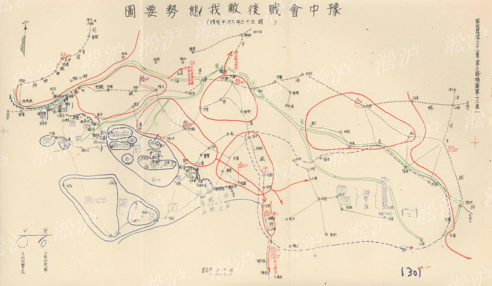

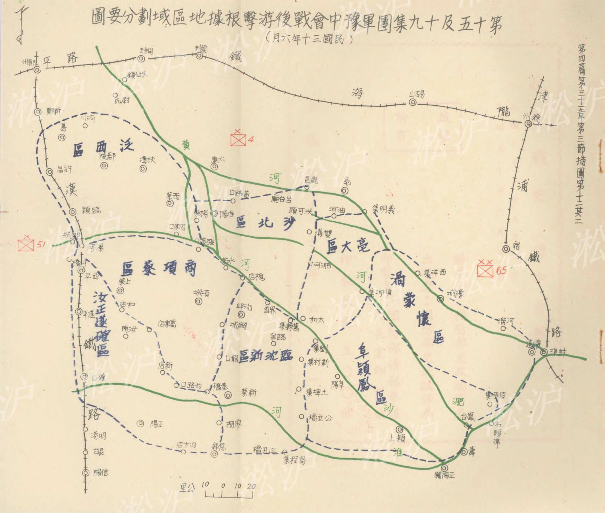
