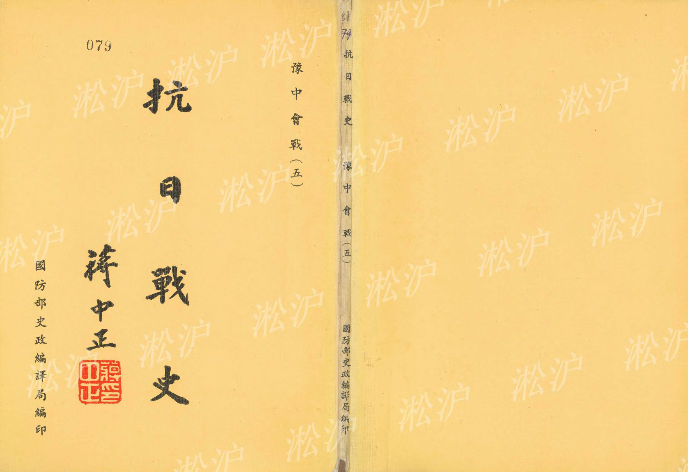

### 第五節 空軍之作戰

#### 第一款 敵軍

參照插圖第九

十五第九十六

自豫中會戰發生以來，敵空軍兵力，較前顯已增加，其在北戰場方面者，計有十一個中隊各種飛機一百零六架；南場方面者，計有十個中隊，各種飛機一百一十四架，上述敵之空軍，旨在牽制中美空軍。關於敵在豫中戰場方面，則有輕轟炸機四個中隊，共三十六架，以運城爲前進基地；以安陽、徐州、武漢爲後方基地。另直協機五個中隊軍偵機一個中隊共五十四架，以新鄉、運城、開封、信陽、荊門爲基地，穿梭活動於豫中戰場前線。另偵察機二小隊計六架，以運城、荊門、安陽、武漢爲基地，作遠程之偵察；戰鬥機五個中隊共六十架，以運城、臨汾、安陽、新鄉、開封、信陽、荊門、武漢爲基地，除掩護轟炸部隊作戰外，並擔任該區之警戒。共計敵擁有飛機一百五十六架，此外駐運城之滑翔機及駐新鄉之運輸機，並有傘兵四百餘名，似爲敵空運挺進隊。

民國三十三年四月十七日，敵在中牟、邙山頭方面開始行動時，我判斷敵空軍有如左之企圖：

一、以輕轟炸機隊作先制之襲擊，自四月中旬開始，轟炸寶鷄、西安、咸陽、安康、老河口、內鄉、盧氏等機場，企圖破壞我後方基地，使陷於暫時癱瘓之狀態下，俾有利於敵軍地面部隊之作戰。

二、以直協機直接配合其地面部隊，參與地面戰鬥，偵察、轟炸我前線陣地，增強其攻擊力。

三、由南洋調集其第二十一作戰機隊及第五十四作戰機隊，於武漢、運城及新鄉一帶，除增強其空防外，有向我後方基地襲擊之企圖。

豫中會戰，敵空軍所用之機場計十一處，其分佈概況與各機場可能容納之飛機數量等之判斷

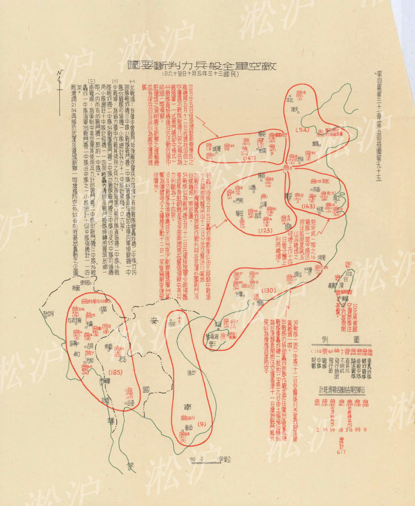

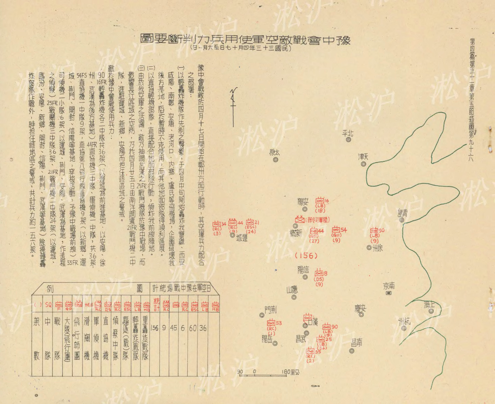

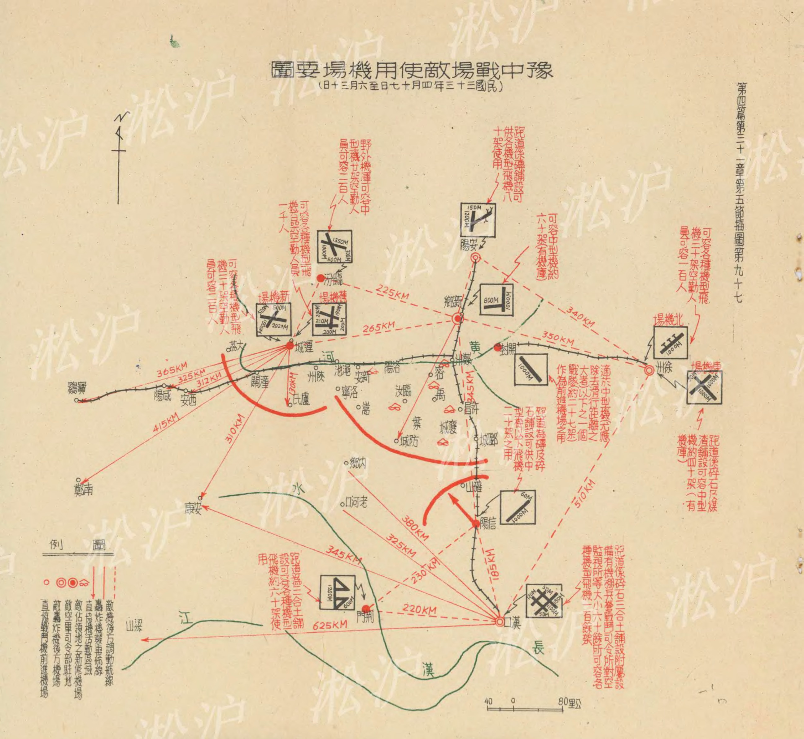

#### 第二款 我軍

(參照插表

第二十一

我空軍之作戰，以獲得戰場制空權，並轟炸敵重要橋樑、渡口，以遲滯其地面進攻行動，並協力我地面部隊作戰，攻擊各地區之敵空軍，以保衛西安地區爲目的，運用我國境內之中美空軍若干部隊及中美混合團，採取積極之空中攻勢，隨時主動襲擊運城、臨汾、安陽、新鄉、開封、信陽等地敵之機場，並與地面部隊切取連絡，以支援其作戰，並激發其士氣，而爭取最後之勝利。

會戰前，我航空委員會，以空軍協助地面部隊作戰，並保衛西安之目的，經與美國第十四航空隊司令陳納德將軍協調，當策定空軍對平漢路之作戰計劃及附件，於三月三十日奉准實施，並限三月底以前準備完畢。該計劃大綱如左（參照插圖）

第一方針

一、我中美空軍，以獲得戰場制空權，轟炸敵重要橋樑、渡口，阻其進攻，並支援地面友軍作戰，保衛西安地區，以爭取最後勝利。

第二

指導要領

二、在會戰期間，須善於利用時機，襲擊敵之重要機場。

三、攻擊開封附近之重要橋樑及中牟附近之渡口。

四、視油量準備之標準程度，考慮目標之重要性，以情況之緩急，規定空軍使用之兵力及攻擊次數。

五、以實施小部隊之奇襲爲原則（雖在情況許可時，亦宜少用大部隊之活動），期能用最經濟之兵力，獲得最大之效果，俾亘於會戰期間任何時期，均保有使用空軍之可能。

六、轟炸黃河鐵橋、漢口至信陽之鐵道線、漢口車站及機場、長江之敵方船舶、鄭州車站、信陽敵補給基地等重要目標。

第三行動任務及部署

七、任務：

(一)保衛在敵機航程內之我方機場及城市。

(二)實施目視及照相偵察，以所得情報，供給我陸軍部隊及中美空軍部隊。

(三)摧毀廣武附近之黃河鐵橋。

四摧毀新鄉及開封之鐵道交點。

(五)攻擊敵機場及地面設備、攻擊敵陣地及設備、攻擊敵水上運輸及黃河、長江兩線之運輸與渡口、攻擊敵方信陽、漢口間之鐵道及漢口各車站，攻擊在我機航程內之其他有利目標。

八、行動：

(一)「某日」獲悉敵方補給品及裝備已運置就緒，相信敵之攻勢已迫於眉睫，希此「某日」能於四天前探知。

(二)「某日」減去兩天之日，中美空軍部隊，應分別進駐指定機場。

(三)「某日」即中美空軍所應毀壞廣武附近之黃河鐵橋及新鄉之鐵路交點之日，或於另外指定之日完成此任務。

四應儘早實施對下列地區之照相偵察。

1. 廣武附近之黃河鐵橋。

2. 新鄉及開封之鐵路交點。

(三)補給如插表第二十二其一、其二。

四西安及寶鷄兩地，應卽進行容納戰鬥P-40N兩個中隊之準備。

五預定以上各項作戰行動，將於「某日」起三十天以內完畢。

自上項計劃奉准實施後，我空軍美空軍及中美混合團之驅逐機，隨卽自南鄭、西安、梁山、恩施、安康等基地出發，分別偵察黃河鐵橋附近漢口、信陽間及平漢路一帶開封、安陽、新鄉、運城、臨汾、漢口、信陽等處敵機場及豫西之登封、偃師、洛陽、新安、滬池前線敵野戰軍之行動，白沙、伊川、宜陽、洛寧、龍門、垣曲、陝縣、茅津渡等地敵之動態；並不時偵察天候氣象、搜索轟炸目標，以便我空軍之出動，並不斷監視敵後方陸空軍兵力之調動，隨時報告。另備照相偵察機二架駐梁山，分往黃河鐵橋新鄉、開封之鐵路交叉點，各主要之敵機場，攝取空中照相，以供判讀之用，並以所得情況，供給我陸軍部隊及中美空軍部隊。所有偵察手段及無線電通信等均有適切規定，至第二線陸空連絡布板符號，則依照我軍事委員原有規定行之。

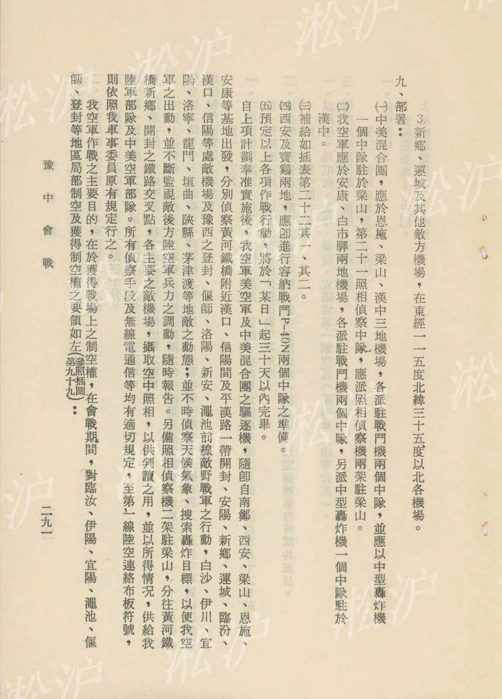

一、制空時間，應多於攻擊時間。

二、每批出動之飛機，以六架掩護六架攻擊。

三、到達制空地區時間，須在五點三十分。

四、第一批飛機十二架，第二批四架，以後二、三架均可。

五、注意在同一空域時間，我空軍與盟軍共同出擊之聯繫。

基於上述要領，當經策定空軍對洛陽附近地區之制空計畫及活動計畫，並於五月十一、十二日先後分令第二路司令王叔銘副司令蔣翼輔遵照實施，由是戰場制空權遂完全操在我方，茲將空軍對洛陽附近地區制空計畫述之如左：

第一方針

一、空軍以爭取臨汝、伊陽、宜陽、滬池、偃師、登封等地區制空權之目的，決自五月十二日起，以一部掩護基地，以主力自安康分批出動爭取制空。

二、以拂曉後黃昏前爲緊要之制空時間，制空重點爲第一制空區，預定連續制空時間共五日。第二制空區之規定

一、以滬池、馬屯街、孟津、偃師、宜陽爲第一制空區（圓週共二四零公里）。

三、制空地境爲偃師、洛陽、宜陽之線。

第三使用基地及兵力區分

一、使用基地：

1. 主前進基地——安康。

2. 補助前進基地——西安。

二、兵力區分：

1. 第一批P-40N八架。

2. 第二批P-40N八架。

3. 第三批P-40N六架。

4. 第四批P-40N六架。

5. 第五批P-40N六架。

第四 任務及行動

一、任務——五月十二日之任務如左：

(一)對洛陽南方關帝陵敵砲兵陣地之攻擊。

(二)制空區內對敵機之攻擊。

(三)巡邏制空區內，掩護我地面部隊之行動，制壓監視並攻擊敵地面部隊，特須注意黑石關、偃師、洛陽東邊及三山村等處部隊之攻擊。

二、行動：

(一)各批到達制空區上空及應服行制空之時間如左表：批

數

到

達

制

空

區

上

空

時

間

制

空

時

間

離

開

制

空

區

時

間

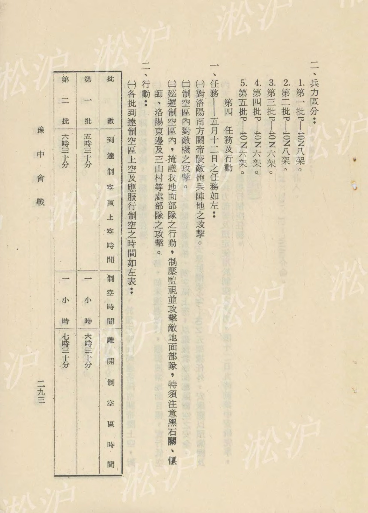

(二)第一、第二批中各以四機每機攜帶二百磅炸彈兩枚，於預定時間到達洛陽南關帝陵上空，對敵砲兵陣地攻擊後，再服行制空任務。

(三)各批在制空區內，服行四十五分鐘制空任務，如未遭遇敵機，應卽搜索地面目標，實行低空攻擊後返航。

四各機制空任務，應以較多之時間巡邏於第一制空區上空，以確保我地面部隊對空之安全。

五基地之防空，南鄭由下機八架、西安原駐機場之P-40Z五架擔任外，安康應以預備機及待命出動之各機擔任之。

(六)五月十一日，各基地之兵力部署及預定使用於制空之兵力，限十二日九時前集中安康完畢，但原駐安康之部隊，應服行制空任務。

參照西長

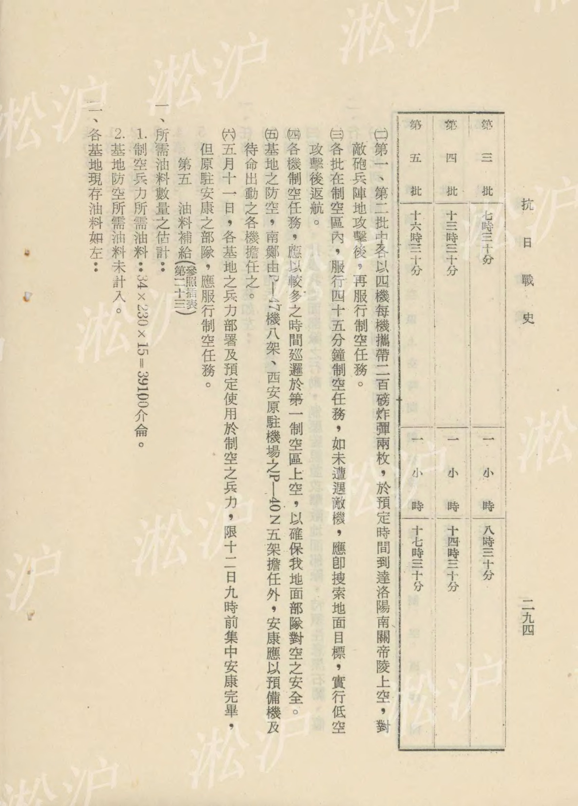

安康——三八、七八八介命。

西安——一七三介命。

南鄭——二五、二六二介命。

三、不足之油料，刻正集中車輛趕運補充中。

四、陸空空運通信聯絡，如本部之規定。

其時，我空軍對敵空軍，在豫中戰場所使用兵力及其部署加以判斷後（參照插圖），特擬定對洛陽附近地區之行動計畫如左：

第一方針

一、我空軍以攻擊洛陽、磁澗鎮、龍門三角地區內敵機械化部隊，協同我地面部隊固守洛陽之目的，決於五月十三日，以一部擔任基地防空，以主力於拂曉前自安康、南鄭分批出動，索敵而攻擊之。

第二 使用兵力及基地與兵力區分

二、使用兵力：

(一)我第四大隊—40Z機十五架，第十一大隊P—40Z八架。

(二)美空軍—47機八架。

三、使用基地：

(一)主基地——安康。

(二)補助基地——南鄭及西安。

四、兵力區分：

(一)第一批P-40N八架，P-47四架。

(二)第二批P-40N四架

(三)第三批P-40N四架

四第四批P-40N四架、P-40四架。

(五)第五批P-40N六架

第三 任務及行動概要

五、任務：

(一)上下午，各派P-40N二架，對嵩縣、伊陽、臨汝、伊川、宜陽一帶及垣曲附近偵察敵地面部隊之行動，及其機械化部隊之有無。

(二)三角地區內對敵機之攻擊，掩護我地面部隊對空之安全。(三)三角地區內對敵機械化部隊之轟炸及其地面移動部隊之攻擊。四龍門、臨汝道上敵交通車輛之制壓及黑石關浮橋部隊之攻擊。六、行動：

(一)各批到達三角地區上空及履行任務之時間如左表：

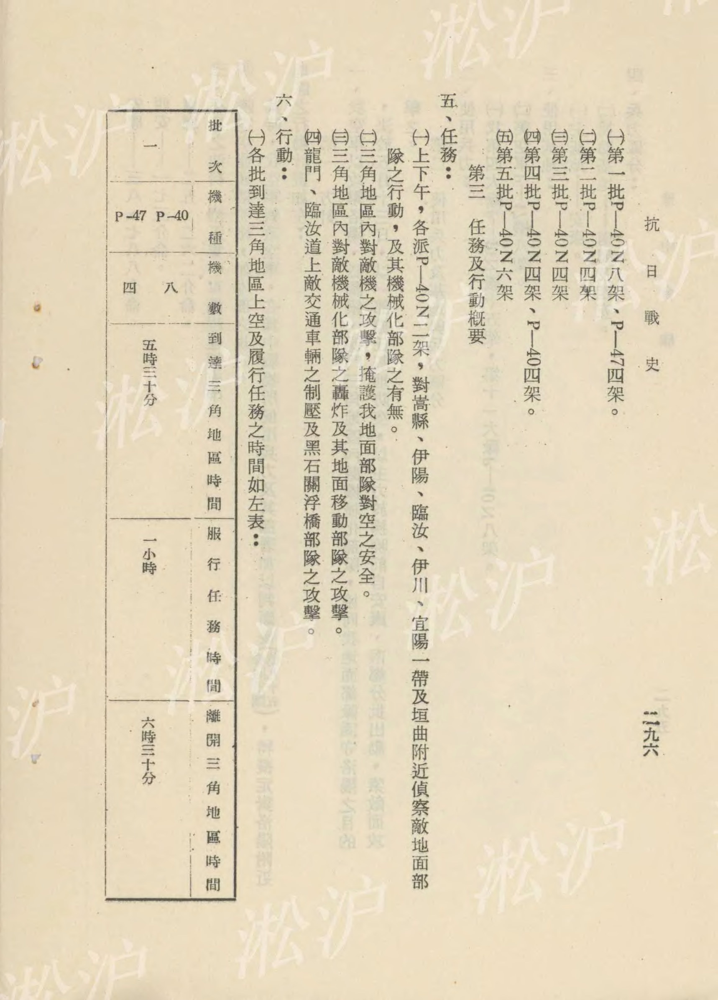

(二)基地之防空，以待命出動之飛機及預備兵力擔任之。

(三)五月十二日各兵力之部署，安康不足之兵力，應由各基地抽調，統限十四日九時前到達安康，但原駐安康之部隊，應先服行任務。

四爲圓滿實施任務計，如兵力不足時，第一、二批出動之飛機，應擔任第四、五批之任務。

五混合團所屬飛機，應分批出動前往洛陽、磁澗鎮、龍門三角地區，對敵攻擊，其行動由該團自行計畫之。

(六)司令依情況之需要，對上項行動得臨時變更之。

(七)對敵停止間集中之裝甲部隊，以轟炸爲之，力求避免低空攻擊。

(八)遇敵行進中之裝甲部隊，及特別有利之目標，可相機施行側面攻擊，其先頭或殿後部隊，或攻擊及脫離方向時，應以低空進入，低空蛇行脫離爲原則，並利用太陽方位，施行奇襲，次數宜少。

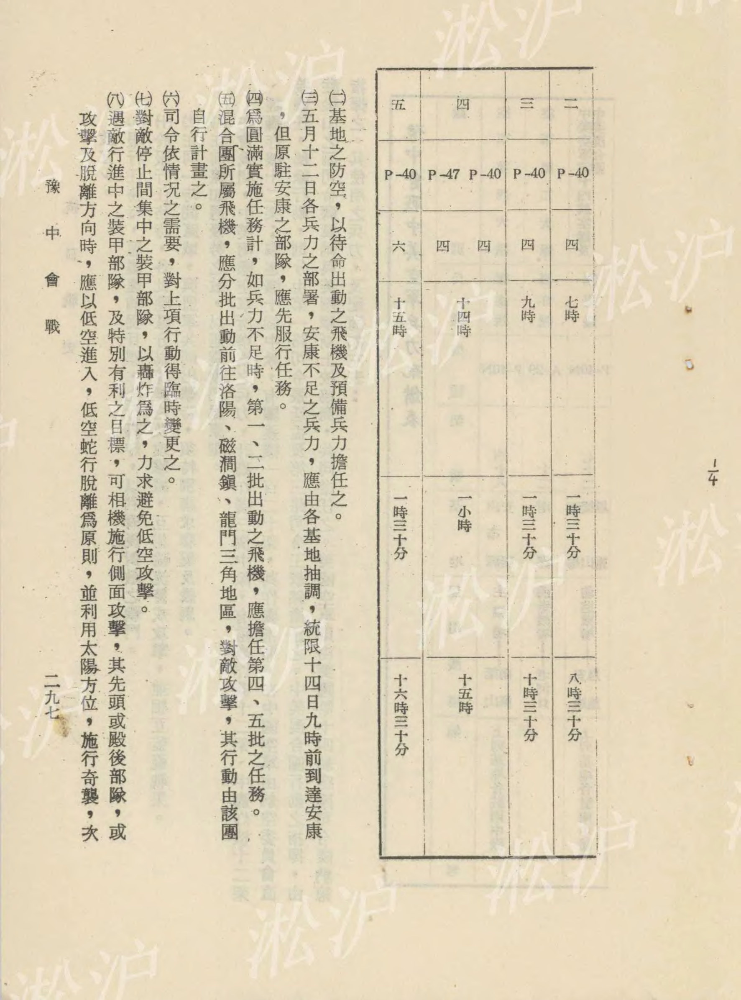

(九)服行任務時，應儘速捕捉目標，先行轟炸，以利爾後對敵之戰鬥。

(十)於服行任務時，各批應區分爲掩護組及攻擊組，互相輪流警戒攻擊，並相互監視戰果。

(十一)在同一時間區域，與盟軍共同出擊時，須特別講求聯繫及識別。

(二)在前線如遇優勢之敵，以迴避戰鬥爲原則。

在會戰間，中美兩國空軍所準備之兵力，計轟炸機三個中隊，有重轟炸機十二架、中轟炸機十二架、輕轟炸機十二架；驅逐機十個中隊，有驅逐機一百二十架，其作戰指揮，在中國空軍由航空委員會直接擔任，部隊行動，則分由第一路司令張廷孟及第三路司令王叔銘擔任之。中美混合團行動之指揮，由駐梁山之副司令蔣翼輔與美國摩斯上校協商，共同擔任之。美國空軍則由美國第十四航空隊司令陳納德指揮之。其使用之兵力，及配備如左表：

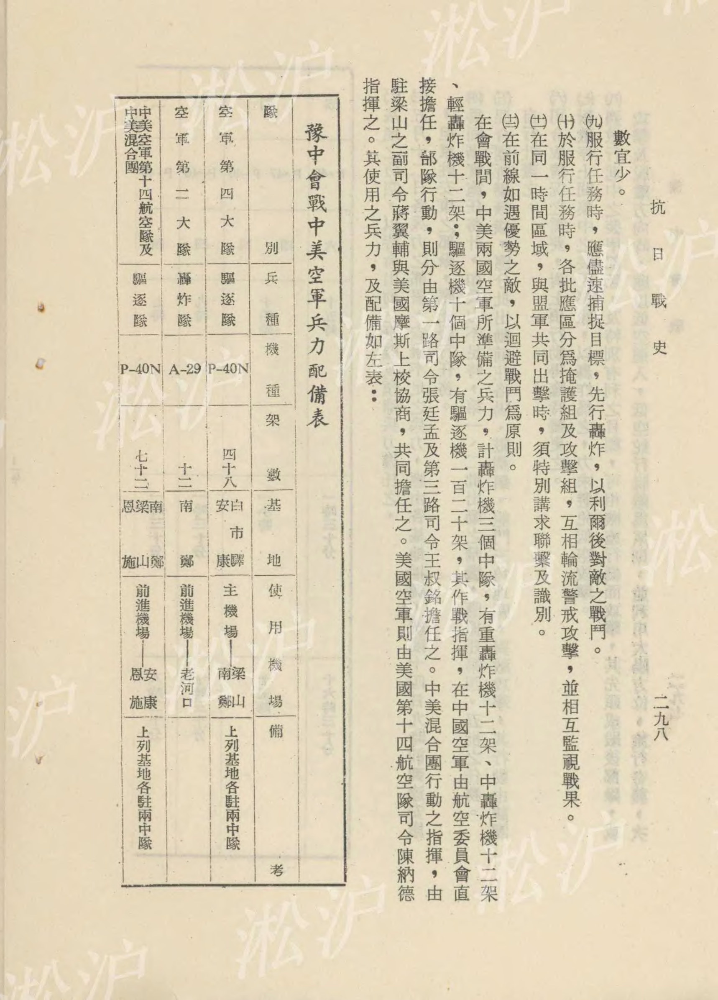

會戰間，我空軍之驅逐大隊，自成都出動，分駐白市驛、安康，使用之主機場爲梁山、南鄭。轟炸大隊駐南鄭：以老河爲前進機場。美國空軍及中美混合團概自滇、桂、湘、川出動，使用桂林，衡陽、新津、南鄭、梁山及西安各總站及寶鷄、恩施，安康各航空站，其驅逐隊分駐各地，以恩施、安康爲前進機場。中美混合團之轟炸隊駐梁山，以西安、寶鷄爲補助機場。美空軍重轟炸隊駐成都附近，以南陽、內鄉航空站爲臨時迫降場。以上各總站及航空站，所有晝夜昇降、通信、氣象、交通、衛生、修理等項均有永久設備，其機場加以整頓，足供輕重轟炸機之昇降，並構築飛機掩體與停機道等。其總站附近各機場，則儘量供飛機疏散、加油、休息及臨時迫降之用，除有充分之昇降場外，其他設備均較簡易，至各準備之準則如左：

甲、我國空軍

一、白市驛驅逐機一中隊。

二、安康驅逐機一中隊。

三、南鄭輕轟炸機一中隊。

四、梁山照相偵察機一分隊。

乙、美國空軍及中美混合團

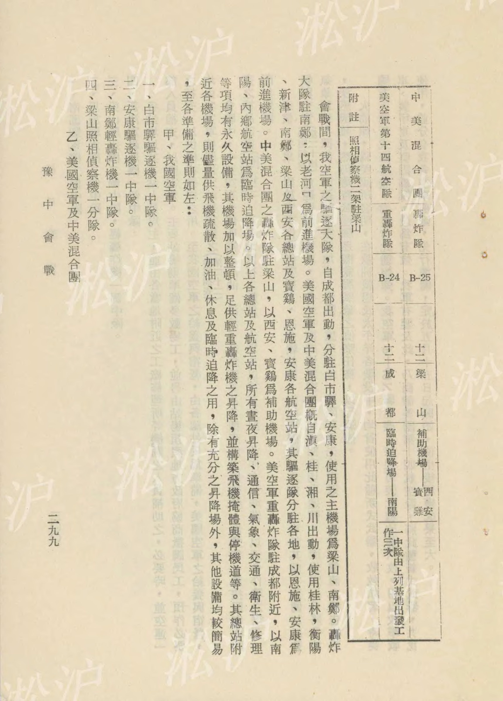

一、南鄭驅逐機二個中隊。

二、恩施驅逐機二個中隊。

三、梁山驅逐機二個中隊，輕轟炸機一個中隊。

四、新津重轟炸機一個中隊。

各站均以其本站人員爲主，並由各當地附近之工廠修理所等機關之人員補助之，必要時，並空運一部人員補充，以應需要。主要站場則準備多數場工，並另由站場預與地方政府協商徵調民工，預作必要之補充，以供機場搶修之用。至我國空軍之給養與宿營，由各總站妥爲準備，美國空軍之給養與宿營，均由我空軍按照預定計畫實施之（參照插表）。

會戰中，中美空軍全部所需之汽油、滑油、散熱液等及各種應備之槍砲彈、炸彈等，悉按照作戰計畫之補給計畫（參照插表），視各地原存之數量，分別加以補充分配，並作充分準備，以適合作戰之需要，而無遺憾。

通信、氣象，對於空軍作戰影響極大，故會戰前後，對此種機構之設施，亦均就其原有設備加以整頓與充實（參照插表）並經盟國之協助，於各站場構成情報網及與地面部隊切取連繫，一面規定逐日將各地氣象預報指揮部，已達呼應靈活地步，洛陽、盧氏兩地，因陷落而先後撤退，以致最有價值之報告缺乏，深感困難，然仍隨時派遣驅逐機兼服氣象之偵察任務，以行彌補。

火箭砲，爲美國所發明，在歐洲戰場及太平洋各戰役中，均曾使用此種新式武器，收效頗著，時美國有五種新式驅逐機，均裝有此種砲彈。我空軍P—10Z驅逐機，每架可裝此種砲彈六枚，用以攻擊戰車、裝甲車及堅固橋樑，最爲有效。我軍有鑒及此，乃商請美國第十四航空隊，將此種新式武器，共伐使用，並分令我各空軍部隊，先行準備，定於五月十五日起開始，使用後所獲成果至大。

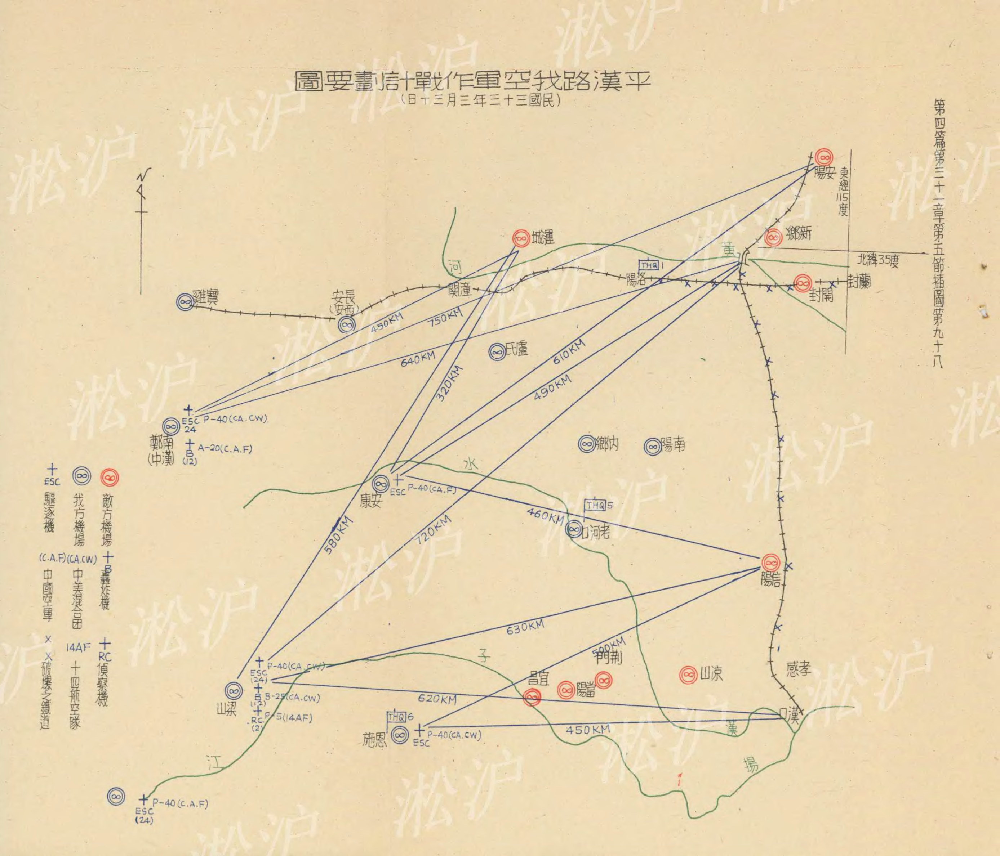

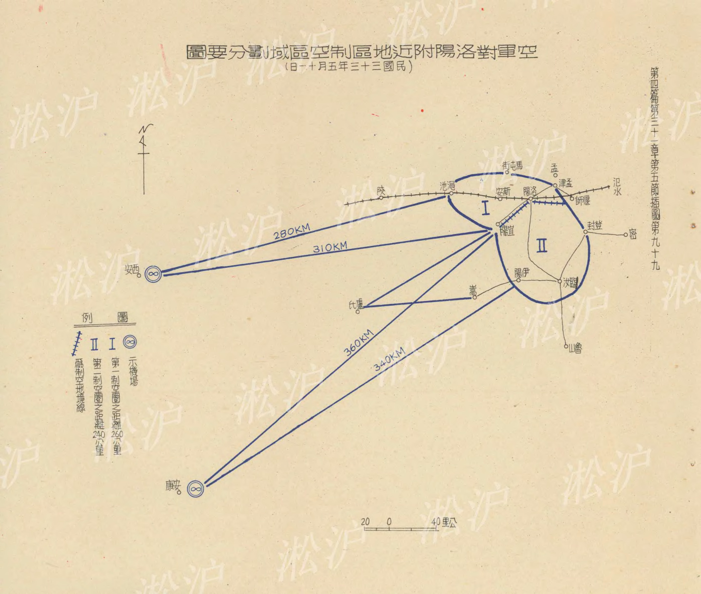

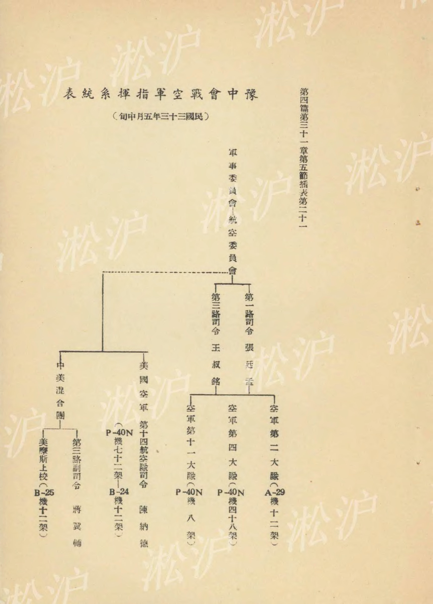

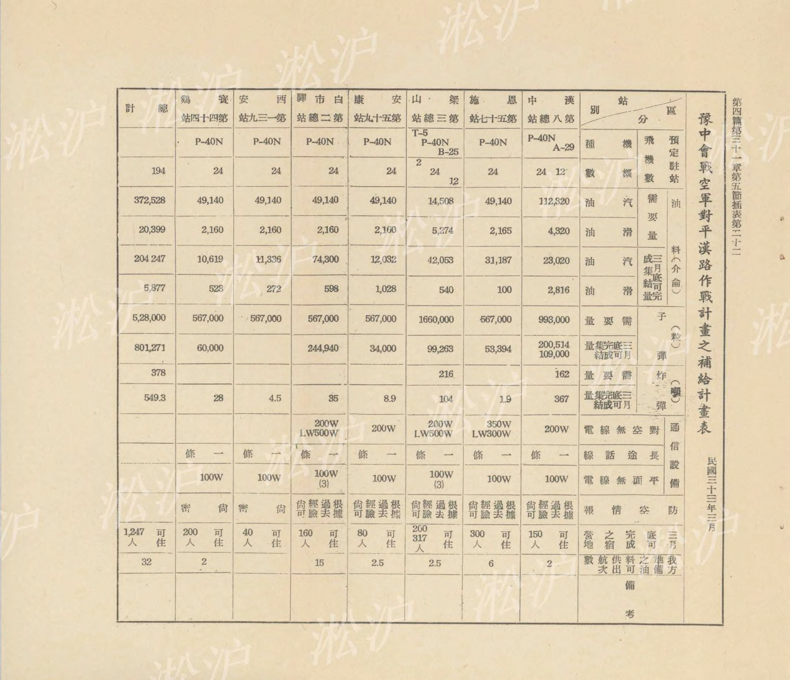

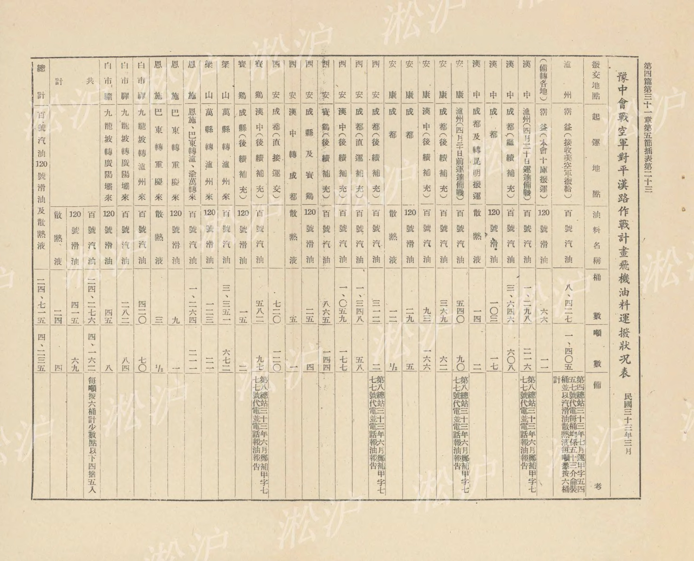

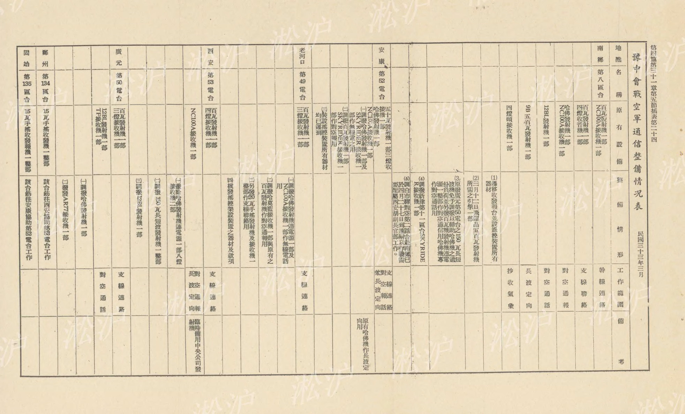

#### 第三款 作戰經過

##### 第一項 作戰概況

自民國三十三年三月中旬，策定空軍對平漢路作戰計畫及其補給計畫後，三月底即完成各戰區之地面諸準備，並決定平漢路使用空軍兵力及機場，迄四月中旬，中美空軍兵力之調遣，已配備就緒。敵自四月中旬以來，卽自鄭州方面開始行動，其後續援軍源源渡河南下，其打通平漢路攻取洛陽，進而向豫西發展之企圖至爲明顯，我空軍當遵照計畫準備出動，協助地面部隊作戰，以阻止敵之前進。

四月二十五日，派美空軍B-25機三十六架，由昆明出發，擬轟炸信陽之敵，因當日氣候異常惡劣，飛機出動後中途折返。四月二十六日，乃派駐南鄭驅逐機，於五時三十分及十二時，分往前線偵察氣候。二十七日，更派南鄭驅逐機九架，分三次出發襲敵，亦均以天氣惡劣，中途折返，直至四月二十八日，我空軍始於第一線臨空助戰，並轟炸黃河鐵橋，迄偃師失守，洛陽被圍，平漢路及其以西若干縣城相繼陷落，敵益擴展其戰線，分向豫西突進，並向南北夾攻平漢路，企圖會師駐馬店。五月十一、十二兩日，我空軍遵照蔣委員長所示，對洛陽附近空軍使用原則，擬定空軍對洛陽附近地區「制空計畫」，卽日實施，曾獲得局部之制空權，嗣更臨時訂定空軍行動計畫，繼續攻擊洛陽、西工、新安、宜陽及白沙道上敵機械化部隊。

五月十五日，豫中會戰之空軍活動計畫如左：

第一方針

一、空軍以繼續攻擊西工、新安、宜陽及臨汝、白沙道上敵機械化部隊之目的，自五月十五日起，以一部擔任基地之防空，以主力於拂曉自安康分批出動，索敵而攻擊之。

第二

指導要領

二、停止間之敵軍車輛部隊，常配置強烈之高射火力，須以轟炸爲主，避免低空攻擊。

三、實施低空對敵地面部隊攻擊時，應注意相互掩護及脫離方法之講求。

四、遇行進中之敵機械化部隊，可相機低空攻擊之。

五、在同一時間區域與盟機共同出擊時，特須注意聯繫及相互支援。

第四

任務及部署

六、我空軍之偵察與攻擊；

(一)偵察滬池附近之敵動態，新安、西工、宜陽道上敵機械化部隊之兵力、兵種及位置，洛陽城狀況，白沙、臨汝道上敵機械化部隊之有無。

(二)對西工、新安及宜陽敵機械化部隊之攻擊。

(三)先派機偵察，發現有利目標後，繼續不斷攻擊之。

七、中美混合團所屬飛機，應分批出動，攻擊西工、新安、宜陽道上敵機械化部隊。

五月十七日，我航空委員會，復策定空軍作戰指導要領按照實施，以殲滅洛陽、洛寧、盧氏道上敵之機械化部隊。及至六月中旬，綜觀陸軍一般戰況，敵雖曾一度實施打通平漢路之企圖，然經陸空軍聯合反攻，平漢路復被切斷，豫西方面，自經我克復靈寶、嵩縣後，豫中形勢，亦臻穩定。時我空軍在豫中戰場，已無須作大規模之反攻，故六月中旬，乃決定僅留少數兵力，擔任豫中戰場之作戰及偵察任務，其他各部隊，乃陸續撤回，予以整補，以待後命。茲將我空軍逐日戰鬥概況，列表統計如插表第二十

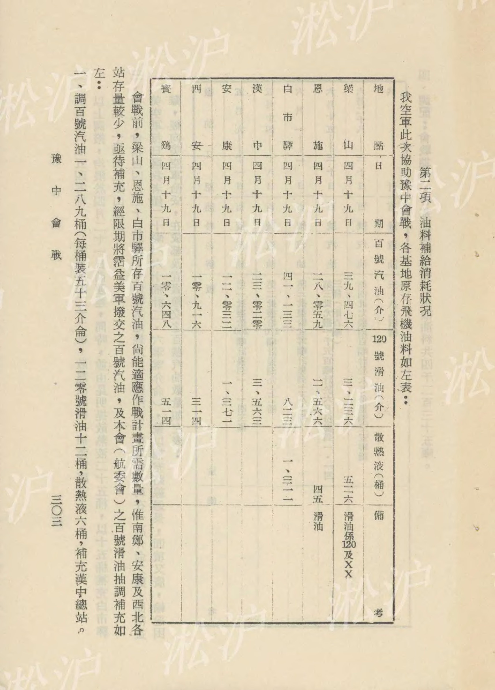

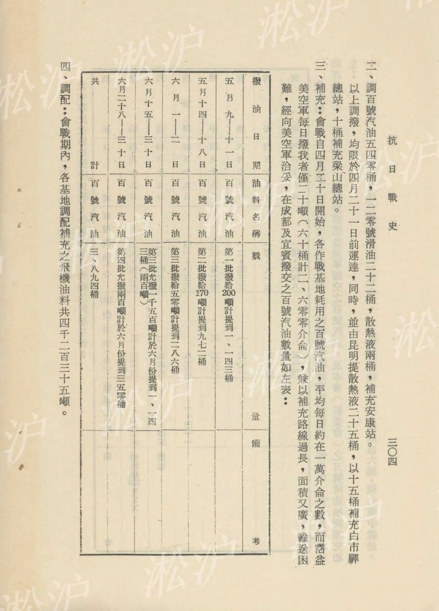

五、消耗：各基地自四月二十日至六月六日止，共耗百號汽油一二零號滑油及散熱液計四十二萬九千七百七十八介命。

##### 第三項 英勇事蹟

中美空軍自作戰以來，視情況之需要，隨時出動，或轟炸敵方重要車站與機場，或襲擊其倉庫及軍火屯集處，或掃射其司令部兵營及車站重要橋樑及隧道，或在基地上空巡邏警戒，其中尤以轟炸廣武、開封及鄭州、新鄭間、郾城、信陽間之鐵路橋樑阻斷其運輸交通線，並獲得優良戰果。就中英勇事蹟多端，有足述者：

如五月十一日，中美混合團第七中隊飛機五架掩護第二十三驅逐中隊機六架，俯衝轟炸垣曲附近敵補給庫，當有七架零式敵機起而欄擊，遂發生空戰，結果我楊永光、葉望飛兩上尉各擊落一架，TK.A.N.擊落兩架，里德少校擊傷一架，我驅逐機亦協同擊落一架。此外，無線電射擊手谷豐年上士，於河南新安店隨機作低空轟炸平漢路橋樑之時，因地面敵砲火猛烈，我機一架無線電中彈兩枚，該上士頰部受傷，於飛返梁山基地途中，仍忍痛盡職，抵達基地後，始得醫藥救治。又我機一架，於出發途中，因發動機發生故障，乃行折回，然當時四週密雲滿佈，方向莫辨，飛行員王文星中尉，如墮五里霧中，不知己之所在，迨飛至梁山西面上空，汽油供給復極速減低，乃盤旋於一村莊上空，然無處可降，於無救中由無線電收得設法二字，王中尉遂命陳福生上士跳傘，該上士如命而行及着陸後，辨明方向，乃以記號指示重慶方向，王中尉卽照其所示，安抵重慶再返梁山，此價值鉅萬之飛機及機上全體人員，因陳上士英勇果敢之精神及聰敏過人之智慧，得以獲救，此誠驚人之奇蹟，而永不可磨滅者也。

本會戰，空軍作戰成果，敵方損失及我軍傷亡損耗等，除（插表第二十六）外，對平漢路作戰各基地已耗用油料，計100號汽油四二四、六八三介命，120號滑油四、五二五介命，散熱液五七零介命，其時對

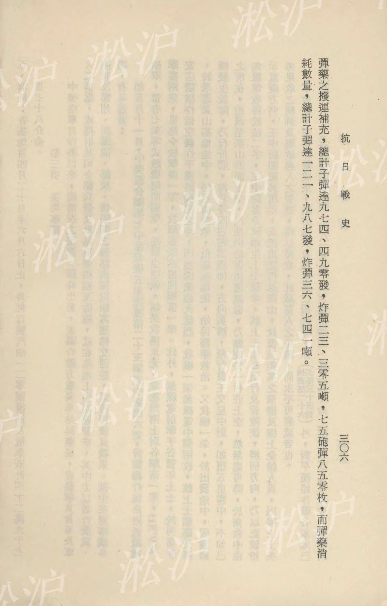

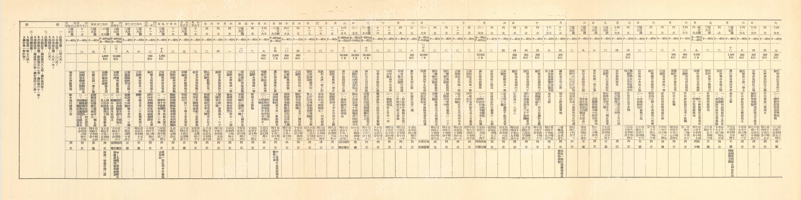

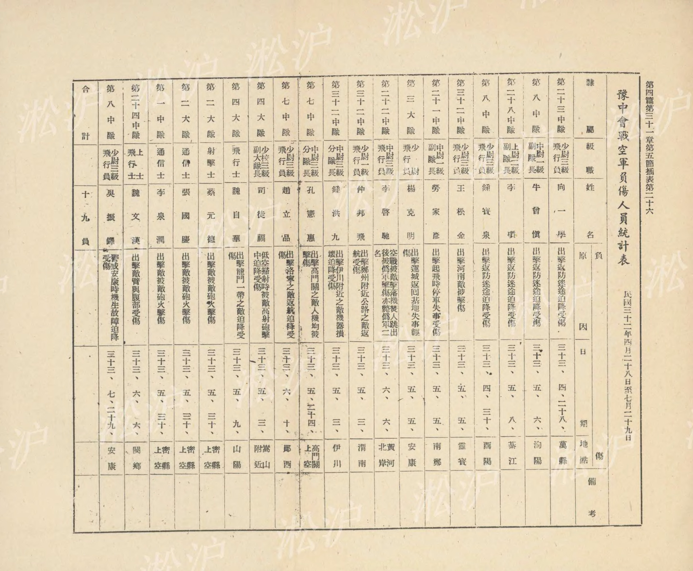

<table border=1><tr><td colspan="2">隸屬</td><td colspan="2">級職</td></tr><tr><td colspan="2">姓名</td><td colspan="2">死</td></tr><tr><td>原因</td><td>日期</td><td>地點</td><td>備考</td></tr><tr><td>在機場指揮疏散被飛機撞</td><td>三十三、五、三、</td><td>西安</td><td></td></tr><tr><td>出擊龍門一帶敵被敵砲火</td><td>三十三、五、十二、</td><td></td><td></td></tr><tr><td>擊落被俘殉職</td><td>三十三、六、十一、</td><td>平陸</td><td></td></tr><tr><td>空戰時被敵高射砲擊中陣</td><td>三十三、六、五、</td><td>靈寶</td><td

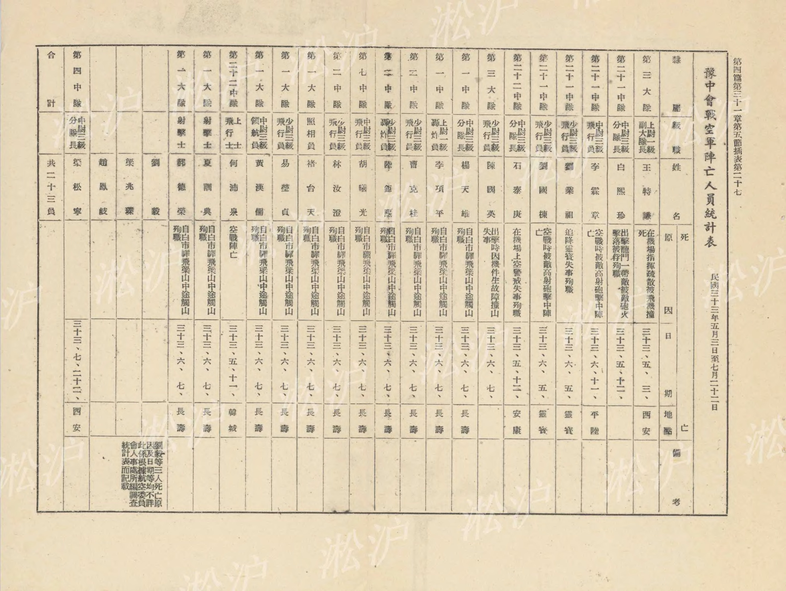

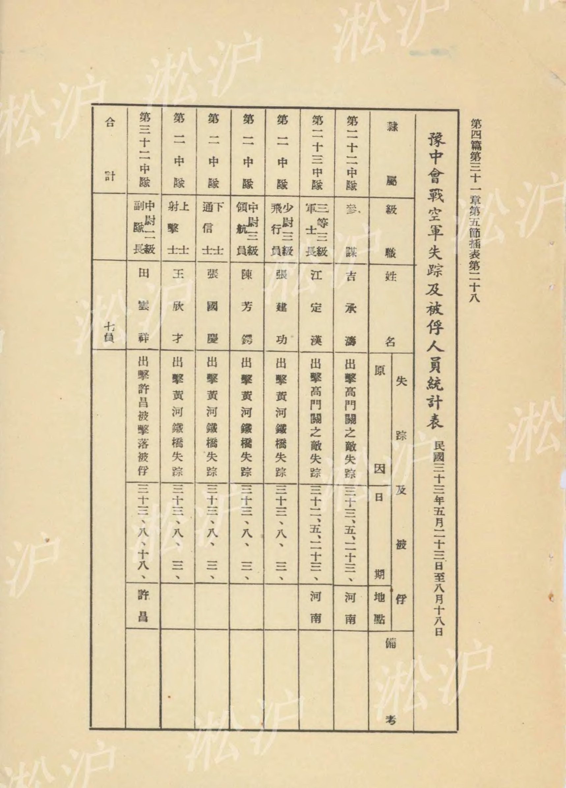

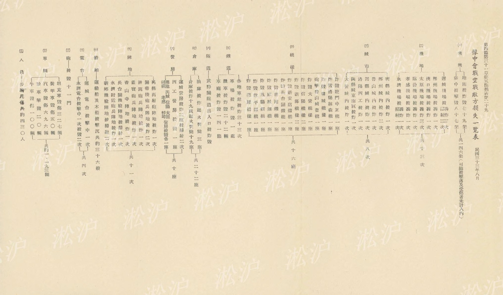

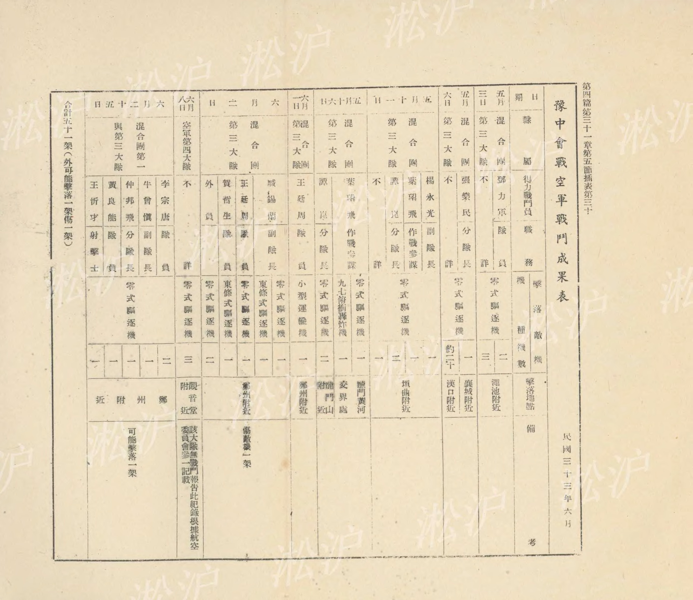
