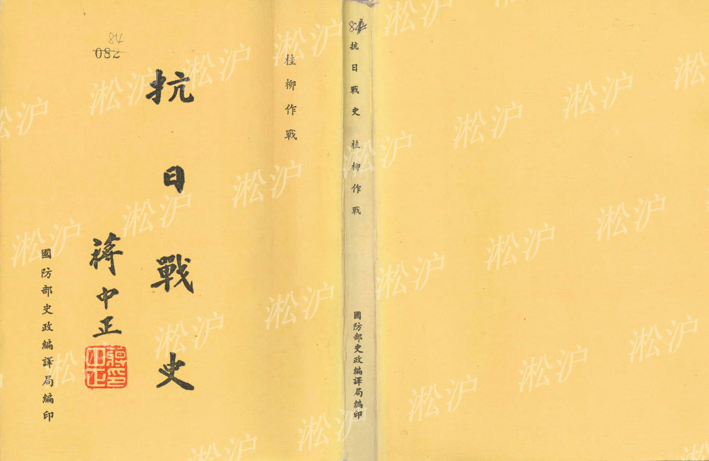

## 第三十三章 桂柳作戰

概述

### 第一節 作戰前狀況

#### 第一款 敵軍

#### 第二款 我軍

#### 第三款 兵誌概要

### 第二節 我軍作戰指導

### 第三節 作戰一般經過

#### 第一款 桂柳外圍戰鬥

#### 第二款 桂林及柳州附近戰鬥

#### 第三款 黔桂路沿線戰鬥

#### 第四款 作戰後狀況

### 第四節 重要戰鬥

#### 第一款 湘桂路沿線戰鬥

#### 第二款 桂平及蒙墟附近戰鬥

#### 第三款 桂林核心戰鬥

#### 第四款 柳州附近戰鬥

#### 第五款 宜山及懷遠附近戰鬥

目

錄

一

第六節 後方勤務

第七節 檢討

第一款 敵軍

第二款

我軍　一〇六　一〇五　一〇五　八九　八九　九八　九八　一〇五　一〇五　一〇五　一〇五　一〇

## 第三十三章 桂柳作戰

抗日戰爭，迄民國三十三年秋，日本所謂「以華制華」、「以戰養戰」等政略俱遭失敗。是年入夏以後，美超級空中堡壘自中國基地起飛，出擊敵國本土、僞滿工業區、日軍控制下之重要城市港灣及中南半島之海上交通線，日軍船隻損失過大，勢將無法運輸，同時美軍太平洋之攻勢，飛躍進展，於七月上旬佔領塞班島，中國駐印軍編訓完成，於八月上旬克復密支那，遠征軍已改爲美式裝備，於八月上旬攻入騰衝，打通中印公路，指日可期，中國軍之總反攻，已不在遠；盟軍在法國開闢第二戰場，德國行將崩潰等，一連串不利軸心方面形勢之演變，使日本朝野對戰爭前途悲觀，惶恐不安。日本在華之百餘萬大軍，不甘坐以待斃，自三十三年夏，由華北、華中、華南集結優勢兵力約二十萬，陷我長、衡，遂於十月下旬續向桂柳深入，冀打通「西南大陸交通線」，以維持其對中南半島之運輸，並破壞我桂柳空軍基地，以減少其空中威脅。

當長衡會戰之際，我軍事委員會卽判斷敵如佔領衡陽後，將續攻桂柳，當經決定加強桂林、柳州附近各約兩個軍之陣地構築，準備於桂林固守三個月，蓋判斷於三個月後，敵在太平洋與其本土必然有重大變化。於是令第九十三軍固守全州、第三十一軍固守桂林、第四十六軍向柳州集結。令第七、第九兩戰區抽調第三十五、第二十七兩集團軍，先後由湘粤分途入桂，參加桂柳作戰。令第六戰區以有力一部，在湘西方面策應作戰。嗣判明敵軍使用於桂柳方面之總兵力，將超過十個師團，我軍爲增強兵力，除將第九十七軍控置於黔桂邊區爲機動部隊外，並抽調第八戰區之第二十九軍、第九十八軍、第九軍、第十三軍、第五十七軍等五個軍，分別以車運空運由西北向貴陽、馬場坪、都勻、獨山間地區集中。

十月間，我軍對湘桂路之敵取守勢，對西江之敵轉取攻勢，予敵以相當打擊，嗣以敵後續部隊源源到達，我兵力劣勢，且天候惡劣，交通不便，兵力運用受阻，致我桂柳守軍孤立無援，終至桂柳同時陷落，但事後證明，敵愈深入，困難愈多，當敵攻抵獨山、都勻附近時，我增援兵團陸續到達，展開反攻，敵攻勢頓挫，節節後退，我乘勢追擊，先後克復獨山、六寨、南丹等黔桂路要點，直達河池及其以東一帶地區，遂奠定三十四年夏我南戰場總反攻之基礎。

敵軍罄其餘力，發動本作戰，歷時三個月，付出極大之犧牲，在外形上雖已打通大陸交通線，而時間及資材不足，迄未能通車，對整個戰局毫無補益；且愈陷兵力於分散，戰略態勢尤爲不利，旋卽被迫撤退，終屬徒勞。

### 第一節 作戰前狀況

(參照插

圖第一

#### 第一款 敵軍

(參照插表第

一第二第三

衡陽方面：敵軍攻佔衡陽後，其第三、第十三、第四十、第五十八等四個師團，集結於衡陽附近，逐次向衡陽外圍擴張據點；其一部沿粵漢路南進，進出耒陽、常寧等地。八月底，敵上述四個師團沿湘桂路向西南前進，另以第三十七、第一一六兩個師團向湘西邵陽前進。九月初，我祁陽、零陵、東安、新寧等地，相繼失守，八日，敵軍到達湘桂邊界之黃沙河。

雷州方面：長衡會戰之初，雷州半島敵第二十三獨立旅團，即匆匆集結於遂溪附近，待機發動，八月一日至五日及同月之二十二日至二十四日，兩次北攻廉江，以試探我虛實，準備北進。九月八日，湘桂路方面敵軍進出黃沙河之際，亦同時北進。

廣州方面：長衡會戰之初，粤敵第一零四師團亦同時發動粤北攻勢，進陷清遠，旋攻英德，與衡陽南進之敵相策應，但被我阻止，乃重新部署，冀配合湘桂鐵路正面敵軍之西進。九月初旬，其第一零四師團集結於三水、四會、蘆苞、清遠、太平等地，第二十二師團集結於新會（江門）地區，八日以後，會同臺山附近之獨立第二十二旅團發動攻勢，沿西江之南北西進。

長衡會戰以後，敵空軍損失慘重，補充困難，空軍基地亦因輸力及資材不足，無法推進，對協力陸軍之作戰，除實施夜間攻擊外，僅能於每日薄暮拂曉前後，或在我空軍活動間隙中，以偵察機執行直協而已。

綜合上述，敵陸軍方面：由湘桂路進攻者，爲其第十一軍橫山勇所屬之第三、第十三、第三十七、第四十、第五十八、第一一六等六個師團，附戰車一聯隊；由廣州及雷州半島向桂境進攻者，爲駐粤之第二十三軍田中久一所屬之第二十二、第一零四師團，獨立第二十二、第二十三旅團，及越南駐屯軍第二十一師團之一部。計可能使用之兵力爲九個師團、兩個獨立旅團、戰車一聯隊，共約十一萬人。空軍方面：其兵力多集中武漢地區，判斷有轟炸部隊計第九十戰隊九架及第十六戰隊十八架，驅逐部隊，計第四十八戰隊三十六架（內十二架駐白螺磯）及第二十五戰隊二十四架，直協及偵察部隊計第六戰隊直協機九架第四十四戰隊直協機九架及第十八獨立中隊六架（分駐武漢廣州），共約兵力一一一架。

#### 第二款 我軍

(參照插表第

四第五第六

我第四戰區，自民國二十九年冬收復南寧後，轄區已無敵軍蹤跡，數年來與敵駐越軍及雷州半島之敵遙相對峙。自長衡失陷，西南局勢爲之一變，衡陽之敵，繼續沿湘桂鐵路前進，同時廣東西江及雷州半島之敵，亦呼應前進。我第四戰區遂積極備戰，一方面發動民衆擴充地方團隊，以維持後方治安；同時令甫由綦江抽調抵桂之第九十三軍（欠暫編第二師），擔任全縣（全州）及黃沙河之守備，以第三十一軍（欠第一三五師，另配屬第四十六軍之第一七零師）守備桂林，以第十六集團軍副總司令韋雲淞爲桂林防守司令，參加衡陽會戰第四十六軍之第一七五師，則令集結於柳州整理，令第三十一軍之第一三五師（當時該師爲後調師），以主力駐守南寧，另派一團於平南縣之丹竹附近擔任機場警戒，原配屬之第三十五集團軍第一五五師，則仍令擔任廉江方面之守備。該戰區兵力部署，置重點於湘桂路正面，而以確保桂柳爲着眼，至於廣東西江及桂南桂西各方面，以無兵駐守，不得已，飭令各該區地方團隊及民衆武力，嚴行整頓備戰，以補救戰區一時兵力之不足。

長衡會戰時，中美空軍聯合作戰，空軍實力增強，戰場制控權悉入我手，所使用基地爲芷江、零陵、邵陽、恩施、桂林、柳州、昆明、梁山、成都、白市驛、老河口等機場。

綜合上述，桂柳作戰初期，我第四戰區所有兵力，爲第十六集團軍之第三十一軍、第九十三軍及第四十六軍兩個師，第三十五集團軍之一個師，總兵力約六萬人，且第九十三軍於桂柳作戰之直前始趕到全縣，第三十一軍及第四十六軍各師大部曾參加衡陽會戰，實力已欠充實，而地廣兵單，處於不利之狀況。惟空軍方面，我佔絕對優勢，計有第四、第十一兩大隊驅逐機三十六架、中美混合團驅逐機五十三架、轟炸機二十四架，及美第十四航空隊轟炸機四十四架、驅逐機六十架，共計二一七架，分駐上述各基地，時予敵空軍以制壓，故此時我對敵空襲之威脅，則無多大之顧慮。

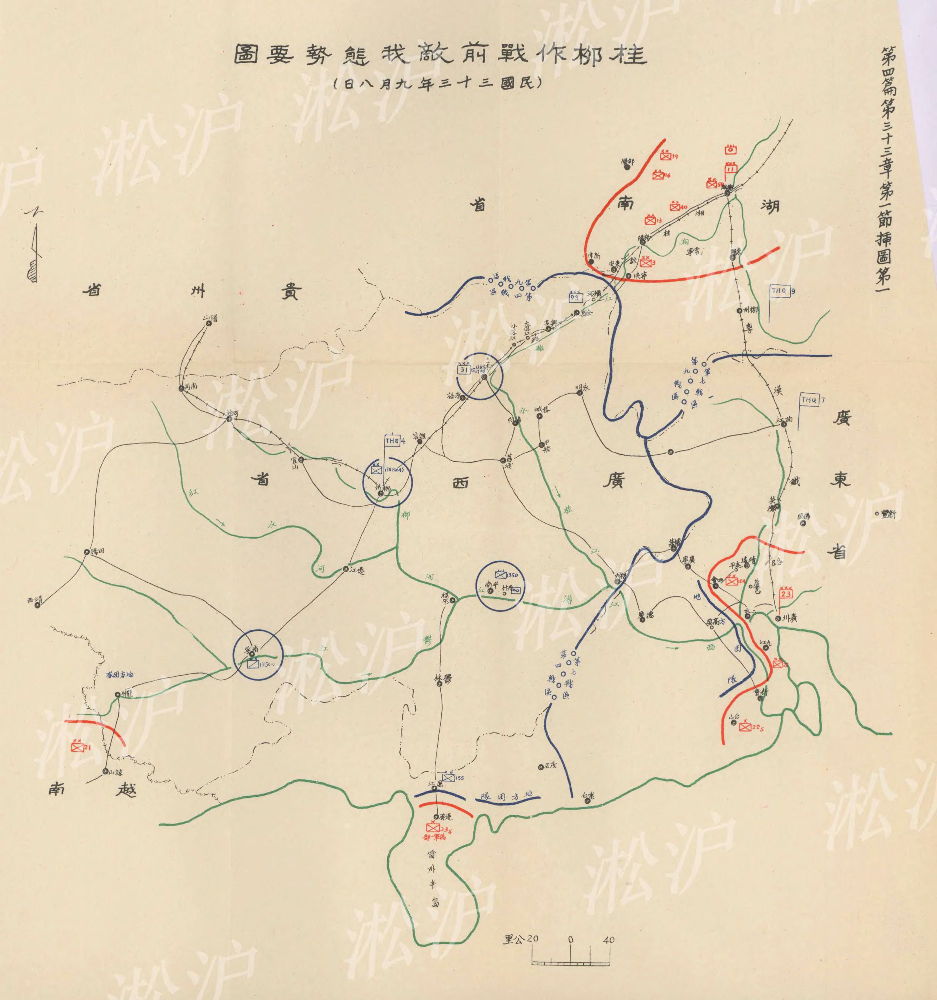

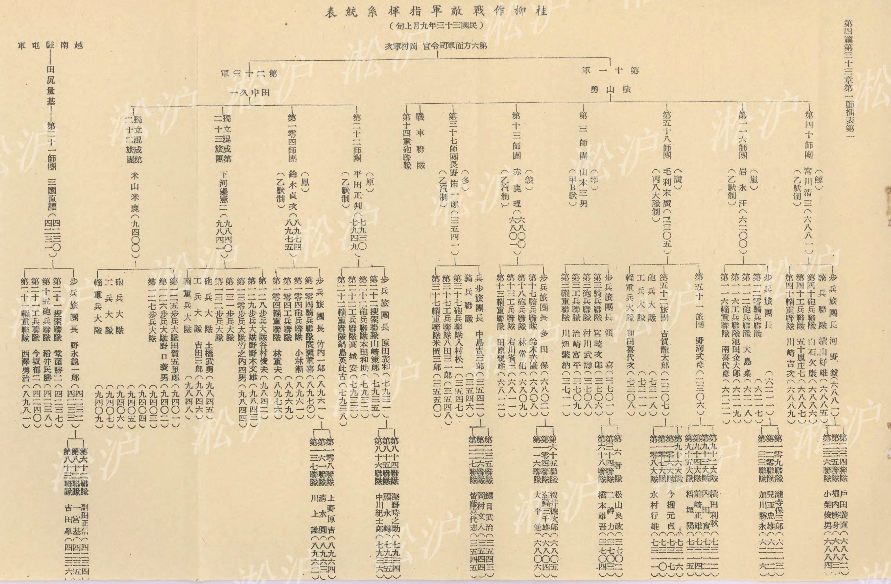

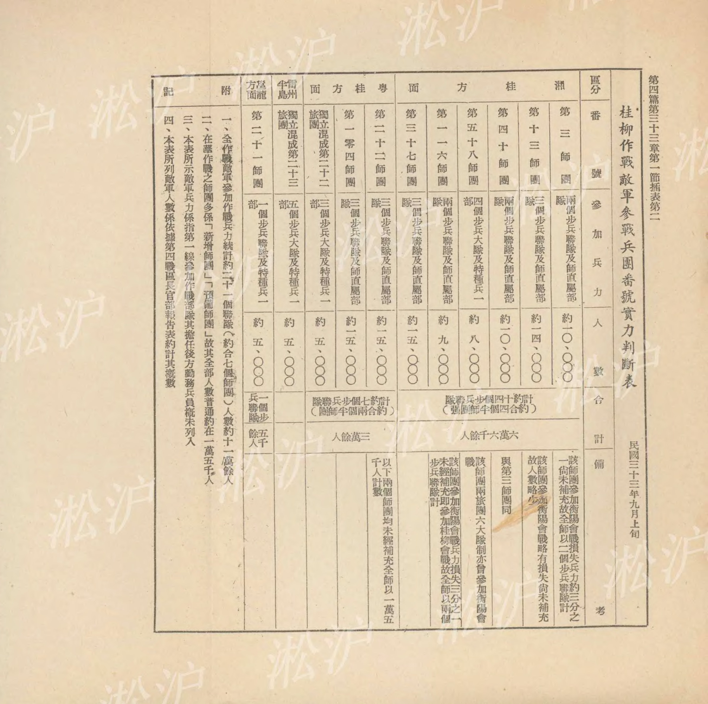

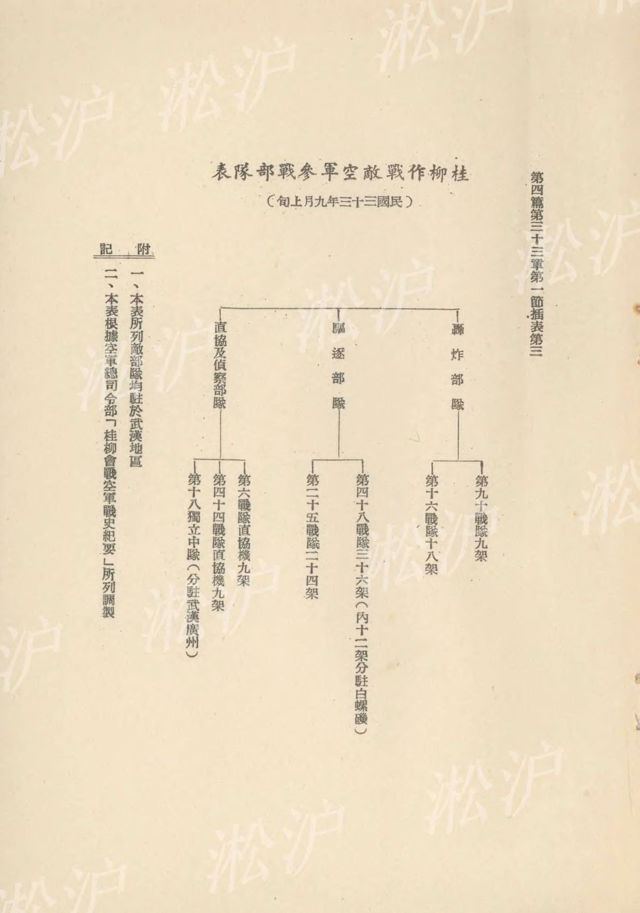

第六戰區

孫運仲

第二十四集團軍

司令長官

王耀武

第七十四軍施中誠

第五十七師李琰

第五十八師蔡仁傑

第七六　九

團

第六

軍

孫

運

仲

第二

司

集

團

軍

王

耀

武

第一　百

軍

李

天

霞

第十九師唐伯寅

第五十五　十七六五

團團團

第六十三師徐志昌

第八八　九八七

團團團

第九十七軍陳素農

第一六六師黃淑

第九十八軍劉希程

第四十二師李德生

第一二四團

第一六九師曹玉珩

第五五　零零　七六五

團團團

第九十一師王鐵麟

第二　七　七　一

團

團

第十一

師

備

趙

琳

第三　十　二

團

第三　十

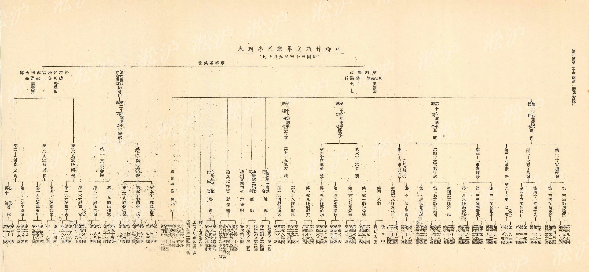

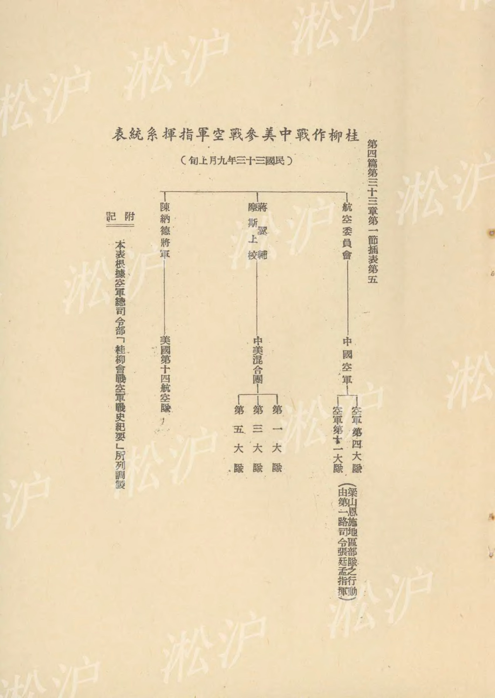

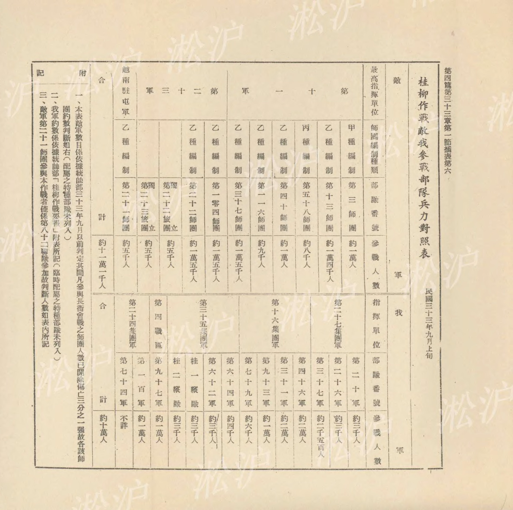

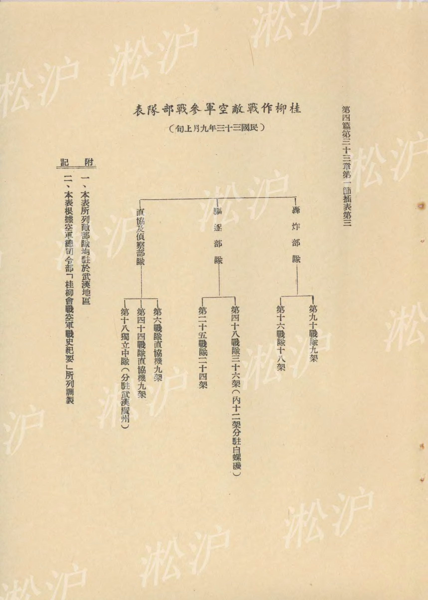

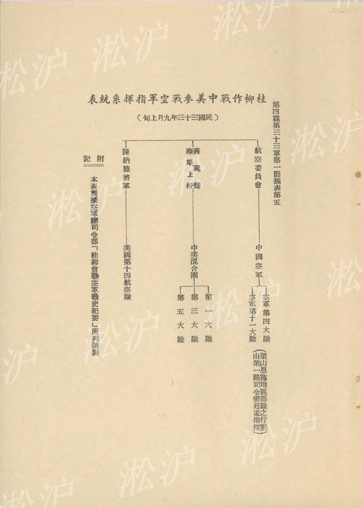

#### 第三款兵誌概要

參照插

圖第二

廣西位於我國西南邊陲，四周皆山，中部爲邱陵地帶，川谷與平野綜錯，間有石山壁立，岩洞幽深，桂柳居中北部，與梧州南寧分據四隅，爲桂省四大重鎮。自桂柳飛機場擴建及湘桂、黔桂兩鐵路完成後，桂柳之地位益爲重要。

全省山脈，概屬南嶺系，自貴州苗嶺而東，瀰漫於湘桂邊境者爲五嶺山脈之萌渚、越城、都龐諸嶺，自雲南六韻山入境，綿延於粤桂邊界者爲十萬大山、勾漏山等。各山一般標高約爲五百至一千公尺，傾斜峻急，森林密佈，大軍運動極感不便。其他省內各山如獠山、九萬山、鳳凰山、都陽山、天保山等，則錯綜於柳、盤、鬱、桂諸江之間，其一般標高亦約爲五百至一千公尺，峯巒起伏，關隘重重，足供節節抵抗之天然陣地帶。

河流方面：有盤、柳、鬱、桂四江。盤江分南北二源，由滇黔至省境西北合稱紅水河，爲西江遠源。柳江分融、龍二源，自黔南分流來會，至武宣西北與盤江合稱黔江。鬱江分左右二江，自滇、越分流來會，至桂平與黔江合稱潯江。桂江一名漓水，與湘江同源，至興安分道南流，與潯江合於梧州城下，稱西江，以上各江，概東南流匯西江而入粤，梧州下游頗富舟楫之利，雨季山洪暴發，行軍作戰均受限制。

交通方面：水上交通，以梧州爲中心，各江匯流於此，盤達遷江，柳達黔邊，桂達桂林，鬱達龍州、百色，惜各江灘多水淺，大輪僅能由西江通至梧州，梧州以上，只可航行小輪或電船。陸上交通，鐵路有湘桂、黔桂二線，連接於柳州；公路則四通八達，除省內各大都市均可交通外，與鄰近各省亦有幹線可達，交通堪稱便利。

人口分佈，東南較稠，西北稀疎，漢人多集於南部及東南部，多住街市，營商業或爲勞動者及農人。夷家以徭、僮、儂、徉、俍土人等爲主，棲息山洞，近漸同化。語言略同粵語，桂林附近，通行官話，夷人各有其言語，亦間能當地方言。氣候：大部爲大陸性，寒暑變化甚劇，南部近海洋氣候，夏季極熱，多陣雨，冬季嚴寒，多暴風，山谷之間瘴癘流行，行軍作戰常受其害。農產：土地大部礦瘠，產量不豐，以米、麥、菸草、甘蔗爲主。林產以果類、木材、藥材爲大宗。礦產有鎢、鋤、金等。工業產品有漆靛、桐油、硫酸、酒精之類。

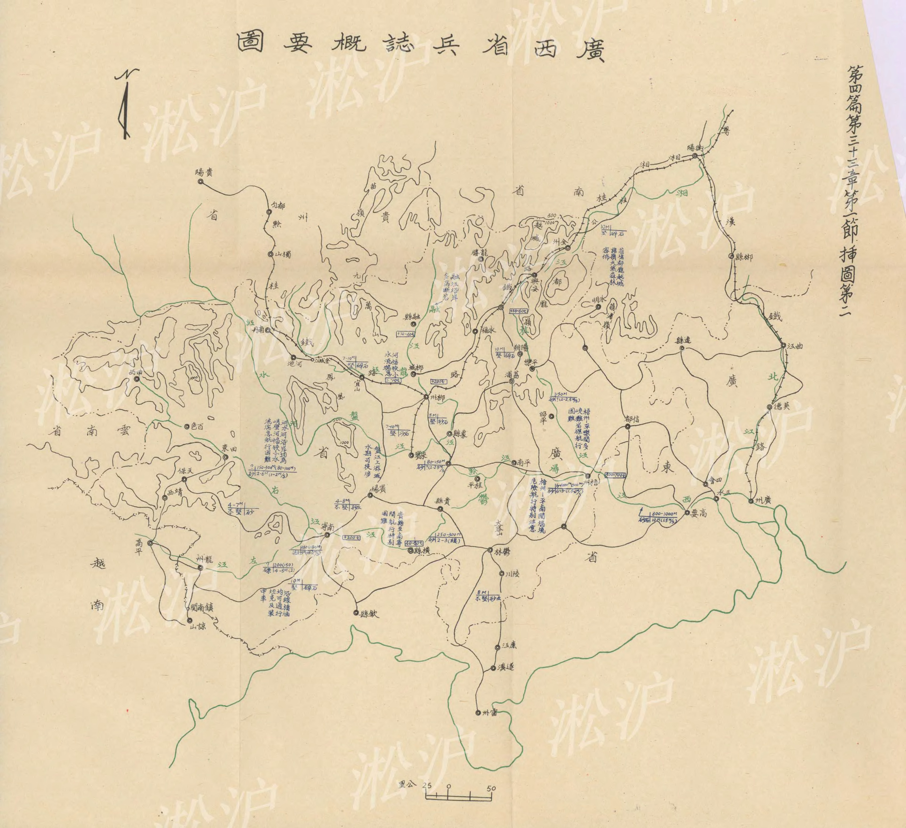

### 第一節 我軍作戰指導

當敵軍發動長衡會戰時，我軍事委員會判斷，敵爲打通大陸南北交通及摧毀我空軍基地，攻佔長衡後，必繼續進攻桂柳，遂積極作桂柳作戰諸準備：

六月二十六日，白崇禧副參謀總長於桂林曾以宥午電呈最高統帥蔣委員長，關於保衛桂柳作意見具申，茲摘要如左：

一、此次攻湘之敵，如到達衡陽後，其企圖或沿粵漢路進攻曲江、或沿湘桂路進攻桂柳，俱有可能；然就敵欲掩護其南太平洋之陸上運輸及將來之退路安全起見，定然續攻桂柳或進而打通桂越，控制我粵漢路以西、湘桂路以南之機場，桂柳在戰略上實屬重要。

二、桂柳石山環繞，巖洞甚多，可容十萬餘人，對敵機砲轟擊，均可抵抗，且往歲防匪西竄，曾築有永久工事，誠爲天然要塞。然就現在預想部署，只有第六十二軍及第四十六軍，縱能短期遲滯敵人，但絕無反攻之力，時間延長，徒作無謂消耗，不能達預想目的。再觀第七戰區，現有第六十三軍、第六十四軍、第六十五軍，仍有備多力分之弊。至於在邕、龍之第三十一軍，地廣兵單，無論敵由越南或欽、防進攻，其第一八八師與第一三一師兩個師，亦難操勝算。

三、固守桂林，應澈底集中兵力，予進攻之敵以反擊，爲收殲滅之效起見，擬以第七戰區香總司令所部，擔任粵漢路以東之作戰，俾抽調第七戰區主力之兩個軍，控置於龍虎關、富川、賀縣一帶，以一總司令或副總司令統一指揮之，第六十二軍掩護桂林，相機進出桂全以東地區，側擊進攻桂林之敵，另密調第三十一軍之第一八八師及第一三一師，集結柳州。又南寧機場及其附近之警衛，原有第一七五師之兩個團擔任，卽以該師之一部移置南寧，再於以上各軍之原防地，另編地方團隊，襲用

原駐軍之番號，擔任警戒，一俟敵進入我桂林核心陣地，受我相當消耗後，即以第七戰區主力之兩個軍，進出恭城、栗木，第三十一軍於柳州分途推進，適時由東南西南方面轉移攻勢，將敵人夾擊而殲滅之。

六月二十七日，軍事委員會綜合當時情況及參照白副參謀總長宥午電之具申意見，策定部署。並於二十九日電令白副參謀總長轉俞飛鵬部長，暨第四戰區張發奎司令長官、第七戰區余漢謀司令長官，其原電如左。

一、敵主力正圍攻衡陽，似有續向湘桂路及粵漢路進攻之企圖。

二、國軍決固守桂林陣地，依第六、第九戰區之夾擊及第七戰區之協力，先擊滅進攻湘桂路之敵。

三、第四十六軍之主力固守桂林，一部在黃沙河，任桂林之掩護。桂林陣地，應積極加強工事，儲備足够三個月使用之糧彈，以備能獨立固守。

四、第三十一軍主力，卽祕密開柳州待命，準備參加桂林會戰。該軍之後調師及桂綏署之獨立第三團，固守邕龍一帶現陣地，須確實掩護宜山、河池、南丹我後方交通。

五、第六十二軍，暫位置於祁陽附近，掩護湘桂路及零陵機場，依狀況轉移全州，參加桂林會戰。

六、第七戰區應祕密準備一個軍，轉移連山方面，參加桂林會戰，并卽時以一個師祕密先開連山附近。第三十五集團軍，除第一五五師續行原任務外，幷祕密以一個師卽開梧州擔任固守，並準備於必要時參加桂林會戰。

七、南寧、鬱林以南各公路及其他敵可利用之交通線，由白副參謀總長轉飭第四戰區及桂省府，動員民衆，澈底破壞之，並切實疏散各交通線上之壯丁及糧食物資，以免資敵。

黃沙河、大溶江地形險要，可逐次阻擊敵人，三十日，軍事委員會復以已陷令一元南電令白副參謀總長、第四戰區及第六十二軍，卽在該兩地設施陣地，並預行研究陣地編成要領，以便爾後第六十二軍得以隨時進入陣地，能爲適當之利用。

八月二十日，白副參謀總長對第四、第七、第九戰區作戰指導，再向蔣委員長作意見具申，如左一、敵情：自衡陽失陷後，敵在湘省北部及湘江東岸之兵力，仍然增加，於湘江西岸及衡陽附近，似已超過六個師團，我對湘桂路方面應特別注意。

二、對第九戰區敵人作戰，似應參考迭次電呈劣勢裝備對優勢裝備敵人戰法，卽組織多數支隊，最大以團爲單位，附以工兵及爆破器材，採取避實擊虛之游擊戰法，截擊敵軍之水陸兩路交通線，並與空軍配合，使敵前方補給困難，或不敢貿然再行深入，若敵悍然不顧，仍一意西進，我可固守桂林三個月以上，必然使敵疲敝，我軍可乘其敝，轉移攻勢，勝算可操，屆時太平洋方面，料想必有極大變化，敵本土感受極大威脅，至此我危機或可解除也。

三、第四戰區之兵力，現只有兩個軍，第三十一軍守備桂林，第九十三軍守備全州，對桂林東南之龍虎關、清水關，只有第六分校之練習營一營及學生數百人構工而已。敵如進攻桂林，判斷其主力沿桂全大道直趨，另以一部取道湘省之常寧、永明，進入龍虎關或清水關，出咸水，威脅全州側背，或經恭城出陽朔，威脅桂林側背，故前電擬由第七戰區集結兩個軍之兵力於北江西岸之連縣、連山，以便進出賀縣、富川，掩護桂林側背，此着似應做到。

四、桂、全如發生戰事，我在桂柳之機場，只能作前進着陸場，如敵迫近桂林，則不能使用，故請修百色、獨山兩機場，或在南丹河池方面再新闢一機場，以便將來必要時之應用。

八月二十四日，軍事委員會再頒令第四、第七、第九戰區作戰指導，如左圖第三：

第一期（敵未突破衡陽以西我現設主陣地以前）

第九戰區：

(一)湘江以東各軍，就現態勢續行攻奪要點，牽制消耗敵人，並相機擊破之。

(二)湘江以西各軍，調整如次：

1. 李玉堂（歸王耀武指揮）指揮第三十七軍、第六十二軍、第七十九軍、第四十六軍之新編第十九師及彭璧生部，以有力一部，於現陣地佔領前進陣地與敵接觸，其主力於茅洞橋、新橋之線佔領主陣地，並抽調一部於鷄籠街附近，積極整補，構築預備陣地，但第三十七軍之主力，應暫控制於松柏西南地區，與主陣地之右翼連繫。

2. 王耀武直轄第七十三軍、第七十四軍、第一百軍。

(1)第七十四軍（欠第五十七師），以一部於現陣地佔領前進陣地與敵接觸，其主力在新橋以北蒸水西岸佔領主陣地，並控置於金蘭市一帶，積極整補，構築預備陣地，第五十七師到達邵陽後，擇要構築工事，並積極整補，準備作機動使用。

(2)第一百軍，以一部攻擊永豐東南之敵，其主力控置於界嶺一帶（永豐、邵陽間），積極整補，構築預備陣地。

(3)第七十三軍，以原態勢向敵攻擊。

(三)第四十六軍，先抽調控置部隊一個師，集結於柳州，並擔任柳州之防務，其餘一個師（新編第十九師），仍在現地服行原任務，與敵保持接觸。

四湖南作戰各軍，除服行原任務外，應以小部隊爲單位，附必要工兵及爆破器材，編成多數之游擊隊（每軍抽調兵力不得超過一個團），採取避實擊虛戰法，深入敵後，輪番截擊敵人之水陸交通，並與我空軍配合，使敵補給困難。

二、第四戰區：

(一)第四十六軍之一個師，調柳州後，將第三十一軍（欠第一三五師）移駐桂林，擔任固守。

(二)第九十三軍，以一部佔領黃沙河陣地，以主力防守全州。

(三)南寧以南各部隊，防守現陣地，繼續加強工事。

四發動地方武力，積極予以組訓，並分別酌設機構，俾收統一指揮之效。

(五)南寧、鬱林以南各公路及敵可利用之交通線，應繼續發動民衆澈底破壞之，並切實疏散各交通線之壯丁及糧食物資，加強堅壁清野。

六擴修獨山機場，俾我空軍始能發揮威力，由航委會另擬辦法呈核。

三、第七戰區：

(一)以現態勢防阻敵人（即在粵漢路南段者，以主力利用南北各山險及旣設陣地，持久作戰），以六個團兵力（必須以一個建制師爲骨幹），固守曲江。

(二)依狀況先期抽調兩個師，祕密分開連山、梧州構築工事，並固守之。

乙第二期（敵突破衡陽西側我現陣地後大舉侵桂時）

第九戰區：

(一)李玉堂所率之第三十七軍，轉移湘江西岸，第六十二軍、第七十九軍及彭璧生部，轉移湘桂路以南地區，而王耀武直屬各軍，則在湘桂路以北地區，並以邵陽爲根據地（須以有力一部固守之），積極夾擊側擊西犯之敵。

(二)其他第九戰區各部隊，亦應於公路兩側攻襲敵人，予以牽制消耗。

(三)游擊部隊，繼續襲擾困疲敵人，並斷其後方補給交通。

二、第四戰區：

(一)第九十三軍之任務，以一部佔領黃沙河，以主力死守全州。

(二)敵如鑽隙深入桂林附近，則適時調集第四十六軍及由第七戰區轉用之兩個師，協力守軍包圍而殲滅之。

(三)南寧以南各部隊，採用機動戰法，但如可能，仍依既設堅固工事，極力拒止敵人，俾能確實掩護柳州以西我後方交通。

四越北敵如進犯河田路，則以桂綏獨立第三團（主力在龍州一部在靖西），向田東逐次轉進，阻擊敵人。

(五)利用地方武力，配合正規軍，積極打擊敵人。

三、第七戰區：

(一)準備以一軍長率領兩個師，適時參加桂林決戰。

(二)梧州仍留一個師固守之，並另以西江兩側之挺進部隊及地方團隊，準備攻襲沿西江西進之敵。

軍事委員會於九月五日前，除以根據上述作戰指導，先後分別電令軍政部、後方勤務部及有關各戰區遵照實施外，並指示第四、第九戰區如左：

一、第四十六軍（欠一個師）擔任柳州防務，其在衡陽附近之新編第十九師，依狀況再令開柳州歸建，該軍主力應準備參加桂林決戰。

二、第九戰區楊森副長官所率之第二十、第二十六、第四十四各軍主力，仍遵原令速開新田、零陵地區，阻敵前進。

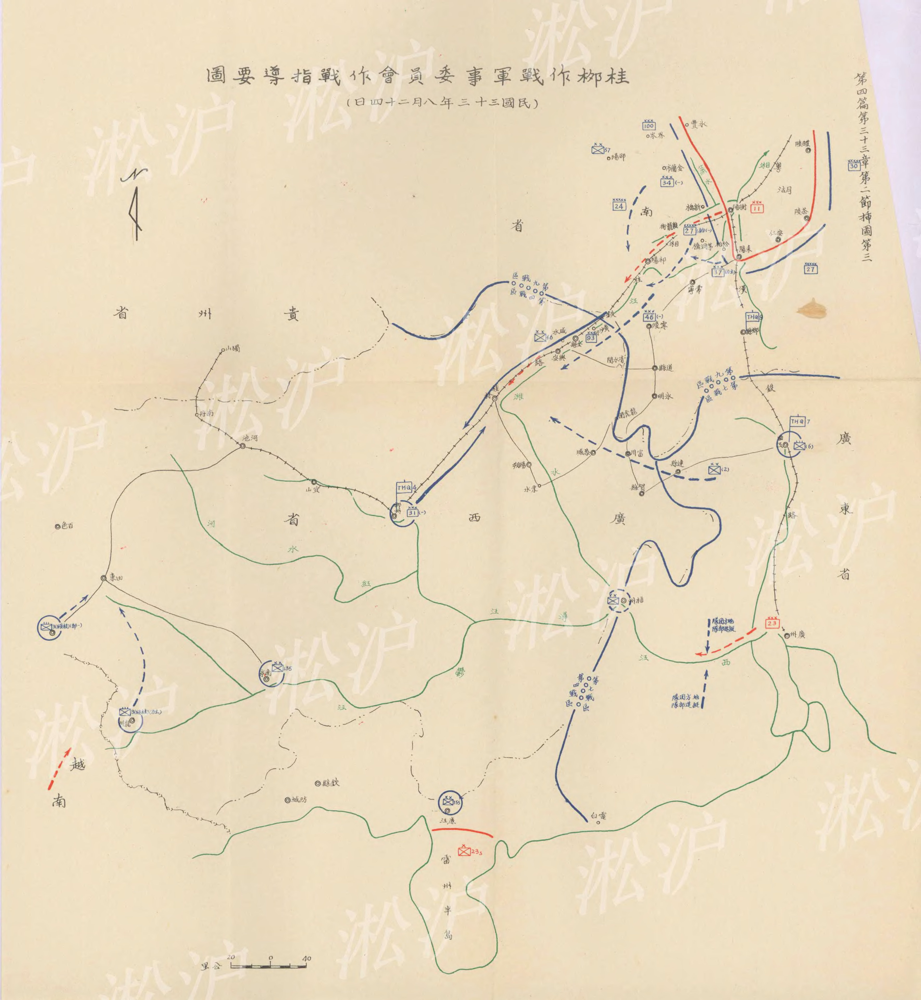

### 第三節 作戰一般經過

民國三十三年九月十日至十二月十四日

參照插圖第四至第八插表第七至第十

#### 第一款 桂柳外圍戰鬥

(民國三十三年九月十日

至同年十一月六日

敵軍於民國三十三年八月上旬攻佔衡陽後，卽集結兵力於湘江兩岸，沿湘桂鐵路進攻，九月初佔領零陵、東安、新寧等地。八日，其第五十八師團及第十三師團已進至黃沙河附近，十日，與我第九十三軍警戒部隊接觸，該軍十一日放棄黃沙河，十三日退出全州（全縣），敵第五十八師團及第十三師團遂經全州向桂林進迫。此時，廣東清遠方面之敵第一零四師團，亦分兩路進攻，一路於九月四日攻陷懷集，經信都分股由開建、黎木根墟向梧州進攻，一路經四會、高要、德慶擊退我梧州地方團隊後，二十一日進佔梧州。其第二十二師團則由新會地區沿西江右岸經羅定於三十日攻佔岑溪。獨立第二十二旅團由開平經新興、鬱南與其第一零四師團會合於梧州，至盤踞南路方面之敵獨立第二十三旅團及僞軍各一部，約五、六千人，亦同時由雷州北進，十二日攻陷廉江，經石角、陸靖墟、黎村等處，二十三日進佔容縣。

第四戰區長官部，因廉江失陷，判斷敵必乘勝北進，以策應湘桂路方面主力軍之作戰，爲掩護鬱柳公路之安全，並防止其北進起見，十八日對該方面作如左之部署：

一、着第一五五師主力在陸川附近阻敵前進，襲擊敵人，必要時向貴鬱公路方面轉進。

二、着在化縣、中洞、合江附近作戰由區副師長指揮之兩個團（第四六五團及粤保第十團欠一大隊），側擊尾擊敵人後，迅向陸川、鬱林地區轉進，加入師主力作戰，以上各部隊於到達鬱林以南地區後，統歸第三十五集團軍指揮，第三十五集團軍總部卽移鬱林指揮（註一）。

三、着本部少將參議詹式邦，指揮沿海兩個警備大隊及化縣、茂名兩區之地方團隊，仍在原地守備，相機襲擊敵人。

四、着雷州挺進支隊在安舖附近之主力，卽向廉江之敵襲擾，以策應第一五五師之作戰。

同時並令第九十三軍於大溶江以北地區竭力遲滯敵之行動，另令第三十一軍之後調師（第一三五師），迅速進出平南地區，第一五五師由廉江尾擊側擊敵人，期於南北兩方面遲滯其行動，而爭取時間，以待後續兵團之到達。

九月二十四日，湘桂路正面之敵，續攻興安及老堡村等地區，西江及粤南路兩方面之敵，分由東南方向積極逼攻平南及丹竹機場。第四戰區長官部鑒於桂境戰事處於三面受敵之態勢，應乎當時情況，部署如左：

一、第二十七集團軍總司令楊森，指揮第二十軍、第四十四師在道縣附近攻擊敵人，並令其第二十六軍（欠第四十四師）、第三十七軍向龍虎關、恭城附近地區集結（註二）。

二、甘總指揮官麗初，指揮第二十六、第三十七兩個軍參加桂柳會戰。

三、副長官夏威，指揮第九十三、第三十一、第四十六等三個軍，任桂林固守及外圍作戰，第九十三軍於外圍作戰後，轉移義寧附近，入李玉堂序列。

四、第二十七集團軍副總司令李玉堂，指揮第七十九、第九十三兩個軍（第九十三軍於桂林外圍作戰後歸入序列），在龍勝、義寧間集結，準備參加桂林會戰。

五、第三十五集團軍總司令鄧龍光，指揮第六十二、第六十四兩個軍，在平樂附近集結，爲機動部隊。六、依情況以夏副長官指揮桂林防守軍及李玉堂部，擔任桂林附近之作戰。

此時，由第九戰區轉進之楊森集團軍（指揮第二十六軍、第二十軍、第三十七軍）及第六十二軍、第七十九軍與由第七戰區西調之第六十四軍，陸續分由南北兩方面先後進入廣西轄境，惟各該部隊久經苦戰，殘破待補，其實力與員兵不及原編制四分之一，又以行動遲緩，未能如期加入桂柳外圍作戰。因之湘桂路方面之敵第五十八師團，得乘機進逼興安，其第十三師團經灌陽進迫桂林，第三師團由道縣、永明攻陷龍虎關。西江方面西進之敵第一零四師團、第二十二師團及雷州方面之獨立第二十三旅團，則以分進合擊之勢，攻陷丹竹機場，於是桂柳形成三面受敵之不利態勢。

十月初，敵除在西江及桂南方面積極行動外，並以其第三十七、第一一六等兩個師團向邵陽攻擊，以威脅我左側背，與我第二十四集團軍王耀武部激戰於邵陽城附近，由十月一日起，經三晝夜之激戰，雙方傷亡俱大，後以敵不斷增援，衆寡懸殊，乃先撤守邵陽外圍據點，留一部守城，至三日夜，我守城部隊僅餘輕傷官兵百餘人，不得已由杜團長率領突圍而出。敵佔邵陽後，繼續西侵，我第四戰區針對當時敵情，於十月九日下達第一號作戰命令，如左（圖第四）：

作命第一號

第四戰區司令長官部命令

民國三十三年十月九日

於

柳

州

一、沿湘桂路及湘桂邊區與西江方面進攻之敵，兵力約六個師團，目下進至平南、九板橋、觀音閣及老堡村與資源各附近地區，匆忙備戰，似有奪取我桂柳企圖。

二、戰區以確保桂柳之目的，以必要兵力固守桂林，另以有力一部，配置於桂平、江口附近地區，相機先行擊破西江方面之敵，主力控置於陽朔、荔浦、修仁間地區，乘敵深入，於荔浦、平樂間地區包圍殲滅之。

三、軍隊區分：

桂林方面軍

長第十六集團軍兼總司令夏威

第四十六軍

新編第十九師

第一七五師

第一八八師

第四十八師戰車營

第三十一軍

第一三一師

第一七零師

高射砲第五、第十連

砲兵第十團第七連

第九十三軍砲兵營之一連

第二十七集團軍副總部

第九十三軍

新編第八師

第十師

第七十九軍

第九十八師

第一九四師

工兵學校教導團

荔浦方面軍

長第二十七集團軍兼總司令楊森

第二十軍

第一三三師

第一三四師

第二十六軍

第四十一師

第四十四師

第三十七軍

第九十五師

湘桂邊區總指揮部

桂樂師管區

砲兵第十八團第一營

西江方面軍

長第三十五集團軍總司令鄧龍光

第十六集團軍副總部

第一三五師

第一五五師

第四六六團

第四七六團

桂綏第一縱隊

桂綏第二縱隊

砲兵第二十九團第三營（欠第七、第八連）砲兵第五十四團第一營高雷守備區

雷州挺進支隊

沿海警備第三大隊

粤保安第十團

沿海警備第四大隊

沿海警備第五大隊

南寧指揮所主任羅活

粤第八區保安司令部

粤保安第一團

沿海警備第一大隊

沿海警備第二大隊

獨立汎警第一營

獨立汎警第二營

東興軍警督察處

靖西指揮所兼主任陳寶倉

戰地工作總隊

保安第一、第二大隊

直轄兵團

第六十二軍

第一五一師

第一五七師

第六十四軍

第一五六師

第一五九師

砲兵指揮部

砲兵第十團第三營（欠第八連）

砲兵第十四團第三營（欠第八連）

砲兵第十八團（欠第一、第三營）

砲兵第二十九團第八連

獨立工兵第八團

通信兵第二團第二營

四、各部隊任務及行動：

(一)桂林方面軍，以一個軍擔任桂林固守，一個軍控置於良豐、葡萄、白沙間地區，對湘桂路及龍虎關突入之敵，相機協力友軍予以打擊。以約兩個軍擔任桂林外圍及桂穗公路之掩護，並協力桂林防守軍擊破進犯之敵。

(二)荔浦方面軍，以一部任敵後之襲擊破壞，一部至蒙山以南及二塘墟、沙子坪、陽朔各附近警戒，主力配置於平樂、荔浦、新墟間地區，乘敵突入平樂附近，協同陽朔以北友軍於平樂、荔浦間予以擊破，不得已時，必須確保荔浦南北之線，但對平南之敵，應先以一個軍集結於新墟附近地區，準備協力西江方面軍之作戰。

(三)西江方面軍，以主力配置於桂平、江口、東鄉間地區，一部配置於六陳墟、麻洞墟各附近，先構築必要之堅固陣地，待準備完成後，一舉攻擊平南、丹竹之敵而擊破之，另以一部對高州、雷州方面之敵襲擊側擊，並破壞其後方連絡，以策應我主力軍方面之作戰。

(四)南寧指揮所，指揮汎警部隊、地方團隊任沿海之警備，與邕龍路、邕欽路及合浦方面之作戰。

(五)靖西指揮所，指揮地方團隊任邊區之守備及河靖公路方面之作戰。

(六)作戰地境：

桂林方面軍、荔浦方面軍間：寨沙墟、狗瑤、白沙、興平墟、定岡隘之線，線上屬桂林方面軍。荔浦方面軍、西江方面軍間：桐木墟、馬練墟、大王墟、太平墟、大灘口（不含）之線，線上屬荔浦方面軍。

西江方面軍，南寧指揮所間：五羅墟、小江墟、沿粵桂邊境經安舖至海之線，線上屬西江方面軍南寧指揮所、靖西指揮所間：果德、龍茗、碩龍、水口、塔溪之線，線上屬南寧指揮所。

(七)控置部隊：第六十四軍應於修仁、三江街間構築必要陣地，第六十二軍控置於柳州，並擔任柳州工事之構築。

五、各方面軍地區內之民團指揮部，應受該方面軍司令官之指揮，擔任敵後襲擊，並破壞其交通、輜重、通信，以配合正規軍之作戰。

六、各部隊特應注意陸空連絡，並依照本部電令規定，第一線營使用標示幕，師或獨立旅司令部使用特別布板，與空軍切取連絡，地方團隊未製定標示幕與布板者，應用國旗高舉左右搖動以補助之。

七、交通、通信、補給、衛生另令行之。

八、余在柳州戰鬥指揮所。

第四戰區司令長官

張發奎

十月初旬，湘桂路正面之敵第四十、第五十八師團，因我第九十三軍之力戰，被阻於大溶江附近，其左翼觀音閣附近及龍虎關之第十三、第三師團，亦因我在敵後團隊之牽制，而無積極行動，但西江及桂南路方面之敵，因交通便利與兵力優勢，九日，其先頭部隊已進出於平南、丹竹、大安墟間地區集結，十日，敵第二十二師團及第二十三獨立旅團，各以一部約三千人，經油麻西進，十二日陷桂平、蒙墟，其第一零四師團亦同時攻佔平南，似有繼攻柳州模樣。我第四戰區爲確保柳州掩護黔桂路安全起見，決定轉用兵力於西江方面，先行擊破桂平方面之敵，以排除柳州側背威脅，因之於十三日策定作戰計劃。（參照附錄）

十六日下達第二號作戰命令，其要旨如左

參照插

圖第五

一、戰區以確保桂柳及柳州空軍基地之目的，決以有力兵團拒止由龍虎關方面及湘桂路進攻之敵，以優勢兵力集結於武宣東南地區，先擊破由西江進犯之敵，俾利爾後之作戰。

二、西江方面軍有擊滅西江方面敵之任務，以有力一部協力第三十七軍攻擊平南之敵，另一部在桂貴石龍以東地區切實警戒鬱江西岸，並掩護主力集中，主力不待全部集中完畢，卽逐次以一軍向桂貴石龍附近，另一軍向奇石鄉、通挽鄉間地區躍進，於十月十九日前完成攻擊準備，待機攻擊蒙墟、桂平之敵。

三、荔浦方面軍有拒止龍虎關方面之敵，並確實領有荔浦、平樂、陽朔間地區之任務，以一部固守陽朔，以主力至平樂、荔浦間地區拒止敵之進攻，並竭一切方策遲滯其進攻，不得已時，應確保修仁一帶要點。進出蒙山以南部隊，應以策應西江方面軍作戰之目的，於十月十七日前，超越作戰地境在水晏鄉、陳村塘以南地區完成攻擊準備，十八日起向平南、丹竹各附近進出，並相機佔領之，以利西江方面之作戰。

四、桂林方面軍爲達成固守桂林之任務，以主力之一軍，依規定固守桂林，以一個師位置於良豐附近，一個軍於桂林西北佔領陣地，與防守軍協同擊攘進攻之敵，另一個軍由大溶江沿湘桂路極力遲滯消耗敵人，爾後轉移至義寧附近，互相呼應，協力防守軍擊破進攻之敵，不得已時，除防守軍應固守桂林外，其餘應確保永福要地及百壽通桂林要道，以確保桂林之交通，並相機消耗打擊敵人，協力防守軍之作戰。

十月二十一日，我西江方面軍主力之第六十四、第四十六兩軍及桂綏第一縱隊，開始向桂平之敵攻擊，歷時八日，卒將桂平及蒙墟外圍各要點收復（註三）。同時向大溶江左側松江口迂迴之敵第五十八師團約一大隊，亦被我殲滅。正當擴張戰果之際，敵後續部隊陸續到達，敵第五十八、第四十、第三及第十三各師團幾全部加入湘桂作戰。其第三十七師團亦由邵陽附近經道縣、永明南下增援，於是形勢突變，敵進迫桂林及平樂、陽朔附近時，其第四十師團主力卽繞桂林經中渡進攻柳城，第十三、第三師團則分由永福、黃冕及平樂、荔浦直趨柳州。此時西江方面軍雖由於左翼第三十七軍指揮第九十五師及第一三五師、桂綏第二縱隊對平南之敵猛烈攻擊，使敵西進遲緩，然終未獲進展，敵乘我攻勢頓挫，以其第一零四師團主力向我猛撲，攻陷思旺墟、三江墟後，卽行西進，大有進出武宣遮斷柳江西岸後方連絡線，與平樂、桂林方面之敵同時進攻桂柳之趨勢。我第四戰區司令長官鑒於各方面形勢之演變，決心將所有兵力向桂柳近郊集結，與敵決戰，除令守備柳州之第六十二軍以第一五七師星夜馳往東鄉墟東北高地拒敵外，並令荔浦方面軍蒙山附近之第三十七軍、荔浦附近之第二十軍及榴江附近之第二十六軍一面遲滯當面之敵，一面向柳江西岸轉移。第三十七軍在象縣與敵展開遭遇戰阻敵北犯，並掩護柳州西南翼。桂林方面軍大溶江附近之第九十三軍、靈田墟附近之第七十九軍則向桂林南北近郊轉移，協同防守桂林之第三十一軍拒止來攻之敵。

#### 第二款 桂林及柳州附近戰鬪

(民國三十三年十一月七日

至同年十一月十一日

第四戰區張司令長官決心於桂柳間地區與敵決戰，於十一月七日下達第三號作戰命令，其要旨如左圖第六：

一、戰區以確保桂柳並掩護黔桂路安全之目的，各以有力一部固守桂柳，主力沿紅水河及其以北地區佔領陣地，吸引敵人於柳州近郊，轉移攻勢而擊滅之。

二、第三十五集團軍，指揮第六十二軍、第六十四軍及第十六集團軍周副總司令指揮之桂綏第二縱隊爲右兵團，以有力一部沿紅水河北岸柳江西岸守備要點，並以一部於紅水河南岸地區掩護通宜山要道，主力在良塘鄉、穿山附近地區佔領陣地，拒止敵人，並適時控置有力一部，準備策應各方面之作戰。

三、第二十七集團軍，指揮第二十軍、第二十六軍、第三十七軍及第一八八師爲中央兵團，以主力固守柳州，非有命令不得撤退，以有力一部在柳州以東地區連繫右兵團及以北地區連繫左兵團拒止進犯之敵，必須確保柳江西岸要地，以掩護黔桂路及宜山之安全。

四、第十六集團軍，指揮防守桂林之第三十一軍（第一三一師、第一七零師及第九十八師編併之一團）、第七十九軍（欠第九十八師編併之一團）、第九十三軍及新編第十九師爲左兵團，以桂林防守軍固守桂林，其餘連擊中央兵團在太平鄉、三皇鄉各附近地區佔領陣地，拒止敵人，並以一部掩護百壽通長安鎮之要道。

五、各兵團戰鬥地境：右兵團、中央兵團間爲三都、新興、廟王墟以東之線。

中央兵團、左兵團間爲大浦、三板、魚碑以東之線。

六、第四十六軍（欠第一八八師），控置於三都附近，以策應各方面之作戰。

七、各兵團應於十一月十日前部署完畢。

各兵團奉令正在部署之際，適天雨連綿，我空軍不能出動助戰，部隊行動受阻，因之第十六集團軍與敵膠着，其他各兵團卽依照前令指示轉移。於是敵乘機全線跟進，桂平附近之敵第二十二師團及獨立第二十三旅團，經貴縣到達來賓、遷江以北紅水河南岸，東鄉附近之第一零四師團主力，進至武宣，渡柳江北上，其第一六一聯隊，則尾隨我第一三五師至象縣以南渡河。平樂方面之敵，陷修仁後，八、九兩日陸續到達柳州大橋屯附近，強渡柳江，與沿湘桂路南下及柳江北上之敵會攻柳州，九日拂曉，突破柳州城郊陣地，與我第二十七集團軍於柳州市區發生激戰。中渡之敵突破我柳城第一八八師陣地後，進佔柳城，復經其西北之大浦向西迂迴，於是柳州陷入重圍。此時，桂林防守軍因敵第三十七、第五十八兩師團南北夾擊，並經其特種部隊以火焰放射器及各種燃燒彈等向我陣地各岩洞圍攻，守軍傷亡殆盡，僅桂江東岸七星巖一巖洞內卽死亡官兵千餘，桂林核心陣地遂於同日晚被敵突破。困守柳州之第二十六軍兩個團，苦戰至十一日午，亦殘餘無幾，乃經柳市南郊突圍而出，桂林、柳州均失陷。

#### 第三款 黔桂路沿線戰鬪

(民國三十三年十一月十二日

至同年十一月二十七日

桂柳失陷，我第四戰區爲繼續阻敵及確保宜山並掩護黔桂路之安全，乃重新調整部署，於十一日下達第四號作戰命令，其要旨如左

圖第七：

一、渡紅水河、柳江之敵，爲敵第二十二、第一零四、第三等師團，沿湘桂路進佔柳州之敵，爲敵第十三師團，刻與我在古習墟、四方城及柳州各處激戰中，另由柳城渡過龍江河之敵第四十師團之一部約千餘，亦正與我龍江河南岸部隊激戰中。

二、右兵團長鄧龍光，指揮第六十二軍、第六十四軍及桂綏第二縱隊，以一部在現陣地與敵保持接觸，主力於十一月十一日黃昏後轉移渡口、忻城、祇洞附近之線佔領陣地，阻敵西進，總部位置於北山鄉附近。

三、中央兵團長夏威，指揮第四十六軍、第一三五師及桂綏第一縱隊、砲兵第十八團（欠第二、第三營）、砲兵第十四團第八連、第四十八師戰車營、戰防砲教導總隊第一營，以一部於原陣地與敵保持接觸，主力卽於冷水墟、三岔鄉附近之線佔領陣地，阻敵西進，總部位置於宜山附近。

四、左兵團長楊森，指揮第二十六軍、第二十軍、第七十九軍（已令向小長安附近佔領陣地），以一部於現陣地與敵保持接觸，主力於十一月十一日黃昏後轉移於六塘、中脈、小長安附近之線佔領陣地，阻敵西進，總部位置於四柩鄉附近。

五、各兵團作戰地境，右兵團、中央兵團間：丁峒鄉、北山鄉、永定鄉、祇洞、三都鄉、新興村之線，線上屬右。中央兵團、左兵團間：水簡村、沿龍江、柳江北岸迄柳州城之線，線上屬左。

六、第三十七軍爲機動兵團，控置於懷遠附近，歸本部指揮。

七、第九十三軍，由第十六集團軍夏兼總司令收容後，開河池附近，歸本部直轄。該軍戰防砲營、砲兵營（欠一連），開河池歸還建制。

八、砲兵第十八團第一營（欠第四連），卽開河池附近集結待命。

各兵團奉令後，截至十一月十三日止，第三十五集團軍概已到達渡口、思耕村之線，第十六集團軍已佔領理苗亘三岔之線陣地，第二十七集團軍一面與敵戰鬥，一面向龍江河以北地區轉移（第二十六軍進至三岔附近時，敵已到達三岔，致未能渡河隨該集團軍行動）。此時，敵乘勢尾追，由遷江渡河之敵第二十二師團與柳州之敵第一零四師團，分由南北向我右兵團攻擊，十五日陷思練，十六日陷忻城（註四），繼續進至金釵、拉烈，與我隔河對峙。柳州之敵，則分沿鐵路公路西進，其第三師團於十六日陷理苗，經石別，十九日陷北山，第十三師團突破我中央兵團三岔陣地後，直趨宜山。柳城之敵第四十師團，其先頭部隊約三千人，乘我左兵團立足未穩，卽由柳城西北之大浦向宜山北之小龍頭鄉急進，與鐵路正面之敵協力迫近宜山（註五）。此時我第四十六軍在石別、北山一帶，因左側背感受威脅，乃經北牙向保平墟以西地區轉進，宜山於十一月十五日未經戰鬥卽陷敵手。

當敵我激戰於理苗、三岔之際，我第四戰區爲爭取時間逐次消耗敵人計，經令第二十六軍、第三十七軍，歸夏兵團長指揮，於十一月十五日至懷遠、北牙之線佔領預備陣地，與左右兩兵團極力阻敵前進，並協力黔桂路正面之戰鬥。十六日，宜山之敵進犯懷遠，第二十六軍未能按時到達，該戰區以當時情況緊急，不得已，乃令在懷遠擔任陣地構築之獨立工兵第八團、砲兵第十四團第八連、第四十八師戰車營及戰防砲教導總隊第一營等各特種部隊，歸戰區幹訓團教育長王耀武指揮，隔河與敵激戰三晝夜，敵松

數度強行渡河未得逞。十八日，第二十六軍到達，當面之敵，除留一部於正面佯攻外，轉移其主力向我左翼安馬鄉附近迂迴，日暮攻陷安馬，直撲金城江。同時北山之敵攻佔北牙後，亦經拉浪墟向德勝、思恩迂迴急進。我在柳州外圍沿途阻敵之第三十七軍，指揮第九十五師於金城江以南地區與敵苦戰後，奉命向保平墟轉進，嗣又指揮第一七五師及桂綏第一縱隊攻擊五圩、河池方面之敵，左翼第二十七集團軍亦向西北轉移，敵乘隙陷我金城江。第四戰區以當時情況更形惡化，於十一月二十日指示各部隊行動如左：

一、右兵團在現地竭力拒敵進攻，必要時向果德、隆安附近轉進，掩護南寧通百色間大道。

二、中央兵團除以第二十六軍歸還第二十七集團軍建制外，卽於二十日晚在保平墟以西地區佔領陣地拒敵。

三、左兵團卽於二十日晚佔領思恩附近要地，以掩護黎明關之安全。

是時，敵節節逼近黔邊，我黔桂湘邊區總司令湯恩伯部第九十七軍之一部，已於十一月十八日在南丹東南地區那地州、野車河之線佔領陣地，準備迎敵。二十二日，金城江之敵經河池沿黔桂路進犯該軍陣地，戰至二十七日，被敵突破，同時思恩附近之敵經黎明關直撲都江、三合一帶地區，該軍腹背受敵，逐次向南丹、六寨方面轉移，撤回後方整理。此際，我軍事委員會經於十一月六日策定計劃，由第八戰區抽調增援之第九、第十三、第二十九、第五十七及第九十八五個軍，均已陸續到達黔省境內，於是由南丹、三合進攻之敵，乃被阻於黔桂邊陲。

同時，爲加強黔桂邊境之實力，以防敵軍再興攻勢，中國戰區參謀長魏德邁將軍向蔣委員長建議，準備將在緬甸作戰之五個中國師抽調兩師返國阻敵，經蔣委員長召集政府高級人員開會研討，幾經磋商，與會人員仍堅決以第八戰區增援部隊尙能堵擊犯敵，而軍政部部長陳誠則竭力支持魏氏建議始行通過，並決議以後戰局如再惡化，則必須將在緬甸作戰之遠征軍全部調返，於是黔桂邊境之防衛更行鞏固，以奠定南戰場反攻之基礎。

#### 第四款 作戰後狀況

黔桂方面：自十一月二十八日三合、六寨先後失陷後，敵第三師團一部向都勻迂迴，十二月二日到達八寨附近。當時在該方面之第二十七集團軍，因轉戰日久，實力薄弱，不得已，轉移都江附近待機側擊敵人。敵第十三師團則進至上司附近與我第九十一師馳援部隊遭遇，鏖戰竟日後，敵以一部由小路迂迴至獨山城郊，經我第九十一師增援部隊不斷襲擊及我空軍掃射轟炸，敵不支於六日開始回竄，我第九十一師於八日拂曉克復獨山，繼即跟踪追擊，十一日克復六寨，十二日克復南丹，續向河池進擊。同時我都勻附近第一六九師之一部，亦將來犯之敵擊退（註七），於五日克復八寨，六日克復三合，十日克復荔波。此後我各增援部隊與第四十六軍協力包圍河池之敵，予以猛攻，十四日晚，敵增加二千餘向我反撲，戰鬥激烈，雙方傷亡俱重，遂成對峙狀態。

越桂方面：十一月十八日，來賓之敵獨立第二十三旅團沿公路西進，二十一日與由忻城、遷江南下之敵第二十三師團主力會合，攻陷賓陽，繼沿邕賓公路向南寧進犯，其敵第二十二師團一部約三千人，乃由隆山南下，經上林陷武鳴，與主力及獨立第二十三旅團於二十四日攻佔南寧（註六），另一部則經羅墟陷果德、隆安，後被我第三十五集團軍拒止於田東東南地區。此時，越南之敵第二十一師團，見黔桂方面我軍狀況日趨惡劣不暇南顧之際，亦乘機以其小川支隊約五、六千人，於十一月二十八日分三路向我進攻，一路約二千人由諒山、同登入鎮南關，次日陷憑祥，一路千餘人由塔溪侵入水口關後與由憑祥北犯之敵會攻龍州，與我地方團隊在龍州城發生激戰，另一路約千人由愛店北進，於十一月三十日陷寧明、明江。十二月二日，敵攻陷龍州後，以一部沿左江南岸向東進犯，六日陷嚮水，七日陷崇善，十四日陷扶南。佔領明江之敵，亦於三日陷思樂。同時南寧之敵，亦經吳村墟沿邕龍路南進，十日與由思樂東上之敵會師綏渌，至此敵在形式上已完成其打通大陸交通之企圖。

本作戰我軍人馬傷亡鹵獲及械彈器材損耗情形如插表第七至第十。

註一第三十五集團軍調歸第四戰區指揮，係奉軍事委員會九月十八日電令，該集團軍奉令後，卽率同第六十四軍之第四六六、第四七六兩團，由粤西入桂境，於十月十二日經貴縣到達桂貴石龍附近，指揮對西江方面之作戰。

註二 第二十七集團軍調桂參戰，係奉九月一日軍事委員會電令，該集團軍於九月中旬到達零陵、新田間地區。

註三戰後據敵第二十三軍參謀長富田直亮向我第二方面軍作華南作戰經過報告，謂當時桂平方面部隊彈藥已告罄，迫至旅團長以下造竹槍準備突擊，惜我未能乘機予敵殲滅。

註四 此後敵第一零四師團不復西進，乃集結折返廣東。

註五 此後敵第四十師團卽集結折回道縣。

註六 此後敵獨立第二十三旅團卽經欽州返回原駐地。

註七 敵第三師團向柳州以南退却。

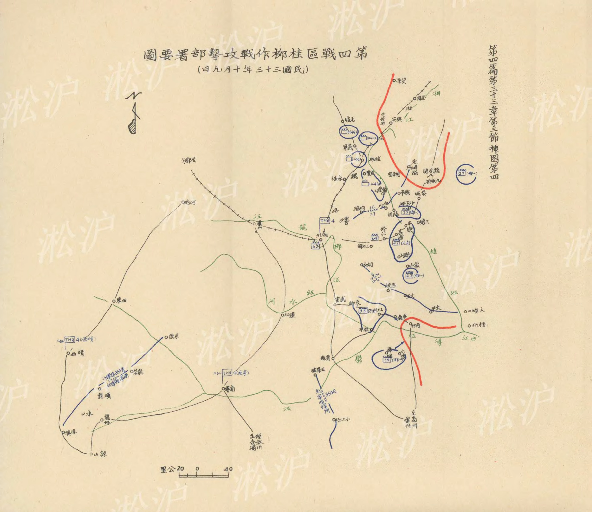

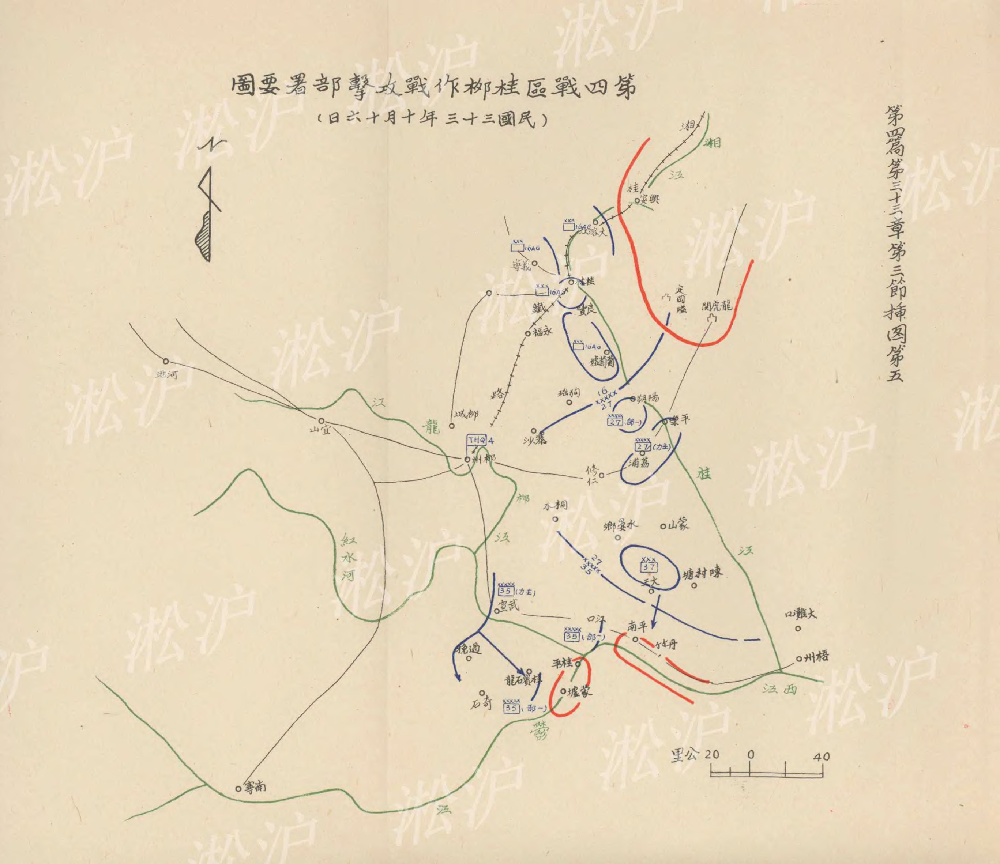

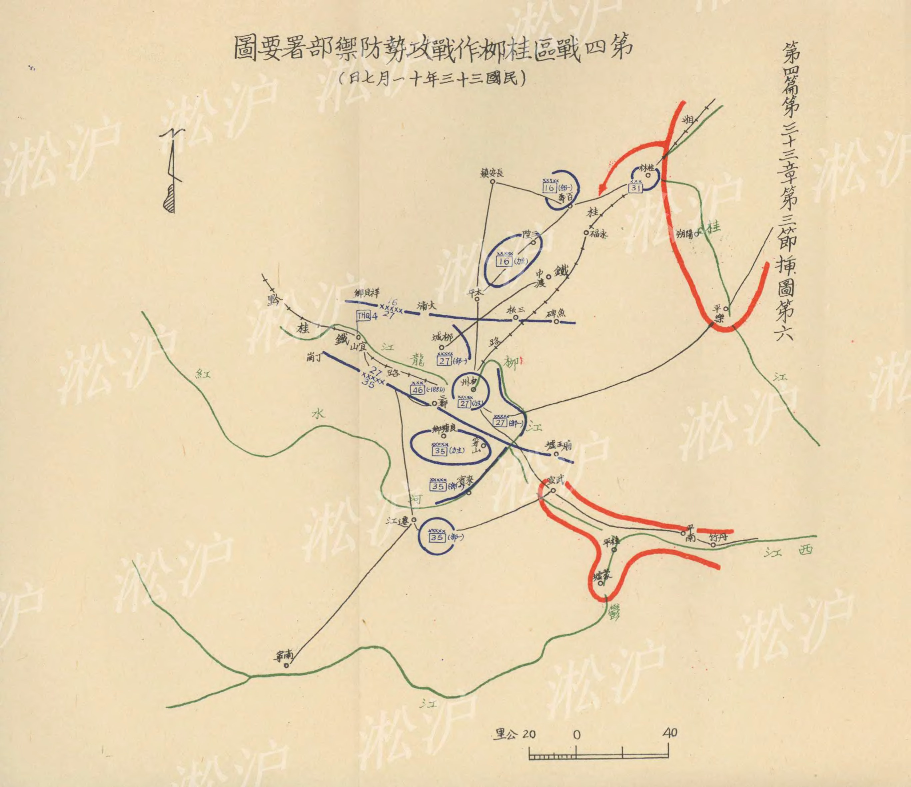

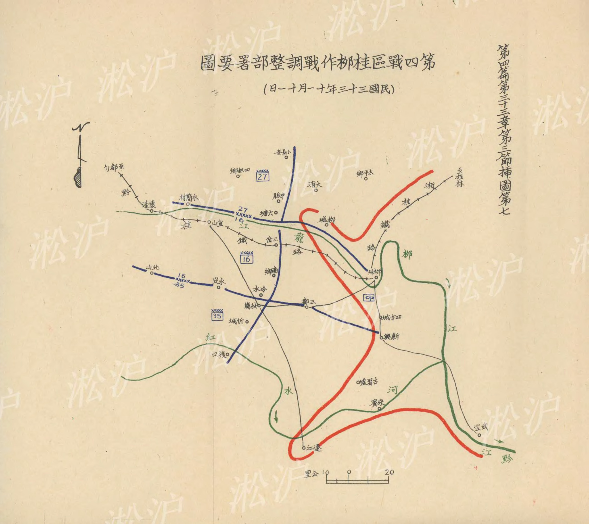

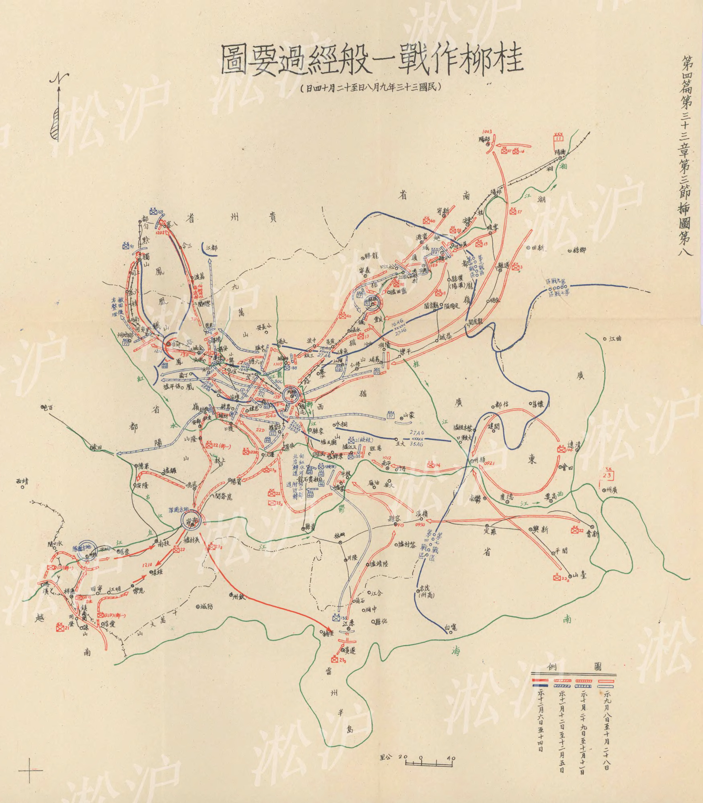

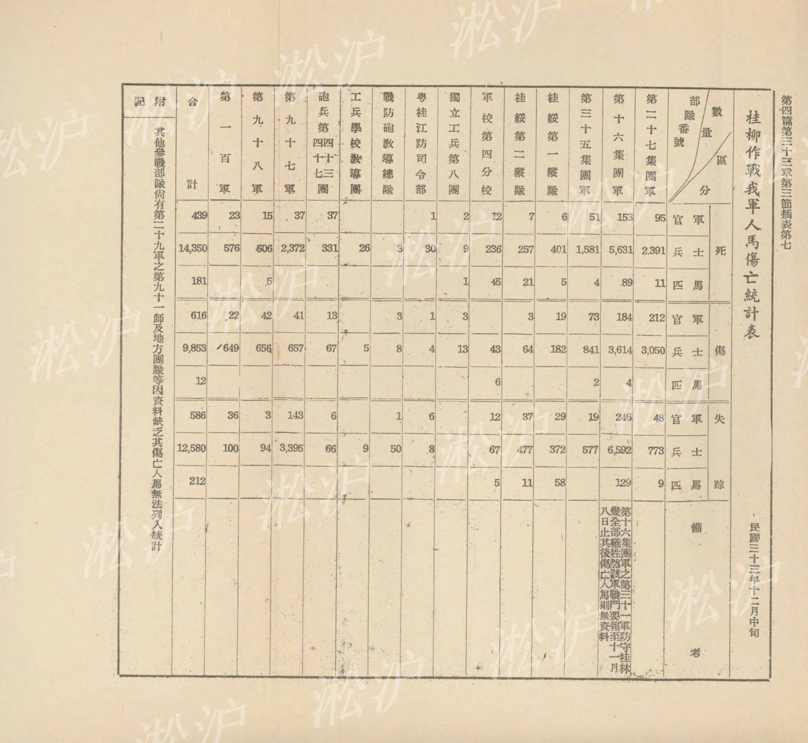

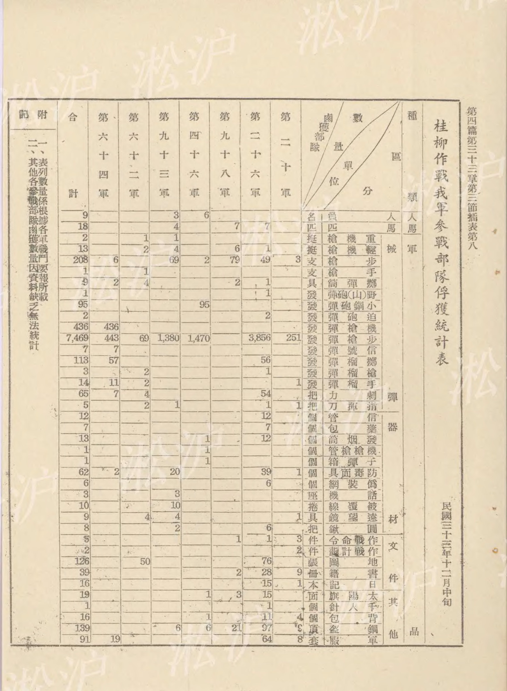

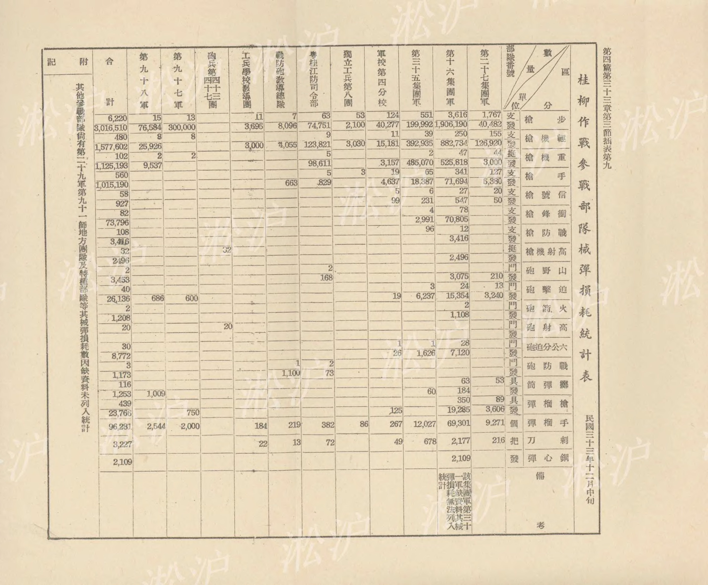

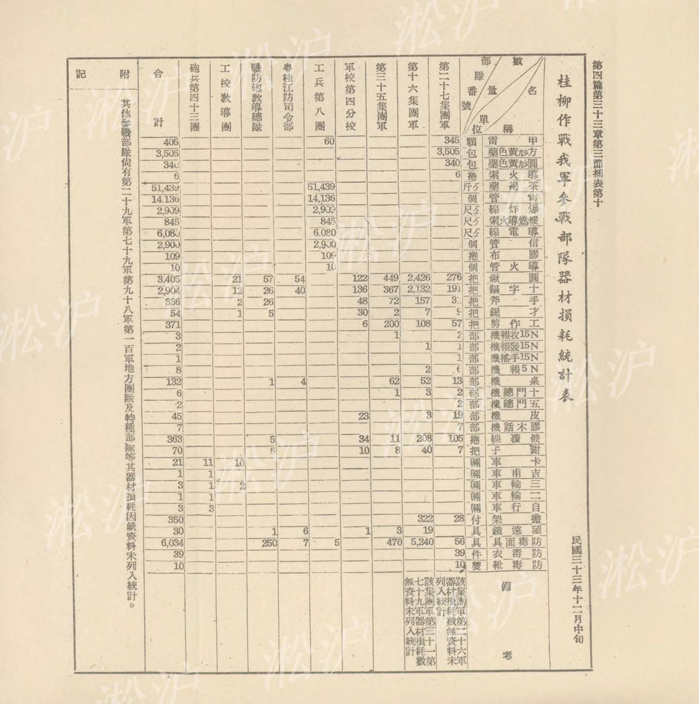

### 第四節 重要戰鬥

#### 第一款 湘桂路沿線戰鬪

民國三十三年九月十日至十月二十七日

參照插圖第九至第十二插表第十一第十二

敵軍於民國三十三年八月上旬佔領衡陽後，卽集結兵力於湘江兩岸，九月初，敵第十三、第五十八及第四十師團，佔領零陵、東安、新寧等地，續向桂境進攻，我守軍第九十三軍逐次抵抗於黃沙河、全縣（全州）、興安、大溶江等地區，遂惹起本戰鬥。

##### 第一項 湘桂路沿線地形

湘桂路爲由湘入桂之要道，桂境一段，沿線兩側爲五嶺山脈，公、鐵路沿湘江與灘水河谷，地勢平易，宛如走廊。湘江由興安附近向東北，灘水向西南流，構成湘桂水路交通系統。沿線重鎮，首爲全縣，扼水陸交通咽喉，爲桂省東北之門戶，其西南至興安，地形開闊，道路縱橫，河流綜錯，湘桂路經此而西折，跨灘水而至大小溶江，大溶江位於公路之渡口，小溶江居其南，地極窄狹，乃走廊之盡頭，灘江支流橫過其北，形勢險要，爲桂林東北之要點。

##### 第二項 戰鬥經過

九月八日，沿湘桂路進攻之敵，已至東安附近，第四戰區張長官據報後，卽電令第九十三軍以一部在黃沙河佔領陣地，阻止敵人。陳牧農軍長奉令後，卽下達軍作命第五號命令，其要旨如次：「第十師在雙橋之第二十八團附第二十九團之第一營、砲兵第二十九團山砲二門爲前進部隊，該部隊應以主力佔領眼門前、尙禮村、慕道村之線旣設陣地，一部控置朱砂蓋頂加強工事，極力遲滯敵之前進，並掩護軍主力佔領陣地，另以一部在黃沙河警戒及向零陵、東安方面搜索，該前進部隊之撤回，由軍命令行之，第二十八團團長奉令後，當卽遵照所示部署。

當晚該軍得知敵已迫近黃沙河附近，卽下達軍作命第六號命令，其要旨如左：

一、沿湘桂路進攻之敵，於九月七、八兩日先後佔領零陵、東安，並繼續前進中。

二、軍爲確保全縣阻敵進攻，決在全縣四週城郊附近佔領陣地，以火力摧毀敵軍，乘敵攻勢頓挫，一舉而殲滅之。

三、新編第八師（附戰防砲營欠第一連、野戰第三醫院）卽在雷公嶺二一七、三高地、五里村東側高地、亭子嶺、金甲村西側高地及白家拉之線佔領陣地，依縱深配備，以子母堡羣構成主陣地帶，對雷公嶺二一七、三高地、五里村東側高地、金甲村西側高地各點，均須構築堅強閉鎖式據點工事，其各子母堡間之空隙，擇要以野戰工事補足之，並於全縣東門、蔡家、三里亭東側高地、高嶺脚南側高地、羅家灣、蛇公壩南側高地之線構築預備陣地。作戰初期，應盡力節約兵力摧破敵之攻勢，再對扁擔坳、百寶嶺須酌派警戒部隊，師警戒陣地爲小山、管子嶺、村尾、姚家沖、水井崗、吊墻坪、七里橋二一五、七高地、鐵路頭、江家村概略之線。

四、第十師（欠第二十八團及第二十九團一營附戰防砲營第一連及第一野戰醫院）應連繫新編第八師佔領傍塘東側高地、破爐底東西高地、獅子嶺、楓木山、鷄冠山、華萊嶺、蝴蝶坪東側高地、江口、牌樓邊、唐家及火燒渡東側高地之線佔領陣地，依縱深配備，構築子母堡式堅強陣地，對傍塘東側高地、獅子嶺、鷄冠山、華萊嶺及火燒渡東西側高地各要點，應構成閉鎖式據點，其各堡壘間空隙，以野戰工事補足之，並於蛇公壩西南側、全縣車站南側至哲橋之線構築預備陣地。在作戰初期應盡力節約兵力，準備攻勢行動，又對水南南側二一高地應構成一堅固獨立閉鎖式據點，阻敵接近城區。師警戒陣地爲金背嶺、大石山、劉王嶺、石屏山、新大喜塘、胡家、上塘、福盛村、六集村概略之線。

五、作戰地境：

新編第八師

第十師：六十丈沿灌陽河東岸、全縣城南、無名河南岸（均含）、湘山公園、龍眼井（均不含）

、傍塘東側高地（含）、江家村、巖門前、馬頭崗（均不含）之線，線上屬第十師。

六、軍砲兵隊（長砲第二十九團第二營營長張翔，砲第二十九團第二營，軍砲兵營），主力應在三里亭農場，一部於龍眼井西南側五排嶺各附近佔領陣地，以主力支援新編第八師，一部支援第十師戰鬥，得依情況轉移之。

各部隊奉命後，各就佔領地區趕築工事。

九月九日

第

照插圖

九

，當面敵軍着着西進，第十六集團軍夏威總司令，乃令飭第九十三軍轉知黃沙河部隊，卽日進入陣地，對於敵之攻擊，最少須抵抗兩天方准撤退，該軍轉知第二十八團遵照，至十四時，敵便衣隊三十餘進攻廟頭，經該團警戒部隊擊退。十日黃昏，復有步騎聯合約千餘之敵由東湘橋西進，與我前進部隊右地區隊（第二十九團第一營）接觸，該營搜索隊於沙帽嶺與百餘人之敵遭遇，逐步抵抗後退至栗山陣地與敵對峙。

九月十一日拂曉，栗山之敵增至三百餘，向我猛攻，陣地遂被突破。另有諸兵種聯合之敵約七百餘，經盤古嶺繞至黃花嶺分向港底村、茶園頭、青木塘、轎子嶺側背猛攻，守軍第二十九團第三連馳往堵擊，我砲兵亦隔河支援，戰至十一時左右，雙方死亡均重，右翼陣地全燬，營長閻震黃負重傷，連長以下幹部傷亡殆盡，第二連全連殉國，因此被迫向下改州附近轉移。敵軍復分三股共約三百餘人，一股跟踪渡河續攻梅潭，另股攻樂家灣，均經第二十八團第六、第七、第八連擊退，並殲滅過半，乃與敵隔河對峙，入晚當面敵人於增援部隊到達後，復向轎子嶺、梅潭、樂家灣之線猛攻，同時黃沙河方面亦有敵千餘向我陣地進迫。陳軍長鑒於前進陣地右翼已被突破，左地區形成突出，乃飭第二十八團退守和好舖東西之線，十九時三十分，黃沙河守軍第九連撤退時，其後衛一班在黃沙河南端全班壯烈犧牲，第二十八團主力甫到達和好舖新陣地整理，敵已渡河，經梅潭向該團警戒陣地進攻，此時陳牧農軍長以該團任務已達，乃令歸建制。二十二時至二十四時之間，該軍奉第四戰區張長官先後電話指示：「決改變作戰計劃，放棄固守全州，該軍應保持戰力參加桂柳會戰，但爲爭取準備時間，在全州至桂林間應逐次抵抗兩週，遲滯敵之前進」。

先是，八月二十二日，第四戰區曾對第九十三軍之使用，建議軍事委員會改由全州固守黃沙河，至九月十二日蔣委員長以申文辰侍參電覆張長官：「第九十三軍留一部堅守全州，不得已時，節節抵抗，支持兩星期以上時間，主力轉移桂柳方面，照兄與白副總長所商定計劃實施，黃沙河方面，仍須督飭努力支持爲要。」

九月十二日十三時許，四戰區乃以電話指示第九十三軍：「着該軍沿公路鐵路逐次抵抗兩週，第一步到嚴關鄉，第二步到大溶江（見插圖第八），並以大溶江爲最後抵抗線，在兩週內不得任敵突過大溶江，並立即抽調步兵兩個團，到嚴關鄉、大溶江各附近構築陣地，該軍野砲卽開桂林」。陳軍長奉令後，卽派車搶運所屯糧彈一部，餘爲時間所迫及運輸工具所限，均予爆破焚燬。是時，敵先遣部隊已出沒於全縣城郊陣地、警戒陣地前方，黃昏時增至千人進攻七里橋、江家村、金背嶺警戒陣地，警戒部隊經激烈抵抗後退回主陣地。當夜敵步砲兵二千餘，分三路續向我主陣地進攻，激戰終宵，至十三日晨，其一部企圖由蓑衣渡等處渡江，經我守軍奮勇抵抗未逞，十時許敵增至四千餘，藉其優勢火力，突破我中央陣地及公路兩側地區，守軍以陣地殘破，死傷慘重，退守城郊繼續抵抗，黃昏後，敵在熾盛砲火掩護之下由東北兩門突入城內，雙方血戰方酣，而該軍搜索營在車底以北與由楓木山南之敵千餘激戰後，被迫退至龍水鎮附近，敵跟踪追擊，有進攻興安模樣，該軍恐後方連絡線被敵截斷，爲達成逐次遲滯敵前進保持爾後參加桂柳作戰力量起見，經將撤退詳情，以申元電呈軍事委員會，入夜復以申寒電報張長官後，卽於十三日晚十九時撤離全縣，向興安附近轉進。

九月十四日

圖第十

參照插

，第九十三軍抵達興安附近後，卽依照預定計劃，以第十師佔領井上田、七家嶺、飛龍殿、五旗嶺之線，並以水口村、新板山附近之線爲警戒陣地，以新編第八師佔領大溶江附近，準備拒敵。

九月十五日，該軍奉張長官電示：「該軍須沿鐵路線逐次極力拒止敵人，以全縣、興安、大溶江各附近地區爲第一、第二、第三抵抗線，非有本部命令不得撤退，並限九月二十七日前不得使敵突破大溶江抵抗線」。十四時許，敵便衣隊一小部進擾於咸水附近，經該軍警戒部隊擊退。

九月十六日，敵三百餘利用黃昏攻擊新板山警戒陣地，激戰竟夜，爲守軍擊退。十七日拂曉，敵增至六百餘附山砲二門向警戒陣地猛撲，經守軍堅強抵抗，斃敵大隊長以下三百餘後，嗣向主陣地撤退，敵乃於十八日進佔新板山。

九月二十日，該軍以新編第八師之第二十四團一個營，進佔上下孚村附近，掩護軍右側背之安全，並準備迎擊芝蔴渡方面進攻之敵。

九月二十二日，該軍以現陣地側面暴露於湘江右岸，對鐵路正面與芝蔴渡兩面向我夾擊之敵無法應付，請准變更陣地，佔領自東亞村，興安城、富貴村、鷄壩山、南元村之線，並着各部隊在原陣地酌留有力一部，保持與敵接觸。

九月二十三日，第十師除留有力一部於原陣地與敵保持接觸外，主力於黃昏後移佔興安、畔塘、鷄壩山之線，該軍並將第二十四團控置於福莊村、產子坪地區（在興安南）爲軍預備隊，以搜索營位置於犁頭墟，一部位置於富辱塘附近（均在興安東南湘江右岸）警戒。

敵自九月十八日攻佔新板山附近警戒陣地後，卽跟踪前進，不時襲擊我八甲村、五旗嶺附近陣地，迨二十四日，敵已陸續增至四千餘砲十餘門，一部千餘人大舉進攻八甲村亘界首之線。二十五日，雙方在五旗嶺、飛龍殿之線激戰終日，演成對峙狀態。

九月二十六日白副參謀總長偕同夏威總司令到興安視察陣地，胡棟成代軍長面報興安陣地正面過廣，兵力不敷分配，當經白副參謀總長指示，將主陣地右翼稍向後移，以興安城爲搜索警戒據點，俾陣地正面縮小，並抽調一團至老堡村南北之線構築預備陣地。

九月二十七日十六時許，敵約四百人附砲二門向五旗嶺之線陣地左側背猛撲，另一部五百餘由湘江右岸新開田向大雨塘、江南村各附近襲擊，入暮後，飛龍殿方面敵以密集隊形由東西北三面向我猛攻，經守軍堅強抵抗，終未得逞。是夜，該軍令第十師將留置飛龍殿附近部隊，以一部於原地與敵保持接觸，主力撤回主陣地右翼，二十三時，該師遵照部署完畢。

九月二十八日二十三時，敵一部由四所向富屏塘進攻，與搜索營激戰竟夜，二十九日晨，該營被迫西移至上水西以南附近地區，七時許，敵卽侵入犁頭墟，並陸續增至千餘人，以一部向右翼二八一、三高地第二十九團陣地猛攻，企圖掩護其主力由下水西及東亞村北側渡河，當被擊退。十三時許，南陡、道士田第二十九團陣地對河發現敵人六、七百名，與犁頭墟敵人呼應，亦向該團陣地猛攻，另一部千餘由井上田沿湘桂路南攻鳳凰山、胡家塘、石山村警戒陣地，該軍以右翼兵力單薄，爲防敵人由右側背突入計，乃將主陣地右翼後移，以第二十四團（欠一營）在王家塘南側高地佔領陣地，第二十九團佔領黃金村以北二七四、八高地、造里橋北側高地、道士田二四五、五高地及興安城之線，二十三時，除二八一、三高地守軍與敵膠着未能轉移外，餘均就新部署位置。

九月三十日，全線激戰竟日，該軍爲縮短防線鞏固陣地計，遵照白副參謀總長指示，以興安城爲搜索警戒據點，令搜索營移佔前場、板風坳、朝水塘之線，掩護軍之側背，令第十師入暮後佔領侵口西側高地、南裏坪、產子坪（均在興安南）東側高地、三里陡（興安西）、點燈山、畔塘及鷄壩山之線，並規定石坑、黃金村、造里橋、興安城、江水塘、花塘屯、瓦子舖、石山村之概略線爲該師警戒陣地，令第二十四團爲軍預備隊，位置於山脚村、圳南村各附近，入暮後，第十師移佔新陣地。是時，敵一部五百餘在該軍右翼分三路乘我立足未穩，鑽隙進至福莊村（興安南）西側南北之線猛攻，另一部經唐家突入南裏坪，並續犯產子坪（在南裏坪北），當夜右翼入於混戰狀態，同時犯興安之敵亦向殿家村（興安西）以西陣地猛攻，戰鬥激烈。

十月一日晨，該軍鑒於右翼新陣地動搖，乃將右翼撤至於馬鞍山、三江口、道冠村、松樹山之線，是時敵約二千附山砲六門，向該軍左陣地二五四、三高地及其北側高地三面夾擊，該軍第二十八團第一營竭力奮戰，傷亡慘重，戰至十三時，陣地全毀，僅餘十數人撤出，敵復繼續增援，向該軍中央陣地松樹山猛攻，該處受敵瞰制，第三十團第二營損失慘重，十四時，敵一度攻點燈山不逞，薄暮各方面激戰猛烈，右翼馬鞍山、南裏坪附近陣地被敵截爲三段，第二十九團入夜始得突圍。是時胡棟成代軍長將目前不利態勢報告夏總司令，經復准向老堡村附近轉移陣地，是夜該軍轉進到達嚴關鄉陣地時，卽令第十師佔領鼓鑼洞、寶塔嶺、老堡村、杏花嶺之線旣設陣地，繼續阻擊敵人，並以第十師第二十八團第三營及新編第八師第二十四團第一營，佔領聯木橋、趙家巖及圳南村、馬頭石山亘嚴關鄉以北石山各線。

十月二日晨，該軍各部先後到達指定位置，興安方面之敵亦已分股沿湘桂公路鐵路及其南側山地尾追，於擊退我預置松桂屯以西地區伏擊部隊第二十九團第七連及突破聯木橋、趙家巖第二十四團第一營與圳南村嚴關鄉第二十八團第三營之掩護陣地後，復分兩股向我主陣地進攻，每股以百餘人分叠三、四線作波浪式之攻擊，均經守軍擊退。入夜敵由隔江背附近森林地帶及老堡村北側各地區及杏花嶺東北側不斷猛撲，均經守軍先以火力制壓，繼施逆襲，逐次將敵擊退，雙方傷亡均重。

十月三日晨，當面之敵增至五千餘，藉砲火之掩護，繼續猛攻，午後復以飛機助戰，轟炸掃射達半小時，陣地被突破七處，隔江背、老堡村陣地全部動搖，是時王師長偕谷副師長親赴各團及砲兵陣地督率反擊，往返爭奪，各陣地失而復得者凡六、七次，混戰至申刻，各連傷亡超過三分之二，間有一連僅剩六、七人者，而敵後援續至，先後佔領隔江背、寶塔領、老堡村等陣地，最後該師以非戰鬥兵參加戰鬥，勉力保有鼓鑼洞三五九、一高地、寶塔嶺三九五、零高地及老堡村至大邊嶺西側之線。及暮，夏總司令電令第十師後撤整理，該軍遂令第十師利用夜暗至靈川東北地區整理備戰，令新編第八師進入大小溶江既設陣地（該師第二十四團撤退至此即歸還建制），是夜敵亦因傷亡過重，後撤十餘里。十八時，新編第八師遵令進入小溶江陣地，佔領帽子嶺亘月光洞南側高地及西側四三七、零高地、元滕北側高地至溶江鐵橋、沿小溶江南岸、銀礦嶺、筋竹山之線，並於胡家園、廖家村南側高地、南江頭、大埠頭、大溶江及下百家東北高地之線，派出警戒部隊，各部隊均於是夜進入陣地。

敵佔領興安後，截至十月十三日止已增至四、五千人，旬日中敵僅一部千餘人活動於白竹舖附近，其他均就地整理。

十月十四日

參照插圖

第十一，敵一部三百餘於三時許沿湘桂公路向大溶江警戒陣地進攻，渡河之際，經防守渡口第二十二團之一班乘其半渡而擊之，斃敵數十人，敵受創後，分數處強渡，該班因衆寡懸殊，無法堵擊，激戰二小時，該班全班殉國，敵乃乘勢突入大溶江陣地，與第二十二團第一連激戰，該連被迫後退，旋由第二十二團第三、第八兩連各一部之增援，在砲空掩護之下曾一度收復該陣地，嗣以傷亡過重，大溶江又陷於敵。

同日拂曉，敵第五十八師團第一零六大隊三百餘，由西安鄉進攻明塘口，與守軍第二十四團第一營之一排激戰三小時，該排孤立無援，被敵包圍，終至全部殉職，敵佔明塘口後，卽經油路界西犯松江口，新編第八師第二十四團第一營被迫退至豆塘坪附近，松江口陣地於是陷落。

十月十五日，夏總司令得知松江口之敵已增至千餘，其先頭部隊百餘人正向小溶江陣地左翼移動，主力尙在松江口以南隘路中，乃決心使用絕對優勢兵力，利用敵在隘路中運動之時機擊滅之，遂令集結於靈川附近整理之第十師，以主力速向松江口前進，令新編第八師以一部協力第十師之攻擊，令第七十九軍之第一九四師以一個團推進至蘇村附近，歸第十師王師長指揮。

第十師奉令後，除第二十九團第三營爲軍預備隊在靈川附近構築工事外，餘卽向松江口方向推進，佔領和尙嶺、大青山、南對嶺之線，同時派第三十團第二營營長率兵一連，於正午到達松江口附近，協力新編第八師第二十四團第一營作戰。黃昏後，敵因援軍到達，卽乘勢突破新編第八師第二十四團第一營陣地，繼續進犯大青山，與第三十團激戰竟夜，第二十四團第一營被迫於十六日轉移至符竹村歸還建制。

十月十七日，佔領大溶江之敵，因經我連日襲擊，頓呈不支，新編第八師第二十二團利用空軍及砲火掩護，奮勇攻擊，於十一時三十分攻克大溶江，將敵驅至江邊，成對峙狀態。

同日奉派歸第十師王師長指揮之第七十九軍第五八二團已到達鷄籠嶺待命，王師長除以一部確保和尙嶺至大青山之線外，主力於拂曉前展開於鷄籠嶺、南對嶺之線，攻擊重點指向松江口，七時開始攻擊，進展甚緩，十時許，攻擊重點改向豆塘坪西南高地，經一度激戰後，敵退據隘路口前南北高地及四零八、一高地之線。

十月十八日，大溶江方面情況無變化，松江口方面第十師變更部署如左：

一、第二十八團爲右翼隊，展開於和尙嶺北側，協助中央隊攻擊四零八、一高地之敵。

二、第三十團（附第五八二團兩個連）爲中央隊，展開於大青山東側，攻擊四零八、一高地之敵。

三、第五八二團（欠兩連）爲左翼隊，展開於南對嶺東側，攻擊豆塘坪之敵。

四、砲兵主火力指向隘路口兩側高地，一部制壓敵砲兵。

第七十九軍於十七日派第一九四師第五八二團歸第十師指揮後，續令派該師全部於次日七時前集結於祠堂鄉附近，準備進出塔邊屯附近，策應松江口方面之作戰，該師長龔傳文到達祠堂鄉後，綜合當前情况，下達命令如左：

一、大溶江之敵已被我友軍擊退，松江口之敵連日經我第十師及第五八二團圍擊，傷亡頗重，刻仍在松江口亘四零八、一高地頑抗中，第十師（附第五八二團）刻在和尙嶺、大青山、南對嶺之線圍攻中，敵已呈潰退模樣。

二、師（欠第五八二團）以準備進出塔邊屯策應友軍作戰之目的，除以一部進出塔邊屯、明涔界、十字路各附近警戒外，主力卽在祠堂鄉附近集結，準備隨時行動。

三、第五八零團以一部推進至十字路及龍隘村各附近，對敵警戒，主力在六塘村附近準備隨時行動。

四、第五八一團除以一部佔領明涔界、塔邊屯各要點構築工事固守，並向田頭口方向搜索警戒外，主力卽在祠堂鄉、蓮堂村集結，準備隨時行動。

五、余在九屋墟司令部。

十六時，第五八一團派出之一部推進至塔邊屯附近時，得知塔邊屯、田頭口、大灣田已於十時前被敵佔領。

十月十九日，大溶江及松江口方面情況無甚變化，第七十九軍方軍長指示第一九四師：「着第五八一團於本（十九）日黄昏前攻佔塔邊屯後，以一部固守，主力續向田頭口攻擊前進，並着徐副師長至第五八一團指揮。該團遵於十九時部署完畢，卽由塔邊屯左右高地開始攻擊，奮勇激戰，約二小時，敵不支向大灣由潰退，該團跟踪追擊，於二十三時攻克大灣田，翌晨七時許光復田頭口，敵由楊梅塘抽調二百餘人附砲二門增援，以掩護其右側翼安全，於是相持至二十一日夜間，全線我軍雖不斷攻擊，但均無若何進展。

十月二十二日，松江口方面第十師王師長以攻勢迄無進展，乃作戰術指示，以右翼隊主力向四零八、一高地攻擊奏效後，協同左翼隊封鎖隘路口，左翼隊主力向敵石堡攻擊，兩翼隊先由正面佯攻，使敵不暇後顧，然後以優勢兵力向敵兩側壓迫。十一時，適值大雨傾盆，陰霾密佈，該師卽冒雨進攻，雖稍獲進展，終因天氣影響，步砲難趨協同，故攻擊仍然無效。此時第一九四師改歸第十六集團軍副總司令甘麗初指揮，該師十三時三十分奉令以有力一部佔領猪頭嶺、北對嶺任掩護，爾後推進至反璧江、三叉路口附近，構築據點工事，阻敵西犯，主力由田頭口向松江口五三一高地攻擊前進，以壓迫敵之右側背，師部位置於塔邊屯附近，龔師長奉命後，卽以第五八一團之一部，由田頭口向北對嶺、猪頭嶺之敵攻擊而驅逐之，另一連扼守螞蟻江要道口，主力向楊梅塘之敵攻擊前進，以第五八零團之一連扼守古刹江，一連扼守新渡，一連扼守明涔界各附近要口，主力集結於塔邊屯附近，師戰鬥指揮所位置於塔邊屯，部署完畢，於二十四日拂曉冒雨開始攻擊，激戰至七時五十分，攻克土地坳（楊梅塘西北二公里），九時續克楊梅塘，迄十二時，第一線佔領五三一高地。

第十師及新編第八師之第二十四團，於十月二十三日拂曉，亦在砲火掩護下展開攻勢，右翼一部突入當面敵陣地，該敵被迫後移，我全線乃乘其動搖協同猛攻，敵遂全線崩潰，向西安鄉撤退，第二十四團於六時許完全佔領松江口，第十師以一部尾追至界脚底附近，主力在松江口附近掃清戰場，斃敵第五十八師團第一零六大隊長今掘少佐以下四百餘名，俘獲甚多。

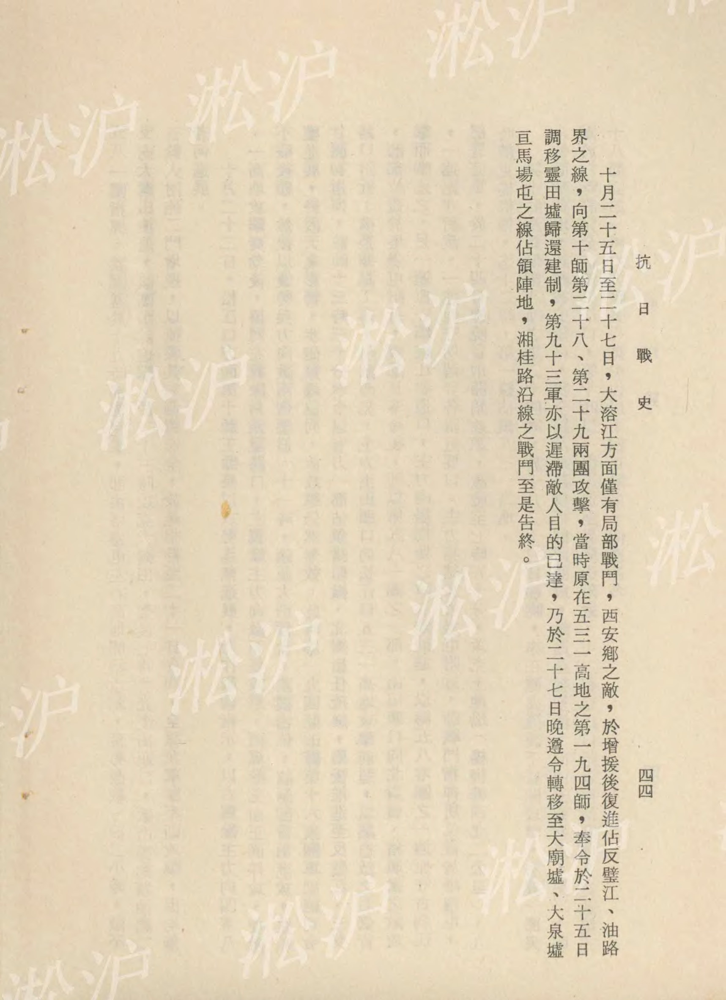

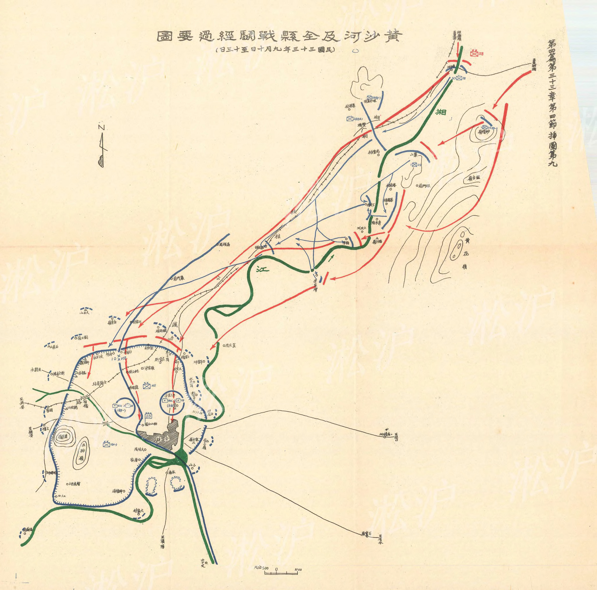

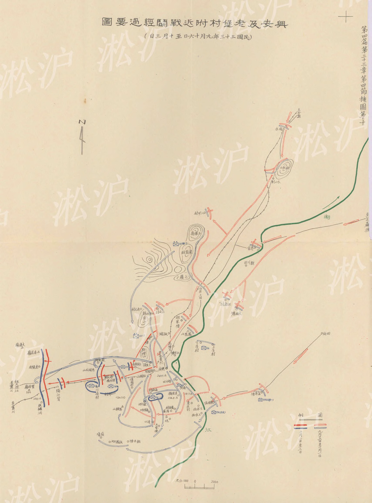

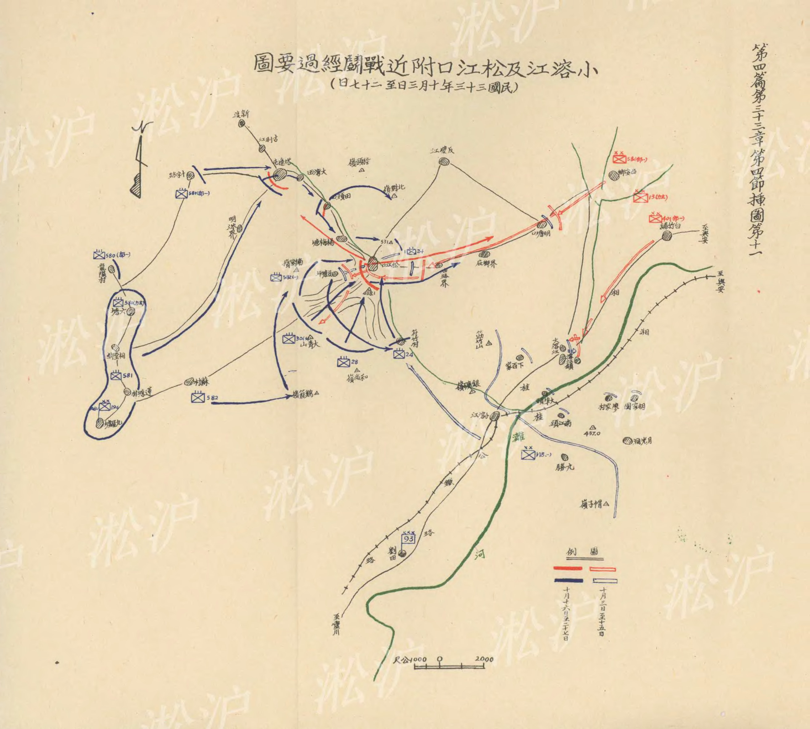

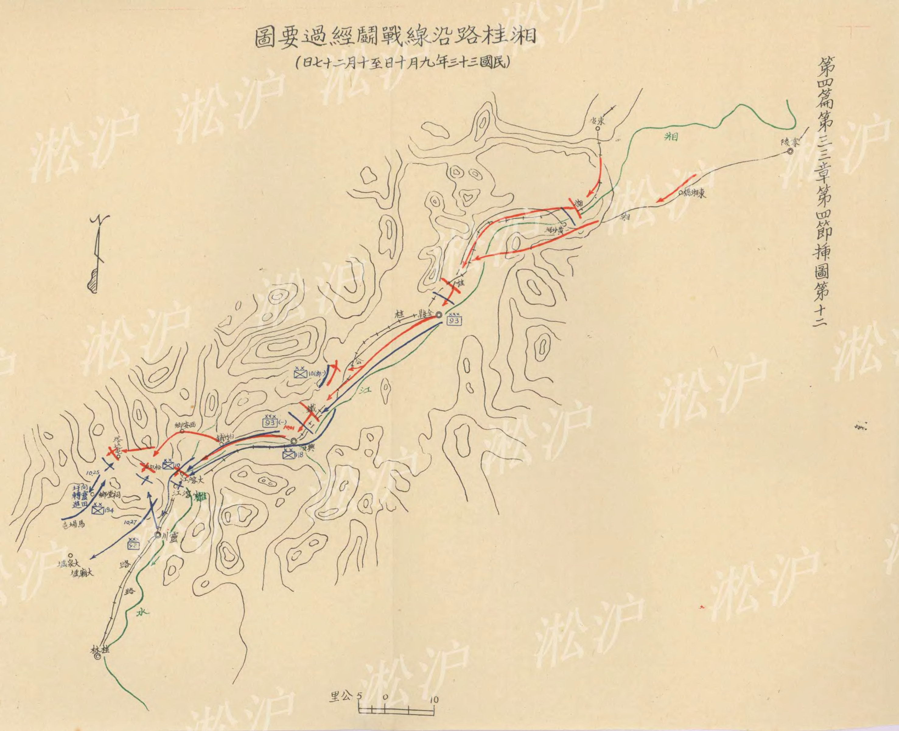

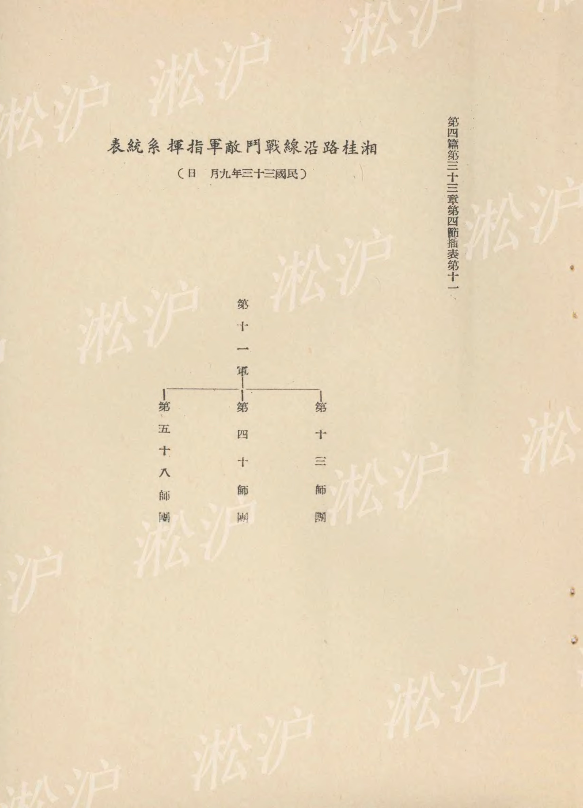

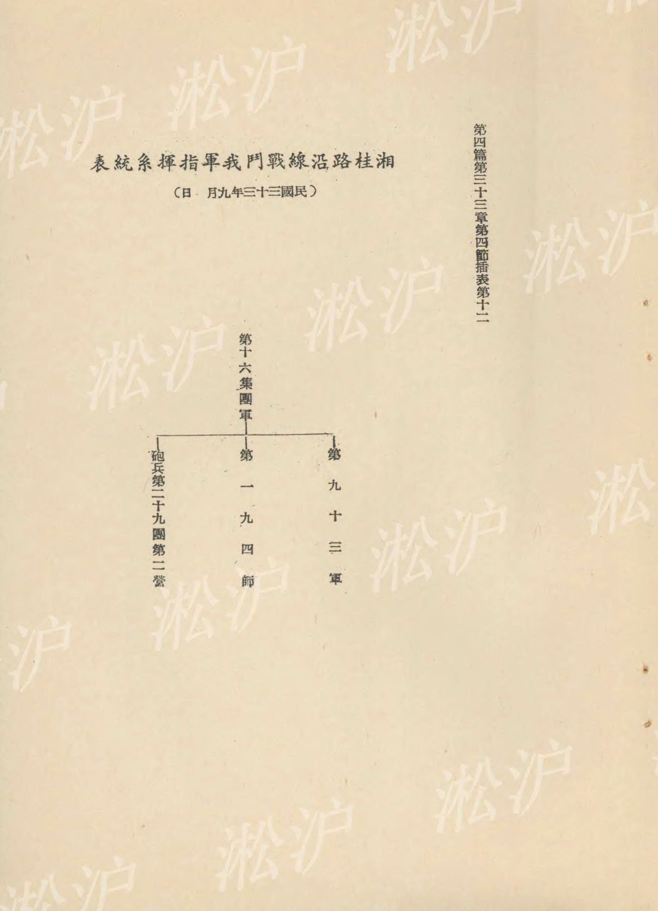

#### 第二款 桂平及蒙墟附近戰鬪

民國三十三年十月一日至二十八日

參照插圖第十三第十四插表第十三第十四

粤敵先頭部隊，於民國三十三年十月初旬進出平南、丹竹、武林、大安、鎮隆間地區後，企圖續攻柳州，其第二十二師團及獨立第二十三旅團，旋各以一部進出平南、丹竹，另以一部約三千餘經油麻西攻桂平、蒙墟，乃與該地我守軍發生激戰。

##### 第一項 桂平及蒙墟附近地形

桂平位於桂省中心，居黔鬱兩江之合流點，北東南三面環水，西側山岳綿亙，叢山峻嶺，形勢險要，爲歷代兵家必爭之地，公路北有桂南，跨黔江而至南涿，西有桂貴，傍山西達貴縣，水陸交通便利，其西南方之蒙墟，阡陌縱橫，農產豐富，桂貴公路經其北境，爲通桂平之要點。

##### 第二項 戰鬥經過

粤敵於十月五日集結大中、鎮隆地區，七日以約三百餘人，經穆樂、油麻向桂平方向前進，其主力三千餘繼續跟進。

我第一五五師（欠第四六五團）尾擊由雷州半島北進之敵，經陸川至鎮隆以南地區後，十月一日調往桂平，佔領桂平亘大湟江口地區陣地，拒敵西進。十日奉令將現任務交第一三五師接替，卽以一部守備桂平，主力配置蒙墟附近，阻擊渡河進攻之敵。該師於當晚完成新部署時，敵第二十二師團第八十四聯隊三千餘人附山砲四門，其主力已集結於社步、官江（在桂平南）河岸彎曲部，一部進抵渡頭村，作渡河之準備。

十月十一日拂曉，敵分股強行渡河，當時第一五五師以部署甫定，倉卒迎擊，戰至十五時，敵藉砲火掩護之力，由官江、社步、夏灣等地渡過鬱江，該師沿河警戒部隊，以衆寡懸殊，被迫退守歐村、曹村之線。

渡頭之敵亦於是夜偷渡成功，天明卽向桂平城進犯，與守軍第一五五師之一部發生激烈巷戰，敵後續部隊陸續增至二千餘，我守軍以兵力單薄，經激戰後退出城垣至蒙墟歸還建制，桂平城遂於十二日淪陷。

由社步、官江等處渡過鬱江之敵，突破我沿岸警戒線後，進而與第一五五師主力在蒙墟附近血戰至晚，該師以敵衆我寡，傷亡過重，奉命西移至官橋墟南北之線佔領陣地，藉資整理，待機轉移攻勢，敵於十二日夜進佔蒙墟。

第一五五師原留駐化縣地區之第四六五團，經由玉貴公路於十四日到達官橋歸建，同時隨第三十五集團軍由粤入桂之第一五九師第四七六團，撥歸第一五五師指揮，該師戰力增強，士氣大振。

十月十八日晨，佔領蒙墟之敵，以步兵千餘附砲二門向第一五五師之清泉、官橋、全塘陣地進犯，我軍沉着迎擊，激戰至午後，敵終未得逞，該師利用敵攻勢頓挫之際，全線乘機轉移攻勢，敵不支倉惶回竄，我乃乘勝尾追至石塘附近，以時已入暮，始撤回原陣地，期待我後續部隊到達後再轉移攻勢，是役斃敵百餘名，該師亦傷亡四十餘名。

駐粤小北江之第六十四軍主力，奉調入桂，於十月十九日到達桂貴石龍（石龍墟）附近，第一五五師及第一五九師之第四七六團是時分別歸還建制。

第四戰區爲確保桂柳並便利湘桂方面之作戰，決先擊破桂平方面之敵，遂授予第三十五集團軍各部隊任務要旨如左：

一、第六十四軍十月十九日前完成攻擊準備，二十日晨開始向蒙墟之敵攻擊，並派有力一部爲江右支隊，進出鬱江右岸地區，向油麻、社步間截擊敵後，協助該集團之作戰。

二、第十六集團軍周副總司令，以一縱隊在桂貴石龍東北側地區完成攻擊準備，二十日晨開始向桂平之敵攻擊，另一縱隊在黔江以北地區協助第一三五師固守金田村南北之線，相機攻擊平南之敵。

第三十五集團軍奉右項電令後，卽於十月十九日下達命令，其要旨如左：

一、盤據桂平、蒙墟間地區之敵，刻在構築工事中，現鬱江右岸之油麻、社步、六陳有兵力未詳之敵一股。

二、方面軍決先擊破蒙墟、桂平之敵，以利爾後會戰。

三、第六十四軍附桂綏第一縱隊及第四十六軍之砲兵一連暨砲兵第二十九團第三營之一連（砲二門），應卽由現地推進至桂貴石龍以東地區，二十日前完成攻擊準備，二十一日晨開始向蒙墟、桂平之敵攻擊，並派有力一團爲江右支隊，二十日前進出鬱江右岸地區，向油麻、社步間活動，截擊敵後，協力軍主力之作戰。

四、周副總司令指揮第三十一軍之第一三五師及桂綏第二縱隊，固守金田村南北之線，並相機進出平南以西地區，協力對平南、丹竹之攻擊。

五、第四十六軍（欠第一七零師新編第十九師及砲兵一連）附第一八八師，除以一師於二十日推進至奇石及其西南地區策應作戰外，軍部及一師仍在通挽附近集結待命。

六、作戰地境：爲黔江江流之線，線上屬左：

第六十四軍奉令後，乃於二十日二十時下達作命桂字第一號命令，如左：

作命第一號

第六十四軍命令

民國三十三年十月二十日二十時

於桂貴石龍

一、盤據桂平、蒙墟間地區之敵，刻在構築工事中，現鬱江右岸之油麻、社步、六陳有兵力未詳之敵一股。

二、軍奉命攻擊蒙墟、桂平之敵，決分二期攻略，並於本（十）月二十一日上午八時利用我空軍轟炸成果，以有力部隊先行對蒙墟、古狂村、古城村、新福村、新德村之線敵前進警戒陣地實施威力搜索，相機佔領之。

第一期攻擊目標：爲烏楊村、五零零高地、藍山、猛風坳之線，攻擊重點指向五零零高地。

第二期攻擊目標：爲西山南北之線迄桂平城之攻略，攻擊重點指向桂平城，攻擊到達線爲桂平城東端之線。

攻擊開始時間：爲本（十）月二十二日上午八時空軍實施攻擊準備轟炸完畢後（以飛機忽升忽降表示之）行之。

三、第一五九師應乘夜由現地推進於門塘、和睦村、良美上村、五合村之線，師指揮所位置於良田鄉附近，務於本（十）月二十二日拂曉前完成攻擊準備，右與江右支隊左與第一五五師切取連繫，依時開始攻擊，特應注意對夏灣墟、社步方面之警戒。

四、第一五五師附砲兵第二十九團第三營（缺第七、第八兩連）及第四十六軍砲兵第一連，在原位置，師指揮所推進至平陽村附近，務於本（十）月二十二日前完成攻擊準備，右與第一五九師左與桂綏第一縱隊切取連繫，依時開始攻擊當面之敵，配屬該師砲兵，統由砲兵第二十九團第三營謝營長指揮，應於本（十）月二十一日推進於平陽村附近佔領陣地，並於二十二日晨第一線部隊攻擊之直前完成射擊準備，主在制壓敵重火器，支援重點方面步兵之攻擊，射擊計劃由謝營長擬定之。

五、桂綏第一縱隊應卽由現地向白鳩、社嶺塘及其北端高地之線推進，縱隊指揮所位置於平嶺附近，並於本（十）月二十二日拂曉前完成攻擊準備，右與第一五五師切取連繫，依時開始攻擊當面之敵。該縱隊應另派有力部隊佔領合羣村、馬旺村東北高地之線，掩護軍左側之安全。

六、第一五六師之第四六八團爲江右支隊，務於本（十）月二十二日拂曉前進出鬱江右岸地區，向油麻、社步間活動，截擊敵後，協力軍主力之作戰。

七、各部隊之作戰地境如左：

江右支隊、第一五九師間：沿鬱江右岸之線，線上屬第一五九師。第一五九師、第一五五師間：長垌村、五合村、羅陽村沿桂貴公路至桂平南端之線，線上屬第一五九師。第一五五師、桂綏第一縱隊間：西岸、新福村（不含）南端、佛子、西山至桂平城北端之線，線上屬第一五五師。桂綏第一縱隊、周副總司令指揮部隊間：沿黔江之線，線上屬周副總司令指揮部隊。

八、各部隊於實施威力搜索時，第一五五師應以有力一部協力第一五九師對蒙墟之攻擊，實施第一、第二期目標之攻略時，第一五九師及桂綏第一縱隊應各以有力部隊協力第一五五師對五零零高地及西山桂平城之攻略。

九、第一五六師（欠第四六八團）爲軍預備隊，於攻擊開始前祕密推進於興隆鄉附近，機動控置，策應各方面之作戰。

十、軍通信兵營，應以興隆鄉爲基點，務於本（十）月二十一日上午八時前完成軍指揮所與各師及桂綏第一縱隊間之通信網。

十一、關於對空連絡標示幕，經奉改爲「↑」形，以箭頭指向敵方，限第一線營使用，在距敵五百公尺時，於標示幕後加橫白布一幅，距敵一千公尺時加橫白布兩幅。

十二、補給另行指示。

十三、軍第一野戰醫院，應位置於桂貴石龍附近，第三野戰醫院應位置於新隆鄉附近，擔任傷患收容，

第二野戰醫院位置於桐岡鄉附近，並派出一部於新隆鄉附近，一部於武宣縣城附近，擔任傷患之收療後送。

十四、余現在桂貴石龍，攻擊開始時推進軍指揮所於古銅村。

該軍各部奉令後，乘夜祕密向指定位置推進，江右支隊開始向長嶺村移動，準備渡河。

十月二十一日五時許，我盟機多架由基地飛臨蒙墟上空轟炸敵陣地，整日分批輪襲，第六十四軍各部乘勢行威力搜索，第一五九師進佔小東村、良秀村附近之線，第一五五師亦攻佔古狂、古城之線，敵退據五零零高地西麓一帶，該軍指揮所午後推進於古銅附近，桂綏第一縱隊於黃昏後接替第一五五師白鳩亘社嶺塘之線，第一五六師（欠第四六八團）亦開始向興隆鄉附近推進，第四十六軍砲兵第一連，是夜參與第一五五師之作戰。

十月二十二日拂曉前，各部均就攻擊準備位置，惟是晨天候欠佳，盟機不能如期協力。八時許，張弛軍長以電話分飭各部，應不待空軍協力卽開始向當面之敵攻擊，各部奉令後同時開始攻擊，十時許，第一五九師攻佔良秀村以北村落大部，第一五五師攻佔林村、龍新、蘇村塘，敵退至各該地東側高地一帶抗拒，午刻，桂綏第一縱隊攻佔沙洞、新寨村、新德村，當面敵向嶺脚村及趙李坳退却，十四時天轉晴朗，盟機達戰地上空轟炸掃射，惟敵工事多構築於田基水溝之間，僞裝良好，故盟機炸射效果甚微，且兼有誤投桂綏第一縱隊前線陣地者，我部隊雖由空軍協力向敵迫攻，終以敵負固頑抗，激戰至晚未能奏效，遂就佔領地與敵對峙。

江右支隊渡過鬱江到達大洋附近，張軍長據報有敵千餘由油麻向社步前進，似有渡河威脅該軍右側企圖，當卽電飭該支隊卽向油麻，社步間之敵攻擊，確實掩護軍之右側。

當時第四十六軍軍部及第一七五師亦遵令由通挽推進至奇石附近，第一八八師推進至大墟附近，並向東津方面警戒。

此時第六十四軍完成第一期攻略目的，又分別電飭各部於次日繼續攻擊，其指示如左：

一、第一五九師應以主力奪取蒙墟，爾後向全村、舊烏揚之線攻擊前進，一部向右成梯次配備，對社步方面警戒。

二、第一五五師主力先攻佔羅陽村，協力第一五九師奪取蒙墟後繼向新施村、新烏揚及其北端高地前進，一部繼續攻佔五零零高地。

三、桂綏第一縱隊以有力一部經新福村攻佔趙李坳，主力奪取嶺脚村，相機進佔藍山。

四、第一五六師隨攻擊之進度適時向新墟村附近推進。

五、攻擊開始時間預定七時三十分，但如有空軍協助時，應俟轟炸完畢乘機立即實施之。

十月二十三日，第六十四軍各部爲擴張戰果，第一五九師續克永和鄉、良秀村間六個村落據點，並卽向蒙墟外緣迫進；第一五五師續向五零零高地攻略，官兵奮勇仰攻，將頑敵擊潰後而佔領之，殘敵向東北潰退。是時盟機亦飛臨上空，該師利用砲空協力，爲策應第一五九師之作戰，乃將主力轉向蒙墟、羅陽村實施攻擊。桂綏第一縱隊開始攻擊時，稍有進展，攻至嶺脚村附近，爲由猛風坳增援之敵所阻擾，致影響攻勢之進行。

時鬱江右岸之敵，由社步渡過鬱江，其先頭竄抵曹村、歐村之線，鄧總司令獲知該項情報後，卽飭第一八八師派兵一團進出鎮隆鄉以東地區，策應第六十四軍之作戰，並對白沙、門塘一帶嚴密警戒，以掩護第六十四軍右側之安全。第六十四軍此時爲防敵夜襲，亦令第一五九師以一部推進至流瀾附近，對社步方面搜索警戒，第一五六師以一營於官橋坳附近對蒙坳及新福村方面警戒，主力仍控置於良田、興隆鄉間地區待命，其餘各部切實與敵保持接觸，並互取連繫。

十月二十四日，各部隊在陸空協同下繼續攻擊，第一五九師續佔良秀村附近村落四個，羅陽村以南村落九個，並逐步攻佔舊烏揚村、新施村南端，同時擊退由上甫村增援之敵六百餘。第一五五師除以一部確保五零零高地外，並各以一部策應第一五九師及桂綏第一縱隊之作戰，先後攻佔新施村附近及其北側高地並羅陽村北側小高地等線，與新福村東北一帶高地。桂綏第一縱隊於我空軍炸中嶺脚村敵大隊部後乘勢攻佔該村。

當第六十四軍各攻擊部隊着着進展之際，敵亦陸續向桂平增援，其第二十二師團後續部隊已開始向桂平附近推進。我江右支隊以第一營向上下周塘敵警戒部隊施行猛攻，戰約半小時，敵不支而退，該營當卽尾追，因油麻之敵二百餘南下增援，乃於午後撤回麻洞附近。

此時第三十五集團軍爲使第六十四軍攻擊進展迅速，乃命第四十六軍砲兵營（欠第一連）歸第六十四軍指揮，該軍爲求迅速攻佔蒙墟，遂下達作命桂字第二號命令，其要旨如左：

一、第一五九師（配屬第四十六軍砲兵營第一連）以全力攻略蒙墟，爾後沿桂貴公路追擊，進出全村、培新村之線。

二、第一五五師（配屬砲兵第二十九團第三營營部及第九連）應以主力向羅陽村、新施村攻擊，協力第一五九師奪取蒙墟，一部進出趙李坳，擊破當面之敵，爾後主力卽向新烏揚、蓮塘村，一部向大化、佛子追擊，進出蓮福村、佛子之線。

三、桂綏第一縱隊就現態勢擊破當面之敵後，卽向藍山及其以東追擊，爾後進出佛子（不含）亘營盤村及其以北高地之線。

四、砲兵隊（第四十六軍砲兵營欠第一連配屬工兵營之一連）應於明（二十五）日上午七時前推進舖門村附近佔領陣地，卽完成射擊諸準備，以主火力支援步兵對蒙墟、羅陽村之攻略，一部確實制壓敵砲兵。

五、第一五六師（欠第四六八團）應卽推進至羅容村附近，並以一部於流瀾下村、永和墟間對社步方面之敵搜索警戒，依狀況之推展，隨第一五九師右側推進或行超越攻擊，連繫第一五九師截斷敵後方連絡線擴張戰果。

十月二十五日，各部隊遵令攻擊當面之敵，重點指向蒙墟方面，自拂曉起第一五九師以主力第四七六、第四七七兩團圍攻蒙墟，第四七五團繞攻烏揚村，截斷敵桂平、蒙墟間之連絡。第一五五師以第四六三、第四六五兩團分向羅陽村，新施村方面之敵攻擊，協力對蒙墟之攻略，第四六四團除派一部確保五零零高地外，並以主力協力桂綏第一縱隊對趙李均及藍山方面之敵攻擊。攻擊開始後各部均有進展，十一時許，第四六三團及第四六五團攻佔龍新東北高地之一部，第四六四團主力協同桂綏第一縱隊之一營進出趙李均到達大化、佛子附近，敵向荔枝洞潰逃，第四七五團亦乘勢攻佔新舊烏揚。

蒙墟方面，第一五九師主力在陸空協力之下逐次緊縮包圍圈。第一五六師第四六七團在永和墟附近與由社步渡河之敵接觸，酣戰至十三時許將頑敵擊退。此時該軍爲繼續擴張戰果計，再下達軍作命桂字第三號命令，其要旨如左：

一、第一五九師（附第四十六軍砲兵第一連）應就現態勢以主力攻略蒙墟而佔領之。

二、第一五五師（附砲兵第二十九團第三營營部及第九連）應以林村之一團向蒙墟攻擊，協力第一五九師之作戰，主力分別攻略佛子、荔波村、新施村、羅陽村，並確保五零零高地。

三、桂綏第一縱隊應就現態勢以主力攻略藍山，並佔領猛風坳掩護軍之左翼。

四、攻擊開始時間爲明（二十六）日，空軍攻擊準備轟炸之直後，但如受天候影響延至上午七時三十分仍未實施轟炸時，應立即開始實施。

十月二十六日，天氣欠佳，我空軍竟日不能活動，各部仍按時繼續攻擊，但迄晚仍無進展，時第六十四軍以蒙墟久攻不克，影響第二期目標之攻略，遂調整部署，俾實施積極進攻，乃下達軍作命桂字第四號命令，其命令要旨如左：

一、第一五九師（附第四十六軍砲兵營第一連）以主力向蒙墟東南兩方面攻擊，協力第一五六師奪取蒙墟，爾後進出全村、培新村之線，準備對桂平之攻略，其餘一部應就現態勢確保旣得戰果。

二、第一五六師（欠第四六八團）應以全力由蒙墟之西向蒙墟之敵攻擊，一舉奪取蒙墟，肅清殘敵而確保之。

三、第一五五師（欠第四六四團缺一營）應以主力攻擊羅陽村、新施村及其北端高地，一舉而佔領之；另以有力一部由北向蒙墟攻擊，協力第一五六師奪取蒙墟，以一部確保五零零高地，蒙墟攻佔後，即以全力推進蓮福村，荔枝洞亘佛子之線，準備對桂平之攻略。

四、桂綏第一縱隊應就現態勢確保趙李坳及其北端高地各要點，並對猛風坳及黔江右岸嚴密警戒。

五、砲兵隊（第四十六軍砲兵營欠第一連砲兵第二十九團第三營第九連）歸軍直轄，由第四十六軍砲兵營周營長指揮，務於本（二十六）日晚推進舖門村以東地區佔領陣地，明（二十七）日七時前完成射擊準備，以主火力支援第一五六師對蒙墟之攻略，一部制壓敵砲兵。

六、第四六四團（欠一營）爲軍預備隊，位置於官橋東北地區，策應各方之作戰。

七、攻擊開始時間爲明（二十七）日晨空軍攻擊準備轟炸之直後，如因天候影響空軍不能如期到達轟炸時，應於上午七時三十分開始攻擊。

八、軍指揮所明（二十七）日七時前推進獅頭附近。

第四十六軍第一八八師奉調鎮隆附近，入晚以一團推進流瀾、永和鄉間接替第四六七團掩護第六十匹軍右側之任務，第四十六軍軍部及第一七五師亦已推進至大墟附近。

十月二十七日晨，第六十四軍各部均依照指示部署完成，我空軍亦如期到達，各部藉砲空威力各以主力猛向蒙墟圍攻，同時調撥第四十六軍火箭筒一班參與第一線作戰，進展頗速，蒙墟市區經我砲空強烈轟炸，敵仍憑斷墻頹壁掙扎待援，戰鬥慘烈。第一五六師與第一五九師之第四七七團奮勇突入蒙墟成富街口，正擬深入掃蕩，爲預伏屋頂樹梢之敵機槍襲擊，被迫退據林緣，稍事整理後旋於十六時再度進攻，擊退伏敵，二次突入墟內與頑敵激戰澈夜。第一五五師亦攻佔新施村以東兩村落，第一五九師主力在小東村附近亦有進展。

十月二十八日我第一五九師攻入蒙墟之第四七七團繼續逐步進攻，迄午該團之第四、第六、第八等連經慘烈肉搏後衝入墟之中心，斃敵甚夥，第四七六團及第一五六師所部亦跟隨衝進，戰至十六時，已攻佔墟之大半，殘敵死守一隅頑抗待援。

第一五五師主力，晨起卽向羅陽村、新施村附近之敵猛烈進攻，反復爭奪，數得數失，戰至入暮，各據村落一半，進行巷戰，桂綏第一縱隊與敵仍相持於藍山山麓無若何進展。

各攻擊部隊正擬繼續擴張戰果，冀於掃清蒙墟地區殘敵後卽全力攻略桂平時，適黔江左岸由平南向金田村西犯之敵突破我桂綏第二縱隊及第一三五師之旣設陣地後，沿三江、東鄉大道西犯，因此我桂柳東南鎖鑰重鎮之武宣形勢危殆。第三十五集團軍基於上述情況，爲減少損害並集結兵力以便轉用計，經奉准對當面之敵停止攻擊，並飭以第四十六軍接替第六十四軍任務，第六十四軍則集結候命轉用，當卽電示該兩軍如左參照插圖

第十三

一、第六十四軍應於本（二十八）日入夜調整部署，佔領流瀾下村、小東村、尋排南端高地、林村及其以北已佔有高地之線，確實掩護第四十六軍進入陣地。二十九日入夜後以桂綏第一縱隊佔領水旺、官橋、伯公均之線，該軍主力卽開古銅村集結待命。

二、第四十六軍應於明（二十九）日入夜前確實佔領坊垌村、門塘村、良美村、長垌村之線，拒敵西侵。

三、江右支隊着改歸本部直接指揮，仍服行原任務。

四、前撥歸第六十四軍指揮之第四十六軍砲兵營及火箭筒班着卽歸還建制。

第六十四軍奉命後，旋以軍作命桂字第五號命令調整部署如左：

一、第一五九師右與流瀾下村第一八八師部隊連繫，佔領小東村、尋排村、林村（不含）之線，與敵保持接觸，確實掩護第四十六軍佔領陣地，並先抽出有力一部接守第一五六師尋排附近高地，限明（二十九）日二時前接守完畢。

二、第一五五師應佔領林村（含）、龍新、五零零高地（含）之線，與敵保持接觸，確實掩護第四十六軍佔領陣地。

三、第一五六師應於明（二十九）日二時前將尋排附近高地交由第一五九師接守後，位置於舖門村附近爲軍預備隊，務於拂曉前到達，特須對古城方面警戒。

四、桂綏第一縱隊應佔領五零零高地（不含），趙李均、白屋、殺人嶺、九十九嶺之線，與敵保持接觸。五、第四十六軍砲兵營及火箭筒班應於本（二十八）日晚歸還建制。

六、砲兵第二十九團第三營營部及第九連暫歸第一五五師張師長指揮。

十月二十九日，第六十四軍所部均依所受任務開始運動，適以氣候異常惡劣，山洪暴發，蒙墟亘桂貴石龍（石龍墟）一帶頓成一片汪洋，我軍運動上雖感困難，敵人因之亦難活動，各部藉此得從容向新位置作有秩序之運動。

是日八時許，第三十五集團軍依第四戰區長官之指示，轉達各部隊之命令要旨如左：

一、着第四十六軍黎軍長指揮第四十六軍及桂綏第一縱隊，除以一部與敵保持接觸外主力應固守門塘村、良美村、官橋墟、黃荒嶺、大灣肚主陣地，確實掩護柳州空軍基地之安全。第六十四軍原在官橋、黃荒嶺、大灣肚陣地，着由黎軍長派隊接替，限本月三十日正午十二時以前接防完畢。

二、第六十四軍交防後應卽取捷徑往武宣城附近集中待命，限十一月一日到達。

該軍派赴鬱江右岸之第四六八團應飭經貴縣卽往武宣歸建。

三、余現在桂貴石龍，明（三十）日赴武宣指揮所。

鄧總司令於右項命令下達後，卽於三十日向武宣前進。第六十四軍於拂曉前將防務交接完畢後，亦分由新隆鄉及奇石向武宣前進。攻擊桂平、蒙墟之戰鬥至此結束。

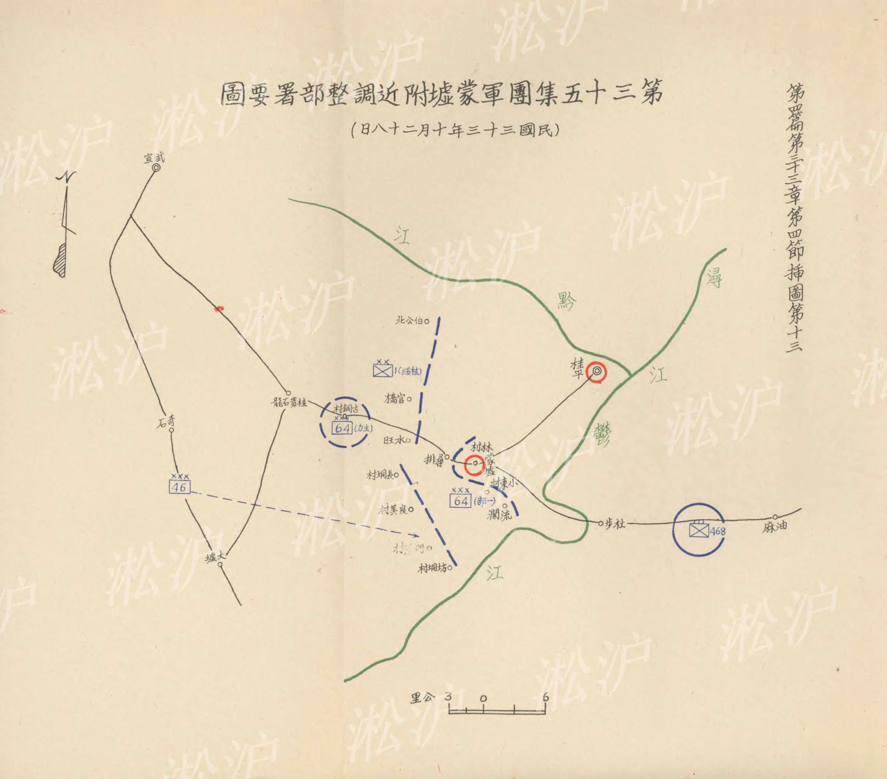

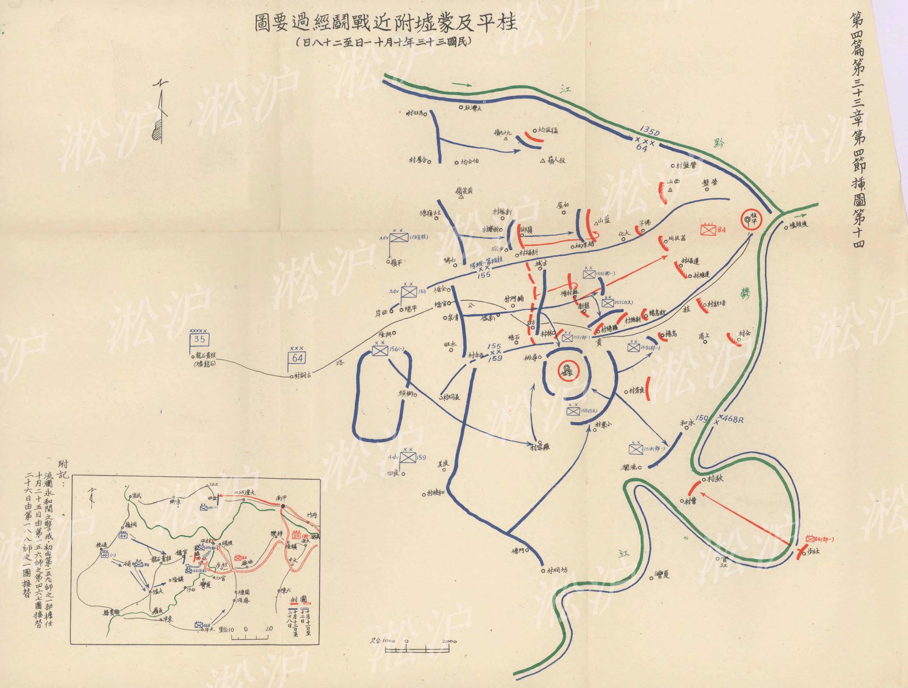

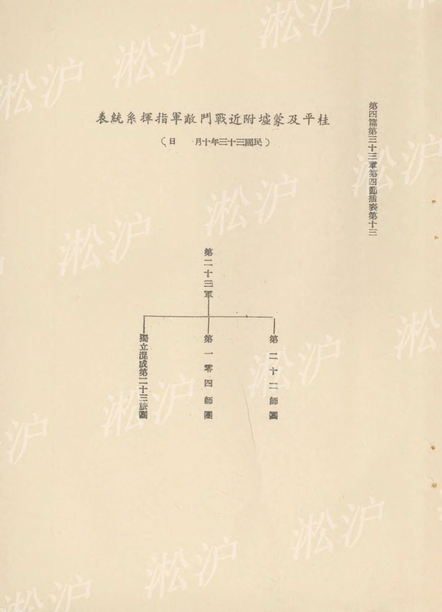

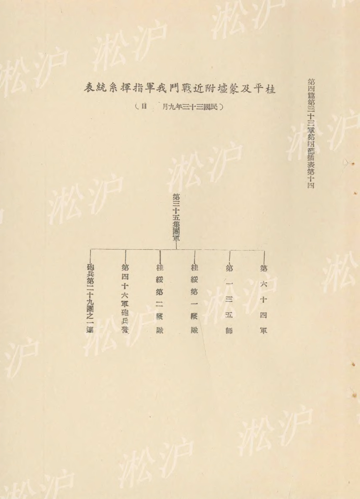

#### 第三款 桂林核心戰鬪

民國三十三年十月二十八日至十一月九日

參照插圖第十五第十六插表第十五第十六

民國三十三年十月下旬，湘桂路正面之敵第五十八、第四十師團已侵佔小溶江及高上田等地，其左翼之敵第三、第十三、第三十七師團，同時進出恭城、平樂及桂林以南附近一帶，湘桂路正面之敵第五十八師團及第二一六聯隊旋分向桂林進攻，與我守軍第三十一軍展開血戰。

敵兵力判斷如插表第十五。

##### 第一項 桂林附近地形

桂林係廣西省會，位於桂省東北部，當桂江上游，居潞山、萌渚、都龐、越城諸嶺之間，形成盆地，附近地勢平坦，道路縱橫，湘桂鐵路經此直趨柳州，爲桂省東北部之交通樞紐。城郊石山林立，巖洞幽深，屏障四周。桂陽兩江分繞東南，構成險塹，誠乃一天然要塞地也。

##### 第二項 戰鬥經過

敵於九月上旬沿湘桂路西進之時，張長官爲保衛桂林安全起見，派第十六集團軍副總司令韋雲淞爲桂林防守司令，負責保衛桂林，韋副總司令於十月十日策定作戰計劃如左（參照插圖）：

桂林防守司令部作戰計劃

於桂林

民國三十三年十月十日

第一方針

防守軍以確保桂林之目的，以主力固守城北要點及杉湖、榕湖以北城區爲核心陣地；以一部固守近郊各要點，掩護核心，採取持久防禦，吸引膠着敵人於桂林近郊，俾與我外線兵團協力合擊敵人而殲滅之。

一、作戰初期，於鐵坑、海洋墟、高上田及甘棠渡分別派出前進部隊，遲滯敵之前進，並嚴密搜索警戒二、敵無論從任何間隙部份突入，皆應以逆襲手段消滅敵人於陣地之內，非至萬不得已絕不使敵達成縮小包圍之目的。

三、戰況縱使慘烈至最高度，非但核心陣地內各要點必須絕對固守，卽近郊具有獨立戰鬥能力之支撐點，亦必以小部隊固守不棄。

四、於敵攻擊準備或對峙期間，應相機派小部隊出擊敵人，以消耗敵之兵力，妨害敵準備，爭取主動，但須講求減少損害之法，勿使本身兵力作無益之損耗，期能持久。

五、若我外線兵團攻擊得手，除核心各要點留置必要之部隊外，應以主力夾擊敵人，以達成殲滅敵人確保桂林之目的。

第三兵力部署

一、軍隊區分：

桂東前進部隊

長第一七零師副師長巢威

第一七五師第五二三團第一營

第一八八師第五六三團第一營

第二三一師搜索連

第三十一軍通信營有線電及搜索營無線電各一班

桂北前進部隊

長第三十一軍搜索營營長譚鎮奎第三十一軍搜索營

江東獨立守備部隊

長第一三一師第三九一團團長覃澤文步兵第三九一團

第三十一軍山砲兵營第二連之一排第三十一軍工兵營第一連之一排第一三一師防毒連之一排第一三一師無線電手搖機無線電報話兩用機各一部第三十一軍第三野戰醫院（欠二分之一）

北地區隊

長第一三二師師長闕維雍第一三一師（缺第三九一團及防毒連之一排）南地區隊

長第一七零師師長許高陽第一七零師（缺第五一零團）

第三十一軍山砲兵營第二連（欠一排）

砲兵隊

長砲兵第二十九團團長王作賓第三十一軍山砲兵營（缺一連）

砲兵第二十九團山砲兵一連

砲兵第十團十五榴砲兵一連

第九十三軍野砲兵一連

第三十一軍工兵營第一連（欠一排）

工兵隊

長第三十一軍工兵營營長彭伯鴻

第三十一軍工兵營（缺第一連）

高射砲隊

長砲兵第四十七團第四營營長劉慧生

城防高射砲營（二公分及三公分七高射砲各四門）

預備隊

新編第十九師第五十七團第二營（第一七五師第五二三團第一營及第一八八師五六三團第一營預定爾後均列爲預備隊）

二、桂東前進部隊，應以海洋墟爲中心分派部隊於潮田墟、鐵坑、高上田各附近選擇要隘佔領陣地，以遲滯敵之前進，並向龍虎關、灌陽、興安各方面之敵嚴密搜索警戒，候命逐次向桂林撤退。

三、桂北前進部隊，應在甘棠渡及大面墟各附近逐次抵抗遲滯敵之前進，並與第九十三軍保持連絡，對湘桂路正面之敵嚴密搜索警戒，候命向桂林撤退。

四、江東獨立守備隊，應以主力固守灘江（桂江）東岸之月牙山、會仙岩、七星巖、屏風山等要點，以一部機動妨害敵之渡河攻擊。筆架山、矮子山、及貓兒山等陣地前要點應派小部隊佔領之。

五、北地區隊，應以主力始終固守伏波山、紫金山、皇城、騷馬山、桂北山、孔明臺、老人山、犁頭山、風洞山、鸚鵡山、清塘山、馬鞍山、龍山、觀音山、虞山、呂祖山等要點爲核心陣地，以一部固守清潭山、大頭山、飛鳳山、芙蓉山、馬鞍山（芙蓉山北側）、扁崖山、鳳凰山、平頭山間地區各要點，確實掩護核心陣地之西北面，以堅靸持久之戰鬥逐次消耗敵兵力，待至有利時機與外線友軍協力殲滅敵人於桂林近郊。

六、南地區隊，應於杉湖、榕湖南北及兩側地區編成最強固之陣地拒止敵之突入，並固守將軍山、鬥鷄山至善巖、象鼻山、護城河、牯牛山、白崖山、老君洞、雷劈山、奈子山間地區之石山陣地，掩護桂林城之西南面，以堅靸持久之戰鬥逐次消耗敵之兵力，待至有利時機與外線友軍協力殲滅敵人於桂林近郊。

七、戰鬥地境：

(一)江東獨立守備隊與北地區隊及南地區隊間：渡東村、穿山村、老鴨洲、東洲、鷺鷺洲、大河墟桂林東北三公里半)相連之線，線上屬江東獨立守備隊。

(二)南地區隊與北地區隊間：中正橋、桂東路、桂西路、雷劈山東側、奈子山、甲山里至陽江相連之線，線上屬北地區隊。

(三)南北兩地區隊與桂林外翼軍間：涼水井（將軍橋南四公里）、大鐵場、一一三·三高地（紅頭嶺）、陽家山東側橋樑、沿陽江西岸至太和山東側陽江灣曲部、再向北沿寶村、四維村以西小河至塘頭村以北江邊之線，線上屬外翼軍。

八、砲兵隊應將陣地分散配置於伏波山、水東門間體育場內，及騷馬山、護城河左岸李子園附近，並在皇城內桂林中學、高等法院等處選擇預備陣地，應能隨敵主攻方面之變換，以主火力支援北地區隊或南地區隊之戰鬥；以一部火力支援江東獨立守備隊之戰鬥，必要時以一部火力制壓敵砲兵。

九、工兵隊以擔任阻絕及破壞作業爲主：

(一)陣地前或陣地內可資敵用或妨害我射擊之建築物，經核准者應卽爆破之。

(二)桂林附近各橋樑應卽準備破壞，候命實施（中正橋及文昌門橋另令處置）。

(三)各地區隊與守備隊，關於地雷及手榴彈之埋設及街市之阻塞等作業，均由工兵隊統一計劃指導實施之，但我方須利用之通路候命再行阻絕。

十、高射砲隊應於騷馬山南端、高等法院附近、第一監獄及中山公園等處佔領陣地，以掩護砲兵主力及牯牛山、象鼻山、七星岩、屏風山、虞山、呂祖山等重要據點爲主。

十一、預備隊位置於鸚鵡山附近。

十二、防守司令部在鸚鵡山中國銀行，並在孔明臺設置指揮所，以第三十一軍軍部所要人員編成之。第四

情報

防守軍之情報，併用本軍各謀報機關、各搜索部隊、友軍及地方機關之情報，於敵向桂林接近時期，再加入各地區隊所派之警戒部隊及潛伏敵側方之監視哨、斥候及便衣偵探等作綿密周到之搜索偵察，於敵圍攻桂林時，仍留置搜索機關於城外，用無線電保持連絡，與上級機關外圍友軍空軍及地方機關保持無線電連絡，接收其情報。

第五通信

一、防守軍以第三十一軍通信兵營爲基幹組織統一指揮之通信指揮部，使任防守軍通信指揮之全責。二、防守軍之通信設施，以能長久保持防守各部隊間之連絡爲首要，有線電應各設不同之線路及地下線路，獨立固守之重要據點配置無線電報話兩用機，並採用其他輔助通信方法，俾於有無線電通信斷絕時仍能保持確實之連絡，通信指揮部及所屬通信部隊，均應組織攜有武器之保線隊，劃分區域，負維護線路之責。

三、防守軍與上級機關地方機關友軍之連絡，於敵未圍攻時，以有線電爲主，因狀況之演變有線電斷絕時，使用無線電爲主，並與空軍保持連絡。

四、通信指揮部應擬定詳細之通信設施計劃，及防止竊聽之特別規定。

第六

補給

一、防守軍之補給，以一次補給爲原則，使各部隊在作戰準備期間一次屯備三個月之糧彈器材。

二、爲準備外線友軍於必要時加入城內作戰，應另屯備步兵三千人兩個月所需之糧彈，由兵站設倉庫保管之。

三、設置空軍補給場於公共體育場內、甲山里以東地區、第二監獄及七星巖附近四處，並先準備夜間用之標燈。

四、各部隊，尤其獨立據點守備部隊之飲水，應注意儲蓄，山頂上須預築水池，設置水桶，準備布幕，接收雨水，山洞內應用水缸水桶及竹筒儲水，柴草煤炭等亦應充份準備。

五、各部隊，在守備地區附近應多種蔬菜，並製豆芽以供戰時營養之需。

第七

衛生

一、防守軍之衛生勤務，爲期其有能力而統一起見，特組織防守軍衛生指揮部，以第一三一師及第一七零師兼政治部主任之副師長分任正副指揮官之責，衛生指揮部以該兩師政治部人員爲基幹組成之，其指揮官有指揮醫院管理傷兵之全權。

二、治療衛生機關之設置要領，應區分重傷醫院輕傷醫院兩種，其開設地點選定如左：

(一)兩個陸軍醫院分設於法政街軍事委員會桂林辦公廳舊址及省立醫院。

(二)第三十一軍之兩個野戰醫院，除以一個之二分之一配屬於江東地區隊外，其餘分設於地方法院及桂北路桂林市銀行。

三、衛生指揮部所屬各醫院之收容量，概定每院爲二千人，應準上列數字作開設準備。

十月二十八日（第十六）參照插圖，進攻桂林之敵，由東北南等方向分路來攻，先將桂林外圍之野戰部隊向西壓迫，使桂林防守軍陷於孤立。先是桂林外圍之野戰部隊，爲避免不利態勢，全線均於十月二十七日向灘江（桂江）西岸轉移，當時張長官對各部隊指示如次：第七十九軍在桂林西北山地、第九十三軍在桂林東南灘江右岸地區佔領陣地，原參與灘江東岸戰鬥之防守軍警戒部隊退回桂林城，歸還建制，桂林防守軍卽按原定計劃進入陣地，各部隊奉令後卽遵向所示目標前進。

十月二十九日，江東守備隊在普陀山以東與敵先頭部隊發生戰鬥，臨桂大村、大河墟（桂林東北郊、大面墟及烏石街以北均有敵發現，入晚我出擊部隊於城東郊及北郊與敵均有小接觸。

十月三十日晚，東郊之敵約三百人襲擊星子巖、申山等處經守軍擊退，敵觸地雷死傷數十名。

十月三十一日，靈田墟之敵約三百人攻佔筆架山，城北之敵以三個突擊隊，每隊約二三百人分別攻擊鳳凰山、虞山及呂祖山，與守軍日夜激戰，敵受創不支各循原路退去，遺屍五十餘具。

十一月一日一時許，城北敵步兵四、五百人砲二門戰車三輛向我陣地攻擊，守軍沉着迎擊，戰約二小時敵不得逞退去，敵進攻時觸發地雷十餘處，傷亡甚衆。另有戰車三輛、步兵三百餘人之敵，三時復進攻北極路陣地，被我戰防砲擊退，其隨伴步兵散開於新碼頭輕便鐵道附近佔領陣地，我以迫擊砲機槍集中射擊，敵不支乃向烏石街退去。城東之敵約數百人由筆架山以南渡過灘江向將軍山攻擊，與我守軍激戰，另數十名竄至南站附近被我擊退。至西北郊進犯茅草頭、磨盤山隘路及阨塘村土敏土廠隘口之敵，自當日晨起則與我守軍第七十九軍第二九四團之一營發生慘烈之爭奪戰。

十一月二日，東郊同心村、冷水塘、臨桂大村一帶，敵僞共集有四千餘人，城北烏石街、三民村、莫路村等處有敵萬餘。十一時許，我砲兵火力曾集中向烏石街之敵轟擊，是時我空軍亦參與作戰，敵死傷甚衆。是晚城北之敵，復以小部隊分襲虞山、呂祖山、平頭山、鳳凰山、清塘山等處，均不得逞退去。南郊四義村附近有敵三百餘與我出擊部隊遭遇，經痛擊後不支退去。西北郊迄西南郊各隘路，我仍與敵僞五千餘繼續激戰，桂林四郊均有接觸，核心戰鬥遂逐漸展開。

十一月三日十五時，北郊之敵，一部由烏石街向北極路陣地進攻，守軍沉着迎擊，敵不支退去。城西南猴山隘及兩路口附近之敵，三時與我守軍亦發生戰鬥，西北郊之西筆架山被優勢之敵佔領。灘江東岸我陣地前有敵便衣隊活動，並於該處築有前進陣地，敵僞仍盤踞於筆架山、穿山村、同心村、臨桂大村一帶。城南門鷄山、崇信村等處，敵集有千餘人，門鷄山以南開闊地備耕牛約三百頭，爲偵察地雷之用，該敵一度向我將軍山陣地進攻未逞。

十一月四日十七時，敵機八架在桂垣上空投彈十枚，彈落於南門、文昌門附近，我無損失。東郊之敵一部利用天雨竄抵中正橋東端，被我擊退，另部二百餘砲二門，二十三時進攻申山及七星巖附近陣地，我軍奮勇迎擊，陣地曾一度被突破，旋卽恢復原態勢，惟另一部五十餘人滲透我陣地到達普陀山附近，我在圍殲中。北正面莫路村之敵約六、七百人，十五時許被我砲擊命中，傷亡甚衆，餘敵逃散。西北郊之敵，自佔領西筆架山後，土敏土廠岩洞口卽爲敵火力封鎖，我軍數次反擊，終因傷亡過半而頓挫，西猴山岩及兩路口方面，敵我對戰。至城南將軍山附近之敵，一部利用夜雨昏暗侵入五里街附近，經我軍發覺將其驅退。

十一月五日二時許，東郊敵數百人藉砲火支援向申山、七星巖、星子巖陣地猛攻，守軍英勇抵抗，耗費手榴彈計達二千餘顆，當日戰鬥之激烈足以想見，守軍連長黃英波在慘烈搏鬥之際，捐軀殉國，星子巖頂及東南麓被敵攻陷，侵入普陀山東端之敵，則仍在繼續圍殲中。北郊敵重砲四門，十八時許向桂林城各要點射擊，同時戰車六輛掩護其步兵向虞山、呂祖山攻擊前進，我砲兵以主火力壓制敵砲火，一部對敵戰車射擊，結果敵砲二門被燬，戰車損壞一輛，步兵傷亡二百餘人，敵受創後即退回原陣地。當時西北郊之敵，曾兩度猛攻茅草頭，均被擊退。向猴山隘口進犯之敵二百餘與我軍激戰竟日，亦被我擊退，城南將軍山附近亦時有小接觸。

十一月六日八時，敵機七架冒雨飛臨桂垣上空，投彈多枚，多落於城內，我稍有損傷。城北敵戰車十二輛到達八里店，二十三時衝破平頭山副防禦工事三處，敵步兵當日亦利用死角爬登山頂與我激戰竟日，山脚巖洞仍在我步兵兩班固守中。東郊我軍曾向佔據星子巖之敵施行逆襲，終因被敵優勢火力所頓挫，未獲成果，貓兒山亦與敵劇烈爭奪，往返衝鋒十餘次，步機槍各一排全部殉國，貓兒山失陷。城西北士敏土廠守軍在西筆架山敵盛熾火力之下苦撑，亦以傷亡殆盡陣地被敵佔領，茅草頭、磨盤山亦經兩晝夜之激戰後失守。城西南方面猴山隘兩側高地雖尚在我固守中，但兩路口兩側高地及三仁村、四義村等處，均被敵佔領，城南之敵則積極作進犯南站之準備。

十一月七日，桂林核心戰已趨白熱化，計城北方面敵萬餘人爲敵第五十八師團主力，城東城南敵約六千人爲第五十八師團之一部，城西敵僞約六千人爲敵第二一六聯隊，九時城北敵千餘重砲四門戰車十一輛向城區進攻，經守軍猛烈迎擊，終未得逞。十三時敵機一架侵入市空投彈六枚後逸去，前攻平頭山之敵三百餘，藉戰車之掩護及機槍平射砲盛熾火力之支援，強佔平頭山，守軍兩班全部殉國。城東屏風山、普陀山守軍與敵二千餘砲十餘門激戰兩晝夜，雙方傷亡慘重，屏風山於十八時許失陷，普陀山入夜後，已成混戰狀態，通信中斷。十四時敵步兵百餘附砲一門曾竄至中正橋東端，被我西端橋頭堡陣地守軍擊退，我軍爲安全計在敵退去後卽將該橋破壞。城西城南兩面均有激戰，全線戰鬥情形我方均呈劣勢，雖仍能阻遏強敵之狂焰，但經數日來之苦戰已極端艱困，情勢因之漸趨逆轉。

十一月八日十七時，城東敵藉優勢砲火之掩護分乘竹筏強渡灘江向中正橋、伏波山間登陸，守軍在敵猛烈砲火之下苦戰竟日，至二十三時陣地終被突破，敵侵入市街與市區部隊展開巷戰。七星巖守軍第一三一師第三九一團之步兵一連及後巖守軍與洞內第三野戰醫院傷病官兵等約八百餘人，因洞口被敵砲火封鎖，欲戰不能，突圍不得，又以洞內彈藥起火燃燒，經火炙與瓦斯窒息而全部殉國，七星巖、月牙山同時均陷敵手。城北之敵藉砲空威力，將戰車分組以波浪式戰法向我北極路附近陣地整日猛攻，猴山隘及兩路口大部已爲敵佔領，城南將軍山敵我整日激戰中。

十一月九日，突入城內之敵與我核心守軍在東環路及皇城展開劇烈搏鬥，同時敵後續部隊源源渡江增援，伏波山、中正橋間之突破孔盆形擴大。城北敵七千餘利用砲空及戰車火焰放射器猛攻鳳凰山、扁崖山、呂祖山、虞山、龍山、清潭山等各據點，守軍浴血抵抗，相持至午後守軍全部犧牲，以上各據點亦先後淪於敵手。城西之敵，自晨起以戰車十餘輛掩護分股突破守軍抵抗線後，入夜分佔陽家山、中心山、猴山隘、兩路口各據點。至進攻將軍山之敵，因守軍堅強抵抗，自作戰以來始終未越雷池一步，嗣因全般局勢變化彈藥消耗殆盡，無法固守，入晚忍痛放棄。此時桂林四週之敵，先後均已突入城區，守備部隊四面受擊，雖大勢已去，仍作寸土之爭，終至彈盡援絕，全部壯烈成仁，桂林城遂爲敵佔領。

當日守城之第一三一師師長闕維雍，率部喋血苦戰，至午後目睹將士傷亡殆盡，無法挽回頹勢，乃本其與守土共存亡之決心，從容持槍自戕。

本戰鬥除第三十一軍軍長賀維珍率領一部幕僚脫險外，殉職者尚有桂林防守司令部中將參謀長陳繼

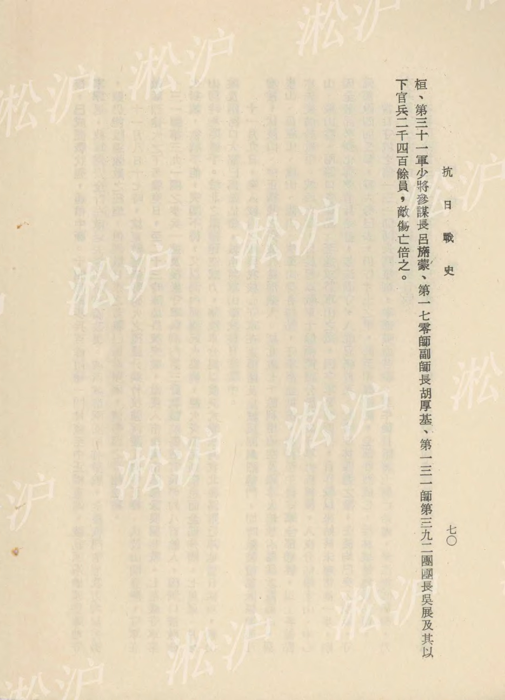

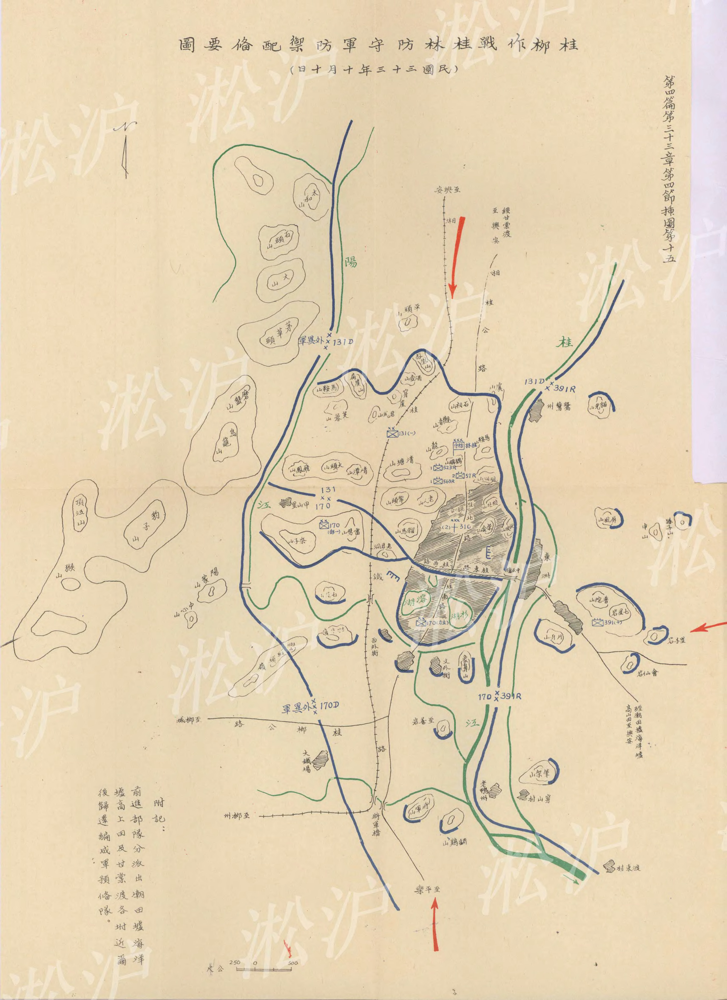

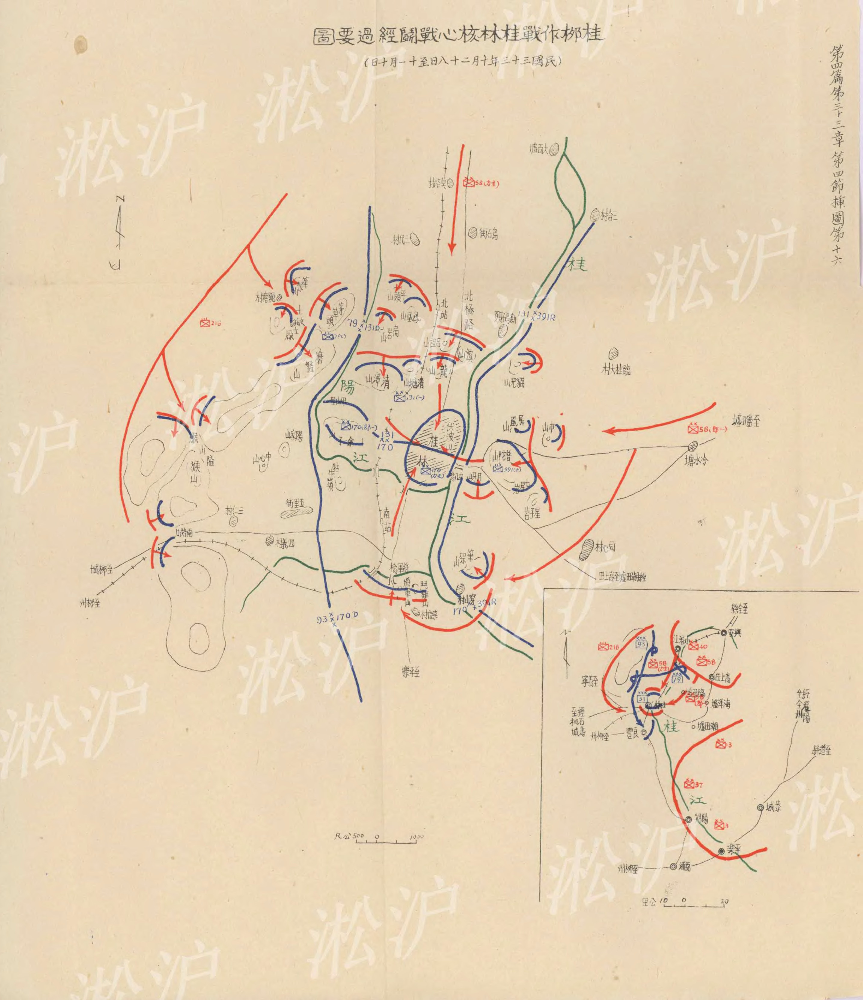

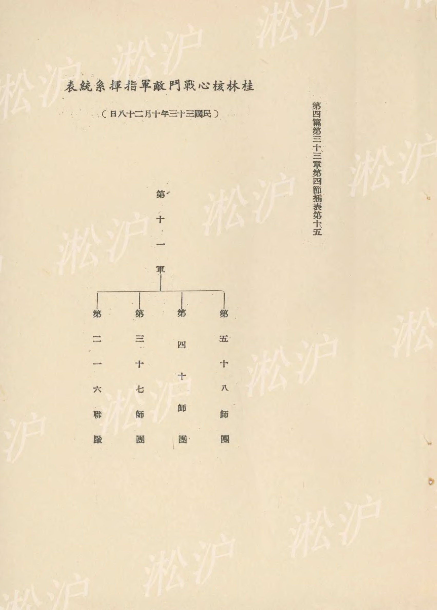

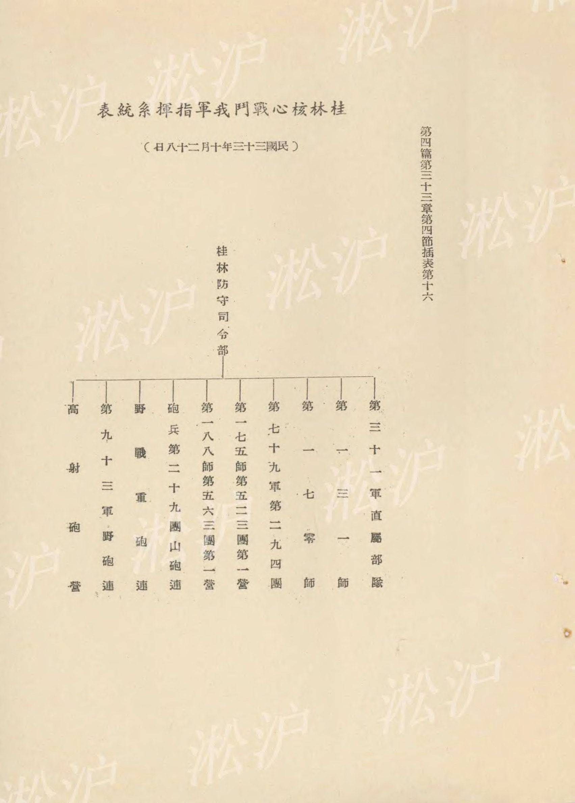

#### 第四款 柳州附近戰鬪

民國三十三年十月二十七日至十一月十一日

參照插圖第十七至第十九插表第十七第十八

民國三十三年十月下旬，西江方面之敵第一零四師團突破我第一三五師及桂綏第二縱隊金田村陣地，同時湘桂路左翼之敵第三及第十三師團進出恭城平樂及桂林以南附近一帶，旋與桂林以北湘桂路正面之敵第四十師團分途會攻柳州。我第四戰區乃調集第二十七集團軍各軍前往防守，桂柳核心戰鬥於是同時展開。

敵兵力判斷如插表第十七。

##### 第一項 柳州附近地形

柳州位於廣西中部，爲桂省四大重鎮之一，居猺山、九萬山、鳳凰山之間，附近地勢平易，間有邱陵，柳江穿城而過，蜿蜒東西，形成馬蹄形之河套，湘桂、黔桂兩鐵路連接於此，公路四通八達，乃桂省之交通中心。

##### 第二項 戰鬥經過

十月下旬，平南附近之敵第一零四師團突破我第一三五師及桂綏第二縱隊金田村陣地而西進，武宣、來賓感受威脅，第三十五集團軍鄧總司令以所屬部隊與敵正激戰於蒙墟附近，乃電請張長官增援，張長官據報後，即於二十七日令防守柳州之第六十二軍軍長黃濤，派遣第一五七師星夜馳往堵擊，該師於二十九日到達東鄉，次日即遵照第十六集團軍周祖晃副總司令所示，佔領香信、界頂、雙髻山之線陣地，阻止由三江墟西進之敵。三十日十八時，花雷正面已發現敵人，其一部利用黃昏轉向雙髻山東側第四七零團第二營陣地襲擊，主力向界頂陣地進攻，戰鬥激烈，該團第六連與敵爭奪界頂高地，四失四得，卒因傷亡過半，連長張雄明忠勇殉國，界頂高地失陷，旋經第四六九團之增援，於三十一日拂曉向敵反攻，激戰至晚，卒將失地克復。十一月一日六時起，界頂方面之敵分股不時向我陣地進攻，均被守軍擊退，十二時鄧總司令電令該師西撤，師長李宏達奉命後，卽留一部與敵保持接觸，主力至黃昏後經三里墟向西撤退，二日拂曉全部到達二塘附近，集結待命。

十一月三日，湘桂路正面及平樂，西江三方面之敵，均有進攻柳州之趨勢，張長官爲確保柳州及黔桂路之安全，令防守柳州之第六十二軍歸第三十五集團軍指揮，調赴武宣、來賓以南地區，柳江西岸各戰略要點要線責由第二十七集團軍總司令楊森所部固守（參照插表），對柳州防務着由第二十六軍擔任，並先以一師兼程由運江開赴柳州接替第六十二軍防務。第六十二軍黃軍長奉令後除留少數部隊維持柳州治安外，卽於四日十二時率領軍部及第一五一師由柳州南進，第二十六軍軍長丁治磐奉令後，亦同日率領軍部及第四十四師經鹿寨沿桂柳公路向柳州前進，其第四十一師則由羅秀墟、運江向柳州前進，丁軍長慮及柳州防務單薄，並派第四十四師之第一三二團及野砲營先期於鹿寨車運柳州，任機場警戒，因火車稽延，遲至五日正午始到達柳州。

十一月五日，楊總司令據報西江方面之敵已竄抵武宣及來賓以南地區，湘桂路方面之敵亦已到達永福東南，逼近柳州，爲達成固守柳江西岸要點要線之任務，卽電令第二十軍由荔浦經四排墟附近、運江向柳州轉移，第三十七軍則由蒙山向象縣轉移，佔領沿江要點阻敵西進。六日，西江方面之敵，其一部約三百餘在象縣附近渡過柳江，與我第一五七師激戰於鷄沙附近。平樂之敵已陷修仁，並以一部犯榴江。永福之敵亦已由矮嶺墟至黃冕，西渡洛清河直迫柳州。我防守柳州之第二十六軍軍部入晚到達柳州南岸之馬鞍山，第四十四師（欠第一三二團）進至雒容附近佔領陣地，阻敵進犯，第一三二團到達柳州後卽遵令守備柳州機場，第四十一師兼程向柳州急進。七日，雒容、洛埠附近有敵便衣隊活動，第二十軍傍晚已全部到達柳州，運江附近第二十六軍主力下午亦陸續集結柳州。此時張長官爲應戰況變化，重新部署，以楊集團軍改爲中央兵團，指揮第二十、第二十六、第三十七各軍及第一八八師、砲兵第十八團（欠第二、第三兩營）、第九十三軍戰防砲營、砲兵第四十七團之高射砲一連（二公分高射砲二門），擔任柳州城及其以東以北地區之防禦。楊總司令奉令後，卽以主力固守柳州以東以北地區，連繫左右兩兵團拒敵西進，以掩護黔桂鐵路及宜山之安全，遂部署如左：

一、第三十七軍（附象縣自衛隊、砲兵第二十九團第八連）卽以一部於象縣以北掩護第二十軍在運江方面之渡河，主力連繫穿山鄉附近之第六十二軍，積極阻敵進攻。

二、第二十六軍（附柳州自衛隊、砲兵第十八團第一營、戰防砲一連、高射砲一排）固守柳州，非奉命令不得撤退。

三、第一八八師（附柳城自衛隊、山砲兵一連）卽進出長塘街東泉鎮以東之線，阻敵西犯，以掩護柳州左側背之安全，特須與第二十六軍及太平墟附近地區之左兵團切取連繫。

四、第二十軍（附戰防砲一連、高射砲一排）迅速在柳州西火車站集結，運江鄉西渡之部隊卽開新墟準備柳城方面之作戰。

第二十六軍丁軍長奉命後，旋知由象縣附近渡河之敵已漸向柳州逼近，湘桂路正面之敵攻陷黃冕墟後，其第十三師團南進，第四十師團則轉向柳城西進之各種情報，並經楊總司令電話指示：「注意南方」，乃決定轉向南方準備作戰，就既有工事（註記）保持重點於柳州南市東西兩端及帽盒村、益羣林場、鷄拉街一帶，後以雒容附近敵便衣隊入夜紛紛向柳州方面活動，丁軍長對當前情況卽變更部署如左參照插圖

第十七：

一、第四十一師卽佔領獨登山要點，以爲轉移攻勢之支撐，並於羊角山、銀仔山、三門江各地區派出警戒。

二、第四十四師卽佔領窯埠街要點，以爲轉移攻勢之支撐，柳州河北市區須派出一個團固守之，並於新墟、張公嶺、帽盒山派出警戒，留置雒容警戒之一個營，於洛埠鎮、鷓鴣江間警戒。

三、兩師戰鬥地境爲：下桃花、一零三·四高地、銀仔山、一零三·六高地、芭蕉坪、七星塘之線，線上屬第四十一師。

四、工兵營佔領駕鶴山、太平西街、無線電臺間據點陣地，準備固守，並與柳州河北市區部隊相呼應。五、砲兵隊（軍砲兵團附砲兵第十八團第一營）應以主力使用於窯埠村方面，一部使用於柳州河南市區西北端，對窯埠村正面及北市準備火力，最初以一部爲游動砲兵，支援三門江方面之戰鬥。

六、軍司令部位置於馬鞍山。

同（七）日二十時（參照插圖），鹿寨方面之敵百餘企圖由雒容附近渡河，經第四十四師之警戒部隊高雨辰營予以痛擊，敵不支向北竄去，黃冕之敵，一部約五千餘已進陷中渡，圖攻柳城，以威脅柳州側背。八日六時許，洛埠鎮發現敵先頭一部百餘、山砲一門向高營之一連陣地進攻，該連堅強抵抗，相持至午以敵後援陸續增加，衆寡懸殊，乃逐步後撤，迄晚退至鷓鴣江車站附近與敵對峙，高營主力正午於雒容附近受五百餘之敵壓迫，依照原計畫節節抵抗，向南轉移。十七時許，榴江之敵，一部約七百餘已進至三門江附近，乘夜由三門江一帶屢行強渡，被我第四十一師警戒部隊擊退，此時由鷄沙渡過柳江之敵，陸續增至六百餘，突破第一五七師陣地後當晚攻陷馬坪墟，有進出穿山會攻柳州之模樣，攻陷中渡之敵續向西南進攻，當日午後已陷東泉鎮與我第一八八師警戒部隊接觸。此際楊總司令見敵節節逼近柳州，爲加強戒備起見，遂令柳州西站附近之第二十軍以第一三四師在柳江西岸鵝岡村、渡江村之線擔任河防，並派出有力一部佔領鵝山據點，協力第二十六軍之作戰，第一三三師集結於流山墟待命。

十一月九日，三門江之敵屢渡柳江不逞，旋增援至千餘人乘夜由三門江及其以南六座、社灣村等處強渡，我因地廣兵單無法堵擊，至十日拂曉敵終渡河成功。北岸與我對戰於鷓鴣江之敵約三百餘、附山砲一門分向我兵營嶺、鳳凰嶺陣地進攻，我軍憑藉旣設陣地沉着應戰，敵後續部隊二千餘仍繼續向南積極增援。此時，陷修仁之敵經江口墟附近進至鷄拉街對岸，企圖強渡，經我第四十一師第一二三團擊退，入晚復繞至下游之洛維村附近偷渡成功，向大橋屯附近進犯，被我擊退，旋與陷馬坪墟經穿山北竄之敵千餘在大橋屯以南會合後續向我猛攻，並分一部六百餘繞由第二十六軍、第三十七軍接合之朋田村附近進攻飛機場，丁軍長卽派預備隊第四十一師之第一二二團由銀仔山附近進出帽盒山迎擊，戰至十九時許敵增援至三千餘人，卽與第二十六軍、第三十七軍（第二八四團之一營）各一部在大橋屯及飛機場以南高地之線展開激戰，於是防守柳州之第二十六軍受北東南三面陸空之猛攻，犧牲甚大，尤以北岸之第一三一團損失更重，現時該軍全部兵力均已使用於第一線，預備隊則付缺如。東泉鎮之敵藉優勢兵力將第一八八師壓迫至柳城西南之流山墟附近，柳城卽於十時陷落，該師蒙受重大損失，僅殘破之師直屬部隊及第五六二團（實力不到一個營）由海競強師長率領，轉進至三岔附近歸還建制，其餘兩團被強敵包圍無法突出，配屬之山砲連亦全部損失。柳城陷後柳州已陷於四面被圍之境，第二十軍之第一三三師奉調於洛滿墟附近集結待命。

十一月十日，由三門江渡河之敵，其先頭部隊佔據六合公司，進與馬草塘警戒部隊戰鬥，續渡之敵，一部竄至天長嶺北側，經我第四十一師第一二一團之一部擊退後亦轉向馬草塘攻擊，十三時敵增援至六百餘，曾一度將天長嶺、馬草塘警戒陣地突破，經第四十一師第一二一團、第四十四師第一三零團合力逆襲，將敵擊退，迨至黃昏後，敵後援續至，復分由靜藍村及河東村向我獨登山第一二一團主力及蟠龍山第一三一團主陣地進攻，與我守軍激戰至烈，嗣因第一二二團於九日調往帽盒山迎敵後，南市則感空虛，獨登山第一二一團乃逐步後撤，退守南市。進攻飛機場之敵，以一部猛攻張公峯陣地，並進攻第二十軍第一三四師陣地右側背，同時由渡口屯渡河之敵亦向鵝山要點攻擊，該地區守軍即在鵝山、鵝岡村與敵激戰。柳江北岸之敵千餘，藉砲火掩護亦分由西火車站及其上游強渡，企圖夾擊第二十軍。第三十七軍主力則在塘岸村、飛鵝鄉、上福村之線，一部在四方塘東北高地與敵戰鬥，並固守拉保、雙橋間地區掩護第六十二軍轉進。

當日三時許，第二十六軍各陣地戰鬥正在激烈進行中，張長官電話指示：「桂林情況已不明，該軍應避免無謂犧牲，着卽適應情況開放西側道路，配屬之野砲營應撤至大塘，河北市區之一個團可撤至南岸，對所有倉庫應遵前令澈底破壞」。又楊總司令對第二十六軍電示：「該軍依情況應轉移至柳州西側山地，繼續抵抗阻敵西犯」。丁軍長基於以上指示，乃下達作命第二十六號命令，其要旨如左：

一、當面之敵，昨夜以來不斷向我全面攻擊，另一部千餘由鷄拉街以南之洛維村渡河，向我右側背迂迴，進犯大橋及飛機場。

二、第四十四師南岸部隊仍固守原陣地，北岸部隊應留置一部行持久抵抗，主力卽轉移南岸，佔領鵝山附近旣設陣地。

三、第四十一師仍固守原陣地，阻擊西犯之敵。

四、野砲兵第一營卽撤至大塘歸還建制。

五、砲兵團受第四十四師蔣師長指揮，支援北岸之第一三一團渡河，爾後變換陣地於張公嶺附近，協力第四十一師之作戰。

六、工兵營受第四十四師蔣師長指揮，澈底破壞所有倉庫，不得遺留物資資敵。

是日敵機五架臨空轟炸，各據點及核心陣地工事多遭摧毀，守備北岸之第一三一團遵令率兩營南渡至鵝山附近佔領陣地，第三營留守河北市區，該營與敵經十、十一兩日夜之激烈巷戰，全部壯烈犧牲。其南岸市區之守軍第一二一團遭敵陸空轟炸，傷亡亦重，柳市糧械倉庫十三所經工兵營遵令入晚逐一澈底破壞，是夜柳市已陷於敵之四面包圍中，第二十六軍軍部西移至張公嶺時亦受敵之攻擊，該軍爲掩護後方，開放道路，最後守備市區之第四十一師第一二一團陷於重圍，派往應援之第一二三團，亦被包圍兩營，與敵發生激烈之巷戰。

十一月十一日，張長官以桂林陷落，柳州已無固守之必要，當令第二十六軍向西轉移。該軍奉令後，除圍困柳州市區部隊無法轉移外，九時率領郊外部隊西移至六道墟附近集結，至被困柳州市區之第一二一團與敵戰鬥至十一日以後，由趙鳳銘團長率領殘部沿途與阻截之敵激戰，延至十五日以後始脫離敵人，輾轉至三十四年元月七日到達鑪山歸還建制。

張長官爲避免不利態勢並繼續阻敵西進計，乃令楊總司令指揮第七十九軍、第二十軍、第二十六軍移於六塘、中脈、小長安之線。楊總司令奉令後，以第七十九軍已由張長官逕令開動，卽令第二十軍開向六塘、中脈之線佔領陣地，第二十六軍經三都、水源、三岔鄉集結羅城，各部均遵於當日各向目標前進。第三十七軍亦向西轉進，改歸第四戰區長官部直接指揮，柳州附近戰鬥至是結束。

註記

當敵我激戰於衡陽之時，第四戰區長官部乃成立柳州城防工事構築委員會，趕築柳州防禦工事，以補地形之不足。自八月初動工，迄十月中，計完成六至八個團兵力可使用之陣地，以備防守插圖

第九。後保衛柳州市郊之第二十六軍，其兵力不足編制三分之一，能與絕對優勢之敵在砲火飛機猛烈轟炸之下周旋數日者，其主要因素，固屬於戰士愛國心之堅強，而防禦工事設施之得法，關係亦非淺鮮，惜該軍兵力僅及全般工事容量三分之一強，火網稀薄，未能發揮充份效用，而實現陣地寶貴之價值。

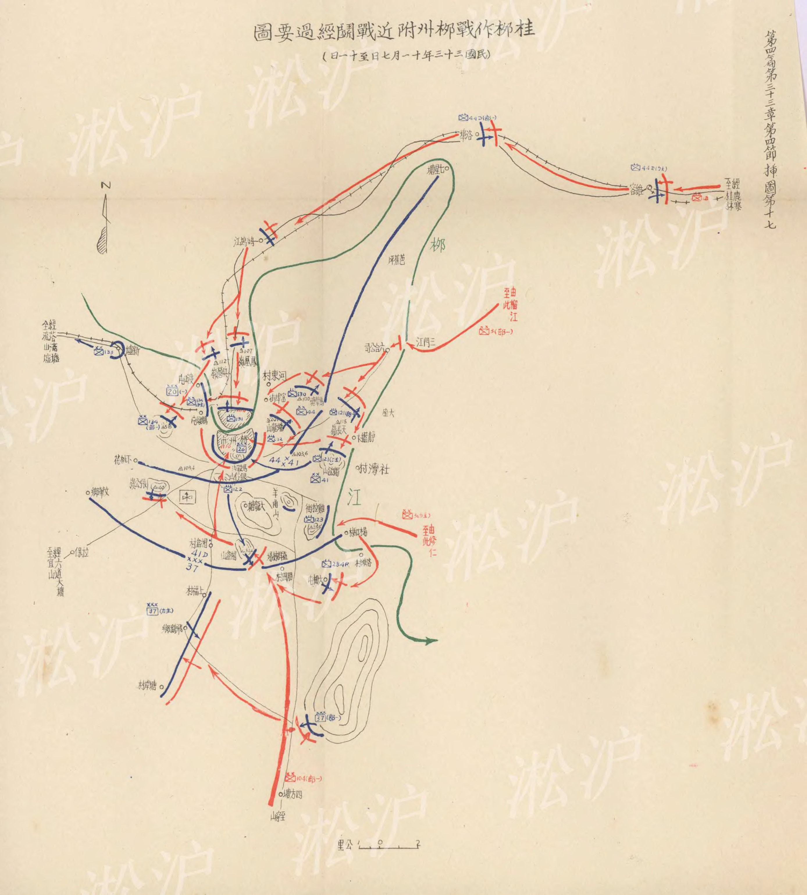

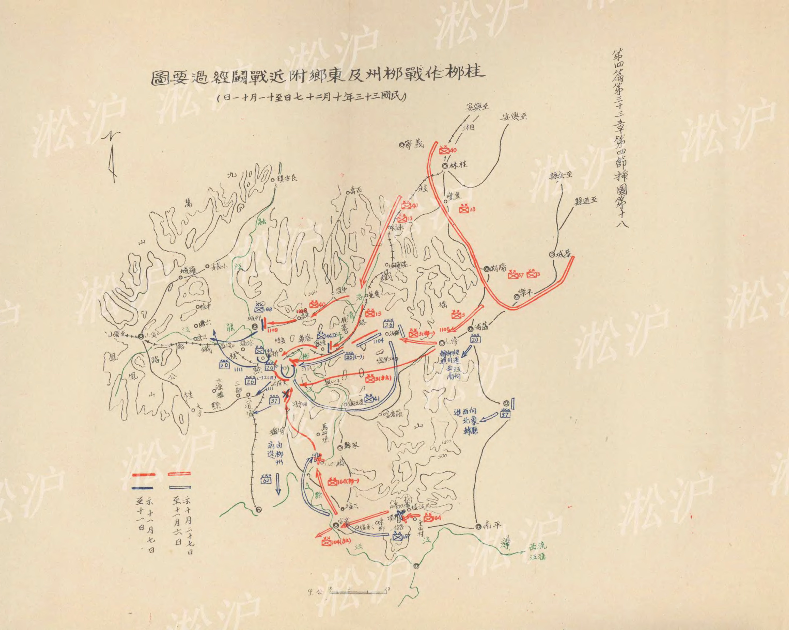

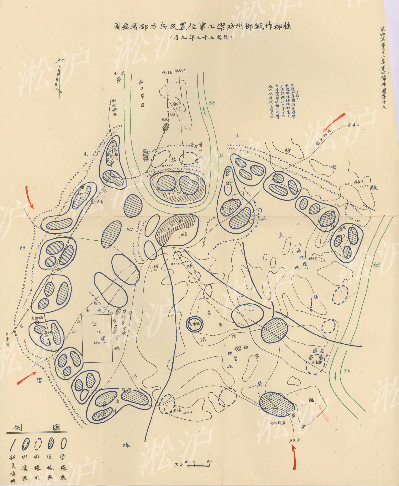

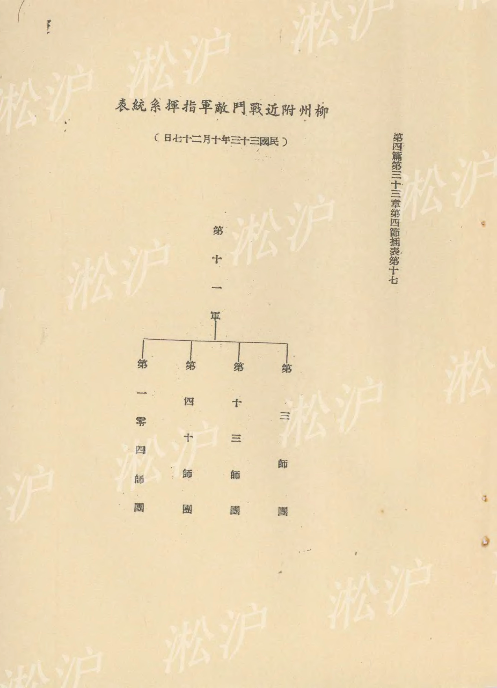

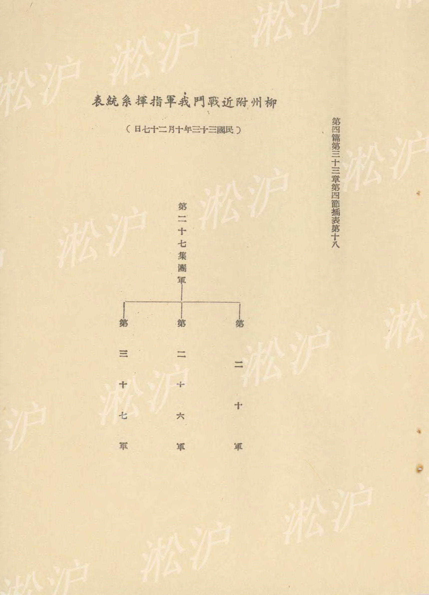

#### 第五款 宜山及懷遠附近戰鬥

民國三十三年十一月九日至二十日

參照插圖第二十至第二十八插表第十九第二十

民國三十三年十一月上旬末，柳城、柳州先後失陷，柳城之敵第四十師團及柳州之敵第三、第十三師團旋乘勢繼續西進，我第四戰區爲掩護黔桂路之安全，乃以第十六、第二十七兩集團軍在宜山以東三岔南北之線阻敵前進。

敵指揮系統判斷如插表第十九，我軍指揮系統如插表第二十。

##### 第一項 宜山懷遠附近地形

宜山（慶遠）、懷遠（懷陽）均位於廣西西部，居九萬、鳳凰山脈之間，附近地勢，峯巒起伏，關山重疊，乃一山岳地帶，各山標高平均概約爲五百公尺左右，行軍作戰頗受限制。龍江分南北二源，流匯懷遠，東經宜山、三岔注入柳江，河幅狹窄，水淺流急，十噸以下小型民船概可通行，兩岸多桑田及水田，爲該地區唯一之平坦地帶，黔桂鐵路及黔桂公路卽自柳州沿其右岸西達黔邊，其左岸另有道路由宜山東至柳城，西至思恩，故宜山爲桂省西部之交通樞紐。

##### 第二項 戰鬥經過

民國三十三年十一月九日，陷柳城之敵，一部進出大浦、太平，主力向洛滿前進，企圖沿黔桂路西進，同時柳州方面守軍第二十七集團軍各軍，在優勢之敵圍困下其態勢已呈不利。第四戰區長官部基於以上情況，爲確保宜山掩護黔桂路之安全，乃令調第四十六軍（欠新編第十九師及第一八八師）歸第二十七集團軍楊總司令指揮，星夜兼程開三岔附近，主力佔領冷水、南鄉墟、三岔鄉之線，一部派出龍江以北在六塘、中脈之線佔領陣地，拒止柳城大浦方面之敵。該軍軍長黎行恕奉命後，除令砲工兩營逕往宜山待命外，卽率領軍部及第一七五師由三都經水源向三岔前進，十一日軍部到達沖朋村，軍砲兵營已到達宜山，第一七五師師部亦到達板蒙村，第五二三團到達三岔附近，並有一部進出六塘鄉，第五二四團到達古人村附近，第五二五團到達南鄉，一部到達冷水。當時黎軍長得知柳城之敵已渡過柳江，在流山墟一帶與第一八八師所部激戰，大浦同日已發現敵踪，三岔則因轉進官兵擁擠，情形混亂之各種情報後，卽電令第一七五師從速進入陣地，構築工事。

同日張長官爲繼續阻擊西進之敵，乃變更部署如左

參照插圖

第二十

一、第十六集團軍總司令夏威爲中央兵團長，指揮第四十六軍（欠新編第十九師）、第一三五師、桂綏第一縱隊、砲兵第十八團（欠第二第三兩營）、砲兵第十四團第八連、第四十八師戰車營、戰防砲總隊獨立第一營，以一部與敵保持接觸，主力於冷水村、南鄉村、三岔鄉附近之線佔領陣地，特須與忻城方面右兵團之第三十五集團軍切取連繫。

二、第二十七集團軍總司令楊森爲左兵團長，指揮第二十、第二十六、第七十九各軍，以一部與敵保持接觸，主力轉移於六塘、中脈、小長安附近之線佔領陣地。

三、夏楊兩兵團間戰鬥地境爲人和村、水簡村、沿龍江、柳江北岸迄柳州之線，線上屬左。

四、第三十七軍歸本部指揮，位置於懷遠附近。

五、砲兵第十八團第一營（欠第四連）開河池集結。

夏總司令奉命後卽部署如左

參照插圖

第二十一

一、第四十六軍指揮第一三五師第一七五師、第一八八師，以第一三五師至理苗附近佔領陣地，並派出有力部隊於理苗至南鄉之路口要安村附近要點警戒，第一七五師在南鄉、三岔之線扼要佔領陣地，拒止敵人，第一八八師在宜山附近集結。

二、砲兵第十八團（欠第二、第三兩營）、砲兵第十四團第八連（重砲）、第四十八師戰車營、戰防砲總隊獨立第一營統歸第四十六軍黎軍長指揮。

三、桂綏第一縱隊卽開屯蒙鄉，對忻城方面警戒，並與理苗附近之第一三五師切取連繫。

楊總司令奉命後卽調整部署如左（參照插圖）

第二十二：

一、第二十軍在洛滿以西地區掩護第一八八師西撤歸建後，卽在六塘、中脈亘東墟之線佔領陣地。

二、第二十六軍經三都、水源、三岔集結羅城待命。

十一月十二日，第四十六軍奉令歸還第十六集團軍序列，並決定軍司令部於次日由洛東移駐洛西。

二十二時，據報大浦之敵兩千餘已渡河，十一日晚宿營洛崖附近，該軍卽飭第一七五師派兵一連至三界墟以西潘寨村附近擔任沿河警戒。第二十軍遵留第一三三師之第三九七團在流山墟附近掩護第一八八師撤退，並令俟第一八八師退至流山墟後卽到三岔附近北度龍江歸還建制，其餘部隊按第一三四師，軍司令部及直屬部隊，第一三三師之序列向三岔附近渡河。八時許，當面之敵，先頭已竄抵流山墟附近，與第一三三師之第三九七團激戰，入暮，該軍主力已在三岔渡河完竣，已脫離敵人北渡龍江歸還建制，第二十六軍亦遵由土博墟進至南鄉附近，正擬經三岔、三界墟渡河向羅城前進時，接第四十六軍黎軍長電話：「柳州之敵已進至三岔附近，敵我正在激烈戰鬥，洛東洛西道路甚爲擁擠，希另選道路」。該軍於獲知情形後卽決定次日改道前進。

十一月十三日零時許，中央兵團方面有敵騎數百，附小砲四門向三岔第一七五師之一連陣地攻擊，激戰一小時許，守軍以傷亡過重轉移三岔西南側高地與敵對峙，三岔被佔。三時許，敵增至千人，藉其濃密砲火掩護攻佔柏社村北端高地及八仙嶺之前進陣地後，繼續向羊角南北之線主陣地進攻。第四十六軍黎軍長據報後，卽飭該師抽派第五二四團一部前往應援。五時許，敵增至兩千餘，與第五二三團爭奪筆眞嶺、羊角、雷三各高地，戰鬥激烈。七時許，三岔西南被佔，我守軍第五二三團第九連全部犧牲，此時張長官見中央兵團方面情況變化，爲謀達到逐次消耗敵人之目的，下達命令，其大要如左(參照插圖)

第二十三

一、第二十六軍兼程開龍江以西懷遠附近佔領陣地，拒敵西進。

二、第三十七軍開北牙鄉附近佔領陣地。

三、上列二軍均歸夏兵團長指揮。

四、第二十六軍、第三十七軍作戰地境：懷遠南河流及通宜山鐵路公路之線，線上屬第二十六軍。

五、第四十六軍在原陣地極力拒止敵人，掩護上述部隊佔領陣地，爾後以一部在外山、上江壩，主力在都街、三江口間地區拒敵。

夏兵團轉達右項命令時，同時電令集結洛西之保安第二團（約四百人）調歸第四十六軍指揮，午後該總部卽向懷遠移動。第三十七軍奉命後卽由理苗以西折向北牙前進，第二十六軍奉命後卽由治安村附近改向懷遠前進，第四十六軍奉命後當卽轉令各部如左（參照插圖）

一、軍奉命在原陣地極力遲滯當面之敵，掩護第二十六軍及第三十七軍在懷遠、北牙之線佔領陣地。

二、第一七五師卽佔領宜初村、筆眞嶺、大羊角、雷三至河邊之線，重點保持於左翼，竭力阻敵，宜初村以南陣地交第一三五師接替。

三、第一三五師不待接防部隊到達卽由現地星夜兼程往南鄉以西地區接替第一七五師周同村、洲門村、宜初村之線佔領陣地，拒敵西進，並限本（十三）日二十四時前接替完畢。

四、第一八八師之第五六二團星夜趕赴理苗接替第一三五師任務，並以一部推進至四友村、要安村之線遲滯敵人。

五、作戰境地：

(一)第一八八師第五六二團、第一三五師間爲內龍屯、要安村、奴水山、土博之線，線上屬右。

(二)第一三五師、第一七五師間爲洛富、果塘、北崗、宜初村、建定村、大山嶺之線，線上屬右。六、第一八八師（欠第五六二團）星夜兼程開洛西附近爲軍預備隊。

七、軍搜索營，以一部位置於三界墟附近對河之線任沿河警戒，主力仍在洛西以東附近地區待命。八、保安第二團就現地洛西歸第一七五師甘師長指揮。

左兵團方面：第二十軍由三岔渡河後，於十三日拂拂自羅屯出發，取道三合墟向龍元方向前進，當時第一三四師因嚮導錯行在該軍部之後，八時許該軍行抵三合墟南端隘路口時，軍搜索營卽與約八百餘人之敵遭遇，楊軍長當卽處置如左（參照插圖）：

一、搜索營佔領三合墟南端隘口掩護軍主力之展開。

二、第一三四師以第四零一團展開於三合墟南端，經谷里、江口墟向三合墟西南之敵攻擊。

三、第一三三師展開於六塘墟、阿九山之線攻擊當面之敵。

四、軍部及直屬部隊卽由谷里、巖口道向白面前進。

第一三三師之第三九九團到達阿九山附近時與千餘人之敵遭遇，激戰至日暮，敵不逞向西北迂迴，與搜索營及第四零一團激戰於三合墟附近之敵，入暮經第七十九軍之第五八零團協擊後敵不支改向龍元方向進攻。第七十九軍到達小長安後，遵照張長官無線電指示繼續向融縣前進，仍受楊總司令指揮。十九時，第二十軍到達白面時，楊軍長聞龍江南岸砲聲，遂向西移，判斷鐵路正面之第四十六軍似已向西轉進，乃乘風雨之夜變更部署如左：

一、第一三四師佔領江口村、中和、太平（不含）之線阻敵西進。

二、第一三三師佔領太平、龍懷、龍安之線阻敵西進。

三、軍部及直屬部隊於次日拂曉由白面、小龍頭向吉隆轉進。

十一月十四日，中央兵團方面：鐵路正面之敵利用惡劣天候由田興村、大曹村以北地區偷渡龍江向洛東守軍第一七五師第五二四團之一營進攻（參照插圖）。黎軍長據報後，電令軍搜索營卽由洛西沿鐵路向洛東前進，攻擊洛東附近之敵，第一七五師甘師長卽以預備隊（第五二四團欠一營）及保安第二團由洛東東南圍攻洛東附近之敵，六時復電促第一八八師海師長率部於一小時內由宜山輕裝向洛西前進，七時令知第一七五師甘師長卽由第五二五團抽出兵力一營由南鄉沿第五二三團背後向洛東攻擊，以夾擊洛東之敵，並掩護第五二三團側背。是時敵在後援陸續增加之下與我守軍及援隊激烈搏戰，當時我主力部隊受三岔附近之敵牽制於古卜村亘雷三之線，無法抽援，洛東於八時許被敵攻佔，敵遂沿鐵路向洛西方向攻擊前進，與該軍搜索營在黃嶺村戰鬥，是時黎軍長卽作如左之處置：

一、副參謀長覃琦指揮搜索營及工兵營歸第一七五師甘師長統一指揮，向洛東攻擊前進，務將攻入洛東之敵擊破而收復之，任務完畢後卽歸還建制。

二、原在三界村對岸擔任警戒之搜索營第一連，應迅速佔領三界村對岸沿河至大曹村以北大山一帶，阻敵渡河，並與該營主力（正沿鐵路向洛東攻擊中）切取連繫。

三、限令第一八八師十一時前到達洛西。

十二時，黎軍長續命甘師長指揮第五二四團，保安第二團及覃琦指揮部隊向洛東之敵攻擊，其餘兩團確保現陣地拒止當面之敵，同時電令海師長卽派步兵兩連協力第一七五師作戰（參照插圖）。是時洛東之敵逐漸增加，各部奮勇迎擊，鮮有進展，十六時許，第五二三團左翼陣地被敵突破，傷亡慘重，黎軍長卽嚴飭甘師長督部努力攻擊，同時將此情形轉報夏總司令。十六時三十分，夏總司令見第四十六軍陣地側背受敵威脅，當卽電令該軍向宜山以東附近轉進，佔領陣地拒敵西進，黎軍長奉命後，卽擬實施轉移，詎料十七時左右，敵一部千餘人由三界墟以東渡過龍江，分數股進出洛西以西附近地區，向宜山急進，並將沿途通信網破壞，我連絡受阻，此時該軍已無控置部隊，無法應付當前狀況，且時將入夜，情勢危急，亦不能遵照夏總司令所示佔領宜山陣地，乃決心改向石別墟附近轉移，黎軍長以電話命令各部後，於十七時二十分卽率第一八八師師部經洛富向理苗轉移。是時第二十六軍已進至宜山西南之太平鄉附近，續向懷遠前進，夏兵團總部亦由懷遠向德勝轉進，宜山卽於十五日被敵佔領。

左兵團之第二十軍，是（十四）日拂曉在行進間一部與西進之敵在太平、龍懷之線遭遇，十九時許，敵進至白面、藕塘以東之線與第一三三師、第一三四師接觸，二十時許，該軍接奉楊總司令電示「阻擊由中脈西進之敵，不使其竄擾宜山以北及威脅鐵路正面第四十六軍作戰」之任務後，卽就現有兵力（共約五個步兵營）作如左之部署：

一、第一三四師佔領尖山、二零零高地之線阻敵向西向南竄犯。

二、第一三三師佔領三八七·五高地、門冷寨、天橋墟之線阻敵西進十一月十五日二時，當面之敵繼續進攻該兩師新陣地之尖山、三八七·五高地、門冷寨各要點，戰至二十一時該軍退守小龍頭墟、四五八高地及二零零高地以西隘口、天斗隘、天橋之線，與進迫之敵續戰，至十六日八時，敵以一部繼續猛攻，大部轉向宜山方向進攻，該軍獲悉敵大部轉移之訊後，乘機全線猛烈反擊，戰至十四時許，殘敵正可被殲之際，復得竄宜山之敵折還數百人應援，因之敵我續戰至十七日四時許成對峙態勢。是時楊軍長得知懷遠已發現敵踪，該軍遵照楊總司令電示，逐漸脫離敵人，隨同該總部經貝祥鄉向思恩方向轉進。

是日負責防守懷遠之第二十六軍，以第四十四師之第一三二團先期趕向懷遠前進，主力繼由太平鄉出發，因宜山附近軍民混雜公路擁塞，秩序異常紊亂，則由公路南側道路前進，但天雨泥濘山路崎嶇，行軍遲緩。是時佔領宜山之敵，繼續西進，該軍不能如期到達，張長官以情況緊急，令夏總司令將在懷遠附近各特種部隊統歸戰區幹訓團教育長王耀武指揮，夏總司令奉命後當卽轉令各部並分令王教育長遵照，其命令大要如次：在第二十六軍丁軍長未到達懷遠以前，凡在懷遠附近之工兵第八團、第二十六軍先頭部隊、砲兵第十四團第八連（十五榴重砲三門）、第四十八師第一四二團第三營（戰車五輛）、戰車防禦砲教導總隊直屬第一營之一連（三七戰防砲九門）、第四十六軍砲兵營及地方團隊統歸本戰區幹訓團教育長王耀武指揮，在懷遠附近防敵西竄。王教育長奉命後當卽下達命令，其概要如左：

一、佔領宜山之敵約四千餘，砲四門，十五日以來，宜山、懷遠道上情況不明。

二、本軍有防敵渡懷遠河西犯之任務，於平洶、懷遠、安馬之線佔領陣地。

三、第四十四師第一三二團於平洶、理底、懷遠之線沿河佔領陣地拒敵渡河。

四、工兵第八團附第一三五師之一連，於懷遠以北同治嶺、安馬之線沿河佔領陣地拒敵渡河。

五、戰車營於懷遠以南地區佔領陣地，對河東岸公路以火力封鎖，並阻止敵之渡河。

六、重砲連於懷遠以西之林場以南佔領陣地，對河東公路及其附近各高地以火力封鎖。

七、第四十六軍砲兵營於林場附近佔領陣地，對河東公路及其附近高地以火力封鎖。

八、戰防砲連應卽在懷遠以南地區佔領陣地，對河東公路以火力封鎖。

九，余暫在懷遠鎮。

工兵第八團張團長奉令後，卽令各營趕築第一線工事，十九時左右，各營已佔領陣地完畢，附屬該團之重砲兵連及野砲營均在十里塘進入陣地，戰防砲連亦於十八時進入懷遠大橋附近陣地，戰車營卽由第十連包連長率戰車五輛自金城江向懷遠急進，十九時抵達懷遠大橋附近，當卽以二輛封鎖河東公路阻敵渡河，另二輛防敵側擊，並掩護砲兵陣地安全，餘一輛任指揮之用，並協力封鎖河東高地後之公路，是日第三十七軍已到達北牙佔領陣地完畢。

十一月十六日，懷遠正面公路大橋留待第二十六軍通過，延至六時該軍尚未到達，爲保障懷遠安全，經由工兵第八團澈底破壞。九時三十分工兵第八團陣地對岸已發現敵千餘，藉密集砲火試行強渡，經我砲兵猛烈還擊，敵不支退囘山後，同時麕集河東岸公路附近之敵六百餘被我戰防砲擊退，死傷甚多。十八時許東岸對莊發現敵二十餘試行徒涉，復被我熾盛火力將其全部殲滅，當夜敵藉機槍掩護強行渡河，亦均被我守軍擊退。是日第二十六軍全部到達，整日在平洶附近趕渡中。

十一月十七日五時三十分，第二十六軍先頭之一連到達懷遠，接替工兵第八團第四連防務。七時敵機一架飛臨上空偵察，並投彈掃射後逸去，隔半小時我機六架亦飛臨上空助戰，敵被我砲空猛烈轟擊，傷亡甚重，因正面屢行強渡不逞，主力乃轉向安馬附近迂迴，工兵第八團當卽以第四營前往堵擊。此時第二十六軍經平洶、平兆二處全部渡河後迅卽趕往懷遠、安馬一帶，張長官當卽電令該軍接替工兵第八團防務，同時分令幹訓團王教育長解除指揮責任。

十一月十八日晨，工兵第八團將任務移交第二十六軍後卽經三江口向河池轉進，戰車營亦將防務交替奉命開獨山歸還建制，戰防砲連則於防務交代後轉移至三江口改歸第四戰區長官部直轄。十五時平洶、平兆附近發現敵人渡河，經守軍第四十四師搜索連分途堵擊，十八時許，我增援部隊趕至，協同猛烈反擊，入夜將敵擊退。十九日，迂迴安馬附近之敵偷渡成功，續向西北進擾威脅德勝，第二十六軍於二十日十四時奉令向德勝轉移，在轉進前將懷遠物資車輛全部澈底破壞，二十一日卽到達德勝附近歸還第二十七集團軍序列，懷遠在該軍接防後二日放棄。防守北牙陣地之第三十七軍，十七至十九日間予敵重創後轉移至喇利以東地區佔領第二線陣地，旋與敵發生激戰，達成遲滯目的，乃奉令向河池附近轉進，宜山、懷遠戰鬥至此結束。

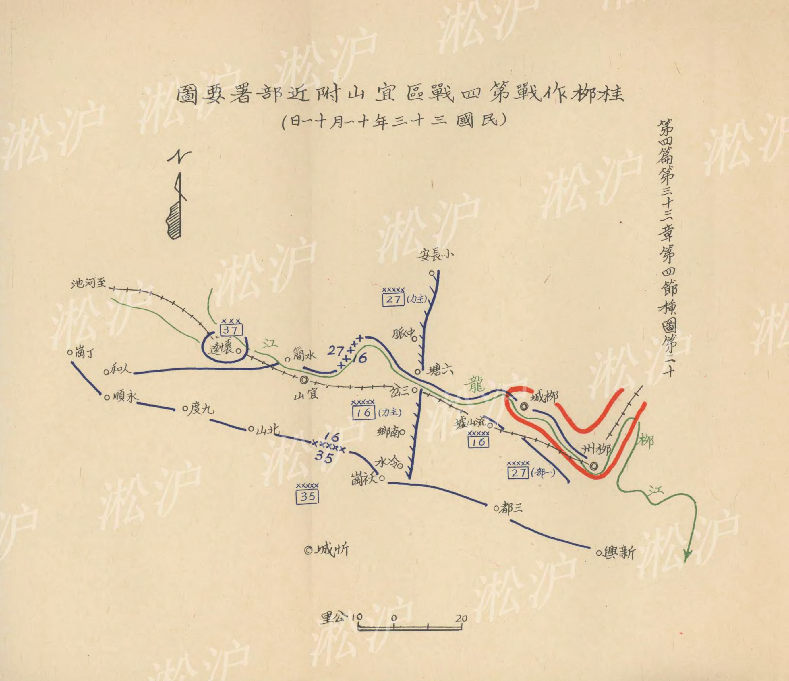

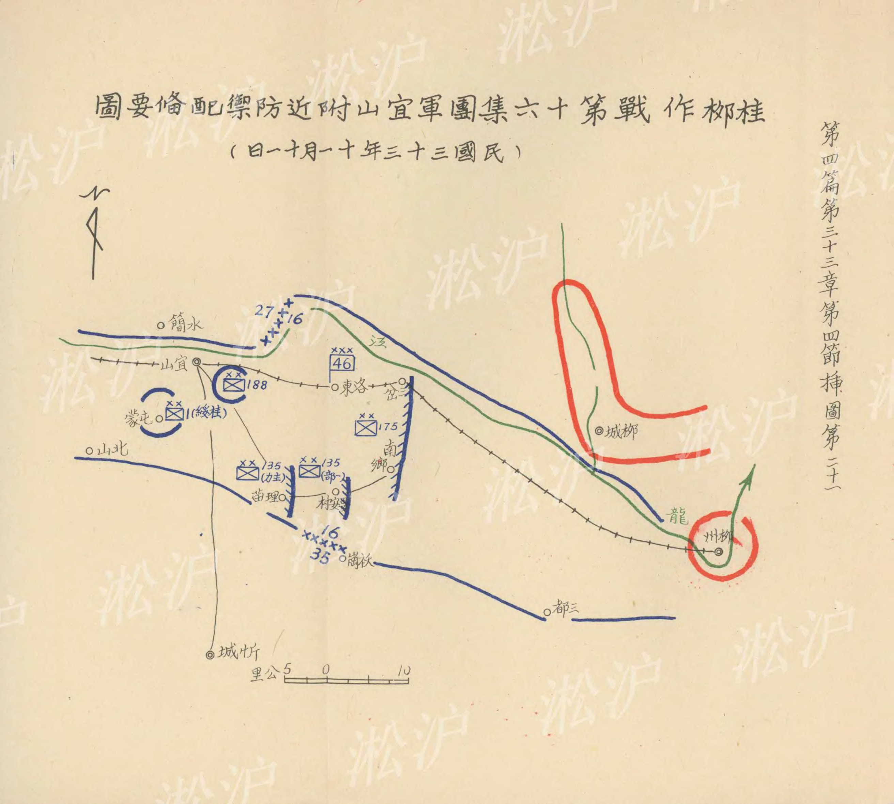

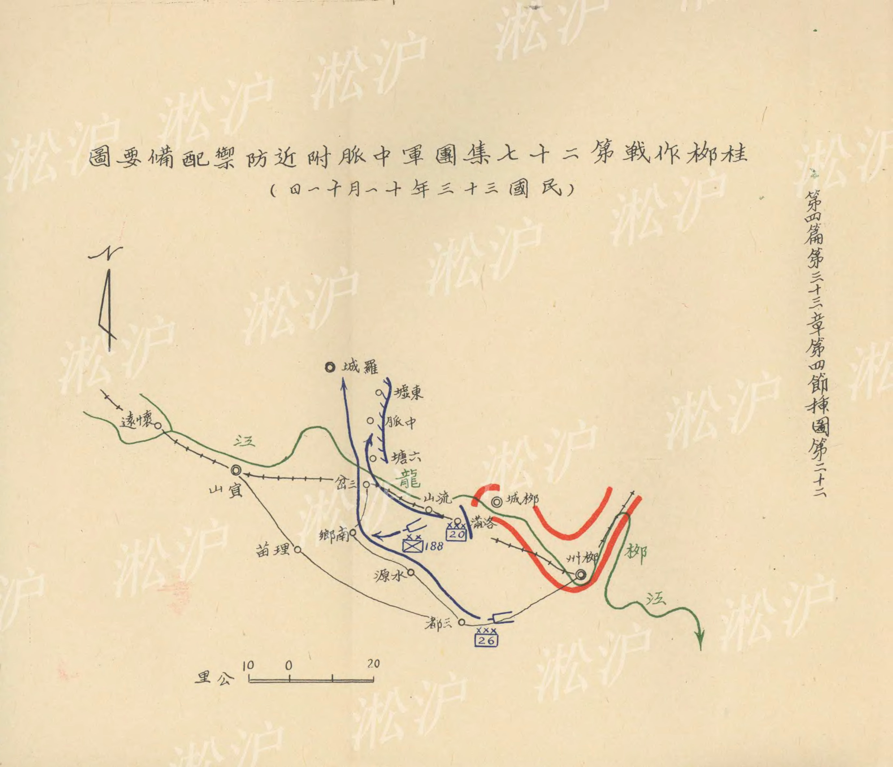

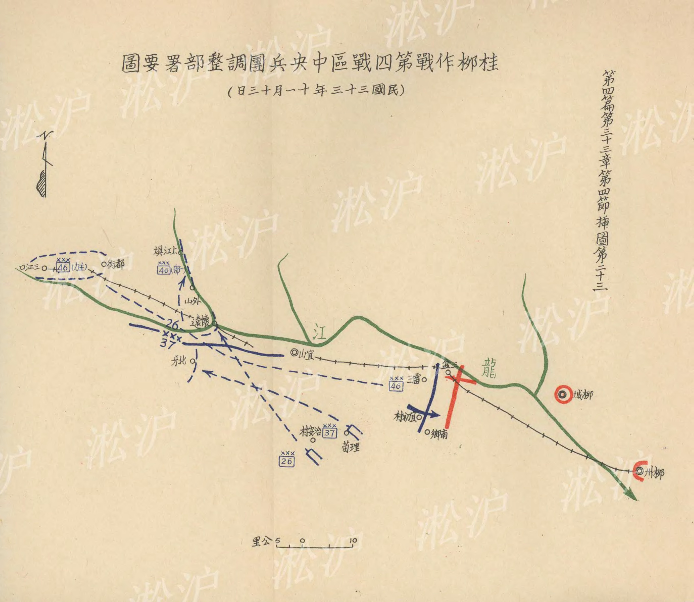

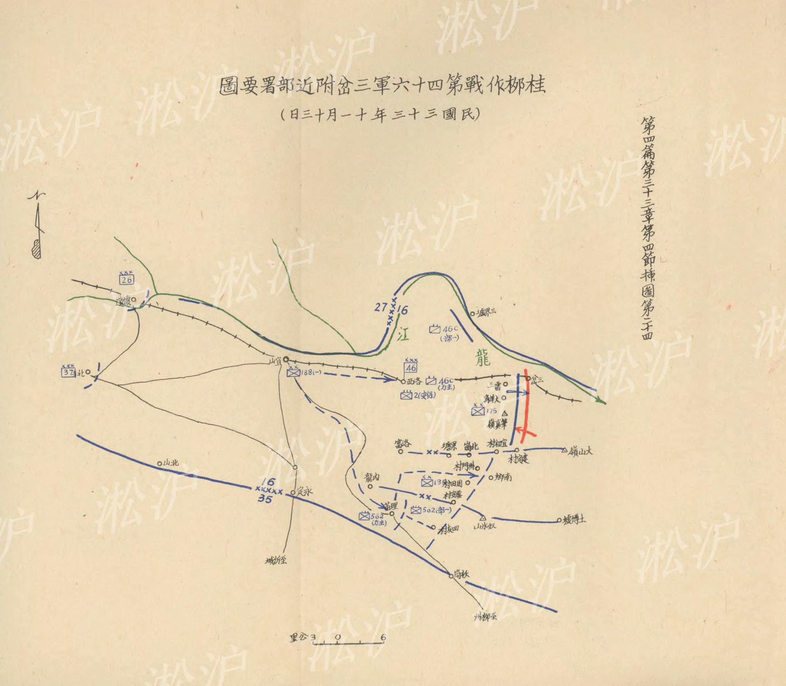

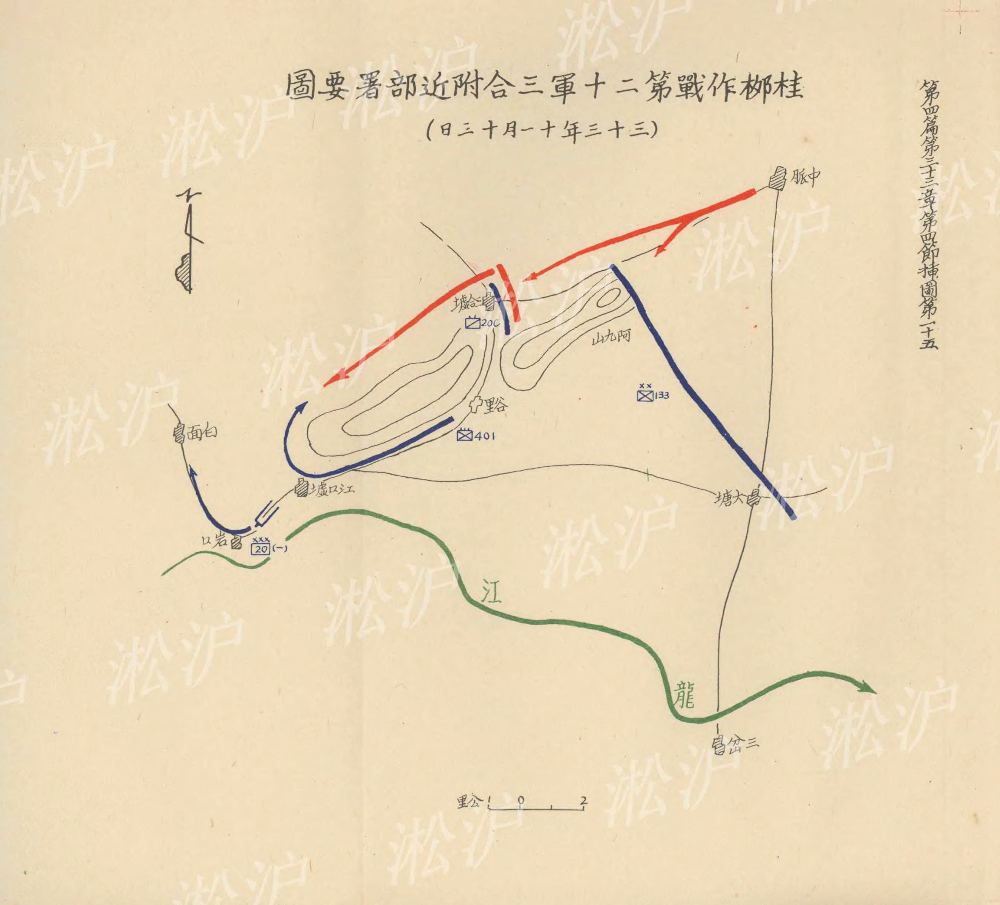

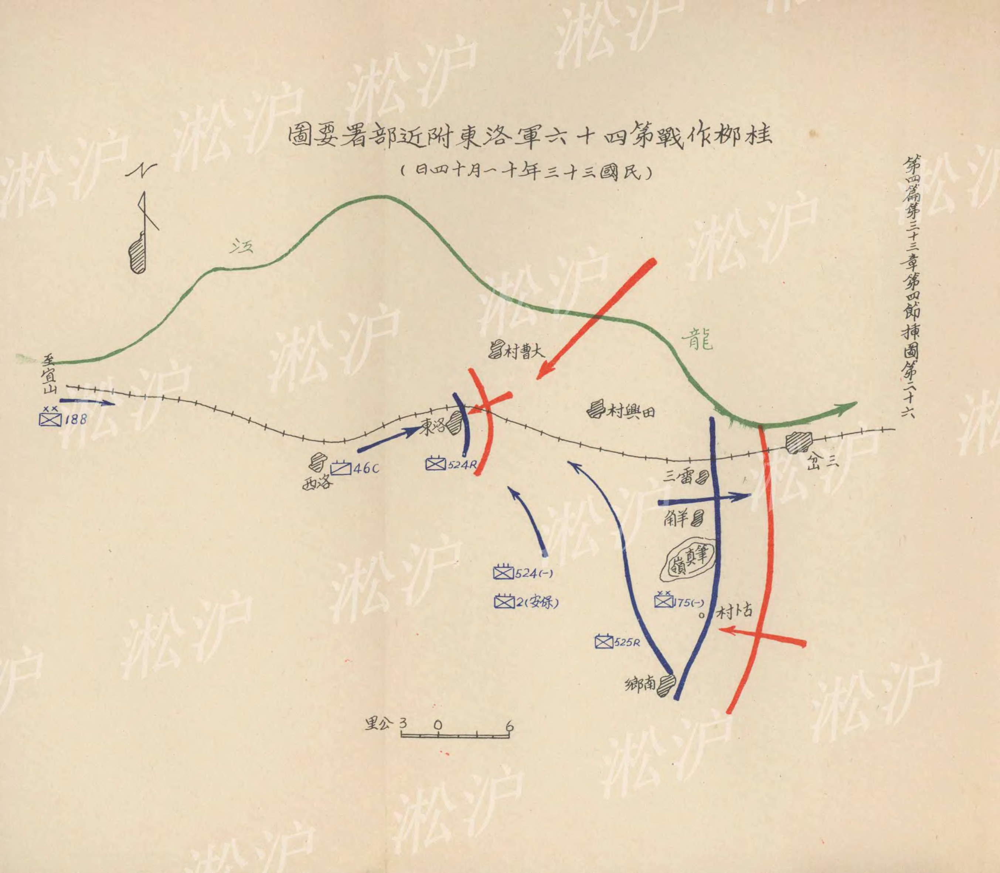

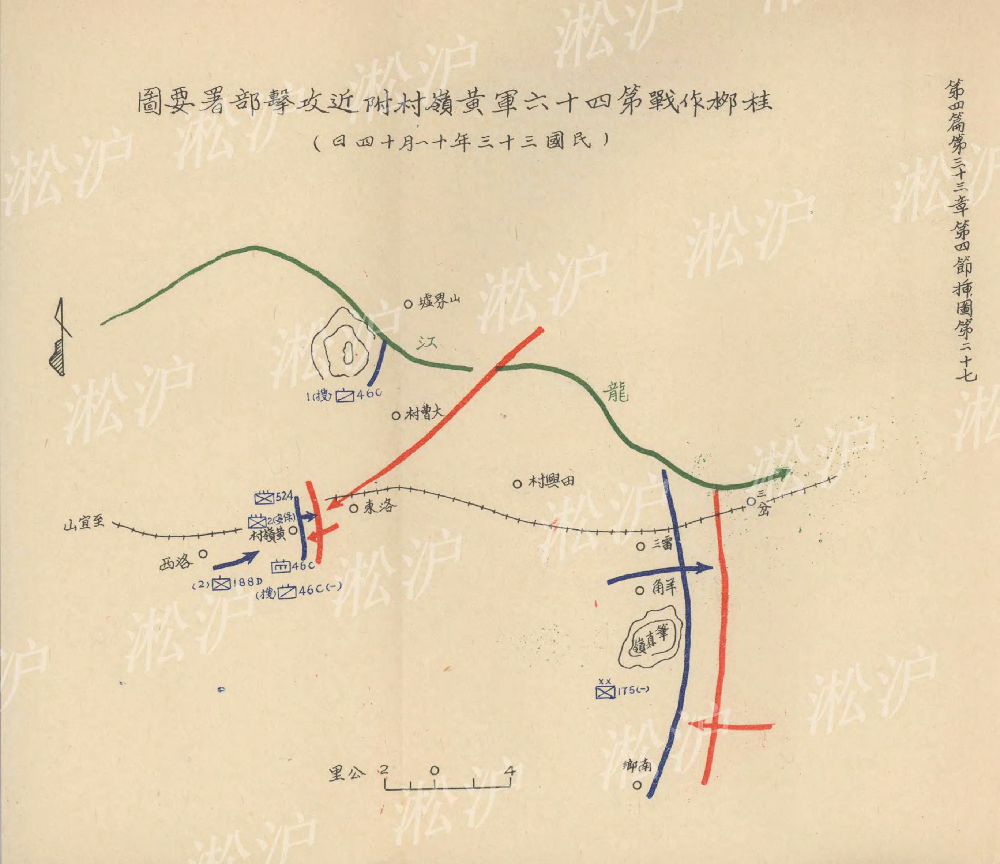


### 第五節 空軍作戰

民國三十三年九月本會戰開始時，敵空軍在武漢地區之兵力判斷爲：

一、轟炸部隊：第九十戰隊九架，第十六戰隊十八架，共計二十七架。

二、驅逐部隊：第四十八戰隊三十六架（內十二架駐白螺磯），第二十五戰隊四十二架，共計七十八架三、直協及偵察部隊：第六戰隊直協機九架，第四十四戰隊直協機九架，第十八獨立中隊六架，分駐武漢、廣州。

以上總計在該地區空軍兵力約一一一架。

我空軍於長衡會戰後，仍不斷出擊破壞敵機場及後方補給中樞，但爲擊破敵攻擊桂柳之企圖，確保湘西，乃策定作戰計劃，其要旨如左：

一、作戰方針：空軍主在破壞敵鐵路橋樑，阻斷敵交通及積極支援地面部隊作戰，以擊破敵攻擊桂柳之企圖，確保湘西爲目的。

二、使用兵力及配置：在會戰期間，我準備之兵力，係就長衡會戰原有轟炸機隊與驅逐機隊繼續使用者，中國空軍由航委會直接指揮，梁山恩施地區部隊之行動，由第一路司令張廷孟指揮，中美混合團之行動，由副司令蔣翼輔與摩斯上校共同指揮，美空軍之行動，由陳納德統轄指揮之。

中國空軍使用之主基地爲芷江，前進基地爲零陵，中美混合團之主基地爲桂林、芷江，前進基地爲邵陽、零陵，補助基地爲恩施、老河口，美國空軍使用之主基地爲桂林、柳州、昆明，補助基地爲梁山、成都、芷江、白市驛。

我空軍依據作戰方針，轟炸敵後方戰略要地，交通樞紐，重要機場以及橋樑、船舶等，並每日出動第一線，協助地面部隊作戰，先期於民國三十三年八月二十二日開始至十一月九日期間，先後共出動二二八批，驅逐機出擊一二四六架次，轟炸機出擊一四零架次，共一三八六架次，計擊落敵機三十四架，可能擊落十四架，擊傷十架，地面燬機六架，摧毀各種敵車四百餘輛，斃敵四五五零餘名，傷三五零餘名，斃敵騎兵五零零餘名、馬二五八匹，毀敵大小木船五七八隻，毀滅或破壞敵陣地車站廠庫司令部等五十餘處、橋樑十一座，並投送通信袋及軍款等，戰果豐碩，堪足矜式。茲將其中之空戰轟炸而具有成效者敘述如後：

一

嘉魚空戰

民國三十三年八月二十二日，我中美空軍混合團第三大隊P140機八架，各攜帶槍彈一五零零發，由毛昭品領隊，九時五十分自恩施機場出擊金口至新堤江面之敵船，十一時十分到達目標區上空，在嘉魚江面發現百呎及八十呎輪船各一艘，正在行駛中，岸旁停有機帆船四隻，當卽分別低空掃射，命中該兩輪，一艘冒煙，一艘起火，並擊燬帆船四隻，旋遭遇敵零式一型機十二架攻擊，空戰約十五分鐘，敵機性能良好，且佔高位，穿雲下降奇襲，但其轉彎性不靈活，且聯絡欠佳，我機仍向其迎擊，尤以隊員王光復曾對敵機攻擊四次，雖未奏功，但予敵以重創，空戰結果，我可能擊落敵機二架，傷二架，除外員一人失蹤外，餘均於十二時五十五分返降恩施機場。

二

鄭州空戰

民國三十三年八月二十五日，我中美混合團第三大隊P140機五架，各攜帶槍彈全量，由廖清潭領隊，九時五十分自西安機場起飛，赴鄭州、洛陽一帶作威力偵察，到達鄭州附近上空，遭遇敵驅逐機八架，計二零零零零呎高度四架、一六零零零零呎高度四架，我長機發現敵機後，卽自一五零零零零呎用全馬力爬高，敵機四架向右轉，企圖向我後方攻擊，我戰鬥羣同時亦向後轉，並昇高一九零零零呎，敵機四架遂在我機之下，我乃用急反轉戰術攻擊。空戰結果，董斐成擊傷敵機一架，可能被擊落，廖清潭擊中一架，在空中着火，外員擊傷一架，另一架逃逸。旋較高於我機之敵機四架，又向我進攻，我協力迎擊，被我外員及廖清潭各擊落一架，均在空中着火墜地，另一架被擊中成螺旋下墜，餘一架逃逸，我無損失，於十二時十五分安返原基地，此戰以少勝多，以寡擊衆，獲得全勝，實堪嘉許。

三

出擊與夜襲

民國三十三年八月二十七日，我中美混合團第五大隊P140機十三架，各攜帶瞬發信管一四零磅傘彈六枚及槍彈一四零零發，由分隊長矯捷領隊，十一時五十五分自芷江機場出擊湘潭至長沙公路上之敵車輛，到達目標區後，發現公路上有敵車約百餘輛，其中油車甚多，並雜有砲車，當自五零零零呎高度進入分別轟炸及掃射，悉數命中，約焚敵車三十餘輛，繼又掃射湘潭敵機場，結果冷培澍及彭傳梁各擊毀地面零式機一架，返航時遭敵驅逐機多架之追擊，遂發生空戰，結果美員擊落敵機一架，我除周訓典機失蹤外，餘均於十六時三十分安降芷江。

同日我第一大隊B-25機七架，自桂林二塘機場起飛，分批夜襲岳陽、廣州、衡陽等地之敵，襲岳陽之三機，先後於十八時二十分、十九時十分、二十分起飛，次第到達目標上空，進入轟炸，對岳陽機場附近運輸站、附近營房及其對岸之營房與人馬投彈，均命中起火，乃先後安返基地。襲廣州之二機於十九時二分及十五分分別起飛，到達目標上空後，自三至五千呎高度進入，對廣州天河機場倉庫營房及跑道予以投彈，命中爆發，我機安返基地。襲衡陽之二機亦於十九時二十四分，二十五分先後起飛，到達目標上空後，以一五零零至一八零零高度進入衡陽敵機場跑道及營房投彈，二十二時二十至四十分安返基地。

民國三十三年八月二十八日，中美空軍混合團第五大隊P-40機十一架，區分兩個分隊，第一分隊機五架，第二分隊機六架，均各攜帶瞬發信管二十磅殺傷彈十二枚，由參謀韋現科領隊，聯合美第十四航空隊驅逐機十三架，十一時四十分自芷江機場襲擊岳陽、白螺磯之敵。十三時飛臨石首附近上空，卽與敵零式驅逐機約二十架遭遇，發生激烈空戰，最先頭之敵機四架與我機高度相等，我第一、第二兩號機當予以攻擊，另五架敵機則被第第三、第四、第五號機攻擊，當卽擊落兩架，於混戰中又有敵機十餘架由上方加入戰鬥，而我第二分隊機及美第十四航空隊機，亦適時趕到參戰，空戰約五分鐘發現敵機數架被擊起火墜地，其餘之敵機不敢戀戰，遂俯衝竄逃。此戰外員Bonneaux擊落敵機二架，Hall擊落一架，Colman擊落一架，蘇英海擊落一架，張昌國擊傷二架，張亞崗擊落一架，我方除徐滾機及美機三架失蹤外，餘均於十四時三十分安返基地。

五

嘉魚岳陽空戰

民國三十三年八月二十九日，我中美空軍混合團第三大隊下10機十三架，編成兩個分隊，以第一分隊七架，各攜帶瞬發信管五十公斤炸彈二枚及槍彈一五零零發任攻擊，第二分隊六架各攜帶槍彈一五零零發任掩護，由副中隊長孟昭儀領隊，十四時自恩施機場起飛，轟炸沙洋敵倉庫、停車廠及掃射沿江敵輪，計炸毀敵汽油庫及停車廠各一座，繼續擊毀正在行駛之敵輪一艘。迨至嘉魚上游時，我上層掩護機遭遇敵機十五架攔截，當卽發生空戰，嗣下層敵機六架向我第一分隊攻擊，我機乃投下副油箱與之格鬥，雙方混戰約二十分鐘，我趙元琨、衛煌、田景祥、譚鯤、關振民、吳曉鈴各擊落一架，外員共擊落三架，除孟昭儀失蹤，趙元琨機中彈六十發受傷迫降機場，飛行員衛煌及田景祥受傷，餘機均於十七時三十分安返恩施機場。

同日我中美空軍混合團第五大隊P-10十一架，各攜帶槍彈一五零零發，由美員Rouse上校領隊，聯合美第十四航空隊，P-51機十架及P-40機二十四架，共同掩護B-24機二十四架，高層掩護組爲美P-51機，中層掩護組爲第五大隊P-40機，低層掩護組爲美P-40機，九時三十分自芷江機場出擊岳陽之敵，B-24機及低層掩護機高度爲一三零零零呎，中層掩護機高度爲一六零零零呎，高層掩護機高度爲一八零零零呎，當我B-24機投彈前三分鐘卽遭遇敵驅逐機五十餘架攻擊，但B-24機仍直向目標進入投彈，其餘各層掩護機立即參加作戰。空戰結果，除美機部份不明外，我第五大隊之張唐天、冷培澍及美員Caldunning中校各當場擊落敵機一架，但冷培澍在空戰中頭部受重傷迫降常德附近，周亮失蹤，美B-24機一架在投彈時被敵高射砲火擊傷，返芷江落地時失事，餘機均於十二時四十五分安返芷江機場。

六

漁波橋、渣江橋空戰

民國三十三年八月三十日，空軍第四大隊，P-40機六架，各攜帶五十公斤炸彈二枚及槍彈一五零零發，由劉尊領隊，七時三十分自芷江機場起飛，轟炸渣江橋、石頭橋西北周家村敵高級司令部，八時二十分以七五零零呎高度到達漁波橋、洪羅廟及渣江地區上空，遭遇一萬呎高度之敵零式機十二架攻擊，我乃將副油箱及炸彈投下與敵應戰，歷時約五、六分鐘，結果我李長泰、曹仁壽合擊落敵機一架，墜落於洪羅廟東地區，另可能擊落敵機二架，我除陳嘉斗軍士失蹤外，餘均於九時二十分安返芷江機場。

七

轟炸零陵、邵陽

民國三十三年九月十一日，我中美空軍混合團第一大隊B-25機九架，區分三個分隊，各攜帶瞬發信管二百磅炸彈二十二枚及槍彈全量，由中隊長吳超塵及美員Conraos領隊，十一時自桂林二塘機場起飛，轟炸零陵賴家村敵密集部隊，十一時五十分抵目標上空，以二千呎高度二百哩時速自東北端進入，對目標連續投彈，命中起火，黑煙沖天，十二時三十分安返原機場。十四時三十五分該大隊B-25機六架，編兩個分隊，以第一分隊三架各攜帶瞬發信管二百磅炸彈二十二枚，第二分隊三架各帶燃燒彈四束，共二千磅，由美員領隊，以美P-51機五架及P-40機二架掩護，自桂林二塘機場起飛，轟炸冷水灘敵補給站，十五時二十四分抵目標上空，以二千呎高度二一零哩時速進入，對目標連續投彈。十六時五分返降原機場降落時，七零二號機左輪爆破，左着陸架折斷起火，機焚燬，羅必正受傷，熊夢周、陳炳榮、黃長德等輕傷。

同日十六時五分，中美空軍混合團第五大隊下機四架，各攜帶瞬發信管傘彈六枚及槍彈一五零零發，由飛行員周天民領隊，自芷江機場出擊邵陽之敵，抵目標上空，發現我軍標示敵人盤據之村莊一處，十七時以五十呎低空進入，對目標投彈及掃射，繼又發現邵陽東北我軍標示之敵隱蔽村落及其附近樹林二處，經掃射後，共擊毀房屋十二間，擊中二十餘間。是日天氣惡劣，能見度不佳，但我地面部隊能適時鋪布板符號及煙火，故能完成任務，於十八時五分安返芷江機場。

八

湘潭、衡山空戰

民國三十三年九月十二日，我中美空軍混合團第五大隊下機八架，編組兩個分隊，均各攜帶瞬發信管傘彈二枚及槍彈一四零零發，由分隊長方緯領隊，十四時四十分自芷江機場出擊湘潭、長沙間沿公路之敵，原定由第一分隊掩護第二分隊，因沿途天氣惡劣，致彼此失卻聯絡，迨第一分隊機四架抵湘潭穿雲下降時，遭遇敵驅逐機六架自西向北飛行，我機當卽相率予以攻擊，歷經六次空戰，結果方緯、楊少華及美員Calman各擊落敵機一架，馮德鏞、楊少華、Calman各擊傷一架，旋第二分隊機四架相繼飛抵湘潭時，獲悉遭遇敵機，乃將下油箱及炸彈投下準備應戰，旋發現敵機一架，乃予以追擊，至長沙時，敵始穿雲逸去，該地敵高射砲亦紛紛向我機射擊，我機返航經永豐時，掃射河上敵船及兩側敵盤據之村落及樹林後，於十六時十分安返芷江機場。

同日十三時四十分，該大隊P140機八架，編兩個分隊，以第一分隊四架，各攜帶槍彈一四零零發擔任掩護，第二分隊四架各攜帶瞬發信管傘彈六枚及槍彈一四零零發任攻擊，由中隊長項世端領隊，自芷江機場出擊永豐、湘潭、衡山公路上之敵，迨抵衡山上空時，遭遇敵驅逐機十二架，與我第一分隊發生空戰，結果朱黻華及美員Reneey各擊落敵機一架，林雨水及Reneey各可能擊落一架，至第二分隊則於十四時三十分沿永豐、湘潭、衡山各路掃射隱伏敵兵之房屋及樹林多處，並將傘彈投入衡山北敵營房附近，我除美員Brink未返防，蘇英海駕機因受重創降落時損壞外，餘均於十六時十六分安降芷江機場。

九

湘潭空戰

民國三十三年九月十六日我中美空軍混合團第五大隊P140機十六架，各攜帶瞬發信管五百磅炸彈二枚槍彈一六零零發，由副中隊長廖廣甲領隊，八時三十分自芷江機場起飛，轟炸長沙北許家洲敵機場，九時三十分飛抵目標上空，以七千呎高度進入，對敵機場俯衝投彈命中，計炸焚機場南端建築物十餘棟，繼沿公路飛湘潭掃射，擊毀敵木船十餘隻，嗣在湘潭西約十公里處遭遇敵零式機約十二架攻擊，經激烈空戰後，我王蔚梧、王秉琳、周勵松、郁功誠及美員Joyner各擊落敵機一架，王秉琳、王德玉各擊傷敵機一架，沈德昌、陳海泉各擊傷敵機一架，但我劉春榮機被敵擊落，王秉琳及王德玉機機翼各中砲彈兩發重傷，郁功誠機左翼中砲彈一發，Joyner機尾中砲彈一發，餘均於十四時四十分安返原機場。十

襲擊歸義至長沙公路

民國三十三年九月十九日，中美空軍混合團第五大隊P140機十六架，各攜帶瞬發信管二十六磅炸彈六枚及槍彈一四零零發，先後兩次襲擊歸義至長沙公路之敵，均獲得豐碩戰果，第一次於五時四十五分自芷江機場出動，六時五十分飛抵目標上空，卽沿公路對敵卡車砲車及路側林內隱伏之敵低空投彈及掃射，計擊毀敵卡車砲車十四輛，傷三十一輛，斃敵六十餘，馬百餘匹，繼在新市上空附近遭遇敵零式機二架，其中一架被我盧譽標擊落，一架被張昌國擊傷，八時三十分安返原機場。旋整備檢查後以美軍P 51機二架掩護，十時十分起飛作第二次之襲擊，十一時二十分飛抵目標上空，卽對公路上敵卡車戰車等低空投彈及掃射，計擊焚卡車四輛，創傷二十輛，毀戰車五輛，繼掃射路旁堆積物多處及擊焚許家洲機場之油庫四座與汽船一艘，嗣飛邵陽依地面電台之指示掃射敵盤據之村落及樹林二十餘處，敵傷亡甚衆，我除余陽和機因故障先行折返外，餘均於二十三時二十五分安返芷江機場。

十一

新市及廣武空戰

民國三十三年九月二十一日，我中美空軍混合團第五大隊P10機十五架，除其中一架攜帶瞬發信管一百磅炸彈二枚外，其餘各攜帶瞬發信管二五零磅炸彈二枚，槍彈一四零零發，由分隊長梁同生領隊，六時三十分自芷江機場起飛，轟炸寧鄉及新市敵高砲陣地及倉庫，七時三十五分飛抵目標上空，經偵察後發現寧鄉朱良橋附近敵倉庫甚多，新市約有敵高射砲十餘門，當卽進入各目標輪番俯衝投彈及掃射，彈着均命中，有數處起火，計毀敵倉庫四所及高砲約半數，繼在新市上空遭遇敵零式機十餘架攻擊，空戰結果，我梁同生、張亞崙共擊落一架，Colman擊落二架，楊少華、張雲祥、林雨水、Col. Ronk及Maj. Jane各擊落一架，又張雲祥可能擊落一架，除曲士傑機受創於返航經芷江十公里處失事機毀人亡外，餘均於九時五十分安返芷江機場。

同日八時五十分，中美空軍混合團第一大隊B-25機五架，各攜帶延期信管一百磅炸彈三枚，以美軍第十四航空隊P-47機八架掩護，自南鄭機場起飛，中美空軍混合團第三大隊P-40機八架於九時十分自西安機場起飛，聯合轟炸廣武黃河鐵橋，沿途美空軍P-47機在轟炸機上空，第三大隊B-40機在轟炸機兩側，隨伴掩護，十一時八分飛抵目標區後，先以第三大隊掩護機四架掃射橋北端敵高射砲陣地，繼由轟炸機以三百呎高度沿黃河進入，對鐵橋低空單發投彈，二彈直接命中，第三段橋被毀，我轟炸機投彈後，第一分隊正昇高至四千呎離目標三十哩處遭遇敵東條式機多架，其中第二架突下向我攻擊，我機二架當卽反擊，敵不支作上昇轉彎脫離，而我第三機則於我第四機之後上方攻擊另一敵機，同時我第二分隊機三架亦加入戰鬥，以一架掩護受傷之美機脫離戰鬥，二架反擊敵機，卒因任務所限制，未敢戀戰，僅作防禦戰，故仍恢復原隊形掩護P125機返航，安降各基地。此次空戰結果，我擊落敵機一架，傷二架，可能擊落一架，此外並擊傷輪渡之汽船二艘，美員機一架被敵擊傷迫降洛陽以西山地。

十二

偵炸衡陽

民國三十三年十一月九日，我中美空軍混合團第五大隊下10機十二架各攜帶瞬發信管二十五磅傘彈六枚及槍彈一五零零發，由分隊長盧譽標領隊，十五時三十分自芷江機場襲擊衡陽西北敵停車場，十六時三十分抵目標區上空，卽低空進入投彈及掃射，計炸毀停車場及卡車四輛，嗣遭遇敵驅逐機四架攔截，空戰結果，我美員Dahelem、史美宗、呂雲華各擊落敵機一架，盧譽標可能擊落一架，十七時四十分安返芷江機場。

十一日，該大隊下10機十一架於十時自芷江機場起飛，襲擊衡陽敵機場，抵目標後發現跑道兩旁及掩體內停驅逐機及雙發動機之飛機共約三十餘架，當於十一時輪番予以超低空投彈及掃射，計擊焚敵機十六架，毀八架，可能炸毀五架，我機三架受傷，分隊長王秉琳頭部受傷，但均於十二時二十分安返原機場。

第二十九

民國三十三年八月中旬軍事委員會頒發對全州、桂林糧彈防毒器材之屯儲及衛生設施計畫，令第四戰區兵站總監部遵照實施，其計畫內容概要如插表第二十一至第二十四。

同年十月十四日第四兵站總監部根據第四戰區長官部三十三年十月十三日愛柳字第二號作戰計畫策定兵站設施計畫，其概要如左：

一、本部爲配合戰區作戰，確保桂柳，並以優勢兵力先擊破由西江進攻之敵，兵站以補給圓滑，救護適切爲主旨而設施之，其重點置於西江方面。

二、部署及任務：

(一)第十六分監部位置於永福，指揮支部一、分站六、糧庫三、糧秣堆積所二、軍械庫、軍械堆積所、加油站各一及配屬院隊，擔任管區內軍品之運補，及桂柳核心糧彈器材之屯儲，傷患之收轉及治療。

(二)獨立分監部位置於修仁，指揮支部一、分站五、糧庫二、糧秣堆積所、軍械堆積所各一及配屬院隊，擔任第二十七集團軍之軍品補給及傷患之收轉治療。

(三)第三十五分監部位置於來賓，指揮辦事處一、分站十一、糧庫三、糧秣堆積所二、軍械庫、軍械堆積所各一及配屬院隊，擔任西江方面軍品之補給及傷患之收容治療。

四第二支部位置於南寧，指揮辦事處一、分站四、糧秣堆積所四、船舶管理所、船舶派出所各一，擔任左右兩江及本部直轄管區、鬱江以南各地區軍品之接轉後運及南寧、靖西指揮所各部軍品之補給與傷患之收容治療。

(五)第三支部位置於柳州，指揮分站三、糧庫二、軍械庫、軍械堆積所及船舶派出所各一，擔任柳州核心糧彈器材之屯備，及第六十二軍之軍品補給，與兵站基地軍品之接轉，傷患之收容治療。

(六)本部暫位置於河池，並隨長官部設置指揮所，統籌本戰區兵站一切業務，及指揮直轄管區內各兵站單位遂行其任務。

(七)管區劃分：第十六分監部、獨立分監部間：榴江、陽朔、嶺寨、栗木之線，線上屬獨立分監部。獨立分監部、第三十五分監部間：桐木墟、馬練墟、大王墟、太平墟、大灘口之線，線上屬獨立分監部。本部各分監部間：公舘墟、小江墟、遷江、來賓、石龍、桐木墟、榴江、融縣、從江（丙妹），線上屬各分監部：

(八)兵站地：

1. 基地：柳州、河池。

2. 主地：義寧、永福、修仁、來賓。

3. 末地：石龍墟、大墟、桂貴、石龍、蒙山、荔浦、靈川、龍勝，爾後依作戰軍之位置與需要隨時變更。

(九)兵站線：

1. 主兵站線：

桂林

義寧—龍勝

(1)柳州—鹿寨—永福

靈川

良豐

陽朔—荔浦

(2)柳州—鹿寨—榴江—修仁荔浦

象山

象縣—武宣—東鄉墟

(3)柳州

鳳凰

大灣

桐嶺墟—桂貴石龍

來賓

來賓—石龍墟—大墟

(4)柳州

思隴—武鳴

遷江—賓陽

—崑崙關—南寧

(5)柳州—大塘—遷江—賓陽—犁塘墟—石龍墟(6)柳州—河池—東蘭—萬岡—田東—南寧(7)柳州—柳城—融縣（長安）—三江—龍勝2.

補助兵站線：

(1)鹿寨—榴江—狗瑶村—花卉墟—馬嶺墟—荔浦(2)鹿寨—中渡—三里墟—百壽—桂林義寧

(3)永福—兩江墟—義寧—龍勝三、補給：

(一)糧秣：

1. 桂柳防守軍屯糧及副食馬秣等之屯備如插表第二十五。

2. 野戰軍補給軍糧，以湘桂路線及其以東地區各縣撥交兵站軍糧二萬四千大包，與桂省府十至十二月份撥交兵站軍糧三十八萬四千大包補給之，其分配各兵站情形如插表第二十六。

(二)彈藥：桂柳核心屯彈數量及其外圍野戰軍作戰所需彈藥數量如插表第二十七。

(三)燃料：

1. 在會戰期內燃料之補給，應以靈活圓滑爲主，不必拘泥法規與形式，萬一黔桂鐵路受阻，則該線之軍事運輸不得不以汽車是賴，因之每車應經常保持機動油量一百加侖，預計行駛一千公里。

2. 駐桂林之第一加油站應屯備適當燃料，以待供應，如因戰事演變桂柳公路及湘桂鐵路均已破壞，燃料無法補充時，留置該方面之車輛則由後勤部直接補給之。

四、運輸：

(一)汽車部隊：本部現配屬有輜汽兵第二團第五連汽車四十七輛，如因戰局變化車輛不敷用時，即使用前請增撥之輜汽兵第二團第二連卡車五輛，及輜汽兵第一團之第六連卡車三十二輛，共計八十四輛，除以一部交第十六分監部於桂林使用外，大部控置於柳州附近。

(二)人運部隊：本部現有人力運輸部隊二十個中隊，及運輸兵四個團，除以兩個團十個中隊歸第十六分監部指揮外，餘由本部控置。

五、通信：有線電，以一個連四個排兩個班分駐於柳州河南河北與各有關機關連絡，另以一個排位置於獨登山擔任本部之通信，兵站間之通信則利用現有之電信線路及縣市鄉村電話。無線電，以獨登山之電台與重慶、曲江、郴縣、貴陽、昆明各地有關機關連絡，另以一個排與各分監部支部連絡。

六、衛生：

(一)衛生機關之設施如插表第二十八。

(二)輔助衛生機關之配置：

1. 第十六榮軍招待總隊第三十一大隊（十二個所）設置於柳州至桂林間各地區，第三十二大隊（十二個所）設置於柳州至獨山及融縣間各地區。

2. 第十一榮軍招待總隊（五個所）分設於大灣、武宣、桂平等地。

3. 第九榮軍招待總隊（十四個所）分設於柳州、來賓、遷江、貴縣、桂貴石龍、鬱林各附近地區(三)衛材屯補：

1. 城防部隊桂林兩個軍柳州一個軍共衛生器材需用量各以三個月計算屯備。

2. 野戰部隊衛材之補給，指定金城江之第四十六衛材庫爲發實庫，擔任轄區內各野戰部隊衛材發實事宜，宜山之第四十三、第四十七兩衛材庫，即準備六個軍三個月所需衛生材料，第七十二衛材庫分屯柳州十個軍一個月之衛材，即準備分發各部隊備用。

第四兵站總監部策定上述計畫後卽付諸實施，其兵站設置及賦予各兵站任務如插表第二十九。

補給方面：彈藥部份，兵站應於桂柳核心各屯備一個軍三個月所需彈藥，計步機彈十基數、手榴彈二十基數、迫砲彈十五基數、山、野、榴砲彈各二十基數，俱經由兵站積極撥補，並商洽各城防司令部派員察勘適當地點分別主次要地區屯儲，後因交通工具困難，轉運不便，有大部份彈藥仍堆積於獨山二帶，雖經空運一部份，相差仍鉅，而外圍野戰軍所需之十八個基數彈藥不敷部份，尚無着落，當時曾移柳州市彈之一部以接濟之，桂柳核心及外圍野戰軍所需彈藥屯儲狀況如插表第三十，糧秣部份已按照上述計畫積極籌運，燃料部份儲備狀況如插表第三十一。

運輸方面：鐵道運輸——當黃沙河、全州戰事發生之際，兵站對前方補給，大部份依賴鐵道運輸，後以戰事轉急，人民疏散，物資後撤，影響軍運至大，兵站於萬難之中勉強完成桂林核心屯彈屯糧之任務。致於柳州屯糧須由桂南撥運者，原定由柳來鐵路運輸，後以煤斤不濟，車皮短少，無法利用，當時大灣一地存糧甚多，因此不能轉運柳州屯儲濟急。迨桂柳失陷後，戰局愈形惡化，敵機空襲日以繼夜，所謂後方動脈僅存之黔桂鐵路至此亦等於虛設，不能發生任何作用也。汽車運輸——第四兵站總監部在會戰初期僅配有汽車一個連，計卡車四十七輛，除待修者外，經常可使用者僅約四十輛，以當時管區之遼闊，運輸之繁忙，誠難應付，自第二十七、第三十五兩集團軍入桂後，補給更加繁難，車輛益愈需要，經增加四十餘輛，仍不敷用，不得已，乃於桂柳失陷之直前由第四戰區司令部作緊急處置，征用商車百餘輛協助軍運，但商車平時無組織與訓練，一旦征爲軍用，指揮困難，收效甚微，如此車況，勉強維持至會戰末期，其汽車部隊配置如插表第三十二。人力運輸——第四兵站總監部雖有建制輸力二十個人運中隊，及配屬輸力四個人運兵團，然以當時輸兵待遇微薄，營養不良，日夜辛勞，於是患病與畏苦潛逃者爲數甚多，十月中旬以後，各團隊輸兵人數不足編制百分之七十，後此更日漸銳減，部隊番號雖依舊，而實力則可想見，其人力運輸部隊配置如插表第三十三。船舶運輸——會戰之始，桂省卽作全面疏散，各水路交通中心，地方政府與民間物資堆積，待運者爲數過大，因之需用船舶甚多，運費奇昂，而兵站征用船舶，限於給與之規定，付費低微，船隻多不應征，後雖經第四戰區長官部令各驛運站將轄區所有船舶征集控制，但限於事實與船隻本身缺少，困難依舊，軍運物資由遲滯而入停頓，因之船舶運輸對部隊補給，亘會戰期間收效甚微也。

通信方面：第四戰區爲適應作戰需要以柳州爲通信中心，以永福、桂柳、修仁、荔浦、來賓、武宣爲基點，構成通信網，除盡量利用既設線路外，並由通信兵指揮部自來資至柳州再另行架設有線電話，廣西電信管理局在修仁另設長途電話所，亘會戰全期尙可勉強適應作戰需要，惟通信器材一般咸感缺乏與簡陋，影響戰時情報之傳遞者實屬不少。

衛生方面：桂柳城防部隊三個軍及野戰部隊所需衛材，均由第四兵站總監部按照計畫分交各部隊接收備用，惟防毒器材之屯儲按照軍事委員會計畫尙欠缺甚鉅，其屯儲情形如插表第三十四。

### 第七節 檢討

#### 第一款 敵軍

一、作戰目的：

敵罄其餘力約十個師團發動本作戰，歷時三閱月，付極大之代價，達成覆滅桂柳中美空軍基地及打通大陸交通線之目的，並予我軍以相當之打擊，但在戰爭全局上其時機已屬過遲，失却進一步加以充分活用之時間與餘力。當時中美空軍在中國戰場共祇三百餘架（敵誤判爲一千六百架），除桂柳以外尚有足够之基地可以使用，對於空軍威力之發揮並無多大影響。且敵輪轉材料缺乏，並無修復粵漢及湘桂鐵路及有效利用之能力，徒陷其兵力更形分散，減少彈性，使戰略態勢益爲不利，尤以抽調關東軍之第二十軍司令部及滿韓與其本土部隊參加本作戰，實屬大錯，致本作戰結束未久卽被迫撤退，終屬徒勞，故本作戰之發動，實乃日軍狂妄無謀，窮餘之下策。

二、作戰指導：

敵第六方面軍原計劃對桂柳逐次攻略，以充分兵力圍殲我軍於戰場，尤期待其第二十三軍攻略柳州，遮斷我軍向西方之退路，而其第十一軍竟違悖其方面軍之企圖，於十一月三日下令同時攻略桂柳，令其精銳第三、第十三師團向柳州突進，致柳州我軍被迫停止戰鬥，脫離戰場，迅速西逸，敵遂失去圍殲我軍之機會。

三、戰術運用：

桂林東正面爲地形上及我軍防禦配備之弱點，敵第十一軍攻桂林時，以主力使用於桂林東南側，先奪取我江東守備隊之陣地，隨以重點指向伏波山中正橋間強行渡河，把握我軍之弱點，逐一舉攻陷桂林。

四、後方支援：

敵於地形險阻、交通不便、資材貧乏、空中劣勢等種種困難情況下，其後勤機關以最大之努力完成後方支援，且善用戰地之資材及擄獲品，以滿足其作戰之要求，尤其補充兵適時到着戰地，使兵員無缺，戰力充實，乃最大之優點。

#### 第二款 我軍

一、作戰目的：

我軍爲打通中印公路，並協力盟軍反攻緬甸，堅持盟軍大戰略之主要目標，故忍耐湘桂戰場兵力之不足，採取戰略持久戰，乃卓越之決策，雖湘桂作戰遭受一時之挫折，而終能打通中印公路，取得大量美援，且擊破緬甸之敵，貢獻於盟軍之全面勝利者至鉅。

二、作戰指導：

第四戰區對湘桂路之敵主力取守勢，對西江之敵爭取先制採取攻勢，以防止敵之外線包圍運動，自屬至當，惟兵力之集中運用不澈底，第四十六、第六十二軍未能適時參加對桂平之攻擊，使敵第一零四師團乘虛突進，威脅武宣，功敗垂成，殊爲可惜。

三、陸空協同：

亘會戰期間我空軍兵力較敵爲絕對優勢，但未能與野戰軍密切配合直接支援，使陸軍不能利用空軍成果，發揮作戰力量，桂平蒙墟戰鬥，我空軍對敵雖施以轟炸，陸空連絡欠周密。


四、戰志堅決士氣旺盛：

本會戰，我兵力較敵劣勢，仍能實施局部之各個擊破，以收殲敵之效者，全賴我將士戰志堅決，士氣旺盛所致，如收復蒙墟附近要點及全部殲滅淞江口之敵等是。

五、後方支援：

動員準備不足，故缺額甚多，不能適時補充，民間車船無組織，無訓練，一旦作戰，徵爲軍用，指揮困難，且軍方付費低微，多不應徵，故亘會戰全期，民船民車對軍運補益甚微。

六、地方武力強大頗收寓兵於民之效：

本會戰以地區廣大，兵力不敷分配，戰區西南之防衛，主依地方團隊擔任，越南之敵第二十一師團遲遲不敢發動攻勢，卽地方武力所發生之作用。

附錄。

第四戰區作戰計劃

第一方針

戰區以確保桂柳並掩護柳州空軍基地之目的，決以有力兵團於荔浦、桂林各附近地區，拒止湘桂路及龍虎關方面之敵，以優勢兵力集結於武宣東南附近地區，先擊破進犯西江之敵，以利爾後作戰。西江方面軍會戰日期預定十月二十日以後。

第二

指導要領

一、敵如以主力向西江方面進犯時，則集結有力機動部隊於武宣、來賓以南地區，乘敵進出浔江鬱江左岸，兵力分離與態勢不利之際，卽取攻勢，一舉而擊破之。此時荔浦及桂林方面軍，應各拒止當面之敵，極力遲滯敵人，俾西江方面之作戰順利，但荔浦方面軍應以有力一部策應西江方面軍之作戰二、敵如以主力向荔浦方面進犯時，應在平樂、荔浦、陽朔間地區，協力拒止敵之進犯，並予遲滯消耗，不得已時，應確保修仁隘口。

三、敵如以主力向桂林方面進犯時，外圍軍應協力防守軍極力拒止敵之進犯，必要時以有力部隊確保永福隘口。

在敵採取第二、三兩項行動時，西江方面軍於集中完畢後，索敵而擊破之。

四、敵如在西江、荔浦、桂林三方面同時進犯，並以有力一部由越南分向邕龍路進犯南寧及田靖路時，荔浦及桂林兩方面極力拒止敵人進犯，另集結並轉用有力兵團，先擊破西江方面之敵，靖西、南寧兩指揮所地方團隊利用地形極力拒止敵之進犯，依情況轉用有力一部擊攘該方面之敵，確實掩護黔桂路，以策後方安全。

第三

兵團部署

一、軍隊區分：

西江方面軍總司令鄧龍光

第十六集團軍副總司令周祖晃

第一三五師附第六十二軍山砲營之一連

桂綏獨立第一縱隊

桂綏獨立第二縱隊

砲兵第十八團第二營山砲一連

砲兵第五十四團第一營

第六十四軍

第一五五師

第一五六師

第一五九師

砲兵第二十九團第三營（欠第七第八連）

第四十六軍

第一七五師

第一八八師

高雷守備區

雷州獨立挺進支隊

粤保安第十團

沿海警備第三第四第五大隊

桂保安第三團

獨立工兵第八團之一營（欠一連）

荔浦方面軍總司令楊森

第二十軍

第一三三師

第一三四師

第二十六軍

第四十一師

第四十四師

第三十七軍

第九十五師

桂樂師管區

砲兵第二十九團第八連

湘桂邊區總指揮部

砲兵第十八團第一營

桂林方面軍總司令夏威

桂林防守軍

第三十一軍

第一三一師

第一七零師

桂林防守軍砲兵隊

砲兵第十團第八連

砲兵第二十九團第七連

第九十三軍砲兵營第二連

第九十三軍（欠砲兵營）

新編第八師

第十師

砲兵第二十九團第二營（欠第六連）

第七十九軍

第九十八師

第一九四師

新編第十九師

稅警第三團

南寧指揮所代主任李畫新桂保安第一團第三大隊桂保安第四第五團

獨立汎警第一第二營

東興軍警督察處

沿海警備第一第二大隊合浦粤第八區保安司令部粤保安第一團（欠第三大隊）

靖西指揮所兼主任陳寶倉戰地工作總隊

桂保安第五團第一第二大隊控置兵團

第六十二軍

別動軍第三縱隊

第四十八師戰車營

砲兵指揮部

砲兵第十團第三營（欠第八連）

砲兵第十四團第三營

砲兵第十八團（欠第一營及第二營之一連）戰防砲教導總隊直屬第一營

第九十三軍砲兵營（欠一連）

砲兵第五十四團團部

獨立工兵第八團（欠第四連）

通信兵第二團第二營

二、各兵團之任務及行動：

(一)西江方面軍有擊滅西江方面敵之任務，以一部在江口墟及金田村南北之線佔領陣地，拒止敵人，掩護我主力之集結及進出，並特對黔江封鎖。敵如利用該河道則以有力一部配置於桂貴石龍一帶及其以南地區，對由桂平、社步、夏灣一帶渡河北犯之敵，相機予以擊攘，掩護主力之進出，不得已時，亦須確保藍田村、牛溫及上龍村各隘口，以利主力軍之作戰。

轉用葡萄墟附近及修仁附近之各一個軍，利用鐵道輸送及徒步行軍迅速向桐崗鄉及通挽鄉附近地區集結，並限於十月十九日前集結完畢，及完成會戰準備，爾後主力保持於右翼對敵攻擊，壓迫敵於黔江、濤江而殲滅之。

(二)荔浦方面軍，以一部固守陽朔，主力在平樂、荔浦間地區拒敵進犯，並竭力予以遲滯消耗，不得已時，應確保修仁高地一帶要地，另以有力一部進出蒙山、大旺，攻擊平南及其以西之敵，以便西江及荔浦兩方面軍之作戰容易。

(三)桂林方面軍有固守桂林之任務，以主力之一軍固守桂林，以一師位置於良豐附近，另以有力部隊位置於桂林西北地區佔領陣地，與防守軍協同極力擊攘進犯之敵，不得已時，除防守軍應確實固守桂林外，其餘各部隊應確保永福要地，及百壽通桂林方面之後路，以確保桂林之交通，並應先以有力部隊沿湘桂路、大溶江、靈川一帶極力打擊遲滯敵之進犯，爾後轉移於桂林西北地區，協力防守軍之作戰。

四靖西及南寧指揮所任邊區要點警戒，遇敵進犯極力拒止之，確實掩護黔桂路安全。

(五)各部隊作戰地境，同第一號作戰命令。

(六)第六十二軍控置於柳州，擔任警衛及工事構築，依情況固守柳州，或策應各方面之作戰。

第四

航空及防空

航空：

(一)作戰開始前，要求戰區內基地之空軍主力使用於西江、龍虎關、興安以東及其以北公路鐵路及水路之偵察，與橋樑、渡口、運輸及密集部隊之轟炸，一部協力西江、荔浦、桂林各方面軍地面部隊之戰鬥。

(二)西江方面會戰時，以主力協力該方面之作戰，一部偵察並轟炸敵後方之交通及運輸，有力一部協力荔浦、桂林方面之作戰。

二、防空：

防空部隊由防空指揮官指揮，主力擔任桂林、柳州空軍基地之機場、鐵橋及懷遠橋樑之防空，一部擔任永福、雒容橋樑及南寧機場之防空。

第五

交通通信

一、交通設備：

(一)會戰間極力利用湘桂鐵路，經常控置一個師使用之列車，並徵集必要公商汽車，以利軍運。(二)徵集柳江、黔江之船舶，控置於武宣、石龍各地，以利運輸。

(三)遷江、來賓、武宣附近各渡口架設橋樑，在橋樑未架設前，應準備汽車拖渡，以便渡河容易。二、交通破壞：

(一)湘桂、黔桂鐵路及桂柳公路，應作破壞之計劃與準備，其計劃另定之，其實施依命令由方面軍行之。

(二)各戰區之大小道路，視情況需要，由方面軍督飭地方政府適時澈底破壞，以妨礙敵行動。

三、通信設施：

(一)以柳州爲通信中樞，永福、桂林、修仁、荔浦、來賓、武宣爲基點，構成縱橫連絡之通信網，盡量利用旣設線路，並由通信指揮部負責調整之。

(二)來賓至武宣，由通信指揮部迅卽架設電話線。

(三)修仁由廣西電信管理局開設長途報話局。

四本部與各部隊之無線電連絡，由通信指揮部切實調整，務期暢通無阻。

第六兵站設施及補給要領

一、兵站設施：應顧慮西江、荔浦、桂林各方面會戰之補給圓滑，同時須注意西江方面之設備，以能適時推進而利其追擊。

二、兵站基地及兵站線：

(一)兵站基地設於柳州。

(二)兵站主地設於賓陽、來賓、武宣、修仁、永福。

(三)兵站線路預定如左：（主力設施在右兵站線）。

1. 右兵站線，柳貴公路。柳江水道末地：黎塘墟、通挽墟、桐嶺墟、三才鄉。

2. 中央兵站線，柳桂及荔蒙公路。末地：水秀鄉、荔浦、陽朔。

3. 左兵站線，湘桂鐵道及中渡、百壽間公路。末地：良豐、蘇橋。

三、各兵站線擔任部隊之補給概定如左：

(一)右兵站線：西江方面所轄第四十六軍、第六十四軍、周副總部部隊及配屬部隊。

(二)中央兵站線：荔浦方面所轄第二十、第二十六、第三十七軍及配屬部隊。

(三)左兵站線：桂林方面軍所轄第三十一、第九十三、第七十九軍及配屬部隊。

四、糧彈集積如左：

(一)西江方面軍，應於十月十九日前按所補給部隊先屯積半個月份糧秣，及兩基數彈藥，爾後適時追送補給。

(二)荔浦方面軍及桂林外圍軍，應經常屯半個月份糧秣及一基數彈藥，爾後適時追送補給之。(三)控置及直屬部隊經常補給糧秣，同時對桂柳防守軍之糧彈，應按一個軍三個月量屯儲之。第七衛生

一、應在各兵站主地設置病院，及控置衛生列車及衛生船舶，以利傷患之後送。

二、桂林、柳州之防守軍，應各開設能容三千五百人之衛生機關，以利臨時傷患患之收容。
