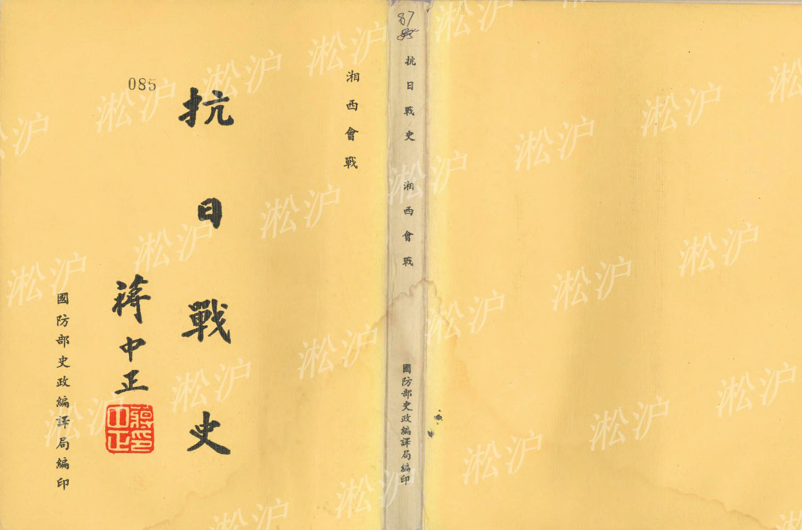

## 第三十六章 湘西會戰概述

### 第一節 會戰前狀況

#### 第一款 敵軍

#### 第二款 我軍

#### 第三款 兵誌概要

第二節 我軍作戰指導第一款 軍事委員會之作戰指導方案第二款 陸軍總司令部之作戰計畫第三節 會戰一般經過第一款 守勢時期

#### 第二款 攻勢時期

#### 第三款 追擊時期

#### 第四款 會戰後之狀況第四節 重要戰鬥

第一款 新寧武陽武岡瓦屋塘黃土塘高沙各地區之戰鬥第二款 城步眞良梅口武陽武岡地區之戰鬥第三款 邵榆公路及其兩側地區之戰鬥目

錄

一

邵陽西北至龍潭司間地區之戰鬥第七　一

第五款 藍田新化洋溪橋大橋邊間地區之戰鬥一

第六款 寧鄉益陽桃花江與山門及灘頭各地區之戰鬥二

第五節 空軍作戰　四三

第六節 後方勤務　四五

第一款 會戰前後勤設施　四五

第二款 守勢時期後勤支援概況四六

第三款 攻勢時期後勤支援概況五〇

第四款 追擊時期後勤支援概況五二

第五款 醫療後送概況　五三

第七節 檢討　五五

## 第三十六章 湘西會戰

民國三十四年四月九日

至同年六月七日

概述

民國三十四（一九四五）年春，因美軍在太平洋戰區實施對敵越島攻略後，節節近迫其本土，四月一日，美軍登陸琉球羣島，敵之內衛防線遂遭突破，印緬戰區方面，亦因盟軍反攻，進展迅捷，仰光告急，復以其海軍慘遭覆沒，海上交通維護困難，敵孤懸於中南半島及殘存於南洋羣島之數十萬大軍，補給勢將中斷，其在中國大陸之成勢，亦呈再衰三竭之象，其盟友德國在歐洲亦計窮力竭，瀕於崩潰，敵爲振奮民心，鼓舞士氣，挽救其危殆之國勢計，在政略上乃積極謀求調整日蘇關係，離間盟國情感，在戰略上則企圖妨止美軍在我沿海登陸，及打擊我反攻作戰準備，於是湘、桂方面我第三、第四兩方面軍之守備地區，遂成爲敵軍必爭之目標，尤以第四方面軍當湘黔兩省之衝要，扼川黔交通之咽喉，土地肥沃，物產豐富，控山川之險，擅舟楫之利，一可沿湘黔公路直趨貴陽，以威脅昆明，遮斷我西南與西北之交通，一可沿川湘公路直叩四川門戶，壓迫我戰時首都——重慶，且能因利乘便擊滅我野戰軍，掠奪我湘西資源，並可摧毀我空軍芷江基地，解除其後方遭受襲擊之痛苦，除於三月間在豫西、鄂北發動攻勢外，復於三月下旬，抽調湘桂部隊，分別集結於全縣、東安、邵陽、湘鄉、寧鄉、沅江等各附近地區，自四月九日起，以分進合擊之態勢，向我湘西要地——芷江進攻，其左翼兵團由新寧、武岡及新寧、武陽向洪江進攻，中央兵團由邵陽沿邵榆公路及其兩側地，右翼兵團由永豐、新化併向安江進攻以一部由沅江、寧鄉向常德、桃源、益陽進攻，策應其主力方面作戰，企圖先期包圍殲滅我野戰軍於沅水以東地區，爾後再分由安江、榆樹灣及洪江一舉攻佔芷江、我軍事委員會洞燭其奸，以湘西爲川、黔屏障，且爲反攻基地，對進攻之敵，決予殲滅打擊，俾確保芷江要地，以利爾後反攻，遂採後退包圍之戰略指導方針，逐次誘敵深入，至四月下旬，第四方面軍在武岡、江口、新化之線行輟強抵抗，第十集團軍由石門、澧縣南下，拒敵於寧鄉、益陽之線，以牽制敵之行動，第二十七集團軍由湘、黔邊區向武陽、武岡地區進出，攻擊敵之側背，並空運新編第六軍於芷江集結，五月八日，我依空軍之協力，全線反攻，以鉗形攻勢，將敵分別包圍，至二十七日，敵大部就殲，迄六月七日，遂完全恢復原態勢，造成抗戰未期之空前勝利，時值聯合國在舊金山召開會議，及我國國民黨第六次全國代表大會在陪都開幕之際，中外觀瞻所繫，其影響於國際聲譽及國內人心者至深且鉅，本會戰不僅獲致殲滅敵軍確保湘西要地與資源之輝煌戰果，更能奠定反攻之基礎。

### 第一節 會戰前狀況

參照插

表第一

#### 第一款 敵軍

參照插

表第一

敵軍爲攻略湘西，進仕芷江空軍基地，以打擊我反攻準備，及鞏固其交通線與減少空中威脅，自民國三十四年三月下旬起，先後以第六十八師團主力於義寧、桂林間，第三十四師團於興安，全縣間，第六十八師團之第五十八旅團於東安、洪橋間，第四十師團於衝陽、衝山間，第一一六團，獨立山砲第二聯隊，獨立工兵第四十聯隊，獨立第八十六旅團於邵陽（寶慶）附近，第四十七師團主力於永豐、湘鄉、湘潭間，第六十四師團於長沙、寧鄉、沅江間，獨立第十七步兵旅團於岳陽、華容間，獨立第五步兵旅團於監利、沙市間，僞和平軍第二師於金蘭市、余田橋間等地區分別集結，待機蠢動，同時敵第二十七師團亦向曲江、郴縣一帶集結，並在義寧、東安各附近大量徵用民伕，於永豐、邵陽方面亦時有敵小部隊行威力搜索，及在邵陽屯備糧彈，修路架橋，迄至四月初，集結兵力已達十餘萬衆，完成作戰準備，冀遂其西窺深入之企圖。

#### 第二款 我軍

參照插表

第二第三

我第四、第六、第九各戰區部隊，自民國三十三年五月以來，相繼參加長衡、桂柳會戰，並經常對湘桂、衡邵、潭邵、長衡各路沿線施行突擊，破壞敵後交通，轉戰日久，傷亡損耗未及補充整訓、迄三十四年四月初旬，第三、第四兩方面軍及第六戰區，各以一部沿廣西之龍勝、資源，湖南之新寧及邵陽、湘鄉、寧鄉以西地區至益陽，再亘洞庭湖沿岸迄南縣、公安，佔領七百餘公里正面之陣地，主力分別控置於鎮遠、錦屏、靖縣、瓦屋塘、洞口、隆迴司、淑浦、新化、桃源、石門各附近地區，第八十六軍亦推進至秀山附近，準備機動使用，並對第十八軍、第一百軍、第七十三軍、第七十四軍、第九十四軍等部從事整編，換裝美械，以作反攻準備，詎甫及實施，敵卽向我進攻，致各軍之整編中止，乃由軍事委員會參謀總長兼中國陸軍總司令何應欽上將，統一指揮該方面之作戰。

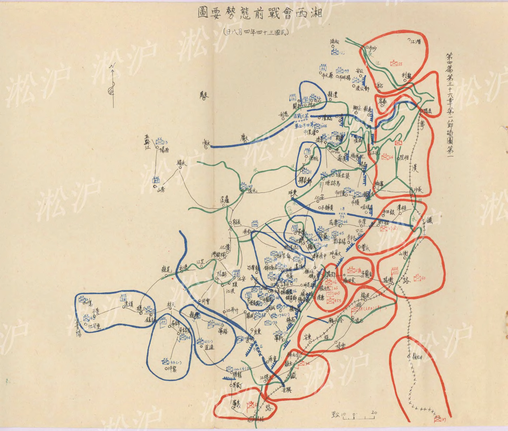

# 第四篇第三十六章第一節插表第二

第四方面軍

王耀武

第七十四軍

施中誠

第七十三軍

韓

第十八軍

胡

璿

第十一師

楊伯濤

第三十一團

尹鍾嶽

第三十二團

張滌瑕

第三十三團

李樹蘭

第五十二團

沈熙文

第五十三團

尹俊

第五十四團

李維勛

第三五二團

楊國傑

第三五三團

余坤

第三五四團

黃述三

第四十三團

黃玉谿

第四十四團

張伯侯

第四十五團

王一心

第七十七師

唐生海

第二三零團

柏柱巨

第二三一團

陳運武

暫編團

鄭焯

第五十七師

李琰

第五十八師

蔡仁傑

第一七二團

明

燦

第一七三團

蔣立光

第一七四團

李運良

第五七七團

傅佑任

第五七八團

車政直

第五七九團

王政

黃德濤

第一團

黃健

第二團

陳慕賢

第四四六團

第四四七團

第四四五團

第五十五團

陶富業

第五十六團

第五十五團

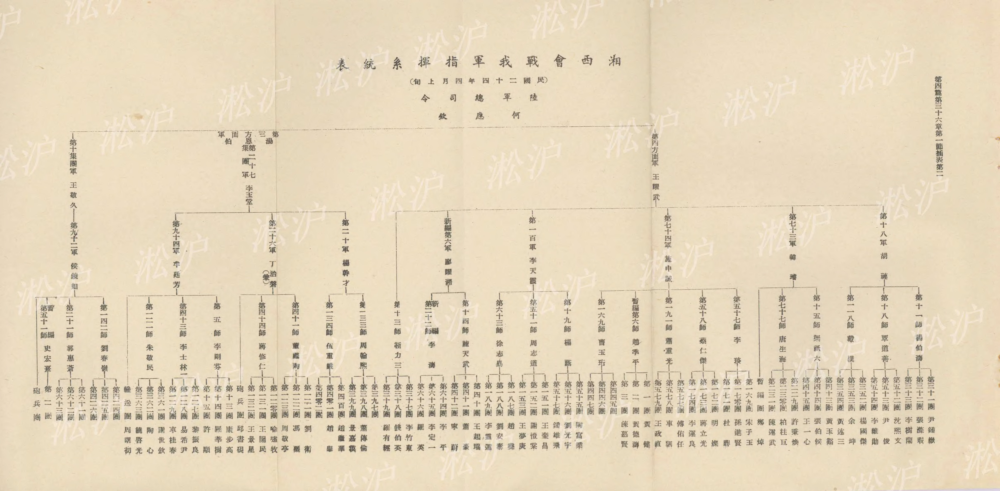

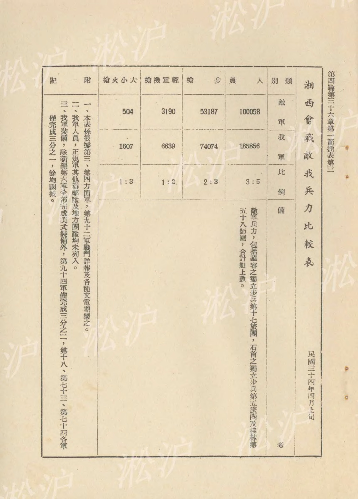

#### 第三款兵誌概要

參照插

圖第二

湘西爲湘省西部地區之簡稱，本會戰範圍，以邵陽、新寧、芷江間地區爲主，境內多山，五嶺山脈橫亘南部，與黔、桂爲界，其支有武陵、雪峯兩山脈，向東北伸展，蜿蜒於澧、沅及沅、資諸水之間，層巒聳峙，尤以雪峯山脈中之白馬山爲最，海拔高達二千公尺，河川以資水、沅水爲主幹，縱貫境內，匯注於洞庭湖，其支流有辰巫渠、清水河諸水，帆船多可通行，公路有京黔、川湘、衡邵、潭邵諸幹線，邵陽舊爲寶慶府治，瀕資江右岸，公路四達，舟楫稱便，爲湘西重鎮之一，芷江舊爲沅州府治，位沅江西，湘黔鐵路及京黔國道，咸取道於此，當湘、黔兩省之衝要，川、黔交通之咽喉，東有雪峯山脈爲屏障，對湘桂地區，進攻退守，頗擅形勢之利，氣候屬大陸性，春夏多雨，濕度頗大，對行軍作戰，頗有顧慮。

### 第二節 我軍作戰指導

民國三十四年三月，軍事委員會以湘、桂、粵等省之敵調動頻繁，並在全縣、東安、衡陽，邵陽、湘潭等地區集結兵力，似有西窺企圖，乃策定湘西作戰指導方案如左：

#### 第一款 軍事委員會之作戰指導方案

軍事委員會湘西作戰指導方案

其一敵情判斷：

一、粵漢、湘桂兩鐵路之敵，有抽集三個師團以上之兵力，將分路會攻我芷江要地，以排除其大陸交通線及部隊空中威脅之企圖。

二、判斷敵主力進攻方向公算最大者，爲由邵陽、永豐一帶，沿邵榆（榆樹灣）公路及其以北地區，分路進攻芷江、辰谿，次爲由桂林經桂穗公路，攻三穗、芷江，而常桃方面，可能以有力一部或小部份進擾策應，至其作戰方式，當不外分路、分股、鑽隙、迂迴攻達目標後，肆意擄掠，而破壞我之反攻設施。

其二作戰指導

第一方針

陸軍總部及第六戰區有協同確保芷江要地之任務，各準備有力兵力，適時進出邵榆公路、桂穗公路及常桃方面，協同第四方面軍擊破進攻之敵。

本作戰準備，期於三月下旬完成之。

第二

指導要領

一、第四方面軍（第十八軍、第七十三軍、第七十四軍、第一百軍）應以主力控置邵榆公路，各以有力一部控置新化、溆浦及常桃方面。

二、第三方面軍，以第八十七軍任桂穗路之作戰，並控置第九十四軍、第九軍，必要時，第十三軍一部於要地機動使用。

三、陸軍總部準備以新編第六軍，第六戰區準備抽調一個軍（王敬久集團主力），及現任清鄉之第八十六軍主力，策應作戰。

四、各部隊之行動如左：

(一)如敵以主力沿邵榆公路，以各一部沿桂穗公路，及常桃方面會攻芷江時，第四方面軍主力應固守雪峯山南北之線，並依第九十四軍、第八十六軍主力之增援，轉移攻勢。

依情況，第九軍推進芷江附近，新編第六軍推進馬場坪、黃平一帶，增援作戰。

常桃方面：第六戰區一個軍（三個師），協同第十八軍一部，擊滅進攻之敵於桃源附近地區。

桂穗公路方面：第八十七軍應確保通道附近險要，擊滅進攻之敵，掩護第四方面軍之側翼。

(二)如敵以主力沿邵榆公路，以有力一部沿桂穗公路，或常桃方面會攻芷江時，第四方面軍主力應固守雪峯山南北之線，依第九十四軍、第八十六軍主力及第九軍一部或主力增援，轉移攻勢。

常桃方面：第六戰區一個軍（二至三個師）。協同第十八軍一部或主力，擊滅進攻之敵於桃源附近地區。

桂穗公路方面：以第九軍主力或一部，適時增援第八十七軍之作戰，擊滅進攻之敵於通道附近地區。

依情況，新編第六軍推進馬場坪、黃平一帶。

(三)如敵以主力沿桂穗公路，以有力一部沿邵榆公路，及常桃方面（可能係一部），會攻芷江、三穗時，第四方面軍除以主力控置邵榆公路外，一部（一個軍）機動使用於桂穗公路之東側地區，協同第九十四軍、第九軍增援第八十七軍之作戰，夾擊包圍敵人於通道、清縣地區而殲滅之。

必要時，得抽調第十三軍之一部，及第八十六軍主力推進三穗附近，策應作戰。

依情況，新編第六軍推進至馬場坪。

常桃方面：第六戰區一個軍（二或三個師），協同第十八軍，擊滅進攻之敵於桃源附近地區。

五、我配置粵漢、湘桂兩路各突擊隊，應積極襲破敵後交通。

六、第四、第六、第九各戰區，及黔、桂、湘邊區發動牽制攻勢，策應該方面之作戰。

七、何兼總司令應預設指揮所於鎮遠，統一指揮。

第三

其他

其餘空軍、後勤部份，另行策定。

軍事委員會委員長

蔣中正

蔣委員長復於四月八日指示何應欽總司令如左：

一、湘、粤、桂敵似有抽集約七個師團兵力，向芷江及常桃進攻之企圖。

二、以確保芷江機場，並利爾後反攻爲目的，以第四方面軍所屬部隊爲主力，務於洪江、溆浦以東地區，選定主陣地與敵決戰。

三、第三方面軍及第六戰區，應各以有力部隊，策應湘西方面作戰。

四、各部隊應從速完成作戰準備。

五、希遵照上列指示，速擬具作戰計劃呈核。

#### 第二款 陸軍總司令部之作戰計畫

陸軍總司令部湘西作戰計劃要旨：

一、第四方面軍，應以主力於武岡、新化附近之線與敵決戰。

二、第三方面軍，應以第九十四軍先集結通道縣、清縣地區，準備向武岡以東進出，參加第四方面軍之決戰。

三、第十集團軍王敬久總司令率所部三個師，及第十八軍之一個師，準備由常桃向新化以東進出，協力第四方面軍之決戰。

四、新編第六軍，應準備一個師空運芷江，爲第四方面軍之總預備隊。

五、爲保障第四方面軍之作戰安全，第三方面軍應確實拒止黔桂鐵路及桂穗公路之敵，使不得越過南丹、龍勝兩要地。

### 第三節 會戰一般經過

民國三十四年四月九日至六月七日

參照插圖第三插表第四至第八

#### 第一款 守勢時期

民國三十四年四月九日至五月七日

參照插圖第四第五第六

敵第二十軍所屬邵陽方面之主力第一一六師團及特種部隊，共約二萬餘人，於民國三十四年四月九日起，首以一部偷渡資水，佔領橋頭陣地，掩護主力西渡，同時永豐方面之敵，右翼兵團第四十七師團之一部，亦經黑田舖向我第七十三軍當面進攻。

四月十一日，何應欽兼總司令，爲策應第四方面軍之作戰，乃下達命令，其要旨如左：

一、着暫編第六師改歸第四方面軍指揮，擔任芷江機場之守備。

二、湯恩伯司令官，卽轉飭第九十四軍迅速完成作戰準備，待命向芷江附近推進，協力第四方面軍之作戰。

三、第三方面軍，卽增強黔桂路、桂穗路之防務，並作策應第四方面軍作戰之準備。

四、第六戰區策應軍，卽與第四方面軍密切連絡，並迅速完成作戰準備，以主力適時推進至常德、桃源以北地區，協力第四方面軍之作戰。

敵爲協同沿邵榆公路、及其兩側地區西進主力軍之作戰，於十二日起，除其右翼兵團第四十七師團之第八十七聯隊，進抵孫家橋西南地區，與我第七十三軍激戰外，其由第三十四師團主力，及第六十八師團之第五十八旅團之一部，組成之左翼兵團，分由東安、全縣兩路向新寧方面進攻，其中央兵團之右縱隊，第一一六師團主力之第一零九聯隊及第一三三聯隊一部，於邵陽西北地區向西進攻，十三日，沅江之敵，第六十四師團之一部二千餘衆，向益陽方面進攻，策應其第二十軍之作戰，十四日，敵左翼兵團與我第七十四軍激戰於新寧以南地區，敵中央兵團右縱隊亦進抵巨口舖，與我第一百軍激戰，敵右翼兵團進至資水右岸，沅江之敵，時亦進抵益陽城郊，我第十八師當予阻擊。

四月十四日，何應欽兼總司令，爲迅速完成作戰準備，俾利於作戰計，卽下達命令，其要旨如左：

甲

要領

一、第四方面軍，以主力於武岡、新化附近之線，與敵決戰。

二、第三方面軍，以第九十四軍先集結通道、靖縣地區，準備向武岡以東進出，協力第四方面軍之決戰三、王敬久總司令，率所部一個軍及第十八軍之一個師，準備由常德、桃源向新化方面進出，協力第四方面軍之決戰。

四、由以上一、二、三項之部署，期於武岡、新化以東地區，擊破來攻之敵。

五、新編第六軍（時在雲南霑盆），卽準備一個師空運芷江，爲第四方面軍之總預備隊。

六、爲保障第四方面軍之作戰安全起見，第三方面軍應確實拒止黔桂路及桂穗路之敵，使不得越過南丹、龍勝兩要地。

乙

各兵團行動

一、第四方面軍主力，（第七十三軍、第七十四軍、第一百軍）立即完成在武岡、新化一帶地區之決戰準備，其第十八軍立即抽調一個師，集結於馬跡塘、安化附近地區，歸王敬久總司令指揮，限四月二十日集結完畢，準備向南之攻擊行動，其餘兩個師，就旣設陣地完成作戰準備，拒止由長沙、岳陽方面來攻之敵。

二、第九十四軍，卽由現駐地出發，徒步向通道、靖縣地區集結，限四月底集結完畢，其笨重器材，另飭後勤部派車運輸。

三、第十集團軍之一個軍，卽開始行動，向常德、桃源地區集結，限四月二十五日前集結完畢，並指揮第十八軍之一個師，準備向西南之攻擊行動。

四、第三方面軍，準備一個軍（第十三軍），待命向馬場坪、鑪山一帶地區推進，作機動使用之準備五、第四方面軍突擊隊，卽加強活動，襲擊敵後，遮斷其補給連絡，並對進攻敵之後方予以擾亂破壞。

丙陣地設備

武岡、花園市、洞口、賽市、新化、烟溪、馬跡塘、桃源、常德間之旣設陣地，卽加強工事，並完成給養、給水、屯粮、屯彈諸設備。

丁決戰地帶後方之設施

卽在後方要點屯粮、屯彈，設備交通、通信、空中投擲場等，並擇要盡先完成之。

四月十五日，各部奉令後，從事部署，其概要如左：

甲

第三方面軍之部署

參照插圖第四

一、以第二十六軍之第四十四師，在城步擔任第九十四軍集中之掩護，並相機威脅由新寧向西北進攻敵之側背，以策應第四方面軍之作戰。

第三其他

戰

史

二

二

二、以第九十四軍，於四月十七日由黃平、鎮遠出發，四月二十八日到達長舖子、綏寧集中地區，完成作戰諸準備。

乙第四方面軍之部署

參照插圖第五

一、第七十四軍（附第十九師之第五十七團），以一部守備武岡、新寧，一部於邵榆公路堅強拒止西進之敵，主力佔領雪峯山東麓、珠玉山、張家賽、李家山、花園市、洞口、山門一帶陣地。

二、第一百軍（欠第十九師之第五十七團），以一部守備烏樹下、馬玉坳、大橋邊、順水橋、龍溪舖、巨口舖各據點，主力攻擊深入賽市附近之敵。

三、第七十三軍以一部守備資水右岸連溪橋、藍田、楊家灘一帶陣地，主力集結於資水左岸新化及其以南地區，準備擊破西渡資水之敵。

四、作戰地境如左：

第七十四軍第一百軍間：龍潭司、賽市、馬家橋、邵陽城北端相連之線，線上屬左。

第一百軍第七十三軍間：水車、關王橋、滿竹冲、鐵鎖坳相連之線，線上屬左。

同日，蔣委員長下達令一元西電：「着第十三師卽開辰谿，限卯馬（四月二十日）前到達，到達後暫歸王耀武指揮」。第四方面軍奉令後，當卽轉飭遵照。

四月十六至十七日，第七十四軍方面之敵，進陷新寧，沿邵榆公路及其兩側進攻之敵中央兵團，向岩口舖、桃花坪猛攻，桃花坪陷入敵手，邵陽西北之敵，分攻烏樹下、馬玉坳、巨口舖、龍溪舖各據點，我馬玉坳、巨口舖之守軍，與三倍以上之敵英勇激戰，凡三晝夜，終以衆寡懸殊，均全部壯烈殉職。同時敵四百餘進抵白馬山，更西竄放洞附近，第四方面軍當飭第七十四軍之第五十一師歸第一百軍指揮，擊滅深入放洞之敵。

四月十八日至二十二日，我第一百軍之一部開始攻擊放洞之敵，敵據險頑抗，戰况激烈，馬玉均西攻之敵，於土嶺界西北地區，與我第一百軍之另一部激戰，敵不支向放洞附近退竄，我第七十三軍當面之敵，與我在新化以南激戰，沿邵榆公路西進之敵，向高沙市猛攻未逞，益陽、寧鄉敵，西攻桃花江、大成橋，經我十八師一部擊退，我軍跟踪追擊，進迫寧鄉、益陽城郊，與敵對峙。

四月二十三日，新寧之敵，分路繼續進攻，其一部北攻武岡，主力西攻眞良，我第七十四軍及第二十六軍各以一部分途截擊，敵負創甚重，沿邵榆公路及其以北地區之敵，續向高沙市、山門猛攻，經我第七十四軍之一部阻擊，均未得逞。

同日十二時，何應欽兼總司令，爲增強第四方面軍之右側及第三方面軍黔桂路正面之防務，特以忠整興電令調整部署，其要旨如左：

一、第九十四軍（欠第四十三師）立即改向會同、靖縣地區集結，並限四月底前集結完畢。

二、第四十三師守芷江機場之一個團，仍留芷江擔任警備任務，該師主力應集結三穗。

三、第十三軍（欠第五十四師），立即集中貴定、馬場坪、麻江地區，限四月二十九日前集結完畢，該軍第五十四師仍駐貴陽。

四月二十四日，何應欽兼總司令，爲擊滅湘西進攻之敵，於十二時下達忠整興電令，其要旨如左：

一、第十集團軍（第九十二軍暫編第五十一師），速以主力接替第十八軍常德、桃源、益陽、寧鄉方面之防務，拒止當面之敵，限四月底接替完畢。

二、第四方面軍主力（第七十四軍、第一百軍、第七十三軍），應於武岡、洞口、新化之線，竭力阻止來攻之敵，使爾後之決戰有利。

第十八軍主力，照前令於四月底前集結於沅陵，並依情況可不待集結完畢，卽經沅陵、溆浦道南下，參加該方面主力決戰，第十八師於交防後，沿安化、藍田道向邵陽方向挺進，以遮斷敵後之交通，使主力軍作戰有利。

三、第十三師於到達辰谿後之行動，由王耀武司令官自行規定。

四、第九十四軍（欠第四十三師）遵照前令所示，限四月底前集結會同、靖縣地區，爾後之任務及行動，另令飭遵。

五、新編第六軍之新編第二十二師，控置於芷江，保持機動。

六、第三、第四兩方面軍，對新寧、城步、綏寧方面之作戰，不受該兩方面軍作戰地境線之限制，應密切連繫，彼此協同，以達殲敵之目的。

七、作戰地境如左：

第十集團軍與第四方面軍間：爲東坪、橫舖子、太和橋、石壩咀、銀田市、湘潭城南端相連之線，線上屬左。

第十集團軍與第六戰區間：爲永順、大庸、慈利、臨澧、安鄉亘洞庭湖北岸至岳陽之線，線上屬第六戰區。

第四方面軍與第三方面軍間：仍照前令規定。

各部奉命後，當卽轉飭各軍遵照，同時第十三師已到達銅灣市、新路河間地區，卽飭推進至龍潭司西側平山塘、昇平里之線佔領預備陣地，由第三方面軍撥歸第七十三軍建制之第一九三師，由貴州獨山到達戰場後，第四方面軍卽飭該師暫歸第七十四軍指揮。

四月二十五日，何應欽兼總司令，爲增強第四方面軍主力作戰，復於十七時下達卯有酉忠整興電令，其要旨如左：

一、第一九三師改歸第七十四軍指揮，卽由瓦屋塘、江口間地區移會溆（安江南四十五公里）附近集結，先頭部隊四月二十六日到達。

二、第一四九師卽移團河、竹舟江、王家坪間地區集結。

三、第十三師卽由銅灣市、新路河移賓頭、洪江間地區集結。

四月二十四日至二十九日間，眞良之敵，向武陽進攻，激戰三日，武陽陷敵，沿邵榆公路西進之敵，分攻洞口、高沙市，更復分股鑽隙進抵江口以東地區，經我第七十四軍之一部奮勇反擊，敵死傷慘重，新化以南地區之敵，向洋溪橋西南地區進攻，企圖進出新化、溆浦，我第七十三軍予以阻擊，桃源、常德、益陽、寧鄉方面之防務，由第九十二軍接替，掩護第四方面軍左側背之安全，第十八軍開始向沅陵集結，並由沅陵、溆浦道南下，協力第四方面軍主力決戰。

何應欽兼總司令爲加強第四方面軍右翼之作戰，特調整部署，於四月二十六日十六時下達卯寢申忠整興電令，其要旨如左：

一、第九十四軍（欠第四十三師所屬守備芷江之一個團）歸第二十七集團軍李玉堂總司令指揮。

二、第二十七集團軍主力固守桂穗路及其兩側地區，拒止敵人於龍勝以南。

三、第九十四軍迅速向城步推進，求敵外翼而擊破之，並隨情況發展，以主力向武岡東南地區進出，協力第四方面軍決戰，該軍進出不受第三、第四方面作戰地境之限制。

四、第二十七集團軍，務與第四方面軍密切連繫，協同作戰。

第三方面軍，於二十七日接奉何應欽兼總司令忠整興電令後，當卽策定作戰指導方案，其要旨如左本方面軍爲協力第四方面軍之作戰，以一部固守南丹、龍勝各戰略要點，並極力遲滯由新寧竄攻之敵，於梅口以南地區掩護第四方面軍右側背之安全，以有力之一個軍集結於靖縣、綏寧地區，保持機動，求敵外翼而攻擊之，爾後進出武岡以東地區，與第四方面軍協力包圍敵人於戰場而殲滅之。

第二

指導要領

一、第一線部隊務阻敵於城步、梅口以東地區，掩護第九十四軍之集中，爾後移於外翼，掩護該軍右側背之安全，並威脅敵之側背。

二、第九十四軍，於四月二十八日前集結靖縣、綏寧附近地區。完成攻勢諸準備，求敵外翼而攻擊之，爾後向武岡以東地區進出，協同第四方面軍圍殲西攻之敵。

三、本方面軍主力，仍於原駐地集結，積極調撥裝備及整訓。

同時何應欽兼總司令爲使湘西會戰有利，復規定各後續部隊行動，乃下達卯感午忠整興電令，其要旨如左：

一、新編第二十二師全部到達芷江後，應卽向洪江、安江地區集結待命。

二、第十八軍主力第十一師、第一一八師，應推進集結於溆浦、大江口地區，準備由溆浦南下，協力第四方面軍左翼決戰，其第十八師於交防後，可由新化方向向南進出，衝擊敵軍側背，使主力軍作戰有利。

四月三十日至五月七日，武陽之敵，分向西、北兩路進攻，其西攻之敵，被我第一九三師於會溪以東地區輟強拒止與反擊，敵不逞囘竄，其北攻之敵，經唐家坊向瓦屋塘攻擊，經我守軍奮勇阻擊，敵受重創，同時我第三方面軍之第九十四軍先頭部隊，向武陽之敵攻擊，經激戰後，擊破敵之抵抗，遂進佔武陽，並繼續向北攻擊前進，我第一九三師同時協力向東攻擊，殘敵不支，退據橋當頭、江口以東地區在洞口之敵，雖續向我陣地攻擊，均遭我軍堅強阻擊，其攻勢已呈衰竭之象，放洞之敵，在我陸空密切協力圍攻下，傷亡慘重，一部向山門方向潰竄，殘敵仍憑險頑抗，洋溪橋西南地區之敵，經我軍猛烈反擊，敵乃退據洋溪橋以南山地頑抗，我第七十三軍續向該敵攻擊外，並以第十八師迂迴敵後，同時另以楊支隊向南挺進，進佔巨口舖，於該地以南與由石馬江北進之敵激戰，我第十八軍到達艾花坪、隆迴司地區，並分向賽市及山門之敵攻擊，當攻克賽市，湘鄉之敵，曾一度鑽隙進攻濛水，當被我軍一部奮勇擊退。

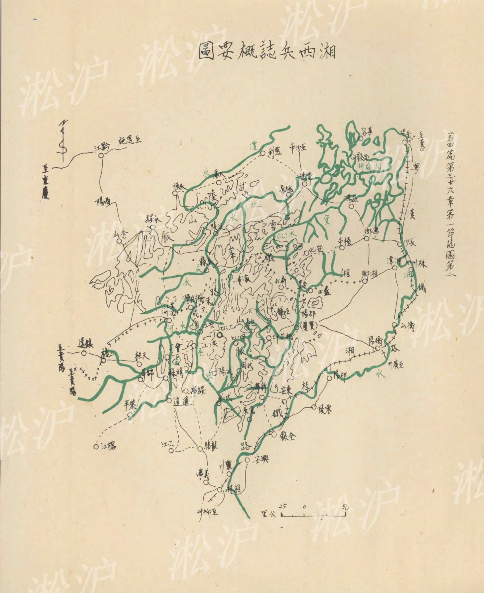

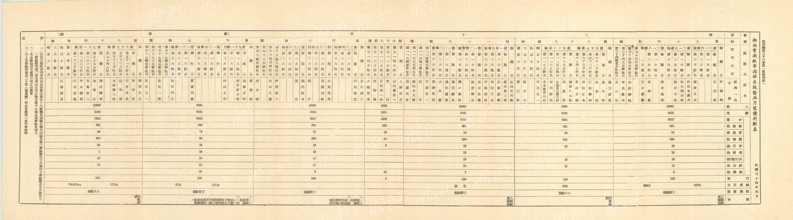

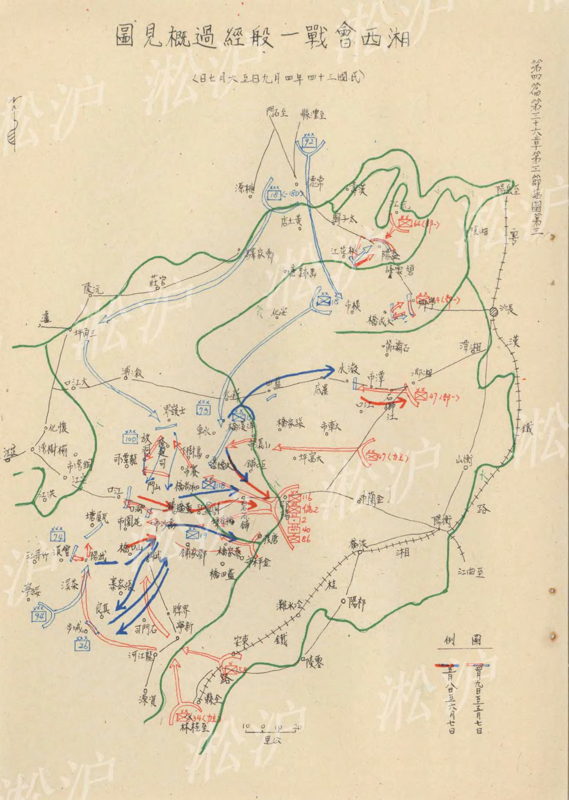

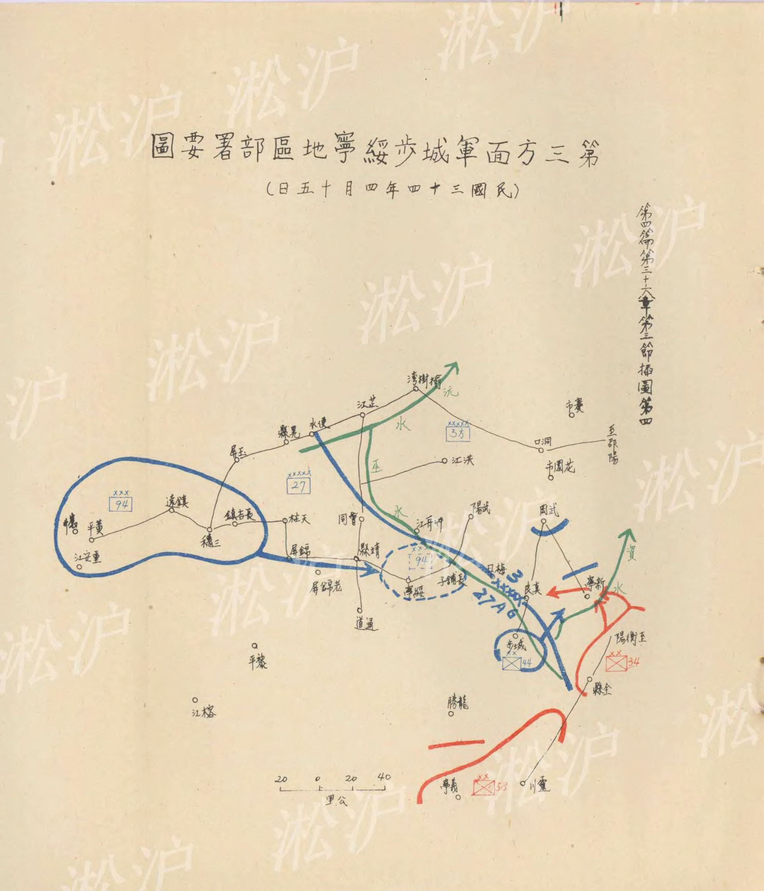

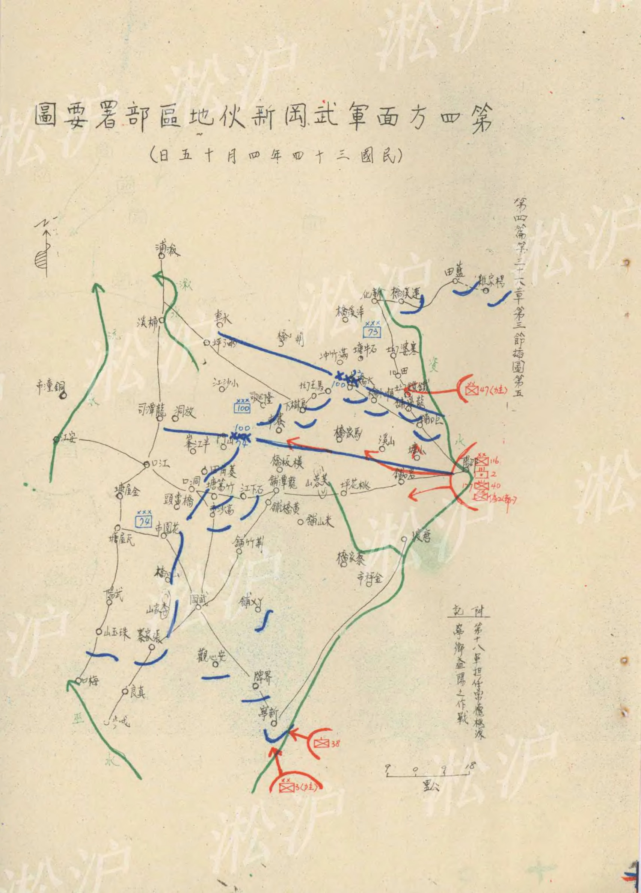

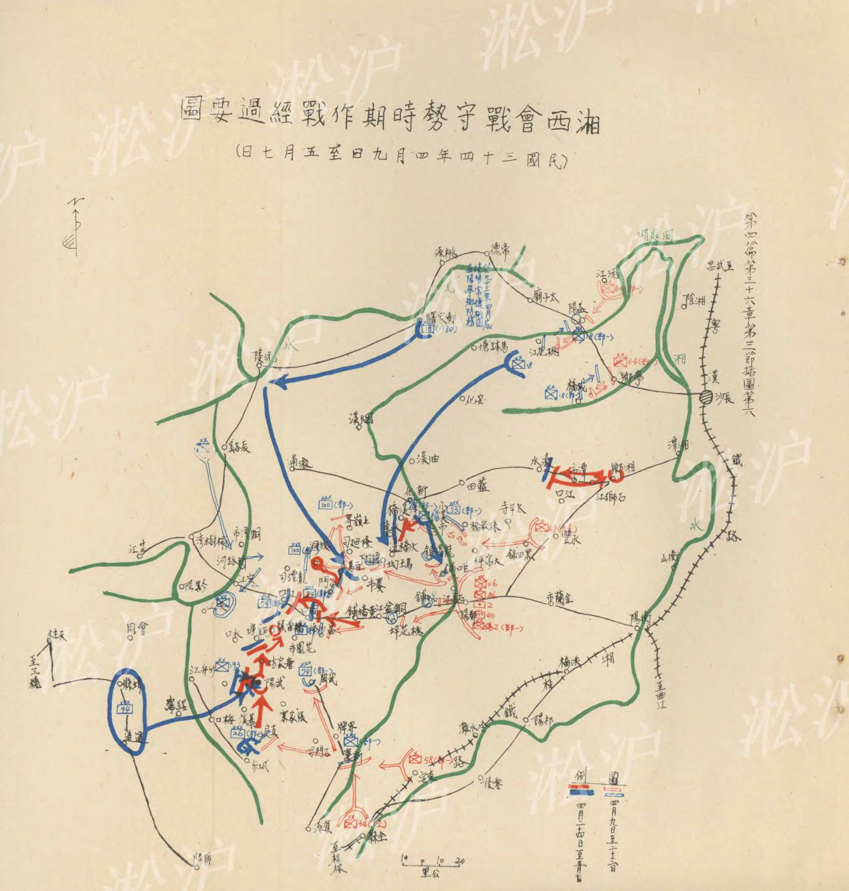

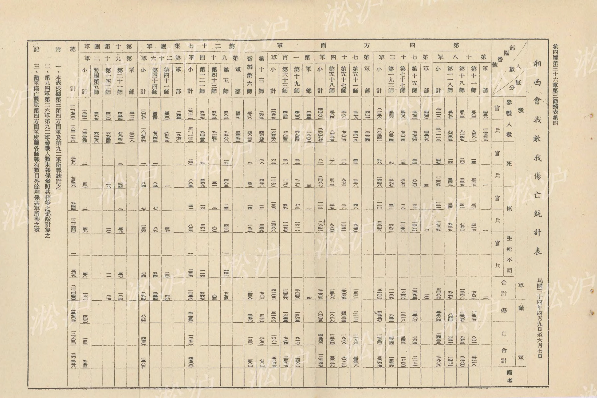

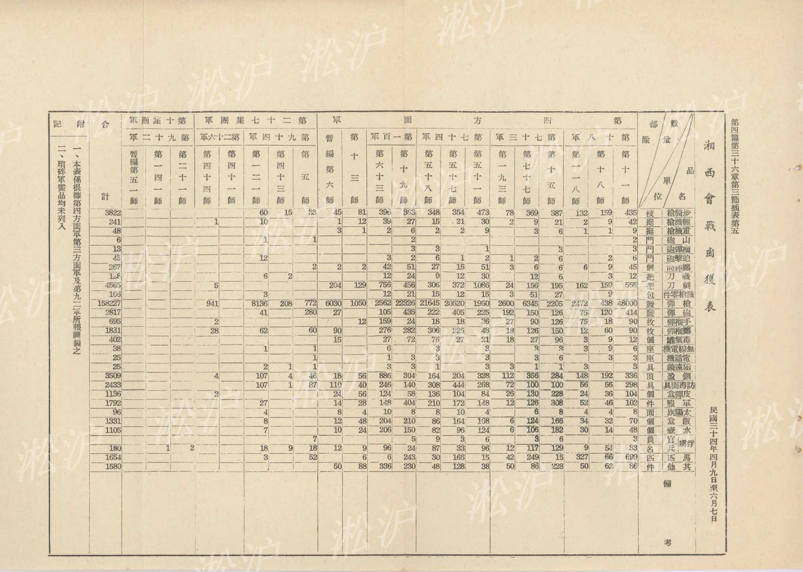

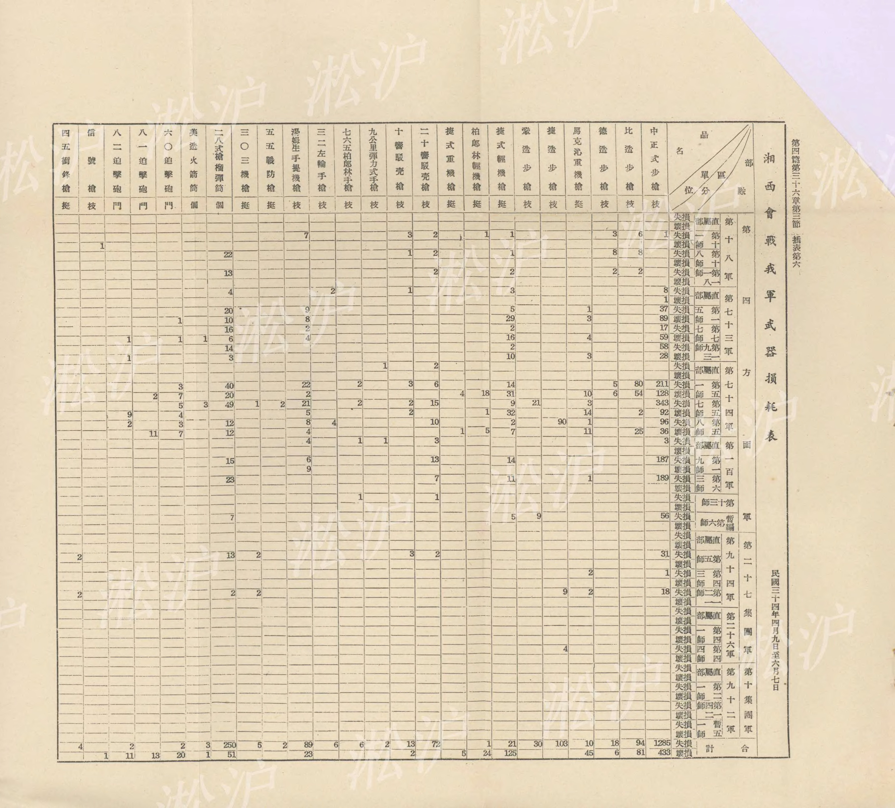

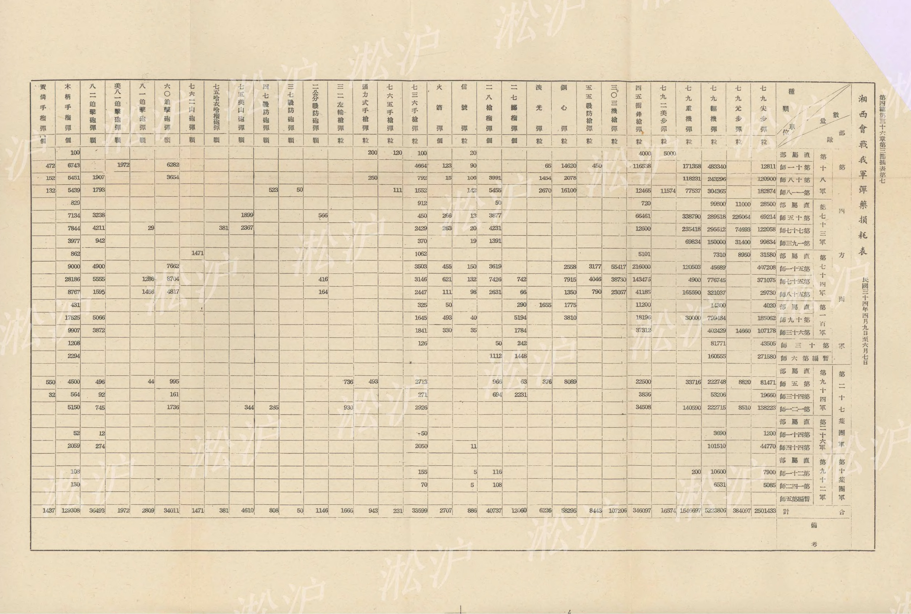

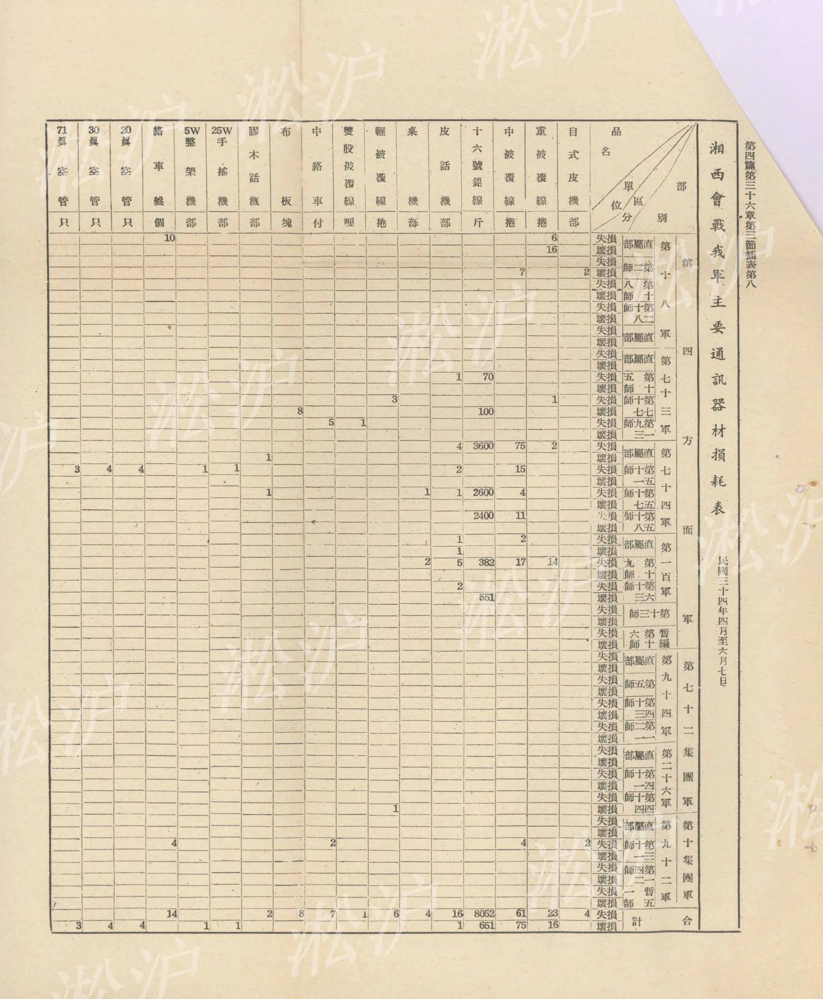

#### 第二款攻勢時期

民國三十四年五月八日至十一日

參照插圖第七第八

進攻湘西之敵，經我各軍連日奮勇拒止包圍截擊，其形勢已呈衰竭之象，何應欽兼總司令綜合當前狀況，乃決心轉移攻勢，特於五月四日十五時下達忠整戰電令，其要旨如左：

一、攻勢轉移之目標，爲擊滅進攻之敵，恢復我資水左岸之原陣地，並相機攻略邵陽。

二、亘攻勢轉移全期間所需之糧彈補給，應儘速於五月十五日左右全部準備完畢，並分屯完成，攻勢轉移開始之日期，卽以糧彈準備完成之日期爲準。

三、新編第六軍歸王耀武司令指揮，其新編第二十二師立即向江口推進，協同江口附近部隊之作戰，擔任江口正面公路上之防禦掩護，新編第六軍直屬部隊及第十四師，迅速向安江附近集中。

四、第二十七集團之第九十四軍主力，應與第四方面軍在安江、邵陽公路以南作戰之各部隊密切協同，務於五月十五日以前擊滅城步以北地區之敵，進出於武岡附近，準備協同第四方面軍擔任對安江、邵陽公路以南地區之敵攻擊，並務求敵之外翼包圍攻擊，其詳細計畫，由湯恩伯、王耀武兩司令官自行協定

五、第十集團軍應竭力拒止當面之敵，掩護我攻勢部隊之左翼。

六、第四方面軍所屬各部隊作戰之部署，由王耀武司令官依狀況自行決定，並立即擬定計畫具報。

七、攻勢轉移開始後，我各部隊應密切協同，全軍一齊猛烈進攻，如敵動搖，應不分晝夜與敵保持接觸，並應以鑽隙、迂迴、超越、追擊諸戰法，分別截擊包圍退却之敵，而殲滅之。

五月六日，我軍事委員會爲把握戰機，先後兩度電令何應欽兼總司令要旨如左：

一、五月六日，侍參電：「湘西方面之敵，已顯呈動搖模樣，爲捕捉戰機，希速飭第三、第四兩方面軍，對當面之敵，發動全線反攻，期在敵增援部隊未到達前，擊滅該敵爲要」。

二、五月六日十五時，侍參電：「湘西方面之敵，豕突兼旬，勢成弩末，現攻勢頓挫，已呈顯著動搖模樣，希卽捕捉有利時機，督飭第三、第四方面軍積極反攻，如敵崩潰，務速窮追，以衡陽爲目標，奠定全面反攻之基石爲要」。

同日，何應欽兼總司令，亦於十二時以辰魚午忠整戰電令補充指示，其要旨如左：

一、右翼方面應照五月四日十五時忠整戰電之規定，立即驅逐武岡附近及其以南之敵，並向武岡以東繼續攻擊前進。

二、中路及左翼方面，在補給確已無顧慮之條件下，其攻擊開始時間，由王耀武司令官自行決定。

三、關於新編第六軍之使用，其新編第二十二師，可參加此次攻擊，但其攻擊之目標須有限制，其第十四師，應在新編第二十二師之後方集結，在未集結完畢以前，暫不使用，其集結地點，由王耀武司令官規定。

第四方面軍奉令後，當卽遵照策定攻勢轉移計畫，並下達命令，其要旨如左：參照插圖第七一、方面軍决於五月八日拂曉全面轉移攻勢，置主、決戰於兩翼，協力右翼友軍，壓迫敵人於雪峯山東麓捕捉殲滅之。

二、第七十四軍（欠第五十一師第五十七師、附第一九三師、暫編第六師），除以一部於武岡、唐家坊、瓦屋塘各據點擔任守備外，其餘卽由塘家坊、瓦屋塘、金屋塘之線，攻擊當面之敵，重點保持於右，奏功後，卽由武岡經水浸坪、鄧家舖向栗山舖前進。

三、新編第六軍（欠第十四師附第五十七師），推進至江口附近，就攻擊準備位置，逐次攻擊肝溪、平江、下查坪及洞口附近之敵，奏功後，進出於斜雀塘、夾水江、菱角田之線。

四、第一百軍（附第五十一師），迅速肅清放洞附近之敵，爾後協力新編第六軍，向上查坪、半江峯一帶之敵攻擊，重點保持於右，奏功後，進出於天台界、拉水沖、月塘山、菱角田之線。

五、第十八軍（欠第十八師），卽集結於小沙口、隆迴司、黃泥井地區，攻擊當面之敵，爾後重點保持於右，奏功後，進出於新屋沖、黃橋舖、易家橋之線。

六、第七十三軍（欠第一九三師附第十八師），以主力迅速擊滅洋溪橋附近之敵，以有力一部卽集結於大橋邊附近，向灘頭、巨口舖等處之敵攻擊，重點保持於右，奏功後，進出於桃花坪、岩口舖、石馬江之線，掩護方面軍主力左側背之安全，並派小部隊向永豐、湘鄉之敵佯攻。

七、各軍之作戰地境如次：（線上均屬左方軍）。

第七十四軍、新編第六軍間：下坪、句岩山、王家溪、茶舖子、斜雀塘相連之線。

新編第六軍、第一百軍間：毛頭河、大坪、枳木界、半江、拉水沖、菱角田之線。

第一百軍、第十八軍間：桶溪、北斗溪、馬脛骨、竹篙塘、樟樹脚之線。

第十八軍、第七十三軍間：羅洪、烏樹下、馬家莊、栗山舖之線。

八、挺進第六縱隊，仍以灘頭附近爲根據地，襲擊邵陽、羅家廟、桃花坪、賽市、大橋邊、巨口舖間之敵，截斷敵連絡線，使主力軍作戰容易。

九、第十三師爲方面軍之預備隊，仍位於牛路口以東古佛山、昇平里之線，擔任守備，並準備機動使用。

五月八日參照插圖第十二我各部在空軍協力之下，全線轉移攻勢，至九日，第七十四軍以第五十八師攻擊橋當頭之敵，第一九三師主力協力第五十八師左翼之攻擊，一部攻擊茅溪、大灣一帶之敵，支援第五十七師之作戰，同時第五十七師、第十九師、第五十一師及暫編第六師各一部，猛烈攻擊江口東方敵第一一六師團主力，敵傷亡過半，其殘部東潰，我五十七師、暫編第六師跟蹤追擊，進佔現江、放洞附近地區之敵，與我第五十一師反復爭奪，傷亡慘重，其由山門馳援該地之敵一股，復被我第十九師將其擊潰，放洞殘敵不支，遺屍千六百餘具，向東南方向竄逃，適我第十八軍之第十一師，進至山門西北之蔬塘山、馬脛骨間地區予以截擊，同時第十八軍之第一一八師進佔橫板橋，其先頭部隊於龍潭舖、石下江各附近截擊東潰之敵，斬獲甚衆，第七十三軍之第十五師及第七十七師主力，攻擊洋溪橋南側之南山寨，敵第四十七師團之一部，戰鬥激烈，我各軍師長均親臨第一線指揮，士氣更爲振奮。

五月十日至十五日，第七十四軍攻佔橋當頭，敵向東且戰且退，該軍猛烈追擊，我右翼第九十四軍亦奮勇進至高沙市以南及黃橋舖一帶，第二十六軍之第四十四師已進至桃花坪西南地區，高沙市北側地區之敵，經我第九十四軍第一二一師及第一九三師協力攻擊，敵受重創，向荊竹舖方向突圍，復被第九十四軍之第五師截擊，乃向東潰竄，我第一九三師之一部繼續向黃橋舖、石下江間地區挺進追擊，暫編第六師協力洞口據點守軍，肅清洞口附近之敵，敵退據竹篙塘頑抗，我暫編第六師繼續予以攻擊，第十八軍之第十一師攻佔山門要點，斷敵退路，敵冒死反復向東南突圍，均被我第十一師阻擊未逞，我第一百軍各部復分途截擊，第六十三師並將敵第一零九聯隊長瀧寺保三郎擊斃，殘敵益形驚惶混亂，化裝潛匿深山，我第五十一師及第六十三師續行掃蕩，將該敵第一零九聯隊完全殲滅，南山寨之敵，被我第七十三軍主力猛烈攻擊，受創甚重，敵第四十七師團第一三一聯隊長重廣川島，亦被我擊斃，殘敵企圖南竄，當爲我擊回，我續由南山寨、月光山、蒼溪山各方面猛烈攻擊中，敵第四十七師團之另一聯隊，於七日由邵陽西北巨口鋪續攻順水、橋栗坪，我第十八師及楊支隊協力迎擊，經激戰後，敵傷亡慘重，殘敵竄龍溪舖西北之大坪、十字路，我楊支隊及第十八師繼續猛攻，使敵無喘息之餘暇。

五月十五日，第四方面軍爲擊滅當面殘餘頑抗之敵，乃調整部署，其概要如左：

一、第七十四軍由龍潭舖、德州、竹篙塘、茅舖一帶，攻擊石下江北側東西地區之敵，並以一部協力第十八軍截擊東竄之敵。

二、新編第六軍以一部掃蕩月塘山之敵，主力控置於江口附近，並整理交通。

三、第十八軍於十六日拂曉開始猛攻菱角田、岩山、金龍砦、黃虎砦一帶之敵，而殲滅之。

四、第七十三軍繼續肅清當面之敵。

五、第十三師主力推進至老隘塘、春竹溪間地區集結。

六、第一百軍清掃戰場後，控置於山門西北亘龍潭司一帶地區待命。

五月十六日拂曉，第七十四軍與第十八軍同時開始攻擊，暫編第六師右翼進佔竹篙塘，進迫金龍砦左翼，攻佔菱角田，第十八軍之十一師，攻佔紅廟及破塘以東高地，第一一八師攻佔黃虎砦，第七十三軍亦將南山寨附近各要點完全克復，殘敵南竄茅坪，我右翼方面第九十四軍之第五師及第一二一師各一部，繼向兩路口、芭蕉橋之敵攻擊，斬獲甚衆。

五月十七日，暫編第六師續佔岩山，第十一師亦連克大黃坵、爛屋沖、破塘等地，龍溪舖西北敵一部六百餘向西北增援茅坪，與敵會合，我第七十三軍乃以第十五師由南山寨向南，第十八師由羅洪、黃金坵向東，第七十七師由蒼溪山向西南合力圍擊，兩路口、芭蕉橋方面之敵，向米山舖方面潰竄，我當以有力之一部躡敵追擊中。

五月十八日，據報敵第三十四師團萬餘衆，於十六日晨由全縣再度北進，其先頭二千餘，十七日進抵新寧以南地區，時第九十四軍及第二十六軍在武岡及其以南地區，第四方面軍除續攻當面之敵外，並以第七十四軍主力集結於武岡西北地區，第一百軍除第五十一師仍位於龍潭司外，主力向高沙市、洞口各附近推進，同時暫編第六師攻佔土橋，與第一一八師協力猛攻。

十九日，我將金龍砦及水東橋以南各要點完全攻佔，殘敵紛向東潰。

五月二十日，第七十三軍將茅坪完全攻克，殘敵逐次南竄，暫編第六師及第一一八師進佔石下江、橫板橋，繼續追擊東潰之敵。

新寧方面之敵第三十四師團一部，經新寧竄抵馬頭橋附近，我第二十七集團軍爲阻敵再度北進，乃以第二十六軍之第四十四師於眞良、城步間地區集結，第九十四軍除追擊隊外，並以第四十三師佔領火燒界南北之線，相機側擊北進之敵，並掩護該軍主力於武岡南北地區集結。十九日第四十三師之一部，經石獅向新寧搜索前進，與敵於馬頭橋遭遇，該部當卽展開攻擊，敵不支退去，迄二十二日，敵大部後撤，第二十七集團軍乃以第四十四師掃湯新寧附近殘敵，第九十四軍以有力一部掃蕩米山舖附近之敵，並進出資水左岸地區，各部隊當卽遵照實施。

#### 第三款 追擊時期

民國三十四年五月二十一日至六月七日

參照插圖第九第十

自五月八日以來，我軍對橋當頭、現江、放洞及洋溪橋以南地區之敵，全線轉移攻勢，我官兵奮勇爭先，進展迅速，至二十日，全線之敵均告崩潰，殘敵狼狽向邵陽方面竄退，我爲一舉殲滅該敵計，決對東潰之敵，施行追擊，五月二十一日，第四方面軍下達追擊命令，其要旨如左：參照插圖第九一、方面軍決卽追擊當面之敵，壓迫於資水左岸捕捉而殲滅之。

二、第一百軍以一個師推進至黃橋舖，續向金秤市、唐渡之線追擊，以一個師集結於洞口附近。

三、第七十四軍之暫編第六師，卽沿邵榆公路向楓林舖南北之線追擊。

四、第十八軍（欠第十八師）迅卽擊滅和尙橋、岩口之線殘敵後，續向烟塘沖、石灘之線追擊。

五、第七十三軍（欠第一九三師附第十八師）迅卽擊滅順水橋、巨口舖之線殘敵後，續向石馬江、顏二

塘之線追擊。

六、作戰地境如次：（線上均屬左方軍）。

第一百軍、暫編第六師間：石下江左岸、桃花坪、浪木田、小溪市相連之線。

暫編第六師、第十八軍間：橫板橋南端、天子山、邁竹塘、塘市頭、白田江、五里牌相連之線。

第十八軍、第七十三軍間：馬王坳、太平砦、五湖廟、渡頭橋、石灘北端、陳家橋相連之線。

五月二十一日至二十四日，參照插圖第十敵千餘由東、西、北三面圍攻芙蓉山，我守軍奮力阻擊，爭奪至烈，我暫編第六師適時進抵該地西側地區，協力夾擊，並將該敵肅清，時第一一八師之超越追擊部隊，亦進抵和尙橋附近，截擊渡小河東竄之敵，斬獲甚夥，並在空軍之協力下攻佔和尙橋要點，進抵老銀坡附近第七十三軍，亦將大橋邊以北地區之殘敵肅清。

五月二十五日至二十七日，第十九師之一部進至金秤市、唐渡之線，該師另一部攻克桃花坪，第一一八師進至灘頭西側，暫編第六師攻克白竹橋，第十五師攻克栗坪，第七十七師攻佔順水橋，殘敵南潰，我第七十七師楊支隊奮勇截擊，並續向五湖廟、巨口舖之線追擊，殘敵退據周玉舖、灘頭、山溪、南湖廟、巨口舖一帶構工頑抗。

援敵第六十四師團一部五千餘，自五月中下旬陸續由長沙進抵湘鄉、永豐、青樹坪間地區，其一部千餘同時竄抵鄧氏渡，企圖接應其敗潰之主力，經我第十八師之一部予以堅強迎擊，仍在續行戰鬥中。五月二十八日至三十一日，第一一八師突進至灘頭東南地區，第七十七師攻佔五湖廟、巨口舖兩要點，第十五師突進至渡頭橋，將敵陣地截爲數段，同時由湘鄉竄鄧氏渡之敵千餘人，猛攻潭市右側背，與主力由湘鄉經潭市北迂迴進攻普安堂、灑水、新橋、大埠橋等地，我第十八師之一部續予阻擊，並抽調第十五師協力迎擊之。

五月三十一日，第四方面軍除繼續追擊外，爲爭取時間迅速開始整補計，復調整部署，其要旨如左一、第七十四軍（第五十一師歸還建制），以一個師集結於武岡西北整理，準備擔任資源、武岡一帶防務，一個師於花園市、洞口、高沙市間地區，一個師於龍潭司附近，分別集結整訓，軍部位於賽頭（洪江北九公里）。

二、第一百軍以一個師續攻當面之敵，恢復戰前原態勢，一個師集結於山門附近整訓，暫編第六師於交替任務後，集結於石下江附近，準備移黎平歸還建制，軍部位置於竹篙塘。

三、第十八軍（第十八師歸還建制），以一個師續攻當面之敵，恢復原態勢，一個師於大江口附近，一個師於底莊、花橋間地區，分別集結整訓，軍部位置於溆浦。

四、第七十三軍以一個師續攻當面之敵，恢復原態勢，一個師集結於新化東南之洋溪橋附近整理，準備擔任孫家橋亘湘鄉以西防務，一個師集結於新化附近整訓。軍部位置於陳家山（新化西北二十公里）。

五、作戰地境如左：（線上均屬左方軍）。

第七十四軍、第一百軍間：高沙市、鄧家舖、藍田橋、蘆洪司之線。

第一百軍、第十八軍間：橫板橋、邁竹塘、罐子窒、白田江、神灘渡之線。

第十八軍、第七十三軍間：大橋邊、車家橋、渡頭橋、五里牌之線。

六、新編第六軍擬於安江、榆樹灣、芷江一帶地區集結整訓。

六月一日至七日，第六十三師攻佔周王舖、岩口舖、長陽舖，第一一八師攻佔灘頭、山溪、小塘、楊柳井，第七七十師攻克新田舖、溫泉山，殘敵退楓林舖、石馬江各附近，與我對峙，湘鄉方面，我第十五師由南、北、西三面轉移攻勢，攻克大埠橋、新橋兩地，並將灑水完全克復，敵負創東潰，我各部乘勝急追，連克普安堂、潭市、石獅江等地，至是我邵陽、湘鄉方面，均已恢復會戰前之原態勢，湘西會戰，於焉勝利結束。

本會戰，敵我傷亡如插表第四，鹵獲如插表第五，我軍武器彈藥及主要通信器材等之損耗，如插表第六、第七、第八。

#### 第四款 會戰後之狀況

參照插圖第十一

##### 第一項 敵軍

此次進攻湘西之敵，爲我完全擊破，會戰結束後，其部署亦予調整，並抽調一部兵力，集結粵漢鐵路沿線，似有轉用其他地區模樣，其概況如左：

一、獨立第八十八旅團，位置於全縣、東安、零陵間地區。

二、第三十四師團，於六月初由新寧移至唐渡、塘田市附近地區，旋該師團向長沙附近調去。

三、第一一六師團殘部，仍位置於邵陽附近地區。

四、獨立第八十六旅團，位置於湘鄉、永豐附近地區。

五、敵第六十八師團，由邵陽東調衡陽，該師團似任湘桂路東段湘江西岸公路鐵路之警備。

六、敵第四十七師團殘部，由邵陽東北地區沿潭邵公路向湘潭、長沙附近地區集結。

七、敵第六十四師團，仍位置於寧鄉、益陽等地區。

##### 第二項 我軍

會戰結束結，我軍爲確保現態勢，並使主力整訓便利計，其部署概要如左：

一、第二十六軍以一部擔任龍勝之防務，主力集結於通道、長安營附近地區整訓。

二、第九十四軍以一部擔任城步、資源一帶地區之防務，主力集結於綏寧靖縣地區整訓。

三、第第七十四軍以一部擔任武岡東南地區之防務，主力集結於武岡、洞口、龍潭司各附近地區整訓。四、第一百軍（附第一一八師），以一部擔任邵陽以西地區之防務，主力集結於黃橋舖、山門、賽市各附近地區整訓。

五、第七十三軍以一部擔任資水右岸孫家橋亘鄉湘以西地區之防務，主力集結於新化、溆浦各附近地區整訓。

六、第十八軍（欠第一一八師）集結於濾溪、麻溪舖、鄭家驛間地區整訓。

七、第十集團軍之第九十二軍一部擔任寧鄉、益陽地區之防務。

八、各軍分別派出突擊隊，繼續襲擊破壞湘桂、衡邵、潭邵、長衡各路之交通，及敵後諸設施。

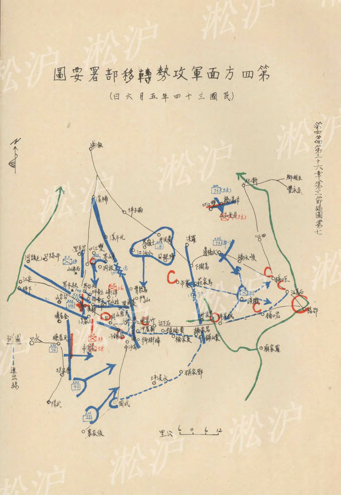

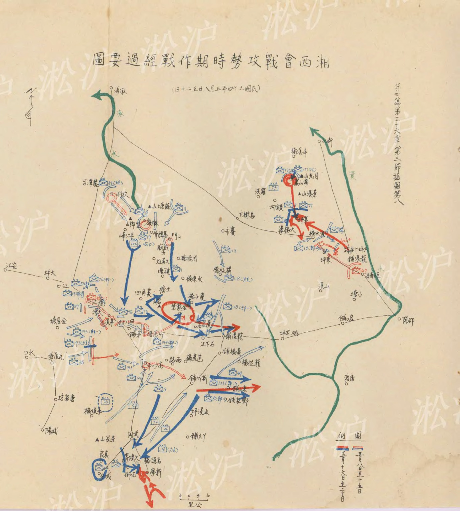

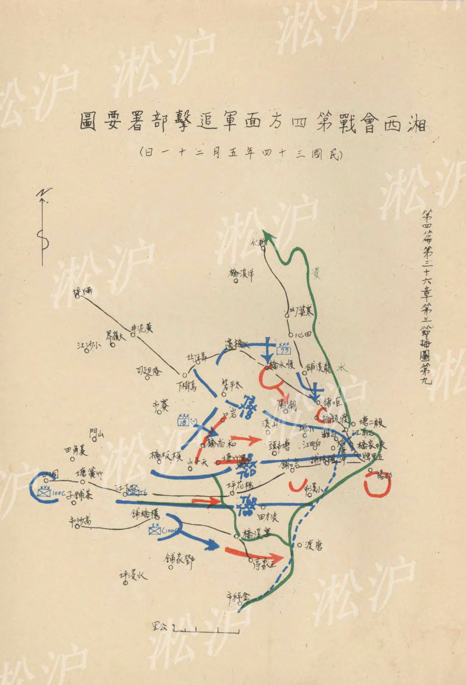

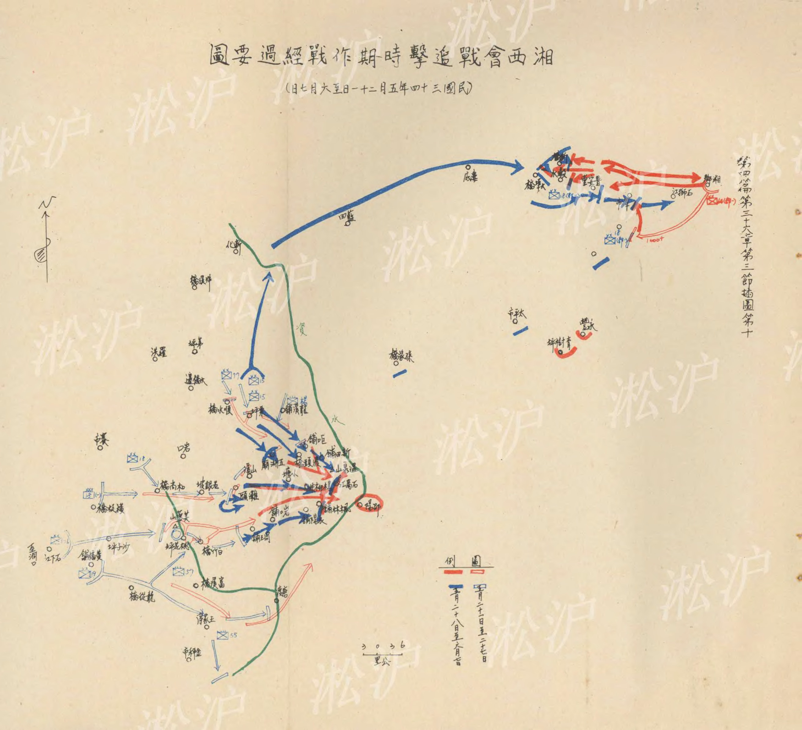

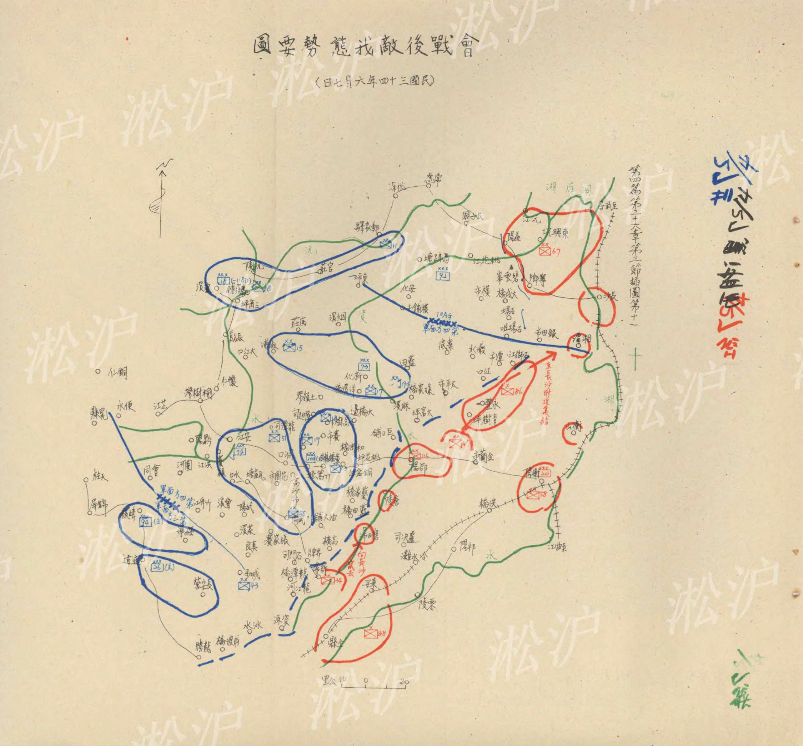

### 第四節 重要戰鬥

#### 第一款 新寧武陽武岡瓦屋塘黃土塘高沙市

各地區之戰鬥

民國三十四年四月十二日至五月十二日

(照插圖第十二至第二十插表第九第十)

民國三十四年三月下旬，敵以擊滅我野戰軍於沅水以東地區，而進佔芷江空軍基地之目的，將部隊分別集中，四月上旬開始分路進犯，本戰鬥爲敵軍之左翼兵團，轄第三十四師團主力及第六十八師團之第五十八旅團之一部，共約一萬餘人，於四月十二日分由全縣，東安向我進犯，我軍節節抵抗，消耗其戰力，同時以主力作機動使用，分途截擊，並乘敵攻勢頓挫之際，全線轉移攻勢，敵傷亡慘重，終至崩潰。

##### 第一項 本地區附近地形

本地區多屬山地，鐵路有湘桂鐵路，主要公路有湘桂，邵新（寧）諸線，河流有湘、資、巫、渠諸水，交通便利，全縣、東安均位湘水左岸，湘桂鐵路及公路咸經於此，新寧爲湘省西南重鎮，瀕資水左岸，二日可達邵陽，公路南通資源、全縣、東安，北達邵陽、武岡、箭桿山、孝竹山屏障東南，形勢險要，武岡位雪峯山脈東南麓，東瞰衡（陽）邵（陽），南控新寧，頗擅攻守之利，資水發源於此，二日可達邵陽，公路南達新寧、城步，北經黃橋舖、高沙市、瓦屋塘、啣接邵榆公路，亦爲湘省西南之軍略要地，本地區屬大陸性，氣候夏季多雨，濕度頗大，雨季山洪暴發，土地泥濘，對行軍及作戰影響頗大第二項

戰鬥經過

（參照插圖第十二插表第九第十）

桂柳會戰結束後，敵乃改取守勢，期予部隊以整補，迨至民國三十四年三月下旬，部隊開始集中，第三十四師團（主力）集結於全縣，與安間地區，第六十八師團之第五十八旅團之一部集結於東安、零陵、祁陽間地區，湘水水運頻繁，並積極征集大量民伕，其蠹動企圖，至爲明顯。

長衡、桂柳會戰後，我第七十四軍集結於新寧、武陽、洞口、武岡地區，從事整補，構築工事，並陸續加強武岡、洞口、山門等要點工事，其第五十八師第一七二團第二營位於新寧附近，對桂北之敵警戒。

本戰鬥，我軍首先誘敵深入，固守要點，控置機動部隊，截擊包圍敵人，予以各個擊破，並乘敵攻勢頓挫之際，轉移攻勢。

四月十二日，桂北之敵，第三十四師團主力及第六十八師團之第五十八旅團一部，共約萬餘人，分由全縣及東安西北之大廟口兩路向北進攻，參照插圖第十三十三日，其先頭部隊各三百餘，進抵窯上，丁字路，孝竹山各附近，與我第五十八師第一七二團第二營之各一部發生戰鬥，我以誘敵深入聚殲計，乃逐次轉移至小源，七星橋及太平橋各附近，與敵保持接觸。

十五日十四時，窯上敵騎兵二百餘，側擊我七星橋陣地，同時太平橋方面續增敵七百餘，經茶亭子向白沙進攻，我守軍遂轉移至崀山，江口橋及白沙各地區與敵戰鬥。

十六日拂曉，敵兵力增至三千餘衆，分向我江口橋，白沙守軍猛撲，同時一部由鷄子嶺側擊我江口橋陣地，其另一部復竄至摩阿嶺，圖切斷我白沙、江口橋間連絡，新寧城亦受敵圍攻，我城內守軍以犧牲過鉅，且衆寡懸殊，遂突圍轉移至高平舖，江口橋、白沙守軍，亦相繼轉移至左家山、新沙渡各附近佔領陣地，是日我空軍出動P10型機三架次，曾炸射新寧城廂之敵。

四月十七日十一時，我左家山陣地，遭敵砲猛烈射擊，遂轉移至長湖村繼續戰鬥，高平舖陣地，敵竟日猛攻，終未得逞，新沙渡守軍，於予敵重創後，轉移至白馬田，是日我空軍P140型機十架次，炸射新寧之敵，戰果豐碩。

同日第四方面軍令第七十四軍佔領武岡、花園市、洞口、山門既設陣地，拒敵西進，第七十四軍遵卽下達甲字第一號作命，其要旨如左：參照插圖第十三一、第五十八師，以一個團於新寧、武岡間逐次抵抗，阻敵西進，爾後並以該團之一加強營固守武岡，以一個團位置於木瓜橋，積極增強茶溪亘張家賽一帶之工事，一個團控置於龍田附近，保持機動。二、第五十七師，以一個團（欠）佔領花園市、高沙市各附近既設陣地，以該團之另一部於馬鞍石、黃橋舖間縱深配備，逐次抵抗，並指定一個連固守高沙市據點，另以一個團佔領橋當頭，洞口各既設陣地，並指定一個營固守洞口核心據點，以一個團佔領山門既設陣地，並指定一個營固守山門據點三、第十九師之第五十七團，應就原態勢固守現陣地，但芙蓉山，巖口舖之連營據點，須指定部隊固守之，並應控置有力一部保持機動，如敵沿公路北側地區西進時，應相機側擊或尾擊之。

四、第一五一團到達龍潭司控置，歸還第五十一師建制。

五、作戰地境如次：

第三方面軍

會同—竹舟江—貞良—資源。

第五十八師

大王田—巖坳—壽信寺—鹽田橋—蘆洪司。

第五十七師

銅灣市—銀角巖—賽市—馬家橋—山溪—邵陽北端。

第一百軍

(線上屬左)

六、軍指揮所位置於洞口。

四月十八日，各部隊遵令實施，新寧方面敵仍繼續進犯，我第一七二團有力之一部，逐次於白馬田及龍潭橋、竹鴿橋、峽山口、南風舖、小麥田及界牌、大坪、石門司各線阻擊敵人，迄二十二日，敵我仍於五里牌、雷祖山、安心觀之線戰鬥，敵因進展困難，遂調集約二千餘衆，向下威、溪冲北進，另以集結窯上，新寧之敵主力八千餘，於二十一日經樟木山西進，二十二日進抵平水岡，文武水各附近。

四月二十三日，向下威、溪冲北進之敵，進抵蔡家塘，參照插圖第十五遭我軍迎頭痛擊後，乃回竄雲山地區，梓木山西進之敵，同日復分向城步，眞良，經我第五十八師第一七三團阻擊後，敵遂以一部與我保持接觸，其主力則繼續西進，復以一部約二千之衆進犯梅口，其大部五千餘衆，續向梅口東北地區突進，企圖北攻。

同日蔡家塘當面之敵，再興攻擊未逞，此時第七十四軍爲適應當前狀況，決心調整部署，遂下達甲字第二號作命，其要旨如次：

一、第五十八師守備眞良、張家賽、山口橋、武岡城、翟家祖之線之既設陣地，並以一部對新寧北攻之敵逐次抵抗，阻敵前進。

二、第五十七師守備翟家祖、橋當頭、洞口、山門及其以北之既設陣地各要點，另以有力之一部守備高沙市，阻敵前進。

三、第十九師之第五十七團，暫歸第五十七師李師長指揮，該團除固守芙蓉山、巖口舖之營連據點外，餘部暫以竹篙塘爲基點，極力予敵以迎擊側擊或追擊之。

四、武岡、洞口、山門、巖口舖、芙蓉山各固守之據點及兵力，悉如前令所規定。

五、各部隊均限二十三日部署完畢。

六、軍指揮所現位於洞口，二十四日移駐瓦屋塘。

二十四日，第七十四軍奉第四方面軍電令，第一九三師改歸該軍指揮，當卽飭令該師於會溪及其東南地區集結。

四月二十五日，梅口東北及眞良之敵，各以一部分向關峽水東攻擊，蔡家塘之敵同時向魚塘進攻，我第一七三團、第一七二團之各一部奮勇阻擊，戰鬥至爲激烈。

同日，第七十四軍奉令以與敵決戰之目的，佔領陣地，遂下達甲字第三號作命，其要旨如次：

插圖插十四

一、第一九三師佔領哨溪口、七坡山、毛店子、盤坡之線主陣地而固守之，並在陽武店、堡子嶺、苦梨冲、黃家塘、珠玉山、傅家坳等處派出前進部隊，協力第五十八師之戰鬥。

二、第五十八師（欠固守武岡城部隊）以一部守備武陽、李家山、山口橋之線之現陣地，堅強阻敵前進，以主力佔領巖頭冲、分水界、耀子界、薩仕冲之線預備陣地，而固守之。

三、第五十七師（欠固守洞口，山門部隊，附第五十七團及暫編第六師之第一團）以一部守備泡洞、花園市、橋當頭、洞口、山門、半江峯一帶現陣地，主力佔領大竹坪、涼山界、麻溪、鐵山廟之線預備陣地，而固守之。

四、各部隊戰鬥地境如左：

第三方面軍與第一九三師間：爲

會同—竹舟江—陽武店—眞良之線。

第一九三師與第五十八師間：爲

茶溪冲—若水—大市—橋坪—武陽之線。

第五十八師與第五十七師間：爲

雙溪舖—寨頭—翁野—雙江口—黃腰峯之線。

第五十七師與第一百軍間：爲

中一方—句巖山—蔣家村—毛頂河—大坪—古樓坪之線，線上均屬左。

五、各部隊均限於二十七日拂曉前部署完畢。

六、軍指揮所位於瓦屋塘附近。

四月二十六日，我各部隊從事部署，（以下參照插圖）第五十八師以第一七二團第三營配置於山口橋附近，第一七三團第二營配置於會哨坪、高坪地區，第一七四團第三營增援武陽及其附近地區，其第二營則佔領堡子嶺、苦梨沖、嵐溪山各要點，掩護該師主力及第一九三師之陣地佔領。

是日晨，敵向我會哨坪、高坪、山口橋各要點進攻，經我軍阻擊，均未得逞，同時敵一部由大岸渡河，迄午，其一部進犯珠玉山我第一七四團第三營陣地，其另一部則進至傅家坳附近，企圖逕窺武陽，我爲消耗敵戰力計，遂以第一七四團第三營據守珠玉山、鐵坡賽及武陽附近地區，並以第一七三團第二營，第一七四團第二營分由東西夾擊敵人，迄晚，軍叢山、鴉雀橋、珠玉山、鐵坡賽間戰鬥慘烈，成混戰狀態，同日蔡家塘敵一部北竄白果廟、我空軍出動戰鬥轟炸機二架次，炸射蔡家塘之敵，戰果豐碩。四月二十七日晨，我第七十四軍主力部署完畢，同時在武陽方面逐次集結兵力，予敵反擊，敵勢稍挫，旋以敵後續部隊到達，復在其空軍之掩護下，向我猛撲，戰鬥更形激烈，我武陽之第一七四團第九連，被敵重重包圍，外圍我軍亦浴血奮戰不已，時山口橋方面進攻之敵，經我阻擊後後，攻勢頓挫，其一部乃竄白果廟與原在該地之敵會合，其一部由白果廟經忠義亭，進抵武岡北門，其主力進抵西門，另龍溪舖之敵，亦進迫武岡東南城郊，三面向該城垣猛攻，我第五十八師第一七二團第一營，利用旣設工事，浴血抵抗，敵終未逞，武陽方面，我以耗敵目的已達，是日晚，除仍以第一七四團第九連固守武陽外，其外圍部隊，均陸續轉移至萬福橋附近，第一七二團第三營，亦同時由山口橋轉移至唐家坊附近。四月二十八日，敵除以一部繼續圍攻武陽外，其主力續向萬福橋猛攻，並以另一部在其空軍支援下向曾家坊攻擊，是日武岡方面之敵，續向城垣攻擊，日夜激戰不已，我守軍沉着應戰，迄五月三日，激戰凡七晝夜，我武岡仍屹立無恙。

同日第七十四軍，奉第四方面軍電飭第一九三師之一團，於二十九日拂曉前，到達瓦屋塘附近，除以一個營固守旣設陣地外，其主力應機動運用，除當卽轉飭遵照外，並以第五十八師工兵營軍士隊增援唐家坊，以主力佔領梅樹山亘唐家坊附近陣地，其一部則控置於唐家坊西北地區，協力第一七二團，第三營及第一七四團第六連之戰鬥，另飭第一七四團第二、第三兩營主力，及第一七三團第二營歸建整補，準備參加主陣地之戰鬥。

四月二十九日拂曉，敵大舉向梅樹山攻擊，我第五十八師盧副師長到達指揮，士氣振奮，激戰徹夜，敵終未逞，我第一七三團第七連連長壯烈殉職，同時敵另一部則渡梅溪河，向唐家坊猛攻，激戰至午，敵後續部隊陸續到達，並由界頭經羅田，進迫大背水，經以第一七三團之一部阻擊，但敵仍鑽隙突進，迄晚，其一部已進至白家坊附近，我固守武陽之第一七四團第九連，自二十六日起與數倍以上優勢之敵浴血奮戰，達四晝夜，卒以衆寡懸殊，至二十九日晚，我守軍全部殉國，武陽遂陷敵手。

四月三十日拂曉，武陽敵之一部五百餘，經歐溪橋，分向毛店子、盤坡我第一九三師主陣地進攻，經我由兩翼出擊後，於五月一日退去，同日唐家坊當面之敵，除繼續攻擊外，其第三十四師團第二一七聯隊之一部，向瓦屋塘進攻，經我第一九三師之第五七七團阻擊未逞，其主力則於大背水，白家坊間地區集結，我以唐家坊當面之敵主力北竄，遂留置第五十八師工兵營一部，於唐家坊東西高地續行戰鬥外，主力則歸還建制，佔領主陣地，時第七十四軍奉第四方面軍電飭第十三師之第三十八團推進兩路口附近，歸該軍指揮。

五月一日晨，參照插圖第十八敵集中兵力，由大背水、白家坊向分水界以北茶山東南及石溪各附近鑽隙突進，向我第五十八師第一七三團陣地猛攻，尤以分水界以北之戰鬥，至爲激烈，我乃以第一七四團第三營推進至分水界北側協力戰鬥，入夜後，敵雖數度猛撲，均未得逞，同時進犯石溪之敵，亦被我第五七七團之一部擊退。

同日，我第五十八師爲乘敵後續部隊尚未到達，先期予敵各個擊破計，當晚調整部署，以第一七四團第三營展開於分水界東西之線，以第一七三團第一營展開於分水界西北亘菖蒲江以東之線，以第一七三團副團長指揮第四、第五、第八、第九各連，展開於茶山東西之線，準備翌日拂曉攻擊。

五月二日拂曉，我各部對敵施行包圍攻擊，敵據險頑抗，我空軍全日出動P-10及P-51型機十架次，直接支援地面部隊，奮勇衝擊，蔡仁傑師長亦親臨茶山指揮，第一七三團卒將分水界以北之制高點攻佔，頑敵全部就殲，其他方面亦節節進逼，更於我左翼集中火力，掩護衝擊，第一七三團第八連連長身先士卒，奮勇衝入敵陣，殲敵盈野，殘敵遂退據茶山東南高地。

是日，王耀武司令官下達電令，其要旨如左：

一、第一九三師卽攻擊瓦屋塘西南地區之敵。

二、第一六九師歸施中誠軍長指揮，接第一九三師防務，鞏固該軍右側背。

三、第一六九師須先以竹舟江之一團接進至白巖水，卽將主力位置於會溪附近，限五月三日前到達，接替完畢。

第七十四軍奉命後，爲擊滅當面之敵，遂下達甲字第四號作命，其要旨如左：參照插圖第十六一、第一六九師着卽接替第一九三師防務，確實佔領哨溪口、七坡山、毛店子、盤坡、巖頭沖之線主陣地，而固守之。

二、第一九三師（欠第五七七團）以主力於三日拂曉前推進至巖頭沖以北地區，完成攻擊準備，明三日十二時卽攻擊前進，肅清當面之敵後，進出於唐家坊、白家坊之線，其餘部隊於交防後迅速佔領嚴頭沖，分水界之主陣地，而固守之，限明三日十二時前佔領完畢，師指揮所位於大龍江。

三、第五十八師（附第五七七團。）以一部固守現陣地，以有力一部繼續攻擊前進，肅清當面之敵後，進出於瓦屋塘以南地區。

四、作戰地境線如左：（線上均屬左）

第三方面軍

會同—竹舟江—哨溪口—眞良之線。

第一六九師

橋坪—內坳界—巖頭沖—雙坳寨—賴家坊之線。

第一九三師

陶家—菖蒲江—白家坊之線。

第五十八師

第五十七師

雙溪舖—寨頭—翁野—雙江口—黃腰峯之線。

五月三日拂曉後，各部開始部署，同時第五十八師當面殘敵，仍據茶山東南高地頑抗，當以第一七四團及第一七三團各一部分途夾擊，我空軍出動P-51及P-40型機十架次，臨空協力作戰，激戰至午，第一七四團之一部攻佔三個高地，殘敵退據瓜家坪、龍頭附近各高地，第一九三師之一部，先佔領大王田繼進，至牛垭沖以南地區與敵激戰，同時分水界以東高地之敵百餘人，其後路雖被我截斷，仍頑抗據守。是日，第七十四軍奉王耀武司令官電令要旨如左：

一、自卽日起，暫編第六師歸該軍軍長指揮。

二、已令暫編第六師以一個團於明拂曉前接替黃腰峯亘一零五零高地間第一七一團之防務完畢，以一個團向獨尖山、現江、肝溪、奉家樓等處之敵攻擊。

復據武岡守備部隊報告，圍攻武岡之敵，一部經山口橋、李溪橋向西北前進，同時獲悉第九十四軍已進佔武陽，其先頭正向李溪橋、山口橋前進、江口方面之敵，向我第五十七師青巖、鐵山、天台界之線陣地攻擊，戰鬥激烈，且軍當面之敵，攻勢雖呈頓挫，但仍據唐家坊、大背水、白家坊各要點，及分水界以東，瓜家坪以北暨龍頭附近各高地頑抗，依以上各情況判斷，敵似有固守待援，續行進犯之企圖，第七十四軍爲適應狀況，決心調整部署，遂下達甲字第五號作命，其要旨如左：參照插圖第十七一、第一六九師佔領原陣地，而固守之。

二、第一九三師以一部固守原陣地，並以有力一部向敵出擊。

三、第五十八師（附第五七七團），以主力佔領原陣地，以一部向敵出擊。

四、暫編第六師（欠第一團）以一個團於明拂曉前接替黃腰峯亘一零五零高地間第一七一團之防務完畢，以一個團向獨尖山現江肝溪奉家樓等處之敵攻擊。

五、第五十七師（附暫編第六師第一團，及第十九師之第五十七團）除以一部佔領麻溪、老栗山間陣地，另以一部控制於枳木界西北地區，以主力守備青巖、鐵山、天台界間縱深陣地外，並以有力一部，向敵出擊。

六、第十三師第三十八團，卽控置於新哨、栗界、學堂沖間地區。

七、各師作戰地境：除第一六九師，第一九三師第五十八師依舊外，其餘作戰地境如次：

第五十八師

寨頭—翁野—雙江口—黃腰峯—道溪江。

暫編第六師

下坪—黃土界—巖脚—句巖山—一零五零高地，線上均屬左。

第五十七師

五月四日晨，我第一九三師及第五十八師各以有力之一部，在我空軍十二架次掩護下，分向水界以東高地大背水、白家坊、牛垭冲、瓜家坪及其以北高地，及龍頭各附近之頑敵攻擊，激戰逾午，我第一九三師之一部，進至大背水、白家坊河右岸，亘牛垭冲之線，第五十八師一部，亦將瓜家坪及其以北高地之敵，擊退至龍頭附近高地，繼續鏖戰。

五月五日拂曉，我第一九三師一部及第五十八師主力續攻當面之敵，我空軍全日出動P140型機十九架次，協同作戰，九時許，分水界以東殘敵肅清，第五十八師於空軍掩護下向龍頭附近高地之敵猛衝，步步迫進，迄午，武岡增援之敵到達，惟因敵第三十四師團之第二一七聯隊長佐估木清次被我擊斃，電台復爲我虜獲，指揮欠靈，連絡中斷，其生力軍雖到達戰場，但仍未能挽救頹勢，敵乃大部東竄，惟部份殘敵，仍據大背水、白家坊各附近，我爲防敵向東南方向潰竄，第五十八師乃以第一七四團之一部進出唐家坊附近，相機截擊。

時我右翼第九十四軍主力漸次到達武陽附近，其一部仍在李溪橋、萬福橋一帶與敵激戰，武岡外圍之敵攻勢頓挫，江口以東及洞口附近戰鬥激烈，尤以洞口方面爲甚，第七十四軍除令第十三師之第三十八團向江口、枳木界地區推進，協力該方面作戰外，並下達甲字第六號作命，其要旨如左：

一、第一九三師卽將守備現陣地任務移交第五十八師接替後，迅以一個團留於青草灣，綠茅界附近，一個團位於梅坪，師（欠二個團）位於瓦屋塘，統限六日前集結完畢，對洞口西南方面須嚴密警戒，（第五七七團歸建。）

二、第五十八師，迅派部隊接替第一九三師巖頭冲，分水界、曠家坳線之陣地守備任務，並於唐家坊、瓦屋塘各派一連搜索當面敵情，餘部以一部扼守陣地前各要點，主力分別集結陣地後方，保持機動三、第五十八師與第一六九師作戰地境：爲大市、內坳界、巖頭沖、雙坳寨、賴家坊相連之線，線上屬左。

被我擊潰之敵第三十四師團主力殘部，原由白家坊、大背水向東南方向潰竄，經我第五十八師第一七四團及工兵之各一部於唐家坊附近截擊，同（五）日乃回竄黃土塘附近，第七十四軍當令第一九三師向該敵攻擊，並令第五十八師經白家坊、瓦屋塘等地向花園市以東挺進。

五月六日十四時，參照插圖第二十我第一九三師第五七九團及第五十八師第一七二團各一部，進抵黃土塘附近展開攻擊，我空軍第五大隊亦出動P10型機七架次，協力戰鬥，激戰終日，敵不支向東北潰竄是日第四方面軍令第七十四軍以一部堅守武岡、唐家坊、瓦屋塘等據點外，其主力卽由唐家坊、瓦屋塘、金屋塘之線，重點保持於右，攻擊當面之敵，奏功後，進出於武岡、水浸坪、鄧家舖、栗山舖之線，時江口以東地面戰鬥激烈，大灣，現江仍有敵盤據，暫編第六師之一部正向肝溪攻擊，第七十四軍奉令後，爲適應當前狀況，乃下達甲字第七號作命，其要旨如左：參照插圖第十九一、第五十八師卽經黃土塘向花園市以東之敵攻擊。

二、第一九三師着星夜推進於荷葉塘、青草灣之線，限五月八日十二時到達，完成攻擊準備，立即向邵、榆公路大灣至現江間之敵攻擊，重點保持於右，但須派一部佔領橋當頭據點，以掩護該師之右側背，特須右與第五十七師第一七零團固守洞口之部隊，左與暫編第六師攻擊肝溪之部隊確取連繫。

三、暫編第六師以主力向現江、肝溪之敵攻擊。

四、第一六九師卽以一部控置於唐家坊，以主力控置於瓦屋塘附近。

五、軍指揮所位於兩路口附近。

五月七日十四時，由黃土塘向東北潰退之敵，經當風坳東竄，我第一九三師之一部猛烈追擊，於湯家園、瓜架舖各附近發生戰鬥，殘敵主力則據橋當頭附近之旣設工事頑抗。

八日十時許，第五十八師第一七二團主力，已進至花園市附近，並向橋當頭之敵攻擊前進，於瓜架舖附近協力第一九三師之一部攻擊，奪獲戰利品頗多，另敵第六十八師團之篤，一五大隊，經我在武陽擊潰後，向李溪橋逃竄，我第五師跟蹤追擊，殘敵乃退至陳家橋附近，第五十八師當以一部向該敵攻擊，敵被迫退至巷子口、泡洞附近。

五月九日，我第五十七師，第五十一師分由江口，龍潭司各以東地面轉移攻勢，我右翼第九十四軍之第一二一師亦挺進至光遠市附近，圍攻武岡之敵第五十八旅團殘部，退據高沙市附近，武岡外圍自七日起已無敵蹤，第五十八師主力同時進至花園市附近，並以一部攻擊巷子口殘敵，迄至十八時，敵退據泡洞附近頑抗，我第七十四軍遂令各部隊對退據橋當頭，高沙市之敵展開攻擊。

十日八時許，敵第三十四師團主力殘部，以其一部在橋當頭以南以西各附近，掩護主力向高沙市潰竄，途經新江附近，遭我側擊，傷亡頗大，我除以一部繼續掃蕩殘敵外，並以第一七四團主力推進至高沙市東北地區，相機伏擊殘敵，時高沙市之敵一部，亦向東南潰竄，經飭武岡守備部隊高崇仁營長，率兵兩連馳赴風神寨截擊，十八時許，敵七百餘竄經該地，該部當即協力第一二一師部隊予以襲擊，斬獲頗多，另敵一部企圖由茅益渡渡河東竄，經我突擊第二大隊阻擊後，乃回竄陰山舖，二十二時許，江口及龍潭司以東地區爲我擊潰之殘敵，分退竹篙塘、黃連江各附近，我第五十七師及第五十一師均在猛烈追擊中。

五月十一日，洞口附近之敵千餘人，續向狗扒巖以南高地攻擊，戰鬥激烈，我暫編第六師正向洞口以北攻擊，但高沙市及竹篙塘以北各附近，仍各有敵二三千，我第九十四軍之第一二一師及武岡守備部隊之各一部，與第十八軍正分由南北夾擊該敵，第九十四軍之第五師，亦正向荊竹舖、黃橋舖間地面挺進，阻敵東竄，泡洞之敵，已爲我第五十八師之一部殲滅殆盡，第七十四軍爲迅殲當面殘敵計，遂下達甲字第八號作命，其要旨如左：

一、第五十八師卽以主力續向盤據高沙市之殘敵攻擊，以一部於花園市掃蕩該地及泡洞各附近之殘敵二、第一九三師以一個團留置於湯家園以東地區搜索殘敵，該師師長卽率主力向高沙市以北亘竹篙塘之線追擊前進，肅清該地區殘敵後，續向黃橋舖挺進。

三、暫編第六師，（欠第一團），以一個團沿邵榆公路及其兩側地區追擊前進，該師師長率領其另一團經荷葉塘向洞口追擊前進，到達洞口後，卽將部隊予以集結，續向石下江、桃花坪挺進，務各求敵而殲滅之。

四、追擊時，務須陸空連絡確實，並與兩翼友軍切取連絡。

各部隊奉命後，遵卽行動，第七十四軍爲期作戰容易，又令第五十七師固守洞口以西據點之第一七零團第二營，改由暫編第六師師長指揮。

高沙市附近之敵，經我第一二一師及第五十八師包圍攻擊，激戰徹夜，十二日拂曉，敵退出高沙市，竄抵明月嶺附近，復經我軍猛擊，當晚向東南方向逃潰，沿途更遭我截擊，傷亡奇重，同時泡洞殘敵，經我搜剿後，三五成羣，化裝圖逃，頗爲狼狽，多爲我軍俘殲。

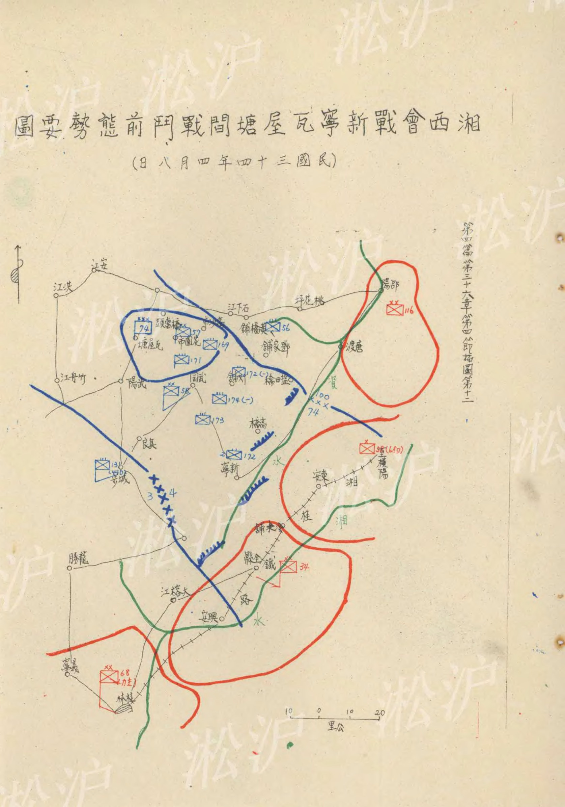

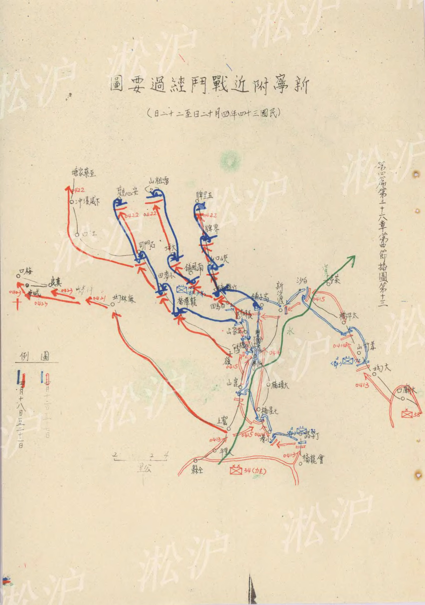

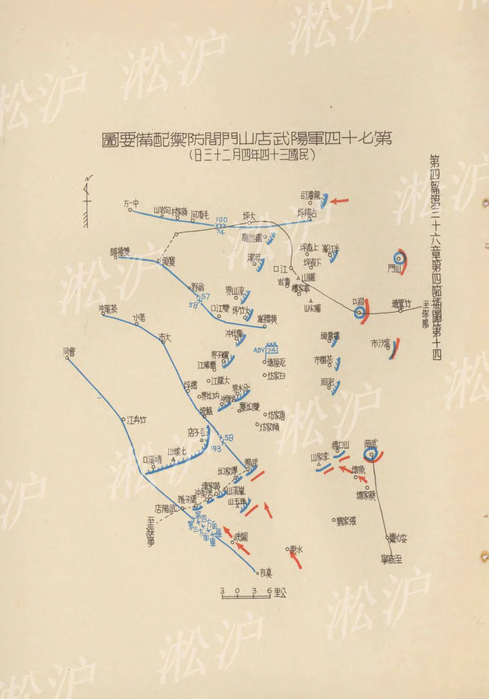

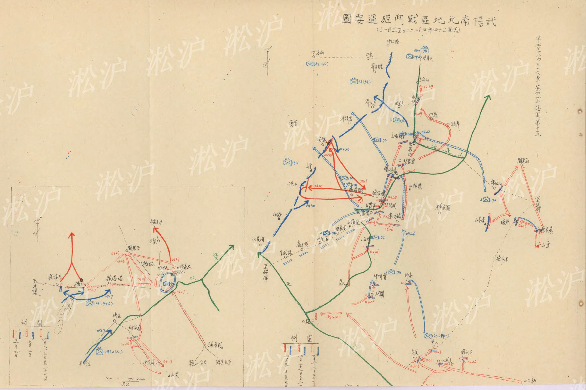

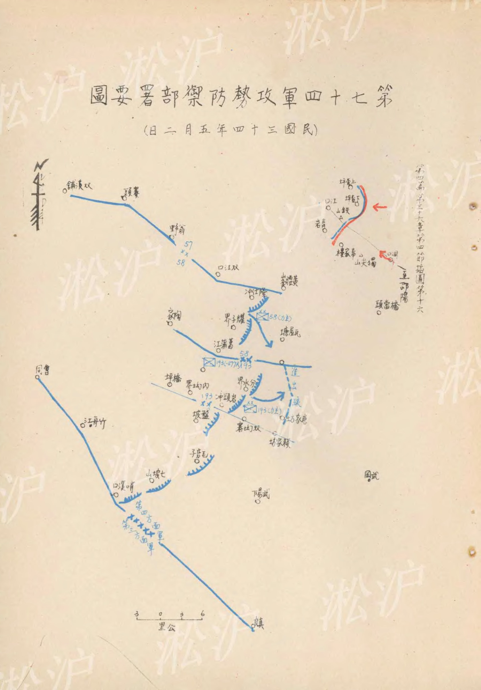

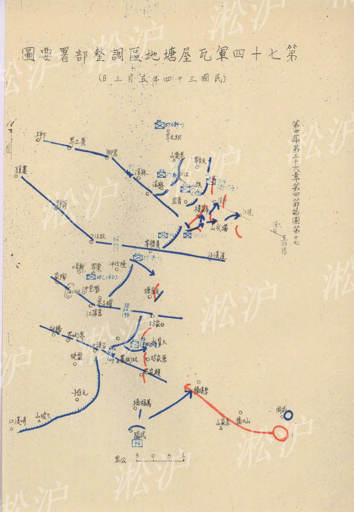

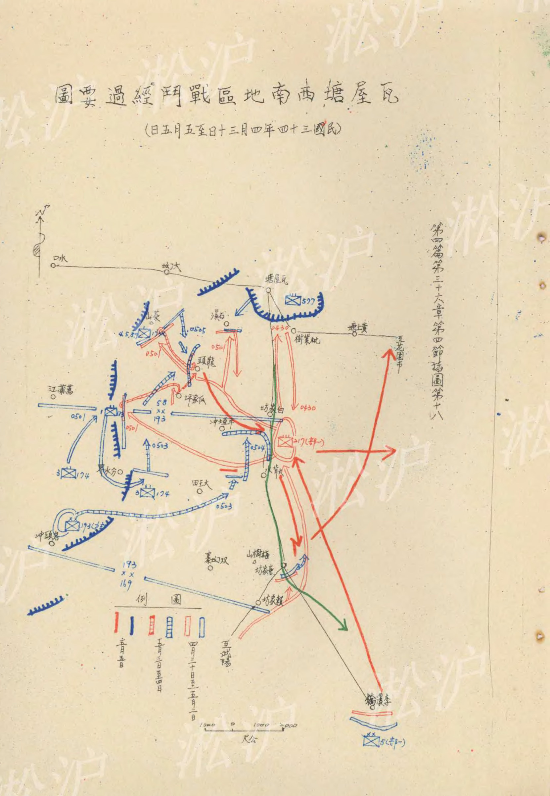

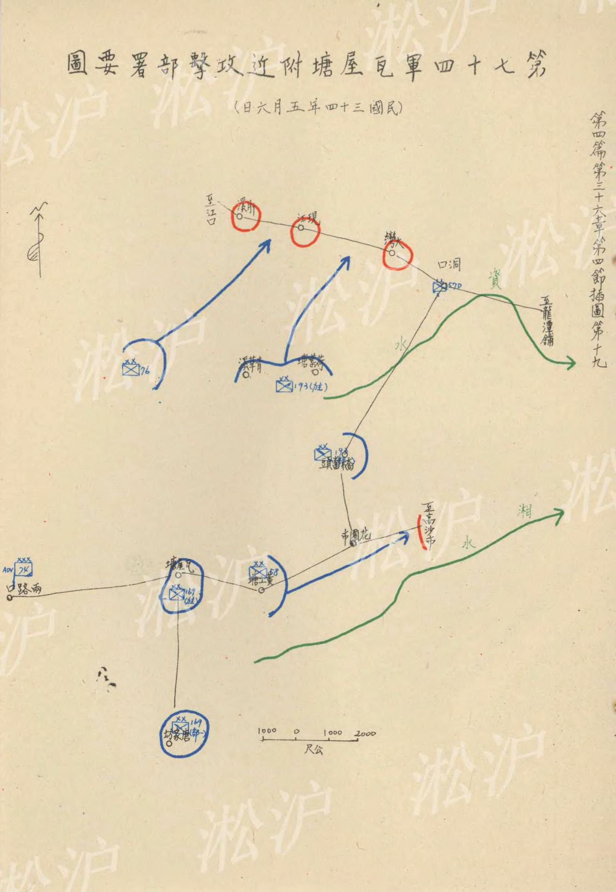

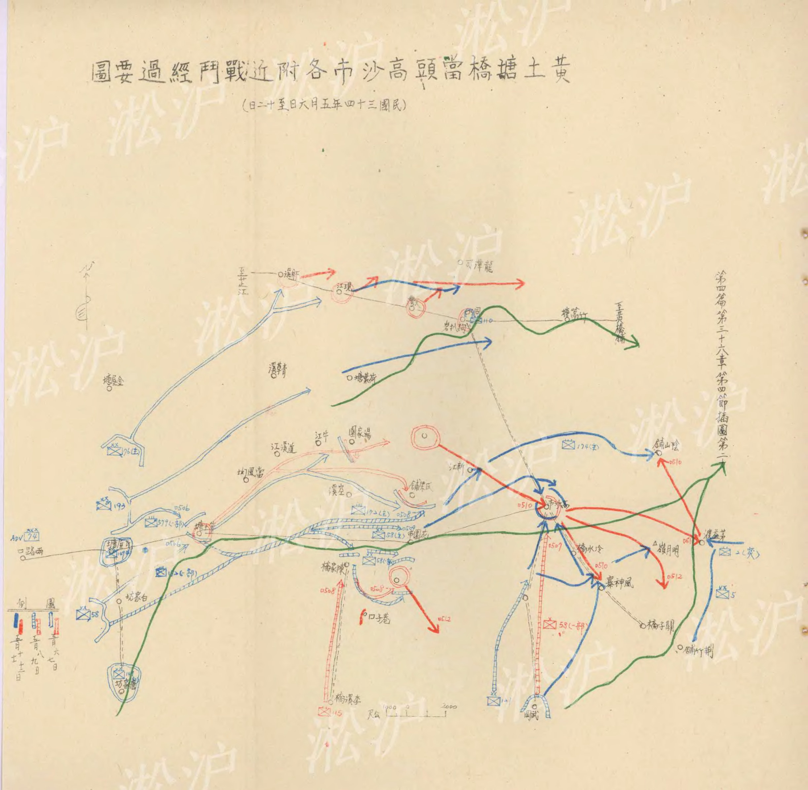

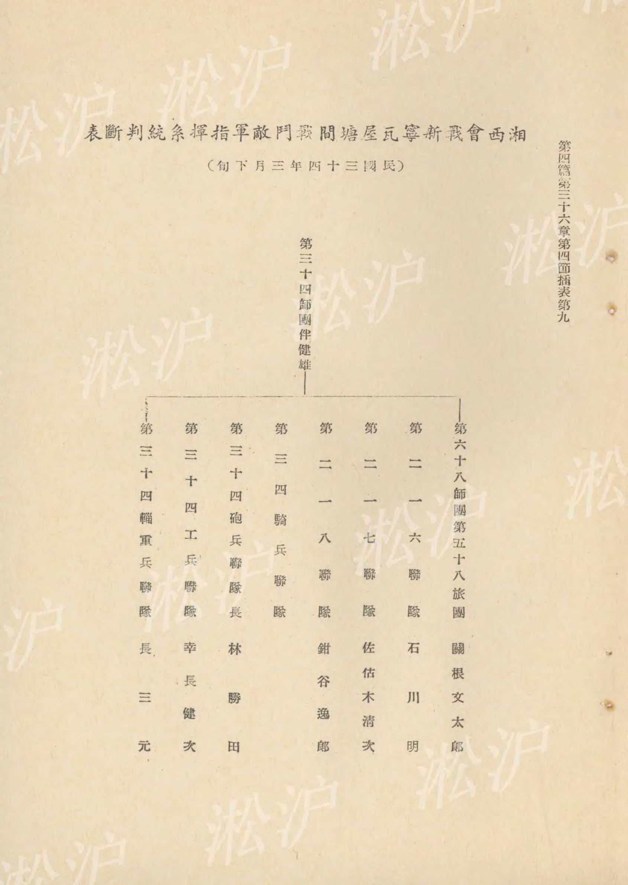

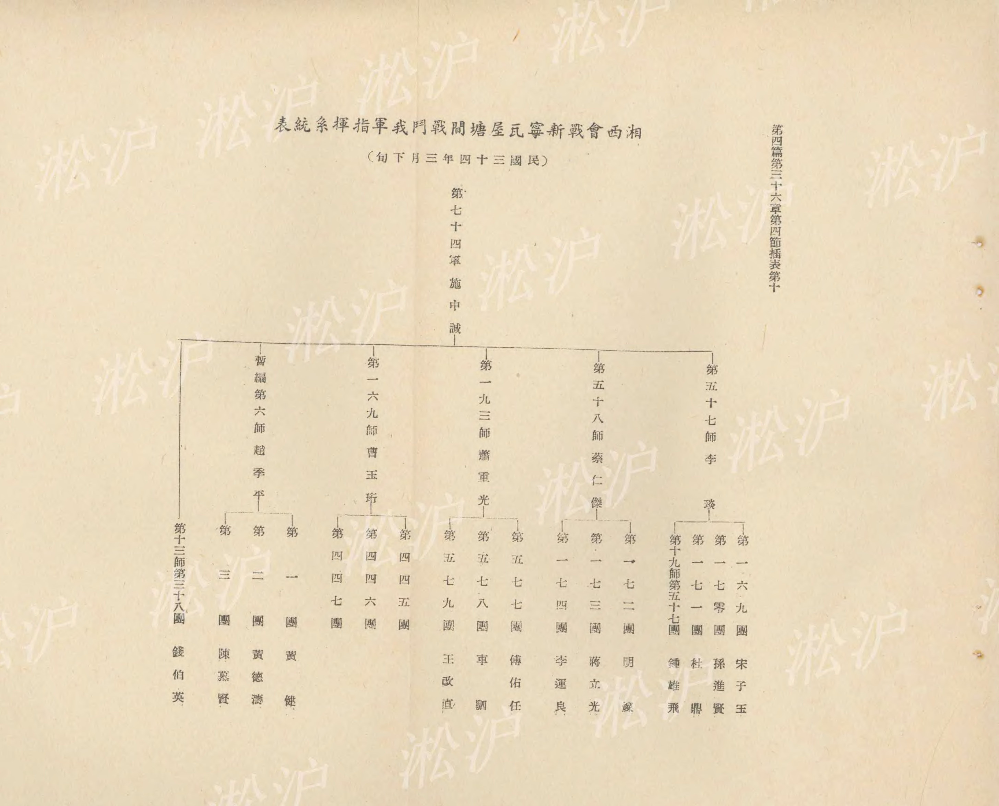

#### 第二款 城步眞良梅口武陽武岡地區之戰鬪

（民國三十四年四月二十一日至五月二十四日

參照插圖第二十一至第二十六插表第十一第十二

由新寧西進之敵，經我第二十六軍之第四十四師於城步、梅口等地區阻擊後，遂改向武陽方面進犯，四月二十九日武陽失陷，敵仍廣續北進，其左側背完全暴露，我乃把握戰機，對敵展開攻擊，五月一日克復武陽，並向武岡、高沙市、黃橋舖、桃花坪等地區挺進，殘敵抵抗微弱，進展頗爲順利，惟偵悉敵於新寧附近復集結兵力萬餘，我爲防敵再度來犯，除飭各軍各以一部繼續追擊殘敵外，並將主力或一部分別控置於武岡、眞良、城步、高沙市、洞口各附近地區，保持機動，嗣以偵悉敵僅企圖援助其突圍兵團，並無其他極積行動，我僅予以嚴密監視，戰鬥遂告結束。

##### 第一項 本地區附近地形參照插圖第二

本地區西、南兩面與黔、桂爲界，境內峯巒錯綜，聳及雲宵，東出武岡後，山勢漸緩，有由高趨下之勢，頗擅攻守之利，河流有資巫二水，縱貫其境，河幅狹窄，水流湍急，徒涉稍感困難，城步瀕巫水右岸，南控桂柳，東瞰新寧，公路直達桂林、武岡、芷江等處，爲湘省西南重鎮、武陽位巫水右岸、茅柴嶺、馬鞍山、龍煙山爲其東方之屏蔽，雖無公路道經於此，惟鄉道四達，交通亦稱便利，梅口亦頻巫水右岸，渡河西進，爲出會同而窺芷江側背之捷徑，與武陽同爲巫水右岸之要點。

##### 第二項 戰鬥經過

參照插圖第二十一

插表第十一第十二

敵第三十四師團主力及第六十八師團之第五十八旅團於四月十六日會陷新寧後，一部北趨武岡，其主力約八千餘向城步、梅口方向進犯，企圖經綏寧，會同進窺芷江，同時丁嶺界之敵，爲策應其主力作戰，施行聲東擊西之故技，乃不斷以小部隊向我第二十六軍第四十一師當面竄擾，經該師第一二二團猛力迎擊，先後均爲擊退。

我第三方面軍第二十七集團軍所轄之第二十軍，集結於錦屏、黎平地區，第二十六軍集結於靖縣、綏寧、通道地區，第九十四軍集結於三穗、鎮遠、黃平地區，除第二十六軍之第四十一師第一二二團在龍勝附近，及第四十四師第一三一團在城步附近，擔任對桂林、全縣方面警戒外，其餘各部隊均從事整補。

第二十七集團軍爲協力第四方面軍之作戰，以一部固守龍勝等戰略要點，極力遲滯由新寧進犯之敵，掩護第四方面軍之右側背之安全，並以有力之一個軍集結於靖縣、綏寧地區，保持機動，求敵外翼而攻擊之，爾後進出於武岡以東地區，協力第四方面軍包圍敵人而殲滅之。

四月二十一日，向眞良西進之敵先頭千餘衆，分兩部進抵分水坳、七里山各附近，與我守備城步之第四十四師第一三一團警戒部隊發生戰鬥。（參照插圖第二十二）該團逐次抵抗，致敵進展遲緩，二十二日夜，敵步兵四、五百附砲一門，鑽隙突進，當與我第五十八師之一個營在土橋附近發生激戰。

二十三日，敵進至眞良、土橋之線，乃以一部約五百附砲數門，南向城步進犯，其主力續經蔣家坊向西突進，負有側擊進攻武岡敵任務之第四十四師主力，正由綏寧經長舖子、梅口向城步及張家賽方面前進，其先頭第一三二團已進抵梅口附近。

四月二十四日，經蔣家坊西進之敵，於峯溪界附近，與我第四十四師第一三二團之一部遭遇，當卽發生戰鬥，敵雖一再猛撲，均爲我擊退，入夜，敵乃鑽隙竄至梅口東北地區，亦遭我阻擊，其向城步方向進犯之敵，亦在靖溪附近爲我第一三一團阻止，二十五日，敵在該兩地增兵數百，再興攻勢，我官兵奮勇迎擊，激戰至暮，敵我傷亡均重，此時我第二十六軍遂作如左之部署：

一、第四十四師第一三一團，以城步爲中心，堅強守備外圍各據點，並向北嚴密警戒，依情況向眞良、江頭間地區搜索敵情。

二、第一三二團，以全力由梅口向磨石塘、會哨坪間之敵攻擊，阻敵北進及躡敵尾擊。

三、第一三零團，以一部守備長舖子，主力梯次配備於江口塘、脚巖溪附近掩護，並策應第一三二團之作戰。

四月二十六日晨，清溪之敵向我第一三一團陣地猛攻，同時另一部敵約七百餘附砲二門，亦由梅口東北地區向第一三二團陣地猛撲，激戰至午，敵已增至千餘，該團浴血奮戰，異常慘烈，旋我第四十四師以第一三二團由城步向清溪之敵出擊，以牽制敵主力之西進，以第一三零團主力由石江沖、江口塘增援第一三二團之左翼，向敵側背猛烈攻擊，午後，將敵擊退，遺屍枕藉，並鹵獲湘省地圖及中隊編制裝備表姓名册等重要文件多件，清溪之敵，亦於入夜後，大部向西北方向轉移，第二十七集團軍爲適應當前狀況，乃下達第一號作命，其要旨如左：

一、敵第五十八旅團主力，由新寧進攻梅口，有續攻洪江、芷江企圖。

二、第四方面軍已令第一九三師及第一六九師向竹舟江前進，日內可到達。

三、奉湯司令官電令，第九十四軍（欠第四十三師）卽日起歸本總司令指揮，限該軍於四月二十七日前在靖縣，會同集結完畢，並積極準備進出綏寧以北地區，攻敵側背，與第四方面軍協同擊滅來犯之敵。

四、第二十軍及第二十六軍之一部，應確保榕江至龍勝之各要點，以掩護主力軍之側背。

四月二十七日晨，敵主力北移，企圖進攻武陽，第二十六軍爲策應第四方面軍之作戰，遂令第四十四師第一三一團以一部守備城步，主力由城步鑽隙攻擊蔣家坊、高坪地區之敵，第一三二團由梅口向磨石塘之敵攻擊，第一三零團以一部守備長舖子，主力由石江沖向雙溪、珠玉山間攻擊前進，策應第一三二團之作戰，九時許，第一三二團向磨石塘附近之敵猛烈攻擊，敵不支向關峽退却，該團跟蹤追擊，復與由會哨坪增援之敵百餘遭遇，激戰於關峽、磨石塘間地區，午敵後續部隊千餘名，馬百餘匹，砲二門到達土橋附近，繼經蔣家坊向城步、梅口間攻擊，其先頭四百餘，於午後進至陳家坪附近，經我第一三一團奮力截擊，旋向梅口方向轉移，我第二十六軍卽令第四十四師以第一三一團由陳家坪向北，第一三二團由磨石塘向南，夾擊該敵，激戰徹夜。

四月二十八日，敵五百餘附砲三門，向梅口之第四十四師正面猛烈攻擊，其主力約千餘砲數門，由蓮子塘附近偷渡巫水，企圖迂迴該師右側背，當經第一三二團阻擊，第一三零團之主力亦適時加入戰鬥，除向巫水右岸之敵後續渡河部隊實施阻止射擊外，對已渡巫水左岸之敵二百餘予以痛擊，十五時許，第一三一團之一部由大洲到達，南北夾擊，敵不支，於入夜後退回右岸溪頭、蔣家坊間地區，我第四十四師仍與之保持接觸。

四月二十九日，第二十七集團軍爲策應梅口、城步方面之作戰，於十二時電（卯艷午參戰電）令第二十六軍，由第四十一師抽調一個團進駐長安營以北地區，對大圳、巖道嚴密警戒，令第二十軍原駐老錦屏尙未進駐黎平之第一三四師，（欠第四百團）卽日進駐通道，歸第二十六軍丁治磐兼軍長指揮，十三時，第二十七集團軍奉湯恩伯司令官二十八日電（卯儉酉稱電）令，其要旨如左：

一、本方面軍爲協同第四方面軍作戰，以有力一個軍進出沅水以東，將我第四方面軍當面之敵擊滅之。二、着第二十七集團軍鞏固桂穗路正面及其東西地區，並於梅口方面以一個師掩護第九十四軍進出巫水附近集結，爾後第九十四師在該軍之右併行，向武陽方面攻擊前進。

三、第九十四軍着以：

(一)第五師於明（二十九）日午前集結於長舖子、綏寧間地區，卽向武陽敵後攻擊前進。

(二)第一二一師於明（二十九）日集結於黨坪、鵝公嶺、東山間地區，以沿第五師作戰方向，相機協同攻擊前進。

(四)第四十三師卽由鎮遠進駐天柱，限五月一日午前全部到達。

(四)該軍軍部先進出靖縣指揮，爾後相機隨戰況之進展而行動。

(四)該軍攻擊間，務與第四方面軍右翼各部隊密切連絡協司，以機動擊滅敵主力爲要，並仰遵照隨時具報。

李玉堂總司令奉令後，除令第一三四師（欠）及第四十一師之一團仍遵二十九日電行動外，並將湯恩伯司令官電令轉飭各軍遵照具報。

四月三十日，第九十四軍軍部到達靖縣，第五師集結於長舖子、龍鳳坡地區，並已與第四十四師取得連絡，第一二一師之一部到達鵝公嶺，主力到達靖縣以東地區集結完畢，是日，梅口以東地區之敵，因連日受我第四十四師重創，乃經關峽向武陽方面進攻，第四十四師跟蹤追擊，並向關峽之敵攻擊，激戰數小時，克復關峽，殘敵向會哨坪方向退去，第九十四軍卽飭第五師進出梅口以東地區，截擊向武陽進攻之敵，十八時許，該師先頭之第十三團，已進出黃東塘、苦黎沖南北之線，掩護該師主力渡河，第四十四師一部，亦同時向武陽方向追擊，至是第三方面軍之防禦戰鬥告一結束，而轉移於攻勢作戰，戰鬥重心遂進至於武陽方面。

五月一日十時，第二十七集團軍奉湯恩伯司令官電話：「第四方面軍右翼敵之壓力加大，着第九十四軍迅卽向武陽攻擊前進，以策應該方面之作戰」。該集團軍當卽轉令遵照，是日拂曉，參照插圖第二十三第九十四軍第五師先遣部隊第十三團，以破竹之勢向武陽之敵攻擊前進，驅逐敵警戒部隊，並猛力攻擊後，十三時克復武陽，當卽續向馬鞍山、鴉雀橋攻擊，敵憑險頑抗，入夜，該師主力推進至傅家坳附近，並以第十五團主力及第十三團之第三營組成一支隊，由副師長邱行湘率領，經羅家舖、李溪橋方向迂迴攻擊，第四十四師之第一三零團，於十五時進抵會哨坪附近，與步砲約五百餘之敵發生激戰，該團奮力猛攻，將敵擊潰。

五月二日拂曉，第五師續向馬鞍山、鴉雀橋攻擊，敵頑強抵抗，我軍奮勇爭先，前仆後繼，迄十三時，遂將馬鞍山攻佔，敵多次逆襲，均未得逞，該師邱支隊於十五時亦進抵李溪橋，並西向萬福橋挺進，第四十四師之第一三零團，亦將會哨坪、高坪之殘敵肅清，其第一三一團，亦以兩搜索隊分向新寧、武岡方向搜索殘敵，十三時，驅逐花溪山及水東附近殘敵後，並續向石獅及石井舖搜索前進。

五月三日，第四十四師主力進至楓門嶺，其第一三一團之一部亦到達石獅以西地區，沿途敵之抵抗甚微，敵第五十八旅團受我重力壓迫，經戰鬥激烈後，開始向萬福橋方向回竄，我第五師第十三團向龍煙山、六王廟攻擊，斃敵極衆，敵仍糾集殘餘，分向龍煙山、六王廟增援反撲，我官兵沉着應戰，與敵短兵相接，反復衝殺，敵傷亡慘重，其勢頓挫，第五師之邱支隊，由李溪橋祕密西進，於九時三十分突出現於萬福橋敵後，當以疾風迅雷之勢，向敵猛攻，並衝入敵第五十八旅團司令部，斃敵二百餘，將其指揮部摧毀，並奪獲重要文件多件，殘敵向六王廟狼狽逃竄，該支隊跟蹤進迫，協同第十三團續向龍煙山、六王廟猛攻，同時該師第十四團之一部及第一二一師第三六二團，亦向大河沖、杉木沖一帶高地攻擊，第一二一師主力已推進竹舟江以東地區。第四十四師第一三二團有力之一部，亦經漆水連繫第五師向武陽以東地區挺進，進展順利，迄十八時，我包圍武陽以北敵之態勢完成。

五月四日拂曉，我第五師各部續向武陽以北頑敵攻擊，並緊縮包圍圈，十二時左右，我邱支隊以排山倒海之勢攻佔龍煙山，第十四團之一部亦攻入六王廟以北敵之砲兵陣地，第十三團亦進展至龍煙山、六王廟之線，我官兵奮勇衝殺，殲敵盈野，敵四散逃竄，三五成羣，藏匿深山密林之中，我逐次搜剿，斬獲甚多，殘敵數百，分向羅家舖、花園市潰逃，另部敵四百餘竄至茅柴嶺，似有經羅家舖東竄企圖，第五師當令師預備隊第十四團之主力向該敵攻擊，於茅柴嶺附近發生激戰。以下參照插圖第二十二右下角圖第四十四師第一三一團派出之搜索隊，於十三時許已通過石獅，續向新寧搜索前進，該師之第一三零團及第一三二團各一個營，亦搜索到達張家賽、木瓜橋地區，續向武岡推進，第九十四軍爲便利指揮計，亦將軍部推進至綏寧，第一二一師主力已進抵杉木沖附近，歸丁治磐兼軍長指揮之第二十軍第一三四師（欠四百團）已推進至通道附近，第四十一師第一二三團亦遵令到達長安營附近。

五月五日，茅柴嶺之敵，經第十四團主力全日之掃蕩，殲滅過半，殘餘分向羅家舖、大竹山方面潰竄，龍煙山、六王廟地區殘敵，經邱支隊及第十四團之一部合力掃蕩，多被擊斃或生俘，少數向花園市逃竄，同時我第十三團側擊武陽以東之鯉魚山、茅柴嶺、神仙壇之線經由龍煙山向羅家舖逃竄之敵，頗有斬獲。

六日，由羅家舖東竄之殘敵，續經黃茅冲向塔塔嶺逃竄，第十四團跟蹤追擊，進至黃茅沖時，遭敵後衛部隊阻擊，迄暮仍在該地區戰鬥，第四十四師之第一三一團一部，是日已進至新寧附近，第九十四軍以當面之敵大部均就殲或潰竄，但爲澈底殲敵計，乃調整部署，其概要如左：

一、第五師仍續行原任務，肅清當面殘敵後，向花園市截擊東潰之敵。

二、第一二一師以一個團進出神仙壇向羅家舖追擊前進，主力經高坪、張家賽向武岡挺進，遮斷敵之退路。

三、第四十三師（欠第一二九團。）限五月八日推進竹舟江、長舖子間集結待命。

四、軍指揮所由綏寧向長舖子推進。

是日，第五師主力在李溪橋、龍煙山、茅柴嶺各地區，對大竹山、橫溪沖之敵圍勦，一部由羅家舖向黃羊坪東竄之敵追擊時，第一二一師之第三六一團，亦沿羅家舖向黃羊坪追擊，該團到達黃羊坪附近，卽協力第五師之一部躡敵追擊，同時我第四十四師主力向張家賽、武岡挺進，其先頭之第一三零團於十二時左右到達木瓜橋附近，偵悉有步砲聯合之敵千餘，在黃茅沖佔領陣地，該團當卽展開猛烈攻擊，敵不支向東北方面退却，該團仍向武岡推進，十五時許，第二十七集團軍奉湯恩伯司令官六日（辰魚）電令如左：

一、武陽、瓦屋塘一帶之敵，已被我擊潰，有向邵陽方向逃竄模樣。

二、我第二十六軍之第四十四師及第九十四軍主力，應卽追擊武岡、武陽地區之敵，並向黃橋舖、高沙市方向跟蹤截擊追擊，協同第四方面軍會殲邵陽以西地區之敵，希依情況演進，適宜部署，並電告爲要。

該集團軍當卽轉令第二十六軍之第四十四師及第九十四軍，各以主力於五月八日前進出龍溪舖、武岡、李溪橋概略之線，確實搜索敵情後，卽向黃橋舖、高沙市方面追擊。

五月七日，第九十四軍令第五師先以一個團進出於塔塔嶺附近，對北對東搜索警戒，其主力於肅清戰場並整補後，卽向武岡進出，令第一二一師於搜剿黃茅沖之敵後，卽向武岡南北地區進出，對各方搜索敵情，以期捕捉由武陽東潰之敵而殲滅之。

是日在大竹山、橫溪沖地區之敵，經第五師主力圍剿散竄於山地後，復被該師第十五團於李溪橋西南地區痛擊，敵乃囘竄牛角嶺附近，該師當令各團各派一部搜剿，頗有斬獲。第一二一師於拂曉以一個營向黃茅嶺方向搜索前進，十八時該師之一營已進至龍田東西地區，主力進至武岡城郊，掃蕩該附近地區之殘敵，被困於該地十餘日之我第五十八師第一七二團第一營守軍，遂之解圍，在黃茅沖佔領陣地，經我第四十四師第一三零團擊潰之敵，於九時許遭第一二一師之一部截擊，向塔塔嶺方向逃竄，該團跟蹤追擊，至十二時，敵向高沙市方面潰竄，我第一二一師之一部，當卽由清溪橋方面向該敵追擊，第四十四師（欠第一三一團）亦於十八時進至武岡西南城郊。

五月八日，我第三方面軍爲積極協力第四方面軍迅速解除正面之壓力，並早日殲滅該方面之敵計，除要求第四方面軍迅速由正面移轉攻勢外，並調整部署如左：（參照插圖第二十四）

一、以第二十六軍第四十四師之第一三一團守備城步、新寧，另以一部守備武岡，掩護本方面軍右側背之安全，該師主力向姚花坪攻擊。

二、第九十四軍：

(一)以第五師由武岡經荊竹舖向黃橋舖攻擊。

(二)以第一二一師由武岡附近向高沙市攻擊。

(三)以第四十三師推進於梅口附近地區，保持機動。

是日拂曉，

參照插圖

第二十四

我第一二一師主力攻擊石巷、唐家嶺之敵，激戰至十八時，石巷之敵被我擊潰北竄，唐家嶺之敵仍據險頑抗，該師卽以一部經羅家坪向光遠市敵後挺進，企圖將敵包圍殲滅，第五師之有力一部對橫溪冲竄毛冲塘之敵實施圍攻外，其主力就武陽附近整補，從事向武岡方面轉用之準備，第四十四師之第一三一團正向新寧搜索前進，其師主力已推進至武岡東南龍溪舖、龍頭橋間地區，完成對東對南之警戒，第四十三師亦由竹舟江向長舖子推進。

五月九日拂曉，第一二一師主力在砲兵掩護下，續向唐家嶺之敵攻擊，我官兵奮勇衝擊，前仆後繼，激戰至午，迂迴敵後之一個團，已由光遠市南向攻敵背後，敵受南北夾擊，傷亡頗重，十三時許，敵逸出包圍圈，紛向高沙市潰退，該師當卽乘勝追擊，迄晚，已進至九朝巖、龍家沖、十里田之線，第五師已將武陽附近殘敵肅清，並準備向武岡推進，第四十四師已遵令以一部推進至武岡東北地區，向桃花坪方向警戒，並派搜索隊向該方面實施搜索，該師第一三一團之搜索隊，已進出新寧以南之七星橋東西地區，第九十四軍軍部亦推進至梅口。

五月十日，我第一二一師以第三六一團、第三六二團併列向九朝巖、龍家冲、十里田之線之敵攻擊，敵頑強抵抗，激戰至晚，仍在對峙，第五師於十八時到達武岡附近，其一部向黃橋鋪方向挺進，石巷附近爲我擊潰北竄之敵一部約二百餘，於午回竄新山界附近，第四十四師當以工兵連及防毒連協力迎擊，敵不支向托坪潰竄，該師復派隊跟蹤追擊，並以第一三零團由五里牌向了叉鋪方面截擊，向桃花坪方向挺進之第一三二團，十九時許已到達水浸坪附近，第九十四軍軍部推進至西巖市，第四十三師亦由長鋪子推進至梅口地區。

五月十一日拂曉，我第一二一師續向當面之敵猛攻，激戰終日，斬獲甚多，資水右岸之敵全數肅清，入夜，高沙市殘敵主力向明月砦、風神砦方向退却，其一部則據馬鞍石、高沙市、水南橋之線頑抗，第五師先頭之第十三團，到達黃橋鋪、車林鋪間地區，以該方面無敵蹤，當卽佔領資水右岸之施家渡、茅盆渡之線，對西北方向嚴密警戒，該師師部及第十四團到達馬坪街、花橋間地區，以一部佔領資水右岸之田家渡渡河點，其第十五團亦到達石羊鋪、荊竹鋪間地區，向托坪潰竄之敵，續行東竄，被我第四十四師之第一三零團包圍於了叉鋪地區，殲滅甚衆，其第一三二團，於十六時已進至石馬附近，第九十四軍軍部亦推進至武岡東北之清風亭，第四十三師之第一二七團，已由梅口推進至武岡西南附近地區。同日十九時我第二十七集團軍綜合得知狀況如左：

一、桃花坪及龍潭鋪南北地區均無敵蹤。

二、陰山鋪、馬鞍石附近竄到約四千餘之敵。

三、我第四方面軍已將敵壓迫於竹篙塘及放洞東南地區，正攻擊追殲中。

該集團軍爲達成協力第四方面軍圍殲敗竄之敵計，乃令所轄各軍，應盡力阻擊囘竄之敵，並徹底殲滅之。

五月十二日，

第二十五

高沙市之敵主力竄抵明月岩、風神岩、關家橋各附近，一部仍據高沙市頑抗，經我第一二一師續行猛攻，迄午敵向明月岩退却，我遂克復高沙市，該師躡敵追擊，並以有力之一部由冷水橋東北向明月岩之敵圍攻，激戰至十七時許，敵向風神岩逃竄，該師跟蹤追擊，激戰徹夜，竄抵關家橋之敵五百餘，砲三門，經我第五師截擊，至十三時，敵轉趨鯉魚渡渡河，企圖向茶舖子方向逃竄，復被該師之第十五團堵擊未逞，其竄抵牛角沖之敵，經我第四十三師第一二七團圍殲，斬獲頗多，並生俘敵第六十八師團第五十八旅團第一一五大隊中尉隊附新宮一員，我第四十四師之第一三零團進至水浸坪，其第一三二團仍在石馬附近，續行搜索敵情。

五月十三日，風神岩殘敵經第一二一師攻擊後，乃與另數部敵在關家橋、冷水橋、七里橋、鯉魚渡間地區會合，企圖向東南方向逃竄，我第五師於荊竹舖、茶舖子間地區奮力堵擊，第一二一師跟蹤追擊，竟日激戰，敵傷亡慘重，迄晚敵大部向東潰竄，其掩護部隊約七百餘及另一部約五百餘，仍據風神岩山地及鹽泉山附近地區頑抗，武岡西南之黃茅沖附近，當日竄到潰敵二百餘，經第四十四師直屬部隊圍殲，敵傷亡過半，入夜後，敵分股逃逸，嗣均爲我各部逐次殲滅，同日第四十四師第一三一團警備新寧之高雨辰營，偵悉敵一小部由茶沖、官陂頭南竄，該營當卽派隊奮力圍擊，敵乃全數就殲。

五月十四日拂曉，我第一二一師及第五師分向風神岩、鹽泉山頑敵猛烈攻擊，激戰三小時，將該兩地攻克，斃敵二百餘，鹵獲該聯隊所下達之退却命令（略）一件，殘敵經花橋向法西坳、燒紙舖、芭蕉橋方面潰竄，我各部跟蹤追擊，第五師並以有力之一部進出水浸坪以北地區截擊敗敵，第一二一師以第三六一團由田家渡渡河截擊，激戰至十八時許，該團霍團長身先士卒，往復衝殺，致負重傷殉職，第四十四師之第一三二團撤至鄧家舖，以協力第一三零團阻擊東潰之敵，第四十三師亦推進至西巖市，準備參加主力之戰鬥。

五月十五日晨，花橋附近敵掩護部隊四百餘，仍負隅頑抗，我第一二一師之第三六一團及第三六二團協力攻擊，第五師之第十四團亦由紫山巖向北側擊該敵，斬獲甚衆，激戰至十七時，殘敵逐次東潰，第一二一師復跟蹤追擊，入夜仍繼續戰鬥，第五師第十三團由水浸坪向東北行超越追擊，十二時許，到達天鵝山附近，偵悉敵千餘在芭蕉橋、兩路口、燒紙舖各附近構築簡易工事，該團卽向該方面挺進。

五月十六日，

參照插圖

我第五師之第十三團及第一二一師之第三六一團，於拂曉向芭蕉橋、兩路口之敵攻擊，第四十四師主力同時亦由蕭家亭、剷家塘之線向芭蕉橋之敵攻擊，敵據險頑抗，激戰終日，斬獲甚衆。

我第二十七集團軍於同日九時三十分，獲悉敵三十四師團所屬萬餘衆，由全縣向新寧前進，其先頭約三千餘，附砲八門，於晨集結於窯上，其一部已渡河北抵茶亭子附近，有續向武岡前進援敵突圍之企圖，該集團軍當卽轉報第三方面軍，並令第二十六軍嚴密監視敵之行動，原負警戒新寧之第四十四師第一三一團之高雨辰營，應儘力遲滯敵之前進，十二時，湯恩伯司令官電令：（辰銑午）第二十七集團軍着第九十四軍及第四十四師，速肅清高沙市東南地區殘敵，並以有力之一部追擊東潰之敵，到達金秤市亘唐渡沿資水左岸之線，希遵辦具報，該集團軍當卽轉飭遵照，十九時許，窯上之敵進抵崀山附近，並繼續北進中。

五月十七日，第二十七集團軍遵照第三方面軍指示，並適應當前狀況，於七時許下達命令要旨如左一、着第二十六軍之第四十四師（欠第一三一團）卽集結於武岡以南地區，對新寧方面嚴密警戒。

二、着第九十四軍之第四十三師卽向城步、眞良間地區集結，限十八日前到達，該軍應以一個師集結於武岡，其另一師應續行追擊殲滅敗潰之敵，到達金秤市亘唐渡沿資水左岸之線，卽停止待命，該軍軍部暫位於武岡，必要時得移駐梅口。

第九十四軍奉命後，卽作如左之部署：

一、第五師應卽以一個團與東潰之敵保持接觸，主力卽集結於高桂嶺、武岡間地區。

二、第一二一師卽集結於渡頭橋、木瓜橋間地區，保持機動。

三、第四十三師佔領火燒界高地南北之線，側擊由新寧向武岡突進之敵，並掩護軍主力之集結。

同日晨，新寧方面敵先頭部隊約六百進至馬頭橋，其後續部隊三千餘，亦進抵崀山，我第四十四師第一三一團高雨辰營一部，於馬頭橋附近阻敵前進，芭蕉橋、兩路口間地區頑抗之敵，經我第五師及第一二一師連日之攻擊，迄十二時，敵向芭蕉橋以東地區潰退，我跟蹤追擊，敵復轉向米山舖方面退竄，該師各派有力一部躡擊中。

五月十八日二時許，進抵崀山敵主力之一部約五百餘，北攻新寧，我第四十四師第一三一團高雨辰營之一部，據城固守，迄十二時，敵另一小部竄至三渡口附近，該營尚有一部仍在七星橋敵後繼續搜索外，其主力在高坪舖與敵保持接觸，第二十七集團軍爲期殲滅西進之敵，除以第九十四軍軍部移駐西巖市，第四十四師主力改在眞良、西巖市間地區集結，保持機動外，其餘所部均依十七日之命令實施，同時該集團軍並策定對新寧方面之作戰指導如左：

第一方針

一、集團軍對再竄新寧之敵，應以全力出擊，期於新寧附近地區將敵各個擊破，以策城步、武岡之安全。

二、如新寧敵不攻城步、武岡而向東北逃竄時，集團軍應以有力部隊，向資水以西地區實行追擊。

甲

攻擊

一、如敵以一部佯攻武岡，主力猛攻城步時，我卽以第二十六軍之第四十四師及第九十四軍主力由城步以東、以第九十四軍有力一部由武岡以南斷然出擊，將敵壓迫於新寧以西山地而殲滅之。

二、如敵以主力猛攻武岡，以一部牽制我城步時，我卽以第二十六軍有力一部擊破城步方面牽制之敵，而進出於城步以東山地，側擊敵之主力，以第九十四軍由武岡自西北向東南壓迫，將敵壓迫於新寧以北地區而殲滅之。

三、如敵同時進攻武岡、城步時，我以第二十六軍之第四十四師及第九十四軍主力，先求城步、次求武岡附近之敵，而各個擊破之。

乙

追擊

四、如敵不攻城步、武岡，而出新化以北向邵陽方面逃竄時，我以第二十六軍之第四十四師之一部於新寧以南地區，施行警戒，掩護我之右側背，主力啣敵追擊，並以第九十四軍之一部控置武岡，主力追擊敵人於資水以西地區。

五月十九日，我第四十四師師部及第一三零團已推進至城步、眞良間地區，該師之第一三二團在易家橋設伏之一個營，爲東潰之敵約二千餘遮斷退路，展開激戰，致傷亡頗重，其主力於二時開始經峽口山向城步方面轉移，第九十四軍除追擊隊外，亦已完成部署，我以新寧方面敵之動態不明，故以第四十三師第一二八團經石獅向新寧搜索前進，並相機攻擊之。

五月二十日十二時許，第一二八團先頭營進抵馬頭橋附近與敵五百餘激戰，至十七時，敵不支向新寧方面退去，該團主力於二十時進至龍潭橋，第四十四師第一三一團高雨辰營固守新寧之一部，連日均與敵接觸，其另一部仍在七星橋附近活動，予敵後方以破壞或襲擊。

五月二十一日拂曉，第一二八團向鷄子嶺、左家山之敵攻擊，敵千餘在砲兵支援下憑險據守，激戰竟日，迄晚仍對峙中，同日第一二一師之追擊隊，在中沙田附近截擊伏擊石門山附近之敵，頗有斬獲，第五師之追擊隊，已進抵石馬附近。

二十二日，我第一二八團續向鷄子嶺、左家山之敵攻擊，激戰至十二時，該兩地爲我攻佔，旋敵向該團右翼增援反撲未逞，第一二一師之追擊隊，其時已擊破石門山附近之敵而佔領之，並續分向鄧家鋪、金秤市追擊，第五師之追擊隊，亦由石馬南向金秤市方向追擊。

第二十七集團軍同日午獲悉新寧方面敵已大部後撤，乃規定各軍行動，其概要如左：

一、着第二十六軍之第四十四師，卽以一部掃蕩新寧附近地區之敵，向香鋪嶺、窯上、大里溪村之線進出。

二、第九十四軍，卽以有力一部掃蕩高橋、米山舖附近之敵，並進出資水左岸。

三、兩軍之作戰地境：爲西巖市以南——木瓜橋——火燒界——界牌——白沙——大坳之線，線上屬第二十六軍。

五月二十三日，第九十四軍之追擊部署如左：

一、第四十三師第一二八團，以一部位置高橋附近，向南搜索警戒，主力卽先進出東江口、黃龍橋之線，掃蕩殘敵後，再向鹽田橋、石門山之線進出。

二、第一二一師追擊隊，掃蕩石門山附近殘敵，爾後再向鹽田橋、金秤市之線追擊。

三、第五師追擊隊，卽掃蕩米山舖附近之敵，爾後向金秤市、花石橋西岸之線追擊。

我各部隊遵令追擊，並掃蕩資水左岸殘敵，除敵約二千餘經王家亭向東北逃逸外，其殘餘各部，多

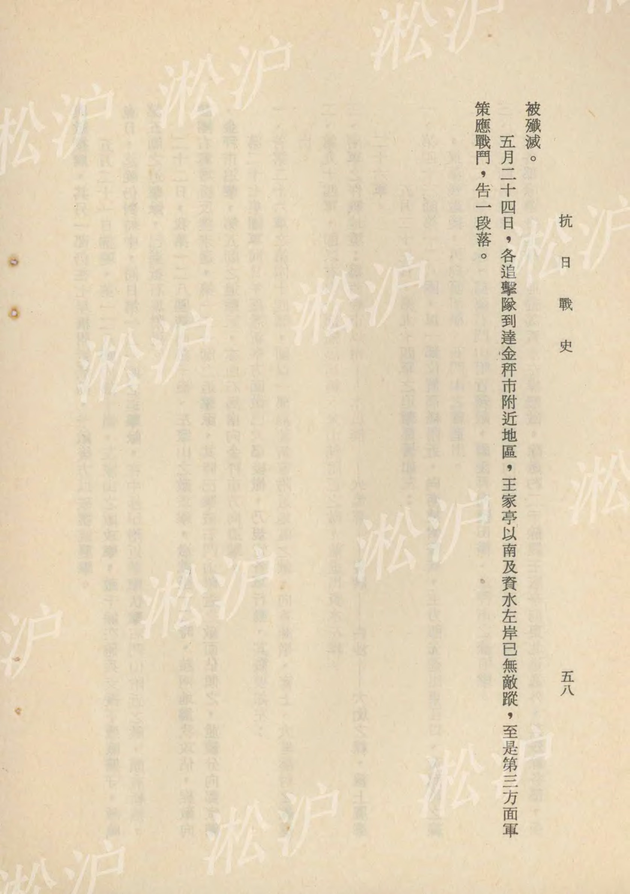

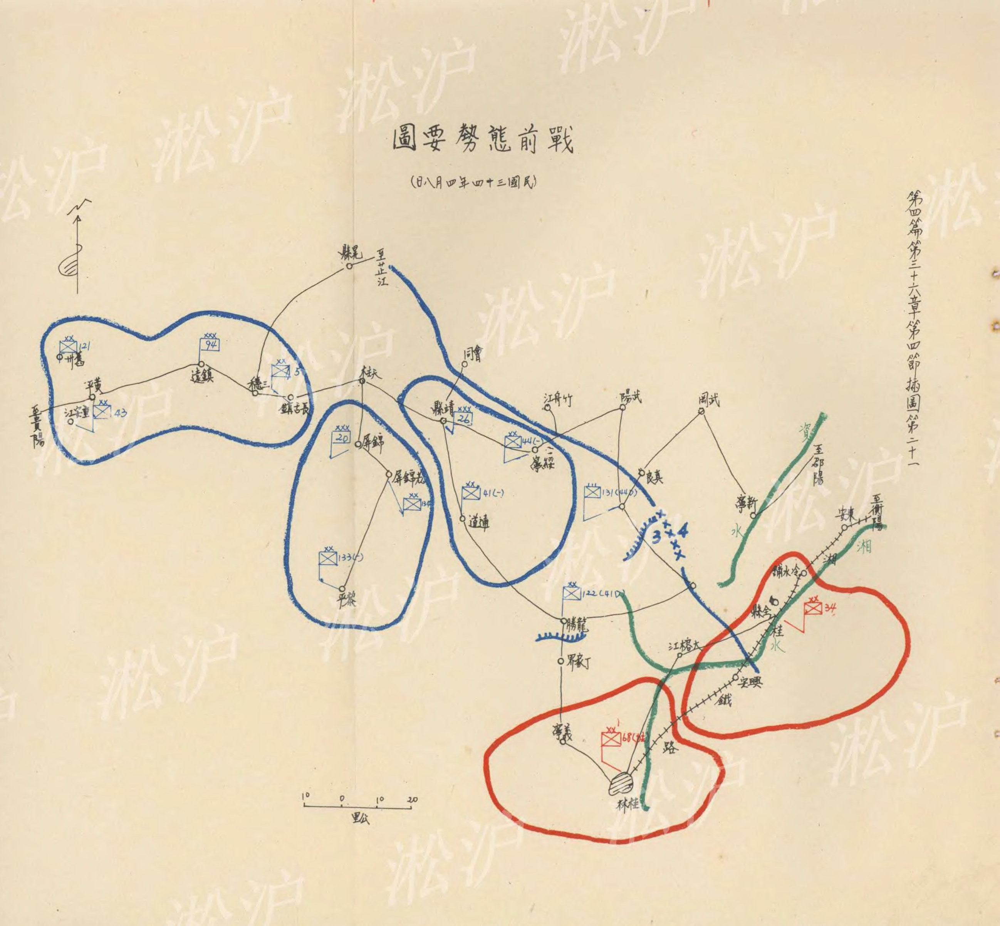

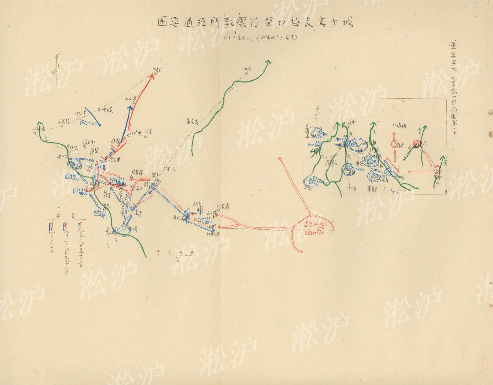

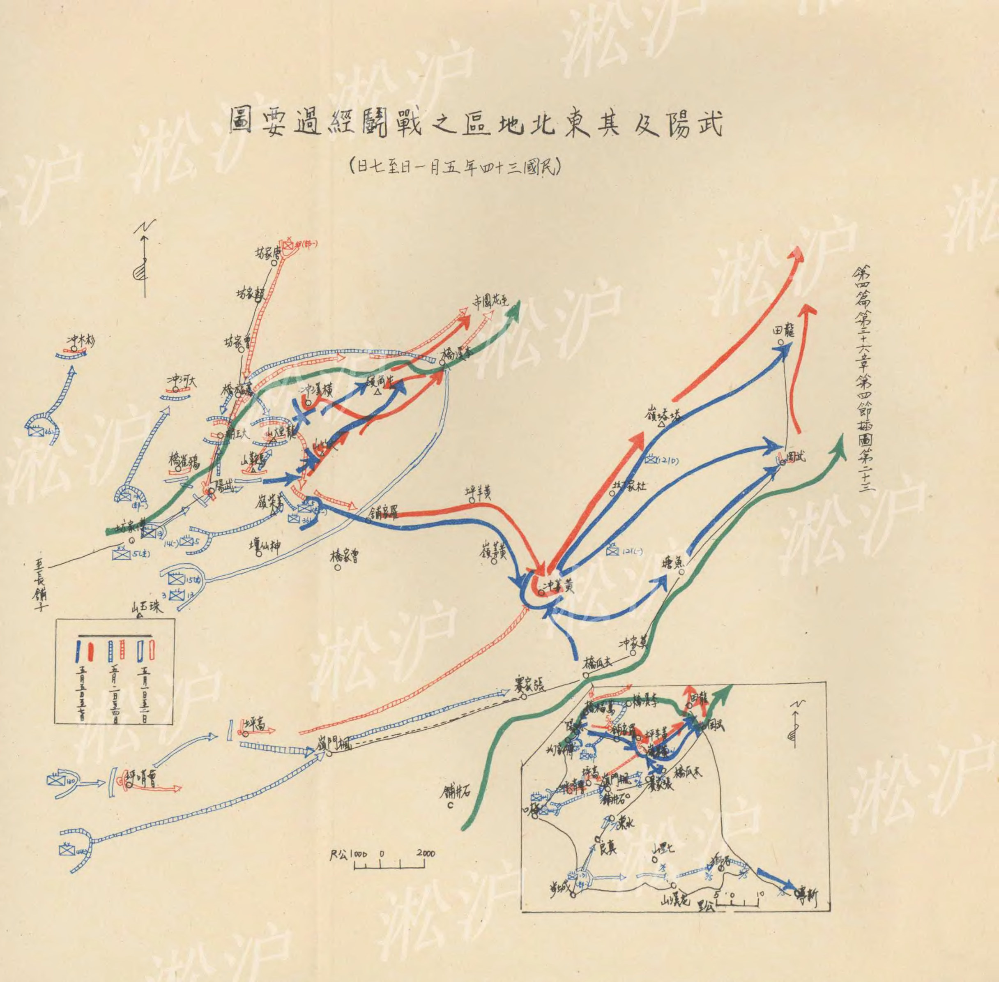

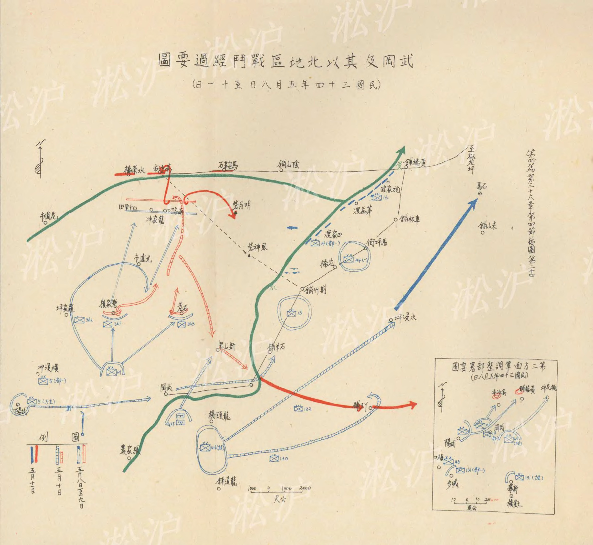

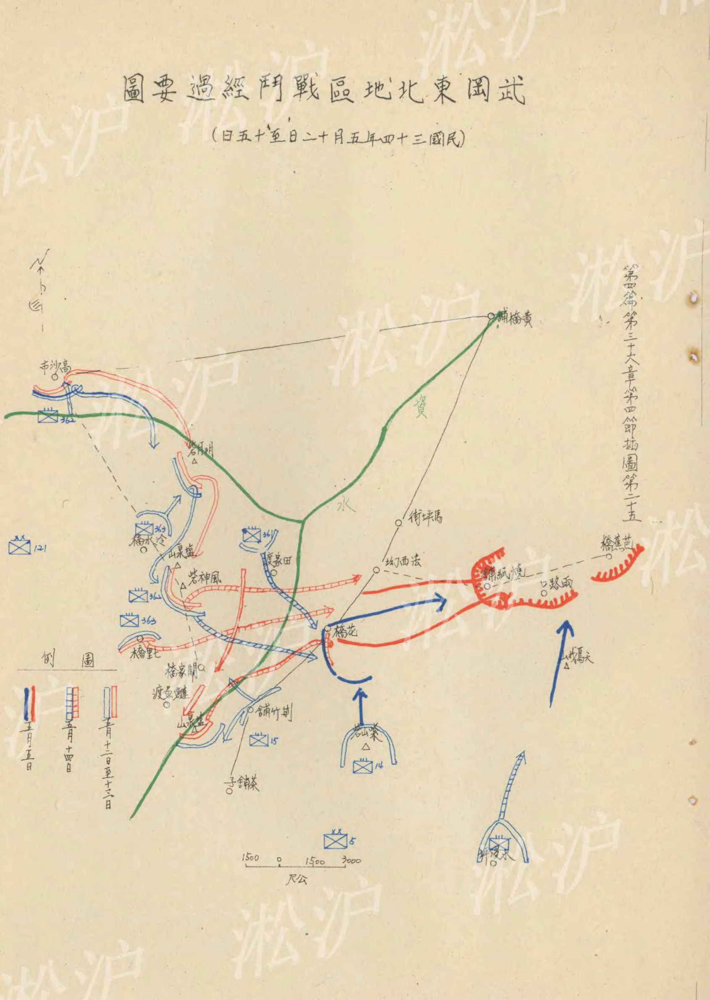

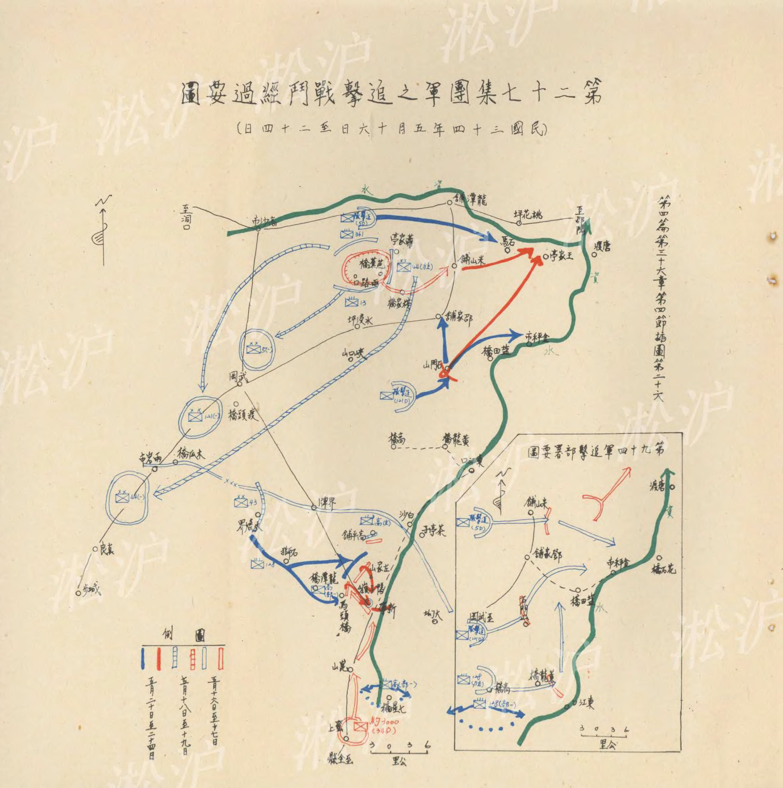

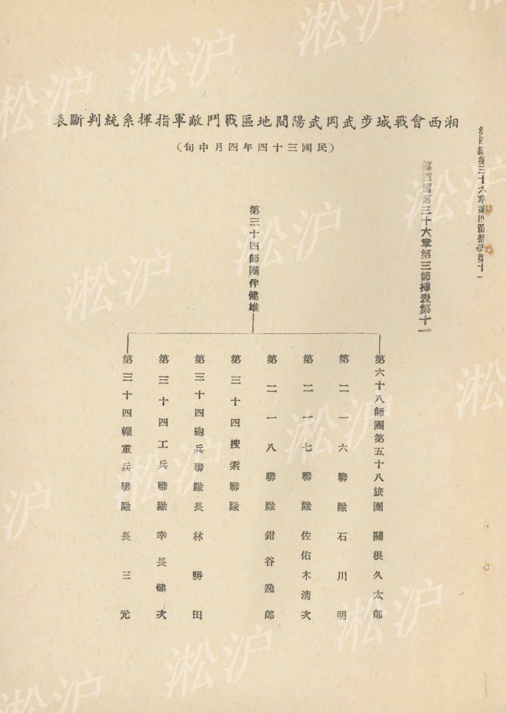

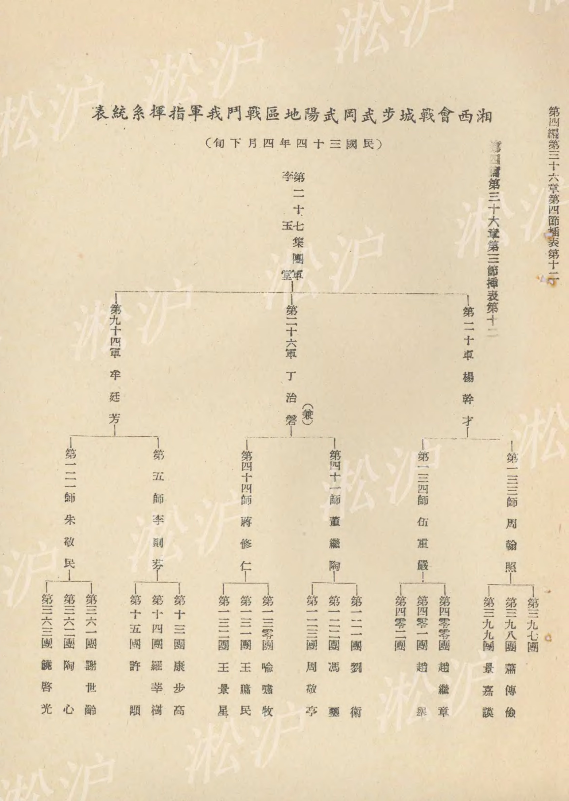

#### 第三款 邵榆公路及其兩側地區之戰鬥

民國三十四年四月十六日至五月二十五日

參照插圖第二十七至三十一插表第十三第十四

敵以分進合擊之戰法，企圖一舉攻略我芷江反攻基地，本戰鬥，爲敵全面攻勢中中央兵團之中央及左翼兩縱隊方面實施經過，初期以猛烈之勢向西突進，經我節節抵抗，在江口以東地區遭我堅強阻擊，敵勢頓挫，我乃全線反攻，並分途截擊，斬獲甚多，殘敵囘竄資水右岸地區，迄六月二日，方全部恢復會戰前之狀況。

##### 第一項 本地區附近地形

邵陽（寶慶）瀕資水右岸，自該地溯水而上，流速湍急，航行困難，公路東達湘潭、衡陽，西經桃花坪、洞口、江口而達榆樹灣，路面爲碎石敷設，寬達六至九公尺，爲京黔國道之一段，另有公路，南達東安、新寧，亦爲碎石敷設之路面，惟路幅僅寬及一、五公尺，桃花坪傍資水支流左岸，邵榆公路道經於此，另有公路北向，而達溆浦西南，經武岡而達城步，西經洪江，而達黔陽，交通至爲便利，邵陽迄洞口間，均爲數十公尺至百餘公尺標高不等之起伏地，對防禦作戰至爲有利，洞口位雪峯山東麓，經此西行，兩側山巒聳峙，幾及雲表，公路蜿蜒於重山峻嶺之上，除公路外，部隊運動至爲困難，雪峯山脈，南起武岡，向北伸展，經溆浦再折向東北而達桃源，爲我反攻基地芷江之天然屏障。

##### 第二項 戰鬥經過

參照插圖第二十七

插表第十三第十四

民國三十四年三月下旬，敵第一一六師團、獨立山砲兵第二聯隊、獨立工兵第四十聯隊、獨立第六十八旅團及僞第二師各部，分別集結於邵陽、九弓橋、唐渡各附近及金蘭市、余田橋間地區，從事屯備糧彈，並積極徵集渡河器材，作西進攻勢之準備。

本地區由我第四方面軍之第一百軍守備，該軍之第六十三師，集結於隆迴司、石井舖、鄭家舖間地區，第五十一師集結於山門附近地區，第十九師集結於石下江、白羊山、芭蕉塘各附近地區，除實施整補及訓練外，對各該地區之工事，均續予加強，資水左岸，由第十九師之第五十七團派出部隊嚴密警戒，並不時派出小部隊渡河搜索敵情，或予敵以襲擊，對敵此次蠢動之企圖，均瞭如指掌。

本戰鬥之作戰指導，爲以少數兵力沿資水左岸配置，對敵嚴密警戒，主力則控置於後方地區，於敵進犯時，以一部行逐次抵抗，並固守少數要點，相機截擊敵軍外，其主力則佔領旣設陣地，堅強阻敵於雪峯山南北之線，依第二十七集團軍及第十集團軍之協力轉移攻勢，捕捉敵軍於雪峯山以東地區而殲滅之。

敵第一一六師團之第一二零聯隊、獨立山砲兵第二聯隊之大部、獨立工兵第四十聯隊及師團輜重之大部、並僞軍第二師之一部、共約八千餘衆，

(參照插圖)

自四月九日起，陸續以小部隊偷渡資水，佔領橋

頭陣地，十六日晨，其主力分由唐渡、九弓橋、楓林舖渡河西進。

我第十九師之第五十七團，奉令歸第七十四軍指揮後，仍以其加強之第九連固守岩口舖，以其第一營固守芙蓉山據點外，並控制有力之一部，作機動之使用，不時對資水左岸之敵襲擊，十六日晨，敵一部二千餘，由楓林舖沿公路西攻岩口舖，遭該連堅強阻擊未逞，其由唐渡、九弓橋西進之敵，進至雙龍橋及雨山舖各附近。

四月十七日晨，敵主力陸續到達，除以一部搶修楓林舖以西公路外，並以一部六百餘，再度向岩石舖猛攻，仍未得逞，其雨山舖之敵四百餘，亦同時進至白竹橋，與我芙蓉山守軍之警戒部隊發生戰鬥。入夜，敵主力陸續到達，桃花坪陷入敵手，雙龍橋之敵進至蘿葡田附近，其由第一一六師團之第一三三聯隊、獨立山砲兵第二聯隊及僞軍第二師之各一部，聯合之敵約五千餘衆，亦由石馬江附近西進，已達山溪附近。

我空軍第五大隊，出動了型機四架次，於是日十四時許，飛臨桃花坪附近炸射可疑之村莊及樹林，戰果甚豐。

四月十八、十九兩日，敵除以一部搶修公路外，並對岩口舖、芙蓉山猛攻，我守軍在空軍協助下，浴血奮戰，使敵均未得逞，我空軍第五大隊，於十九日一日以內，先後出動五十八架次，直接協力地面部隊之戰鬥，其戰鬥之慘烈，概可想見，蘿葡田附近之敵主力約六千餘，則賡續西進，經我第五十七團之一部逐次抵抗，二十日進至黃橋舖、龍潭舖各附近，與我第五十七師第一七一團之第一營及第五十七團之各一部，發生戰鬥，其由石馬江西進之敵，一部進至賽市附近。

我空軍第五大隊，於二十日出動及型機共三十二架次，直接支援岩口舖守軍，及炸射桃花坪敵陣地後方設施等，計斃敵二百餘，馬十五匹，炸毀倉庫五所，彈藥庫一所，及敵陣地多處。

四月二十一日。

參照插圖

第二十九

進至黃橋舖、龍潭舖、南岳廟各附近之敵，分向馬鞍石，高沙市東北及石下江南北附近進攻，同時由賽市西進之敵，亦行抵水西橋附近，與我山門守軍之警戒部隊發生戰鬥。

時我第五十七師已遵第七十四軍甲字第一號作戰指示，部署完畢，乃以其第一七一團第一營第五十七團主力，及第一六九團第一營分別於高沙市、石下江、竹篙塘、山門各附近佔領陣地，阻擊敵人，其主力則集結於花園市、橋當頭、洞口、山門各附近地區，機動運用。

四月二十二日拂曉，敵各以千餘人分攻高沙市、石下江及山門以東之花橋、龍翅江等，當經我軍迎擊，高沙市當面之敵退回馬鞍石附近，石下江江左岸之敵，亦退據江右岸，惟山門附近戰鬥激烈，敵復以三百餘人，由桐木溪迂迴至馬脛骨附近，我當即以第一六九團之一部堵擊，敵未得逞。

四月二十三日晨，石下江附近之敵，以一部繼續西進，其主力則轉至馬鞍石附近，會同原有之敵，共約二千餘衆，續向高沙市猛攻，並以主力由高沙市以北向西突進，與我由竹篙塘南下應援之第五十七團第二營（附第一六九團第一連）遭遇於曲塘附近，經我軍反覆衝殺，斬獲頗衆，我連長童韜壯烈殉國，迄晚，該地及高沙市鏖戰頗烈，山門及馬脛骨方面之敵，雖再度猛攻，均爲阻遏。

是日我第五十七師遵該軍甲字第二號作命指示，除以第一七一團第一營仍於高沙市阻擊敵軍外，主力則佔領花園市、橋當頭、洞口、山門之線旣設陣地，並指揮第十九師之第五十七團，主力於竹篙塘附近機動作戰。

四月二十四日拂曉，高沙市當面之敵，再度向我猛撲，我官兵奮勇阻擊，迄晚仍在激戰，曲塘之敵，經我痛擊後，傷亡頗大，其一部曾西竄茶舖子附近，經我洞口守軍之警戒部隊驅逐，向東退去，馬脛骨當面之敵，以屢攻未逞，乃轉由大尉廟向山門攻擊，敵更以有力之一部，由龍翅江迂迴至山門東南附近攻擊，至是山門四面受敵圍攻，我乃以第五十七團之第一連及第一六九團第三營，分由南北地區，向山門之敵夾擊，敵勢始形頓挫。

四月二十五日，敵後續部隊逐次到達，並分向高沙市、山門各附近猛攻，我官兵英勇奮戰，雖敵我兵力懸殊，仍積極予敵以打擊及伏擊，斬獲頗衆，同時該軍奉王耀武司令官電令，以暫編第六師第一團，暫歸第五十七師師長指揮，於老栗山、枳木界各高地之線，構工備戰。

是日，我空軍出動戰鬥轟炸機十架次，協力地面部隊戰鬥，戰果甚豐。

四月二十六日晨，高沙市當面之敵續行猛攻，我第一七一團第一營逐次於高沙市、水南橋、新店、李家渡、各附近與敵戰鬥，曲塘、竹篙塘以東地區之敵千餘，因我第五十七團主力轉進洞口以西地區集結，遂分由資水兩側，向我洞口第一七零團第二營陣地攻擊，戰鬥至爲激烈，第一六九團第一營仍於山門與敵續行戰鬥，該團主力則向半江峯南北之線轉進，繼續機動作戰，是日我空軍出動戰鬥轟炸機六架次，炸射洞口附近之敵，死傷約百名，炸毀房屋二十餘棟。

是日晚，第五十七師遵軍甲字第三號作命指示，變更部署，以第一七零團第二營仍固守洞口，第一六九團以現態勢阻敵西進，第一七一團佔領大竹坪、句岩山，第一七零團佔領麻溪老、栗山，暫編第六師第一團佔領老栗山、枳木界，左迄油麻洞各線預備陣地，並以第五十七團爲師預備隊，各部當卽遵令實施。

四月二十七日晨，李家渡以東之敵，經我第一七一團第一營反擊後，當晚轉向洞口進攻，該營亦向花園市附近集結，歸還建制，洞口方面之敵，續增至二千餘，附砲兵兩個連，向我猛攻，激戰至午，洞口失陷，敵續向天門山及洞口以西公路各陣地攻擊，迄晚，我仍固守原陣地，山門方面之敵，經我連日之打擊，雖傷亡甚重，仍猛攻不已，是日拂曉，敵主力四千餘，附砲十餘門，向山門猛烈圍攻，並以一部各四百餘，超越向半江峯及老隘塘進攻，被我第一六九團主力及第五十一師之第一五一團之一部阻擊未逞，惟山門守軍以兵力衆寡懸殊，傷亡甚大，陷於混戰狀態，我空軍亦出動協力作戰，第七十四軍並以砲兵一連，配屬第五十七師，以增強火力。

四月二十八日拂曉，洞口之敵，增至五千餘衆，並附砲十餘門，向我陣地猛攻，我第一七零團之一部，與敵反覆衝殺，天門山以南之據點，失而復得者數次，卒賴我官兵英勇激戰終日，敵未得逞，半江峯當面之敵，同日亦增至千餘，向我猛撲，經我第一六九團第二營奮力阻擊，亦未得逞。

是日，我空軍第五大隊出動輕轟炸機十二架次，直接支援洞口、岩口舖等處地面部隊之作戰，戰果豐碩。

四月二十九日，山門守軍以一營兵力與優勢之敵苦戰八晝夜之久，已達消耗敵人之目的，遂轉移外圍機動襲敵，以利主力之作戰，半江峯方面之敵，同日向木篦山、平江、上下查坪之線進攻，我第五十七師以工兵營增援，協力第一六九團主力猛烈阻擊，敵無進展，洞口之敵，雖經我數日來之消耗打擊，但仍向天門山及洞口以西之山洞猛攻不已，當日我以山砲兵一連，於江口附近進入陣地，並完成射擊準備，决再予敵以嚴重打擊。

四月三十日，

第三十

天門山陷入敵手，攻佔山門之敵，於晨，以一部千餘，仍在山門西南老隘塘各附近，與我第一六九團及第一五一團各一部繼續戰鬥，其主力三千餘，則向木篦山亘上下查坪之線進攻，第五十七師遂以第一六九團主力續於上述地區阻敵西進，並以工兵營之一部，佔領肝溪要點，其主力則調至鐵山廟構築工事，另以第一七零團之一部及師搜索連分別佔領鐵山南北高地，阻擊敵人。

五月一日，洞口之敵，經我奮力反攻，天門山被我克復，該方面之戰局稍趨穩定，木篦山之敵一部已進至肝溪附近，遭我堅強抵抗，傷亡頗重，我空軍出動戰鬥轟炸機五架次，毀損敵陣地多處。

是日晚，我第五十七師判斷敵軍似有積極攻佔江口企圖，遂決心佔領青岩、鐵山及其以北高地之線，與敵決戰，卽令第五十七團、第一七零團、第一六九團各部，各以主力於青岩、鐵山及其以北高地之線佔領陣地，並以暫編第六師之第一團主力位置於塘灣地區，爲師預備隊，並對東方警戒，工兵營則轉至江口構築陣地。

五月二日晨，洞口之敵集中大量兵力，在大小火砲二十餘門之支援下，向洞口以西之山洞我旣設陣地猛攻，我守軍一排浴血奮戰，終以兵力衆寡懸殊，全部壯烈殉職，該敵乃以一部千餘，續向狗扒岩及其以南我第一七零團第二營攻擊，其主力三千餘，則一舉突入現江、肝溪附近，午後，糾集六千餘衆，並附砲二十餘門，向我青岩、鐵山之線陣地攻擊，經我空軍全日出動，戰鬥轟炸機二十一架次，協力地面部隊之戰鬥，敵終未逞，迄晚，敵攻勢益猛，戰鬥至爲慘烈。

五月三日拂曉，敵續向青岩、鐵山之線猛攻，我第五十七團之一部，在空軍直接支援下奮勇衝殺，激戰至午，敵攻勢始形頓挫。

同日，暫編第六師奉令歸第七十四軍指揮，該軍當即以甲字第五號作命，飭令該師於翌日拂曉前以一個團接替黃腰峯亘一零五零高地間第一七一團之防務，以一個團向獨尖山、現江、肝溪、奉家樓等處之敵攻擊，第一七一團交防後歸建，並令第五十七師（配屬暫編第六師第一團及第五十七團主力），以一部佔領麻溪老、栗山間陣地，另以一部控置於枳木界西北地區，其主力守備句岩山、麻溪、青岩、鐵山、天台界間縱深陣地，並以有力之一部向敵出擊，同時令第五十一師以一個團進出上下查坪，向敵攻擊，以協力第五十七師之戰鬥。

第五十七師奉命後，即以第一七一團第二營主力參加青岩方面之戰鬥，該營行動迅速，午後即由青岩向敵出擊，左翼部隊亦同時出動，我空軍第五大隊全日出動戰鬥轟炸機二十一架次，協力地面部隊向敵猛烈衝殺，斬獲頗衆，當晚敵以一部千餘，分向青岩、鐵山之線夜襲，猛攻十餘次，激戰澈夜，時洞口方面之敵，仍對我天門山陣地猛攻不已，均遭我堅強之阻擊，未能得逞。

五月四日拂曉，敵糾集三千餘，砲數門，續分向青岩、鐵山猛撲，我第五十七師第一六九團及第一七一團之各一部，分向當面之敵側擊，我第五十一師第一五三團先頭亦到達上查坪，並續向天台界東側進出，攻擊平江西北地區之敵，暫編第六師第三團，同時亦向奉家樓之敵攻擊，我空軍自曉至晚，連續出動飛機協力作戰，先後計二十二架次，我官兵在其支援下，奮勇出擊，連克青岩、鐵山陣地前據點六個，殲敵甚夥，當日午，洞口之敵續攻我天門山陣地，激戰數小時後，該處守軍全部壯烈殉職，敵佔天門山後，並續向界頂攻擊，激戰至晚，敵終未逞。

五月五日晨，敵以全力向我青岩、鐵山及天台界東側等陣地全面猛攻，我官兵在空軍協力下（全日出動二十九架次），奮勇阻擊，戰鬥異常慘烈，迄十六時許，敵終未逞，黃昏時，敵一部竄至天台界北側，我當即以第一六九團及第五十一師第一五三團之各一部猛烈夾擊，敵傷亡慘重，遂乃回竄，洞口方面敵我陣地犬牙交錯，雙方爭奪各小據點，戰鬥進行極爲慘烈，奉家樓方面之敵，經我暫編第六師第三團奮勇攻擊，迄十七時，將敵完全擊潰，而佔領之，並卽向獨尖山進出，掃蕩殘敵。

五月六日，青岩、鐵山當面之敵，續向我猛攻，均遭我猛烈阻擊，毫無進展，我以第五十七團連日激戰，疲憊過甚，乃以第一七一團接替青岩防務，該團交防後，則控置於江口附近，當晚大雨傾盆，敵乘機集中兵力約四千餘，向我青岩陣地猛撲，經我軍奮力阻擊，敵仍未獲逞。

五月七八兩日，敵一再向我陣地攻擊，均經我軍奮勇反擊，漸成強弩之末，洞口方面之敵，亦呈頓挫，復經我暫編第六師第三團連日在洞口、江口間予敵以襲擊，更經我空軍第五大隊連日出動飛機達八十二架次之炸射，敵傷亡慘重，已漸成不支之勢。

八日，第五十七師奉令改歸新編第六軍指揮，並以第十三師之第三十八團配屬於該師，該師長根據當面敵情，遂決心於翌日轉移攻勢，並令洞口、山門附近之第一七零團第二營及第一六九團第一營，相機截擊敵後。

五月九日拂曉，我第五十七師（配屬暫編第六師之第一團、第十三師之第三十八團、第十九師之第五十七團主力），除以一部就江口附近佔領預備陣地外，參照插圖主力則由青岩、鐵山、天台界、上嶺界之線，全面轉移攻勢，猛烈攻擊當面之敵，敵不支，分向洞口、山門方向撤退，我第五十七師除一面就地掃蕩殘敵外，並以第三十八團、第一六九團第三營、第一七零團及第一七一團之各一部，分三路行戰場內之追擊，並分電洞口、山門各附近之原守備部隊，卽行相機截擊敗潰之敵，同時我暫編第六師，亦向現江、大灣挺進，截擊東潰之敵，我空軍第五大隊，全日出動戰鬥轟炸機六十五架次，密切支援地面部隊作戰，戰果豐碩。

五月十日，我各路追擊隊，跟踪追擊，九時許，於現江附近與敵三百餘之掩護部隊遭遇，我當卽展開攻擊戰鬥，至十六時，敵不支東潰，斃敵百餘，我軍傷亡三十餘名，我空軍出動飛機共二十八架次，除對據洞口、山門之敵炸射外，對東潰之敵，亦予偵察及炸射，敵傷亡頗重。

五月十一日，我左翼追擊隊第三十八團，於半江峯附近與敵掩護部隊六百餘，展開激戰，迄十八時，敵不支，向旋岩山方向潰竄，該團仍繼續猛追，鹵獲頗多，中央追擊隊，第一六九團第三營，於進抵月塘附近時，偵悉敵擬在月塘宿營，該營遂於入夜後向敵夜襲，敵不及應戰，乃分途潰竄，我右翼方面東潰之敵七百餘，於洞口以西地區，向我原守備部隊之第一七零團第二營猛攻，戰鬥激烈，後以我中央追擊隊馳至，向敵圍攻，敵大部就殲，殘敵向洞口潰竄，我乃續行追擊，十九時，第七十四軍奉王耀武司令官電令，第十三師之第三十八團，卽推進至山門附近，歸第十八軍第十一師師長指揮，參加追擊，當卽電飭遵照。

五月十二日，我左翼方面已進至山門，並與第一六九團第一營取得連絡，右翼方面已進至洞口以西附近，同時高沙市方面之敵，亦爲我第五十八師及第九十四軍之各一部協力擊退，第十八軍之一部，已進至山門、賽市各附近，繼續向南壓迫，第七十四軍，依據當時狀況，遂令暫編第六師之第一團歸建，以該師之全部，並指揮洞口附近守軍第一七零團第二營，繼續沿公路實行追擊，第五十八師，除山門部隊及第一六九團第三營，仍繼續追擊外，餘卽集結江口附近，整補待命。

五月十三日一時許，各部遵命開始行動，我第一七零團第二營，協力暫編第六師之一部，向洞口之敵猛攻，連克據點多處，至六時許，克復洞口，敵遺屍盈野，狼狽逃竄，同時我第一六九團主力，亦進至破塘，斬獲頗衆，我空軍第五大隊，出動戰鬥轟炸機三十五架次，協力對洞口之攻擊，戰果甚豐。

五月十四日拂曉，由洞口敗退之敵，經我暫編第六師正面壓迫，及第一九三師第五十八師之第一七四團，並第五十七師之第一六九團，協同南北夾擊，敵幾無還擊之力，賡續東潰，我空軍全日出動三十六架次，予洞口以東山門、竹篙塘之敵損害頗大。

五月十五日，我暫編第六師在空軍支援下，克復竹篙塘、月塘兩要點，同時第十八軍之第十一師，亦進至山門以南地區，十六時，王耀武司令官下達電令，其要旨如左：

一、新化南洋溪橋附近之敵，已全部向南潰退，敵第一一六師團殘部，現經金龍砦向東逃竄。二、方面軍決卽調整部署，繼續猛攻當面之敵，而殲滅之。

三、第七十四軍。

(一)第一九三師卽佔領龍潭舖、德州之線，阻敵南竄，並派有力部隊北渡，協力第一一八師截擊東竄之敵。

(二)另一部佔領德州、竹篙塘之線，阻敵南竄。

(三)暫編第六師主力卽經竹篙塘向石下江繼續攻擊前進，一部卽經月塘攻佔菱角田。

四、新編第六軍，卽以第五十七師一部掃蕩月塘山之敵，其餘仍在原地控置，並整理交通。五、余在安江指揮所。

第七十四軍奉命後，當卽下達甲字第九號作命，其要旨如左：

一、第一九三師卽佔領龍潭舖、德州之線，防敵南竄，並派有力部隊北渡，協力第一一八師截擊東竄之敵。

二、第五十八師以一部佔領德州、竹篙塘之線竄，防敵南竄。

三、暫編第六師，限十六日十八時前將當面之敵擊破，續向石下江追擊前進。

四、第五十七師之第一六九團，掃蕩山門、洞口、江口間之殘敵。

五、軍指揮所本日午後推進至花園市。

各部隊奉命後，當卽開始行動，暫編第六師續向竹篙塘以東地區壓迫，敵乃據金龍砦、高級嶺、土橋、破塘之線頑抗，激戰竟日。

五月十六日，暫編第六師第三團，續向高級之敵猛攻，克冷水坳，並奪佔該山之大部，該師第一團於十時許攻克洪橋後，續向土橋攻擊，時敵一股由山門竄菱角田，經該師第二團截擊後，向東南潰退，鹵獲彈械文件頗多，第一九三師自洞口以南向高沙市、黃橋舖、石下江之線追擊，沿途掃蕩殘敵，已進至上園里附近，我空軍出動戰鬥轟炸機十二架次，炸射竹篙塘以東地區之敵，斃敵百餘名，馬二匹，毀彈藥庫一所，砲一門及陣地多處。

五月十七日，第七十四軍爲保持機動，令第一九三師除擔任原任務外，並派部隊接替第五十八師第一七四團之德州至竹篙塘間沿河守備任務，限於十八日十六時前接替完畢，且須與暫編第六師切取連絡，相機截擊東潰之敵，第一七四團交防後，集結光遠市待命，我空軍出動飛機十八架次，炸毀金龍砦等處敵工事多處。

五月十八日，高級嶺之敵，經我暫編第六師第三團猛攻，迄十三時逐退，佔領該山，十九時，攻佔三七一二高地，殘敵向洋塘、魚家井潰退，該師之第一團，於十時許攻克磚屋底東側高地，並續向子風冲、官竹山之線攻擊，敵雖三度增撲反撲，均爲我奮勇擊退，我空軍出動十四架次，炸斃敵二百餘名，炸毀砲兵陣地一處。

五月十九日，新寧之敵續增，似有再度進窺武岡企圖，第七十四軍爲適應狀況，擊滅殘敵計，遂下達甲字第十號作命調整部署，其要旨如左：

一、第一六九師卽集結武陽及其東南地區，對東南嚴密警戒。

二、第五十八師主力集結李溪橋附近，以一個團控置花園市。

三、第五十七師迅速補充糧彈，卽集結於瓦屋塘及其東南地區。

四、第一九三師應卽向左延伸，接替第五十八師德州至竹篙塘間任務，阻敵南竄，並續行截擊。

五、暫編第六師以一個營接替洞口第五十七師第一七零團第二營防務，其主力仍繼續攻擊當面之敵，務協同第十八軍於二十日前將殘敵肅清。

六、軍部仍位置於花園市。

各師均遵限於二十日部署完畢，當面之敵，在我空軍之炸射及我暫編第六師之猛攻下，向桃花坪和尚橋方向潰退，該師並跟踪追擊中。

五月二十一日，第七十四軍奉王耀武司令官電令要旨如左：

一、暫編第六師，卽沿公路向楓林舖南北之線追擊。

二、第一九三師集結於龍潭舖、石下江、三角塘間地區待命。

三、第十八軍迅向和尙橋、岩口之線殘敵攻擊。

同日東潰之敵，據銅盆江以南高地亘辰溪左岸雷鳴山和尙橋之線頑抗，迄二十二日十八時後，敵更以一部西渡辰溪，包圍芙蓉山守軍我第十九師之第五十七團第一營陣地，我暫編第六師以狀況危急，乃乘敵立足未穩之際，當夜向芙蓉山斷然襲擊，奪回陣地一部。

五月二十三日，我爲澈底肅清殘敵計，乃以暫編第六師協同第十八軍在空軍支援下，向敵猛攻，戰鬥至爲慘烈，迄二十五日四時，我暫編第六師，協力芙蓉山守軍，克復該山南部三個高地，殘敵一部向東潰竄，餘敵三百餘，仍據北部頑抗，同時王耀武司令官，電令暫編第六師改歸第一百軍指揮，協力芙蓉山守軍，繼續追擊，第七十四軍當卽轉飭遵照，至是邵榆公路兩側地區戰鬥，遂告結束。

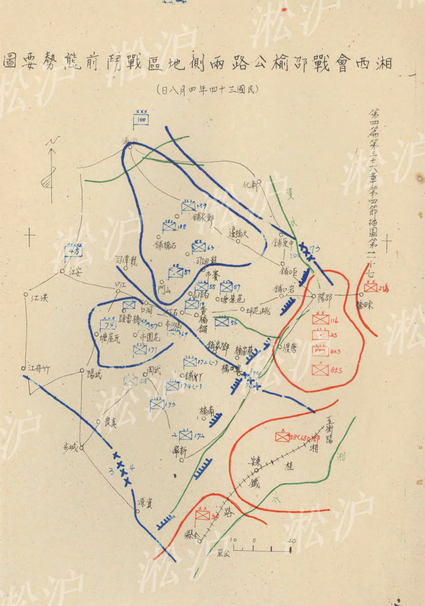

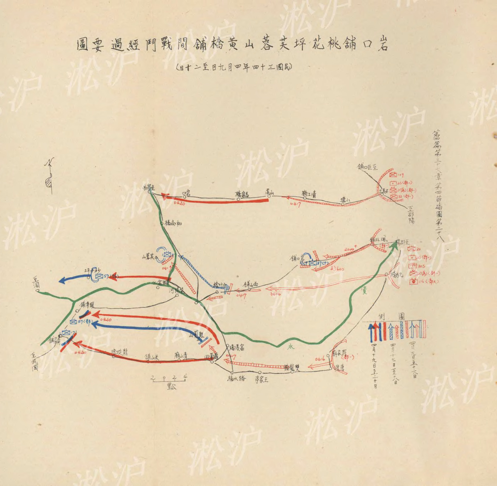

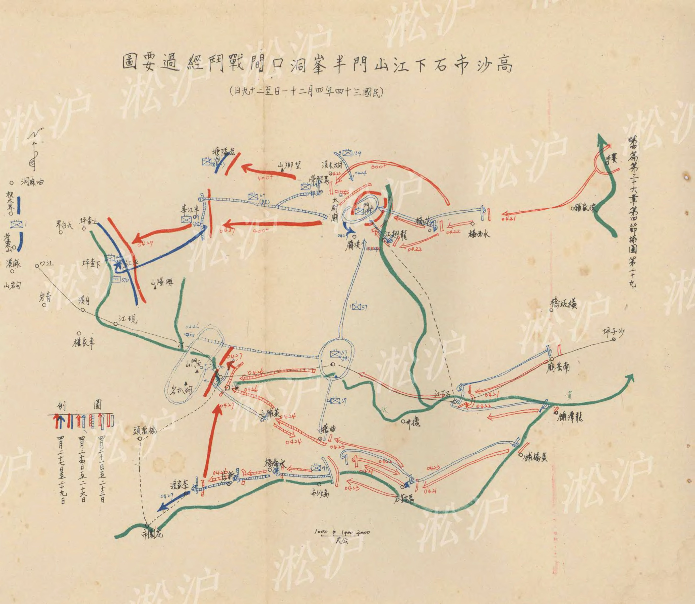

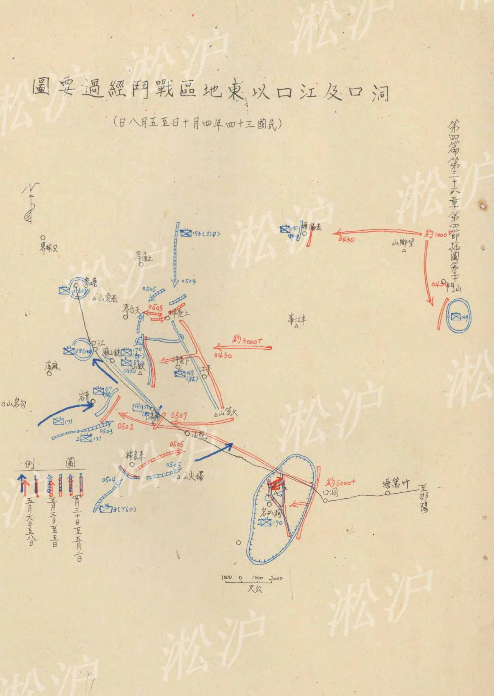

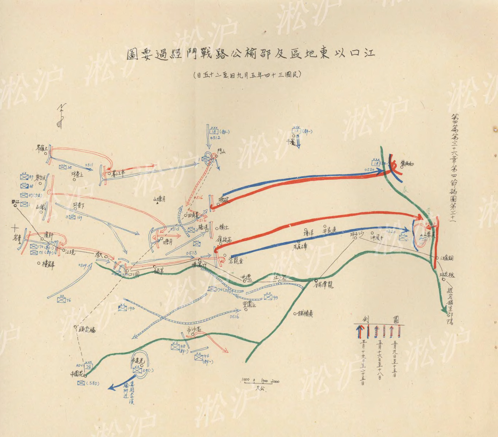

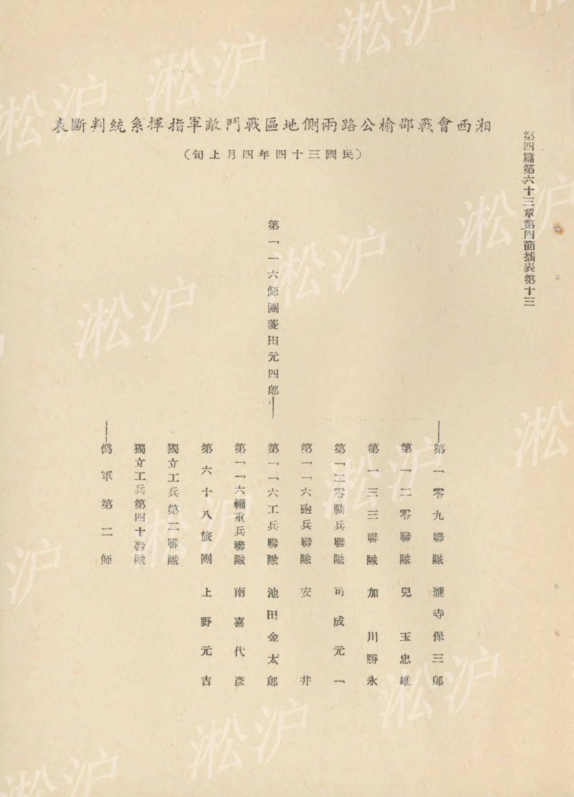

# 第四篇第三十六章第四節插表第十四

## 丙路公榆邵戰會西湘

十三國民)

第十八軍胡

琏

第十八師

覃道善

第五十四團

李維勛

第十一師

楊伯濤

第三十三團

李樹蘭

第三十一團

尹鍾嶽

第三十二團

張滌瑕

第三十三團

李樹蘭

第五十二團

沈熙文

第五十三團

尹俊

第五十四團

李維勛

第一一八師

戴

樸

第三五二團

楊國傑

第三五三團

余冲

第三五四團

黃述三

第五十七師

李

琰

第二六九團

宋子玉

第一七零團

孫進賢

第一七一團

杜鼎

第五十八師

蔡仁傑

第一七二團

明

燦

第一七三團

蔣立光

第一七四團

李運良

第五二

一

一

一

一

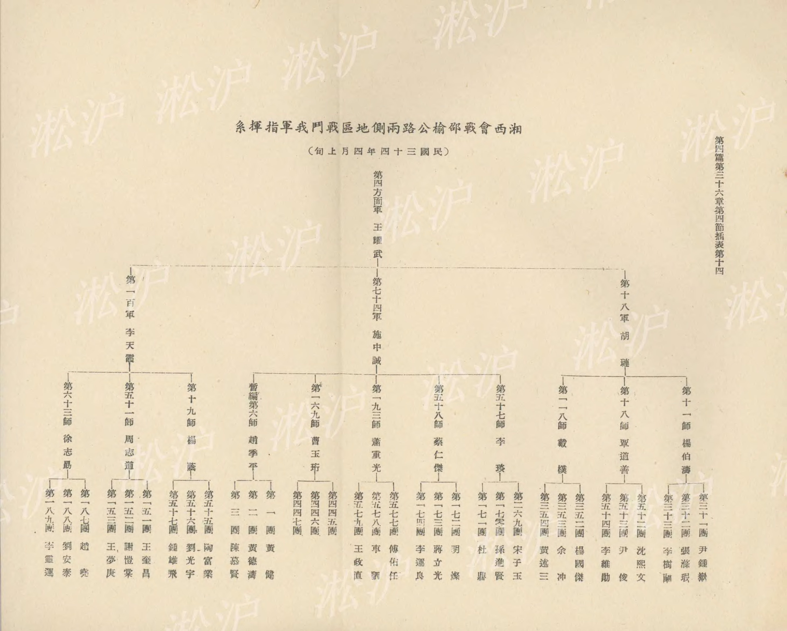

#### 第四款 邵陽西北至龍潭司間地區之戰鬥

民國三十四年四月十二日至六月二日

參照桶圖第三十二至第四十一插表第十五第十六

本戰鬥，屬敵全面攻勢之中央主力兵團右縱隊，初調鑽隙突進，進展頗速，我軍逐次阻擊，敵雖受重創，仍續西攻，迨攻抵放洞附近，遭我第五十一師奮勇阻擊，敵攻勢頓挫旋我第一百軍主力到達，向該敵包圍攻擊，使其傷亡慘重，殘敵雖突圍潰竄，終被我將其全數殘滅，該軍被參加邵榆公路、及其兩側地區之追擊，迄六月二日，已全部恢復會戰前之態勢。

##### 第一項 本地區附近地形

本戰鬥範圍，以邵陽、龍潭司、桃花坪、艾花坪間地區爲主，公路除邵榆公路外，尚有邵新（化）

及巨（口鋪）溆（浦）、桃（花坪）溆兩公路，餘均屬鄉村道，縱橫四達，交通尚稱便利，本地區，除資水外，無大河流，對作戰不成障礙，巨口鋪、龍溪鋪均位於資水左岸，東瞰資水，邵新公路道經於此，巨溆公路，更於巨口鋪與邵新公路啣接，爲資水西側之要點，自巨口鋪迄隆迴司間地區，地勢綿亘起伏，標高均在百公尺以下，適野戰部隊運動，隆迴司以西，卽爲雪峯山脈，羣山聳立，幾及雲表，其中以白馬山爲最，海拔二零二零公尺，與月塘山南北遙相對峙，進攻退守，頗擅形勢之利。

##### 第二項 戰鬥經過

（參照插圖第三十二插表第十五第十六）

民國三十四年三月下旬，敵第一一六師團，將邵陽及其附近之防務，交由獨立第八十六旋團接替，該師團並獨立山砲兵第二聯隊，獨立工兵第四十聯隊及僞第二師各部，分別集結兵力於邵陽西南及西北各地區，並徵集民伕四百餘，及我被俘者之一部，積極搶修由邵陽至陽鋪之公路，並於四月初以小部隊潛渡資水，迄四月九日，其在資水左岸者，已增至千餘，主力且有繼續西渡之企圖。

本地區之守備，係由第四方面軍第一百軍擔任，於戰鬥發生前，除以少數部隊嚴密對敵警戒外，並以一部組成突擊隊，實施威力搜索，或不時予敵以襲擊，其主力則就地整訓補充，加強工事設施，時敵我態勢，如插圖第三十二。

當戰鬥發生時，我軍乃以一部於現守備線，行堅強之阻擊，依狀況逐次抵抗，以消耗敵人主力，控置於隆迴司及艾花坪附近地區，機動運用，適時擊破深入之敵，如不能達成上述之目的時，則誘敵深入，以一部固守敵後據點，並以多數突擊大隊深入敵後，從事襲擊，並切斷其後方交通，以遲滯並消耗敵人主力，控置於雪峯山東麓，利用有利之地形，相機轉移攻勢，將深入之敵包圍而殲滅之。

四月十二日晨，敵第一一六師團之第一零九聯隊全部及獨立山砲兵第二聯隊、獨立工兵第二十聯隊各一部，於楓林舖、石馬江間地區開始西進，其先頭之第一大隊，由我第十九師與第六十三師之接續部鑽隙突進，至南江橋、打石坪附近，我第六十三師之第一八七團，除以第六連守備山溪對敵嚴密戒備外，並以小部隊不斷向敵施行威力搜索，時已判明敵有攻略湘西進佔芷江我空軍基地之企圖，我第一百軍乃下達甲字第一號作命如左：

參照插圖

第三十三

第一百軍命令

民國三十四年四月十二日

於淑浦附近

一、當面之敵第一一六師團其一部於資水左岸者，自四月十日以來，已增至約二千，刻佔領河上橋、神灘渡、小塘、風吹亭、石馬江、烏龜壩之線，其一部已進至南江橋、打石坪附近，有繼續西進模樣。

另兵力約五千之敵，自四月九日以來，卽與我第七十三軍第十五師，於古嶽山、石頭橋、東關嶺、三口關一帶激戰中。

二、第十九師之第五十六、第五十七兩團，應共以三個營兵力，扼要配備桃花坪、南北原守備線，其餘應集結待命。

第一突擊大隊，於威力搜索任務完畢後，卽以岩口爲基點，向小塘及其南北地區，不斷予敵襲擊，並任第十九與第六十三兩師間之連絡。

第二突擊大隊，尅日移駐仙搓橋附近，分別擔任五峯舖方向及衡寶路之突擊，與情報之搜索。

三、第六十三師，除第一八七團仍任原守備任務外，第一八八團卽集結黃泥井附近待命，第一八九團卽由水車推進至小溪市至麻溪市間以西地區，以一部任資水左岸之守備，主力集結於禾靑市附近地區，到達後，暫歸第七十三軍韓軍長指揮。

該師並應於龍溪舖設立前方指揮所。

第四突擊大隊，卽移至麻溪市、龍口溪、資水以東山地，不斷向該地區之敵搜索襲擊。

四、兩師及第七十三軍之作戰地境線如次：

第十九師、第十三師西洋江、朝陽舖、伏龍山、灘頭南側、小塘、神灘渡相連之線。

第六十三師、第七十三軍夏公橋、洋溪橋、楓樹坪、大禾灘、沿資水左岸至邵陽城相連之線，線上屬左。

五、余仍位置於溆浦附近，並於大浦江設前方通信所，派高參率參謀一員，擔任連絡。

巨口舖、龍溪舖方面：

軍長

李天霞

四月十三日晨，

參照插圖

南江橋、打石坪之敵，繼續西進至山溪附近，經我守備山溪之第一八七團第六連猛烈阻擊，同時第一突擊大隊，由灘頭以東地區向該敵側擊，激戰兩小時，敵未得逞，乃北進至白羊塘、小羅沖附近，復興我第一八七團第三連發生激戰，同日十四時，敵百餘由天禾灘強渡資水，經我守備該地區之第一八七團第九連，奮勇迎擊，並擊沉敵渡船一艘，斃敵四十餘，敵乃退回，與我隔河對峙。

第一百軍，爲適應敵之鑽隙戰法，乃對第十九師下達命令，其要旨如左：

一、着第五十五團，卽派兵一營進駐賽市附近，其餘兩營仍分別位置於十里山及烏樹下附近。

二、第五十六團卽抽派步兵一營，於十四日拂曉出發，於十里山附近集結。

三、以上各部隊統歸該師李副師長指揮。

四月十四日晨，敵約千餘，分由清江廟、小水廟北向羅家坳、渡頭橋、新田舖之線，進攻我第一八七團守備部隊，當予以猛烈阻擊，終未得逞，十七時許，其主力約八百餘，礮二門，向我巨口舖、五湖廟鑽隙猛攻，激戰兩小時，卒因衆寡懸殊，雖受敵包圍，我仍堅守中，小羅沖當面之敵七百餘，經我第一八七團第三連阻擊後，乃西向大觀橋、樸塘橋各附近，與我守備該地之第一八七團第二連發生戰鬥，旋改經岩口、長郵沖深入至元姑寨附近，與我第十九師第五十五團之第一連發生激戰，時我第一八七團奉該軍電話指示，應竭力阻敵西進，並須指定部隊固守山溪、巨口舖、龍溪舖及據點，該團當卽調整部署，命第二營以第六連固守山溪，加強第五連固守巨口舖外，該營（欠）則固守龍溪舖等各據點，第一線各部隊，仍以現態勢竭力遲滯敵之西進。

我守備巨口舖之加強第五連與敵激戰澈夜，迄十五日晨，我第一八七團以一部分途應援於巨口舖、龍溪舖各據點外圍，協力守軍內外夾擊，敵我傷亡均重，我軍仍前仆後繼，反覆衝殺，血戰三小時，敵終未越雷池一步，旋敵增援部隊到達，再度向我猛撲，我軍浴血奮戰，尤以巨口舖方面至爲慘烈，該守軍咸抱與陣地共存亡之決心，時雖僅存排長以下二十餘員名，仍據險固守，及至黃昏後，敵乃糾合巨口溪、龍口溪、田心三處，共約八百餘，連龍溪舖之敵，再行猛攻，龍溪舖戰鬥，至爲慘烈。

四月十六日晨，敵繼續猛撲我龍溪舖陣地，我第一八七團第二營沉着應戰，激戰竟日，巨口舖因敵後續部隊逐漸到達，致陷重圍，無法應援，十二時半，我守軍全部壯烈殉職，進攻擊羅家坳、五湖廟之敵，同日拂曉，繼續北攻，經我第一八七團主力，於栗坪、順水橋、車家橋、大橋邊各線逐次抵抗，時敵已增至二千餘衆，十二時許，該團以通信連絡中斷，乃逐次向水車方向轉進，十七時許，敵向雪界、金竹山之線進攻，經該團反擊後，敵傷亡頗重，乘夜退回，該團逐以一部跟踪追擊，主力就地整頓態勢，準備爾後之作戰。

四月十七日拂曉，圍攻龍溪溪之敵，攻擊再興，我守備該地之第一八七團第二營陷於孤立，而官兵均抱必死之決心，浴血奮戰，迄午，以電訊中斷，情況不明，我餘部乃於八日晨繞道歸建。

馬王坳、隆迴司方面：

參照插圖

第三十五

四月十四日，進抵長郵沖、元姑寨之敵第一零九聯隊第大隊，於十五日賡續西進，至羅洪界附近，我第十九師第五十五團第三營及第五十六團第二營，分由十里山、賽市向該敵攻擊，敵不支，向西北逸出，我第五十五團第三營乃先敵佔領隆迴司，並協同第五十六團第二營，將敵包圍於魏家冰北方，斬獲甚衆，殘敵遂利用夜暗，紛向西南鑽進，我第五十六團第二營跟踪追擊，第五十五團第三營仍固守隆迴司第五十六團第三營時亦到達該地，又進抵大橋邊之敵，約一大隊繼續西進，其一部四百餘向我馬王坳猛攻，我守軍第五十五團之第二連奮力阻擊，雖衆寡懸殊，仍據險固守，經血戰後，連長以下傷亡殆盡，僅餘士兵十餘名，由兩班長指揮，浴血衝殺，終於全部壯烈成仁，其另一部，約七百餘，向我烏樹下之第五十五團第一營陣地猛攻，鏖戰竟日，時馬王坳之敵，與由大橋邊西進之敵會合，除以一部五百餘，向牛形咀方向西進外，其主力繼續圍攻我烏樹下陣地，我軍堅苦奮戰，敵雖數度猛樸，終未得逞。

我第一百軍奉王耀武司令官四月十四日（卯寒理榮）電令，命第五十一師卽由山門出發，依三日行程，經龍潭集結溆浦控置，並歸該軍軍長指揮，該軍當卽轉令遵照。

四月十六日，由魏家冰突圍西竄之敵，經我第五十六團第二營跟踪追擊，於白馬山附近，與敵激戰，該敵仍不顧一切，經由油溪坪突進至紅岩，放洞附近，該營復猛烈攻擊，敵憑堅頑抗，雙方傷亡均重，同時敵一部二百餘進據青山界，我當以第十九師之防毒連（與步兵連裝備略同）阻擊於進馬江以西地區，敵無進展。

第一百軍，同日午奉王耀武司令官電令：「該西竄之敵，由第五十一師負責阻擊，並擊滅之，」該軍當卽轉令該師留置一團於橫壠附附近其主力進至龍潭司附近，務於山門北端亘老隘塘，進馬江之線，阻擊自白馬山西竄之敵，而殲滅之。

四月十七日晨進攻牛形咀之敵，與我第五十五團第三營激戰，我軍奮勇阻擊，敵未得逞。

四月十八日晨，由馬家莊西進之敵，猛攻賽市，我守軍第五十五團第一連，與敵激戰竟日，斃敵甚夥同時牛形咀之敵，是日亦超越繼續西進，十三時許，敵增至千餘，向隆迴司東側陣地猛攻，雖先後猛衝十餘次，經我軍奮勇阻擊，未得逞，入夜後，仍激戰未已，是日紅岩，放洞附近之敵一部約三百，進攻大、小黃沙，經我第五十一師第一五三團圍殲，頗有斬獲。

同日二十時，第一百軍奉王耀武司令官電令要旨如左：

一、隆迴司、土嶺界、青山界各要點，仰派隊固守，阻敵後繼部隊西竄。

二、仰該軍長嚴飭所屬，負責殲滅放洞、大黃沙附近之敵，免影響戰局。

三、第六十師第一八九團卽行歸還建制。

該軍奉令後，除令第五十一師力阻竄抵放洞、大黃沙之敵，並迅予殲滅外，對第十九師及第六十三師調整部署，其電令要旨如左：

一、第十九師。

(一)第五十五團，應就現態勢阻敵西進，並殲滅之。

(二)第五十六團第二營，追擊西竄白馬山之敵後，應以進馬江爲連絡基點，向西南側擊放洞之敵，團部及一個營仍位置於土領界附近，另一營應卽進至小沙江。

(三)第一突擊大隊，應向西竄之敵猛烈追擊。

二、第六十三師：

(一)第一八九團應迅進至兩了坪，限十九日十九時前到達。

(二)第一八七團集結於三角塘以南地區。

(三)派第三突擊大隊（附電臺一部）卽進至北斗溪，向以南地區警戒，掩護該師右側安全，並與沙口灣第一五二團之一部切取連絡，第四突擊大隊應跟踪敵人，西渡資水，於大橋邊，龍溪舖一帶，任敵後突擊，務獲戰果。

四月十九日晨，隆迴司當面之敵，增至二千餘衆，藉雲霧彌漫之天候，繼續向我猛撲，並分一部向石橋舖、椒木塘鑽隙突進，隆迴司之守軍致陷孤立，我第五十五團（欠第一營）仍分別派隊阻擊，激戰竟日，尤以石橋舖東北地區戰鬥最烈，黃昏時，敵於施放毒氣後，再與攻擊，我第五十五團陶富業團長，於通信補給困難之情況上，親率所部，與敵奮戰，入夜後，並率兵兩連，向敵逆襲，反覆衝殺，斃敵甚夥，同日進攻賽市之敵，約六百餘，繼續猛攻，情勢危急，適我原固守烏樹下之第五十五團第一營主力（欠第一連及第二連主力）奉令增援賽市固守，經奮勇阻擊，敵迄未得逞十九時許，第一百軍援獲第十九師楊蔭師長四月十九日十二時電報稱，該師遵令調整部署，其概要如左：

一、第五十五團，仍於賽市、十里山、隆迴司各附近，對西進之敵勇猛阻擊中。

二、第五十六團第二營，已至紅岩以東，側擊放洞附近之敵，第三營已佔領土嶺界，第一營午後歸還小沙江，團部位置於艾花坪。

三、師指揮所，於十九日上午，已移駐小沙江東北之金竹山。

四、第一突擊大隊，已飭向隆迴司西進之敵猛烈追擊，第二突擊大隊，於十八日下午，移至大灣里附近，積極活動。

四月二十日晨，向賽市、隆迴司進攻之敵，除各以一部繼續攻擊外，主力千餘，經石橋舖、椒木塘向西、北前進，八時許，在細雨紛飛中，攻我土嶺界陣地，當經我第五十六團奮勇阻擊，時第一百軍奉王耀武司令官電令指示：「水車之第七十三軍暫編團，卽推進至黃泥井，並派加強營，接替隆迴司第五十五團防務」。

是日向土嶺界進攻之敵，與我第五十六團守備該地附近之第三營激戰竟日，另以一部三百餘，圍攻土嶺界東北一四六零高地，我守備該地之部隊傷亡四分之三，同時敵後續部隊二千餘，馬牛共約千匹，由馬家莊經魏家迯以南竄至小黃灣附近，向土嶺界以西之艾花坪猛攻，同時另部敵三百餘，由土嶺界以東地區向北方魚麟洞、蘭草田附近前進，與我第六十三師第一八八團之某營發生激戰，迄黃昏後，敵無進展，此時土嶺界三面受敵，失去對東控制之天險，我據守該地之第五十六團第三營集衆寡懸殊，傷亡慘重，仍節節抵抗，迄黃昏後，該團始轉移牛家店以東亘一二七零高地之線，繼續戰鬥，時該團第一營亦由山門趕到，當卽加入戰鬥，激戰澈夜，敵終未得逞，斯時第一百軍鑒於敵主力已竄集艾花坪附近，且因地形之不利，爲適應情況，決心以第一線部隊之持續堅強阻擊，配合第五十五團敵後之襲擊，以收夾擊殲敵之效，當卽對第五十五團下達電令，該團賽市之營，卽移隆迴司歸建，該團長會合第一突擊大隊，集結隆迴司附近，先以一部向土嶺界敵後攻擊，主力俟水車之暫編團加強營接防後，繼續攻擊，期獲戰果，並用突擊大隊電臺，隨時與軍連絡，傷患可經黃泥井後送。

四月二十一日晨，艾花坪附近之敵主力挾四千之衆，藉礮兵之掩護，向我牛家店以東亘一二七零高地之線，再興攻擊，並以一部三百餘，進攻小沙江，經我第五十六團奮勇阻擊，迄十三時，雙方傷亡均重，時我第五十五團已將隆迴司、賽市防務交由第七十三軍暫編團接替，當卽向敵後攻擊，並攻佔土嶺界，我遂乘勢全面轉移攻勢，第五十五團由東南、第五十六團主力由西北、第六十三師之第一八七團第二營由北三面合力夾擊，激戰二小時，敵不支，紛向萬家沖、長衝方向逃避，陣前遺屍二百餘具，我各部亦跟踪迫擊，同日被困放洞附近之敵，經我第五十一師主力之圍殲，傷亡慘衆，其一部二百餘，向青山界逃竄，經我第五十六團之阻擊，傷斃頗重，迄晚仍在該處南側碉堡附近，與我對峙。

四月二十二日拂曉前，我躡敵之第五十五團第一營，冒雨夜襲萬家沖，奮勇攻佔應地，敵向長衝逃竄，另部敵四百餘，於拂曉後分向分水界、大沙江猛攻，掩護其主力西竄，當與我第五十六團發生激戰，十時許，該團長率第一、第三兩營，向敵出擊，士氣振奮，爭先恐後，勇猛衝殺，敵不支向長衝潰竄，我乘勝追擊，及午我攻佔長衝，旋敵糾集殘敵八百餘，向該團反擊，每一高地雙方反覆衝殺，肉搏爭奪，戰鬥之慘烈，爲會戰以來所僅見，該團第一營劉振洲營長，率領所部與敵短兵相接，殺聲震天，該營長雖身負重傷，仍奮勇奮戰，以致再傷殉職，全營官兵悲憤之餘，前仆後繼，氣沖斗牛，卒將頑敵擊退，是日計斃敵大隊長宇棍清治以下二百餘名，鹵獲甚多，開會戰勝利之先聲，同日青山界附近之敵，仍與我第五十六團第二營對峙中。

龍潭司以東地區方面，（參照插圖）四月十七日午，我第五十一師奉令於龍潭司以東地區，阻敵西進，十九時許，該師卽以一部佔領圭洞以東地區，發生激戰。

四月十八日拂曉，敵各一部佔領紅宕及一四五零高地，其主力卽大舉向我攻擊，我第五十一師第一五一團之一部及第一五三團主力，堅強抵抗，敵勢稍挫，我遂予反擊，十二時許，我第一五一團之一部，攻佔小黃沙，並乘勝追擊，復將紅岩以南之高地克復，第一五三團，亦將大黃沙高地克。

四月十九日晨，放洞之敵三百餘，鑽隙向嶺脚進攻，被我第一五一團堵擊回竄，同時我各部分向紅岩、放洞南北高地及大黃沙東北高地之敵，繼續猛攻，我官兵奮勇衝殺，幾經肉搏，我第一五一團第四連劉鶴齡連長，率部衝至紅岩、山頂廟內，與敵浴血格鬥，壯烈殉職，十五時，敵受重創後，退據紅岩、放洞南北高地，憑險頑抗，入夜後，戰況沉寂。

四月二十日晨，敵一部二百餘，鑽隙竄抵小黃沙以東地區，我當以一部阻其深入，並以第一五一團及第一五三團各一部，分由南北夾擊，敵先後增至三百餘，向我反樸，十二時二十分，我空軍第五大爲P140型機四架，臨空助戰，我地面部隊，在其直接支援下，奮勇衝殺，敵狼狽向紅岩退去，十六時，大黃沙、東北高地之敵，復由青山界增援，與我攻擊一四五零地高部隊數度爭奪，敵我傷亡均重。

是日我空軍第五大隊出動戰鬥轟炸機共十架次，襲擊放洞、白馬山等處之敵，計焚毀敵司令部電臺一座，房屋三十餘棟，及陣地多處，並炸斃敵兵五十餘名。

四月二十一日，我各部續向紅岩、放洞、大黃沙東北高地之敵攻擊，山勢險峻，敵憑險頑抗，進展甚少，當晚第五十一師奉第一百軍之四月二十一日時電令，命第一九三師之第五七八團，暫歸第五十一師師長指揮，於二十二日十四時前，接替龍潭司東北地區防務，堵擊西進之敵，該師當卽轉令遵照。

四月二十二日晨，紅岩以東地區之敵後續部隊，各以三百餘分援紅岩、放洞南北高地及一四五零高地，我各部不斷向敵攻擊，稍有進展，十三時許，另敵一股三百餘，由景興橋向大黃沙東北高地攻擊，我官兵沉着應戰，敵終未逞，旋敵藉由土嶺界向西南竄來之敵二千餘衆之增援，戰鬥益烈，我利用圭洞以東高地及大、小黃沙以西各高地堅強抵抗，反覆爭奪，戰鬥至爲慘烈。

同日第一百軍奉第四方面軍四月二十一日十六時之電令，其要旨如左：

一、竄放洞附近及土嶺界、艾花坪之敵，由貴軍長指揮，各部負責迅速予以擊滅。

二、已令第十五師師長率兵兩團，於二十三日十二時前到達隆迴司附近，並指揮該地暫編團，統由貴軍長指揮，攻擊土嶺界、萬家沖一帶之敵。

三、詳細部署，由貴軍長擬定具報。

四、放洞地區之敵，關係整個戰局，務以全力猛攻，殲滅爲要。

該軍長奉令後，除派員與第十五師連絡外，並策定對放洞附近之敵之攻擊計劃如左：

第一百軍攻擊計劃（民國三十四年四月二十二日於桶溪）

第一方針

軍以澈底殲滅該敵之目的，卽以全力包圍該敵於放洞附近地區，而殲滅之。

第二

部署概要

第三十七

一、第五十一師，應於二十三日拂曉展開於放洞以南亘大黃沙西端至一四五零高地以西之線，攻擊當面之敵，向東壓迫之。

二、第十九師（欠第五十七團）展開於進馬江、響水崗、長衝、萬家沖之線，於二十三日拂曉，開始攻擊當面之敵，向西南壓迫。

三、第十五師，除以暫編團擔任黃泥井、蘭草田、土嶺界、隆迴司各要點防務，並掩護軍左側背安全外，其餘應於二十三日五時前集結土嶺界、艾花坪附近，並完成向虎形山以西之楊州江及油溪坪線上之攻擊準備。

四、第六十三師爲軍預備隊，主力位置於小橫壠附近，並各以一個團分別位置於北斗溪、大散水，另派一部佔領新橋要點，防敵北竄。

該軍基於上項計劃，乃於同日下達命令如左：

作命第號

軍長

李天霞

第一百軍命令

民國三十四年四月二十二日十八時

於桶溪

一、竄至長衝、油溪坪、及放洞各附近地區之敵兵，約六千餘，敵十二門，經我連日前後阻擊，傷亡慘重，士氣沮喪。

二、軍決於明二十三日晨開始，以全力圍攻該敵，包圍於戰場，而殲滅之。

三、第五十一師，應於明二十三日晨，開始攻擊當面之敵，務竭力向東壓迫之。

四、第十九師，（欠第五十七團）應於明二十三日晨，開始攻擊當面之敵，務竭力向西南壓迫。

五、第十五師，除以暫編團擔任黃泥井、蘭草田、土嶺界、隆迴司各要點防務，並掩護軍左側背外，其餘應於明二十三日前集結土嶺界、艾花坪附近，並完成向虎形山以西之楊州江及油溪坪線上之攻擊準備。

六、第六十三師爲軍餘備隊，該師師長率一團，於明二十三日二十時，集結於小橫壠附近，以一個團集結於大散水附近，以一個團位置於北斗溪附近，該團以一個營推前至新橋附近，對南佔領要點防敵北竄。

七、攻擊間注意對空連絡。

八、軍指揮所位置於桶溪。

軍長

李天霞

四月二十三日拂曉，

參照插圖

我軍各部在大霧龍罩下，向敵猛攻，士氣至爲旺盛，激戰至十六時，紅岩及大黃沙之敵，各以二三百分向我第五十一師反撲，戰況更趨激烈，時我第十五師已到達蘭草田，當晚第一百軍卽命令該師着暫編團仍按原令行動外，主力應於二十四日晨開始經白花溪、管子溪以北地區，向楊州江、磨子坪之線進出求，敵而攻擊之，務竭力向西南壓迫，以收夾擊之效，是時放洞附近之敵，全力向第五十一師正面猛攻，第一百軍當命第六十三師第一八九團，除以一個營仍位置新橋附近服行原任務外，其餘星夜移至雙江口，並以一個營接替雙江口以東第一五三團一營之防務，暫歸第五十一師師長指揮，防敵西北竄。

四月二十四日拂曉，我第十九師（欠第五十七團）繼續協力第五十一師，向當面之敵攻擊，並以一部對青山界之敵猛攻，尤以對該地之三座碉堡，爭奪最烈，迄十八時，被我攻佔其一，同時紅岩及放洞附近之敵，各以三百餘分竄小黃沙西北及其以西高地，另敵八百餘，向大黃沙西南高地猛撲，我第一五三團亦奮勇衝擊，反覆爭奪，戰況至烈，我第五十一師周志道師長，並親臨督戰士氣益振，我第十五師主力，於十八時已進至虎形山附近。與楊州江敵三百餘，發生激戰。

第一百軍，是日由鹵獲敵文件內證實新化方面之敵，爲重廣支隊，其任務爲經水車、兩了坪、白岩橋向安江地區進出，該軍爲使其左側背安全及爾後作戰計，乃命第六十三師第一八八團，限二十五日午前到達兩了坪集結，以一個連於風車巷，向東警戒，並向水車第七十三軍暫編團之一營確取連繫，濮突擊大隊，仍位置於北斗溪附近，向新橋之第一八九團切取連絡，並飭吳突擊大隊，卽移至羅洪附近，分向烏樹下、賽市、岩口、大橋邊、龍溪舖各附近地區，行廣縱深之搜索，並與黃泥井、水車各附近友軍確取連絡，當晚二十時，該軍復對第十九師、第五十一師及第十五師下達要旨命令如左：

一、西竄紅岩、放洞之敵，連日經我圍殲，傷亡已達三分之一以上，且包圍圈益形縮小，爲圖一舉殲滅

計，除要求空軍轟炸外，特對各部指示攻擊目標如左：

(一)第十九師，應以一部攻擊青山界之敵，主力向銀角岩以西及絹溪以北之線進出，並與第十五師確取連繫。

(二)第十五師，應以一部任左翼（山門方面）之掩護，主力向絹溪、黃連江之線進出。

(三)第五十一師，應竭力阻敵逃竄，並適時出擊當面之敵，而殲滅之。

二、攻擊間，特須注意與友軍協同，及陸空連絡。

同日十三時二十分，我空軍第五大隊，出動轟炸機兩架次，炸射放洞之敵，計炸斃敵二十名，馬五匹，毀損房屋八間，哨棚三處。

四月二十五日，敵一部四百餘，在其礮兵支援下，由大黃沙突進至龍潭司東側三公里處，我陣地當爲突破一部，經第一五二團第二營勇猛逆襲，官兵前仆後繼，卒將該敵殲滅大部，恢復原陣地，計斃敵中隊長以下三百餘名，鹵獲特多，敵遺屍百餘具，殘敵狼狽囘竄，紅岩、大黃沙方面之敵，亦分股向我陣地進攻，完經我擊退，我第十九師及第十五師，同日在我空軍直接支援下，勇猛攻擊，敵抵抗微弱，十二時，已進至銀角岩、絹溪、黃連江之線，十八時，第一百軍奉第四方面軍電令，第十五師歸還第七十三軍建制，並先以一部迅速進至半山附近，佔領要點，阻敵西竄，主力卽移水車，暫編團仍於現地守備，服行原任務，該軍當卽轉令遵照，並命第十九師，向左延伸，接替第十五師之攻擊任務。

是日我空軍第五大隊，出動戰鬥轟炸機十七架次，直接支援地面部隊之攻擊及炸射敵陣，計斃敵百餘名，炸毀敵砲兵陣地及工事多處。

四月二十六，第五十一師當面之敵，仍在其猛烈砲火掩護下，繼行攻擊，均經我軍奮勇擊退，七時許，敵一部四百餘，由山門經馬脛骨，進抵望鄉山、高麻塘附近，經我第一五一團之一部阻擊，未獲進步，我第十九師因接替第十五師攻擊任務，調整部署，無大進展，惟該師攻擊青山界之第五十五團第一營，（附第二營之一連，及迫擊砲一連，）於六時許，已將碉堡外圍之敵全部肅清，殘敵仍堅守兩碉堡內，是日我空軍出動戰鬥轟炸機十六架次，炸斃敵二百餘名，炸毀火藥庫一所，房屋四十餘棟及陣地多處。

四月二十七日晨，我第一百軍攻勢再興，第十九師之第五十六團，在空軍直接支援下，向放洞、紅岩附近之敵攻擊，敵頑強抵抗，賴我將士用命，進展迅速，十六時，將紅岩以東高地之敵肅清與紅岩之敵隔谷對峙，青山界之敵，仍據兩碉堡，作困獸鬥，大小黃沙方面，我第五十一師第一五二團，同日利用空軍轟炸之戰果，向小黃沙西側高地及大黃沙之敵攻擊，在大黃沙西側高地，與敵衝殺四五次，迄十六時許，將該地之敵肅清，紅岩以西之敵，約二百餘，復向小黃沙以南高地，我第一五一團第二營陣地，數度猛樸未逞，望鄉山之敵四百餘，是日向老隘塘進攻，爲我第一五一團擊，激戰竟日，敵終未逞。又數日來，敵不斷向圭洞以東高地連續圍攻，我守備該地之第一五三團第三營，雖四面受敵，我官兵咸抱與該地共存亡之決心，浴血奮戰五晝夜，肉搏十餘次，該營賴心平連長，數度負傷，猶裹創應戰，卒因流血過多，壯烈殉職，迄二十七日，該營傷亡殆盡，姜期永營長督率全營雜兵親與敵鬥，舉臂一呼，士氣大振，卒將頑敵擊退，完成固守任務，我以該營傷亡過重，乃於同日二十四時，以第一八九團第一營接防。

是日我空軍第五大隊，出動戰鬥轟炸機二十五架次，余直接支援地面部隊攻擊外，並炸斃敵四百餘，炸毀倉庫一所，房屋十餘棟及陣地多處。

四月二十八日拂曉，我各部以小部隊，向當面之敵攻擊，至九時許，小黃沙之敵百餘，復向該地西側高地陣地猛樸，我第一五二團第九連，奮勇迎擊，雙方反覆爭奪，戰況慘烈，十八時，該連張天賜連長，親率所部四十餘名，與敵肉搏，竟壯烈成仁，敵亦傷亡慘重，攻勢遂形頓挫，青山界方面，同日晨我第五十五團陶富業團長，親率第一營由東南、第二營由東北猛攻，十六時許，攻佔青山界西北高地時，景興橋之敵二百餘，向我反撲未逞，當夜該團選拔敢死隊百名，對青山界兩碉堡頑敵夜襲，斃敵小隊長以下三十餘名，又老隘塘以東之敵，亦曾數度向我第一五一團陣地攻擊，均遭我擊退。

是日，我空軍第五大隊，全日出動戰鬥轟炸機四十六架次，襲擊放洞附近及白馬山敵陣，戰果豐碩四月二十九日拂曉，我第十九師續向當面之敵攻擊，第五十五團，於十時攻佔青山界，景興橋之敵三百餘，增援反撲，均未得逞，該團乘勝突進，至景興橋附近，敵沿途遺屍百餘具，生擒礮兵中隊長以下二十餘名，第五十六團於十六時許，將紅岩東南之敵完全殲滅，第五十一師之第一五一團、第一五二團、第六十三師之第一八九團之各一部，在空軍支援下，續向當面之敵攻擊，鏖戰至午，攻佔黃沙洞、小黃沙兩地，殘敵分向紅岩山腹及放洞潰竄，我軍乘勝分向紅岩、放洞、大黃沙等地突進，激戰至十五時，該敵已呈動搖，老隘塘以東之敵，曾三度向我猛撲，均未得逞。

同日我空軍第五大隊，出動戰鬥轟炸機二十八架次，襲擊放洞附近之敵，並直接支援地面部隊之戰鬥，均能予敵以要害打擊。

四月三十日，我軍續在空軍支援下，向敵攻擊，幾經肉搏，我第五十一師第一五二團有力之一部，攻佔山頭四個，殘敵向紅岩山頂潰退，同時第六十三師第一八九團，攻佔一四五零高地東北端，第十九師第五十五團亦攻佔景興橋。

是日，第一百軍爲期迅速殲滅當面之殘敵計，乃劃分區域，全力攻擊，遂下達命令，其要旨如左：

一、第五十一師，應以一部確保老隘塘，擊破當面來攻之敵，主力肅清放洞、紅岩、大黃沙附近之敵，

並派一部協力第六十三師大黃沙西北高地之戰鬥。

二、第六十三師，（欠第一八八團）主力肅清一四五○高地西南之敵，並以一部協力第五十一師大黃沙附近之戰鬥，該師配屬第五十一師作戰之部隊，俟該師徐志勗師長於三十日十二時到達白岩橋後，卽行歸建。

三、第十九師，（欠第五十七團）主力應肅清景興橋至大黃沙間兩側山地之敵，並以一部協力第五十一師放洞之戰鬥。

五月一日晨，第五十一師各以有力一部，分向紅岩、大黃沙之敵攻擊，第十九師自東向紅岩、放洞之敵攻擊，各師在細雨紛紛山地泥濘中向敵猛攻，敵憑工事頑抗，十六時，第五十一師將紅岩以西高地攻佔，第六十三師亦將一四五零高地攻克。

五月二日，放洞西南高地之敵百餘，向第五十一師之第一五二團陣地猛撲，經該團反擊後，敵不支囘竄，該師向紅岩攻擊之部隊，稍有進展，第十九師對景興橋以西與放洞之敵攻擊，以敵工事堅固，山嶺峻峭，無大進展，第六十三師續向一四五零高地西南之敵攻擊，敵增援反撲未逞，是日我空軍第五大隊，出動戰鬥轟炸機二十三架次，協力地面部隊作戰，戰果甚豐。

五月三日十時許，我第五十一師以一部續向紅岩之敵攻擊，至十六時，稍有進展，第十九師當面之敵，十一時許，各以二三百衆，分由絹溪、景興橋以西向該師兩翼反攻，激戰竟日，我稍向後撤，同日我空軍出動戰鬥轟炸機三十架次，炸射放洞及其附近之敵，傷亡頗重。

四日晨，絹溪、放洞之敵，各二百餘，續向我第十九師陣地，紅岩之敵二百餘，向我第五十一師陣地猛攻，經我各師奮勇阻擊，更以我空軍第五大隊全日出動，戰鬥轟炸機二十二架次，直接支援地面部隊之戰鬥，敵終未逞。

五月五日，第五十一師，向紅岩之敵攻擊，續有進展，十二時，絹溪之敵四百餘，向我第十九師第五十五團陣地猛攻未逞，十七時許，楊州江附近之敵約三百，向進馬江方面北竄，經我軍迎頭痛擊，傷亡甚重，第一百軍當面第一六三師，卽派步兵一個營，限六日七時前到達進馬江，暫歸第十九師師長指揮，接替固守青山界之任務，我空軍第五大隊，出動戰鬥轟炸機十六架次，計斃敵五十餘名，炸毁房屋四棟，敵礮兵陣地一處，工事多處。

五月六日晨，第一百軍奉第四方面軍作命甲字第九號之命令，其要旨如左：

一、當面之敵，經我各部堅強阻擊，傷亡甚重，其攻勢已呈頓挫。

二、爲殲滅當面之敵，本方面軍决全面轉移攻勢，置主決戰於兩翼，壓迫敵人於雪峯山東麓，捕捉殲滅之。

第三方面軍之第九十四軍主力，擊滅城步以北地區之敵後，進出於武岡附近，準備協同本方面軍，擔任邵榆公路以南地區之作戰。

三、第一百軍，（附第五十一師），務迅速肅清放洞附近之敵，爾後協力新編第六軍，攻擊當面之敵，重點保持於右，奏效後，進出於天臺界、拉水冲、月塘山、菱角田之線。

四、各軍之作戰地境線如次：

新編第六軍、第一百軍：毛頭河、大坪、古樓坪、上查坪、拉水冲、月塘山、菱角田相連之線。

第一百軍、第十八軍：桶溪、北斗溪、馬脛骨、竹篙塘、樟樹脚，相連之線，線上均屬左。

五、攻擊開始時間，預定爲七日拂曉。

六、作戰規定事項：

(一)亘作戰全期間，須與空軍密切協同。

一、放洞南北地區之敵，經我兼旬圍攻，其殘餘部，已不足千人，且傷患過半，士氣沮喪。

二、第四方面軍，決卽全面轉移攻勢，置主力於兩翼，包圍敵人於雪峯山東麓，而殲滅之。

三、新編第六軍及第十八軍，於明（七）日拂曉，分向江口以東及山門之敵攻擊。

四、本軍決於明（七）日拂曉，圍殲當面殘敵，爾後進出天臺界、拉水沖、月塘山、菱角田之線。五、第五十一師，應以一個團繼續攻擊上查坪之敵，協力新編第六軍之戰鬥，主力於明（七）日拂曉，對大黃沙（不含）以南紅岩、放洞之敵攻擊，負責該地區殘敵之肅清，爾後進出於天臺界、拉水沖、半江峯之線。

六、第六十三師，應於明（七）日拂曉，以一部對圭洞東北及大黃沙（含）之敵攻擊，主力自一四五零高地及青山界西北地區，向景興橋、大黃沙及其以北之敵攻擊，負責肅清，爾後集結於放洞、絹溪、青山界中間地區。

七、第十九師（欠第五十七團），應於明七日拂曉，對銀角岩、絹溪、油溪坪之敵攻擊，負責肅清，爾後進出於春竹溪、月塘山、菱角田之線。

八、第一百軍與友軍之作戰地境如下：

新編第六軍與第一百軍間：爲毛頭河、大坪、古樓坪、上查坪、拉水沖、月塘山、菱角田相連之線第一百軍與第十八軍間：爲桶溪、北斗溪、馬脛骨、竹篙塘、樟樹脚相連之線，線上均屬左。

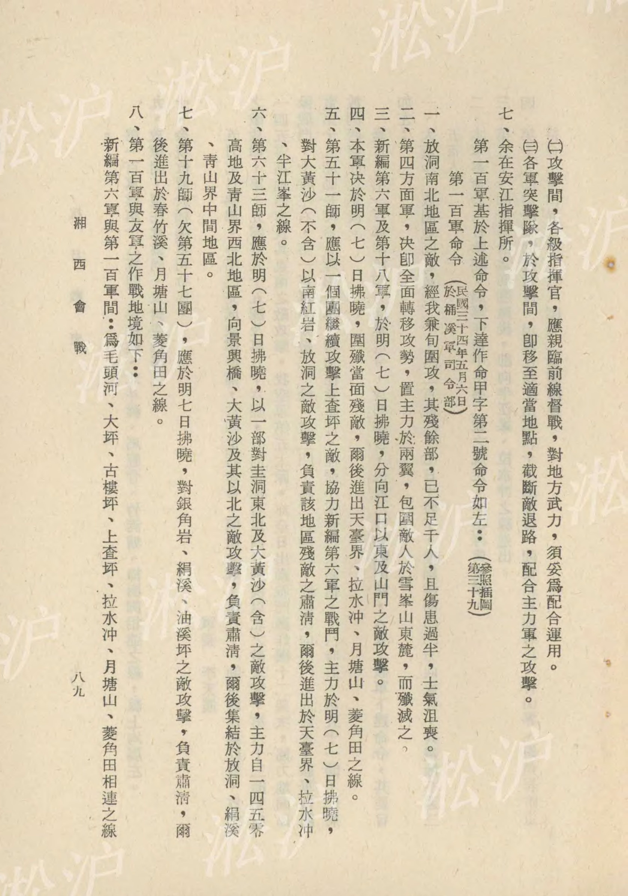

九、攻擊間，應注意協同，及對空連絡。

十、余現位置於桶溪軍司令部。

軍長

李天霞

五月七日拂拂，各部已完成攻擊準備，當卽電話命令，開始攻擊，第五十一師自西南對紅岩、放洞之敵攻擊，第十九師第五十五團及第五十六團，分向銀角岩以西及絹溪以北之敵攻擊，第六十三師分向一四五零高地西南及其東南之敵攻擊，我空軍第五大隊，亦全日出動戰鬥轟炸機十二架次，協力地面部隊戰鬥，十時左右，第一百軍得知敵二千餘，礮二門，馬二百餘匹，經絹溪向山門方向竄去，該軍當卽電第十九師師長轉命芙蓉山守軍，特加注意堅守，並派小部隊搜索敵情，十八時許，第五十一師，已將放洞西南高地克復。

是日，第一百軍奉第四方面軍電令，攻勢轉移，決於八日拂曉開始，入夜，該軍下達命令，其要旨如左：

一、大黃沙、放洞地區之敵約二千，馬二百餘匹，七日十時午，經絹溪向山門方向竄去，其殘餘不過三五百人。

二、本軍奉命於八日拂曉，照軍作命甲字第二號之規定，開始再興攻擊。

三、第五十一師於肅清當面殘敵後，卽向半江峯、拉水沖之線進出。

四、第十九師肅清當面殘敵後，追擊任務交由第六十三師接替，卽集結於進馬江、青山界、銀角岩附近待命，青山界之第一八八團第二營卽歸建。

五、第六十三師肅清當面之敵後，接替第十九師之任務，向春竹溪、月塘山、菱角田之線進發。

五月八日拂曉，第一百軍全線續行總攻，盤據大黃沙、放洞附近，及其以東地區之敵，因該軍兩日來之猛烈壓迫，異常恐慌，遂以一部六百餘，自山門方向馳援，於六時，與我第十九師第五十五團，在絹溪東側發生激戰，反覆肉搏，敵傷亡逾半，十二時，紛紛逸竄，復遭我第五十一師第一五一團主力，於黃連江附近猛攻，第六十三師及第十九師第五十五團，對大黃沙、景興橋及其以北之敵攻擊，頗有進展，我空軍亦以二十一架次對放洞、大黃沙之敵炸射，頗收殺傷之效。

同日，第一百軍爲加強第十九師之戰力，乃命軍工兵營（欠第二連）卽由小黃壠經牛皮洞、新橋推進至馬江附近，限九日拂曉前到達，暫歸第十九師師長指揮。

五月九日晨，我第一百軍乃再向當面之敵總攻，師長以下均臨第一線督戰，士氣大振，前仆後繼，奮勇衝殺，迄十二時，已將放洞、圭洞、大黃沙、景興橋及其以北地區與絹溪附近之敵，完全肅清，陣地遺屍七百餘具，敵第一零九聯隊全部被殲殆盡，另逃竄黃連江之敵四百餘，正爲我第五十一師主力及第十九師之一部合力圍殲，該軍當命第十九師繼續清掃戰場，第五十一師、第六十三師各以有力一部，向拉水冲、半江峯、春竹溪、月塘山、菱角田之線進出，追擊逃竄之敵。

五月十日，（以下參照插

圖第四十）我第五十一師之第一五三團，續向上查坪之敵猛烈攻擊，經激戰後，敵不支，紛向山門方向退去，第一百軍爲求迅速殲滅該敵計，當卽電令第六十三師除留置一個於龍潭司附近外，該師主刀卽行超越追擊，務於十日二十時前進出於椒嶺，十一日二十時前進出於春竹溪、月塘山、菱角田之線，並利用龍潭司、老隘塘之旣設線路，與該軍連絡。

黃連江附近之敵，經我第五十一師主力及第六十三師第一八八團合力圍殲，傷亡頗衆，敵數度突圍，未逞，激戰至十六時許，我仍節節進逼，同日第十九師第五十五團及軍工兵營，在絹溪以南協力圍殲，該處殘敵，拂曉前，敵一部百餘人突圍，向油溪坪東竄，經第五十六團截擊，殲滅過半，殘敵紛紛回竄，斯時我第六十三師，除第一八八團正協力第五十一師主力圍殲黃連江附近殘敵外，該師主力沿溫水、嶺脚之道路，行超越追擊，黃昏前已進出於望鄉山、椒嶺之線。

第一百軍，以湘西之敵經我軍奮勇痛擊後，刻向邵陽方面退却中，該軍當面除黃連江附近尙有殘敵約三百外，餘均肅清，遂於同日十八時，電令各師律定行動，其概要如左：

一、第五十一師、應各以一部繼續圍殲黃連江附近殘敵，並進出於拉水冲、半江峯之線，對東南警戒，主力集結於老隘塘附近，及其以南地區。

二、第六十三師以一個團位置於龍潭司附近，一個團進出於月塘山、菱角田之線，對東南方向警戒，團部位置於春竹溪，師部位置於老隘塘，另一團協力第五十一師，肅清黃連江附近之敵後，集結於望鄉山附近地區。

三、第十九師應卽集結於進馬江南北地區，軍工兵營卽行歸建，於十一日移駐北斗溪附近。

各師奉命後，第十九師卽開始集結，第五十一師以第一五一團及第一五二團之一部，繼續肅清殘敵，第六十三師師長親率第一八九團到達嶺脚指揮。

五月十一日拂曉，第五十一師主力及第六十三師之一部，續向黃連江附近之敵圍攻竟日，在我戰鬥轟炸機十二架次直接支援下，向敵進迫，敵傷亡慘重，但仍作最後掙扎，迄十五時，敵經我更番衝殺後，一部向桃林、布板溪附近潰竄，我各部當卽跟蹤圍擊。

五月十二日拂曉，第五十一師主力及第六十三師第一八八團，協力再向黃連江、桃林地區之敵猛攻，敵藉險頑抗，我乃集中礮空火力，鏖戰至午，我官兵利用轟擊之戰果，奮勇前進，搏鬥一小時，敵不支，紛向布板溪潰退，我當克復黃連江、桃林等地，是日我出動戰鬥轟炸機二十一架次，直接支援地面部隊之戰鬥，戰果甚豐。

我第一百軍，鑒於殘敵漸次肅清，地區縮小，乃決心調整部署，徹底獲致最後勝利，其概要如左：

一、第五十一師第一五二團，應於黃連江附近，清掃戰場完畢後，卽在原地集結，第一五一團進出布板溪附近，將殘敵肅清後，集結待命。

二、第六十三師主力，一面進擊布板溪附近殘敵，一面於望鄉山、椒嶺各附近，截擊敗退之敵，第一八八團在第一五一團左翼進出，到達布板溪以東地區，繼續跟蹤追擊，並特須注意與第十一師之連繫。

五月十三日拂曉，我第六十三師主力及第五十一師第一五一團，分向潰退布板溪、望鄉山、椒嶺間地區之敵猛攻，同時第六十六師第一八八團，自高麻塘向該敵側擊，當爲我截爲數段，演成若干局部之殲滅戰，其一股向馬脛骨方向突圍，我官兵奮勇衝殺，所向披靡，十二時頃，第一五一團已將布板溪之敵百餘完全殲滅，第六十三師仍各對圍困之敵猛攻，十四時許，第一八七團將敵之一股擊潰，其遺屍八十餘具中，內有大佐一員，證實爲敵第一零九聯隊長灑寺保三郎，第一百軍爲求統一事權，以竟全功計，乃於十六時令第五十一師第一五一團歸第六十三師師長指揮，續行追擊，並責令該師長殲滅殘敵之責。

五月十四日四時許，我第一八八團，對椒嶺以北地區之敵夜襲，因敵士氣沮喪，精神恐懼異常，一經接觸，卽形潰亂，我乃乘勝追擊，同時該師第一八七團，於布板溪、望鄉山之線，逕趨敵背，第一八九團向該敵側擊，迄十時許，敵多着便衣隱匿林叢，企圖逃逸，此尙爲日軍作戰來所鮮見，經整日之搜索，生擒敵兵十餘名，鹵獲戰利品甚夥。

五月十五日，我第六十三師繼續搜索殘敵，其一股四十餘名，向馬脛骨及其西北地區逃竄，經我截擊，生擒十餘名，餘均就殲，十七時頃，第一百軍，奉第四方面軍十六時電令要旨如左：

一、敵第一一六師團殘部，現經金龍岩向東逃竄，洋溪橋附近之敵，已全部南竄。

二、本方面軍決卽調整部署，繼續猛攻當面之敵，而殲滅之。

三、第七十四軍，以第一九三師卽佔領龍潭舖、德州、竹篙塘之線，防敵南竄，另以有力部隊北渡，協力第一一八師之戰鬥，暫編第六師，卽經竹篙塘向石下江繼續攻擊。

四、新編第六軍，以第五十七師一部掃蕩月塘山之敵，其餘仍在原位置控制，並整理交通。

五、第一百軍，卽行續殲被困於椒嶺附近地區之敵。

六、第十八軍，附屬第十三師之第三十八團，仍歸第十一師指揮，於馬脛骨南北地區，防敵東竄，第十一師及第一一八師主力，於十六日拂曉，開始向菱角田東田岩山、金龍岩、黃虎砦一帶之敵猛攻，而殲滅之。

七、第七十三軍之第十五師及第七十七師，有力一部肅清當面之敵，主力向南跟蹤追擊，第十八師截擊南竄之敵。

八、第十三師主力，卽推進至老隘塘、春竹溪間地區集結，準備協力第七十四軍及第十八軍之攻擊。

第一百軍奉命後，卽並對各師下達調整部署之命令，其要旨如左：

一、第十九師除守備芙蓉山部隊，仍服行原任務外，其餘應於十七日十八時前集結於白岩橋、小黃壠間地區。

二、第六十三師，仍續行圍殲被困椒嶺附近地區之敵，並由第十一師協力行之。

三、第五十一師第一五一團，應圍殲布板溪附近殘敵後，集結該地待命，主力應集結於岩灣及其東南地區。

四、軍指揮所，於十六日十時，推進至大浦江，計十二時可到達。

五月十六日拂曉，我第六十三師續殲殘敵，官兵雖週來日夜辛勞，但士氣極爲旺盛，經竟日之奮戰，將馬脛附近敵一股百餘，全部殲滅，另股約二百餘，亦爲該師第一八八團圍殲於杉板橋附近，（大尉廟東北）又一百約百餘爲該師第一八九團圍殲於老岩附近。

五月十七日，我第六十三師各部，繼續圍殲殘敵，竟日戰鬥，敵傷亡過半，其餘各部隊，均遵令集結完畢，第一百軍指揮所亦到達龍潭司，奉第四方面軍電令，第十九師限於二十日二十時前到達高沙市附近地區集結，並以一部推進至荊竹舖，對東南警戒，當卽轉令遵照。

五月十八日，我第六十三師對圍困之敵，續行猛攻，十二時許，已將敵全部肅清，除以第一八八團推進至山門外，主力則擔任戰場之清掃。

第一百軍，以龍潭司至山門間地區殘敵肅清，除遵令命第十九師移高沙市集結外，五月十九日，復遵命令第六十三師於二十日集結於洞口附近，各部隊當卽遵令移動，（以下參照插圖）

五月二十一日二十時，第四方面軍下達電令，其要旨如左：

一、方面軍決卽追擊當面之敵，壓迫於資水左岸捕捉殲滅之。

二、第一百軍第十九師，卽推進至黃橋舖，應派有力部隊，向金秤市、唐渡之線追擊，第六十三師，暫集結洞口附近，軍部於二十三日六時，推進至竹篙塘。

三、第七十四軍之暫編第六師，卽沿公路向楓林舖南北之線追擊，第一九三師卽集結於龍潭舖、石下江、三角塘中間地區待命。

四、第十九師與暫編第六師作戰地境：爲由石下江沿河左岸至桃花坪經浪波田、小溪市相連之線，線上屬左。

第一百軍奉命後，當對第十九師及第六十三師下達電令，其要旨如左：

一、第十九師，應以一個團向金秤市、唐渡之線追擊，以一個團位置於龍從橋附近，師部及一個團位置於黃橋舖附近。

二、第六十三師暫結集於洞口附近待命。

五月二十二日拂曉，各部隊遵命行動，第一百軍指揮所，於十六時左右，到達山門附近。

同日，第一百軍獲悉由武岡竄據石門附近之敵千餘，經我第一二一師擊破後北竄，當時二十三時，竄據天馬山、浪石、古來峯、厚山各高地之線。

五月二十三日，第一百軍接獲第十九師報告如左：

一、第五十五團，向金秤市、唐渡之線追擊。

二、第五十六團，二十三日推進至龍從橋。

三、師部二十三日推進至黃橋舖。

四、團攻芙蓉山之敵，已增至千餘衆，與我激戰甚烈，爲確保芙蓉山及速行殲滅殘敵計，擬令第五十七團，於二十三日向該處挺進，策應守備部隊作戰，俾竟全功。

該軍據報後，當卽電覆照准。

同日八時許，我第十九師第五十五團之右追擊隊，進至米山舖，左追擊隊進至栗山舖各附近，十二時，各該團後續部隊亦到達，遂展開於天馬山、浪石、古來峯、厚山西側之線，向敵猛攻，我軍奮勇衝殺，至十八時許，將以上各地攻克，敵向東潰去，是晚，第一百軍指揮所已推進至竹篙塘。

五月二十四日，第十九師第五十五團，續向蔡家橋、踏水橋之線追擊，十二時許，該團主力與東竄之敵一部三百餘，於踏水橋附近激戰，其一部進至蔡家橋後，續向金秤市追擊，入夜，其一部對金秤市敵襲擊奏功，並以一部向王家亭方向挺進。

五月二十五日拂曉，我第五十五團主力，續向踏水橋之敵猛攻，其側背受我王家亭挺進之一部威脅，迄十時許，敵不支，紛向富溪橋渡河，向東北逃竄，十二時許，我第五十五團已進出金秤市、唐田市、雷打灘、富溪橋之線，並派搜索部隊渡河搜索，另我第五十七團，於十時許，以主力經紫陽河向東追擊，當即攻克桃花坪，殘敵東竄，該團乃以一部沿公路躡擊，同日第一百軍奉第四方面軍電令，命暫編第六師即改歸該軍軍長指揮，又該軍之第六十三師，限於二十六日十八時前移駐石下江附近待命，該軍當即轉令遵照。

同日暫編第六師，協力芙蓉山我第五十七團第一營，猛擊圍攻之敵，斬獲頗多，殘敵紛紛退據銅盆江以南高地亘禁山、老迄邁跡塘之線頑抗，十二時許，該師第二團跟蹤追擊，向邁跡塘、石背、胡家各附近高地之敵猛攻，迄黃昏前將各該高地攻佔，並續向三角塘方面追擊，及對禁山老之敵掃蕩中，十四時許，該師第一團由銅盆江渡河後，以一部向老虎山之敵攻擊，主力則繼續向東潰之敵追擊。

五月二十六日拂曉，我各部續對向邵陽潰退之敵繼續追擊，十七時許，第十九師第五十七團先頭已進抵白竹橋附近，暫編第六師主力同時亦通過白竹橋、丁家村之線，正沿公路及其北側地區向楓林舖南北之線追擊，該師師部已推進至桃花坪。

五月二十七日，暫編第六師續以兩縱隊向東潰之敵追擊，左縱隊第二團於十四時頃進抵鐵爐仲、小五州間地區後，掃蕩托里附近殘敵，右縱隊第一團於十八時進佔岩塘，續向分水坳追擊，二十八日，該師繼續追擊，十七時許，進抵羊里、周旺舖、朱溪沖、八冲坳之線，並向該線敵之掩護部隊攻擊，敵憑險頑抗，迄二十九日十二時，均無進展，午後在我空軍掩護下，續向該敵攻擊，至十六時許，仍激戰未已，十八時，該線之敵向我反撲，當予迎頭痛擊。

五月三十日，我暫編第六師對當面之敵繼續攻擊，敵憑險及旣設工事頑強抵抗，激戰竟日，形成膠着，十七時頃，第一百軍奉第四方面軍五月二十九日十七時電令，其要旨如左：

一、方面軍爲爭取時間，迅速殲敵及開始整補計，卽調整部署，繼續追擊當面之敵。

二、第一百軍卽以有力一部接替暫編第六師任務，續攻當面之敵，恢復四月八日前原態勢。

三、暫編第六師交防後，卽於石下江附近集結，準備赴黎坪歸還建制。

四、第一百軍與第七十四軍及第十八軍作戰地境線如次：

第七十四軍、第一百軍間：爲高沙市—鄧家舖—鹽田橋—蘆洪司相連之線。

第一百軍、第十八軍間：爲橫板橋—邁竹塘—罐子窯—白田江—神灘渡相連之線，線上均屬左。

該軍奉命後，當卽下達命令，其要旨如左：

一、第六十三師除第一八七團接替第十九師之第五十五團防務外，第一八八團應以一營於芙蓉山、桃花坪擔任守備，該團團長率其餘部隊，卽往石馬村接替暫編第六師之攻擊任務，爾後進出楓林舖南北之線，限六月一日十八時前交接完畢，團部仍位置石馬村附近，第一八九團卽推進至南岳廟附近。

二、暫編第六師將任務交由第六十三師接替後，第一線部隊應於六月一日十八時後開始撤退，以一團沿鐵爐沖—楊路橋—丁家村—陰山舖—白山塘道，其餘沿公路經桃花坪—、砂子坪道，限六月三日十八時前集結石下江附近待命。

三、第十九師應位於山門以南地區整訓。

四、當面敵情、友軍位置、地形要點、應詳爲交代之。

五月三十一日，暫編第六師仍繼續攻擊，無大進展，第十九師於十三時到達山門以南附近地區，是日第一百軍奉第四方面軍電令，命第五十一師卽歸還建制，該軍當卽轉飭遵照。

六月一日，第六十三師第一八八團開始接替暫編第六師攻擊任務後，向敵猛攻，進展迅速，迄二日晨，攻佔岩口舖，並續向長陽舖追擊，十四時許，進佔長陽舖、麻雀舖與敵對峙於楓林舖附近，並恢復戰前之態勢。

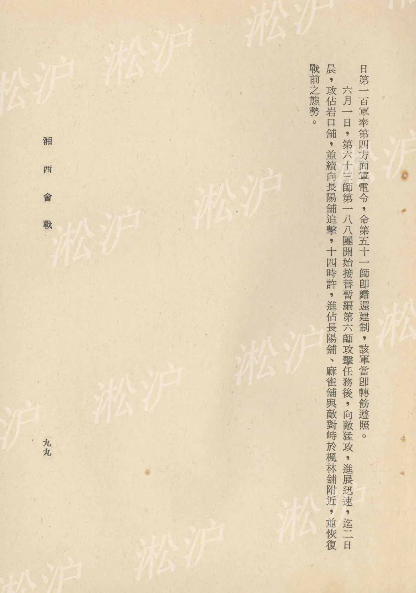

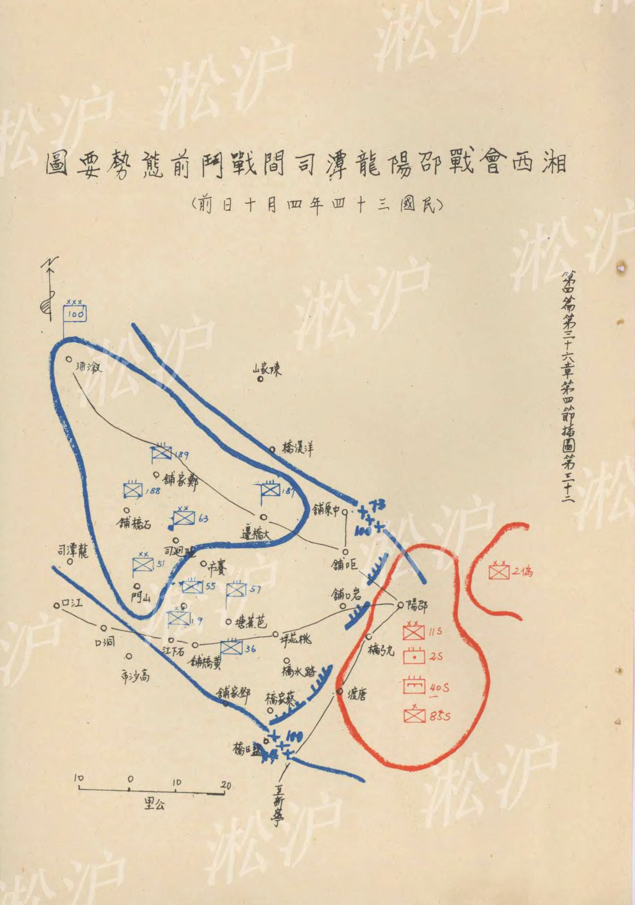

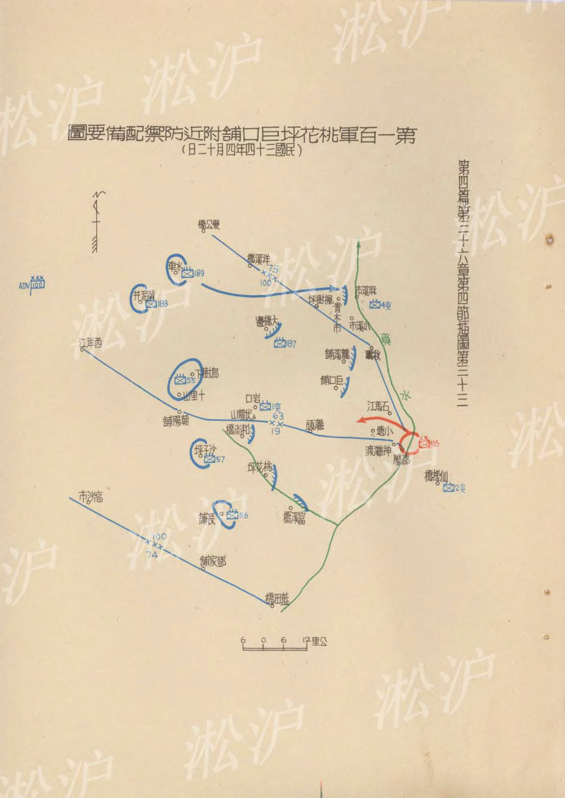

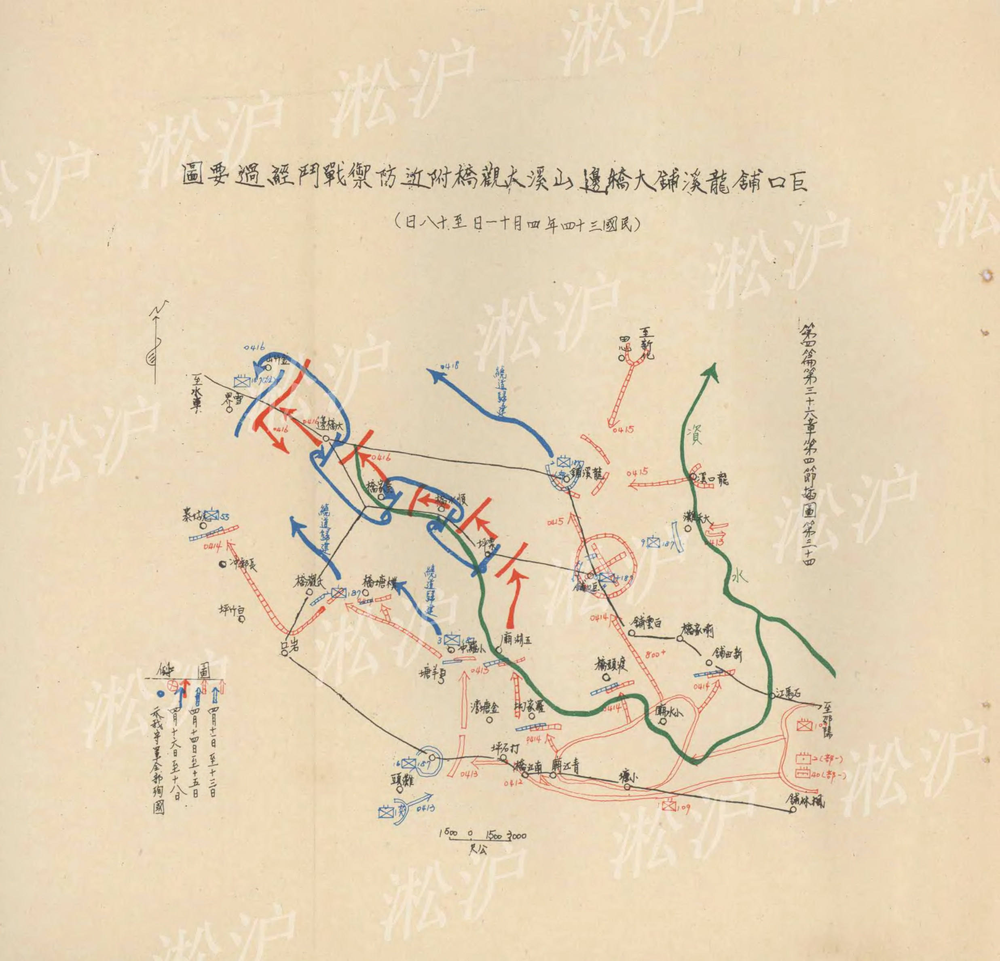

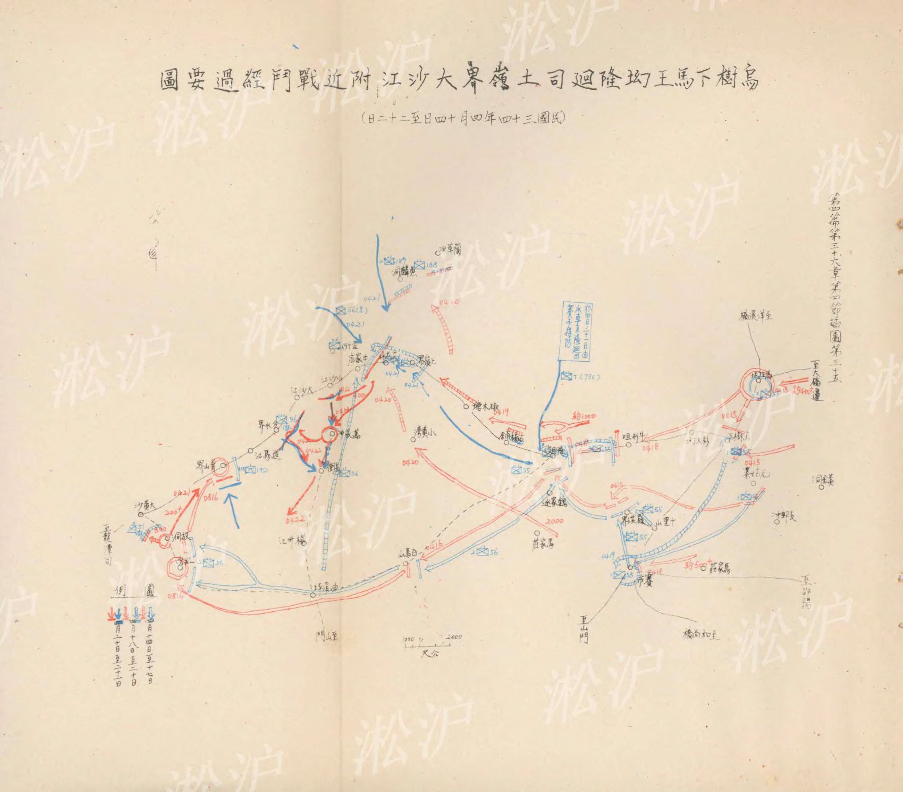

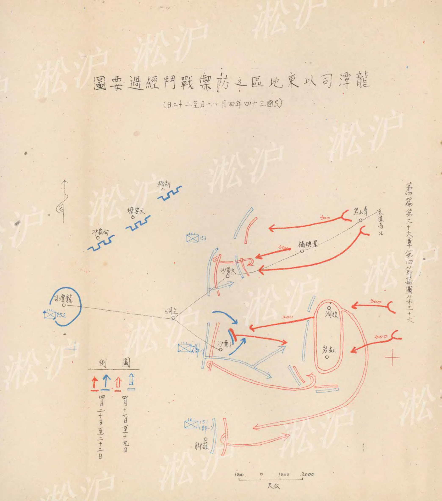

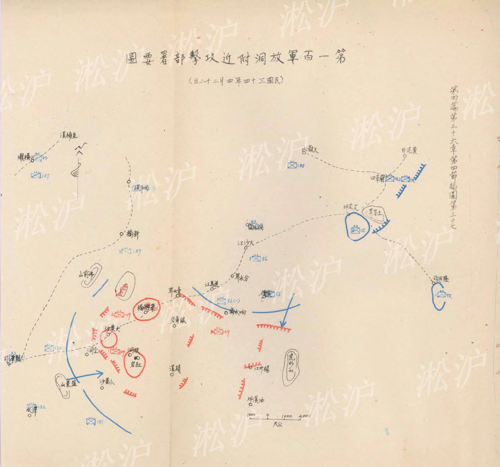

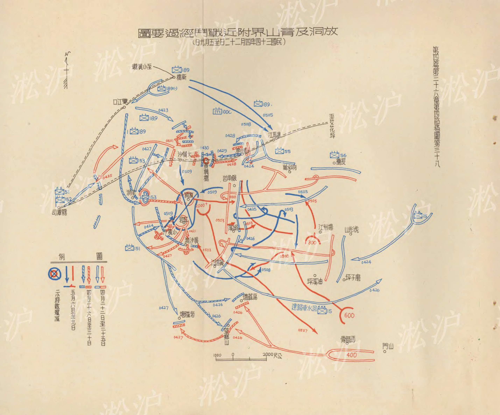

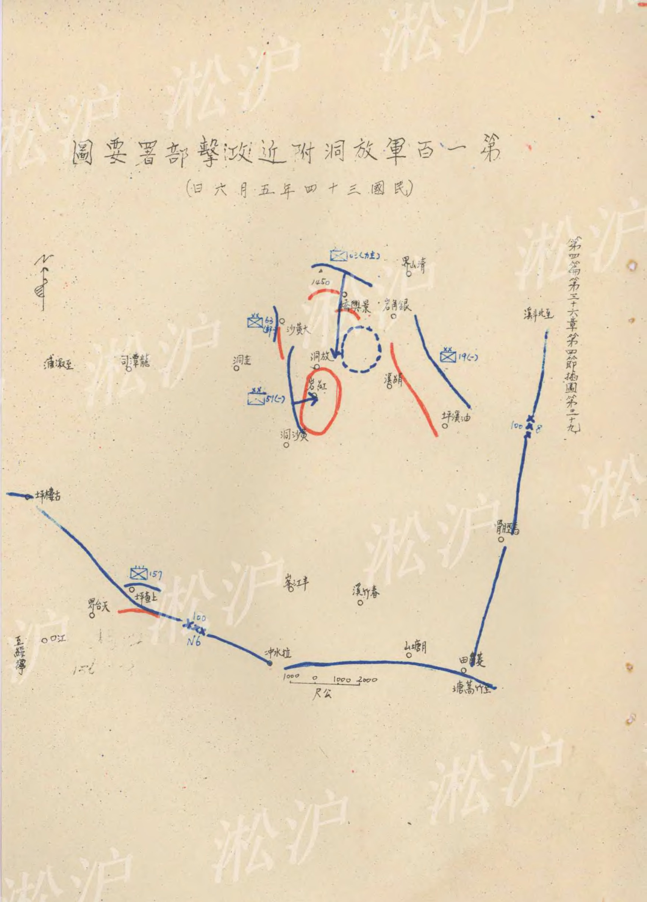

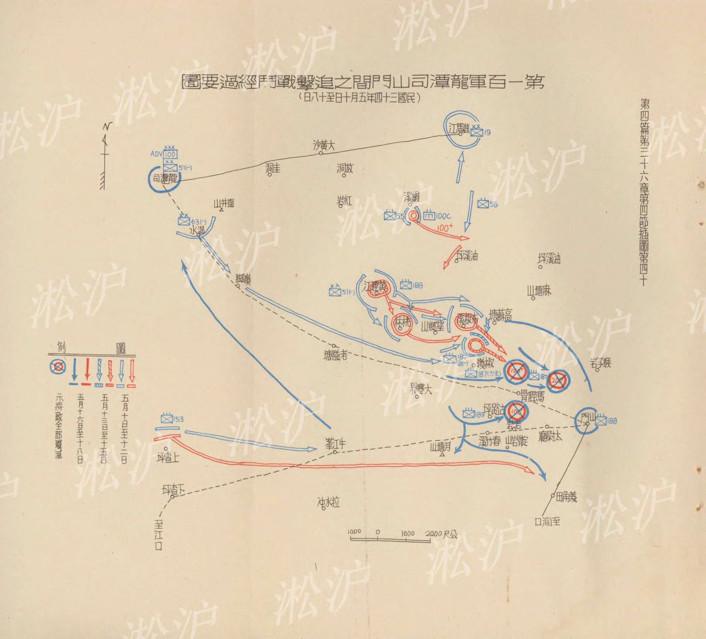

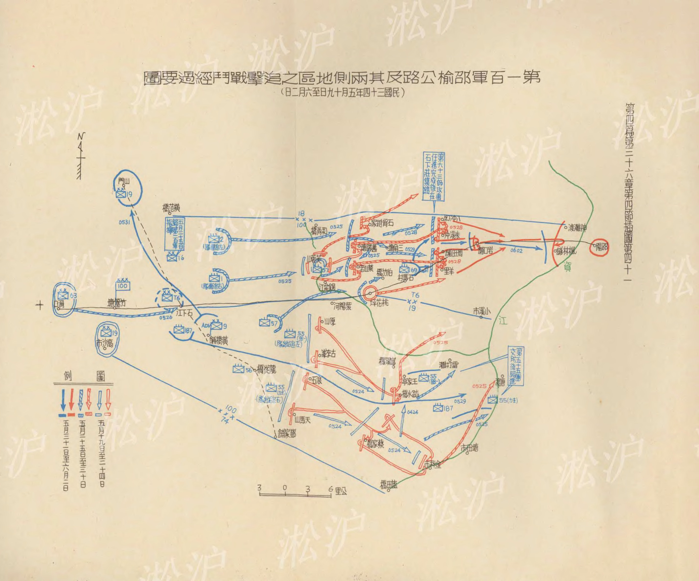

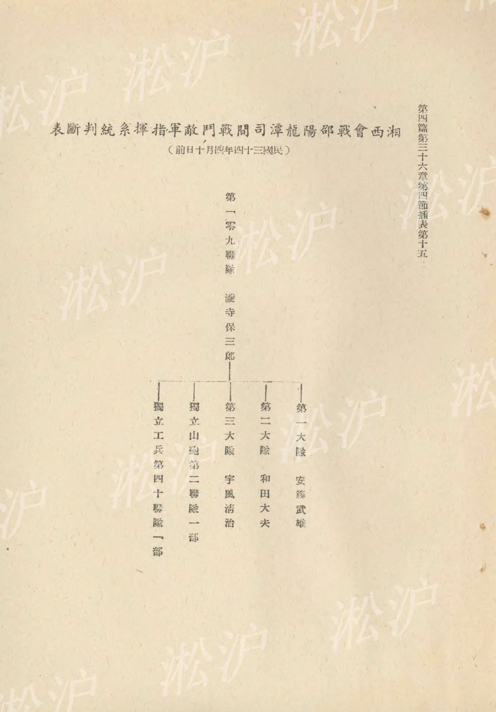

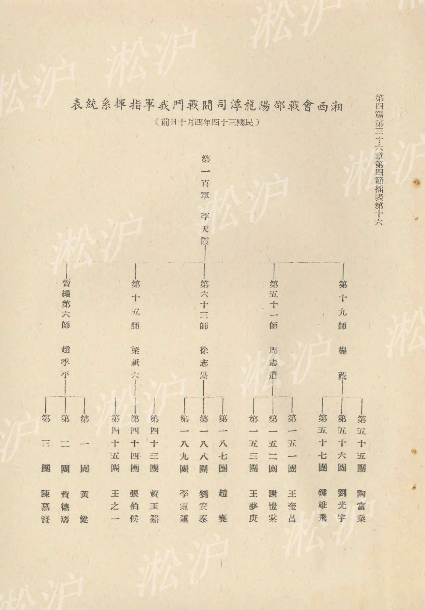

#### 第五款 藍田、新化、洋溪橋、大橋邊間地區

之戰鬥

民國三十四年四月九日至六月一日

參照插圖第四十二至第四十八插表第十七第十八

敵以牽制我第四方面軍之兵力使其主力作戰容易之目的，以其第四十七師團之第八十七聯隊約四千餘衆，爲其右翼兵團，於四月九日由永豐經黑田舖、太芝廟向藍田、新化方面進攻，經我第十五師及第六十三師之一部逐次抵抗，於二十三日攻抵洋溪橋東南地區，與我第七十三軍主力激戰，迭經該軍予以重創，敵勢遂挫，五月八日，我全面反攻，敵不支東潰，我跟踪追擊，並分途截擊，敵傷亡甚重，迄六月一日，恢復戰前態勢。

##### 第一項 本地區附近地形

本戰鬥範圍，爲永豐、大橋邊、新化間地區，境內除少數標高達三百公尺以上之高地外，多爲百公尺以下之綿亘地，利於部隊車輛之越野運動，公路有邵（陽）新（化）、湘（湘鄉）新、溆（浦）新、安（化）新、溆巨（口舖）、新藍（田）諸線，其中僅安新、新藍、溆巨三線，敷設石子路面，路幅一至一五公尺外，餘均未敷設路面，雨季道路泥濘，行軍運輸均較困難，鄉道四達，交通尚稱便利，河流資水外，均可徒涉，資水在本地區內，河幅爲一零八公尺至四三零公尺之間，水深三至四公尺，流速湍急，航行較爲困難，爲軍事上最大之障礙，新化爲水陸交通樞紐，雪峯山脈屏障西方，控山川之險，爲湘西軍略要地之一。

##### 第二項 戰鬥經過

參照插圖第四十二

插表第十七第十八

敵第四十七師團主力，逐次於民國三十四年三月上旬，由武漢南下，集結於永豐、湘鄉、湘潭地區，三月下旬，該師團漸次向永豐附近集中，搜索部隊更趨活躍，後方軍運頻繁，並大量迫徵民伕，其蠢動企圖，已昭然若揭。

桂柳會戰後，我第七十三軍（欠第一九三師）集結新化、藍田各附近地區，從事整補，並加強工事設施，第七十七師位置於新化附近，第十五師位置於藍田，所屬各團各位置於藍田東南地區，楊家灘、婁底附近，各該團除以一部扼守要點，嚴密戒備外，並不時派遣搜索部隊，深入敵後，從事敵情搜索，其敵我態勢如圖第四十二。

戰鬥開始，我軍先以一部依持久抵抗之要領，誘敵深入，同時固守要點，控制機動部隊，相機截擊圍堵敵人，以消耗其戰力，於敵攻勢頓挫之際，轉移攻勢，壓迫敵人於資水左岸地區而殲滅之。

四月八日，

以下參照插

圖第四十三

敵第四十七師團一個聯隊及砲兵第一大隊，共約四千餘衆，由永豐西進，九日拂曉，其先頭部隊千餘，附砲二門，經太芝廟、小白水、大合年鑽隙突進，一部竄至庫里廟、邊橋，主力則竄至厚里、玄壇坳各附近，當遭我第十五師第四十五團第一連阻擊，於廟邊橋附近予以打擊。

四月十日晨，我第十五師第四十三團第二營及第四十四團第三營，分別到達庫里、孫家橋附近地區當卽向該敵展開攻擊，十四時許，攻佔庫里廟、邊橋等處時，該兩團之主力亦均到達。

四月十一日拂曉，第十五師以兩團併列，向當面之敵攻擊，迄十時許，佔領厚里、一字橋、玄壇均以南各要點，敵乃以一部三百餘西攻東關嶺，經我第四十三團第三連堵擊未逞，十九時，敵有力之一部千餘衆，砲二門，由東關嶺以南地區迂迴，向梅寨坳攻擊，同時圍攻東關嶺，激戰竟日，敵我傷亡均重，其一部並續竄抵三江關附近，我當卽令第七十七師之第二三零團前進至連溪橋，第四十四團抽調一部至財喜亭，向三江關之敵夾擊，以阻其向西北進竄，時敵第八十七聯隊主力三千餘及砲兵第一大隊（欠砲二門）亦進抵巖門、顏家灣各附近，與我第十五師主力對峙中。

是日二十三時，第七十三軍奉第四方面軍電話指示：

一、第十八師，以一個團接替谷水以東至潭市間之防務。

二、第十五師，以一個團固守藍田，該師長率其餘之兩個團及直屬部隊至連溪橋。

三、第七十七師，以一個團推進至連溪橋東南選擇要點，縱深配備，阻敵北進，由第十五師師長指揮之，以兩個團固守新化，加強工事。

四、暫編團，必要時，由第十五師師長指揮，位於連溪橋附近。

五、第一百軍派一個團，限兩日到達盧家橋，歸該軍指揮。

第七十三軍遵照指示，於十一日十五時下達命令，其要旨如左：

一、由永豐西竄敵四千餘，於八日經太芝廟進抵廟邊橋、庫里、玄壇均各附近，其一部千餘，由東關竄抵三江關附近，似有進攻新化、藍田企圖。

我第一百軍第六十三師之第一八九團，與第十八軍第十八師之第五十二團，約兩日後，分別自麻溪谷、水潭市參加軍之作戰。

二、軍決固守新化、藍田要點，並以有力一部，自新化、藍田中間地區，索敵攻擊。

三、第七十七師，（欠第二三零團，另附第一百軍之第一八九團，及第十五師之砲兵營），應即遵左部署。

(一)以第二二九團、第二三一團及砲兵營，在新化附近，趕築工事，進入陣地，爾後應固守新化。

(二)以第一八九團在麻溪附近佔領陣地，阻敵西進。

四、第十五師（附第十八軍之第五十二團第七十七師之第二三零團）應即遵左部署。

(一)以第二三零團，即經連溪橋、三溪橋、石子嶺、向峽山橋、三江關攻擊前進，如受優勢之敵壓迫，亦應固守羊角嶺、石子嶺土、硃西端高地之線阻敵西進。

(二)第十五師師長應卽率直屬部隊至楓梓坪附近，以第四十四團協同第二三零團向峽山橋、三江關附近之敵攻擊。

(三)第四十三團於藍田以南地區作縱深配備，行持久抵抗，爾後固守藍田。

四第十八軍之第五十二團到達後，卽接替婁底以東第十五師之防務。

(四)第四十五團婁底以東部隊交防後，加入新化、藍田之攻擊。

五、暫編團卽在龍潭司附近集結待命。

四月十二日晨，三江關之敵，向北進攻，經我第四十四團第四連在空軍P-40型機兩架支援下，奮勇迎擊，敵一部竄至峽山橋，復經我第二三零團之一部堵擊，於峽山橋東南方高地對峙，十五時，敵再度反撲，我予敵以嚴重打擊後，遂轉進至路口、巖子冲、八十亭、盧山冲等處，是日夜，東關嶺東南地區之敵，陸續經插花嶺、爛泥沖西竄坪上附近者千餘衆。

四月十三日一時，我第二三零團展開於羊角嶺、木杉坳、金竹山之線，第四十四團展開於袁家、廟山、落馬江之線，第四十三團之一部進至八義坳，拂曉各部協力向峽山橋、三江關之敵攻擊，戰鬥激烈，我第二三零團數度突入峽山橋，敵馳援反撲，至午敵我傷亡均重，第四十三團之另一部，亦同時向厚里、一字橋、玄壇坳當面之敵攻擊，敵爲掩護其側翼，乃於三江關、蕭家灣、張家坳、顏家沖各附近構築工事，與我對峙。十三時，敵四百餘，進抵上、下南溪，其一部百餘，由栗灘渡過資水左岸。第七十三軍爲確保新化，決心在資水兩岸挫敵攻勢，卽令第一八九團扼守盤古寨南北要點，阻敵西渡，第十五師儘可能向西進之敵側擊或追擊，對敵堅強據點應以最小限兵力封鎖之，主力仍向麻溪以南鑽隙突進，索敵攻擊，十九時由坪上竄黛水橋之敵二千餘，其一部約六百人，藉砲兵之掩護，向小溪市攻擊，與我第一八九團警戒部隊激戰澈夜，該排官兵奮勇抵抗，傷亡殆盡，該排長亦壯烈殉職。

四月十四日拂曉，

以下參照插

圖第四十四

敵五百餘強渡資水，與我第一八九團激戰於沙灣里、珠溪一帶，殲敵二百餘，正在對峙中，另坪上之敵六百餘，同日午北進，向羊角嶺、沙塘灣攻擊，經我第四十四團迎頭痛擊，敵乃囘竄麻溪、小溪市間地區，第四十三團之一部追擊西竄之敵，進抵坪上以北地區，經猛烈攻擊後，敵向小溪市以南江邊竄去，是日二十三時，第七十三軍奉第四方面軍電話指示，令該軍應以有力一部固守新化城，主力於資水兩岸新化外圍攻擊進攻之敵，該軍遵卽調整部署如左：

一、第七十七師（附第一八九團及第十五師之砲兵營），應卽以第一八九團及第二三一團攻擊北進之敵，並以一部固守寒婆坳，第二三零團以一個營仍於原陣地阻敵北進，主力及第二二九團固守新化核心陣地。

二、第十五師師部及直屬部隊，應於十五日拂曉前移至連溪橋，並儘可能使用部隊於資水右岸地區，攻擊西進敵之側背。

三、暫編團卽移駐洋溪橋，對南及東南嚴密搜索警戒。

同日夜，我第十五師第四十四團及第四十三團之一部，圍襲麻溪、小溪市地區之敵，敵乃以一部掩護，其主力三千餘由麻溪、小溪市及栗灘分別渡江，我兩岸部隊奮勇夾擊，斃敵甚夥。

四月十五日晨，我第一八九團與西渡之敵主力繼續激戰於祖師堵、盤古寨、球溪、賀家嶺之線，雖衆寡懸殊，該團在我空軍第五大隊P-51型機五架次直接支援下，官兵仍奮勇血戰，竭力抵抗，頗有殺傷，及午，由栗灘西渡之敵千餘，竄紹峯亭，並賡續西竄中，該團以右側背受威脅，乃逐次轉進至亭子界、香爐頂、履福橋之線，與敵保持接觸，十六時，第七十三軍奉第四方面軍電令要旨如左：

一、第十五師（欠一團）卽渡資水左岸，集結於楊家邊、洋溪橋間地區，師部位置陶家橋，限十六日午到達。

二、該師之一個團（欠一營）卽移駐連溪橋及其以南地區，積極打擊資江右岸之敵，團部位置於連溪橋，並由該軍長直接指揮。

三、該團之另一營，應於楊家灘、藍田協同地方武力打擊敵人。

四、洋溪橋之暫編團，卽移至楊家邊，並派出一個營推進至羅洪，該團卽受第十五師師長指揮。

五、各部均須向南遠行搜索。

第七十三軍遵卽對第十五師下達命令，其要旨如左：

一、着第十五師師長率第四十四團、第四十五團，卽移駐新化西南之洋溪橋附近，限十六日午到達，師部位置於陶家橋附近，另以第四十三團（受本軍長直接指揮），團長率兩營於連溪橋東南地區佔領陣地，阻敵北進，該團之另一營，應於藍田、楊家灘、孫家橋地區，配合地方武力，確保藍田。

二、着暫編團歸第十五師師長指揮，卽移駐楊家邊附近，並派一個營至羅洪，對南遠出搜索，嚴密警戒，限十五日晚到達。

同時該軍以第一八九團受優勢之敵壓迫，及右側背之威脅，乃決心利用夜暗調整部署，遂對第七十七師指示如左：

一、着第一八九團乘夜佔嶺龍落坪、石屋、林屋、盧家橋、大灣、唐家之線，阻敵向西北進展。

二、着第二三一團，除以一個連固守寒婆坳外，其餘應卽佔領大灣、唐家（不含）、南煙舖、原水坳、羊牯嶺之線，阻敵北進。

四月十六日，第一八九團及第二三一團佔領陣地完畢，香爐頂之敵百餘，向我牛寨嶺第二三一團警戒陣地攻擊，該警戒部隊受敵壓迫，遂退守張公嶺以西高地，嗣經該團逆襲，復克牛寨嶺，阻敵於該地以南地區，我空軍第五大隊，以P型機八架次，於十二時及十四時先後襲擊麻溪及茅嶺當面之敵，毀營房四棟，木船十五艘，及敵陣地多處，是日夜，第四方面軍下達電令要旨如左：

一、第七十三軍應於羅洪、四都、麻溪間山地，向南縱深部署，堅強抵抗，打擊敵人。

二、新化核心守備部隊，可酌量減少，但仍應堅強守備之。

三、第一八九團，卽移水車歸還建制。

第七十三軍奉令後，遵卽調整部署如左：

一、第十五師（欠砲兵營、第四十三團、第四十五團、附暫編團）於羅洪經東瓜嶺、分水界、棗山、大河冲、四都至林屋，（不含）間地區，扼要守備，堅強抗拒敵人，並遠出搜索，師指揮所位置於楊家邊。

二、第七十七師（欠第二三零團，附第十五師砲兵營）。

(一)第二二九團，應於仙姑岩至黃泥坳附近之線，堅強工事固守之。

(二)第二三一團，應於林屋（含）、盧家橋、羊牯嶺間地區扼要佔領陣地，堅強拒敵北進，並仍以一個連固守寒婆坳。

(三)該師指揮所位置於五里牌。

三、兩師之作戰地境：爲三江口——對江——下莊——馬田——林屋——小維山——大凌峯之線，線上屬左。

四、第二三零團、第四十五團爲軍預備隊。

(一)第二三零團，應於十九日午前集結於青崗山、墻上、熊家坳間地區，並派出所要幹部，偵察洋溪橋經古塘至對江之陣地，並作構工及守備之準備。

(二)第四十五團，應於蘆蘿村、黃家冲、孤堂嶺間地區集結待命。

五、第四十三團，仍依前令服行原任務。

六、第一八九團將防務交替後，卽移水車歸還建制。

第十五師遵令卽以暫編團爲右地區隊，主力守備羅洪、東瓜嶺、分水界、蒼溪山（不含）之線，並推進一部至守望亭、仁風亭、侯田之線，佔領警戒陣地，第四十四團爲左地區隊，主力守備蒼溪山、棗山、石冲、大界、龍落坪之線，並於中黃姓、大底、王家、下源舖之線，佔領警戒陣地。

四月十八日五時，敵千餘，向了頂崗、下山、牛寨嶺進攻，遭我第二三一團阻擊，其主力則集結於文家橋、盤古寨間地區，十三時，第七十三軍奉第四方面軍電話指示如左：

一、沙灣里、球溪之敵，仍向西北流竄，又由邵陽西進之敵，其先頭竄抵龍潭司，主力約萬餘人，刻已到達烏樹下、大橋邊間地區。

二、該軍應於十八日全面猛攻當面之敵，將其擊破於大橋邊及資水左岸地區。

三、資水右岸連溪橋之第四十三團，可酌留一部，守備該地，其餘移至左岸，增加攻擊力量。

四、水車附近，必須控置一個團，掩護側背安全，支援第一百軍作戰。

五、該軍與第一百軍作齧地境：爲木溪橋——榮祿橋——江東——銅羅巖——龍山冲、關王橋——滿竹冲——鐵鎮坳相連之線，線上屬左。

第七十三軍遵卽調整部署如左：

一、第十五師（欠第四十三團）攻擊大橋邊、迎官橋附近之敵，師部推進至羅洪。

二、第七十七師（欠第二三零團），以第二三一團向當面之敵攻擊，第二二九團守備對江至黃泥坳原陣地。

三、暫編團卽至水車附近，掩護軍之右側背，並策應第一百軍作戰。

四、第四十三團，以一營經新化至洋溪橋待命，其餘服行原任務。

五、第二三零團，卽至洋溪橋以南之寨邊、水車間地區，爲軍預備隊。

四月十八日晨，第七十七師之第二三一團，全面轉移攻勢，牛寨嶺東南之敵，向了頂崗方向退去，文家橋敵千餘，亦向田心南移，十六時，了頂崗之敵，以一部與我保持接觸，其大部在砲兵掩護下，兩度向我寒婆坳陣地猛撲，均經我守軍英勇擊退，晚我第十五師主力，先後進出顏公廟、大橋邊、迎官橋之線，續向馬鞍界、票坪、大觀橋間地區，作廣正面索敵攻擊。

四月十九日五時，第十五師續行挺進搜索，十時，田心之敵一部七百餘，分股西竄龍源坳、龍山等處，遭我第四十四團先頭部隊第七、第八兩連迎頭痛擊，敵不支向東回竄，該團主力經蒼溪山向大橋邊挺進，時第二三零團之一營，已佔領梅公嶺、石沖、大界之線，防敵向西北竄，是日第七十三軍奉第四方面軍電令，應不顧一切，向敵西進之主力側擊，務獲戰果，該軍遵卽下達調整部署命令，其要旨如左：

一、第七十七師，（欠第二三零團、附第十五師砲兵營），應於二十日拂曉，攻擊當面之敵，向西南壓迫。

二、第十五師（欠第四十三團之第三營、及第四十五團第二營、砲兵營），於十九日晚，以一個團進出於陳家、垣子平、界上間地區，至二十日拂，卽以該團一部，於龍溪舖附近，監視該地之敵，主力應於大坪、十字路、扇舖沖間地區，向東北攻擊，協力第七十七師，殲敵於四都、田心山地，另一團主力集結於大橋邊附近。

三、第二三零團，爲軍預備隊，以一個營佔領梅公嶺、仙人塘、石沖、大界之線，阻敵西北進，主力集結水車待命。

四、第四十三團（欠第三營、另附第四十五團第二營），以一營留置藍田守備，另一連於連溪橋防敵北攻，主力卽至新化，接替第二二九團任務。

五、暫編團仍在水車附近，掩護軍之右側背，並策應第一百軍作戰。

同日晚田心之敵一千五百餘，以一部五百餘，協同了頂崗之敵，向寒婆坳、三度猛烈攻擊，我守備部隊第二三一團之一個連，奮力抵抗，因衆寡懸殊，傷亡甚重，敵在熾盛火力之掩護下，突入寒婆坳，與我搏鬥中，其大部千餘，同時會合龍源坳之敵，向視頭坳、茅嶺進攻。

四月二十日拂曉，我各部隊在砲兵支援下，向當面之敵攻擊，該營田應昭營長身先士卒，突入敵陣，敵狼狽向川坳嶺潰退，梘頭坳、茅嶺之敵，經我第二三一團一部及第二二九團第二營攻擊後，敵一股二百餘與竄據川坳嶺之敵會合，鑽隙竄抵橫排附近，我第二二九團由林屋、東古嶺、橫排之線迎擊，第二三一團主力經邵陽街攻擊盧家橋東南亘茅嶺敵之側背，九時許，攻克茅嶺北端高地，時寒婆坳守備部隊，亦轉至茅嶺以南，協力攻擊，敵不支，一股南竄溫溪，另股東北竄大山沖。十五時，第四十四團先頭部隊於下龍源以北地區、與田心而來之敵遭遇，該團當卽以第一及第三兩營併列展開於蕭家灣、下源鋪及其以東附近之線，向敵攻擊，激戰至十九時，龍溪鋪之敵約八百餘馳援，該團當卽以第二營於王峯嶺東西之線，拒止該敵北竄，迄暮該團第六連傷亡過半，該團長卽變更部署，以第三營於長古嶺之線佔領陣地，阻敵西竄，第一營協力第二營向南迎擊龍溪鋪馳援之敵，於夜第七十三軍奉第四方面軍電話指示如左：

一、着暫編團卽至黃泥井佔領旣設陣地，並派一加強營由副團長率領，固守隆迴司。

二、於匡家鋪附近派出小部隊，對烏樹下方向遠出搜索，嚴密警戒。

該軍當卽轉飭遵照，並命工兵營以一連擔任後方監護警戒外，餘至陳家山待命。

四月二十一日拂曉，我第二三一團主力與第二二九團之一部，向大山沖之敵猛攻，敵不支向溫溪潰竄，同時第二二九團主力及第二三一團第三營與東古嶺、橫排、安樂山、梶頭坳之敵激戰，第二三一團主力旋亦協力攻擊，迄十一時，敵一股五百餘南竄，其主力千餘，經林屋西竄長舖子，與我第二三零團主力展開激戰，黃昏後，大雨滂沱，敵二百餘乘機鑽隙至徐家橋附近，入夜第七十三軍奉第四方面軍電令，命第七十七師負責殲滅東古嶺、安樂山、梶頭坳地區之敵，第十五師師長率兩個團，於二十三日午前到達隆迴司附近集結，並指揮暫編團歸第一百軍軍長指揮，該軍遵卽轉飭遵照。

四月二十二日晨，第七十七師部署如左：

一、第二三零團仍於南岳殿、桃林之線，向當面之敵繼續攻擊。

二、第二二九團以一部扼守仙姑岩、黃泥坳間旣設陣地，主力進出水口、林屋之線，由東北向西南策應第二三零團之攻擊。

三、第二三一團控置於三板附近，爲師預備隊。

四、第四十三團（欠第三營、另附第四十五團第二營），以第一營固守新化城，第二營守藍田，以第四十五團第二營於馬田、小塘間地區，策應第二三零團之戰鬥。

是日夜，徐家橋、長舖子間地區之敵千四百餘，以一部牽制我第二二九團，其主力之一部三百餘，竄南岳殿，向我右側迂迴，其另一部七百餘，突進至桃林附近，與我第二二零團激戰中。

四月二十三日拂曉，

以下參照插

圖第四十五

竄桃林之敵，分向山下、巖下攻擊，均經我第二三零團擊退。

二十四日一時許，敵以全力再向山下、巖下攻擊，我第二三零團奮力阻擊，敵乃以一部牽制我盤龍界之側擊，主力鑽隙分竄山下以南竹山沖高地、及巖下以北高地，三時許，第七十七師各部隊，於砲兵支援下，全面攻擊，第二二九團有力之一部，亦由水口向桃林側擊，激戰至九時許，敵不支，以一部向桃林行，逐次抵抗，其大部增援盤龍界，向我第二三零團第三營陣地猛撲，該營浴血奮戰，迄二十一時許，敵復增援二百餘，鑽隙攻我牛寨嶺，該營第九連與敵幾經肉搏，斃敵百餘，其連長周勵，雖二度身負重傷，仍率部奮勇戰鬥，終以流血過多，於牛寨嶺殉職，殘敵乃退據牛寨嶺東南高地，同日第七十三軍，令軍工兵營以一個連至洋溪橋附近，向桃林、長舖子方向警戒。

四月二十五日拂曉，敵一千餘，由四都竄抵桃林，其一部五百餘，突破我巖下陣地，我第二三零團第一營及第三營，乃逐次轉移至小塘西北高地，迄牛寨嶺以西之線，阻敵西進，時桃林之敵三百餘，向大塘東南高地進攻，與我第二三一團第三營及第四十五團第二營之一部激戰，第二營第五連吳士傑排長三度負傷，猶裹創力戰，終以流血過多，壯烈殉職，其據巖下之敵二百餘，經合川垣向我第四十五團第二營右翼迂迴突進，該營當予迎擊，並以第二二九團之一部向該敵側擊，殘敵回竄，我跟踪追擊，攻佔巖下東北高地，又牛寨嶺當面之敵，於七時許增援二百餘，在其砲兵掩護下，向我第二三電團第三營猛撲，我奮力阻擊，敵勢稍挫，是日第七十三軍准第一百軍電告，奉第四方面軍電令，第十五師除暫編團仍歸第一百軍指揮，於現守備地區服行原任務外，該師着卽歸建，並以一個團先期至半山附近佔領要點，阻敵西進，師主力暫位於水車附近，該軍當卽指示第十五師於二十六日午進至半山，向第七十七師當面之敵求其側背而攻擊之。

四月二十六日晨，敵向紅嶺猛撲，並以一部向我右側迂迴，我第八連劉慶生連長，督率所部固守，激戰至九時許，第二三零團第一營馳援，向敵反擊，敵傷亡頗重，殘敵退牛寨嶺西方高地，入夜該敵增援三百餘，再度夜襲紅嶺未逞，同日午大塘、小塘間敵三百餘北攻，經我阻擊後退去。

第七十三軍是夜對第十五師先頭部隊第四十四團、（附第四十五團第三營），第四十三團第三營及軍工兵營各別指示如左：

二、第四十三團第三營，應卽佔領南山寨及其東麓各要點，堅固扼守，阻敵西進。

三、軍工兵營卽進至蘆蘿村，對東南方警戒。

四月二十七日一時，敵攻紅嶺未遂，一部約三百餘，竄轄公殿、木壠附近，該軍卽令第二三零團團長率兩個營，以一部佔領二七零高地亘車田以北迄白地之線，阻敵北進，主力集結白結白楊沖，其另一營仍於紅領、轄公殿阻敵西進，第四十三團以一部佔領南山寨，主力應卽向紅嶺東方、小塔南方、地區敵後攻擊，拂曉，轄公殿、木壠之敵，一部竄龍迴山、車田、鄒家樹下、小河右岸各附近，第二三零團第二營，一部於白地佔領陣地，阻敵渡河，主力進出河右岸，向車田、龍迴山之敵攻擊，至午，敵由牛寨嶺增援，一部再度猛撲紅嶺，並向我兩側包圍，我軍奮勇阻擊，戰鬥激烈，十五時許，敵三百餘，續由紅嶺竄至轄公殿、木壠，其一部二百餘向東北竄，爲我第二三一團第二連阻擊，遂復以一部鑽隙至二八零高地，該軍卽令第二二九團第三營迅速至官渡橋，由鄒家樹下向木壠攻擊，又竄小塘之敵三百餘，突破我陣地後，續向北進，會合二八零高地之敵，向官渡橋猛攻，一部於鄒家樹下、官渡橋強渡，經我第二二九團第三營阻擊，第二三零團第二營及第二三一團各一部側擊，退據右岸，時第十五師已由水車陸續向洋溪橋急進中。

四月二十八日三時，敵強渡未逞，乃以主力千餘迂迴至紅嶺東南，經陳家田竄水東，以一部百餘向洋溪橋前進，經我第四十四團之一部迎擊，敵遂退水東，其另一部八百餘，西竄株木山以東寨邊、田心及南寨山以北地區，並以一部約三百餘，流竄黃家沖附近，斯時我第七十三軍，遂決心向當面之敵全面反攻，其部署如左：

一、第十五師（欠第四十三團及砲兵營第一連），以第四十五團（欠第二營）卽由羊牯嶺及其以南地區

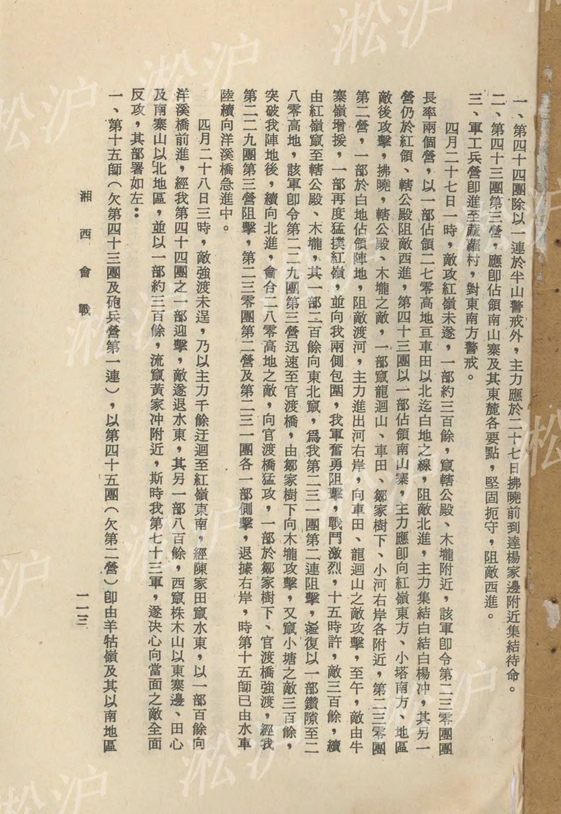

，旋迴向東南攻擊敵之側背，先進出於寨邊、洋橋溪之線，以第四十四團（附砲兵營第一連），即由黃家冲、蘿蘿村之線向南攻擊，進出於洋溪橋、龍迴山之線。

二、第七十七師「附第四十三團（欠第三營）、第四十五團第二營、及砲兵營（欠第一連）」除以一部固守新化，第二三零團於原陣地阻敵北進外，主力卽全面轉移攻勢，進出於牛寨嶺東南之線。

三、第四十三團第三營及軍工兵營，於攻擊部隊超越洋溪橋東南之線後，於原陣地集結待命。

是日十三時，該軍全面轉移攻勢，第十五師第四十五團第一營，一舉突入寨邊，第三營進至株木山附近，第四十四團進抵洋溪橋西端，其餘各部均於原陣地向當面之敵攻擊。

四月二十九日晨，各部隊續行攻擊，第四十五團仍於謝家、株木山、寨邊之線激戰，第四十四團進至寨邊西北洋溪橋之線，續向東南攻擊，第二二九團第三營攻佔木壠，第二三一團第一營攻佔木壠、小塘之線，第二營攻佔小塘南方高地，第四十五團第二營進至大塘、下竹冲之線，入夜第七十七師冒大雨向敵攻擊，第二二九團第三營進至轄公殿以北，第二三一團第一營進至轄公殿東北，第三營進至牛寨嶺以北，以四十五團第二營進至牛寨嶺東側。

同日午，第七十三軍奉第四方面軍四月二十七日電令，第第十八軍之第十八師，除留置一個營於裏底歸第七十三軍指揮外，其餘主力將防務移交第九十二軍接替，限三十日在安化附近地區集結待命，該軍當卽轉飭遵照，並以第十八師第五十二團第二營之一個連位於潭市，向湘鄉方面警戒，營主力集結裏底附近，並於溪口、扶册、獅子山各附近派出小部隊，向永豐方向嚴密警戒。

四月三十日拂曉，由車田渡河竄白地以西地區之敵，向二七零高地攻擊，經第二三零團第二營一部反擊後，向洋溪橋以南潰退，該團一部跟踪追擊中。是時我第十五師各部，仍於謝家、株木山以東、寨邊西北，洋溪橋以南之線，阻敵西進，第七十七師除各留一部固守龍迴山、轄公殿、牛寨嶺等要點外，主力向西挺進，協力派十五師戰鬥。十二時第二三一團之一部攻佔水東，主力向南延伸，圍攻南山寨北麓之敵，第二二九團第一、第三兩營集結羅家附近，爲師預備隊。入夜，第二三一團第九連，夜襲南山寨以東之敵，斃敵甚衆，殘敵向北潰竄，第七十三軍爲防敵突圍向西南逃竄，乃指示第十五師洋溪橋附近地區之敵，如突圍向西南逃竄，該師（第四十三團第三營歸建）以有力一部超越敵之前方阻擊，主力則分別截擊追擊，以捕捉敵人於戰場而殲滅之。

五月一日，以下參照插

敵一部四百餘，於六時竄謝家以西地區，經我第四十五團之一部奮力阻擊，敵仍頑抗，一部敵三百餘，由寨邊竄黃家沖，與我第四十四團激戰。另一部敵三百餘，四度向我第二三一團陣地猛撲，均爲擊退，殘敵南竄南山寨。入夜第四十三團第三營夜襲南山寨，並一度將該地佔領同日午第七十三軍奉第四方面軍電令，該軍除繼續努力殲滅洋溪橋東南地區殘敵外，着卽編成有力支隊，以副師長率領，於一日經四都、龍溪舖、巨口舖、邵榆公路兩側地區突進，遮斷敵之補給線，破壞其後方交通，使我方面軍作戰容易，該軍當卽以第七十七師第二二九團之第一、第三兩營及第四突擊大隊附無線電一班組成一個支隊，由該師楊明副師長指揮，於二日晨向指定地區突擊。

五月二日晨，我空軍戰鬥轟炸機十二架次，分批襲擊洋溪橋、寨邊、田心各附近之敵，戰果豐碩，我第一線各部隊繼起全面攻擊。九時田心之敵六百餘，分由水東以西及陳家田以北迂回，竄攻紅嶺西南及東南地區，與我第二三一團第三營激戰。十七時，第四十五團突入寨邊，其第七、第八兩連傷亡過半，官長僅存一員，仍奮勇與敵博鬥，第四十四團亦攻佔黃家沖東南高地，並續進至洋溪橋西南地區，其主力向田心攻擊，其一部協力第四十五團圍殲寨邊之敵，第二三零團亦進至洋溪河支流左岸，支援第四十四團之作戰。

是日第四方面軍，奉兼總司令何應欽上將四月三十日電：「着第七十三軍務迅盡力全殲滅當面之敵，並負責防止西竄，以免影響戰局」。該方面軍於十三時下達命令，其要旨如左：

一、第七十三軍迅速擊滅當面之敵，防止其西竄烏樹下、羅洪、半山、馬家坳之線。

二、第十五師師部應移駐水車東煙竹山。

三、各該師須於最前線設立指揮所。

第七十三軍卽飭第十五師應於寨邊西南地區加強配備，嚴爲防阻，該師指揮所位於樂柏亭，第七十七師指揮所位於長岡嶺以南。十七時，第四十五團第二營至樂柏亭歸建。

五月三日晨，第四十五團再攻寨邊之敵，敵憑堅固民房頑抗，數度衝入，敵我傷亡均重，卒佔民房三棟，敵仍據另四棟頑抗。十二時，水東之敵三百餘，竄洋溪河支流右岸，企圖北進，經我第二三零團擊退。十七時，陳家田之敵再攻紅嶺西南，一部鑽隙至牛寨嶺西南地區，與我第二三一團對戰，是日我空軍全日出動十六架次，襲擊洋溪橋以南地區之敵，戰果甚豐。

四日八時，攻擊紅嶺及竄牛寨嶺西南之敵，經我第二三一團第三營阻擊，及該團第二連由洞沖側擊，於陳家田東南洞沖西北激戰。十時第二三零團猛攻洋溪河支流右岸之敵，我空軍P型機二十二架次，分批襲擊敵軍及協力地面部隊戰鬥。迄十二時，殲敵過半，殘敵不支，向田心、水東附近退走，寨邊之敵，被我連日圍攻。十七時，敵將民房焚燬，並埋設地雷後，其大部退囘田心，一部竄寨邊西北森林。五月五日拂曉，第四十五團及第四十四團各一部，圍攻寨邊西北森林之敵，敵由田心增援三百餘，經我奮勇迎擊，一部退竄，其一部會合該地之敵共五百餘，藉林緣、圍牆及工事頑抗，我遂縮小包圍圈，向敵壓迫，第四十四團主力阻擊田心敵之反攻形成對峙，第二三零團以一部協力第二三一團戰鬥，主力守備二七零高地亘白地、鄒家、樹下之線，第二三一團奮力拒止進出紅嶺之敵，八時敵一部阻我洞沖附近第二連之側擊，主力五百餘再度突擊紅嶺，爭奪甚烈，雙方傷亡均重。迄午，田心之敵三百餘竄水東，同日邵陽之敵六百餘，經白雲舖竄抵巨口舖南之石板橋，與我楊支隊遭遇激戰，我空軍全日出動，型機十九架次，襲擊水東、田心、紅嶺各附近之敵，殺傷甚重。

五月六日拂曉，敵百餘由南山寨進攻謝家我第四十五團右側背，經我反擊後，退回原陣地，被圍於寨邊西北森林之敵，經我數度猛烈攻擊，敵仍頑抗如故，竄水東之敵三百餘，十三時許向龍迴山進攻，經我第二三零團第二營之一部猛烈阻擊，敵一部回竄，一部就地構築工事中，攻紅嶺以西地區之敵六百餘，與我第二三一團第三營激戰兩晝夜後，攻勢更烈。十四時與我激戰於紅嶺以東高地石板橋之敵，於是日十二時許，經第七十七師楊支隊猛烈阻擊後西竄，該支隊乃超越該敵阻擊中，是日我空軍出動戰鬥轟炸機十架次，協力地面部隊作戰，戰果良好。

同日午，第七十三軍奉第四方面軍電：「命第十八軍之第十八師自卽日起歸由該軍指揮」。該軍當飭第十八師於八日到達大橋邊及其以北地區集結待命，同時該軍復奉第四方面軍作命甲字第九號命令，其要旨如左：

一、當面之敵，經我各部堅強阻擊，傷亡慘重，其攻勢已呈頓挫。

二、爲殲滅當面之敵，本方面軍決全面轉移攻勢，置主決戰於兩翼，壓迫敵人於雪峯山東麓捕捉殲滅之，第三方面軍之第九十四軍主力，擊滅城步以北地區之敵後，進出於武岡附近，準備協同本方面軍擔任邵榆公路以南地區之作戰。

三、第七十三軍（欠第一九三師附第十八師），以主力迅速擊滅洋溪橋附近之敵，以有力一部卽集結於大橋邊附近，重點保持於右，向灘頭、巨口舖等處之敵攻擊奏功後，進出桃花坪、巖口舖、石馬江之線，掩護方面軍主力左側背之安全，並派小部隊向永豐、湘鄉之敵佯攻，第一日統制線預定爲嚴口、谷橋、田心、小溪市之線。

四、第七十三軍與第十八軍之作戰地境線：（線上屬左）爲羅洪——烏樹下——馬家莊——黃家洲——栗山舖相連之線。

五、攻擊開始時間，預定爲七日拂曉。

六、作戰規定事項：

(一)亘作戰全期間，須與空軍密切協同。

(二)攻擊間，各級指揮官應親臨前線督戰，對於地方武力須妥爲配合運用。

(三)各軍突擊隊，於攻擊間卽移至適當地點，截斷敵退路，配合主力軍之攻擊。

七、余在安江指揮所。

第七十三軍奉命後，遵卽下達命令，其要旨如左：

一、第十八師卽經黃家姥、樂柏亭，於七日到達半山、羅洪間，八日到達大橋邊及其以北地區集結，卽向灘頭、巨口舖之敵攻擊。

二、第十五師及第七十七師仍繼續圍攻當面之敵。

是日十七時，第七十三軍復奉第四方面軍電令，命該軍之暫編團卽改歸第十八軍指揮，該軍當卽轉飭遵照。

五月七日拂曉，第四十三團第三營，向南山寨東麓之敵攻擊，斬獲頗多，第四十五團及第四十四團之一部，向圍困寨邊西北森林之敵再度攻擊，敵藉工事及熾盛之火力頑抗，我第四十五團第三營之一部，一度衝入敵陣，斃敵甚多，第二三一團主力，同時亦向紅嶺以東之敵攻擊，敵憑工事頑抗，無大進展，我空軍全日分批出動十五架次，直接支援地面部隊戰鬥，敵傷亡頗衆。

同日午第七十七師楊支隊，跟踪追擊向栗坪方面西竄之敵，第七十三軍乃對第十八師指示如左：

一、第十八師主力位置於大橋邊，以小部隊向東南搜索警戒，並與楊支隊設法連絡。

二、卽派一個營迅卽到達下茅坪附近，阻敵北進，並予痛擊。

是日十七時許，第七十三軍奉第四方面軍電令，第十八軍主力已進出龍迴司及其以北地區，準備向竹篙塘、觀音山之線進出，攻擊敵之側背，楊支隊應以重點保持於右翼，掩護方面軍主力之左側背，仍應續行突擊任務，該軍當卽轉飭該支隊以一部於五湖廟、栗坪間，主力向巖口舖、桃花坪間攻擊。

五月八日，

以下參照插

第七十三軍於八時奉第四方面軍電令，於八日拂曉轉移攻勢，當卽電飭第十八師卽遵方面軍作命甲字第九號命令，向所示之目標攻擊，進出於撲塘橋、谷橋之線。

同日栗坪以南之敵，會合由五湖廟方向增援之敵共千餘衆，經我楊支隊側擊後，於十四時向大橋邊方向竄攻，我第十八師準備迎擊中。十六時，水東之敵四百餘，迂迴南山寨以西，竄大坳，我第四十三團第三營，當予迎擊，戰鬥激烈。十七時，敵二百餘，由寨邊西北森林突竄株木山，我第四十五團之一部，奮勇阻擊中，紅嶺東端之敵，經我第二三一團第三營與另一部，迂迴敵側翼，猛烈攻擊後，我佔領高地一處，我空軍全日，分批出動，P-5型機十五架次，協力戰鬥，敵傷亡頗重。

五月九日，竄抵大坳之敵，經我第四十三團第三營迎擊，並以一部鑽隙敵後夾擊，於九時，敵不支回竄，水東、株木山之敵，經我阻擊後，乃竄謝家以北地區，我第四十五團之一部奮勇阻擊，敵改向南山寨竄去，寨邊西北森林殘敵，經我空軍P-51型機十架次之分批轟炸掃射，致其傷亡甚重，我四十四團之一部，藉空軍之掩護，猛烈攻擊。迄二十三時，敵乘夜暗突圍，竄株木山，復經我第四十五團迎擊，於二四九高地亘株木山以西高地激戰中，紅嶺之敵，與我爭奪甚烈，雙方傷亡均重，十八時，我第二三一團以第一營增援戰鬥，更爲激烈，向大橋邊西竄之敵，經第十八師第五十三團主力及第五十四團之一部阻擊，敵主力囘竄栗坪，其一部百餘，於大窩山附近與我激戰。

五月十日晨，栗坪之敵，復竄順水橋西北地區，第七十三軍當卽指示第十八師，以一個加強團向大窩山、牛欄砦附近之敵攻擊，主力於大橋邊附近集結待命，但須適應當前狀況，準備戰鬥，楊支隊應向沙渡閣附近前進，跟踪追擊。

同日竄株木山之敵，經第四十五團阻擊後，西攻未逞，十三時，第四十四團有力一部，由寨邊西向，第三營一部，由楊家邊北向，協力第四十五團向敵猛烈攻擊，並經我空軍協力戰鬥，敵傷亡慘重，紅嶺附近之敵，經我第二三一團在我空軍二十三架次分批支援下，猛烈攻擊後，分向龍迴山進攻，爲我第二三零團一部迎擊，敵不支，囘竄水東及紅嶺西部，時第七十三軍爲迅殲當面之敵，決心於十一日拂曉續攻當面之敵，特對各師指示如次：

一、第十五師以一部監視寨邊西北之敵，主力於寨邊以南地區，向東南攻擊，進出於陳家田、水東之線。

二、第七十七師由東北向西南攻擊，轄公殿西南紅嶺各附近之敵而佔領之。

三、第十八師及楊支隊仍依十日指示，服行原任務。

五月十一日拂曉，第十八師第五十三團一部，猛攻當面之敵，在我空軍四架次之掩護下，攻佔孟公廟、大窩山、三角寨各要點，敵以一部五百餘於劉家山、牛欄砦，掩護其主力竄順水橋，我楊支隊同時協力向該敵側擊。十時，我第十五師對團困株木山之敵統一攻擊，在我空軍五架次之支援下。迄午，第四十四團突進株木山東側，敵我傷亡均重，同時第二三零團由龍迴山轄公殿之線，第二三一團由紅嶺西向猛烈攻擊水東東南亘紅嶺北麓之敵，反覆衝鋒，斃敵甚夥。十五時，第十八師第五十二團由巴油到達石渣牌，歸第十五師指揮，協力該師攻擊洋溪橋以南地區之敵，十七時第二二九團（欠第一營第三營）迂迴至洞沖西北地區，向陳家田敵後襲擊，並阻敵由南山寨方面之增援，二十二時，敵百餘由謝家鑽隙竄至鄒家坪。

五月十二日拂曉，第五十二團展開於石渣牌西北之線，迎擊竄鄒家坪之敵，與敵激戰於鄒家坪三九七高地之線，株木山之敵，經我第四十五團猛攻後，自九時迄十五時，敵四度增援，並以砲兵掩護，向該團反撲，我以傷亡較重，乃扼守原陣地拒敵西竄，十三時，第四十四團續向株木山東側攻擊，第二三一團佔領紅嶺西側高地後，以一部清掃戰場，主力向南山寨北麓續行攻擊。十五時，第五十三團攻佔牛欄砦後，在黃泥嶺、車家橋、順水橋之線，與敵激戰，同時楊支隊爲防敵向東北竄逃，乃以一部設伏於黑風凇、苦頂坑、泥私水、寒毛嶺各要點，主力則協力第五十三團夾擊該敵，我空軍P-51型機全日出動十九架次，分批支援地面之戰鬥，戰果豐碩。

五月十三日晨，敵攻擊三九七高地，反覆爭奪，戰鬥甚烈，我第五十二團一部增援反擊，敵向南山寨退竄，株木山之敵數度向我第四十五團正面猛撲，爲我擊退，我空軍機羣共四架次協力制壓敵人，我乘機反攻，敵仍憑旣設工事頑抗，同時第二三零團在我空軍六架次分批支援下，攻佔水東，並續向田心之敵攻擊，第二三一團攻佔南山寨東麓後，一部乘夜暗近迫山頂，第二二九團一部迂迴大坳，向敵後攻擊，第五十三團當面之敵，同日經該團及楊支隊協力夾擊下，佔領黃泥嶺、車家橋、順水橋三要點，敵主力回竄栗坪，我乃跟踪追擊，我空軍機羣兩批四架次炸射栗坪之敵，敵傷亡頗衆。

五月十四日拂曉，第五十二團猛攻鄒家坪之敵，並以一個營向南沖方向掃蕩，雙方傷亡均重。十時第四十五團續向株木山之敵攻擊，該團官兵不惜犧牲，忠勇用命，攻克該地，敵退竄謝家以南地區，該團續向五八零高地突進掃蕩，我第二三零團同時攻佔田心，續向謝家、南山寨北麓攻擊，及午，南山寨敵五百餘，經小半山向巴油方向逃竄，遭我第五十二團阻擊，其一部百餘竄四馬歸槽，復經我第四十三團第三營阻擊，乃竄南沖、棋盤石附近，其另一部三百餘，退竄龍鳳山。

第七十三軍以當面之敵已呈崩潰之勢，決心於南山寨西南山區將敵聚殲，遂調整部署如左：

一、第十八師應卽以有力一部於分水界、巴油阻敵南竄，主力於大橋邊附近地區側擊截擊敗退之敵，爾後經唐下口、孟公廟、澣溪、王包姥向栗坪西南地區繼續攻擊前進。

二、第十五師，除以小部隊先於南沖以南地區設伏截擊外，主力於擊破當面殘敵後，卽經石渣牌、巴油、孟公橋、溪石灣，一部經南沖、石屋冰、上茅坪、錢財、古縣場，均向栗坪附近攻擊前進。

三、第七十七師，除以小部隊於蒼溪山、梅公嶺設伏截擊敵人外，卽以全力先向西南壓迫，擊破當面之敵後，一部經鄧家沖、蒼溪山、下茅坪、易家坳、迎官橋、沙渡閣，主力經月光山、梅公嶺、石沖、大界、毛紅嶺、沙渡閣，均向大坪、十字路、巨口舖攻擊前進。

四、第四十三團（欠第二營、第三營），先進出四都待命。

五、楊支隊應卽於沙渡閣東南地區扼要設伏，截擊敵人。

五月十五日十一時，栗坪敵主力竄大坪、十字路，其一部二百餘，竄長古嶺，我第五十三團有力一部，向栗坪之敵攻擊，楊支隊向敵側擊，牽制其北竄，第四十三團（欠第二營、第三營），推進一部至龍山，對南警戒。十二時，龍鳳山之敵，竄分水界附近，經第五十四團之一部阻擊後，迄十五時，敵竄東瓜嶺東北，我第五十三團之一部，由羅洪攻擊之敵，乃回竄巴油附近，謝家以南地區之敵，經我攻擊後，主力一千二百餘，竄橫排、棋盤石、南沖間地區，我第五十二團，由三九七高地向東南，第四十五團、第四十四團、第二三零團由楊家邊、謝家以南亘南山寨之線，向南壓迫，第二二九團一部，由大坳向橫排掃蕩，第二三一團之一部，由蒼溪山向南沖索敵攻擊，第四十三團第三營，由上茅坪向南沖攻擊，同時大坪、十字路之敵，有續向四都竄攻企圖。是夜，卽飭第二三一團，由月先山向東南迎擊北竄之

同日午，第七十三軍令軍工兵營進至新化城，限十六日拂曉前到達，加強核心工事，並擔任新化之守備，同時指示楊支隊對大坪、十字路、長古嶺之敵，務盡力側擊，牽制其北竄。十七時，第七十三軍奉第四方面軍電話指示：「令第十八師（欠第五十二團）對於栗坪方面之敵，以一部監視，主力控置於大橋邊以北地區，並派一個營迅即到達羅洪，扼堵敵人西竄，並側擊南竄之敵」。該軍當即轉飭遵照，第十八師奉命後，即以第五十四團（欠第二營）主力扼守芭蕉山、採蓮、孟公橋、風送垤各要點，阻敵西竄，一部向巴油掃蕩，第五十三團主力扼守羅洪及其附近，防敵西竄，一部監視栗坪之敵。

五月十六日十三時，第四十五團將橫排以南地區之敵，壓迫至南沖附近，第四十四團挺進至南沖東方高地，向西掃蕩，第二三零團於大坳附近，協力第十五師團圍殲該敵，第二二九團之一部向棋盤石以西地區索敵攻擊，南沖之敵一部五百餘，向上茅坪竄逃，經第四十三團第三營迎擊，敵受創，長古嶺、大坪、十字路方面之敵，經我楊支隊猛烈襲擊後，其一部四百餘竄嚴塘橋，主力回竄順水橋、栗坪間地區。二十一時，第七十三軍調整部署如左：

一、第七十七師附第四十三團，（欠第二營、第三營，）以第二三零團即經石冲、大界向南側擊潰退之敵，努力求獲戰果，主力應攻擊嚴塘橋、栗坪附近之敵，進出龍溪舖、巨口舖，並相機截擊側擊由巴油、茅坪敗退之敵，師指揮所移至林屋附近。

二、第十五師以有力一部肅清當面之敵，其餘部隊跟踪追擊南退之敵，並防敵西竄。

三、第十八師主力截擊向南退却之敵，防敵西竄，一部及楊支隊協力攻擊栗坪附近之敵，而殲滅之。

五月十七日九時許，嚴塘橋之敵竄抵沙渡閣附近，經我楊支隊追擊，滯留於該地以西地區。十二時許，南沖之敵，經我第四十五團主力及第四十四團之攻擊，敵不支南潰，我進至龍鳳山、分水界之線，再度猛攻，敵一部於唐家姥上頑抗，其主力八百餘竄巴油、鳳送堯間地區，經我第五十四團一部迎擊，及第五十三團一部由東瓜嶺側擊，敵仍作困獸鬥，上茅坪敵二百餘，十五時竄抵窩山，與我第五十四團一部激戰。十七時，我官兵奮勇突入，反覆搏鬥，敵我傷亡均重，第二二九團一部，進至蒼溪山，協同第四十三團第二營向上茅坪掃蕩殘敵。

五月十八日拂曉，巴油、窩山之敵，大部四百餘，向大橋邊南竄，經我第五十四團阻擊，及第五十三團一部側擊，激戰於五零一高地亘雪界附近，敵以一部頑抗，另一部則竄高坪附近，我第五十二團跟踪追擊唐家姥上之敵，經我第四十五團、第四十四團猛烈攻擊後，向林土里逃逸，復經我第四十三團第三營之一部側擊，敵狼狽向燈籠坳、顏公坳潰竄，我跟踪壓迫。十三時，上茅坪之敵，經我第四十三團第三營主力猛烈攻擊後，敵傷亡甚重，殘敵向文昌閣潰竄，我第二三零團一部，經高鳳山向西南側擊，十七時許，沙渡閣之敵，經毛江嶺北竄，老鴉垤與上茅坪南竄之敵會合，共約七百餘，我第四十三團第三營由北向南，楊支隊則由南向北，第二三零團由高鳳山協力攻擊該敵。十九時，第七十三軍決心繼續攻擊當面之敵，進出白羊塘、巨口舖及其以東之藥，遂對各師指示如左：

一、第十八師與第十五師之作戰地境：爲橫江—唐家姥上—林土里—文昌閣—中黃姓—迎官橋—黑風水—栗坪之線。線上屬右。

二、第十五師與第七十七師之作戰地境：爲棋盤石—戴家冰—沿小河至高鳳山東麓—大底羅家—毛江嶺—嚴塘橋—寒毛嶺—桐木沖之線，線上屬右。

三、因修改作戰地境所行之部署改變，限十九日調整完畢。

是日我空軍第五大隊，出動P16及P12型機十三架次，炸射栗坪附近之敵，戰果甚豐。

五月十九日十三時，第十八師之第五十二團奉令歸建，並由巴油以南向風送堯、燈籠坳攻擊，第五十四團有力一部於觀音姥、窩山阻敵西竄，其一部協力第五十三團攻擊雪界以南地區之敵，第五十三團於仁風亭、洋橋、五零一高地、大橋邊各附近阻敵西南竄，第十五師之第四十五團，第四十四團向燈籠坳、顏公坳之敵猛攻，第四十三團第三營同時亦向文昌閣、老鴉堯攻擊，戰鬥至烈，第七十七師之第二三零團一部，協力第四十三團第三營攻擊老鴉堯之敵，另一部迂迴至大底羅家，向敵後攻擊，十三時，第七十三軍奉第四方面軍電話指示：「第十八師應以全力猛攻當面之敵，迅向東南壓迫，而擊破之」。該軍當卽轉飭遵照，我空軍全日出動機羣二十七架次，分批襲擊栗坪及其附近地區之敵，敵傷亡甚衆五月二十日晨，第五十三團主力及第五十四團之一部，再度猛攻五零一高地亘雪界之敵，敵向喻家橋方向突竄，第五十三團一部跟蹤追擊，我守備洋橋之部隊奮勇阻擊，十二時，第五十二團進至風送堯，協力第四十四團及第四十五團攻擊燈籠坳、顏公坳之敵。十三時許，顏公坳之敵，被迫竄燈籠坳，我當卽向燈籠坳續行圍攻，老鴉堯之敵，經我圍擊後，亦向中黃姓潰竄，栗坪附近之敵，經我空軍戰鬥轟炸機十九架次之分批炸射，傷亡甚重。

五月二十一日，我對喻家橋之敵續行猛烈攻擊，並一部迂迴威脅敵後，敵不支退據茶山以北高地，復經我大橋邊守軍迎擊敵仍憑險頑抗，第五十二團及第五十四團之一部，協力第四十四團及第四十五團續對燈籠坳之敵圍攻，是夜第四十三團第三營主力襲擊中黃姓之敵，斃敵甚多。

二十二日，燈籠坳之敵，企圖南竄，經我奮勇阻擊，受創甚重，茶山之敵，經我猛烈攻擊，雖一度突入敵陣，敵仍憑險頑抗，戰鬥至爲激烈。

五月二十三日，（以下參照插圖第四十八）我第五十二團第四十四團及第四十五團各一部，於九時再度攻擊燈籠坳之敵，我官兵奮勇突入敵陣，我空軍戰鬥轟炸機九架次，分批協力戰鬥，敵不支南竄，我各部跟蹤追擊，至龍虎觀、孟山壠附近，頗有斬獲。十五時許，第二三零團第一營向中黃姓之敵攻擊，敵據家坳頑抗，我藉砲兵之支援下，攻佔該地，敵退據中黃姓西南高地，長沙坳、下黃姓、迎官橋間地區之敵約千餘衆，向東南退竄，我第二三零團主力第四十三團第三營及楊支隊主力，分途猛烈截擊，敵傷亡甚重。

同日第七十三軍奉第四方面軍五月二十一日電令，其要旨如左：

一、當面之敵全線崩潰，殘敵狼狽向邵陽逃竄。

二、方面軍決卽追擊當面之敵，壓迫於資水左岸，捕捉而殲滅之。

三、第七十三軍（欠第一九三師附第十八師），迅向大橋邊、巨口舖之線殘敵攻擊，奏功後續向石馬江、顏二塘之線追擊。

四、第十八軍與第七十三軍作戰地境線：爲馬王坳—太平砦—五湖廟—渡頭橋—石灘北端—陳家橋相連之線。線上屬左。

第七十三軍奉命後，遵卽下達命令，其要旨如左：

一、大橋邊北側地區之敵，連日被我掃蕩，殘敵向迎官橋及其東南地區潰退。

二、軍遵方面軍之指示，決卽猛追當面之敵，進出於石馬江、牛灣塘之線。

三、第十八師應迅卽掃清大橋邊附近之敵，於到達顏公廟、大橋邊後，以主力集結該地區，推進一部於太平坳。

四、第十五師攻達溫塘、順水橋之線後，以主力進出孟塘、栗坪附近地區，有力一部向渡頭橋追擊。

五、第七十七師攻達順水橋、龍溪舖之線後，主力進出於巨口舖附近，有力一部向石馬江、牛灣塘追擊六、各師作戰地境線如次：

第十八師與第十五師間：爲南沖—分水界—林土里—燈籠坳東南高地—背龍灣—古縣場—溫塘之線第十五師與第七十七師間：爲棗山—巷子洞—中黃姓—長沙坳—峯嶺—順水橋—栗坪—梓木冲—藕塘邊之線，線上均屬左。

五月二十四日三時許，我第五十三團及第五十四團一部，攻擊茶山之敵，敵不支向東潰竄，第五十四團一部由大橋邊南進截擊，第四十四團及第四十五團擊破馬濫橋、孟山壠、下黃姓各附近之敵後，分向長沙坳、牛欄砦之敵攻擊，迄，第四十四團第三營突入長沙坳，斬獲頗多，殘敵潰退牛欄砦，第二三零團一部攻佔中黃姓後，主力向水口進出，第二三一團第一營，由嚴塘橋協力攻擊迎官橋之敵，十三時許，楊支隊有力一部襲擊馬渡橋附近之敵，主力分向順水橋、栗坪截擊潰竄之敵。

五月二十五日拂曉，第五十三團，第五十四團猛烈夾擊茶山之敵，敵傷亡慘重，殘敵向順水橋方向潰竄，我當以一部追擊，主力清掃戰場後，至洋橋、大橋邊各附近集結，第四十四團之一部由余家壠協力主力迂迴攻擊，牛欄砦敵憑險頑抗，我分別鑽隙突進，斬獲頗多，殘敵向順水橋潰退，我乃續行追擊，第二三零團主力及第二三一團一部，夾擊迎官橋之敵，七時許，敵向沙渡閣潰竄，我跟蹤追擊，遂續行圍攻，敵乃潰至峯嶺。入夜，第四十三團第三營襲擊該敵，敵竄集順水橋，同日楊支隊向巨口舖、栗坪之敵襲擊，頗有斬獲。

五月二十六日，第十八師主力集結洋橋、大橋邊附近待命，有力之一部推進至太平姥，七時許，第四十四團一部進至溫塘，主力及第四十三團第三營，攻擊順水橋之敵，第二三一團第一營，進至泥私丞、寒毛嶺之線，一部側擊順水橋，主力向栗坪挺進，第二三一團主力向龍溪舖前進，楊支隊一部於野牛塘，截擊向東南潰退之敵，主力分別襲擊草鞋舖、巨口舖、白雲舖之敵，頗有斬獲，我空軍戰鬥轟炸機七架次，襲擊栗坪附近敵，傷亡甚重。

五月二十七日拂曉，我向順水橋、栗坪之敵猛攻，激戰至午，敵傷亡甚重，我空軍戰鬥轟炸機七架次，分批協力戰鬥，殘敵三百餘，向五湖廟潰退，我遂佔領以上兩地後，第四十三團第三營跟蹤追擊，第二三一團經龍溪舖向巨口舖方向前進。

五月二十八日午，第十五師主力進至栗坪、孟塘以西地區集結，第四十三團第三營向五湖廟襲擊，第二三零團主力集結栗坪東北地區，一部向草鞋舖襲擊，第二三一團主力集結龍溪舖以南地區，一部向巨口舖攻擊，楊支隊一部攻佔馬渡橋，敵向南潰竄，該部當卽跟蹤追擊，主力分向巨口舖、白雲舖襲擊五月二十九日五時，我第二三一團第一營向蓮花寨之敵猛烈攻擊，一部奮勇突入，與敵肉搏，敵憑工事頑抗，頗有斬獲，入夜，第二三零團一部襲擊巨口舖，楊支隊之一部向白雲舖突擊，敵傷亡甚重，由秦家坳增援反撲，戰鬥至烈，迄三十一日拂曉，第二三零團之一部攻佔巨口舖，第二三一團佔領蓮花寨，敵向南潰退，我當卽跟蹤追擊，楊支隊時亦攻佔五湖廟，殘敵向清江廟退竄，十七時，白雲舖之敵，經我突擊後，一部潰至喻家橋，主力向石馬江潰竄。

六月一日晨，第二三一團有力一部，協力楊支隊猛攻殘敵，十三時許，我已進至新田舖、渡頭橋、溫泉山各附近，我以任務達成，停止追擊，乃對東南方向警戒，至是恢復四月八日前之態勢。

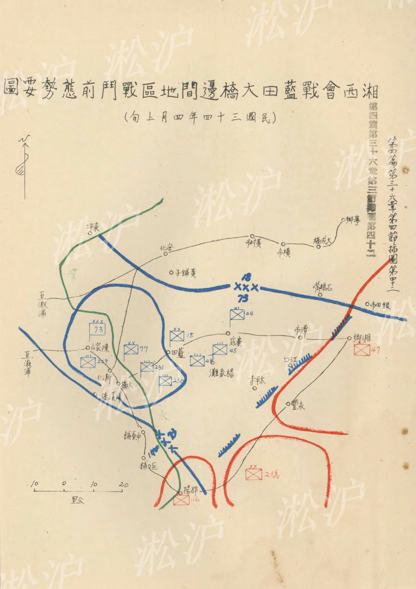

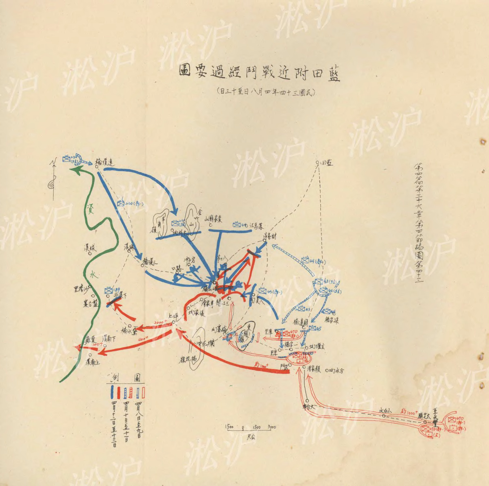

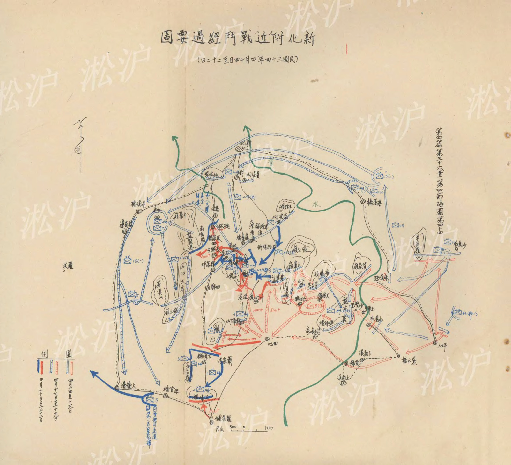

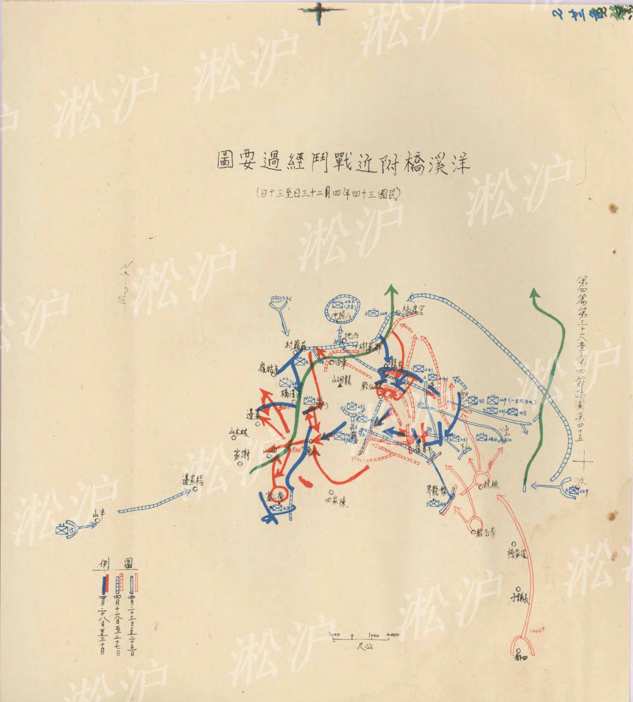

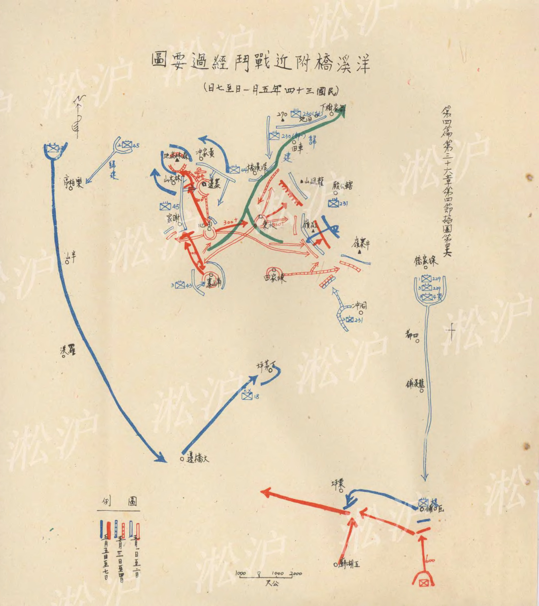

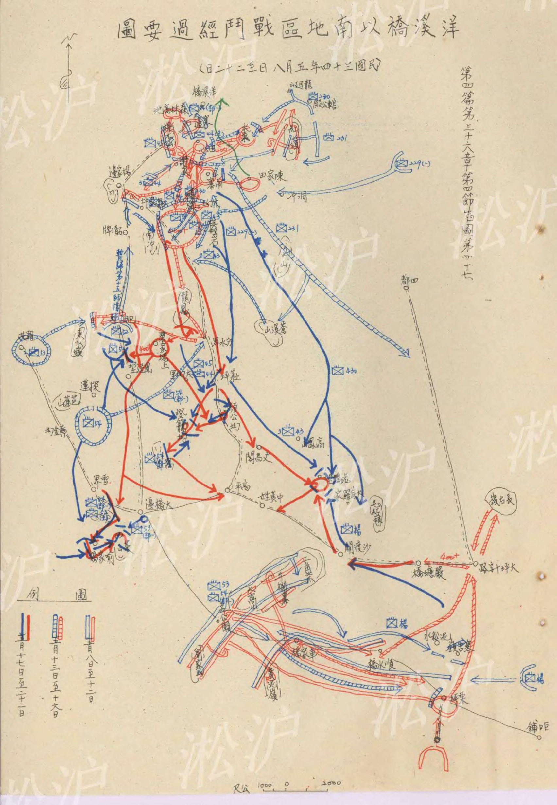

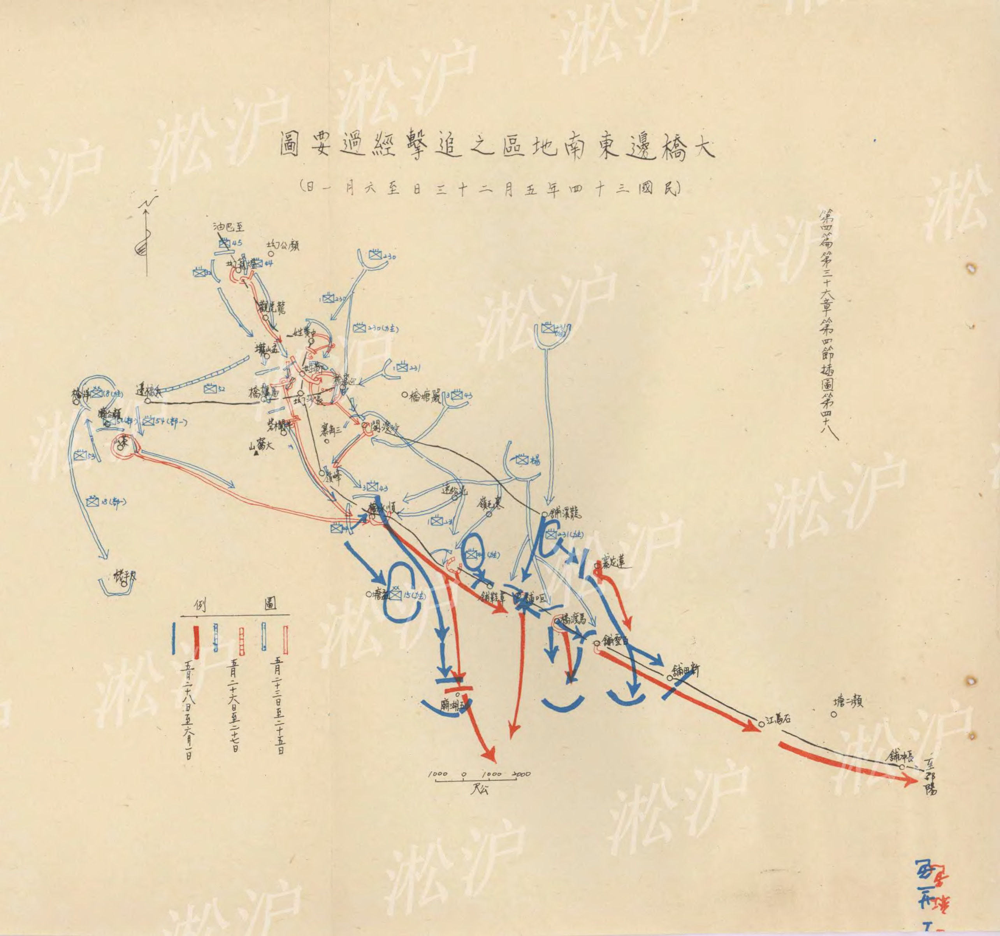

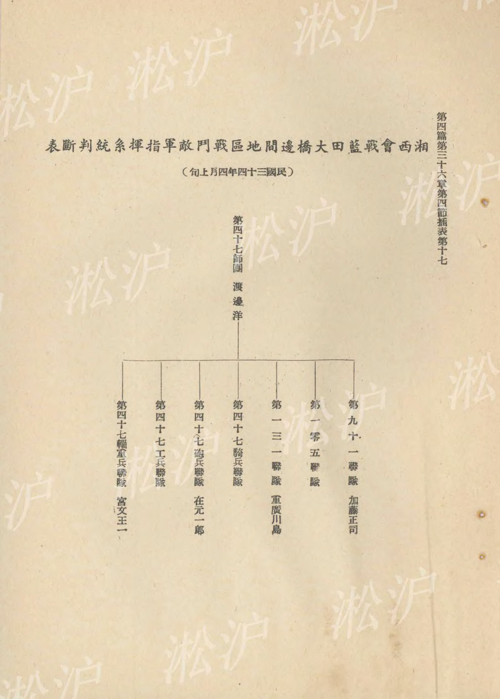

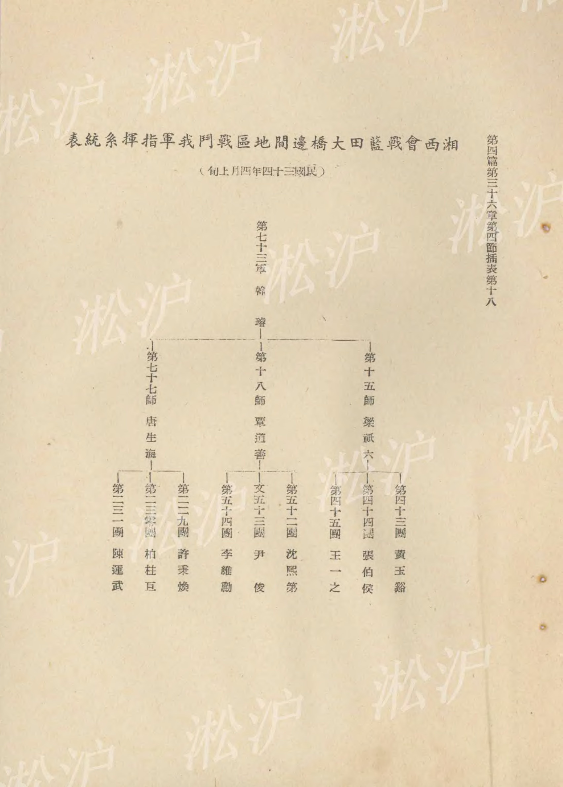

#### 第六款 寧鄉益陽桃花江與山門及灘頭各地區

之戰鬪

民國三十四年四月十三日至六月二日

參照插圖第四十九至第五十三插表第十九第二十

敵第六十四師團爲策應其軍主力在湘西正面之作戰，並牽制我第十八軍兵力之轉用，乃於民國三十四年四月十三日以一部由沅江（縣）向益陽桃花江進攻。十八日，復以其另一部由寧鄉向大成橋、煤炭壩進攻，我第十八軍之第十八師各以一部阻擊，迄二十日，第十八師增援反擊，敵不支回竄，我當卽進迫寧鄉西郊及益陽西南郊與敵對峙，旋以敵向資水迤西積極進攻，我第四方面軍爲期捕捉殲滅當面之敵，遂令第十八軍將原桃源、常德、益陽、寧鄉方面防務交由第十集團軍王敬久部接替，並於四月底由第九十二軍之第一四二師接替完畢，第十八軍主力由沅陵、溆浦道南下，參加第四方面軍之決戰，並攻擊敵之側背，以一部沿安化、新化道向邵陽方向挺進，以截斷敵後交通，五月七日，該軍主力集結小沙江、隆迴司各附近地區，八日開始攻擊山門要點，並機動截擊東潰之敵，迄二十日，當面之敵東潰，該軍當卽追擊，六月三日，將敵完全擊退，恢復四月八日前之原態勢。

##### 第一項 本地區附近地形

益陽東北地區，均爲湖沼地帶，濱湖港汊縱橫，行軍作戰至爲困難，資水流經益陽城南，注入洞庭湖、新化、益陽間江面寬達九十至二百五十公尺，流速達二至三公尺，僞水流經寧鄉南郊，江寬一五零公尺，流速二至三公尺，均成爲作戰上之障礙，益陽西南及寧鄉以西地區，均屬山地，向洞庭湖成環盂形，除少數山嶺外，其標高均在五百公尺以下，傾斜度不大，利於部隊及車輛之越野運動，頗擅攻守之利，公路以長（沙）寧（鄉）、寧常（德）、湘（鄉）寧、常沅（陵）諸線爲主，均爲碎石路面，路幅達七至十公尺，行軍運輸不受天候影響，鄉道四達，交通至爲便利。

(插表第十九第二千)

民國三十四年三月上旬，敵第六十四師團集結於沅江、湘陰、長沙、寧鄉間地區，其各一部於沅江、寧鄉各附近對我警戒，迨至三月下旬，該部漸次西向沅江、寧鄉各附近集中，其搜索部隊及後方軍運之活動，亦漸趨頻繁。

我第十八軍

指揮系統如

插表第二十

以第十八師及第一一八師之各一部，自石壩嘴亘益陽、迎風橋、酉港、漢壽渡口之線扼要警戒，其主力分別集結於馬跡塘、築金壩、黃村市、橫市及灌溪市、常德、德山各附近，第十一師集結於鄭家驛附近，從事訓練整補，準備裝裝美式裝備，對各該附近地區之工事，均續行加強，敵我戰前態勢，如插圖第四十九。

本戰鬥之作戰指導，乃以一部行持久抵抗，消耗敵人，主力控置適宜地區，於敵攻勢衰竭之際，轉移攻勢，擊滅來攻之敵。

四月十三日（參照插圖第五十）沅江（縣）之敵第六十四師團之一部約二千餘衆，於十八時，分三路經南門橋湖、香崙舖、百祿橋等處向益陽進攻，十四日拂曉其先頭進迫益陽城郊，與我第十八軍之第十八師第五十四團守備該城之第六連發生戰鬥，該連奮勇抵抗，迄十二時許，敵未得逞，十三時，該地區之敵增至一千五百餘，其一部約六百餘，向桃花崙攻擊，當被我第五十四團之一部所拒阻，同時其另一部之敵約五百餘，由白鹿舖潛渡資水，向謝林港迂迴，我以第六連困守益陽城區，衆寡懸殊，遂令該連於十八時轉進至謝林港西北地區，歸還建制，同日第十八軍令第十八師以第五十四團有力之一部，佔領養朋山、猴子山、南竹山間地區，堅強阻敵西進。

四月十五日九時，第十八師之第五十四團第二營及第三營之一部，分由包家冲、雪花坳向竄抵大花冲、賈家冲之敵攻擊，敵不支退集謝林港，我於十二時，佔領大花冲。

十六日十時許，第十八師之一部，續向謝林港西北明月山之敵攻擊，至十一時，敵增援反撲，我與敵激戰於朱水潭附近，又由桃花崙及益陽城郊，竄抵楊泗廟及鄧石橋各附近之敵，經我第五十四團第三營主力襲擊，迄十七日十時許，終將該敵擊退。

四月十八日七時，寧鄉之敵，第六十四師團之一部，約二千餘，分向迴龍舖、大成橋、煤炭壩各附近進攻，我第十八師之第五十二團第一營，當予阻擊，戰鬥激烈，迄十二時，仍在雙島舖附近阻敵西進四月十九日十三時，益陽西北劉公橋之敵約八百餘，分由明月洲、舒塘各附近南渡，資水襲擊桃花江我軍之左側背與我第五十四團第一營於陳家沖、黃家沖間地區激戰。迄十六時，該營仍與敵激戰於黃鶴橋亘黃家沖之線，謝林港、羅公橋之敵主力千餘，向我第五十四團之第二營及第三營攻擊，激戰於白竹山、雪花坳及大花沖西北亘猴子山、南竹山之線。

四月二十日，我第五十四團第一營當面之敵，經該營連日之猛烈攻擊，傷亡慘重，是日我復增援猛擊，敵不支向益陽方面潰退，十五時，攻克桃花江、白竹山亘猴子山、南竹山之線之敵，經我猛烈攻擊後，同時向益陽方面潰退，我第五十四團當卽分兩路跟蹤追擊，又由寧鄉西攻之敵，連日激戰於雙島舖、俞家坳之線，迄二十日十時，我第五十二團第一營，配合寧鄉自衛團隊，奮勇反擊，敵不支向寧鄉潰退，該部跟蹤追擊，連克迴龍舖、公店子等處，並進迫寧鄉西郊。

四月二十一日十二時，我第五十四團之追擊隊，進迫益陽西南郊及流源橋附近，搜殲殘敵，第五十二團第一營與敵仍在寧鄉西郊對峙，至是寧鄉、益陽方面之戰鬥，卽告結束。

四月二十四日十四時，第十八軍奉第四方面軍轉奉何應欽兼總司令，四月二十四日十二時，忠整興電令，其要旨如左：

一、第十八軍桃源、常德、益陽、寧鄉方面及其附近地區之防務，交由第六戰區第十集團軍接替，第十八師寧鄉西郊及益陽西南郊之防務，於四月底交由第九十二軍之第一四二師接替完畢。

二、第十八軍主力，於四月底前集結於沅陵，並依情況可不待集結完畢卽由沅陵、溆浦道南下，參加第四方面軍左側背之主力決戰。

三、第十八師應於交防後，沿安化、新化道南下，向邵陽方面挺進，以遮斷敵後之交通，使主力軍決戰有利。

第十八軍奉命後，遵將防務交由第九十二軍接替，將部隊集結於常德、桃源及益陽、馬跡塘間地區，並沿指定道路南下，準備夾擊來攻之敵。

五月五日十三時，（以下參照插圖第五十二）第十八軍（欠第十八師）軍指揮所位置於金竹山，第十一師結集於小沙江、大沙江、艾花坪間地區，第一一八師結集於隆迴司北側、椒水塘、石梅舖各附近地區，十四時第一一八師之第三五二團第三營，向賽市之敵攻擊，當將該地佔領，殘敵二百餘，經飛蛾潭、星子坪向山門方向逃竄。

五月六日，第十八軍奉第四方面軍五月五日二十一時電令，其要旨如左：

一、當面之敵，經我各部阻擊，其攻勢已呈頓挫。

二、本方面軍決卽全面轉移攻勢，置主決戰於兩翼，與友軍協力壓迫敵人於雪峯山東麓捕捉殲滅之。

三、第十八軍（欠第十八師）卽集結於小沙江、隆迴司、黃泥井間地區，重點保持於右，攻擊當面之敵，奏功後，進出於新屋沖、黃橋舖、易家橋之線。

四、第十八軍右翼與第一百軍間之作戰地境：爲桶溪—北斗溪—馬脛骨—竹篙塘—樟樹脚相連之線，該軍左翼與第七十三軍之作戰地境：爲羅洪—烏樹下—馬家莊—莫家洲—栗山舖相連之線，線上均屬五、攻擊開始時間爲八日拂曉，當日統制線爲山門、飛蛾潭之線。

該軍奉命後，當卽轉飭各師預爲攻擊諸準備，並派小部隊向當面之敵搜索敵情，二十四時，第十一師之第三十三團，進佔虎形山，並向麻塘山搜索前進。

五月七日十二時，我第十一師之一部攻佔白馬山，並向楊州江約三百之敵攻擊，激戰數小時，佔領楊州江東北高地一處，我第一一八師第三五二團，攻佔賽市後，同日十時許，以一個營向斜嶺挺進，該師並以突擊隊攻擊星子坪之敵，迄十二時，佔領之殘敵向水西橋方向潰竄。十三時許，第十八軍奉第四方面軍電令，第七十三軍暫編第五師之暫編團，改歸第十八軍指揮，該軍當卽轉飭遵照，二十四時，第四方面軍復電令第十八軍於八日拂曉攻勢轉移，該軍當卽調整部署要旨如左：

一、第十一師以主力向山門之敵攻擊，並以有力之一部向山門東南地區進出，重點保持於右。

二、第一一八師以主力向水西橋、星子坪附近之敵攻擊，重點保持於右，另以一個團經橫板橋、龍潭舖向黃橋舖挺進，截擊敵之退路，並着該師於賽市、烏樹下各留置一部，擔任警戒，俾確保本軍左側背之安全。

三、第七十三軍之暫編團，位置於水東橋附近，對東南方向警戒。

四、軍工兵營及特務連，位置於金竹山軍指揮所附近，擔任警戒。

五、兩師之作戰地境線：爲艾花坪—小黃沙—袁家灣—水西橋—白眉山—石下江—觀音橋之線，線上屬左。

六、攻擊開始時間，爲八日拂曉。

五月八日拂曉，各師在空軍型機十架次之支援下，對當面之敵全線轉移攻勢，我官兵攻擊精神旺盛，進展迅速，第十一師除留置第三十三團於楊州江、蘇塘山南北地區與敵戰鬥外，主力向山門攻擊前進，並以一個營向山門以東之巖鶯巢進出，二十二時，第三十二團主力到達醪田以北地區，師部及第三十一團亦到達猴子巖以南地區，並以一部向山門挺進，二十三時，第一一八師主力到達水西橋、飛蛾潭之線，其第三五二團已進出橫板橋以南地區。

五月九日，第十一師副師長，統一指揮第三十二團（欠一個營）及第三十一團第一營，向山門之敵攻擊，迄十七時，西部之敵五百餘，爲我擊潰，殘敵百餘，憑堅頑抗，悉爲我全數殲滅，東北兩方面仍繼續猛烈攻擊中，同時第三十一團主力附師工兵營及搜索連，於桐木溪、馬脛骨附近截擊，自放洞向山門潰退之敵，頗有斬獲，第三十三團續對楊州江之敵攻擊，迄十時許。敵不支向西南方向潰退，第一一八師之第三五二團，進至橫板橋、龍潭舖間地區，該師主力進至水西橋、星子坪、橫板橋間地區。

五月十日拂曉，我第十一師，第三十二團，續行猛攻山門之敵，迄十時許，克復山門，敵傷亡慘重，遺屍遍地，該團並續向東圳之敵攻擊，第三十三團亦向爛屋沖附近挺進，並繼續向南壓迫中，十六時，第一一八師第三五三團第二營主力自水東橋向破塘、土橋挺進，與敵四百餘遭遇，激戰兩小時，敵不支向西南方向潰竄。

五月十一日，（以下參照插圖第五十二）放洞南北地區之敵，經我軍阻擊後，紛向東南回竄，我第十一師第三十一團，於十時許，在蘇塘山、馬脛骨間與約一千五百餘之敵激烈戰鬥，敵頑強抵抗，我官兵奮勇浴血博鬥，迄十四時許，卒將該敵擊潰，第三十二團於八時許，向大黃坵敵之一大隊及爛屋沖約三百餘之敵攻擊，敵傷亡甚重，第三十三團，已向竹篙塘、金龍砦挺進，十八時進佔金龍砦，該師以我右翼東圳、馬脛骨各附近尙有殘敵頑抗，山門附近較爲空虛，爲避免兵力分散及機動運用計，遂令該團折回山門，同日十二時，第一一八師第三五二團，自黃橋舖向馬鞍石之敵攻擊，第三五三團進至橫板橋、水西橋間地區，第三五四團之一個營，進佔和尙橋，主力則控置於水西橋附近，第七十三軍之暫編團，主力集結於隆迴司，該團之一個營，進駐烏樹下，對東南方向警戒。

五月十二日，由放洞向東南潰退之敵約二千餘，與我第十一師之第三十一團於馬脛骨附近激戰，敵五度向我猛撲，均未得逞，迄十二時，其一部二百餘，向椒嶺流竄，同日八時，第四方面軍電令第十三師之第三十八團，卽進至山門附近，歸第十一師師長指揮，參加追擊，第十八軍奉命後，當卽轉飭第十一師師長知照，九時許，第三十八團到達馬脛骨附近，並以一個營參加戰鬥，大黃坵、爛屋沖之敵三千餘，經我三十二團猛烈攻擊，敵不支於十二時向旋巖山、月塘山、菱角田地區退竄，該團當以一部跟踪追擊，主力則肅清戰場，第三十三團之一部，時亦進至竹篙塘截擊東潰之敵，激戰二小時，敵向南潰竄，同日第一一八師第三五二團主力攻擊馬鞍石敵迄十二時，將該地佔領，殘敵南潰，該軍爲期早日掃蕩山門以西地區殘敵，經令第十一師（欠第三十二團）附第三十八團肅清椒嶺、望鄉山附近之敵，第三十二團續向月塘山、旋巖山、菱角田之敵攻擊，及掩護師主力左側之安全，並以該師搜索連佔領破塘附近，對東南地區搜索警戒。

五月十三日，第十一師之第三十一團及第三十八團，續攻當面之敵，激戰至十二時，敵不支，分股向東南及南方潰竄，十四時，該敵約五百餘，竄至水東橋附近，向佔領該地之第三十二團第七連猛撲四五次，均未獲逞，第十一師搜索連，於破塘附近與由菱角田東竄之敵激戰，經予重創後，該敵南竄，是日我第一一八師第三五四團主力，推進至橫板橋，第三五三團主力，集結白眉山，其一部向石下江方向挺進，第三五二團之一部，位於龍潭舖，其主力集結於南嶽廟附近。

五月十四日，第三十一團續攻當面之敵，予敵重創，第三十二團之一部，於水東橋附近與敵戰鬥，同時敵一部約三百餘，竄至洞水溪附近，第十八軍爲防敵東竄，當飭第三十八團團長率一個營至白馬山附近阻擊，該團馬脛骨附近之一個營，移至大尉廟附近，並令第一一八師以第三五四團主力移水西橋，師部移至橫板橋西北地區，其第三五二團石江下附近之一部，與自西南向該處竄攻之敵約二百餘激戰，斬獲頗多。

五月十五日，第十一師在我空軍下型機五架次支援下，向當面之敵猛烈攻擊，並繼續向南掃蕩，第三十三團於十時許，在馬脛骨以東地區與東竄約六百餘之敵遭遇，激戰二小時，敵不支，向旋巖山潰竄，二十時許，第四方面軍下達電令，其要旨如左：

一、新化以南洋溪橋附近之敵，已全部向南潰退，敵第一一六師團殘部，刻經金龍砦向東竄退中。

二、本方面軍決卽調整部署，繼續猛攻當面之敵，而殲滅之。

三、第十八軍，（欠第十八師附第三十八團。）

(一)第十三師之第三十八團，仍歸第十一師指揮，於馬脛骨南北地區，防敵東竄。

(二)第十一師及第一一八師主力，於十六日拂曉，開始猛攻菱角田東田巖山、金龍砦、黃虎砦地區之敵，而殲滅之。

第十八軍奉命後，當卽調整部署如左：

一、第十一師（附第三十八團，）以有力一部於馬脛骨南北地區，防敵東竄，其餘卽向大黃坵、爛屋冲、菱角田、破塘、竹篙塘地區之敵攻擊而殲滅之。

二、第一一八師以有力一部，於白眉山附近佔領要點，防敵鑽隙東竄，其餘卽向水東橋、土橋、金龍砦之敵攻擊，而殲滅之。

三、兩師作戰地境線：爲嚴鸞巢、破塘、張家壩、竹篙塘之線，線上屬右，均各於十六日拂曉開始攻擊四、第七十三軍之暫編團，於烏樹下、大水田、隆迴司各留置一連，擔任警戒，其餘於十六日十時，集結賽市待命。

五、軍指揮所，推進水西橋以北之拱橋舖。

各師奉命後，當卽遵照實施。

五月十六日第十一師第三十一團及第三十八團已肅清馬胫骨附近之敵，殘敵百餘，退竄旋巖山，我卽跟踪追擊，十五時許，進抵旋巖山，該敵復向山門方向潰竄，更遭我第三十八團之截擊，斬獲頗多，十六時，第三十一團推進至龍江翅以南地區，第三十二團佔領破塘以東高地，第三十三團於十八時佔領紅廟，第一一八師第三五三團一部，於十時攻擊黃虎砦之敵，敵憑險頑抗，我官兵奮勇衝擊，迄十四時，將該地攻佔，殘敵向西潰竄，第三五三團於白眉山附近佔領要點，防敵東竄，第三五四團於水東橋西南地區，與約二千餘之敵激戰，十五時許，攻佔長栗山，殘敵退據三五三高地頑抗，我官兵四度奮勇衝鋒，迄二十二時將敵擊潰，殘敵向金龍砦方向退竄。

五月十七日，我第十一師第三十三團續行掃蕩殘敵，於十二時佔領東圳，十四時佔領大黃坵，十五時佔領爛屋沖，第三十二團於十四時佔領破塘，第一一八師第三五二團，於水東橋以東地區與約千餘之敵激戰，雙方互有傷亡，時第十八軍遵照第四方面軍電話指示：適應戰機，着重側擊，遂調整部署如左一、第十一師仍繼續猛攻當面之敵，努力向竹篙塘、巖山、土橋之線進出。

二、第一一八師於十七日二十時，集結於花橋、水西橋、星子坪間地區，並於白眉山、橫板橋派出有力部隊，負責狀擊側擊，主力則準備側擊向東潰竄之敵。

五月十八日，我第十一師進至紅廟、水東橋之線第一一八師主力於花橋、水西橋及龍顏井間，均續行向東南側擊東潰之敵，十二時，第四方面軍下達電令，爲適應狀況，擊滅當面殘敵，第十八軍（欠第十八師，附第三十八團及第七十三軍之暫編團，）仍以全力攻擊當面之敵，限五月二十日以前協同整編，第六師將石下江、花亭子、水東橋以西之敵肅清，第十八軍奉命後，當卽轉飭所屬，切實遵照。

五月十九日，第十一師向土橋之敵攻擊，激戰至十二時，將該地完全佔領，殘敵東潰，迄十八時，該師已進至劉璋、石鷄壠、楓林壠之線，第一一八師第三五四團，於九時向東南追擊，十三時於湛田、南岳老附近地區與東退約三千餘之敵發生激戰，敵爲解除其側背威脅，對南岳老高地四度猛撲，終未獲逞，二十時，敵主力東移，該師當以一部追擊，至牛欄老附近，遇敵四百餘，當予猛烈側擊，迄十五時，敵我仍在對峙中。

是日十六時，第十八軍奉第四方面軍十九日九時電令，其要旨如左：

一、被困之敵，第一一六師團殘部，有由周德橋、水西橋、飛蛾潭以南地區，向東北突圍之企圖。

二、大橋邊東南之敵，有前來接應該敵之可能。

三、第十八軍應着重攻擊敵之側背，以粉碎其企圖。

四、賽市、烏樹下等處，應派隊向東警戒，一切局部處置，由該軍長視情況自行處理具報。

五月二十日，第十一師將白眉山以西地區之敵完全肅清，並集結於水東橋附近地區，第一一八師追擊東潰之敵，二十時，第三五二團之一部，佔領白眉山，第三五三團之一部，向橫板橋以南地區挺進，並進佔袁家沖，該師師部及第三五四團進至水西橋東南地區，是日十二時，第十八軍奉第四方面軍電令，原配屬第十一師之第十三師第三十八團，卽移脚嶺歸建，該軍當卽轉飭遵照。

五月二十一日，（以下參照插圖第五十三）第十八軍以當面之敵大部東潰，乃以第十一師集結於水西橋附近，以第二一八師編兩縱隊實施追擊，迄十五時，追至侯家嶺後龍山附近，與約二千餘之敵激戰於交縣、山陡老上亘三六二高地之線，敵利用旣設工事頑強拒抗，迄二十二時，仍未稍已。

第十八軍二十四時奉第四方面軍五月二十一日十九時電令，要旨如左：

一、方面軍決卽追擊當面之敵，壓迫於資水左岸捕捉殲滅之。

二、第十八軍迅向和尙橋、巖口之線殘敵攻擊，到達後，卽以第十一師集結於賽市、隆迴司間地區，第一一八師分由和尙橋、巖口向煙塘冲、石灘之線追擊，該軍部移至隆迴司。

三、追擊時之作戰地境，暫編第六師與第十八軍間：爲橫板橋南端、天子界、萬竹塘、市頭、白田江、五里牌相連之線，第十八軍與第七十三軍間：爲馬王砦、太平坳、五湖廟、渡頭橋、石灘、陳家橋相連之線，線上均屬左。

第十八軍奉命後當卽決定部署如左：

一、第一一八師仍編組爲兩個縱隊，分經和尙橋、巨口舖向煙塔冲、石灘之線追擊，主力保持於左。

二、第十一師卽移賽市、隆迴司地區集結。

三、軍指揮所，於二十二日移至隆迴司南之魏家冘。

五月二十二日，第一一八師續行攻擊當面之敵，激戰至十五時，攻克銅盆庵、交縣、山陡老上、三九一高地等要點，除後龍山殘敵三百餘，仍憑險頑抗外，餘均退竄小河以東地區。

五月二十三日，第一一八師當面殘敵，逐次向灘頭退却，其第三五三團，於十二時肅清後龍山殘敵後，十四時佔領和尙橋，殘敵向老銀坡方向潰退，我當以有力之一部跟踪追擊，同時並向雷鳴山、大帽山搜索前進，第三五二團，於十八時推進至天龍坳、尖老賽老之線，該師師部及第三五四團，位置於桐木冲，是日十二時，第十八軍據第一一八師師長電稱，該師擬於二十四日以第三五三團爲右縱隊，經茅鋪、老銀坡、荷葉塘向灘頭追擊，當日進出子羅塘，向毛冲、青山間地區，第三五二團爲左縱隊，經大老上、巖壩上、田市、白練、向灘頭追擊，當日進出蘇家塘、野狸巖、分水橋間地區，第三五四團進出溫連沖、石山、下坡、頭村、橫板橋間地區，師直屬部隊，進出白練附近，同時該軍復令第七十三軍之暫編團，於二十四日向巖口附近推進，與右翼第一一八師確保連絡，並向大橋邊方向嚴密警戒。

五月二十四日，第一一八師續行追擊，第三五三團於老銀坡遭約五百餘之敵所拒，該團當卽猛烈攻擊，激戰至十六時，敵不支向東潰退，該團躡後追擊，至龍潭舖以西迄雙江橋間地區，復爲約二千餘之敵所拒，戰鬥至烈，第三五二團先頭，同時亦進至白練與敵小部隊接觸，旋該敵卽向蘇家塘方面潰退，時由邵陽增援之敵，會合東潰之敵約二千餘衆，內附敵第十三師團山砲兵聯隊之一部，據於蘇家塘、峽山口間地區，另龍馬山、馬頭山、之敵八百餘，亦正佔領陣地中。

五月二十五日，第一一八師右縱隊，對龍潭舖以西地區之敵攻擊，敵不支東潰，該縱隊當卽追擊，連克龍潭舖、溫家村等處，並續向雙璧壠之敵攻擊，激戰至十五時，攻佔該地，並續與敵在其以東地區激戰中，該師左縱隊進至蘇家塘、龍馬山、馬頭山之線，當卽對各該敵展開攻擊，戰鬥至烈，迄十五時，卒將以上各地先後攻克。

五月二十六日，第三五三團及第三五二團，續向灘頭附近攻擊，敵憑堅頑抗，未獲進展，第三五四團在暫編團之協力下，續向當面之敵攻擊，迄十五時，將敵擊潰，殘敵向山溪、五湖廟潰退，是日第十八軍奉第四方面軍電令，暫編團於二十九日移洋溪歸還建制，該軍當卽轉飭遵照。

五月二十七日，第三五二團及第三五三團，續攻灘頭附近之敵，第三五四團以小部隊向峽山口以東地區進出，並向山溪追擊外，餘均未獲進展。

六月一日，第一一八師對灘頭之敵續行猛烈攻擊，十二時第三五三團第二營攻克灘頭，第三五四團第一營攻克山溪，殘敵一千五百餘，分三路向巖口舖、十字路、清江廟潰退，我各部當卽跟踪追擊，迄

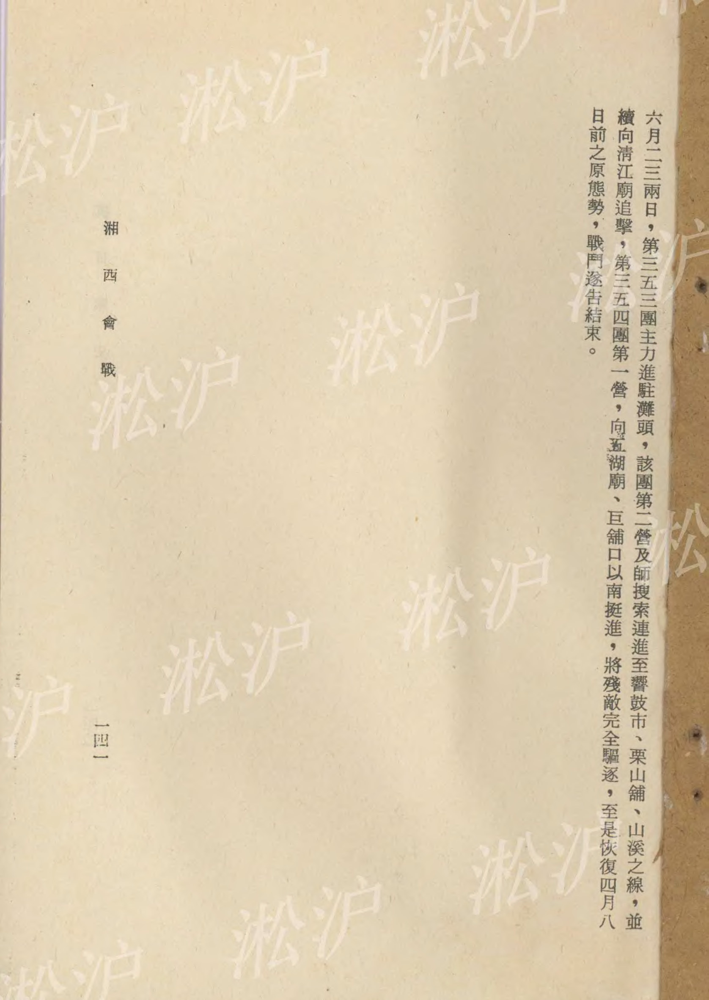

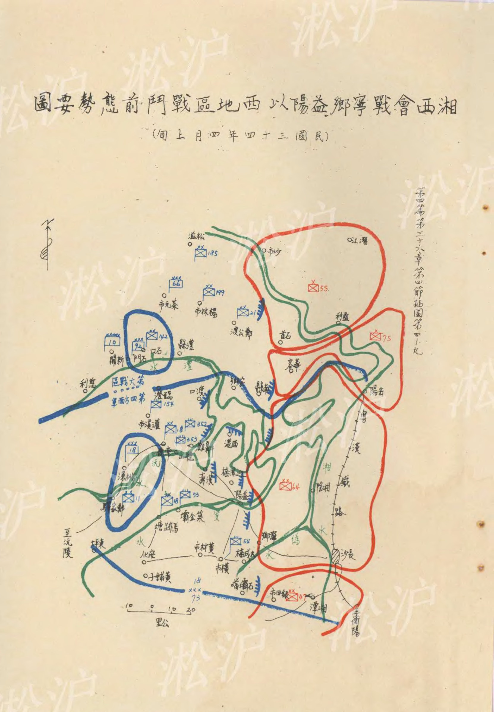

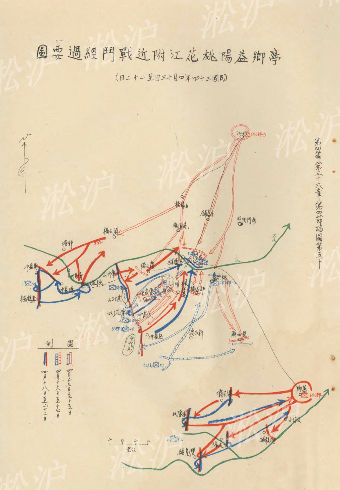

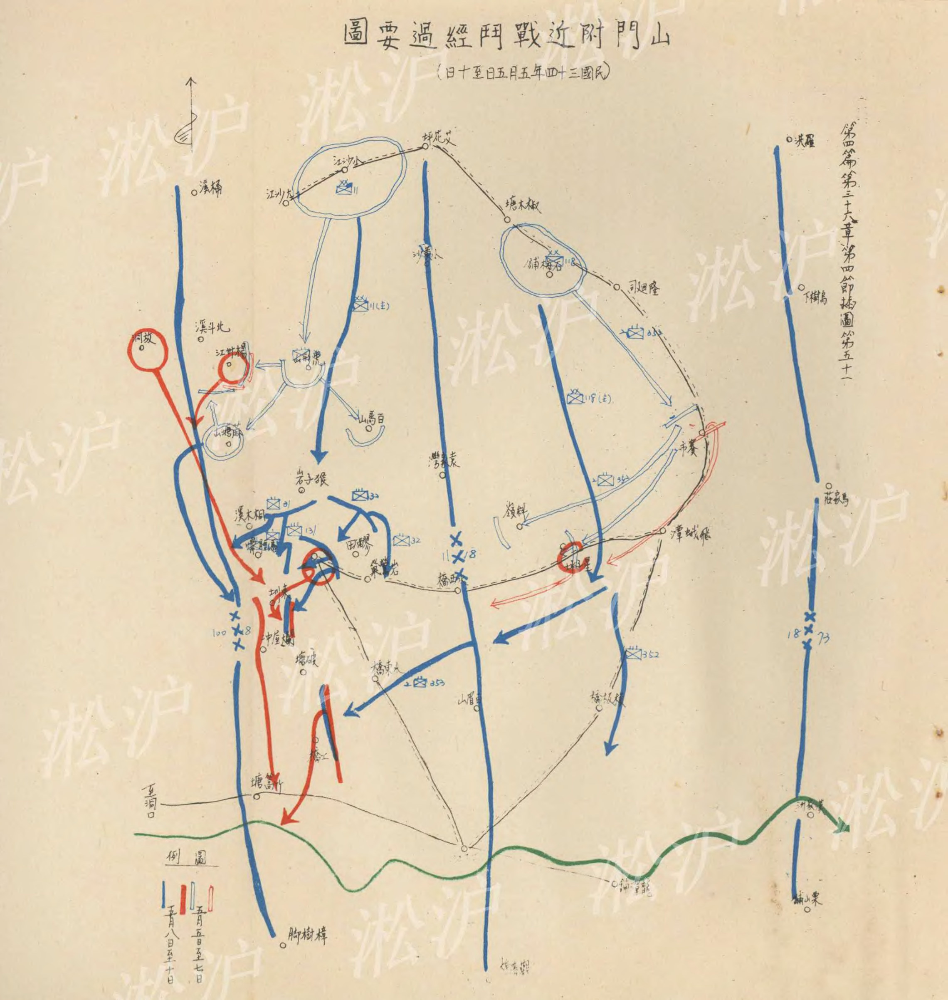

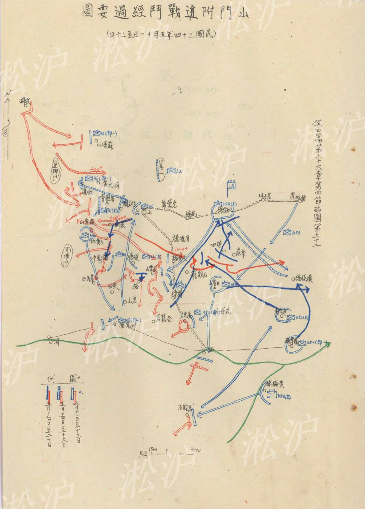

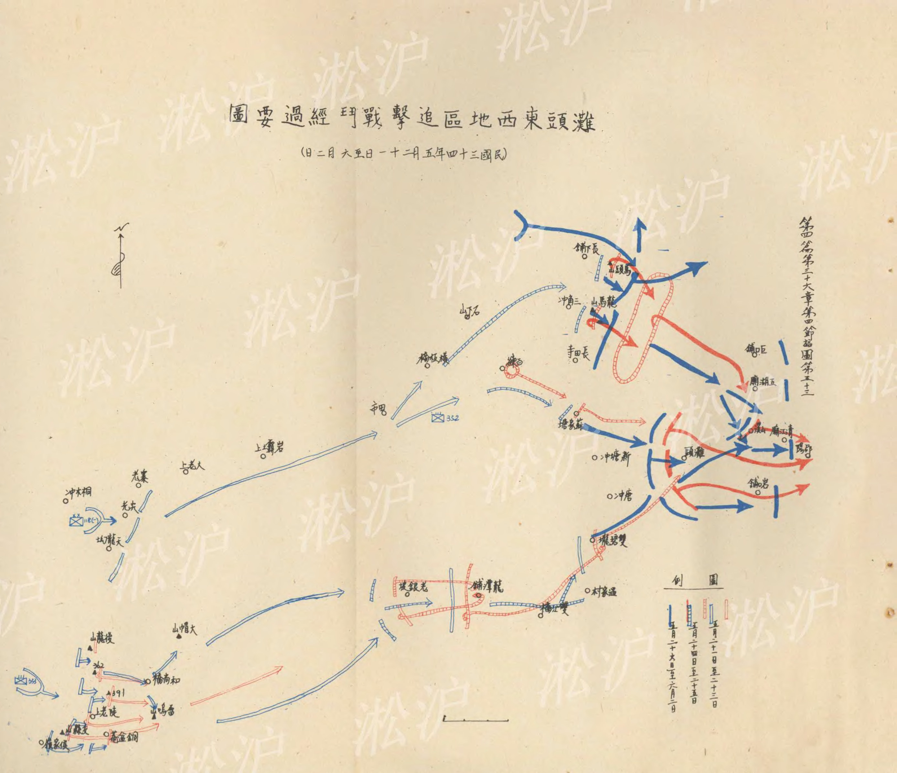

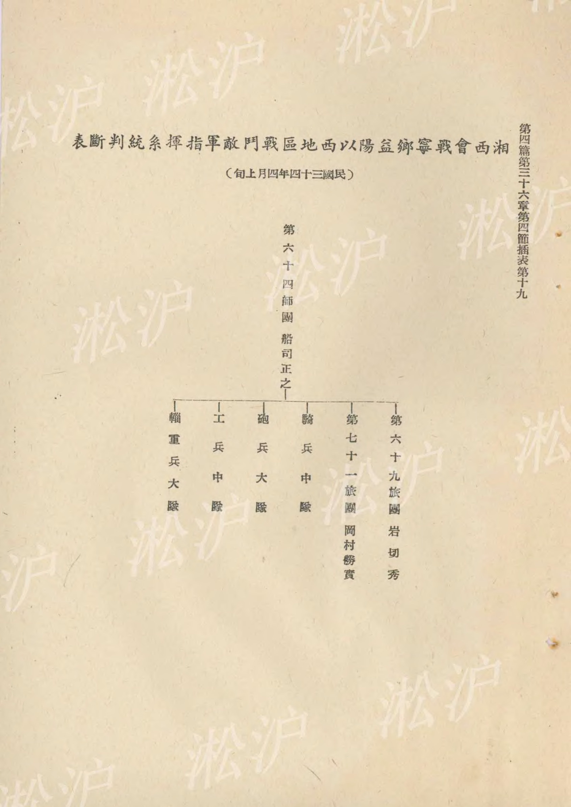

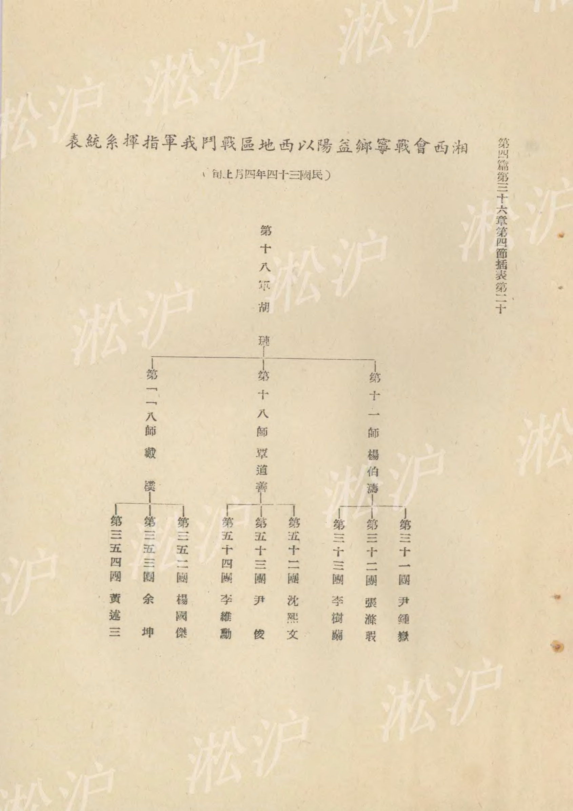

### 第五節 空軍作戰

本會戰係於豫西鄂北會戰激戰正殷，分兵向我湘西蠢動，企圖破壞我東南空軍基地—芷江所發生，其空軍使用兵力，較豫西鄂北會戰略有增強，判斷有輕轟炸機二十七架，戰鬥機七十二架，偵察機（含直協機）三十六架，共計一三五架。

惟因我空軍以優勢兵力控制前方各戰場及敵後各重要基地之上空，幾使敵機無活動之餘地，在全會戰期間，敵機向前線出動甚少，且僅以七架飛機對我空襲五次，投彈二十二枚，致我人員傷亡三十八名，但制空權始終爲我控制。

我空軍爲協力陸軍部隊作戰，以第二大隊P-25一個轟炸中隊駐陸良，中美混合團第一大隊B-25一個轟炸大隊，分駐梁山、南鄭、芷江，第五大隊P-51及P-40一個驅逐大隊，全部駐芷江，另以駐安康第三大隊P-51及P-40驅逐機一部，協攻敵後要地，中美混合團團部駐白市驛，由徐焕昇副司令與美國摩斯上校共同指揮，駐芷江之空軍第五大隊，由張唐天大隊長率領參戰，駐陸良空軍第二大隊，則由萬承烈大隊長指揮之

在全會戰期間，我空軍以駐芷江第五大隊與第一大隊第四中隊爲主力，及駐陸良第二大隊、梁山第三大隊之各一部，協力攻擊當面各地之敵，並聯合美空軍襲擊敵後漢口、岳陽、湘鄉、長沙、新市、歸義、邵陽、衡陽、羊樓洞、新寧、湘陰、永豐、零陵等地重要交通線、倉庫、橋樑、空軍基地及運輸補給，以打擊敵人奪取芷江之迷夢，我空軍因獲得制空權，於鄧陽、放洞間曾殲敵一聯隊以上及砲兵甚衆，其進犯放洞、水口、武岡之敵，被我陸空軍殲滅殆盡，但自民國三十四年四月九日至五月二十九日之五十日作戰期間，日夜出擊，冒敵猛烈砲火，不斷對敵猛烈炸射及跟縱追擊，予敵傷亡慘重，戰果輝煌

此次會戰，計第五大隊出動P-40、P-51機共九四二架次，爲歷次會戰所僅見，第一大隊出動B-25機一三架次，第二大隊出動B-25機五十八架次，第三大隊出動P-40、P-51機共十八架次，飛機全毀一一架，受傷八架，消耗子彈一一一九零粒，炸彈二九噸，汽油二一一二四加侖，滑油四四三七加侖。

美國第十四航空隊，於全會戰期間，亦不斷協助我空軍，襲擊敵後交通線，阻其運輸，但敵每避公路，由崎嶇山路及濃密森林中進犯，致我空軍發現不易，難期每擊必中，惟放洞一戰，由陸空協調，使我空軍發揮最大威力，殲敵一聯隊餘及砲兵甚衆，檢討致勝原因如下：

一、我方於作戰期間，派遣飛行軍官至前線距敵約千碼處，設置流動對空電台，指示我機炸射目標及彈着偏而修正之。

二、前線陸軍鋪設布板符號及其他聯絡信號迅速確實。

三、對蔭蔽森林內敵軍，投擲汽油彈箱，收效最大。

四、我空軍獲得制空權。

茲將戰鬥具有成果者，擇其要者列如後表。
