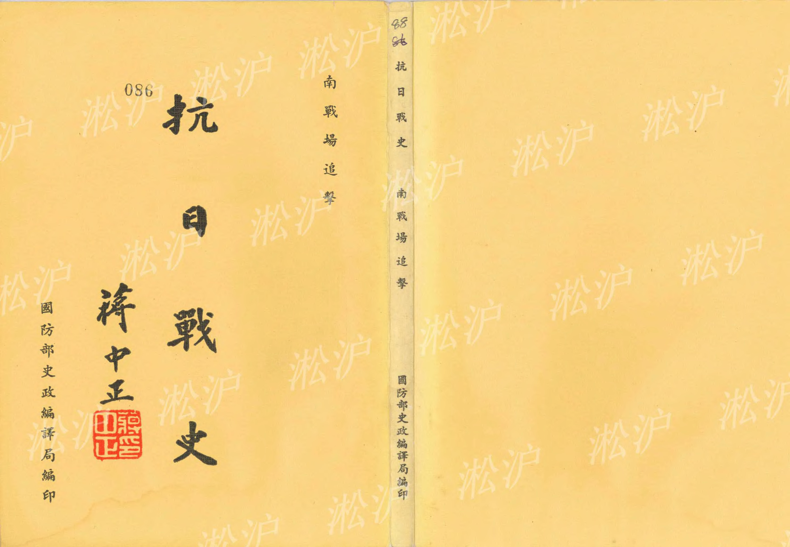

## 第三十七章 南戰場追擊

概述

### 第一節 追擊前狀況

#### 第一款 敵軍

#### 第二款 我軍

#### 第三款 兵誌概要

### 第二節 追擊一般經過

#### 第一款 閩浙邊境之追擊

#### 第二款 桂柳反攻及追擊

#### 第三款 贛江追擊戰

#### 第四款 盟友對追擊之協助

### 第三節 重要戰鬥

#### 第一款 閩東沿海戰鬥

#### 第二款 浙南沿海戰鬥

#### 第三款 桂西戰鬥

#### 第四款 桂南戰鬥

#### 第五款 反攻桂柳戰鬥

#### 第六款 贛江兩岸追擊戰鬥

#### 第七款 附雷州半島及梧州戰鬥

七五

### 第四節 檢討

八三

#### 第一款 敵軍

八三

#### 第二款 我軍

八三

## 第三十七章 南戰場追擊

民國三十四年五月二十日至八月二十二日

概述

第二次世界大戰演變至民國三十四年（一九四五）春，德國已瀕於崩潰，印緬戰區盟軍反攻告捷，美軍進入馬尼剌，佔領硫磺島，登陸沖繩島，大有直搗敵國本土，並在我國沿海登陸之趨勢。

中國方面之敵軍爲挽救其面臨之危機，不得不縮短防線，集結兵力，加強華中、華北各要地之守備。五月間，黔桂方面之第十一軍與閩浙方面第十三軍之一部，首先撤退。其在粤北之第四十師團及第二十七師團，於同年六月中旬，向贛南集中，準備向南昌撤退。

我軍把握戰機，爲抑留敵軍於現地，使全般作戰有利，乃發動攻勢。同年五月六日，閩、浙方面，我第七十軍首先察覺敵軍準備撤退，當令在福州城西北郊之第八十師及長樂西南之閩保安縱隊，向福州及長樂進攻，戰鬥經旬，於五月十八日攻克福州，十九日收復長樂，二十二日佔領連江，敵軍向浙境退却，我第八十師跟踪追擊至寧德附近。

敵軍自福建退入浙江後，與盤據永嘉、樂清間之敵軍會合，我第三戰區令第八十八軍所指揮之浙江保安第二縱隊，向該敵攻擊。六月十八日收復永嘉，二十二日敵續沿海岸北撤，我軍跟踪追擊。六月三十日進抵黃岩、海門之線，戰鬥終結。

黔桂方面，我擔任河池西北地區守備之第三方面軍第二十九軍，於五月二十日晚，開始向河池附近敵軍進攻，二十一日晨完全佔領河池縣城，繼續沿黔桂鐵路向宜山追擊。

二十四日，我第二方面軍，以第六十四軍及第四十四軍之一個師，分別向南寧、賓陽進攻。五月二扰

日

戰

史

二

十七日收復南寧，三十日克賓陽，六月一日克遷江，繼續肅清邕龍公路及邕遷公路之殘敵。

六月十五日，陸軍總司令何應欽令第三方面軍沿黔桂鐵路進攻柳州，並以一部向桂林進擊以爲策應，六月三十日攻克柳州，繼續進攻桂林。七月二十七日收復桂林，沿湘桂鐵路繼續向全縣進擊，敵軍除以一部以全縣及其西北地區阻止我追擊部隊外，其主力則向湖南繼續撤退。迨至八月十六日，我軍攻克全縣時，敵軍已宣佈無條件投降。

粤北之敵軍第二十七師團及第四十師團，於同年六月下旬，由南雄、大庾一帶向南康、贛州集中，其一部與我贛江西岸第九戰區之第三十七軍及贛江東岸第三戰區之第二十五軍先後發生戰鬥。至七月八日，敵主力沿贛江兩岸分三縱隊北撤，我第九戰區以第三十七軍、第五十八軍、新編第三軍之一師及第一六一師實行尾擊與截擊，將敵包圍於泰和至吉安間地區。八月一日，敵突圍繼續北竄，我軍沿贛江兩岸跟踪追擊。八月十日追達豐城、泉港之線，敵軍主力遁入南昌。第九戰區正從事反攻南昌之部署，旋敵軍投降戰爭終結。

### 第一節 追擊前狀況

參照插表第一

#### 第一款 敵

軍

參照插表第一

民國三十四年春，敵軍鑒於滇西、緬北迭次失利，我軍戰力加強，總反攻之準備逐漸完成，敵硫磺島及菲島又先後陷落，戰爭日益迫近其本土。爲鞏固其在我國大陸主要據點之防禦，並加強其本土之防衛計，乃縮小防區，由各方面抽出兵力，向京、滬、杭間轉用，並於華東沿海一帶構築防禦工事，迄至三月上旬止，我軍事委員會接獲如左之情報：

一、傳敵軍將在滬、杭間地區增兵三十萬人。

二、敵軍操字部隊五萬餘人，於元月十五日至二十七日，由津浦路轉上海增防，又上海、嘉興一帶之敵軍已增至七萬餘人。

三、黃浦口外灘，已構築防禦工事，舟山羣島礮台業已竣工，並在金山衛、象山港一帶構築環形陣地。四、在滬敵僑老弱婦孺均已撤退。

敵軍除積極在京、滬、杭間地區準備美軍登陸作戰外；四月間發動湘西攻勢，企圖破壞我芷江飛機場，並阻撓我反攻準備。當湘西會戰達最高潮時，福州及桂境、粤北之敵軍，亦散佈進攻之謠言，並以少數兵力出擊，而其主力則開始集結，準備撤退。

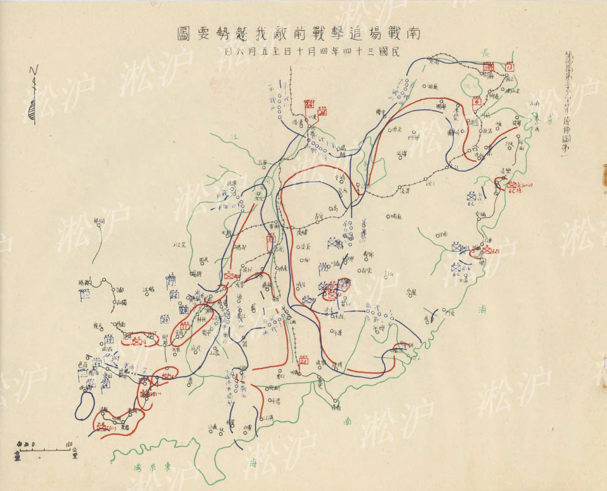

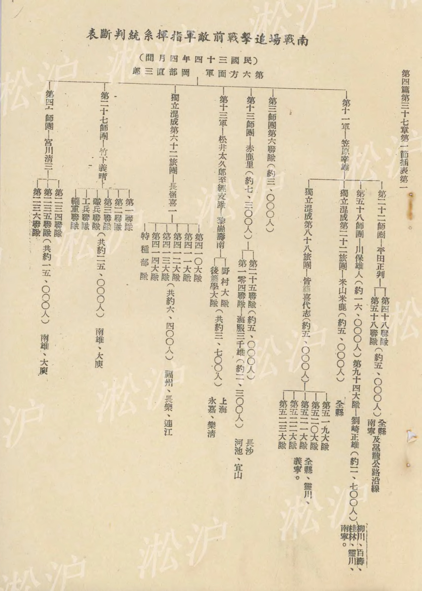

#### 第二款 我軍參照插表第二、第三

我國爲協同盟軍轉移攻勢，於民國三十三年冬設立中國陸軍總司令部於昆明，統一指揮西南各部隊此時史迪威公路業已打通，美援武器及作戰物資，正大量輸入，預計可有三十六個步兵師獲得美械裝備，同時對各該部隊之後勤設施，亦大加改善，士氣昂揚。

迨至五月初，我第一線部隊察覺敵軍有撤退之企圖，當不失時機，於五月六日開始分別向黔、桂、閩、浙及贛西敵軍發動攻擊，企圖抑留敵軍於現地，使全般之作戰有利。

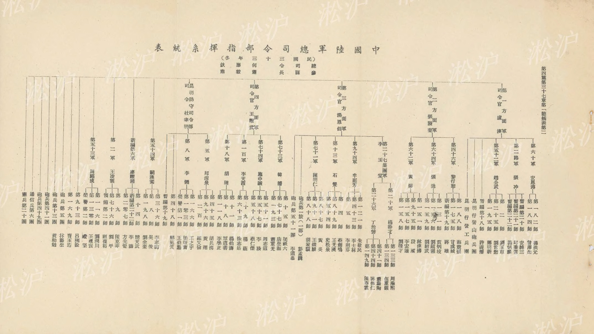

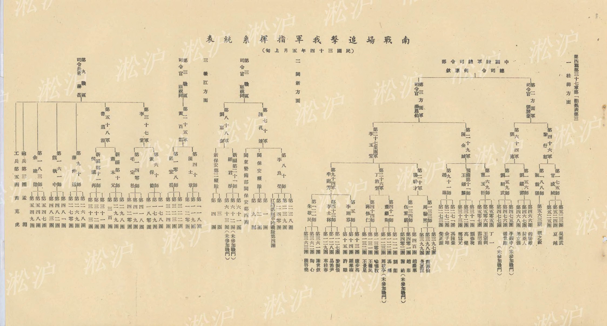

#### 第三款兵誌概要

湘、贛、粤、桂邊境，均爲南嶺山脈綿亘區，其中以都龐嶺、越城嶺爲湘、桂分界，都陽山爲黔、桂分界，大庾嶺爲湘、粤分界，九連山爲贛、粤分界，形成西江、湘江、贛江三大流域，南寧、柳州、桂林地扼要衝，縮轂西南，爲我軍總反攻奪取廣州必經之地。

交通：鐵路有粵漢縱貫湘、粤、黔、桂及湘桂橫穿廣西，連繫湘、黔。公路有邕龍、邕遷爲桂南主幹，柳宜、桂柳爲通往湘、黔之主要通道，粵贛連絡江西、廣東交通，惟於民國三十三年秋，我軍轉進時，已實施破壞，修復需時。水路有盤江、柳江、桂江、西江、贛江可通舟楫，對後勤之補給運輸，便利頗多。桂林、柳州機場已澈底破壞，不能使用。

浙南、閩東同屬東南沿海山地，嶺巒錯雜，森林密茂，耕地較少，交通不便，沿海港灣曲折，島嶼羅列，天然良港甚多，以廈門、福州、永嘉港口最大。九龍江、甌江、閩江併列，橫貫其間，形成兩岸小平原，各江可行駛小輪，於補給運輸補助甚大。當時此地區因內陸交通不便，在全般戰略上居次要之地位，不適於大兵團之作戰。

### 第二節 追擊一般經過

#### 第一款 閩浙邊境之追擊

民國三十四年五月上旬至六

月下旬參照插表第四、第五

敵自二度侵陷福州（閩侯）、長樂以來，經我軍予以不斷消耗打擊，使其得不償失。民國三十四年四月初旬，佔領福州附近之敵第六十二旅團，開始準備撤退。

我第七十軍察覺其企圖後，乃令在福州城西北郊之第八十師，及長樂西南之間保安縱隊，對當面之敵實施威力搜索，相機收復福州、長樂。

五月六日，我軍卽以有力部隊，分向福州外圍五鳳山、大夫嶺、大腹山之線突擊，並以便衣隊潛入近郊，另以一部向閩江右岸盤據大義、尙幹之敵襲擊，敵據險頑抗，戰鬥激烈。十二及十三兩日，敵曾兩度向我第一線各部隊反攻，均被我擊退。十七日，我全線攻勢再興，先後佔領五鳳山、金雞山、大腹山、金牛山各要點，續向城區攻擊，敵向閩江下游之連江退却，我軍於十八日克復福州，十九日佔領長樂，續向敗退之敵追擊。

退集連江之敵約兩千餘名，因懼空襲及盟艦之襲擊，不敢循海道逃逸，乃圖向浙境永嘉方面逃遁，我追擊部隊爲抑留敵人於戰場，乃於五月二十一日向負隅城區之敵攻擊。二十二日攻克連江，殘敵經羅源、寧德、霞浦、福鼎向浙江退却，沿途遭我節節截擊，狼狽非常，死傷慘重。

原盤據浙境永嘉、樂清之敵，爲黎崗少將指揮之至經支隊，兵力約三千餘人，自五月初旬以來，卽積極撤燬工事，解散僞組織，強徵民伕船隻，搜括物資。五月下旬，該敵爲接應由閩退出之敵獨立第六十二旅團殘部，乃於二十六日上午一時，由永嘉向瑞安進攻，旋卽攻陷該城，二十七日陷平陽，並繼續南竄。我第三戰區第八十八軍所指揮之浙江保安第二縱隊，當予以猛烈打擊。六月九日，閩浙之敵兩股會合，因我圍擊甚緊，乃夤夜渡飛雲江向北回竄。十三日我攻克瑞安，卽以主力尾追殘敵，向樂清急進，並以一部監視永嘉之敵。十八日敵退出永嘉渡江北竄，二十三日我克復樂清。此時，我第二十一師第六十一團加入戰鬥，各營梯次躍進側擊敵人，先後收復黃岩、海門等縣，敵軍在長途退却中，遭我節節截擊，死傷極重，士氣不振，倉皇沿海岸北遁，戰鬥至此亦告結束，敵我傷亡及鹵獲如插表第四、第五

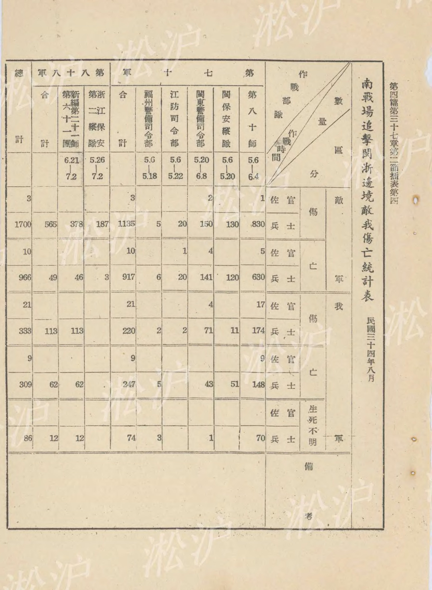

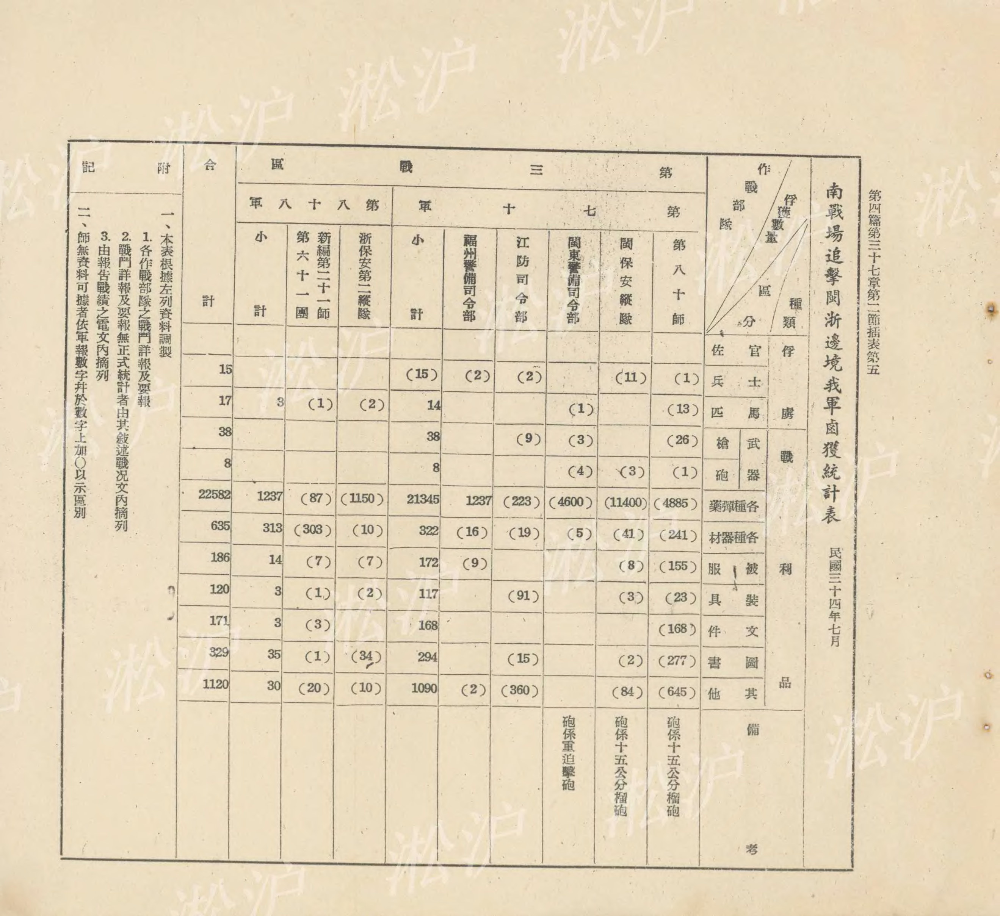

#### 第二款 桂柳反攻及追擊

民國三十四年下旬至七月下旬

參照插表第六、第七

盤據桂境之敵，爲敵第二十二師團、第五十八師團及第十三師團之一部，自民國三十四年四月湘西會戰失敗以後，戰力衰竭，乃亟圖縮短防線，放棄次要據點。我軍爲把握戰機，乘勢迅速收復桂、柳計，遂以第二方面軍一部，出都陽山脈奪取邕寧，第三方面軍一部，沿柳宜路直取柳州，並以主力越越城嶺山脈攻略桂林。

同年四月二十七日，第二方面軍以第四十六軍第一七五師攻佔都安後，主力卽向都陽山山脈進出，節節迫近南寧（邕寧），桂境民團綏靖部隊蜂起響應，到處襲敵，我軍進展極速。五月二十七日，第六十四軍攻克南寧，殘敵一部向龍州，大部向柳州，分別逃竄，我除以第六十四軍第一五六師向龍州追擊外，並以第四十六軍向柳州東南迂迴攻擊前進，三十日克賓陽，六月一日下遷江。此時第一五六師亦於六月七日克思樂，八日克江明，復與地方團隊協力，於七月三日先後攻佔龍州、憑祥，驅敵於國境之外。

第四十六軍向柳州攻擊前進，得地方團隊之協助，迅將西江南岸之敵肅清，先後攻佔桂平、武宣、拉堡，六月十九日第一七五師已迫近柳江。

第三方面軍於五月初，以擔任河池西北地區守備之第二十九軍，向河池、黎明關攻擊，並以預備第十一師攻取天河，而復沿柳宜公路北側山地前進，以爲策應。戰鬥至二十一日晨，完全佔領河池縣城，並沿黔桂鐵路向宜山追擊，二十三日克德勝，六月六日收復宜山，敵曾迭次由柳州增援，與我在宜山反復爭奪，鏖戰至六月十四日，我軍再克宜山，敵向柳州退却，我跟踪追擊，將融江西岸殘敵肅清。第二方面軍第四十六軍於二十四日攻佔柳江，乃會同向柳州總攻，卒於三十日將柳州克復。

我軍克服柳州後，分兵三路，以第七十一軍第九十一師在右，沿柳桂公路，第二十九軍居中，沿湘桂鐵路，第二十軍第一三三師在左，沿融縣經百壽，向桂林併進，同時更以第四方面軍攻擊寶慶、衡陽，以行策應。

七月六日第二十九軍之第一六九師克雒容，九日佔中渡，十七日收復黃冕，敵退守永福，憑險頑抗，激戰至二十四日攻克永福，桂林南方門戶由是洞開。

此時，第七十一軍第九十一師，亦沿桂柳公路連克荔浦、白沙、陽朔直迫桂林近郊，第二十軍第一三三師亦攻克百壽，遂三面會攻桂林。

第三方面軍主力於進出越城嶺山脈後，第九十四軍指向義寧，第二十六軍指向全縣、興安間攻擊前進，七月十日襲取南圩，二十六日克義寧，向桂林近郊推進，於是桂林在我各路總攻之下，於二十七日收復，敵狼狽逃遁，我沿湘桂鐵路向全縣追擊，斬獲頗多。至八月十七日，我軍攻克全縣，旋敵軍投降，戰鬥遂告終止。

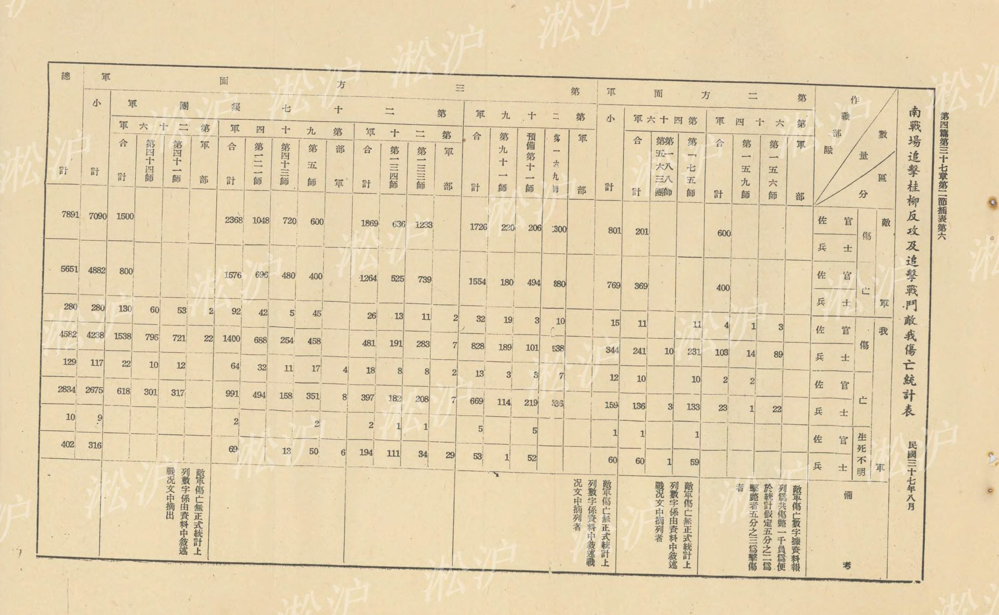

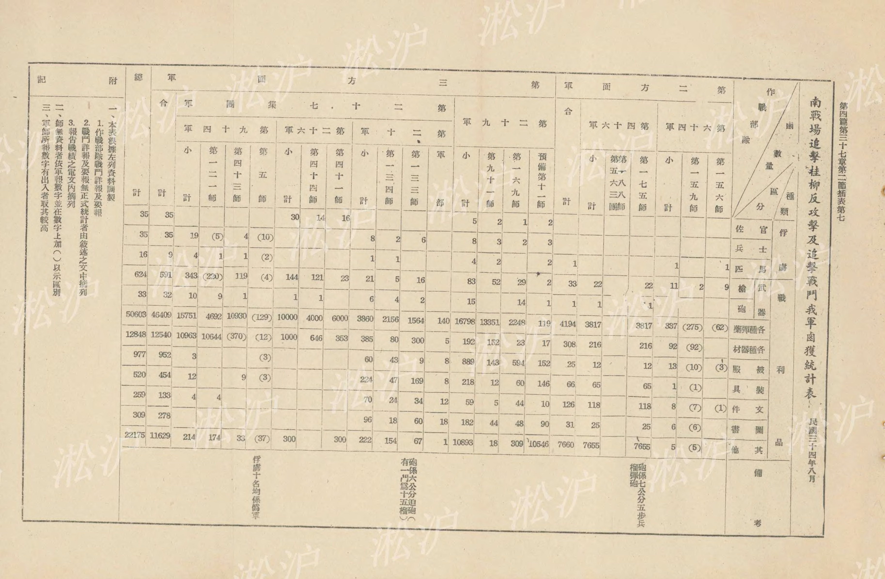

#### 第三款 贛江追擊戰

民國三十四年六月下旬至七月下旬

參照插表第八、第九

民國三十四年六月中旬，敵第二十七師團及第四十師團共約四萬餘人，分別集結於南雄、南康、贛州一帶，控制我該地飛機場，準備向南昌撤退。

六月二十六日拂曉，南康之敵，其先頭部隊約四五百人附砲數門，竄抵塘江南岸，向我第三十七軍陣地進攻。至二十七日，陸續渡過塘江之敵已達萬餘名，迭次向我陣地襲擾，均被我守軍擊退。

七月六日，我第三十七軍以第九十師攻佔大庾、新城，敵向南康北竄。八日敵集結兵力，分三縱隊沿贛江兩岸北進，我逐次向北機動轉移。七月十日我收復南康，敵沿塘江北竄。

七月十三日敵主力竄抵遂川附近，續向遂川及機場侵犯，經我第三十七軍第六十師奮勇阻擊，反復衝殺，至十七日敵勢不支，向遂川東北方向潰退。此時，我攻克南康之部隊乘勢佔領贛州。至是，敵前後遭我夾擊，士氣渙散，狼狽非常，經我猛烈追擊，死傷甚衆。

二十四日我克萬安，敵續向北竄，我第三十七軍、第五十八軍、新編第十一師、第一八三、第一六一師併列追擊，二十七日克泰和，二十九日佔領吉安，敵遂處於我包圍中。

八月一日敵拚力突破我之包圍向南昌逃遁，我軍分三路沿贛江兩岸跟踪追擊。八月十日抵達豐城、泉港之線，殘敵遁入南昌，贛江追擊戰於焉終結。

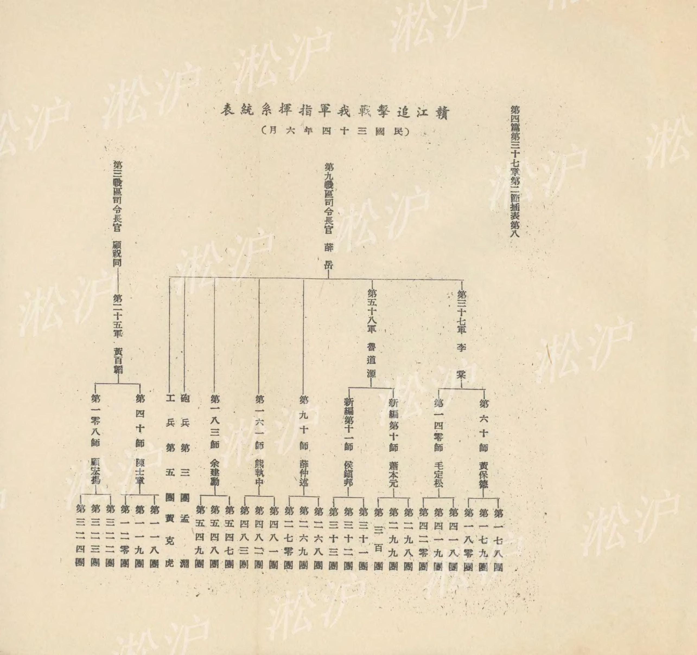

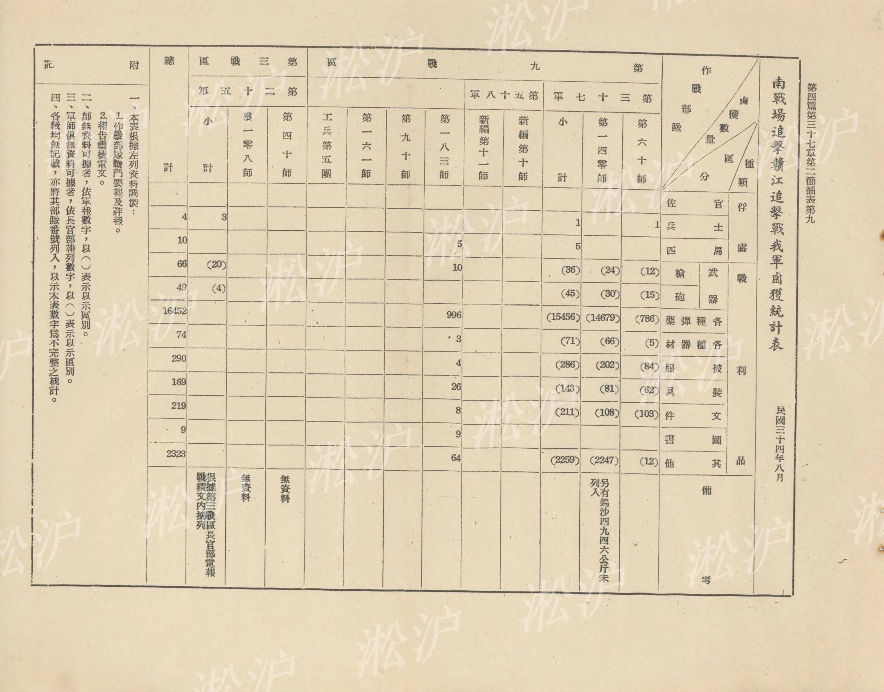

#### 第四款盟友對追擊之協助

當民國三十四年七月上旬，我第二十九軍與敵激戰於北牙、懷遠之際，中國陸軍總司令何應欽將軍偕麥克魯將軍赴前線視察，於七月五日在河池第二十九軍軍部，與第三方面軍湯司令官商討總反攻作戰問題。當決定於七月前修復宜山以西公路及通信，以期八月以前完成總反攻之準備，因工作艱鉅，經英軍滇緬路工程隊及全部築路機械赴桂協助，在追擊作戰中，此一段交通雖未全部修復，但亦予我前進部隊不少便利。

柳州克復後，我第九十一師工兵營因柳州市區及機場敵軍埋置地雷甚多，掃雷工作甚感困難，美軍工兵立予協助。其中第七十一軍工兵顧問德衛士中校，抱病從事中美工兵掃雷工作之指導，哈博少校親持探測儀整日於酷熱中工作，其熱情實足矜式。我第九十一師工兵營爲增進掃雷技術，集合官兵六十餘人於柳州機場，經美軍官兵各一，集掘出之地雷三枚，作現地講解，不幸地雷爲延期信管，至時爆炸，全體罹難，盟友協助之熱忱可見一斑。

此外，美空軍及後勤部隊，協助空中及地面之運輸，支援我軍地面戰鬥，增強我軍之活力不少。

### 第三節 重要戰鬥

#### 第一款 閩東沿海戰闕

民國三十四年五月六日至六月八日

參照插表第三

##### 第一項 閩東沿海地形

閩東沿海地區，大部爲山地，自西向東漸次低落，形如降梯，山巒錯綜，層峯叠障，僅濱海附近之福州、長樂、連江爲較廣之平原。當時內陸交通不便，不適於大兵團行動，閩、浙間沿海公路尚未完成，重車輛不能通過。

海岸多曲折，富良港，惟多淺灘、暗礁，海流甚急，水道不熟者航行極爲危險。港灣之大者，計有沙埕、三沙、福州、福清等港灣，自敵海空戰失敗，船舶缺乏，海運頗受限制。河流主要爲閩江，會富屯溪、沙溪、建溪三源，受尤溪、古田、大漳等水注福州灣。

都市以福州爲中心，控制閩浙、閩贛及對海外交通之咽喉，爲閩東之要地。

##### 第二項 戰鬥經過

敵軍獨立第六十二旅團，盤據福州（閩侯）、長樂、連江各地，我第七十軍之第二及第三守備區，各以一部於福清附近至福州城郊，以包圍態勢，嚴密監視，敵我相持以來，除小部隊相互襲擊外，彼此均無大規模活動。迨至民國三十四年四月初，敵軍揚言將於四月中旬進攻福清、莆田，並不時以大隊以下之兵力迭向我第八十師進攻，但均未得逞。嗣據各方情報，敵軍已將閩江下游電話線撤收，義嶼飛機場破壞，僑民疏散出海，長樂附近工事已停止構築，倉前山獨青小學內之傷兵亦已運走，並在南臺、馬尾、營前及梅花等地徵集民船候用，顯有放棄福州、長樂等地模樣。

我第七十軍乃於五月六日，電令該地區守軍，立即採取行動，其內容如左：

一、福州、長樂之敵，似有撤退模樣。

二、軍爲確實明瞭敵情，決卽向當面之敵，實施威力搜索，並相機收復福州、長樂。

三、第八十師及江防部隊，應與敵密保接觸，並依不斷襲擊，以察知其企圖，主力卽向前推進，並隨時作追擊準備，如敵撤退，務期於福州附近及長樂、連江以西地區捕捉殲滅敵人，毋使逃逸。

四、閩保安縱隊，應令保一團之主力，向前方推進，並以一個加強大隊卽向長樂之敵襲擊，相機收復長樂，並策應第三守備區之作戰。

五、閩東守備區應嚴加戒備，並以有力一部，卽向丹陽附近推進，相機策應第三守備區之作戰。

同（六）日，當面守軍卽遵令行動，第八十師以一部向五鳳山、竹嶼及福州城東門襲擊，另以一營兵力向琯頭方面進出。江防司令部以海軍陸戰隊第四團之一營進佔浦裏，福州警備部以所屬隊警之一部推進候官市，向妙峯山攻擊，均以搜索福州城區及近郊敵軍行動爲目的。

閩保安縱隊亦以第一團主力推進石湖嶺及大義各附近，對長樂之東渡及尙幹之敵攻擊，並與第八十師切取連絡，閩東守備區之保安第四團，則對羅源及寧德方面嚴密戒備，相機策應第三守備區之作戰。

戰鬥數日，以敵軍抵抗頑強，殊鮮進展，連江之敵，似有增加，並有取陸路向溫州撤退之企圖。五月九日，我軍雖曾一度攻佔大夫嶺及五鳳山之大部，終因敵軍砲火猛烈，退守猫頭山及新店之線。是役，我軍傷亡連長薛漢英及排長曾萬生以下十三員，敵軍亦傷亡大隊長以下官兵約六十餘人。

五月十三日，江防司令部所屬海軍陸戰隊第四團主力，推進桐口、甘蔗（桐口西北約二華里）一帶，一部向洪山橋攻擊。忠義救國軍約五百餘人，裝備優異，亦於同日開抵閩清，並有一部已潛伏福州城區。迨至十七日，第七十軍以敵撤退企圖業已顯明，遂令當面守軍對福州城發動攻擊，該守軍第八十師遂將其部隊展開於羅漢山、義井、馬坑、大夫嶺之線，重點指向敵軍右翼，期圖於福州東南城郊，殲滅敵軍，其攻擊部署如左：

一、第二三九團爲左翼隊，先行攻佔屏山、金鷄山，爾後以一部截擊退向鼓嶺、魁岐方面之敵，並任城郊掃蕩，主力迅經鼓嶺向閩江下游追擊。

二、第二四零團爲右翼隊，先行攻佔五鳳山，爾後以一部掃蕩城西郊及烏石山殘敵，主力迅速進出南臺，協力第二三九團攻擊潰退敵軍，該團第三營在嶺頭附近保持機動。

三、在潘渡附近之第二四零團第八連，仍繼續對連江之敵搜索警戒。

四、砲兵連在猫頭山附近佔領陣地，協力兩翼隊對屏山、五鳳山之攻擊。

五、第二三八團之第三營，在赤橋附近爲師預備隊。

同（十七）日二十時，全線開始攻擊，至午夜，第八十師佔領五鳳山，海軍陸戰隊佔領大腹山及金牛山，續向福州城進迫，戰鬥澈夜進行。

第七十軍此時據報，長樂敵軍大部出海，福州城區、南臺及倉前山一帶，已無敵軍，福州僞警察隊已於十七日晨解散，東渡、尙幹及福州西北均有敵之退却掩護部隊留置，於是卽以辰篠亥電指示各部隊行動如左：

一、第八十師擊破福州城郊之敵後，主力向琯頭、連江方面進出，遮斷敵軍退路。

二、閩保安縱隊第一團及第二團之一部，迅速擊破長樂之敵，進出閩江及烏龍江右岸。

三、江防司令部擊破福州城西郊之敵後，沿洪山橋南臺道路向馬尾、閩安鎮進出。

四、福州警備部迅速進出倉前山、妙峯山之線，依狀況進入福州維持秩序。

五月十八日一時，第八十師佔領屏山後，以第二三九團及第二四零團各一部鑽隙向城區攻擊，主力分向南臺及閩江追擊。九時左右，敵軍三百餘一度向東門反撲，與我第二三九團在後嶼激戰，旋向鼓嶺、梅洋退去。同時第二四零團分別佔領烏石山及南臺，海軍陸戰隊佔領洪山橋，福州警備部所屬隊警佔領妙峯山。至十時許，福州城區已無敵軍踪跡，十二時，海軍陸戰隊一部已經南臺前進追擊，福州警備部隊警亦開始入城維持治安。

長樂方面，閩保安縱隊自五月十四日以第一團及第二團之一部，先後推進至竹田、鐵馬嶺及常恩嶺（大義西南約一公里半）一帶，卽向東渡、牛桶山之敵攻擊。十八日將該兩據點攻佔，十九日六時，復先後收復尙幹與長樂，敵向營前撤退。

此際，我海軍陸戰隊主力已進抵魁歧，一部進至馬尾。閩東守備區之保安第四團主力，亦在羅源、寧德及其以西地區，利用地形對敵行側擊與伏擊，一部駐飛竹、霍口、豐餘之線，對連江、羅源警戒，準備進出中房、溪源之線，策應羅源、寧德方面戰鬥。駐福鼎之保安第四團第三大隊及縣區自衛大隊，統由第八區行政專員黃司令指揮，盡各種手段不時打擊敵軍，破壞橋樑及舟筏，以遲滯敵人行動。

五月二十日，閩保安縱隊已將閩江右岸殘敵完全肅清，海軍陸戰隊第四團第三營已進抵閩安鎮，第八十師亦以第二三九團及第二四零團第三營，分經湯嶺及梅洋向連江追擊，第七十軍軍部，亦在同日十二時進入福州。

由福州、長樂退集連江之敵，其一部千餘，已於五月十九日竄抵三崗、丹陽。二十日三時續向北撤，至十時許，逐次擊退我自衛隊於應德、鶴峯、白塔之抵抗，竄抵羅源城郊，我閩保安第四團之一部，在尖山附近與之戰鬥，後轉移南山、洪洋附近，羅源城遂告失陷。

此時，第七十軍除令第八十師以主力迅速追擊外，並令閩東守備區鞏固豐餘、房中之線以西地區，並相機出擊，進襲敵軍，同時，更令第八十師駐古田之第二三八團，推進杉洋與之協力。

第八十師追擊部隊，於五月二十一日到達連江以北地區後，得知連江城尚有敵軍二千餘，卽分在下洋、青塘山及筆架山一帶設伏截擊。同（二十一）日，第二三八團第三營亦由福州經宦溪開抵貴安，參加追擊作戰。

五月二十二日晨，連江敵軍開始北撤，先後與我預伏之部隊發生戰鬥，同時第二四零團第三營亦經中岩山向江南橋攻擊，預伏城內之便衣隊亦乘機活動。至十時我攻克連江城，撤退之敵，此時完全困據於青塘、飛石間地區。入晚，拚力突圍北竄。二十三日九時三十分，我復將北竄之敵包圍於浮山溪、尾山村、花園地區，敵圖突圍未逞。迨至二十四日十二時許，敵由羅源回竄約一大隊兵力，增援猛攻，花園附近地區被圍敵軍，遂乘機突圍北去，十三時三十分，我遂佔領丹陽。

陷羅源城之敵軍，於五月二十一日晨開始向北移動，經我閩保安第四團沿途截擊，二十二日十八時左右竄陷寧德。同時在五月二十一日，由霞浦東南，沙塘附近登陸之敵軍千餘，亦侵陷霞浦。閩東守備區除以保安第四團之一部集結杉洋附近，對霍口、豐餘警戒外，主力則協同第二三八團之一部向寧德攻擊，並令第二三八團另以一營兵力，進出七都、八都向退敵截擊。

第八十師於五月二十五日七時到達丹陽後，卽以第二四零團（欠第三營，附工兵一排，無線電一班，由該團副團長指揮爲右追擊隊，沿丹陽、羅源公路前進。第二三九團及第二三八團第三營（附無線電一班），由第二三九團團長指揮爲左追擊隊，由丹陽經鳳板、芹石、潭下向洪洋推進，薄暮，羅源城敵軍開始北撤，我第二三九團第一營遂於十九時進入羅源。

五月二十六日，第七十軍綜合當時情況，乃以辰寢電令第八十師：「卽對寧德之敵攻擊，務殲滅於白馬河以南地區，此次戰鬥結束後，集結寧德附近整頓，依狀況以第二三八團向霞浦追擊。」閩東守備區亦奉令以保安第四團主力向福安東南地區前進，行超越追擊。

二十七日晨，第八十師到達寧德附近，獲悉敵軍主力正向八都撤退，城郊一帶約有五百餘人，礮兩門據守，當於十一時開始攻擊，十四時攻克寧德城，入夜，城郊敵軍完全爲我肅清。此時撤退之敵軍已有千餘人，於二十六日渡過白馬河，滯留於浮溪、鹽田附近，閩東守備區已令保安第四團之第三大隊編爲兩個突擊隊，鑽隙分向大獲、鹽田攻擊。

同時第七十軍因獲悉浙南敵軍一部，準備策應閩東敵軍撤退，於二十六日攻陷瑞安，二十七日六時再陷平陽，有繼續向福鼎前進，與霞浦敵軍會合模樣。乃卽令閩東守備區，以保安第四團及第八區自衛隊，速由福安向霞浦追擊，並電請第三戰區長官部，飭浙南部隊於閩浙邊境堵擊。

五月二十八日，第八十師以第二三八團之一部，經高沙向八都西北地區前進，行超越追擊。七時到達七都附近時，敵軍主力正通過八都浮橋向金垂下、白石撤退，其後衛扼八都河西岸，阻我前進，當由澳裏向之攻擊。九時頃，敵軍三百餘在其河東岸礮兵支援下，向澳裏反撲，我軍奮勇阻擊。十四時許，第八十師主力由寧德經六都、七都抵八都附近，卽以第二三八團及第二三九團主力向八都左右夾擊，激戰至晚，敵軍向籐頭、下白石退去。二十九日，第八十師主力經林逢頭向籐頭追擊，另以第二四零團及第二三八團之一部，經金垂、大獲向下白石前進，閩保安第四團，以一部向福安以東地區前進，協力第八十師，其主力則向霞浦進擊。

三十日，第八十師以第二四零團向恆山附近進出，第二三九團向林逢頭東南高地，第二三八團及閩保安第四團一部，由籐頭分向下白石前進。至十五時，敵軍約一大隊在其礮兵掩護下，向林逢頭東南高地猛撲，我以第二三八團第一營增援，並以山礮連對下馬石及馬頭之敵制壓，卒將敵攻勢壓倒。此時，第二四零團亦到達恆洋附近，協同主力向下白石攻擊，戰至午夜，敵不支，渡河向霞浦撤退。

六月一日，第七十軍奉第三戰區長官部辰世電，令第八十師暫在寧德附近整頓待命，並令以第二三八團協力閩保安第四團繼續追擊。此時，第二三八團已由鸚岐渡河，沿黃花港、長壽亭，閩保安第四團亦分由鹽田、甘棠經王家洋，分路追擊中。三日抵達霞浦附近，知該城尚有敵軍七百餘，卽向罡溪嶺、龍頭山敵警戒攻擊，旋卽攻佔。至十二時，我軍進入霞浦，敵軍向半嶺亭、白琳鎮、點頭撤退，第二三八團旋奉令在霞浦停止待命，閩保安第四團則繼續向半嶺亭追擊。

敵軍退至點頭後，一路經王孫，一路經果陽、柯嶺，分擊福鼎城。六月五日四時左右侵入城區，六日九時許，敵一部千餘，續向平陽撤去，其餘敵衆則在城區縱火焚掠後，於七日繼續北撤，以一部三百餘在城郊構築工事掩護。我閩保安第四團及第八區自衛隊追至點頭後，七時十分左右，分向柯嶺、岩前敵軍攻擊，當晚收復福鼎，並星夜跟踪追擊。至八日晨抵橋墩門，爲敵後衛所阻，激戰二小時後，敵向靈溪退去。

全戰鬥我共傷亡官兵四九七名，敵軍傷亡爲數較我爲多，俘獲敵步機槍三十八枝，十五公分榴礮四門，重迫擊礮四門，彈藥器材頗多，戰果輝煌。

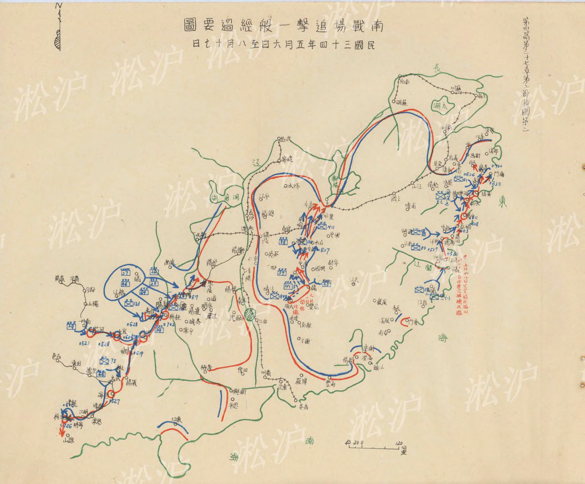

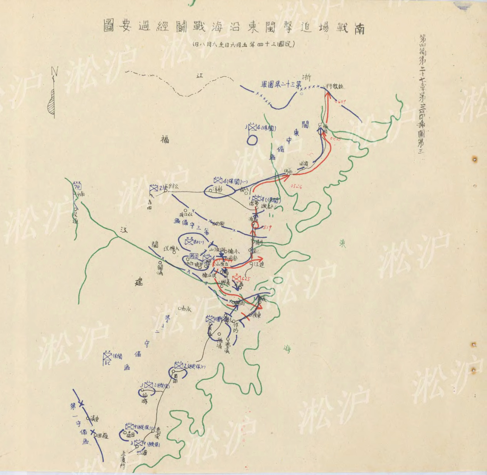

#### 第二款 浙南沿海戰鬥

民國三十四年六月十一日至七月二日

參照插圖第四

##### 第一項 浙南沿海地形

浙南東臨東海，南接福建，十之九爲山地，溫州灣附近略成小平原，山脈屬南嶺山系，有仙霞嶺，爲浙、贛分界，楓嶺、南雁蕩山爲浙、閩分界，山巒叠障，大兵團行動頗爲不易。

河流計有甌江注入溫州灣，靈江注入台州灣，飛雲江通過瑞安南境入海，其中甌江較大，可通輪船，餘可通帆船，另自永嘉南經瑞安渡飛雲江至平陽之運河，俗稱塘河，功用不著。

沿海海岸爲岩岸，有台州、樂清、溫州、沙埕諸港灣，以溫州灣較大，灣口之永嘉（溫州）爲浙南沿海重鎮，東扼出海咽喉，西經青田、麗水而至金華，北上經樂清、黃岩而達滬、杭，南下經平陽、瑞安，越分水關而出閩境，爲浙南之要地。

##### 第二項 戰鬥經過

盤據浙江永嘉、樂清之敵，爲敵至經支隊，兵力約三千人，自五月初旬以來，卽積極撤燬工事，強徵民伕船隻，準備撤離。迨至五月二十六日，該敵爲接應由閩退出之獨立第六十二旅團殘部，乃於上午一時以一部約二百餘人，經海安所、鮑田，另一部百餘人，由白象市經塘下鎮，分向瑞安進攻，先後擊退我浙保安第二縱隊后崗底及西岙之阻擊，侵入瑞安城。二十七日，復由永嘉、樂清向瑞安陸續增援，至七百餘人，與浙保安第二縱隊一部激戰後，其一部約二百餘人，於六時侵佔平陽城，有繼續向福鼎前進，與霞浦敵軍會合模樣。

迨至六月九日七時，由福建退入浙南之殘敵，在錢倉及古鰲頭與平陽敵軍會合，渡鰲江北竄，當夜渡過飛雲江，經海安所續向狀元橋撤退。

六月十一日晚，我浙保安第二縱隊，以第三團及第四團之一部分，向瑞安、平陽兩城前進。同時，由岷崗方面抽調一中隊，向蓮花心佯攻，戰鬥至十二日晨，保安第四團之一部，已完全佔領飛雲江南岸，保安第三團亦佔領瑞安北郊高地，繼續向城區攻擊。十三日拂曉，克復瑞安城，敵軍向永嘉方面撤退永嘉敵軍，連日來除以一部堅據白象市、橫塘山、蓮花心及堵浦山一帶，收容瑞安撤退殘敵外，主力則繼續向樂清撤退，浙保安第二縱隊於十五、十六兩日，曾數度向該敵攻擊，因敵憑險頑抗，毫無進展。

此時，我第三十二集團軍以永嘉之敵軍大部向樂清撤退，及令第八十八軍飭浙保安第二縱隊以一部對永嘉敵軍攻擊，主力向樂清方面追擊。第八十八軍除轉令保安第二縱隊遵照外，並以新編第二十一師第六十一團相機協助截擊，保安縱隊當時乃以第三團之一部向龍灣追擊，主力則加入白象市方面作戰。戰鬥至十七日十六時，先後將白象市、橫塘山、蓮花心及堵浦山諸據點攻下，敵軍貪夜渡甌江撤退，我於十八日四時進入永嘉城。

十九日，第八十八軍令保安第二縱隊除留兩個大隊維持永嘉、瑞安秩序外，以主力向樂清緊追敵軍，並令第六十一團以樂清北至臨海之線爲目標，向撤退之敵猛追。此時，甌江以南已無敵踪，惟渡江船隻遭敵強徵與破壞，極爲缺乏，故延至二十一日保安第二縱隊主力始行渡河至梅園院，隨卽向樂清追踪前進。同日，第六十一團向由樂清北撤芙蓉之敵軍截擊，戰鬥至黃昏後，敵向東北撤退，該團沿雙峯村、大井頭村向院橋鎮地區繼續追擊。

二十二日，第六十一團以一連在茶坦附近遲滯敵行動，主力沿馬鞍嶺向石坦街超越追擊。十二時該團團長親率第一營進至泗洲堂附工截擊，時敵軍一部已到達大莉。同日十六時，保安第二縱隊於肅清進路上殘敵後，進至竹嶼，該處敵軍二百餘人經我攻擊，卽向虹橋方向逸去。

二十三日，第六十一團第一營於墳頭村向石坦街之敵軍側擊，激戰二小時後，敵退路爲我截斷，其後續部隊改由溪坦向上茅坦撤退，保安第二縱隊同日於大烏石、牛頭頸向殘餘敵軍計約三百餘人攻擊，戰鬥一小時，敵向清江渡市撤退。二十四日，第六十一團第一營追至上陳岙附近，將該地敵軍百餘，迫退上山豆。

二十五日十三時，第六十一團主力到達雁豆山、雅琳山之線，殘留敵軍紛向院橋鎮撤退，經卿尾追擊，敵軍乃據院橋山抵抗，戰鬥兩小時後，第六十一團乃轉向其後續部隊截擊，其第一營將上山豆殘敵擊潰，繼續經新店街向黃岩前進。次晨與敵軍百餘，在盧嶼附近遭遇，經激戰後，敵軍不支，向黃岩、海門撤退，十五時，該營進佔黃岩城。

六月二十七日，第六十一團第三營，向橫山前進，時與路橋方面竄來之敵軍遭遇，經一小時之激戰，敵軍復由十里舖增援百餘，嗣經該團第二營由五峯山側擊，敵軍向十里舖退去。

保安第二縱隊於沿途擊破敵軍抵抗於二十八日將澤國附近千餘敵軍擊退，而進佔路橋，殘敵紛向海門退却，與原駐海門之敵會合（共約五千人），佔領海門以南高地，企圖頑抗。該縱隊遂於三十日八時在洪家場、馬莊及烏龜山之線展開，向敵攻擊，第六十一團此時於擊退十里舖之敵後，亦以第一營推進葭芷鎮，協力海門之攻擊，戰鬥至七月二日十時，攻克海門，敵軍渡江北竄。此時，奉第三十二集團軍命令停止追擊，第六十一團歸還建制，保安第二縱隊仍擔任原來永嘉、樂清等地區之守備。

此次戰鬥，我軍傷亡一七五名官兵，敵軍傷亡共計官兵約六一四名，我永嘉、樂清光復，並囪獲敵彈藥、被服、器材頗多。

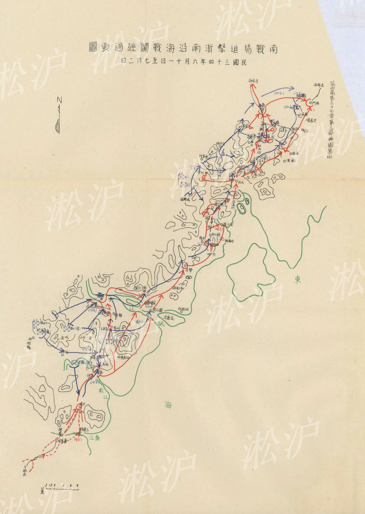

#### 第三款 桂西戰鬥

民國三十四年五月二十一日至六月十四日

參照插圖第五

##### 第一項 桂西地形

桂西皆山，屬南嶺山系南支，主爲都陽山脈，峯巒四走，更因柳江、環江、黔江、紅水河各主支流穿插其間，川谷錯綜，益增地形之複雜。

自柳江西去，有黔桂鐵路及公路，經宜山、懷遠、金城江、河池、南丹、六寨而至黔之獨山，爲入黔之主要通道。水路有柳江、黔江、紅水河，可通舟楫，上溯黔境。

河池、南丹東有金城江，西有牛欄關之險要，扼桂西門戶。宜山屏障柳州，故東出桂、柳，必先略取各該地。

##### 第二項 戰鬥經過

盤據河池、金城江一帶之敵第十三師團，自民國三十四年五月初旬，卽準備撤退，當面我軍第二十九軍第一六九師，於五月中旬綜悉情況如左：

一、河池至金城江一帶敵軍，後送頻繁。

二、食鹽投於河中。

三、積極破壞橋樑，燒燬房舍。

四、佯言卽將進攻南丹。

曹玉珩師長判斷敵軍準備撤退，乃決心轉移攻勢。於五月二十日十時，令第五零七團攻擊五圩及其以北之敵，第五零五團主力向布山峒岜敵陣地攻擊，一部向大丈追擊，第五零六團一部攻擊鯉龍關之敵，主力向金城江攻擊，佔領該地後，沿公路追擊。

是日十九時，各部隊冒大雨行動，至二十一時，第五零五團之一營佔領布山及其附近敵陣地。翌日零時三十分進佔河池城垣。十二時，第五零六團及第五零七團亦先後佔領五圩及金城江。

此時第二十九軍軍長於得悉戰況後，決心追擊，其部署如次：

一、以宜山爲追擊目標。

二、第一六九師（欠一團）爲右縱隊，卽刻經五圩、丁峒、述昆、北牙向宜山追擊前進。

三、預備第十一師配屬第九十四軍礮兵營第三連爲左縱隊，速經河池、金城江、德勝向宜山追擊前進，該師駐黎明關之第三十一團，迅速奪取思恩，進出敵軍之後，截斷其退路。

第一六九師於當（二十一）日晚奉令後，各團業已追擊前進，其第五零五團到達大丈，第五零六團追抵東江，第五零七團進至億峒。此時，陣備第十一師主力尙在南丹附近。第一六九師師長基於當前狀况，決心令各團向宜山繼續追擊，並以突擊隊（步兵三個連，重兵器一部，無線電一班），向懷遠進出，截斷敵軍退路，第五零六團沿黔桂鐵路前進，侯預備第十一師到達後，卽移隨第五零五團之後跟進。

五月二十八日，第一六九師逐次擊退敵之後衛，進至北山、北牙附近，預備第十一師已自二十五日起，卽在懷遠與敵相持，激戰甚烈。

二十九日十六時，我第二十九軍軍長獲悉：柳州之敵，大部撤退，桂林及其以北之敵，亦相繼向湖南退去，桂林以南沿鐵路線敵似無重兵。該軍長乃決心殲滅宜山、懷遠之敵，爾後迅速襲取柳州，以策應友軍之攻略桂林，當令預備第十一師（配屬第一六九師之一團，及第九十四軍礮兵之一連），攻擊懷遠敵軍，爾後向宜山前進，右翼與第一六九師連繫，圍殲宜山敵軍，第一六九師（欠一團及突擊大隊），於驅逐北山、北牙附近敵人後，主力協同預備第十一師攻取宜山，爾後第一六九師迅速向柳州進迫，預備第十一師則向柳州西北地區進出。

兩師奉令後，第一六九師以第五零五團配屬於預備第十一師，第五零六團及第五零七團乃卽開始分別向北牙、北山攻擊，預備第十一師亦令第三十一團密向天河挺進，佔領天河後，一部對羅城方面警戒，主力側擊宜山，第三十二團攻擊懷遠敵軍正面，第三十三團由木邏村渡河攻擊懷遠敵軍側背。

第一六九師第五零七團於六月一日起，經三日夜之戰鬥，佔領北山。八日以一部向蒙屯敵軍攻擊，主力至莫沿峒附近截擊由北牙撤退之敵，第五零六團於六月四日起，先後擊退敵軍數度增援之反撲，於八日六時三十分佔領北牙。六月九日第五零七團繼續對石灰峒之敵攻擊，次晨將敵一部包圍於莫沼峒。同（十）日十一時，敵由懷遠及宜山增來援軍千餘，遂反將我第五零七團包圍。我第一六九師當令於九日歸建之第五零五團，經三寶村增援第五零六團，向北底之敵攻擊，戰鬥至十七時，第五零七團突圍而出，爾後遂與敵對峙於蒙屯、鷄山、石灰峒、北底之線，各無進展。

預備第十一師於懷遠、朱朝村、獨山村一帶，擊退敵之逐次抵抗後，六月十三日進迫宜山附近，其第三十一團主力亦於佔領天河後，同時到達宜山北方。十四日，該師向敵攻擊，卒將頑敵擊退，而佔領宜山，我第一六九師各團，亦乘勢進至石鱉、太平、六段之線。

此次戰鬥，前後經過二十六日，斃傷敵官十員，士兵九百餘名，函獲亦多，我官兵亦傷亡七百餘員名。

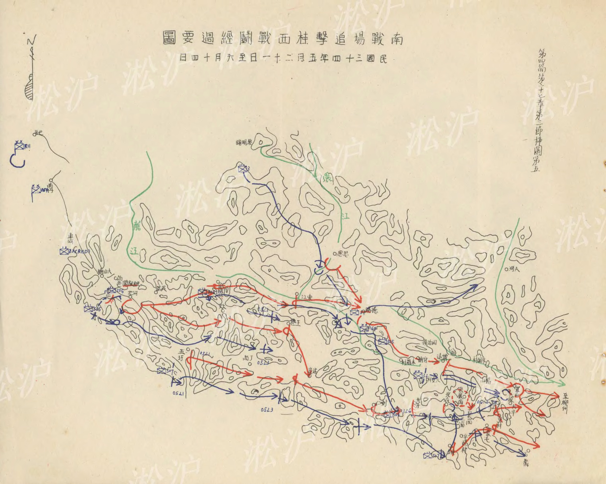

##### 第四項 桂南戰鬥

民國三十四年五月二十五日至三十一日

參照插圖第六

##### 第一項 桂南地形

桂南以南寧爲中心，瀕鬱江北岸，上溯百色、龍州，下通潯、梧、肇、廣，附近疇平野闊。有邕遷，邕龍公路北上柳州，西達龍津，另有南百公路經武鳴、田東而至百色，東北崑崙關，北方高峯隘，爲南寧之屏障。

南寧之西有要地曰龍津（龍州），跨左江二源會口，南以公路通鎮南關，西以水路通平而、水口二關，東沿梧江直下南寧，與滇之蒙自、思茅、騰越共稱我國至中南半島之四大通路，其南爲鎮南關，位桂越山谷間，高山峻嶺，繞以泥城，形勢險固，扼中越之門戶。

南寧之北有都陽山脈橫斷，山麓都安、武鳴、田東、百色扼入黔通道，賓陽、遷江直達柳州，皆軍事上之要地。

##### 第二項 戰鬥經過

我第二方面軍司令官張發奎，得知第三方面軍湯恩伯所部之第二十九軍，於五月二十一日攻克河池及金城江，同時偵知邕賓公路之敵有撤退模樣，乃於二十四日以攻佔邕柳公路之目的，決將主力推進果德、平治以東。令第六十四軍以有力之一部進出玎瑠、武鳴之線，相機攻佔南寧，令第四十六軍以第一七五師進出上林，相機攻佔賓陽與遷江，以第一八八師之一團控制都安、保平，與第三方面軍切取連繫，主力推進平治、那馬，第六十二軍則對高平之敵採取積極威脅行動，策應作戰。

各軍於奉令後，立即開始行動。五月二十五日，第六十四軍第一五六師已進至馬村、大灘、潭洛、富庶及興隆街附近，該師長以南寧敵人之撤退企圖已甚顯著，當以電話軍部具申意見，擬以現在之態勢，一舉攻佔南寧，經軍部同意。該師卽以第四六七團（欠一營）於當（二十五）日黃昏渡過右江，佔領興安村迄龍潭嶺之線，第四六八團佔領鐘鼓樓、風門嶺迄羅山寺之線，限二十六日三時前在該線完成攻擊準備，另以第四六七團之一營，對沙井之敵攻擊，掩護師之右側。

第一五九師亦於同（二十五）日，以第四七六團之第三營推進雙橋，準備攻擊高峯隘之敵，第二營附工兵一班，攜帶地雷，至崑崙關及馬嶺間設伏。

二十六日拂曉，全線攻擊開始，八時左右，高峯隘之敵首先退却，沙井旋爲我第四六七團之一營佔領，白沙之敵亦不支向石埠撤退。至此，第六十四軍軍長急令第一五六師以主力續向南寧進攻，一部向蘇圩、亭子圩截擊，爾後對邕龍公路警戒，第一五九師以第四七六團續向南寧東北郊攻擊，佔領後，以主力向武鳴推進，另以一部進崑崙關附近，遮斷敵軍之退路。是日傍晚，各部隊逼近南寧城郊，敵憑工事頑抗，戰鬥至烈，我軍營連長以下傷亡甚重。入夜，第一五九師第四七六團攻佔城北望仙坡高地後，繼續向敵陣突破，於夜半滲入市區。斯時，我第一五六師第四六八團及第四六七團，亦由石埠、心圩經南寧西郊突入市街，於是激烈巷戰澈夜進行，至五月二十七日八時，殘敵分向賓陽、蘇圩撤退，並縱火焚城，至十時許，我軍完全佔領南寧。我第一七五師之第五二四團，此時亦已攻佔賓陽外圍之三塘，我第二方面軍司令官獲知戰況後，乃決心加強截擊，其追擊命令要旨如左：

一、第六十四軍以第一五九師推進南寧，肅清殘敵，向賓陽方面警戒，以第一五六師由同正渡過左江，向綏涤截擊敵軍。

二、第四十六軍以第一七五師全力截擊賓陽、遷江間撤退之敵，並向遷江猛力追擊，將敵殲滅於紅水河南岸，第一八八師駐都安、保平圩之一團，卽向忻城推進，主力向那馬、站圩間集結。

五月二十八日，我第六十四軍奉令後，卽以第一五六師沿邕龍公路尾追敵人。二十九日薄暮，第四六七團之先頭於雷卡附近追擊敵之後衛，稍經戰鬥敵卽遁去，第四六六團於三十一日午後通過綏涤，超越第四六七團之先頭向前追擊，六月六日佔領明江，敵向憑祥遠颺。此時，盤據龍州之敵，經我地方團隊及第二方面軍突擊第一、第二兩營，自六月三日起開始圍攻，亦向憑祥撤退。至七月三日，我第一五六師第四六六團，協同地方團隊再攻憑祥，敵續向鎮南關撤退，我跟踪追擊，於二十四日克復鎮南關，將敵驅出國境之外。

在邕柳公路方面，第四十六軍第一七五師，自五月二十六日推進至上林附近地區後，卽向賓陽、三塘之敵攻擊。旋奉第二方面軍指示，調整部署積極攻取賓陽，遂以第五二四團由三塘、長治、大元鄉地區南下攻擊賓陽，第五二三團除留一部對思隴司及九塘警戒外，主力由蘆圩、馬纜圩、案山鄉地區協力第五二四團攻擊賓陽，第五二五團以一部攻擊石陵圩，主力南下攻擊鄒圩。

三十日拂曉，各攻擊部隊迫近賓陽東南及西北城郊，七時正，第五二四團首先衝入市區，其餘部隊亦相繼突進，巷戰至九時，敵突圍向鄒圩北竄，第一七五師師長當卽令第五二四團沿邕柳公路追擊，第五二三團經馬潭圩、莫村、里韋圩向遷江追擊，第五二五團以一部牽制遷江敵軍，主力向石陵附近截擊潰敵，當第五二四團追至鄒圩，因敵已將清水河浮橋炸毀，致令敵軍從容逸去。

三十一日拂曉，各部隊先後進抵遷江附近，敵軍千餘，礮兩門，仍憑城郊工事頑抗，經我包圍猛攻，戰鬥至爲激烈，待至中午，我機四架飛臨助戰，並低空掃射敵渡河部隊，殲敵甚多，殘餘之敵，乃乘夜渡紅水河北撤，六月一日晨我軍收復遷江。

六月一日，我第二方面軍奉陸軍總司令部電示，以第三方面軍之第二十九軍已進抵宜山，該方面軍應以有力之一部與第二十九軍連繫，向柳州挺進，互相掩護，於是第一七五師遂奉令渡過紅水河，於三日佔領鞏橋、河里及水落車站，四日，我第二方面軍復奉陸軍總司令部電令，其要旨如左：

一、第二方面軍應以有力之一部確保南寧，另以有力一部迅速攻佔賓陽、遷江，俟第三方面軍佔領柳州後，以兩個軍推進寧明、龍州、靖西、鎮邊之線，阻止越北敵軍進犯。

二、另以一個軍向模縣、貴縣、桂平及南平之線推進，擴大後方地域，使第二線兵團運用容易。

第二方面軍當轉令第四十六軍，將第一七五師主力集結遷江，一部對來賓、柳州方面警戒，並與第三方面軍保持連繫。

此次戰鬥，先後克復南寧、龍州等地，並將敵一部驅出國境，全役我斃傷敵官兵約達一五○○名，囪獲武器彈藥器材甚多，我亦陣亡官十二員，士兵三四四名。傷官十五員，士兵三四四名。

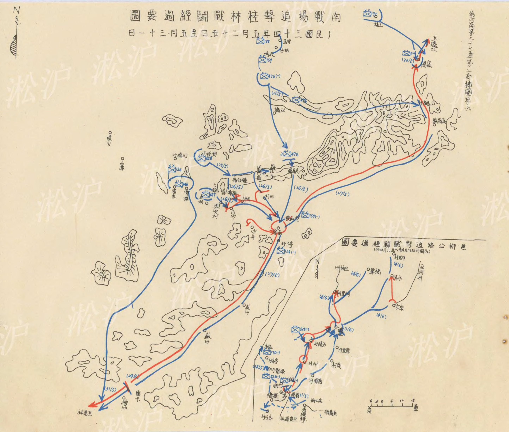

#### 第五款 反攻桂柳戰鬥

民國三十四年六月八日至八月二十一日

參照插圖第七至第十五

##### 第一項 桂柳附近地形

桂、柳四周皆山，川谷錯綜，岩洞幽深，城郊築有堅固工事及飛機場，主要山脈自貴州苗嶺而東，綿亘湘桂界上，爲越城、都龐、明渚諸嶺，形勢險要，屏障桂北。

桂林瀕桂江西岸，爲桂省省會，北出有湘桂鐵路及公路，經靈川、興安、全縣入湘南，下有桂柳及桂蓮公路，經陽朔、荔浦，西至柳州，東達蓮塘、賀縣入粵，西有黔桂鐵路及公路，經永福、雒容、柳州而入黔，故爲北部交通中心，入湘重鎮。

柳州位桂省中央，柳江曲折如馬蹄形，繞城西南東三面，疇平野闊，市郊原築有堅固工事及飛機場。小輪可上溯黔境，帆船西出桂林西南之兩江。黔桂鐵路及湘桂鐵路與全省公路復交會於此，運輸便捷，原爲桂省經濟中心，惟所有橋樑均被破壞，迄未完全修復。

##### 第二項 戰鬥經過

民國三十四年五月二十八日，我第二十七集團軍於桂北攻勢準備中，由第三方面軍湯司令官之指示及第二十軍之報告，得知如左之情況：

一、南寧、賓陽、忻城、宜山之敵，已相繼撤退。

二、桂北、天河、羅城一帶之敵，近日經長安鎮撤至桂林者已有萬餘人。

三、柳城、柳州敵，連日縱火，百壽附近之敵，自五月二十六日入夜以來，亦向東移動。

四、第二十九軍正以突擊隊向柳州推進。

該集團軍爲策應友軍作戰，並相機規復桂林，乃決心發動攻勢，遂於五月二十九日下達第五號作戰命令，其要旨如左。

一、第二十六軍卽以第四十一師攻擊義寧，佔領後相機攻取桂林，第四十四師將城步、新寧方面任務交第九十四軍後，進駐龍勝地區，準備隨戰况進展，進出桂林、靈川。

二、第二十軍以第一三三師進駐長安鎮、融縣，相機攻佔百壽，爾後進出永福、兩江圩之線，協力第二十六軍攻取桂林，以第一三四師挺進福祿、三江間地區，準備爾後作戰。

三、第九十四軍以一個師接替第二十六軍城步、新寧方面防務，嚴密監視新寧之敵，並相機攻佔新寧，主力集結城步、武岡間地區。

命令下達後，旋奉第三方面軍湯司令官電令，將第九十四軍主力集結城步、綏寧、靖縣各地區整補，並派一部與新寧之敵保持接觸，各軍於奉令後卽開始部署。

第二十六軍令第四十一師（欠第一二三團），以原在三江之第一二一團兩個營調集龍勝，原在龍勝之第一二二團推進官衙圩附近，準備對丁嶺界及義寧之敵攻擊，並派一加強營附無線電一班爲甲突擊隊，以藍田堡爲根據地，另以一加強連爲乙突擊隊，以保安圩爲根據地，分向桂林附近之敵襲擊。令第四十四師將城步、新寧防務交代後，以一個團進駐三江，主力向雙江口、臨口間集結，并限於六月七日前集結完畢。

第二十軍令第一三三師（欠第三九七團），先以第三九八團進佔長安鎮及融縣，主力於六月六日前推進長安鎮以北地區，準備進攻百壽、兩江圩，令第一三四師（欠第四零二團），主力於六月五日前推進福祿、三江間，準備爾後作戰。

第九十四軍令第四十三師以主力駐城步附近，另以有力之一部與新寧之敵保持接觸，令第五師於六月四日前集結靖縣以北地區，令第一二一師以一個團駐綏寧，主力集結靖縣以南地區。

六月八日，第二十軍以第四十一師第一二二團一部接替第一二二團官衙圩防務，向丁嶺界之敵攻擊，第一二二團則向藍田堡推進，甲突擊隊推進公平圩，分向桂林、靈川間敵據點襲擊，第二十軍第一三三師第三九八團之突擊營，亦於是日十六時左右，出敵不意，擊潰雅瑤圩附近之敵，幷跟踪追擊，傍晚攻入百壽之西、北兩門，敵退據安息村抵抗。至十一日晨，由三隍圩方面增到敵軍千餘名，馬三百餘匹，向我第三九八團反撲，該團被迫轉守苦馬嶺。同（十一）日晨，敵並由黃柏村、潭下圩及易家村一帶，集中步兵六百餘，砲二門，向藍田堡進犯，經我第一二二團及靈川縣自衛隊在九屋圩、岩背之線阻擊，敵未得逞。

陸軍總司令部於六月十五日以已刪未謀戰電：令第三方面軍卽以有力之一部，沿黔桂路前進，並限於七月十五日前攻佔柳州，以第二十七集團軍繼續壓迫桂林方面之敵，使我對柳州之攻擊容易，第九十四軍仍歸第二十七集團軍指揮。令第二方面軍以第四十六軍有力之一部，不受第二、第三兩方面軍作戰地境之限制，協同第三方面軍進攻柳州。

第三方面軍奉令後，爲迅速擊破當面之敵，恢復桂、柳，完成爾後總反攻諸準備，當於六月十九日規定各部隊行動如次：

一、第二十九軍並指揮第九十一師及第八十七師砲兵營，繼續攻擊三岔以東之敵，務於七月十五日前攻佔柳州。

二、第二十七集團軍並指揮第九十四軍，繼續向桂林之敵攻擊，並遮斷桂林、柳州、全縣間敵之交通線，以利第二十九軍對柳州之攻擊。

第二方面軍亦同時指示第四十六軍，應不受地境之限制，以一部監視石龍、象縣之敵。主力卽向柳州推進，協力第三方面軍攻擊柳州，限於七月十五日前會同佔領。

此時，我第二十九軍於桂西戰鬥，擊破當面之敵後，正沿黔桂公路向柳州追擊，其第一六九師及預備第十一師，已分別進至三都街、洛滿圩以西地區（參照插圖第七），第九十一師尙在金城江附近，於是該軍長奉令後，乃就原態勢，令第一六九師及預備第十一師繼續攻擊。

六月二十三日三時，第一六九師以第五零七團及第五零六團之一部，分向板江及三都以北各地之敵攻擊，第五零五團由大榮村繼續逐次向柳州推進。十一時許，先後攻下板江及三都以北之據點多處。次日十六時，該師突擊隊曾潛入柳州火車南站，因被敵包圍攻擊，遂向柳江北岸轉移，進襲柳州機場之第五零六團第二營，亦因中途與優勢之敵遭遇，於二十五日仍行退回，戰鬥遂在柳州外圍膠着。

二十八日，第五零六團首先攻佔六道，進至猴子山南北之線，第五零五團隨亦進佔柳州西約六公里之長貴村。此際預備第十一師沿黔桂鐵路前進，其第三十二團已佔領洛滿以北之梧山、洛小及猛虎山各據點，第三十三團於二十六日進佔大浦後，繼向沙浦之敵攻擊，第三十一團主力亦已進至同村，其一部配合當地自衛隊，佔領長寧鄉，及其對岸之冷飯屯，續向柳州挺進搜索中。

第二方面軍第四十六軍，於奉到協力第三方面軍會同攻佔柳州之命令後，卽以第一七五師北向柳州挺進，該師除以第五二四團之一營配置於廉潔村，對石龍圩、象縣方面警戒外，主力則於六月二十二日在百朋及甘村附近集結。六月二十三日拂曉，以第五二三團及第五二五團主力，展開於岜模山、永村迄懷洪村之線，對百朋附近之敵攻擊，一部向百朋以東及東北地區設伏，準備邀擊經通雙橋撤退及增援之敵，戰鬥開始後，由於敵之頑強抵抗，及我彈藥缺乏，故經多次衝鋒肉搏，經將大烏山敵據點佔領。二十五日，我空軍空投彈藥，經獲補充後，二十六日拂曉，全線再度猛攻，戰鬥至九時許，敵已漸動搖。第二七五師師長爲澈底殲滅敵人，遂令第五二四團由官塘經林根村（岜蟆正南約三公里）、泗浪村向江中村、樂山鄉進出，第五二五團經南陽村、支山村向堯安村進出，夾擊撤退之敵。十一時，敵約五百餘人，由百朋東撤，我第五二三團卽跟踪追擊，敵退至甘龍、羅漢山地區，爲我夾擊部隊包圍，幾經突圍，均被擊退。至二十七日薄暮，敵二百餘人，砲兩門，由穿鄉山向羅漢山增援，經我阻止截擊，徘徊於布山、瓦窯間地區。次日，敵復數度增援，以猛烈砲火向我攻擊，戰鬥至晚，大雨傾盈，敵乘機由江中村方面突圍，會合增援部隊，向雙橋方面逸去，我跟踪追擊，至二十九日拂曉，再度將敵包圍於雙橋北端之駝背山附近。

此時，我第二十九軍第一六九師，正乘大雨全線發動攻擊，預備第十一師已攻克洛滿，並令第三十一團以兩營分沿柳江兩岸向柳州突進。二十九日十四時，第一六九師第五零五團一部，突入柳州南城及機場，我潛伏市區部隊，亦乘機發動，與敵進行激烈巷戰。至三十日零時，敵沿桂柳公路撤退，我遂克復柳州南城，同時第一六九師之突擊大隊，預備第十一師兩個營，及別動軍第三縱隊第二支隊之一部，亦先後突入柳州北城，戰鬥至二十三時，北城亦完全爲我克復。

同（三十）日，第三方面軍司令官，於綜悉戰況後，乃重新規定各部隊行動如次：

一、第二十九軍（附第九十一師及第八十七師砲兵營），應卽以有力之一部，經柳州向雒容挺進，截斷敵背後之連絡線，以主力與第四十六軍協力，迅速攻佔柳州，爾後向桂林追擊東退之敵。

二、第七十一軍（欠第九十一師及第八十七師砲兵營），着於六月三十日出發，徒步開宜山集結待命，限七月十四日前到達。

三、第十三軍於七月二日開始，由筑車運河池、金城江附近集結待命。

第二十九軍軍長奉令後，乃卽以續到之第九十一師，協力第四十六軍第一七五師守備柳州，令第一六九師由三門江渡河，沿桂柳公路追擊。七月三日，預備第十一師主力，先後攻佔沙浦、柳城，肅清柳江東岸殘敵，遂亦分向東泉、雒容繼續追擊。

在桂林方面，我第二十七集團軍總司令，依第三方面軍司令官六月十九日電令指示，於二十日十四時，下達第六號命令。其要旨如次：

一、我右翼第二十九軍，正攻擊三岔以東之敵，期於七月十五日前攻佔柳州。

二、集團軍卽向桂林之敵攻擊，並遮斷柳、桂、全間敵之交通線，以利友軍對柳州之攻擊。

三、第二十軍（附第十六集團軍教導總隊羅正芳支隊及楊錦標部），應以第一三三師迅速肅清百壽及其附近之敵，適時向黃冕、永福之線進出，截斷柳、桂間敵之交通。第一三四師卽推進長安鎮、百壽間地區，準備隨第一三三師戰況之進展，加入戰鬥，軍部位置三江。如百壽一時不易攻克，應卽監視百壽之敵，第一三三師仍一意向指定之公路、鐵路線攻擊前進，達成任務，四、第二十六軍（附桂東突擊隊），卽以第四十一師，肅清丁嶺界及義寧附近之敵，繼向桂林攻擊，第四十四師卽推進龍勝以南地區，準備參加桂林附近之作戰，軍部位置龍勝附近。如義寧一時不易攻克，第四十四師卽監視義寧之敵，第四十一師仍一意向指定目標邁進，並遮斷敵之公路、鐵路交通五、第九十四軍應以第四十三師主力監視新寧之敵，以有力之一部，卽經兩渡橋向靈川、興安之線進出，截斷桂、全間敵公路、鐵路交通，第一二一師及第五師仍集結現地，積極整備。

各軍於奉令後，乃卽遵照部署，並於六月二十三日，先後開始運動，六月二十七日，第二十七集團軍復奉第三方面軍司令官電令如次：本方面軍爲迅速擊破當面之敵，恢復桂柳之目的，除已令第二十九軍佔領柳州後，繼續向桂林追擊外，關於桂穗路方面行動，規定如次：（一）第九十四軍限於七月二日開始行動，七日前進出龍勝以南地區，完成攻擊準備後，卽以全力攻佔桂林。（二）第二十七集團軍卽轉用於桂穗路以東路區，向興安、全縣之線挺進，截斷敵湘桂路交通，並掩護第九十四軍攻略桂林。

此時，第二十七集團軍，一面以電話令第二十軍軍部及第一三四師迅速向三江集結待命，令第二十六軍作東移之準備，並立即架設龍勝、兩渡橋間線路，其督修之公路，限七月十日前完成。令第九十四軍不待正式命令到達，先向龍勝以南地區前進，並一面策定如左之作戰計劃。

第二十七集團軍反攻桂林作戰計劃民國三十四年六月二十七日一、方針

集團軍爲領有灘江西岸戰略要點，卽以一部攻擊百壽，各以有力一部進出靈川、興安，斷敵交通，以主力攻擊桂林而佔領之，攻擊奏功後，卽向全縣、黃沙河之線追擊。

二、指導要領

(一)原在黎平、榕江、雙江口、龍勝一帶之部隊，除仍留一部在百壽附近外，應轉用於桂穗路以東地區。原在靖縣、綏寧、城步一帶之部隊，應向龍勝方面推進。各部隊限於七月四日迄七日前，在龍勝及兩渡橋以南，資源以西地區，先後分別集中完畢。

(二)完成集中及攻擊之諸準備後，在百壽及兩渡橋以南，資源以西地區部隊，卽向百壽、靈川、興安方面之敵，施行突擊、截擊、阻擊，俾推進龍勝方面之部隊，對義寧、桂林之攻擊容易。

(三)攻擊開始後，要求盟機制空，並協力地上部隊之戰鬥。

(四)爾後之追擊另定之。

三、兵團部署

(一)第二十軍之第一三三師爲突擊兵團，以一部守備長安鎮機場，以主力監視百壽之敵，適時向江圩、永福之線進出，掩護第九十四軍右側安全。爾後依情況自西向東協力第九十四軍攻擊桂林，該師暫歸本部直接指揮。

南

戰

場

追

四三

(二)第九十四軍爲攻擊兵團，於七月七日前進出龍勝以南地區，接替第二十六軍丁嶺界、藍田堡方面防務，完成攻擊諸準備後，卽攻取丁嶺界，奪取義寧，略取桂林。

(三)第二十軍（欠第一三三師附桂東突擊隊），爲截擊兵團，速取捷徑，經龍勝限七月六日前集結兩渡橋以南地區，完成攻擊準備，卽向靈川、大溶江口（不含）之敵攻擊，重點保持於靈川方面，務確實遮斷敵公路、鐵路之交通，並截擊敵人。

四第二十六軍爲阻擊兵團，速取捷徑，經龍勝、社水，限於七月四日前集結資源以西地區，完成攻擊準備後，卽向興安、全縣（不含）之敵攻擊，重點保持於興安方面，務確實遮斷敵鐵路交通，阻敵增援。

該軍第四十一師在丁嶺界、藍田堡之防務，交由第九十四軍派隊接替。

我左翼第七十四軍，正準備以一部攻擊新寧之敵，另以一部協同地方團隊，鑽隙攻擊東安，須與切取連絡。

(五)作戰地境

第二十九軍（右翼友軍）第一三三師間，鑪山、定旦、三隍圩、黃冕街、荔浦之線。

第一三三師、第九十四軍間依情況另定。

第九十四軍、第二十軍（欠第一三三師）間，泗水鄉、竹山舖、五里牌、靈田圩、磚頭村之線。第二十軍（欠第一三三師）第二十六軍間，皮水隘、雷公頂、大溶江、高田圩、茅竹市之線。

第二十六軍、第四方面軍間，竹丹江、眞良、資源、灌陽之線。

以上線上均屬左。

(六)攻擊開始日期，概定爲七月十日。

(七)總司令部於七月六日後，向瓢里推進。

四、通訊及後勤實施

通信以瓢里爲基點，構成必要通信網，後勤設施另定，如另紙。

七月二日，該集團軍依右項計劃，下達第七號作戰命令。此時，第九十四軍軍長，以駐地距龍勝以南地區約七日行程，爲適時進入戰場，因不待正式命令到達，卽令第四十三師（欠第一二九團及砲、工兩營），配屬第一二一師之第三六一團山砲營及工兵排，於七月一日開始行動，並限六日前到達龍勝以南地區，完成攻擊諸準備後，以全力奪取丁嶺界，進出義寧附近，使主力軍，爾後之進出容易。並令軍砲兵指揮官，率必要人員隨往協助。令第一二一師（欠第三六一團砲兵營工兵排），於四日出發，沿桂穗路前進，限九日前到達魚灘、龍勝間地區集結待命，軍指揮所亦準備於八日，由靖縣推進至瓢里。

七月十一日，第二十七集團軍總司令，得悉各部隊已先後集中完畢，乃令各部隊於十三日拂曉，各對當面之敵開始攻擊。（參照插圖第八）。

此時，第一三三師已進至百壽附近，該師師長遂令第三九八團一部，確保苦馬嶺南北之線，主力續向百壽城攻擊，第三九九團限於十三日晨到達保安圩以東地區，以一部對東北警戒，主力攻擊兩江圩。第九十四軍主力亦已進至官衙、藍田堡、內寨、外寨、太平、都乃各附近，第五師先頭已到達隴城，該軍軍長當令第四十三師（配屬第一二一師第三六一團，欠第一二九團），攻略丁嶺界至義寧間敵據點，爾後繼續攻擊桂林。第一二一師（欠第三六一團），進出藍田堡東南地區，截斷敵軍交通，協力第四十三師圍攻桂林。第五師於到達後，加入第一二一師方面抄襲靈川。

第二十軍（欠第一三三師）則已集結於金石鄉、老江口間地區，當令第四零一團分向塔邊屯、淞江口、上潞江等地偵察敵情地形，第四百團則控制於硯田附近爲預備隊。

第二十六軍於資源以南地區集中時，得知興安至全縣以北各山口，均有敵軍據守，卽決定以界首爲攻擊目標。以第四十四師在右，第四十一師在左，於十二日黃昏前，將敵警戒部隊驅逐，準備向界首攻擊。

第二十九軍攻克柳州後，遵第三方面軍司令官越界作戰之指示。於七月八日限令第一六九師之突擊大隊，沿湘桂鐵路東側，於七月十一日到達舞龍山附近，偵察桂林及桂江兩岸敵情地形，師主力沿鐵路前進，限十二日以前攻佔黃冕策應預備第十一師驅逐中渡之敵，爾後限於七月十八日前，攻佔永福，並準備對桂林攻擊，預備第十一師則應於攻下中渡後，卽沿洛清河西岸，協力第一六九師攻佔永福，爾後以突擊大隊積極妨礙桂林至義寧敵軍交通，主力則準備向桂林攻擊。更令第九十一師俟第七十一軍接替柳州守備任務後，卽經雒容、榴江、陽朔，作攻擊桂林之準備。

七月十三日拂曉，各部隊對當面之敵開始攻擊，第一六九師攻佔黃冕，預備第十一師亦先後攻下雒容、東泉、中渡而達黃冕。

第四十三師第一二八團，首於拂曉襲佔白馬廟。

第八

十六時攻佔惠元圩，第三六一團同時攻佔王

能嶺及宛田、大嶺。該師第一二七團以朝霧太濃，砲兵無法觀測，延至九時開始攻擊，並於十八時攻佔鬍子坳附近敵三個據點，及廟坪西南高地。

七月十四日六時十分，第一二一師師長在部隊先頭，行抵藍田堡附近，得知敵約千餘，附砲四門，集結於東皋鄉、潭下圩間地區。另有敵約五百餘，佔領磨石嶺、馬場山及上白田北端高地之線。七時，該師長接奉第九十四軍第五號作戰命令，要旨如次：

一、黃潭鄉有敵七十餘名，砲一門，義寧敵約六百，向潭下圩移動。

二、着第一二一師派兵一團，由公平圩進出岩山圩、鴉雀之線，截斷義寧、潭下圩敵之連絡，策應第四十三師作戰。

三、以一部進出磨石嶺，及其以南高地，向九屋圩、大塘方面搜索。

同（十四）日十五時，第九十四軍復令第五師之第十四團及山砲營（欠一連），於到達藍田堡後，歸第一二一師指揮。第一二一師奉令後，於十五日拂曉，乃以一部攻略磨石嶺，主力則於藍田堡以南地區就攻擊準備位置，向東皋鄉、九屋圩攻擊。

此時，第四十三師之第一二八團，於惠元圩以南地區，迭次擊退北援之敵，而其餘兩團，則以補充不繼，彈藥缺乏，迄無進展。第二十軍第一三四師已攻佔竹符村亘鷄籠嶺之線各要點，第一三三師仍在百壽及兩江圩附近與敵對戰。至於第二十六軍方面，自攻擊開始後，第四十四師連克長葉嶺、大車嶺，進至五旗嶺，第四十一師亦先後攻下胭脂嶺、雷公頂，復經激戰，奪取五福關，進佔老田洞、在嶺之線，予敵湘桂鐵路及公路交通以莫大之威脅。

第二十七集團軍於同時，先後奉到第三方面軍湯司令電令兩件，其大要如左：

一、奉總司令何電令，限本方面軍於七月底前佔領桂林，第二方面軍準備另一攻擊，第四方面軍攻擊寶慶、衡陽，希與密取連絡。

二、本方面軍擬於二十日前，先略取永福、百壽、義寧之線，二十一日起，以全力包圍桂林，而總攻之。

三、令第七十一軍，於十六日前到達柳州，擔任守備，第二十九軍不受作戰地境之限制，積極向桂林推進，其餘部隊仍舊不變，務期於七月三十一日前攻佔桂林。

第二十七集團軍總司令於奉令後，遵卽下達第八號作戰命令，其要旨如左：

一、第一三三師應於七月十八日前，攻佔百壽，第二十九軍奉命於二十日前攻佔永福，希與切取連絡。二、第九十四軍應於二十日前攻佔義寧。

三、第二十軍（欠第一三三師）務於七月二十日前，確實推進靈川、大溶江間地區，截斷敵湘桂交通線四、第二十六軍應於七月二十日前，確實進出大溶江、興安、全縣間地區，截斷敵湘桂交通線。

五、第一三三師與第二十九軍之作戰地境爲湘桂鐵路線，線上屬第一三三師。

六、自十三日十二時起，盟機已對義寧、桂林及其十英里範圍內實行轟炸，爾後協同地面部隊作戰，希注意陸空連絡。

七月十六日拂曉，我第四十三師一部，在猛烈砲火支援下，攻擊丁嶺界敵軍，激戰至十時，我軍遂將丁嶺界、鬍子坳敵陣地佔領，並將頑抗之敵四百餘人，大部殲滅。該師之第一二八團及配屬該師之第三六一團，則仍在惠元圩及宛田一帶與敵纏鬥。

第一二一師亦於是日，以第五師配屬之第十四團爲預備隊，而以該師主力，向敵攻擊，十一時佔領九屋圩、潭頭之線，十二時後，因敵由潭下圩繼續增援，並利用石洞工事頑抗，戰况遂呈膠着狀態。

此時，我第五師主力已通過龍勝，正向藍田堡前進中，第二十軍第一三四師亦先後佔領趙家田、獅子山、烏岩嶺，銀鑛山，其一部於十六時左右進至小溶江，與敵鏖戰，於是敵公路、鐵路之交通，俱爲我軍所遮斷。而此際敵軍一部，步兵約五六百，砲四門，戰車五輛，由咸水向我第四十一師之在嶺、老田洞陣地進攻，另一部約步兵千餘，砲五六門，戰車十輛，由界首向我第四十四師五旗嶺陣地反攻，均爲我擊退。我第四十一師並乘機越過五福關、老田洞，而向大橋頭、旆龍殿進出。

七月十七日，敵仍繼續增援反撲，參照插圖第九大溶江方面之敵，亦於同日進攻我第二十軍第一三四師自竹坪、獅子山、趙家田陣地。此時，我第三十七集團軍總司令，以敵大勢旣去，大溶江方面之敵已無能爲力，當令第二十軍轉飭第一三四師，先以有力之一部，對小溶江附近公路鐵路實施破壞，封鎖小溶江隘口，並鞏固小溶江、銀鑛山、筋竹山，遮斷大溶江公路鐵路，不得使敵進出於小溶江南北之線，並令第一二一師派隊攻擊大塘，掩護第二十軍右側之安全。

第一三四師師長遵令於十八日拂曉，各以一部由背嶺、二渡水，分別攻擊易家村、司門前，主力由竹坪、筋竹山向公路鐵路方面之敵攻擊。此時，我第九十四軍已佔領丁嶺界、鬍子坳各據點。該軍軍長因偵悉敵五十八師團部，已於十三日向湖南撤退，義寧敵軍正向潭下圩移動，桂林糧庫已焚毀，乃決心繼續向敵壓迫。七月十七日，令第四十三師以一部協力第一二七團掃蕩殘敵軍，主力速向義寧、岩山圩進擊，第四十三師師長遂以第三六一團之一營協力第一二七團掃蕩殘敵，主力於十八日推進惠元圩附近，第一二八團（欠一營）向上、下峯山前進。

七月十八日一時前，由義寧北援之敵二百餘人，開始向惠元圩、中央嶺我第一二八團之一營反撲；

洩洞門、東長村附近之敵二百餘人，附迫砲數門，亦於二時許，向宛田、大嶺我第三六一團之第三營攻擊。至晨，第一二八團放棄惠元圩、中央嶺，撤至惠元圩、曾家東北山麓之線。同時在螞蝗境擔任警戒之第一二八團第八連，偵知由義寧經雞爪嶺西側小道北進之敵五六百人，已到達張村及上下流村地區。十二時，第一二七團將逃匿蕉嶺屯附近之敵百餘完全殲滅。第四十三師師長遂令該團，以一營經小河屯，限於二十四小時內到達擺脚屯，主力速向宛田東北高地急進，協力第三六一團戰鬥，並令第一二八團經姚頭寨向螞蝗境集中兵力。同（十八）日十六時，在張村及上下流村之敵已進至甕潭村、柔胭嶺，與我警戒部隊接觸，易家村附近約五六百敵軍，附砲兩門，亦於十八日晨向我第一三四師第四零一團第二營攻擊，另敵百餘經乃子山以北，祕密進至鷄籠嶺，襲擊該營之後，第四零一團當以駐上潞江之第三營馳援，將敵攻勢遏止。同時上、下百家一帶及良豐橋之敵三百餘人，砲二門，分向我第四零一團第一營烏岩嶺、銀鑛山、筋竹山陣地進攻。第一三四師師長爲使各團行動密切協同，當以第四百團之第三營，由油路界經盈寨向明塘口之敵側擊。此時，第二十六軍之左右兩突擊隊已到達界首、咸水附近，正分向公路鐵路之敵襲擊，黔桂鐵路方面，亦有步砲聯合之敵二千餘人，於十七日起由羅錦分經古朗口鐵道沿線，及洛清河西岸，向我第二十九軍反攻，與第一六九師及預備第十一師激戰於馬晚嶺、葡萄屯迄金山村一帶。第二十軍第一三三師已迫近百壽城郊，第九十四軍第一二一師亦已先後攻下六二六九八高地，馬場山等據點，向公路及鐵路線挺進。

七月十九日，我第一三三師第三九九團，仍在兩江圩附近與敵保持接觸，第三九八團將敵完全圍困於百壽城內。我第三方面軍司令官湯恩伯於獲悉戰況後，遂嚴令該師於七月二十日攻下百壽。

第九十四軍方面，由義寧增援之敵，匯合宛田附近敵軍，兵力共約一千人以上，砲六門，續向我第四十三師猛攻，並陷王能嶺。該師師長乃調整部署，令第一二七團以一小部扼守舊大道口，主力經合作屯兼程至小河屯待命，甫抵螞蟻境之第一二八團（欠一營），於二十日向柔胴嶺攻擊，第三六一團附山砲連，於二十日拂曉前，於王能嶺小王之線完成攻擊準備，拂曉進攻王能嶺、大王、小王東南端之敵。第一二七團第一營在白石坳、下柳厄東南高地之線（小王西約二公里），掩護師之側背，第一二八團第三營確保宛田、大嶺及六四一四六高地（宛田大嶺西北約二公里），阻止洩洞門西端高地敵之進攻。該兩營並相機支援第三六一團之攻擊，第九十四軍軍長亦以廟坪以南甚爲空虛，遂令第五師之第十三團星夜馳至蕉嶺界及流峯村增援。此時，第一二一師第三六二團當面之敵，仍堅據九川山、東皋橋一帶山洞頑抗，該師師長乃以配屬該師之第十四團接替第三六二團防務，將第三六二團及師直屬部隊集結於祠堂坪、大塘間地區，準備向長蛇嶺挺進。旋奉第九十四軍軍長令，俟補充彈藥後再爲行動，乃在現地集結第二十軍第一三四師師長於七月十八日夜，令第四零一團（附工兵一排），於銅嶺屯、蚊子嶺附近地區構成據點，隨時以主力向靈川方面公路鐵路襲擊，破壞敵交通。第四百團（欠一營）附第四零一團之第一營，於七八六一高地，烏岩嶺、銀礦山、筋竹山、道界嶺地區構成據點，隨時以主力向小溶江、良豐橋等地襲擊，破壞敵人交通。第四百團之一營爲師預備隊，位置於楊梅塘，並商請第九十四軍第十四團向易家村攻擊，以減少右側背之顧慮。部署甫畢，敵三百餘附砲兩門，開始向銀礦山、筋竹山陣地進攻，激戰至晚，我陣地屹立未動。此時，另有敵二百餘，由上下百家經筋竹山以北攻襲我第四百團陣地後方，嗣復由上下百家增援兩百餘人，合力向該團攻擊，戰鬥澈夜進行。

第二十六軍正面之敵，向我反撲未逞，於十九日午，我第四十四師將在八里村附近敵第十三師團一個中隊完全殲滅。

七月二十日拂曉，敵竭其殘餘兵力約五百餘人砲三門，奮力向我第九十四軍第四十三師猛攻，十四時攻陷宛由、大嶺，卽分據王能嶺、洩洞門西北高地、宛田、大嶺、合作嶺迄東長村及其東南高地之線防守。另敵由桂林及靈川方面增到千餘，向我第二十軍及第二十六軍正面反攻，發生激戰，我第三六三團被困於長蛇嶺，後方連絡斷絕，全賴空運補給。敵第十三師團第一零四聯隊，以其第一大隊步砲兵五百餘人，進攻八里村。敵第五十六聯隊以五百餘人，由飛龍殿猛攻五旗嶺南端，另以一部奇襲狗頭堡嶺，均爲我第二十六軍第四十四師擊退。入夜，興安之敵六百餘，復經蜈蚣嶺繞襲狗頭堡嶺。同時，敵步兵千餘砲四門，由界首進攻五旗嶺，另敵軍千餘由大榕江經良豐橋向烏岩嶺、蚊子嶺猛攻。於是我第二十軍，第二十六軍在正面之部隊，遂與敵混戰，戰况至爲激烈。

七月二十二日，第二十七集團軍右翼方面再興攻勢，參照插圖第十一第九十四軍第四十三師，以第一二八團之一部扼守白石坳、下柳厄正面，主力向王能嶺攻擊，第一二七團向宛田、大嶺及洩洞門攻擊，第三六一團固守中江村，六四一四六高地迄小河屯之線，並支援兩翼之戰鬥，因敵頑強抵抗，進展殊少。同（二十二）日，第一二一師經由空運補充該師彈藥後，於黃昏後，經公坪圩向長蛇嶺我被困之第三六三團增援。二十三日拂曉，我第三六二團第一營，乘濃霧蔽空，敵未察覺之際，一舉攻佔農上圖。十七時，師搜索連亦進佔岩山圩，同時第五師（欠第十三團）亦已迫近公坪圩。

我第一三三師自叠奉嚴令，限期攻佔百壽，連日以來，其第三九八團均向城垣猛攻。二十二日拂曉，一部突入城內，敵軍據守家屋頑抗，而城外之敵一股約二百餘，由東門向城內增援，一股向我右翼迂迴，並由橋頭村、中村繼續增援，企圖阻止我第二、第三兩營之前進。傍晚我衝入城內部隊被迫撤至城西南郊，旋該團復再興攻擊，激戰至午夜，敵不支向東撤通，我第三九八團終於二十三日七時三十分將百壽完全收復，並繼續向兩江圩追擊。

第九十四軍軍長於綜悉戰況後，乃令第四十三師（欠一團，配屬山砲一連），固守中江村、六四一四六高地、合作屯、六三二一三高地、毛嶺南端、蕉嶺界及上下流峯村之線，第三六一團則解除配屬，至岩山圩歸建，第五師第十三團令其取捷徑進至中央嶺、大王嶺高地，歸第一二一師指揮，統限於二十四日到達指定地點。並令第一二一師（配屬第十三團、山砲一連）以第三六三團確保長蛇嶺，主力由岩山圩東西各五公里地區攻擊義寧。第五師（欠第十三團）配屬山砲營（欠兩連）確保農上圖、蔡崗界迄大塘之線，並肅清潭下圩以北地區之敵，以進出桂林、靈川間地區，截斷敵之退路。

七月二十四日，第四十三師遵令行動，第一二七團之一部於當夜襲佔東長村及其東南地區。同（二十四）日拂曉，由義寧撤集於板竹村之敵千餘名，分向我第一二一師第三六二團大埠坪、岩山圩、岩大山各地進攻。該師師長以在鴉雀第三六二團之一營，經下堡岩、大山以南地區向北包圍，激戰竟日，敵退至板竹村及望塘村間地區。我第三六三團當面之敵千餘砲數門，亦於同（二十四）日晨，向長蛇嶺之大山岩、盤古廟、五六四高地及雷家地各地進攻，戰鬥至晚，被我擊退。此時，奉令歸建之第三六一團亦已到達上田村附近。

七月二十五日拂曉，第四十三師繼續以第一二八團及第一二七團分向合作嶺、宛田、大嶺、王能嶺及宛田攻擊，敵稍經抵抗卽向義寧退去，我軍遂於十時許，次第將各地佔領，並分沿公路兩側向義寧追擊。十四時進抵姚頭寨、白馬廟之線，敵退據鷄瓜嶺及惠元圩各附近繼續抵抗，該師由於左翼之第五師第十三團尚在中央嶺、大王嶺與敵激戰，遂卽就原線整頓，準備二十六日再興攻擊。

被我第一二一師第三六二團擊退於板竹村、望塘村間之敵，因由義寧撤來敵人之增加，復於同（二十五）日拂曉，轉向中門村、羊田山、梅子村各附近竄擾。我甫行歸建之第三六一團遂卽於上田村、羊田山、羊塘村之線展開與敵對戰，戰鬥至爲激烈。十二時後，我漸趨有利，第一二一師師長當卽以第三六二團之一營，由大埠坪北向敵側擊，第三六一團則由上田村繼續向南壓迫，準備肅清當面之敵，而進義寧。此時，第一三三師第三九八團亦已逐次擊破敵之抵抗進至兩江圩，與第三九九團會合。

在第二十七集團軍左翼之兩軍，數日來，則繼續與敵苦戰，參照插圖第十一先是我第二十軍正面之敵，由七月十七日起再度增援反撲未能獲逞。復於十九日夜由上下百家增援三百餘，經筋竹山以北竄至八二一四及九一二三高地及其以北，嗣復增至五百餘人，經兩日夜之激戰。至二十二日，銀礦山、烏岩嶺先後不守，敵仍一面繼續向北進攻，一面以三百餘人砲二門進攻六槽嶺，與我第四百團之兩連進行戰鬥，旋敵復增援，分由明塘口及反壁江、觀音尖向我油路界、六槽嶺陣地兩側夾擊，致六槽嶺陣地爲敵攻陷。我第一三四師師長乃集合第四百團全部，於二十三日拂曉向六槽嶺反攻，奮勇衝入敵陣，卒將六槽嶺附近各要隘奪回，斃敵李田中佐以下二百餘員名，至此敵攻勢遂告遏止。迄二十五日，敵我遂相持於銅嶺屯、蚊子嶺、七八六一高地迄對北嶺之線。

界首、咸水方面之敵，自七月十六日至二十日，經多次增援，向我第二十六軍陣地猛烈進攻，企圖奪回五旗嶺、五福關，均被我擊退。七月二十一日夜，敵復以步兵千餘砲兩門，由大拱橋突至古留我第四十四師師部附近，我除以第四十四師直屬部隊應戰外，並急抽調第一線兵力向馬頭嶺及百水嶺敵人側背襲擊。二十三日晨，敵五百餘復向我虎山村陣地進攻，另股二百餘由咸水、白沙間繞向大惠村，拊擊我第四十一師側背，顯欲與突進古留之敵向我作兩翼迂迴。我第二十六軍當即以特務營向青坪界方面增加，將敵阻止，至二十四日突進古留之敵，亦爲第四十四師遏止。旋敵繼續向大惠村方面增援至五千餘人，拚力向我進攻。我第二十六軍軍長於綜析當前狀況後，遂決心於當夜變更部署，除以第四十一師繼續固守原正面陣地外，第四十四師則以主力轉向青坪界，準備向東攻擊，殲滅敵軍主力。

第二十九軍自攻佔黃冕後，奉第三方面軍湯司令官指示，急向桂林推進，並規定該軍與第二十七集團軍之作戰地境爲湘桂鐵路線，線上屬第二十七集團軍。該軍遂以第一六九師、預備第十一師向永福攻擊前進，第九十一師則向陽朔進出。參照插圖第十二七月十七日第一六九師及預備第十一師於馬晚嶺、山口嶺、東成嶺、金山村之線，與自羅錦圩分三路向南反攻之敵三千人遭遇，展開激戰。第九十一師亦已將柳州防務移交第七十一軍，推進至雒容、龍江街地區。當以榴江至陽朔之小道，路幅狹小，地形險峻，砲兵及輜重通過困難，遂請准以一部由龍江街經紅頭鄉、金寶圩小道，向陽朔西北地區前進，主力沿公路經修仁、荔浦向陽朔推進。

七月十九日，第一六九師師長以兩日來遭敵頑強抵抗，殊少進展，遂以一部扼守正面，以主力向敵軍左翼迂迴。二十日十二時左右，復在龍江村附近爲敵所阻，於是更以一營由山地潛向羅錦圩敵之側背前進。此際，我預備第十一師令其十七日到達百壽以南之突擊大隊，速向永福、桂林間之公路及鐵路線前進，主力則沿洛清河向永福推進，該師第三十二團，於十九日晚乘雨進攻。至二十日晨，將頭背山、洞上村一帶佔領。

七月二十一日，第一六九師及預備第十一師開始全線進攻，我機六架飛臨助戰，稍獲進展，第九十一師主力進至荔浦。其沿小道前進之第二七二團，亦於是日十三時三十分進至金寶以南附近地區，第九十一師師長並偵悉情況如次：

一、金寶圩東北高地有敵千餘，正趕築工事。

二、馬嶺附近及其以北一帶之敵，增砲兩門，於沿江架設鐵絲網，有固守模樣。

該師師長遂決心於二十二日，以第二七二團驅逐金寶圩一帶敵人，進出白沙街，截斷敵背後交通，並先遣加強營於兩江口向東攻擊，策應師主力作戰，師主力則先將馬嶺及其以北之敵驅逐，爾後進迫陽朔。

七月二十二日，我第一六九師經山地向羅錦圩迂迴之一營，由上下神洞附近向羅錦圩敵軍猛襲。二十四日，第一六九師主力藉空軍及砲兵之支援，繼續向當面之敵進攻，至十二時佔領要點數處，該師師長因見態勢有利，遂決心一舉攻略桂林，並於十三時命令各團，其要旨如次：

一、桂林之敵，已陸續撤退至桂林以東地區，師當面之敵約二千人，我第九十四軍已克義寧，第九十一師已與陽朔之敵發生戰鬥。

二、師以攻略桂林之目的，於二十五日拂曉開始攻擊，先行驅逐當面之敵，並攻佔羅錦、永福後，再分兩路經會仙、馬面及界牌等地，向桂林推進。

三、第五零七團爲右翼隊，驅逐當面之敵，攻佔羅錦，繼續經會仙、浪橋向飛機場、沙阿里推進。

四、第五零五團爲左翼隊，驅逐當面之敵，攻佔羅錦後，以一部經五權村，主力經三民村向黃村推進。五、第五零六團附山砲連，驅逐當面之敵，攻佔永福後，向羅錦圩前進，爲師預備隊。

此時，我預備第十一師第三十一團之一營，正由馬面山向永福突進，第三十二團亦由銀洞村正向永福西北郊之敵迂迴攻擊，第九十一師主力時已次第攻下馬嶺圩、高田圩、龍門岩，進佔東岸村、鳳鳴屯、化崴山向陽朔圍攻，其第二七二團則因山地運輸困難，彈藥奇缺，無大進展。

七月二十五日拂曉，第二十九軍全線總攻，第一六九師當面之敵，漸次撤退，預備第十一師亦於是日傍晚，由永福西北郊突入城內，第九十一師亦將陽朔城完全佔領，繼續向白沙街攻擊。二十六日晨，再次攻克白沙街，殘敵向良豐圩退去，預備第十一師及第一六九師亦先後於是日將羅錦及永福克復七月二十六日，我第二十七集團軍右翼各部隊及第二十九軍（附第九十一師及第八十七師砲兵營）

，以破竹之勢，分向桂林總攻。參照插圖第十三至二十七日十五時三十分，我第一三三師之第三九九團，從五里街由桂林南門突入市區，敵第五十八師團之獨立第二十九大隊及第十三師團第一零四聯隊之各一部，憑家屋頑強抵抗。旋我第三九八團以一部佯攻西門，主力向北門突入。同時，第二十九軍之部隊，亦隨第三九九團由南門繼後進入市區，經激烈巷戰後，敵不支，逐漸向東撤退。同（二十七）日十三時許，我第九十四軍之第四十三師攻克義寧，第一二一師亦肅清岩山圩殘敵，向桂林急進。二十八日八時三十分，桂林城區及近郊殘餘之敵全爲我肅清，桂林完全光復，而我第五師亦攻克潭下圩，第二十軍第一三四師第四零一團之一部進佔新安嶺，另一部攻下烏岩嶺，分向靈川及良豐橋挺進，第二十六軍亦將突進之敵擊退，進佔南北宅、向白沙、咸水進出。

我軍光復桂林後，第三方面軍司令官決舉全力將敵捕捉殲滅，當命令各部隊如次：

一，第二十七集團軍附第九十四軍之一個師，以主力沿湘桂路線追擊敗退之敵，先將靈川、興安一帶殘敵掃蕩後，一舉攻略全縣，並限於八月十五日以前佔領之，以一部對新寧方向之敵警戒，掩護方面軍之左側背。

二、第二十九軍以主力向灌陽，以一部向龍虎關追擊，限八月十五日以前攻佔之。

三、第九十四軍守備桂林兼修復機場。

四、第九十一師開平樂、恭城集結待命。

五、第十三軍之第九十八師向梧州攻擊，軍主力向八步、賀縣集結。

第二十七集團軍奉令後，於七月二十八日十八時下達第九號作戰命令如下：

一、桂林附近之敵，被我擊潰後，其主力似沿湘桂鐵道向全縣逃竄。

二、第九十四軍以主力守備桂林，一部沿灘江及湘江東岸向全縣追擊，協力第二十軍及第二十六軍殲滅靈川、興安一帶之敵，攻佔全縣。

三、第一三三師沿湘桂鐵路及其西側地區跟蹤追擊，並攻佔靈川，到達小溶江後，歸還建制。

四、第二十軍（欠第一三三師）即攻佔大溶江、興安，遮斷敵之交通。

五、第二十六軍以一部監視新寧之敵，主力即攻佔界首、白沙、阻敵增援。

六、集團軍總司令部於三十日向義寧推進，爾後推進桂林。

第二十九軍亦於奉命後，以第九十一師守備桂林機場，第一六九師之一部向龍虎關挺進，主力俟交代桂林守備任務後，繼續跟進，預備第十一師經大圩、桂月村向灌陽搜索前進，佔領灌陽後，向全縣、道縣派出警戒。

七月二十九日各部隊遵令行動，參照插圖第十四三十日九時，第二十軍第一三四師主力攻克銀礦山，進佔小溶江，一部通過烏石嶺，向良豐橋前進。其時，敵兩千餘砲四門，汽車十餘輛，適由桂林退抵該地，遂與該師發生激戰，小溶江復陷敵手，嗣我以第四十三師及第一三三師北上增援。八月二日，第四十三師沿灘江東岸攻佔靈田街，該師第一二八團一部由罩面山渡河，進入靈川，第一三三師與敵軍在七星店至五里牌一帶經一日夜之激戰。於同（二）日七時進入靈川，而第一三四師亦擊退當面之敵，於二日四時攻入靈川城，敵軍乃退據小溶江對岸繼續抵抗。

八月三日拂曉，我第一三四師繼克筋竹山、道界嶺、油路界、六槽嶺，敵退據元滕、大溶江、台背村之線抵抗，該師乃連繫第三九七團繼續向大溶江、司門前攻擊。戰鬥至六日晨，敵向東撤退，第二十軍續向興安跟蹤追擊，第四十三師則集結於靈田街附近整訓，第五師亦推進至靈川候命。

第二十六軍於開始行動後，七月二十九日夜，第四十一師之一部攻抵興安西北三公里之蓋富坪、三十眼，主力一面與龍頸嶺之敵戰鬥，一面鑽隙向咸水突進，第四十四師亦於是晚將門前嶺、長蛇嶺之敵驅逐，一面向鳳凰殿攻擊，一面鑽隙向白沙突進。七月三十日，第四十一師突擊營進至興安城西之點燈山，主力越過龍頸嶺，與第四十四師會攻南宅。入晚，北宅、耀門前、鳳凰殿爲第四十四師攻佔，迨至八月四日十時，第四十一師之第一二三團卒擊破敵軍，突入興安縣城，該師主力遂亦續向興安推進。

第二十七集團軍總司令綜悉各部隊戰況後，乃決心攻略全縣，並於八月五日下達第十號作戰命令如次：

一、桂林、靈川附近潰退之敵，其主力已通過興安、界首向全縣、黃沙河一帶逃竄，一部留置於大溶江、司門前及興安以東公路鐵路沿線與我對抗。

二、集團軍決以一部監視大溶江、司門前之敵，主力卽進出興安東北地區，圍攻全縣，期於八月十五日前佔領。

二、各部隊行動如左：

(一)第九十四軍第五師（附山砲一連）應遵本部第九號作戰命令，迅速行動，到達大芬後，卽與第二十軍切取聯繫，自東向西協攻全縣，爾後沿湘江東岸向黃沙河追擊，截斷敵之歸路。

(二)第二十軍除以一部（約一團兵力）肅清大溶江、司門前之敵，主力到達五排嶺附近地區後，連繫兩翼友軍，自南向北攻擊全縣，務協同第二十六軍與第五師於八月十五日前佔領，爾後以一部沿公路鐵路向黃沙河尾追敵人，其原在小溶江附近之第一三四師之一團，將敵殲滅後，應依狀況適時向前推進。

(三)第二十六軍在第二十軍對興安、界首未確實佔領以前，仍續行原任務，務以主力遮斷公路鐵路。興安、界首之敵肅清後，卽以有力之一部，一面向新寧方面警戒，一面遮斷黃沙河附近敵之交通，阻敵增援。主力卽擊破咸水、白沙之敵，沿公路鐵路向全縣前進。到達全縣車站附近地區後，連繫右翼友軍，自西北向東南攻擊全縣，務協力第二十軍於八月十五日前佔領之，爾後以有力之一部沿鐵路北側地區向黃沙河追擊。

八月六日五時，我第一三四師將據小溶江、大溶江、司門前及興安城郊頑強抵抗之敵，約步兵一大隊，完全擊潰，續沿鐵路向興安追擊。由大溶江方面退却之殘敵，經與興安城郊之敵會合後，猛烈向興安城反撲，與我城內守軍發生戰鬥。傍晚，第二十軍第一三三師經金鷄抱蛋迫近興安西南郊，與第一三四師會合，協同城北之第二十六軍向敵圍攻，戰鬥至七日五時，乃將城郊殘敵肅清。第二十軍及第四十一師第一二三團分向全縣、界首跟蹤追擊。七日十四時左右，第一二三團攻佔界首，向咸水、白沙前進，第二十軍已越過唐家市，第三九七團亦於此歸還第一三三師建制，第四十四師則仍在門前嶺、鳳凰殿一帶與敵激戰。第二十七集團軍總司令當令第二十軍，迅沿湘江東岸向全縣追擊，策應主力自東向西攻擊全縣，第五師改爲集團軍預備隊，隨第二十軍之後，沿公路鐵路線前進，待命加入全縣之攻擊，第二十六軍軍長亦與第二十軍軍長自相協議，將鐵路線讓與第二十軍，第二十六軍則沿鐵路西側，準備經心田鋪、小水村向龍水及全縣前進。

八月八日六時，第四十一師第一二三團已進至紹水村附近，第四十四師第一三二團已通過湖海山向夏壁田附近之敵攻擊。十時，第四十一師主力已將咸水之敵三百餘人擊退，與第四十四師主力連合向帽子嶺、勿住嶺、唐植界之線，步砲約二千餘人之敵攻擊。第二十軍第一三三師，亦於十二時佔領靠北張家，並以第三九八團第一營沿湘江鑽隙前進，該團另一部則肅清赤塘附近殘敵。師主力繼續沿公路及右側地區向全縣追擊，第一三四師於拂曉開始，沿鐵路前進。迨至十日二時左右，第三九八團之第三營鑽隙至唐家附近，十二時許，其一連渡河已攻入全縣城垣。十一日第二十軍主力於全縣以西地區，向美女梳妝、馬鞍嶺、岔路口、楓木山之敵攻擊。第三九八團則經江口、茅埠、水南渡河向全縣西南郊進攻，策應其第三營在城區戰鬥。

預備第十一師於八月五日進抵灌陽，隨奉第二十九軍軍長指示抄襲全縣東南，協力第二十七集團軍攻擊全縣。乃於八日沿灌陽河兩岸地區北進，次第擊破靄脚山、石門冲及其以北地區敵之抵抗，向老王嶺、管子嶺及水南一帶突進，並與第二十軍右翼連繫，協力向全縣城攻擊。此時，第二十六軍亦順利進展至俞江村、寨象村各附近之線，與步兵約三千砲五六門之敵繼續戰鬥。

八月十日十八時許，第二十七集團軍總司令奉第三方面軍湯司令官未佳十一時電：據美軍消息，蘇聯已對日本宣戰，美使用原子彈，日受轟炸甚慘，戰局可能急轉直下，望我將士勿失戰機，多建殊勛。李總司令當卽轉令各部隊，並作如左之部署：

一、第二十軍進佔黃沙河後，卽掃清全、黃間戰場，並在該地區內待命，但對黃沙河以東及以北，須嚴密警戒。

二、第二十六軍卽集結全縣附近待命，並派有力一部，相機越過集團軍與第四方面軍作戰地境，向東安追擊，全縣治安由丁副總司令指派全縣附近部隊，暫行負責維持。

三、第五師卽停止咸水待命。

敵軍因我追擊緊迫，脫離困難，參照插圖第十五於八月十二日晨，以步兵五六千，砲十餘門，分經秦家塘、寨象村，向我第二十六軍正面反撲，另以一部經飛錫嶺、天平嶺、牛塘嶺向唐植界突進，威脅該軍之左翼，激戰至午，我黑石嶺、臘背塘陣地相繼失守。第二十六軍堅據鳳翔村、田心村、盧家橋、膏田、大陂廟、牛塘與之對戰。第二十軍第一三四師亦以主力於鄧家橋（黑石嶺東南四公里）、大堂屋、馬渡迄鳳翔村之線，向北攻擊，以一小部於馬鞍嶺附近對東戰鬥，以策應第二十六軍之作戰。十六時，敵復以裝甲車二十一輛，戰車十六輛，掩護步兵千餘人，經楓木嶺（全縣車站附近）、飛龍橋、新魯村沿公路向西南我第二十軍第一三三師反攻，其裝甲車及戰車，旋直向白沙突進，步兵則以覺山鋪、五里排一帶與我第一三三師混戰，第二十六軍與第二十軍及第一三四師與第二十軍軍部第一三三師之連絡均告截斷。入晚，第二十軍軍長令第一三三師對覺山鋪至赤蘭堡公路南側一帶高地之敵施行側擊。此時，該師第三九八團第三營仍在全縣附近之湘江西岸，協同大芬及其以東高地、楓木嶺迄茅埠一帶之預備第十一師，與由全縣出擊之敵戰鬥。我第一三四師則因戰況不利，向奶婆山後撤，第二十六軍則腹背受敵，拚力苦戰。

同（十二）日十八時，敵戰車十八輛，裝甲車三輛，衝至白沙附近，其一部直向咸水疾駛，我第五師乃集中楊家坪、小水田一帶戰車防禦砲及火箭筒火力，向之射擊，當擊毀敵戰車兩輛，並將其行動阻遏。

八月十三日三時，敵再興攻勢，我第二十六軍被迫向門前嶺、鳳凰殿、勿住嶺一帶高地撤退，敵步兵五六千，砲七八門，於正午尾追至夏壁田及白塘一帶，與該軍及第五師發生激戰。另敵一部，則於覺山舖附近地區，向公路南側一帶高地之我第一三三師攻擊，此時，我第一三四師則轉入桐油村附近山地整頓。

第二十七集團軍基於當前戰況，遂下達第十一號作戰命令如下：

一、敗退之敵，因黃沙河橋樑破壞，退却不及，遂以進爲退，於十二日以一部約三千人，砲數門，戰車十餘輛，分路向我反撲。刻我第二十軍一部在松柏村東南，第五師在楊家坪、咸水一帶，第二十太軍在鳳翔村、田心村、盧家橋、小安、大陂廟、牛塘附近與敵激戰。

二、着第二十軍自東向西，第五師自南向北，逆斷敵之公路、鐵路線，協力聚殲該敵，不得使其再向西南回竄，第五師並暫歸丁副司令區處之。

三、各部隊務絕對機敏協同，非奉命令不得擅自後退他移，敵已成強弩之末，業向盟軍投降，務望我將士確認當面敵人爲迴光返照，不得自相驚疑，須努力殲滅爲要。

八月十四日晨，白沙附近戰況漸趨沉寂，我第五師卽派隊前進搜索，當將白沙佔領，第一三三師已將侵入咸水河南鷄公石山、大頭窠、磨書院之敵擊退，正與盤據夏柳村、溪州田、點酒村之敵戰鬥中。十二時，第二十軍軍長在治安中村（咸水南十二公里）接奉集團軍第十一號作戰命令後，卽予各部隊命令，其要旨如左：

一、軍卽向當面之敵攻擊，重點保持於公路方面。

二、第一三三師第三九八團跨湘江兩岸，鑽隙襲取敵後，相機進取全縣城，該師主力應保持於左，展開於寧脚地、磨書院之線，攻擊當面之敵。

三、第一三四師卽協力第二十六軍，由西北向東南將白沙、咸水間之敵擊破後，進至咸水以東附近，連繫第一三三師，向東攻擊，主力保持於公路方面。

四、兩師限於十五日黃昏前就攻擊準備位置，待命開始攻擊。同（十四）日，我第二十六軍整日於山門口、梅塘、胡海山勿住嶺、唐植界之線與敵戰鬥。第二十七集團軍總司令爲迅速恢復全縣，遂決調整部署，再興攻擊。令第一三四師卽行歸還第二十軍建制，以第二十軍及第二十六軍自西向東攻擊，恢復全縣，爾後向黃沙河追擊，第五師向白沙集結待命，並對北嚴密警戒，預備第十一師（欠第三十二團）將第三十一團調返灌陽，主力與第一三三師第三九八團第三營，則在茅埠及大芬一帶地區，由南向北攻擊，策應第二十軍第二十六軍之作戰。

我軍再興攻擊後，敵不支逐次向東北方面撤退，至八月十六日十四時左右，第一三三師主力擊破覺山舖南北高地及美女梳妝之敵。於十七日拂曉，沿公路及墳山、馬鞍、飛龍橋、楓木山，一部由上塘舖，經茶園頭向全縣攻擊前進，十時許攻入全縣城，在全縣南郊之我預備第十一師第三十三團亦隨後攻入城內，於是全縣克復，殘餘敵軍紛向黃沙河及東安潰退。

八月十八日，第一三四師於掃清全縣北郊殘敵後，以一部續向黃沙河追擊。第二十六軍第四十一師，奉令以一部入城維持秩序，以主力掃清全縣以西戰場，第四十四師以主力掃清秦家塘、寨象村一帶戰場，一部向東安追擊。同（十八）日十七時，第二十七集團軍總司令奉第三方面軍湯司令官之指示，令第二十軍以有力之一部向黃沙河追擊，主力在全縣、黃沙河間地區整補待命，第二十六軍以一部維持全縣治安，主力在全縣、咸水間地區整補待命，第五師則開往興安、靈川待命，旋奉令開往柳州歸建。

八月十九日，第二十軍第一三四師之第四零一團，克復黃沙河，第三方面軍湯司令官爲防敵祕密脫離戰場，於二十二日九時，令第二十軍及第二十六軍，各以一團與敵保持接觸，相機攻佔零陵、東安，該兩軍主力仍在指定地區整補待命。二十一日二時許，第二十六軍第四十四師追擊隊收復東安，第二十軍第一三四師追擊隊相繼收復零陵，殘敵向衡陽撤退，戰鬥於焉終止。

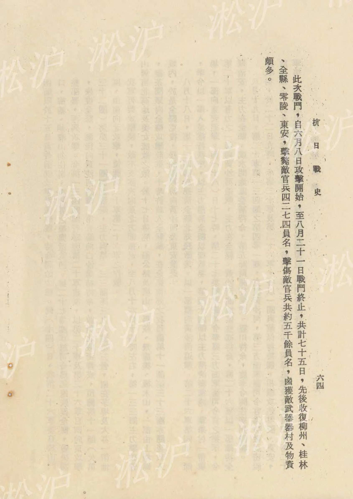

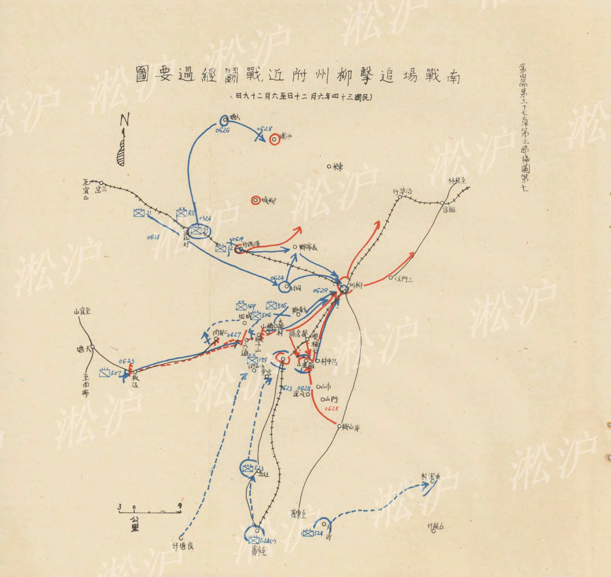

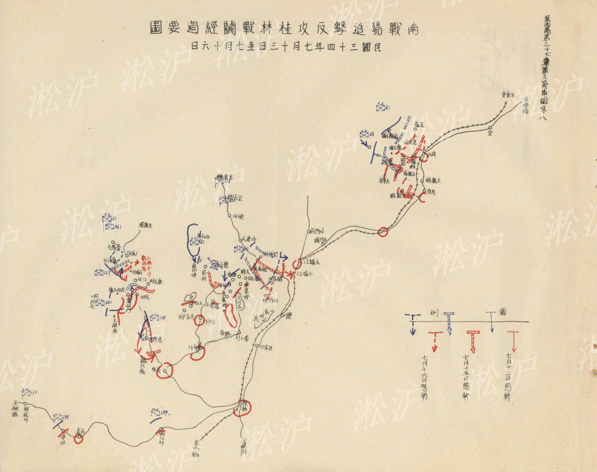

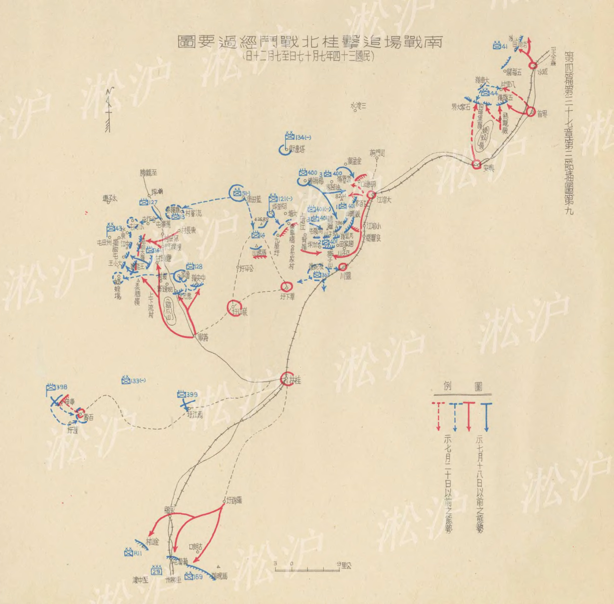

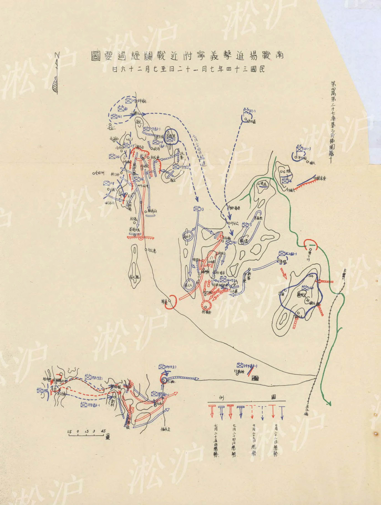

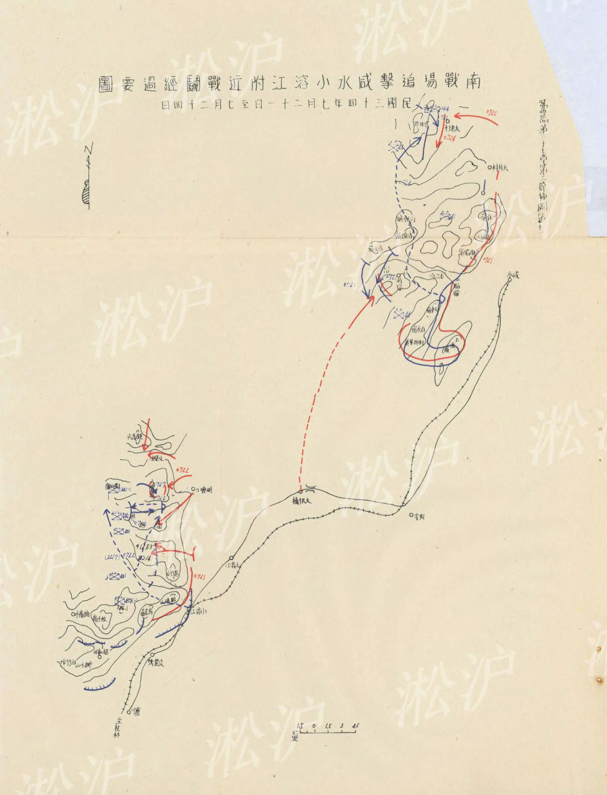

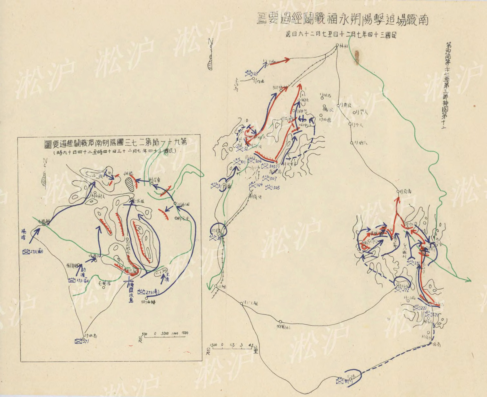

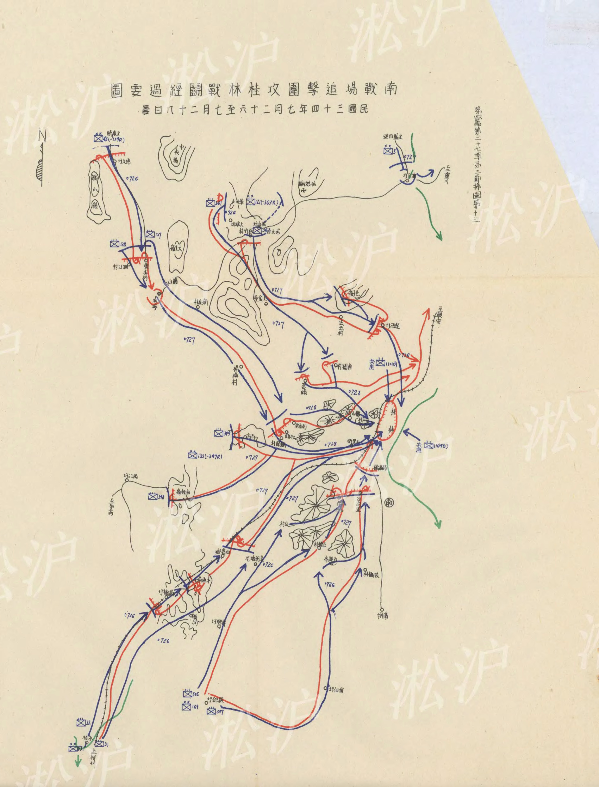

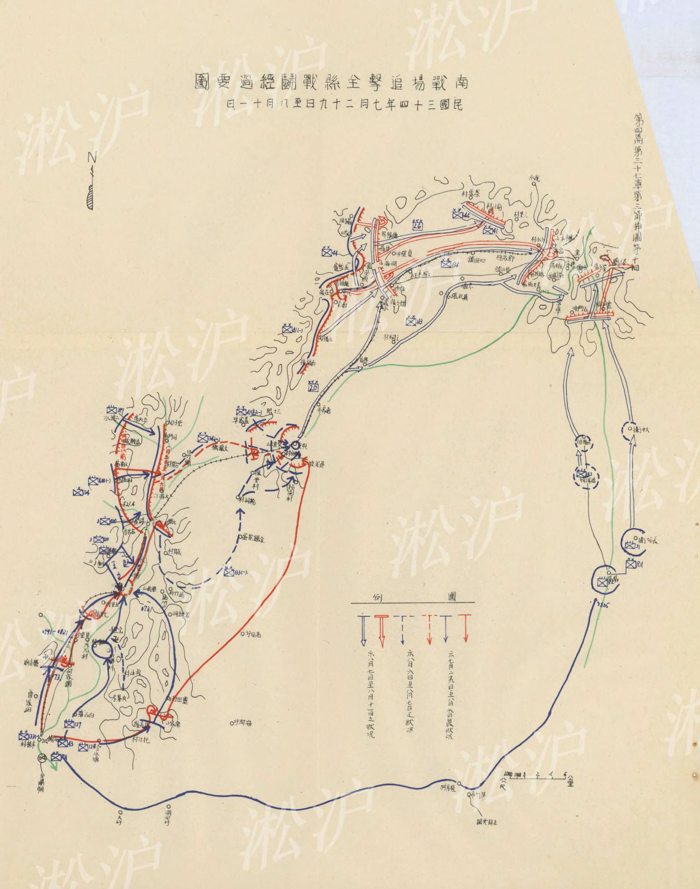

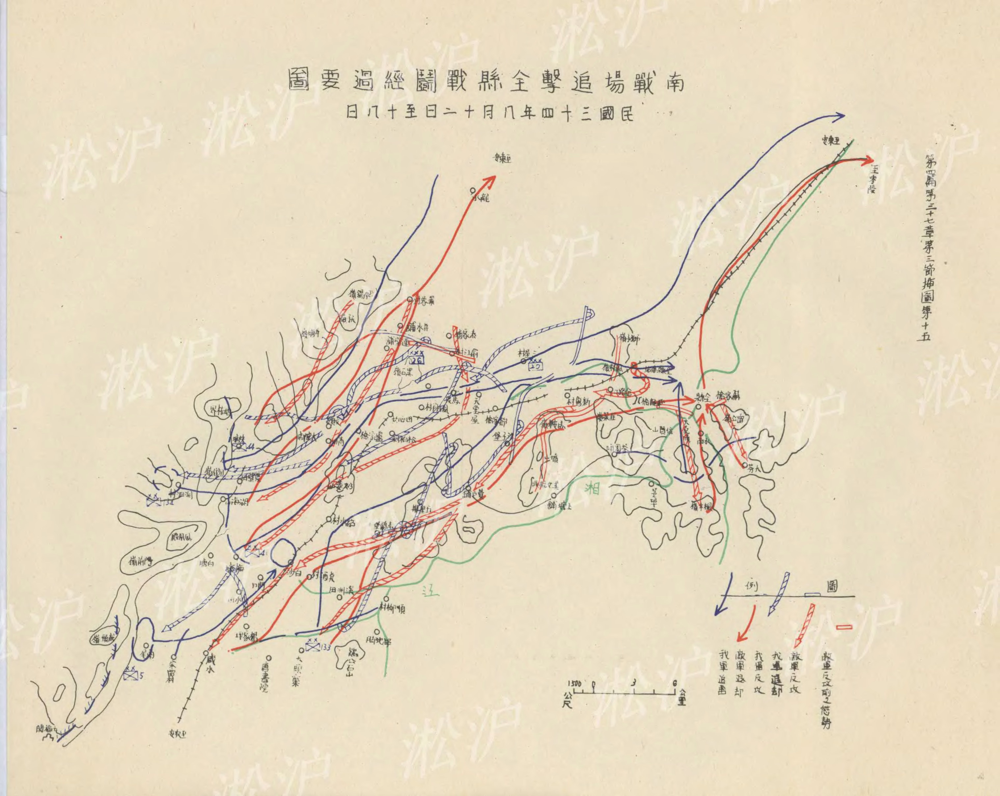

#### 第六款 赣江兩岸追擊戰鬥

民國三十四年六月二十六日至八月十日

參照插圖第十六

##### 第一項 赣江附近地形

赣江縱貫江西中部，南承章、貢二源，至赣縣匯流成江，受禾、袁、汝、錦諸水北流入鄱陽湖，爲江西之主川，其主流可航行小輪，禾、袁、汝、錦諸水，民船木筏可通行。

赣江流域雖屬丘陵，就全體觀之，實爲盆地，南部大庾嶺，上有梅嶺關，爲赣、粤通衢，其東爲九連山，羣峯連亘，形成赣粤之天然邊界。

赣縣當章、貢二水會流點，南控大庾，東阻蕭巖，扼交通之樞紐，公路南經南康、大庾而至粤之南雄，東由雩都、瑞金入閩，西出上猶至湘，北經吉安抵南昌。

赣縣北之吉安，瀕赣江左岸，爲江西中部大城市及交通中心，南經遂川、泰和至赣縣，西出永新、蓮花入湘，北經吉水、永豐、新淦、樟樹而達南昌，與浙赣、南浔兩鐵路交會，赣縣與吉安均爲赣江沿岸之要地。

##### 第二項 戰鬥經過

民國三十四年二月中旬，湘粤赣邊區作戰後，敵以一部盤據贛縣、南康、大庾，控制飛機場，我第九戰區之第三十七軍第九十師及第三戰區第二十五軍（欠第七十五師），不斷對之攻襲。六月下旬，閩浙方面之敵，由永嘉、樂清沿海岸北撤，廣西方面之敵由南寧、宜山東撤，南雄、大庾、信豐之敵第二十七師團及第四十師團亦北向南康、贛縣集中。

我第九戰區長官部判斷敵軍將循贛江向南潯北撤，乃決以第三十七軍第九十師、工兵第五團，在贛縣、遂川間地區佔領陣地，構築縱深工事，封鎖江面，阻擊敵軍北進。第三戰區亦令第二十五軍之第四十師，在贛江東岸對贛江警戒，並扼守贛縣至雩都公路，對公路以北各要路，預作澈底破壞之準備，我海軍佈雷隊則加強贛江封鎖，阻敵水上交通。

六月二十六日六時，由南康開抵塘江南岸之敵二百餘人砲兩門，開始向我第三十七軍第一四零師之第四一八團在塘江警戒之第三連攻擊，旋復增兵百餘砲一門，分由塘江上下游強渡，嗣續增至千餘人，乘夜渡河，至二十七日集結於塘江、鳳崗一帶之敵已不下五千餘人。一面以小部隊不斷向我第三十七軍及第二十五軍陣地進攻，一面繼續以後續部隊向贛縣附近集中。迨至七月七日，集結贛縣附近之敵已不下三萬人，集結塘江、鳳崗一帶者約萬人，集結七里舖、梅林間者約八千餘人。並向我第二十五軍第一零八師之第三二二團茅店西南陣地進攻，該團被迫撤至黃壟舖一帶佔領陣地。此時，大庾方面之敵，已全部向南康集結，我空軍於是日午，曾飛臨塘江、鳳崗附近轟炸，斃傷敵軍約二百餘。

七月八日，盤據南康、贛縣之敵，以三個縱隊沿贛江兩側北撤，我第三十七軍第一四零師與該敵激戰於老橋頭、火撈橋以南地區。此際，贛江東岸之敵，仍以一部續由茅店附近進攻，我工兵第五團，當敵軍北撤，乘機收復南康，並向敵軍尾擊。十日六時，我第三十七軍令第六十師，以一團固守遂川，一營固守萬安，主力固守黃土關，第一四零師以十八塘及沙地以南爲前進陣地，長蛇嶺、大坪、吳坑爲主陣地，楊村附近爲預備陣地，逐次阻擊截擊敵軍之北進，山砲第一團以山砲兩門，支援黃土關正面戰鬥，以一門支援遂川城之守備，以兩門配置店背附近，支援第一四零師及黃土關配屬砲兵之戰鬥。我第二十五軍軍長亦於十一日，令第一零八師以第三二二團向茅店附近之敵進攻，以第三二三團截擊良口至茅店間北撤之敵，以第三二四團由貢水南岸進攻贛縣城，令第四十師以第一一八團之一營編組突擊隊，由該團副團長楊光率領，取捷徑向良口、武索間之敵人截擊，第一一九團開龍口，協力突擊隊作戰，另以一團推進羅垭保持機動。此時，贛江西岸之敵，已突破我第一四零師前進陣地，進至橫石井、五雲橋附近，我第三十七軍軍長乃決心變更部署，令第一四零師將第四一八團轉移至長蛇嶺繼續戰鬥，並以一部向贛縣城急進，協力工兵第五團戰鬥，威脅敵後。第九戰區長官部，於同（十一）日令第九十師以一營留駐大庾、新城，對南雄警戒，主力經崇義往上猶，歸李棠副軍長指揮，尾擊北撤之敵，令第四十四軍在茶陵之第一六一師，於十三日到達寧崗備戰，在蓮花之新編第十一師，於十三日到達永新備戰，在萍鄉之新編第十師，於十四日到達安福備戰，準備一部扼守吉安，正面阻擊，主力由永新、安福向東截擊，並以遂川以南部隊，從後尾擊，圍殲敵軍於遂川、吉安間贛江西岸地區。

敵軍於七月十一日，攻下我第一四零師前進陣地後，卽對據守右陣地之第四二零團及第四一九團進攻，勢甚猛烈，戰鬥澈夜進行。我第三十七軍軍長卽令第一四零師，以第四一九團之一連留置沙地繼續阻擊，主力轉移預備陣地。十二日拂曉，敵二千餘人突至大坪附近，攻擊我第四二零團之後，另步兵千餘砲兩門，同時向我黃源、坳上預備陣地進犯，我第四二零團及第四一九團與敵激戰兩小時後，因工事盡毀，奉命移至東村西側繼續戰鬥。午後，敵增至三千餘人，在猛烈砲火掩護下，續向東村、坳上猛攻，傍晚更以一部繞攻湯村，激戰竟日，我傷亡頗重。

同日，我第四一八團之一營，工兵第五團及第二十五軍第一零八師之第三二四團，已分別攻至贛縣城郊，第三二四團一部曾一度攻入城內，沿江東岸之敵，及順江北駛之敵船五百餘隻，在大湖江及其以北地區，爲我第二十五軍預伏之部隊截擊，斃敵二十餘人，毀船舶十餘隻。此時，在遂川至南康之大道方面，敵已增至萬餘，沿公路北進者亦不下萬餘。

七月十三日，敵各以一部分向我第一四零師湯村西北陣地及第六十師裕塘附近陣地攻擊，其主力轉石下，分經麻姑嶺、良碧洲北撤，沿公路之敵亦以一小部與我沙地附近之阻擊部隊戰鬥，主力轉彈子前向萬安前進。我第三十七軍軍長乃急令第一四零師積極出擊，並編組多數突擊隊攻襲北撤之敵，令第六十師調駐萬安之一營增強飛機場之守備，並將守黃土關之主力移於遂川城方面。是時，我第九戰區長官部，以遂、吉間之戰鬥，行將開始，於同（十三）日令第一八三師以一團於吉安完成防禦設施，準備固守，主力於澧田、固江間阻擊敵人。

七月十四日，敵軍一部仍於湯村及裕塘一帶與我第一四零師及第六十師之第一八零團對戰，互無進展，到達東塘敵二千餘，傍晚至機場南端遂水南岸，企圖強渡，被我第一七九團擊退。入夜，轉經彈子前之敵到達沙坪，繼續向萬安前進，其先頭約三千，分由鄧林、白泥渡江北進，東塘之敵亦增至五千餘人，亦於當夜由雩田圩以東渡河，沿贛江東岸之敵已通過良口、武索，到達均村，贛縣之敵仍堅據城垣，繼續頑抗。我第九戰區長官部因令第一六一師於十五日晨，由寧崗推進拿山，右與遂川之第三十七軍，左與永新之新編第十一師切取連絡，自西向東阻擊截擊敵人。贛江東岸之第二十五軍亦遵第三戰區長官部之指示，以第四十師之第一二零團歸第一零八師指揮，接替第三二二團黃壟舖防務，全力攻擊當面之敵，第三二二團進出樟樹壩以南地區，連繫第一二零團肅清茅店附近之敵，向七里舖一帶敵軍攻擊，以第三二三團第三營增援第三二四團攻擊贛城。十五日第四十師之第一一九團到達潤田村，其第三營到達良口，其突擊隊以一部渡至贛江西岸，於武索西北約五公里之安坑附近設伏，另部於東岸武索北約五公里處與之策應，主力則擔任良口、武索間警戒。當夜，第一一九團曾擊沉敵運輸船舶四十餘隻。

第一四零師及第六十師之一部，亦於七月十五日繼續進攻湯村之敵，敵不支向下石方面撤退。裕塘之敵亦退據雲嶺抵抗，至午湯村至裕塘之公路以西已無敵踪。東塘之敵由拂曉進犯雩田圩及飛機場，迭經增援，猛烈進攻，我堅決抵抗，至十五時，終爲敵攻佔。同（十五）日，贛江西岸敵軍主力續渡遂水北撤，東岸敵軍先頭，亦於是夜通過萬安城，我第九戰區長官部遂令第一六一師立派搜索連，進至早禾市，令新編第十一師派搜索連進至天河，會同第一八三師在永陽鎮之搜索連，對白土街、泰和、三都圩方面搜索。十六日，我第六十師第一七九團在空軍及礮兵支援下攻擊進據飛機場之敵軍，敵憑堅固工事頑抗，整日戰鬥未有重大進展。在黃土關附近我第一四零師及第六十師之第一八零團，則已將雲嶺一帶之敵擊退，向鄧林、白泥、東塘之線前進，我團攻贛縣部隊，亦於是夜由南門及西南門衝入城內，經巷戰後，於十七日零時三十分完全收復該城。

渡遂水北撤之敵，除以一小部在南岸良碧洲、樸塘一帶掩護外，主力於七月十六日已完全渡過遂水，其先頭進抵白土街、蜀口洲。我第九戰區長官部，當卽令第三十七軍沿潞田、白土街、泰和、田心村、鳳凰圩方面尾擊敵軍，第一六一師及新編第十一師則分沿早禾市、永陽鎮、高塘圩及天河、舉洲、栗塘對敵側背截擊，新編第十師向澧田、固江推進，與第一八三師同任吉安、固江、澧田地區守備，阻敵北撤，第九十師卽由湯村向遂川推進，接替第六十師遂川城雩田圩機場守備任務，並策應遂、吉間之作戰。

七月十七日，贛江西岸殘留良碧洲、撲塘一帶之敵，經我第一四零師之攻擊，於十時許向雩田圩、東塘撤退。此時，棉津至萬安間尚有數萬餘，東塘、雩田圩附近敵軍，正與我第六十師相持。傍晚，我第六十師第一七九團在空軍支援下攻佔機場附近據點多處，繼續向機場敵軍進攻，第一八零團亦進至東塘西南，第一四零師之先頭第四二零團正向白泥進出，第九十師之先頭亦已到達遂川，並開始接替防務。贛江東岸，我第二十五軍於攻克贛州後，令第一零八師分沿贛江兩岸追擊，並清掃贛州近郊大湖江、江口塘、良口至武索間地區之殘敵。七月十七日拂曉前，第一零八師指揮之第一二零團正面，敵增至千餘，向我黃壟舖陣地進犯，該團奉命以一部與敵保持接觸，主力移至連江東岸。同（十七）日，第二十五軍沿江追擊部隊，於良口、武索間地區，斃敵三百餘人，生俘敵軍三名，擊沉敵船八隻，鹵獲船舶十隻，物品五十餘擔，及重要文件多種。

七月十八日，我第六十師第一七九團，繼續在我機掩護下，向困守機場頑敵進攻，經多次衝鋒，終將機場攻佔，第一八零團亦佔領東塘。此時，第一四零師已進展至白泥、橫嶺背。三日來盟軍飛機於遂川、雩都、良口、武索上空，支援我軍戰鬥，不斷掃射敵軍，斃敵千餘。

七月十九日，贛江西岸之敵，主力停止於南坑、珊田、讀堂、潞田一帶，一部在下溪、雩田圩、印埠，阻止我軍追擊，東岸之敵，則仍停止於泰和以南，最後由贛縣撤出之敵軍，正續向田心村、良口、白鷺圩集結。

我沿贛江兩岸追擊部隊，爲抑留敵軍，乃繼續對敵攻擊，在東岸方面，我第四十師及第一二零師，分由南塘圩、清溪、龍口及江口塘、大湖江北進，圍殲田心村、白鷺圩敵軍，向社背、橫背進出。西岸方面，我第一四零師及第六十師，分由白泥、南塘及機場，東塘拊擊敵之兩側背。當日，第六十師攻佔下溪、雩田圩、印埠，敵軍退據南坑、淡家洲繼續抵抗。

迨至二十日，敵約七百人由贛江東岸西渡，與羅塘灣敵軍二百餘夾擊我第一四零師第四一八團，讀堂附近敵五百餘亦乘機向我第四二零團廟得前、焦碧瑕陣地反攻，激戰至午，均被我擊退。傍晚，我第六十師當面之敵，亦全線猛撲，經激戰後，仍爲我擊退。第三十七軍軍長於十八時許，因獲悉有敵約三百餘人，由沙坪至鄧林，其後續部隊尚有千餘人。武索至良口間，亦有大部敵軍。遂令第一四零師移至遂水南岸白泥以南地區，以有力之一部，控置於良碧洲附近，向東警戒搜索。

七月二十一日，珊田、潞田一帶之敵，再次向我第三十七軍反攻，進至鄧林之敵約千餘，亦向該軍第一四零師第四一八團鎗塘、南塘陣地進犯，經我陸空軍協力戰鬥，將其擊退。最後由贛縣退至贛江東岸之敵，突過我第四十師第一一九團之阻擊，到達均村以南地區，我第四十師乃由社背南北地區向該敵攻擊。嗣奉第三戰區長官部令，將截擊尾擊任務移交第一零八師擔任，該師與贛保安第一縱隊連繫，向興國附近集中，準備進出永豐以西烏江、丁江地區，均村以南地區之敵軍，亦經我軍奮力攻擊，於七月二十三日晨向萬安撤去。同（二十三）日，贛江西岸與我第一四零師第四一八團對戰於鎗塘、南塘之敵，亦於是晨分向羅塘灣、廟得前撤退，與其主力會合，讀堂、潞田、珊田一帶敵軍亦先後自行撤退。

七月二十四日晨，我第三十七軍軍長發覺敵軍後衛開始撤退，當卽令第六十師沿遂泰公路向白土街追擊，主力保持於公路西側，第一四零師以一部迅速攻佔萬安，主力向馬家洲追擊。當日，第一四零師第四二零團之一營，協同贛保安第一縱隊之一部收復萬安。迨至二十六日，該軍已逐次擊退敵少數部隊之抵抗，攻佔馬家洲、白土街，續向吉安追擊。

同（二十四）日十五時，我第二十五軍之第四十師，已向丁江、烏江前進，沿贛江西岸北撤之敵，其先頭六百餘人，亦於是日正午於楓林橋附近，與我第一八三師之警戒部隊接觸。入夜後，敵增至千餘附砲兩門，於鳳凰圩以北地區，分股向我第一八三師仕江口、天華山、西龍山、仙樂山、梅嶺山、眞君山警戒陣地全線攻擊。二十六日拂曉，我第一八三師警戒部隊後撤，敵隨迫近禾水南岸，向該師曲瀨、蠟塘、河頭、鉢盂山、河埠橋、鷄籠橋、神崗山、吉安城主陣地進犯，敵軍兵力亦已陸續增至四千餘人砲五門。此時，第九戰區長官部已令第一六一師由永陽鎮，新編第十一師由舉洲，分向敵之側背進擊，以阻遏敵之向吉安進犯，新編第十師亦到達澧田、固江間，協力第一八三師戰鬥。

七月二十七日拂曉，沿贛江東岸北撤之敵千餘，已擊退我贛保安第一縱隊第三團第三大隊之抵抗，而達吉水城東岸，其一部約百餘偷渡至西岸，企圖襲擊我第一八三師側背，當被該師第五四八團將之擊潰。另敵三千餘，由高塘圩進至楊家坊，十九時許，以密集砲火轟擊我曲瀨、蘆家洲陣地，掩護步兵強渡，激戰至夜半，敵終渡過禾水。我第三十七軍追擊部隊，經協同贛江東岸保安第一縱隊之一部，於同（二十七）日攻佔泰和，繼續向鳳凰圩、吉安追擊。

二十八日拂曉，敵繼續藉其優勢砲火之掩護，於禾埠橋、鷄籠橋渡河，向我第一八三師正面進犯，戰況頗爲激烈。至十二時許，我第一八三師乃變更部署，以第五四八團固守吉安城，及其外圍螺子山、眞君山、觀音山、天華山各要點，第五四九團卽移曾下、泉塘、汶塘邊之線佔領主陣地，並佔領大塘邊、上沙崗、秀崗警戒陣地，構築據點工事，待機向東南及東北截擊敵人。薄暮時，各部隊均已先後部署完畢。是時，我第三十七軍亦已追至馬背嶺、橫江渡，正向北攻擊，第一六一師在石頭山、橫江渡以西地區，無大進展，新編第十一師在栗塘以東至裴家東南地區，與由高塘圩反撲之敵千餘人，整日激戰，互不相下。

當我第一八三師變更部署之際，在禾水南岸敵軍，卽分由蘆家洲、禾埠橋、鷄籠橋渡河，贛江中敵船約百餘隻，亦藉東岸砲火掩護，駛至吉安城下。入夜，敵軍紛向吉安外圍要點及曾下、泉塘陣地進攻，澈夜未停。二十九日晨，盟軍飛機五架飛臨助戰，猛炸敵陣地，掃射沿江船隻，敵損傷甚重。吉安守軍第五四八團團長王光倫，親率步兵兩連，乘機逆襲，敵退至十里亭附近。此時，我第三十七軍將禾水南岸敵軍大部肅清。第一四零師之一部，並渡過禾水進至吉安南郊，與守軍取得連絡，第一六一師亦已進至曲瀕附近，繼續向敵側擊，新編第十一師將裴家、栗塘敵軍擊退，正繼向東北前進。入暮，敵再次向我第一八三師陣地猛攻，贛江東岸之敵千餘，亦渡至西岸，由東北向吉安城攻擊，其一部百餘並突入城區，但全爲守軍殲滅。

於七月二十七日陷我吉水之敵，步兵千餘砲兩門，亦於二十九日進至烏江以西地區，爲我第二十五軍之第四十師，憑旣設工事予以阻擊。至晨，我空軍曾一度臨空助戰，此後終日激戰，互無進展。

三十日拂曉，圍攻吉安之敵，倾力進攻，我守城部隊在空軍支援下，奮力反擊，激戰至十九時，守軍與第三十七師第一四零師之一部，將西渡之敵擊退至贛江東岸，城西敵軍亦退回天華山。此時，永和至神崗山一帶之敵，業已增至千餘，正與我第一四零師第四一八團激戰。第三十七軍軍長當令第九十師之一營及山砲兵一連，向馬背嶺推進，增援第一四零師。第一六一師則已進展至大塘邊附近，新編第十一師及新編第十師，亦分別到達落崗山以東及汶塘邊，敵軍除以一部與我繼續相持外，主力乃紛紛向桐樹坪方向北退。

我第九戰區長官部得知敵軍主力業已突過我之阻擊，繼續北退，乃決以第五十八軍之新編第十師，循贛江東岸向吉水、新淦、樟樹、豐城，第一八三師循贛江西岸向峽江、清江、樟樹、豐城，新編第十一師向阜田、白沙、新喻，分別尾擊退敵，第三十七軍在吉安集結，修復吉安機場，並準備策應第五十八軍之追擊作戰，第一六一師則至蓮花集結待命。

七月三十一日，第一八三師及新編第十一師攻達眞君山、觀音堂、上沙崗、汶塘邊至二十七里舖附近。敵軍繼往北撤，其先頭概已通過三曲灘、桐樹坪。永和、神崗山間之殘敵，亦爲我第三十七軍次第殲滅，少數藉贛江東岸砲火掩護，渡過贛江，會合東岸敵軍北退。該軍隨以第一四零師第四一八團之一營，渡江尾追。此時，我第二十五軍第四十師，亦與沿贛江東岸北退之敵，激戰於烏江以東地區。八月一日夜，敵復由烏江經楊源繼續北退，第五十八軍各追擊部隊正節節尾追北撤敵軍，新編第十師並克復吉水。八月七日再克新淦，十日進佔豐城，第一八三師及新編第十一師亦追擊至泉港以西地區。此時，敵軍主力已遁入南昌、贛江戰鬥遂告結束。

此次戰鬥，自六月二十六日開始，至八月十日結束，敵軍死傷官兵在五千人以上，其在贛江中之船隻，被我空軍炸沉過半，我亦傷亡官兵千餘員名。

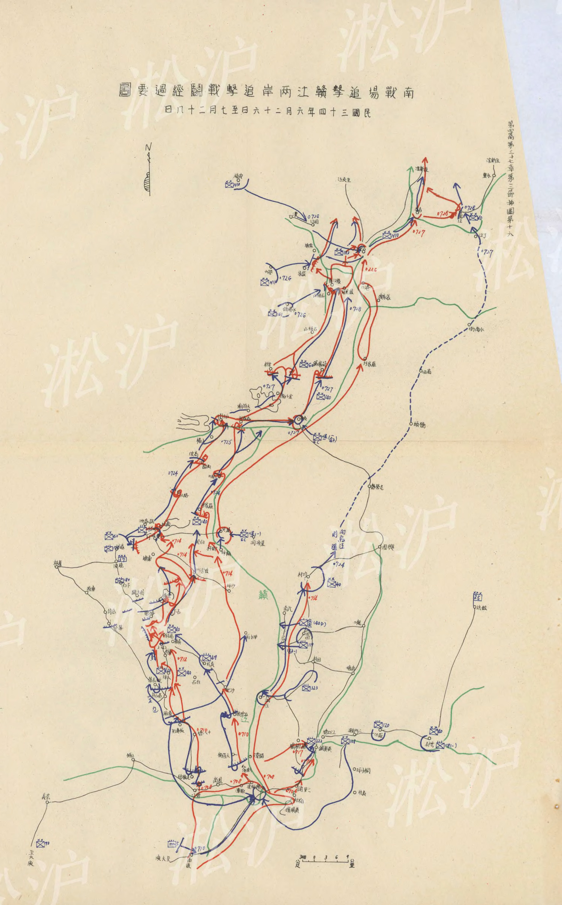

#### 第七款 附雷州半島及梧州戰鬥

民國三十四年八月一日至十

五日參照插圖第十七第十八

##### 第一項 雷州半島及梧州附近地形

雷州半島爲全國三大半島之一，其東岸廣州灣爲出海之要道。

半島上丘陵起伏，主爲七星嶺，遂溪扼半島北方之交通，良垌、廉江、安舖乃外圍之要點。

梧州扼桂、濤二江會口，附近爲勾漏山餘脈，城東白雲山、龍泉山，城西天嶺亭，與南面之西江，環衛該城，水陸交通，均極便利，東通廣州，西達南寧，北至桂林，南下雷州，扼粤、桂之門戶，爲軍事與經濟之要地。

##### 第二項 戰鬥經過

自第二方面軍於五月二十七日收復南寧，復協力第三方面軍於六月三十日攻佔柳州後，陸軍總司令部遵照軍事委員會「打通廣州海口之目的，先以有力部隊攻略桂林及雷州半島，再分別攻擊衡陽、曲江，牽制粤北日軍，然後以主力沿珠江攻佔廣州。』之作戰方針，令第二方面軍以一軍攻略雷州半島，佔領廣州灣，令第三方面軍以第十三軍之第八十九師攻略梧州，以掩護第二方面軍之側背。

第二方面軍司令官奉令後，於七月四日，以第六十二軍及第六十四軍守備桂越邊境，及防城、欽縣、合浦沿海、掩護南寧之安全。令粤桂南區總指揮鄧龍光，以原轄之部隊，並指揮第四十六軍及第一、第二突擊營，新編第一軍重迫砲營，任雷州半島之攻擊，並限第四十六軍，由邕柳公路徒步經貴縣，於七月二十日前在鬱林、陸川間集中完畢。令新編第一軍之新編第三十八師，於七月底經永淳到達貴縣，爲攻擊雷州半島之第二線兵團，第三方面軍亦限令第八十九師於七月二十四日前到達柳州，準備梧州之攻略。

第四十六軍奉命後，於七月六日由南寧、賓陽、遷江一帶徒步前進，至七月二十日，如限在鬱林、陸川集中完畢，並偵知雷州半島敵軍有第二十二獨立步兵旅團、第七十大隊、節字第九四零二部隊、及渡邊大隊等番號，與僞軍約一千餘人，共計兵力計五千餘人。其在廉江、安舖者，約敵僞軍各五百餘人，山砲三門，小砲兩門，戰車一輛，裝甲車數輛，輕重機鎗約共三十挺。七月二十六日，該軍奉粤桂南區總指揮電令，卽向石角，廉江挺進，限八月三日前攻佔廉江，並搜索當面敵情地形作攻擊之準備，第四十六軍當於同日下達雷字第一號作戰命令如左：

一、安舖、廉江、良垌、遂溪及廣州灣之間，共有敵軍約四千餘人，僞軍一千餘，廉江西北有敵堡壘兩個。我雷州挺進支隊及突擊第一、第二兩營，攻擊橫山、安舖之敵，爾後進出洋菁西北地區，我第一三一師以一部向黃坡、廣州灣方面警戒，主力於八月三日前向化縣、良垌推進。

二、軍以攻佔雷州半島聚殲敵人之目的，卽以主力沿鬱廉公路向敵攻擊前進，限八月十五日前攻佔廣州灣。

凡與我有敵對行爲之部隊，及妨害我軍行動之奸匪等，概予掃蕩。

三、新編第十九師（配屬軍砲兵營）須於七月三十一日前完成攻擊廉江之準備，八月一日開始攻擊，限八月三日前完全佔領該城。

該師留置守備陸川步兵一營，俟第一八八師先頭部隊接防後，卽行歸還建制。

四、第一八八師卽以一團於七月二十七日出發，向陸川推進，接替新編第十九師之守備任務，爾後移交第一七五師接防，卽向該師集結地前進，該師主力於二十八日由現地出發，經烏石、石角向蓮堂口、樟木根間地區集結待命，限八月一日集結完畢，並須派出一部與新編第十九師連絡，搜索廉江、遂溪公路以東地區之敵情地形，作爾後攻擊之準備。

五、第一七五師於七月二十九日由現地出發，經陸川至烏石、良田間地區集結，保持機動，並限於七月三十一日集結完畢，但應留置一營，接替第一八八師陸川之守備任務。

六、戰鬥地境如左：

突擊營——第四十六軍間，猪公嶺、南安、老竹山、中火圩之線。

第四十六軍——第一三一師間，上井、蝦蚣嶺、櫟羅灣、韓屋村之線。

線上均屬左。

七、軍砲兵營於七月二十七日向陸川、石角推進，配屬新編第十九師。

八、警戒：

(一)新編第十九師應對安舖方面派出警戒，並與友軍切取連絡。

(二)第一八八師應派出一部對兩家灘、良垌、新安圩方面警戒，掩護新編第十九師之左側，並與友軍切取連絡。

九、兵站設施：

(一)兵站第一前進倉庫，應推進兵站末他於石角。

(二)兵站線路由鬱林延伸至陸川、右角。

(三)在石角應由軍部參三課會同美軍連絡組選定投擲場，彈藥均用空投運補，再由石角分別送補各師。十、補給：

(一)各師請求補充彈藥，以先補足一攜行基數爲原則，以利機動，兵站應在石角屯備各種彈藥兩基數，以備隨時撥補。

(二)兵站應在石角準備全軍半月份之糧秣。

十一、衛生設施：

衛生大隊應在鬱林、陸川、石角配置，以利傷運。

十二、通信：

(一)陸川、烏石、良田間利用既設線。

(二)軍通信營設前進通信中樞於石角，利用「陸川經盤龍至石角」之既設線，並以石角爲基點，沿新編第十九師前進路架設幹線，完成前後方之連絡。

(三)各師到達目的後，應卽利用既設線向軍部銜接，完成通信。

十三、軍司令部於七月二十八日向陸川推進，爾後指揮所逐次推進至石角、太平店。

十四、余現在鬱林軍司令部。

第四十六軍於下達上述命令後，復奉粵桂南區總指揮命令，雷州挺進支隊戴朝恩部及突擊第一、第二兩營到達安舖、橫山之線後，歸入突擊縱隊序列，由秦指揮官鎮統一指揮，該縱隊並受第四十六軍軍長指揮作戰。

七月三十日，參照插圖第十七新編第十九師已全部到達蓮塘口東西之線，並以第五十五團及第五十七團之各一部攻擊獅子嶺、謝建嶂、上村坡、山內之線敵警戒陣地，十八時完全佔領該線。三十一日，該師以第五十五團在右，第五十七團在左爲第一線，於黃昏後，展開於麒麟山、紅頭嶺、河村、樟仔村、三寶廟、大園陂之線，對廉江之敵攻擊，並派出一部輕裝部隊，向廉江通遂溪諸要點截擊敵之增援或退却，以第五十六團爲預備隊，位置於獅子嶺、石頭嶺附近，並以一營進出於廉江至馬頭嶺間各道路，施行伏擊，砲兵營於梧村垌、太平嶺間佔領陣地，其主火力直協第五十五團之戰鬥，預定於八月一日六時三十分，俟協力之空軍臨空後，卽開始向廉江攻擊。

八月一日，因南寧天氣惡劣，飛機不能起飛。新編第十九師遂決於七時開始攻擊前進，經半小時之激戰，佔領紅頭嶺、陸軍堂，大橋頭諸據點，向西街嶺、東聖嶺攻擊，砲兵營亦集中火力對縣背嶺之敵側防火器及砲兵行制壓射擊，支援我軍前進。十一時十五分，第五十五團攻佔西街嶺，但東聖嶺因敵頑強抵抗，第五十七團屢攻未下，至十二時三十分，該師師長乃暫停進攻，調整部署。十三時三十分攻擊再興，經三小時之激戰，第五十五團一部佔領縣背嶺，另一部由西門攻入城內，第五十七團亦攻佔東聖嶺，一部並迫近東門，敵陸續由南門撤退，該師乃以預備隊一營向縣背嶺增加，繼向城內頑抗之敵攻擊，主力則編成四個縱隊，沿通遂溪各道路追擊前進。二十一時廉江完全克復，我第四十六軍軍長爲確保廉江起見，令集結蓮塘口附近之第一八八師，以第五六四團之一部向良垌方向警戒，掩護新編第十九師之左側背，令第一七五師卽推進石角、太平待命，並對新安、官橋警戒。

八月二日十時，敵渡邊大隊之一部約五百餘人，砲兩門，由遂溪增援至官嶺東西之線，與我新編第十九師之第五十六團遭遇，經四小時之激戰，爲我擊退。至馬頭嶺東西之線，我第五十六團遂進至河仔、大嶺之線，與敵保持接觸。

當廉江攻佔後，擔任攻擊良垌之我第一三一師尚未到達。第四十六軍軍長爲保左側背之安全，於八月二日十四時，令第一八八師將駐大路圩之第五六四團，推進南圩，準備驅逐良垌之敵，掩護新編第十九師之側背，並相機側擊廉江以南地區之敵。同時爲掃除新編第十九師右翼之威脅，令突擊縱隊將主力集結譚福村、橫山、曲塘地區，於八月三日對安舖敵軍攻擊，另以一部進至后溪附近，對洋菁方面搜索警戒。

八月三日，第四十六軍軍長爲繼續向遂溪攻擊，乃於當日八時，令第一八八師（欠第五六四團）在右，新編第十九師在左，卽推進至族山、新塘、義合圩、圓嶺子、前山陂、春花墩、松木嶺、修古塘地區，作攻擊諸準備。第一七五師卽以第五二四團推進廉江，接替新編第十九師之警備任務，軍工兵營由該團指揮清掃城區戰場，並構築城防工事，及趕築長一二零公尺、寬六十公尺之機場備用。

是（三）日九時，我新編第十九師第五十五團第一營，發覺廉江殘餘之敵約百餘人，輕重機關鎗各二挺，潛匿於智沙嶺附近，當卽向之攻擊，該敵轉至沙井、酒房附近堅據抵抗。十四時，第四十六軍軍長令第一八八師到達紅頭嶺附近之第五六二團第三營協力圍剿。同時，新編第十九師師長並令第五十六團以一營進出板塘、獨牛嶺之線堵擊。迨至八月四日九時，該敵不支，分兩路向老鴉塘、獨牛嶺後退，適我第五十六團堵擊隊到達，阻敵退路，戰鬥至晚，殲敵過半，殘敵乘夜突圍，向牛仔圩方面竄去。

我突擊縱隊自八月三日拂曉向安舖之敵攻擊，敵憑堅固工事頑抗，經奮力進攻，於四日十三時突入市區。嗣以遂溪方面敵約三百餘人，戰車一輛，汽車數輛，於十六時三十分，分由洋菁、后溪增援。我突擊縱隊爲避免與敵決戰，乃復退出，以一部沿安舖至遂溪公路南側，突擊第一營至橫山、缸瓦窯間地區，突擊第二營及挺進第一大隊在安舖以西地區，準備對增援之敵實施側襲。此時，我第一三一師及第一八八師第五六團業已攻佔良垌，第五六四團當卽歸建，第一三一師則準備繼續向南推進。我第四十六軍軍長爲防敵向我右翼反攻，遂令第一線兩師特別對廉江西南地區注意。

八月六日，第四十六軍軍長得知安舖之敵逐漸增加，判斷遂溪敵軍可能循遂廉公路向我反攻，乃亟令第一八八師及突擊縱隊側擊遂溪、安舖間敵軍，截斷敵之交通線，相機攻佔安舖。

八月七日晨，我第一八八師第五六二團之一營向南安新圩推進，將盤據該地之敵僞軍三百餘人驅逐，於是敵遂溪、安舖間之交通爲我截斷。迨至八月八日四時左右，安舖之敵乃乘夜向洋菁撤退，安舖亦爲我突擊縱隊收復。第四十六軍軍長遂準備繼續向遂溪進攻。此時，我第一三一師第三九二團已於攻佔良垌後，推進至後背嶺、黃泥地、兩家灘之線。

八月十一日，第四十六軍軍長接奉第二方面軍司令部電令：「一、東京十日廣播，日本政府已接受波次坦公告無條件投降。二、方面軍爲捕捉戰機，卽全面發動攻勢。三、雷州灣攻擊兵團卽攻擊當面之敵向廣州灣進出。當卽令突擊縱隊以一部守備完舖，主力向洋菁之敵攻擊，令第一八八師對南面山飛機場及遂溪城敵陣地攻擊，新編第十九師（配屬軍砲兵營）先攻佔馬頭嶺，爾後協力第一八八師攻略遂溪，第一七五師（欠第五二四團）卽向義合圩、廉江間地區集結。

該軍命令下達後，復奉第二方面軍司令部電令指示：「頃據廣播，大陸及越南之敵，仍將繼續戰鬥，不能接受東京政府命令，我各軍行動着以威力壓迫爲着眼，慎重將事，勿以一時意氣之衝動，輕率暴進，作無計劃之戰鬥，致反遭不利。」第四十六軍軍長當卽轉令各部隊暫緩行動，並爲達成威力壓迫之目的，於八月十二日，令新編第十九師（配屬軍砲兵營）以有力之一部，與友軍第一三一師連繫，於十三日拂曉攻擊馬頭嶺，主力在獨牛嶺、陂頭地區集結，準備隨時支援。令第一八八師於十三日拂曉，以小部隊向南面山，遂溪敵陣地佯攻，策應馬頭嶺方面戰鬥，主力在牛仔圩、龍口塘間集結，隨時準備迎擊由城月市、洋菁北犯之敵軍。突擊縱隊於十三日拂曉，以一部對洋菁實施威力搜索，另以一部進出洋菁以南地區，向城月市方向作廣正面之搜索，主力在曲塘，陳支山間集結，令第一七五師分別在蓮塘口、廉江、沙井間地區集結待命。

八月十三日六時三十分，新編第十九師師長以第五十六團（附山砲兩門）向前山坡、馬頭嶺、獅子嶺之敵進攻，第五十五團一部推進至南陽村，相機協力第五十六團之攻擊。當時第五十六團，乃以加強之步兵第三連爲右翼，進出分界西南，向馬頭嶺攻擊，以第三營配屬迫擊砲輕機關鎗各一連爲左翼，進出於黃垌、根蒙山、合水圩之線，向獅頭嶺攻擊，第一營居中策應，戰鬥兩小時後，敵百餘人經羊咩坳企圖包圍我第五十六團右翼，我新編第十九師師長卽令第五十五團在南陽村之營前進策應。十一時許，馬頭嶺之敵出擊，與我第五十六團於橋頭東南各附近開始混戰，至十二時，我右翼第三連退守橋頭，左翼第三營攻至獅頭嶺山頂，惟敵仍據山頂堡壘頑抗。

同時，我第一八八師第五六二團及第五六三團之一加強連，爲策應馬頭嶺之攻擊，於是（十三）日拂曉，分向南面山及樟木根佯攻，黃昏後，恢復原態勢向敵警戒，突擊縱隊亦於當晚襲擊洋菁，於十四日晨撤回，迨至十五日敵軍正式投降，戰鬥乃告終止。

梧州方面，參照插圖第十八我第十三軍之第八十九師由貴陽徒步向柳州前進之際，陸軍總司令部令突擊縱隊以三個突擊中隊編成一大隊，由美軍協助，由昆明空運丹竹機場附近，實施空降攻佔該機場，以待第八十九師到達，會同向東推進。突擊總隊遵命於七月十二日六時降落丹竹，卽將機場攻佔。至八月三日第八十九師到達，並以第二六五團會合突擊大隊及別動之一大隊向丹竹機場西北之敵攻擊，敵不支乘夜向東撤退。八月五日遂將丹竹機場附近敵人完全肅清，當以第二六五團續向濛江追擊，師主力則集結於丹竹附近，同時徵集民伕二千餘人修復機場。此役，計斃傷敵二百餘人，囹獲敵糧服五百餘挑。

八月十一日，第八十九師繼向梧州進攻，其先頭已沿西江北岸進抵梧州附近，偵知城內有敵三千餘人，山砲九門，據守廣西大學、富民坊至白雲山一帶高地，並構有堅固防禦工事。我第八十九師師長卽决以主力沿桂江東岸攻擊白雲山，一部沿桂江西岸攻擊廣西大學及富民坊。

八月十四日拂曉開始攻擊，戰鬥至十五日傍晚，先後佔領白雲山、廣西大學及其各附近敵據點多處，繼向梧州城進攻，至二十三時，城內敵軍紛登輪艇向西江下游撤離，我軍遂進入梧州，十六日將城內殘敵完全肅清，戰鬥於是結束。

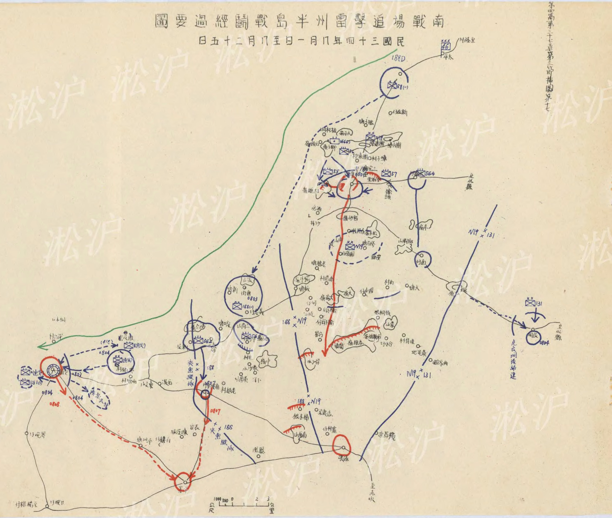

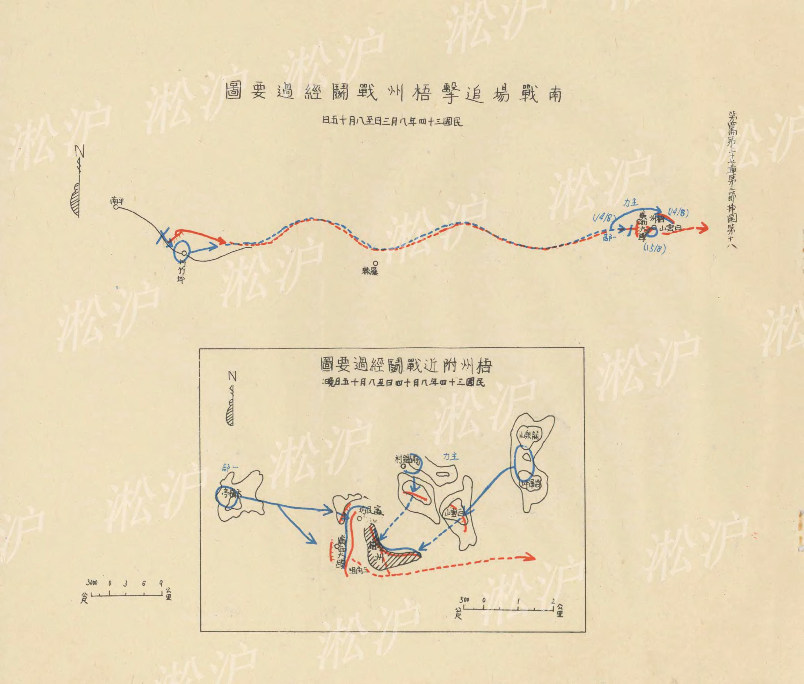

### 第四節 檢討

#### 第一款 敵軍

二、敵乃島國，自海空戰失敗，其命運早已註定，當三十四年五月間，沖繩之戰已近尾聲，其海軍全滅，在中國大陸仍擁有二百萬陸軍，而無補戰局，爲其國防建軍方針錯誤之明證。

二、敵縮短戰線，抽出華南兵力，加強京、滬、杭、武漢及東北兵力，力圖持久，乃戰略上窮餘之對策，其結果誘發我軍提前反攻，徒增傷亡，並反映其一號作戰（打通大陸交通線）之失策。

三、敵之退却指導及部署，秩序井然，其部隊迄未被擊破，勇戰苦鬥，貫澈始終，誠有足多者。而燒殺淫掠，慘無人道，致桂柳一帶及贛江沿岸廬舍爲墟，其風紀之敗壞，實致命之缺點。

#### 第二款 我軍

一、中國陸軍之美式裝備訓練及後勤支援設施尚未完成，敵卽先機撤退，不得不把握戰機提前反攻，而缺乏戰車及重砲，攻擊威力仍嫌不足，能未能擊潰敵軍，抑留於戰場而殲滅之，惟士氣旺盛，各部概能爭取主動，打擊敵人，依機敏之行動，獲得輝煌之戰果。

二、統一指揮爲發揮綜合戰力之主要手段，反攻桂柳戰鬥，始終在第三方面軍統一指揮之下，中國陸軍總司令部並令第二方面軍以第四十六軍之一部，不受作戰地境限制，適切增援，盟軍並協助恢復交通，復依陸空協同及各兵種相互支援，卒能迅速收復桂柳，予敵軍以一大打擊。

三、我軍善用機動原則補火力之不足，造成有利之態勢，捕捉戰機，並依空降與地面部隊配合，縮短時空距離，獲致奇襲效果，梧州戰鬥突擊總隊依空降佔領丹竹機場，與第八十九師配合，卒能迅速略取梧州，開國軍立體作戰空降突擊之先河。
