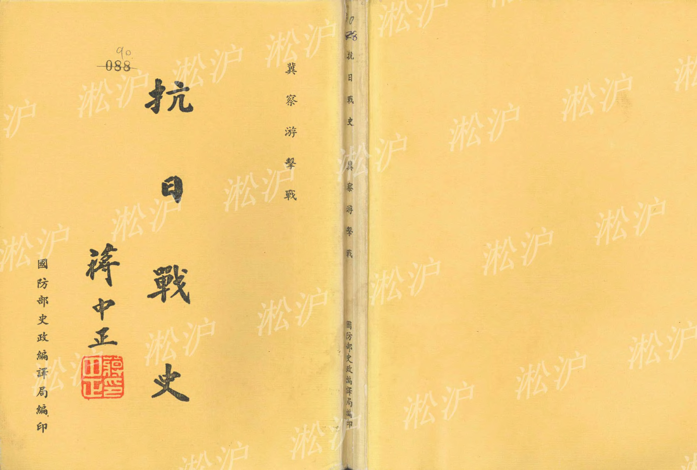

第三十九章 冀察游擊戰

概述

第一節 戰前狀況

第一款 敵軍

第二款 我軍

第三款 兵誌概要

第二節 我軍作戰指導

第三節 作戰經過

第一款 反掃蕩戰

第二款 策應戰

第三款 打破敵僞政治經濟設施戰

第四節 檢討

第一款 敵軍

第二款 我軍

冀察游擊戰　一　六七　一六五　一六五　一七　八三　八八　七四　三三　三三　一　一

## 第三十九章冀察游擊戰

概述

民國二十六年八月至十二月間，冀察兩省相繼陷敵，我第五十三軍萬福麟部卽在冀中、冀南地區發動游擊戰，迨二十七年武漢會戰之際，我第六十九軍石友三部，亦於津浦北段配合地方游擊部隊迭次襲擾敵後，予以重大打擊，獲致抑留牽置之效，是年九月下旬，敵以五萬之衆，在其大量飛機支援下，圍攻晉冀察邊區，企圖肅清我游擊部隊，終以晉省廣大游擊戰困擾敵背，使其圍攻計劃遭受莫大之打擊，敵之企圖遂告失敗。

此時我游擊隊勢力尚未及於察哈爾省，河北方面雖有第九十七軍（朱懷冰）、第六十九軍（石友三）、第五十三軍（萬福麟）及地方游擊隊，各別對敵施行游擊，然由於指揮不統一，運用欠靈活，加以冀、察兩省爲華北戰略要地，地域遼闊，民間武力雄厚，苟無健全之指揮機構及強有力者專任其責，必難於控制，而予國軍當時作戰及爾後攻勢轉移以有利之策應，於是我軍事委員會應乎戰略之需要，劃冀、察兩省及山東省黃河左岸全部爲冀察戰區，以第一戰區河北游擊總司令鹿鍾麟爲戰區總司令，同時頒佈戰鬥序列，指示作戰方針，並配合有力之政治工作，遂展開大規模有計劃之廣大而堅強之游擊戰。

冀察戰區成立後，遵照軍事委員會之指示，及當時情況，以三種戰法進行作戰。一、反掃蕩戰。二、策應戰。三、打破敵僞政治經濟設施戰，其目的在鞏固我游擊根據地，牽制敵軍兵力，減低我正規部隊之壓力，並掩護我黨政之推進，自戰區成立迄戰爭結束，始終本此三大任務與敵週旋，以完成戰區使用。

自二十八年一月至二十九年四五月間，冀察戰區由鹿鍾麟任總司令時，敵軍先後在河北作戰或駐防之部隊，約有十九個師團，五個獨立旅團，一個獨立聯隊，十六個僞軍單位，駐防察省之敵軍約一個師團，另有僞蒙軍李守信部及各縣僞自衛隊等，由華北方面軍司令宮杉山元統一指揮，大舉掃蕩我游擊隊，並積極建立據點，修築鐵路及公路，推進其僞政權及經濟組織，發展奴化教育，以期鞏固華北佔領區，策應其他戰場之作戰，我冀察戰區針對敵軍企圖，以第九十七軍（二十八年二月他調至二十九年二月又列入該戰區戰鬥序列）第六十九軍、新編第五軍（孫魁元）第四十軍（龐炳勳暫歸第一戰區指揮）河北民軍（初稱河北民團由張蔭梧指揮，二十八年十月間改稱河北民軍，歸喬明禮指揮）各游擊縱（支）隊（孫良誠指揮），配合第十八集團軍（朱德）之一部，經常在河北境內及冀、晉、豫、邊區各地游擊，敵之陰謀終未獲逞，惟第十八集團軍企圖奪取政權，搶奪槍械，常與友軍發生戰鬥，加以游擊部隊紀律不良，軍民未能充分合作，輒予敵可乘之隙，致使我游擊區逐漸西移。

二十九年五月至三十一年春，冀察戰區總司令由第一戰區司令長官衛立煌兼任，此期間，敵仍以原有兵力駐防察省，河北方面則駐有七個師團，五個獨立旅團，五個僞軍單位，改由多田駿統一指揮，經常與我石友三、高樹勳（三十一年一月成立之新編第八軍）龐炳勳、孫魁元、喬明禮、孫良誠各部，在晉東南豫北邊區保持戰鬥，我軍則以敵來我走，敵退我進之戰法，使敵毫無所獲，我游擊根據地尚能確保，但由於人事失調，（喬明禮與石友三、孫良誠意見不合），喬明禮部自動撤至豫北，石友三因通敵叛國，被高樹勳槍決，旋高樹勳、孫良誠兩部奉令他調，晉南會戰後，國軍主力南移，冀察游擊戰之實力大爲減低。

三十一年春至三十三年秋，冀察戰區總司令由第一戰區司令長官蔣鼎文兼任，轄有第二十四集團軍（龔炳勳）新編第五軍、第四十軍、第二十七軍（劉進）及太行山游擊部隊，與敵約六個師團（除第三十五師團外，其餘各師團均爲一部）兩個獨立旅團及兩個僞軍師，在太行、中條山區艱苦奮鬥，迭被敵軍大舉圍攻，終以敵衆我寡，彈盡援絕，於三十二年四月下旬至七月中旬，我新編第五軍軍長孫魁元、第二十四集團軍總司令龐炳勳、預備第八師師長陳孝強、第二十二團團長易惠則先後被俘，部隊損失過半，九月上旬，第二十七、第四十兩軍相繼南渡，冀察戰區名義雖存，而作戰地區則囿於晉南、豫北邊區，冀察兩省遂無我軍活動，三十三年十月，高樹勳任總司令，所屬部隊僅有胡伯瀚之新編第八軍，對游擊區之開拓，則無力擴張也。

### 第一節 戰前狀況

(參照插圖第一)

#### 第一款 敵

軍

(參照插表第一)

冀察戰區當面之敵，自二十八年一月以來，軍運頻繁，積極向津浦、平漢兩路增調，其第七師團之一部及僞軍高煥之部，集結於天津、德縣間，津浦沿線第一一四師團主力，踞守德縣、滋陽間之津浦路，一部進踞石家莊、北平間之平漢線，第十四師團踞道清鐵路兩側，獨立第三旅團於新鄉、磁縣之間平漢路附近，第十師團集結於磁縣、石家莊間平漢沿線，第十一師團維護正太路之交通，第二十三師團及僞蒙派遣軍、並僞軍李守信部盤踞平綏路沿線，第二十五師團位置於察晉邊區，第二十七師團沿北寧路駐防，由華北方面軍司令官杉山元統一指揮，迨二月初旬，津浦、平漢兩路之敵，大舉進攻，企圖掃蕩我冀中游擊根據地，並積極建立據點，修築鐵路與公路，推進僞政權及經濟組織，創立奴化教育，企圖鞏固其華北佔領區。

#### 第二款 我

軍

(參照插表第二)

我冀察戰區成立前，河北方面第九十七、第六十九、第五十三等軍，及地方游擊隊，均於敵後游擊，然以指揮未盡統一，運用又欠靈活，致戰果未如理想，我軍事委員會有鑑於此，遂劃冀察兩省及黃河左岸山東省之一部，爲冀察戰區，並以第一戰區河北游擊總司令鹿鍾麟爲總司令，同時頒佈戰鬥序列，指示作戰方針，配合有力之政治工作，展開有計劃之游擊戰。

自二十八年一月，冀察戰區成立後，第九十七軍（朱懷冰）位置於新鄉博愛間地區，負責道清、平漢兩路之襲擊，新編第五軍位置於河南泌陽、孟縣地區，負責豫晉邊區之游擊，第六十九軍主力位置於河北威縣以北地區，其新編第六師（高樹勳）位置於鹽山、慶雲、樂陵地區，張蔭梧領導之河北民團位置於冀中束鹿、冀域、隆平地區，負責石家莊以南平漢路之襲擊，其他未納入戰鬥序列者，如第十八集團軍之一部，石友三與張礪生指揮之察哈爾游擊隊，以及各地方保安團隊等，經常在河北境內及冀晉豫邊區積極展開活動，敵之掃蕩企圖終未獲逞。

第三款

兵誌概要（參照插圖第二）

河北省東南部爲海河冲積層所構成之大平原，地勢平坦開闊，一望無際，惟每年夏秋雨季所植農作物，色如青紗，形如叢林，因有青紗帳之稱，其於作戰上之價值與冬春兩季不同，西北邊境環山，向平原作緩傾斜，燕山山脈綿亘於本省東北灤河上流，於昌平、遵化以至於海，松嶺山脈亦位置於東北隅，惟大部在熱河境內，高一千公尺左右，西山山脈位置於北平以西，遙接恆山、太行山脈在本省西部，綿亙於冀晉兩省邊界，長約二百八十餘公里，高約一千五百公尺，形勢雄峻，縱亙於本省西陲，在游擊戰上之價值，實有過於青紗帳。

本省河流繁多，其水系均屬海河，大者有五，一曰白河，源出獨石口南北，由黑河、北河合流而成，南至天津入海，通縣、天津間又稱北運河，小輪船可通行無阻，二曰永定河，上流名桑乾河，源出山西洪濤山，經察哈爾流入本省，至天津匯於海河，注入勃海，常虞氾濫，不能通航，三曰大清河，支流繁多，大者有潞龍、唐河與拒馬，潞龍河爲大清河南支，上流又名沙河，會滋河後入西淀，唐河爲大清河中支，源出山西渾源縣，由涞源流入本省，會金線河注入西淀，拒馬河爲大清河北支，源出涞水縣，會西淀而東流，始名大清河，由大津注入海河，小輪船可達清苑，帆船可至琉璃河，四曰子牙河，上流有二，北名滹沱河，源出山西，南名隆陽河，源出磁縣，小輪船可通獻縣，帆船分達磁縣與正定，五曰運河，上源有漳衛二河，由南而北，至天津注入海河，爲歷代南北運輸之要道，自津浦、平漢兩路築成後，年久失修，小輪船僅可通至臨清，帆船可至道口，五河相會於天津附近後，總名海河或沽河，由大沽口注入勃海，湖泊大者爲東浣與西浣，東浣位置於天津霸縣間，水漲時則濤波浮天，水涸時則兼葭彌望，西浣位置於雄縣、高陽間，周圍六十餘里，盛產魚、葦、菱、藕等物，爲附近居民一大副業。

本省河運已如前述，海運以天津秦皇島兩港口爲集中地，東通營口、大連、韓國與日本，南達烟臺、青島而滬、粵，鐵路有北寧、津浦、平漢、正大、平綏、平熱、德石與滄石七大幹線，公路已成者，約三千餘公里，主要幹線有平津、平熱、平榆、平張、平喜、平大、津喜、津白、津沽、津保、保安、滄石、邯大、北保諸線，支線以平津附近爲最多，開灤一帶次之，其他各縣之間，路基雖未如理想，但亦能通車，航空以北平、天津兩市爲中心，與國內國外聯絡。

北平爲遼金、元、明、清及民初之首都，我國五大都市之一，民國十七年改爲院轄市，該城周圍六十餘里，分外城、內城、舊皇城、紫金城四重，北憑山寨，南繞川渠，北方鐵路集中於此，天津位於海河五源會口，北寧、津浦兩路交點，舊爲河北省會，民國二十日改爲院轄市，商業發達，爲我國北部經濟中心，清苑爲舊保定府，與平津形成鼎足，今爲河北省會，其正定、邢臺、大名、大沽口、秦皇島、開平、通縣、滄縣、石門市、東鹿、唐山、臨榆（即山海關）河澗等皆爲著名城市，且爲軍事上之重鎮。

河北氣候多屬大陸性，僅東南沿海之一部爲海洋性，夏季風從東南而來，酷熱薰蒸，冬季風從塞外吹來，塵迷晝晦。朔風凛冽，河冰數尺，勃海沿岸，僅秦皇島冬不結冰，故有不凍港之稱，春季雨少，夏秋多雨，冬則僅雪三四次。

察哈爾省東界遼北、熱河與黑龍江，南接河北，西連山西與綏遠，北界蒙古，中北部爲蒙古高原南緣，地多砂礦，南部爲梯階地，向南逐級降低，本省山脈，中部爲侵蝕殆盡之殘丘，山勢不見呈露，東連興安嶺山脈者有蘇克斜魯山，西接陰山與恆山，南有小五臺，長城以南有橫亙之斷層山脈數條，構成宣化盆地。

本省大川外洩，小湖內潴，南有桑乾河、洋河爲永定河上源，北河與黑河爲北運河上源，又有上都河出於熱、察交界，曲折而南，爲灤河上源，其他錫林、鷄林、巴古魯爾、哈利烏蘇等河，皆爲沙中小水，達里伯（康爾察罕）爲本省最大之湖泊。

本省鐵路僅有平綏一線，橫貫南部，由居庸關入境，經懷來、涿鹿、宣化而至萬全（張家口）西出山西而綏遠，公路已成者有張庫、張多、張平、張百（百靈廟）宣蔚等幹線，交通不便。

萬全舊名張家口，爲塞外最大都市，現爲本省省會，居民十餘萬，其他如宣化、懷來、延慶、涿鹿、蔚縣、赤城、張北、多倫、商都、居庸關、沽源等，皆爲本省著名城市，且爲軍事上之重鎮。

本省南部約與河北相似，北部爲沙漠大陸性，溫度最高達攝氏三十度，最低零下二十八度，一日之間，而有四季之分，溫度往往相差在十度以上，冬長夏短，風多雨少，氣候之乾燥爲內地所罕見。

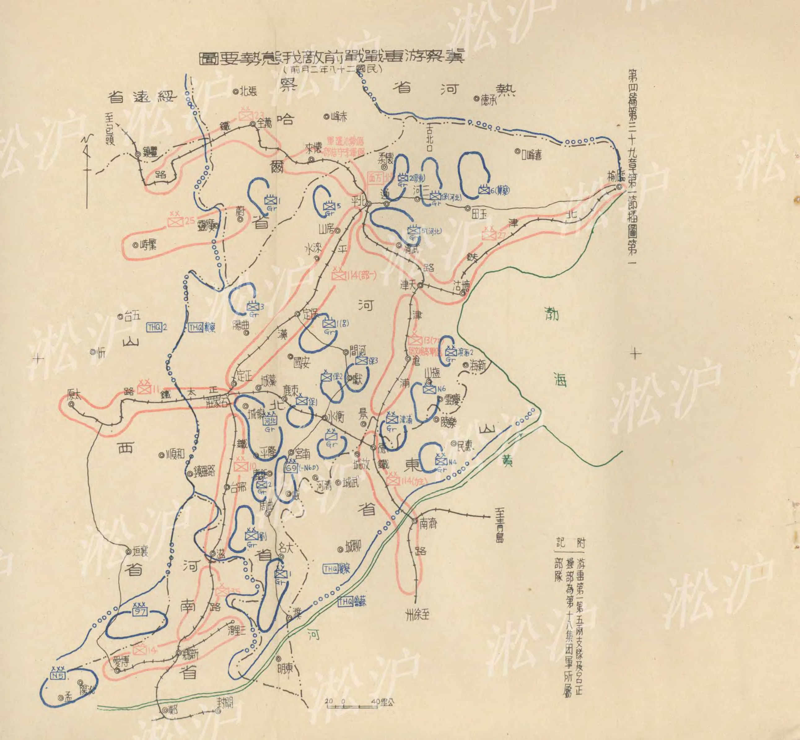

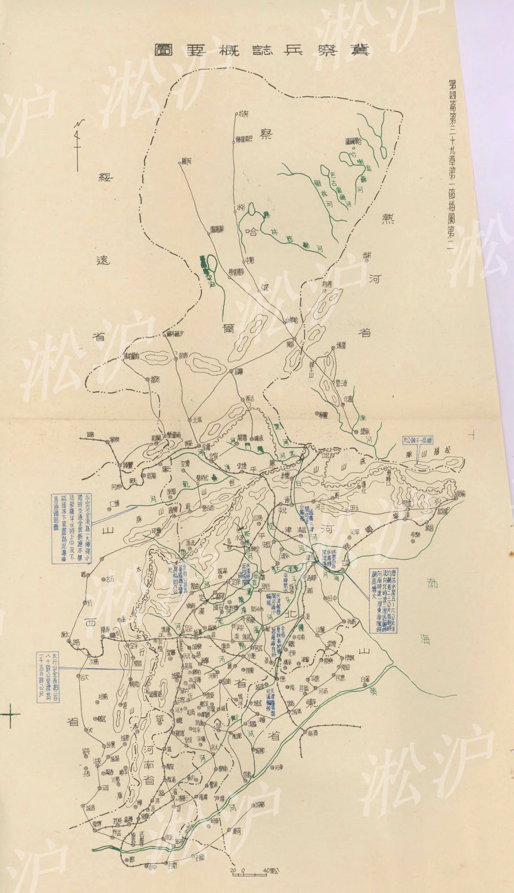

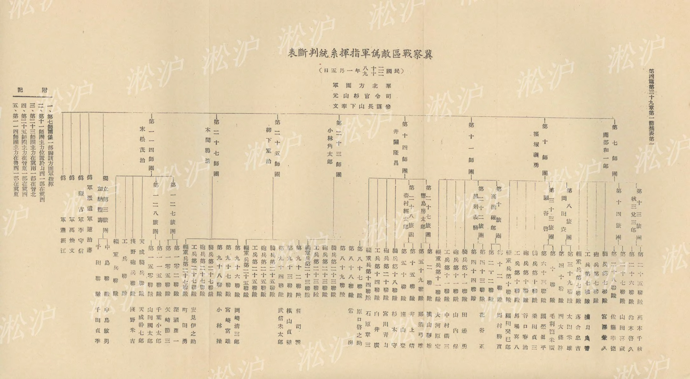

表統系

附

河北保安第一旅

河北保安第二旅

河北保安第三旅

劉邵周

鳳北朝

凱武貴

河北保安隊

河北第五支隊

平東第二支隊

冀察第六支隊

平東第一支隊

第一游擊隊

第一支隊

第三支隊

第五支隊

呂李李王向李

正維經乃修允

操周武乾文聲

一、第九十七軍及新編第五軍於二月間調離冀察戰區二、第四十軍於三月二十一日歸該戰區指揮三、冀察保安司令部於三月二十一日成立未列入表內四、呂正操之第一游擊隊及第一、三、五支隊均爲第十八集團軍部隊

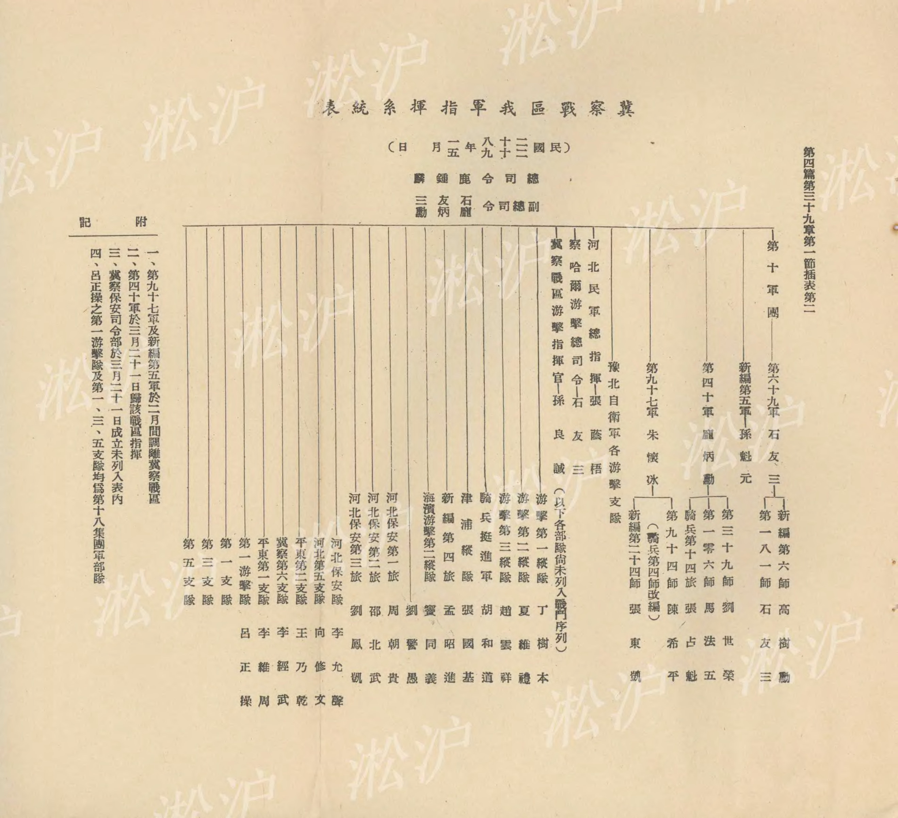

### 第二節 我軍作戰指導

我軍事委員會爲增強游擊力量，澈底破壞敵後交通，粉碎敵軍進攻企圖，於民國二十七年二月二十九日，以艷申令一元電密令，頒發冀察戰區作戰方針如次：「冀察戰區應增強軍民力量，建立並保持游擊根據地，積極展開廣大游擊戰，襲擊敵人後方，分別指向重點於津浦、隴海及平漢各要線，盡量牽制消耗敵人，該戰區之補給，由第一戰區負責。

民國二十八年二月初，我軍事委員會委員長天水行營頒發第二期作戰計劃如次：「冀察戰區應於冀中及冀西太行山地區，建立游擊根據地，極力保持之，並發動民衆展開廣大游擊戰，重點指向平漢、津浦、北寧、平綏各要線，盡力牽制消耗敵軍」，該戰區奉到上項指示，同時鑑於敵人企圖「鞏固佔領華北」，大舉掃蕩我敵後游擊隊，並高唱「建設東亞新秩序」及「以戰養戰，以華制華」諸謬論，乃決定對敵實施反掃蕩戰，當即策定冀察戰區第二期作戰指導方案如左：

甲

敵情判斷

一、敵軍主力將分別集結於平漢線之保定、石家莊，津浦線之滄、德兩縣，企圖逐次向冀中及冀西推進，先掃蕩平原，次攻山地。

二、遮斷冀晉間之聯絡線，絕我械彈補給。

三、於最短期內，打通天津、保定及滄縣、保定間之公路。

乙方針

本戰區以牽制消耗敵軍實力，完成持久戰之目的，確立游擊根據地，發動廣大游擊戰，間接協力我國軍作戰。

一、劃分游擊區，確立指揮系統。

二、將正規軍配置於各游擊區，確保根據地，並相機出擊。

三、各游擊區內，以游擊隊與民衆相互配合爲基本武力。

四、各游擊區經常以主力指向津浦、平漢各要線，不斷襲擊敵人，並破壞其交通。

又冀察戰區鹿鍾麟總司令遵照軍事委員會迭次電令之指示，擬定所屬部隊任務如左：一、粉碎敵軍掃蕩企圖，鞏固我游擊根據地。

二、策應我正規軍作戰。

三、打破敵僞政治、經濟諸設施，並掩護我黨政之推進。

### 第三節 作戰經過

#### 第一款 反掃蕩戰

##### 第一項 冀南戰鬥

民國二十八年二月至七月

參照插圖第三至第七

第一目

冀南地形

冀南爲一廣大平原，位於津浦、平漢兩路之間，德石鐵路橫貫於此，由德縣經衡水、東鹿、晉縣、藁城而達石家莊，溝通津浦、平漢兩路，爲敵軍佔領後所完成，衛河、滏陽河由西南而東北，漫延於其間，帆船由獻縣可通磁縣，兩岸築有高堤，以防氾濫，公路以南宮爲中心，與清河、廣宗、鉅鹿、新河、衡水等縣均能相通，我游擊部隊據有此地區，全賴民心與青紗帳之掩護。

第二目戰鬥經過

民國二十八年一月下旬以來，敵軍積極向平漢沿線保定、石家莊及其以南地區集結，迄二月一日保定增敵三千餘人，戰車四十餘輛，正定增敵千餘，另敵僞步騎砲兵三萬餘人，戰車一部，分向石家莊、昔陽、贊皇、寧晉、高邑、臨城、肥鄉及廣平等地集結，豫北安陽、武安、湯陰、淇縣、新鄉等地集結敵僞軍萬餘人，戰車一部，飛機二十餘架，停留於安陽機場，邢臺敵僞軍兩千餘，臨城三千餘，均向西移動，曲周、平鄉之敵千餘，似有圍攻威縣企圖，津浦路之敵，亦有策應其主力作戰之企圖，泊頭敵時崎聯隊向交河前進，又滄縣南進之敵五百餘人，到達桑園以北地區後，轉向西方前進。

二月一日九時許，河北民軍第二師（喬明禮）之第四、五兩支隊，與敵六百餘激戰於白樓（趙縣東北）附近。（參照插圖第三）相持六小時，終以衆寡懸殊，我向東撤退，二日，鹿鍾麟總司令獲悉靑島之敵，分抵膠濟路東段及津浦路北段，迄一月下旬，先後陷我魯北臨邑、廣饒、商河、惠民、濱縣、利津、蒲臺及壽光等縣，至此敵大舉掃蕩我游擊根據地企圖，益趨顯明，當卽着津浦路東側新編第六師（高樹勳）積極活動，牽制敵軍進攻，四日晨五時，聊城敵步騎兵二百餘人，陷我臨靑，同時第六十九軍張旅陳營攻擊秦村、大曹莊，與敵三百餘戰至薄暮，敵以傷亡慘重，分向東光張良莊撤退。

五日敵步騎兵三百餘，砲三門，由東汪鎮（晉寧東南）向草廠里河北保安第二旅（邵北武）進攻，經該旅一部伏擊及紀家莊主力之抗拒，斃敵五十餘，毀敵汽車兩輛，敵向西北方向撤退，我第一團第六連胡壕民連長殉職，士兵四十餘人負傷，六日，敵由寧晉增來六百餘人，再度進攻，經該旅於紀家莊講里村施以截擊，斃敵百餘，該敵向圈里及荊邱一帶撤退，是日八時許，慶雲之敵五百餘，砲四門，由蚌家務、王克忠家之線向新編第六師武旅宋團科莊、大蘇灣等地猛攻，戰至十六時，又增敵九百餘包圍該團，敵死傷百餘人，撒囘慶雲。（參照插圖第七）

六日，鹿鍾麟總司令獲悉鉅鹿增敵六百餘，廣宗駐敵四百餘，威縣敵僞軍六百餘，砲六門，汽車八輛，曲周敵五百餘，迫擊砲七門，石家莊、獲鹿、寧晉等處之敵積極索取木材，似有修築滄石鐵路，進攻南宮之企圖，又敵各級指揮官於臨清舉行會議，決以臨清、武城、故城、德縣等處之敵一千六百餘爲基幹，附砲十餘門，分四路進攻鄭家口，鹿總司令基於右述情況，當卽着第一八一師第二團由清河向油河鎮前進，迎擊武城西進之敵，着第五三八旅（朱文和）及游擊第二縱隊（夏維禮）兩部，分途截擊寧晉、鉅鹿東進之敵，着騎兵挺進軍（胡和道）直接支援鄭家口附近戰鬥。

二月七日晨，第六十九軍（石友三）陳光然旅王鵬山團，與敵相持於威縣以東張家莊附近，該旅第一零七四團（張雨亭）由臨清附近向該地增援，行抵梁家莊附近，與敵八百餘、砲三門、裝甲車四輛遭遇，相持至中午，被敵包圍，迄暮該團突圍西撤，八日，油坊鎮西進之敵攻佔清河後，旋卽西進，第五三八旅與敵一千八百餘，戰車二十餘輛相持於南宮西南地區，武城敵八百餘攻佔鄭家口後，卽以一部進窺南宮，一部向建家集急進，企圖攻擊陳光然旅，又桑園之敵五百餘，先後攻佔景縣與龍華鎮，並西窺東強，是日，津浦路四女寺之敵千餘，企圖西渡運河，經我騎兵挺進軍（胡和道）迎擊，相持於河岸，游擊第三縱隊特務團及民軍第九團一部，協同擊退東汪鎮東進之敵二百餘後，進佔高口、香亭、候口地區。九日晨，（參照插圖第三）東汪鎮敵二千餘，砲八門，戰車四輛，分乘汽車三十餘輛，飛機四架，大舉東進，向汶口、辛店兩地民軍第四團猛攻，該團南撤，以一部於滏陽右岸佈防，主力向北浣上、賈莊、抱堤及西園地區集結，待機行動，八時，民軍第十第十一兩團與敵激戰於新河，相持一晝夜，縣城失而復得。十日，（參照插圖第七之一）鄭家口、桑園、交河之敵分路進犯，衡水、南宮新河等縣先後失陷，當敵圍攻南宮之際，游擊第三縱隊（趙雲祥）第二旅（胡金波）與敵鏖戰終日，旅長及其所部傷亡殆盡，民軍總指揮張蔭梧率直屬第一、第六、第七等團轉進東鹿、寧晉、新河一帶地區活動。

二月十一日迄十五日之間，敵我雙方均從事整頓，無激烈戰鬥，第六十九軍陳光然旅十一、十二兩日與敵永野部隊七百餘相持於清河城郊，十三日，遭冀縣敵騎兵五百餘之壓迫，向南撤退，第五三八旅於南宫西北地區，陳旅五團於棗強以東地區，與敵相持，十四日游擊第一縱隊（丁樹本）王旅攻佔波里、龍王廟。

十五日，冀察戰區鹿鍾麟總司令基於最近調來敵軍行動判斷如次：「敵軍以摧毀我游擊根據地，確實控制冀南各縣，以津浦路滄縣、德縣及平漢路保定、石家莊各據點之主力，採分進之態勢，向冀南合擊，縮小包圍圈，殲滅我軍，建立僞政權」，並令所屬加強戰備，以粉碎其企圖。

二月十六日迄三月一日。（參照插圖第七其一）民軍活動於東鹿、衡水、冀縣、鉅鹿、隆平、柏鄉、寧晉、趙縣、藁城等縣，敵僞軍約五六千，砲二三十門，以汽車百餘輛，縱橫馳援，往來各縣，斯時，敵軍一部配合僞軍李守信部主力推進察省，建立僞政權，將察省張北、商都、沽源、多倫、寶昌、尙義等六縣劃歸僞蒙自治政府，察南各縣棣屬僞察南委員會，交通線及重要縣城由敵軍駐守，其他各地，以僞軍及自衛少年團維持之，鹿鍾麟總司令基於當前狀況，着察哈爾游擊隊張礪生部於十七日進駐山西之嵐縣，稍事整頓，卽向察省推進，此時又奉天水行營皓午電令如次：「綜合各方情報，目前敵軍企圖在肅清游擊區內我軍及敵後游擊隊，鞏固其僞組織，基此，我各游擊部隊應講求對策，積極活動，以避實擊虛之戰法，爭取主動，以襲擊、截擊之方式，而逐次消耗之，並努力收復失地，保持據點，扶持我政權之建立，切忌不問敵兵力多寡，見敵卽避，以致被敵各個擊破，輕棄要地，須知敵軍掃蕩部隊分配於廣大地區，兵力極屬有限，當其分進之際，不但兵力分散，且遠離其根據地，後方連絡尤屬空虛，我軍如迅速機動集中優勢兵力於一地，澈底予以殲滅，然後再及他處，如此爭取主動，其利屬我，敵之掃蕩企圖亦隨之而粉碎，希妥定計劃，飭屬切實遵行。

三月二日迄八日之間，我軍積極展開游擊與破壞，五日，新編第六師高樹勳師長親率特務連及武團，與敵激戰於寧津以西合家塞附近。（參照插圖第七其一）苦戰三晝夜，肉搏十餘次，予敵以重創，旋以敵增援部隊陸續到達，並以毒氣協助其攻擊，寧津、樂陵相繼不守。該師於八日夜突出重圍，向東撤退，第六十九軍陳光然旅第一零七四團，（張雨亭）六七兩日於隆興鎮、青蘭鎮等處擊退犯敵，該軍特務團在南宮七里口附近與敵激戰一晝夜，敵我傷亡均重，該團營長趙德誠重傷殉職，旋卽向清河方面撤退，是時，該戰區奉到軍事委員會之國軍攻勢轉移部署方案，具要旨如左：

一、方針：國軍決定加強游擊戰區兵力，並相機轉移攻勢，以牽制消耗敵人，支援我游擊部隊打破敵扼守要點，抽轉兵力，建立華北軍事根據地之企圖，攻擊開始時機，第一、第二、第五、第十、第八、魯蘇、冀察等戰區爲三月上旬，第三、第四、第九各戰區爲四月上旬。

二、部署：冀察戰區第六十九軍（石友三）及冀南各游擊隊，以避實擊虛戰法，於元氏、定縣間積極活動，破壞交通，奇襲石家莊，粉碎敵人掃蕩企圖，並將準備程度及完畢時間，於三月五日前詳報到渝。

鹿鍾麟總司令基於右項方案，策定戰區部署如左：

一、第六十九軍主力及孫良誠部，於津浦路以東及冀南一帶圍攻敵人。

二、第六十九軍第五三八旅朱文和旅長，率領三個團，配屬侯如墉全部，擔任元氏、新安車站間公路與鐵路之破壞，並襲擊石家莊之敵。

三、張蔭梧指揮民軍主力，擔任新安車站（不含）定縣間公路與鐵路之破壞。

四、依據行程計算，民軍於三月十五日以前，第六十九軍於三月二十日以前，分別到達指定地區，開始活動。

三月九日迄月底期間，依戰區所屬部隊遵照戰區指示，積極活動。（參照插圖第七其一）民軍第五團於南和以北地區圍攻僞皇協軍李良卿團，斬獲甚大，俘李逆良卿，敵軍官相棄照男及其他官兵多人，十四日，第三縱隊（趙雲祥）擊破冀縣衡尙營之敵後，進佔梢門口，第四縱隊（候如墉）向獲鹿、石家莊之敵襲擊，十九日，南和敵進攻駱莊民軍第五團，激戰兩晝夜，敵不支，於二十一日向郝橋鎮潰退，該團跟踪追擊，敵退南和，我克郝橋鎮，二十二日，衡水、束鹿之敵會攻陳家口民軍第十團，激戰竟日，斃敵束鹿城防司令亦丙、砲兵隊長北田及其士兵百餘人，旋以該團彈藥不濟，乘夜向溫朗口轉進，同日八時，敵福榮中將指揮步兵千餘，砲四門，戰車與汽車四十餘輛，分路向路家莊、圭家莊進攻，經我獨立第三團及第六支隊分途迎擊，激戰一晝夜，數次肉搏，敵終未獲逞，卒以衆寡懸殊，我民軍傷亡過重，乃於二十三日突圍撤退，是役該團團長姜毓英、少校團附劉青珪重傷，中校團附苑同仁、大隊附曹鳳林、中隊長王郡南、張勸溫、耿玉思等殉職，敵傷亡亦重，此期間，民軍第二團曾於內邱詣山村激戰半日，第二師（喬明禮）之一部襲擊正定西北韓村，同村一帶，第九團曾於孫家羊盃予敵以重創。

第六十九軍新編第六師新編第四旅，二十日北渡黃河，向商河嬴子鎮一帶襲擊，惠民、商河之敵會攻該旅，激戰竟日，仍撤退黃河右岸，該師新編第十三旅蕭巨源團之一部，於東光、連鎮間破壞津浦路鐵路三處，該軍第五三八旅二十一日反攻邢臺西馬河、龍泉寺、營頭鎮等地。

三月十八日，游擊第一縱隊（丁樹本）於五花管以南地區截擊龍王廟之敵南進，（參照插圖第四）經激戰後，南樂陷敵，嗣經反攻，曾一度衝入城內，斃敵四十餘人，焚燬倉庫兩所，旋卽撤退，二十二日夜襲圈莊，斃敵大尉山本崇夫及其翻譯官，另部圍攻樊莊，經兩晝夜戰鬥，終於二十四日攻佔，此時游擊第四縱隊（侯如墉）活動於竇姬、石家莊間，獨立第一支隊襲擊磁縣馬頭鎮，並破壞平漢鐵路，二十二日，游擊指揮部特務團曾於故城北楊木房擊退犯敵，騎兵挺進軍（胡和道）便衣隊襲佔鄭家口，進襲武城未克。

三月二十三日（參照插圖第七其一）鹿鍾麟總司令親率直屬獨立團及孫良誠部，與敵步兵五百餘，汽車四十餘輛，激戰於白佛寺、南北馬村一帶，斃敵百餘人，孫良誠部營長丁銀虎陣亡，並傷亡官兵七十餘人，終將兩地攻佔，是月下旬，民軍第二師在趙蘭莊東西釣魚臺及寧晉屬南北位口一帶活動，第五團在鉅鹿、廣宗、威縣地區活動，第二支隊活動於鉅鹿、隆平地區，各部先後主動襲擊敵人，予敵以重創，喬明禮之第二師斬獲尤多，游擊第一縱隊（丁樹本）二十八日於王莊渡口擊退犯敵，又於岳村附近兩次炸燬敵之補給車輛，另部於楚旺鎮擊退犯敵。

四月初，敵僞軍高級指揮官杉山元、篠塚、松井及僞河北省長高凌蔚等，分別到達南宮、德縣、邢臺及保定等地視察，並召集會議，將其部隊陸續向冀中地區增調，石家莊增敵萬餘人，砲十八門，飛機十二架，德縣、冀南及津浦路以東各縣均有增加。

張礪生率領察哈爾游擊隊進駐神木伊盟一帶，將所部官兵六千餘人，馬二千餘匹，槍三千枝整編爲三個縱隊及兩個旅，改稱軍事委員會第一游擊總隊，張員任總司令，分駐察東與綏東地區。

四月初旬，民軍於藁城、冀縣、正定地區展開活動，五日，第二師第五、第六兩支隊於高莊附近迎擊敵人，斃敵隊長門脇及其士兵三十餘人，卽向藁城撤退，第五、第七、第三等團亦於雙連頭、馬頭村、藁城、新樂等地展開游擊與破壞。

四月二十六日十一時許，（參照插圖第五）定縣敵步兵百餘，分乘汽車九輛，向安國方向急進，行抵韓村附近，被我民軍第五團第一第二兩中隊伏擊，斃敵八十餘人，燬汽車四輛，旋定縣、安國之敵五百餘分乘汽車二十餘輛，增援該地戰鬥，迄午第一、第二兩中隊傷亡過半，斯時，另敵八百餘，砲四門，分由保定、定縣、安國等地三路圍攻窩頭第九團，蠡縣、博野之敵五百餘，砲二門，圍攻楊林鎮第八團及民軍總指揮部，戰至十七時許，窩頭村房舍全被砲燬，第九團向北祝撤退，進攻楊林鎮之敵曾數度突入村內，均遭擊退，旋窩頭之敵協同攻擊第八團側背，敵前仆後繼，羣起衝鋒，戰況激烈異常，張蔭梧總指揮當卽着第五團主力由堤園增援，突擊敵之右側背，着第九團由北祝增援，攻擊敵之左側背，經我內外夾擊，戰至二十時，敵分向博野、安國撤退，是役斃敵六百餘，民軍傷亡二百餘人。

第六十九軍新編第六師（高樹勳）寶旅，於四日八時許，截擊由歧口向羊二莊進攻之敵，（參照插圖第七其一）相持二小時，該旅向東西侯莊一帶撤退，五、六兩日，無棣敵步騎兵三百餘，附砲四門，曾兩度向大小街張漢全旅進攻，經半日激戰，敵死傷二十餘，退回無棣，七日至十三日間，蕭巨源旅及第四團活動於東光、鹽山與連鎮地區，不斷予敵以襲擊與破壞，二十一日，該師師長高樹勳親率張漢全旅、第三旅第三團及特務團至樂林、善化橋一帶游擊，獲悉德平、商河、惠民等縣之敵一千四百餘，砲八門，逐漸向該師進迫，當卽預爲部署，至二十二日拂曉，敵數度猛攻，相互包圍，短兵肉搏十餘次，戰至薄暮，卒將頑敵擊潰，是役計斃敵指揮官桑田忠田山及士兵三百餘人，擄獲械彈及其他戰利品頗多。

該軍第一八一師陳光然旅，於二十二日在三朗鎮（參照插圖第七其一）截擊由德縣企圖進攻棗強之敵步騎兵一百九十餘人，戰至日暮，敵敗退故城、朱永和旅活動於平漢路高邏附近，曾數次破壞鐵路與橋樑，影響敵之軍運與補給甚鉅。

游擊第一、第二、第三、第四各縱隊及獨立第一支隊，分別於大名、內邱、威縣、高邑及武安等縣展開游擊戰，不斷破壞鐵路與公路，使敵之交通陷於停頓，第三縱隊於馬頭村附近斃敵六十餘人，第四縱隊於江洞村附近之遭遇戰，敵傷亡二十餘人，此期間，敵之掃蕩企圖終未獲逞，蔣委員長獲悉該戰區官兵用命，粉碎敵之掃蕩企圖，特電勗勉，其要旨如次：「近來我軍各線出擊，膺懲頑敵，失地叠復捷報頻傳，歐美各國及上海報紙，一致讚揚，僉謂各種反攻威力，乃我國準備充分，士氣增強之表現，意義至爲重大，認爲最後勝利之先聲，仰卽向全體官兵努力宣傳，以鼓勵其奮勵無前之敵愾，並望一德一心，再接再勵，勿以小勝而驕，勿以小挫而餒，抗戰勝利之時，卽我全體官兵完成神聖使命之日也。

五月一日，游擊第一縱隊（丁樹本）一部，截擊由長垣向九辣集、蔡城等地進攻之敵。（參照插圖第四）相搏達五小時，敵退長垣，該縱隊遂於南樂五花營及長垣附近展開活動，八日九時許，游擊指揮官孫良誠之一部，與步、騎、砲四百餘之敵遭遇於清河東北段沙土村及馬二莊附近。（參照插圖第七其二）戰門進行達四小時，敵傷亡四十餘人潰退武城，九日晨，德縣、棗強、清河、武城及南宮等縣之敵快速部隊，分途向孫部攻擊，八時許，棗強東南戴李堯頭首先接觸，孫良誠親率所部官兵迎戰，相繼肉搏，敵受挫稍退，旋施放毒氣，並集中砲火向我反攻，激戰至午，我陣地全毀，遂向西轉移，斃敵四百餘人，馬二十餘匹，毀敵汽車十餘輛，擄獲步機槍二十餘支，孫部傷亡官兵八十餘人。

二日，德縣敵步騎四百餘，砲二門，汽車十餘輛，企圖進攻棗強，我第六十九軍陳旅第一零七四團，於故城西北馬家塞附近施行截擊，斃敵四十餘人，毀其汽車三輛，七日，新編第六師黃團與連鎮北犯之敵三百餘遭遇於火官莊，相持三小時，敵潰敗，退連鎮。

五月十五日，游擊第四縱隊（侯如墉）襲擊敵高遷、高邑各據點，破壞平漢路十四段，高贊、元贊兩公路五十餘處，毀電線桿百餘根，並斃敵僞四十餘人，游擊第一縱隊（丁樹本）獲悉龍王廟敵百餘進犯西村集，卽於寧甫東北地區予以伏擊，斃敵十餘人，騎兵挺進軍（胡和道）於傳官屯附近與敵激戰，敵山口部隊傷亡伊籐司令以下官兵二百餘人，該軍亦傷亡官兵六十餘。

同日夜，（參照插圖第七其二）民軍第二師（喬明禮）第六團一部，在敵火及鐵甲車衝擊之下，破壞獲鹿屬三教村附近平漢鐵路約五百公尺，十七日三時許，敵三百餘，攻擊該團南寨村陣地，經該團反擊後，退竄三道坡，該師劉團一部攻擊皇寺鎮敵憲兵隊，旋敵由柳林增來三百餘人，將劉團一部包圍，以衆寡不敵，遂向西突圍，十八日，第十一旅（王子耀）與敵百餘遭遇於神頭村附近，激戰三小時，敵向柳林撤退，二十日晨，第五團團附聶朗齋率該團及第一團各一部，押運彈藥北上，行抵任縣屬牛辛寨時，鉅鹿敵三百餘，砲四門，分乘汽車五輛進襲，該部據寨固守，激戰至二十二時，向西郭城村撤退，是役，斃敵五十餘人，該團傷亡大隊附于萃卿，小隊長趙丕德、分隊長李鞠洲、副官靳永祿及士兵十餘人。二十二日，民軍第三團一部在藁城以北地區，與敵遭遇，斃敵五十餘人，擄獲步槍十餘枝，敵退長壽，二十三日，仲希堯團發動橋北店附近十餘村民衆一千四百餘人，破壞韓家莊、羅口村間公路十五里，敵僞冀縣、寧晉之交通影響至鉅，二十五日八時許，張蔭梧總指揮率領第一、第七、第八及第九各團，分由大柳林、朗子橋、相司莊進攻衡水屬趙家圈之敵三百餘，激戰至十六時，攻佔趙家圈，斃敵一百五十餘，獲步機槍三十餘枝，該部分隊長劉克詢及士兵十餘殉職，中隊長李桂芬、分隊長黃應讓、彭鼎甲，及士兵二十餘人負傷，二十六日晨，任縣、邢臺之敵四百餘，會攻駱莊第五團一部，激戰一晝夜，敵未得逞，是役，敵傷亡二百餘，獲步機槍六十餘枝，該團中校團附鄢聖階、少校團附聶朗齋先後殉職。六月一日，冀察戰區總司令鹿鍾麟獲悉敵續向平漢、津浦兩路增援，企圖繼續掃蕩我游擊根據地，當卽着第五三八旅（朱文和）於龍泉寺（參照插圖第六）南北之線佔領陣地，拒止邢臺敵之西進，游擊第四縱隊（侯如墉）主力進佔宋家莊以東地區，支援第五三八旅作戰，游擊第二縱隊（夏維禮）控制於路羅鎮附近機動使用。

同日十二時許，皇寺敵僞軍兩千餘，經張安北、袁家莊西進，游擊第四縱隊于珩支隊主力於石槽附近迎擊該敵，以一部迂迴敵後，實施突擊，斃敵六十餘人，戰至薄暮，該支隊撤守，郝家莊、溝底、石槽、宋家莊先後陷敵，二日四時許，于珩支隊聯合民軍一部，反攻宋家莊，敵將該莊焚燬，向南逃竄，三日晨，敵又進攻，行抵馬家溝附近，受我邢臺警衛隊截擊，敵未及展開，傷亡甚重，惟以衆寡懸殊，該隊卽向北轉移，漿水鎮於十二時陷敵。

當六月二日于珩支隊反攻宋家莊之際，敵僞兩千餘，於飛機砲火支援下，向龍泉寺、營頭鎮第五三八旅猛攻，另敵一部千餘，由馬河迂迴該旅麥地灣側背，鹿鍾麟總司令基於當前狀況，着第五三八旅後撤，同時着侯如墉、范子俠、路朝元等部增援，是日，路羅鎮遂告放棄，三日八時許，增援部隊先後到達，當卽協同第五三八旅包圍攻擊路羅鎮，激戰至十二時許，敵向漿水鎮撤退，我克復路羅鎮，同時第五三八旅以一團協同增援部隊跟踪追擊，十八時許，攻佔漿水鎮，敵向東逃竄中，復被第五三八旅一部伏擊，敵傷亡慘重，迄二十時許，於龍泉寺、營頭地區對峙中。

六月一、二兩日，清河、南宮之敵七百餘，兩次向東西馬固第六十九軍防地進攻，經該軍誘入森林地區，予以擊潰之，二日晚，敵指揮官井田，指揮各地敵軍一千四百餘，砲四門，戰車四輛三面圍攻，該軍激戰澈夜，迄三日晨，敵又以飛機六架支援其戰鬥，該軍向西南撤退。（參照插圖第七其二）新編第六師之一部，一日於白家擊退寧津進攻之敵，另部破壞善化橋、楊安鎮間公路四里許，拔倒電桿百餘株，七日晚，該師第三團發動民衆千餘人，破壞圈地、劉家一帶公路二十餘處。

一日五時許，藁城、石家莊、無極、新樂、正定等地之敵一千五百餘人，以分進合擊之勢，向民軍第四支隊及第三團滹沱河左岸大章附近攻擊，激戰三晝夜，斃敵二百餘，毀敵汽車三輛，敵不支撤退，三日十四時許，冀縣敵七百餘，（參照插圖第七其二）圍攻小寨冀察戰區總司令部，直屬部隊力戰至夜，第六十九軍援兵到達，經內外夾擊，該部向北突圍，同日十八時，游擊第一縱隊第三旅截擊南樂南進敵僞千餘人於青埠、劉莊地區，敵傷亡甚重，並擄獲人馬器材頗多，敵敗退南樂，七日，第十八集團軍一部於半截河、王家莊附近，抗拒河間進攻之敵，激戰終日，該部撤退念祖橋附近。

六月八日，鹿鍾麟總司令獲悉敵於冀中地區增兵一師，企圖於六月中旬再度掃蕩我冀中、冀南游擊根據地，基於上述情況，除察省再視張礪生所部進展情形另定外，當卽將冀省區分爲十個游擊區，並電呈天水行營及軍事委員會，其要旨如次：「第一區興隆、遵化，第二區古北口、密雲、懷柔、昌平，第三區易縣、涞源，第四區新鎮、雄縣、任邱，第五區完縣、唐縣，第六區阜平、行唐、平山，第七區贊皇、臨城、邢臺，第八區束鹿、冀縣以北地區，第九區慶雲、樂陵，第十區清平、內黃、濮陽。

六月十三日拂曉，束鹿敵三百餘，分乘汽車十七輛，向馬頭張超團攻擊，該團以一部據碉抗拒，一部擾襲敵側背，激戰竟日，肉搏十餘次，斃敵二百餘，燬汽車三輛，終將敵擊退，又八時許，衡水、冀縣、束鹿敵僞四百餘，分三路攻擊束鹿、孤城，我民軍第十一旅（韓祖光）所部，相持至十二時許，第一旅（王致和）以一部援攻，敵於十四時向蒲龍頭撤退，同日十時，第十一旅（王子耀）及第三旅（李俠飛）一部，在高古莊、蒲龍頭一帶擊破深縣、舊城、束鹿等處聯合之敵七百餘，斃敵二百餘人，該旅團長劉仁傑負傷，大隊附耿有倫殉職，另有官兵一部傷亡。

游擊第一縱隊，十日零時許，以主力迎擊內黃之敵，以一部攻王莊、河口一帶僞軍，戰至八時，將河口僞軍擊破，敵傷亡百餘，俘五十餘人，擄獲步手槍五十餘枝，並將王莊、關口間浮橋焚燬，斷其歸路，旋該縱隊合力進攻內黃，迄十三日，內黃、楚旺鎮相繼收復。

十九日，景縣龍華鎮敵四百餘，砲三門，分乘汽車三十餘輛，向王常陳旅第一零七四團攻擊，戰至二十日十時許，敵不支撤退，共傷亡三橋大佐以下百餘人，該團亦傷亡一百二十餘人，另德縣敵一百六十餘前來增援，經該團迎擊於北刺，旋卽退去，二十三日十四時，該旅第一零七三團與敵二百餘戰於龍華鎮西十里莊，相持澈夜，卒於二十四日晨，將敵擊退，斯時，無棣北車鎮之敵五百餘，砲四門，分向大韓莊及賈家莊新編第六師第四團攻擊，激戰至十六時，敵不支囘竄，二十五日冀魯邊區各縣之敵兩千餘，砲十六門，分由其第五師團瀕川、納見兩聯隊長指揮，向寧津、樂陵地區新編第六師攻擊，激戰至二十六日晚，卒被該師擊退，敵傷亡松垮大隊長以下官兵六百餘人，該師營長陳東瀛殉職，其他官兵二百餘傷亡，又二十五日，民軍總指揮張蔭梧親率第一、第七、第八及第九等團，圍攻衡水、趙家圈、大柳林之敵，敵傷亡四十餘人，我軍亦傷亡數十人，遂卽南撤，三十日，第二師活動於正定，鐵道警備第十三支隊炸燬寶姬車站北端鐵橋，七月上旬，敵軍主力分別向津浦、平漢兩路撤退，我冀察戰區所屬部隊仍於該地活動，第十八集團軍積極擴張其實力，徐向前部活動於山東夏津、荏平、博平地區，轟榮臻部活動於保定、定興及其以西地區，至是冀南戰鬥暫告結束。

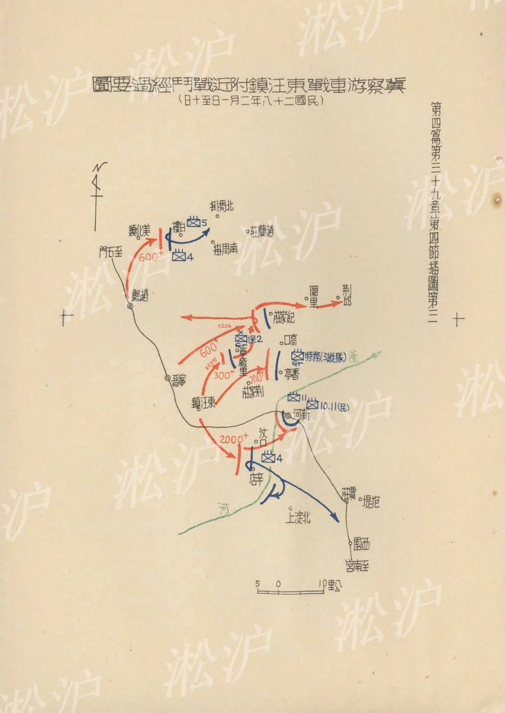

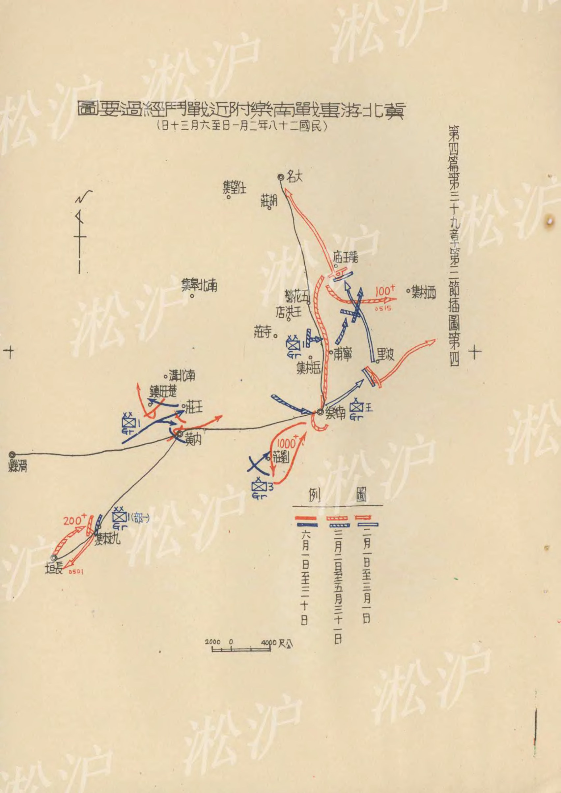

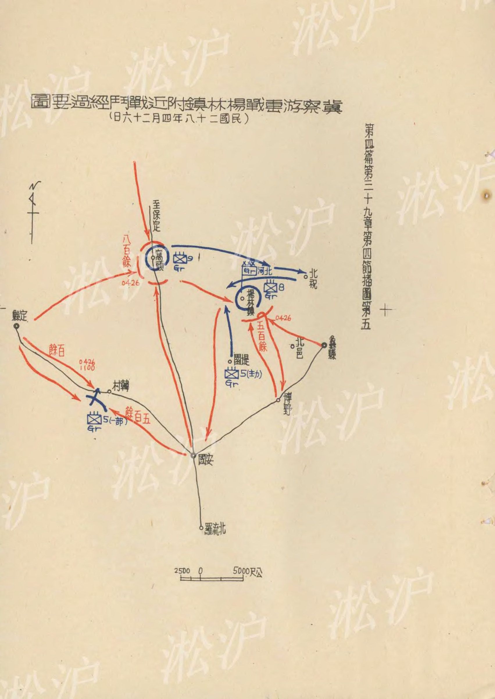

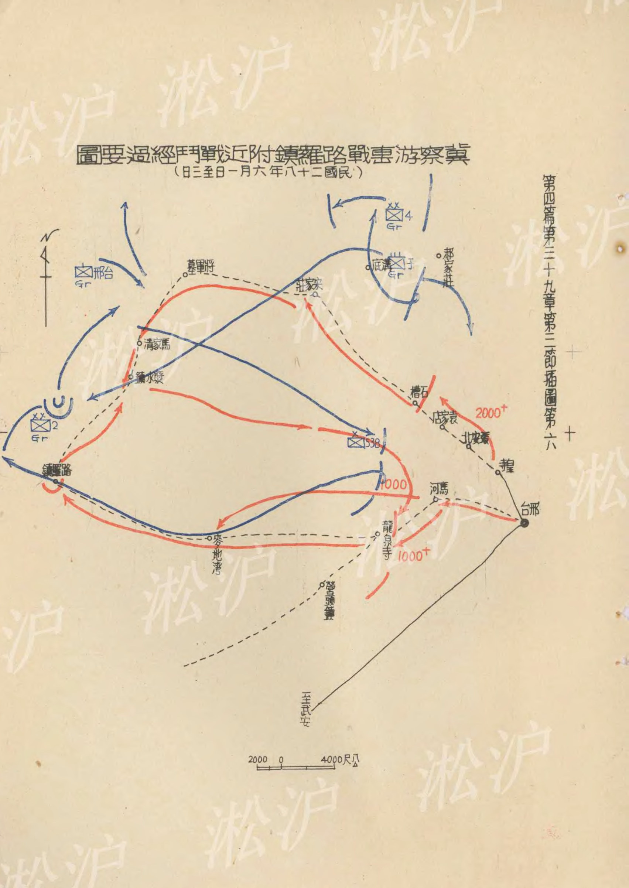

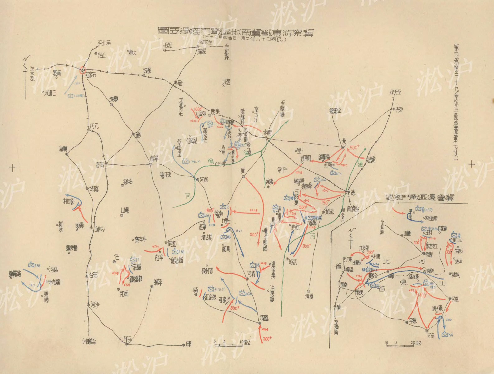

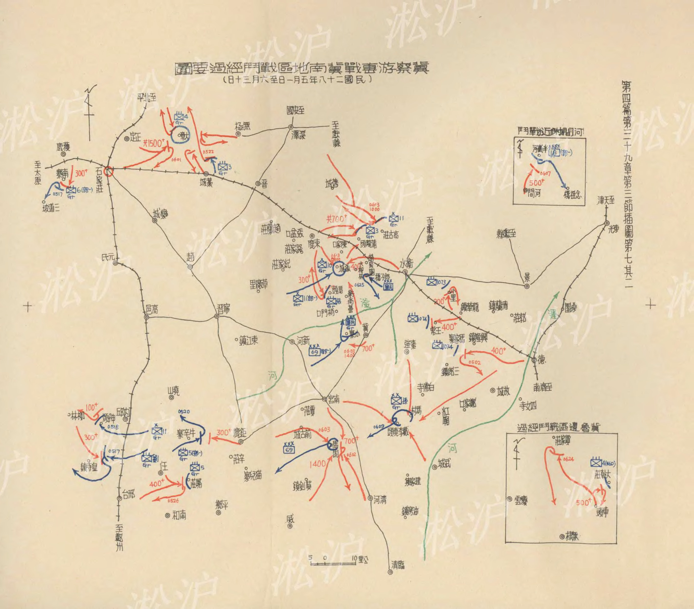

##### 第二項 晉豫邊區戰鬥

民國二十九年四月一日至十一月六日

參照插表第三第四插圖第八至十二

自民國二十九年二月，第六十九軍策應國軍冬季攻勢結束後，敵將其平津間之第二十七師團調至冀南地區，六月初旬，冀魯豫邊區集結敵軍八千餘人，戰車三十餘輛，飛機十五架，另汽車三百餘輛，分路出動，大肆掃蕩，迄八月初，道清鐵路之敵第三十五師團，平漢鐵路之獨立第一（谷口）旅團及晉博、長晉兩公路沿線之第三十六師團，均調動頻繁，有進犯企圖。

我冀察戰區各部隊，遭共軍壓迫，實難立足，第二十四集團軍撤至太行山區建立游擊根據地，其他部隊仍於該地區活動，旋敵軍與共軍協同進攻，我各部隊相繼撤離冀南地區，第六十九軍（石友三）及游擊第一縱隊轉戰於定陶、東明、濮陽地區，河北民軍總指揮喬明禮因與石友三軍長意見不合，率部向河南中牟移動，我其他游擊部隊分向冀北平、津、保地區轉移，斯時，共軍第十八集團軍大肆擴編，將百餘團區分爲三個集團軍，分由聶榮臻、賀龍、劉伯誠等指揮，並將冀省區分爲六個軍分區，繼續擴充其實力。

第一目

晉豫邊區地形

晉豫邊區以太行山爲中心，東有平漢鐵路，北經石門而達北平，南經鄭州而至武漢，南有道清鐵路橫跨豫北，北西兩面有晉博、晉長、長涉等公路相環繞，中有林涉、林輝兩公路縱貫南北，安林公路橫貫其間，安陽、林縣、合澗、臨淇、東姚集一帶爲低連山地，機械化部隊免可通行，陵川東南地區山勢險峻，有羊腸小徑可通，該區人口較少，出產不豐，飲水與食粮俱感缺乏，影響作戰甚鉅。

第二目

戰鬥經過

民國二十九年四月至七月期間，第六十九軍，游擊第一縱隊及新編第五軍之一部，先後與敵發生戰門。（參照插圖第八）四月一日，荷澤之敵一部，附砲四門，戰車四輛，分乘汽車四十餘輛，向我新編第六師宋團高莊集、黎園一帶地區攻擊，激戰至二日黃昏，該團轉移黃河左岸，二日，第一八一師陳團南進，襲擊考城，行抵裴子岩以東地區，與敵八百餘，砲四門遭遇，相持至黃昏，該團向西轉移，十一日，荷澤之敵七百餘，分路進攻該師高古營、宋莊陣地，激戰數小時，斃敵二百餘，鹵獲步機槍三十餘枝，仍在相持中，旋荷澤敵之增援部隊到達，該師乘夜向南轉進，十五日晨，歸德之敵六百餘，砲四門，戰車四輛，以汽車輸送，經劉口向該師石旅李團之劉莊、于帶廟（曹縣東南五十里）陣地攻擊，激戰至十八時許，敵退劉口。

當二十九年四月一日新編第六師與敵相持之際，東明之敵七百餘，攻擊王官營游擊第一縱隊陳旅第七團，並續增千餘，戰車五輛，分向順河集、段莊兩冀包圍，激戰數小時，該團以彈藥不濟，繼以白刃與敵肉搏，終以陣地被敵突破，衆寡懸殊，團長丁佩堯及全團官兵壯烈成仁，此時，另敵八百餘，砲四門，戰車四輛，向陳旅東明集猛攻，激戰至二日黃昏，該旅傷亡九百餘人，遂向黃河西岸轉移，月之下旬，共軍第十八集團軍積極南侵，進佔山東聊城、無棣等縣，六月九日拂曉，定陶之敵步騎砲五千餘，分向新編第六師大陳樓、王店、傳樓一帶攻擊，激戰至晚，敵我傷亡各千餘，並有中校軍需呂振衡營長閻鵬榮殉職，該師分路向東北地區轉移。

先是六月初，我軍事委員會獲悉各游擊部隊，多游而不擊，慌報戰果，特於四日電令冀察戰區轉飭遵照，其要旨如次：「嗣後敵人如有轉用兵力自動放棄之地點，不得以克復擊潰具報，又各部不得藉口避免攻堅，徘徊不進。」

七月二十二日，冀察戰區兼總司令衛立煌基於當前狀況，策定破壞襲擊部署如左：

一、平漢鐵路：平漢鐵路北平至石家莊段，由聶榮臻及呂正操兩部負責，經常實施破壞，相機向長辛店、良鄉、琉璃河、高陣店等車站襲擊，切斷敵之交通運輸，石家莊（含）至邢臺段，由獨立第十支隊侯如墉負責，邢臺（含）至磁縣段，分由游擊第二縱隊薛兆祥支隊及張建功旅負責。

二、津浦、平綏、北寧等鐵路，由附近各游擊部隊負責，每月至少襲擊、破壞四次，並發動民衆協助之。

八月初，敵軍部署完成，平漢鐵路之谷口旅團，配合僞軍李臺部推進至水冶、鶴壁、鹿樓之線，道清鐵路之第三十五師團，以一部推進至廟口、芳蘭、高莊、薄壁、五里源之線晉博、長晉公路沿線之第三十六師團，主力仍位置於長治，以兩千餘分進壺關與蔭城鎮，此時共軍第十八集團軍積極南侵，其第一二九師進佔涉縣、固縣、河南店地區，其新編第一旅主力進佔漳河右岸，以一部推進至玉峽關、龍溪、郭堡莊、下石坡地區。

我第二十四集團軍第四十軍於林縣以南馬兒坪、黎園、方家莊、大河口、東掌地區佈防，新編第五軍於淇河右岸臨淇東南地區佔領陣地，其暫編第三師推進林縣以北陵陽、姚村、秦家莊地區，佔領要點，防止共軍南犯，另第九十七軍（朱懷冰）於黃水口、寶泉、西村、青天河之線扼要守備，第二十七軍於岑上，龍嶷山，西火，北行頭，陵川地區佔領陣地。

八月七日十二時，衛立煌兼總司令基於當前狀況及蔣委員長之指示，下達電令，其要旨如左：

一、晉城仍有敵二千餘，屢經我軍襲擊，有南竄企圖，長治以北之敵，刻與第十八集團軍對戰中。

二、遵照蔣委員長電令，對晉東南深入之敵，乘其立足未穩，迅予擊破之，當卽決定先行掃蕩晉城及其以南之敵。

三、第四十軍及陳希平師各以一部，襲擊晉城及其以東之敵，主力切斷晉博公路，晉城至欄車段，截擊敵之增援。

四、陳鐵軍協同第四十軍向晉城以西之敵攻擊，以策應劉戡軍掃蕩深入沁陽之敵。

五、郭寄嶠部應進出濟源以東地區，襲攻沁陽、溫縣一帶之敵，牽制敵之他調增援。

六、限九日零時同時行動具報。

第四十軍兼軍長龐炳勳奉令後，當卽着第三十九師以一部向晉城及其以東之敵攻擊，主力協同陳希平師李旅切斷晉博公路欄車至河底村段，重點指向石槽附近，截殲敵之增援部隊，着第一零六師以有力之一部向博愛方向推進，對當面之敵攻擊，牽制敵之他調，騎兵第十四旅進佔巴公鎮附近，破壞晉城至高平間之交通，並截擊敵之增援部隊。

九日六時許，步、騎、砲聯合之敵六百餘，分路向水北村（晉城東北）進攻（參照插圖第十）我第三十九師一部，同時另敵一部向王圪墻第二三三團進犯，戰鬥至黃昏，斃敵百三十餘不支回撤，十日六時許，步、砲聯合之敵千餘，分四路向王漢掌（博愛西北）一帶第二三零團攻擊，相持至十六時許，敵傷亡百餘，旋亦退去，該團繼續向西推進，迄十二日十八時到達晉博公路石槽附近，同時師主力已到達晉博公路東側，並攻佔七嶺村（晉城東北）郝匠等要點，續向晉城攻擊，迄十三日十二時許，攻入南關，並向城內猛攻，激戰至十六時許，敵七百餘由城西增援反撲，該師撤至晉城東南回軍、二聖頭、山門之線，與敵對峙，此時騎兵第十四旅攻佔三家店，（巴公鎮北）。

龐炳勳兼軍長基於當前狀況，於十一日十二時電令第三十九師師長劉世榮如次：「應以敵進我退，鑽隙繞襲，積極襲擊敵人，切勿膠着，並與晉城以西陳鴻遠師切取連絡」，十三日，電令新編第五軍軍長孫魁元，「新編第五軍仍遵照本部七月十六日電令指示，主力移置淇縣西側地區，攻襲新鄉，切斷敵後交通，另以一部對新鄉積極襲擊爲要。」

八月十四日四時許，第三十九師有力一部攻入石槽，將敵包圍，殘敵據樓房頑抗，旋由南方增敵三百餘，砲四門，向該師夾擊，經激戰後，敵我形成對峙，龐兼軍長得知當時狀況，卽電令劉世榮師長：「石槽附近地形不宜固守，須注意南北交通之切斷，勝敗不在一村一地之得失，應積極破壞道路與電線，敷設地雷，相機截擊敵人爲要」，並於二十三時再電指示：「兵力須集結使用，以靈活之動作，相機伏擊與截擊，以疲憊敵人，並乘機克復晉城」，十五日十二時許，晉城又增敵千餘，向第三十九師回軍、二聖頭、山門防地猛撲，並以大量毒氣及砲兵支援之，該部沉着應戰，敵未得逞，黃昏後，撤回晉城，同日十四時許，第二三零團曾一度攻佔天井關，（晉城東北）六日拂曉，第二三四團於五臺（晉城東北）附近伏擊敵步騎兵三百餘，敵傷亡頗重，十七、十八兩日，晉城附近仍在東西五臺迄郝匠之線對峙，晉博公路沿線仍於天井關晉廟舖附近對戰中。

十九日八時許，晉城之敵三百餘，砲二門，向第二三三團反撲，經該團夾擊後，回竄城關，二十二時許，第一一七旅主力攻佔晉城南關，續向城內猛攻，此時，晉城東北之第二三四團攻佔大嶺頭，七嶺村續向三里橋猛攻，晉博公路之第一一五旅迫近天井關、晉廟舖，經反復衝擊，敵已動搖，二十日二時許，第一一七旅南關部隊衝入城內，與敵巷戰，四時許，殘敵北撤，晉城遂告收復，城北三里橋，五臺之敵，仍在頑抗，經我南北夾擊，相持至十四時許，在敵機掩護下，分路北竄，迄十六時，城北各據點相繼克復，此時，晉博公路之第一一五旅於二時攻佔天井關，晉廟舖，十八時由欄車鎮經油房頭續向長坪、窯頭攻擊中。

第一零六師第六三六團，十六、十七兩日於晉博公路和灣附近埋設地雷，炸燬敵汽車十餘輛，斃敵百餘，繼之予敵以猛烈攻擊，相持時許，長坪之敵來援，該團遂向方山撤退，當十六日第六三六團與敵激戰之際，騎兵第十四旅步兵營攻佔板橋。

新編第五軍暫編第四師第十二團第二營，十五日十二時許，由東岳集東進，行抵曹家村西端，與鶴壁之敵一部遭遇，（參照插圖第十二）相持至十六時，增援僞軍百五十餘，該營卽以一部進出東頭村，予敵以側擊，敵不支敗退，十七日，廟口之敵百餘，砲二門，向該營南溝陣地攻擊，相持三小時，雙方無進展，旋該營以一部由文昌閣迂迴敵背，另以一部佔領老虎山，合力夾擊，敵不支退去。

八月二十一日，衛立煌長官獲悉第三十九師克復晉城，除電呈上峯嘉獎外，同時另電指示如左：

一、第二十七軍（范漢傑）以一部協力第四十軍肅清晉城西北殘敵，主力向高平以西地區進出。

二、王晉師卽進出欄車鎮以南地區，協力第四十軍肅清長坪附近之敵，並進佔校尉營附近各隘路口，進擊沁陽以西之敵。

三、第四十軍以一部掃蕩長坪附近之敵，並規復各隘口，向沁陽、博愛之敵襲擊，主力繼續北進，追擊敗退之敵，協同第二十七軍收復高平。

四、各追擊部隊應竭力避免正面攻擊，務以繞截側擊等方式行之。

二十一日晨，第三十九師第一一五旅南進部隊攻佔校尉營黃沙嶺，前後和灣、王莊一帶要地，（參照插圖第十）殘敵向沁陽、博愛撤退，同日，騎兵第十四旅於東西板橋、界牌鎮、南陳舖等地截擊由晉城北竄之敵，斬獲頗多，當卽向高平追擊前進，迄二十三日八時許，攻克高平，敵主力撤退長治，以一部分向長子，盡關逃竄。

衛立煌長官爲恢復長治，特於二十五日再電令各部隊，其要旨如左：

一、第二十四集團軍第四十軍主力北移，於白晉路以東經蔭城鎮向長治東南地區前進，攻擊壺關方面之敵。

二、第二十七軍進出高平以西地區後，向長治西南地區前進，須先驅逐長子方面之敵。

三、劉戡軍主力，確實切斷洪屯公路，（洪洞至屯留）堵擊安浮（安邑浮山）敵之東援，相機捕捉流竄之敵，而殲滅之。

四、馮欽哉部主力，卽向長治西北地區移動，攻佔屯留後，牽制虜亭敵之南下。

五、陳鐵部控置於晉冀邊區，準備機動使用。

六、第四、第二十四、第一零六等師對道清鐵路，新編第五軍對平漢鐵路，積極攻擊牽制。

七、已令朱德部積極切斷長涉、長沁兩公路，阻敵南援。

八、各部到達指定地區後，先行奪取外圍各據點，爾後再行會攻長治，仰卽遵照具報。

龐炳勳總司令奉令後，當卽着騎兵第十四旅及第三十九師向蔭城鎮方面前進，第一零六師及新編第五軍分向道清，平漢兩鐵路攻擊，牽制敵軍他調增援。

八月二十四日十時許，新編第五軍暫編第四師第十一團第一營攻擊芳蘭，（汲縣西北）（參照插圖第十一）相持數小時，無進展，該部卽以敗退之勢誘敵至下東坡附近，予以痛擊，二十七日二時許，暫編第三師第七團第一營破壞輝縣至高莊公路後，相繼襲攻高莊，旋卽衝入村內，巷戰兩小時，炸燬敵倉庫兩所，於拂曉前撤出，三十一日十時許，第十二團第一營襲擊鶴璧，迫近寨垣，與敵激戰兩小時後撤退。

九月初，晉博，長晉公路沿線之敵第三十六師團，大舉反攻，高平、晉城，欄車鎮相繼陷敵，第二十七軍主力撤守陵川外圍平城、北行頭、禮義、鳳凰窯地區，以一部於胡同沿黃水口對東南警戒，第四十軍退據林縣以南原康、樹掌地區，新編第五軍主力在淇河南北地區活動，其暫編第三師主力仍於林縣以北地區，時與共軍新編第一旅接觸，四日十一時許，蔣委員長下達電令，其要旨如次：「據報敵將於九月初旬起，發動各線出擊，試探我軍實力，以便於九月底之東京軍部會議提出報告等情，仰各戰區加緊戒備與游擊爲要。」衛立煌長官基於當時狀況及右令之指示，於六日十二時下達電令，其要旨如左一、進據晉省東南地區之敵，自我切斷正太、平漢、同蒲各鐵路之交通後，紛紛北調增援。

二、戰區以恢復晉城及晉東、豫北之交通，卽向敵攻擊。

三、第二十七軍以兵力一部向平漢、道清兩鐵路襲擊破壞，主力應一舉攻略晉城。

四、劉戡軍（欠第十師）主力進出高平南北地區，截擊長治、高平及晉城敵之相互增援，策應第二十七軍作戰。

五、裴昌會軍主力，迅速進出欄鎮，切斷晉博公路，恢復我軍晉東交通，續向北推進，策應第二十七軍作戰。

六、第二十四集團軍以一部接替第二十七軍陵川附近防務，並掩護該軍右側背之安全，主力積極向平漢鐵路安陽、淇縣之敵襲擊與截擊，阻止其相互支援。

七、各部限十日完成攻擊準備，十一日一時開始攻擊，仰卽遵照具報。

龐炳勳總司令奉到右令後，卽策定部署，並於八日一時四十分下達命令，其要旨如左：

二、第一零六師接替第二十七軍陵川附近防務，一部於九日到達，主力限十日到達。

二、游擊第一支隊（劉統全）歸第一零六師師長馬法五指揮，接替騎兵第十四旅樹掌附近防務，維護陵川至合澗間之交通。

三、騎兵第十四旅交防後，開赴林縣以南劉家街、槐樹池、下莊一帶，對東北警戒。

四、獨立游擊第十縱隊（侯如墉）接替白璧第一零六師第六三六團防務，對北警戒，相機襲擾水冶之敵五、新編第五軍及第三十九師第二二九團（欠第三營）各以現態勢對東北警戒，並以一部向淇縣及安陽各附近平漢鐵路積極襲擊破壞，截擊其相互增援，第三十九師主力於壺關附近戰鬥結束後，卽開赴合澗附近待命。

先是五日晨，騎兵第十四旅在西故縣（壺關西南）賈掌地區，與敵二百餘，砲三門，相持達十小時，敵退五龍村，該旅續向曹家堰附近推進。（參照圖第十一）六日一時許，第三十九師第二三四團一部向壺關方面攻擊，旋宋堡、四家池及小山南相繼爲我攻佔，尾追敵人至秦莊，大山南附近，此時，該師第一一五旅（欠第二二九團主力）攻佔西掌、董家坡，敵向城關潰退，八日四時，第二三四團由秦莊續向壺關攻擊，敵四百餘出城反撲，另騎兵百餘，向該團左翼迂迴，激戰至十二時許，敵傷亡百餘，復退守城內，該團跟踪追擊，攻佔南關，旋受城西敵砲火猛烈射擊，無法立足，遂撤守原陣地，待機再興攻勢，九日十二時許，續向壺關攻擊，未獲進展，斯時，龐炳勳總司令獲悉該師狀況，當卽電令劉世榮師長如左：

一、敵旣據城死守，設法誘至我有利地區殲滅之。

二、困獸猶鬥，應嚴密戒備，不可輕敵，防敵增援反攻。

三、爲威脅壺關之敵，應以有力控制部隊進出壺關東北地區，切斷其交通，俾防敵之增援，及正面作戰容易。

十日四時，壺關敵千餘，分三路向第三十九師反撲，其主力於上內村、東歸村與我第二三四團對峙，以三百餘經角子上攻楊家堆，另部則攻四畝地，戰至九時許，第二三三團由西歸村向敵側背，第二九九團一部向角子上夾擊，同時正面第二三四團乘機反攻，激戰至十二時許，敵退壺關，該師跟踪追擊，攻佔東、南、北三關，終以膠着傷亡過重，遂卽南撤，該師斃敵六百餘，傷亡連長以下百二十餘人。

第一零六師連日向常口店、東礦井襲擊，均有斬獲，九日十時許，該師直屬部隊一部協同游擊部隊王永智、張體安部攻擊博愛車站及楊邑廟，戰至十日二時許，斃敵二十餘，並焚燬車站，旋敵鐵甲車一列及戰車十餘輛由東方來援，該部卽撤退至南關附近。

十一日拂曉，第一零六師特務大隊於塔掌（焦作西四公里）設伏，阻擊由焦作西犯之敵步、騎二百餘，砲四門，戰時許，敵仍退回焦作，十五日十時許，該師補充團攻佔柏山特務大隊，佔領李封，十六日十二時，焦作敵一部附戰車五輛反攻李封，該守備部隊憑村抵拒，旋敵戰車衝入村內，遂於十四時許，撤至馬掌一帶，十八日十一時許，第六三五團一部於三甲鎮炸燬敵南駛汽車一輛，斃敵二十餘人，二十日晚，該團第一營破壞店上村、北村（高平東北）間公路數段，木橋一座，電桿三十餘根，同時，第二營襲擊窯子口之敵，對戰澈夜，斃敵十餘人。

九月十一日一時許，新編第五軍暫編第四師第十二團一部，掩護鐵路破壞隊破壞寶蓮寺車站以南鐵軌十一節，路基四華里，橋樑三座，電桿二十餘根，斯時，湯陰之敵三百餘前來阻擾，激戰至拂曉，斃敵三十餘人，該部西撤，（參照插圖第十二）此時，第十一團（附破壞組）並發動淇、汲兩縣民衆千餘，破壞淇河附近鐵軌三十三節，路基兩公里，橋樑三座，乘機攻入淇縣城內，巷戰數小時，擊斃敵僞百餘，焚燬倉庫兩所，於拂曉時西撤，當第十一團與敵鏖戰之際，獨立游擊第十支隊一部向鹿樓之敵攻擊，戰至十二日十時許，仍在對峙，旋誘敵至張家莊附近，予以夾擊，斃敵二十餘人，雙方各自撤退，斯時，淇、汲兩縣敵二百餘，向小胡同（淇縣西）第十團第二營攻擊，激戰四小時，敵傷亡二十餘人退去，十三日至十六日間，第十一、第十二兩團連日出擊，均有斬獲，十七日十六時，第十一團便衣隊擊退王二莊之敵後，進佔飲馬胡同、下棗莊之線，續向塔崗攻擊，經該團第一營繞襲夾擊，敵退守路周屯，塔崗遂入我手。

十一日四時，壺關之敵增至三千，分三路向我第三十九師反攻，（參照插圖第十一）遂相持於川底村、宋堡溝、南村之線，入夜後，敵以大量毒氣助攻，同時另敵千餘，迂迴至五龍頭，威脅該師右翼，劉世榮師長基於當時情況，並遵照龐炳勳總司令誘敵於我軍有利地形作戰之指示，決定轉進秦家莊、南北嶺、北羊湖、大小北溝線旣設陣地，翌日，劉世榮師長又獲悉敵主力撤退壺關，以一部佔領城南川底村、坫堆村、宋堡村、四家池等要點，拒我進攻，當卽飭令所部向前推進，與敵保持接觸，經十五、十六兩日猛攻，先後攻佔川底村、坫堆村，迨十七日二十時，第二三四團一部突入壺關城內，終以敵火猛烈，無法立足，巷戰時許，撤退至五龍頭、黃葉池、北羊湖、南北宋、南北仙泉之線，佔領陣地，拒止敵南犯。

十七日十八時，龐炳勳總司令電令第一零六師馬法五師長，其要旨如左：

一、奉衛長官電示，現范軍攻擊晉城，裴軍攻擊晉城以南要點，劉軍攻擊高平以北，均甚得手，獲悉長治敵有南援企圖，希飭第一零六師積極向壺關、長治一帶及長高公路攻擊，阻敵南援。

二、爲阻敵向晉高增援，應以攻擊長高公路爲主，對壺、長直接攻擊爲次，並須預防共軍竄擾，應先籌集一抵抗線，立於不敗之地爲要。

馬法五師長基於右令所示，當卽着第六三一團推進至南北行頭附近，以一部攻擊壺關及蔭城，牽制敵之他調增援，第六三五團推進至張璧、石會堂、郭莊地區建立根據地，以有力部隊向長高公路襲擊，阻擾長治敵之南援，第六三六團推進至楊寨、金家嶺、石井村地區，建立根據地，補充團及師直屬部隊仍於南召附近待機。

九月下旬，第四十軍主力仍於壺關東南地區與敵相持，其第一零六師於長高公路東側展開游擊與破壞，新編第五軍仍於臨淇東南地區活動，二十一日二時許，第一零六師第六三一團襲擊蔭城，（參照插圖第十一）主力於山橋附近設伏，迨八時許，敵汽車四十餘輛，滿載部隊南駛，觸發地雷，炸燬其汽車四輛，士兵百餘，敵卽下車戰鬥，激戰兩小時，韓川及桑梓之敵前來增援，該團向南北宋、黃嶺轉移，第六三五團於二十一至二十三日間，連日向王村、店上村等地出擊，阻止敵軍竄擾，並破壞其交通及通信設施，二十四日晨，第六三六團第一營進襲焦作附近中福、憑心、民治、民有等煤礦，十三時許，與敵激戰，相持兩小時，斃敵八十餘人，機械全部炸燬，並收編僞礦警七百餘人，擄獲步機手槍四百五十餘枝，當卽向北撤退。

第三十九師第一一七旅之一部，於二十一日十二時許攻佔四家池，秦莊，續向壺關縣城進迫，迄十八時，佔領南關，敵憑城寨及其西南高地頑抗，該部爲避免重大傷亡，除以一部仍於外圍監視敵人行動外，主力南撤，二十二日八時許，壺關敵百餘向秦莊第二三四團之一部攻擊，相持時許，敵傷十餘人退去，十二時許，長治之敵四百餘，砲一門，經壺關南犯四家池，被我第二三四團擊退，二十四日一時，修善村之敵東犯，行抵常平村、馬駒村（壺關東）附近，被我第一一五旅截擊，相持至二十五日黃昏，敵由長治增援，汽車八輛滿載步兵及砲五門，到達修善村後，卽犯劉寨，相持澈夜，均無進展，迨二十六日八時，敵又增調步砲聯合之敵五百餘，分向馬駒、劉寨進攻，戰至十二時，該旅遂向嶺上、大楊村、石羊頭之線轉移，至是，壺關附近戰鬥遂告結束。

第三十九師第二二九團（欠第三營）連日向平漢鐵路出擊，均有斬獲，九月二十二日夜襲安陽，推進至車站西側前後燒盈窯附近，遭遇敵之抵抗，激戰至二十三日拂曉城內敵一部，在其戰車支援下，向該團迂迴攻擊，遂卽撤回，同時另以一部破壞安陽附近鐵路及公路數段，電桿三十餘根，二十五日十二時，該團於大平（鶴璧西北）附近截擊由梨林頭西犯之敵僞軍，相持時許，斃敵僞五十餘人，卽向東撤退。

當第三十九師與敵激戰之際，騎兵第十四旅仍於壺關西南地區活動，二十五日晨，蘇店之敵三百餘，砲一門，分向該旅羊頭山進攻，經迎擊後，敵不支北撤，二十九日十一時許，蘇店之敵騎兵三百餘，砲二門，再向該旅第二十七團羊頭山進攻，激戰三小時，敵傷亡三十餘人，向北逃竄。

二十四日十時許，敵軍一部掩護民夫修築鹿樓至鶴璧間公路，我新編第五軍暫編第四師第十二團第一營展開攻擊，斃敵二十餘人，旋鹿樓之敵八十餘增援，該營西撤，二十七日六時，第十一團第一營圍攻路周屯，（塔崗車站西北）旋衝入村內，與敵巷戰，達兩小時，敵傷亡二十餘人，卽向汲縣撤退，該村遂告克復。

十月初旬，由於我第四十軍分向晉城、高平與壺關等要地及其交通線積極攻擊，敵軍感受威脅，連日向南增調約四千餘人，我第二十四集團軍及第二十七軍先後奉令轉移於太行山區建立長期游擊根據地，破壞敵後交通與軍事設施，粉碎其十月間秋季攻勢，六日十八時，衛立煌長官電令第二十四集團軍：「已令范、劉、裴各軍以一部向敵後交通線游擊，范軍主力已轉移至晉城、陵川間地區，貴集團軍第一零六師仍以一部向長治、壺關方面及大義鎮附近游擊，主力控置於南北行頭、樹掌間，貴集團軍與范軍作戰地境爲陵川魯山村、東堯村、南宋村、大義鎮、南張溝之線，線上屬右。」龐炳勳總司令奉令後，當卽轉飭第一零六師馬法五師長遵照部署如左：

一、第六三一團主力位置於平城及其以北草坡、後河附近，第三營以南行頭爲根據，向蔭城以東攻擊。二、第六三五團主力位置於石井村，騾家村附近，第一營以楊村爲根據地，向蔭城、大義鎮間游擊。

三、第六三六團位置於楊寨、神后底、侯家莊地區。

四、補充團位置於秦寨、下川、南坡附近。

五、師直屬部隊仍駐安陽村、窯上、趙漳水附近，師部位置於南召。

十月七日，衛立煌長官奉到蔣委員長卅電訓令要旨：「各戰區擬定本年九月至十二月底之持久游擊計畫，加強敵後游擊戰，專以鐵路、公路、水路各交通線與兵站、倉庫、飛機場、汽車站及汽油棧等，實施有計畫、有組織之長期破壞，在此游擊期間，務使敵軍不能抽調兵力轉用，粉碎其十月間秋季攻勢，造成於我軍之有利形勢。當即策定現階段作戰指導，並於八日二十時電令各集團軍遵照實施。

冀察戰區現階段作戰指導

甲

方

針

本戰區爲確保現有持久抗戰態勢，各集團軍輪派有力部隊，以游擊方式，積極打破敵之以華制華，以戰養戰之企圖，以直接掩護河防，屏蔽豫、陝，主力控制於陣地後方整訓，準備爾後之攻擊。

乙

指導要領

一、各集團軍經常以三分之一兵力游擊，但以軍或師旅爲使用單位，襲擊破壞敵後方交通、通信、飛機場、兵站、倉庫等爲主要任務，其他敵僞政治、經濟組織次之。

二、各部隊於轄區當面敵所佔領之據點或交通線，均經常游擊破壞，晝夜不斷，務使其窮於應付，而自動放棄。

三、敵如抽調兵力向我局部掃蕩或奪取我要點要線時，守備部隊應依據既設工事與預定計畫，作強韌抵抗，逐漸消滅進攻之敵，比鄰部隊應主動協助，形成對敵反包圍，同時遠方各軍亦應加緊游擊牽制策應之。

四、整訓部隊與游擊部隊之交換，由各總司令或獨立軍軍長適宜訂定報核。

五、各部隊應與轄區內黨政機構密切協調，建立游擊根據地。

丙

兵團部署

一、第二十四集團軍應以游擊部隊對轄區內平漢鐵路、長壺、長高各公路經常游擊破壞，主力控制於林縣附近。

二、第二十七軍應以一部經常向道清鐵路及晉博公路經常游擊破壞，主力控制於陵川西南地區，餘略。龐炳勳總司令基於長官部現階段作戰指導，策定計畫與部署，並於十九日十六時三十分下達命令，其要旨如次：

一、新編第五軍以步兵兩團，附爆破突擊便衣及快速各一隊，組成淇湯游擊支隊，向大悲寺（不含）迄以北寶蓮寺車站（含）間平漢鐵路及其以西各據點游擊，主力就地整訓，暫編第三師主力仍於林縣以北對共軍警戒。

二、第四十軍第三十九師以步兵一團，附突擊便衣、快速各一隊，組成安漳游擊支隊，向寶蓮寺車站（不含）迄漳河（含）間平漢鐵路及其以西各據點游擊，主力就地整訓。

三、第四十軍第一零六師以步兵一團，附突擊便衣、快速各一隊，組成長壺游擊支隊，向長治、壺關間、長治、高平間各據點游擊，主力就地整訓，該師指揮之劉統全支隊，仍對北警戒。

四、騎兵第十四旅仍於林縣以南地區就地整訓，須保持機動，必要時臨時派遣任務。

五、游擊第二十二支隊（扈全祿）仍於新編第五軍轄境內整訓，以有力一部向濬縣車站（含）迄宜溝（不含）間不斷游擊破壞。

六、冀察戰區獨立游擊第十支隊，（侯如墉）以一個大隊經向水冶、西溝之敵及其交通線游擊破壞。

七、作戰地境：

新編第五軍及第一零六師與第二十七軍間；爲大義鎮、東堯、陵川、北寨、塔崗、大悲寺之線，線上屬第二十七軍。

新編第五軍與第三十九軍間：

(一)南境爲嶺頭、黎林頭、馮家橋、寶蓮寺車站之線，線上屬新編第五軍。

(二)北境爲林縣、東趙村、孫家崗、上七坦之線，線上屬第三十九師。

各部奉令後，於二十一、二兩日，先後成立游擊支隊，新編第五軍以第十一團爲基幹，編成淇湯游擊支隊右地區隊，第十二團爲左地區隊，並以淇河爲戰鬥地境線，第三十九師以第二二九團爲基幹，編成安漳游擊支隊，第一零六師以第六三一團爲基幹，編成長壺游擊支隊。

新編第五軍第十二團第一營，自十四日至二十日一週間，連日出擊，破壞鶴壁以東湯鶴公路九段，電桿二百餘根，敵數度增援，先後被我擊退，二十三日十四時，第十一團第二營主力迎擊由芳蘭經三皇莊攻擊百神寺（塔崗東）之敵八十餘，另以一部由下窯側擊敵背，戰兩小時，敵敗退芳蘭，二十七日晨，廟口及高村車站之敵百餘，附山砲兩門，會攻邢門口，該軍獨立游擊支隊第一、二兩大隊，經分途夾擊，戰兩小時，敵敗退，二十九日一時許，第十一團第二營襲擊廟口，斃敵十餘人，乘機炸燬鐵橋四座，公路十三段，電桿四十餘根，並擊退高村車站敵之出擊，相持至翌日拂曉，該營西撤。

十一月初，衛立煌長官針對敵當前戰法，以支亥電令各部隊：「最近敵多以小部隊固守據點，積極加強工事，並於重要地點外加寬外壕等情，如構築完成，則據點堅強，攻佔益感困難，仰卽加緊阻襲，打破其企圖爲要。」二日二十三時許，敵百餘由鶴壁竄至西楊義，企圖繼續進犯，行抵徐家楊義附近，被我第十二團第一營截擊，（參照圖第十二）敵不支撤退，該營跟蹤追擊至姬家山（鶴壁西南）附近，將敵擊破之，三日十七時，淇縣敵百餘，攻擊牛心崗（淇縣西北）淇縣團隊，第十一團第二營冒雨到達北四井附近，攻擊敵之側背，激戰兩小時，淇縣另敵百餘來援，該敵獲援後突圍東竄，四日十二時許，淇縣敵百餘，經黑樑莊犯小胡同第十一團防地，該團第二營佔領小胡同以東高地迎擊，旋敵退至黑樑莊頑抗，該團又以一部迂迴敵之左側背，予以夾擊，敵不支向淇縣撤退，五日九時，淇縣敵四百餘，附山砲三門，分向第十一團大峯門、青羊口、靈山口進攻，犯大峯門及靈山口之敵，旋被阻於南山門及大灣附近，其犯青羊口之敵二百餘與我相持至十四時許，被該團主力擊破，全線相繼崩潰，六日十二時，該敵又以步兵四百餘，砲四門，再犯青羊口及南山門，該團以一部誘敵深入，主力由紅門村、金牛嶺予敵以包圍，此時正面部隊乘機反攻，戰四小時，敵傷亡慘重，遂突圍東撤。

十二月初，第四十軍第一零六師開赴合澗東北木村附近整訓，樹掌附近防務交由第二十七軍接替，下旬，第一戰區李旭東、武旭如、杜椒、范龍章及藍燦然等部，分由湯陰、淇縣間越過平漢鐵路進入太行山區，至是，晉豫邊區戰鬥遂告結束。

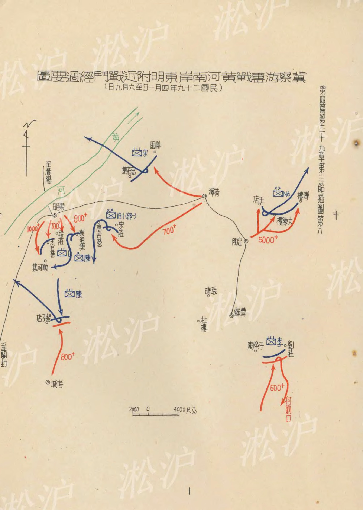

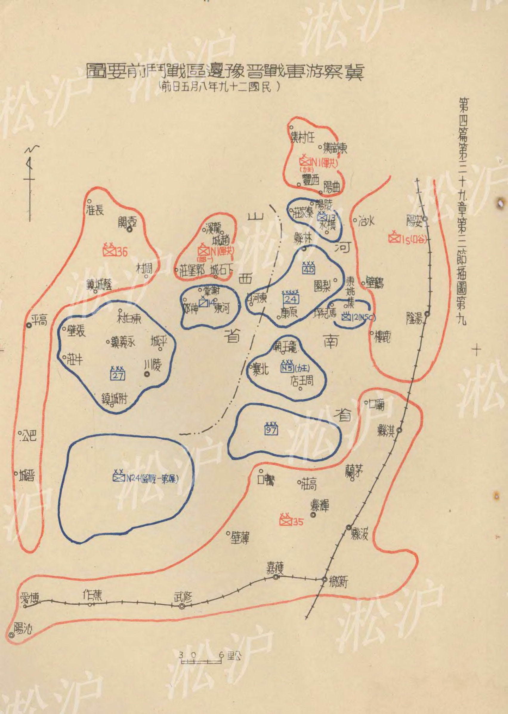

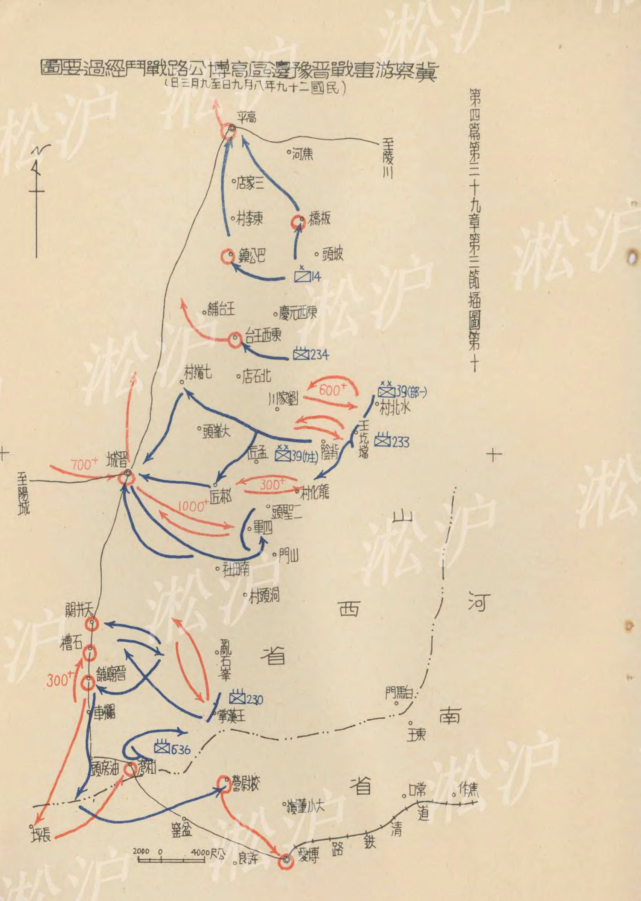

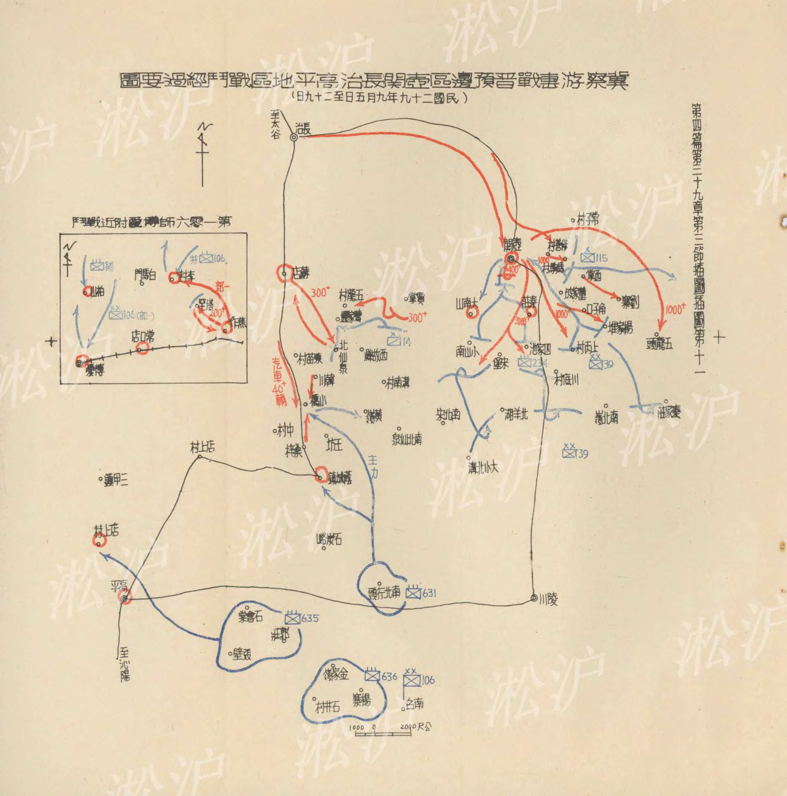

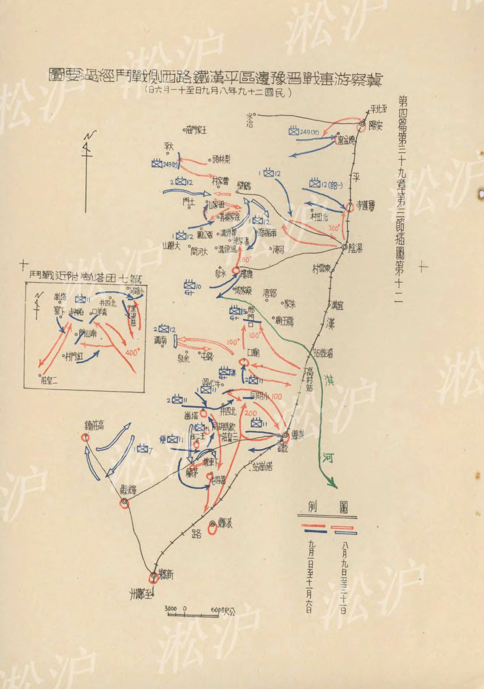

# 第四篇第三十九章第三節插表第三

晉戰擊游察冀

第三十五師團

第二一九聯隊

第二二零聯隊

第二二一聯隊

騎兵第三十五聯隊

砲兵第三十五聯隊

工兵第三十五聯隊

輜重兵第三十五聯隊

長谷川信哉

湯口俊太郎

栗栖猛夫

尾癸已郎

星野秀敏

太郎田秀三郎

石井正美

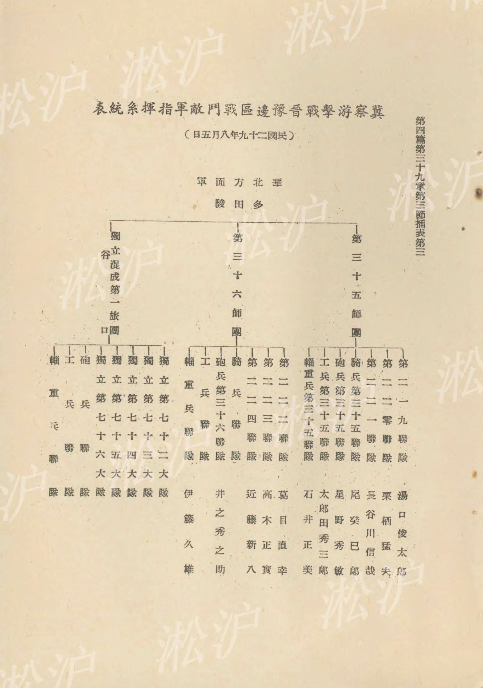

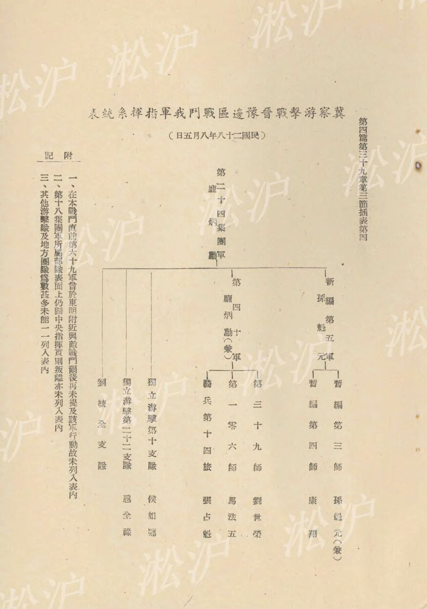

##### 第三項 太行山區第一次戰鬥

民國三十一年六月十日至七月二十日

參照插圖第十三至廿一插表第五第六

第一目

太行山區地形

太行山漫延山西省東部，跨冀、豫、晉三省，形勢險峻，歷史上最負盛名，安陽林縣間及合澗、臨淇、東姚一帶爲低連山地，機械化部隊通行無阻，陵川通壺關、長治、高平、晉城各縣道路，敵軍進佔後，稍事修補，汽車與砲車即可通行，陵川東南山區小徑，步騎兵均可通行，但我軍常被迫於山谷行進，行動頗感不便，又春夏之交，雨水奇缺，因此飲水極感困難，影響作戰甚鉅。

第二目

戰鬥經過（參照插圖第二十一其二）

民國三十一年六月初，

參照插圖第十三

插表第五第六

敵抽調同蒲、正太、平漢、白晉、道清各路之第三十五、第三十六兩師團主力，第四十一師團第一部，及第一、第三、第四等獨立旅團，附騎砲兵各一部，共約三萬餘人，另以中村戰車隊戰車十六輛，獨立第二十九飛行隊戰鬥機十五架，分別集結於湯陰、淇縣、輝縣、修武、博愛、晉城、高平、長治、壺關、平順、安陽等地區，對我形成包圍態勢，並於十日開始向我太行山區國軍進攻。

我軍以確保太行山區游擊根據地之目的，以第二十四集團軍及配屬之杜淑、張儐生、侯如墉、扈全祿、趙子俊、五永智等挺進部隊，並附以軍事委員會江北交通工作隊第二大隊，及平漢北段破壞總隊於太行山東區，以暫編第三師位置於林縣以北地區，對匪軍警戒，張儐生縱隊之何化佛支隊任安陽、林縣大道之警備，第四十軍集結於林縣東南地區，新編第五軍（欠暫編第三師）集結於臨淇東南地區，總司令位置於原康，除以有力部隊經常向平漢線新鄉、安陽段及其以西各據點實施攻擊與破壞外，主力集結整訓。

第二十七軍（欠第四十五師主力）及配屬之李葆荃、王德霖、張體安、郜春玉等挺進部隊於太行山西區，以預備第八師集結於陵川西北地區，第四十六師及第四十五師第一三四團集結於陵川西南地區，軍部位置於東壁村，以一部經常向白晉、晉博各大道及道清鐵路各據點實施襲擊與破壞，主力積極整訓，並建立游擊根據地。

六月十日，第二十四集團軍龐炳勳總司令獲悉安陽、水冶、觀台地區，自五日以來增敵七千餘，砲三十餘門，戰車多輛，飛機十餘架，並積極架設線路，修築交通，似有會同該處之敵僞軍掃蕩我太行山游擊根據地之企圖，當卽電令馬法五、孫魁元兩軍長、杜淑、張儕生兩縱隊長、侯如墉、扈全祿、趙子俊等支隊長及直屬部隊長如左：

一、各部卽日完成戰鬥準備，並各對當面之敵積極偵察，嚴密防範。

二、爲根除敵第五縱隊活動起見，各防區內卽實施緊急戒嚴，並實施戶口檢查，（於六月十二日四時至十二時）防區以外之商販及行跡可疑者，一律扣留監視，候令釋放，仰卽切實遵辦具報爲要。

六月十日，安陽、水冶、觀台一帶之敵大舉進攻，其先頭一部千餘，經科泉西進，遂與我張儕生縱隊之何化佛支隊於馬店發生戰鬥，不敵，旋卽轉移於火燒屯附近，（參照插圖第十四）十一日七時許，科泉之敵一部三百餘人，續向火燒屯何化佛支隊侵擾，該支隊撤至該村西南地區與敵保持接觸，敵卽進佔林縣東南採桑、胡家窯地區，敵一部四百餘進佔交口、寶山與我第四十軍第三十九師第一一七團之一部發生戰鬥，另敵步騎兵六百餘，砲二門，進佔林縣城關，十四時，又增敵千餘，並以一部三百餘繼續西進，迄晚，被我林縣地方團隊阻止於城西上申街附近，第四十軍馬法五軍長基於當時狀況，當卽調整部署如左：

一、第三十九師第一一六團改任花尖腦、馬軍池間之守備任務。

二、第一一五團改任馬軍池、木村、起燈山迄以西山麓之線守備，團部駐大南山。

三、砲兵營於大南山附近佔領陣地。

四、工兵營及幹部訓練大隊，着由工兵營宋文陞營長統一指揮，集結郭家屯對西戒備。

五、侯如墉支隊進出東姚集附近待命。

六月十一日七時許，（參照插圖第十五）敵五百餘向我林縣以北暫編第三師第七團上下台村、楊家莊一帶陣地攻擊，相持數小時，雙方無進展，迄十時許，增敵二千餘，砲十餘門，並以飛機四架支援其戰鬥，旋卽攻佔上下台村，東西趙村及南北券相繼不守，該團主力轉進曲陽以北地區，一部轉進秦家莊附近，十二時許，當面之敵增至五千餘，砲三十餘門，並以飛機六架支援之，續向該師東西牛良、秦家莊、孝子莊、姚村陣地攻擊，迭次猛撲，均被擊退，旋敵集中砲火並以毒氣助攻，我陣地被摧毀殆盡，但仍與敵激烈巷戰，迄二十時，該師主力轉移至石樓、田家溝、白草坡之線，另部仍於曲陽以北地區活動。

六月十二日（參照插圖第十六）六時許，第三十九師第一一七團之一部攻佔火燒屯，並擊退交口、寶山敵之增援部隊，該師另以一部協同侯如墉支隊及第一零六師第六三六團分向林縣、橫水及鐵爐等地實施夜襲，阻止敵之南進，斯時上申街之敵續攻桑園，林縣地方團隊農進合澗以北地區，該敵會合小西天之敵，向桃園、白甘泉一帶推進，同日，秦家莊、石家河施街一帶之敵，繼續西犯我暫編第三師魯班壑、雲峯寺、寨門溝各據點，迭次猛攻激戰竟日，均被擊退，龐炳勳總司令基於連日戰況，下達作戰命令如左：（參照插圖第十六）

作戰命令第一號

第二十四集團軍命令

民國三十一年六月十二日二十一時

於林縣原康總司令部

一，集結安陽、豐樂鎮、水冶、觀台一帶之敵僞軍約六千餘人，砲三十餘門，戰車十六輛，飛機十五架，連日向我暫編第三師猛攻，另平順之敵千餘，積極向小西天方面前進，似有協助其主力圍攻我暫編第三師之企圖。

該敵似欲迅速擊破我暫編第三師，爾後再行南犯，企圖各個擊破我太行山東區野戰軍，以達其掠奪物資，摧毀我游擊根據地之目的。

二、集團軍以確保太行山東區游擊根據地之目的，除以一部仍對輝、汲、淇、湯、安等縣之敵實施襲擊牽制與機動作戰外，另以一部於林縣以北監視匪軍行動，主力控制於合澗、東姚集地區，俟敵攻勢頓挫，將其捕捉於林縣東南地區而殲滅之。

三、冀魯邊區游擊指揮官杜淑指揮所部及江北交通工作隊第二大隊，（欠第四中隊，仍任輝縣以北地區之守備，並經常實施襲擊與破壞，右與第二十七軍部隊密切連繫。

四、新編第五軍（欠暫編第三師及補充團第三營）附江北交通工作隊第二大隊第四中隊及淇縣地方團隊，以一團仍任淇河南岸守備任務，主力控制於臨淇附近機動使用。

五、第四十軍附挺進第十四縱隊（張儐生）獨立第二支隊（侯如墉）劉統全部及安陽、湯陰地方團隊、安陽邊區保安大隊等，以兩團配合張縱隊及侯支隊各一部，仍任東姚集、合澗以東地區之守備，並積極向水冶、科泉一帶實施襲擊與破壞，以一部向林縣及其以西之敵實施襲擊，支援林北暫編第三師之作戰，另以一部扼守小西天、石門口（大河口北）各要點，並與第二十七軍密切連繫，主力確保合澗外圍旣設陣地，俟敵主力南犯受挫，將重點保持於東姚集以西地區，協同林北部隊殲敵於林縣東南地區。

六、新編第五軍暫編第三師附補充團第三營及林縣地方團隊，以一部監視匪軍行動，另以一部扼守魯班壑、小西天（含）間要點，主力控制於林縣西北地區，與敵機動作戰，俟敵主力南犯，以有力部隊於林縣、科泉間實施襲擊與破壞，適時協力第四十軍殲敵。

七、第二十二支隊（扈全祿）仍位置於新編第五軍戰鬥地區內，積極向淇河鐵橋（不含）宜溝間平漢路實施襲擊與破壞，阻敵增援。

八、平漢北段破壞總隊徐靖遠部及教導團周幹高部，仍於安陽、新鄉間積極破壞敵交通設施，阻敵增援，協助我主力作戰。

九、作戰地境：

第二十七軍與冀豫邊區游擊指揮部間爲沙窯、朱橋、新鄉之線，冀豫邊區指揮部與新編第五軍間爲沙窯、漱溝、南陽之線，新編第五軍與第四十軍間爲三郊口、白甘泉、上浴、蕭家莊之線，第四十軍與暫編第三師間爲龍溪鎮、桃園、林縣、東保障之線，以上各線均屬左，暫編第三師與第二十七軍間爲龍溪鎮、微子鎮之線，線上屬右。

十、通信：暫編第三師以無線電爲主，傳騎、傳令爲副，其餘各部隊均以有線電話爲主，無線電及傳騎爲副。

十一、彈藥補給及衛生設施，均由各部自行籌劃。

十二、余位置於原康總司令部。

六月十三日十八時，龐炳勳總司令獲悉暫編第三師正面之敵六千餘，分由林縣、姚村、任村、平順、玉峽關五路圍攻魯班壑，（參照插圖第十六）並以飛機六架與毒氣助戰，該師現轉進寨門溝附近繼續苦戰中，惟彈盡糧絕，形勢危殆，當卽着第四十軍馬法五軍長，派兵一團由橫水向林北挺進，獨立第二支隊（侯如墉）主力確保喬家屯、白壁一帶要點，掩護我軍右側安全，另以第三十九師之一部，沿太行山麓向桑園以北進出，各出擊部隊均於是晚二十時開始行動，以襲擊敵之側背支援暫編第三師之戰鬥，同時電令暫編第三師劉月亭師長如次：「連日苦戰，至深系念，現着第四十軍以有力部隊策應貴師作戰，第六三六團由橫水向林北挺進，第三十九師之一部沿太行山向桑園進出，並於十二日夜間開始行動，希卽淬勵所部，向敵反擊，逕與第四十軍切取連絡。

我暫編第三師當面之敵於四時卽分向該師蓋頭泉、雲峯寺、白岩廟、寨門溝、劉家梯等陣地攻擊，戰至十八時終未獲逞，（參照插圖第十五）當敵五百餘進攻寨門溝之際，將敵誘入山地，經劉月亭師長督率所部以手榴彈及擂石猛擊，殲敵殆盡，該師第八團第六連田玉彩連長，率部與敵博鬥，全部殉職，劉月亭師長腿部負傷。

十三日二十三時許，第四十軍北進部隊稍有進展，獨立第二支隊到達指定地區，阻敵西進增援部隊，第一零六師第六三六團被敵阻於橫水以北地區，第三十九師第一一五團第三營將白甘泉之敵擊破後，繼續北進中，十四日一時許，第六三六團主力仍與敵相持於橫水附近，以一部由左側出擊，攻佔林縣東北之龍頭山，旋敵兩度增援千餘，砲二門，並以飛機三架低空助戰，激戰入夜，仍於秦家窯、五帽山之線對峙中，斯時，獨立第二支隊遭敵壓迫，將喬家屯附近道路破壞後，撤至北採桑東北高地，經白甘泉北進之第一一五團第三營進抵河岩、栗園坡附近，被敵阻擊，旋敵步騎兵五百餘進佔代家荒，威脅該營右側背，經該軍獨立第二團第一營增援，迄二十三時，仍在河岩、土樓一帶對戰中。

第一零六師爲達成北進支援任務，是夜繼續向北猛進，迄十五日八時許，將林縣東南地區之敵肅清，第六三五團第一營由朱翟向龍頭山攻擊，李振清師長親率第六三六團繼續北進，十六時進佔凌集，繼續向北急進，其時龐炳勳總司令遵照第一戰區司令長官兼冀察戰區總司令蔣鼎文已寒午電所示，再飭第四十軍馬法五軍派有力部隊收復林縣，並繼續向北挺進，支援暫編第三師之作戰，是日一時許，第三十九師第一一五團第三營及獨立第二團第一營，由正面向代家荒、河岩、栗園坡等地攻擊，該師崔玉海副師長親率軍屬工兵營由側面攻擊，激戰至晚，敵不支向秦家莊方向逃竄。

六月十五日四時許，暫編第三師當面之敵附砲三十餘門，向我白岩廟、劉家梯進攻（參照插圖第十五）六時許，又以飛機八架支援其戰鬥，十時至十一時之間，曾四度猛攻，終將劉家梯附近高地攻佔，第八團第二營陣地相繼不守，斯時，劉月亭師長見我彈糧俱盡，又加傷亡慘重，親率步兵兩連掩護着楊克猷團實施突圍，十四時，將田家溝附近之敵擊破後，卽向黃花寺轉進，又遭蓋頭泉之敵猛追，劉月亭師長親率兩連傷亡殆盡，該師長頭部負傷，傷暈倒地，被敵所俘，楊克猷團長率部三次衝殺相救，終未奏效，遂突圍而去。

十六日四時，第三十九師第一一六團之一部進攻林縣，另一部逕向甘泉北進，均無進展，同時第一零六師李振清師長親率第六三六團向林縣以北推進，行抵東西趙村，敵曾四度向我攻擊，終未得逞，斯時，獲悉暫編第三師已突圍撤退，卽於該村佈防掩護友軍南移，並與曲陽以北之第七團取得連絡。

十六日，冀察戰區蔣鼎文兼總司令獲悉全面游擊實施以來，惟以各部隊游擊兵力較少，戰力分散，致未能收得預期效果，而敵人爲達成以攻爲守之目的，屢由各處抽調兵力施行局部掃蕩，並於目的達成後仍回原防，再作另一局掃蕩之準備，最近更築碉挖溝，四處竄擾，以圖切斷我黃河左右岸之交通，我軍則以缺乏機動，不能適時調集優勢兵力，爭取主動，於統一指揮之下，予敵以痛擊，結果形成各自爲戰，遭敵各個擊破，以是河北形勢日漸緊張，戰區爲粉碎敵之掃蕩企圖，打破其封鎖，特策定反掃蕩實施要領如左：

一、各軍除以最小兵力（一營左右）配合各挺進部隊經常游擊外，並輪流抽派一團以上之兵力，編組突擊隊，兵力大小，應以當時任務爲準，但須使用絕對優勢之兵力，每月至少實行突擊一次，時間之長短，得自行決定，突擊目標則應指向敵之部隊或據點，惟選定目標應力求單純，以期達成容易，於任務達成後，卽行撤回原防，從事休整，至於次月之出擊部隊由各軍長自行決定之。

二、各軍經常游擊部隊，應與突擊部隊密切連繫，並由突擊隊統一指揮之，但於任務完成後，仍任原游擊任務，藉以控制游擊地區，俾爾後之出擊容易。

三、各突擊隊於實施任務之前，須詳細偵察，決定目標，務求敵之側背或疏於防範之據點爲主，決定目標後，更須周到準備，祕密企圖，以神速之行動，出敵不意，運用突擊戰法予敵以決定性之打擊。

四、各軍突擊區域，必要時得越境作戰，須與鄰接友軍預爲協定。

六月十七日拂曉，敵七百餘，攻佔辛莊、豆家莊及前後拐頭之線，我第三十九師警戒部隊撤至花尖腦、馬軍池、起燈山一帶主陣地，二十時，拐頭山東西之線增敵五千餘，砲十餘門，向該師主陣地進攻，第四十軍馬法五軍長，當卽着林北東西趙村第一零六師李振清師長，率領所屬第六三六團星夜往林縣東南棋梧附近急進，敵軍步砲協同數度猛攻，均被擊退，十八日拂曉，敵機六架，亂施轟炸，並低空掃射，陣地工事全部被毀，迄六時許，馬軍池、起燈山陣地先後被敵突破，第三十九師主力遂轉進油村、紗帽五、帶頂山，東小莊、郭家園之線預備陣地，第二十四集團軍龐炳勳總司令，爲保持戰力，機動作戰計，遂率第四十五軍主力撤至合澗西南山區，合澗與原康於十四時許先後陷敵，斯時，第三十九師仍遭敵步砲八百餘之跟蹤追擊，至石家莊附近遂發生近接肉搏戰，二十二時，馬法五軍長率領該師主力轉移獨角水附近地區，繼續戰鬥，集團軍總司令轉進至田家井附近，直屬第一第二兩團佔領梨園、大峪、坨墻之線，對原康方面警戒，第一零六師李振清師長率第六三六團到達棋梧、南峪地區後，已與第三十九師連絡中斷，將師主力集結後，卽向敵尾擊，並將馬軍池、辛莊等地佔領，第六三一團續向郭家園以北高地推進，第六三六團推進至油村、萬羊坡附近。

六月十八日二十時，新編第五軍暫編第四師爲策應第四十軍作戰，着第十二團主力分向廟口及高村車站襲擊，頗有斬獲，該軍暫編第三師收容完畢後，開赴沙窯、國樑一帶整理。

十九日八時許，第一零六師第六三一團攻佔郭家園，旋敵三百餘由合澗方面增來，該團仍據守帶頂山與敵激戰，同時，另敵七百餘，砲二門，由大廟、南屯向南進攻，經第六三六團尾擊，該敵會同林縣及帶頂山當面之敵，向第六三一團猛攻，李振清師長爲避免敵之夾擊，卽將主力向烏雲山，五家、康家、相峪一帶轉進，並令候支隊以東姚集以東陳倉溝爲根據地，積極展開活動，同日第三十九師主力仍於石家莊以南地區與敵對戰中，其嶺南方面之第一一七團奉令增援該師主力作戰，乃經臨淇、南北砦繼續急進中。

是日，龐炳勳總司令獲悉合澗鎮及其以南各村莊已無敵踪，紙房、天主堂僅有少數敵人守備。

二十日，續悉第一零六師主力進駐柏峪、高家、康家、王家一帶地區，並與任團取得連絡，獨立第一第二兩團於三家廟、梨園、南溝之線對北警戒，馬法五軍長位置於東土池附近，第一一七團進至三郊口附近第二十七軍派兵兩團進佔大河口，側擊敵人，輝縣之敵千餘，分由高莊、松工水、綠豆溝北進，杜淑部范龍章縱隊及輝縣地方團隊正分途迎擊中。

六月二十一日六時，敵七百餘，砲三門，由石家莊向口上第三十九師陣地猛攻，血戰竟日，迄暮仍在對峙中，（參照插圖第十七）旋敵一部由八尖山增來，迂迴攻擊口上陣地右側背，仍未獲逞，八時許，龍口之敵四百餘，協同楊家池之敵千餘，向該師裏皮寨、獨角水陣地左側攻擊，經該師及軍屬工兵營分別迎擊，激戰徹夜，十四時，輝縣方面，敵七百餘，砲三門，攻佔大佛殿及蘆魁嶺，（參照插圖第二十一）經該地我軍范龍章縱隊反攻，迄晚又入我手，二十二日，敵步騎千餘，改由黃水口進犯，守軍范龍章縱隊撤至王莽嶺附近，協力郜春玉支隊作戰，入夜後，敵一部四百餘進佔東西韓口、白廟、南湖一帶，主力經滴水池進攻王莽嶺，同日六時許，四十軍第三十九師放棄口上陣地，撤至該村以南高地，繼續戰鬥，斯時，第一零六師進佔合澗，當卽以主力向石家莊推進，一部尾擊楊家池南下之敵，經兩師南北夾擊，敵銳氣大挫，迄二十二時許，雙方均無進展，第二十七軍當面之敵於十六時分三路進犯，由晉城經柳樹口向奪火鎮前進之敵千餘，被該軍第四十六師阻止於班木嶺附近，修武北犯之敵一千五百餘人，與該縣地方團隊相持於胡洞沿附近，另敵六百餘於茶棚、老爺坡地區與王德霖縱隊對戰中。

蔣鼎文兼總司令獲悉敵軍由林縣南進後，判斷其有打通林臨大道，各個擊破我太行山區游擊隊之企圖，當卽於二十二日十二時電令第二十四集團軍如左：

一、戰區爲確保太行山區，以利爾後反攻計，已令黃河守備部隊，卽派反掃蕩部隊北渡，策應作戰。

二、第四集團軍卽向武陟，修武，攻擊，破壞道清鐵路，第十四軍迅速攻克杜八聯，高桂滋乘機北渡，進入中條山與貴部協同作戰。

三、貴部應卽調整部署，分林臨大道東西兩部，互相策應，夾殲犯敵，除特殊時機外，竭力避免決戰，充分利用防區內有利地形，機動旋迴作戰，並與第二十七軍妥爲連絡。

四、已飭第二十七軍以有力之一部進出太行山東區，直接支援貴部作戰。

一、杜淑部附胡宗良大隊，（欠第四中隊）以一部仍於平漢路東側服行原任務，必要時向路西轉移，襲擊敵之側背外，主力於沙窯、未橋、新鄉車站、平漢路以西，南陽、柏樹灣地區、扼守要點，阻敵由黃水口、路口、松工水、廟堤、塔崗口等地進犯，並以有力部隊配合地方武力向高莊、輝縣、汲縣間敵據點與交通線反復襲擊與破壞，如情況不利，卽以轄區內山地作根據地，以輝縣爲軸心，實施旋迴作戰，適時與新編第五軍協力捕捉敵之一部而殲滅之。

二、新編第五軍（欠暫編第三師）附趙子俊、扈祿全兩部及淇縣湯陰地方團隊，於平漢鐵路以西南陽、柏樹灣、湯陰地區扼守要點，擊破敵之進犯，確保臨淇外圍，並以有力部隊協助地方民衆向淇縣廟口及湯陰以西敵據點及交通線反復襲擊與破壞，如情況惡化，以臨淇以東山地及淇河兩岸爲根據地避免與敵決戰，實施旋迴襲擊，適時與第四十軍協力捕捉敵之一部，於林臨之間，而殲滅之。

三、第四十軍附張賓生、候如墉、劉統全等部，三郊口、沙窖、柏樹灣、張公園、湯陰以北及平漢路以西地區，以游擊部隊及地方團隊反復襲擊與破壞，主力卽向正面之敵攻擊，奏功後，繼續向合澗外圍及林縣附近挺進，肅清殘敵，隨時注意匪軍之襲擊，以一部控制後方要點，另以一部配合游擊部隊領有合澗、桑園以西山地，如不能順利完成上述任務，卽以林縣東姚集，水冶地區爲根據地，化整爲零，實施旋迴襲擊，相機協同新五軍捕捉敵之一部而殲滅之。

六月二十三日八時許，第一零六師兩路南下部隊將第三十九師當面之敵包圍於口上、門濮溝獨角水地區，（參照插圖第十七）戰至十二時，敵以飛機九架助戰，企圖突圍，迄十四時許，殲敵過半，殘敵一部向楊家池敗退。

同日，敵二千餘，由杏城向我二十七軍預備第八師柏坡、樹掌陣地側擊，經該師伏擊，敵停止進攻，另修武、薄壁之敵協同進佔青口，續向武家灣、琵琶河竄攻，旋與第四十六師之一部激戰於摩天嶺附近，又王莽嶺六時許被敵攻佔，郜支隊及第四十五師之一部撤守該嶺西南高地，十六時，敵續向南馬安攻擊，經新編第五軍暫編第三師第七團一部之迎擊，旋卽撤退，斯時，林縣團隊克復林縣縣城。

第二十四集團軍龐炳勳總司令，獲悉輝縣方面黃水口陷敵後，當卽着第四十軍獨立第二團（任向忠）星夜開赴南北寨以南地區佈防，掩護我後方安全，並電令馬法五軍長轉飭獨立第一團接替第二團防務。

六月二十四日八時許，第四十軍第三十九師繼續肅清口上，門濮溝之殘敵，（參照插圖第十七）第一零六師主力截擊由獨角水突圍西竄之敵，圍攻終日，未奏全功，十二時許，敵由玉峽關，杏城兩地增調千餘，向第一零六師左側背北道寺反復衝擊，肉博十餘次，終被該師包圍於桃樹凹附近，迄二十二時，仍在激戰中，斯時獨立第一團進佔合澗、原康、則界一帶，獨立第二團到達南北寨及其以南地區佈防。

二十四日六時許，王莽嶺附近之敵續向暫編第三師第七團之一部馬安陣地攻擊，相持時許，敵退去，輝縣方面之敵六百餘，砲二門，進佔滴水池、東西韓口後，企圖繼續北進，斯時，第二十七軍預備第八師當面之敵，主力向浙水，樹掌間陣地猛攻，戰至十二時，敵攻勢受挫，潛伏於浙水東北山地，第四十六師主力與敵激戰於五早嶺附近，該師一部與敵相持於摩天嶺地區，十八時許，該軍劉進軍長基於戰况，變更部署如左：（參照插圖第十八）

一、預備第八師覃團轉移盤馬池、樹掌間地區，向大河口方面反攻，易、王兩團各一部佔領大腦、樹掌、南郊、老牙灣既設陣地，主力控置於上莊、下河之間。

二、第四十六師以一部推進橫水、老槐樹嶺之線，拒敵北進，另以一部佔領黃胡掌、馬圈、圪欒嶺既設陣地，主力控置於馬圈松廟間地區。

三、李葆荃部附郜春玉部第一三三團楊營及砲兵營，扼守王莽嶺、馬武砦之線，拒止當面之敵。

四、王德霖部、張體安部各自轉移於外圍，實施旋迴作戰。

五、沈團控置於浙水附近。

六、軍部位置於柳泉。

六月二十四日，第二十四集團軍龐炳勳總司令獲悉高桂滋部第八十四師第二五零團第一、第二兩營已北渡黃河，並協同賈一眞支隊向敵突擊，策應太行山區作戰。

六月二十五日拂曉，被包圍於桃樹凹之敵，以飛機九架支援，冒死突圍，向西北逃竄，遺屍五百餘具，馬法五軍長當卽着第一零六師李振清師長，率領第六三一團及第三十九師第一一六團跟踪追擊，迄十四時許，續向柳泉方面前進。

十時許，滴水池、東西韓口之敵五百餘，砲二門，向號坪新編第五軍暫編第三師第七團第三營進攻，相持至十二時許，經該團第二營增援到達，敵不支退石坡，又於十六時及十八時兩度猛攻，終未獲逞，斃敵五十餘人，旋該營亦轉移至北安馬附近。

同日，第二十七軍第四十六師仍遭敵壓迫，以一部留置於黃松背、馬圈附近，主力向陵川西南敵後轉進，十時許，與敵遭遇於上郊、石景山地區，激戰至十四時，陷入重圍，經奮勇衝殺突破敵圍，向奪火鎮撤退，該師傷亡慘重。

十八時許，該集團軍着獨立第一團馮之堂團長，以一連留置嶺底溝對北警戒，主力於二十六日三時到達南北寨，爾後指揮獨立第二團及河北省政府警衛營歸集團總部直轄，於南北寨以南地區佈防，並與新編第五軍切取連絡，同時電令第四十軍馬法五軍長：「官兵奮勇殲敵，至爲欣慰，但久與敵相持實非上策，近日以來，敵大舉增援，似有總掃蕩我太行山根據地之企圖，除着獨立第一團轉進南北寨附近佈防外，貴部應卽調整部署，避免與敵膠着。

六月二十六日，第二十四集團軍龐炳勳總司令獲悉第四十軍方面戰况漸趨沉寂，於十二時許，着該軍以一部留置於東土池、口上地區活動，何化佛支隊向林北挺進，控制姚村附近地區拒止匪軍南進，嶺頭一帶防務仍由候支隊負責，獨立第一團馮團長指揮該團及任團，仍於南北寨附近佈防，嶺底溝之一連進駐東掌，總部及兩特務營進駐嶺底溝、原康、李家村地區，第四十軍馬法五軍長基於總司令之指示，及便於爾後旋迴作戰計，當卽着第三十九師第一一六團及第一零六師第六三一團於鵝舞嶺、壺陵水一帶策應第二十七軍作戰，並掩護軍右側背安全，第三十九師（次第一一六團）集結於河南坡、上莊、郭家園、油村、木村一帶地區，對東警戒，控制林陵間之交通，第一零六師（欠第六三一團）集結於戚泉古洞溝、南北馬差地區，對東警戒，控制通安陽道路，軍直屬部隊（欠獨立第一第二團）位置於則界、萬羊坡一帶，十六時許，東西韓口之敵四百餘、砲二門，進佔四畝地後，繼續北犯，遂與獨立第二團於灘頭東西之線發生戰鬥。

同日四時許，圍攻第二十七軍第四十六師之敵全力改向，猛攻預備第八師，同時，浙水東北山區之敵，亦南犯白干嶺、人熊山陣地之左側背，該師形成腹背受敵，苦戰至十六時，向三郊口方面撤退迄二十二時，該師與軍直屬部隊通過五龍子廸，繼續東撤，劉進軍長着第四十五師第一三四團於五龍子廸附近施行掩護，第一三三團之一營推進至馬武砦附近側擊敵背。

六月二十七日拂曉，浙水附近之敵千餘，向柳泉第一零六師第六三一團壓迫，該團轉進鵝舞嶺十三時許，敵又向該地進攻，並以飛機四架與大量毒氣助戰，該團傷亡極重，遂轉移東西壺陵水，會同第三十九師第一一六團迎敵，迄二十二時，仍與敵激戰中，十六時，另敵一部由灘頭向南北寨獨立第二團猛攻，激戰竟日，迄暮，敵增七百餘，會攻南北寨，該團奮勇抗拒，迄午夜戰鬥仍在進行中，是日晨，第二十七軍主力轉進至三郊口附近，又遭敵圍攻，損失頗重，迄暮，到達南北寨以東之河東村附近，收容整理，二十八日，繼續向東壩附近轉移，第四十六及預備第八兩師之各一部，轉進敵後活動，又進佔鵝舞嶺之敵，一時許，向第三十九師第一一六團及第一零六師第六三一團東西壺陵水陣地猛攻，並以毒氣助戰，戰至八時許，該兩團轉進東西土池附近，旋敵又以空軍協助進攻，終未獲逞，我獨立第一第二兩團撤出南北寨，仍於附近山地繼續戰鬥，又大河口之敵四百餘人，砲一門，於二時許攻擊原康、嶺底溝第二十四集團軍總司令部，經直屬部隊迎擊，迄午仍於該地對峙，旋總部率直屬部隊轉進南崗，途中又遭敵機三次掃射，損失頗重。

六月二十九日，第三十九師第一一六團仍於東西土池附近待機支援第二十七軍作戰，第一零六師第六三一團於十時到達戚泉西南地區，歸還建制，第二十七軍主力到達東霸附近收容整頓，三十日八時許，大河口、楊家地一帶之敵三四百人，會同北連、南溝之敵四百餘，砲一門，向第三十九師一部攻擊，該部以敵衆我寡，將敵誘至下園安下地區，予以猛擊，迄十二時許，敵不支退去，該師第一一六團受敵壓迫，撤至三郊口西南蓮花村後，續向嶺東附近轉進，獨立第一、第二兩團以損失慘重，糧水俱感缺乏，遂轉進合澗東北地區整補，又六時，新編第五軍暫編第四師，於臨淇西南地區擊退寺溝口南犯之敵，迄十六時許，臨淇敵千餘，分三路向該師葦家溝、雁頂口、白嶺根陣地攻擊，經分別迎擊，戰至十八時許，敵退臨淇，是日，第二十四集團軍龐炳勳總司令，奉蔣鼎文長官艷戍電令，其要旨如次：「查太行山區情況緊張，爲挽救危局，請卽指揮第二十七軍重新部署，集結兵力，攻佔敵後據點鵝舞嶺，須確實協同，並將部署及爾後戰況隨時見告」。

七月一日，該總司令遵照蔣鼎文長官之指示，調整部署如左：（參照插圖第十九）

一、第三十九師主力於潑池、大店、大小合澗、萬羊坡、郭家園一帶，佔領陣地，第一一六團位置三郊口西南蓮花村。

二、第一零六師主力於紙房，火燒莊佔領陣地，第六三一團進佔狼窩、張家莊、曹家溝地區，掩護我軍左側背安全。

三、獨立第一團佔領木村、馬軍池地區，獨立第二團位置於東西油村、大南山地區。

四、劉統全支隊於千家崗附近活動。

五、張儐生縱隊主力於東姚集東北之東坡附近，何化佛支隊推進林北姚村集一帶活動。

六、候如墉支隊活動於陳倉沟、嶺頭一帶。

七、新編第五軍位置於臨其東北野豬泉附近，機動使用。

八、第二十七軍仍於東霸附近收容整補。

九、總司令部及第四十軍軍部位置於三井村附近。

七月一日八時許，南北寨、田家井之敵一千五百餘，附砲四門，向第四十軍第一零六師火燒莊、紙坊陣地攻擊，（參照插圖第二十）戰至十八時，敵以砲火掩護，由紙坊南端天主堂突入，李振清師長親率所部迎擊，血戰澈夜，肉搏七次，卒將突入之敵悉數殲滅，仍在對峙中，同時，另敵一部三百餘，由嶺底溝攻擊宋村第三十九師第一一七團，經該團迎擊，敵不支向東撤退，迄二十二時許，第一一七團向敵側背壓迫，同時，該師第一一六團與敵激戰於嶺東附近，新編第五軍於十六時攻佔臨淇，第二十七軍收容三千餘人，向陵川方面推進。

七月二日二時許，第三十九師第一一七團攻佔原康、小東坡及砦南背等要點，第一一五團攻佔孤山，第一零六師第六三一團由曹家溝向梨園攻擊，該師主力由紙坊、火燒莊向敵反攻，戰至六時許，敵不支退據柳三溝、梨園，仍企圖頑抗待援，十六時許，敵由陵合大道及石家莊方面增來騎兵一千二百餘人，並以飛機四架支援其戰鬥，迄二十二時，仍於柳三溝、原康附近激戰中，三日二時，馬法五軍長爲避免決戰，以有力一部於萬羊坡、紙坊、火燒莊一帶與敵保持接觸，主力轉進富家東溝、古洞溝、石門寺之線，四時許，留置萬羊坡附近之第一一七團及紙坊、火燒莊附近之第六三五團主力，分向敵之左右側背攻擊，敵頑抗至暮，分向浙水、三郊口撤退，是役敵傷亡聯隊長高木，大隊長陸田中雄及其所屬六百餘人，俘小隊長及士兵三人，紙坊天主堂敵軍遺屍二百餘具，我獲其他戰利品及重要文件甚多。

七月四日至二十日期間，第四十軍與新編第五軍戰鬥已告結束，積極從事整補，並調整部署，第二十七軍主力向陵川方面急進，七日，陵川附近之敵五千餘，分向高平、晉城撤退，殘敵千餘，仍據守縣城，經我預備第八師圍攻，戰至八日，敵一部三百西撤，主力七百餘退守城西劉家宅、郭家川、嶺細之線，構築工事，企圖固守，九日，該敵又攻入城內與預備第八師一度激戰後，復退守劉家宅，該師跟踪追擊，並施行圍攻，戰至十五日，敵一部北去，主力相持至十九日分向長治、高平撤退，至此，太行山區第一次戰鬥告一段落，敵之掃蕩企圖全告粉碎。

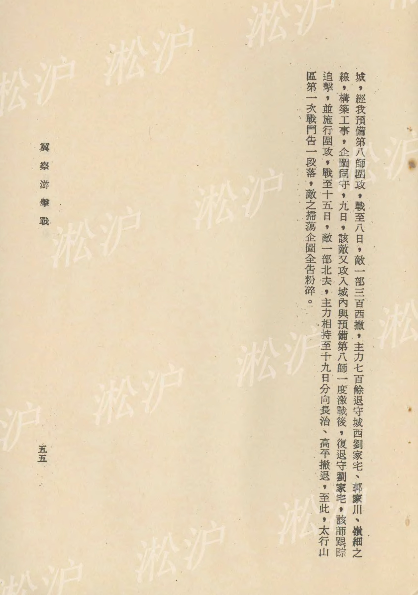

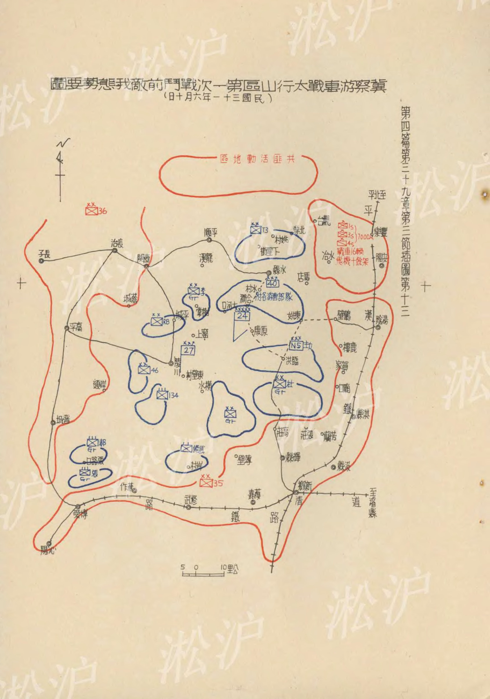

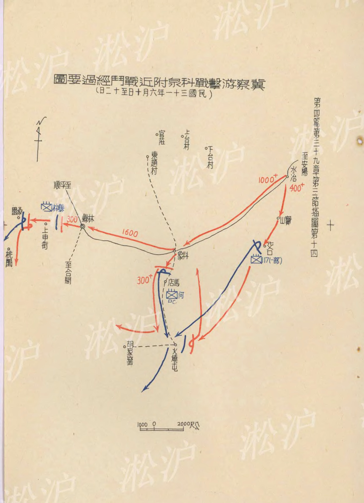

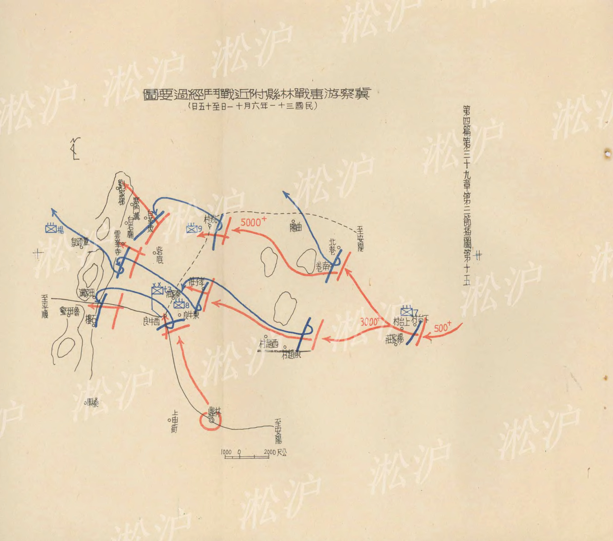

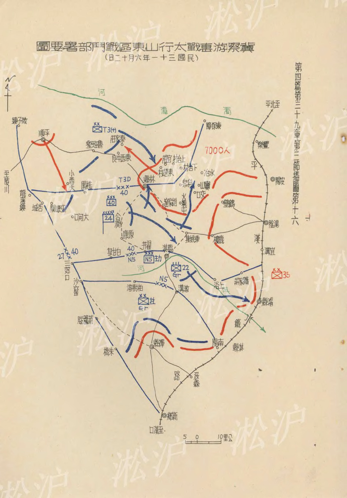

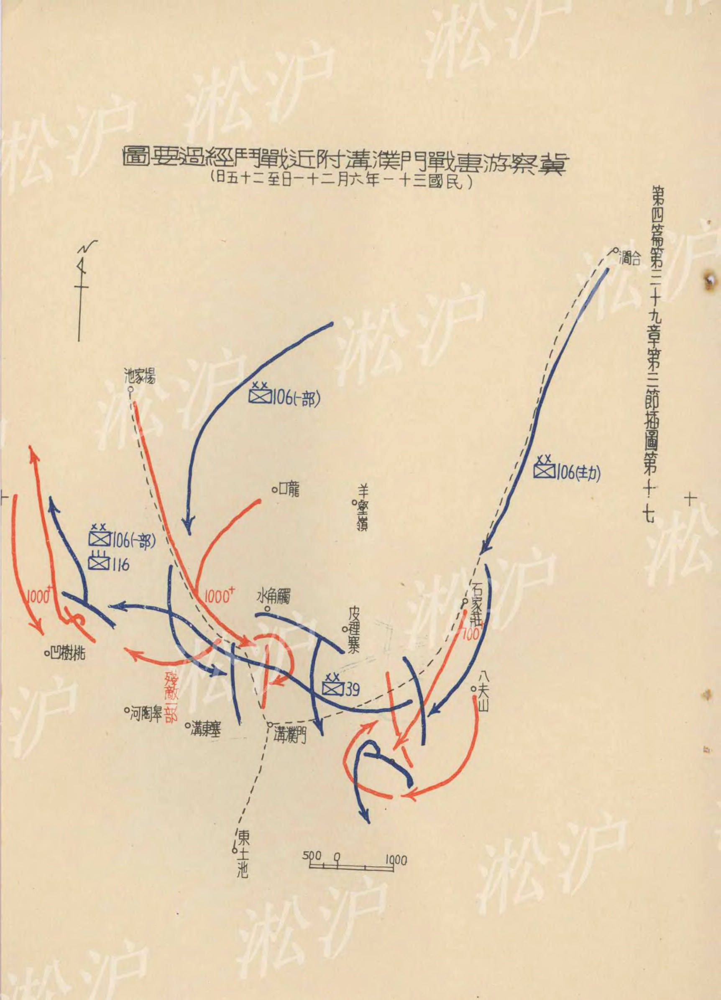

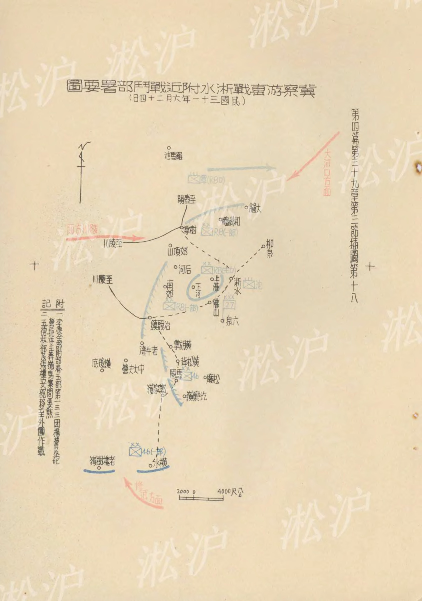

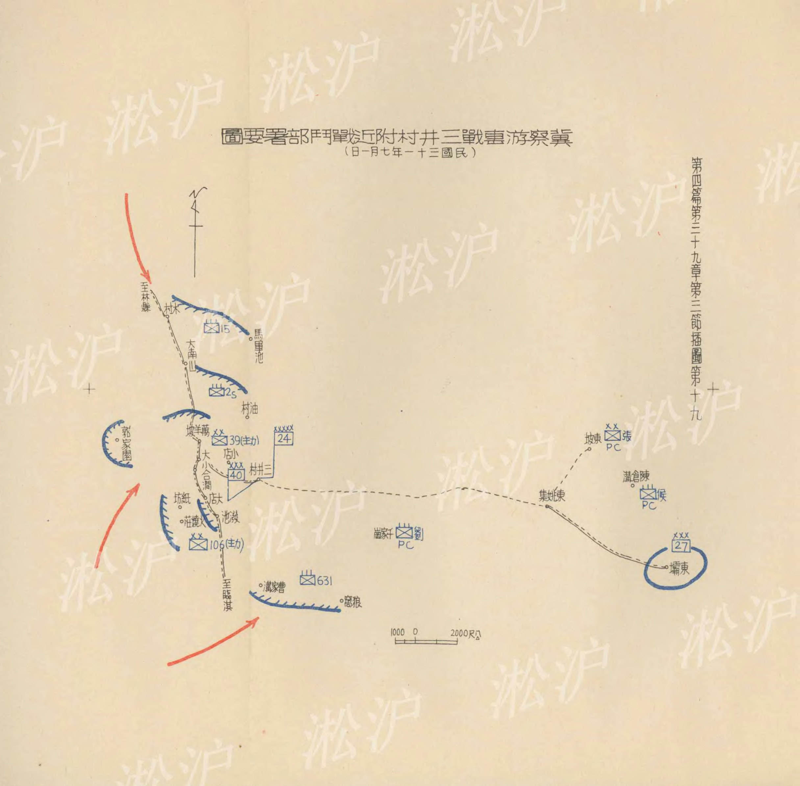

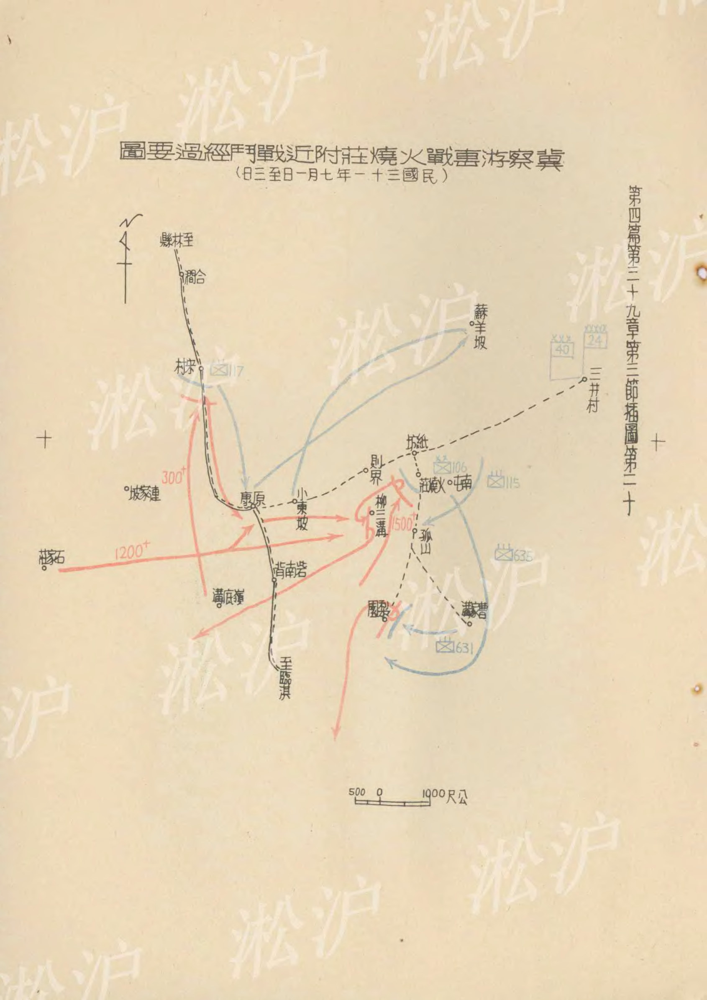

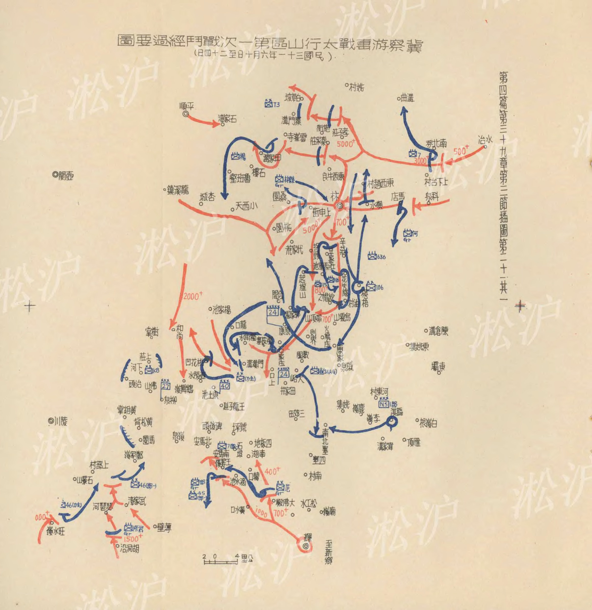

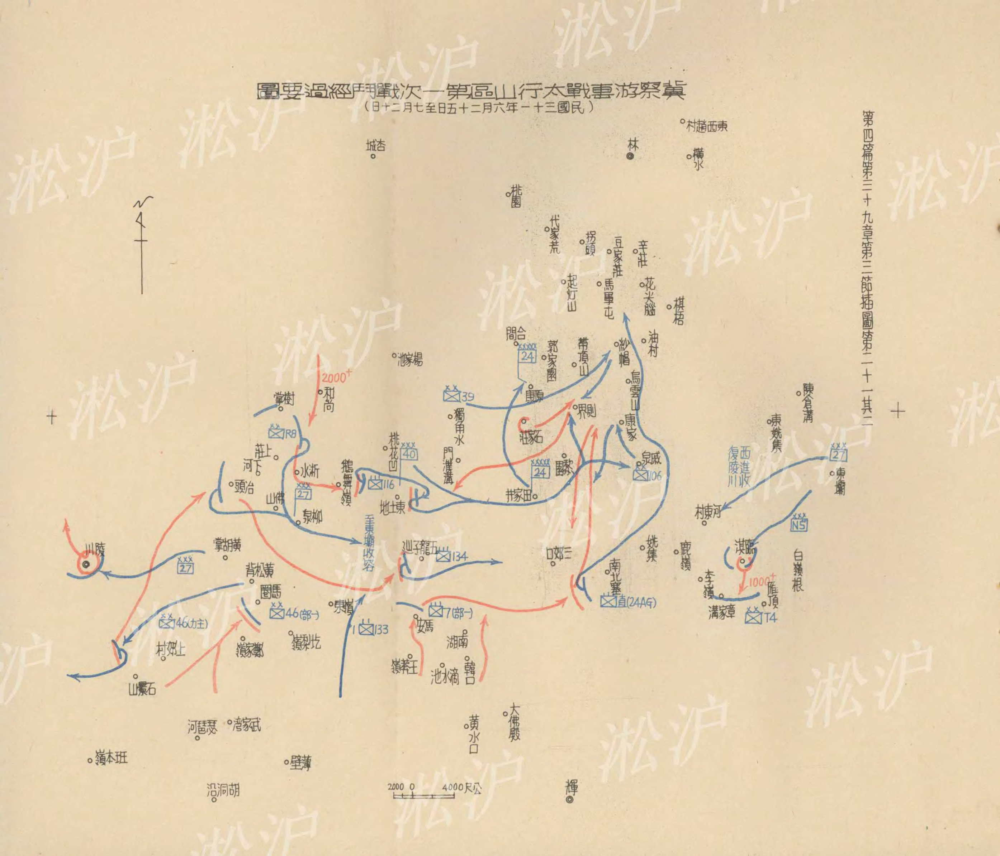

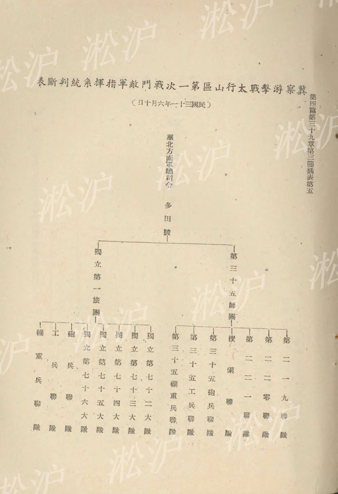

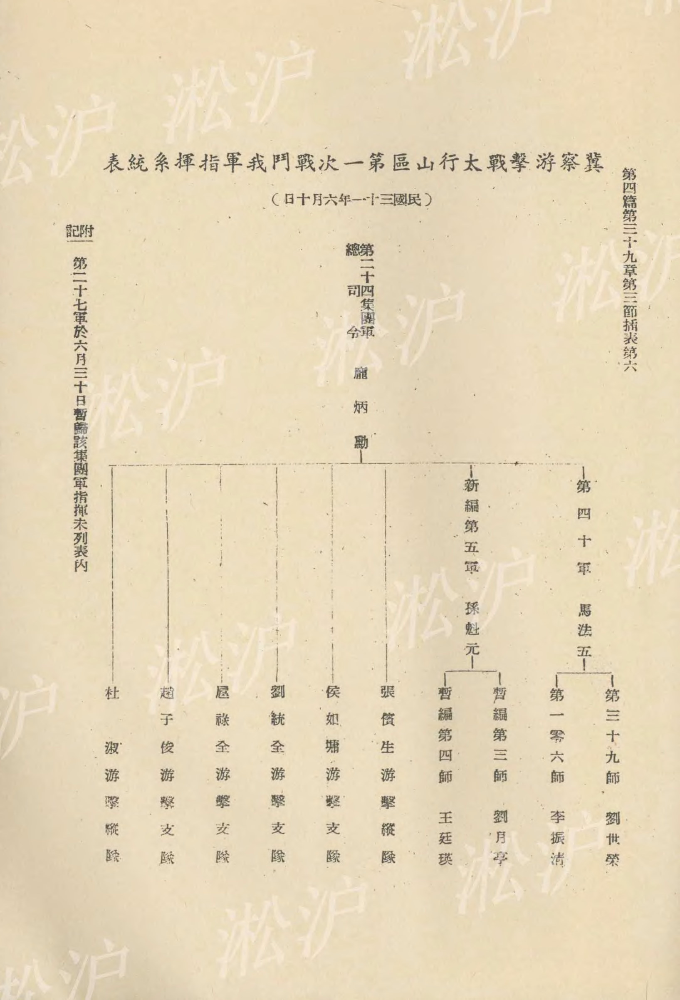

##### 第四項 太行山區第二次戰鬥

民國三十二年四月二十日至九月八日

參照插圖第二十二至三十插表第七至第八

第一目

太行山區地形

參見太行山區第一次戰鬥。

第二目

戰鬥經過（參照插表第七第八）

自民國三十二年三月，晉豫邊區第三次對敵政治，經濟作戰結束後，（參照插圖第二十二）敵第三十五師團分任平漢鐵路黃河鐵橋、湯陰間，道清鐵路西段及晉博公路南段之守備，第三十六師團撤守長治、壺關、高平及晉城等縣，其獨立第一混成旅團任安陽、邯鄲地區之警備，迨三十二年四月初旬，敵抽調正太路獨立第四混成旅團及僞軍第二十一、第二十三、第三十等師，石家莊附近之第一一零師團一部，同蒲路南段第三十七師團一部，及北寧路第二十七師團之一部，分向長治、壺關、高平、晉城等縣及平漢、道清兩路各要點集結，迄二十日，逐漸完成，其華北方面軍總司令岡村寧次並親至新鄉指揮，至是，再行圍攻我太行山區之企圖益形顯著。

我軍於太行山區第一次戰鬥結束後，仍於該地區積極從事整補與活動，並將獨立第一、第二兩團改編爲獨立第四十六旅，四月初旬，我第二十四集團軍總司令龐炳勳，獲悉敵軍積極向太行山區外圍集結，當卽着第二十七軍附獨立第四十六旅及挺進部隊等，於陵川附近佈防，新編第五軍附挺進部隊一部，於臨淇東南地區完成作戰部署，第四十軍（欠獨立第四十六旅）附挺進部隊於林縣地區完成作戰準備，又於四月十七日將敵軍企圖，我軍部署，電呈蔣鼎文長官，請其轉飭鄰接友軍積極展開游擊，直接支援我軍作戰，並於十八日二時下達作戰命令如左：（參照插圖第二十三）

作命第一號：

陸軍第二十四集團軍命令。

民國三十二年四月十八日二時

於三郊口總司令部

一、敵軍約五萬之衆，於四月初中旬，分別集結於平漢鐵路安陽、湯陰、淇縣、汲縣與新鄉、道清鐵路修武、焦作、博愛及其以北輝縣等據點，另敵八千餘集結於晉城、高平、壺關、長治地區，似有同時會攻我太行山根據地之企圖。

林、涉兩縣地區，有匪軍六千餘，高平、長子地區，有匪軍三千餘，似有乘機襲擊之模樣。

二、集團軍以確保太行山游擊根據地之目的，以一部向外圍推進，遲滯打擊敵之進攻，主力於核心陣地行機動防禦，俟敵攻勢頓挫，再轉移攻勢，將敵分區圍殲。

三、第二十七軍附獨立第四十六旅及挺進部隊，以一部推進前進據點及第一線陣地，遲滯敵軍行動，另以有力之一部推進主陣地外圍，施行旋迴作戰，主力佔領樹掌、郊頂山、冶頭鎮、黃松背之線及其以東主陣地，加強工事，拒敵進攻。

(二)第四十軍（欠獨立第四十六旅）附挺進部隊一部，以一部於前進據點及第一線陣地遲滯敵軍行動，施行襲擊，主力於合澗外圍墁坡、大小南山、木村、南北蕉園之線及其以南地區，佔領陣地，加強工事，拒敵進犯，另以東姚集、上下豐樂店及棋梧地區，控制有力部隊，拒止鹿樓方面進犯之敵，並便於爾後攻勢之轉移。

(三)新編第五軍附挺進部隊一部，以一部推進敵後，實施襲擊與破壞，主力於臨淇西南東西韓口、西平羅、鹿嶺之線及其以北地區佔領陣地，加強工事，拒敵進犯，並於臨淇東南地區，控置有力部隊，以利爾後攻勢轉移。

四挺進第十二縱隊主力位置於淇縣、湯陰間、平漢路東西兩側，積極破壞敵後交通，協力集團軍主力作戰，另部仍於林縣附近，歸第一零六師指揮。

五作戰地境：第二十七軍與第四十軍間爲五龍子廸、牛洞上、盤底之線，線上屬右，第二十七軍與新編第五軍間，爲五龍子廸、胡蠻村、滴水廸、胡蘆腦、新鄉車站之線，線上屬左，新編第五軍與第四十軍爲五龍子廸、三郊口、翟井、龍王廟、盤石頭之線，線上屬新編第五軍。

四、(一)通信：以無線電爲主，有線電傳騎遞步哨爲副。

(二)補給與衛各部自行籌劃。

五、余現在三郊口總司令部，爾後依情況之演變，向原康西南之南北坨塔附近轉移。

第四十軍軍長馬法五遵照集團軍命令之指示，（參照插圖第二十四）當卽着第一零六師指揮侯如墉支隊，安陽、湯陰兩縣地方團隊，及獨立第一大隊，以有力之一部於毛連洞、土門之線佔領陣地，拒敵進攻，重點保持於尖峯腦、拿岡及棋梧等要地，左與第三十九師切取連繫，第三十九師（欠第一一七團）指揮軍砲兵營及林縣地方團隊，佔領油村、木村、郭家岡及水池嶺旣設陣地，竭力抵抗，第一一七團推進至林縣以東鐵爐、馬店、曲陽及姚村等要體，掩護主力行動，爾後誘敵於林縣東南地區，協同主力而殲滅之，挺進第十二縱隊之一部，負責陵川、合澗大道之警備，爾後轉進以南山地，扼守隘路，第一零六師與第三十九師之作戰地境，爲曹家溝、姑姑寺、沙河、王帽山之線，線上屬第一零六師。

敵第三十六師團一部千餘人，四月十八日到達流澤，二十日九時許，分向我獨立第四十六旅第一團北行頭及塔地進攻，迄暮仍在對峙中，敵見不逞，遂以一部與該團保持接觸，主力指向芳岱、福頭第二團陣地攻擊，相持至二十二時許，敵傷亡二百餘人，此時蔭城方面之敵，步騎兵三千餘，砲十餘門，擊破方善、原溝我第八縱隊後，進佔馬安壑、秦村一帶地區，與預備第八師第二十四團展開激戰，第二十七軍軍長劉進，基於當前情況，着獨立第四十六旅轉進味齊、魏莊之線，繼續抵抗。

二十一日，（參照插圖第二十六其一）第二十七軍當面之敵約七八千人，分向該軍總攻擊，陣地多處被突破，第四十五師傷亡尤重，遂放棄陵川附近陣地，撤至佛山、松背、黃金窯之線，及其以東地區，佔領要點，預備第八師轉進至馬武寨、王莽嶺地區，待命出擊，挺進第八縱隊（范龍章）以一部轉進敵後游擊，主力仍於方善、原溝地區，繼續與敵戰鬥，掩護軍主力轉進，劉進軍長親率第四十五師兩團，預備第八師一團及其特務連向奪火鎮推進，迎擊深入該處之敵，進抵琵琶河附近時，又遭郭凹之敵九百餘截擊，步兵團及電臺均失去連絡，劉進軍長率特務連轉進至交掌、勤泉地區，又遭敵包圍，特務連傷亡殆盡後，經第四十六師周圍馳援，始於二十三日突圍，撤至偏馬村，二十五日到達柳樹口。

當獨立第四十六旅向味味齊、魏莊之線轉進之際，平城、石門兩地又遭敵攻佔，旋奉軍令，改向紫團洞、紅嶺、原家及佛山之線轉進，十六時許，敵分兩路向該旅攻擊，皆未獲逞，一部東竄，主力仍與該旅相持中，終以軍主力南撤，形成腹背受敵，遂遵軍預示目標轉進鵝舞嶺、柳泉、惡石掌之線佈防。當二十一日第二十七軍與敵鏖戰之際，另敵千餘，分兩路向第四十軍第三十九師水池嶺、小砦等地攻擊，（參照插圖第二十五）經第一一六團抗拒，迄暮仍在相持中，同時，水冶、觀臺方面之敵千餘，分三路圍攻第一一七團，鐵爐、東夏城、曲陽及狼壘等地先後陷敵，第四十軍軍長馬法五基於當前情況，着第三十九師主力轉進大店、則界、原康之線，佔領陣地，以有力之一部佔領油村、木村、起燈山、郭家崗線之前進陣地，相機擊破敵之進犯，第一零六師及挺進第十二縱隊仍服行原任務。

是日，淇縣之敵進佔邢門口後，續向我新編第五軍暫編第四師柳林、駝圈、獅豹陣地攻擊，又輝縣敵僞軍兩千四百餘，分向暫編第三師廟嶺、北佛頂陣地攻擊，均在激戰中，第九縱隊之一部及第十六支隊在賀家、龍王廟一帶，與敵旋迴作戰，修武地方團隊於十八日以來，即在田平、火掌、孟泉之線與敵兩千餘接觸，該地雖先後陷敵，然亦予敵重大打擊，二十一日二時許，該縣縣長劉明德親率團隊一部，攻佔大東村、上馬村、東西山底等地碉堡，二十時，該集團軍總司令部移駐戚泉。

四月二十二日，龐炳勳總司令奉蔣委員長印養電令，其要旨如次：「第二十四集團軍須以必要兵力守備旣設陣地及重要據點，依側擊消耗敵人，並以有力兵團分別控置適當地點，相機實行逆襲，擊滅突入之敵，確保太行山根據地爲要。」第三十九師南撤後，林縣之敵兩千餘跟踪南下，續向該師油村、馬軍池、楊家莊陣地攻擊，經守軍迎擊，終未獲逞。左翼小砦遭敵繞攻，被迫撤守大南山、合澗之線，同日二時許，鹿樓方面之敵一千七百餘，砲四門，分三路向第一零六師第三一七團上下河底，金香爐腦、尖峯腦及陳倉溝之線陣地攻擊，相持至十五時，除上下河底守軍轉進韓家峪，繼續戰鬥外，主力仍於原陣地與敵相持，嶺頭附近侯如墉支隊，與鶴壁進犯之敵激戰後，轉進南窯附近，又十二時許，林縣之敵千餘，分兩路向第三一八團棋梧及花尖腦攻擊，激戰至十六時許，該團團長王金琮，負傷指揮，陣地屹立如故，旋奉令撤至馬兒坪附近待命。

是日八時許，敵千餘，砲四門，在敵機支援下，向獨立第四十六旅第一團柳泉陣地攻擊，肉搏四次，陣地曾數度易手，相持至十七時許，敵我傷亡均重，該團爲保存戰力，達成爾後任務計，遂撤至壺陵水以北地區，敵陷柳泉後，續向第二團鵝舞嶺陣地攻擊，戰至二十三時許，該團轉進黃崖底以北地區，預備第八師於王莽嶺、馬武寨附近與敵一部激戰中。

二十二日，新編第五軍暫編第四師仍於西掌、獅豹頭一帶與敵兩千餘相持中，爾後該團以有力之一部繞襲敵之側背，截擊其後路，斃敵三百餘人，又該師一部協力第九縱隊與敵千餘在娘娘坡以北地區激戰中，暫編第三師廟嶺、北佛頂陣地遭敵突破後，轉進東西韓口、四寨地區，繼續與敵四千餘激戰中，該軍孫魁元軍長親到南北寨指揮。

第一戰區司令長官蔣鼎文基於太行山之情況，及龐炳勳總司令之請求，着第十七軍第八十四師副師長艾捷三，率領第二五一團北渡黃河，進襲王芳附近之敵，乃於二十一日二十時許，進佔東窯裏，卽向西窯裏之敵百餘襲擊，戰至二十二日二時許，王茅之敵以汽車輸送增援，向該團圍攻，戰況異常激烈，艾捷三副師長負傷，第二五一團團長楊世生殉職，另傷亡官兵六十餘人，斃敵三十餘人，該團逐向西北地區轉進，第十三縱隊（閻廷俊）特務大隊及修武團隊，二十一日擊破焦作東北山底、馬上村之敵三百餘，斃其官兵七十餘人，俘獲僞營長尙儉以下四十餘人，步機槍五十餘枝，又第八縱隊（范龍章）於沙場附近擊破敵軍千餘，第九縱隊（李鳴周）於塔崗、神廟堤遭蘭芳敵僞軍二千餘攻擊，撤至獅豹頭附近後，續向滑縣轉進中。

四月二十三日七時，第四十軍軍長馬法五，於田家井附近，獲悉陵川方面之敵約三四千人，進抵南北寨附近，臨淇附近之新編第五軍情況不明，獨立第四十六旅與第二十七軍失去連絡，受敵壓迫，逐漸東移中，基於當前情況，着第三十九師第一一七團及軍工兵營向三郊口附近搜索前進，掩護軍部及集團軍總司令向該方面轉移，第三十九師主力及第一零六師仍於原康、東姚集附近拒敵進攻，待機轉移。

同時四時許，鹿樓、鶴壁之敵兩千餘，砲四門，進佔紅雨溝、大莊、葛河口地區，第一零六師師長李振清獲悉後，當着第三一七團乘敵立足未穩之際，向紅雨溝攻擊，戰至二十三時許，先後攻克紅雨溝、鷄冠山等地，敵雖增援反撲，終未獲逞，第三十九師當面之敵，亦於同日一時許，向該師油村、郭家園前進陣地攻擊，相持兩小時後，該部轉進主陣地，迨拂曉後，敵主力八千餘，砲十餘門，開始向孤山、嶺底溝攻擊，並以飛機九架支援其戰鬥，另以空降部隊一部降落於田家井以南地區，攻擊背後，相持至二十二時，轉進至法嶺、田家井以北高地，構成環形陣地，固守待機，二十四日十二時許，敵四千餘，砲十餘門，藉空軍之支援，向該師團攻激戰至二十四時許，陣地依然屹立，兩日來斃敵千餘，我軍亦傷亡慘重。

當該軍主力與敵鏖戰之際，臨淇方面之敵九百餘，圍攻桃科附近軍屬輜重團及野戰第二病院，雖經軍搜索連之協力，相持一晝夜，終於二十四日九時許，遭敵突破，人員與彈藥損失殆盡，同日晨，第二十四集團軍總司令部與第四十軍軍部，向三郊口轉進之時，行抵田家井西南柳樹坪後，獲悉三郊口爲敵進佔，入暮後，着第一一七團施行掩護，改向連花村轉進，連日遭敵機轟炸，輜重損失殆盡。

四月二十三日八時許，獨立第四十六旅第二團於蒿坡附近截擊向黃崖底進犯之敵五百餘，敵傷亡百餘，向三郊口方面逃竄，二十四日由陵川進抵三郊口之敵五千餘，一部南犯武家灣、馬家寨，第四十五師與預備第八師激戰終日，第四十五師逐漸南移，預備第八師仍於馬武寨附近與敵週旋中。

龐炳勳總司令基於當時狀況，於二十三日電呈蔣鼎文長官如左：

一、第二十七軍主力仍於武家灣、馬武寨地區與敵相持，該軍部連絡中斷。

二、獨立第四十六旅歸還第四十軍建制。

三、第四十軍與新編第五軍現遭敵圍攻，長時膠着，有被殲之虞，令第二十七軍於陵川東南地區與敵旋迴作戰，依情況之演變，轉進晉城、博愛地區，第四十軍主力仍於東姚、合澗及其以南地區竭力打擊敵人，爾後向西轉進，新編第五軍仍於臨淇外圍與敵機動作戰，爾後與第四十軍協同向西轉進。

二十五日，第二十四集團軍總司令龐炳勳隨同第四十軍軍部到達蓮花村後，獲悉新編第五軍情況不明，孫魁元軍長有被迫附敵之說，第二十七軍主力化整爲零，仍在武家灣、奪火鎮、馬家寨地區活動，總司令部及第四十軍軍部向水莫凹方面前進，以便與獨立第四十六旅取得連絡，此時蔣鼎文長官接獲龐炳勳總司令二十三日電文，逕電預備第八師向浙水附近推進，妥爲部署，以策應第二十七軍及第四十軍之作戰，並掩護第二十四集團軍總司令部行動之安全，該師於二十六日到達浙水附近。

同（二十五）日晨，敵二千餘，在飛機八架支援下，分向第一零六師東姚集及其外圍白雲山，山西村等地連續猛攻，並以毒氣助戰，均被該師擊退，二十六日四時許，敵機增爲十八架，繼續支援其步兵猛攻，山西村、馬兒坪先後陷敵，東姚集核心陣地戰鬥益趨猛烈，敵曾三度突入，均遭擊退，入夜後，戰鬥仍在進行中。

二十五日八時，敵藉其空軍之支援，圍攻第三十九師田家井以北環形陣地，相持至二十四時許，陣地屹立如故，但通信器材悉被炸毀，與各方連絡均告中斷，二十六日八時，敵增至六千餘，仍藉其砲空軍之支援，繼續猛攻，相持至十二時許，陣地一部遭敵突破，將該師分別包圍於法嶺及大場兩高地，並由石家莊、南北寨及臨淇等地陸續增援，縮小包圍圈，其空軍更集中轟炸，該師損失慘重，又加糧彈與水均告斷絕，李運通師長決心突圍，着第一一五團向臨淇東北地區轉進，師直屬部隊及第一一六團向敵後烏雲山附近轉進。

二十五日薄暮，馬法五軍長着警衛營於蓮花村，第一一七團於南北窯、上勒江附近佔領陣地，施行掩護，軍部隨同總司令部向水草凹前進，二十六日二時許，行抵東磯腦以東地區，又遭三郊口西進敵二千餘截擊，反復肉搏該部傷亡過半，十二時許，敵又由蓮花村西側增來千餘，兩司令部皆被衝散，龐炳勳總司令左腿跌傷，隱匿附近山洞，兩部官兵多數殉職，一部爲敵所俘，馬法五軍長負傷後，經獨立第四十六旅增援協力，是晚轉進至水草凹附近，當兩司令部與敵激戰之際，警衛營與第一一七團亦遭敵包圍於蓮花村與上勒江附近，入夜後，突圍轉進敵後游擊。

四月二十六日，第四十六師師長蘇秋若獲悉敵鏐赤近籐聯隊，步騎兵三千餘，砲六門，另以空軍一中隊相支援，由橫水西進，當卽着第一三七團佔領奪火鎮附近高地，第一三六團佔領瑪瑯山、高圪堆之線，迎擊敵人，十時許，第一三七團首先接觸，旋戰况激烈，奪火鎮三度易手，終以該團傷亡過重，轉進至軍寨、火灘一帶，繼續戰鬥，第一三六團於瑪瑯山附近斃敵百餘，獲步槍百餘枝，同日十八時，敵一部千餘，由勤泉西進，另部一千七百餘，由東西掌北進，到達槐樹嶺、楊家嶺地區，被該師第一三八團截擊，斃敵三百餘，第四十五師主力仍於武家灣、寶泉一帶山地，不斷接觸，其第一三五團被迫轉進林頭附近，旋迴作戰。

二十七日八時許，大河口、東西土池之敵，分途西進，大河口西進之敵五百餘，行抵東西柏坡附近，被預備第八師一部伏擊，斃敵六十餘人，其餘西竄東西土池。西進之敵千餘，到達惡石掌附近，被該師第二十四團截擊，並將其包圍於淅水附近，並協力第八縱隊圍殲中。

同日，第四十軍第一零六師仍於東姚集附近繼續戰鬥中，一時許，以一部潛入古洞溝附近，襲擊敵後，斃敵六十餘人，此時，第三十九師一一五團於張凹附近擊破敵之截擊後，續向茶店，面蕉一帶前進，該師直屬部隊與第一一六團抵達烏雲山附近後，又遭路家嶺之敵攻擊，遂向合澗附近轉進，十七時許，九蓮窯附近之敵八百餘，向獨立第四十六旅黃崖底陣地攻擊，經該旅一部迎擊，旋卽停止前進。

四月二十八日拂曉，敵由三郊口增來五千餘，續向獨立第四十六旅第二團黃崖底陣地攻擊，旋遭突破，該團轉進白干嶺附近繼續戰鬥，是時另敵四百餘，由九蓮窯北進，該旅第一團予以迎擊，激戰於八達溝附近，終以傷亡過重，撤至趙家嶺以西地區，先後斃敵四百餘，我亦傷亡官兵二百五十餘人，入夜後，該旅向陵川東南赤葉河附近轉進，同時，另敵五百餘、砲三門、飛機十二架，協同向第一零六師第三一六團白雲山陣地攻擊，戰至八時許，曾數度突破陣地，賴我官兵用命，第五連連長尙志成親率士兵三十餘人，浴血戰苦，確保陣地，迄十六時許，陣地盡被摧毀，又加傷亡慘重，遂撤退東姚集核心陣地，同日，第三十九師主力於道棚庵遭敵襲擊後，向合澗西南山地轉進，施行游擊戰，其第一一五團於茶店附近遭敵截擊後，向臨淇東南刁公園轉進。

攻佔奪火鎮之敵，二十八日續向軍寨、望洛村第四十六師第一三七團攻擊，該團向雙店附近轉進，二十九日，仍在該地繼續戰鬥中，另敵千餘，由猪圈向瑪瑯山第一三六團及第十縱隊第三十支隊攻擊，經兩部迎擊，相持於西灣附近，二十九日，柳樹口之敵前來增援，迄暮仍在對峙中，預備第八師主力於浙水附近與敵相持三日之久，雙方傷亡均重，二十九日轉進樹掌附近，繼續與敵周旋中，另團潛入敵後，襲擊敵之增援部隊，頗有斬獲。

二十九日四時，東姚集外圍增敵五千餘、砲八門，並以飛機十餘架支援之，續向第一零六師東姚集核心陣地攻擊，戰至十二時許，北面陣地遭敵突破，當卽逆襲，將突入之敵全部殲滅，同時以有力之一部向南端高地出擊，迄十六時，拿崗、尖峯腦兩高地相繼攻克，敵向風草峪、東壩方面撤退，但東姚集附近之敵，仍前仆後繼，續行攻擊，該師苦戰九晝夜，糧彈俱感缺乏，決定於二十二時分三路突圍，三十日十六時，到達盤石頭附近整頓後，續向溫洞附近轉進，是役，敵傷亡一千六百餘，該師傷亡千餘，並擊落敵輕轟炸機一架，獨立第四十六旅主力二十九日八時於清陽掌附近佔領陣地，以一部推進至赤葉河南端高地設伏，掩護第四十軍軍部由水草凹向清陽掌方面轉進，十二時許，敵五百餘，由赤葉河南進，遭我伏擊，旋卽撤回，十六時，敵又增來五百餘，卽同該旅清陽掌陣地攻擊，戰至二十四時，軍部向盤舖轉進，該旅亦向老里掌撤退，三十日十時許，橫水、古郊一帶之敵，步騎千餘，分三路攻擊，相持至日暮，我軍向馬安山方面轉進，兩日我軍傷亡百餘，斃敵二百五十餘人，該旅第一團於三官廟附近遭敵三百餘之攻擊，三十日二十二時，我軍復向南冶場一帶轉進。

四月二十八日，蔣鼎文長官電令第一戰區湯恩伯、孫蔚如、李家廷、高樹勛各總司令及陳瑞河軍長，其要旨如左：

一、沿黃河北岸之敵，大部調往太行山區作戰，當面敵各據點，僅有少數士兵據守。

二、戰區着第十四軍以兩團兵力攻襲濟源，恢復杜八聯地區，以策應太行山區作戰。

三、第四與第三十六兩集團軍，及第九、第十七、第四十七各軍北渡部隊，仍遵照本部前令之指示，積極實施，並將戰果隨時具報爲要。

第一戰區所屬部隊奉令後，當卽展開活動，二十八日，第一、第十一兩縱隊，分別攻佔西寶封與朱仙鎮，第十四軍之一團攻入濟源城，與敵激戰四小時，第八縱隊於卓角上，南掌一帶協力預備第八師截擊敵第三十六師團西進部隊千餘，激戰終日，敵傷亡頗重，至十八時，敵三百餘向其側背攻擊，該部遂向紀念嶺一帶撤退，二十九日，新編第十四師之一營，協同溫縣團隊截擊由孟縣南犯之敵，第九軍新編第二十四師之一營於芮城西北李家窯與敵百餘接觸，第八十四師之一營於皋落迎擊犯敵，第五縱隊襲擊底閣，第十三縱隊在子房溝附近擊退敵之增援部隊五百餘人，各部均有斬獲。

五月一日，（參照插圖第二十六其二）第一零六師仍於溫洞整頓之際，臨淇敵千餘乘機來攻，該師以久戰疲憊，遂向柳林附近轉進，同日，馬安山附近之獨立第四十六旅亦遭敵五百餘之猛攻，相持達五少時，敵仍繼續增援，遂向井上方面轉移，三日，該旅第一團由南冶場向蒿地掌轉進之際，被田家井敵六百餘截擊，相持兩小時，復向四畝地撤退途中，曾兩度遭敵截擊，並於大路村被包圍，戰至十六時許，突破重圍，向輝縣東北山地轉進。

四日，預備第八師師長陳孝強於樹掌附近，獲悉陵川附近之敵有西撤模樣，當卽着覃團以一部進出南北行頭，向平城鎮之敵攻擊，易團一部進出紅嶺地區，向冶頭之敵攻擊，王團一部向陵川以西各據點進襲，並切斷陵川以南敵運輸線，該師主力仍控置於樹掌附近，機動使用，是日，該師王團曾於蔡家坪、龍尾村兩次設伏，與由牛家河出動之敵激戰五小時，斃敵百餘，燬其汽車五輛，同日十八時，覃團一部攻佔平城，繼續西進，五日十時許，與陵川東進之敵百餘遭遇於楊寨附近，相持四小時，雙方無進展。

第一戰區蔣鼎文長官，一日八時電令湯恩伯、孫蔚如、李家钰、高樹勛各總司令及陳瑞河軍長、閻廷俊司令如次：「太行山區戰鬥異常激烈，希遵照本部前令所示，嚴飭左岸策應部隊向指定目標積極攻擊，以協力太行山區作戰，並將戰果報部爲要，」各總司令奉令後，當卽轉達所屬遵照，一日，第十三縱隊之一部及修武團隊於白草嶺、冷城、鋤匠坡地區，與步騎聯合之敵六百餘接觸，戰至二日六時許，敵傷亡五十餘人，向奪火鎮敗退，該部亦傷亡二十餘人，第八十四師第二五一團之一部，一、三兩日截擊敵之運輸部隊，均有斬獲，四日晚，該團向王茅襲擊，與敵遭遇於堯漢、虎兒山地區，激戰至五日十八時，斃敵三十餘人，餘敵回竄，第六縱隊一至三日連續出擊，破壞敵後交通及運輸部隊，四日八時，與敵僞九十餘人，激戰砦河，相持六小時，殲敵過半，殘敵向橫水撤退，擄獲步槍三十餘枝，新編第十四師第四十二團之一部，協力溫縣團隊攻克招賢集，第五縱隊之一部攻佔五坎，孟縣團隊於白坡、西窯地區斃敵百餘，河北民軍喬明禮部，於垣曲西北斃敵五十餘人，自我軍北渡策應作戰以來，敵異常惶恐，似有分向新鄉及道清鐵路西段集結之企圖。

五月六日至八日，第一戰區司令長官蔣鼎文獲悉焦作，博愛等地敵僞軍兩千餘，砲十餘門，分向沁河兩岸我游擊部隊掃蕩、臨淇、合澗地區敵主力撤退，現留置二千餘人，扼守要點，新編第五軍附敵後，集結於南北寨及其以南地區，龐炳勳總司令聞於五日被敵所俘，第四十軍仍於輝縣東北地區，第二十七軍主力連日攻克奪火鎮、馬武寨、橫水等要點，預備第八師由樹掌向平城推進，基於當前情況，於九日電令第四十軍軍長馬法五如左：

一、進攻太行山區之敵主力，似已轉移，以一部分據陵川、林縣、臨淇各附近，並不時竄擾，乘我分離之際，予我以各個消滅。

二、貴部應迅速恢復通信連絡，偵察敵情，主動機動作戰，並設法收容散兵，集結於太行山東區，發動游擊戰，阻擾敵之築碉、修路、建築飛機場，並隨時策應西區之作戰。

三、須與第二十七軍保持連絡，協同作戰，以免被敵各個擊破，並設法爭取新編第五軍。

四、掌握部隊，調整部署，以防敵人再興攻勢，爲當前急務，戰區相距過遠，情況不明，希參考辦理爲要。

八日晨，獨立第四十六旅轉進至南雙泉、梁家地區，十八時許，浙水之敵四百餘，向該旅第二團梁家陣地攻擊，同時治頭方面之敵，亦向該旅近迫，經分途迎擊，戰至二十二時，全旅向回車方面撤退。九日十時，梁家、樹掌之敵，各以二百餘向該旅圍攻，相持至十二時許，向桃樹凹附近轉進，途經清陽腦，敵施放毒氣阻擾，於十四時許始與敵脫離，九日十二時許，第一零六師一部攻佔東姚集，十四時敵增援反撲，該部又撤至南窖附近待機，十日晨，該敵主力北竄，經李、鞏兩團於李家凹予以截擊，激戰六小時，斃敵五十餘人，餘向李家場附近撤退，東姚集又告克復。

九日拂曉，預備第八師師長陳孝強於樹掌附近獲悉，壺關、晉城、奪火鎮等處之敵，抽調五個大隊兵力，附砲八門，飛機三架分途向我進攻，我挺進部隊已於平城治頭地區與敵先頭部隊接觸，當卽着第二十二、第二十三兩團於砲馬泉、福頭及回車之線佔領陣地，以一部於北行頭，味味齊佈置前進陣地，並着第二十四團由秦村轉進至大井地掩護右側背，十時許，敵一部由東西柏坡向回車陣地右側迂迴，旋被擊退，當面之敵向塔地，味味齊前進陣地攻擊，同時，平城、流澤之敵，亦向左翼夾擊，前進部隊於十二時許撤回主陣地，敵全力續向主陣地攻擊，激戰至晚，仍在對峙中，陳孝強師長以該師與軍主力遠離，非決戰之時，乃決必與敵脫離，着第二十二團由板安窖方面向南撤退，師主力向東北地區轉進，實施旋迴作戰，該師傷亡官兵百餘人，敵損失數倍於我。

六日晚，第八十四師第二五二團一部襲擊崖底坪之敵，第二五零團於九日二十四時許，破壞泉落西北地區敵之交通與通信，河北民軍第二支隊，於胡家峪附近與敵二百餘激戰數小時，斃敵四十餘人，餘向皋落逃竄，九日十八時，該支隊向大嶺上攻擊時，東普峪、四郊之敵二百餘前來增援，激戰五小時，該部傷亡三十餘人。此時，第一七七師第五二九團之一部於孟美東郊擊退大司馬之敵百餘，新編第十四師第四十二團第二營攻克崇義鎮，第一零四師第三一二團第六縱隊第十八支隊、第四縱第十支隊及第十七師之一部，均於此間潛入敵後，破壞交通，襲擊之運輸部隊，亦有斬獲。

五月中旬，第四十、第二十七兩軍仍於林縣東南及陵川以東地區，繼續與敵周旋，十日，第一零六師克復東姚集，敵由臨淇增來千餘，該地曾兩度易手，卒於十二日四時許東姚集再入我手，第二十七軍預備第八師十一日攻佔北行頭，十五日擊退樹掌、芳岱等處之敵，十七日，該師主力到達樹掌附近，一部推進至南郊、北台之線，此時，第四十五師推進至陵川東南馬圈、馬安山、路城鎮地區，第四十六師周圍攻佔奪火鎮，郭、李兩團分向峯頭、槐樹嶺攻擊，迄十三日，仍在激戰中，十七日，第二十七軍軍部到達奪火鎮西南地區。

五月十一日，溫縣警察隊向孟縣東北楊壘、番田之僞軍襲擊，相持時許，招賢集僞軍來援，混戰二小時，雙方傷亡均重，該隊長及隊附均重傷殉職，同日，河北民軍獨立第一、第二兩支隊，襲擊皋落，激戰三小時，斃敵二十餘人，第十一、第十三兩縱隊分向薛寨（朱仙鎮西南）及進攻孟縣之敵僞軍襲擊，均有斬獲。十二日，第十四軍之一部克復武嶺，（坡頭北）第一七八師第五三二團第三營攻擊大谷鎮，僞軍十餘人，攜械反正，十六日，新編第十四師第四十二團第二營攻佔溫縣西北之羅莊堡，二十日，敵僞軍千餘向該營攻擊，戰二小時，斃敵五十餘，該營傷亡二十餘人，遂向下口村轉移，修武團隊十七日向盤據大小北張，郭莊僞軍攻擊，戰至十八日四時許，將該村攻佔，斃敵僞官兵百三十餘人，擄獲步槍三十枝。

五月十五日，第一戰區奉軍事委員會電令如次：「准派暫編第三師師長楊克猷代理新編第五軍軍長暫編第四師師長王廷瑛代理副軍長，希轉飭太行山區各部隊，迅與該部隊確取連絡，協同作戰，並獲悉自龐炳勳被俘後，敵迭僞造龐令誘迫馬法五軍附敵，我軍事委員會當卽決定仍留第二十七軍於太行山區繼續實施游擊戰，着第四十軍南渡整理，馬法五軍長奉令後，當卽決心如次：「軍以遵令南渡整訓之目的，準備以團爲單位，經奪火鎮以南地區，由棗樹溝渡口實施逐次祕密渡河，並策定渡河計劃如左：

陸軍第四十軍渡河計劃

第一方針

軍以南渡整訓之目的，以鑽隙偷渡手段，由棗樹溝渡口實施逐次渡河。

第二實施要領

一、第一零六師以原態勢向安陽、水冶、湯陰一帶佯動，祕密我軍企圖。

二、第三十九師及獨立第四十六旅就合澗、石家莊、東西土池一帶集結候令，祕密向焦作以北地區推進。

三、各部儘量利特夜間行動，避免與敵決戰。

四、各部疏散傷患須酌派衛生人員擔任治療，俟傷愈後，再行南渡歸隊。

五、各部須備足七日份給養。

第三部署

一、編組：獨立第四十六旅第二團爲第一梯隊，獨立第四十六旅（欠第二團）及總司令部爲第二梯隊，第三十九師（欠第一一五團第一一六團）及軍輜重團爲第三梯隊，第三十九師之第一一五團及第一一六團爲第四梯隊，軍部及直屬部隊（欠輜重團）爲第五梯隊，第一零六師（欠第三一六團、第三一八團、師衛生隊、師搜索連)爲第六梯隊，第一零六師之第三一八團及師屬衛生隊，搜索連爲第七梯隊，第三一六團爲第八梯隊，各梯隊之指揮官，由各該梯隊內最高級長官負責揮揮，第二梯隊指定由軍副參謀長陳東琨負責，第四梯隊由第一一五團團長指揮。

二、渡河時每夜以一個梯隊爲原則，如遭敵阻止，卽行中止，俟情況許可後，再行實施。

三、經路、渡河點及渡河後之集結地區：由現駐地至渡河準備位置，（焦作以北）以奪火鎮、艾曲線爲主要道路，儘量利用道路兩側，向艾曲集結、渡河點爲廣武縣西北棗樹溝，渡河後獨立第四十六旅全部集結於汜水以南地區，第一零六師於汜水東南地區集結。

四、預定五月二十六日開始渡河，如情況無變化，六月上旬卽可渡河完畢。

第四

補給與衛生

一、給養由各部自行籌備。

二、軍開設臨時醫院，收容輕傷患，俟部隊渡河完畢，再行南渡。

五月下旬，（參照插圖第二十六其二）第二十七軍仍於陵川東北地區與敵周旋，第四十五師一部於二十一日推進至倉拿、大河西、大會村，翌日攻克東西大夫掌、脚頭、寨村等據點，迨二十七日，陵川敵千餘，經路城鎮向該師第一三三團黃金窯、八瀆嶺、橫水等據點攻擊，該團於馬安山附近予以截擊，激戰五小時，敵向武家灣逃竄，三十日，第一三五團李營於王莽嶺遭敵千五百餘圍攻，相持六小時，該營向東南轉移。

二十六日晚，陵川之敵分向第四十六師李、周兩團槐樹嶺、楊家嶺、鳳凰窯各據點進攻，相持至二十七日十時許，各據點先後被敵攻佔，此時，另敵千餘，協同該部會攻奪火鎮郭團，激戰至十八時，斃敵六百餘，該團自動放棄奪火鎮，實施旋迴作戰。

預備第八師以一部於樹掌北行頭地區防匪軍活動，主力於二十五日向平城以東地區挺進，翌日，治頭之敵千餘，向該師進攻，王、覃兩團於紅嶺、上莊之線佔領陣地，迎擊該敵，相持至二十七日二時許，該師轉進鵝舞嶺東西石圈之線，敵跟踪追擊，又激戰終日，敵攻勢受挫，遂向淅水方面撤退。

五月二十一日十二時，第四十軍奉蔣鼎文司令長官辰號申電令，其要旨如次：「貴軍逐次南渡，尚屬可行，惟企圖與行動力求祕密與迅速，並以佯動或假宣傳以欺騙眩惑敵人，每縱隊應各別指示經路，以廣正面游擊方式，逐步南渡，各部隊間以及本部須經常保持通信與連絡，」二十六日，第一、第二兩梯隊先後推進至當陽峪附近，渡河準備位置（參照插圖第二十七）馬法五軍長到達羅家窯（望洛村西側）附近，獲悉我軍南渡企圖暴露，新鄉附近之敵全部西移太行山南麓各隘口，以及道清鐵路西段，晉博公路沿線各據點，均由敵軍接替守備，（原係僞軍）蟒河、沁河間之封鎖，更爲嚴密，並獲悉焦作西北黃堂、十二會、中尉一帶之我第十縱隊（王德霖）附敵，挺進第二縱隊第六支隊（張體安）及修武團隊（劉明德）態度不明，基於當前情況，着第一、第二兩梯隊及軍直屬部隊改由焦作以西各山口強行通過，着第三十九、第一零六兩師向西急進，並與第二十七軍切取連絡，俟機南渡。

五月二十七日，第三十九師遵照軍部渡河計劃，向指定渡河準備位置前進，十二時許，到達東土池附近，（參照插圖第二十七）共匪軍三百餘人向其猛攻，經派隊迎擊，旋卽向東南撤退，該師主力於十四時三十分推進至三郊口附近，又擊破僞軍趙子俊之阻擾，斃其官兵百餘，三十日，擊退平田附近敵千餘，繼續南進，該師第一一七團之一部及軍特務營四百七十餘人，於三十日二十時許，行抵沁河岸大虹橋附近，遭敵僞軍千餘，戰車八輛圍攻，激戰徹夜，該部傷亡過半餘爲敵所俘。

二十八日四時許，第一零六師由秋溝向南北寨推進，先頭部隊行抵雁翅坊附近，獲悉南北寨敵四百餘，砲二門，推進至清水坪附近高地，企圖予以截擊，李振清師長當着第三一六團一部於清水坪西北高地施行掩護，師主力改向上勒江方面前進，十二時許，敵一部向該師掩護部隊攻擊，激戰三小時，敵退西平羅，該師主力到達上勒江後，又獲悉僞軍趙子俊部隊仍於昏門掌、三郊口地區企圖伏擊我軍，當派有力一部予以圍攻，斃僞兵十餘，俘其大隊長以下三百餘人，擄獲步機槍二百餘枝，該部幾全部被殲，趙逆僅以身免。

同日二十二時，獨立第四十六旅第二團由艾曲向南挺進，通過道清鐵路，經寧郭鎮向黃河北岸前進，第三營施行掩護被敵阻截於鐵路北側，迫而道回艾曲，二十九日，曾兩度南進，屢遭敵僞軍截擊，終於艾曲被敵圍攻，經激戰後，突出重圍，官兵傷亡過半，該團主力終於是日相繼渡過沁河與漭河，到達黃河渡口，準備南渡中。

河北民軍獨立第一支隊一部，五月二十一日晨於馬溝（同善鎮東）伏擊同善鎮、白崖、上白鵝等處向琉璃山一帶搜索之敵百餘，戰一小時，向西窯方面撤退，敵跟踪追擊，該部又於潭溝與敵再戰，迄黃昏，始撤退。同日一時許，溫縣團隊協力新編第十四師第四十二團吳管及第三十九支隊，向孟縣桑坡僞青年團攻擊，戰至拂曉，殲敵過半，旋孟縣、沁陽敵千餘前來增援，繼以圍攻，該部傷亡慘重，大隊長杜清臣殉職，二十二日，第九十四師第二八一團一部，襲擊劉莊、蘆莊之敵，激戰數小時，該部傷亡百餘人，內有連排長五人，敵傷亡亦略同，二十四日，第一七七師第五二九團第三營襲擊張集，（溫縣東北）與敵相持一小時，卽向東北轉進，二十八日一時許，第一七八師以兩營兵力於竹峪截擊敵四百餘，激戰至二十九日八時許，卒將該敵擊退，雙方傷亡均重，三十一日，蔣鼎文長官獲悉第四十軍正分途南渡，當卽着李家鉅、高樹勛兩總司令轉飭黃河守備部隊積極發動游擊，相機向當面敵各據點攻擊，掩護該軍南渡。

六月初中旬，第二十七軍仍於奪火鎮附近與敵周旋，第四十軍南渡受阻後，改以營爲單位分由數處渡河，一日十二時許，第三十九師到達山門口附近後，（參照插圖第二十七）停止活動，企圖利用夜暗一舉通過道清鐵路封鎖線，旋馬界鎮、張河之敵千餘進攻該師，相持至十八時，該師轉進艾曲，二日繼續西進，曾遭僞軍襲擊，三日到達洪河附近，又遭敵圍攻三時許，突出重圍，到達家後屯北瑞時，有敵鐵甲一列向其猛攻，敵僞步騎兵相繼到達，該師改以營爲單位鑽隙越過道清鐵路，向寧郭鎮附近集結，四日一時許，到達棗樹溝渡口北岸，開始南渡，迨拂曉後，敵戰車砲兵及步騎兵在空軍低空支援下，向該師猛攻，雖經一面抵抗，一面強渡，終以船隻不敷，迨至黃昏始完成南渡，該師傷亡與淹殁者達七百餘人，師參謀長孫秉琨、第一一五團團長李國幹先後負傷，均滯留北岸生死不明。

獨立第四十六旅主力於五月三十一日由焦作以北之長嶺出發，經窄門、洪河上白作，終於十六時許越過道清鐵路，六月一日，繼續南進，其第一團團長馮畫堂親率該團第二營，於同日四時許到達東西小虹橋附近，旋遭小董、大司馬、賈莊木燦店等處之敵六百餘，山砲二門，戰車八輛，向其圍攻，該團據村抗拒，激戰至十二時，村內房屋盡遭砲毀，牆壁與工事亦遭敵戰車衝破，肉搏十餘次，該團彈盡力竭，全部壯烈犧牲團長馮畫堂被敵所俘，主力乘機南渡。

第一零六師五月二十九日由上勒江西進，六月一日到達大井村，三日到達晉城東南石澗，五日二時許，推進至晉博公路東側石槽村附近，遭敵抗拒，經前衛第三一六團第三營及師工兵連協同攻擊，戰二小時，敵退據村內，該師主力繼續西進，旋天井關敵主力增援，又以時近拂曉，遂撤至河西村，敵跟踪追擊，並由晉城增來步兵三百餘，砲二門，協同向該師攻擊，激戰至十六時許，敵我傷亡均二百餘，敵向晉城撤退，該師亦轉移至水掌附近待機。

六月二日四時許，（參照插圖第二十六其二）陵川及附城鎮之敵二千餘，分向第四十六師槐樹嶺、裏進堂、東西瑤泉陣地進攻，經該師分別迎擊，激戰竟日，敵傷亡二百餘人，一部撤回附城鎮，主力改向南攻鳳凰窯、奪火鎮相繼陷敵，三日晨，該敵又向西北方向推進，與該師在台南、台北及東西瑤泉激戰後，撤退陵川。三日四時許，敵二千餘，由王莽嶺分向第四十五師主力嶺東古郊、馬圈、鄭家嶺各據點進攻，經分途迎擊，敵受重創，一部竄橫水，主力向陵川撤退。

七日十二時，蔣鼎文長官獲悉第四十軍主力先後南渡，惟第一零六師自四日起通信中斷，情況不明，特電劉進軍長及胡、陳兩師長查報，速設法連絡，並電令閻廷俊轉飭所轄各縣妥爲收容第四十軍落伍官兵，設法護送南渡，八日電令劉進軍長，其要旨如次：「太行山區重要游擊根據地必須確保，迭經電述其利害，中央欲留貴軍無非借重長才，期收駕輕就熟之效，事經內定，靜候發表，爲事實需要及任務達成容易計，再向中央建議，一、游擊區域不必局限太行山區，應廣及冀豫邊區及太岳、中條兩山皆屬之，二、設邊區游擊總司令，卽以吾兄任之，以專責成，三、於邊區總司令下設游擊指揮官，統一指揮各挺進部隊，並積極策動僞軍反正，擴編挺進隊，以加強外圍力量，四、優良挺進部隊予以國軍待遇，以資鼓勵，而便掌握，五、今後任專責重，孤軍遠戍，困難必多，經費預算請予優裕，以便運用，以上各項業經電呈中央，至所陳困難各點，當盡可能解決之。

六月十一日，蔣委員長電令劉進軍長，其要旨如次：「第二十七軍以確保太行山區，拒止匪軍南侵，並間接屏蔽河防之目的，暫留太行山區，保持機動，續任游擊。」

第九十四師康團一日四時許，與敵僞千餘，於扁擔嶺、桐樹嶺一帶高地激戰竟日，入夜該團以一部向杜年莊、麻廠、望河樓敵後襲擊，敵向濟源撤退，該團連長一殉職，副團長、營長各一員負傷，另傷亡官兵六十餘人，同日挺進第三十七支隊向董宋村（大司馬西南）僞軍攻擊，斃僞官兵六十餘，擄獲步槍三十餘枝，三日晨，挺進第一縱隊第三支隊之一部，於黃河北岸掩護第四十軍南渡，並搶救該軍負傷官兵，遭敵猛攻，官兵傷亡三十餘人，斃敵二十餘。

第一零六師主力於六月七、八兩日，先後通過晉博公路，十日到達沙溝附近。（參照插圖第二十八）李振清師長當卽電呈第一戰區長官部，其要旨如次：「師主力於六月十日到達沙溝、陶元、上下橫水（均在濟源西北）地區，擬於十一日越過垣濟公路，十二日晚間到達坡頭鎮以西渡口，開始渡河」，蔣鼎文長官接獲李師長報告後，當飭令第十四軍王連慶師長，率兵兩團北渡掩護，第一零六師南渡，十一日二時許，第一零六師第三一六團團長鞏金相，率該團第三營及師工兵連、搜索連、特務排等，由小狼地安全南渡，該師主力到達溝河口後，獲悉當面敵軍封鎖嚴密，當卽區分左右兩縱隊向杜年莊前進，十時許，兩縱隊先後到達杜年莊，並與第十四軍王連慶師長取得連絡，並決定於小狼地西河清附近渡河。

十二日二十時，該師由杜年莊南進，行抵桐樹嶺、扁擔嶺地區，遭敵阻擊，（參照插圖第二十九）雖經數度突擊，終未奏效，遂撤回杜年莊附近待機，十三日八時許，當面之敵四百餘，砲二門，經滿泉溝北犯，與第三一八團激戰於蔡莊附近，斯時，另敵一部三百餘，由坡頭鎮經楊家樓迂迴進攻，該師左翼遂與第三一七團激戰於竹園溝附近，相持至十四時許，第三一八團蔡莊附近陣地遭敵突破，經該團李倍人營長率部逆襲，反復肉搏，卒將原陣地恢復，此時第三一七團當面之敵，亦向坡頭鎮撤退，十四日六時許，當面之敵在飛機支援下，再度進攻，另王茅之敵五百餘向第三一六團主力蔣莊西南高地進攻，旋經擊退，李振清師長基於當前狀況，決定電請第一戰區增派步砲協助，擊破敵之封鎖線，強行南渡，仍將師主力區分爲左右兩縱隊向小狼地推進，迄十五日五時許，兩縱隊均到達甕溝、分溝地區，旋敵砲兵空軍予我以轟擊，繼以步兵六百餘向第三一七團甕溝、分溝陣地攻擊，激戰至十二時許，陣地一部遭敵突破，該團團長張心德親率第三營施行逆襲，相持至十四時許，終將頑敵擊退，該師遂於是夜安全南渡，計三日來敵傷亡少佐以下七百餘人，擄獲機槍一挺，步槍六枝，我軍傷亡營長以上官兵五百餘。

自六月中旬第四十軍南渡後，敵乘第二十七軍久戰疲憊，糧彈俱缺之際，停止軍事攻勢，施行誘脅政策，七月八日，我軍委員會獲悉第二十七軍當前狀況，當卽發表劉進軍長爲太行山游擊區總司令，確保該區根據地，該軍長遵照軍事委員會之指示，當卽決定以四個團歸陳孝強師長指揮，於陵川以北平順、壺關之間實施旋迴作戰，主力潛伏於陵川東南地區，扼守山口，拒敵進犯，敵見誘脅無效，乃調集其第三十五、第三十六兩師團各有力之一部萬餘人，僞軍數千，砲兵一部，飛機二十餘架，九日晚開始行動，對第二十七軍再行進攻。

第一戰區司令長官蔣鼎文基於第二十七軍之電請及當前狀況，於七月十三日十八時電令孫蔚如、李家鈺兩總司令，及第十七軍軍長高柱滋等，其要旨如左：

一、戰區以策應第二十七軍作戰之目的，卽以一部進出北岸，向當面之敵施行攻擊，牽制其行動。

二、第四集團軍以步兵兩團，挺進部隊一支隊，卽時北渡，攻襲武陟、溫縣及沁河兩岸敵各據點。

三、第三十六集團軍第十四軍派兵兩團，第四十七軍派兵一團，卽時北渡，攻襲杜八聯、孟縣、沁陽、濟源一帶敵據點。

四、第十七軍第八十四師全部北渡，攻襲皋垣及濟垣兩太道敵據點。

五、以上各部隊統限七月十六日北渡完畢。

七月中旬，敵分由平漢鐵路、道清鐵路及壺關、平順等地向前推進，以陵川爲中心，僞小包圍圈，並由山東抽調三千餘分運林縣與晉城，戰鬥遂卽展開，十日，第二十七軍主力於陵川外圍地區遭敵縱橫突擊，（參照插圖第三十）各部連絡中斷，陷於混戰狀態，相繼被敵包圍，戰至日暮，劉進軍長親率一部突出重圍，繞襲敵後，同日，預備第八師於樹掌西北地區遭敵與匪軍夾擊，相持至晚，該師西撤，十一日十二時許，行抵蔭城鎮西南地區，又遭匪軍第一二九師二千餘襲擊，十二日到達高平西北小柿莊附近，此時陳孝強師長獲悉長治、高平沁陽等地之敵七千餘，有向該師包圍企圖，當卽決定南移，十八時許到達皇王寨附近，復遭匪軍第七七八團之伏擊，此時蔣鼎文長官獲悉當前狀況，即電令陳孝強師長如次：「目前南撤最爲不利，今後行動務遵照劉軍長意旨，並確取連絡，毋爲敵軍、奸匪各個擊破，」十三日，該師轉移至固縣鎮附近，又遭匪軍六千餘之截擊，同時，高平敵軍二千餘，在其空軍支援下，向該師猛攻，激戰至晚，陳孝強師長負傷被俘，其第二十二團團長易惠亦爲匪軍擄去，該師統帥無人，遂奉令先行南渡。

十四日至十六日，第四十五師主力仍位置馬武寨、王莽嶺地區，另部在合澗附近截擊由觀台、水冶向林縣進犯之敵二千餘，相持數小時，敵陷林縣，該部撤退合澗，第四十六師以一部留置於楊家嶺、碾捧水之線，與敵保持接觸外，主力西撤，以便與軍主力保持連絡，劉進軍長率第一三六團到達天井關以西地區，

十八日，第一支隊一部襲擊大司馬，第八十四師第二五一團主力襲擊垣曲北谷村、店頭各據點，均有斬獲，第一七八團第五三三團與茶房三教、元頭三路進攻之敵僞軍三百餘，遭遇於王屋西南桐樹灣附近，相持數小時，以敵軍增援部隊陸續到達，當卽向宋家嶺轉移，十九日，新編第十四師第四十二團之一部協同交通工作隊襲擊范莊（濟源東南十五里）之敵，並破壞沁陽至崇義鎮間電線十餘里，及沁孟公路一段，二十四日，挺進第一支隊第三大隊襲擊堆西陶、旋卽東去，新編第十四師第十一團擊退大屯、平皋一帶之僞軍。

七月下旬，第二十七軍準備南撤，第一戰區策應部隊積極展開游擊與破壞，二十一日，蔣鼎文長官基於當前狀況，電令孫蔚如、李家鈺、高樹勛各總司令，其要旨如次：「查豫晉邊區敵軍於七月十日再犯太行山區，刻我第二十七軍主力在陵川以南，一部在陽城以南地區，正與敵激戰中，連日敵機頗爲活躍，沿河偵察，我方船隻，企圖截斷我黃河南北交通，阻止我軍增援補給，希轉飭所屬注意下列事項，一、渡河部隊盡量利用夜暗行動，以確保機密與迅速，避免損害，二、各渡口附近，船隻力求蔭蔽與疏散，被毀船隻須星夜趕修，毋誤應用，三、河防各軍與北岸部隊，須確保連絡，互相協力，並注意偵察敵情，希卽遵辦具報爲要。

二十一日，第八十四師第二五零團分向垣曲、下毫城、王茅各據點之敵襲擊，相持數小時，第一營攻克下毫城，另部襲佔謝村，同日，邵源、段凹之敵四百餘，砲二門，向宋家嶺第一七八師第五三三團進攻，敵傷亡數十人，該團傷亡排長汪兆洪及士兵十餘人，二十二日，新編第十三師第四十一團於溫縣、沁陽間破壞敵之線路，遭敵棚田部隊及僞軍李端章部共計五百餘人，砲三門，戰車三輛之追擊，該團以一部於列村設伏，主力展開於道路路兩側，待敵進入有射程，予以猛擊，敵不支敗退，同日，第八十四師第二五一團第二營，截擊由橫領關向王茅前進之敵運輸部隊八十餘人，第二五二團攻克關家。

二十三日，新編第十四師第四十一團於吳橋（孟縣東北十公里）附近迎擊溫縣、孟縣、沁陽連合之敵七百餘，砲二門，戰車二十餘輛，激戰時許，毀敵戰車一輛，該團第三營營長左登榮、副營長姚命五均負傷，二十四日，當預備第八師南渡之際，敵三百餘向交岡進擾企圖阻截該師渡河，經我第一七八師第五三三團予以迎擊，敵敗退，二十六日二十二時許，敵一部進攻黑峪溝（同善鎮東六公里）附近之匪軍第八十四師第二五零團乘機襲擊敵後，進至鳴條、梁橋附近，被同善鎮之敵發覺，激戰三小時，撤退許家溝。

八月一日至九月八日，戰鬥經過，七月十九日蔣鼎文長官奉到蔣委員長電令，令第二十七軍南撤，以電訊中斷，派員赴太行山區採送，迨八月一日送達，三日該軍於高平東南地區集結後，分途南進。（參照插圖第二十）七日到達濟垣公路以北地區，掩護部隊第四十六師第一三六團，及第四十五師第一三四團遭匪軍唐天際部五千餘人之截擊，激戰一晝夜，第一三六團損失慘重，兩營被俘，第四十五師第一三四團被阻向東轉進，九月八日會同第一三五團於溫縣附近南渡，至此，太行山區第二次戰鬥全部結束。綜計冀察戰區反掃蕩戰前後經過一年零七個月，大小戰鬥千五百八十餘次，斃敵僞官兵一萬一千餘人，傷官兵八千九百餘，俘獲二千二百餘，鹵獲馬騾一千七百餘匹，山野砲五門，迫擊砲四門，步槍六千九百餘枝，輕機槍百餘挺，手槍五十餘枝，各種彈藥百萬餘發，另汽車四十六輛，自行車百三十餘輛，破壞鐵路三百三十餘公里，鐵軌三百七十餘根，鐵橋五十餘座，公路千七百餘公里，橋樑九座，電線二十公里，電線桿六千六百餘根，另有火車七列，戰車一輛，汽車百萬輛，倉庫十餘所。

我軍陣亡官兵九千餘人，傷者一萬四千四百餘，生死不明者五千六百餘人，損失山砲十二門，迫擊砲四十餘門，輕機關槍六百三十九挺，步槍一萬二千餘，才槍一千八百餘枝，砲彈六千八百餘發，步機彈一千八百餘萬發。

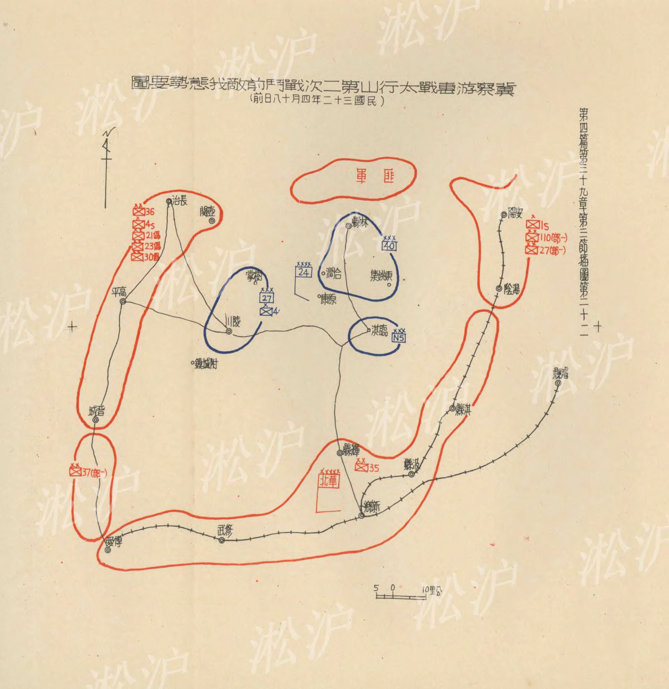

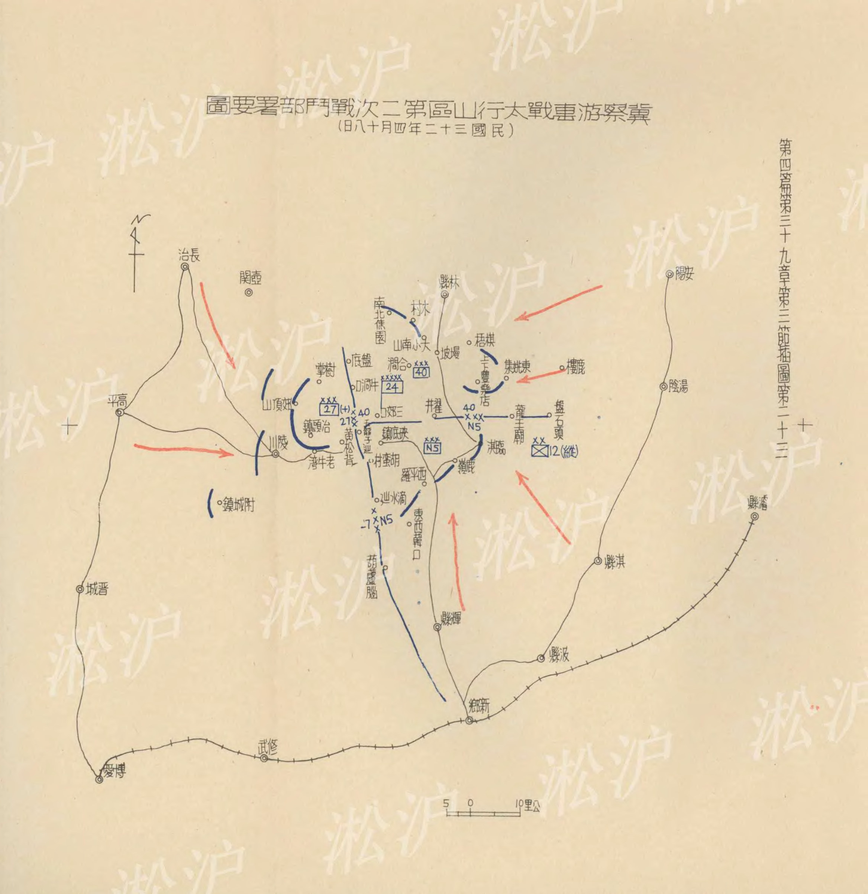

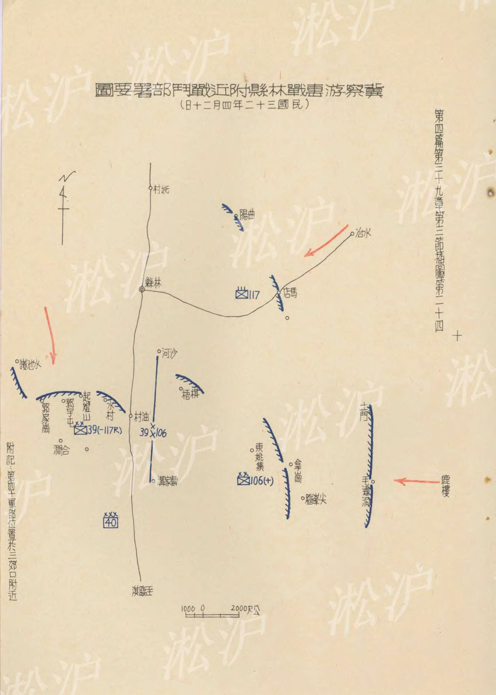

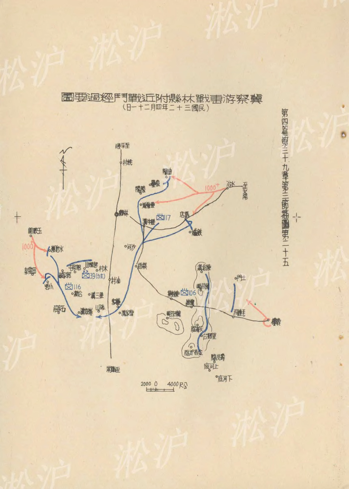

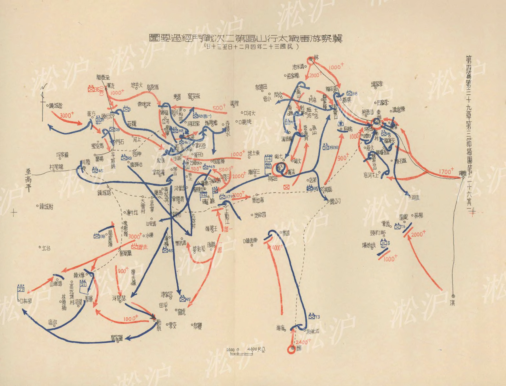

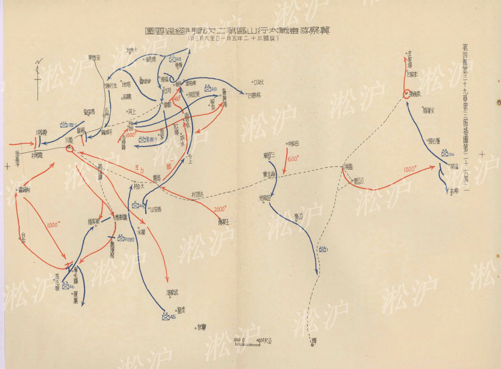

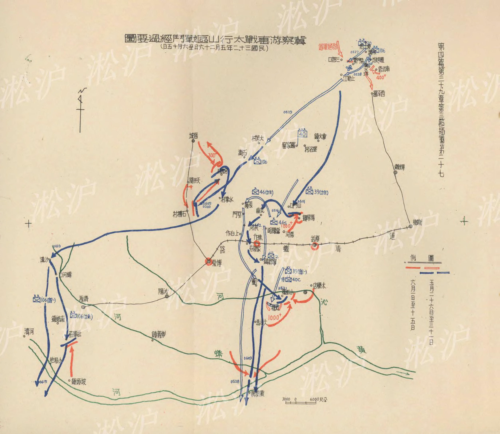

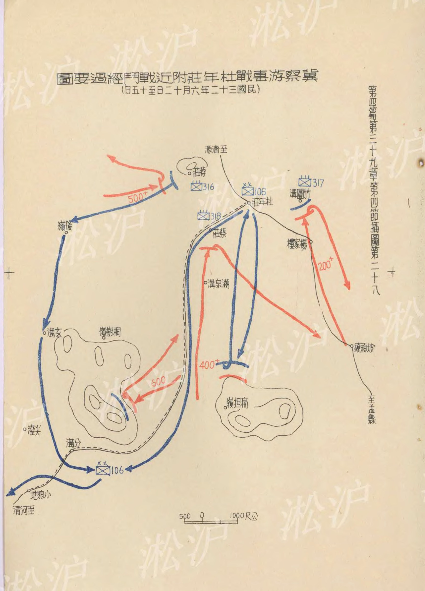

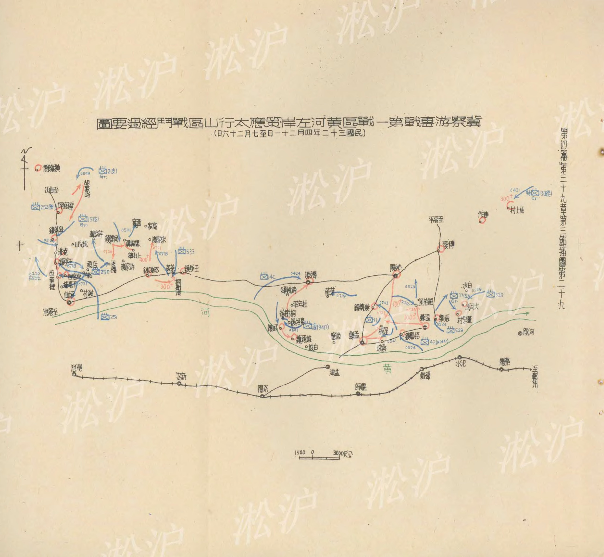

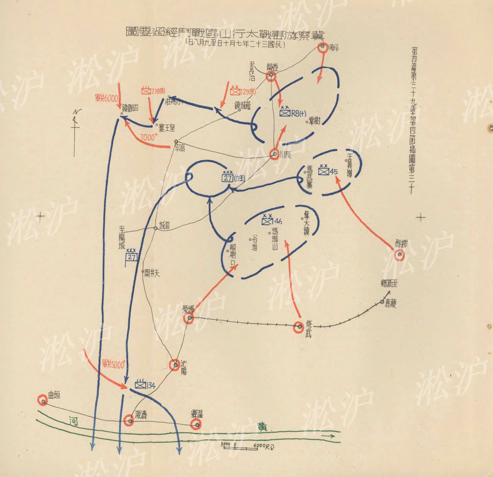

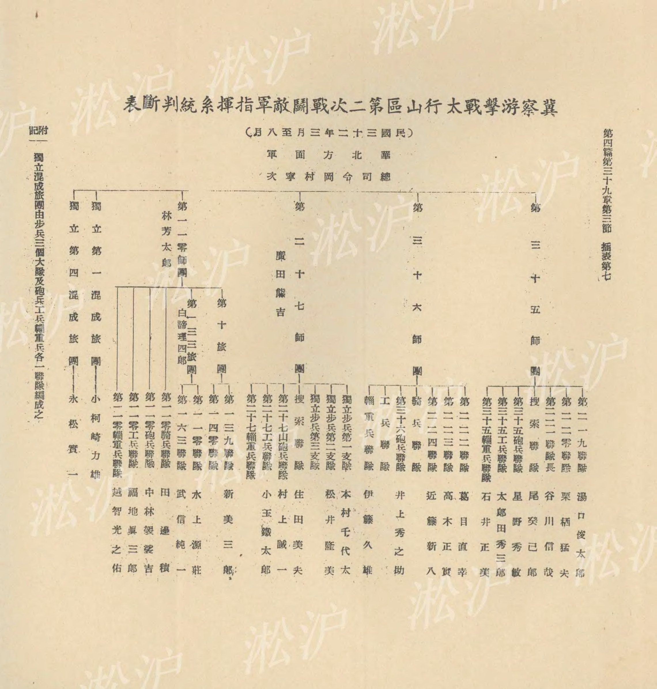

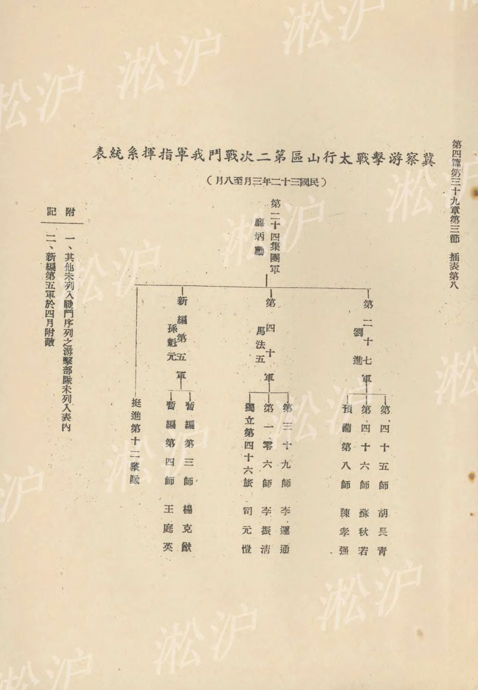

#### 第二款策應戰

##### 第一項策應國軍「夏季作戰」及「冬季攻勢」

民國二十八年春夏之交，冀察戰區於冀南地區展開反掃蕩戰，此時我國軍發動「夏季作戰」，繼之以「冬季攻勢」，該戰區爲策應全面作戰，當卽策定計劃調整部署，其時敵我態勢及指揮系統詳第一節插圖第一及插表第二，幷於六月二十二日奉到軍事委員會夏季作戰計劃要項如左：

甲

方針

國軍以確保山西幷堅持冀察蘇魯游擊戰，以利爾後攻勢作戰計，除直接增強冀察、蘇魯及第二戰區方面兵力外，各該戰區均以三分之一兵力施行局部攻擊，牽制消耗敵人。

乙

指導要領

一、迅速充實冀察蘇魯兩戰區部隊質量，增加經費，補充彈藥武器，幷派遣優秀幹部及政工人員等，以增強其戰力，冀察戰區積極破壞津埔鐵路滄縣至德縣段，平漢鐵路定縣至邯鄲段，阻絕敵之運輸。二、攻擊目標之選定，務須避免據點之爭奪，應編組多數支隊，監視敵據點，如能誘敵脫離據點而殲滅之，是爲上策，敵若固守不出，則進出戰略要點或攻擊容易收效地區，多方擾亂敵後方，使其疲於奔命，各不相顧。

三、敵若先我發動攻勢或乘我攻擊頓挫轉移攻勢時，各戰區應本既定計劃指導作戰。

四、攻擊諸準備限七月中旬前祕密完成之。

冀察戰區鹿鍾麟總司令奉到右項計劃後，於六月三十日策定作戰計劃如左：

第一

方針

本戰區爲協助全面反攻，以一部保持冀西根據地，主力配合民衆武力，展開廣大游擊戰，疲困敵人牽制其交通，以利鄰接戰區反攻容易。

第二

指導要領

一、用政治策略瓦解僞軍，打破敵人以華制華、以戰養戰之毒計。

二、正規軍與游擊部隊配合，分區襲擾敵據點，幷各以一部分段破壞津浦、平漢兩鐵路，及冀省境內之公路與水運，切斷敵後交通，

三、責成軍政機關，利用各軍之特務員及地方熟習敵僞內部情形之政工人員，積極煽動僞軍反正。

第三

部署

一、第十八集團軍賀龍師及呂正操部，主力襲擾冀中淪陷各城鎮之敵僞軍，幷相機殲滅而佔領之。

二、第六十九軍石友三部，第十八集團軍陳光師，民軍張蔭梧部，游擊部隊丁樹本、張國基、胡和道、黃禎秦等部，主力襲擊冀南淪陷區各城鎮敵僞軍，適時集中主力而攻佔之。

三、魯北保安司令劉景良、袁聘之、王金祥各部，襲擾黃河以北山東省境內各城鎮敵僞軍，幷相機殲敵。四、孫良誠部（欠丁樹本、張國基兩部）保衛冀西根據地，相機襲擊石家莊、內邱、邢臺之敵僞軍，幷適時攻佔之。

五、滄石鐵路（不含）以北之津浦、平漢兩鐵路及公路水運等，由第十八集團軍負責破壞之，滄石鐵路（含）以南諸交通要道，由石友三、陳光、張蔭梧、孫良誠各以一部負責破壞之。

天水行營接獲右項計劃後，予以電令修正，「計劃尚妥，惟阻絕敵之運輸，特應側重鐵路及公路之破壞，至於分區襲擾各城鎮之敵僞軍，應遵照軍事委員會頒發之「夏季作戰計劃」指導要領第二項所示實施爲要」。

七月一日，冀察戰區鹿鍾麟總司令，復奉戰地黨政委員會加強政工研究對策五項，其要旨如左：

一、切實執行策動僞軍反正。

二、將政治部頒發之標語，教育一般官兵及民衆，加強對敵僞士兵宣傳工作。

三、運用游擊隊，設法破壞僞組織。

四、調整內部，免爲敵僞及匪軍所乘。

五、加強民衆組織，瓦解敵人陰謀。

七月上旬，冀察戰區策應作戰部署接近完成，即將展開襲擾，獲悉敵高級指揮官松山元喜多及漢奸重要首領，於北平達成協議，以僞剿匪部隊兩萬餘人爲基幹，擴編僞治安軍五萬餘人，於農曆年底前完成，幷以團爲單位，分駐各重要交通線及據點，負責肅清敵後我游擊部隊之責，另於鹵獲敵軍作戰計劃概要中，獲悉其第一軍主力沿白晉公路南下，第二十師團由翼城分路東進，第十師團直趨東陽關，以分進合擊之勢，預定十八日會師長治，爾後再由長治南下，協同沁陽、博愛地區之第三十五師團（該師團由第七、第十、第十四、第二十一等師團各一部編組而成）攻略晉城，幷聞敵軍實施宣撫政策，企圖瓦解我軍。

七月十一日，津浦鐵路滄縣、東光之敵，分向我新編第六師馬莊防地進攻，（參照插圖第三十三）該師除以一部於正面部署吸引敵軍外，以黃旅及特務團預伏敵進路兩側，予以伏擊，斃敵五十餘人後，卽向東轉移，十二日晨，樂陵、舊縣、黃夾、聖佛聯合之敵五百餘，附礮四門，與黃旅戰於官莊，相持至十三時許，敵退去，該旅亦向王八家轉移，旋黑龍村敵百餘，礮二門，續向王八家該旅進攻，激戰達八小時，黃旅續向東撤，同日夜，蕭旅擊潰羊二莊北進之敵後，卽將東光以南津浦鐵路破壞兩段，幷將該地區電桿悉數破壞，十四日午，德石鐵路武邑之敵二百餘，附礮兩門北竄，與鏡村陳光然旅第二團發生戰鬥，（參照插圖第三十四）相持時許，敵退去，十六日十時許，景縣、阜城、武邑、棗強等處之敵一千四百餘，附礮十五門，戰車十六輛，以分進合擊態勢，向陳旅觀涉坂、朔審坡鎮一帶陣地進攻，該旅憑堅固守，相持竟日，死傷二十餘人，至二十三時許，安全撤退，敵亦傷亡一百六十餘人，十七日津浦鐵路東側新編第六師，仍遵照襲擊天津之既定部署北進，行抵六間房附近，爲敵僞軍一部截擊，（參照插圖第三十一）經該師先頭部隊尹贏洲迎擊，相持二小時，卒將敵僞軍擊退，迨十八日四時許，敵抽調滄新公路（滄縣至新海）沿線各據點步騎礮兵四百餘，向新編第六師太平村、六間房防地猛攻，激戰至午，敵我傷亡皆達百餘人，該師被迫東撤，以給養無着，仍繼續北進，至十九日十六時許，到達小站（天津東南）西南地區，又遭敵三百餘圍攻，激戰至夜半，始突圍北進，行抵鹹河南岸，前進受阻，遂隱匿於附近蘆葦中，高樹勳師長由天津庸報獲悉我軍襲擊天津企圖完全暴露，當卽呈報改變計劃但仍繼續北進中。

當新編第六師北進之際，各地游擊部隊及地方團隊均展開活動，策應新編第六師作戰，十二日，冀東游擊隊攻佔劉宋鎮、洩屯鎮等地，（參照插圖第三十一）第三支隊攻佔寶坻縣屬辛集鎮，十五日，第一支隊夜襲豐潤縣城後，以唐山敵增援，乃將城外大橋破壞後回撤，此時河北第三游擊支隊（向修文）活動於冀中落伐鎮、石各莊、黃花店、豆紀莊地區，先後擊斃僞冀中警備司令隋壽臣，廊房警備隊偵探長項叔豪及敵僞士兵十餘人，民軍第二師特務旅（張超）第十七團攻佔藁城縣屬吳家營、內檀村，并發動民衆二千餘，破壞滄石鐵路二十餘里，電桿百餘根，攜回電線六百餘斤，十七日晚，津浦縱隊（張國基）之一部襲擊吳橋縣屬于家集，李玉雙支隊破壞德縣、桑園鐵軌三段，涵洞一座，寧津團隊於博平附近斃敵二十餘人，二十日，山東保安第六旅（王金祥）協同朝城保安隊攻克朝城，另部會同范縣團隊克復范縣，（參照插圖第三十五）此際第十八集團軍呂正操部活動於獻縣樊屯鎮地區。

七月下旬，冀察戰區鹿鍾麟總司令獲悉敵爲根絕我游擊隊之活動，於冀省境內實施決堤毒策，冀縣大名、舘陶（山東屬）等地水深七八尺，交通斷絕，災黎遍野，以致我游擊部隊無法活動，另將鹹河運河决七處，阻止我襲擊天津部隊之北進，同時奉到我軍事委員會徑申電令，其要旨如次：據報敵華北作戰部隊近接東京訓令兩項：一、鞏固有利戰線，加強後方防禦線及單獨據點，二、積極維護後方交通線，并摘要擴建等情，此項方針，對我遲滯消耗戰策略影響甚鉅，特策定對策三項，一、建立淪陷區黨政軍一元化之組織，切實執行襲擊任務，使敵到處感受威脅，無從設防，二、攻擊敵據點如缺乏礮火支援時，則以封鎖、包圍、遮斷、誘迫諸手段，使敵脫離據點或城市，一舉而殲滅之，三、各戰區游擊支隊及正規部隊，以軍爲單位，均應編組交通破壞隊，（以一個隊人數爲原則）教以破壞技術，再由戰區區分其任務，並將交通線附近民衆加以組織，協力我軍破壞，並拒絕敵僞徵工」。

德石鐵路清河附近第六十九軍特務團，自十七日晚以來連夜進襲王官莊（清河西南十五里）之敵，（參照插圖第三十四）終以其工事堅固，外壕過寬未能奏功，迨二十二日運河決口後，王官莊三面皆水，該團乃於是夜撤退，二十六日，該團以一營進擊威縣，另部襲擊方家營，敵我雙方皆以擲彈筒對戰，翌日拂曉，兩部先後撤回，二十七日晨，朱文和旅第一零七五團，向南宮東南之大高村敵二百餘攻擊，相持至九時許，該團以一部繞襲敵側背，敵不支向南宮撤退，迨三十日，敵由鉅鹿、南宮、冀縣等處抽調步兵四百餘，附砲四門，戰車兩輛、汽車十餘輛，向該團進攻，我以伏兵襲擊，敵損失慘重，狼狽撤退，天津附近新編第六師到達鹹河南岸，河水氾濫成災，行動困難，直至月底仍潛伏於韓村鎮（在青縣東南）辛集以東地區。（參照插圖第三十一）

平漢鐵路方面，七月二十四日高邑、石家莊步騎兵七百餘砲四門之敵，分向元氏、黑水河民軍阮紹棠、李維棟等部攻擊，（參照插圖第三十六）該部佔領九牛山、珍珠山線之旣設陣地迎擊，敵不支退去，三十日，冀東游擊隊（陳維藩）第四支隊二千六百餘，攻佔武清縣屬梅廠鎮及北倉兩地後，續向天津附近之敵攻擊，（參照插圖第三十一）俘敵僞百六十餘人，斃敵數十名，鹵獲機槍六挺，步槍二枝，彈藥萬餘發，汽車七輛，遂卽撤退。

八月上旬，敵由津浦鐵路沿線及長江兩岸各調兩萬餘人，先後由津浦而北寧兩路轉運東北，其餘各地仍爲局部活動，四日八時，敵僞四百餘，向葛沽堂、夏莊子一帶我海濱游擊第二縱隊（竇同義）攻擊，激戰終日，入夜後敵回竄，同日晚，冀魯邊區游擊第一縱隊（丁樹本）襲擊龍王廟之敵（參照插圖第三十五）相持三小時，後東撤，七日八時許，敵攻佔內黃，八日十時許，第三支隊於魚塡場附近設伏，斃敵十餘人，焚燬汽車三輛，迨十四時許，南樂、龍王廟、五花營等處之敵僞軍西向增援，行抵李茂堤西北地區，又遭我第十三旅伏擊，敵傷亡殆盡，南樂僞縣長何舉之僅以身免，九日，該縱隊主力遂收復清豐、濮陽兩縣。

七日夜，游擊第二縱隊於內邱以北地區破壞鐵橋一座，鐵軌里許，割斷電線三華里，另部與敵在溫家莊遭遇，戰五小時，敵退恩關，八日柳林鎮敵二百餘，附砲二門，向該縱隊岳溝、東趙莊攻擊，相持三小時，敵潰退，同日，第二旅第四第六兩團各一部，向齊家莊、軍寨一帶襲擊，行抵白漳村遇敵二百餘，當卽予以圍攻，激戰三小時，卒將該地攻佔，又河北民軍特務旅（張超）第十六團，向高邑車站攻擊，該團團長李春國親率第二營衝入敵陣，短兵相接，旋敵鐵甲車來援，遂向西撤退。

八月中旬，敵調動頻繁，由塘沽登陸之敵五千餘，車運至石家莊後，開赴山西，並由華北招募壯丁四千餘，經天津轉運東北，此時我軍事委員會爲加強游擊力量，特將冀察戰區劃分爲五個游擊區，並於八月十六日電令天水行營及冀察戰區如次，（參照插圖第三十二）爲加強淪陷區游擊力量，使黨政軍一元化，將冀察戰區區分爲五個游擊區，第一游擊區北運河（含）以西、大清河（含）保定、定縣、曲陽、阜平以北地區，以阜平、涞源、易縣一帶之五臺山脈爲根據地，轄第一二零師（賀龍）第一游擊支隊（呂正操）第三游擊支隊（聶榮臻）由賀龍統一指揮，第二游擊區大清河以南、滏陽河以西以北地區，以內邱、贊皇、元氏一帶之太行山脈爲根據地，轄河北民軍全部，游擊第四縱隊（侯如墉）冀省保安隊，（李允聲）統由張蔭梧指揮，第三游擊區滏陽河以南、黃河以北新河、威縣、清豐以東至渤海沿岸地區，西部以清河、威縣爲根據地，東部以寧津、樂陵爲根據地，轄第六十九軍，（石友三）新編第四旅，（孟昭進）新編第十三旅，（黃禎泰）魯北保安第二十二旅（袁聘之）第二十三旅，（吉占鰲）第六旅，（禾金祥）第八旅，（劉耀庭）第九旅，（于耀川）第十一旅，（齊子修）第三十一旅，（吳連傑）第五旅，（徐仲陽）第二十五旅，（唐敬臣）第十旅，（張棟臣）魯北保安獨立第六旅，（張子良）統由石友三指揮，第四游擊區內邱、新河以南、新河、威縣、清豐以西，至冀晉與冀豫邊界地區，南部以清豐、濮陽爲根據地，西北以邢臺、邯鄲以西之太行山脈爲根據地，轄游擊第一、第二、第三等縱隊及獨立游擊第一支隊，（黃宇宙）別動第五縱隊，（范蘭庭）由孫良誠統一指揮，第五游擊區爲白河、北運河以東之冀東地區，以遵化、薊縣一帶之山區爲根據地，轄第一二九師，（陳光）東進縱隊，（蕭華）平東游擊第一支隊，（李維周）平東游擊第二支隊，（王乃乾）河北游擊第五支隊，（向修文）冀察游擊第六支隊，（李經武）以上五個游擊區，統由冀察戰區節制指揮，並希詳加研究具覆」。

天水行營程潛主任奉到上項電令後，經詳加研討具申意見如左：

一、查第五游擊區總指揮劉伯誠及其所屬第一二九師，遠在晉省東南作戰，恐難抽調，該區總指揮以冀察戰區駐津特派員邢國光或由鹿鍾麟另行選派爲宜。

二、第二、第三、第四等游擊區地境，應將滄縣至天津之津浦鐵路劃歸第三區，清河、威縣劃歸第四區，前者石軍已派部隊於天津近郊作戰，利用其原態勢較宜，後者孫良誠實力雄厚，現劃分地區似嫌褊狹，且孫良誠在冀中頗久，對清河、威縣熟諳，發動民衆較易。

三、其餘均極贊同，所陳當否，仍乞睿裁施行。

該行營並於八月十七日電令第一、第二、第八及冀察各戰區：其要旨如次：敵軍將華北兵力抽調出關，華南仍略有增加，似此貴戰區亟應按照原定夏季攻勢作戰計劃，一面整訓，一面積極採取攻勢，先將晉東南白晉公路之敵肅清，再轉移兵力於三角地區，晉西、晉北同時積極攻襲牽制敵之增援，務使敵軍無整理喘息之餘暇，無轉移兵力之機會，又時當雨季，洪水橫流，敵機械化部隊大受限制，青紗帳起，對我軍行動與企圖更屬有利，希卽遵照實施具報爲要。

津浦鐵路東側：八月十二日十時許，慶雲縣屬板打營之敵百餘人，分兩路向新編第六師第四團水王家、小田家、韓家一帶防地攻擊。（參照插圖第三十三）戰四小時，敵略有傷亡，向東撤退，翌日，寧津敵僞三百五十餘人，附砲二門，分兩路向黃家鎮該師第二團第二營攻擊，相持四小時，敵退寧津，該營亦向東北地區轉移十七日晨，德石路棗強之敵二百餘，附砲三門，進攻第一八一師陳光然旅張團馬廠附近防地，（參照插圖第三十四）激戰至黃昏，敵退據杜雅科、王家窪、黃家窪地區，迨十九日晚，張團再向該敵攻擊，相持達三小時撤退。

冀魯邊區游擊第一縱隊第一支隊十一日晨，於大名東南秦莊附近擊退南樂北進之敵，（參照插圖第三十五）十五日，第三支隊獲悉五花營敵僞百四十餘人，附砲二門有北犯龍王廟之企圖，卽於喬崇町附近設伏，予以猛襲，敵不支退去，十九日一時許，第一、第三兩支隊，合力圍攻龍王廟之敵，旋大名增來敵僞二百餘，戰車三輛，裝甲車六輛，向該部側背攻擊，力戰達數小時，敵分向高莊及龍王廟村內撤退。

平漢鐵路方面：游擊第四縱隊（候如墉）獲悉元氏敵主力北調，於十五日四時以一部包圍方塚，掩護獨立團奮勇隊五十餘人向城內衝擊，（參照插圖第三十六）此際敵援兵馳至，該部且戰且走，同日晚，第五支隊襲擊高邑車站，俘獲敵通譯方希澤一員，此時特務團及第二支隊分於獲鹿及娘子關破壞鐵路，均有斬獲。

德石鐵路方面：河北第七區專員邵鴻基部第一支隊，十二日夜冒雨襲擊渚宜鎮，（即北渚宜在冀縣西北）旋卽攻入鎮內，（參照插圖第三十四）與敵巷戰達兩小時，卒將該鎮攻佔，敵傷亡數十人，俘獲僞團長劉少棠一員步槍三十餘枝，十七日晚，魯北保安第十旅（張棟臣）襲擊武城，敵出城反撲，旋受重創，退入城內，此時保安第十一旅（齊子修）於博平擊退清豐、高唐合力進犯之敵四百餘，頗有斬獲。

八月下旬、敵軍仍調動頻繁，爲澈底肅清我游擊部隊，華北派遣軍將華北部隊區分爲四路同時進攻，並限四個月完成，此時鹿鍾麟總司令奉到蔣委員長宥午電令，其要旨如次：七月攻勢未收預期戰果，深爲遺恨，現國際情勢激變，更有利於我，須予敵一重大打擊，促成有利之發展，各戰區應於九月中旬，以現有兵力繼續攻擊，確保截斷敵後重要交通線，並消耗敵人，冀察戰區對平漢鐵路須分段截擊，阻止其通車，總之，九月中旬各戰區必須共同出擊，不得玩忽敷衍坐失時機」。

前經陳光然旅張團猛攻退守杜雅科一帶之敵，於二十三日晨獲得衡水、冀縣敵二百餘，砲四門之增援解圍後，卽合力向該團第六連猛撲，（參照插圖第三十四）激戰四小時，該連連長身負重傷，猶指揮不退，卒斃敵五十餘人而殉職，二十四日晨，敵繼續攻擊，該團力戰，不支向棗強撤退，此時新編第六師高樹勳師長親率新編第十三旅及第二旅第三團，向魯西推進，於三十日八時到達平原禹城間九聖廟，新張地區，旋平原之敵四百餘，禹城敵百餘，合力向九聖廟第十三旅第一團達攻，相持二小時，該旅另部增援，襲擊敵側背，敵不支撤退。

第二縱隊（趙雲祥）第二旅吳營，協同南宮保安隊，二十日晚於恩關、南宮間設伏，迨二十四日恩關敵僞百餘，分乘汽車五輛，被該部伏擊，戰三小時，敵後續部隊到達，該營向田村轉移（參照插圖第二十四）二十七日，該旅第四團於前後霽寨（冀縣屬）附近截擊由冀縣南駛之敵汽車八輛，敵倉皇應戰，旋卽撤退，該團佔領恩關。翌日，冀縣、南宮之敵三百餘，砲數門，合力圍攻恩關，經吳營之迎擊及劉旅長率隊馳援，鏖戰終日，終以敵火猛烈，遂轉移陣地。

冀魯邊區方面：第一縱隊（丁樹本）直屬第三支隊，於八月二十二日晨獲悉邯鄲之敵五百餘，開赴大名，當卽於魚塡鎮設伏，迨十二時許，敵於該鎮南端經過，卽予猛擊，敵向邯鄲敗退，（參照插圖第三十五）二十六日，龍王廟僞軍一部，押運民船五隻，滿載葦蓆向大名行駛，該支隊卽推進李茂堤東端向敵攻擊，僞軍逃竄，船隻盡入我手，二十七日，敵百餘附砲一門，由五花營向龍王廟前進，第三支隊第一大隊協同南樂自衛團，於昌崇町附近予以截擊，敵未暇應戰，倉皇逃去，三十一日晚，平漢鐵路方面第四縱隊（候如墉）獲悉高邑一部赴贊皇接防，卽着于支隊於葛城鎮予以截擊，（參照插圖第三十六）相持四十分鐘，敵退高邑。

九月初，冀察戰區鹿鍾麟總司令獲悉敵於冀東各縣抽調壯丁，縣警備隊及僞青年團等各一部，共計一萬五千人，於馬家溝集中訓練，又魯西北恩縣、夏津、高唐、臨清、聊城、青平、博平、茌平等縣，除縣城被敵佔領外，各鄉鎮均無敵蹤，情形極爲混亂，除第十八集團以一部滲透其中活動外，魯省袁專員亦控制一部，但政令仍無法推行。

九月一日至四日間，第九十六軍新編第六師曾於洛家店、舊縣各地與敵數度交戰，均有斬獲，迨十日十二時許，聊城之敵五百餘，（參照插圖第三十五）附砲四門，分乘汽車四十餘輛，向新編第六師第三團第一營陳魏東莊陣地攻擊，先以砲擊，繼之以包圍猛攻，該營沉看應戰，迨敵迫近陣地以步槍與手榴彈與敵鏖戰，相持至十六時，聊城之敵繼續增援，此時該團第三營由安樂鎮襲擊敵後，戰況愈趨激烈，第一連連長賈子良及第三連連長鄢陶武先後負傷，仍裹傷指揮，激戰至翌日一時許，卒將敵擊潰，斃敵二百餘，我軍僅死傷三十餘人。

九月十五日，濟南、德縣、聊城等處之敵八百餘，採分進合擊方式，向新編第六師攻擊，該師楊梯隊連日於紅廟（荏平南）安樂鎮（陽穀東北）等地與敵激戰，斃傷敵三百餘，毀其汽車六輛，迨十九日，該師向觀城轉進，敵分路追擊，二十二日又與我李馬兩團激戰於干口、西紫陽地區，此時游擊第一縱隊一部由前後方家前來增援，將朝城增援之敵四百餘包圍於干口、梁村地區，激戰終夜，敵傷亡極重，二十三日，當面之敵增至千餘，該師轉移前後方家，敵繼續追擊，二十四日晨，新編第六師協同游擊第一縱隊一部於劉尙村予以迎擊，敵向南樂以東地區撤退，該師進佔南樂，二十五日當面之敵會同龍王廟敵千餘，反攻南樂，該師撤離縣城，活動於外圍地區。

此時游擊第一縱隊於南樂、大名地區展開活動，三日至十四日期間，曾數次予敵以襲擊，頗有斬獲，迨十六日十二時許，該縱隊第八第十二兩總隊向龍王廟之敵攻擊，曾一度衡入城內，與敵巷戰達二小時，終以敵之巷戰設備及火網編成良好，未奏全功而退。

游擊第四縱隊獨立總隊一部，十四日晚於白婁附近，遭遇敵僞一百三十餘人，（參照插圖第三十六）對戰時許，敵續由元氏增來六十餘，向該部右翼迂迴，經迎擊後，敵回竄，十七日該縱隊一部，於高邑以南地區破壞平漢鐵路四段，長約里許，並收回電線六百餘斤，十八日，於白婁截擊敵之補給車輛，將押運部隊擊退後，函獲車輛一部，二十四日夜，該縱隊一部於富村（元氏南）與敵遭遇，斃敵小隊長及士兵數人，該部傷亡分隊長一員。

十月初，冀察戰區鹿鍾麟總司令獲悉僞治安軍於十月一日正式成立，計分三個集團，由劉鳳池、黃南鵬、劉組笙等三員分任僞軍集團長，每集團轄步兵兩師，另設兩個獨立團，共約一萬三千人，分駐冀省各地，並於十月十日奉到我軍事委員會「國軍冬季攻勢作戰計畫」如左：

第一方針

一、國軍以消耗敵人導國軍爾後作戰於有利之目的，以本會直轄整訓部隊主力加入第二、第三及第五各戰區，對左列各地區主攻：

(一)、第二戰區切實截斷正太與同蒲兩鐵路，肅清同蒲南段晉南三角地帶之敵。

(二)、第五戰區掃蕩平漢南段武漢、信陽間敵人。

(三)、第三戰區攻擊獲港、貴池、湖口間沿江敵人，切斷長江交通，依狀況對貴池、武穴、田家鎮各要點實行略取。

二、爲牽制敵之兵力，俾主攻方面奏功容易，其餘各戰區向當面敵人實施助攻，策應主攻方面之作戰。三、攻勢開始時期

助攻方面十一月底。

主攻方面十二月底。

第二

指導要領

一、主攻方面依助攻方面之進展，實施攻擊，任助攻方面之部隊務牽制敵之主力，使主攻方面進展容易。二、各助攻方面應依左記之指導，分別協力主攻方面之攻擊。

主攻方面（略）。

助攻方面，冀察戰區以主力切斷保定、邢臺間及石家莊附近之交通，以一部切斷滄縣、德縣各附近交通。

三、各助攻方面，以消耗敵人，切斷其交通，牽制其兵力轉移爲目的，並向敵人要線攻擊爲主，切斷分離敵人，誘敵于要點外，捕捉其弱點而擊滅之，依狀況或攻其不備，聲東擊西，或先斷敵交通，主力控制待機位置，截擊其策應赴援之敵軍或乘虛襲取其要點。

餘略

十月七日拂曉，王官莊（清河西南約十六里）之敵四百餘人，附砲三門，向南候貫我第九十六軍第一八一師第五三八旅張團第一營猛攻，（參照插圖第三十四）並以毒氣彈三十餘發助攻，該營官兵戰志堅定，敵終未獲逞，該旅旅長米文和獲知該營狀況後，卽以騎兵一部及便衣隊百餘人，分由倉莊、魏家寨襲擊敵之側背，該營同時出擊，敵不支向王官莊敗退，遂跟蹤追擊至大辛莊、馬家屯（王官莊西北）附近，敵傷亡慘重，二十九日夜，該師張雨亭旅高團，向王均鎮（棗強東南）攻擊，與該部混入鎮內之便衣隊取得連絡後，攻克該鎮，敵向楊蘇莊敗退，旋退棗強。

冀東方面，冀察游擊第六支隊長李經武，十四日晨，率所部六個中隊，由黃家磯向遵化推進，行抵東中兒莊附近，被敵僞千餘包圍，（參照插圖第三十一）激戰至十六時，該支隊傷亡慘重，司令馬文嶠，參謀鄧均安及士兵八十餘人，均壯烈犧牲，生死不明者百三十餘人，李經武支隊長率士兵百餘突圍至馬山莊收容整理。

二十七日，游擊第一縱隊第八總隊之一部進襲郝莊（南樂西北）當晚衝入村內，（參照插圖第三十五）敵憑高樓頑抗，巷戰兩日，終未奏功，迨二十九日晨，該部全力增援，將敵包圍，並擊退回隆敵之增援部隊，而郝莊之敵仍在負隅頑抗，二十八、二十九兩日，第四支隊（于飛）配屬破壞大隊，在內邱縣島馮村及二十里舖院近埋設地雷，炸燬敵機車二，鐵甲車七，並擊斃敵兵五十餘人。

十一月一日晨，游擊第三縱隊（趙雲祥）第十七總隊第一大隊，於冀縣以西地區展開活動，八時許，與冀縣之敵僞百四十餘人遭遇於魏村附近，（參照插圖第三十四）該大隊行動迅速，先敵佔領該村俟敵接近，卽予猛擊，敵敗退冠家集，該大隊復跟蹤追擊，仍退回冀縣，此時獨立游擊第一支隊及路朝元部，於平漢鐵路塔禪、關店、臨洛各地施行破壞，先後炸燬敵機車兩輛，斃傷敵兵百餘。

十日十時許，黃河南岸高莊（荷澤屬）之敵步騎兵六百餘，附山野砲七門，戰車三輛，裝甲車及汽車十八輛，向東明方向急進，我游擊第一縱隊獨立第一總隊長丁宗憲獲悉後，卽於五里舖、八里舖、崔寨之線佔領陣地，（參照插圖第三十七）迨十五時許，敵先頭一部與我五里舖守備部隊接觸，旋擊毀敵裝甲車二輛，餘退去，十六時許，敵以一部迂迴野鷄營，主力由正面攻擊，重點仍指向五里舖，該總隊官兵奮不顧身，竟以步槍、手榴彈、大刀等近戰兵器浴血抵抗，激戰至十九時許，陣地悉被摧毀，傷亡尤爲慘重，此時全村化爲火海，丁宗憲總隊長卽率左翼第三大隊轉進支寨，略施整頓，協同東明民軍向敵夾擊，頗有進展，旋敵增援部隊五百餘到達，該總隊遂乘夜暗時機，撤退至黃河西岸，是役我傷亡百二十餘人，斃敵尤夥。

十一月二十九日，該縱隊丁樹本司令，獲悉大名之敵四百餘，附砲四門，向小灘鎮（大名東北約四十里）大名自衛團攻擊，（參照插圖第三十五）卽着第三支隊協同新編第六師之一部馳往支援，經激戰後，將敵擊退，小灘鎮失而復得，此際第一八一師於南宮、威縣地區，民軍喬明禮部於欒城、藁城附近，游擊第四縱隊於元氏附近，積極展開破壞與游擊，敵鐵路運輸時陷於中斷狀態。

十二月二日，僞新民會成立，並推王克敏爲會長，十一日，大名自衛團於黃金堤附近時予敵以伏擊，並於十七日夜，破壞大名城郊公路及電線二十餘里，此時游戰第二縱隊（夏維禮）第四支隊於沙河以南破壞平漢鐵路橋梁一座，民軍喬明禮部獨立第六團，於西縵村（獲鹿縣屬）附近炸燬敵機車一輛。

十二月下旬，各部隊又積極活動，二十一日晨，第一八一師第五三八旅旅長米文和，獲悉威縣敵僞二百餘，向馬莊進攻，（參照插圖）當率文大可團前往支援，將敵包圍，激戰二小時，敵突圍向威縣撤退，三十日夜，該團向威縣進攻，敵負隅頑抗，激戰至次日拂曉戰鬥仍在進行中，旋方家營敵八十餘前來增援，行抵李寨附近，被我伏擊，由原路回竄，該團亦於此時撤回，當二十一日第五三八旅與敵激戰之際，新編第六師李存科旅，將冠縣、茌平間各道路完全破壞，二十二日十二時許，津浦路方面，寧津、柴胡莊（寧津東）兩據點之敵二百餘，附砲一門，會攻張項莊、張紙房該師第四團及特務團，（參照插圖第三十三）激戰至二十一時許，第四團長獲悉另敵兩千餘由朱家寨前來增援，當卽向東撤退，三十一日夜，德石鐵路方面，第一八一師張旅高團向棗強攻擊，（參照插圖第三十四）以一部於東南城角佯攻，主力隱蔽於城西地區，旋該團奮勇隊百餘與混入城內便衣隊協同，於西北端攀登入城，擊斃敵西門守兵十餘人，主力相繼衝入城內，敵憑高樓據點頑抗，巷戰至曉，遂撤出城外。

游擊第一縱隊第三支隊特務大隊（馬如何）自月初以來於大名城西雙廟一帶，發動村民二千餘人，將魏市鎮東西公路五十餘里破壞，大名至邯鄲之交通中斷，敵軍運改由廣平繞道而行。二十四日，該大隊又發動民衆將大名至廣平公路破壞。敵雖增調部隊掩護督修，至月底，乃未恢復通車。

此時平漢鐵路方面，游擊第四縱隊（侯如庸）活動於元氏附近。二十八日十四時許，元氏獲鹿步砲聯合之敵三百餘，分向齊范村該縱隊第二十總隊進攻。（參照插圖第三十六）經協同民軍一部伏擊與迎擊，敵不支敗退獲鹿，翌日，第十支隊向贊皇之敵三百餘襲擊，行抵北郝莊附近，與敵遭遇戰三小時，敵敗退城內，三十日，贊皇、高邑、臨城三縣之敵四百餘，於大河道附近集結後，向瓦窯村第十支隊進攻，該支隊獲悉情報後，卽撤至村西予敵以反包圍，敵不支向贊皇敗退，此際游擊第四支隊，游擊第三縱隊游擊第二縱隊，大名自衛團及民軍喬明禮部，分別於邢臺、咽喉村、冀縣、劉家莊、平漢鐵路塔槤車站，大名至廣平公路，岳村及元氏以西地區展開游擊與破壞，頗有斬獲。

民國二十九年一月二日，山東境內新編第六師（高樹勛）李存科旅龐營發動民衆三千餘人於冠縣、館陶間破壞公路五十餘里，高營發動民衆三千餘人，破壞馬家河以西至五里舖之公路四十餘里，三日，邊臨鎮（德縣屬）之敵百五十餘向官道村劉旅劉秀嶺團進攻。（參照插圖第三十）經該團迎擊，敵敗退，翌日該敵增五十餘人，再度進攻，經得第四團之增援，敵向神頭鎮撤退，二十日晨，德平、寧津兩縣敵僞軍一部，向小店、黃家集（寧津南）新編第六師竇、蕭兩團進攻，戰至日暮，敵向德平撤退，翌日該師喬團協同陽穀保安團發動附近民衆，將薛莊附近道路及聊城至陽穀公路各破壞十餘里。

此時第九十七軍（朱懷冰）於平漢鐵路展開破壞與游擊，二日二時許，第九十四師危團第一營配屬爆炸隊一部，於馮村車站附近炸燬敵裝甲車及車皮四輛，重砲、山砲各一門，機槍一挺，斃敵十餘人，並將附近電線破壞十餘里，是日，該師趙團亦於馮村以北地區炸燬敵機車及車皮五輛、砲二門、機槍七挺，破壞鐵路五十餘公尺，十四日晚，該師張團一部協同師爆破隊一部，於史村（馮村車站南）附近埋設炸藥兩處，炸燬敵車皮二十餘輛，十六日，新編第二十四師（張東凱）馮營攻擊營井，（武安縣屬）將敵誘出城外，予以猛擊，激戰二小時，敵死傷頗重，敗退城內，是夜，軍屬爆破隊第一中隊胡金林隊長，率預該隊冒雪至內邱車站以北地區埋設地雷多處，十七日晨，炸燬敵兵車一列，死傷三百餘人。

游擊第二縱隊（夏維禮）第六支隊第二隊，四日晨於和村附近襲擊由武安向磁縣行進之敵僞五百餘。（參照插圖第三十六）相持達兩小時，敵且戰且走，續向磁縣前進，十一日十二時許，游擊第一縱隊（丁樹本）第三支隊騎兵中隊，與大名敵五十餘遭遇於白范村，（大名西北）戰時許，敵敗退大名，是夜，該支隊另一部破壞大名附近公路及電線六里許，十二日拂曉，第六支隊一部於李謝村（大名縣屬）附近遭遇敵僞三百餘，於激戰中，該支隊第二大隊前來增援，向敵夾擊，排長崔明生勇往直前，奮不顧身，曾刺死敵人十三名之多，遂壯烈殉職，敵傷亡頗重，向北敗退。

十九日拂曉，龍王廟（大名南）敵僞四百餘，野山砲四門，向第一縱隊第八總隊第三大隊南北渠頭莊陣地進攻。（參照插圖第三十五）以一部攻擊北渠頭莊及南張村，主力指向南渠頭莊戰至十時許，北渠頭村遭敵突破，第六中隊長史戰國負傷指揮，續退據民房抗拒，南渠頭村方面敵雖數度猛攻，均被擊退，十五時許，敵增二百餘，砲四門，該縱隊第一總隊亦陸續到達，由崆鵞村向敵側背攻擊，另以一部向張家村以北迂迴，戰至十七時，敵有動搖之勢，我軍內外協同反攻，北渠頭村第六中隊遂告解圍，續向敵猛攻，旋不支敗退龍王廟。

二月間策應冬季攻勢作戰，已近尾聲，除以一部繼續活動外，主力仍部署反掃蕩戰，一日晨，東明縣長獲悉荷澤之敵二百餘，有進攻東明之企圖，當卽着自衛團向荷澤方向推進，迎擊該敵，另敵三百餘旋由考城到達城郊，該縣長卽以堅壁清野政策拒敵，迨十六時許，自衛團擊退荷澤方面之敵後，反攻東明，激戰至次日二時許，該城又入我手。

二日，玉泉嶺（武安縣屬）之敵三百餘，向第九十四師第二八零團徘徊鎮進攻，（參照插圖第三十六）此際另敵便衣百餘，襲擊第二連側翼，同時徘徊鎮南端第三連亦被敵包圍，旋彈藥不濟，繼之以肉搏，該連連長陳國勝，排長張銀龍及士兵一部先後壯烈犧牲，迨韓團增援部隊到達後，敵向武安撤退，至此策應國軍冬季攻勢作戰遂告結束。

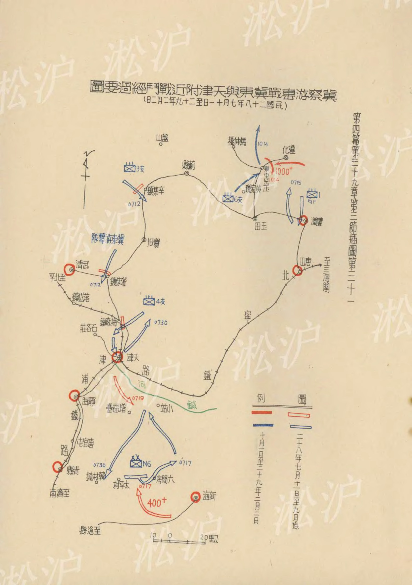

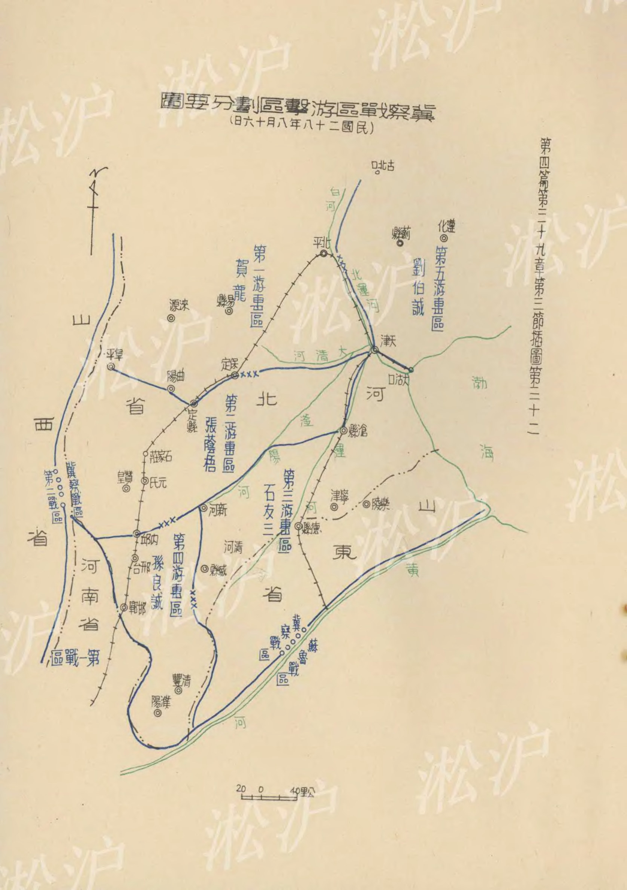

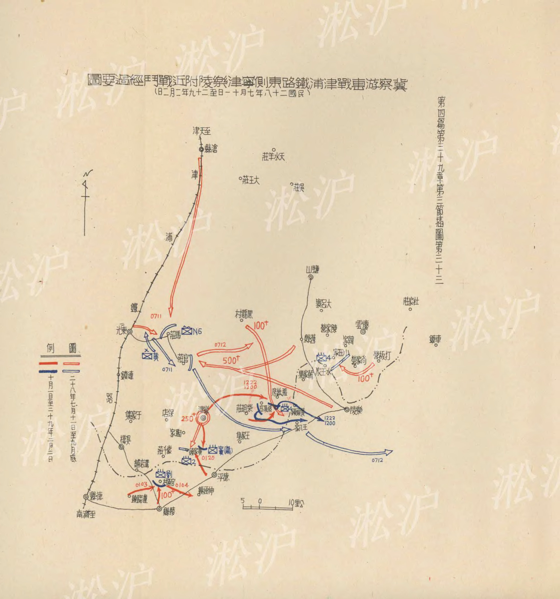

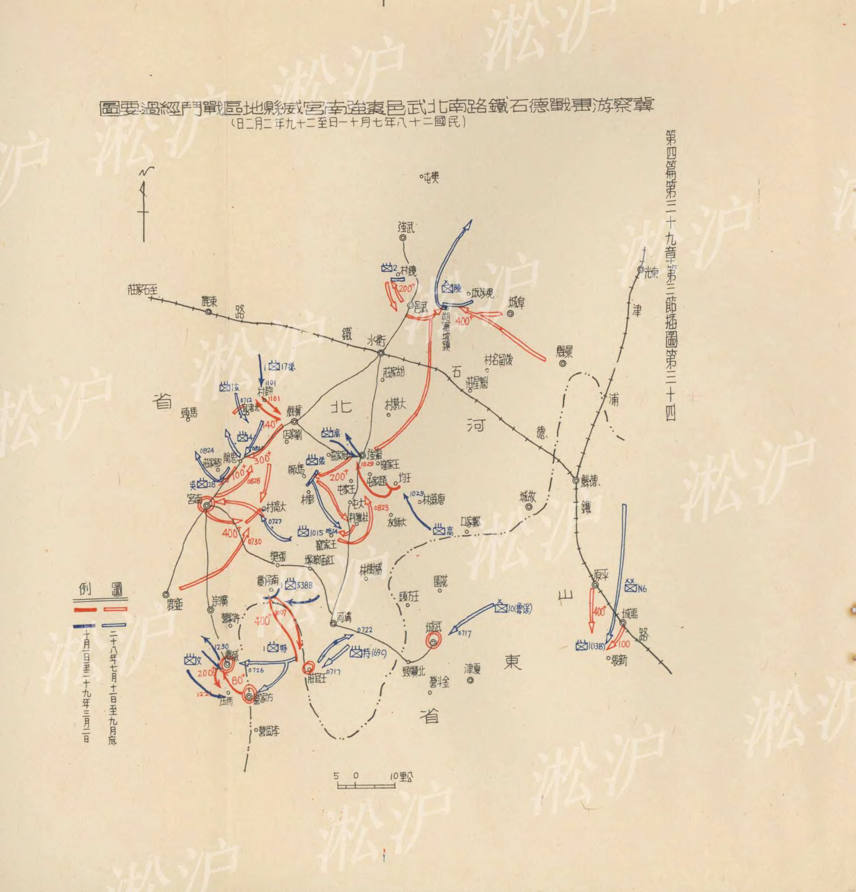

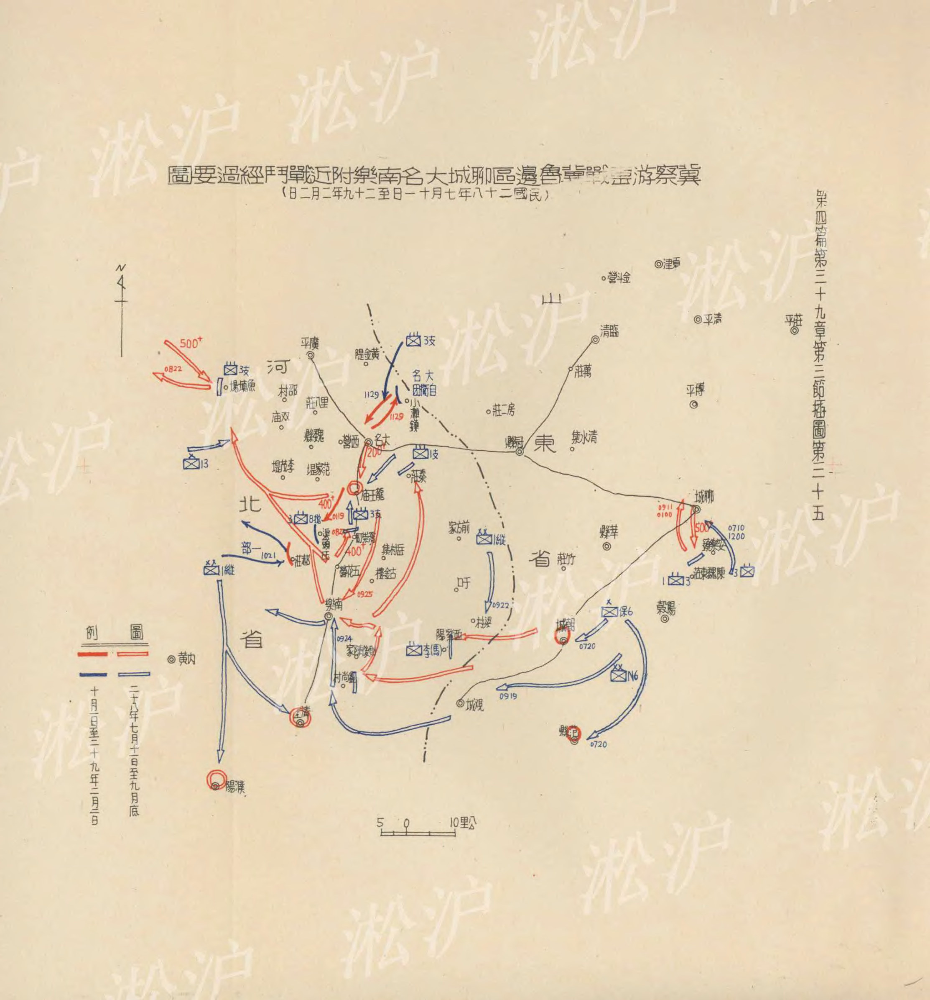

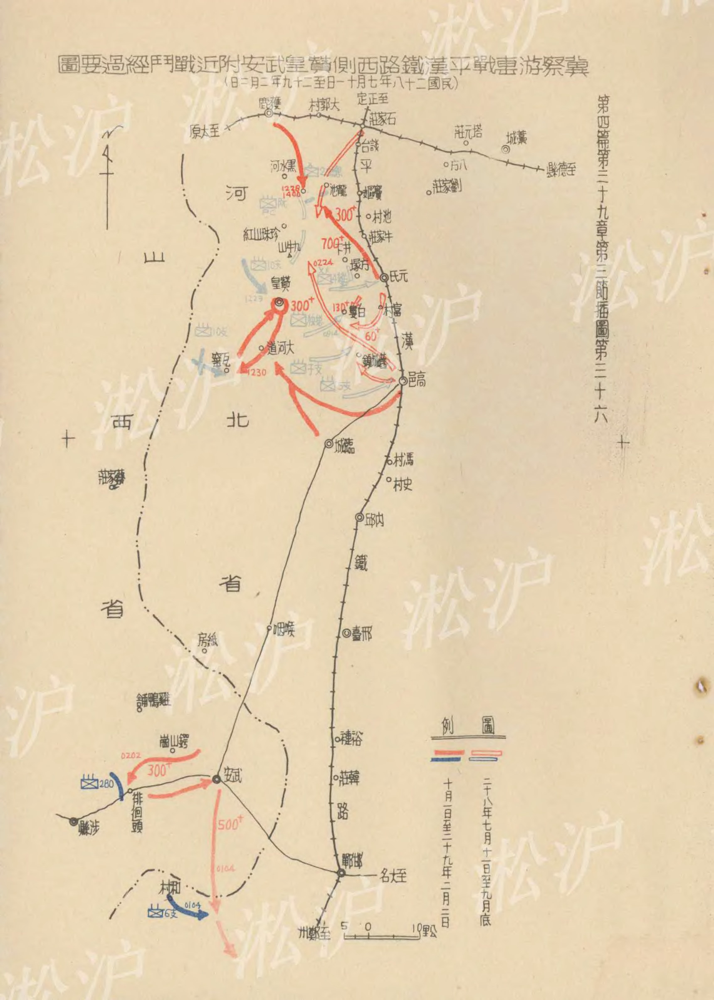

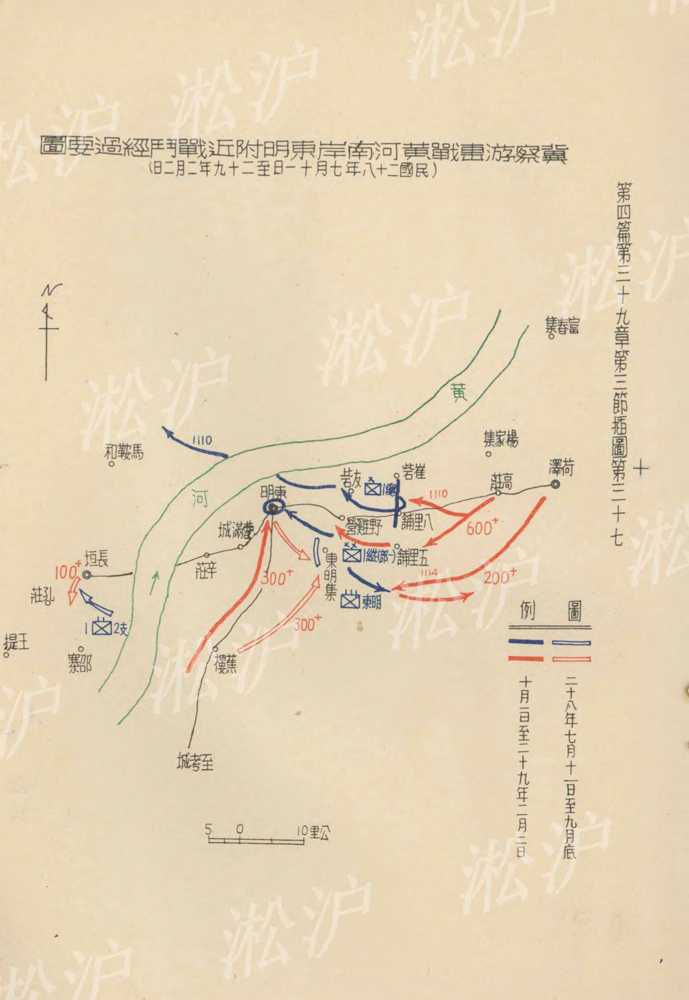

##### 第二項 晉豫邊境策應戰鬥

民國三十年三月七日至十四日

參照插圖第三十八至四十

民國三十年一、二月間，對敵展開政治、經濟作戰之際，（參照插圖第三十八）敵軍第三十五師團於平漢鐵路淇河至新鄉間及道清鐵路扼守要點，其獨立混成第一旅團負責平漢鐵路安陽至淇河之守備，並以有力之一部推進水冶、鶴壁、鹿樓之線，扼守要點，我第二十四集團軍（龐炳勳）新編第五軍主力位置於臨淇東南地區，以一部位置林縣以北地區，防止匪軍活動，第四十軍位置於原康、合澗、東姚集地區。

三月七日，（參照插圖第三十八）第二十四集團軍龐炳勳總司令接獲第二十七軍軍長范漢傑魚戍代電稱：一、壺關南進之敵步騎砲約二千餘，刻於芳岱、福頭、味味齋一帶與我陳師激戰中。二、蔭城南進之敵步砲千餘，刻在池下村、楊村附近與我李師對戰中。三、經禮義、蔡家坪進犯之敵，六日增至千餘，繼續東進，現已抵達郭家川，被我軍夾擊中，進犯寺南嶺、高角之敵，經我軍痛擊後，刻於大井頭固守待援。當卽着第一零六師派兵一團進出風門口、河西、大河口一帶，相機向樹掌方面推進，策應第二十七軍作戰，並對西北方向嚴密警戒，爲秘密我軍企圖及防敵空襲計，須於夜間行動。

八日，龐炳勳總司令又接第二十七軍范漢傑軍長齊申電節稱：一、經陵川以南東進之敵，刻於東西八渠、東南大夫掌、老牛灣地區，被我李、張兩團圍殲中。二、進抵樹掌附近之敵步騎砲千餘，正向浙水、佛山前進中，除飭陳師堵擊外，請轉飭第一零六師向該敵側背夾擊爲禱。乃另令第三十九師（劉世榮）派兵一團，於九日晨推進至東西土池、壺陵水、鵝舞嶺地區，迎擊當面之敵，（參照插圖第三十九）九另以一部向浙水以西地區推進，並着大河口附近之第一零六師第六三六團以一部對北警戒，主力速向樹掌方面推進，須與第三十九師西進部隊切取連絡。

是日，龐炳勳總司令奉到衛立煌長官虞亥電：現范軍與敵激戰，已令劉軍派隊進出高平以北地區，裴軍派隊向晉城西南地區攻襲敵後，貴集團軍應加緊游擊，以資策應，並酌派有力部隊進出樹掌附近，協同范軍側擊南進之敵，藉以維護陵川至合澗之交通。九日十二時，該總司令着新編第五軍第三十九師及杜淑部，各向當面之敵積極游擊，並令進出大河口、鵝舞嶺之各部隊分向樹掌、浙水方向推進，協同范軍側擊南犯之敵，旋獲悉第一零六師第六三六團已到達樹掌，第三十九師第二二九團已進出鵝舞嶺附近，與范軍取得連絡後，續向浙水方面推進中。

我第二十四集團軍除派有力之一部直接策應第二十七軍作戰外，並於平漢鐵路西側積極活動，三月八日十二時許，鶴壁之敵百八十餘，附砲一門，分三路向張公園新編第五軍第十二團第二營進攻，（參照插圖第四十）該營以一部於正面拒敵，主力分別埋伏於趙家廠、五溝各村附近，旋與敵激戰達三小時之久，敵傷亡二十餘人後東竄。

九日十二時，第四十軍第三十九師第二三四團第二營於土家橋一帶游擊，適敵僞四十餘掩護民伕四百餘人修築青崗以北公路，當卽由郝家呂向敵猛襲，民伕紛紛散逃，敵傷亡十餘人敗退，十一日十二時許，陵川之敵三百餘，經神郊向樹掌進犯，第一零六師第六三六團第二營予以迎擊，相持時許，互無進展，旋另敵一部繞襲側背，該營以衆寡不敵，遂向東西柏坡轉進，此時該團團長任向忠獲悉匪軍進佔安窯、安居村、籽莊及西坪上等村，有遮斷該團歸路之企圖，任向忠團長爲確保樹掌至合澗交通，親率該團主力前往馳逐，旋又獲悉陵川之敵陷我樹掌，該團遂改於盤底、碌碌程亘莊子之線佔領陣地，向西北方向警戒，翌日，龐炳勳總司令獲悉當前狀況，卽着該團以一部對北警戒，主力迅速驅逐樹掌之敵，爾後進出陵川方面，襲擊敵之側背。

十三日一時許，第三十九師第二三四團第一、第三兩營，分向西溝及水冶、九龍山之敵攻擊，敵憑寨固守，遂將各村附近電線破壞八里許，於拂曉撤回，十四日十時許，該團第二營由邢家、周寨向土家橋修築公路之敵攻擊，斃敵二十餘人，民伕散逃，此時輝縣敵僞二百餘向黃水口進攻，經杜淑部第二十七縱隊之一部予以迎擊，敵敗退白馬峪，該縱隊第一支隊跟踪追擊，於白馬峪相持，至十六日敵退輝縣。

當第三十九師第二三四團十三日向水冶、西溝攻擊之時，第二十七軍攻克陵川，恢復本戰鬥以前態勢，十四日二十時龐炳勳總司令獲悉第二十七軍情況，着第一零六師第六三六團第三營仍於花園、水池嶺、河西一帶地區對西北方面警戒，第三十九師第二二九團酌留兩連於東西土池擔任警戒，主力即日撤回原防地，至此策應戰鬥卽告結束。

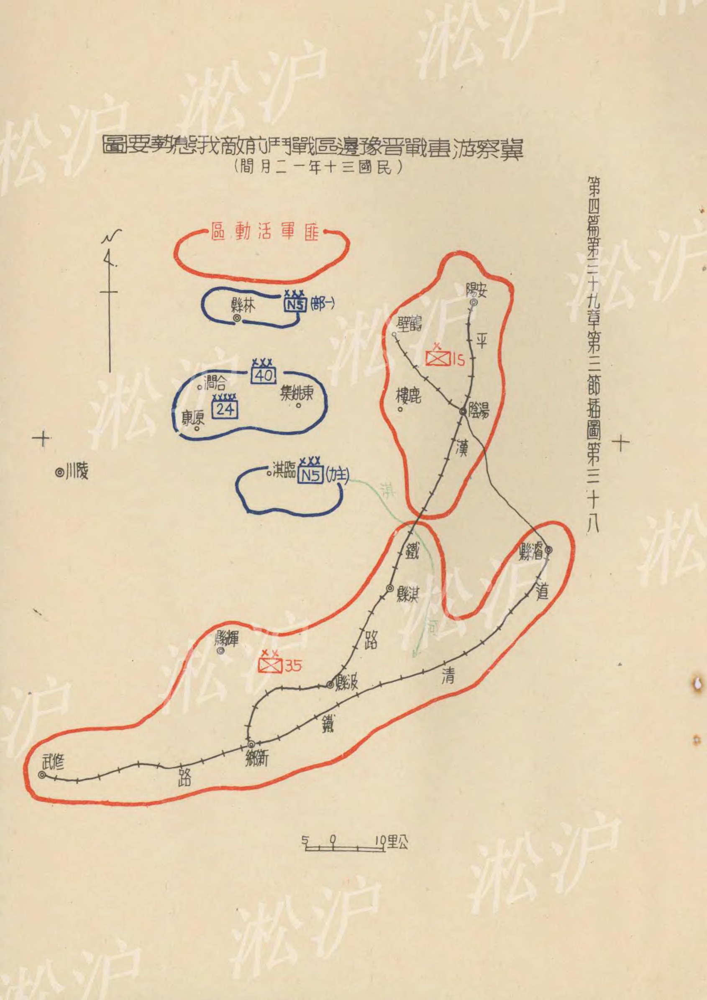

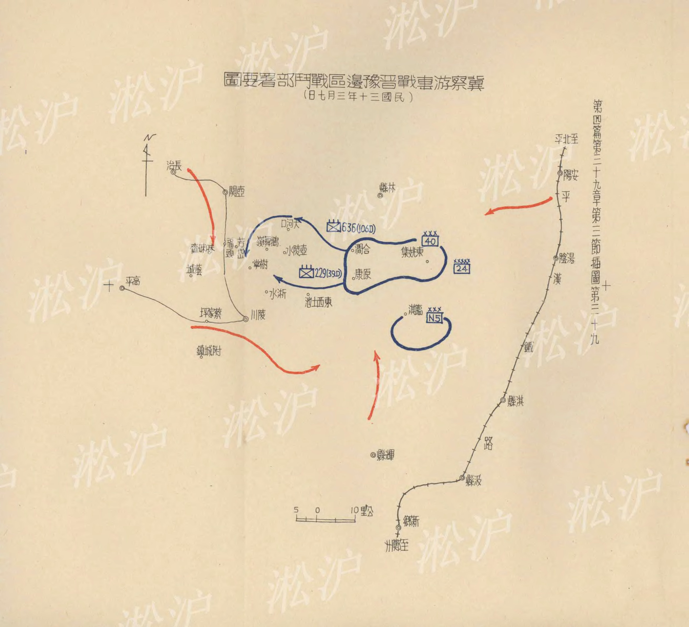

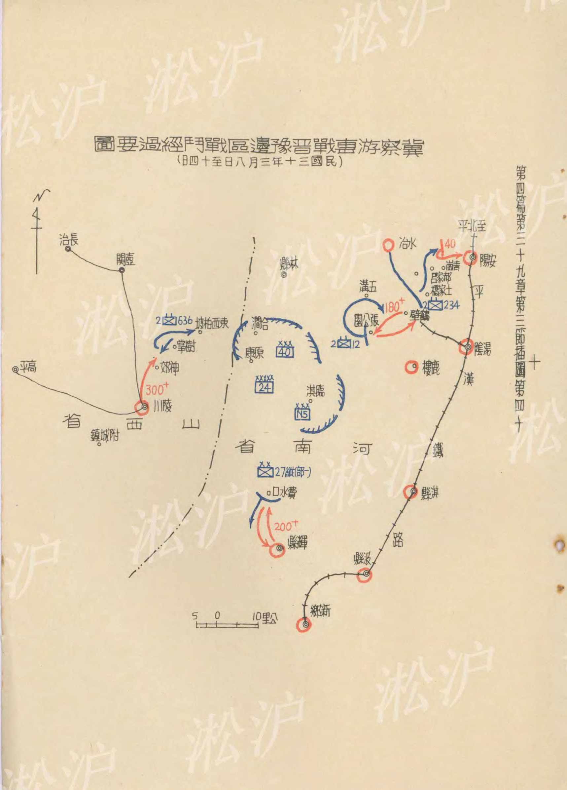

##### 第三項策應太岳湘北及鄭州各地區戰鬥

民國三十年十月一日至十二月三十一日

參照插圖第四十一至第四十三插表第九第十

自民國三十年九月第二期政治、經濟作戰結束後，（參照本節第三款）敵獨立混成第一旅團任平漢鐵路磁縣至寶蓮寺（安陽南）段及其以西要點之守備，第三十五師團分任平漢鐵路寶蓮寺至新鄉段及道清鐵路之守備，（參照插圖第四十一插表第九）十月初，其獨立混成第一旅團以有力之一部西移，第三十五師團主力南移，均係策應鄭州作戰，此時長治、沁陽一帶之第三十六師團及翼城、臨汾一帶之第四十一師團，各一部向太岳區進攻，匪軍乘機活動於林縣以北地區。

當第二期政治經濟作戰結束後，我冀察戰區以游擊部隊活動於冀東及平津保三角地帶，主力第二十四集團軍退據豫晉邊界之太行山區，（參照插表第十插圖第四十一）迨九月二十九日，衛立煌兼總司令獲悉湘北之敵集中約四個師團向長沙進攻，現於撈刀河與我第九戰區激戰中，又晉南之敵圍攻太岳，爲策應太岳及湘北之作戰，乃下達電令，其要旨如左：

一、戰區以先發制人，擊破敵之企圖，並策應太岳、湘北之作戰，卽發動局部攻勢，以規復鐵謝、太行之連絡線。

二、第二十四集團軍（龐炳勳）各以正規軍一團爲基幹，配屬游擊部隊一部，分向平漢鐵路安陽、湯陰、新鄉等地積極攻襲，阻敵南渡增援，並相機向水治、鶴壁、鹿樓之敵攻擊，以鞏固太行山區根據地。

三、各部隊派遣出擊部隊時，應力保建制，統一指揮，並於十月三日以前準備完畢，五日零時開始總攻。

第二十四集團軍龐炳勳總司令基於右令，部署如左：

一、冀豫邊區游擊部隊杜淑部，主力控置於輝縣以北南陽、柏樹灣以南地區，以兩個支隊分向新鄉、汲縣間平漢鐵路襲擊，阻敵南下增援。

二、新編第五軍主力活動於臨淇東南地區，暫編第三師主力位置於林縣以北地區，防止共軍活動，另以一個團及扈全祿支隊分襲平漢鐵路淇縣及濬縣車站，阻敵南運。

三、第一零六師主力控置於白甘泉、戚泉地區，以一個團及侯如墉支隊分襲湯陰及鹿樓。

四、第三十九師主力位置於合澗以東地區，以一個團及何化佛支隊分向鶴壁、安陽及水冶等地襲擊。

五、各出擊部隊務於十月三日完成諸準備，五日零時開始總攻擊。

十月一日夜，新編第五軍第十二集團第一營向喬盟鐵橋襲擊，以主力向敵攻擊，以一部實施破壞，旋淇縣之敵鐵甲車一列前來增援，該營將鐵橋破壞後，遂卽撤退，四日夜，該團全部附交通工作隊，再向淇縣車站及喬盟鐵橋攻擊，當該團到達鐵橋附近與敵接觸後，旋廟口、淇縣等處之敵分道來援，相持數小時，僅破壞電桿二十餘根撤回。六日，第一營及第三營分途出擊，第一營攻佔趙溝，第三營於宜溝車站炸燬敵機車及車皮五輛，並擊退敵淇縣及湯陰之出擊部隊。

六日十二時，我軍事委員會獲悉敵第三十五師團主力於二日渡河，四日陷我鄭州，正與我河防部隊激戰中，當電令新編第五軍努力向平漢鐵路攻擊，截斷南北交通，並以有力之一部奇襲新鄉，威脅渡犯敵之後方，孫魁元軍長遵照電令指示，着暫編第四師第十二團（附第八團一營）以一部破壞交通線，主力向新鄉攻擊。十一日夜，該團會同淇、汲及新鄉三縣地方團隊，向新鄉攻擊，巷戰時許，北西兩關相繼攻克，敵退據城內，該團除將西關紗廠及糧秣集積所焚燬外，繼續向城關攻擊，旋敵鐵甲車一列，載兵四百餘，在飛機六架支援下，向該團進攻，激戰至拂曉，該團向北撤退。是夜，冀豫邊區游擊部隊杜淑部，爲策應第十二團之攻擊新鄉，着第九縱隊分向塔崗車站及芳蘭之敵襲擊，均有斬獲。

十月二十三日十六時，冀察戰區衛立煌兼總司令獲悉四日陷我鄭州之敵，除第三十五師團主力外，另有第一一零師團及騎兵旅團各一部，並附戰車一大隊，現仍於中牟、鄭州、舊榮澤城各附近積極加強工事，修築道路橋樑，晉南之敵繼續增調中，進犯長沙之敵被我第九戰區擊退後，其主力現經武漢向鄂北豫南增加，該戰區爲策應鄭州作戰，當卽下達電令，其要旨如左：

一、戰區爲規復鄭州，奪回渡口，先以有力部隊積極向敵攻擊。

二、各部任務：

孫良誠部以一部維獲魯西根據地外，主力卽沿隴海鐵路南北地區向開封敵後攻擊，牽制敵之行動(二)高樹勳部以有力之一部，卽日進出汴新公路，以游擊戰法截斷敵汴新間之交通。

(三)杜淑部附馬逢樂游擊縱隊，協同孫、高兩部，向新鄉及黃河鐵橋一帶襲擊，積極破壞其橋樑及渡河材料，敵如向豫北渡犯時，應以有力部隊進出詹古、武陟一帶策應河防作戰。

四第二十四集團軍附張儐生等地方團隊，除以一部對匪軍警戒外，另以一部向湯陰、淇縣間平漢鐵路之一點猛攻，遮斷敵南北交通，然後以有力部隊襲攻新鄉，敵如由豫北渡犯時，應卽進出道清鐵路，尾擊敵人，協同河防部隊作戰。

三、以上各部隊均於二十七日開始行動，並發動大量民衆破壞敵後交通。

第二十四集團軍基於右令之指示，卽令飭杜淑部積極破壞汴、新間之交通，新編第五軍以一部向淇縣及淇河鐵橋間攻襲，主力向新鄉攻擊，扈全祿支隊向淇河鐵橋及宜溝車站間攻擊，新編第五軍孫魁元軍長仍令暫編第四師第十二團（附第八團第一營）實施上項任務，並須與杜淑部切取連絡。

先是二十一日至二十四日間，第十二團各營先後向淇縣車站葛箭村及高村車站等地襲擊與破壞。二十六日夜，第三營再向高村車站襲擊，遂與敵百餘發生激戰，旋敵鐵甲車及淇河鐵橋、廟口之敵來援，戰至拂曉，敵傷亡三十餘人，該營將敵機車、車皮及鐵軌十餘節炸燬後，遂卽撤回。迨二十七日十六時，該團團長着第八團第一營向淇縣車站攻擊，主力向新鄉攻擊前進，十七時許，該團先頭進抵東張門附近，遭新鄉僞八區保衛團阻止，旋我後續部隊到達，僞軍敗退，續行追擊，敵又於陳堡固守頑抗，戰至二十八日四時許，始將該敵擊破。是日十六時到達新鄉車站與敵僞四百餘激戰澈夜，斃敵僞五十餘，於拂曉時北撤。是夜第八團第一營攻入淇縣北關與敵巷戰，旋敵退入城內，該營將其糧秣集積所焚燬後撤回。

冀察邊區游擊部隊杜淑部，二十三日晨於蕉周寨（滑縣東南）迎縣滑縣步騎兵五百餘，砲二門之敵，激戰至十二時許，敵死傷六十餘人，向上官村方向敗退。翌日十四時，滑縣及老岸敵僞四百餘會攻周村（滑縣東南）杜淑部之一部，旋該部第十六第十八兩支隊增援夾擊，戰至黃昏，敵死傷六十餘人敗退，二十六日，扈全祿支隊及第三十九師第二三三團之一部，分向濬縣車站及西溝襲擊，均有斬獲。

十月三十一日，衛立煌兼總司令獲悉我第三、第四集團軍擊破鄭州、廣武附近之敵後，第二十及第八十一兩師已攻佔鄭州，除飭該兩集團軍繼續肅清南岸殘敵外，並於十一月一日十四時電令龐炳勳總司令，遵照前令，積極向當面之敵攻擊，加強破壞交通。五日，龐炳勳總司令獲悉敵八百餘附砲兩門，於是日晨進佔古城，現該城附近匪軍及民衆均逃避山中，不予抵抗，當卽電令孫魁元軍如次：「希轉飭劉月亭師長，如敵一部越過漳河南犯，希嚴陣以待，乘其不備，斷然擊滅之，如敵主力向我進犯，以一部據守林縣以東地區，主力控置以西地區與敵旋迴作戰，以疲憊、消耗、側擊、尾擊等戰法困擾之，使其難以應付自敗退。

十一月一日二十時，第四十軍第一零六師補充團第二營向鹿樓攻擊，敵據村固守，迄二日四時許，仍未攻克，該營乃誘敵至村外猛擊，斃敵十餘人。是夜，第三十九師第二三三團第一營於九龍山、水治大道上設伏，迨三日六時許，與敵接觸，激戰三小時撤回，九日夜，該團第三營向鶴壁攻擊，於十日一時許攻克鶴壁西南關，旋衝入寨內，與敵巷戰，斃敵十餘人，並將其設施多處破壞，四時許撤出。

二日夜，暫編第四師第十二團以第三營向高村車站攻擊，主力分兩部攻擊廟口，第一營埋伏於老莊、韓屯、大牛莊一帶截擊敵援，第二營直取廟口，旋由北端突入，向敵猛攻，敵退據高樓相抗，並以猛烈火力向我還擊，該營連長兩員先後負傷，排長一員壯烈殉職，但仍前仆後繼，奮勇直前，卒將殘敵五十餘消滅殆盡，該營官兵傷亡三十餘人，此時第三營正與高村車站之敵激戰，旋淇縣敵援兵到達，又相持三小時，敵不支退去，三日十六時許，該營再向高村車站攻擊，激戰三小時，斃敵僞二十餘人，破壞電桿四十餘根，淇縣之敵分兩路來援，另有鐵甲車一列，該營戰至次日拂曉北撤，六、七兩日，該團第二營曾兩度襲擊廟口，終以敵援兵到達迅速，致未達成消耗與破壞任務。九日夜，第一營掩護交通工作隊破壞淇縣車站附近鐵軌七節，並以一部衝入車站與敵激戰，斃敵數人而撤退，此際扈全祿支隊活動於濬縣地區，杜淑部第一、第十八兩支隊分別於芳蘭及扁擔王車站展開游擊與破壞，均有斬獲。

十一月中旬，龐炳勳總司令奉到衛立煌長官戍眞戍電要旨：「爲打破敵修復平漢鐵路黃河鐵橋之企圖，各部隊應派遣破壞隊，擊散其民夫，焚燬其器材，對已完成之木橋努力破壞之，除另電第四集團軍外，該集團軍杜淑部應選派一部專任黃河鐵橋以北至新鄉間之破壞，如能達成任務，從重議獎，並將編組實施情形隨時具報。」該總司令當轉飭杜淑部遵照實施。

十一、十二兩日夜，第一零六師補充團第三營曾於耿寺、柏落間及鹿樓、湯陰間破壞公路數段，斃敵八、九人。十四日夜，該團主力分於有河及東雲村附近埋設地雷，炸燬敵鐵甲車一列，機車二輛，附車六部，並炸斃敵僞二十餘人，湯陰、寶蓮寺等處之敵馳來支援，相持數小時，均被擊退，該團收取裸線達五千五百餘斤，十六至十八日，第三十九師第二三三團第一營附地方團隊一部，三度出擊，於湯陰、鶴壁間破壞公路數段，石橋及砲臺各一座，於水治、九龍山間收取電線二百餘斤，並於牛崗附近斃敵僞二十餘人。

新編第五軍暫編第四師第十二團第三營，十一日十二時許，將廟口竄擾之敵六十餘人包圍於大李莊，（濬縣車站西）敵據村頑抗，該營一部勇猛由北端衝入，敵不支突圍，十六日十時許，龐村敵僞五十餘，砲三門，向邢門口進攻，第十二團第三營獲悉後，卽以一部由正面誘敵深入，主力潛伏於郭灣、八坡頂附近，俟敵接近，將敵包圍猛擊，敵傷亡十餘人敗退。是夜該團各營分路出擊，第一營向淇縣車站圍攻，斃敵十餘人，第二營於淇縣車站以北地區破壞鐵軌十餘節，電桿二十餘根，第三營於高廟附近破壞公路及電桿二十餘根，並擊退高村車站敵之增援部隊。

杜淑部第九縱隊之一部，十四日十八時襲擊輝縣南關僞警察所，輝縣之敵六十餘出城相助，相持數小時，斃敵十餘人，鹵獲步槍五支，該敵敗退城內。十八日，第二十七縱隊由黃水口出發，渡北流河經袁封、寺莊通過道清鐵路。二十日晚，破壞牛任、旺南鐵路及橋樑多處，另電線四里許。二十二日，安全返回原防地。

十一月下旬，第一戰區衛立煌長官爲積極策應鄭州作戰，再以戍宥電令龐炳勳總司令，其要旨如左一、我軍於中牟城及黃河鐵橋南岸反攻，頗有進展，曾數度深入敵後，佔領城關及要點，現受敵空軍及其北岸重砲毒氣之支援，致未能建立根據地，敵近有固守中牟城及黃河鐵橋南岸橋頭堡之企圖。

二、本戰區爲肅清南岸殘敵，北岸部隊應積極向敵後襲擾，協力封鎖中牟及黃河鐵橋，並逐步攻略之。三、除飭第三、第四兩集團軍逐步實施外，貴集團應加緊向當面之敵攻擊，並澈底破壞其交通。

二十三日十八時，杜淑部第二十七縱隊第一支隊第二大隊攻入高莊，與敵激戰六小時，破壞電桿三十餘根，此時第二支隊第二大隊於百泉附近與輝縣之敵百餘激戰五小時，破壞電桿二十餘根。三十日夜，該大隊協同輝縣常備隊一部分向輝縣西南兩關攻擊，擊斃僞警十餘人，將輝縣、新鄉間電線破壞四華里。

新編第五軍暫編第四師第十二團第二營，二十三日夜在探照燈及機砲火力照射之下，強行破壞大牛莊、韓樓間淇廟公路，（淇縣至廟口）及其電線七段，同時對高村行牽制攻擊之第三營，與該地守兵及增援之鐵甲車激戰至曉，撤回原防地。翌日十四時，該團第一營於劉莊、南四井一帶阻止敵人修築道路，民夫逃散，敵五六十人頑抗，該營以一部繞經吳莊東端側擊之，斃敵六、七人，敗退淇縣，該營將公路破壞後撤回原防地。同日十六時，敵僞二百餘，進佔龐村、下龐及西土嶺一帶，企圖進攻邢門口，我第十二團第三營協同扈全祿支隊，以一部於朱家橋附近迎擊，主力繞擊敵之右側背，戰鬥時許，敵僞死傷二十餘人，向濬縣車站敗退。

第四十軍第一零六師第六三六團附爆破隊，於二十四日至二十六日三日間，在東雲村附近破壞敵鐵甲車八輛，鐵軌十餘節，收取電線六千餘斤，二十七日十時許，敵二十餘人乘汽車一輛，由鹿樓馳往湯陰，行抵柏落附近，被我第六三六團一部截擊，敵卽下車應戰，旋該團第二營到達，將敵包圍，悉予殲滅，鹵獲武器裝具甚多。

第三十九師第二三三團第一、第三兩營各一部，附工兵一排，協同安陽團隊及民夫六千餘人，二十三日夜於西溝附近破壞公路。翌日一時許，敵先以砲擊，繼之敵僞七十餘人向第一營進攻，戰兩小時，敵死傷二十餘人敗退西溝，該營協助民夫將牛崗、陳家坡以東十餘里之封鎖溝及電線悉予破壞。二十九日十四時許，西溝敵僞二百餘，圍攻第一營於大澗附近，該營一面迎敵，以一部由牛崗高地向敵側擊，戰至十七時，敵僞死傷五十餘人，向西溝敗退。

十二月初，當敵於中牟附近加強工事之際，我第一戰區部隊向該敵反攻，壺關、長治、高平、晉城之敵第三十六師團主力進佔陵川及其以東樹掌、冶頭、黃松背之線，似有進攻太行山西區之企圖，我第二十四集團軍除着第一零六師加強戒備外，其餘各部續向當面之敵攻擊與破壞。

一日至七日間，杜淑部第二十七第九第二十三等縱隊於華峪、西陳照、汲縣、塔崗地區展開游擊。

六日十時許攻佔西陳照煤礦，十二日二十三時，輝縣敵五、六百，砲六門，向黃水口第二十七縱隊（范龍章）進攻。迨十三日八時許，攻佔我黑馬嘴溝後，繼續西進至東西韓口，此時范龍章司令親率該縱隊一部向敵反擊，戰時許，敵主力回竄，其一部二百餘經與第二十七縱隊及獨立第十二支隊激戰後，向王莽嶺逃竄。

第四十軍第一零六師第六三一團留置蔭城鎮附近之機關槍第三連，三日夜乘敵第二二二聯隊外時中隊與第二二三聯隊伊藤中隊換防之際，予以猛攻，參照插圖第四十三角圖)斃敵二十餘人，奪獲步機槍十九枝，但敵仍頑抗，相持至四日零時許，該連於橫水附近集結後，向林縣撤退。五日，第六三六團附師特務連、工兵連及侯如墉支隊，於湯鶴公路（湯陰至鶴壁）及湯鹿公路（湯陰至鹿樓）截擊敵之換防部隊，以第二營於耿寺、李家墳設伏，參照插圖第四十二第一營及特務連埋伏於三家村、北唐仲附近，第三營及侯如墉支隊一部位置於東九子附近，攻擊敵之側背，餘爲預備隊，位置於小寨溝。四時許，鹿樓之敵四十餘東進，行抵耿寺、李家墳附近，被我第二營及侯如墉支隊一部迎擊，仍返回樓鹿，此時第一營及特務連亦與鶴壁東進之敵四十餘激戰於北唐仲附近，相持至十四時，湯陰之敵百餘，砲二門，分乘汽車來援，雖數度猛撲，經我工兵連之增援側擊終未獲逞，旋向湯陰撤退。十六時許，第三營由東九子推進至北唐仲西南地區，向北唐仲以西之敵猛攻，戰至十八時，敵被殲殆盡，殘部東竄。是日，斃敵五十餘人，函獲武器、騾馬及其他裝具等爲數甚多。

當五日第一零六師第六三六團與敵激戰之際，第三十九師第二三三團（欠第一營）爲協力該團作戰，曾於是日十八時於北唐仲以北地區，擊退西溝方面敵之增援部隊一百四十餘，並以該團第八連向鶴壁攻擊，以行牽制，斃敵二十餘人。六日，西溝敵僞百餘，向郭郝斗附近安陽團隊進攻，第二三三團獲悉後，以第一營前往增援，旋由青崗高地向敵側擊，斃傷敵十餘人，十五日十二時許，安陽敵僞五、六百，推進至王家門莊附近後，企圖繼續西進，經我第二三三團第三營協力安陽團隊予以猛烈迎擊，敵東撤，該營追擊至周寨予以圍攻，戰至十六時，敵敗退鶴壁。

新編第五軍暫編第四師第十二團（欠第三營）附江北交通工作隊，於七日夜攻入淇縣北關，敵退據城內頑抗，該團卽於附近大肆破壞，炸燬白玉橋一座，鐵軌八節，碉堡四座，電桿十餘根，並焚燬倉庫兩所，僞聯保處一所，當破壞之際，喬盟及高村兩車站之敵增援反撲，先後均被擊退，斃傷敵五十餘人，十四日晨，進佔王莽嶺（豫晉邊界上）之敵二百餘，北犯國梁，經該軍補充團第二營予以迎擊，激戰三小時，敵傷亡十餘人，退據丹粉南北馬安附近。

龐炳勳總司令據苑漢傑副總司令亥寒丑電報稱。

一、晉城、高平之敵千餘，九日晨分向我黃師馮、劉兩團攻擊，十四日二時於玄壇廟、奪火鎮、河村、梁全之線激戰。

二、修武十一日夜到敵千餘，長治十三日十八時到敵二千餘，正向我陳師當面推進中。

龐炳勳總司令當於十四日十四時電令杜淑部：「貴部除盡力痛殲當面之敵，遮斷黃水口以北交通，斷敵歸路外，着派有力一部，協力張喬齡部夾擊深入老君堂之敵，以策應第二十七軍作戰。」當十四日王奔嶺陷敵後，張喬齡部於十五日轉進至西廟和（王奔嶺西七公里）收容整理中，遂改令杜淑部協同新編第五軍防敵北犯，並圍殲王奔嶺及其以北地區之敵，卽策定反攻部署如次：

一、第二十七軍第四十六師於南北寨附近整頓後，推進至後郊、黃金窯一帶，拊敵右側背，該軍主力配合平城附近留置部隊推進至浙水、樹掌、神郊、陵川一帶，拊敵左側背，均於二十日零時開始攻擊，將敵壓迫於冶頭、馬圈以東地區，而殲滅之。

二、第四十軍以一個團（第六三五團）爲先遣部隊，經田家井向三郊口以西地區推進，另以兩個團推進至三郊口附近，統歸第一零六師李振清副師長指揮，於十八日到達王龍子迪、黃松背，協力第二十七軍圍殲陵川以東之敵，其餘各部隊仍服行原任務。

三、新編第五軍除就現態勢服行原任務外，另以有力部隊於北坡根（北寨以北）沙窯、兌九窯之線設防，並支援黃師作戰。

四、杜泷部除對南封鎖各山口外，另以有力部隊於兌九窯（不含）東西韓口之線設防，對西警戒。

十七日二時，鶴壁敵僞五、六百，攻擊小畫匠之第三十九師第二三三團第三營，戰至十時許，敵攻佔小畫匠東北高地，該營卽以一部由桑場出擊，同時第二營由塔山增援到達，向敵右側背攻擊，敵不支敗退梨林頭，旋撤回鶴壁，是日八時，杜淑部第二十七縱隊一部分三路攻擊薄壁，敵出寨迎戰，相持兩小時，敵死傷十餘人，不支退入寨內，該部相繼擊破僞警備隊，斃僞警員二十餘，俘獲三十餘人，圍獲步槍五十餘枝。

十二月下旬，太行山東區第四十軍，新編第五軍及游擊部隊杜淑部，仍不時以小部隊向平漢鐵路襲擊破壞，均有斬獲，太行山西區，第二十七軍於十八日十四時克復陵川，敵主力向長治、高平、晉城撤退，迨二十一日恢復原態勢，至此策應作戰遂告結束。

綜計策應戰鬥前後經過一年有奇，大小戰鬥四百餘次，斃敵官兵三千八百餘人，傷七百餘人，俘虜敵僞二百三十餘人，囪獲馬五百四十餘匹，迫擊砲一門，步騎槍八百八十餘枝，輕重機關槍十九挺，步機彈四萬五千餘發，破壞鐵路七公重，另有二十餘段，鐵軌一百三十餘根，鐵橋及涵洞八座，公路四百餘公里，電線二十八公里，電桿七百餘根，火車三十三輛，汽車十四輛，我軍陣亡官兵四百九十餘人，傷八百八十餘人，生死不明者八百五十餘人，遺失步槍三十餘枝，步機彈五千九百餘發。

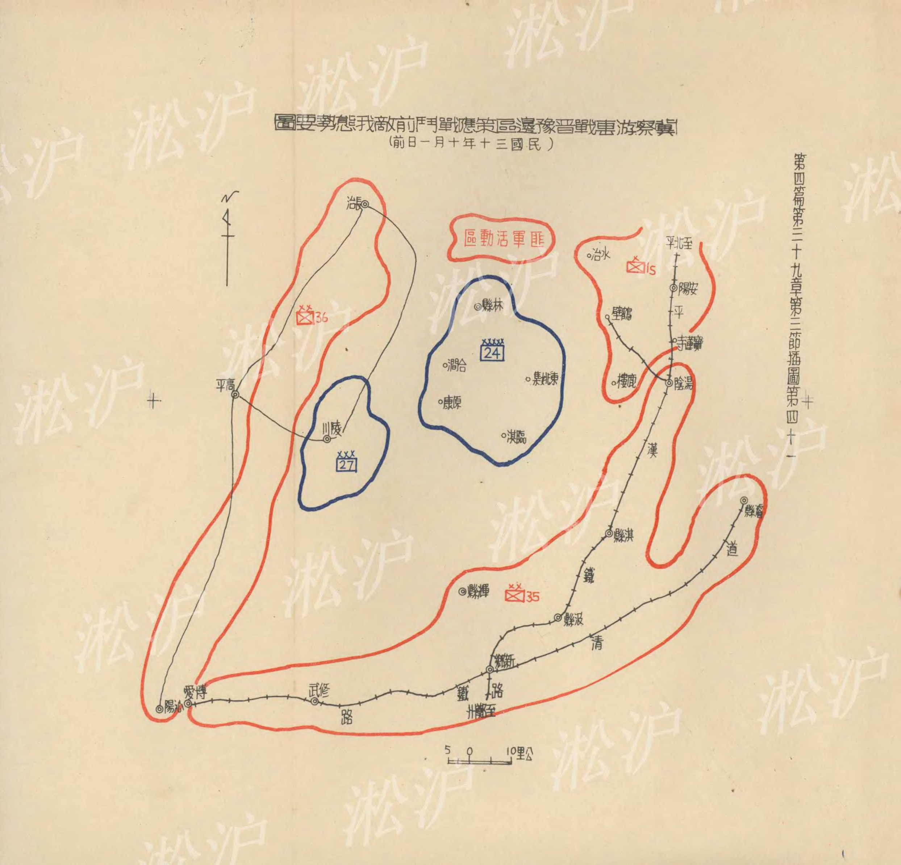

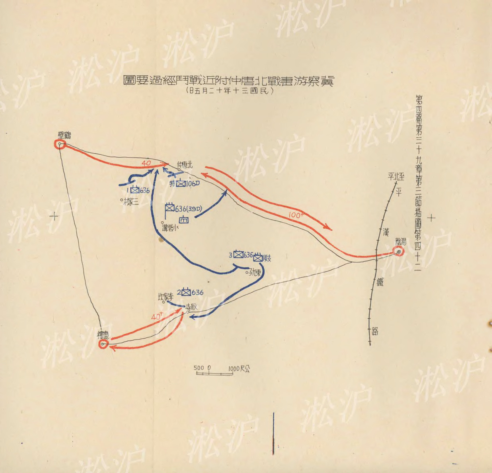

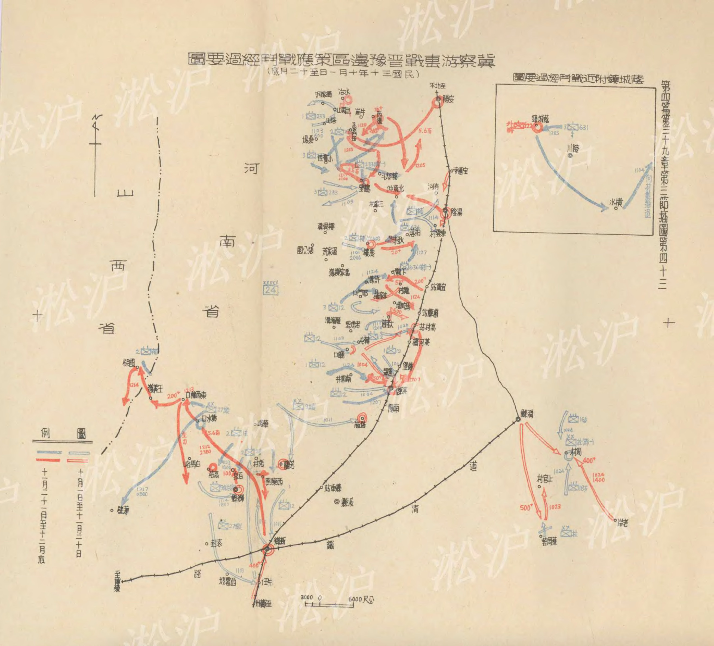

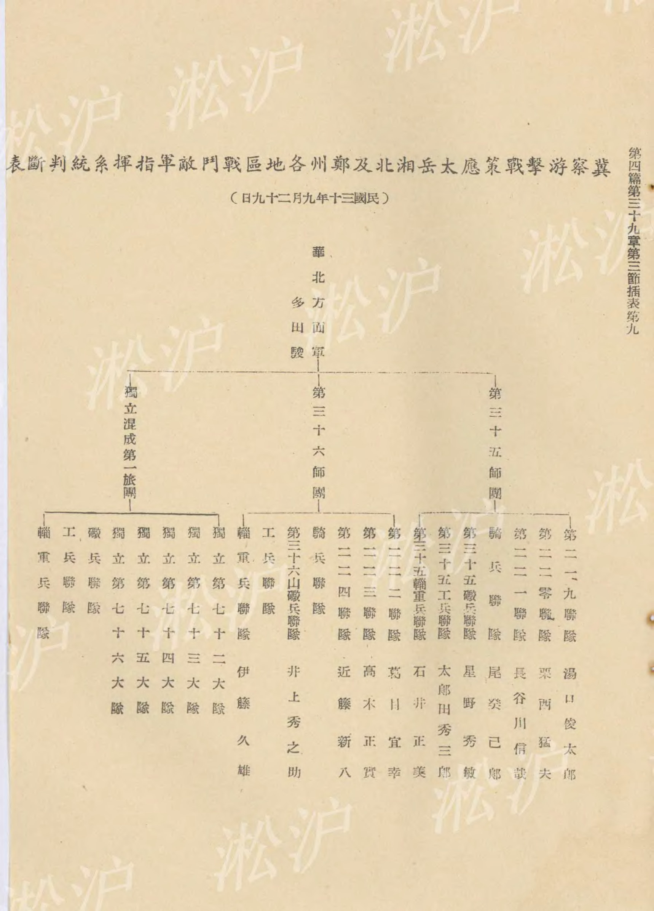

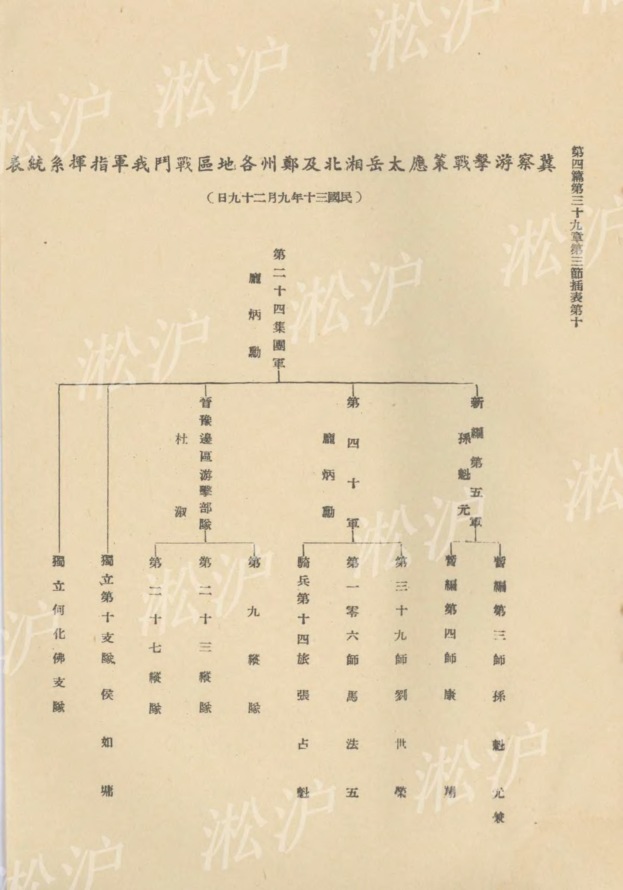

#### 第三款 打破敵僞政治經濟設施戰

民國二十九年十一月十一日至三十二年三月底

參照插圖第四十四至第五十三插表第十一至第十四

##### 第一項 晉豫邊區第一期戰鬥

民國二十九年十一月十一日至三十年九月三十日

參照插圖第四十四至第四十八插表第十一第十二

當民國二十九年十一月晉豫邊區反掃蕩戰將近結束之際，敵軍有鑑於掃蕩之失敗，爲長久控制計，遂改取推行僞政權及經濟設施之擴建，乃將其崗田旅團調河北臨漳，第三十五師團及谷口旅團之各一部，分任平漢鐵路漳河至新鄉段及其以西各據點之守備，（參照插圖第四十四）第六師團分駐道清鐵路西段及陽城、武陟地區，又共匪新編第一旅活動於林北及其以西地區。

此際我第二十四集團軍新編第五軍主力控置於臨淇、塔崗、施家溝及東姚集地區，以一部經常向平漢鐵路及其以西鹿樓、鶴壁等要點襲擊，另以暫編第三師主力位置於林縣以北合順、西豐、秦家莊地區，防止共匪新編第一旅之活動，第四十軍第三十九師主力控置於林縣以南郭家園、合澗、大河口地區，以第二二九團位置於江家門莊附近，經常向平漢鐵路及安陽襲擊，騎兵第十四旅位置於前台壁、林縣及董家街地區，第一零六師位置於陵川、樹掌及平居地區，另以有力一部位置於楊村及其以北地區，經常分向蔭城、壺關等地襲擊。

十一月七日十六時，龐炳勳總司令奉第一戰區衛立煌長官魚辰電令，第一零六師着調回林縣附近，增強林北力量，防止共匪活動，並仍任陵川、林縣間交通線之維護，范漢傑軍主力開陵川附近，該師與范軍作戰地境爲冶頭鎮、北台、麻胡、周家鎮及壺關之線，線上屬范軍，龐總司令奉令後，除新編第五軍仍服行原任務外，當卽調整第四十軍部署如左：（參照插圖第四十五）

一、騎兵第十四旅俟第一零六師到達接防後，卽移駐林縣以東橫水、翟曲、朱翟地區，以一個步兵營佔領楊家莊、前後白壁要點，對東北警戒。

二、第三十九師全部移駐林縣東南地區，對東警戒，第二二九團仍於江家門莊附近服行原任務，第二三三團大河口之防務應由第一零六師接替。

三、第一零六師陵川、平城附近防務交由第二十七軍接替後，移駐林縣西南地區，對北警戒，以有力之一部維護陵川、大河口間之交通線，另以一部接替第三十九師大河口防務。

四、戰鬥地境：第三十九師與第一零六師間爲王帽山、南平、木村、王窯及合澗（不含）之線，線上屬第一零六師。

十一月十一日夜，新編第五軍第十一團第一營（附爆破組）由塔崗攻襲南陽村，（淇縣車站南）

（參照插圖第四十六）爆破組在火力掩護下破壞橋樑一座，鐵軌四十七節，電桿六十餘根，並收取電線九百餘斤，相持至次日拂曉，該營撤回原駐地，翌日夜，該軍第九團第三營由河口進攻宜溝車站，一部於車站以南地區破壞鐵路二華里，電桿十餘根，電線百餘斤，相持三小時，敵我傷亡各十餘人。

十五日十二時許，鹿樓、鶴壁之敵僞二百餘，附砲二門，會攻張公園，我守軍第十二團第一營以一部於馬神廟、搜骨溝正面與敵保持接觸，主力進出姚家村向敵左側背迂迴，戰鬥三小時許，雙方各有傷亡，敵不支敗退，十九日晚，該營向鹿樓方面游擊，以一部向鹿樓之敵佯攻，主力於司灣附近破壞敵碉堡兩座，同日二十一時，第十一團第二營配合民衆二百餘人，於濬縣、高村兩車站破壞橋樑兩座，鐵軌二十七節，電線三百餘斤，二十一日十三時許，高村、廟口之敵僞百餘，附山砲一門，進至大李莊，濬縣車站西十餘里）我第九團第三營獲悉後，卽向該地圍攻，敵不支向裏河屯潰退，是夜，該營續向裏河屯攻擊，旋一部衝入村內，敵據房屋頑抗，激戰三小時，將其糧秣堆積所焚燬後撤退。

二十三日夜，第十二團第一營攻襲鶴壁，以一部佯攻東北兩門，主力由南門衝入寨內，發生巷戰，敵逐屋頑抗，至曉，湯陰敵百餘，附迫擊砲二門，分乘汽車增援，以衆寡不敵，遂誘至古樓河附近予以夾擊，斃敵三十餘人，敵向鶴壁退竄。

安陽敵僞四百餘，十一日十時許，經東平莊向蜀村（鶴壁北）安陽團隊攻擊，第三十九師第二二九團獲悉後，飭令第二營增援，該營以一部於蜀村南端高地佔領陣地，向敵佯動，主力由畢家河迂迴至土家橋以北高地，予敵以側擊，敵死傷三十餘人，不支東潰，十四日午後，安陽、水冶、鶴壁等處之敵僞千餘，附砲二門，向第二二九團江家門莊、王家門莊一帶防地進攻，相持至十五日四時許，該團撤至大小畫匠、桑場、大平及朱窩一帶高地，當面之敵續行攻擊，並以毒氣助戰，經該團力阻後，終未得逞。十二月一日九時許，鶴壁、鹿樓之敵僞二百餘，砲二門，於盧樓義會合後，企圖進犯張公園，（參照插圖第四十七）我新編第五軍暫編第四師第十二團第一營卽由張公園推進至南陽義、徐家陽義附近夾擊之，戰鬥三小時，敵不支回竄，同日夜，第十一團第一營配合民衆五百餘人，於塔崗以北破壞橋樑一座，鐵路二里許，八日夜，該團第三營配合民衆三百餘人，向高村車站襲擊，先後擊退該站敵守備部隊及其縣增援部隊，並破壞附近鐵路五百餘公尺，十日晨，鹿樓、鶴壁之敵二百餘，附砲三門，向鹿樓西北姚家村、潘家荒、龍窩村一帶進犯，第十二團第一營迎擊該敵於縮頭溝、南陽義、東村以西之線，戰鬥至午，敵不支回竄。

十九日晚，第十一團第二營向高村車站推進，於二十一時許行抵廟口附近，被敵阻止於葛箭（廟口西北）附近，該營以一部與敵保持接觸，主力繞經韓屯、小牛莊包圍廟口，戰鬥至次日拂曉，敵增援部隊到達，該營卽向老虎山撤退，二十一日夜，第十二團第一營附鐵路破壞隊一部，於東雲村（湯陰東南）之鐵橋下埋設炸藥炸燬南下列車一列，及鐵橋一座。

二十五日，第一戰區李旭東、武旭如、杜淑、范龍章、藍燦然等部由平漢鐵路東側經淇縣、湯陰兩縣間分途向西轉進，被滑縣、濬縣、淇縣及湯陰等縣之敵六百餘，砲六門，跟踪追擊，激戰於邢門口附近，第九團第三營馳往增援，戰鬥至十六時，將敵擊退，我第一戰區部隊安全西撤，同日黃昏，該營攻佔郭灣、朱家、王灘等村，斃敵三十餘人，敵向濬縣縣車站撤退。

民國三十年一月一日晨，（參照插圖第四十八）鹿樓（湯陰西南）敵百五十餘，向張公園方面進攻，新編第五軍第十二團第一營以一部迎擊該敵於馬神廟以東高地，相持時許，敵一部竄據潘家荒，該營當即以一部繞經搜骨溝敵右側背，予以痛擊，敵不支向鹿樓撤退，該營跟踪追擊至張家村附近停止前進，九日，鹿樓敵二百餘，曾兩度進攻潘家荒，均先後被第十二團第一營擊退，翌日七時許，鹿樓、鶴壁之敵三百餘，附砲二門，以分進合擊之勢進攻張公園，該營以敵火猛烈，遂撤至以西高地與敵保持接觸，相持至十三時，雙方無進展，第十二團楊克獻團長飭令第二營進出西窯頭向敵右側背攻擊，斃敵五十餘，不支敗退，張公園及趙家廠又告克復，十一日十三時許，第十二團東進游擊，着第二營向鹿樓攻擊，第一營及鐵路破壞隊，將湯鶴公路馬家村至唐仲段破壞，時鶴壁之敵數度出擊，我破壞隊中隊附陳森林及班長李廣恩先後陣亡，二十一日夜，該團第二營破壞隊於平漢鐵路長沙村附近炸燬鐵路一段，軍車一列後西撤。

第四十軍第三十九師第二二九團活動於水冶以南地區，一日晨，該團第二營進攻水冶，行抵九龍山附近與敵二百餘遭遇，激戰至午，敵敗退水冶，三日，第二三四團推進至嶺頭接替第二二九團之安漳游擊任務，十五日，該團一部於西溝陰間破壞電線二十餘里，另部於九龍山附近破壞電線八里許，此時游擊第二十二支隊（扈全祿）亦於高村、東邢門地區展開游擊。

三十年一月上、中兩旬，敵兵力無增減，僅企圖維護交通線，鞏固外圍據點，推行僞政權，我軍亦積極整補中，無大規模活動，我第一戰區衛立煌長官針對當前狀況，策定現階段作戰指導如左：

在我軍未採取大規模攻勢前，各部隊應實行戰略持久戰，但仍須以三分之一以上兵力實施戰術攻勢，積極對敵要點、要線及政治、經濟諸設施，加緊襲擊，使敵疲憊無餘力進犯，其餘部隊在原防地整訓以提高國軍素質，增強戰力，準備爾後攻勢。

乙

指導要領

各部隊遵照本戰區以前頒發之游擊根據地黨政指導原則，積極建立游擊根據地，協力推展政權。

丙

部署

第二十四集團軍（附杜淑部）以有力部隊對轄區內之平漢鐵路及其他要點、要線敵之各組織與設施加緊襲擊，遮敵之交通，主力控置於林縣附近整訓，該集團軍與第二十七軍作戰地境爲新鄉、五里河、治頭鎮、北台、麻胡、周村鎮、壺關之線上屬第二十四集團軍。

龐炳勳總司令奉到上項指導後，於一月二十一日調整部署如左：

一、新編第五軍以第十一、第十二兩團爲基幹，編組淇湯游擊支隊，於理峪、東姚一帶對東警戒。並經常向寶蓮寺車站以南平漢鐵路沿線及其以西各據點襲擊，該軍補充團歸暫編第三師劉月亭師長指揮，於林縣以北姚村一帶，對北警戒，監視匪軍行動。

二、第四十軍以第三十九師第二三四團爲基幹，編組安漳游擊支隊，以嶺頭爲根據地，經常向寶蓮寺車站以北平漢鐵路沿線及其以西各據點襲擊，第一零六師第六三一、第六三六兩團，於林南董家街、大河口間設防，對西北警戒。

三、騎兵第十四旅以一個步兵營位置於橫水附近，對東警戒，相機向水冶襲擾。

四、其餘各部隊各就現駐地積極整訓，並保持機動策應作戰，爾後輪流調換。

一月二十三日二時許，第二三四團第三營分向西溝、水冶、九龍山各地襲擊，敵據寨頑抗，未獲進展，僅於九龍山附近破壞道路及電線數段，二十七日八時，鶴壁之敵四百餘，附砲二門，向第二三四團大小畫匠、朱窩一帶陣地攻擊，與我相持至十六時，敵囘竄。

三十一日四時許，芳蘭之敵七十餘，向塔崗第十一團防地攻擊，該團第一營推進至蔣山南端擊破該敵，迨十時許，汲縣敵二百餘，附砲二門，佔領飲馬胡同、下東莊之線後，向塔崗我軍攻擊，該團第一營主力於馬牙山、蔣山之線迎擊，以一部推進至路周屯附近，向敵之右側攻擊，激戰至十二時許，敵不支敗退。

二月初，龐炳勳總司令獲悉當面之敵除警備交通線鞏固其外圍據點推行僞政權外，僅以小部隊向我襲擊，當卽令第四十軍及新編第五軍遵照一月二十一日部署，積極展開游擊，另令杜淑部於新編第五軍右翼黃水口、大佛殿、松工水、老尖堂、塔崗、紅門村之線對南警戒，扈全祿部位置於賀家，侯如墉部位置於前後白壁，協同淇湯安漳兩游擊支隊分向淇縣、濬縣兩車站間及水冶襲擊，牛瑞亭部位置於胡山坡，劉統全部位置於樹掌附近，除維護陵川、合澗交通外，主力積極整訓。

二月三日八時，安漳游擊支隊（第二三四團）第三營向天喜鎮之敵攻擊，經戰鬥後，敵向九龍山敗退，四日夜，淇湯游擊支隊第十二團第二營於湯鶴公路三家村施行破壞，踞鶴壁之敵向我攻擊，相持二小時，我軍於破壞任務完成後向西撤退，翌日夜，該營復向平漢鐵路襲擊，以一部對湯陰警戒，主力於寶蓮寺車站以南破壞鐵軌十餘節，電桿十餘根，湯陰之敵曾兩度出擊，均先後爲我軍擊退。

十二日，第四十軍龐炳勳兼軍長爲掩護左側背安全，並鞏固口上、東西土池、壑嶺西、秋溝等基地，飭令第三十九第一零六兩師及兩個特務營各以一部，發動當地民衆於壑嶺西、東西土池、秋溝之線摘要構築碉堡，封鎖西行道路，並規定自十三日開始構築，限十日完成之。

十九日，安漳游擊支隊於平漢鐵路豐樂鎮附近埋設地雷，炸毀敵機車一輛，客車二輛，鐵軌一段，並斃敵三十餘人，翌日，又於豐觀支線之東清流東端設雷，炸毀敵機車一輛，煤車二輛，鐵軌六節，此時，淇湯游擊支隊第十二團第二營附破壞隊至宜溝車站以北之長沙村附近破壞鐵路，遭敵鐵甲車衝擊，撤至耿寺村（在鹿樓東）附近，破壞湯鶴公路之木橋一座，電線一部後西撤。

三月一日十時，淇湯游擊支隊第十一團第十二連由邢門口向龐村襲擊，行抵裏河屯附近，與由宜溝西犯之敵遭遇，相持兩小時，我以一部由鬼頭崗迂迴敵之側背，予以夾擊，敵不支東退，三日夜，第十二團第二營向湯鶴公路襲擊，推進至西馬莊附近，觸發敵方埋設之地雷，鶴壁之敵聞警出擊，相持時許，營將西馬莊至張角村之電線破壞後西撤，五日夜，第十一團第一營至淇縣、高村車站間之恩德堡襲擊破壞，當與敵僞百餘發生激戰，旋高村之敵及淇縣之鐵甲車一列馳來增援，該營遂向西撤退，我安漳游擊支隊活動於賈家呂、青崗一帶地區，先後兩度擊退敵掩護部隊及修築公路民夫四百餘人。

二月十一日，蔣委員長電令第一戰區「爲加強游擊，掩護國軍整訓，準備總反攻，並打破敵之局部進攻計劃，各戰區應預想敵之進攻方向，構築據點面式縱深強大之強韌抵抗陣地帶，使敵無法突破，以節約兵力，並機動的向敵側擊伏擊，陣地編成，應構築多數以自動火器爲主之最小支點工事，位置力求於反斜面，並蔭蔽僞裝，減少損害，期收奇襲射擊之效力，對敵機械化部隊及砲兵活動地區及道路，應利用天然地障構成氾濫、陷井、四角石拉等阻塞工事，使敵在與我同等裝備下作戰，對敵警備區及後方交通與預期敵人進出之村舍等，埋設地雷，構築工事，限三月底完成。衛立煌長官奉令後，於三月四日策定構築計劃，並令龐炳勳總司令「第二十四集團軍除於太行山南段根據地就原有設施加強外，應於路口、石嶺口、安樂洞、蔣家頂、科泉、北券、楊家營、任村、姚村之線，構築據點工事及阻絕工事，封鎖敵之進犯，另於林縣至合澗大道兩側修築堡壘線，維護交通，仰卽遵照並遵限完成爲要，」龐總司令當卽區分路口、石嶺口間之工事飭令杜淑部負責構築，安樂洞、宮家莊間，蔣家頂、王家廸間，以及北券、李家、楊家營間，任村、姚村間之工事，由新編第五軍負責，科泉尖餅廠間由侯如墉部負責構築，林縣至合澗之大道兩側堡壘線，由第一零六師負責構築。

三月十六日，鶴壁、西溝之敵僞四百餘合股西犯，九時許佔領太平腦、老奶廟、黃龍洞之線，向高洞溝、朱窩河東之線我第二三四團攻擊，該團以一部於正面拒敵，主力由右翼高洞溝迂迴敵之背後，予以夾擊，敵不支東撤。

四月二日迄六日間，我暫編第四師第十一團曾數度破壞與襲擊趙莊及高村車站，均有斬獲，十三日九時許，鹿樓敵僞步騎砲五百餘，山砲四門，分三路西犯，我暫編第四師第十二團（欠第一營附第十一團第三營）於馬家嶺、大小河澗、潘家荒之線佔領陣地拒敵，迄十六時，大小河澗爲敵所陷，經第十一團第三營由右翼反擊，該團第三營由馬神廟向大河澗右側夾擊，敵不支東潰，竄抵涼水附近，又中我預設地雷，死傷七十餘人。

十七日晨，我第三十九師第二三四團第二營向西溝附近游擊，適敵僞六十餘掩護民夫二百餘，在西溝南端溝築工事，當卽展開於西尙莊附近高地，予以猛擊，敵退入村內，民夫逃散，二十六日十四時，第二三四團（欠第三營）以一部佔領青崗，主力圍攻杜郝斗僞軍吳德生及牛治田兩部，戰鬥三小時，僞軍突圍東竄，其時安陽之敵二百餘，犯我青崗守軍，迨僞軍突圍後，乃會同東竄，翌日，西溝附近各據點之敵僞二百餘，分兩路西犯，竄至周寨東端高地，被我第二三四團第六連突擊後，敵東撤。

五月一日拂曉，宜溝之敵僞百餘，進踞下龐村，企圖再行西進，第十一團第三營獲悉後，馳往圍擊，相持兩小時，該營一部突入村內，敵不支向宜溝撤退，八日十二時許，第十二團第二營向鹿樓附近游擊，行抵西窯頭西北端，獲悉該村有敵僞百餘，卽予圍攻，斃敵僞十餘人，敵退大峪，該營繼續追擊，遂向鹿樓撤退。

十日十二時許，第二三四團第一營於黃龍洞獲悉西溝之敵向西竄犯，卽向王家門莊方面推進，準備予以截擊，迨到達該村以西高地時，敵正與我安陽團隊戰鬥中，當卽向敵夾擊，敵不支回竄，迄十五日晨，該團第七第九兩連先後向九龍山之敵攻擊，並破壞電線七里許，二十八日十二時，西溝之敵七十餘，竄至方山構築工事，爲我第二三四團一部擊退，其工事亦悉數破壞，六月四日，衛立煌長官電令龐炳勳總司令「貴官爲第三游擊區總司令，指揮該集團軍范漢傑，武士敵兩軍及李葆荃（附陽兆榮旅）張喬齡、杜淑、張儁生、侯如墉、王德霖、陳立德、趙子俊、扈全祿等游擊部隊，以太行山區爲根據地，積極向外擴展，粉碎敵之封鎖及進攻。龐炳勳總司令奉命後，當卽轉飭各部隊仍服行原任務，另令調整部署。

同日晨，淇縣敵僞二百餘，附山砲二門，與我淇縣團隊於小胡同，北四井（淇縣西北）一帶戰鬥中，新編第五軍獨立游擊第六大隊（關耀亭）由廟溝馳援，攻擊敵之左側背，激戰時許，將敵擊退。

五日十二時許，僞軍許德魁部，掩護民伕於方山（九龍山外圍據點）構築工事，經我第二三四團以一部分別監視九龍山，吳家洞，蜀村方面之敵，主力攻擊方山，激戰時許，攻克方山，將其碉堡三座完全破壞，旋水冶之敵增援，該團乃撤回原防，十八日七時，該團鄭恩綬團附率步兵兩連圍攻周寨，敵僞在其砲火掩護下撤退楊郝斗，鄭團附以一部掃蕩周寨，主力跟踪追擊，旋衝入楊郝斗村內巷戰，斃敵僞二十餘人，迨十一時許，土家橋之敵前來增援，該部遂西撤，二十四日三時，第二三四團第二營及鄭恩綬團附率第二第九兩連會攻郭郝斗、楊郝斗及中郝斗僞匪陳富貴部，該匪據碉頑抗，激戰兩小時，斃陳匪等十餘人，並將其據點焚燬，三十日二時許，第二三四團圍攻土家橋，經激戰後，攻佔敵據點兩處，斃敵四十餘人，並炸毀敵汽車二輛，砲一門，機槍三挺，正掃蕩中，旋安陽之敵三百餘分乘汽車來援，相持時許，該團西撤，此際第一零六師於蔭城附近施行破壞，杜淑部於輝縣以北地區展開游擊戰，李葆抗自戰史

一二六

荃部於修武以北大肆破壞，均有斬獲。

七月初，晉南、豫北地區敵主力十萬餘人，集中保定附近，分批車運東北，平漢鐵路安陽、新鄉間各據點，道清鐵路沿線及晉南潞城，長治，長子，高平與晉博公路據點，各以三千餘分別守備之，因此我軍益形活躍，四日夜，新編第五軍第十二團第二營衝入鹿樓與敵巷戰澈夜，斃敵僞二十餘人，焚燬倉庫一所，時近拂曉，湯陰之敵馳援，該營撤至鹿樓以西地區與敵對峙，當該營與敵巷戰之際，第十一團第一營於高村車站附近破壞橋樑一座，鐵軌十餘節，電線二里許，八日夜，第十一團（欠第一營）第二營進攻廟口，第三營推進至趙幹附近，阻止淇縣敵之增援，同時第十二團爲策應該團戰鬥，以第一第三兩營分向鹿樓，鶴璧兩據點攻擊，戰至次日拂曉，各斃敵僞十餘人後，分別撤守原防地，第十一團第三營將趙幹至小灣間之公路及電線予以破壞，十五日夜，第十二團第二營攻擊鹿樓，敵據寨頑抵，激戰竟夜，拂曉時西撤，是夜，第十一團第一營協同爆破組炸燬思德堡，呂莊間鐵橋兩座，鐵軌二十餘節，二十二日夜，第十一團第三營炸燬喬盟鐵橋及淇縣車站南北鐵軌二十餘節，電線約三里，第十二團第二營破壞鹿湯公路濬縣車站附近木橋二座。

七月八日，我第三十九師第二三三團夜襲水冶之敵，並將安水公路（安陽至水冶）南固縣之石橋破壞後西撤，十五日夜，該團向蜀村，西溝之敵攻擊，激戰四小時，斃敵僞二十餘人，並焚燬敵營舍一所，二十二日夜三十日午夜該團第三營附工兵一排，於安陽以南七里店，魏家營間破壞鐵軌十餘節，電線三里許。

杜淑部游擊第九縱隊第一支隊，八日夜襲芳蘭，戰鬥至次日拂曉，該部撤至賈莊，黃山，上下裏莊一帶與敵對峙，是夜，第二十七縱隊第一支隊進攻高莊，敵憑寨頑抗，該部佯作敗退，誘敵追擊，迨至南莊，被我伏兵猛擊，斃敵十餘人，敗退高莊村內，此時該縱隊第二支隊協同輝縣團隊向張村（輝縣西北)攻擊，斃敵僞五十餘人，俘獲十餘人，鹵獲步槍二十餘枝，殘敵竄走輝縣，翌日，輝縣敵僞三百餘砲四門反撲，再陷張村，十二日晨，敵小汽船及商船約四十餘隻，由汲縣向濬縣行駛，於淇門鎮附近爲我第二十三縱隊一部截擊，敵損失慘重，二十日一時許，游擊第二十七縱隊主力，協同輝縣團隊攻佔張村，頗有斬獲，同時該縱隊另以一部預伏於卜村附近，當輝縣敵援兵百餘到達時，予以猛擊，斃敵二十餘人，並將輝縣，卜村間電線悉數破壞，二十三日晨汲縣，芳蘭之敵百餘，分乘汽車四輛北犯，行抵飲馬胡同附近，被我游擊第九縱隊一部截擊，敵傷亡二十餘人向東撤退，三十日一時，游擊第二十七縱隊第一支隊攻擊高莊，與敵澈夜巷戰，拂曉西撤，是夜，第二支隊攻佔百泉，敵向輝縣敗退，將該地工事砲樓及電線等設施悉數破壞。

八月初，龐炳勳總司令獲悉晉南、豫北敵主力繼續車運東北，新編第五軍第十一團王天祥部叛逃，當卽電令新編第五軍孫魁元軍長「淇南出擊任務着改游擊第二十一支隊（附暫編第三師第八團第一營）擔任，並由牛瑞亭統一指揮。」孫魁元軍長基於上述電令指示，轉令牛瑞亭支隊接替淇南出擊任務，以主力攻略淇縣城，打破敵僞政治、經濟諸設施，另以一部對廟口之敵嚴密監視，防敵斷我歸路，右與輝、汲出擊部隊范龍章部，左與扈全祿支隊切取連繫，同時飭令淇北出擊隊第十二團（楊克猷）積極向平漢鐵路宜溝、湯陰兩車站襲擊，策應淇南出擊部隊戰鬥，兩出擊隊戰鬥地境爲竹園，沿淇河北岸，經棋桿嶺至七里舖之線，線上屬淇南出擊隊。

五日晨，鹿樓敵僞百餘，向第十二團第二營張公園防地進攻，該團第十一連進出馬神廟，向敵之左側背攻擊，激戰三小時，斃敵十餘人，不支向鹿樓敗退，是夜，該營乘勝利餘威，向鶴壁攻擊，旋突入寨內巷戰二小時，斃敵十餘人，焚燬糧秣堆積所一座，此時敵據一隅屋頂頑抗，時近拂曉，該營撤出，並於十三，二十六，三十一各日夜間先後於宜溝車站，鹿湯公路，寶蓮寺車站等地破壞鐵軌十餘節，木橋二座，鐵甲車二輛，電線一部。

八月五日夜，第三十九師第二三三團主力攻擊西溝，以一部攻擊蜀村，經兩小時戰鬥，攻克蜀村，當卽發動民衆數百人，將敵營房及工事全部破壞，十一日夜，該團一部攻佔牛王廟，（安陽西南）二十一日夜於安陽車站斃敵僞三十餘人，破壞電線八、九里，二十八，二十九兩日，該團另一部協同反正僞軍吳德生部於郭家莊，王家門莊附近斃敵僞八十餘人，我軍傷亡官兵十餘人。

杜淑部游擊第二十七縱隊第一支隊，於五日夜突入高村，將敵通信設施完全破壞，同時第九縱隊第一支隊攻擊張村，與敵激戰三小時，將張村至輝縣間電線悉予破壞，十三日十四時，獨立游擊第十支隊（侯如墉）發動民衆二千餘，將九龍山至水冶間電線破壞，並將黃口至鐵佛寺之二封鎖溝予以填平，當施行破壞之際，水冶之敵曾數度出擊，激戰達三小時，是夜，第二十三支隊（扈全祿）於濬縣車站附近破壞鐵路及電線約八華里，翌日，該支隊分向高村，濬縣，宜溝各車站襲擊，當攻擊濬縣車站之際，因事先策動勞工及車務段警員等百餘人作內應，直接攻入站內，擊斃站長等十餘人，俘獲尤多。

游擊第二十一支隊（牛瑞亭）十三日十八時攻擊淇縣城，突破敵之外圍工事，迫近北門，斃敵僞十餘人，焚燬倉庫二所，戰至十四日二時許，南陽及高村兩車站之敵增援，但均經我軍擊退，並破壞淇縣車站以北之鐵軌五節，電桿四十餘根。

九月初，龐炳勳總司令獲悉新鄉之敵，最近訓練便衣與經濟游擊隊三百餘人，四出竄擾，予我以經濟封鎖，同時並奉到軍事委員會八月三十日十八時電令：「查自八月十四日起，敵調晉東南之第三十六，第三十七及第四十一等師團各一部，向我冀察邊區進攻，茲爲策應該區作戰，仰速飭各戰區黃河左岸各部隊，卽向當面之敵襲擊，並限九月六日開始實施具報。」龐總司令奉令後，除電范漢傑副總司令轉飭太行山西區各部隊遵照外，並於九月四日八時飭令太行山東區各部隊，各就現態勢向當面之敵積極襲轟，着杜淑爲豫東游擊司令，該部重點指向濬縣，新編第五軍主力指向淇縣，湯陰，第三十九師重點指向安陽，於九月六日開始實施。

一日一時許，第三十九師第二三三團（欠第三營）襲擊安陽，斃敵二十餘，並將車站破壞，十一、十二、十三連日出擊，均有斬獲，十六日，該團第三營向西溝附近襲擊，破壞敵之封鎖溝數段，是夜襲擊水冶，斬獲尤多。

新編第五軍第七團（欠第一營）六日進攻廟口，以第三營分向濬縣車站及鹿樓警戒，第二營直取廟口，旋於東門附近破壞其鐵絲網，突入村內，敵退據屋頂頑抗，戰至七日二時，高村之敵增援，爲我伏擊擊退，此時濬縣車站之敵攻擊我邢門口，威脅我軍側背，被該團第三營迎擊於裏河屯附近，旋被擊退，七日至十九日間，該團先後向南陽、淇縣、喬盟及高村等車站出擊十餘次，破壞碉堡五座，鐵橋一座，鐵軌二十餘節，電線桿四十餘根，斃敵三十餘人，函獲戰利品尤多，孫魁元軍長傳令嘉獎，二十一日夜，該團第三營附交通工作隊前往高村車站，淇河間破壞鐵路，行抵漫村附近，遭遇敵僞百餘人，以一部於正面與敵保持接觸，主力迂迴敵後，敵不支向高村車站撤退，該營跟踪追擊，並展開於新鄉屯，夏莊之線，繼續向高村車站攻擊，戰至拂曉，斃敵二十餘人，炸毀鐵軌六節及其沿線電線，二十日夜，第七團第二營襲擊廟口，以一部由正面佯攻，主力迂迴村北，越過外壕，斬斷鐵絲網，一舉衝入村內，敵退據屋頂固守，僅斃敵僞數人，於拂曉前撤退。

該軍暫編第四師第十二團於淇河以北地區，時與敵僞接觸，七日十四時，鹿樓、大湖兩據點之敵僞一百六十餘，砲一門，會同西犯潘家荒，我第十二團第三營於馬神廟出擊，戰鬥二小時，敵傷亡十餘人，在其砲火掩護下向鹿樓撤退，十日十二時許，鹿樓、大湖之敵僞二百餘，進佔盧樓義後，繼續西犯，行抵徐家楊義東端，與我第十二團第三營接觸，該營以一部於正面抵抗，主力迂迴敵後夾擊之，敵死傷

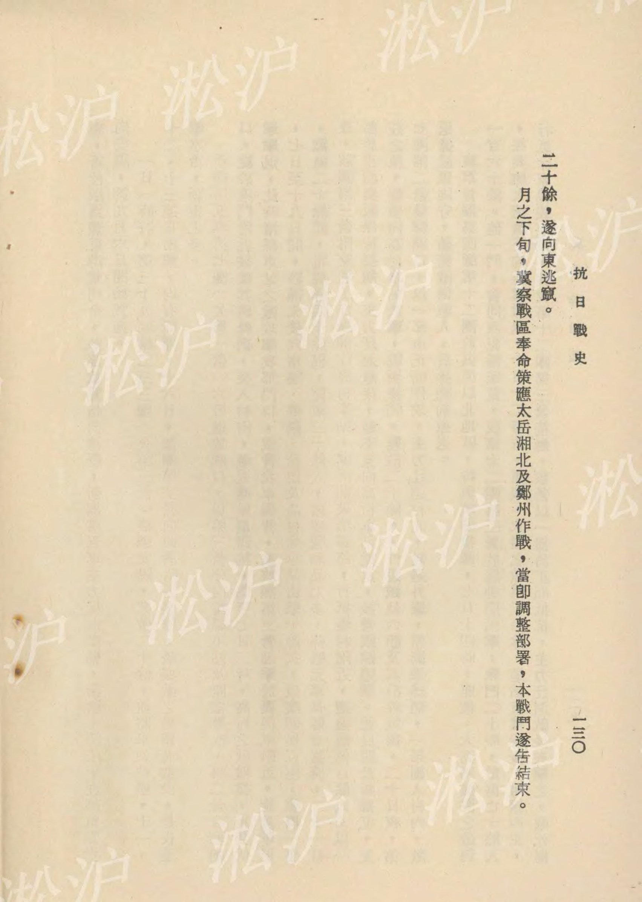

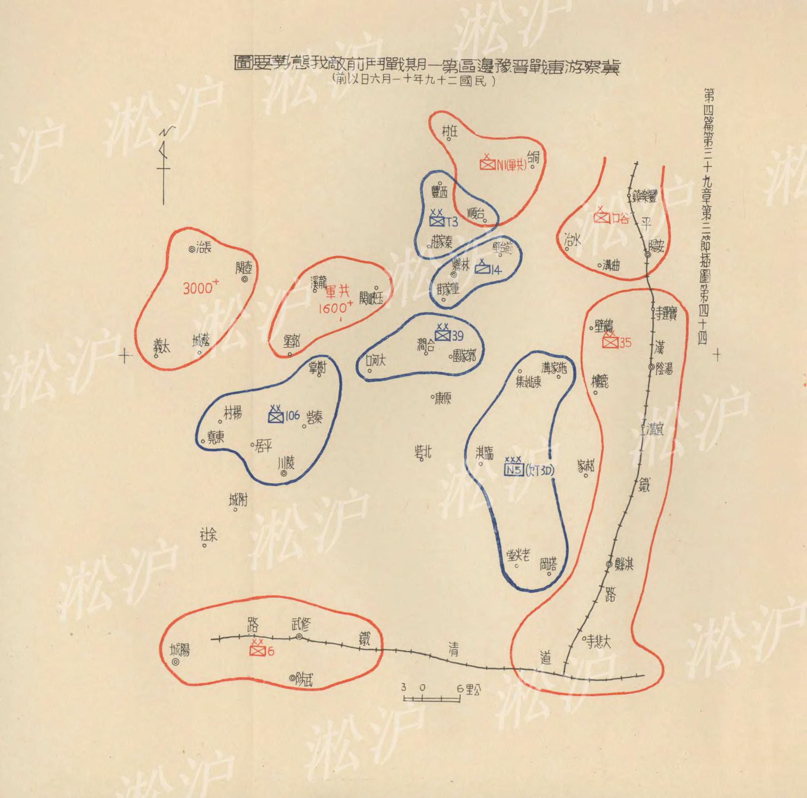

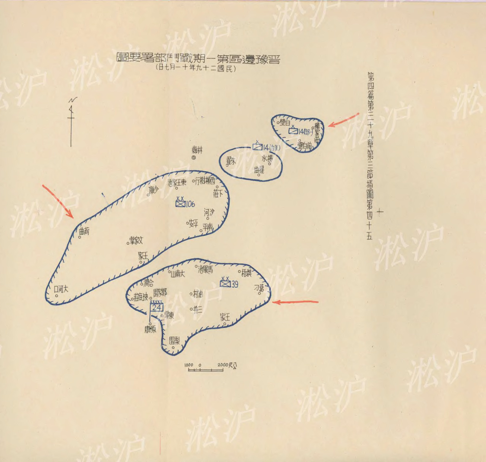

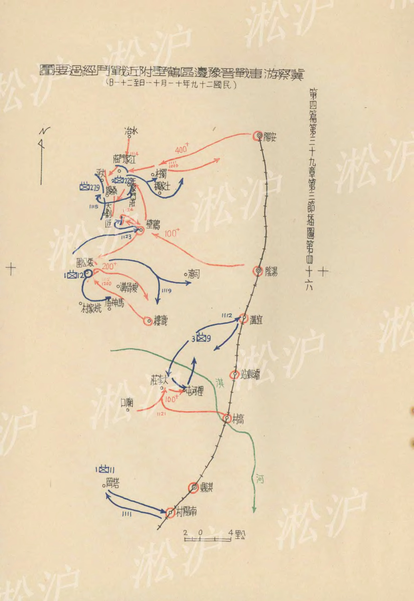

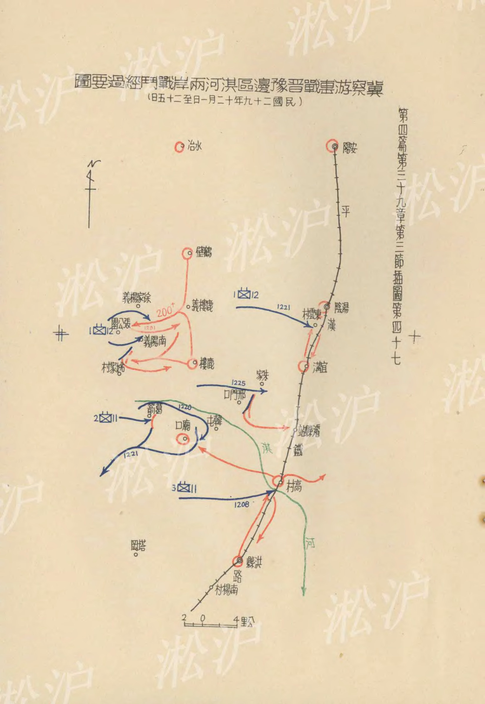

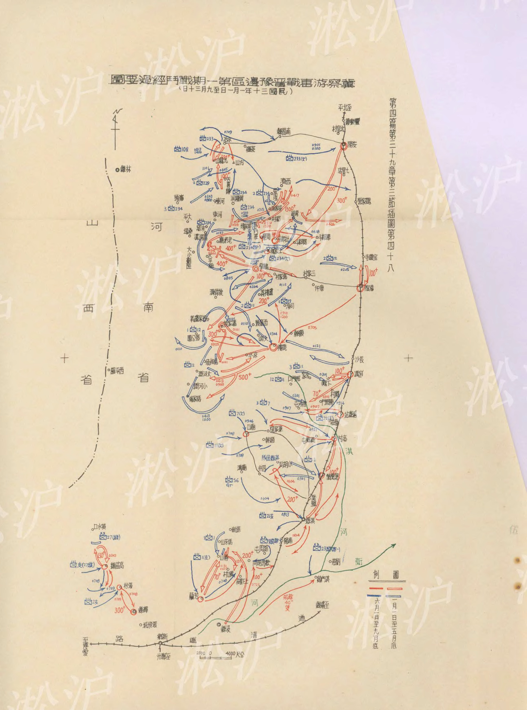

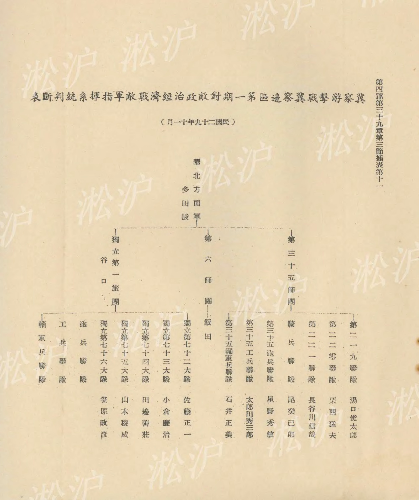

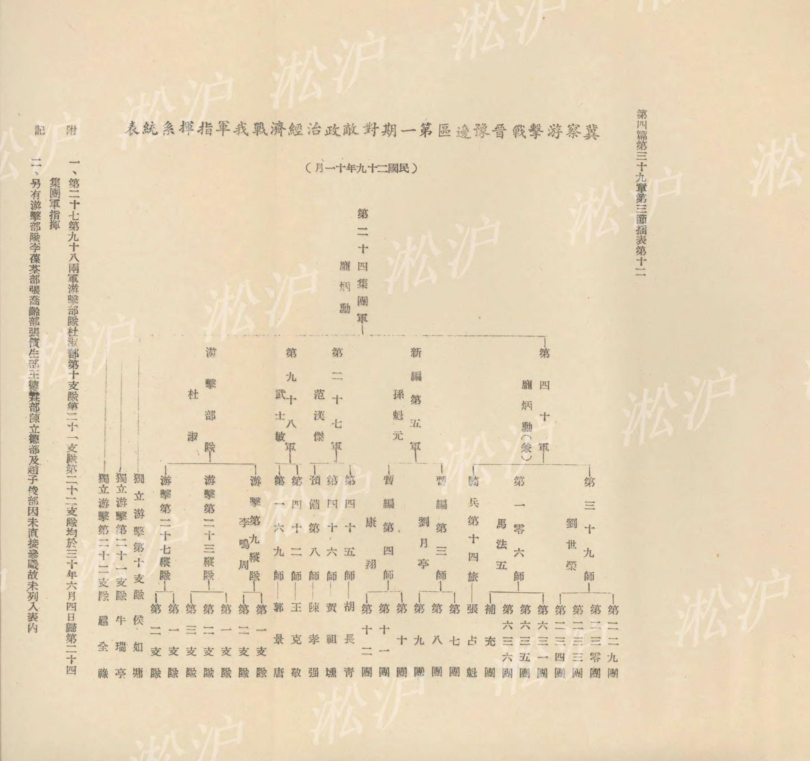

##### 第二項 晉豫邊區第二期戰鬥

民國三十一年一月二十一日至三十二年三月底

參照插圖第四十九至第五十三插表第十三第十四

自民國三十年十二月太岳、湘北及鄭州戰鬥結束後，敵主力他調，其獨立混成第一旅團踞守冀魯邊區舘陶、鷄澤、邯鄲、武安、安陽、大名、冠縣及堂邑地區，（參照插圖第四十九）第三十五師團分任道清鐵路及平漢鐵路新鄉、湯陰間之防務，第三十六師團位置於潞城、壺關、蔭城、峯頂、晉城、高平及長子地區，各部積極推行僞政權及經濟設施，同時匪軍於魯西聊城、觀城、范縣地區，冀南內黃附近，安陽水冶地區，及山西陵川以北地區，積極擴充實力，並不時予我國軍以襲擊。

我第二十四集團軍仍據守太行山區，新編第五軍主力位置於臨淇東南地區，其暫編第三師於林縣以北地區防止匪軍活動，第四十軍位置於東姚集、原康、林縣地區，積極整補，第二十七軍於太行山西區樹掌、平城、陵川、附城、奪火、橫水地區佈防，另以游擊部隊第二十三，第二十七兩縱隊挺進平漢鐵路東側淇縣東南及滑縣附近活動，我第三十九集團軍退據冀濮縣（山東屬）濮陽及東明地區，時與匪軍接觸。

民國三十一年一月九日，第一戰區衛立煌長官爲加強對敵經濟作戰起見，特策定對敵經濟作戰計畫，電令第二十四集團軍龐炳勳總司令：「貴部經濟游擊區爲第三游擊區，所服任務，一、對敵僞在縣鎮所設之經濟機構與軍用工廠倉庫等予以破壞或襲擾。二、對白晉晉博各公路道清平漢兩鐵路及其沿線之通信設施予以破壞，除詳細計劃另電飭遵外，特電查照，並積極準備爲要。

二十二日，龐炳勳總司令奉到右項電令後，除太行山西區另電范漢傑副總司令遵照部署外，當卽電令第四十軍，新編第五軍及游擊部隊杜淑部：「太行山東區各部隊着先就原防區對當面之敵，實施經濟游擊戰，俟長官部詳細計畫奉到後，再擬定對策，另令飭遵，仰遵照，並將實施情形隨時電呈爲要，關於各游擊部隊之派遣及游擊實施，責成派出游擊部隊指揮官依據當時情況，適宜以命令規定之。

一月下旬，游擊部隊於平漢鐵路東西地區積極活動，杜淑部第二十七縱隊第五十五，第五十六兩支隊於二十一日至二十六日期間，（參照插圖第五十）曾於輝縣以北高莊、土樓、西池頭及薄壁等地先後驅散構工及民伕數百人，斃敵僞十餘人，三十日夜，該兩支隊協同襲擊輝縣城，二十三時許攻入城內，與敵展開激烈巷戰，後敵退據東門內一據點頑抗，僞縣府人員亦憑碉樓固守，迄次日八時許，新鄉之敵增援，雖曾於東關外中我伏擊，但仍猖狂反撲，我軍遂撤至城北高地，共斃敵僞三十餘人，俘四十餘人，函獲步槍八十餘枝，馬十餘匹。

此際第二十三縱隊於平漢鐵路東側時與敵僞接觸，二十七日八時許，淇、濬兩縣及濬縣車站敵僞各百餘，會攻前後朝店（淇縣東北）我濬縣行署，當濬縣車站敵軍東渡淇河之際，南北紙房附近我第二十三縱隊第五十三支隊潛伏於淇河東岸，予敵猛擊後，旋卽北撤，二十九日晨，該縱隊第五十四支隊於滑縣東南地區設伏，旋由漏洞開來敵汽車一輛，當予以截擊，斃敵十餘，俘四人，函獲步機槍二十枝，及其他電話機裝具等多件，並將其汽車焚燬，旋長垣敵汽車二輛來援，當其步兵未下車前又予以猛擊，敵不支退去。

暫編第四師第十二團第一營於二十四日夜，分向南陽及淇縣車站之敵攻擊，將小屯附近鐵軌炸毀五節，並將沿途電線悉數破壞，同時該團另以一部襲擊高村車站，行抵三里屯附近，遭遇敵僞七、八十人，戰兩小時，斃敵僞十餘人，餘敵敗退高村，二十九日夜，該團第三營一部襲擊廟口，主力進攻高村車站，至新鄉屯附近與敵僞五十餘相遇，經該營猛攻，敵敗退高村，我追擊至高村附近，時近拂曉，遂卽西撤。

第四十軍第一零六師於二十二日晨，獲悉湯陰敵五十餘，掩護汽車十餘輛，連日向鹿鶴公路輸送磚木等建築材料，乃着第六三一團第二營第六三六團第二營及劉統全、侯如墉兩支隊分別潛伏於上庵、耿寺、李家墳、柳澗各地附近，準備予以截擊，八時許，侯支隊於顧縣附近首先接觸，擊退鹿樓向耿寺前進之敵二十餘，旋湯陰之敵僞二百餘，砲二門，汽車十餘輛，竄抵柏落以東高地，向我第六三一團第二營猛烈砲擊，繼之以步兵進攻，相持至午，敵死傷二十餘人向湯陰敗退。

第三十九師第二三零團主力附山砲二門，於二十三日二時許，進出九龍山附近，將九龍山、水冶間電線破壞後，其第三營卽於水冶西南地區設伏，第一營向九龍山攻擊，迨六時許，水冶之敵僞百餘，砲一門，向九龍山方面增援，卽與我第三營發生激戰，此時進攻九龍山之第一營在砲火掩護下向敵近迫，至八時許，安陽之敵一百五十餘，西溝敵騎三十餘，分途來援，戰至十四時，該團各營分別西撤，敵傷亡九十餘，我傷亡二十餘人，二十九、三十兩日，該師第二三四團第一營於大澗、牛崗兩地附近三度將敵之構工築路民伕，逐向西溝逃竄。

二月初，第二十四集團軍龐炳勳總司令獲悉道清鐵路及平漢鐵路新鄉至湯陰間，仍爲敵軍第三十五師團第二二零聯隊（栗栖）二千餘，砲十餘門，及僞軍第二十三師（路朝元）二千餘維護交通，三日，敵大隊長田村率兵四、五百，砲三、四門，及僞軍八、九百人，竄至鹿樓、鶴壁一帶，徵集民伕，構築工事，安陽以北仍爲敵獨立混成第一旅團鈴本部千四、五百，砲六門，其晉東南方面之第三十六師團調動頻繁，似有先行掃蕩黎城、遼縣地區匪軍企圖，爾後向我國軍進攻，並於邯鄲附近十三個縣成立經濟統制總機構—物資對策委員會，僞縣長兼委員長，直屬邯鄲敵特務機關，負責物價之訂定統制與配給等，各縣成立新民會，合作社，各區成立分社，利用貸款之美名，套購棉、麥等農作物，另以棉業改進會搜購棉花，鐵業會社出售所搜購各種廢鐵，至於其統制辦法，依全縣人口規定月需數量實施票給制，配給制）現已管制者，爲煤油、煤炭、麵粉、食鹽等主要日用品，現西溝（安陽西）附近建築倉庫二千四百餘間，準備於三十一年間實施強迫統制，存儲食糧。

龐炳勳總司令基於當前敵情及其經濟設施，策定太行山東區攻擊部署如左：

一、豫冀邊區游擊指揮官杜淑部第九第二十三兩縱隊各一部，進駐滑縣附近，防止匪軍南進，並協助我地方推行政權，主力及第二十七縱隊任黃水口迄淇河以西之大峯門（均含）間防務，並向輝縣、新鄉、汲縣等地敵據點及交通線實施襲擊。

二、新編第五軍暫編第三師位置於林縣東北東趙村、姚村、秦家莊一帶，對北警戒，防止匪軍活動，另以暫編第四師第十二團附江北交通工作大隊一部，以正面，東西掌，小柏峪一帶爲根據地，向平漢鐵路南陽、宜溝車站間敵僞據點及交通線實施襲擊，其餘於臨淇附近集結整訓。

三、第四十軍第一零六師李振清副師長，率師工兵連第六三六團第三營，並指揮獨立第一第二兩挺進支隊，以大河間，張公園，陳倉一帶爲根據地，向平漢鐵路湯陰南北及其以西地區敵僞據點及交通線襲擊與破壞，主力於戚泉、東姚集附近集訓。

第三十九師（附挺進第十四縱隊）第二三零團團長李國干指揮該團，師特務連及工兵、砲兵各一連，協同挺進第十四縱隊第四十支隊，以嶺頭、鐵爐爲根據地，向平漢鐵路寶蓮寺、安陽間及其以西鶴壁、水冶等據點及交通線襲擊破壞，又挺進第十四縱隊第三十九支隊一部及第二三四團第二營，分別進駐合澗、水池嶺及大河口、楊家池一帶，除維護陵川至合澗大道之交通外，並對北警戒，防止匪軍活動，主力於合澗，上莊附近集結整訓。

四、自衛軍第五路歸新編第五軍指揮，以一部位置於盤石頭附近，對東警戒，主力於三拐頭東西孔子（臨淇西北）附近集結整訓。

五、挺進第十一支隊（扈全祿）由總司令部直接指揮，以賀家爲根據地，（邢門口東一公里）向淇河鐵

路迄宜溝車站敵僞據點及交通線襲擊破壞。

二月二日，廟口之敵五六十人，向老虎山暫編第四師第十二團第二營進攻，經迎擊後，向廟口撤退，翌日十八時許，該營襲擊廟口，斃敵數人，並將高村至廟口間之公路破壞三段撤回，八日十時，廟口敵僞五十餘人向邢門口進攻，被我第十二團第三營一部阻擊於蔡溝附近，敵傷亡十餘人退去，此時第一營一部協同爆破組於淇縣城南破壞鐵軌三節，並擊退敵之巡查隊。

第一零六師工兵一排，於二月三日夜埋設地雷於鹿鶴公路（鹿樓至鶴壁）康家及鍾山，翌日十時許，鹿樓之敵到達此地觸雷，被斃四十餘人，炸毀敵汽車一輛，七、八兩日，第三十九師第二三零團第一營附迫擊砲一門，於石牌頭及李家荒附近曾兩度擊破僞軍第二十三師路厚齋部斃僞兵十餘人，並將構工民伏驅散。

二月中旬第一戰區蔣鼎文長官，爲整飭游擊部隊紀律，維繫淪陷區民心起見，於十一日電令各部隊：「查民心向背關係抗建前途者至大，淪陷區民衆日處敵僞蹂躪之下，艱苦極爲可憫，據報近有不良游擊部隊到處任意騷擾，啓其背我附敵之心，殊乖軍民合作之旨，希嚴加督飭，以維民心爲要」同時奉到蔣委員長子州電令如次：「據報晉北、晉中、及晉西各僞組織刻正積極發動募兵競賽運動，規定能發動壯丁十五名者爲特等幹部，十名者爲模範幹部，一村能發動三名者爲模範村等情，查敵積極利用我人力與物力，大徵我壯丁，應付太平洋戰爭，該戰區應迅卽講求有效對策，切實破壞爲要」，當卽轉飭所屬注意研究對策嚴密防範與破壞。

十一日夜，第三十九師第二三零團第二營襲擊鶴壁，突入寨內釋放民伕二百四十餘人，十五時許，該團第二第三兩營向鶴壁及水冶襲擊，第二營於賈家附近與敵相持兩小時，第三營於水冶、九龍山間破壞電線五里許，二十日四時，第二三零團團長李國干，親率第一營及第五連會同吳德生部向李家庵及其以東高地之敵襲擊，潛進距敵約百公尺處，爲敵發覺，乃改取強襲，予以猛攻，激戰近午，斃敵二十餘人焚燬碉樓六座，其他工事多處，於十四時撤回原防。

暫編第四師第十二團第三營，十日十時許，向裏河屯（濬縣西南）附近構工之敵僞二百餘攻擊，旋敵退入寨內頑抗，又戰時許，該營一部突入村內，斃敵僞二十餘人，敵不支向淇河鐵橋方面撤退，二月中旬，該營向裏河屯襲擊七次，共計斃傷敵僞百二十餘人，先後破壞碉樓十三座。

龐莊（濬縣西）扈堂敵僞二百餘，十三日十時於附近村莊徵集民伕五、六千，大車百餘輛，拆毀下龐村民房，運磚築碉，我挺進第十一支隊（扈全祿）由朱家向敵攻擊，民伕車輛四處逃散，敵稍事抵抗，卽向東潰退，十九日，敵又於龐莊附近築碉，挺進第十一支隊以二百餘人往襲，另以便衣一部混入民伕中，實施內外夾擊，斃敵僞官兵十餘人鹵獲步槍八枝，是日，另敵一部，分乘汽車六輛向范莊杜淑部第五十四支隊賈守業大隊進攻，經該大隊迎頭痛擊，敵向百尺口敗退，又於中途爲我伏兵截擊，戰至日暮，敵僞傷亡三十餘人，損壞汽車二輛，向滑縣西南潰退。

第一零六師第六三六團第三營附工兵連，二十二日夜於東雲村（湯陰南）東北端埋設炸藥，翌日一時許，敵南駛鋼甲車一列觸發，炸燬機車及鋼甲車五輛，探照燈一具，砲一門，輕重機槍四挺，該營乘機集中火力，予以猛烈射擊，斃敵二十餘人，旋湯陰敵鋼甲車一列，前來增援，該營遂卽西撤，新編第五軍暫編第四師第十二團，以連爲單位，每日出擊於淇縣（以下四村皆在濬縣以西）羅銀村、裏河屯、廟口、老虎山等地，予敵以襲擊，計斃傷僞二十餘人，先後破壞碉樓四座，其他工事尤多。

三月一日十五時，杜淑部第二十三縱隊第五十三支隊協同濬縣常備隊，向新鎮僞區署及僞警備隊攻擊，相持至翌日拂曉，仍未獲進展，旋該縱隊副司令閻希孟率隊增援激戰至十五時，濬、滑兩縣敵僞二百餘來援，均經閻部擊退，相繼協同向僞區署猛攻，旋卽突破，斃僞員警二十餘人，生俘三十餘人，囪獲步槍三十餘枝，該部亦傷亡十餘人，迨三日十時許，滑縣之敵一部，分乘汽車五輛，另附戰車三輛反攻，我新鎮（滑縣北）第五十三支隊據寨固守，旋第五十四支隊前來增援，經兩支隊內外夾擊，敵不支敗退，五日第九縱隊李鳴周親率兩個大隊，圍攻敵僞八十餘於北官村，戰至翌日拂曉，敵突圍南竄，當將敵據點工事等悉數予以破壞，八日，敵七百餘，砲三門，分由湯陽、濬縣車站、高村車站及淇縣等地，向魏賢防（濬縣東南）及其以南地區圍攻，我第二十三縱隊第五十二支隊第一大隊、及第九縱隊第三十支隊之第三大隊於淇河東岸前後屯、魏賢集、南北紙房、前後朝店（魏賢集西南）予以迎擊，激戰至午，第五十二支隊第一大隊轉進至香榮附近，第三十支隊第三大隊轉進東西枋城及前后交卸一帶，繼續戰鬥，由於敵之繼續增援，該兩大隊彈藥殆盡，乃脫離敵之包圍，分途向滑縣西南郭新莊附近轉進，是日斃傷敵僞百餘，該部傷亡五十餘人。

新編第五軍方面：暫編第四師第十二團於三月初旬向裏河寨襲擊五次，斃傷敵僞四十餘人，先後驅散構工民佚千餘，破壞敵碉堡十餘座，使其裏河寨至廟口之封鎖溝終未完成，此際第一戰區蔣鼎文長官爲消耗疲憊敵人，使爾後反攻有利，決定先向當面敵軍佔領之次要據點及交通線輪流襲擊，相機略取之，孤立敵之重要據點，形成我軍反攻之有利態勢，飭令第二十四集團軍以水冶、湯陰及平漢鐵路其他次要據點、敵軍部隊、倉庫及其政治、經濟諸設施爲目標，每旬以一個團負責實施之，第二十七軍則以兩營兵力負責太行山西區消耗敵人任務。

第二十四集團軍龐炳勳總司令基於第一戰區長官部之指示，策定計畫，調整部署如左：

一、豫冀邊區游擊指揮官杜淑部，平漢鐵路東側部隊，仍任原游擊任務，西側轄區內以有力部隊協同江北交通工作第二大隊（欠第四中隊）輪流負責第一線之襲擊與破壞，攻擊目標爲高莊、輝縣、芳蘭以及其他各小據點倉庫、交通、通信、政治、經濟諸設施。

二、新編第五軍暫編第三師仍位置於林縣以北地區，防止匪軍活動，另以一個團附交通工作第四中隊爲輪流襲擊部隊，經常以一營兵力於第一線，攻擊目標爲南陽、淇縣、高村車站、喬盟鐵橋、廟口、裏河屯、裏河寨以及其他倉庫、政治、經濟諸設施。

三、獨立挺進第十一支隊，仍就新編第五軍轄區內以賀家爲根據地，以有力部隊輪流襲擊破壞，攻擊目標爲淇河鐵橋（不含）迄宜溝車站（含）間敵小據點、倉庫及政治、經濟諸設施。

四、第一零六師附獨立挺進第一第二兩支隊，以該師李振清副師長指揮一個團（附工兵一排）及獨立挺進第一支隊，爲輪流襲擊部隊，經常以一個營活動於第一線，攻擊目標爲湯陰、鹿樓、大湖、怨院及敵僞倉庫、交通、通信與政治、經濟諸設施。

五、第三十九師附張儐生縱隊，以一個團（附工兵一連）協同張縱隊第四十支隊，經常以一個營負責轄區內第一線之輪流襲擊任務，攻擊目標爲鶴壁、寶蓮寺車站、李家庵西溝、曲溝、九龍山以及其他倉庫、交通、通信與政治、經濟諸設施。

六、作戰地境：

杜淑部與第二十七軍間爲沙窯、葫蘆腦、朱橋、新鄉車站之線，與新編第五軍間爲沙窯、柏樹灣、漱溝、鷄冠嶺、南陽之線，線上屬左。

新編第五軍與第一零六師間爲三郊口、白甘泉、翟井、上浴迄湯陰東南烽城之線，線上屬左：

第一零六師與第三十九師間爲柳泉東土池、梨園、棋梧、馬踏井迄湯陰東北方莊之線，線上屬左。暫編第三師與第二十七軍間爲龍溪、微子鎮之線，線上屬暫編第三師。

七、各部隊統限於三月十日開始動作，持續時間暫定爲兩月。

三月中旬，游擊部隊杜淑部、新編第五軍及第四十軍，仍於平漢鐵路西側晉豫邊區活動，十一日十時許，淇縣之敵四百餘，砲二門，向三皇莊、王二莊、北官村（上三村皆在淇縣南）一帶推進，杜淑部第九縱隊第三十支隊附第三十一支隊一部，推進至下窯、飲馬胡同、上下棗莊等地，（皆在北官村東北）予敵以猛烈襲擊，戰至十三時許，該支隊撤守飲馬胡同等據點，十四日二十一時許，該支隊再襲攻北官莊，戰至十五日三時，將敵外圍工事破壞後北撤，此時第二十三縱隊第五十二支隊向寺莊攻擊，行抵該莊以北地區，適與芳蘭北進之敵百餘遭遇，相持兩小時時，敵不支敗退，十七日十三時許，第二十三縱隊之一部於滑縣東南沙窩附近截擊由留固向滑縣回竄之敵七十餘，敵不支向留固方面敗退，該部跟踪追擊至信都附近，斃敵僞十餘人俘虜僞軍十餘人，函獲步槍十五枝，二十日二十一時，第九縱隊第三十支隊襲擊潞王墳車站，（新鄉東北）並先以便衣隊混入車站內作內應，斃敵哨兵三名，旋敵主力出擊，該部向太公泉附近撤退。

此期間，廟口、淇縣之敵三百餘，十一至十五日間，連日掩護民伕三四百人，於廟口以南地區構築封鎖溝，暫編第四師第十二團各營先後出擊五次，斃敵四十餘人，破壞公路三里許，並驅散構工民伕，十六日八時，該團第一營推進至青羊口附近，擊退淇縣西犯之敵三百餘，敵傷亡二十餘人，十八日至二十日間，裏河屯之敵，曾兩度進犯邢門口該團第三營，均被擊敗，該營攻擊廟口，斃敵六人。

第四十軍第三十九師第二三零團第三營，附工兵一排，發動民衆五百餘，於十五日三時許將水冶、九龍山（安陽西）間電線破壞後，以主力於九龍山西南地區設伏，以一部佯攻九龍山，誘敵至我設伏地區，予以猛烈夾擊，敵傷亡慘重，回竄九龍山，十七日零時，該團第一營一部配合民衆七百餘，於牛崗附近破壞碉堡一座，封鎖溝約一公里，並擊敗西溝敵之出擊。

三月下旬，龐炳勳總司令獲悉安陽敵，組織六個經濟班加強物資封鎖，並續悉輝縣、新鄉、淇縣、汲縣地區各據點，共駐有敵軍千五百餘，淇縣、湯陰、滑縣、濬縣地區各據點共敵千餘，砲四門，安陽、西溝、水冶、觀台地區各據點，共敵千六百餘，砲六門，判斷敵人企圖似仍確保平漢鐵路交通，加強經濟封鎖，以鞏固其華北僞政權。

二十二日，杜淑部參謀暴惠民策動馬蘭集（滑縣南）僞區隊長馬成龍反正後，翌日一時許，杜淑卽親率一部攻擊該區署，斃僞警長以下七人，俘獲僞警八十八人，囹獲步騎槍一百四十餘枝，彈藥二千餘發，及騾馬八匹，二十九日，滑縣敵汽車八輛，滿載部隊南駛，協同騎兵百餘攻擊慈周寨（滑縣東南）杜淑部，該部據寨抗拒，敵雖以毒氣助攻，該部陣地仍屹立未動，入夜後，杜淑部以一部出擊，襲擊敵之側背，敵受重創，遂向滑縣撤退，此期間，該部第九縱隊第三十第三十二兩支隊，第二十三縱隊第五十二第五十三兩支隊，第二十七縱隊第五十五第五十六兩支隊，分向滑縣、芳蘭、三皇莊、賈莊、輝縣、薄壁等地出擊，破壞其附近公路及橋樑等，均有斬獲。

新編第五軍第十二團第一營於二十一日十三時出擊，到達白羊河附近，獲悉淇縣敵五十餘，進踞吳莊、劉莊（均在淇縣西北）後，攻擊靑羊口，該營繞經棗莊攻擊敵左翼，敵不支向淇縣撤退，二十六日夜，該團第三營附交通工作第四中隊，於高村車站以北地區，破壞鐵軌三節及電線一段，旋由濬縣車站駛來鐵甲車一列，載敵八十餘人在其猛烈砲火掩護下，下車戰鬥，相持時許，該營西撤，三十日八時許，廟口、裏河屯之敵僞百餘，會攻邢門口第十二團第三營，該敵行抵八坡頂（邢門口南一公里）附近遭我阻擊，敵傷亡十餘人向廟口方面敗退。

第三十九師第二三零團第一營於二十八日六時許攻擊西溝，敵據寨頑抗，相持終日，於十六時西撤，翌日，江北交通工作隊第二大隊第六中隊，於北官村附近埋設炸藥，三十日拂曉敵補給車一輛行抵該地車輛及人員全被炸燬。

四月初，第一戰區蔣鼎文長官獲悉僞華北政務委員會四總署，近在保定、石門、北平、塘沽、獨流及天津等處分別設立施工所，並於北平、天津兩市成立建設工程局，企圖造成以敵工商業爲主體之都市，加強其軍事據點，發展公路，便利軍事行動及運輸，開發水利交通要道，以便統制物資，依照上述情況，當卽策定對策，電令冀察戰區所屬部隊，於永定河、溝橋附近決口，淹沒平漢鐵路及北平豐台一帶地區，於冀東三河、密雲決口，則平東八縣將成水庫，敵所築平古鐵路必不能保，又北運河、屈家店原爲海河航運之保障，應設法破壞，將南運河上游或滹沱河決口氾濫，則南運河、大清河之航運受阻，如此則敵軍企圖全被粉碎。

一日十三時許，杜淑部第二十七縱隊第五十五支隊，於朱窪（高莊西北）附近獲悉高莊之敵百餘，向朱窪方面前進，當卽於村外予以截擊，敵不支向高莊敗退，該支隊跟踪追擊至高莊附近，斃敵十餘人，並鹵獲步槍二枝，是夜該縱隊第五十六支隊第二大隊，推進至輝縣西南地區，將新輝公路（新鄉至輝縣）及電線破壞三華里，六日十九時，第九縱隊第三十支隊第二大隊襲擊芳蘭，敵以一部出寨迎戰，旋被擊退，該大隊將芳蘭西端碉堡二座破壞後撤回原防地。

四月上旬間，新編第五軍第十二團，向平漢鐵路濬縣車站、淇河橋、高村車站、南陽車站及其以西據點裏河屯、廟口等地出擊六次，敵傷亡四十餘人，馬五匹，破壞鐵軌三節，公路十餘段。

四月中旬，第四十軍第三十九師第二三四團於水冶、九龍山、九堰、西溝、圪墻地區先後出擊五次，斃敵十餘人，破壞碉堡四座，並發動附近民衆千餘，填平敵封鎖溝四華里，此期間，新編第五軍第十二團先後出擊八次，尤以十一日夜，第二營襲擊廟口之役最爲激烈，相持一晝夜，經兩次衝鋒，終以敵火熾盛而未奏全功，十七日八時，濬、淇兩縣之敵三百餘，會同魏賢集之會匪楊貫一部，（約千餘人）圍攻楊馬胡第二十三縱隊第五十三支隊牛英德大隊，及濬縣縣政府，以衆寡懸殊，該大隊及縣政府乃轉進李橋，翌日，同山方面又增會匪一部，淇縣增來汽車九輛，到達交卸附近，在敵砲火掩護下，繼續向牛英德大隊李橋防地攻擊，該大隊轉進至錢莊，（淇門鎮東南）十九日敵分路繼續進攻，該大隊予敵以迎擊，斃敵四十餘人，不支北撤。

四月下旬，蔣鼎文長官基於當前狀況，爲確保太行山區並逐次規復中條、太岳兩游擊根據地，特策定黃河北岸全面游擊計畫，電令冀察戰區龐炳勳總司令遵照實施。

第一戰區黃河北岸全面游擊計畫：

甲方針

戰區爲確保太行山區，並逐次規復中條、太岳兩游擊根據地之目的，卽以有力部隊進入中條山，肅清南侵匪軍後，重建根據地，以利爾後我軍之總反攻。

乙

指導要領

一、各河防部隊將前編組之輪流襲擊部隊改爲全面游擊，與我太行山、中條山、太岳山國軍相呼應，以側擊、伏擊、奇襲迂迴、監視諸手段，先行略取敵之次要據點及倉庫，以掩護有力部隊之北渡。

二、各游擊部隊務本避實擊虛之原則，疲憊敵兵力，並預設祕密根據地，以備不得已時之轉進。

三、太行山及中條山黨政機關游擊部隊及地方武力，均由該區總司令統一指揮與領導，並組訓民衆，健全保甲，爭取當地知識份子，統制地方物資，以鞏固根據地。

四、各地區對匪軍之活動，須隨時注意偵察與戒備，可能時須集中優勢兵力予以各個擊破，尤須加強政工，破壞其基層組織。

丙

部

署

一、太行山區游擊總司令龐炳勳，指揮第二十四集團軍第二十七軍及李葆荃、俞墉、張儐生、劉統全、扈全祿、杜淑、趙子俊、侯如墉等游擊部隊，擔任府城、沁水、陽城、封門口之線（線上不含）以東，封門口垣沁公路武陟、元村驛車站之線（線上不含）以北平漢鐵路（含）以西，漳河洪屯公路府城（不含）之線以南地區之作戰。

二、須與中條山部隊相連繫，迨其有較利之進展，卽對敵水冶、湯陰及道清鐵路西段之修武，博愛等據點施行攻擊，竭力牽制敵人，繼之以有力部隊切斷白晉、晉博公路南北交通。

三、另以有力部隊進入太岳山區，圍剿陽城、晉城以北，沁水以東周村、潤城、端氏一帶之匪軍，徹底肅清其潛伏勢力，並組訓民衆，樹立政權，建立游擊根據地。

龐炳勳總司令奉到右項計劃後，卽行策定太行山區游擊計劃，並以卯感酉電令各部實施，其計劃如左：

第一方針

本游擊區以確保太行山並逐次規復太岳山各游擊根據地之目的，以有力之一部對當面敵之次要據點及交通線實施襲擊與破壞，摧毀其設施及封鎖，主力積極整訓，防止匪軍活動，爾後協力中條山部隊肅清南侵匪軍，以利爾後總反攻。

第二指揮要領

一、在中條山我部隊未獲進展前，各部隊仍以現態勢實施襲擊與破壞，打破敵之封鎖，積極儲屯糧彈，培植地方武力，使任外圍警戒，並儘可能爭取僞軍反正。

二、本游擊區內黨政機關及地方武力，位置於太行山西區及太岳山東區者，統由第二十七軍設計委員會負責主持，位置太行山東區者，仍由第二十四集團軍總司令部直轄，務使黨政軍一元化，組訓民衆，健全保甲，以期鞏固我根據地。

三、對敵掃蕩時之對策。

敵如由平漢鐵路向我太行山東區掃蕩時，該區各軍以有力部隊確保各游擊根據地，主力保持於合澗外圍東姚集、臨淇地區，捕捉敵之一部，予以各個擊破或俟敵之攻勢頓挫後，一舉包圍而殲滅之，如情況惡化，則編組多數小支隊，各就所轄地區與敵機動旋迴作戰，此時太行山西區部隊應努力向當面之敵攻擊，牽制敵兵力之轉用，或以有力部隊向東推進，直接策應東區之作戰。

敵如由高平、壺關方面經龍溪鎮、玉峽關威脅我陵合大道，或直趨合澗時，東區應以有力部隊扼守大河口以北要點，拒敵進攻，西區應以有力部隊取積極行動，由樹掌方面向東北急進，拊敵側背，爾後與東區部隊協力圍殲該敵。

敵如由西向我太行山西區掃蕩時，西區應以有力之一部扼守該區游擊根據地，主力保持於陵川東北地區，利用既設陣地逐次消耗敵人，如情況惡化，則編組多數小支隊以晉城、高平、長治爲軸線，與敵機動旋迴作戰，此時須注意與中條山及黃河北岸游擊隊密切連繫，東區則積極向平漢鐵路新鄉、安陽間等要點攻擊，或以有力部隊推進至西柏坡、樹掌、浙水一帶既設陣地，協同西區部隊作戰。敵如全面向我太行山區圍攻時，東區部隊則以全力擊破平漢鐵路方面進攻之敵，爾後轉進兵力於陵川方面：協同西區部隊誘敵於陵川附近，予以各個擊破，如情況惡化，以有力一部扼守我各游擊根據地，主力編組多數小支隊，轉移敵後實施旋迴作戰，以鑽隙、伏擊、側擊及尾擊等戰法，消耗敵之兵力。

第三

兵團部署

一、軍隊區分

太行山東區

指揮官

第二十四集團軍總司令龐炳勳兼。

第二十四集團軍。

豫冀邊區游擊指揮部所轄部隊。

第一戰區自衛軍第五路。

第一戰區挺進第十四縱隊。

第一戰區獨立第一挺進支隊。

第一戰區獨立第十一挺進支隊。

冀察戰區獨立第二挺進支隊。

河南第三第十三兩行政區之地方團隊。

江北交通工作隊第二大隊。

第一零一收容所。

太行山西區

指揮官

第二十七軍軍長劉進。

第二十七軍。

豫晉邊區游擊指揮部所轄部隊。

第一戰區挺進第十七縱隊。

第五兵站。

第六兵站醫院。

第八收容所。

第二十七軍設計委員會所轄地方團隊。

二、任務及行動

太行山東區以一部對敵次要據點及交通線積極襲擊與破壞，另以有力之一部控置於林縣以北地區，監視匪軍行動，並防止敵由武陟方面進攻。主力就現態勢整訓，俟中條山我軍推進略有進展，則積極向平漢鐵路汲縣、淇縣、湯陰、水冶等據點攻擊，牽制敵兵力之轉用。

太行山西區以一部向當面敵之次要據點襲擊破壞，以一部監視敵僞及匪軍行動，並另以有力之一部配合政工人員向太岳山東區進出，主力就現態勢整訓，俟中條山區我部隊有進展，則對道清鐵路西段博愛、焦作、修武等據點攻擊，牽制敵兵力之轉用。

三、本計劃開始日期爲五月一日。

四月二十一日杜淑指揮官，親率一部及扈全祿支隊於馬蘭集（滑縣南）以北青莊、劉莊、岳村地區活動，旋匪袁際興部會同敵汽車四輛、戰車三輛向其攻擊，經杜、扈兩部協力夾擊，敵不支向北敗退，杜淑部亦轉移老河寨（滑縣西南）附近，翌日晨，滑縣之敵以汽車七輛，滿載部隊，另附戰車五輛，騎兵百餘，向老河寨猛攻，相持至十三時許，敵又由牛市屯方面增來汽車二十餘輛，戰至黃昏，敵攻勢稍挫，迨二十三時許，敵又由新鄉方面增調汽車二十餘輛，滿載部隊前來增援，戰至二十三日二時許，終以彈盡糧絕，遂向新鎮附近轉進，三日來斃傷敵僞六十餘人，我軍傷亡四十餘人，此期間，新編第五軍第十二團連日向裏河屯、蔡溝及邢門口襲擊，阻止敵人構築外壕，均有斬獲。

二十四日十時許，第四十軍第三十九師第二三四團第三營配合民衆千餘，填平西尙莊、陳家坡間封鎖溝四華里，同時第七連向陳家坡西端攻擊，民伕百餘逃散，敵僞三十餘向西溝方面敗退，另部向西尙莊攻擊，激戰近時，敵敗退，並將附近碉堡悉數破壞，二十七日一時，第二三四團第一營向水冶襲擊，行抵邊石店附近，與敵一部遭遇，當卽向敵猛攻，相持兩小時，敵向水冶方面逃竄。

五月初，龐炳勳總司令獲悉敵由石家莊開來兵車二十餘節，載敵約七千餘，砲十餘門，戰車一部，似有進攻林縣之企圖，另敵千餘由太原調至長治、壺關一帶，揚言進攻陵川，基於當前狀況，綜合判斷，敵仍係確保平漢鐵路交通，加強物資封鎖，並適時抽集兵力分區掃蕩我游擊部隊，以期擴大僞政權，此時並奉到蔣鼎文長官電令：「敵僞近在武陟、修武、獲嘉等地屢施竄擾，建築碉堡，挖掘封鎖溝，並企圖統制糧食，以軍事、政治、經濟各種力量肅清我游擊部隊，奴化我人民，刻正積極進行，我太行山區應協同黃河北岸游擊部隊南北夾擊，粉碎敵軍企圖。一龐炳勳總司令基於右令所示，當卽轉飭李葆荃部遵照實施。

五月二日五時許，第四十軍第三十九師第二三四團第二營與攻擊李家庵南端碉堡之敵戰鬥一小時，敵騎兵三十餘，由西溝來援，相持至七時許，該營向周寨撤退，翌日拂曉，該營附迫擊砲一門，襲擊西溝，一度攻入村內，與敵巷戰，旋敵援兵到達，該營向王家門莊撤退，六日夜，該團第一營率民衆三千餘於陳家坡東端破壞封鎖溝四華里，西尙莊碉堡一座，並擊退西溝敵之出擾，九日九時，敵僞八十餘率民佚二百餘人，於鶴壁、西馬村間挖掘封鎖溝，第二三四團第二營予以猛擊，敵據工事頑抗，旋鶴壁增援三十餘人，攻擊該營側背，激戰時許，均被擊退，斃傷敵十餘人，捕獲民佚百四十餘人。

敵二百餘率民佚千餘，一至三日於廟口、裏河屯、山郭村地區構封鎖溝，我新編第五軍第十二團各營輪流襲擊，先後斃傷敵僞十餘人，民佚逃散，使敵構築封鎖溝工作屢陷停頓狀態，八九兩日，第十二團之一部於廟口、新鄉屯各附近，填平敵封鎖溝百餘公尺，破壞碉堡一座，電線數段，高村車站及淇河鐵橋之敵雖兩度阻擾，均被擊敗，此時杜淑部於芳蘭、寺莊、百官村地區阻止敵僞徵工刼糧，均有斬獲。五月中旬，第四十軍當面之敵，每日率民佚千餘，於水冶、九龍山、邊石店地區構築碉堡及封鎖溝，第二三四團各營輪流出擊，先後斃敵僞四十餘人，使敵構築工作無法進行，封鎖企圖亦隨之而粉碎，十四日夜，新編第五軍第十二團之一部於擊退大灣、吳莊、劉莊各據點出擊之敵後，填平封鎖溝八十餘公尺，同時該團第三營襲擊淇河鐵橋，至浮山附近，與敵接觸，戰鬥時許，斃傷敵僞四人，不支敗退，十九日夜，敵一部押運築碉木材車輛，由淇縣向吳莊前進，行抵金牛嶺附近，遭我第十二團第一營截擊，戰鬥時許，敵退入村內，該營填平封鎖溝百餘公尺，並囪獲木材五十餘根，此際游擊部隊杜淑部各縱隊，先後向高莊、輝縣北、官村敵據點襲擊，敵傷亡二十餘人，破壞電線三公里許。

五月下旬，第一戰區蔣鼎文長官獲悉太行山區新麥成熟，敵企圖搶掠，以斷絕我軍糧源，除電令該區我游擊部隊積極游擊，掩護人民收割，以裕軍民食糧外，並策定防敵刼糧計劃如左：

第一戰區防敵刼糧計劃

第一方針

冀察戰區就現態勢積極實施襲擊，掩護民衆收割，並協同黨政機關發動民衆分區後運及儲藏，粉碎敵之搶糧陰謀。

第二實施要領

一、各部隊應協同轄區內黨政機關與民衆，掩護收割，努力搶購運儲至安全地點，並獎勵糧商由敵僞佔領區購進，嚴禁外運資敵。

二、第一線部隊應區分爲三部，分任游擊、守備及掩護收割等任務，後方部隊除必要兵力負責警戒外，應全力協助民衆收割及後運儲存。

三、各部隊政工人員協同當地黨政機關，徹底調查轄區內村鎮戶口及地畝數量、新糧產額等，列表呈報，在淪陷區內者，第一線派遣武裝便探、游擊小組、地方團隊等掩護政工人員及其所屬縣（區）之工作人員，實施調查。

四、各第一線部隊所需軍糧應儘量就敵僞佔領區徵購，但嚴禁搶掠，致招民怨。

第三部署

一、豫冀邊區杜淑部附江北交通工作第二大隊，（欠第四中隊）以現態勢實施襲擊與破壞，掩護民衆收割，平漢鐵路以東部隊積極向鐵路沿線敵據點襲擊，策應我軍搶購工作。

二、新編第五軍（欠暫編第三師）附趙子俊部及江北工作隊第四中隊，淇縣團隊以一部積極向敵襲擊與破壞，主力掩護民衆收割，暫編第三師仍於林縣以北地區，防止敵僞及匪軍進犯，以一部掩護民衆收割。

三、第四十軍附張儕生、劉統全、扈全祿、侯如墉等部及林縣、湯陰、安陽地方團隊，以一部負責第一線之守備及襲擊破壞任務，主力掩護民衆收割。

四本計劃自六月一日起實施，七月一日截止。

第四十軍方面第一零六師第六三五團，（欠第一營）自五月二十一日起連日向宜溝車站及長沙村襲擊，破壞鐵橋一座，鐵軌二節，函獲電線九百餘斤，同時第三十九師第二三四團各營輪流出擊，先後向西溝李家庵、西尙莊、青崗等地襲擊與破壞，曾於西尙莊附近破壞敵碉堡三座，填平封鎖溝五華里，斃傷敵僞十餘人，俘獲三人。

五月二十四日夜，暫編第四師第十二團第二營於高廟公路（廟口至高村）破壞電桿二十餘根，旋高村車站之敵前來阻擾，戰鬥時許，敵敗退，翌日七時，該營於駝骨村（廟口南）以南地區截擊敵僞構工部隊，民伕逃散，敵據碉堡頑抗，旋淇縣及高村車站之敵乘汽車來援，相持至十二時許，該營西撤，二十七日五時許，廟口、淇縣及高村車站之敵二百餘，會攻邢門口，第十二團第三營予以迎頭痛擊，敵敗退，該營乘勝追擊，又於大李莊激戰二小時，敵傷亡二十餘人，續向淇縣撤退，該營傷亡官兵八人，翌日十二時許，廟口之敵四十餘，再度向邢門口攻擊，又被該營於八坡頂擊退。

杜淑部第二十七縱隊第五十五支隊第二大隊於五月二十一日二十一時，攻擊高莊，旋迫近村緣，與敵激戰，相持至次日拂曉，斃敵十餘人，遂向朱窪附近撤退，二十七日，該大隊發動民衆四百餘，於小官莊附近破壞碉堡一座，封鎖溝三公里，翌日，輝縣敵僞百餘，向該大隊攻擊，激戰時許，敵僞傷亡四人，向高莊撤退，二十九日夜，第九縱隊第三十支隊及第三十一支隊之一部，攻佔芳蘭，擊破僞汲縣警備隊，斃僞隊長以下七人，俘三十餘人，函獲步槍三十餘枝，此際扈全祿支隊破壞夏莊、黃溝附近鐵橋一座，電桿一百七十餘根，收回電線二千五百餘公斤。

六月上旬，第四十軍方面，三日四時，第三十九師第二三四團第二營以有力一部襲擊鶴壁之敵，主力掩護民衆割麥五千餘擔，並破壞鶴壁附近封鎖溝四里，六日，第二三四團（欠第一營）發動民衆千餘，襲擊西尙莊，斃傷及俘獲敵僞十餘人，破壞碉堡六座，填平封鎖溝十三華里，當二三四團襲擊之際，廟口之敵三十餘人，掩護民伕二百餘人，竄至山郭莊搶糧，新編第五軍第十二團第三營獲悉後，前往迎擊，旋被擊退，該營繼續向襄河屯襲擊，相持二小時，淇河車站及濬縣車站之敵先後來援，該營遂卽撤回，此際杜淑部第二十七縱隊配合輝縣團隊，並發動民衆千餘，填平輝縣、薄壁間封鎖溝六十餘理，交通工作隊第五中隊於潞王坟以南地區埋設炸藥、炸燬敵火車七輛，路軌一段，約二十四小時，未能通車（六月十日至七月二十日之戰鬥參照第一款第三項）。

七月下旬，反掃蕩戰告一段落後，敵軍分途撤退，我軍相繼恢復戰前態勢，此次林縣以北之暫編第三師損失較重，其任務改由第四十軍第三十九師第一一七團及游擊第十四縱隊接替，仍任破壞敵僞政治、經濟設施及防止匪軍南侵，此際太行山西區第二十七軍飭令預備第八師於樹掌、平城、陵川地區佈防，第四十六師於路城、附城，奪火鎮、地區扼守要點，游擊第十七縱隊及游擊第二支隊分任外圍柳樹口、張路口、玄壇廟、豹爽之線警戒。

二十三日十時許，杜淑部第九縱隊第三十支隊攻佔北官村，（參照插圖第五十一）（在輝縣東北）僞警備隊五十餘人敗退芳蘭，旋會同敵僞千餘，反攻北官村，第三十支隊迎戰時許，斃傷敵僞四五十人，遂卽撤回，翌日晨，該支隊又推進至北官村、王二莊間設伏，斃傷敵僞六人，此際新編第五軍方面，敵僞五十餘，民伕五百餘，於大胡同附近挖掘封鎖溝，第十二團第二營附迫擊砲一門，推進山郭莊附近，予以阻擊，民伕逃散，敵僞相持時許，死傷數人敗退，二十七日，輝縣縣長率領該縣團隊向百泉、高莊間襲擊，敵僞三百餘人迎戰，相持五小時，俘僞軍二十餘人，囹獲步槍二十餘枝，向西北方向撤退。

八月間，敵軍進攻受挫後，分途後撤，我軍調整部署，因此僅有局部游擊戰，三日夜，扈全祿支隊推進平漢鐵路東側，圍攻鉅橋鎮（濬縣屬）僞警備隊，俘僞警二十餘人，囹獲步槍四十餘枝，此際輝縣團隊連日向輝縣附近常村、張村、百泉、小屯等地襲擊，先後斃傷敵僞四十餘人，俘虜僞團長以下十餘人，並破壞碉堡數座，十三日晨新編第五軍第十二團一部於白羊河附近，擊退由淇縣向青羊口進攻之敵五十餘人，十九、二十一兩日該團第二營於廟口以南地區兩次擊敗敵之構工部隊，斃傷敵僞八人。

九月初，蔣鼎文長官墓於當前狀況，重新策定第一戰區現階段作戰指導方案，並以中多辰電令實施，其方案如左：

第一戰區現階段作戰指導方案

第一方針

戰區以鞏固河汜，確保鄭、洛、陝、靈各戰略要地之目的，以主力擔任河汜守備，適時肅清邙山頭及中牟殘敵，並派有力部隊逐次進入中條、太岳山區，重建根據地，並與太行山區及河汜部隊相配合，以粉碎敵人進犯企圖，而利總反攻。

河氾部隊應經常實施前岸游擊，阻止敵軍渡犯，尤須與太行山、中條山部隊相連繫，肅清南侵匪軍，以維護我黃河南北交通。

第三

兵團部署

太行山游擊區總司令龐炳勳，指揮第二十四集團軍，配屬杜淑、侯如墉、劉統全、扈全祿、趙子俊（以上歸總部直轄）艾聖緒、李葆荃、王德霖（以上歸第二十七軍劉進軍長指揮）等游擊部隊，負責游擊區如次：

一、新鄉至磁縣段平漢鐵路沿線以西。

二、新鄉至博愛段道清鐵路迄口門、大灘樑腰之線以北（線上屬第四集團軍）。

三、漳河迄洪屯公路延至附城（含）以南。

四、府城（含）沁水、陽城、東冶、樑樹腰（不含）之線以東（線上屬中條山區）。

特應側重平漢鐵路及白晉、晉博公路之襲擊與破壞，以切斷敵之交通，打破敵之封鎖，並相機擴建根據地，阻止匪軍南犯，策應河氾部隊之作戰。

蔣鼎文長官爲確實明瞭當前敵軍動態，再以申宥己電令第二十四集團軍「迺來當面敵軍調動頻繁，增減靡定，一面虛張聲勢，揚言渡犯，一面抽集兵力，陸續北調，最近據報博愛集結敵九百餘，聞係由附近各據點抽調，企圖不明，另晉南敵軍一部，經道清鐵路轉平漢鐵路北運，爲確實明瞭敵軍動態，希加強游擊，指定目標，積極攻擊敵後據點及交通線，相機實施威力搜索，詳加偵察具報」，龐炳勳總司令基於右電所示，當卽飭令第二十七軍向晉城、博愛等要點攻擊，新編第五軍攻擊高莊及濬縣車站，第四十軍向水冶、鶴壁等地攻擊。

九月三、四兩日，湯陰之敵七十餘，配合僞軍第二十三師二百餘人，於蔡廠、後溝一帶構築碉堡，扈全祿支隊獲悉後，當卽配合湯陰團隊予以攻擊，斃傷敵僞二十餘人西撤，六日十二時許，該支隊潛伏於靳莊（鉅橋鎮西北）附近，擊斃日顧問田邊及僞區隊長等十餘人，函獲手槍九枝，七日晨廟口及高村車站之敵僞百餘，會同向邢門口進攻，新編第五軍第十二團第三營以一部佔領八坡頂，主力於蔡溝西北高地迎擊，戰鬥時許，敵撤退至步莊，燒燬民房七十餘間，向廟口方面回竄，十三日十時，該敵再度向邢門口攻擊，又被第十二團第三營擊退，二十三日四時許，第三營潛入三里屯附近，向敵突擊，構工民伏逃散，敵僞倉促抵抗，相持二小時，死傷數人，向高村車站逃竄。

第四十軍方面：九月十二日拂曉，鶴壁之敵百餘，分向寨前荒、周寨獨立第一團第二第一兩營攻擊，寨荒方面之第二營與敵相持二小時，斃傷敵僞八、九人，不支向鶴壁敗退，周寨方面之第一營與敵膠着，互無進展，迨寨前荒之敵敗退後，該敵亦相繼撤退。

十月六日，第二十七軍劉進軍長遵照戰區現階段作戰指導及龐炳勳總司令電令指示，策定部署如左一、第四十五師沈團集結於西大夫掌、黃胡掌、秋子掌、黃松背附近地區，遺防由第二挺進支隊（張體安）接替，該支隊控置於平田、甘泉附近，所遺玄壇廟附近防務，以第四十七支隊（韓吉門）接替。

二、第一挺進支隊（郜春玉）擔任東柏坡（不含）至芳岱（含）間地區之守備，主力控置於芳岱附近。三、第四十支隊（王在都）擔任芳岱（不含）迄味味齋、牛節背一帶防務，主力控置於魔莊附近，所遺河村、台南、台北一帶防務，交由第十七縱隊接替，仍對西警戒。

四、預備第八師將東西柏坡至牛節背防務交代後，以一團控置於南北行頭附近，各以一部分任牛節背（

不舍)塔地、北行頭一帶陣地及原莊、金家嶺、石井、牛家川、梁金村各據點之守備，主力集結於楊寨、窯上、秦寨、草坡間及陵川城關整理。

五、第四十六師仍以一部守備賈落舖、營裏、附城鎮地區，另以一部扼守佛水、奪火鎮、瑪瑯、屹堆、坂頭嶺各據點，主力集結於義門、老槐樹嶺、路城鎮地區整理。

六、第四十五師鍾團楊營仍任長治、壺關、長子邊區之游擊任務。

七、修武團隊仍任黑崖、胡同沿南青口間之守備。

八、李葆荃部仍任馬頭口、石門間之守備。

九、軍輜重兵團位置於岸口附近，積極運輸與補給。

八日二時許，第四十軍獨立第一團第三營於牛崗附近設伏，旋安陽之敵百餘，由敵田邊大隊長率領由西溝至牛崗視察，被該營伏擊，斃敵中隊長及士兵五人，旋向西溝撤退，十四日四時，扈全祿支隊第一大隊圍攻吳功堂（高村車站東南）僞濬縣警備隊，激戰至十六時，斃僞隊長趙建勳以下三十餘人，獲步槍十餘枝，破壞碉堡五座，當激戰之際，高村、濬縣兩車站之敵先後增援，均被擊退。

杜淑部第十二縱隊第三十六支隊一分隊長徐文善，於五月間混入輝縣敵軍內部工作，頗得敵軍信任，不久升任僞第三師師長，十月三十一日，誘敵顧問柏木及指揮官鈴木伊三郎、酒井勇並翻譯等五十餘人，赴麥教村（輝縣東）視察，被第三十六支隊第一大隊伏擊，生俘鈴木佛三郎等三員，餘被殲過半，齒獲步手槍七枝，戰刀五把、地圖一份，我軍徐文善等八人受傷。

新編第五軍方面，二十日，暫編第三師第七團第一營由黃水口向高莊附近推進，八時許，於東池頭附近與敵百餘遭遇，戰鬥時許，敵傷亡七、八人，向土樓敗退，翌日晨，第九團第二營於白道西南高地擊退高莊附近敵構工部隊，民佚逃散。

第二十七軍方面：三十日拂曉，第四十五師鍾團楊營於鮑寨村（高平北十五公里）附近遭敵百餘團攻。（參照插圖第五十一左角圖）另敵一部由韓店西犯，企圖切斷該營歸路，經我游擊第十三支隊予以猛擊，相持於東和村附近，旋當面之敵死傷二十餘人，生俘五人，不支撤回，該營亦轉移至鮑寨村以東之楊家山附近。

十一月初，蔣鼎文長官獲悉敵步騎兵五千餘，野砲三門，戰車二十餘輛，汽車四十餘輛，集結於滑縣附近，企圖於湯陰、濬縣、滑縣、內黃地區掃蕩我游擊部隊，除飭令各部加強游擊與戒備外，並令李葆荃部改由新編第五軍孫魁元軍長指揮，范襲章部改配第二十七軍劉進軍長指揮，又於十一月十一日，奉蔣委員長電頒「粉碎敵人武裝搶糧企圖對策」如次：據報敵資源缺乏，食糧尤感恐慌，最近企圖破壞我軍民糧食，打擊我戰鬥意志，以達其經濟作戰目的，故於秋收時，在各戰區實行武裝搶糧及勒令各僞組織限期繳納等情，茲爲粉碎其詭謀計，擬定對策如下：甲、軍事方面：一、確保我產糧地區，封鎖或破壞敵偷運糧食路線。二、加強謀報，確實施行游擊，並於敵僞搶糧時施以截擊與伏擊，以破壞其運積工作，或組設便衣隊，潛伏其倉庫附近，相機焚燬或狙殺其徵購人員。乙、政治方面：一、擴大宣傳，曉諭民衆勿爲其利用，並檢舉偷運糧食人員。二、獎勵內運糧商。三、策動淪陷區民衆，埋藏糧食，防敵徵購，除另由糧食部擬定搶購內運辦法外，希卽參考辦理，特達遵照」。

十一月四日，焦作敵百餘南進，經寧郭鎮向油村、馬村（武陟屬）一帶竄擾。（參照插圖第五十三）另敵一部由北樊向官莊竄擾，企圖夾擊我修武團隊，旋經武陟團隊增援協助，分別將敵擊退，十日二十時，修武團隊一部襲入修武城內，巷戰二小時，頗有斬獲，但該團隊亦傷亡十餘人，二十二日夜，該團隊於辛安鎮附近圍攻焦作，僞宣撫軍第一團第三營相持三時許，擊斃僞軍二十餘，生俘僞連長及士兵二十餘人，函獲步槍二十餘枝，殘敵向西南潰竄。

厄全祿支隊附平漢鐵路北段破壞總隊一部，十一月一日夜，向濬縣、宜溝兩車站襲擊。（參照插圖第五十一）斃傷敵僞四十餘人，破壞鐵橋一座，道木百餘根，焚燬敵營房二座，十一日晨，芳蘭（輝縣東北敵僞七十餘，至寺莊附近搶糧徵佚，經我第十二縱隊（張儐生）第三十六支隊第一大隊攻擊，旋卽撒退十四日拂曉，第三十六支隊運糧部隊行抵沙溝澗附近，遭芳蘭敵僞五十餘截擊，該支隊主力向敵反擊，斃敵十餘人，敵不支敗退，十時許，將糧安全運回防地。

太行山西區第二十七軍方面：第四十六師第一三六團第三營附迫擊砲二門，配合晉城地方團隊，七日向東西亂谷嶺（柳樹口西北）敵據點攻擊。（參照插圖第五十一左角圖）激戰四晝夜，卒於十日十二時許，將該據點克復。太行山東區方面：高莊敵僞五十餘人竄踞白馬峪、朱窪一帶（皆在輝縣西北）新編第五軍第九團之一部佔領白馬峪東北高地，向敵攻擊，敵應戰時許，卽向高莊撤退，該軍連日徵集民伕千餘，填平高莊以西及金章附近封鎖溝七百餘公尺，三十日夜，第四十軍獨立第四十六旅第一團一部發動民衆一千七百餘人，填平陳家坡至牛崗間敵封鎖溝五華里。

十二月四日拂曉，杜淑部第九縱隊（李鳴周）第二十五支隊一部，會同特務大隊推進至平漢鐵路東側護運給養，行抵雙河頭（淇縣東南淇河衛河交點）附近，與敵六百餘遭遇，戰鬥至十八時，敵敗退，該部護運糧食西進，二十二時許，又於鐵路附近遭敵伏擊，激戰至次日二時，特務大隊被迫返回鐵路以東地區，第二十五支隊分股向西轉進，六日拂曉，主力於北官村西北地區集結完畢，食糧盡棄，計斃傷敵僞二十餘人，該支隊傷亡慘重，七日夜，第二十五支隊第一大隊配合破壞總隊第二大隊一部，於潞王墳車站（新鄉東北）東北約三百公尺處，埋設炸藥數起，炸毀敵機車及鐵甲車三輛，砲二門，機槍十餘挺，步槍二十餘枝，炸斃敵湖田大佐、大根田中尉以下官兵七十餘人，十五日夜，該大隊由平漢鐵路東側護運給養西進，行抵上樂村附近，遭敵攻擊，戰鬥時許，一部通過鐵路西進，主力被阻於路東，翌日始返回芳蘭以西地區，計傷亡失踪官兵十餘人。

十五日夜，新編第五軍第十二團第一營，襲擊喬盟車站，炸燬碉堡一座，旋敵五十餘出站迎戰，戰鬥時許，該營西撤，二十四日夜，該團第二營襲擊高村車站，砍斷鐵絲網越過外壕，衝入站內，將票房焚燬，旋淇縣敵鐵甲車一列前來增援，該營遂卽撤出，二十八日夜，江北交通工作隊第二大隊第四中隊於新鄉城北魯堡附近，埋設炸藥於平漢鐵路下，炸燬敵南駛機車及客車四輛，鐵軌二十餘公尺，三十一日十四時，第四十軍獨立第四十六旅第一團第三營，與水冶之敵百餘遭遇於東應善附近，激戰時許，敵不支向水冶敗退。

民國三十二年一月七日十時許，僞軍第二零一師第八十四團第一營百餘人，由待王鎮向張建屯推進(參照插圖第五十三)企圖搶刼食糧，修武第二區團隊於該村東北端予以伏擊，戰鬥至十二時許，斃傷僞營長以下四十餘人，囪獲步槍二十餘枝，十四日晨，修武第一第二兩區團隊到達黃村（修武南）附近，將公路破壞後，卽潛伏於附近，八時許有汽車一輛由武陟駛來，該兩部卽予猛擊，激戰二小時，擊斃敵僞三十餘人，並將汽車焚燬，旋修武敵汽車五輛，分載敵二百餘，砲三門前來增援，相持時許，該團隊向東轉進，二十五日十時，修武團隊七百餘人，攻入待王鎮內、巷戰時許，修武及焦作之敵分途來援，該團隊向北撤退，二十七日十時，輝縣之敵聯合僞軍及紅槍會三千餘，向五里溝、輝縣第一區團隊猛攻。(參照插圖第五十一)該部憑寨抵拒，戰至黃昏，卒將犯敵擊退。

游擊第十二縱隊第三十六支隊王國藩支隊長，十一日二十四時許，親率第一大隊圍攻西陳照（汲縣西北十四公里）煤礦，由於已受策動之僞縣警隊及礦警隊作內應，一舉衝入煤礦內，敵雖作困獸之鬥，但已無法挽回頹勢，除卽時擊斃敵僞各三人外，餘悉數就擒，時近拂曉，汲縣及芳蘭之敵百餘，會同來援，旋被擊退，當卽發動民衆將礦內諸設施及碉堡、房屋、機器等予以破壞，反正僞警備隊等百餘，隨同我軍撤出。

一月十八日，濮陽、滑縣、長垣等處敵僞千餘團攻大廟（長垣北三十里）我第二十七支隊，激戰三小時，斃傷敵僞九十餘人，毀敵汽車二輛，敵不支撤退，該大隊傷亡十餘人，亦向西南地區轉移，二十二日十時，汲縣及芳蘭敵僞百八十餘人，大車二十餘輛，向西陳照前進，企圖搶運煤礦物品，被我第三十六支隊第一大隊擊退。

當敵向我大廟進攻之際，挺進第十三縱隊及修武團隊襲擊焦作。（參照插圖第五十三）旋衝入鎮內，與敵巷戰三小時，斃傷敵僞百二十餘人，毀敵汽車二輛，焚燬僞公安局、日本洋行及漢奸商店多處，破壞焦作東北當陽峪、山門口一帶碉堡三十座，並策動僞興亞巡撫軍第二團楊周文部二百餘反正，二十六日八時，兩門、老岸（滑縣東南）之敵三百餘，分乘汽車五輛，附戰車三輛西進，第九縱隊第二十七支隊迎擊於喬莊附近，戰鬥三小時，敵敗退寺台、杜莊一帶，搶掠民衆食糧及物品而去。

新編第五軍第十二團第二營於九日夜，襲擊廟口，戰鬥時許，雙方無進展，旋高村車站之敵一部分乘汽車三輛前來增援，該營遂向西北撤退，翌日，該團第三營襲擊高村車站，激戰時許，該營由南端衝入站內，敵據票房頑抗，久攻不下，向西撤退，十六日二十時，新編第五軍運輸部隊押運槍彈由棗溝廟口方向前進，行抵劉莊（武陟西南）附近，遭敵伏擊，當即以掩護部隊迎戰，運輸安全通過，十七日一時許，行抵上馬莊（焦作東北）附近，又遭敵伏擊，該部卽以主力於正面抵抗，以一部繞擊敵之側背，激戰三十分鐘，敵不支向焦作撤退，當我運輸部隊向防地推進之際，第十二團各營分向淇縣高村車站及廟口等地襲擊，阻止敵人出擊，均有斬獲。

二十三日八時，第四十軍獨立第四十六旅第一團第一營協同安陽團隊向水冶方向推進，行抵東應善附近，與水冶出擾之敵一百五十餘遭遇，相持至十四時，該團增援部隊到達，敵向水冶撤退，二十六日晚，第四十五師第一三五團北渡黃河，通過道清鐵路時遭敵僞四百餘攻擊，該團以有力之一部予以迎擊，敵傷亡過半，向南敗退，二十七日，第一三三團第一營向陰城一帶游擊，在郭梁村附近與敵遭遇，激戰三小時，敵敗退蔭城。

二月一日八時，挺進第十二縱隊（張儐生）第三十二支隊第三大隊，會同濬縣團隊於袁營（魏賢集東北）附近，迎擊淇縣及魏賢集進攻之敵，激戰四小時，敵我各傷亡三十餘人，該大隊向滑縣撤退，十一日十八時，挺進第十三縱隊（閻廷俊）第三十七支隊，向分高三坐（武陟西二十里）及蔡莊等處襲擊。（參照插圖第五十三）斃傷敵僞三十餘人，俘虜二十餘人，函獲步槍三十餘枝，翌日，該支隊將官莊之僞軍全部殲滅後，續向大虹橋攻擊。斃傷敵僞四十餘，俘敵僞官兵四十餘，函獲步手槍三十餘枝，同時將賈莊、余會大司馬間公路破壞二十餘里，二十六日，賈莊、余會大司馬等地之敵，會同向石澗村第三十七支隊進攻，激戰竟日，敵死傷七十餘潰退，是日四時許，太行山東區獨立挺進第二支隊（侯如墉）第二大隊於小莊（鶴壁南）附近埋設地雷，十時許，敵南駛汽車觸發，該大隊乘機予以猛擊，相持至十四時許，鹿樓、大湖之敵一百五十餘來援，該大隊遂卽西撤。

僞警四十餘，八日押運糧鹽五十餘大車，由武陟向修武前進。（參照插圖第五十三）行抵黃村附近，被我修武團隊攻擊，斃傷僞警過半，奪獲鹽糧甚夥，翌日，五里源（修武東北）之敵三十餘竄據東板橋（修武北）企圖搶掠食糧，又被該團隊擊退，二十八日，敵汽車二輛，由木燦店（武陟東）北駛，行抵周劉、黃村間，被修武團隊伏擊，敵損失頗重，仍向木燦店撤退，本月新編第五軍第十二團及第四十軍獨立第四十六旅，分向喬盟、高村及安陽等地襲擊，均有斬獲。

三月初，龐炳勳總司令獲悉當面之敵於其佔領區內，強迫民衆使用僞幣，並嚴禁使用法幣及食糧外運，此際豫北旱災嚴重，軍民糧食維艱，爲擴展政權，開闢食糧來源計，於二月二十一日擬定西進計劃，呈奉戰區批准，其計劃要旨如左：

第二十四集團軍西進計劃

第一方針

集團軍以建立太岳東區根據地及擴展政權之目的，卽派有力部隊向長治、高平、晉城以西地區推進，打破敵僞及匪軍之封鎖，吸收食糧及其他物資，以裕我軍民之需，俾維戰力，確保太行山區，以利爾後作戰。

第二部署

一、第二十七軍將樹掌、平城一帶防務交由第四十軍接替後，以一個師之主力（約兩個團）配屬一個挺進縱隊，向白晉公路長治、高平、晉城、陽城地區推進，爾後相機進出長子以北屯留附近，另以一個團爲基幹，配屬一個挺進支隊，向晉博公路以西晉城、濟源邊區進出，掩護師主力左側背，並相互協力，建立根據地，擴展政權，打擊匪軍，另以一個挺進支隊，進出晉博公路南段兩側地區，封鎖通濟源孟縣、沁陽各地之山口，杜絕食糧向敵區運轉，該軍主力（欠第四十五師）就陵川以南地區機動使用。

三、第四十軍獨立第四十六旅接替第二十七軍樹掌、平城一帶防務後，主力對北警戒，防止匪軍及敵僞向壺關、長治及其以東地區進犯，另以一部（兩個營）向壺關西北地區游擊，掩護第二十七軍西進部隊右側背，並以一部留駐莊子上附近，嚴防匪軍襲擊搶糧，該軍主力另令調整。

三、新編第五軍仍就現態勢服行原勤務。

四、挺進第十二縱隊孫敬祖副司令，率第三十四第三十六兩支隊於平漢鐵路汲縣、濬縣、滑縣地區機動游擊，推行政權，分區搜積食糧，並防止匪軍南進。

五、作戰地境：

第二十七軍與第四十軍間爲五龍子廸、治頭、平城、賈掌、馬廠、廣碾鎮之線，線上屬第二十七軍。

第四十軍與新編第五軍間爲五龍子廸、山郊口、翟井、蔡家坡、前李朱、宜溝車站北端之線，線上屬新編第五軍。

第二十七軍與新編第五軍間爲五龍子廸、胡蘇村、滴水廸、新鄉莊、李橋、新鄉車站之線，線上屬新編第五軍。

六、餘略

三月二日晨，第九縱隊（李鳴周）第二十五支隊圍攻東西老河寨（滑縣新鄉間）僞區署，（參照插圖第五十一）激戰竟日，僞區署警備隊向新莊逃竄，此時沙河店僞軍百餘來援，經該支隊全力猛擊，俘虜營長牛合印以下五人，殘部向兩門鎮逃竄，東西老河寨及沙河店相繼收復。

九日十四時，挺進第十三縱隊第三十七支隊第一大隊，於木燦店附近擊退大司馬進攻之敵後，（參照插圖第五十三）將大司馬、木燦店間電桿破壞百餘根，翌日十時，大司馬、余會，賈莊之敵百餘，會同進攻溫村，該大隊於溫村東南伏擊，傷亡十餘人，分途撤退，十六日十二時，余會敵僞百餘西進，行抵東明附近，遭第三十七支隊第二大隊伏，不戰而退，該大隊繼續東進，到達東西唐郭（大司馬東南四里）附近，遭遇僞軍約一班，卽予猛烈圍攻，將人員武器全部俘獲。

十七日四時，孟縣敵僞百餘，向湯王廟及西孟莊（在孟縣東北十八里）第三十九支隊第三大隊攻擊，該大隊與敵激戰三小時，不敵向蔡何（湯王廟北）撤退，十二時許，該大隊再以全力反攻，湯王廟又入我手，斃傷敵僞三十餘人，該大隊僅陣亡特務長趙金貴一員，二十九日，博愛、修武、焦作、新鄉之敵僞六百餘，砲四門，戰車二輛，分三路向楊五家，南北睢村（焦作東南）第三十七支隊之一部攻擊，（參照插圖第五十三）三十日十六時開始戰鬥激戰至二十時，北睢村淪敵，三十日一時許，該支隊第三大隊主力增援到達，由小高（楊五家西）側擊敵背，敵死傷百二十餘，分途撤退。

挺進第十三縱隊第三十六支隊第二大隊，三月六日夜攻克雙河頭，（淇河與衛河交叉點）（參照插圖第五十一）斃傷敵僞百餘，九日十時，汲縣敵汽車九輛，西駛至新莊附近，被我第三十六支隊伏擊，擊毀汽車五輛，其殘部東去，旋汲縣敵僞百餘來援，相持三小時，該支隊向東南撤退，十一日，第三十六支隊第二大隊攻佔大蔣莊（滑縣南）僞區署，斃傷敵僞二十餘，俘十餘人，鹵獲步槍六十餘枝，十二日迄三十日期間，該支隊各大隊數度分途襲擊上官村、沙河店、大柳樹及程寨等據點，先後斃傷敵僞三十餘人，俘虜僞官兵二十餘，槍枝一部，彈藥爲數尤夥。

焦作以東地區之敵二千餘，三月三日四時，分三路向當陽峪、老君廟、上馬村一帶陣地攻擊（參照插圖第五十二）修武團隊，當卽迎戰相持至十時許，當陽峪、龍王坡相繼陷敵，但戰鬥仍在繼續進行中，迨七日第四十六師第一三六團第三營增援到達艾曲後，卽向當陽峪攻擊前進，時近黃昏，攻克當陽峪以西高地，八日十六時，敵僞二百餘，由牛莊向九二九高地攻擊，戰至次日四時許，九二九高地又陷敵手，該團隊撤至鳳凰寺、上馬村之線，繼續戰鬥，十日，主力繼續由正面攻擊，另以一部由老君廟攻擊該團隊左側背，戰至十四時，敵我仍相持於西村、六股洞、上馬村之線，是役敵傷亡八十餘，我軍死傷四十餘人。

當修武團隊與敵激戰於焦作東北地區之際，（參照插圖第五十三）該縣第一第二第三各區團隊與木欒店北進之敵二百餘，激戰於王村黃村附近，先後斃傷敵僞十餘人，十九日六時，修武團隊一部於蘇蘭（焦作東十里）附近伏擊待王鎮西進之敵數十人，戰鬥時許，敵我各自撤退，三月三十一日八時，修武、木燮店、焦作之敵僞七、八百人，以分進合擊之勢向小梁莊、習村、黃村及李屯寨、修武團隊攻擊，激戰至二十時，該團隊傷亡慘重，遂以一部與敵相持於東西孔村附近，主力向道清鐵路以北山地轉進，我團隊陣亡中隊長王坦疇一員，其他官兵死傷四十餘，失踪五十餘人，遺失步手槍八十餘枝，敵傷亡約二百餘人，此時，第二十四集團龐炳勳總司令，爲打破敵之經濟封鎖，以充裕軍糧民食計，調整部署，以有力部隊進入太岳東區，建立根據地，至此打破敵僞政治經濟設施戰，遂告一段落。

冀察戰區打破敵僞政治，經濟設施戰前後，經過約二年，大小戰鬥四百餘次，擊斃敵僞官兵二千六百餘，傷者三千七百餘，俘虜敵僞七百五十餘人，函獲騾馬三十六匹，步槍一千一百餘枝，手槍三十餘枝，機槍十五挺，迫擊砲十五門，汽車九輛，破壞鐵軌二十八公里，另有不計里程者五段，鐵橋二十七座，公路二十餘公里，不計里程者七十五段，公路橋十一座，電線百餘公里，電桿千餘根，火車十六輛，碉堡六十八座，倉庫六所，營房五十餘所，封鎖溝五十餘公里，我軍陣亡官兵二百餘人，負傷八百八十餘人，失踪一百二十餘人，損失步槍二百七十餘枝，機槍七挺，步彈五萬七千餘發。

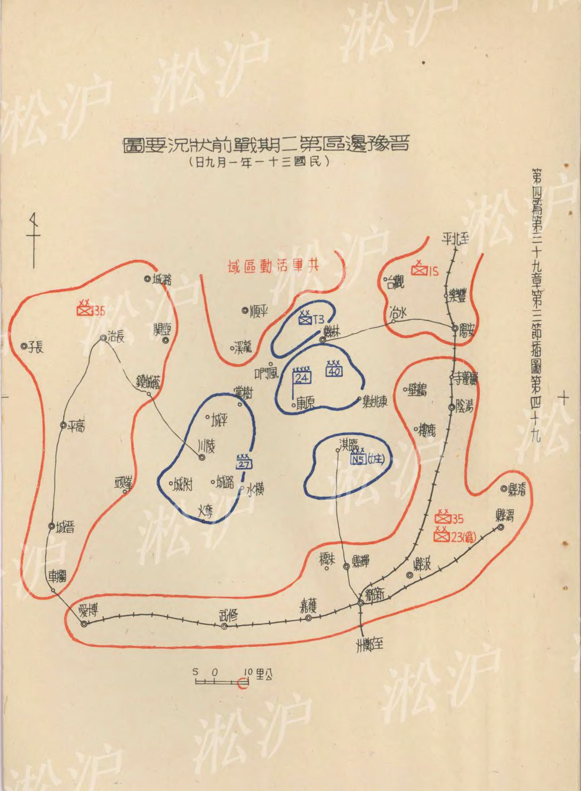

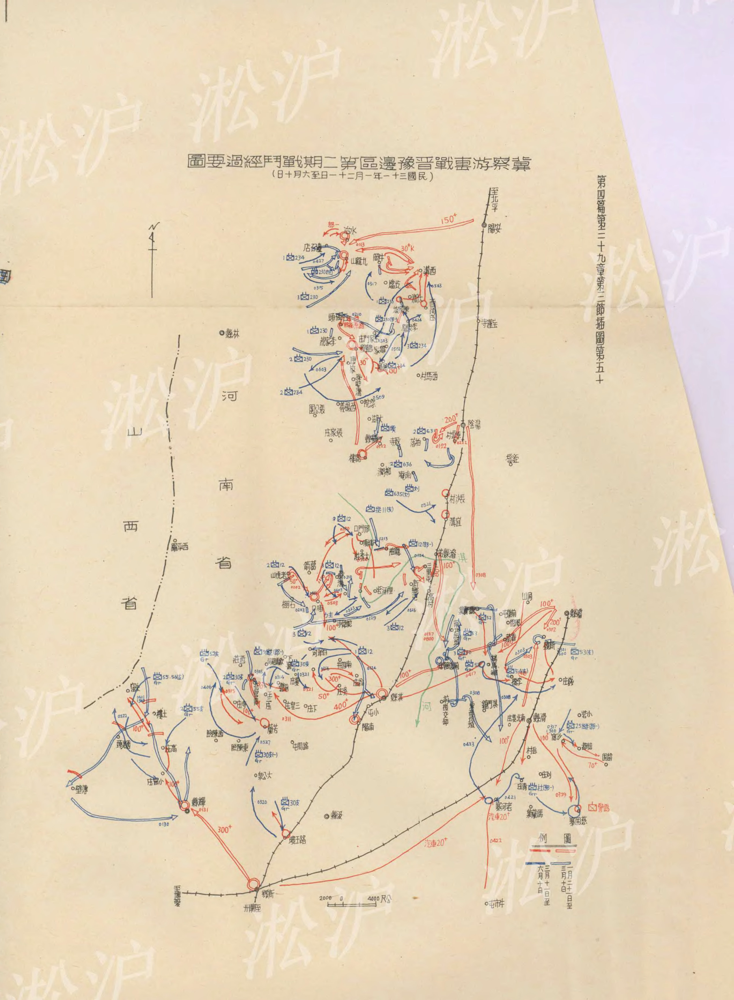

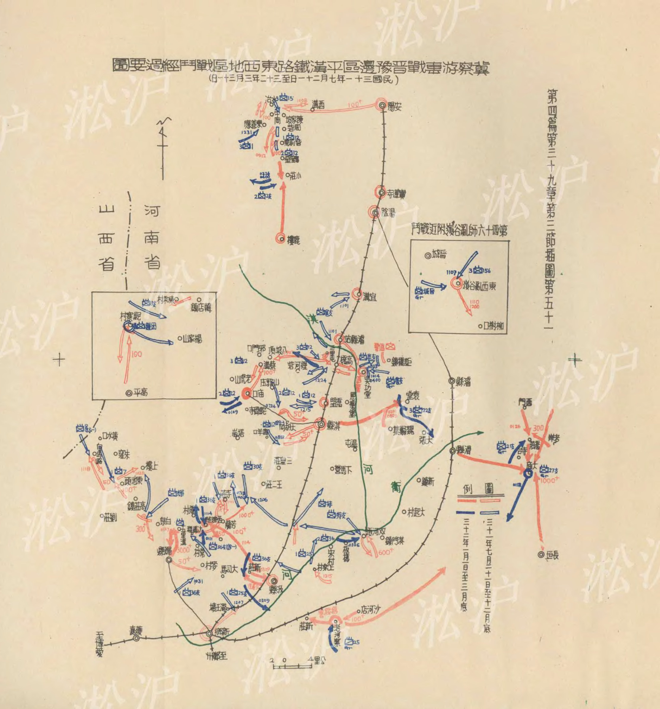

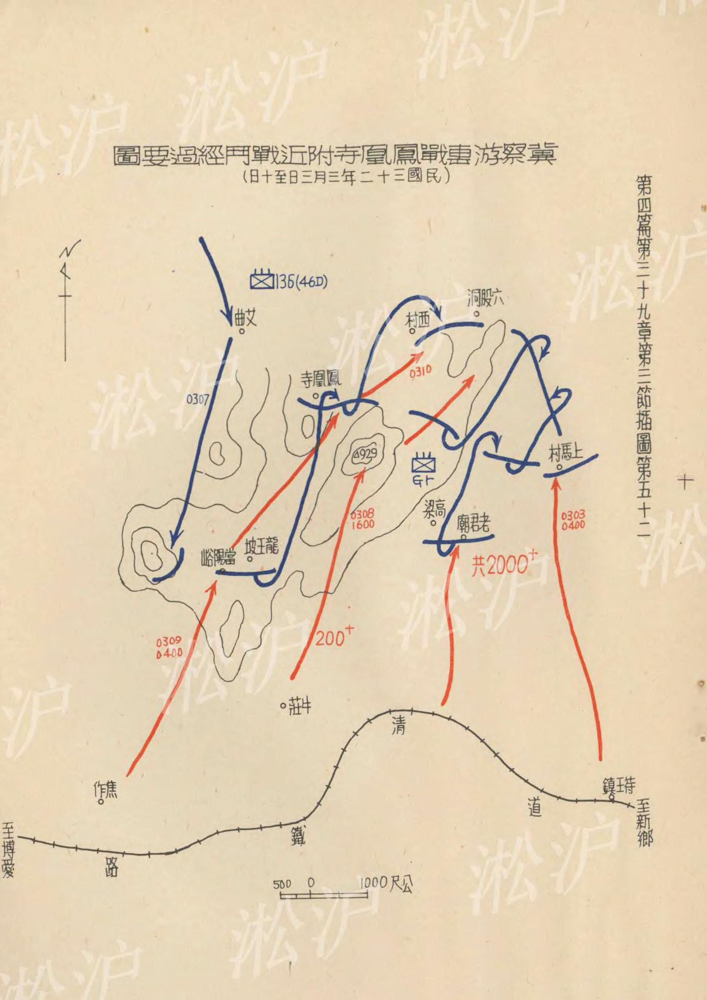

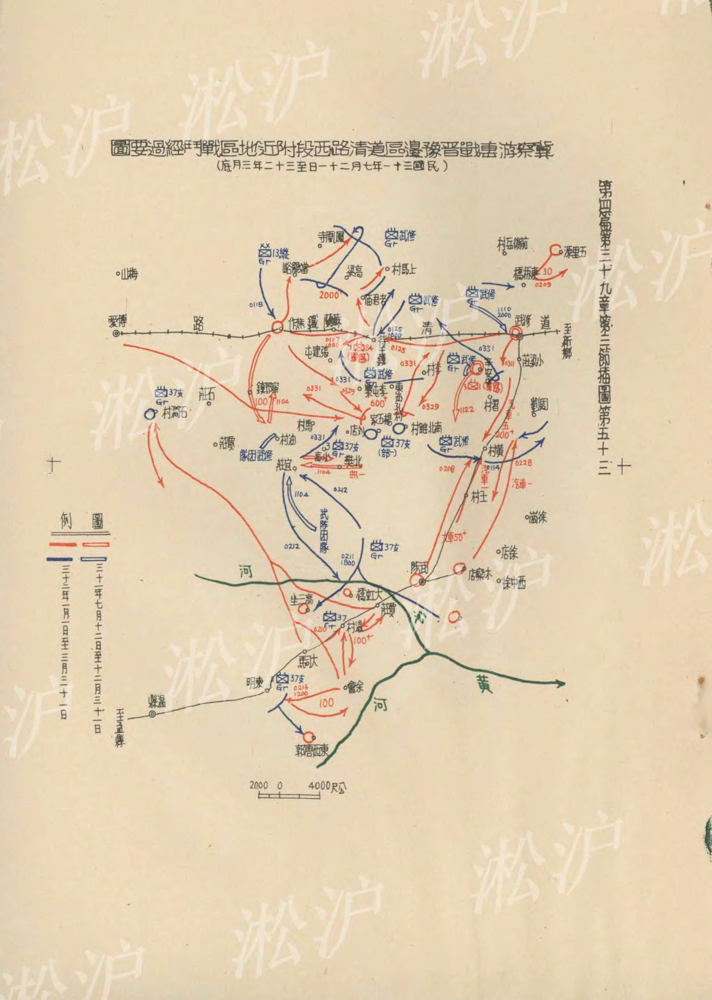

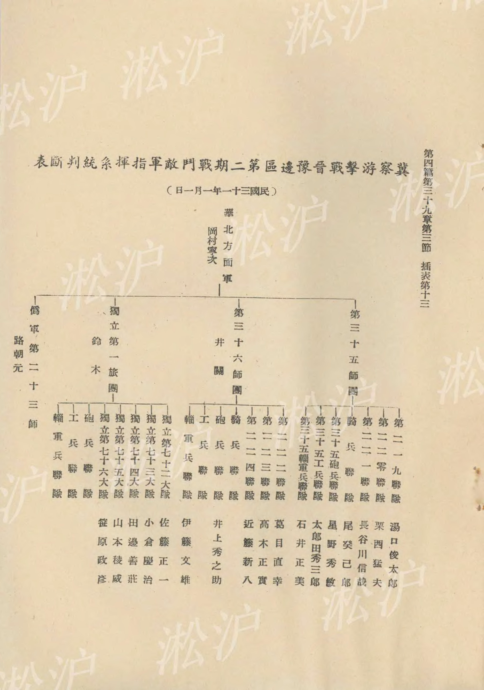

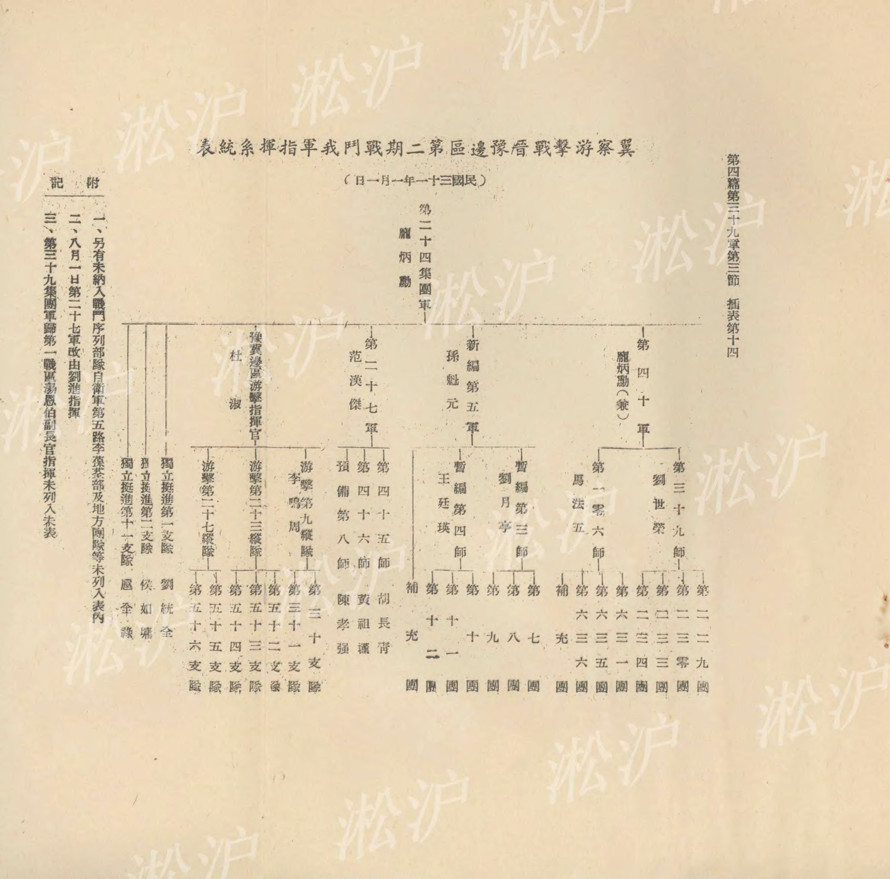

### 第四節 檢討

#### 第一款 敵軍

優點

敵軍慣以優勢兵力集中於一點，實行錐形突破或局部包圍。

三十一年六月十二日，太行山區林北之戰，敵以絕對優勢兵力組成多數支隊，分途推進，形成包圍態勢，向我暫編第三師陣地猛攻，企圖將我軍壓迫核心陣地一舉而殲滅。

又是年六月十七日，太行山區趙燈山之戰，集結步砲聯合兵種約二千餘，以一部直取油村，主力以疾風驟雨之勢，猛攻我趙燈山陣地，工事全被摧毀，同時小富山陣地亦遭敵突破，我左翼卽感受威脅，於是我趙燈山守備部隊被迫撤退。

二、敵善於迂迴攻擊及夾擊：

敵於山地作戰慣於迂迴繞擊，常乘我未佔領陣地前，用少數兵力於正面實行佯攻，主力向我兩側迂迴，繞至我陣地後方，佔領要點，與正面部隊相呼應，以收夾擊之效。

三、敵慣用小支隊以分進合擊戰法向我掃蕩。

敵恃其優勢裝備與武器，爲打擊我游擊隊，常採取多數小支隊，實施掃蕩，每支隊以一個大隊爲基幹，配以特種兵，向我游擊根據地鑽隙分進，除予我以政治、經濟、通信破壞外，並將我軍隔離，實行各個擊破，續直接襲擊我後方機關與指揮部。

例如：三十一年六月太行山區林北之戰，敵向暫編第三師攻擊時，先以一部佔領林縣縣城及其以西桑園，隔離暫編第三師與第四十軍之連繫，爾後再以林縣之敵一部向該師司令部直後攻擊，以一部冀

祭

游

擊

戰

一六五

則由水治經上下村逕向姚村攻擊，以一部由武安、涉縣經任村南進，另以一部由平順經杏城東犯小西天、魯班壑，以達其分進合擊之企圖。

四、敵每當初次攻擊不能奏功，則自行撤退，待援軍到達或調整部署，乘我疏於戒備再行攻擊。

三十一年六月二十四日，我第二十七軍預備第八師，於柳泉以西浙水至樹掌間陣地予以迎頭擊痛，敵受挫後，卽蟄伏於浙水東北溝內，迨二十七日會同敵增援部隊，再向我陣地猛攻，以致我軍傷亡慘重，遂向東西壺陵水附近轉進。

五、善於以飛機代替砲兵任務：

太行山地形綿亘複雜，道路崎嶇，砲兵運動至爲不易，機械化部隊更感困難，當戰鬥初期，敵輒以飛機代替砲兵使用，以小型炸彈作面的轟炸。

六、敵各級指揮官執行任務徹底：

無論攻擊或防禦，敵各級指揮官奉到上級授與之任務，務盡諸種手段，不惜任何犧牲以達成之。

七、不輕易放棄陣地與拋棄武器：

當敵人受我包圍攻擊時，都能負隅頑抗，以待援軍到達，非至死傷殆盡，絕不輕易放棄陣地，對死傷者之武器總盡量設法後運，非至萬不得已，罕有輕棄武器於戰場者。

八、敵情報機構組織完善，運用靈活：

敵善於利用漢奸混入我軍，因此我軍之企圖與行動，多被敵人所獲悉。

劣

點

一、敵步兵缺乏單獨作戰能力：

敵步兵如缺乏空軍、砲兵或步兵重火器予以火力支援與掩護，步兵很少單獨向我進攻。

二、警戒疏忽：

敵人常恃優勢裝備與機動力，對警戒異常疏忽，無論於行軍或駐軍，對其側背常誘諸不問。

三、士兵素質逐漸降低，戰鬥情緒低落，於三十一年太行山區作戰，當其退却時，時有垂頭暗泣者。四、軍紀敗壞，故易惹起民衆反感。

敵軍到處姦淫燒殺，甚至有將婦女由甲地運至乙地拍賣者。

#### 第二款 我軍

優點

一、不避艱險冒死奮戰：

三十一年六月二十七日，新編第五軍獨立第一第二兩團於南北岩地區作戰時，我軍糧、水俱缺，且整日在敵機猛烈轟炸下，我官兵仍不畏艱險，冒死奮戰，前仆後繼，以完成對敵之反掃蕩戰。

二、機動運用：

三十一年六月我軍於太行山區東西土地附近與敵鏖戰之際，我第一零六師出敵不意，佔領獨角水予敵以側擊，相繼形成包圍態勢，敵向西北逃竄。

三、善用誘敵殲滅戰：

三十一年六月二十四日，於太行山區石家莊（合澗西南）之役，將敵誘至寨東溝、門濮溝地區，予以包圍殲滅，敵竟無一倖免。

又是月火燒莊之役，我判斷敵必攻堅，遂將重兵器集中使用，並由前進部隊將敵誘至我陣地前，迫相距百公尺，我以猛烈火力向敵射擊，敵進退維谷，呈現混亂狀態，並繼之以白刃突擊，殲殲過半。

四、地形熟悉：

在太行山區山嶺綿亘，叢林錯綜之處，無論有無嚮導與晝夜均能作戰。

五、我軍刺槍術訓練有素：

三十一年六月，太行山區第三次反掃蕩戰中，紙房、門濮溝、合間及爾後歷次肉搏戰，皆足證明我軍之刺槍術絕不劣於敵人。

劣

點

一、我各級情報組織不健全：

因爲各級情報組織不健全，供給高級司令部之情報過少，且多失時效，而高級司令部又缺乏戰略性情報機關，不能作綜合判斷，以致常發生錯誤。

二、我軍作戰指導缺乏靈活與機動：

當敵人採分進合擊時，因我軍缺乏靈活運用與機動，不能捕捉戰機予敵以各個擊破，致陷於被動，當蒙受損害。

三、我通信人員訓練不够：

如遇有意外情況，我通信人員不能自動處置，暫編第三師於第一次太行山區反掃蕩戰時，師部及第七團電台被炸毀，致無法指揮連絡，影響作戰殊甚。

四、指揮官缺乏獨斷專行能力：

各級部隊長缺乏統一之戰術思想，攻擊不能尋求敵之弱點，不肯獨斷專行，致失良機者甚多。

五、我軍對工事構築多不注意：

我軍對於陣地多不詳加偵察，以致部署欠適，當佔領陣地後，對工事加強，道路之破壞與阻絕，以輪

轉

及山谷之封鎖等，亦不加注意。

六、射擊軍紀不良：

因爲游擊部隊訓練不够，常過早射擊，尤以步兵輕重兵器爲然，致陣地暴露，蒙受意外損失。七、我軍裝備不適於游擊戰：

我軍騾馬過多，行軍鍋笨重，游擊地區內之道路多遭破壞，且我軍爲避免敵人晝間飛機之轟炸，多利用夜間行動，因受騾馬及笨重行軍鍋之累，有一夜行軍不過四公里者。
