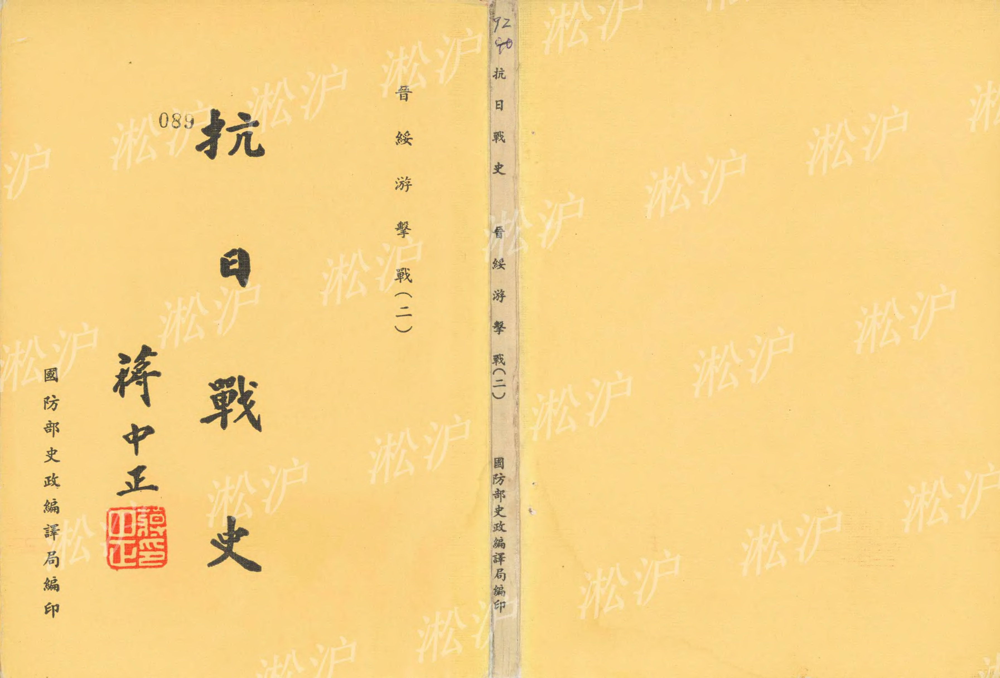

## 第四十章 晉綏游擊戰（二）

#### 第五款 呂梁山附近之戰鬥

一〇三

#### 第六款 二十八年晉省之夏季攻勢一七

#### 第七款 二十八年晉省之冬季攻勢一三七

#### 第八款 對敵軍打通晉豫交通之作戰一五一

#### 第九款 對敵軍分區攻擊之作戰一六一

#### 第十款 對敵軍外交戰經濟戰及我軍之攻勢一六九

#### 第十一款 對敵軍採取戰略守勢及我軍擴大游擊作戰一七五

#### 第五款 呂梁山附近之戰鬥

民國二十八年十月七日至十一月八日

參照插圖第七十九第八十插表第七第八

敵軍自佔領同蒲路以來，深感我退守晉西呂梁山一帶主力部隊，不時襲擾其後方與交通，殊感痛苦，乃於民國二十八年九月中旬，大舉向兌九峪、雙池、靈石、汾西、黑龍關、汾城一帶，加強兵力，並趕修通往呂梁山主要公路及汾河橋，企圖進攻我呂梁山游擊根據地。我軍亦積極部署兵力，利用游擊根據地旣設工事，實施機動戰法，阻敵進攻。

##### 第一項 呂梁山附近之地形

呂梁山介於汾河、黃河之間，爲晉西主要山脈之一，汾陽、離石、鄉寧、吉縣各主要據點，峙立四週，山區地形複雜，峯巒重疊，山徑溪流，分佈其間，輜重車輛，運動不易，祇適於小部隊行動，不宜於大部隊作戰，若用之爲游擊根據地，旣可進襲同蒲鐵路交通，又能掩護陝甘抗戰主要根據地，故戰略價值甚爲重大。

##### 第二項 戰鬥經過

同蒲路沿線之敵，自九月中旬以來，陸續增加參照插圖第七十九：孝義以西之馬莊、兌九峪一帶，增到敵一千六百餘；靈石以西之雙池鎮，增來敵軍第一三二聯隊千餘名；汾西以西之勍香鎮，於九月二十六日，由汾西增至第一一七聯隊敵軍千餘；趙城以西之磊上村、劉家垣一帶，至九月二十五日增至敵軍二千餘；臨汾原駐有敵軍千餘，至九月中旬後，由太原方面增到僞軍二千餘；臨汾以南之史村，亦增到二千餘，自九月二十日以來，積極趕修汾河橋；黑龍關方面，截至十月六日，先後由臨汾增到敵軍三千餘，爲第一零五聯隊，積極修築至化樂公路；汾城方面，九月二十六日，由翼城、曲沃方面增來敵軍第五十二聯隊千餘，砲數門；同日侯馬敵一千五百餘，分向新絳、稷山、河津各方面增加，新絳附近連同原有敵軍共約一千四百餘，砲十六門，稷山、河津各有敵五百餘，砲數門。各該地區敵軍，均屬第一零八師團所轄部隊，正積極加強工事，修築道路，以作進攻之準備。

時我第三十四軍（附新編第十四團及游擊第六、第七兩縱隊）在新絳、汾城附近監視敵軍。第六十一軍在鄉寧以東地區。暫編第一軍附保安第六區司令崔道修部（轄三個團），以一部在趙城以西地區；主力在大寧、午城一帶集結。西路軍中區總指揮陳光斗所指揮之獨立第二旅、獨立第七旅之一團及游擊第一、第九兩縱隊，在隰縣以東地區。第八十三軍在吉縣以西黃河東岸掩護河防。以上我各部隊，一面對敵游擊；一面破壞敵之交通。

當九月中旬，晉南敵軍運輸頻繁，各處敵軍不斷增加，其進犯呂梁山之企圖，已極明顯。我第二戰區司令長官閻錫山，爲粉碎敵之企圖，曾於九月十八日，密令第六集團軍總司令陳長捷，負責妥爲部署，準備迎擊進攻之敵，復於二十三日電示作戰要領如左：

一、敵軍進攻鄉吉中心區時，應利用游擊根據地工事，實行機動戰法，竭力攻擊制止敵之進攻。

二、如敵已進至鄉吉中心區內，應將敵後方所有交通道路澈底破壞，並行不斷之襲擊，截敵輜重，阻敵增援，迫使敵軍撤退。

三、該總司令應以制止敵之進攻爲決心，妥爲部署爲要。

第六集團軍陳長捷總司令，奉到上述電令指示後，卽部署如左：

一、第三十四軍（附新編第十四團及游擊第六、第七兩縱隊）對稷山、新絳、汾城方面，嚴密警戒；並在鄉寧城東之柳山寺及東南之碾東嶺構成困殲區，準備聚殲由新稷及汾城各方面進攻之敵軍。

二、第六十一軍對汾城、臨汾、洪洞方面，嚴密警戒；並在蒲縣、南曜、蕭家溝一帶，構成困殲區，準備聚殲由臨汾、洪洞進攻之敵；並以該軍之第六十九師一部，協助第三十四軍作戰。

三、西路軍中區總指揮陳光斗，指揮獨立第二旅、獨立第七旅一部及游擊第一、第九兩縱隊，對汾西、靈石及兌峪、孝義方面嚴行警戒。以主力在隰縣、石口以東地區，截殲由汾西、靈石方面西進之敵；另以有力一部，在石口、雙池以北地區，擊滅由雙池、兌九峪方面進攻之敵。

四、暫編第一軍、第六十六師，集結午城至大寧地區，與第六十一軍及陳光斗部，確取連繫，協同作戰五、第八十三軍以主力擔任黃河河防；並以有力一部對吉縣東南及河津方面，嚴行警戒。

六、各部應在困殲區附近，控置主力部隊。

七、各要路之鞍部及交通要點，一律徹底破壞。

八、對空室清野及情報網，應連繫軍政民三方面，分區辦理。

十月七日，晉南各路敵軍開始蠢動。第二戰區司令長官閻錫山，爲加速達成誘殲敵人之目的，令各部隊加緊破壞敵方交通，配合我方作戰；惟同蒲路靈石、汾西、臨汾、汾城一帶之敵軍，於七日開始，同時向我鄉吉、蒲隰各據點進攻，與我軍在各該地區展開戰鬥，分述如左：

鄉寧、吉縣方面參照插圖第八：盤嶠汾城、古城一帶之敵第一零八師團第五十二聯隊，於十月八日，分途向我第三十四軍之第二零五旅汾城以西之太兒凹一帶地區，第六十一軍之第六十九師古城以西之佛兒崖、牛王廟一帶地區進攻；同時汾城之敵步騎聯合千餘，砲四門，分兩股向太兒凹、三官廟兩方面進攻，其進攻太兒凹之一股，於四時許，向新編第十四團陣地攻擊，激戰至九時，我陣地被敵突破，該團轉移至西莊西端高地，繼續與敵戰鬥。是時我西莊東南端之第二零五旅第四二九團，爲阻敵西進，並協力新編第十四團作戰，以一部向敵左側進攻，敵軍感於腹背受敵，未敢深入，至黃昏退至尉村。其向三官廟進攻之敵軍，復分兩股西進：一股三百餘，經周家村進佔西莊、閻家山，與我游擊第六縱隊一部在該地北端激戰。時因左側佛兒崖方面，我軍與由古城進攻之敵軍激戰後，向北撤退，我游擊第六縱隊，以左側翼暴露，乃向閻王廟方面轉移，敵乃繼續北進；其一股四百餘竄至小坡西端，向我塔子山第二零五旅第四一二團一部陣地進犯，與我整日激戰，斃敵六十餘，入夜後，敵利用夜暗，突破我陣地，進至南窯里，被我第二零五旅之第四一九團中途伏擊，敵軍傷亡甚重，乃向圪臺頭方面北竄，企與由西莊方面北進之敵合股。我第四一二團向閻王廟方面第四一九團向鄉寧方面分途轉進。

古城方面之敵約五百餘，亦於是八日拂曉，向佛兒崖我第六十九師一部陣地進攻，敵我戰鬥甚烈。

我軍爲誘敵深入予以圍殲起見，一面抵抗一面向西轉移，至午後，敵越牛王廟向圪臺頭陣地繼續進攻，相持至九日拂曉，敵軍攻勢益烈，與我第六十九師展開劇烈血戰，敵機數架凌空轟炸，我軍陣地悉被摧毀，但我官兵奮勇反復爭奪，卒將頑敵擊退。至晚，我第六十九師以一部向敵再行夜襲，與敵徹夜激戰，敵軍不支，向牛王廟附近撤退。

十月十日，由汾城各方面進攻之敵，會攻圪臺頭，我軍不支，向金剛嶺撤退。十一日，敵軍一部千餘，續向我金剛嶺陣地進攻，被我第六十九師擊退。十二日，敵再增援猛攻，並以敵機助戰，我軍浴血拒敵，以傷亡過重，遂向以西有利地帶轉進。敵軍攻佔圪臺頭、金剛嶺地區以後，不時向高天山一帶進擾，並向鄉寧方面試行進攻，均被我第六十一、第三十四兩軍擊退。

十月十八日拂曉，敵以全力分兩路大舉西侵：一路千餘砲六門，越段嶺進攻管頭，被我第二零五旅第四一二團沿途設伏截擊，斃敵甚衆。迄午敵軍攻佔管頭後，復經長鎮及師村院繼續西侵，我第二零五旅第四一二團及第四一九團，分途堵擊，敵以飛機及砲火掩護猛攻，黃昏後先後進抵東西團上及其以南之圪臺頭。另一路敵軍約八九百，經金剛嶺、牛頭山進佔高天山。

敵軍主力至此已進入我預設之困殲區，其後方交通之連絡線，復被我軍截斷；而敵軍亦積極趕修各交通要道，以作繼續進軍之支撐。

我第二戰區司令長官閻錫山，卽以圍殲敵軍之目的，作如左列之指示：

一、第六十一軍派第四一三、第四一六、第四三三等三個團，由高天山向東西團上及拍山寺推進；第四一四團由金剛嶺、牛頭山、段山嶺向管頭壓迫，與第三十四軍協力，將侵入之敵包圍而殲滅之。

二、第三十四軍，以第三九二及第六一九兩團，分別潛伏於鄉寧至柏山間兩側高地，側擊敵人；以該軍第二零五旅之三個團尾擊，圍殲敵於鄉寧、柏山間地區。

又第二戰區長官部，爲妨礙敵軍搶修道路，特再電令第六集團軍總司令陳長捷，指示如左：

一、敵以牛王廟爲中心，趕修通往古城黑龍關、蒲縣及金剛嶺、牛頭山、管頭等各段公路。

二、敵軍若將此數公路修築完成，直接威脅鄉寧、吉縣，實有甚於臨蒲公路。

三、應卽日指派部隊，分段負責妨害，絕不令其修成。

陳總司令奉令後，卽轉知各部隊，切實遵辦；惟至十九日晨，東西團上及其以南坨臺頭之敵，於攻佔該兩地後，復分途會攻柏山寺，我第三十四軍預伏於困殲區之部隊，以第三九二、第六一九兩團乘敵前進之際，猛予側襲，同時以第四二九團尾擊，激戰至十六時，敵在我軍圍攻之下，傷亡甚衆。當全部敵軍行將就殲之際，忽有高天山方面敵軍，約五六百名，應援南下：一股以熾盛火力，向我包圍部隊猛烈襲擊，企圖解圍；以一股經由田家園直迫鄉寧城郊。而被圍之敵，亦與外圍援敵呼應，向我反攻，敵我展開血戰，黃昏後，敵軍一部攻佔鄉寧縣城，大部仍被我軍阻止於柏山寺附近及其以西地區。

十月二十日拂曉前，我軍鑒於鄉寧附近情況緊急，適我第六十一軍第六十九師黃士桐師長，親率第四一三、第四一六、第四三三各團主力，到達戰場，卽協力第三十四軍部隊，向柏山寺附近之敵猛烈夾擊，與敵短兵相接，肉搏相拚，至午，敵軍不支，我遂克復柏山寺，斃傷敵軍三百餘，我軍亦傷亡百餘殘敵向南退集閻家河、段家莊一帶。

十月二十一日晨，段家莊之敵，大部向碾東嶺第三十四軍一部陣地進攻，激戰數小時，敵軍攻勢頓挫，旋向我施放大量毒氣，我軍被迫向南轉移於有利地形，繼續阻敵。陷鄉寧之敵軍，日來與我第三十四軍及第六十一軍一部戰鬥，因受我多方面圍攻，大部退集鄉寧城東南地區，敵我兩方均有傷亡。是後敵軍不斷增援，至二十四日，已增至三千餘，並已一部向鄉寧南端前後涼莊擾亂。二十五日，敵軍步騎砲聯合約千餘，在飛機掩護之下，分兩路向吉縣進攻：一股七八百名，向鄉寧以北之雲臺山進攻，被我第六十九師第四一三團附第二零六旅第四三二團之一營擊退，斃敵百餘名；一股五百餘名，於九時由鄉寧以北之十里鋪，進抵三堠以東之銅圪塔我第二零六旅前進陣地。我第四三二團主力，憑既設工事，以熾盛火力迎擊，敵軍傷亡甚衆。激戰至午，敵復增援千餘，向我兩翼迂迴，正面之敵亦向我攻擊，並以飛機數架向三堠狂炸，我官兵奮勇抵抗，反復肉搏，黃昏時，我軍爲誘敵深入，向南北牛堤佯退，乘敵進入三堠立足未穩之際，卽以一部進出戈家嶺一帶，向敵猛烈側擊，並截斷其退路；同時以主力予以夜襲，激戰至二十六日晨，敵軍逐漸不支，向鄉寧潰敗，我軍仍進據三堠以東原陣地。此戰計斃敵三百餘，我傷亡官兵四十餘員名，從此敵軍未敢輕進，吉縣賴以確保。進至鄉寧南端前後涼莊之敵，以進攻吉縣失利，爲鞏固鄉寧據點，於二十七日分兩股南進：一股進抵林山廟；一股進至岳家嶺，經我第二一八旅一部，分途截擊圍擊，共斃敵百餘，敵軍不支，至二十八日晚，仍退回前後涼莊附近。

蒲縣方面，十月六日、臨汾敵軍第一零八師團第一零五聯隊約三千餘，向黑龍關集結，有西侵趨勢。時我第六十一軍第七十二師及第二零八旅，守備蒲縣及垣上一帶，亦積極加強工事，準備迎擊西進之敵。

十月七日拂曉，該敵主力二千餘，沿臨蒲公路越化樂鎮向蒲縣方面西進；另以一股千餘，經黑龍關以西之七孔窯北進，被我第二零八旅之第四一五、第四三五兩團截擊，至午，該敵進抵蒲縣西南之張家圪塔、與我第二零八旅一部激戰後，復分兩路北進，與沿公路西進之敵主力會合，黃昏時攻陷蒲縣，我軍向蒲縣以北地區轉移。

同日拂曉，臨汾敵軍第一零八師第五十二聯隊，一部約四百餘，向垣上前進，與守軍第七十二師第四一八團警戒部隊發生戰鬥，旋敵後續部隊六百餘到達，我軍爲誘敵深入予以圍殲計，轉移於枕頭附近設伏，嗣敵由垣上繼續西侵，被我伏兵沿途截擊，斃敵甚衆，向黑龍關方面潰退。

十月九日晨，攻佔蒲縣之敵，以一部續向西進，以主力二千餘南攻刁口。其西進之一股，被我第七十二師一部在薛關及西水家莊於以狙擊，停滯未動。至進攻刁口之敵軍，與我第七十二師主力戰鬥，迄十六時，我軍陣地被敵突破，刁口、南曜兩地，相繼被敵攻佔。

是（九）日，第二戰區司令長官閻錫山，鑒於進攻蒲縣方面之敵軍，無形中已進入我困殲區，當指示陳長捷總司令，圍殲敵軍部署如左：

一、第七十二師，以有力部隊在南曜以西地區，對刁口南曜之敵努力襲擊。

二、第二零八旅，以主力對黑龍關、化樂鎮、蒲縣、薛關及沿公路之敵，予以猛烈襲擊；並以一團在喬家灣附近，對克城之敵不斷擾襲。

上令下達時，適敵正向刁口進攻，我第二零八旅第四三五團，乃於十日晚，乘敵軍後方空虛，直襲蒲縣城，一度攻入城內，與守城敵軍發生巷戰，雙方傷亡均重，嗣因敵之援軍趕到，我遂安全轉移城外山地，與敵對峙。至十四日晚，敵復由萬安鎮、黑龍關、化樂鎮、克城鎮等處，抽集步騎四千餘，分十路會攻我石門山第二零八旅之第四一七團陣地，經分途迎擊，因敵衆我寡，形成包圍，我官兵奮勇衝殺，徹夜苦戰，至十五日四時，敵軍攻勢益猛，我以傷亡重大，遂突圍向東西開府附近轉移。當敵向石門山進攻之時，我第七十二師，卽乘機向刁口南曜之敵進攻。敵軍因主力移攻石門山，該方面戰力薄弱，遂感不支，向黑龍關方面敗退，我第四一七團乘機向大寧以南轉進。

十月二十四日晨，蒲縣敵軍三千餘，沿蒲寧大道向大寧西進：一路千餘，在午城東端與我第二零八旅一部，竟日戰鬥，至二十五日拂曉，午城被敵攻佔；一路兩千餘，經薛關分兩股南進：一股千餘，向吉縣東北之尋峨方面前進，與我第七十二師，在該地北端放馬梁一帶戰鬥甚烈，旋我增援部隊到達，向敵反攻，敵軍不支，向薛關方面退去；一股千餘，向寺落鎮進攻，我第二零八旅第四一七團在東南堡一帶迎擊，敵軍受挫，向北回竄，與隔午城之敵會合。繼向大寧進攻，復被我第六十六師及第二零八旅一部沿途截擊，激戰至二十七日晨，敵以一部與我膠着對峙，以一部向我左翼迂迴，乘虛襲佔大寧城。

隰縣方面，十月初，敵軍第一零八師第一一七聯隊，盤踞汾西勍杳鎮及趙城以西之磊上村一帶，積極趕修通往隰縣大道，時隰縣及其以西之克城鎮一帶，爲我西路軍中區總指揮陳光斗所屬部隊、及保安第六區司令崔道修部隊守備。

十月七日，汾西一帶之敵，乘臨汾敵軍進陷蒲城之際，亦向西蠢動。是日晨，汾西勍杳鎮之敵軍第一一七聯隊一部，步騎千餘，砲四門，會同磊上村之敵軍六百餘，並民伕五百餘，分途向克城鎮進攻，經我游擊第一縱隊及保安第六區部隊各一部，予以堵擊，斃敵逾百，嗣敵陸續增援，我以衆寡不敵，遂以一部逐次向西轉移，大部潛伏於道路兩側，誘敵深入，待至我火器有效距離以內，猛烈伏擊，斃敵百餘。迄午敵軍迫近克城鎮，我軍奮勇拒敵，往復爭奪，黃昏時我以傷亡甚衆，遂向克城鎮以西之圪蘭掌南窳一帶轉移。

十月八日，敵於佔領克城鎮後，繼續西進，復經我游擊第一縱隊及保安第六區部隊，在上莊義泉鎮一帶，予以猛烈截擊，敵傷亡甚衆，且我增援部隊適時趕到，加入戰鬥，敵軍不支，大部向勍杳鎮撤退，一部退入克城鎮，我軍乘勝將克城鎮包圍攻擊，敵憑城塞工事頑抗，相持不下，我乃挑選敢死隊三十名突擊，至十一日十二時，一度衝入鎮內，與敵巷戰二小時，斃敵百餘名，敵軍感於我軍攻勢猛烈，乃由龍門方面，以敵軍一部增援，我軍乃退回原陣地。是晚勍杳鎮之敵，爲策應克城鎮敵軍，再行西進，與我游擊第一縱隊在上莊、義泉一帶激戰，相持兩日，敵未得逞。十四日，蒲縣敵軍千餘，配合克城鎮之敵，向上莊、義泉一帶增援，分途向義泉我軍進攻，並以飛機掩護侵入義泉，我以衆寡懸殊，遂化整爲零，分途轉移於四週有利地帶，不斷向敵截擊伏擊。

十月二十四日，攻佔義泉之敵，續向隰縣進攻，經我獨立第二旅一部及游擊第一縱隊，予以截擊。

迄晚敵軍迫近城郊，先以集中火力向城區連續射擊，繼以密集部隊衝擊，經數小時之肉搏，我爲遮斷敵之後方連絡線，困殲敵軍，乃向敵後方轉移，隰縣遂陷敵手。

石口方面，當敵進陷隰縣時，由靈石進抵雙池鎮之敵第一零八師團第一三二聯隊，約一千五百餘，於十月二十四日，分兩路向西進攻：一路數百向大麥郊進攻；一路爲敵主力約千餘名，會同前後王堤經康城鎮北進之敵約七百餘，分途向雙池以西之川口鎮進攻。其進攻大麥郊之敵，一股與我游擊第九縱隊在上下盤千一帶戰鬥竟日，將敵擊潰。其進攻川口鎮之敵，與我獨立第二旅及游擊第一縱隊各一部，在川口鎮東南戰鬥，我爲爭取主動，以一部誘敵深入，以主力轉移於雙池川口鎮大道以北地區潛伏。當敵向川口鎮前進，遭我伏兵不意襲擊，遂展開激戰，斃敵甚衆，我軍再向川口西北上下莊貼金一帶轉移，敵乃進據川口鎮。

十月二十五日進佔川口之敵，續向石口水頭鎮進攻，經我獨立第七旅一部，分途堵擊，該敵以一部牽制我軍主力，繼續西進，至二十六日，先後攻佔石口、水頭鎮兩要點，並續向石樓進攻，被我獨立第七旅，及游擊第九縱隊在石口及水頭鎮以西地區迎擊，敵軍不支，向東敗退，我克復水頭鎮。

敵軍自進佔鄉寧、蒲縣、大寧、隰縣一帶地區後，以佔領地區過廣，兵力單薄，除繼續向各地區增援鞏固各要點外，並努力組織地方僞政權，積極修復破壞各道路，一面鞏固現佔領地區，同時作繼續西侵之準備。

我第二戰區司令長官閻錫山，鑒於敵軍逐漸深入，爲實行破壞道路、阻絕交通、困殲敵軍之預定計畫，及鞏固河防安全，特於十月二十四日，令派暫編第一軍軍長傅存懷，兼任河防副總司令，指揮第七十師（現駐中陽）及第二零六旅，利用河東旣設工事，直接掩護河防。又於二十九日電令各部隊，對西進之敵，應以英勇之精神，適時加以阻止，並予圍殲。

暫編第一軍軍長傅存懷奉命後，卽作如左之部署：

一、第七十師以主力佔領人祖山、嶼頭山兩據點；一部進佔包山，上白古一帶，阻敵西進，並注意大寧敵軍進擾我軍之翼側。

二、第二零六旅，卽在吉縣一帶阻止敵軍，以打擊其渡河企圖。必要時，以大部兵力依據高祖山、山頭村、柏山寺各據點，留置有力一部，破壞交通，斷敵退路，以期在各據點聚殲敵軍。

三、軍預備隊軍工兵營位置於高祖山附近。

四、敵如行一點突破時，以前方游擊部隊及預備隊，前後夾擊，並由兩側據點，同時施行側擊，以四面合圍態勢，一舉而盡殲之。

五、第七十師與第二零六旅作戰地境，爲孫家坡、柏樹村、金家山、尖村、行臺村之線，線上屬第七十師。

軍事委員會委員長天水行營，關於晉西作戰，於二十九日電令第二戰區司令長官閻錫山，指導如左一、已電令副長官衛立煌，抽調中條山之大部，向臨汾以南同蒲路之敵襲擊，以策應晉西作戰。

二、着令第六集團軍總司令陳長捷，並指揮第三十四軍對犯鄉寧吉縣之敵，以機動戰法，予以決定打擊，粉粹敵之企圖。

三、相機抽調中陽、離石一帶有力部隊，南下側擊敵軍，援助陳集團作戰。

閻錫山長官遵飭各部隊遵照，並令中陽之第七十師，迅調吉縣；控置河保之第二十三軍第七十三師，兼程南下，至宜川增強河防，並待機殲滅敵軍。

衛立煌副長官所指揮之南路軍，亦遵令策應西路軍作戰，積極向臨汾至侯馬一帶之敵攻襲。晉西晉南之敵，深受威脅，爲確保同蒲鐵路南段之安全，並迅速達成西侵之目的起見，敵軍直增派第四十一師團接替臨汾南北防務，抽集第一零八師團全部作戰；並以第三十七師團及第二十師團各一部，由聞喜、橫水嶺等地，向我第十五軍進攻，企圖封鎖中條山各山口，妨害我南路軍之攻勢行動。

惟敵軍自西侵以來，因呂梁山地形複雜，不適於大軍作戰，且砲兵輜重運動均感困難，既不能抽集兵力以求與我決戰，且爲應付我游擊部隊不意之環伺襲擾，更不能不將兵力分散，以求自保。我第六集團軍總司令陳長捷，鑒於敵軍日陷泥淖，不能自拔，乃決心向敵展開反攻。先以主力殲滅鄉寧附近之敵，然後轉移兵力，收復蒲縣、大寧，遂策定攻擊部署如左：

一、第三十四軍主力，爲主攻部隊，向鄉寧東南各據點進攻。

二、第二零六旅旅長孫福麟，率領所部兩團，附砲四門，經三堠向平原村、西敖間進攻。

三、第六十九師以一團附砲一門，進出雲臺山向鄉寧東北地區進攻，以一團向長鎮東西團上進攻。

四、第六十一軍，應以有力部隊，於段山嶺截擊圪臺頭敵之增援，及交通之阻絕。

五、各部隊限於十一日夜間完成一切準備，十二日拂曉開始攻擊。

六、第七十二師一部及第六十六師第二零八旅，仍在黑龍關、蒲縣、午城、大寧各地區，極力襲擾破壞阻絕，從事牽制，相機攻殲敵人。

我軍部署既定，各部隊分向當面之敵展開攻勢，茲將各地區戰鬥經過，分述於左：

鄉寧方面：十一月十一日晚，我各部隊完成一切攻擊準備，十二日二時，開始總攻：第三十四軍由柏城、堡子上向冀家原、柏山寺；第二零六旅由牛家圪墻、龍鼻村、胡寨村向鄉寧；第六十九師由雲臺山向東西團上等處之敵，分別進攻；同時第七十二師亦向圪臺頭猛施截擊，牽制敵之援軍，敵我遂全線展開激烈戰鬥。

第三十四軍各部隊，自二時開始與敵戰鬥，迄拂曉已進展至冀家原、郭家塔之線，該軍之第二零一旅，以當面之敵憑險頑抗，乃令第三一九團第三營，挑選奮勇隊四十名，直趨敵軍所住之窯洞上端，將敵守兵四十五名，悉數以手榴彈擊斃。旋敵增援反攻，以猛烈砲火射擊，致該營營長負傷，以下官兵犧牲殆盡，且我軍攻達太山廟、大石頭之線後，因雨雪交加，道路泥濘，攻勢因而頓挫。

第二零六旅攻佔南原村、劉家原、富家原之線，並乘勢向鄉寧城壓迫；惟以該旅過於突出，黃昏後始令稍向後撤。第六十九師及第八零五旅一部，於六時將柏山寺之敵擊潰，向鄉寧敗退；同時東西團上之敵，亦被迫退至長鎮，我軍遂克復柏山寺，並力阻敵之增援，以策應對鄉寧方面之攻擊。

十二日晨，當我軍向鄉寧圍攻，敵軍陷於危殆之際，汾城之敵千餘，經三官廟西上應援，被我第二零五旅第四二九團，及獨立第八旅新編第十四團，於太兒凹一帶截擊，激戰至十六時，敵軍進至閻王廟，我軍爲阻止敵向鄉寧應援，特增援夜襲，斃傷敵軍甚衆，敵始不支，向東敗退。

十一月十三日晨，我第二零六旅續向鄉寧之敵進攻，迫近城垣，敵憑藉城外堅固工事，頑強抵抗，激戰竟日，至十四日拂曉，敵增步騎五六百，砲二門，並施放毒氣，向我反攻，我官兵藉防毒器材之掩護，衝入敵陣，與敵肉搏，敵軍技窮，漸呈動搖狀態；同時我第三十四軍主力，亦由冀家原上下嶺南之線進攻，對鄉寧城區，形成包圍態勢，午前敵軍尙圖頑抗待援，午後由段山嶺增援之敵，被我第六十九師及第二零五旅之第四一二團，中途截擊回退，敵勢益呈不支，遂先施放毒氣，以吸引我軍注意力，乘黃昏後，夜幕低垂，突圍向東潰竄，經我第三十四、第六十一兩軍截擊追擊，斃敵甚衆，我遂克復鄉寧城，十八日再克復坨臺頭、牛王廟，殘敵東潰。此役血戰七晝夜，斃敵兩千以上，我亦傷亡官兵四百餘名。

蒲縣方面：自十一月十二日以後，我第六十六師及第二零八旅之第四一七團，不斷向盤據大寧蒲縣之敵襲擊，敵迭受鉅創；尤以我南路軍向臨汾南北同蒲鐵路南段敵軍，極力壓迫，鄉寧敵軍，被我圍攻益急，因之蒲大之敵，士氣極爲動搖，我乃乘機令第六十六師及第四一七團一部，於十五日晚，先向大寧之敵猛烈圍攻，並以第二零八旅一部，預伏於黑龍關附近大道兩側，防止敵軍東逃。大寧之敵，自遭我軍進攻後，倉惶應戰，稍加抵抗，卽向午城方面潰退，我軍遂於十六日拂曉，克復大寧，並續向午城方面追擊，殘敵因受我追擊部隊之壓迫，逐次抵抗，迄至十五時，我續克午城，殘敵向臨汾方面潰退。同日我第四一七團，以一部向蒲縣之敵進攻，該敵以大寧、鄉寧先後爲我克復，頗呈動搖，僅頑抗至黃昏後，向東潰退，我軍當將該城完全克復，並以一部向黑龍關追擊潰敵，且我預伏於黑龍關以西道路兩側之第一零八旅，向敗退之敵截擊，殘敵所存無幾，向東退去。又該旅一部乘勢一度衝入黑龍關，與敵發生巷戰，惟因衆寡懸殊，我仍退回原陣地。

隰縣方面：敵軍自盤據隰縣以來，不時向附近各地進擾，迭經我獨立之第二旅，及游擊第一縱隊，並地方保安隊等之截擊，敵困守孤城。十一月十四日，我軍完成攻擊部署，拂曉向該城敵軍圍攻，激戰至八時，我游擊第一縱隊之奮勇隊，首先衝入城內，後續各部，相繼入城，敵遂棄城東退，我以一部進佔縣城，主力跟踪追擊，斃敵頗衆，殘敵東逸。

十一月十六日，我保安第十二團一部，進攻勅查鎮敵軍，激戰數小時，敵軍不支，向東潰退，我遂克復該鎮。

石口方面：十一月十二日以後，我獨立第七旅及獨立第二旅一部，不斷向盤據石口之敵圍攻，至十五日，敵約五百餘，由雙池鎮向石口方面增援，與我包圍部隊激戰徹夜，十六日拂曉，石口鎮內之敵，與外圍呼應，拚死突圍，配合增援之敵，向雙池鎮方面退去。我軍進佔石口後，續以全力進擊，復克雙池鎮，殘敵狼狽向靈石方面潰退。

本戰鬥歷時四十二日，共斃敵軍官十三員，士兵四千三百七十六名，鹵獲軍用品八十六種，我亦傷亡官長四十員，士兵六百四十七名，敵我相較，約爲七與一之比。

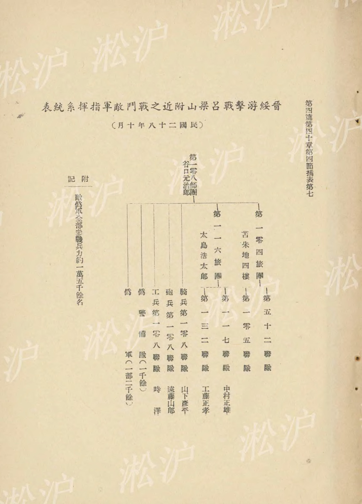

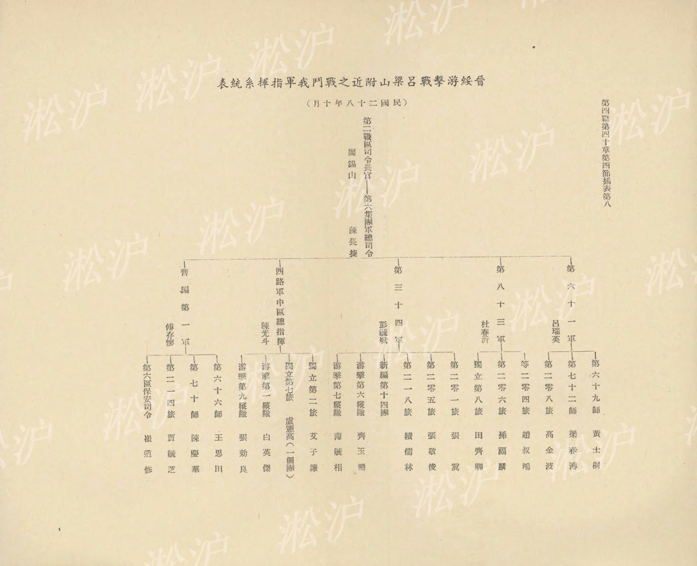

#### 第六款 二十八年晉省之夏季攻勢

民國二十八年七月二日至九月九日

參照插圖第三十五至第三十七

民國二十八年六月下旬敵於進攻中條山及普西失利後，仍退守交通點線，補充戰力，以圖再興攻勢。我軍事委員會爲確保晉省抗戰根據地；並支援冀察魯蘇各戰區我游擊行動，便於爾後攻勢轉移有利起見，決定七月中旬，由第二戰區及魯蘇冀察等戰區發動夏季攻勢，特以養辰令一元電頒發夏季攻勢作戰計畫如左：

軍事委員會二十八年華北各戰區夏季攻勢作戰計畫。

第一方針

國軍以確保山西並堅持冀察魯蘇游擊使爾後攻擊作戰有利爲目的，除直接增強冀察魯蘇及第二戰區兵力外，各該戰區均以三分之一兵力，施行局部攻勢，重創消耗敵人。

第二

指導要領

一、由第十戰區抽出精銳部隊兩個軍入晉，撥歸第二戰區衛副長官立煌指揮，掃蕩（晉南）三角地帶之敵。原在晉東南地區作戰疲憊部隊，抽出一至二個軍，開赴第十戰區整補，並補充晉西各軍實力，以便攻擊臨汾之敵。

第八戰區與第二戰區連繫，爲必要之策應。

二、攻擊目標選定，務避據點之爭奪，應多編支隊，對據點監視佯攻，集結兵力，誘敵脫離據點而殲滅之，敵若困守不出，則進出戰略上重要及攻擊容易地區，多方襲擾敵後，使敵疲於奔命，各不相顧。

三、對攻勢諸準備，限於七月中旬前，祕密完成；並限七月十日以前，將準備程度及完畢時期詳報到渝。

四、敵若先發動攻勢或乘我攻勢頓挫轉移攻勢時，各該戰區應本原來核定計畫，指導作戰。

五、另令天水行營本此要旨，指導各該戰區之作戰，除令冀察戰區積極破壞平漢路定縣至邯鄲段，津浦路滄州至德州段鐵路阻斷敵之運輸外，希卽妥爲部署。

第二戰區長官部，於七月二日奉到上項電令，當卽策定部署如左：

第一

軍隊區分

一、南路軍總司令衛立煌，指揮第四、第五、第十四集團軍。

二、東路軍總司令朱德，指揮第十八集團軍。

三、西路軍總司令楊愛源指揮：

(一)南區軍總司令陳長捷，指揮第三十四軍、第六十一軍、第三十八軍（整訓），及保安第七區所屬部隊、游擊第七縱隊。

(二)中區軍總指揮陳光斗，指揮獨立第一旅、獨立第二旅、獨立第三旅、第一、第二、第六、第八、第九游擊縱隊。

(三)北區軍總司令王靖國，指揮第十九軍、第三十三軍（整訓），及獨立第七旅、第三游擊縱隊。四、北路軍總司令趙承綬，指揮騎兵第一軍、第七十三師、新編第二師、暫編第一師、第四游擊縱隊，並保安第二區所屬部隊，軍委會第一游擊隊、第三游擊隊。

五、晉、陝、綏邊區軍總司令鄧寶珊，指揮第八十六師、新編第十一旅、第十八集團軍後方留陝部隊蕭勁光部。

六、直轄部隊暫編第一軍。

第二任務

一、兵力：各路軍應以三分之一兵力實行攻擊，主力集結待機地區。

二、各路軍任務：

(一)南路軍一部監視佯攻張店鎮、橫嶺關、橫水鎮、翼城、浮山、安澤、王和鎮各據點，主力集結於各據點附近，誘敵脫離據點而殲滅之；敵若困守不出，則將主力編成多數支隊，協同西路軍向聞喜及臨汾以南之趙曲間，及趙城、介休間戰略上重點及攻擊容易地區儘量活動，破壞交通，不時襲擊，使敵疲於奔命，陷於被動，乘其彼此不相顧之際，一舉掃蕩三角地帶之敵，而使之就殲。

(二)東路軍一部監視並佯攻和順、昔陽各據點，及破壞正太路之交通，誘敵脫離據點，乘其增援之際，而予增援部隊以嚴重之打擊，必要時確實遮斷該路交通，阻敵轉移。

(三)西路軍之南區軍以一部監視並佯攻河津、稷山、新絳、汾城、襄陵、黑龍關、萬安鎮各據點，並破壞蒙城、史村及趙城附近鐵路；主力與南路軍協同殲滅于我最危害之敵。中區軍對勍查鎮、汾西、雙池鎮、兌九峪之敵，以一部監視佯攻；以主力在各據點附近襲擊擾敵，以牽制該方面敵之轉移。北區軍一部監視並佯攻中陽、離石、大武各據點；以主力編成多數有力支隊，襲擾離石太原間之敵。

四北路軍以一部監視佯攻靜樂、寧武、偏關各據點，並破壞陽方口、原平鎮鐵路交通；而以主力襲擊危害較大之敵；另以新編第二師、第三游擊支隊、軍委會第一游擊隊等部，在五台雁北及晉冀察邊境展開廣大游擊戰，並破壞平綏交通。

五晉、陝、綏邊區軍，以主力固守河防，以一部編成多數小支隊，渡河協同北路軍及第八戰區之部隊作戰。

六直轄部隊暫在原防協助友軍作戰。

第四

作戰地境

各部隊作戰地境，仍照前令規定，如各路軍有分佈於其他各路軍作戰地境者，應協同當地友軍取一致行動。

第二戰區長官部除將上記夏季攻勢部署呈報軍事委員會，並以冬參戰令各部統限於七月九日以前祕密完成攻擊準備；惟敵軍自六月進攻中條山失利，深知我軍戰力增強，爲解除其威脅，乃積極從事整補，並於我方夏季攻勢發動之先，對我晉東南晉西北各地區發動攻勢，各該地區戰況分述於左：

晉東南方面參照插圖第三十五：同蒲、正太各路之敵，於六月底，由各方面抽集增援之兵力約五萬以上，於七月二日起，分五路向我晉東南進攻。

第一路爲敵獨立第四旅團一部二千餘，由和順南進，七月五日佔領遼縣，我第十八集團軍一部，撤至城之南郊，繼續與敵戰鬥，雖經奪回，但仍於十一日不守。

第二路爲敵第九師團主力萬餘，由白晉公路南下，七月五日陷武鄉、沁縣，並以一部於七日陷榆社，與我第一二九師獨立團在榆社以南激戰，團長丁思林陣亡。是時武鄉沁縣之敵，繼續南進，雖經我第九十三軍之第一六六師由公路兩側進襲，然敵軍仍繼續南進，至十一日進陷襄垣。

第三路爲敵第九師團另一部三千餘，由平遙經王和鎮南下，七月三日佔領王陶，五日續佔郭道鎮，七日與由安澤東北之亢驛敵軍第一零八師團一部會陷沁源，並繼續向屯留進攻。

第四路爲敵第一零八師團約一聯隊，由安澤經洪屯、大道分兩部東進，一部千餘於五日佔領亢驛，七日與郭道鎮敵第九師團一部會陷沁源，九日進抵張店鎮；其主力約三千餘，於六日先後佔領府城鎮、良馬鎮，九日在張店鎮與其陷沁源之一部會合，至十一日與各路之敵會陷屯留。

第五路爲敵第二十師團主力萬餘約三個聯隊，七月六由翼城、絳縣經翼高（平）公路分三路東進，向我第八十三師沁水以西之張馬村陣地進攻。我軍爲求包圍殲滅該敵，以沁水以北之第九十三軍主力由界河口附近向敵左翼迂迴；同時第六十五師亦由橫嶺關以東之望仙主附近向敵右側背進攻。惟敵恃其優越之火力向我猛撲，我陣地悉被敵之砲火摧毀，八日沁水陷敵，我軍除第六十五師仍在原陣地阻擊外，第九十三軍主力撤至端氏鎮南北之線與敵續戰，第十四軍亦轉進至董封鎮、中村鎮以南側擊東進之敵。

時第一戰區之第四十軍龐炳勳部，已由黃河南岸北渡，進至道清路西段地區。新編第五軍孫殿英部，已由平漢路北段進至武安以南，向平漢路南段之敵襲擊。我第一戰區司令長官兼第二戰區副司令長官衛立煌，以晉東南各路之敵，進展甚急，爲形成重點各個擊破敵軍，決心先抽集有力兵團擊破由翼城、絳縣東進之敵，乃下達命令要旨如左：

一、第十八集團軍對由白晉公路及以東進攻之敵，妨害其建碉築路遲滯其南進，並相機予以殲滅之。

二、第十四集團軍以第九十八軍就洪屯大道以北，分散配置於各要點或側翼山地，先求殲敵之小部及其輜重，遲滯其向東南進攻之行動，以第九十三軍一部，於洪屯大道兩側，阻敵修路及向東南進攻，

主力連繫第十四軍誘致由翼城、絳縣東進之敵，深入張馬西南旣設陣地附近，相機圍殲之。

三、第五集團軍主力及第九軍（欠獨立第五旅），仍在夏縣以南施行佯攻，以牽制當面之敵。該集團軍第十五軍之第六十五師，協力第十四軍作戰。

四、第四集團軍仍依原任務向同蒲鐵路沿線施行襲擊，以策應各方面之作戰。

五、第四十軍移至晉城至欄車鎮大道北側山地，備敵北犯時予以截擊。

六、新編第五軍移至林縣、武安間地區，向平漢鐵路沿線之敵襲擊，破壞其交通通信，並相機側擊武安之敵。

各部隊奉令後，卽各在指定地區向敵採取攻勢，第十八集團軍之第一二九師，於十一日克復榆社、武鄉，敵軍南竄，我軍於十二日克復襄垣。至此進犯晉東南之敵軍，除第九師團一部沿晉白公路回竄外，其餘各路進犯之敵匯爲兩股：一股爲進陷屯留之第一零八師團及第九師團一部，於十三日續陷長子、長治；並以一部進陷潞城，至十八日復南陷高平。惟是時豫北博愛方面之敵第三十五師團，爲策應晉東南方面南犯之敵，以約一個聯隊之兵力，沿晉博公路北進，我第四十軍於公路兩側節節襲擊，然敵以一部與我對戰，主力繼續北進，於十八日午後進陷晉城，並與佔領高平之敵第一零八師團於高平晉城間地會合。

另一部敵軍爲沿翼高公路東進之敵第二十師團，自陷我沁水後，以一部留駐沁水；主力續向沁河之線東進，十五日陷陽城。同時良馬鎮方面敵軍千餘南竄，與沁水之敵軍一部會合，於十六日攻佔端氏鎮，我第九十三軍之一部，向端氏鎮以北山地轉移。十七日敵強渡沁河，分由沁高及陽晉公路續行東進抵晉城。

我軍以敵已深入晉東南地帶，乃向敵展開反擊。時敵主力東進，端氏附近留置敵千餘，沁水留有敵二三千，董封鎮附近亦有敵第七、第八兩聯隊及步砲兵一隊，我軍於十七日向各該敵軍分途展開攻勢，除我第九十三軍主力向經沁高及陽晉公路東進之敵，分途截擊外，我第一六六師將端氏附近之敵包圍猛攻，沁水附近之敵亦被我軍進擊，斃敵七八百人參照插圖第三十六。董封鎮附近之敵被我第十四軍連日圍攻，大部被我殲滅，並將董封鎮克復，殘敵於二十日沿董陽大道東竄，復被我第九十三軍及第十四軍沿大道兩側夾擊，又斃敵數百。敵因傷亡過重，晉施放靡爛性毒氣，殘敵竄抵陽城，原竄據陽城之敵，則東渡沁河竄至端氏一帶。我第九十三軍續向陽城進攻，二十五日克復，殘敵分向晉城、沁水潰竄。我第八十三師續向晉城方面進攻。是時敵第三十五師團一部，已回竄博愛，我第九十三軍於克復陽城後，隨以第十師及第一六六師向沁水圍攻，二十六日晚，我第十師攻克沁水，殘敵二千餘向西潰竄，我跟踪掃蕩。自二十五日以後，我晉東南各部隊，即在洪屯大道南北地區及沁水陽城迤南之線，向西竄之敵夾擊，激戰至八月一日，先後將長子、屯留、高平各縣城克復。八月六日，我軍攻克良馬府城諸要鎮，殘敵向翼城回竄。十一日我第一二九師攻克沁源，殘敵向沁縣東竄。至此晉東南一帶，除晉白公路及長治、晉城外，其餘侵入之敵軍，均被我軍擊退，大部重要據點，均爲我軍控制。

八月十六日，兼第二戰區副司令長官衛立煌，奉軍事委員會銑午一元健電令，卽擬具反攻晉城計畫呈核。十七日復奉軍事委員會行孟西電：邇來國際風雲日緊，蘇日備戰益急，敵在華北華中兵力，可以節省及可替以僞蒙軍者，似有抽調出關對蘇模樣；惟對華南方面，則仍略增兵力，加緊封鎖海口，企圖扶植汪逆之僞組織，而在江北各戰區之兵力，戰鬥力日益萎頓，似此貴戰區亟應按照原定夏季攻勢計畫，一面努力整訓，一面積極攻擊，並對晉東南方面應迅速肅清白晉公路之敵，爾後轉移兵力肅清三角地帶之敵，晉西晉北同時加緊攻擊，牽制敵之增援，務使日寇無整理喘息之餘閒，無轉移兵力機會。又時當雨季洪水橫流，敵所恃之機械化部隊，已大受限制，且青紗帳起，爲掩護我軍行軍企圖之良好機會，希卽遵照分別實施。衛立煌副司令長官奉令後，除轉令各部隊向當面之敵加緊進攻外，並擬定反攻晉城計畫，經呈奉核准實施。其要旨如左：

一、豫北兵團之第四十軍及第二十七軍，應適時破壞敵之交通，以一部於小肩村、馬山村（均在欄車鎮東）協攻欄車鎮、天井關各據點之敵；主力向晉城東北東南協攻，重點指向晉城以南之南村舖頭村間，誘敵來攻而殲滅之。第九十四師附吳朝翰部，努力攻襲溫縣沁陽、博愛各附近之敵，並阻其西進，其餘各部隊仍服行原任務。

二、第二十七軍配屬砲兵第五團第二營（欠第二連），依情況到達陽城後，卽進襲沁河東岸，先佔領東溝以西之武城村、周城村、樊山之線，爾後努力襲佔天井關、河底村截斷敵之交通。以主力攻擊博晉公路天井關以北之敵，重點指向河底村、梨川鎮間，誘敵來擾而殲滅之；以一部向晉城迤西迤北截敵外竄及增援，並相機佔領晉城，期將該敵圍殲之。

三、第九十八軍積極襲擊當面之敵，第九十三軍以一部破壞洪屯公路交通，襲擊安澤、浮山之敵，控置主力於大交東南，堵擊翼城敵之囘竄，並積極向其襲擊，第十四軍因傷亡過大，着集結於端氏、東溝鎮一帶整補。

四、第五集團軍控置主力於臬落鎮附近，阻橫嶺關之敵南犯，以一部向翼城、絳縣、聞喜一帶之交通線襲攻。

五、第四集團軍仍服行以前襲擊策應之任務。

六、第九軍（欠獨立第五旅）以第五十四師主力確實破壞欄車鎮及以南博晉公路交通，截擊牽制竄擾之敵，努力襲佔欄車鎮；並以一部向欄車鎮以南之敵襲擊；以一部於封門口王屋一帶之線築構強固工七、第十八集團軍積極襲擊長治以北以東各公路線之敵，及牽制長治敵軍南竄。

八、攻擊開始時間，晉城欄車鎮間爲二十三日以後，其餘部隊卽積極行動，吸引各該方面之敵。

各部隊遵照上記命令積極行動，我第二十七軍向陽城附近集結，第四十四軍第八十五師及第十八集團軍之唐支隊，已將晉城之敵包圍攻擊，戰鬥激烈，敵軍第二十師團一部，憑城固守，我龐炳勳軍長，再令該軍之第九十三師加入戰鬥，至二十一日晨，已將晉城城郊之敵完全肅清，並續向城關猛攻，至午第九十三師攻克晉城，殘敵突圍，一部向高平、長子北竄，一部向天井關博愛一帶南竄。衛立煌副長官獲悉後，爲澈底肅清突圍敵軍，特令第四十軍以一部掃蕩晉博南段之敵，並規復各隘口向沁博之敵襲擊；主力迅速北追退竄之敵，收復高平後，相機連繫第二十七軍繼續跟追。並令向陽城附近集結之第二十七軍，以一部協力第四十軍肅清晉城西北殘敵；主力向高平方面追擊。又令第九軍第五十四師，卽進入欄車鎮以南地區，協力第四十軍肅清晉博南端之敵，確佔沁陽迤北各山隘，並適機向沁陽迤西之敵襲擊。各部隊奉令後卽向指定目標前進，我等四十軍以騎兵第十四旅，第二十七軍以預備第八師各一部向高平追擊，二十三日攻克該城，殘敵退據長治、長子一帶。第五十四師及第四十軍一部，亦將晉博南段之敵驅逐。時我晉西晉北各部隊，爲策應晉東南方面作戰，亦向當面之敵進攻中。

八月二十五日，衛立煌副長官爲繼續規復長治，使爾後攻勢作戰有利，特調整部署並下達命令要旨如左：

一、第四十軍卽移於白晉公路迤東，經蔭城鎮向壺關方面之敵攻擊。

二、第二十七軍全部進出高平以北地區後，卽在白晉公路以西，先行驅逐長治、長子方面之敵。

三、第九十三軍主力，應截斷洪屯公路防堵安浮敵人東援，及掃蕩附近流竄之敵。

四、第九十八軍卽以主力向長治西北地區轉移，攻佔屯留南北地區，並努力牽制號亭鎮南下之敵。

五、第十四軍集結於陽城附近，準備對晉城、翼城兩方面機動使用。

六、新編第二十四師（該師新近編成）、第五十四師、第一零六師，對道清路應積極採取攻勢，以行牽制敵軍。

七、新編第五軍，對平漢路應積極採取攻勢，以行牽制敵軍。

八、第十八集團軍應積極截斷涉長公路，其主力向長治東北地區進出，掃蕩潞城迤北附近之敵；另以有力部隊截斷長沁公路，阻敵南下增援。

九、各部隊到達指定地區，依其任務奪取長治外圍各據點後，再行會攻長治。

各部隊奉到上述命令後，均遵照向敵採取積極行動。是時國際風雲日緊，德國行將進兵波蘭、英、法兩國正準備向軸心國宣戰，國際形勢轉向對我有利，軍事委員會特於八月二十六日，以未有午令一元電令各戰區，指示機宜，原電如下：

七月攻勢未收預期效果，深爲遺憾！茲以國際形勢對我益趨有利，爲予敵以重大打擊，促成更有利之發展，各戰區應於九月中旬，以戰區現有兵力繼續積極採取攻勢，截斷敵重要交通線，並消耗敵人。第二戰區對長治及白晉公路之敵，必須如期肅清。總之九月中旬，必須各戰區同時出擊，不得疏忽敷衍，坐失良機。

閻錫山司令長官奉令後，卽令南路軍與東路軍各以主力互相協同，截斷白晉公路北段交通，並攻擊長治及白晉公路沿線之敵；又令晉東南之西路軍各部隊，務竭力協同友軍作戰；同時令西路軍、北路軍及晉陝綏邊區軍，仍遵照四月冬戍參戰電令，積極襲擊，牽制當面之敵，並破壞其交通。

衛立煌副司令長官奉到軍事委員會及閻長官電令後，以上峯意旨適與原下達規復長治之令相符，決定仍照原計畫進行；惟是時晉東南之敵，迭遭我軍攻勢壓迫，爲確保長治一帶據點，力維長邯白晉兩公路交通，以與同蒲平漢鐵道之敵相呼應，準備爾後繼續進攻起見，乃積極加強兵力：長治之敵增至七八千人；長子、壺關各增至四千餘；潞城、黎城增至三千餘；屯留鮑店各增至千餘。其他各方面仍不斷進行局部進攻，藉以牽制我軍。

又兩年以來，我國土無端遭受日寇侵略，民族意識澎湃不可遏止，至二十八年夏季尤爲激烈，敵後游擊風起雲湧，敵軍大感威脅，乃實施以華制華慣技，在張家口製造傀儡，成立僞察、綏、蒙、疆政府，以德王爲主席，將長城以北地區，均劃歸其管轄。又在侵佔各地區內，均成立僞組織，擴編僞警衛軍，並施用暴虐手段，殘害我同胞，希圖制壓阻止我國民愛國運動，但均未能收到預期效果；反之，適足以增加我同仇敵愾之決心。

我晉東南各部隊，自奉到衛副長官規復長治計畫後，於八月二十八日完成攻擊準備，遂卽開始向敵進攻。八月三十一日，第九十八軍之第四十二師一部，攻佔鮑店鎮。九月一日該軍之第一六九師，攻佔屯留，敵軍向北潰退。該師並另以一部將白晉公路號亭鎮以南，加以澈底破壞。

同（一）日第二十七軍，分向長治以南及長子東南東北一帶圍攻，以在長子以南之第四十五師進攻尤爲激烈，與敵戰鬥竟日，斃敵七八百人，我軍傷亡亦重。至九月二日，左翼之第四十六師，遭受長子城內之敵炮制壓，移於濁漳河南岸。范漢傑軍長奉衛立煌副長官電示，長子之敵獲得增援，我如強攻，恐損失甚大，該軍應以游擊戰方式向敵誘擊，主力掌握於長治西南地區，避免陣地戰，力求消耗敵人。范軍長卽令所轄三個師，暫在原陣地對敵監視，並加強工事之構築。

時第四十軍主力，已由晉城進至壺關附近。九月三日，以其第三十九師由壺關以南向壺關之敵進攻；並以騎兵第十四旅進出長治壺關間地區，協力第三十九師對壺關之攻勢。該旅於五日在壺關西南之故縣以西，與敵三百餘激戰，敵軍不支西竄。同日第三十九師亦攻佔四家池。又第十八集團軍之第一一五師第三四四旅，爲協力第四十軍之攻勢，亦向壺關以東晉莊之敵襲擊，至是日（五）午後，敵軍向東南崇賢方面撤退，該旅續予追擊。

又我第九十八軍自攻佔屯留後，連日以來將附近道路澈底破壞，並佔領屯留迤西地帶。是時敵深感白晉公路交通有被切斷之虞，乃積極增強沿線兵力，並向我軍進犯。是日（五）晨，屯留東北王村一帶敵軍千五百餘，向我第一六九師進攻，經我軍痛擊，敵不支回竄。

敵軍因作戰日久，兵員消耗甚大，尤以在晉東南一帶損失甚重。是時晉北晉西一帶之敵軍，亦遭我之襲擊，損失亦大，敵人力不足，所有損耗兵員，均以不及齡之壯丁補充，乃致戰力日形脆弱。且敵佔領地區愈廣，其後方交通線愈益延伸，處處設防，形成備多力分，到處俱感兵力不足，晉東南一帶之敵，尤感困頓。

范漢傑軍長見長治之敵，已呈疲憊狀態，遂獨斷專行，於九月六日晨，開始再度向長治圍攻，迄午進展至城之東南郊，敵退據工事內，憑堅頑抗，相持至七日午，戰況愈烈。黃昏時敵軍分由長治東及東北兩方面出擊：一股敵步騎六七百；另一股步砲千餘，分向我預備第八師第四十五師外翼進攻。同時長子之敵，亦由南北門出擊，並以敵機三架掩護，分途向我陣地進迫。范漢傑軍長始知急攻之誤，爲避免過重之損失，乃遵照衛副司令長官所示避免攻堅，以游擊戰方式殲敵爲主旨，入夜後，卽令各師各以一部繼續與敵保持接觸，主力向長子西北西南及長治以南各附近地區轉移，並保持機動，以備相機向敵追擊。

時我第四十軍，爲配合長治方面我軍之攻勢，亦不斷向壺關之敵進攻。九月七日拂曉，第三十九師及騎兵第十四旅，向壺關南郊之敵進攻，敵軍不支，退至城內頑抗。十日晨，敵軍千餘出城反攻，經我誘至東流村附近包圍擊潰，斃敵四百餘，並俘獲敵軍相賀生等九名，及武器馬匹甚多，我乘勝攻佔壺關城之東南北三關，敵軍據守城內及城外高地頑抗。

敵因我軍在晉東南攻勢日益猛烈，乃以正太路敵軍一部向長治方面增援；同時調臨汾附近之敵第一零八師團一部，沿洪屯公路東進；另調豫北博愛一帶第三十五師團一部，沿晉博公路北進。各路敵軍分向長治之敵應援，希圖減輕長治外圍我軍攻勢之威脅。

衛立煌副長官，除令長治外圍之第二十七軍、第四十軍，嚴密戒備外，並令安澤附近之第九十三軍，截擊由洪屯公路東進之敵，陽城附近之第九軍，截擊由晉博公路北進之敵。

九月十日，長治之敵增至萬餘，長子之敵亦有增加，乘我第二十七軍攻勢頓挫之際，連日向我第四十六師、預備第八師長治以南陣地進攻，均受創敗退。壺關經我第四十軍連日猛攻，勢甚危殆，乃由長治抽調敵軍二千餘應援，合原有之敵共六七千，聲勢復振，於十一日向我第三十九師反攻，以猛烈炮火轟擊，並施放大量毒氣，我五個步兵班士兵中毒，敵軍傷亡亦重，我軍爲避免重大犧牲，於十二日晨向南撤至南北仙泉一帶。十八日晨，敵軍續向我南北仙泉一帶陣地進攻，經我騎兵第十四旅擊退。

由洪屯公路東進之敵，第一零八師團一部二千餘，於九日經安澤東北之北平鎮東進，侵入府城鎮以北之和川鎮，被我第九十三軍之新編第八師截擊，敵軍敗退，十四日收復和川鎮，殘敵北竄。該師團另一部二千餘，由府城鎮一帶東犯，被我第九十三軍之第一六六師截擊，敵軍退守鎮內頑抗。同日我同蒲路附近之第十師，對臨汾洪洞間鐵路襲敵，將敵交通阻斷，策應第九十三軍之作戰。

九月二十日，府城鎮敵軍千餘，與浮山以東之敵二千餘，分途東犯，我第九十三軍分路迎擊，至二十一日，戰况尤烈，軍長劉戡親率一部，由南北兩方面予敵不意之夾擊，斃敵甚夥，殘敵向浮山東北之西屋嶺附近逃竄。

沿晉博公路北竄之敵，第三十五師團一部則已進據天井關、欄車鎮、晉城各要點，及濟源以西各山口，經我第九軍連日猛烈進攻，敵軍不支南竄，十八、十九兩日，我先後克復天井關、晉城、欄車鎮各地。該軍另一部將濟源迤西各山口規復，並派部追擊，殘敵潰竄沁陽。

九月二十一日，第二戰區長官部奉蔣委員長號未令一元電指示：據報敵將向長沙、宜昌進攻，似有以局部攻勢，妨害我九月攻勢之企圖，各戰區應依既定計畫，努力進攻消耗敵軍，打破其企圖。

時沿洪屯公路東援長治之敵，第一零八師團一部，自被我第九十三軍在安澤、浮山擊敗後，復增調第一零五聯隊附菊池砲兵第三大隊一部，於二十六日由浮山縣府城鎮一帶，分三路東犯，其主力進陷馬壁村，第九十三軍分途截擊，儆魯並另調遼縣之敵軍獨立第四旅團南進，以爲策應。

九月二十七日，軍事委員會爲統一晉東南地區各部隊之指揮，以利作戰起見，特以有午令一元光電，着副長官朱德統一指揮第九十八軍馮欽哉部，第二十七軍范漢傑部，第四十軍龐炳勳部（欠馬法五師），暨第十八集團軍主力，確實遮斷長治敵之交通，圍困並相機攻略之，並肅清白晉公路北段之敵，晉南晉西晉北各部應攻擊當面之敵，策應長治（上黨）方面之作戰。

是時敵軍第一零八師團主力，於進至馬壁村（橫水鎮南）後，復迅速東竄，企圖增援長治，九月二十八日東渡沁河，經我第九十三軍猛烈截擊，至三十日不支回竄，我乘勝攻佔馬壁村，殘敵向浮山迤西地區潰退，我軍跟踪追擊。

由遼縣南竄之獨立第四旅團亦分兩股進犯：一部千餘於二十六日拂曉進佔榆杜，與我第一二九師之第三八六旅一部激戰於榆杜南郊；另一股七百餘南攻溫泉村，與我第一二九師之第三五八旅對戰。同日第二十師團，亦由故城鎮抽調八百餘；另由沁縣抽調千餘，兩路會攻武鄉。二十七日十時，武鄉陷敵，我第三五八旅另一部，轉進於武鄉南郊與敵續戰。

榆杜之敵，被我第三八六旅連日反攻，於二十九日晨南竄，與武鄉之敵會合，我軍遂收復榆杜續向武鄉追擊，三十日克復武鄉，敵向沁縣敗退。

我軍事委員會

蔣委員長，爲迅速達成攻勢之預期效果，特於三十日以有已令一元電指示第一第二兩戰區如左：

九月攻勢，未收預期效果，顯見未能切實遵照八月宥午電令及按照各該部所呈報核定之部署實施。茲規定第一戰區將平漢南段隴海西段及道清汴新二路，第二戰區對轄區內正太、同蒲路及白晉公路，各須指定部隊，分段負責，破壞邀擊，阻敵交通，並將指定之負責部隊及部署，先行詳報備查。並限令到兩星期內，達成確實遮斷敵交通之任務；否則查明上列某路某段仍能暢通，卽惟該段負責部隊是問，定予嚴懲。

閻錫山長官奉令後，卽轉令各部隊切實遵照施行。三十日副司令長官朱德亦遵照軍事委員會有午令一元電令作如左之部署：

一、長治、壺關、長子、屯留一帶之敵共約萬餘人，係中島所部，長店、號亭、沁縣及其迤北沿線各據點之敵，有三五百至兩千人不等之兵力，估計長治方面及白晉公路各據點之敵，目前以鞏固已佔據各城鎮及交通線爲目的，但對已佔交通線之兩側地區，有隨時奇襲之可能。

二、軍以執行軍事委員會有午令一元電令，確實遮斷長治敵交通，相機攻略之，並肅清白晉公路北段敵之目的，調整部署如次：

(一)第四十軍（欠馬法五師）應位置於壺關以南及東南山地，進襲壺關之敵。

(二)第二十七軍應以主力位置於長子以西及西南山地；一部位置於長子以南向長子之敵，積極進襲。(三)第九十八軍，除應以主力位置於屯留以西地區進襲屯留之敵，及確實斷洪屯公路外；並應以有力一部，積極向屯留、長店、號亭沿線活動，截擊交通。

四第三四四旅（三個團）及趙支隊，位置於長治東陽關大道以南，以主力向長治、黎城之線；以有力一部向東陽關至武安之線，配合該大道以北第一二九師之一部夾擊沿線之敵，斷絕該段交通。

五第一二九師之第三八六旅（三個團）及桂支隊一部，仍以主力位置於史北鎮及沁縣東北地區，向虢亭、沁縣、漳源之線進襲；以有力一部位置於漳源鎮至子洪鎮大道以東，向該段大道行強烈之破壞。

六第十八集團軍總部特務團，仍以一部位置於潞城、襄垣積極向當面之敵活動；以有力一部位置於夏店、沁縣以西地區，配合第三八六旅主力力夾擊夏店、沁縣之敵。

(七)第二二九師之第三八五旅（三個團）及桂支隊主力，以相機規復遼縣斷絕昔陽遼縣交通之目的，仍以主力位置於遼縣東北地區，向遼縣及和順間之敵進襲；以有力一部配置於寒王鎮以北至平定之線，大道東西兩側，互相協同，擊破該沿線之敵。

(八)第一二九師特務團及張支隊主力，應位置於黎城、東陽關至武安之線以北，配合該大道南之第三四四旅，破壞並襲擊該沿線之敵截斷交通，該張支隊在平漢路以東之部隊，應與該線武安地區部隊配合，夾擊邯鄲沙河之敵，以阻敵西進。

(九)第一二九師冀西部隊，及平漢以東之東進青年兩縱隊部隊，應繼續相互協同，不斷夾擊平漢線之敵，阻敵南移。

(十)晉、察、冀邊區出進大道之部隊，仍應向該路積極破壞，阻敵南援及西移外；應以有力部隊，破壞家莊、涿州段鐵路，平漢線以西部隊，應破壞涿州、北平段平漢線，阻敵南移。

(十一)第一一五師陳支隊，應仍向靈石、霍縣、趙城線積極進襲，以阻敵東援。

三、各兵團應發揮最大之機動，主力主動向敵行動，力求可能消滅之敵，予以圍殲；尤以向壺關、長子、屯留進擊之各兵團，除按上列二項規定部署兵力外，應分組若干精幹游擊隊，積極打擊當面敵軍之出擊部隊、運動部隊，以孤敵勢；或誘守城之敵離城決戰而消滅之。各該攻略部隊，應於距離各該城半日行程以内適當地點，蔭蔽集結，不失時機打擊敵人。

十月二日，衛立煌副司令長官兼南路軍總司令，遵照蔣委員長有午電令，策應長治方面作戰，令晉南各部隊向同蒲鐵路南段之敵攻襲，並下達命令要旨如左：

一、軍以策應長治方面作戰之目的，決向同蒲路南段之敵積極攻襲。

二、第九十三軍應依現態勢掩護第二十七軍側背，並遣有力一部向臨汾、蒙城間襲擊，爾後依情況逐次向安浮方面進擊。

三、第十四軍以有力部隊隨第九十三軍進展，向翼城及其西北襲擊。

四、第四第五兩集團軍，應各以三分之一兵力，編成以團爲基幹之機動部隊。第五集團軍向絳縣、翼城、曲沃、東鎮、橫鎮間及侯馬集、宋店鎮間積極攻襲；第四集團軍向張店鎮、解縣間積極攻襲，並誘擊轉竄之敵，仍須對安邑、虞鄉線南北地區分佈有力部隊，竟日襲擊。

十月三日衛立煌副長官復遵蔣委員長有已令一元電，擬具交通破壞部署如左：

一、第四集團軍之第四十七軍，一部任聞喜以南之宋店鎮（不含）至安邑（含）段，第三十八軍一部任安邑至清華鎮（含）段，第九十六軍一部任清華鎮（不含）至永濟間，並襲擊各據點；另以有力部隊準備邀擊潰竄之敵。

二、第五集團軍以兩團向曲翼間及絳縣以東以南，並曲沃以南第十七軍以一團向橫水、東鎮；第三軍以兩團向侯馬南及聞喜南北大舉攻擊，並破壞侯馬（含）宋店（聞喜南）（含）間交通。

三、第十四集團軍之第九十八軍一部破壞祁縣（含）至霍縣以南之郭莊（含）段，第九十三軍主力除於沁水東北沁河兩岸掩護第二十七軍側背外，並以一部進出臨汾、蒙城線破壞敵之交通。第十四軍主力於陽城西北地區整補，一部推進沁水以西，向翼城之敵襲擊。

四、第十八集團軍對晉白公路任太谷長治段交通之之破壞。

五、各部隊均應編組破壞班，不分晝夜，以隨修隨破之手段，多選修復困難之點，積極實施。

以上部署，經呈奉軍事委員會核復尙妥，並令督飭各部隊長期積極破壞，使敵不能通車；同時軍事委員會電令西路陳長捷及晉東南之劉戡、馮欽哉各部，配合南路軍進行破壞道路工作。

晉西晉北方面參照插圖第三十七：當敵進攻晉東南之際，晉北之敵爲策應該方面作戰起見，亦向西進攻忻縣之敵。第三十六師團之博田部隊，自八月十五日起，向康家會靜樂一帶集中，共約二千餘。十六日康家會之敵分兩路西犯：一部進佔曲立村；另一股步砲五百餘與我保安第一支隊激戰後，佔領西馬坊。敵主力於十八日由靜樂西犯，與我第十八集團軍及第七十師各一部戰鬥後，佔踞嵐縣，旋經我暫編第一師反攻，敵向東退竄。至十九日敵之增援部隊到達，嵐縣復陷敵手。

第七集團軍總司令趙承綬，以敵逐次西侵，特令騎兵第一軍之第一師，以一部挺進西馬坊西南；主力進攻靜樂。又令騎兵第二師以一部進出三交鎮地區；主力挺進東村鎮、普明鎮以北地區，分別圍攻當面敵軍，並確實截斷靜樂以東之運輸及增援。是時第七集團軍之第二十三軍（該軍以第七十三師第一六九旅獨立第一旅新近編成），以一部推進至赤堅嶺及其迤北地區，拒止敵軍南犯。

八月二十日，嵐縣之敵復增至二千餘，續向大蛇頭鎮及辛窖上一帶進犯。

趙承綬總司令判斷敵有進犯岢嵐、興縣企圖，乃令第七十師以一部由魏家堆向界河口一帶推進，阻敵西侵，暫編第一師及第二零七旅各一部進至宋水溝以西地區，側擊辛上附近之敵；該兩部主力在河口鎮及宋家溝一帶準備截擊進犯岢嵐興縣之敵。惟嵐縣及其附近之敵，經我騎兵第一軍各部圍攻，二十一日晚敵全部東潰，我第二零七旅當卽收復嵐縣，騎兵第一軍進出靜忻大道兩側，截擊敗退之敵。

是時敵軍在晉東南一帶與我戰鬥甚烈，其第二十師團已由晉城、高平方面被我擊潰。敵爲策應晉東南之作戰，除向晉北發動攻勢外，並準備向晉西西侵。八月三十一日，軍事委員會據報晉省敵酋梅津美治郎，已令第三十六師團於二十七日集中汾陽三個聯隊，預定九月一日向晉西進犯，並限一週內攻陷柳林，當卽電令第二戰區長官部轉令晉西各部隊，妥爲部署，嚴加防範。

九月一日晉西之敵第三十六師團，一部由晉西中離分三路西進：一路二千餘，沿離石至軍渡公路西進，至四日午攻佔柳林；一路約千餘，由中陽西進，四日攻佔穆村五日攻佔軍渡，與黃河西岸我軍守備部隊，隔河砲戰；另一路敵軍千餘，由離石向碛口進攻，三日竄抵孟門，繼與軍渡之敵會合，我第十九軍部隊節節阻擊，至三日午後，在軍渡以南地區集中，主力向進佔軍渡之敵展開反攻，敵軍無險可守，乃向柳林穆村撤退。

當敵軍向晉西進攻時，晉北之敵爲配合其晉西之行動，於九月二日以第二十六師團一部，由靜樂分兩路北進，每路約七八百人：一路於二日晨進佔五寨，經我編暫第一師反攻，第七十三師亦向神池、五寨間進出企截斷敵之交通，但未奏效；另一路敵軍於三日由偏關南犯，與由五寨北侵之敵，於七日會陷三岔堡，八日續向河曲縣境進犯，被我守備河曲之第三十三軍（該軍以第七十一師第二百旅第二零二旅編成）第二百旅將其擊退。又靜樂城之敵軍，連日以來增至一千五六百人，至九日與五寨方面之敵，遙相呼應，再向嵐縣西侵，被我騎兵第一軍擊退。

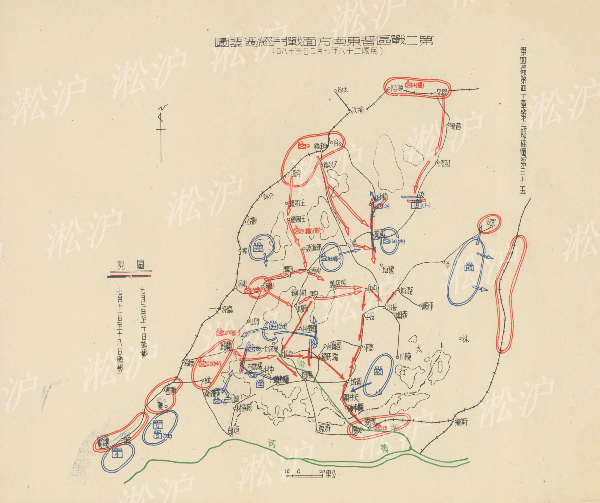

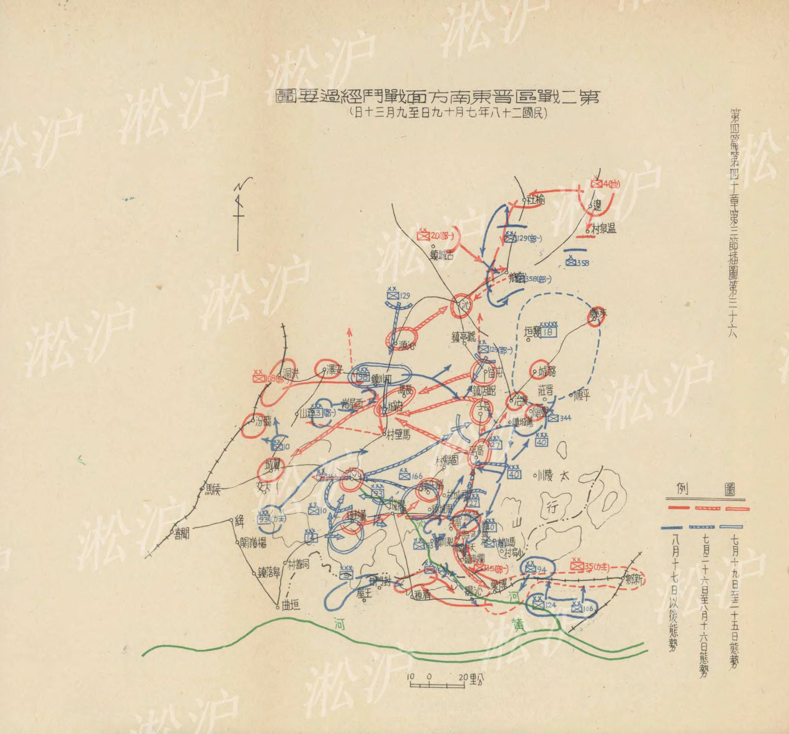

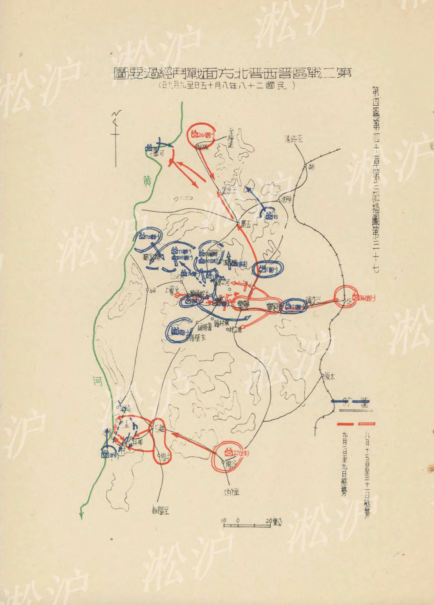

#### 第七款二十八年晋省之冬季攻勢

民國二十八年十一月二十二日至二十九年四月四日

參照插圖第三十八至第四十二

日寇自九月間在晉東南地區遭受嚴重打擊、被我牽制於晉綏戰區者計有第二十、第二十五、第二十六、第三十六、第三十七、第一零八、第一零九等七個師團，及獨立第二、第三、第四第九等混成旅團，野戰山砲第一縱隊、野戰山砲第八縱隊等部，與僞軍二十一萬餘人。是時英法兩國已對德宣戰，日寇爲應付國際情勢之變化，迫使抽調在華兵力，在晉省方面者，決定抽調第二十、第一零八、第一零九等三個師團，回國整訓，而以第四十一師團前來接防；但晉省各地之敵正面被我吸引，不得脫離，後方復被我游擊部隊破襲壞擊，敵晉乃向我晉東南及晉西發動攻勢，企圖掩護其部隊撤離。自十月一日以第一零八師團向晉西第一零九師團向晉東南分別增援，晉東南之敵，於十月八日向長治、壺關以南之我第二十七、第四十四兩軍防區進攻，經我猛烈反擊，竟日激戰，至九日晚，敵軍不支向長子、屯留方面敗退。敵抽調三個師團回國整訓之計畫，被我粉碎，僅將第一零九師團逐漸向邯鄲東調，直至十一月三日始行抽調完畢。晉西方面之敵，獲得第一零八師團之增援後，於十月三日向晉西呂梁山方面發動攻勢，我軍以破壞交通配合作戰，並以南路軍向臨汾、俟馬一帶側擊，至十一月十日，敵軍雖先後陷我大寧、蒲縣、鄉寧晉西各要點，然我軍於十一日轉移攻勢，至十六日先後將以上各地克復，敵軍全部向同蒲路方面撤退。

十一月二十十日，第二戰區閻錫山司令長官奉蔣委員長皓申令一元電，着卽向當面之敵發動冬季攻勢；然敵軍在我軍部署尚未完成，卽向我分途進攻；而共匪更於此際陰謀破壞抗戰，不斷襲擊我軍，影響抗戰成果至鉅。其經過概況分述於左：

晉南方面參照插圖三第十八：敵軍進攻呂梁山失敗後，深感我南路軍對其威脅甚重；尤以對晉南三角地帶交通咽喉之侯馬爲甚，敵將領篠塚義男，爲排除其妨害，特於十二月初以第三十七師團抽調兵力萬餘，集結於橫嶺關、夏縣、安邑、運城、張店一帶，四日在砲空掩護下向聞喜以東我第五集團軍中條山各山口猛烈進攻，反復進出不下十餘次之多，敵我傷亡均重。是日晚，我第五集團軍曾萬鍾總司令，爲轉移於有利地形，除以一部留置敵後破壞敵之交通並襲擊敵軍外，主力佔領劉張村、胡家峪、閻家城、馬家窯、斜溝、大峪里之線，並以第九十八軍一部控置皋落鎮附近。

十二月五日午，敵繼續向我軍陣地進攻，其主力約四五千迫近橫榆；一部三四千向清山村、馬家廟一帶進攻，至六日午攻佔大嶺上，接近我第九十八軍陣地。該軍當將敵軍驅退，並以一部由橫榆向西出擊。

我第十七軍爲協力第五集團軍之戰鬥，於八日晨以一部向清山村側擊，主力亦由正面猛攻，將馬家廟東北高地之線佔領，至晚將清山村西端高地之敵二三百完全殲滅，俘敵三名，奪獲輕機槍三挺，步槍三十餘支，九日進佔馬家廟以北高地，並向盧家溝方面迂迴。

同九日馬家廟東南及韓家嶺迤西一帶之敵軍四五千，向我第五集團軍之第三軍陣地進攻甚烈，我軍奮勇迎擊，激戰至十日晨，敵軍傷亡過重，全部向西潰退。

十二月十一日，我第十七軍、第九十八軍、第三軍，各派一部向堰掌鎮東南方面追擊，該敵續竄聞喜，夏縣敵之進攻計畫，復遭幻滅。此次敵軍傷亡數千，內有重傷聯隊長重松及陣亡江島大隊長等二名。

十二月十六日，軍事委員會鑒於敵軍此次進攻又遭敗北，爲逐漸消耗並牽制敵軍戰力，當以銑辰令一元電令第二戰區轉飭各出擊部隊，迅卽編組多數游擊隊，深入敵後作戰，其原電如左：

查敵國內政外交動蕩，兵勞氣餒，其軍中厭戰之情緒日益高漲，我如乘此冬令攻擊，同時施行有計

畫之宣傳作戰，深入敵後游擊，必能收獲相當成效。凡該戰區擔任出擊之軍師，應迅速抽組若干小部隊，以游擊方式，深入敵後實行武裝游擊、宣傳，並到處散發標語、傳單，俾軍事與宣傳能收並進之效。

閻錫山長官奉電後，卽督飭各部切實實施，並分組游擊隊，深入敵後，一面游擊，一面宣傳。

民國二十九年一月中旬，我第五集團軍已將夏縣東北一帶之敵，完全肅清，斃敵甚多，並鹵獲彈藥萬餘發。

晉東南方面參照插圖第三十九：民國二十九年一月上旬，晉東南之敵軍第二十師團主力，步騎聯合約萬餘，由長子向該地西南之我第二十七軍陣地進攻，我仙翁廟陣地被敵攻陷；惟是時潞城被我第十八集團軍一部克復，敵乃停滯於仙翁廟附近與我對峙。敵以感於潞城爲其後方要點，被我軍佔領後威脅重大，乃抽集兵力千餘，向我反攻，與我第十八集團軍之第一一五師在潞城以南連日激戰，敵復陸續增援，潞城再爲敵軍佔領，我軍乃轉移於該地東北山地。

一月中旬，晉東南及晉南一帶之敵，爲第三十七、第四十一、第三十六、第二十等師團，與道清路之敵軍第三十五師團勢成犄角，互相策應，以謀控制我晉省之大部。我軍事委員會爲肅清該敵並打通白晉公路，仍令第二戰區副司令長官朱德，指揮第二十七軍、第四十軍及第十八集團軍，先行規復長治。朱德副長官當部署如左：

一、第二十七軍，以現態勢側擊南進之敵。

二、第十八集團軍之第一二九師特務團及第三九六旅一部，向微子鎮、潞城一帶之敵攻擊。

三、第一五五師之第三四四旅一部，第一二九師第三八六旅之一部及總部特務團，仍以原態勢由東西兩方面夾擊白晉公路之敵，並予截擊之。

四、第一二九師以有力一部，圍困並監視屯留之敵。

五、第四十軍龐炳勳部，應以全力向長治猛攻，所遺壺關攻擊任務，由第一五五師之第三四四旅主力接替之。

六、第四十軍與第三四四旅之作戰地境，爲南呈鎮、東長井、壺關、固村之線，線上屬第四十軍。

上述部署命令下達後，我第四十軍向長治第二十七軍向長子分途進攻。一月十三日晚，第四十軍與敵在蔭城鎮一帶爭戰甚烈，時長子敵軍一部東援，在上霍附近被我第二十七軍一部擊退，斃敵五十餘，該軍曾於十四日晚，一度襲入長子、西關，十五日鹵獲敵之文件，證明長治、長子、壺關一帶之敵，爲第三十六師團，主力萬餘，連日與我戰鬥以來，傷亡頗重。

一月十六日，我第四十、第二十七兩軍，與敵對戰於高平東北之西火鎮及東南一帶高地，與高平以北及東北之大義鎮等處，至二十日晚，敵軍後續部隊到達，戰力增強，二十一日高平被敵攻陷，經我兩軍由東西兩方協力圍攻，戰至二十二日，敵軍不支，向北潰退，我第二十七軍乘勝克復高平，殘敵續向東北潰退，經我軍沿途截擊，二十三日在西火鎮附近擊斃敵軍百餘，並奪獲敵軍遺棄輜重頗多。同時我第四十軍亦向北追擊，至二十六日進至蔭城鎮一帶長治外圍各據點。至此我軍已恢復攻略前之原態勢；惟兩旬以來，我第二十七、第四十兩軍，雖迭向長治進攻，但因第十八集團軍情形複雜，彼此牽制，致不能配合作戰，該集團軍之攻勢毫無成果。

我軍事委員會，鑒於第十八集團軍有違抗戰初衷，爲恐曠日持久師老無功，乃於二十八日以儉午令一亭電改定長治地區作戰指揮系統如左：

一、第四十軍龐炳勳部，着卽關冀歸冀察戰區指揮，所遺任務由衛副司令長官統籌調整部署，指定部隊接替之。

二、第四十軍龐炳勳部，第二十七軍范漢傑部，着均解除第十八集團軍指揮，范漢傑部着改歸衛副司令長官直接指揮，所有長治區之作戰部署，應由衛立煌副長官負責。

一月三十一日，軍事委員會爲統一長治地區之指揮權責，又以世西令一元電令閻錫山司令長官，原電如左：

爲統一長治地區作戰指揮，所有刻在該地區作戰之第十八集團軍部隊，着一律歸衛立煌司令長官按衛立煌當時爲第一戰區司令長官兼第二戰區副司令長官)統一指揮。

閻長官奉到右述兩電，雖經先後以濟午友辰兩電轉知衛立煌、朱德兩副長官，然以敵軍實力增強，且我軍之部隊與環境情形特殊，當時朱德已有保全實力、不忠於政府、破壞抗戰及襲擊友軍情事，指揮系統雖經調整，但長治依然未能規復。

晉西方面參照插圖第四十。自敵軍佔領同蒲路沿線以後，晉西之新絳、稷山、河津以北汾河以西黃河以東形成山西之中心區，亦爲當時第二戰區唯一軍事根據地。斯時敵軍第四十一師團佔據汾河兩岸要點，與晉南三角地帶之敵第三十七師團，遙相呼應，且其以北之第九、第六兩獨立旅團，兵力甚強。

時我第二戰區以晉西根據地處於三面被圍之形勢，因以第六、第七、第三十一等三個集團軍之兵力及其他各游擊部隊，對敵嚴密戒備，除各以一部於東南北三方面與敵對峙外，主力則分別置於吉縣、蒲縣、隰縣、石樓及大寧縣境整訓，待機行動。

第二戰區長官部，是時位置黃河西岸陝西境內之秋林鎮，閻錫山長官爲使晉西防務鞏固，並期建立游擊根據地，除令第八十三軍軍長杜春沂負責秋林一帶工事計畫實施及妥密部署，以準備敵之渡河西犯外，特策定中心區之作戰計畫，並分令實施。其計畫原文如次：

第二戰區中心區作戰計畫

一、戰區決以強大之第二線兵團包圍殲滅敵人之目的，先對南東正面嚴密監視，第一線兵團在海堂村、寺落鎮、磊子鎮之線構築必要陣地，誘敵攻擊，在陣地直前予敵打擊後，由強大之第二線兵團由兩翼出擊包圍敵人於大寧附近地區而殲滅之。

二、趙承綬總司令所率之兩個軍若敵由離石、軍渡公路南下時，應卽移至隰縣、石樓東南之克城鎮、勍杳鎮地區，與中心區形成犄角，俾利爾後中心區之作戰。

第二

指導要領

一、敵未通過離石、軍渡公路前，各軍應在指定地區積極整訓。

二、敵軍若於趙承綬總司令所部尙未南移先期進犯時，我軍應在陣地前予敵重創後，由兩翼出擊包圍於大寧附近地區而殲滅之。

三、趙承綬總司令所部若已南移，而敵軍向隰縣東南追擊時，趙部應在義泉鎮以東之上莊南北地區亘石口之線佔領陣地，極力抵抗。此時我主力軍應立即轉移攻勢，協助趙軍夾擊該敵而殲滅之。

四、敵若放棄趙部向我主陣地攻擊時，我應在旣設陣地之前予敵以重創後，以第二線兵團立即轉移攻勢，向左蓆捲。趙部向敵之右側行猛烈之包圍，並以一部截其後路，而各個擊破之。

五、第二線兵團應集結於鄉寧東北之管頭及鄉寧以北之東西圍子、三猴及吉縣、高祖山各地區。

第三

兵團部署

一、軍隊區分

甲第一線兵團

總指揮暫編第一軍軍長傅存懷第三十七師

第七十師

砲兵隊（山砲四門）

乙

第二線兵團

(一) 右翼軍

總司令第六集團軍總司令陳長捷第六十一軍（附第六區保安司令崖道修部）第三十四軍（附第六游擊縱隊薄毓相部）(二) 左翼軍

總司令第十三集團軍總司令王靖國第二十三軍

第八十三軍

丙

宜川河西河防部隊

總司令砲兵司令周玳兼第六十六師

丁

太原綏靖公署工兵團

戊

趙支隊

總司令第七集團軍總司令趙承綬

白儒清軍（番號不詳）

第三十三軍

二、作戰地境

右翼軍

劉家灣、窯頭、寺落鎮、桑壁鎮之線，線上屬左翼軍左翼軍

三、攻擊到達線爲上莊、隰縣、桑壁鎮、閣山之線

二月六日，第二戰區長官部以當面敵情變化，爲適應情勢需要，經變更部署，並分令各部隊實施。

其要旨如左：

第一

軍隊區分

一、中心區軍

(一)東區軍總司令陳長捷，指揮第三十四軍（附第二一五旅）、第六十一軍（附暫編第一旅）、獨立第一旅、游擊第一旅。

(二)西區軍總司令王靖國（由第十九軍軍長梁培璜暫代），指揮孟憲吾軍（番號不詳）、第八十三軍。(三)北區軍總司令趙承綬，指揮白儒青軍、第三十三軍、暫編第一軍（轄第六十六第七十兩個師）太原綏署工兵團。

二、宜川河防守備軍

宜川河防守備軍周岱，指揮趙鴻叔旅（番號不詳）及原有之砲兵部隊。

三、秋林守備軍

秋林守備軍司令王靖國兼，指揮第二一七旅（附砲兵第二十三團之第二營及砲兵第二團之第七連）及幹訓團。

第二

作戰地境

四、東區軍與西區軍爲船窩鎮、吉縣以南之三候鎮、和尙嶺、窯頭、小囘宮及大寧、午城鎮、隰縣相連之線，線上屬西區軍。

五、北區軍與東區軍爲靈石、康城鎮、隰縣、永和城、永和關相連之線，線上屬北區軍。

六、西區軍與河防守備軍爲黃河之線，河防屬河防守備軍。

第三

各部隊之任務

各路軍應在各該地區內，以守備據點，攻擊來攻之敵，並積極加強工事，肅清殘敵，掃蕩奸僞，以鞏固守備區之安全。

第二戰區長官部將上述新部署頒發後，第七集團軍趙承綬部，於二月中旬到達石樓、隰縣一帶指定地區，當卽遵照長官部指示，令各軍於所轄地區內，在預期敵軍來犯及敵軍可能進攻之方面，先擇有利地形，迅速構築閉鎖式據點，並加強一般工事，準備固守。

是時所有晉西各部隊，均一面構築工事，一面訓練部隊，一面相機襲敵。此後以我軍在晉西方面戒備嚴密，敵軍雖亦擁有較強兵力，然終以無隙可乘，且恐我軍出其不意予以進攻，故僅能不時以少數兵力向我第一線部隊攻擾，每一接觸，敵必受挫囘竄。

綏遠方面參照插圖第四十一：當我軍於民國二十八年十二月實施冬季攻勢時，綏遠方面部隊，亦遵照命令開始行動，曾一度攻入薩拉齊及包頭兩要點。自後敵爲保持其佔領區之安全，經連續以飛機向我包頭以西騎兵第六軍所屬部隊偵查轟炸，一面增兵包頭，同時以裝甲部隊向我包圍以西陣地行威力搜索。

時我第八戰區副司令長官傅作義，判斷敵軍有進攻我後套企圖，乃於民國二十九年一月八日，以齊辰亭電令騎兵第六軍於包頭以西佔領陣地，阻敵西侵，原電如左：

一、包頭有敵千餘，固陽、安北各有敵軍三百餘，六日午敵汽車十餘輛到達退水渠東岸之西水泉，連日敵機飛套內偵察，有向我進犯模樣。

二、本戰區（第八戰區）綏西部隊，以確保套內之目的，擬集結主力於五原附近，準備不失時機，殲滅進犯之敵。

三、騎兵第六軍附游擊第一、第二兩師及游擊獨立第二團，編組游擊部隊，在獨崑崙河（包頭西）

西岸游擊，其餘在套內集結，準備迎擊由烏拉山進犯之敵，限一月十日前準備完畢。

四、該軍與第三十二師之作戰地境爲草立尾旦、楊來順、二後生尾旦、水漸上相連之線，線上屬第三十二師。

五、已令暫編第六師卽開西山咀，歸還騎兵第六軍建制。

騎兵第六軍門炳岳軍長奉到上述電令，遵卽將各部隊重新部署如左：

一、游擊第一、第二兩師及游擊獨立第二團，仍在獨崑崙河西岸地區游擊。

二、騎兵第七師之一團，以一部接替孫三圪旦亘美利更廟之線警戒任務；以一部於趙大圪旦警戒；主力配置於蓿荄灘，準備側擊西犯之敵。

三、暫編第十師以一部於烏拉山西部之王大奇圪旦及西山咀沿退水渠部署警戒；主力於西山咀臥羊台佈防，準備迎擊由包頭及安北方面進犯之敵。

四、新編騎兵第四師，以一部於南水泉、東水泉之線警戒；主力沿烏素拉海佈防，準備側擊由安北方面向西南進犯之敵。

五、騎兵第七師，主力集結於西山咀以西之到老沙金及其附近，爲總預備隊。

騎兵第六軍軍部，於一月十日推進至到老沙金，根據敵情地形之偵察結果，於十一日策定作戰計畫，十二日以命令頒發各部隊實施。其原文如次：

騎兵第六軍綏西作戰計畫

第一

敵情判斷

敵將以主力向黃河兩岸進犯後套，以有力一部由安北烏鎮向我側後迂迴，以策應其主力方面作戰。第二方針

一、以步兵主力佔領烏拉山西端旣設陣地，阻敵西犯。

二、以騎兵一部，在黃河兩岸及烏拉山後搜索警戒。

三、以騎兵主力暫控置套內西端爲機動部隊，俟敵之動向判明後，使用步騎聯合夾擊側擊而殲滅之。

一、游擊部隊

指揮官暫編第十師師長安榮昌（按安師長與游擊部隊有歷史關係）游擊第一師（僅二百餘人）

游擊第二師（僅數十人）

游擊第二師副師長所屬部隊（所屬僅百餘人不屬其師長指揮）游擊獨立第二團（二百餘人）

二、右地區隊

指揮官騎兵第七師第二十一團團長胡逢泰騎兵第七師第二十一團

騎兵第七師第十九團之第七連

三、中央地區隊

指揮官暫編第十師師長安榮昌

暫編第十師

四、左地區隊

指揮官新編騎兵第四師師長石玉山新編騎兵第四師

五、總預備隊

指揮官騎兵第六軍軍長門炳岳

騎兵第七師（欠第二十一團及第十九團之第七連）

一、游擊部隊應在獨崑崙河西岸地區游擊，相機向包頭以西之麻池及包頭之敵襲擊攻擾；並破壞包麻、包安、包固間之交通及電信設備。

二、右地區隊應以一部於趙大圪梁及馬營長地對大樹灣、包頭、麻池之敵搜索警戒；主力以蓿菱灘及烏蘭不浪澗選擇隱祕陣地，準備側擊由黃河兩岸西犯之敵而殲滅之。

敵如進犯我西山咀陣地時，應立即猛襲敵之側背，與中央地區隊協力夾擊而殲滅之。

三、中央地區隊應以一部於莫斯特澗及顛不寺廟準備出擊；主力利用一一四五·九六高地亘圪爾他線之旣設陣地，及烏拉山西端之旣設陣地嚴密佈防，對由固陽、包頭進犯之敵，以我之莫特澗及顛不寺廟出擊部隊與主力部隊夾擊而殲滅之。

四、左地區隊應以一部於西水泉、東水泉、三利成施行嚴密警戒；主力沿烏拉素海西岸，選擇陣地集結部隊，對由固陽進犯之敵，乘其履冰半渡而擊潰之。如敵由安北進犯臥羊台時，應卽由七開瑪以北地區出擊，猛襲敵之側背。

五、作戰地境

右地區隊

馬五渡口、小廟子、新小廟子之線，線上屬右地區隊。

中央地區隊

中央地區隊

馬五渡口、小廟子、新小廟子之線，線上屬右地區隊。

中央地區隊

賀境、七開瑪、可可倒包之線，線上屬左地區隊。

區

隊

莫立毛圪旦、楊來順、二後生、水漸上之線、線上屬新編第三十二師。

新編第三十二師

六、總預備隊集結於西公中附近，準備隨時策應各地區之作戰。

七、軍隊各地區間之通信，以電話爲主，傳騎及無線電副之。

我騎兵第六軍各部隊部署旣畢，敵軍於一月十八日分兩路向我進攻參照插圖第四十二：其一路主力由包頭沿黃河兩岸西侵，與我騎兵第六軍主力在趙大圪梁、新小廟、臥羊台、來福營子、西山咀、東水泉各附近激戰後，以我軍兵力不足，裝備較差，敵軍竟於一月二十九、三十、三十一等三日內，相繼將我陣地突破，我軍向五原方面轉進。

敵軍另一路由安北西侵，於二月一日突破我左側第三十五、第八十一兩軍，五原以北烏鎮烏不浪口一帶陣地，敵軍遂由南北兩方面突入我後套，並向西急進，二月二日陷五原，四日陷臨河，我軍轉移於臨河以西地區。我方爲策定反攻計畫，乃將分散於各地區之部隊，集結於臨河以西整理，而敵軍亦因損失綦重，無力再進，遂成對峙狀態。至三月上旬，我軍向敵攻擊，先後克復臨河、善壩。三月十九日，傅作義副司令長官親率所部，圍攻五原，敵以猛烈砲火及飛機向我轟擊，我官兵前仆後繼衝入城內，敵不支向東潰退。二十三日，敵續反攻五原，爭奪三失三得，至四月一日始將五原完全攻克，四日續克西山咀，敵乃回竄安北、包頭、固陽一帶，與我對峙。後套已無敵踪，遂恢復一月份以前之態勢。

以後敵軍卽從事政治攻略，煽動蒙旂各盟進行其所謂統一蒙疆之計畫，在綏南方面，我晉、陝、綏、邊區總司令鄧寶珊，奉令統一指揮伊克昭盟各部，側擊敵軍，並設法團結蒙漢同胞，共同禦敵，以期打破敵方政治攻略之迷夢。

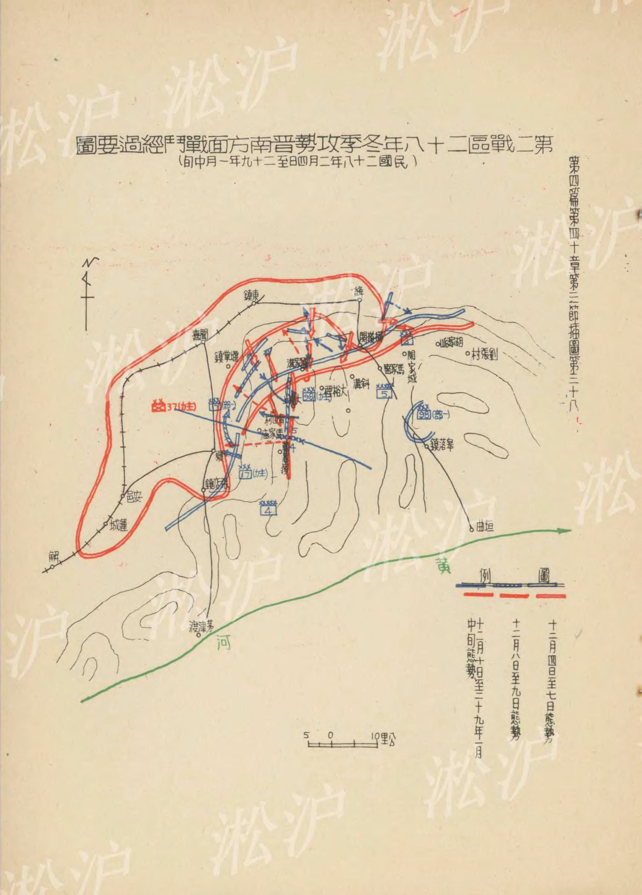

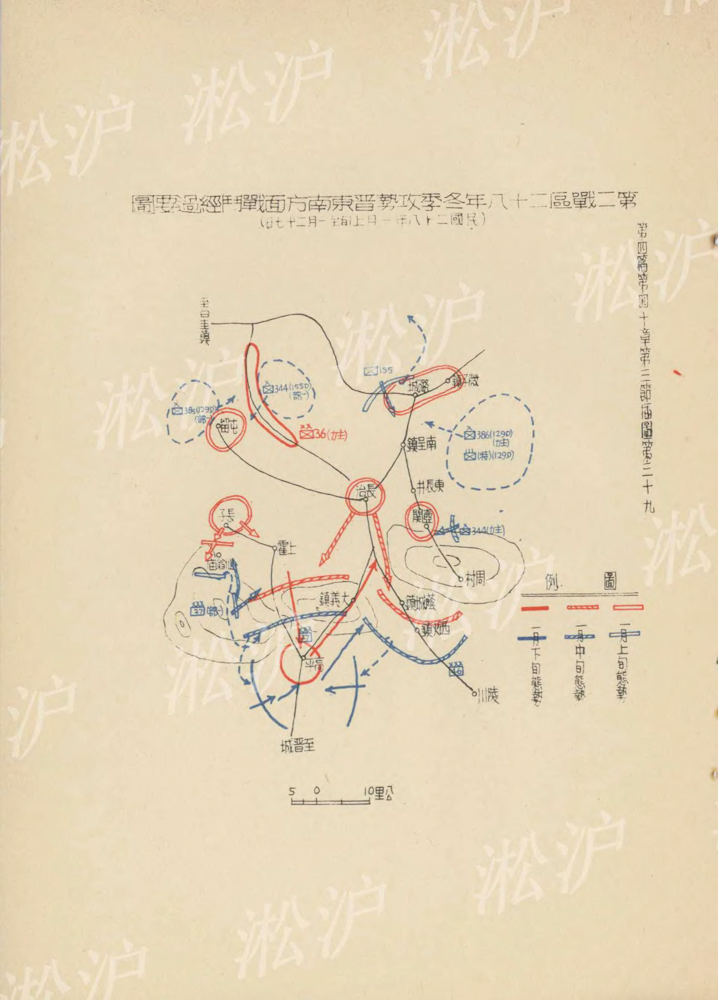

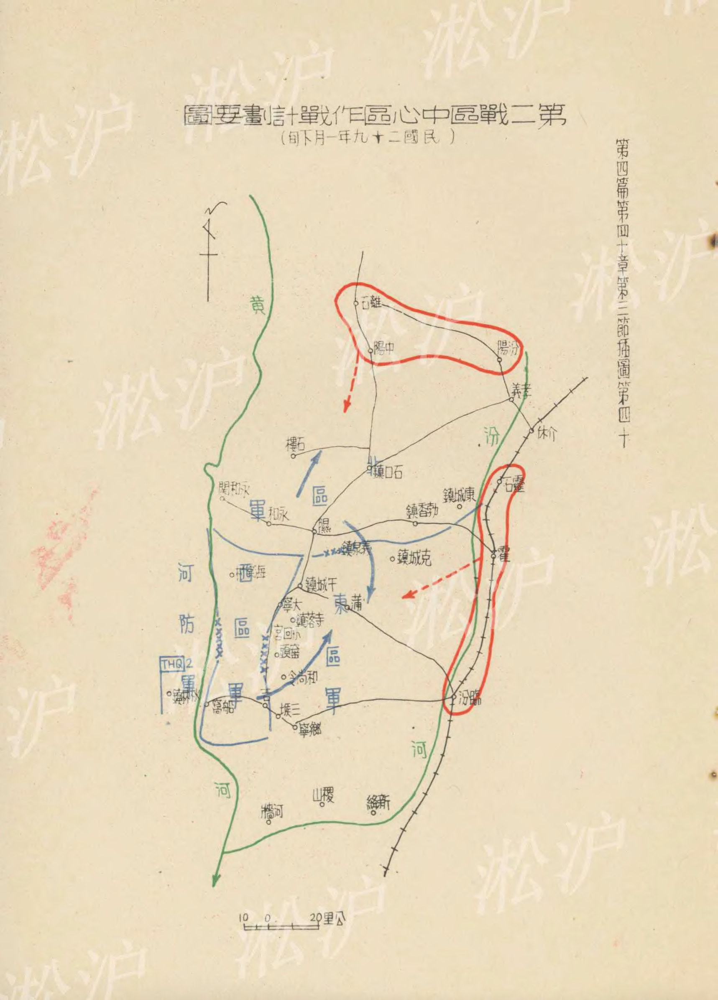

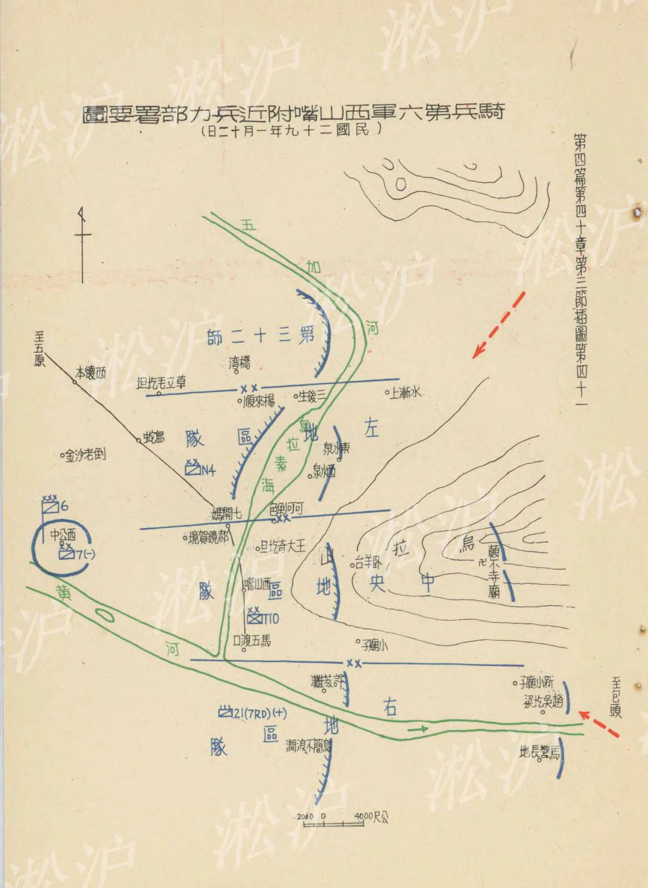

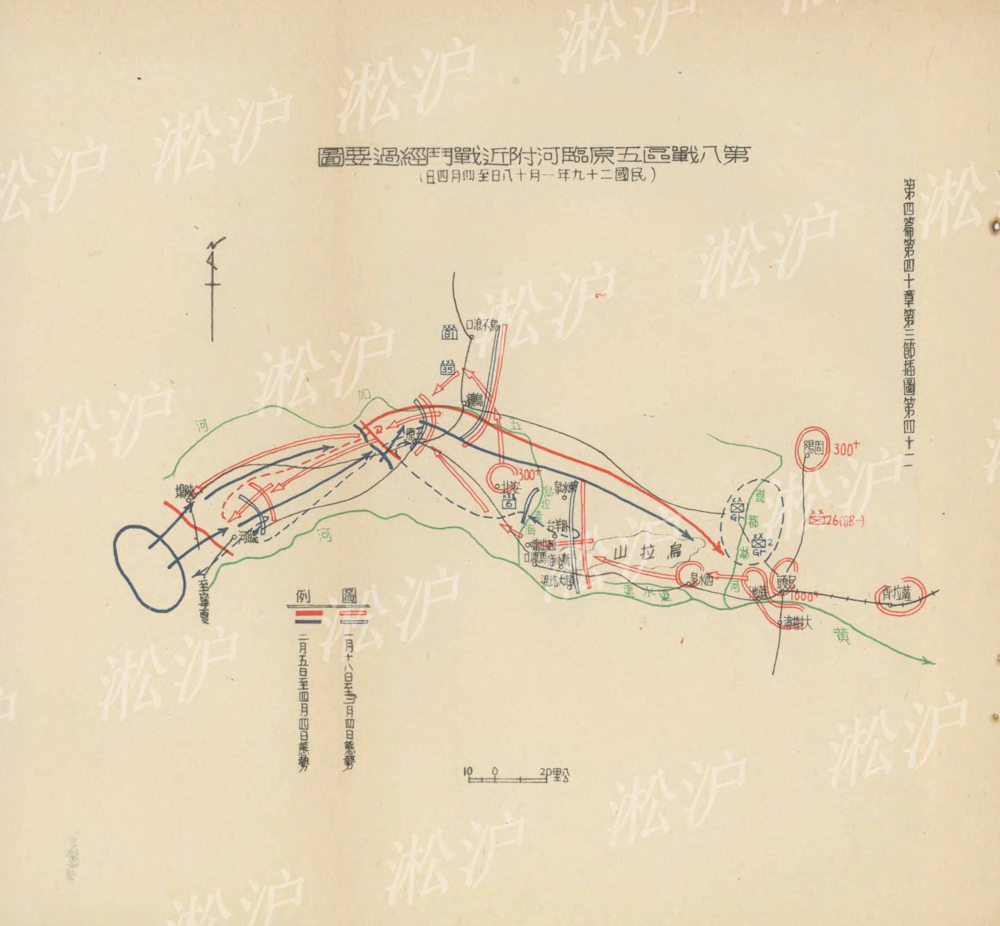

#### 第八款對敵軍打通晉豫交通之作戰

自我軍二十八年冬季攻勢，敵軍在晉綏各方面先後失利後，乃於二十九年三月杪，將晉西方面之敵軍第四十一師團調至晉東南，加強該地區之第三十六師團戰力，並與豫北道清鐵路一帶佔據之第三十五師團，遙相呼應，企圖打通晉豫間長子、陽城及博愛一帶之交通，進而作渡河南侵豫南之準備。其晉南方面之第二十、第三十七兩師團，暫行鞏固旣佔領之交通點線，對我軍採取牽制行動。

我第二戰區長官部，以晉東南爲晉省東側之門戶，關係全省之翼側安全，自第四十軍調冀後，該地僅第二十七軍及第九十三軍，戰力較敵懸殊。且第十八集團軍陰謀破壞抗戰，尤須加以防範，爲增強戰力，經呈奉軍事委員會核准，以第十戰區控置之第七十一軍宋希濂部，渡河至高平附近。又抽調南路軍第三十六集團軍（以第四十七軍及第十七軍編成李家鈺爲總司令）之第四十七軍，至晉東南地區。晉南南路軍所轄之第四、第五、第十四、第三十六各集團軍，仍在翼城、絳縣及中條山地區。晉西方面之第六集團軍，仍在吉縣、鄉寧及黑龍關各地區。第七集團軍分佈於晉北之忻縣、靜樂、偏關各地區。第八集團軍在汾城、新絳、稷山一帶。第十三集團軍分佈於離石、柳林及黃河西岸之秋林一帶。一面整訓，一面以小部隊不時襲擊敵軍。

四月初旬以還，敵爲積極打通晉豫間交通，向高平附近採取攻勢。我軍除對晉西根據地策畫加強守備並發動廣泛游擊外，晉東南方面部隊，亦採取積極行動。茲將各方面戰況分述加左：

##### 第一項對敵軍打通晉豫間交通之戰鬥（民國二十九年四月十九日至五月一日）

參照插圖第四十三

民國二十九年四月中旬，敵軍第三十六師團控置同蒲路，一部經太原、太谷集中於長子、長治、壺關一帶，企圖舉全力先攻陵川、高平，再與豫北之敵，第三十五師團會攻晉城，以打通晉豫間之交通。我扼守陵川一帶之第二十七軍，卽令所屬各部隊，加強工事，嚴密戒備。

四月十九日，敵軍第四十一師團由浮山冀城一帶，向我第九十三軍沁水一帶陣地進攻，當發生激烈戰鬥。

二十日，敵軍第三十六師團，亦由壺關蔭城鎮向我第二十七軍陵川以北之樹掌鎮西火鎮之線陣地進攻。

四月二十一日，由陝東東渡集中於張店鎮以南之第七十一軍，奉到衛立煌副長官電令，着卽佔領固縣村、小柿莊及高平以西南北地區陣地，側擊南下之敵；又令董封鎮附近之第十四軍（屬第十四集團軍指揮）向東側擊，協力第九十三軍作戰。

四月二十二日，第七十一軍到達小柿莊附近，宋希濂軍長卽令所屬部隊，向當面之敵攻擊。是日與我第二十七軍在樹掌鎮一帶對戰之敵，以有力一部經禮義鎮向該軍左後方迂迴，我第二十七軍已經數日之苦戰，傷亡已重，復於此時，側背遭受嚴重威脅，乃向陵川東北地區轉移，當晚陵川遂被敵佔領。

四月二十三日，我向東側擊敵軍之第七十一軍，已攻佔小柿莊以東高地及據點數處；惟第九十三軍當面之戰鬥，迄無進展，且臨汾方面之敵軍頻頻向沁水方面增援，我第七十一軍爲免過於深入，後方空虛，乃於二十四日在高平關、仙翁廟、大東溝之線佔領陣地。是時敵軍主力仍在高平附近集結，我第九十三軍遭受優勢之敵壓迫，且經連日苦戰，傷亡過重，遂於是晚轉移於沁水東岸，憑河固守，敵卽進佔沁水陽城。

衛立煌副長官二十四日獲悉陵川失守，以該地爲晉豫接壤之重要據點，不可輕易放棄，乃令晉城以北之第四十七軍，速以第一七八師向陵川西南地區挺進，阻敵南侵；令第七十二軍以一部向高平東北地區進攻，以策應第二十七軍之作戰。

四月二十五日晨，我第四十七、第七十一兩軍，遵令分向高平及陵川方面行動，我第二十七軍獲得友軍之援應，亦開始向陵川反攻，奮戰至晚，卒將陵川克復，殘敵向陵川西北方面潰退，至二十六日陵川附近已無敵踪，恢復十四日前原態勢。我第十四軍亦自二十五日起，向東側擊，連日在董封鎮附近與沁水方面之敵，發生激戰。

敵軍自陵川失利後，深感我第七十一及第九十三兩軍，對其右側後之威脅甚大，爲繼續遂行其打通晉豫間交通之企圖，於四月二十七日以第三十六師團晉城之一部，經東大陽村向高平關我第七十一軍陣地進攻；同時以第四十一師團由陽城渡沁水經潤城鎮、端氏鎮向我第九十三軍沁水東岸陣地進攻。二十八日午後，敵軍第四十一師團另一部千餘，由端氏鎮向我第七十一軍右翼蒲池村附近陣地進攻，於是我第七十一、第九十三兩軍陣地，與敵發生全面戰鬥。至三十日拂曉，敵以飛機多架助戰，並以猛烈砲火及毒氣向我高平關正面進攻，戰況慘烈，我扼守高平關之第八十八師第二六三團，全部壯烈犧牲，因傷亡過重，略向後退。是時我第九十三軍亦遭優勢之敵壓迫，已轉移至固縣村西北之線佔領陣地，與敵續戰。我第七十一軍以第九十三軍陣地轉移，右翼側暴露，且當面之敵不斷增加，傷亡纍纍，該軍乃於五月一日向高平關西北山岳地帶轉移，另行建立游擊根據地，以爲我軍爾後反攻之基礎。此戰共斃傷敵軍二千一百餘名。是時我第十四軍仍在董封鎮西南端與敵對峙中。

##### 第二項 晉西方面之防守部署

當民國二十八年我軍發動冬季攻勢，敵軍一度進佔黃河濱岸之主要交通渡口軍渡後，我第二戰區長官部卽移駐黃河西岸陝西境之秋林鎮，並令晉西各部隊加強游擊戰；同時積極整補，以期充實戰力。至二十九年四月三日，閻錫山司令長官爲鞏固晉西游擊根據地，並打擊敵軍，特以江申參戰電頒發晉西區之分區編組出擊隊實施長期游擊計畫，頒發實施。其綱要如左（參照插圖第四十四）。

第一方針

西路軍確保黃河東岸呂梁山南部游擊根據地，積極發動游擊戰，與第十戰區陝北河西守備軍相配合，直接間接鞏固河防，屏障陝北，並使第一線守備軍與預備隊，輪流整訓，準備爾後之攻勢。

第二

指導要領

一、在敵軍未渡河進攻以前，我軍以整訓爲主；整訓未完成之部隊，以避免使用爲原則。

二、黃河東岸各部隊，應竭力破壞公路、大路，構築工事，建立游擊根據地，並派隊輪流出擊；尤須不斷襲擾敵交通要線，阻敵兵力之轉用。

三、如敵奪取我要點要線，修築碉堡，企圖圍困我軍時，應卽相互策應，協助積極游擊，由內線轉至外線，完成反包圍以疲困敵人。

四、如敵人以主力向我攻擊時，我被攻之部隊應堅強抵抗；而鄰近之部隊，應側擊奇襲，斷敵後路截敵輜重，以困擾或圍殲之。

五、呂梁山南部根據地，應保持由鄉寧、蒲縣、大寧通船窩之交通線。

六、宜川河防部隊，與外圍游擊隊，以及後方部隊，應適時換防，輪流整訓，以期戰鬥力之增強。七、運用軍民武力之配合，實行廣泛之游擊，以縮小敵軍佔領區。

第三

部署

一、控置吉縣地區之第八十三軍，以兩個團擾襲河津城附近各據點，並破壞該縣汾河北岸敵之交通二、控置新絳、萬泉一帶之第三十四軍，以第二零五旅有力一部，在汾河北岸截擊稷山、新絳一帶敵之交通。其在萬泉附近之第二零一旅，以一個團在臨晉東北一帶截擊臨晉、猗氏間往來之敵，並相機攻擊猗氏之敵，以主力破壞萬泉至安邑、運城間公路，積極攻擊萬泉之敵。第二一八旅以有力一部協同南路軍破壞東鎮南北地區鐵路公路；以主力破壞萬泉、稷山間公路，襲擊翟店之敵三、第十九軍以第二一零、第二一七兩旅，各一部在汾城、襄陵境內實行游擊，並破壞公路鐵路。四、第六十一軍以主力在趙城縣境內活動，實行廣泛之游擊，並破壞黑龍關東西地區及洪洞趙城間公路鐵路。

五、第二十三軍之獨立第二旅，應以連排爲基幹編成若干游擊小組，在靈石境內活動，對南關鎮一帶之敵，予以不斷之襲擊，並破壞其交通。

六、騎兵第一軍，以一部在介休、孝義、汾陽境內活動，並伺機破壞兌九峪、汾西、吳城鎮間敵之交通。

七、第三十三軍以一部在中陽、離石境內活動，逐次向中陽城、柳林鎮間地區推進，並破壞中陽至離石及離石至軍渡間公路。

八、中心區部隊，以西路軍之主力在後方竭力整訓，準備反攻；並擔任中心區主要交通線之破壞，與河防東岸前進陣地及各據點工事之構築。

西路軍各部隊，奉到上述電令，卽遵照在指定地區內奉行任務，一面以小部隊在敵後游擊；一面整訓，以期準備反攻，而獲抗戰最後之勝利。

四月十五日，閻錫山長官復以秋林鎮爲長官部駐在地，且濱臨河岸，爲鞏固此一指揮中樞及屏障陝北抗戰根據地，特指示守備秋林部隊之作戰方略，及其應行注意事項；並以咸辰參戰電令秋林守備軍王靖國總司令，妥爲準備。原電如左：

第一

工事位置

一、以碉堡爲主要工事，並區分爲守點碉堡，護點碉堡，殺傷碉堡三種。

(一)守點碉堡扼守據點，設置一座或二座互相策應。

(二)護點碉堡須扼守要隘，與守點碉堡成爲犄角。

(三)殺傷碉堡須置於埋伏地帶，使敵不易發現。當敵進攻護點碉堡時，對接近之敵，出其不意，予以側射斜射，如能由敵之背後射擊，則更爲有效。

二、四周城牆壕塹內，須有側防設備，城壁可用必要之被覆，以免天雨毀壞。

三、城壕前可設強固之多數碉堡，使敵進攻困難。如敵強攻，必招致重大之傷害，挫其銳氣，期由小勝而大勝，由大勝而殲滅之。

四、應有誘敵之前進陣地（按卽誘敵深入意），使敵攻下或進入後，陷於我預期殲滅區域。

五、應築有反斜面碉堡，以收伏擊與出敵不意之效。

第二

部署要領

一、不讓敵來之佈置，應在城外以強固工事拒防之。

二、不怕敵至之佈置，在城之週圍設有堅固防護碉堡及陣地，縱敵攻入城塹，我仍有兩路打擊敵人之設備。

三、敵更好之佈置，在城內嚴密工事之設備與組織，縱敵人進攻入城，我仍可憑良好工事將敵悉數殲滅之。

第三

兵力分配

一、固守碉堡，得使用一整團之兵力。

二、預備隊須分置三個地區，俟敵情判明後，再行集結。

三、砲兵使用分爲顯伏兩種：顯誘敵，伏殺敵；顯者在作戰間應有少數之預備陣地，以出敵意表，惟必須事先構築多數預備陣地。

四、重機槍須在殺傷及伏擊地點，於瞬間能發揚其最大威力。

第四

戰法

一、決對先行戰鬥以殲滅敵人，各連長應以慎密計畫與配備，利用守點護點碉堡，先行對敵殺傷，然後伏兵協同重機槍遂行戰鬥，以殲滅敵人。

二、營長以上，準連長之動作而遂行戰鬥，以殲滅敵人。不能完全成功時，則使用預備隊以協助連長，依戰術之運用，而殲滅敵軍。其必要條件，爲集中優勢兵力於決勝點，尤在攻擊前利用優勢火力，予敵以重大傷害。

三、重機關槍須集中火力在攻擊部隊之側面，予敵以重大殺傷。

四、攻擊部隊須與碉堡內之守兵相配合，得到碉堡之掩護與援助。

五、出擊部隊不可失之過早。

六、出擊路線須預築碉堡以掩護之。

七、須預將出擊時必須佔領之制高點處，預作佔領之準備。

第五

預備工作

一、部隊必須努力技能訓練，尤以步機槍、槍榴彈、手榴彈等射擊投擲技術，應特別熟練。二、排連長之戰鬥指揮，亦須特別訓練。

三、對進攻之假想敵，務能使其不出我之所料。

四、戰鬥殲敵，戰術殲敵，應多演習。

五、警戒嚴密，俾能早日得知敵之行動。

王靖國總司令奉到右述電令，經策定秋林守備軍作戰指導案（參照插圖第五十四），於四月二十九日以賺備代電呈報核示。嗣於五月一日奉到閻長官世參電准予照辦。其原案要點如左：第一方針

守備軍以鞏固秋林之目的，適時以殲滅敵人。

第二

指導要領

一、如敵主力由薛家嶺向十里坪進攻時，以一部向造紙廠看花園佯攻時，我該區守備隊依碉堡互爲策應，預備隊由薛家嶺高地向敵出擊，十里坪向薛家嶺方向迂迴攻擊敵後尾，虎嘯溝預備隊進出於龍吟溝兩側高地。是時窪縣之砲兵爲顯砲，施行擾亂及殲滅射擊。王家窯窟看花園砲兵爲伏砲，集中優勢火力，猛烈射擊，將敵殲滅於薛家嶺高地至十里坪之間。

二、如敵由據點間隙侵入時，我城垣據點守備隊擊其側背，是時攻擊部隊乘機向敵猛擊而殲滅之。三、如敵突破我城週任何據點，我核心守備部隊固守核心，並以火力協同攻擊突入之部隊；同時以總預備隊向突入之敵逆襲之。

四、核心爲最後陣地，亦卽殲滅敵人最有效處所，應使工事堅固，縱在任何情況之下，仍能發揮工事效用，俾使突入之敵無一生還。

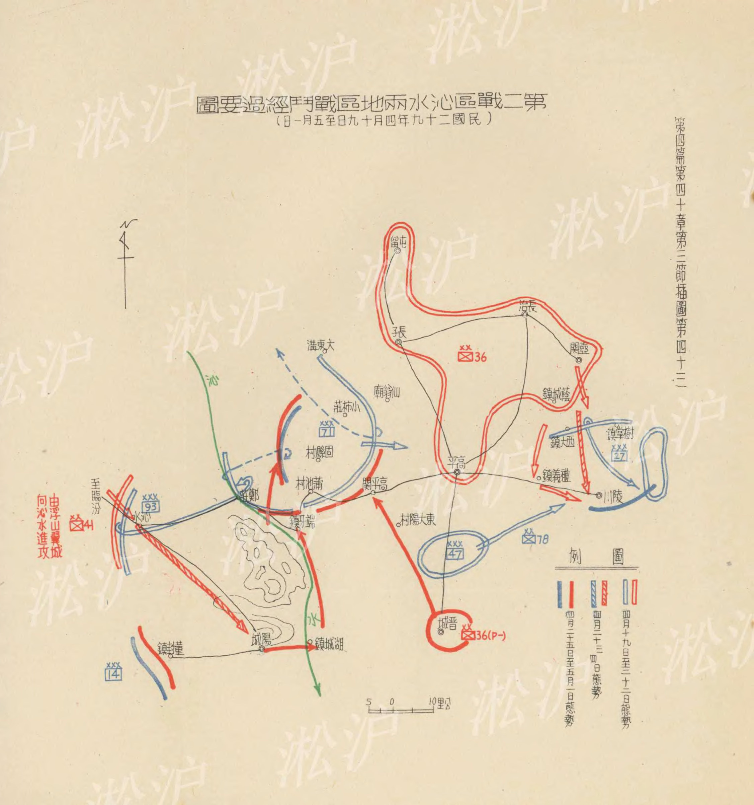

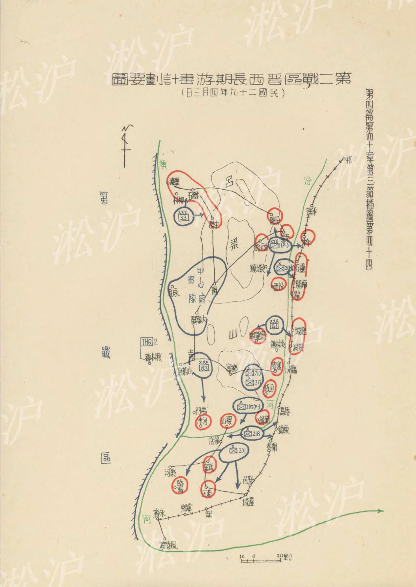

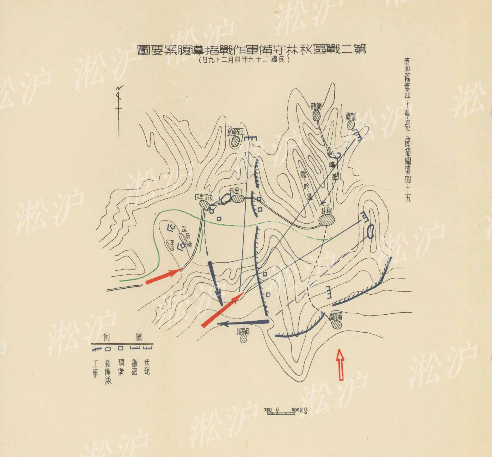

#### 第九款對敵軍分區攻擊之作戰

民國二十九年四月下旬，敵軍打通晉豫間交通之計畫，被我軍粉碎後，仍不斷由各地抽集兵力向晉東南增援，企圖對我軍分區攻擊，以減除其威脅。五月一日晉東南方面，已發現敵軍十個師團之番號，我第一戰區衛立煌司令長官，判斷敵軍確有將我軍分區隔離擊破之企圖。爲繼續打破敵軍詭謀，特策定晉東南及晉南我軍之部署，以東天電頒發實施，要旨如左：

一、壺關、長子、長治、洪洞、浮山、翼城、博愛之敵第三十五、第三十七、第三十六、第四十一及新增晉東南之敵軍，先後發現者，有露師團、三原川毫師團、伊藤知廉師團、多島師團、牛島師團等約四個師團以上兵力，據報將分九路向我進攻，期侵佔長博、翼高、翼晉各交通點線，建築碉堡，修築公路，隔離我軍，以達成其各個擊破，分區攻擊之目的。

二、我軍以逐段消滅敵人之目的，以各集團軍對先後入侵之敵予以消耗打擊後，各以主力逐漸轉移敵外線，扼制各主要交通線，選佔有利地形，側擊夾擊來攻之敵；並各以有力一部，遠出敵後，襲截其輜重，破壞其築路企圖，相機佔領其後方要點，使其兵力疲憊，迫其潰亂不能應援，然後各個擊破之。

三、部署及行動：

(一)第二十七軍以一部守備堰掌鎮一帶及陵川原陣地，維護林縣、陵川間交通；主力向蔭城鎮以西壺關、高平及長子高平公路攻擊。

(二)第七十一軍主力仍扼守高平、端氏鎮北側，連繫第九十三軍進擊高沁路之敵；一部在長子西南亘長高路西側，監視當面之敵。

(三)第三十六集團軍李家鉅部（欠第十七軍、第九十七軍），仍以第四十七軍在高平、晉城以東對晉高路，以第九軍之新編第二十四師（該師新近編成）在博愛、焦作以北對道清鐵路，第九十四師在晉城南天井關、博愛間向晉博路分別努力攻擊。

四第十四集團軍之第十四軍，在中村、張馬、陽城道之南側，第十五軍在橫嶺關之以南以東亘中村、張馬以南及西北一帶，分別對翼城、曲沃、絳縣之敵攻襲。第九十三軍主力在端氏鎮北側，一部在沁水浮山府城鎮間地區，對浮屯及浮翼各公路，並協同第七十一軍確保端氏鎮、府城鎮間，沁河東西兩軍之根據地。

(五)第五集團軍除以第十二師一部對安邑、張店附近之敵攻擊，協力第四集團軍作戰外，其主力乘機向橫嶺關、堰掌鎮、夏縣一帶之敵攻擊，並努力向聞喜、曲沃進出。

(六)第四集團軍附第七十六軍（該軍爲第十戰區河防部隊，一部兵力在晉南）之第一九六師兩個團，努力驅逐張茅大道殘敵，恢復平陸以東以北以西戰前原陣地。該集團軍之新編第三十五師，加緊向運城、永濟之線以北之敵攻擊。

(七)第九軍之主力移至濟源東西地區，備阻擊道清路西犯之敵，以掩護晉南後方連絡；一部積極襲擊沁博路及武陟暨道清路以南之敵。

我晉東南各部隊，自四月間在高平、沁水一帶與敵作戰後，迄至目前仍分途各與當面之敵對峙中。

第二十七軍主力集結陵川附近，以一部向西火鎮方面之敵追擊。第四十七軍與敵第三十六師團之一部，在晉陵大道以南戰鬥中。第七十一軍亦與敵第三十六師團一部在高平以西激戰中。第十四軍、第九十三軍各一部，向陽城以東亘欄車鎮之敵第四十一師團一部進擊中。第十四軍主力控置於陽城以西，第九十三軍主力向沁水東北之敵進攻中。第九軍在晉城西南及沁陽附近對當面之敵進攻中。第四、第五兩集團軍正向絳縣、夏縣及張茅大道之敵進攻中。

軍事委員會天水行營，根據以上敵我態勢，關於晉東南我軍之部署，特以卅未計深電呈軍事委員會，具申意見如左：

一、晉東南方面

(一)第二十七軍以主力與第四十七軍協力夾擊陵川、晉城之敵，第四十軍、新編第五軍應對平漢路方面嚴密戒備，阻敵西進，掩護第二十七軍側背。

(二)第七十一軍酌留一部於高平以西地區，對當面敵軍行有限度之攻擊，以行牽制；以主力南下。同時以第九軍之第五十四師全部北上，第十四軍以一部東進協力夾擊晉城、陽城間之敵。

(三)第九十三軍以一部對當面敵軍行有限度之攻擊，以掩護主力側背；以主力與第十四軍協力夾擊沁水、陽城間之敵。

四第十五軍以主力向翼城、曲沃出擊，以截斷第四十一師團之退路。

(四)以第二十七軍一部協力第四十七軍夾擊晉城、陵川間之敵；或以第二十七軍主力西進，協力第七十一軍夾擊高平之敵，先求該敵而殲滅之。同時以第五十四師全部對晉城敵軍實行佯攻，藉以牽制該敵應援高平。

二、第五集團軍抽出有力部隊，向聞喜、夏縣出擊，以策應第四集團軍方面作戰。

三、晉西方面

(一)第十九軍應以主力向曲沃、侯馬、聞喜出擊，一部向安邑、運城助攻，以策應中條山及晉東南方面作戰。

(二)第六集團軍應以有力部隊進出汾河右岸，向臨汾方面進襲，以期迫使敵軍一時窮於應付，庶幾我主敵客，藉以恢復原來態勢。

軍事委員會以天水行營所陳意見頗有可取，乃於五月四日以支令一元電轉知第一戰區。

衛長官根據天水行營意見，且當面情況略有變化，當於五月十日策定晉南攻勢部署，經以灰戍天電頒發實施。其要旨如左（參照插圖第四十六）：

第一方針

戰區以積極恢復原態勢之目的，以一部向敵後進出，截斷其交通連絡，並相機奪取其據點，繼以主力肅清晉高翼高公路沿線及以南之敵。

第二

部署

一、第四集團軍努力攻擊當面之敵向張茅大道以西進出，積極恢復原態勢。其在張茅以西鐵路以北部隊，努力向安運一帶進出。

二、第五集團軍以一部攻擊夏縣之敵，以策應第四集團軍方面之作戰；主力進出聞喜南北地區，竭力截斷敵同蒲路之交通，與汾河右岸第九十軍（該軍由第十戰區陝東開晉）切取連絡，以夾擊侯馬南竄之敵。

三、第十四集團軍以主力先肅清沁水、陽城一帶之敵，積極恢復原態勢；一部適時進出翼城、浮山以西地區，破壞敵後交通，以策應第九十軍之作戰。

四、第七十一軍與第二十七軍，協力攻擊晉城及以西之敵，爾後逐次北進（該軍因給養斷絕已調晉陽大道南側補充中）。

五、第二十七軍，以主力對高平附近，積極向高晉路敵軍行有限度之攻擊，以牽制敵軍；並以第七十一軍先行協力攻擊晉城之敵。

六、第九十七軍切斷晉博間交通，阻止博愛之敵北擾；並協力第二十七軍、第七十一軍掃蕩晉城以南之敵。

七、第九軍以一部協力第九十四師截阻沁博之敵北擾，並相機予以襲擊，以牽制道清路西段南側之敵；主力對沁水、陽城之敵及博愛道清路以南之敵攻擊，並阻止其西竄。

第三

攻擊日期及一般規定

八、攻擊開始日期，爲五月十五日。

九、在未施行總攻擊之前，各部隊仍應繼續派出小部隊，向當面之敵不斷游擊。

我各部隊遵令各向指定地區之敵展開攻勢，以期掃蕩殘敵。茲將各地區戰況分述如左：

晉東南方面（參照插圖第四十七）

五月十五日第十四軍向陽城進攻，於該地西南郊西冶附近與敵發生激戰。

同（十五）日衛立煌司令長官，以刪午天電令第七十一軍協同第二十七軍規復晉城，並右與第九軍、左與第十四集團軍連繫，限於二十日同時開始進攻。

五月二十日，第七十一軍在晉城西南端周村亘天井關之線，連日激戰，第二十七軍亦以一部固守陵川；主力向西挺進，協力第七十一軍夾擊晉城及其附近之敵。該兩軍經連日向敵多次猛攻，皆以敵軍陣地堅固，砲火猛烈未能奏功。至六月七日晚，衛立煌長官以進攻旣無進展，爲保存戰力爭取最後勝利，遂下令對晉城停止攻擊，並轉移至原陣地整補。六月九日，第二十七軍主力轉移於蔭城鎮、禮義鎮、府城鎮一帶地區。第七十一軍因與敵軍成膠着狀態，先後激戰多次，直至六月二十一日，以給養不繼，遂撤至高平關附近整補。

我向陽城進攻之第十四軍，亦以進攻無進展停止攻擊，退守原陣地。

晉南方面（參照插圖第四十八）自四月下旬以來，我第四集團軍轄第三十八、第九十六兩軍與由安邑、運城、解縣一帶南竄之敵，在柏樹嶺、黃草坡之線戰鬥。第五集團軍與由夏縣方面之敵對峙。第十四集團軍除第十四軍向陽城進攻外，爲策應第四、第五兩集團之戰鬥，遵照衛長官電令，以第十五軍向絳縣、橫嶺關一帶之敵第三十七師團一部進攻。惟是時安運一帶之敵軍主力向北轉用，似爲加強晉西及晉東南戰力。其向我中條山第四、第五兩集團軍部隊進攻之敵軍，均成對峙狀態。我第十五軍爲策應晉東南陽城晉城方面之戰鬥，於五月十一日開始向絳縣附近之敵進攻，至二十日，敵由翼城方面抽兵一部向絳縣增援，與我軍在絳縣東端之南嶺頭爭奪甚烈，二十三日晨，敵軍遭我痛擊，傷亡慘重，旋施放毒氣，我官兵中毒甚多，卽令撤回原陣地，戰鬥遂告停止。

晉西方面（參照插圖等四十九）自四月下旬以來，敵爲攻擊我晉西呂梁山游擊根據地，以達到確保同蒲鐵路交通之安全，特由晉南及晉東南各方面抽集第四十一師團、第三十七師團各一部，兵力萬餘，於五月九日起，分四路向我呂梁山地區進攻。十日至十三日間，與我第三十四第六十一兩軍在古城汾城以西、河津以北各地區，展開激戰。

五月十三日，閻錫山長官指示第六集團軍，以掩護河防之目的，截斷敵後交通，阻敵增援接濟圍困侵入之敵，預期於鄉寧附近地區，將敵各個擊破之。

陳長捷總司令卽遵照妥密部署，惟敵軍逐漸深入，至十三日晚敵我已在牛王廟以西及鄉寧、三堠各附近進行慘烈之戰鬥。十四日三堠被敵攻佔。十五日晨，我第二零六旅及第七十三師向進佔三堠之敵反

攻，戰至十五時，敵軍不支向鄉寧回竄，我克復三堠。十六日第三十四軍及第七十三師協同繼續圍攻鄉寧及附近之敵。又牛王廟附近之敵，連日以來與我第六十一軍展開血戰，各路進攻之敵，俱遭我軍嚴重打擊，損失慘重，死傷約四千餘，且其行李輜重被我游擊部隊在敵後截獲，損失過半，十八日以後，該兩路殘敵各循原路退回汾城、河津，恢復五月九日以前態勢。是後呂梁山區已無敵踪，其攻擊晉西計畫又遭粉碎。我軍除集中主力整訓外，並不時派遣小部隊，敵後游擊，破壞敵方交通及摧毀僞政權。

綏遠晉北方面（參照插圖等五十）五月中旬，包頭之敵向安北修築鐵路，並在平綏路兩側修築公路。至二十一日，敵第二十六師團一部沿黃河西犯，我自衛軍與敵在北葫蘆頭、檀蓋木獨兩處發生戰鬥。二十四、二十五兩日，我第八十一軍一部在昭君墳、大樹灣與敵發生戰鬥。二十六日我伊東游擊隊在萬盛恆與敵發生戰鬥，但均被我軍擊退。

斯時晉北之敵亦向我軍進犯。二十二日晉北及晉綏邊境之敵，分三路進犯保德：一路由三岔堡進抵保德以東三十公里之沙泉；一股經大澗進至保德東南二十五公里之石梯鎮；一股由興縣到達保德南五十公里之塑兒社。

五月二十三日，三岔堡敵軍另以一部續進至河曲東南二十公里之巡檢司，被我第一二零師擊退；而進犯保德之三路敵軍，亦於是日被我第三十三軍部隊擊退，此後敵軍久未進攻。

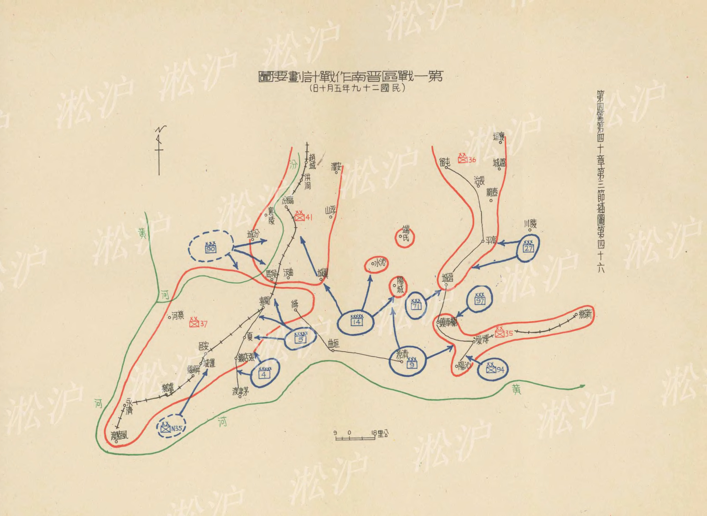

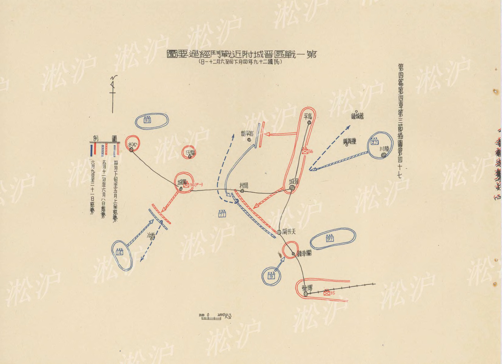

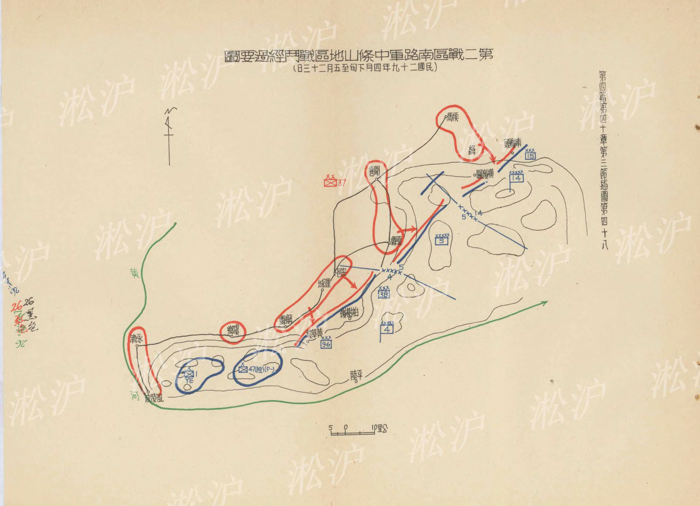

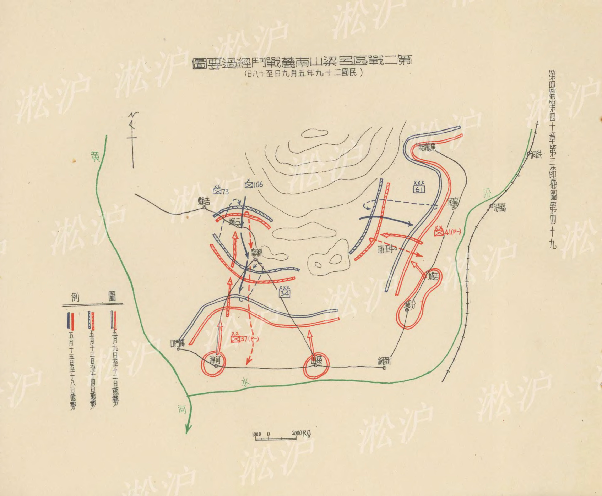

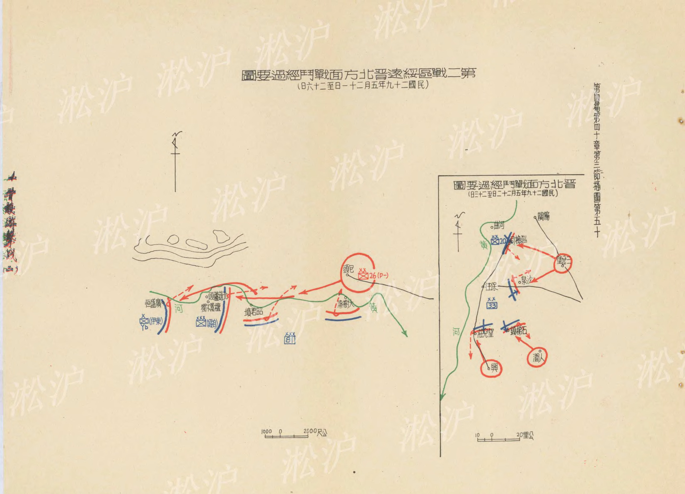

#### 第十款 對敵軍外交戰經濟戰及我軍之攻勢

民國二十九年七月十八日至十二月二十八日

參照插圖第五十一至第五十四

##### 第一項 對敵之外交戰經濟戰

敵軍自五月至六月間，在晉東南及晉西一帶迭遭慘敗，乃於七月兼用外交戰及經濟戰，以補其窮。

在外交上於七月十八日成立英日協定，封鎖我滇緬路；在經濟上施行所謂因糧於敵之自活主義，四出搶糧，以戰養戰。

我政府一面對英抗議，一面向國際聲明，請維持正義和平，終於七月二十七日獲得美國對敵實施禁運，並反對英日協定。在軍事方面，我軍事委員會則令各戰區組織經濟游擊隊，展開經濟游擊戰。第一、第二、第八等三個戰區，即遵照組織經濟游擊隊，其編制以每個集團軍組成一個大隊，獨立軍組成一個中隊，各縣政府組成一小隊，分組游擊，分區掃蕩，收效甚宏。

##### 第二項 晉東晉南之百團大戰

八月末，第十八集團軍呈報軍事委員會謂該集團軍擬在晉東、晉南一帶對敵發動百團大戰，期望截斷正太、平漢、同蒲各路交通，請轉令晉省各部隊，協力戰鬥。

蔣委員長卽於八月二十九日，以艷辰令一元電手令在晉各部隊，急向當面之敵截擊迂迴至敵後各地區，儘可能使用之兵力，迅行反攻，勿失時機。至九月八日，復以齊已參令一元電令閻錫山長官，督飭所部，乘此良機，積極行動，襲擊敵人，以爲策應。閻長官奉令後，卽擬定攻擊部署如左：

一、衛立煌副長官指揮南路軍（第四、第五、第十四各集團軍、第二十七軍、第九十三軍、第九軍、第四十軍），以一部攻擊曲沃至高平公路及白晉公路南段（長治至晉城）之敵，並斷其交通；以主力向臨汾以南同蒲路沿線之敵發動攻擊，澈底破壞同蒲路交通要點，指向侯馬運城。

二、第三十四軍積極進攻聞喜、萬泉、猗氏、臨晉之敵，協同南路軍之作戰。

三、第九十軍李文部第六十一師之補充團，進出侯馬一帶，擴大游擊，斷敵交通。

四、第六集團軍指揮南區軍（第三十四軍一部、第八十三軍、第六十九師第二一七旅、第七十二師第二零八旅）積極攻擊河津、稷山、新絳、汾城、襄陵、土門、黑龍關之敵，協力南路軍之戰鬥。

五、趙承綬總司令指揮北區軍（第三十三軍騎兵第一軍），以有力一部，佯攻中陽、離石、柳林鎮，兌九峪之敵，並破壞汾陽、離石公路及離石軍渡間交通。

各部隊均遵令分向當面之敵積極行動，或破壞交通，擴大游擊，或迂迴截擊，聲東擊西，奇正兼施，均有收獲；惟第十八集團軍所謂百團大戰，經第二戰區長官部派遣謀報員張漢昭、吳文炳、王建智等三員，專赴太原、榆次、壽陽、陽泉、娘子關、井陘、石家村，實地考察，據報第十八集團軍所謂百團大戰，似爲宣傳作用，迄無顯著戰績。

##### 第三項 對敵採用攻勢

民國二十九年九月下旬，我軍事委員會爲鞏固河防屏障陝北，以申沁一元電令第二戰區，以西路軍確保黃河以東呂梁山南部游擊根據地，並適時換防，輪流整訓，準備爾後之攻擊。第二戰區閻錫山司令長官奉令後，於十月十五日，將第三十四、第十九、第六十一各軍編爲外圍部隊，其餘晉西各部則編爲中心區部隊。外圍部隊則深入敵後擾亂、襲擊疲憊敵人。中心區部隊則以訓練爲主，澈底破壞中心區主要交通線，構築河防前進陣地。我外圍各部隊奉令後，分向指定地區襲擊敵人，使其顧此失彼。此際英美成立太平洋協定，一致對付敵寇。英國開放滇緬路，美國對我新貸款，國際情勢，於敵方日趨不利。敵將領西尾，企圖以軍事勝利挽救危機，乃訓令下列五項：

一、華中華南各軍於十一月起兩星期內集中漢口地區及平漢南段。

二、放棄各線突出之攻勢。

三、各戰區日軍一律採取攻勢。

四、後方各據點儘量移交僞軍接防，日軍開赴前線。

五、日軍開拔，番號一律僞裝，在夜間出發。

敵軍奉此命令後，於十月尾起，先後向我晉南晉西一帶進攻。各地區戰況分述於左：

晉南方面（參照插圖第五十一）：敵軍爲確保同蒲路南段交通之安全，自十一月五日起，集結安邑、運城、解縣、虞鄉、犄氏、臨晉、榮河、河津、稷山、新絳、聞喜、夏縣等十二縣之兵力，共約三千餘人，與我第三十四軍之第二零一旅在稷王山周圍之冰池村、丈八村、北牛村、柳林莊一帶展開血戰，至晚我軍由西北方轉至外線成反包圍形勢，經三晝夜之猛攻，敵軍死傷三百餘，餘部於七日夜突圍東竄，我軍傷亡官兵百餘名，冰池村等數村莊被敵縱火焚燒，摧毀殆盡。

十二月三日，敵軍第三十七師團分兩路向中條山我第五集團軍陣地進攻：一路約兩個步兵聯隊，由橫嶺關、鎮風塔、裴家山、偃掌鎮一帶向我金古梨村大峪里之線；一路約一個聯隊，由夏縣以北地區向韓家坪、雙廟河一帶分途進犯。以韓家坪附近戰鬥最烈，反復爭奪在十次以上。五日敵主力到達上下橫榆、清山村之線。六日敵以全力進犯大嶺村一帶，敵獨立山砲兵第一聯隊長森戶隆三負重傷。七日敵續向一五零零高地進攻，我軍節節阻擊。九日敵軍一部竄至四河交村，我軍隨卽展開反攻，敵軍不支，卒於十、十一兩日向西潰退。

十二月十五日，該敵以三個聯隊兵力自夏縣、張店鎮一帶向中條山進攻，與我對戰於夏縣以東之上下焦卓、李家峪及其東南之觀音殿與張店鎮東北之桑村一帶，雙方均無進展，成膠着態勢。

晉東南方面（參照插圖第五十二）：十一月七日，長治、長子方面之敵第三十六師團，向我軍進犯，蔭城鎮之敵向西火鎮竄擾，被我第二十七軍阻擊。同日長子之敵千餘，向石哲鎮以西之岳陽村一帶進犯。十八日經我第九十三軍一部反擊，搏戰終日，斃敵百餘，當將岳陽村、石哲鎮克復，敵軍不支回竄長子。十一月二十二日，敵獨立第十六旅團一部與笠原江口兩個聯隊共約六千人，分由同蒲、白晉、洪屯三路會攻沁源，經我第九十三軍奮勇迎擊，至二十七日，敵軍另以一部約一千三百餘，由張店及和川一帶進攻良馬，復被我第九十三軍一部阻擊，二十八日擊斃敵軍百餘名，其由長治滿載糧秣彈藥汽車一百五十餘輛，中途被我全數截獲，並俘敵百餘。至此會攻沁源之敵，漸感不支，於三十日及十二月一日向臨汾、洪洞一帶敗退。

十二月五日，長治路城一帶之敵千五百餘，在飛機五架掩護之下向東進犯，與第十八集團軍一部戰鬥後，攻陷平順。該部轉進至平順以北，與敵對峙。

晉西方面（參照插圖第五十三）：當十月下旬，我晉西各部隊，於奉到鞏固晉西根據地之命令，外圍各部隊卽各對當面之敵作積極之進攻，對敵公路鐵路之交通，施行連續遮斷與破壞；尤以我騎兵第一軍，自十月二十七日起，至三十日止，更番猛攻，卒將淪敵二年之重要據點晉西兌九峪、高陽鎮等數處，先後攻克，使敵藉以屏障同蒲路左側安全，並形成中陽、離石敵之側防陣地，暨汾陽、孝義敵人西攻之掩護陣地，藩籬盡撤。

十一月中旬，敵在晉西之離石、臨汾各地之道路兩側，構築碉堡，企圖固守，以迄十二月上旬，晉西晉北之敵，皆與我在同蒲路西側之線對峙。

十二月十二日，汾陽、離石之敵獨立第十六混成旅團，分兩部竄攻：一部西竄碛口鎮；另一部由汾陽向以北之張家莊、陳家社一帶竄擾。第四十一師團一部亦由離石北竄，十五日陷臨縣，十八日續向臨縣以北地區之太平村一帶竄擾。同時竄據碛口之獨立第十六混成旅團，一部亦向臨縣西南地區進擾。

嵐縣獨立第三混成旅團之一部，十七及十八日進擾嵐縣以北之河口鎮、張家村一帶；其另一部於十八日攻佔靜樂以北之寧化堡。十九日另部之敵攻佔岢嵐西南之王村；同時文水之一部進攻文水以西之東社村。又交城之獨立第九混成旅團，一部向交城以西之水裕庄一帶竄擾。各路進犯之敵，均經我北路軍騎兵第一軍及第八十三軍分途截擊，除靜樂北之寧化堡及岢嵐西南之王村陷敵外，其餘各地均成對峙狀態。

綏西方面（參照插圖第五十四）：我綏西傅作義副司令長官所部之騎兵第六軍及各游擊部隊，爲策應晉省方面我軍之作戰，於十二月二十四日起，分向安北固陽、包頭、薩拉齊、雙龍鎮等地之敵攻擊，與敵發生激戰；尤以包頭附近敵受創甚鉅，敵第二十六師團，騎兵第十三聯隊長小林一男大佐，被我在包頭西二十公里處擊斃。

十二月二十八日二時許，敵以僞蒙軍及僞綏西自治聯軍第一師陳秉義部與第三師常子儀部，分三路由耳圪亘灣以北及該地東南十二公里之六份子，與才登以西三十公里之萬興西以北等地渡河，向六分子東南約六公里之紅孩補拉進犯。復以汽車十五輛騎兵百餘名，由萬興西以東十二公里之檀蓋木篤西進，企圖合圍，當與我綏遠自衛軍第二路司令劉效賢所部，在萬興西、哈拉泡子（萬興東北約五公里）與游擊第一師高振興、游擊獨立第二團王萬富兩部，在毛不拉溝（六分子西二公里）六分子附近發生戰鬥。我劉效賢所部，在薛油房（萬興西南二公里）擊毀敵汽車一輛。王萬富部在紅孩補拉附近，擊毀敵汽車一輛。

同（二十八）日，敵僞由才登、昭君墳以汽車八十輛、砲十餘門、飛機五架，分向檀蓋木篤西南一帶進犯，與我劉效賢部兩團發生激烈戰鬥；但雙方均無進展，遂成對峙狀態。

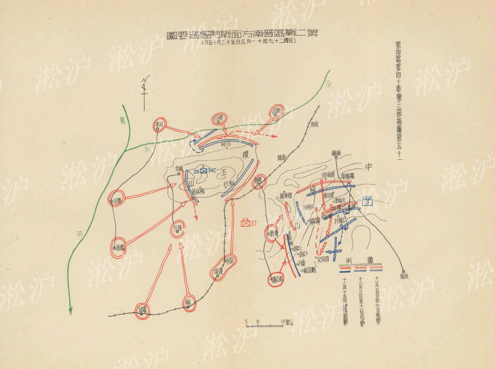

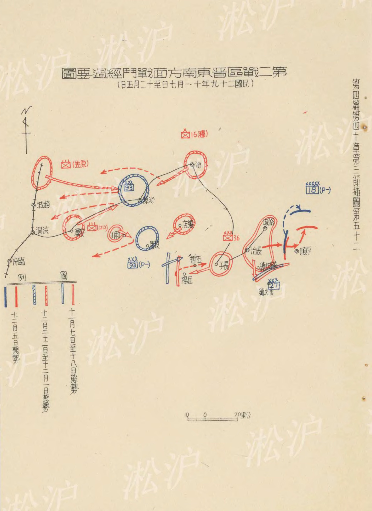

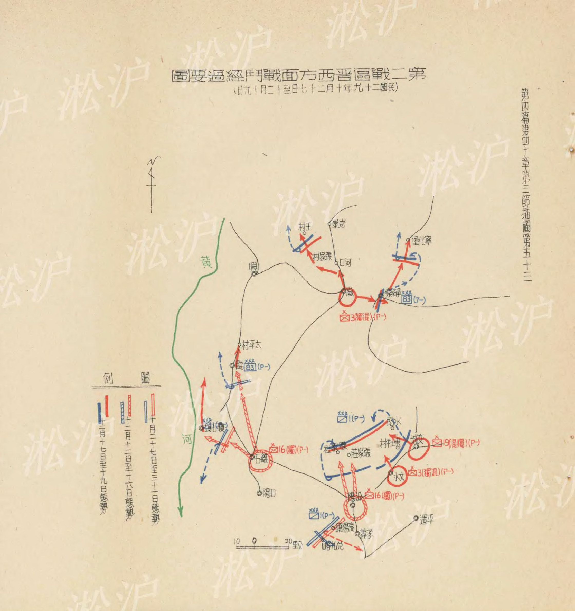

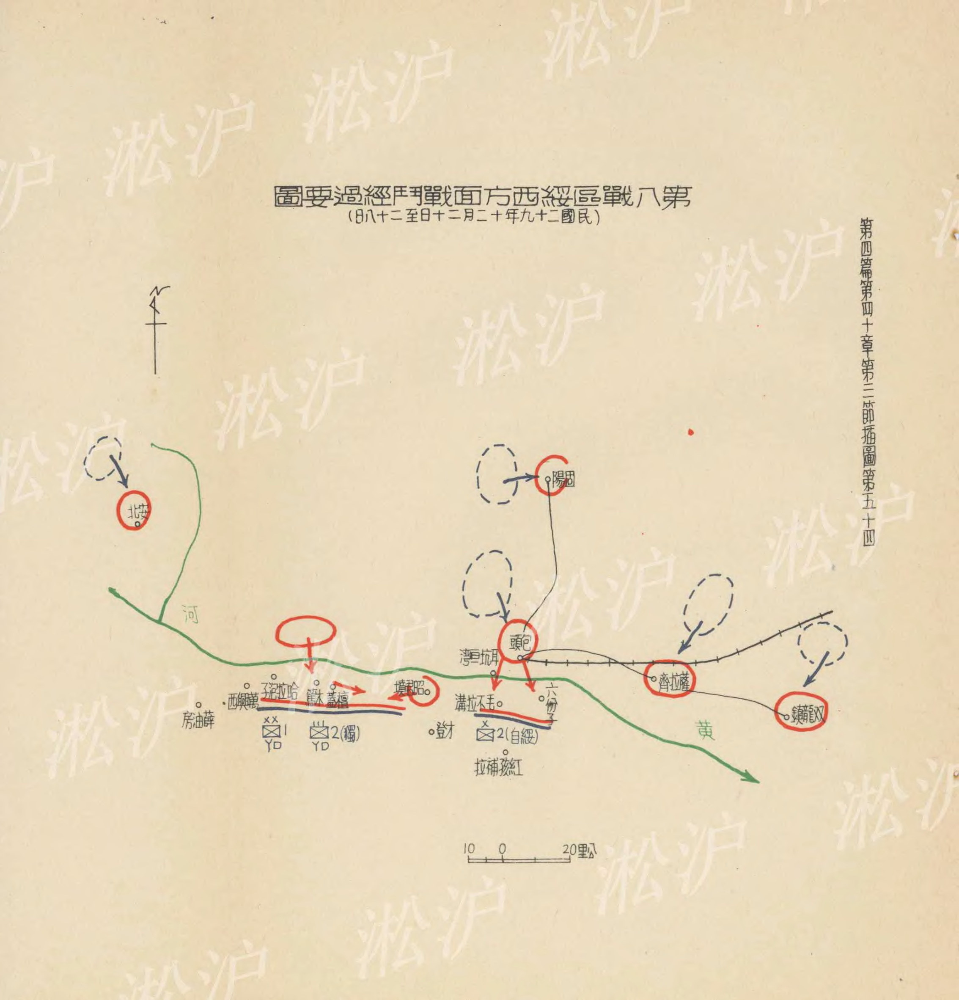

第十一款 對敵軍採取戰略守勢及我軍擴大游擊作戰（民國三十年一月二十一日至六月二十五日參照插圖第五十五至五十九

##### 第一項 對敵軍採取戰略守勢

民國三十年春，日本政府鑒於國際形勢日趨不利，對我國所施之軍事侵略，乃取戰略守勢，改以局部攻勢，對我各戰區輪流打擊，企圖破壞我軍之整訓，開發佔領區，扶植僞組織，相機進攻我陪都——重慶，截斷滇緬路，早日結束在華軍事，藉以全力應付英美。

我軍事委員會於一月二十一日以馬令一元電示各戰區今後作戰指導如左：

一、敵人今後戰爭指導，似爲取戰略守勢，鞏固佔領地區，隨時形成局部優勢兵力，對我各戰區輪流打擊消耗，妨害我軍整訓，使我不克重整反攻力量；並節約其戰費，充實其軍備，伺機與德意互相策應，擊破英美，徐圖結束對我戰爭，除進攻我陪都，截斷滇緬路，有深入作戰價值外，其他方面，無深入作戰之可能。

二、國軍爲持久消耗敵人，對敵戰爭，當茲國際形勢對敵不利，而與我有利狀況之下，以總反攻求決勝之目的，應鞏固陪都爲全般作戰軸心，確保滇緬路交通，以利我國戰略形勢，各戰區應加強游擊，並以主動之局部攻勢，消耗疲困敵人，掩護國軍主力之整訓。

三、爲貫澈國軍最後決勝目的，粉碎敵人上項企圖，除第六戰區、昆明行營應按既定計畫迅速完成作戰準備外，其餘各戰區，應按下列指導對敵作戰。

四、本會整訓部隊，除拱衛陪都，確保滇緬路應參加作戰外，其餘應加緊整訓。各戰區現有兵力，一部對敵作戰，主力整訓。

五、敵如集中優勢兵力向某一戰區進攻時，該戰區應卽破壞道路，並以一部在敵後游擊，側擊並截斷其後方聯絡，誘致敵人於不利地形，集中主力而予以擊破之。凡鄰接各戰區，依本會之指定全力策應其作戰。

六、應切實遵照規定，編組訓練，各種出擊隊，分區向敵實施游擊作戰，並破壞敵後交通、場站、資源經濟，並阻撓敵軍展開擴大僞政權之企圖。

七、第一線除配置必要而最小限之警戒兵力外，其主力輪流抽調整訓，務控置預想敵軍來攻各道路之側面。每期整訓完成，應選擇有利時機與地點，攻擊敵之弱點與要點，出其不意，向其取主動的局部攻勢，使敵陷於被動，打破敵由各區抽調兵力向我某一戰區局部攻勢之行動。

八、應不時以挺進隊出敵不意，向其後方主要都市奇襲，並以各城市便衣隊相機內應。

九、對當面僞軍應盡諸種手段策動其反正。

十、游擊隊應按人槍切實整理，並整肅其紀律，切實賦予任務。

十一、對於戰區內無案之游擊隊及其他零星匪僞，應澈底肅清。

以上各項，希卽切實遵照實施。又近查敵人自加入德義軸心後，既不能獲得其軸心國之援助，又不能與蘇聯妥協，反增英美之敵視，對我作戰三年半，動員海陸空三軍二百餘萬，人力資源須待重洋運補，消耗兵員一百八十萬，戰費四百二十億，無力繼續長期戰爭。同時英美加強對我援助，敵人欲加強軍備，鞏固國防，則苦於經濟困窮，資源缺乏；但其國防不固，時有亡國之虞，若實行南侵，又苦於兵力不足，立有敗亡之禍；但若不乘此時機擊破英美，對華作戰仍屬徒然，欲舉全力對我戰爭，則因我擴張南北戰區，且我兵力日益強大，無力擊破，如再擴大作戰地區，則佔領面積愈廣，牽制兵力愈多，更處處被我牽制，處處薄弱，不能確保現在佔領之地區。敵人目前全般狀況，均陷於進退維谷，徘徊歧路，面臨崩潰之時。而我軍以長期持久消耗敵人，誘致敵人於全般不利之目的，已達於最後勝利之階段。仰各戰區把握最後決勝之時機，切實遵照本指導，加強對敵游擊戰爭，澈底整訓游擊部隊，發動黨政軍民總體力量，實行對敵政治與經濟戰爭，加緊督訓部隊，捕捉良機，主動對敵行局部攻勢，並對當面敵人限本（三十）年四月底止完成總反攻諸準備。希各戰區本此切實力行，導爾後總反攻於有利，則最後決勝，必然在握，望各戰區遵照施行；並於元月三十日前，分別擬定實施計畫具報。

上述電令頒發後，各戰區正遵照實施時，晉綏兩省與我第二、第八兩區部隊相持之敵，仍爲第二十六師團（綏遠）、第三十六師團（晉東南長治長子一帶）、第三十七師團（晉南三角地帶）、第四十一師團（同蒲路沿線臨汾一帶）、獨立第三旅團（晉北及晉東北一帶）、獨立第四旅團（正太路沿線及晉東一帶）、獨立第九旅團（太原一帶）、獨立第十六旅團（平遥介休及晉西一帶）及騎兵第一旅團，（綏西一帶）。

斯時第十八集團軍新四軍被解散後，對國軍之嫉視轉深，其在晉綏陝之部隊，除以便衣小組襲捕國軍之情報人員、襲擊地方行政人員及煽動民衆反抗國軍外，更藉故對國軍公開攻擊。在山西境內之叛軍及第二、第八兩戰區境內之土匪，亦四出擾亂地方，爲敵張目；因之我兩戰區部隊之處境至爲艱難，任務亦日趨艱巨。

二月初，軍事委員會復以東令一眞華電令各戰區，在最前線不宜多用主力，並在主陣地後方及側方適當地點選擇陣地作縱深配備，以誘敵軍深入而邀擊之，尤於須要方面抽出兵力，作大規模之整訓。又以眞令一元鉞電以敵軍邇來有發動局部攻勢，妨害國軍整訓之企圖，各戰區應於預想敵軍進攻方面及主要道路、戰術要地，凡可爲敵局部攻勢之進犯目標者，應以據點面式縱深編成之野戰工事，構築星羅棋布強輒之縱深抵抗地帶，迫使敵軍運用大量兵員及資源，而達消耗之目的；並於敵後警備區內，一切交通要線要點橋樑，應隨時裝設地雷及爆炸物，以收牽制擾亂之效。又以丑蒸辰令一亨電令各戰區之集團軍或軍，各挑選優秀部隊配屬砲工兵編組突擊隊，授以特種技能，並用奇襲突擊等戰法，以爲攻擊小據點之基幹部隊。其編組各集團軍或軍應視所屬師數，酌量編組突擊隊一師或一團。突擊師以步兵三團，迫擊二營，工兵一營，加強通信連爲基幹，並配屬集團軍或軍原有野戰砲兵編成之。突擊團以步兵一團，迫擊砲一營，工兵連通信一排爲基幹編成之。團以下亦應挑選優秀官兵編組突擊隊，指定突擊目標爲主要交通點線。以上各電令各戰區應詳細計畫實施具報。

第二、第八兩戰區，遵照軍事委員會先後電令，分別詳細計畫，遵照實施，其概要如左：

一、第二戰區方面

(一)關於突擊隊之編組（參照插圖第五十五）

晉西部隊，按照行政督察區轄境劃分爲八個作戰區。每一作戰區編組突擊團一團，除整訓及河防部隊外，其他各團應編組先鋒隊一隊，攻擊目標爲黃河三角地帶以西（同蒲路不含）以北及河津之西磑口、新絳、汾城之古城鎮及黑龍關、汾西、孝義、中陽各據點之敵。其各作戰區兵力區分與任務如左：

1. 第十五作戰區爲榮河、萬泉、臨晉、猗氏、聞喜等縣境，以第三十四軍軍長王乾元爲作戰區司令，指揮該軍，應編組便衣突擊快速隊各三隊，輪流向汾南各縣積極攻擊，準備爾後協同南路軍規復三角地帶。

2. 第九作戰區爲鄉寧、河津、稷山、新絳等縣境，以第八十三軍軍長孫福麟爲司令，指揮第六十六師、整編第四十六師、第一九六旅，應編組便衣突擊快速等隊各三隊，輪流向呂梁山口外游擊，竭力破壞河津、新絳間各公路，以一部進出汾河兩岸，控制各渡口，阻止敵之南北流竄；

以主力輪流整訓，準備爾後反攻。

3. 第十四作戰區爲吉縣、汾城、襄陵、臨汾等縣境。以第六集團軍副總司令梁培璜爲司令，指揮暫編第三十七師、暫編第三十八師、第七十二師，應編組便衣突擊快速等隊各三隊，輪流出動，向汾河兩側地區游擊，竭力破壞蒙城、臨汾間同蒲鐵路，及汾城、臨汾、黑龍關間各公路，主力輪流整訓。

4. 第十三作戰區爲蒲縣、洪洞、趙城、安澤等縣境。以第六十一軍軍長呂瑞英爲司令，指揮第六十九師、暫編第四十八師，應緬組便衣突擊快速等隊各三隊，輪流出動，向汾河兩側地區游擊，破壞洪洞、趙城間同蒲鐵路。

5. 第十二作戰區爲汾西、霍縣、靈石等縣境。以第十九軍軍長劉召棠爲司令，指揮第六十八師，應編組便衣突擊快速等隊各三隊，輪流出動，向汾河兩側地區游擊，竭力破壞霍縣、靈石間同蒲鐵路交通。

6. 第十八作戰區爲孝義、汾陽、介休、平遥、文水等縣境。以騎兵第一軍軍長溫恆光爲司令，指揮騎兵第一軍，暫編第四十軍，暫編第四十一師，應編組便衣隊五隊，突擊快速各三隊，輪流出動，向汾孝及其以東地區游擊，肅清敵叛，開展政權，同時竭力破壞汾孝、汾平、汾離各公路。

7. 第六作戰區爲大寧、永和、隰縣等縣境。以第二十三軍軍長梁春溥爲司令，指揮第七十一師、暫編第三十九師，以一部掩護河防，並肅清匪類，主力集結整訓。

8. 第四作戰區爲石樓、中陽、離石等縣境。以第三十三軍軍長于鎮河爲司令，指揮暫編第四十二師，應編組便衣突擊快速各三隊，向中陽離石一帶游擊，並破壞該地區交通。

晉南部隊，將第二十七軍之第四十五師，第十四集團軍之第十、第六十五兩師，第三十六集團軍之第一零四師，第五集團軍之第十二師，第九軍之第四十七師，應編爲突擊師，及第八十軍（該軍由陝境北開參加晉南會戰軍長孔令恂轄第一六五新編第二十七兩師及編北民軍喬明禮部之兩個團爲突擊團外，其餘各部隊，每團編組先鋒隊一連，可能時編爲一個營。其突擊目標爲晉城、陽城、絳縣及三角地帶（同蒲路含）以東以南之各據點。

第十八集團軍應編爲各種游擊團，向正太鐵路及太原以北同蒲鐵路各據點之敵，積極攻襲，竭力破壞敵後交通通信經濟資源，粉碎僞組織，消耗疲憊敵人。

第九十軍控制於宜川、洛川中部一帶，擔任後方警備，維護兵站線路。

(二)關於陣地帶之構築

第二戰區以晉西一帶山地，爲山西游擊根據地，於奉到軍事委員會上述電令後，除照上述各項編組突擊部隊外，特策定晉西方面工事構築計畫如次：

第二戰區長官部晉西防禦工事構築計畫（參照插圖第五十六）：

第一要領

利用呂梁山地形險阻，構成據點面縱深抵抗地帶，並將敵後交通及我方不擬利用之外線各道路，盡量破壞之。

第二抵抗地帶之構築

一、各抵抗地帶之構成，以據點面縱深編成之野戰工事爲主，各據點必須能相互支援。

二、下列各道路應沿線構成縱深橫度之抵抗地帶。

(一)鄉寧至西磑口及沿黃花峪、馬壁峪、石門峪、三官峪通至敵方各道路。

(二)鄉寧經屹台頭至佛千崖（汾城西）及屹台頭至窯頭（吉縣東北）道路。

(三)午城鎮經蒲縣至黑龍關道路。

四蒲縣至洪洞趙城各大道。

(五)隰縣經勅查鎮至汾西道。

(六)隰縣經石口鎮至汾陽與石口鎮東至靈石北至中陽道路。

三、爲連繫前列各抵抗地帶並彌補其空隙，應將交口（鄉寧城南）、關王廟（鄉寧城東南）、枕頭村（臨汾城西）、南曜村（蒲縣南）、垣上（洪洞城西北）、龍門里（汾西城西南）、唐城鎮（汾西城西北）、宣化原（孝義城西南）、沙塘（石樓城東北）、冀家原（石樓城西北）等地爲據點，並在其前方構成抵抗地帶。

第三

交通破壞

四、對敵後交通之破壞，應採用種種手段，隨時突至敵後施行之。

五、呂梁山山口以外各道路，除我軍進入時必經之道路外，其餘悉數破壞之，山口道路凡不擬用者，應加以破壞。

六、對歷次破壞之公路大路，須詳細勘查，如破壞處，有坍塌平坦情形，應立即重加破壞或整理之七、對敵後交通要點要線之預計敵將進入之村舍，應盡可能裝設地雷及爆炸物，以收牽制擾亂之效部署及完成期限

八、抵抗地帶內工事之構築，由作戰司令指揮所屬部隊實施之。其構築次序應由內向外。

九、抵抗地帶之構成及我方道路之破壞，均限本（三十）年三月底完成其大部份，爾後再逐漸加強之。

二、第八戰區方面：

第八戰區長官部，遵照軍事委員會電令，將綏西西方面部隊編組突擊隊，第三十五軍之新編第三十二師、第八十一軍、暫編第三軍、新編第二十六師各一團，及第二零三旅之一營，各配屬砲兵、工兵、通信等特種部隊，編爲突擊隊。其各部隊每團應編組突擊連。突擊目標爲包頭、歸綏、托克托、薩拉齊、和林格爾、安北、固陽、武川、集寧等縣境內敵之各據點。

##### 第二項 我軍掩護主力整訓之作戰

自我抽調主力整訓，加強構築陣地工事以來，敵軍爲遂行其局部攻勢之策略，特抽集兵力於晉省，自三月初開始分途向我進攻，企圖肅清我游擊部隊，鞏固佔領區，形成局部優勢，茲將各地區戰況分述如左：

晉東南方面（參照插圖第五十七）：三月一日晉東之敵第三十六師團，及由晉北增來之獨立第二旅團之一部騎砲兵共約萬餘人，飛機十餘架，分由壺關、長治、高平、晉城各地向我太行山之第二十七軍進攻。衛立煌副長官爲掩護主力在後方整訓，當令第二十七軍堅強阻擊；令陵川東北地區之第四十軍，以有力部隊進出樹掌鎮，側擊由壺關南下之敵；又令太岳區之第九十三軍及晉豫邊境之第九軍，各派有力部像，分向高平、晉城攻擊。敵後戰鬥至七日，我第二十七軍第一線北行頭、西火鎮、建寧鎮、禮義鎮、四明山、上沙壁，及第二線樹掌鎮、石井村、牛家、川西溝底、石字嶺之線，陵川外圍陣地，先後被敵突破，陵川城旋被敵攻陷，我軍轉進至陵川以東之紅嶺南郊冶頭鎮東西火頭掌大河西之線陣地，繼續與敵對峙。左翼之四十六師亦由柳林口、西流角薛細轉移至高角、旺樹坑之線，至九日，我第四十軍之兩個團到達鵝舞嶺、樹掌鎮一帶。斯時敵之攻勢漸呈衰竭之勢，我乃乘機反攻，敵於十日起開始西退，至十三日，我第二十七軍恢復戰鬥前之態勢。

晉南方面（參照插圖五十八）：當敵軍向東南進攻之同時，晉南敵軍第三十七師團、第四十一師團各一部，及由太原附近增調之獨立第九旅團共約萬餘人，於三月六日分由陽城、沁水、曲沃、絳縣一帶，向我第十四集團軍中條山之孫坡、松樹掌、秋蓋嶺、雲梯山、大南坪之線陣地進攻。十日，我第六游擊縱隊畢梅軒部松樹掌陣地被敵攻陷，劉茂恩總司令乃令控制封門口邵源鎮一帶整訓之第十師，向桑林鎮、西冶鎮一帶集結待命，策應第九十八軍之戰鬥；又令在沁水東鄔嶺游擊之第六游擊縱隊一部南下，攻擊張馬、中村敵後。十一日，第十五軍伏蓋嶺陣地亦陷敵手。衛副長官令控制樹掌村、白鵝舖一帶整訓之第四十三軍（該軍屬第八集團軍孫楚部一月由晉西開晉南），以主力向沙寶河馳援；以第七十師兩個團馳赴兜兒村、李家灣一帶，阻擊由松樹掌南下之敵；令第十師機動控置於同善村附近；令第五集團軍派有力部隊突入橫嶺關一帶攻擊敵後。在太岳區之第九十三軍，亦於是（十一）日以一部南攻張馬、中村，策應集團軍之主力作戰。

十三日，第十五軍東西桑池一帶陣地，復陷敵手，該軍退守畫凹陸家坪、天盤山、賈家山之線，繼續抵抗。是時，第五集團軍之第十七軍，已在左家灣，銅礦峪加入戰鬥。第四十三軍主力亦在第十五軍與第十七軍之接合部加入戰鬥。至十四日，敵以一部繼續進攻；同時一面構築工事，鞏固已佔領據點。其大部則開始北撤，自十五日後，敵我復入對峙狀態。

綏西方面（參圖照攝國五九）：三月初，第八戰區副司令長官傅作義，以敵軍在晉省方面戰鬥激烈進行，且綏省方面，黃河解凍，敵增援困難，決心乘此時機肅清黃河南岸之敵僞軍，以掩護主力部隊整訓，乃令騎兵新編第五師、騎兵暫編第二旅及自衛軍第五路，肅清新台萬和長一帶敵僞，令第八十一軍附第一零一師及新編第三師各一部，肅清新城、大樹灣、昭君墳一帶敵僞。

各部隊遵令於三月八日起，開始行動，至二十九日，第八十一軍先後攻佔大小淖、五福社、新城、史家營子、柴磴石、森蓋圪坦、浪兒畔等據點。騎兵第五師及騎兵第二旅方面，至四月三日先後將新台、萬和堂克復，並將黃河南岸敵僞完全肅清。

晉綏之敵，自遭受我軍嚴重打擊後，迄至四月上旬，各地之敵軍，皆在原陣地與我對峙，並整補戰力及增強部署。四月中旬，除綏省之敵仍爲第二十六師團及第一騎兵旅團外，晉省之敵爲敵第三十六、第三十七、第四十一各師團及獨立第三旅團第四第九兩團各一部，及新增到之第二十一、第三十三兩師團與騎兵第四旅團之一部，及豫北之第三十五師團主力。以上各該敵軍，均自中旬以來，逐次向溫縣、晉陽、陽城、晉水、絳縣、聞喜、夏縣、安邑集結。

我軍事委員會獲悉以上敵情，判斷敵將對我晉南進攻，於五月二日以冬戊一元渡電指示第一、第二兩戰區，協同作戰要領如次：

一、豫北晉南之敵，似有會犯濟源、垣曲截斷晉南後方，打擊晉南我軍，並繼續渡河進犯陝洛之企圖。二、第一戰區豫北第二戰區晉南應加強工事，並破壞或阻塞主陣地前各道路。

三、第一戰區應各以一部分由東西兩方面向高平、博愛公路破壞掃蕩。第二戰區晉南方面，應各以一部向聞喜、候馬地區破壞掃蕩；晉西方面應各以有力一部，分向曲沃、候馬、聞喜地區策應、向同蒲路游擊破壞，先期打破敵人攻勢。

四、如敵以有力部隊由沁陽、齊源向垣曲進犯，另以一部由陽城、董封鎮、同善鎮、及橫高大道會犯垣曲時，第一、第二戰區各以有力一部，依既設陣地於正面強靭抵抗，集中主力向敵側擊截敵而擊破之。豫北晉東方面，應以一部確保根據地；以有力部隊向博愛、晉城、陽城地區進出，攻擊敵之背後。但晉東豫北方面，應注意勿爲奸匪所乘。晉西方面應以有力之兩個軍向絳縣、聞喜以東地區進出，攻擊敵之側背，並努力向同蒲路沿線對敵施以襲擊。

第二戰區閻長官於奉令後，卽令第十五作戰區司令汪乾元，指揮第三十四軍及游擊第四縱隊，協力晉南部隊向聞喜候馬地區積極攻襲，先期打破敵之攻勢，如敵實行進犯垣曲，卽努力截斷同蒲路南段敵之交通，並相機向聞喜、絳縣以東進出，攻擊敵之側背。第九作戰區司令孫福麟，指揮所屬，積極向河津、稷山、新絳之敵積極攻擊。第十三區作戰司令呂瑞英，指揮第六十一軍集中同蒲路以南以東地區，準備於敵進犯垣曲時由臨汾以南以北地區向絳縣、曲沃一帶進出，攻擊敵之側背。其餘各各戰區之部隊，應各向當面之敵攻擊，努力破壞敵之鐵路公路，以阻敵軍兵力轉用，並阻止奸匪之南侵。

第八戰區於奉到軍事委員會上記電令後，爲策應晉南方面作戰，亦令綏西部隊以第三十一師進出退水渠擊破西山咀之敵後，向安北進攻；以第一零一師進出五加河進攻安北。將新編第三十二師、暫編第四軍分別集結於臨河、五原各附近，適應爾後狀況向前推進。以自衛軍第三、第五兩路向薩拉齊境內，第四、第五兩游擊師深入武川固陽地區，第二游擊師向安北、固陽間分別向各該地區之敵攻襲。

五月七日，敵軍分五路向晉南我軍進攻，至六月二十五日，歷時四十九日，其作戰經過另詳晉南會戰專章。我第二戰區晉西部隊及第八戰區之策應作戰，除晉西之第六十一軍未能遵令渡過汾河東岸，攻擊敵後，僅向當面之敵及同蒲路南段攻擊破壞外，其餘各部隊，均能遵照前述命令，迭予敵軍以打擊，

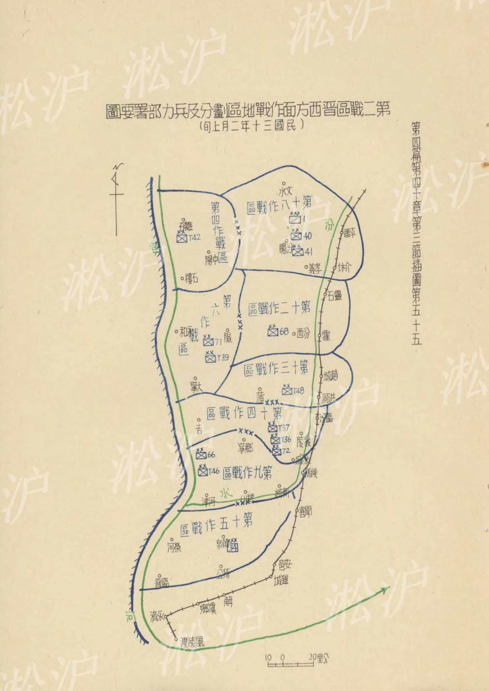

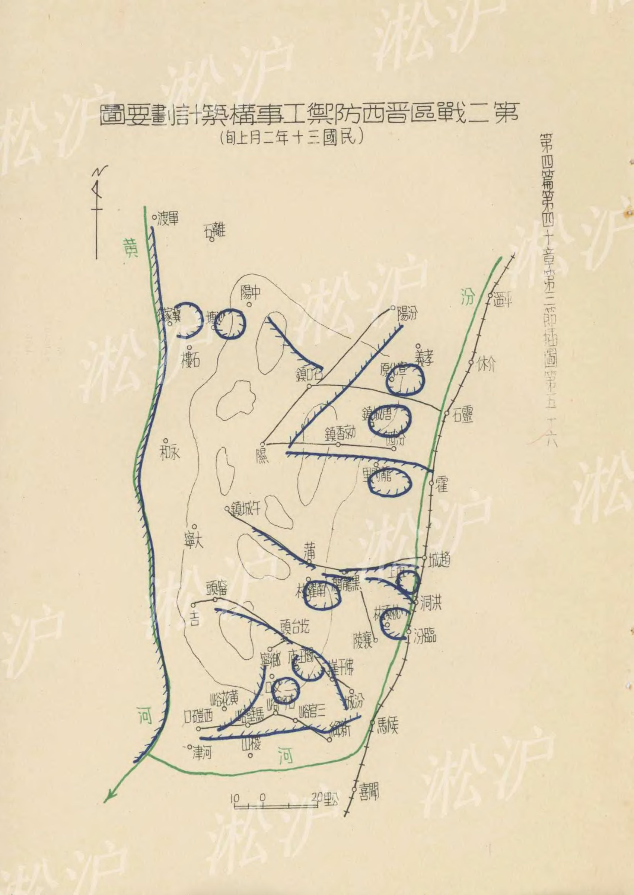

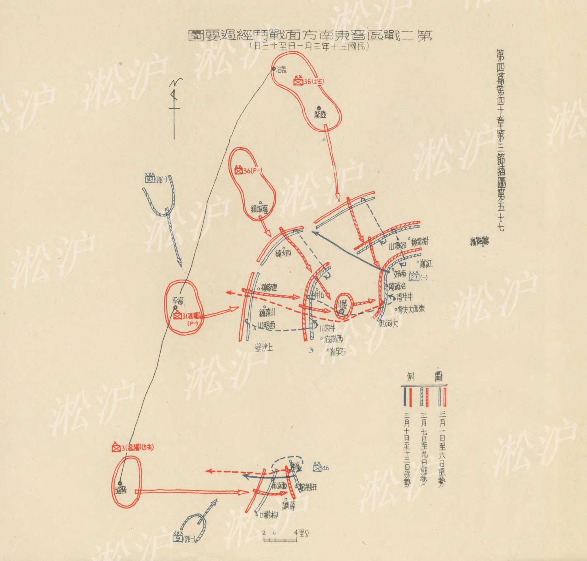

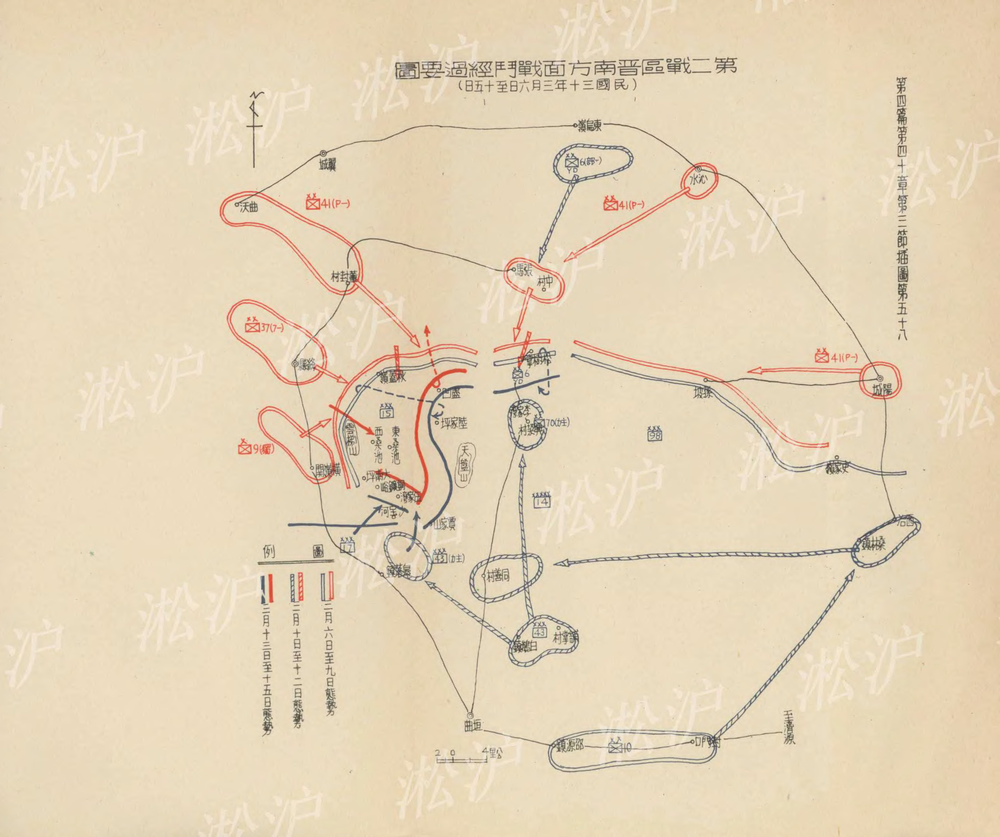

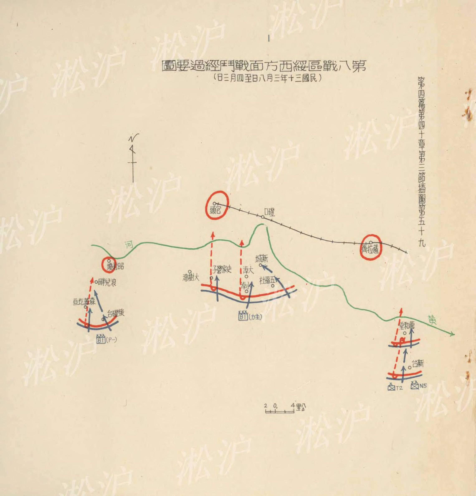
