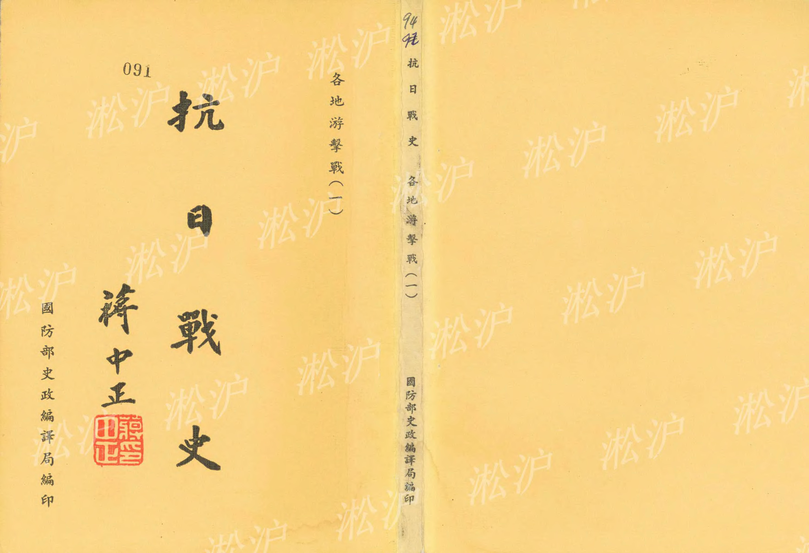

## 第四十一章 各地游擊戰 總目錄

概述

### 第一節 二十七年各地游擊戰

#### 第一款 徐州會戰期間

#### 第二款 武漢會戰期間

### 第二節 二十八年各地游擊戰

### 第三節 二十九年各地游擊戰

### 第四節 三十年各地游擊戰

### 第五節 三十一年各地游擊戰

#### 第一款 策應英美盟軍之戰鬥

#### 第二款 策應浙贛會戰之戰鬥

### 第六節 三十二年各地游擊戰

### 第七節 三十三年各地游擊戰

### 第八節 三十四年各地游擊戰

### 第九節 福建沿海各地之戰鬥

四六一

## 第四十一章 各地游擊戰 第一册 分目

概述

### 第一節 二十七年各地游擊戰

#### 第一款 徐州會戰期間

一、朔縣向陽堡及緱家村附近戰鬥

二、富陽附近戰鬥

三、安吉孝豐附近戰鬥

四、浙江餘杭附近戰鬥

五、平遙馬壁附近戰鬥

六、朔縣乃河堡附近戰鬥

七、隰縣午城鎮附近戰鬥

八、河津縣禹門口附近戰鬥

九、餘杭雙溪鎮附近戰鬥

十、臨安曲里附近戰鬥

十一、孝豐港口附近戰鬥

十二、海鹽縣歟城鎮附近戰鬥

十三、廣德、溧陽附近戰鬥

十四、錢塘江北岸戰鬥

十五、餘杭城附近戰鬥

四七

十六、隰縣朱家峪附近戰鬥四九

十七、餘杭雙溪鎮以西地區戰鬥五一

十八、餘杭城附近戰鬥

五五

十九、富陽梓樹嶺附近戰鬥五七

二十、蕪湖灣址附近戰鬥五九

二十一、武康附近戰鬥

六一

二十二、宣城孫家埠附近戰鬥六三

二十三、長興縣龍山附近戰鬥六七

二十四、餘杭石壁山附近戰鬥六九

#### 第二款 武漢會戰期間

七一

二十五、濟源附近戰鬥

七二

二十六、宣城雙橋鎮至團山間戰鬥七七

二十七、安徽宣城及江蘇宜興、溧陽附近戰鬥八一

二十八、浙江杭州嘉興附近戰鬥八五

二十九、浙江餘杭武康附近戰鬥九一

三十、河南濟源瑞村及郎岔附近戰鬥九五

三十一、皖南荻港至貴池附近江防戰鬥九九

三十二、河南睢陽葦園附近戰鬥一〇三

5各地游擊战

三十三、安徽大通鎮附近戰鬥

三十四、安徽至德香山附近戰鬥

三十五、浙江富陽青雲橋附近戰鬥

三十六、浙江杭州吳興嘉興附近戰鬥

一〇五

5各地游擊战(一)

## 第四十一章 各地游擊戰

概述

中日全面戰爭，自民國二十六年（一九三七）七月七日蘆溝橋事變開端，至三十四年八月十四日日本無條件投降，歷經八年之堅苦抵抗，戰場由東北達於中緬邊區，先後會（作）戰凡四十一次，而會（作）戰以外之大小戰鬥在各戰區進行者，則無日無之，概屬游擊戰及游擊性運動戰，除晉綏、魯蘇、冀察等戰區另章叙述外，其餘較重要者一千餘次茲提要略述如左：

一、二十七年春，徐州會戰期間，我爲策應會戰有利起見，在山西方面之第二戰區，一月以騎兵第三師襲擊朔縣附近之敵，該師又於二月二十四日攻擊朔縣乃河堡之敵，二月晉南部隊之第八十四師，由平遙方面阻擊敵之南下，第六十四師在汾河西岸襲擊南下之敵，三月擊破敵向晉西鄉寧、吉縣之攻擊，並包圍臨汾，反攻太原。在浙江方面之第三戰區，一月中旬以第七十九師襲擊富陽之敵，二月中旬以第五十九師襲擊吳興之敵，三月以第六十二師及第七十九師向餘杭、海鹽、孝豐、臨安、平湖、海寧等地之敵游擊，四月第六十二師克復海寧，並以第八十六軍攻擊諸暨、紹興之敵，第七十九師，第一零八師，襲擊餘杭、武康之敵，迨至敵軍在臺兒莊大敗後，企圖由平漢路、山西、江南各方面抽調兵力至津浦路南北增援，我第三戰區復施行全面性之襲擊，皆能收到牽制之效。

二、二十七年夏，武漢會戰期間，第三戰區以第十集團軍對滬杭一帶之敵游擊，第三十二集團軍任京滬一帶游擊，第二十三集團軍對江南鐵路沿線及長江沿岸之敵游戰，曾一度克復富陽、溧陽、宜興、當塗、宣城、海寧、吉安等地，江防砲兵則邀擊敵軍艦艇及運輸艦艇，頗收牽制及威脅之效果。山日戰史

二

西方面，敵第十四師團，第一零八師團及第四混成旅團，分三路入晉，求解曲沃之圍，經我第一六六師在沁水附近截擊，並先後收復沁水、翼城、曲沃等地。八月十五日至九月二十八日，晉南敵第二十師團先後進攻永濟、風陵渡橫嶺關，均被擊退。

三、二十八年一月至八月間，我對粤南、贛北、皖南、豫東、鄂西、晉南、豫北、以及長江、江西、湖口至東流間、湖口都昌間沿江各地區佔領點線之敵攻襲，並對敵黃河故道之堵口、汴新鐵路之修築、粤南沿海封鎖，不斷襲擾，以及阻止鄂西沿京鍾、漢宜公路西進之敵，於襄河左岸，在在粉碎其鞏固武漢外圍之迷夢。同時京滬鐵路以南地區之敵及其鐵路公路之交通，被我攻襲遮斷，因之，三月中旬至五月下旬，南昌、隨棗兩會戰，敵急待增援之兵力，不能儘量轉用。九月至十二月下旬，我不斷攻襲鄂西京鍾公路各據點及大別山區之敵，並破壞長江及平漢鐵路南段敵水陸交通，敵武漢方面，首受威脅，因而其對第一次長沙及桂南兩會戰使用兵力不足，以致敗退。

四、二十九年，棗宜會戰前後，武漢敵軍爲減少威脅計，四月間卽抽調贛北、湘北兵力，並集中鄂境部隊約七個師團，分別集中信陽、隨縣、鍾祥、準備向襄樊攻擊，迄五月被我擊退後，轉而攻陷我宜昌，截至七月上旬，與我在宜昌、當陽、荊門、鍾祥、隨縣之線以北對峙。十一月下旬，敵復以五個師團分由荊門、鍾祥、隨縣等地區向襄河東西一帶陣地進攻，迄同月梢止，仍被我軍擊退。廣州方面之敵，爲策應其在華中之作戰，以二萬餘人，於五月中旬，沿翁從公路，向粤北進攻，迄六月初，經我軍從兩側夾擊後，仍退回廣州。在棗宜會戰時，我駐守浙西、蘇南、皖南、贛北、湘北各方面部隊，爲策應該會戰，於五月初旬，分別向武康、宣城、南陵、青陽、東流、澎澤、湖口、南昌、安義、武寧、通城、臨湘、岳陽等據點之敵襲擊，並沿長江一帶施行阻擊及佈雷，迄六月下旬，各當面之敵，均受重創。又在棗宜會戰前後，我豫皖邊區，浙蘇皖邊區及鄂西諸方面部隊，均不斷向開封、淮陽及襄河以東之敵襲擾，並粉碎其對我兩次之攻勢。

五、三十年，敵人積極南進，瘋狂掠奪物資，企圖達成其所謂「以戰養戰」之目的，於一月下旬，集中七個半師團兵力發動豫南會戰，三月中旬調集兩個師團半，由贛西攻我上高、高安，發生上高會戰。敵軍向豫南攻擊時，我鄂西各軍，相繼向宜昌、隨縣、信陽各地之敵攻擊，敵攻上高時，我湘北各軍則分向湘北、臨湘、鄂南通城攻擊，粤境各軍向從化、增城、潮陽之敵攻擊，浙東各軍分向諸暨、紹興、長興攻擊，迄四月上旬，均達到牽制敵軍轉用兵力之目的。五月上旬，敵爲解除我對晉冀進攻之威脅，以七個師團兵力，圍攻中條山，發生晉南會戰。九月中旬，敵以六個師團之兵力，配合海空軍，向長沙進攻，是爲第二次長沙會戰。十二月上旬，敵發動太平洋戰爭後，爲策應其廣九路之作戰，於同月下旬，發動第三次長沙會戰。是年所有豫中、鄂西、浙東、贛北、粤北等各地區戰鬥，均能達到牽制敵軍使我主力作戰容易之目的。

六、三十一年，抗戰第二期第三階段，敵侵略緬甸戰事甫告結束，爲減輕其本土之空中威脅，企圖佔我東部沿海各地，破壞我空軍前進基地，於五月中旬，湊合約五個師團兵力，分由浙江奉化、上虞、紹興、蕭山等地及南昌方面，同時進犯，發生浙贛會戰。在此期間，魯西、皖南、鄂西等地區之我軍發動廣泛游擊，以行牽制，結果敵軍被迫撤退，我並克復衢州、溫州、餘江、上饒等地。又自三十年十二月八日敵軍偷襲珍珠港發動太平洋戰爭後，爲策應英美友軍作戰，我浙東、皖東、贛北等地區之部隊，自十二月三十日起，發動廣泛游擊戰，經歷半個月之久，予敵以重大打擊。同時粤南我軍自三十一年一月三日起，向新街、從化、源潭等地廣州外圍之敵不斷襲擊，對於牽制敵人，不能轉用兵力於香港方面之作戰，甚收效果。

七、三十二年一月三十日，廣東方面，我第一五七師，伏擊從北、廣州間公路之敵軍車。八月十六日，我守惠州、淡水之獨立第九旅與由石龍南犯之敵激戰於常平、東莞一帶。九月十二日，我閩、粤、贛邊區之部隊反攻潮安。十一月十五日，花縣我第一五四師反攻廣州，蘇浙方面，自八月二十一日起，至十一月二十日止，我第一九二師、第六十二師、第五十二師、第一四四師及游擊保安等部隊，共約三、四萬人，向浙西及蘇、浙、皖、邊區各縣之敵（第二十二師團，第七十師團，第十五師團，第十六師團等各一部，共約三、四萬人）戰鬥共七次。

八、三十三年，敵軍太平洋海戰受挫後，因海上交通行將遮斷，乃積極企圖打通粵漢、湘桂兩鐵路，開拓大陸運輸線，期與南洋連絡。五月初，集結武昌、漢口、岳陽地區間之敵十個師團共二十萬人，迄五月下旬，自湘北發起大規模攻勢，隨而發生長衡、桂柳兩會戰，我軍事委員會爲牽制敵軍之抽調，及策應湘桂方面之作戰，曾令第五、第六戰區在鄂西、豫南各地發動攻勢，八月間曾先後攻擊宜昌、當陽、荊門、鍾祥、京山、信陽、武勝關等地，及破壞敵後方交通通信，獲得相當戰果。

九、長衡、桂柳會戰後，敵復於三十四年一月中旬，集中華南兵力約十萬餘人，分路進犯湘、粤、贛、邊區，企圖打通粵漢鐵路全線，及奪取遂昌、贛州機場，並另以一部在粵海發動攻勢，我逐次抵抗，於二月上旬，曲江、柳州、遂川、贛州、先後失陷。

攻佔福州之敵，經我不斷打擊，自四月中旬以來，有撤退模樣，迄五月中旬，我軍開始反攻，當卽克復，敵紛退浙江邊境，與永嘉、樂清之敵合流後，攻佔瑞安、平陽，六月下旬，永嘉、平清被我克復，敵向浙東沿海地區撤退。

敵在湘、粤、贛、邊區作戰後，五至七月之間，不斷向我粤北之河源、和平、南雄、贛南之定南、龍南、虔南、信豐等地進犯，均陸續被我阻止。在閩浙之追擊戰後，七至八月之間，曾犯海澄、昌化等地，亦先後被我擊退。

綜合八年來之游擊戰果，計斃傷敵僞官兵共約一零二、零四七人，函獲敵僞官兵共三九、一二人、馬匹三六一匹、步槍四、五六三枝、手槍一一七枝、輕重機槍二一零挺、迫擊砲山砲共二四門、步槍彈二六六七、一五二粒、砲彈一、零一一顆，其他裝具文件等甚多，我軍亦傷亡官兵約二一五、二六二人，失踪官兵約二零、三二九人、馬匹二一五匹，損耗步槍七五、一零零枝、輕重機槍三、零七五枝，手槍一、八四八枝、迫擊砲二零三門、步槍彈六九、九五三、九八四粒、山（野）砲彈三九、九八九顆二十七年各地游擊戰

#### 第一款 徐州會戰期間

（二十七年二月至

同年五月下旬）

自民國二十六年十二月中旬，我軍放棄南京後，敵卽渡江北進，企圖與由冀、魯南進之敵會合，打通津浦路，我軍以阻止敵軍及消耗其兵力計，遂由第五戰區方面集結精銳之野戰兵團與敵會戰於徐州附近。當會戰期間，第二第三戰區方面敵我互相牽制局部攻防，演出游擊性運動戰。

第二戰區於二十七年一月六日，以騎兵第三師阻擊山西朔縣附近之敵，該師又於二月二十四日，攻擊朔縣乃河堡之敵，二月十三日以晉南部隊第八十四師由平遙方面阻擊敵之南下，嗣敵以其第一軍之第一零八師團由東陽關、博愛分路西進，威脅臨汾，二十五日，我軍主力開始向汾河以東及以南之山地轉移。二月二十七日，我第六十六師第二零六旅隰縣之戰鬥，我第九軍之獨立第五旅於三月五日在河津縣禹門口與敵發生戰鬥。三月中旬，敵以兩師團以上之兵力陷我晉西之鄉寧、吉縣，該戰區乃以精銳部隊第六十四師，採用迂迴包圍戰法，粉碎敵之進攻，收復鄉、吉，旋卽包圍臨汾，反攻太原。

第三戰區於二十七年一月十七日，以第七十九師襲擊浙江富陽附近之敵第六師團，二月十一日至二十五日，第五十九師向浙江吳興附近之敵襲擊。二月中旬，我浙西餘杭、海鹽、孝豐、臨安、曲里附近第六十二師及第七十九師於二月十三日，不斷向敵廣泛進行游擊，頗有斬獲。敵以掃蕩江南障礙，保持京杭公路之安全，遂以上海派遣軍一部分由長興、宜興、溧陽、宣城等處，向蘇、皖邊區猛烈進攻，被我乘勢誘敵深入，予以重創後，敵主力竄至廣德，復遭我第七十六師之阻擊，掃蕩企圖，終不得逞。

三月下旬，我以第六十二師北渡錢塘江實行敵後游擊，在海鹽、海寧、平湖、嘉興一帶，對敵展開擾亂戰鬥，歷時凡五個月之久，斃敵佐籐中將以下官兵四千餘名，其間爲牽制餘杭附近敵軍轉移兵力於海寧、海鹽方面起見，並另以我第二十五軍由臨安方面數度進襲。

四月十五日，該戰區第六十二師克復海寧。十六日，第八十六軍於諸暨、紹興間攻擊敵之第三師團。二十四日，第七十九師克復餘杭雙溪鎮以西地區，繼自五月一日起，第一零八師襲擊餘杭，第七十九師襲擊武康，均有斬獲。

時值敵在台兒莊失利之後，除整頓其殘部及由其國內調隊增援外，並於江南及山西各方面抽調有力部隊至津浦路南北增援，該戰區乃命第二十三集團軍對當面之敵施行全面性之襲擊，牽制其轉援魯南，第十集團軍之第五十五旅及第十九師之一部，出擊富陽，第九十八師亦相繼出動，卒於皖南及蘇、浙邊區之長興、梅溪、林城橋一帶，牽制敵第十八師團等部隊，不能自由進攻，並予以相當打擊，迄五月下旬，我徐州會戰乃告結束。

綜合兩戰區策應徐州會戰之戰鬥，所獲戰果頗豐，其各次戰鬥經過分別述之於後。

一、朔縣向陽堡及緱家村附近戰鬥

作戰時間：民國二十七年一月六日起至七日止。

作戰部隊：第二戰區騎兵第三師第九團（欠第三連）。

作戰地區：山西朔縣之向陽堡及緱家村附近。

敵情：敵步兵千餘人，附騎兵三百餘人，砲二十餘門，由井坪鎮向東進犯，企圖奪取向陽堡。

我軍目的：該團以迅速之行動及游擊之手段，對井坪方面東進之敵，牽制而阻止之。

戰鬥經過：一月六日十時，該團行抵大莊窩後，即以第一、第四兩連進佔向陽堡，至十七時三十分，敵步兵三百餘名，附騎兵約七十餘名，砲四門，向距向陽堡約三公里之馬家寇攻擊前進，該團當以第一、四兩連及隨伴砲隊於向陽堡南端約二公里之高地佔領陣地，阻擊該敵，敵仍以步砲火力向馬家窟進攻，我警戒部隊乃逐次撤退，迨敵至陣地前數百公尺處，守兵猛烈射擊，敵亦以熾盛之砲火，掩護其步兵突進，至十九時，戰鬥愈形激烈，二十時十分，我陣地守兵全部出擊，血戰一小時許，敵不支紛向井坪潰退，我鹵獲敵騾馬十八匹、砲彈三十餘發、手榴彈二十餘枚。二十四時，敵增援步兵七百餘名，砲十餘門，由井坪向我前進，同時石門子、泉兒溝一帶，亦發現敵騎三百餘名，坪藩鎮、東坡上、亦有敵二百餘名，因之向陽堡我軍竟陷於三面包圍中，該團乃於七日拂曉前向緱家村轉進。七時三十分，敵步兵約二百餘，附砲四門，由井坪向緱家村南端三公里之西平台北進，同時又有步兵約四百餘，砲八門之敵，由井坪向緱家村以西二公里之右小峯前進，該團遂以主力佔領緱家村陳家村、北方高地之線，至八時十分，敵砲火向我控馬猛擊，控馬四處奔放，我全線因之震動，八時三十分，敵復以砲兵向我陣地猛擊，掩護其步兵向我節節進逼，與我官兵激戰達二小時之久，陳家村及緱家村頓成一片焦土，敵復以主力向我猛攻，緱家村陣地遂被突破，我軍乃於十二時向緱家村以北約十五公里之劉虎獅子附近轉進。

戰

果：斃敵三十餘名、馬十三匹。

我軍傷亡：

(一)官兵十二員。

(二)馬匹二十二匹。

我軍損耗：

(一)武器—步槍九枝、輕機槍一挺。

(二)彈藥—步槍彈九、四六八粒，手榴彈八十三枚，手槍彈一五零粒，迫砲彈一九顆。

(三)器材—無線電機一部。

備

考：

無線電機係被敵砲彈炸毀。

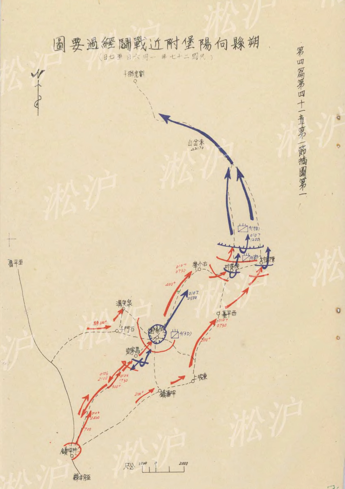

二、富陽附近戰鬥

作戰時間：民國二十七年一月十七日起至十八日止。

作戰部隊：第三戰區第七十九師第二三七旅，（欠第四七四團）附補充團及師衛生隊一部，共約二千餘人。

作戰地區：浙江富陽城附近。

敵情：敵第六師團之一部約一千四百餘人，砲五、六門，利用富陽城附廓河流沿城北之鏤子山、猴亭子山一帶山地，構築工事，並於距富陽城西南三公里之鹿山、太平橋、新橋鎮、師姑坪之線，佔領警戒陣地，企圖固守富陽。

我軍目的：該旅以擊滅當面敵人攻佔富陽之目的，保持重點於左翼，包圍敵人於富春江畔而殲滅之。戰鬥經過：第二三七旅以第四七三團及補充團爲左右兩翼隊，向富陽城攻擊前進，於一月十七日十九時，先後到達攻擊準備位置，右翼隊（補充團）卽以第一、三兩營分別向鹿山及太平橋敵警戒陣地攻擊，十八日零時三十分，第三營攻佔鹿山，殘敵向富陽城潰竄，該營當卽跟踪追擊。是時第一營亦於攻略太平橋後，向富陽城進迫，左翼隊（第四七三團）以主力迂迴富陽西北，於十八日一時，分別向猴嶺頭、通化鎮、新橋鎮各地渡河攻擊，東岸之敵，憑恃優越地形及堅固工事，頑強抵抗，並一再反攻，其鏤子山之敵砲，亦不時以密集火力向我猛烈射擊，我軍渡河攻擊受阻。斯時我右翼團已進佔富陽城之秦望橋西關之線，敵退入城廓憑河死守，該團雖一再猛攻，均未奏效，於是全面戰況均陷於停頓狀態。迄十八日黃昏後，該旅長乃令左右兩翼隊團，分別撤回至富陽城西郊沿長山、凍山下、前山村、夾嶺塢、柳塢、方家井、上下台門之線，補充整理，待機再行攻擊，此一戰鬥，遂告結束。

果：(一)鹵獲敵軍步槍一枝、輕機槍一挺、步彈一九一發、軍旗一面、汽車一輛。(二)焚燬敵汽車二輛。

(三)敵死傷二百餘人。

我軍傷亡：(一)負傷官兵六十二員。

(二)陣亡官兵五十九員。

(三)失踪士兵五名。

我軍損耗：(一)武器—步騎槍三十三枝，機槍一挺，手槍三枝。

(二)彈藥—步機彈六五、五九五發，迫砲彈十八發，手榴彈一、九三七枚，手槍彈二、零二八發，信號彈一一一發。

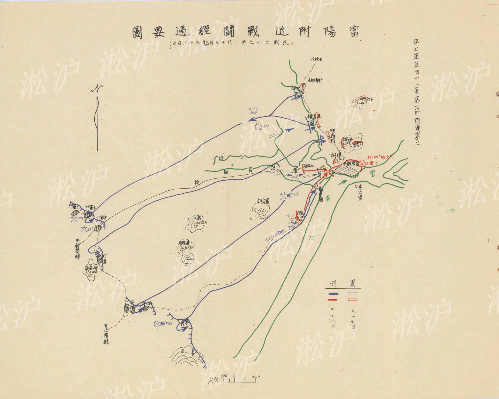

三、安吉孝豐附近戰鬥

作戰時間：民國二十七年二月十一日起至二十六日止。

作戰部隊：第三戰區陸軍第五十九師。

作戰地區：浙江吳興以西安吉、孝豐各附近。

敵情：敵約二萬餘人，以杭州、吳興、宣城、蕪湖等處爲據點，似有牽制我第三戰區部隊，並掩護其津浦南段作戰之企圖，由吳興方面使用步、騎、砲、聯合之敵三千餘，在城西妙西市、紅溪、小溪一帶竄擾，燒殺姦擄，無所不爲，並以其裝甲車及戰車部隊，沿公路日夜梭巡。是時和平鎮、李家巷之敵，爲山本部隊及野呂大隊，兵力約二千人，另股進擾孝豐、安吉之敵，係久留米步兵旅團之一部約一千餘人。

我軍目的：該師爲策應友軍協同第五戰區方面作戰之目的，攻擊吳興而佔領之。

戰鬥經過：二月五日，該師奉令由安徽寧國縣之河瀝溪出發，於八日十四時抵孝豐附近，當卽令第三五三團爲師左側支隊，經西畝市、泗安、虹溪鎮攻佔呂山鎮後，掩護師之左側，並箝制長興方面之敵，師主力經塘福鎮、石虎山向安吉方面前進。

十日，該師第三五三團進抵泗安，師主力亦由安吉向東北之曉墅鎮推進。入夜，第三五三團於泗安以東沿公路線驅逐天平橋敵之警戒部隊後，於十一日晨進至林城橋附近與敵接觸，該團卽以其主力經泗水南岸向林城橋之敵包圍攻擊，至暮，已逼近林城橋街市。

十二日拂曉前，該團繼續攻擊，敵頑強抵抗，致傷亡頗大。十二時，該師張得能師長增派第三五四團之第三營，向林城橋東南之白水灘攻擊，以策應該團之戰鬥，此時該團主力已轉移至林城橋以南三里許之李家橋附近，卽派出有力部隊分向敵之左右兩側襲擊，至夜，林城橋之敵復經我夜襲，迄十三日五時許，敵向東潰退，該團卽以一部佔領該橋，主力向該敵跟蹤追擊，是時林城橋以北之大雲寺，亦爲該團之第二營攻佔，殘敵向長興方面潰走，該營追至距長興城十五里之姚家橋，始停止整理，敵則損失慘重，沿途遺棄裝具尤多，是夜我右翼之第三五四團第三營亦已攻佔白水灘。

十四日，第三五三團主力到達呂山鎮，得知該鎮東北約十餘里之李家巷一帶，有敵三、四百人據守，該師長當令該團之第二營攻擊李家巷，主力向李家巷以南之青草塢攻擊。

十五日五時許，我攻擊青草塢之第三五三團第一、第三兩營，遭敵伏擊，該團長卽令兩營之一部與敵相持，以主力向北協助第二營圍攻李家巷之敵，迄十二時許，敵由吳興增援步兵六、七百人，騎兵三、四十人，附戰車三輛，襲擊李家巷我軍之右側，同時李家巷左方長興公路方面之敵，以砲火向我射擊，形成左右夾擊我軍之態勢，我官兵沉着應戰，激戰至二十二時，該師長爲避實擊虛計，乃令該團秘密脫離當面之敵後，卽繞至敵之側背。

十八日晨，長興方面之敵，以步兵二、三百由南石橋襲擊我李家巷陣地之側背，同時李家巷南端漆家山之西北側，突發現敵軍三、四百人，迂迴我之左翼，一時我軍態勢趨於不利，該師長鑒於當前之狀況，急令第三五三團以預備隊分別由呂山鎮及虹溪鎮方面夾擊敵軍，敵不支仍向長興方面潰退。

十九日，長興、吳興之敵，又向我第三五三團攻擊，因地方團隊及游擊部隊力量薄弱，無法協力，且該團官兵傷亡頗重，遂被迫放棄李家巷向虹溪鎮轉進。

二十日，第三四九團之第一營，在吳興西南和平鎮以東之何家埠與敵接觸，該師爲求能獨立作戰，確保爾後之行動自由及避免敵之威脅起見，當卽作如下之部署：

(一)第三四九團除以第一營於和平鎮與敵保持接觸外，主力集結於和平鎮以西之曉墅鎮待命。(二)第三五三團除留一小部於虹溪鎮、港口附近外，主力向虹溪鎮以西之天橋及齊志村附近轉移。

(三)師直屬部隊及第三五四團，卽由曉墅鎮向東南之錢杭橋一帶轉移，並擇要構築工事。各部奉令後，均遵照部署完畢。

二十一日，敵由和平鎮、港口分向我吳山、小溪守軍襲擊，另有敵約千餘，由錢杭橋西南之遞舖向安吉、孝豐進犯，該師以左側背受敵之優勢兵力迂迴攻擊，而右翼之友軍，不能作有效之策應，遂向泗安西南之漳吳村轉進。二十二日，到達漳吳村附近後，卽令各部隊於二十三日分向孝豐、安吉、泗安方面游擊，並偵察敵情。時遞舖之敵正向安吉、梅溪一帶進擾，並以一部向曉墅鎮推進，另安吉西南之鶴鹿溪，亦有步砲聯合之敵約千餘人向孝豐進擾，該師爲迅速殲滅進擾之敵，以鞏固我孝豐、安吉之據點計，當於二十四日十二時開始對敵實施攻擊，迄十四時，第三四九團之第二營在孝豐西北將敵擊退後，進佔孝豐城，隨卽以該團主力向孝豐東南之白水灣追擊。

二十五日九時，該團在觀音塘附近痛擊潰退之敵，但該敵仍頑強抵抗，並以其砲兵向我草鞋塢北端高地及大毛山我第二營陣地猛烈轟擊，迄十一時許，敵砲火益加猛烈，其步兵不斷向我全陣地猛攻，戰鬥異常激烈，我第一營營長、第二營第五連連長及第三營第九連連長等均負重傷。旋敵又以步兵二百餘人在其砲火掩護下，向我左翼猛烈襲擊，大毛山陣地遂陷敵手，該團立令第二營向大毛山之左側行果敢之襲擊，肉搏多次，至十二時，增派第三營之一部夾擊該敵，始將大毛山奪回，十四時，敵陣地漸呈動搖，我軍乘勢左右夾擊，敵乃退至沖天山，憑堅強工事頑抗，迄二十時，敵乘黑夜沿小路向東退至遞舖及武康，該團因傷亡甚重，且以時值黑夜，地形險峻，未便窮追，是時第三五三團之第一營，亦由左翼攻克安吉。

二十六日晨，我各追擊隊先後到達遞舖與右翼友軍第九十八師切取連絡，敵仍繼續退至虹溪鎮、港口、和平鎮、妙西市之線，整頓補充，該師亦奉命在安吉附近集待命，於是綿延半月之戰鬥，遂告一結束。

戰

果：

(一) 鹵獲：

1. 步槍十七枝。

2. 步彈三一七發。

3. 軍旗六面。

4. 防毒面具二付。

5. 脚踏車四輛。

(二)敵傷亡官兵約四百餘員名。

我軍傷亡：

(一)負傷官兵一八五員名。

(二)陣亡官兵一三二員名。

我軍損耗：

(一)武器——步槍四十枝，刺刀十把。

(二)彈藥——步機彈二一八、零九零粒，手槍彈四、零二六粒、迫砲彈三十七顆，手榴彈九零一枚。

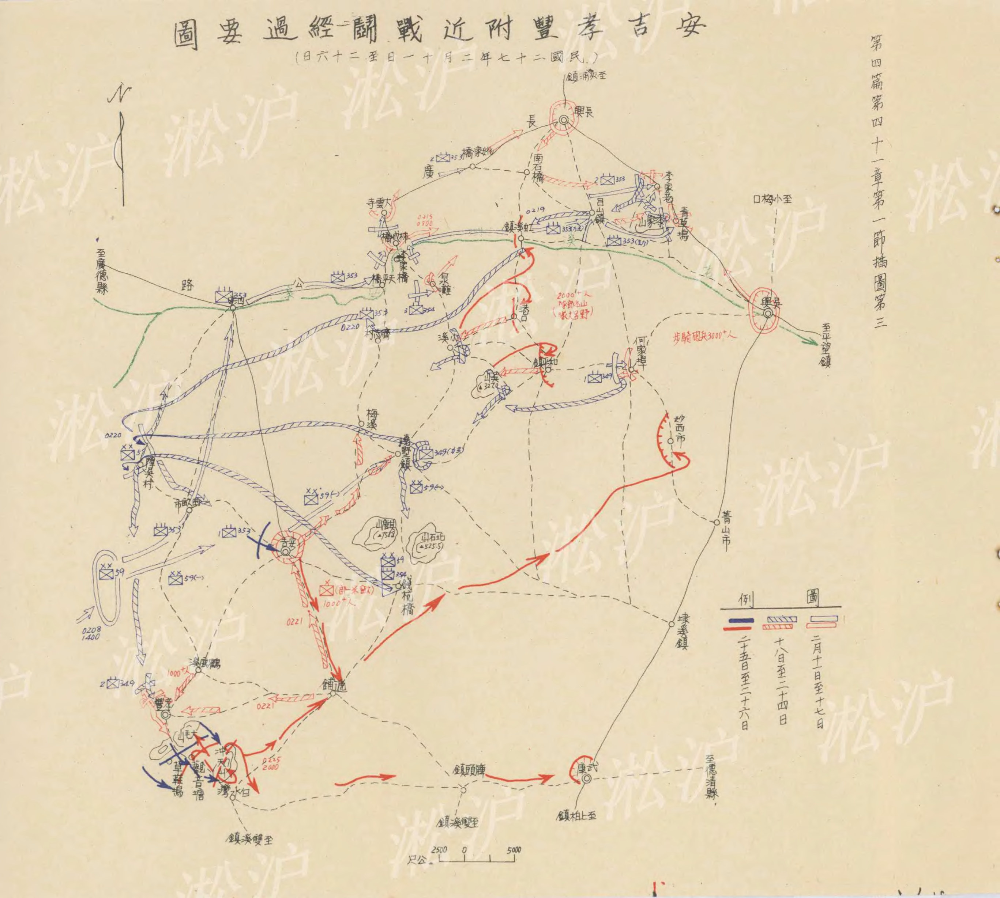

四、浙江餘杭附近戰鬥

作戰時間：民國二十七年二月十三日起至十四止。

作戰部隊：第三戰區陸軍第七十九師。

作戰地區：浙江餘杭附近。

敵情：自我放棄杭州後，敵第二師團主力卽予進佔，並以德田部隊之梅口所部步砲聯合之敵約七、八百人，佔據餘杭，在餘杭以南之寶塔山、鳳凰山一帶，構築工事，企圖憑險固守，餘杭東南之留下鎮附近，有敵機動部隊，兵力不詳，杭徽、杭餘公路上不時有敵之裝甲車活動，其便衣隊常在杭城南之蒼蒲嶺及城北地區活動。

我軍目的：該師奉蔣委員長電令，由諸暨出發，在餘杭以南之葉家廟一帶，會合游擊隊葉支隊由場口渡江，攻擊餘杭而佔領之。

戰鬥經過：該師奉令後，於二月十一日，進至餘杭以南二十餘里之板橋、沙塘上之線後，得悉餘杭東南公路十里附近之關林埠，有敵五、六百人，餘杭有敵七、八百人，連日正積極構築工事，備戰甚亟，該師當於十二日夜展開於沈家塢、李家塢、沙塘上、船橋山、丁橋、康村之線，同時與右翼友軍第十三師之第三十七旅協定，要求其進出施家園、虎豆山之線，堵擊杭富路出擊之敵。

十三日拂曉後，該師各部隊仍繼續偵察敵情，至一時許，卽開始向敵推進。

十四日一時許，該師攻佔鳳凰山及白湖山，六時許，我右翼隊一部進佔馬鞍山，左翼隊攻抵餘杭城北之高地，但因寶塔山敵之工事堅固，砲火猛烈，餘杭城西北部之敵，憑恃城牆頑抗，激戰達旦，敵我傷亡均甚重大。而我右翼隊第二三七旅主力已於二十四時許驅逐閑林埠以南小高地之敵後，佔領瞭目臺、孫家塢以南高地迄閑林埠之線，並截斷公路交通。拂曉後，閑林埠方面又增援敵軍七、八百人，雖經該旅猛烈攻擊，終因敵軍援兵不斷馳來，以至閑林埠得而復失，然我軍仍以兩翼圍攻餘杭，該敵在南北夾擊之下，形勢至爲狼狽。十時許，敵大部兵力自杭州沿杭富路迂迴我之右側背，我第二三七旅當卽抽一團兵力至獅子山一帶堵擊，該師亦自預備隊中抽出一營進出坑西以東地區協擊，此時敵機對我陣地施行猛烈轟炸，獅子山附近之戰鬥，異常激烈，我第四七四團傷亡官兵六十餘人。十三時許，閑林埠方面之敵，亦抽調其主力向我瞭目臺附近之補充團陣地猛衝，同時餘杭方面之敵，亦由倉前鎮增到大隊援軍向我左翼隊第二三五旅反攻，一時全線混亂不已，該師以右翼方面腹背受敵，陷於不利態勢，當卽於黃昏前全師轉移陣地於沈家塢、孟塢、朗山、蔣家渡、船橋山、丁橋之線，繼續戰鬥。

戰

果：

(一)

囪獲：

十五日一時，該師奉前敵總司令薛岳電：應以避實擊虛之方針，與敵週旋。遂撤至餘杭西南三十餘里之銅嶺橋頭及其以南地區，重新部署，本戰鬥乃暫告一結束。

1. 步槍一枝。

2. 步彈三七一粒。

3. 刺刀二把。

4. 鋼盔四頂。

5. 電話機一座。

我軍傷亡：(一)傷官兵八十一員名。

(二)陣亡官兵六十三員名。

(三)失踪士兵十三名。

我軍損耗：

(一)武器——步槍十六枝，手槍五枝，信號槍一枝，刺刀四十二把。

(二)彈藥——步機彈一零七、五八四粒，手槍彈六、五一四粒，手榴彈一、四三四枚，信號彈二零一枚。

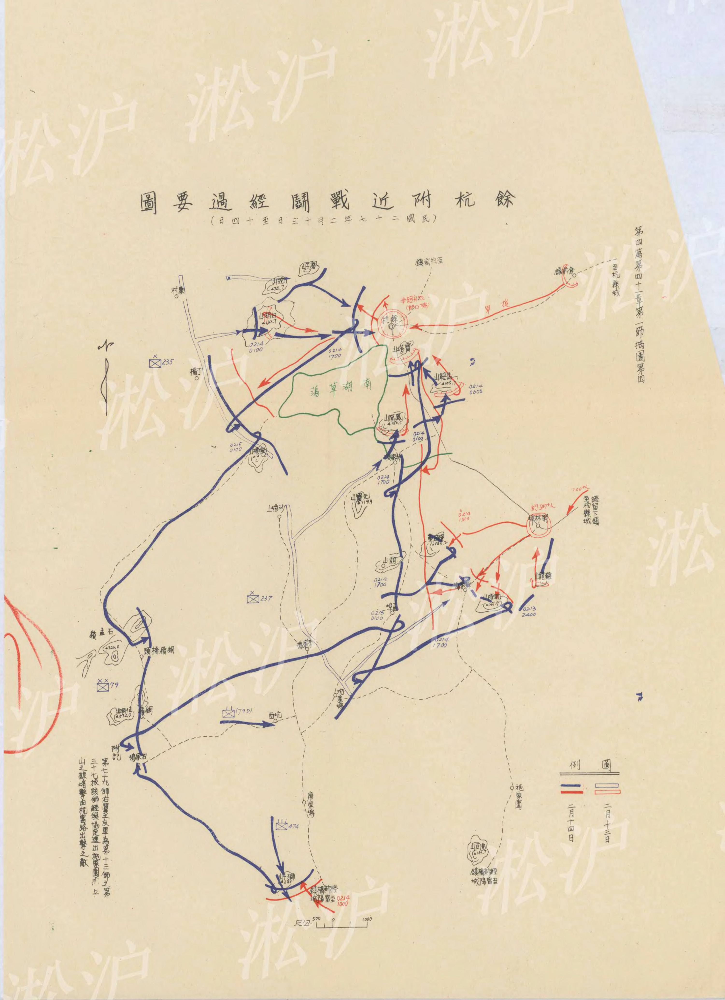

五、平遙馬壁村附近戰鬥

作戰時間：民國二十七年二月十三日起至二十三日止。

作戰部隊：第二戰區陸軍第八十四師第二五一旅。

作戰地區：晉南平遙馬壁村。

敵情：盤據晉南祁縣之敵第二十師團第四十旅團之一部步兵五、六百人、砲四門，經我第三軍逐日由平遙派隊襲擊後，閉守據點，不敢外出，僅有少數部隊在外活動，靜待其主力部隊之到達，以遂行其進攻晉南之企圖。

我軍目的：該旅奉令接替平遙第三軍之防務後，以一部向祁縣之敵襲擾，以主力守備平遙以南王和鎮、西溝等處之隘路，以利軍之作戰。

戰鬥經過：第二五一旅於二月二日接替平遙及王和鎮、西溝等處之防務後，卽以一部由平遙襲擾祁縣之敵，以主力守備王和鎮及西溝。

十二日午，敵以汽車由太原子、洪鎮等處輸送大部兵力在祁縣西南地區集結。

十三日拂曉，敵以一部約步兵四、五百人，附砲四門，向平遙東北約二十餘里之郝家堡、洪善村一帶向我據守大閻村之第一營第一連攻擊，同時洪善村以北公路上有敵卡車五、六十輛滿載敵之步砲兵，藉其戰車與裝甲汽車之掩護，向平遙以北約十里之東西遊駕活動，另一部騎兵約二、三百人，則由郝家堡向我右側迂迴，該旅第五零一團團長呂曉韜爲遲滯敵之行動，卽親率第一營之第二連在平遙城東北約七里之五里莊西北佔領陣地，拒止東西游駕南下之敵，並以騎兵營由平遙城東四里許之閻良村向敵左側迂迴，激戰至十時，我軍傷亡甚重，乃於十一時逐次撤至城關附近，敵之裝甲汽車跟踪迫至北門。

是時該師兼師長高桂滋獲悉上述情況後，卽嚴令該旅長高建白督飭所部，堅守待援，該旅長奉令後，立即以步兵守城，並擬以騎兵於夜間出城策應，迄正午，敵之步兵卽將平遙城之東南包圍，其戰車隊亦在城北公路上活動，並以山砲重砲向城內射擊達三小時之久，城內之重要建築及通信設備，被破壞無遺，至十五時，師與該旅間之電訊中斷，漢奸亦乘機騷動，城內槍聲四起，我守兵傷亡枕藉，尤以東南兩關爲甚，俄而東南城關被敵重砲轟毀，形成缺口，十五時三十分，敵步兵在其砲火掩護下，利用缺口處登城，雖經我騎兵營第一連奮勇抵抗，但終因敵火猛烈，該連傷亡過大，敵乃乘勢登城，戰至十六時，我軍退守城西約三十分鐘後，敵續向城西進攻，遂展開激烈之巷戰，戰況空前激烈，敵我死傷纍纍，而敵援軍不斷增加，該旅長以彈藥行將告罄，遂決心以騎兵營由南門向敵逆襲，掩護步兵於十八時由西門利用凹道，向平遙以南之王和鎮撤退，故我騎兵營之一部陷於城內敵軍重圍中，自營長史殿丞以下官兵三十餘人，均自戕殉國，是夜敵進佔平遙城。十四日，敵主力沿同蒲路向介休前進。該旅自撤守王和鎮以北陣地後，旋奉命以策應同蒲路方面我主力軍作戰之目的，遂以主力向平遙介休間之敵阻擊，並破壞敵之交通線。

十五日晨五時，敵步兵約四百、騎兵二、三百，附砲六門，以戰車六輛爲前導，侵入王和鎮以北約二十里之馬壁村、段村鎮，其先頭已進入趙家山、石培坊之線，該旅長乃令第五零一團利用黑夜襲擊趙家山、石培坊、馬壁村附近之敵。

是（十五）日十九時許，第五零一團第三營與第五零二團之第三營，開始向趙家山、石培坊之敵攻擊，敵不支，於二十一時向北敗退，該兩營跟蹤追擊，進至馬壁村，段村鎮附近，敵退入寨牆內抵抗，我軍自十六日起至十九日止，以一部對寨牆內之敵繼續圍困，主力控置於馬壁村以東之背坡，南段村地區，該師師長亦於是時到達王和鎮，遂令該旅繼續攻擊馬壁村附近之敵。

二十一日拂曉，該旅第五零一團（附騎兵連及山砲兵連）繼續對馬壁村、段村鎮之敵包圍攻擊，第五零二團主力則控置於王和鎮至馬壁村間之平道頭，以便隨時向平、介間進出，激戰至二十二日三時，第五零二團呂團長親率該團之第三營及騎兵連向段村鎮之敵襲擊，至九時許，平遙方面之敵，以步兵二、三百人，佔據馬壁村以北七里許之東西安社，向我騎兵連猛烈攻擊，同時據守各村內之敵亦太舉反攻，企圖與東西安社之敵合股脫困，十時許，敵機三架向我陣地轟炸，我攻勢稍止，至十五時三十分，再興攻勢，對敵猛攻，敵不支大部復退守村內，是夜段村鎮以北之公路被敵修復，午夜有汽車來往於東西安社至段村鎮之間，似爲增援之敵軍到達各村。

二十三日拂曉，該旅高旅長在敵砲火下親赴前線督師，六時許，集中砲火向馬壁村之敵射擊，繼以步兵近迫，時敵以一部堅守寨牆，其主力約三百餘人向我反攻，經激戰後，敵再被迫退村內，於是我軍卽佔領村外東南之民房，直接向村內投擲手榴彈，激戰至十一時，敵駛來戰車，裝甲車各二輛，協同馬壁村之敵百餘人，向我南段村主力方面施行佯攻，其主力則乘機分向北退，我卽先後佔領馬壁村、段村鎮，我騎兵則跟蹤追擊至平遙城附近。

戰

果：

(一) 鹵獲敵陣中日記五本。

(二) 斃敵一百餘人。

我軍傷亡：

(一)負傷官兵九十一員。

(二)陣亡官兵一一零員。

(三)失蹤二一零員。

四陣亡馬一七一匹。

我軍損耗：

(一)武器—步槍二九五枝，機槍一挺，手槍三十四枝，衝鋒槍一枝，迫擊砲一門，信號槍三枝(二)彈藥—步機彈八五、九四六粒，手槍彈六、七三四粒，迫砲彈一八四顆，手榴彈九三一枚，山砲彈三十一顆。

5各地游擊战

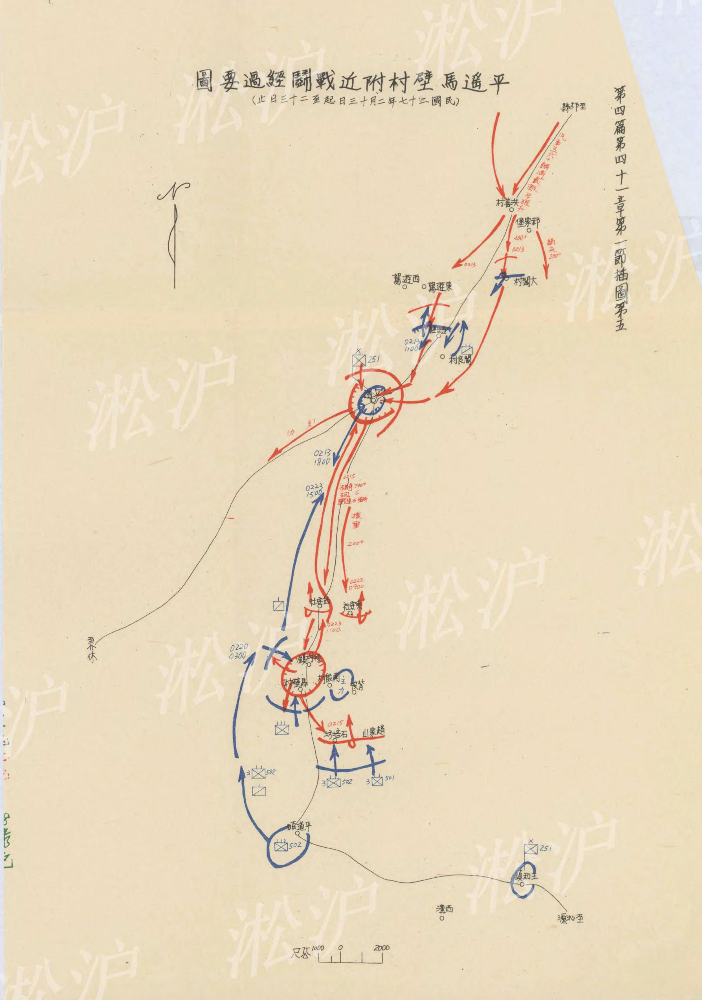

六、朔縣乃河堡附近戰鬥

作戰時間：民國二十七年二月二十四日起至二十五日止。

作戰部隊：第二戰區騎兵第三師。

作戰地區：山西省朔縣乃河堡。

敵情：自二月中旬以來，敵爲策應晉南方面之作戰，實行對我晉北作大規模之圍攻，北路由和林格爾、托縣進攻清水河，中路由朔縣左雲、右玉進攻乃河堡及老營堡。

我軍目的：師主力（第八團）固守乃河堡、下水頭等處陣地，以第九團對井坪、利民堡方面之敵佯攻，另以有力之一部（第七團）對阻虎堡之敵攻擊，求其主力所在而殲滅之。

戰鬥經過：二月二十四日，敵步砲聯合之敵約二千餘，由井坪鎮向乃河堡進犯，拂曉後，敵步兵百餘名進抵乃河堡東端之高家坡，並續向亂榆上前進。此時我第九團之一連及便衣隊，以居高臨下之勢，向敵射擊，敵死傷大半，殘部乃退回高家坡。至五時四十分，敵後續兵力到達，再向亂榆上攻擊，激戰半小時，我第九團左翼之紅溝村陣地被敵突破，該連以態勢不利，乃向後沙溝轉進。七時許，攻佔亂榆上之敵，集合步騎兵千餘人，向第八團第三連上水頭之陣地進攻，另敵四百餘進至乃河堡東南端之下水頭，形成包圍乃河堡之態勢，我守軍激戰至午，敵終未得逞。午後，敵以空軍及砲兵對全陣地猛烈轟擊，我上水頭及乃河堡以東第八團之第二、三兩連陣地，頓成焦土，守軍官兵均壯烈殉國。當敵進佔我第二、三兩連陣地後，情況至爲危急，幸我第三連之預備隊出敵意表，乘敵立足未穩之際，向敵猛烈逆襲，與敵發生肉搏戰，經四次返復爭奪，斃敵百餘名，擊落敵機一架後，將上水頭及乃河堡以東之陣地重新奪回。時下水頭附近我第八團第一連之陣地亦遭敵之包圍，其南端另山村附近我第九團之第三連，被敵團攻後，情況不明，第八團第一連之陣地，遂陷於敵軍夾擊中。

當敵軍三面圍攻乃河堡戰事激烈進行之際，該師師長乃令第七團停止北進，即由乃河堡以北之阻虎堡附近地區側擊敵軍，並令第九團停止進攻乃河堡以南之利民堡，速北上乃河堡夾擊敵軍，十五時，第九團到達另山村，十八時，第七團已進抵白家村窯附近。

二十五日拂曉，敵又以步騎兵向我全線攻擊，經我官兵奮勇迎擊，敵未得逞，迄六時，敵以一部由另山村向乃河堡以西迂迴，我第七團已與敵遭遇於乃河堡東北之後沙溝附近，因該處懸崖絕壁，道路崎嶇，部隊展開至爲困難，正當該團前衛與敵激戰之際，突有敵一部三百餘由泉子上村襲入，遂將第七團截爲兩段，經該團數次搏擊，始將敵擊潰，然敵之主力仍分兩路猛攻乃河堡，我守軍以必死之決心，奮勇迎擊，相持至十五時許，由另山村迂迴之敵已竄襲至賈堡村及老營堡之間，我軍後方交通線已被敵控制，爲避免不利起見，該師長遵將師部及第八團撤出乃河堡向西北之東昌峪附近轉移，第七團控置於乃河堡以北之唐子溝附近，第九團則集結於乃河堡以西之日子上附近，待機反攻，於是乃河堡附近之戰鬥，至此乃告一段落。

戰

果：

(一)擊落敵軍飛機一架。

(二)擊斃敵官兵一百五十餘員名。

考：該師人馬傷亡及械彈損耗因資料缺乏故未列。

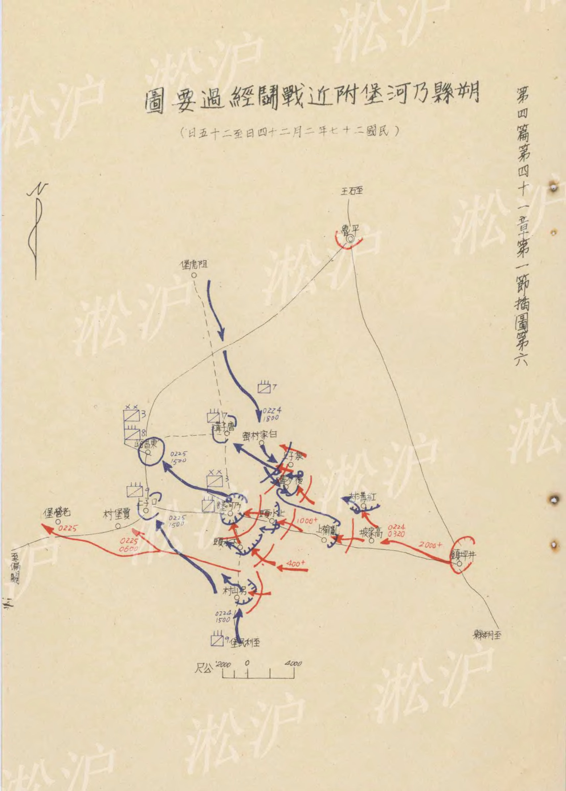

七、隰縣午城鎮附近戰鬥

作戰時間：民國二十七年二月二十七日起至三月一日止。

作戰部隊：第二戰區陸軍第六十六師第二零六旅（附砲兵第四十三團）。

作戰地區：晉西隰縣午城鎮附近。

敵情：敵第一零九師團及板木旅團附騎、砲兵戰車各一部，於二月中旬陷汾陽後，其一部沿汾陽公路竄犯離石，其主力（步、砲約五六千人）於二月十六日在兌九峪與我第十九軍接觸後，繼續南犯，先後與我第三十五軍及第六十一軍激戰於神峪及上下李莊附近，自我第三十五軍轉變方向後，該敵乃繼續南下，並急向隰縣前進，企圖摧毀我第二戰區司令長官部之指揮機構。

我軍目的：該師奉令在午城鎮以北地區，竭力阻止敵之南下，掩護戰區司令長官部之轉移，俾使爾後國軍之作戰有利。

戰鬥經過：二月二十六日十一時，該師第二零六旅（欠第四零一團）配屬砲兵第四十三團及衛生隊兩排及傳騎一班，由蒲縣趕抵隰縣午城鎮以北一二三、五高地東西之線，佔領掩護陣地。十七時許，我第六十一軍及該師之第二零四旅，先後由隰縣向南撤退，通過午城鎮後向大寧方面轉淵，該旅除積極加強工事外並派隊搜索隰縣方面之敵情。

二十七日十四時，有步、騎、砲聯合之敵約兩千餘人，由隰縣循公路南下，向該旅陣地攻擊，十五時許，我警戒部隊受優勢敵軍之壓迫，向主陣地撤退，旋敵以主力在其砲火掩護下，逐漸向我陣地兩翼前進，雖經我砲兵猛擊，使敵一時受挫，但至十七時許，終因敵砲火熾烈，其步兵續向我陣地迫近，經我官兵奮勇抵抗，並實施逆襲，激戰至薄暮，卒將敵軍制止。是（二十七）日晚，我第二戰區司令長官部，鑒於情況不利，遂對該師下達命令要旨如下：該師在午城鎮以北地區竭力阻止敵之前進，達成任務後，相機向羅曲鎮，大寧一帶轉進，逐次掩護，以利本戰區爾後之作戰。該師長奉令後，當卽轉令第二零六旅努力保持原陣地，於二十四時開始逐次撤退至大寧以東秀巖村、羅曲鎮、記紇梁之線佔領陣地，以掩護戰區長官部之安全轉進。

二十八日二時，該旅到達指定之線佔領陣地，至二十九日二十三時許，有步騎兵約千餘人附砲四門之敵，開始向該旅陣地攻擊前進，敵之主力指向我右翼之秀巖村陣地，激戰三小時後，該旅於三月一日一時許，卽續向後撤，本戰鬥遂告結束。

我軍傷亡：

(一)傷官兵三十五員名。

(二)陣亡官兵五十員名。

(三)失蹤官兵四十六員名。

四傷馬十二匹。

我軍損耗：

(一)武器—輕機槍三挺，手槍二枝，衝鋒槍二枝。

(二)彈藥—步機彈四五、二二零粒，手槍彈三一六粒，迫砲彈七十二顆，手榴彈一、零二二枚，衝鋒槍彈一四、零三零粒。

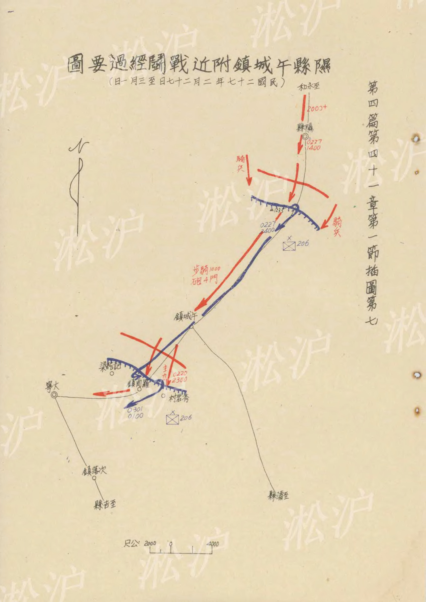

八、河津縣禹門口附近戰鬥

作戰時間：民國二十七年三月五日起至七日止。

作戰部隊：第二戰區陸軍第九軍獨立第五旅第六一五團。

作戰地區：河津禹門口亘神前村之線。

敵情：二月下旬以來，敵第十師團之一部（步兵第一大隊附騎兵一部，砲兵一中隊）爲策應汾西大麥郊、東陽關各方敵軍之作戰，遂由稷山方面向河津附近我軍進擊，迄三月四日，敵先頭部隊已竄抵稷山以西之南陽村附近。

我軍目的：該團以掩護第十四集團軍總部北進之目的，以主力於黃河東岸候家莊、桂家沟之線佔領陣地，拒止敵人，另以一部警戒河岸。

戰鬥經過：三月五日，第六一五團佔領陣地完畢，至十三時許，有步兵約四、五百人之敵，由我陣地以南之東莊村向我攻擊，與我警戒部隊發生戰鬥，我被迫後退，敵卽向我主陣地猛烈攻擊，經我迎擊後，敵未得逞，旋卽停止攻擊，遂呈對峙狀態。

是（五日）日，該旅以第十四集團軍總部已可安全通過師家灘北進，決心將該團陣地向北轉移至禹門口亘神前村之線，該團於午夜開始轉進，迄六日二時轉進完畢，而敵步兵二、三百人附砲二門，跟蹤向神前村攻擊，我守軍待敵迫近陣地，猝以密集火力向敵狙擊，斃敵七十餘名，敵卽狼狽逃竄。至十九時，敵改向我禹門口襲擊，一度衝入陣地東端，並以猛烈砲火向村內轟擊，我守兵乃佔據屋頂，以手榴彈向敵投擲，敵軍傷亡慘重，殘敵退出村外。是時我左翼神前村之陣地，亦受敵攻擊，激戰一小時許，敵始退竄，迄二十三時許，敵又以一部向神前村猛犯，同時以密集砲火向該團猛擊，我官兵沉着應戰，敵未得逞，旋卽退去。

七日二時，該團以陣地接近村落，易於構成敵砲兵之射擊目標，乃決心變換陣地於禹門口、神前村以北之劉西窊、南溝南端高地之線，繼續阻止敵之北進。十五時許，敵步兵二百餘由砲兵掩護，向我左翼進攻，該團連長何寶章率部與敵激戰，約一小時餘斃敵七十餘名，敵一再向我衝鋒，均經擊退，至十六時三十分，我軍據報：另有敵五百餘，附砲四門，已竄抵上下化里，企圖切斷該團之歸路，該旅長以該團掩護任務業已達成，遂令該團於是（七）

日晚二十二時乘黑夜向乾柴坡嶺之線轉移陣地。

八日，該旅奉第十四集團軍衛總司令命令：『該旅卽向師家灘附近集中，準備爾後之作戰』。該旅長奉令後，卽令該團迅卽脫離戰場，歸還建制。

戰

果：

(一)

函獲：

1. 軍馬三匹。

2. 步槍十枝。

3. 軍旗二面。

(二)斃敵二百餘人。

我軍傷亡：

(一)負傷二十二員名。

(二)陣亡十五員名。

(三)失蹤十七員名。

我軍損耗：

(一)武器—步槍四枝、輕機槍一挺。

(二)彈藥—步機彈六八、四零零粒，迫砲彈一四五顆，手榴彈七五零枚。

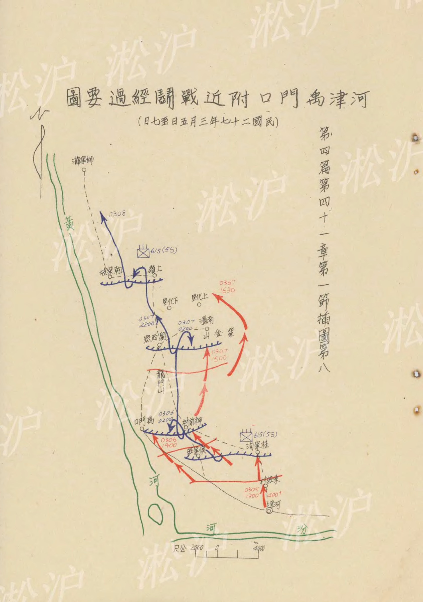

5各地游擊战(一)

九、餘杭雙溪鎮附近戰鬥

作戰時間：民國二十七年三月十六日。

作戰部隊：第三戰區陸軍第七十九師第二三七旅第四七四團。

作戰地區：浙江餘杭雙溪鎮附近。

敵情：敵步兵約三千人，騎兵四、五百，砲數十門，由臺灣守備旅團高橋省三旅團長率領，於三月十五日，由杭州經餘杭，瓶窯，上柏鎮沿公路西進，向我軍主陣地之裏洪東端高地至社村之線攻擊。

我軍目的：該團奉令守備裏洪、社村附近之我軍游擊根據地，決心在社村東南高地及其以北高地之線與敵決戰。

戰鬥經過：三月十五日，第四七四團以其第一營（欠一連）在社村東北高地及社村（含）之線佔領陣地，第二營在社村（不含）至東南高地及小嶺西北之線佔領陣地，以第一營之步兵一連及第三營爲團預備隊，位置於社村以西約三里附近之後王。

十六日八時，敵步兵約三、四百，附砲數門，向該團右翼友軍之補充團及第四七零團攻擊。十二時許，敵騎兵三十餘名，向潘板橋攻擊前進，該團第二營之便衣隊予以迎頭痛擊，激戰約一小時許，敵以一部向我便衣隊之右翼包圍，我以步兵掩護其退守汪家村附近，繼續阻敵前進。是時另有敵騎一部約三、四十名，向我雙溪鎮之警戒陣地進犯，被我擊退，旋敵步兵在其砲火掩護下，繼續前進，迄十五時許，復向我警戒陣地攻擊，並以騎兵二十餘名向雙溪鎮以南迂迴，我汪家村第二營之便衣隊，被迫向新嶺東南高地撤退，同時雙溪鎮方面之警戒部隊，亦被迫向雙溪鎮以西三里許之化龍寺西南端撤退，於是敵之主力遂由雙溪鎮向我主陣地進攻，該團長卽以團預備隊之一部向雙溪鎮東南高地前進，威脅敵之側背，掩護我警戒部隊（第二營第六連）之安全撤退，同時令第一、二兩營之守備隊，嚴陣以待，痛擊來犯之敵，迨團預備隊到達雙溪鎮附近時，敵之步兵已侵入我警戒陣地，該隊立即向雙溪鎮以南之高地佔領陣地，並與第二營便衣隊取得連絡，協同以猛烈之火力制壓雙溪鎮之敵，我警戒部隊乃得安全撤退，十六時，敵主力藉其砲火之掩護，向我主陣地社村一帶猛撲，我軍以輕重機槍之嚴密火網猛烈掃射，敵以我戒備嚴密，陣地堅強，且因其傷亡甚重，乃退回雙溪鎮，迄十七時止，全線沉寂，敵僅以砲兵向我作繼續之射擊。旋據探悉，敵已向黃湖鎮方面竄去，該團當卽加強陣地工事，以達成固守游擊根據地之任務。

戰果：斃敵官兵五十餘員名。

我軍傷亡：(一)負傷官兵六員名。

(二)陣亡士兵七名。

我軍損耗：(一)武器——刺刀二把。

(二)彈藥——步機彈七、零七七粒，手槍彈九十八粒，手榴彈四十二枚。

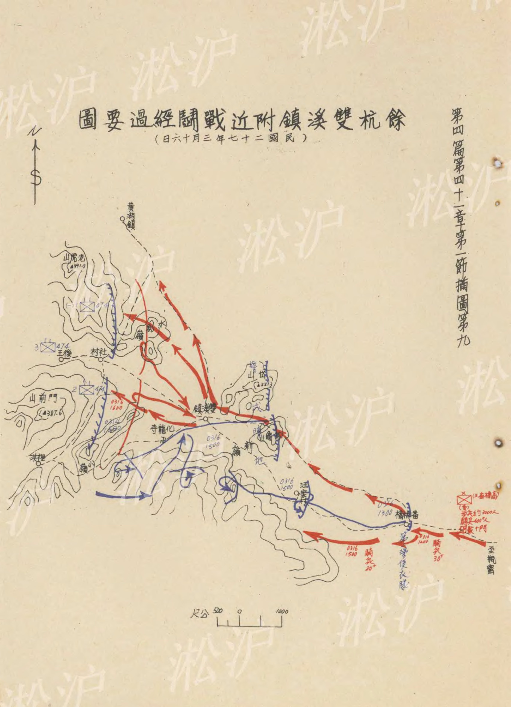

十、臨安曲里附近戰鬥

作戰時間：民國二十七年三月十八日。

作戰部隊：第三戰區陸軍第七十九師第二三七旅第四七四團第三營。

作戰地區：浙江臨安之曲里附近。

敵情：兵力不詳之敵，自三月十六日在雙溪鎮與我激戰後，其大部卽於當晚向黃湖鎮、百文、港口一帶北竄，其一部約步兵四百餘、騎兵四十餘（似爲臺灣守備軍高橋省三旅團之第三大隊）於十七日晨，由黃湖鎮經古城、四家壁、前陳塢一帶向港口前進，是時雙溪鎮僅有敵軍十餘人，黃湖鎮亦僅二十餘人，瓶窯方面則有敵軍四、五百人據守。我軍目的：該營以鞏固社村、裏洪團主陣地之目的，向敵尾追，相機襲擊而殲滅之。

戰鬥經過：三月十七日九時，敵已由黃湖鎮向古城前進，至十時二十分，由橫山頭附近轉向四家壁前進，十一時許，敵已到達前陳塢，第四七四團團長李邦華，當卽令第一、二兩營固守裏洪、社村之游擊根據地，以其第三營輕裝出發，尾追該敵，當日十七時，該營到達徐家塘，擬以夜襲手段，襲擊敵人，除以第八連在四家壁東北大道兩側高地佔領陣地，堵截敵軍囘竄外，該營長親率第七、九兩連，由四家壁經後板折而西北向曲里再折而東，以襲擊敵之主力，二十二時，祕密迂迴到達曲里附近後，偵知曲里東北二里許之姚家坑，似有敵之大部在彼處宿營，其西南涼亭有敵之警戒部隊，該營長卽以其第八連主力迅速向前陳塢搜前進，攻佔新嶺，以撲滅姚家坑之敵，以便衣隊潛伏於曲里西北高地，並以第九連潛入姚家坑東南高地埋伏，俟第八連攻擊開始後，卽分別在兩處擾亂敵人。

十八日二時，我第八連開始夜襲，第九連亦同時向姚家坑襲擊，因敵火猛烈，該連乃轉向曲

里東南高地，我便衣隊亦在曲里西北高地與涼亭之敵激戰，我正面攻擊之第八連將該敵擊潰後，卽以一排兵力佔領前陳塢西側高地，以主力繼續向新嶺攻擊，該地地勢險峻，未能得手。是時該營長綜合全般情況，恐一時難操必勝之權，如至天明，則敵軍益佔優勢，愈形不利，遂令第八連撤回四家壁西北大道兩側之高地，掩護該營主力之撤退，當於十八日六時全部撤回西坑裏。

戰果：斃敵七十餘人，軍馬十餘匹。

我軍傷亡：(一)陣亡士兵二名。

(二)失踪士兵一名。

我軍損耗：(一)武器——步槍三枝，刺刀五把。

(二)彈藥——步機彈三、零九零粒，手槍彈二零八粒，手榴彈一五零枚，信號彈五粒。

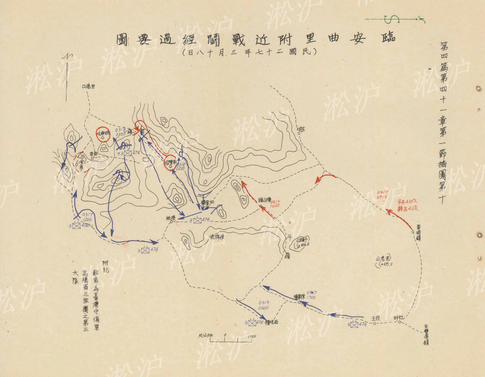

5各地游擊战一

十一、孝豐港口附近戰鬥

作戰時間：民國二十七年三月十九日。

作戰部隊：第三戰區陸軍第七十九師第二三七旅第四七四團之第三營（附步兵兩連）。

作戰地區：浙江孝豐縣港口附近。

敵情：自三月十八日我軍夜襲曲里後，敵高橋省三旅團之第三大隊北竄港口，該旅團主力則經牌頭鎮向北竄至安吉、泗安縣界，是時餘杭方面已增敵千餘，其小部隊在彭公、杏板橋、長樂橋、仁家徒門等處活動甚烈。

我軍目的：該團爲襲擊港口之敵，以第三營由後王游擊根據地向港口之敵襲擊，以一連經古城向八家塢及東忱村方面，以一連經前陳塢向湯婆嶺方面搜索前進，相機協同第三營殲滅港口附近之敵戰鬥經過：三月十九日六時，第四七四團第三營由西坑裏出發，於十四時三十分到達港口。時敵已會合港口以東約六公里附近百文方面竄來之敵一部約二百餘人，向北竄抵距港口四公里之王梅莊附近，百文仍有小股之敵盤據，該營營長王日朗當即以第七連在港口東北忍箕山附近佔領陣地，對百文方面之敵警戒，以第九連向王梅莊追擊前進。

此時該團第二營之第五團已到達港口東南約五公里之新嶺，向東北湯婆嶺前進，中途遇敵之搜索兵六名，卽予驅逐，乘勢直搗湯婆嶺，敵軍三十餘名，向距湯婆嶺東北約二公里之新安里逃竄，該連跟踪尾追，及至新安里以西高地附近，爲敵火力所阻，遂以一部監視該敵，主力則向港口方面協力第三營。

十七時許，第三營第九連推進至王梅莊以北一公里許之翟門，其北端郵亭橋頭發現敵之警戒果：

(一)

鹵獲：

兵，郵亭橋西北一里許之黃山村似有敵之掩護部隊，該營長爲殲滅黃山村之敵，卽以該連由翟門向郵亭橋、黃山村、攻擊前進，營主力則攀登黃山村以西之青山，襲擊敵之右側背，迄黃昏前，該營主力由青山居高臨下，俯攻黃山村，斃敵數十名，此時敵砲由黃山村西北之官沙村向我猛轟，掩護敵軍向黃山村以北二公里許之徐家塢撤退，該營當卽佔領黃山村，嗣因黃昏，情況不明，未便深入，乃於十九時撤回港口，而第二營之一連則仍在東忱村及八家塢方面監視。

1. 步槍三枝。

2. 步槍彈六十粒。

3. 煙幕彈三枚。

4. 擲彈筒三個。

5. 鋼盔二頂。

6. 防毒面具一付。

7. 軍旗十五面。

(二)斃敵官兵六十餘員名。

我軍損耗：彈藥——步槍彈四、二五九粒，手槍彈八十四粒，手榴彈三十九枚。

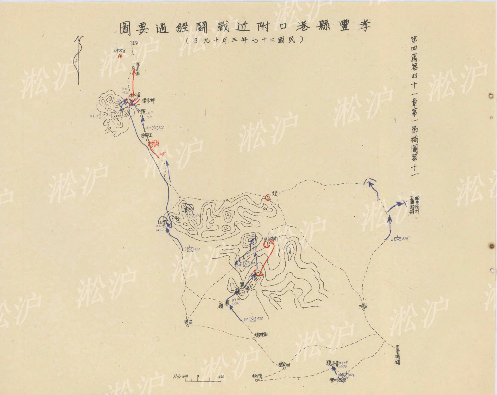

十二、海鹽縣歟城鎮附近戰鬥

作戰時間：民國二十七年三月二十五日起至二十七日止。

作戰部隊：第三戰區陸軍第六十二師第一八四旅第三六八團之第三營附第一營，第三連（共五百餘人）。作戰地區：浙江海鹽縣沈蕩、歟城鎮及王馬堰附近。

敵情：敵澀谷部隊鈴木警備隊約三百餘人，於三月二十四日由嘉興開抵餘賢埭，午後復進擾興善寺，翌日再水陸並進，攻至海鹽縣之沈蕩附近。

我軍目的：該營以掩護友軍安全渡江之目的，在沈蕩、歟城鎮之間攻擊該敵。

戰鬥經過：三月二十五日十三時三十分，敵軍由北南竄並向沈蕩進攻，當與我第三營第九連接觸，敵以飛機轟炸掃射，該連沉着應戰，並預設輕機槍於河岸，封鎖敵汽艇之進路，旋敵汽艇多艘相繼駛來，我軍俟其駛至有效射程內，卽行猛烈襲擊，當卽擊沉一艘，斃敵二十餘名，激戰約一時三十分，因敵水陸並進，兵力優勢，該營遂令轉移至沈蕩以南四公里許沈家濱東北沿公路南化之線埋伏，並令第一營配屬之第三連扼守寶路橋至興南橋一帶。

二十六日，該敵向歟城鎮進攻，九時，卽與我扼守寶路橋之第一營第三連發生激戰，我第九連乃予側擊，相持約三小時，斃敵三十餘名，並擊沉敵汽艇一艘。斯時海鹽之敵，以一部沿公路西進，在歟城以東約三公里許之徐家埭與我第八連激戰，其另一部則由海鹽向歟城鎮東北二公里許之大通橋前進，當被我埋伏於周家濱附近之第七連側擊，斃敵二十餘名。當時第三六八團團長以敵各路圍攻，態勢不利，乃令該營放棄歟城鎮向南撤退至王馬堰附近。

二十七日，敵進佔歟城鎮後，不斷以飛機偵察我軍行動，旋又以汽艇沿河向南搜索前進，因河道被我軍阻塞，敵乃棄艇登陸，十六時許，與我第九連在汪家、石橋村之線發生戰鬥，激戰約二小時，敵後續部隊不斷登陸增援，我軍被迫向左翼後移。此時該營適奉團長命令轉移至王馬堰以南之石泉鎮集中待命，該營遂於是（二十七）日黃昏時撤離王馬堰向石泉鎮方向轉進。

戰

果：

(一)擊沉敵汽艇二艘。

(二)擊斃敵官兵五十餘員名。

我軍傷亡：

(一)負傷兵一名。

(二)陣亡兵一名。

我軍損耗：彈藥——步機彈三、二六零粒，手榴彈八枚。

松沪

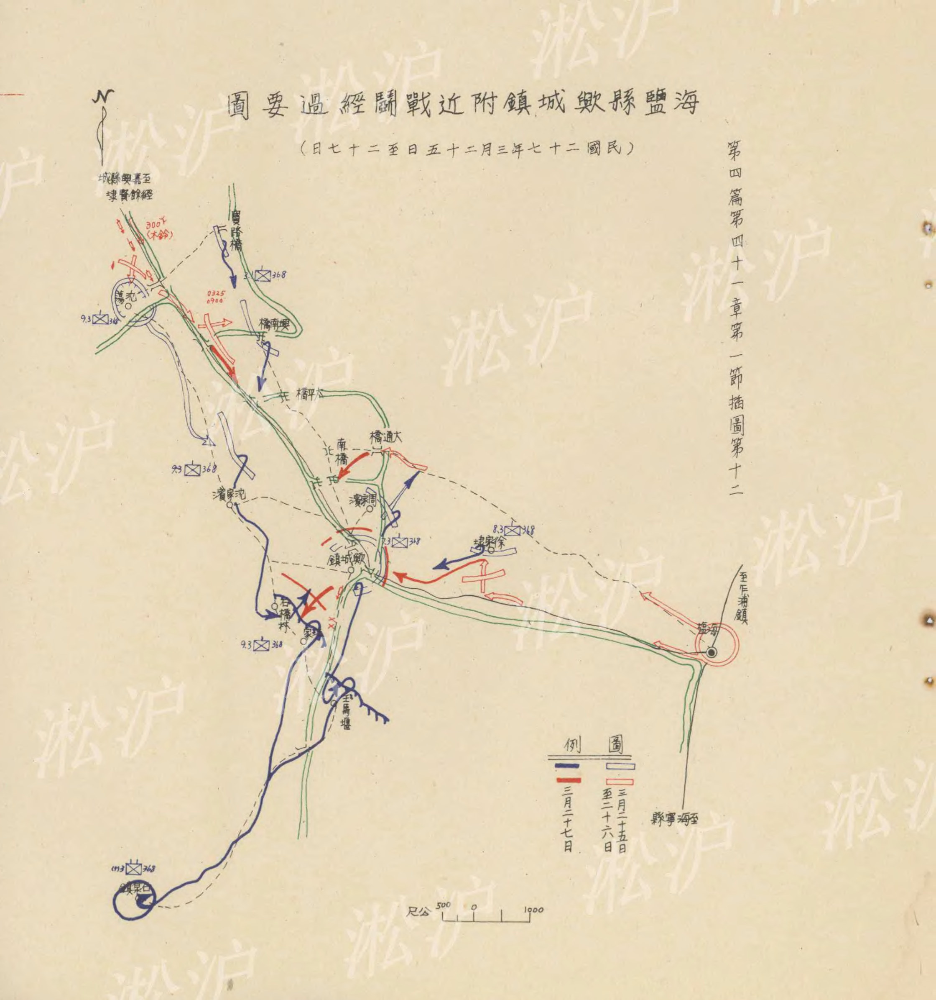

十三、廣德、溧陽附近戰鬥

作戰時間：民國二十七年三月二十八日起至四月九日止。

作戰部隊：第三戰區陸軍第六十七師第二零一旅。

作戰地區：安徽廣德之流洞橋及江蘇溧陽之羊山、晨山附近。

敵情：敵企圖掃蕩我江南游擊部隊以保長興、廣德至宣城及京、杭兩公路之安全，於三月中旬以上海派遣軍滕田部隊及臺灣部隊等數個支隊，約計步砲兵四、五千人，分由長興、宜興、溧陽、宣城等處，向蘇、皖邊區進攻，被我第六十師在宜興、溧陽、張渚一帶誘其深入，予以重創後，敵主力遂於三月二十七日轉移於廣德之流洞橋、獨山之間集結，似有擴張攻勢之企圖我軍目的：該旅奉令暫歸第六十師師長陳沛指揮，向流洞橋之敵攻擊，以殲滅敵之主力軍。

戰鬥經過：三月二十八日，第二零一旅第四零一團由陸家舖附近經門口塘向金鷄嶺攻擊前進，十三時抵達門口塘後，奉令改向流洞橋之敵攻擊。十七時三十分該團前衛第三營進抵施家崗附近時，發現敵踪，當以天已黃昏，地形複雜，乃卽佔領施家崗，旋得右翼友軍第五十九師之第一一七旅派員連絡，據云：敵有向該旅右翼包圍之模樣。該團長當卽派隊策應。二十九日拂曉，第四零一團正準備攻擊前進之際，而敵軍約四、五千人已由獨山北犯，與我激戰至十一時，我第六十師師長陳沛乃急令其第三五五團由北南下至東周村附近，第三五六團則由西向東挺進至吳家灣附近，以期夾擊敵軍，惟因動作遲緩，未能及時趕到，以致第四零一團遭優勢之敵所圍攻，該團傷亡達五百餘人，但官兵士氣旺盛，咸抱必死之心，是以施家崗陣地，得而復失者凡七次之多。三十日十一時許，我第六十師第三五六團之第一營突破敵之重圍，衝入陣內，十二時許，敵不支向施家崗東北方面撤退，是時第二零一旅旅長楊勃亦率第四零二團到達戰場。

三十一日，該旅奉令由流洞橋經千口、磚橋、同官里南端進發，沿途遇敵掩護部隊，均經驅逐。迄四月三日十二時，第四零二團先頭部隊到達同官里南端，發現現敵約五、六百人據守同官里、羊山、長安橋、陶坎頭一帶，該團當以一部與友軍第五十九師之一營協攻同官里及羊山之敵，主力則經百祿舘向陶坎頭迂迴敵之右側背，迄黃昏，攻佔陶坎頭。

四日，第四零二團繼續向羊山之敵攻擊，時第六十師已派一部兵力經三水關、陶坎頭向敵後迂迴，該旅當以第四零一團向羊山、長安橋圍攻，經一晝夜之激烈戰鬥，於五日拂曉，始攻佔羊山，敵退守晨山及其以東地區，該旅續以第四零二團之一部向晨山攻擊，主力向晨山以東之荷花塘、小王村一帶迂迴，因晨山地形較高，我軍行動均爲敵瞰制，故當我軍主力攻至荷花塘時，敵之主力亦轉移該處，並以步砲協同向我反攻，該旅遂以第四零一團之第一營由右翼增援，向敵迂迴夾擊，激戰約兩小時，敵不支向小王村撤退，我軍乘勝追擊，並經數次夜襲，乃佔領晨山及小王村，殘敵紛向白塔山、楊山、戴埠一帶退却，該旅跟踪追擊，因白塔山以南地形開闊，運動困難，連續三日之攻擊，均爲敵熾盛火力所阻，未克奏效，嗣於四月十日奉命歸還建制，所遺任務交由第五十九師及第六十師接替，該旅於四月十八日到達涇縣歸還建制。

戰

果：

(一)

鹵獲：

1. 軍馬四匹。

2. 步槍十三枝。

3. 輕機槍一挺。

4. 步槍彈七一五粒。

5. 機槍彈一零五粒。

我軍傷亡：

(一)負傷官兵五九零員名。

(二)陣亡官兵二一零員名。

(三)失踪官兵十四員名

我軍損耗：

(一)武器——步騎槍八十二枝，手槍六枝，輕機槍四挺，信號槍一枝。(二)彈藥——步槍彈八零零、零五一粒，迫砲彈七三零顆，手槍彈二一、六五零粒，手榴彈四、六零零顆，信號彈二五零顆。

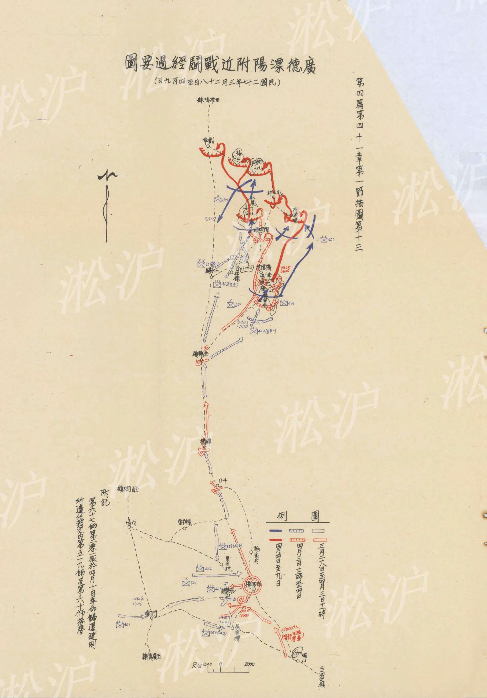

十四、錢塘江北岸戰鬥

作戰時間：民國二十七年三月二十九日起至八月二十八日止（共計五個月）。

作戰部隊：第三戰區陸軍第六十二師第一八四旅。

作戰地區：錢塘江北岸嘉興、平湖、海寧、海鹽一帶。

敵情：自二月下旬以來，敵軍步、騎、砲、聯合約五個聯隊之衆，盤據海寧、平湖、乍浦、沈蕩、歟城鎮一帶，滬、杭公路及鐵道線上敵軍運輸頻繁，各市鎮均設有治安維持會，土匪橫行，民不聊生。

我軍目的：該旅以掩護師主力及友軍渡江，並在錢塘江岸游擊作戰之目的，潛渡錢塘江，擾亂敵後。

戰鬥經過：三月十四日第一四八旅決定在黃灣、尖山附近渡過錢塘江，實施掩護作戰，當令第三六八團第二營配置於黃灣、丁橋亘澈浦之線，積極活動，並澈底破壞滬、杭公路，以掩護旅主力之渡江。迨至二十八日，該旅全部偷渡完畢，卽令第三六八團配置於白步亭、伊橋、袁化鎮、丁橋、新倉鎮、舊倉鎮各附近，第三七二團配置於石泉、通元、角里、長川壩各附近，並令分別破壞各該附近之公路，俾掩護師主力之渡江。

此時敵已偵知該師卽將渡江，企圖乘我半渡之際，壓迫於錢塘江北岸予以殲滅，該旅長乃令各該團以一部分別在防守區內迎擊敵軍，以兩團之主力祕密繞敵側背而擊破之。

二十九日拂曉，敵艦六艘向澈浦、長川壩猛烈砲擊，敵機三架亦在江面偵察。八時許，海鹽、歟城鎮、沈蕩、硤石、海寧、各處之敵，向我攻擊前進，並發生接觸。迄十八時許，該旅第三六八團已將硤石進犯之敵擊退，第三七二團已將進犯通元之敵擊退。十九時，敵由海鹽、海寧、分別派隊增援，該旅長當卽報告師長，請師之主力暫勿渡江，免遭無謂之損失，並令第三七二團於是（二十九）日晚，進出平湖以東地區，積極活動，同時，該旅長親率第三六八團，亦乘夜進出滬杭鐵道以西地區，以攻擊敵之要點，而利師主力之渡江，敵遭我避實擊虛之後，乃紛紛退却，其損失甚大。

三十一日，該旅長以守備桐鄉、崇德之敵柳田支隊三百餘人不時出擾，以防我游擊軍之襲擊，乃令第三六八團第二營襲擾該敵及破壞其交通。該營於一時許，潛入徐家橋將崇德通桐鄉公路破壞後，卽埋伏公路兩側。八時，敵汽車、裝甲車滿載敵兵由崇德向桐鄉行駛，經該營襲擊後，敵死傷七、八十名，潰退崇德，我第六連連長殉國。

四月一日，該旅長仍率第三六八團潛返袁化鎮附近，掩護師主力之渡江，第三七二團，則向平湖以東地區及滬杭鐵道線附近積極活動，以牽制敵之兵力。

四月五日，該師主力及第六十三師之一旅，先後渡江完畢。六日，該師師長陶柳，乃以該旅擔任嘉興、平湖、乍浦以西海寧至滬杭鐵路以東地區之游擊，並以第六十三師之一旅，擔任嘉興、平湖、乍浦以東青浦、松江、松陰、奉賢以西地區之游擊。

該旅長奉令後，卽以第三七二團，擔任嘉興、沈蕩、海鹽以西地區之游擊，第三六八團，擔任上述地區以東之游擊。是時，敵因前次掃蕩之目的未達，並深感我軍屢次襲擊之苦，企圖以重兵駐守於袁化鎮及通元一帶，以策應海寧、海鹽間之敵，而截斷我軍之後方連絡線。

十日十四時，硤石之敵約三、四百人，向袁化鎮進攻，時該旅第三六八團之第二營，已進出滬杭鐵路以西在桐鄉一帶游擊，該方面之兵力甚爲單薄，十九時，海寧之敵千餘，已到達新倉鎮，似有進攻袁化鎮截斷我後方連絡之模樣。

十一日十二時，由新倉鎮前進之敵到達袁化鎮附近，被我第三六八團側擊，死傷甚重，但敵之先頭部隊，已進入市區，並以其猛烈之砲火掩護後續部隊之突入，經一晝夜之激烈戰鬥，雖經我軍奮勇反攻，終因缺乏砲兵支援，未能克復。

十三日，硤石之敵，以一部約三百餘人經伊橋向袁化鎮增援，被我埋伏伊橋之第三六八團所部襲擊，斃敵四十餘人，鹵獲糧食文件等甚多，敵仍退回硤石。

敵軍進佔袁化鎮後，卽構築工事據守，我因缺乏砲兵，一時難以收復，於是乃以第三六八團之主力，潛伏於袁化鎮與新倉之間，擬俟敵突圍時，予以殲滅。十四日十四時許，袁化鎮之敵向新倉鎮撤退，該團乘機截擊，斃敵甚衆。是時，海寧方面之敵，以裝甲汽車二十輛載步兵二百餘人，向新倉鎮增援，我預伏丁橋之第三六八團之一部，乃跟踪襲擊，追至新倉鎮附近，與我軍主力取得連絡，隨卽合力向新倉鎮圍攻，激戰五晝夜，始將新倉鎮克復，殘敵利用裝甲汽車之掩護，仍退回海寧，該旅旋奉師令，限期克復海鹽，以利師游擊區域之擴大。四月二十九日，該旅長令第三六八團，以第一營營長率兵五連圍攻海鹽，並以該團之一部，向乍浦、平湖、新豐之敵及第三七二團向王店、硤石、伊橋、斜橋、海寧之敵不斷施以襲擊，藉以牽制敵之兵力，該營長奉令後，當卽以主力進攻海鹽之西門，一部潛伏於乍浦附近，以斷敵之歸路。

五月二日拂曉，我軍已攻佔海鹽西門及南門，立即衝入市區，與敵發生激烈巷戰，迄十七時，我軍進至南門及北門馬路以東地區，該旅長當卽令該營長繼續猛攻，以竟全功，但敵頑強抵抗，經一晝夜之激戰後，敵雖傷亡慘重，而我亦傷亡官兵達七十餘員。是時，嘉興之敵，以步兵七百餘、砲四門，向沈蕩進攻，並有向海鹽增援之模樣，乍浦之敵，亦向海鹽增援，該旅長爲期迅予擊滅海鹽之敵並截擊嘉興之援敵起見，乃將進佔海鹽之部隊撤出城外，埋伏要隘，並抽兵一連，馳援沈蕩。

三日，進佔沈蕩之敵，遭我擊退，由乍浦向海鹽馳援之敵，亦被我埋伏於乍浦附近之部隊截擊回竄，敵因由陸路增援之計未逞，復於五日晚，派兵艦一艘駛至海鹽附近，由東門登陸增援，並將城內守敵之傷亡官兵運返乍浦，我軍仍奮勇圍攻，苦戰十餘晝夜，敵深感補給之困難，遂於十五日拂曉，由乍浦派來騎兵百餘名，掩護其工兵將乍浦通海鹽之公路修復，十六時，以大隊援兵由公路竄抵海鹽，其先頭部隊被我第六連擊斃四十餘名，但敵之後續部隊，向我猛烈射擊，時我南門及北門部隊，聞西門槍聲濃密，遂卽分別衝入城內夾擊，我西門部隊，亦乘機衝殺，敵因腹背受襲，無法支持，乃且戰且退，迄黃昏，敵已退出東門，沿公路向乍浦逃竄，我遂克復海鹽。自該旅克復海鹽後，錢塘江北岸，嘉興、平湖、乍浦以西由海寧至滬杭鐵路以東地區，已無敵踪。五月下旬，該旅第三六八團之第二營，曾數度襲擊桐鄉、羅頭、烏鎮等處之敵，並在羅頭附近，擊沉敵汽艇四艘，斃敵百餘名，嘉興通崇德之公路，亦被該營破壞六公里，擊毀汽車五輛，該團之第一、三兩營，則經常破壞滬杭鐵路，由嘉興至長安之橋樑及路軌。該旅第三七二團，亦在平湖以東一帶地區活動，由嘉興至松江之公路與鐵路，迭遭該團劇烈之破壞，嗣因我獨立第四十五旅，到達平湖以東地區游擊作戰，遂將該方面之任務，交由該旅擔任。

七月三十一日，敵對我軍實施第二次之大規模掃蕩，該旅即以所部分別潛伏鄉村，並以一部繞至敵後方襲擊，攻其不備，各路進攻之敵，於海鹽會合後，除遭受重大損失外，毫無所獲，遂以我民衆爲洩憤之對象，施其姦淫擄掠殺人放火之故技，地方損失，至爲慘重。

八月六日，敵除以主力分駐海鹽、新篁、莊史、沈蕩、袁化鎮、通元，澈浦等處外，其餘仍返原防。該旅長，當卽重新部署，再行擾襲，遂以第三六八團擔任沈蕩、歟城鎮、海鹽以西地區之游擊，以第三七二團擔任上述地區以東之游擊，期將所在區域內之守敵，予以驅逐，並破壞敵軍修竣之水陸交通。

各部隊奉令後，於八月十日，祕密集結於各要點，開始分途進襲，第三六八團，先後克復袁化鎮、伊橋、通元、潄浦等地，第三七二團，亦相繼收復莊史、新篁、風家橋、沈蕩等地。嗣於八月二十日，敵軍抽調杭嘉兵力，往長江上游增援，該旅長復乘敵守備空虛之際，乃以其第三六八團，加緊襲擊海寧、硤石，並破壞硤石至斜橋之滬杭鐵路，同時，以第三七二團，向海鹽、平湖、潄浦一帶推進，相機克復之，以策應長江上游我軍之武漢會戰。

二十二日拂曉，該旅第三七二團，乃再度克復海鹽，二十三日，又克乍浦，第三六八團，亦將伊橋附近之鐵道破壞三公里，至是各縣政府以下之一切組織，均在原地恢復辦公。

二十八日，敵酋佐籐中將，途經陳家港時，被我第三六八團之伏擊部隊擊斃，並斃敵百餘名。

九月三日，第十集團軍總司令，電令第一四八旅，卽歸還建制，防務交由游擊支隊長鄭器先接替，該旅奉令後，遂於五日南渡錢塘江，五月以來之游擊任務，至此乃告終結。

果：

(一)

齒獲：

1. 汽艇三艘。

2. 步槍十一枝。

3. 刺刀十五把。

4. 軍旗十五面。

5. 電話機一部。

(二)破壞：

1. 炸毁鐵橋三十七座。

2. 擊毀汽車三十三輛。

3. 破壞路軌十三公里。

4. 擊毀汽船十二隻、民船八十三隻。

5. 破壞路基六公里。

(三)斃敵酋佐縷中將一員、尉官十餘員、士兵四千四百餘名。

四其他效果：

1. 牽制敵軍兩個師團之兵力。

2. 策應我軍武漢會戰。

我軍傷亡：

(一)負傷官兵三九五員名。

(二)陣亡官兵三七八員名。

我軍損耗：

(一)武器—步槍四十二枝，手槍九枝，迫擊砲一門。

(二)彈藥—步機彈四四九、七二一粒，手槍彈一、一九一粒，迫砲彈一三五顆，手榴彈四、三九四枚。

備

考：該旅自三月二十九日起至八月二十八日止，計作戰五閱月，大小戰鬥凡一百三十四次。

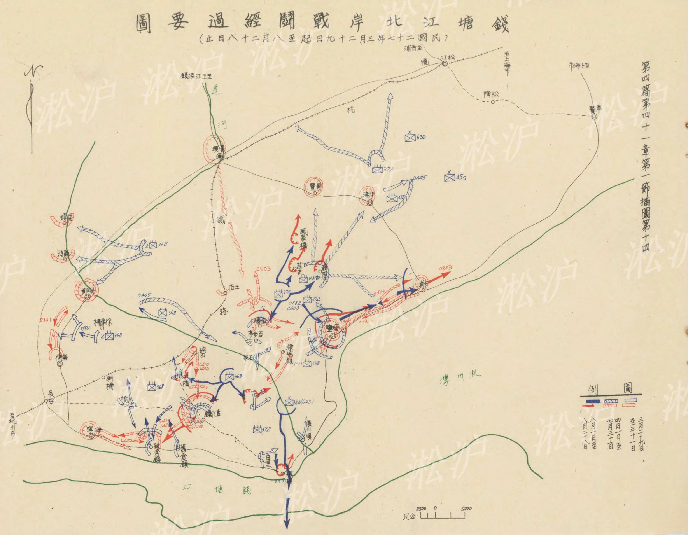

十五、餘杭城附近戰鬥

作戰時間：民國二十七年三月三十一日。

作戰部隊：第三戰區陸軍第二十五軍。

作戰地區：浙江餘杭城附近。

敵情：盤據吳興、武康等處之敵，近向杭、嘉間移動，似有進犯海鹽、海寧我第六十二師之企圖我軍目的：軍以牽制餘杭附近敵軍兵力轉移於海鹽、海寧方面之目的，由臨安方面以主力相機襲佔餘杭城，並殲滅敵之主力。

戰鬥經過：三月三十日黃昏後，該軍第一零八師之第六四四團已到達餘杭西南約八公里之楊橋頭以東附近，第六十一師之第三六一團到達餘杭以西六公里許之丁橋、采風山一帶，第三六六團到達餘杭西北約十五公里之長樂橋附近。入晚，探悉餘杭之敵約一千餘人，似以城垣爲據點，在城西北五里許之白湖山附近派有警戒部隊，是時我右翼第六四四團之第三營已將餘杭至閑林埠之敵方電線桿破壞十餘根，鹵獲銅裸線一千餘公尺。

三十一日三時，我第三六一團之第二營由丁橋附近開始向丁家畈、白湖山之線敵警戒陣地攻擊前進，至五時，將敵警戒部隊驅逐，並佔領該線，敵乃以砲兵向我猛擊，該營冒敵砲火迫近餘杭城垣，經一再攻擊，均爲敵之熾盛火力所阻，迄十二時，該營被迫撤回白湖山附近。十四時，敵以猛烈砲火掩護其步兵二百餘向白湖山反攻，該團遂令第二營稍事抵抗後，卽向青山鎮方面撤退，但敵進至白湖山後卽停止前進，該營乃又進至丁橋佔領陣地，其餘各團則在楊橋頭、天打山、長樂橋之線，嚴密警戒，該軍旋奉上峯電令：「避免攻堅」，該軍長乃留第六十一師之第三六一團牽制餘杭之敵，其餘軍主力於十九時撤回臨安，構築據點工事。戰

果：

(一) 鹵獲敵銅裸線一千餘公尺。

(二) 破壞敵方電線桿十餘根。

我軍傷亡：

(一)負傷官長二員。

(二)陣亡官兵十四員名。

松沪

淞沪

淞沪

淞沪

淞沪

淞沪

淞沪

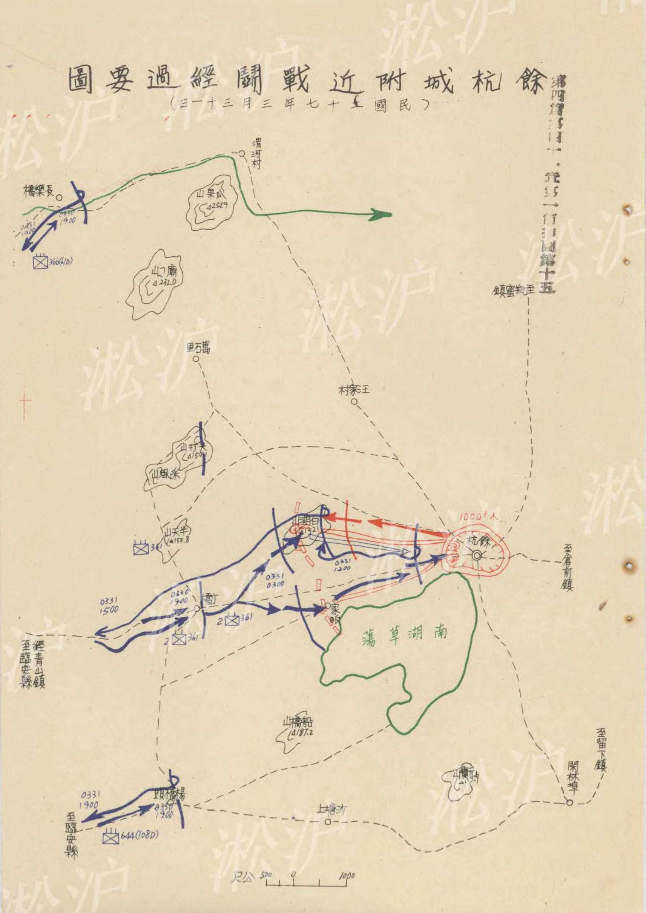

十六、隰縣朱家峪附近戰鬥

作戰時間：民國二十七年四月一日。

作戰部隊：第二戰區陸軍第九軍獨立第五旅第六一五團附第六一四團之第二營。

作戰地區：晉西隰縣朱家峪附近。

敵情：自三月下旬以來，敵於晉西義泉鎮以西地區，與我第一一五師發生激戰，該師不支，向黃頭以北地區轉進，於是敵卽北上進踞隰縣。時敵之另一部亦由隰縣以北之中陽、石樓附近南下，企圖夾擊我第十四集團軍總司令部。

我軍目的：該旅以掩護我第十四集團軍總司令部轉進之目的，以主力在隰縣以北之朱家峪佔領陣地，拒止敵人之北進。

戰鬥經過：獨立第五旅爲掩護集團軍司令部轉進，於四月一日六時許，令第六一五團附第六一四團之第二營於朱家峪附近東西高地之線，佔領陣地，該旅長率第六一四團（欠第二營）隨同集團軍總部向朱家峪以北之坊底村轉進。

是時該旅長據報：『北路來犯之敵，已於昨晚到達中陽，現正南進中，同時南路隰縣之敵，亦已向我攻擊』，該旅長當卽命第一線部隊嚴陣以對，並與右翼友軍之第八十五師切取連絡，迄十四時，敵攻佔第八十五師之蓬門村陣地，並以主力向該師陣地壓迫，於是該旅陣地右翼亦遭波動，十五時許，敵軍約六七百人，由砲兵掩護，向我朱家峪陣地猛攻，我官兵憑藉地形及工事，沉着抵抗，敵未得逞。

是（一）日十六時，該旅奉第十四集團軍總司令衛立煌電令：『該旅以主力掩護總部向朱家峪西北之前、後段村前進，以一部對敵施行節節抵抗』。該旅長奉命後，當卽於十六時三十分，以其第六一四團第二營歸還建制，並隨同旅部掩護總部前進，另以其第六一五團與敵保持接觸。迄十七時許，敵又向我第六一五團猛攻，該團乃向朱家峪以北之黃家莊轉移陣地，繼續與敵週旋，俄而敵以一部由黃家莊西南高地向該團之右翼迂迴攻擊，經該團竭力抵抗，敵傷亡甚重，十八時，該團向石樓縣南之關頭附近轉移陣地，旋又轉移至關頭以西接近前、後段村之王家原，時敵已在該村之東南端停止前進，此時該旅主力則已掩護總部轉進至永和縣矣。

戰

果：

(一) 鹵獲：

1. 步槍十三枝。

2. 步槍彈二一三粒。

(二)敵陣亡官兵一百餘人。

我軍傷亡：

(一)負傷官兵三十一員名。

(二)陣亡士兵十名。

(三)失踪士兵一名。

我軍損耗：

(一)武器—步槍二枝。

(二)彈藥—步機彈二四、六四零粒，迫砲彈一三七顆，手榴彈一九零枚。

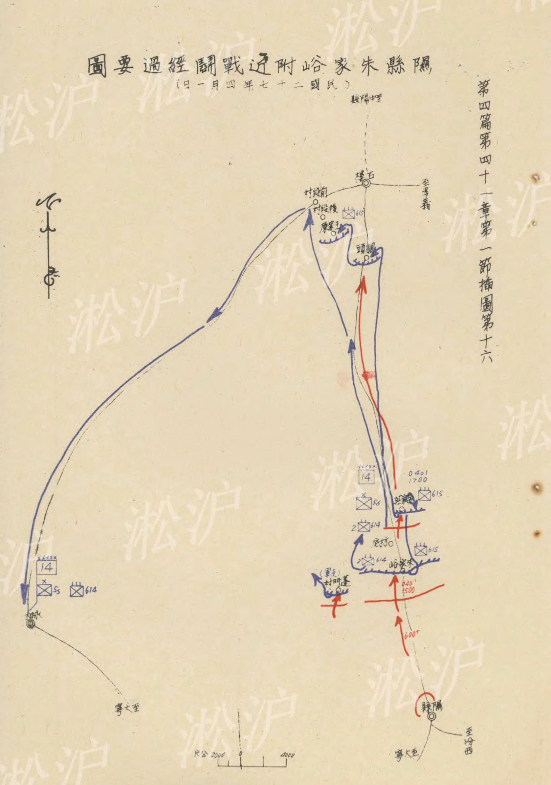

十七、餘杭雙溪鎮以西地區戰鬥

作戰時間：民國二十七年四月二十四日起至二十八日止。

作戰部隊：第三戰區陸軍第七十九師。

作戰地區：浙江餘杭縣雙溪鎮附近。

敵情：敵第十八師團所部約數千人，進陷杭州以來，以其一部及僞警衛大部駐守餘杭，武康有敵第六師團小池兵聯隊及步砲聯合之敵共計千餘人，餘杭東之瓶窯鎮有敵之堅固據點，聯棋塘、石瀕鎮、上柏鎮各有敵一部盤據，京、杭國道時有敵之裝甲車活動，潘板鎮、彭公站等處，時有敵哨及便衣隊出沒。

我軍目的：該師奉令以深入敵後游擊作戰及箝制京、杭國道正面敵軍兵力之目的，在崇德、新市、勾莊、德清及餘杭之斜坑、社村、簰頭鎮各處，予敵襲擊。

戰鬥經過：四月二十三日，該師第四七零團之第二營在餘杭東北之良渚鎮附近（距餘杭城約十七、八公里）不斷對敵襲擊，並阻塞交通，迄二十四日午後，突遭優勢之敵攻擊，該營以衆寡不敵，遂於是（二十四）夜向良渚鎮以西之社莊、老虎山之線撤退。

二十五日十四時許，敵之一部約百餘人，向我社村、老虎山之線攻擊，時該師第四七四團之第二營適經孫家門口向鶴山前進中，聞訊立即由黃湖鎮方面向敵石側背襲擊，敵猝不及防，受創頗重，當卽退回雙溪鎮。是時另一部步、砲聯合之敵約四、五百人，由彭公站附近向社莊東南約四里之化城寺、小嶺、進攻，當經我第四六九團之黑嶺守軍及第四七零團之第一營與第四七四團之第二營，予以迎頭夾擊後，敵遂於夜間退回雙溪鎮以東，我第四六九團當卽由帽子頂五零九、九高地向雙溪鎮右側背攻擊，激戰澈夜，互有傷亡。

二十六日拂曉，正面之敵，增至一千四、五百人，並以飛機三架及砲火向我黑嶺、社村、老虎山之線猛烈轟擊，迄十三時許，大雨如注，敵步兵冒雨向我全線猛攻，激戰二小時，肉搏七、八次，敵我傷亡均重，我第四六九團團長鑑戰况不利，乃親率預備隊由右翼陳家山方面逆襲，同時第四七零團之第一營亦自裏洪方面逆襲，斃敵百餘人，敵勢稍挫。

是時左翼老虎山之敵，亦被我第四七四團之第二營奮勇擊退，敵軍傷亡甚衆，入晚，全線戰況沉寂，迄午夜，該團乃以一部向敵後方據點之雙溪鎮夜襲，因兵力過小，未能奏功。

二十七日拂曉，敵由雙溪鎮以東之瓶窯鎮方面不斷增援，該師正面之敵，已達三千餘人，六時起，敵集中砲火向我水車坑、黑嶺之線猛擊，七時許，復以飛機向我帽子頂、黑嶺、象山、各要點轟炸，以掩護其步兵前進，經我守軍奮勇抵抗，帽子嶺之陣地失而復得者達七次，戰鬥至爲慘烈，敵我傷亡枕藉，我第四六九團官兵忠勇殉國者達二百餘名，帽子嶺及斜坑各據點於十二時相繼失守，該團卽由黑嶺向陳家山轉移陣地。迄十四時，該師以第四七三團增援左翼之老虎山，當將該處之敵擊退，旋卽東進，直撲敵之後方據點雙溪鎮，是時我中央方面之第四七四團亦乘勢出擊，猛撲黑嶺，將敵截成兩段，敵兵混亂，遂紛向水車坑方向潰退，當時我右翼斜坑之敵約二千餘人，見黑嶺之敵被我截斷，情況危殆，急折向南突竄，進迫該師右翼友軍之第一零八師冷水橋陣地，第七十九師師長察知敵有潰退跡象，乃卽以第四七四團之主力及第四七三團之第一營向潰退雙溪鎮及天平山之敵追擊，並以第四七三團主力經直嶺、風笑嶺向敵迂迴，與第四六九團協力夾擊斜坑南竄之敵，全線猛攻，激戰澈夜，迄二二十八日拂曉我軍繼續猛攻，敵不支，遂向彭公站、潘板鎮以東地區紛紛潰退，並在石瀕鎮鎮、瓶窯鎮一帶，利用其旣設工事，與我追擊部隊對峙，斜坑南竄之敵，遭我軍夾擊後，轉戰

果：(一)鹵獲：

長樂橋方向潰退。至是雙溪鎮以西地區，乃無敵踪。

1. 軍馬六匹。

2. 步槍二枝。

3. 重機槍一挺。

4. 步槍彈五四九粒。

5. 軍刀一把。

我軍傷亡：

(一)負傷官兵二三三員名。

(二)陣亡官兵八十七員。

(三)失踪士兵三十四名。

我軍損耗：

(一)武器——步槍五十二枝，手槍一枝，刺刀二十三把。(二)彈藥——步機彈二五、零零零粒，手槍彈一五、三零五粒，迫砲彈二零零顆，手榴彈二、五零零枚。

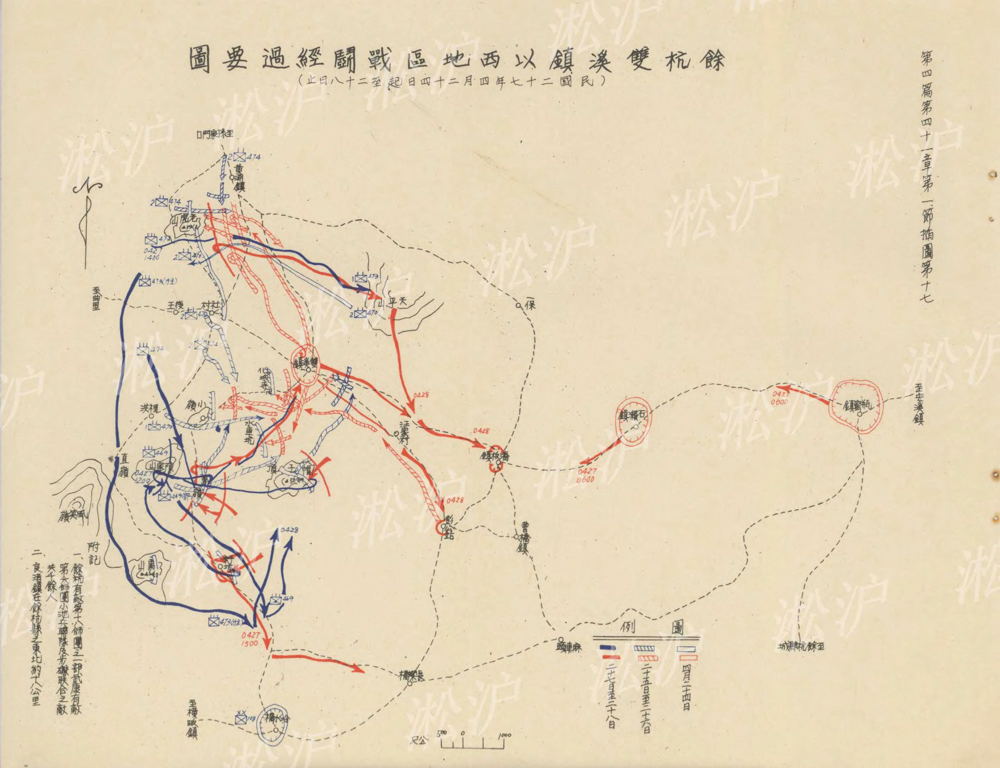

十八、餘杭城附近戰鬥

作戰時間：民國二十七年五月一日。

作戰部隊：第三戰區陸軍第一零八師。

作戰地區：餘杭城西北之蔣家渡、丁橋、長樂橋一帶。

敵情：敵牛島師團伊籐聯隊，附騎兵六十餘人，砲四門，自四月二十八日，被我軍擊退後，據守餘杭西北天打山、半天山迄丁橋之線，餘杭城內僅有少數敵軍。

我軍目的：該師以襲擊餘杭及其附近敵軍之目的，以一部沿徽、杭公路向餘杭城南佯攻，以主力由餘杭西北二十餘里之長樂橋東南地區向餘杭襲擊。

戰鬥經過：五月一日，該師以第三二二旅（欠第六四三團）之主力，分數縱隊向餘杭以南之鳳凰山施行佯攻，以第三二四旅（附工兵一連砲兵一連）之一部佔領餘杭以西十三公里許之青山鎮亘汗嶺村之線，主力由長樂橋東南地區向餘杭及其以北之敵襲擊。

四時許，我第三二四旅第六四七團之第二營到達丁橋、半天山、天打山之線，立即向敵攻擊，激戰約兩小時後，敵向餘杭城撤退，該營遂於六時許攻克該線陣地，當卽一面修補工事，一面向敵追擊。此時第六四八團已進抵長樂橋、舟枕山、瓜果山之線，與左翼友軍第七十九師取得連絡後，隨卽經萬石里向餘杭西北之俞家村攻擊前進，時適有敵二百餘人由白湖山經俞家村擬向我右側迂迴，該團遂由俞家村之北側向敵側擊，敵不支，退回餘杭城，該團卽跟踪追擊前進，十三時許，迫近餘杭城北三公里許之方家村，敵憑城據守，該團乃環城圍攻，戰鬥異常激烈。時我佯攻部隊第三二二旅之一部，已將蔣家渡敵之警戒部隊驅逐後，向童家河頭猛攻，並破壞該處附近之公路，另一部則由丁家板進至城西，一度衝入餘杭西關，與我左翼主攻部隊協同猛攻，敵軍閉城死守，迄十六時，仍在激戰中。十八時許，敵由杭州增援二百餘人，同時餘杭東北瓶窯鎮方面亦到敵援軍二千餘名，該師恐入夜後腹背受敵，乃令第三二四旅之第六四八團利用薄暮逐次向萬石里附近轉移，以阻擊瓶窯鎮之敵，並令右翼之第六四七團撤至丁橋、半天、天打山之線，佔領陣地，二十時，該師各部隊均先後到達指定地區，敵亦未敢追擊，戰鬥遂告結束。

戰

果：

鹵獲：

1. 步槍彈六六零發。

2. 砲彈十顆。

我軍傷亡：

(一)負傷官兵五十七人。

(二)陣亡官兵二十四人。

(三)失踪官兵八人。

我軍損耗：

(一)武器——步槍十八枝，刺刀五十八把，機槍七挺，手槍一枝。

(二)彈藥——步機彈一三四、九零七發，手槍彈一、三九四發，手榴九四九顆。

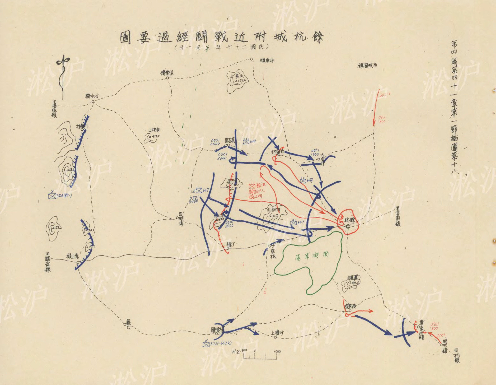

十九、富陽梓橋嶺附近戰鬥

作戰時間：民國二十七年五月一日。

作戰部隊：第三戰區陸軍第十九師第五十五旅第一一零團。

作戰地區：浙江富陽之梓樹嶺附近。

敵情：富陽至凌家橋一帶，駐有敵軍約二千餘人，守備新橋鎮、宋殿、大莊、虎豆山及凌家村各要點，不時以一隊兵力梭巡富杭公路，以保佔領區之安全。

我軍目的：該團奉令以策應我軍徐州會戰之目的暫歸第五十五旅旅長直接指揮，爲該旅主攻部隊，由富杭公路以西地區向富陽之敵襲擊。

戰鬥經過：四月三十日，該團以第一營（附第三營之迫砲排）爲攻擊部隊，向銅山、宋殿之敵攻擊，以第二營對東北方面祝家村、閑林埠之敵警戒，以第三營爲預備隊。

五月一日三時，該團各部隊均到達攻擊準備位置，當卽開始攻擊，拂曉後，我第一營將銅山、青山之敵驅逐，一部迫近宋殿，對敵猛攻，敵憑藉工事頑抗，我第二營之第六連，則攻佔師姑山之敵陣地，該團乃一面派遣便衣隊襲擊銅山以南之新橋鎮，一面令第一營迅向宋殿、虎豆山之敵猛攻，迄八時三十分，敵以砲火向我金山之陣地猛攻，同時大莊之敵約百餘名，分兩路反攻師姑山，第二營之第六連奮勇迎戰，死傷甚大，被迫放棄師姑山，是時我第一營固守青山、銅山，十一時三十分，敵由富杭公路駛來汽車多輛，滿載援兵，又裝甲車二輛，內載敵砲，十二時十分，富杭公路以東之宋梁山敵重砲向我猛擊，同時虎豆山、大莊之敵二百餘人，亦向我左翼壓迫，迫進至梓橋嶺附近，經該團第二營之猛烈射擊，敵勢稍挫，而祝家村方面復馳來敵四、五百人，猛向梓樹嶺進攻，此時情況危急，該團長卽令第三營之第八連馳援梓樹嶺，該連先集中火力向敵猛烈射擊，並與敵肉搏十餘次，敵因仰攻，傷亡枕藉，乃向我左翼之板照山運動，企圖包圍我軍，亦爲該團第三營之第七連所阻，並予迎頭痛擊，敵傷亡慘重，於十五時四十分，紛紛向東潰退，戰鬥遂告中止。

我軍傷亡：

(一)負傷官兵四十一員名。

(二)陣亡士兵十三名。

我軍損耗：彈藥——步機彈二二、一七一粒，手槍彈三四零粒，迫砲彈二十六顆，手榴彈三一七枚。

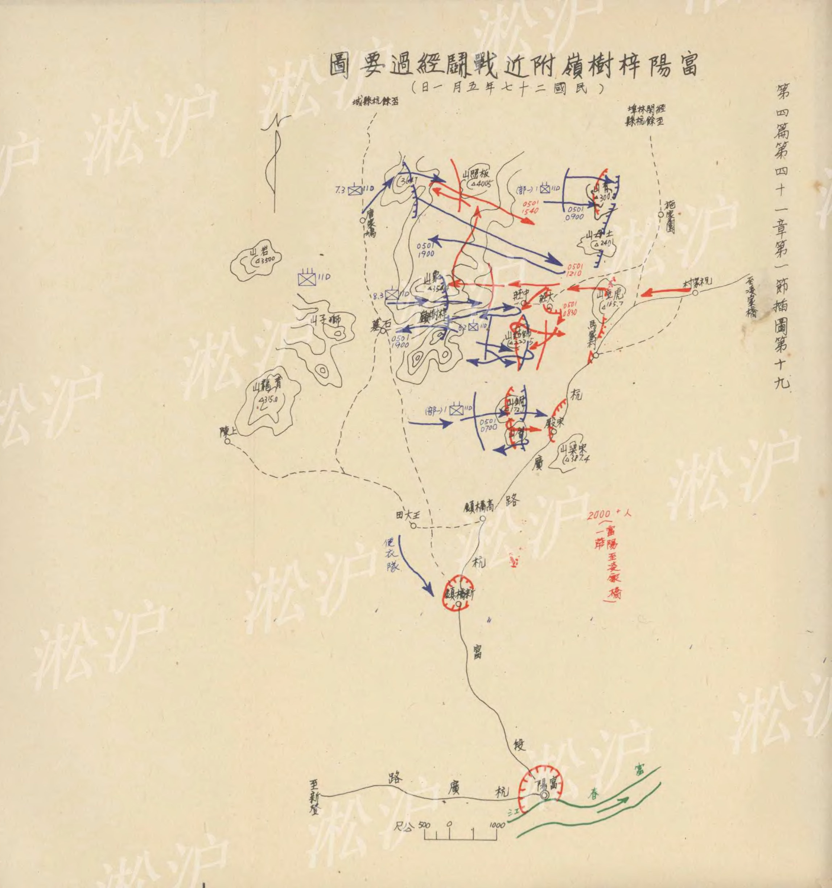

二十、蕪湖灣址附近戰鬥

作戰時間：民國二十七年五月一日起至二日止。

作戰部隊：第三戰區第二十三集團軍所屬第一四四師及第一四八師之各一部。

作戰地區：安徽之蕪湖及灣址附近。

戰情：敵自臺兒莊失利後，除整頓其殘部及由國內增援外，並於平漢、江南、山西、各戰區內抽調有力部隊至津、浦路南北段，冀圖一逞。計自四月下旬以來，敵由采石磯、蕪湖方面渡江北進者，約在一萬餘人左右。

我軍目的：該集團軍以策應徐州會戰之目的，對當面之敵，施行全線襲擊，以箝制江南之敵轉用魯南。戰鬥經過：該集團軍以其第一四四及第一四八師各抽出一部爲攻擊隊，分別向芳山鎮及鐵道線之小河口、楊家渡、竹絲港一帶攻擊。

五月一日三時許，我各部隊開始總攻擊，第一四八師之林光裕團第七、八兩連進至鐵道附近時，其砲兵卽向灣址鐵橋猛擊，以掩護步兵之攻擊前進，及至拂曉，敵砲兵由灣址附近向我猛烈還擊，我軍無法前進，同時敵以騎兵向我側翼威脅，經我擊退，迄十七時許，敵步兵約二百餘，由九里山及俞村向我襲擊，激戰約一小時，將敵擊退。是時攻擊楊家渡、竹絲港之兩營，已佔領楊家渡，一部到達竹絲港，敵增援向我逆襲，戰鬥激烈，我軍因傷亡過重，乃撤至鐵道以南與敵對峙。至我第一四四師之劉郁文團附獨立第十三旅之一營，則分由楊家渡及吳村向老虎山攻擊，時芳山鎮之敵軍南下側擊我軍，該團因之傷亡甚重，遂轉移至老虎山山麓，其另一部（第三營）則在楊村以南與敵三百餘發生戰鬥，營長身負重傷，乃轉移至黃泥塘附近，我第四三零及第四三二旅之游擊部隊，則分向北山、白馬山之敵襲擊，竟日在處附近與敵激戰中。

五月二日拂曉，我游擊支隊突入當塗城，佔領城內各重要據點，旋采石磯之敵數百增馳並與城內守敵會合向我反攻，因敵衆我寡，乃由東關退至五里牌附近，與敵對峙，我另一部游擊支隊，則突入清水河，斃敵二十餘名，十一時三十分，我林光裕團之第一營經楊村向公路西側俞村之敵進襲，敵不支向九里山撤退，該團派出之游擊部隊，則分向敵佔領區活動，並大量破壞鐵道公路及電桿電線等。

戰

果：

(一) 鹵獲砲彈十顆。

(二)破壞路軌二條。

我軍傷亡：

(一)負傷官兵一零五員名。

(二)陣亡官兵四十七員名。

我軍損耗：

(一)武器——機槍一挺，衝鋒槍十五枝。

(二)彈藥——步機彈七五、四四零粒，手榴彈五九六枚，砲彈一、零三一顆。

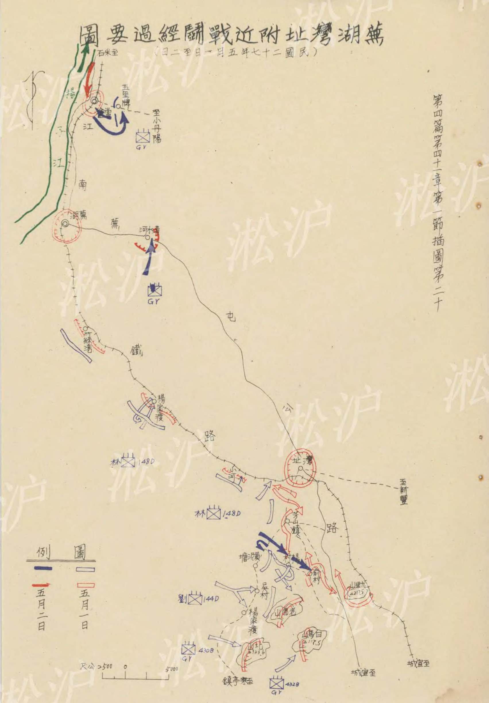

5各地游擊战(一)

二十一、武康附近戰鬥

作戰時間：民國二十七年五月一日起至三日止。

作戰部隊：第三戰區陸軍第七十九師。

作戰地區：浙江武康附近。

敵

情：敵軍松井部隊之一聯隊，分駐於吳興、武康、南浔一帶，歸第十八師團長牛島眞雄指揮，武康城內敵軍構築據點工事，從事守備。

我軍目的：該師奉令向武康之敵襲擊，並乘機佔領之。

戰鬥經過：自四月下旬以來，該師之一部即向武康附近之敵攻擊，漸呈對峙狀態，至二十九日，該師奉令襲擊武康後，遂增派補充團由簰頭鎮方面向其襲擊，並以第四七零團之主力、第四七三團全部及第四七四團之第一營，分別向武康以東之崇德及其東北之德清作迂迴攻擊，以收夾擊之效。

五月一日三時，第四七三團已攻抵德清，敵向塘涇鎮方向退走，旋卽夾擊武康，是時第四七零團之主力亦進抵武康東北之夏家山附近。

二日，該師之補充團以一部兵力牽制三橋埠及上柏之敵，主力由朱王廟向武康攻擊，經猛烈衝擊後，將城西附近村莊完全佔領，嗣因敵之工事堅固，火力猛烈，雖猛攻數小時，未得進展，旋敵由吳興方面增援步兵一千餘、騎兵二百餘，我軍左翼頓受嚴重威脅，該團主力被迫向朱王廟以西約三里許之城山廟、小嶺村、紫山之線轉移陣地。

三日十六時，該師奉令脫離戰場，撤回原陣地，待機出動。

戰

果：

(一) 鹵獲：

1. 步槍七枝。

2. 步槍彈九十粒。

(二)斃敵官兵九十餘員名。

(三)軍馬十九匹。

我軍傷亡：

(一)負傷官兵十九員名。

(二)陣亡士兵三名。

(三)失踪官長一員。

我軍損耗：武器——步槍二枝，手槍一枝。

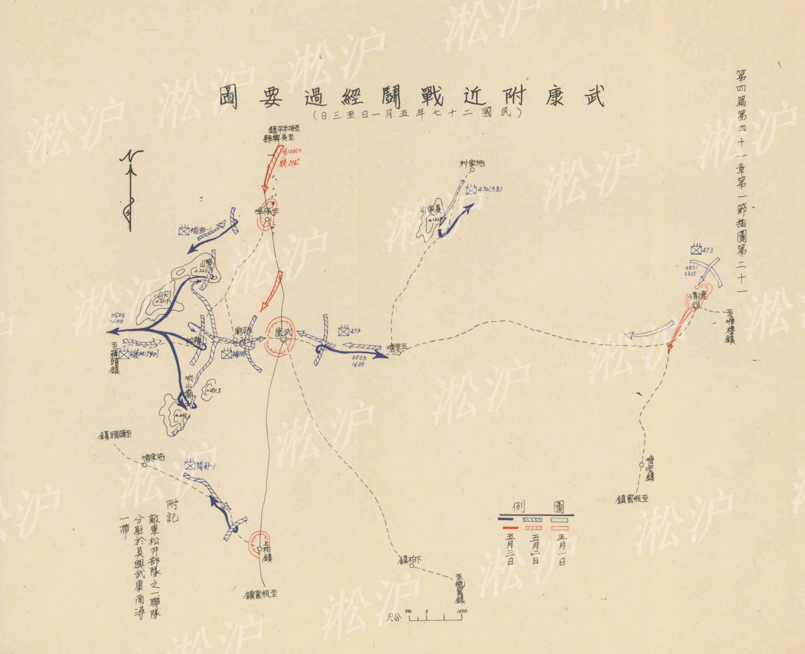

5各地游擊战(一)

二十二、宣城孫家埠附近戰鬥

作戰時間：民國二十七年五月一日起至七日止。

作戰部隊：第三戰區陸軍第九十師配屬砲兵兩個連。

作戰地區：安徽宣城孫家埠附近。

敵情：敵第六師團自進佔蕪湖、宣城後，即在蕪、宣附近之灣址、孫家埠及洪林橋一帶構築堅固據點，企圖保障其蕪、宣一帶之安全。

我軍目的：該師以策應徐州會戰及配合皖南我軍總攻擊，以牽制敵軍不能應援其江北作戰之目的，向孫家埠之敵襲擊而佔領之。

戰鬥經過：該師奉令後，當於四月二十九日，以師主力（第五三六團及第五三五團之第三營附步兵砲第二連）爲攻擊部隊，以第五三五團主力任右翼老鼠山、東華山之線之守備，對洪林橋方面之敵嚴密警戒，以掩護師陣地右後方之安全，以第五三九團任鷄頭嶺、張家橋以東一帶之守備，並以第五四零團之第二營及補充營佔領孫家埠以南五顯廟、西陳村之線，掩護我砲兵之孟村陣地，迄三十日，各部隊均到達攻擊準備位置。

五月一日二時三十分，我砲兵開始射擊，摧毀敵陣地及其障礙物，半小時後，該師步兵藉砲火之掩護向敵攻擊，至四時許，我第五四零團第三營之主力，迂迴至孫家埠之西南側，對敵襲擊，其一部於四時三十分突入孫家埠，並佔領孫家埠西北之下街頭，是時我第五三五團之第三營，亦已逼近孫家埠東南之敵陣地，敵以熾盛火力向我掃射，我軍仍奮勇前進，激戰約一小時許，衝入孫家埠之南街，敵受我夾擊，乃退守內街，與我巷戰，八時許，敵由宣城增援三、四百人，被我第五三六團截擊於孫家埠之東北側，受創甚重，旋卽退去，時我第五三五團之主力亦已由右翼挺進佔領孫家埠東北之麻姑山，嗣即向東進擊洪林橋之敵，但孫家埠之敵，自退守內街後，憑堅頑抗，我軍一再攻擊，終無進展，是夜該師長歐震乃增加第五四零團之第二營由孫家埠西側向內街夾擊，爲敵砲兵及輕重兵器之熾盛火力所阻，亦未奏功。歐師長爲誘敵離開其堅固陣地予以殲滅，遂於三日四時，令圍攻各部隊退出孫家埠，分別控置於孫家埠之東陵塘、百畝塘、大仲村、七道橋、王麻村、龔村一帶，待機再圖攻擊，迄十三時許，孫家埠之敵二百餘人，果向我王麻村一帶攻擊，同時汪家山之敵二百餘，亦南下協同攻擊，東陵塘之我第五三六團立即迎擊該敵，至十六時，洪林橋之敵二百餘人，又轉向東陵塘增援，是時該團當面之敵，已增至七、八百人，激戰至四日一時，敵不支，仍向孫家埠、汪家山、洪林橋回竄，我軍當即追擊，仍復圍攻孫家埠，迄十四時，敵又以步兵六、七百人，附山砲二門，向我反攻，並以騎兵二百餘由汪家山向我百畝塘以北擾襲，歐師長當令各團截擊，激戰至十七時許，我軍仍在東陵塘、大仲村、三里店之線，與敵相持。

七日十三時許，該師奉軍長電令：該師卽開往清溪附近地區集結爲機動部隊，該師長遂於八日晚將防務移交第十一師接替後，卽遵命開赴清溪。

戰

果：

(一) 鹵獲：

1. 軍馬一匹。

2. 防空警報器一座。

(二)斃敵官兵一百餘員名。

我軍傷亡：

(一)負傷官兵四二四員名。

(二)陣亡官兵三二零員名。

5各地游擊战(一)

(三)失踪士兵五名。

我軍損耗：

(一)武器——步騎槍一九六枝，機槍十挺，手槍九枝，刺刀一七四把。(二)彈藥——步機彈一六六、二九三粒，迫砲彈三一顆，手槍彈五、四二二粒，手榴彈一、六零二枚。

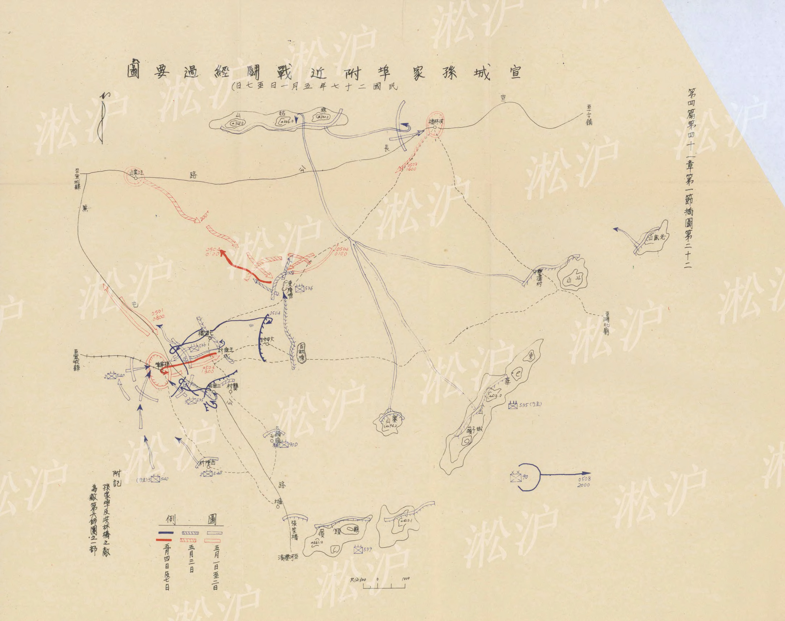

二十三、長興縣龍山附近戰鬥

作戰時間：民國二十七年五月九日起至十六日止。

作戰部隊：第三戰區陸軍第九十八師。

作戰地區：浙江長興龍山附近。

敵情：敵第十八師團第五十六聯隊步、砲聯合約二千餘人，於五月九日由長興方面向我九十八師守備地區之梅溪、林城橋一帶進攻，以牽制我之兵力。

我軍目的：該師以守備浙江長興以西之梅溪鎮、林城橋一帶之目的，拒止敵軍，並相機襲擊之。

戰鬥經過：五月九日，敵以空軍掩護其步兵向我第九十八師防守之梅溪鎮一帶陣地進攻，經該師沉着應戰，敵未得逞，相持至十三日，敵復以砲兵向我陣地轟擊，繼以步兵進攻我白水灘陣地，旋被該地守軍擊退。十四日拂曉，敵步兵二千餘，在其飛機三架、砲四門掩護下，猛烈進攻，我官兵奮勇迎戰，激戰至烈，終以陣地被毀，防守不易，且傷亡重大，白水灘、楊村、楊家墩及林城橋各據點先後陷於敵手。入夜，該師長遂決心變更部署，以主力佔領小溪鎮、畝橋、泥橋之線，並以師工兵營在龍山構築工事，乃以天雨連綿，部隊運動困難，致各團未能依限到達，確實佔領陣地。十五日八時，敵軍主力由泥橋方面突入，隨卽包圍畝橋，直趨龍山，我工兵營以衆寡懸殊，被迫後撤，同時敵另以一部猛攻梅溪鎮，該地守軍亦因傷亡過重而放棄。

十六日十二時許，該師師長親率各團奮勇反攻，士氣大振，經激烈戰鬥後，始將敵軍擊退，該師卽以一部收復梅溪鎮、龍山及白水灘一帶之原有陣地，並以主力分別向曉墅、和平鎮及泗安鎮東北之玉泉寺等處尾追退却之敵。

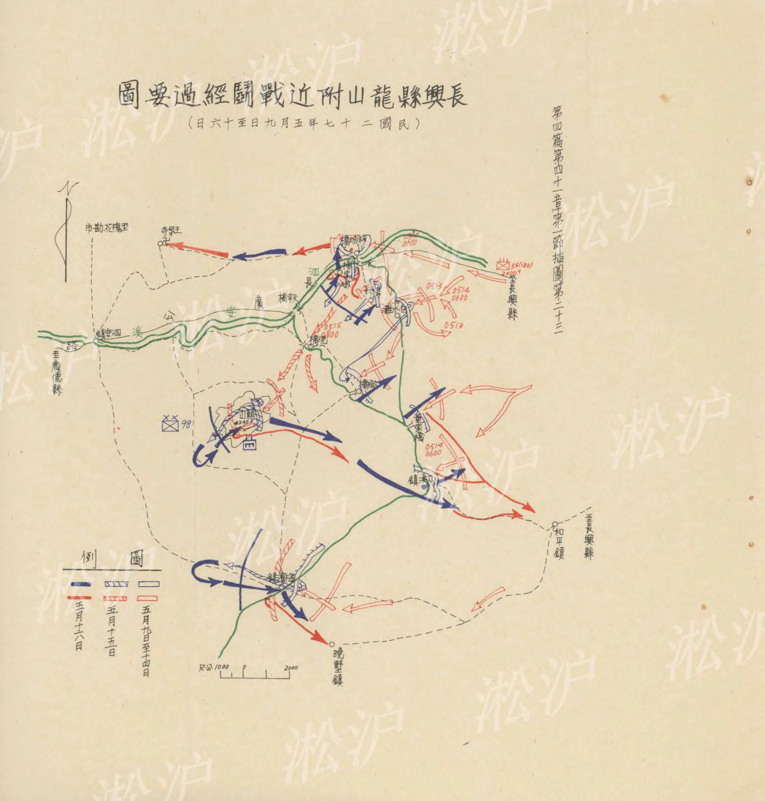

二十四、餘杭石壁山附近戰鬥

作戰時間：民國二十七年五月三十日。

作戰部隊：第三戰區陸軍第七十九師第二三七旅第四七三團及第四七四團之各一部。

作戰地區：浙江餘杭縣石壁山附近。

敵情：餘杭之敵，自本月二十二日調防後，曾派游擊部隊二百餘人，由聯棋塘方面分途襲擊我軍萬石里、長樂橋、潘板橋等據點，經我軍由萬石里出擊後，該敵紛紛退回聯棋塘及瓶窯鎮等處，此後敵雖陸續增加兵力，但迄無行動，似係採取守勢。

我軍目的：第四七四團奉令在桐嶺、橋頭、菖蒲嶺、嚴口、青山鎮、石壁山、紅嶺、乾口、橫板鎮之線佔領陣地，拒止敵軍之襲擊。

戰鬥經過：五月三十日七時許，敵便衣隊約六十餘人，由石壁山以東之白湖山向半天山、采風山之線前進，旋敵以主力向我石壁山以東約二里之將軍山警戒陣地攻擊，經該地守軍極力抵抗，相持至十時許，敵增援步兵二百餘人、砲四門，續向將軍山進攻，激戰至十二時許，我卒因衆寡懸殊，遂向石壁山、紅嶺之線主陣地撤退，敵跟踪追躡，雖經我猛烈火力阻擊，敵仍繼續向我前進，該團長卽令第一營營長率第二連由百江嶺向青山鎮以東推進，於紅嶺附近與敵遭遇，經激戰後，敵勢稍挫，但其火力猛烈，我軍亦無法前進，相持至十五時，敵復增至五百餘人，分四路向我猛撲，經我軍奮勇抵抗，敵未得逞，迄十九時，敵由我左翼突入石壁山陣地，我卽退守大水橋以北地區，敵跟踪前進，經我之猛烈火力射擊，敵未敢深入，遂成對峙狀態。

此時該團團長決心驅逐突入之敵，乃從新部署，以該團第一營之第二連指向敵中央之石壁山、第四七三團第一營之第三連指向敵之右翼戴家村，以第三營之第九連由苕溪南岸之汪家埠站指向敵左後方之丁橋，是晚二十四時，我各部隊同時開始攻擊，左右翼部隊當卽深入敵後，形成包圍態勢，敵於黑夜間倉卒應戰，傷亡甚重，時我正面攻擊之第二連亦已突入石壁山，敵乃不支，紛紛向東逃竄，退回餘杭城，我軍乃於三十一日拂曉，恢復石壁山、紅嶺之陣地。

戰果，斃敵士兵二十餘名。

我軍傷亡：(一)負傷士兵四名。

(二)陣亡士兵二名。

我軍損耗：彈藥步機彈六、一五零粒，手槍彈二一零粒，手榴彈五十九枚，信號彈十四粒。

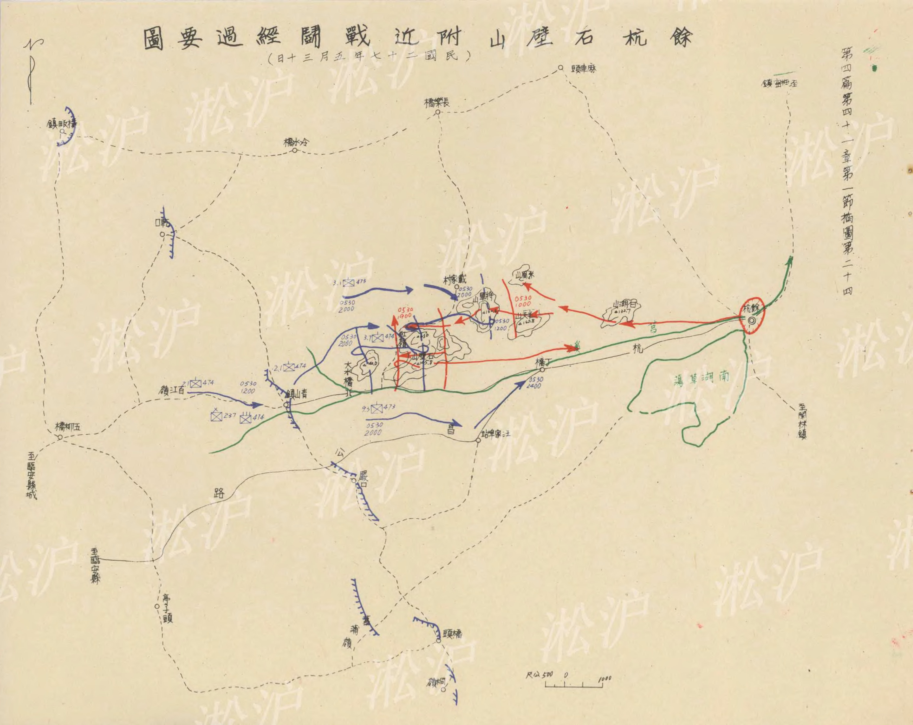

#### 第二款武漢會戰期間

民國二十七年六月，徐州會戰後，敵第二軍被阻於黃氾，轉向正陽關、合肥方面移動，同時敵第十一軍溯長江向大通、安慶前進，其進攻武漢之企圖逐漸明朗，我軍主力雲集武漢方面，爲指揮便利，增設第九戰區，以第一、第二兵團爲基幹，擔任江西、鄂南、湖南、長江南岸之作戰，並擴大第五戰區，以第三、第四兵團爲基幹，擔任蘇北、皖北、豫南、鄂北、長江北岸之作戰。

當武漢會戰期間，各戰區爲資策應計，各對其當面敵人發動游擊或反掃蕩戰鬥，至爲活躍。

第三戰區分令第十集團軍任滬杭一帶游擊，第三十二集團軍任京滬一帶游擊，第二十三集團軍任江南鐵路沿線及長江沿岸之游擊。部隊遵令行動，曾一度克復富陽、溧陽、宜興、當塗、宣城、海寧，海鹽、吉安各縣城，且隨時對敵後方連絡補給線及漢奸組織予以重大破壞與威脅，我江防砲兵襲擊敵之軍艦及運輸艦艇尤奏偉功。

第二戰區在徐州會戰期間，山西敵軍經我軍對晉南三角地帶反掃蕩後（經一月餘之激戰斃敵不下二萬餘人），其第二十師團殘部，困守曲沃，一籌莫展，迨至徐州會戰終了，敵乃抽調河南作戰之第十四師團、第一零八師團及其第四混成旅團分三路入晉，求解曲沃之圍，惟經我第一六六師在沁水附近截擊後，敵仍向東撤退，我乃收復沁水、翼城、曲沃等地。

八月十五日，晉南之敵第二十師團，分三路向永濟進攻，連陷永濟、風陵渡，九月二十八日進佔橫嶺關，嗣經我軍反攻，乃轉向垣曲西北退去。

十一月初，在中樞決定持久抵抗戰略之下，武漢國軍執行有計劃之轉移，於是抗戰進入第二時期，武漢會戰亦於同月中旬宣告結束。

綜合此一期間第一、第二、第三、第五戰區在豫北、晉南、蘇北、皖南及浙西各地區實行大小戰鬥凡十六次，均有相當輝煌之戰果，茲分別述之於後。

二十五、濟源附近戰鬥

作戰時間：民國二十七年七月七日起至二十七日止。

作戰部隊：第一戰區第一六六師第四九六旅。

作戰地點：河南濟源附近。

敵情：竄據豫北之敵下元師團及土肥原師團之各一部，共計兵力約三千餘人，於七月初旬由沁（陽濟公路及沁河右岸向西攻擊濟源城，其主攻部隊配屬優勢砲兵，計有山砲三、四十門、重砲十數門，於七月六日進抵濟源城南五里許之合河村、東西留村、東西馬蓬、屯頭附近，佔領陣地，並以騎兵二、三百名不時出沒於濟源以南十餘里之東西只城、劉莊一帶，其一部配有砲兵由沁河右岸向西前進，佔領濟源東北十里許之東西許村及亞橋西北各村。

我軍目的：該旅奉令以其第九九一團第一營守備濟源城，以阻止敵軍之侵入。

戰鬥經過：七月七日，敵先以一部由濟源東北向我佯攻，並以砲兵向我東北城隅一帶射擊，迄午，濟源東北城隅爲敵砲轟毀，經我守軍沉着應戰，斃敵六、七十名，殘敵仍退回原陣地。

八日拂曉，敵集中砲火向南門及其以西地區射擊三百餘發，南門城樓被毀，城門亦隨之炸碎，其以西城牆有四、五丈寬之缺口，敵步兵在其煙幕掩護下向缺口部猛攻，經我守兵集中火力掃射，激戰達三十分鐘後敵勢始挫，乃退回城門關附近。八時許，敵復施放煙幕，掩護其步兵經缺口處強行攀登，我守兵奮勇抵抗，敵傷亡百餘名，終未得逞。十時許，敵再以砲兵主火力向城東南轟擊，同時以其砲兵之一部轟擊城之西南隅，各處均被炸毀二、二丈之缺口，而我坑道內之守兵亦死傷數十名，隨之敵向前猛進，經我集中輕重機槍火力猛烈掃射，敵雖傷亡枕藉，但一部已越過城壕，迫近城坦，我預備隊適時加入戰鬥，斃敵八十餘名，敵於十二時許仍退回南關。十三時許，敵砲兵續掩護其步兵向城南各處之缺口猛攻，我軍雖傷亡甚衆，仍奮勇抵抗，堅守陣地，激戰至十六時，敵死傷達一百餘人，再退回南關，十七時許，敵除仍以砲兵主火力向我缺口部猛擊外，另以一部砲兵轉移陣地，向我西門射擊，同時另以步兵一部向城東北佯攻，企圖牽制我軍，敵砲射擊連續達四小時，發射約萬餘發，一時火光冲天，工事全被炸毀，守軍傷亡甚大，敵利用火光向我全線猛攻，我軍以一營殘餘之衆，禦數倍之敵，雖官兵用命誓死抵抗，終以兵力薄弱，於是敵之一部衝入東門及南門，我守軍崔營長以情況危急，乃親率預備隊馳援，苦戰至午夜，敵因傷亡過重，乃退回城外，是時我軍彈藥將罄，該營長當即派兵一排由北門突圍，馳往大社專員公署商借彈藥。

九日我軍彈藥未到，而敵步兵復藉其砲兵之掩護向我猛攻，守軍以苦戰兩晝夜傷亡頗重，且糧彈告罄，勢難撑持，遵於十時許由北門向山地撤退，於是濟源陷於敵手。

敵下元師團及土肥原師團之一部，於侵據濟源後繼續擾竄晉南，經我第一戰區各部隊予以痛擊，傷亡慘重，遂於七月下旬陸續向東撤退，其後衛部隊約一千餘人，於二十四日撤至濟源，掩護其輜重沿沁濟公路退却。我軍以規復濟源並追擊敵軍之目的，令第四九六旅全部進出濟源城，該旅長奉令後，當卽於二十五日以其第九九一團進出濟源東北城郊附近，積極對敵襲擊，相繼佔領濟源城，以第九九二團進出濟源東南之中王村附近，以主力奇襲公路方面之敵，相機殲滅之。

是（二十五）日十四時許，敵以一部出濟源東門企圖向沁陽撤退，被我第九九一團之一部以熾盛之火力所阻，乃於十七時許仍囘竄濟源城內。

二十六日十二時，敵步騎兵約三百餘，附空車四、五十輛，由沁陽沿公路西進，企圖至濟源運輸退却之敵，當經我第九九二團於岡頭村東南附近伏擊，敵於傷亡數十人之後倉皇遁入濟源城，是夜我第九九一團第一營襲擊濟源以南東西留村之敵，並以一部乘黑夜接近，以手榴彈向敵猛擲，敵倉卒應戰，激戰至拂曉始撤回原陣地。

二十七日拂曉，濟源城內及其附近之敵，在其砲兵掩護下開始向沁陽撤退，我當即以第九九二團之主力跟踪追擊，並以第九九一團由城南攻擊，敵不及應戰，狼狽撤退，傷亡頗重，遣棄馬匹彈藥尤多，十四時我軍克復濟源城。

戰

果：一、鹵獲：

1. 敵汽車一輛。

2. 自行車一輛。

3. 乘馬一匹。

4. 步槍一枝。

5. 步槍彈二、一○○粒。

6. 砲彈四顆。

7. 手榴彈二○枚。

二、敵軍死傷約一千餘人，馬五十餘匹。

我軍傷亡：一、負傷：

1. 官七員。

2. 兵一百餘名。

二、陣亡：

1. 官一員。

2. 兵五十餘名。

我軍損耗：一、武器：

1. 步槍十二枝。

2. 手槍二枝。

3. 刺刀五十三把。

4. 大刀二十四把。

二、彈藥：

1. 步槍彈六、六○八粒。

2. 手槍彈一二八粒。

3. 迫砲彈二、二四四顆。

4. 手槍彈四九粒。

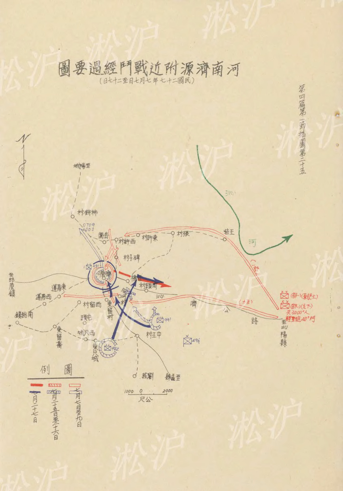

二十六、宣城雙橋鎮至團山間戰鬥

作戰時間：民國二十七年七月十五日起至二十三日止。

作戰部隊：第三戰區陸軍第六十七師。

作戰地點：安徽宣城雙橋鎮、團山一帶。

敵情：宣城團山、洪林橋、孫家埠、雙橋鎮、九門山各據點，原爲敵軍第六師團第二十三聯隊據守，自七月上旬以來，敵改以上海派遣軍之第三十四聯隊籐田部接防，配屬砲十餘門，騎兵七十餘名、戰車六輛，以主力盤據宣城，其餘仍分據各據點，並構築堅固工事障礙物及副防禦之設備，惟團山守兵特多，似爲其鈴木大隊主力所在。

我軍目的：該師奉命以襲擊敵軍遮斷公路之目的，使用一部兵力向宣城以東雙塘店迄宣城以西團山之間襲擊。

戰鬥經過：七月十五日，該師右翼第二○一旅之第四○二團由柷門北進，將宣城以東雙塘店至雙橋鎮間之公路橋樑破壞，其左翼第一九九旅之第三九七團，則向宣城以西之團山襲擊，敵頑強抵抗，迄十三時許，宣城東南孫家埠之敵步騎兵百餘名，退回宣城時，被我第四○二團截擊，斃敵數十名，第三九七團之一部，則越過公路潛伏於七都章附近，準備襲擊由宣城西北灣址附近前來馳援之敵。

十六日，第三九七團之一部進佔宣城西南之銅山、鐵山，並將附近之公路橋樑破壞，復將宣城西南由沈莊上至新屋間之鐵道予以破壞。是晚，敵火車一列滿載軍火及敵軍三百餘工人四百餘名，由灣址開至沈莊上附近搶修鐵道，爲我預伏七都章附近之部隊襲擊，斃敵數十名，並將工人擊散。

十七日，我第四○二團及第二○一旅之便衣隊，將雙橋鎮附近橋樑三座完全破壞。

十八日，二十三集團軍總部，爲加強該師之火力，卽以第九十八師之山砲兵兩連配屬於該師作戰，該師長以先奪取團山附近高地及敬亭山之目的，遂卽變更部署，除以第四○二團主力仍在宣城東南地區襲擊宣城之敵外，以該師主力由楊柳舖向團山攻擊。是日八時，敵以步騎兵百餘名，掩護其工兵二、三百名在雙橋鎮以西地區搶修公路橋樑，被我第四○二團擊退，十六時許，孫家埠之敵約三百餘名北上至大殷村，企圖渡河襲擊該團後方，遭預伏涼亭附近之部隊阻擊，敵仍退回孫家埠。

十九日，敵將宣城至灣址間之鐵道修復，拂曉前卽有火車一列由灣址駛往宣城，十三時許，又由灣址開出火車一列，計四十輛，除兩輛係砲兵餘均爲步兵。迄十六時，敵軍四、五百名竄至塘店以東地區，經第四○二團第一營襲擊，激戰一小時後，敵傷亡六、七十名，遂向宣城竄去。綜計日來宣城增援之敵已在千餘人左右，是夜該師之第三九八團推進至團山以南之林塘埔、望城崗、長橋之線以南地區，第三九七團主力集結於蕭公橋附近，以一部向九里山以北積極破壞宣城西北之公路鐵路，另以一部於宣城、灣址間地區活動。

二十日十三時，我第三九七團之一部，在九里山以北破壞鐵路之部隊，於周村、楊村間與優勢之敵遭遇，激戰約一小時後退回鐵路以南地區，敵軍卽沿鐵路線嚴密警戒。

二十一日十時至十二時，敵軍向團山附近陸續增援七、八百人，並由灣址開宣城火車一列，滿載增援敵軍，同時雙橋鎮之敵百餘名向東竄出，被我第四○二團襲擊後仍退回宣城。是時我第九十八師已在該師右翼向孫家埠、汪山之敵攻擊中，該師長以奪取宣城西南團山附近高地之目的，遂令各部隊迅予攻擊。

二十二日拂曉，我右翼第四○二團，推進至雙橋鎮以南地區，當卽與敵發生戰鬥，左翼第三九七團亦迫近團山，第三九七團之一部則至九里山以北強行破壞鐵路及公路。十五時許，我砲兵對敵猛烈射擊，第三九八團在砲火掩護下一舉攻佔團山，殘敵潰退，迄十七時，該團繼續攻佔團山附近之高地敵重要據點，時近黃昏，戰鬥暫告中止。

二十三日四時許，敵乘黑夜由敬亭山、廟舖各處增援五百餘人，反攻團山及一八四高地，經我軍奮勇抵抗，激戰至七時許，終以敵我兵力懸殊，被迫放棄團山及一八四高地，向南撤退，繼續與敵苦戰。是時我右翼之第四零二團，亦因遭優勢敵軍之反攻，亦轉進至雙橋鎮南端、前後劉莊之線，與敵對峙。該師長奉命以襲擊敵軍遮斷公路之目的已達，遂撤回宜城南之八里棚亘八卦亭、界溪迄楊柳舖之線。

戰

果：一、鹵獲：

1. 步槍三枝。

2. 步槍彈四、四零零粒。

3. 手榴彈五十五枚。

二、破壞宣城東之雙塘店至雙橋鎮間公路三段橋樑三座。

我軍傷亡：一、負傷官兵二十八員名。

二、陣亡官兵二十一員名。

三、失踪兵二名。

我軍損耗：一、武器：

1. 手槍一枝。

二、彈藥：

1. 步機彈九六、二零零粒。

2. 迫砲彈二零零顆。

3. 手槍彈五、二三零粒。

4. 手榴彈四六一枚。

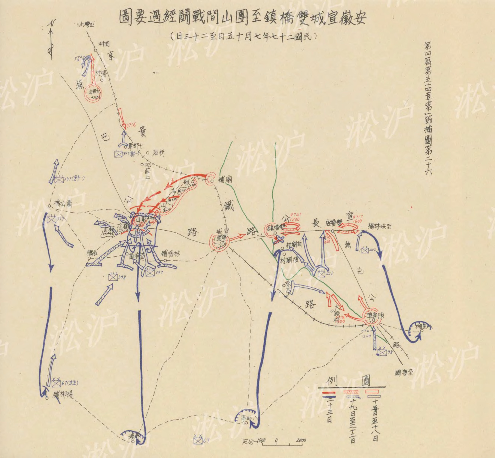

二十七、安徽宣城及江蘇宜興、溧陽附近戰鬥作戰時間：(一)第一時期：民國二十七年七月十五日起至二十七日止。(二)第二時期：八月二十日起至九月四日止。(三)第三時期：九月二十九日起至十月二十二日止。

作戰部隊：第三戰區第七十九軍附山砲一連。

作戰地點：安徽宣城及江蘇宜興、溧陽、武進、金壇、丹陽、句容、鎮江附近地區。

敵情：(一)第一時期：宜興、溧陽敵爲第四師團第十九聯隊，宣城敵爲第三師團第二十四聯隊，分佈洪林橋、宣城以東至廣德公路上，約五、六百人，孫家埠約四、五百人，宣城敵有沿京贛鐵路南犯模樣。

(二)第二時期：宜、溧、宣等處敵情同前，武進、金壇、丹陽、句容敵爲第九師團第五十一聯隊，鎮江敵爲第五師團第六十聯隊一部。

(三)第三時期：宜、溧、宣敵情同前，頗爲沉寂。

我軍目的：

(一)第一時期：擊攘由宣城沿京贛路南下之敵，並相機威脅其側背。

(二)第二時期：策應武漢作戰，以有力一部向武進、丹陽、鎮江之線挺進，奪取鐵路沿線諸據點，遮斷敵之交通。

(三)第三時期：守備孝豐、安吉。

戰鬥經過：

(一)第一時期：

該軍以第七十六師之第二二六旅守備張渚、戴埠兩據點，隨時威脅宜、溧方面之敵，主力控置寧國以東地區，第九十八師之第五八三團附山砲一連佔領宣城東南七華里許一帶小高地，滯敵南進，並乘機襲擊洪林橋、孫家埠之敵，主力於寧國附近老虎山亘海螺山之現有陣地，加強工事，撲滅南下之敵。

七月十五日晨，第七十六師之第二二六旅向宜、溧間之敵攻擊，激戰至十六日晨，敵退守城垣，憑堅強工事固守，該旅屢攻未下，仍撤退原陣地，時我第五八三團將洪林橋攻佔，迄二十七日，孫家埠之敵約三百餘，退竄宣城，該地遂亦被第五八三團收復。

(二)第二時期：

該軍以第七十六師之第二二八旅於八月十五日由現地分三縱隊向武進挺進，第九十八師之第二九四旅向丹陽以西句容間地區挺進，二十日到達各地區後，卽一面襲擊敵人，一面破壞公路及鐵路，頗著成效，同時守備原地區之部隊，亦分向宜興、溧陽之敵襲擊，以達牽制敵軍之目的，迄九月四日，該軍奉令將襲擊部隊撤回，戰鬥乃告終止。

(三)第三時期：

該軍以第七十六師一部守備孝豐、安吉兩地區一帶據點，及不時襲擊宜興、溧陽之敵，主力控置廣德南北地區，第九十八師守備宣城以南由汪家山、長橋舖亘寒亭一線各要點之旣設陣地，並相機收復宣城。

九月二十九日，盤據宣城之敵，乘雨向灣址撤退，第九十八師卽以第五八八團將該地收復。三十日晨，溧陽之敵亦有撤退模樣，第七十六師卽以第四五一團攻擊宜興，第四五六團攻擊溧陽，激戰至十月一日，溧陽遂告克復，而宜興方面之敵因不斷由武進增援，故未奏功。四日，第五八八團附山砲一連、迫砲四連向灣址攻擊，亦未奏功，迄十七日，第七十六師復以一個旅挺進至武進，經攻擊後，亦無進展，迄二十二日，該軍奉令轉進南溥，此地區之戰鬥乃告一段落。

戰

果：一、鹵獲：

1. 士兵二名。

2. 軍馬五匹。

3. 步槍七十四枝。

4. 輕機槍四挺。

5. 重機槍一挺。

6. 75榴彈砲一門。

7. 彈藥一、一六九箱。

二、其他效果：

我軍傷亡：一、負傷：

該軍非但於廣德、寧國地區拒止宣城敵之南進，並以有力一部突入敵江南根據地之核心京滬沿線，襲擊其據點並破壞交通，使正積極進窺武漢之敵，不無後顧之憂。1. 官五八員。

2. 兵八八二名。

二、陣亡：

1. 官三七員。

2. 兵六四一名。

3. 失踪兵五十六名。

我軍損耗：一、武器：

1. 步槍一六一枝。

2. 手槍五枝。

3. 輕機槍七挺。

4. 重機槍五挺。

二、彈藥：

1. 步槍彈一、二五一、五九六粒。

2. 手槍彈一、五九五粒。

3. 手榴彈九、八七一枚。

4. 迫砲彈三、四三九顆。

5. 山砲彈一、七八七顆。

備

考：是時敵軍大部兵力轉用於長江方面，積極進窺武漢，第三戰區爲策應武漢方面友軍作戰起見，卽以全力進襲敵江南根據地，第七十九軍之戰鬥卽爲其中之一。

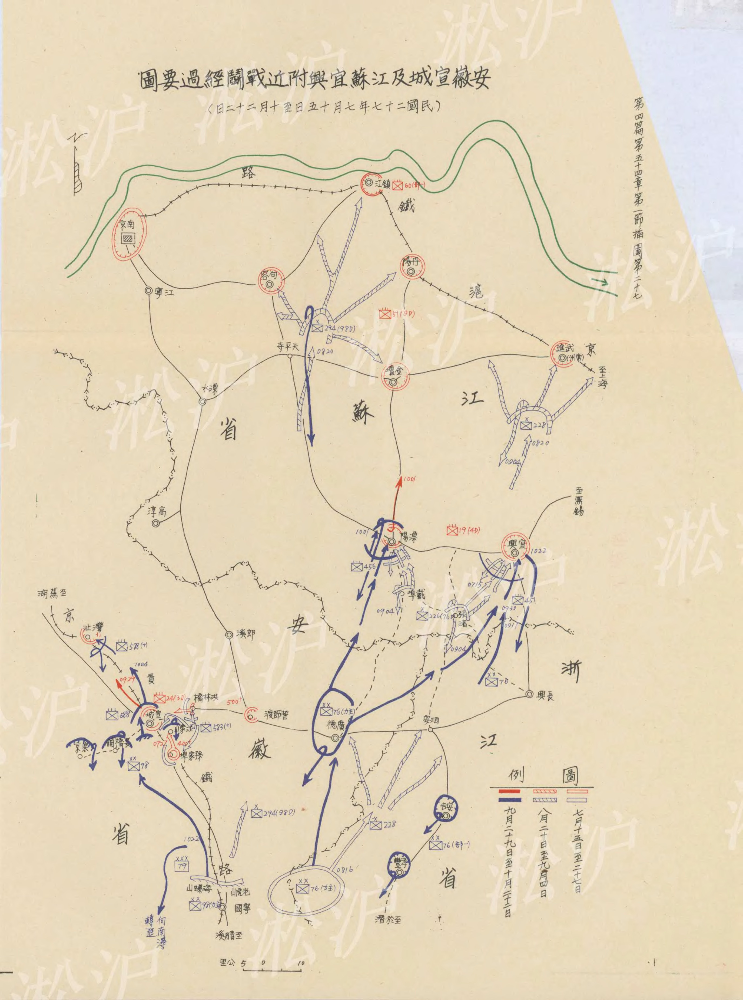

二十八

浙江杭州嘉興附近戰鬥

作戰時間：民國二十七年七月起至九月止

作戰部隊：第三戰區第十集團軍（轄第二十八軍之第六十二師、第六十三師、第一零七師、第一九四師、第一九二師、預備第十師、獨立第四十五旅、浙江保安縱隊（四個團），計十個步兵師又一個旅，四個保安團及其他游擊隊。

作戰地點：浙江富陽、餘杭、杭州、嘉興及江蘇吳縣附近地區。

敵

情：

(一)七月份：

1. 敵第一一六師團及清水部六、七千、清野部兩千餘、長谷川海軍陸戰隊三千餘、臺灣軍千餘，共計兩萬餘人，分佈於杭富餘公路沿線約三、四千，武康至吳興地區約一個聯隊，餘均控置於杭州城郊。

2. 盤據嘉興、平湖方面敵爲近衛師團小川部隊約二千餘，海寧、海鹽等處敵爲渡邊茂部約二千餘。

3. 杭市敵有渡江南犯說，又滬敵準備於七月五日前進攻擊浙東沿海。

4. 吳興約二千之敵，有聯合嘉興方面敵軍大舉進犯我游擊部隊企圖，同時武康約三千之敵有窺擾安吉、孝豐之模樣。

(二)八月份：

1. 杭市敵一聯隊開往長江方面作戰，餘均憑強固工事以少數兵力固守，大部控置於杭嘉湖以備機動。

2. 京杭國道之敵，往來運輸頻繁，吳興之敵二、三千亦向震澤移動，似有繼續轉用兵力於長江方面之模樣。

(三)九月份：

1. 當面敵第一一六師團開往淞滬，另以第二十二師團接替。

2. 據杭市近郊敵七千餘，富餘地區及杭嘉鐵路沿線各二千餘，海寧、海鹽地區二千餘，武康、吳興一帶三千餘，尚無積極企圖。

我軍目的：

(一)七月份：

以主力固守溫（永嘉）、台（臨海）、寧波沿海岸線、錢塘江、富春江右岸及杭建公路沿線等各方面之要點，拒止敵軍侵入，以一部進入滬杭及京滬鐵路沿線附近地區游擊，並破壞各該方面之交通，擾亂敵軍，牽制其兵力。

(二)八月份：

主力固守原陣地，以一部由富陽、餘杭、瓶窯鎮之線攻擊前進，奪取杭州據點。

(三)九月份：

各部隊乘虛游擊，多方面牽制當面敵人，以策應第五、第九兩戰區之作戰。

戰鬥經過：

(一)七月份：

該集團軍基於以上之目的，以第一零七師爲溫臺防守部隊，一部防守海門，主力防守永嘉附近，第一九四師爲寧波防守隊，第二十八軍主力佔領錢塘江及富春江右岸各要點，另以第六十二師之第一八四旅游擊平湖、乍浦及滬杭線地區，浙保安縱隊固守桐廬、壽昌之線，獨立第四十五旅於京滬線游擊，防守部隊除僅有前哨戰外無大行動，第一八四旅破壞平乍公路及嘉興至杭州間之硤石車站，並襲擊海寧縣城，獨立第四十五旅炸燬吳縣西北之劉家灣車站，並襲擊吳縣及崑山縣城，均略有斬獲。三十日，嘉興及平湖、乍浦、海寧之敵約三千餘，分別向第一八四旅圍攻，同時另有敵千餘於長川壩（海鹽南約十五公里）登陸後，陷海鹽縣城，該旅遂放棄原佔領一部陣地，與敵作旋磨式之運動。

(二)八月份：

該集團軍以第六十二師之第一八六旅及浙保縱隊由富陽、餘杭攻擊前進，奪取杭州，江南第一挺進縱隊破壞京杭國道、蘇嘉鐵路及武康、吳興間公路，並以有力部隊向嘉興挺進，策應杭州方面作戰，第一八四旅及獨立第四十五旅仍於原地游擊，與我第一八四旅激戰於嘉興、海寧等地區之敵，於二日大部回竄杭州，該旅遂將海鹽、乍浦收復，浙保縱隊於十三日開始攻擊前進，被阻於富陽以北、餘杭以南地區之高橋、宋殿、施家園、金鋼山、閑林埠一帶，十五日，第一八六旅參加戰鬥，亦無進展，十八日，第六十二師奉令開臨安，其第一八四旅由嘉興附近渡錢塘江轉進，第一八六旅之攻擊任務由預備第十師之第三十八團接替，二十日，再興攻勢，仍無進展，且敵不時出擊，遂退守青雲橋及其西北一帶與敵對峙，另江南第一挺進縱隊及獨立第四十五旅，均能於各指定地區達成任務。

(三)九月份：

該集團軍令第六十三師一個旅由富春江以南向富陽以東地區急進，積極破壞杭富公路，浙保縱隊不時襲擊富陽之敵，第六十二師之第一八六旅襲擊餘杭附近之敵，江南第一挺進縱隊分向杭州、崇德、武康、瓶窯鎮等地區之敵襲擊，並破壞滬杭鐵路及京杭國道，浙江抗敵自衛團第五支隊向海寧、海鹽附近之敵襲擊及破壞杭乍公路杭嘉鐵路，獨立第四十五旅仍於原地區游擊，各部隊受命後，卽分別遵令行動，但無大接觸。十一日上午敵艦四艘掩果：

(一)

鹵獲：

護其陸戰隊三百餘於寧波海岸穿山鎮附近強行登陸，經我第一九四師以有力部隊堵擊後，敵不支仍退回原艦逸去。十五日至二十日，富陽、餘杭之敵共約千餘，不時進犯浙保縱隊，均被擊退，二十二日，該縱隊奉命將防務移交第一九二師，敵乘機猛撲，仍未得逞、二十四日至二十八日，第一九二師於敵火下接防完畢。

1. 步槍一五四枝。

2. 手槍十枝。

3. 輕機槍九挺。

4. 重機槍二挺。

5. 彈藥二一、四五六箱。

(二)破壞：

1. 鐵路橋樑六座。

2. 路軌一九七根。

3. 路基三公里。

4. 公路橋樑七座，路基五百公尺。

5. 覆敵列車二二輛，擊毀汽車二四輛、汽船二二艘。

(三)傷亡：

1. 傷亡敵軍約六、二六零員名。

2. 馬匹四六匹。

我軍傷亡：(一)負傷：

官八一員。

兵一零五二名。

(二)陣亡：

官三六員。

兵九四四名。

(三)失踪：

官一員。

兵五七六名。

我軍損耗：(一)武器：

1. 步槍七一三枝。

2. 輕機槍三四挺。

3. 重機槍四挺。

4. 手槍九枝。

5. 馬十四匹。

(二)彈藥：

1. 步槍彈二、零一五、三九九粒。

2. 手槍彈五七、八三四粒。

3. 手榴彈一五、零二五枚。

4. 迫砲彈二、零四八顆。

5. 山砲彈五九顆。

6. 要塞砲彈一四顆。

備

考：第十集團軍係防守浙東沿海岸線及錢塘江、富春江右岸各要點，拒敵侵入之任務，但爲策應武漢方面友軍作戰起見，始以一部兵力深入杭嘉湖諸地區游擊，冀收牽制敵兵力之效，故無大規模之戰鬥。

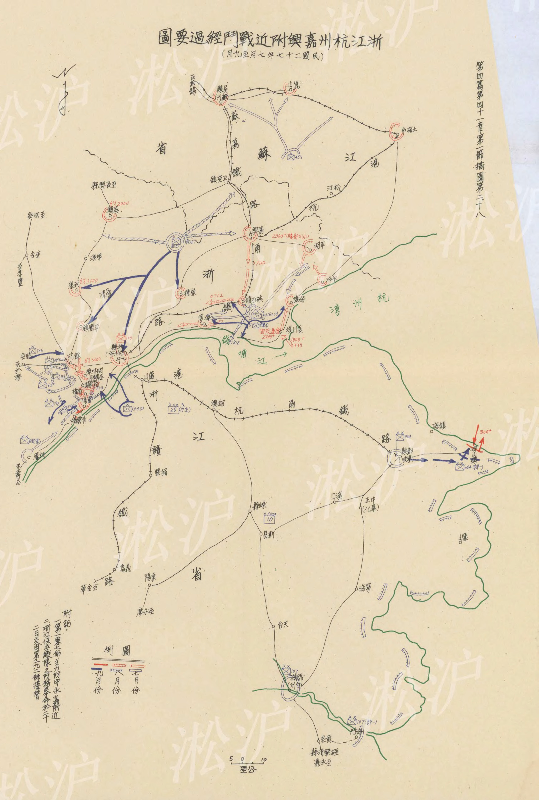

二十九

浙江餘杭武康附近戰鬥

作戰時間：民國二十七年七月十六日至八月二十七日止。

作戰部隊：第三戰區陸軍第一零八師。

作戰地點：浙西餘杭至長興公路線上之石瀕鎮、潘板橋（餘杭縣屬）、上柏鎮、武康縣、三橋鋪、菁山市（吳興縣屬）、呂山鎮（長興縣屬）。

敵

情：餘杭敵爲清水師團金子大隊五百餘人、砲四門，石瀕鎮敵爲福爾米大隊五百餘人、砲四門，上柏鎮、武康、三橋鋪線上之敵約千餘人，吳興敵二百餘人，長興敵二百餘人，分據各該地高壘固守。

我軍目的：威脅餘杭、武康、吳興、長興之敵，並遮斷餘杭、武康間及武康、吳興間之公路。戰鬥經過：七月十六日，該師以第六四四團向菁山市攻擊，第六四七團向潘板橋攻擊，十七日二時，第六四四團攻克菁山市，並破壞電線七百餘公尺，六時撤回，第六四七團於四時分兩路包圍潘板橋，敵倉惶應戰後向石瀕鎮遁去，該地被我克復。

二十一日一時，第六四三團夜襲武康縣城，斃敵百餘，並炸燬敵砲兩門，焚燬敵汽車多輛倉庫數處，該團以任務達成遂仍撤返回防。

八月七日二時三十分，第六四七團襲擊石瀕鎮，爲敵外壕所阻，未能突入陣內，第六四三團於十二日攻擊三橋鋪時，敵忽由宜興增援裝甲車三輛，該團卽予截擊，當被擊燬二輛，並斃敵十餘名。

十三日，該師以浙江保安縱隊第二團業已克復富陽縣城，乃令第六四七團再度攻擊石瀕鎮，藉以阻止敵由餘杭增援而使友軍作戰容易，並令第六四三團附第六四四團第一營攻擊上柏鎮，並相機佔領武康縣城，迄十四日，第六四七團無進展，復於十五日轉進協助友軍攻擊餘杭，十六日夜，該團迫近餘杭城郊，同時上柏鎮方面我軍亦開始攻擊，激戰至十七日晨，敵由武康增援，旋卽撤退。

十八日，我第六四七團經與浙江保安第二團連絡後，該團以連日戰鬥，傷亡甚大，一時無力向餘杭攻擊，於是第六四七團撤回原防，二十七日，第六四四團第二營襲擊長興縣屬之呂山鎮，無大收獲，僅破壞橋樑三座而已。

九月初旬，該師奉命轉進皖南、浙西，戰鬥告一段落。

果：一、鹵獲：

1. 步槍四枝。

2. 軍旗一四面。

3. 電線三百碼。

二、破壞：

1. 公路十一段。

2. 橋樑九座。

3. 電線二千餘公尺。

三、傷亡官兵三百餘人。

我軍傷亡：一、負傷：

1. 官二員。

2. 兵三三名。

二、陣亡：

1. 官三員。

2. 兵二四名。

我軍損耗：一、武器：

1. 步槍四枝。

二、彈藥：

1. 步槍彈六九、一四七粒。

2. 手槍彈一、八五零粒。

3. 手榴彈九一九枚。

4. 迫砲彈一零七顆。

備

考：第一零八師，係沿長興、泗安公路及餘杭方面扼要配備，利用山地牽制敵人之行動，斯時敵正倾力沿江西犯武漢，故其所佔領江南之各據點，兵力甚爲空虛，我軍爲澈底破壞敵之根據地牽制其兵力轉用起見，第三戰區各部隊，遂作全面性之擾襲，予敵威脅，該師戰鬥卽其中之一也。

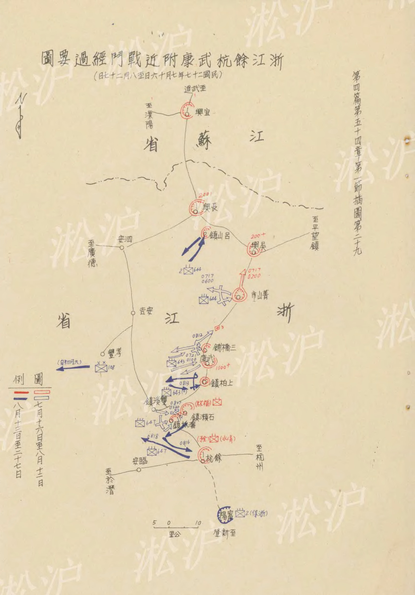

三十

河南濟源瑞村及郎岔附近戰鬥

作戰時間：民國二十七年八月二十五日起至二十八日止。

作戰部隊：第一戰區第一六六師、第四九六旅之第九九二團。

作戰地點：河南濟源附近之利村、西湖、蕉寨、寺澗、紅土溝、魏凹一帶。

敵情：敵第十四師團橫山靜雄聯隊步騎砲兵約四、五千人，於八月二十五日由沁陽分別向西及向南進犯，迨重陷濟源後，企圖奪取濟源以南之坡頭及白坡渡口，卽轉移其全力向南攻擊北邙山地區。

我軍目的：該團以佔領寺澗、魏凹一帶陣地之目的，奉令渡過沁河進至南官莊一帶，拒止並側擊西犯之敵。

戰鬥經過：八月二十五日十六時，該團第三營之第九連進至水運村附近，適沁陽增援之敵一百五十餘人，由汽車六輛運輸至該處公路，該連當卽襲擊，經兩小時之戰鬥，始將敵軍擊退，我乘勝進佔利村，嗣敵之一部由南北營增援，將該連截斷，該團團長乃卽令該營之第七、第八兩連前往增援，時我第九連之第一、第二兩排，在公路以南地區數度向北突擊未果，乃向南退却，遂被敵包圍於利村以南，我增援部隊曾由公路以北數度南衝，亦未奏效，迄午夜，我第九連之兩排乘夜暗向敵偷襲，奮勇突圍，經劇戰後始於二十六日拂曉越過公路向北歸還建制。

二十六日，西湖、利村之敵步騎砲兵共約二千餘，續分向我樊莊、瑞村一帶進犯，經該團第二營激烈抵抗後，敵乃於當晚竄佔中王村東西軹城一帶，其另一部約七百餘人，則侵佔焦寨以南高地及寺澗、魏溝、紅土溝、魏凹等處，入夜，該團以其第二、第三兩營佔領郎岔以西至翟莊一帶陣地，該團團長率第一營於朱沟附近扼守由濟源至坡頭之大道。

果：

(一)

鹵獲：

二十七日五時許，敵乘我立足未穩之際，卽向我第二營之郎岔附近陣地攻擊，激戰至七時許，該營以衆寡懸殊，乃向左翼縮短防線，集中兵力，嚴陣以待，迄九時許，敵乃集中全力向我第三營翟莊附近之陣地攻擊，經奮勇抵抗，激戰至十四時，該營陣地仍屹立未動，敵乃退去。十五時，敵又轉移其主力於郎岔方面，激戰至日暮，彼此均無進展，遂呈對峙狀態。二十八日，該團奉令恢復焦寨至魏凹一線之陣地，自八時起開始向敵攻擊，經激烈之戰鬥後，敵軍傷亡重大，迄十四時，卒將該線陣地完全克復，敵以一部向東撤退，另一部則退入濟源縣，閉城堅守。1. 敵兵二名。

2. 卡車五輛。

3. 人力車一輛。

(二)傷亡：

1. 斃敵官兵二百餘員名。

我軍傷亡：

(一)負傷：

1. 官兵二十一員名。

(二)陣亡：

1. 官兵八員名。

(三)失踪：

官兵三十六員名。

5各地游擊战(一)

我軍損耗：(一)武器

1. 大刀十八把。

2. 刺刀十八把。

(二)彈藥：

1. 步機彈五三、四七四粒。

2. 迫砲彈一六零顆。

3. 手榴彈四四五枚。

4. 手槍彈一七二粒。

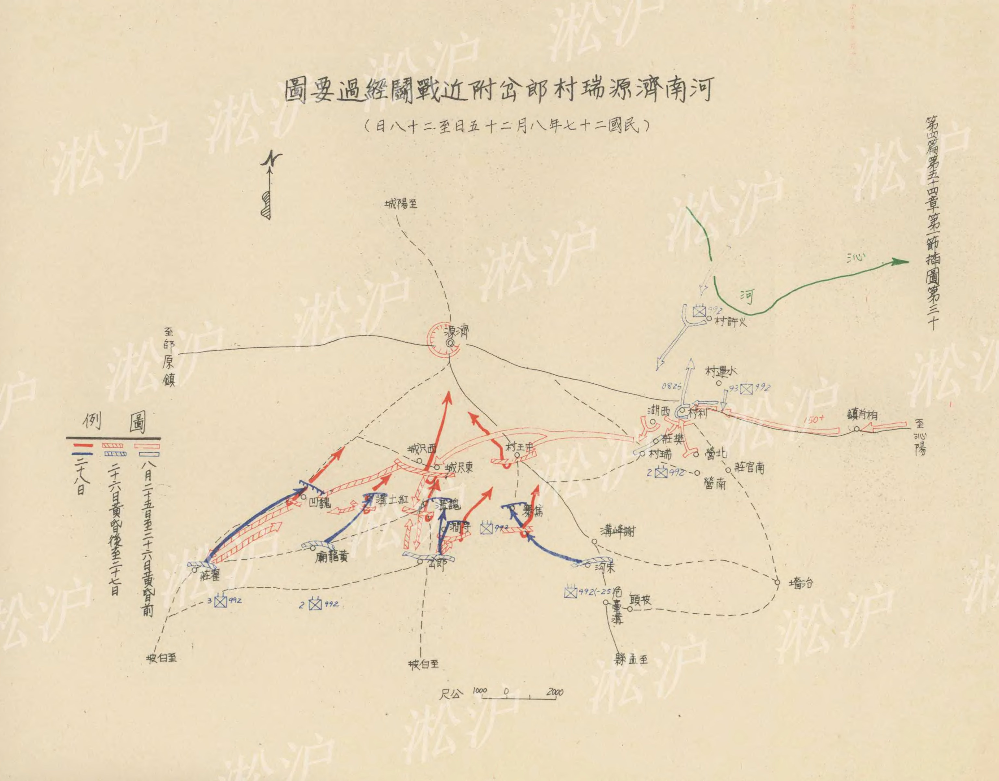

三十一皖南荻港至貴池附近江防戰鬥

作戰時間：民國二十七年八月二十八日起至九月六日止。

作戰部隊：第三戰區第二十三軍之第一四七師第四四一旅、第一四八師及第五十軍之第一四四師（欠一旅）。新編第七師一個旅，共一個師又三個旅。

作戰地點：安徽銅陵縣南岸大通鎮之羊山磯、貴池縣屬之馬踏寺及殷家匯（懷寧對岸）附近長塘埂（荻江以北）地區。

敵

情：

(一)敵企圖侵佔我沿江各要點，掩護其水上交通。

(二)登陸長塘埂之敵，爲臺灣軍太田部第一百三十六聯隊，約三千餘人。

(三)登陸烏沙夾，馬踏寺之敵爲第四師團鷹森旅團約四千餘人。

四登陸羊山磯之敵，爲清水、高橋等部，約三千餘人。

我軍目的：

(一)防禦敵軍登陸於沿江南岸大通鎮至殷家匯線上之要點，並封鎖水上交通。

(二)膠着多數敵軍於我陣地內，以減少其進窺武漢兵力。

戰鬥經過：八月二十八日拂曉，敵約五百餘人兵艦五艘合向我第一四八師第四四四旅第八八八團之長塘埂（荻港以北）陣地進犯，激戰至九時，敵軍陸續增援三千餘人，該團遂轉移於馬鞍山主陣地。

二十九日二時，敵續向我馬鞍山主陣地猛攻，經守軍竭力抵抗，敵未得逞。三十日拂曉，另敵一股約三千餘人，藉飛機九架兵艦九艘汽艇二十四隻之掩護下，分由貴池縣屬之馬踏寺、李陽河、前江口等處強行登陸，與我守軍第一四七師四四一旅之八八一團及八八二團一個營激戰於花園紀、野雞山、宴塘橋、大河村之線。

三十一日，長塘埂方面戰況無變化。七時許，敵機五架掩護約千餘之敵，於馬踏寺西一公里處之烏沙閘附近登陸，我守軍第八八二團兩個營，經戰鬥後，以敵衆我寡，遂轉移烏沙夾北二公里之同安墟亘大麓墟之線，待機轉移攻勢。

九月一日，第二十三集團軍總部命第五十軍馳援殷家匯，驅逐馬踏寺之敵，該軍長奉令後，即率第一四四師（欠一個旅）及新編第七師之一旅前往，經與第二十三軍協定如下：（一）新編第七師之一旅爲右翼攻擊隊，向馬踏寺、烏沙夾攻擊前進。（二）第一四四師之一旅爲左翼攻擊隊，向李陽河、宴塘橋、前江口攻擊前進。（三）第四四四旅及第四四一旅確保現有陣地。二日二時開始攻擊後，兩翼均無進展。三日，右翼隊攻佔烏沙閘，敵退馬踏寺，左翼隊於十一時攻佔前江口、宴塘橋，十四時，李陽河之敵亦告肅清，長塘埂方面經第四四四旅派敢死隊由馬鞍山出擊，遂將該地收復。四日，右翼隊繼續攻克馬踏寺，殘敵退據江邊，負隅頑抗。六日五時，大通鎮屬之梅埂、羊山磯附近有敵三千餘，藉飛機六架兵艦七艘汽艇十餘隻掩護，強行登陸，經我守軍第一四八師之第四四二旅第八八三團及八八四團一個營奮勇抵抗，終以衆寡懸殊，傷亡慘重，遂轉移於店門口亘廣教寺之線，固守待援。迄十四時，第五十軍奉令以第一四四師由馬踏寺馳援羊山磯，其負隅馬踏寺江邊之敵，由新編第七師之一旅及第一四七師第四四一旅擔任肅清。七日，羊山磯附近我軍新陣地之工事已整理就緒，遂與敵人於對峙狀態。

戰

果：一、鹵獲：

1. 步槍三枝。

2. 鋼盔十五頂。

二、破壞：

1. 擊燬敵兵船二艘。

我軍傷亡：一、負傷：

1. 官四一員。

2. 兵六七一名。

二、陣亡：

1. 官八員。

2. 兵四八九名。

我軍損耗：一、武品：

1. 步槍五一六枝。

2. 輕機槍四三挺。

3. 八二迫砲二門。

4. 四七迫砲四門。

二、彈藥：

1. 步槍彈五零九、四四二粒。

2. 手榴彈五、二八四粒。

3. 迫砲彈一、五四四顆。

備

考：此期間，敵適傾力進窺武漢，其兵源武器彈藥等之補充，均仰賴於京蕪等地，我軍於該地區沿長江南岸佔領各要點，封鎖敵唯一之水上交通，並膠着敵多數兵力於我陣地內，以減少其

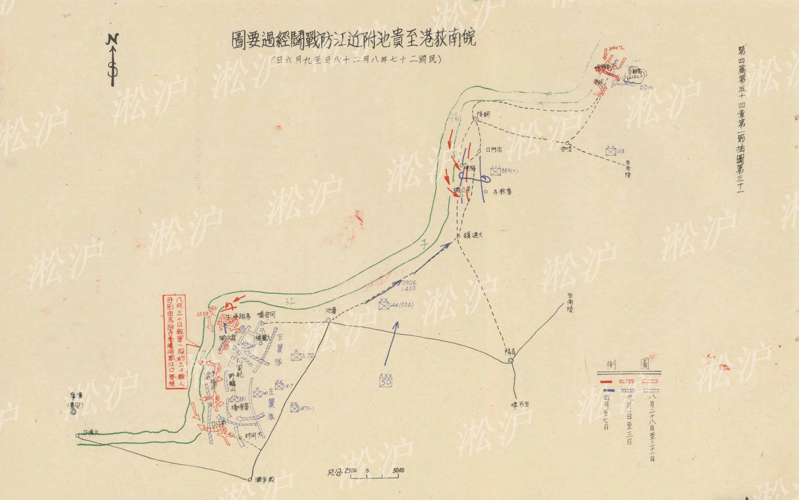

各地游擊战

三十二

河南淮陽葦園附近戰鬥

作戰時間：民國二十七年九月十日起至十三日止。

作戰部隊：第一戰區陸軍第三十九師第一一七旅（欠第二三四團附騎兵第十四團）。

作戰地點：河南淮陽之葦園附近。

敵情：敵自侵入淮陽後，以一部約六百餘名渡過黃汎，盤據葦園、染坊莊、程寺一帶，有向西進犯之模樣。

我軍目的：該旅奉令擊滅葦園附近之敵，以阻止其西進。

戰鬥經過：九月十日，該旅奉令後，卽以其第二三三團由馬莊沿沙河左岸取捷徑向葦園前進，並以騎兵第十四團掩護該旅左翼之安全。

十一日五時許，我第二三三團在新站集東北之郭河莊以西之線就攻擊準備位置，以第二營任主攻，沿葦新公路向葦園之敵攻擊前進，以第三營之第七連掩護其右翼，至六時三十分，在田莊附近與敵六、七十名接戰，經該營攻擊後，敵不支向北潰退，我遂佔預田莊，旋再進佔徐莊（葦園以南）。九時三十分，續向葦園及程寺攻擊，守敵憑村落據點困守，該營奮勇猛攻，經劇戰一小時後，將葦園攻佔，殘敵向韓莊潰退。迄十二時許，葦園潰退之敵又由韓莊轉向我左翼之陳莊進犯，我騎兵第十四團之正面頓形吃緊，該旅長乃急令第三營之一排前往馳援，未及趕到，而敵已侵佔陳莊，進而向該旅之左後側包圍，致使我軍又在葦園、徐莊、程寺之線與敵發生激烈戰鬥。是時，敵軍兵力已陸續增加至一千餘人以上，附山砲數門，不斷向我猛攻，該旅長除令第二營竭力支持外，並卽令第一營迅往增援，十五時許，敵攻勢益烈，我軍因衆寡懸殊，且係背水作戰，交通補給極感困難，該旅長卽決心調整部署，遂令第一營在新站集一帶佔領陣地，掩護第二三三團主力逐次向水寨方向轉進。

十二日十六時，敵進佔葦園附近後，並以火力向各村莊實行威力搜索。

十三日，該旅協助騎兵團向牛口之敵攻擊，並派隊將萬砦以西之沙河堤掘開，造成宋窪、葦園一帶地區之新氾濫，敵以行動大受限制，遂於十四日晚仍撤回黃泛以東。我軍傷亡：

(一)負傷：

官兵五五員名。

(二)陣亡：

官兵四零員名

(三)失蹤：

官兵十四員名。

我軍損耗：

(一)武器：

1. 步槍一枝。

2. 大刀二把。

(二)彈藥：

1. 步槍彈三七、七八六粒。

2. 迫砲彈一一九顆。

3. 手槍彈九零八粒。

4. 手榴彈一二九枚。

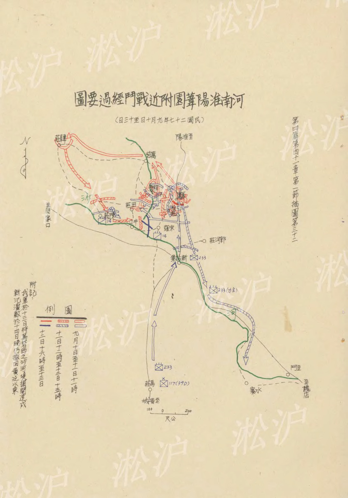

5各地游擊战

三十三

安徽大通鎮附近戰鬥

作戰時間：民國二十七年九月十一日起至十二月二十七日止。

作戰部隊：第三戰區新編第七師。

作戰地點：安徽大通鎮附近。

敵情：敵清水師團之第一三八聯隊，兵力約二、三千人，自九月初旬在大通鎮、羊山磯登陸後，即佔領羊山磯、陳家沖、五里亭各要點，並以七甲、何家壠、朱家山爲警戒陣地，企圖繼續深入內地侵佔青陽。

我軍目的：該師奉令驅逐敵人鞏固江防之目的，以其第一旅於十一日利用夜暗先行攻略朱家山、何家冲、七甲敵之警戒陣地，爾後以主力向陳家冲、五里亭、羊山磯、大通鎮，一部向老鎮攻擊，壓迫敵人於江邊而聚殲之。

戰鬥經過：九月十一日，第一旅旅長奉令後，當即以第二團爲攻擊部隊，於二十時開始向何家冲、七甲敵之警戒陣地攻擊，激戰約一小時，攻佔何家冲，二十一時三十分，續攻佔七甲。

十二日拂曉，該團繼續攻擊，旋將五里亭攻克，敵向長山廟方向退去，及至十時，該旅右翼友軍放棄朱家山，同時大通敵軍約四、五百人亦向五里亭猛烈反攻，我軍奮勇迎擊，激戰至十五時許，敵未得逞後，乃以毒氣彈向我攻擊，於是我軍被迫放棄五里亭，退守何家壠、七甲之線，迄二十二時許，該旅奉令反攻，當卽由何家壠、七甲之線進至朱家坂附近，嗣因敵再使用毒氣彈，我軍被阻，進展困難，遂仍退守原陣地。

十三日，敵軍數千人由梅埂方面登陸，與我第一四七師激戰，該旅奉令派兵一團接替第一四七師第八六三團馬鞍山附近之防務，並配屬戰車防禦砲一連，以增強該旅之火力，該旅奉令後，遂卽調整部署，增強工事，固守馬鞍山、何家壠、七甲之線，敵雖數次攻擊，均未得逞，，相持至二十日，陣地無變化。

二十一日拂曉，敵艦砲及陸地砲兵同時向我陣地發射三百餘發。十三時許，我右翼朱家山之敵五百餘人，利用砲火之掩護，分向我馬鞍山、何家壠陣地進攻，該旅長一面令守軍竭力抵抗，固守原陣地，一面派兵一連由傘形山向敵側擊，是時全線戰鬥均異常激烈激戰，約一小時許，敵不支仍退回江邊，此後我屢以小部隊向敵夜襲，略有斬獲，半月來敵均未敢進犯。十月五日九時許，敵機五架向我馬鞍山陣地猛烈轟炸，我陣地工事多被炸燬，是時敵軍百餘人在其砲兵掩護下向我攻擊，經我守軍奮勇反擊，激戰至十二時始將敵軍擊退。

六日九時許，敵機二架又向我馬鞍山陣地低空投彈，十時許，敵艦三艘掩護其汽艇十二隻載敵兵一百餘人，在橫港附近強迫登陸，經我軍一連向敵包圍攻擊，斃敵甚衆，敵不支紛紛退回原艦。

七日，該旅奉令續向當面之敵攻擊，經多次之猛衝，斃敵雖衆，但敵仍頑強不退。

二十日，該旅奉令策應殷家匯方面我軍第一四六師及第一四七師之作戰，於二十一日午夜，對敵攻擊，因敵以飛機猛炸，運動困難，故僅攻佔朱家山之一部，旋以天明無法活動，仍撤回原陣地，嗣後半月中敵我均各以小部隊不斷活動，互有襲擊，但均無顯著效果。

十一月初旬，敵又由羊山磯陸續增援約三千餘人，先後共達五千餘人，自二十五日起，逐日以砲空軍掩護其步兵向我軍陣地攻擊，二十六日陷我傘形山，同時另一部敵軍三百餘人，則以汽艇十餘隻由荻港小河直駛順安，並佔領該鎮，二十八日，敵又侵佔五峯山。

十二月十日，該旅奉令以縮短防線，集中兵力向木鎮附近轉移陣地，當於十二日拂曉安全到達新陣地部署完畢。十四日，敵軍六百餘人分由外郎坑、戒嶺、店門口各路突進，向木鎮攻擊，該鎮遂陷敵手，敵旋以其主力進攻青陽，一部以木鎮爲據點維護其公路之交通安全，同時又另以一部向南沖進擊，時該師已以一部扼守野豬沖、錢家、高家嶺之線，嗣於十五日以兩旅之兵力向敵反攻，當卽於二十三日克復木鎮，將敵壓迫於丁家橋附近。

二十八日，該師奉軍長電令，將防務交由第一四四師接替後卽移往楊田埂爲預備隊，並從事整理補充。

戰

果：一、鹵獲：

1. 敵軍馬一匹。

2. 機槍彈一九九粒。

3. 手榴彈十枚。

4. 軍米四袋。

我軍傷亡：一、負傷：

官兵九七四員名。

二、陣亡：

官兵一、一九二員名。

三、失蹤：

士兵五十名。

我軍損耗：一、武器：

1. 步槍一三三七枝。

2. 機槍一二一挺。

3. 迫砲二九門。

二、彈藥：

1. 步槍彈六三四，八四八粒。

2. 迫砲彈二、五零五顆。

3. 手榴彈四、五八八枚。

4. 信號彈八零顆。

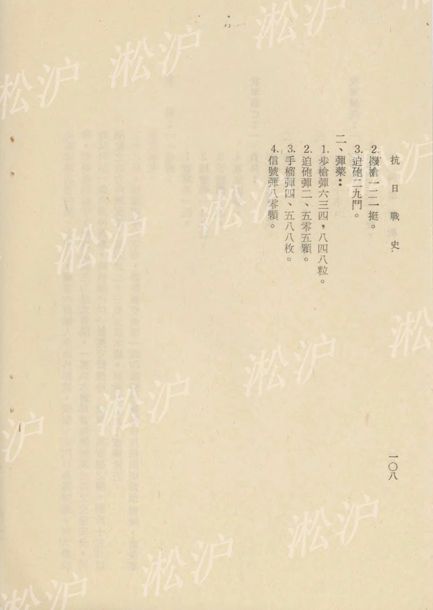

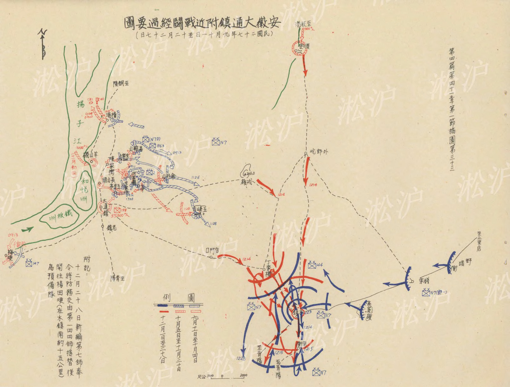

三十四

安徽至德香山附近戰鬥

作戰時間：民國二十七年九月二十一日起至二十二日止作戰部隊：第三戰區第一零五師第三一五旅之第六三零團。

作戰地點：安徽至德香山附近。

敵情：敵第九師團第六旅團之第七聯隊，附山砲二門及僞軍一部，共約二千餘人，自九月中旬以來，由敵艦多艘運至黄山及香山附近，並以飛機五架向我香山陣地偵察，似有進攻香山，驅逐我江岸守備部隊之模樣。

我軍目的：該師奉令守備黄山、香山一帶沿江要點，阻止敵之登陸，並以該團任香山亘黃栗樹陣地之守備。

戰鬥經過：九月二十一日拂曉，敵以汽艇二十餘隻分駛黄山及香口江面，似有登陸模樣，該團長當卽令第一線部隊嚴陣以待，三十分鐘後，該團右翼之第六二六團已與敵開始接觸，至六時許，戰況漸趨激烈，同時由香口附近登陸之敵，則分數路向該團陣地猛攻，經奮勇抵抗，至七時許，敵以海軍及陸地上之砲兵猛向我陣地射擊，並以飛機五架低飛掃射，激戰至薄暮，敵未得逞。

二十二日三時許，敵向黄山猛攻，同時該團當面之敵，亦開始攻擊，經我守軍堅強抵抗，戰鬥異常激烈，敵軍傷亡雖大，但援軍不斷增加，迄八時許，該團奉令向後山朱家、白花山迄朱村之線轉進，敵跟踪猛追，並以砲空軍不斷轟炸，致我軍無法立足，當晚撤至白毛山附近整頓，待機反攻，敵至王村南北之線卽行折回江邊據守。

我軍傷亡：

(一)負傷：

官兵一零九員名。

(二)陣亡：

官兵一一九員名。

(三)失踪：

士兵五九名。

我軍損耗：

(一)武器：

1. 步槍二十枝。

2. 機槍六挺。

3. 手槍一枝。

4. 刺刀四把。

(二)彈藥：

1. 步機彈二四、七五二粒。

2. 砲彈四一顆。

5. 手榴彈一七七枚。

4. 手槍彈一四五粒。

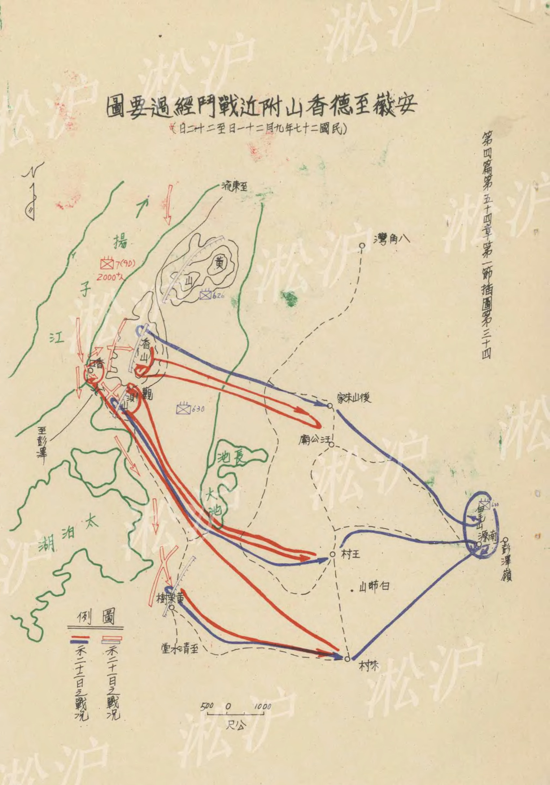

三十五

浙江富陽青雲橋附近戰鬥

作戰時間：民國二十七年九月二十三日起至二十七日止。

作戰部隊：第三戰區第一九二師。

作戰地點：浙江富陽西南之青雲橋附近。

敵情：盤踞富陽、餘杭間之敵第十二師團，以策應其主力在武漢方面作戰有利之企圖，於九月二十二日以來，以其步兵第七十五聯隊，附山砲一中隊、野戰重砲一中隊、騎兵第二聯隊之一部及工兵第十四聯隊之一部，共計三、四千人，由該師團步兵團長橫山敏太郎少將指揮，分數路向富陽以西地區進犯，以牽制我軍之兵力轉移。

我軍目的：我第十集團軍爲驅逐侵入之敵恢復原有據點之目的，以該師擔任右地區，以浙江保安縱隊擔任左地區分別攻擊當面之敵，幷相機殲滅之。

戰鬥經過：該師奉令後，當卽以其第一一八團爲右翼隊，第一一七團爲左翼隊，於二十三日由富陽以西約十三公里之方家井向湯家埠、白石廟、大塢、鐵塢、青雲橋、大山、楊梅山之線前進。入夜，第一一八團卽在青雲橋以南地區與敵激戰。二十四日六時許，敵以騎兵一部由我右翼之石灰山鑽隙突入前山村，當爲該團阻擊，旋敵又以一部由左翼之青浦弄迂迴我側背，亦被我軍擊退，時正面之敵向我青雲橋、烏龜山、雙峯山之線猛烈攻擊，迄十六時許，敵又以騎兵一中隊突入石灰山，被我第一一八團包圍，斃敵二十餘名，函獲戰馬四十餘匹，但其後續部隊仍在石灰山附近利用我軍構築之據點工事頑強抵抗，是時，敵以重砲向我左翼烏龜山、雙峯山之陣地濫肆轟擊，我陣地工事大半被毀，旋敵步兵向我猛攻，於是烏龜山、雙峯山爲敵所陷，嗣經我第一一七團反復衝鋒，僅奪回兩山端之一部，時敵之一部已突入我左側背之下校，情況至爲危急，該師長卽以第一一九團之第三營增援，該營卽於是晚由大山向烏龍山之敵攻擊，第一一七團之第二營則由南山向雙峯山攻擊，第三營由青雲橋向潘村攻擊，官兵奮不顧身，前仆後繼，頓時全線陷入反復爭奪之激烈戰鬥，敵我傷亡均衆，迄二十五日九時許，我軍始將烏龜山、雙峯山之陣地克復，惟青雲橋方面因街市全被敵砲擊毀，仍在激烈爭奪中。二十六日拂曉，該師卽令全線開始總攻擊，敵軍藉其砲空軍之掩護，企圖頑抗，同時並以騎兵向我兩側翼威脅，我軍一面固守陣地，一面猛烈攻擊，激戰竟日，迄十七時許，敵漸呈不支，乃開始向富陽撤退，該師立即以第一一八團之一部爲右翼追擊隊、第一一七團之一部爲中央追擊隊、第一一九團之一部爲左翼追擊隊，於次（二十七）日拂曉，分別向退却之敵跟踪追擊。

我軍傷亡：

(一)負傷：

二十七日六時許，我第一一八團主力，佔領湯家埠迄青雲橋之線，第一一九團主力進佔雙峯山至牛山之線，是時，我各路追擊隊已追至富陽以西之鹿山、湖南山、楊埠場、卓家嶺之線，斬獲甚多，全勝而返。

官兵一八一員名。

(二)陣亡：

官兵一三六員名。

我軍損耗：

(一)武器：

1. 步槍四五枝。

2. 機槍四挺。

3. 手槍二枝。

4. 刺刀四四把。

5. 馬刀十一把。

(二)彈藥：

1. 步槍彈一七六、九七二粒。

2. 迫砲彈九二顆。

3. 手槍彈四、五二二粒。

4. 手榴彈一、六○八枚。

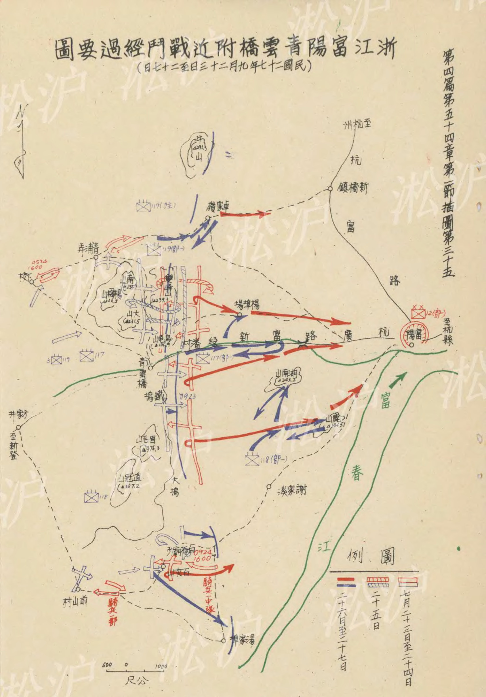

三十六

浙江杭州吳興嘉興附近戰鬥

作戰時間：民國二十七年十月份。

作戰部隊：第三戰區第十集團軍所屬之第二十八軍之第六十二、第六十三兩師及第一九二師、預備第十師、江南第一挺進縱隊、浙江抗敵自衛團第五支隊、獨立第四十五旅，計四個步兵師一個步兵旅又一縱隊及一個支隊。

作戰地點：杭州、吳興、嘉興附近地區。

敵情：一、盤據杭嘉湖方面敵，爲第二十二師團之大部及第一零四、第一零六師團各一小部，其分佈杭富地區約六、七千，餘杭、武康、德清、吳興一帶約四、五千，嘉興、平湖、崇德桐鄉及杭嘉鐵路沿線約五、六千。

二、杭州、吳興之敵，有協同僞軍向我游擊根據地進犯模樣。

我軍目的：攻擊富陽、餘杭、武康之敵，以防敵兵力轉用。

戰鬥經過：十月一日，該集團軍以第一九二師對富陽方面，第六十二師主力對餘杭方面，預備第十師主力及江南挺進第一縱隊對武康方面，獨立第四十五旅對嘉興方面，浙江抗敵自衛團第五支隊對嘉興以南硤石方面之敵攻擊，並破壞各該方面之公路鐵路，第一九二師、預備第十師、第六十二師等部奉令後卽分別襲擊富陽、餘杭、武康等處附近之敵，惟敵均據險頑抗，無大進展。

二日，嘉興、吳興、杭州之敵，共約二千餘人，分別出動，企圖侵犯我江南挺進第一縱隊之新塍（嘉興西北）、新市（武康東北杭州以北）游擊根據地，該縱隊爲制敵機先，當卽分向瓶窯鎮（餘杭、武康間）、青山（武康吳興間）、菱湖（嘉興東南）、嘉興等處之敵攻擊，及拒止敵之進犯，經激戰至十四日後，敵均一一被擊退而回竄。

獨立第四十五旅於十二日開始攻擊嘉興、嘉善、松江之敵，略有斬獲，二十日拂曉，該地敵約千餘大舉反撲未逞，另浙杭第五支隊於嘉興、平湖、海寧附近破壞公路鐵路，頗收成效。果：

(一)

鹵獲：

1. 步槍三九枝。

2. 手槍四枝。

3. 輕機槍一挺。

(二)破壞：

1. 鐵橋九座。

2. 木橋二七座。

3. 路軌四百餘公尺。

4. 公路八公里。

5. 汽船六艘。

(三)傷亡：

敵官兵七八零員名。

我軍傷亡：

(一)負傷：

1. 官五員。

2. 兵八三名。

(二)陣亡：

1. 官三員。

2. 兵四三名。

3. 失踪兵一二名。

我軍損耗：

(一)武器：

1. 步槍二枝。

2. 輕機槍一挺。

(二)彈藥：

1. 步槍彈八七、四七三粒。

2. 手槍彈三、八五一粒。

3. 手榴彈四四四枚。

4. 迫砲彈一零二顆。

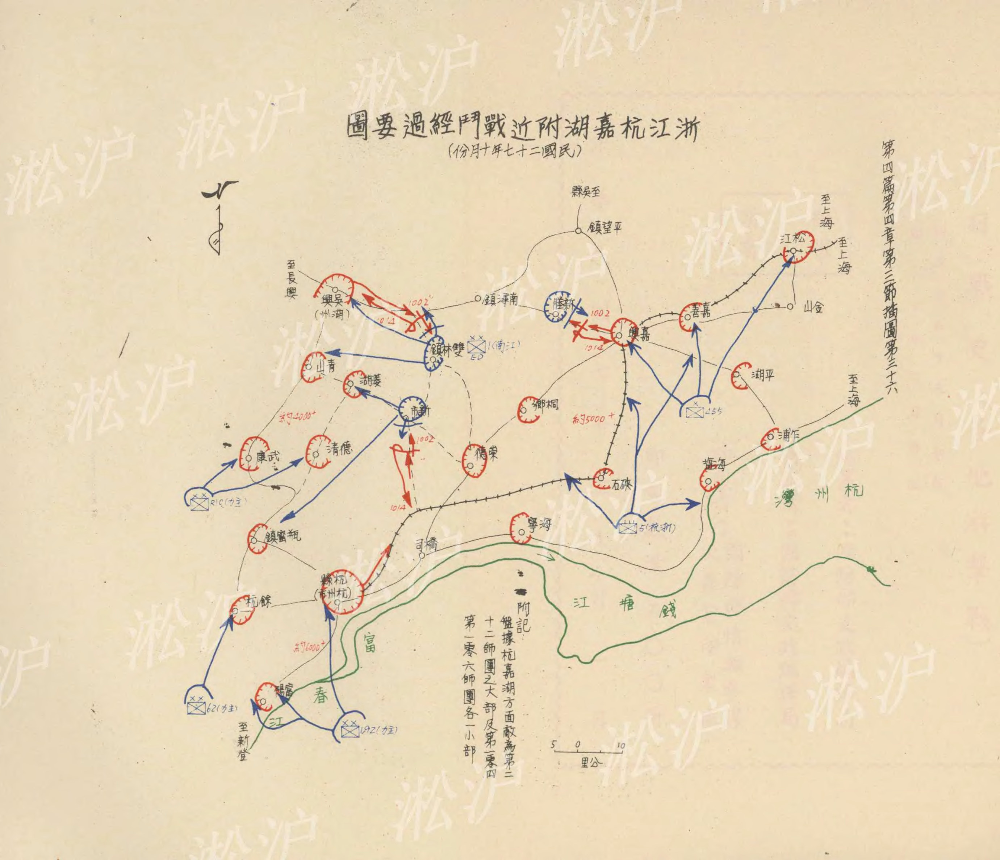
