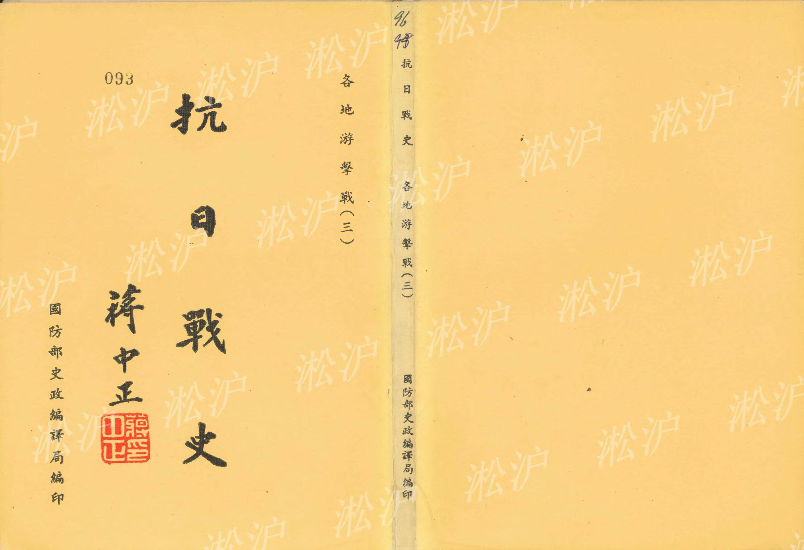

第四十一章 各地游擊戰 第三册 分目七十一、浙江吳興武康附近戰鬥七十二、江西南昌附近戰鬥七十三、江西武寧附近戰鬥七十四、湖北通城崇陽地區戰鬥七十五、江西安義奉新靖安附近戰鬥七十六、江西南昌附近戰鬥七十七、湖北通城以北地區戰鬥七十八、浙江鎮海附近戰鬥七十九、浙江吳興東南地區戰鬥八十、皖南地區戰鬥

八十一、浙江安吉孝豐附近地區戰鬥八十二、浙江新登臨安附近戰鬥八十三、湖北宜昌附近戰鬥八十四、江西奉新附近地區戰鬥八十五、襄河東岸鍾祥東北地區戰鬥八十六、粵東汕頭附近戰鬥八十七、襄河西岸戰鬥各地游擊戰　二六五　二六九　二七一　二七五　二七九　二八三　二八七　二九一　二九五　二九九

三○三

三○七　三一一　三一五　三一九　三三　一

八十八、湖北隨縣以西地區戰鬥　三二七

八十九、南昌外圍附近戰鬥　三三一

第四節 三十年各地游擊戰　三三五

九十、湖北通城臨湘附近戰鬥　三三五

九十一、湖北宜昌分鄉場附近戰鬥　三四一

九十二、江蘇太湖西岸戰鬥　三四三

九十三、浙江長興泗安夾浦一帶戰鬥　三四七

九十四、湖北崇陽大沙坪附近戰鬥　三五一

九十五、浙江吳興崇德附近戰鬥　三五五

九十六、安徽合肥巢縣等地區戰鬥　三五七

九十七、湖北通山附近戰鬥　三六一

九十八、湖北宜昌龍泉舖附近戰鬥　三六五

九十九、安徽無爲附近戰鬥　三六九

一○○、廣州外圍花縣新街附近戰鬥　三七三

一○一、湖北通山白霓橋附近戰鬥　三七九

一○二、安徽宣城郎溪各附近戰鬥　三八三

一○三、浙江諸暨附近戰鬥　三八九

一○四、廣東惠陽附近戰鬥　三九三

一○五、九宮山地區戰鬥　三九七

七十一

浙江吳興武康附近戰鬥

作戰時間：民國二十九年六月四日起至十日止。

作戰部隊：第三戰區第一九二師、江南挺進第一縱隊。

作戰地區：浙江吳興、武康間、京、杭國道以西地區。

敵情：盤據吳興、德清、武康之敵第二十二師團（附伊藤砲兵大隊及戰車裝甲車並僞軍程萬軍部千餘人）三千餘，除於京、杭國道沿線，佔領據點構成火網以維護京、杭國道之交通外，主力集結吳興、德清、武康地區，與各據點相呼應。

我軍目的：師爲策應第五戰區棗、宜之作戰，積極向敵猛攻，乘機奪取據點，俾收牽制之效。戰鬥經過：六月四日，我第一九二師以第一一八團爲右翼隊，在三橋埠西北山地之線，向三橋埠之敵攻擊，第一一九團爲中央隊，在埭溪（三橋埠東北）以西佔領陣地，除於三日晚將敵菁山市附近之公路破壞一段外，是日以一部向埭溪西北之小王山、大王山、連山進攻，江南第一挺進縱隊爲左翼隊，在菁山市西北之山地之線，除向菁山市之敵佯攻，並破壞附近之公路外，另以一部佔領施家橋（菁山市東北）西北之白鹿山、吳幹山伏擊沿公路進出之敵，第一一七團爲預備隊，在武康西南之城山、西山及其以北地區，監視武康之敵。

五日右翼隊與由武康增援三橋埠之敵激戰於楊梅嶺（三橋埠西北）附近，同時洛舍（埭溪東）敵分乘汽艇三十餘艘，至新橋村（菁山市南）登陸，西犯我左翼隊在常照山、南塢（菁山市西）與敵接戰，預備隊在城山、西山附近與由杭州方面增援武康之敵，激戰甚烈。

六日，右翼隊仍繼續攻擊三橋埠中央隊，除於洛舍附近擊沉敵汽艇三艘外，一部在楊山（埭溪東北）附近與敵激戰。左翼隊將施家橋附近破壞後並擊毀汽車二輛，預備隊已將城山附近之敵擊退。

七日，進攻楊梅嶺敵，繼續西犯，我右翼隊轉移石骨嶺與敵續戰，同時中央隊亦向西轉進至托開山、南壁之線，拒擊敵人，我左翼隊之便衣組，是晚混入吳興城內，燒燬敵庫房三間，預備隊被敵壓迫向西轉進，在石骨嶺以南之涼河頭、高崗山之線，與敵續戰，並與右翼隊取得聯繫。

八日至九日，敵我仍在原陣地對峙，十日，敵主力退守公路附近，我以牽制目的已達，遂卽撤守原陣地，本戰鬥乃告結束。

果：一、鹵獲：

1. 步槍一枝。

2. 輕機槍一挺。

3. 輕機彈九零粒。

4. 銅電線一一九公斤。

二、破壞：

1. 倉庫三所。

2. 汽艇三艘。

3. 汽車二輛。

4. 公路三段。

我軍傷亡：一、陣亡：

1. 官四員。

2. 兵三三六名。

二、負傷：

1. 官一八員。

2. 兵三五七名。

我軍損耗：一、武器：

1. 步槍八九枝。

2. 輕重機槍十八挺。

3. 手槍二枝。

二、彈藥：

1. 步機彈一六四、七三七粒。

2. 手槍彈二、五七三粒。

3. 槍榴彈六六零枚。

4. 手榴彈一、四五一枚。

5. 迫砲彈六零七顆。

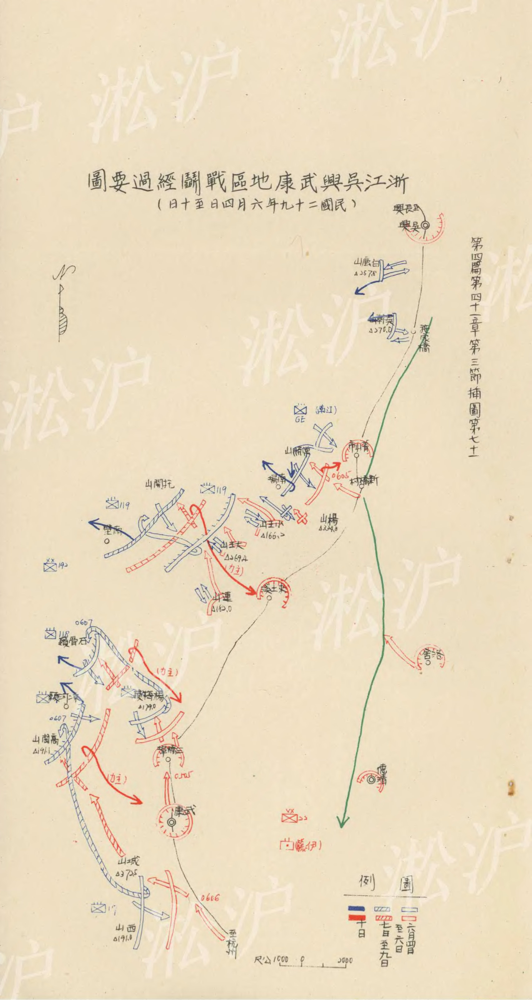

七十二

江西南昌附近戰鬥

作戰時間：民國二十九年六月九日起至三十日止。

作戰部隊：第三戰區第四十九軍之第二十六、預備第九、第一零七（原隸屬第七十軍暫歸指揮）三個師，附砲兵第一團第二營，及第七十軍之預備第五、第一零五（原隸屬第四十九軍暫歸指揮）

兩個師，共計官兵三九，零二三員名。

作戰地區：南昌附近東南地區。

敵情：二十九年初，敵積極補修及加強南昌東南地區之公路網，並構築北自齊城崗經桐林舖、敷林街之第二線陣地，更加強第一線之棠溪、楓林、下陳、謝埠市、沙埠潭、丁坊各要點工事，均於三月底，先後完成。迄四月中旬，敵爲節約兵力，將撫河、贛江間之守備兵力後撤，當面之敵爲三十四師團第二一八聯隊，及特種兵僞軍等共約六千餘人，附砲二門。

我軍目的：自四月中旬以來，我爲防敵兵力轉用，不斷以小部隊向敵攻擊，至六月上旬，復鑒於敵進攻鄂西，爲策應第五戰區作戰，協同第九戰區第十九集團軍向南昌之敵攻擊。

戰鬥經過：六月九日夜至十四日，預備第五師及第四十九軍各一部，曾兩次分向當面之敵攻擊，均無進展。

十五日，第四十九軍暫改歸第九戰區第十九集團軍統一指揮後，乃調整部署，至十九日，預備第五師一部於毛湛口、第二十六師於武溪市（南昌東）、第一零七師於渡頭街、預備第九師於七坊許（南昌南）各附近，先後集結。第一零五師接替第二十六、預備第九兩師武溪市、梁家渡亘撫河、贛江間原守備任務。

二十一日，我軍開始攻擊，第二十六師一部進佔排樓、秦村、虞村、熊村等處，另一部攻佔大塘、吳羅村之線，預備第九師主力攻擊籐樹、趙鄔、生生公司一帶之敵，敵經五次增援，混戰迄夜，該師轉移至谷山、章舒家之線，與敵相持。

二十二日，第二十六師之龍昌橋亘大石橋一帶防務，由第一零七師接替後，卽以主力攻擊羅家集附近之敵，經激戰後，撤至朱河橋、檀上秦、排樓、秦村之線，一部仍與敵對戰於棠溪附近。

二十三日，第二十六師以連日與敵激戰，傷亡頗重，入夜，將防務交由第一零七師接替後，卽集結武溪市以東地區整補。二十四日，當面之敵，數度增援，向第一零七師檀上秦、排樓、秦村等陣地攻擊，激戰甚烈，經我增援反擊，至二十五日，始於大石橋以西地區將敵擊退。二十六日，第一零七師以一部守備龍昌河東岸旣設陣地，主力轉移至撫河左岸芳溪湖以西地區集結。預備第九師方面，自二十三日起至二十六日止，逐日各以一部，分由兩翼及正面向沙埠潭、生生公司、丁坊一帶之敵襲擊。

二十七日，我軍奉命停止攻擊，迄三十日，預備第五、第一零七兩師，擔任鄱陽湖東南兩岸沿撫河右岸迄梁家渡間之防務，第一零五師仍擔任撫河、贛江間現陣地守備，第二十六師及預備第九師分別到達雲山市、老袁坊附近地區整訓。

果：一、鹵獲：

1. 俘敵士兵六名。

2. 步槍二十五枝。

3. 輕機槍三挺。

4. 手槍一枝。

5. 擲彈筒二具。

6. 刺刀十八把。

7. 步槍彈七、五五八粒。

8. 擲榴彈八二枚。

9. 照明彈十七枚。

10 手梅彈七五枚。

11 發烟筒二七個。

12 其他軍用品二十五種。

二、傷亡：

我軍傷亡：一、陣亡：

斃傷敵官兵共約三、四五零員名。

1 官六零員。

2. 兵二、一七七名。

二、負傷：

1. 官一五二員。

2. 兵一、九三四名。

三、失踪：

1. 官七員。

2. 兵五二一名。

我軍損耗：一、武器：

1. 步槍九零四枝。

2. 輕機槍六七挺。

3. 重機槍一五挺。

4. 手槍四二枝。

5. 信號槍二枝。

6. 刺刀一、六四八把。

二、彈藥：

1. 步機彈一、一八零、四七二粒。

2. 手槍彈八、九四二粒。

3. 信號槍彈一五五粒。

4. 砲彈三、一一九顆。

5. 手榴彈一三、四八三枚。

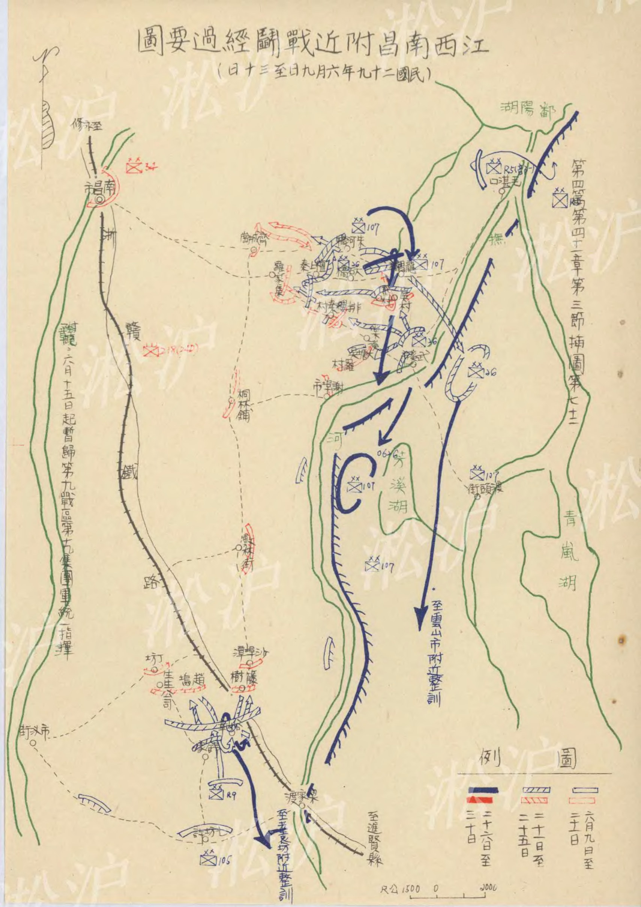

七十三

江西武寧附近戰鬥

作戰時間：民國二十九年六月二十日起至二十九日止。

作戰部隊：第九戰區第七十二軍新編第十四師附新編第十五師第四十四團。

作戰地區：江西武寧縣附近地區。

敵情：敵軍第三十三師團第三一三聯隊（飯田）之菅井大隊，附馬格砲兵一部，共約五百餘，分任火燒白、劉家山、嚴家園（武寧北）一帶守備，武寧城郊由該兩部抽集兵力約六百餘任守備，其城東陳家盤、龍港一帶，則爲一警備區、兵力約二百餘。

我軍目的：該師以主力由武寧縣西北向東南攻擊何家邊、火燒白、觀音閣一帶之敵，乘勢攻佔武寧，對大橋河龍港方面之敵，酌留一部警戒。

戰鬥經過：六月二十日，該師以第四十、第四十一兩團，分向武寧城、火燒白一帶攻擊，激戰至翌日拂曉，撤回劉家山、方家山之線。二十一日，我再向該敵攻擊，經激戰後，仍撤回原陣地。二十三日，敵向我反撲未逞，其由富河北岸大橋河向我橫路進攻之敵約四百餘，被該師第四十二團於蔡家附近擊退，入暮後，第一線兩團，又向當面之敵攻擊，激戰澈夜。同（二十三）日，我右翼新編第十五師第四十四團到達芭蕉附近集結。二十四日後，我逐日以一部向敵夜襲。二十六日，第一線兩團地陣，由第四十二團接替後，是夜，我以主力夾攻火燒白、觀音閣之敵，激戰甚烈。二十七日，該兩據點曾一度被我攻克，旋以敵增援，復陷敵手，同（二十七）日，由瑞昌增援武寧之敵，進抵王家舖附近，與我保安第九團接觸，該師以態勢不利，乃轉大窩山、朱陽坪、李莊之線。

二十八日，武寧附近之敵，分路向我新陣地進犯，均被擊退，二十九日，奉令停止攻擊，三十日，該師卽以一部對通武寧各隘路警戒，主力於新溪源附近整補，同時，新編第十五師之第四十四團亦歸還建制。

戰果：斃敵百餘名。

我軍傷亡：一、陣亡官兵三一五員名。

二、負傷官兵三七五員名。

我軍損耗：一、武器：

1. 步槍四五枝。

2. 衝鋒槍四枝。

3. 小迫砲一門。

二、彈藥：

1. 步機彈二五三、六五一粒。

2. 衝鋒槍彈四一五粒。

3. 信號槍彈一五粒。

4. 迫砲彈二四七顆。

5. 手榴彈二、二一六枚。

考：協同武寧以南以西第七十八軍之新編第十三師、新編第十六兩師圍攻武寧，以策應第五戰區之作戰。

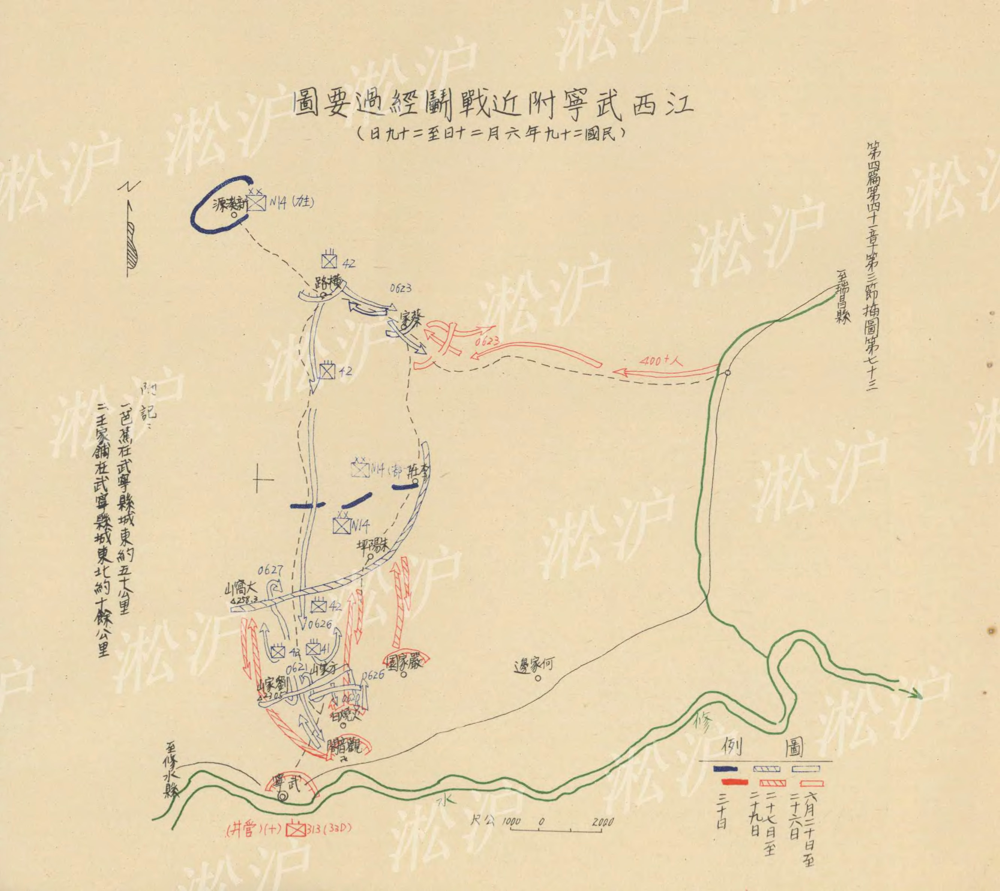

七十四

湖北通城崇陽地區戰鬥

作戰時間：民國二十九年六月三十日起至二十八日止。

作戰部隊：第九戰區第二十七集團軍第二十軍之第一三三師（欠第三九七團附第二十攻擊隊）、第一三四師，共計官兵一八、六三零員名，馬三十七匹。

作戰地區：湖北通城崇陽等地區。

敵情：通城、崇陽附近各據點之敵，自二十八年冬季，經我軍掃蕩後，卽積極補充糧彈，堅固工事，並在崇陽南方仙姑山新築據點拱衛。崇陽當面之敵爲第六師團第二十三聯隊（佐野虎太）之鎌舖大隊第四十五聯隊（池田純太郎）一部，及第四十師團第二三四聯隊一部，步騎砲兵共約千餘人。

我軍目的：我以有力一部，攻擊崇陽之敵，另以一部殲滅毛家畈（卽仙姑山）之敵，主力破壞敵之交通、通信及截擊崇陽方面增援通城之敵，使我通城方面之作戰容易。

戰鬥經過：六月二十日，第二十軍第一三三師集結馬鞍山、張家嶺附近，入夜，其一部迫近仙姑山，一部控置羅帕山北側，並另以崇北支隊繞攻崇陽。同時，第一三四師一部，破壞五星廟、塘田畈間公路及橋樑，翌日仍撤回原地。

二十一日，第一三三師一部，續向仙姑山攻擊，另一部曾攻達該山之稜線後，因敵工事堅強，砲火猛烈，激戰竟日，終未奏功。其崇北支隊，是夜襲擊崇陽，旋以三面受敵，乃轉移至寺前畈與敵對峙。第一三四師一部，進抵鼓響嶺，對大沙坪方面警戒，一部再破壞五星廟、塘田畈間公路。二十二日，仙姑山之敵，仍與第一三三師對峙，其由崇陽南進之敵，亦被該師擊退，同日，由崇陽向該軍左翼進攻之敵，與第一三四師一部於雷家舖，程家橋一帶對戰一、

鹵獲：

竟日，二十三日，第一三三師數度向仙姑山攻擊，均無進展，敵由崇陽一再增援，均被我擊退，第一三四師，仍與敵在雷家舖，程家橋一帶對戰，另由桂口市向我楠木壠進攻之敵，經該師一部迎擊，敵向楊家畈退去。

二十四日，敵步騎砲兵共約四百餘，分路向我進攻，經第一三三師夾擊，敵我於天靈山附近激戰徹夜，第一三四師猛攻當面之敵，敵不支，向洪家橋方面撤退，迨進抵王家嶺附近時，復被我截擊，敵損失頗重。二十五日，天靈山附近之敵，向北撤退。二十六日，第一三三師一部，越崇通公路，進攻崇陽，經激戰後，卽行撤回，第一三四師一部，將五星廟、打石嶺間破壞後，仍返鼓響嶺附近。

二十七日後，該軍各師，以一部掩護，逐日向崇通公路逐段破壞，任務達成後，均各返防。二十八日，奉令停止攻擊，翌日，該軍各部，分別到達金塘坳、塘城坳等地整補。

1. 步槍二枝。

2. 重機槍一挺。

3. 步槍彈九三五粒。

4. 手榴彈五八枚。

5. 刺刀五把。

6. 瓦斯筒五個。

7. 防毒面具二付。

8. 鋼盔四頂。

9. 太陽旗四面。

10裸線二、八零零公尺。

二、傷亡：

斃傷敵官兵共約六百餘員名。

我軍傷亡：一、陣亡官兵三零零員名。

二、負傷官兵三八九員名。

三、失踪官兵一三員名。

我軍損耗：一、武器：

1. 步槍三三枝。

2. 刺刀四九把。

3. 工作器具一四二把。

二、彈藥：

1. 步機彈三六四、零七八粒。

2. 手槍彈一五零粒。

3. 砲彈一、一九七顆。

4. 手榴彈一、四四三枚。

備

考：協同右翼第九十九軍及左翼第五十二軍作戰。七十五

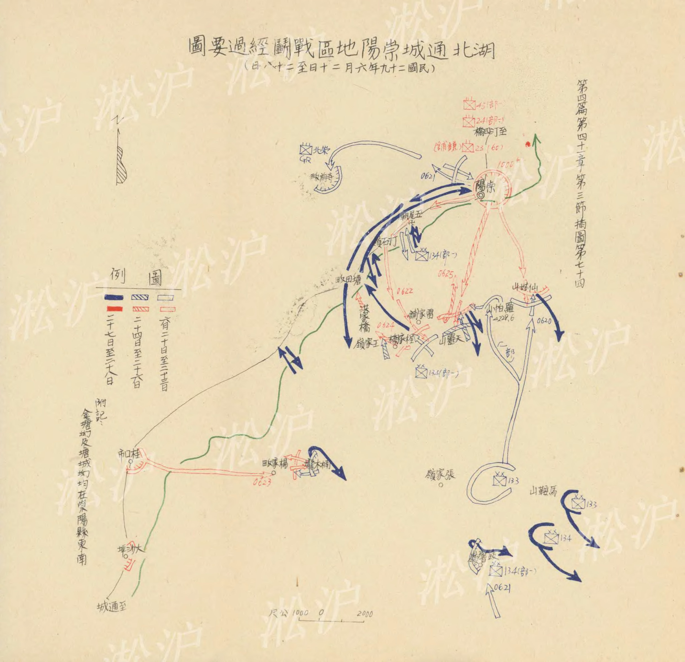

江西安義奉新靖安附近戰鬥

作戰時間：民國二十九年六月二十日起至三十日止。

作戰部隊：第九戰區第一集團軍第六十軍，附新編第三軍之第一八三師，共計官兵二萬七千六百六十六員名，馬一千四百一十匹。

作戰地區：江西奉新靖安以東地區。

敵情：四月初旬與我作戰之敵，受重創後，卽放棄南昌外圍之奉新、靖安兩據點，退守安義附近及其以西各高地，趕修公路，憑據工事固守。當面之敵爲第三十三師團第二一四聯隊、第二五聯隊，步騎砲兵共約七千餘人，野山砲二、三十門，戰車五輛。

我軍目的：該軍自進佔奉新、靖安後，爲保持有利態勢，以主力佔領陶仙嶺、洪田亘白雲山、靖安、和尚腦之線，一部控置彎山、羅黃、土埠、村頭間地區，兩月來不斷襲擊當面之敵消耗及疲憊敵之兵力。

戰鬥經過：六月十九日，第一八三師集結東坑附近，準備進出蛟源向南攻擊安義，二十日，第一八二、第一八四各師一部，準備分向宋埠及于州街、松樹山之敵佯攻。

二十日，第一八四師、第一八二師開始分向天堡崗、筍箕崗及嶺背李、鷄公尖一帶之敵，二十一日，第一八四師攻佔宋埠，第一八二師攻佔鴨婆潭、松樹山各一部，第一八三師到達蛟源附近。

二十二日，第一八四師進展至王家、筍箕崗之線，第一八二師無進展，第一八三師攻佔大、小梓源大朋腦後，續向安義攻擊。

二十三日，該軍正面兩師，均無進展，第一八三師於攻佔遼源、仁首街後，在太子街、嶺背趙家、虎山、上、下白田一帶，與敵激戰竟日。

二十四日，該軍正面，仍於原陣線與敵激戰，其由安義灘溪增援，向我第一八三師反擊之敵，迄二十五日，敵我對戰於大、小梓源、珠絡山、虎山之線。二十六、七兩日，該軍續向當面之敵攻擊，仍無進展，第一八三師與敵激戰後，轉移至焦區、華坊、燒火嶺、托盤坪之線。二十八日，敵向該軍進犯未逞。二十九日，奉令停止攻擊。三十日，該軍以主力守備儒里、溫村、奉新城、蔣家堎、饅頭山亘水口之線，其第一八三師位置於會埠附近。

果：一、鹵獲：

1. 步槍二十五枝。

2. 輕機槍二挺。

3. 手槍一枝。

4. 步機彈一六零粒。

5. 山砲彈七顆。

6. 鋼盔十八頂。

二、傷亡：

斃傷敵官兵五五三員名。

我軍傷亡：一、陣亡官兵七一八員名。

二、負傷官兵一、零二七員名。

三、失踪官兵六六員名。

我軍損耗：一、武器：

備

1. 步槍二七五枝。

2. 輕機槍一三挺。

3. 信號槍二枝。

4. 迫砲一門。

二、彈藥：

1. 步機彈三九三、零一二粒。

2. 手槍彈八八九粒。

3. 信號槍彈五三粒。

4. 迫砲彈二、六三八顆。

5. 手榴彈九、零零九枚。

考：策應第五戰區反攻宜昌、第三戰區攻擊南昌之作戰。七十六

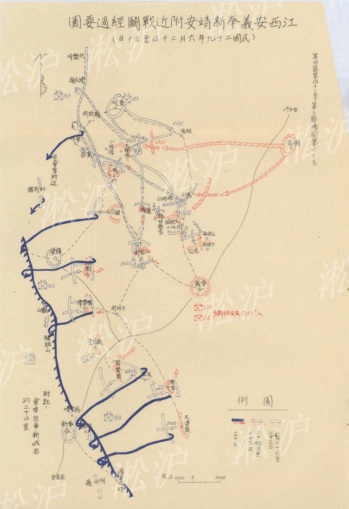

江西南昌附近戰鬥

作戰時間：民國二十九年六月十九日起至三十日止。

作戰部隊：第九戰區第七十四軍及西山支隊第七十四攻擊隊，共計官兵三八、七五三員名，馬一、零五八匹。

作戰地區：江西南昌西南陸家店、嚴家嶺、百家山、程家山、梧桐嶺附近各地區。

敵情：贛北之敵，自五月上旬，陸續他調，至六月中旬，其南昌附近各據點之敵，積極增強工事，企圖負隅固守。當面之敵爲第三十四師團第二一七聯隊、第二一八聯隊各一部及第三十三師團第二一四聯隊一部、第三十四騎兵聯隊主力、附野戰砲二十餘門、戰車十五輛，共計兵力約五千餘人。

我軍目的：我爲策應第五戰區作戰，乘敵分散之際，集中兵力進攻牛行、安義，以協力第三戰區攻略南昌。

戰鬥經過：該軍自五月三日奉令後，仍以第五十七師守備右自市汊街沿錦江南岸至坑上梁之線陣地，第五十一師守備坑上梁（不含）越錦江經禁山亘米嶺之線陣地，第五十八師控置高安西南地區。

六月十九日，第五十七師展開於橫岡、劉小嶺之線，第五十一師展開於白仙嶺、梧桐嶺之線，第五十八師推進至大城附近，均完成攻擊準備。

二十日，右翼第五十七師一部，分向陸家山、陸家店夜襲，激戰至翌日，敵我相持於造放，鄒莊、屈莊之線，左翼第五十一師一部，阻擊由石鼻街、宋埠進犯梧桐嶺之敵，激戰至翌晨，被我擊退。

二十一日，第五十七師補充團，由李家、鳳凰呷之線向嚴家嶺之敵攻擊，該師主力，向百家山附近攻擊，激戰至二十三日晨，嚴家嶺發生爭奪戰，旋得旋失，其百家山陣地，終被我攻佔。同（二十一）日，第五十一師開始攻擊後，翌日攻佔蟠龍山，迄二十三日，又突破帽子堠、程家山敵之主陣地，繼與該軍西山支隊，分襲石富觀，繆家之敵。

二十四日，第五十八師接替第五十一師防務，二十五日，第五十七師一部，攻佔毛家橋，同時，敵向我百家山進犯未逞，第五十八師擊退進犯八尺舖之敵，翌日，該敵又向我進犯未逞。

二十七日，該軍調整部署，以第五十七師佔領右自市汉街亘羅家渡、錦河南岸及北岸石頭岡、七里崗之線，以第五十八師佔領右自七里崗（不含）亘儒里溫村之線，第五十一師集結於張家渡附近，西山支隊仍在南源坪附近游擊，迄三十日拂曉前，各師均部署完畢。

果：一、囪獲：

1. 敵兵二名。

2. 馱馬一匹。

3. 步槍一二五枝。

4. 輕機槍七挺。

5. 重機槍一挺。

6. 電話機戰刀等共四十二種。

二、傷亡：

斃傷敵官兵二、四九二員名。

我軍傷亡：一、陣亡官兵二、零四零員名。

二、負傷官兵二、七零五員名。

三、失蹤官兵一二五員名。

我軍損耗：一、武器：

1. 步槍二七四枝。

2. 輕機槍一二挺。

3. 重機槍二挺。

4. 手槍二一枝。

5. 發射筒六一個。

二、彈藥：

1. 步機彈六一七、七四六粒。

2. 手槍彈七、八四四粒。

3. 鋼心彈一七、七四九粒。

4. 槍榴彈二、六六零枚。

5. 砲彈六、一六零顆。

6. 手榴彈七五三枚。

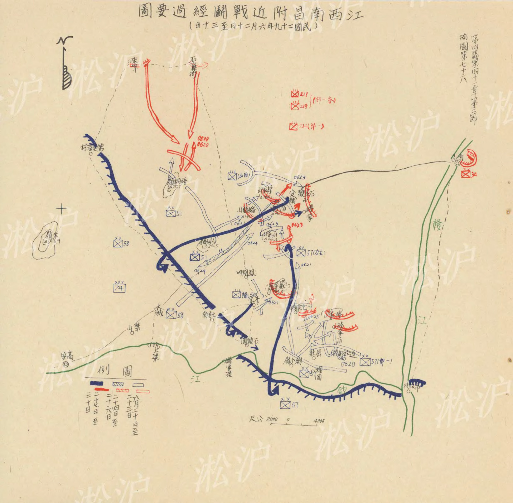

各地游擊

三

七十七

湖北通城以北地區戰鬥

作戰時間：民國二十九年六月二十一日起至二十九日止。

作戰部隊：第九戰區第五十二軍之第一九五師、第二十五師及第六、第七兩挺進縱隊。

作戰地區：鄂南通城、羊樓洞、趙李橋、羊樓司等地區。

敵情：盤據臨湘、岳陽一帶之敵第六師團一部，自二十八年秋侵犯長沙失敗後，卽退據該地區修築工事，頗稱堅固。

我軍目的：軍以策應第五戰區之作戰，向通城、羊樓洞、岳陽間一帶之敵掃蕩，以便爾後進攻容易。戰鬥經過：六月二十一日，第五十二軍以第一九五師、第二十五師分別向趙李橋、羊樓司之敵攻擊，第一九五師進至趙李橋以南，卽向得勝山、石山之敵攻擊，第二十五師，攻佔羊樓司附近據點多處。二十二日，第一九五師，將固守趙李橋以南得勝山、石山、大壠之敵先後擊潰，第二十五師與曾家坳（羊樓司南）之敵往復爭奪，戰鬥甚爲激烈。二十三日，第一九五師（附第六挺進縱隊），除以一部向南山崖、盧家橋（均在趙李橋東）之敵牽制外，主力攻佔新舖子（在趙李橋、羊樓司間）、龍灣台（趙李橋、新舖子間）兩據點，第二十五師（附第七挺進縱隊），以一部越過鐵道由羊樓司以北攻擊牽制敵人，主力仍向頑據曾家坳之敵圍攻。是（二十三）日，羊樓洞、趙李橋方面之敵，經我將新舖子、龍灣台攻佔後，深感不安，乃分別增援，同時，臨湘敵亦東進增援，有反攻模樣。二十四日，敵鐵甲車一列，由趙李橋南馳至龍灣台附近，卽向我射擊，同時，由臨湘竄來之敵，亦紛由西及北兩路向我夾擊，第二十五師，除以一部監視曾家坳之敵外，一部在新舖子以北協同第一九五師作戰，當將增援反攻之敵，分別擊退。

果：一、鹵獲：

二十七日，敵由蒲圻增來步騎兵千餘人，在飛機掩護下，一部分向石山、新舖子前進，主力沿公路向羊樓洞以西地區前進，猛攻我第一九五師得勝山陣地，我爲保持機動，卽轉移至李家門（得勝山南）附近，第二十五師，在羊樓司附近與敵對戰。

二十八日，第一九五師，除以一部仍在李家門拒止南下之敵外，一部向羊樓司挺進，協力第二十五師之作戰。第二十五師與羊樓司之敵，作竟日之激戰，敵我傷亡均大。二十九日，該軍奉令停止攻擊，入晚開始向南江橋（通城南）移動，戰鬥乃告結束。

1. 俘敵兵二名。

2. 步槍二七枝。

3. 輕機槍四挺。

4. 擲彈筒二具。

5. 步機彈一五六零粒。

6. 手榴彈一五五枚。

7. 擲榴彈一八二枚。

二、傷亡：

斃敵百餘名。

我軍傷亡：一、陣亡官兵三九九員名。

二、負傷官兵五七五員名。

三、失蹤兵二四名。

各地游擊

我軍損耗：一、武器：

1. 步槍一一枝。

2. 手槍五枝。

3. 信號槍一枝。

二、彈藥：

1. 步機彈四二四、五七零粒。

2. 手槍彈二零五零粒。

3. 手榴彈三、五五零枚。

4. 砲彈二、九七零顆。

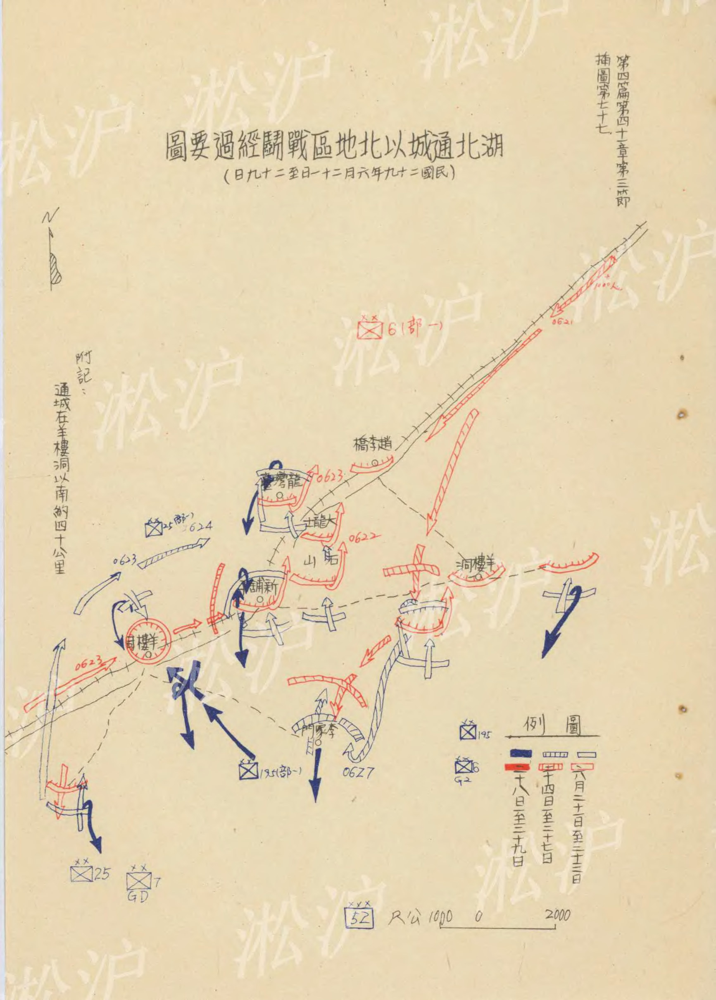

各地游擊

七十八·浙江鎮海附近戰鬥

作戰時間：民國二十九年七月十七日起至二十二日止。

作戰部隊：第三戰區第一九四師（附第十六師第四十八團及寧防守備第一團）

作戰地區：浙江鎮海縣城及甬江南北岸各要塞地區。

敵情：敵爲封鎖我東南海岸之交通，並奪取我沿江要塞，以遂其侵佔整個地區之企圖，乃以海軍第三艦隊上海特別陸戰隊之西林大隊及機砲各一中隊，共約三千餘人，此外，兵艦三十餘艘、航空母艦一艘（載飛機九架）、汽艇四十餘艘，十六日五時，鎮海口外敵艦開始向我宏遠砲台射擊，其飛機亦輪番轟炸掩護。

我軍目的：我以守備甬江兩岸要塞，確保慈谿、寧波、奉化之目的，予敵以嚴重打擊。

戰鬥經過：停泊鎮海口外之敵艦隊，於七月十七日四時三十分，在飛機大砲掩護下，以陸戰隊五百餘人，於老鼠山（甬江南岸沿海地區）附近登陸，將我寧防守備第一團守兵擊退後，乘勢向鎮遠、宏遠兩砲台進攻，十時許，鎖遠、宏遠兩砲台相繼失守、另敵一股，於十七時，由鎮海縣東登陸，旋卽進陷縣城，我守備龍山、蟹浦之第一九四師之第一一二五團，除留必要兵力擔任警戒外，主力向駱駝橋（鎮海縣西）附近佔領陣地，拒止敵之西竄。

第一九四師陳師長，爲適應當前戰況，卽將守備江北汶溪（駱駝橋西）之第一一二六團，轉移甬江南岸，策應該方面作戰，第一一二七團，由穿山向北挺進，集結馬嘴山（老鼠山以南）以南地區，準備向老鼠山之敵攻擊。

十八日登陸之敵，已陸續增至兩千，我甬江南岸之第一一二七團，北岸之第一一二五團，均與敵作竟日之激戰。

十九日一時許，該師以攻取江南要塞及鎮海縣城之目的，全面向敵反攻，七至十時，甬江南岸部隊，先後攻佔馬鞍山、長跳嘴（鎮遠砲台）、田鷄頭、七角山（鎮海縣城東南）等要點，江北之第一一二五團，亦攻至鎮海城西附近，敵主力千餘人，仍盤據宏遠砲台、港口鎮、金鷄山（甬江南岸與鎮海縣城夾江並峙）各地區，另敵三百餘，固守鎮海縣城，企圖負隅頑抗。

二十日二十一時，該師調整部署，以第一一二七團爲右翼隊，以一營佔領老鼠山、馬鞍山、長跳嘴、田鷄頭各要點，拒止敵後續部隊之登陸，掩護我右側安全，主力向黃鶴根（港口鎮東南附近）攻擊，並渡小夾江向港口鎮、宏遠砲台之敵攻擊。第一一二六團爲中央隊，攻擊小鎮之敵。第十六師之第四十八團爲左翼隊，固守七角山、衙前街之線，並相機向金鷄山之敵進攻。二十一日一時三十分，我第一一二七團主力攻佔黃鶴根，第一一二六團攻佔小港鎮，旋敵增援反撲，並以飛機大砲助戰，戰鬥異常激烈，敵我傷亡均重，迄十八時，敵終被我擊退。

該師長，爲掌握戰機，迅速擊滅該敵之目的，乃督令各部繼續進攻，自二十一日二十三時迄二十二日三時，第一一二七團於攻佔港口鎮後，繼續會同第一一二六團攻克宏遠砲台，第十六師之第四十八團，亦攻克金鷄山，同時，江北方面之第一二五團，於攻佔鎮海縣城後，並繼續克復威遠砲台，敵紛紛登艇逃竄，該師除令各部清掃戰場重新部署外，戰鬥遂以告終。

戰

果：一、鹵獲：

1. 步槍三五枝。

各地游擊

目

2. 手槍一枝。

3. 輕機槍二挺。

4. 飛機用機關槍一挺。

5. 步機彈一九、七七七粒。

6. 砲彈九顆。

7. 手榴彈二八枚。

二、傷亡：

斃傷敵官兵共約千餘人。

我軍傷亡：一、陣亡：

1. 官二員。

2. 兵四一六名。

二、負傷：

1. 官四二員。

2. 兵四八八名。

我軍損耗：一、武器：

1. 步槍一零四枝。

2. 手槍六枝。

3. 重機槍五挺。

4. 輕機槍二四挺。

二、彈藥：

1. 步機彈五四五、一五零粒。

2. 迫砲彈一、六五六顆。

3. 信號槍彈一九八粒。

4. 手榴彈五、八四零枚。

5. 手槍彈五、零二二粒。

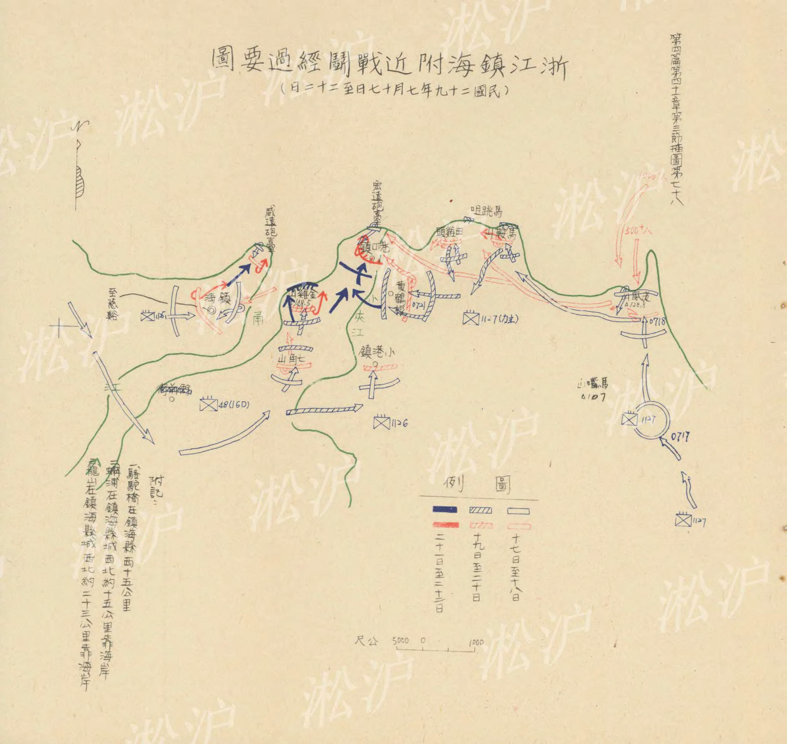

七十九

浙江吳興東南地區戰鬥

作戰時間：民國二十九年九月二十四日起至二十七日止。

作戰部隊：第三戰區第一九二師。

作戰地區：浙江吳興及璉市以南地區。

敵情：九月二十三日，烏鎮獨立第十一旅團熊谷武大隊五百餘。石灣敵第八十五聯隊千餘，新市敵第八十六聯隊八百餘，菱湖敵四百餘，雙林敵第八十七聯隊千餘，同日分向我璉市、含山、善生連進犯，企圖掃蕩我游擊根據地，保障杭嘉湖三角地區之安全。

我軍目的：師爲確保含山及以東游擊根據地之目的，除以三分之一兵力，固守璉市、五河涇、含山之線各據點外，主力機動使用，打擊敵人。

戰鬥經過：九月二十三日，雙林菱湖之敵，分別向璉市、璉連進犯，二十四日，烏鎮、石灣之敵，亦向璉市出擊，經我第一一七、第一一八、第一一九各團之一部，分別阻擊於南窯（烏鎮西）、圓直廟橋（石灣北）及含山各附近，但敵主力，則已竄陷璉市與璉連。

二十五日，該師以收復璉市之目的，卽以第一一七、第一一八團各一部，協同第一一九團之第三營，分向璉市之敵圍攻，敵不支，向北潰退。此時，雙林之敵一股，南竄六里橋附近，該敵遂與會合，並向六里橋攻擊，我守兵因傷亡過半，該地遂陷敵手，敵並乘勢攻佔九里橋二十六日，我第一一七、第一一八兩團各以一部，同向六里橋南竄斯家濱之敵攻擊，敵不支北退，我守備含山之第一一九團之第二營，受九里橋、善生連、新市之敵三面圍攻，該營竭力抵抗，終以衆寡懸殊，且傷亡重大，含山遂爲敵所陷，該團之第一、第三兩營，當卽分別向含山，善生連進攻，十二時，克復善生連，敵向含山退却，我跟蹤追擊，此時敵大部佔領含山及其以東地區，一部則退回原據點固守。

二十七日，該師師部進駐璉市，第一一七團駐五涇河附近，第一一八團駐白馬塘附近，第一一九團駐含山附近，待機再行襲擾敵人，本戰鬥告一段落。

戰

果：一、鹵獲：

1. 步槍二十七枝。

2. 輕機槍一挺。

3. 步機彈一、三三一粒。

二、傷亡：

1. 斃敵官六員、兵五百餘名。

2. 傷敵官七員、兵六百餘名。

我軍傷亡

一、陣亡官兵九二員名。

二、負傷官兵七四員名。

三、失蹤官兵三四員名。

我軍損耗：一、武器：

1. 步槍八二枝。

2. 手槍八枝。

3. 輕重機槍五挺。

4. 迫砲二門。

二、彈藥：

1. 步機彈一零零、一七二粒。

2. 手槍彈六零零粒。

3. 手榴彈一四五枚。

4. 槍榴彈三七零枚。

5. 迫砲彈五零零顆。

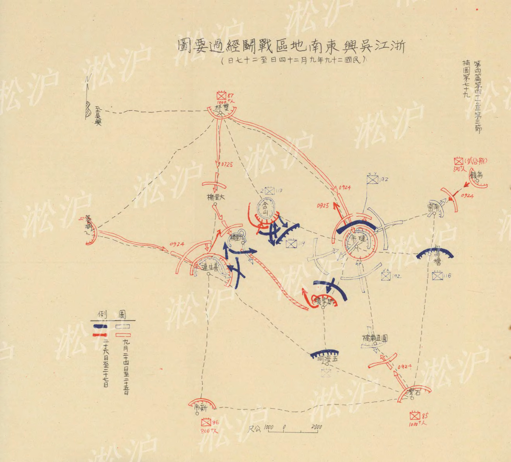

八十

皖南地區戰鬥

作戰時間：民國二十九年十月五日起至十七日止。

作戰部隊：第三戰區第三十二集團軍第二游擊區（第六十三師、第四十師、獨立第三十三旅、第二挺進縱隊·忠義救國軍）、第二十五軍（第一零八師、第五十二師），官兵共計四九、六五三員名、馬五七五匹。

作戰地區：安徽廣德、郎溪、宣城、涇縣、南陵、繁昌等縣地區。

敵情：敵第十五師團、第十七師團及第二十二師團，一部據守長興、湟里、金壇、句容、溧水、高淳、水陽、九里山、灣沚、蕪湖、荻港等據點，主力控置於京滬鐵路之蘇州、無錫、南京各地區，其守備部隊，常以小部向我陣地進擾，當面之敵兵力，約一萬五千餘人。

我軍目的：該集團軍，以第二游擊區，守備合溪、蜀山、百合場、徐舍、上官鎮、竹簧橋、上興埠、孔鎮沿固城湖東岸慈溪大南漪湖右岸，以第二十五軍，守備自新合莊亘宣城、敬亭山、銅鐵山、西河鎮、黃暮渡、新林舖、繁昌、涇縣地區，與敵對峙，並以游擊部隊向敵後游擊。

戰鬥經過：十月五日，灣沚之敵，分向第五十二師黃暮渡、新林舖陣地進攻，我逐次轉移至平溝舖以南地區（南陵北）。六日，紅錫鎮之敵進攻第一零八師福定山珩瑯山、陣地未逞，其一部攻陷西河鎮、平溝舖、戴塘橋之敵，分向南陵進攻，與第五十二師一部激戰於城郊附近。

七日，敵攻陷福定山、寒亭後，繼續東進，與第一零八師一部於管家橋、天門山一帶激戰，其進攻南陵之敵，仍在城郊與第五十二師一部激戰中。

八日，汀潭之敵，經第五十二師一部截擊後，轉攻佔我涇縣城象山、天官山等處，由寒亭、白馬山南進之敵，經第一零八、第五十二兩師各一部夾擊後，卽分向柿木舖、馬頭嶺撤退。九日，第五十二師與敵激戰於獅子山亘姚家壠一帶，旋卽克復涇縣象山、天官山等處，同時，第一零八師一部，佔領施窯嶺東西之線，亦向白塔寺之敵攻擊，激戰至十一日，敵紛向南陵方面撤退。是日，九里山之敵，向我敬亭山、銅鐵山陣地攻擊，與第一零八師一部，發生混戰，十二日，敵突破銅鐵山陣地後，續向宣城攻擊，與該師混戰徹夜。長興之敵，自八日西進突破第三十三旅匡溪橋及烏莊陣地後，繼陷泗安，十二日，復陷界牌，我原駐廣德之第六十三師，鑒敵有北竄企圖，卽轉移至大界嶺、江家店及沈家渡（廣德北）一帶，阻敵北進，忠義救國軍，轉移至官莊保（廣德南）附近，與敵對戰。

十三日，宣城失陷，第一零八師，是夜開始反擊，同日，水口、煤山（長興北），先後被敵攻佔，獨立第三十三旅，卽於湖汊西南山區游擊，第六十三師，與由界牌、廣德北進之敵激戰後，一部轉移至分崗嶺、磨盤嶺之線，一部至戈陽附近，同時，我由溧陽增援之第四十師一部，於銅鐵山、大梅嶺之線阻敵北進，另由南漪湖北岸黃龍嘴進攻我鄭村，被第二挺進縱隊擊退。

十四日，我克復宣城，敵向洪林橋撤退，第六十三師一部，集結於同官里，主力潛伏於金山附近，準備截擊北進之敵，其由南漪湖北竄之敵會合洪林橋之敵後，是日陷郎溪，與第二挺進縱隊一部於鍾橋附近對峙。

十五日起，敵經我各部隊分別截擊側擊後，迄十七日，敵由湖汊、溧陽、桠溪港、東壩各地區，分向宜興、金壇、溧水、高淳撤退，至是，我亦逐漸恢復原來態勢。

戰果：斃敵官兵三百餘名。

我軍傷亡：一、陣亡：

1. 官四五員。

2. 兵一、五一四名。

二、負傷：

1. 官六七員。

2. 兵一、五零六名。

三、失踪：

1. 官一二員。

2. 兵六六六名。

3. 馬二匹。

我軍損耗：一、武器：

1. 步槍三九枝。

2. 輕重機槍二挺。

二、彈藥：

1. 步機彈一、三一一、七九二粒。

2. 槍榴彈二、二八七枚。

3. 砲彈一、四二零顆。

4. 手榴彈一、四九一枚。

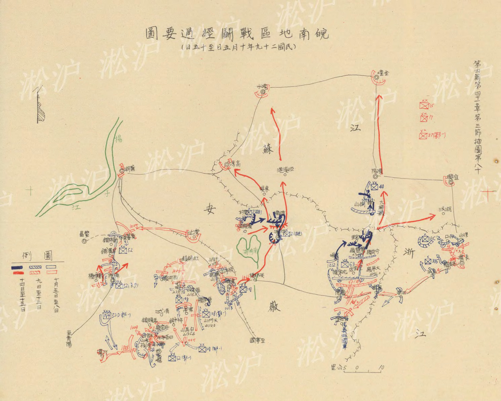

八十一

浙江安吉孝豐附近地區戰鬥

作戰時間：民國二十九年十月六日起至十五日止。

作戰部隊：第三戰區第二十八軍（轄第六十二、第一九二十、新三十師）。

作戰地區：浙江安吉、孝豐及安徽廣德附近。

敵情：自十月一日以來，京滬杭地區內，敵軍調動頻繁，四、五兩日，長興附近集結敵第二十二師團之第八十四聯隊及僞軍一部，吳興有敵第十一旅團之熊谷武大隊，武康附近增敵第十七師團平林部之第五十三、第八十一兩聯隊及僞綏靖軍一部，共約七千餘人，企圖向我安吉、孝豐進犯。

我軍目的：軍以鞏固防務之目的，以一部於安吉、孝豐山地據險扼守，利用隘路節節設伏，主力機動配置，相機捕捉敵人而殲滅之。

戰鬥經過：十月六日，武康敵四百餘西竄九都市，與我第六十二師一部接觸，七日，越過簰頭，八日拂曉，激戰於簰頭西北地區，同日，由上柏、瓶窯進犯黃湖鎮，向我右翼迂迴之敵約三千餘，傍晚進至百文，繼分股竄犯，一股北出獨松關竄至遞舖、安吉，一股分由塘福鎮、幽嶺進犯孝豐。

九日拂曉，我第三七二團與由幽嶺西犯之敵激戰於泉灣附近，旋敵機二十餘架，向我輪番轟炸，我以傷亡甚重，至晚，卽向孝豐附近轉移。十四時由遞舖北竄之敵與我新編第三十師一部在安吉、西畝市之線激戰後，安吉陷敵。其時，我第三六八團正奉令向遞舖之敵進攻，並跟踪向安吉猛攻，是（九）日，吳興之敵熊谷武大隊，會合僞軍共千餘人及長興敵第二十二師團之第八十四聯隊，分向我第三七一團之梅溪、泗安進犯。

十日，由百文西犯之敵會合塘福鎮敵，竄入孝豐，我第三七二團，乘敵立足未穩之際，一舉攻克孝豐，該軍爲牽制敵之西犯，乃令第一九二師及新編第三十師，主力在敵後之崇德、桐鄉地區，積極活動，破壞其交通、通信，並襲擾其據點。

由饒頭西犯之敵，於十日續向梅溪北竄，我第六十二師之一部，卽轉移錢杭橋向敵截擊，同（十）日，我據守梅溪、泗安之第三七一團，以兵單防廣，梅溪被敵攻陷，泗安旋亦不守，該團乃轉移附近山地與敵續戰。

十一日晨，我第三六八團，克復安吉，敵向泗安逃竄。

十二日，竄據泗安敵，西竄廣德。

十三日，軍以奉令策應廣德方面友軍之作戰，遂於十四日以第六十二師之第三六八團及第三七一團一部，向泗安夜襲，斬獲頗多，敵向長興回竄，泗安爲我克復，同（十四）日，並以第三七二團由孝豐向廣德前進，敵聞風北竄，十五日拂曉，遂會同友軍收復廣德城，戰鬥遂以告終。

果：一、鹵獲：

1. 俘獲僞軍一名。

2. 山砲彈二十八顆。

3. 鋼砲彈五十顆。

4. 機槍彈七、四零五粒。

5. 電線一三零斤。

二、破壞：

1. 橋樑四座。

2. 公路十華里。

3. 拆毀電線七華里。

4. 擊毀汽艇三艘。

5. 木船二十餘隻。

三、傷亡：

斃傷敵僞官兵共約一千一百餘員名。

找軍傷亡：一、陣亡官兵二四二員名。

二、負傷官兵三零一員名。

三、失踪兵五二名。

我軍損耗：一、武器：

1. 步槍一二枝。

2. 輕重機槍六挺。

3. 手槍二枝。

二、彈藥：

1. 步機彈一五三、八三八粒。

2. 迫砲彈一七四顆。

3. 槍榴彈二五五枚。

4. 手槍彈一、四三三粒。

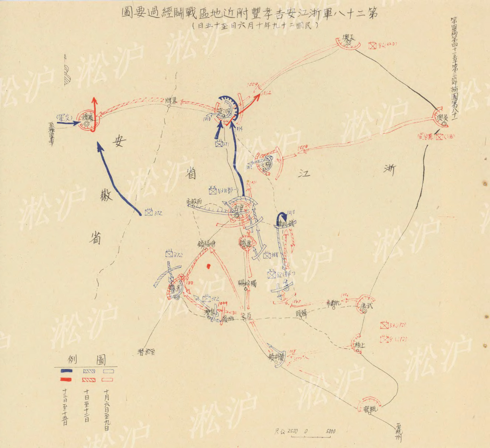

八十二

浙江新登臨安附近戰鬥

作戰時間：民國二十九年十月七日起至十五日止。

作戰部隊：第三戰區暫編第三十二師第一團，暫編第三十三師第二團、暫編第三十五師（欠第二團）、共四個團。

作戰地區：浙江新登、臨安各附近。

敵情：敵第二十二師團主力及僞軍一部，集結於富陽、餘杭南北之線，共計四、五千人。十月六日，餘杭之敵，續有增加，並以少數敵人向長樂橋、雙溪以東山地進擾，有積極侵犯之模樣。我軍目的：我軍以拒止西犯之敵，擬於陣地前而殲滅之。

戰鬥經過：十月七日十七時，餘杭之敵，分兩路西犯，與我暫編第三十二師第一團於青山、長樂橋（餘杭西北）之線接觸。八日五時，我青山、長樂橋陣地被敵機炸毀，該團主力，卽轉移於冷水橋（長樂橋西）拒擊敵人。七時許，敵續向冷水橋進攻，該軍當令暫編第三十三師之第二團，以有力一部於亭子頭（青山西南）堵擊西犯之敵，另以控置冷水橋以北之暫編第三十五師第三團，側擊由長樂橋西侵之敵。十五時許，敵陷青山及冷水橋，並續猛烈攻擊，我節節抵抗，二十時，臨安失陷，我暫編第三十二師第一團、暫編第三十五師第三團，均轉移臨安以西之橫街頭附近，堵擊該敵。

九日二時，青山之敵千餘、砲十餘門，由五柳橋（青山臨安間）南竄，與我暫編第三十二師第二團激戰於亭子頭附近，二十時，該團以傷亡過重，遂向以南山地轉移，敵遂繼續南犯新登。

十日五時，該師奉令規復臨安，並尾擊由亭子頭南犯之敵，當督率暫編第三十二師第一團，向臨安反擊，十五時，克復臨安，敵向青山方面撤退。

十一日拂曉，南犯新登之敵，與暫編第三十五師第一團在青雲橋、方家井（富陽、新登間），激戰至烈，同時，富陽敵亦向該團側擊，我在三面包圍之下，乃轉移湯家埠（富陽西南）地區。

十二日，犯新登之敵千餘，有續進犯錢塘江南岸模樣，軍奉令協助友軍（第七十九師）夾擊該敵。十八時，暫編第三十二師第一團、暫編第三十五師第三團，均進至新登以北之松溪地區，卽向該敵攻擊，十四日，新登克復，除第七十九師仍繼續尾追南渡之敵外，該軍以任務完成，卽以暫編第三十五師第一團、暫編第三十三師第二團，爲右地區隊，守備湯家埠至嚴里（餘杭以西）之線、暫編第三十五師第三團、暫編第三十二師第一團，爲左地區隊，守備長樂橋南北之線，十五日，各部次第部署完畢，本戰鬥遂以告終。

戰

果：一、鹵獲：

1. 步槍十二枝。

2. 步彈二六四粒。

3. 砲彈八顆。

二、斃敵官兵百餘名。

我軍傷亡：一、陣亡：

1. 官二一員。

2. 兵五五八名。

二、負傷：

1. 官一七員。

2. 兵三八三名。

三、失踪官兵六四九員名。

我軍損耗：一、武器：

1. 步槍二九三枝。

2. 輕重機槍九挺。

3. 手槍三四枝。

4. 迫砲一門。

二、彈藥：

1. 步機彈三二零、四六六粒。

2. 手槍彈一零、九一三粒。

3. 迫砲彈二二一顆。

4. 手榴彈三、零九三枚。

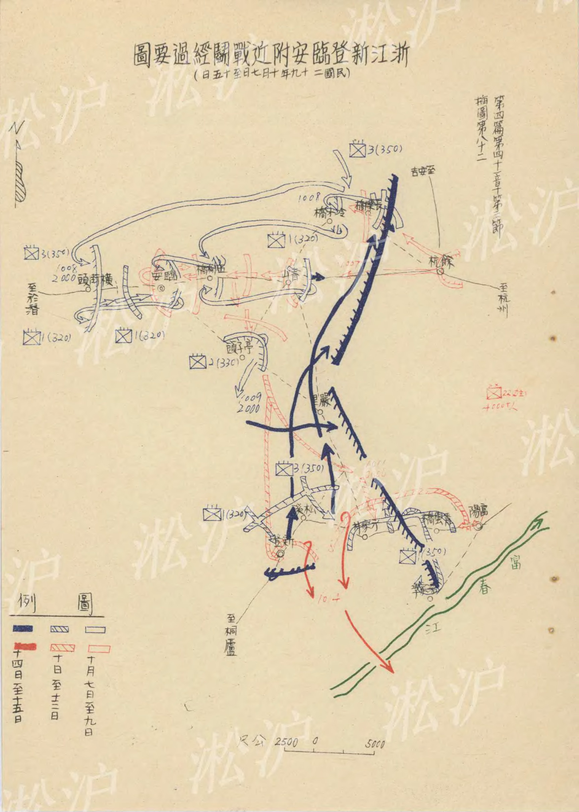

八十三

湖北宜昌附近戰鬥

作戰時間：民國二十九年十月十二日起至十一月十一日止。

作戰部隊：第六戰區第一八五師。

作戰地區：湖北宜昌、南津關附近地區。

敵情：敵第十三師團第一零四聯隊，除八月中旬以來積極修築道路並隨時與我發生小戰鬥外，自十月五日起，敵機異常活躍，經常向我後方轟炸。

我軍目的：該師以拱衛陪都門戶，牽制敵人，使無暇西竄。

戰鬥經過：十月十二日，該師爲排除南津關（宜昌北）、小溪塔（南津關東北）兩據點之側射威脅，於二十一時，以第五五三團一部，向梯子巖、劉家山（均在小溪塔、南津關間之突出部）之敵進攻，二十二時，突入敵陣，與敵肉搏，敵不支潰退，二十三時，兩據點均被我攻佔。

十三日八時，我南津關之野砲連觀測所，發現宜昌敵飛機場由武漢飛來敵轟炸機二十九架，當卽施行急襲射擊，擊燬敵機七架、傷五架，並燬汽車五輛，餘機倉皇起飛，向我陣地盲目轟炸，同時，敵西陵山（南津關東北）砲兵，亦向我射擊，迄十五時，江山霧起，乃趨沉寂十五日，梯子巖當面敵步兵三百餘，分向我進攻，激戰甚烈，我因傷亡過重，被迫後撤，梯子巖遂陷敵手。自是，敵卽於西陵山、梯子巖各據點，積極加強工事，有久據模樣，但宜昌之敵飛機場，則仍爲我砲兵射程所控制，故敵機無法利用該機場。

十一月六日，西陵山、梯子巖方面之敵，在敵砲空軍及戰車掩護下，分向我南津關及曹家冲（梯子巖西北）陣地進犯（進攻南津關敵，係新參戰之敵第十三師團第一零三旅團主力），雖經我守軍奮力迎擊，終以敵衆我寡，南津關遂被敵攻陷，我第五五五團退守玉井、袁家垸（均在南津關西北）之線，與敵對戰，七日以後，敵不斷向我玉井、袁家垸陣地進犯，均被擊退，迄十一日，戰鬥乃告終止。

戰

果：一、鹵獲：

步槍一枝。

二、破壞：

1. 擊燬敵機七架。

2. 擊傷敵機五架。

3. 毁汽車五輛。

4. 戰車一輛。

三、斃敵官兵百餘名。

我軍傷亡：一、陣亡：

1. 官二四員。

2. 兵六六二名。

二、負傷：

1. 官二九員。

2. 兵四九零名。

我軍損耗：一、武器：

1. 步槍二七一枝。

2. 輕重機槍十八挺。

3. 迫砲四門。

4. 手槍十三枝。

5. 擲彈筒十六具。

6. 野砲一門。

二、彈藥：

1. 步機彈二七三、八二零粒。

2. 砲彈一、三三七顆。

3. 擲榴彈五八二枚。

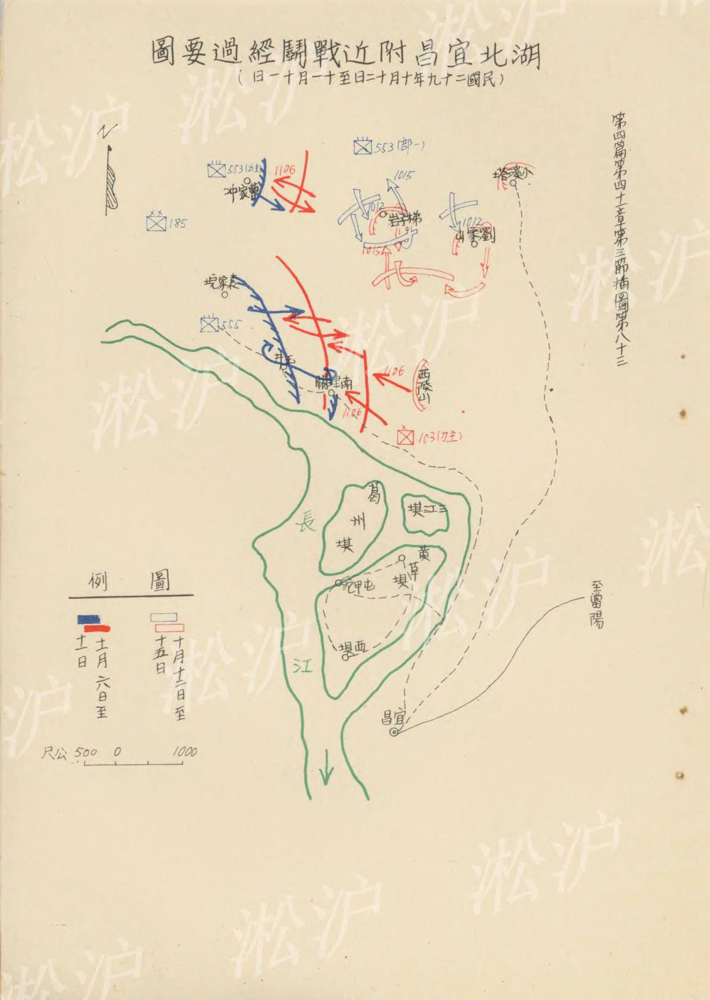

八十四

江西奉新附近地區戰鬥

作戰時間：民國二十九年十月十三日起至二十日止。

作戰部隊：第九戰區第十九集團軍第七十軍及第七十四軍之第五十一師，官兵共計三三、零四一員名，馬五一四匹。

作戰地區：江西奉新附近地區。

敵情：第三十三師團之第二一四、第二一五兩聯隊及第三十四師團之第二一七聯隊，附騎砲兵聯隊各一部，分佈於潦河兩岸地區，佔領廣大縱深陣地，以一部在雷王殿、天保崗、宋埠、背嶺李、鴨婆潭、灣弓尖、坳下街及其以北一帶地區，堅守據點，與我對峙，主力似控制於直後各要點機動使用。

我軍目的：該軍自九月中旬，接替第六十軍右自赤土街經蔣家坪亘上東坑之線防務，與敵成對峙狀態，對進犯奉新之敵，相機反擊而殲滅之。

戰鬥經過：十月十三日，第七十軍右翼第七十四軍第五十一師一部，自昨（十二）日晨，於白仙嶺附近與進犯之敵激戰後，卽轉移至昭山附近與敵相持，其向我第一零七師陣地進犯之敵，激戰至夜，突破我儒里溫村、店上等陣地，十四日，奉新失守，該師一部，乃逐次轉移祖坟余附近，另一部於山口鄒、結子山一帶與西進之敵激戰，同日，預備第九師一部，亦於棺材山、絲瓜頭一帶與西進之敵激戰，其進犯該軍左翼從九山附近之敵，則與第十九師一部對戰。

十五日，第一零七師一部，攻克棺材山，預備第九師主力與進抵潦河北岸爐田、曲湖殿附近之敵，激戰徹夜，一部於勞山余、楊梅陵、羅村附近與敵相持，另以一部向塘口吳方向前進，側擊曲湖殿之敵。

十六日，曲湖殿附近之敵，以受我三面包圍，於一時頃開始東撤，第一零七師一部，於昭山附近截擊，另以一部跟踪尾擊，敵分向奉新撤退，預備第九師一部，沿潦河兩岸追擊東撤之敵，第十九師一部，擊退勞山余附近之敵後，亦向奉新撤退之敵追擊中。

十七日，該軍與右翼第五十一師重新調整部署，十八日，第一零七、第十九兩師各一部，克復奉新，敵復退守原陣地。

十九日，第一零七師一部，進佔關中山亘蔣家陵之線，另一部克復儒里溫村等據點，第十九師推進至高公陵、白雲山之線。

二十日，右翼第五十一師一部，克復黃埠崗、梅筱嶺等據點，敵向白仙嶺撤去，該軍及第五十一師，遂恢復戰前態勢。

果：一、鹵獲：

1. 俘敵兵一名。

2. 步槍六枝。

3. 步槍彈三、五六五粒。

4. 槍榴彈八枚。

5. 毒氣筒十六個。

6. 煙幕罐五十七個。

7. 手榴彈十二枚。

8. 毒氣彈十五顆。

9. 太陽旗二面。

10文件八十五種。

二、傷亡：

斃傷敵官兵共約一千六百餘員名。

我軍傷亡：一、陣亡：

1. 官一八員。

2. 兵五三二名。

二、負傷：

1. 官四一員。

2. 兵五三六名。

三、失踪：

1. 官一二員。

2. 兵三九三名。

我軍損耗：一、武器：

1. 步槍五零零枝。

2. 輕重機槍三五挺。

3. 手槍一九枝。

4. 刺刀四四二把。

二、彈藥：

1. 步機彈四八一、九四九粒。

2. 手槍彈二、三一一粒。

3. 迫砲彈八零六顆。

4. 槍榴彈一五枚。

5. 手榴彈四、一六零枚。

三二四

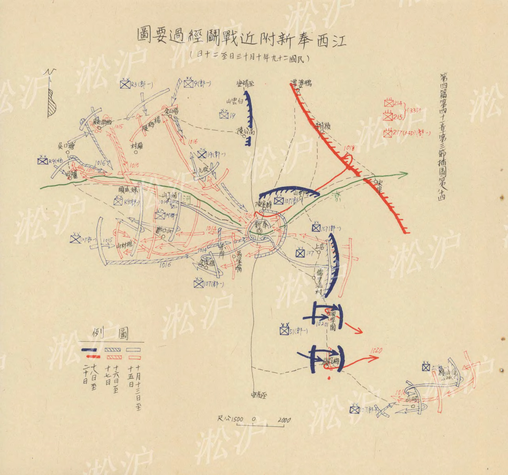

各地游擊目

八十五

襄河東岸鍾祥東北地區戰鬥

作戰時間：民國二十九年十一月十九日起至二十九日止。

作戰部隊：第五戰區第二十九集團軍第四十四軍之第一四九師、第一五零師、第六十七軍之第一六一師、第一六二師。

作戰地區：襄河以東京山、鍾祥一帶地區。

敵情：敵第四師團之第八聯隊、第六十一聯隊及特種兵聯合之敵，約八千餘人，自十一月中旬，即由漢宜路增兵至京鍾路及鍾祥、洋梓一帶地區，有向我積極進犯之企圖。

我軍目的：集團軍之決策，敵如沿京鍾路進犯，我則以主力於耗子崗迄楊家棚之線堵擊之，以一部守備大洪山根據地。敵如向大洪山進犯，我則實施誘敵深入，然後配合主力夾擊殲滅之。

戰鬥經過：十一月十九日拂曉，敵軍約八百餘，在砲火掩護下，開始向我第一六二師警戒陣地之溫峽口烏龍山、牛牧嶺、砲馬寨一帶進犯，激戰至十二時，我警戒部隊，傷亡重大，牛牧嶺陣地，被敵突破，三十日，優勢之敵，續向烏龍山、跑馬寨猛撲、跑馬寨守兵傷亡殆盡，該地亦爲敵侵佔。

二十二日，鍾祥之敵，復分犯雲山寺、長壽店未逞，但該地之敵，續有增加，第二十九集團軍，爲適應當前狀況，乃將後方整訓之第一五零師、第一六一師推進至板橈崗及楊家大畈附近。二十三日，敵我相持於長壽店、雲山寺之線。二十四日，敵猛攻我左翼之三里崗未逞。二十五日，敵第四師團主力，在其砲空軍掩護下，分向我花山寨、長壽店等地猛攻，第一六二師陣地被敵突破後，該敵復與第一四九師激戰於沙河店一帶，至十二時，該師以一部抑留敵軍主力，轉守三里崗，並令沙河店守軍，盡力掩護主力轉移，俟該師主力轉移後，陣地旋爲優勢之敵攻陷，守軍全部殉職。此時，敵復兩路鉗形攻我張家集，以衆寡懸殊，該地亦告失守。該集團軍，乃按預定策略，令第四十四軍第六十七軍之主力，向張家集包圍突進之敵，實施殲滅性之打擊。

二十六日，敵企圖包圍我軍於張家集之計劃盡失敗後，復向左右擴張，但我軍主力，已展開猛烈之反攻戰鬥，至爲激烈，敵我死傷均重。二十七日，敵我血戰竟日，頗獲進展，二十八日，戰鬥仍激烈進行，至入暮時，敵已不支，全線敗退，該集團於克復張家集後，復分兩路向長壽店及周家集追擊，二十九日，我追擊部隊先後克復沙河店、長壽店、周家集、客店坡等地，三十日，該集團軍已恢復十九日態勢，殘敵仍盤據洋梓、鍾祥一帶。

戰

果：

一、傷亡：

斃傷敵官兵共約一千餘員名。

我軍傷亡：一、陣亡：

1. 官二零員。

2. 兵七二一名。

二、負傷：

1. 官三三員。

2. 兵九四四名。

三、失踪：

兵一一五名。

我軍損耗：一、武器：

各地游擊目

1. 步槍二一三枝。

2. 輕重機槍三四挺。

3. 衝鋒槍六枝。

4. 迫砲五門。

二、彈藥：

1. 步機彈二四八、零三四粒。

2. 衝鋒槍彈七二零粒。

3. 迫砲彈二、四二三顆。

4. 手榴彈三、零一二枚。

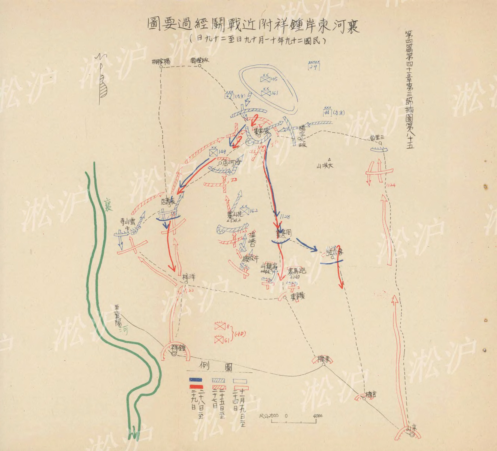

各地游擊

目

八十六

粤東汕頭附近戰鬥

作戰時間：第一期：民國二十九年十一月十九日起至二十一日止。第二期：同年十二月二十七日起至二十八日止。

作戰部隊：第一期：第七戰區暫編第二軍、預備第六師第十八團（欠一連）、第十六團第一營、附快速隊一隊，及保安第四團之一排，共計官兵一、八七七員名。

第二期：預備第六師第十六團之第一、第二兩營，及快速隊一隊，共計官兵二八四員名。

作戰地區：第一期：粤東汕頭市屬小坑附近。

第二期：汕頭市塔下附近。

敵

情：第一期：汕頭市、菴埠、石鼓一帶之敵，大部固守蟠龍山、海蓮山、桑埔山等據點，一部不斷四出擄掠物資並加強其僞組織，以遂其擴張佔領地區之企圖，於十一月十九日，菴埠敵及僞軍共六百餘，分由大、小黃坑、蓮塘等處，向我進犯。

第二期：固守塔下、下埔山、塔山、古樓等據點之敵，步砲兵共約一千二百餘人，附砲六門，其指揮官爲青木中佐。

我軍目的：以主力守備桑埔山、蟹目山、虎山、尖山、大脊嶺之旣設陣地，一部組成各種游擊隊，深入敵後，破壞敵交通、通信，並乘機襲擊其游動部隊與據點，逐次消耗與打擊敵人。

戰鬥經過：第一期：

十一月十九日，敵步騎兵共約六百餘、附砲六門，分向我大黃坑、蓮山等陣地進犯，與我預備第六師之第十八團第三營激戰後，我轉移至蓮塘、鷄籠山之線，同時該團第一營，亦進入鄒堂、狗頭嶺之線，與敵對戰，旋敵增援，水陸並進，向我右翼之光裕附近進犯。

二十日，敵僞軍共約六百餘，分路再向我陣地進犯，經我第十六、第十八兩團各一營，由新埔頂轉移攻勢，激戰至晚，敵向蓮塘山方向撤退。同日，第十六團之快速隊保安第四團之一排，及友軍獨立第二十旅之兩連，分向石鼓、隴美、菁蘿山等據點之敵攻擊，各與敵激戰後，仍撤回原陣地。

二十一日，我便衣隊及第十六、第十八兩團各一部，攻佔光裕、小坑頂、鷄籠山等據點後，卽分向金場、蓮塘、華美等地撤退之敵追擊，是日，我卽恢復原有陣線，殘敵亦分向汕頭市、菴埠各處撤退。

第二期：

十二月二十七晚，第十六團之第一、第二兩營，與快速部隊各一部，分別到達塔下、下埔山、前壠附近，各對當面之敵，實施夜襲，經與敵激戰後，均於翌日拂曉前後，分別撤回原陣地，仍對當面之敵嚴密警戒。

戰

果：一、鹵獲：

1. 步槍一枝。

2. 砲彈五顆。

3. 文件一束。

二、傷亡：

斃傷敵官兵共約三百餘員名。

我軍傷亡：一、陣亡官兵七五員名。

二、負傷官兵五四員名。

名地游擊

三、失踪兵三二名。

我軍損耗：一、武器：

1. 步槍三五枝。

2. 手槍三枝。

3. 擲彈筒三個。

二、彈藥：

1. 步機彈八七、五零四粒。

2. 手槍彈九五一粒。

3. 迫砲彈三九顆。

4. 手榴彈一、零三四枚。

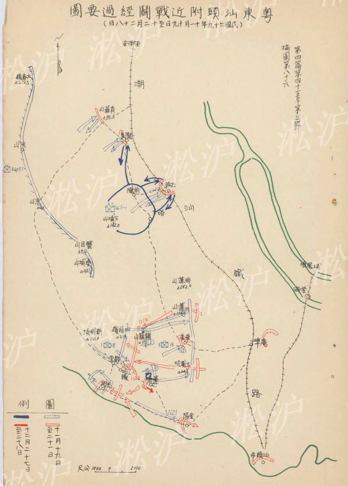

八十七

襄河西岸戰鬥

作戰時間：民國二十九年十一月二十一日起至三十日止。

作戰部隊：第五戰區第三十三集團軍，指揮第三十軍（轄第二十七、第三十、第三十一師）及第七十七軍之第三十七、第一七九兩個師，官兵共約三萬餘員名。

作戰地區：湖北宜城、荊門、當陽一帶地區。

敵情：敵第十七師團之第八十一聯隊、第五十四聯隊、第十五師團之第六十七聯隊第五師團之第十一聯隊、第十八獨立旅團之一部，共約一萬餘人，盤據荊門與當陽之清溪河至鍾祥一帶要點，該敵有乘我軍換防伊始時向我全陣地進犯之企圖。

我軍目的：第三十三集團軍，自接替第三十一集團軍防務後，卽以其主力佔領第一線陣地，並控置強大預備隊機動使用，以迎擊進犯之敵。

戰鬥經過：十一月二十一日，敵以一部試探進攻，被我迴龍觀陣地守軍擊退，二十二日，敵復以一部，分股日夜向我第二十七師之燕家坪、鮮家橋擾犯，均被擊退。

二十三日，敵步騎八百餘，分股竄陷我第二十七師之白雲觀、迴龍觀陣地後，敵我對戰於三陡坡附近，至十二時，敵騎一股，經桐樹舖附近之空隙侵入，爲我側擊回竄。二十四日，敵復增援向該師桐木嶺迄紅巖寺之線猛撲，桐木嶺陣地，被敵突破，並竄至涼水井，第三十軍，乃抽調部隊堵擊。二十五日，敵繼續向我全線猛攻，血戰竟日，第二十七師之快活舖、胡家集、張家集、鹽池廟及第三十七師之風包、么店觀、觀音寺等據點，均相繼陷落，各該師乃轉移至第二線陣地，繼續抵抗。同時，第一七九師，亦被迫向鯉魚寨、武安山之線轉移。二十六日，我第二陣線之仙居及百里河，又遭敵突破，戰局形成混戰狀態。此時，第三十軍奉命集結兵力於劉侯集，相機轉移攻勢，以夾擊仙居、曾家集之敵。同日，第一七三師已到達宜城，奉命向前線增援。

二十七日，第三十軍集結劉侯集兵力，僅到達一部份，但該地附近之李家墻陣地，已被敵突破，此時，集結於劉侯集之第三十軍一部，乃奮勇將竄入之敵擊退，並以小部隊，乘夜潛入仙居襲擾，其主力復全力向敵猛攻，敵不支回竄。二十八日拂曉，該軍續向敗退之敵攻擊，並將仙居及李家墻克復。二十九日，第三十師進展至鹽池廟，第三十七師之先頭部隊亦進展至百里河。

三十日，敵主力分別向荊門、鍾祥敗退，該集團軍，乃恢復十一月二十一日前之陣地，戰鬥亦告終止。

戰

果：一、函獲：

1. 步槍一枝。

2. 步彈二五零粒。

二、斃敵三百餘名。

我軍傷亡：一、陣亡：

1. 官二三員。

2. 兵七七四名。

二、負傷：

1. 官四一員。

2. 兵一、二八六名。

三、失踪：

1. 官七員。

2. 兵四四四名。

我軍損耗：一、武器：

1. 步槍五二五枝。

2. 輕機槍三二挺。

3. 手槍二四枝。

4. 重機槍四挺。

5. 擲彈筒八個。

二、彈藥：

1. 步機彈六三零、二七零粒。

2. 手槍彈一二、五一六粒。

3. 槍榴彈二九五枚。

4. 手榴彈八、八九八枚。

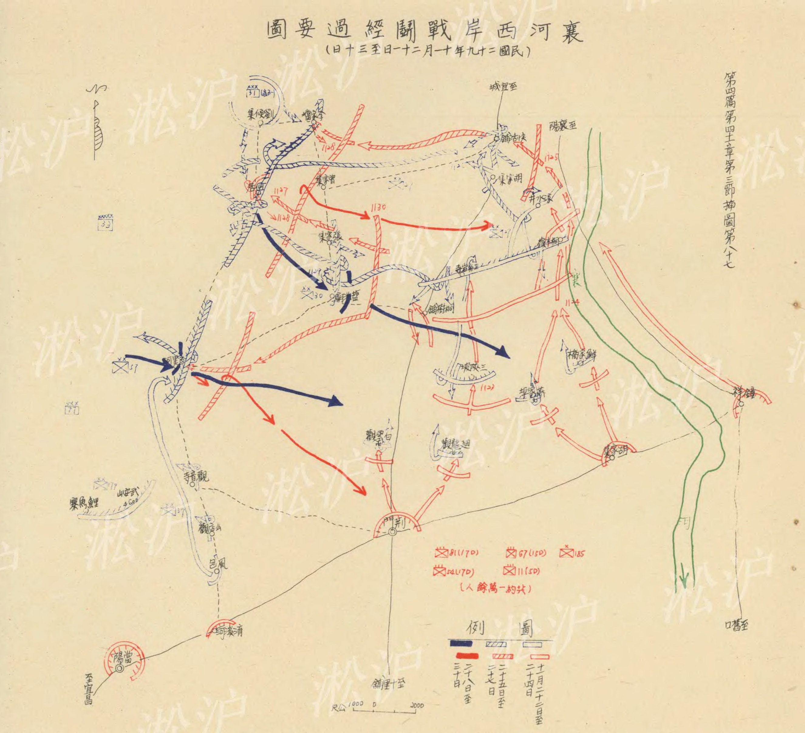

八十八

湖北隨縣以西地區戰鬥

作戰時間：民國二十九年十一月二十五日起至十二月一日止。

作戰部隊：第五戰區第四十五軍第一二五師、第一二七師，官兵共計一萬四千八百四十四員名。作戰地區：湖北隨縣以西湏水南北兩岸之均川店、安居、何家店一帶地區。

敵情：敵第三師團之高本聯隊（加強聯隊）及第十八聯隊之上屋大隊，盤據隨縣城及其以西之兩水溝、擂鼓墩、獨崇山一帶，自十一月十六日起，逐有增加，共約五千餘人，似有積極向我軍進犯之企圖。

我軍目的：軍以協同友軍作戰，側擊沿襄（陽）、花（園）路西犯敵軍爲目的。

戰鬥經過：十二月二十五日十時，第四十五軍向隨縣城郊之敵攻擊前進，激戰至十一時三十分，我第三七九團，攻佔柳林頭據點，正擬乘勝追擊，適左側淨明舖方面之敵千餘，向我何家店陣地壓迫，企圖由北向南包圍我軍，同時，厲山附近尙集結敵軍千餘人，此時，第三八零團，卽停止攻擊，監視厲山之敵，第三七九團，卽轉向西進，截擊由淨明舖南竄之敵，同日，第一二五師一部，於均川店附近與敵保持接觸。

二十六日，均川店、安居、金鷄山之線，敵我激戰竟日。

二十七日，敵軍復大量增援，該軍爲避免與敵決戰，乃轉移至高家沖，進入資山之第二線陣地。二十八日，該軍爲誘敵深入，復轉移至煤炭坡、財神店之線，敵軍繼續前進，向我煤炭坡、財神店攻擊未逞，此時，該軍誘敵深入之目的已達，乃以一部在原陣線抵抗，主力祕密集結唐縣鎮附近，協同友軍側擊襄、花路之敵，並相機反攻澱潭鎮。

二十九日，敵我仍對戰於財神店、煤炭坡一帶，但至九時許，敵陣線已呈動搖，我遂乘機反攻，當卽將濃潭鎮克復，並分兩路向敗退之敵攻擊，十八時，續克阮家灣、安定堡。三十日，繼續克復均川店，安居、淨明舖各據點，並恢復二十五日前陣地。

十二月一日，敵分兩股向我竄擾，仍被我軍包圍，敵突圍向隨縣敗退，戰鬥遂告終止。

戰果：斃傷敵官兵共約六百餘人。

我軍傷亡：一、陣亡官兵四三九員名。

二、負傷官兵六四七員名。

三、失踪兵七二名。

我軍損耗：一、武器：

1. 步槍七六枝。

2. 手槍十枝。

3. 輕機槍一挺。

二、彈藥：

1. 步機彈六五六、三零零粒。

2. 手槍彈一零、四九零粒。

3. 迫砲彈六三五顆。

4. 手榴彈二、三三八枚。

備

考：第四十五軍之左翼爲第四十一軍，位置於隨縣之北，均屬第二十二集團軍之建制。十一月中旬，敵圖蠢動，乃向襄河東西兩岸之我第二十二、第二十九、第三十三等集團軍，施行掃蕩戰，企圖奪取我襄、樊，各該集團軍，以反掃蕩之策略，迎擊進犯之敵，經旬餘激戰，將來八十九

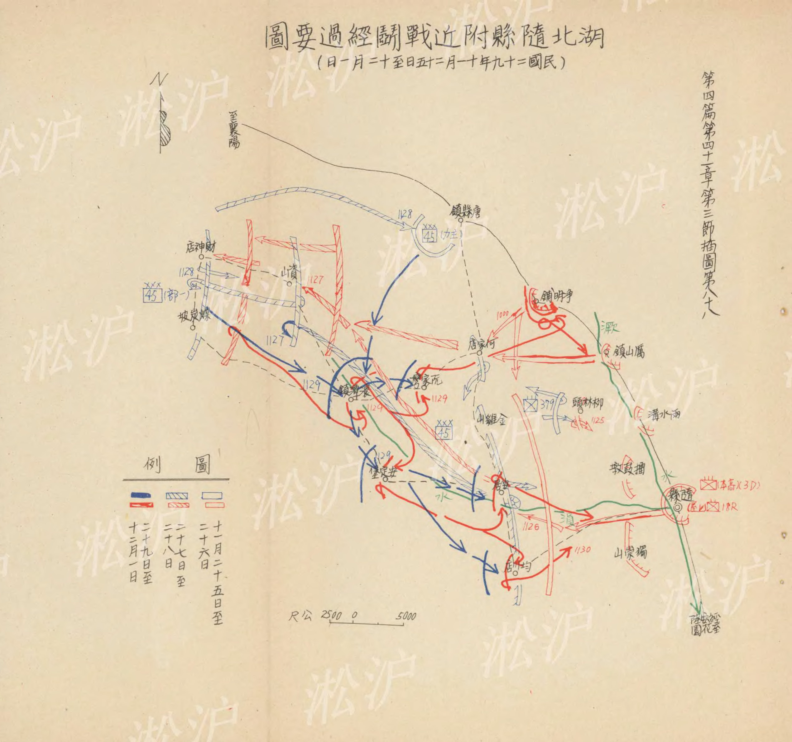

南昌外圍附近戰鬥

作戰時間：民國二十九年十二月三十一日起至三十年二月二十八日止。

作戰部隊：第三戰區第四十九軍第一零五師及預備第五師各一部，約計步兵五營，附戰車防禦砲一連。作戰地區：南昌外圍附近金溪湖西岸沿撫河右岸亘梁家渡迄贛江右岸新地李一帶地區。

敵情：敵第三十四師團第二一八、第二二六聯隊各一部，分佈蓮塘、上諶店、新塘、喻楓樹、下陳一帶，共約步兵四千四百餘名，附山野砲二十餘門，戰車二十餘輛，僞保安隊三百餘，不時與我軍發生戰鬥。

我軍目的：該軍不時向當面之敵施行襲擊，用以消耗與牽制敵人。

戰鬥經過：第四十九軍，奉令於三十年元旦前夕，向敵出擊，該軍奉令後，遵卽令第一零五師及預備第五師各以一部分向當面之敵，施行襲擊，並令第一線各部隊同時佯攻，以牽制敵軍。

十二月三十一日晚，我第一零五師第三一三團第一、第二兩營，野戰補充團第三營，及預備第五師第十五團第一、第二兩營，分向白馬廟、岡上趙、敷林街、站前吳、北邵家、汪村之敵襲擊，因敵戒備嚴密，且不斷增援，敵我激戰至三十年一月一日拂曉，未能奏功，我軍撤回原防。

二日至九日，敵我在頭徐、塔查李、塘東王及桂林廟、陳家、徐家、汪家一帶地區，互相襲擾，發生大小戰鬥二十二次，彼此均有傷亡。

十日，敵以一部百餘，另一部四十餘名、附山砲四門，分向我向塘、熊家及田湖等陣地進犯，經我第一零五師第三一三團截擊後，敵陸續增至步兵八百餘、飛機四架、戰車二十餘輛，向我猛攻，我軍以傷亡過重，遂逐次轉移至天王渡亘上富桌之線，續行阻敵，同時，我第一零五師第三一四團及野戰補充團各以一部，攻襲敵左右側背，敵勢稍挫。

十一日，敵退至王家山、傅家之線，憑險頑抗，經我軍一再猛攻，敵向北潰退，我軍陣地，相繼收復，卽以主力向河灣趙、岡上趙之敵攻擊，敵堅守陣地，我軍遂撤回原防。此後，敵我仍在頭徐向塘港頭、塔查李、萬壽宮、站前吳、河灣趙、東壇、塘東王、西頭辜等地區，不斷襲擾，迨至二月二十八日止，先後發生大小戰鬥共一三七次，敵我互有傷亡，但我軍仍保持原陣地，與敵對峙。

果：一、鹵獲：

1. 擲彈筒彈一枚。

2. 槍榴彈一枚。

3. 電線三捲。

二、傷亡：

斃傷敵官兵五百五十員名。

三、其他效果：

確已達成消耗與牽制敵軍之目的。

我軍傷亡：一、陣亡：

1. 官五員。

2. 兵一七零名。

二、負傷：

1. 官一三員。

2. 兵一六五名。

三、失踪：

1. 官四員。

2. 兵一零一名。

我軍損耗：一、武器：

1. 步騎槍一一零枝。

2. 輕重機槍一八挺。

3. 手槍六枝

4. 刺刀九二把。

二、彈藥：

1. 步機彈一三零、六三四粒。

2. 機槍彈一、六零零粒。

3. 手榴彈二、零八一枚。

4. 迫砲彈二三七枚。

5. 信號彈五二粒。

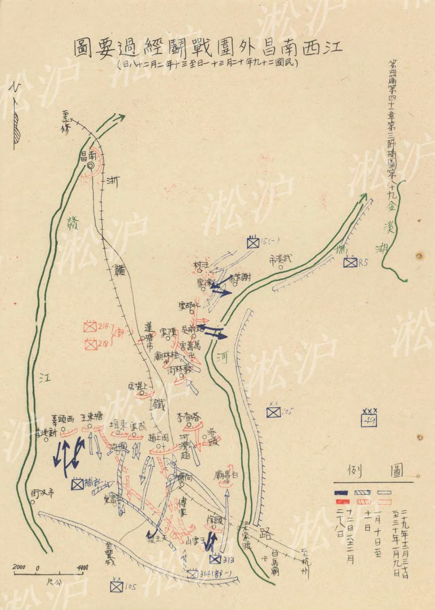

### 第四節 三十年各地之戰鬥

民國三十年春，敵企圖阻撓我反攻準備並掠奪物資，乃於一月下旬發動豫南會戰，三月中旬發動上高會戰，敵稱後者爲鄱陽湖掃蕩戰，志在對我民衆作示威之鎮壓，迨至日蘇成立協定之直後，於五月上旬敵急圖抽兵南進，集十餘萬之兵力圍攻中條山區，圖解除晉冀方面之威脅，是卽晉南大會戰。檢討各該戰役效果，鄱陽湖廣大區域及中條山獄地帶，仍爲我各戰區游擊部隊所控制，隨時受我襲擊擾亂，九月中旬，敵爲擊破我湘北部隊以確保武漢安全，發起第二次長沙會戰，十二月上旬，敵實行南進計畫，於襲擊珍珠港太平洋戰爭爆發之直後，爲牽制我軍不使增援廣九路策應英軍作戰，於十二月下旬更發起第三次長沙會戰，又被我第九戰區予以重創，以上一年內凡五次會戰，敵之狂妄企圖均被粉碎，而我民心士氣則愈戰愈強，不獨各會戰獲輝煌之勝利，而會戰以外之游擊戰反掃蕩戰亦均獲得相當之戰果，茲將規模較大之戰鬥敘述如後。

九十

湖北通城臨湘附近戰鬥

作戰時間：三十年一月四日起至十二日止

作戰部隊：第九戰區第二十七集團軍所轄第二十軍之第一三三師、第一三四師、第五十八軍之新編十師、新編十一師、新編十二師、第六挺進縱隊、第四軍之第一零二師、第七挺進縱隊。

作戰地點：湖北通城及湖南臨湘附近。

敵情：敵第十一軍司令官園部和一郎所轄第四十師團第二三四聯隊一部約千餘人，由通山向崇陽集結，以第六師團之騎、砲、工兵各部約千餘，由蒲圻向長安驛集結，以第三十六旅團之主力第二十三聯隊約六千人，由崇陽、大沙坪集結於羊樓洞，以第十一旅團第十三聯隊、第四十七聯隊之各一部，集結於臨湘附近，自三十年一月四日開始分路向我竄擾。

戰鬥經過：甲、第二十軍方面：

一月四日拂曉，大沙坪之敵，步、騎、砲兵約二千餘，分三路向雋河東岸張家窩、沙堆、大路牌附近我軍陣地進攻，五日晚，敵第四十五聯隊大部竄抵雋河東岸之菖蒲港附近，六日晨，該敵分向我白菓樹、馬鞍山、翔鳳寺一帶陣地及雪堂嶺主陣地進犯，經激戰後，各該地均先後陷入敵手，並續犯聶家大屋。七日，我第三九九團向該敵攻擊，敵不支回竄，七時，我第三九七團攻克雪堂嶺，九日拂曉，與第三九九團夾擊鳳凰樓高地之敵，敵向楊台尖東北潰退，十日，我再猛攻，敵向通城方向逃竄，十二日，續向錫山之敵攻擊，敵憑險頑抗，未能奏功。

乙、第五十八軍方面：

一月五日晨，敵步、騎、砲兵約千餘，分三路向北港進犯，與我第二十九團在樊家亘藕塘之線激戰，六日，該敵繼續猛攻，同時敵由通城增來千餘，威脅我側背，該團乃轉移陣地，七日午刻，敵向我第三十團棉花坡一帶陣地進犯，激戰甚烈，敵我傷亡均重，該團轉進至馬鞍山。九日，楊台尖之敵，進犯我第三十一團正尖山等陣地，經我痛擊後，敵不支潰退，九時許，我第二十八團攻克楊家坳、九嶺等地，第三十二團攻克步陽屋、田家山之線。十日二時起，我第二十八團復與敵反復爭奪九嶺陣地，我以傷亡頗重，九嶺復陷敵手，十一日拂曉，九嶺再爲我第二十八團攻克，同時第三十團繼攻木瓜沖、白石尖，第二十九團攻克尖山，第三十二團正向天井坡、毛家塅之敵攻擊，第三十三團攻克水橋舖、白米山之線，我軍遂分向殘敵猛追，迄十二日，恢復一月四日以前之態勢。

丙、第四軍方面：

戰

果：一、鹵獲：

一月四日晨，羊樓司、臨湘之敵約三千，竄抵桃樹坳、忠坊附近，與我第一零二師之第三零五團接觸後，我軍轉進黃旗嶺、牌形、索山之線，與敵徹夜激戰，至五日拂曉，我再轉進至雁嶺、南山之線，十二時許，敵傾全力來犯，終因我軍奮勇迎擊，且時值天雨，敵砲命中困難，我乘勢反擊，敵乃不支分向北港、羊樓司逃竄，經我逐次截擊於詹家橋附近，敵傷亡慘重。六日八時，我第七挺進縱隊側擊回竄羊樓司之敵於桃樹坳，二十二時，竄北港之敵，復向黃岸市竄擾。八日，我第三零四團由大洲向東猛攻，敵不支向相思山逃竄，九日，該敵復回竄北港，十二日晨經詹家橋分兩路向我第三零五團之慶仙宮、張家山陣地進犯，經我奮勇迎擊，敵不支分向兆樹坳及臨湘潰竄。

1. 俘敵士兵五名。

2. 軍馬十七匹。

3. 步槍三十九枝。

4. 輕機槍二挺。

5. 手槍四枝。

6. 刺刀二十二把。

7. 擲彈筒三具。

8. 砲彈一五二發。

9. 步槍彈七、五二七粒。

10手榴彈一三六枚。

11信號彈六枚。

12毒氣彈六枚。

13擲榴彈一四七枚。

14槍榴彈五枚。

15信管三十二個。

二、傷亡：

1. 斃敵千餘名。

2. 傷敵三、二七六名。

我軍傷亡：一、陣亡：

1. 官三五員。

2. 兵一、一○四名。

二、負傷：

1. 官三三員。

2. 兵一、○三四名。

三、失踪

兵一四五名。

我軍損耗：一、武器：

1. 步槍二五七枝。

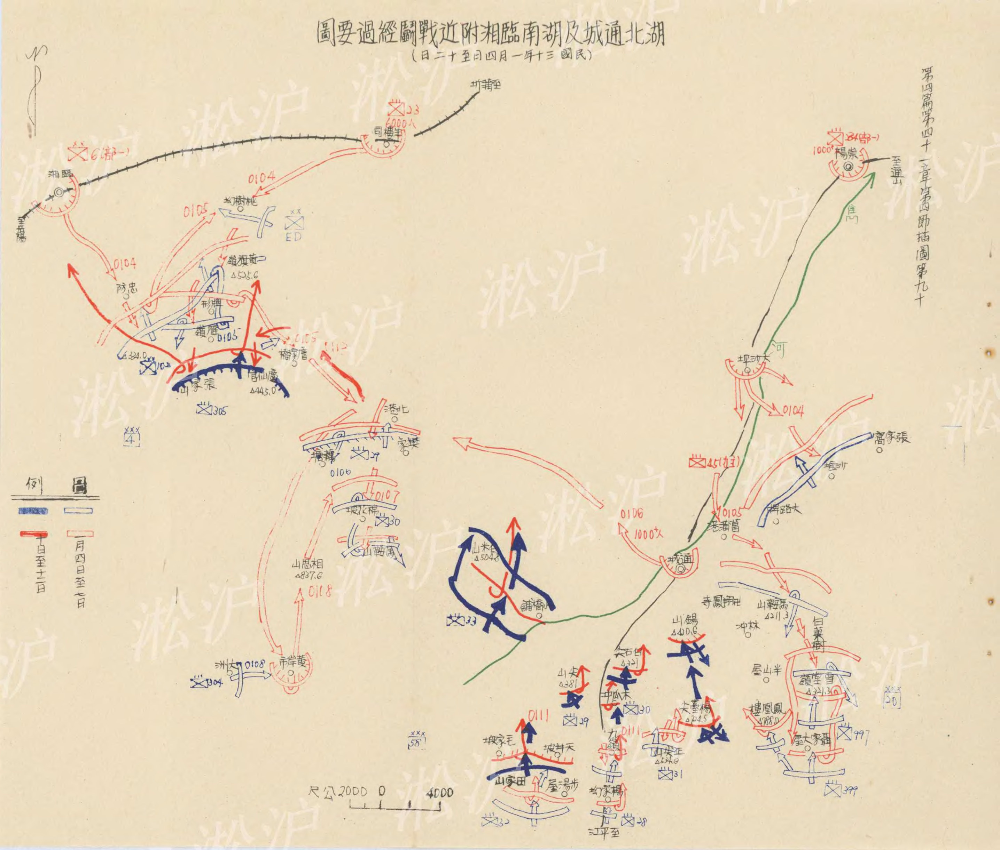

2. 輕重機槍十一挺。

3. 手槍六枝。

4. 刺刀三八五把。

二、彈藥：

1. 步機彈四一三、八三四粒。

2. 手槍彈四七四粒。

3. 信號彈一三二粒。

4. 手榴彈六、八七九枚。

5. 迫擊砲彈一○八顆。

九十一

湖北宜昌分鄉場附近戰鬥

作戰時間：民國三十年十月十五日起至十九日止。

作戰部隊：第六戰區第七十五軍之第六師、預備第四師及第十三師一部，兵力共約一六·二四一員名。作戰地點：湖北宜昌縣分鄉場附近。

敵情：敵第十三師團佔據當陽、宜昌後，企圖確保外圍據點，而達長期固守宜昌之目的，一月上旬，徵集民伕修築公路，中旬初，宜昌、當陽之敵，不斷向龍泉舖附近輸送，敵機每日在我陣地上空偵察，似有向我進犯之模樣。

我軍目的：阻止敵之攻擊並相機予敵以打擊。

戰鬥經過：一月十五日二十時，敵千餘突向我第六師之大金山、五金山陣地攻擊，預備第四師卽以一部向該敵側擊，惟敵勢甚猛，迄二十四時許，已竄抵四界坪附近，續向杜家河攻擊。

十六日拂曉，步、騎聯合之敵千餘，附砲十餘門，由關莊場向預備第四師鷄公山陣地攻擊，激戰迄午，敵未得逞，旋敵機十餘架向我全陣地更番轟炸，以掩護其步、騎兵攻擊，我軍奮勇抵抗，咸抱必死之決心，堅守陣地，敵於無法進展之際，乃施放毒氣，我仍冒毒固守。嗣因黑灣墻爲敵突破，不得已轉移於龍王洞、將軍墻、毡帽山、鮑家亞、徐家坡之線。

十七日拂曉後，敵機仍不斷轟擊，我軍傷亡頗大，第六師徐家坡、對馬山陣地，相繼失陷，敵復乘勢進佔分鄉場，同時預備第四師左翼感受威脅甚大，逐次轉移於珠寶山、黃家場一帶。是日拂曉，我第十三師之第三十九團增援到達七星垭、楊家畈附近，佔領陣地，對突入之敵，施行夾擊，嗣以敵兵力優勢，未能固守，亦逐次後撤，迄晚，我佔領鄧家灣、兩河口、李家灣亘黃土坡之線。

十八日，我第六師黃土坡守軍向敵搜索，偵知敵已向龍泉舖方向竄去，該軍長當卽令各師向敵追擊前進，迄十九日，我已恢復戰前態勢，此一戰鬥，乃告終止。戰

果：一、鹵獲：

1. 軍馬二匹。

2. 鋼盔文電等五十餘件。

二、斃敵百餘名。

我軍傷亡：一、陣亡官兵三一○員名。

二、負傷官兵五一九員名。

三、失踪官兵三八三員名。

我軍損耗：一、武器：

1. 步槍一四六枝。

2. 輕機槍六挺。

3. 手槍十二枝。

二、彈藥：

1. 步槍彈四七○、七○一粒。

2. 手槍彈三、○五八粒。

3. 迫擊砲彈一、四七五顆。

4. 手榴彈三、九一九枚。

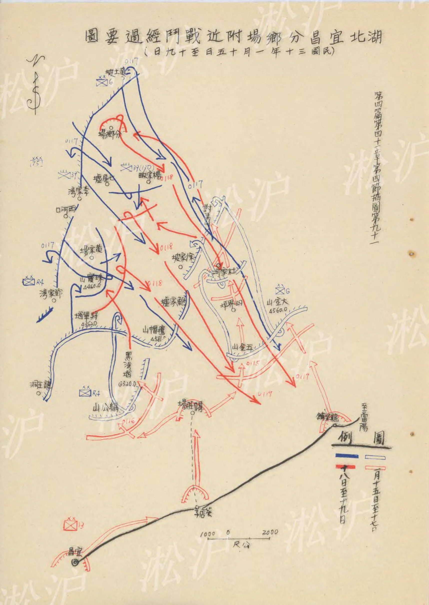

九十二

江蘇太湖西岸戰鬥

作戰時間：民國三十年元月二十六日起至二月九日止。

作戰部隊：第六戰區第六十三師，參戰人員計官長一五五員，士兵二·一三二名。

作戰地點：江蘇太湖西岸鼎山鎮、蜀山鎮、二郎山、一九七·一高地、南山、白尼山、蘭山嘴、大坪頭、斯旂村、夾浦等據點附近。

敵

情：敵以掩護修復京杭國道，似欲達成以少數兵力控制多數據點之目的，於元月間，以第十四聯隊爲基幹，附第八十六聯隊、第五十三聯隊各一部，共計步兵千餘、騎兵百餘、砲十餘門、戰車數輛，分佔鼎山鎮、蜀山鎮、二郎山、一九七·一高地、南山、白尼山、蘭山嘴、大埠頭、斯旂村、夾浦各據點。

戰鬥經過：

元月二十六日四時許，我第六十三師第一八九團之一部，驅逐南山之敵後，卽攻佔湯渡鎮，在鼎山鎮南端與敵對峙，同時另以一部向一九七·一高地及香山之敵猛攻，未能奏效，與敵相持於張公道院、灣頭之線。二十二時，青龍山、二郎山敵約四百餘及大埠頭、白泥山敵分向湯渡鎮夾攻，我以腹背受敵，轉移至七里崗、烏龜山、南山之線，同時我第一八八團一部，襲擊香山，亦未奏功。

二十八日，敵百五十餘在其砲火掩護下，分向我張家莊、牛頭山進犯，經我第一八八、第一八九兩團分別派兵擊退。

三十一日九時，敵汽艇四艘，載兵約百餘名，駛入蓮花蕩，被我擊沉一艘後，該敵由周墅登陸南進，至白泥場附近，經我夾擊，殘部向烏溪退去，我第一八八團是日分別佔領花園頭以北高地，及蘭後以西地區，敵退至七六、二高地，續行頑抗，同時敵汽艇五艇，企圖在蘭後登陸，被我擊毀二艘，餘艇退匿蘭山嘴以東湖中，我續圍殲蘭山嘴之敵。

二月一日二時，我第一八八團以一部分攻七六、二高地及蘭後之敵，七六、二高地爲我攻佔，敵由烏溪濱、居濱、王濱增來汽艇十餘艘，載兵三百餘，向我左側背攻擊，同時定跨、居濱之敵砲兵向我猛射，我遂退守斯旂村、董塘、大港、梗蒲頭、二零二·五高地東麓整頓，準備再行攻擊。十五時，一九七·一高地敵約四十餘名，附重機槍一挺，向我第一八九團一部據守之烏龜山側背突擊，經我防守湖汊鎮守兵擊退。

三日，敵汽艇七艘滿載軍火給養，並有敵四十餘名由蜀山方面向白泥場前駛，經我第一八九團第一連擊沉一艘，敵向原路退去，是晚該團第九連，破壞敵鐵絲網二道，並擊毀敵指揮所，第三連將烏溪附近敵擊潰，向蜀山方向退去。

四日晨，蜀山敵數十名向烏溪前進，旋爲我第一八八團擊退。

六日，烏溪敵掩護民伕構築工事，經我第一八八團擊潰，十四時，烏溪及蘭山嘴敵砲兵向太潮山第三連陣地轟擊，九日八時，敵步兵百餘，附砲一門，向我斯旂村第一八八團陣地進犯，激戰至十二時，敵不支退去。

我軍自元月二十六日攻擊開始迄二月九日止，香山、一九七、一高地、南山、白泥山、大埠頭、大港、斯旂村等地爲我攻佔，敵退守夾浦、蘭山嘴、鼎山、蜀山之線。

戰

果：一、破壞：

1. 擊毀敵汽艇四艘。

2. 鐵絲網二道。

二、傷亡：

斃傷敵官兵約二百餘員名。

我軍傷亡：一、陣亡：

1. 官三員。

2. 兵三八名。

二、負傷：

1. 官七員。

2. 兵六三名。

我軍損耗：一、武器：

1. 步槍二十七枝。

2. 輕機槍一挺。

3. 手槍一枝。

二、彈藥：

1. 步機彈七四、九九一粒。

2. 手槍彈九零四粒。

3. 槍榴彈一、零零五枚。

4. 迫擊砲彈四四二顆。

5. 手榴彈六零零枚。

6. 信號彈一二枚。

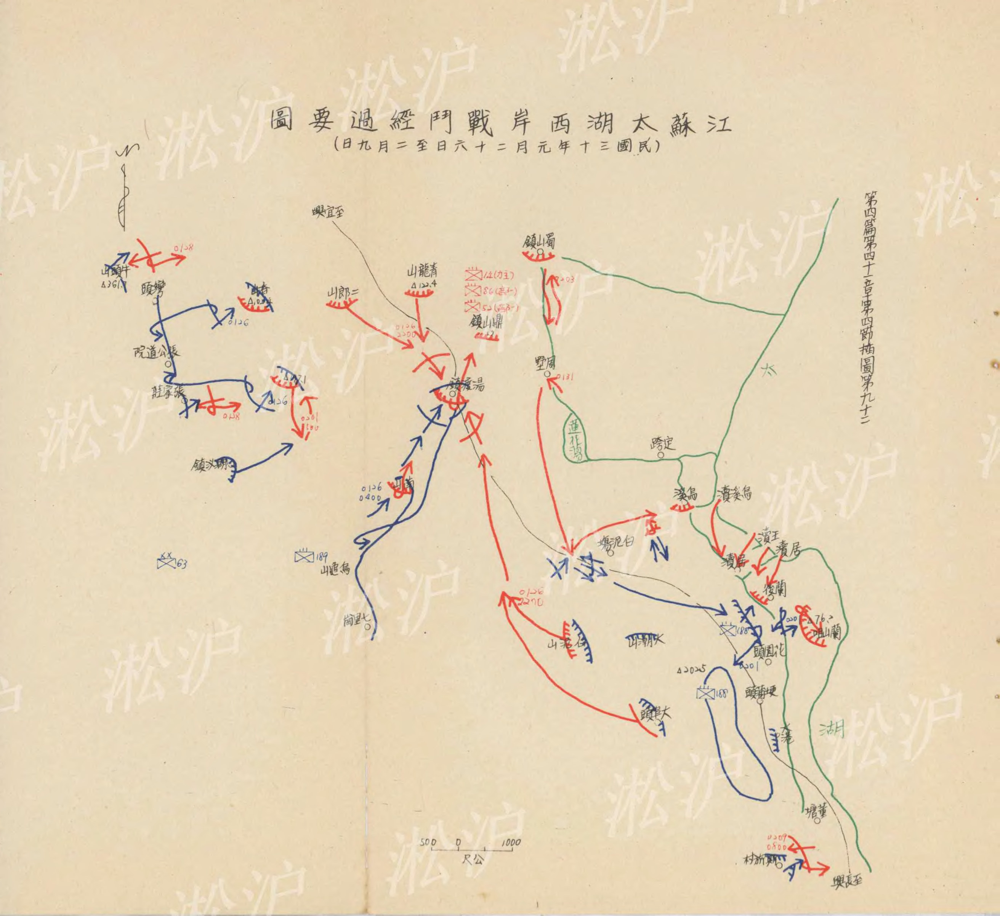

各地游擊

目

九十三浙江長興泗安夾浦一帶戰鬥

作戰時間：

(一)民國三十年元月三十一日起至二月三日止。

(二)民國三十年三月二十日起至二十五日止。

作戰部隊：

第三戰區第五十二軍第五十二師。

作戰地點：

浙江長興縣泗安夾浦香山一帶地區。

敵

情：

(一)太湖西岸長興、夾浦一帶地區之敵，爲第二十二師團第八十六聯隊之一部約二千餘，自元月下旬以來，卽積極徵伏，似有修復京杭國道，而行久據之企圖。

(二)三月中旬，敵第二十二師團抽調杭州、吳興一帶部隊主力步、騎、砲、工、輜各兵種約五千餘，集中長興附近，編成兩個混成支隊，似有西犯之企圖。

戰鬥經過：

(一)第五十二師奉命於元月三十一日開始向敵攻擊，卽在烏莊、小蒲、山崗廟、水口、鳳凰山之線展開，向散蓋山、蒙盤山、南觀音山、夾浦一帶之敵攻擊前進，隨卽攻佔蒙盤山、大福山，迫近長興西北二門，及後漾村、喜鵲斗、得勝橋、鼎甲橋、鷄籠山、南山之線，續向喜鵲斗以北及長大村、金村、香山之線攻擊。

二月一日，將環沉村、丁家濱、五里亭等地攻佔，並衝入夾浦，旋敵由沙港頭、新塘一帶登陸，增援反撲，長大村一度陷敵，旋被奪回。是時金村駛至敵淺水艦一艘，汽艇數隻，民船四十餘隻，均滿載敵軍。二日，金村、香山爲敵所陷。三日，我軍將夾浦完全佔領，敵退據鎮北米廠、小紅廟頑抗，我軍因連日攻擊，傷亡甚多，且敵不斷增援，共計兵力在兩大隊以上，而敵僑聯隊長亦親到長興指揮，該師爲避免膠着，乃停止攻擊。

(二)三月二十日，長興之敵分兩路西犯，侵佔白水灘、姚家橋一帶，我以衆寡懸殊，逐次西撤二十一日，敵繼續西犯林城橋、午山崗、環橋，我被迫撤至管棣、澄心寺、玉泉寺、山門口之線抵抗，敵更藉其砲空軍之掩護，侵據管棣，並包圍澄心寺，該師卽令左翼之一部向白阜埠襲擊敵側背，同時以一部進至大嶺、長嶺向南出擊敵之右翼，雖經二十二日拂曉攻擊，敵仍續向西進犯，敵我在獅子山、荊紫山一帶鏖戰，我進至白阜埠之部隊，攻擊敵側背後，卽佔領八都嶺、長嶺、唐盤嶺之線，是晚敵陷泗安。二十三日，泗安敵續北竄獅子山、荊紫山，並陷八都嶺、唐盤嶺後，續北向槐花礪市方向竄擾，該師乃令八都嶺一帶部隊，分經合溪、黃毛嶺向江北頭、窯頭山轉進，並卽佔領窯頭山、同屋嶺、楊嶺、黃毛嶺一線陣地，阻敵向東囘竄。二十四日，竄抵槐花礪市之敵，與泗安北進之敵，於煤山合股，二十五日，敵向東竄、突破我南嶺陣地，侵至北角廟後，卽經合溪囘竄長興，該師卽經西川坑西進，是晚抵杭州附近整頓。

戰

果：一、鹵獲：

1. 槍榴彈十顆。

2. 作戰文件三册。

3. 防毒面具十付。

二、斃傷百餘名。

我軍傷亡：一、陣亡官兵二五八員名。

二、負傷官兵三一三員名。

三、失踪官兵八九員名。

各地游擊

我軍損耗：一、武器：

1. 步槍一六五枝。

2. 輕重機槍八挺。

3. 手槍四枝。

4. 信號槍二枝。

二、彈藥：

1. 步機彈四八六、八八四粒。

2. 手槍彈一、六四八粒。

3. 手榴彈二、九四八枚。

4. 迫砲彈一零零顆。

5. 信號彈一九八枚。

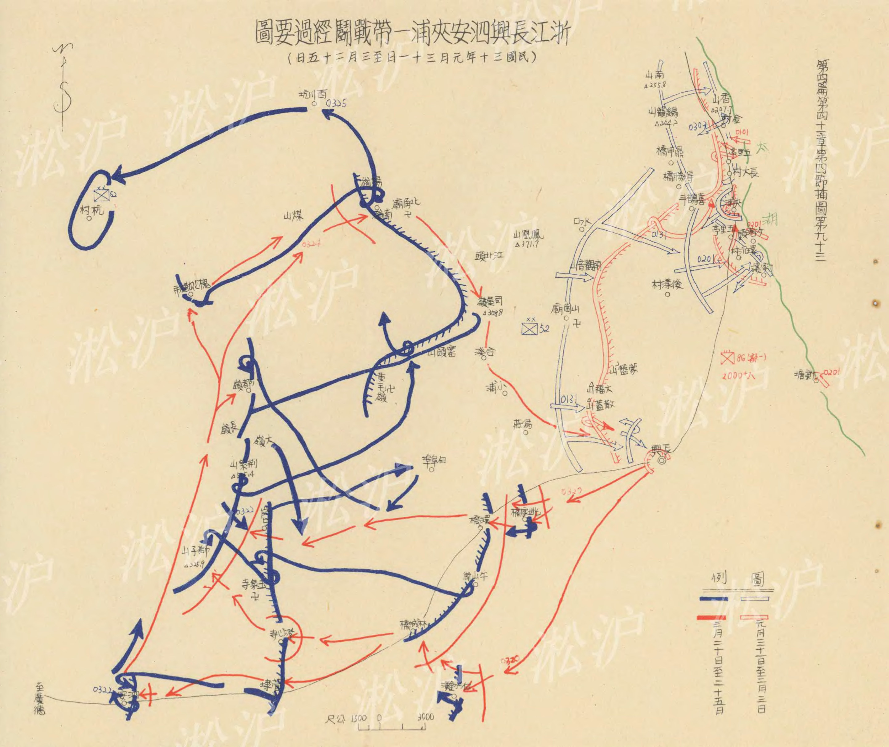

各地游擊

目

九十四

湖北崇陽大河坪附近戰鬥

作戰時間：民國三十年二月一日起至三月十七日止。

作戰部隊：第九戰區湘鄂贛邊區第一挺進縱隊所屬第二、第三兩支隊。

作戰地點：鄂南大沙坪、白霓橋及崇陽附近。

敵

情：敵第三十六旅團第四十五聯隊一部約五百餘人，附砲二門，駐大沙坪又一部約二百餘人，附砲二門，分駐牛角尖及胡家灣，又一部約四百餘人，駐崇陽及縣城東南汽車站。

又敵第四十師團第二三四聯隊一部約六百餘人，附砲二門，駐白羊舖、楠林橋，又一部約三百餘人，駐白霓橋。

我軍目的：不斷襲擊敵人，並破壞其交通通訊。

戰鬥經過：

二月一日六時，第一挺進縱第三支隊，配屬迫砲一分隊，由小沙坪出發，到達大園附近，準備攻擊大沙坪亘鐵柱港之敵。二日三時許，我第一大隊破壞夏家洲公路線之交通通訊時，與敵發生戰鬥，敵憑堅頑抗，戰況至爲激烈，同時大沙坪敵約三百餘向通城方向增援，經我奮勇迎擊，激戰至十三時，敵回竄大沙坪，旋通城敵百餘，會同大沙坪牛角尖各據點之敵，分數路向我猛犯，激戰約二小時，我第二大隊轉進至陳家牌、廖家牌一帶佔領陣地，第一大隊轉進至夏家洲、謝家西南附近，予敵痛擊，至十七時，敵退守各據點，與我對峙，戰況沉寂。四日晨，敵砲不斷向我陣地射擊，我以第二大隊之第六中隊攻擊胡家灣、鐵柱港之敵，並破壞其交通通訊，任務達成後，遂於五日一時返防，此後六日至二十一日，我各部不斷以小部隊襲擊敵人及破壞公路。

三月十二日九時，我第三支隊之第十八中隊向白霓橋之敵襲擊，敵倉促應戰，相持約二小時後，我以任務已達，遂在陳家附近集結後，安全返防。

十七日十九時，我第二支隊（欠第一大隊之第二、第三兩中隊）附迫砲一中隊及第三支隊之第三大隊，向崇陽縣及城東南汽車站之敵襲擊，二十三時三十分，我攻擊隊經倉下、陳家進至駁岸，將敵鐵絲網破壞，敵竄入汽車站，憑堅頑抗，此時我佔領上畈黃家部隊，亦向崇陽之敵猛擊，敵措手不及，僅以火砲機槍作盲目射擊，激戰二小時，我以目的已達，遂卽返原防。

戰

果：一、鹵獲：

1. 步槍一枝。

2. 步彈四十粒。

3. 槍榴彈二枚。

4. 刺刀二把。

5. 電話機一部。

二、斃敵數十名。

我軍傷亡：一、陣亡兵七名。

二、負傷：

1. 官一員。

2. 兵四名。

我軍損耗：一、彈藥：

1. 步機彈二五、三一一粒。

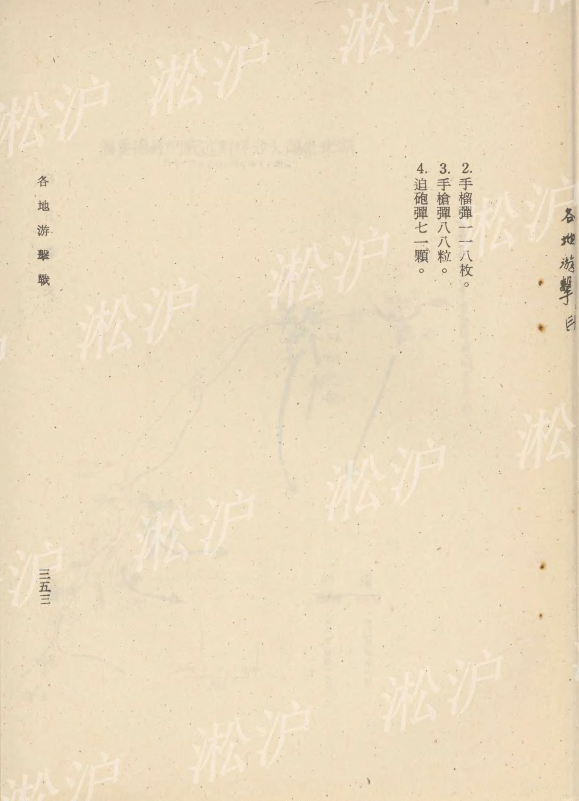

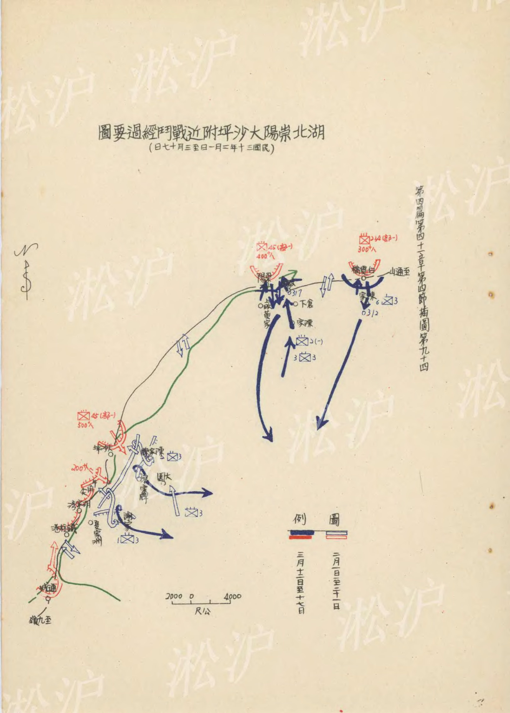

九十五

浙江吳興崇德附近戰鬥

作戰時間：民國三十年二月四日起至十日止。

作戰部隊：第三戰區第十集團軍第二十八軍第一九二師之第一一一七團及一一一九兩團。

作戰地點：吳興附近五河經、太尉堂、舊舘、洲泉及崇德、韓家橋等地區。

敵情：敵第二十二師團一部，及僞軍徐樸誠、王天才等各一部，連日增調頻繁，以遂行其春季掃蕩之企圖。

我軍目的：以主力擊破五河經、練市進犯之敵，以一部分區實行游擊戰，以粉粹敵之企圖。戰鬥經過：二月四日，第一九二師第一一一七團一部向洲泉之敵襲擊，敵乘機以全力進犯，我軍以衆寡懸殊，遂分向義馬、東華潭等地轉移。敵復以一股經石灣進犯五河涇，一股由新市進犯含山，與我第一一一七團及第一一一九團之各一部激戰至烈。雙林之敵，亦於同日經練市西北之高王廟、蔣家村，分向太尉堂、北上橋進犯，被我第一一一七團及第一一一九團各另一部擊退，同時我第一一一九團之另一部在韓家橋附近與敵百餘遭遇，發生戰鬥。五日，我第一一一七團之一部向青石橋附近轉進，七日，我第一一一九團之一部向塘莊轉進，行抵舊舘附近，適吳興之敵，在舊舘登陸，經激戰後，爲避免膠着，我軍卽行轉進。八日，敵由洲泉竄至崇德，與我第一一一七團之一部，在南全之東南地區激戰一時許，我軍遂向郜村轉移。九日，我第一一一九團一部，進擊騷擾璉市以北一帶之僞匪，該匪不支向東逃竄，我軍跟踪追擊，適僞軍王天才部由東向西進擾，與我遭遇，當予夾擊，被我擊潰。十日，進犯之敵，均回竄原防，我軍卽進駐外姚附近，伺機襲敵。

戰

果：一、傷亡：

斃傷敵官兵一一零員名。

二、其他效果，確已粉碎敵進犯之企圖，使我友軍作戰有利。我軍傷亡

一、陣亡：

1. 官一員。

2. 兵七名。

二、負傷：

1. 官一員。

2. 兵四名。

我軍損耗：一、武器：

1. 步騎槍四枝。

2. 輕機槍一挺。

3. 重機槍一挺。

二、彈藥：

1. 步機彈九、二二三粒。

2. 手槍彈九一粒。

3. 手榴彈三五枚。

4. 迫砲彈二一顆。

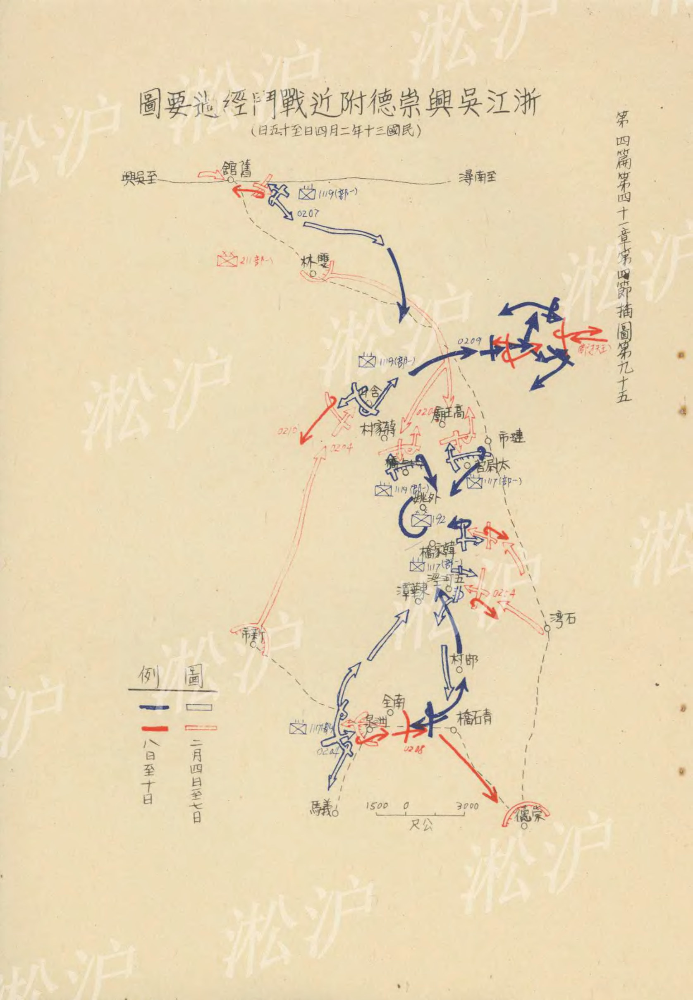

九十六

安徽合肥巢縣等地區戰鬥

作戰時間：民國三十年二月十七日至二十日及三月二日至九日止。

作戰部隊：第五戰區第二十一集團軍第一三八師及第一七二師補充團（欠一營）、保安第八團、第一游擊縱隊，共計官兵約九千餘人。

作戰地點：安徽巢縣、拓臯鎮、合肥、和縣、全椒縣、滁縣、定遠縣等地區。

敵情：敵獨立第十三旅團約五個大隊，並配合僞軍王點林部，分駐合肥、巢縣、和縣、全椒、滁縣、定遠及淮南路全線，以圖固守，維護其長江下游及津浦淮南兩路交通。

我軍目的：該師以進出淮南路與津浦路間地區，掃蕩敵軍，策應蘇北游擊部隊，運用內線作戰，誘敵於拓臯鎮及古河攔崗集王子城等地，將敵各個擊破之。

戰鬥經過：

二月十七日拂曉，步砲聯合之敵七百餘，爲我保安第八團牽制於拓臯鎮附近，十二時，第一三八師第四一二團一部施行反包圍，激戰至十八時，右翼之敵爲我殲滅，中央小山頭之敵被圍困，同時左翼亦被擊潰。黃昏時，敵由撮鎮增援。是日，我第十游擊縱隊一部，襲擊和縣城，曾一度衝入西門，敵增援反攻後我撤回，同時該縱隊以一部襲清溪鎮，佔領該鎮北門。

十八日，第四一二團與保安第八團，仍協力圍攻小山頭之敵，其由淮南路南段大廟集方向增來之敵二百餘，到達峒山西南之倭子崗附近，被我堵擊及側擊，迄十九日，第四一二團仍與該敵激戰，旋敵不支向倭子崗逃去。是日游擊第三支隊襲擊清溪鎮，擊破堡壘一部，同時第一三八師野補團向店埠之敵襲擊，搗燬其砲樓一座。

二十日，敵殘部仍固守鳳凰集亘倭子崗之線，激戰數小時後，向淮南路南段退去，我軍仍保有拓臯鎭各據點。

三月三日，古河鎭戰鬥開始，我第四一二團第三營遠道增援，未行展開，卽與敵戰鬥，雖三面受敵，卒能竭力支持，掩護專員公署，從容撤退。四日，轉移青崗集陣地，與敵激戰竟日，同時該團第二營與敵激戰於仙踪附近，第一營亦與敵激戰於王集，殲敵甚多。是日第四一三團第二營於界牌集與敵苦戰終日，第四一四團於週家崗、大馬廠、馬家湖等處與敵戰鬥，使敵疲於奔命。

七日至八日，第一三八師野補團（欠一營）、在梁園附近受敵包圍，血戰兩晝夜，屢挫敵鋒，惟兵力過少，不能將敵盡殲。是時第一七二師之野補團（欠一營）甫至圓瞳集，適與敵遭遇，劇戰終日，斃敵甚衆，該團盧團長因身先士卒，奮勇殺敵，而壯烈殉國，此時適我第七軍向淮南路南段之敵攻擊，敵勢始挫，戰鬥至此告一段落。

果：一、函獲：

1. 敵兵二名。

2. 馬十四匹。

3. 砲一門。

4. 步槍二九枝。

5. 砲彈六六顆。

6. 步彈八九零粒。

7. 刺刀十一把。

二、傷亡：

斃傷敵官兵約二千員名。

三、其他效果，打破敵人消滅我游擊部隊之企圖。我軍傷亡：一、陣亡：

官兵二五員名。

二、負傷：

官兵六七一員名。

三、失踪：

兵一七三名。

我軍損耗：一、武器：

1. 步槍一八五枝。

2. 手槍五枝。

3. 輕機槍八挺。

4. 重機槍三挺。

5. 迫砲一門。

6. 擲彈筒一個。

二、彈藥：

1. 步機彈二二二、二二六粒。

2. 手槍彈三、四零五粒。

3. 迫砲彈五八零顆。

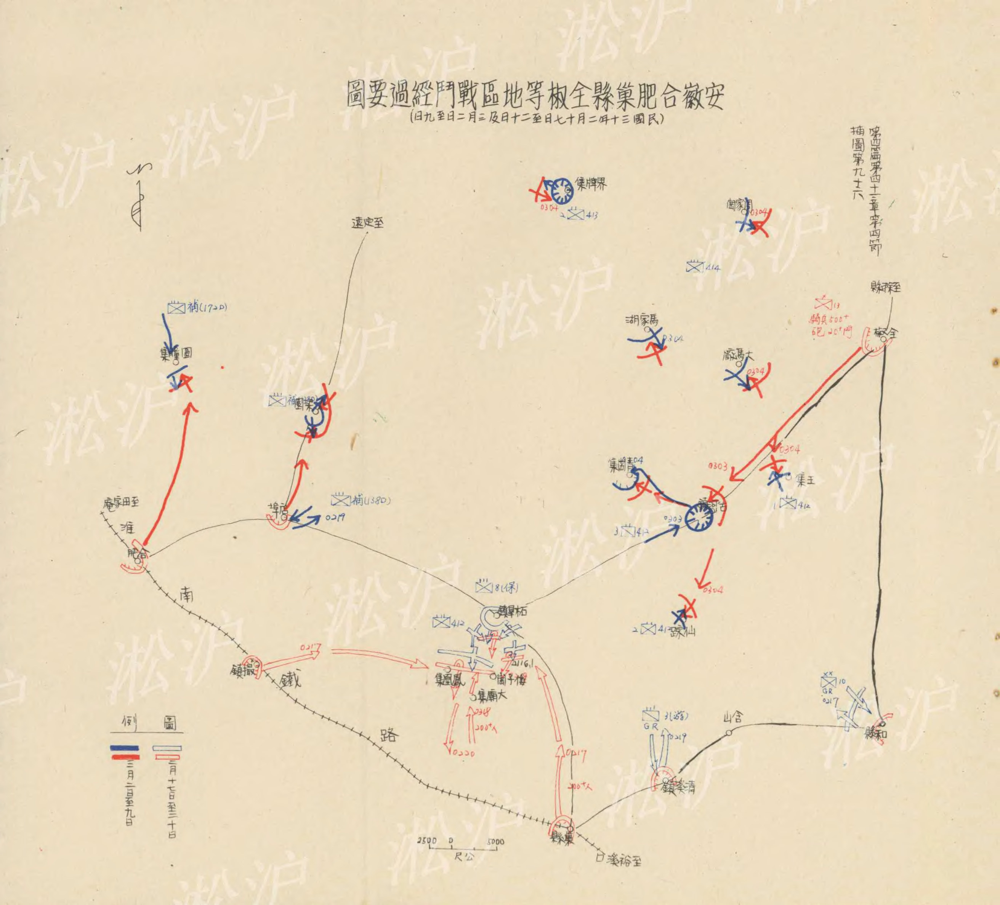

九十七

湖北通山附近戰鬥

作戰時間：民國三十年二月二十日起至二十二日止。

作戰部隊：第九戰區新編第十五師之第四十三團及第四十五團之第二、第三兩營。

作戰地點：鄂南通山附近。

敵情：戰鬥前敵之兵力不足一大隊，二月十七日，由大畈、慈口及楊芳林方面，調集兵力千餘，合計約一大隊半，附砲七、八門，其番號爲第四十師團之第二三四聯隊（村山中佐指揮），近籐、本野各部隊，於二月十九日夜，集結兵力千餘，分三路南犯，由夏鋪進犯之近籐部隊，兵力不足一大隊，由羅成嶺進犯之村山直轄部隊，兵力約兩中隊，由楊芳林進犯之野本部隊，兵力亦不過兩中隊。

我軍目的：師本防禦指導作戰，期在太平寺、藕塘間，誘敵而聚殲之。

戰鬥經過：

二月二十日九時，新編第十五師師長爲顧慮師之左翼安全，乃令第四十五團第三營副營長率部馳赴西隅口，擔任警戒。同時據第四十三團陳團長報告，敵野本部隊，已展開於高嘴山、福燕咀之線，先以砲火轟擊我工事，並掩護其步兵向我橫嶺、瓜坪陣地猛攻，均經擊退，藕塘正面敵近籐部隊，亦於是日十時許，展開於東山黃、黃家章間地區，先以砲火轟擊我黃家尖、城山陣地，繼以步兵向河背我第八連之警戒陣地猛撲，雖經奮勇抵抗，終因守兵傷亡過半，該地遂陷敵手，十一時許，敵村山部之直屬部隊亦由新豐市向前推進，十九時，我第九連襲擊牛車坂之敵，激戰至二十二時，將河背陣地恢復一半，同時敵之夜襲部隊向我城山大東門襲擊，衝鋒七、八次，均被我擊退。該師長以城山之得失，關係戰局甚大，乃令第四十五團張團長親率步兵一營，卽由大源口馳赴塘背，策應第四十三團之作戰。

果：一、鹵獲：

二十一日二時，據第四十三團陳團長報告，我守備城山大東門之官兵傷亡過大，敵乃由大東門突入，雖經我第五連竭力抵抗，反覆衡殺，終因敵不斷增援，以致城山要點失去大半。該師長當卽嚴令該團長督隊反攻，陳團長卽以第一、第三兩連協力向城山猛撲，於是連克數要點，同時並令第四十五團在西隅口之第三營，調赴青山口歸第四十三團陳團長指揮，佔領爛泥塘、南帝張、南灘之線預備陣地，復令第四十三團之第一營到達城山附近，向敵猛攻，經反復突擊，卒將大東門攻下，城山完全克復，殘敵向黃家章敗退。

二十二日一時，第四十三團派出三個追擊隊，分向夏鋪、羅成嶺、楊芳林方面追擊，敵被迫退守通山及南林橋附近之原據點，我各追擊部隊，遂亦撤回原陣地。

1. 步槍十三枝。

2. 擲榴彈二個。

3. 刺刀二把。

4. 砲彈五顆。

5. 砲架一付。

6. 擲彈筒十四枚。

7. 手榴彈三枚。

8. 步彈一、二零零粒。

9. 煙幕罐四十個。

10 毒氣罐十二個。

名地游擊目

二、傷亡：

斃傷敵官兵約三百餘員名。

我軍傷亡：一、陣亡：

1. 官一員。

2. 兵九三名。

二負傷：

1. 官五員。

2. 兵五七名。

三、失踪：

兵二四名。

我軍損耗：一、武器：

1. 步槍九枝。

2. 刺刀二把。

3. 輕機槍一挺。

二、彈藥：

1. 步槍彈九四、六四四粒。

2. 手提機槍彈二四五粒。

3. 迫砲彈四五七顆。

4. 手榴彈一、一九五枚。

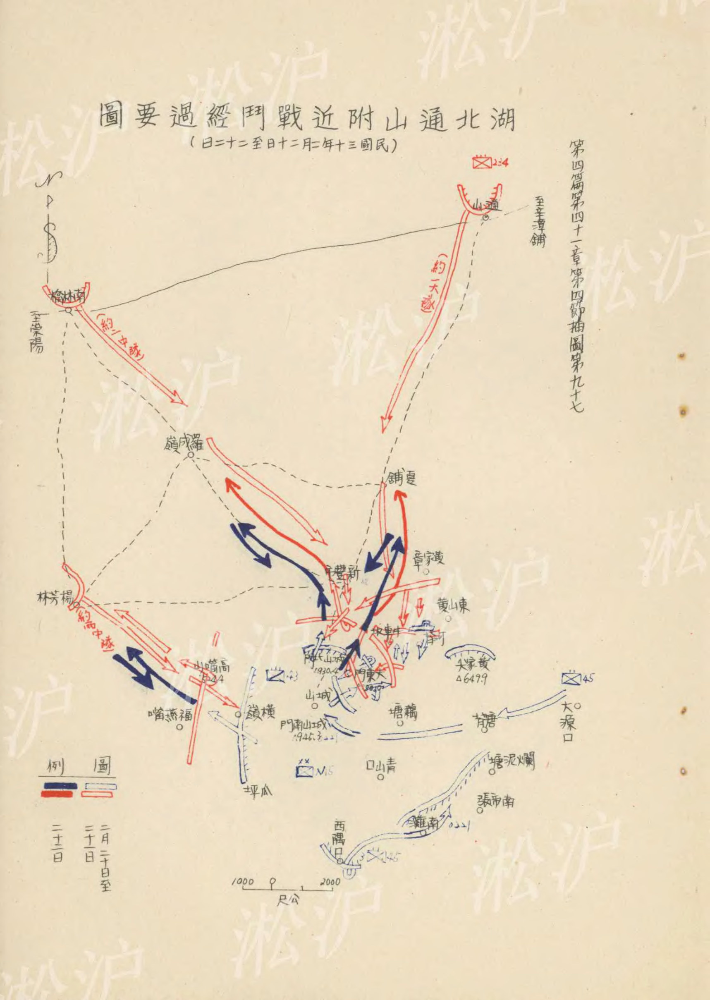

九十八

湖北宜昌龍泉舖附近戰鬥

作戰時間：民國三十年三月九日起至十三日止。

作戰部隊：第六戰區第七十五軍之第十三師第三十七團（附第三十八團一營），第三十九團（欠一營）及預備第四師第十一團（附迫擊砲一連無線電一班）。

作戰地點：宜昌茶店子、龍泉舖（宜昌東）附近地區。

敵情：敵第十三師團第六十五聯隊之一部，其主力位於龍泉舖，第一零四聯隊之一部，位於茶店子我軍目的：策應江防軍之作戰。

戰鬥經過：

三月九日十八時，我軍卽開始分向指定目標攻擊，至二十三時，第十三師攻克龍泉舖附近之挖斷山、光石老及窯灣等處敵之小據點，同時我預備第四師第十一團，亦先後佔領馬鞍山、新店，並力向茶店子突擊，因敵火猛烈，工事堅固，未有進展。

十日八時十分，龍泉寺、茶店子之敵，紛紛向我反攻，第十三師被迫稍向後撤，預備第四師與敵呈膠着狀態。十三時許，得悉宜昌附近之敵，大部抽調江南作戰，我爲達成策應友軍作戰之目的，遂取積極行動，向敵猛攻，並派部鑽隙滲入，破壞交通，斷敵連絡，迄二十三時二十分，各部攻擊，進展順利。

十一日，第十三師焚燬彌陀寺附近敵糧秣倉庫，並破壞橋樑一座，預備第四師攻擊茶店子，爭奪吳家大包，與敵展開激戰。

十二日，敵因江南作戰失利，防我積極攻擊，對我施行局部反攻。十三時，以騎兵百餘、砲二門，由營盤崗、龍泉舖方面向我進犯，均被擊潰，退入各據點堅守不出，我爲爾後作戰計，乃於十三日七時，奉命集結，戰鬥乃告終止。戰

果：一、鹵獲：

1. 步槍一枝。

2. 刺刀二把。

3. 鋼盔四頂。

4. 電線三十公斤。

二、斃敵數十名。

我軍傷亡：一、陣亡：

1. 官四員。

2. 兵七五名。

二、負傷：

1. 官七員。

2. 兵九零名。

我軍損耗：一、武器：

1. 步槍八枝。

2. 輕機槍一挺。

3. 刺刀九把。

4. 工作器具三二把。

二、彈藥：

1. 步機彈六七、八三零粒。

2. 手榴彈六三七枚。

3. 迫砲彈四、零二一顆。

4. 擲榴彈二五八枚。

5. 手榴彈七六枚。

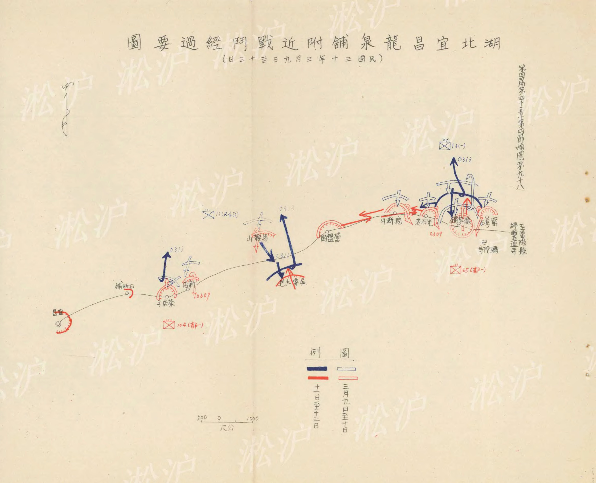

九十九

安徽無爲附近戰鬥

作戰時間：民國三十年三月十日至二十二日。

作戰部隊：第五戰區第二十一集團軍第一七六師之第五二七、五二八團及野補團。

作戰地點：安徽巢湖東南之無爲城及安慶西北之黃馬河、高河埠。

敵情：安慶之敵，爲策應其主力進攻無爲，以擾亂我軍側背安全，於三月十七日，以步騎兵約八百餘、砲四門，向我軍進犯。

我軍目的：我軍爲長期消耗敵人兵力，不時向安慶附近敵之據點襲擊，並攻擊無爲城。

戰鬥經過：三月十日二十二時，第一七六師第五二七團及野補團向無爲城之敵猛烈襲擊，先鋒隊由小東門衝入小東街，與敵相持，至翌日拂曉，撤回原陣地。十一日晚，續分道襲擊無爲城西北門，相持至拂曉，仍撤退原防。

十二日晚，各部隊分由赫店、橫步椅向五里墩前進，二十三時，攻佔北門及附近碉堡，第二營衝入城內，敵大部退守徐家花園、張家山一帶主陣地頑抗。

十三日一時，第二營一部，將城西門佔領，攻入邢呂祠堂及西門當舖敵司令部及糧彈倉庫，是時天已黎明，當令該營一部維持西門交通，一部監視徐家花園、張家山之敵，第三營一部監視十字街東南門之敵，第一營駐守北門。九時三十分，據守東門之僞軍投誠，十時，敵步兵藉飛機掩護，一再向我反攻，均被擊退，至二十一時五十分，我增援部隊到達，卽繼續向敵猛撲，除張家山陣地外，其餘各堡壘均被我攻佔，仍與敵相持。

十四日一時許，劉家渡到敵艦四艘，並到處徵集民船，似有進擾襄安鎮，解救無爲城之企圖。我爲右側安全計，乃以第二營一部堅守城內旣得之陣地，監視殘敵，以第一營撤守赫店，對東南警戒，該營於七時到達赫店。十四時，敵已佔領石澗埠，似此，我軍腹背受敵，當飭第二、第三兩營，退至橫步橋附近，第一營調回開城橋附近警戒。

十八日八時，敵分兩路向我安慶西北黃馬河東北端高地之第五二八團守軍攻擊，激戰至十二時，敵向高河埠退却，我軍跟踪追擊，十五時，追至高河埠以東之五里咀，對敵三面圍擊，敵不支向安慶退却，我軍以截擊任務達成，遂於二十日八時，撤回原防。

同（十八）日零時十分，有敵三千餘，由襄安鎮北端胡家竹園渡河，威脅我第五二七團側後，經派隊迎擊，七時許，敵大部由高家莊南下，向襄安鎮攻擊，十二時三十分，襄安鎮棄守，我軍逐次向鎮西之梅家樓，開城橋撤退，十九日一時，在大凹山、新雨山、楊家橋之線與敵激戰，迄十三時，敵後續部隊到達，分向該團兩翼迂迴，該團被迫續撤至黃牯閘、黃屯一帶與敵對峙。

二十日五時，敵復分兩路向黃牯閘、二里半湯攻擊，七時，我軍逐次撤守梅山、缺口之線。十時，敵步騎兵三百餘，向梅山及吳家渡攻擊，激戰至十二時，敵退回黃牯閘及下埠山。十四時，我野戰補充團已到黃屯（黃牯閘南），當卽向黃牯閘之敵反攻，於二十一日十二時四十分，佔領黃牯閘，續向下埠山攻擊。二十二日零時三十分，敵由下埠山分東北兩路又向黃牯閘反撲，戰鬥異常激烈，我軍逐次向符家渡方向撤退，戰鬥乃告一段落。

戰

果：一、鹵獲：

1. 敵僞士兵一七名。

2. 步槍三五枝。

3. 輕機槍一挺。

4. 步彈七零三粒。

5. 槍榴彈四枚。

6. 刺刀三把。

7. 電話機二部。

8. 太陽旗一面。

二、傷亡：

敵僞傷亡官兵約二百餘員名。

三、其他效果：

我軍傷亡：一、負傷：

達成協助友軍，打破敵人策應皖東巢南之作戰。

1. 官八員。

2. 兵二零七名。

我軍損耗：一、武器：

1. 步槍五一枝。

2. 輕機槍三挺。

3. 手槍五枝。

二、彈藥：

1. 步機彈三八、六零七粒。

2. 手槍彈六五粒。

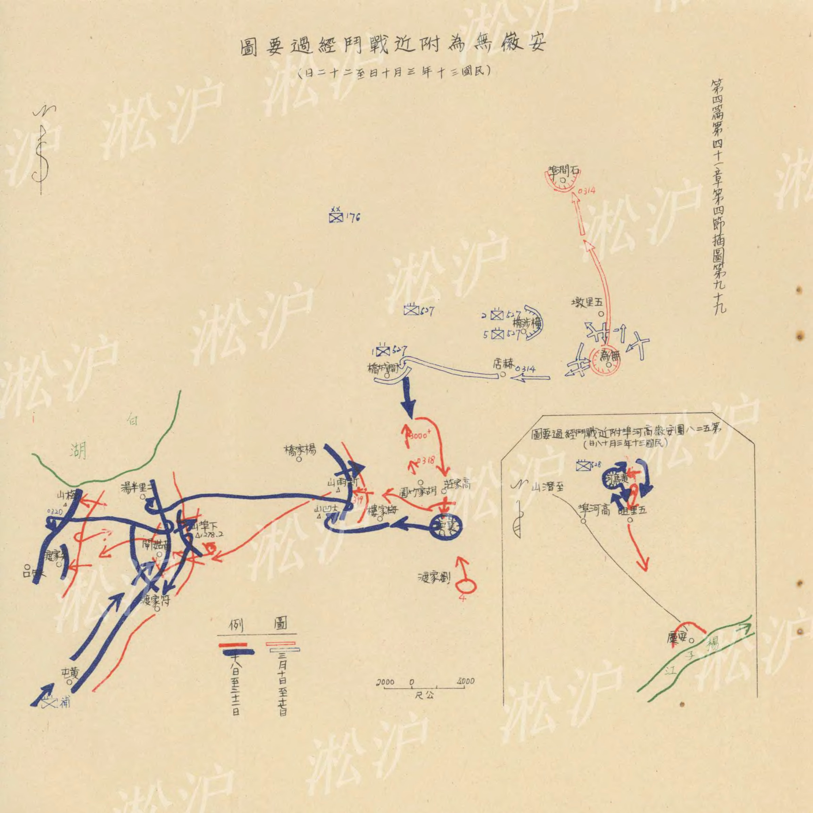

一零零廣州外圍花縣新街附近戰鬥

作戰時間：民國三十年五月起至十二月止。

作戰部隊：第七戰區第六十二軍之第一五一師及第一五七師之第四七零團、第四七一團。

作戰地點：廣州外圍花縣新街附近。

敵情：當面之敵爲第一零四師團之第一三一聯隊第一大隊、第二大隊及第一三七聯隊之岩田大隊，主力集結於蚌湖，其一部任新街、龍口、石角墟、西嶺、竹料等處，據險設防，計步騎砲工兵約三千餘名。

我軍目的：軍以消耗疲憊敵人之目的，不斷派隊向敵人據點襲擊。

戰鬥經過：五月十二日，有諸兵種聯合之敵約五百餘，竄至三角市、大東埔，沿花縣大道向我進犯，至沙帽嶺附近與我第一五一師補充團第八連接觸後，敵繼續增援，我卽轉移於花縣北端高地，激戰至十四時，敵向三角市、象山脚退去。十三日，我復令第七、八兩連及殺敵隊襲擊象山脚，相持至十四日三時，我撤返原防。同（十三）日二時，由何家埔渡河之敵，步騎兵約七百餘人，竄犯九煉墳、蘭柴坑及涼水井，與我第一五一師補充團第五、第六兩連接觸，我派第四連之一部及機二連增援，經激戰後，我轉移於盤子石、老虎山、王母點兵、西坑之線，擬誘敵深入至獅前市附近而聚殲之，但敵未敢前進，仍在蘭柴坑、銀溪洞、九煉墳一帶與我對峙，至七時許，敵向我盲目發砲，掩護其向神岡、太平場撤退。

六月十九日，我編組襲擊部隊，分向盤據新街、橫潭、馬鞍嶺、龍口、龍翔、九傅湖及石角墟一帶之敵襲擊，右翼隊（野戰補充團第一營附迫砲二門、工兵一排）向新街之敵攻擊，到達安和市附近後，因河水暴漲，無法渡河，遂折返原防。中央隊（第四五一團第二連及第一連之一排配屬師殺敵隊)向西嶺之敵攻擊，激戰約一小時，敵工事堅固，我無進展，仍撤回原防。左翼隊（第四五一團第四連附軍殺敵隊）向石角墟攻擊前進，至二十一日零時三十分，進佔石角墟，並無敵踪，我卽於拂曉撤返立達石。二十四日午，敵步騎兵約三百餘，竄至石角墟，另股步騎兵共約二百餘，竄至鳳岡、象山脚附近，我中央隊卽沿廣花公路，分向龍口、西嶺及鳳岡之敵攻擊，左翼隊向石角墟攻擊，激戰至十五時三十分，敵退九傅湖，我遂於拂曉後撤回。二十五日，我襲擊隊再向該敵襲擊，往返衝殺，激戰頗烈，終以敵火濃密，未克奏效，遂於二十六日拂曉前，撤回獅前市待命。二十六日起至七月四日，我襲擊部隊，逐日不斷分向敵攻擊，終以敵憑堅固守，無法進展，我以擾敵目的已達，遂仍撤返原防。

盤據新街、橫潭、鳳岡、九傅湖、石角墟、西嶺一帶之敵，經我軍連日不斷襲擊後，恐慌異常，一面加強工事，一面嚴密警戒，以防我之襲擊。七月八日，新街之敵約三百餘，僞軍百餘，向三華店、畢村、黃歧山一帶竄擾，又鳳岡、九傅湖，約有敵二百餘，小砲二門，經我襲擊隊分向各該敵攻擊，敵向望岡、新街及梅山一帶退去，是晚我仍撤回原陣地。十四日，我第四五一團第二、第三兩營，分向大陵、望岡、松仔嶺、擔角坳、西嶺、吉逕一帶敵之警戒部隊攻擊，敵向新街及臺坑退去。十五日，我襲擊部隊，續向由九傅湖、鳳岡退據梅山、黃金田、牛牯石一帶之敵襲擊，經激戰後，於十六日拂曉前撤回。十七日，我襲擊隊續向大陵、西嶺之敵襲擊，十八日拂曉，仍撤回原防。盤據龍口、西嶺、梅山、黃金田、臺坑之敵約五百餘，砲五、六門，連日來積極構築工事，嚴密警戒，並加強封鎖，似有抽調兵力於他方面之模樣，我襲擊隊遂於二十一日分向該敵襲擊，激戰至二十三日拂曉後，我仍撤回原防。二十八日，我襲擊隊續分向黃金田、牛牯石、臺坑、石角墟等處之敵襲擊。

八月三日，盤據黃金田、牛牯石、臺坑、石角墟之敵，旬日來不斷派隊進出鳳岡、象山脚、黃秀塘一帶刼掠，我乃再派襲擊隊向該敵襲擊，激戰後，敵向石角墟退去，我於四日晨撤回。二十二日，新街、馬鞍嶺、龍翔等處約有敵步騎砲兵千餘，其馬鞍嶺之敵，似有他調模樣，我乃派襲擊隊乘機向馬鞍嶺之敵襲擊，經激戰後，仍撤返原防。

九月七日黃昏，太平場之敵約三百餘，由黃泥鄉渡河，進入銀溪洞，分向九煉墳、馬騮山坳前進，我第一五七師第四七一團，卽以第一營扼守蘭柴坑，第二營在馬騮山坳警戒，八日晨，我進出獅前市以南地區，與敵激戰，敵不支退回太平場。

二十四日，新街、龍口之敵，連日來續有增加，現集結於新街、石角墟一帶之敵，約達二千餘人，似有向我進犯之模樣，我乃重新編組襲擊部隊，以第一五一師第四五二團之第二營爲右襲擊隊，第四五二團第一營爲中央襲擊隊，第一五七師第四七一團之第一營爲左襲擊隊，當卽令各襲擊部隊分向該敵襲擊，激戰至二十五日下午，我仍撤回原陣地。

十月一日，集結於新街、龍翔一帶之敵約三千餘，分別向我進犯，一部約五百餘。砲二門，一部約七百餘，砲二門，分向花縣前進，另股千餘，竄抵石角墟附近，並續向龍塘竄擾，我卽令第一五一師第四五一團第一營、第一五七師第四七一團之兩連及第四五二團之兩營，分向該敵攻擊，經在源潭以南之五指山、鮮水坑、百步梯、高山網等地先後與敵激戰後，敵不支向南潰退，仍回竄新街、龍翔原陣地。十八日，我第四七一團之一部，向西嶺、臺坑等處之敵襲擊，因敵工事堅固，無法攻入，激戰至十九日三時，仍撤回原防，同時我第四五二團之第二營，亦分向大陵、望岡之敵襲擊，激戰至十九日二時三十分，我仍撤回。十九日，我復令襲擊隊向盤據龍口、梅山一帶之敵襲擊，激戰至二十日二時，仍撤回原防。

十一月份，我仍令各部隊繼續以小部分向各處之敵襲擊，均因敵工事堅固，警戒嚴密，未能進展，仍撤回原陣地待命。

十二月十四日，盤據廣州及其外圍新街、橫潭、龍翔、石角墟等處之敵，均有抽調轉用進攻香港方面之模樣，我乃於是日十時以第一五一師之第四五三團、第一五七師之第四七零團，編爲左右兩出擊團，分向該敵襲擊，激戰至十五日晨，我無進展，仍撤回原陣地。我爲策應英軍香港作戰，遂於十五日晚，再令襲擊團向當面之敵襲擊，激戰至十六日二時，雖無進展，但牽制敵人之任務已達，遂卽撤回。

戰

果：一、鹵獲：

1. 步槍六枝。

2. 手槍一枝。

3. 步彈一九四粒。

4. 砲彈六顆。

5. 手槍彈四粒。

6. 手榴彈三枚。

7. 擲榴彈二枚。

二、傷亡：

斃傷敵官兵一、三六二員名。

我軍傷亡：一、陣亡官兵二五員名。

二、負傷官兵三七員名。

三、失踪兵一名。

我軍損耗：一、武器：

1. 步槍五枝。

2. 手槍一枝。

3. 刺刀一六把。

二、彈藥：

1. 步機彈四一、六三四粒。

2. 手槍彈二、六七二粒。

3. 手榴彈一、五四六枚。

4. 槍榴彈一七五枚。

5. 迫砲彈一一零顆。

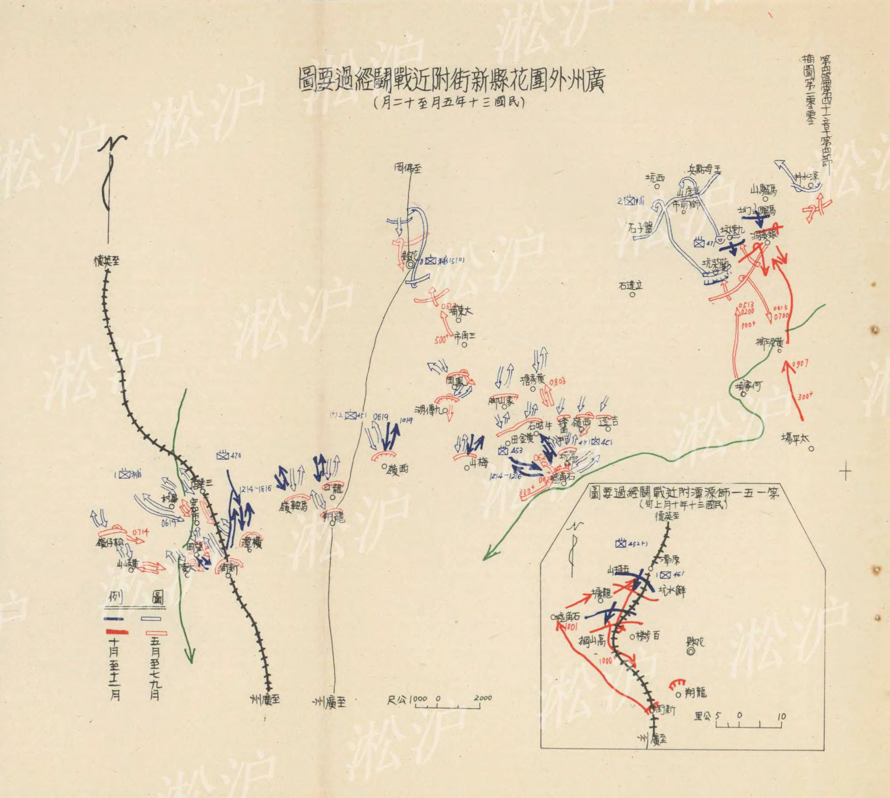

一零一

湖北通山白霓橋附近戰鬥

作戰時間：民國三十年五月六日至七月二十七日。

作戰部隊：第九戰區暫編第五十四師。

作戰地點：鄂南通山白霓橋、楠林橋、橫嶺、寺下、白羊舖等地。

敵情：敵第四十師團第二三四聯隊之第一大隊所屬步兵三個中隊，騎砲兵各一個中隊，第二大隊步騎砲兵約六百餘人，分駐通山、石坑口、白霓橋、楠林橋及白羊舖、大港橋等地。

我軍目的：師以疲敵之目的，不斷派隊向敵襲擊。

戰鬥經過：五月六日，該師第一團之第六連，由青山口向石坑口前進，第三團之第一連及第二連之一排，向通山前進，二十二時，我攻擊部隊開始向敵猛攻，敵憑堅死守，激戰二小時後，我各部始撤回。十四日十八時，第二團第四連向白霓橋之敵攻擊，第一團第八連向西坑塘攻擊前進，於二十三時，各部開始向敵攻擊，均無進展，乃各回原防。十六日五時三十分，第二團之第八、第九兩連，由汪家皈出發，第八連向太坪舖、楠林橋攻擊前進，第九連經北岸向大港橋前進，牽制楠林橋之敵，並破壞大港橋、楠林橋之交通通訊，十八時，開始攻擊官兵，冒敵火破壞敵鐵絲網多處，激戰二小時後始各回原防。

六月十二日，敵步騎砲兵四百餘，由白霓橋經東流橋南犯，我卽令駐河坪之第三團派兵一營，進至花涼亭附近迎擊該敵，並令第一團派兵一部，協助作戰。十三日拂曉，敵進至中堡附近，卽與我第三團之一營發生戰鬥，一部進犯泉坑口及塘口，與我第一團激戰於江家皈以北地區，我第二團以一部迎擊正面之敵，一部向上坑圓、下坑圓一帶設伏，並以一部協力第一團作戰，是日十三時許，第一團轉進至橫嶺主陣地抵抗，此時兩路之敵，續向我橫嶺陣地攻擊，經我第一團官兵奮勇抵抗，敵傷亡慘重，遂竄返塘口，第一團卽派隊尾追，該敵狼狽竄至界塘頭以南北區時，復遭我下坑圓部隊側擊後，乃向楊芳林方向逸去。

七月七日，第二團第三營（欠第七連）於十六時以主力向寺下前進，第二營以主力設伏於榨家壠，伏擊大港橋、楠林橋間行動之敵，八日開始向寺下、大塘口、新橋等處之敵攻擊，敵倉皇應戰，至拂曉我各部遂返原防。是（八）日晨，第二團第一營向白羊舖之敵攻擊，敵正在方家門前晨操，我乘其不備，以熾盛火力射擊，敵倉促應戰，激戰四十分鐘，我卽返原防戰

果：一、鹵獲：

二十六日十七時，第一團第九連向楠林橋攻擊，二十七日五時三十分，敵騎兵十餘、砲四門，附僞軍百餘，沿公路向白羊舖前進，我出其不意，以猛烈火力截擊之，激戰約一小時，敵不支紛向路北潰退，我仍撤返原防。

1. 步槍三枝。

2. 馬槍一枝。

3. 步彈二、零八七粒。

4. 槍榴彈一枚。

二、破壞：

電線二百三十餘公斤又六百六十餘公尺。

三、傷亡：

1. 斃敵軍官一員。

2. 士兵二十一名。

3. 傷敵士兵二十九名。

我軍傷亡：一、陣亡：

1. 官一員。

2. 兵十五名。

二、負傷：

1. 官一員。

2. 兵三三名。

三、失踪：

兵五名。

我軍損耗：一、彈藥：

1. 步機彈二六、一零九粒。

2. 手槍彈三九粒。

3. 手榴彈一六八枚。

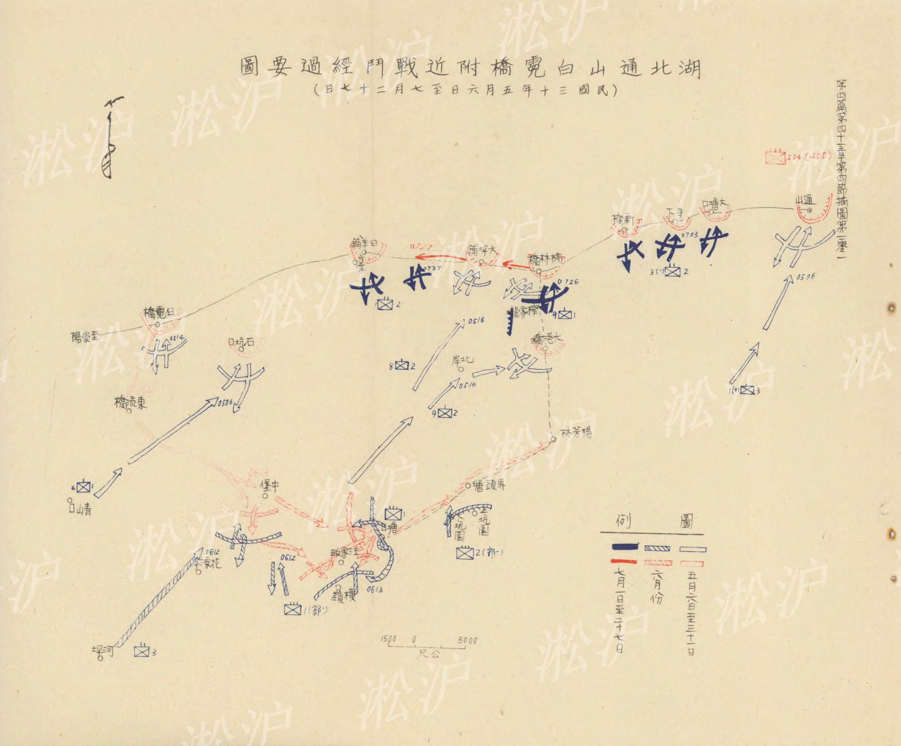

各地游擊

目

一零二安徽宣城郎溪各附近戰鬥

作戰時間：民國三十年五月三日起至九月四日及十二月一日至二十七日止。

作戰部隊：第三戰區第一零八師，參戰人員計官長一八三員士兵三、六五八名。

十二月戰鬥配屬第五十二師之第一五五團。

仁戰地區：安徽宣城、郎溪各附近。

敵情：盤據蕪湖、灣沚、黃池、水陽、九里山及紅錫鎮等據點之敵，係第十五師團之第六十聯隊聯隊長倉橋大佐）約二千餘人，不時向我守備地區進擾，以防我之襲擊。

我軍目的：師以固守宣城之目的，以主力守備宣城主陣地，其餘控置整訓，並以一部不時四出游擊，以資掩護整訓及打擊消耗敵人。

戰鬥經過：五月三日，灣沚敵步兵約一千五百餘、騎兵百餘、砲數門、戰車九輛，於十時進抵芝蔴店後，卽分兩路向管家橋我第一零八師之第三二三團陣地進攻，經激戰後，我撤至該橋以南高地，繼續抵抗，斯時敵轉攻福定山，並以優勢砲火及戰車衝擊，我陣地悉被摧毀，迄黃昏，乃令守軍撤至寒亭以北高地，與敵對峙，同時並令第三二四團主力進至天門山，策應第三二三團之作戰。

四日拂曉，敵集中砲火及戰車猛攻寒亭，另一部進擾九甲馬及高山殿，我以寒亭無險可守，經激戰後卽轉移寒亭東南高地，佔領高山殿、銅山崗之線，並與天門山附近之第三二四團密切連繫，以防敵東進，二十一時，我分向九甲馬及寒亭之敵攻擊，迄五日一時，各該敵向九里山退去，福定山遂爲我克復。六月中上兩旬，我第三二三團游擊部隊先後將南山李、紅錫鎮之敵及僞軍第五路第三團朱克羣部擊潰，敵退守黃池、灣沚，我乃撤回原防。

七月間，我第三二二團、第三二三團，分別派隊先後襲擊九里山、灣沚、紅錫鎮、芳山鎮、小河口等處之敵達十餘次，均獲相當戰果。

八月六日，敵僞約百六十餘名，附砲二門，向我東門渡第三二四團一部守軍進攻，並陷我倒頭山。八日，該團以第一營反擊，激戰中，敵復由新豐增援，以衆寡懸殊，乃於十四時轉移橫頭山亘陳山陣地與敵對峙。九日，該團以主力向當面之敵攻擊，激戰至十日拂曉前，敵不支突圍向灣沚退去，僞軍向裘公渡方向逸去，東門渡遂告克復。十一日，我襲擊裘公渡附近僞軍，激戰至十二日薄暮，敵紛向楊泗渡潰竄，我卽跟踪追擊，並將楊泗渡收復。二十八日，敵步兵約七百餘、砲三門，以主力攻我橫頭山、陳山，一部攻東門渡、倒頭山，激戰三小時後，各該點均陷敵手，我守軍轉移北山二三三、三高地亘莫家嘴之線，阻擊敵人。

九月一日，第三二三團之一部協同第三二四團攻擊當面之敵，同時命野戰補充團派隊襲擊九里山、紅錫鎮，激戰至四日，我曾一度攻佔東門渡、倒頭山、橫頭山、陳山、新河莊各要點，終以敵人不斷由水陽、黃池增援，以致未能確守，旋奉命除以一部留置敵後游擊外，主力卽撤回主陣地整理。

十二月一日，第一零八師奉命指揮第五十二師之第一五五團，並應不斷輪襲當面之敵，以期達成打擊消耗之目的，該師長卽以主力集結楊柳舖附近整訓，以兩團各一部佔領沈村鎮、福定山亘珩瑯山之線，於一日至十九日，先後襲擊通善庵、查山頭，迄十九日，曾多次夜襲九里山、新河莊、北山、紅錫鎮、芳山鎮等敵據點。二十日，當面之敵不堪我之襲擾，對我反擊，並以主力進犯溧陽、郎溪等地，與我友軍第四十師激戰甚烈。二十三日，該師爲協助第四十師之作戰，乃再襲擊新河莊、九里山、紅錫鎮之敵。二十四日，各據點由蕪湖增來敵兵戰

果：一、函獲：

三百餘名附砲一門，戒備甚嚴，我襲擊未能奏功。是時敵已攻陷郎溪，抵泉口、烏龜山、牛大村附近，正與我第四十師激戰中，我協助該師作戰之第三二二團李副團長於二十五日拂曉，率兵六個連攻擊郎溪西南之十里崗，激戰至七時，敵不支向郎溪潰退，我跟踪追擊，十時，一舉突入縣城，殘敵逃竄，郎溪遂告克復。二十六日，我第一五五團派部襲擊紅錫鎮，二十七日，敵向我進擾，經阻擊後退去，戰鬥遂告終止。

1. 敵兵一名（櫻井文二）。

2. 僞軍七名。

3. 駱駝一匹。

4. 步槍十一枝。

5. 步機彈七四零粒。

6. 機槍零件多種。

7. 鐵絲一四二公斤。

8. 電線一、一五零公尺。

9. 手鋸二把。

10 太陽旗四面。

11 防毒面具四付。

二、破壞：

1. 公路約二、三零零公尺。

2. 電線約一七、六零零公尺。

3. 鐵軌六節。

4. 電桿八十餘根。

5. 橋樑一座。

6. 汽車一輛。

7. 兵舍約二十餘間。

8. 堡壘一座。

9. 汽艇一艘。

10 工事數處。

11 鐵絲網十餘道。

12 路基約一二零公尺。

13 僞機關二處。

三、傷亡：

斃傷敵官兵約七百八十餘員名。

我軍傷亡：一、陣亡：

1. 官一五員。

2. 兵四八一名。

二、負傷：

1. 官二一員。

2. 兵四三零名。

三、失踪：

兵一三名。

四、死亡：

馬六匹。

我軍損耗：一、武器：

1. 步槍一八三枝。

2. 輕機槍十七挺。

3. 手槍十二枝。

4. 刺刀十六把。

二、彈藥：

1. 步槍彈三九零、零一零粒。

2. 手槍彈二、一一一粒。

3. 手榴彈二、七七三枚。

4. 迫砲彈九七零顆。

5. 山砲彈一零五顆。

6. 信號彈一四七粒。

三、其他：

1. 輕機槍管二個。

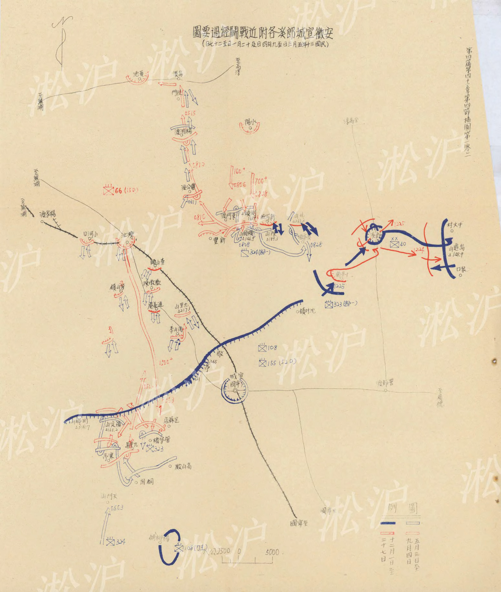

一零三

浙江諸暨附近戰鬥

作戰時間：民國三十年五月五日起至十七日止。

作戰部隊：第三戰區第二十一軍之第一四八師附戰防砲三門。

作戰地區：浙江諸暨縣屬之新店、灣嶺、塢北塢、顧家塢及大陳市附近地區。

敵情：塢北塢方面之敵，爲古賀聯隊，約步兵二千餘人、騎兵六百餘、砲十餘門、飛機九架，大陳市一帶之敵，一部爲古賀、賴田、富田等正規部隊，一部爲僞軍部隊，共約步、騎兵三千餘人砲八、九門，又紹興敵大部已於二日開始撤退，諸暨敵亦有撤退模樣。

我軍目的：協同友軍規復諸暨，進出於新店、灣嶺附近地區，確實遮斷敵後連絡線，並對敵由各方增援或撤退之敵，依機動側擊伏擊之。

戰鬥經過：三十年四月，敵欲封鎖我海口，進窺浙贛鐵路線起見，乃抽集部隊，發動夏季攻勢，先後侵陷我海寧、紹興、蕭山、諸暨等縣後，卽擇要固守，並集結主力於諸暨東北方之姚公埠、趙家埠一帶。是時第一四八師在贛東鄱陽整訓，於四月二十一日奉命兼程前往參戰，至五月二日抵達東陽縣屬之烏巖寺附近時，我暫編第九軍及第八十六軍分在鐵路東西正面向諸暨之敵壓迫前進，而趙家嶺、鳳凰山、牌頭、平潤等處，均有敵人與友軍相持，該師奉令歸第八十六軍指揮，逐次向北推進，進出於新店、灣嶺敵近，以遮斷截擊敵之增援及退路。

五月五日，第一四八師以主力佔領留塢橋、宅樹下、新店、灣嶺亘丁家山之線，保持重點於右翼，期將敵圍殲於楓橋鎮（諸暨東北）西南地區。

六日二十時，奉第八十六軍命令，以第四四二團向鳳凰山（諸暨附近）攻擊，七日三時，迫進鳳凰山麓，適敵三百餘分兩路向我兩翼夾擊，被我擊退，我攻入山腹敵之第一道防線，旋奉令停止攻擊，乃以第二營固守和楊、嚴塘之線，主力佔領塢北塢、徐家塢等高地。七時許有敵約三百餘，附砲七、八門，向和楊攻擊，另一部敵三百餘，攻佔我新店、灣嶺後，轉向蔡家塢前進（塢北塢東），該師卽以第四四三團主力佔領蔡家塢西北一帶高地，一部佔領小溪嶺鞍部，封鎖道路，相機進擊，七時三十分，第四四四團第二營開始與敵戰鬥，八時，第四四三團亦與敵接觸，將敵阻於小溪嶺附近，同時有敵步兵五百餘、騎兵百餘、砲十餘門，由高湖南下，猛攻塢北塢，經我守軍奮力拒止，陣地得以確保。和楊方面，我軍亦將敵阻於陣地前，敵三百餘，由楊村向第四四三團迂迴未逞，十一時，塢北塢方面，敵突增加四百餘人，協同原有敵軍，籍砲空軍之掩護，再行攻擊，楊村方面之敵，亦同時增加七百餘人，向顧家塢前進，該師遂以第四四四團第一營增援塢北塢，第二營增援顧家塢，十三時，我第四四二團終因傷亡重大，轉移至蔣鐵附近，十九時，繼續轉進至斯宅街（諸暨東南）東北大岡嶺、甲山、屏風崗一帶，十日，再轉進東蔡街附近。

十一日，該師奉令集結大陳市（諸暨南），拒止由傅宅市方面進犯之敵前進，十二日，到達後，卽以第四四三團主力佔領石塔、龍王山亘黃巖嶺、江岸山之線，其餘集結龍王山以南地區，以第四四四團一部佔領豪墅嶺、龍頭山之線，主力集結於宗胡店一帶，第四四二團控置於八里橋機動。

十三日，敵一部向石塔山攻擊，另敵一股約千餘、砲七、八門，分向黃巖嶺、江岸山攻擊，是時我左翼友軍已被敵突破，左側頓受威脅，該師乃決心調整部署，於鐵道沿線佔領陣地，側擊敵人，遂以第四四三團佔領石塔山、牛頭山亘龍王山之線，第四四二團佔領龍王山、大陳市亘大巖山之線，第四四四團俟新陣地完成後，卽撤至施宅附近集結，十九時，各團新陣地均已完成，二十一時，敵陸續由傅宅市增援二千餘人，突破牛頭山，猛攻大陳市，激戰至十四日六時，安華方面我右翼第十三師開始轉移，該師遂亦轉移至西巖、義門、睡魔巖之線，是（十四）日十四時許，敵復攻佔西巖、睡魔巖，旋奉令取道金竹塢向義烏轉進，詎十五日拂曉，該師到達雪頂時，敵已將右翼友軍擊破，潛伏於大塢尖、白嶺、清澤尖一帶，俟我軍到達時，卽行圍擊，該師一面抵抗，一面由唐蕚山以西改道向南轉進，而敵又將東陽河各要點侵佔，其他各山路口，均爲敵扼守，該師被敵包圍於嶺北周一帶山地，並遭敵機九架竟日轟炸，傷亡殊重，入暮後，始分組奮勇突出重圍，十七日，集結永康待命，本戰鬥乃告終止。

戰果：斃敵百餘名。

我軍傷亡：一、陣亡：

1. 官二六員。

2. 兵一、一五二名。

二、負傷：

1. 官四三員。

2. 兵四九七名。

三、失踪：

1. 官九員。

2. 兵四四四名。

我軍損耗：一、武器：

1. 步槍六七五枝。

2. 輕機槍三七挺。

3. 重機槍一二挺。

4. 衝鋒槍一三枝。

5. 四七迫擊砲二五門。

二、彈藥：

1. 步機彈三三四、九五九粒。

2. 衝鋒槍彈八六零粒。

3. 手榴彈一二、六四七枚。

4. 四七迫砲彈一、二九九顆。

5. 八二迫砲彈四六三顆。

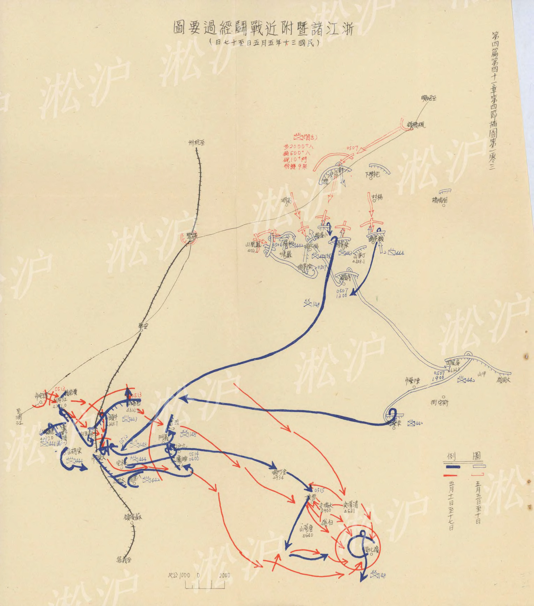

一零四

廣東惠陽附近戰鬥

作戰時間：民國三十年五月十二日起至二十五日止。

作戰部隊：第七戰區第六十五軍第一六零師。

作戰地區：廣東東江惠陽附近。

敵情：敵企圖圍殲我惠陽、博羅一帶之野戰軍，在石龍、深圳、淡水、稔山等處集結一萬五千人，於五月十一日分三路進犯惠陽，一部約五千餘人由增城東犯，一部約千餘人出模河墟到達響水竄泰尾，一部約四千餘人由石龍溯江東上，一部出大河墟直擾博羅攻惠陽，一部約三千餘人由稔山北向平山到達白雲附近，另一部約千餘人經由坑塘墟竄梁化。

我軍目的：我軍以確保惠陽之目的，乘敵分離時而擊破之。

戰鬥經過：五月十二日，稔山敵分三路北犯平山，向我第一六零師第四七八團亞姨嶺、水口及北芒花陣地猛攻，激戰甚烈，敵機二十餘架集中轟炸亞姨嶺，該陣地遂被突破，同時我白芒花部隊亦被迫後撤，迄十八時，平山陷入敵手。當第四七八團與敵激戰時，我第四八零團奉令到達白芒花西側向敵側擊，後因敵不斷增援，以衆寡不敵，亦向後撤。同（十二）日晨，敵一部由泰尾渡河南下，與我扼守橫瀝野補團接觸，後敵陸續增援，並藉飛機之掩護，向我陣地猛攻，激戰至午後，我被迫轉移於馬山、潭頭嶂之線，橫瀝亦陷敵手。是（十二）日沿東江前進之敵，於拂曉後由博羅直迫惠陽，敵機不斷向城郊轟炸，我防守惠陽城之第四七九團，因平山、橫瀝失守，奉令向梁化附近轉移，敵遂向平湖門一帶攻擊，至晚衝入城內，惠陽於是失守。

當平山、橫瀝、惠陽相繼失陷後，該師爲脫離不利態勢，集結兵力轉向敵外翼攻擊，以一部留置白芒花附近，向敵後襲擊，主力轉向梁化東北地區集結，嗣後敵因受我多方襲擊，於十八日至二十日，分向淡水、石龍回竄，我步兵兩連於二十日進抵平山，我獨立第九旋一部於二十一日克復惠陽，我第四八零團於二十四日到達梁化，野補團於二十五進抵橫瀝，至是平潭、永湖、山棟等地區之敵，完全肅清。

成

果：一、鹵獲：

步槍一枝。

二、斃敵數十名。

我軍傷亡：一陣亡：

1. 官四員。

2. 兵一一三名。

二、負傷：

1. 官一二員。

2. 兵一六九名。

三、失踪：

兵四六九名。

我軍損耗：一、武器：

1. 步槍一二六枝。

2. 輕機槍七挺。

3. 手槍四枝。

4. 信號槍二枝。

5. 擲彈筒四個。

5. 槍榴彈筒一五具。

二、彈藥：

1. 步槍彈三四零、一九九粒。

2. 手槍彈二、三九四粒。

3. 信號槍彈一一四粒。

4. 砲彈六零六顆。

5. 手榴彈二、八九八枚。

6. 擲榴彈一八枚。

7. 槍榴彈四一五枚。

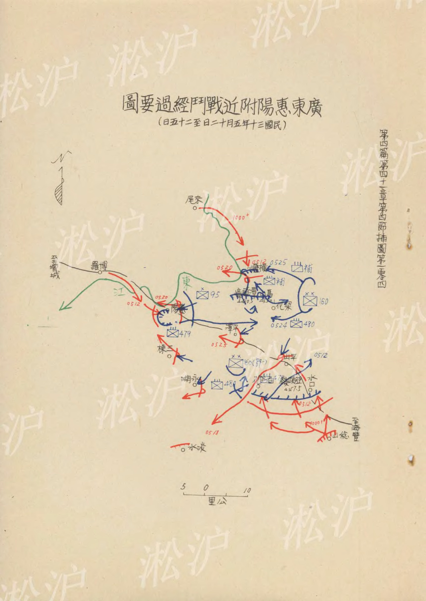

各地游擊

巨

一零五

九宮山地區戰鬥

作戰時間：民國三十年六月十五日起至十九日止。

作戰部隊：第九戰區第七十二軍之新編第十四師。

作戰地區：鄂南贛北邊境之燕廈街附近九宮山地區。

敵情：沿陽新通山公路線與我對峙之敵第四十師團自六月十三日以來，抽其駐陽新之第二三六聯隊岡林大隊及駐通山之第二三四聯隊第一大隊，附師山砲第四中隊及騎兵百餘，共約一千三百餘人，並附僞軍六百餘，分三路南犯，一路（主力）於十四日由大畈南進，經富有、橫石潭向寶石河西竄，一路由嶺下舖向黃英尖，一路由夏舖向藕塘南竄。

我軍目的：師爲確保九宮山太陽山脈，乘敵進入高湖朱地區，包圍殲滅之。

戰鬥經過：六月十五日十二時，敵攻佔我友軍梅山尖、東坑嶺、黃英尖陣地後，繼續南竄，我友軍退守伏地鍾、沙黃尖之線繼續抵抗。又由大橋舖、辛潭舖調集之敵約四百餘人，是日午前由陽新鎮渡河南犯，到達英段後，與我第四十二團一部發生激戰，迄晚，該團第一營由燕廈街向敵側擊，敵不支向成龍竄去。

十六日拂曉敵繼續向我友軍壓迫，進至大屋程、油榨嶺、高湖朱、毛山上之線，其唐家山砲兵不斷向我石口射擊，我友軍續向太陽山以西撤退。此際新編第十四師卽令第四十一團爲右翼隊，展開於楊子冲亘東坑之線，向小源口、蕭家畈、巴蕉灣、大源口之敵攻擊，第四十團爲左翼隊，以一部佔領古老庵、太陽山各據點，主力展開於石口東西高地之線，向大屋程、油榨嶺、伏地鍾、高湖朱、毛山上之敵攻擊，兩翼隊於十三時完成攻擊準備，十四時，開始攻擊，進展順利，至入暮，我左翼隊已進佔伏地鍾、唐家山之線，敵一部退據大源口頑抗，折

日

戰

史

三九八

一部北潰。同時右翼隊亦攻佔小源口。

十七日，我續行攻擊，敵由橫石潭增來約三百餘，與我第四十二團第二營激戰終日，至十八日，上陳、界牌、苦竹林等處之敵，自曉至暮，經我猛攻後，傷亡慘重，已呈動搖，而船埠之敵，亦甚混亂，我更乘勢衝擊，敵乃不支分向富有、夏埠方向潰退，當卽以第四十二團第二營爲右翼追擊隊，第四十團（欠第三營）爲左翼追擊隊，分向富有、夏舖追擊，至十九日，敵潰退已遠，各追擊部隊遂卽停止追擊，該師乃恢復戰前態勢。

戰

果：一

鹵獲：

1. 刺刀二把。

2. 步槍彈四七粒。

3. 砲彈一五顆。

我軍傷亡：一、陣亡：

1. 官五員。

2. 兵七三名。

二、負傷：

兵四四名。

我軍損耗：一、武器：

1. 步槍三枝。

2. 刺刀三把。

二、彈藥：

1. 步機彈九六、八六二粒。

2. 信號彈一四粒。

3. 迫砲彈七四三顆。

4. 手榴彈七一一枚。

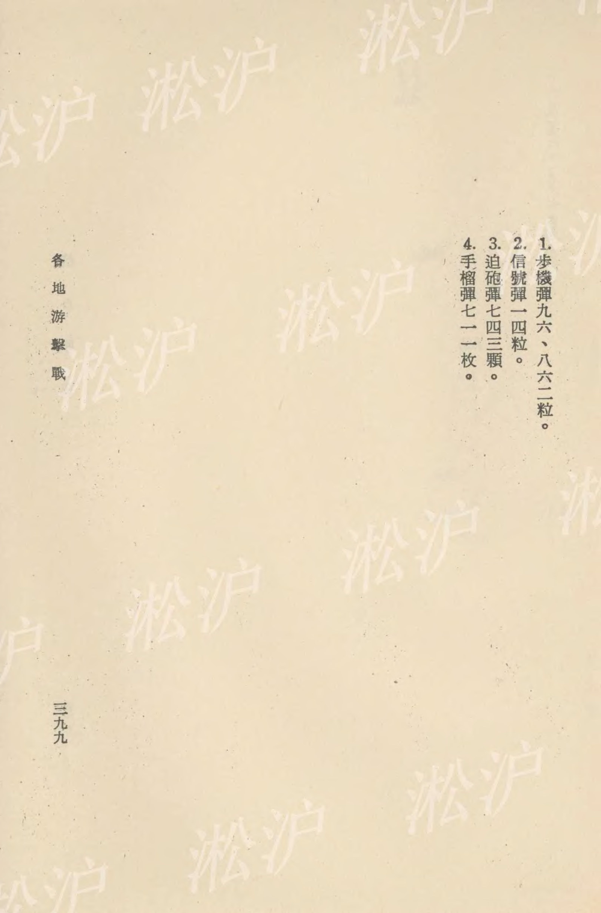

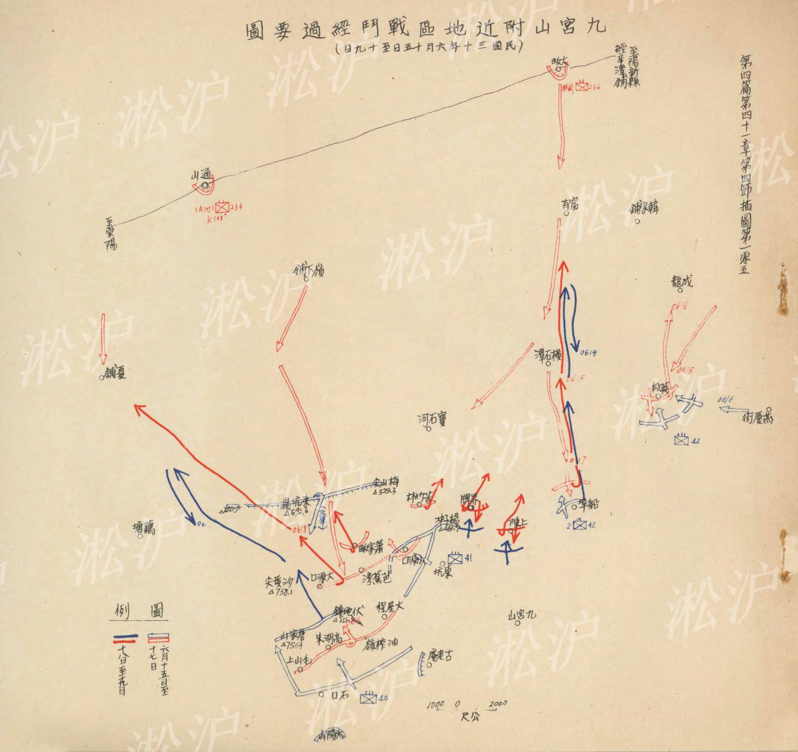
