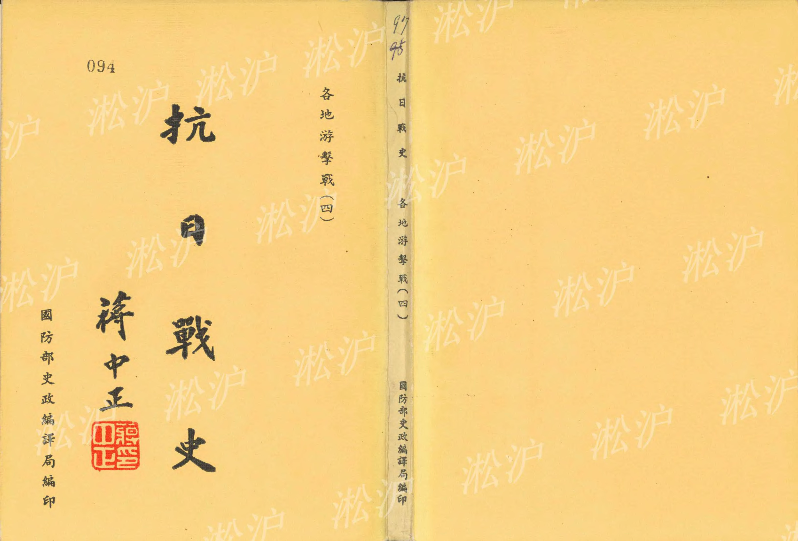

第四十一章 各地游擊戰 第四册 分目一○六、湖北宜昌分鄉場附近戰鬥一○七、湖北宜昌北岸附近戰鬥一○八、河南信陽北平昌關附近戰鬥一○九、浙江武康吳興桐鄉等地區戰鬥一○、廣東新會台山地區戰鬥一、安徽南陵繁昌青陽貴池等地區戰鬥一二、浙江上虞百官各附近戰鬥一三、浙江奉化溪口附近戰鬥一四、湖北監利白螺磯附近戰鬥二五、湖北宜昌附近戰鬥二六、湖北京山西南雁門口戰鬥二七、河南鄭州附近戰鬥一八、安徽貴池附近戰鬥一九、江蘇宜興溧陽溧水高淳及安徽郎溪地區戰鬥二○、湖北鍾祥以北長壽店張家集附近戰鬥第五節 三十一年各地游擊戰第一款策應英美盟軍之作戰四○一

四○五

四○九　四一三　四一七　四二一　四二三　四二九　四三三　四三七

#### 第二款策應浙贛會戰之作戰四六一

一二一、湖北隨縣附近戰鬥四六二

一二二、湖北監利白螺磯附近戰鬥四六七

一二三、安徽宣城灣址附近戰鬥四七一

一二四、浙江奉化餘姚紹興蕭山一帶地區戰鬥四七五

一二五、浙江武康吳興南溥一帶地區戰鬥四七九

一二六、皖北地區戰鬥

四八三

一二七、廣東清遠花縣從化間地區戰鬥四九一

一二八、湖北漢口黃坡及河南信陽羅山等地區戰鬥四九五

一二九、皖中一帶地區戰鬥四九九

三○、廣東蘆包附近地區戰鬥五○三

三一、廣東澄海蓮塘村附近戰鬥五○五

二三、廣東惠陽博羅一帶戰鬥五○七

三三、安徽蒙城地區戰鬥五一

三四、廣東新會南海清遠等地區戰鬥五一五

三五、湖北監利白螺磯附近戰鬥五一九

三六、湖北宜昌宋家咀附近戰鬥五二三

三七、安徽安慶外圍地區戰鬥五二五

三八、湖北宜昌右岸戰鬥五二九

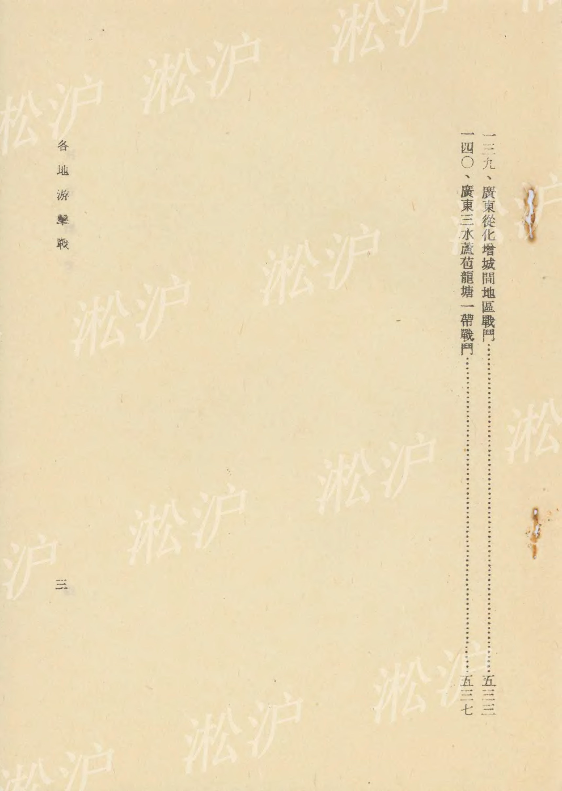

一零六

湖北宜昌分鄉場附近戰鬥

作戰時間：民國三十年七月二十七日起至八月七日止。

作戰部隊：第六戰區第七十五軍之第十三師、第六師、預備第四師。

作戰地區：湖北宜昌分鄉場附近地區。

敵情：進犯之敵爲第六十五聯隊全部、第五十八聯隊之第二大隊、第一零四聯隊之第二大隊、第三大隊、第一一六聯隊之第一大隊、山砲第十九聯隊之六個中隊（每中隊山砲三門），工兵兩個中隊，此外配屬迫擊砲中隊及騎兵五百名、宜昌僞保安隊等，指揮官爲第一零三旅團長柴田卯一，共計兵力約一萬二千餘人。

我軍目的：爲確保守備陣地，與江防軍協力擊潰進犯之敵。

戰鬥經過：七月二十七日十三時許，敵軍千餘砲八、九門，向我第十三師天坑窩、法官泉一帶警戒陣地進犯未逞，入夜，敵增至二千餘續行猛撲，激戰甚烈。二十八日拂曉，敵以一部佯攻我金盆山，其主力猛攻我長嶺崗、大金山主陣地，經我守軍奮勇抵抗，反復肉搏，敵我傷亡均重，我以有力一部由長嶺崗西南地區向敵側擊，敵勢稍挫，同時我右翼部隊乘機襲擊，頗有進展。二十九日午，我一部出擊，當卽攻佔天坑坳、天坑窩等處，同時長嶺崗及五金山附近之敵，亦被我包圍，前坡腦之敵，亦受頓挫，我乃先後克復五金山、長嶺崗等地，但爲殲敵計，續增兵向敵兩翼包圍攻擊，迄十七時許，敵增援騎兵四百餘。砲四門，藉飛機低空掩護，向我前坡腦陣地猛攻，入夜後，續增敵千餘，我以傷亡重大，前坡腦陣地遂於三十日一時被敵突破，其步騎兵千餘、砲數門，竄至余家垭、三叉口附近，我乃變換陣地向敵側擊，同時另以一部推進至余家垭附近，堵擊該敵，卒被擊退，拂曉後，敵機十餘架不斷向我全陣地狂炸，我蔡家包據點棄守，另敵五百餘砲四門，侵入泉古洞，午後，其主力分向我別家山、余家垭攻擊，被我阻擊未逞，但敵仍陸續增加，是（三十）日晚，我以一部據守原陣地，主力控置於窯灣、楊家灣地區，作側擊準備，另一部轉進至黃土坡、牯牛山、黃包嶺一帶，以期伏擊。

三十一日拂曉後，敵砲、空軍聯合向我別家山、余家垭陣地轟炸數小時後，始以步兵五百餘人竄至郭家沖附近，另一部竄至余家垭，均遭我側擊阻止。十七時許，敵軍三千餘，以密集隊形通過高家場向分鄉場西犯，遭我痛擊，敵倉皇應戰，經我反復衝鋒肉搏六、七次，終被擊退，但郭家沖之敵，已竄至趙家垸子，我爲避免不利，乃卽轉移黃公山、碼子山、張家沖陣地，繼續抵抗。

八月一日，敵分三路向我鷄公山、女媧廟、黃公山等陣地攻擊，經我軍奮勇迎擊，敵未得逞。二日三時許，進攻我黃公山之敵，其主力南竄七里垭、黑灣惱，經我協力側擊，始將其擊退，同時並將分鄉場以北之敵肅清，續向趙家垸子進擊，敵復由關莊場附近增兵千餘，向我猛攻。三日，我以主力分向敵側後壓迫，敵遂向南逐次撤退，但其掩護部隊約千餘人，砲數門，仍據守四二一高地頑抗。四日，敵主力轉向江防軍北岸攻擊，其一部仍固守各據點，我當卽以一部肅清當面殘敵，主力向南追擊，五日午，將前坡惱以北之敵肅清後，卽佔領關莊場及法官泉，至七日，我完全恢復原陣地，是時我江防軍方面之敵，亦因我協力夾擊未能得逞。

戰

果：一、鹵獲：

1. 敵官長一員。

2. 士兵十二名。

3. 馬三十五匹。

4. 步槍三十三枝。

5. 擲彈筒一個。

6. 信號槍一枝。

7. 各種子彈四、一五四粒。

8. 各種砲彈五十五顆。

9. 毒氣彈一零枚。

10 烟幕彈六枚。

11 刺刀二七把。

12 重機彈脚架二付。

13 防毒面具七十九個。

14 烟幕罐七個。

15 毒氣罐十二個。

16 黃色藥包一零零塊。

17 望遠鏡一付。

18 鋼盔九十頂。

19 皮背包七十四個。

20 馱鞍九付。

21手榴彈一二二枚。

22其他被服裝具零星物品甚多。

我軍傷亡：一、陣亡：

1. 官二六員。

2. 兵七五五名。

二、負傷：

1. 官七一員。

2. 兵一、一二一名。

三、失踪：

1. 官一員。

2. 兵一七七名。

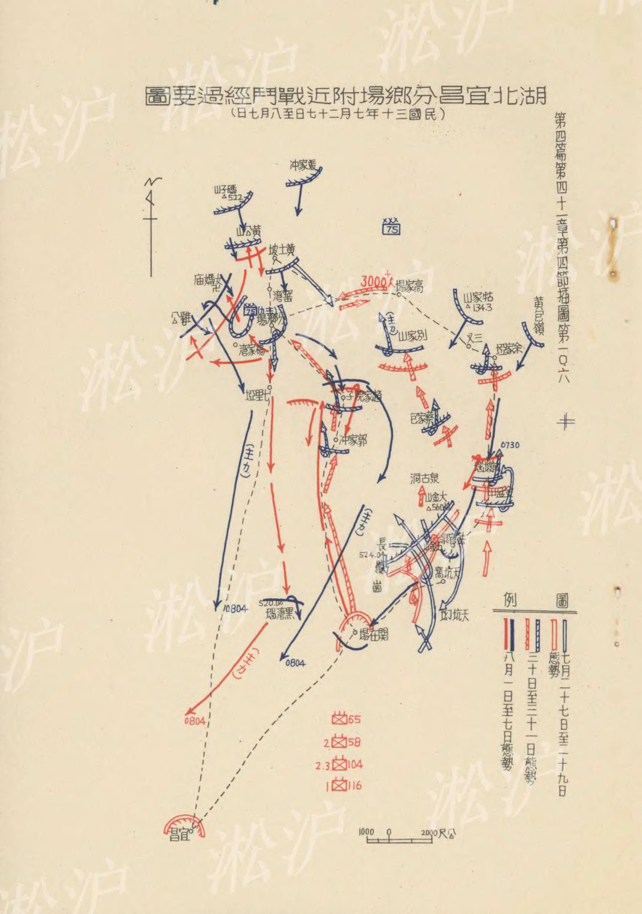

一零七

湖北宜昌北岸附近戰鬥

作戰時間：民國三十年七月三十日起至八月八日止。

作戰部隊：第九十四軍之第一八五師。

作戰地區：湖北宜昌北岸附近地區。

敵情：當面之敵爲第十三師團第一零四聯隊全部、第五十八聯隊及僞軍各一部，共計兵力約四千餘人，重山野砲十餘門，指揮官爲第一零四聯隊長相田。

我軍目的：師以協助友軍相機收復宜昌、沙市爲目的。

戰鬥經過：七月三十日十八時，我集中砲火向董家沖轟擊，第五五三團第二營則一舉突入，將敵擊退，十八時三十分，完全佔領該據點。此時由曹家口、二流坡增援之敵百餘，亦被我第五五四團之伏擊部隊殲滅，同時該團攻擊黃土坡及三一零高地之部隊，予長橋溪以西地區之敵極大威脅。旋敵由宜昌及前後坪、林家店等處陸續分向各地增援，反復衝突，激戰至三十一日拂曉，我受敵南北岸砲火猛擊，傷亡重大，遂放棄董家沖，撤回原陣地。是（三十一）日十七時，敵主力向大金山進出，與我派至張家場掩護友軍預四師作戰之第五五五團第一營激戰於回水庵、九斤沖之線，同時茶店子之敵，亦向我東岳廟、吞條嶺之線猛攻，與回水庵之敵對我形成夾擊，經我軍奮勇抵抗，激戰至八月一日拂曉，我仍保持原陣地，俟達成掩護任務後，卽令歸還建制，惟敵自經我七月三十日之猛烈攻擊後，受創頗重，雖連日增加兵力向我陣地進犯，均未得逞，八月四日，敵百餘又向我曹家大包前進陣地進犯未逞。

五日拂曉，敵增兵四百餘，在其飛機大砲掩護下，再舉進犯，激戰至十二時，我陣地全毀，守軍大部犧牲，遂於十七時三十分退守曹家垭陣地，敵跟踪前進，當敵續向曹家垭進攻，右翼之敵，亦同時向我三一零高地攻擊，惟經我阻擊後，受創而退。是（五）日夜，友軍預四師龍王洞陣地失守，我左側背暴露，同時曹家大包之敵，復向我曹家垭陣地猛攻，不得已於六日四時四十分轉移至蕭家崗西端陣地。此時另敵六百餘，又由丁家壩向我蕭家崗、黃土崗之線大舉進犯，曹家垭之敵，亦同時進犯，經我守軍奮勇苦戰後，敵攻勢頓挫，迄八時，敵復由龍王洞分兵向我左側背，丁家壩、曹家垭之敵由正面攻擊，對蕭家崗陣地形成三面包圍，但我守軍仍果敢奮戰，予敵重創，敵乃轉向易家垭侵入小廖灣，企圖截斷我軍退路，而東南方向之敵約一千五百餘人，亦向我進攻，激戰至十六時，小廖灣之敵突入楊家灣西側，我蕭家崗之守軍全被包圍，該師長見情況危急，乃以預備隊由丁家坡增援，奮勇反撲，內外夾擊，終於十九時將包圍之敵擊潰，該師奉命除仍留一部與敵保持接觸外，主力移守玉井亘曹家冲、丁家坡之線，黃昏後，敵大部撤退，二十時，我先後將各據點收復，七日八時，我卽向曹家大包攻擊，惟敵頑抗，終未奏功，至晚，該師決以奪回曹家大包之目的，乃集中砲火向其轟擊，再度猛攻，苦戰徹夜，仍無進展，遂於八日拂曉停止攻擊，本戰鬥乃告結束。

戰

果：一、鹵獲：

1. 步槍一枝。

2. 步彈二二九粒。

3. 刺刀一把。

4. 鋼盔三頂。

5. 軍毯三床。

6. 防毒面具一付。

7. 擲榴彈三枚。

8. 槍榴彈一枚

二、傷亡：

斃傷敵官兵一千七百餘員名。

我軍傷亡：一、陣亡官兵三四八員名。

二、負傷官兵四二四員名。

三、失踪官兵五四員名。

我軍損耗：一、武器：

1. 步槍九八枝。

2. 輕機槍八挺。

3. 手槍五枝。

4. 擲彈筒十一個。

二、彈藥：

1. 步機彈二六七、九二三粒。

2. 鋼心彈四九、一四零粒。

3. 手槍彈一、零一五粒。

4. 擲榴彈四八四枚。

5. 砲彈一、七四八顆。

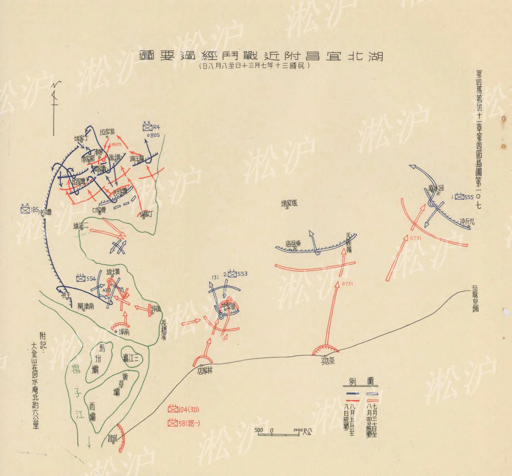

一零八

河南信陽北平昌關附近戰鬥

作戰時間：民國三十年八月九日起至十三日止。

作戰部隊：第五戰區第八十五軍第四師之第十一團，工兵營，高射砲連，迫擊砲營一連及第十團一部，預備第十一師之第三十三團，工兵營及第三十二團之第一、第二營，總兵力約一萬三千餘人作戰地區：河南信陽以北之平昌關、古城、沈陽臺附近。

敵情：信陽附近各據點之敵第三師團第二十九旅團第三十四聯隊全部及僞軍第十二師全部，於八月七日抽調各據點之兵力約二千人及僞軍一部，集中信陽，又由應山增信陽七百餘人，似有北犯平昌關之模樣。

我軍目的：軍爲擊攘進犯之敵，以預備第十一師之第三十三團附工兵營守備淮河店、祝林總亘皮條溝、沈陽臺之線，其主力於蓮花臺堡子附近集結，第四師第十一團附工兵營、高射砲連、迫砲連，守備古城、查山、棗樹崗之線，其主力於竹清以南地區集結。

戰鬥經過：八月九日晨，敵兵三百餘、砲二門，由張廠向第四師平昌關警戒陣地進犯，另敵一股步騎兵約百餘，由陳家店向我魯砦警戒陣地進犯，我兩地區之警戒部隊守兵各僅一排，激戰至十四時，平昌關三面被敵包圍，第四師主動轉移至查山、古城之線。同時進犯黑山東南五祖山附近之敵約三百餘人，經與預備第十一師激戰至十三時後，敵不支向古城竄擾，至晚，敵我混戰於古城附近，互無進展。第二十三師派兵一部至圍山城扼要構築工事，掩護預備第十一師側背之安全，第四師爲解除古城側背之威脅，卽將主力轉移於孫凹、胡莊之線。十日四時許，竄據古城西北之敵被我反包圍，經我內外夾擊，九時，敵不支向南退却，企圖與查山之敵合股，作最後之掙扎，激戰至十三時，敵因傷亡慘重，全部向南潰退，我第四師卽以一部爲左追擊隊，經古城、平昌關向張廠追擊，主力經查山、魯砦向陳家店追擊，十八時，我追擊隊到達平昌關以南陳家店附近，與敵對峙，復經我奇襲，斃敵甚多，敵退據袁砦、孫砦原據點，激戰入夜，戰況沉寂。同時敵一股約三百餘由鄭凹附近渡淮河北犯，因天雨停止於三里崗附近，經第四師派兵一部向皮條溝夜襲，未能奏功。預備第十一師當面之敵約步、騎、砲兵一千六百餘人，分三股向沈陽臺攻擊，至十三時，敵我展開劇烈之戰鬥，反復衝殺，激戰達五小時之久，迨至黃昏後，戰況轉趨沉寂，迄二十一時，我軍以一部由小林店方向經黑山東南向竄集沈陽臺附近之敵襲擊，於是沈陽臺之圍乃解。

十一日，第四師協力預備第十一師驅逐皮條溝之敵後，發現敵主力有退却模樣，乃分向當面殘敵猛烈攻擊，並以一部繞至黃砦、吳家店間埋伏，截擊潰退之敵。十二時，祝林總附近之敵，復向固縣東南地區竄擾，經預備第十一師迎頭痛擊，至晚將敵誘至雷潭山西南花會店東北中間地區，經我軍於十二日予以包圍攻擊後，其主力經小林店向游河回竄，遂完全恢復戰前態勢。

果：一、鹵獲：

1. 信陽附近五萬分之一地圖兩份。

2. 毒氣罐兩個。

3. 鋼盔三頂。

二、傷亡：

斃敵官兵約四百餘員名。

三、其他效果：

打破敵人殲滅我野戰軍之企圖。

我軍傷亡：一、陣亡：

1. 官二員。

2. 兵一五六名。

二、負傷：

1. 官一三員。

2. 兵五二八名。

三、失踪：

士兵一二六名。

我軍損耗：一、武器：

1. 步槍二八枝。

2. 輕機槍四挺。

3. 手槍四枝。

4. 重機槍一挺。

5. 槍榴彈筒四個。

二、彈藥：

1. 步機彈二五五、四四零粒。

2. 手槍彈一、三八八粒。

3. 砲彈五六一顆。

三、器材：

1. 大圓鍬七四把。

2. 小圓鍬四六把。

3. 大小十字鎬九五把。

4. 防毒眼鏡二一付。

四二二

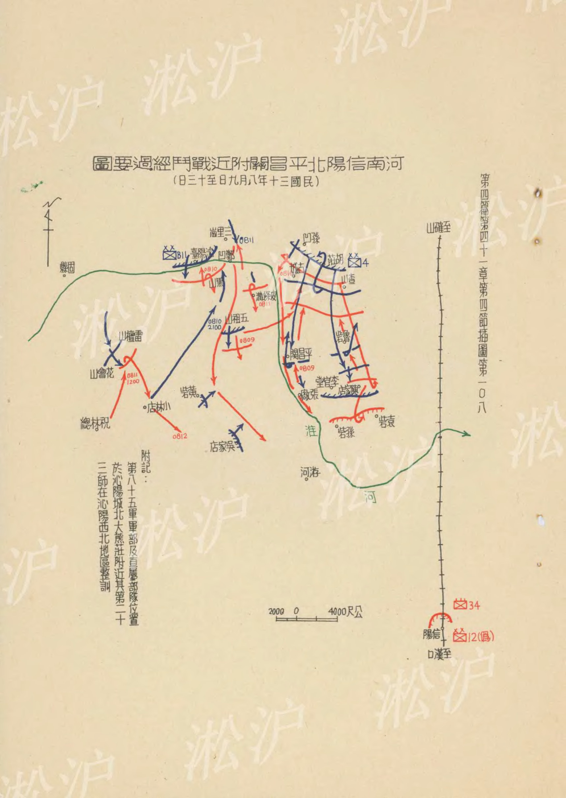

一零九浙江武康吳興桐鄉等地區戰鬥

作戰時間：民國三十年八月二十五日起至二十八日止。

作戰部隊：第三戰區第十集團軍第二十八軍之第六十二師（欠第一八四團第一、第三營）。

作戰地區：浙江武康、吳興、桐鄉等地區。

敵情：敵第二十二師團第八十四、第八十五兩聯隊各一部、龍田部隊大部附砲、工、騎、憲兵及海軍陸戰隊，共約千餘人；另僞軍程萬軍部約一千二百餘人，分佈吳興、箐山、菱湖、雙林、烏鎮、南溥、埭溪、武康、上柏、德清、新市、石灣、崇德、桐鄉及滬杭鐵路之硤石、斜橋、長安、臨平等據點，防守嚴密。

我軍目的：突擊武康、吳興、桐鄉等重要據點，並相機佔領之。

戰鬥經過：第六十二師奉命突擊當面之敵，遵卽策定部署，督飭所部積極準備。

八月二十五日二十一時，第一八五團以一部襲佔武康城，旋敵由杭縣增援，該團退至離城約里許之山地與敵激戰，並以主力分向上柏、埭溪進襲，阻止敵軍增援，同時第一八六團分向濮院、崇德、桐鄉、石灣、合山、德清、新市、雙林一帶攻擊，突入濮院，並一度攻入新市、第一八四團第二營亦向吳興襲攻，牽制箐山、白鹿山之敵。

二十六日，敵續由杭縣、吳興增援，武康之敵，亦乘機反攻，我第一八五團，一面阻擊增援之敵，攻襲金軍山、上柏；一面截擊武康之敵，將敵擊潰，再度攻入武康縣城。第一八四團第二營在吳興南上幹村毀擊敵汽車一輛。

二十七日，第一八五團攻入武康城之一部，以任務達成，遂向該城西側山地轉移，第一八四團第二營復向白鹿山及吳興外圍各據點襲攻，因敵戒備嚴密，未能奏功。

果：一、鹵獲：

二十八日，第一八四團第二營仍撤回原陣地，該師遂令第一八六團全部及第一八四團、第一八五團各一部，分置杭縣、嘉興、菱湖、三角地區，續行游擊，令第一八四團、第一八五團主力配置京杭國道以西，擔任守備，並不時出擊，戰鬥遂告結束。

1. 僞軍官一員。

2. 士兵五名。

3. 步騎槍十枝。

4. 鋼盔一頂。

5. 電話機一部。

6. 步機彈六六粒。

7. 鐵絲一·三零公斤。

二、破壞：

1. 僞警察局一所。

2. 僞營房一棟。

3. 汽車站一所。

4. 野砲一門。

5. 汽車六輛。

6. 電線一五二華里。

三、傷亡：

1. 敵官兵共二一零員名。

2. 僞軍官兵共九零員名。

3. 馬二四匹。

四、其他效果：

敵受創後，加強工事，堅守據點，不獨使其無法他調，並由杭蘇方面抽調敵軍約一千餘人，增加武康吳興等處防守。

我軍傷亡：一、陣亡：

士兵二八名。

二、負傷：

1. 官五員。

2. 兵三一名。

我軍損耗：一、彈藥：

1. 步機彈四九、六九四粒。

2. 手槍彈二一六粒。

3. 迫砲彈一二一顆。

4. 山砲彈七八顆。

5. 手榴彈五七六枚。

6. 信號彈四二粒。

7. 鋼心彈八六四粒。

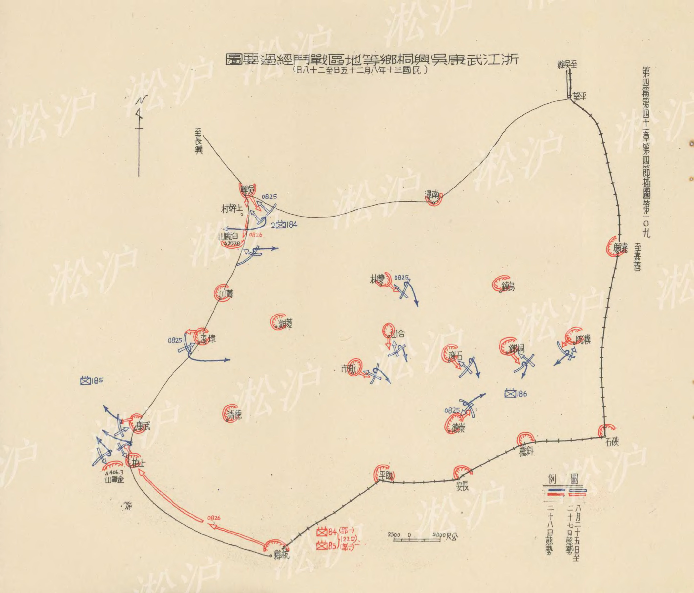

一一零廣東新會台山地區戰鬥

作戰時間：民國三十年九月二十日起至三十日止。

作戰部隊：第七戰區第三十五集團軍第一五六師（欠第四六七團、第四六八團及工兵第二連迫擊砲第一連），第七挺進縱隊、保安第一團、保安第九團。

作戰地區：粤南新會、台山、廣海一帶。

敵情：新會之敵爲第三十八師團第二二九聯隊約三千餘人、第二三零聯隊約五千餘人、第一零四師團第一零八聯隊一部約三千人、僞保安第七、第八兩團約一千五百人，另有小艦十一艘、汽艇二百餘艘、飛機三架，揚言於九月十八日分三路進攻金山埠，一路由沙坪、鶴山趨單水口；一路由新開路、一路由新昌河右岸掃蕩我軍。

我軍目的：收復台山、廣海失地。

戰鬥經過：九月二十日，新會之敵沿新開路前進，與我第一五六師第四六六團馬鞍山附近之警戒部隊接觸。同日六時，廣海方面敵約四百餘，在南灣強行登陸，向廣海前進，我烽火角守軍被迫後撤，敵復會合廣海登陸之敵向斗山攻擊，繼向冲萋前進。十四時，敵竄至冲萋，我保安第一團第一大隊受敵壓迫，轉守紅嶺，冲萋遂陷敵手。十八時，敵復向我紅嶺陣地猛攻，至二十時，紅嶺失守，但經守軍奮勇反擊後，於二十一日克復紅嶺，敵向冲萋潰退。

二十一日九時許，新會之敵步、砲、空協同向學堂山進犯，我第四六六團一部由司前增援，尚未趕到，而學堂山已告失守。

二十二日七時，敵約六百餘，進佔台山城，二十三日九時，台山敵百餘沿台荻公路竄到荻海，一部，沿河右岸向金山埠前進，包圍長沙，我第七挺進縱隊之第一大隊與敵激戰至十一時果：一、囪獲：

後，卽行撤退，金山埠陷敵。我爲收復台廣失地，乃重新調整部署，加強攻擊部隊，至二十九日七時，部署完畢後，卽分別向敵襲擊，全線激戰甚烈，至十一時，敵乃不支，分別潰退，我追擊隊一部向新開路。主力向台山、廣海方向追擊前進。敵退回新會後，除以一部留守新會一帶外，餘均退回廣州，我追擊部隊，亦於三十日停止追擊，折回原防，繼續監視敵人。

1. 槍榴砲四枚。

2. 迫砲彈二顆。

二、傷亡：

1. 斃敵官三員。

2. 斃敵士兵四百餘名。

3. 傷敵士兵四百餘名。

我軍傷亡：一、陣亡：

1. 官三員。

2. 兵一九六名。

二、負傷：

1. 官六員。

2. 兵九零名。

三、失蹤：

兵五十六名。

我軍損耗：一、武器：

1. 步槍九零枝。

2. 重機槍一挺。

3. 輕機槍二挺。

4. 槍榴彈筒二個。

5. 刺刀一八六把。

6. 手槍六枝。

二、彈藥：

1. 步機彈一八八、九二八粒。

2. 迫砲彈三零二顆。

3. 手槍彈三、零零九粒。

4. 鋼心彈二二二粒。

5. 手榴彈一、二二一枚。

6. 槍榴彈七一枚。

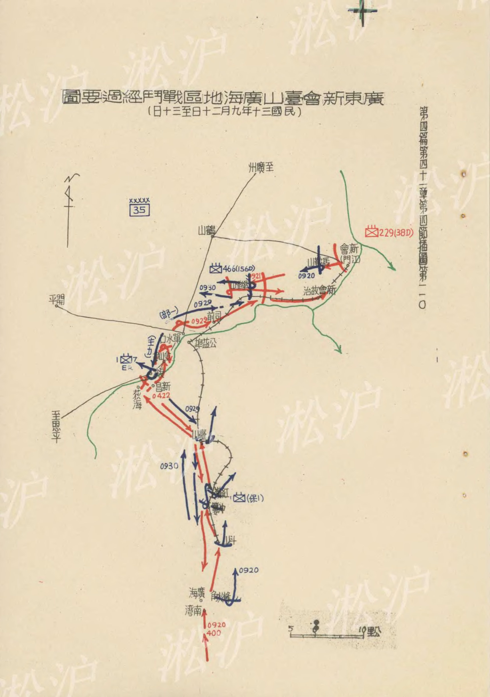

一一安徽南陵繁昌青陽貴池等地區戰鬥

作戰時間：民國三十年九月二十三日起至十月十日止。

作戰部隊：第三戰區第二十三集團軍第五十軍、獨立工兵第十四營、海軍佈雷第五大隊及砲兵兩個連。作戰地區：皖南南陵、繁昌、銅陵、青陽、貴池等地區。

敵情：當面之敵爲第一一六師師團第一二零聯隊、第一三三聯隊各一部及第十五師團第六零聯隊一部，共計約五千餘人、砲二十六門，另僞軍約一千四百餘人。

我軍目的：集團軍爲策應第九戰區方面之作戰，以第二十一軍攻略彭澤，第五十軍編組三個突擊隊，各向當面之敵施行突擊，策應彭澤方面友軍之作戰。

戰鬥經過：第五十軍守備南陵、繁昌、銅陵、青陽、貴池一帶江防，爲策應第二次長沙會戰，奉令向當面之敵突擊。

九月二十三日，該軍以第五十二師及第一四五師各編組三個突擊隊（各以一營兵力爲基幹），分向峨橋、庫山、鯉魚山（屬第五十二師）、牌坊山、十里崗、殷家匯（屬第一四五師）各據點之敵突擊，以第一四五師之第四三五團，掩護海軍佈雷，第五大隊，乘隙挺入貴池至前江口間江岸，實施佈雷，由二十三日至二十七日，我各突擊隊雖一再向各據點之敵襲擊，均因敵憑堅固守，未能奏功，佈雷隊亦因敵戒備甚嚴，無法進行。

二十八日晚，第五十二師突擊隊再行攻擊，佈雷隊於螃蟹磯佈漂雷十具，秋浦湖佈漂雷十具，而秋浦湖方面，遭遇敵艦二艘巡弋，曾向我砲擊，我無損傷，歸途中復與二百餘之敵遭於高塘埂附近，激戰二小時後，始將敵擊退。

十月三日，第二十三集團軍電令：「湘北之敵正被我圍殲中。」第五十軍應於魯港迄銅陵間江岸積極佈放漂雷，主力攻佔殷家匯及其附近據點，並確實佔領棕子柵以西排山、壯山陣地，積極邀擊敵艦，但對荻港、貴池敵之據點，仍應同時攻擊，以資牽制」。第五十軍基於以上指示，當以第一四四師並指揮第一四五師之第四三五團附砲兵兩連，主力攻佔殷家匯，一部攻佔排山、壯山，挺進江岸，邀戰敵艦。

六日九時，第一四四師以第四三五團（欠一營）向八卦山、姜家山、北面山攻擊，第四三一團（欠一營）以一營攻擊殷家匯，餘位置小郎山附近待命，第四三零團（欠一營）附第四三一團及第四三二團各一個營，向團山、豬形山、壯山攻擊，砲兵兩連分置鳳形山附近佔領陣地，第四三二團（欠一營）位置丁家橋機動，晚間實施攻擊後，第四三零團於七日先後克復土頭山、石炭窯、獅子山等據點。

八日，敵由菱湖、安慶兩地增援殷家匯約千餘人，與原守之敵共約二千餘人、砲八門，實力大增，第一四四師續攻至十日，毫無進展，遂與敵對峙於八卦山、姜家山、殷家匯、團山、壯山之線。另第一四五師之突擊隊，於此期間曾突擊至齊山、十里崗各該山腹，嗣卽奉命停止攻擊，戰鬥乃告一段落。

戰

果：一、傷亡：

斃傷敵官兵約六百餘員名。

二、其他效果：

雖未能完全達成截斷長江敵航運之任務，亦使其不能抽調兵力轉用於他方，徒疲於奔命。

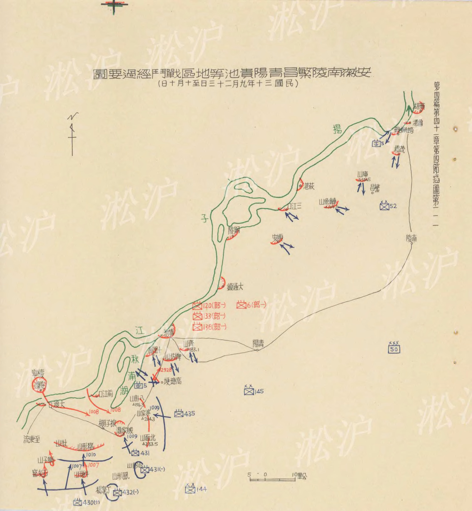

一二二浙江上虞百官各附近戰鬥

作戰時間：民國三十年九月二十八日起至十月二十日止。

作戰部隊：第三戰區新編第三十師（附浙江保安總隊（步兵兩大隊）於攻擊上虞時，又配屬第二十六師第七十六團之第三營）。參戰人數，計官長三零四員、士兵三千名，（保安總隊及第二十六師之一個營參戰人員未列入）。

作戰地區：浙江上虞、百官、曹娥各附近。

百官曹娥附近之敵，係第二十二師團之第八十六聯隊第二大隊，除餘姚歷次增援未詳之敵外，共約步兵五百名、騎兵百餘、砲七、八門。攻佔上虞之敵，大部仍係該聯隊之第二大隊，似另有鈴木中隊及道成部隊及僞軍各一部，約步兵三百、砲三、四門。

我軍目的：我軍以牽制敵人之目的，向奉化溪口、百官、曹娥等地之敵攻擊。

戰鬥經過：九月二十八日黃昏，新編第三十師開始向百官、曹娥之敵攻擊，並命浙保總隊（藍總隊）以一部確保上虞縣城，另一小部進駐下壩向餘姚警戒，主力向五夫、驛亭攻擊。

二十九日十七時，藍總隊進至大陽山，新編第三十師第九十團在金家，第八十九團在蒿寺尖一帶，第八十八團控置三界鎮附近，各部卽分向當面之敵攻擊。

三十日二時許，第九十團主力與龍山之敵激戰，另一部衝入百官，同時藍總隊與敵對戰於五夫、驛亭附近，第八十九團主力向扼守鳳凰山之敵攻擊，迄黃昏，百官敵經我驅逐外山，龍山、鳳山各據點，我亦正圍攻中，敵突由曹娥江下游以汽艇增來步兵二百餘名，驛亭增到步兵六十餘名，向我突擊，我圍攻之第九十團因腹背受敵，遂向隆松嶺、蘭芎山之線轉移，同時五夫敵突擊大陽山，三十里牌之敵亦進襲下壩，藍總隊乃據守含劍山、大岙山之線，此時第八十九團將鳳凰山南端之據點攻佔。

十月二日十一時，第九十團攻佔二一四、零高地及仙人山，一部由鳳山衝入百官。斯時敵四百餘，分由梁湖、曹埠，包圍攻擊，經分別迎擊，敵勢稍挫。同時敵復以三百餘人渡皂李湖向我圍攻，我周岙、象山部隊擊沉木船一隻，斃敵數十名，敵旋由曹娥江下游再增汽艇多艘，滿載敵兵，由隱里向我猛攻，此時各處增援之敵向前急進，百官街內敵人亦乘機逆襲，遂演成混戰狀態，迄十五時，與敵相持於鳳亭山、大頂尖之線。第八十九團主力與敵終日對戰於鳳凰山，該團另一部則攻佔白米堰，我爲爾後作戰計，除留一部於嵩寺尖與敵對峙外，主力集結崑崙附近，藍總隊一部扼守上虞，一部在餘姚後方活動。

四日，第九十團之一部對各方警戒，並掩護第八十八團向龍山攻擊，第八十九團除以一部在白米堰、牛山、馬山對東關鎮警戒，主力向曹娥、鳳凰山進攻，於十八時攻佔職山，迄六日，我第八十八團主力攻佔外山，衝入百官，敵我演成爭奪戰。我另一部向龍山續攻，第九十團之一部與由驛亭增援之敵約百餘，在曹埠附近激戰。第八十九團除主力與敵對戰於鳳凰山外，一部攻入曹娥鎮內，發生激戰巷戰。同時藍總隊破壞馬渚鎮至五夫間道路，一度攻入五夫，圍攻火旗山，嗣後敵先後由曹娥江下游及驛亭各增到百官及曹娥約五百餘人，此時三十里牌之敵已進抵下壩，並先後由寧波調來敵二千餘，分駐奉化、溪口、餘姚一帶。

十日十六時，餘姚敵百餘附便衣隊三十餘，與我藍總隊之一個大隊激戰於永和市附近，逐次迫近上虞城郊，十七時，該城陷落。斯時新編第三十師張師長奉命停止進攻百官，集中全力並指揮第二十六師第七十六團第三營克復上虞，當卽佔領上虞以南白石嶺、五婆嶺、大嶺及曹娥江左岸崑崙、艾湖間東西之線，相機轉移攻勢。

戰

十二日，我以攻略上虞縣城，迫敵於該城以北高地而聚殲之目的，卽命第八十八團先攻取塔山及一七零點四高地，第八十九、第九十兩團各以一部進出東溪、西溪以北機動掩護，藍總隊以一部在上虞以東佯攻，以策我右側背安全，迨我第八十八團逼近塔山時，卽與該處守敵發生激戰。

十三日拂曉，上虞之敵百餘，向我繞襲，同時敵二百餘向我守備艾湖之第二十六師之一營進攻，當卽命第八十九團、第九十團各派兵一部前往馳援，遂將敵擊退於倉塘市。

十四日，上虞敵五百餘、砲四、五門，以主力扼守城垣，一部在塔山、張渚山亘五葵山等高地積極構築工事，企圖固守，我乘其立足未穩，於十五日拂曉前，卽命第八十八團由南向北、第八十九團由西向東轉南，分別向敵攻擊，王家埠橋以東及陳家堡以北各高地，曾經我一度攻佔，終以地區狹險，我側背受敵威脅，至十時二十分，我進攻各部仍退回原線與敵對峙。

二十日，該師奉命停止攻擊，藍總隊奉調嵊縣，第二十六師之一營歸還建制，新編第三十師除以一部掩護搶運東溪食鹽外，主力卽在上沙嶺附近及其以西之第一線主陣地，與據守上虞、百官、曹娥、東關鎮之線敵人對峙，戰鬥乃告結束。

果：一、鹵獲：

1. 步槍二枝。

2. 步彈八零粒。

二、破壞：

1. 碉堡一座。

2. 機槍掩體三處。

3. 木船一隻。

三、傷亡：

1. 斃敵官八員、兵九十餘名。

2. 傷敵官十員、兵二百七十餘名。

我軍傷亡：一、陣亡：

1. 官九員。

2. 兵三五二名。

二、負傷：

1. 官一四員。

2. 兵一一三名。

三、失踪：

1. 兵二九名。

我軍損耗：一武器：

1. 步槍五二枝。

2. 輕機槍六挺。

3. 擲彈筒四個。

4. 手槍十二枝。

5. 刺刀十五把。

二、彈藥：

1. 步機彈一零六、二五二粒。

2. 手槍彈一、五八七粒。

3. 迫砲彈五零八顆。

4. 手榴彈一、零二八枚。

5. 擲榴彈二零四枚。

6. 信號彈七六枚。

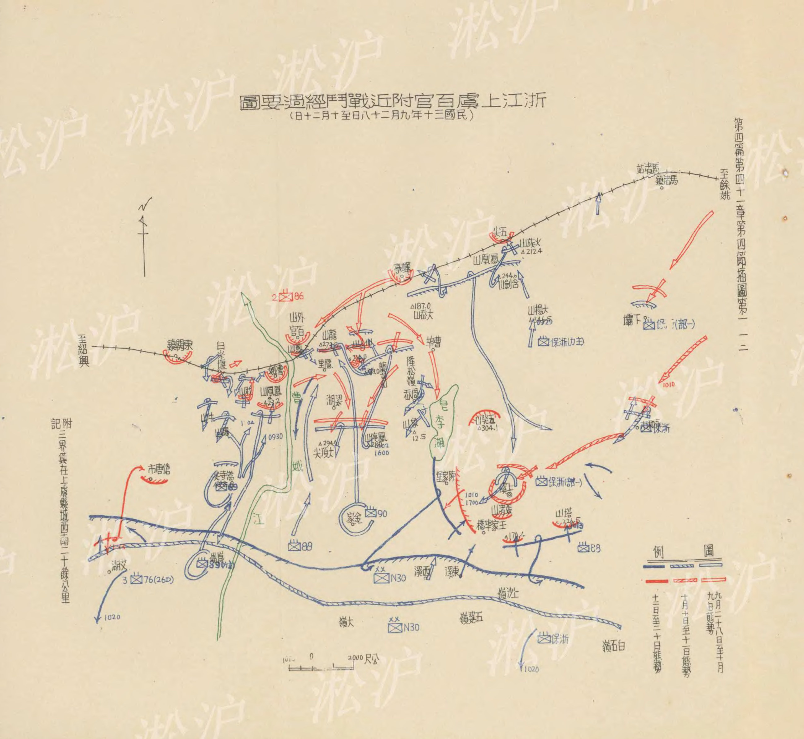

一三浙江奉化溪口附近戰鬥

作戰時間：民國三十年九月二十八日起至三十日止。

作戰部隊：第三戰區暫編第三十五師（附暫編第三十四師第二團，奉化自衛隊，暫編第三十二師第一團之一營）。參戰人員，計官長二八二員、士兵四、七四四名。

作戰地點：浙江奉化、溪口鎮附近。

敵情：盤據寧波、奉化及溪口間之敵第五師團第四十一聯隊（聯隊長岡部），於四月間以步、騎、砲兵聯合之敵約二千餘名，分據奉化蕭王廟、崎山下、溪口、鄞江橋各要點，構築工事，藉作寧波外圍屏障，此時敵在各戰區抽調兵力，使用於湘北方面，企圖再犯長沙，以打通粵漢鐵路。

我軍目的：師以牽制敵人轉用兵力之目的，略取溪口，策應友軍作戰。

戰鬥經過：九月二十八日，暫編第三十五師奉命攻擊溪口，黃昏，該師命暫編第三十四師第二團指揮奉化自衛隊，以一部佔領日嶺、西圍嶺，對奉化城之敵警戒，主力攻擊蕭王廟，另一部襲取崎山下敵之據點；暫編第三十五師第三團主力向當面之敵攻擊，另以有力一部襲佔唐村、馬鞍山、赤泥嶺左側高地；第一團以主力攻取武山，第二團集結康嶺迄亭下之線，策應第一線作戰；暫編第三十二師之一營佔領李家山、李家岙兩側高地，對鄞江橋之敵警戒。

二十九日一時，暫編第三十四師第二團向敵攻擊，敵固守頑抗，至拂曉，敵增援反撲，該團撤至林家附近與敵成膠着狀態。暫編第三十五師第三團於是日三時攻克二四八·零（即溪南山）高地敵據點兩個，第一團亦於四時奪取溪口西之高地及武山。旋敵由江口輸送步、砲兵多名，協同溪口之敵百餘名附大小砲十三門、崎山下敵約四百餘、砲四門，向我各攻擊部隊圍攻。八時，敵砲兵在其飛機二架掩護下，向我上下白巖、入山亭、御書亭、大公山、馬鞍山等處輪番轟炸，我官兵傷亡甚大，攻佔各點似難確保，遂卽命暫編第三十四師第二團佔領三八二·二高地、良浪溪村、馬嘴山之線，並以一部在黃甘嶺對東警戒，牽制蕭王廟、崎山下之敵，暫編第三十五師第一、第三兩團，佔領原有陣地，完成攻擊準備，第二團仍控置康嶺附近，續行原任務，工兵連編兩個爆破班，配屬第一、第三兩團實施爆破任務，另選奮勇隊四十名，配屬第一團行攻擊任務，各部於二十時再興攻擊。二十三時，第三團再度攻佔二四八·零高地右坡敵據點兩處，第一團之一部攻佔阮村兩側高地，另以一部攻佔武山，各該處鐵絲網被我破壞數道，炸毀工事多處，斯時我奮勇隊乘勢衝入溪口街，縱火焚燬倉庫數間，惟武嶺學校構築堅固，敵憑藉頑抗，激戰至三十日三時，敵援兵增至，在其砲火掩護下，猛烈向我反攻，我衝入溪口街之奮勇隊，卽陷重圍，下落不明，同時我各部傷亡增加，攻勢頓挫，嗣卽奉命停止攻擊。遂以暫編第三十四師第二團主力向巖頭市附近集結，並派一部向周濟嶺、許家山、石門、許江岸方向對敵警戒，暫編第三十五師第三團向柏杭附近集結待命，第一團主力向馬家灘附近集結，派一部佔領亭下鎮、西山豆、俞村之線，並扼守夾塹、入山亭、東山頭、藍田各要道，第二團分別佔領公棠兩側山地、康嶺以北高地及西隅兩側山地之縱深地帶，暫編第三十二師之一營集結東西岙對雪寶寺、東山頭、藍田方面警戒，攻擊奉化溪口之戰，至此卽告一段落。戰

果：一、鹵獲：

步槍五枝。

二、斃敵數十名。

我軍傷亡：一、陣亡：

1. 官一員。

2. 兵一三八名。

二、負傷：

1. 官三員。

2. 兵二七零名。

三、失踪：

兵一三六名。

我軍損耗：一、武器：

1. 步槍十枝。

2. 槍榴彈筒一個。

3. 刺刀四十把。

二、彈藥：

1. 步機彈五四、五八一粒。

2. 迫砲彈二八八顆。

3. 鋼心彈一零零粒。

4. 手槍彈九零一粒。

5. 手榴彈七三四枚。

6. 信號彈三五粒。

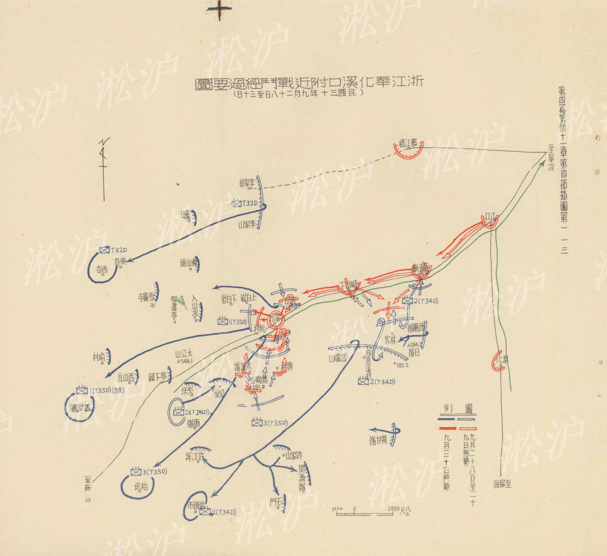

一四湖北監利白螺磯附近戰鬥

作戰時間：民國三十年九月三十日起至十月五日止。

作戰部隊：第六戰區第一一六師第三四八團，第一三零師第三九零團及洞庭湖挺進支隊，共計官兵約四千餘員名。

作戰地區：湖北監利、白螺磯附近。

敵情：自九月十八日以來，敵軍進犯長沙，企圖打通粵漢，並切斷我第三、第九兩戰區之連繫及遮斷我贛閩方面之交通，僞軍熊劍東部據守白螺磯北之沿江楊林山、引港一帶，九月下旬以來，白螺磯西南新淤洲飛機場及白螺磯附近增來敵軍六百餘，企圖依既設之強堅工事堅守，以掩護其進攻長沙大軍之側背，並爲其海、陸、空軍之根據地暨控制水運交通。

我軍目的：我軍以殲滅襄西敵人克復宜昌爲目的，向白螺磯及其附近之敵攻擊，並保持主力於宜昌北岸戰鬥經過：九月二十五日，第一一六師奉命指揮該師第三四八團、第一三零師之第三九零團及洞庭湖挺進支隊向白螺磯及其附近之敵攻擊。是時白螺磯之敵，有步砲兵約六百餘、飛機近百架，引港、楊林山一帶之僞軍熊劍東部約千餘人。

三十日拂曉前，我第一三零師第三九零團以一連兵力附便衣一排，驅逐白螺磯西北唐家、朱許家敵之警戒部隊後，卽向白螺磯西南新淤洲敵之飛機場前進，與約三百餘之敵激戰於機場外圍。

十月一日至三日，我軍雖屢行誘攻，但敵憑藉機場外圍之既設堅強工事據守，並以飛機十餘架，對我攻襲部隊低飛轟炸及掃射，致終未奏效。

四日，該師奉令攻佔白螺磯並破壞敵之飛機場及其飛機，阻絕航運，以配合長沙我軍之作戰，打擊正由長沙分三路向北敗退之敵，而粉碎其欲轉用兵力之企圖。

五日，第一一六師卽以第三四八團爲右翼隊、第三九零團（第一三零師）之一營爲左翼隊，向白螺磯進攻，同時以挺進支隊分爲左右兩側翼隊，以一部開抵開墩及萬家潭附近，對引港、楊林山之僞軍警戒，其餘部隊同時向白螺磯挺進，向機場外圍彭家墩、陳家埠之敵攻擊，五時許，左翼隊首先迫近白螺磯市街北端，六時許，敵機增至三十餘架，對我猛烈轟炸，九時，我右翼隊已攻至機場附近，敵艦載援軍六百餘，突由月子口登陸，戰鬥至爲激烈，迄十二時許，我以態勢不利，且傷亡甚重，乃命各部後撤，除以一部仍對敵監視外主力開至何家橋、高家橋一帶整頓、戰鬥乃告結束。

戰

果：一、破壞：

1. 鐵絲網多處。

2. 焚燬敵兵舍數間。

二、傷亡：

斃傷敵官兵三百餘員名。

我軍傷亡：一、陣亡官兵二七五員名。

二、負傷官兵二九七員名。

三、失踪官兵一零二員名。

我軍損耗：一、武器：

1. 步槍一零五枝。

2. 輕機槍五挺。

3. 重機槍一挺。

4. 手槍七枝。

5. 迫砲一門。

6. 擲彈筒一個。

7. 刺刀六把。

二、彈藥：

1. 步機彈一四四、三九七粒。

2. 手槍彈一、零一二粒。

3. 砲彈四八二顆。

4. 手榴彈一、三三七枚。

5. 擲榴彈一五三枚。

6. 信號彈六八粒。

7. 黃色藥一四零塊。

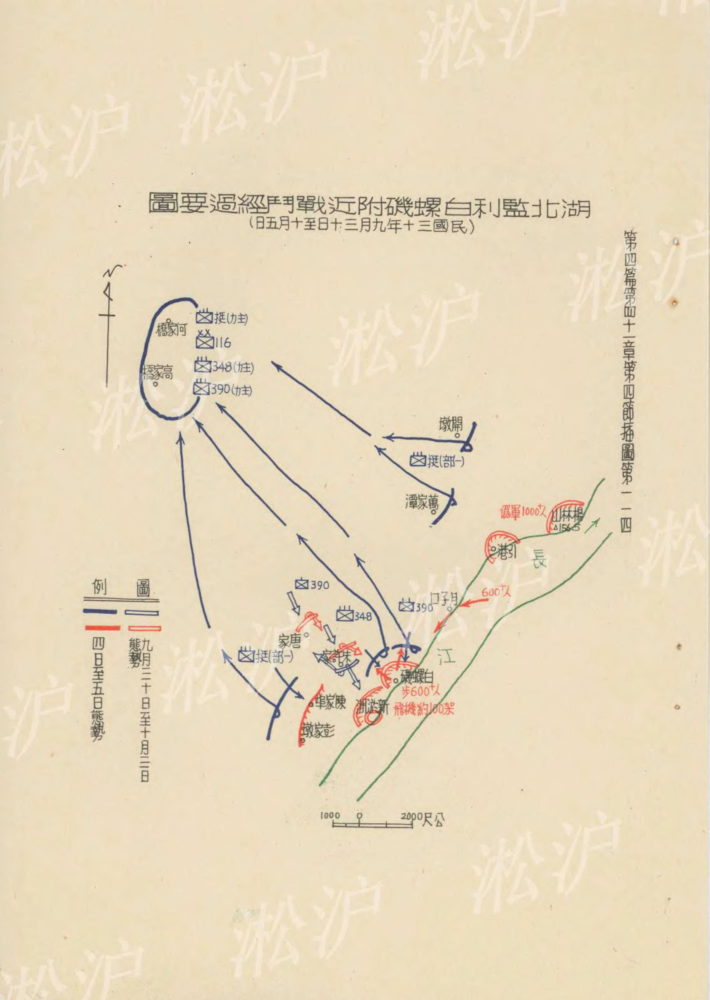

一五

湖北宜昌附近戰鬥

作戰時間：民國三十年十月一日起至十二日止。

作戰部隊：第六戰區第二軍直屬部隊（欠搜索營）、第九師、第五十五師、第七十六師、新編第三十三師、第十三師（十月六日撥歸指揮）、重迫擊砲第四團之第一營、砲兵第五十一團之第一營作戰地區：湖北宜昌附近。

敵情：宜昌附近之敵爲第十三師團第一零三旅團之第六十五聯隊及第一零四聯隊全部、第五十八聯隊大部、騎兵第十七聯隊一部、砲兵第十九聯隊大部、工兵第十三聯隊一部、輜重第十三聯隊大部，另有僞軍第一師一部，共計九千餘人，其主力控置於龍泉舖、鴉鵲嶺地區，一部守備宜昌外圍之南天山、毛狗洞灣、齊公洞、梅子垭、茶店等據點。

我軍目的：軍以收復宜昌之目的，向當面之敵攻擊。

戰鬥經過：十月一日拂曉，我各部隊攻佔外圍敵各據點後，續向梅子垭、毛狗洞灣之敵進襲。二日，我攻佔堰家包，黃昏時，將毛狗洞灣北部敵據點完全佔領。

三日，我對南天山、毛狗洞灣東南端齋公洞敵各據點攻擊，先以一部將新店佔領，續向楊樹嶺、茶店子猛攻，因敵火猛烈，致未能奏功。

四日，我全線續行攻擊，與敵展開激烈戰鬥，遂將齋公洞佔領。

五日，敵抽集二百餘人向齋公洞反攻，激戰二小時，齋公洞仍陷敵手。

六日，我第九師先後攻佔雨林包、烟燉包、鐵匠包、蜂子嶺等處，直迫宜昌近郊，旋敵增援猛烈反攻，我因傷亡過重，乃轉守王家灣、夏家灣、挖斷山之線，同時我第七十六師亦向黑虎山之敵猛襲，當將該處據點佔領。

七日，我第九師繼續攻佔土地嶺、東山寺、二娘子崗、大娘子崗、茶庵子、林家店等處，嗣敵增援反攻，我遂轉守蜂子嶺、土城之線，是（七）日，第十三師奉令增援，激戰兩小時後，將茶店子兩側高地佔領。

八日，我再度攻佔大娘子崗、胡家大坡、石板舖、林家店、茶庵子、土地嶺等地，同時我便衣隊突入宜昌城內，縱火焚燒，燬房舍數十間，旋敵援軍在其砲火掩護下，向我猛烈反攻，經激戰後，我退守土城、魏家台之線。

九日，我以一部兵力突入敵後，佔領據點，策應我攻城部隊之作戰。

十日，我全線各部隊，同時發動攻擊，敵倉卒應戰，遂將南津關及林家店、茶庵子、大娘子崗、東山寺、胡家大坡、土地嶺、天主堂等地先後佔領，另一部突入宜昌城內，大舉放火焚燒，敵以全力反攻，激戰終日，我仍退至土城之線。

十一日，我猛襲土門垭，激戰兩小時，敵憑堅固工事據守，未能奏效。

十二日，該軍奉令將現任務交第二十六集團軍接替後，卽開姜家廟、南沱、羅田溪附近集結。

果：一、鹵獲：

1. 步槍六枝。

2. 輕機槍一挺。

3. 山砲二門。

4. 砲彈信管八零個。

5. 刺刀五把。

6. 步機彈五四零粒。

二、破壞：

1. 鐵絲網數段。

2. 倉庫一所。

3. 焚燒市區房舍數十間。

三、斃敵百餘名。

我軍傷亡：一、陣亡官兵二、六零七員名。二、負傷官兵三、二七二員名。

三、失踪官兵三三六員名。

我軍損耗：一、武器：

1. 步槍一、零一二枝。

2. 輕機槍八七挺。

3. 重機槍四挺。

4. 手槍七零枝。

5. 信號槍一三枝。

6. 擲彈筒四二個。

7. 槍榴彈筒九九個。

8. 刺刀一、一九九把。

二、彈藥：

1. 步機彈一·六零三、三四八粒。

2. 鋼心彈一九、三九四粒。

3. 手槍彈一五、五八九粒。

4. 手榴彈一二、零二六枚。

5. 擲榴彈一、二三二枚。

6. 槍榴彈五、三六二枚。

7. 各種砲彈九、七三七顆。

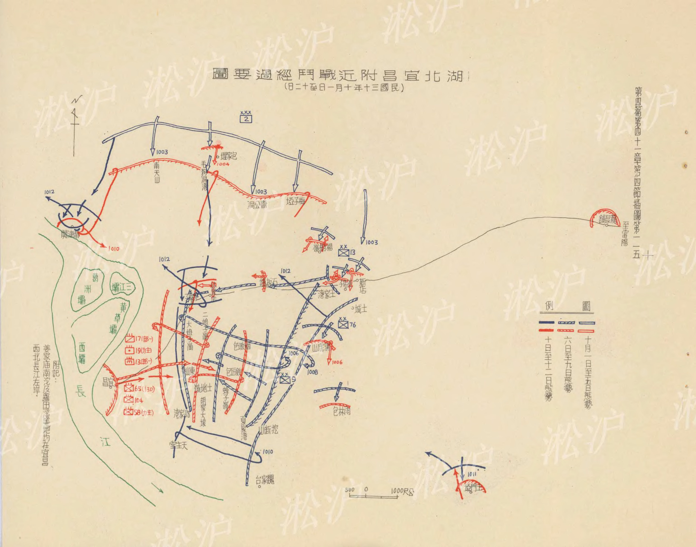

一一六

湖北京山西南雁門口戰鬥

作戰時間：民國三十年十月二日起至十三日止。

作戰部隊：第五戰區第一四九師，參戰官兵共計五千一百四十五員名。

作戰地區：湖北京山附近漢宜公路及京鍾公路一帶地區。

敵情：敵獨立第十八旅團五個大隊及重砲二個中隊並戰車六輛，共計兵力約八千七百餘人，分駐鍾祥、洋梓、黃家集、東橋、官橋、京山、楊家滏、雁門口等地，僞軍鄂西保安隊熊光部七個團，約五千餘人，分駐舊口、下洋港、永滏河一帶，該敵僞等爲鞏固京鍾漢宜兩公路之交通安全。

我軍目的：襲擊雁門口，截斷漢宜公路敵人之交通，配合友軍作戰。

戰鬥經過：十月二日，京鍾路附近我第一四九師第四四五團佔領土地嶺、新河集、丫角廟、內子坡、青石山一帶陣地，嚴密警戒。

三日，第四四六團自藍家集攻佔雁門口之鉢魚山，敵僞約五百餘，退至獅子背、石界子、白龍觀等附近，該團乘勝續進，於四日再攻佔獅子背、石界子，敵退守雁門附近公路北大脊山、青山之線。

五日，我爲掩護第四四七一團一部及工兵兩排破壞楊家滏大橋，第四四六團以一個營於十七時攻佔楊家滏北之豐谷街、南臣橋、匡家台等地。入夜，第四四七團之第三營將楊家滏之公路大橋破壞，迄二十四時，下洋港之敵百餘增援楊家滏，爲我掩護部隊（第四四六團之一營）截擊於匡家台附近，同時由永滏河增援之敵僞二百餘，協同楊家滏之敵，夾擊我破壞部隊，旋被擊退。

六日，我第四四七團之破壞任務已順利達成，青山附近之第四四六團主力正向雁門口進攻，激戰至七日，敵憑工事固守，該團仍退至白龍觀、長青山附近。

七日，我軍以破壞漢宜公路阻敵交通之目的已達，爲避免受敵包圍，奉命作撤退之準備，自七日至十日，我仍繼續對雁門口、青山之敵及高湖附近搶修公路及橋樑之敵，作撤退前之打擊，並繼續破壞公路橋樑及沿途電線電桿多處。

十一日停止攻擊，十二日卽由漢宜路開始北撤，十三日各團已全部自官橋、東橋間通過京鍾路，至此戰鬥卽告一段落。

戰

果：一、鹵獲：

銅裸線一、三零六公斤。

二、破壞：

破壞楊家滏大橋及沿途橋樑電線電桿多處。

三、斃敵數十名。

我軍傷亡：一、陣亡士兵三六名。

二、負傷官兵四二員名。

三、失踪官兵二六員名。

我軍損耗：一、彈藥：

1. 步機彈一九、一九四粒。

2. 砲彈一零六顆。

3. 手榴彈三零四枚。

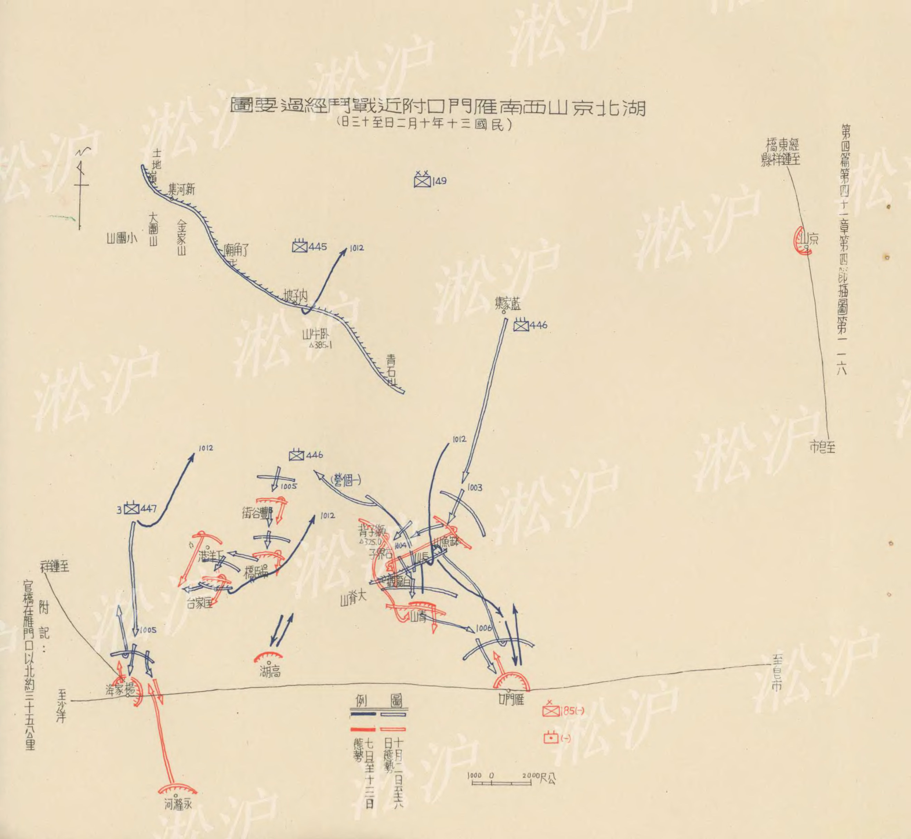

一七

河南鄭州附近戰鬥

作戰時間：民國三十年十月二日起至三十一年二月七日止。

作戰部隊：第一戰區第三集團軍轄第二十、第二十二、第八十一等三個步兵師另配屬第一一零師。作戰地區：河南鄭州附近迄中牟一帶之黃河南岸地區。

敵情：自九月中旬起，敵第三十五師團及騎兵第四旅全部四萬餘人，陸續向黃汎集結，並佔領朱仙鎮至舊黃河間各據點，對我嚴密封鎖。敵第三十六師團及第一一零師團各一部，亦向豫東移動，並集中大批渡河材料及輜重於汎前，有由京水、中牟方面渡汎略取鄭州、新鄭，再協同信陽敵以打通平漢線之企圖。

我軍目的：軍之任務在擔任鄭州北東趙集至周家口間約五百華里之汎防，而以第八十一師控置於新鄭、鄭州及其附近地區。

戰鬥經過：十月二日，向鄭州進犯之敵，分由中牟南界馬及京山南琵琶陳渡汎，三日，敵復利用優勢砲火並以飛機施放毒氣向我中牟進攻，中牟遂陷。十一時，琵琶陳方面渡汎之敵，已迫近鄭州，經我阻擊，其勢稍挫，二十時，敵由汎東及京水南之馬頭岡又西渡增援，威脅我軍側背，我以控置部隊均調赴前方，乃卽令游擊大隊及軍士大隊迎擊，戰鬥初期尚順利。四日拂曉，敵飛機三十餘架對我陣地大施轟炸，致通信中斷，陣地成混局，敵復以戰車及騎兵編成之快速部隊分數股向我突擊，我以援軍未至，且前方部隊傷亡甚大，此時鄭州之守備部隊，亦僅第二十師野戰補充團一個團及軍直屬特務、工兵、兩營之兵力，處勢本已危殆，而侵佔中牟之敵，復以一部渡越賈魯河，同時由黃河鐵橋方面渡汎之敵，亦向鄭州積極活動，對鄭州形成包圍態勢，我以衆寡懸殊，並傷亡甚大，遂將城內重要建築加以破壞後，於十四時放棄鄭州。

戰

自鄭州陷敵後，我軍於附近地區阻止敵人西進，並改以運動戰戰法襲擊敵人，至十月下旬，敵經我不斷襲擊，異常惶恐，逐漸呈動搖模樣，我遂於十月三十一日，以全力反攻鄭州，終賴我將士用命，奮勇攻城，前仆後繼，至二十時，鄭州完全被我克復。此後我軍除追擊由鄭州敗退之敵外，並以第八十一師協同第四集團軍圍攻邙山，以第二十二師及第一一零師圍攻中牟，以上兩地雖經我軍一再攻擊，但均因敵據險頑抗，終未奏功，僅對敵完成堅固之封鎖工事，嚴密監視。及至三十一年一月初，配屬該集團軍之第一一零師及該集團軍配屬第四集團軍之第八十一師均奉命歸還建制，至二月七日，該集團軍之任務奉命交由第二十九軍接替後，卽全部開豫西宜陽整訓。

果：一、鹵獲：

總計鹵獲敵軍用品五十七種，計四百二十餘件。

二、破壞：

除鄭州重要建築概由我撤退前予以徹底破壞不計外，並於十月二十五日，在鄭州南多莊擊毀敵汽車二輛。

三、傷亡：

斃傷敵小林聯隊長以下官兵計八、七四二員名。

四、其他效果：

此次戰鬥，鄭州雖一度陷敵，然敵人動員數萬之衆，遭我堅強之阻擊與消耗，其打通平漢線之企圖竟未達成。

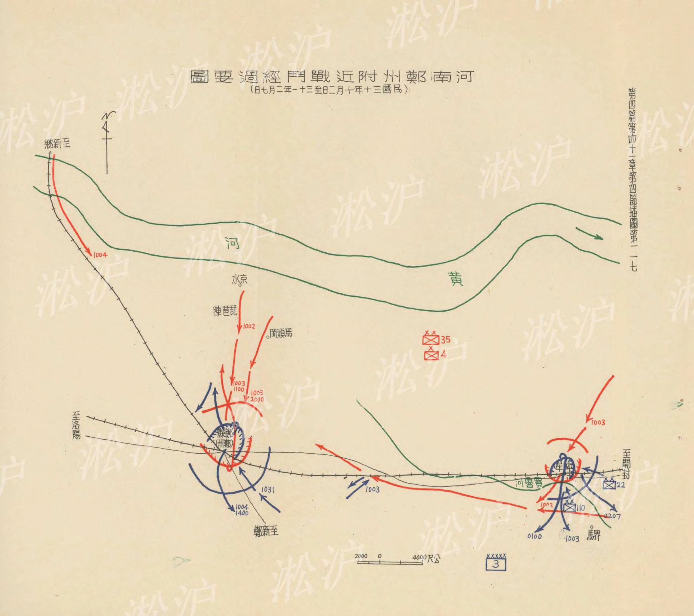

一八

安徽貴池附近戰鬥

作戰時間：民國三十年十二月十九日起至三十日止。

作戰部隊：第三戰區第二十三集團軍之第五十軍全部。

作戰地區：皖南貴池縣屬廟前、白洋及劉街附近。

敵情：貴池之敵爲第一一六師團第一三八聯隊及第一三三聯隊一部，共約二千餘人，有向我進犯模樣。

我軍目的：嚴守現陣地，拒止敵之前進。

戰鬥經過：第五十軍基於以上之目的，以第一四四師之第四三二團守備官埠蘇（大通東南）至靠背山（貴池東南）之線，第四三一團守備靠背山至灌口之線，第四三零團位於童溪橋機動，第一四五師於攘溪河（太平附近）附近集結整訓，並隨時策應各方面之作戰。

十二月十九日，貴池敵第一一六師團第一三三聯隊一部約七、八百人，突破我第四三一團陣地後，卽向白洋附近進犯，當卽以第四三零團第二營馳援迎擊，激戰至二十三日，太白山、六峯山、白洋、馬嶺一帶陣地，先後陷敵，我軍轉移於虎龍巖、犬形山之線，阻敵前進。另敵第一三八聯隊主力千餘人，於二十二日由靈芝塔方面，突破第四三二團之老雅尖陣地進至廟前以西地區，該軍卽以第一四五師之第四三四團增援廟前、第四三五團進駐九華街（廟前東南），第四三二團迅速集結，主力尾擊深入之敵。二十三日，敵雖竄至劉街附近，經我第四三二團、第四三五團夾擊後，卽退至玉屏山。二十四日，該敵續向廟前方向退却，二十五日，復由廟前分別進犯九華山西麓之華陽橋、九股、二聖殿一帶，我軍各予以迎頭痛擊，將敵包圍於廟前、杜村橋一帶窪地。二十六日，敵退走五溪橋，第四三二團遂卽恢復已失之老雅尖等陣地，第四三零團則進出童溪橋，協助第四三一團反攻白洋，激戰至三十日，敵向貴池退去，我軍旋卽恢復戰前原態勢。

戰

果：一、鹵獲：

1. 步槍三枝。

2. 馬一匹。

3. 作戰命令一紙。

4. 俘敵一名、

二、傷亡：

斃傷敵官兵約五百餘員名。

我軍傷亡：一、陣亡：

1. 官四員。

2. 兵二七八名。

二、負傷：

1. 官一二員。

2. 兵一八四名。

三、失踪：

兵五四名。

我軍損耗：一、武器。

1. 步槍五二枝。

2. 輕機槍三挺。

3. 迫擊砲一門。

二、彈藥：

1. 步機彈二九一、三二一粒。

2. 衝鋒槍彈九、零八二粒。

3. 手榴彈二、六二八枚。

4. 迫砲彈一、一二九顆。

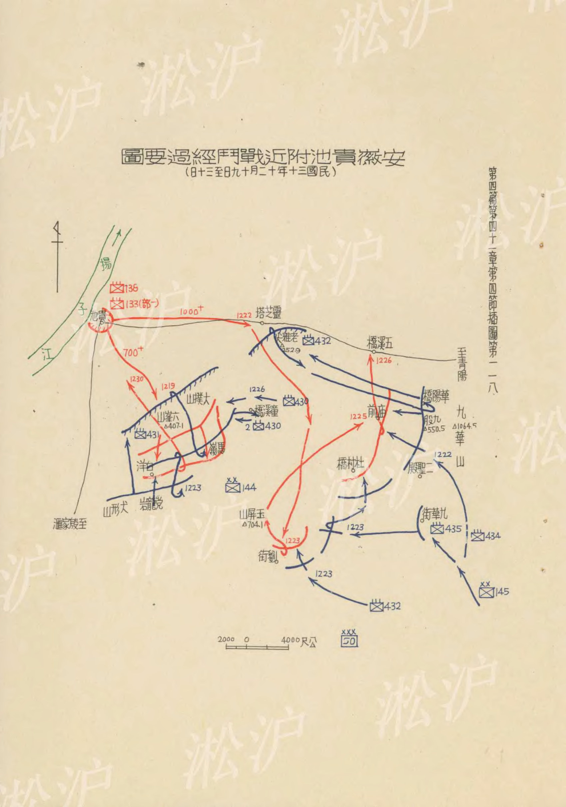

一九江蘇宜興溧陽溧水高淳及安徽郎溪地區戰鬥

作戰時間：民國三十年十二月二十日起至二十八日止。

作戰部隊：第三戰區第四十師全部，共計官兵一零、一二五員名、馬二四五匹。

作戰地區：江蘇宜興、溧陽、溧水、高淳及安徽郎溪地區。

敵情：敵擬解除其京滬威脅，第十五師團及獨立第十一旅團主力附僞軍一部，共約七、八千人，分五路向我進犯。

我軍目的：師以有力部隊固守溧陽、郎溪、一部遲滯敵之行動，主力集結梅渚東南地區與敵決戰。

戰鬥經過：當面之敵，於十二月十九、二十兩日，先後到達官村、新芳橋、竹簣橋、上興埠、孔鎮、狸頭橋之線。

二十日十五時，官村敵三百餘，向我楊巷進犯未逞，另由元巷南進之敵約千餘，於是日十七時，與我上興埠守軍激戰，迄十九時，上興埠及上沛鎮相繼失陷，我退守南渡附近。

二十一日，新芳橋敵協同官村之敵於拂曉後，以全力攻我楊巷，一部向我側背迂迴，另股斷我後路，迄十三時許，我逐次轉至溧陽外圍，繼續戰鬥。侵佔上沛鎮之敵，於本（二十一）

日六時許，會合孔鎮之敵，圍攻我安興，並以一部分犯極溪港，同時狸頭橋敵一部向東夏進犯，主力向東壩前進，迄晚，敵我在殷家橋、梅渚、八里崗、大橋之線激戰，我乘夜調整部署如下：（一）師以邀擊東壩、定埠南下敵人迎擊東夏東進敵人之目的。（二）第一一九團主力於明（二十二）日拂曉前，須佔領殷家橋、史家村之線陣地，拒止敵人，以有力一部固守梅渚。

（三）第一二零團應佔領八里崗、大橋之線陣地，構築工事，左與該團第三營派出鍾橋之一連切取連繫，準備以有力一部固守梅渚。

二十二日拂曉，溧陽外圍之敵主力，偷渡迂迴成功，我乃退守城郊，十時許，敵機兩架助戰並施放毒氣，敵乘機猛衝入城，經激烈巷戰後，我轉至西門外繼續戰鬥。進至梅渚附近之敵，於同（二十二）日八時向我攻擊，激戰至十二時，我逐次轉至大樑村，敵圖向我左翼包圍，遭我佔領八里崗附近之一個營，予以堅強抵抗，迄十九時，與敵成膠着狀態。郎溪、鍾橋方面之敵，於是（二十二）日晨，進陷東夏，十五時，進迫郎溪城，同時由梅渚南進之敵，亦以主力猛撲城北門，二十一時，我城內守軍以一部調守城外爲犄角，敵則分向東北及紅廟退去。此時該師乃令第一一九團於本（二十二）日晚撤至上銀行附近整頓，第一一八團星夜向上下英村附近集結待命，第一二零團除留一個連在湯橋附近與敵保持接觸外，一部轉至凌笪、小界、武夫山之線警戒。

二十三日拂曉，敵一部向湯橋攻擊，主力分三路向郎溪城圍攻，六時許，東北西三門相繼被敵突破，經我猛烈反擊，敵仍退出城外。鍾橋方面，激戰至十一時許，被敵攻佔，十二時，郎溪敵騎一部，進抵濤城舖，並向松塘廟東進。侵佔溧陽之敵，有經中芳橋向山丫橋南進模樣，該師復調整復調整部署，以第一一九團迅向上英村附近集結，到達後派出一部于小侯村對山丫橋方面警戒，第一一八團應卽佔領鳳鳳山西南之一六二零·高地、梅村亘亭子山之線陣地，並派隊向郎溪、濤城舖方面搜索，砲兵營歸徐團長指揮，在潘村附近佔領陣地，主火力應指向牛火村及烏龜山，騎兵連於胡家崗，軍士隊於蘆塘警戒。郎溪則於十六時被敵突破，我逐次向後轉移。

二十四日三時，敵騎二百餘竄入侯村，急令第一二零團第三營驅逐之，主力佔領侯村東北二零七·三高地亘上獨山、石土嶺之線陣地，左與第一一八團及第一一九團切取連繫，並飭第戰

果：一、鹵獲：

一九團確保鳳鳳山北之隘路。七時許，敵千餘向我攻擊，另敵一部圍攻我第一二零團，該團向敵後突圍，十時許，我烏龜山、平定廟、相繼被陷，敵轉攻梅村。十五時許，據報山丫橋方面敵千餘分股南進，其一股已抵廟西，一股向小侯村前進，該師鑒於態勢不利，乃於黃昏後乘夜暗向陸家舖轉進，該敵亦於二十五日分向山丫橋、社渚方面囘竄，中途遭我第一二零團襲擊，頗有斬獲，該師乃行追擊，遂於二十八日恢復原陣地。

1. 步槍二枝。

2. 擲榴彈三枚。

二、傷亡：

斃傷敵官兵約千餘員名。

三、其他效果

拒止敵之深入並消耗其兵力。

我軍傷亡：一、陣亡：

1. 官二三員。

2. 兵四三九名。

二、負傷：

1. 官二八員。

2. 兵二七八名。

三、失踪：

我軍損耗：一、武器：

1. 官三員。

2. 兵三八一名。

1. 步騎槍二五四枝。

2. 輕機槍二零挺。

3. 重機槍一挺。

4. 手槍一九枝。

5. 刺刀三二二把。

6. 擲彈筒一五個。

二、彈藥：

1. 步機彈二六三、五七九粒。

2. 手槍彈一、三一六粒。

3. 槍榴彈一二七枚。

4. 信號彈一二粒。

5. 迫砲彈四七九顆。

6. 擲榴彈二零二枚。

7. 山砲彈一二二顆。

8. 手榴彈二、六一二枚。

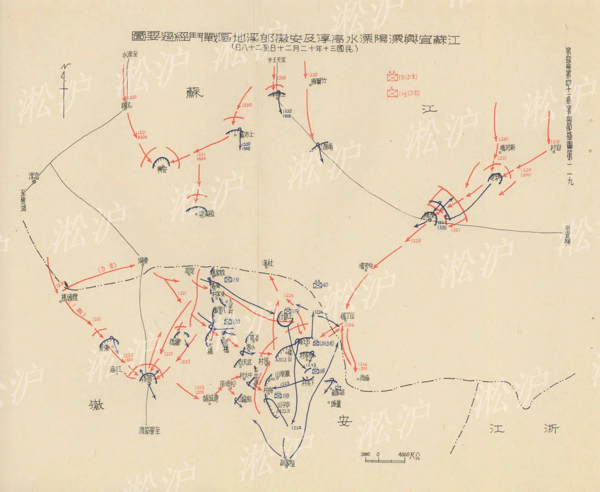

一二零湖北鍾祥以北長壽店張家集附近戰鬥

作戰時間：民國三十年十二月二十二日起至二十七日止。

作戰部隊：第五戰區第四十五軍第一二七師全部，共約官兵八千餘人。

作戰地區：湖北鍾祥以北長壽店、張家集附近。

敵情：當面之敵爲獨立第十八旅團之一部約二千人、砲六門，指揮官爲涕哮夫，於十二月二十二日以前，先後集結於鍾祥、洋梓、黃家集各據點附近，企圖向我進犯。

我軍目的：該師守備大洪山西側，西由襄河左岸流水溝起，東至張家集中間地區，左與第一二五師連繫，以消耗敵人爲目的。

戰鬥經過：十二月二十二日七時許，洋梓、張家嶺之敵六、七十名、曲射砲一門，向長壽店南我警戒陣地進犯，戰至十一時，敵未得逞，仍向張家嶺退去。

二十三日十四時，敵復由洋梓增來二、三百、砲一門，向長壽店以南地區我警戒陣地攻擊，與我守軍激戰，至二十四時，陣地被敵突破，我軍轉進至王家坡與敵對峙。

二十四日七時許，敵續向王家坡攻擊，激戰至九時許，敵未得逞。迄十二時，敵復由洋梓增來步兵百餘，連前原有之敵共約四、五百人，再度猛攻，同時另以便衣隊八十餘人向我右翼包圍，激戰一小時後，我軍轉進五通寨、黃泉菴之線，與敵對峙。

二十五日拂曉，侵佔王家坡、兵營崗之敵，繼續向我五通寨、黃泉菴陣地攻擊，經我軍奮勇迎擊，戰鬥至爲激烈。同時另有敵步兵七百餘，附砲一門，由長壽店方向向東北竄擾，其主力向我老虎頂、石門坎主陣地進犯，一部向沙河寨攻擊，均被我軍擊退。由十時三十分至十二時二十分，敵我於老虎頂混戰至烈，互有傷亡，敵以三倍於我之兵力向我猛攻，於十三時突破老虎頂陣地，並會同原集結於花山岩西南地區之敵，共一千五百餘人，向張家集進犯，十四時，竄抵張家集西北司水沖、王家河附近，與我軍激戰至十九時，敵乘夜暗退至張家集，據牆垣堅守。二十一時，我軍迫近張家集近郊，協同友軍第一二五師之一部，予敵徹夜擊擊，同時兵營崗、王家坡之敵，向我主陣地中央前之五通寨、黃泉菴猛攻，策應張家集作戰，經我軍竟日之痛擊，激戰至二十四時，敵不支向汪家店退去。

二十六日，竄至張家集之敵，經我軍昨日之晝夜襲擊，受創頗重，漸感不支，再以我軍合圍之勢已成，始於十二時許，向東南周家集方向突擊逃竄，當經協同第一二五師將敵夾擊於周家集、黃家河地區。

戰

果：一、鹵獲：

二十七日，逃竄之敵，經我協同第一二五師痛擊，異常狼狽，截至本日，將進犯之敵完全驅逐於警戒陣地之外，恢復原有陣地。

1. 兵二名。

2. 馬二匹。

3. 步槍三枝。

4. 擲榴彈十九個。

5. 手榴彈五枚。

6. 重機彈九九五粒。

7. 其他戰利品甚多。

二、傷亡：

斃傷敵官兵約二百餘員名。

三、其他效果：

進犯之敵，受嚴重創傷，竄擾企圖被粉碎。我軍傷亡：一、官八員。

二、兵一六五名。

我軍損耗：一、武器：

1. 步槍一八枝。

二、彈藥：

1. 步機彈一二三、九二六粒。

2. 砲彈一五三顆。

3. 手榴彈六九七枚。

4. 槍榴彈四五一枚。

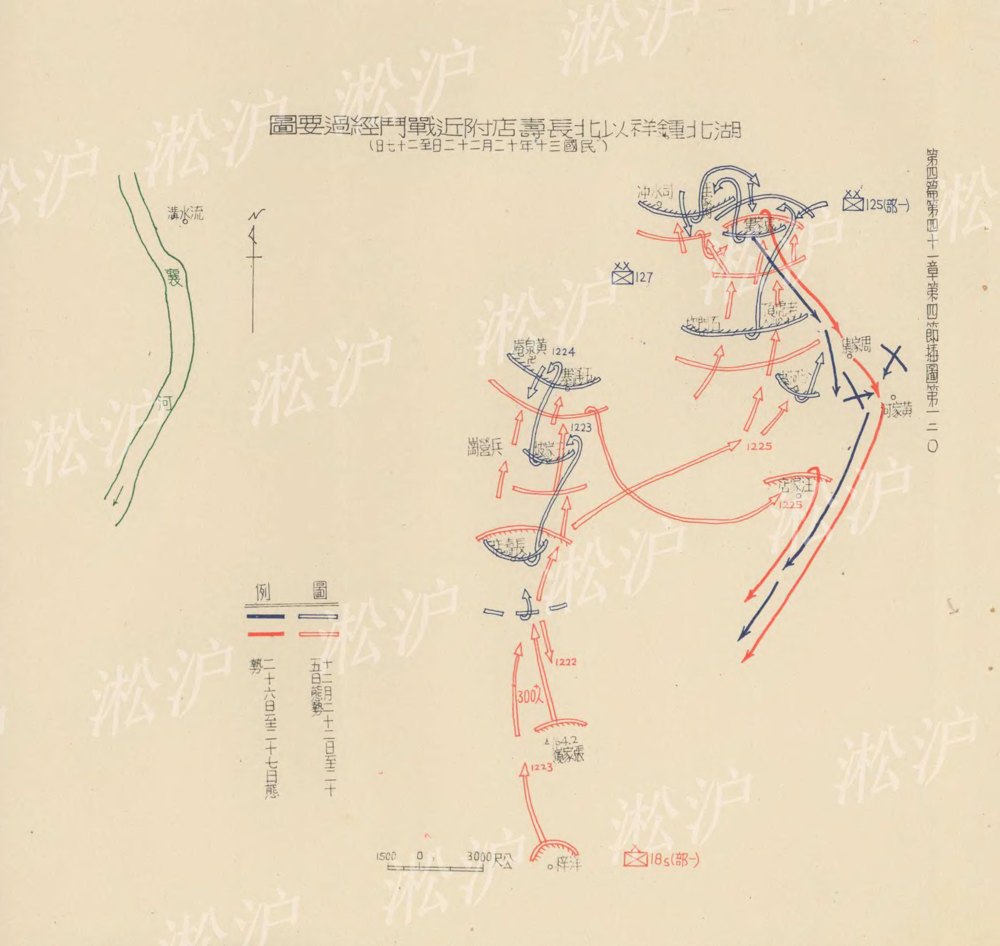

### 第五節 三十一年各地游擊戰

#### 第一款 策應英美盟軍之戰鬥

自三十年十二月八日，敵人發動太平洋戰爭後，我爲牽制其兵力轉用，以策應英美盟邦作戰，乃於十二月三十日開始發動全國廣泛游擊。第三戰區之第四十九軍及暫編第三十四、暫編第三十五各師分向寧波、餘姚、紹興、蕭山、杭州、武康、南浔、吳興等地之敵攻擊。第二十一、第五十各軍分向蕪湖、荻港等地之敵攻擊，至三十一年一月十四日，歷時半月，予敵重大破壞與威脅。第四戰區敵第一零四師團與僞軍一部爲策應其香港作戰，亦於三十一年一月十二日至二十七日之間，先後向我蘆苞、博羅、惠陽、蓮塘等地進犯，企圖鞏固廣州外圍，我軍因預有準備，除一面極力固守上述各該據點外，並於一月三日起，提前向新街、從化、源潭等地不斷襲擊，卒能牽制敵人多數兵力，未向他方轉用。

又敵爲打破我軍策應盟軍作戰之計劃，先於三十年十二月下旬，發動第三次長沙會戰，我五戰區豫、鄂、皖地區之部隊，爲策應該方面作戰，遂自十二月二十九日起，實施廣泛游擊，乃以平漢路附近之第二十六、第二十七、第二十九及第一七一各師，分向應城、隨縣、安陸、花園、孝感、白螺機等地之敵襲擊，津浦路附近之第九十二軍及第二十一、第一四一、第一七一等師，分向合肥、含山、滁縣、懷遠、蒙城、淮陽等地之敵襲擊，均能達成打擊當面敵人幷破壞鐵路、公路交通之任務。

#### 第二款 策應浙贛會戰之戰鬪

三十一年五月，敵於侵略緬甸戰事甫告結束，太平洋戰事小獲勝利後，爲圖減輕其本土之空中威脅，急欲破壞我東南沿海各省之空軍前進基地，乃以原盤據浙東之兵力，並凑合由蘇魯戰區、第五戰區調集之部隊，總計約七個師團，於是月十五日開始，分由浙江奉化、上虞、紹興、蕭山諸方面先後進犯江西上饒、浙江麗水等地。我爲牽制敵由各地區抽調兵力，乃令鄂西之第八、第九十四、第七各軍，及預備第四師、第一零三師等部隊於五月二十五日以後，分向宜昌、監利、鐘祥一帶擾襲，皖南第一七六師進襲安慶、望江附近之敵，豫南第六十八軍進襲信陽附近地區之敵，魯西第一八一師進襲單縣及虞城一帶之敵，同時各部隊大肆破壞公路，使敵人兵力不得盡量抽調轉移浙東作戰。敵於進犯浙贛路之同時，廣州方面，亦防我軍轉用兵力，乃於五月下旬至九月初，以其第五十一師團、第一零四師團各一部，分向粤北一帶竄擾，先後於蘆苞、龍塘、三水等地與我第六十四軍激戰。

以上歷次戰鬥概況，茲分述於后。

一二一

湖北隨縣附近戰鬥

作戰時間：民國三十年十一月二十一日起至三十一年二月二十三日止。

作戰部隊：第五戰區第二十七師。

作戰地區：湖北隨縣附近。

敵情：隨縣、應山、安陸之敵，爲第三師團之第六聯隊第二大隊及第四師團第八聯隊之第二大隊，兵力約四千餘人，守備各縣城及獨崇山、擂鼓墩、浙河、滾山等地區。

我軍目的：師以廣泛破壞與襲擊敵人之目的，抽調有力部隊，編組襲擊隊，向當面之敵擾襲及破壞。

戰鬥經過：三十年十一月二十一日，我各襲擊部隊，先行破壞隨縣、獨崇山間通信線路後，卽開始向擂鼓墩襲擊，敵不支後撤，旋敵增援與我激戰於擂鼓墩附近，我乃轉至文家灣、彭家畔陣地。

二十三日，我進擊獨崇山，激戰於邱家灣、劉家祠、響水橋一帶，是晚，幷襲擊應山城，我以迫擊砲向城內轟擊，中彈起火，拂曉，我撤至椅子山。

三十一日，我分向隨縣城及擂鼓墩襲擊，隨縣城中彈燃燒。

三十一年一月二日，我再襲擊擂鼓墩、獨崇山、滾山，並進攻隨縣，與敵激戰。

四日，我襲擊滾山之敵，於墩子坡附近與敵激戰，我以地形不利，乃撤至厲山陣地。

五日，敵向厲山猛攻，經我反擊後，敵不支向隨縣撤退，是晚，我派便衣隊由葉家廟渡河，破壞敵電話線路五華里及浮橋一座。

九日，我便衣隊再破壞敵苗家崗、馮家崗之電線，幷燒燬黃家灣浮橋一座。

十日，高廟之敵，向我進攻，我於茶山寨附近迎頭痛擊，敵向浙河退去。

十一日，敵戰車四輛、步兵七十餘名，竄至任家臺子，經我襲擊，敵倉皇退去。

十二、十三兩日，我再向擂鼓墩襲擊，並破壞敵鐵絲網數處。

二十四日，敵犯吳家大橋及茶庵，被我擊退，同時我又向擂鼓墩襲擊，再破壞鐵絲網三百餘公尺。

二十六至二十八日，我軍連續襲擊浙河、獨崇山等地，破壞公路數段及敵通信線路，獲電線三百餘斤，幷破壞電桿百餘根。

二月九、十兩日，我續向擂鼓墩襲擊，與敵激戰二小時後，仍撤回原防。

十五日，我進襲浙河、滾山等處之敵，激戰後，仍撤回原防。

二十三日，我再襲擊獨崇山之敵，斃敵百餘人，嗣卽奉令將任務交由第三十一師接替。

一、鹵獲：

1. 步槍一支。

2. 輕機槍一挺。

3. 步槍彈十九粒。

4. 擲榴彈二十一枚。

5. 鋼盔九頂。

6. 鐵絲五十斤。

7. 鉛絲二八零七斤。

8. 鋼絲二十斤。

二、破壞：

1. 被覆線路三百餘公尺。

2. 電線桿百根。

3. 浮橋二座。

4. 鐵絲網三百公尺。

5. 公路數段。

三、傷亡：

1. 斃日官兵二百餘員名。

2. 傷日官兵一七零員名。

我軍傷亡：一、陣亡官兵三十四員名。

二、負傷官兵五十六員名。

三、失踪兵一名。

我軍損耗：一、武器：

步槍一支。

二、彈藥：

1. 步機彈一五七、七九六粒。

2. 迫砲彈一、零三七顆。

3. 手槍彈一四零粒。

4. 擲榴彈二六六枚。

5. 手榴彈一、一四七枚。

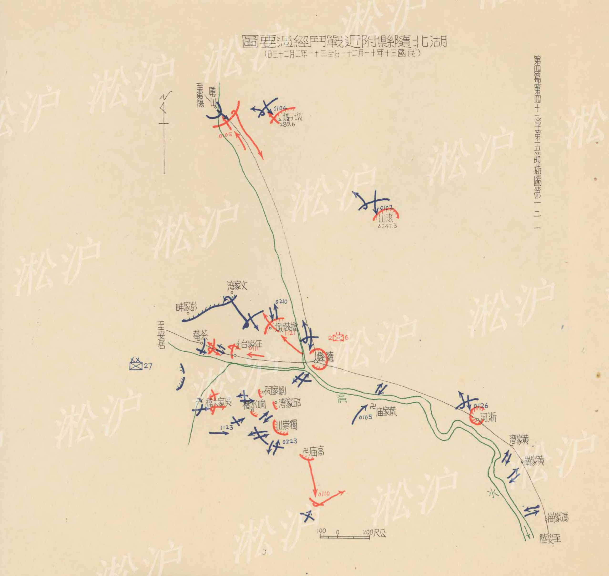

一二二

湖北監利白螺磯附近戰鬥

作戰時間：民國三十年十二月二十八日起至三十一年四月十日止。

作戰部隊：第六戰區第一六一師之第三四七團。

作戰地區：湖北監利、白螺磯附近。

敵情：敵第六師團十三聯隊第二大隊之飯島中隊步、砲兵約四百餘人、砲四門，另僞軍三千餘人，于十二月二十八日起，分據白螺磯與飛機場、獅子山、楊林山等處。

我軍目的：該團有攻擊白螺磯、楊林山等處敵據點並相機佔領之目的。

戰鬥經過：三十年十二月二十八日，第一一六師之第三四七團，開始向白螺磯之敵攻擊，卽將萬家潭佔領，旋因敵火猛烈，遂撤至茶埠頭、何家埠之線。三十日，敵以陸、海、空聯合進犯，經我軍奮勇迎擊，激戰三小時後，敵仍退回原陣地，此時奉令策應第九戰區作戰，飭續向敵要塞攻擊。

三十一年元月九日，該團再向白螺磯襲擊，終將萬家潭及渡泊潭兩據點攻克，敵分向白螺磯、楊林山方向退去，我卽進襲白螺磯、楊林山等處之敵。二月二十二日，於張家廟附近與楊林山之敵二百餘發生遭湧戰，敵不支潰退。此時我以兵力一部向引港僞軍佯攻，另一部再向白螺磯進襲，經數日激戰後，衝入白螺磯市街與敵發生巷戰，後以敵火猛烈，乃退回原陣地。三月一日，僞軍五百餘在敵飛機十七架掩護下，向我進犯未逞。十九日，該團第二營復衝入白螺磯市，因受敵艦砲火威脅，于當日撤至何家橋。

四月十日，奉令將防務移交第一三零師之第三八九團接替。

戰

果：一、鹵獲：

1. 俘敵官兵四十六員名。

2. 步槍十九枝。

3. 步槍彈二、二二七粒。

4. 機槍四挺。

5. 迫砲一門。

6. 砲彈四顆。

7. 鉛線一、二零零公尺。

二、傷亡：

斃傷敵官兵三七九員名。

三、其他效果

白螺機爲長江洞庭湖交流之咽喉，敵必死守，該團不畏犧牲，再四進攻，雖未得手，但足使敵不得安枕矣。

我軍傷亡：一、陣亡兵六十三名。

二、負傷官兵四十六員名。

三、失踪官一員。

我軍損耗：一、武器：

1. 步槍三十三枝。

2. 輕機槍六挺。

3. 擲彈筒一具。

二、彈藥：

1. 步機彈一九六、八四零粒。

2. 手槍彈一、一三八粒。

3. 迫砲彈六一五顆。

4. 鋼心彈二、五一三粒。

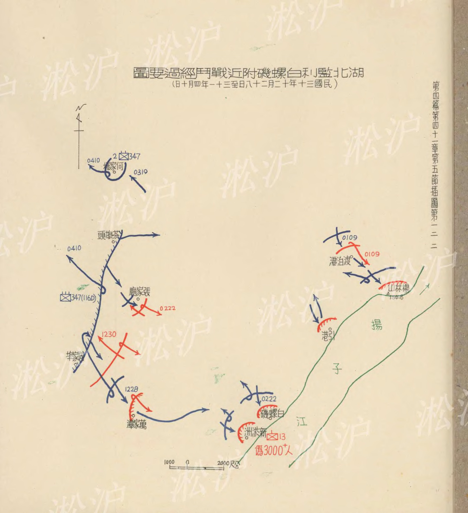

一二三

安徽宣城灣址附近戰鬥

作戰時間：民國三十年十二月三十日起至三十一年一月十四日止。

作戰部隊：第三戰區第一零八師之第三二四團及第五十二師之第一五五團之一部。

作戰地區：安徽宣城、灣址附近地區。

敵情：敵第十五師團之第六十聯隊約二千餘人、砲十餘門，分駐蕪湖灣址、黃池、水陽、新和莊、九里山各據點。

我軍目的：我以牽制敵軍轉用之目的，對當面宣城附近地區之敵襲擊。

戰鬥經過：十二月三十日，我襲擊部隊開始對據守獅子山、老虎山、歡墩陳之敵攻擊，當即將獅子山、老虎山之鐵絲網破壞三處，以敵工事堅固，火力猛烈，一時不易奏功，遂以一部兵力於陽村附近設伏，毀敵滿載敵兵汽車一輛，並擊斃多人，同時另以一部兵力在灣址附近游擊，主力撤至新豐附近。

三十一年一月一日，我破壞灣址、趙家渡間公路電信及橋樑二座，二日，灣址之敵百餘，與我激戰於焦竹舖附近，嗣敵增援二百餘，我乃撤至竹林村。三日，我襲擊中山灣之敵側背，截其歸路，敵乃分向新和莊、九里山、灣址等處退去，五、六兩日，我仍不斷向敵襲擊，并破壞其交通通訊甚多。八日，續向灣址之敵襲擊，我奮勇隊破壞敵鐵絲網二道，衝入市街，焚燒房屋數處，未幾，即被迫退出。九、十兩日，我以一部兵力在灣址、趙家渡間設伏，截擊敵人，其餘分襲敵據點，因敵憑堅據守，未能奏效。十一日，我夜襲歡墩陳，破壞其鐵絲網二百餘公尺。十三日，九里山之敵，經過小房湯附近時，被我伏擊，敵乃倉皇竄回原處，十四日，奉令停止出擊，撤回天門山附近原防。

各地游擊

四七

果：一、鹵獲：

1. 步槍一枝。

2. 鐵線一千二百公尺。

二、破壞：

1. 公路數段。

2. 橋樑二座。

3. 碉堡五座。

4. 汽車一輛。

5. 焚燒灣址市內房屋數棟。

三、傷亡：

斃傷敵官兵一百餘員名。

我軍傷亡：一、陣亡：

士兵一十七名。

二、負傷：

官兵二十八員名。

我軍損耗：一、彈藥：

1. 步機彈三九、一九二粒。

2. 手槍彈一六零粒。

3. 手榴彈三二七枚。

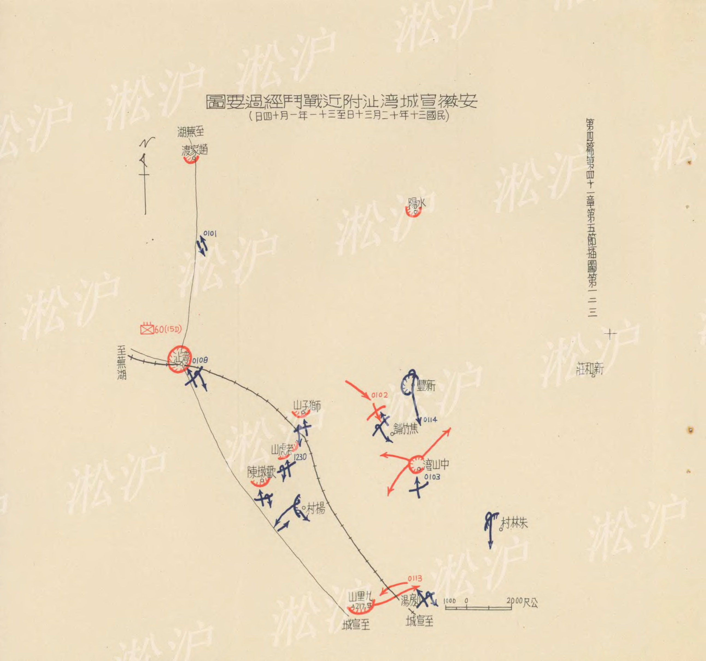

一二四

浙江奉化餘姚紹興蕭山一帶地區戰鬥

作戰時間：民國三十年十二月三十日起至三十一年一月十五日止。

作戰部隊：第三戰區第十集團軍：

一、暫編第三十五師及四明山游擊第一支隊各一部。

二、暫編第三十四師及江南挺進軍第一縱隊。

三、第一零五師、暫編第十三師及第二十六師各一部。

作戰地區：浙江奉化、餘姚、紹興、蕭山一帶地區。

敵情：當面杭州、蕭山，迄餘姚、紹興、寧波一帶之敵，爲第十師團之高橋聯隊及十一岡崎聯隊各步兵兩大隊、騎、砲兵中隊及第二十二師團之第八十六聯隊之一部，與第八十四聯隊之村山大隊，共約四千餘人。

我軍目的：軍爲策應英、美盟軍在中南半島阻止日軍進攻之作戰，以多數縱隊攻擊當面敵軍，以牽制其兵力轉用。

戰鬥經過：一、暫編第三十五師：十二月三十日及三十一日兩晚，該師一部附便衣隊分向奉化及華頂山之敵襲擊，三十一年一月一日晚，襲擊奉化、西溪、華頂山、崎山下各處之敵。三日晚，便衣隊於奉化北柳塘站附近伏擊敵騎。十二日晚，破壞奉化、西溪間交通通訊，十五日，便衣隊及破壞隊襲擊華頂山敵砲兵陣地。

二、暫編第三十四師：一月五日，該師襲擊夾塘及高廟山之敵。八日，向上虞出擊，在上沙嶺以北地區與敵遭遇，經激戰後，敵不支潰退。

三、暫編第十三師：一月六日，該師一部向義峯山之敵襲擊，至伍墅附近與敵百餘遭遇。七日，楊梅山之敵向我側擊，激戰後，敵不支退去。十一日，向白塔橋之敵攻擊，戰至十二日，敵向陶堀市潰退，我遂將白塔橋佔領，十三日至十五日，先後由義峯山、白塔橋分向東關及陶堰市襲擊。十六日，敵向我猛烈反撲，激戰至晚，我撤回董家塔原防。

四、第二十六師：十二月三十日，該師分向玉山橋、對以山、柯橋等處之敵襲擊，激戰至三十一年一月六日，互有勝負，七日至十三日，再向亭山、烏埠、張大明山、大獨山、對以山、柯橋之敵襲擊。十四日，於南港鎮以北與敵遭遇，激戰數小時後，敵不支潰退。

五、第一零五師：一月一日，分向蕭山城及石岩山之敵攻擊，激戰至三日，我一部佔領石岩山。三日，向蕭山城進迫，與敵在王家橋附近戰鬥，我無進展。四日，將永昌橋之敵驅逐後，續向石岩山攻擊，激戰至五日拂曉，仍撤回。五日晚，再度攻擊石岩山。六日，將西灣橋之敵驅逐後進迫聞家堰，激戰至七日，仍撤回。七日，續向石岩山攻擊，八日拂曉撤回。八日晚，向大螺山敵襲擊，將沈家灣據點佔領後，與繡龍橋之敵發生激戰，九日，我攻佔繡龍橋，十一日夜襲擊蓮蓬山。十三日，將西灣敵驅逐後卽向聞家堰進迫。十四日，向磨刀尖、蓮蓬山各處之敵攻擊。十五日，敵二百餘由蕭山向我包圍，同時湘湖方面增來敵七百餘，分由石岩山向我攻擊，經激戰後，我乃撤至金鷄山、十五尖亘金家山之線，敵復糾合千餘向我攻擊，激戰至晚，敵不支潰退，我乃撤回原防。

戰

果：一、鹵獲：

1. 步槍三十八枝。

2. 手槍二枝。

3. 刺刀一把。

4. 防毒面具四付。

5. 步槍彈一百粒。

6. 電線二九二公斤。

二、破壞：

1. 公路七十七段。

2. 橋樑十三座。

3. 電桿二五一根。

4. 碉堡十座。

5. 電線三零八零公斤。

6. 鐵絲網數處。

三、傷亡：

1. 斃敵士兵一、四八一名。

2. 傷敵士兵八五四名。

我軍傷亡：一、陣亡官兵五一四員名。

二、負傷官兵七五三員名。

三、失踪官兵三九八員名。

我軍損耗：一、武器：

1. 步槍三六八枝。

2. 輕機槍十四挺。

3. 重機槍四挺。

4. 迫砲一門。

5. 手槍三枝，

6. 槍榴彈三個。

二、彈藥：

1. 步機彈二四一、六六七粒。

2. 迫砲彈三二八顆。

3. 手槍彈一、一六四粒。

4. 手榴彈二、二二七枚。

5. 槍榴彈四一八枚。

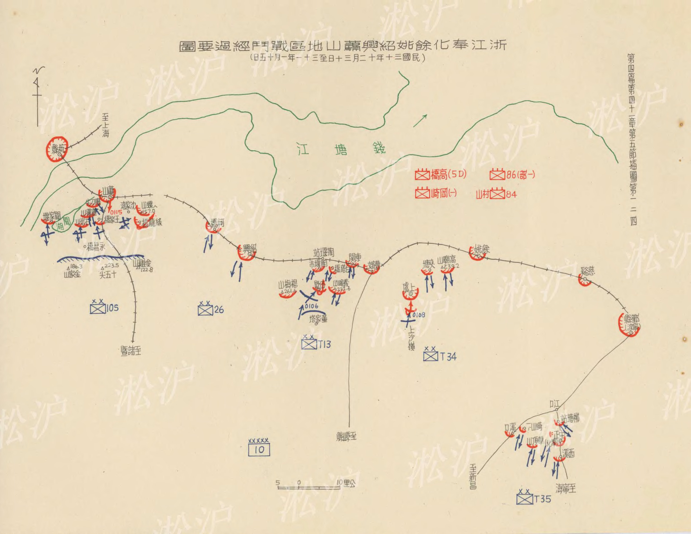

一二五

浙江武康吳興南溥一帶地區戰鬥

作戰時間：民國三十年十二月三十日起至三十一年一月十四日止。

作戰部隊：第三戰區第六十二師之第一八四團及第一八六團附砲兵二連。

作戰地區：浙江武康、吳興、南溥一帶地區。

敵情：當面武康吳興、南溥、烏鎮等處之敵爲第二十二師團之第八十四聯隊，附砲、騎、工兵，共約一千六百餘人，又僞軍第五師及僞警察約一千八百餘人。

我軍目的：師以策應西南太平洋英、美友邦作戰之目的，對當面之敵發動游擊，以牽制其兵力轉用。戰鬥經過：十二月三十日，該師分別襲擊塘樓、新市等地，並突入市區投擲手榴彈，擾亂目的達到後，仍撤回原防。三十一日，再向莊村坂及尖山之敵攻擊，當將尖山敵防禦工事破壞。我另一部兵力，一度攻入武康城內焚燒哨所二座，嗣爲避免膠着，乃轉移至簰頭、仙人坑之線。

三十一年一月三日，雙林、烏鎮之敵，竄犯連市，經我痛擊，敵不支潰退。四日，我突襲新塍及烏鎮。六日，我向武康城郊之敵襲擊，進至尖山附近，因敵軍增援，我乃撤至高崗山附近與敵繼續激戰，旋被敵包圍，經奮勇突圍，始逐漸轉移至簰頭亘五峯山之線。十二日，我破壞三橋埠至亭子橋間公路數段，任務完成後，仍撤回原駐地。十三日，我襲擊吳興城之敵，激戰至十四日拂曉，我始撤回原防。十四日，我攻襲埭溪，旋因敵火猛烈，未能奏功，乃撤回原防。

戰

果：一、鹵獲：

1. 步槍四枝。

2. 刺刀一把。

3. 步槍彈五十粒。

4. 電話線三十六公斤。

二、破壞：

1. 公路數段。

2. 哨所二座。

三、傷亡：

我軍傷亡：一、陣亡：

斃傷敵官兵二百餘人。

官兵五十九員名。

二、負傷：

士兵四十九名。

我軍損耗：一、武器：

1. 步槍二十五枝。

2. 輕機槍二挺。

3. 手槍二枝。

4. 刺刀三十二把。

二、彈藥：

1. 步機彈二二、零三六粒。

2. 手槍彈一二六粒。

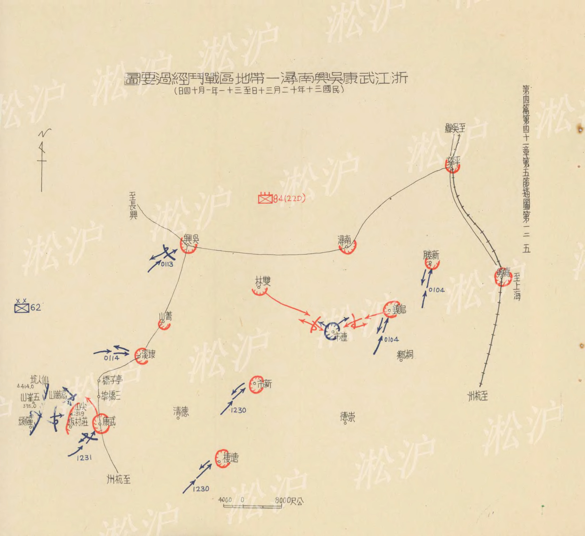

一二六

皖北地區戰鬥

作戰時間：民國三十一年一月一日起至二月十一日止。

作戰部隊：第五戰區第九十二軍所屬之第二十一師、第一四二師、騎兵第八師及暫編第十四師，共計兵力約一萬人。

作戰地區：皖北懷遠、宿縣、蒙城、渦河與澹河間地區。

敵情：盤據隴海路碭山、徐州段以南，津浦路徐、蚌段以西及淮河沿岸之敵，爲獨立第十三旅團之第五十七聯隊、第十七師團之第八十一聯隊及騎兵第四旅團，共計兵力約四千餘人，山、野砲二十餘門，戰車十餘輛，配合僞軍第七師、第十五師、第十六師，兵力約六千餘人，分別控制懷遠、蚌埠、鳳臺、壽縣、永城、臨涣、蘆溝集、商邱、亳縣、義門集等大小據點，以機動態勢，互相應援，冀達到以攻爲守之目的。

我軍目的：軍以有力部隊深入敵後，展開大規模之破壞與襲擊之目的，以第一四二師兩團及韓金山部，一部襲擊佔領胡溝集，主力確實遮斷津浦路宿、蚌間交通。騎兵第八師以約一團之步、騎兵力編成混合支隊，攻擊懷遠，相機佔領。第二十一師，應派團長一員率兵兩營配合宿縣團隊，攻擊南坪、漁臨各據點，相機佔領。馬馨亭縱隊到達鐵路以東後，應積極打擊奸僞，並策動泗縣、靈壁、五河一帶僞軍反正，鞏固游擊根據地。

戰鬥經過：甲、第一次皖北戰鬥

(一)懷遠附近之戰鬥（自一月一日至九日）

騎兵第八師，編組步、騎混合加強團（步兵三連、騎兵三連、迫擊砲四門、重機槍四挺）

，由馬彪師長率領，於元月一日開始行動，五日午，挺進至懷遠西北唐店子以東地區，二十三時，以主力推進於馬家湖、東岳廟之線，另以輕騎一連，進佔梅營，警戒右翼安全及威脅敵之側背。六日拂曉，開始攻擊，我以集中砲火向敵猛轟，敵憑險據守，激戰五小時，互無進展。八日二十一時，我以一部佯攻懷遠北門，以主力向老西門進攻，我曾一度進至老西門附近，敵堅守頑抗，戰鬥異常激烈，與敵相峙。九日拂曉，敵由蚌埠增援步、騎、砲、四百餘，於是日八時，開始向我反攻，經我奮勇迎擊，十一時許，敵退入城內，十六時，敵由渦河以北增援步、騎、砲兵約千餘、汽車四十餘輛，其先頭部隊已到褚集一帶，我卽以一部監視懷遠之敵，主力仍撤回河海原防。

(二)龍亢附近之戰鬥（自一月十日至十一日）

津浦路及滄河兩岸敵僞據點，經我連日之攻襲及破壞，敵軍頗感不安，每日以汽車十餘輛附砲數門，來往梭巡，防我襲擊。敵由宿縣糾合步騎千餘、山砲七、八門、汽車四十餘輛、戰車三輛，向我龍亢暫編第十四師第二團陣地進犯，經我奮勇迎擊，苦戰一晝夜，卒將來犯之敵擊退。

(三)袁店集附近之戰鬥（自一月一日至十七日）

渦河以北我軍之挺進隊，係以第二十一師第六十三團爲基幹，並配合宿縣團隊及挺進縱隊第二支隊王克明部，由第六十三團團長率領於十二月三十日開始行動，分向宿縣、南平、臨涣、袁店集敵各據點攻襲。三十一日進至蒙城，三十一年元月一日，到達奶奶廟，二日，抵張家集，四日晚，挺進至檀城附近。六日二十三時，令第一營附迫砲二門向袁店集攻擊，至七日四時，撤回原駐地。十五日二十三時，第六十三團附山砲二門，再推進至袁店集以南地區，當以一部佔領後馬店子，並破壞臨涣、袁店集間交通通信，另選奮勇隊二百餘名，於十六日二時，分組向袁店集奇襲，迨進至第二道外壕，被敵發覺，激戰甚烈，七時許，我軍乘勢分向東、西、南、三門猛攻，惜未能全部突入。九時許，敵由北門以一部向我第二營左翼迂迴，被我擊返寨內，我躡踪突入寨門附近，與敵往返衝殺三次，未能奏功。迄十三時許，敵由臨渙及韓村增來步、騎七百餘、汽車十二輛、山砲二門，向我第二營左側攻擊，當令第一營營長率步兵兩連，由左翼第三營右翼同時出擊，激戰至十六時，敵傷亡慘重，退守寨內，我於十八時撤回原陣地。

四韓村附近之戰鬥（自一月六日至十七日）

宿縣國民兵團第一、第三、第五等三個中隊，於一月六日十一時向韓村之敵襲擊，以第一中隊位於韓村、臨渙間，破壞交通通信及截擊敵之增援部隊，以主力分由西北兩面圍攻，激戰二小時後，奮勇隊數人衝入村內，終因敵砲火猛烈，未能奏效，翌日拂曉，仍撤回原防。十五日二十三時，第二十一師第六十一團第二營及第二連附迫砲二門，推進韓村以南地區，以第二連進至劉樓（滄河右岸）破壞交通通信，主力於十六日二時向韓村攻擊，四時許，第五連攻入南門，與敵發生劇烈巷戰，突由東北陳樓方向竄來步、騎混合之敵約五百餘，向我夾擊，我官兵奮勇衝殺，激戰至六時許，第五連連長黃德金陣亡，我乃突出南門，嗣後敵大部轉向袁店集方向，我第二營即行跟蹤向該敵尾擊。

五趙家集、蘆溝集、宿縣、南平等地附近之戰鬥（自一月十四日至十七日）

一月十四日拂曉，我第二十一師第六十二團第二營營長率步兵兩連向趙旗屯襲擊，以敵工事堅固，未能奏功，仍撤回原防。十五日二十三時，我暫編第十四師第二團第一連附蒙城團隊一中隊及馬縱隊一部，進抵趙家集附近，以蒙城團隊一中隊破壞趙家集、蘆溝集間之交通通信，並縱火擾亂，主力於十六日二時，向趙家集團攻，激戰至五時，因敵據險頑抗，未能奏功，拂曉撤回原防。同時游擊第二支隊，亦於十五日晚到達蘆溝集附近，以一部位於蘆溝集、南平間破壞交通通信及截擊敵僞，主力於十六日二時，分襲宿縣城廓及南平敵僞據點，宿縣、南平間交通通信被我破壞多處。

乙、第二次皖北戰鬥

二月一日十時，第九十二軍軍長據傅指揮官電話稱，田家菴增敵一千八百餘、砲四門、一股約步、騎八百餘於是日晨竄至鳳臺，另一股約步、騎千餘竄至順河集（鳳臺東）附近，懷遠之敵，增至千餘，有犯河溜企圖，除飭騎兵第八師嚴加戒備外，第一四二師擬在河溜東南地區準備迎擊。又據侯鏡如指揮官於是日十六時電話稱，敵僞二千餘、砲四門，由宿縣分兩路西犯，一股八百餘，沿宿蒙公路竄抵趙家集附近，另股約千餘，由臨渙竄至檀城附近，當令各部隊增強第一線防務，準備迎擊進犯之敵，並分令挺進第五支隊韓金山部，俟敵前進時，即在敵後連絡友軍，發動民衆，破壞交通、通信，積極襲擾，策應主力軍作戰。

二日十時，沿宿蒙公路進犯之敵僞約步、騎兵一千三百餘，竄至北淝河左岸，卽向我前進據點板橋集進犯，我暫編第十四師第二團第六連及地方團隊一部，予以迎頭痛擊，激戰至十四時許，敵一部乘隙渡過北淝河，竄至公橋、母橋一帶，我遲滯目的已達，乃令該連逐次向主陣地撤退。入夜，第二十一師進襲隊（第六十一團第一營）及挺進縱隊第二支隊王克明部，先後向敵襲擊及破壞交通，頗著成效。

三日，懷遠敵步、騎兵千餘，分兩股進犯，一股約步、騎六百餘，於十五時許竄至河溜以東地區，與我騎兵第八師第三團第三連發生戰鬥。另一股約步、騎兵五百餘，於十六時許竄至大觀音堂附近，與騎兵第八師第二團第四連發生戰鬥，迄黃昏後，敵我對峙。同時鳳臺之敵千餘，其先頭部隊約步、騎兵五百、砲二門，於十二時竄抵丁家集，二十時至大興集附近，第一四二師第四二六團於本（三）日晚向大興集挺進，準備截擊該敵。公橋、母橋之敵，於是日晚分兩路向蒙城進犯，一股約步、騎八百餘、砲三門，向我暫編第十四師第二團陣地及蒙城城內砲擊，另一股約步、騎兵四百餘、砲兩門，於是日九時竄至蒙城東之李大莊對岸，向我河防部隊進犯，經我守軍奮勇迎擊，至十五時，敵不支向公橋附近潰退，我第六十一團卽派兵一連追擊，至丁家附近，與敵騎二百餘遭遇，激戰一時許，該敵亦向公橋方向潰逃，是晚我暫編第十四師第二團團附率第六十一團之一連及挺進縱隊之一部，向公橋、母橋地區襲擊。

四日十時許，進犯河溜以東之敵，均經擊退，仍在藻林集、褚小廟之線對峙。大觀音堂之敵，分兩股進犯，一股由萬福集渡過茨河向河溜前進，十三時抵河溜西關與我守軍激戰，另一股約步、騎八百餘，於十四時經辛集向陸瓦房前進，十五時許，敵對河溜已成包圍之勢，激戰至二十一時三十分，河溜陷入敵手。同（四）日十三時許，敵一部約步、騎六百，渡渦河向蒙城東李竹園一帶進犯，戰鬥激烈，迄晚敵我對峙。由大興集北竄之敵，於本（四）日十時許，在陳仙橋與我騎兵第八師第一團激戰三小時後，卽續向樂土鋪前進。

五日七時，侵佔河溜之敵，續向我龍亢進犯，激戰至二十一時，我軍移轉陣地，侵佔樂土鋪之敵，經我痛擊後，繼向小新集前進。

果：一、鹵獲：

六日拂曉，由河海經雙澗集至王家橋之敵，約步、騎八百，續向蒙城進犯，我沿河右岸之部隊已受嚴重威脅，爲避免敵之夾擊計，卽令暫編第十四師撤至西陽集、牛王舖之線，第二十一師以一部位於小新集以北擔任伏擊、截擊任務外，主力撤蘆溝集附近。我軍因連日苦戰，勢較疲憊，小新集之敵，趁我軍轉移之際，卽分別北竄，一股約敵騎百餘，竄至丹鳳集附近，被我暫編第十四師猛烈阻擊，敵乃不支向西北方退去，主力向蒙城退去，第二十一師卽向蒙城追擊。另一股約步、騎四百，竄至西陽集附近，經我暫編第十四師一部迎頭痛擊，激戰兩小時，我軍移至該集以西地區與敵對峙，迄八日晚，敵我相峙於蒙城至西陽集一帶。

九日，河溜、龍亢、陸瓦房之敵，似有久據模樣，十時許，我傅立平指揮官率部追擊至蒙城附近，與敵激戰，十二時克復蒙城，敵向渦河以北退去。是日晨，西陽集之敵，分三股竄犯，一股步、騎四百餘、砲一門，沿渦河西進，向渦陽進犯，十五時許陷渦陽，我軍轉移渦陽西八里橋與敵對峙。

十日拂曉，我騎兵第八師向陸瓦房之敵攻擊，敵不支向河溜、龍亢退去，敵我對峙於河溜附近。十一日拂曉，我騎兵第八師，續分向河溜、龍亢之敵攻擊，激戰四小時，敵不支分向懷遠及渦北退去，十一時克復河溜及龍亢，至侵佔渦陽之敵，亦於是（十一）日分向義門集退去，我暫編第十四師當卽派兵一部跟踪追擊，敵急向鄧小街退去，我軍遂將薛溝收復，經十日之苦戰，迄十一日完全恢復戰前態勢。

1. 士兵一名。

2. 馬四匹。

3. 步騎槍六十四枝。

4. 輕機槍一挺。

5. 擲彈筒一具。

6. 軍用地圖十五幅。

7. 敵軍旗五面。

8. 步槍彈二二四粒。

9. 電線四千餘斤。

二、傷亡：

我軍傷亡：一、陣亡：

斃傷敵士兵約一千名。

1. 官四員。

2. 兵三二一名。

二、負傷：

1. 官四十二員。

2. 兵七五零名。

我軍損耗：一、武器：

1. 步騎槍三二二枝。

2. 手槍十七枝。

3. 輕機槍十四挺。

4. 重機槍一挺。

5. 擲彈筒六具。

6. 槍榴彈筒二具。

7. 刺刀一五三把。

二、彈藥：

1. 步機槍彈五二八、九五九粒。

2. 手槍彈五、零四零粒。

3. 手榴彈五、四八七枚。

4. 槍榴彈二五六枚。

5. 擲榴彈六三九粒。

6. 迫砲彈八四一枚。

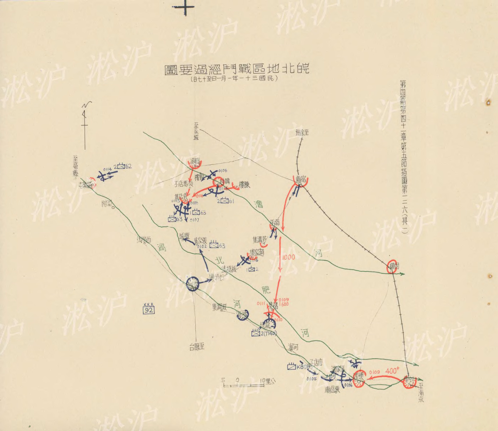

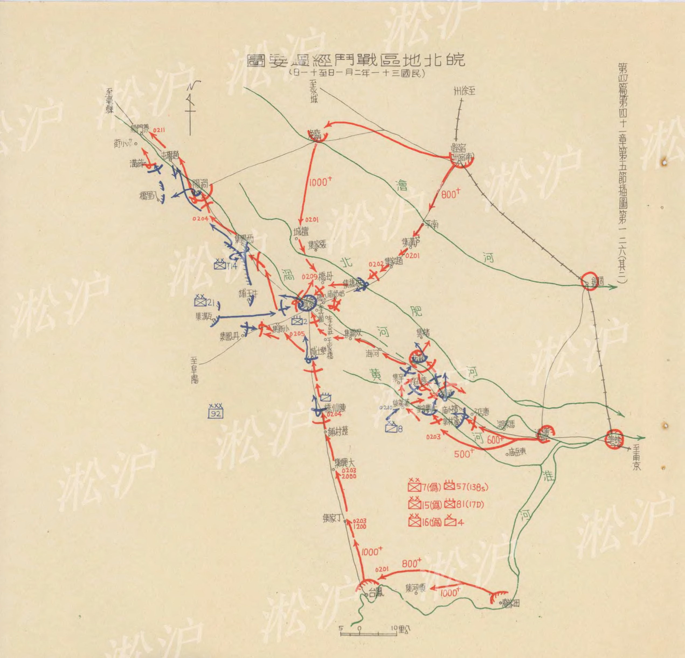

一二七廣東清遠花縣從化間地區戰鬥

作戰時間：民國三十一年一月三日起至八月二十九日止。

作戰部隊：第七戰區第六十二軍（轄第一五一、第一五四、第一五七等三個師），共計官兵約一萬餘人作戰地區：廣東新街、從化、源潭、花縣、神崗、銀盞坳等地。

情敵：敵第一零四師團第一零七旅團，轄第一三七、第一六一兩聯隊，於三十一年一月三日以前，佔領我粵漢鐵路廣東新街附近之各據點，因迭受我第六十二軍各部隊之襲擊，遂於五月三十一日集中兵力，大舉進犯我粵漢路正面，並侵佔銀盞坳、龍塘、源潭等地區。

我軍目的：軍以確保現陣地並相機出擊敵人，牽制廣州敵軍兵力，不能轉用其他戰場。

戰鬥經過：廣州之敵，自去（三十）年十二月中旬抽調兵力進攻香港，並開赴南洋作戰以來，其廣州以北新街附近各據點之兵力，大爲削減，我第六十二軍爲相機襲敵起見，自三十一年一月三日起，以第一五一師第四五三團、第一五七師第四七零團，編爲左右翼出擊團，由銀盞坳以南地區，向新街及花縣東南各附近據點之敵襲擊，至一月二十三日止，共計出擊五次，對新調來華之敵新兵部隊，曾予嚴重打擊。

二月六日至七日，我第一五一師第四五三團再向新街之敵襲擊，並一度佔領新街西北之埗心塘，旋以敵軍增援，致未奏功。十七日至十八日，第四五三團續行夜襲新街東北龍口莊、梅山、山下嶺一帶之敵，亦因兵力過於分散，未能奏效。二十日至二十一日，該團復分向新街及象山脚進襲。二十八日，又夜襲新街北之田尾，亦以敵軍預有準備，激戰至拂曉，仍撤回原防。此時我第一五一師第四五一團爲軍之襲擊隊，控制其兵力於銀盞坳及花縣東之獅前市一帶地區，爲配合第四五三團之行動，於二月十八日分途進攻新街及其東北龍口莊、西嶺等據點之敵，激戰十數小時，達成消耗與疲憊敵人之目的，仍撤返原防，對敵續施封鎖。第一五一師第四五一團之出擊任務於三月三十日前交由第一五四師第四六零團接替，自四月十八日至二十六日，共對敵施行伏擊，與襲擊新街附近各據點之敵五次，五月十九日，又夜襲新街西之大陵及新街東北之嶺屈，二十日，再夜襲嶺屈及石角東北之西嶺，二十五日，再向西嶺之敵襲擊，三十日夜，破壞自石角至神崗敵之通訊網，以上各次戰鬥，均予敵以相當打擊。

五月三十一日，敵第一零四師團第一三七聯隊並附第一六一聯隊之一部，分由花縣、馮村向我粵漢路正面進犯，並鑽隙向龍塘、銀盞坳、迎咀、源潭等地突進，與我第一五四師之第四六零團及第四六一團之一部接觸，旋以我軍行動稍遲，以致龍塘、銀盞坳、迎咀均相繼陷敵，源潭亦於六月二日爲敵所佔。

六月三日，第四六一團撤返源潭東北之浮梁附近，其守備任務於六月十六日移交軍預備隊之第四六九團接替。十八日，我第一五四師以第四六一團及第四六零團爲左右翼隊，以第四六二團位於琶江北岸，全線開始向侵據粵漢路之敵反攻，初進展順利，激戰至十九日，與敵膠着於源潭迄銀盞坳附近之線，至六月三十日以後，第四六零團原擔任之軍出擊任務交由第四六一團接替。

七月三日，從化及街口步、砲之敵約四百餘，向我從、佛公路北之橫坑第一五七師第四七一團陣地進犯，被我擊退，該團於七月十日及二十七日，各以一部襲擊從化附近風雲嶺、楊村之敵。十一日，第一五四師第四六一團伏擊敵人於橫坑北之南山嶺附近，予敵重創，十1

戰

果：一、鹵獲：

五日，又擊敵於寨頂，斃敵大中隊長各一員。此外自七月四日至二十六日，共伏擊與襲擊敵人先後共八次，均予敵威脅甚大。

八月二十八日，守備清遠之第一五六師第四六八團已撥歸第一五四師指揮，其左翼與第一五四師右地區隊緊密連繫，對敵形成三面包圍之態勢，自同日起開始全線向敵反攻，敵卽藉飛機之掩護向新街、龍翔方面退却，我軍乘機追擊，至二十九日，已相繼克復源潭、迎咀、龍塘、銀盞均各據點。侵佔從化、街口之敵，此時亦向神岡退却，我軍至此已完全恢復軍田、獅嶺、花縣以北地區。

1. 俘敵兵二名。

2. 步騎槍二十八枝

3. 手槍一枝。

4. 步機彈三零四粒。

5. 砲彈四十二顆。

6. 地雷十五個。

7. 擲榴彈四十四顆。

8. 刺刀二把。

9. 指揮刀一把。

二、破壞：

1. 碉堡三座。

2. 營房八間。

三、傷亡：

我軍傷亡：一、陣亡官兵二零九員名。

二、負傷官兵二六六員名。

三、失踪官兵七十五員名。

我軍損耗：一、武器：

1. 步槍八十枝。

2. 輕機槍十三挺。

3. 手槍一枝。

4. 槍榴彈筒十六個。

5. 刺刀八一三把。

二、彈藥：

1. 步機彈二二九、四五一粒。

2. 砲彈二八五顆。

3. 手榴彈八、四九一枚。

4. 擲榴彈四、九七一枚。

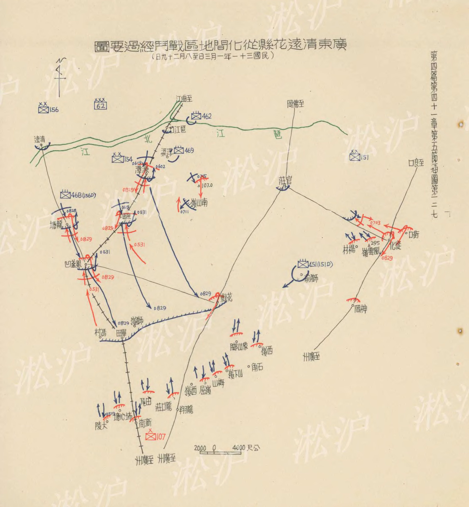

一二八

湖北漢口黃坡及河南信陽羅山等地區戰鬥

作戰時間：民國三十一年元月七日起至三十一日止。

作戰部隊：第五戰區第八十四軍之第一七四師一部，附第十三挺進縱隊及第一八九師全部，附第二挺進縱隊。

作戰地區：湖北漢口、黃坡及河南信陽、羅山等地區。

敵情：當面之敵，爲第三師團之主力，多轉用於湖北方面，僅留少數部隊，扼守羅山、信陽、武勝關、廣水、孝感、漢口等據點，並附僞軍張啓黃、李寶璉、周志堅、羅厚福等部。

我軍目的：軍以牽制敵人兵力轉用並策應第九戰區作戰之目的，向敵施行廣泛襲擊。

戰鬥經過：第一八九師方面：元月十三日，該師途經大悟山附近，將該處之僞軍驅逐，於十四日到達梅店東西地區，十五日分向長軒嶺、姚家集各據點攻擊，破壞其交通、通信，並擊燬增援汽車三輛，焚燒木橋二座。十六日，我破壞漢口附近鐵路及橋樑，並與敵發生戰鬥，同時奸僞四百餘向河店蠹動，經我進剿，戰鬥半小時後，不支逃竄。十七日，我擬突擊漢口之敵，甫抵鐵路附近，忽遭橫店之敵僞阻擊，我乃撤回李家集附近地區。十八日，長軒嶺之敵三百餘人，向我河店據點進犯，經我猛烈迎擊，殲敵大半，殘部向長軒嶺潰退。二十二日，我編成突擊隊多組，分向漢口進擊，激戰終宵，我撤回興隆集附近。二十九日，我爲避免敵之圍攻，乃將主力轉移於蔡店及左家河附近地區，途經汪家河時與敵發生戰鬥，至晚，我乃向禮山轉進。

第一七四師方面：元月七日，該師一部向東雙河攻擊，突入街內與敵發生巷戰，因敵由柳林增援，我乃撤回原防。八日，我續向柳林之敵襲擊，激戰數小時。十日，我再進襲柳林之敵，於汪家廟附近與敵遭遇，戰鬥一小時，敵不支向柳林撤退，我乘機進迫，旋敵增援，激戰後，我仍撤回原防。十七日，我向廣水攻擊，並破壞鐵路及炸燬敵列車兩輛。十八日，敵僞向我河口砦進犯，經我痛擊後，敵向羅山退去。二十五日，我進襲廣水，於郊區與敵激戰，同時我交通工作隊在步兵掩護下將該處鐵路炸燬多處。三十一日，羅山之敵僞百餘，向南李店搶刼，經我截擊後，敵仍竄回羅山。

果：一、鹵獲：

1. 步槍十四枝。

2. 刺刀十七把。

3. 步槍彈八六五粒。

4. 擲榴彈二十一顆。

5. 鋼盔十七頂。

6. 電線一、一六零斤。

二、破壞：

1. 木橋四座。

2. 鐵路公路各數段。

3. 炸燬列車汽車各三輛。

三、傷亡：

斃傷敵官兵五六五員名。

我軍傷亡：一、陣亡士兵八十七名。

二、負傷官兵一三八員名。

三、失踪士兵四十八名。

我軍損耗：一、武器：

1. 步槍二十一枝。

2. 輕機槍三挺。

3. 刺刀三十四把。

二、彈藥：

1. 步機彈七二、二二七粒。

2. 手槍彈一、三五三粒。

3. 迫砲彈一五九顆。

4. 槍榴彈二三八枚。

5. 手榴彈九一七枚。

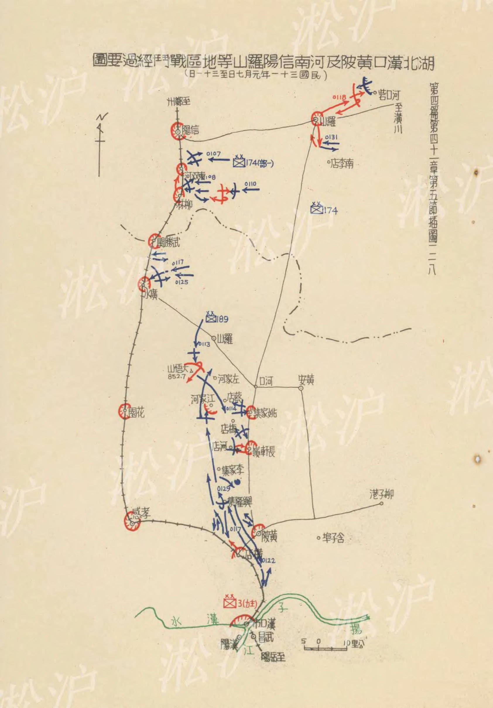

一二九皖中一帶地區戰鬥

作戰時間：民國三十一年元月二日起至六月三十日止。

作戰部隊：第五戰區第一七一師全部、第十挺進縱隊、皖保安第六團、第八團及蘇保安第三團。作戰地區：皖中合肥、含山、和縣及津浦路南段滁縣、全椒、江浦一帶地區。

敵情：當面之敵（淮南路之巢縣以北含山、和縣及淮南北段沿線與津浦路南段江浦、全椒等地區），爲敵第十師團之第六十七聯隊、獨立第十三旅團及僞軍第六師、第七師。

我軍目的：師以策應湘北會戰之目的，對淮南路及津浦路一帶之敵，施行大規模之游擊。

戰鬥經過：淮南路方面：元月二日，我游擊部隊開始向炯燭河沿線之敵攻擊，並破壞鐵道數段，剪獲電線四千餘斤。四日及十一、十二日，我襲擊中埠、炯燭河及破壞鐵道數段，獲電線約二百餘斤，並於橋頭集東端埋設地雷，燬敵火車一列，斃敵甚衆。十四、十五兩日，敵由炯燭河向鳳凰集進犯，另股敵僞二百餘，騎兵百餘，分由撮鎮、劉家集向西山驛進犯，與我發生激戰，嗣我以態勢不利，乃轉移東山口附近一帶，調整部署後，我乃以一部兵力對西山驛之敵繼續襲擾，餘則調返文集整理。

津浦路方面：元月二日，我軍進抵施家集附近，爲奸僞所阻，經戰鬥數小時後，僞軍不支退去。三日，由東王集襲擊白酒崗，激戰徹夜，我衝入敵僞營房，斃敵甚衆，旋卽撤出。四日，向珠龍橋襲擊，迫進西街，曾將西街一度佔領，因敵援兵馳至，我乃撤出。八日，由周家崗向皇甫山附近游擊，於鴉窩集附近與敵僞遭遇，激戰約三十分鐘，敵僞不支向皇甫山退去。自元月二十四日至六月三十日止，先後於江浦、含山、和縣、巢縣、滁縣、高玉殿、圓瞳集、全椒等一帶地區，經常不斷襲擊敵人，頗獲相當戰果。

果：一、鹵獲：

1. 俘敵官兵四十八員名。

2. 輕機槍一挺。

3. 步、騎槍六十枝。

4. 手槍三枝。

5. 電話線一、六五八公斤。

二、破壞：

1. 鐵道數段。

2. 火車一列。

3. 手搖車一輛。

4. 汽車一輛。

5. 電桿二十餘根。

6. 通信設備十餘里。

7. 倉庫數所。

8. 食米百餘擔。

三、傷亡：

斃傷敵僞官兵約五百餘員名。

我軍傷亡：一、陣亡官兵七十五員名。

二、負傷官兵一六七員名。

我軍損耗：一、武器：

1. 步槍十九枝。

2. 輕機槍一挺。

3. 手槍一枝。

4. 刺刀一把。

二、彈藥：

1. 步機彈五八四、五六五粒。

2. 手槍彈一、六六五粒。

3. 迫砲彈三六九顆。

4. 手榴彈一、三六六枚。

5. 地雷一十二枚。

6. 擲榴彈一一四枚。

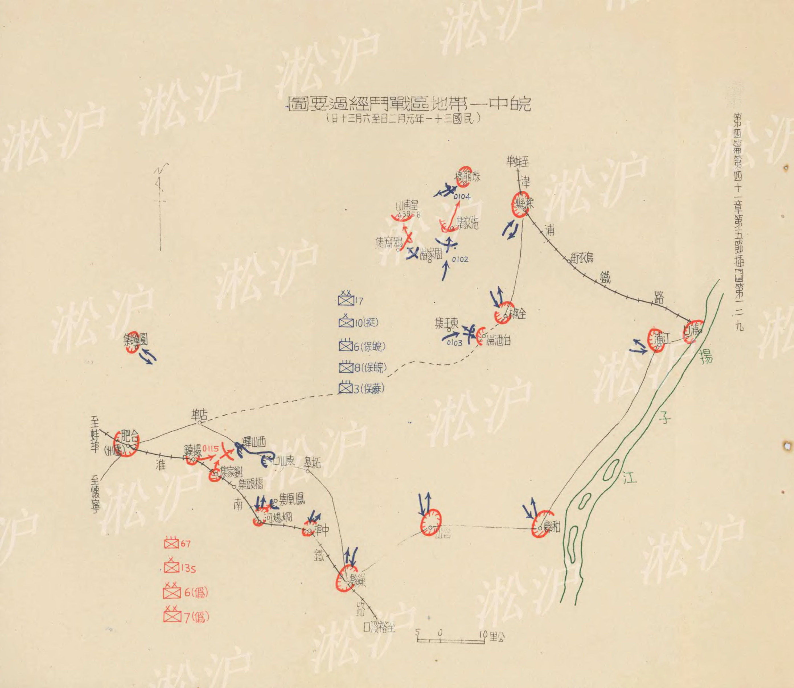

一三零廣東蘆包附近地區戰鬥

作戰時間：民國三十一年一月十二日起至十三日止。

作戰部隊：第七戰區第一五六師第四六七團附地方團隊共約一千五百餘人。

作戰地區：廣東三水、蘆包附近地區。

敵情：敵第一零四師團第一零八聯隊及第一六一聯隊各大部與僞軍一部，共計步、騎兵三千餘人，附砲十餘門，飛機十餘架，於一月十二日，分自三水、楊梅、馮涌一帶，向我蘆包竄擾。

我軍目的：該團以對來犯之敵嚴密警戒，並相機阻擊，期固守陣地。

戰鬥經過：一月十二日七時，敵先頭部隊二百餘，附砲二門，侵佔范湖，旋向我虎眠岡進犯，同時另敵一股約千餘，分向蓮塘、長歧、鷄啼埇、大屈頭、黃塘墟等處進犯，八時許，我虎眠岡、大屈頭、長歧等地各一排守軍，被迫分別向附近高地轉移，繼續抵抗。此時敵向大屈頭增兵，其一部三百餘竄抵張村附近，並續進犯我君營，十二時許，一度被我擊退，旋敵增兵千餘，自坑口附近渡河，不斷向我西北方面猛攻，竄犯范湖、鷄啼埇、虎眠岡之敵，復侵佔我把岡，是時敵機且不斷在蘆苞附近河面施行猛烈炸射，企圖阻止我軍渡河，該團奉命疏散蘆苞附近民衆及搶運物資，並準備必要時之渡河工具，旋又奉命暫歸第一五九師指揮，繼續固守蘆苞，迎擊來犯之敵，經一晝夜之劇烈戰鬥後，我軍以進犯之敵不斷增加，形勢逆轉，乃於十三日五時前全部與敵脫離，潛渡北江西岸，在蔣岸、新村一帶，繼續抵抗，我軍渡抵北江西岸後，敵猛撲蘆苞空城，旋以砲火盲目向我北江西岸射擊，並焚燒搶掠，顯示將有乘機逃竄之模樣，第四六七團偵悉敵人企圖後，當即以第二營重渡北江東岸，相機向逃竄之敵追擊。十三日九時許，侵佔蘆苞之敵，果分途回竄，我軍跟踪追擊，迄十五時，杜營、大埇、葉岡、把岡、江塘坦之線，完全爲我收復，敵則繼續分向三水西南新街等處逃竄。戰

果：一、鹵獲：

1. 迫砲彈八顆。

2. 刺刀一把。

3. 軍旗一面。

4. 鋼盔三頂。

5. 烟幕罐一個。

二、傷亡：

斃傷敵官兵共約四百餘員名。

三、其他效果，此次戰鬥，我軍除對進犯之敵予以打擊外，並避實就虛，兼收疲敵之效。我軍傷亡：一、陣亡士兵四零名。

二、負傷士兵二十一名。

三、失踪兵三名。

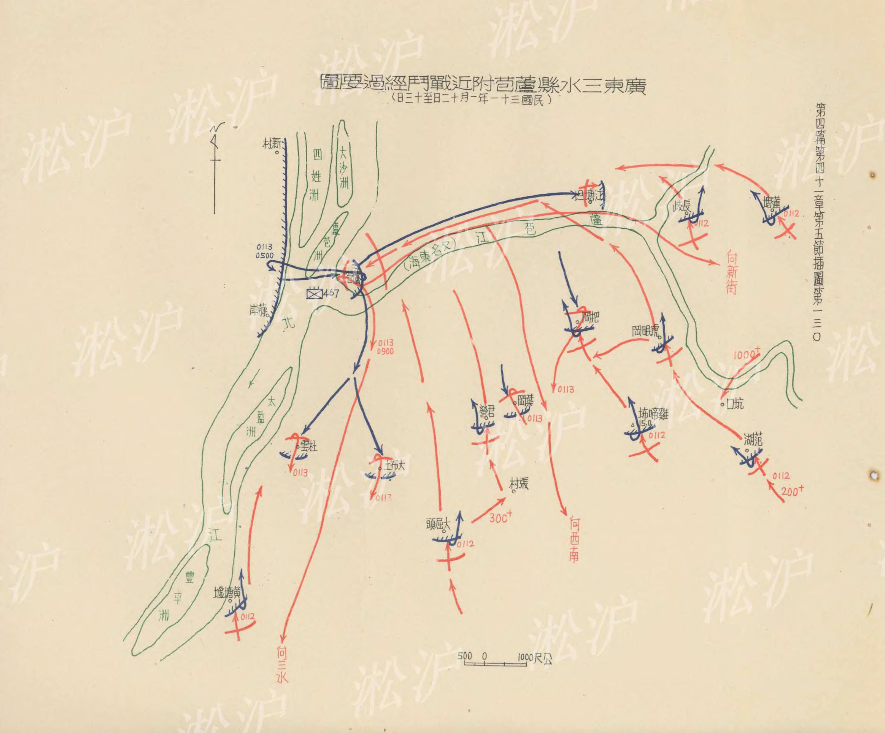

一三一廣東澄海蓮塘村附近鬥戰

作戰時間：民國三十一年一月二十一日至二十二日止。

作戰部隊：第七戰區預備第六師第十七團，參戰官兵共計一、二七五員名。

作戰地區：廣東鮀江北岸蓬州、西蓮塘附近。

敵情：敵獨立第六十六大隊配合騎、礮兵及僞軍陳浩水部共約千餘人，分據汕頭、菴埠，並堅守蓬州外圍各據點。自太平洋戰事爆發後，該敵於一月二十一日集結步、騎、礮聯合之敵，共約七百餘，乘夜暗向我據守蓮塘村附近陣地進犯。

我軍目的：師以迎擊該敵之目的，以第十七團在蓮塘村附近阻敵前進，以確保原陣地。

戰鬥經過：一月二十一日零時三十分，鮀江北岸鮀浦、南畔山等地之敵，約三百餘，在其砲火掩護下，向我據守大、小蓮塘山陣地之第十七團進犯，經守軍奮勇抵抗，戰鬥異常激烈，該陣地失而復得者再，激戰至六時許，我軍轉移至蓮塘村陣地，繼續抵抗。十三時許，敵復由南畔山增援二百餘，協同侵佔大蓮山之敵繼續向我蓮塘村猛犯，同時敵百餘，由植農公所附近登陸，向我蓮塘村陣地側擊，十九時，蓮塘村陷敵，我軍再轉進至外圍新寮、八斗一帶，與敵對峙。

二十二日三時三十分，我軍整頓後，卽向蓮塘村之敵反攻，激戰至七時四十分，敵不支向大、小蓮塘山方向退卻，我軍跟踪追擊，並以一部側擊，八時三十分，克復小蓮塘山，九時，將原陣地完全恢復，敵仍退守原據點，戰鬥乃告結束。

戰

果：傷亡：

斃傷敵官兵約一百四十餘員名。

我軍傷亡：一、陣亡士兵二十九名。

二、負傷官兵十七員名。

三、失踪兵二名。

我軍損耗：一、武器：

1. 步槍七枝，

2. 刺刀十六把。

3. 槍榴彈筒一具。

二、彈藥：

1. 步機彈一九、二九七粒。

2. 手槍彈三十八粒。

3. 擲榴彈一六五枚。

4. 迫礮彈十八顆。

。

。

。

。

。

。

。

。

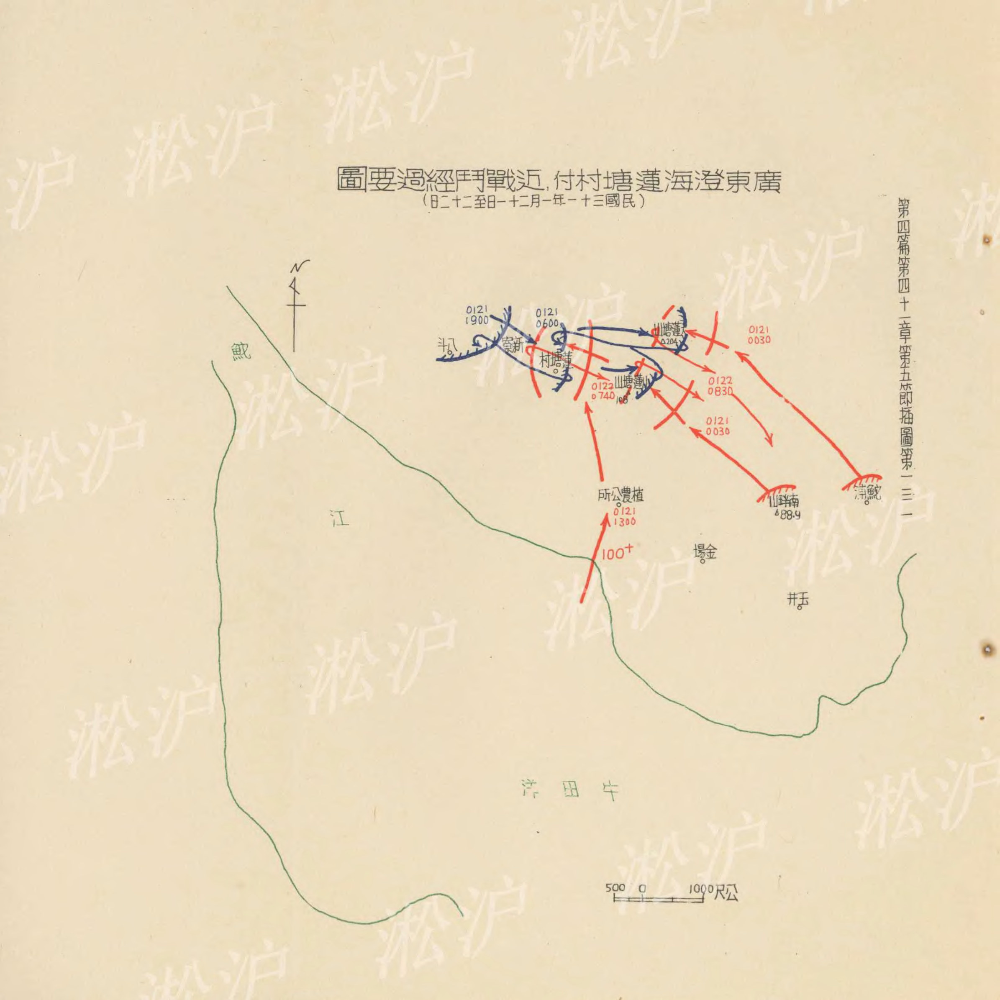

一三二廣東惠陽博羅一帶戰鬥

作戰時間：民國三十一年一月二十五日起至二月七日止。

作戰部隊：第七戰區獨立第七旅（轄第六二五、第六二六、第六二七等三個團）共計官兵六、五六六員名。

作戰地區：廣東惠陽、博羅一帶。

敵情：廣九路之敵，於一月二十五日以步、騎、礮聯合幷附僞軍，配屬汽艇十餘艘，飛機數架，經由石龍、東莞沿東江兩岸向博羅進犯。

我軍目的：旅以固守惠陽之目的，並相機擊破當面之敵。

戰鬥經過：廣九路石龍、東莞之敵，於一月二十五日以步、騎、礮兵共五百餘，分經荥蘭、鐵場向馬嘶、福田進犯，同時以汽艇八艘，載敵兵四百餘，沿東江駛至企石登陸，我兩岸守軍保安第八團及挺進第二支隊予以迎擊。

二十六日，敵陸續由水陸兩路增援向我猛攻，幷復以汽艇八艘，載敵兵數百，沿江東進，雖在蘇村附近，觸我水雷炸沉一艇，但餘艇仍超越博羅，協同北岸之敵向我挺進第二支隊陣地攻擊，幷有敵機數架助戰，我軍以傷亡頗重，乃於十八時撤至城東北象頭山、熱水宮一帶，博羅遂告失守。

敵侵佔博羅後，獨立第九旅卽以第六二七團據守惠陽，以第六二六團一部留守淡水，其餘開至惠陽南冷水坑附近，以第六二五團一部仍留守白茫花、平山，主力開至惠陽東北鹿游崗、下良一帶，幷於二十七日以第六二五團一營渡江西進，向博羅之敵威力搜索，而以第六二七團之一部沿東江南岸策應，當偵知博羅之敵續有增加，幷有繼續向東竄犯模樣。

二十八日晨，敵由博羅分三路續沿東江兩岸向惠陽城進犯，迄午，與我第六二七團警戒部隊接觸於城西北十餘華里之學平山高地一帶。黃昏時，北岸之敵，亦強渡東江，向我進犯，一部幷鑽隙進抵城西數華里之新村，爲我增援之第六二六團所截擊，此時我第六二七團之警戒部隊後撤至新村東北雙飛蝴蝶迄螺山之線，第六二五團第三營則馳至惠陽增援。

二十九日，我軍開始反攻，驅敵退至城西南二十餘華里之鴨子步、陳岡一帶，另敵一部幷退守博羅城及其附近，我軍遂全線出擊，十八時，博羅一度爲我友軍挺進第二支隊克復，惟旋又爲敵所陷。

二月四日，鴨子步附近之敵，增至三千餘，沿公路東進再攻惠陽、博羅之敵，亦同時配合出擊，幷有敵機助戰，我軍苦戰迄夜，終以傷亡過重，遂於五日零時，主力撤至惠陽東北橫瀝、筆架山、梁化間地區，惠陽乃告陷落。

六日，我第一五三師之一部協同挺進第二支隊正進攻博羅，同時獨立第九旅亦以全力向惠陽反攻，惠陽敵於當晚察覺我援軍將至，恐受包圍，乃倉皇焚燒擄掠，乘暗撤退。

七日晨，獨立第九旅全部奮力向惠陽附近推進，幷追擊向西退卻之敵，九時，第六二六團收復惠陽城，博羅亦於當晚爲我友軍克復，敵紛紛向石龍、東莞退去，我乃恢復一月二十五日前原陣地。

戰

果：破壞：

1. 汽艇一艘。

2. 木船一隻。

二、傷亡：

斃傷敵官兵共約八百餘員名。

我軍傷亡：一、陣亡：

1. 官三員。

2. 兵一一零名。

二、負傷：

1. 官八員。

2. 兵一一九名。

三、失踪：

1. 官二員。

2. 兵八十一名。

我軍損耗：一、武器：

1. 步槍四十七枝。

2. 輕機槍六挺。

3. 手槍四枝。

4. 槍榴彈筒一具。

5. 刺刀三十二把。

二、彈藥；

1. 步機彈二一四、八一八粒。

2. 手槍彈三、二五三粒。

3. 迫砲彈三二九彈。

4. 擲榴彈一、七一三枚。

5. 地雷二十八顆。

五一〇

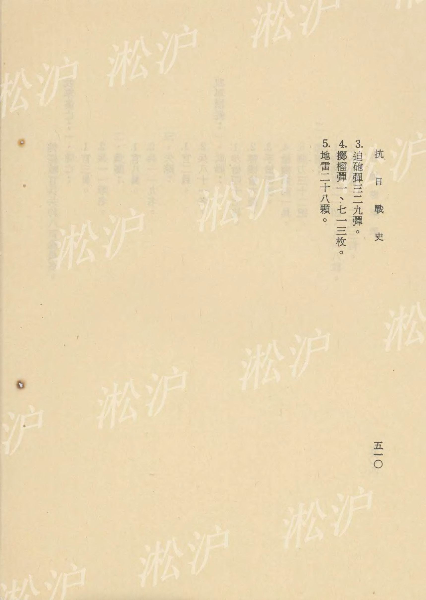

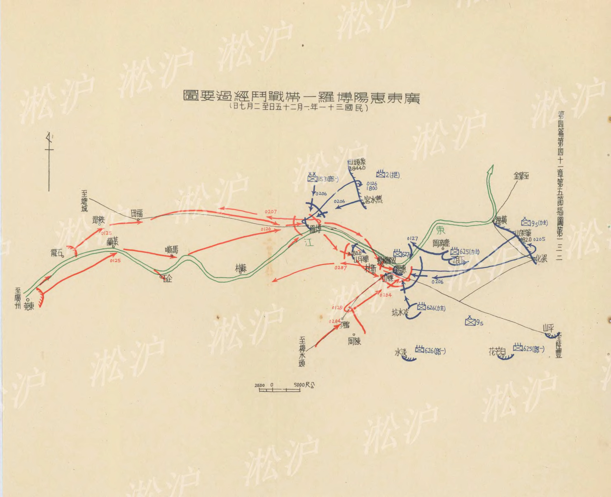

一三三

安徽蒙城地區戰鬥

作戰時間：民國三十一年二月二日起至十日止。

作戰部隊：第五戰區第九十二軍所屬之第二十一師、第一四二師、騎兵第八師及暫編第十四師。作戰地區：安徽蒙城一帶地區。

敵情：敵由魯南、蘇北、皖南等地抽調第十七師團之第八十一聯隊及騎兵第四旅之高原聯隊之一部，並僞軍第十五師第十六師，於二月二日開始由宿縣、懷遠、鳳臺分三路進犯蒙城。

我軍目的：軍以固守蒙城之目的，準備迎擊來犯之敵。

戰鬥經過：二月二日，敵步騎千餘，僞軍六百餘，附礮六門，沿宿縣至蒙城公路向我蒙城附近渦河陣地進犯，經我河防部隊騎兵第八師阻擊，敵數次強渡，均未得逞。其另一部約步、騎千餘附礮五門之敵，由鳳臺直驅蒙城，於三日竄抵大興集與我發生戰鬥。四日，懷遠之敵，將我河溜、韓家湖攻陷。五日，鳳臺敵續由大興集竄至樂土舖附近，遭我阻擊後，向蘆溝集逃竄，與我茨河兩岸部隊激戰甚烈，敵傷亡慘重，同時河溜及辛集方面之敵，向我陸瓦房進犯，該地被迫棄守。

六日，我以主力開始向小新集之敵攻擊，將敵包圍，反復肉搏，終以敵火猛烈，我乃撤至楊寨附近，繼續對敵探包圍態勢。同日晨，我右翼雙澗集方向竄來敵步騎七百餘向我蒙城進犯，另渦河以北之敵千餘，由王家寨附近強渡，向蒙城夾擊，我主力向西陽集、牛王舖之線轉移，蒙城遂陷。

七日，蒙城敵千餘，增援小新集，向包圍之我軍施行反攻，經我奮勇迎擊，敵傷亡慘重，敵魯岡村陣亡，殘敵於八日開始潰退。

九日，我第一四二師克復蒙城，敵經西陽集向渦陽退卻。十日，我續克復渦陽城，敵狼狽渡河北竄，我乃恢復原態勢。

戰

果：一、鹵獲：

1. 敵兵二名。

2. 步槍五十三枝。

3. 衝鋒槍四枝。

4. 輕機槍一挺。

5. 步槍彈二二四粒。

6. 手榴彈十枚。

二、傷亡：

斃傷敵官兵共約一千六百餘員名。

我軍傷亡：一、陣亡官兵四六六員名。

二、負傷官兵三一二員名。

三、失踪士兵六十二名。

我軍損耗：一、武器：

1. 步槍三六五枝。

2. 輕機槍十一挺。

3. 重機槍一挺。

4. 手槍十六枝。

5. 擲彈筒五具。

6. 刺刀八十九把。

二、彈藥：

1. 步機彈三八二十、零九四粒。

2. 手槍彈四、三二五粒。

3. 擲榴彈三五九枚。

4. 槍榴彈二五六枚。

5. 手榴彈三、六九七枚。

6. 迫礮彈一、一三顆。

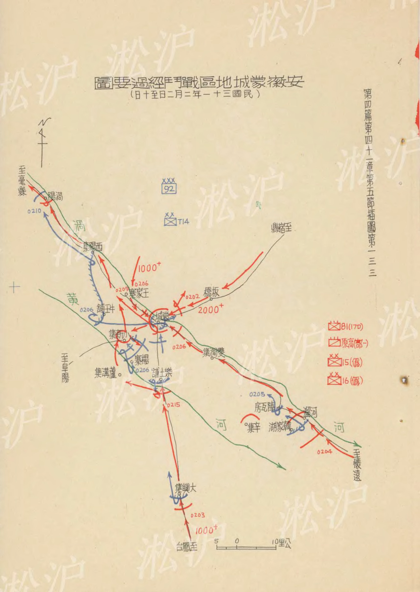

一三四

廣東新會南海清遠等地區戰鬥

作戰時間：民國三十一年三月二十一日起至七月二日止。

作戰部隊：第七戰區第一五師（轄第四七五、第四七六、第四七七等三個團），共計官兵三千餘員名作戰地區：廣東新會附近馬山、篁村、南海屬之官山墟，粤北銀盞坳及源潭西北之五指山、馬頭嶺等地敵

情：三月二十一日前，守備江門附近之敵爲敵獨立步兵第七十一大隊約步、騎砲兵共千餘人，以一部在馬山、篁村構築工事，憑險固守。又盤據銀盞坳之敵，係敵第一零四師團之一部，約步、礮兵二百餘，其大部步、騎、礮兵約三千餘，於源潭以北地區固守。

我軍目的：師以相機襲擊敵人之目的，俾收消耗疲憊敵之兵力及阻止敵人搜括掠奪，並配合友軍截擊、側擊由粵漢路北犯之敵。

戰鬥經過：新會方面：盤據新會之敵，以一部兵力據守大梅山、馬山、篁村之線，主力分別集中江門及新會（故治），我以打擊該敵之目的，於三月二十一日，第一五九師卽以第四七五團附軍屬礮兵一連，編爲突擊隊，由金岡附近分向馬山、鳳山之敵襲擊，迄二十三時五十分，我突擊隊卽佔領馬山敵之礮兵陣地，並奪獲七五山礮一門，惟鳳山方面，以敵工事堅固，迄二十二日晨，尚未得手，旋因敵援軍紛至，我遂撤至瓦窯、鷄仔山之線，與敵對峙。

南海方面：四月一日，官山墟敵駛來汽輪二艘，載敵僞軍數十，企圖保護敵工程人員搜集鐵屑，爲我第四七六團所偵知，當於三日編四個襲擊隊，自西江右岸石歧渡江進襲該敵，因事前佈置週密，敵毫無所知，發動時我首將僞軍消滅，繼以迅雷手段，圍攻汽輪，敵倉皇失措，紛紛跳水，均遭我殲滅，我除將汽輪二艘俘獲予以焚燬外，並生擒敵僞官兵共九員名，任務達成後於四日三時許全部安返石歧原防。

粤漢路方面：六月十日夜，我第四七七團向銀蓋坳附近之敵襲擊，迄十二日目的已達，我仍撤返清遠原防。十八日，第一五九師奉命以有力一部進出龍塘，襲擊銀蓋坳迄源潭間地區之敵，以配合友軍第一五四師作戰，該師當令第四七五、第四七六兩團，各以一部爲掩護部隊，以第四七七團爲主攻部隊，渡河向銀蓋坳及其附近之敵襲擊，戰鬥開始後，敵不斷增援，並以飛機數架助戰，憑堅頑抗，我以殲敵二百餘後，任務已達，於十九日下午仍返原防。

敵軍自侵佔軍田，銀蓋坳、源潭後，卽糾集步、騎、礮兵共約三千餘，以原潭爲據點，進至琶江南岸，構築工事，並積極修理公路、鐵路，擬北進窺曲江，我第四七五團爲拒敵渡過北江右岸，並策應我鐵路線主力軍作戰之任務，於七月一日夜進襲源潭西北之五指山一帶地區之敵，激戰至二日晨，敵經我左右兩翼南北夾擊，傷亡慘重，我爲顧慮拂曉後受敵機之威脅，除留一部對敵警戒外，主力仍渡河折返原防。

戰

果：一、函獲：

1. 敵官長二員。

2. 僞軍士兵七名。

3. 步槍十三枝。

4. 輕機槍一挺。

5. 七五山砲一門。

6. 砲彈十九顆。

7. 步機彈七五九粒。

8. 擲榴彈九枚。

9. 迫砲彈五顆。

10 刺刀三把。

12 望遠鏡一付。

二、破壞：

1. 汽車六輛。

2. 山砲三門。

3. 輕機槍一挺。

4. 步槍三十餘枝。

5. 汽輪二艘。

三、傷亡：

斃傷敵官兵三百餘員名、戰馬四十餘匹。我軍傷亡：一、陣亡官兵八十六員名。

二、負傷官兵一零一員名。

三、失踪官兵四十二員名。

我軍損耗：一、武器。

1. 步槍三十八枝。

2. 輕機槍一挺。

3. 手槍一枝。

4. 刺刀四十二把。

5. 砲一門。

6. 槍榴彈筒四具。

二、彈藥：

1. 步機彈五零、八零九粒。

2. 手槍彈五五三粒。

3. 砲彈五一七顆。

4. 擲榴彈一、三三零枚。

5. 地雷九個。

淞沪

淞沪

淞沪

淞沪

淞沪

淞沪

淞

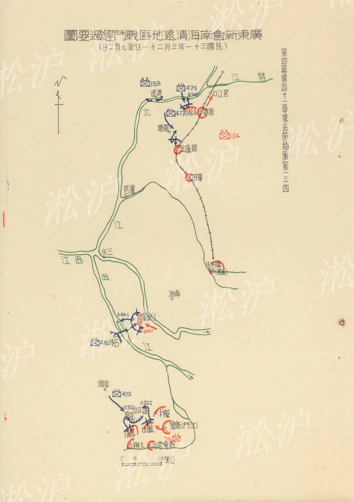

一三五

湖北監利白螺磯附近戰鬥

作戰時間：民國三十一年五月十一日起至七月四日止。

作戰部隊：第六戰區第一三零師之第三八九團全部。

作戰地區：湖北監利縣白螺磯附近

敵情：敵第六師團第十三聯隊第二大隊之飯島中隊、田連中隊，附僞軍二百餘人、砲七、八門，在白螺磯及飛機場一帶構築工事，連日運集大批汽油及炸彈，並時派敵探四出活動，似有進犯企圖，五月十一日後，敵增加步兵三百餘、騎兵六十餘、迫擊砲三門。

我軍目的：戰區爲策應第三戰區作戰，先期予敵打擊，該團任務爲攻擊白螺磯之敵，並破壞其飛機場。戰鬥經過：五月十一日，第三八九團開始向武嶺子攻擊，敵不支向獅子山方向退去，當將該處敵之工事全部破壞，同時第三營主力於彭家墩附近與敵發生戰鬥，卽將該處敵軍擊退，並迫近飛機場，焚燬敵倉庫三所後，卽撤至彭家墩待機。十二日，再向白螺磯之敵襲擊，並衝入白螺磯市街與敵發生猛烈巷戰，因受敵軍艦砲火威脅，十三日拂曉撤返原防。

五月二十五日二十二時，該團向白螺磯機場襲擊，因該處埋設地雷甚多，故待先行偵察後，於二十九日開始進襲，當將敵倉庫佔領，旋卽將敵機場跑道破壞，任務完成後，仍向指定地點轉進。

七月四日二十二時，該團再向白螺磯攻擊，經激烈戰鬥後，乃衝入機場與敵在格納庫附近激戰，並將機場跑道破壞後，仍撤返原防。至白螺磯市方面，我襲擊部隊突入市街，縱火焚燬後仍撤回。

戰

果：一、鹵獲：

1. 步槍四枝。

2. 刺刀一把。

3. 電線六十公斤。

二、破壞：

1. 焚燬敵汽油四百餘桶。

2. 電話線百餘公尺。

3. 兵營一所。

4. 飛機場跑道三條。

5. 重轟炸機一架及炸彈若干。

三、傷亡：

斃傷敵士兵共約三百餘名。

我軍傷亡：一、陣亡官兵三十八員名。

二、負傷官兵五十八員名。

三、失踪士兵四名。

我軍損耗：一、武器：

1. 步槍十七枝。

2. 輕機槍一挺。

3. 手槍一枝。

二、彈藥：

1. 步機彈五八、九七二粒。

2. 手槍彈四九五粒。

3. 槍榴彈九六五顆。

4. 手榴彈六零五顆。

5. 砲彈八三六顆。

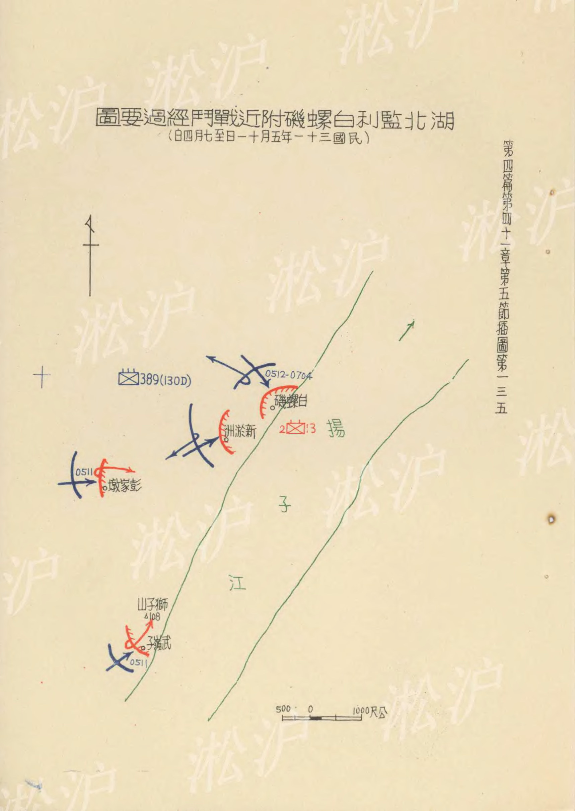

一三六

湖北宜昌宋家咀附近戰鬥

作戰時間：民國三十一年五月二十五日起至六月三十日止。

作戰部隊：第六戰區第七十五軍之預備第四師全部。

作戰地區：湖北宜昌宋家咀附近。

敵情：敵自五月十五日起，以三個師團兵力向浙江發動攻勢，本戰區當面之敵，陸續東開者約六、七千人，軍當面之敵爲第六十五聯隊之第一、第二兩大隊，共約一千五百餘人。

我軍目的：本戰區爲策應第三戰區作戰，本軍以兩師兵力協同右翼之第三十二軍攻擊當面之敵。戰鬥經過：第七十五軍於五月二十五日開始調整部署，以預備第四師分爲兩翼隊展開於大金山、天寶山之線，二十六日拂曉開始向上元寺亘栗樹坳之敵襲擊，經激戰後，敵不支向鳳凰觀退去，我卽進佔上元寺、滴水岩、栗樹坳之線，復續向鳳凰觀攻擊，因敵憑險頑抗，且砲火猛烈，我自動撤回原地，嗣經數次再興攻擊，但均未奏效，該軍乃令將一部任務交與第六師，並以一部編組有力數縱隊，鑽隙深入觀音堂、雙蓮寺公路兩側地區，施行襲擾，並破壞敵之交通、通信，經連日來之戰鬥，斃敵頗衆，並破壞敵倉庫數所，旋奉命停止攻擊，於六月三十日，將任務交與第十三師後，卽開回岔路口整理。

戰

果：一、鹵獲：

1. 步槍一枝。

2. 步槍彈九五零粒。

3. 刺刀五把。

4. 鋼盔五頂。

5. 裸電線三捲。

二、破壞：

1. 木橋四座。

2. 糧秣庫七所。

三、傷亡：

斃傷敵官兵約一百九十餘員名。

我軍傷亡：一、陣亡官兵七十九員名。

二、負傷官兵四十五員名。

三、失踪士兵二十五名。

我軍損耗：一、武器：

1. 步槍一枝。

2. 刺刀二十七把。

二、彈藥：

1. 步機彈一四零、六三零粒。

2. 迫砲彈九五零顆。

3. 手榴彈一、二二零枚。

4. 擲榴彈七零五枚。

備

考：該軍雖爲兩師兵力作戰，實際參加戰鬥者，僅係預備第四師。

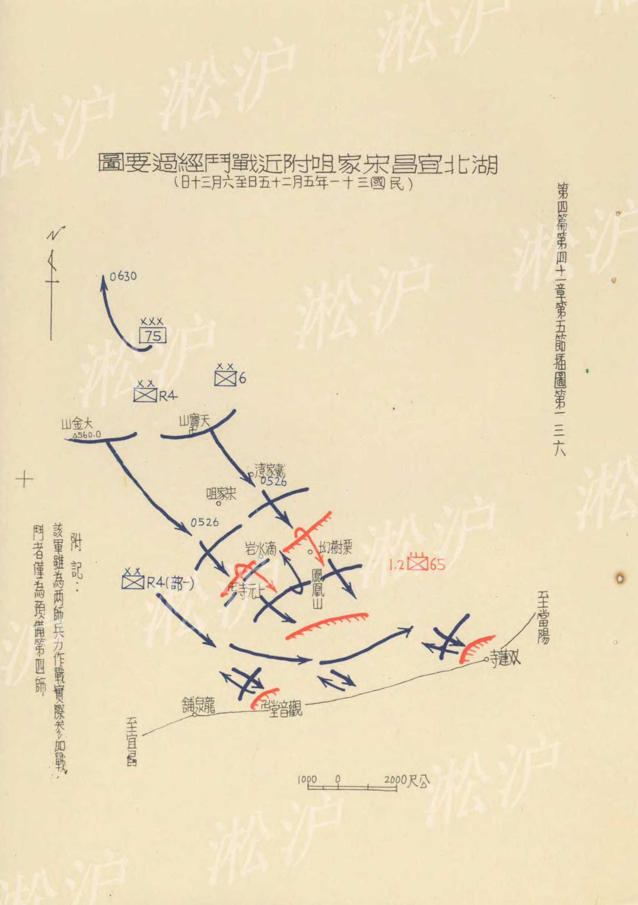

一三七

安徽安慶外圍地區戰鬥

作戰時間：民國三十一年五月二十五日起至六月十一日止。

作戰部隊：第五戰區第一七六師。

作戰地區：安徽安慶、望江附近地區。

敵情：盤據安慶之敵爲第一一六師團及直屬特務隊、通信隊、輜重隊、騎兵隊、安慶城區警備隊，共約三千五百餘人，於五月二十六日起分別駐守大鞍山、獅子山、寨山、楊家亭、洪家舖、齊仁舖、望江一帶地區。

我軍目的：該師以策應第三戰區作戰之目的，向安慶外圍一帶之敵攻擊，並相機佔領之。

戰鬥經過：第一七六師區分爲左、右翼隊向安慶外圍敵之據點攻擊，右翼隊於五月二十五日二十二時開始向洪家舖、油前山、楊家大山及望江等地之敵攻擊，激戰後，我衝入洪家舖街心與敵發生巷戰，嗣因敵火猛烈，分別撤至有利地帶。六月二日，再與敵激戰於洪家舖、楊家大山、油前山一帶，斃敵甚衆，因敵軍陸續增援，我軍傷亡亦重，乃移至金家沖一帶集結整頓。八日至十一日，於廣村、大橋頭、陳老屋等地襲擊敵人。

左翼隊於五月二十六日晚，開始向獅子山、寨山附近攻擊，激戰至二十七日拂曉，將獅子山山腹及鷄留橋攻佔，十三時，克服寨山，午後敵增援向寨山反攻，戰鬥激烈，爭奪數次，寨山、獅子山重陷敵手。二十八日，敵我再戰於獅子山、寨山山麓，嗣敵援兵陸續到達，我避免膠着，乃以一部監視寨山、獅子山之敵，以一部由間隙襲擊敵之增援部隊，於三十一日至六月一日間，襲擊齋仁舖、丁家橫塘一帶之敵，並破壞敵通信設備甚多。二日，我鑽隙部隊於甘露庵、大鞍山、寨山一帶與敵激戰。十日，我復與敵激戰於大龍嶺、楊家墩。十一日，

果：一、鹵獲：

停止攻擊，撤返原駐地整頓。

1. 步槍三枝。

2. 刺刀二把。

3. 步槍彈二六五粒。

4. 望遠鏡一付。

二、破壞：

1. 哨棚兩所。

2. 大橋一座。

三、傷亡：

斃傷敵官兵約四百餘人。

我軍傷亡：一、陣亡官兵一三七員名。

二、負傷官兵一九七員名。

我軍損耗：一、武器：

1. 步槍十四枝。

2. 手槍六枝。

3. 刺刀一八八把。

二、彈藥：

1. 步機彈一四四、零四八粒。

2. 手槍彈七零七零粒。

3. 手榴彈八一一枚。

4. 迫砲彈三零六顆。

5. 槍榴彈三三六顆。

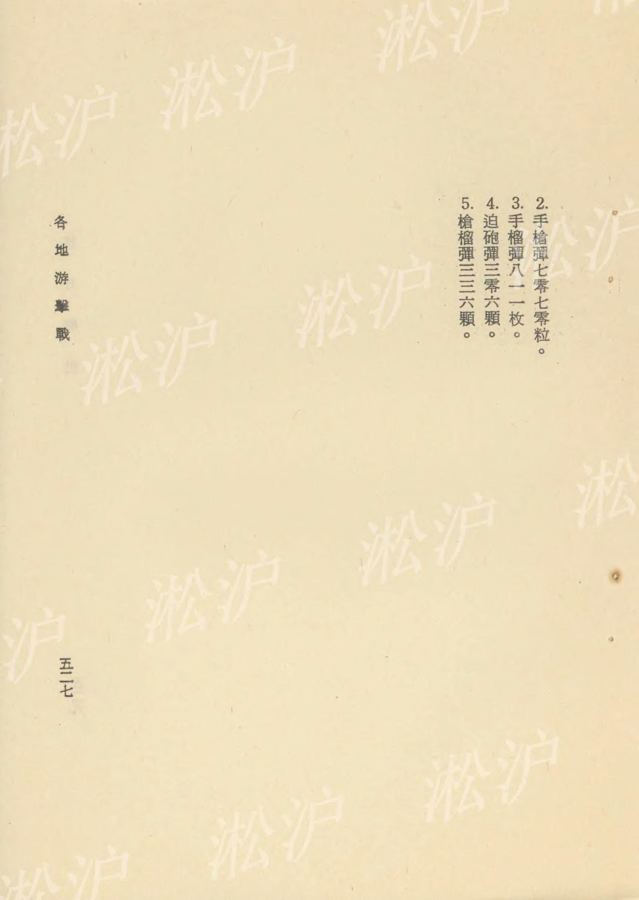

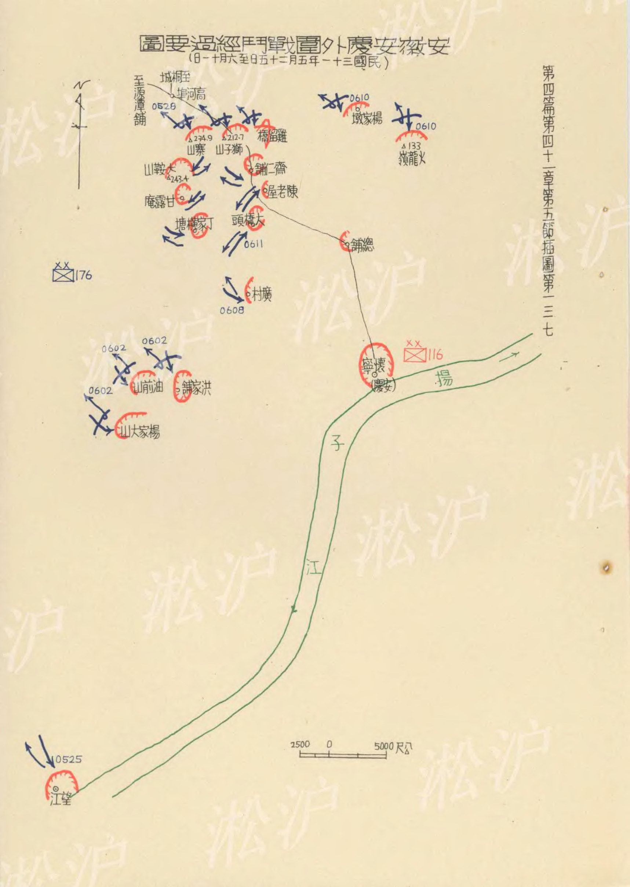

一三八

湖北宜昌右岸戰鬥

作戰時間：民國三十一年五月二十六日起至二十九日止。

作戰部隊：第六戰區第九十四軍之砲兵團及第一二一師，第八軍之第一零三師重迫擊砲第四團之第一營作戰地區：湖北宜昌右岸上下五龍口、覃家臺子、萃福山一帶地區。

敵情：敵於五月十五日向浙江發動攻勢，進迫金華，乃在宜昌地區抽調兵力，經已東開者約五、六千人。現當面之敵，係第十三師團之一大隊及另一大隊之一部、島田砲兵聯隊之一部，共計兵力約二千餘人。

我軍目的：我爲策應第三戰區作戰之目的，向當面之敵攻擊，以牽制其兵力轉用。

戰鬥經過：五月二十六日，第八軍之第一零三師向打石廠、四方山、四零五、七高地等地之敵攻擊，經激戰後，卽將各該據點佔領。同時另一部分向盤據周家坳、黑石子坡、楊家大包等據點之敵攻擊，並組成一突擊隊向葛道山敵砲兵陣地鑽襲。

二十七日，敵援軍增至，卽向四零五、七高地及四方山猛撲，戰鬥異常激烈，經數度衝殺，該兩地終未能確保，旋敵再向打石廠攻擊，該處亦重入敵手，直至午後，我另部則先後攻佔黑石子坡及楊家大堡等據點。

同（二十七）日，第九十四軍之第一二一師向鍾堡山、萃福山方向之敵攻擊，卽將覃家臺子、長嶺崗、汪家坳等據點攻佔，激戰至午夜，始深入鍾堡山，展開白刃戰，旋敵施放毒氣，我乃撤至長崗嶺東西之線。二十九日，我再向當面之敵繼續攻擊，激戰約三小時，一部鑽入烟山附近，我爲爾後攻擊容易奏效計，卽重新調整部署，此時宜昌之敵，大部已爲我吸引，各

址

游

擊

戰

五二九

果：一、鹵獲：

增援右岸任務已達，遂停止攻擊。

1. 步槍七枝。

2. 輕機槍一挺。

3. 刺刀二把。

4. 山砲一門。

5. 步槍彈五五零粒。

6. 擲榴彈十枚。

二、傷亡：

斃傷敵官兵約九百餘員名。

三、其他效果，已達到牽制敵兵力轉用之目的。我軍傷亡：一、陣亡官兵四五零員名。

二、負傷官兵二、八七八員名。

三、失踪士兵十四名。

我軍損耗：一、武器：

1. 步槍七十三枝。

2. 輕機槍六挺。

3. 手槍五枝。

4. 擲榴彈筒九具。

二、彈藥：

1. 步機彈一七七、一一四粒。

2. 手槍彈七八八粒。

3. 砲彈四、三七二顆。

4. 擲榴彈一、二三八枚。

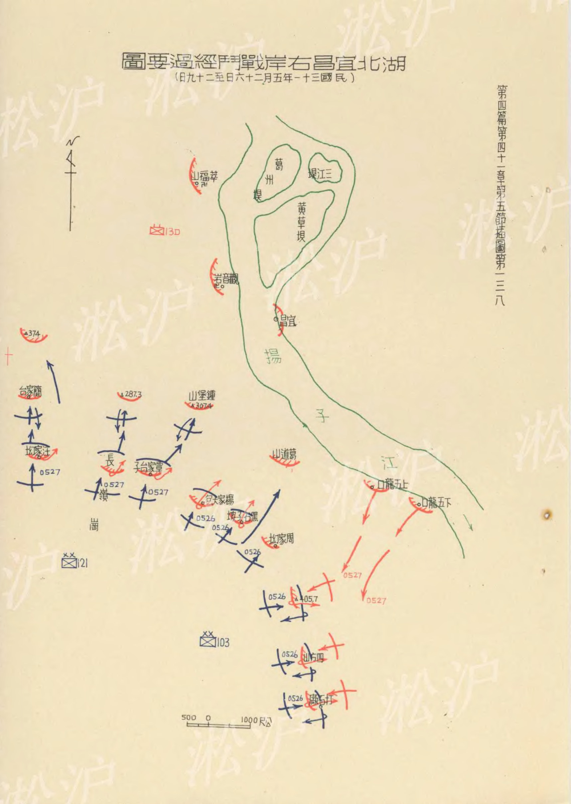

一三九廣東從化增城間地區戰鬥

作戰時間：民國三十一年五月三十一日起至十二月二十九日止。

作戰部隊：第七戰區第六十三軍（轄第一五二、第一五三、第一八六等三個師），共計官兵約八、九千員名。

作戰地區：廣東增城、從化等附近地區。

敵情：盤據從化、增城之敵第一零四師團及第四十八師團之各一部併聯合兵種，共約八、九千人，於三十一年五月後，爲策應浙東方面，抽調兵力約五千餘，轉用浙東戰場，並有派隊向粤北進犯之企圖。

我軍目的：軍以持久消耗敵人之目的，配合友軍牽制敵人。

戰鬥經過：五月杪，從化、增城地區之敵，爲策應其浙東方面之攻勢，除大舉抽調兵力轉用浙東戰場外，並由廣州抽調一部增防從、增一帶，自五月三十一日起，敵糾合步、騎、砲兵約五千餘之兵力，分數路由福和、軍田向白田崗、長窿尾等地攻擊，當與我全線守軍發生激戰。六月六日，我軍退守派潭以北東洞、寨頂亘橋欄之線，自八日迄三十日，我向敵軍攻擊，並阻止敵之進犯，先後各數次。

七月，當面之敵，約三千餘，七月三日至五日，我第一五二師各團均曾派襲擊隊出擊大嶺圍、楓樹望及羅洞各處之敵。六日至十日，破壞敵交通、通訊設備多處。十二日，炸燬敵白田岡公路、橋樑，至七月下旬，該軍正面各據點之敵，仍堅守其陣地。

迄八月中旬，敵仍固守各據點，其行動除編組僞組織以安全佔領區外，同時並抽調一部兵力轉用於滇緬戰場，因此從化以北之敵，乃更形空虛。八月二十九日，我偵知敵有向神岡退却果：一、鹵獲：

模樣，遂全線向敵反攻，乘機追擊。於八月三十一日，已恢復大圍嶺、白田岡、石鼓拉達迄貌兒嶺之線，敵全部退守神岡。

敵自退守神岡、官塘亘增城之線後，卽加強工事，以防我軍之襲擊，但我以消耗及牽制敵軍之目的，仍不斷尋敵弱點而攻擊之，自九月二十九日至十二月二十九日之三閱月中，我曾輪襲敵人達二十餘次，雖無進展，但敵蟄伏不動，而我得於陣前從容整訓，以利爾後之作戰。

1. 軍官一員。

2. 步槍十二枝。

3. 輕機槍一挺。

4. 步機彈五三三粒。

5. 砲彈十六顆。

6. 擲榴彈一零一枚。

7. 刺刀三把。

8. 無線電機一部。

二、破壞：

1. 堡壘二座。

2. 橋樑三座。

3. 營房二棟。

4. 汽車一輛。

5. 電話線四七五公尺。

6. 鐵絲網多處。

三、傷亡：

斃傷敵官兵約一、七六零餘員名。

我軍傷亡：一、陣亡官兵一六零員名。

二、負傷官兵二二四員名。

三、失踪官兵四十四員名。

我軍損耗：一、武器：

1. 步槍四十五枝。

2. 輕機槍四挺。

3. 手槍九枝。

4. 槍榴彈筒十二具。

5. 迫砲一門。

6. 刺刀一二五把。

二、彈藥：

1. 步機彈三五三、五六九粒。

2. 手槍彈六六、二三三粒。

3. 砲彈七二七顆。

4. 擲榴彈九、八八零枚。

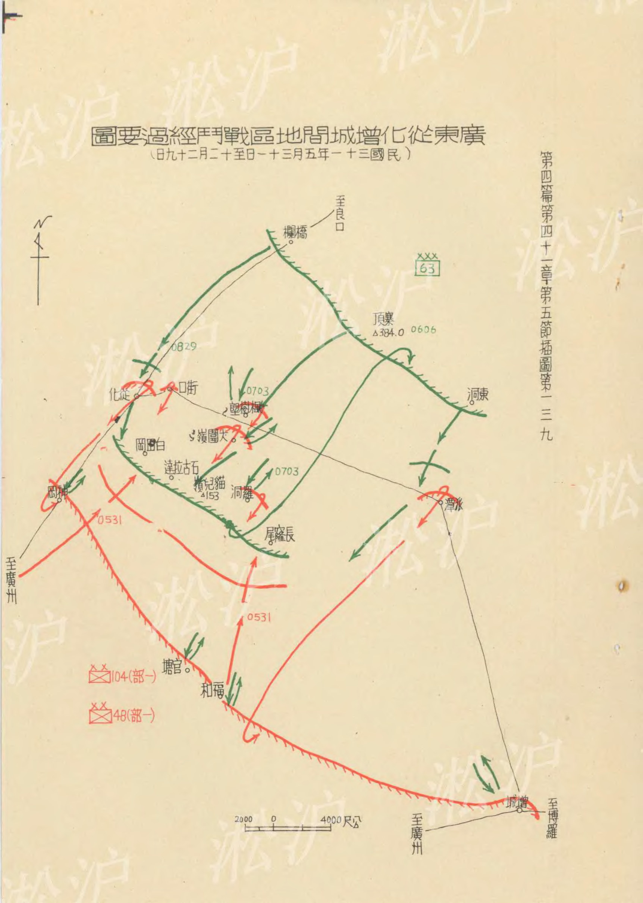

一四零廣東三水蘆苞龍塘一帶戰鬥

作戰時間：民國三十一年六月一日起至十九日。

作戰部隊：第七戰區第六十四軍（轄第一五五、第一五六、第一五九等三個師）

作戰地區：廣東三水、蘆苞、龍塘等地及西江左岸、北江右岸等地區。

敵情：廣州之敵於進犯浙贛路之同時，爲牽制我軍，五月下旬分向我粤北竄擾，其由軍田沿粤漢路北擾之敵，六月八日竄至源潭以北，與我粤北正面友軍第一五四師正激戰中。此時軍當面之敵第一零四師團，其第一零八聯隊第一大隊，進犯我西江左岸與北江右岸之竹洲、青歧，第一三七聯隊第三大隊則進犯龍塘一帶，共計兵力約四千餘，附砲十餘門、艦艇十艘、飛機十八架。

我軍目的：軍爲配合友軍作戰，對進擾龍塘之敵，施行側擊、截擊，並配合友軍第一五四師出擊部隊，分襲三水方面之敵，以行牽制。

戰鬥經過：沿粵漢路北犯進抵銀盞坳續向源潭竄擾之敵，爲掩護其左側背之安全，於六月一日至四日，擬越過北江拊我清遠之背，爲我守軍第一五九師截擊，卒未得逞。

九日，該軍派兩營兵力由清遠渡河，進出龍塘向銀盞坳間地區之敵側擊、截擊，並協助友軍第一五四師一部出擊三水方面之敵，以行牽制。銀盞坳方面戰鬥，於十一日二十四時開始，我殲敵約五、六十名，並毀敵汽車四輛。三水方面，敵於十六日自舊三水進佔我大坑、竹洲，另一部並在馬房登陸。

十七日，我出擊銀盞坳之部隊，擊退優勢之敵，佔領龍塘，同時北江右岸之馬房，亦爲第一五五師第四六四團所克復。

十八日，龍塘方面，敵我對峙中，而進犯我蘆苞之敵，藉飛機八架之助戰，並投下重量炸彈百餘枚，我陣地全被毀壞，守軍一個連傷亡過半，蘆苞遂陷敵手，此時我第一五六師第四六八團全部配置於蘆苞北江右岸各要點，對侵佔蘆苞之敵，嚴陣以待。

十九日，敵一部再度侵佔馬房，我軍退守新馬房附近。同日，龍塘方面之敵，在飛機三架之掩護下，猛向我進犯，經我軍奮勇阻擊，敵未得逞，我爲出擊任務業已達成，除留一部於龍塘附近繼續對敵監視外，主力於二十日晨仍撤返原防，準備爾後之作戰。

戰

果：一、破壞：

1. 山砲一門。

2. 汽車四輛。

二、傷亡：

斃傷敵官兵約四百六十餘員名。

我軍傷亡：一、陣亡官兵五十五員名。

二、負傷官兵三十三員名。

三、失踪官兵三十五員名。

我軍損耗：一、武器：

1. 步槍一零六枝。

2. 重機槍一挺。

3. 輕機槍六挺。

4. 手槍九枝。

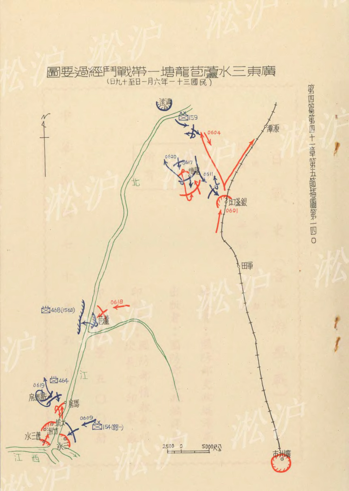
